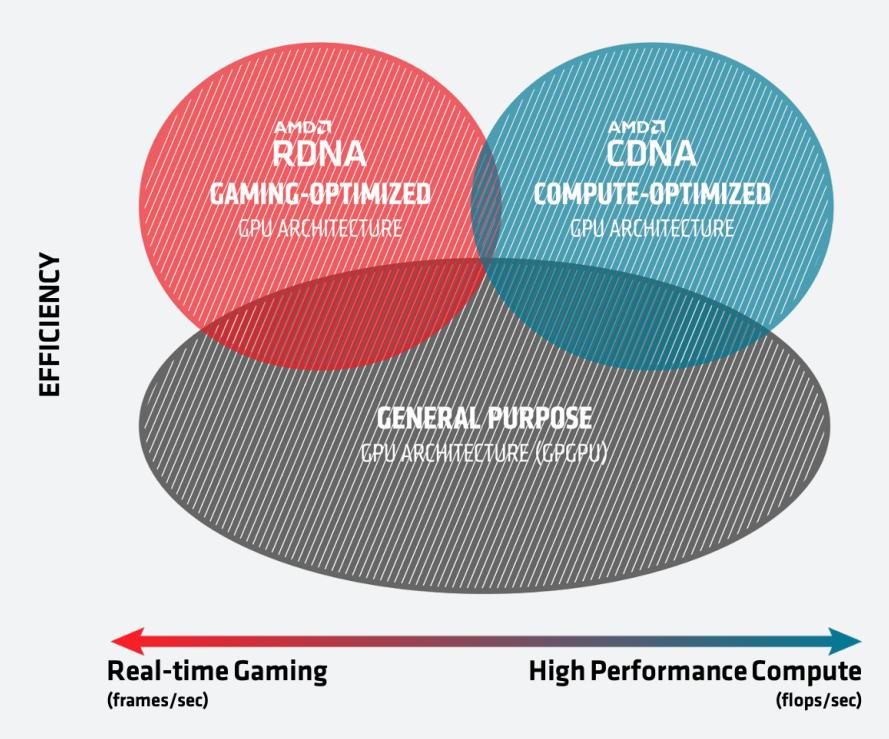
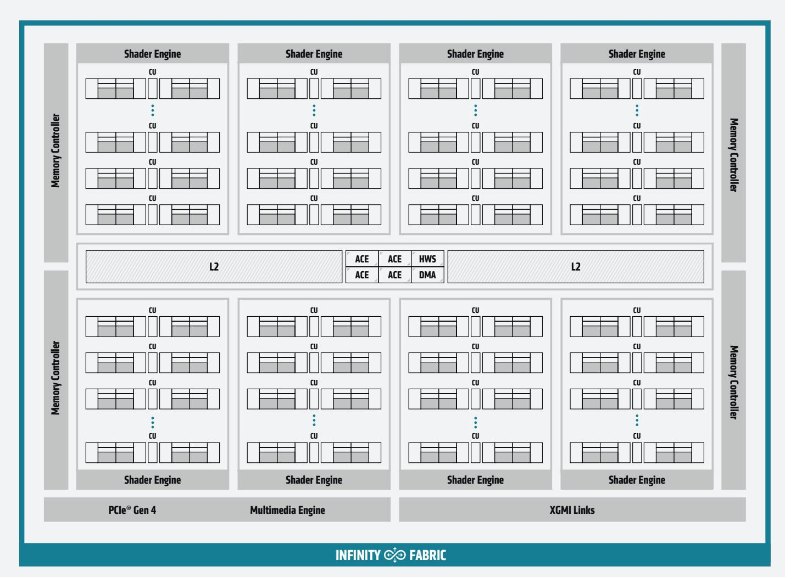
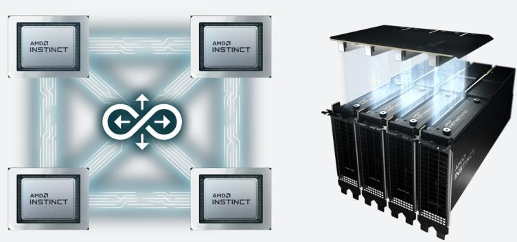
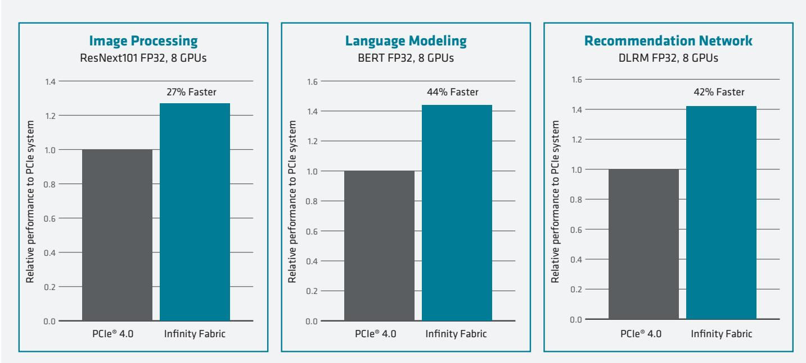
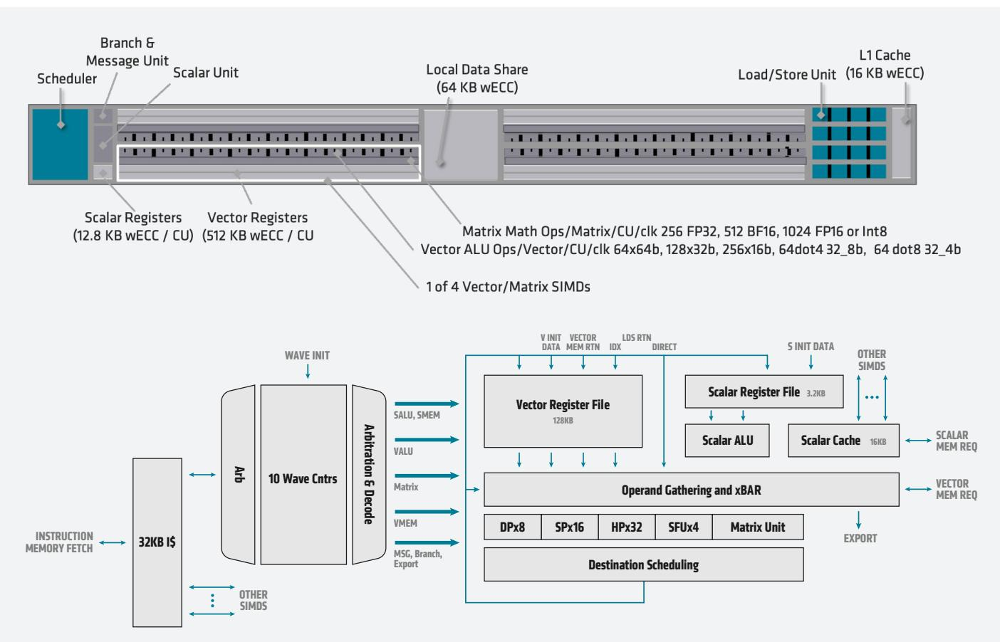
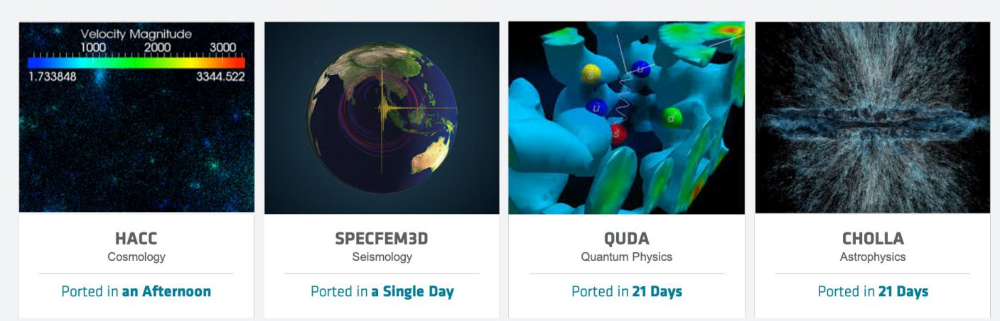

> **Repository notice (not part of the AMD publication).** This is an unofficial Markdown conversion of the [AMD source PDF](https://www.amd.com/content/dam/amd/en/documents/instinct-business-docs/white-papers/amd-cdna-white-paper.pdf), produced with automated tooling for easier browsing and text search. It is not affiliated with or endorsed by AMD and may contain errors and omissions. AMD retains its rights in the underlying publication; AMD's copyright and trademark notice from the source is reproduced below. Consult the linked PDF as the authoritative version.

# **AMD CDNA Architecture**

The All-New AMD GPU Architecture for the Modern Era of HPC & AI

| Table of Contents                   | 2 |
|-------------------------------------|---|
| [Introduction](#cdna1-introduction) | 2 |
| [AMD CDNA Architecture Overview](#cdna1-architecture-overview) | 2 |
| [L2 Cache and Memory](#cdna1-memory) | 3 |
| [Communication and Scaling](#cdna1-communication) | 3 |
| [AMD CDNA Architecture Compute Units](#cdna1-compute-units) | 4 |
| [AMD ROCm™ Open Software Ecosystem](#cdna1-rocm) | 6 |
| [Conclusion](#cdna1-conclusion) | 9 |

## **Introduction**

Over the last thirty years, graphics processors have evolved from specialized, fixed-function architectures into fully programmable accelerators. While early designs focused on limited computation such as lighting transformations, the GPUs of today are general-purpose and deliver dramatic performance gains for computationally rich software written in standard languages like C++ and Fortran. The industry has simultaneously evolved to take advantage of GPUs for critical fields like machine learning and scientific computing – that will drive innovation for decades to come.

At a technical level, this translates into two major trends in hardware and software. First of all, GPUs have transformed from fixed-function pipelines, to flexible computing engines like the GCN architecture that offer both scalar and vector processing. Simultaneously, the software ecosystem has rapidly expanded to empower standard computing paradigms by providing critical tooling that encompasses everything from math libraries and compilers, to debuggers, to cluster management and deployment.

AMD builds high performance computing solutions for the broad range of use cases, from PC gamers to data center platforms. While traditional GPUs have been built to be general purpose in nature, designed to drive both graphics-oriented as well as compute-oriented workloads, AMD recently introduced a different approach to fuel even higher efficiencies. There are now two architectures: AMD RDNA™ is optimized for gaming to maximize frames per second and AMD CDNA is optimized for computing to push the limits of flops per second.

## **AMD CDNA Architecture Overview**

Graphic processing units (GPUs) built on the AMD CDNA architecture target compute applications such as high performance computing (HPC) and AI & machine learning (ML) that run on everything from individual servers to the world's largest Exascale supercomputers. The overall system architecture is designed for extreme scalability and carefully boosts performance over the previous generations while advancing programmability and productivity with the extremely robust AMD ROCm™ software stack. Figure 2 below illustrates the 7nm AMD Instinct™ MI100 accelerator, which is the first incarnation of the AMD CDNA architecture.

**Figure 2 – Block diagram of the AMD Instinct™ MI100 accelerator, the first GPUs powered by the AMD CDNA architecture.**

The AMD Instinct MI100 GPU is organized into several main blocks that are all tied together with an on-die fabric. A PCI-Express® 4.0 interface connects the GPU to a host processor such as 2nd Gen AMD EPYC™ CPUs using a 16GT/s link that delivers up to 32GB/s in each direction. The command processor receives API-level commands and generates work for the various components of the GPU. At a high-level, the three main functions of any compute processor, whether CPU or GPU, are compute, memory, and communication and each function is associated with a different set of blocks.

The AMD Instinct™ MI100 accelerator is the world's fastest HPC GPU, and a culmination of the AMD CDNA architecture, with all-new Matrix Core Technology, and AMD ROCm™ open ecosystem to deliver new levels of performance, portability, and productivity. AMD CDNA is an all-new GPU architecture from AMD to drive accelerated computing into the era of exascale computing. The new architecture augments scalar and vector processing with new Matrix Core Engines and adds Infinity Fabric™ technology to scale up to larger systems. The open ROCm ecosystem puts customers in control and is a robust, mature platform that is easy to develop for and capable of running the most critical applications. The overall result is that the MI100 is the first GPU to break the 10TFLOP/s FP64 barrier designed as the stepping stone to the next generation of Exascale systems that will deliver pioneering discoveries in machine learning and scientific computing.1

## **L2 Cache and Memory**

The lowest levels of the memory hierarchy for the AMD Instinct™ MI100 accelerator live inside the CUs, but most scientific or machine learning data sets are measured in gigabytes or terabytes and will quickly spill into memory. The memory hierarchy is responsible for holding the working data and efficiently delivering it to the compute arrays where the data is consumed in computation.

The L2 cache is shared across the whole chip and physically partitioned into multiple slices. For the MI100, the cache is 16-way set associative and comprises 32 slices (twice as many as in MI50) in total for an aggregate capacity of 8MB. Each slice can sustain 64B/cycle for an aggregate bandwidth over 3TB/s across the GPU.

The AMD CDNA architecture is targeted for the most demanding workloads, and the memory controllers and interfaces are designed for maximum bandwidth, power efficiency, and extreme reliability. The memory controllers drive 4- or 8-high stacks of co-packaged HBM2 at 2.4GT/s for an aggregate theoretical throughput of 1.23TB/s – 20% faster than the prior generation AMD accelerators, while keeping the GPU power budget constant.2 The 32GB of HBM2 memory is protected by robust hardware ECC that enables mission critical applications to operate at a massive scale.6

## **Communication and Scaling**

The last leg of the system architecture is communication to scale up across multiple GPUs. While systems running small workloads may use a single AMD Instinct™ MI100 accelerator, larger and more demanding problems such as training neural networks require more powerful systems. As an example, the BERT neural network which is used for language modeling scales to thousands of processors in the most recent MLPerf benchmarks.

The AMD CDNA architecture uses standards based high-speed AMD Infinity Fabric technology to connect to other GPUs. The Infinity Fabric links operate at 23GT/s and are 16-bits wide similar to the previous generation, but the MI100 brings a third link for full connectivity in quad GPU configurations offering greater bi-section bandwidth and enabling highly scalable systems. Unlike PCIe®, the AMD Infinity Fabric links support coherent GPU memory, which enables multiple GPUs to share an address space and tightly cooperate on a single problem.

As Figure 3 illustrates, the additional AMD Infinity Fabric links enable a fully connected 4-GPU building block, whereas the Radeon Instinct™ MI50 GPU could use only a ring topology. The fully connected topology boosts performance for common communication patterns such as all-reduce, and scatter/gather. These communication primitives are widely used in HPC and ML, e.g., the weight update communication phase of training neural networks found in DLRM.

**Figure 3 – Fully connected 4-GPU Infinity Fabric™ technology hives with the AMD Instinct™ MI100 GPUs**

The 120 enhanced compute units (CUs) are built on the foundations of the GCN architecture and organized into four compute engines, and are responsible for all the compute in the AMD Instinct MI100 GPU. While inspired by the prior-generation GCN architecture, each CU is rearchitected and enhanced with a Matrix Core Engine that significantly boosts computational throughput for many different numerical formats. In aggregate across all the CUs, the MI100 can achieve a theoretical double-precision floating-point throughput of up to 11.5 TFLOP/s – the the first processor to break the 10TFLOP/s barrier.1 Unlike the graphics-oriented AMD RDNA™ family, the AMD CDNA family removes all of the fixed-function hardware that is designed to accelerate graphics tasks such as rasterization, tessellation, graphics caches, blending, and even the display engine. However, the AMD CDNA family retains dedicated logic for HEVC, H.264, and VP9 decoding that is sometimes used for compute workloads that operate on multimedia data, such as machine learning for object detection.7 Removing the fixed-function graphics hardware frees up area and power to invest in additional compute units, boosting performance and efficiency.

**Figure 4 – HPC and AI performance improvements with AMD Infinity Fabric technology8,9,10**

## **AMD CDNA Architecture Compute Units**

The command processor and scheduling logic translate higher-level API commands into compute tasks. These compute tasks in turn are implemented as compute arrays and managed by the Asynchronous Compute Engines (ACE). Each of the four ACEs maintains an independent stream of commands and can dispatch wavefronts to the compute units.

The impressive 120 CUs of the AMD CDNA architecture are organized into four arrays of CUs. The CUs are derived from the earlier GCN architecture and execute wavefronts that contain 64 work-items. However, the CUs are enhanced with new Matrix Core Engines that are optimized for operating on matrix datatypes, boosting compute throughput and power efficiency.

The classic GCN compute cores contain a variety of pipelines optimized for scalar and vector instructions. In particular, each CU contains a scalar register file, a scalar execution unit, and a scalar data cache to handle instructions that are shared across the wavefront, such as common control logic or address calculations. Similarly, the CUs also contain four large vector register files, four vector execution units that are optimized for FP32, and a vector data cache. Generally, the vector pipelines are 16-wide and each 64-wide wavefront is executed over four cycles.

The AMD CDNA architecture builds on GCN's foundation of scalars and vectors and adds matrices as a first class citizen while simultaneously adding support for new numerical formats for machine learning and preserving backwards compatibility for any software written for the GCN architecture. These Matrix Core Engines add a new family of wavefront-level instructions, the Matrix Fused Multiply-Add or MFMA. The MFMA family performs mixed-precision arithmetic and operates on KxN matrices using four different types of input data: 8-bit integers (INT8), 16-bit half-precision FP (FP16), 16-bit brain FP (bf16), and 32-bit single-precision (FP32). All MFMA instructions produce either 32-bit integer (INT32) or FP32 output, which reduces the likelihood of overflowing during the final accumulation stages of a matrix multiplication.

The different numerical formats all have different recommended applications. The industry generally agrees that INT8 numerics are primarily useful for ML inference with quantized weights or data and have the best throughput and lowest memory usage. In contrast, most ML training and some HPC applications use IEEE FP32 data by default, with 8-bits allocated to the exponent for range and 23-bits for the mantissa to capture precision. FP16 is another IEEE standard that was designed specifically for graphics workloads and uses a 5-bit exponent, and a 10-bit mantissa. While FP16 is much more efficient than FP32, the reduced range doesn't always work out-of-the-box for ML training – sometimes the algorithms need to be adjusted to avoid overflow and convergence problems. The bfloat16 format strikes a compromise, using the 8-bit exponent of FP32, but truncating the mantissa to 7-bits. The bf16 numerics are more easily used for ML training, with few convergence problems.

**Figure 5 – Block Diagram of an Enhanced Compute Unit (CU) with a detailed SIMD view of the AMD CDNA architecture.**

As Figure 5 illustrates, the CUs are augmented with new matrix engines to handle the MFMA instructions and boost throughput and energy efficiency. The matrix execution unit has several advantages over the traditional vector pipelines in GCN. First, the execution unit reduces the number of register file reads, since in a matrix multiplication many input values are re-used. Second, the narrower datatypes create a huge opportunity for workloads that do not require full FP32 precision, e.g., machine learning. Generally speaking, the energy consumed by a multiply-accumulate operation is the square of the input datatypes, so shifting from FP32 to FP16 or bf16 can save a tremendous amount of energy.

| Computation | MI100 CU (FLOPS/clock/CU) | MI50 CU (FLOPS/clock/CU) | MI100 GPU (Peak TFLOPS) | MI50 GPU (Peak TFLOPS) | Speedup |
|-------------|----------------------------|---------------------------|-------------------------|------------------------|---------|
| Matrix FP16 | 1,024                      | 256*                      | 184.6                   | 26.5                   | 6.97X   |
| Matrix bf16 | 512                        | N/A                       | 92.3                    | N/A                    | N/A     |
| Matrix FP32 | 256                        | 128                       | 46.1                    | 13.3                   | 3.46X   |
| Vector FP32 | 128                        | 128                       | 23.1                    | 13.3                   | 1.74X   |
| Vector FP64 | 64                         | 64                        | 11.5                    | 6.6                    | 1.74X   |

**Table 1 – Generational comparison of numerical formats and peak throughput between MI100 and MI50.1, 3 \* MI50 does not have specialized hardware and performs matrix operations on the vector execution units.**

Table 1 describes the different numerical formats and the peak throughput for a CU using both conventional vector instructions and the new matrix multiply instructions. The net result of the new instructions and execution resources is that for matrix computations the MI100 keeps a similar power profile to the previous generation, but doubles the peak FLOP/s for FP32 data, and quadruples the throughput for FP16, all while using the same process technology – an impressive achievement in energy efficiency.

The AMD Instinct™ MI100 GPU is built to accelerate today's most demanding HPC and AI workloads. Oak Ridge National Laboratory tested their exascale science codes on the MI100 as they ramp users to take advantage of the upcoming exascale Frontier system. Some of the performance results ranged from 1.4x faster to 3x faster performance compared to a node with V100. In the case of CHOLLA, an astrophysics application, the code was ported from CUDA to AMD ROCm™ in just an afternoon while enjoying 1.4x performance boost over V100.

Source: Oak Ridge National Laboratory: NAMD 2.14, STMV 1.06M atoms benchmark, 2x EPYC 7742 + MI100 vs 2x Power9 + V100 SXM, Cholla, Total Run measured. 2x EPYC 7742 + MI100 vs 2x EPYC 7742 + V100, PIConGPU, Total Run measured. 2x EPYC 7742 + MI100 vs 2x EPYC 7742 + V100, GESTS, Total Run measured, 2x EPYC 7742 + MI100 vs 2x EPYC 7742 + V100

**Figure 6 – AMD Instinct™ MI100 GPU powering early exascale science at Oak Ridge**

## **AMD ROCm™ Open Software Ecosystem**

The computational resources offered by the AMD CDNA family are nothing short of astounding. However, the key to heterogeneous computing is a software stack and ecosystem that easily puts these abilities into the hands of software developers and customers. The AMD ROCm 4.0 software stack is the culmination of years of effort by AMD to provide an open, standards-based, low-friction ecosystem that enables productivity creating portable and efficient high-performance applications for both first- and third-party developers. AMD ROCm 4.0 is the linchpin of AMD's Exascale supercomputing solutions for early exascale deployments, proving the scalability and robustness for some of the most important scientific and machine learning applications.

**Figure 7 – Evolution of the AMD ROCm™ software stack for heterogeneous computing.**

- **2018: AMD ROCm™ 2.0** — Building the Foundation
- **2019: AMD ROCm™ 3.0** — Focused on Machine Learning
- **2020: AMD ROCm™ 4.0** — Complete Exascale Solution for ML/HPC

Figure 7 illustrates key components of the AMD ROCm ecosystem and the evolution over the last few years. Developing AMD ROCm was clearly a multi-year journey, starting from the foundational building blocks such as OpenCL™ and basic math libraries like BLAS. Next, AMD's software team focused on building out the machine learning capabilities through support for ONNX, and high-level frameworks like PyTorch and TensorFlow and basic orchestration like Docker® and Kubernetes®. However, the full Exascale-capable vision includes a comprehensive set of tools such as OpenMP®, Sparse linear algebra libraries, and more robust cluster management tools that enable the world's largest supercomputers to run a wide variety of different workloads.

AMD ROCm is built on three core philosophical observations about heterogeneous computing. First, GPUs and CPUs are equally important computing resources; they are optimized for different workloads and should work together effectively. Second, code should be naturally portable and high-performance using a combination of libraries and optimized code generators. Third, building an open-source toolchain empowers customers to fully optimize their applications, eases deployment, and enables writing code that is easily portable to multiple platforms.

The reality is that the CPU toolchain is older and more mature than the GPU ecosystem, and the tools are more familiar for developers. AMD took advantage of its long history building CPU tools to make GPUs as frictionless as possible and appear just like a compute resource with a different instruction set. As one example, the LLVM compiler framework is extraordinarily popular and familiar to many low-level developers. It is paired with different front-ends to create compilers for many languages such as Fortran, C, and C++. AMD has contributed open-source code to the LLVM framework to natively emit GCN instructions, including the new MFMA family, building on the popularity of this infrastructure. As a second example, AMD similarly contributed to the industry standard, open-source GNU Debugger (GDB), which is standard on Linux® and works with most languages. For programmers using GDB, the AMD CDNA family just looks like another computing resource with a different ISA so that they can troubleshoot code using common and familiar tools.

The building block for AMD ROCm is the Heterogeneous-computing Interface for Portability (HIP) runtime, API, and language. The HIP language is similar to C++ and should be familiar to most parallel programmers. As the name implies, the toolchain is designed so that a single codebase using HIP will produce high-performance code for GPUs from AMD and other companies. The philosophy behind HIP is that both portability and performance come through a combination of highly tuned libraries and code generators that make writing or converting heterogeneous applications easy.

Figure 8 shows some of the major libraries in the AMD ROCm™ open ecosystem, including fundamental computing motifs such as sparse matrices, iterative solvers, random number generation, and fast-Fourier transforms. As one example, the rocPRIM library is a collection of common computing primitives such as sort, scan, building histograms, reductions and many more. These libraries and building blocks are generally familiar to most parallel programmers. Using the HIP interface to these libraries ensures high-performance for AMD and allows other devices to leverage their own optimized libraries. In addition, AMD ROCm includes a robust set of tools for converting applications that use proprietary libraries to instead use the equivalent portable HIP libraries, unlocking both portability and performance.

While most applications rely on standard math libraries, quite a few will use custom C++ kernels or other similar code. For example, in machine learning some neural networks will use custom non-linear activation functions or a non-standard image filter. The HIP ecosystem also includes a state-of-the-art translating compiler that generates high-performance and portable code for such constructs.

Support for languages such as Fortran and C++ is crucial for many scientific computing applications, but machine learning has a slightly different programming paradigm. Most ML applications rely on high-level frameworks such as TensorFlow or PyTorch to express the algorithms and train on the input data. One of the key advances in AMD ROCm 3.0 was upstreaming the entire library into both TensorFlow and PyTorch to support the two mainstream frameworks used for AI. This helps ensure that any customers using TensorFlow or PyTorch can rely on efficiently mapping their machine learning algorithms to the right set of portable AMD ROCm libraries.

AMD ROCm is an open-source ecosystem and toolchain, which brings a wide variety of benefits. First, open-source software is easy to integrate with existing open-source tooling, such as GDB, which avoids creating new proprietary tools. Second, open-source code makes developing applications much easier for customers that are used to working with their own code. Building any large-scale application invariably means tracking down hundreds if not thousands of bugs during the development and deployment process, especially when scaling up to Exascale class systems. Building on top of proprietary tools can create all sorts of hidden nooks and crannies where bugs can hide from developers. Both the interfaces to proprietary code and the code itself can be the source of bugs as well as performance regressions and reproducing these issues is often very challenging. Moreover, problems in proprietary code are fixed on the vendor's schedule, which might not align well for customers. Working with a fully open-source stack can make finding bugs far easier, and empowers customers to fix and tune their code on their own schedule while still reaping the benefits of working with AMD engineers.

Last, an open-source stack can help improve security. Secure systems have long been a priority for government agencies and banks, and are increasingly a requirement for cloud-providers and enterprises of all stripes.

## **AMD ROCm™ Core Libraries - Source Code Information**

| Library    | Description                                         | License  | Source                                             |
|------------|-----------------------------------------------------|----------|----------------------------------------------------|
| rocALUTION | Sparse iterative solvers & preconditioners with Geometric & Algebraic MultiGrid | MIT | https://github.com/ROCmSoftwarePlatform/rocALUTION |
| rocBLAS    | Basic Linear Algebra Subroutines                    | MIT      | https://github.com/ROCmSoftwarePlatform/rocBLAS    |
| rocFFT     | Fast Fourier Transfer Library                       | MIT      | https://github.com/ROCmSoftwarePlatform/rocFFT     |
| rocPRIM    | Low Level Optimized Parallel Primitives             | MIT      | https://github.com/ROCmSoftwarePlatform/rocPRIM    |
| rocRAND    | Random Number Generator Library                     | MIT      | https://github.com/ROCmSoftwarePlatform/rocRAND    |
| rocSOLVER | Lapack Library | BSD 2-clause | https://github.com/ROCmSoftwarePlatform/rocSOLVER |
| rocSPARSE  | Sparse BLAS + SPMV                                  | MIT      | https://github.com/ROCmSoftwarePlatform/rocSPARSE  |
| rocThrust | C++ parallel algorithms library | Apache 2.0 | https://github.com/ROCmSoftwarePlatform/rocThrust |
| MIOpen     | Deep learning Solver Library                        | MIT      | https://github.com/ROCmSoftwarePlatform/MIOpen     |
| RCCL | Communications Primitives Library based on the MPI equivalents | BSD 3-clause | https://github.com/ROCmSoftwarePlatform/rccl |

#### **Figure 8 – Selected math libraries within the AMD ROCm™ ecosystem.**

**Figure 8 – Results of migrating from proprietary compute platforms to AMD ROCm™**

Figure 8 illustrates the robust nature of the AMD ROCm™ open ecosystem for several example production applications. In most cases, existing workloads can be migrated from proprietary architectures using the ROCm toolchain in a matter of days. The resulting codebase is portable with virtually no performance degradation. These examples highlight the robust quality of the ROCm ecosystem for cutting edge Exascale systems that will form the basis of scientific computing for the foreseeable future.

## **Conclusion**

AMD CDNA architecture and the AMD ROCm™ open ecosystem stack deliver high-performance, high-productivity, and portability to meet the needs of the industry and fulfill the promise of heterogeneous computing. The AMD CDNA architecture is fully-programmable and designed for workloads with a mix of scalar, vector, and matrix computation motifs and can easily scale up with multiple GPUs using Infinity Fabric technology. The open ROCm ecosystem builds on AMD CDNA to deliver a full suite of development, optimization, and deployment tools for customers to run existing applications or develop brand new ones that scale from individual workstations to Exascale-class supercomputers.

The 7nm AMD Instinct MI100 accelerator is the first implementation of the AMD CDNA architecture and brings the open ROCm ecosystem to life, offering the next level of performance, productivity, and portability for the industry. The MI100 is the first x86 server GPU to break the 10TFLOP/s (FP64) barrier for HPC and delivers up to a nearly 7X boost in computational (FP16) throughput for machine learning over the prior generation.1,4 Moreover, it brings improved connectivity and scaling with AMD's 2nd Gen Infinity architecture providing the building blocks for designing systems with dual, fully-connected, quad GPU hives, each with up to 552 GB/s of peak peer-to-peer I/O bandwidth in a computing node.5 The robust ROCm ecosystem builds on this foundation and enables a comprehensive set of high-productivity tools that empower customers to easily migrate, develop, and deploy applications at any scale. The open nature of the ROCm ecosystem guarantees portability, improves customer and developer productivity, and helps assure security as well. Most importantly, some the world's largest Exascale supercomputers are already deploying ROCm and the MI100 and demonstrating the benefits for leading scientific computing and machine learning applications.

## **AMD Resources**

AMD CDNA Architecture: www.AMD.com/en/technologies/CDNA

AMD Infinity Architecture: www.AMD.com/en/technologies/Infinity-Architecture

AMD ROCm™ open software platform: www.AMD.com/ROCm

AMD Instinct™ MI100 Accelerators: www.AMD.com/InstinctMI100

#### **Endnotes:**

- 1. Calculations conducted by AMD Performance Labs as of Sep 18, 2020 for the AMD Instinct™ MI100 (32GB HBM2 PCIe® card) accelerator at 1,502 MHz peak boost engine clock resulted in 11.54 TFLOPS peak double precision (FP64), 46.1 TFLOPS peak single precision matrix (FP32), 23.1 TFLOPS peak single precision (FP32), 184.6 TFLOPS peak half precision (FP16) peak theoretical, floating-point performance. Published results on the NVidia Ampere A100 (40GB) GPU accelerator resulted in 9.7 TFLOPS peak double precision (FP64). 19.5 TFLOPS peak single precision (FP32), 78 TFLOPS peak half precision (FP16) theoretical, floating-point performance. Server manufacturers may vary configuration offerings yielding different results. MI100-03
- 2. Calculations by AMD Performance Labs as of Oct 5th, 2020 for the AMD Instinct™ MI100 accelerator designed with AMD CDNA 7nm FinFET process technology at 1,200 MHz peak memory clock resulted in 1.2288 TFLOPS peak theoretical memory bandwidth performance. The results calculated for Radeon Instinct™ MI50 GPU designed with "Vega" 7nm FinFET process technology with 1,000 MHz peak memory clock resulted in 1.024 TFLOPS peak theoretical memory bandwidth performance. CDNA-04
- 3. 92.28 TFLOPS peak theoretical bFloat16 precision (BF16) performance based on calculations conducted performed by AMD Performance Labs as of Oct 05, 2020 for the AMD Instinct™ MI100 accelerator at peak 1,502 MHz boost engine clock. Server manufacturers may vary configuration offerings yielding different results. MI100-08
- 4. Calculations performed by AMD Performance Labs as of Sep 18, 2020 for the AMD Instinct™ MI100 accelerator at 1,502 MHz peak boost engine clock resulted in 184.57 TFLOPS peak theoretical half precision (FP16) and 46.14 TFLOPS peak theoretical single precision (FP32 Matrix) floating-point performance. The results calculated for Radeon Instinct™ MI50 GPU at 1,725 MHz peak engine clock resulted in 26.5 TFLOPS peak theoretical half precision (FP16) and 13.25 TFLOPS peak theoretical single precision (FP32 Matrix) floating-point performance. Server manufacturers may vary configuration offerings yielding different results. MI100-04
- 5. Calculations as of SEP 18th, 2020. AMD Instinct™ MI100 built on AMD CDNA technology accelerators supporting PCIe® Gen4 providing up to 64 GB/s peak theoretical transport data bandwidth from CPU to GPU per card. AMD Instinct™ MI100 accelerators include three Infinity Fabric™ links providing up to 276 GB/s peak theoretical GPU to GPU or Peer-to-Peer (P2P) transport rate bandwidth performance per GPU card. Combined with PCIe Gen4 support providing an aggregate GPU card I/O peak bandwidth of up to 340 GB/s. MI100s have three links: 92 GB/s \* 3 links per GPU = 276 GB/s. Four GPU hives provide up to 552 GB/s peak theoretical P2P performance. Dual 4 GPU hives in a server provide up to 1.1 TB/s total peak theoretical direct P2P performance per server. AMD Infinity Fabric link technology not enabled: Four GPU hives provide up to 256 GB/s peak theoretical P2P performance with PCIe® 4.0. Server manufacturers may vary configuration offerings yielding different results. MI100-07
- 6. ECC support on AMD Instinct™ GPU cards, based on the "AMD CDNA" technology includes full-chip ECC including HBM2 memory and internal GPU structures. CDNA-05
- 7. Video codec acceleration (including at least the HEVC (H.265), H.264, VP9, and AV1 codecs) is subject to and not operable without inclusion/installation of compatible media players. GD-176
- 8. Testing conducted by AMD Performance Labs as of 11/12/2020 on a production system comprised of AMD EPYC 7742 x2, 512GB system memory, Ubuntu 18.04.5 LTS, AMD Instinct 8xMI100, BS 128 using the ResNeXt101 32x48D benchmark. Testing was done with Infinity Fabric enabled and disabled; disabled defaults to PCIe® 4 connectivity. Results may vary. MI100-18
- 9. Testing conducted by AMD Performance Labs as of 11/12/2020, on a production system comprised of AMD EPYC 7742 x2, 512GB system memory, Ubuntu 18.04.5 LTS, AMD Instinct 8xMI100 using the DLRM FP32 8 GPU benchmark. Testing was done with Infinity Fabric enabled and disabled; disabled defaults to PCIe® 4 connectivity. Results may vary. MI100-19
- 10. Testing conducted by AMD Performance Labs as of 11/12/2020, on a production system comprised of AMD EPYC 7742 x2, 512GB system memory, Ubuntu 18.04.5 LTS, AMD Instinct 8xMI100, ROCm 3.7 using the BERT FP32 8 GPU benchmark. Testing was done with Infinity Fabric enabled and disabled; disabled defaults to PCIe® 4 connectivity. Results may vary. MI100-20

© 2020 Advanced Micro Devices, Inc. All rights reserved. AMD, the AMD Arrow logo, AMD Instinct, Infinity Fabric, ROCm, and combinations thereof are trademarks of Advanced Micro Devices, Inc. MLPerf name and logo are registered trademarks. See www.mlperf.org for more information. LLVM is a trademark of LLVM Foundation. Other product names used in this publication are for identification purposes only and may be trademarks of their respective companies.
