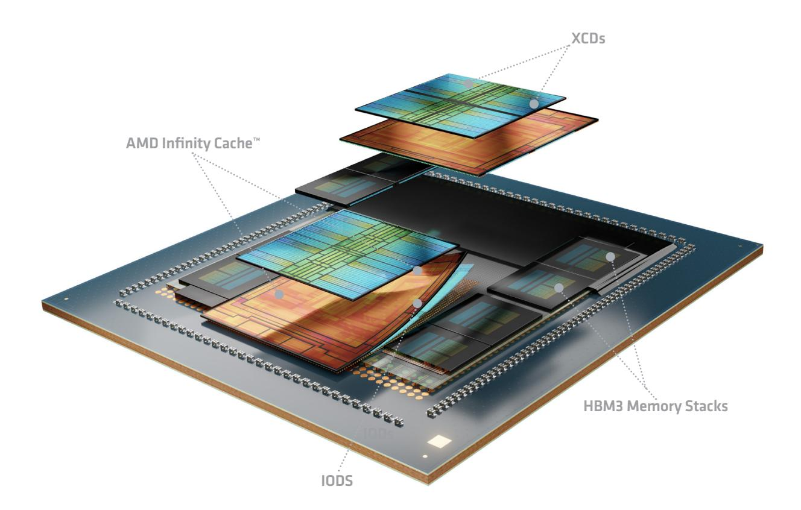
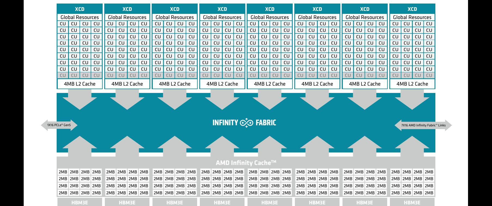
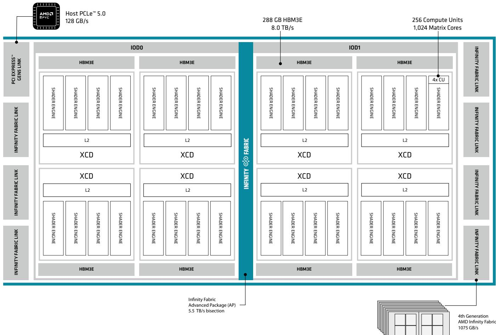
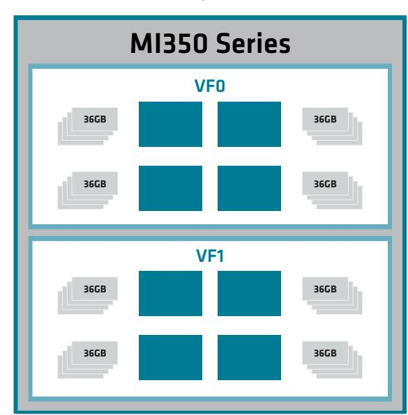
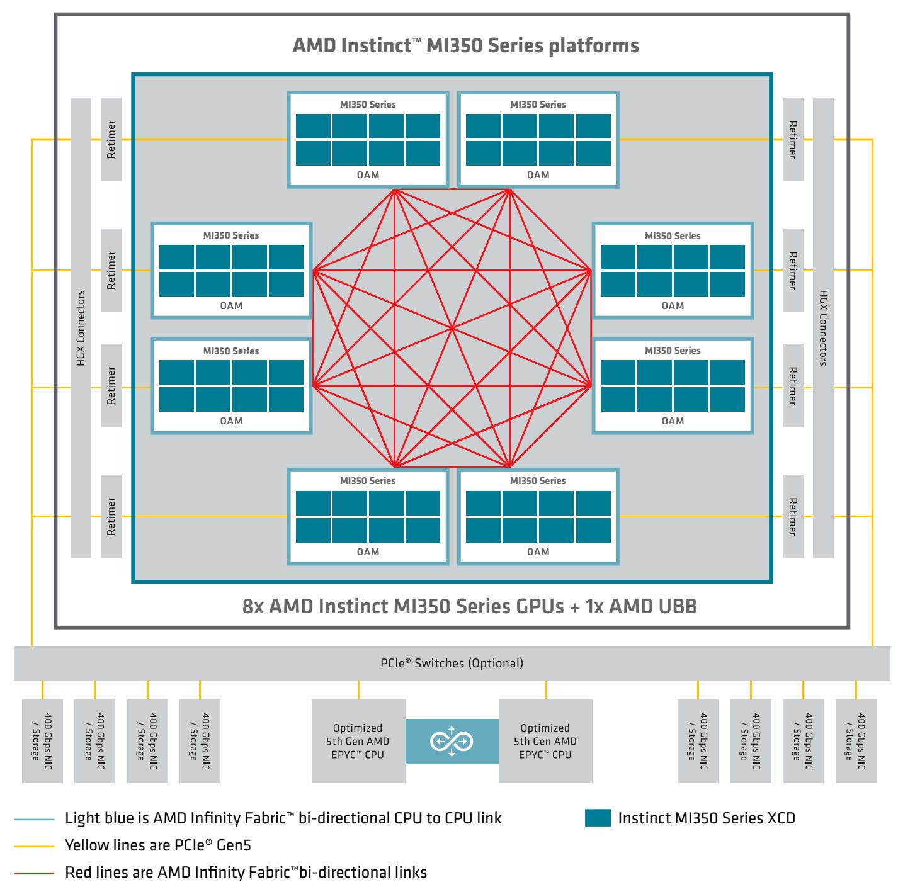

**Repository notice (not part of the AMD publication).** This is an unofficial Markdown conversion of the [AMD source PDF](https://www.amd.com/content/dam/amd/en/documents/instinct-tech-docs/white-papers/amd-cdna-4-architecture-whitepaper.pdf), produced with automated tooling for easier browsing and text search. It is not affiliated with or endorsed by AMD and may contain errors and omissions. AMD retains its rights in the underlying publication; AMD's copyright and trademark notice from the source is reproduced below. Consult the linked PDF as the authoritative version.

# AMD CDNA 4 Architecture

# **INTRODUCTION**

The data center landscape has been fundamentally transformed by GPUs and accelerated computing. Accelerated computing was initially embraced in the scientific community to complement existing general-purpose CPUs for particular workloads such as seismic analysis and molecular dynamics. With that foothold established, accelerators evolved to support increasingly more general programming languages such as C++ and Python and more diverse applications. Machine learning – especially in computer vision – was early to take advantage of new accelerators and gave rise to the field of deep learning that explicitly depends on accelerators such as GPUs to train and deploy neural networks. Between classic scientific computing and emerging machine learning and AI workloads, GPUs were increasingly designed to operate at scale – powering the world's largest supercomputers. The discovery of transformerbased neural networks expanded the horizons for GPUs and ultimately led to the explosion of generative AI, which is one of the most demanding application areas to date and reaches well outside of scientific computing to both consumer and business usage.

The demand for computational capabilities and efficiency is so great that architects can leave no stone unturned and are constantly revisiting basic assumptions in computing. Initially, accelerators adopted a new memory model but retained familiar datatypes. Now, floating-point numerical representation is evolving alongside new algorithms to enable reduced precision thereby improving performance, memory footprint, and energy efficiency. At the same time, GPUs have pushed the envelope in terms of integration – first adopting advanced packaging to tightly couple HBM to the accelerator and now using even more advanced packaging techniques to shift away from monolithic silicon implementations.

AMD has been at the forefront of this revolution, developing novel software and system architectures for GPUs to enable ever greater performance and capabilities. From the software side, the AMD CDNA™ 2 architecture unified CPU and GPU computing through cache coherency to unlock new applications and opportunities for the software ecosystem. The AMD CDNA 3 architecture revolutionized how accelerators are built, adopting advanced packaging to enable heterogeneous integration and repartitioning a processor across a dozen different chiplets.

As Figure 1 below shows, the AMD CDNA 4 architecture builds on the previous foundation of 3D packaging technologies and rebalances the elements of the processor across the heterogenous package. Each AMD Instinct™ MI350 Series GPU integrates 8 vertically stacked accelerator complex dies (XCD) and 2 I/O Dies (IODs) containing system infrastructure, tied together with the AMD on-package AMD Infinity Fabric™ technology and connecting to 8 stacks of 12-Hi high-bandwidth memory (HBM3E). The XCDs combine the latest process technology and support for new reduced precision datatypes to boost the throughput and efficiency for AI, while the repartitioned IOD helps improve latency and efficiency for communication and memory traffic. Externally, the AMD Instinct MI350 Series family of products employ Infinity Fabric to directly connect 8 GPUs in a single node.

Figure 1. Advanced 3D Package and chiplet-based construction of the AMD Instinct MI350 Series GPU

This design provides the versatility to rapidly develop and deploy a family of AMD CDNA 4 architecture based products which address diverse customer needs – both ease-of-use and maximum performance. The AMD Instinct MI350 Series includes the air-cooled (AC) Instinct MI350X GPU that is 1000W offered in an OCP UBB8 base board which was designed to be drop-in compatible with the previous generation AMD Instinct™ MI325X Platforms and systems for the fast deployment into the existing ecosystem and quick time to value. For enhanced performance and efficiency with unparalleled density, the AMD Instinct MI355X GPU (1400W) offers direct liquid-cooled (DLC) platforms, again offered in a on a UBB8 baseboard, for infrastructure that supports greater power and cooling. The AMD Instinct MI355X GPU almost doubles the peak throughput for existing machine learning focused 16-bit and 8-bit Matrix datatypes compared to the prior generation AMD Instinct MI325X GPU and introduces support for additional reduced precision numerical formats that offer 3.85x the performance comparing 10 TFLOP/s peak theoretical for MXFP6/MXFP4 to the 2.61 PFLOPS of FP8 peak theoretical performance the MI325X.MI350-005 The MI355X also increases memory capacity generationally to 288GB HBM3E with 8TB/s of bandwidth and over 1TB/s of communication bandwidth. The CDNA 4 architecture is designed to work with the open-source powered ROCm™ software ecosystem and provide excellent outof-the-box capabilities for scientific computing as well as enterprise orchestration through Kubernetes® and support for leading AI training and inference stacks and Day 0 support for popular generative AI models.

The AMD CDNA™ 3 architecture was a paradigm shift - adopting a modern, chiplet-based approach that fully leveraged heterogeneous integration and tied together myriad specialized chiplets with the Infinity Fabric into a highly optimized computing platform. Compared to the monolithic approach that dominated the prior several decades, this was a fundamental rethinking of silicon design and architecture – one that will likely unlock performance and scalability for multiple generations.

The CDNA 4 architecture inherits this revolutionary foundation and demonstrates the advantages of this flexible strategy by carefully optimizing every component to deliver optimal performance, efficiency, and manufacturability. The eight compute chiplets or XCDs benefit from the latest process technology and are implemented in TSMC's cutting-edge N3P process technology with a similar die size and footprint to the prior generation to achieve optimal performance and efficiency. The memory and communication functions in the IODs are dominated by the large AMD Infinity Cache™ and interconnects that do not effectively scale to fully take advantage of performance offered by the latest process technologies. Taking advantage of the independent scaling in a heterogeneous architecture, these functions are kept on TSMC's highly efficient and affordable N6 process but rebalanced across two massive IODs, rather than four, which optimizes the performance and energy efficiency while maintaining an advantageous manufacturability profile.

# **CHIPLET ARCHITECTURE**

The AMD CDNA™ 4 architecture highlights one of the major advantages of a chiplet-based, heterogeneous approach to building a compute platform – each chiplet can use the right process technology, which enables a more efficient evolution over time. The accelerator complex dies (XCDs) house the computational portion of the processor and the lowest levels of the cache hierarchy that are the most performance sensitive. The AMD CDNA 4 XCDs are built on the latest process technology, TSMC's N3P, to take advantage of the improved logic density and performance compared to the N5 process used in the prior generation.

# **AMD CDNA™ 4 COMPUTE**

The AMD CDNA 4 architecture rebalances the XCDs as shown in Figure 2 to boost performance, especially for the most demanding AI workloads, by increasing the capabilities of each Compute Unit (CU) – enabling hardware support for new datatypes and achieving dramatically higher computational throughput and efficiency for both vector and matrix workloads as seen in Table 1 below.

In the AMD CDNA 4 XCD, the number of CUs are slightly reduced compared to the prior generation, but each CU is more powerful through a combination of new features. Consequently, the global resources such as the scheduler, hardware queues and Asynchronous Compute Engines (ACE) that send compute shader workgroups to the Compute Units (CUs) only need minor enhancements.

Each XCD comprises 36 AMD CDNA 4 Compute Units organized as four arrays of 9 CUs, of which 32 are active, leaving four potentially disabled to enable high yield and efficiency operating frequencies. As with the prior generation, the L2 cache coalesces all the traffic within the XCD before fanning out to the Infinity Fabric that connects to the rest of the system. The processor spans 8 XCDs, for up to 256 CUs – slightly less than the prior generation, but in some cases doubling the computational throughput compared to the AMD Instinct MI300 Series GPUs.MI350-005

Figure 2. Conceptual block diagram of an AMD CDNA™ 4 architecture accelerator complex die (XCD)

# **AMD CNDA™ 4 COMPUTE UNIT ARCHITECTURE**

Since most workloads will span many CUs, the 64KB, 8-way set-associative instruction cache is shared between two adjacent CUs, making efficient use of the caches and area.

The greatest generational improvements in capabilities in the AMD CDNA 4 CUs are in the Matrix Cores and focus on AI and machine learning, adding both hardware support for new standardized numerical formats and increasing the raw computational resources for existing data types. Lower precision numerical formats are one of the most efficient and powerful techniques to boost performance for AI. The smaller data types improve the computational throughput, making more effective use of the limited data path – essentially giving significantly more compute with a minor increase in power. However, smaller data also makes much better use of precious resources such as memory or cache bandwidth and capacity throughout the entire processor, often substantially improving energy efficiency.

As Figure 3 below shows, the AMD CDNA™ 4 architecture compute units (CUs) instantiate a full processor pipeline with highly threaded and parallel execution of scalar, vector, and matrix instructions, along with data types and has a memory pipeline with an L1 data cache and an explicitly addressed Local Data Share. The AMD CDNA 4 CUs are modestly augmented over the prior generation with enhancements to the memory hierarchy and a tremendous emphasis on adopting new reduced precision numerical formats and improving the vector and matrix throughput that is critical for machine learning applications, as much as 3.9X (FP4/FP8).MI350-005

Figure 3. Conceptional block diagram of an AMD Instinct™ MI350 Series GPU

Figure 4. Selected numerical data formats in AMD CNDA™ 4 architecture

In the early days of machine learning single-precision floating-point (FP32) data was common, but in the last decade the AI community has adopted FP16, BF16, INT8, and FP8 formats to boost performance and efficiency. These more compact floating-point formats represent each data element in a tensor with fewer bits and add a per-tensor scale factor to capture the full dynamic range and avoid underflows and overflows. The AMD CDNA 3 compute units introduced support for the two variants of the FP8 data type described in the OCP 8-bit Floating Point Specification - one with a 2-bit mantissa and a 5-bit exponent for training (E5M2) and a 3-bit mantissa with a 4-bit exponent for inference (E4M3).

More recently, the industry coalesced around the concept of micro-scaling as embodied in the OCP MX standard to take reduced precision to the next level. The core concept behind micro-scaling is enabling hardware support for a scale factor that is shared across a block of data elements (typically 32) within a tensor, rather than just a single scale factor for the entire tensor. Comparing the microscaled MXFP8 format to traditional FP8, the finer-granularity enables using the reduced precision format on a much wider variety of tensors in AI workloads. Additionally, micro-scaling also creates a path for even greater compression and introduces formats such as MXFP6, which has both E3M2 and E2M3 variants, and MXFP4, which specifies E2M1. Figure 4 below shows the selected numerical data formats supported by the latest AMD CDNA 4 architecture.

One of the most significant improvements in the AMD CDNA 4 architecture lies within the Matrix Cores. Building on the industry trend towards reduced precision, the AMD CDNA 4 CUs introduce instruction and hardware support for industry-standard micro-scaling formats including MXFP8, MXFP6, and MXFP4. Additionally, the extra resources afforded by the N3P process were invested in doubling the execution resources for compact data types that are 16-bits and smaller as illustrated in Table 1 below. The combination of these two improvements means that each CU nearly quadruples the number of operations that can be performed in a single cycle, as illustrated in the chart below, a massive increase in capabilities for machine learning compared to the prior generation (MXFP4/FP8).MI350-005 The prior generation featured full hardware support for the proprietary TF32 numerical format. After extensive discussion with customers and the ecosystem, this has been moved out of hardware and is supported through software emulation utilizing the BF16 datatype. The net result is that the computational throughput has doubled in the AMD CDNA 4 Architecture for low precision AI focused numerical data formats while achieving the same accuracy for most models.

| Computation                        | MI300X (FLOPS/clock/CU) | MI355X (FLOPS/clock/CU) | MI300X (Peak Theoretical) | MI355X (Peak Theoretical) | MI355X Peak Speedup |
|------------------------------------|--------|-------|---------------------------|---------------------------|---------------------|
| Vector FP64                        | 128    | 128   | 81.7 TF                   | 78.6 TF                   | ~0.96x              |
| Vector FP32                        | 256    | 256   | 163.4 TF                  | 157.3 TF                  | ~0.96x              |
| Vector FP16                        | 256    | 256   | 163.4 TF                  | 157.3 TF                  | ~0.96x              |
| Matrix FP64                        | 256    | 128   | 163.4 TF                  | 78.6 TF                   | ~0.5x               |
| Matrix FP32                        | 256    | 256   | 163.4 TF                  | 157.3 TF                  | ~0.96x              |
| Matrix FP16 &#124; FP16 Sparsity   | 2048   | 4096  | 1.3 PF &#124; 2.6 PF      | 2.5 PF &#124; 5.0 PF      | 1.9x                |
| Matrix BF16 &#124; BF16 Sparsity   | 2048   | 4096  | 1.3 PF &#124; 2.6 PF      | 2.5 PF &#124; 5.0 PF      | 1.9x                |
| Matrix FP8 &#124; OCP-FP8 Sparsity | 4096   | 8192  | 2.6 PF &#124; 5.2 PF      | 5.0 PF &#124; 10PF        | 1.9x                |
| Matrix INT8 &#124; INT8 Sparsity   | 4096   | 8192  | 2.6 POPs &#124; 5.2 POPs  | 5.0 POPs &#124; 10 POPs   | 1.9x                |
| Matrix MXFP6                       | NA     | 16834 | NA                        | 10 PF                     | NA                  |
| Matrix MXFP4                       | NA     | 16834 | NA                        | 10 PF                     | NA                  |

Table 1. Generational theoretical peak compute comparison for numerical formats and throughput between AMD Instinct™ MI355X GPUs and AMD Instinct MI325X GPUs.

The increased capabilities of the Matrix Cores boost the computational throughput for matrix operations commonly found in AI workloads – this is particularly vital for the transformers that are the basis of modern large language model (LLMs). AI applications typically feed the output of a matrix operation to a vector activation operation. For convolutional neural networks, the rectified linear unit (ReLU) is commonly used, while in transformer-based networks, softmax is the most common activation function. In keeping with the massive increase in the Matrix cores, the transcendental rates have been increased by 2x to aid with attention acceleration ensuring a balanced performance profile. Lastly, the AMD CDNA 4 CU also introduces a variety of data conversion instructions to help ensure that the new formats are readily usable.

While the Matrix Cores received the most design attention, the memory hierarchy in the AMD CDNA 4 architecture has been enhanced as well, with particular attention on the Local Data Share (LDS) and optimizing for transformer-based neural networks. The LDS in the AMD CDNA 3 architecture and prior generations was a directly addressed structure with 32 banks, each containing 512 entries for 32-bits of data – a total of 64KB of data. Each bank could read and write a 32-bit value and the LDS incorporates logic for conflict detection and scheduling, a sophisticated crossbar and swizzle unit along with atomic execution units. The LDS in the AMD CDNA 4 architecture is 160KB – more than doubling the capacity by increasing the number of banks and also doubles the read bandwidth to 256 bytes per clock. The additional capacity and bandwidth are crucial to improve utilization of the vector and matrix execution resources in the CUs for matrix multiply routines because of the extensive data reuse. The AMD CDNA 4 LDS is also more efficient than the prior design and supports loading data directly from the L1 data cache, thereby reducing vector register usage and latency. These two LDS optimizations are particularly valuable for matrix multiplication, which are the backbone of modern transformer-based neural networks.

The L1 vector data cache in each AMD CDNA 4 CU is mostly unchanged from the previous generation with 128B cache lines and 32KB of capacity with 64-way associativity. This is backed by the shared 4MB, 16 way set-associative L2 cache that services all of the CUs in the XCD. The L2 cache has 16 parallel channels, each capable of a full 128B cache line read and a 64B write per cycle. The fully coherent L2 is designed to reduce the traffic that spills out of the XCD and across the Infinity Fabric to the rest of the system with a writeback and write-allocate policy. The L2 in the AMD CDNA 4 architecture sports a few additional coherency optimizations. It can now cache non-coherent data from the DRAM, and can writeback dirty data and retain a copy of the line.

# **AMD CNDA™ 4 ARCHITECTURE MEMORY**

The memory hierarchy of the AMD CDNA™ 4 architecture starts in the CUs, with the L2 cache acting as the gateway for an entire XCD to the AMD Infinity Fabric™ network that ties the processor together. The shared portion of the memory hierarchy including the AMD Infinity Cache™ and memory controllers resides in the IODs that are vertically stacked below the XCDs. The chiplet-based, heterogeneous approach introduced in the AMD CDNA 3 architecture enables evolving the silicon implementation of each chiplet independently to maximize performance while delivering excellent manufacturability. In the AMD CDNA 4 architecture, the XCDs take advantage of density of the latest process technology to boost the computational performance of the processor, easily justifying the added expense. However, the IODs primarily contain components such as SRAM and I/O that do not benefit from and cannot justify the expense of the more advanced manufacturing process.

Figure 5. AMD Instinct MI350 Series GPU Multi-Die Chiplet, Memory and I/O System

The IODs are implemented in TSMC's N6 process. As Figure 5 above illustrates, the AMD CDNA 4 architecture employs two larger IODs with a direct connection between them, rather than the four smaller IODs in the previous generation. This simplifies the Infinity Fabric network within the package, which reduces latency for many communication patterns and cuts down on power consumption, thereby freeing up more headroom for other portions of the processor. The simpler direct connection between the IODs is roughly 14% faster than in the AMD CDNA 3 architecture, which improves performance for many communication patterns.MI350-051

The Infinity Cache in the AMD CDNA 4 architecture is largely unchanged in organization. It still acts as a shared 256MB, 16-way set-associative memory-side cache and fans out to 8 stacks of memory. For each stack, the Infinity Cache comprises 16 parallel channels that are 64-bytes wide for high-bandwidth that tie to a 2MB banked data array. Each of the two IODs in the AMD CDNA 4 architecture contains four significantly enhanced memory controllers. The HBM3E memory interfaces operate at 8 Gbps, more than 33% faster than the AMD Instinct MI325X and delivering an incredible 8TB/s of peak theoretical memory bandwidth.MI350-002 Just as critically, the memory capacity has increased to 36GB per stack for up to 288GB for a single processor – addressing the growing need for memory in both AI training and inference.

Over the past few years, the parameter count for cutting edge large language models has exploded. In mid-2020, OpenAI debuted GPT3 with an astounding 175-billion parameter, yet by late 2024 researchers were already experimenting with a trillion parameters or more. In an era of ever-growing parameter counts, boosting the memory capacity unlocks more innovation and capabilities for researchers training advanced models. Memory capacity is also absolutely essential for inference. The context window for an LLM dictates how much input the model can work with and directly impacts user experience. The context window for GPT3 was 2,048 tokens – roughly corresponding to 1,500 words or a few pages of text. To give users more flexibility and capabilities, modern LLMs offer context windows of up to 2 million tokens – longer than most books. This comes at a cost as the memory usage of the KV cache grows linearly with the size of the context window – highlighting the importance of memory capacity in inference.

#### **AMD CDNA™ 4 Compute and Memory Partitioning**

Just like the prior generation AMD Instinct™ MI300X GPU, the AMD Instinct™ MI350 Series family of GPUs can be partitioned across two dimensions: compute and memory. In terms of compute partitioning, the AMD CDNA™ 4 architecture family is similar to the previous generation and can be spatially partitioned along XCD lines. For larger problems such as AI training, all XCDs can work together on a single task. As shown in Figure 6 below, the GPU can also be divided with two, four, or eight compute partitions, respectively comprising four, two, and one XCD per partition to provide full isolation for smaller tasks. For example, a single processor could be partitioned into as many as eight instances to concurrently serve smaller models for inference.

Figure 6. AMD Instinct™ MI350 Series: Partitioning and Virtualization Examples

The AMD CDNA 4 architecture memory partitioning changes substantially compared to the prior generation, largely as a result of the shift to two IODs. The AMD CDNA 4 architecture can either interleave the memory across all eight stacks of HBM, spanning both IODs, or partition the 288GB of memory into two 144GB pools – one per IOD. The first configuration is known as NPS1 (numa per socket) and is often easier for porting applications and is effectively for workloads with extremely even memory access patterns. In NPS2 mode, all memory traffic stays within a single IOD and the associated XCDs, reducing the overhead of crossing the AMD Infinity Fabric™ network between the two IODs and improves latency, bandwidth, and power consumption – boosting overall performance and efficiency. Comparing the capabilities in the most efficient operating modes for each generation, DPX+NPS2 in AMD CDNA 4 and QPX+NPS4 in AMD CDNA 3, illustrates the dramatic step forward from the IOD repartitioning. The efficient AMD CDNA 4 partition boasts 7.7x greater peak computational throughput, 2.25X greater memory capacity and 2.67x more memory bandwidth, enabling tackling ever more challenging problems with excellent efficiency.MI350-052

# **COMMUNICATION, SCALING, AND SYSTEMS**

The AMD Instinct™ MI350 Series family of GPUs was designed to address two distinct sets of needs. For some customers, a drop-in compatible upgrade for the prior generation is ideal - offering fast deployment and preserving the existing infrastructure and ecosystem investments. But other customers are focused on pursuing the best performance and efficiency and are willing to adopt processors and systems with even greater power and cooling demands. To meet these twin demands, the AMD CDNA™ 4 architecture family maintains a similar communication and scaling approach as the prior generation to enable drop-in compatibility, while making incremental improvements to support the highest performance systems.

The AMD CDNA 4 architecture comprises 8 AMD Infinity Fabric™ links that are 16-bits wide and fully bi-directional for inter-package communication within a single server node. In the prior generation, these were split across four IODs and operated at 32Gbps. The Infinity Fabric links in the AMD CDNA 4 architecture run up to 20% faster generationally at 38.4Gbps for a total link bandwidth of 76.8GB/s in each direction and each of the repartitioned IODs contains four links.MI350-007 Each GPU offers >1TB/s of communication bandwidth within a node with one Infinity Fabric link configured for PCIe® Gen 5 to connect to I/O devices such as storage and networking.

As Figure 7 below illustrates, the system architecture for the AMD Instinct™ MI350 Series family is identical to the prior generation with a fully connected 8-GPU system. Each GPU uses one PCIe® Gen 5 link to connect to the host processors and I/O devices; this topology can flexibly handle all communication patterns within the server node. The AMD Instinct MI350 Series re-uses the OAM form factor with both 1000W and 1400W variants. The former is compatible with the previously deployed AMD Instinct MI325X generation designs, while the latter remains compatible but would require accommodations for higher power and cooling requirements\*.

#### **AMD Instinct™ MI350 Series Platform: 8 OAM + AMD UBB Node Example**

Figure 7. AMD Instinct™ MI350 Series Platform 8-socket GPU design

The AMD Instinct MI350 Series GPUs include two different products at two different power levels. The AMD Instinct MI350X is a 1000W GPU that is air-cooled and deployed via a UBB8 baseboard which is drop-in compatible with the prior generation AMD Instinct MI325X GPU system designs in a 4 rack unit (RU) tray height. The higher-power AMD Instinct MI355X GPU at 1400W DLC (direct liquid cooled) solution in a 2RU tray is designed for system builders and customers that continue to embrace direct-liquid cooling for higher density and efficiency.

While the differences in raw performance between the various members of the AMD Instinct MI350 Series family are relatively minor at the processor and server level, direct liquid cooling has a tremendous impact at the rack level. For existing infrastructure with 120kW or 130kW 54U racks, the drop-in replacement AMD Instinct MI350X Platform (AC) can fit up to 8 servers and deliver 0.6 EFLOP/s of OCP-FP8 with sparsity compute. The AMD Instinct MI355X Platform (DLC) can fit 16 servers in a properly configured 200kW, and offers ~118% greater compute capabilities in a comparable footprint.MI350-053

# **AMD ROCm™ SOFTWARE STACK FOR AMD INSTINCT™ GPUS**

Software is absolutely vital for the success of accelerated computing – enabling easy deployment, management, and taking full advantage of the underlying hardware for the most demanding applications. The AMD software strategy rests on an open-source foundation – the AMD ROCm™ ecosystem, which brings together developers, customers, and the entire community. This open-source approach gives everyone visibility into a complex and sophisticated stack and enables them to inspect and adapt it for their needs. This strategy has been embraced and validated by some of the world's largest and most demanding customers, such as for the exascale El Capitan and Frontier supercomputers. In turn, this adoption has propelled a virtuous cycle forward, giving the ecosystem an opportunity to rapidly mature and expand in scope.

The guiding principle behind both the AMD Instinct MI350 Series and the overall software strategy is to focus on ease-of-use while also offering customization. From a software standpoint, this means building on top of foundational elements like compilers, math libraries, and debuggers to provide high-level functionality and reduce friction at scale. This empowers customers to quickly and easily manage, train, and deploy AI systems and nimbly navigate the rapidly changing landscape, while also enabling deep optimization for those that can justify more extensive investments.

AMD has adopted Kubernetes for orchestration of AI infrastructure enabling customers to easily deploy containers for training and inference services at scale and manage them with the security features and reliability expected in a mature cloud or on-prem enterprise environment. As part of enabling the ecosystem, AMD has created the GPU Operator package, which enhances Kubernetes with a suite of tools for node discovery, plug-in installation, health checks, troubleshooting, observability and more. This cloud-native approach enables AMD to work with ecosystem partners to create a rich library of containers that benefits the entire community with a particular emphasis on generative AI.

For training, AMD collaborates with leading frameworks for such as JAX and PyTorch to provide optimized ROCm support. The ROCm ecosystem includes containers for the distributed training frameworks that are vital for the most demanding generative AI applications, such as Maxtext for JAX, as well as Megatron LM and Torchtitan for PyTorch. For later parts of the development pipeline, such as fine-tuning and other similar techniques, the Torchtune library has been optimized for ROCm as well. These frameworks and toolchains have been tuned ahead of time to take advantage of the architectural features of the AMD GPUs, especially the large memory capacity or key techniques such as Flash Attention v3 and Sliding Window Attention. This focus also extends to optimization for some of the most widely used open models such as the Llama family from Meta.

On the inference side, AMD has partnered with the leading serving frameworks, vLLM and SGLang, to create highly optimized containers that are ready to deploy generative AI for inference at scale - include Day 0 support for the most popular generative AI models. vLLM is recommended as an excellent general-purpose solution and AMD supports the framework with a bi-weekly stable release and a weekly development release. For agentic workloads, Deepseek, and other specific use-cases, SGLang is the preferred option and is supported with a weekly stable release. Going beyond the serving frameworks alone, AMD also optimizes leading models such as the Llama family, Gemma 3, Deepseek, and Qwen family with Day 0 support, so that the ecosystem can easily adopt the latest models in the ever changing AI landscape.

For the customers that demand the greatest performance, the ROCm ecosystem includes a rich set of tooling for kernel-level optimizations including end-to-end profilers, pre-built and highly-optimized kernels and operators, and extensive support for the Triton language. For more information on the AMD ROCm open software platform and AMD Instinct GPU supporting software, visit AMD.com/ROCm.

Below in Table 2, AMD Instinct MI350 Series GPU product specifications and features are provided.

# **AMD INSTINCT™ MI350 SERIES PRODUCT OFFERINGS**

Table 2. AMD Instinct™ MI350 Series GPUs specifications and features

| ARCHITECTURE                                    | MI350X GPU AMD CDNA 4    | MI355X GPU AMD CDNA 4   |
|-------------------------------------------------|--------------------------|-------------------------|
| ACCELERATED COMPLEX DIES (XCD)                  | 8                        | 8                       |
| COMPUTE UNITS                                   | 256                      | 256                     |
| STREAM PROCESSORS                               | 16,384                   | 16,384                  |
| MATRIX CORES                                    | 1,024                    | 1,024                   |
| MAX ENGINE CLOCK (PEAK)                         | 2,200 MHz                | 2,400 MHz               |
| TRANSISTOR COUNT PERFORMANCE (PEAK THEORETICAL) | 185 Billion              | 185 Billion             |
| FP64 VECTOR                                     | 72.1 TF                  | 78.6 TF                 |
| FP32 VECTOR                                     | 144.2 TF                 | 157.3 TF                |
| FP16 VECTOR                                     | 144.2 TF                 | 157.3 TF                |
| FP64 MATRIX                                     | 72.1 TF                  | 78.6 TF                 |
| FP32 MATRIX                                     | 144.2 TF                 | 157.3 TF                |
| FP16 &#124; FP16 (SPARSITY) MATRIX              | 2.3 PF &#124; 4.6 PF     | 2.5 PF &#124; 5.0 PF    |
| BF16 &#124; BF16 (SPARSITY) MATRIX              | 2.3 PF &#124; 4.6 PF     | 2.5PF &#124; 5.0 PF     |
| OCP-FP8 &#124; OCP-FP8 (SPARSITY) MATRIX        | 4.6 PF                   | 5.0 PF                  |
| MXFP8 MATRIX                                    | 4.6 PF                   | 5.0 PF                  |
| MXFP6/MXFP4 MATRIX                              | 9.2 PF                   | 10 PF                   |
| INT8 &#124; INT8 (SPARSITY)                     | 4.6 POPs &#124; 9.2 POPs | 5.0 POPs &#124; 10 POPs |
| MEMORY                                         |                                                              |                                                               |
| MEMORY CAPACITY                                | 288 GB HBM3E                                                 | 288 GB HBM3E                                                  |
| MEMORY INTERFACE                               | 1024-bits x 8 Stacks HBM3E                                   | 1024-bits x 8 Stacks HBM3E                                    |
| MEMORY BANDWIDTH (PEAK)                        | up to 8.0 TB/sec                                             | up to 8.0 TB/sec                                              |
| L1 CACHE                                       | 32 KiB                                                       | 32 KiB                                                        |
| L2 CACHE                                       | 4 MB                                                         | 4MB                                                           |
| AMD INFINITY CACHE™ SCALE-UP &#124; SCALE-OUT  | 256 MB                                                       | 256MB                                                         |
| DEVICE I/O CONNECTIONS P2P RING PEAK AGGREGATE | 7x16 AMD Infinity Fabric™ Links 1x16 PCIe® Gen 5 to host CPU | 7 x16 AMD Infinity Fabric™ links 1x16 PCIe® Gen 5 to host CPU |
| I/O BANDWIDTH TOTAL PEAK AGGREGATE             | 1075.2 GB/S (8 GPUs)                                         | 1075.2 GB/S (8 GPUs)                                          |
| I/O BANDWIDTH                                  | 1,203.2 GB/s                                                 | 1,203.2 GB/s                                                  |
| BUS INTERFACE VIRTUALIZATION                   | PCIe® Gen 5 Support                                          | PCIe® Gen 5 Support                                           |
| SR-IOV SUPPORT                                 | Yes                                                          | Yes                                                           |
| PARTITIONS                                     | Up to 8                                                      | Up to 8                                                       |
| SUPPORTED DECODERS RAS FEATURES                | 4 groups for HEVC/H.265, AVC/H.264, VP9, or AV1              | 4 groups for HEVC/H.265, AVC/H.264, VP9, or AV1               |
| FULL-CHIP ECC                                  | Yes                                                          | Yes                                                           |
| PAGE RETIREMENT                                | Yes                                                          | Yes                                                           |
| PAGE AVOIDANCE BOARD DESIGN &#124; PACKAGING   | Yes                                                          | Yes                                                           |
| FORM FACTOR                                    | OAM                                                          | OAM                                                           |
| THERMAL                                        | Passive                                                      | Liquid                                                        |
| MAX POWER | 1000W Passive/Liquid | 1400W Passive/Liquid |

# **CONCLUSION**

The AMD CDNA 4 architecture is the second generation exascale-class architecture to take advantage of heterogenous integration and implement the processor across specialized chiplets connected with the AMD Infinity Fabric to deliver ground-breaking performance and efficiency with excellent manufacturability in the AMD Instinct MI350 Series GPUs. The AMD CDNA 4 architecture builds on the prior generation and continues to employ advanced 3D packaging to stack XCD compute chiplets vertically on top of the memory and communication focused IOD chiplets and independently adjust each component. The eight AMD CDNA 4 XCD compute chiplets move to the latest process technology and add new industry-standard reduced precision datatypes, local data share capacity and bandwidth, and execution resources to dramatically boost the computational throughput, especially for generative AI. The IODs that house the memory and communication functions use the same process as the prior generation but are consolidated into two chiplets to improve the latency and efficiency and feature greater memory capacity and bandwidth by adopting HBM3E.

The AMD Instinct MI350 Series holistically drives performance and capabilities to an entirely new level through these careful architectural optimizations. The AMD Instinct MI355X models deliver nearly double the compute throughput for existing reduced precision MXFP4 or MXFP6 datatypes and 3.9x greater peak performance using the new industry-standard reduced precision FP4 or FP6 datatypes – achieving over 10TFLOP/s of computational throughput for generative AI applications.MI350-005 At the same time, these GPUs boost the memory capacity to 288GB of HBM3E and scale up the memory bandwidth by 33% to 8TB/s and the communication bandwidth to over 1TB/s to tackle the largest and most demanding scientific or AI applications.MI350-002 The careful repartitioning of the GPU boosts the capabilities of the most efficient partitioning mode even more – delivering 7.7x greater peak computational throughput, 2.25X greater memory capacity and 2.67x more memory bandwidth.MI350-052

From a system and software perspective, the AMD Instinct MI350 Series delivers both ease-of-use and simple deployment as well as options for maximum performance, efficiency, and density. The system architecture for the basic 8-GPU node is logically identical to the prior generation and the AMD Instinct MI350X UBB8 baseboard is drop-in compatible with existing system designs to reuse existing ecosystem investments and make deployment as easy as possible. For customers that demand the greatest performance and density, the AMD Instinct MI355X GPU is available in direct liquid-cooled form factors that can fit up to 128 GPUs in a 200kW rack – offering over 1.3 ExaFLOP/s of peak OCP-FP8 with sparsity performance. MI350-053

The investment by AMD in the open-source ROCm ecosystem mirrors this philosophy, building on top of generations of excellent support for scientific computing to provide extensive out-of-the-box support for large-scale orchestration with Kubernetes. For cutting edge generative AI workloads, the ROCm ecosystem includes frameworks like PyTorch and JAX and distributed training packages such as Megatron and Maxtext and serving frameworks such as vLLM and SGLang. AMD has also partnered with leading AI developers to deliver Day 0 support to the ecosystem for the most popular generative AI models. These investments

collectively give customers an outstanding out-of-the-box experience, while a rich toolchain gives developers the option of pursuing even greater performance with custom kernels and other optimizations.

The flexibility in the AMD CDNA 4 architecture enables AMD to push the frontiers of performance, capability, and efficiency in the AMD Instinct MI350 Series while simultaneously offering easy deployment and adoption to help customers unlock their potential as quickly as possible. This guarantees that customers can rely on AMD to help them address the most demanding workloads from scientific computing to generative AI with the right solution. For more information on the AMD Instinct Series of products, visit AMD.com/INSTINCT.

#### **ENDNOTES**

\* Server upgradability may vary depending on manufacturer power and thermal requirements. Check with your server manufacturer to confirm.

MI350-002: Calculations conducted by AMD Performance Labs as of September 26th, 2024, for current specifications and /or estimation for the AMD Instinct™ MI355X OAM accelerator (288 GB HBM3e) designed with AMD CDNA™ 4 3nm process node technology is to have 288GB HBM3e memory capacity and the The AMD Instinct™ MI325X OAM accelerator will have 256GB HBM3e memory capacity and 6 TB/s GPU peak theoretical memory bandwidth performance. The AMD Instinct™ MI300X OAM accelerator has 192GB HBM3 memory capacity and 5.3 TB/s GPU peak theoretical bandwidth performance. Actual results based on production silicon may vary.MI350-005: Based on calculations by AMD Performance Labs in May 2025, for the AMD Instinct™ MI355X and MI350X GPUs to determine the peak theoretical precision performance when comparing FP16, FP8, FP6 and FP4 datatypes with Matrix vs. AMD Instinct MI325X, MI300X, MI250X and MI100 GPUs. Server manufacturers may vary configurations, yielding different results.

MI350-007: Calculations as of June 10th, 2025. AMD Instinct™ MI350X / MI355X built on AMD CDNA™ 4 technology GPUs support AMD Infinity Fabric™ technology offering up to 153.6 GB/s peak total aggregate theoretical transport data GPU peer-to-peer (P2P) bandwidth per AMD Infinity Fabric link. AMD Instinct™ MI350X / MI355X AMD CDNA 4 technology-based GPUs include up to eight AMD Infinity Fabric links providing up to 1,075.2 GB/s peak aggregate peer-to-peer (P2P) and 1,203.2 total peak aggregate theoretical GPU transport rate bandwidth performance per GPU OAM module. AMD Instinct™ MI325X|MI300X built on AMD CDNA™ 3 technology GPUs support AMD Infinity Fabric™ technology and include up to eight AMD Infinity Fabric links providing up to 896 GB/s peak aggregate peer-to-peer (P2P) and 1,024 total peak aggregate theoretical GPU transport rate bandwidth performance per GPU OAM module.

MI350-051: Based on measurements taken by AMD Performance Labs in June 2025, of the peak theoretical I/O dies bi-sectional connection bandwidth performance of the AMD Instinct™ MI355X GPU powered by AMD CDNA™ 4 architecture compared to previous Gen AMD Instinct™ MI300X GPU powered by AMD CDNA™ 3 architecture. Results may vary based on the use of the latest drivers and optimizations, configurations, datatype, and workloads.

MI350-052: Based on measurements taken by AMD Performance Labs in June 2025, of peak computational throughput, memory capacity, and peak theoretical memory bandwidth performance for the most efficient partitioning and NUMA mode partitions of the AMD Instinct™ MI355X GPU 288 GB HBM3E (DPX+NPS2) powered by AMD CDNA™ 4 architecture on FP4 Matrix data type compared to previous Gen AMD Instinct™ MI325X 256 GB HBM3E (QPX+NPS4) GPU powered by AMD CDNA™ 3 architecture on FP8 Matrix data type in virtualized environment. Results may vary based on the use of the latest drivers and optimizations, configurations, datatype, and workloads.

MI350-053: Based on calculations by AMD Performance Labs in June 2025, for the 128 GPU AMD Instinct™ MI355X Rack to determine the peak theoretical precision performance when comparing FP8 Matrix datatype with sparsity, as applicable compared to 64 GPU AMD Instinct™ MI350X Rack. Server manufacturers may vary configurations, yielding different results. Results may vary based on the use of the latest drivers and optimizations.

©2025 Advanced Micro Devices, Inc. All rights reserved. AMD, the AMD Arrow logo, AMD CDNA, AMD Instinct, Infinity Cache, Infinity Fabric, ROCm, and combinations thereof are trademarks of Advanced Micro Devices, Inc. PCIe is a registered trademark of PCI-SIG Corporation. Other product names used herein are for identification purposes only and may be trademarks of their respective owners. PID#2258402-C (10/1/2025)
