> **Repository notice (not part of the AMD publication).** This is an unofficial Markdown conversion of the [AMD source PDF](https://www.amd.com/content/dam/amd/en/documents/instinct-tech-docs/instruction-set-architectures/amd-instinct-cdna5-instruction-set-architecture.pdf), produced with automated tooling for easier browsing and text search. It is not affiliated with or endorsed by AMD and may contain errors and omissions. AMD retains its rights in the underlying publication; AMD's own agreement, disclaimer, and copyright and trademark notices are reproduced below. Consult the linked PDF as the authoritative version.

# "CDNA5" Instruction Set Architecture

**Reference Guide**

27-July-2026

### **Specification Agreement**

This Specification Agreement (this "Agreement") is a legal agreement between Advanced Micro Devices, Inc. ("AMD") and "You" as the recipient of the attached AMD Specification (the "Specification"). If you are accessing the Specification as part of your performance of work for another party, you acknowledge that you have authority to bind such party to the terms and conditions of this Agreement. If you accessed the Specification by any means or otherwise use or provide Feedback (defined below) on the Specification, You agree to the terms and conditions set forth in this Agreement. If You do not agree to the terms and conditions set forth in this Agreement, you are not licensed to use the Specification; do not use, access or provide Feedback about the Specification. In consideration of Your use or access of the Specification (in whole or in part), the receipt and sufficiency of which are acknowledged, You agree as follows:

- 1. You may review the Specification only (a) as a reference to assist You in planning and designing Your product, service or technology ("Product") to interface with an AMD product in compliance with the requirements as set forth in the Specification and (b) to provide Feedback about the information disclosed in the Specification to AMD.
- 2. Except as expressly set forth in Paragraph 1, all rights in and to the Specification are retained by AMD. This Agreement does not give You any rights under any AMD patents, copyrights, trademarks or other intellectual property rights. You may not (i) duplicate any part of the Specification; (ii) remove this Agreement or any notices from the Specification, or (iii) give any part of the Specification, or assign or otherwise provide Your rights under this Agreement, to anyone else.
- 3. The Specification may contain preliminary information, errors, or inaccuracies, or may not include certain necessary information. Additionally, AMD reserves the right to discontinue or make changes to the Specification and its products at any time without notice. The Specification is provided entirely "AS IS." AMD MAKES NO WARRANTY OF ANY KIND AND DISCLAIMS ALL EXPRESS, IMPLIED AND STATUTORY WARRANTIES, INCLUDING BUT NOT LIMITED TO IMPLIED WARRANTIES OF MERCHANTABILITY, FITNESS FOR A PARTICULAR PURPOSE, NONINFRINGEMENT, TITLE OR THOSE WARRANTIES ARISING AS A COURSE OF DEALING OR CUSTOM OF TRADE. AMD SHALL NOT BE LIABLE FOR DIRECT, INDIRECT, CONSEQUENTIAL, SPECIAL, INCIDENTAL, PUNITIVE OR EXEMPLARY DAMAGES OF ANY KIND (INCLUDING LOSS OF BUSINESS, LOSS OF INFORMATION OR DATA, LOST PROFITS, LOSS OF CAPITAL, LOSS OF GOODWILL) REGARDLESS OF THE FORM OF ACTION WHETHER IN CONTRACT, TORT (INCLUDING NEGLIGENCE) AND STRICT PRODUCT LIABILITY OR OTHERWISE, EVEN IF ADVISED OF THE POSSIBILITY OF SUCH DAMAGES.
- 4. Furthermore, AMD's products are not designed, intended, authorized or warranted for use as components in systems intended for surgical implant into the body, or in other applications intended to support or sustain life, or in any other application in which the failure of AMD's product could create a situation where personal injury, death, or severe property or environmental damage may occur.
- 5. You have no obligation to give AMD any suggestions, comments or feedback ("Feedback") relating to the Specification. However, any Feedback You voluntarily provide may be used by AMD without restriction, fee or obligation of confidentiality. Accordingly, if You do give AMD Feedback on any version of the Specification, You agree AMD may freely use, reproduce, license, distribute, and otherwise commercialize Your Feedback in any product, as well as has the right to sublicense third parties to do the same. Further, You will not give AMD any Feedback that You may have reason to believe is (i) subject to any patent, copyright or other intellectual property claim or right of any third party; or (ii) subject to license terms which seek to require any product or intellectual property incorporating or derived from Feedback or any Product or other AMD intellectual property to be licensed to or otherwise provided to any third party.
- 6. You shall adhere to all applicable U.S., European, and other export laws, including but not limited to the U.S. Export Administration Regulations ("EAR"), (15 C.F.R. Sections 730 through 774), and E.U. Council Regulation (EC) No 428/2009 of 5 May 2009. Further, pursuant to Section 740.6 of the EAR, You hereby certifies that, except pursuant to a license granted by the United States Department of Commerce Bureau of Industry and Security or as otherwise permitted pursuant to a License Exception under the U.S. Export Administration Regulations ("EAR"), You will not (1) export, re-export or release to a national of a country in Country Groups D:1, E:1 or E:2 any restricted technology, software, or source code You receive hereunder, or (2) export to Country Groups D:1, E:1 or E:2 the direct product of such technology or software, if such foreign produced direct product is subject to national security controls as identified on the Commerce Control List (currently found in Supplement 1 to Part 774 of EAR). For the most current Country Group listings, or for additional information about the EAR or Your obligations under those regulations, please refer to the U.S. Bureau of Industry and Security's website at <http://www.bis.doc.gov/>.
- 7. If You are a part of the U.S. Government, then the Specification is provided with "RESTRICTED RIGHTS" as set forth in subparagraphs (c) (1) and (2) of the Commercial Computer Software-Restricted Rights clause at FAR 52.227-14 or subparagraph (c) (1)(ii) of the Rights in Technical Data and Computer Software clause at DFARS 252.277-7013, as applicable.
- 8. This Agreement is governed by the laws of the State of California without regard to its choice of law principles. Any dispute involving it must be brought in a court having jurisdiction of such dispute in Santa Clara County, California, and You waive any defenses and rights allowing the dispute to be litigated elsewhere. If any part of this agreement is unenforceable, it will be considered modified to the extent necessary to make it enforceable, and the remainder shall continue in effect. The failure of AMD to enforce any rights granted hereunder or to take action against You in the event of any breach hereunder shall not be deemed a waiver by AMD as to subsequent enforcement of rights or subsequent actions in the event of future breaches. This Agreement is the entire agreement between You and AMD concerning the Specification; it may be changed only by a written document signed by both You and an authorized representative of AMD.

#### **DISCLAIMER**

The information contained herein is for informational purposes only, and is subject to change without notice. This document may contain technical inaccuracies, omissions and typographical errors, and AMD is under no obligation to update or otherwise correct this information. Advanced Micro Devices, Inc. makes no representations or warranties with respect to the accuracy or completeness of the contents of this document, and assumes no liability of any kind, including the implied warranties of noninfringement, merchantability or fitness for particular purposes, with respect to the operation or use of AMD hardware, software or other products described herein. No license, including implied or arising by estoppel, to any intellectual property rights is granted by this document. Terms and limitations applicable to the purchase or use of AMD's products or technology are as set forth in a signed agreement between the parties or in AMD's Standard Terms and Conditions of Sale.

AMD, the AMD Arrow logo, and combinations thereof are trademarks of Advanced Micro Devices, Inc. OpenCL is a trademark of Apple Inc. used by permission by Khronos Group, Inc. DirectX is a registered trademark of Microsoft Corporation in the US and other jurisdictions. Other product names used in this publication are for identification purposes only and may be trademarks of their respective companies.

© 2018-2026 Advanced Micro Devices, Inc. All rights reserved.

#### **Advanced Micro Devices, Inc.**

2485 Augustine Drive Santa Clara, CA, 95054 www.amd.com

# **Contents**

| Preface                                           | 1  |
|---------------------------------------------------|----|
| About This Document                               | 1  |
| Audience                                          | 1  |
| Organization.                                     | 1  |
| Related Documents                                 | 2  |
| Additional Information                            | 2  |
| 1. Introduction                                   | 3  |
| 1.1. Terminology                                  | 3  |
| 1.2. Hardware Overview                            | 5  |
| 1.2.1. Work-Group Processor                       | 6  |
| 1.2.2. Cache System Hierarchy                     | 7  |
| 1.2.3. Device Memory                              | 8  |
| 2. Shader Concepts                                | 9  |
| 2.1. Shader Types                                 | 9  |
| 2.1.1. Compute Shaders                            | 9  |
| 2.2. Work-groups                                  | 9  |
| 2.3. Workgroup Clusters                           | 10 |
| 2.3.1. Cluster State                              | 11 |
| 2.4. Shader Padding Requirement                   | 11 |
| 3. Wave State                                     | 12 |
| 3.1. State Overview                               | 12 |
| 3.2. Control State: PC and EXEC                   | 13 |
| 3.2.1. Program Counter (PC)                       | 13 |
| 3.2.2. EXECute Mask                               | 14 |
| 3.3. Storage State: SGPR, VGPR, LDS               | 14 |
| 3.3.1. SGPRs                                      | 14 |
| 3.3.2. VGPRs                                      | 16 |
| 3.3.3. Memory Alignment and Out-of-Range Behavior | 18 |
| 3.3.4. Local Data Share (LDS)                     | 19 |
| 3.3.5. Scratch (Private) Memory                   | 20 |
| 3.4. Wave State Registers                         | 20 |
| 3.4.1. STATUS register                            | 21 |
| 3.4.2. STATE_PRIV register.                       | 21 |
| 3.4.3. MODE register                              | 22 |
| 3.4.4. M0 : Miscellaneous Register                | 23 |
| 3.4.5. NULL                                       | 23 |
| 3.4.6. SCC: Scalar Condition Code                 | 23 |
| 3.4.7. Vector Compares: VCC and VCCZ              | 24 |
| 3.4.8. SCRATCH_BASE                               | 24 |

| 3.4.9. Hardware Internal Registers             | 24 |
|------------------------------------------------|----|
| 3.4.10. Trap and Exception registers           | 26 |
| 3.4.11. Time                                   | 28 |
| 3.5. Initial Wave State                        | 29 |
| 3.5.1. EXEC initialization                     | 29 |
| 3.5.2. SCRATCH_BASE Initialization             | 29 |
| 3.5.3. SGPR Initialization                     | 29 |
| 3.5.4. VGPR Initialization                     | 31 |
| 4. Shader Instruction Set                      | 32 |
| 4.1. Common Instruction Fields                 | 32 |
| 4.1.1. Cache Controls: SCOPE and Temporal-Hint | 35 |
| 4.1.2. Volatile and Non-Volatile Memory Access | 38 |
| 5. Program Flow Control                        | 40 |
| 5.1. Program Flow Control Instruction Formats  | 40 |
| 5.2. Program Control Instructions              | 40 |
| 5.3. Instruction Clauses                       | 42 |
| 5.3.1. Clause Breaks                           | 43 |
| 5.4. Send Message Types                        | 43 |
| 5.5. Branching                                 | 45 |
| 5.6. Barriers                                  | 45 |
| 5.6.1. Barrier State                           | 46 |
| 5.6.2. Named Barriers                          | 47 |
| 5.6.3. Barrier Instructions                    | 47 |
| 5.6.4. Traps and Exceptions with Barriers      | 49 |
| 5.6.5. Context Switching                       | 49 |
| 5.6.6. Cluster Barriers                        | 51 |
| 5.7. Data Dependency Resolution                | 52 |
| 5.7.1. Memory Dependency Counters              | 53 |
| 5.7.2. Specific Dependency Cases               | 56 |
| 5.8. ALU Instruction Software Scheduling       | 57 |
| 6. Scalar ALU Operations                       | 59 |
| 6.1. SALU Instruction Formats                  | 59 |
| 6.2. Scalar ALU Operands                       | 59 |
| 6.3. Scalar Condition Code (SCC)               | 61 |
| 6.4. Integer Arithmetic Instructions           | 61 |
| 6.5. Conditional Move Instructions             | 62 |
| 6.6. Comparison Instructions                   | 62 |
| 6.7. Bit-Wise Instructions                     | 62 |
| 6.8. SALU Floating Point                       | 64 |
| 6.9. State Access Instructions                 | 65 |
| 6.10. Memory Aperture Query                    | 65 |

| 7. Vector ALU Operations                             | 67  |
|------------------------------------------------------|-----|
| 7.1. Microcode Encodings                             | 67  |
| 7.2. Operands                                        | 69  |
| 7.2.1. Non-Standard Uses of Operand Fields           | 71  |
| 7.2.2. Input Operands                                | 71  |
| 7.2.3. Output Operands                               | 73  |
| 7.2.4. Denormal and Rounding Modes                   | 74  |
| 7.2.5. Instructions using SGPRs as Mask or Carry     | 75  |
| 7.2.6. Out-of-Range GPRs                             | 75  |
| 7.2.7. PERMLANE Specific Rules                       | 75  |
| 7.3. Instructions                                    | 76  |
| 7.4. 16-bit Math and VGPRs                           | 78  |
| 7.5. 8-bit Math                                      | 79  |
| 7.6. Data Conversion Operations                      | 79  |
| 7.6.1. Data Convert Instruction Types                | 80  |
| 7.6.2. OPSEL with FP8 and BF8 Conversions            | 80  |
| 7.6.3. Conversion with Scale                         | 81  |
| 7.7. Packed Math                                     | 82  |
| 7.7.1. Scalar Constants with Packed Math             | 85  |
| 7.7.2. Inline Constants with Packed Math             | 85  |
| 7.8. Dual Issue VALU (VOPD)                          | 86  |
| 7.8.1. Dual Issue VALU with 3 sources (VOPD3)        | 87  |
| 7.9. Cross-Lane and Data Parallel Processing (DPP)   | 88  |
| 7.9.1. DPP16                                         | 91  |
| 7.9.2. DPP8                                          | 93  |
| 7.10. Pseudo-scalar Transcendental ALU ops           | 93  |
| 7.11. VGPR Indexing                                  | 94  |
| 7.12. Wave Matrix Multiply Accumulate (WMMA)         | 94  |
| 7.12.1. Requirements for WMMA data hazards           | 98  |
| 7.12.2. Matrix Element Storage in VGPRs              | 99  |
| 7.12.3. Structured Sparse Matrices                   | 101 |
| 7.12.4. 16-bit Sparse Matrices                       | 101 |
| 7.12.5. 8-bit Sparse Matrices                        | 102 |
| 7.12.6. WMMA Operations with Block-Scale: F4, F6, F8 | 103 |
| 8. Scalar Memory Operations                          | 108 |
| 8.1. Microcode Encoding                              | 108 |
| 8.1.1. Scalar Memory Addressing                      | 109 |
| 8.1.2. Loads using Buffer Resource (V#)              | 109 |
| 8.1.3. Loads of 8 and 16-bit Data                    | 110 |
| 8.1.4. S_DCACHE_INV                                  | 110 |
| 8.2. Dependency Checking                             | 110 |

| 8.3. Scalar Memory Clauses and Groups                        | 111 |
|--------------------------------------------------------------|-----|
| 8.4. Alignment and Bounds Checking                           | 111 |
| 8.4.1. Address and GPR Range Checking                        | 111 |
| 8.5. Scalar Prefetch Instructions                            | 112 |
| 8.5.1. Prefetching Data                                      | 112 |
| 8.5.2. Prefetching Instructions                              | 113 |
| 9. Vector Memory Buffer Instructions                         | 114 |
| 9.1. Buffer Instructions                                     | 114 |
| 9.2. VGPR Usage                                              | 117 |
| 9.3. Buffer Data                                             | 118 |
| 9.3.1. D16 Instructions                                      | 118 |
| 9.4. Buffer Addressing                                       | 119 |
| 9.4.1. Range Checking                                        | 120 |
| 9.4.2. Swizzled Buffer Addressing                            | 121 |
| 9.5. Alignment                                               | 122 |
| 9.6. Buffer Resource                                         | 123 |
| 10. Global, Scratch and Flat Address Space Operations        | 125 |
| 10.1. Instructions                                           | 128 |
| 10.1.1. FLAT                                                 | 128 |
| 10.1.2. Global                                               | 129 |
| 10.1.3. Scratch                                              | 129 |
| 10.2. Addressing                                             | 129 |
| 10.2.1. Global Shared Scratch Addressing                     | 131 |
| 10.3. Memory Error Checking                                  | 132 |
| 10.4. Data                                                   | 133 |
| 10.5. VMEM Prefetch Instructions                             | 133 |
| 10.6. Block VGPR Load & Store                                | 133 |
| 10.6.1. Error Handling                                       | 134 |
| 10.7. Multicast Load                                         | 134 |
| 10.8. Asynchronous Memory Load and Store.                    | 135 |
| 10.8.1. Addressing                                           | 136 |
| 10.9. WMMA Matrix Load Ops with Transpose                    | 137 |
| 10.9.1. Dense Matrices                                       | 137 |
| 10.9.2. WMMA Load-Transpose Instructions                     | 137 |
| 10.10. Memory Monitor and Wait (MWAIT)                       | 139 |
| 10.11. Tensor Data Mover Instructions                        | 139 |
| 10.11.1. Tensor Instructions                                 | 140 |
| 10.11.2. Tensor and Tile Addressing                          | 141 |
| 10.11.3. Tensor Instruction Variants and Optional Operations | 142 |
| 10.11.4. Tensor DMA Descriptor (D#).                         | 143 |
| 10.11.5. VMID KILL                                           | 147 |

| 10.11.6. Xnack, Memviol and Out-of-Bounds Behavior | 147 |
|----------------------------------------------------|-----|
| 11. Local Data Share Operations                    | 148 |
| 11.1. Overview                                     | 148 |
| 11.1.1. LDS Access Methods                         | 148 |
| 11.2. Data Share Indexed and Atomic Access         | 149 |
| 11.2.1. LDS Atomic Ops                             | 150 |
| 11.2.2. LDS Barrier Atomic Instructions            | 152 |
| 11.2.3. LDS Lane-permute Ops                       | 154 |
| 11.2.4. LDS to VGPR Matrix Load with Transpose     | 154 |
| 12. Float Memory Atomics                           | 156 |
| 12.1. Rounding                                     | 156 |
| 12.2. Denormals                                    | 156 |
| 12.3. NaN Handling                                 | 157 |
| 13. Error Correction Codes (ECC)                   | 159 |
| 13.1. Shader Programming and Behavior with ECC     | 159 |
| 13.1.1. VALU                                       | 159 |
| 13.1.2. VMEM Loads                                 | 159 |
| 13.1.3. Buffer Load/Store                          | 159 |
| 13.1.4. LDS                                        | 160 |
| 13.1.5. Flat / Global / Scratch                    | 160 |
| 13.1.6. Performance                                | 160 |
| 14. Microcode Formats                              | 161 |
| 14.1. Scalar ALU and Control Formats               | 163 |
| 14.1.1. SOP2                                       | 163 |
| 14.1.2. SOPK                                       | 164 |
| 14.1.3. SOP1                                       | 165 |
| 14.1.4. SOPC                                       | 167 |
| 14.1.5. SOPP                                       | 169 |
| 14.2. Scalar Memory Format                         | 171 |
| 14.2.1. SMEM                                       | 171 |
| 14.3. Vector ALU Formats                           | 172 |
| 14.3.1. VOP2                                       | 172 |
| 14.3.2. VOP1                                       | 173 |
| 14.3.3. VOPC                                       | 176 |
| 14.3.4. VOP3                                       | 179 |
| 14.3.5. VOP3SD                                     | 186 |
| 14.3.6. VOP3P                                      | 188 |
| 14.3.7. VOP3PX2                                    | 190 |
| 14.3.8. VOPD                                       | 192 |
| 14.3.9. VOPD3                                      | 194 |
| 14.3.10. DPP16                                     | 196 |

| 14.3.11. DPP8                                | 197 |
|----------------------------------------------|-----|
| 14.4. Data-Share Format                      | 199 |
| 14.4.1. VDS                                  | 199 |
| 14.5. Vector Memory Buffer Formats           | 201 |
| 14.5.1. VBUFFER                              | 201 |
| 14.6. Vector Memory Image Format             | 203 |
| 14.7. Flat, Global and Scratch Formats       | 204 |
| 14.7.1. VFLAT                                | 205 |
| 14.7.2. VGLOBAL                              | 205 |
| 14.7.3. VSCRATCH                             | 206 |
| 15. Instructions                             | 208 |
| 15.1. SOP2 Instructions                      | 209 |
| 15.2. SOPK Instructions                      | 231 |
| 15.3. SOP1 Instructions                      | 236 |
| 15.4. SOPC Instructions                      | 267 |
| 15.5. SOPP Instructions                      | 278 |
| 15.6. SMEM Instructions                      | 295 |
| 15.7. VOP2 Instructions                      | 306 |
| 15.7.1. VOP2 using VOP3 or VOP3SD encoding   | 325 |
| 15.8. VOP1 Instructions                      | 326 |
| 15.8.1. VOP1 using VOP3 encoding             | 366 |
| 15.9. VOPC Instructions                      | 368 |
| 15.9.1. VOPC using VOP3 encoding             | 425 |
| 15.10. VOP3P Instructions                    | 426 |
| 15.11. VOP3PX2 Instructions                  | 465 |
| 15.12. VOPD Instructions                     | 469 |
| 15.12.1. VOPD X-Instructions                 | 469 |
| 15.12.2. VOPD Y-Instructions                 | 473 |
| 15.13. VOPD3 Instructions                    | 481 |
| 15.13.1. VOPD3 X-Instructions                | 481 |
| 15.13.2. VOPD3 Y-Instructions                | 489 |
| 15.14. VOP3 & VOP3SD Instructions            | 497 |
| 15.15. VDS Instructions                      | 705 |
| 15.16. VBUFFER Instructions                  | 751 |
| 15.17. VIMAGE Instructions                   | 770 |
| 15.18. FLAT, Scratch and Global Instructions | 771 |
| 15.18.1. VFLAT Instructions                  | 771 |
| 15.18.2. VSCRATCH Instructions               | 791 |
| 15.18.3. VGLOBAL Instructions                | 797 |

# **Preface**

# **About This Document**

This document describes the current environment, organization and program state of AMD "CDNA5" Generation devices. It details the instruction set and the microcode formats native to this family of processors that are accessible to programmers and compilers.

The document specifies the instructions (including the format of each type of instruction) and the relevant program state (including how the program state interacts with the instructions). Some instruction fields are mutually dependent; not all possible settings for all fields are legal. This document specifies the valid combinations.

The main purposes of this document are to:

- 1. Specify the language constructs and behavior, including the organization of each type of instruction in both text syntax and binary format
- 2. Provide a reference of instruction operation that compiler writers can use to maximize performance of the processor

# **Audience**

This document is intended for programmers writing application and system software, including operating systems, compilers, loaders, linkers, device drivers, and system utilities. It assumes that programmers are writing compute-intensive parallel applications and assumes an understanding of requisite programming practices.

# **Organization**

This document begins with an overview of the AMD CDNA5 processors' hardware and programming environment. Subsequent chapters cover:

- 1. Organization of CDNA5 programs
- 2. Program state that is maintained
- 3. Program flow
- 4. Scalar ALU operations
- 5. Vector ALU operations
- 6. Scalar memory operations
- 7. Vector memory operations
- 8. Flat memory instructions
- 9. Data share operations
- 10. Detailed specification of each microcode format
- 11. Instruction details, first by the microcode format to which they belong, then in alphabetic order

# **Related Documents**

- AMD LLVM GPU documentation:<https://llvm.org/docs/AMDGPUUsage.html>
- ROCm on Radeon: <https://rocm.docs.amd.com/projects/radeon/en/latest/index.html>
- HIP Documentation:<https://rocm.docs.amd.com/projects/HIP/en/latest/>
- The OpenCL™ Specification:<https://www.khronos.org/opencl/>

Third party content may be licensed to you directly by the third party that owns the content and is not licensed to you by AMD. ALL LINKED THIRD PARTY CONTENT IS PROVIDED 'AS IS' WITHOUT A WARRANTY OF ANY KIND. USE OF SUCH THIRD PARTY CONTENT IS DONE AT YOUR SOLE DISCRETION AND UNDER NO CIRCUMSTANCES WILL AMD BE LIABLE TO YOU FOR ANY THIRD PARTY CONTENT. YOU ASSUME ALL RISK AND ARE SOLELY RESPONSIBILITY FOR ANY DAMAGES THAT MAY ARISE FROM YOUR USE OF THIRD PARTY CONTENT.

# **Additional Information**

For more information on AMD GPU architectures please visit [https://gpuopen.com/amd-gpu-architecture-programming-documentation/](https://gpuopen.com/amd-gpu-architecture-programming-documentation/)

For information concerning AMD AI and HPC development, please see: <http://developer.amd.com/>

# **Chapter 1. Introduction**

This document describes the instruction set and shader program accessible state for CDNA5 devices.

The AMD CDNA5 processor implements a parallel micro-architecture that provides a platform for general-purpose data parallel applications.

**This document may make reference to "wave64" but this device supports only wave32.**

# **1.1. Terminology**

The following terminology and conventions are used in this document:

|                           | Table 1. Conventions                                                                                    |
|---------------------------|---------------------------------------------------------------------------------------------------------|
| *                         | Any number of alphanumeric characters in the name of a code format, parameter, or instruction.          |
| [1,2)                     | A range that includes the left-most value (in this case, 1), but excludes the right-most value (in this |
| [1,2]                     | A range that includes both the left-most and right-most values.                                         |
| {x   y} or {x, y}         | One of the multiple options listed. In this case, X or Y. For example, S_AND_{B32, B64} defines         |
| 0.0                       | A floating-point value.                                                                                 |
| italicized word or phrase | The first use of a term or concept basic to the understanding of GPU-based computing.                   |

### Table 2. **Basic Terms**

| Term               | Description                                                                                     |
|--------------------|-------------------------------------------------------------------------------------------------|
| CDNA5 Processor    | The CDNA5 shader processor is a scalar and vector ALU with memory access designed to run        |
| Kernel             | A program executed by the shader processor for each work-item submitted to it.                  |
| Shader Program     | Same meaning as "Kernel": CS (Compute Shader).                                                  |
| Dispatch           | A dispatch launches a 1D, 2D, or 3D grid of work to the CDNA5 processor array.                  |
| Work-group         | A work-group is a collection of waves that have the ability to synchronize with each other with |
| Work-group Cluster | A collection of workgroups running on the same shader engine that may synchronize and share     |
| Wave               | A collection of 32 work-items that execute in parallel on a single CDNA5 processor.             |
| Work-item          | A single element of work: one element from the dispatch grid                                    |
| Thread             | A synonym for "work-item".                                                                      |
| Lane               | A synonym for "work-item" typically used only when describing VALU operations.                  |

| Term                 | Description                                                                                            |
|----------------------|--------------------------------------------------------------------------------------------------------|
| SA                   | Shader Array. A collection of workgroup processors                                                     |
| SE                   | Shader Engine. A collection of shader arrays.                                                          |
| SGPR                 | Scalar General Purpose Registers. 32-bit registers that are shared by work-items in each wave.         |
| VGPR                 | Vector General Purpose Registers. 32-bit registers that are private to each work-item in a wave.       |
| LDS                  | Local Data Share. A multi-bank scratch memory allocated to waves or work-groups                        |
| TDM                  | Tensor Data Mover - DMA transfers of matrix data.                                                      |
| VMEM                 | Vector Memory. Refers to LDS, Global, Flat and Scratch memory.                                         |
| SIMD                 | Single Instruction Multiple Data. In this document a SIMD refers to the Vector ALU unit that           |
| SIMD32               | Single Instruction Multiple Data that operates on 32 work-items in parallel.                           |
| CWSR                 | Compute Wave Save-Restore (context switch)                                                             |
| VMID                 | Virtual Memory ID: a 4-bit identifier related to the process currently running                         |
| Literal Constant     | A 32-bit or 64-bit integer or float constant that is placed in the instruction stream.                 |
| Scalar ALU (SALU)    | The scalar ALU operates on one value per wave and manages all control flow.                            |
| Vector ALU (VALU)    | The vector ALU maintains Vector GPRs that are unique for each work-item and execute arithmetic         |
|                      | well as LDS and scalar caches. In some contexts this is also referred to as a "Double Compute Unit" or |
| Compute Unit (CU)    | One half of a WGP. Contains 2 SIMD32’s that share one path to memory.                                  |
| Microcode format     | The microcode format describes the bit patterns used to encode instructions. Each instruction is       |
| Instruction          | An instruction is the basic unit of the kernel. Instructions include: vector ALU, scalar ALU,          |
| Buffer Resource (V#) | A buffer resource descriptor describes a buffer in memory: address, data format, stride, etc.          |
| DPP                  | Data Parallel Primitives: VALU instructions that can pass data between work-items                      |
| LSB                  | Least Significant Bit                                                                                  |
| MSB                  | Most Significant Bit                                                                                   |
| DWORD                | 32-bit data                                                                                            |
| SHORT                | 16-bit data                                                                                            |
| BYTE                 | 8-bit data                                                                                             |
| \$                   | Cache. Frequently used as a suffix abbreviation, as in "Inst\$" to mean "Instruction Cache".           |
| K                    | Constant. Occasionally used to refer to constants, constant-buffers or constant-cache ("K\$")          |

### Table 3. **Instruction suffixes have the following definitions:**

| Format | Meaning                                                                         |
|--------|---------------------------------------------------------------------------------|
| B32    | binary (untyped data) 32-bit                                                    |
| B64    | binary (untyped data) 64-bit                                                    |
| F16    | floating-point 16-bit (sign + exp5 + mant10)                                    |
| F32    | floating-point 32-bit (IEEE 754 single-precision float) (sign + exp8 + mant23)  |
| F64    | floating-point 64-bit (IEEE 754 double-precision float) (sign + exp11 + mant52) |
| BF16   | floating-point 16-bit for machine learning ("bfloat16"). (sign + exp8 + mant7)  |
| FP8    | floating-point 8-bit (also called "F8"): (sign + exp4 + mant3)                  |
| BF8    | floating-point 8-bit : (sign + exp5 + mant2)                                    |
| FP6    | floating-point 6-bit : (sign + exp2 + mant3)                                    |
| BF6    | floating-point 6-bit : (sign + exp3 + mant2)                                    |
| FP4    | floating-point 4-bit : (sign + exp2 + mant1)                                    |
| I8     | signed 8-bit integer                                                            |

| Format | Meaning                                                                         |
|--------|---------------------------------------------------------------------------------|
| I16    | signed 16-bit integer                                                           |
| I32    | signed 32-bit integer                                                           |
| I64    | signed 64-bit integer                                                           |
| U8     | unsigned 8-bit integer                                                          |
| U16    | unsigned 16-bit integer                                                         |
| U32    | unsigned 32-bit integer                                                         |
| U64    | unsigned 64-bit integer                                                         |
| D.i    | Destination that is a signed integer                                            |
| D.u    | Destination that is an unsigned integer                                         |
| D.f    | Destination that is a float                                                     |
| S*.i   | Source that is a signed integer. E.g. S2.i means "source 2 is a signed integer" |
| S*.u   | Source that is an unsigned integer                                              |
| S*.f   | Source that is a float                                                          |

If an instruction has two suffixes (for example, \_I32\_F32), the first suffix indicates the destination type, the second the source type.

The following abbreviations are used in instruction definitions:

- D = destination
- U = unsigned integer
- S = source
- SCC = scalar condition code
- I = signed integer
- B = bitfield

Note: .u or .i specifies to interpret the argument as an unsigned or signed integer.

# **1.2. Hardware Overview**

The figure below shows a block diagram of the AMD CDNA5 Generation series processors:

Figure 1. AMD CDNA5 Generation Series Block Diagram

The CDNA5 device includes a data-parallel processor array, a command processor, a memory controller, and other logic (not shown). The command processor reads commands that the host has written to memorymapped registers in the system-memory address space. The command processor sends hardware-generated interrupts to the host when the command is completed. The memory controller has direct access to all device memory and the host-specified areas of system memory. To satisfy read and write requests, the memory controller performs the functions of a direct-memory access (DMA) controller, including computing memoryaddress offsets based on the format of the requested data in memory.

In the CDNA5 environment, a complete application includes two parts:

- a program running on the host processor, and
- programs, called shader programs or kernels, running on the CDNA5 processor.

The CDNA5 programs are controlled by a driver running on the host that:

- Sets internal base-address and other configuration registers,
- Specifies the data domain on which the CDNA5 processor is to operate,
- Invalidates and flushes caches on the CDNA5 processor, and
- Causes the CDNA5 processor to begin execution of a program.

# **1.2.1. Work-Group Processor**

The processor array is the heart of the CDNA5 processor. The array is organized as a set of **Work-Group Processor** (WGP) pipelines, each independent from the others, that operate in parallel on streams of floatingpoint or integer data.

The WGP processor pipelines can process data or, through the memory controller, transfer data to, or from, memory. Computation in a WGP processor pipeline can be made conditional. Outputs written to memory can also be made conditional.

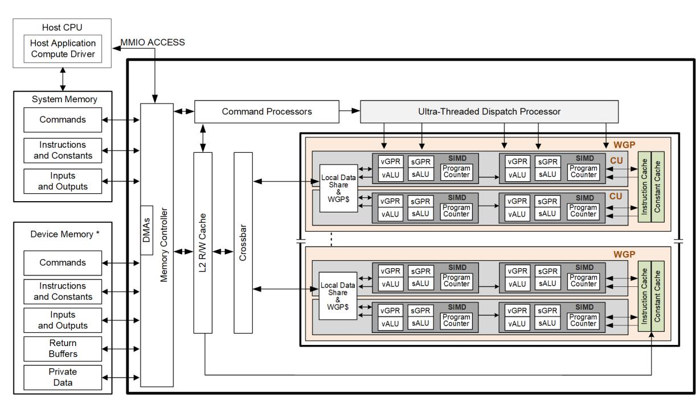

When it receives a request, the WGP processor pipeline loads instructions and data from memory, begins execution, and continues until the end of the kernel. As kernels are running, the processor array hardware automatically fetches instructions from memory into on-chip caches; software plays no role in this. Kernels can load data from off-chip memory into on-chip general-purpose registers (GPRs) and caches.

The CDNA5 devices can detect floating point exceptions in hardware and can generate interrupts to the host. These exceptions can be recorded for post-execution analysis.

The CDNA5 processor hides memory latency by keeping track of potentially hundreds of work-items in various stages of execution, and by overlapping compute operations with memory-access operations.

## **1.2.2. Cache System Hierarchy**

The memory system is divided into a number of levels of hierarchy. The figure below shows the memory hierarchy that is available to each work-item. The actual number of GPRs may differ from what is shown in the image below.

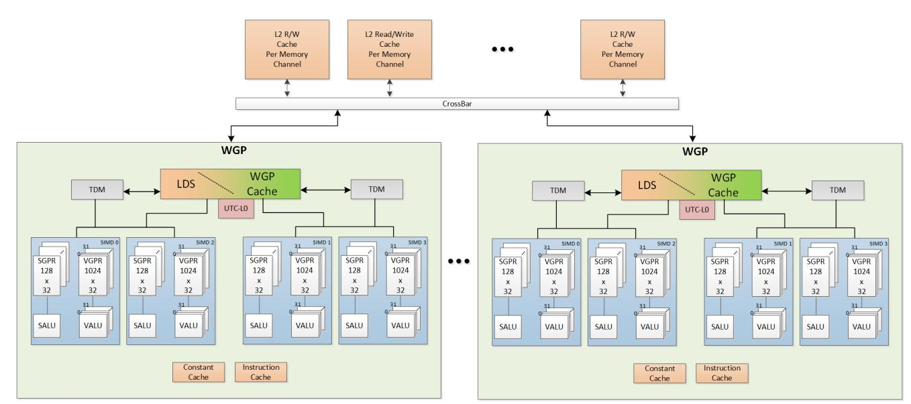

Figure 2. Shared Memory Hierarchy

"R/W" = read/write cache.

## **1.2.2.1. Local Data Share (LDS)**

Work-items within a work-group may share data with other work-items in the same work-group through the cache-memory system, or through the local shared memory (LDS).

Each workgroup processor (WGP) has a local memory unit that serves as both Local Data Share (LDS) and as the WGP-cache (WGP\$). The unit may be configured to allocate space differently between LDS and WGP\$. LDS is commonly used as a scratch-pad memory for passing data between work-items within a workgroup. The WGP\$ handles all memory loads and stores and facilitates data reuse.

Each pair of SIMDs connects to the WGP\$ and a Tensor Data Mover (TDM) that can move large blocks of structured data between external memory and LDS.

The LDS/WGP\$ memory is constructed as a set of 32-bit wide memories ("banks"), with subsequent addresses going to different banks. The LDS has atomic-math operations that can read-modify-write LDS data locations and optionally return the value before the operation occurred (the "pre-op" value).

## **1.2.3. Device Memory**

The AMD CDNA5 devices offer several methods for access to off-chip memory from the shader processor within each WGP. On the primary read path, the device consists of multiple channels of L2 cache that provides data to read-only caches per WGP (the WGP\$). The L2 cache is a read/write cache with atomic units that lets each shader processor complete unordered atomic accesses that return the initial value. Specific cache-less load instructions can force data to be retrieved from device memory during an execution of a load clause.

The instruction cache provides shader instructions to each SIMD, and the constant cache provides access to scalar constants. Both of these caches are read-only.

Each shader processor provides the destination address on which the atomic operation acts, the data to be used in the atomic operation, and a return address for the read/write atomic unit to store the pre-op value in memory.

Each store or atomic operation can receive an acknowledgment from the cache system to the requesting shader processor upon completing the write at the requested cache scope, or for atomics-with-return value, upon receiving the "pre-op" value from memory. This acknowledgment enables one shader processor to implement a fence to maintain serial consistency by ensuring all writes have been posted to memory prior to completing a subsequent write. In this manner, the system can maintain a relaxed consistency model between all parallel work-items operating on the system. Each scatter write from a given shader processor to a given memory channel maintains order.

# **Chapter 2. Shader Concepts**

CDNA5 shader programs (kernels) are programs executed by the shader processor. Conceptually, the shader program is executed independently on every work-item, but in reality the processor groups up to 32 workitems into a wave, that executes the shader program on all 32 work-items in one pass ("wave32").

The CDNA5 processor consists primarily of:

- A scalar ALU, that operates on one value per wave (common to all work-items)
- A vector ALU, that operates on unique values per work-item
- Local data storage, that allows work-items within a work-group to communicate and share data
- Scalar memory, that can transfer data to SGPRs from memory through a cache
- Vector memory, that can transfer data between VGPRs and memory

Program control flow is handled using scalar ALU instructions. This includes if/else, branches and looping. Scalar ALU (SALU) and memory instructions work on an entire wave and operate on up to two SGPRs, as well as literal constants.

Vector memory and ALU instructions operate on all work-items in the wave at one time. In order to support branching and conditional execution, every wave has an EXECute mask that determines which work-items are active at that moment, and which are dormant. Active work-items execute the vector instruction, and dormant ones treat the instruction as a NOP. The EXEC mask can be written at any time by Scalar ALU instructions or vector ALU comparisons.

Vector ALU instructions can typically take up to three arguments, which can come from VGPRs, SGPRs, or literal constants that are part of the instruction stream. They operate on all work-items enabled by the EXEC mask. Vector compare and add-with-carry-out return a bit-per-work-item mask back to the SGPRs to indicate, per work-item, which had a "true" result from the compare or generated a carry-out.

Vector memory instructions transfer data between VGPRs and memory. Each work-item supplies its own memory address and supplies or receives unique data. These instructions are also subject to the EXEC mask.

# **2.1. Shader Types**

## **2.1.1. Compute Shaders**

Compute kernels (shaders) are generic programs that can run on the CDNA5 processor, taking data from memory, processing it, and writing results back to memory. Compute kernels are created by a dispatch, which causes the CDNA5 processors to run the kernel over all of the work-items in a 1D, 2D, or 3D grid of data. The CDNA5 processor walks through this grid and generates waves, which then run the compute kernel. Each work-item is initialized with its unique address (index) within the grid. Based on this index, the work-item computes the address of the data it is required to work on and what to do with the results.

# **2.2. Work-groups**

A work-group is a collection of waves that can share data through LDS and can synchronize at a barrier. A barrier is a synchronization primitive that makes each wave reach a given point in the shader before any wave proceeds. Waves in a work-group are all issued to the same WGP but can run on any of the 4 SIMD32s and can share data through LDS. The WGP supports up to 32 work-groups with a maximum of 1024 work-items per work-group.

Waves in a work-group may share an allocation of LDS space up to 320kB. Work-groups consisting of a single wave do not count against the limit of 32. They do not allocate a barrier resource, and barrier ops are treated as S\_NOP.

Waves in a workgroup are distributed across the 4 SIMDs within the WGP. They may share data through the WGP-cache or L0 memory cache and synchronize using barriers.

# **2.3. Workgroup Clusters**

Workgroup clusters are collections of workgroups that are scheduled on the same shader engine in order to work cooperatively. These workgroups can synchronize through cluster-wide barriers and use multicast loads (see: [Multicast Loads](#page-142-1)) to broadcast load data to multiple workgroups. Clusters may be 1D, 2D or 3D and have up to 16 workgroups in a cluster, but each workgroup in a cluster runs on a separate WGP. WGP's may simultaneously host multiple workgroups - each from a different cluster. Each workgroup in a cluster is the same size, and each cluster in the dispatch is the same size.

The grid hierarchy with clusters is: Grid → Cluster → Workgroup → Wave → Work-item.

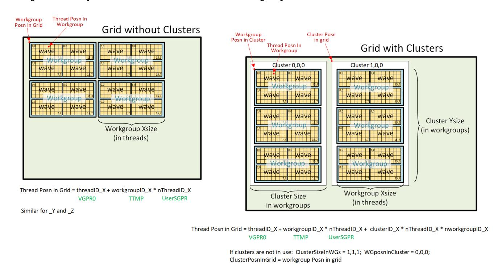

Waves in a cluster may synchronize through a single cluster-wide split-barrier (signal + arrive). There is another shared cluster-wide barrier for trap synchronization.

Clusters of a single workgroup are not considered a cluster. Waves are identified as being part of a cluster based on ClusterID==0 (not in cluster) or >=1 (in cluster). When not in a cluster, cluster-barrier instructions (including the message) are disabled (become NOP).

### **2.3.1. Cluster State**

When waves are in a cluster, they gain additional state informing them of their position in the grid and logical identity within the cluster.

| State              | Location     | Meaning                                                                       |
|--------------------|--------------|-------------------------------------------------------------------------------|
| WG_in_Cluster[3:0] | wave state   |                                                                               |
|                    |              | Logical workgroup ID: 0..(number of workgroups in cluster minus 1). Persists  |
| Cluster_ID[3:0]    | wave state   |                                                                               |
| Cluster ID Z[15:0] | TTMP7[31:16] | Cluster position within grid (Z dimension) in units of workgroup-size-Z.      |
| Cluster ID Y[15:0] | TTMP7[15:0]  | Cluster position within grid (Y dimension) in units of workgroup-size-Y.      |
| Cluster ID X[31:0] | TTMP9[31:0]  | Cluster position within grid (X dimension) in units of workgroup-size-X.      |
| flat_NWG[3:0]      | TTMP6[27:24] | flat number of workgroups in the cluster, minus 1                             |
| nwg_z[3:0]         | TTMP6[23:20] | number of workgroups in the cluster in Z dimension, minus 1                   |
| nwg_y[3:0]         | TTMP6[19:16] | number of workgroups in the cluster in Y dimension, minus 1                   |
| nwg_x[3:0]         | TTMP6[15:12] | number of workgroups in the cluster in X dimension, minus 1                   |
| wg_z[3:0]          | TTMP6[11:8]  | workgroup in cluster ID Z (position in cluster), in units of workgroup-size-Z |
| wg_y[3:0]          | TTMP6[7:4]   | workgroup in cluster ID Y (position in cluster), in units of workgroup-size-y |
| wg_x[3:0]          | TTMP6[3:0]   | workgroup in cluster ID X (position in cluster), in units of workgroup-size-x |

State readable in IB\_STS2: IB\_STS2.clusterID, IB\_STS2.wg\_in\_cluster.

Both are initialized to zero (non-cluster) or with cluster status when the wave starts.

# **2.4. Shader Padding Requirement**

Due to aggressive instruction prefetching used in CDNA5 devices, the user must pad all shaders with 64 extra DWORDs (256 bytes) of data past the end of the shader. It is recommended to use the S\_CODE\_END instruction as padding to make it easier to identify the end of a shader when debugging. This ensures that if the instruction prefetch hardware goes beyond the end of the shader, it may not reach into uninitialized memory (or unmapped memory pages).

If the user has enabled additional "prefetch-at-wave-launch", then padding must be sufficient to cover that as well.

# **Chapter 3. Wave State**

This chapter describes the state variables visible to the shader program. Each wave has a private copy of this state unless otherwise specified.

# **3.1. State Overview**

The table below shows the hardware states readable or writable by a shader program. The registers below are unique to each wave except for TBA and TMA which are shared.

Table 4. Commonly used Shader Wave State

| Abbrev.        | Name                       | Size  |                                                                  |
|----------------|----------------------------|-------|------------------------------------------------------------------|
| PC             | Program Counter            | 57    | Points to the memory address of the next shader instruction      |
|                |                            |       | instructions and indirectly using branch. The 2 LSB’s are        |
| V0-V1023       | VGPR                       | 32    | Vector general-purpose register. (32 bits per work-item x (32)   |
| S0-S105        | SGPR                       | 32    | Scalar general-purpose register. All waves are allocated 106     |
| LDS            | Local Data Share           | 320kB | Local data share is a scratch RAM with built-in arithmetic       |
| EXEC           | Execute Mask               | 64    | A bit mask with one bit per thread, that is applied to vector    |
| EXECZ          | EXEC is zero               | 1     | A single bit flag indicating that the EXEC mask is all zeros.    |
| VCC            | Vector Condition Code      | 64    | A bit mask with one bit per thread; it holds the result of a     |
|                |                            |       | vector compare operation or integer carry-out. Physically        |
| VCCZ           | VCC is zero                | 1     | A single-bit flag indicating that the VCC mask is all zeros. For |
| SCC            | Scalar Condition Code      | 1     | Result from a scalar ALU comparison instruction, carry-out       |
| SCRATCH_BASE   | Scratch memory address     | 57    | The base address of scratch memory for this wave. Used by        |
| M0             | Misc Reg                   | 32    | A temporary register that has various uses, including GPR        |
| STATUS         | Status                     | 32    | Shader status bits (read-only).                                  |
| STATE_PRIV     | Privileged State           | 32    | Shader state bits writable only by trap handler.                 |
| MODE           | Mode                       | 32    | Writable shader mode bits.                                       |
| TRAP_CTRL      | Exception Mask             | 32    | Mask of which exceptions cause a trap. Writable only by trap     |
| EXCP_FLAG_PRIV | Privileged Exception Flags | 32    | Mask of exceptions that have occurred. Writable only by trap     |

| Abbrev.        | Name                         | Size |                                                            |
|----------------|------------------------------|------|------------------------------------------------------------|
| EXCP_FLAG_USER | User-clearable Exception     |      |                                                            |
|                |                              | 32   | Mask of exceptions that have occurred. Writable by user    |
| TBA            | Trap Base Address            | 57   | Holds the program address of the trap handler. Per-VMID    |
| TMA            | Trap Memory Address          | 57   | Temporary register for shader operations. For example, can |
| TTMP0-TTMP15   | Trap Temporary SGPRs         | 32   | 16 SGPRs available only to the Trap Handler for temporary  |
| LOADcnt        | Vector memory load           |      |                                                            |
|                |                              | 6    | Counts the number of VMEM load (and atomic with return     |
| STOREcnt       | Vector memory store          |      |                                                            |
|                |                              | 6    | Counts the number of VMEM store (and atomic without        |
| DScnt          | LDS instruction count        | 6    | Counts the number of LDS instructions issued but not yet   |
| KMcnt          | Constant and Message count   | 5    | Counts the number of constant-fetch (scalar memory read),  |
| ASYNCcnt       | Async vector memory          |      |                                                            |
|                |                              | 6    | Counts the number of asynchronous loads and stores         |
| TENSORcnt      | Tensor operation instruction |      |                                                            |
|                |                              | 6    | Counts the number of matrix (tensor) transfers outstanding |
| XCNT           | Memory op address            |      |                                                            |
|                |                              | 6    | Counts the number of memory instructions issued but have   |

# **3.2. Control State: PC and EXEC**

# **3.2.1. Program Counter (PC)**

The Program Counter is a DWORD-aligned byte address that points to the next instruction to execute. When a wave is created the PC is initialized to the first instruction in the program. The address is DWORD-aligned so the two LSBs are forced to zero.

There are a few instructions that interact directly with the PC: S\_GETPC\_B64, S\_SETPC\_B64, S\_CALL\_B64, S\_RFE\_B64, S\_ADD\_PC\_I64, and S\_SWAP\_PC\_I64. These transfer the PC to and from an even-aligned SGPR pair (sign-extended).

Branches jump to (PC\_of\_the\_instruction\_after\_the\_branch + offset\*4). Branches, GET\_PC and SWAP\_PC are PCrelative to the **next** instruction, not the current one. S\_TRAP, on the other hand, saves the PC of the S\_TRAP instruction itself.

During wave debugging the program counter may be read. The PC points to the next instruction to issue. All prior instructions have been issued but may or may not have completed execution.

## **3.2.2. EXECute Mask**

The Execute mask (64-bit) controls which threads in the vector are executed. Each bit indicates how one thread behaves for vector instructions: 1 = execute, 0 = do not execute. EXEC can be read and written via scalar instructions, and can also be written as a result of a vector-alu compare. EXEC affects: vector-alu, vectormemory, LDS instructions. It does not affect scalar execution or branches.

Wave32 waves use only bits 31:0 and hardware does not act upon the upper bits.

There is a summary bit (EXECZ) that indicates that the entire execute mask is zero. It can be used as a condition for branches to skip code when EXEC is zero. For wave32, this reflects the state of EXEC[31:0].

### **3.2.2.1. Instruction Skipping: EXEC==0**

The shader hardware may skip vector instructions when EXEC==0.

Instructions that are skipped result in the same wave state as if they had executed with EXEC==0: no wave state changes.

Instructions that may be skipped are:

- VALU skip if EXEC == 0
  - Not skipped if the instruction writes SGPRs/VCC
  - Does not skip WMMA ops
  - This skipping is timing-dependent and might not occur depending on timing after a V\_CMPX.
- These are not skipped regardless of EXEC mask value
  - V\_NOP, V\_PIPEFLUSH, V\_READLANE, V\_READFIRSTLANE, V\_WRITELANE
  - GLOBAL\_INV, GLOBAL\_WB, GLOBAL\_WBINV
- LDS, Memory typically do not skip
  - VMEM can be skipped only if: EXEC == 0 and LOADcnt / STOREcnt / ASYNCcnt / TENSORcnt == 0
    - FLAT also requires that DScnt==0 to be skipped.
  - LDS can be skipped only if: DScnt==0 and EXEC==0

# **3.3. Storage State: SGPR, VGPR, LDS**

## **3.3.1. SGPRs**

## **3.3.1.1. SGPR Allocation and storage**

Every wave is allocated a fixed number of SGPRs:

- 106 normal SGPRs
- VCC\_LO and VCC\_HI (stored in SGPRs 106 and 107)
- 16 Trap-temporary SGPRs, meant for use by the trap handler

### **3.3.1.1.1. VCC**

The Vector Condition Code (VCC) is a named SGPR-pair that can be written by V\_CMP and integer vector ADD/SUB instructions. VCC is implicitly read by V\_ADD\_CI, V\_SUB\_CI, V\_CNDMASK and V\_DIV\_FMAS. VCC is subject to the same dependency checks as any other SGPR.

### **3.3.1.2. SGPR Alignment**

There are a few cases where even-aligned SGPRs are required:

- 1. any time 64-bit data is used
  - a. this includes moves to/from 64-bit registers, including PC
- 2. Scalar memory loads when the address-base comes from an SGPR-pair

When a 64-bit SGPR data value is used as a source to a VALU op, it must be even aligned regardless of size. In contrast, when a 32-bit SGPR data value is used as a source to a VALU op, it can be arbitrarily aligned regardless of wave size.

Quad-alignment of SGPRs is required for operations on more than 64-bits, and for the data SGPR when a scalar memory operation (read, write or atomic) operates on more than 2 DWORDs.

When a 64-bit quantity is stored in SGPRs, the LSB's are in SGPR[n], and the MSB's are in SGPR[n+1].

It is illegal to use mis-aligned source or destination SGPRs for data larger than 32 bits and results are unpredictable.

### **3.3.1.3. SGPR Out of Range Behavior**

Scalar sources and dests use a 7-bit encoding:

Scalar 0-105=SGPR; 106,107=VCC, 108-123=TTMP0-15, and 124-127={NULL, M0, EXEC\_LO, EXEC\_HI}.

It is illegal to use GPR indexing or a multi-DWORD operand to cross SGPR regions. The regions are:

- SGPRs 0 107 (includes VCC)
- Trap Temp SGPRs
- All other SGPR & Scalar-source addresses must not be indexed and no single operand can reference multiple register ranges.

General Rules:

- Out of range source SGPRs return zero (NULL, M0 or EXEC where not allowed)
- Writes to an out of range SGPR are ignored

TTMP0-15 can only be written while in the trap handler (STATUS.PRIV=1) but can be read by the user's shader (STATUS.PRIV=0). Writes to TTMPs while outside the trap handler are ignored. SALU instructions that try but fail to write a TTMP also do not update SCC.

- SALU: Above rules apply.
  - WREXEC and SAVEEXEC write the EXEC mask even when the SDST is out-of-range
- VALU: Above rules apply.

- VMEM: descriptors (such as S#, T#, V#) must be contained within one region.
  - T# (128b), V# or S#: no possible range violation exists (forced alignment puts all in one range).
  - T# (256b) starting at 104 and extending into TTMPs; or starting at TTMP12 and going past TTMP15 is a violation. If this occurs, force to use S0.
- SMEM ops return data starting in SGPRs/VCC and extending into TTMPs, or starting in TTMPs and extending outside TTMPs becomes out of range.
  - No data gets written to dest-SGPRs that are out-of-range
  - Addr and write-data are aligned and so cannot go out of range, except:
    - Referencing M0, NULL, or EXEC\* returns zero, and SMEM loads cannot load into these registers.
- S\_MOVREL:
  - Indexing is allowed only within SGPRs and TTMPs, and must not cross between the two. Indexing must stay within the "base" range (the operand type where index==0). The ranges are: [ SGPRs 0-105 and VCC\_LO, VCC\_HI ], [ Trap Temps 0-15 ], [ all other values ]
  - Indexing must not reach M0, exec or inline constants, the rule is:
    - Base is SGPR: addr > VCC\_HI (or if 64-bit operand, addr > VCC\_LO)
    - Base is TTMP: addr > TTMP15 (or if B64 if addr > TTMP14)
  - If the source is out of range, S0 is used. If the dest is out of range, nothing is written.

# **3.3.2. VGPRs**

### **3.3.2.1. VGPR Allocation and Alignment**

VGPRs are allocated in blocks of 16 for wave32, and a shader may have up to 1024 VGPRs. In other words, VGPRs are allocated in units of (16\*32 = 512 DWORDs).

A wave may not be created with zero VGPRs.

64-bit operands (source or dest) must be even-VGPR-aligned. This includes both VALU and memory instructions.

A wave may voluntarily deallocate all of its VGPRs via S\_SENDMSG. Once this is done, the wave may not reallocate them and the only valid action is to terminate the wave. This can be useful if a wave has issued stores to memory and is waiting for the write-confirms before terminating. Releasing the VGPRs while waiting may allow a new wave to allocate them and start earlier. See the S\_SENDMSG instruction messages: [Dealloc All](#page-52-0) [VGPRs.](#page-52-0)

VGPRs beyond 255 can be accessed using VGPR-MSB's. See: [Addressing 1024 VGPRs](#page-25-0).

### **3.3.2.2. VGPR Out of Range Behavior**

Given an instruction operand that uses one or more DWORDs of VGPR data: "V"

Vs = the first VGPR DWORD (start) Ve = the last VGPR DWORD (end)

Operand is out of range if:

- Vs < 0 || Vs >= VGPR\_SIZE
- Ve < 0 || Ve >= VGPR\_SIZE

V\_MOVREL indexed operand out of range if either:

- Index > 1023
- (Vs + M0) >= VGPR\_SIZE
- (Ve + M0) >= VGPR\_SIZE

Out of range consequences:

- If a dest VGPR is out of range, the instruction is ignored (treat as NOP). VMEM instructions (including LDS) issue the instruction as if EXEC==0 to keep LOADcnt/STOREcnt/… correct.
- V\_SWAP & V\_SWAPREL : since both arguments are destinations, if either is out of range, discard the instruction.
  - VALU instructions with multiple destination (e.g. VGPR and SGPR): nothing is written to any GPR
- If a source VGPR is out of range in a VMEM instruction: VGPR0 is used for the out of range VGPR
  - Memory instructions that use a group of consecutive VGPRs that are out of range use VGPR0 for the individual out of range VGPRs.
- If a source VGPR in a VALU instruction is out of range: act as if the instruction's source field is set to VGPR0. Operands > 32 bits use consecutive VGPRs: V0, V1, V2, …
  - VOPD has different rules: the source address forced to (VGPRaddr % 4).

Instructions with multiple destinations (e.g. V\_ADD\_CO): if any destination is out of range, no results are written.

### **3.3.2.3. Waves with up to 1024 VGPRs**

Compute waves (wave32) may be allocated up to 1024 VGPRs. Shader instructions can directly access VGPRs 0- 255 per wave, and may access VGPRs 256-1023 through a form of VGPR-indexing.

There are 8 MODE register bits associated with each wave that are applied to vector instructions to supply the MSBits of the VGPR address:

- **MODE** . DST, SRC0, SRC1, SRC2

These bits can be set with S\_SET\_VGPR\_MSB (as well as "S\_SETREG\_B32 MODE") and the updated bits apply to subsequent instructions.

VGPR addresses are computed by taking the 8-bit logical VGPR address from the instruction (ISA), and appending the VGPR\_MSBs from this instruction into the MSB position. These bits are ignored for non-VGPR operands, but are applied to V\_MOVREL operations.

| MSB’s[1:0] | SRC[8] | SRC[7:0] | Meaning         |
|------------|--------|----------|-----------------|
| ignored    | 0      | 0..0xff  | Scalar Operands |
| 00         | 1      | 0..0xff  | VGPR0..255      |
| 01         | 1      | 0..0xff  | VGPR256..511    |
| 10         | 1      | 0..0xff  | VGPR512..767    |
| 11         | 1      | 0..0xff  | VGPR768..1023   |

 S\_SET\_VGPR\_MSB (SOPP) immediate[7:0] {dst[1:0], src2[1:0], src1[1:0], src0[1:0]} = immediate[7:0] // 4 sets of "MSBs" logicalVgprAddr[9:0] = { MSBs[1:0], ISA[7:0] }. This is the address of the first VGPR and sequential VGPRs may cross the 255/256 boundary. This logicalVgprAddress is used for out-of-range checking.

Instructions with non-standard operands

- FMAAK: uses SRC0 and SRC1 MSBs
- FMAMK: uses SRC0 and SRC2 MSBs
- Accumulation versions of instructions (e.g. V\_FMAC) use the DST MSB for both VDST and SRC2
- V\_LSHLREV, V\_SUBREV: SRC0 and SRC1 apply to the operands in the order in the ISA (before "reversing") e.g. V\_LSHLREV\_B32 V0VDST, V1SRC0, V2SRC1 // V0 = V2 << V1 DST applies to V0, SRC0 applies to V1, and SRC1 applies to V2.
- Accumulation instructions apply DST to both the destination and one of the source VGPRs

S\_SET\_VGPR\_MSB directly sets bits 9:8 of the VGPR address. When used with 16-bit VGPR-addressing, this means the following range of 16-bit VGPRs can be accessed: { v0..v127.[lh], v256..v383.[lh] }

| VGPR_OFF ⇒  |       |        |        |        |             |                          |
|-------------|-------|--------|--------|--------|-------------|--------------------------|
|             | DST   | SRC0   | SRC1   | SRC2   | Not offset: |                          |
| VOP1        | VDST  | SRC0   |        |        |             |                          |
| VOP2        | VDST  | SRC0   | SRC1   |        |             |                          |
| VOPC        |       | SRC0   | SRC1   |        |             |                          |
| VOP3, VOP3P | VDST  | SRC0   | SRC1   | SRC2   |             |                          |
| VOPD        | VDSTX |        |        |        |             |                          |
| VOPD3       | VDSTX |        |        |        |             |                          |
| VDS         | VDST  | ADDR   | DATA0  | DATA1  |             |                          |
|             | VDST  | ADDR   | VSRC   |        |             | Also used for Async Load |
| VBUFFER     | VDATA | VADDR  |        |        | RSRC        |                          |
| VIMAGE      | VDATA | VADDR0 | VADDR1 | VADDR2 | VADDR3-4    | Also used for Tensor DMA |

V\_WMMA\_LD\_SCALE ignores VGPR-MSB and instead acts as if they were zero.

# **3.3.3. Memory Alignment and Out-of-Range Behavior**

This section defines the behavior when a source or destination GPR or memory address is outside the legal range for a wave. Except where noted, these rules apply to LDS, buffer, global, flat and scratch memory accesses.

- If any source VGPR or SGPR is out-of-range, the data value is undefined.
- If any destination VGPR is out-of-range, the operation is nullified by issuing the instruction as if the EXEC

mask were cleared to 0.

- This out-of-range test checks all VGPRs that could be returned (e.g. VDST to VDST+3 for a BUFFER\_LOAD\_B128)
- Atomic operations with out-of-range destination VGPRs are nullified: issued, but with EXEC mask of zero.
- Image loads and stores consider DMASK bits when making an out-of-bounds determination.
- Note: VDST is only checked for lds/mem-atomic that actually return a value.
- Async load to LDS: if the LDS address is out-of-range of the LDS space allocated to this wave or workgroup, the write to LDS is dropped.

VMEM memory alignment rules are defined using the config register: SH\_MEM\_CONFIG.alignment\_mode. This setting also affects LDS, Flat/Scratch/Global operations.

**DWORD** Automatic alignment to multiple of the smaller of element size or a DWORD.

**UNALIGNED** No alignment requirements, except for atomics.

Atomics must be aligned to the data size, or they trigger a MEMVIOL.

# **3.3.4. Local Data Share (LDS)**

LDS is a scratch-pad memory allocated to waves or workgroups (in which case it is sometimes referred to as "shared memory"). Waves may be allocated LDS memory, and waves in a work-group all share the same LDS memory allocation. All accesses to LDS are restricted to the space allocated to that wave/work-group.

LDS space is allocated in blocks of 2048 bytes. A wave, or a work-group of waves, may have 0kB - 320kB of LDS space allocated to it. Every SIMD in the WGP can access both LDS and WGP\$.

### **3.3.4.1. LDS Alignment and Out-of-Range**

Any DS\_LOAD or DS\_STORE of any size can be byte aligned if the alignment mode is set to "unaligned". For all other alignment modes, LDS forces alignment by zeroing out address least significant bits.

- 32-bit Atomics must be aligned to a 4-byte address; 64-bit atomics to an 8-byte address, otherwise they return MEMVIOL.
- LDS operations report MEMVIOL if the LDS-address is out of range

Out Of Range

- If the LDS-ADDRESS is out of range (addr < 0 or >= LDS\_size):
  - Address is also out of range if the address >= the physical size of LDS (partitioned out of WGP\$).
  - Loads return the value zero. For multi-DWORD loads, this is checked per DWORD and when any portion of a DWORD is out of range, it returns zero.
  - Any portion of a store operation that is in range is written to LDS, and stored bytes out of range are discarded
  - For both loads and stores the out of bounds check is performed at byte granularity for UNALIGNED mode, and DWORD granularity for DWORD alignment mode.
- If any source-VGPR is out of range, the value from VGPR0 is used to supply the LDS address or data.
- If the dest-VGPR is out of range, nullify the instruction (issue with EXEC=0)

"Native" Alignment in LDS is:

B8: byte aligned B16 or D16: 2 byte aligned B32: 4 byte aligned B64: 8 byte aligned B128 and B96: 16 byte aligned

If the alignment mode is set to "unaligned", the LDS disables its auto-alignment and doesn't report error for misaligned loads & stores

 if (sh\_alignment\_mode == unaligned) align = 0xffff else if (B32) align = 0xfffC else if (B64) align = 0xfff8 else if (B96 or B128) align = 0xfff0 LDSaddr = (addr + offset) & align

# **3.3.5. Scratch (Private) Memory**

Waves may be allocated a block of global memory at wave-launch time that can be used for thread-private data. This memory is private to each thread (although this is not enforced) and memory swizzling is optimized for the case when each thread has the same index into its scratch space.

Scratch memory is allocated with 64-DWORD granularity and may be [0 - (16M-64)] DWORDs per wave.

# **3.4. Wave State Registers**

The following registers are accessed infrequently, and are only readable/writable via S\_GETREG\_B32 and S\_SETREG instructions. Some of these registers are read-only, some are writable and others are writable only when in the trap handler ("PRIV").

| Index | Writable? | Register            |                                                       |
|-------|-----------|---------------------|-------------------------------------------------------|
| 1     | Yes       | MODE                | Wave mode bits                                        |
| 2     | No        | STATUS              | Wave status bits                                      |
| 4     | PRIV      | STATE_PRIV          | wave state bits writable by the trap handler (PRIV=1) |
| 10    | No        | PERF_SNAPSHOT_DATA  | Data captured during performance snapshot             |
| 11    | No        | PERF_SNAPSHOT_PC_LO | PC[31:0] of performance snapshot                      |
| 12    | No        | PERF_SNAPSHOT_PC_HI | PC[63:32] of performance snapshot                     |
| 15    | No        | PERF_SNAPSHOT_DATA1 | Data captured during performance snapshot             |
| 16    | No        | PERF_SNAPSHOT_DATA2 | Data captured during performance snapshot             |
| 17    | PRIV      | EXCP_FLAG_PRIV      | Exception flags writable only by trap handler         |
| 18    | Yes       | EXCP_FLAG_USER      | Exception flags writable by user                      |
| 19    | PRIV      | TRAP_CTRL           | Trap exception enables; writable only by trap handler |
| 20    | PRIV      | SCRATCH_BASE_LO     | user-read only; writable only by trap handler         |
| 21    | PRIV      | SCRATCH_BASE_HI     | user-read only; writable only by trap handler         |
| 23    | No        | HW_ID1              | read only. debug only - not predictable values        |
| 24    | No        | HW_ID2              | read only. debug only - not predictable values        |

### **3.4.1. STATUS register**

Status register fields can be read but not written to by the shader. These bits are initialized at wave-creation time or updated during execution.

Table 5. Status Register Fields

| Field      | Bit |                                                                                             |
|------------|-----|---------------------------------------------------------------------------------------------|
| PRIV       | 5   | Privileged mode. Indicates that the wave is in the trap handler. Gives write access to TTMP |
| TRAP_EN    | 6   | Indicates that a trap handler is present. When set to zero, traps are not taken.            |
| EXECZ      | 9   | Exec Mask is Zero.                                                                          |
| VCCZ       | 10  | Vector Condition Code is Zero.                                                              |
| IN_WG      | 11  | Wave is a member of a work-group of more than one wave.                                     |
| TRAP       | 14  | Wave is flagged to enter the trap handler as soon as possible.                              |
|            | 15  | Indicates that the trap-barrier has completed but wave has not yet waited on that barrier   |
| VALID      | 16  | Wave is valid (has been created and not yet ended)                                          |
|            | 17  | Indicates that the cluster-trap-barrier has completed but wave has not yet waited on that   |
| FATAL_HALT | 23  | Indicates that the wave has halted due to a fatal error:                                    |
| NO_VGPRS   | 24  | Indicates that this wave has released all of its VGPRs.                                     |
| IDLE       | 28  | Wave is idle (has no outstanding instructions). Used via register-read to determine if a    |
| WAVE64     | 29  | Wave is 64 (0 = wave32)                                                                     |

# **3.4.2. STATE\_PRIV register**

STATE\_PRIV register fields can be read by the user shader and written while in the trap handler (PRIV=1). These bits are initialized at wave-creation time or updated during execution.

Table 6. STATE\_PRIV Register Fields

| Field            | Bit |                                                                                          |
|------------------|-----|------------------------------------------------------------------------------------------|
| WG_RR_EN         | 0   | Workgroup Round-robin arbitration requested.                                             |
| SLEEP_WAKEUP     | 1   | The wave has one credit to skip the next S_SLEEP instruction due to previously receiving |
| BARRIER_COMPLETE | 2   | has the barrier completed but wave has not yet waited on that barrier                    |
|                  | 3   | is the currently joined named barrier complete, but wave has not yet waited              |

| Field            | Bit   |                                                                                             |
|------------------|-------|---------------------------------------------------------------------------------------------|
| NAMED_BARRIER_ID | 8:4   | ID (0-16) of the currently joined named barrier                                             |
| SCC              | 9     | Scalar condition code. Used as a carry-out bit. For a comparison instruction, this bit      |
| SYS_PRIO         | 11:10 | Wave priority set at wave creation time. See S_SETPRIO instruction for details. 0 is        |
| USER_PRIO        | 13:12 | Wave’s priority set by shader program itself. See S_SETPRIO instruction for details.        |
| HALT             | 14    | Wave is halted or scheduled to halt.                                                        |
|                  | 16    | Indicates that the cluster-barrier has completed but wave has not yet waited on that        |
| SCRATCH_EN       | 18    | Indicate that the wave has scratch memory allocated. This bit gets set to 1 if the wave has |

# **3.4.3. MODE register**

Mode register fields can be read from, and written to, by the shader through scalar instructions.

Table 7. Mode Register Fields

| Field              | Bit   |                                                                                       |
|--------------------|-------|---------------------------------------------------------------------------------------|
| FP_ROUND           | 3:0   | Controls round modes for math operations                                              |
| FP_DENORM          | 7:4   | Controls whether floating point denormals are flushed or not.                         |
| DST_VGPR_MSB       | 13:12 | Destination VGPR most-significant-bits                                                |
| SRC0_VGPR_MSB      | 15:14 | Source 0 VGPR most-significant-bits                                                   |
| SRC1_VGPR_MSB      | 17:16 | Source 1 VGPR most-significant-bits                                                   |
| SRC2_VGPR_MSB      | 19:18 | Source 2 VGPR most-significant-bits                                                   |
| FP16_OVFL          | 23    | If set, an overflowed FP16 VALU result is clamped to +/- MAX_FP16 regardless of round |
| SCALAR_PREFETCH_EN | 24    | 1 = enable scalar prefetch instructions (both instruction & data); 0 = ignore them    |
| REPLAY_MODE        | 25    | 0 = single-VMEM-group mode, 1 = multi-VMEM-group mode                                 |

| Field              | Bit |                                                                                           |
|--------------------|-----|-------------------------------------------------------------------------------------------|
| FLAT_SCRATCH_IS_NV | 26  | 0 = use ISA NV bit to indicate if scratch is non-volatile; 1 = force threads falling into |
| DISABLE_PERF       | 27  | 1 = temporarily disable performance counting for this wave.                               |

# **3.4.4. M0 : Miscellaneous Register**

There is one 32-bit M0 register per wave and is it used for:

Table 8. M0 Register Fields

| Operation        | M0 Contents                 | Notes                                         |
|------------------|-----------------------------|-----------------------------------------------|
| S/V_MOVREL       | GPR index                   | See S_MOVREL and V_MOVREL instructions        |
|                  | { 12’h0, lds_offset[19:0] } | offset is in bytes, must be 4-byte aligned    |
| S_TTRACEDATA     | data[7:0] or [23:0]         | output user-defined thread trace data         |
| S_SENDMSG / _RTN | varies                      | sendmsg data. See [SendMessageTypes]          |
| Multicast loads  | WGP mask                    |                                               |
| Various          | Temporary data[31:0]        | can be used as general temporary data storage |

M0 can only be written by the scalar ALU.

### **3.4.5. NULL**

NULL is a scalar source and destination. Reading NULL returns zero, writing to NULL has no effect (write data is discarded).

NULL may be used anywhere scalar sources can normally be used:

- When NULL is used as the destination of an SALU instruction, the instruction executes: SDST is not written but SCC is updated (if the instruction normally updates SCC). Instructions like S\_SWAP\_PC\_I64 with NULL as a DEST still execute, loading zero into the PC and not writing any other result.
- NULL may not be used as an descriptor (V#, T#, S#, etc) unless otherwise noted.

# **3.4.6. SCC: Scalar Condition Code**

Many scalar ALU instructions set the Scalar Condition Code (SCC) bit, indicating the result of the operation.

Compare operations: 1 = true Arithmetic operations: 1 = carry out Bit/logical operations: 1 = result was not zero Move: does not alter SCC

The SCC can be used as the carry-in for extended-precision integer arithmetic, as well as the selector for conditional moves and branches.

# **3.4.7. Vector Compares: VCC and VCCZ**

Vector ALU comparison instructions (V\_CMP) compare two values and return a bit-mask of the result, where each bit represents one lane (work-item) where: 1= pass, 0 = fail. This result mask is the Vector Condition Code (VCC). VCC is also set for selected integer ALU operations (carry-out).

These instructions write this mask either to VCC, an SGPR or to EXEC, but do not write to both EXEC and SGPRs. Wave32 writes only the low 32 bits of VCC, EXEC or a single SGPR.

Whenever any instruction writes a value to VCC, the hardware automatically updates a "VCC summary" bit called VCCZ. This bit indicates whether or not the entire VCC mask is zero for the current wave-size. Wave32 ignores VCC[63:32] and only bits[31:0] contribute to VCCZ. This is useful for early-exit branch tests. VCC is also set for certain integer ALU operations (carry-out).

The EXEC mask determines which threads execute an instruction. The VCC indicates which executing threads passed the conditional test, or which threads generated a carry-out from an integer add or subtract.

S\_MOV\_B64 EXEC, 0x00000001 // set just one thread active; others are inactive V\_CMP\_EQ\_B32 VCC, V0, V0 // compare (V0 == V0) and write result to VCC (all bits in VCC are updated)

VCC physically resides in the SGPR register file in a specific pair of SGPRs, so when an instruction sources VCC, that counts against the limit on the total number of SGPRs that can be sourced for a given instruction.

Wave32 waves may use any SGPR for mask/carry/borrow operations, but may not use VCC\_HI or EXEC\_HI.

# **3.4.8. SCRATCH\_BASE**

SCRATCH\_BASE is a 64-bit register that holds a pointer to the base of scratch memory for this wave. For waves that have scratch space allocated, wave-launch hardware initializes the SCRATCH\_BASE register with the scratch base address unique to this wave. This register is read-only, except while in the trap handler where it is writable. The value is a byte address and must be 256byte aligned. If the wave has no scratch space allocated, then reading SCRATCH\_BASE returns zero.

# **3.4.9. Hardware Internal Registers**

These registers are read-only and can be accessed by the S\_GETREG\_B32 instruction. They return information about hardware allocation and status. These registers are read-only unless otherwise specified.

#### **HW\_ID1**

| Field   | Bits  | Description                                                        |
|---------|-------|--------------------------------------------------------------------|
| WAVE_ID | 4:0   | Wave id within the SIMD.                                           |
| SIMD_ID | 9:8   | SIMD_ID within the WGP: [0] = CU within WGP, [1] = SIMD within CU. |
| WGP_ID  | 13:10 | Physical WGP ID.                                                   |
| SA_ID   | 16    | Shader Array ID                                                    |

| Field    | Bits  | Description                                       |
|----------|-------|---------------------------------------------------|
| QUEUE_ID | 3:0   | Queue_ID (also encodes shader stage)              |
| PIPE_ID  | 5:4   | Pipeline ID                                       |
| ME_ID    | 9:8   | MicroEngine ID: 0 = reserved, 1 & 2 = ACE compute |
| STATE_ID | 14:12 | State context ID                                  |
| WG_ID    | 20:16 | Work-group ID (0-31) within the WGP.              |
| VM_ID    | 27:24 | Virtual Memory ID                                 |

#### **IB\_STS2**

| Field         | Bits  | Description                            |
|---------------|-------|----------------------------------------|
| CLUSTER_ID    | 9:6   | Cluster ID 1..15; 0 = not in a cluster |
| WG_IN_CLUSTER | 24:21 | Workgroup ID within the cluster: 0..15 |

#### **PERF\_SNAPSHOT\_DATA**

Note that all PERF\_SNAPSHOT registers can only be read by the wave that was snapshot (others read zero). Users should read PERF\_SNAPSHOT\_PC\_HI last, as reading this resets (unlocks) the perf\_snapshot registers for the next snapshot to be taken, as does the wave terminating.

| Field           | Bits  | Description                                                                       |
|-----------------|-------|-----------------------------------------------------------------------------------|
| VALID           | 0     | 1: snapshot data is written & recorded wave is reading it, 0: invalid or recorded |
| WAVE_ISSUE      | 1     | 1: wave issued an instruction on the cycle it was snapshot; 0 = did not issue.    |
| INST_TYPE       | 5:2   | Instruction type that was issued or wave wanted to issue:                         |
|                 |       | 0 VALU 8 Branch not taken                                                         |
|                 |       | 1 Scalar 9 Branch taken                                                           |
|                 |       | 2 VMEM 10 Jump                                                                    |
|                 |       | 3 LDS 11 Other                                                                    |
|                 |       | 4 None 12 None                                                                    |
|                 |       | 5 Export 13 Dual VALU                                                             |
|                 |       | 6 Message 14 Flat                                                                 |
|                 |       | 7 Barrier 15 VALU-Matrix                                                          |
| NO_ISSUE_REASON | 8:6   | If an instruction was not issued, why?                                            |
|                 |       | 0 no instructions available                                                       |
|                 |       | 1 waiting on ALU dependency                                                       |
|                 |       | 2 waiting on s_waitcnt                                                            |
|                 |       | 3 did not win arbitration vs. other waves                                         |
|                 |       | 4 sleep                                                                           |
|                 |       | 5 barrier wait                                                                    |
|                 |       | 6 other causes                                                                    |
|                 |       | 7 internal op                                                                     |
| WAVE_ID         | 13:9  | Wave ID of wave that had snapshot taken                                           |
| Lock Error      | 14    | A snapshot was not taken because the previous snapshot has not yet been read      |
| ASYNCcnt        | 25:20 | value of wave’s ASYNCcnt                                                          |

#### **PERF\_SNAPSHOT\_DATA1**

| Field Bits              | Description                                                                     |
|-------------------------|---------------------------------------------------------------------------------|
| WAVE_CNT 5:0            | number of waves active on this CU with this VMID                                |
| Issued Instruction 16:9 | SIMD issued an instruction of these types during the snapshot cycle             |
| 6                       | Branch/Message                                                                  |
| 7                       | Export                                                                          |
| 8                       | Reserved                                                                        |
| 9                       | LDS                                                                             |
| 10                      | Texture/Vmem                                                                    |
| 11                      | Scalar ALU/mem                                                                  |
| 12                      | Vector ALU                                                                      |
| Issued Stalled 24:17    | SIMD was stalled from issuing an instruction of these types during the snapshot |

#### **PERF\_SNAPSHOT\_DATA2**

| Field    | Bits  | Description              |
|----------|-------|--------------------------|
| LOADcnt  | 5:0   | value of wave’s LOADcnt  |
| STOREcnt | 11:6  | value of wave’s STOREcnt |
| DScnt    | 26:21 | value of wave’s DScnt    |
| KMcnt    | 31:27 | value of wave’s KMcnt    |

#### **PERF\_SNAPSHOT\_PC\_LO**

#### **PERF\_SNAPSHOT\_PC\_HI**

# **3.4.10. Trap and Exception registers**

Each type of exception can be enabled or disabled independently by setting, or clearing, bits in the TRAP\_CTRL register. This section describes the registers that control and report shader exceptions.

Trap temporary SGPRs (TTMP\*) are privileged for writes - they can be written only when in the trap handler (STATUS.PRIV = 1). TTMPs can be read by the user shader. When the shader is not privileged (STATUS.PRIV==0), writes to these are ignored. TMA and TBA are read-only; they can be accessed through S\_SENDMSG\_RTN.

When a trap is taken (either user initiated, exception or host initiated), the shader hardware generates an S\_TRAP instruction. TRAP\_ID in TTMP1 is zero for exceptions, or the S\_TRAP ID for S\_TRAP instructions. This loads trap information into a pair of SGPRs:

<wait for outstanding instructions to finish> { TTMP1, TTMP0 } = {TrapID[3:0], zeros, PC[56:0]} // TrapID=0 unless the exception is "S\_TRAP"

#### **STATUS . TRAP\_EN**

This bit tells the shader whether or not a trap handler is present. When one is not present, traps are not taken no matter whether they're floating point, user or host-initiated traps. When the trap handler is present, the wave may use TTMP0-15 for trap processing.

If trap\_en == 0, all traps and exceptions are ignored except for fatal ones, and S\_TRAP is converted by hardware to NOP.

#### **TRAP\_CTRL**

Exception enable mask. Defines which of the sources of exception cause the shader to jump to the trap handler when the exception occurs. 1 = enable traps; 0 = disable traps.

MEMVIOL and Illegal-Instruction jump to the trap handler and cannot be masked off.

| Bit | Exception        | Cause                                                           | Result                  |
|-----|------------------|-----------------------------------------------------------------|-------------------------|
| 0   | alu_invalid      | INVALID: operand is invalid for operation: 0 * inf, 0/0, sqrt(- |                         |
| 1   | alu_input_denorm | INPUT DENORMAL: one or more operands was subnormal              | ordinary result         |
| 2   | alu_float_div0   | FLOAT DIVIDE BY ZERO: Float X / 0                               | correct signed infinity |
| 3   | alu_overflow     | OVERFLOW: The rounded result would be larger than the           |                         |
| 4   | alu_underflow    | UNDERFLOW: The exact or rounded result is less than the         |                         |
| 5   | alu_inexact      | INEXACT: The rounded result of a valid operation is different   |                         |
| 6   | alu_int_div0     | INTEGER DIVIDE BY ZERO: Integer X / 0                           | undefined               |
| 7   | addr_watch       | ADDRESS WATCH: VMEM or SMEM has witnessed a thread              |                         |
| 8   | trap_on_wave_end | Trap before executing S_ENDPGM                                  |                         |
| 9   | trap_after_inst  | Trap after every instruction (except S_ENDPGM)                  |                         |

#### **EXCP\_FLAG\_PRIV Register**

EXCP\_FLAG\_PRIV contains flags of which exceptions have occurred. These flags are sticky - they accumulate (logical OR) exceptions as they occur regardless of TRAP\_CTRL settings. This register can be written only in the trap handler; the user shader may read it. A few of the bits are status bits that do not trigger a trap.

| Field        | Bit Pos | Description                                                                                   |
|--------------|---------|-----------------------------------------------------------------------------------------------|
| addr_watch   | 3:0     | Four bits that Indicate if address watch 0, 1, 2 or 3 have been hit.                          |
| memviol      | 4       | A memory violation has occurred.                                                              |
| save_context | 5       | A bit set by the host command via GRBM (or context-save/restore unit) indicating that this    |
| illegal_inst | 6       | An illegal instruction has been detected. If a trap handler is present and the wave is not in |

| Field                | Bit Pos | Description                                                                            |
|----------------------|---------|----------------------------------------------------------------------------------------|
| host_trap            | 7       | Trap handler has been called to service a host trap. Trap may simultaneously have been |
| wave_start           | 8       | Trap handler has been called before the first instruction of a new wave.               |
| wave_end             | 9       | Trap handler has been called after the last instruction of a wave.                     |
| perf_snapshot        | 10      | Trap handler has been called due to a stochastic performance snapshot                  |
| trap_after_inst      | 11      | Trap handler has been called due to "trap after instruction" mode                      |
| xnack_error          | 12      | An XNACK error has occurred (from the address translation cache). This bit may be read |
| first_memviol_source | 31:30   | Indicates the source of the first MEMVIOL: 0=instruction cache, 1=SMEM, 2=LDS,         |

#### **EXCP\_FLAG\_USER Register**

EXCP\_FLAG\_USER contains flags of which exceptions have occurred. These flags are sticky - they accumulate (logical OR) exceptions as they occur regardless of TRAP\_CTRL settings. This register can be written by the user shader. A few of the bits are status bits that do not trigger a trap.

| Field              | Bit Pos | Description                     |
|--------------------|---------|---------------------------------|
| alu_invalid        | 0       | ALU float invalid               |
| alu_input_denormal | 1       | ALU float input denormal        |
| alu_float_div0     | 2       | ALU float divide by zero        |
| alu_overflow       | 3       | ALU float overflow              |
| alu_underflow      | 4       | ALU float underflow             |
| alu_inexact        | 5       | ALU float inexact result        |
| alu_int_div0       | 6       | Integer divide by zero          |
| buffer_oob         | 30      | Buffer Out Of Bounds indicator. |

### **3.4.11. Time**

There are two methods for measuring time in the shader:

- "TIME" measure cycles in shader core clocks (64 bit counter)
- "REALTIME" measure time based on a fixed frequency, constantly running clock (typically 100MHz), providing a 64bit value.

Shader programs have access to a free-running clock counter in order to measure the duration of portions of a wave's execution.

The method to read the time is to use: S\_GET\_SHADER\_CYCLES\_U64.

This counter is not synchronized across different SIMDs and should only be used to measure time-delta within one wave. Reading the counter is handled through the SALU which has a typical latency of around 8 cycles.

### **3.4.11.1. Fixed-Frequency Time**

For measuring time between different waves or SIMDs, or to reference a clock that does not stop counting when the chip is idle, use "REALTIME". Real-time is a clock counter that comes from the clock-generator and runs at a constant speed, regardless of the shader or memory clock speeds. This counter can be read by:

 S\_SENDMSG\_RTN\_B64 S[2:3] REALTIME S\_WAIT\_KMcnt == 0

# **3.5. Initial Wave State**

Before a wave begins execution, some of the state registers including SGPRs and VGPRs are initialized with values derived either from state data, dynamic or derived data (e.g. unique per-wave data). The values are derived from register state and dynamic wave-launch state.

Note that some of this state is common across all waves in a dispatch, and other state is unique per wave.

This section describes what state is initialized per shader stage. Note that as usual in this spec, the shader stages refer to hardware shader stages and these often are not identical to software shader stages. **Shader state that is not explicitly listed as initialized in this section is not initialized.** This includes LDS, VGPRs and SGPRs not listed here as initialized.

# **3.5.1. EXEC initialization**

Normally, EXEC is initialized with the mask of which threads are active in a wave. There are, however, cases where the EXEC mask is initialized to zero indicating that this wave should do no work and exit immediately. These are referred to as "Null waves" (EXEC==0) and exit immediately after starting execution.

## **3.5.2. SCRATCH\_BASE Initialization**

Waves that have scratch memory space allocated to them are initialized with their SCRATCH\_BASE register having a pointer to the address in global memory. Waves without scratch have this initialized to zero.

### **3.5.3. SGPR Initialization**

SGPRs are initialized based on various SPI\_PGM\_RSRC\* or COMPUTE\_PGM\_\* register settings. Note that only the enabled values are loaded, and they are packed into consecutive SGPRs, skipping over disabled values regardless of the number of user-constants loaded. No SGPRs are skipped for alignment.

The tables below show how to control that values are initialized prior to shader launch.

## **3.5.3.1. Compute Shader (CS)**

Compute shaders initialize both user-SGPRs as well as trap-temp SGPRs.

Table 9. **CS SGPR Load**

| SGPR #          | Description                                          | Enable                      |
|-----------------|------------------------------------------------------|-----------------------------|
| First 0.. 32 of | User data registers                                  | COMPUTE_PGM_RSRC2.user_sgpr |
| then            | {14’h0, ordered_append_term[11:0],                   |                             |
| TTMP6           | { flat_NWG[3:0], nwg_z[3:0], nwg_y[3:0], nwg_x[3:0], |                             |
| TTMP7           | workgroup Grid {Z[15:0], Y[15:0]}                    | Loaded if GridYZvalid==1    |
| TTMP8           | {DebugMark[0], GridYZvalid[0],                       |                             |
| TTMP9           | work_group Grid X[31:0]                              | All CS waves init this.     |

TTMP6 is not initialized when not using clusters; TTMP7 is not initialized when GRID is 1-dimensional.

Work-group Grid X, Y, Z are in units of "workgroup-dimension". Every wave in a given workgroup has the same work-group Grid X, Y and Z values. Finding the thread position within the grid is accomplished by:

When clusters are being used, "wg" and "nwg" hold the workgroup in cluster ID and number of workgroups in cluster, and Grid\_XYZ are the Cluster ID XYZ (cluster position within grid).

thread\_id\_x = work\_group\_grid\_X \* work\_group\_dim\_x + thread\_idx\_in\_workgroup\_X (VGPR0) (similar for Y and Z if exists) work\_group\_dim\_x/y/z is a compile-time constant.

- If the shader references either GridY or GridZ, then both are initialized and GridYZvalid=1; if neither is used by the shader then neither is initialized and GridYZvalid=0.
  - If GridY is valid but GridZ is not, GridZ receives the value of zero.
- If a wave has no scratch space allocated, SCRATCH\_BASE == 0
- "wave-id-in-work-group" is a 5 bit index (not x,y,z).
- The dispatch-index is a zero-based index of the 64-byte dispatch packet in the AQL user queue
- The trap handler can determine the dispatch grid dimensions by looking up into in the dispatch packet, referenced by the dispatch-index pointer.

| Cluster size   | Workgroup Size | ClusterID | inWG | has Cluster |   |
|----------------|----------------|-----------|------|-------------|---|
| not in cluster | 1 wave         | 0         | 0    | N           | N |
|                | 2+ waves       | 0         | 1    | N           | Y |
| 1 workgroup    | 1 wave         | >= 1      | 0    | Y           | N |
|                | 2+ waves       | >= 1      | 1    | Y           | Y |

| Cluster size  | Workgroup Size | ClusterID | inWG | has Cluster |   |
|---------------|----------------|-----------|------|-------------|---|
| 2+ workgroups | 1 wave         | >= 1      | 0    | Y           | N |
|               | 2+ waves       | >= 1      | 1    | Y           | Y |

# **3.5.4. VGPR Initialization**

The section shows the VGPRs that may be initialized prior to wave launch.

# **Chapter 4. Shader Instruction Set**

This chapter describes the shader instruction set. Instructions are divided into the following groups:

- Program Flow
- Scalar ALU
- Scalar memory read from constant cache
- Vector ALU
- Vector Memory read/write :
  - Buffers, Images
  - Flat, Global and Scratch
  - LDS
- Tensor Data Mover

Instructions are encoded in various microcode formats. The formats are defined by a set of "encoding" bits that define the family of instructions and the meaning of the rest of the bits in the instruction. Not every instruction uses every field in its encoding. Fields that can specify an SGPR as a source or dest are typically set to NULL when unused; other fields are typically set to zero.

# **4.1. Common Instruction Fields**

**"inline constant"** - a constant hardwired into the processor that is specified in place of a source argument. E.g 1.0, -0.5, 32 etc.

Float constants work with single, double and 16bit float instructions, and when used in non-float instructions, the data is not converted (remains a float).

Float constants are encoded according to the size of the source operand. For 16-bit operations (both packed and non-packed), a float constant is treated as zero-extended 32-bit data, i.e. with the 16-bit floating point in the low bits and zeros in the high bits. BF16 instructions using inline constants must use OPSEL to select the upper 16 bits of the constant, as the inline constant supplied is the 32-bit float value. BF16 VALU instructions without an OPSEL field automatically select the upper 16 bits of the inline constant. Packed FP16 VALU instructions without an OPSEL field automatically replicate the lower 16 bits of the inline constant into the upper 16 bits.

Integer constants used with 32-bit or smaller operands are treated as 32-bit signed integers. Integer constants are sign-extended for 64-bit sources. Inline constants are not supported for floats smaller than 16 bits.

**"32-bit literal constant"** - a 32-bit constant in the instruction stream immediately after a 32- or 64-bit instruction.

A 32-bit literal constant can supply constant data to a larger or smaller operand.

- When used in a 64-bit signed integer operation, it is sign-extended to 64 bits.
- For unsigned 64-bit integer ops (and 64-bit binary ops) it is zero extended.
- When used in a double-float operation, the 32-bit literal is the most-significant bits, and the LSBs are zero.
- Other operations (32 bits or less, or packed math) treat it as 32-bit data and typically use the LSBs.

Some instructions may use a 64-bit literal constant as one of the arguments. The instruction specifies that one argument uses this by setting the SRC field to 254 "Literal64". This indicates that the instruction DWORD is followed by 64-bits of constant.

64-bit literal constants are only usable with 32-bit ALU instruction formats: VOP1, VOP2, VOPC, SOP2, SOP1 and SOPC encodings, but not VOP3, VOP3P or VOPD. The 64-bit literal may only be used in SRC0 with VALU instructions, or either source for SALU instructions. V\_FMAAK\_F64 and V\_FMAMK\_F64 imply the use of a 64-bit literal for the constant value.

If a 64-bit literal constant is used as an input to an instruction expecting 32-bits or less, the LSBs are used. It is illegal to have two types of literal constant in one SALU instruction, one is 32-bits literal and another is 64-bits literal.

| Code Scalar Scalar Dest 0-105 Source (7 bits) 106 (8 bits) 107 108-123 124 125 126 127 | Meaning SGPR 0 .. 105 VCC_LO VCC_HI TTMP0 .. TTMP15 NULL M0 EXEC_LO EXEC_HI | Scalar GPRs. One DWORD each. VCC[31:0] VCC[63:32] Trap handler temporary SGPRs (privileged) SALU destination, nullifies the instruction. Temporary register, use for a variety of functions EXEC[31:0] EXEC[63:32] |
|----------------------------------------------------------------------------------------|-----------------------------------------------------------------------------|--------------------------------------------------------------------------------------------------------------------------------------------------------------------------------------------------------------------|
| 128                                                                                    | 0                                                                           | Inline constant zero                                                                                                                                                                                               |
| 129-192                                                                                | int 1 .. 64                                                                 | Integer inline constants                                                                                                                                                                                           |
| 193-208                                                                                | int -1 .. -16                                                               |                                                                                                                                                                                                                    |
| 209-229                                                                                | Reserved                                                                    | Reserved                                                                                                                                                                                                           |
| 230                                                                                    | FLAT_SCRATCH_BASE_L O                                                       | Flat scratch base address low bits                                                                                                                                                                                 |
| 231                                                                                    | FLAT_SCRATCH_BASE_H I                                                       | Flat scratch base address high bits                                                                                                                                                                                |
| 232                                                                                    | Reserved                                                                    | Reserved                                                                                                                                                                                                           |
| 233                                                                                    | DPP8                                                                        | 8-lane DPP (only valid as SRC0)                                                                                                                                                                                    |
| 234                                                                                    | DPP8FI                                                                      | 8-lane DPP with Fetch-Invalid (only valid as SRC0)                                                                                                                                                                 |
| 235                                                                                    | SHARED_BASE                                                                 | Memory Aperture Definition                                                                                                                                                                                         |
| 236                                                                                    | SHARED_LIMIT                                                                |                                                                                                                                                                                                                    |
| 237                                                                                    | Reserved                                                                    | Reserved                                                                                                                                                                                                           |
| 238                                                                                    | Reserved                                                                    | Reserved                                                                                                                                                                                                           |
| 239                                                                                    | Reserved                                                                    | Reserved                                                                                                                                                                                                           |
| 240                                                                                    | 0.5                                                                         | Inline floating point constants. Can be used in 16, 32 and 64 bit floating point math. BF16 must use OPSEL to                                                                                                      |
| 241                                                                                    | -0.5                                                                        |                                                                                                                                                                                                                    |
| 242                                                                                    | 1.0                                                                         |                                                                                                                                                                                                                    |
| 243                                                                                    | -1.0                                                                        |                                                                                                                                                                                                                    |
| 244                                                                                    | 2.0                                                                         | float.                                                                                                                                                                                                             |
| 245                                                                                    | -2.0                                                                        | 1/(2*PI) is 0.15915494. The hex values are:                                                                                                                                                                        |
| 246                                                                                    | 4.0                                                                         | half: 0x3118                                                                                                                                                                                                       |
| 247                                                                                    | -4.0                                                                        | single: 0x3e22f983                                                                                                                                                                                                 |
| 248                                                                                    | 1.0 / (2 * PI)                                                              | double: 0x3fc45f306dc9c882                                                                                                                                                                                         |
| 249                                                                                    | Reserved                                                                    | Reserved                                                                                                                                                                                                           |
| 250                                                                                    | DPP16                                                                       | data parallel primitive (only valid as SRC0)                                                                                                                                                                       |
| 251                                                                                    | Reserved                                                                    | Reserved                                                                                                                                                                                                           |
| 252                                                                                    | Reserved                                                                    | Reserved                                                                                                                                                                                                           |
| 253                                                                                    | SCC                                                                         | { 31’b0, SCC }                                                                                                                                                                                                     |
| 254                                                                                    | Literal constant64                                                          | 64 bit constant from instruction stream                                                                                                                                                                            |
| 255                                                                                    | Literal constant32                                                          | 32 bit constant from instruction stream                                                                                                                                                                            |
| 256 - 511                                                                              | VGPR 0 .. 255                                                               | Vector GPRs. One DWORD each.                                                                                                                                                                                       |

# **4.1.1. Cache Controls: SCOPE and Temporal-Hint**

Scalar and Vector memory instructions contain two fields that control cache scope (which level of cache to hold the data), and a temporal-hint to suggest how soon data might be reused.

See [Cache System Hierarchy](#page-15-0) for a diagram of the cache hierarchy.

These bits also control memory atomic operations, indicating if they return the pre-op value or not.

The ISA **SCOPE** bits correspond to the 4 cache levels and indicates whether a given cache can do an operation locally or whether it needs to forward the operation to a next level in the cache hierarchy to complete the operation at the desired scope (coherence domain).

| # | Name | Meaning                                                                        |
|---|------|--------------------------------------------------------------------------------|
| 0 | WGP  | WGP (Work-group) Scope - coherent among all VMEM threads in a WGP (work-group) |
| 1 | SE   | Shader Engine - coherent among all clients (threads) sharing a SE-cache        |
| 2 | DEV  | Device - coherent among all threads on the same device                         |
| 3 | SYS  | System                                                                         |

At each level of the cache hierarchy:

- If the ISA.scope <= Cache-scope
  - Reads can hit into the cache
  - Writes into the cache and transaction is acknowledged from this level of cache
  - Read-modify-write operations can occur locally in this cache
- Else: must "forward" the operation to the next larger scope cache
  - Forward = load cannot hit in this cache, store must propagate to the next higher cache (but updates state of this cache level as well)

A cache may be part of a coherence domain for certain memory pools, and not other memory pools, which impacts how the CACHE\_SCOPE is determined by the hardware for a given cache. For example, if a cache is part of a full coherent data fabric for local memory, but access to remote memory (e.g. IO space) is via a noncoherent fabric, then local memory could have CACHE\_SCOPE = SYS, but remote memory is downgraded to CACHE\_SCOPE = DEV.

#### **Acquire / Release and Scope**

#### **Release**

When a thread is producing / writing data, it can perform a release function which can promote all prior writes to a higher scope specified by the release. The hw ISA implementation of this is with a "WB" (write-back) op with a scope. A cache may get a "WB" op w/ ISA.Scope..

- If WB op and ISA.SCOPE > CACHE\_SCOPE
  - Flush all dirty blocks to next level in hierarchy
  - Transaction completion is when all evicted dirty blocks have been acknowledged by next level in hierarchy
- Else If WB op and ISA.SCOPE <= CACHE\_SCOPE
  - NOP no flush is required, wb op is not forwarded to next level of hierarchy

Similarly, a consuming / reading thread can perform an acquire function which can promote all subsequent reads to the scope specified by the acquire. The hw ISA implementation of this is with a "INV" (invalidate) op with a scope. A cache may get a "INV" op w/ ISA.Scope..

- If INV op and ISA.SCOPE > CACHE\_SCOPE
  - Invalidate all blocks such that subsequent reads re-read data from the next level cache
- Else If INV op and ISA.SCOPE <= CACHE\_SCOPE
  - NOP no invalidate is required

**Temporal Hint** (TH) ISA bits provide an indicator of expected data re-use and is used for prioritization in retention of data in the cache hierarchy.

Stores to a certain scope return 'done' from that scope (decrement STOREcnt).

Table 10. TH Policies for Load Ops

| TH[2:0] | Code     | Meaning                                                                  |
|---------|----------|--------------------------------------------------------------------------|
| 0       | RT       | regular temporal (default) for both near and far caches                  |
| 1       | NT       | non-temporal (re-use not expected) for both near and far caches          |
| 2       | HT       | High-priority temporal (precedence over RT) for both near and far caches |
| 3       | LU       | Last-use (non-temporal AND discard dirty if it hits)                     |
| 4       | NT_RT    | non-temporal for near cache(s) and regular for far caches                |
| 5       | RT_NT    | regular for near cache(s) and non-temporal for far caches                |
| 6       | NT_HT    | non-temporal for near cache(s) and high-priority temporal for far caches |
| 7       | reserved |                                                                          |

**Speculative Prefetch:** the address is not known to be valid. It first attempts to translate the address from logical to physical (UTC-L0). If this translation fails, the request is silently dropped with no errors reported to the wave or host, and no data prefetch occurs, and the translation request is not forwarded to the UTC-L1. If the address translation succeeds, data is prefetched into the cache (again, with no errors reported).

**Non-Speculative Prefetch:** the address is known to be valid by the user. It first attempts to translate the address from logical to physical (UTC-L0). If this translation fails, it requests to the UTC-L1 and L2, and can even attempt a page-table walk. If that succeeds, it goes on to prefetch data. If the page-table walk returns an error, the host is notified of the error but the wave does not receive an error.

L2 Prefetch (GLOBAL\_PREFETCH\_B8 with SCOPE > WGP):

| TH[2:0] 0 1 2 3 | Meaning of TH with Prefetch RT : speculative RT : non-speculative HT : speculative HT : non-speculative | TH code sent to GL2 0 (RT) 1 (RT) 2 (HT) 3 (HT) |
|-----------------|---------------------------------------------------------------------------------------------------------|-------------------------------------------------|
| 4               | NT_RT : speculative                                                                                     | 4                                               |
| 5               | RT_NT : speculative                                                                                     | 5                                               |
| 6               | NT_HT : speculative                                                                                     | 6                                               |
| 7               | Reserved                                                                                                | 7                                               |

| TH[2:0] | Code  | Meaning                                                                    |
|---------|-------|----------------------------------------------------------------------------|
| 0       | RT    | regular temporal (default) for both near and far caches (default wr-rinse) |
| 1       | NT    | non-temporal (re-use not expected) for both near and far caches            |
| 2       | HT    | High-priority temporal (precedence over RT) for both near and far caches   |
| 3       | WB    | Same as “HT”, but also overrides wr-rinse in far cache where it forces to  |
| 4       | NT_RT | non-temporal for near cache(s) and regular for far caches                  |
| 5       | RT_NT | regular for near cache(s) and non-temporal for far caches                  |
| 6       | NT_HT | non-temporal for near cache(s) and HT for far caches                       |
| 7       | NT_WB | non-temporal for near cache(s) and WB for far cache                        |

For Read-Modify-Write Atomic operations, the TH field is split into 3 independent fields

Table 12. TH Policies for RMW Atomic Ops

| TH[0] | 0 : non-returning atomic RMW operation (no data is returned to VGPR) |
|-------|----------------------------------------------------------------------|
| TH[1] | 0 : "RT" – Regular (or default) temporal re-use is expected.         |
| TH[2] | Cascade (deferred scope)                                             |

- Atomic operations have the option to return the value from memory before the atomic op is performed or not.
- A cascading atomic op is for histogram (non-returning) type atomic ops where the full specified scope of the op is not realized until a subsequent release "synchronization/fence/atomic-operation" of a matching or higher scope occurs.

Table 13. VMEM Policies for Writeback and Invalidate Ops

| Scope | WGP\$        | L2\$         |
|-------|--------------|--------------|
| 0-WGP | NOP          | NOP          |
| 1-SE  | wb/wbinv/inv | NOP          |
| 2-DEV | wb/wbinv/inv | NOP          |
| 3-SYS | wb/wbinv/inv | wb/wbinv/inv |

#### **SMEM Scope Field for Load Ops:**

SMEM ops have the same 2-bit SCOPE field with same definition as the VMEM-load op encoding. Note the "CU" scope only means it has scope with other scalar threads on the same WGP, not with vector threads. One must use scope > 0 for synchronizing scalar and vector memory threads of a WGP.

SMEM also supports a 2-bit TH field (same enums as TH[1:0] of VMEM TH[1:0] = 0 to 3); SMEM doesn't support independent near-cache and far-cache temporal hint, and the hint is uniform across all caches in the hierarchy.

SMEM loads of scope==WGP are not coherent with VMEM store/atomics.

# **4.1.2. Volatile and Non-Volatile Memory Access**

Shader acquire (INV) and release (WB) operations operate on all data blocks allocated in caches if the ISA.SCOPE > CACHE\_SCOPE. There are however memory allocations which are "constant" for the entire duration of a shader kernel dispatch which is generally only appropriate to operate on for acquire/release at coarser grain dispatch barrier granularity and would be undesirable to flush from caches at fine-grain acquire/release granularity. Such memory allocations might include thread private memory (not shared w/ other threads), read-only resources, etc. An optimization can be to mark "constant" data like this as "NV" (Non-Volatile) in cache such that fine-grain acquire/release operations do not flush/inv such lines in the cache. There is an ISA.NV bit to indicate non-volatile memory accesses, and a cache TAG.NV bit which is the status of an allocated cache block in cache. When a request has a hit or allocation on miss to a cache for a given read/write operation, the TAG.NV bit is set as shown below.

Then when fine-grain acquire/release ops (WB or INV ops) occur, then they only impact cache blocks with TAG.NV == 0.

Cache behavior on an address hit:

| Request NV | Tag NV | Result               |
|------------|--------|----------------------|
| 0          | 0      | Hit                  |
| 0          | 1      | Miss                 |
| 1          | 0      | Hit (tag stays NV=0) |
| 1          | 1      | Hit                  |

Memory accesses to the scalar or vector caches are characterized as:

Volatile: memory which is expected to change within a dispatch

Non-Volatile: memory which expected to not change within a dispatch

Volatile ("Vol") or Non-Volatile ("NV") state is recorded in the cache tags and is used when cache lines are invalidated or written-back due a "WB" operation. It allows the user to write-back or invalidate only the volatile cachelines but leave the NV ones in the cache. This may reduce the amount of data which is invalidated from the caches. If the same address is referenced as NV=1 and as NV=0, the cache records it as NV=0. "Volatile" is the safer mode; non-volatile is a performance optimization.

Memory instructions have an NV bit to indicate if the request is for non-volatile or volatile data. Flat memory instructions have an addition per-wave MODE bit (FLAT\_SCRATCH\_IS\_NV) to control NV behavior depending on whether the address (per thread) falls into scratch space or not.

#### FLAT\_SCRATCH\_IS\_NV:

0 : Use the NV ISA bit as indication that scratch is NV or not 1 : Force threads falling into scratch to NV=1, even if ISA.NV = 0 if the address falls into scratch space (not global). This allows global.NV=0 and scratch.NV=1 for flat ops; other threads use the ISA bit value.

The I\$, K\$ and WGP\$ hold clean data only.

- It isn't safe to re-use an NV=1 allocated line by an NV=0 request since it may have been missed by an earlier wb/inv op w/ NV=0 so should re-read the line, and then set NV=0 for the line.
- It is safe to re-use an NV=0 allocated line by an NV=1 request, but the line remains NV=0.

This is because WB/INV ops with NV=0 only touch NV=0 lines, but WB/INV ops with NV=1 touch all lines.

I-cache: has no volatile bits - all requests are treated as non-volatile

#### WB/INV rules:

WB/INV with NV=0: WB/Invalidate only the NV=0 lines, leaving the non-volatile lines in the cache.

WB/INV with NV=1: WB/Invalidate all lines

# **Chapter 5. Program Flow Control**

Program flow control is programmed using scalar ALU instructions. This includes loops, branches, subroutine calls, and traps. The program uses SGPRs to store branch conditions and loop counters. Constants can be fetched from the scalar constant cache directly into SGPRs.

The instructions in the this chapter control the priority and termination of a shader program, as well as provide support for trap handlers.

# **5.1. Program Flow Control Instruction Formats**

These instructions are encoded in one of these microcode formats, shown below:

| Name | Size   | Function                                        |
|------|--------|-------------------------------------------------|
| SOPP | 32 bit | SALU program control op with a 16-bit immediate |
| SOP1 | 32 bit | SALU op with 1 input                            |

Each of these instruction formats uses some of these fields:

| Field  | Description                               |
|--------|-------------------------------------------|
| OP     | Opcode: instruction to be executed.       |
| SDST   | Destination SGPR, M0, NULL or EXEC.       |
| SSRC0  | First source operand.                     |
| SIMM16 | Signed immediate 16-bit integer constant. |

# **5.2. Program Control Instructions**

Table 14. Wave Termination and Traps

| Instructions   | Description                                                                             |
|----------------|-----------------------------------------------------------------------------------------|
| S_ENDPGM       | Terminates the wave. It can appear anywhere in the shader program and can appear        |
| S_ENDPGM_SAVED | Terminates the wave due to context save. Intended for use only within the trap handler. |

| Instructions | Description                                                                               |
|--------------|-------------------------------------------------------------------------------------------|
| S_TRAP       | Jump to the trap handler and pass in 4-bit TRAP id from SIMM[3:0].                        |
|              | Host traps cause the shader hardware to generate an S_TRAP instruction. Note: the save-PC |
|              | points to the S_TRAP instruction. TRAPID 0 is reserved and should not be used.            |
| S_RFE_B64    | Return from exception (trap handler) and continue.                                        |
| S_SETHALT    | Set the HALT or FATAL_HALT bit to the value of SIMM16[0].                                 |
|              | HALT == 1 halts a wave when PRIV==0, but not when PRIV==1                                 |
|              | FATAL_HALT == 1 halts a wave when PRIV==0 and when PRIV==1                                |

### Table 15. Dependency, Delay and Scheduling Instructions

| Instructions     | Description                                                                                      |
|------------------|--------------------------------------------------------------------------------------------------|
| S_NOP            | NOP. Repeat SIMM16[6:0] times. [1..128]                                                          |
| S_SLEEP          | Cause a wave to sleep for approximately 64*SIMM16[6:0] clocks, or can be woken up early          |
|                  | "s_sleep 0" sleeps the wave for 0 cycles. If SIMM16[15]==1, sleep forever (until wakeup, trap or |
|                  | kill). Prior to "sleep forever", the user must s_wait_xcnt 0                                     |
| S_MONITOR_SLEEP  | Cause a wave to sleep for approximately 64*SIMM16[6:0] clocks or until a LOAD_MONITOR            |
|                  | returns with a wakeup. Prior to "sleep forever", the user must s_wait_xcnt 0                     |
| S_SLEEP_VAR      | Cause a wave to sleep for approximately SGPR_value[6:0]*64 cycles. This is also woken up         |
| S_WAKEUP         | Causes one wave in a work-group to signal all other waves in the same work-group to wake         |
| S_SETPRIO        | Set 2-bits of USER_PRIO: user-settable wave priority. 0 = low, 3 = high.                         |
| S_SETPRIO_INC_WG | Add SIMM16[1:0] to the UserPrio of each wave in the same workgroup as this wave that is          |

| Instructions        | Description                                                                                    |
|---------------------|------------------------------------------------------------------------------------------------|
| S_CLAUSE            | Begin a clause consisting of instructions matching the type of instruction after the s_clause. |
| S_BARRIER_WAIT      | Wait for all waves in the work-group to signal the barrier before proceeding. Synchronize      |
| S_GET_BARRIER_STATE | Get the current barrier state, typically for context switching.                                |

Table 16. Control Instructions

| Instructions     | Description                                                                               |
|------------------|-------------------------------------------------------------------------------------------|
| S_VERSION        | Does nothing (treated as S_NOP), but can be used as a code comment to indicate the        |
| S_CODE_END       | Treated as an illegal instruction. Used to pad past the end of shaders.                   |
| S_SENDMSG        | Send a message upstream to the Interrupt handler or dedicated hardware. SIMM[7:0] is an   |
|                  | immediate value holding the message type. There is no "S_WAIT_*CNT" enforced before this. |
| S_SENDMSGHALT    | S_SENDMSG and then HALT.                                                                  |
| S_TTRACEDATA     | write M0[31:0] to the thread-trace stream                                                 |
| S_TTRACEDATA_IMM | write SIMM16[7:0] to the thread-trace stream                                              |
| S_ICACHE_INV     | Invalidate first-level shader instruction cache for the WGP associated with this wave.    |

Table 17. Float Arithmetic State Instructions

| Instructions  | Description                                        |
|---------------|----------------------------------------------------|
| S_ROUND_MODE  | Set the round mode from an immediate: SIMM16[3:0]  |
| S_DENORM_MODE | Set the denorm mode from an immediate: SIMM16[3:0] |

# **5.3. Instruction Clauses**

An **instruction clause** is a series of instructions of the same type that are to be executed in an uninterrupted sequence. Normally hardware may interleave instructions from different waves, but a clause can be used to override that behavior and force the hardware to service only one wave for a given instruction type for the duration of the clause, even if that leaves the execution hardware idle.

Clauses are defined and started using the S\_CLAUSE instruction, and must contain only a single type of instruction. The clause-type is implicitly defined by the type of instruction immediately following the s\_clause.

### **Clause Types are:**

- Non-Flat (load, store, atomic): buffer, global, scratch, Async
  - Async includes DS\_ATOMIC\_ASYNC\_BARRIER\_ARRIVE

- Flat: load, store, atomic
- LDS Indexed Load, Store, Atomic (all one type)
- SMEM

S\_TRAP is legal within a clause, even as the first instruction after S\_CLAUSE. S\_TRAP ends the clause.

If the first instruction in a VALU clause has EXEC==0, then the clause is ignored and instructions are issued as if there were no clause. If the VALU clause starts with EXEC!=0 but EXEC becomes zero in the middle of the clause, the clause continues until the last instruction of the specified clause.

#### **If an S\_DELAY\_ALU is needed before starting a clause, the order must be:**

 S\_DELAY\_ALU // must not come immediately after S\_CLAUSE - that inst declares clause type S\_CLAUSE <first instruction in clause>

If the first instruction after S\_CLAUSE is skipped (e.g. due to EXEC==0, or VMEM-load skipped due to EXEC==0 and LOADcnt==0) then a clause is not started. Subsequent instructions within what would have been the clause are not skipped and are still executed but individually, not as part of a clause.

# **5.3.1. Clause Breaks**

The following conditions can break a clause:

- 1. VALU exception (trap) breaks a VALU clause
- 2. Host commands to wave (halt, resume, single step, etc) breaks all active clauses. Context-save breaks clauses of affected waves. If a wave halts or is killed, its clauses are ended.
- 3. Any action that causes a wave to jump to its trap handler breaks clause (includes context-save). A wave entering HALT (including for host-initiated single-step) may break clauses.

# **5.4. Send Message Types**

S\_SENDMSG is used to send messages to fixed function hardware, the host, or to request that a value be returned to the wave. S\_SENDMSG encodes the message type in the SIMM16 field and the message payload in M0. S\_SENDMSG\_RTN\_B\* encodes the message type in the SSRC0 field (does not read an SGPR), the payload (if any) in M0, and the destination SGPR in SDST. S\_SENDMSG\_RTN\_B\* instructions return data to the shader: increment KMcnt by 2, and then decrement by 1 when the messages goes out, and by another 1 when the data returns. This allows the user to use "S\_WAIT\_KMCNT==0" to wait for the data to be returned.

Completion is tracked with KMcnt.

The table below lists the messages that can be generated using the S\_SENDMSG command. All message codes not listed are reserved (illegal).

Table 18. S\_SENDMSG Messages

| Message       | SIMM16 |                                                                                        |
|---------------|--------|----------------------------------------------------------------------------------------|
| Reserved      | 0x00   | Reserved                                                                               |
| INTERRUPT     | 0x01   | Software-generated interrupt. M0[23:0] carries user data. ID’s are also sent (wave_id, |
| DEALLOC_VGPRS | 0x03   | Deallocate all VGPRs and scratch memory for this wave, allowing another wave to        |

S\_SENDMSG\_RTN is used to send messages that return a value to the wave. The instruction specifies which SGPR receives the data in SDST field. The message is encoded in SSRC0 (in the instruction field, not in an SGPR).

Table 19. S\_SENDMSG\_RTN Messages

| Message               | SSRC0 |                                                                                 |
|-----------------------|-------|---------------------------------------------------------------------------------|
| RTN_GET_DOORBELL      | 0x80  | Get the doorbell ID associated with this wave.                                  |
| RTN_GET_TMA           | 0x82  | Get the Trap Memory Address: [31:0] or [63:0] depending on the request size.    |
| RTN_GET_REALTIME      | 0x83  | Get the value of the constant frequency (REFCLK) time counter: [31:0] or [63:0] |
| RTN_SAVE_WAVE         | 0x84  | Used in context switching to indicate this wave is ready to be context saved.   |
| RTN_GET_TBA           | 0x85  | Gets the Trap Base Address [31:0] or [63:0] depending on request size           |
| RTN_GET_SE_HW_ID      | 0x87  | Gets the logical shader-engine IDs, returned as:                                |
|                       | 0x88  | Get the cluster barrier state into an SGPR as:                                  |
| RTN_SAVE_WAVE_HAS_TDM | 0x98  | For CWSR, inform CWSR machine this wave needs to be saved and has               |
| RTN_ILLEGAL_MSG       | 0xFF  | Illegal message with data return to wave                                        |

# **5.5. Branching**

Branching is done using one of the following scalar ALU instructions and affects the entire wave, not just individual work-items. "SIMM16" is a sign-extended 16 bit integer constant, treated as a DWORD offset for branches.

**PC value**: S\_BRANCH, S\_CBRANCH, S\_SETPC, S\_SWAP\_PC, S\_CALL, and S\_GETPC operate on the PC when it is pointing to the instruction after this one. So "S\_BRANCH 0" is like a NOP, not an infinite loop.

Table 20. Branch Instructions

| Instructions  | Description                                                                                           |
|---------------|-------------------------------------------------------------------------------------------------------|
| S_BRANCH      | Unconditional branch. PC = PC + (SIMM16 * 4)                                                          |
| S_SETPC_B64   | Directly set the PC from an SGPR pair: PC = SGPR-pair                                                 |
| S_SWAP_PC_I64 | Swap the current PC (pointing to instruction after this) with an address in an SGPR pair. SWAP (PC,   |
| S_GETPC_B64   | Retrieve the current PC value (sign-extended). This does not cause a branch . (SGPR-pair = PC of next |
| S_CALL_B64    | Jump to a subroutine, and save return address. SGPR_pair = PC; PC = PC+SIMM16*4.                      |

For conditional branches, the branch condition can be determined by either scalar or vector operations. A scalar compare operation sets the Scalar Condition Code (SCC) which then can be used as a conditional branch condition. Vector compare operations set the VCC mask, and VCCZ or VCCNZ then can be used to determine branching.

# **5.6. Barriers**

Work-groups are collections of waves running on the same WGP that can synchronize and share data. Up to 1024 work-items (32 wave32's) can be combined into a work-group. When multiple waves are in a work-group, the barrier instructions can be used to cause each wave to wait until all other waves reach the same instruction; then, all waves continue.

The barrier operation is divided into two parts: Signal (arrive) and Wait. Each wave first issues an S\_BARRIER\_SIGNAL to indicate that other waves may proceed. Later the wave issues S\_BARRIER\_WAIT that causes the wave to wait until every wave in the work-group has also issued an S\_BARRIER\_SIGNAL. When all member waves have signaled, the barrier resets and the waves may proceed through their S\_BARRIER\_WAITs.

#### **Barrier Valid**

A barrier is valid once all of the waves in the work-group have been created. Until then, the number of waves in the work-group is unknown.

#### **Barrier Complete**

A barrier is complete when each of the waves in the work-group have signaled (or terminated). A barrier cannot complete until it is valid, but waves may signal before the barrier is valid. Named barriers do not require the work-group to be valid to complete. They complete as soon as they have received the

appropriate number of S\_BARRIER\_SIGNALs matching their member-count.

It is allowable for a wave to terminate early instead of signaling, and the remaining waves can still use the barrier and when the remaining waves have all signaled, they can pass through an S\_BARRIER\_WAIT. Waves should not signal then exit - this could leave the barrier in an unusable state.

Workgroups consisting of a single wave, and waves not in a workgroup, treat all workgroup barrier instructions as S\_NOP. Waves not in a cluster treat all cluster-barrier instructions as S\_NOP.

All waves in work-groups have these barriers:

### **Work-group Barrier**

A barrier that is completed when each of the waves in the work-group have signaled or terminated.

#### **Work-group Trap Barrier**

Same as the work-group-barrier, but exclusively for use by the trap handler. If the user shader tries to signal or wait on it, the operation ignored.

#### **Work-group Named Barriers**

0-16 additional barriers that can synchronize a user-defined number of waves, set with S\_BARRIER\_INIT. Waves must "join" a named barrier in order to listen for that barrier to complete and eventually wait on it. Waves may join at most one named barrier at a time, but can switch at any time.

## **5.6.1. Barrier State**

#### A Barrier consists of two counts:

- **Member count**: how many waves must signal in order to complete the barrier. Initialized to the workgroup size for the work-group and trap barriers.
- **Signaled count**: how many waves have already signaled the barrier. This resets to zero when the first wave of the work-group is created and after barrier completes.

When the last wave signals a barrier making it complete (signaledCount == memberCount), the barrier broadcasts to the work-group that the barrier is complete and then resets signaledCount=0. Keep in mind that trap and work-group barriers can only complete once they're valid. When a work-group is launched, all signalCounts are set to zero, the trap and work-group barrier's memberCount is set to the number of waves in the work-group.

Waves have these bits of state related to barriers:

- **barrierComplete**: records if the work-group barrier has previously completed but wave has not yet waited on it. This bit is used by S\_BARRIER\_WAIT: if the bit is 1 when S\_BARRIER\_WAIT executes, the S\_BARRIER\_WAIT executes immediately and the bit is reset to zero; if the bit is zero then the wave waits until the barrier completes (and then the bit is reset to zero when the wave executes S\_BARRIER\_WAIT).
- **trapBarrierComplete**: same, but for the trap barrier
- **namedBarrierComplete**: same, but for the currently joined named barrier
- **namedBarrierID**: ID of the currently joined workgroup named Barrier (or zero for none).

This wave state (excluding the trap barrier state) can be read with S\_GETREG\_B32 STATE\_PRIV, and written with S\_SETREG\_B32 STATE\_PRIV only while in the trap handler (PRIV=1). The barrier state can be read with S\_GET\_BARRIER\_STATE but cannot be written.

## **5.6.2. Named Barriers**

**Named barriers** are additional barriers that can be used by waves in a work-group to synchronize with a subset of all of the waves. There are scenarios where it is useful to have multiple barriers available per work-group, and where the waves can declare how many waves must signal to complete a given barrier. For example, a work-group of 16 waves may have one primary barrier that requires 16 waves to signal in order for it to complete, but may also want another barrier that the shader declares is complete when 4 waves signal, and another that is complete when 7 waves signal.

"Named barriers" refers to all barriers other than the trap and work-group barriers for the rest of this chapter.

Named barriers exist when:

- Allocated Named Barriers: the work-group has allocated extra barriers at dispatch time
  - A work-group may allocate up to 16 additional barriers to use across all or a subset of the waves in the work-group
  - Dispatches declare how many named barriers a work-group needs, and they are allocated out of a pool of 64 per WGP.

# **5.6.3. Barrier Instructions**

Barriers are controlled using: S\_BARRIER\_SIGNAL{\_ISFIRST}, S\_BARRIER\_WAIT, and S\_GET\_BARRIER\_STATE. Barrier instructions can use M0 or an inline constant to refer to the barrier number, except that for S\_BARRIER\_WAIT can only take an inline constant.

Reference to the work-group and trap barriers can only be made with inline constants. M0[4:0] is considered an unsigned integer used to reference only to named barriers.

Table 21. Barrier ID's

|        | Barrier              | Description                                                                 |
|--------|----------------------|-----------------------------------------------------------------------------|
| -4     | Cluster Trap Barrier | Barrier dedicated for use by the trap handler to synchronize entire cluster |
| -3     | Cluster User Barrier | Barrier to synchronize all work-groups within a cluster                     |
| -2     | Work-group Trap      |                                                                             |
| -1     | Work-group barrier   | Barrier to synchronize all waves in a work-group                            |
| 0      | Named Barrier Null   | "not a barrier" for use with named barriers                                 |
| 1 - 16 | Work-group named     |                                                                             |

**NumNamedBars**: the number of workgroup named barriers allocated to this workgroup: 0..16. Attempting to use named barriers not allocated to this wave results in S\_NOP behavior.

Table 22. Barrier Instructions

| Instruction         | Args  | Description                                                                                |
|---------------------|-------|--------------------------------------------------------------------------------------------|
|                     | Bar#  | Signal barrier <Bar#>. Bar# can be an inline constant or M0.                               |
|                     |       | to other signaling waves. See the next section for information on clusters. Uses KMcnt to  |
| S_BARRIER_WAIT      | Bar#  | Wait for a barrier to complete. Bar# must be an inline constant.                           |
| S_GET_BARRIER_STATE | Bar#, |                                                                                            |
| S_BARRIER_INIT      | Bar#, |                                                                                            |
| S_BARRIER_JOIN      | Bar#  | Join a named barrier in order to listen for that barrier to be completed later. Bar# is an |
| S_BARRIER_LEAVE     | Bar#  | Leave a previously joined barrier - remove the wave from the named barrier and             |
|                     |       | all the other members have already signaled. Waves cannot leave the trap barrier or work  |
| S_WAKEUP_BARRIER    | M0/in |                                                                                            |

# **5.6.4. Traps and Exceptions with Barriers**

Traps and exceptions may occur while barriers are in use. They behave normally: the wave waits for idle and jumps to the trap handler. If a wave is waiting at S\_BARRIER\_WAIT when an exception occurs, the wave saves the PC of the S\_BARRIER\_WAIT and jumps to the trap handler. When the shader returns from the trap handler, the S\_BARRIER\_WAIT is re-executed.

# **5.6.5. Context Switching**

It is up to the trap handler to save and restore wave and barrier-unit state. Each wave knows if its barrier has completed or not. The trap handler begins with a S\_BARRIER\_SIGNAL & wait (trap barrier). This ensures that any previous S\_BARRIER\_SIGNAL from the user shader has completed and reported back barrier-complete if the barrier had completed. The trap handler can then read out and save barrier unit state (the signal-count), and restore it later when the context is restored via a series of S\_BARRIER\_SIGNALs.

To save context, if a wave is part of a work-group, the wave's user-barrier state (barrierComplete) must be saved & restored. The context save must first ensure all waves have entered their trap handler (or exited) and that the user's barrier operations are all done (idle). This is accomplished by using the trap-barrier.

One wave is nominated to save the barrier unit state using the barrier's "signal\_isfirst" capability. This wave reads the barrier state per unit (excluding the trap barrier) with S\_GET\_BARRIER\_STATE and saves it off. On context restore, the same wave restores the state of each barrier unit before any of the waves return to the user shader.

### **5.6.5.1. Context Switching Named barriers**

It is up to the context save and restore trap handler to save and restore all of the named barrier state. Specifically, each named barrier's Member-count and Signal-count must be saved (using S\_GET\_BARRIER\_STATE) and restored using S\_BARRIER\_INIT to restore the member-counts and as many S\_BARRIER\_SIGNAL as needed to restore the signal-counts.

## **5.6.5.2. Allocated Named Barriers**

Workgroups may request 0-16 named barriers (in groups of 4 barriers) be allocated out of a pool of 64 barriers per WGP. As usual, workgroups consisting of a single wave are not considered workgroups and are not allocated any barriers. Barriers are deallocated when the last wave of the workgroup terminates.

### **5.6.5.3. Using Named Barriers**

When named barriers are present, the following instructions can be used (they are NOP's when there are no named barriers):

**S\_BARRIER\_INIT** Set the member-count and signal-count of a named barrier **S\_BARRIER\_JOIN** Wave joins one named barrier (no barrier state changes) **S\_BARRIER\_LEAVE** Wave leaves a named barrier and decrements the barrier's member-count

When the workgroup begins, the signalCount of all barriers is set to zero, and the memberCount is initialized only for the trap and workgroup barriers. These extra named barriers are initialized by shader instructions to indicate how many waves must signal in order to complete the barrier. Waves must initialized the memberCount of namedBarriers either via S\_BARRIER\_INIT or S\_BARRIER\_SIGNAL using the upper bits of M0 to set the member count. Completing a barrier occurs when the barrier has been signaled as many times as its member count (it does not track which waves have signaled, only the count).

When assigning a set of waves to another barrier#, at least one wave must initialize the barrier's memberCount before waves begin using it. One method is to use S\_BARRIER\_INIT, typically followed by a workgroup-barrier to ensure no wave tries to use the barrier before it has been initialized. Another method is to use S\_BARRIER\_SIGNAL to set the member count (and also signal the barrier). This allows named barriers to be initialized and signaled at the same time without needing to synchronize with the workgroup barrier.

Barrier instructions that reference barrier ID's that are out-of-range (higher than the highest numbered named barrier available) are ignored.

### **5.6.5.4. NULL Barrier**

The "Null Barrier" is named barrier ID# 0. It can be used to indicate "no barrier". When the barrier ID == 0:

- S\_BARRIER\_LEAVE sets wave.namedBarrierID to NamedBarrierNull (0). Return SCC=1.
- Waves may JOIN this barrier
- WAIT on this barrier is a NOP
- INIT on this barrier is a NOP
- SIGNAL to this barrier is a NOP
- SIGNAL\_ISFIRST is a NOP
- The barrier's signalCnt and memberCnt is unchanged (but is not used, so doesn't matter).

### **5.6.5.5. Joining Barriers**

Waves are permanently associated with the work-group-barrier and trap-barrier. Waves may also be associated with one named barrier at a time, and this may change during execution of the wave. The work-group barrier shares the member-count with the trap-barrier and cannot be changed by the shader. Wave state tracks barrier complete for: trap barrier, work-group barrier and one named barrier.

A wave can only be a member of one named-barrier at a time. S\_BARRIER\_JOIN declares which named barrier the wave wants to join (become a member of). "Being a member of" means the wave is listening for the barrier to complete, and the wave is only allowed to wait on that barrier. More precisely, a wave may wait on only: trapBarrier, work-groupBarrier or the named barrier it previously joined. Waves may signal any barrier, not just the one they have joined but they only receive notification for the joined barrier's completion.

Each wave in the group must issue S\_BARRIER\_JOIN (or they may issue S\_BARRIER\_LEAVE instead to indicate they are exiting instead of joining) before any wave might complete the barrier. At any time after joining, waves may S\_BARRIER\_SIGNAL and S\_BARRIER\_WAIT. A wave may join barrier#0 (Null) as a way of leaving the current named barrier without joining another, and without decrementing the named barrier's membercount.

## **5.6.6. Cluster Barriers**

When work is dispatched in clusters, waves in the cluster have access to two cluster-wide barriers: cluster (user) and cluster-trap.

Cluster barriers work similarly to the workgroup barriers: they use a separate "signal" and "wait" instruction to interact with the barrier. The cluster barrier operates on workgroups: when all workgroups have signaled, all waves in the cluster receive a "barrier-done" indication. It is recommended that waves in a workgroup first synchronize by using the workgroup barrier, then one wave per workgroup signals the cluster barrier. All waves in the cluster must wait on the cluster barrier as all waves are informed that the cluster barrier has completed. See [Barriers](#page-53-1) for details.

When the cluster is created, the member-count is initialized to the number of workgroups in the cluster, and the signal-counts are set to zero. Like workgroup barriers, with cluster barriers waves or workgroups are permitted to terminate early (which decrements the member-count) and the remaining waits can complete the barrier.

When not in a cluster, these operations are invalid and are treated as S\_NOP.

Table 23. Cluster Barrier State

| State             | Size | Description                                                                                |
|-------------------|------|--------------------------------------------------------------------------------------------|
| Barrier Valid     | 1    | Indicates that the barrier is valid (all waves have been launched) and can complete.       |
| Member Count      | 5    | Counts the number of workgroups in the cluster. Decrements for workgroups that             |
| Signal Count      | 5    | Counts the number of workgroups which have "signaled" the cluster barrier, and is reset to |
| Trap Signal Count | 5    | Counts the number of workgroups which have "signaled" the trap barrier, and is reset to    |

Table 24. Cluster Barrier Wave State

| State                | Size | Description                                                                             |
|----------------------|------|-----------------------------------------------------------------------------------------|
| Cluster Barrier Done | 1    | indicates that the cluster barrier has completed and this wave may pass through an      |
|                      | 1    | indicates that the cluster trap barrier has completed and this wave may pass through an |

The above bits are available in STATE\_PRIV.

Cluster barriers use the same instructions as workgroup barriers, but with different barrier-ID numbers:

- -3 : cluster barrier
- -4 : cluster trap barrier

| Instruction              | Description                                                                                |
|--------------------------|--------------------------------------------------------------------------------------------|
| S_BARRIER_SIGNAL         | Signal the barrier                                                                         |
| S_BARRIER_SIGNAL_ISFIRST | Signal the barrier and receive SCC=1 if this workgroup signaled first; else does not write |
| S_BARRIER_WAIT           | Wait for the barrier to complete                                                           |

Unlike named workgroup barriers, S\_BARRIER\_SIGNAL\* cannot set the cluster barrier's member-count.

### **5.6.6.1. Context Switch (CWSR) Cluster Barriers**

On a context save:

- 1. Waves receive SAVE\_CONTEXT and jump to their trap handlers
- 2. Waves in each workgroup synchronize with "workgroup trap-barrier signal isfirst"
  - S\_BARRIER\_SIGNAL\_ISFIRST is a convenient method to pick one wave (any one, but just one) to use the cluster barrier.
- 3. All waves wait on workgroup-trap-barrier-done for their respective workgroups
- 4. One wave from each workgroup (the one which "won" the "isFirst") signals cluster-trap-barrier-is-first
- 5. All waves wait on cluster-trap-barrier complete
- 6. The wave which "won" the "cluster barrier isfirst" is the one to save cluster barrier state on behalf of the entire cluster.
- 7. Waves save their state (and one saves cluster state) and terminate.

On a context restore:

- 1. Waves synchronize on cluster-trap-barrier. Now it is known that all waves have been created
- 2. waves are launched. one chosen wave saved clusterbarrier state and restores signalCount signaling the cluster-user-barrier as many times as needed to get the count back.
- 3. Waves synchronize on cluster-trap-barrier
- 4. One wave restores cluster-user-barrier state
- 5. Waves (workgroups) synchronize on cluster-trap-barrier state again (to know user-cluster-barrier is restored)
- 6. Waves may now RFE to their user shaders.

Note that on context restore wave may be restored to a different physical CU than there were on before context save.

# **5.7. Data Dependency Resolution**

Shader hardware can resolve most non-memory data dependencies, but memory dependencies require explicit handling by the shader program. This section describes the rules shader programmers must follow in order to get correct results from their shader program. The programmer is rarely required to insert waitstates (S\_NOP or unrelated instructions).

The S\_WAIT\_\*CNT instructions are used to resolve data hazards.

Each wave has counters that count the number of outstanding memory instructions per wave. These counters increment when an instruction is issued and decrement when the instructions completes. These allow the shader writer to schedule long-latency instructions, execute unrelated work and specify when results of longlatency operations are needed. The shader uses the appropriate S\_WAIT\_\*CNT instruction to wait for the named counter to be less than or equal to a certain value, to know that some or all of the previously issued instructions have completed. While waiting, the wave is effectively asleep (inactive, unable to issue instructions).

 GLOBAL\_LOAD\_B32 V0, V[4:5], 0x0 // load memory[ {V5, V4} ] into V0, LOADcnt++ GLOBAL\_LOAD\_B32 V1, V[4:5], 0x8 // load memory[ {V5, V4} +8 ] into V1, LOADcnt++ S\_WAIT\_LOADcnt <= 1 // wait for first global\_load to have completed V\_MOV\_B32 V9, V0 // move V0 into V9

Instructions of a given type return in order (except SMEM which return out-of-order), but instructions of different types can complete out of order.

Table 25. Data Dependency Instructions

| Instructions         | Description                                                                                 |
|----------------------|---------------------------------------------------------------------------------------------|
| S_WAIT_STORECNT      | Wait for the counter specified to be less-than or equal-to the count in SIMM16 before       |
| S_WAIT_DSCNT         | continuing.                                                                                 |
| S_WAIT_LOADCNT_DSCNT | Wait for the two counters specified to be less-than or equal-to the counts in SIMM16 before |
| S_WAIT_XCNT          | Wait for the number of issued but not memory-address-translated instructions to be less     |
| S_DELAY_ALU          | Insert delay between dependent SALU/VALU instructions.                                      |
|                      | second. For details, see: S_DELAY_ALU                                                       |

# **5.7.1. Memory Dependency Counters**

S\_WAIT\_\*CNT waits for outstanding instructions that use the specified counter to complete to avoid data hazards. Instructions within a type return in the order they were issued compared to other instructions of that type (except for SMEM), but often return out of order with respect to instructions of different types.

Hardware prevents these counters from overflowing by stalling the issue of any instruction that by incrementing the counter would cause it to overflow.

It is possible for load-data to be written to VGPRs out-of-order, but the counter-decrement still reflects in-order completion. Stores from a wave are not kept in order with stores from that same wave when they write to different addresses.

These counters count instructions, not threads.

| Counter   | Size | Description                                                                                           |
|-----------|------|-------------------------------------------------------------------------------------------------------|
| LOADcnt   | 6    | Vector memory count: image, buffer, flat, scratch, global (loads and atomic with return), global_inv. |
| STOREcnt  | 6    | Vector memory store count: image, buffer, flat, scratch, global (stores and atomic without return),   |
| DScnt     | 6    | Data-Store count (LDS and Flat)                                                                       |
| KMcnt     | 5    | Constant Cache (Kcache) and Message Count                                                             |
| ASYNCcnt  | 6    | Asynchronous memory load & store count                                                                |
| TENSORcnt | 6    | Tensor (matrix) DMA operation count                                                                   |

### **5.7.1.1. Scalar Memory**

SMEM instructions use the KMcnt counter. The counter is incremented by 1 if only a single DWORD is read or written, or incremented by 2 for any larger instruction. Cache invalidate instructions count 1 per scalar data cache bank. SMEM instructions return **out of order even to the same address**, so the only sensible way to use the counter is: S\_WAIT\_KMcnt <= 0.

The scalar data cache is read-only, and is not coherent with the first or second level vector memory cache. Users must manually invalidate caches with register writes or shader instructions to stay coherent. The user must use S\_WAIT\_KMcnt<=0 after sending cache-invalidate to confirm it has completed.

### **5.7.1.2. Vector Memory - Image, Buffer, Scratch, Global**

LOADcnt counts the number of issued-but-not-completed instructions of type: load, atomic-with-return, and cache-invalidate.

STOREcnt counts the number of memory-store and memory atomic-without-return data instructions issued but not yet completed. It is only necessary to wait on STOREcnt when the shader must know that previous writes are committed to memory before issuing subsequent writes. There is no hazard on issuing a memory store followed by a subsequent instruction overwriting the source GPRs. There is also no hazard between a memory store to one memory location followed by a load from the same location (if both are from the same wave) - the load and store to the same address stay in order.

Global invalidate instructions are tracked with LOADcnt, and Global write-back (and write-back-invalidate) are tracked with STOREcnt. The shader must use S\_WAIT\*CNT to know that these have completed.

Loads are kept in order with other loads and stores are ordered against other stores.

### **5.7.1.3. Vector Memory - Flat**

Since Flat instructions may have work-items going to vector memory and others going to LDS, Flat instructions use both DScnt and LOADcnt/STOREcnt. Every Flat instruction increments both DScnt and either LOADcnt or STOREcnt when the instruction issues, and both are decremented by the time the instruction completes but the two counters are decremented at different times: DScnt when LDS is done with its work-items; LOADcnt/STOREcnt when vector memory is done with its work-items. The LDS portion of the flat instruction is placed in order with other LDS-indexed instructions, and the global memory portion is kept in order with other buffer/image/global/scratch instructions.

Flat instructions effectively work as if both a VMEM and an LDS instruction were issued at the same time, with complementary EXEC masks. Once launched, each half completes on its own schedule with no respect to the other. This can introduce Write-After-Write hazards if multiple FLAT load instructions write to the same VGPR:

A: flat\_load\_B32 v10, v[0:1]

B: flat\_load\_B32 v10, v[2:3]

In this example, if "A" reads from vector memory, while "B" reads from LDS, it is likely B completes first, and then A overwrites the data from B causing a Write-After-Write hazard.

complete (and decrement DScnt). However the threads serviced by LDS complete out of order with respect to threads serviced by global memory.

### **5.7.1.4. LDS**

LDS operations use the DScnt. The counter is incremented when the instruction is issued, and decremented when the instruction completes. For writes, this means the data is written into LDS memory; for reads or atomic-with-return, it means the return data is available in VGPRs. LDS instructions are kept in order.

### **5.7.1.5. Messages**

Messages use KMcnt: The counter is incremented when the S\_SENDMSG instruction is issued, and decremented when the message is sent out of the WGP. Use "S\_WAIT\_KMcnt 0" to ensure the message has been sent out of the WGP.

## **5.7.2. Specific Dependency Cases**

- 1. The following cases require a S\_NOP or any other instruction before the S\_GETREG
  - S\_SETHALT, then S\_GETREG (STATE\_PRIV or STATUS)
  - S\_SETPRIO, then S\_GETREG STATE\_PRIV
- 2. Need S\_WAIT\_IDLE before reading or writing xnack\_state\_priv and xnack\_mask.

Hardware does not detect data dependencies between co-executing multicycle instructions from the same wave. The user must insert either V\_NOPs or independent VALU instructions to cover the co-execution cycles of these dependent multicycle instructions. For TRANS ops, the requirement is: 1 independent op or V\_NOP (since TRANS takes 2 cycles) after the trans op before its sources can be overwritten or the output of the trans op can be used.

See [Requirements for WMMA data hazards](#page-106-0) for more information on WMMA hazard avoidance.

S\_GETREG\_B32 does not wait for idle before executing. The user must wait-idle before S\_GETREG\_B32 on: STATUS, STATE\_PRIV, SCRATCH\_BASE, EXCP\_FLAG\_PRIV, or EXCP\_FLAG\_USER. S\_SETREG to MODE followed immediately by S\_SET\_VGPR\_MSB: may get incorrect result due to co-executing both. Insert an S\_NOP or any other instruction in between them to get the correct result.

### **5.7.2.1. Disable Multicycle XDL Stall**

Normally when a wave issues multi-cycle VALU ops, the instruction arbiter stalls that wave from issuing more instructions until the first one has executed. E.g. after issuing a 16-cycle WMMA, it does not allow that wave to issue other instructions until 16 cycles have passed. This give other waves the opportunity to co-execute other VALU ops while the long-running one is executing.

SCHED\_MODE bit[2] DISABLE\_XDL\_ARB\_STALL (DISABLE\_VALU\_ARB\_STALL) allows a wave to declare that it wants to be able to issue multiple WMMA ops back to back. This allows it to schedule a number of WMMA ops and then go off and issue other independent instructions while those are running. This can block coexecution opportunities so it is likely beneficial primarily when a single wave is running on a SIMD.

# **5.8. ALU Instruction Software Scheduling**

The shader program may include instructions to delay ALU instructions from being issued in order to attempt to avoid pipeline stalls caused by issuing dependent instructions too closely together.

This is accomplished with the: **S\_DELAY\_ALU** instruction: "insert delay with respect to a previous VALU instruction". The compiler may insert S\_DELAY\_ALU instructions to indicate data dependencies that might benefit from having extra idle cycles inserted between them.

This instruction is inserted before the instruction that the user wants to delay, and it specifies which previous instructions this one is dependent on. The hardware then determines the number of cycles of delay to add.

This instruction is optional - it is not necessary for correct operation. It should be inserted only when necessary to avoid dependency stalls. If enough independent instructions are between dependent ones then no delay is necessary.

The S\_DELAY\_ALU instruction says: wait for the VALU-Inst N ago to have completed. To reduce instruction stream overhead, the S\_DELAY\_ALU instructions packs two delay values into one instruction, with a "skip" indicator so the two delayed instructions don't need to be back-to-back.

S\_DELAY\_ALU may be executed in zero cycles - it may be executed in parallel with the instruction before it. This avoids extra delay if no delay is needed.

### **S\_DELAY\_ALU InstID1[4], Skip[3], InstID0[4] // packed into SIMM16**

**INSTID** counts backwards N **VALU** instructions that were **issued**. This means it does not count instructions that were branched over. VALU instructions skipped due to EXEC==0 do count when calculating INSTID.

**SKIP** counts the number of instructions skipped before the instruction that has the second dependency. Every instruction is counted for skipping - all types, except for the following: S\_SET\_VGPR\_MSB, and S\_WAIT\_ALU do not counts toward the SKIP count.

If another S\_DELAY\_ALU is encountered before the info from the previous one is consumed, the current S\_DELAY\_ALU replaces any previous dependency info. This means if an instruction is dependent on two separate previous instructions, both of those dependencies can be expressed in a single S\_DELAY\_ALU op, but not in two separate S\_DELAY\_ALU ops.

S\_DELAY\_ALU should not be used within VALU clauses.

Table 26. S\_DELAY\_ALU Instruction Codes

|      | Dep Code Meaning                  | SKIP |                                                                      |
|------|-----------------------------------|------|----------------------------------------------------------------------|
| 0    | no dependency                     | 0    | Same op. Both DEP codes apply to the next instruction                |
| 1-4  | dependent on previous VALU 1-4    |      |                                                                      |
|      |                                   | 1    | No skip. Dep0 applies to the following instruction, and DEP1 applies |
| 5-7  | dependent on previous             |      |                                                                      |
|      |                                   | 2    | Skip 1. Dep0 applies to the following instruction. Dep1 applies to 2 |
| 8    | Reserved                          | 3-5  | Skip 2-4 instructions between Dep0 and Dep1.                         |
| 9-11 | Wait 1-3 cycles for previous SALU |      |                                                                      |
|      |                                   | 6    | Reserved                                                             |

Codes 9-11: SALU ops typically complete in a single cycle, so waiting for 1 cycle is roughly equivalent to waiting for 1 SALU op to execute before continuing.

Transcendental VALU ops are: SIN, COS, SQRT, RCP, RSQ, TANH, EXP, and LOG.

64-bit transcendental ops are tracked as "VALU", not "transcendental VALU" (that is only for 16- and 32-bit trans ops).

XDL WMMA ops (16-bit data and smaller) are tracked as if they were TRANS ops. This allows co-execution of normal VALU and WMMA ops and allows the shader to wait for one but not the other to complete before continuing.

The combined LD\_SCALE + WMMA 4-dword instruction (from software point of view) is considered a single instruction for S\_DELAY\_ALU tracking. (The LD\_SCALE is not put into the scoreboard).

# **Chapter 6. Scalar ALU Operations**

Scalar ALU (SALU) instructions operate on values that are common to all work-items in the wave. These operations consist of 32-bit integer or float arithmetic, and 32- or 64-bit bit-wise operations. The SALU also can perform operations directly on the Program Counter, allowing the program to create a call stack in SGPRs. Many operations also set the Scalar Condition Code bit (SCC) to indicate the result of a comparison, a carry-out, or whether the instruction result was zero.

# **6.1. SALU Instruction Formats**

SALU instructions are encoded in one of five microcode formats, shown below:

| Name | Size   | Function                                            |
|------|--------|-----------------------------------------------------|
| SOP1 | 32 bit | SALU op with 1 input                                |
| SOP2 | 32 bit | SALU op with 2 inputs                               |
| SOPK | 32 bit | SALU op with 1 constant signed 16-bit integer input |
| SOPC | 32 bit | SALU compare op                                     |
| SOPP | 32 bit | SALU program control op                             |

Each of these instruction formats uses some of these fields:

| Field  | Description                               |
|--------|-------------------------------------------|
| OP     | Opcode: instruction to be executed.       |
| SDST   | Destination SGPR, M0, NULL or EXEC.       |
| SSRC0  | First source operand.                     |
| SSRC1  | Second source operand.                    |
| SIMM16 | Signed immediate 16-bit integer constant. |

# **6.2. Scalar ALU Operands**

The table below lists the operands available to SALU instructions. In the table below, 0-127 can be used as scalar sources or destinations; 128-255 can only be used as sources.

| Code Scalar Scalar Dest 0-105 Source (8 (7 bits) 106 bits) 107 108-123 124 125 126 127 | Meaning SGPR 0 .. 105 VCC_LO VCC_HI TTMP0 .. TTMP15 NULL M0 EXEC_LO EXEC_HI | Scalar GPRs. One DWORD each. VCC[31:0] VCC[63:32] Trap handler temporary SGPRs (privileged) SALU destination, nullifies the instruction. EXEC[31:0] EXEC[63:32] |
|----------------------------------------------------------------------------------------|-----------------------------------------------------------------------------|-----------------------------------------------------------------------------------------------------------------------------------------------------------------|
| 128                                                                                    | 0                                                                           | Inline constant zero                                                                                                                                            |
| 129-192                                                                                | int 1 .. 64                                                                 | Integer inline constants                                                                                                                                        |
| 193-208                                                                                | int -1 .. -16                                                               |                                                                                                                                                                 |
| 209-229                                                                                | Reserved                                                                    | Reserved                                                                                                                                                        |
| 230                                                                                    | FLAT_SCRATCH_BASE_LO                                                        | Flat scratch base address low bits                                                                                                                              |
| 231                                                                                    | FLAT_SCRATCH_BASE_HI                                                        | Flat scratch base address high bits                                                                                                                             |
| 232-234                                                                                | Reserved                                                                    | Reserved                                                                                                                                                        |
| 235                                                                                    | SHARED_BASE                                                                 | Memory Aperture Definition                                                                                                                                      |
| 236                                                                                    | SHARED_LIMIT                                                                |                                                                                                                                                                 |
| 237                                                                                    | Reserved                                                                    | Reserved                                                                                                                                                        |
| 238                                                                                    | Reserved                                                                    | Reserved                                                                                                                                                        |
| 239                                                                                    | Reserved                                                                    | Reserved                                                                                                                                                        |
| 240                                                                                    | 0.5                                                                         | Inline floating point constants. Can be used in 16, 32 and                                                                                                      |
| 241                                                                                    | -0.5                                                                        |                                                                                                                                                                 |
| 242                                                                                    | 1.0                                                                         |                                                                                                                                                                 |
| 243                                                                                    | -1.0                                                                        | as an integer with the hex value of the float.                                                                                                                  |
| 244                                                                                    | 2.0                                                                         |                                                                                                                                                                 |
| 245                                                                                    | -2.0                                                                        | 1/(2*PI) is 0.15915494. The hex values are:                                                                                                                     |
| 246                                                                                    | 4.0                                                                         | half: 0x3118 single: 0x3e22f983                                                                                                                                 |
| 247                                                                                    | -4.0                                                                        | double: 0x3fc45f306dc9c882                                                                                                                                      |
| 248                                                                                    | 1.0 / (2 * PI)                                                              |                                                                                                                                                                 |
| 249-252                                                                                | Reserved                                                                    | Reserved                                                                                                                                                        |
| 253                                                                                    | SCC                                                                         | { 31’b0, SCC }                                                                                                                                                  |
| 254                                                                                    | Literal constant64                                                          | 64 bit constant from instruction stream                                                                                                                         |
| 255                                                                                    | Literal constant32                                                          | 32 bit constant from instruction stream                                                                                                                         |

SALU destinations are in the range 0-127.

SALU instructions can use a 32-bit or 64-bit literal constant. This constant is part of the instruction stream and is available to all SALU microcode formats except SOPP and SOPK (except literal is allowed in S\_SETREG\_IMM32\_B32). Literal constants are used by setting the source instruction field to "literal" (255), and then the following instruction DWORD is used as the source value.

If the destination SGPR is out-of-range, no SGPR is written with the result and SCC is not updated.

If an instruction uses 64-bit data in SGPRs, the SGPR pair must be aligned to an even boundary. For example, it is legal to use SGPRs 2 and 3 or 8 and 9 (but not 11 and 12) to represent 64-bit data.

# **6.3. Scalar Condition Code (SCC)**

The scalar condition code (SCC) is written as a result of executing most SALU instructions. For integer arithmetic it is used as carry/borrow in for extended integer arithmetic.

The SCC is set by many instructions:

- Compare operations: 1 = true.
- Arithmetic operations: 1 = carry out.
  - SCC = overflow for signed add and subtract operations. For add ops, overflow = both operands are of the same sign, and the MSB (sign bit) of the result is different than the sign of the operands. For subtract (A - B), overflow = A and B have opposite signs and the resulting sign is not the same as the sign of A.
- Bit/logical operations: 1 = result was not zero.

# **6.4. Integer Arithmetic Instructions**

This section describes the arithmetic operations supplied by the SALU. The table below shows the scalar integer arithmetic instructions:

Table 28. Integer Arithmetic Instructions

| Instruction            | Encoding | Sets SCC?  | Operation                                                   |
|------------------------|----------|------------|-------------------------------------------------------------|
| S_ADD_CO_I32           | SOP2     | Overflow   | D = S0 + S1, SCC = overflow.                                |
| S_ADD_CO_U32           | SOP2     | Carryout   | D = S0 + S1, SCC = carry out.                               |
| S_ADD_U64              | SOP2     | No         | D = S0 + S1                                                 |
| S_SUB_U64              | SOP2     | No         | D = S0 - S1                                                 |
| S_ADD_CO_CI_U32        | SOP2     | Carryout   | D = S0 + S1 + SCC, SCC = carry out                          |
| S_SUB_CO_I32           | SOP2     | Overflow   | D = S0 - S1, SCC = overflow.                                |
| S_SUB_CO_U32           | SOP2     | Carryout   | D = S0 - S1, SCC = carry out.                               |
| S_SUB_CO_CI_U32        | SOP2     | Carryout   | D = S0 - S1 - SCC, SCC = carry out.                         |
| S_ADD_LSH{1,2,3,4}_U32 | SOP2     | D!=0       | D = S0 + (S1 << {1,2,3,4})                                  |
| S_ABSDIFF_I32          | SOP2     | D!=0       | D = abs (S0 - S1), SCC = result not zero.                   |
|                        | SOP2     | (S0 < S1)  | D = (S0 < S1) ? S0 : S1                                     |
|                        | SOP2     | (S0 >= S1) | D = (S0 >= S1) ? S0 : S1                                    |
| S_MUL_I32              | SOP2     | No         | D = S0 * S1 low 32bits of result                            |
| S_MUL_U64              | SOP2     | No         | D = S0 * S1                                                 |
| S_ADDK_I32             | SOPK     | Overflow   | D = D + SIMM16, SCC = overflow.                             |
| S_MULK_I32             | SOPK     | No         | D = D * SIMM16. Return low 32bits. Sign extended version of |
| S_ABS_I32              | SOP1     | D!=0       | D.i = abs (S0.i). SCC=result not zero.                      |
| S_SEXT_I32_I8          | SOP1     | No         | D = { 24{S0[7]}, S0[7:0] }.                                 |
| S_SEXT_I32_I16         | SOP1     | No         | D = { 16{S0[15]}, S0[15:0] }.                               |
| S_MUL_HI_I32           | SOP2     | No         | D = S0 * S1 high 32bits of result                           |
| S_MUL_HI_U32           | SOP2     | No         | D = S0 * S1 high 32bits of result                           |
| S_PACK_LL_B32_B16      | SOP2     | No         | D = { S1[15:0], S0[15:0] }                                  |

| Instruction       | Encoding | Sets SCC? | Operation                    |
|-------------------|----------|-----------|------------------------------|
| S_PACK_LH_B32_B16 | SOP2     | No        | D = { S1[31:16], S0[15:0] }  |
| S_PACK_HL_B32_B16 | SOP2     | No        | D = { S1[15:0], S0[31:16] }  |
| S_PACK_HH_B32_B16 | SOP2     | No        | D = { S1[31:16], S0[31:16] } |

# **6.5. Conditional Move Instructions**

Conditional instructions use the SCC flag to determine whether to perform the operation, or (for CSELECT) which source operand to use.

Table 29. Conditional Instructions

| Instruction          | Encoding | Sets SCC? | Operation                               |
|----------------------|----------|-----------|-----------------------------------------|
| S_CSELECT_{B32, B64} | SOP2     | No        | D = SCC ? S0 : S1.                      |
| S_CMOVK_I32          | SOPK     | No        | if (SCC) D = signext(SIMM16); else NOP. |
| S_CMOV_{B32,B64}     | SOP1     | No        | if (SCC) D = S0; else NOP.              |

# **6.6. Comparison Instructions**

These instructions compare two values and set the SCC to 1 if the comparison yielded a TRUE result.

Table 30. Comparison Instructions

| Instruction                | Encoding | Sets SCC? | Operation                                             |
|----------------------------|----------|-----------|-------------------------------------------------------|
| S_CMP_EQ_U64, S_CMP_LG_U64 | SOPC     | Test      | Compare two 64-bit source values. SCC = S0 <cond> S1. |
|                            | SOPC     | Test      | Compare two source values. SCC = S0 <cond> S1.        |
| S_BITCMP0_{B32,B64}        | SOPC     | Test      | Test for "is a bit zero". SCC = !S0[S1].              |
| S_BITCMP1_{B32,B64}        | SOPC     | Test      | Test for "is a bit one". SCC = S0[S1].                |

# **6.7. Bit-Wise Instructions**

Bit-wise instructions operate on 32- or 64-bit data without interpreting it has having a type. For bit-wise operations if noted in the table below, SCC is set if the result is nonzero.

Table 31. Bit-Wise Instructions

| Instruction                    | Encoding | Sets SCC? | Operation                                   |
|--------------------------------|----------|-----------|---------------------------------------------|
| S_MOV_{B32,B64}                | SOP1     | No        | D = S0                                      |
| S_MOVK_I32                     | SOPK     | No        | D = signext(SIMM16)                         |
| S_{AND,OR,XOR}_{B32,B64}       | SOP2     | D!=0      | D = S0 & S1, S0   S1, S0 ^ S1               |
| S_{AND_NOT1,OR_NOT1}_{B32,B64} | SOP2     | D!=0      | D = S0 & ~S1, S0   ~S1                      |
| S_{NAND,NOR,XNOR}_{B32,B64}    | SOP2     | D!=0      | D = ~(S0 & S1), ~(S0   S1), ~(S0 ^ S1)      |
| S_LSHL_{B32,B64}               | SOP2     | D!=0      | D = S0 << S1[4:0], [5:0] for B64.           |
| S_LSHR_{B32,B64}               | SOP2     | D!=0      | D = S0 >> S1[4:0], [5:0] for B64.           |
| S_ASHR_{I32,I64}               | SOP2     | D!=0      | D = signext(S0 >> S1[4:0]) ([5:0] for I64). |

| Instruction            | Encoding | Sets SCC? | Operation                                             |
|------------------------|----------|-----------|-------------------------------------------------------|
| S_BFM_{B32,B64}        | SOP2     | No        | Bit field mask                                        |
|                        | SOP2     | D!=0      | Bit Field Extract, then sign extend result for I32/64 |
| S_NOT_{B32,B64}        | SOP1     | D!=0      | D = ~S0.                                              |
| S_WQM_{B32,B64}        | SOP1     | D!=0      | D = wholeQuadMode(S0)                                 |
| S_QUADMASK_{B32,B64}   | SOP1     | D!=0      | Create a 1-bit per quad mask from a 1-bit per pixel   |
| S_BITREPLICATE_B64_B32 | SOP1     | No        | Replicate each bit in 32-bit S0:                      |
| S_BREV_{B32,B64}       | SOP1     | No        | D[31:0] = S0[0:31] are reverse bits.                  |
| S_BCNT0_I32_{B32,B64}  | SOP1     | D!=0      | D = CountZeroBits(S0).                                |
| S_BCNT1_I32_{B32,B64}  | SOP1     | D!=0      | D = CountOneBits(S0).                                 |
| S_CTZ_I32_{B32,B64}    | SOP1     | No        | Count Trailing zeroes: Find-first One from LSB.       |
| S_CLZ_I32_{B32,B64}    | SOP1     | No        | Count Leading zeroes. D = "how many zeros before      |
| S_CLS_I32_{B32,B64}    | SOP1     | No        | Count Leading Sign-bits: Count how many bits in a     |
| S_BITSET0_{B32,B64}    | SOP1     | No        | D[S0[4:0], [5:0] for B64] = 0                         |
| S_BITSET1_{B32,B64}    | SOP1     | No        | D[S0[4:0], [5:0] for B64] = 1                         |

| Instruction                      | Encoding | Sets SCC? | Operation                                              |
|----------------------------------|----------|-----------|--------------------------------------------------------|
|                                  | SOP1     | Yes       | Save the EXEC mask, then apply a bit-wise operation    |
| S_{AND_NOT{0,1}_WREXEC_B{32,64}} | SOP1     | D!=0      | NOT0: EXEC = D = ~S0 & EXEC                            |
|                                  | SOP1     | No        | Move a value into an SGPR relative to the value in M0. |

# **6.8. SALU Floating Point**

The SALU supports a set of floating point operations to offload uniform value calculation from the VALU pipe. The table below shows the scalar float instructions. These scalar instructions produce identical results with their VALU counterparts but with some limitations: The scalar instructions do not support operand modifiers. The compiler can emulate such modifiers with additional instructions.

| Scalar F32 Arithmetic Instructions | Scalar F32 Compare Instructions | Scalar Float Conversion Instructions |
|------------------------------------|---------------------------------|--------------------------------------|
| S_ADD_F32                          | S_CMP_LT_F32                    | S_CVT_F32_I32                        |
| S_SUB_F32                          | S_CMP_EQ_F32                    | S_CVT_F32_U32                        |
| S_MIN_NUM_F32                      | S_CMP_LE_F32                    | S_CVT_I32_F32                        |
| S_MAX_NUM_F32                      | S_CMP_GT_F32                    | S_CVT_U32_F32                        |
| S_MINIMUM_F32                      | S_CMP_LG_F32                    | S_CVT_F16_F32                        |
| S_MAXIMUM_F32                      | S_CMP_GE_F32                    | S_CVT_PK_RTZ_F16_F32                 |
| S_MUL_F32                          | S_CMP_O_F32                     | S_CVT_F32_F16                        |
| S_FMAC_F32                         | S_CMP_U_F32                     | S_CVT_HI_F32_F16                     |
| S_CEIL_F32                         | S_CMP_NGE_F32                   |                                      |
| S_FLOOR_F32                        | S_CMP_NLG_F32                   |                                      |
| S_TRUNC_F32                        | S_CMP_NGT_F32                   |                                      |
| S_RNDNE_F32                        | S_CMP_NLE_F32                   |                                      |
| S_FMAAK_F32                        | S_CMP_NEQ_F32                   |                                      |
| S_FMAMK_F32                        | S_CMP_NLT_F32                   |                                      |
| Scalar F16 Arithmetic Instructions |                                 | Scalar F16 Compare Instructions      |
| S_ADD_F16                          | S_CMP_LT_F16                    | S_CMP_U_F16                          |
| S_SUB_F16                          | S_CMP_EQ_F16                    | S_CMP_NGE_F16                        |
| S_MIN_NUM_F16                      | S_CMP_LE_F16                    | S_CMP_NLG_F16                        |
| S_MAX_NUM_F16                      | S_CMP_GT_F16                    | S_CMP_NGT_F16                        |
| S_MINIMUM_F16                      | S_CMP_LG_F16                    | S_CMP_NLE_F16                        |
| S_MAXIMUM_F16                      | S_CMP_GE_F16                    | S_CMP_NEQ_F16                        |
| S_FMAC_F16                         | S_CMP_O_F16                     | S_CMP_NLT_F16                        |

The S\_CMP ops set SCC as usual (SCC=1 indicates comparison condition is met); other ops do not set SCC.

S\_CVT\_HI\_F32\_F16 does not have an associated VALU counterpart instruction - it is a variant of S\_CVT\_F32\_F16 to convert the upper 16 bits of the SGPR source from F16 to F32.

Rounding and denormal handling follow the MODE.round and MODE.denorm settings.

These scalar floating point arithmetic instructions can trigger floating point exceptions. These exceptions are handled in the same manner as exceptions occurring in the VALU pipe.

Scalar F16 instructions do not support encoding half SGPRs in their source/destination operand fields. All scalar F16 instructions operate on the low part (bit[15:0]) of the SGPR specified, and set the high part (bit[31:16]) of its SGPR destination to 0.

# **6.9. State Access Instructions**

These instructions access hardware internal registers.

Table 32. Hardware Internal Registers

| Instruction        | Encoding | Sets |                                                                      |
|--------------------|----------|------|----------------------------------------------------------------------|
| S_GETREG_B32       | SOPK     | No   | Read a hardware register into the LSBs of SDST.                      |
| S_SETREG_B32       | SOPK     | No   | Write the LSBs of SDST into a hardware register. (Note that SDST is  |
| S_SETREG_IMM32_B32 | SOPK     | No   | S_SETREG where 32-bit data comes from a literal constant (so this is |

For hardware register index values, see [Hardware Registers](#page-28-2) .

Note that S\_SETREG should only write entire register fields, not partial fields. Each bit of MODE.FP\_ROUND and FP\_DENORM may be set individually. For instance fields like STATE\_PRIV.NAMED\_BARRIER\_ID should not be partially written.

# **6.10. Memory Aperture Query**

Shaders can query the memory aperture base and size for shared and private space through scalar operands:

- FLAT\_SCRATCH\_BASE\_LO
- FLAT\_SCRATCH\_BASE\_HI
- SHARED\_BASE
- SHARED\_LIMIT

instructions. Setting Shared Base (LDS) or Private (scratch) Base to zero disables that aperture. The table below shows that starting address ("base") and ending address ("limit") of each of: memory segment0, memory segment1, and the "hole" in the address map.

| Seg1 | Limit | 0xFFFF_FFFF_FFFF_FFFF |
|------|-------|-----------------------|
|      | Base  | 0xFF00_0000_0000_0000 |
| Hole | Limit | 0xFEFF_FFFF_FFFF_FFFF |
|      | Base  | 0x0100_0000_0000_0000 |
| Seg0 | Limit | 0x00FF_FFFF_FFFF_FFFF |
|      | Base  | 0x0000_0000_0000_0000 |

These constants can be used by SALU and VALU ops, and are 64-bit unsigned integers:

 SHARED\_BASE = {SMB.shared\_base[15:0], 48'h000000000000} SHARED\_LIMIT = {SMB.shared\_base[15:0], 48'h0000FFFFFFFF} FLAT\_SCRATCH\_BASE = wave32 ? {SMB.PRIVATE\_BASE[63:58], 1'b0, 5'b0, SCRATCH\_BASE[56:7], 2'b0} : {SMB.PRIVATE\_BASE[63:58], 1'b1, 6'b0, SCRATCH\_BASE[56:8], 2'b0} FLAT\_SCRATCH\_BASE\_LO = FLAT\_SCRATCH\_BASE[31:0] FLAT\_SCRATCH\_BASE\_HI = FLAT\_SCRATCH\_BASE[63:32] When FLAT\_SCRATCH\_BASE\_LO/HI is used as a source operand in an instruction expecting a 64-bit source value, this supplies the entire 64-bit FLAT\_SCRATCH\_BASE value: {BASE\_HI, BASE\_LO}. When FLAT\_SCRATCH\_BASE\_LO is used as a source operand in an instruction expecting a 32-bit source value, it supplies {32'b0, BASE\_LO} Using FLAT\_SCRATCH\_BASE\_HI as a source operand in an instruction expecting a 32-bit source value produces undefined behavior. "Hole" = (addr[63:56] != all zeros or all ones and not in the shared or private aperture) and is the

illegal address section of memory

# **Chapter 7. Vector ALU Operations**

Vector ALU instructions (VALU) perform an arithmetic or logical operation on data for each of 32 lanes and write results back to VGPRs, SGPRs or the EXEC mask.

Vector ALU instructions control the SIMD32's math unit and operate on 32 work-items of data at a time. Each instruction may take input from either VGPRs, SGPRs or constants and typically returns results to VGPRs. Mask results and carry-out are returned to SGPRs. The ALU provides operations that work on 16, 32 and 64-bit data of both integer and float types. The ALU also supports "packed" data types that pack 2 16-bit values into one VGPR, or 4 8-bit values into a VGPR.

# **7.1. Microcode Encodings**

VALU instructions are encoded in one of 6 ways:

| Name   | Size   | Function                                                    | Modifiers             |
|--------|--------|-------------------------------------------------------------|-----------------------|
| VOP2   | 32 bit | VALU op with 2 inputs                                       |                       |
| VOP1   | 32 bit | VALU op with 1 input                                        |                       |
| VOPC   | 32 bit | VALU compare op with 2 inputs, writes to VCC/EXEC           |                       |
| VOP3   | 64 bit | VALU op with 3 inputs, or a VOP1,2,C instruction            | abs, neg, omod, clamp |
| VOP3SD | 64 bit | VALU op with 3 inputs and scalar dest                       | neg, omod, clamp      |
| VOP3P  | 64 bit | VALU op with 3 inputs using packed math or requiring larger |                       |

| Name  | Size   | Function                                           | Modifiers |
|-------|--------|----------------------------------------------------|-----------|
| VOPD  | 64 bit | VALU dual opcode : 2 operations in one instruction |           |
| VOPD3 | 96 bit | VALU dual opcode : 2 operations in one instruction |           |

Many VALU instructions are available in two encodings: VOP3 that uses 64-bits of instruction, and one of three 32-bit encodings that offer a restricted set of capabilities but smaller code size. Some instructions are only available in the VOP3 encoding. When an instruction is available in two microcode formats, it is up to the user to decide which to use. It is recommended to use the 32-bit encoding whenever possible. VOP2 can also be used for "ACCUM" type ops where the third input is implied to be the same as the dest.

Advantages of using VOP3 include:

- More flexibility in source addressing (all source fields are 9 bits)
- NEG, ABS, and OMOD fields (for floating point only)
- CLAMP field for output range limiting
- Ability to select alternate source and destination registers for VCC (carry in and out)

The following VOP1 and VOP2 instructions may not be promoted to VOP3:

- SWAP and SWAPREL,
- FMAMK, FMAAK, PK\_FMAC

The VOP3 encoding has two variants:

- VOP3 used for most instructions including V\_CMP\*; has OPSEL and ABS fields
- VOP3SD has an SDST field instead of OPSEL and ABS. This encoding is used only for:
  - V\_{ADD,SUB,SUBREV}\_CO\_CI\_U32, V\_{ADD,SUB,SUBREV}\_CO\_U32 (adds with carry-out)
  - V\_DIV\_SCALE\_{F32, F64}, V\_MAD\_CO\_U64\_U32, V\_MAD\_CO\_I64\_I32.
  - VOP3SD is not used for V\_CMP\*.

Any of the VALU 32-bit or 64-bit microcode formats may use a 32-bit literal constant, and 32-bit microcode formats may use a 64-bit literal constant. Note however that VOP3 plus a literal makes a 96-bit instruction and excessive use of this combination may reduce performance.

**VOP3P** is for instructions that use "packed math": instructions that performs an operation on a pair of input values that are packed into the high and low 16-bits of each operand; the two 16-bit results are written to a single VGPR as two packed values. See [Packed Math](#page-90-0) for details.

**DPP** (Data Parallel Primitives) is an optional extension instruction DWORD that can be used with some instructions to allow a limited set of permutations of SRC0 data between different lanes. DPP is specified by setting SRC0 to the dedicated ENUM values: DPP8, DPP8FI or DPP16.

| Field | Size   | Description                                                                                |
|-------|--------|--------------------------------------------------------------------------------------------|
| OP    | varies | instruction opcode                                                                         |
| SRC0  | 9      | first instruction argument. May come from: VGPR, SGPR, VCC, M0, EXEC, SCC, or a constant   |
| SRC1  | 9      | second instruction argument. May come from: VGPR, SGPR, VCC, M0, EXEC, SCC, or a constant. |
| VSRC1 | 8      | second instruction argument. May come from: VGPR only                                      |
| SRC2  | 9      | third instruction argument. May come from: VGPR, SGPR, VCC, M0, EXEC, SCC, or a constant.  |
| VDST  | 8      | VGPR that takes the result.                                                                |

| Field | Size | Description                                                                                            |
|-------|------|--------------------------------------------------------------------------------------------------------|
| SDST  | 8    | VOP3SD encoding only. Holds the SGPR that takes the result of operations that produce a scalar output. |
| OMOD  | 2    | output modifier. for float results only.                                                               |
| NEG   | 3    | negate the input (invert sign bit). float inputs only.                                                 |
| ABS   | 3    | Apply absolute value on input. Supported for float inputs only, and is applied before 'neg'.           |
| CM    | 1    | clamp or compare-signal (depends on opcode):                                                           |
| OPSEL | 4    | Operation select for 16-bit math: 1=select high half, 0=select low half                                |

# **7.2. Operands**

Most VALU instructions take at least one input operand. The data-size of the operands is explicitly defined in the name of the instruction. For example, V\_FMA\_F32 operates on 32-bit floating point data.

VGPR Alignment: 64-bit or larger operands (source or dest) in VALU instructions must be even-VGPR-aligned.

Table 33. VALU Instruction Operands

| Code Scalar Scalar Dest 0-105 Source (7 bits) 106 (8 bits) 107 108-123 124 125 126 127 | Meaning SGPR 0 .. 105 VCC_LO VCC_HI TTMP0 .. TTMP15 NULL M0 EXEC_LO EXEC_HI | Scalar GPRs. One DWORD each. VCC[31:0] VCC[63:32] Trap handler temporary SGPRs (privileged) SALU destination, nullifies the instruction. Temporary register, use for a variety of functions EXEC[31:0] EXEC[63:32] |
|----------------------------------------------------------------------------------------|-----------------------------------------------------------------------------|--------------------------------------------------------------------------------------------------------------------------------------------------------------------------------------------------------------------|
| 128                                                                                    | 0                                                                           | Inline constant zero                                                                                                                                                                                               |
| 129-192                                                                                | int 1 .. 64                                                                 | Integer inline constants                                                                                                                                                                                           |
| 193-208                                                                                | int -1 .. -16                                                               |                                                                                                                                                                                                                    |
| 209-229                                                                                | Reserved                                                                    | Reserved                                                                                                                                                                                                           |
| 230                                                                                    | FLAT_SCRATCH_BASE_L O                                                       | Flat scratch base address low bits                                                                                                                                                                                 |
| 231                                                                                    | FLAT_SCRATCH_BASE_H I                                                       | Flat scratch base address high bits                                                                                                                                                                                |
| 232                                                                                    | Reserved                                                                    | Reserved                                                                                                                                                                                                           |
| 233                                                                                    | DPP8                                                                        | 8-lane DPP (only valid as SRC0)                                                                                                                                                                                    |
| 234                                                                                    | DPP8FI                                                                      | 8-lane DPP with Fetch-Invalid (only valid as SRC0)                                                                                                                                                                 |
| 235                                                                                    | SHARED_BASE                                                                 | Memory Aperture Definition                                                                                                                                                                                         |
| 236                                                                                    | SHARED_LIMIT                                                                |                                                                                                                                                                                                                    |
| 237                                                                                    | Reserved                                                                    | Reserved                                                                                                                                                                                                           |
| 238                                                                                    | Reserved                                                                    | Reserved                                                                                                                                                                                                           |
| 239                                                                                    | Reserved                                                                    | Reserved                                                                                                                                                                                                           |
| 240                                                                                    | 0.5                                                                         | Inline floating point constants. Can be used in 16, 32 and 64 bit floating point math. BF16 must use OPSEL to                                                                                                      |
| 241                                                                                    | -0.5                                                                        |                                                                                                                                                                                                                    |
| 242                                                                                    | 1.0                                                                         |                                                                                                                                                                                                                    |
| 243                                                                                    | -1.0                                                                        |                                                                                                                                                                                                                    |
| 244                                                                                    | 2.0                                                                         | float.                                                                                                                                                                                                             |
| 245                                                                                    | -2.0                                                                        | 1/(2*PI) is 0.15915494. The hex values are:                                                                                                                                                                        |
| 246                                                                                    | 4.0                                                                         | half: 0x3118                                                                                                                                                                                                       |
| 247                                                                                    | -4.0                                                                        | single: 0x3e22f983                                                                                                                                                                                                 |
| 248                                                                                    | 1.0 / (2 * PI)                                                              | double: 0x3fc45f306dc9c882                                                                                                                                                                                         |
| 249                                                                                    | Reserved                                                                    | Reserved                                                                                                                                                                                                           |
| 250                                                                                    | DPP16                                                                       | data parallel primitive (only valid as SRC0)                                                                                                                                                                       |
| 251                                                                                    | Reserved                                                                    | Reserved                                                                                                                                                                                                           |
| 252                                                                                    | Reserved                                                                    | Reserved                                                                                                                                                                                                           |
| 253                                                                                    | SCC                                                                         | { 31’b0, SCC }                                                                                                                                                                                                     |
| 254                                                                                    | Literal constant64                                                          | 64 bit constant from instruction stream                                                                                                                                                                            |
| 255                                                                                    | Literal constant32                                                          | 32 bit constant from instruction stream                                                                                                                                                                            |
| 256 - 511                                                                              | VGPR 0 .. 255                                                               | Vector GPRs. One DWORD each.                                                                                                                                                                                       |

# **7.2.1. Non-Standard Uses of Operand Fields**

A few instructions use the operand fields in non-standard ways:

| Opcode          | Encoding | VDST              | SDST      | VSRC0         | VSRC1                 | VSRC2             |
|-----------------|----------|-------------------|-----------|---------------|-----------------------|-------------------|
|                 | VOP2     | add result        |           |               |                       |                   |
|                 |          |                   | n/a       | in0           | in1                   | unused            |
|                 | VOP3SD   | add result        | carry-out | in0           | in1                   | carry-in          |
| V_MAD_*_CO      | VOP3SD   | result            | carry-out | in0           | in1                   | in2               |
| V_DIV_SCALE     | VOP3SD   | result            | carry-out | in0           | in1                   | in2               |
| V_READLANE      | VOP3     | scalar dst (SGPR  |           |               |                       |                   |
|                 |          |                   | n/a       | vgpr#         | lane-sel: sgpr, M0,   |                   |
| V_READFIRSTLANE | VOP1     | scalar dst (SGPR  |           |               |                       |                   |
|                 |          |                   | n/a       | vgpr#         | n/a (lane-sel = exec) | n/a               |
| V_WRITELANE     | VOP3     | dest vgpr         | n/a       | sgpr#, const, |                       |                   |
| V_CMP*          | VOPC     | "VCC" implied     | n/a       | in0           | in1                   | n/a               |
|                 | VOP3SD   | cmp-result (sgpr) | unused    | in0           | in1                   | unused            |
| V_CNDMASK       | VOP2     | dest vgpr         | n/a       | in0           | in1                   | unused (implied:  |
|                 | VOP3     | dest vgpr         | unused    | in0           | in1                   | select sgpr (e.g. |

The readlane lane-select is limited to the valid range of lanes (0-31 for wave32) by ignoring upper bits of the lane number.

# **7.2.2. Input Operands**

VALU instructions can use any of the following sources for input, subject to restrictions listed below:

- VOP1, VOP2, VOPC:
  - SRC0 is 9 bits and may be a VGPR, SGPR (including TTMPs and VCC), M0, EXEC, inline or literal constant.
    - VOP1 SRC0 with a BF16 input cannot be an inline constant. Use VOP3 (with OPSEL[0]=1) instead when using inline constants.
  - VSRC1 is 8 bits and may specify only a VGPR
- VOP3 : all 3 sources are 9 bits but still have restrictions:
  - Not all VOPC/1/2 instructions are available in VOP3 (only those that benefit from VOP3 encoding).
- See complete operand list: [VALU Instruction Operands](#page-77-1)

## **7.2.2.1. Input Operand Modifiers**

The **input modifiers** ABS and NEG apply to floating point inputs and are undefined for any other type of input. In addition, input modifiers are supported for: V\_MOV\_B32, V\_MOV\_B16, V\_MOVREL\*\_B32 and V\_CNDMASK. ABS returns the absolute value, and NEG negates the input.

- READLANE, READFIRSTLANE, WRITELANE

- Integer arithmetic or bitwise operations
- PERMLANE
- Ops that cannot be promoted to VOP3
- QSAD
- SWAP
- CVT\*\_F32\_{FP8,BF8}

### **7.2.2.2. Source Operand Restrictions**

Not every combination of source operands that can be expressed in the microcode format is legal. This section describes the legal and illegal settings.

Terminology for this section:

"scalar value" = SGPR, VCC, M0, EXEC, SCC or literal constant

and also: shared\_base, shared\_limit, flat\_scratch\_base\_lo, flat\_scratch\_base\_hi

- Instructions may use at most two Scalar Values: SGPR, VCC, M0, EXEC, SCC, Literal
- All instruction formats including VOP3 and VOP3P may use one literal constant
  - Inline constants are free (do not count against 2 scalar value limit).
  - Literals may not be used with DPP
  - It is permissible for both scalar values to be SGPRs, although VCC counts as an SGPR.
    - VCC when used implicitly counts against this limit: ADD\*\_CI, SUB\*\_CI, DIV\_FMAS, CNDMASK
  - 64-bit shift instructions can use only one scalar value input, and can't use the same one twice (inlines don't count against this limit)
  - Using the same scalar value twice only counts as a single scalar value, however using the same scalar value twice, but with different sizes has specific rules and limits:
    - Using the same literal with different sizes counts as 2 scalar values, not 1.
    - S[0] and S[0:1] can be considered as 1 scalar value, but S[1] and S[0:1] count as 2. In general, these rules apply to any S[2n] and S[2n:2n+1] count as one, but S[2n+1] and S[2n:2n+1] count as 2.

### **7.2.2.3. OPSEL Field Restrictions**

The OPSEL field (of VOP3) is usable only for a subset of VOP3 instructions, as well as VOP1/2/C instructions promoted to VOP3.

Table 34. Opcodes usable with OPSEL

| V_ADD_F16       | V_ADD_NC_I16     | V_ADD_NC_U16     | V_CMP*_{I16,U16,F16} |
|-----------------|------------------|------------------|----------------------|
| V_SUBREV_F16    | V_SUB_F16        | V_SUB_NC_I16     | V_SUB_NC_U16         |
| V_MAD_I16       | V_MAD_I32_I16    | V_MAD_U16        | V_MAD_U32_U16        |
| V_MUL_F16       | V_MUL_LO_U16     | V_FMAC_F16       | V_FMA_F16            |
| V_ALIGNBIT_B32  | V_ALIGNBYTE_B32  |                  | V_PACK_B32_F16       |
| V_ASHRREV_I16   | V_ASHR_PK_I8_I32 | V_ASHR_PK_U8_I32 | V_LSHLREV_B16        |
| V_LSHRREV_B16   | V_MIN*16         | V_MAX*16         | V_MED3_*16           |
| V_AND_B16       | V_NOT_B16        | V_OR_B16         | V_XOR_B16            |
| V_MOV_B16       | V_SWAP_B16       | V_CNDMASK_B16    |                      |
| V_SAT_PK4_I4_I8 | V_SAT_PK4_U4_U8  | V_SAT_PK_U8_I16  | V_LDEXP_F16          |

| V_RNDNE_F16      | V_TRUNC_F16              | V_CEIL_F16                 | V_DIV_FIXUP_F16            |
|------------------|--------------------------|----------------------------|----------------------------|
| V_FLOOR_F16      | V_FRACT_F16              | V_FREXP_EXP_I16_F16        | V_FREXP_MANT_F16           |
| V_COS_{F16,BF16} | V_SIN_{F16,BF16}         | V_EXP_{F16,BF16}           | V_LOG_{F16,BF16}           |
| V_RCP_{F16,BF16} | V_RSQ_{F16,BF16}         | V_SQRT_{F16,BF16}          | V_TANH_{F16,BF16}          |
| V_CVT_F16_*      | V_CVT_*_{F16, BF16, U16} | V_CVT_PK_*_{F16, BF8, FP8} | V_CVT_PK_{F16, BF8, FP8}_* |
| V_CVT_PK*        | V_CVT_SR*                |                            | V_BITOP3_B16               |
| V_PK_FMA_F32     | V_PK_MUL_F32             | V_PK_ADD_F32               |                            |

## **7.2.3. Output Operands**

VALU instructions typically write their results to VGPRs specified in the VDST field of the microcode word. A thread only writes a result if the associated bit in the EXEC mask is set to 1, except for certain instructions which declare they are an exception to this rule.

V\_CMPX instructions write the result of their comparison (one bit per thread) to the EXEC mask. Both V\_CMP and V\_CMPX write a full mask of results (32-bits for wave32 ) regardless of the value of EXEC. Inactive lanes write zero into the result mask.

Instructions producing a carry-out (integer add and subtract) write their result to VCC when used in the VOP2 form, and to an arbitrary SGPR-pair when used in the VOP3 form. Inactive lanes write zero into this carry-out.

When the VOP3 form is used, instructions with a floating-point result may apply an output modifier (OMOD field) that multiplies the result by: 0.5, 2.0, or 4.0. Optionally, the result can be clamped (CLAMP field) to the min and max representable range (see next section).

### **7.2.3.1. Output Operand Modifiers**

**Output modifiers** (OMOD) apply to half, single and double floating point results only and scale the result by : 0.5, 2.0, 4.0 or do not scale. Integer and packed float 16 results ignore the OMOD setting.

OMOD is allowed regardless of MODE.denorm setting, but flushes output denorms when OMOD!=0. It has the result of: -0 \* OMOD = +0.

Instructions with OMOD!=0 report exceptions, but not: underflow, or inexact. It reports: invalid, inputdenormal, divide-by-zero, overflow.

A few opcodes force output denorms to be disabled. See individual instruction descriptions.

#### **Output Modifiers are not supported for**:

- V\_SWAP\_\*
- V\_PERMLANE
- Integer and bitwise ops
- V\_CMP\*
- Converts from any integer type
- Converts from FP8/BF8/FP6/BF6/FP4 types
- Packed and/or scaled converts

The **clamp** bit has multiple uses. For V\_CMP instructions, setting the clamp bit to 1 indicates that the compare signals if a floating point exception occurs. For integer operations, it clamps the result to the largest and smallest representable value. For floating point operations, it clamps the result to the range: [0.0, 1.0].

When CLAMP==1, any NaN result is clamped to zero, and exceptions are reported on the result before CLAMP is applied.

All operands that can produce exceptions quiet SNaNs. E.g. V\_ADD\_F32 quiets SNaN but V\_MOV\_B32 does not.

**Output Clamping**: The clamp instruction bit applies to the following operations and data types:

- Float clamp to [0.0, 1.0]
- Signed Int [INT\_MIN, INT\_MAX]
- Unsigned int [0, UINT\_MAX]
- Bool (V\_CMP) enables signaling compare when clamp==1

The clamp bit is not supported for (ignored):

| Bitwise ops                | V_MUL/MAD on integers | Min/Max/Med on integers |
|----------------------------|-----------------------|-------------------------|
| V_PERMLANE*                | V_PERM_B32            | Float DOT instructions  |
| V_SWAP and V_SWAPREL       | WMMA ops              | V_ADD3_NC               |
| V_MOV                      | V_CVT*F32_{BF8,FP8}   | V_CNDMASK               |
| V_DOT4_I32_IU8             | V_DOT4_U32_U8         | V_MOVREL                |
| V_ADD_LSHL                 | V_ALIGN*              | Bitwise ops             |
| V_CMP*_CLASS               | V_CMP on integers     |                         |
| V_READLANE                 | V_READFIRSTLANE       | V_WRITELANE             |
| V_MAD_U32                  | V_MUL_U64             | V_PERM_PK*              |
| BF16 trans ops             | V_CVT_NEAREST         |                         |
| Packed and scaled converts |                       | V_CVT_NORM              |

# **7.2.4. Denormal and Rounding Modes**

The shader program has explicit control over the rounding mode applied and the handling of denormalized inputs and results. The MODE register is set using the S\_SETREG instruction; it has separate bits for controlling the behavior of single and double-precision floating-point numbers.

Round and denormal modes can also be set using S\_ROUND\_MODE and S\_DENORM\_MODE.

16-bit floats support denormals, infinity and NaN.

Table 35. Round and Denormal Modes

These mode bits do not affect rounding and denormal handling of float global memory atomics.

# **7.2.5. Instructions using SGPRs as Mask or Carry**

Every VALU instruction can use SGPRs as a constant, but the following can read or write SGPRs as masks or carry:

| Read Mask or Carry in | Write Carry out            | Implicitly Reads VCC Implicitly Writes VCC |
|-----------------------|----------------------------|--------------------------------------------|
| V_CNDMASK_B32         | V_CMP*                     | V_DIV_FMAS_F32 V_CMP ( not V_CMPX)         |
| V_CNDMASK_B16         | V_ADD_CO_CI_U32            | V_DIV_FMAS_F64                             |
| V_ADD_CO_CI_U32       | V_SUB_CO_CI_U32            | (fmas reads 3 operands + VCC)              |
| V_SUB_CO_CI_U32       | V_SUBREV_CO_CI_U32         | V_CNDMASK in VOP2                          |
| V_SUBREV_CO_CI_U32    | V_ADD_CO_U32               | V_{ADD,SUB,SUBREV}_CO_CI_U                 |
|                       | Write Data out (not carry) | Write Carry out / mask                     |

"VCC" in the above table refers to VCC in a VOP2 or VOPC encoding.

V\_CMPX is the only VALU instruction that writes EXEC.

# **7.2.6. Out-of-Range GPRs**

When a source VGPR is out-of-range, it acts as if the instruction indicated VGPR0.

When the destination GPR is out-of-range, the instruction issues to the VALU but does not write the results or report exceptions.

See [VGPR Out Of Range Behavior](#page-24-1) for more information.

# **7.2.7. PERMLANE Specific Rules**

V\_PERMLANE\* may not occur immediately after a V\_CMPX. To prevent this, any other VALU opcode may be inserted (e.g. V\_NOP).

# **7.3. Instructions**

The table below lists the complete VALU instruction set by microcode encoding, except for VOP3P instructions which are listed in a later section.

| VOP3                            | VOP3 - 2 operands            | VOP2                 | VOP1                  |
|---------------------------------|------------------------------|----------------------|-----------------------|
| V_ADD3_U32                      | V_ADD_CO_U32                 | V_ADD_CO_CI_U32      | V_BFREV_B32           |
| V_ADD_LSHL_U32                  | V_ADD_NC_I16                 | V_ADD_F16            | V_CEIL_F16            |
| V_ADD_MAX_I32                   | V_ADD_NC_I32                 | V_ADD_F32            | V_CEIL_F32            |
| V_ADD_MAX_U32                   | V_ADD_NC_U16                 | V_ADD_F64            | V_CEIL_F64            |
| V_ADD_MIN_I32                   | V_AND_B16                    | V_ADD_NC_U32         | V_CLS_I32             |
| V_ADD_MIN_U32                   | V_ASHRREV_I16                | V_ADD_NC_U64         | V_CLZ_I32_U32         |
| V_ALIGNBIT_B32                  | V_ASHRREV_I64                | V_AND_B32            | V_COS_BF16            |
| V_ALIGNBYTE_B32                 | V_BCNT_U32_B32               | V_ASHRREV_I32        | V_COS_F16             |
| V_AND_OR_B32                    | V_BFM_B32                    | V_CNDMASK_B32        | V_COS_F32             |
| V_ASHR_PK_I8_I32                | V_CVT_PK_BF16_F32            | V_CVT_PK_RTZ_F16_F32 | V_CTZ_I32_B32         |
| V_ASHR_PK_U8_I32                | V_CVT_PK_BF8_F32             | V_FMAAK_F16          | V_CVT_F16_BF8         |
| V_BFE_I32                       | V_CVT_PK_F16_F32             | V_FMAAK_F32          | V_CVT_F16_F32         |
| V_BFE_U32                       | V_CVT_PK_FP8_F32             | V_FMAAK_F64          | V_CVT_F16_FP8         |
| V_BFI_B32                       | V_CVT_PK_I16_F32             | V_FMAC_F16           | V_CVT_F16_I16         |
| V_BITOP3_B16                    | V_CVT_PK_I16_I32             | V_FMAC_F32           | V_CVT_F16_U16         |
| V_BITOP3_B32                    | V_CVT_PK_NORM_I16_F16        | V_FMAC_F64           | V_CVT_F32_BF16        |
| V_CNDMASK_B16                   | V_CVT_PK_NORM_I16_F32        | V_FMAMK_F16          | V_CVT_F32_BF8         |
| V_CUBEID_F32                    | V_CVT_PK_NORM_U16_F16        | V_FMAMK_F32          | V_CVT_F32_F16         |
| V_CUBEMA_F32                    | V_CVT_PK_NORM_U16_F32        | V_FMAMK_F64          | V_CVT_F32_F64         |
| V_CUBESC_F32                    | V_CVT_PK_U16_F32             | V_LDEXP_F16          | V_CVT_F32_FP8         |
| V_CUBETC_F32                    | V_CVT_PK_U16_U32             | V_LSHLREV_B32        | V_CVT_F32_I32         |
| V_CVT_PK_U8_F32                 | V_CVT_SCALEF32_PK16_BF6_BF16 | V_LSHLREV_B64        | V_CVT_F32_U32         |
| V_CVT_SCALEF32_SR_PK16_BF6_BF16 | V_CVT_SCALEF32_PK16_BF6_F16  | V_LSHRREV_B32        | V_CVT_F32_UBYTE0      |
| V_CVT_SCALEF32_SR_PK16_BF6_F16  | V_CVT_SCALEF32_PK16_BF6_F32  | V_MAX_I32            | V_CVT_F32_UBYTE1      |
| V_CVT_SCALEF32_SR_PK16_BF6_F32  | V_CVT_SCALEF32_PK16_FP6_BF16 | V_MAX_NUM_F16        | V_CVT_F32_UBYTE2      |
| V_CVT_SCALEF32_SR_PK16_FP6_BF16 | V_CVT_SCALEF32_PK16_FP6_F16  | V_MAX_NUM_F32        | V_CVT_F32_UBYTE3      |
| V_CVT_SCALEF32_SR_PK16_FP6_F16  | V_CVT_SCALEF32_PK16_FP6_F32  | V_MAX_NUM_F64        | V_CVT_F64_F32         |
| V_CVT_SCALEF32_SR_PK16_FP6_F32  | V_CVT_SCALEF32_PK8_BF8_BF16  | V_MAX_U32            | V_CVT_F64_I32         |
| V_CVT_SCALEF32_SR_PK8_BF8_BF16  | V_CVT_SCALEF32_PK8_BF8_F16   | V_MIN_I32            | V_CVT_F64_U32         |
| V_CVT_SCALEF32_SR_PK8_BF8_F16   | V_CVT_SCALEF32_PK8_BF8_F32   | V_MIN_NUM_F16        | V_CVT_FLOOR_I32_F32   |
| V_CVT_SCALEF32_SR_PK8_BF8_F32   | V_CVT_SCALEF32_PK8_FP4_BF16  | V_MIN_NUM_F32        | V_CVT_I16_F16         |
| V_CVT_SCALEF32_SR_PK8_FP4_BF16  | V_CVT_SCALEF32_PK8_FP4_F16   | V_MIN_NUM_F64        | V_CVT_I32_F32         |
| V_CVT_SCALEF32_SR_PK8_FP4_F16   | V_CVT_SCALEF32_PK8_FP4_F32   | V_MIN_U32            | V_CVT_I32_F64         |
| V_CVT_SCALEF32_SR_PK8_FP4_F32   | V_CVT_SCALEF32_PK8_FP8_BF16  | V_MUL_DX9_ZERO_F32   | V_CVT_I32_I16         |
| V_CVT_SCALEF32_SR_PK8_FP8_BF16  | V_CVT_SCALEF32_PK8_FP8_F16   | V_MUL_F16            | V_CVT_NEAREST_I32_F32 |
| V_CVT_SCALEF32_SR_PK8_FP8_F16   | V_CVT_SCALEF32_PK8_FP8_F32   | V_MUL_F32            | V_CVT_NORM_I16_F16    |
| V_CVT_SCALEF32_SR_PK8_FP8_F32   | V_CVT_SCALE_PK16_BF16_BF6    | V_MUL_F64            | V_CVT_NORM_U16_F16    |
| V_CVT_SR_PK_BF16_F32            | V_CVT_SCALE_PK16_BF16_FP6    | V_MUL_HI_I32_I24     | V_CVT_OFF_F32_I4      |
| V_CVT_SR_PK_F16_F32             | V_CVT_SCALE_PK16_F16_BF6     | V_MUL_HI_U32_U24     | V_CVT_PK_F16_BF8      |
| V_DIV_FIXUP_F16                 | V_CVT_SCALE_PK16_F16_FP6     | V_MUL_I32_I24        | V_CVT_PK_F16_FP8      |
| V_DIV_FIXUP_F32                 | V_CVT_SCALE_PK16_F32_BF6     | V_MUL_U32_U24        | V_CVT_PK_F32_BF8      |
| V_DIV_FIXUP_F64                 | V_CVT_SCALE_PK16_F32_FP6     | V_MUL_U64            | V_CVT_PK_F32_FP8      |
| V_DIV_FMAS_F32                  | V_CVT_SCALE_PK8_BF16_BF8     | V_OR_B32             | V_CVT_U16_F16         |
| V_DIV_FMAS_F64                  | V_CVT_SCALE_PK8_BF16_FP4     | V_PK_FMAC_F16        | V_CVT_U32_F32         |
| V_DIV_SCALE_F32                 | V_CVT_SCALE_PK8_BF16_FP8     | V_SUBREV_CO_CI_U32   | V_CVT_U32_F64         |
| V_DIV_SCALE_F64                 | V_CVT_SCALE_PK8_F16_BF8      | V_SUBREV_F16         | V_CVT_U32_U16         |
| V_FMA_DX9_ZERO_F32              | V_CVT_SCALE_PK8_F16_FP4      | V_SUBREV_F32         | V_EXP_BF16            |

| VOP3                 | VOP3 - 2 operands       | VOP2 VOP1                 |
|----------------------|-------------------------|---------------------------|
| V_FMA_F16            | V_CVT_SCALE_PK8_F16_FP8 | V_SUBREV_NC_U32 V_EXP_F16 |
| V_FMA_F32            | V_CVT_SCALE_PK8_F32_BF8 | V_SUB_CO_CI_U32 V_EXP_F32 |
| V_FMA_F64            | V_CVT_SCALE_PK8_F32_FP4 | V_SUB_F16 V_FLOOR_F16     |
| V_LERP_U8            | V_CVT_SCALE_PK8_F32_FP8 | V_SUB_F32 V_FLOOR_F32     |
| V_LSHL_ADD_U32       | V_CVT_SR_BF8_F16        | V_SUB_NC_U32 V_FLOOR_F64  |
| V_LSHL_ADD_U64       | V_CVT_SR_BF8_F32        | V_SUB_NC_U64 V_FRACT_F16  |
| V_LSHL_OR_B32        | V_CVT_SR_FP8_F16        | V_XNOR_B32 V_FRACT_F32    |
| V_MAD_CO_I64_I32     | V_CVT_SR_FP8_F32        | V_XOR_B32 V_FRACT_F64     |
| V_MAD_CO_U64_U32     | V_LDEXP_F32             | V_FREXP_EXP_I16_F16       |
| V_MAD_I16            | V_LDEXP_F64             | V_FREXP_EXP_I32_F32       |
| V_MAD_I32_I16        | V_LSHLREV_B16           | V_FREXP_EXP_I32_F64       |
| V_MAD_I32_I24        | V_LSHRREV_B16           | V_FREXP_MANT_F16          |
| V_MAD_NC_I64_I32     | V_LSHRREV_B64           | V_FREXP_MANT_F32          |
| V_MAD_NC_U64_U32     | V_MAXIMUM_F16           | V_FREXP_MANT_F64          |
| V_MAD_U16            | V_MAXIMUM_F32           | V_LOG_BF16                |
| V_MAD_U32            | V_MAXIMUM_F64           | V_LOG_F16                 |
| V_MAD_U32_U16        | V_MAX_I16               | V_LOG_F32                 |
| V_MAD_U32_U24        | V_MAX_I64               | V_MOVRELD_B32             |
| V_MAX3_I16           | V_MAX_U16               | V_MOVRELSD_2_B32          |
| V_MAX3_I32           | V_MAX_U64               | V_MOVRELSD_B32            |
| V_MAX3_NUM_F16       | V_MBCNT_HI_U32_B32      | V_MOVRELS_B32             |
| V_MAX3_NUM_F32       | V_MBCNT_LO_U32_B32      | V_MOV_B16                 |
| V_MAX3_U16           | V_MINIMUM_F16           | V_MOV_B32                 |
| V_MAX3_U32           | V_MINIMUM_F32           | V_MOV_B64                 |
| V_MAXIMUM3_F16       | V_MINIMUM_F64           | V_NOP                     |
| V_MAXIMUM3_F32       | V_MIN_I16               |                           |
| V_MAXIMUMMINIMUM_F16 | V_MIN_I64               | V_NOT_B16                 |
| V_MAXIMUMMINIMUM_F32 | V_MIN_U16               | V_NOT_B32                 |
| V_MAXMIN_I32         | V_MIN_U64               | V_PERMLANE16_SWAP_B32     |
| V_MAXMIN_NUM_F16     | V_MUL_HI_I32            | V_PIPEFLUSH               |
| V_MAXMIN_NUM_F32     | V_MUL_HI_U32            | V_PRNG_B32                |
| V_MAXMIN_U32         | V_MUL_LO_U16            | V_RCP_BF16                |
| V_MED3_I16           | V_MUL_LO_U32            | V_RCP_F16                 |
| V_MED3_I32           | V_OR_B16                | V_RCP_F32                 |
| V_MED3_NUM_F16       | V_PACK_B32_F16          | V_RCP_F64                 |
| V_MED3_NUM_F32       | V_PERMLANE16_VAR_B32    | V_RCP_IFLAG_F32           |
| V_MED3_U16           | V_PERMLANEX16_VAR_B32   | V_READFIRSTLANE_B32       |
| V_MED3_U32           | V_PERMLANE_IDX_GEN_B32  | V_RNDNE_F16               |
| V_MIN3_I16           | V_READLANE_B32          | V_RNDNE_F32               |
| V_MIN3_I32           | V_SUBREV_CO_U32         | V_RNDNE_F64               |
| V_MIN3_NUM_F16       | V_SUB_CO_U32            | V_RSQ_BF16                |
| V_MIN3_NUM_F32       | V_SUB_NC_I16            | V_RSQ_F16                 |
| V_MIN3_U16           | V_SUB_NC_I32            | V_RSQ_F32                 |
| V_MIN3_U32           | V_SUB_NC_U16            | V_RSQ_F64                 |
| V_MINIMUM3_F16       | V_TRIG_PREOP_F64        | V_SAT_PK4_I4_I8           |
| V_MINIMUM3_F32       | V_WRITELANE_B32         | V_SAT_PK4_U4_U8           |
| V_MINIMUMMAXIMUM_F16 | V_XOR_B16               | V_SAT_PK_U8_I16           |
| V_MINIMUMMAXIMUM_F32 |                         | V_SIN_BF16                |
| V_MINMAX_I32         |                         | V_SIN_F16                 |
| V_MINMAX_NUM_F16     | One Operand:            | V_SIN_F32                 |
| V_MINMAX_NUM_F32     | V_CVT_PK_BF8_F16        | V_SQRT_BF16               |
| V_MINMAX_U32         | V_CVT_PK_FP8_F16        | V_SQRT_F16                |

| VOP3                 | VOP3 - 2 operands | VOP2 VOP1     |
|----------------------|-------------------|---------------|
| V_MQSAD_PK_U16_U8    | V_S_EXP_F16       | V_SQRT_F32    |
| V_MQSAD_U32_U8       | V_S_EXP_F32       | V_SQRT_F64    |
| V_MSAD_U8            | V_S_LOG_F16       | V_SWAPREL_B32 |
| V_MULLIT_F32         | V_S_LOG_F32       | V_SWAP_B16    |
| V_OR3_B32            | V_S_RCP_F16       | V_SWAP_B32    |
| V_PERMLANE16_B32     | V_S_RCP_F32       | V_TANH_BF16   |
| V_PERMLANEX16_B32    | V_S_RSQ_F16       | V_TANH_F16    |
| V_PERMLANE_BCAST_B32 | V_S_RSQ_F32       | V_TANH_F32    |
| V_PERMLANE_DOWN_B32  | V_S_SQRT_F16      | V_TRUNC_F16   |
| V_PERMLANE_UP_B32    | V_S_SQRT_F32      | V_TRUNC_F32   |
| V_PERMLANE_XOR_B32   |                   | V_TRUNC_F64   |

| V_CMP        |                              | VOPC - Compare Ops VOPC writes to VCC, VOP3 writes compare result to any SGPR                                              | write VCC  |
|--------------|------------------------------|----------------------------------------------------------------------------------------------------------------------------|------------|
|              | I16, I32, I64, U16, U32, U64 | F, LT, EQ, LE, GT, LG, GE, T                                                                                               |            |
| V_CMPX       |                              |                                                                                                                            | write exec |
| V_CMP        | F16, F32, F64                | F, LT, EQ, LE, GT, LG, GE, T, O, U, NGE, NLG, NGT, NLE, NEQ, NLT (T = True, F = False, O = total order, U = unordered, "N" | write VCC  |
| V_CMPX       |                              | = Not (inverse) compare)                                                                                                   | write exec |
| V_CMP_CLASS  | F16, F32, F64                | Test for any combination of: signaling-NaN, quiet-NaN, positive or negative: infinity, normal, subnormal, zero.            | write VCC  |
| V_CMPX_CLASS |                              |                                                                                                                            | write exec |

# **7.4. 16-bit Math and VGPRs**

VALU instructions that operate on 16-bit data (non-packed) can separately address the two halves of a 32-bit VGPR.

16-bit VGPR-pairs are packed into a 32-bit VGPRs: the 32-bit VGPR "V0" contains two 16-bit VGPRs: "V0.L" representing V0[15:0] and "V0.H" representing V0[31:16].

How this addressing is encoded in the ISA varies by the instruction encoding: The 16-bit instructions can be encoded using VOP1/2/C as well as VOP3 / VOP3P.

### **16-bit VGPR Naming**

The 32-bit VGPR is "V0". The two halves are called "V0.L" and "V0.H".

SRC/DST[7] = (1=hi, 0=lo half)

In this encoding, only 256 16-bit VGPRs can be addressed.

### **VOP3, VOP3P Encoding of 16-bit VGPRs**

SRC/DST[7:0] = 32-bit VGPR address, OPSEL = high/low.

In this encoding, a wave can address 512 16-bit VGPRs.

The packing shown below allows reading or writing in one cycle:

- 32 lanes of one 32-bit VGPR: V0
- 32 lanes of two 16-bit VGPRs (a pair, as used by packed math): V0.L and V0.H

# **7.5. 8-bit Math**

These formats are supported in DOT, WMMA and CVT operations.

The ISA does not allow directly addressing individual 8-bit quantities in VGPRs.

The following table provides the numeric ranges based on the data format and bias selection.

Terminology: "S.11.111" (Max normal for FP6) describes 6 binary bits:

sign bit, 2 bits of exponent (all set to 1), and 3 bits of mantissa all set to 1.

| Fmt  | Sign-Exp |      |           |     |          |                   |                  |
|------|-----------|------|-----------|-----|----------|-------------------|------------------|
|      |           | Bias | +0        |     |          |                   |                  |
|      |           |      |           |     |          | Max Min           |                  |
| FP16 | E5M10     | 15   | +: 0x0000 |     |          |                   |                  |
|      |           |      |           |     | (normal) | 65504 6.10352E-05 | 5.96046E-08      |
| FP8  | E4M3      | 7    | +: 0x00   |     |          |                   |                  |
|      |           |      |           | N/A | +: 0x7F  |                   |                  |
|      |           |      |           |     |          | 448 2.0E-06       | 2.0E-09          |
| BF8  | E5M2      | 15   | +: 0x00   |     |          |                   |                  |
|      |           |      |           |     |          | 57344 2E-14       | 2.0E-16          |
| FP6  | E2M3      | 1    | 0         | N/A | N/A      | S.11.111 = +/-    |                  |
| BF6  | E3M2      | 3    | 0         | N/A | N/A      | S.111.11 = +/-    |                  |
| FP4  | E2M1      | 1    | 0         | N/A | N/A      | S.11.1 = +/-      |                  |
|      |           |      |           |     |          | S01.0 = +/-1.0    | S.00.1 = +/- 0.5 |

# **7.6. Data Conversion Operations**

Common restrictions on data conversion operations:

- Input modifiers (neg, abs) are not supported
- Rounding is RNE (except for "SR" ops, which truncate)
- OMOD is not supported
- CLAMP is not supported for conversions from BF8/FP8 or smaller floats
- FP16\_OVFL applies when the destination is FP16 or BF16

- OPSEL has limited support in convert operations: see next section for specifics

## **7.6.1. Data Convert Instruction Types**

| Normal / Single    | Convert one value in a source register into one value in a destination register     |
|--------------------|-------------------------------------------------------------------------------------|
| Packed ("PK")      | Convert two consecutive values in source register(s) into two values in destination |
| Stochastic Rounded | add a pseudo-random value (unique per lane) to each source value, then truncate     |

Stochastic rounding adds bits from a source VGPR supplying a random value to the input data value and then truncates to the smaller precision result type. Due to the small range of F8, the result of conversion from FP32 to F8 has an option to be clamped +/-MAX normal value instead of +/-INF.

Convert with Stochastic Round:

- one source has the number to convert and the other has a random number used in rounding
- These ops add a random value from the specified VGPR and then truncate to the smaller result data type
- For convert ops requiring a Stochastic Rounding Value over multiple passes, an updated random number is generated every pass.
  - Multipass: FP32, FP16 or BF16 to FP4 or FP6
  - The VGPR holding the PRNG is not updated; the new pseudo-random value is created internally via V\_PRNG\_B32 but not written

# **7.6.2. OPSEL with FP8 and BF8 Conversions**

These instructions do not support ABS, NEG, OMOD or CLAMP. CVT\_PK\_\*\_F32 uses round-to-nearest-even; others do not need rounding (except CVT\_SR opcodes: uses truncate). CVT\_PK\_F16\_\* does not support DPP.

The FP16\_OVFL flag is applied to data conversions from F32 to FP8/BF8 formats. The overflow behaviour is specified in the table below:

|                                |             |             | Destination Value |             |
|--------------------------------|-------------|-------------|-------------------|-------------|
|                                |             | FP8         |                   | BF8         |
| Source Value                   | FP16_OVFL=1 | FP16_OVFL=0 | FP16_OVFL=1       | FP16_OVFL=0 |
| NaN                            | NaN         | NaN         | NaN               | NaN         |
| ±Inf for CVT_SCALE ops         | NaN         | NaN         | NaN               | ±Inf        |
| ±Inf for other convert ops     | ±max_E4M3   | NaN         | ±max_E5M2         | ±Inf        |
| Greater than max FP8 magnitude | ±max_E4M3   | NaN         | ±max_E5M2         | ±Inf        |

# **7.6.3. Conversion with Scale**

The V\_CVT\_SCALE\_\* opcodes perform a conversion between 4-, 6-, or 8-bit floating point values and 16- or 32 bit floats. These instructions source a block shared exponent scale value which is applied to the 4/6/8-bit value's exponent. The scale is in E8M0 (bias 127) format and is shared by each group of 16 values along the Kdimension.

Conversions from 4/6/8-bit to 16/32-bit ("\*\_SCALE\_\*") use 4 8-bit scales per VGPR lane and uses OPSEL is used to select which set of 4 scales to use. If an inline constant is used for the scale factor, the 8-bit value must be replicated to 16 bits. Conversions from 16/32-bit to 4/6/8-bit ("\*\_SCALEF32\*\_") store 1 scale per VGPR lane as a float32 (scale is the exponent field, bits[30:23]).

The tables below show which sets of scale factors (Vscale) apply to which lanes of data (SRC0).

Table 36. Scale selection for convert from F4 and F6, 16x16 matrix

|            | Block32 (opsel[2]==0)                    | Block16 (opsel[2]==1)                    |
|------------|------------------------------------------|------------------------------------------|
| OPSEL[1:0] | Lane0..15 of SRC0 Lane16..31 of SRC0     | Lane0..15 of SRC0 Lane16..31 of SRC0     |
| 00         | Lane0..15 of Vscale[7:0] Lane 0..15 of   |                                          |
|            |                                          | Lane0..15 of Vscale[7:0] Lane 0..15 of   |
| 01         | Lane16..31 of Vscale[7:0] Lane 16..31 of |                                          |
|            |                                          | Lane16..31 of Vscale[7:0] Lane 16..31 of |
| 10         | Lane0..15 of                             |                                          |
|            |                                          | Lane0..15 of Vscale[15:8] Lane 0..15 of  |
| 11         | Lane16..31 of                            |                                          |

- The above conversions ignore OPSEL[3].

#### **Conversion to/from E5M3:**

These instructions use the CLAMP=1 bit to indicate "E5M3" instead of FP8:

- V\_CVT\_PK\_FP8\_F32
- V\_CVT\_SR\_FP8\_F32
- V\_CVT\_F32\_FP8

Table 37. Scale selection for convert from F8

|            |                           | Block32 (opsel[3]==0) |                          | Block16 (opsel[3]==1) |
|------------|---------------------------|-----------------------|--------------------------|-----------------------|
| OPSEL[2:0] | Lane0..15 of SRC0         | Lane16..31 of SRC0    | Lane0..15 of SRC0        | Lane16..31 of SRC0    |
| 000        | Lane0..15 of Vscale[7:0]  | ← same                | Lane0..15 of Vscale[7:0] | Lane 0..15 of         |
| 001        | Lane16..31 of Vscale[7:0] | ← same                | Lane0..15 of Vscale[7:0] | Lane 0..15 of         |
| 010        | Lane0..15 of              |                       |                          |                       |
|            |                           | ← same                | Lane16..31 of            |                       |
| 011        | Lane16..31 of             |                       |                          |                       |
|            |                           | ← same                | Lane16..31 of            |                       |
| 100        | Lane0..15 of Vscale[15:8] | ← same                | reserved                 | reserved              |
| 101        | Lane16..31 of             |                       |                          |                       |
|            |                           | ← same                | reserved                 | reserved              |
| 110        | Lane0..15 of              |                       |                          |                       |
|            |                           | ← same                | reserved                 | reserved              |
| 111        | Lane16..31 of             |                       |                          |                       |
|            |                           | ← same                | reserved                 | reserved              |

The opcodes in this family of convert ops indicate how many values are packed into the result: PK8 or PK16.

All convert opcodes operating on FP6/BF6/FP4 data must use only VGPR sources for any operand slots > 32 bit. V\_CVT\_SCALE\_\* instructions may use only VGPRs for SRC0, not scalar inputs. V\_CVT\_SCALE\_\* instructions destination VGPR(s) must not overlap any of its source VGPR(s).

V\_CVT\_SCALE\_PK\* can also convert from FP32/FP16/BF16 into FP4/6/8.

Example: V\_CVT\_SCALEF32\_PK16\_F32\_FP6

- Input data is 16 VGPRs with each lane holding one column (M=0..31), and each VGPR holding 1 row (N=0..15) across lanes 0..31.
- Input Exponent scales are in one VGPR across all lanes in bits [30:23]. Each exponent scale is used for 32 Mdimension values.
- Output data is 3 VGPRs x 32 lanes: N=0, M=0..31 is in lane0 VGPRs0..2; N=1, M=0..31 in lane1 etc. In the VGPR, the lowest M is in the lowest bit position.

# **7.7. Packed Math**

**Packed math** is a form of operation that accelerates arithmetic on two values packed into the same VGPR. It performs operations on two 16-bit values within a DWORD as if they were separate threads. For example, a packed add of V0=V1+V2 is really two separate adds: adding the low 16 bits of each DWORD and storing the

result in the low 16 bits of V0, and adding the high halves and storing the result in the high 16 bits of V0.

Packed math uses the instructions below and the microcode format "VOP3P". This format has OPSEL and NEG fields for both the low and high operands, and does not have ABS and OMOD.

Table 38. Packed Math Opcodes:

|                              | Packed Math ops           |                           |
|------------------------------|---------------------------|---------------------------|
| V_PK_MUL_F16                 | V_PK_MINIMUM_F16          | V_PK_FMA_F16              |
| V_PK_ADD_F16                 | V_PK_MAXIMUM_F16          | V_PK_FMAC_F16             |
| V_PK_MIN_NUM_F16             | V_PK_MAX_NUM_F16          |                           |
| V_PK_ADD_I16                 | V_PK_MIN_I16              | V_PK_MAD_I16              |
| V_PK_ADD_U16                 | V_PK_MIN_U16              | V_PK_MAD_U16              |
| V_PK_SUB_I16                 | V_PK_MAX_I16              | V_PK_MUL_LO_U16           |
| V_PK_SUB_U16                 | V_PK_MAX_U16              |                           |
| V_FMA_MIX_F32                | V_FMA_MIXHI_F16           | V_FMA_MIXLO_F16           |
| V_PK_LSHLREV_B16             | V_PK_LSHRREV_B16          | V_PK_ASHRREV_I16          |
| V_DOT4_I32_IU8 V_DOT8_U32_U4 | V_DOT4_U32_U8             | V_DOT8_I32_IU4            |
| V_PK_ADD_F32                 | V_PK_MUL_F32              |                           |
| V_PK_FMA_F32                 | V_PK_ADD_BF16             | V_PK_MUL_BF16             |
| V_PK_FMA_BF16                | V_PK_MIN_BF16             | V_PK_MAX_BF16             |
| V_PK_ADD_{MIN,MAX}_{I16,U16} | V_ADD_{MIN,MAX}_{I32,U32} | V_PK_{MIN,MAX}3_{I16,U16} |
| V_PK_MIN3_NUM_F16            | V_PK_MAX3_NUM_F16         |                           |
| V_PK_MINIMUM3_F16            | V_PK_MAXIMUM3_F16         |                           |
| V_FMA_MIXHI_BF16             | V_FMA_MIXLO_BF16          | V_FMA_MIX_F32_BF16        |

#### PK\_\*\_BF16 ops:

- supports Round-to-nearest-even only (ignoring MODE.round).
- PK\_{FMA, ADD, MUL}\_BF16 use FP16\_OVFL to control clamping the result to +/- MAX or infinity.
- ignores DENORM controls from the MODE register and preserves denorms (does not flush input or output denorms.
- BF16 using inline constants must use OPSEL to select the upper 16-bits
- does not report arithmetic exceptions

### Packed Min3 and Max3 ops:

- No OMOD support
- No ABS support
- CLAMP is RELU for MIN3/MAX3 on I16 data, and ignored for V\_PK\_MAX3\_U16 and V\_PK\_MIN3\_U16
- Supports OPSEL using OPSEL[2:0] and OPSEL\_HI[2:0]

V\_FMA\_MIX\* and WMMA instructions are not packed math, but perform a single FMA operation on a mixture of 16- and 32-bit inputs. They are listed here because they use the VOP3P encoding. Matrix multiply operations are described in a later section.

### **VOP3P Instruction Fields**

| Field    | Size | Description                                                                                            |
|----------|------|--------------------------------------------------------------------------------------------------------|
| OP       | 8    | instruction opcode                                                                                     |
| SRC0     | 9    | first instruction argument. May come from: VGPR, SGPR, VCC, M0, exec or a constant                     |
| SRC1     | 9    | second instruction argument. May come from: VGPR, SGPR, VCC, M0, exec or a constant .                  |
| SRC2     | 9    | third instruction argument. May come from: VGPR, SGPR, VCC, M0, exec or a constant .                   |
| VDST     | 8    | VGPR that takes the result.                                                                            |
| NEG      | 3    | negate the input (invert sign bit) for the lower-16-bit operand. float inputs only.                    |
| NEG_HI   | 3    | negate the input (invert sign bit) for the higher-16-bit operand. float inputs only.                   |
| OPSEL    | 3    | Select the high (1) or low (0) operand as input to the operation that results in the lower-half of the |
|          |      | DWORD. This rule does not apply to MIX instructions, which have a unique interpretation of OPSEL. See  |
| OPSEL_HI | 3    | Select the high (1) or low (0) operand as input to the operation that results in the upper-half of the |
|          |      | DWORD. This rule does not apply to MIX instructions, which have a unique interpretation of OPSEL. See  |
| CM       | 1    | clamp result.                                                                                          |

### OPSEL for MIX instructions

MIX, MIXLO and MIXHI interpret OPSEL and OPSEL\_HI as three 2-bit fields, one per source operand:

{ OPSEL\_HI[0], OPSEL[0] } controls source0; { OPSEL\_HI[1], OPSEL[1] } controls source1; { OPSEL\_HI[2], OPSEL[2] } controls source2.

These 2-bit fields control source-selection for each of the 3 source operands:

2'b10: Src[15:0] as FP16 2'b11: Src[31:16] as FP16

#### V\_WMMA…**IU**… and V\_DOT4…**IU**… with NEG:

These instructions use the NEG[1:0] bits to indicate signed (0=unsigned, 1=signed) per input source instead of meaning "negate". NEG[2] and NEG\_HI must be set to zero (behavior is undefined).

#### WMMA\_\*

No OPSEL (SWMMA uses for sparsity-set select) , ABS, NEG, OMOD, DPP, FP16\_OVFL or clamp support. Matrix sources A and B must come from VGPRs; C may be a VGPR or inline constant. Exceptions are not reported.

# **7.7.1. Scalar Constants with Packed Math**

This section defines the rules for scalar constants in packed math operations and how much data is read per operand.

| Input Type   | PK_F16         | PK_F32                            |
|--------------|----------------|-----------------------------------|
| VGPR         | 1 VGPR         | 2 VGPRs. OPSEL selects high/low   |
| SGPR         | 1 SGPR         | 1 SGPR (replicated 2x, OPSEL not  |
|              | like SGPR      | replicates literal to 64 bits. no |
| Literal64    | Invalid        | Invalid                           |
| EXEC         | invalid        | invalid                           |
| Inline Const | {16’h0, const} | 32-bit const. no OPSEL            |

V\_PK\_\*\_F32 when a source operand is a scalar: the SGPR address must be an even SGPR.

# **7.7.2. Inline Constants with Packed Math**

Inline constants may be used with packed math, but they require the use of OPSEL. Inline constants produce a value in only the low 16-bits of the 32-bit constant value. Inline constants used with float 16-bit sources produce an F16 constant value. Without using OPSEL, only the lower half of the source would contain the constant. To use the inline constant in both halves, use OPSEL to select the lower input for both low and high sources.

BF16 uses 32-bit float constants and then the BF16 operand selects the upper 16 bits of the FP32 constant (matches the definition of BF16).

For WMMA and DOT instructions sourcing 16-bit data, the LSBs of the inline constant value are used.

Any packed math instructions (excluding WMMA) that have source float data sizes less than 16 bits do not work with inline constants. 8-bit and 4-bit integer inlines constants work as expected.

| Opcode       | inline                                 | OPSEL                    |
|--------------|----------------------------------------|--------------------------|
| DOT4_I32_IU8 | use 32bit inline src0/1 (ignore OPSEL) | OPSEL/OPSEL_HI on src0/1 |
| DOT8_I32_IU4 | use 32bit inline src0/1 (ignore OPSEL) | OPSEL/OPSEL_HI on src0/1 |
| DOT4_U32_U8  | use 32bit inline src0/1 (ignore OPSEL) | OPSEL/OPSEL_HI on src0/1 |
| DOT8_U32_U4  | use 32bit inline src0/1 (ignore OPSEL) | OPSEL/OPSEL_HI on src0/1 |

# **7.8. Dual Issue VALU (VOPD)**

The VOPD instruction encoding allows a single shader instruction to encode two separate VALU operations that are executed in parallel. The two operations must be independent of each other. This instruction has certain restrictions that must be met - hardware **does not function correctly** if they are not. This instruction format is legal only for wave32.

The instruction defines 2 operations, named "X" and "Y", each with their own source and destination VGPRs. The two instructions packed into this one encoding are referred to as OpcodeX and OpcodeY.

- OpcodeX sources data from SRCX0 (a VGPR, SGPR or constant), and VSRCX1 (a VGPR);
- OpcodeY sources data from SRCY0 (a VGPR, SGPR or constant), and VSRCY1 (a VGPR).

#### **Restrictions**:

- Must not use DPP
- Each of the two instructions may use up to 2 VGPRs
- Each instruction in the pair may use at most 1 SGPR or they may share a single literal
  - Legal combinations for the dual-op: at most 2 SGPRs, or 1 SGPR + 1 literal, or share a literal.
    - SCC and EXEC as data count as one SGPR
- Instructions must not exceed the VGPR source-cache port limits
  - SRCX0 and SRCY0 must come from different VGPR banks (bank# = SRC % 4), or be the same VGPR and same sized operand. Same for SRC1.
  - Each cache has 3 read ports: one dedicated to SRC0, one dedicated to SRC1 and one for SRC2
    - A cache can read all 3 of them at once, but it can't read two SRC0's at once (or SRC1/2).
  - VSRCX1 and VSRCY1 must use different banks (or be the same VGPR and same size operand).
    - SRC0 and SRC1 may come from the same VGPR only if they have the same operand size
    - FMAMK is an exception : V = S0 + K \* S1 ("S1" uses the SRC2 read port)
    - V\_MOV\_B32 when in OPY uses SRC2 (not SRC0) if OPX is also a V\_MOV\_B32.
  - If both operations use the SRC2 input, then one SRC2 input must be even and the other SRC2 input must be odd. The following operations use SRC2: FMAMK\_F32 (second input operand)
  - These are hard rules the instruction does not function if these rules are broken
- The pair of instructions combined have the following restrictions:
  - At most one 32-bit literal constant (64-bit literal is not allowed), or they may share the same literal
  - Dest VGPRs: one must be even and the other odd
  - If the VOPD is multi-cycle, the OPX instruction must not overwrite sources of the OPY instruction.
    - VOPD is multi-cycle if the OPX instruction is multicycle (in certain products): fma\_f64, add\_f64, mul\_f64, min\_num\_f64, max\_num\_f64

| Field  | Size | Description                                                                                          |
|--------|------|------------------------------------------------------------------------------------------------------|
| OPX    | 4    | instruction opcode for the X operation                                                               |
| OPY    | 5    | instruction opcode for the Y operation                                                               |
| SRCX0  | 9    | Source 0 for X operation. May be a VGPR, SGPR, exec, inline or literal constant                      |
| SRCY0  | 9    | Source 0 for Y operation. May be a VGPR, SGPR, exec, inline or literal constant                      |
| VSRCX1 | 8    | Source 1 for X operation. Must be a VGPR. Ignored for V_MOV_B32                                      |
| VSRCY1 | 8    | Source 1 for Y operation. Must be a VGPR. Ignored for V_MOV_B32                                      |
| VDSTX  | 8    | Destination VGPR for X operation.                                                                    |
| VDSTY  | 7    | Destination VGPR for Y operation. vdstY specifies bits [7:1]. The LSB of the destination address is: |

#### **OPX Opcodes**:

| # | Opcode           | #  | Opcode                  |
|---|------------------|----|-------------------------|
| 0 | V_DUAL_FMAC_F32  | 6  | V_DUAL_SUBREV_F32       |
| 1 | V_DUAL_FMAAK_F32 | 7  | V_DUAL_MUL_DX9_ZERO_F32 |
| 2 | V_DUAL_FMAMK_F32 | 8  | V_DUAL_MOV_B32          |
| 3 | V_DUAL_MUL_F32   | 9  | V_DUAL_CNDMASK_B32      |
| 4 | V_DUAL_ADD_F32   | 10 | V_DUAL_MAX_NUM_F32      |
| 5 | V_DUAL_SUB_F32   | 11 | V_DUAL_MIN_NUM_F32      |

#### **OPY Opcodes**:

| # | Opcode                  | #  | Opcode             |
|---|-------------------------|----|--------------------|
| 0 | V_DUAL_FMAC_F32         | 10 | V_DUAL_MAX_NUM_F32 |
| 1 | V_DUAL_FMAAK_F32        | 11 | V_DUAL_MIN_NUM_F32 |
| 2 | V_DUAL_FMAMK_F32        | 16 | V_DUAL_ADD_NC_U32  |
| 3 | V_DUAL_MUL_F32          | 17 | V_DUAL_LSHLREV_B32 |
| 4 | V_DUAL_ADD_F32          | 20 | V_DUAL_SUB_NC_U32  |
| 5 | V_DUAL_SUB_F32          | 21 | V_DUAL_LSHRREV_B32 |
| 6 | V_DUAL_SUBREV_F32       | 22 | V_DUAL_ASHRREV_I32 |
| 7 | V_DUAL_MUL_DX9_ZERO_F32 | 23 | V_DUAL_MAX_I32     |
| 8 | V_DUAL_MOV_B32          | 24 | V_DUAL_MIN_I32     |
| 9 | V_DUAL_CNDMASK_B32      |    |                    |

VOPD instruction pairs generate only a single exception if either or both raise an exception.

# **7.8.1. Dual Issue VALU with 3 sources (VOPD3)**

The VOPD3 encoding is similar to VOPD but has larger opcode fields, and has 3 source operands per instruction but due to being a 96-bit encoding, cannot use a literal constant. It also has NEGX and NEGY fields. Most VOPD instructions may be promoted to VOPD3.

- Each destination VGPR can be to any bank (no bank restrictions), but cannot be the same destination or

overlapping destination VGPRs

- May not use a literal constant
- Supports 3 sources per instruction, not just 2
- Similar SRCx vs. SRCy requirements: must be same VGPR (and same operand size) or come from different VGPR banks
  - Any of SRC0, SRC1 and SRC2 may come from the same VGPR
- V\_FMAMK and V\_FMAAK are not legal instructions in VOPD3

V\_DUAL\_CNDMASK\_B32 supports VCC or an arbitrary SGPR as the select, and it counts as one SGPR read.

#### **OP3X Opcodes**:

| #  | Opcode                  | #  | Opcode             |
|----|-------------------------|----|--------------------|
| 0  | V_DUAL_FMAC_F32         | 17 | V_DUAL_LSHLREV_B32 |
| 3  | V_DUAL_MUL_F32          | 19 | V_DUAL_FMA_F32     |
| 4  | V_DUAL_ADD_F32          | 20 | V_DUAL_SUB_NC_U32  |
| 5  | V_DUAL_SUB_F32          | 21 | V_DUAL_LSHRREV_B32 |
| 6  | V_DUAL_SUBREV_F32       | 22 | V_DUAL_ASHRREV_I32 |
| 7  | V_DUAL_MUL_DX9_ZERO_F32 | 32 | V_DUAL_FMA_F64     |
| 8  | V_DUAL_MOV_B32          | 33 | V_DUAL_ADD_F64     |
| 9  | V_DUAL_CNDMASK_B32      | 34 | V_DUAL_MUL_F64     |
| 10 | V_DUAL_MAX_NUM_F32      | 35 | V_DUAL_MAX_NUM_F64 |
| 11 | V_DUAL_MIN_NUM_F32      | 36 | V_DUAL_MIN_NUM_F64 |
| 16 | V_DUAL_ADD_NC_U32       |    |                    |

#### **OP3Y Opcodes**:

| #  | Opcode                  | #  | Opcode             |
|----|-------------------------|----|--------------------|
| 0  | V_DUAL_FMAC_F32         | 16 | V_DUAL_ADD_NC_U32  |
| 3  | V_DUAL_MUL_F32          | 17 | V_DUAL_LSHLREV_B32 |
| 4  | V_DUAL_ADD_F32          | 18 | V_DUAL_BITOP2_B32  |
| 5  | V_DUAL_SUB_F32          | 19 | V_DUAL_FMA_F32     |
| 6  | V_DUAL_SUBREV_F32       | 20 | V_DUAL_SUB_NC_U32  |
| 7  | V_DUAL_MUL_DX9_ZERO_F32 | 21 | V_DUAL_LSHRREV_B32 |
| 8  | V_DUAL_MOV_B32          | 22 | V_DUAL_ASHRREV_I32 |
| 9  | V_DUAL_CNDMASK_B32      | 23 | V_DUAL_MAX_I32     |
| 10 | V_DUAL_MAX_NUM_F32      | 24 | V_DUAL_MIN_I32     |
| 11 | V_DUAL_MIN_NUM_F32      |    |                    |

# **7.9. Cross-Lane and Data Parallel Processing (DPP)**

| Instruction           | Function                                                                                         |
|-----------------------|--------------------------------------------------------------------------------------------------|
| V_PERM_B32            | Byte swizzle within 64-bits of source data; unique swizzle per lane (not cross-lane)             |
| V_PERMLANE16_B32      | Arbitrary gather-style lane swizzle with group of 16-lanes (0-15, 16-31, etc) with uniform       |
| V_PERMLANE16_VAR_B32  | Same as above, but unique lane-select per lane.                                                  |
| V_PERMLANEX16_B32     | Same as V_PERMLANE16_B32, but access opposite group of 16-lanes: lanes 0-15 read from            |
| V_PERMLANEX16_VAR_B32 | Same as above, but unique lane-select per lane.                                                  |
| DPP8                  | ALU instruction that also has an arbitrary 8 lane swizzle within groups of 8 lanes (0..7, 8..15, |
| DPP16                 | ALU instruction that also has a swizzle selected from a menu of swizzles, selecting one          |
| V_PERMLANE_IDX_GEN    | Used to generate indices for non-uniform lane permutes, feeding into DS_BPERMUTE.                |
| V_PERMLANE_BCAST_B32  | Broadcast value from one lane to the others in a group of lanes; group-size comes from a         |
| V_PERMLANE_UP_B32     | Rotate values from threads "up" (higher numbered lane) within a group of lanes.                  |
| V_PERMLANE_DOWN_B32   | Rotate values from threads "down" (lower numbered lane) within a group of lanes.                 |
| V_PERMLANE_XOR_B32    | Swizzle values within lanes indicated by XORing lane ID with a mask, within a group of           |
|                       | Dequantize / convert using a user-supplied lookup table. Both src0 and src1 must be VGPRs or     |
| DS_SWIZZLE            | LDS operation: swizzles within a group of 32 lanes from a fixed menu of swizzles (rotate,        |
| DS_PERMUTE / BPERMUTE | LDS operation: permute or backwards-permute across all lanes                                     |

Permutes are opcodes, and DPP is specified as an operand.

PERMLANE16\_SWAP, PERMLANE\_BCAST, \_UP, \_DOWN and \_XOR use the EXEC mask to control writes, but ignore it for reads ("fetch invalid": act as if EXEC is all ones for reads).

Data Parallel Processing (DPP) operations allow VALU instruction to select operands from different lanes (threads) rather than just using a thread's own data. DPP operations are indicated by the use of the inline constant: **DPP8**, **DPP8FI**, or **DPP16** in the SRC0 operand. Note that since SRC0 is set to the DPP value, the actual VGPR address for SRC0 comes from the DPP DWORD. Using DPP takes the place of a literal constant - it is not possible to use both in one instruction.

#### **Example: V\_ADD\_F32 v24 = dpp(v4) + v7**

V\_ADD\_F32 vdst=V24, src0="DPP8", vsrc1=V7 DPP8 dword: vsrc0=V4, sel0=3, sel1=2, sel2=0, ... sel7=4 // sel0..7 select which lane within a group of 8 lanes

One example of using DPP is for scan operations. A scan operation is one that computes a value per thread that is based on the values of the previous threads and possibly itself. E.g. a running sum is the sum of the values from previous threads in the vector. A reduction operation is essentially a scan that returns a single value from the highest numbered active thread. A scan operation requires that the EXEC mask to be set to all 1's for proper operation. Unused threads (lanes) should be set prior to the scan to a value that does not affect the result.

**DPP8** allows arbitrary swizzling between groups of 8 lanes

**DPP16** allows a set of predefined swizzles between groups of 16 lanes

DPP may be used only with: VOP1, VOP2, VOPC, VOP3 and VOP3P (only FMA\_MIX ops).

Table 39. DPMACC instruction support for DPP

#### 64bit DPP is not supported.

#### Table 40. DPMACC instruction DPP support

| Encoding     | Opcodes           | Rule               |
|--------------|-------------------|--------------------|
| VOP1         | 64-bit opcodes    | See previous table |
|              | READFIRSTLANE_B32 | NO DPP             |
|              | SWAP              | NO DPP             |
|              | V_NOP             | NO DPP             |
|              | PERMLANE          | NO DPP             |
|              | All Others        | Allow DPP          |
| VOP2         | 64-bit opcodes    | See previous table |
|              | FMAMK/AK_F32/F16  | NO DPP             |
|              | All Others        | Allow DPP          |
| VOP3P        | V_DOT4_I32_IU8    |                    |
|              | V_FMA_MIX*        | Allow DPP          |
| VOPD , VOPD3 | ALL               | NO DPP             |

| Encoding Opcodes        | Rule               |
|-------------------------|--------------------|
| VOP3 V_TRIG_PREOP_F64   | NO DPP             |
| 64-bit opcodes          | See previous table |
| CVT_PK_F32_*            | NO DPP             |
| QSAD_PK_*               | NO DPP             |
| MQSAD_*                 | NO DPP             |
| READLANE*               | NO DPP             |
| WRITELANE*              | NO DPP             |
| PERMLANE*               | NO DPP             |
| SWAP*                   | NO DPP             |
| Others                  | Allow DPP          |
| VOPC All 64-bit opcodes | NO DPP             |
| Others                  | Allow DPP          |

## **7.9.1. DPP16**

DPP16 allows selection of data within groups of 16 lanes with a fixed set of possible swizzle patterns.

When using DPP with VOP3/VOP3P, the OPSEL must be set such that the low result only uses low inputs, and the high result only uses high inputs.

The DPP16 DWORD has ABS and NEG controls in the SRC\*\_IMOD fields. When DPP16 is used in a VOP3 (has ABS and NEG) or VOP3P (has NEG), these rules dictate which fields are applied:

- VOP3's ABS & NEG fields are used, and DPP16's are ignored
- VOP3P's NEG/NEG\_HI fields are used and DPP16's ABS & NEG are ignored.

### **DPP16 Instruction Fields**

| Field BITS Description                                                      |                                                                                           |
|-----------------------------------------------------------------------------|-------------------------------------------------------------------------------------------|
| bank_mask 27:24                                                             | Applies to the VGPR destination write only, does not impact the thread mask when fetching |
| src1_imod 23:22 23: Apply Absolute value to SRC1                            |                                                                                           |
| src0_imod 21:20 21: Apply Absolute value to SRC0                            |                                                                                           |
| BC 19                                                                       | Bound_ctrl is used to determine what a thread should do if its source operand is from a   |
| disabled thread or invalid input: use the value zero, or disable the write. | For example, a right                                                                      |
| FI 18 Fetch inactive lane behavior:                                         |                                                                                           |
| rsvd 17 Reserved                                                            |                                                                                           |
| dpp_ctrl 16:8 Data Share control word.                                      |                                                                                           |
| DPP_QUAD_PERM{00:FF}                                                        | 000-0FF                                                                                   |
| DPP_UNUSED                                                                  | 100                                                                                       |
| DPP_ROW_SL{1:15}                                                            | 101-10F                                                                                   |
| DPP_ROW_SR{1:15}                                                            | 111-11F                                                                                   |
| DPP_ROW_RR{1:15}                                                            | 121-12F                                                                                   |
| DPP_ROW_MIRROR                                                              | 140                                                                                       |
| DPP_ROW_HALF_MIRROR                                                         | 141                                                                                       |
| DPP_ROW_SHARE{0:15}                                                         | 150 - 15F                                                                                 |
| DPP_ROW_XMASK{0:15}                                                         | 160 - 16F                                                                                 |
| Src0 7:0 VGPR address of srcA operand                                       |                                                                                           |

Table 41. BC and FI Behavior

| BC | FI | Source lane out-of |               |        |
|----|----|---------------------|---------------|--------|
| 0  | 0  | Disable write       | Disable write | Normal |
| 1  | 0  | Src0 = 0            | Src0 = 0      | Normal |
| 0  | 1  | Src0 = 0            | Normal        | Normal |
| 1  | 1  | Normal              | Normal        | Normal |

Where "out of range" means the lane offset goes outside a group of 16 lanes (e.g. 0..15, or 16..31).

When using DPP with V\_CMP or V\_CMPX and setting bound\_ctrl=0, lanes that have their EXEC mask bit set to zero instead of not writing the bit, a zero bit is written. "FI" (Fetch Inactive) with DPP16 causes a lane to act as if it is active when supplying data, but the compare result for that lane is still zero for V\_CMPX (V\_CMPX with

FI=1 does not turn on a lane that was off).

# **7.9.2. DPP8**

DPP8 allows arbitrary cross-lane swizzling within groups of 8 lanes. There are two forms of DPP8: normal, which reads zero from lanes whose EXEC mask bit is zero, and DPP8FI, which fetches data from inactive lanes instead of using the value zero.

When using DPP8 with VOP3/VOP3P, the OPSEL field must be set such that the low result only uses low inputs, and the high result only uses high inputs. DPP8 follows DPP16's "BC = 1" behavior and assumes all source lanes are in-range.

#### **DPP8 Instruction Fields**

| Field | Size | Description                                                                             |
|-------|------|-----------------------------------------------------------------------------------------|
| SRC   | 8    | Source 0 (VGPR). Since the VOP1/VOP2 source0 slot was filled with the constant "DPP" or |
|       | 3    | Selects which lane to pull data from, within a group of 8 lanes.                        |

# **7.10. Pseudo-scalar Transcendental ALU ops**

This is a collection of VALU ops that operate on a single lane of data where both the destination is an SGPR, and the source is an SGPR or constant. These use the VALU pipeline like any other VALU op, and are encoded in the VOP3 format.

| Pseudo-Scalar F32 Trans ops | Pseudo-Scalar F16 Trans ops |
|-----------------------------|-----------------------------|
| V_S_EXP_F32                 | V_S_EXP_F16                 |
| V_S_LOG_F32                 | V_S_LOG_F16                 |
| V_S_RCP_F32                 | V_S_RCP_F16                 |
| V_S_RSQ_F32                 | V_S_RSQ_F16                 |
| V_S_SQRT_F32                | V_S_SQRT_F16                |

#### Notes

- Half-SGPRs are not supported for 16-bit data. The data is expected to be in bits[15:0], and the full 32-bits are written with the upper half receiving zeros.
- These use the usual DENORMAL and ROUND mode bits
- These produce exceptions like their VALU equivalent instructions
- Value of EXEC is ignored and the instructions execute even when EXEC==0.
- OPSEL[3] must be set to zero (write to LSBs of SGPR); setting to 1 may result in garbage data.

• The destination is specified in VDST, not in the SDST field.

# **7.11. VGPR Indexing**

The VALU provides a set of instructions that move or swap VGPRs where the source, dest or both are indexed by a value in the M0 register. Indices are unsigned.

Table 42. VGPR Indexing Instructions

| Instruction      | Index        | Function                                           |
|------------------|--------------|----------------------------------------------------|
| V_MOVRELD_B32    | M0[31:0]     | Move with relative destination:                    |
| V_MOVRELS_B32    |              | Move with relative source:                         |
| V_MOVRELSD_B32   |              | Move with relative source and destination:         |
| V_MOVRELSD_2_B32 | Src: M0[9:0] |                                                    |
| V_SWAPREL_B32    |              | Swap two VGPRs, each relative to a separate index: |

# **7.12. Wave Matrix Multiply Accumulate (WMMA)**

Wave Matrix Multiply-Accumulate (WMMA) instructions provide acceleration for matrix-multiplication operations. Each WMMA or SWMMAC (Sparse WMMA) instruction performs a single matrix multiply operation with the data in VGPRs holding one each of the A, B, C and D-matrices. One matrix is striped across all of the lanes - it's not one matrix per lane. The instructions are encoded using the VOP3P encoding.

These perform: A \* B + C ⇒ D, where A, B, C and D are matrices.

Simplified example of matrix multiplication on 4x4 matrices:

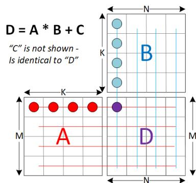

The AMD Matrix Instruction Calculator:

([https://github.com/ROCm/amd\\_matrix\\_instruction\\_calculator](https://github.com/ROCm/amd_matrix_instruction_calculator))

contains a helper tool that allows developers to view detailed information about the matrix instructions in the CDNA5 architecture. It allows users to query instruction-level information such as computational throughput and register usage. It also allows users to generate mappings between matrix element and hardware registers for each matrix instruction and their modifiers.

SWMMAC instructions take a **sparse matrix** for matrix A (matrix B must be dense). Sparse matrices consume half the storage space by requiring that two out of every 4 elements be zero. Index sets are included to specify which 2 elements out of every 4 are zero.

Table 43. WMMA Instructions

| Instruction                    | Matrix A   | Matrix B   | Matrix C & Result |
|--------------------------------|------------|------------|-------------------|
| V_WMMA_F32_16X16X4_F32         | 16x4 F32   | 4x16 F32   | 16x16 F32         |
| V_WMMA_F32_16X16X32_BF16       | 16x32 BF16 | 32x16 BF16 | 16x16 F32         |
| V_WMMA_F32_16X16X32_F16        | 16x32 F16  | 32x16 F16  | 16x16 F32         |
| V_WMMA_F16_16X16X32_F16        | 16x32 F16  | 32x16 F16  | 16x16 F16         |
| V_WMMA_BF16_16X16X32_BF16      | 16x32 BF16 | 32x16 BF16 | 16x16 BF16        |
| V_WMMA_BF16F32_16X16X32_BF16   | 16x32 BF16 | 32x16 BF16 | 16x16 C = F32,    |
| V_WMMA_F32_16X16X64_FP8_FP8    | 16x64 FP8  | 64x16 FP8  | 16x16 F32         |
| V_WMMA_F32_16X16X64_FP8_BF8    | 16x64 FP8  | 64x16 BF8  | 16x16 F32         |
| V_WMMA_F32_16X16X64_BF8_FP8    | 16x64 BF8  | 64x16 FP8  | 16x16 F32         |
| V_WMMA_F32_16X16X64_BF8_BF8    | 16x64 BF8  | 64x16 BF8  | 16x16 F32         |
| V_WMMA_F16_16X16X64_FP8_FP8    | 16x64 FP8  | 64x16 FP8  | 16x16 F16         |
| V_WMMA_F16_16X16X64_FP8_BF8    | 16x64 FP8  | 64x16 BF8  | 16x16 F16         |
| V_WMMA_F16_16X16X64_BF8_FP8    | 16x64 BF8  | 64x16 FP8  | 16x16 F16         |
| V_WMMA_F16_16X16X64_BF8_BF8    | 16x64 BF8  | 64x16 BF8  | 16x16 F16         |
| V_WMMA_F32_16X16X128_FP8_FP8   | 16x128 FP8 | 128x16 FP8 | 16x16 F32         |
| V_WMMA_F32_16X16X128_FP8_BF8   | 16x128 FP8 | 128x16 BF8 | 16x16 F32         |
| V_WMMA_F32_16X16X128_BF8_FP8   | 16x128 BF8 | 128x16 FP8 | 16x16 F32         |
| V_WMMA_F32_16X16X128_BF8_BF8   | 16x128 BF8 | 128x16 BF8 | 16x16 F32         |
| V_WMMA_F16_16X16X128_FP8_FP8   | 16x128 FP8 | 128x16 FP8 | 16x16 F16         |
| V_WMMA_F16_16X16X128_FP8_BF8   | 16x128 FP8 | 128x16 BF8 | 16x16 F16         |
| V_WMMA_F16_16X16X128_BF8_FP8   | 16x128 BF8 | 128x16 FP8 | 16x16 F16         |
| V_WMMA_F16_16X16X128_BF8_BF8   | 16x128 BF8 | 128x16 BF8 | 16x16 F16         |
| V_WMMA_I32_16X16X64_IU8        | 16x64 IU8  | 64x16 IU8  | 16x16 I32         |
| V_SWMMAC_F32_16X16X64_F16      | 16x64 F16  | 64x16 F16  | 16x16 F32         |
| V_SWMMAC_F32_16X16X64_BF16     | 16x64 BF16 | 64x16 BF16 | 16x16 F32         |
| V_SWMMAC_F16_16X16X64_F16      | 16x64 F16  | 64x16 F16  | 16x16 F16         |
| V_SWMMAC_BF16_16X16X64_BF16    | 16x64 BF16 | 64x16 BF16 | 16x16 BF16        |
| V_SWMMAC_BF16F32_16X16X64_BF16 | 16x64 BF16 | 64x16 BF16 | 16x16 C = F32,    |
| V_SWMMAC_F32_16X16X128_FP8_FP8 | 16x128 FP8 | 128x16 FP8 | 16x16 F32         |
| V_SWMMAC_F32_16X16X128_FP8_BF8 | 16x128 FP8 | 128x16 BF8 | 16x16 F32         |
| V_SWMMAC_F32_16X16X128_BF8_FP8 | 16x128 BF8 | 128x16 FP8 | 16x16 F32         |
| V_SWMMAC_F32_16X16X128_BF8_BF8 | 16x128 BF8 | 128x16 BF8 | 16x16 F32         |
| V_SWMMAC_F16_16X16X128_FP8_FP8 | 16x128 FP8 | 128x16 FP8 | 16x16 F16         |
| V_SWMMAC_F16_16X16X128_FP8_BF8 | 16x128 FP8 | 128x16 BF8 | 16x16 F16         |
| V_SWMMAC_F16_16X16X128_BF8_FP8 | 16x128 BF8 | 128x16 FP8 | 16x16 F16         |
| V_SWMMAC_F16_16X16X128_BF8_BF8 | 16x128 BF8 | 128x16 BF8 | 16x16 F16         |

| Instruction                         | Matrix A       | Matrix B       | Matrix C & Result |
|-------------------------------------|----------------|----------------|-------------------|
| V_SWMMAC_I32_16X16X128_IU8          | 16x128 IU8     | 128x16 IU8     | 16x16 I32         |
| V_WMMA_SCALE_F32_16X16X128_F8F6F4   | 16x128 FP4/6/8 | 128x16 FP4/6/8 | 16x16 F32         |
| V_WMMA_SCALE16_F32_16X16X128_F8F6F4 | 16x128 FP4/6/8 | 128x16 FP4/6/8 | 16x16 F32         |
| V_WMMA_SCALE_F32_32X16X128_F4       | 32x128 FP4     | 128x16 FP4     | 32x16 F32         |
| V_WMMA_SCALE16_F32_32X16X128_F4     | 32x128 FP4     | 128x16 FP4     | 32x16 F32         |

"IU8" means that the operand is either signed or unsigned (4 or 8 bits) as indicated by the NEG bits instead of performing negation.

The NEG[1:0] field is repurposed for the "IU" integer types to indicate whether the inputs are signed or not (0=unsigned, 1=signed). For WMMA using IU8 NEG[0] indicates if the A-matrix is signed, NEG[1] indicates if the B-matrix is signed; NEG[2] and NEG\_HI[2:0] must be zero. The destination and C-matrix are signed for the integer types.

{NEG\_HI[2], NEG[2]} is applied on SRC2, and acts as {ABS, NEG}.

For WMMA using FP8/BF8, NEG and NEG\_HI must be set to zero for the A- and B-matrices.

#### **VOP3P Instruction Fields**

| Field Size Description OP 8 instruction opcode SRC0 9 SRC1 9 SRC2 9 comes from VDST). VDST 8 NEG 3 NEG_HI 3 size: Opcodes | NEG[2:0]                     |      |      |      | NEG_HI[2:0] |   |
|---------------------------------------------------------------------------------------------------------------------------|------------------------------|------|------|------|-------------|---|
| IU8                                                                                                                       | 0                            | BSgn | ASgn | 0    | 0           | 0 |
| FP8/BF8                                                                                                                   | CNeg                         | 0    | 0    | CAbs | 0           | 0 |
| FP16/BF16                                                                                                                 | CNeg                         | 0    | 0    | Cabs | 0           | 0 |
| F32 / F64                                                                                                                 | CNeg                         | 0    | 0    | CAbs | 0           | 0 |
| F8F6F4 / F4                                                                                                               | CNeg                         | 0    | 0    | CAbs | 0           | 0 |
| LD_SCALE                                                                                                                  | 0 Cneg = negate for C-matrix | 0    | 0    | 0    | 0           | 0 |

| Field Size Description OPSEL 3 OPSEL_HI 3 Opcodes                              | OPSEL[2:0]                        |   |        |            | OPSEL_HI[2:0] |          |
|--------------------------------------------------------------------------------|-----------------------------------|---|--------|------------|---------------|----------|
| V_SWMMAC_*                                                                     | RA                                | 0 | 0      | RB         | 0             | 0        |
| IU8                                                                            | RA                                | 0 | 0      | RB         | 0             | 0        |
| FP8/BF8                                                                        | RA                                | 0 | 0      | RB         | 0             | 0        |
| FP16/BF16                                                                      | RA                                | 0 | 0      | RB         | 0             | 0        |
| F32 / F64                                                                      | RA                                | 0 | 0      | RB         | 0             | 0        |
| F8F6F4 / F4                                                                    | Atype[2:0]                        |   |        | Btype[2:0] |               |          |
| LD_SCALE                                                                       | RA "0" = must be set to zero.     | 0 | AscSel | RB         | 0             | BscSel   |
| "RA", RB" = reuse matrix-A, reuse B. F8F6F4 has reuse bits in LD_SCALE part of |                                   |   |        |            |               | VOP3PX2. |
| Atype, Btype: A and B matrix data types for F8F6F4. See                        | AscSel, BscSel: select scale bits |   |        | Enums      |               |          |
| CM 1 clamp result. 1=clamp, 0=no_clamp                                         |                                   |   |        |            |               |          |

**V\_WMMA\_SCALE\_F32\_16X16X128\_F8F6F4** and **V\_WMMA\_SCALE16\_F32\_16X16X128\_F8F6F4** are encoded in a different 4-DWORD instruction encoding. See [VOP3PX2](#page-198-0) for details. This also applies to: **V\_WMMA\_SCALE\_F32\_32X16X128\_F4** and **V\_WMMA\_SCALE16\_F32\_32X16X128\_F4**.

"A/B matrix Reuse": hints that either matrix is likely to be used again in the next instruction and should be cached. Reuse should only be set to 1 if the current instruction is the same as the previous instruction, otherwise results are undefined.

#### **WMMA Instruction Capabilities and Restrictions:**

Common to all WMMA ops:

- WMMA instructions are supported only for wave32
- Float format WMMA support only Round to Nearest Even; Integer types do not round
- Mode.Denorm is ignored, and denorms are preserved (not flushed)
- Any NaN input produces a NaN output, and 0\*Inf produces NaN.
- Exceptions are not generated for WMMA/SWMMAC ops
- EXEC must be set to all 1's
- DPP is not supported.
- FP16\_OVFL = 1
  - F64, F32: unused
  - F16, BF16, FP8, BF8, FP6, BF6, FP4: overflow to +/- MAX instead of infinity
  - IU8: saturate rather than overflow result

For WMMA/SWMMAC instruction operating of 16-bit or smaller data, the FP16\_OVFL mode bit controls whether a large result becomes: FP16\_OVFL==0: +/- infinity; FP16\_OVFL==1: +/- maxValue.

# **7.12.1. Requirements for WMMA data hazards**

In the table below "**V\_NOP**" means either a V\_NOP instruction or another unrelated (independent) VALU instruction in between the first and second instruction in the table. "**Same**" implies either source and dest are the exact same VGPRs, or partially overlapping sets of VGPRs.

| 1st instruction 2nd instruction        | Software Requirement                |
|----------------------------------------|-------------------------------------|
| A/B/Index same as previous instruction | 's                                  |
| A/B/Index same as previous instruction | 's                                  |
| A/B/Index same as previous instruction | 's                                  |
| A/B/Index same as previous instruction | 's                                  |
| A/B/Index same as previous instruction | 's                                  |
| A/B/Index same as previous instruction | 's                                  |
| previous XDL WMMA instruction          | 's Matrix D                         |
| previous XDL S/WMMA instruction        | 's Matrix D                         |
| previous XDL S/WMMA instruction        | 's Matrix                           |
|                                        | If co-exec is disabled: no V_NOP 's |
| previous XDL WMMA instruction          | 's Matrix D                         |
| previous XDL S/WMMA instruction        | 's Matrix D                         |
| previous XDL S/WMMA instruction        | 's Matrix                           |
|                                        | If co-exec is disabled: no V_NOP 's |

| 1st instruction 2nd instruction | Software Requirement                     |
|---------------------------------|------------------------------------------|
| previous XDL WMMA instruction   | 's Matrix D                              |
| previous XDL S/WMMA instruction | 's Matrix D                              |
| previous XDL S/WMMA instruction | 's Matrix                                |
|                                 | If co-exec is disabled: no V_NOP 's      |
| WMMA_IU8                        | VALU instruction with source same as the |
| previous XDL S/WMMA instruction | 's Matrix D                              |
| previous XDL S/WMMA instruction | 's Matrix D                              |
| previous XDL S/WMMA instruction | 's Matrix                                |
|                                 | If co-exec is disabled: no V_NOP 's      |
| previous XDL S/WMMA instruction | 's Matrix D                              |
| previous XDL S/WMMA instruction | 's Matrix D                              |
| previous XDL S/WMMA instruction | 's Matrix                                |
|                                 | If co-exec is disabled: no V_NOP 's      |
| previous XDL S/WMMA instruction | 's Matrix D                              |
| previous XDL S/WMMA instruction | 's Matrix D                              |
| previous XDL S/WMMA instruction | 's Matrix                                |
|                                 | If co-exec is disabled: no V_NOP 's      |

# **7.12.2. Matrix Element Storage in VGPRs**

This section describes in detail where each element in a matrix is stored: which lane and which VGPR. The tables below shows how matrix elements are stored in VGPRs for various data-sizes and wave-sizes. Verilogstyle notation is used to represent bit extractions.

### **Simplified view of matrix layout in VGPRs:**

The A matrix is laid out in VGPRs such that one row of data is striped across VGPRs within one lane (although due to storage limitations it may wrap into another lane). The B, C and D matrices are laid out in the opposite manner: one row of the matrix is striped across the lanes within one VGPR.

The next section provides the details of this layout.

All layouts follow the below procedure to map a matrix element referenced by its row and column to a specific VGPR address, lane index and bit offset within the VGPR. For sparse matrices this procedure is applied on the pre-expanded matrix data.

In the tables below that describe an A-matrix (MxK) they also describe the layout of a B-matrix: substitute "M" for "N". Note however that the diagrams appear transposed from the typical way of viewing an A-matrix.

#### 32-bit C/D-Matrix 16x16 (MxN):

| 32-bit | Lane: 0 | 1 | 2 | 3   | 15 | 16 | 17 |      | 30 | 31 |
|--------|---------|---|---|-----|----|----|----|------|----|----|
| VGPR   | N = 0   | 1 | 2 | 3   | 15 | 0  | 1  |      | 14 | 15 |
| 0      |         |   |   | M=0 |    |    |    | M=8  |    |    |
| 1      |         |   |   | M=1 |    |    |    | M=9  |    |    |
| 2      |         |   |   | M=2 |    |    |    | M=10 |    |    |
| 7      |         |   |   | M=7 |    |    |    | M=15 |    |    |

A 32x16 F32 C/D matrix is double the above matrix: M=0..15 in VGPRs 0..7, and M=16..31 in VGPRs 8..15.

A 16x16 matrix multiply producing a 32-bit result uses the "32-bit C/D matrix" format. The 16-bit C/D matrix is similar but uses half as many VGPRs with each VGPR storing [M,N] in bits [15:0] and [M+1,N] in [31:16]:

### 16-bit C/D-Matrix 16x16 (MxN):

|      | Lane: 0 | 1 | 2 3                           | 15 | 16 | 17 | 30       | 31 |
|------|---------|---|-------------------------------|----|----|----|----------|----|
| VGPR | N = 0   | 1 | 2 3                           | 15 | 0  | 1  | 14       | 15 |
| 0    |         |   | M=0 in [15:0], M=1 in [31:16] |    |    |    | M=8, 9   |    |
| 1    |         |   | M=2, 3                        |    |    |    | M=10, 11 |    |
| 2    |         |   | M=4, 5                        |    |    |    | M=12, 13 |    |
| 3    |         |   | M=6, 7                        |    |    |    | M=14, 15 |    |

#### 32-bit A-Matrix 16x4 (MxK):

|      | Lane: 0 | 1 | 2 | 3   | 15 | 16 | 17 |     | 30 | 31 |
|------|---------|---|---|-----|----|----|----|-----|----|----|
| VGPR | M = 0   | 1 | 2 | 3   | 15 | 0  | 1  |     | 14 | 15 |
| 0    |         |   |   | K=0 |    |    |    | K=2 |    |    |
| 1    |         |   |   | K=1 |    |    |    | K=3 |    |    |

#### 16-bit A-Matrix 16x32 (MxK):

|       | Lane: 0 | 1 | 2 3                           | 15 | 16 | 17 |          | 30 | 31 |
|-------|---------|---|-------------------------------|----|----|----|----------|----|----|
| VGPR  | M = 0   | 1 | 2 3                           | 15 | 0  | 1  |          | 14 | 15 |
| 0     |         |   | K=0 in [15:0], K=1 in [31:16] |    |    |    | K=8, 9   |    |    |
| 1     |         |   | K=2, 3                        |    |    |    | K=10, 11 |    |    |
| 2     |         |   | K=4, 5                        |    |    |    | K=12, 13 |    |    |
| 3     |         |   | K=6, 7                        |    |    |    | K=14, 15 |    |    |
| 4 - 7 |         |   | K=16-23                       |    |    |    | K=24-31  |    |    |

#### 8-bit A-Matrix 16x64 (MxK):

|       | Lane: 0 1 2 3 15                                            | 16 | 17 | 30            | 31 |
|-------|-------------------------------------------------------------|----|----|---------------|----|
| VGPR  | M = 0 1 2 3 15                                              | 0  | 1  | 14            | 15 |
| 0     | K=0 in [7:0], K=1 in [15:8], K=2 in [23:16], K=3 in [31:24] |    |    | K=8-11        |    |
| 1     | K=4-7                                                       |    |    | K=12-15       |    |
| 2     | K=16-19                                                     |    |    | K=24-27       |    |
| 3     | K=20-23                                                     |    |    | K=28-31       |    |
| 4 - 7 | K=(Above +32)                                               |    |    | K=(Above +32) |    |

A 16x128 8-bit matrix is just two 16x64 matrices in consecutive VGPRs.

4-bit A-Matrix 16x128 (MxK):

|       | Lane: 0 1 2 3 15                              | 16 | 17 | 30            | 31 |
|-------|-----------------------------------------------|----|----|---------------|----|
| VGPR  | M = 0 1 2 3 15                                | 0  | 1  | 14            | 15 |
| 0     | K=0 in [3:0], K=1 in [7:4], …, K=7 in [31:28] |    |    | K=32-39       |    |
| 1     | K=8-15                                        |    |    | K=40-47       |    |
| 2     | K=16-23                                       |    |    | K=48-55       |    |
| 3     | K=24-31                                       |    |    | K=56-63       |    |
| 4 - 7 | K=(Above +64)                                 |    |    | K=(Above +64) |    |

A 32x128 matrix is just two 16x128 matrices in consecutive VGPRs, with M=16..31 in the second set of VGPRs.

**Matrix Layouts for block-shared exponent formats**: See next section.

Table 44. ISA Operand Fields

| Instruction Type | Operand | Meaning                |
|------------------|---------|------------------------|
| WMMA / SWMMAC    | SRC0    | A-Matrix               |
| WMMA / SWMMAC    | SRC1    | B-Matrix               |
| WMMA             | SRC2    | C-Matrix               |
| SWMMAC           | SRC2    | Sparse Index Data      |
| WMMA             | VDST    | D-Matrix               |
| SWMMAC           | VDST    | C-Matrix and D-Matrix. |

# **7.12.3. Structured Sparse Matrices**

A-matrices may be sparse, where a packed 16-bit 16x32 (M x K) A-matrix represents a 16x64 matrix in which 2 out of every 4 entries in the "K" dimension are zero. Sparse matrices use a set of index data which has two 2-bit index values to define the expansion from packed to unpacked format. When the A-matrix is a 4:2 sparse matrix, the corresponding B-matrix must be 64x16 (KxN), and loaded in column-major order.

Sparsity information is loaded into a single VGPR (SRC2) and each 2-bit index entry identifies which 2 out 4 entries are non-zero. The two indices have the rule: **Idx0 < Idx1**. Sparse matrix index bits are arranged in the VGPR in the same way as columns are arranged in the A-matrix: the values that can be found in the lane-0 VGPRs are the same ones controlled by the index values in lane 0 of the index VGPR.

Loads (with or without transpose) are the same as the 16x16 matrix load, except that two load instructions are used and they load into the next consecutive group of VGPRs.

# **7.12.4. 16-bit Sparse Matrices**

Matrices using 16-bit source data are arranged as: M=16, N=16, K=64. The A-matrix is 4:2 structured-sparse and stored as M=16, K=32, and is then expanded to M=16, K=64.

B matrix 64x16 (wave32) : 2 groups of K=32 Vn: lanes0-15 hold K=0 and K=1; lanes 16-31 hold K=16, K=17 Vn+1: lanes0-15 hold K=2 and K=3; lanes 16-31 hold K=18, K=19 ... Vn+7: lanes0-15 hold K=14 and K=15; lanes 16-31 hold K=30, K=31 Vn+8: lanes0-15 hold K=32 and K=33; lanes 16-31 hold K=48, K=49 ... Vn+15: lanes0-15 hold K=46 and K=47; lanes 16-31 hold K=62, K=63

#### **Index layout**

Every unpacked set of four elements needs two 2-bit index values, so the sparsity for K=16 packed elements can be described in a single lane (32-bits). Each lane holds 16 2-bit codes to expand 16 entries in the K-dimension to 32 entries. Lane0 holds K=0..15 for M=0; lane1 for M=1; lane15 for M=15; lane16 holds K=16..31 for M=0; etc. Index bits[1:0] apply to V0[15:0], bits[3:2] to V0[31:16], bits[5:4] to V1[15:0], etc.

 For row = 0..15 For col = 0..64, step=4 // step through groups of 4 columns (K) in the expanded A matrix // Idx0 & idx1 indicate which 2 of 4 A-matrix entries are non-zero idxFirstBit = (col[4:2]\*4) lane = col[5]\*16 + row idx0 = VGPR[SRC2][lane][idxFirstBit+1 : idxFirstBit+0] idx1 = VGPR[SRC2][lane][idxFirstBit+3 : idxFirstBit+2] idx0\_value = Packed\_A\_matrix[row][col/2] idx1\_value = Packed\_A\_matrix[row][col/2 + 1] Unpacked\_A\_Matrix[row][col+0] = idx0==0 ? idx0\_value : 0 Unpacked\_A\_Matrix[row][col+1] = idx0==1 ? idx0\_value : idx1==1 ? idx1\_value : 0; Unpacked\_A\_Matrix[row][col+2] = idx0==2 ? idx0\_value : idx1==2 ? idx1\_value : 0; Unpacked\_A\_Matrix[row][col+3] = idx1==3 ? idx1\_value : 0;

## **7.12.5. 8-bit Sparse Matrices**

The sparse A-matrix is 16x64 and it expands to 16x128 8-bit values. The matrix is stored in 8 VGPRs for wave32.

B matrix 128x16 (wave32): Vn: lanes0-15 hold K=0..3; lanes 16-31 hold K=16..19 ... Vn+3: lanes0-15 hold K=12..15; lanes 16-31 hold K=28..31 Vn+4: lanes0-15 hold K=32..35; lanes 16-31 hold K=48..51 Vn+7: lanes0-15 hold K=44..47; lanes 16-31 hold K=60..63 Then Vn+8 - Vn+15 have the same pattern but for K=64..127

#### **Index layout**

Index bits[1:0] apply to V0[7:0]; bits[3:2] apply to V0[15:8], etc up to bits[31:30] apply to V3[31:24] for lanes 0..31.

# **7.12.6. WMMA Operations with Block-Scale: F4, F6, F8**

The V\_WMMA\_SCALE16\_F32\_16X16X128\_F8F6F4 and V\_WMMA\_SCALE\_F32\_16X16X128\_F8F6F4 opcodes can operate on a mix of FP4, FP6 and FP8 for the A-matrix and B-matrix. The V\_WMMA\_SCALE16\_F32\_32X16X128\_F4 and V\_WMMA\_SCALE\_F32\_32X16X128\_F4 opcodes operate on FP4 data for A and B matrix.

These matrix operations do not supported structured sparsity.

These are encoding using a 4-DWORD encoding. See [VOP3PX2](#page-198-0) for details.

Matrix block scaling associates a unique scale factor for a block size of 16 or 32 in the A or B matrices. The scale factor is an 8bit value, in one of a few data formats: E8M0, E5M3 or E4M3. One scale value applies to a 1x32 (K=32) set of values on the A or B matrices, or 1x16 (K=16) set of values. Block scaling is valid only with FP8/BF8, FP6/BF6 and FP4 formats.

The figure below gives an illustrative example of block scaling, showing a tiled matrix multiplication operation of D = A x B, where A is of shape (M x K), B is of shape (K x N), and D is of shape M x N. The row and column scale factors, Ax and Bx, are vectors of dimension M and N, respectively, that store the scale factors that are needed for computing D. In the example below where M=K=N=4, scale factors are provided with every 1x4 row of matrix A and every 4x1 column of matrix B. During dot product operations, the scales are applied after the normal dot product prior to output/accumulation.

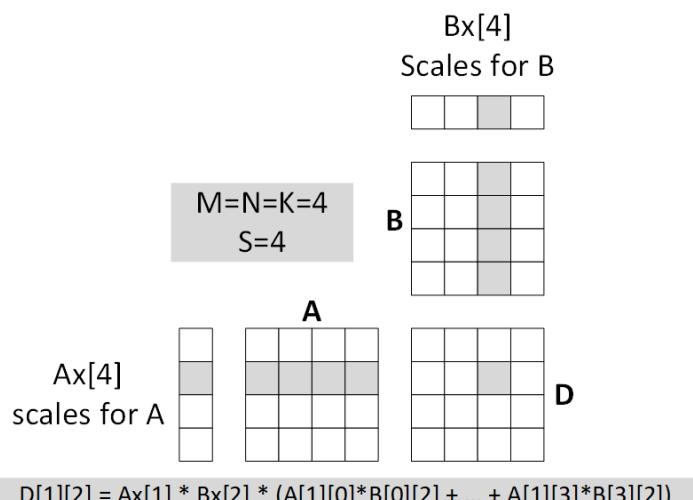

The data type of Matrix A is determined by OPSEL[2:0], and Matrix B by OPSEL\_HI[2:0]:

- 0. FP8: E4M3
- 1. BF8: E5M2
- 2. FP6: E2M3
- 3. BF6: E3M2
- 4. FP4: E2M1

The data type of Matrix A block-scale factor is controlled by NEG[1:0], and Matrix B by NEG\_HI[1:0] in the scale ISA DWORDS:

- 0. E8M0
- 1. E5M3

#### 2. E4M3

|               | E4M3 scale           | E5M3 scale               | E8M0 scale |
|---------------|----------------------|--------------------------|------------|
| Exponent Bias | 7                    | 15                       | 127        |
| Inf           | N/A                  | N/A                      | N/A        |
| NaN           | 111_1111             | 1111_1111                | 11111111   |
| Zero          | 000_0000             | 0000_0000                | N/A        |
| Max Normal    | 111_1110 = 1.75 * 2  | 8                        |            |
|               |                      | 1111_1110 = 114688       | 11111110 2 |
|               |                      |                          | = 2 127    |
| Min Normal    | 000_1000 = 2 -6      | 0000_1000 = 2 -14        | 00000000 2 |
|               |                      |                          | = 2 -127   |
| Max Denorm    | 000_0111 = 0.875 * 2 | -6 0000_0111 = 0.875 * 2 | -14 N/A    |
| Min Denorm    | 000_0001 = 2 -9      | 0000_0001 = 2 -17        | N/A        |

**The table below shows the legal combinations of A and B matrix data and scale types**

| Matrix A   | Matrix A Scale | Matrix B   | Matrix B Scale |
|------------|----------------|------------|----------------|
| F8, F6, F4 | E8M0           | F8, F6, F4 | E8M0           |
| F8, F6     | E8M0           | F4         | E5M3, E4M3     |
| F4         | E5M3, E4M3     | F8, F6     | E8M0           |
| F4         | E5M3           | F4         | E5M3           |
| F4         | E4M3           | F4         | E4M3           |

It is legal to select any value from a table cell above that has multiple values.

E.g., A-matrix F8-E8M0 with B-matrix F6-E8M0 is valid.

To convert from FP32 to E5M3 scale, use V\_CVT\_PK\_FP8\_F32, V\_CVT\_F32\_FP8, or V\_CVT\_SR\_FP8\_F32. These instructions use the CLAMP ISA bit to indicate:

0: normal convert operation to E4M3.

1: convert F32 into E5M3, with FP16\_OVFL controlling overflow behavior. Result is in bits [7:0].

#### **Clauses and WMMA with block-scale**

- Clauses with VOP3PX2 instructions must be at least 3 instructions long (the 4-dword instruction counts as 2 instructions)
- Clause must not end with a VOP3PX2 instruction
- Clauses that contain VOP3PX2 instructions must not have EXEC==0 at the start or change to zero while running (e.g. due to a previous V\_CMPX that has not yet completed and is going to set EXEC to zero). Software needs to ensure this via either knowing no EXEC changes via VALU instructions are in-flight, or waiting by using an SALU instruction that reads EXEC.

### **7.12.6.1. Matrix Data Layout**

In all layouts below, 16 or 32 contiguous values along the K-dimension share a single SCALE value. This referred to as the "block size" (16 or 32), or "values per scale".

The tables below show the A-matrix layout. The B-matrix layout is identical except it uses the N dimension instead of the M dimension.

### **7.12.6.1.1. 8-bit Floats**

Matrix data is stored in 16 contiguous VGPRs for wave32.

|     | Lane: 0 1 2                                                                  | 3 15 16 17 30 31 |
|-----|------------------------------------------------------------------------------|------------------|
|     | M = 0 1 2                                                                    | 3 15 0 1 14 15   |
| V0  | K=0..3 Lane0 holds M=0, Lane1 holds M=1, etc. (K=0 in [7:0], K=3 in [31:24]) | K=16..19         |
| V1  | K=4..7                                                                       | K=20..23         |
| V2  | K=8..11                                                                      | K=24..27         |
| V3  | K=12..15                                                                     | K=28..31         |
| V4  | K=32..35                                                                     | K=48..51         |
| V7  | K=44..47                                                                     | K=60..63         |
| V8  | K=64..67                                                                     | K=80..83         |
| V12 | K=96..99                                                                     | K=112..115       |
| V15 | K=108..111                                                                   | K=124..127       |

### **7.12.6.1.2. 6-bit Floats**

Matrix data is stored in 12 contiguous VGPRs for wave32.

Concatenate the 6 VGPRs of Lane 0 {V5, V4, V3, V2, V1, V0} = { K=31, K=30, K=29, … K=1, K=0 }.

|         | Lane: 0  | 1 | 2 | 3 | 15 | 16 17     | 30 | 31 |
|---------|----------|---|---|---|----|-----------|----|----|
|         | M = 0    | 1 | 2 | 3 | 15 | 0 1       | 14 | 15 |
| V0..V5  | K=0..31  |   |   |   |    | K=32..63  |    |    |
| V6..V11 | K=64..95 |   |   |   |    | K=96..127 |    |    |

### **7.12.6.1.3. 4-bit Floats**

Matrix data is stored in 8 contiguous VGPRs for wave32.

|        | Lane: 0  | 1 | 2 | 3 | 15 | 16 17     | 30 | 31 |
|--------|----------|---|---|---|----|-----------|----|----|
|        | M = 0    | 1 | 2 | 3 | 15 | 0 1       | 14 | 15 |
| V0..V3 | K=0..31  |   |   |   |    | K=32..63  |    |    |
| V4..V7 | K=64..95 |   |   |   |    | K=96..127 |    |    |

### **7.12.6.2. Matrix Scale Values**

The V\_WMMA\_SCALE\* instruction provide two sets of scale factors: one for the A-matrix and one for the Bmatrix. Each scale value is shared by 16 or 32 matrix entries along the K dimension (i.e., "block size").

| Instruction                      | Block |                                       |          |
|----------------------------------|-------|---------------------------------------|----------|
|                                  |       | A matrix                              | B matrix |
| V_WMMA_SCALE_F32_ 16 X16X128_F   |       |                                       |          |
|                                  | 32    | 16x128: 64 scales in 1/2 of 1 VGPR,   |          |
| V_WMMA_SCALE_F32_ 32 X16X128_F   |       |                                       |          |
|                                  | 32    | 32x128: 128 scales in 1 VGPR, OPSEL   |          |
| V_WMMA_SCALE 16 _F32_ 16 x16x128 |       |                                       |          |
|                                  | 16    | 16x128: 128 scales in 1/2 of 2 VGPRs, |          |
| V_WMMA_SCALE 16 _F32_ 32 x16x128 |       |                                       |          |
|                                  | 16    | 32x128: 256 scales in 2 VGPRs, OPSEL  |          |

**SCL\_OPSEL[0], SCL\_OPSEL\_HI[0]**: 0 = use lanes 0..15; 1 = use lanes 16..31 for scale values. "2 VGPRs" must be even-aligned.

The SRC0 and SRC1 ISA fields that holds the SCALE factors do not use the VGPR-MSB's, and instead treat them as if they were zero.

When a source is an SGPR, only bits [7:0] are used, and when the inline constant zero is used, the value supplied is 0x7F (scale by 1.0).

### **F8 A-Matrix with SCL\_OPSEL[0]==0 with 32-values per scale:**

(when SCL\_OPSEL[0]==1, lanes 16..31 are used instead)

| Bits    | Lane 0         | Lane 1         | Lane 15         | Lane 16 … Lane 31 |
|---------|----------------|----------------|-----------------|-------------------|
| [7:0]   | M=0, K=0..31   | M=1, K=0..31   | M=15, K=0..31   | Unused            |
| [15:8]  | M=0, K=32..63  | M=1, K=32..63  | M=15, K=32..63  | Unused            |
| [23:16] | M=0, K=64..95  | M=1, K=64..95  | M=15, K=64..95  | Unused            |
| [31:24] | M=0, K=96..127 | M=1, K=96..127 | M=15, K=96..127 | Unused            |

#### **F8 A-Matrix with 16-values per scale:**

(when SCL\_OPSEL[0]==1, lanes 16..31 are used instead)

|           | M/N = 0..7         | M/N = 8..15        | M/N = 0..7  | M/N = 8..15 |
|-----------|--------------------|--------------------|-------------|-------------|
|           | Lane 0..7          | Lane 8..15         | Lane 16..23 | Lane 24..31 |
| v0[7:0]   | scale k = 0..15    | scale k = 0..15    | Unused      | Unused      |
| v0[15:8]  | scale k = 16..31   | scale k = 16..31   | Unused      | Unused      |
| v0[23:16] | scale k = 32..47   | scale k = 32..47   | Unused      | Unused      |
| v0[31:24] | scale k = 48..63   | scale k = 48..63   | Unused      | Unused      |
| v1[7:0]   | scale k = 64..79   | scale k = 64..79   | Unused      | Unused      |
| v1[15:8]  | scale k = 80..95   | scale k = 80..95   | Unused      | Unused      |
| v1[23:16] | scale k = 96..111  | scale k = 96..111  | Unused      | Unused      |
| v1[31:24] | scale k = 112..127 | scale k = 112..127 | Unused      | Unused      |

### **F4 A-matrix (32x128) with 32 values per scale** (1 VGPR holds all scales)

| Bits    | Lane 0         | Lane 1         | Lane 15         | Lane 16 … Lane 31   |
|---------|----------------|----------------|-----------------|---------------------|
| [7:0]   | M=0, K=0..31   | M=1, K=0..31   | M=15, K=0..31   | M=16..31, K=0..31   |
| [15:8]  | M=0, K=32..63  | M=1, K=32..63  | M=15, K=32..63  | M=16..31, K=32..63  |
| [23:16] | M=0, K=64..95  | M=1, K=64..95  | M=15, K=64..95  | M=16..31, K=64..95  |
| [31:24] | M=0, K=96..127 | M=1, K=96..127 | M=15, K=96..127 | M=16..31, K=96..127 |

#### **F4 A-matrix (32x128) with 16 values per scale** (2 VGPRs hold all scales)

|           | Lane 0..7          | Lane 8..15         | Lane 16..23        | Lane 24..31        |
|-----------|--------------------|--------------------|--------------------|--------------------|
|           | M=0..7             | M=8..15            | M=16..23           | M=24..31           |
| v0[7:0]   | scale k = 0..15    | scale k = 0..15    | scale k = 0..15    | scale k = 0..15    |
| v0[15:8]  | scale k = 16..31   | scale k = 16..31   | scale k = 16..31   | scale k = 16..31   |
| v0[23:16] | scale k = 32..47   | scale k = 32..47   | scale k = 32..47   | scale k = 32..47   |
| v0[31:24] | scale k = 48..63   | scale k = 48..63   | scale k = 48..63   | scale k = 48..63   |
| v1[7:0]   | scale k = 64..79   | scale k = 64..79   | scale k = 64..79   | scale k = 64..79   |
| v1[15:8]  | scale k = 80..95   | scale k = 80..95   | scale k = 80..95   | scale k = 80..95   |
| v1[23:16] | scale k = 96..111  | scale k = 96..111  | scale k = 96..111  | scale k = 96..111  |
| v1[31:24] | scale k = 112..127 | scale k = 112..127 | scale k = 112..127 | scale k = 112..127 |

The load-scale portion of VOP3PX2 uses the OPSEL[2] and OPSEL\_HI[2] fields to indicate that it is likely that the A or B matrix from this instruction is going to be reused in the next instruction:

OPSEL[2] = A matrix (1 = reuse, 0 = normal)

OPSEL\_HI[2] = B matrix (1 = reuse, 0 = normal)

# **Chapter 8. Scalar Memory Operations**

Scalar Memory Loads (SMEM) instructions allow a shader program to load data from memory into SGPRs through the Constant Cache ("Kcache"). Instructions can load from 1 to 16 DWORDs. Data is loaded directly into SGPRs without any format conversion (no data formatting is supported).

The scalar unit loads consecutive DWORDs from memory to the SGPRs. One common use for SMEM loads is for loading ALU constants and for indirect T#/S#/V# lookup.

Loads come in two forms: one that simply takes a base-address pointer, and the other that uses a buffer resource (V#) to provide: base, size and stride.

# **8.1. Microcode Encoding**

Scalar memory load instructions are encoded using the SMEM microcode format.

The fields are described in the table below:

Table 45. SMEM Encoding Field Descriptions

| Field   | Size | Description                                                                                     |
|---------|------|-------------------------------------------------------------------------------------------------|
| OP      | 6    | Opcode. See the next table.                                                                     |
| SDATA   | 7    | SDATA specifies the SGPRs to load the data into.                                                |
|         |      | SDATA must be: SGPR or VCC. Not: EXEC, or M0 . NULL is allowed                                  |
| SBASE   | 6    | SGPR-pair (SBASE has an implied LSB of zero) that provides a base address, or for BUFFER        |
| IOFFSET | 24   | Instruction Address Offset : An immediate signed byte offset.                                   |
| SOFFSET | 7    | SGPR that has the 32-bit unsigned byte offset. May only specify an SGPR, M0 or set to "NULL" to |
| SCOPE   | 2    | Memory Scope                                                                                    |
| TH      | 2    | Memory Temporal Hint                                                                            |
|         | 1    | Scale the address-offset SGPR by the data size, or not. Usable only with non-BUFFER load ops.   |
| NV      | 1    | Non-Volatile Memory Access                                                                      |

See [Cache Controls: SCOPE and Temporal-Hint](#page-43-0) for more information about SCOPE and TH bits.

Table 46. SMEM Instructions

| Opcode # | Name       | Opcode # | Name               |
|----------|------------|----------|--------------------|
| 0        | S_LOAD_B32 | 19       | S_BUFFER_LOAD_B256 |
| 1        | S_LOAD_B64 | 20       | S_BUFFER_LOAD_B512 |

| Opcode # | Name               | Opcode # | Name                   |
|----------|--------------------|----------|------------------------|
| 2        | S_LOAD_B128        | 21       | S_BUFFER_LOAD_B96      |
| 3        | S_LOAD_B256        | 24       | S_BUFFER_LOAD_I8       |
| 4        | S_LOAD_B512        | 25       | S_BUFFER_LOAD_U8       |
| 5        | S_LOAD_B96         | 26       | S_BUFFER_LOAD_I16      |
| 8        | S_LOAD_I8          | 27       | S_BUFFER_LOAD_U16      |
| 9        | S_LOAD_U8          | 33       | S_DCACHE_INV           |
| 10       | S_LOAD_I16         | 36       | S_PREFETCH_INST        |
| 11       | S_LOAD_U16         | 37       | S_PREFETCH_INST_PC_REL |
| 16       | S_BUFFER_LOAD_B32  | 38       | S_PREFETCH_DATA        |
| 17       | S_BUFFER_LOAD_B64  | 39       | S_BUFFER_PREFETCH_DATA |
| 18       | S_BUFFER_LOAD_B128 | 40       | S_PREFETCH_DATA_PC_REL |

These instructions load 1-16 DWORDs from memory. The SDATA field indicates which SGPRs to load data into, and the address is composed of the SBASE, OFFSET, and SOFFSET fields.

SMEM loads may use NULL as a destination SGPR in order to achieve a "prefetch data with acknowledge".

# **8.1.1. Scalar Memory Addressing**

Non-buffer S\_LOAD instructions use the following formula to calculate the memory address:

 def alignToSize(addr): return (dataSize == 8bit ? addr : dataSize == 16bit ? addr & ~1 : addr & ~3) "dataSize" = size of data from the opcode (e.g. U8, B128) ADDR = alignToSize(SGPR[base]) + alignToSize(IOFFSET) + alignToSize({ M0 or SGPR[offset] or zero } \* ScaleFactor) where ScaleFactor = 1,2,4,8,12,16,32,64, or 1 if SCALE\_OFFSET==0

All components of the address (base, offset, IOFFSET, M0) are in bytes, but the two LSBs of each component are ignored and treated as if they were zero except for 8- and 16-bit loads. For 16-bit loads the one LSB of the each component is ignored and treated as zero. For 8-bit loads the full byte address of each component is used.

For S\_LOAD (non-buffer) instructions, it is legal if (IOFFSET + (M0, SGPR[offset], or zero)) is negative.

For S\_BUFFER\_LOAD, it is illegal and undefined for IOFFSET to be negative.

Shaders often use ALU instructions to compute simple memory addresses where there offset is a multiple of the data-payload size ("element size"). SMEM instructions can perform this multiply automatically for small element sizes using the SCALE\_OFFSET ISA bit. The ScaleFactor is determined by the instruction's data size. E.g. B8 = 1, B16 = 2, B96 = 12, etc. This is supported only for simple loads, not S\_BUFFER\_LOAD nor prefetch ops.

# **8.1.2. Loads using Buffer Resource (V#)**

S\_BUFFER\_LOAD instructions use a similar formula, but the base address comes from the buffer resource's base\_address field.

Buffer resource fields used: base\_address, stride, num\_records; other fields are ignored.

Scalar memory load does not support "swizzled" buffers. **Stride** is used only for memory address bounds checking, not for computing the address to access.

The SMEM supplies only a SBASE address (byte) and an offset (byte). Any "index \* stride" must be calculated manually in shader code and added to the offset prior to the SMEM. IOFFSET must be non-negative - a negative value of IOFFSET results in a MEMVIOL.

The two LSBs of V#.base are ignored and treated as if they were zero except for 8- and 16-bit loads. For 16-bit loads the one LSB of V#.base is ignored and treated as zero. For 8-bit loads the full byte address of V#.base is used.

"m\_\*" components come from the buffer resource (V#): def alignToSize(addr): return (dataSize == 8bit ? addr : dataSize == 16bit ? addr & ~1 : addr & ~3) resource = { SGPR[SBASE \* 2 +3], SGPR[SBASE \* 2 +2], SGPR[SBASE \* 2 +1], SGPR[SBASE \* 2] } m\_base = alignToSize(resource[56:0], dataSize) m\_stride = resource[121:108] m\_num\_records = resource[101:57] offset = alignToSize(IOFFSET) + alignToSize(SOFFSET) m\_size = alignToSize((m\_stride == 0 ? 1 : m\_stride) \* m\_num\_records) addr = m\_base + offset SGPR[SDST] = load\_dword\_from\_dcache(addr, m\_size) If more than 1 DWORD is being loaded, it is returned to SDST+1, SDST+2, etc, and the offset is incremented by 4 bytes per DWORD. Note: the V#.stride\_scale field is ignored.

# **8.1.3. Loads of 8 and 16-bit Data**

- S\_LOAD\_U8: load 8-bit unsigned data, zero-extend to 32 bits
- S\_LOAD\_I8: load 8-bit signed data, sign-extend to 32 bits
- S\_LOAD\_U16: load 16-bit unsigned data, zero-extend to 32 bits
- S\_LOAD\_I16: load 16-bit signed data, sign-extend to 32 bits

Same for S\_BUFFER\_LOAD.

16-bit loads must be **16-bit aligned** in memory.

# **8.1.4. S\_DCACHE\_INV**

These instructions invalidate the entire scalar constant cache. It does not return anything to SDST. S\_DCACHE\_INV does not have any address or data arguments.

# **8.2. Dependency Checking**

Scalar memory loads can return data out-of-order from how they were issued; they can return partial results at different times when the load crosses two cache lines. The shader program uses the KMcnt counter to

determine when the data has been returned to the SDST SGPRs. This is done as follows.

- KMcnt is incremented by 1 for every fetch of a single DWORD, or cache invalidates.
- KMcnt is incremented by 2 for every fetch of two or more DWORDs.
- KMcnt is decremented by an equal amount when each instruction completes.

Because the instructions can return out-of-order, the only sensible way to use this counter is to implement "S\_WAIT\_KMCNT 0"; this imposes a wait for all data to return from previous SMEMs before continuing.

Cache invalidate instructions are not known to have completed until the shader waits for KMcnt==0.

# **8.3. Scalar Memory Clauses and Groups**

A **clause** is a sequence of instructions starting with S\_CLAUSE and continuing for 2-63 instructions. Clauses lock the instruction arbiter onto this wave until the clause completes.

A **group** is a set of the same type of instruction that happen to occur in the code but are not necessarily executed as a clause. A group ends when a non-SMEM instruction is encountered. Scalar memory instructions are issued in groups. The hardware does not enforce that a single wave executes an entire group before issuing instructions from another wave.

#### **Group restrictions:**

- INV must be in a group by itself and may not be in a clause

# **8.4. Alignment and Bounds Checking**

#### **SDST**

The value of SDST must be even for fetches of two DWORDs, or a multiple of four for larger fetches. If this rule is not followed, invalid data can result.

#### **SBASE**

The value of SBASE must be even for S\_BUFFER\_LOAD (specifying the address of an SGPR that is a multiple of four). If SBASE is out-of-range, the value from SGPR0 is used.

#### **OFFSET**

The value of OFFSET has no alignment restrictions.

# **8.4.1. Address and GPR Range Checking**

The hardware checks for both the address being out of range (BUFFER instructions only), and for the source or destination SGPRs being out of range.

### Memory addresses are forced into alignment:

The base address is forced to DWORD alignment; DWORD or larger loads force memory address to DWORD alignment; loads of 16-bit data force the address to 2-byte alignment, and byte loads have no forced alignment.

where "offset" is: IOFFSET + {M0 or sgpr-offset} Any DWORDs that are out of range in memory from a buffer\_load return zero. If a multi-DWORD request (e.g. S\_BUFFER\_LOAD\_B256) is partially out of range, the DWORDs that are in range return data as normal, and the out-of-range DWORDs return zero.

**Source SGPR out of range** If any source data is out of the range of SGPRs (either partially or

completely), the value 'zero' is used instead.

**Destination SGPR out of range** If the destination SGPR is partially or fully out of range, no data is

written back to SGPRs for this instruction.

# **8.5. Scalar Prefetch Instructions**

The shader can request that instructions or data be prefetched into the first-level cache via shader instructions. These do not use KMcnt.

They also do not "xnack-retry".

The cache reuse policies are controlled through the SCOPE and TH bits and apply to data-prefetch, but not instruction prefetch.

These instructions are skipped (treated as S\_NOP) if MODE.SCALAR\_PREFETCH\_EN == 0.

Prefetch Length: SOFFSET holds an SGPR/M0 (int) with the length, or set to NULL for zero, and SDATA carries a literal constant value (set to 0 to ignore). The sum is 0-31 (modulo 32 - upper bits dropped) representing a prefetch size of 1-32 chunks of 128Bytes.

All components of the address (base, offset, IOFFSET, M0) are in bytes, but the two LSBs of each component are ignored and treated as if they were zero.

## **8.5.1. Prefetching Data**

These instructions prefetch data into the constant cache using either a simple address, a buffer resource (V#), or PC-relative address.

Shaders must s\_wait\_xcnt 0 before any s\_prefetch (data and inst).

| S_PREFETCH_DATA                                    | SBASE(addr) IOFFSET SOFFSET(length) SDATA(as immediate value) |
|----------------------------------------------------|---------------------------------------------------------------|
| MemAddr = (SBASE[63:0].u64 + IOFFSET.i24) & ~0x07f | Forced to 128B alignment                                      |
| S_BUFFER_PREFETCH_DATA                             | SBASE(V#) IOFFSET SOFFSET(length)                             |
| Addr                                               | = (PC + IOFFSET.i24) & ~0x07f. Forced to 128B alignment.      |

S\_BUFFER\_PREFETCH\_DATA does not support negative IOFFSET, but does not return MEMVIOL if IOFFSET is negative (and the prefetch request is dropped).

### **8.5.2. Prefetching Instructions**

These instructions prefetch instructions into the instruction cache using either a simple address, or PC-relative address.

 S\_PREFETCH\_INST SBASE(addr) IOFFSET SOFFSET(length) SDATA(as immediate value) MemAddr = (SBASE[63:0].u64 + IOFFSET.i24) & ~0x07f Forced to 128B alignment Length = SOFFSET + #SDATA : SGPR/M0 + immediate, limit to 1-32 chunks, units of 128B S\_PREFETCH\_INST\_PC\_REL IOFFSET SOFFSET(length) SDATA(as immediate value) Addr = (PC + IOFFSET.i24) & ~0x07f. Forced to 128B alignment. SBASE is ignored. Length = SOFFSET + #SDATA : SGPR/M0 + immediate, limit to 1-32 chunks, units of 128B "PC" is pointing to the instruction after this one when the address is computed.

# **Chapter 9. Vector Memory Buffer Instructions**

Vector-memory (VM) buffer operations transfer data between the VGPRs and buffer objects in memory through the L0 cache. **Vector** means that one or more piece of data is transferred uniquely for every thread in the wave, in contrast to scalar memory loads that transfer only one value that is shared by all threads in the wave.

The instruction defines which VGPR(s) supply the addresses for the operation, which VGPRs supply or receive data from the operation, and a series of SGPRs that contain the memory buffer descriptor (V#). Buffer atomics have the option of returning the pre-op memory value to VGPRs.

Examples of buffer objects are buffers, raw buffers, stream-out buffers, and structured buffers.

Buffer objects support both homogeneous and heterogeneous data, but no filtering of load-data. Buffer instructions support:

#### **Untyped buffer objects**

- Data format is specified in the resource constant.
- Load, store, atomic operations, with or without data format conversion.

All buffer operations use a buffer resource constant (V#) that is a 128-bit value in SGPRs. This constant is sent when the instruction is executed. This constant defines the address and characteristics of the buffer in memory. Typically, these constants are fetched from memory using scalar memory loads prior to executing VM instructions, but these constants also can be generated within the shader.

Memory operations of different types (loads, stores) can complete out of order with respect to each other.

### **Simplified view of buffer addressing**

The equation below shows how the memory address is calculated for a buffer access:

Memory instructions return MEMVIOL for any misaligned access when the alignment mode does not allow it.

# **9.1. Buffer Instructions**

Buffer instructions allow the shader program to load from, and store to, linear buffers in memory. These operations can operate on data as small as one byte, and up to four DWORDs per work-item. Atomic operations take data from VGPRs and combine them arithmetically with data already in memory. Optionally, the value that was in memory before the operation took place can be returned to the shader.

The D16 instruction variants of buffer ops convert the results to and from packed 16-bit values. For example, BUFFER\_LOAD\_D16\_FORMAT\_XYZW stores two VGPRs with 4 16-bit values.

| BUFFER_LOAD_<      | size | >                                                                |
|--------------------|------|------------------------------------------------------------------|
| BUFFER_STORE_<     | size | >                                                                |
|                    |      | < size > = I8, U8, I16, U16, B32, B64, B96, B128                 |
| BUFFER_ATOMIC_<op> |      | Buffer object atomic operation. Automatically globally coherent. |

Table 48. Microcode Formats

| Field   | Bit Size | Description                                                                                 |
|---------|----------|---------------------------------------------------------------------------------------------|
| OP      | 8        | Opcode                                                                                      |
| SOFFSET | 7        | SGPR to supply unsigned byte offset. SGPR, M0, NULL                                         |
| VADDR   | 8        | Address of VGPR to supply first component of address (offset or index). When both index     |
| VDATA   | 8        | Address of VGPR to supply first component of store data or receive first component of load |
| IOFFSET | 24       | signed 24-bit byte offset, must be non-negative.                                            |
| RSRC    | 9        | Specifies which SGPR supplies V# (resource constant) in four consecutive SGPRs. Must be a   |
| OFFEN   | 1        | 1 = Supply an offset from VGPR (VADDR). 0 = Do not (offset = 0).                            |
| IDXEN   | 1        | 1 = Supply an index from VGPR (VADDR). 0 = Do not (index = 0).                              |
| SCOPE   | 2        | Memory Scope                                                                                |
| TH      | 3        | Memory Temporal Hint. For atomics, indicates whether or not to return the pre-op value.     |
| NV      | 1        | Non-Volatile memory access                                                                  |

In the table below, "D16" means the data in the VGPR is 16-bits, not the usual 32 bits. "D16\_HI" means that the upper 16-bits of the VGPR is used instead of "D16" that uses the lower 16 bits.

Table 49. **Untyped Buffer Instructions**

| Opcode                 | Description - all address components for buffer ops are uint |
|------------------------|--------------------------------------------------------------|
| BUFFER_LOAD_U8         | load unsigned byte (extend 0’s to MSB’s of DWORD VGPR)       |
| BUFFER_LOAD_D16_U8     | load unsigned byte into VGPR[15:0]                           |
| BUFFER_LOAD_D16_HI_U8  | load unsigned byte into VGPR[31:16]                          |
| BUFFER_LOAD_I8         | load signed byte (sign extend to MSB’s of DWORD VGPR)        |
| BUFFER_LOAD_D16_I8     | load signed byte into VGPR[15:0]                             |
| BUFFER_LOAD_D16_HI_I8  | load signed byte into VGPR[31:16]                            |
| BUFFER_LOAD_U16        | load unsigned short (extend 0’s to MSB’s of DWORD VGPR)      |
| BUFFER_LOAD_I16        | load signed short (sign extend to MSB’s of DWORD VGPR)       |
| BUFFER_LOAD_D16_B16    | load short into VGPR[15:0]                                   |
| BUFFER_LOAD_D16_HI_B16 | load short into VGPR[31:16]                                  |
| BUFFER_LOAD_B32        | load DWORD                                                   |
| BUFFER_LOAD_B64        | load 2 DWORD per element                                     |
| BUFFER_LOAD_B96        | load 3 DWORD per element                                     |
| BUFFER_LOAD_B128       | load 4 DWORD per element                                     |
| BUFFER_STORE_B8        | store byte (ignore MSB’s of DWORD VGPR)                      |
| BUFFER_STORE_D16_HI_B8 | store byte from VGPR bits [23:16]                            |
| BUFFER_STORE_B16       | store short (ignore MSB’s of DWORD VGPR)                     |

| Opcode                    | Description - all address components for buffer ops are uint                              |
|---------------------------|-------------------------------------------------------------------------------------------|
| BUFFER_STORE_D16_HI_B16   | store short from VGPR bits [31:16]                                                        |
| BUFFER_STORE_B32          | store DWORD                                                                               |
| BUFFER_STORE_B64          | store 2 DWORD per element                                                                 |
| BUFFER_STORE_B96          | store 3 DWORD per element                                                                 |
| BUFFER_STORE_B128         | store 4 DWORD per element                                                                 |
| BUFFER_ATOMIC_ADD_U32     | 32b , dst += src, returns previous value if TH==RET                                       |
| BUFFER_ATOMIC_ADD_F32     | 32b , dst += src, returns previous value if TH==RET                                       |
| BUFFER_ATOMIC_PK_ADD_F16  | 32b , dst[15:0] += src[15:0]; dst[31:16] += src[31:16]. returns previous value if         |
| BUFFER_ATOMIC_PK_ADD_BF16 | 32b , dst[15:0] += src[15:0]; dst[31:16] += src[31:16]. returns previous value if         |
| BUFFER_ATOMIC_ADD_F64     | 64b , dst += src, returns previous value if TH==RET                                       |
| BUFFER_ATOMIC_ADD_U64     | 64b , dst += src, returns previous value if TH==RET                                       |
| BUFFER_ATOMIC_AND_B32     | 32b , dst &= src, returns previous value if TH==RET                                       |
| BUFFER_ATOMIC_AND_B64     | 64b , dst &= src, returns previous value if TH==RET                                       |
| BUFFER_ATOMIC_CMPSWAP_B32 | 32b , dst = (dst == cmp) ? src : dst, returns previous value if TH==RET. Src is from      |
| BUFFER_ATOMIC_CMPSWAP_B64 | 64b , dst = (dst == cmp) ? src : dst, returns previous value if TH==RET                   |
| BUFFER_ATOMIC_DEC_U32     | 32b , dst = ( (dst == 0)   (dst > src) ) ? src : dst-1, returns previous value if TH==RET |
| BUFFER_ATOMIC_DEC_U64     | 64b , dst = ( (dst == 0)   (dst > src) ) ? src : dst-1, returns previous value if TH==RET |
| BUFFER_ATOMIC_MAX_NUM_F32 | 32b , dst = (src > dst) ? src : dst, (float) returns previous value if TH==RET            |
| BUFFER_ATOMIC_MIN_NUM_F32 | 32b , dst = (src < dst) ? src : dst, (float) returns previous value if TH==RET            |
| BUFFER_ATOMIC_MAX_NUM_F64 | 64b , dst = (src > dst) ? src : dst, (float) returns previous value if TH==RET            |
| BUFFER_ATOMIC_MIN_NUM_F64 | 64b , dst = (src < dst) ? src : dst, (float) returns previous value if TH==RET            |
| BUFFER_ATOMIC_INC_U32     | 32b , dst = (dst >= src) ? 0 : dst+1, returns previous value if TH==RET                   |
| BUFFER_ATOMIC_INC_U64     | 64b , dst = (dst >= src) ? 0 : dst+1, returns previous value if TH==RET                   |
| BUFFER_ATOMIC_OR_B32      | 32b , dst  = src, returns previous value if TH==RET                                       |
| BUFFER_ATOMIC_OR_B64      | 64b , dst  = src, returns previous value if TH==RET                                       |
| BUFFER_ATOMIC_MAX_I32     | 32b , dst = (src > dst) ? src : dst, (signed) returns previous value if TH==RET           |
| BUFFER_ATOMIC_MAX_I64     | 64b , dst = (src > dst) ? src : dst, (signed) returns previous value if TH==RET           |
| BUFFER_ATOMIC_MIN_I32     | 32b , dst = (src < dst) ? src : dst, (signed) returns previous value if TH==RET           |
| BUFFER_ATOMIC_MIN_I64     | 64b , dst = (src < dst) ? src : dst, (signed) returns previous value if TH==RET           |
| BUFFER_ATOMIC_SUB_U32     | 32b , dst -= src, returns previous value if TH==RET                                       |
| BUFFER_ATOMIC_SUB_U64     | 64b , dst -= src, returns previous value if TH==RET                                       |
| BUFFER_ATOMIC_SWAP_B32    | 32b , dst = src, returns previous value of dst if TH==RET                                 |
| BUFFER_ATOMIC_SWAP_B64    | 64b , dst = src, returns previous value of dst if TH==RET                                 |
| BUFFER_ATOMIC_MAX_U32     | 32b , dst = (src > dst) ? src : dst, (unsigned) returns previous value if TH==RET         |
| BUFFER_ATOMIC_MAX_U64     | 64b , dst = (src > dst) ? src : dst, (unsigned) returns previous value if TH==RET         |
| BUFFER_ATOMIC_MIN_U32     | 32b , dst = (src < dst) ? src : dst, (unsigned) returns previous value if TH==RET         |
| BUFFER_ATOMIC_MIN_U64     | 64b , dst = (src < dst) ? src : dst, (unsigned) returns previous value if TH==RET         |
| BUFFER_ATOMIC_XOR_B32     | 32b , dst ^= src, returns previous value if TH==RET                                       |
| BUFFER_ATOMIC_XOR_B64     | 64b , dst ^= src, returns previous value if TH==RET                                       |
| BUFFER_ATOMIC_CSUB_U32    | 32b , dst = (src > dst) ? 0 : dst - src, returns previous TH must be set to RET.          |
| BUFFER_ATOMIC_CONDSUB_U32 | 32b, dst = (src > dst) ? dst : dst - src, returns previous                                |

# **9.2. VGPR Usage**

VGPRs supply address and store-data, and they can be the destination for return data.

#### **Address**

Zero, one or two VGPRs are used, depending on the index-enable (IDXEN) and offset-enable (OFFEN) in the instruction word. These are unsigned ints.

For 64-bit addresses the LSBs are in VGPRn and the MSBs are in VGPRn+1.

Table 50. Address VGPRs

| IDXEN | OFFEN | VGPRn       | VGPRn+1     |
|-------|-------|-------------|-------------|
| 0     | 0     | nothing     |             |
| 0     | 1     | uint offset |             |
| 1     | 0     | uint index  |             |
| 1     | 1     | uint index  | uint offset |

**Store Data** : N consecutive VGPRs, starting at VDATA. The data format specified in the instruction word's opcode and D16 setting determines how many DWORDs the shader provides to store.

**Load Data** : Same as stores. Data is returned to consecutive VGPRs.

**Atomics with Return** : Data is read out of the VGPR(s) starting at VDATA to supply to the atomic operation. If the atomic returns a value to VGPRs, that data is returned to those same VGPRs starting at VDATA.

Table 51. **Data format in VGPRs and Memory**

| Instruction            | Memory Format | VGPR Format                   | Notes               |
|------------------------|---------------|-------------------------------|---------------------|
| BUFFER_LOAD_U8         | ubyte         | V0[31:0] = {24’b0, byte}      |                     |
| BUFFER_LOAD_D16_U8     | ubyte         | V0[15:0] = {8’b0, byte}       | writes only 16 bits |
| BUFFER_LOAD_D16_HI_U8  | ubyte         | V0[31:16] = {8’h0, byte}      | writes only 16 bits |
| BUFFER_LOAD_I8         | sbyte         | V0[31:0] = { 24{sign}, byte}  |                     |
| BUFFER_LOAD_D16_I8     | sbyte         | V0[15:0] = {8{sign}, byte}    | writes only 16 bits |
| BUFFER_LOAD_D16_HI_I8  | sbyte         | V0[31:16] = {8{sign}, byte}   | writes only 16 bits |
| BUFFER_LOAD_U16        | uint16        | V0[31:0] = { 16’b0, short}    |                     |
| BUFFER_LOAD_I16        | int16         | V0[31:0] = { 16{sign}, short} |                     |
| BUFFER_LOAD_D16_B16    | short         | V0[15:0] = short              | writes only 16 bits |
| BUFFER_LOAD_D16_HI_B16 | short         | V0[31:16] = short             | writes only 16 bits |
| BUFFER_LOAD_B32        | DWORD         | DWORD                         |                     |

Where "V0" is the VDATA VGPR; V1 is the VDATA+1 VGPR, etc.

| Instruction             | VGPR Format      | Memory Format Notes |
|-------------------------|------------------|---------------------|
| BUFFER_STORE_B8         | byte in [7:0]    | byte                |
| BUFFER_STORE_D16_HI_B8  | byte in [23:16]  | byte                |
| BUFFER_STORE_B16        | short in [15:0]  | short               |
| BUFFER_STORE_D16_HI_B16 | short in [31:16] | short               |
| BUFFER_STORE_B32        | data in [31:0]   | DWORD               |

# **9.3. Buffer Data**

The amount and type of data that is loaded or stored is controlled by the following: the resource format field, destination-component-selects (dst\_sel), and the opcode.

Data-format can come from the resource, instruction fields, or the opcode itself. Typed buffer ops derive dataformat from the instruction's FORMAT field, untyped "format" instructions use FORMAT from the resource, and other buffer opcodes derive data-format from the instruction itself. DST\_SEL comes from the resource, but is ignored for many operations.

Table 52. Buffer Instructions

| Instruction         | Data Format | DST SEL  |
|---------------------|-------------|----------|
| BUFFER_LOAD_<type>  | derived     | identity |
| BUFFER_STORE_<type> | derived     | identity |
| BUFFER_ATOMIC_*     | derived     | identity |

**Instruction** : The instruction's format field is used instead of the resource's fields.

**Data format derived** : The data format is derived from the opcode and ignores the resource definition. For example, BUFFER\_LOAD\_U8 sets the data-format to uint-8.

The resource's data format must not be INVALID; that format has specific meaning (unbound resource), and for that case the data format is not replaced by the instruction's implied data format.

**DST\_SEL identity** : Depending on the number of components in the data-format, this is: X000, XY00, XYZ0, or XYZW.

When the shader provides fewer components than the surface format, the first component is replicated to fill in the missing ones. E.g. if the surface has 4 components and the shader only supplies X and Y, the result is written with XYXX.

### **9.3.1. D16 Instructions**

Load and store instructions also come in a "D16" variant. The D16 buffer instructions allow a shader program to load or store just 16 bits per work-item between VGPRs and memory. For stores, each 32bit VGPR holds two 16bit data elements that are passed to the VMEM unit which in turn, converts to the buffer format before writing to memory. For loads, data returned from the VMEM unit is converted to 16 bits and a pair of data are stored in each 32bit VGPR (LSBs first, then MSBs). Control over int vs. float is controlled by FORMAT. Conversion of float32 to float16 uses truncation; conversion of other input data formats uses round-to-nearesteven.

There are two variants of these instructions:

- D16 loads data into or stores data from the lower 16 bits of a VGPR.
- D16\_HI loads data into or stores data from the upper 16 bits of a VGPR.

For example, BUFFER\_LOAD\_D16\_U8 loads a byte per work-item from memory, converts it to a 16-bit integer, then loads it into the lower 16 bits of the data VGPR.

# **9.4. Buffer Addressing**

A **buffer** is a data structure in memory that is addressed with an **index** and an **offset**. The index points to a particular record of size **stride** bytes, and the offset is the byte-offset within the record. The **stride** comes from the resource, the index from a VGPR (or zero), and the offset from an SGPR or VGPR and also from the instruction itself.

Table 53. BUFFER Instruction Fields for Addressing

| Field   | Size | Description                                                                                             |
|---------|------|---------------------------------------------------------------------------------------------------------|
| IOFFSET | 24   | Literal byte offset from the instruction.                                                               |
| IDXEN   | 1    | Boolean: get per-lane index from VGPR when true, or no index when false.                                |
| OFFEN   | 1    | Boolean: get per-lane offset from VGPR when true, or no offset when false. Note that IOFFSET is present |

The "element size" for a buffer instruction is the amount of data the instruction transfers. It is determined by the FORMAT field for typed-buffer instructions, or from the opcode for untyped-buffer instructions, and is: 1, 2, 4, 8, 12 or 16 bytes. For example, format "16\_16" has an element size of 4-bytes.

Table 54. Buffer Resource Constant Fields for Addressing

| Field                | Size | Description                                                     |
|----------------------|------|-----------------------------------------------------------------|
| const_base           | 57   | Base address of the buffer resource, in bytes.                  |
| const_stride         | 14   | Stride of the record in bytes, then multiplied by stride_scale. |
| const_num_records    | 45   | Number of records in the buffer.                                |
| const_swizzle_enable | 1    | Swizzle AOS according to stride, index_stride and element_size: |
| const_index_stride   |      | Implied by const_swizzle_enable to be 32.                       |

Table 55. Address Components from GPRs

| Field       | Size | Description                                                                |
|-------------|------|----------------------------------------------------------------------------|
| SGPR_offset | 32   | An unsigned byte-offset to the address. Comes from an SGPR or M0.          |
| VGPR_offset | 32   | An optional unsigned byte-offset. It is per-thread, and comes from a VGPR. |
| VGPR_index  | 32   | An optional index value. It is per-thread and comes from a VGPR.           |

The final buffer memory address is composed of three parts:

- the base address from the buffer resource (V#),
- the offset from the SGPR, and
- a buffer-offset that is calculated differently, depending on whether the buffer is linearly addressed (a simple Array-of-Structures calculation) or is swizzled.

### **Address Calculation for a Linear Buffer**

ADDRESS = const\_base + sgpr\_offset + (0x1FFF\_FFFF\_FFFF & (IOFFSET + (inst\_offen ? vgpr\_offset : 0) + const\_stride \* (inst\_idxen ? vgpr\_index : 0))) ISA VGPR RSRC VGPR

# **9.4.1. Range Checking**

Buffer addresses are checked against the size of the memory buffer. Loads that are out of range return zero, and stores and atomics are dropped. Range checking is per-component for non-formatted loads and stores that are larger than one DWORD. Note that load/store\_B64, B96 and B128 are considered "2-DWORD/3-DWORD/4- DWORD load/store", and each DWORD is bounds checked separately. The method of clamping is controlled by a 1-bit field in the buffer resource: OOB\_SELECT (Out of Bounds select).

**Payload** below is the number of bytes the instruction transfers.

Table 56. Buffer Out Of Bounds Selection

| Swizzle_EN | OOB Select | Out of Bounds if:                                                        |
|------------|------------|--------------------------------------------------------------------------|
| 0          | 0          | (total_offset + payload) > numRecords                                    |
| 0          | 1          | ((total_offset + payload) > numRecords)    ((offset + payload) > stride) |
| 1          | 0,1        | No bounds checking                                                       |

**Payload** is the size in bytes of the data transfer per lane.

**offset** = sgpr\_offset + inst\_offset + vgpr\_offset

**stride** is the result of V#.stride after V#.stride\_scale is applied

**total\_offset** = index\*stride + offset, in bytes

#### **Notes:**

- 1. Loads that go out-of-range return zero (except for components with V#.dst\_sel = SEL\_1 that return 1).
- 2. Stores that are out-of-range do not store anything.
- 3. Load/store-B{64,96,128} and range-check per component. For typed-buffer, if any component of the thread is out of bounds, the whole thread is considered out of bounds and returns zero. For untyped-buffer, only the components that are out of bounds return zero.

### **9.4.1.1. Structured Buffer**

**The address calculation for swizzle\_en==0 is: (unswizzled structured buffer)**

 ADDR = Base + baseOff + Ioff + Stride \* Vidx + (OffEn ? Voff : 0) V# SGPR INST V# VGPR INST VGPR

NumRecords for structured buffer is in units of bytes.

### **9.4.1.2. Raw Buffer**

 ADDR = Base + baseOff + Ioff + (OffEn ? Voff : 0) V# SGPR INST INST VGPR

NumRecords for raw buffer is in units of bytes. This is an exact range check, meaning it includes the payload and handles multi-DWORD and unaligned correctly. The stride field is ignored.

### **9.4.1.3. Scratch Buffer**

**The address calculation for swizzle\_en = 0 is…(unswizzled scratch buffer)**

 ADDR = Base + baseOffset + Ioff + Stride \* TID + (OffEn ? Voff : 0) V# SGPR INST V# 0..31 INST VGPR

Swizzle of scratch buffer is also supported (and is typical). The MSBs of the TID (TID / 64) is folded into baseOffset. No range checking (using OOB mode 2).

### **9.4.1.4. Scalar Memory**

Scalar memory does the following, that works with RAW buffers and unswizzled structured buffers:

Addr = Base + offset V# SGPR or Inst

Address Out-of-Range if: offset >= num\_records

#### **Notes**

- 1. Loads that go out-of-range return zero (except for components with V#.dst\_sel = SEL\_1 that return 1). Stores that are out of range do not store anything.
- 2. Atomics instruction are range-checked "all or nothing" either entirely in or out.
- 3. Load/store-DWORD-x{2,3,4} perform range-check per component.

# **9.4.2. Swizzled Buffer Addressing**

Swizzled addressing rearranges the data in the buffer that may improve cache locality for arrays of structures. A single fetch instruction must not fetch a unit larger than const\_element\_size. The buffer's STRIDE must be a multiple of const\_element\_size.

**const\_element\_size is 16 bytes, depending on the setting of V#.swizzle\_enable**

**Index** = (IDXEN ? vgpr\_index : 0) index\_msb = index / const\_index\_stride index\_lsb = index % const\_index\_stride total\_offset = ( (OFFEN ? vgpr\_offset : 0) + IOFFSET + sgpr\_offset ) & 45'h1FFF\_FFFF\_FFFF offset\_msb = total\_offset / const\_element\_size offset\_lsb = total\_offset % const\_element\_size buffer\_offset = (index\_msb \* const\_stride + offset\_msb \* const\_element\_size) \* const\_index\_stride + index\_lsb \* const\_element\_size + offset\_lsb **Final Address = const\_base + buffer\_offset**

- 16-byte elements are not supported with const\_element\_size==3 (16byte)
- For 16-byte elements that are only DWORD-aligned, addresses to higher dwords are offset linearly from the address of the first dword

Example of Buffer Swizzling

# **9.5. Alignment**

Atomics must be aligned to the data size, or they trigger a MEMVIOL.

Memory alignment enforcement is controlled by a configuration register: SH\_MEM\_CONFIG.alignment\_mode.

- 0. : DWORD hardware automatically aligns request to the smaller of: element-size or DWORD.

For DWORD or larger loads or stores of non-formatted ops (such as BUFFER\_LOAD\_DWORD), the two LSBs of the byte-address are ignored, thus forcing DWORD alignment. For ATOMICs this forces the required alignment by ignoring the LSBs until the atomic is payload aligned, this means 8-byte ATOMIC operations are forced to a greater alignment than DWORD.

- 1. : DWORD\_STRICT must be aligned to the smaller of: element-size or DWORD.
- 2. : STRICT access must be aligned to data size
- 3. : UNALIGNED any alignment is allowed (but atomics must still be aligned)

# **9.6. Buffer Resource**

The buffer resource (V#) describes the location of a buffer in memory and the format of the data in the buffer. It is specified in four consecutive SGPRs (4-SGPR aligned) and sent to the texture cache with each buffer instruction.

Table 57. Buffer Resource Descriptor

| Bits    | Size | Name           | Description                                                                         |
|---------|------|----------------|-------------------------------------------------------------------------------------|
| 56:0    | 57   | Base address   | Byte address.                                                                       |
| 101:57  | 45   | Num_records    | num_records is in bytes.                                                            |
| 107:102 | 6    | Reserved       | Reserved. set to zero.                                                              |
| 121:108 | 14   | Stride         | In Bytes, 0-16383. (affected by "stride scale")                                     |
| 123:122 | 2    | Stride Scale   | Multiply the stride field by: 0: x1; 1: x4; 2: x8; 3: x32. Scale the stride field.  |
| 124     | 1    | swizzle Enable | 0: linear (stride * index + offset)                                                 |
| 125     | 1    | OOB Select     | Sets the out of bounds determination rules:                                         |
| 127:126 | 2    | Type           | Value == 0 for buffer. Overlaps upper two bits of four-bit TYPE field in 128-bit V# |

#### **Unbound Resources**

This is keyed off the "data-format" being set to zero (INVALID).

### **Resource - Instruction mismatch**

If the resource type and instruction mismatch (e.g. a buffer resource with an image instruction, or an image resource with a buffer instruction), the instruction is ignored (loads return nothing and stores do not alter memory).

Table 58. Buffer and Image Data Formats

| #  | Format         | #  | Format              | #   | Format             |
|----|----------------|----|---------------------|-----|--------------------|
| 0  | INVALID        | 32 | 10_10_10_2_UNORM    | 64  | 8_SRGB             |
| 1  | 8_UNORM        | 33 | 10_10_10_2_SNORM    | 65  | 8_8_SRGB           |
| 2  | 8_SNORM        | 34 | 10_10_10_2_UINT     | 66  | 8_8_8_8_SRGB       |
| 3  | 8_USCALED      | 35 | 10_10_10_2_SINT     | 67  | 5_9_9_9_FLOAT      |
| 4  | 8_SSCALED      | 36 | 2_10_10_10_UNORM    | 68  | 5_6_5_UNORM        |
| 5  | 8_UINT         | 37 | 2_10_10_10_SNORM    | 69  | 1_5_5_5_UNORM      |
| 6  | 8_SINT         | 38 | 2_10_10_10_USCALED  | 70  | 5_5_5_1_UNORM      |
| 7  | 16_UNORM       | 39 | 2_10_10_10_SSCALED  | 71  | 4_4_4_4_UNORM      |
| 8  | 16_SNORM       | 40 | 2_10_10_10_UINT     | 72  | 4_4_UNORM          |
| 9  | 16_USCALED     | 41 | 2_10_10_10_SINT     | 73  | 1_UNORM            |
| 10 | 16_SSCALED     | 42 | 8_8_8_8_UNORM       | 74  | 1_REVERSED_UNORM   |
| 11 | 16_UINT        | 43 | 8_8_8_8_SNORM       | 75  | 32_FLOAT_CLAMP     |
| 12 | 16_SINT        | 44 | 8_8_8_8_USCALED     | 76  | 8_24_UNORM         |
| 13 | 16_FLOAT       | 45 | 8_8_8_8_SSCALED     | 77  | 8_24_UINT          |
| 14 | 8_8_UNORM      | 46 | 8_8_8_8_UINT        | 78  | 24_8_UNORM         |
| 15 | 8_8_SNORM      | 47 | 8_8_8_8_SINT        | 79  | 24_8_UINT          |
| 16 | 8_8_USCALED    | 48 | 32_32_UINT          | 80  | X24_8_32_UINT      |
| 17 | 8_8_SSCALED    | 49 | 32_32_SINT          | 81  | X24_8_32_FLOAT     |
| 18 | 8_8_UINT       | 50 | 32_32_FLOAT         | 82  | GB_GR_UNORM        |
| 19 | 8_8_SINT       | 51 | 16_16_16_16_UNORM   | 83  | GB_GR_SNORM        |
| 20 | 32_UINT        | 52 | 16_16_16_16_SNORM   | 84  | GB_GR_UINT         |
| 21 | 32_SINT        | 53 | 16_16_16_16_USCALED | 85  | GB_GR_SRGB         |
| 22 | 32_FLOAT       | 54 | 16_16_16_16_SSCALED | 86  | BG_RG_UNORM        |
| 23 | 16_16_UNORM    | 55 | 16_16_16_16_UINT    | 87  | BG_RG_SNORM        |
| 24 | 16_16_SNORM    | 56 | 16_16_16_16_SINT    | 88  | BG_RG_UINT         |
| 25 | 16_16_USCALED  | 57 | 16_16_16_16_FLOAT   | 89  | BG_RG_SRGB         |
| 26 | 16_16_SSCALED  | 58 | 32_32_32_UINT       |     |                    |
| 27 | 16_16_UINT     | 59 | 32_32_32_SINT       |     | Compressed Formats |
| 28 | 16_16_SINT     | 60 | 32_32_32_FLOAT      | 109 | BC1_UNORM          |
| 29 | 16_16_FLOAT    | 61 | 32_32_32_32_UINT    | 110 | BC1_SRGB           |
| 30 | 10_11_11_FLOAT | 62 | 32_32_32_32_SINT    | 111 | BC2_UNORM          |
| 31 | 11_11_10_FLOAT | 63 | 32_32_32_32_FLOAT   | 112 | BC2_SRGB           |
|    |                |    |                     | 113 | BC3_UNORM          |
|    |                |    |                     | 114 | BC3_SRGB           |
|    |                |    |                     | 115 | BC4_UNORM          |
|    |                |    |                     | 116 | BC4_SNORM          |
|    |                |    |                     | 117 | BC5_UNORM          |
|    |                |    |                     | 118 | BC5_SNORM          |
|    |                |    |                     | 119 | BC6_UFLOAT         |
|    |                |    |                     | 120 | BC6_SFLOAT         |
|    |                |    |                     | 121 | BC7_UNORM          |
|    |                |    |                     | 122 | BC7_SRGB           |
|    |                |    |                     | 205 | YCBCR_UNORM        |
|    |                |    |                     | 206 | YCBCR_SRGB         |
|    |                |    |                     | 227 | 6E4_FLOAT          |

# **Chapter 10. Global, Scratch and Flat Address Space Operations**

Flat, Global and Scratch are a collection of VMEM instructions that allow per-thread access to global memory, shared memory and private memory. Unlike buffer and image instructions, these do not use a resource constant.

**Flat** is the most generic of the 3 types where per-thread the address may map to global, private or shared memory. Memory is addressed as a single flat address space where certain memory address apertures map these regions. The mapping from an address to a memory space is is controlled by a set of "memory aperture" base and size registers. Flat load/store/atomic instructions are effectively a simultaneous issue of an LDS and Global instruction at the same time with the same address. The address per-thread is read from the ADDR VGPR and then tested to see in which address space the data exists.

Flat Address Space ("flat") instructions allow load/store/atomic access to a generic memory address pointer that can resolve to any of the following physical memories:

- Global memory
- Scratch ("private")
- LDS ("shared")
- Invalid
- **But not to**: GPRs

**Global** is used when all of the address fall into global memory, not LDS or Scratch. This should be used when possible (instead of "Flat") as Global does not tie up LDS resources. Scratch is similar, but is used to access scratch (private) memory space.

**Scratch** (thread-private memory) is an allocation of memory private to a wave or workgroup in global memory. It can be accessed either via Scratch memory instructions, or using Flat instructions where the address falls into an area of memory defined by the aperture registers. When an address falls in scratch space, additional address computation is automatically performed by the hardware. For waves that are allocated scratch memory space, the 64-bit SCRATCH\_BASE register is initialized with the a pointer to that wave's private scratch memory. Waves that have no scratch memory have SCRATCH\_BASE initialized to zero. SCRATCH\_BASE is a 64 bit byte address that is implicitly used by Flat and Scratch memory instructions, and can be manually read via S\_GETREG\_B32.

The instruction specifies which VGPR supplies the address (per work-item), and that address for each workitem may be in any one of those address spaces.

### **Instruction Fields**

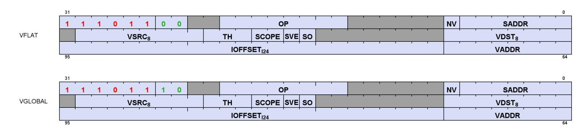

| Field   | Size | Description                                                                                          |
|---------|------|------------------------------------------------------------------------------------------------------|
| OP      | 8    | Opcode: see next table                                                                               |
| VADDR   | 8    | VGPR that holds address or offset. For 64-bit addresses, ADDR has the LSB’s and ADDR+1 has the       |
|         |      | For Global_* when SADDR is not NULL: specifies an unsigned byte offset.                              |
|         |      | For Scratch, specifies a signed byte offset if SVE=1                                                 |
| VSRC    | 8    | VGPR that holds the first DWORD of store-data. Instructions can use 0-4 DWORDs.                      |
| VDST    | 8    | VGPR destination for data returned to the shader, either from LOADs or Atomics that return the       |
| SCOPE   | 2    | Memory Scope and Memory Temporal Hint. For atomics, TH indicates whether or not to return the        |
| TH      | 3    | See Cache Controls: SCOPE and Temporal-Hint for more information about SCOPE and TH bits.            |
| NV      | 1    | Non-Volatile memory access                                                                           |
| IOFFSET | 24   | Address immediate offset: 24-bit signed byte offset                                                  |
| SADDR   | 7    | SGPR that provides an address or offset. To disable use, set this field to NULL. The meaning of this |
|         |      | Scratch: use an SGPR for the signed 32-bit.                                                          |
| SVE     | 1    | Scratch VGPR Enable                                                                                  |
|         | 1    | Scale the address-offset GPR by the data size, or not.                                               |

Table 59. Instructions

| Flat                 | Global                 | Scratch                 |
|----------------------|------------------------|-------------------------|
| FLAT_LOAD_U8         | GLOBAL_LOAD_U8         | SCRATCH_LOAD_U8         |
| FLAT_LOAD_D16_U8     | GLOBAL_LOAD_D16_U8     | SCRATCH_LOAD_D16_U8     |
| FLAT_LOAD_D16_HI_U8  | GLOBAL_LOAD_D16_HI_U8  | SCRATCH_LOAD_D16_HI_U8  |
| FLAT_LOAD_I8         | GLOBAL_LOAD_I8         | SCRATCH_LOAD_I8         |
| FLAT_LOAD_D16_I8     | GLOBAL_LOAD_D16_I8     | SCRATCH_LOAD_D16_I8     |
| FLAT_LOAD_D16_HI_I8  | GLOBAL_LOAD_D16_HI_I8  | SCRATCH_LOAD_D16_HI_I8  |
| FLAT_LOAD_U16        | GLOBAL_LOAD_U16        | SCRATCH_LOAD_U16        |
| FLAT_LOAD_I16        | GLOBAL_LOAD_I16        | SCRATCH_LOAD_I16        |
| FLAT_LOAD_D16_B16    | GLOBAL_LOAD_D16_B16    | SCRATCH_LOAD_D16_B16    |
| FLAT_LOAD_D16_HI_B16 | GLOBAL_LOAD_D16_HI_B16 | SCRATCH_LOAD_D16_HI_B16 |
| FLAT_LOAD_B32        | GLOBAL_LOAD_B32        | SCRATCH_LOAD_B32        |
| FLAT_LOAD_B64        | GLOBAL_LOAD_B64        | SCRATCH_LOAD_B64        |
| FLAT_LOAD_B96        | GLOBAL_LOAD_B96        | SCRATCH_LOAD_B96        |
| FLAT_LOAD_B128       | GLOBAL_LOAD_B128       | SCRATCH_LOAD_B128       |
| FLAT_STORE_B8        | GLOBAL_STORE_B8        | SCRATCH_STORE_B8        |
| FLAT_STORE_D16_HI_B8 | GLOBAL_STORE_D16_HI_B8 | SCRATCH_STORE_D16_HI_B8 |

| Flat                    | Global                      | Scratch                  |
|-------------------------|-----------------------------|--------------------------|
| FLAT_STORE_B16          | GLOBAL_STORE_B16            | SCRATCH_STORE_B16        |
| FLAT_STORE_D16_HI_B16   | GLOBAL_STORE_D16_HI_B16     | SCRATCH_STORE_D16_HI_B16 |
| FLAT_STORE_B32          | GLOBAL_STORE_B32            | SCRATCH_STORE_B32        |
| FLAT_STORE_B64          | GLOBAL_STORE_B64            | SCRATCH_STORE_B64        |
| FLAT_STORE_B96          | GLOBAL_STORE_B96            | SCRATCH_STORE_B96        |
| FLAT_STORE_B128         | GLOBAL_STORE_B128           | SCRATCH_STORE_B128       |
| none                    | GLOBAL_LOAD_ADDTID_B32      | none                     |
| none                    | GLOBAL_STORE_ADDTID_B32     | none                     |
| FLAT_ATOMIC_SWAP_B32    | GLOBAL_ATOMIC_SWAP_B32      | none                     |
| FLAT_ATOMIC_CMPSWAP_B32 | GLOBAL_ATOMIC_CMPSWAP_B32   | none                     |
| FLAT_ATOMIC_ADD_U32     | GLOBAL_ATOMIC_ADD_U32       | none                     |
| FLAT_ATOMIC_ADD_F32     | GLOBAL_ATOMIC_ADD_F32       | none                     |
| FLAT_ATOMIC_ADD_F64     | GLOBAL_ATOMIC_ADD_F64       | none                     |
| FLAT_ATOMIC_PK_ADD_F16  | GLOBAL_ATOMIC_PK_ADD_F16    | none                     |
| FLAT_ATOMIC_PK_ADD_BF16 | GLOBAL_ATOMIC_PK_ADD_BF16   | none                     |
| FLAT_ATOMIC_SUB_U32     | GLOBAL_ATOMIC_SUB_U32       | none                     |
| FLAT_ATOMIC_MIN_I32     | GLOBAL_ATOMIC_MIN_I32       | none                     |
| FLAT_ATOMIC_MIN_U32     | GLOBAL_ATOMIC_MIN_U32       | none                     |
| FLAT_ATOMIC_MAX_I32     | GLOBAL_ATOMIC_MAX_I32       | none                     |
| FLAT_ATOMIC_MAX_U32     | GLOBAL_ATOMIC_MAX_U32       | none                     |
| FLAT_ATOMIC_AND_B32     | GLOBAL_ATOMIC_AND_B32       | none                     |
| FLAT_ATOMIC_OR_B32      | GLOBAL_ATOMIC_OR_B32        | none                     |
| FLAT_ATOMIC_XOR_B32     | GLOBAL_ATOMIC_XOR_B32       | none                     |
| FLAT_ATOMIC_INC_U32     | GLOBAL_ATOMIC_INC_U32       | none                     |
| FLAT_ATOMIC_DEC_U32     | GLOBAL_ATOMIC_DEC_U32       | none                     |
| FLAT_ATOMIC_MIN_NUM_F32 | GLOBAL_ATOMIC_MIN_NUM_F32   | none                     |
| FLAT_ATOMIC_MAX_NUM_F32 | GLOBAL_ATOMIC_MAX_NUM_F32   | none                     |
| FLAT_ATOMIC_MIN_NUM_F64 | GLOBAL_ATOMIC_MIN_NUM_F64   | none                     |
| FLAT_ATOMIC_MAX_NUM_F64 | GLOBAL_ATOMIC_MAX_NUM_F64   | none                     |
| FLAT_ATOMIC_SWAP_B64    | GLOBAL_ATOMIC_SWAP_B64      | none                     |
| FLAT_ATOMIC_ADD_U64     | GLOBAL_ATOMIC_ADD_U64       | none                     |
| FLAT_ATOMIC_SUB_U64     | GLOBAL_ATOMIC_SUB_U64       | none                     |
| FLAT_ATOMIC_MIN_I64     | GLOBAL_ATOMIC_MIN_I64       | none                     |
| FLAT_ATOMIC_MIN_U64     | GLOBAL_ATOMIC_MIN_U64       | none                     |
| FLAT_ATOMIC_MAX_I64     | GLOBAL_ATOMIC_MAX_I64       | none                     |
| FLAT_ATOMIC_MAX_U64     | GLOBAL_ATOMIC_MAX_U64       | none                     |
| FLAT_ATOMIC_AND_B64     | GLOBAL_ATOMIC_AND_B64       | none                     |
| FLAT_ATOMIC_OR_B64      | GLOBAL_ATOMIC_OR_B64        | none                     |
| FLAT_ATOMIC_XOR_B64     | GLOBAL_ATOMIC_XOR_B64       | none                     |
| FLAT_ATOMIC_INC_U64     | GLOBAL_ATOMIC_INC_U64       | none                     |
| FLAT_ATOMIC_DEC_U64     | GLOBAL_ATOMIC_DEC_U64       | none                     |
| none                    | GLOBAL_ATOMIC_SUB_CLAMP_U32 |                          |
| none                    | GLOBAL_ATOMIC_ORDERED_ADD_  |                          |

| Flat | Global       | Scratch |
|------|--------------|---------|
| none | GLOBAL_INV   | none    |
| none | GLOBAL_WB    | none    |
| none | GLOBAL_WBINV | none    |

# **10.1. Instructions**

### **10.1.1. FLAT**

The Flat instruction set consists of loads, stores and memory atomic operations. Flat instructions do not use or a resource constant (V#), but they make use of wave state (SCRATCH\_BASE) that holds scratch-space information in case any threads' address resolves to scratch space. See [Scratch](#page-137-1) section below.

Flat instructions are executed as both an LDS and a Global instruction, and so Flat instructions increment both LOADcnt (or STOREcnt) and DScnt and are not considered done until both have been decremented. Loads, atomics-with-return and GLOBAL\_INV are tracked with LOADcnt. Stores, atomics-without-return, GLOBAL\_WB and GLOBAL\_WBINV are tracked with STOREcnt.

When the address from a Flat instruction falls into scratch (private) space, a different ("swizzled") addressing mechanism is used. The address (per thread) points to the memory space for a specific DWORD of scratch data owned by this thread. The hardware maps this address to the actual memory address that holds data for all of the threads in the wave. Flat atomics that map into scratch: 4-byte atomics are supported, and 8-byte atomics return MEMVIOL.

The wave calculates the address in flat memory space, incorporating the SCRATCH\_BASE when accessing directly into scratch memory. The aperture check occurs on the final memory address, with invalid addresses being routed to the vector-memory-cache. The "aperture check" is performed after IOFFSET is added into the address. See [Aperture Check](#page-139-1).

For threads whose address fall into LDS space, the only address check applied is:

Out of bounds = Logical\_ADDR[31:0] >= Wave\_allocated\_LDS

If the thread is not out of bounds, the address is mapped into LDS space by discarding upper address bits. This means many virtual addresses may map to the same physical LDS storage.

#### **Ordering**

Flat instructions may complete out of order with each other. If one Flat instruction finds all of its data in WGP-cache, and the next finds all of its data in LDS, the second instruction might complete first. If the two fetches return data to the same VGPR, the result is unknown (order is not deterministic). Flat instructions decrement LOADcnt and STOREcnt in order for the threads that went to global memory and those are in order with other scratch, global, and buffer instructions. For stores and atomics-without-return, STOREcnt is used instead of LOADcnt and is not ordered with LOADcnt. Separately each Flat instruction increments and decrements DScnt. This is out-of-order with the LOADcnt/STOREcnt path but is in-order with other DS (LDS) instructions. Since the data for a Flat load can come from either LDS or the cache, and because these units have different latencies, there is a potential race condition with respect to the LOADcnt/STOREcnt and DScnt counters. Note that while the LOADcnt/STOREcnt/DScnt are decremented in-order, VGPRs may be written in any order. Any use of S\_WAIT\_\*CNT after a Flat instruction must consider both LOADcnt/STOREcnt and also DScnt.

#### **Global Shared Scratch**:

In high-level programming languages, pointers to stack-allocated variables can be passed between threads. On CDNA5 devices, stack-allocated variables can be stored in swizzled scratch memory. **Global Shared Scratch** allows waves to pass pointers to data in scratch space to each other. Scratch memory is commonly used to store the program stack and it is desirable to be able to share data in the swizzled scratch space. Shaders access scratch memory in one of two ways:

### **Scratch\_\* instructions**

32-bit address thread-local stack offset. Scratch instructions can only reference a wave's own scratch space. Hardware swizzles the addresses and adds SCRATCH\_BASE and thread ID.

#### **Flat\_\* instructions**

64-bit address. Flat instructions take pointers to scratch space and can reference any wave's data but have no specific way to access just the wave's own scratch space. If it falls into the scratch aperture, hardware treats it as a thread-local stack offset and applies the same translation as for SCRATCH\_\*.

Scratch addressing is based off of a 4-byte swizzle pattern (4-byte element size), so only pointers to DWORDs are supported, and does not allow 8-byte atomics in flat-scratch space. An 8-byte atomic landing in this space returns MEMVIOL and fails to execute.

# **10.1.2. Global**

Global operations transfer data between VGPR and global memory. Global instructions are similar to Flat, but the programmer is responsible to make sure that no threads access LDS or private space. Because of this, no LDS bandwidth is used by global instructions. Since these instructions do not access LDS, only LOADcnt (or STOREcnt) is used, not DScnt.

Global includes two instructions that do not use any VGPRs for addressing, just SGPRs and IOFFSET:

- GLOBAL\_LOAD\_ADDTID\_B32
- GLOBAL\_STORE\_ADDTID\_B32

### **10.1.3. Scratch**

Scratch instructions are similar to global but they access a private (per-thread) memory space that is swizzled. Because of this, no LDS bandwidth is used by scratch instructions. Scratch instructions also support multi-DWORD access and mis-aligned access (although mis-aligned is slower).

Since these instructions do not access LDS, only LOADcnt (or STOREcnt) is used, not DScnt. It is not possible for a scratch instruction to access LDS, and so no error checking is done (and no aperture check is performed).

# **10.2. Addressing**

Global, Flat and Scratch each have their own addressing modes. Flat addressing is a subset of the global and scratch modes. 64-bit addresses are stored with the LSB's in the VGPR at ADDR, and the MSBs in the VGPR at ADDR+1.

- Global
- Scratch
- LDS
- Flat based on per-thread address (VGPR), can load/store: global memory, LDS or scratch memory.

These instructions support multiple different addressing modes, combining per-thread, per-wave, and constant values to form a final address.

Shaders often use VALU instructions to compute simple memory addresses where there offset is a multiple of the data-payload size ("element size"). Scratch, Global and Flat instructions can perform this multiply automatically for small element sizes using the SCALE\_OFFSET ISA bit. For Global, SCALE\_OFFSET applies only to the "GVS" addressing mode, and not to GT or GV modes. For Scratch, SCALE\_OFFSET applies only to "SV" and "SVS" modes, and not SS or ST modes. SCALE\_OFFSET is ignored by unsupported addressing modes (treat as if "ScaleFactor" = 1). In the equations below, **ScaleFactor** is determined by:

 ScaleFactor = ISA.SCALE\_OFFSET == 0 ? 1 : InstructionDataSize(bytes) InstructionDataSize = 1 for 8-bit data, 2 for 16-bit data, 4 for 32-bit, etc. up to 16 for 128-bits

### Table 60. Selecting Addressing Mode

| Instruction Type | Instruction Modes | SVE                 | SADDR                            |
|------------------|-------------------|---------------------|----------------------------------|
| Scratch          | SV                | 1                   | NULL                             |
|                  | SS                | 0                   | ! NULL                           |
|                  | ST                | 0                   | NULL                             |
|                  | SVS               | 1                   | ! NULL                           |
| Flat and Global  | GVS               | ignored             | ! NULL                           |
|                  | GV                | ignored             | NULL                             |
|                  | GT                |                     | Global only: Indicated by opcode |
| LDS              | LDS               | Indicated by opcode |                                  |

#### **Global Addressing**

**GV** mem\_addr = VGPRU64 + IOFFSETI24 **GVS** mem\_addr = SGPRU64 + ( VGPRI32 \* ScaleFactor ) + IOFFSETI24 **GT** mem\_addr = SGPRU64 + IOFFSETI24 + ThreadID\*4

#### **LDS Addressing (DS ops)**

**LDS** LDS\_ADDR = VGPR\_addrU32 + IOFFSETU16 LDS address is relative to the LDS space allocated to this wave.

#### **Scratch Addressing**

| SV  | mem_addr = SCRATCH_BASE U64 + SWIZZLE(VGPR_offset I32 * ScaleFactor + IOFFSET I24 , ThreadID)         |
|-----|-------------------------------------------------------------------------------------------------------|
| SS  | mem_addr = SCRATCH_BASE U64 + SWIZZLE(SGPR_offset I32 + IOFFSET I24 , ThreadID)                       |
| SVS | mem_addr = SCRATCH_BASE U64 + SWIZZLE(SGPR_offset I32 + VGPR_offset I32 * ScaleFactor + IOFFSET I24 , |
| ST  | mem_addr = SCRATCH_BASE U64 + SWIZZLE(IOFFSET I24 , ThreadID)                                         |

The combined offsets inside SWIZZLE() must result in a non-negative number.

The offset value from SGPRs and VGPRs are **signed** 32-bit byte offsets.

IOFFSET: In Scratch ST mode, the IOFFSET must be aligned to the payload size: 4 byte aligned for 1-DWORD, 16-byte aligned for 4-DWORD.

For reference, BUFFER\_LOAD when using swizzled-addressing is:

BUFFER\_LOAD: Addr = T#.base + Soffset + swizzle( (Vidx + TID) \* stride + Ioff + Voff)

#### **Flat Addressing**

Flat instructions may use one of these addressing modes: GVS, GV. Aperture test on the address

determines: Global/LDS/Scratch per thread.

Normal (GV) addr[63:0] = VGPRU64 + IOFFSETI24

GVS Mode addr[63:0] = SGPRU64 + (VGPRI32 \* ScaleFactor) + IOFFSETI24

Next the aperture check is performed on each thread to determine which memory space it falls into, using "ADDR" from the previous table:

 Aperture check, given 64-bit address from VGPR: isLDS = (ADDR[63:32] == { SH\_MEM\_BASES.SHARED\_BASE[15:0], 16'b0000 } isScratch = ADDR[63:58] == SH\_MEM\_BASES.PRIVATE\_BASE[15:10] isHole = ADDR[63:56] != (all zeros or all ones) && !isLDS && !isScratch isGlobal = !isLDS && !isScratch && !isHole

See [Memory Aperture Query](#page-73-1) for the definition of the aperture ranges.

Depending on which memory space each thread falls into a different addressing calculation applies:

| Aperture | Address Calculation                                                              |
|----------|----------------------------------------------------------------------------------|
| GLOBAL   | mem_addr = addr                                                                  |
| SCRATCH  | addr[57]==0: mem_addr = {addr[51:2], addr[56:52], addr[1:0]}     // Wave32 space |
| LDS      | LDS_ADDR.U32 = addr[31:0]                                                        |
| Hole     | Memory Violation                                                                 |

### **10.2.1. Global Shared Scratch Addressing**

Scratch space can be accessed directly by other waves using Flat instructions. The aperture range for flat address mapping into scratch space is shown below:

Software must ensure that no allocations are mapped near the signed virtual address 0: no allocations can be mapped in the range [-238, 238).

Hardware provides shaders the ability to read FLAT\_SCRATCH\_BASE as a source operand in ALU instructions a per-wave constant provides the Flat address that maps to this wave's scratch memory. This value is derived from "SCRATCH\_BASE" which is the pointer to the virtual address of scratch space allocated to this wave (initialized at wave launch). When used as a 64-bit operand, FLAT\_SCRATCH\_BASE\_LO produces all 64 bits of FLAT\_SCRATCH\_BASE.

 FLAT\_SCRATCH\_BASE = wave32 ? {SH\_MEM\_BASES.PRIVATE\_BASE[63:58], 1'b0, 5'b0, SCRATCH\_BASE[56:7], 2'b0} : {SH\_MEM\_BASES.PRIVATE\_BASE[63:58], 1'b1, 6'b0, SCRATCH\_BASE[56:8], 2'b0} FLAT\_SCRATCH\_BASE\_LO = FLAT\_SCRATCH\_BASE[31:0] FLAT\_SCRATCH\_BASE\_HI = FLAT\_SCRATCH\_BASE[63:32]

# **10.3. Memory Error Checking**

Both Cache and LDS can report that an error occurred due to a bad address. This can occur due to:

- Invalid address (outside any aperture)
- Write to read-only global memory address (page is read-only)
- Misaligned data (scratch accesses may be misaligned)
- Out-of-range address:
  - LDS access with an address outside the range: [ 0, LDS\_SIZE-1 ]

The policy for threads with bad addresses is: stores outside this range do not store a value, and reads return zero. The aperture check for invalid address occurs before adding any address offsets - it is based only on the base address; the other checks are performed after adding the offsets.

Addressing errors from either LDS or VMEM set the wave's MEMVIOL bit, and also causes an exception (trap).

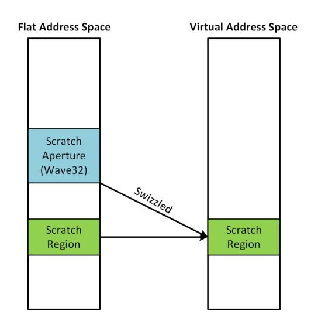

# **10.4. Data**

Flat instructions can use from zero to four consecutive DWORDs of data in VGPRs and/or memory. The DATA field determines which VGPR(s) supply source data (if any) and the VDST VGPRs hold return data (if any). There is no data-format conversion performed.

"D16" instructions use only 16-bit of the VGPR instead of the full 32bits. "D16\_HI" instructions read or write only the high 16-bits, while "D16" use the low 16-bits.

# **10.5. VMEM Prefetch Instructions**

These two instructions can be used to prefetch data into the WGP-cache or L2-cache:

**FLAT\_PREFETCH\_B8** null, V0, #inst\_offset, Scope, Temporal

**GLOBAL\_PREFETCH\_B8** null, V0, #inst\_offset, Scope, Temporal

The SCOPE field is used to control which cache is prefetched in to:

- Scope = 0 (WGP)
  - Pulls in at all cache levels on miss
  - If it hits in WGP cache, then it may not be in higher-level caches (prefetch stops here on a hit)
- Scope = 1 (SE) or 2 (DEV)
  - Does not prefetch into WGP, but brings it into the GL2
- Scope = 3 (SYS)
  - Does not prefetch into WGP, but brings it into the GL2

Common Rules:

- Specifies 1 byte per lane to prefetch (bytes avoid any data alignment issues; fetches entire cacheline).
- Every lane enabled by EXEC mask prefetches the address specified by that lane.
- 1-2 source VGPRs are used to supply the address per lane: Global supports GV or GVS (not GT) modes
- Does not return any data to the wave or its VGPRs
- No errors or completion status is returned to the wave (LOADcnt is not incremented/decremented).
- Scope and temporal ISA bits affect caching in the usual ways (same as a GLOBAL\_LOAD).
- The Flat version of the instruction does nothing for lanes that map to LDS memory.

# **10.6. Block VGPR Load & Store**

These instructions can be used to efficiently move consecutive blocks of up to 32 VGPRs to and from memory:

| GLOBAL_LOAD_BLOCK   | VDST, VADDR, SADDR, IOFFSET, (M0) |
|---------------------|-----------------------------------|
| GLOBAL_STORE_BLOCK  | VSRC, VADDR, SADDR, IOFFSET, (M0) |
| SCRATCH_LOAD_BLOCK  | VDST, VADDR, SADDR, IOFFSET, (M0) |
| SCRATCH_STORE_BLOCK | VSRC, VADDR, SADDR, IOFFSET, (M0) |

Data is transferred from consecutive VGPRs to consecutive DWORDs in memory (per thread), with the option of skipping some VGPRs (but still skipping the memory location - not compacted in memory).

The instruction fields are identical to Scratch and Global instructions except for the use of M0 to carry a bitmask of which VGPRs to load/store (1) or skip (0). The LSB of M0 is for the first VGPR.

GLOBAL\_LOAD and GLOBAL\_STORE support the "GV" and "GVS" addressing modes, but not "GT"; SCRATCH\_LOAD and SCRATCH\_STORE support the "SS", "SV" and "SVS" addressing modes, but not "ST".

The block load/store addresses memory as if the IOFFSET field was incremented by 4 bytes for each VGPR, regardless of whether it was actually transferred or not (based on M0 bits).

Block loads must not load data into their own source VGPRs.

 for (n = 0..31) if (M0[n]) load/store using IOFFSET and VGPR[vdst/vdata + n] IOFFSET += 4 bytes

If M0==0, no data is transferred.

The entire block load/store is tracked with LOADcnt or STOREcnt: increments 1 for the entire block transfer, and decrements when the block transfer has completed.

## **10.6.1. Error Handling**

Out-of-range address VGPRs follow the same rules as Global and Scratch.

### Out-of-range dest VGPRs for loads:

each DWORD of the instruction is individually checked for out-of-range. Those that are in-range execute normally, and those that are out-of-range are ignored.

### Out-of-range VSRC VGPRs for stores:

each DWORD of the instruction is individually checked for out-of-range. Those that are in-range supply data as specified, and those out of range read data from VGPR0.

# **10.7. Multicast Load**

In GEMM applications, it is common to have multiple workgroups request the same data from memory. Multicast loads allow a single wave to request that data be loaded from memory and broadcast to multiple WGP's in the same cluster.

Workgroups in a cluster are each assigned a workgroup-ID-within-cluster ID ("WGinCluster") with a value between 0 and the number of workgroups in the cluster, minus 1. Each wave in the workgroup is initialized with the WGinCluster for its workgroup. A multicast load specifies as a mask which workgroups within the cluster should receive the data from this load.

Each workgroup identified by the mask in the cluster is expected to make the same memory request (one wave per workgroup), and when they have all requested (or a configurable timeout occurs), data is returned to the waves which made requests. If some workgroups request but not all before the timeout, then only the waves which have requested receive the broadcast load. If the remaining workgroups request later, they receive a

separate broadcast load targeted to only them.

Multicast loads bypass (force-miss) the WGP\$ regardless of SCOPE/Temporal bits.

#### **Multicast Load Instructions**

| Instruction                            | Dependency Counter |
|----------------------------------------|--------------------|
| CLUSTER_LOAD_B{32,64,128}              | LOADcnt            |
| CLUSTER_LOAD_ASYNC_TO_LDS_B{32,64,128} | ASYNCcnt           |

These multicast load instructions work like GLOBAL loads (can be "GV" or "GVS" variants) except that they also use M0 to deliver the multicast mask and timeout control (see below).

The workgroup mask is specific in M0 and each bit corresponds to a workgroup:

- M0[0]: 1 = broadcast result to workgroup 0 within the cluster; 0 = workgroup 0 does not receive the data
- M0[1]: 1 = broadcast result to workgroup 1 within the cluster; 0 = workgroup 1 does not receive the data
- etc.
- M0[16]: 1 = early timeout (return data as soon as cache supplies it to whichever waves have requested), 0 = use standard timeout.

Each wave requesting the same data should have the same value in M0. Without this, the loads may not be combined and instead return individually.

If M0[15:0] == 0, this is treated as a non-Cluster-multicast load: return only to the requesting WGP (it is not treated as "do not return to any wave").

Each requesting wave is notified of "done" (decrements LOADcnt or ASYNCcnt).

If these cluster loads are used when not in a cluster, they are downgraded to global loads.

### **Instruction Ordering**

Multicast loads can either be "normal" (return to VGPRs) or "async" (return to LDS). Multicast loads which return to VGPRs write to the VGPRs of each requesting wave; multicast loads which return to LDS write directly into LDS which can be read by all waves in the workgroup. This affects which memory-dependency counter is used and ordering of completion. Only the requesting wave is informed when the load completes; other waves can be informed of the completion via barriers or memory atomics initiated from the requesting wave.

Multicast Cluster-loads are kept in order with other loads which use the same memory-dependency counter (LOADcnt or ASYNCcnt), but are not ordered with other types of instructions.

# **10.8. Asynchronous Memory Load and Store**

Asynchronous load and store instructions transfer data between cache/memory and LDS. No data is loaded into VGPRs or stored from VGPRs, but addresses are supplied by VGPRs (and optionally SGPRs).

### **Order:**

Async loads and stores are both tracked with the memory dependency counter: **ASYNCcnt**. Async loads and stores are kept in order with each other when accessing global memory. Async Loads and stores may access LDS out-of-order (not just between loads & stores, but a pair of loads may write LDS out of order). Async loads return "done" (decrement ASYNCcnt) in order, and stores return done in order with other stores, but loads vs. stores return "done" out of order.

The shader checks for completion of these instructions with: **S\_WAIT\_ASYNCCNT**. ASYNCcnt is also used for DS\_ATOMIC\_ASYNC\_BARRIER\_ARRIVE\_B64 and is kept in-order with async-loads.

#### **Instruction Fields**

These instructions use the VGLOBAL instruction encoding:

| Field   | Size | Description                                                                                              |
|---------|------|----------------------------------------------------------------------------------------------------------|
| OP      | 8    | GLOBAL_LOAD_ASYNC_TO_LDS_B{8,32,64,128}                                                                  |
| VADDR   | 8    | VGPR that holds the global memory address or offset for both loads and stores. For 64-bit addresses,     |
|         |      | For GLOBAL_* when SADDR is not NULL: specifies an unsigned byte offset.                                  |
| VSRC    | 8    | Supplies the LDS address for STOREs.                                                                     |
| VDST    | 8    | Supplies the LDS address for LOADs.                                                                      |
| SCOPE   | 2    | Memory Scope                                                                                             |
| TH      | 3    | Memory Temporal Hint                                                                                     |
| IOFFSET | 24   | Address immediate offset: 24-bit signed byte offset                                                      |
| SADDR   | 7    | Scalar SGPR that provides an address of offset. To disable use, set this field to NULL. Use the SGPR to  |
| SVE     | 1    | Unused - set to zero.                                                                                    |
| SO      | 1    | 1 = Scale the address-offset GPR by the data size (apply the scaleFactor); 0 = do not apply scaleFactor. |

# **10.8.1. Addressing**

These instructions use the global "GV" and "GVS" modes.

- GV: global\_mem\_addr = INST\_OFFSET + VADDR[63:0]
- GVS: global\_mem\_addr = INST\_OFFSET + SADDR[63:0] + VADDR[31:0]

GLOBAL\_LOAD\_ASYNC\_TO\_LDS\_B{8,32,64,128} : GV addressing: for lane in 0 .. nlanes-1 // WAVE32=32 for byte in 0 .. nbytes-1 // B8=1,B32=4,B64=8,B128=16 LDS[VGPR[VDST][lane] + byte + INST\_OFFSET] = GLOBAL\_MEMORY[VGPR[VADDR][lane] + INST\_OFFSET + byte]; GVS addressing: for lane in 0 .. nlanes-1 // WAVE32=32 for byte in 0 .. nbytes-1 // B8=1,B32=4,B64=8,B128=16 LDS[VGPR[VDST][lane] + byte + INST\_OFFSET] = GLOBAL\_MEMORY[(VGPR[VADDR][lane] \* ScaleFactor) + SGPR[SADDR] + INST\_OFFSET + byte]; GLOBAL\_STORE\_ASYNC\_FROM\_LDS\_B{8,32,64,128} : GV: for (thread = 0..31 or 63) for (dword = 0 .. 3) GLOBAL\_MEMORY[VGPR[VADDR][lane] + INST\_OFFSET + byte] = LDS[VGPR[VSRC][lane] + byte + INST\_OFFSET] GVS: for (thread = 0..31 or 63) for (dword = 0 .. 3) GLOBAL\_MEMORY[(VGPR[VADDR][lane] \* ScaleFactor) + SGPR[SADDR] + INST\_OFFSET + byte] = LDS[VGPR[VSRC][lane] + byte + INST\_OFFSET] ScaleFactor = ISA.SCALE\_OFFSET == 0 ? 1 : InstructionDataSize(bytes) InstructionDataSize = 1 for 8-bit data, 2 for 16-bit data, 4 for 32-bit, etc. up to 16 for 128-bits

# **10.9. WMMA Matrix Load Ops with Transpose**

Matrices are often stored in memory in a tiled manner. CDNA5 has instructions that simplify loading of 16x16 matrix tiles into VGPRs where the matrix in memory has the opposite major order (row vs. column) as required by the WMMA operations. The instructions load and transpose a block of memory into VGPRs.

See [WMMA Ops](#page-102-1) for information on WMMA matrix storage in VGPRs and matrix multiply operations.

### **10.9.1. Dense Matrices**

An "A-matrix" of (M rows x K columns) is composed of elements (1 or 2 bytes each for this discussion) arranged in memory in either row-major or column-major. The examples below show the layout for a 16x16 matrix.

#### **Row Major Data in memory for A-matrix (MxK)**

Memory\_address = (col# + row# \* K) \* ElementSize (# of bytes)

#### **Column Major Data in memory for B-matrix (KxN)**

Memory\_address = (col# \* K + row#) \* ElementSize (# of bytes)

# **10.9.2. WMMA Load-Transpose Instructions**

These two instructions perform a load of an 8-bit or 16-bit 16x16 matrix and transpose row and column major order.

If EXEC==0, the instruction acts like an S\_NOP; otherwise these instructions require that EXEC be set to all ones, else the operation is undefined.

The diagrams below show which matrix element each of the 32 lanes in a wave32 loads in a A-matrix. E.g. lane 0 loads 64 bits of contiguous memory and stores it in the matrix: K=0, M=0..7. B-matrix loads are similar: one

lane loads multiple contiguous N-values along single K-dimension index.

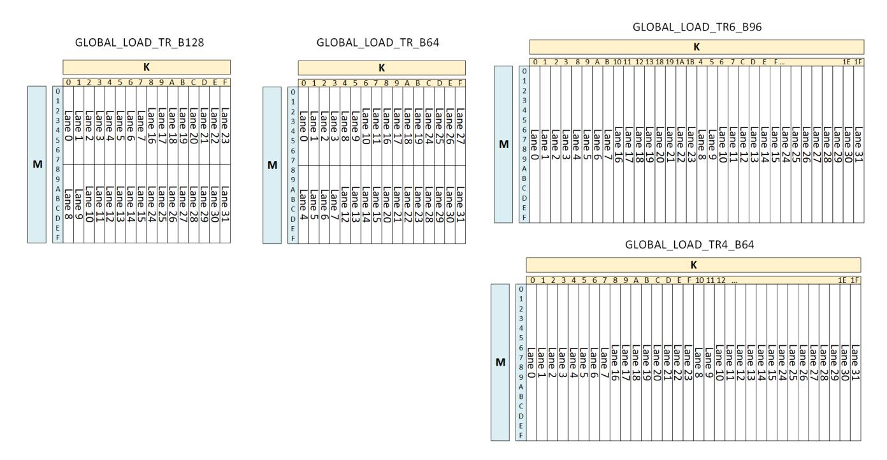

**Note** these load-transpose instructions are wave32-only.

| Instructions          | Description                                                                              |
|-----------------------|------------------------------------------------------------------------------------------|
| GLOBAL_LOAD_TR16_B128 | Load a 16x16 matrix of 16-bit data into VGPRs and transpose between row-major and        |
| GLOBAL_LOAD_TR8_B64   | Load a 16x16 matrix of 8-bit data into VGPRs and transpose between row-major and column |
| GLOBAL_LOAD_TR6_B96   | Load a 16x32 matrix of 6-bit data into VGPRs and transpose between row-major and column |
| GLOBAL_LOAD_TR4_B64   | Load a 16x32 matrix of 4-bit data into VGPRs and transpose between row-major and column |

All fields of these instructions are identical to GLOBAL\_LOAD\_B64 and \_B128, and as loads they are tracked with LOADcnt.

| Memory order | Element |             |                       |                                       |
|--------------|---------|-------------|-----------------------|---------------------------------------|
|              |         | VGPR Layout | Instruction to use    |                                       |
| Row Major    | 16      | Row Major   | GLOBAL_LOAD_B128      |                                       |
| Column Major | 16      | Row Major   | GLOBAL_LOAD_TR16_B128 | — writes 128 bits per lane x 32 lanes |
| Row Major    | 8       | Row Major   | GLOBAL_LOAD_B64       |                                       |
| Column Major | 8       | Row Major   | GLOBAL_LOAD_TR8_B64   | — writes 64 bits per lane x 32 lanes  |
| Column Major | 6       | Row Major   | GLOBAL_LOAD_TR6_B96   | — writes 96 bits per lane x 32 lanes  |
| Column Major | 4       | Row Major   | GLOBAL_LOAD_TR4_B64   | — writes 64 bits per lane x 32 lanes  |

- The above table can also be used when "VGPR Layout" is column-major: simply reverse the "memory order" meaning between "Row" and "Column".

# **10.10. Memory Monitor and Wait (MWAIT)**

Waves can request that the L2 cache inform them when a memory location changes or is evicted from the L2 cache. This allows for potentially efficient synchronization mechanisms using memory.

"LOAD\_MONITOR" is a global or flat memory load that returns data, but it also informs the L2 cache that a wave wants to be notified when the cacheline that holds this address changes (is written or evicted/invalidated). LOAD\_MONITOR sets a wave-state bit ("mwait") to 1 when issued.

The L2 cache tracks which cachelines are being watched by using an "M" cache-tag bit. When a monitored cacheline is modified or evicted, it wakes all waiting waves (not just those waves waiting on this cacheline) and clears their MWAIT bits to zero. This can lead to false wake-ups and waves need to perform a memory-load to confirm they now have the value they need, or they can monitor and sleep again.

#### **GLOBAL\_LOAD\_MONITOR\_{B32, B64, B128}**

A regular (global\_load\_b\*) memory load that returns data immediately, and it also informs the GL2 that a wave wants to be notified when the cacheline that holds this address changes (is written) after this instruction is issued. LOAD\_MONITOR sets the per-wave "mwait" bit to 1. The GL2 keeps a list of cachelines which are being watched. (cache tag has M bit)

#### **FLAT\_LOAD\_MONITOR\_{B32, B64, B128}**

Similar to global load, but if the address falls into LDS, the WGP\$ returns "mwait done" to the requesting wave and this clears the MWAIT bit. If the address is in the 'hole', it gets MEMVIOL.

#### **S\_MONITOR\_SLEEP**

Causes a wave to sleep (forever, or timeout up to s\_sleep limit of 8000 clks) until the MWAIT bit becomes zero. This wait can be interrupted for debugging or CWSR. If this is interrupted for a context-save, on context-restore the wave resumes at the instruction after this one (as if the s\_monitor\_sleep completed). S\_MONITOR\_SLEEP behaves the same as S\_SLEEP except it skips the sleep if MWAIT==0 and wakes up immediately if MWAIT becomes zero.

The "forever" value is unsafe and should not be used.

The LOAD\_MONITOR instructions have the same data alignment rules as atomic instructions:

- Reports memviol if the address is not aligned to the payload size if in unaligned mode
- When in DWORD alignment mode, the address is forced to be aligned to the payload size
- FLAT\_LOAD\_MONITOR\_B64 and \_B128 reports memviol if the address falls into the scratch aperture

The user is responsible for setting ISA SCOPE to force the LOAD\_MONITOR to miss in the L0 and be passed to the GL2.

The MWAIT bit is readable in IB\_STS2. For CWSR, the MWAIT bit does not need to be saved or restored.

# **10.11. Tensor Data Mover Instructions**

**Tensor** instructions cause the Tensor Data Mover (TDM) to move **tiles** of (up to) 5D tensor data between LDS and memory. A tile is a sub-region of the tensor to be moved to or from LDS. The tensor and tile are described by the Tensor DMA Descriptor (**D#**): a collection of SGPRs setup prior to the tensor instruction. Tensor data movement may occur in parallel with other shader instructions. Tensor instructions may perform multi-cast

cluster loads to simultaneously read the data from memory into LDS units in multiple WGP's. Cluster loading from multiple WGPs for TDM instructions is controlled via the DMA descriptor D#.workgroup\_mask field and must be zero when not running in a cluster.

Tile data can be padded in LDS on a regular basis to facilitate matrix transpose operations or avoid LDS bank conflicts.

## **10.11.1. Tensor Instructions**

Tensor instructions use a tensor and a tile that are described in the D#. Tensor instructions are encoded as VIMAGE or VGLOBAL instructions but use no VGPRs and are not performed per-lane. The EXEC mask is ignored: tensor instructions are issued no matter if EXEC==0 or not, and it makes no difference which lanes are enabled or disabled.

Tensor load/store instructions are tracked for completion with TENSORcnt, which can be enforced using S\_WAIT\_TENSORCNT. Tensor-Done is returned once per instruction, not per memory transfer. Tensor instructions complete in-order with other Tensor instructions from the same wave (both loads and stores stay in-order), but are unordered with instructions from other waves. Tensor instructions are unordered with respect to other types of memory instructions.

The D# can be either 2 sets of SGPRs (for tensors up to 2D), or 4 sets of SGPRs for tensors up to 5D. VADDR2 and VADDR3 must either both be NULL (for 2 sets of SGPRs) or both non-NULL (for 4 sets of SGPRs). These fields recognize NULL as 0x7C. Setting VADDR fields to NULL for instructions that expect to use those registers results in behavior equivalent to passing a block of SGPRs that are set to zero for that portion of the D#. If VADDR2 is used but VADDR3 is not, it is legal to set them to the same address.

Tensor instructions may not occur in a clause.

Table 61. VIMAGE Encoding Field Descriptions for Tensor Ops

| Field  | Size | Description                                                                                      |
|--------|------|--------------------------------------------------------------------------------------------------|
| OP     | 8    | TENSOR_LOAD_TO_LDS                                                                               |
| VADDR0 | 8    | SGPR address of block of 4 SGPRs containing D# group 0.                                          |
| VADDR1 | 8    | SGPR address of block of 8 SGPRs containing D# group 1. SGPR[VADDR1][15:0] Must be zero when not |
| VADDR2 | 8    | SGPR address of block of 4 SGPRs containing D# group 2. Set to NULL to not use.                  |
| VADDR3 | 8    | SGPR address of block of 4 SGPRs containing D# group 3. Set to NULL to not use.                  |
| VADDR4 | 8    | Unused - set to NULL (0x7C).                                                                     |
| SCOPE  | 2    | Memory Scope                                                                                     |
| TH     | 3    | Memory Temporal Hint                                                                             |
| NV     | 1    | Non-Volatile memory access                                                                       |
| TFE    | 1    | Unused - set to zero.                                                                            |
| DIM    | 3    |                                                                                                  |
| R128   | 1    |                                                                                                  |
| D16    | 1    |                                                                                                  |
| A16    | 1    |                                                                                                  |
| DMASK  | 4    |                                                                                                  |
| VDATA  | 8    |                                                                                                  |
| RSRC   | 9    |                                                                                                  |

There are TDM config registers to control arbitration and TDM policies:

- TDM\_CONTROL

# **10.11.2. Tensor and Tile Addressing**

These are the primary descriptor (D#) terms used to describe the tensor and tile in global memory and LDS:

| Field                  | Description                                                                                     |
|------------------------|-------------------------------------------------------------------------------------------------|
| data_size              | Size of the data elements: 1, 2, 4 or 8 bytes                                                   |
| global_addr            | Global memory address of the start of the tile within the tensor (not the start of the tensor). |
| tensor_dim[0-4]        | Size of the tensor in "data_size" units. Used for detecting out-of-bounds.                      |
| tensor_dim[0-3]_stride | Stride between one line and the next. Can be larger than tensor_dim to include memory padding.  |
| lds_addr               | LDS memory address where the tile starts                                                        |
| tile_dim[0-4]          | Size of the tile in data_size units, per dimension                                              |

Reads from portions of a tile that extend beyond the right (positive address) end of a tensor dimension in global memory return zero, and writes to those portions of the tile are dropped.

This diagram shows a simple example of a 2D tensor and 2D tile in memory:

#### **Basic Global-memory address calculation**

global\_addr[2d] = D#.global\_addr + D#.data\_size \* (x + y \* D#.tensor\_dim0\_stride) global\_addr[3d] = D#.global\_addr + D#.data\_size \* (x + y \* D#.tensor\_dim0\_stride + z \* D#.tensor\_dim1\_stride) global\_addr[4d] = D#.global\_addr + D#.data\_size \* (x + y \* D#.tensor\_dim0\_stride + z \* D#.tensor\_dim1\_stride + zz \* D#.tensor\_dim2\_stride)

### **Simplified Load Memory to LDS Addressing Example: 3D Tensor**

dataSize = (1 << D#.data\_size) // Undo log2 storage of data size for Z = 0..D#.tile\_dim2 for Y = 0..D#.tile\_dim1 Maddr = D#.global\_addr + D#.data\_size \* (y \* tensor\_dim0\_stride + z \* tensor\_dim1\_stride) for X = 0..D#.tile\_dim0 LDS[Laddr] = Memory[Maddr] // for "data\_size" sequential bytes Maddr += dataSize Laddr += dataSize bytesStored += dataSize if (D#.pad\_enable && (bytesStored >> 3) >= (1 << D#.pad\_interval)) bytesStored = 0 Laddr += D#.pad\_amount

Padding can be applied to the LDS address when copying from memory to LDS, but not when copying from LDS to memory (there is no "de-padding" operation; padding is ignored). Padding skips LDS locations (does not write zeros) to lay out the data in a pattern that may be easier for matrix transpose or avoids LDS bank conflicts. Padding that would be out-of-bounds (beyond the allocated LDS size for this workgroup) is ignored. Both D#.pad\_amount and D#.pad\_interval must both be zero, or must both be non-zero; other values produce unpredictable results.

This diagram shows an example of a 2D tensor and 2D tile in memory where the tile being loaded into LDS has additional **padding**:

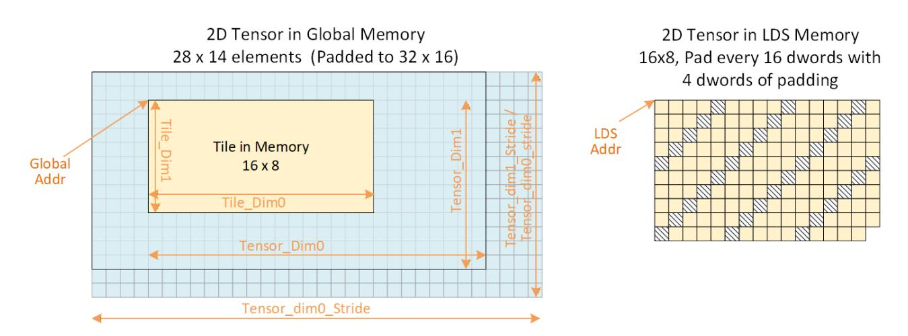

# **10.11.3. Tensor Instruction Variants and Optional Operations**

A tensor op may optionally request that an LDS atomic occur after the tensor completes by setting D#.atomic\_barrier\_enable. When set, after a tensor operation completes it sends DS\_ATOMIC\_ASYNC\_BARRIER\_ARRIVE to signal its completion (controlled by the D#). The atomic operates on the 64-bit LDS data at address: D#.atomic\_barrier\_address.

The TDM sends DS\_ATOMIC\_ASYNC\_BARRIER\_ARRIVE to keep ordering of operations between descriptors of the same wave.

If the D#.workgroup\_mask is non-zero and the tensor instruction is TENSOR\_LOAD\_TO\_LDS, the TDM moves the data between global memory and LDS using CLUSTER\_LOAD\_ASYNC ops instead of the usual GLOBAL\_LOAD\_ASYNC. For stores (LDS to memory), D#.workgroup\_mask is ignored. D#.workgroup\_mask must be zero if wave is not part of a Cluster.

### **10.11.3.1. Descriptor Iteration**

2D and 3D tensors may be iterated over using the same D# multiple times when the D#.iterate\_enable flag is set to 1. Iteration allows pulling out every Nth row from the tensor and storing them compacted into LDS as multiple smaller consecutive tiles. This is repeated to produce multiple tiles that contain all of the input rows. The iteration and row skipping is setup using the normal D# stride fields, with the following unique fields:

#### **global\_addr\_increment**

how much to increment the starting Global memory address per iteration, in units of data\_size

#### **lds\_addr\_increment**

how much to increment the starting LDS address per iteration, in units of data\_size

#### **iterate\_count**

how many times to iterate

### **10.11.3.2. Tensor Gather Operation**

Random index selection is supported; indices are not required to be strictly increasing and may repeat. However, correct handling of out-of-bounds (OOB) accesses only occurs when each index is greater than or equal to the previous index.

TDM gather mode operates only on 2D tiles, and also supports scatter from LDS to Global when using TDMstores.

The D# descriptor groups 2 and 3 are redefined to carry a list of row indices to fetch. Row indices can be either 16-bit (allows 16 indices per instruction) or 32-bit (allows 8 indices per instruction). To fetch more rows than this, multiple TDM instruction can be issued. The tile\_dim1 field is redefined in this mode to indicate how many rows to fetch: rows 0..Num-1.

The TDM fetches each valid row, with each row being: height=1 by width=tile\_dim0. Tile\_dim2 and tile\_timd1\_stride are ignored in this mode. Tensor\_dim1 is used to do out-of-bounds checking, as usual.

Gather mode can also be used to perform a scatter from LDS to Global when gather indexes are supplied with a tensor\_store\_from\_lds operation: Gather indices are used to generate the global memory addresses which are written to from LDS.

# **10.11.4. Tensor DMA Descriptor (D#)**

The D# descriptor describes the tensor and tile in memory, up to 5 dimensions. It is divided into 4 parts, all of which are sourced from SGPRs.

Table 62. Tensor DMA Resource Descriptor, Group 0

| Bits    | Size | Name              | Description                                                                    |
|---------|------|-------------------|--------------------------------------------------------------------------------|
| 1:0     | 2    | count             | User:                                                                          |
| 2       | 1    | is_restore        | User: must set to zero.                                                        |
| 3       | 1    | is_store          | User: must set to zero.                                                        |
| 4       | 1    | nv                | User: must set to zero.                                                        |
| 6:5     | 2    | scope             |                                                                                |
| 9:7     | 3    | th                |                                                                                |
| 10      | 1    | User_null         | Context-restore:                                                               |
| 29:11   | 19   | reserved          | Set to Zero                                                                    |
| 30      | 1    | Gather index size | Gather mode index size: 0 = 16-bit row indices, 1 = 32-bit. Unused when not in |
| 31      | 1    | Gather Mode       | 0 = disabled, 1 = enabled                                                      |
| 63:32   | 32   | lds_addr          | LDS Address to load/store tile, in bytes                                       |
| 120:64  | 57   | global_addr       | Global address of tile start in memory, in bytes                               |
| 121     | 1    | reserved          | set to zero                                                                    |
| 125:122 | 4    | reserved          | Set to Zero                                                                    |
| 127:126 | 2    | type              | Set to 2 ("image")                                                             |

### Table 63. Tensor DMA Resource Descriptor, Group 1

| Bits  | Size | Name                  | Description                                                                 |
|-------|------|-----------------------|-----------------------------------------------------------------------------|
| 15:0  | 16   | Workgroup_mask        | Mask of workgroups in the cluster for the DMA op. Used for multicast.       |
| 17:16 | 2    | data_size             | 0: 1 byte                                                                   |
| 18    | 1    | atomic_barrier_enable | 0: Don 't send an atomic barrier op                                         |
| 19    | 1    | iterate_enable        | 0: Tensor iteration disabled                                                |
| 20    | 1    | pad_enable            | 0: Padding disabled                                                         |
| 21    | 1    | early_timeout         | Multicast timeout flag appended to Workgroup_mask when sending to GL1. This |

| Bits    | Size | Name                    | Description                                                                     |
|---------|------|-------------------------|---------------------------------------------------------------------------------|
| 24:22   | 3    | pad_interval            | This field only applies if pad_enable==1.                                       |
| 31:25   | 7    | pad_amount              | Amount of padding to add to destination address in DWORDs.                      |
| 47:32   | 16   | atomic_barrier_address[ |                                                                                 |
| 79:48   | 32   | tensor_dim0             | Length of the tensor along dimension 0 in data_size elements. Can represent a   |
| 111:80  | 32   | tensor_dim1             | Length of the tensor along dimension 1. Can represent a sub-portion of a larger |
| 127:112 | 16   | tile_dim0               | tile dimension 0 in elements of data_size.                                      |
| 143:128 | 16   | tile_dim1               | 1 to Max: tile dimension 1.                                                     |
| 159:144 | 16   | tile_dim2               | 1 to Max: tile dimension 2.                                                     |
| 207:160 | 48   | tensor_dim0_stride      | Dimension 0 stride in elements of data_size                                     |
| 255:208 | 48   | tensor_dim1_stride      | Dimension 1 stride in elements of data_size. Represents the total stride across |

#### Table 64. Tensor DMA Resource Descriptor, Group 2

| Bits   | Size | Name                  | Description                                                                     |
|--------|------|-----------------------|---------------------------------------------------------------------------------|
| 31:0   | 32   | tensor_dim2           | Length of the tensor along dimension 2. Can represent a sub-portion of a larger |
| 63:32  | 32   | tensor_dim3 or        |                                                                                 |
| 111:64 | 48   | tensor_dim2_stride or |                                                                                 |

Table 65. Tensor DMA Resource Descriptor, Group 3

| Bits   | Size | Name               | Description                                                                     |
|--------|------|--------------------|---------------------------------------------------------------------------------|
| 47:0   | 48   | tensor_dim3_stride | Dimension 3 stride in elements of data_size. Represents the total stride across |
| 79:48  | 32   | tensor_dim4        | Length of the tensor along dimension 4. Can represent a sub-portion of a larger |
| 95:80  | 16   | tile_dim4          | 1 to Max: tile dimension 4.                                                     |
| 127:96 | 32   | reserved           | reserved, set to zero.                                                          |

Note: D#.tile\_dim0 must be a multiple of 4bytes for padding to work properly.

When **Gather Mode** is enabled, groups 2 and 3 are replaced with the definitions below:

Table 66. Tensor DMA Resource Descriptor **Gather-mode**, Group 2

| Bits   | Size | Description           |                       |
|--------|------|-----------------------|-----------------------|
| 31:0   | 32   | 16-bit row-index mode | 32-bit row-index mode |
|        |      | [15:0] row_index_0    | 31:0 row_index_0      |
| 63:32  | 32   | 16-bit row-index mode | 32-bit row-index mode |
|        |      | [47:32] row_index_2   | 63:32 row_index_1     |
| 95:64  | 32   | 16-bit row-index mode | 32-bit row-index mode |
|        |      | [79:64] row_index_4   | 95:64 row_index_2     |
| 127:96 | 32   | 16-bit row-index mode | 32-bit row-index mode |
|        |      | [111:96] row_index_6  | 127:96 row_index_3    |

Table 67. Tensor DMA Resource Descriptor **Gather-mode**, Group 3

| Bits  | Size | Description           |                       |
|-------|------|-----------------------|-----------------------|
| 31:0  | 32   | 16-bit row-index mode | 32-bit row-index mode |
|       |      | [15:0] row_index_8    | 31:0 row_index_4      |
| 63:32 | 32   | 16-bit row-index mode | 32-bit row-index mode |
|       |      | [47:32] row_index_10  | 63:32 row_index_5     |

| Bits   | Size | Description           |                       |
|--------|------|-----------------------|-----------------------|
| 95:64  | 32   | 16-bit row-index mode | 32-bit row-index mode |
|        |      | [111:96] row_index_12 | 95:64 row_index_6     |
| 127:96 | 32   | 16-bit row-index mode | 32-bit row-index mode |
|        |      | [111:96] row_index_14 | 127:96 row_index_7    |

### **10.11.5. VMID KILL**

VMID or pipeline kill stops all descriptors for the affected waves (including XNACK-replay). Killed TDM ops return "done" to the wave to decrement TENSORcnt.

## **10.11.6. Xnack, Memviol and Out-of-Bounds Behavior**

When a tile extends beyond the tensor (past D#.tensor\_dim) the value zero is read, or for stores from LDS to memory, the stores outside the tensor are dropped.

TDM does not return XNACK-retry to the wave - it is handled internally in the TDM unit. TDM can return XNACK-error, but it is not "precise" - the wave cannot rewind the PC to the faulting instructions. XNACK-error may be returned for "write to read-only memory page".

MEMVIOL is returned if a tile address falls outside the LDS space owned by this wave (and only if LDS\_CONFIG.ADDR\_OUT\_OF\_RANGE\_REPORTING==1). It is also reported if the GLOBAL address falls outside the "global" aperture (e.g. scratch, LDS or "hole"). MEMVIOL does not cause the TDM to abort - it continues processing the entire descriptor and return MEMVIOL to the wave when it's done.

Memviol and XNACK-error is reported once for the entire TDM operation, not per data transfer.

# **Chapter 11. Local Data Share Operations**

Local data store (LDS) is a low-latency, RAM scratchpad for temporary data storage and for sharing data between threads within a work-group. Accessing data through LDS may be significantly lower latency and higher bandwidth than going through memory.

For compute workloads, it allows a simple method to pass data between threads in different waves within the same work-group.

The high bandwidth of the LDS memory is achieved not only through its proximity to the ALUs, but also through simultaneous access to its memory banks. Thus, it is possible to concurrently execute many store or load operations simultaneously. If, however, more than one access attempt is made to the same bank at the same time, a bank conflict occurs. In this case, for indexed and atomic operations, the hardware is designed to prevent the attempted concurrent accesses to the same bank by turning them into serial accesses. This can decrease the effective bandwidth of the LDS. For increased throughput (optimal efficiency), therefore, it is important to avoid bank conflicts. A knowledge of request scheduling and address mapping can be key to help achieving this.

Data can be loaded into LDS either by transferring it from VGPRs to LDS using "DS" instructions, or by loading in from memory. When loading from memory, the data may be loaded into VGPRs first or for some types of loads it may be loaded directly into LDS from memory. To store data from LDS to global memory, data can be read from LDS into VGPRs and then stored, or stored directly from LDS to memory using "ASYNC" stores. To make effective use of the LDS, a shader program must perform many operations on what is transferred between global memory and LDS.

LDS space is allocated per work-group or wave (when work-groups not used) and recorded in dedicated LDSbase/size (allocation) registers that are not writable by the shader. These restrict all LDS accesses to the space owned by the work-group or wave.

# **11.1. Overview**

The LDS memories and Compute Unit Cache (WGP\$) share the same physical memory space: 320KB of LDS and 64KB of WGP\$. The LDS is split into 64 banks, each of which is 4-bytes wide.

## **11.1.1. LDS Access Methods**

LDS may be accessed via:

#### **Indexed load/store and Atomic ops**

Load/store address comes from a VGPR and data to/from VGPR.

LDS-ops require up to 3 inputs: 2data+1addr and immediate return VGPR.

#### **TDM (Tensor Data Move)**

A dedicated DMA unit can move tensor data between global memory and LDS: [Tensor Data Mover](#page-147-1) [Instructions](#page-147-1)

[Store](#page-143-0)

# **11.2. Data Share Indexed and Atomic Access**

The data-share can perform indexed and atomic data share operations.

Indexed and atomic operations supply a unique address per work-item from the VGPRs to the LDS, and supply or return unique data per work-item back to VGPRs. Due to the internal banked structure of LDS, operations can complete in as little as one cycle, or take many more, depending upon the number of bank conflicts (addresses that map to the same memory bank).

Indexed operations are simple LDS load and store operations that read data from, and return data to, VGPRs.

Atomic operations are arithmetic operations that combine data from VGPRs and data in LDS, and write the result back to LDS. Atomic operations have the option of returning the LDS "pre-op" value to VGPRs.

LDS Indexed and atomic instructions use DScnt to track when they have completed. DScnt is incremented as each instruction is issued, and decremented when they have completed execution. LDS instructions stay inorder with other LDS instructions from the same wave.

The table below lists and briefly describes the LDS instruction fields.

Table 68. VDS Instruction Fields

| Field   | Size | Description                                                                                             |
|---------|------|---------------------------------------------------------------------------------------------------------|
| OP      | 8    | LDS opcode.                                                                                             |
| OFFSET0 | 8    | Immediate address offset. Interpretation varies with opcode:                                            |
|         |      | Instructions with one address : combine the offset fields into a 16-bit unsigned byte offset: {offset1, |
|         |      | Instructions that have 2 addresses (e.g. {LOAD, STORE, XCHG}_2ADDR): use the offsets separately as 2 8- |
| OFFSET1 | 8    |                                                                                                         |
| VDST    | 8    | VGPR to which result is written: either from LDS-load or atomic return value.                           |
| ADDR    | 8    | VGPR that supplies the byte address offset.                                                             |
| DATA0   | 8    | VGPR that supplies first data source.                                                                   |
| DATA1   | 8    | VGPR that supplies second data source.                                                                  |
| M0      | 16   | Unsigned byte Offset[15:0] used for: ds_load_addtid_b32, ds_store_addtid_b32                            |

The M0 register is not used for most LDS-indexed operations: only the "ADDTID" instructions read M0 and for these it represents a byte address.

Table 69. LDS Indexed Load/Store

| Load / Store                             | Description                                                     |
|------------------------------------------|-----------------------------------------------------------------|
| DS_LOAD_{B32,B64,B96,B128,U8,I8,U16,I16} | Load one value per thread into VGPRs; if signed, sign extend to |
| DS_LOAD_2ADDR_{B32,B64}                  | Load two values at unique addresses.                            |
| DS_LOAD_2ADDR_STRIDE64_{B32,B64}         | Load 2 values at unique addresses; offset *= 64.                |

| Load / Store                              | Description                                                 |
|-------------------------------------------|-------------------------------------------------------------|
| DS_STORE_{B8,B16,B32,B64,B96,B128}        | Store one value from VGPR to LDS.                           |
| DS_STORE_2ADDR_{B32,B64}                  | Store two values.                                           |
| DS_STORE_2ADDR_STRIDE64_{B32,B64}         | Store two values, offset *= 64.                             |
| DS_STOREXCHG_RTN_{B32,B64}                | Exchange GPR with LDS-memory.                               |
| DS_STOREXCHG_2ADDR_RTN_{B32,B64}          | Exchange two separate GPRs with LDS-memory.                 |
| DS_STOREXCHG_2ADDR_STRIDE64_RTN_{B32,B64} | Exchange GPR with LDS-memory; offset *= 64.                 |
| DS_STORE_{B8, B16}_D16_HI                 | Store 8 or 16 bits using high 16 bits of VGPR.              |
| DS_LOAD_{U8, I8, U16}_D16                 | Load unsigned or signed 8 or 16 bits into low-half of VGPR  |
| DS_LOAD_{U8, I8, U16}_D16_HI              | Load unsigned or signed 8 or 16 bits into high-half of VGPR |
|                                           | LDS Lane-permute Ops for details.                           |
| DS_SWIZZLE_B32                            | DWORD swizzle; no data is written to LDS memory.            |

#### **Single Address Instructions**

LDS\_Addr = LDS\_BASE + VGPR[ADDR] + {OFFSET1,OFFSET0}

#### **Double Address Instructions**

LDS\_Addr0 = LDS\_BASE + VGPR[ADDR] + OFFSET0\*ADJ + LDS\_Addr1 = LDS\_BASE + VGPR[ADDR] + OFFSET1\*ADJ + Where ADJ = 4 for 8, 16 and 32-bit data types; and ADJ = 8 for 64-bit.

The double address instructions are: LOAD\_2ADDR\*, STORE\_2ADDR\*, and STOREXCHG\_2ADDR\_\*. The address comes from VGPR, and both VGPR[ADDR] and OFFSET are byte addresses. At the time of wave creation, LDS\_BASE is assigned to the physical LDS region owned by this wave or work-group.

#### **DS\_{LOAD,STORE}\_ADDTID Addressing**

LDS\_Addr = LDS\_BASE + {OFFSET1, OFFSET0} + TID(0..63)\*4 + M0 Note: no part of the address comes from a VGPR. M0 must be DWORD-aligned.

The "ADDTID" (add thread-id) is a separate form where the base address for the instruction is common to all threads, but then each thread has a fixed offset added in based on its thread-ID within the wave. This allows a convenient way to quickly transfer data between VGPRs and LDS without having to use a VGPR to supply an address.

# **11.2.1. LDS Atomic Ops**

Atomic ops combine data from a VGPR with data in LDS, write the result back to LDS memory and optionally return the "pre-op" value from LDS memory back to a VGPR. When multiple lanes in a wave access the same LDS location there it is not specified in which order the lanes perform their operations, only that each lane

performs the complete read-modify-write operation before another lane operates on the data.

### LDS\_Addr0 = LDS\_BASE + VGPR[ADDR] + {OFFSET1,OFFSET0}

VGPR[ADDR] is a byte address. VGPRs 0,1 and dst are double-GPRs for doubles data. VGPR data sources can only be VGPRs or constant values, not SGPRs. Floating point atomic ops use the MODE register to control denormal flushing behavior.

#### **Atomic Opcodes**

| Instruction Fields  | : op, offset0, offset1, vdst, addr, data0, data1           |                  |                            |
|---------------------|------------------------------------------------------------|------------------|----------------------------|
| 32-bit no return    | 32-bit with return                                         | 64-bit no return | 64-bit with return         |
| ds_add_u32          | ds_add_rtn_u32                                             | ds_add_u64       | ds_add_rtn_u64             |
| ds_sub_u32          | ds_sub_rtn_u32                                             | ds_sub_u64       | ds_sub_rtn_u64             |
| ds_rsub_u32         | ds_rsub_rtn_u32                                            | ds_rsub_u64      | ds_rsub_rtn_u64            |
| ds_inc_u32          | ds_inc_rtn_u32                                             | ds_inc_u64       | ds_inc_rtn_u64             |
| ds_dec_u32          | ds_dec_rtn_u32                                             | ds_dec_u64       | ds_dec_rtn_u64             |
| ds_min_{u32,i32}    | ds_min_rtn_{u32,i32}                                       | ds_min_{u64,i64} | ds_min_rtn_{u64,i64}       |
| ds_max_{u32,i32}    | ds_max_rtn_{u32,i32}                                       | ds_max_{u64,i64} | ds_max_rtn_{u64,i64}       |
| ds_min_num_f32      | ds_min_num_rtn_f32                                         | ds_min_num_f64   | ds_min_num_rtn_f64         |
| ds_max_num_f32      | ds_max_num_rtn_f32                                         | ds_max_num_f64   | ds_max_num_rtn_f64         |
| ds_and_b32          | ds_and_rtn_b32                                             | ds_and_b64       | ds_and_rtn_b64             |
| ds_or_b32           | ds_or_rtn_b32                                              | ds_or_b64        | ds_or_rtn_b64              |
| ds_xor_b32          | ds_xor_rtn_b32                                             | ds_xor_b64       | ds_xor_rtn_b64             |
| ds_mskor_b32        | ds_mskor_rtn_b32                                           | ds_mskor_b64     | ds_mskor_rtn_b64           |
| ds_cmpstore_b32     | ds_cmpstore_rtn_b32                                        | ds_cmpstore_b64  | ds_cmpstore_rtn_b64        |
| ds_add_f32          | ds_add_rtn_f32                                             |                  |                            |
| ds_pk_add_f16       | ds_pk_add_rtn_f16                                          |                  |                            |
| ds_pk_add_bf16      | ds_pk_add_rtn_bf16                                         |                  |                            |
| ds_add_f64          | ds_add_rtn_f64                                             |                  |                            |
|                     | ds_storexchg_rtn_b32                                       |                  | ds_storexchg_rtn_b64       |
|                     | ds_storexchg_2addr_rtn_b32                                 |                  | ds_storexchg_2addr_rtn_b64 |
| ds_clampsub_u32     | ds_clampsub_rtn_u32                                        |                  |                            |
| ds_condsub_u32      | ds_condsub_rtn_u32                                         |                  |                            |
| ds_consume          | Subtract countBits(EXEC) from memory, return pre-op value. |                  |                            |
| ds_append           | Add countBits(EXEC) to memory, return pre-op value.        |                  |                            |
| 64-bit no-return:   | DS_ATOMIC_ASYNC_BARRIER_ARRIVE_B64                         |                  |                            |
| 64-bit with-return: | DS_ATOMIC_BARRIER_ARRIVE_RTN_B64                           |                  |                            |

DS\_APPEND and DS\_CONSUME are unusual in that they modify only a single LDS location, not one per thread, and return that value to all lanes.

## **11.2.2. LDS Barrier Atomic Instructions**

This section describes a split work-group barrier that uses LDS memory for the barrier state, and instructions that manipulate the barrier. Split barriers allow data sharing across waves without blocking barriers.

Basic Barrier Primitives:

- bar.arrive(BarrierID)
- phase = bar.arrive(BarrierID)
- bar.wait(BarrierID, phase)

The barrier in LDS memory is a 64-bit structure with the following contents listed below. The "pending count" and "phase" fields have configurable width: 21, 28, 29, 31 or 32 bits. When width==32 bits, there is no "phase".

"Phase" changes each time the barrier is completed (all waves have arrived). Bar.wait(phase) waits until the local phase (wave's phase) does not match the global (barrier's) phase. While they are equal, the barrier is not yet met. Waves in a workgroup may be sleeping between polling the barrier state. When the phase changes, waves belonging to the same workgroup are awoken from S\_SLEEP. It is the shader program's responsibility to prevent the phases from drifting more than "1" apart.

Table 70. LDS Barrier Contents

| Data Bits       | Meaning       |
|-----------------|---------------|
| [ WIDTH-1 .. 0] | Pending Count |
| [ 31 .. WIDTH ] | Phase         |
| [ 47 .. 32 ]    | Init Count    |
| [ 63 .. 48 ]    | zeros         |

| Field   | Size | Description                                                                                |
|---------|------|--------------------------------------------------------------------------------------------|
| OP      | 8    | DS_ATOMIC_ASYNC_BARRIER_ARRIVE_B64 : barrier arrive that follows (and stays in order with) |
| OFFSET0 | 8    | LDS address-offset LSBs                                                                    |
| OFFSET1 | 8    | LDS address-offset MSBs                                                                    |
| VDST    | 8    | VGPR-pair to return data to for DS_ATOMIC_BARRIER_ARRIVE_RTN_B64; unused for               |
| ADDR    | 8    | VGPR that supplies LDS address.                                                            |
| DATA0   | 8    | VGPR that supplies "update_value" for DS_ATOMIC_BARRIER_ARRIVE_RTN_B64; unused for         |
| DATA1   | 8    | Unused - set to zero.                                                                      |
| (M0)    | 16   | Unused / ignored.                                                                          |

"Arrive" instructions cause the barrier count to be decremented and if the result is negative, decrement the phase and reset the pending-count to the Init-Count.

Stays in order with ASYNC loads to LDS, and uses ASYNCcnt to track its completion. Indicates that barrier is advanced after all previous GLOBAL\_ASYNC\_LOAD ops have completed. (Instruction issues without waiting, but is blocked in LDS from executing until previous ops are done).

#### **DS\_ATOMIC\_BARRIER\_ARRIVE\_RTN\_B64**:

This is executed as an ordinary LDS operation — it is ordered with other LDS operations and its completion is tracked using DScnt.

The barrier structure is located in LDS memory at: LDS\_ADDR = LDS\_BASE + VGPR[ADDR] + {InstOffset1,InstOffset0}

The LDS barrier is typically initialized with the thread count: number of active threads in the work-group, and the phase to zero. It may be useful in some cases to initialize the count to: number of threads minus one. It may also be initialized with a transaction-count necessary to complete the barrier: decrement both on thread-arrival and transaction completion. DS\_ATOMIC\_ASYNC\_BARRIER\_ARRIVE\_B64 can be used to signal "arrive" after a transaction completes - it follows previous async operations including TDM.

For DS\_ATOMIC\_ASYNC\_BARRIER\_ARRIVE\_B64 only: Wait for all previous GLOBAL\_ASYNC\_LOADs // Read Old Value old\_value = LDS[addr].B64 {old\_value.zero, old\_value.init\_count} = LDS[addr+1].B32 old\_value.bar\_state = LDS[addr].B32 // Subtract update\_val from barrier state: // Update\_Val = VGPR for DS\_ATOMIC\_BARRIER\_ARRIVE\_RTN\_B64; "1" for DS\_ATOMIC\_ASYNC\_BARRIER\_ARRIVE\_B64 new\_value.bar\_state = old\_value.bar\_state – update\_val {new\_value.phase, new\_value.pending\_count} = new\_value.bar\_state // Check for roll-under (the pending\_count is initialized to COUNT-1) if (WIDTH == 32 && new\_value.pending\_count[31] == 1) { // if barrier is met (send wake up signal, and re-initialize the pending count) send wake\_up signal to waves in this workgroup (for sleeping waves on s\_sleep) // Store to LDS (updated phase + re-initialize the pending count) LDS[addr].B32 = {new\_value.phase, old\_value.init\_count} } else { // Store to LDS (update the pending count) LDS[addr].B32 = new\_value } If (op == DS\_ATOMIC\_BARRIER\_ARRIVE\_RTN) { return old\_value; // (64-bit) }

### **11.2.2.1. LDS Barriers with TDM**

Tensor loads may indicate "arrive when complete". The arrive sequence is executed after the tensor completes moving data. This is specified in the TDM's memory descriptor (D#).

### **11.2.3. LDS Lane-permute Ops**

DS\_PERMUTE instructions allow data to be swizzled arbitrarily across 32 lanes for wave32, Two versions of the instruction are provided: forward (scatter) and backward (gather).

These instructions use the LDS hardware but do not use any memory storage, and may be used by waves that have not allocated any LDS space. The instructions supply a data value from VGPRs and an index value per lane.

- ds\_permute\_b32 : Dst[index[0..31]] = src[0..31] Where [0..31] is the lane number
- ds\_bpermute\_b32 : Dst[0..31] = src[index[0..31]]

The EXEC mask is honored for both reading the source and writing the destination, except for DS\_BPERMUTE\_FI\_B32 which reads all lanes and EXEC applies only to which lanes to write. Index values out of range wrap around: for wave32, only index bits [6:2] are used, the other bits of the index are ignored. Reading from disabled lanes returns zero.

In the instruction word: VDST is the dest VGPR, ADDR is the index VGPR, and DATA0 is the source data VGPR. Note that index values are in bytes (so multiply by 4), and have the 'offset0' field added to them before use.

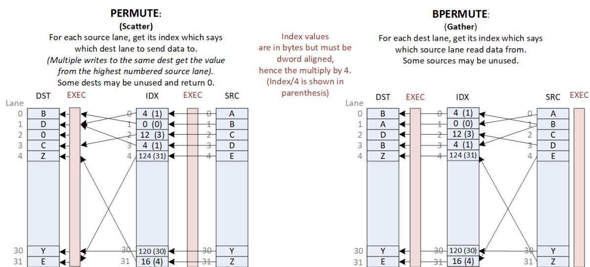

## **11.2.4. LDS to VGPR Matrix Load with Transpose**

These instructions allow matrix data to be copied from LDS to VGPRs and transpose the data on the way. These are similar to the global transpose ops: [WMMA Matrix Load Ops with Transpose.](#page-145-0) For these instruction, the EXEC mask is ignored and treated as if it were all ones.

**Note** these load-transpose instructions are wave32-only.

| Instruction       | Global Equivalent     | Description                                               |
|-------------------|-----------------------|-----------------------------------------------------------|
| DS_LOAD_TR16_B128 | GLOBAL_LOAD_TR16_B128 | Load A or B matrix with element-size of 16bits into VGPRs |
| DS_LOAD_TR8_B64   | GLOBAL_LOAD_TR8_B64   | Load A or B matrix with element-size of 8bits into VGPRs  |

| Instruction     | Global Equivalent   | Description                                              |
|-----------------|---------------------|----------------------------------------------------------|
| DS_LOAD_TR6_B96 | GLOBAL_LOAD_TR6_B96 | Load A or B matrix with element-size of 6bits into VGPRs |
| DS_LOAD_TR4_B64 | GLOBAL_LOAD_TR4_B64 | Load A or B matrix with element-size of 4bits into VGPRs |

# **Chapter 12. Float Memory Atomics**

Floating point atomics can be issued as LDS, Buffer, and Flat/Global/Scratch instructions.

Memory atomics do not report any numeric exceptions (e.g. signaling NaN).

# **12.1. Rounding**

LDS and Memory atomics have the rounding mode for float-atomic-add fixed at "round to nearest even". The MODE.round bits are ignored for atomics.

# **12.2. Denormals**

When these operate on floating point data, there is the possibility of the data containing denormal numbers, or the operation producing a denormal. The floating point atomic instructions have the option of passing denormal values through, or flushing them to zero.

LDS-indexed instructions allow denormals to be passed through or flushed to zero based on the MODE.denormal wave-state register. As with VALU ops, "denorm\_single" affects F32 ops and "denorm\_double" affects F64 and F16. LDS instructions use both FP\_DENORM bits (allow\_input\_denormal, allow\_output\_denormal) to control flushing of inputs and outputs separately. Using MODE allows LDS and VALU to produce identical results for float ops.

- Float 16 and 32 bit adder uses both input and output denorm flush controls from MODE
- Float 64 bit adder does not flush denorms
- Float MIN and MAX use only the "input denormal" flushing control
  - Each input to the comparisons flushes the mantissa of both operands to zero before the compare if the exponent is zero and the flush denorm control is active.
  - Min and Max flush input denormals first when enabled, then perform the Min/Max operation on the flushed denormals
  - Float CompareStore ("compare swap") flushes both input and output denormals based on the "flush input denormals" control.

|                    |         | LDS (DS) | LDS (FLAT) |         |         | L2 Cache | Data Fabric |         |
|--------------------|---------|----------|------------|---------|---------|----------|-------------|---------|
| Operation          | Flush   |          |            |         |         |          |             |         |
| ADD_F32            | Mode.I  | Mode.O   | NoFlush    | NoFlush | NoFlush | NoFlush  | Reg         | Reg     |
| PK_ADD_F16 / _BF16 | Mode.I  | Mode.O   | NoFlush    | NoFlush | NoFlush | NoFlush  | Reg         | Reg     |
| ADD_F64            | NoFlush | NoFlush  | NoFlush    | NoFlush | NoFlush | NoFlush  | NoFlush     | NoFlush |
| Min/Max_F32        | Mode.I  | NoFlush  | NoFlush    | NoFlush | NoFlush | NoFlush  | Reg         | NoFlush |
| Min/Max_F64        | Mode.I  | NoFlush  | NoFlush    | NoFlush | NoFlush | NoFlush  | NoFlush     | NoFlush |
|                    | Mode.I  | Mode.I   | NoFlush    | NoFlush | NoFlush | NoFlush  | NoFlush     | NoFlush |

- NoFlush: Do No flush denorms
- Mode.I : flushing is controlled by MODE.denorm (input denormal control)

- Mode.O : flushing is controlled by MODE.denorm (output denormal control)
- Reg : denormal flushing is controlled by a config register (which should be set to "No flush")

Flat instructions that are processed by LDS do not flush denorms, regardless of the MODE.denorm setting.

CompareStore ("compare swap") flushes the result when input denormal flushing occurs.

# **12.3. NaN Handling**

Not A Number ("NaN") is a IEEE-754 value representing a result that cannot be computed.

There are two types of NaN: quiet and signaling

- Quiet NaN Exponent=0xFF, Mantissa MSB=1
- Signaling NaN Exponent=0xFF, Mantissa MSB=0 and at least one other mantissa bit ==1

The LDS does not produce any exception or "signal" due to a signaling NaN.

DS\_ADD\_F32 can create a quiet NaN, or propagate NaN from its inputs: if either input is a NaN, the output is that same NaN, and if both inputs are NaN, the NaN from the first input is selected as the output. Signaling NaN is converted to Quiet NaN.

When denormals are flushed (see table in previous section), they are flushed **before** the operation (i.e. before the comparison).

#### **FP MAX / MIN Selection Rules**

 if (Src0==NaN) result = quiet(Src0) // either SNaN or QNaN else if (Src1==NaN) result = quiet(Src1) else if (Src0>Src1) larger\_of (src0, src1) // or smaller\_of for Minimum "Larger\_of" order from smallest to largest: -inf, -float, -denorm, -0, +0, +denorm, +float, +inf -0 < +0. Preserves -0. If any input is sNaN, signal invalid exception. "Smaller\_of" order from smallest to largest: -inf, -float, -denorm, -0, +0, +denorm, +float, +inf -0 < +0. Preserves -0. If any input is sNaN, signal invalid exception.

#### **FP MAXNUM / MINNUM Selection Rules**

 if (src0 == SNaN or QNaN) && (src1 == SNaN or QNaN) result = QNaN (src0) else if (src0 == SNaN or QNaN) result = src1 else if (src1 == SNaN or QNaN) result = src0 else result = larger\_of (src0, src1) // or smaller\_of for minimumNumber "Larger\_of" order from smallest to largest: -inf, -float, -denorm, -0, +0, +denorm, +float, +inf -0 < +0. Preserves -0. If any input is sNaN, signal invalid exception. "Smaller\_of" order from smallest to largest: -inf, -float, -denorm, -0, +0, +denorm, +float, +inf -0 < +0. Preserves -0. If any input is sNaN, signal invalid exception.

For VALU ops, when CLAMP=1 any NaN result is clamped to zero, and exceptions are reported before applying the CLAMP.

#### **Float Add rules**:

- 1. if SRC0 == NaN: result = QNaN of SRC0 (preserve sign)
- 2. else if SRC1 == NaN: result = QNaN of SRC1 (preserve sign)
- 3. else if SRC0 ==INF and SRC1==INF and signs differ: -QNAN (FP32: 0xFFC00000)
- 4. else if SRC0 == INF: result = SRC0
- 5. else if SRC1 == INF: result = SRC1

# **Chapter 13. Error Correction Codes (ECC)**

Error Correction Codes (ECC) are a method to protect memories from errors and in products in which this is present, is part of the overall Error Detection and Correction (EDC) strategy. CDNA5 has ECC protection on: SGPRs, VGPRs, LDS, and cache data.

Devices with ECC have slightly different behavior for memory and ALU instructions as described below.

Poison data can be propagated through memories and caches, but when a wave consumes (uses) poison data, the wave detects the error, halts and informs the host of the error. This is referred to as a "fatal\_halt" wave state, and the wave also reports POISON\_ERR. If a data bit in an internal SRAM spontaneously becomes corrupted (e.g. alpha particle strike), this can also be detected and is a system fatal event, requiring the device to be reset to recover.

# **13.1. Shader Programming and Behavior with ECC**

When ECC is present on a device, shaders must be compiled differently to accommodate small changes in data handling that ECC cause. The difference is that when ECC is present, VGPRs can write only full DWORDs.

Additional wave state:

- STATUS . FATAL\_HALT is set by a wave consuming poison data
- STATE\_PRIV . POISON\_ERR is set by a wave consuming poison data. Halts the wave.

If a wave is halted (normal halt, not fatal halt), and it receives a poison-consumption indication, the wave may un-halt in order to send report poison-error (as a message).

### **13.1.1. VALU**

- VALU: the VALU allows instructions to write less than 32 bits into a VGPR, but this operation may be slower (half rate). The VALU converts these into read-modify-write operations to preserve the non-written VGPR bits.

# **13.1.2. VMEM Loads**

- VMEM: memory loads that return less than 32 bits to a VGPR write the entire VGPR, with the portion of the VGPR that did not receive data from memory receiving the value "zero".

# **13.1.3. Buffer Load/Store**

**For chips with ECC present, all memory-load instructions store the full 32 bits into VGPRs.**

ECC present:

- All loads write full 32-bit VGPRs, writing the undefined bits with zero. 8-bit or 16-bit loads from global memory write the full 32-bits writing zeros into the other bits.

### **13.1.4. LDS**

**ECC/EDC**: when ECC exists, 16-bit indexed stores and atomics function normally and preserve the other 16 bits of data without running slower. 8-bit or 16-bit loads from global memory to LDS however store zero to the other bits, writing a full 32-bits.

# **13.1.5. Flat / Global / Scratch**

In chips with ECC present, "D16" and "D16\_HI" loads write the full 32-bits of the VGPR, filling in the unused portion with zero.

# **13.1.6. Performance**

When ECC is present, the VALU runs at half rate for instructions that write 16-bits or less. This is because in order to preserve the other bits in the VGPR, the hardware needs to perform a read-modify-write of the VGPR which it does by inserting a V\_MOV\_PRSV\_B32 instruction before the 8/16-bit operation.

# **Chapter 14. Microcode Formats**

This section specifies the microcode formats. The definitions can be used to simplify compilation by providing standard templates and enumeration names for the various instruction formats.

Endian Order - The CDNA5 architecture addresses memory and registers using little-endian byte-ordering and bit-ordering. Multi-byte values are stored with their least-significant (low-order) byte at the lowest byte address, and they are illustrated with their least-significant byte at the right side. Byte values are stored with their least-significant (low-order) bit (LSB) at the lowest bit address, and they are illustrated with their LSB at the right side.

SALU and VALU instructions may optionally include a 32-bit literal constant, and some VALU instructions may include a 32-bit DPP control DWORD at the end of the instructions. No instruction may use both DPP and a literal constant.

The table below summarizes the microcode formats and their widths, not including extra literal or DPP instruction words. The sections that follow provide details.

Table 71. Summary of Microcode Formats

| Microcode Formats | Reference | Width (bits) |
|-------------------|-----------|--------------|
| SOP2              | SOP2      | 32           |
| SOP1              | SOP1      |              |
| SOPK              | SOPK      |              |
| SOPP              | SOPP      |              |
| SOPC              | SOPC      |              |
| SMEM              | SMEM      | 64           |
| VOP1              | VOP1      | 32           |
| VOP2              | VOP2      | 32           |
| VOPC              | VOPC      | 32           |
| VOP3              | VOP3      | 64           |
| VOP3SD            | VOP3SD    | 64           |
| VOP3P             | VOP3P     | 64           |
| VOP3PX2           | VOP3PX2   | 128          |
| VOPD              | VOPD      | 64           |
| VOPD3             | VOPD3     | 96           |
| DPP16             | DPP16     | 32           |
| DPP8              | DPP8      | 32           |
| VDS               | VDS       | 64           |
| VBUFFER           | VBUFFER   | 96           |
| VIMAGE            | VIMAGE    | 96           |
| VFLAT             | VFLAT     | 96           |

| Microcode Formats | Reference | Width (bits) |
|-------------------|-----------|--------------|
| VGLOBAL           | VGLOBAL   | 96           |
| VSCRATCH          | VSCRATCH  | 96           |

Any instruction field marked as "Reserved" must be set to zero.

#### **Instruction Suffixes**

Most instructions include a suffix that indicates the data type the instruction handles. This suffix may also include a number that indicates the size of the data.

For example: "F32" indicates "32-bit floating point data", or "B16" is "16-bit binary data".

- B = Binary
- F = Floating point
- BF = "brain-float" floating point
- I = Signed integer
- U = Unsigned integer
- IU = Signed or Unsigned integer

When more than one data-type specifier occurs in an instruction, the first one is the result type and size, and the later one(s) is/are input data type and size.

E.g. V\_CVT\_F32\_I32 reads an integer and writes a float.

# **14.1. Scalar ALU and Control Formats**

### **14.1.1. SOP2**

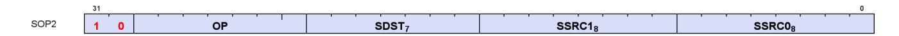

**Description** This is a scalar instruction with two inputs and one output. Can be followed by a 32-bit literal constant.

Table 72. SOP2 Fields

| Field Name | Bits    | Format or Description         |
|------------|---------|-------------------------------|
| SSRC0      | [7:0]   |                               |
| SSRC1      | [15:8]  | Second scalar source operand. |
| SDST       | [22:16] | Scalar destination.           |
| OP         | [29:23] | See Opcode table below.       |
| ENCODING   | [31:30] | 'b10                          |

Table 73. SOP2 Opcodes

| Opcode # | Name            | Opcode # | Name                 |
|----------|-----------------|----------|----------------------|
| 0        | S_ADD_CO_U32    | 38       | S_BFE_U32            |
| 1        | S_SUB_CO_U32    | 39       | S_BFE_I32            |
| 2        | S_ADD_CO_I32    | 40       | S_BFE_U64            |
| 3        | S_SUB_CO_I32    | 41       | S_BFE_I64            |
| 4        | S_ADD_CO_CI_U32 | 42       | S_BFM_B32            |
| 5        | S_SUB_CO_CI_U32 | 43       | S_BFM_B64            |
| 6        | S_ABSDIFF_I32   | 44       | S_MUL_I32            |
| 8        | S_LSHL_B32      | 45       | S_MUL_HI_U32         |
| 9        | S_LSHL_B64      | 46       | S_MUL_HI_I32         |
| 10       | S_LSHR_B32      | 48       | S_CSELECT_B32        |
| 11       | S_LSHR_B64      | 49       | S_CSELECT_B64        |
| 12       | S_ASHR_I32      | 50       | S_PACK_LL_B32_B16    |
| 13       | S_ASHR_I64      | 51       | S_PACK_LH_B32_B16    |
| 14       | S_LSHL1_ADD_U32 | 52       | S_PACK_HH_B32_B16    |
| 15       | S_LSHL2_ADD_U32 | 53       | S_PACK_HL_B32_B16    |
| 16       | S_LSHL3_ADD_U32 | 64       | S_ADD_F32            |
| 17       | S_LSHL4_ADD_U32 | 65       | S_SUB_F32            |
| 18       | S_MIN_I32       | 66       | S_MIN_NUM_F32        |
| 19       | S_MIN_U32       | 67       | S_MAX_NUM_F32        |
| 20       | S_MAX_I32       | 68       | S_MUL_F32            |
| 21       | S_MAX_U32       | 69       | S_FMAAK_F32          |
| 22       | S_AND_B32       | 70       | S_FMAMK_F32          |
| 23       | S_AND_B64       | 71       | S_FMAC_F32           |
| 24       | S_OR_B32        | 72       | S_CVT_PK_RTZ_F16_F32 |
| 25       | S_OR_B64        | 73       | S_ADD_F16            |
| 26       | S_XOR_B32       | 74       | S_SUB_F16            |
| 27       | S_XOR_B64       | 75       | S_MIN_NUM_F16        |
| 28       | S_NAND_B32      | 76       | S_MAX_NUM_F16        |
| 29       | S_NAND_B64      | 77       | S_MUL_F16            |
| 30       | S_NOR_B32       | 78       | S_FMAC_F16           |
| 31       | S_NOR_B64       | 79       | S_MINIMUM_F32        |
| 32       | S_XNOR_B32      | 80       | S_MAXIMUM_F32        |
| 33       | S_XNOR_B64      | 81       | S_MINIMUM_F16        |
| 34       | S_AND_NOT1_B32  | 82       | S_MAXIMUM_F16        |
| 35       | S_AND_NOT1_B64  | 83       | S_ADD_NC_U64         |
| 36       | S_OR_NOT1_B32   | 84       | S_SUB_NC_U64         |
| 37       | S_OR_NOT1_B64   | 85       | S_MUL_U64            |

# **14.1.2. SOPK**

**Description** This is a scalar instruction with one 16-bit signed immediate (SIMM16) input and a single destination. Instructions that take 2 inputs use the destination as the first input and the SIMM16 as the second input.

E.g. "S\_ADDK\_I32 S0, 1" means "S0 = S0 + 1".

Table 74. SOPK Fields

| Field Name | Bits    | Format or Description          |
|------------|---------|--------------------------------|
| SIMM16     | [15:0]  | Signed immediate 16-bit value. |
| SDST       | [22:16] |                                |
| OP         | [27:23] | See Opcode table below.        |
| ENCODING   | [31:28] | 'b1011                         |

#### Table 75. SOPK Opcodes

| Opcode # | Name          | Opcode # | Name               |
|----------|---------------|----------|--------------------|
| 0        | S_MOVK_I32    | 17       | S_GETREG_B32       |
| 1        | S_VERSION     | 18       | S_SETREG_B32       |
| 2        | S_CMOVK_I32   | 19       | S_SETREG_IMM32_B32 |
| 15       | S_ADDK_CO_I32 | 20       | S_CALL_I64         |
| 16       | S_MULK_I32    |          |                    |

## **14.1.3. SOP1**

**Description** This is a scalar instruction with one input and one output. Can be followed by a 32-bit literal constant.

Table 76. SOP1 Fields

| Field Name | Bits    | Format or Description   |
|------------|---------|-------------------------|
| SSRC0      | [7:0]   |                         |
| OP         | [15:8]  | See Opcode table below. |
| SDST       | [22:16] | Scalar destination.     |
| ENCODING   | [31:23] | 'b10_1111101            |

Table 77. SOP1 Opcodes

| Opcode # | Name                    | Opcode # | Name                    |
|----------|-------------------------|----------|-------------------------|
| 0        | S_MOV_B32               | 46       | S_OR_NOT0_SAVEEXEC_B32  |
| 1        | S_MOV_B64               | 47       | S_OR_NOT0_SAVEEXEC_B64  |
| 2        | S_CMOV_B32              | 48       | S_AND_NOT1_SAVEEXEC_B32 |
| 3        | S_CMOV_B64              | 49       | S_AND_NOT1_SAVEEXEC_B64 |
| 4        | S_BREV_B32              | 50       | S_OR_NOT1_SAVEEXEC_B32  |
| 5        | S_BREV_B64              | 51       | S_OR_NOT1_SAVEEXEC_B64  |
| 6        | S_GET_SHADER_CYCLES_U64 | 52       | S_AND_NOT0_WREXEC_B32   |
| 8        | S_CTZ_I32_B32           | 53       | S_AND_NOT0_WREXEC_B64   |
| 9        | S_CTZ_I32_B64           | 54       | S_AND_NOT1_WREXEC_B32   |
| 10       | S_CLZ_I32_U32           | 55       | S_AND_NOT1_WREXEC_B64   |
| 11       | S_CLZ_I32_U64           | 64       | S_MOVRELS_B32           |

| Opcode # | Name                    | Opcode # | Name                     |
|----------|-------------------------|----------|--------------------------|
| 12       | S_CLS_I32               | 65       | S_MOVRELS_B64            |
| 13       | S_CLS_I32_I64           | 66       | S_MOVRELD_B32            |
| 14       | S_SEXT_I32_I8           | 67       | S_MOVRELD_B64            |
| 15       | S_SEXT_I32_I16          | 68       | S_MOVRELSD_2_B32         |
| 16       | S_BITSET0_B32           | 71       | S_GET_PC_I64             |
| 17       | S_BITSET0_B64           | 72       | S_SET_PC_I64             |
| 18       | S_BITSET1_B32           | 73       | S_SWAP_PC_I64            |
| 19       | S_BITSET1_B64           | 74       | S_RFE_I64                |
| 20       | S_BITREPLICATE_B64_B32  | 76       | S_SENDMSG_RTN_B32        |
| 21       | S_ABS_I32               | 77       | S_SENDMSG_RTN_B64        |
| 22       | S_BCNT0_I32_B32         | 78       | S_BARRIER_SIGNAL         |
| 23       | S_BCNT0_I32_B64         | 79       | S_BARRIER_SIGNAL_ISFIRST |
| 24       | S_BCNT1_I32_B32         | 80       | S_GET_BARRIER_STATE      |
| 25       | S_BCNT1_I32_B64         | 81       | S_BARRIER_INIT           |
| 26       | S_QUADMASK_B32          | 82       | S_BARRIER_JOIN           |
| 27       | S_QUADMASK_B64          | 83       | Reserved                 |
| 28       | S_WQM_B32               | 87       | S_WAKEUP_BARRIER         |
| 29       | S_WQM_B64               | 88       | S_SLEEP_VAR              |
| 30       | S_NOT_B32               | 96       | S_CEIL_F32               |
| 31       | S_NOT_B64               | 97       | S_FLOOR_F32              |
| 32       | S_AND_SAVEEXEC_B32      | 98       | S_TRUNC_F32              |
| 33       | S_AND_SAVEEXEC_B64      | 99       | S_RNDNE_F32              |
| 34       | S_OR_SAVEEXEC_B32       | 100      | S_CVT_F32_I32            |
| 35       | S_OR_SAVEEXEC_B64       | 101      | S_CVT_F32_U32            |
| 36       | S_XOR_SAVEEXEC_B32      | 102      | S_CVT_I32_F32            |
| 37       | S_XOR_SAVEEXEC_B64      | 103      | S_CVT_U32_F32            |
| 38       | S_NAND_SAVEEXEC_B32     | 104      | S_CVT_F16_F32            |
| 39       | S_NAND_SAVEEXEC_B64     | 105      | S_CVT_F32_F16            |
| 40       | S_NOR_SAVEEXEC_B32      | 106      | S_CVT_HI_F32_F16         |
| 41       | S_NOR_SAVEEXEC_B64      | 107      | S_CEIL_F16               |
| 42       | S_XNOR_SAVEEXEC_B32     | 108      | S_FLOOR_F16              |
| 43       | S_XNOR_SAVEEXEC_B64     | 109      | S_TRUNC_F16              |
| 44       | S_AND_NOT0_SAVEEXEC_B32 | 110      | S_RNDNE_F16              |
| 45       | S_AND_NOT0_SAVEEXEC_B64 |          |                          |

# **14.1.4. SOPC**

**Description** This is a scalar instruction with two inputs that are compared and produces SCC as a result. Can be followed by a 32-bit literal constant.

Table 78. SOPC Fields

| Field Name | Bits    | Format or Description         |
|------------|---------|-------------------------------|
| SSRC0      | [7:0]   |                               |
| SSRC1      | [15:8]  | Second scalar source operand. |
| OP         | [22:16] | See Opcode table below.       |
| ENCODING   | [31:23] | 'b10_1111110                  |

Table 79. SOPC Opcodes

| Opcode # | Name         | Opcode # | Name          |
|----------|--------------|----------|---------------|
| 0        | S_CMP_EQ_I32 | 70       | S_CMP_GE_F32  |
| 1        | S_CMP_LG_I32 | 71       | S_CMP_O_F32   |
| 2        | S_CMP_GT_I32 | 72       | S_CMP_U_F32   |
| 3        | S_CMP_GE_I32 | 73       | S_CMP_NGE_F32 |
| 4        | S_CMP_LT_I32 | 74       | S_CMP_NLG_F32 |
| 5        | S_CMP_LE_I32 | 75       | S_CMP_NGT_F32 |
| 6        | S_CMP_EQ_U32 | 76       | S_CMP_NLE_F32 |
| 7        | S_CMP_LG_U32 | 77       | S_CMP_NEQ_F32 |
| 8        | S_CMP_GT_U32 | 78       | S_CMP_NLT_F32 |
| 9        | S_CMP_GE_U32 | 81       | S_CMP_LT_F16  |
| 10       | S_CMP_LT_U32 | 82       | S_CMP_EQ_F16  |

| Opcode # | Name          | Opcode # | Name          |
|----------|---------------|----------|---------------|
| 11       | S_CMP_LE_U32  | 83       | S_CMP_LE_F16  |
| 12       | S_BITCMP0_B32 | 84       | S_CMP_GT_F16  |
| 13       | S_BITCMP1_B32 | 85       | S_CMP_LG_F16  |
| 14       | S_BITCMP0_B64 | 86       | S_CMP_GE_F16  |
| 15       | S_BITCMP1_B64 | 87       | S_CMP_O_F16   |
| 16       | S_CMP_EQ_U64  | 88       | S_CMP_U_F16   |
| 17       | S_CMP_LG_U64  | 89       | S_CMP_NGE_F16 |
| 65       | S_CMP_LT_F32  | 90       | S_CMP_NLG_F16 |
| 66       | S_CMP_EQ_F32  | 91       | S_CMP_NGT_F16 |
| 67       | S_CMP_LE_F32  | 92       | S_CMP_NLE_F16 |
| 68       | S_CMP_GT_F32  | 93       | S_CMP_NEQ_F16 |
| 69       | S_CMP_LG_F32  | 94       | S_CMP_NLT_F16 |

# **14.1.5. SOPP**

**Description** This is a scalar instruction with one 16-bit signed immediate (SIMM16) input.

Table 80. SOPP Fields

| Field Name | Bits    | Format or Description          |
|------------|---------|--------------------------------|
| SIMM16     | [15:0]  | Signed immediate 16-bit value. |
| OP         | [22:16] | See Opcode table below.        |
| ENCODING   | [31:23] | 'b10_1111111                   |

Table 81. SOPP Opcodes

| Opcode # | Name            | Opcode # | Name                 |
|----------|-----------------|----------|----------------------|
| 0        | S_NOP           | 38       | S_CBRANCH_EXECNZ     |
| 2        | S_SETHALT       | 48       | S_ENDPGM             |
| 3        | S_SLEEP         | 49       | S_ENDPGM_SAVED       |
| 4        | S_MONITOR_SLEEP | 52       | S_WAKEUP             |
| 5        | S_CLAUSE        | 53       | S_SETPRIO            |
| 6        | S_SET_VGPR_MSB  | 54       | S_SENDMSG            |
| 7        | S_DELAY_ALU     | 55       | S_SENDMSGHALT        |
| 8        | S_WAIT_ALU      | 56       | S_INCPERFLEVEL       |
| 10       | S_WAIT_IDLE     | 57       | S_DECPERFLEVEL       |
| 16       | S_TRAP          | 58       | S_TTRACEDATA         |
| 17       | S_ROUND_MODE    | 59       | S_TTRACEDATA_IMM     |
| 18       | S_DENORM_MODE   | 60       | S_ICACHE_INV         |
| 19       | Reserved        | 62       | S_SETPRIO_INC_WG     |
| 20       | S_BARRIER_WAIT  | 64       | S_WAIT_LOADCNT       |
| 21       | S_BARRIER_LEAVE | 65       | S_WAIT_STORECNT      |
| 31       | S_CODE_END      | 69       | S_WAIT_XCNT          |
| 32       | S_BRANCH        | 70       | S_WAIT_DSCNT         |
| 33       | S_CBRANCH_SCC0  | 71       | S_WAIT_KMCNT         |
| 34       | S_CBRANCH_SCC1  | 72       | S_WAIT_LOADCNT_DSCNT |

| Opcode # | Name            | Opcode # | Name                  |
|----------|-----------------|----------|-----------------------|
| 35       | S_CBRANCH_VCCZ  | 73       | S_WAIT_STORECNT_DSCNT |
| 36       | S_CBRANCH_VCCNZ | 74       | S_WAIT_ASYNCCNT       |
| 37       | S_CBRANCH_EXECZ | 75       | S_WAIT_TENSORCNT      |

# **14.2. Scalar Memory Format**

### **14.2.1. SMEM**

**Description** Scalar Memory data load

Table 82. SMEM Fields

| Field Name   | Bits    | Format or Description                                                            |
|--------------|---------|----------------------------------------------------------------------------------|
| SBASE        | [5:0]   | SGPR-pair that provides base address or SGPR-quad that provides V#. (LSB of SGPR |
| SDATA        | [12:6]  | SGPR that provides write data or accepts return data.                            |
| OP           | [18:13] | See Opcode table below.                                                          |
| NV           | [20]    | Non-Volatile memory access                                                       |
| SCOPE        | [22:21] | Memory Scope                                                                     |
| TH           | [24:23] | Memory Temporal Hint                                                             |
| ENCODING     | [31:26] | 'b111101                                                                         |
| SCALE_OFFSET | [56]    | Scale the address-offset SGPR by the data size, or not.                          |
| IOFFSET      | [55:32] | An immediate signed byte offset. Ignored for cache invalidations.                |
| SOFFSET      | [63:57] | SGPR that supplies an unsigned byte offset. Disabled if set to NULL.             |

Table 83. SMEM Opcodes

| Opcode # | Name               | Opcode # | Name                   |
|----------|--------------------|----------|------------------------|
| 0        | S_LOAD_B32         | 19       | S_BUFFER_LOAD_B256     |
| 1        | S_LOAD_B64         | 20       | S_BUFFER_LOAD_B512     |
| 2        | S_LOAD_B128        | 21       | S_BUFFER_LOAD_B96      |
| 3        | S_LOAD_B256        | 24       | S_BUFFER_LOAD_I8       |
| 4        | S_LOAD_B512        | 25       | S_BUFFER_LOAD_U8       |
| 5        | S_LOAD_B96         | 26       | S_BUFFER_LOAD_I16      |
| 8        | S_LOAD_I8          | 27       | S_BUFFER_LOAD_U16      |
| 9        | S_LOAD_U8          | 33       | S_DCACHE_INV           |
| 10       | S_LOAD_I16         | 36       | S_PREFETCH_INST        |
| 11       | S_LOAD_U16         | 37       | S_PREFETCH_INST_PC_REL |
| 16       | S_BUFFER_LOAD_B32  | 38       | S_PREFETCH_DATA        |
| 17       | S_BUFFER_LOAD_B64  | 39       | S_BUFFER_PREFETCH_DATA |
| 18       | S_BUFFER_LOAD_B128 | 40       | S_PREFETCH_DATA_PC_REL |

# **14.3. Vector ALU Formats**

### **14.3.1. VOP2**

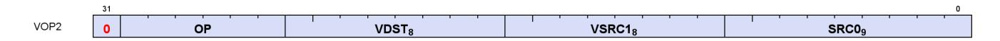

**Description** Vector ALU format with two input operands. Can be followed by a 32-bit literal constant or DPP instruction DWORD when the instruction allows it.

Table 84. VOP2 Fields

| Field Name | Bits    | Format or Description                  |
|------------|---------|----------------------------------------|
| SRC0       | [8:0]   |                                        |
| VSRC1      | [16:9]  | VGPR that provides the second operand. |
| VDST       | [24:17] | Destination VGPR.                      |
| OP         | [30:25] | See Opcode table below.                |

Table 85. VOP2 Opcodes

| Opcode # | Name               | Opcode # | Name                 |
|----------|--------------------|----------|----------------------|
| 1        | V_CNDMASK_B32      | 31       | V_LSHLREV_B64        |
| 2        | V_ADD_F64          | 32       | V_ADD_CO_CI_U32      |
| 3        | V_ADD_F32          | 33       | V_SUB_CO_CI_U32      |
| 4        | V_SUB_F32          | 34       | V_SUBREV_CO_CI_U32   |
| 5        | V_SUBREV_F32       | 35       | V_FMAMK_F64          |
| 6        | V_MUL_F64          | 36       | V_FMAAK_F64          |
| 7        | V_MUL_DX9_ZERO_F32 | 37       | V_ADD_NC_U32         |
| 8        | V_MUL_F32          | 38       | V_SUB_NC_U32         |
| 9        | V_MUL_I32_I24      | 39       | V_SUBREV_NC_U32      |
| 10       | V_MUL_HI_I32_I24   | 40       | V_ADD_NC_U64         |
| 11       | V_MUL_U32_U24      | 41       | V_SUB_NC_U64         |
| 12       | V_MUL_HI_U32_U24   | 42       | V_MUL_U64            |
| 13       | V_MIN_NUM_F64      | 43       | V_FMAC_F32           |
| 14       | V_MAX_NUM_F64      | 44       | V_FMAMK_F32          |
| 17       | V_MIN_I32          | 45       | V_FMAAK_F32          |
| 18       | V_MAX_I32          | 47       | V_CVT_PK_RTZ_F16_F32 |
| 19       | V_MIN_U32          | 48       | V_MIN_NUM_F16        |
| 20       | V_MAX_U32          | 49       | V_MAX_NUM_F16        |
| 21       | V_MIN_NUM_F32      | 50       | V_ADD_F16            |
| 22       | V_MAX_NUM_F32      | 51       | V_SUB_F16            |
| 23       | V_FMAC_F64         | 52       | V_SUBREV_F16         |
| 24       | V_LSHLREV_B32      | 53       | V_MUL_F16            |
| 25       | V_LSHRREV_B32      | 54       | V_FMAC_F16           |
| 26       | V_ASHRREV_I32      | 55       | V_FMAMK_F16          |
| 27       | V_AND_B32          | 56       | V_FMAAK_F16          |
| 28       | V_OR_B32           | 59       | V_LDEXP_F16          |
| 29       | V_XOR_B32          | 60       | V_PK_FMAC_F16        |
| 30       | V_XNOR_B32         |          |                      |

# **14.3.2. VOP1**

**Description** Vector ALU format with one input operand. Can be followed by a 32-bit literal constant or DPP instruction DWORD when the instruction allows it.

Table 86. VOP1 Fields

| Field Name | Bits    | Format or Description   |
|------------|---------|-------------------------|
| SRC0       | [8:0]   |                         |
| OP         | [15:9]  | See Opcode table below. |
| VDST       | [24:17] | Destination VGPR.       |
| ENCODING   | [31:25] | 'b0_111111              |

Table 87. VOP1 Opcodes

| Opcode # | Name                | Opcode # | Name                  |
|----------|---------------------|----------|-----------------------|
| 0        | V_NOP               | 63       | V_FREXP_EXP_I32_F32   |
| 1        | V_MOV_B32           | 64       | V_FREXP_MANT_F32      |
| 2        | V_READFIRSTLANE_B32 | 66       | V_MOVRELD_B32         |
| 3        | V_CVT_I32_F64       | 67       | V_MOVRELS_B32         |
| 4        | V_CVT_F64_I32       | 68       | V_MOVRELSD_B32        |
| 5        | V_CVT_F32_I32       | 69       | Reserved              |
| 6        | V_CVT_F32_U32       | 72       | V_MOVRELSD_2_B32      |
| 7        | V_CVT_U32_F32       | 73       | V_PERMLANE16_SWAP_B32 |
| 8        | V_CVT_I32_F32       | 74       | V_TANH_BF16           |

| Opcode # | Name                  | Opcode # | Name                |
|----------|-----------------------|----------|---------------------|
| 10       | V_CVT_F16_F32         | 75       | V_PRNG_B32          |
| 11       | V_CVT_F32_F16         | 80       | V_CVT_F16_U16       |
| 12       | V_CVT_NEAREST_I32_F32 | 81       | V_CVT_F16_I16       |
| 13       | V_CVT_FLOOR_I32_F32   | 82       | V_CVT_U16_F16       |
| 14       | V_CVT_OFF_F32_I4      | 83       | V_CVT_I16_F16       |
| 15       | V_CVT_F32_F64         | 84       | V_RCP_F16           |
| 16       | V_CVT_F64_F32         | 85       | V_SQRT_F16          |
| 17       | V_CVT_F32_UBYTE0      | 86       | V_RSQ_F16           |
| 18       | V_CVT_F32_UBYTE1      | 87       | V_LOG_F16           |
| 19       | V_CVT_F32_UBYTE2      | 88       | V_EXP_F16           |
| 20       | V_CVT_F32_UBYTE3      | 89       | V_FREXP_MANT_F16    |
| 21       | V_CVT_U32_F64         | 90       | V_FREXP_EXP_I16_F16 |
| 22       | V_CVT_F64_U32         | 91       | V_FLOOR_F16         |
| 23       | V_TRUNC_F64           | 92       | V_CEIL_F16          |
| 24       | V_CEIL_F64            | 93       | V_TRUNC_F16         |
| 25       | V_RNDNE_F64           | 94       | V_RNDNE_F16         |
| 26       | V_FLOOR_F64           | 95       | V_FRACT_F16         |
| 27       | V_PIPEFLUSH           | 96       | V_SIN_F16           |
| 28       | V_MOV_B16             | 97       | V_COS_F16           |
| 29       | V_MOV_B64             | 98       | V_SAT_PK_U8_I16     |
| 30       | V_TANH_F32            | 99       | V_CVT_NORM_I16_F16  |
| 31       | V_TANH_F16            | 100      | V_CVT_NORM_U16_F16  |
| 32       | V_FRACT_F32           | 101      | V_SWAP_B32          |
| 33       | V_TRUNC_F32           | 102      | V_SWAP_B16          |
| 34       | V_CEIL_F32            | 104      | V_SWAPREL_B32       |
| 35       | V_RNDNE_F32           | 105      | V_NOT_B16           |
| 36       | V_FLOOR_F32           | 106      | V_CVT_I32_I16       |
| 37       | V_EXP_F32             | 107      | V_CVT_U32_U16       |
| 39       | V_LOG_F32             | 108      | V_CVT_F32_FP8       |
| 42       | V_RCP_F32             | 109      | V_CVT_F32_BF8       |
| 43       | V_RCP_IFLAG_F32       | 110      | V_CVT_PK_F32_FP8    |
| 46       | V_RSQ_F32             | 111      | V_CVT_PK_F32_BF8    |
| 47       | V_RCP_F64             | 114      | V_CVT_F32_BF16      |
| 49       | V_RSQ_F64             | 115      | V_SAT_PK4_I4_I8     |
| 51       | V_SQRT_F32            | 116      | V_SAT_PK4_U4_U8     |
| 52       | V_SQRT_F64            | 117      | V_CVT_PK_F16_FP8    |
| 53       | V_SIN_F32             | 118      | V_CVT_PK_F16_BF8    |
| 54       | V_COS_F32             | 119      | V_CVT_F16_FP8       |
| 55       | V_NOT_B32             | 120      | V_CVT_F16_BF8       |
| 56       | V_BFREV_B32           | 121      | V_RCP_BF16          |
| 57       | V_CLZ_I32_U32         | 122      | V_SQRT_BF16         |
| 58       | V_CTZ_I32_B32         | 123      | V_RSQ_BF16          |
| 59       | V_CLS_I32             | 124      | V_LOG_BF16          |
| 60       | V_FREXP_EXP_I32_F64   | 125      | V_EXP_BF16          |
| 61       | V_FREXP_MANT_F64      | 126      | V_SIN_BF16          |
| 62       | V_FRACT_F64           | 127      | V_COS_BF16          |

### **14.3.3. VOPC**

**Description** Vector instruction taking two inputs and producing a comparison result. Can be followed by a 32-bit literal constant or DPP control DWORD. Vector Comparison operations are divided into three groups:

- those that can use any one of 16 comparison operations,
- those that can use any one of 8, and
- those that have a single comparison operation.

The final opcode number is determined by adding the base for the opcode family plus the offset from the compare op. Compare instructions write a result to VCC (for VOPC) or an SGPR (for VOP3). Additionally, compare instructions have variants that writes to the EXEC mask instead of VCC or SGPR. The destination of the compare result is VCC or EXEC when encoded using the VOPC format, and can be an arbitrary SGPR (indicated in the VDST field) when only encoded in the VOP3 format.

#### **Comparison Operations**

#### Table 88. Comparison Operations

| Compare Operation | Opcode |                                  |
|-------------------|--------|----------------------------------|
| F                 | 0      | D.u = 0                          |
| LT                | 1      | D.u = (S0 < S1)                  |
| EQ                | 2      | D.u = (S0 == S1)                 |
| LE                | 3      | D.u = (S0 <= S1)                 |
| GT                | 4      | D.u = (S0 > S1)                  |
| LG                | 5      | D.u = (S0 <> S1)                 |
| GE                | 6      | D.u = (S0 >= S1)                 |
| O                 | 7      | D.u = (!isNaN(S0) && !isNaN(S1)) |
| U                 | 8      | D.u = (isNaN(S0)    isNaN(S1))   |
| NGE               | 9      | D.u = !(S0 >= S1)                |
| NLG               | 10     | D.u = !(S0 <> S1)                |
| NGT               | 11     | D.u = !(S0 > S1)                 |
| NLE               | 12     | D.u = !(S0 <= S1)                |
| NEQ               | 13     | D.u = !(S0 == S1)                |
| NLT               | 14     | D.u = !(S0 < S1)                 |
| TRU               | 15     | D.u = 1                          |
| F                 | 0      | D.u = 0                          |
| LT                | 1      | D.u = (S0 < S1)                  |
| EQ                | 2      | D.u = (S0 == S1)                 |
| LE                | 3      | D.u = (S0 <= S1)                 |
| GT                | 4      | D.u = (S0 > S1)                  |
| NE                | 5      | D.u = (S0 <> S1)                 |
| GE                | 6      | D.u = (S0 >= S1)                 |

#### Table 89. VOPC Fields

| Field Name | Bits    | Format or Description                  |
|------------|---------|----------------------------------------|
| SRC0       | [8:0]   |                                        |
| VSRC1      | [16:9]  | VGPR that provides the second operand. |
| OP         | [24:17] | See Opcode table below.                |
| ENCODING   | [31:25] | 'b0_111110                             |

### Table 90. VOPC Opcodes

| Opcode # | Name         | Opcode # | Name          |
|----------|--------------|----------|---------------|
| 1        | V_CMP_LT_F16 | 129      | V_CMPX_LT_F16 |
| 2        | V_CMP_EQ_F16 | 130      | V_CMPX_EQ_F16 |
| 3        | V_CMP_LE_F16 | 131      | V_CMPX_LE_F16 |
| 4        | V_CMP_GT_F16 | 132      | V_CMPX_GT_F16 |

| Opcode # | Name          | Opcode # | Name           |
|----------|---------------|----------|----------------|
| 5        | V_CMP_LG_F16  | 133      | V_CMPX_LG_F16  |
| 6        | V_CMP_GE_F16  | 134      | V_CMPX_GE_F16  |
| 7        | V_CMP_O_F16   | 135      | V_CMPX_O_F16   |
| 8        | V_CMP_U_F16   | 136      | V_CMPX_U_F16   |
| 9        | V_CMP_NGE_F16 | 137      | V_CMPX_NGE_F16 |
| 10       | V_CMP_NLG_F16 | 138      | V_CMPX_NLG_F16 |
| 11       | V_CMP_NGT_F16 | 139      | V_CMPX_NGT_F16 |
| 12       | V_CMP_NLE_F16 | 140      | V_CMPX_NLE_F16 |
| 13       | V_CMP_NEQ_F16 | 141      | V_CMPX_NEQ_F16 |
| 14       | V_CMP_NLT_F16 | 142      | V_CMPX_NLT_F16 |
| 17       | V_CMP_LT_F32  | 145      | V_CMPX_LT_F32  |
| 18       | V_CMP_EQ_F32  | 146      | V_CMPX_EQ_F32  |
| 19       | V_CMP_LE_F32  | 147      | V_CMPX_LE_F32  |
| 20       | V_CMP_GT_F32  | 148      | V_CMPX_GT_F32  |
| 21       | V_CMP_LG_F32  | 149      | V_CMPX_LG_F32  |
| 22       | V_CMP_GE_F32  | 150      | V_CMPX_GE_F32  |
| 23       | V_CMP_O_F32   | 151      | V_CMPX_O_F32   |
| 24       | V_CMP_U_F32   | 152      | V_CMPX_U_F32   |
| 25       | V_CMP_NGE_F32 | 153      | V_CMPX_NGE_F32 |
| 26       | V_CMP_NLG_F32 | 154      | V_CMPX_NLG_F32 |
| 27       | V_CMP_NGT_F32 | 155      | V_CMPX_NGT_F32 |
| 28       | V_CMP_NLE_F32 | 156      | V_CMPX_NLE_F32 |
| 29       | V_CMP_NEQ_F32 | 157      | V_CMPX_NEQ_F32 |
| 30       | V_CMP_NLT_F32 | 158      | V_CMPX_NLT_F32 |
| 33       | V_CMP_LT_F64  | 161      | V_CMPX_LT_F64  |
| 34       | V_CMP_EQ_F64  | 162      | V_CMPX_EQ_F64  |
| 35       | V_CMP_LE_F64  | 163      | V_CMPX_LE_F64  |
| 36       | V_CMP_GT_F64  | 164      | V_CMPX_GT_F64  |
| 37       | V_CMP_LG_F64  | 165      | V_CMPX_LG_F64  |
| 38       | V_CMP_GE_F64  | 166      | V_CMPX_GE_F64  |
| 39       | V_CMP_O_F64   | 167      | V_CMPX_O_F64   |
| 40       | V_CMP_U_F64   | 168      | V_CMPX_U_F64   |
| 41       | V_CMP_NGE_F64 | 169      | V_CMPX_NGE_F64 |
| 42       | V_CMP_NLG_F64 | 170      | V_CMPX_NLG_F64 |
| 43       | V_CMP_NGT_F64 | 171      | V_CMPX_NGT_F64 |
| 44       | V_CMP_NLE_F64 | 172      | V_CMPX_NLE_F64 |
| 45       | V_CMP_NEQ_F64 | 173      | V_CMPX_NEQ_F64 |
| 46       | V_CMP_NLT_F64 | 174      | V_CMPX_NLT_F64 |
| 49       | V_CMP_LT_I16  | 177      | V_CMPX_LT_I16  |
| 50       | V_CMP_EQ_I16  | 178      | V_CMPX_EQ_I16  |
| 51       | V_CMP_LE_I16  | 179      | V_CMPX_LE_I16  |
| 52       | V_CMP_GT_I16  | 180      | V_CMPX_GT_I16  |
| 53       | V_CMP_NE_I16  | 181      | V_CMPX_NE_I16  |
| 54       | V_CMP_GE_I16  | 182      | V_CMPX_GE_I16  |
| 57       | V_CMP_LT_U16  | 185      | V_CMPX_LT_U16  |
| 58       | V_CMP_EQ_U16  | 186      | V_CMPX_EQ_U16  |
| 59       | V_CMP_LE_U16  | 187      | V_CMPX_LE_U16  |

| Opcode # | Name            | Opcode # | Name             |
|----------|-----------------|----------|------------------|
| 60       | V_CMP_GT_U16    | 188      | V_CMPX_GT_U16    |
| 61       | V_CMP_NE_U16    | 189      | V_CMPX_NE_U16    |
| 62       | V_CMP_GE_U16    | 190      | V_CMPX_GE_U16    |
| 65       | V_CMP_LT_I32    | 193      | V_CMPX_LT_I32    |
| 66       | V_CMP_EQ_I32    | 194      | V_CMPX_EQ_I32    |
| 67       | V_CMP_LE_I32    | 195      | V_CMPX_LE_I32    |
| 68       | V_CMP_GT_I32    | 196      | V_CMPX_GT_I32    |
| 69       | V_CMP_NE_I32    | 197      | V_CMPX_NE_I32    |
| 70       | V_CMP_GE_I32    | 198      | V_CMPX_GE_I32    |
| 73       | V_CMP_LT_U32    | 201      | V_CMPX_LT_U32    |
| 74       | V_CMP_EQ_U32    | 202      | V_CMPX_EQ_U32    |
| 75       | V_CMP_LE_U32    | 203      | V_CMPX_LE_U32    |
| 76       | V_CMP_GT_U32    | 204      | V_CMPX_GT_U32    |
| 77       | V_CMP_NE_U32    | 205      | V_CMPX_NE_U32    |
| 78       | V_CMP_GE_U32    | 206      | V_CMPX_GE_U32    |
| 81       | V_CMP_LT_I64    | 209      | V_CMPX_LT_I64    |
| 82       | V_CMP_EQ_I64    | 210      | V_CMPX_EQ_I64    |
| 83       | V_CMP_LE_I64    | 211      | V_CMPX_LE_I64    |
| 84       | V_CMP_GT_I64    | 212      | V_CMPX_GT_I64    |
| 85       | V_CMP_NE_I64    | 213      | V_CMPX_NE_I64    |
| 86       | V_CMP_GE_I64    | 214      | V_CMPX_GE_I64    |
| 89       | V_CMP_LT_U64    | 217      | V_CMPX_LT_U64    |
| 90       | V_CMP_EQ_U64    | 218      | V_CMPX_EQ_U64    |
| 91       | V_CMP_LE_U64    | 219      | V_CMPX_LE_U64    |
| 92       | V_CMP_GT_U64    | 220      | V_CMPX_GT_U64    |
| 93       | V_CMP_NE_U64    | 221      | V_CMPX_NE_U64    |
| 94       | V_CMP_GE_U64    | 222      | V_CMPX_GE_U64    |
| 125      | V_CMP_CLASS_F16 | 253      | V_CMPX_CLASS_F16 |
| 126      | V_CMP_CLASS_F32 | 254      | V_CMPX_CLASS_F32 |
| 127      | V_CMP_CLASS_F64 | 255      | V_CMPX_CLASS_F64 |

## **14.3.4. VOP3**

**Description** Vector ALU format with three input operands. Can be followed by a 32-bit literal constant or DPP instruction DWORD when the instruction allows it.

Table 91. VOP3 Fields

| Field Name | Bits    | Format or Description                                                                   |
|------------|---------|-----------------------------------------------------------------------------------------|
| VDST       | [7:0]   | Destination VGPR                                                                        |
| ABS        | [10:8]  | Absolute value of input. [8] = src0, [9] = src1, [10] = src2                            |
| OPSEL      | [14:11] | Operand select for 16-bit data. 0 = select low half, 1 = select high half. [11] = src0, |
| CM         | [15]    | Clamp output                                                                            |

| Field Name | Bits    | Format or Description                               |
|------------|---------|-----------------------------------------------------|
| OP         | [25:16] | Opcode. See next table.                             |
| ENCODING   | [31:26] | 'b110101                                            |
| SRC0       | [40:32] |                                                     |
| SRC1       | [49:41] | Second input operand. Same options as SRC0.         |
| SRC2       | [58:50] | Third input operand. Same options as SRC0.          |
| OMOD       | [60:59] | Output Modifier: 0=none, 1=*2, 2=*4, 3=*0.5         |
| NEG        | [63:61] | Negate input. [61] = src0, [62] = src1, [63] = src2 |

#### Table 92. VOP3 Opcodes

| Opcode # | Name         | Opcode # | Name                  |
|----------|--------------|----------|-----------------------|
| 1        | V_CMP_LT_F16 | 456      | V_MOVRELSD_2_B32      |
| 2        | V_CMP_EQ_F16 | 457      | V_PERMLANE16_SWAP_B32 |
| 3        | V_CMP_LE_F16 | 458      | V_TANH_BF16           |
| 4        | V_CMP_GT_F16 | 459      | V_PRNG_B32            |
| 5        | V_CMP_LG_F16 | 464      | V_CVT_F16_U16         |
| 6        | V_CMP_GE_F16 | 465      | V_CVT_F16_I16         |

| Opcode # | Name          | Opcode # | Name                |
|----------|---------------|----------|---------------------|
| 7        | V_CMP_O_F16   | 466      | V_CVT_U16_F16       |
| 8        | V_CMP_U_F16   | 467      | V_CVT_I16_F16       |
| 9        | V_CMP_NGE_F16 | 468      | V_RCP_F16           |
| 10       | V_CMP_NLG_F16 | 469      | V_SQRT_F16          |
| 11       | V_CMP_NGT_F16 | 470      | V_RSQ_F16           |
| 12       | V_CMP_NLE_F16 | 471      | V_LOG_F16           |
| 13       | V_CMP_NEQ_F16 | 472      | V_EXP_F16           |
| 14       | V_CMP_NLT_F16 | 473      | V_FREXP_MANT_F16    |
| 17       | V_CMP_LT_F32  | 474      | V_FREXP_EXP_I16_F16 |
| 18       | V_CMP_EQ_F32  | 475      | V_FLOOR_F16         |
| 19       | V_CMP_LE_F32  | 476      | V_CEIL_F16          |
| 20       | V_CMP_GT_F32  | 477      | V_TRUNC_F16         |
| 21       | V_CMP_LG_F32  | 478      | V_RNDNE_F16         |
| 22       | V_CMP_GE_F32  | 479      | V_FRACT_F16         |
| 23       | V_CMP_O_F32   | 480      | V_SIN_F16           |
| 24       | V_CMP_U_F32   | 481      | V_COS_F16           |
| 25       | V_CMP_NGE_F32 | 482      | V_SAT_PK_U8_I16     |
| 26       | V_CMP_NLG_F32 | 483      | V_CVT_NORM_I16_F16  |
| 27       | V_CMP_NGT_F32 | 484      | V_CVT_NORM_U16_F16  |
| 28       | V_CMP_NLE_F32 | 489      | V_NOT_B16           |
| 29       | V_CMP_NEQ_F32 | 490      | V_CVT_I32_I16       |
| 30       | V_CMP_NLT_F32 | 491      | V_CVT_U32_U16       |
| 33       | V_CMP_LT_F64  | 492      | V_CVT_F32_FP8       |
| 34       | V_CMP_EQ_F64  | 493      | V_CVT_F32_BF8       |
| 35       | V_CMP_LE_F64  | 494      | V_CVT_PK_F32_FP8    |
| 36       | V_CMP_GT_F64  | 495      | V_CVT_PK_F32_BF8    |
| 37       | V_CMP_LG_F64  | 498      | V_CVT_F32_BF16      |
| 38       | V_CMP_GE_F64  | 499      | V_SAT_PK4_I4_I8     |
| 39       | V_CMP_O_F64   | 500      | V_SAT_PK4_U4_U8     |
| 40       | V_CMP_U_F64   | 501      | V_CVT_PK_F16_FP8    |
| 41       | V_CMP_NGE_F64 | 502      | V_CVT_PK_F16_BF8    |
| 42       | V_CMP_NLG_F64 | 503      | V_CVT_F16_FP8       |
| 43       | V_CMP_NGT_F64 | 504      | V_CVT_F16_BF8       |
| 44       | V_CMP_NLE_F64 | 505      | V_RCP_BF16          |
| 45       | V_CMP_NEQ_F64 | 506      | V_SQRT_BF16         |
| 46       | V_CMP_NLT_F64 | 507      | V_RSQ_BF16          |
| 49       | V_CMP_LT_I16  | 508      | V_LOG_BF16          |
| 50       | V_CMP_EQ_I16  | 509      | V_EXP_BF16          |
| 51       | V_CMP_LE_I16  | 510      | V_SIN_BF16          |
| 52       | V_CMP_GT_I16  | 511      | V_COS_BF16          |
| 53       | V_CMP_NE_I16  | 521      | V_FMA_DX9_ZERO_F32  |
| 54       | V_CMP_GE_I16  | 522      | V_MAD_I32_I24       |
| 57       | V_CMP_LT_U16  | 523      | V_MAD_U32_U24       |
| 58       | V_CMP_EQ_U16  | 524      | V_CUBEID_F32        |
| 59       | V_CMP_LE_U16  | 525      | V_CUBESC_F32        |
| 60       | V_CMP_GT_U16  | 526      | V_CUBETC_F32        |
| 61       | V_CMP_NE_U16  | 527      | V_CUBEMA_F32        |

| Opcode # | Name            | Opcode # | Name              |
|----------|-----------------|----------|-------------------|
| 62       | V_CMP_GE_U16    | 528      | V_BFE_U32         |
| 65       | V_CMP_LT_I32    | 529      | V_BFE_I32         |
| 66       | V_CMP_EQ_I32    | 530      | V_BFI_B32         |
| 67       | V_CMP_LE_I32    | 531      | V_FMA_F32         |
| 68       | V_CMP_GT_I32    | 532      | V_FMA_F64         |
| 69       | V_CMP_NE_I32    | 533      | V_LERP_U8         |
| 70       | V_CMP_GE_I32    | 534      | V_ALIGNBIT_B32    |
| 73       | V_CMP_LT_U32    | 535      | V_ALIGNBYTE_B32   |
| 74       | V_CMP_EQ_U32    | 536      | V_MULLIT_F32      |
| 75       | V_CMP_LE_U32    | 538      | V_MIN3_I32        |
| 76       | V_CMP_GT_U32    | 539      | V_MIN3_U32        |
| 77       | V_CMP_NE_U32    | 541      | V_MAX3_I32        |
| 78       | V_CMP_GE_U32    | 542      | V_MAX3_U32        |
| 81       | V_CMP_LT_I64    | 544      | V_MED3_I32        |
| 82       | V_CMP_EQ_I64    | 545      | V_MED3_U32        |
| 83       | V_CMP_LE_I64    | 546      | V_SAD_U8          |
| 84       | V_CMP_GT_I64    | 547      | V_SAD_HI_U8       |
| 85       | V_CMP_NE_I64    | 548      | V_SAD_U16         |
| 86       | V_CMP_GE_I64    | 549      | V_SAD_U32         |
| 89       | V_CMP_LT_U64    | 550      | V_CVT_PK_U8_F32   |
| 90       | V_CMP_EQ_U64    | 551      | V_DIV_FIXUP_F32   |
| 91       | V_CMP_LE_U64    | 552      | V_DIV_FIXUP_F64   |
| 92       | V_CMP_GT_U64    | 553      | V_MIN3_NUM_F32    |
| 93       | V_CMP_NE_U64    | 554      | V_MAX3_NUM_F32    |
| 94       | V_CMP_GE_U64    | 555      | V_MIN3_NUM_F16    |
| 125      | V_CMP_CLASS_F16 | 556      | V_MAX3_NUM_F16    |
| 126      | V_CMP_CLASS_F32 | 557      | V_MINIMUM3_F32    |
| 127      | V_CMP_CLASS_F64 | 558      | V_MAXIMUM3_F32    |
| 129      | V_CMPX_LT_F16   | 559      | V_MINIMUM3_F16    |
| 130      | V_CMPX_EQ_F16   | 560      | V_MAXIMUM3_F16    |
| 131      | V_CMPX_LE_F16   | 561      | V_MED3_NUM_F32    |
| 132      | V_CMPX_GT_F16   | 562      | V_MED3_NUM_F16    |
| 133      | V_CMPX_LG_F16   | 563      | V_BITOP3_B16      |
| 134      | V_CMPX_GE_F16   | 564      | V_BITOP3_B32      |
| 135      | V_CMPX_O_F16    | 565      | V_MAD_U32         |
| 136      | V_CMPX_U_F16    | 567      | V_DIV_FMAS_F32    |
| 137      | V_CMPX_NGE_F16  | 568      | V_DIV_FMAS_F64    |
| 138      | V_CMPX_NLG_F16  | 569      | V_MSAD_U8         |
| 139      | V_CMPX_NGT_F16  | 570      | V_QSAD_PK_U16_U8  |
| 140      | V_CMPX_NLE_F16  | 571      | V_MQSAD_PK_U16_U8 |
| 141      | V_CMPX_NEQ_F16  | 573      | V_MQSAD_U32_U8    |
| 142      | V_CMPX_NLT_F16  | 575      | V_PERM_PK16_B4_U4 |
| 145      | V_CMPX_LT_F32   | 576      | V_XOR3_B32        |
| 146      | V_CMPX_EQ_F32   | 577      | V_MAD_U16         |
| 147      | V_CMPX_LE_F32   | 578      | V_PERM_PK16_B6_U4 |
| 148      | V_CMPX_GT_F32   | 579      | V_PERM_PK16_B8_U4 |
| 149      | V_CMPX_LG_F32   | 580      | V_PERM_B32        |

| Opcode # | Name           | Opcode # | Name                 |
|----------|----------------|----------|----------------------|
| 150      | V_CMPX_GE_F32  | 581      | V_XAD_U32            |
| 151      | V_CMPX_O_F32   | 582      | V_LSHL_ADD_U32       |
| 152      | V_CMPX_U_F32   | 583      | V_ADD_LSHL_U32       |
| 153      | V_CMPX_NGE_F32 | 584      | V_FMA_F16            |
| 154      | V_CMPX_NLG_F32 | 586      | V_MIN3_I16           |
| 155      | V_CMPX_NGT_F32 | 587      | V_MIN3_U16           |
| 156      | V_CMPX_NLE_F32 | 589      | V_MAX3_I16           |
| 157      | V_CMPX_NEQ_F32 | 590      | V_MAX3_U16           |
| 158      | V_CMPX_NLT_F32 | 592      | V_MED3_I16           |
| 161      | V_CMPX_LT_F64  | 593      | V_MED3_U16           |
| 162      | V_CMPX_EQ_F64  | 594      | V_LSHL_ADD_U64       |
| 163      | V_CMPX_LE_F64  | 595      | V_MAD_I16            |
| 164      | V_CMPX_GT_F64  | 596      | V_DIV_FIXUP_F16      |
| 165      | V_CMPX_LG_F64  | 597      | V_ADD3_U32           |
| 166      | V_CMPX_GE_F64  | 598      | V_LSHL_OR_B32        |
| 167      | V_CMPX_O_F64   | 599      | V_AND_OR_B32         |
| 168      | V_CMPX_U_F64   | 600      | V_OR3_B32            |
| 169      | V_CMPX_NGE_F64 | 601      | V_MAD_U32_U16        |
| 170      | V_CMPX_NLG_F64 | 602      | V_MAD_I32_I16        |
| 171      | V_CMPX_NGT_F64 | 603      | V_PERMLANE16_B32     |
| 172      | V_CMPX_NLE_F64 | 604      | V_PERMLANEX16_B32    |
| 173      | V_CMPX_NEQ_F64 | 605      | V_CNDMASK_B16        |
| 174      | V_CMPX_NLT_F64 | 606      | V_ADD_MAX_I32        |
| 177      | V_CMPX_LT_I16  | 607      | V_ADD_MAX_U32        |
| 178      | V_CMPX_EQ_I16  | 608      | V_ADD_MIN_I32        |
| 179      | V_CMPX_LE_I16  | 609      | V_ADD_MIN_U32        |
| 180      | V_CMPX_GT_I16  | 610      | V_MAXMIN_U32         |
| 181      | V_CMPX_NE_I16  | 611      | V_MINMAX_U32         |
| 182      | V_CMPX_GE_I16  | 612      | V_MAXMIN_I32         |
| 185      | V_CMPX_LT_U16  | 613      | V_MINMAX_I32         |
| 186      | V_CMPX_EQ_U16  | 616      | V_MINMAX_NUM_F32     |
| 187      | V_CMPX_LE_U16  | 617      | V_MAXMIN_NUM_F32     |
| 188      | V_CMPX_GT_U16  | 618      | V_MINMAX_NUM_F16     |
| 189      | V_CMPX_NE_U16  | 619      | V_MAXMIN_NUM_F16     |
| 190      | V_CMPX_GE_U16  | 620      | V_MINIMUMMAXIMUM_F32 |
| 193      | V_CMPX_LT_I32  | 621      | V_MAXIMUMMINIMUM_F32 |
| 194      | V_CMPX_EQ_I32  | 622      | V_MINIMUMMAXIMUM_F16 |
| 195      | V_CMPX_LE_I32  | 623      | V_MAXIMUMMINIMUM_F16 |
| 196      | V_CMPX_GT_I32  | 624      | V_PERMLANE_BCAST_B32 |
| 197      | V_CMPX_NE_I32  | 625      | V_PERMLANE_UP_B32    |
| 198      | V_CMPX_GE_I32  | 626      | V_PERMLANE_DOWN_B32  |
| 201      | V_CMPX_LT_U32  | 627      | V_PERMLANE_XOR_B32   |
| 202      | V_CMPX_EQ_U32  | 640      | V_S_EXP_F32          |
| 203      | V_CMPX_LE_U32  | 641      | V_S_EXP_F16          |
| 204      | V_CMPX_GT_U32  | 642      | V_S_LOG_F32          |
| 205      | V_CMPX_NE_U32  | 643      | V_S_LOG_F16          |
| 206      | V_CMPX_GE_U32  | 644      | V_S_RCP_F32          |

| Opcode # | Name               | Opcode # | Name                           |
|----------|--------------------|----------|--------------------------------|
| 209      | V_CMPX_LT_I64      | 645      | V_S_RCP_F16                    |
| 210      | V_CMPX_EQ_I64      | 646      | V_S_RSQ_F32                    |
| 211      | V_CMPX_LE_I64      | 647      | V_S_RSQ_F16                    |
| 212      | V_CMPX_GT_I64      | 648      | V_S_SQRT_F32                   |
| 213      | V_CMPX_NE_I64      | 649      | V_S_SQRT_F16                   |
| 214      | V_CMPX_GE_I64      | 656      | V_ASHR_PK_I8_I32               |
| 217      | V_CMPX_LT_U64      | 657      | V_ASHR_PK_U8_I32               |
| 218      | V_CMPX_EQ_U64      | 663      | V_CVT_SCALEF32_SR_PK8_FP4_F32  |
| 219      | V_CMPX_LE_U64      | 664      | V_CVT_SCALEF32_SR_PK8_FP8_F32  |
| 220      | V_CMPX_GT_U64      | 665      | V_CVT_SCALEF32_SR_PK8_BF8_F32  |
| 221      | V_CMPX_NE_U64      | 671      | V_CVT_SCALE_PK8_F16_FP4        |
| 222      | V_CMPX_GE_U64      | 672      | V_CVT_SCALE_PK8_BF16_FP4       |
| 253      | V_CMPX_CLASS_F16   | 673      | V_CVT_SCALE_PK8_F32_FP4        |
| 254      | V_CMPX_CLASS_F32   | 680      | V_CVT_SCALE_PK8_F16_FP8        |
| 255      | V_CMPX_CLASS_F64   | 681      | V_CVT_SCALE_PK8_BF16_FP8       |
| 257      | V_CNDMASK_B32      | 682      | V_CVT_SCALE_PK8_F32_FP8        |
| 258      | V_ADD_F64          | 683      | V_CVT_SCALE_PK8_F16_BF8        |
| 259      | V_ADD_F32          | 684      | V_CVT_SCALE_PK8_BF16_BF8       |
| 260      | V_SUB_F32          | 685      | V_CVT_SCALE_PK8_F32_BF8        |
| 261      | V_SUBREV_F32       | 688      | V_CVT_SCALEF32_PK8_FP4_F32     |
| 262      | V_MUL_F64          | 691      | V_CVT_SCALEF32_PK8_FP4_F16     |
| 263      | V_MUL_DX9_ZERO_F32 | 692      | V_CVT_SCALEF32_PK8_FP8_BF16    |
| 264      | V_MUL_F32          | 693      | V_CVT_SCALEF32_PK8_BF8_BF16    |
| 265      | V_MUL_I32_I24      | 696      | V_CVT_SCALEF32_PK8_FP4_BF16    |
| 266      | V_MUL_HI_I32_I24   | 697      | V_CVT_SCALEF32_SR_PK8_FP4_F16  |
| 267      | V_MUL_U32_U24      | 700      | V_CVT_SCALEF32_SR_PK8_FP4_BF16 |
| 268      | V_MUL_HI_U32_U24   | 703      | V_CVT_SCALEF32_SR_PK8_FP8_F16  |
| 269      | V_MIN_NUM_F64      | 704      | V_CVT_SCALEF32_SR_PK8_FP8_BF16 |
| 270      | V_MAX_NUM_F64      | 705      | V_CVT_SCALEF32_SR_PK8_BF8_F16  |
| 273      | V_MIN_I32          | 706      | V_CVT_SCALEF32_SR_PK8_BF8_BF16 |
| 274      | V_MAX_I32          | 707      | V_CVT_SCALEF32_PK8_FP8_F32     |
| 275      | V_MIN_U32          | 708      | V_CVT_SCALEF32_PK8_FP8_F16     |
| 276      | V_MAX_U32          | 709      | V_CVT_SCALEF32_PK8_BF8_F32     |
| 277      | V_MIN_NUM_F32      | 710      | V_CVT_SCALEF32_PK8_BF8_F16     |
| 278      | V_MAX_NUM_F32      | 711      | V_CVT_SCALE_PK16_F16_FP6       |
| 279      | V_FMAC_F64         | 712      | V_CVT_SCALE_PK16_BF16_FP6      |
| 280      | V_LSHLREV_B32      | 713      | V_CVT_SCALE_PK16_F32_FP6       |
| 281      | V_LSHRREV_B32      | 714      | V_CVT_SCALE_PK16_F16_BF6       |
| 282      | V_ASHRREV_I32      | 715      | V_CVT_SCALE_PK16_BF16_BF6      |
| 283      | V_AND_B32          | 716      | V_CVT_SCALE_PK16_F32_BF6       |
| 284      | V_OR_B32           | 717      | V_CVT_SCALEF32_PK16_FP6_F32    |
| 285      | V_XOR_B32          | 718      | V_CVT_SCALEF32_PK16_BF6_F32    |
| 286      | V_XNOR_B32         | 719      | V_CVT_SCALEF32_PK16_FP6_F16    |
| 287      | V_LSHLREV_B64      | 720      | V_CVT_SCALEF32_PK16_BF6_F16    |
| 293      | V_ADD_NC_U32       | 721      | V_CVT_SCALEF32_PK16_FP6_BF16   |
| 294      | V_SUB_NC_U32       | 722      | V_CVT_SCALEF32_PK16_BF6_BF16   |
| 295      | V_SUBREV_NC_U32    | 723      | V_CVT_SCALEF32_SR_PK16_FP6_F32 |

| Opcode # | Name                  | Opcode # | Name                            |
|----------|-----------------------|----------|---------------------------------|
| 296      | V_ADD_NC_U64          | 724      | V_CVT_SCALEF32_SR_PK16_BF6_F32  |
| 297      | V_SUB_NC_U64          | 725      | V_CVT_SCALEF32_SR_PK16_FP6_F16  |
| 298      | V_MUL_U64             | 726      | V_CVT_SCALEF32_SR_PK16_BF6_F16  |
| 299      | V_FMAC_F32            | 727      | V_CVT_SCALEF32_SR_PK16_FP6_BF16 |
| 303      | V_CVT_PK_RTZ_F16_F32  | 728      | V_CVT_SCALEF32_SR_PK16_BF6_BF16 |
| 304      | V_MIN_NUM_F16         | 762      | V_MAD_NC_U64_U32                |
| 305      | V_MAX_NUM_F16         | 763      | V_MAD_NC_I64_I32                |
| 306      | V_ADD_F16             | 771      | V_ADD_NC_U16                    |
| 307      | V_SUB_F16             | 772      | V_SUB_NC_U16                    |
| 308      | V_SUBREV_F16          | 773      | V_MUL_LO_U16                    |
| 309      | V_MUL_F16             | 774      | V_CVT_PK_I16_F32                |
| 310      | V_FMAC_F16            | 775      | V_CVT_PK_U16_F32                |
| 315      | V_LDEXP_F16           | 777      | V_MAX_U16                       |
| 384      | V_NOP                 | 778      | V_MAX_I16                       |
| 385      | V_MOV_B32             | 779      | V_MIN_U16                       |
| 386      | V_READFIRSTLANE_B32   | 780      | V_MIN_I16                       |
| 387      | V_CVT_I32_F64         | 781      | V_ADD_NC_I16                    |
| 388      | V_CVT_F64_I32         | 782      | V_SUB_NC_I16                    |
| 389      | V_CVT_F32_I32         | 783      | V_PERMLANE16_VAR_B32            |
| 390      | V_CVT_F32_U32         | 784      | V_PERMLANEX16_VAR_B32           |
| 391      | V_CVT_U32_F32         | 785      | V_PACK_B32_F16                  |
| 392      | V_CVT_I32_F32         | 786      | V_CVT_PK_NORM_I16_F16           |
| 394      | V_CVT_F16_F32         | 787      | V_CVT_PK_NORM_U16_F16           |
| 395      | V_CVT_F32_F16         | 788      | V_PERMLANE_IDX_GEN_B32          |
| 396      | V_CVT_NEAREST_I32_F32 | 792      | V_MIN_U64                       |
| 397      | V_CVT_FLOOR_I32_F32   | 793      | V_MAX_U64                       |
| 398      | V_CVT_OFF_F32_I4      | 794      | V_MIN_I64                       |
| 399      | V_CVT_F32_F64         | 795      | V_MAX_I64                       |
| 400      | V_CVT_F64_F32         | 796      | V_LDEXP_F32                     |
| 401      | V_CVT_F32_UBYTE0      | 797      | V_BFM_B32                       |
| 402      | V_CVT_F32_UBYTE1      | 798      | V_BCNT_U32_B32                  |
| 403      | V_CVT_F32_UBYTE2      | 799      | V_MBCNT_LO_U32_B32              |
| 404      | V_CVT_F32_UBYTE3      | 800      | V_MBCNT_HI_U32_B32              |
| 405      | V_CVT_U32_F64         | 801      | V_CVT_PK_NORM_I16_F32           |
| 406      | V_CVT_F64_U32         | 802      | V_CVT_PK_NORM_U16_F32           |
| 407      | V_TRUNC_F64           | 803      | V_CVT_PK_U16_U32                |
| 408      | V_CEIL_F64            | 804      | V_CVT_PK_I16_I32                |
| 409      | V_RNDNE_F64           | 805      | V_SUB_NC_I32                    |
| 410      | V_FLOOR_F64           | 806      | V_ADD_NC_I32                    |
| 411      | V_PIPEFLUSH           | 811      | V_LDEXP_F64                     |
| 412      | V_MOV_B16             | 812      | V_MUL_LO_U32                    |
| 413      | V_MOV_B64             | 813      | V_MUL_HI_U32                    |
| 414      | V_TANH_F32            | 814      | V_MUL_HI_I32                    |
| 415      | V_TANH_F16            | 815      | V_TRIG_PREOP_F64                |
| 416      | V_FRACT_F32           | 824      | V_LSHLREV_B16                   |
| 417      | V_TRUNC_F32           | 825      | V_LSHRREV_B16                   |
| 418      | V_CEIL_F32            | 826      | V_ASHRREV_I16                   |

| Opcode # | Name                | Opcode # | Name                 |
|----------|---------------------|----------|----------------------|
| 419      | V_RNDNE_F32         | 829      | V_LSHRREV_B64        |
| 420      | V_FLOOR_F32         | 830      | V_ASHRREV_I64        |
| 421      | V_EXP_F32           | 833      | V_MINIMUM_F64        |
| 423      | V_LOG_F32           | 834      | V_MAXIMUM_F64        |
| 426      | V_RCP_F32           | 864      | V_READLANE_B32       |
| 427      | V_RCP_IFLAG_F32     | 865      | V_WRITELANE_B32      |
| 430      | V_RSQ_F32           | 866      | V_AND_B16            |
| 431      | V_RCP_F64           | 867      | V_OR_B16             |
| 433      | V_RSQ_F64           | 868      | V_XOR_B16            |
| 435      | V_SQRT_F32          | 869      | V_MINIMUM_F32        |
| 436      | V_SQRT_F64          | 870      | V_MAXIMUM_F32        |
| 437      | V_SIN_F32           | 871      | V_MINIMUM_F16        |
| 438      | V_COS_F32           | 872      | V_MAXIMUM_F16        |
| 439      | V_NOT_B32           | 873      | V_CVT_PK_FP8_F32     |
| 440      | V_BFREV_B32         | 874      | V_CVT_PK_BF8_F32     |
| 441      | V_CLZ_I32_U32       | 875      | V_CVT_SR_FP8_F32     |
| 442      | V_CTZ_I32_B32       | 876      | V_CVT_SR_BF8_F32     |
| 443      | V_CLS_I32           | 877      | V_CVT_PK_BF16_F32    |
| 444      | V_FREXP_EXP_I32_F64 | 878      | V_CVT_SR_PK_BF16_F32 |
| 445      | V_FREXP_MANT_F64    | 879      | V_CVT_PK_F16_F32     |
| 446      | V_FRACT_F64         | 880      | V_CVT_SR_PK_F16_F32  |
| 447      | V_FREXP_EXP_I32_F32 | 882      | V_CVT_PK_FP8_F16     |
| 448      | V_FREXP_MANT_F32    | 883      | V_CVT_PK_BF8_F16     |
| 450      | V_MOVRELD_B32       | 884      | V_CVT_SR_FP8_F16     |
| 451      | V_MOVRELS_B32       | 885      | V_CVT_SR_BF8_F16     |
| 452      | V_MOVRELSD_B32      |          |                      |

# **14.3.5. VOP3SD**

**Description** Vector ALU format with three operands and a scalar result. This encoding is used only for a few opcodes. Can be followed by a 32-bit literal constant or DPP instruction DWORD when the instruction allows it.

This encoding allows specifying a unique scalar destination, and is used only for the opcodes listed below. All other opcodes use VOP3.

Table 93. VOP3SD Fields

| Field Name | Bits    | Format or Description   |
|------------|---------|-------------------------|
| VDST       | [7:0]   | Destination VGPR        |
| SDST       | [14:8]  | Scalar destination      |
| CM         | [15]    | Clamp result            |
| OP         | [25:16] | Opcode. see next table. |
| ENCODING   | [31:26] | 'b110101                |

| Field Name | Bits    | Format or Description                               |
|------------|---------|-----------------------------------------------------|
| SRC0       | [40:32] |                                                     |
| SRC1       | [49:41] | Second input operand. Same options as SRC0.         |
| SRC2       | [58:50] | Third input operand. Same options as SRC0.          |
| OMOD       | [60:59] | Output Modifier: 0=none, 1=*2, 2=*4, 3=*0.5         |
| NEG        | [63:61] | Negate input. [61] = src0, [62] = src1, [63] = src2 |

#### Table 94. VOP3SD Opcodes

| Opcode # | Name               | Opcode # | Name             |
|----------|--------------------|----------|------------------|
| 288      | V_ADD_CO_CI_U32    | 766      | V_MAD_CO_U64_U32 |
| 289      | V_SUB_CO_CI_U32    | 767      | V_MAD_CO_I64_I32 |
| 290      | V_SUBREV_CO_CI_U32 | 768      | V_ADD_CO_U32     |
| 764      | V_DIV_SCALE_F32    | 769      | V_SUB_CO_U32     |
| 765      | V_DIV_SCALE_F64    | 770      | V_SUBREV_CO_U32  |

### **14.3.6. VOP3P**

**Description** Vector ALU format taking one, two or three pairs of 16 bit inputs and producing two 16-bit outputs (packed into 1 DWORD). WMMA instructions have larger input and output VGPR sets. Can be followed by a 32-bit literal constant or DPP instruction DWORD when the instruction allows it.

Table 95. VOP3P Fields

| Field Name | Bits    | Format or Description                                                           |
|------------|---------|---------------------------------------------------------------------------------|
| VDST       | [7:0]   | Destination VGPR                                                                |
| NEG_HI     | [10:8]  | Negate sources 0,1,2 of the high 16-bits.                                       |
| OPSEL      | [13:11] | Select low or high for low sources 0=[11], 1=[12], 2=[13].                      |
| OPSEL_HI2  | [14]    | Bit[2] of OPSEL_HI. Select low or high for high sources 2=[14], 1=[60], 0=[59]. |
| CM         | [15]    | 1 = clamp result.                                                               |
| OP         | [23:16] | Opcode. see next table.                                                         |
| ENCODING   | [31:24] | 'b11001100                                                                      |

| Field Name | Bits    | Format or Description                                                          |
|------------|---------|--------------------------------------------------------------------------------|
| SRC0       | [40:32] |                                                                                |
| SRC1       | [49:41] | Second input operand. Same options as SRC0.                                    |
| SRC2       | [58:50] | Third input operand. Same options as SRC0.                                     |
| OPSEL_HI   | [60:59] | Bits [1:0] of OPSEL_HI. See OPSEL_HI2.                                         |
| NEG        | [63:61] | Negate input for low 16-bits of sources. [61] = src0, [62] = src1, [63] = src2 |

Table 96. VOP3P Opcodes

| Opcode # | Name             | Opcode # | Name                   |
|----------|------------------|----------|------------------------|
| 0        | V_PK_MAD_I16     | 54       | V_PK_MINIMUM3_F16      |
| 1        | V_PK_MUL_LO_U16  | 55       | V_PK_MAXIMUM3_F16      |
| 2        | V_PK_ADD_I16     | 56       | V_PK_MIN3_NUM_F16      |
| 3        | V_PK_SUB_I16     | 57       | V_PK_MAX3_NUM_F16      |
| 4        | V_PK_LSHLREV_B16 | 61       | V_FMA_MIX_F32_BF16     |
| 5        | V_PK_LSHRREV_B16 | 62       | V_FMA_MIXLO_BF16       |
| 6        | V_PK_ASHRREV_I16 | 63       | V_FMA_MIXHI_BF16       |
| 7        | V_PK_MAX_I16     | 93       | V_WMMA_F32_16X16X4_F32 |

| Opcode # | Name                        | Opcode # | Name                           |
|----------|-----------------------------|----------|--------------------------------|
| 8        | V_PK_MIN_I16                | 96       | V_WMMA_F32_16X16X32_F16        |
| 9        | V_PK_MAD_U16                | 97       | V_WMMA_F16_16X16X32_F16        |
| 10       | V_PK_ADD_U16                | 98       | V_WMMA_F32_16X16X32_BF16       |
| 11       | V_PK_SUB_U16                | 99       | V_WMMA_BF16_16X16X32_BF16      |
| 12       | V_PK_MAX_U16                | 100      | V_WMMA_BF16F32_16X16X32_BF16   |
| 13       | V_PK_MIN_U16                | 101      | V_SWMMAC_F32_16X16X64_F16      |
| 14       | V_PK_FMA_F16                | 102      | V_SWMMAC_F32_16X16X64_BF16     |
| 15       | V_PK_ADD_F16                | 103      | V_SWMMAC_F16_16X16X64_F16      |
| 16       | V_PK_MUL_F16                | 104      | V_SWMMAC_BF16_16X16X64_BF16    |
| 17       | V_PK_FMA_BF16               | 105      | V_SWMMAC_BF16F32_16X16X64_BF16 |
| 20       | V_PK_ADD_MAX_I16            | 106      | V_WMMA_F32_16X16X64_FP8_FP8    |
| 21       | V_PK_ADD_MAX_U16            | 107      | V_WMMA_F32_16X16X64_FP8_BF8    |
| 22       | V_DOT4_I32_IU8              | 108      | V_WMMA_F32_16X16X64_BF8_FP8    |
| 23       | V_DOT4_U32_U8               | 109      | V_WMMA_F32_16X16X64_BF8_BF8    |
| 24       | V_DOT8_I32_IU4              | 110      | V_WMMA_F16_16X16X64_FP8_FP8    |
| 25       | V_DOT8_U32_U4               | 111      | V_WMMA_F16_16X16X64_FP8_BF8    |
| 27       | V_PK_MIN_NUM_F16            | 112      | V_WMMA_F16_16X16X64_BF8_FP8    |
| 28       | V_PK_MAX_NUM_F16            | 113      | V_WMMA_F16_16X16X64_BF8_BF8    |
| 29       | V_PK_MINIMUM_F16            | 114      | V_WMMA_I32_16X16X64_IU8        |
| 30       | V_PK_MAXIMUM_F16            | 115      | V_SWMMAC_F32_16X16X128_FP8_FP8 |
| 31       | V_PK_FMA_F32                | 116      | V_SWMMAC_F32_16X16X128_FP8_BF8 |
| 32       | V_FMA_MIX_F32               | 117      | V_SWMMAC_F32_16X16X128_BF8_FP8 |
| 33       | V_FMA_MIXLO_F16             | 118      | V_SWMMAC_F32_16X16X128_BF8_BF8 |
| 34       | V_FMA_MIXHI_F16             | 119      | V_SWMMAC_F16_16X16X128_FP8_FP8 |
| 35       | V_PK_ADD_BF16               | 120      | V_SWMMAC_F16_16X16X128_FP8_BF8 |
| 40       | V_PK_MUL_F32                | 121      | V_SWMMAC_F16_16X16X128_BF8_FP8 |
| 41       | V_PK_ADD_F32                | 122      | V_SWMMAC_F16_16X16X128_BF8_BF8 |
| 42       | V_PK_MUL_BF16               | 123      | V_SWMMAC_I32_16X16X128_IU8     |
| 43       | V_PK_MIN_NUM_BF16           | 128      | V_WMMA_F32_16X16X128_FP8_FP8   |
| 44       | V_PK_MAX_NUM_BF16           | 129      | V_WMMA_F32_16X16X128_FP8_BF8   |
| 45       | V_PK_ADD_MIN_I16            | 130      | V_WMMA_F32_16X16X128_BF8_FP8   |
| 46       | V_PK_ADD_MIN_U16            | 131      | V_WMMA_F32_16X16X128_BF8_BF8   |
| 47       | V_PK_MAX3_I16               | 132      | V_WMMA_F16_16X16X128_FP8_FP8   |
| 48       | V_PK_MAX3_U16               | 133      | V_WMMA_F16_16X16X128_FP8_BF8   |
| 49       | V_PK_MIN3_I16               | 134      | V_WMMA_F16_16X16X128_BF8_FP8   |
| 50       | V_PK_MIN3_U16               | 135      | V_WMMA_F16_16X16X128_BF8_BF8   |
| 51       | V_WMMA_F32_16X16X128_F8F6F4 | 136      | V_WMMA_F32_32X16X128_F4        |

## **14.3.7. VOP3PX2**

**Description** a 4 DWORD instruction format used only for V\_WMMA\_SCALE\_F32\_16X16X128\_F8F6F4 and V\_WMMA\_SCALE16\_F32\_16X16X128\_F8F6F4

Table 97. VOP3PX2 Fields for bits [63:0] (the "load scale" portion)

| Field Name        | Bits    | Format or Description                                                   |
|-------------------|---------|-------------------------------------------------------------------------|
| SCL_NEG_HI        | [10:8]  | [9:8] = B-matrix scale data format: 0=E8M0, 1=E5M3, 2=E4M3              |
| SCL_OPSEL         | [13:11] | [13] = Reuse A-matrix                                                   |
| SCL_OPSEL_HI[2]   | [14]    | [14] = Reuse B-matrix; other bits unused and must be set to zero.       |
| SCL_CM            | [15]    | Unused. must be set to zero                                             |
| SCLOP             | [19:16] | 'b0101 V_WMMA_SCALE_F32_16X16X128_F8F6F4                                |
| ENCODING          | [31:20] | 'b11001100_0011                                                         |
| SCL_SRC0          | [40:32] | First scale input: VGPR, SGPR or inline zero. Ignores "VGPR MSB bits".  |
| SCL_SRC1          | [49:41] | Second scale input: VGPR, SGPR or inline zero. Ignores "VGPR MSB bits". |
| Constant          | [58:50] | Must be set to 0x100                                                    |
| SCL_OPSEL_HI[1:0] | [60:59] | [60] = Reserved. set to zero                                            |
| SCL_NEG           | [63:61] | [62:61] = A-matrix scale data format: 0=E8M0, 1=E5M3, 2=E4M3            |

Bits not listed above must be set to zero.

Table 98. VOP3PX2 Fields for bits [127:64] (the "WMMA" portion)

| Field Name | Bits    | Format or Description                                                   |
|------------|---------|-------------------------------------------------------------------------|
| VDST       | [7:0]   | Destination VGPR                                                        |
| NEG_HI     | [10:8]  | [10] = Absolute value on C-matrix; [9:8] unused and must be set to zero |
| OPSEL      | [13:11] | A-matrix data type                                                      |
| OPSEL_HI2  | [14]    | B-matrix data type, bit[2]                                              |
| CM         | [15]    | Unused. must be set to zero                                             |
| OP         | [23:16] | 0x33 V_WMMA_SCALE_F32_16X16X128_F8F6F4                                  |
| ENCODING   | [31:24] | 'b11001100                                                              |

| Field Name | Bits    | Format or Description                                             |
|------------|---------|-------------------------------------------------------------------|
| SRC0       | [40:32] |                                                                   |
| SRC1       | [49:41] | Second input operand. Same options as SRC0.                       |
| SRC2       | [58:50] | Third input operand. Same options as SRC0.                        |
| OPSEL_HI   | [60:59] | B-matrix data type, bits [1:0]                                    |
| NEG        | [63:61] | [63] = Negate on C-matrix; [62:61] unused and must be set to zero |

## **14.3.8. VOPD**

**Description** Vector ALU format describing two instructions to be executed in parallel. Can be followed by a 32-bit literal constant, but not a DPP control DWORD.

#### Table 99. VOPD Fields

| Field Name | Bits    | Format or Description                                                           |
|------------|---------|---------------------------------------------------------------------------------|
| SRCX0      | [8:0]   |                                                                                 |
| VSRCX1     | [16:9]  | Source VGPR 1 for opcode X.                                                     |
| OPY        | [21:17] | Opcode Y. see next table.                                                       |
| OPX        | [25:22] | Opcode X. see next table.                                                       |
| ENCODING   | [31:26] | 'b110010                                                                        |
| SRCY0      | [40:32] | Source 0 for opcode Y. See SRCX0 for enumerations                               |
| VSRCY1     | [48:41] | Source VGPR 1 for opcode Y.                                                     |
| VDSTY      | [55:49] | Instruction Y destination VGPR, excluding LSB. LSB is the opposite of VDSTX[0]. |
| VDSTX      | [63:56] | Instruction X destination VGPR                                                  |

#### Table 100. VOPD X-Opcodes

| Opcode # | Name              | Opcode # | Name                    |
|----------|-------------------|----------|-------------------------|
| 0        | V_DUAL_FMAC_F32   | 6        | V_DUAL_SUBREV_F32       |
| 1        | V_DUAL_FMAAK_F32  | 7        | V_DUAL_MUL_DX9_ZERO_F32 |
| 2        | V_DUAL_FMAMK_F32  | 8        | V_DUAL_MOV_B32          |
| 3        | V_DUAL_MUL_F32    | 9        | V_DUAL_CNDMASK_B32      |
| 4        | V_DUAL_ADD_F32    | 10       | V_DUAL_MAX_NUM_F32      |
| 5        | V_DUAL_SUB_F32    | 11       | V_DUAL_MIN_NUM_F32      |

#### Table 101. VOPD Y-Opcodes

| Opcode # | Name                     | Opcode # | Name               |
|----------|--------------------------|----------|--------------------|
| 0        | V_DUAL_FMAC_F32          | 10       | V_DUAL_MAX_NUM_F32 |
| 1        | V_DUAL_FMAAK_F32         | 11       | V_DUAL_MIN_NUM_F32 |
| 2        | V_DUAL_FMAMK_F32         | 16       | V_DUAL_ADD_NC_U32  |
| 3        | V_DUAL_MUL_F32           | 17       | V_DUAL_LSHLREV_B32 |
| 4        | V_DUAL_ADD_F32           | 20       | V_DUAL_SUB_NC_U32  |
| 5        | V_DUAL_SUB_F32           | 21       | V_DUAL_LSHRREV_B32 |
| 6        | V_DUAL_SUBREV_F32        | 22       | V_DUAL_ASHRREV_I32 |
| 7        | V_DUAL_MUL_DX9_ZERO_F32  | 23       | V_DUAL_MAX_I32     |
| 8        | V_DUAL_MOV_B32           | 24       | V_DUAL_MIN_I32     |
| 9        | V_DUAL_CNDMASK_B32       |          |                    |

### **14.3.9. VOPD3**

**Description** Vector ALU format describing two instructions to be executed in parallel. Cannot be followed by a 32-bit literal constant, and cannot use a DPP control DWORD.

This instruction format describe two opcodes: X and Y.

Table 102. VOPD3 Fields

| Field Name | Bits    | Format or Description                             |
|------------|---------|---------------------------------------------------|
| SRCX0      | [8:0]   |                                                   |
| OPY        | [17:12] | Opcode Y. see next table.                         |
| OPX        | [23:18] | Opcode X. see next table.                         |
| ENCODING   | [31:24] | 'b11001111                                        |
| SRCY0      | [40:32] | Source 0 for opcode Y. See SRCX0 for enumerations |
| NEGX       | [43:41] | OPX Neg bits for sources 0, 1 and 2               |
| NEGY       | [46:44] | OPY Neg bits for sources 0, 1 and 2               |
| VSRCX1     | [55:48] | Source VGPR 1 for opcode X.                       |
| VSRCX2     | [63:56] | Source VGPR 2 for opcode X.                       |
| VDSTX      | [71:64] | Instruction X destination VGPR                    |
| VSRCY1     | [79:72] | Source VGPR 1 for opcode Y.                       |
| VSRCY2     | [87:80] | Source VGPR 2 for opcode Y.                       |
| VDSTY      | [95:88] | Instruction Y destination VGPR.                   |

### Table 103. VOPD3 X-Opcodes

| Opcode # | Name                     | Opcode # | Name               |
|----------|--------------------------|----------|--------------------|
| 0        | V_DUAL_FMAC_F32          | 17       | V_DUAL_LSHLREV_B32 |
| 3        | V_DUAL_MUL_F32           | 19       | V_DUAL_FMA_F32     |
| 4        | V_DUAL_ADD_F32           | 20       | V_DUAL_SUB_NC_U32  |
| 5        | V_DUAL_SUB_F32           | 21       | V_DUAL_LSHRREV_B32 |
| 6        | V_DUAL_SUBREV_F32        | 22       | V_DUAL_ASHRREV_I32 |
| 7        | V_DUAL_MUL_DX9_ZERO_F32  | 32       | V_DUAL_FMA_F64     |
| 8        | V_DUAL_MOV_B32           | 33       | V_DUAL_ADD_F64     |
| 9        | V_DUAL_CNDMASK_B32       | 34       | V_DUAL_MUL_F64     |
| 10       | V_DUAL_MAX_NUM_F32       | 35       | V_DUAL_MAX_NUM_F64 |
| 11       | V_DUAL_MIN_NUM_F32       | 36       | V_DUAL_MIN_NUM_F64 |
| 16       | V_DUAL_ADD_NC_U32        |          |                    |

#### Table 104. VOPD3 Y-Opcodes

| Opcode # | Name                     | Opcode # | Name               |
|----------|--------------------------|----------|--------------------|
| 0        | V_DUAL_FMAC_F32          | 16       | V_DUAL_ADD_NC_U32  |
| 3        | V_DUAL_MUL_F32           | 17       | V_DUAL_LSHLREV_B32 |
| 4        | V_DUAL_ADD_F32           | 18       | V_DUAL_BITOP2_B32  |
| 5        | V_DUAL_SUB_F32           | 19       | V_DUAL_FMA_F32     |
| 6        | V_DUAL_SUBREV_F32        | 20       | V_DUAL_SUB_NC_U32  |
| 7        | V_DUAL_MUL_DX9_ZERO_F32  | 21       | V_DUAL_LSHRREV_B32 |
| 8        | V_DUAL_MOV_B32           | 22       | V_DUAL_ASHRREV_I32 |
| 9        | V_DUAL_CNDMASK_B32       | 23       | V_DUAL_MAX_I32     |
| 10       | V_DUAL_MAX_NUM_F32       | 24       | V_DUAL_MIN_I32     |
| 11       | V_DUAL_MIN_NUM_F32       |          |                    |

## **14.3.10. DPP16**

**Description** Data Parallel Primitives over 16 lanes. This is an additional DWORD that can follow VOP1, VOP2, VOPC, VOP3 or VOP3P instructions (in place of a literal constant) to control selection of data from other lanes.

### Table 105. DPP16 Fields

| Field Name | Bits    | Format or Description                                                             |
|------------|---------|-----------------------------------------------------------------------------------|
| SRC0       | [39:32] | Real SRC0 operand (VGPR).                                                         |
| DPP_CTRL   | [48:40] | See next table: "DPP_CTRL Enumeration"                                            |
| FI         | [50]    | Fetch invalid data: 0 = read zero for any inactive lanes; 1 = read VGPRs even for |
| BC         | [51]    | Bounds Control: 0 = do not write when source is out of range, 1 = write.          |
| SRC0_NEG   | [52]    | 1 = negate source 0.                                                              |
| SRC0_ABS   | [53]    | 1 = Absolute value of source 0.                                                   |
| SRC1_NEG   | [54]    | 1 = negate source 1.                                                              |
| SRC1_ABS   | [55]    | 1 = Absolute value of source 1.                                                   |

| Field Name | Bits    | Format or Description                                                            |
|------------|---------|----------------------------------------------------------------------------------|
| BANK_MASK  | [59:56] | Bank Mask Applies to the VGPR destination write only, does not impact the thread |
| ROW_MASK   | [63:60] | Row Mask Applies to the VGPR destination write only, does not impact the thread  |

Table 106. DPP\_CTRL Enumeration

|             |      | Function                         | Description                            |
|-------------|------|----------------------------------|----------------------------------------|
| DPP_UNUSED  | 100  | Undefined                        | Reserved.                              |
| DPP_ROW_SL* | 101- |                                  |                                        |
| DPP_ROW_SR* | 111- |                                  |                                        |
| DPP_ROW_RR* | 121- |                                  |                                        |
|             | 140  | pix[n].srca = pix[15-(n&f)].srca | Mirror threads within row.             |
|             | 141  | pix[n].srca = pix[7-(n&7)].srca  | Mirror threads within row (8 threads). |

## **14.3.11. DPP8**

**Description** Data Parallel Primitives over 8 lanes. This is a second DWORD that can follow VOP1, VOP2, VOPC, VOP3 or VOP3P instructions (in place of a literal constant) to control selection of data from other lanes.

Table 107. DPP8 Fields

| Field Name | Bits    | Format or Description                                   |
|------------|---------|---------------------------------------------------------|
| SRC0       | [39:32] | Real SRC0 operand (VGPR).                               |
| LANE_SEL0  | [42:40] | Which lane to read for 1st output lane per 8-lane group |
| LANE_SEL1  | [45:43] | Which lane to read for 2nd output lane per 8-lane group |

| Field Name | Bits    | Format or Description                                   |
|------------|---------|---------------------------------------------------------|
| LANE_SEL2  | [48:46] | Which lane to read for 3rd output lane per 8-lane group |
| LANE_SEL3  | [51:49] | Which lane to read for 4th output lane per 8-lane group |
| LANE_SEL4  | [54:52] | Which lane to read for 5th output lane per 8-lane group |
| LANE_SEL5  | [57:55] | Which lane to read for 6th output lane per 8-lane group |
| LANE_SEL6  | [60:58] | Which lane to read for 7th output lane per 8-lane group |
| LANE_SEL7  | [63:61] | Which lane to read for 8th output lane per 8-lane group |

# **14.4. Data-Share Format**

### **14.4.1. VDS**

**Description** Local Data Sharing instructions

#### Table 108. DS Fields

| Field Name | Bits    | Format or Description                                                      |
|------------|---------|----------------------------------------------------------------------------|
| OFFSET0    | [7:0]   | First address offset                                                       |
| OFFSET1    | [15:8]  | Second address offset. For some opcodes this is concatenated with OFFSET0. |
| OP         | [25:18] | See Opcode table below.                                                    |
| ENCODING   | [31:26] | 'b110110                                                                   |
| ADDR       | [39:32] | VGPR that supplies the address.                                            |
| DATA0      | [47:40] | First data VGPR.                                                           |
| DATA1      | [55:48] | Second data VGPR.                                                          |
| VDST       | [63:56] | Destination VGPR when results returned to VGPRs.                           |

#### Table 109. DS Opcodes

| Opcode # | Name                        | Opcode # | Name                               |
|----------|-----------------------------|----------|------------------------------------|
| 0        | DS_ADD_U32                  | 76       | DS_MSKOR_B64                       |
| 1        | DS_SUB_U32                  | 77       | DS_STORE_B64                       |
| 2        | DS_RSUB_U32                 | 78       | DS_STORE_2ADDR_B64                 |
| 3        | DS_INC_U32                  | 79       | DS_STORE_2ADDR_STRIDE64_B64        |
| 4        | DS_DEC_U32                  | 80       | DS_CMPSTORE_B64                    |
| 5        | DS_MIN_I32                  | 82       | DS_MIN_NUM_F64                     |
| 6        | DS_MAX_I32                  | 83       | DS_MAX_NUM_F64                     |
| 7        | DS_MIN_U32                  | 84       | DS_ADD_F64                         |
| 8        | DS_MAX_U32                  | 86       | DS_ATOMIC_ASYNC_BARRIER_ARRIVE_B64 |
| 9        | DS_AND_B32                  | 96       | DS_ADD_RTN_U64                     |
| 10       | DS_OR_B32                   | 97       | DS_SUB_RTN_U64                     |
| 11       | DS_XOR_B32                  | 98       | DS_RSUB_RTN_U64                    |
| 12       | DS_MSKOR_B32                | 99       | DS_INC_RTN_U64                     |
| 13       | DS_STORE_B32                | 100      | DS_DEC_RTN_U64                     |
| 14       | DS_STORE_2ADDR_B32          | 101      | DS_MIN_RTN_I64                     |
| 15       | DS_STORE_2ADDR_STRIDE64_B32 | 102      | DS_MAX_RTN_I64                     |
| 16       | DS_CMPSTORE_B32             | 103      | DS_MIN_RTN_U64                     |
| 18       | DS_MIN_NUM_F32              | 104      | DS_MAX_RTN_U64                     |
| 19       | DS_MAX_NUM_F32              | 105      | DS_AND_RTN_B64                     |
| 20       | DS_NOP                      | 106      | DS_OR_RTN_B64                      |
| 21       | DS_ADD_F32                  | 107      | DS_XOR_RTN_B64                     |
| 30       | DS_STORE_B8                 | 108      | DS_MSKOR_RTN_B64                   |
| 31       | DS_STORE_B16                | 109      | DS_STOREXCHG_RTN_B64               |
| 32       | DS_ADD_RTN_U32              | 110      | DS_STOREXCHG_2ADDR_RTN_B64         |

| Opcode # | Name                                | Opcode # | Name                                |
|----------|-------------------------------------|----------|-------------------------------------|
| 33       | DS_SUB_RTN_U32                      | 111      | DS_STOREXCHG_2ADDR_STRIDE64_RTN_B64 |
| 34       | DS_RSUB_RTN_U32                     | 112      | DS_CMPSTORE_RTN_B64                 |
| 35       | DS_INC_RTN_U32                      | 114      | DS_MIN_NUM_RTN_F64                  |
| 36       | DS_DEC_RTN_U32                      | 115      | DS_MAX_NUM_RTN_F64                  |
| 37       | DS_MIN_RTN_I32                      | 116      | DS_ADD_RTN_F64                      |
| 38       | DS_MAX_RTN_I32                      | 117      | DS_ATOMIC_BARRIER_ARRIVE_RTN_B64    |
| 39       | DS_MIN_RTN_U32                      | 118      | DS_LOAD_B64                         |
| 40       | DS_MAX_RTN_U32                      | 119      | DS_LOAD_2ADDR_B64                   |
| 41       | DS_AND_RTN_B32                      | 120      | DS_LOAD_2ADDR_STRIDE64_B64          |
| 42       | DS_OR_RTN_B32                       | 121      | DS_ADD_RTN_F32                      |
| 43       | DS_XOR_RTN_B32                      | 126      | DS_CONDXCHG32_RTN_B64               |
| 44       | DS_MSKOR_RTN_B32                    | 152      | DS_COND_SUB_U32                     |
| 45       | DS_STOREXCHG_RTN_B32                | 153      | DS_SUB_CLAMP_U32                    |
| 46       | DS_STOREXCHG_2ADDR_RTN_B32          | 154      | DS_PK_ADD_F16                       |
| 47       | DS_STOREXCHG_2ADDR_STRIDE64_RTN_B32 | 155      | DS_PK_ADD_BF16                      |
| 48       | DS_CMPSTORE_RTN_B32                 | 160      | DS_STORE_B8_D16_HI                  |
| 50       | DS_MIN_NUM_RTN_F32                  | 161      | DS_STORE_B16_D16_HI                 |
| 51       | DS_MAX_NUM_RTN_F32                  | 162      | DS_LOAD_U8_D16                      |
| 53       | DS_SWIZZLE_B32                      | 163      | DS_LOAD_U8_D16_HI                   |
| 54       | DS_LOAD_B32                         | 164      | DS_LOAD_I8_D16                      |
| 55       | DS_LOAD_2ADDR_B32                   | 165      | DS_LOAD_I8_D16_HI                   |
| 56       | DS_LOAD_2ADDR_STRIDE64_B32          | 166      | DS_LOAD_U16_D16                     |
| 57       | DS_LOAD_I8                          | 167      | DS_LOAD_U16_D16_HI                  |
| 58       | DS_LOAD_U8                          | 168      | DS_COND_SUB_RTN_U32                 |
| 59       | DS_LOAD_I16                         | 169      | DS_SUB_CLAMP_RTN_U32                |
| 60       | DS_LOAD_U16                         | 170      | DS_PK_ADD_RTN_F16                   |
| 61       | DS_CONSUME                          | 171      | DS_PK_ADD_RTN_BF16                  |
| 62       | DS_APPEND                           | 176      | DS_STORE_ADDTID_B32                 |
| 64       | DS_ADD_U64                          | 177      | DS_LOAD_ADDTID_B32                  |
| 65       | DS_SUB_U64                          | 178      | DS_PERMUTE_B32                      |
| 66       | DS_RSUB_U64                         | 179      | DS_BPERMUTE_B32                     |
| 67       | DS_INC_U64                          | 205      | DS_BPERMUTE_FI_B32                  |
| 68       | DS_DEC_U64                          | 222      | DS_STORE_B96                        |
| 69       | DS_MIN_I64                          | 223      | DS_STORE_B128                       |
| 70       | DS_MAX_I64                          | 250      | DS_LOAD_TR4_B64                     |
| 71       | DS_MIN_U64                          | 251      | DS_LOAD_TR6_B96                     |
| 72       | DS_MAX_U64                          | 252      | DS_LOAD_TR16_B128                   |
| 73       | DS_AND_B64                          | 253      | DS_LOAD_TR8_B64                     |
| 74       | DS_OR_B64                           | 254      | DS_LOAD_B96                         |
| 75       | DS_XOR_B64                          | 255      | DS_LOAD_B128                        |

# **14.5. Vector Memory Buffer Formats**

There are two memory buffer instruction formats:

#### **VBUFFER**

typed buffer access (data type is defined by the instruction) or untyped (defined by the resource-constant)

## **14.5.1. VBUFFER**

**Description** Memory Typed-Buffer Instructions

Table 110. VBUFFER Fields

| Field Name | Bits    | Format or Description                                                                       |
|------------|---------|---------------------------------------------------------------------------------------------|
| SOFFSET    | [6:0]   | Address offset from SGPR or NULL, unsigned byte.                                            |
| NV         | [7]     | Non-Volatile memory access                                                                  |
| OP         | [21:14] | Opcode. See table below.                                                                    |
| TFE        | [22]    | Partially resident texture, texture fault enable.                                           |
| ENCODING   | [31:26] | 'b110001                                                                                    |
| VDATA      | [39:32] | Address of VGPR to supply first component of write data or receive first component of       |
| RSRC       | [49:41] | SGPR to supply V# (resource constant) in 4 or 8 consecutive SGPRs. Must be multiple of 4 in |
| SCOPE      | [51:50] | Memory Scope                                                                                |
| TH         | [54:52] | Memory Temporal Hint                                                                        |
| FORMAT     | [61:55] | Data Format of data in memory buffer. See Buffer Image format Table                         |
| OFFEN      | [62]    | 1 = enable offset VGPR, 0 = use zero for address offset                                     |
| IDXEN      | [63]    | 1 = enable index VGPR, 0 = use zero for address index                                       |
| VADDR      | [71:64] | Address of VGPR to supply first component of address (offset or index). When both index     |
| IOFFSET    | [95:72] | Address offset, signed byte; must be non-negative.                                          |

Table 111. VBUFFER Opcodes

| Opcode # | Name             | Opcode # | Name                      |
|----------|------------------|----------|---------------------------|
| 16       | BUFFER_LOAD_U8   | 58       | BUFFER_ATOMIC_MAX_I32     |
| 17       | BUFFER_LOAD_I8   | 59       | BUFFER_ATOMIC_MAX_U32     |
| 18       | BUFFER_LOAD_U16  | 60       | BUFFER_ATOMIC_AND_B32     |
| 19       | BUFFER_LOAD_I16  | 61       | BUFFER_ATOMIC_OR_B32      |
| 20       | BUFFER_LOAD_B32  | 62       | BUFFER_ATOMIC_XOR_B32     |
| 21       | BUFFER_LOAD_B64  | 63       | BUFFER_ATOMIC_INC_U32     |
| 22       | BUFFER_LOAD_B96  | 64       | BUFFER_ATOMIC_DEC_U32     |
| 23       | BUFFER_LOAD_B128 | 65       | BUFFER_ATOMIC_SWAP_B64    |
| 24       | BUFFER_STORE_B8  | 66       | BUFFER_ATOMIC_CMPSWAP_B64 |
| 25       | BUFFER_STORE_B16 | 67       | BUFFER_ATOMIC_ADD_U64     |

| Opcode # | Name                        | Opcode # | Name                       |
|----------|-----------------------------|----------|----------------------------|
| 26       | BUFFER_STORE_B32            | 68       | BUFFER_ATOMIC_SUB_U64      |
| 27       | BUFFER_STORE_B64            | 69       | BUFFER_ATOMIC_MIN_I64      |
| 28       | BUFFER_STORE_B96            | 70       | BUFFER_ATOMIC_MIN_U64      |
| 29       | BUFFER_STORE_B128           | 71       | BUFFER_ATOMIC_MAX_I64      |
| 30       | BUFFER_LOAD_D16_U8          | 72       | BUFFER_ATOMIC_MAX_U64      |
| 31       | BUFFER_LOAD_D16_I8          | 73       | BUFFER_ATOMIC_AND_B64      |
| 32       | BUFFER_LOAD_D16_B16         | 74       | BUFFER_ATOMIC_OR_B64       |
| 33       | BUFFER_LOAD_D16_HI_U8       | 75       | BUFFER_ATOMIC_XOR_B64      |
| 34       | BUFFER_LOAD_D16_HI_I8       | 76       | BUFFER_ATOMIC_INC_U64      |
| 35       | BUFFER_LOAD_D16_HI_B16      | 77       | BUFFER_ATOMIC_DEC_U64      |
| 36       | BUFFER_STORE_D16_HI_B8      | 80       | BUFFER_ATOMIC_COND_SUB_U32 |
| 37       | BUFFER_STORE_D16_HI_B16     | 81       | BUFFER_ATOMIC_MIN_NUM_F32  |
| 51       | BUFFER_ATOMIC_SWAP_B32      | 82       | BUFFER_ATOMIC_MAX_NUM_F32  |
| 52       | BUFFER_ATOMIC_CMPSWAP_B32   | 85       | BUFFER_ATOMIC_ADD_F64      |
| 53       | BUFFER_ATOMIC_ADD_U32       | 86       | BUFFER_ATOMIC_ADD_F32      |
| 54       | BUFFER_ATOMIC_SUB_U32       | 89       | BUFFER_ATOMIC_PK_ADD_F16   |
| 55       | BUFFER_ATOMIC_SUB_CLAMP_U32 | 90       | BUFFER_ATOMIC_PK_ADD_BF16  |
| 56       | BUFFER_ATOMIC_MIN_I32       | 91       | BUFFER_ATOMIC_MIN_NUM_F64  |
| 57       | BUFFER_ATOMIC_MIN_U32       | 92       | BUFFER_ATOMIC_MAX_NUM_F64  |

# **14.6. Vector Memory Image Format**

**Description** Memory Image Instructions - image load, store and atomics

Table 112. VIMAGE Fields

| Field Name | Bits    | Format or Description                                                                       |
|------------|---------|---------------------------------------------------------------------------------------------|
| DIM        | [2:0]   | Dimensionality of the resource constant. Set to bits [3:1] of the resource type field.      |
| R128       | [4]     | Resource constant size: 1 = 128bit, 0 = 256bit                                              |
| D16        | [5]     | Data components are 16-bits (instead of the usual 32 bits).                                 |
| A16        | [6]     | Address components are 16-bits (instead of the usual 32 bits).                              |
| NV         | [7]     | Non-Volatile memory access                                                                  |
| OP         | [21:14] | Opcode. See table below.                                                                    |
| DMASK      | [25:22] | Data VGPR enable mask: 1 .. 4 consecutive VGPRs                                             |
| ENCODING   | [31:26] | 'b110100                                                                                    |
| VDATA      | [39:32] | Address of VGPR to supply first component of write data or receive first component of       |
| RSRC       | [49:41] | SGPR to supply T# (resource constant) in 4 or 8 consecutive SGPRs. Must be multiple of 4 in |
| SCOPE      | [51:50] | Memory Scope                                                                                |
| TH         | [54:52] | Memory Temporal Hint                                                                        |
| TFE        | [55]    | Partially resident texture, texture fault enable.                                           |
| VADDR4     | [63:56] | Address of VGPR to supply fifth component of address.                                       |
| VADDR0     | [71:64] | Address of VGPR to supply first component of address.                                       |
| VADDR1     | [79:72] | Address of VGPR to supply second component of address.                                      |
| VADDR2     | [87:80] | Address of VGPR to supply third component of address.                                       |
| VADDR3     | [95:88] | Address of VGPR to supply fourth component of address.                                      |

Table 113. VIMAGE Opcodes

| Opcode # | Name               | Opcode # | Name                  |
|----------|--------------------|----------|-----------------------|
| 196      | TENSOR_LOAD_TO_LDS | 197      | TENSOR_STORE_FROM_LDS |

# **14.7. Flat, Global and Scratch Formats**

Flat memory instructions come in three versions:

#### **FLAT**

memory address (per work-item) may be in global memory, scratch (private) memory or shared memory (LDS)

#### **GLOBAL**

same as FLAT, but assumes all memory addresses are global memory.

#### **SCRATCH**

same as FLAT, but assumes all memory addresses are scratch (private) memory.

**Description** FLAT Memory Access

Table 114. FLAT, GLOBAL and SCRATCH Fields

| Field Name   | Bits    | Format or Description                                                                    |
|--------------|---------|------------------------------------------------------------------------------------------|
| SADDR        | [6:0]   | SGPR that provides an address or offset (signed). Set this field to NULL to disable use. |
| NV           | [7]     | Non-Volatile memory access                                                               |
| OP           | [20:13] | Opcode. See tables below for FLAT, SCRATCH and GLOBAL opcodes.                           |
| ENCODING     | [31:24] | Flat='b11101100, Global='b11101110, Scratch='b11101101                                   |
| VDST         | [39:32] | Destination VGPR for data returned from memory to VGPRs.                                 |
| SCALE_OFFSET | [48]    | Scale the address-offset GPR by the data size, or not.                                   |
| SVE          | [49]    | Scratch VGPR Enable. 1 = scratch address includes a VGPR to provide an offset; 0 = no    |
| SCOPE        | [51:50] | Memory Scope                                                                             |
| TH           | [54:52] | Memory Temporal Hint                                                                     |
| VSRC         | [62:55] | Source VGPR for data sent from VGPRs to memory.                                          |
| VADDR        | [71:64] | VGPR that holds address or offset. For 64-bit addresses, ADDR has the LSBs and ADDR+1    |

### **14.7.1. VFLAT**

Table 115. VFLAT Opcodes

| Opcode # | Name                      | Opcode # | Name                     |
|----------|---------------------------|----------|--------------------------|
| 16       | FLAT_LOAD_U8              | 60       | FLAT_ATOMIC_AND_B32      |
| 17       | FLAT_LOAD_I8              | 61       | FLAT_ATOMIC_OR_B32       |
| 18       | FLAT_LOAD_U16             | 62       | FLAT_ATOMIC_XOR_B32      |
| 19       | FLAT_LOAD_I16             | 63       | FLAT_ATOMIC_INC_U32      |
| 20       | FLAT_LOAD_B32             | 64       | FLAT_ATOMIC_DEC_U32      |
| 21       | FLAT_LOAD_B64             | 65       | FLAT_ATOMIC_SWAP_B64     |
| 22       | FLAT_LOAD_B96             | 66       | FLAT_ATOMIC_CMPSWAP_B64  |
| 23       | FLAT_LOAD_B128            | 67       | FLAT_ATOMIC_ADD_U64      |
| 24       | FLAT_STORE_B8             | 68       | FLAT_ATOMIC_SUB_U64      |
| 25       | FLAT_STORE_B16            | 69       | FLAT_ATOMIC_MIN_I64      |
| 26       | FLAT_STORE_B32            | 70       | FLAT_ATOMIC_MIN_U64      |
| 27       | FLAT_STORE_B64            | 71       | FLAT_ATOMIC_MAX_I64      |
| 28       | FLAT_STORE_B96            | 72       | FLAT_ATOMIC_MAX_U64      |
| 29       | FLAT_STORE_B128           | 73       | FLAT_ATOMIC_AND_B64      |
| 30       | FLAT_LOAD_D16_U8          | 74       | FLAT_ATOMIC_OR_B64       |
| 31       | FLAT_LOAD_D16_I8          | 75       | FLAT_ATOMIC_XOR_B64      |
| 32       | FLAT_LOAD_D16_B16         | 76       | FLAT_ATOMIC_INC_U64      |
| 33       | FLAT_LOAD_D16_HI_U8       | 77       | FLAT_ATOMIC_DEC_U64      |
| 34       | FLAT_LOAD_D16_HI_I8       | 80       | FLAT_ATOMIC_COND_SUB_U32 |
| 35       | FLAT_LOAD_D16_HI_B16      | 81       | FLAT_ATOMIC_MIN_NUM_F32  |
| 36       | FLAT_STORE_D16_HI_B8      | 82       | FLAT_ATOMIC_MAX_NUM_F32  |
| 37       | FLAT_STORE_D16_HI_B16     | 85       | FLAT_ATOMIC_ADD_F64      |
| 51       | FLAT_ATOMIC_SWAP_B32      | 86       | FLAT_ATOMIC_ADD_F32      |
| 52       | FLAT_ATOMIC_CMPSWAP_B32   | 89       | FLAT_ATOMIC_PK_ADD_F16   |
| 53       | FLAT_ATOMIC_ADD_U32       | 90       | FLAT_ATOMIC_PK_ADD_BF16  |
| 54       | FLAT_ATOMIC_SUB_U32       | 91       | FLAT_ATOMIC_MIN_NUM_F64  |
| 55       | FLAT_ATOMIC_SUB_CLAMP_U32 | 92       | FLAT_ATOMIC_MAX_NUM_F64  |
| 56       | FLAT_ATOMIC_MIN_I32       | 93       | FLAT_PREFETCH_B8         |
| 57       | FLAT_ATOMIC_MIN_U32       | 112      | FLAT_LOAD_MONITOR_B32    |
| 58       | FLAT_ATOMIC_MAX_I32       | 113      | FLAT_LOAD_MONITOR_B64    |
| 59       | FLAT_ATOMIC_MAX_U32       | 114      | FLAT_LOAD_MONITOR_B128   |

# **14.7.2. VGLOBAL**

Table 116. VGLOBAL Opcodes

| Opcode # | Name            | Opcode # | Name                  |
|----------|-----------------|----------|-----------------------|
| 16       | GLOBAL_LOAD_U8  | 70       | GLOBAL_ATOMIC_MIN_U64 |
| 17       | GLOBAL_LOAD_I8  | 71       | GLOBAL_ATOMIC_MAX_I64 |
| 18       | GLOBAL_LOAD_U16 | 72       | GLOBAL_ATOMIC_MAX_U64 |

| Opcode # | Name                        | Opcode # | Name                             |
|----------|-----------------------------|----------|----------------------------------|
| 19       | GLOBAL_LOAD_I16             | 73       | GLOBAL_ATOMIC_AND_B64            |
| 20       | GLOBAL_LOAD_B32             | 74       | GLOBAL_ATOMIC_OR_B64             |
| 21       | GLOBAL_LOAD_B64             | 75       | GLOBAL_ATOMIC_XOR_B64            |
| 22       | GLOBAL_LOAD_B96             | 76       | GLOBAL_ATOMIC_INC_U64            |
| 23       | GLOBAL_LOAD_B128            | 77       | GLOBAL_ATOMIC_DEC_U64            |
| 24       | GLOBAL_STORE_B8             | 79       | GLOBAL_WBINV                     |
| 25       | GLOBAL_STORE_B16            | 80       | GLOBAL_ATOMIC_COND_SUB_U32       |
| 26       | GLOBAL_STORE_B32            | 81       | GLOBAL_ATOMIC_MIN_NUM_F32        |
| 27       | GLOBAL_STORE_B64            | 82       | GLOBAL_ATOMIC_MAX_NUM_F32        |
| 28       | GLOBAL_STORE_B96            | 83       | GLOBAL_LOAD_BLOCK                |
| 29       | GLOBAL_STORE_B128           | 84       | GLOBAL_STORE_BLOCK               |
| 30       | GLOBAL_LOAD_D16_U8          | 85       | GLOBAL_ATOMIC_ADD_F64            |
| 31       | GLOBAL_LOAD_D16_I8          | 86       | GLOBAL_ATOMIC_ADD_F32            |
| 32       | GLOBAL_LOAD_D16_B16         | 87       | GLOBAL_LOAD_TR16_B128            |
| 33       | GLOBAL_LOAD_D16_HI_U8       | 88       | GLOBAL_LOAD_TR8_B64              |
| 34       | GLOBAL_LOAD_D16_HI_I8       | 89       | GLOBAL_ATOMIC_PK_ADD_F16         |
| 35       | GLOBAL_LOAD_D16_HI_B16      | 90       | GLOBAL_ATOMIC_PK_ADD_BF16        |
| 36       | GLOBAL_STORE_D16_HI_B8      | 91       | GLOBAL_ATOMIC_MIN_NUM_F64        |
| 37       | GLOBAL_STORE_D16_HI_B16     | 92       | GLOBAL_ATOMIC_MAX_NUM_F64        |
| 40       | GLOBAL_LOAD_ADDTID_B32      | 93       | GLOBAL_PREFETCH_B8               |
| 41       | GLOBAL_STORE_ADDTID_B32     | 95       | GLOBAL_LOAD_ASYNC_TO_LDS_B8      |
| 43       | GLOBAL_INV                  | 96       | GLOBAL_LOAD_ASYNC_TO_LDS_B32     |
| 44       | GLOBAL_WB                   | 97       | GLOBAL_LOAD_ASYNC_TO_LDS_B64     |
| 51       | GLOBAL_ATOMIC_SWAP_B32      | 98       | GLOBAL_LOAD_ASYNC_TO_LDS_B128    |
| 52       | GLOBAL_ATOMIC_CMPSWAP_B32   | 99       | GLOBAL_STORE_ASYNC_FROM_LDS_B8   |
| 53       | GLOBAL_ATOMIC_ADD_U32       | 100      | GLOBAL_STORE_ASYNC_FROM_LDS_B32  |
| 54       | GLOBAL_ATOMIC_SUB_U32       | 101      | GLOBAL_STORE_ASYNC_FROM_LDS_B64  |
| 55       | GLOBAL_ATOMIC_SUB_CLAMP_U32 | 102      | GLOBAL_STORE_ASYNC_FROM_LDS_B128 |
| 56       | GLOBAL_ATOMIC_MIN_I32       | 103      | CLUSTER_LOAD_B32                 |
| 57       | GLOBAL_ATOMIC_MIN_U32       | 104      | CLUSTER_LOAD_B64                 |
| 58       | GLOBAL_ATOMIC_MAX_I32       | 105      | CLUSTER_LOAD_B128                |
| 59       | GLOBAL_ATOMIC_MAX_U32       | 106      | CLUSTER_LOAD_ASYNC_TO_LDS_B8     |
| 60       | GLOBAL_ATOMIC_AND_B32       | 107      | CLUSTER_LOAD_ASYNC_TO_LDS_B32    |
| 61       | GLOBAL_ATOMIC_OR_B32        | 108      | CLUSTER_LOAD_ASYNC_TO_LDS_B64    |
| 62       | GLOBAL_ATOMIC_XOR_B32       | 109      | CLUSTER_LOAD_ASYNC_TO_LDS_B128   |
| 63       | GLOBAL_ATOMIC_INC_U32       | 110      | Reserved                         |
| 64       | GLOBAL_ATOMIC_DEC_U32       | 111      | Reserved                         |
| 65       | GLOBAL_ATOMIC_SWAP_B64      | 112      | GLOBAL_LOAD_MONITOR_B32          |
| 66       | GLOBAL_ATOMIC_CMPSWAP_B64   | 113      | GLOBAL_LOAD_MONITOR_B64          |
| 67       | GLOBAL_ATOMIC_ADD_U64       | 114      | GLOBAL_LOAD_MONITOR_B128         |
| 68       | GLOBAL_ATOMIC_SUB_U64       | 115      | GLOBAL_LOAD_TR4_B64              |
| 69       | GLOBAL_ATOMIC_MIN_I64       | 116      | GLOBAL_LOAD_TR6_B96              |

# **14.7.3. VSCRATCH**

| Opcode # | Name              | Opcode # | Name                     |
|----------|-------------------|----------|--------------------------|
| 16       | SCRATCH_LOAD_U8   | 28       | SCRATCH_STORE_B96        |
| 17       | SCRATCH_LOAD_I8   | 29       | SCRATCH_STORE_B128       |
| 18       | SCRATCH_LOAD_U16  | 30       | SCRATCH_LOAD_D16_U8      |
| 19       | SCRATCH_LOAD_I16  | 31       | SCRATCH_LOAD_D16_I8      |
| 20       | SCRATCH_LOAD_B32  | 32       | SCRATCH_LOAD_D16_B16     |
| 21       | SCRATCH_LOAD_B64  | 33       | SCRATCH_LOAD_D16_HI_U8   |
| 22       | SCRATCH_LOAD_B96  | 34       | SCRATCH_LOAD_D16_HI_I8   |
| 23       | SCRATCH_LOAD_B128 | 35       | SCRATCH_LOAD_D16_HI_B16  |
| 24       | SCRATCH_STORE_B8  | 36       | SCRATCH_STORE_D16_HI_B8  |
| 25       | SCRATCH_STORE_B16 | 37       | SCRATCH_STORE_D16_HI_B16 |
| 26       | SCRATCH_STORE_B32 | 83       | SCRATCH_LOAD_BLOCK       |
| 27       | SCRATCH_STORE_B64 | 84       | SCRATCH_STORE_BLOCK      |

# **Chapter 15. Instructions**

This chapter lists, and provides descriptions for, all instructions in the CDNA5 device. Instructions are grouped according to their format.

Note: Rounding and Denormal modes apply to all floating-point operations unless otherwise specified in the instruction description.

# **15.1. SOP2 Instructions**

Instructions in this format may use a 32-bit literal constant that occurs immediately after the instruction.

#### **S\_ADD\_CO\_U32 0**

Add two unsigned 32-bit integer inputs, store the result into a scalar register and store the carry-out bit into SCC.

#### **Expression**

tmp = 64'U(S0.u32) + 64'U(S1.u32); SCC = tmp >= 0x100000000ULL ? 1'1U : 1'0U; // unsigned overflow or carry-out for S\_ADD\_CO\_CI\_U32. D0.u32 = tmp.u32

#### **S\_SUB\_CO\_U32 1**

Subtract the second unsigned 32-bit integer input from the first input, store the result into a scalar register and store the carry-out bit into SCC.

#### **Expression**

tmp = S0.u32 - S1.u32; SCC = S1.u32 > S0.u32 ? 1'1U : 1'0U; // unsigned overflow or carry-out for S\_SUB\_CO\_CI\_U32. D0.u32 = tmp.u32

#### **S\_ADD\_CO\_I32 2**

Add two signed 32-bit integer inputs, store the result into a scalar register and store the carry-out bit into SCC.

#### **Expression**

tmp = S0.i32 + S1.i32; SCC = ((S0.u32[31] == S1.u32[31]) && (S0.u32[31] != tmp.u32[31])); // signed overflow. D0.i32 = tmp.i32

This opcode is not suitable for use with S\_ADD\_CO\_CI\_U32 for implementing 64-bit operations.

#### **S\_SUB\_CO\_I32 3**

Subtract the second signed 32-bit integer input from the first input, store the result into a scalar register and store the carry-out bit into SCC.

#### **Expression**

tmp = S0.i32 - S1.i32; SCC = ((S0.u32[31] != S1.u32[31]) && (S0.u32[31] != tmp.u32[31])); // signed overflow. D0.i32 = tmp.i32

#### **Notes**

This opcode is not suitable for use with S\_SUB\_CO\_CI\_U32 for implementing 64-bit operations.

#### **S\_ADD\_CO\_CI\_U32 4**

Add two unsigned 32-bit integer inputs and a carry-in bit from SCC, store the result into a scalar register and store the carry-out bit into SCC.

#### **Expression**

tmp = 64'U(S0.u32) + 64'U(S1.u32) + SCC.u64; SCC = tmp >= 0x100000000ULL ? 1'1U : 1'0U; // unsigned overflow or carry-out for S\_ADD\_CO\_CI\_U32. D0.u32 = tmp.u32

#### **S\_SUB\_CO\_CI\_U32 5**

Subtract the second unsigned 32-bit integer input from the first input, subtract the carry-in bit, store the result into a scalar register and store the carry-out bit into SCC.

#### **Expression**

tmp = S0.u32 - S1.u32 - SCC.u32; SCC = 64'U(S1.u32) + SCC.u64 > 64'U(S0.u32) ? 1'1U : 1'0U; // unsigned overflow or carry-out for S\_SUB\_CO\_CI\_U32. D0.u32 = tmp.u32

#### **S\_ABSDIFF\_I32 6**

Calculate the absolute value of difference between two scalar inputs, store the result into a scalar register and set SCC iff the result is nonzero.

#### **Expression**

D0.i32 = S0.i32 - S1.i32; if D0.i32 < 0 then D0.i32 = -D0.i32 endif; SCC = D0.i32 != 0

#### **Notes**

Functional examples:

S\_ABSDIFF\_I32(0x00000002, 0x00000005) => 0x00000003 S\_ABSDIFF\_I32(0xffffffff, 0x00000000) => 0x00000001 S\_ABSDIFF\_I32(0x80000000, 0x00000000) => 0x80000000 // Note: result is negative! S\_ABSDIFF\_I32(0x80000000, 0x00000001) => 0x7fffffff S\_ABSDIFF\_I32(0x80000000, 0xffffffff) => 0x7fffffff S\_ABSDIFF\_I32(0x80000000, 0xfffffffe) => 0x7ffffffe

#### **S\_LSHL\_B32 8**

Given a shift count in the second scalar input, calculate the logical shift left of the first scalar input, store the result into a scalar register and set SCC iff the result is nonzero.

#### **Expression**

D0.u32 = (S0.u32 << S1[4 : 0].u32); SCC = D0.u32 != 0U

#### **S\_LSHL\_B64 9**

Given a shift count in the second scalar input, calculate the logical shift left of the first scalar input, store the result into a scalar register and set SCC iff the result is nonzero.

#### **Expression**

D0.u64 = (S0.u64 << S1[5 : 0].u32); SCC = D0.u64 != 0ULL

#### **S\_LSHR\_B32 10**

Given a shift count in the second scalar input, calculate the logical shift right of the first scalar input, store the result into a scalar register and set SCC iff the result is nonzero.

#### **Expression**

D0.u32 = (S0.u32 >> S1[4 : 0].u32); SCC = D0.u32 != 0U

#### **S\_LSHR\_B64 11**

Given a shift count in the second scalar input, calculate the logical shift right of the first scalar input, store the result into a scalar register and set SCC iff the result is nonzero.

#### **Expression**

D0.u64 = (S0.u64 >> S1[5 : 0].u32); SCC = D0.u64 != 0ULL

#### **S\_ASHR\_I32 12**

Given a shift count in the second scalar input, calculate the arithmetic shift right (preserving sign bit) of the first scalar input, store the result into a scalar register and set SCC iff the result is nonzero.

#### **Expression**

D0.i32 = 32'I(signext(S0.i32) >> S1[4 : 0].u32); SCC = D0.i32 != 0

#### **S\_ASHR\_I64 13**

Given a shift count in the second scalar input, calculate the arithmetic shift right (preserving sign bit) of the first scalar input, store the result into a scalar register and set SCC iff the result is nonzero.

#### **Expression**

D0.i64 = (signext(S0.i64) >> S1[5 : 0].u32); SCC = D0.i64 != 0LL

#### **S\_LSHL1\_ADD\_U32 14**

Calculate the logical shift left of the first input by 1, then add the second input, store the result into a scalar register and set SCC iff the summation results in an unsigned overflow.

#### **Expression**

tmp = (64'U(S0.u32) << 1U) + 64'U(S1.u32); SCC = tmp >= 0x100000000ULL ? 1'1U : 1'0U; // unsigned overflow. D0.u32 = tmp.u32

#### **S\_LSHL2\_ADD\_U32 15**

Calculate the logical shift left of the first input by 2, then add the second input, store the result into a scalar register and set SCC iff the summation results in an unsigned overflow.

#### **Expression**

tmp = (64'U(S0.u32) << 2U) + 64'U(S1.u32); SCC = tmp >= 0x100000000ULL ? 1'1U : 1'0U; // unsigned overflow. D0.u32 = tmp.u32

#### **S\_LSHL3\_ADD\_U32 16**

Calculate the logical shift left of the first input by 3, then add the second input, store the result into a scalar register and set SCC iff the summation results in an unsigned overflow.

#### **Expression**

tmp = (64'U(S0.u32) << 3U) + 64'U(S1.u32); SCC = tmp >= 0x100000000ULL ? 1'1U : 1'0U; // unsigned overflow. D0.u32 = tmp.u32

#### **S\_LSHL4\_ADD\_U32 17**

Calculate the logical shift left of the first input by 4, then add the second input, store the result into a scalar register and set SCC iff the summation results in an unsigned overflow.

tmp = (64'U(S0.u32) << 4U) + 64'U(S1.u32); SCC = tmp >= 0x100000000ULL ? 1'1U : 1'0U; // unsigned overflow. D0.u32 = tmp.u32

#### **S\_MIN\_I32 18**

Select the minimum of two signed 32-bit integer inputs, store the selected value into a scalar register and set SCC iff the first value is selected.

#### **Expression**

SCC = S0.i32 < S1.i32; D0.i32 = SCC ? S0.i32 : S1.i32

#### **S\_MIN\_U32 19**

Select the minimum of two unsigned 32-bit integer inputs, store the selected value into a scalar register and set SCC iff the first value is selected.

#### **Expression**

SCC = S0.u32 < S1.u32; D0.u32 = SCC ? S0.u32 : S1.u32

#### **S\_MAX\_I32 20**

Select the maximum of two signed 32-bit integer inputs, store the selected value into a scalar register and set SCC iff the first value is selected.

#### **Expression**

SCC = S0.i32 >= S1.i32; D0.i32 = SCC ? S0.i32 : S1.i32

#### **S\_MAX\_U32 21**

Select the maximum of two unsigned 32-bit integer inputs, store the selected value into a scalar register and set SCC iff the first value is selected.

SCC = S0.u32 >= S1.u32; D0.u32 = SCC ? S0.u32 : S1.u32

#### **S\_AND\_B32 22**

Calculate bitwise AND on two scalar inputs, store the result into a scalar register and set SCC iff the result is nonzero.

#### **Expression**

D0.u32 = (S0.u32 & S1.u32); SCC = D0.u32 != 0U

#### **S\_AND\_B64 23**

Calculate bitwise AND on two scalar inputs, store the result into a scalar register and set SCC iff the result is nonzero.

#### **Expression**

D0.u64 = (S0.u64 & S1.u64); SCC = D0.u64 != 0ULL

#### **S\_OR\_B32 24**

Calculate bitwise OR on two scalar inputs, store the result into a scalar register and set SCC iff the result is nonzero.

#### **Expression**

D0.u32 = (S0.u32 | S1.u32); SCC = D0.u32 != 0U

#### **S\_OR\_B64 25**

Calculate bitwise OR on two scalar inputs, store the result into a scalar register and set SCC iff the result is nonzero.

D0.u64 = (S0.u64 | S1.u64); SCC = D0.u64 != 0ULL

#### **S\_XOR\_B32 26**

Calculate bitwise XOR on two scalar inputs, store the result into a scalar register and set SCC iff the result is nonzero.

#### **Expression**

D0.u32 = (S0.u32 ^ S1.u32); SCC = D0.u32 != 0U

#### **S\_XOR\_B64 27**

Calculate bitwise XOR on two scalar inputs, store the result into a scalar register and set SCC iff the result is nonzero.

#### **Expression**

D0.u64 = (S0.u64 ^ S1.u64); SCC = D0.u64 != 0ULL

#### **S\_NAND\_B32 28**

Calculate bitwise NAND on two scalar inputs, store the result into a scalar register and set SCC iff the result is nonzero.

#### **Expression**

D0.u32 = ~(S0.u32 & S1.u32); SCC = D0.u32 != 0U

#### **S\_NAND\_B64 29**

Calculate bitwise NAND on two scalar inputs, store the result into a scalar register and set SCC iff the result is nonzero.

D0.u64 = ~(S0.u64 & S1.u64); SCC = D0.u64 != 0ULL

#### **S\_NOR\_B32 30**

Calculate bitwise NOR on two scalar inputs, store the result into a scalar register and set SCC iff the result is nonzero.

#### **Expression**

D0.u32 = ~(S0.u32 | S1.u32); SCC = D0.u32 != 0U

#### **S\_NOR\_B64 31**

Calculate bitwise NOR on two scalar inputs, store the result into a scalar register and set SCC iff the result is nonzero.

#### **Expression**

D0.u64 = ~(S0.u64 | S1.u64); SCC = D0.u64 != 0ULL

#### **S\_XNOR\_B32 32**

Calculate bitwise XNOR on two scalar inputs, store the result into a scalar register and set SCC iff the result is nonzero.

#### **Expression**

D0.u32 = ~(S0.u32 ^ S1.u32); SCC = D0.u32 != 0U

#### **S\_XNOR\_B64 33**

Calculate bitwise XNOR on two scalar inputs, store the result into a scalar register and set SCC iff the result is nonzero.

D0.u64 = ~(S0.u64 ^ S1.u64); SCC = D0.u64 != 0ULL

#### **S\_AND\_NOT1\_B32 34**

Calculate bitwise AND with the first input and the negation of the second input, store the result into a scalar register and set SCC iff the result is nonzero.

#### **Expression**

D0.u32 = (S0.u32 & ~S1.u32); SCC = D0.u32 != 0U

#### **S\_AND\_NOT1\_B64 35**

Calculate bitwise AND with the first input and the negation of the second input, store the result into a scalar register and set SCC iff the result is nonzero.

#### **Expression**

D0.u64 = (S0.u64 & ~S1.u64); SCC = D0.u64 != 0ULL

#### **S\_OR\_NOT1\_B32 36**

Calculate bitwise OR with the first input and the negation of the second input, store the result into a scalar register and set SCC iff the result is nonzero.

#### **Expression**

D0.u32 = (S0.u32 | ~S1.u32); SCC = D0.u32 != 0U

#### **S\_OR\_NOT1\_B64 37**

Calculate bitwise OR with the first input and the negation of the second input, store the result into a scalar register and set SCC iff the result is nonzero.

D0.u64 = (S0.u64 | ~S1.u64); SCC = D0.u64 != 0ULL

#### **S\_BFE\_U32 38**

Extract an unsigned bitfield from the first input using field offset and size encoded in the second input, store the result into a scalar register and set SCC iff the result is nonzero.

#### **Expression**

D0.u32 = ((S0.u32 >> S1[4 : 0].u32) & ((1U << S1[22 : 16].u32) - 1U)); SCC = D0.u32 != 0U

#### **S\_BFE\_I32 39**

Extract a signed bitfield from the first input using field offset and size encoded in the second input, store the result into a scalar register and set SCC iff the result is nonzero.

#### **Expression**

tmp.i32 = ((S0.i32 >> S1[4 : 0].u32) & ((1 << S1[22 : 16].u32) - 1)); D0.i32 = signext\_from\_bit(tmp.i32, S1[22 : 16].u32); SCC = D0.i32 != 0

#### **S\_BFE\_U64 40**

Extract an unsigned bitfield from the first input using field offset and size encoded in the second input, store the result into a scalar register and set SCC iff the result is nonzero.

#### **Expression**

D0.u64 = ((S0.u64 >> S1[5 : 0].u32) & ((1ULL << S1[22 : 16].u32) - 1ULL)); SCC = D0.u64 != 0ULL

result into a scalar register and set SCC iff the result is nonzero.

#### **Expression**

tmp.i64 = ((S0.i64 >> S1[5 : 0].u32) & ((1LL << S1[22 : 16].u32) - 1LL)); D0.i64 = signext\_from\_bit(tmp.i64, S1[22 : 16].u32); SCC = D0.i64 != 0LL

#### **S\_BFM\_B32 42**

Calculate a bitfield mask given a field offset and size and store the result in a scalar register.

#### **Expression**

D0.u32 = (((1U << S0[4 : 0].u32) - 1U) << S1[4 : 0].u32)

#### **S\_BFM\_B64 43**

Calculate a bitfield mask given a field offset and size and store the result in a scalar register.

#### **Expression**

D0.u64 = (((1ULL << S0[5 : 0].u32) - 1ULL) << S1[5 : 0].u32)

#### **S\_MUL\_I32 44**

Multiply two signed 32-bit integer inputs and store the result into a scalar register.

#### **Expression**

D0.i32 = S0.i32 \* S1.i32

#### **Notes**

There is no S\_MUL\_U32 opcode; S\_MUL\_U32 and S\_MUL\_I32 produce identical results.

D0.u32 = 32'U((64'U(S0.u32) \* 64'U(S1.u32)) >> 32U)

#### **S\_MUL\_HI\_I32 46**

Multiply two signed integers and store the high 32 bits of the result into a scalar register.

#### **Expression**

D0.i32 = 32'I((64'I(S0.i32) \* 64'I(S1.i32)) >> 32U)

#### **S\_CSELECT\_B32 48**

Select the first input if SCC is true otherwise select the second input, then store the selected input into a scalar register.

#### **Expression**

D0.u32 = SCC ? S0.u32 : S1.u32

#### **S\_CSELECT\_B64 49**

Select the first input if SCC is true otherwise select the second input, then store the selected input into a scalar register.

#### **Expression**

D0.u64 = SCC ? S0.u64 : S1.u64

#### **S\_PACK\_LL\_B32\_B16 50**

Pack two 16-bit scalar values into a scalar register.

#### **Expression**

D0 = { S1[15 : 0].u16, S0[15 : 0].u16 }

#### **S\_PACK\_LH\_B32\_B16 51**

Pack two 16-bit scalar values into a scalar register.

#### **Expression**

D0 = { S1[31 : 16].u16, S0[15 : 0].u16 }

#### **S\_PACK\_HH\_B32\_B16 52**

Pack two 16-bit scalar values into a scalar register.

#### **Expression**

D0 = { S1[31 : 16].u16, S0[31 : 16].u16 }

#### **S\_PACK\_HL\_B32\_B16 53**

Pack two 16-bit scalar values into a scalar register.

#### **Expression**

D0 = { S1[15 : 0].u16, S0[31 : 16].u16 }

#### **S\_ADD\_F32 64**

Add two floating point inputs and store the result into a scalar register.

#### **Expression**

D0.f32 = S0.f32 + S1.f32

#### **S\_SUB\_F32 65**

D0.f32 = S0.f32 - S1.f32

#### **S\_MIN\_NUM\_F32 66**

Select the IEEE minimumNumber() of two single-precision float inputs and store the selected value into a scalar register.

A numeric argument is favoured over NaN when determining which argument to return.

#### **Expression**

if (isSignalNAN(64'F(S0.f32)) || isSignalNAN(64'F(S1.f32))) then TRAPSTS.INVALID = 1 endif; if (isNAN(64'F(S0.f32)) && isNAN(64'F(S1.f32))) then D0.f32 = 32'F(cvtToQuietNAN(64'F(S0.f32))) elsif isNAN(64'F(S0.f32)) then D0.f32 = S1.f32 elsif isNAN(64'F(S1.f32)) then D0.f32 = S0.f32 elsif ((S0.f32 < S1.f32) || ((abs(S0.f32) == 0.0F) && (abs(S1.f32) == 0.0F) && sign(S0.f32) && !sign(S1.f32))) then // NOTE: -0<+0 is TRUE in this comparison D0.f32 = S0.f32 else D0.f32 = S1.f32 endif

#### **S\_MAX\_NUM\_F32 67**

Select the IEEE maximumNumber() of two single-precision float inputs and store the selected value into a scalar register.

A numeric argument is favoured over NaN when determining which argument to return.

#### **Expression**

if (isSignalNAN(64'F(S0.f32)) || isSignalNAN(64'F(S1.f32))) then TRAPSTS.INVALID = 1 endif; if (isNAN(64'F(S0.f32)) && isNAN(64'F(S1.f32))) then D0.f32 = 32'F(cvtToQuietNAN(64'F(S0.f32))) elsif isNAN(64'F(S0.f32)) then D0.f32 = S1.f32 elsif isNAN(64'F(S1.f32)) then D0.f32 = S0.f32 elsif ((S0.f32 > S1.f32) || ((abs(S0.f32) == 0.0F) && (abs(S1.f32) == 0.0F) && !sign(S0.f32) && sign(S1.f32))) then

 // NOTE: +0>-0 is TRUE in this comparison D0.f32 = S0.f32 else D0.f32 = S1.f32 endif

#### **S\_MUL\_F32 68**

Multiply two floating point inputs and store the result into a scalar register.

#### **Expression**

D0.f32 = S0.f32 \* S1.f32

#### **S\_FMAAK\_F32 69**

Multiply two single-precision float inputs and add a literal constant using fused multiply add, and store the result into a scalar register.

#### **Expression**

D0.f32 = fma(S0.f32, S1.f32, SIMM32.f32)

#### **S\_FMAMK\_F32 70**

Multiply a single-precision float input with a literal constant and add a second single-precision float input using fused multiply add, and store the result into a scalar register.

#### **Expression**

D0.f32 = fma(S0.f32, SIMM32.f32, S1.f32)

#### **S\_FMAC\_F32 71**

Multiply two single-precision float inputs and accumulate the result into the destination register using fused multiply add.

D0.f32 = fma(S0.f32, S1.f32, D0.f32)

#### **S\_CVT\_PK\_RTZ\_F16\_F32 72**

Convert two single-precision float inputs into a packed half-precision float result using round toward zero semantics (ignore the current rounding mode), and store the result into a scalar register.

#### **Expression**

prev\_mode = ROUND\_MODE; ROUND\_MODE = ROUND\_TOWARD\_ZERO; tmp[15 : 0].f16 = f32\_to\_f16(S0.f32); tmp[31 : 16].f16 = f32\_to\_f16(S1.f32); D0 = tmp.b32; ROUND\_MODE = prev\_mode; // Round-toward-zero regardless of current round mode setting in hardware.

#### **S\_ADD\_F16 73**

Add two floating point inputs and store the result into a scalar register.

#### **Expression**

D0.f16 = S0.f16 + S1.f16

#### **S\_SUB\_F16 74**

Subtract the second floating point input from the first input and store the result in a scalar register.

#### **Expression**

D0.f16 = S0.f16 - S1.f16

#### **S\_MIN\_NUM\_F16 75**

Select the IEEE minimumNumber() of two half-precision float inputs and store the selected value into a scalar register.

if (isSignalNAN(64'F(S0.f16)) || isSignalNAN(64'F(S1.f16))) then TRAPSTS.INVALID = 1 endif; if (isNAN(64'F(S0.f16)) && isNAN(64'F(S1.f16))) then D0.f16 = 16'F(cvtToQuietNAN(64'F(S0.f16))) elsif isNAN(64'F(S0.f16)) then D0.f16 = S1.f16 elsif isNAN(64'F(S1.f16)) then D0.f16 = S0.f16 elsif ((S0.f16 < S1.f16) || ((abs(S0.f16) == 16'0.0) && (abs(S1.f16) == 16'0.0) && sign(S0.f16) && !sign(S1.f16))) then // NOTE: -0<+0 is TRUE in this comparison D0.f16 = S0.f16 else D0.f16 = S1.f16 endif

#### **S\_MAX\_NUM\_F16 76**

Select the IEEE maximumNumber() of two half-precision float inputs and store the selected value into a scalar register.

A numeric argument is favoured over NaN when determining which argument to return.

#### **Expression**

if (isSignalNAN(64'F(S0.f16)) || isSignalNAN(64'F(S1.f16))) then TRAPSTS.INVALID = 1 endif; if (isNAN(64'F(S0.f16)) && isNAN(64'F(S1.f16))) then D0.f16 = 16'F(cvtToQuietNAN(64'F(S0.f16))) elsif isNAN(64'F(S0.f16)) then D0.f16 = S1.f16 elsif isNAN(64'F(S1.f16)) then D0.f16 = S0.f16 elsif ((S0.f16 > S1.f16) || ((abs(S0.f16) == 16'0.0) && (abs(S1.f16) == 16'0.0) && !sign(S0.f16) && sign(S1.f16))) then // NOTE: +0>-0 is TRUE in this comparison D0.f16 = S0.f16 else D0.f16 = S1.f16 endif

#### **S\_MUL\_F16 77**

D0.f16 = S0.f16 \* S1.f16

#### **S\_FMAC\_F16 78**

Multiply two half-precision float inputs and accumulate the result into the destination register using fused multiply add.

#### **Expression**

D0.f16 = fma(S0.f16, S1.f16, D0.f16)

#### **S\_MINIMUM\_F32 79**

Select the IEEE minimum() of two single-precision float inputs and store the selected value into a scalar register.

A signaling NaN in either argument is propagated to the result.

#### **Expression**

if (isSignalNAN(64'F(S0.f32)) || isSignalNAN(64'F(S1.f32))) then TRAPSTS.INVALID = 1 endif; if isSignalNAN(64'F(S0.f32)) then D0.f32 = 32'F(cvtToQuietNAN(64'F(S0.f32))) elsif isSignalNAN(64'F(S1.f32)) then D0.f32 = 32'F(cvtToQuietNAN(64'F(S1.f32))) elsif isQuietNAN(64'F(S0.f32)) then D0.f32 = S0.f32 elsif isQuietNAN(64'F(S1.f32)) then D0.f32 = S1.f32 elsif ((S0.f32 < S1.f32) || ((abs(S0.f32) == 0.0F) && (abs(S1.f32) == 0.0F) && sign(S0.f32) && !sign(S1.f32))) then // NOTE: -0<+0 is TRUE in this comparison D0.f32 = S0.f32 else D0.f32 = S1.f32 endif

register.

A signaling NaN in either argument is propagated to the result.

#### **Expression**

if (isSignalNAN(64'F(S0.f32)) || isSignalNAN(64'F(S1.f32))) then TRAPSTS.INVALID = 1 endif; if isSignalNAN(64'F(S0.f32)) then D0.f32 = 32'F(cvtToQuietNAN(64'F(S0.f32))) elsif isSignalNAN(64'F(S1.f32)) then D0.f32 = 32'F(cvtToQuietNAN(64'F(S1.f32))) elsif isQuietNAN(64'F(S0.f32)) then D0.f32 = S0.f32 elsif isQuietNAN(64'F(S1.f32)) then D0.f32 = S1.f32 elsif ((S0.f32 > S1.f32) || ((abs(S0.f32) == 0.0F) && (abs(S1.f32) == 0.0F) && !sign(S0.f32) && sign(S1.f32))) then // NOTE: +0>-0 is TRUE in this comparison D0.f32 = S0.f32 else D0.f32 = S1.f32 endif

#### **S\_MINIMUM\_F16 81**

Select the IEEE minimum() of two half-precision float inputs and store the selected value into a scalar register.

A signaling NaN in either argument is propagated to the result.

#### **Expression**

if (isSignalNAN(64'F(S0.f16)) || isSignalNAN(64'F(S1.f16))) then TRAPSTS.INVALID = 1 endif; if isSignalNAN(64'F(S0.f16)) then D0.f16 = 16'F(cvtToQuietNAN(64'F(S0.f16))) elsif isSignalNAN(64'F(S1.f16)) then D0.f16 = 16'F(cvtToQuietNAN(64'F(S1.f16))) elsif isQuietNAN(64'F(S0.f16)) then D0.f16 = S0.f16 elsif isQuietNAN(64'F(S1.f16)) then D0.f16 = S1.f16 elsif ((S0.f16 < S1.f16) || ((abs(S0.f16) == 16'0.0) && (abs(S1.f16) == 16'0.0) && sign(S0.f16) && !sign(S1.f16))) then // NOTE: -0<+0 is TRUE in this comparison D0.f16 = S0.f16 else D0.f16 = S1.f16 endif

#### **S\_MAXIMUM\_F16 82**

Select the IEEE maximum() of two half-precision float inputs and store the selected value into a scalar register.

A signaling NaN in either argument is propagated to the result.

#### **Expression**

if (isSignalNAN(64'F(S0.f16)) || isSignalNAN(64'F(S1.f16))) then TRAPSTS.INVALID = 1 endif; if isSignalNAN(64'F(S0.f16)) then D0.f16 = 16'F(cvtToQuietNAN(64'F(S0.f16))) elsif isSignalNAN(64'F(S1.f16)) then D0.f16 = 16'F(cvtToQuietNAN(64'F(S1.f16))) elsif isQuietNAN(64'F(S0.f16)) then D0.f16 = S0.f16 elsif isQuietNAN(64'F(S1.f16)) then D0.f16 = S1.f16 elsif ((S0.f16 > S1.f16) || ((abs(S0.f16) == 16'0.0) && (abs(S1.f16) == 16'0.0) && !sign(S0.f16) && sign(S1.f16))) then // NOTE: +0>-0 is TRUE in this comparison D0.f16 = S0.f16 else D0.f16 = S1.f16 endif

#### **S\_ADD\_NC\_U64 83**

Add two unsigned 64-bit integer inputs and store the result into a scalar register.

#### **Expression**

D0.u64 = S0.u64 + S1.u64

#### **S\_SUB\_NC\_U64 84**

Subtract the second unsigned 64-bit integer input from the first input and store the result into a scalar register.

#### **Expression**

D0.u64 = S0.u64 - S1.u64

#### **S\_MUL\_U64 85**

Multiply two unsigned 64-bit integer inputs and store the result into a scalar register.

#### **Expression**

D0.u64 = S0.u64 \* S1.u64

#### **Notes**

This instruction takes 5 cycles to execute but due to SALU pipeline stalling it is sufficient to use S\_DELAY\_ALU INSTID\_SALU\_CYCLE\_1 to address performance of back-to-back "`S\_MUL\_\*64; SALU" instructions. For the back-to-back "`S\_MUL\_\*64; VALU" case use S\_NOP to insert additional delay if needed.

# **15.2. SOPK Instructions**

Instructions in this format may not use a 32-bit literal constant that occurs immediately after the instruction.

#### **S\_MOVK\_I32 0**

Sign extend a literal 16-bit constant and store the result into a scalar register.

#### **Expression**

D0.i32 = 32'I(signext(S0.i16))

#### **S\_VERSION 1**

Perform no operation. This opcode is used to specify the microcode version for tools that interpret shader microcode.

Argument is ignored by hardware. This opcode is not designed for inserting wait states as the next instruction may issue in the same cycle. Do not use this opcode to resolve wait state hazards, use S\_NOP instead.

This opcode may also be used to validate microcode is running with the correct compatibility settings in drivers and functional models that support multiple generations. This opcode should be included at the top of every shader block to simplify debug and catch configuration errors.

This opcode must appear in the first 16 bytes of a block of shader code in order to be recognized by external tools and functional models. Avoid placing opcodes > 32 bits or encodings that are not available in all versions of the microcode before the S\_VERSION opcode. If this opcode is absent then tools are allowed to make an educated guess of the microcode version using cues from the environment; the guess may be incorrect and lead to an invalid decode. It is highly recommended that this be the first opcode of a shader block except for trap handlers, where it should be the second opcode (allowing the first opcode to be a 32-bit branch to accommodate context switch).

SIMM16[7:0] specifies the microcode version.

SIMM16[15:8] must be set to zero.

#### **Expression**

nop(); // Do nothing - for use by tools only

#### **S\_CMOVK\_I32 2**

Move the sign extension of a literal 16-bit constant into a scalar register iff SCC is nonzero.

#### **Expression**

if SCC then D0.i32 = 32'I(signext(S0.i16)) endif

#### **S\_ADDK\_CO\_I32 15**

Add a scalar input and the sign extension of a literal 16-bit constant, store the result into a scalar register and store the carry-out bit into SCC.

#### **Expression**

tmp = D0.i32; // Save value to check sign bits for overflow later. D0.i32 = D0.i32 + 32'I(signext(S0.i16)); SCC = ((tmp[31] == S0.i16[15]) && (tmp[31] != D0.i32[31])); // signed overflow.

#### **S\_MULK\_I32 16**

Multiply a scalar input with the sign extension of a literal 16-bit constant and store the result into a scalar register.

#### **Expression**

D0.i32 = D0.i32 \* 32'I(signext(S0.i16))

#### **S\_GETREG\_B32 17**

Read some or all of a hardware register into the LSBs of destination.

The SIMM16 argument is encoded as follows:

#### **ID**

ID = SIMM16[5:0]

OFFSET = SIMM16[10:6]

LSB offset of register bits to access.

#### **SIZE**

SIZE = SIMM16[15:11]

Size of register bits to access, minus 1. Set this field to 31 to read/write all bits of the hardware register.

#### **Expression**

hwRegId = SIMM16.u16[5 : 0]; offset = SIMM16.u16[10 : 6]; size = SIMM16.u16[15 : 11].u32 + 1U; // logical size is in range 1:32 value = HW\_REGISTERS[hwRegId]; D0.u32 = 32'U(32'I(value >> offset.u32) & ((1 << size) - 1))

#### **S\_SETREG\_B32 18**

Write some or all of the LSBs of source argument into a hardware register.

The SIMM16 argument is encoded as follows:

#### **ID**

ID = SIMM16[5:0]

ID of hardware register to access.

#### **OFFSET**

OFFSET = SIMM16[10:6]

LSB offset of register bits to access.

#### **SIZE**

SIZE = SIMM16[15:11]

Size of register bits to access, minus 1. Set this field to 31 to read/write all bits of the hardware register.

#### **Expression**

hwRegId = SIMM16.u16[5 : 0]; offset = SIMM16.u16[10 : 6]; size = SIMM16.u16[15 : 11].u32 + 1U; // logical size is in range 1:32 mask = (1 << size) - 1; mask = (mask << offset.u32); mask = (mask & HwRegWriteMask(hwRegId, WAVE\_STATUS.PRIV)); // Mask of bits that can be modified value = ((S0.u32 << offset.u32) & mask.u32); value = (value | 32'U(HW\_REGISTERS[hwRegId].i32 & ~mask)); HW\_REGISTERS[hwRegId] = value.b32; // Side-effects may trigger here if certain bits are modified

#### **S\_SETREG\_IMM32\_B32 19**

Write some or all of the LSBs of a 32-bit literal constant into a hardware register; this instruction requires a 32 bit literal constant.

The SIMM16 argument is encoded as follows:

#### **ID**

ID = SIMM16[5:0]

ID of hardware register to access.

#### **OFFSET**

OFFSET = SIMM16[10:6]

LSB offset of register bits to access.

#### **SIZE**

SIZE = SIMM16[15:11]

Size of register bits to access, minus 1. Set this field to 31 to read/write all bits of the hardware register.

#### **Expression**

hwRegId = SIMM16.u16[5 : 0]; offset = SIMM16.u16[10 : 6]; size = SIMM16.u16[15 : 11].u32 + 1U; // logical size is in range 1:32 mask = (1 << size) - 1; mask = (mask << offset.u32); mask = (mask & HwRegWriteMask(hwRegId, WAVE\_STATUS.PRIV)); // Mask of bits that can be modified value = ((SIMM32.u32 << offset.u32) & mask.u32); value = (value | 32'U(HW\_REGISTERS[hwRegId].i32 & ~mask)); HW\_REGISTERS[hwRegId] = value.b32; // Side-effects may trigger here if certain bits are modified

#### **S\_CALL\_I64 20**

Store the address of the next instruction to a scalar register and then jump to a constant offset relative to the current PC.

The literal argument is a signed DWORD offset relative to the PC of the next instruction. The byte address of the instruction immediately following this instruction is saved to the destination.

#### **Expression**

D0.i64 = PC + 4LL; PC = PC + signext(SIMM16.i16 \* 16'4) + 4LL

#### **Notes**

This implements a short subroutine call where the return address (the next instruction after the S\_CALL\_I64) is saved to D. Long calls should consider S\_SWAP\_PC\_I64 instead.

This instruction must be 4 bytes.

# **15.3. SOP1 Instructions**

Instructions in this format may use a 32-bit literal constant that occurs immediately after the instruction.

#### **S\_MOV\_B32 0**

Move scalar input into a scalar register.

#### **Expression**

D0.b32 = S0.b32

#### **S\_MOV\_B64 1**

Move scalar input into a scalar register.

#### **Expression**

D0.b64 = S0.b64

#### **S\_CMOV\_B32 2**

Move scalar input into a scalar register iff SCC is nonzero.

#### **Expression**

if SCC then D0.b32 = S0.b32 endif

#### **S\_CMOV\_B64 3**

Move scalar input into a scalar register iff SCC is nonzero.

 D0.b64 = S0.b64 endif

#### **S\_BREV\_B32 4**

Reverse the order of bits in a scalar input and store the result into a scalar register.

#### **Expression**

D0.u32[31 : 0] = S0.u32[0 : 31]

#### **S\_BREV\_B64 5**

Reverse the order of bits in a scalar input and store the result into a scalar register.

#### **Expression**

D0.u64[63 : 0] = S0.u64[0 : 63]

#### **S\_GET\_SHADER\_CYCLES\_U64 6**

Read the 64-bit SHADER\_CYCLES register into a scalar register destination.

All 64 bits of SHADER\_CYCLES are read simultaneously.

#### **Expression**

declare valueLo : 32'U; valueLo = SHADER\_CYCLES\_LO.u32; declare valueHi : 32'U; valueHi = SHADER\_CYCLES\_HI.u32; D0.u64 = ((valueHi.u64 << 32U) | valueLo.u64)

#### **S\_CTZ\_I32\_B32 8**

Count the number of trailing "0" bits before the first "1" in a scalar input and store the result into a scalar register. Store -1 if there are no "1" bits in the input.

tmp = -1; // Set if no ones are found for i in 0 : 31 do // Search from LSB if S0.u32[i] == 1'1U then tmp = i; break endif endfor; D0.i32 = tmp

#### **Notes**

Functional examples:

S\_CTZ\_I32\_B32(0xaaaaaaaa) => 1 S\_CTZ\_I32\_B32(0x55555555) => 0 S\_CTZ\_I32\_B32(0x00000000) => 0xffffffff S\_CTZ\_I32\_B32(0xffffffff) => 0 S\_CTZ\_I32\_B32(0x00010000) => 16

Compare with V\_CTZ\_I32\_B32, which performs the equivalent operation in the vector ALU.

#### **S\_CTZ\_I32\_B64 9**

Count the number of trailing "0" bits before the first "1" in a scalar input and store the result into a scalar register. Store -1 if there are no "1" bits in the input.

#### **Expression**

tmp = -1; // Set if no ones are found for i in 0 : 63 do // Search from LSB if S0.u64[i] == 1'1U then tmp = i; break endif endfor; D0.i32 = tmp

#### **S\_CLZ\_I32\_U32 10**

Count the number of leading "0" bits before the first "1" in a scalar input and store the result into a scalar register. Store -1 if there are no "1" bits.

tmp = -1; // Set if no ones are found for i in 0 : 31 do // Search from MSB if S0.u32[31 - i] == 1'1U then tmp = i; break endif endfor; D0.i32 = tmp

#### **Notes**

Functional examples:

S\_CLZ\_I32\_U32(0x00000000) => 0xffffffff S\_CLZ\_I32\_U32(0x0000cccc) => 16 S\_CLZ\_I32\_U32(0xffff3333) => 0 S\_CLZ\_I32\_U32(0x7fffffff) => 1 S\_CLZ\_I32\_U32(0x80000000) => 0 S\_CLZ\_I32\_U32(0xffffffff) => 0

Compare with V\_CLZ\_I32\_U32, which performs the equivalent operation in the vector ALU.

#### **S\_CLZ\_I32\_U64 11**

Count the number of leading "0" bits before the first "1" in a scalar input and store the result into a scalar register. Store -1 if there are no "1" bits.

#### **Expression**

tmp = -1; // Set if no ones are found for i in 0 : 63 do // Search from MSB if S0.u64[63 - i] == 1'1U then tmp = i; break endif endfor; D0.i32 = tmp

scalar register. Store -1 if all input bits are the same.

#### **Expression**

tmp = -1; // Set if all bits are the same for i in 1 : 31 do // Search from MSB if S0.u32[31 - i] != S0.u32[31] then tmp = i; break endif endfor; D0.i32 = tmp

#### **Notes**

Functional examples:

S\_CLS\_I32(0x00000000) => 0xffffffff S\_CLS\_I32(0x0000cccc) => 16 S\_CLS\_I32(0xffff3333) => 16 S\_CLS\_I32(0x7fffffff) => 1 S\_CLS\_I32(0x80000000) => 1 S\_CLS\_I32(0xffffffff) => 0xffffffff

Compare with V\_CLS\_I32, which performs the equivalent operation in the vector ALU.

#### **S\_CLS\_I32\_I64 13**

Count the number of leading bits that are the same as the sign bit of a scalar input and store the result into a scalar register. Store -1 if all input bits are the same.

#### **Expression**

tmp = -1; // Set if all bits are the same for i in 1 : 63 do // Search from MSB if S0.u64[63 - i] != S0.u64[63] then tmp = i; break endif endfor; D0.i32 = tmp

Sign extend a signed 8 bit scalar input to 32 bits and store the result into a scalar register.

#### **Expression**

D0.i32 = 32'I(signext(S0.i8))

#### **S\_SEXT\_I32\_I16 15**

Sign extend a signed 16 bit scalar input to 32 bits and store the result into a scalar register.

#### **Expression**

D0.i32 = 32'I(signext(S0.i16))

#### **S\_BITSET0\_B32 16**

Given a bit offset in a scalar input, set the indicated bit in the destination scalar register to 0.

#### **Expression**

D0.u32[S0.u32[4 : 0]] = 1'0U

#### **S\_BITSET0\_B64 17**

Given a bit offset in a scalar input, set the indicated bit in the destination scalar register to 0.

#### **Expression**

D0.u64[S0.u32[5 : 0]] = 1'0U

#### **S\_BITSET1\_B32 18**

Given a bit offset in a scalar input, set the indicated bit in the destination scalar register to 1.

#### **Expression**

D0.u32[S0.u32[4 : 0]] = 1'1U

#### **S\_BITSET1\_B64 19**

Given a bit offset in a scalar input, set the indicated bit in the destination scalar register to 1.

#### **Expression**

D0.u64[S0.u32[5 : 0]] = 1'1U

#### **S\_BITREPLICATE\_B64\_B32 20**

Substitute each bit of a 32 bit scalar input with two instances of itself and store the result into a 64 bit scalar register.

#### **Expression**

tmp = S0.u32; for i in 0 : 31 do D0.u64[i \* 2] = tmp[i]; D0.u64[i \* 2 + 1] = tmp[i] endfor

#### **Notes**

This opcode can be used to convert a quad mask into a pixel mask; given quad mask in s0, the following sequence produces a pixel mask in s2:

s\_bitreplicate\_b64\_b32 s2, s0 s\_bitreplicate\_b64\_b32 s2, s2

To perform the inverse operation see S\_QUADMASK\_B64.

#### **S\_ABS\_I32 21**

Compute the absolute value of a scalar input, store the result into a scalar register and set SCC iff the result is nonzero.

#### **Expression**

D0.i32 = S0.i32 < 0 ? -S0.i32 : S0.i32; SCC = D0.i32 != 0

#### Functional examples:

S\_ABS\_I32(0x00000001) => 0x00000001 S\_ABS\_I32(0x7fffffff) => 0x7fffffff S\_ABS\_I32(0x80000000) => 0x80000000 // Note this is negative! S\_ABS\_I32(0x80000001) => 0x7fffffff S\_ABS\_I32(0x80000002) => 0x7ffffffe S\_ABS\_I32(0xffffffff) => 0x00000001

#### **S\_BCNT0\_I32\_B32 22**

Count the number of "0" bits in a scalar input, store the result into a scalar register and set SCC iff the result is nonzero.

#### **Expression**

tmp = 0; for i in 0 : 31 do tmp += S0.u32[i] == 1'0U ? 1 : 0 endfor; D0.i32 = tmp; SCC = D0.u32 != 0U

#### **Notes**

Functional examples:

S\_BCNT0\_I32\_B32(0x00000000) => 32 S\_BCNT0\_I32\_B32(0xcccccccc) => 16 S\_BCNT0\_I32\_B32(0xffffffff) => 0

#### **S\_BCNT0\_I32\_B64 23**

Count the number of "0" bits in a scalar input, store the result into a scalar register and set SCC iff the result is nonzero.

#### **Expression**

tmp = 0; for i in 0 : 63 do tmp += S0.u64[i] == 1'0U ? 1 : 0 endfor; D0.i32 = tmp; SCC = D0.u64 != 0ULL

#### **S\_BCNT1\_I32\_B32 24**

Count the number of "1" bits in a scalar input, store the result into a scalar register and set SCC iff the result is nonzero.

#### **Expression**

tmp = 0; for i in 0 : 31 do tmp += S0.u32[i] == 1'1U ? 1 : 0 endfor; D0.i32 = tmp; SCC = D0.u32 != 0U

#### **Notes**

Functional examples:

S\_BCNT1\_I32\_B32(0x00000000) => 0 S\_BCNT1\_I32\_B32(0xcccccccc) => 16 S\_BCNT1\_I32\_B32(0xffffffff) => 32

#### **S\_BCNT1\_I32\_B64 25**

Count the number of "1" bits in a scalar input, store the result into a scalar register and set SCC iff the result is nonzero.

#### **Expression**

tmp = 0; for i in 0 : 63 do tmp += S0.u64[i] == 1'1U ? 1 : 0 endfor; D0.i32 = tmp; SCC = D0.u64 != 0ULL

#### **S\_QUADMASK\_B32 26**

Reduce a pixel mask from the scalar input into a quad mask, store the result in a scalar register and set SCC iff the result is nonzero.

tmp = 0U; for i in 0 : 7 do tmp[i] = S0.u32[i \* 4 +: 4] != 0U endfor; D0.u32 = tmp; SCC = D0.u32 != 0U

#### **Notes**

To perform the inverse operation see S\_BITREPLICATE\_B64\_B32.

#### **S\_QUADMASK\_B64 27**

Reduce a pixel mask from the scalar input into a quad mask, store the result in a scalar register and set SCC iff the result is nonzero.

#### **Expression**

tmp = 0ULL; for i in 0 : 15 do tmp[i] = S0.u64[i \* 4 +: 4] != 0ULL endfor; D0.u64 = tmp; SCC = D0.u64 != 0ULL

#### **Notes**

To perform the inverse operation see S\_BITREPLICATE\_B64\_B32.

#### **S\_WQM\_B32 28**

Given an active pixel mask in a scalar input, calculate whole quad mode mask for that input, store the result into a scalar register and set SCC iff the result is nonzero.

In whole quad mode, if any pixel in a quad is active then all pixels of the quad are marked active.

#### **Expression**

tmp = 0U; declare i : 6'U; for i in 6'0U : 6'31U do tmp[i] = S0.u32[i & 6'60U +: 6'4U] != 0U endfor; D0.u32 = tmp; SCC = D0.u32 != 0U

#### **S\_WQM\_B64 29**

Given an active pixel mask in a scalar input, calculate whole quad mode mask for that input, store the result into a scalar register and set SCC iff the result is nonzero.

In whole quad mode, if any pixel in a quad is active then all pixels of the quad are marked active.

#### **Expression**

tmp = 0ULL; declare i : 6'U; for i in 6'0U : 6'63U do tmp[i] = S0.u64[i & 6'60U +: 6'4U] != 0ULL endfor; D0.u64 = tmp; SCC = D0.u64 != 0ULL

#### **S\_NOT\_B32 30**

Calculate bitwise negation on a scalar input, store the result into a scalar register and set SCC iff the result is nonzero.

#### **Expression**

D0.u32 = ~S0.u32; SCC = D0.u32 != 0U

#### **S\_NOT\_B64 31**

Calculate bitwise negation on a scalar input, store the result into a scalar register and set SCC iff the result is nonzero.

#### **Expression**

D0.u64 = ~S0.u64; SCC = D0.u64 != 0ULL

#### **S\_AND\_SAVEEXEC\_B32 32**

Calculate bitwise AND on the scalar input and the EXEC mask, store the calculated result into the EXEC mask, set SCC iff the calculated result is nonzero and store the original value of the EXEC mask into the scalar destination register.

The original EXEC mask is saved to the destination SGPRs before the bitwise operation is performed.

#### **Expression**

saveexec = EXEC.u32; EXEC.u32 = (S0.u32 & EXEC.u32); D0.u32 = saveexec.u32; SCC = EXEC.u32 != 0U

#### **S\_AND\_SAVEEXEC\_B64 33**

Calculate bitwise AND on the scalar input and the EXEC mask, store the calculated result into the EXEC mask, set SCC iff the calculated result is nonzero and store the original value of the EXEC mask into the scalar destination register.

The original EXEC mask is saved to the destination SGPRs before the bitwise operation is performed.

#### **Expression**

saveexec = EXEC.u64; EXEC.u64 = (S0.u64 & EXEC.u64); D0.u64 = saveexec.u64; SCC = EXEC.u64 != 0ULL

#### **S\_OR\_SAVEEXEC\_B32 34**

Calculate bitwise OR on the scalar input and the EXEC mask, store the calculated result into the EXEC mask, set SCC iff the calculated result is nonzero and store the original value of the EXEC mask into the scalar destination register.

The original EXEC mask is saved to the destination SGPRs before the bitwise operation is performed.

#### **Expression**

saveexec = EXEC.u32; EXEC.u32 = (S0.u32 | EXEC.u32); D0.u32 = saveexec.u32; SCC = EXEC.u32 != 0U

#### **S\_OR\_SAVEEXEC\_B64 35**

Calculate bitwise OR on the scalar input and the EXEC mask, store the calculated result into the EXEC mask, set SCC iff the calculated result is nonzero and store the original value of the EXEC mask into the scalar destination

register.

The original EXEC mask is saved to the destination SGPRs before the bitwise operation is performed.

#### **Expression**

saveexec = EXEC.u64; EXEC.u64 = (S0.u64 | EXEC.u64); D0.u64 = saveexec.u64; SCC = EXEC.u64 != 0ULL

#### **S\_XOR\_SAVEEXEC\_B32 36**

Calculate bitwise XOR on the scalar input and the EXEC mask, store the calculated result into the EXEC mask, set SCC iff the calculated result is nonzero and store the original value of the EXEC mask into the scalar destination register.

The original EXEC mask is saved to the destination SGPRs before the bitwise operation is performed.

#### **Expression**

saveexec = EXEC.u32; EXEC.u32 = (S0.u32 ^ EXEC.u32); D0.u32 = saveexec.u32; SCC = EXEC.u32 != 0U

#### **S\_XOR\_SAVEEXEC\_B64 37**

Calculate bitwise XOR on the scalar input and the EXEC mask, store the calculated result into the EXEC mask, set SCC iff the calculated result is nonzero and store the original value of the EXEC mask into the scalar destination register.

The original EXEC mask is saved to the destination SGPRs before the bitwise operation is performed.

#### **Expression**

saveexec = EXEC.u64; EXEC.u64 = (S0.u64 ^ EXEC.u64); D0.u64 = saveexec.u64; SCC = EXEC.u64 != 0ULL

Calculate bitwise NAND on the scalar input and the EXEC mask, store the calculated result into the EXEC mask, set SCC iff the calculated result is nonzero and store the original value of the EXEC mask into the scalar destination register.

#### **Expression**

saveexec = EXEC.u32; EXEC.u32 = ~(S0.u32 & EXEC.u32); D0.u32 = saveexec.u32; SCC = EXEC.u32 != 0U

#### **S\_NAND\_SAVEEXEC\_B64 39**

Calculate bitwise NAND on the scalar input and the EXEC mask, store the calculated result into the EXEC mask, set SCC iff the calculated result is nonzero and store the original value of the EXEC mask into the scalar destination register.

#### **Expression**

saveexec = EXEC.u64; EXEC.u64 = ~(S0.u64 & EXEC.u64); D0.u64 = saveexec.u64; SCC = EXEC.u64 != 0ULL

#### **S\_NOR\_SAVEEXEC\_B32 40**

Calculate bitwise NOR on the scalar input and the EXEC mask, store the calculated result into the EXEC mask, set SCC iff the calculated result is nonzero and store the original value of the EXEC mask into the scalar destination register.

#### **Expression**

saveexec = EXEC.u32; EXEC.u32 = ~(S0.u32 | EXEC.u32); D0.u32 = saveexec.u32; SCC = EXEC.u32 != 0U

#### **S\_NOR\_SAVEEXEC\_B64 41**

Calculate bitwise NOR on the scalar input and the EXEC mask, store the calculated result into the EXEC mask, set SCC iff the calculated result is nonzero and store the original value of the EXEC mask into the scalar destination register.

saveexec = EXEC.u64; EXEC.u64 = ~(S0.u64 | EXEC.u64); D0.u64 = saveexec.u64; SCC = EXEC.u64 != 0ULL

#### **S\_XNOR\_SAVEEXEC\_B32 42**

Calculate bitwise XNOR on the scalar input and the EXEC mask, store the calculated result into the EXEC mask, set SCC iff the calculated result is nonzero and store the original value of the EXEC mask into the scalar destination register.

#### **Expression**

saveexec = EXEC.u32; EXEC.u32 = ~(S0.u32 ^ EXEC.u32); D0.u32 = saveexec.u32; SCC = EXEC.u32 != 0U

#### **S\_XNOR\_SAVEEXEC\_B64 43**

Calculate bitwise XNOR on the scalar input and the EXEC mask, store the calculated result into the EXEC mask, set SCC iff the calculated result is nonzero and store the original value of the EXEC mask into the scalar destination register.

#### **Expression**

saveexec = EXEC.u64; EXEC.u64 = ~(S0.u64 ^ EXEC.u64); D0.u64 = saveexec.u64; SCC = EXEC.u64 != 0ULL

#### **S\_AND\_NOT0\_SAVEEXEC\_B32 44**

Calculate bitwise AND on the EXEC mask and the negation of the scalar input, store the calculated result into the EXEC mask, set SCC iff the calculated result is nonzero and store the original value of the EXEC mask into the scalar destination register.

The original EXEC mask is saved to the destination SGPRs before the bitwise operation is performed.

saveexec = EXEC.u32; EXEC.u32 = (~S0.u32 & EXEC.u32); D0.u32 = saveexec.u32; SCC = EXEC.u32 != 0U

#### **S\_AND\_NOT0\_SAVEEXEC\_B64 45**

Calculate bitwise AND on the EXEC mask and the negation of the scalar input, store the calculated result into the EXEC mask, set SCC iff the calculated result is nonzero and store the original value of the EXEC mask into the scalar destination register.

The original EXEC mask is saved to the destination SGPRs before the bitwise operation is performed.

#### **Expression**

saveexec = EXEC.u64; EXEC.u64 = (~S0.u64 & EXEC.u64); D0.u64 = saveexec.u64; SCC = EXEC.u64 != 0ULL

#### **S\_OR\_NOT0\_SAVEEXEC\_B32 46**

Calculate bitwise OR on the EXEC mask and the negation of the scalar input, store the calculated result into the EXEC mask, set SCC iff the calculated result is nonzero and store the original value of the EXEC mask into the scalar destination register.

The original EXEC mask is saved to the destination SGPRs before the bitwise operation is performed.

#### **Expression**

saveexec = EXEC.u32; EXEC.u32 = (~S0.u32 | EXEC.u32); D0.u32 = saveexec.u32; SCC = EXEC.u32 != 0U

#### **S\_OR\_NOT0\_SAVEEXEC\_B64 47**

Calculate bitwise OR on the EXEC mask and the negation of the scalar input, store the calculated result into the EXEC mask, set SCC iff the calculated result is nonzero and store the original value of the EXEC mask into the scalar destination register.

saveexec = EXEC.u64; EXEC.u64 = (~S0.u64 | EXEC.u64); D0.u64 = saveexec.u64; SCC = EXEC.u64 != 0ULL

#### **S\_AND\_NOT1\_SAVEEXEC\_B32 48**

Calculate bitwise AND on the scalar input and the negation of the EXEC mask, store the calculated result into the EXEC mask, set SCC iff the calculated result is nonzero and store the original value of the EXEC mask into the scalar destination register.

The original EXEC mask is saved to the destination SGPRs before the bitwise operation is performed.

#### **Expression**

saveexec = EXEC.u32; EXEC.u32 = (S0.u32 & ~EXEC.u32); D0.u32 = saveexec.u32; SCC = EXEC.u32 != 0U

#### **S\_AND\_NOT1\_SAVEEXEC\_B64 49**

Calculate bitwise AND on the scalar input and the negation of the EXEC mask, store the calculated result into the EXEC mask, set SCC iff the calculated result is nonzero and store the original value of the EXEC mask into the scalar destination register.

The original EXEC mask is saved to the destination SGPRs before the bitwise operation is performed.

#### **Expression**

saveexec = EXEC.u64; EXEC.u64 = (S0.u64 & ~EXEC.u64); D0.u64 = saveexec.u64; SCC = EXEC.u64 != 0ULL

#### **S\_OR\_NOT1\_SAVEEXEC\_B32 50**

Calculate bitwise OR on the scalar input and the negation of the EXEC mask, store the calculated result into the EXEC mask, set SCC iff the calculated result is nonzero and store the original value of the EXEC mask into the scalar destination register.

The original EXEC mask is saved to the destination SGPRs before the bitwise operation is performed.

#### **Expression**

saveexec = EXEC.u32; EXEC.u32 = (S0.u32 | ~EXEC.u32); D0.u32 = saveexec.u32; SCC = EXEC.u32 != 0U

#### **S\_OR\_NOT1\_SAVEEXEC\_B64 51**

Calculate bitwise OR on the scalar input and the negation of the EXEC mask, store the calculated result into the EXEC mask, set SCC iff the calculated result is nonzero and store the original value of the EXEC mask into the scalar destination register.

The original EXEC mask is saved to the destination SGPRs before the bitwise operation is performed.

#### **Expression**

saveexec = EXEC.u64; EXEC.u64 = (S0.u64 | ~EXEC.u64); D0.u64 = saveexec.u64; SCC = EXEC.u64 != 0ULL

#### **S\_AND\_NOT0\_WREXEC\_B32 52**

Calculate bitwise AND on the EXEC mask and the negation of the scalar input, store the calculated result into the EXEC mask and also into the scalar destination register, and set SCC iff the calculated result is nonzero.

Unlike the SAVEEXEC series of opcodes, the value written to destination SGPRs is the result of the bitwise-op result. EXEC and the destination SGPRs have the same value at the end of this instruction. This instruction is intended to help accelerate waterfalling.

#### **Expression**

EXEC.u32 = (~S0.u32 & EXEC.u32); D0.u32 = EXEC.u32; SCC = EXEC.u32 != 0U

#### **S\_AND\_NOT0\_WREXEC\_B64 53**

Calculate bitwise AND on the EXEC mask and the negation of the scalar input, store the calculated result into the EXEC mask and also into the scalar destination register, and set SCC iff the calculated result is nonzero.

Unlike the SAVEEXEC series of opcodes, the value written to destination SGPRs is the result of the bitwise-op result. EXEC and the destination SGPRs have the same value at the end of this instruction. This instruction is intended to help accelerate waterfalling.

#### **Expression**

EXEC.u64 = (~S0.u64 & EXEC.u64); D0.u64 = EXEC.u64; SCC = EXEC.u64 != 0ULL

#### **S\_AND\_NOT1\_WREXEC\_B32 54**

Calculate bitwise AND on the scalar input and the negation of the EXEC mask, store the calculated result into the EXEC mask and also into the scalar destination register, and set SCC iff the calculated result is nonzero.

Unlike the SAVEEXEC series of opcodes, the value written to destination SGPRs is the result of the bitwise-op result. EXEC and the destination SGPRs have the same value at the end of this instruction. This instruction is intended to help accelerate waterfalling.

#### **Expression**

EXEC.u32 = (S0.u32 & ~EXEC.u32); D0.u32 = EXEC.u32; SCC = EXEC.u32 != 0U

#### **Notes**

See S\_AND\_NOT1\_WREXEC\_B64 for example code.

#### **S\_AND\_NOT1\_WREXEC\_B64 55**

Calculate bitwise AND on the scalar input and the negation of the EXEC mask, store the calculated result into the EXEC mask and also into the scalar destination register, and set SCC iff the calculated result is nonzero.

Unlike the SAVEEXEC series of opcodes, the value written to destination SGPRs is the result of the bitwise-op result. EXEC and the destination SGPRs have the same value at the end of this instruction. This instruction is intended to help accelerate waterfalling.

#### **Expression**

EXEC.u64 = (S0.u64 & ~EXEC.u64); D0.u64 = EXEC.u64; SCC = EXEC.u64 != 0ULL

In particular, the following sequence of waterfall code is optimized by using a WREXEC instead of two separate scalar ops:

// V0 holds the index value per lane // save exec mask for restore at the end s\_mov\_b64 s2, exec // exec mask of remaining (unprocessed) threads s\_mov\_b64 s4, exec loop: // get the index value for the first active lane v\_readfirstlane\_b32 s0, v0 // find all other lanes with same index value v\_cmpx\_eq s0, v0 <OP> // do the operation using the current EXEC mask. S0 holds the index. // mask out thread that was just executed // s\_andn2\_b64 s4, s4, exec // s\_mov\_b64 exec, s4 s\_andn2\_wrexec\_b64 s4, s4 // replaces above 2 ops // repeat until EXEC==0 s\_cbranch\_scc1 loop s\_mov\_b64 exec, s2

#### **S\_MOVRELS\_B32 64**

Move data from a relatively-indexed scalar register into another scalar register.

#### **Expression**

addr = SRC0.u32; // Raw value from instruction addr += M0.u32[31 : 0]; D0.b32 = SGPR[addr].b32

#### **Notes**

Example: The following instruction sequence performs the move s5 <= s17:

s\_mov\_b32 m0, 10 s\_movrels\_b32 s5, s7

#### **S\_MOVRELS\_B64 65**

Move data from a relatively-indexed scalar register into another scalar register.

addr = SRC0.u32; // Raw value from instruction addr += M0.u32[31 : 0]; D0.b64 = SGPR[addr].b64

#### **S\_MOVRELD\_B32 66**

Move data from a scalar input into a relatively-indexed scalar register.

#### **Expression**

addr = DST.u32; // Raw value from instruction addr += M0.u32[31 : 0]; SGPR[addr].b32 = S0.b32

#### **Notes**

Example: The following instruction sequence performs the move s15 <= s7:

s\_mov\_b32 m0, 10 s\_movreld\_b32 s5, s7

#### **S\_MOVRELD\_B64 67**

Move data from a scalar input into a relatively-indexed scalar register.

The index in M0.u and the operand address in DST.u must be even for this operation.

#### **Expression**

addr = DST.u32; // Raw value from instruction addr += M0.u32[31 : 0]; SGPR[addr].b64 = S0.b64

#### **S\_MOVRELSD\_2\_B32 68**

Move data from a relatively-indexed scalar register into another relatively-indexed scalar register, using different offsets for each index.

addrs = SRC0.u32; // Raw value from instruction addrd = DST.u32; // Raw value from instruction addrs += M0.u32[9 : 0].u32; addrd += M0.u32[25 : 16].u32; SGPR[addrd].b32 = SGPR[addrs].b32

#### **Notes**

Example: The following instruction sequence performs the move s25 <= s17:

s\_mov\_b32 m0, ((20 << 16) | 10) s\_movrelsd\_2\_b32 s5, s7

#### **S\_GET\_PC\_I64 71**

Store the address of the next instruction to a scalar register.

The byte address of the instruction immediately following this instruction is saved to the destination.

#### **Expression**

D0.i64 = PC + 4LL

#### **Notes**

This instruction must be 4 bytes.

#### **S\_SET\_PC\_I64 72**

Jump to an address specified in a scalar register.

The argument is a byte address of the instruction to jump to.

#### **Expression**

PC = S0.i64

Store the address of the next instruction to a scalar register and then jump to an address specified in the scalar input.

The argument is a byte address of the instruction to jump to. The byte address of the instruction immediately following this instruction is saved to the destination.

#### **Expression**

jump\_addr = S0.i64; D0.i64 = PC + 4LL; PC = jump\_addr.i64

#### **Notes**

This instruction must be 4 bytes.

#### **S\_RFE\_I64 74**

Return from the exception handler. Clear the wave's PRIV bit and then jump to an address specified by the scalar input.

The argument is a byte address of the instruction to jump to; this address is likely derived from the state passed into the trap handler.

This instruction may only be used within a trap handler.

#### **Expression**

WAVE\_STATUS.PRIV = 1'0U; PC = S0.i64

#### **S\_SENDMSG\_RTN\_B32 76**

Send a message to upstream control hardware.

SSRC[7:0] contains the message type encoded in the instruction directly (this instruction does not read an SGPR). The message is expected to return a response from the upstream control hardware and the result is written to SDST. Use S\_WAIT\_KMCNT to wait for the response on the dependent instruction.

S\_SENDMSG\_RTN\* instructions return data in-order among themselves but out-of-order with other instructions that manipulate lgkmcnt (including S\_SENDMSG and S\_SENDMSGHALT).

If the message returns a 64 bit value then only the lower 32 bits are written to SDST.

#### **S\_SENDMSG\_RTN\_B64 77**

Send a message to upstream control hardware.

SSRC[7:0] contains the message type encoded in the instruction directly (this instruction does not read an SGPR). The message is expected to return a response from the upstream control hardware and the result is written to SDST. Use S\_WAIT\_KMCNT to wait for the response on the dependent instruction.

S\_SENDMSG\_RTN\* instructions return data in-order among themselves but out-of-order with other instructions that manipulate lgkmcnt (including S\_SENDMSG and S\_SENDMSGHALT).

If the message returns a 32 bit value then this instruction fills the upper bits of SDST with zero.

If SDST is VCC then VCCZ is undefined.

#### **S\_BARRIER\_SIGNAL 78**

Signal that a wave has arrived at a barrier . The argument specifies which barrier to signal.

Support for M0 as an operand is reserved for other architectures.

#### **Expression**

barrierNumber = IsM0(SRC0.u32) ? 32'I(M0[4 : 0].u32) : SRC0.i32; memberCount = IsM0(SRC0.u32) ? M0[22 : 16].i7 : 7'0; isClusterBarrier = barrierNumber within [ -3, -4 ]; isWorkgroupBarrier = !isClusterBarrier; if (isWorkgroupBarrier && !InWorkgroup()) then // Must be in a workgroup to signal a workgroup barrier. s\_nop(16'0U) elsif (isClusterBarrier && !InCluster()) then // Must be in a cluster to signal a cluster barrier. s\_nop(16'0U) elsif (!WAVE\_STATUS.PRIV && (barrierNumber within [ -2, -4 ])) then // Barrier #-2 and #-4 are privileged (for traps only). s\_nop(16'0U) elsif barrierNumber == 0 then // Barrier #0 is a NOP. s\_nop(16'0U) elsif barrierNumber > NUM\_NAMED\_BARRIERS.i32 then s\_nop(16'0U) else if (IsM0(SRC0.u32) && (memberCount.i32 != 0) && (barrierNumber > 0) && (barrierNumber <= NUM\_NAMED\_BARRIERS.i32)) then // Optionally modify member count if M0 field is nonzero BARRIER\_STATE[barrierNumber].memberCount = memberCount endif; BARRIER\_STATE[barrierNumber & 63].signalCnt += 7'1U endif; // Check for barrier completion. CheckBarrierComplete(barrierNumber)

#### **S\_BARRIER\_SIGNAL\_ISFIRST 79**

Signal that a wave has arrived at a barrier and set SCC to indicate if this is the first wave to signal the barrier. The argument specifies which barrier to signal.

Support for M0 as an operand is reserved for other architectures.

#### **Expression**

barrierNumber = IsM0(SRC0.u32) ? 32'I(M0[4 : 0].u32) : SRC0.i32; memberCount = IsM0(SRC0.u32) ? M0[22 : 16].i7 : 7'0; isClusterBarrier = barrierNumber within [ -3, -4 ]; isWorkgroupBarrier = !isClusterBarrier; if (isWorkgroupBarrier && !InWorkgroup()) then // Must be in a workgroup to signal a workgroup barrier. s\_nop(16'0U) elsif (isClusterBarrier && !InCluster()) then // Must be in a cluster to signal a cluster barrier. s\_nop(16'0U) elsif (!WAVE\_STATUS.PRIV && (barrierNumber within [ -2, -4 ])) then // Barrier #-2 and #-4 are privileged (for traps only). s\_nop(16'0U) elsif barrierNumber == 0 then // Barrier #0 is a NOP. s\_nop(16'0U) elsif barrierNumber > NUM\_NAMED\_BARRIERS.i32 then s\_nop(16'0U) else if (IsM0(SRC0.u32) && (memberCount.i32 != 0) && (barrierNumber > 0) && (barrierNumber <= NUM\_NAMED\_BARRIERS.i32)) then // Optionally modify member count if M0 field is nonzero BARRIER\_STATE[barrierNumber].memberCount = memberCount endif; // Set SCC if this is the first signaling event for this barrier. SCC = BARRIER\_STATE[barrierNumber & 63].signalCnt.u32 == 0U; BARRIER\_STATE[barrierNumber & 63].signalCnt += 7'1U endif; // Check for barrier completion. CheckBarrierComplete(barrierNumber)

#### **Notes**

BARRIER\_ID\_CLUSTER\_USER is illegal to use with S\_BARRIER\_SIGNAL\_ISFIRST.

#### **S\_GET\_BARRIER\_STATE 80**

Read out current barrier state. Increments KMCNT on issue and decrements KMCNT when operation completes.

barrierNumber = IsM0(SRC0.u32) ? 32'I(M0[4 : 0].u32) : SRC0.i32; D0.u32 = 32'U({ 5'0, 3'U(NUM\_NAMED\_BARRIERS.u32 / 4U), 1'0, BARRIER\_STATE[barrierNumber & 63].signalCnt.u7, 5'0, BARRIER\_STATE[barrierNumber & 63].memberCnt.u7, 3'0, BARRIER\_STATE[barrierNumber & 63].valid.u1 })

#### **Notes**

Use S\_WAIT\_KMCNT to determine when D0 can be read.

#### **S\_BARRIER\_INIT 81**

Initialize a named barrier's member count and reset its signal count.

#### **Expression**

barrierNumber = IsM0(SRC0.u32) ? 32'I(M0[4 : 0].u32) : SRC0.i32; if !InWorkgroup() then // Must be in a workgroup to create a barrier. elsif ((barrierNumber <= 0) || (barrierNumber > NUM\_NAMED\_BARRIERS.i32)) then // Must be a named barrier. else if (IsM0(SRC0.u32) && (M0[22 : 16].i32 != 0)) then // Optionally modify member count if M0 field is nonzero BARRIER\_STATE[barrierNumber & 63].memberCnt = M0[22 : 16].u7 endif; BARRIER\_STATE[barrierNumber & 63].signalCnt = 7'0U endif

#### **Notes**

The barrier number may be specified either in M0 or as an inline constant, but the member count must be specified in M0.

#### **S\_BARRIER\_JOIN 82**

Join a named barrier.

#### **Expression**

barrierNumber = IsM0(SRC0.u32) ? 32'I(M0[4 : 0].u32) : SRC0.i32; if !InWorkgroup() then // Must be in a workgroup to create a barrier. elsif ((barrierNumber <= 0) || (barrierNumber > NUM\_NAMED\_BARRIERS.i32)) then // Must be a named barrier. else // Modifies local wave state to indicate which group this wave is part of NAMED\_BARRIER = 5'U(barrierNumber.u32)

#### **Notes**

Compare with S\_BARRIER\_LEAVE.

#### **S\_WAKEUP\_BARRIER 87**

Wake up all waves associated with the named barrier indicated by S0.

#### **Notes**

This instruction performs an S\_WAKEUP to a collection of waves associated with a named barrier. It does not release the waves from an S\_BARRIER\_WAIT instruction; to release waves use S\_BARRIER\_SIGNAL.

#### **S\_SLEEP\_VAR 88**

Cause a wave to sleep for up to ~8000 clocks, or to sleep until an external event wakes the wave up.

S0[6:0] determines the sleep duration. The wave sleeps for (64\*(S0[6:0]-1) … 64\*S0[6:0]) clocks. The exact amount of delay is approximate. Compare with S\_NOP. When S0[6:0] is zero then no sleep occurs.

This instruction does not support "Sleep Forever" mode. To enable that mode the shader must use S\_SLEEP.

See also S\_SLEEP.

#### **S\_CEIL\_F32 96**

Round the single-precision float input up to next integer and store the result in floating point format into a scalar register.

#### **Expression**

D0.f32 = trunc(S0.f32); if ((S0.f32 > 0.0F) && (S0.f32 != D0.f32)) then D0.f32 += 1.0F endif

#### **S\_FLOOR\_F32 97**

Round the single-precision float input down to previous integer and store the result in floating point format into a scalar register.

D0.f32 = trunc(S0.f32); if ((S0.f32 < 0.0F) && (S0.f32 != D0.f32)) then D0.f32 += -1.0F endif

#### **S\_TRUNC\_F32 98**

Compute the integer part of a single-precision float input using round toward zero semantics and store the result in floating point format into a scalar register.

#### **Expression**

D0.f32 = trunc(S0.f32)

#### **S\_RNDNE\_F32 99**

Round the single-precision float input to the nearest even integer and store the result in floating point format into a scalar register.

#### **Expression**

D0.f32 = floor(S0.f32 + 0.5F); if (isEven(64'F(floor(S0.f32))) && (fract(S0.f32) == 0.5F)) then D0.f32 -= 1.0F endif

#### **S\_CVT\_F32\_I32 100**

Convert from a signed 32-bit integer input to a single-precision float value and store the result into a scalar register.

#### **Expression**

D0.f32 = i32\_to\_f32(S0.i32)

Convert from an unsigned 32-bit integer input to a single-precision float value and store the result into a scalar register.

#### **Expression**

D0.f32 = u32\_to\_f32(S0.u32)

#### **S\_CVT\_I32\_F32 102**

Convert from a single-precision float input to a signed 32-bit integer value and store the result into a scalar register.

#### **Expression**

D0.i32 = f32\_to\_i32(S0.f32)

#### **S\_CVT\_U32\_F32 103**

Convert from a single-precision float input to an unsigned 32-bit integer value and store the result into a scalar register.

#### **Expression**

D0.u32 = f32\_to\_u32(S0.f32)

#### **S\_CVT\_F16\_F32 104**

Convert from a single-precision float input to a half-precision float value and store the result into a scalar register.

#### **Expression**

D0.f16 = f32\_to\_f16(S0.f32)

#### **S\_CVT\_F32\_F16 105**

Convert from a half-precision float input to a single-precision float value and store the result into a scalar register.

D0.f32 = f16\_to\_f32(S0.f16)

#### **S\_CVT\_HI\_F32\_F16 106**

Convert from a half-precision float value in the high 16 bits of a scalar input to a single-precision float value and store the result into a scalar register.

#### **Expression**

D0.f32 = f16\_to\_f32(S0[31 : 16].f16)

#### **S\_CEIL\_F16 107**

Round the half-precision float input up to next integer and store the result in floating point format into a scalar register.

#### **Expression**

D0.f16 = trunc(S0.f16); if ((S0.f16 > 16'0.0) && (S0.f16 != D0.f16)) then D0.f16 += 16'1.0 endif

#### **S\_FLOOR\_F16 108**

Round the half-precision float input down to previous integer and store the result in floating point format into a scalar register.

#### **Expression**

D0.f16 = trunc(S0.f16); if ((S0.f16 < 16'0.0) && (S0.f16 != D0.f16)) then D0.f16 += -16'1.0 endif

Compute the integer part of a half-precision float input using round toward zero semantics and store the result in floating point format into a scalar register.

#### **Expression**

D0.f16 = trunc(S0.f16)

#### **S\_RNDNE\_F16 110**

Round the half-precision float input to the nearest even integer and store the result in floating point format into a scalar register.

#### **Expression**

D0.f16 = floor(S0.f16 + 16'0.5); if (isEven(64'F(floor(S0.f16))) && (fract(S0.f16) == 16'0.5)) then D0.f16 -= 16'1.0 endif

# **15.4. SOPC Instructions**

Instructions in this format may use a 32-bit literal constant that occurs immediately after the instruction.

#### **S\_CMP\_EQ\_I32 0**

Set SCC to 1 iff the first scalar input is equal to the second scalar input.

#### **Expression**

SCC = S0.i32 == S1.i32

#### **Notes**

Note that S\_CMP\_EQ\_I32 and S\_CMP\_EQ\_U32 are identical opcodes, but both are provided for symmetry.

#### **S\_CMP\_LG\_I32 1**

Set SCC to 1 iff the first scalar input is less than or greater than the second scalar input.

#### **Expression**

SCC = S0.i32 <> S1.i32

#### **Notes**

Note that S\_CMP\_LG\_I32 and S\_CMP\_LG\_U32 are identical opcodes, but both are provided for symmetry.

#### **S\_CMP\_GT\_I32 2**

Set SCC to 1 iff the first scalar input is greater than the second scalar input.

#### **Expression**

SCC = S0.i32 > S1.i32

Set SCC to 1 iff the first scalar input is greater than or equal to the second scalar input.

#### **Expression**

SCC = S0.i32 >= S1.i32

#### **S\_CMP\_LT\_I32 4**

Set SCC to 1 iff the first scalar input is less than the second scalar input.

#### **Expression**

SCC = S0.i32 < S1.i32

#### **S\_CMP\_LE\_I32 5**

Set SCC to 1 iff the first scalar input is less than or equal to the second scalar input.

#### **Expression**

SCC = S0.i32 <= S1.i32

#### **S\_CMP\_EQ\_U32 6**

Set SCC to 1 iff the first scalar input is equal to the second scalar input.

#### **Expression**

SCC = S0.u32 == S1.u32

#### **Notes**

Note that S\_CMP\_EQ\_I32 and S\_CMP\_EQ\_U32 are identical opcodes, but both are provided for symmetry.

#### **S\_CMP\_LG\_U32 7**

SCC = S0.u32 <> S1.u32

#### **Notes**

Note that S\_CMP\_LG\_I32 and S\_CMP\_LG\_U32 are identical opcodes, but both are provided for symmetry.

#### **S\_CMP\_GT\_U32 8**

Set SCC to 1 iff the first scalar input is greater than the second scalar input.

#### **Expression**

SCC = S0.u32 > S1.u32

#### **S\_CMP\_GE\_U32 9**

Set SCC to 1 iff the first scalar input is greater than or equal to the second scalar input.

#### **Expression**

SCC = S0.u32 >= S1.u32

#### **S\_CMP\_LT\_U32 10**

Set SCC to 1 iff the first scalar input is less than the second scalar input.

#### **Expression**

SCC = S0.u32 < S1.u32

#### **S\_CMP\_LE\_U32 11**

Set SCC to 1 iff the first scalar input is less than or equal to the second scalar input.

#### **Expression**

SCC = S0.u32 <= S1.u32

#### **S\_BITCMP0\_B32 12**

Extract a bit from the first scalar input based on an index in the second scalar input, and set SCC to 1 iff the extracted bit is equal to 0.

#### **Expression**

SCC = S0.u32[S1.u32[4 : 0]] == 1'0U

#### **S\_BITCMP1\_B32 13**

Extract a bit from the first scalar input based on an index in the second scalar input, and set SCC to 1 iff the extracted bit is equal to 1.

#### **Expression**

SCC = S0.u32[S1.u32[4 : 0]] == 1'1U

#### **S\_BITCMP0\_B64 14**

Extract a bit from the first scalar input based on an index in the second scalar input, and set SCC to 1 iff the extracted bit is equal to 0.

#### **Expression**

SCC = S0.u64[S1.u32[5 : 0]] == 1'0U

#### **S\_BITCMP1\_B64 15**

Extract a bit from the first scalar input based on an index in the second scalar input, and set SCC to 1 iff the extracted bit is equal to 1.

#### **Expression**

SCC = S0.u64[S1.u32[5 : 0]] == 1'1U

Set SCC to 1 iff the first scalar input is equal to the second scalar input.

#### **Expression**

SCC = S0.u64 == S1.u64

#### **S\_CMP\_LG\_U64 17**

Set SCC to 1 iff the first scalar input is less than or greater than the second scalar input.

#### **Expression**

SCC = S0.u64 <> S1.u64

#### **S\_CMP\_LT\_F32 65**

Set SCC to 1 iff the first scalar input is less than the second scalar input.

#### **Expression**

SCC = S0.f32 < S1.f32

#### **S\_CMP\_LT\_F16 81**

Set SCC to 1 iff the first scalar input is less than the second scalar input.

#### **Expression**

SCC = S0.f16 < S1.f16

#### **S\_CMP\_EQ\_F32 66**

Set SCC to 1 iff the first scalar input is equal to the second scalar input.

#### **Expression**

SCC = S0.f32 == S1.f32

#### **S\_CMP\_EQ\_F16 82**

Set SCC to 1 iff the first scalar input is equal to the second scalar input.

#### **Expression**

SCC = S0.f16 == S1.f16

#### **S\_CMP\_LE\_F32 67**

Set SCC to 1 iff the first scalar input is less than or equal to the second scalar input.

#### **Expression**

SCC = S0.f32 <= S1.f32

#### **S\_CMP\_LE\_F16 83**

Set SCC to 1 iff the first scalar input is less than or equal to the second scalar input.

#### **Expression**

SCC = S0.f16 <= S1.f16

#### **S\_CMP\_GT\_F32 68**

Set SCC to 1 iff the first scalar input is greater than the second scalar input.

#### **Expression**

SCC = S0.f32 > S1.f32

#### **S\_CMP\_GT\_F16 84**

Set SCC to 1 iff the first scalar input is greater than the second scalar input.

SCC = S0.f16 > S1.f16

#### **S\_CMP\_LG\_F32 69**

Set SCC to 1 iff the first scalar input is less than or greater than the second scalar input.

#### **Expression**

SCC = S0.f32 <> S1.f32

#### **S\_CMP\_LG\_F16 85**

Set SCC to 1 iff the first scalar input is less than or greater than the second scalar input.

#### **Expression**

SCC = S0.f16 <> S1.f16

#### **S\_CMP\_GE\_F32 70**

Set SCC to 1 iff the first scalar input is greater than or equal to the second scalar input.

#### **Expression**

SCC = S0.f32 >= S1.f32

#### **S\_CMP\_GE\_F16 86**

Set SCC to 1 iff the first scalar input is greater than or equal to the second scalar input.

#### **Expression**

SCC = S0.f16 >= S1.f16

Set SCC to 1 iff the first scalar input is orderable to the second scalar input.

#### **Expression**

SCC = (!isNAN(64'F(S0.f32)) && !isNAN(64'F(S1.f32)))

#### **S\_CMP\_O\_F16 87**

Set SCC to 1 iff the first scalar input is orderable to the second scalar input.

#### **Expression**

SCC = (!isNAN(64'F(S0.f16)) && !isNAN(64'F(S1.f16)))

#### **S\_CMP\_U\_F32 72**

Set SCC to 1 iff the first scalar input is not orderable to the second scalar input.

#### **Expression**

SCC = (isNAN(64'F(S0.f32)) || isNAN(64'F(S1.f32)))

#### **S\_CMP\_U\_F16 88**

Set SCC to 1 iff the first scalar input is not orderable to the second scalar input.

#### **Expression**

SCC = (isNAN(64'F(S0.f16)) || isNAN(64'F(S1.f16)))

#### **S\_CMP\_NGE\_F32 73**

Set SCC to 1 iff the first scalar input is not greater than or equal to the second scalar input.

#### **Expression**

SCC = !(S0.f32 >= S1.f32); // With NAN inputs this is not the same operation as <

#### **S\_CMP\_NGE\_F16 89**

Set SCC to 1 iff the first scalar input is not greater than or equal to the second scalar input.

#### **Expression**

SCC = !(S0.f16 >= S1.f16); // With NAN inputs this is not the same operation as <

#### **S\_CMP\_NLG\_F32 74**

Set SCC to 1 iff the first scalar input is not less than or greater than the second scalar input.

#### **Expression**

SCC = !(S0.f32 <> S1.f32); // With NAN inputs this is not the same operation as ==

#### **S\_CMP\_NLG\_F16 90**

Set SCC to 1 iff the first scalar input is not less than or greater than the second scalar input.

#### **Expression**

SCC = !(S0.f16 <> S1.f16); // With NAN inputs this is not the same operation as ==

#### **S\_CMP\_NGT\_F32 75**

Set SCC to 1 iff the first scalar input is not greater than the second scalar input.

#### **Expression**

SCC = !(S0.f32 > S1.f32); // With NAN inputs this is not the same operation as <=

Set SCC to 1 iff the first scalar input is not greater than the second scalar input.

#### **Expression**

SCC = !(S0.f16 > S1.f16); // With NAN inputs this is not the same operation as <=

#### **S\_CMP\_NLE\_F32 76**

Set SCC to 1 iff the first scalar input is not less than or equal to the second scalar input.

#### **Expression**

SCC = !(S0.f32 <= S1.f32); // With NAN inputs this is not the same operation as >

#### **S\_CMP\_NLE\_F16 92**

Set SCC to 1 iff the first scalar input is not less than or equal to the second scalar input.

#### **Expression**

SCC = !(S0.f16 <= S1.f16); // With NAN inputs this is not the same operation as >

#### **S\_CMP\_NEQ\_F32 77**

Set SCC to 1 iff the first scalar input is not equal to the second scalar input.

#### **Expression**

SCC = !(S0.f32 == S1.f32); // With NAN inputs this is not the same operation as !=

#### **S\_CMP\_NEQ\_F16 93**

Set SCC to 1 iff the first scalar input is not equal to the second scalar input.

SCC = !(S0.f16 == S1.f16); // With NAN inputs this is not the same operation as !=

#### **S\_CMP\_NLT\_F32 78**

Set SCC to 1 iff the first scalar input is not less than the second scalar input.

#### **Expression**

SCC = !(S0.f32 < S1.f32); // With NAN inputs this is not the same operation as >=

#### **S\_CMP\_NLT\_F16 94**

Set SCC to 1 iff the first scalar input is not less than the second scalar input.

#### **Expression**

SCC = !(S0.f16 < S1.f16); // With NAN inputs this is not the same operation as >=

# **15.5. SOPP Instructions**

#### **S\_NOP 0**

Do nothing. Delay issue of next instruction by a small, fixed amount.

Insert 0..127 wait states based on SIMM16[6:0]. 0x0 means the next instruction can issue on the next clock, 0xf means the next instruction can issue 16 clocks later.

#### **Expression**

for i in 0U : SIMM16.u16[6 : 0].u32 do nop() endfor

#### **Notes**

This instruction may be used to introduce wait states to resolve hazards; see the shader programming guide for details. Compare with S\_SLEEP.

Examples:

s\_nop 0 // Wait 1 cycle. s\_nop 0xf // Wait 16 cycles.

#### **S\_SETHALT 2**

Set or clear the HALT or FATAL\_HALT status bits.

The particular status bit is chosen by halt type control as indicated in SIMM16[2]; 0 = HALT bit select; 1 = FATAL\_HALT bit select.

When halt type control is set to 0 (HALT bit select): Set HALT bit to value of SIMM16[0]; 1 = halt, 0 = clear HALT bit. The halt flag is ignored while PRIV == 1 (inside trap handlers) but the shader halts after the handler returns if HALT is still set at that time.

When halt type control is set to 1 (FATAL HALT bit select): Set FATAL\_HALT bit to value of SIMM16[0]; 1 = fatal\_halt, 0 = clear FATAL\_HALT bit. Setting the fatal\_halt flag halts the shader in or outside of the trap handlers.

Cause a wave to sleep for up to ~8000 clocks, or to sleep until an external event wakes the wave up.

SIMM16[6:0] determines the sleep duration. The wave sleeps for (64\*(SIMM16[6:0]-1) … 64\*SIMM16[6:0]) clocks. The exact amount of delay is approximate. Compare with S\_NOP. When SIMM16[6:0] is zero then no sleep occurs.

"Sleep Forever" mode may also be enabled to cause a wave to sleep until an external event wakes it up.

The SIMM16 argument is encoded as follows:

#### **DURATION**

DURATION = SIMM16[6:0]

Determines the sleep duration. The wave sleeps for (64\*(SIMM16[6:0]-1) .. 64\*SIMM16[6:0]) clocks. The exact amount of delay is approximate. Compare with S\_NOP. When set to zero, no sleep occurs.

#### **SLEEP\_FOREVER**

SLEEP\_FOREVER = SIMM16[15]

If set to 1, enables "sleep forever" mode. The wave sleeps until woken up by one of the following:

- S\_WAKEUP
- S\_WAKEUP\_BARRIER
- An exception
- Host trap
- Other trap events
- Wave KILL

See also S\_SLEEP\_VAR.

#### **Notes**

Examples:

s\_sleep { duration: 0 } // Wait for 0 clocks. s\_sleep { duration: 1 } // Wait for 1-64 clocks. s\_sleep { duration: 2 } // Wait for 65-128 clocks. s\_sleep { sleep\_forever: 1 } // Wait until an event occurs.

#### **S\_MONITOR\_SLEEP 4**

Cause a wave to sleep for up to ~8000 clocks, or to sleep until an external event wakes the wave up, or until the wave's MWAIT bit is cleared to zero.

The SIMM16 argument is encoded as follows:

Determines the sleep duration. The wave sleeps for (64\*(SIMM16[6:0]-1) .. 64\*SIMM16[6:0]) clocks. The exact amount of delay is approximate. Compare with S\_NOP. When set to zero, no sleep occurs.

#### **SLEEP\_FOREVER**

SLEEP\_FOREVER = SIMM16[15]

If set to 1, enables "sleep forever" mode. The wave sleeps until woken up by one of the following:

- S\_WAKEUP
- S\_WAKEUP\_BARRIER
- An exception
- Host trap
- Other trap events
- Wave KILL

In architectures without monitor hardware, this instruction is converted to S\_NOP(1). No sleep is performed.

#### **Notes**

This instruction is a NOP on architectures that do not support hardware monitors.

#### **S\_CLAUSE 5**

Mark the beginning of a clause.

The next instruction determines the clause type, which may be one of the following types.

- Image Load
- Image Store
- Image Atomic
- Buffer/Global/Scratch Load
- Buffer/Global/Scratch Store
- Buffer/Global/Scratch Atomic
- Flat Load
- Flat Store
- Flat Atomic
- LDS (loads, stores, atomics may be in same clause)
- Scalar Memory
- Vector ALU
- Image BVH

Once the clause type is determined, any instruction encountered within the clause that is not of the same type (and not an internal instruction described below) is illegal and may lead to undefined behaviour. Attempting to issue S\_CLAUSE while inside a clause is also illegal.

- S\_NOP,

- S\_WAIT\_\*CNT,
- S\_DELAY\_ALU.

Halting or killing a wave breaks the clause. VALU exceptions and other traps that cause the shader to enter its trap handler breaks the clause. The single-step debug mode breaks the clause.

The clause length must be between 2 and 63 instructions, inclusive. Clause breaks may be from 1 to 15, or may be disabled entirely. Clause length and breaks are encoded in the SIMM16 argument as follows:

#### **LENGTH**

LENGTH = SIMM16[5:0]

This field is set to the logical number of instructions in the clause, minus 1 (e.g. if a clause has 4 instructions, program this field to **3**). The minimum number of instructions required for a clause is 2 and the maximum number of instructions is 63, therefore this field must be programmed in the range [1, 62] inclusive.

#### **BREAK\_SPAN**

BREAK\_SPAN = SIMM16[11:8]

This field is set to the number of instructions to issue before each clause break. If set to zero then there are no clause breaks. If set to nonzero value then the maximum number of instructions between clause breaks is 15.

The following instruction types cannot appear in a clause. If they appear within a clause then ILLEGAL trap is asserted.

- Instructions of a different type than the clause type, as determined by the first instruction in the clause
- S\_CLAUSE
- S\_ENDPGM
- SALU
- Branch
- Message
- S\_SLEEP
- S\_SLEEP\_VAR
- S\_MONITOR\_SLEEP
- S\_SETHALT
- S\_BARRIER\_WAIT
- VDSDIR
- Export

To schedule an S\_WAIT\_\* or S\_DELAY\_ALU instruction for the first instruction in the clause, the waitcnt/delay instruction must appear before the S\_CLAUSE instruction so that S\_CLAUSE can accurately determine the clause type.

S\_DELAY\_ALU is orthogonal to S\_CLAUSE; ALU clauses should be structured to avoid any stalling.

Set the MSBs of the logical VGPR address for subsequent vector instructions that use VGPRs. The operand is an immediate value that sets the MSBs as follows:

#### **SRC0\_MSB**

SRC0\_MSB = SIMM16[1:0]

MSBs of logical VGPR address for src0 operands.

#### **SRC1\_MSB**

SRC1\_MSB = SIMM16[3:2]

MSBs of logical VGPR address for src1 operands.

#### **SRC2\_MSB**

SRC2\_MSB = SIMM16[5:4]

MSBs of logical VGPR address for src2 operands.

#### **DST\_MSB**

DST\_MSB = SIMM16[7:6]

MSBs of logical VGPR address for dst operands.

The MSBs only applies to operands that are VGPRs. They are ignored for SGPR, inline constant and other operand types.

There are two MSB bits per operand type. For architectures that only allow 512 VGPR allocation, MSB[0] sets logical address bit 8 and setting MSB[1] causes VGPR references to be treated as out of bounds. For architectures that support 1024 VGPR allocation MSB[1:0] sets logical address bits 9:8.

These VGPR MSBs remain in effect until the next S\_SET\_VGPR\_MSB instruction or modification of the MODE hardware register. The current settings can be accessed or modified in the MODE hardware register. Setting these bits directly with S\_SETREG\_B32 MODE, … is slower than S\_SET\_VGPR\_MSB.

The mapping of MSB bits to operands depends on the instruction encoding:

| Encoding    | vdstMsbs  | vsrc0Msbs | vsrc1Msbs  | vsrc2Msbs  | Notes            |
|-------------|-----------|-----------|------------|------------|------------------|
| VOP1        | VDST      | SRC0      |            |            |                  |
| VOP2        | VDST      | SRC0      | VSRC1      |            |                  |
| VOPC        |           | SRC0      | VSRC1      |            |                  |
| VOP3, VOP3P | VDST      | SRC0      | SRC1       | SRC2       |                  |
| VOPD, VOPD3 | VDST{X,Y} | SRC0{X,Y} | VSRC1{X,Y} | VSRC2{X,Y} |                  |
| VINTERP     | VDST      | SRC0      | SRC1       | SRC2       |                  |
| VDSDIR      | VDST      |           |            |            |                  |
| VDS         | VDST      | ADDR      | DATA0      | DATA1      |                  |
|             | VDST      | ADDR      | VSRC       |            |                  |
| VBUFFER     | VDATA     | VADDR     |            |            |                  |
| VIMAGE      | VDATA     | VADDR0    | VADDR1     | VADDR2     | VADDR3-4 require |

There are several unusual cases to consider with this mode:

• V\_MOVREL is affected by the MSB settings.

#### **S\_DELAY\_ALU 7**

Insert delay between dependent SALU/VALU instructions.

The SIMM16 argument is encoded as:

#### **INSTID0**

INSTID0 = SIMM16[3:0]

Hazard to delay for with the next VALU instruction.

#### **INSTSKIP**

INSTSKIP = SIMM16[6:4]

Identify the VALU instruction that the second delay condition applies to.

#### **INSTID1**

INSTID1 = SIMM16[10:7]

Hazard to delay for with the VALU instruction identified by INSTSKIP.

Legal values for the InstID0 and InstID1 fields are:

#### **INSTID\_NO\_DEP**

INSTID\_NO\_DEP = 0x0

No dependency on any prior instruction.

#### **INSTID\_VALU\_DEP\_1**

INSTID\_VALU\_DEP\_1 = 0x1

Dependent on previous VALU instruction, 1 instruction back.

#### **INSTID\_VALU\_DEP\_2**

INSTID\_VALU\_DEP\_2 = 0x2

Dependent on previous VALU instruction, 2 instructions back.

#### **INSTID\_VALU\_DEP\_3**

INSTID\_VALU\_DEP\_4 = 0x4

Dependent on previous VALU instruction, 4 instructions back.

#### **INSTID\_TRANS32\_DEP\_1**

INSTID\_TRANS32\_DEP\_1 = 0x5

Dependent on previous TRANS32 instruction, 1 instruction back.

### **INSTID\_TRANS32\_DEP\_2**

INSTID\_TRANS32\_DEP\_2 = 0x6

Dependent on previous TRANS32 instruction, 2 instructions back.

#### **INSTID\_TRANS32\_DEP\_3**

INSTID\_TRANS32\_DEP\_3 = 0x7

Dependent on previous TRANS32 instruction, 3 instructions back.

#### **INSTID\_FMA\_ACCUM\_CYCLE\_1**

INSTID\_FMA\_ACCUM\_CYCLE\_1 = 0x8

Single cycle penalty for FMA accumulation (reserved).

#### **INSTID\_SALU\_CYCLE\_1**

INSTID\_SALU\_CYCLE\_1 = 0x9

1 cycle penalty for a prior SALU instruction.

#### **INSTID\_SALU\_CYCLE\_2**

INSTID\_SALU\_CYCLE\_2 = 0xa

2 cycle penalty for a prior SALU instruction.

#### **INSTID\_SALU\_CYCLE\_3**

INSTID\_SALU\_CYCLE\_3 = 0xb

3 cycle penalty for a prior SALU instruction.

Legal values for the InstSkip field are:

#### **INSTSKIP\_SAME**

INSTSKIP\_SAME = 0x0

Apply second dependency to same instruction (2 dependencies on one instruction).

#### **INSTSKIP\_NEXT**

INSTSKIP\_NEXT = 0x1

INSTSKIP\_SKIP\_1 = 0x2

Skip 1 instruction then apply dependency.

#### **INSTSKIP\_SKIP\_2**

INSTSKIP\_SKIP\_2 = 0x3

Skip 2 instructions then apply dependency.

#### **INSTSKIP\_SKIP\_3**

INSTSKIP\_SKIP\_3 = 0x4

Skip 3 instructions then apply dependency.

#### **INSTSKIP\_SKIP\_4**

INSTSKIP\_SKIP\_4 = 0x5

Skip 4 instructions then apply dependency.

This instruction describes dependencies for two instructions, directing the hardware to insert delay if the dependent instruction was issued too recently to forward data to the second.

S\_DELAY\_ALU instructions record the required delay with respect to a previous VALU instruction and indicate data dependencies that benefit from having extra idle cycles inserted between them. These instructions are optional: without them the program still functions correctly but performance may suffer when multiple waves are in flight; IB may issue dependent instructions that stall in the ALU, preventing those cycles from being utilized by other wavefronts.

If enough independent instructions are between dependent ones then no delay is necessary and this instruction may be omitted. For wave64 the compiler may not know the status of the EXEC mask and hence does not know if instructions require 1 or 2 passes to issue. S\_DELAY\_ALU encodes the type of dependency so that hardware may apply the correct delay depending on the number of active passes.

S\_DELAY\_ALU may execute in zero cycles.

To reduce instruction stream overhead the S\_DELAY\_ALU instructions packs two delay values into one instruction, with a "skip" indicator so the two delayed instructions don't need to be back-to-back.

S\_DELAY\_ALU is illegal inside of a clause created by S\_CLAUSE.

Example:

v\_mov\_b32 v3, v0 v\_lshlrev\_b32 v30, 1, v31 v\_lshlrev\_b32 v24, 1, v25 s\_delay\_alu { instid0: INSTID\_VALU\_DEP\_3, instskip: INSTSKIP\_SKIP\_1, instid1: INSTID\_VALU\_DEP\_1 } // 1 cycle delay here v\_add\_f32 v0, v1, v3 v\_sub\_f32 v11, v9, v9 // 2 cycles delay here

#### **S\_WAIT\_IDLE 10**

Wait for all activity in the wave to be complete (all dependency and memory counters at zero).

#### **S\_TRAP 16**

Enter the trap handler.

This instruction may be generated internally as well in response to a host trap (TrapID = 0) or an exception. TrapID 0 is reserved for hardware use and should not be used in a shader-generated trap.

#### **Expression**

TrapID = SIMM16.u16[3 : 0].u8; "Wait for all instructions to complete"; // PC passed into trap handler points to S\_TRAP itself, // \*not\* to the next instruction. { TTMP[1], TTMP[0] } = { TrapID[3 : 0], 12'0, PC[47 : 0] }; PC = TBA.i64; // trap base address WAVE\_STATUS.PRIV = 1'1U

#### **S\_ROUND\_MODE 17**

Set floating point round mode using an immediate constant.

Avoids wait state penalty that would be imposed by S\_SETREG.

#### **S\_DENORM\_MODE 18**

Set floating point denormal mode using an immediate constant.

Avoids wait state penalty that would be imposed by S\_SETREG.

#### **S\_BARRIER\_WAIT 20**

Wait for a barrier to complete. The SIMM16 argument specifies which barrier to wait on.

if ((WAVE.namedBarId.i32 == 0) && (SIMM16.i32 >= 0)) then s\_nop(16'0U) else // barrierBit 0: named // barrierBit 1: workgroup // barrierBit 2: workgroup trap // barrierBit 3: cluster // barrierBit 4: cluster trap barrierBit = 32'I(SIMM16.i16) >= 0 ? 0 : -32'I(SIMM16.i16); while !WAVE\_BARRIER\_COMPLETE[barrierBit] do // Implemented as a power-saving idle s\_nop(16'0U) endwhile; WAVE\_BARRIER\_COMPLETE[barrierBit] = 1'0U endif

#### **S\_BARRIER\_LEAVE 21**

Leave a named barrier that this wave has previously joined. Increments KMCNT on issue and decrements KMCNT when operation completes. Returns nonzero to SCC if this is the last wave to leave the named barrier.

#### **Expression**

barrierNumber = 32'I(NAMED\_BARRIER.u32); if !InWorkgroup() then // Must be in a workgroup to create a barrier. SCC = 1'0U elsif ((barrierNumber <= 0) || (barrierNumber > NUM\_NAMED\_BARRIERS.i32)) then // Must be a named barrier. SCC = 1'0U else NAMED\_BARRIER = 5'0U; BARRIER\_STATE[barrierNumber & 63].memberCnt -= 7'1U; SCC = BARRIER\_STATE[barrierNumber & 63].memberCnt.u32 == 0U; // Check for barrier completion. Leaving a named barrier can allow // remaining waves to clear the barrier now. CheckBarrierComplete(barrierNumber) endif

#### **Notes**

Use S\_WAIT\_KMCNT to determine when SCC can be read.

Compare with S\_BARRIER\_JOIN.

#### **S\_CODE\_END 31**

Generate an illegal instruction interrupt. This instruction is used to mark the end of a shader buffer for debug tools.

This instruction should not appear in typical shader code. It is used to pad the end of a shader program to make it easier for analysis programs to locate the end of a shader program buffer. Use of this opcode in an embedded shader block may cause analysis tools to fail.

To unambiguously mark the end of a shader buffer, this instruction must be specified five times in a row (total of 20 bytes) and analysis tools must ensure the opcode occurs at least five times to be certain they are at the end of the buffer. This is because the bit pattern generated by this opcode could incidentally appear in a valid instruction's second dword, literal constant or as part of a multi-DWORD image instruction.

In short: do not embed this opcode in the middle of a valid shader program. DO use this opcode 5 times at the end of a shader program to clearly mark the end of the program.

Example:

... s\_endpgm // last real instruction in shader buffer s\_code\_end // 1 s\_code\_end // 2 s\_code\_end // 3 s\_code\_end // 4 s\_code\_end // done!

#### **S\_BRANCH 32**

Jump to a constant offset relative to the current PC.

The literal argument is a signed DWORD offset relative to the PC of the next instruction.

#### **Expression**

PC = PC + signext(SIMM16.i16 \* 16'4) + 4LL; // short jump.

#### **Notes**

For a long jump or an indirect jump use S\_SET\_PC\_I64.

Examples:

s\_branch label // Set SIMM16 = +1 = 0x0001 s\_nop 0 // 4 bytes label: s\_nop 0 // 4 bytes s\_branch label // Set SIMM16 = -2 = 0xfffe

#### **S\_CBRANCH\_SCC0 33**

If SCC is 0 then jump to a constant offset relative to the current PC.

The literal argument is a signed DWORD offset relative to the PC of the next instruction.

#### **Expression**

if SCC == 1'0U then PC = PC + signext(SIMM16.i16 \* 16'4) + 4LL else PC = PC + 4LL endif

#### **S\_CBRANCH\_SCC1 34**

If SCC is 1 then jump to a constant offset relative to the current PC.

The literal argument is a signed DWORD offset relative to the PC of the next instruction.

#### **Expression**

if SCC == 1'1U then PC = PC + signext(SIMM16.i16 \* 16'4) + 4LL else PC = PC + 4LL endif

#### **S\_CBRANCH\_VCCZ 35**

If VCCZ is 1 then jump to a constant offset relative to the current PC.

The literal argument is a signed DWORD offset relative to the PC of the next instruction.

#### **Expression**

if VCCZ.u1 == 1'1U then PC = PC + signext(SIMM16.i16 \* 16'4) + 4LL else PC = PC + 4LL endif

If VCCZ is 0 then jump to a constant offset relative to the current PC.

The literal argument is a signed DWORD offset relative to the PC of the next instruction.

#### **Expression**

if VCCZ.u1 == 1'0U then PC = PC + signext(SIMM16.i16 \* 16'4) + 4LL else PC = PC + 4LL endif

#### **S\_CBRANCH\_EXECZ 37**

If EXECZ is 1 then jump to a constant offset relative to the current PC.

The literal argument is a signed DWORD offset relative to the PC of the next instruction.

#### **Expression**

if EXECZ.u1 == 1'1U then PC = PC + signext(SIMM16.i16 \* 16'4) + 4LL else PC = PC + 4LL endif

#### **S\_CBRANCH\_EXECNZ 38**

If EXECZ is 0 then jump to a constant offset relative to the current PC.

The literal argument is a signed DWORD offset relative to the PC of the next instruction.

#### **Expression**

if EXECZ.u1 == 1'0U then PC = PC + signext(SIMM16.i16 \* 16'4) + 4LL else PC = PC + 4LL endif

#### **S\_ENDPGM 48**

The hardware implicitly executes S\_WAIT\_IDLE before executing this instruction. See S\_ENDPGM\_SAVED for the context-switch version of this instruction.

#### **S\_ENDPGM\_SAVED 49**

End of program; signal that a wave has been saved by the context-switch trap handler and terminate wavefront.

The hardware implicitly executes S\_WAIT\_IDLE before executing this instruction. See S\_ENDPGM for additional variants.

#### **S\_WAKEUP 52**

Allow a wave to 'ping' all the other waves in its threadgroup to force them to wake up early from an S\_SLEEP instruction.

The ping is ignored if the waves are not sleeping. This allows for efficient polling on a memory location. The waves which are polling can sit in a long S\_SLEEP between memory reads, but the wave which writes the value can tell them all to wake up early now that the data is available. This method is also safe from races since any waves that miss the ping resume when they complete their S\_SLEEP.

If the wave executing S\_WAKEUP is in a threadgroup (in\_wg set), then it wakes up all waves associated with the same threadgroup ID. Otherwise, S\_WAKEUP is treated as an S\_NOP.

#### **S\_SETPRIO 53**

Change wave user priority.

User settable wave priority is set to SIMM16[1:0]. 0 is the lowest priority and 3 is the highest. The overall wave priority is:

Priority = {SysUserPrio[1:0], WaveAge[3:0]} SysUserPrio = MIN(3, SysPrio[1:0] + UserPrio[1:0]).

The system priority cannot be modified from within the wave.

### **S\_SENDMSG 54**

Send a message upstream to graphics control hardware .

SIMM16[7:0] contains the message type.

#### **S\_SENDMSGHALT 55**

Send a message upstream to graphics control hardware and then HALT the wavefront.

SIMM16[7:0] contains the message type.

#### **Notes**

#### **S\_INCPERFLEVEL 56**

Increment performance counter specified in SIMM16[3:0] by 1.

#### **S\_DECPERFLEVEL 57**

Decrement performance counter specified in SIMM16[3:0] by 1.

#### **S\_TTRACEDATA 58**

Send M0 as user data to the thread trace stream.

#### **S\_TTRACEDATA\_IMM 59**

Send SIMM16[7:0] as user data to the thread trace stream.

#### **S\_ICACHE\_INV 60**

Invalidate entire first level instruction cache.

#### **S\_SETPRIO\_INC\_WG 62**

Increment the user priority of every wave in this workgroup by the amount specified in SIMM16[1:0], wrap around on overflow. USER\_PRIO is 2 bits with 0 representing the lowest priority and 3 representing the highest. See S\_SETPRIO for details.

for each wave in workgroup: wave.UserPrio[1:0] = (wave.UserPrio[1:0] + SIMM16[1:0]) % 4

#### **S\_WAIT\_LOADCNT 64**

Wait until LOADCNT is less than or equal to SIMM16[5:0].

#### **S\_WAIT\_STORECNT 65**

Wait until STORECNT is less than or equal to SIMM16[5:0].

#### **S\_WAIT\_XCNT 69**

Wait until XCNT is less than or equal to SIMM16[5:0].

#### **Notes**

This operation is a NOP on architectures that do not support shader XNACK replay.

#### **S\_WAIT\_DSCNT 70**

Wait until DSCNT is less than or equal to SIMM16[5:0].

#### **S\_WAIT\_KMCNT 71**

Wait until KMCNT is less than or equal to SIMM16[4:0].

#### **S\_WAIT\_LOADCNT\_DSCNT 72**

Wait until LOADCNT is less than or equal to SIMM16[13:8] and DSCNT is less than or equal to SIMM16[5:0].

Argument is a bitfield of which dependency counters to wait to be zero. The SIMM16 argument is encoded as:

#### **DS**

DS = SIMM16[5:0]

Wait for DSCNT <= N.

#### **MEM**

MEM = SIMM16[13:8]

#### **S\_WAIT\_STORECNT\_DSCNT 73**

Wait until STORECNT is less than or equal to SIMM16[13:8] and DSCNT is less than or equal to SIMM16[5:0].

Argument is a bitfield of which dependency counters to wait to be zero. The SIMM16 argument is encoded as:

#### **DS**

DS = SIMM16[5:0]

Wait for DSCNT <= N.

#### **MEM**

MEM = SIMM16[13:8]

Wait for either LOADCNT <= N or STORECNT <= N (depending on instruction).

#### **S\_WAIT\_ASYNCCNT 74**

Wait until ASYNCCNT is less than or equal to SIMM16[5:0].

#### **S\_WAIT\_TENSORCNT 75**

Wait until TENSORCNT is less than or equal to SIMM16[5:0].

#### **Notes**

This operation is a NOP on architectures that do not support TDM.

# **15.6. SMEM Instructions**

#### **S\_LOAD\_B32 0**

Load 32 bits of data from the scalar memory into a scalar register.

#### **Expression**

calcAddr = CalcScalarGlobalAddr(SBASE.b32, SOFFSET.b32, IOFFSET.i32); SDATA[31 : 0] = MEM[calcAddr].b32

#### **Notes**

If the offset is specified as an SGPR, the SGPR contains an UNSIGNED BYTE offset (the 2 LSBs are ignored).

If the offset is specified as an immediate 24-bit constant, the constant is a SIGNED BYTE offset.

#### **S\_LOAD\_B64 1**

Load 64 bits of data from the scalar memory into a scalar register.

#### **Expression**

calcAddr = CalcScalarGlobalAddr(SBASE.b32, SOFFSET.b32, IOFFSET.i32); SDATA[31 : 0] = MEM[calcAddr].b32; SDATA[63 : 32] = MEM[calcAddr + 4U].b32

#### **Notes**

If the offset is specified as an SGPR, the SGPR contains an UNSIGNED BYTE offset (the 2 LSBs are ignored).

If the offset is specified as an immediate 24-bit constant, the constant is a SIGNED BYTE offset.

#### **S\_LOAD\_B128 2**

Load 128 bits of data from the scalar memory into a scalar register.

SDATA[31 : 0] = MEM[calcAddr].b32; SDATA[63 : 32] = MEM[calcAddr + 4U].b32; SDATA[95 : 64] = MEM[calcAddr + 8U].b32; SDATA[127 : 96] = MEM[calcAddr + 12U].b32

#### **Notes**

If the offset is specified as an SGPR, the SGPR contains an UNSIGNED BYTE offset (the 2 LSBs are ignored).

If the offset is specified as an immediate 24-bit constant, the constant is a SIGNED BYTE offset.

#### **S\_LOAD\_B256 3**

Load 256 bits of data from the scalar memory into a scalar register.

#### **Expression**

calcAddr = CalcScalarGlobalAddr(SBASE.b32, SOFFSET.b32, IOFFSET.i32); SDATA[31 : 0] = MEM[calcAddr].b32; SDATA[63 : 32] = MEM[calcAddr + 4U].b32; SDATA[95 : 64] = MEM[calcAddr + 8U].b32; SDATA[127 : 96] = MEM[calcAddr + 12U].b32; SDATA[159 : 128] = MEM[calcAddr + 16U].b32; SDATA[191 : 160] = MEM[calcAddr + 20U].b32; SDATA[223 : 192] = MEM[calcAddr + 24U].b32; SDATA[255 : 224] = MEM[calcAddr + 28U].b32

#### **Notes**

If the offset is specified as an SGPR, the SGPR contains an UNSIGNED BYTE offset (the 2 LSBs are ignored).

If the offset is specified as an immediate 24-bit constant, the constant is a SIGNED BYTE offset.

#### **S\_LOAD\_B512 4**

Load 512 bits of data from the scalar memory into a scalar register.

#### **Expression**

calcAddr = CalcScalarGlobalAddr(SBASE.b32, SOFFSET.b32, IOFFSET.i32); SDATA[31 : 0] = MEM[calcAddr].b32; SDATA[63 : 32] = MEM[calcAddr + 4U].b32; SDATA[95 : 64] = MEM[calcAddr + 8U].b32; SDATA[127 : 96] = MEM[calcAddr + 12U].b32; SDATA[159 : 128] = MEM[calcAddr + 16U].b32; SDATA[191 : 160] = MEM[calcAddr + 20U].b32; SDATA[223 : 192] = MEM[calcAddr + 24U].b32; SDATA[255 : 224] = MEM[calcAddr + 28U].b32;

SDATA[287 : 256] = MEM[calcAddr + 32U].b32; SDATA[319 : 288] = MEM[calcAddr + 36U].b32; SDATA[351 : 320] = MEM[calcAddr + 40U].b32; SDATA[383 : 352] = MEM[calcAddr + 44U].b32; SDATA[415 : 384] = MEM[calcAddr + 48U].b32; SDATA[447 : 416] = MEM[calcAddr + 52U].b32; SDATA[479 : 448] = MEM[calcAddr + 56U].b32; SDATA[511 : 480] = MEM[calcAddr + 60U].b32

#### **Notes**

If the offset is specified as an SGPR, the SGPR contains an UNSIGNED BYTE offset (the 2 LSBs are ignored).

If the offset is specified as an immediate 24-bit constant, the constant is a SIGNED BYTE offset.

#### **S\_LOAD\_B96 5**

Load 96 bits of data from the scalar memory into a scalar register.

#### **Expression**

calcAddr = CalcScalarGlobalAddr(SBASE.b32, SOFFSET.b32, IOFFSET.i32); SDATA[31 : 0] = MEM[calcAddr].b32; SDATA[63 : 32] = MEM[calcAddr + 4U].b32; SDATA[95 : 64] = MEM[calcAddr + 8U].b32

#### **Notes**

If the offset is specified as an SGPR, the SGPR contains an UNSIGNED BYTE offset (the 2 LSBs are ignored).

If the offset is specified as an immediate 24-bit constant, the constant is a SIGNED BYTE offset.

#### **S\_LOAD\_I8 8**

Load 8 bits of signed data from the scalar memory, sign extend to 32 bits and store the result into a scalar register.

#### **Expression**

SDATA.i32 = 32'I(signext(MEM[ADDR].i8))

#### **Notes**

If the offset is specified as an SGPR, the SGPR contains an UNSIGNED BYTE offset .

#### **S\_LOAD\_U8 9**

Load 8 bits of unsigned data from the scalar memory, zero extend to 32 bits and store the result into a scalar register.

#### **Expression**

SDATA.u32 = 32'U({ 24'0U, MEM[ADDR].u8 })

#### **Notes**

If the offset is specified as an SGPR, the SGPR contains an UNSIGNED BYTE offset .

If the offset is specified as an immediate 24-bit constant, the constant is a SIGNED BYTE offset.

#### **S\_LOAD\_I16 10**

Load 16 bits of signed data from the scalar memory, sign extend to 32 bits and store the result into a scalar register.

#### **Expression**

SDATA.i32 = 32'I(signext(MEM[ADDR].i16))

#### **Notes**

If the offset is specified as an SGPR, the SGPR contains an UNSIGNED BYTE offset (one LSB is ignored).

If the offset is specified as an immediate 24-bit constant, the constant is a SIGNED BYTE offset.

#### **S\_LOAD\_U16 11**

Load 16 bits of unsigned data from the scalar memory, zero extend to 32 bits and store the result into a scalar register.

#### **Expression**

SDATA.u32 = 32'U({ 16'0U, MEM[ADDR].u16 })

#### **Notes**

If the offset is specified as an immediate 24-bit constant, the constant is a SIGNED BYTE offset.

#### **S\_BUFFER\_LOAD\_B32 16**

Load 32 bits of data from a scalar buffer surface into a scalar register.

#### **Expression**

calcAddr = CalcScalarBufferAddr(SBASE.b32, SOFFSET.b32, IOFFSET.i32); SDATA[31 : 0] = MEM[calcAddr].b32

#### **Notes**

If the offset is specified as an SGPR, the SGPR contains an UNSIGNED BYTE offset (the 2 LSBs are ignored).

If the offset is specified as an immediate 24-bit constant, the constant is a SIGNED BYTE offset.

#### **S\_BUFFER\_LOAD\_B64 17**

Load 64 bits of data from a scalar buffer surface into a scalar register.

#### **Expression**

calcAddr = CalcScalarBufferAddr(SBASE.b32, SOFFSET.b32, IOFFSET.i32); SDATA[31 : 0] = MEM[calcAddr].b32; SDATA[63 : 32] = MEM[calcAddr + 4U].b32

#### **Notes**

If the offset is specified as an SGPR, the SGPR contains an UNSIGNED BYTE offset (the 2 LSBs are ignored).

If the offset is specified as an immediate 24-bit constant, the constant is a SIGNED BYTE offset.

#### **S\_BUFFER\_LOAD\_B128 18**

Load 128 bits of data from a scalar buffer surface into a scalar register.

#### **Expression**

calcAddr = CalcScalarBufferAddr(SBASE.b32, SOFFSET.b32, IOFFSET.i32); SDATA[31 : 0] = MEM[calcAddr].b32; SDATA[63 : 32] = MEM[calcAddr + 4U].b32; SDATA[95 : 64] = MEM[calcAddr + 8U].b32;

#### **Notes**

If the offset is specified as an SGPR, the SGPR contains an UNSIGNED BYTE offset (the 2 LSBs are ignored).

If the offset is specified as an immediate 24-bit constant, the constant is a SIGNED BYTE offset.

#### **S\_BUFFER\_LOAD\_B256 19**

Load 256 bits of data from a scalar buffer surface into a scalar register.

#### **Expression**

calcAddr = CalcScalarBufferAddr(SBASE.b32, SOFFSET.b32, IOFFSET.i32); SDATA[31 : 0] = MEM[calcAddr].b32; SDATA[63 : 32] = MEM[calcAddr + 4U].b32; SDATA[95 : 64] = MEM[calcAddr + 8U].b32; SDATA[127 : 96] = MEM[calcAddr + 12U].b32; SDATA[159 : 128] = MEM[calcAddr + 16U].b32; SDATA[191 : 160] = MEM[calcAddr + 20U].b32; SDATA[223 : 192] = MEM[calcAddr + 24U].b32; SDATA[255 : 224] = MEM[calcAddr + 28U].b32

#### **Notes**

If the offset is specified as an SGPR, the SGPR contains an UNSIGNED BYTE offset (the 2 LSBs are ignored).

If the offset is specified as an immediate 24-bit constant, the constant is a SIGNED BYTE offset.

#### **S\_BUFFER\_LOAD\_B512 20**

Load 512 bits of data from a scalar buffer surface into a scalar register.

#### **Expression**

calcAddr = CalcScalarBufferAddr(SBASE.b32, SOFFSET.b32, IOFFSET.i32); SDATA[31 : 0] = MEM[calcAddr].b32; SDATA[63 : 32] = MEM[calcAddr + 4U].b32; SDATA[95 : 64] = MEM[calcAddr + 8U].b32; SDATA[127 : 96] = MEM[calcAddr + 12U].b32; SDATA[159 : 128] = MEM[calcAddr + 16U].b32; SDATA[191 : 160] = MEM[calcAddr + 20U].b32; SDATA[223 : 192] = MEM[calcAddr + 24U].b32; SDATA[255 : 224] = MEM[calcAddr + 28U].b32; SDATA[287 : 256] = MEM[calcAddr + 32U].b32; SDATA[319 : 288] = MEM[calcAddr + 36U].b32; SDATA[351 : 320] = MEM[calcAddr + 40U].b32;

SDATA[383 : 352] = MEM[calcAddr + 44U].b32; SDATA[415 : 384] = MEM[calcAddr + 48U].b32; SDATA[447 : 416] = MEM[calcAddr + 52U].b32; SDATA[479 : 448] = MEM[calcAddr + 56U].b32; SDATA[511 : 480] = MEM[calcAddr + 60U].b32

#### **Notes**

If the offset is specified as an SGPR, the SGPR contains an UNSIGNED BYTE offset (the 2 LSBs are ignored).

If the offset is specified as an immediate 24-bit constant, the constant is a SIGNED BYTE offset.

#### **S\_BUFFER\_LOAD\_B96 21**

Load 96 bits of data from a scalar buffer surface into a scalar register.

#### **Expression**

calcAddr = CalcScalarBufferAddr(SBASE.b32, SOFFSET.b32, IOFFSET.i32); SDATA[31 : 0] = MEM[calcAddr].b32; SDATA[63 : 32] = MEM[calcAddr + 4U].b32; SDATA[95 : 64] = MEM[calcAddr + 8U].b32

#### **Notes**

If the offset is specified as an SGPR, the SGPR contains an UNSIGNED BYTE offset (the 2 LSBs are ignored).

If the offset is specified as an immediate 24-bit constant, the constant is a SIGNED BYTE offset.

#### **S\_BUFFER\_LOAD\_I8 24**

Load 8 bits of signed data from a scalar buffer surface, sign extend to 32 bits and store the result into a scalar register.

#### **Expression**

SDATA.i32 = 32'I(signext(MEM[ADDR].i8))

#### **Notes**

If the offset is specified as an SGPR, the SGPR contains an UNSIGNED BYTE offset .

If the offset is specified as an immediate 24-bit constant, the constant is a SIGNED BYTE offset.

#### **S\_BUFFER\_LOAD\_U8 25**

Load 8 bits of unsigned data from a scalar buffer surface, zero extend to 32 bits and store the result into a scalar register.

#### **Expression**

SDATA.u32 = 32'U({ 24'0U, MEM[ADDR].u8 })

#### **Notes**

If the offset is specified as an SGPR, the SGPR contains an UNSIGNED BYTE offset .

If the offset is specified as an immediate 24-bit constant, the constant is a SIGNED BYTE offset.

#### **S\_BUFFER\_LOAD\_I16 26**

Load 16 bits of signed data from a scalar buffer surface, sign extend to 32 bits and store the result into a scalar register.

#### **Expression**

SDATA.i32 = 32'I(signext(MEM[ADDR].i16))

#### **Notes**

If the offset is specified as an SGPR, the SGPR contains an UNSIGNED BYTE offset (one LSB is ignored).

If the offset is specified as an immediate 24-bit constant, the constant is a SIGNED BYTE offset.

#### **S\_BUFFER\_LOAD\_U16 27**

Load 16 bits of unsigned data from a scalar buffer surface, zero extend to 32 bits and store the result into a scalar register.

#### **Expression**

SDATA.u32 = 32'U({ 16'0U, MEM[ADDR].u16 })

#### **Notes**

If the offset is specified as an SGPR, the SGPR contains an UNSIGNED BYTE offset (one LSB is ignored).

#### **S\_DCACHE\_INV 33**

Invalidate the scalar data L0 cache.

#### **S\_PREFETCH\_INST 36**

Prefetch instructions into the shader instruction cache, relative to a base address provided.

If SCALAR\_PREFETCH\_EN is 0 for this wavefront then this instruction is treated as a NOP.

Scalar cache does not send completion or error status to the wave.

#### **Expression**

if MODE.SCALAR\_PREFETCH\_EN.u1 then mem\_addr = (64'U(S0[63 : 0].i64 + 64'I(IOFFSET.i24)) & 0xffffffffffffff80ULL); // Force 128B alignment length = S2.u32; // SGPR or M0 length += SDATA.u32; // SDATA is an immediate length = (length & 31U); // Length restricted to 0..31 length = (length + 1U) \* 128U; // Prefetch 1-32 cachelines, units of 128B PrefetchScalarInst(mem\_addr, length) endif

#### **S\_PREFETCH\_INST\_PC\_REL 37**

Prefetch instructions into the shader instruction cache, relative to the current PC address.

If SCALAR\_PREFETCH\_EN is 0 for this wavefront then this instruction is treated as a NOP.

Scalar cache does not send completion or error status to the wave.

#### **Expression**

if MODE.SCALAR\_PREFETCH\_EN.u1 then mem\_addr = (64'U(PC[63 : 0].i64 + 64'I(IOFFSET.i24) + 8LL) & 0xffffffffffffff80ULL); // Force 128B alignment length = S1.u32; // SGPR or M0 length += SDATA.u32; // SDATA is an immediate length = (length & 31U); // Length restricted to 0..31 length = (length + 1U) \* 128U;

 // Prefetch 1-32 cachelines, units of 128B PrefetchScalarInst(mem\_addr, length) endif

#### **S\_PREFETCH\_DATA 38**

Prefetch data into the scalar data cache, relative to a base address provided.

If SCALAR\_PREFETCH\_EN is 0 for this wavefront then this instruction is treated as a NOP.

Scalar cache does not send completion or error status to the wave.

#### **Expression**

if MODE.SCALAR\_PREFETCH\_EN.u1 then mem\_addr = (64'U(S0[63 : 0].i64 + 64'I(IOFFSET.i24)) & 0xffffffffffffff80ULL); // Force 128B alignment length = S2.u32; // SGPR or M0 length += SDATA.u32; // SDATA is an immediate length = (length & 31U); // Length restricted to 0..31 length = (length + 1U) \* 128U; // Prefetch 1-32 cachelines, units of 128B PrefetchScalarData(mem\_addr, length) endif

#### **S\_BUFFER\_PREFETCH\_DATA 39**

Prefetch data into the scalar data cache, relative to a base address provided in a resource descriptor constant.

If SCALAR\_PREFETCH\_EN is 0 for this wavefront then this instruction is treated as a NOP.

Scalar cache does not send completion or error status to the wave.

#### **Expression**

if MODE.SCALAR\_PREFETCH\_EN.u1 then mem\_addr = (64'U(S0[47 : 0].i64 + 64'I(IOFFSET.i24)) & 0xffffffffffffff80ULL); // Force 128B alignment length = S2.u32; // SGPR or M0 length += SDATA.u32; // SDATA is an immediate length = (length & 31U); // Length restricted to 0..31 length = (length + 1U) \* 128U;

 // Prefetch 1-32 cachelines, units of 128B PrefetchScalarData(mem\_addr, length) endif

#### **Notes**

The scalar address operand is typically the first two dwords of a buffer resource constant. This instruction masks and shifts the value to construct the equivalent byte address.

#### **S\_PREFETCH\_DATA\_PC\_REL 40**

Prefetch data into the scalar data cache, relative to the current PC address.

If SCALAR\_PREFETCH\_EN is 0 for this wavefront then this instruction is treated as a NOP.

Scalar cache does not send completion or error status to the wave.

#### **Expression**

if MODE.SCALAR\_PREFETCH\_EN.u1 then mem\_addr = (64'U(PC[63 : 0].i64 + 64'I(IOFFSET.i24) + 8LL) & 0xffffffffffffff80ULL); // Force 128B alignment length = S1.u32; // SGPR or M0 length += SDATA.u32; // SDATA is an immediate length = (length & 31U); // Length restricted to 0..31 length = (length + 1U) \* 128U; // Prefetch 1-32 cachelines, units of 128B PrefetchScalarData(mem\_addr, length) endif

# **15.7. VOP2 Instructions**

Instructions in this format may use a 32-bit literal constant or DPP that occurs immediately after the instruction.

#### **V\_CNDMASK\_B32 1**

Copy data from one of two inputs based on the per-lane condition code and store the result into a vector register.

#### **Expression**

D0.u32 = VCC.u64[laneId] ? S1.u32 : S0.u32

#### **Notes**

In VOP3 the VCC source may be a scalar GPR specified in S2.

Floating-point modifiers are valid for this instruction if S0 and S1 are 32-bit floating point values. This instruction is suitable for negating or taking the absolute value of a floating-point value.

#### **V\_ADD\_F64 2**

Add two floating point inputs and store the result into a vector register.

#### **Expression**

D0.f64 = S0.f64 + S1.f64

#### **Notes**

0.5ULP precision, denormals are supported.

#### **V\_ADD\_F32 3**

Add two floating point inputs and store the result into a vector register.

D0.f32 = S0.f32 + S1.f32

#### **Notes**

0.5ULP precision, denormals are supported.

#### **V\_SUB\_F32 4**

Subtract the second floating point input from the first input and store the result into a vector register.

#### **Expression**

D0.f32 = S0.f32 - S1.f32

#### **Notes**

0.5ULP precision, denormals are supported.

#### **V\_SUBREV\_F32 5**

Subtract the first floating point input from the second input and store the result into a vector register.

#### **Expression**

D0.f32 = S1.f32 - S0.f32

#### **Notes**

0.5ULP precision, denormals are supported.

#### **V\_MUL\_F64 6**

Multiply two floating point inputs and store the result into a vector register.

#### **Expression**

D0.f64 = S0.f64 \* S1.f64

#### **V\_MUL\_DX9\_ZERO\_F32 7**

Multiply two floating point inputs and store the result into a vector register. Follows DX9 rules where 0.0 times anything produces 0.0 (this differs from other APIs when the other input is infinity or NaN).

#### **Expression**

if ((64'F(S0.f32) == 0.0) || (64'F(S1.f32) == 0.0)) then // DX9 rules, 0.0 \* x = 0.0 D0.f32 = 0.0F else D0.f32 = S0.f32 \* S1.f32 endif

#### **V\_MUL\_F32 8**

Multiply two floating point inputs and store the result into a vector register.

#### **Expression**

D0.f32 = S0.f32 \* S1.f32

#### **Notes**

0.5ULP precision, denormals are supported.

#### **V\_MUL\_I32\_I24 9**

Multiply two signed 24-bit integer inputs and store the result as a signed 32-bit integer into a vector register.

#### **Expression**

D0.i32 = 32'I(S0.i24) \* 32'I(S1.i24)

#### **Notes**

This opcode is expected to be as efficient as basic single-precision opcodes since it utilizes the single-precision floating point multiplier. See also V\_MUL\_HI\_I32\_I24.

Multiply two signed 24-bit integer inputs and store the high 32 bits of the result as a signed 32-bit integer into a vector register.

#### **Expression**

D0.i32 = 32'I((64'I(S0.i24) \* 64'I(S1.i24)) >> 32U)

#### **Notes**

See also V\_MUL\_I32\_I24.

#### **V\_MUL\_U32\_U24 11**

Multiply two unsigned 24-bit integer inputs and store the result as an unsigned 32-bit integer into a vector register.

#### **Expression**

D0.u32 = 32'U(S0.u24) \* 32'U(S1.u24)

#### **Notes**

This opcode is expected to be as efficient as basic single-precision opcodes since it utilizes the single-precision floating point multiplier. See also V\_MUL\_HI\_U32\_U24.

#### **V\_MUL\_HI\_U32\_U24 12**

Multiply two unsigned 24-bit integer inputs and store the high 32 bits of the result as an unsigned 32-bit integer into a vector register.

#### **Expression**

D0.u32 = 32'U((64'U(S0.u24) \* 64'U(S1.u24)) >> 32U)

#### **Notes**

See also V\_MUL\_U32\_U24.

#### **V\_MIN\_NUM\_F64 13**

Select the IEEE minimumNumber() of two double-precision float inputs and store the selected value into a vector register.

A numeric argument is favoured over NaN when determining which argument to return.

#### **Expression**

if (isSignalNAN(S0.f64) || isSignalNAN(S1.f64)) then TRAPSTS.INVALID = 1 endif; if (isNAN(S0.f64) && isNAN(S1.f64)) then D0.f64 = cvtToQuietNAN(S0.f64) elsif isNAN(S0.f64) then D0.f64 = S1.f64 elsif isNAN(S1.f64) then D0.f64 = S0.f64 elsif ((S0.f64 < S1.f64) || ((abs(S0.f64) == 0.0) && (abs(S1.f64) == 0.0) && sign(S0.f64) && !sign(S1.f64))) then // NOTE: -0<+0 is TRUE in this comparison D0.f64 = S0.f64 else D0.f64 = S1.f64 endif

#### **Notes**

IEEE compliant. Supports denormals, round mode, exception flags, saturation.

Denorm flushing for this operation is effectively controlled by the input denorm mode control: If input denorm mode is disabling denorm, the internal result of a min/max operation cannot be a denorm value, so output denorm mode is irrelevant. If input denorm mode is enabling denorm, the internal min/max result can be a denorm and this operation outputs as a denorm regardless of output denorm mode.

#### **V\_MAX\_NUM\_F64 14**

Select the IEEE maximumNumber() of two double-precision float inputs and store the selected value into a vector register.

A numeric argument is favoured over NaN when determining which argument to return.

#### **Expression**

if (isSignalNAN(S0.f64) || isSignalNAN(S1.f64)) then TRAPSTS.INVALID = 1 endif; if (isNAN(S0.f64) && isNAN(S1.f64)) then D0.f64 = cvtToQuietNAN(S0.f64) elsif isNAN(S0.f64) then D0.f64 = S1.f64 elsif isNAN(S1.f64) then D0.f64 = S0.f64 elsif ((S0.f64 > S1.f64) || ((abs(S0.f64) == 0.0) && (abs(S1.f64) == 0.0) && !sign(S0.f64) && sign(S1.f64))) then // NOTE: +0>-0 is TRUE in this comparison

 D0.f64 = S0.f64 else D0.f64 = S1.f64 endif

#### **Notes**

IEEE compliant. Supports denormals, round mode, exception flags, saturation.

Denorm flushing for this operation is effectively controlled by the input denorm mode control: If input denorm mode is disabling denorm, the internal result of a min/max operation cannot be a denorm value, so output denorm mode is irrelevant. If input denorm mode is enabling denorm, the internal min/max result can be a denorm and this operation outputs as a denorm regardless of output denorm mode.

#### **V\_MIN\_I32 17**

Select the minimum of two signed 32-bit integer inputs and store the selected value into a vector register.

#### **Expression**

D0.i32 = S0.i32 < S1.i32 ? S0.i32 : S1.i32

#### **V\_MAX\_I32 18**

Select the maximum of two signed 32-bit integer inputs and store the selected value into a vector register.

#### **Expression**

D0.i32 = S0.i32 >= S1.i32 ? S0.i32 : S1.i32

#### **V\_MIN\_U32 19**

Select the minimum of two unsigned 32-bit integer inputs and store the selected value into a vector register.

#### **Expression**

D0.u32 = S0.u32 < S1.u32 ? S0.u32 : S1.u32

Select the maximum of two unsigned 32-bit integer inputs and store the selected value into a vector register.

#### **Expression**

D0.u32 = S0.u32 >= S1.u32 ? S0.u32 : S1.u32

#### **V\_MIN\_NUM\_F32 21**

Select the IEEE minimumNumber() of two single-precision float inputs and store the selected value into a vector register.

A numeric argument is favoured over NaN when determining which argument to return.

#### **Expression**

if (isSignalNAN(64'F(S0.f32)) || isSignalNAN(64'F(S1.f32))) then TRAPSTS.INVALID = 1 endif; if (isNAN(64'F(S0.f32)) && isNAN(64'F(S1.f32))) then D0.f32 = 32'F(cvtToQuietNAN(64'F(S0.f32))) elsif isNAN(64'F(S0.f32)) then D0.f32 = S1.f32 elsif isNAN(64'F(S1.f32)) then D0.f32 = S0.f32 elsif ((S0.f32 < S1.f32) || ((abs(S0.f32) == 0.0F) && (abs(S1.f32) == 0.0F) && sign(S0.f32) && !sign(S1.f32))) then // NOTE: -0<+0 is TRUE in this comparison D0.f32 = S0.f32 else D0.f32 = S1.f32 endif

#### **Notes**

IEEE compliant. Supports denormals, round mode, exception flags, saturation.

Denorm flushing for this operation is effectively controlled by the input denorm mode control: If input denorm mode is disabling denorm, the internal result of a min/max operation cannot be a denorm value, so output denorm mode is irrelevant. If input denorm mode is enabling denorm, the internal min/max result can be a denorm and this operation outputs as a denorm regardless of output denorm mode.

#### **V\_MAX\_NUM\_F32 22**

Select the IEEE maximumNumber() of two single-precision float inputs and store the selected value into a vector register.

if (isSignalNAN(64'F(S0.f32)) || isSignalNAN(64'F(S1.f32))) then TRAPSTS.INVALID = 1 endif; if (isNAN(64'F(S0.f32)) && isNAN(64'F(S1.f32))) then D0.f32 = 32'F(cvtToQuietNAN(64'F(S0.f32))) elsif isNAN(64'F(S0.f32)) then D0.f32 = S1.f32 elsif isNAN(64'F(S1.f32)) then D0.f32 = S0.f32 elsif ((S0.f32 > S1.f32) || ((abs(S0.f32) == 0.0F) && (abs(S1.f32) == 0.0F) && !sign(S0.f32) && sign(S1.f32))) then // NOTE: +0>-0 is TRUE in this comparison D0.f32 = S0.f32 else D0.f32 = S1.f32 endif

#### **Notes**

IEEE compliant. Supports denormals, round mode, exception flags, saturation.

Denorm flushing for this operation is effectively controlled by the input denorm mode control: If input denorm mode is disabling denorm, the internal result of a min/max operation cannot be a denorm value, so output denorm mode is irrelevant. If input denorm mode is enabling denorm, the internal min/max result can be a denorm and this operation outputs as a denorm regardless of output denorm mode.

#### **V\_FMAC\_F64 23**

Multiply two double-precision float inputs and accumulate the result into the destination register using fused multiply add.

#### **Expression**

D0.f64 = fma(S0.f64, S1.f64, D0.f64)

#### **V\_LSHLREV\_B32 24**

Given a shift count in the first vector input, calculate the logical shift left of the second vector input and store the result into a vector register.

#### **Expression**

DPP operates on the shift count, not the data being shifted.

#### **V\_LSHRREV\_B32 25**

Given a shift count in the first vector input, calculate the logical shift right of the second vector input and store the result into a vector register.

#### **Expression**

D0.u32 = (S1.u32 >> S0[4 : 0].u32)

#### **Notes**

DPP operates on the shift count, not the data being shifted.

#### **V\_ASHRREV\_I32 26**

Given a shift count in the first vector input, calculate the arithmetic shift right (preserving sign bit) of the second vector input and store the result into a vector register.

#### **Expression**

D0.i32 = (S1.i32 >> S0[4 : 0].u32)

#### **Notes**

DPP operates on the shift count, not the data being shifted.

#### **V\_AND\_B32 27**

Calculate bitwise AND on two vector inputs and store the result into a vector register.

#### **Expression**

D0.u32 = (S0.u32 & S1.u32)

#### **Notes**

#### **V\_OR\_B32 28**

Calculate bitwise OR on two vector inputs and store the result into a vector register.

#### **Expression**

D0.u32 = (S0.u32 | S1.u32)

#### **Notes**

Input and output modifiers not supported.

#### **V\_XOR\_B32 29**

Calculate bitwise XOR on two vector inputs and store the result into a vector register.

#### **Expression**

D0.u32 = (S0.u32 ^ S1.u32)

#### **Notes**

Input and output modifiers not supported.

#### **V\_XNOR\_B32 30**

Calculate bitwise XNOR on two vector inputs and store the result into a vector register.

#### **Expression**

D0.u32 = ~(S0.u32 ^ S1.u32)

#### **Notes**

Input and output modifiers not supported.

#### **V\_LSHLREV\_B64 31**

Given a shift count in the first vector input, calculate the logical shift left of the second vector input and store the result into a vector register.

D0.u64 = (S1.u64 << S0[5 : 0].u32)

#### **Notes**

DPP operates on the shift count, not the data being shifted. Only one scalar broadcast constant is allowed.

#### **V\_ADD\_CO\_CI\_U32 32**

Add two unsigned 32-bit integer inputs and a bit from a carry-in mask, store the result into a vector register and store the carry-out mask into a scalar register.

#### **Expression**

tmp = 64'U(S0.u32) + 64'U(S1.u32) + VCC.u64[laneId].u64; VCC.u64[laneId] = tmp >= 0x100000000ULL ? 1'1U : 1'0U; // VCC is an UNSIGNED overflow/carry-out for V\_ADD\_CO\_CI\_U32. D0.u32 = tmp.u32

#### **Notes**

In VOP3 the VCC destination may be an arbitrary SGPR-pair, and the VCC source comes from the SGPR-pair at S2.u.

Supports saturation (unsigned 32-bit integer domain).

#### **V\_SUB\_CO\_CI\_U32 33**

Subtract the second unsigned 32-bit integer input from the first input, subtract a bit from the carry-in mask, store the result into a vector register and store the carry-out mask into a scalar register.

#### **Expression**

tmp = S0.u32 - S1.u32 - VCC.u64[laneId].u32; VCC.u64[laneId] = 64'U(S1.u32) + VCC.u64[laneId].u64 > 64'U(S0.u32) ? 1'1U : 1'0U; // VCC is an UNSIGNED overflow/carry-out for V\_SUB\_CO\_CI\_U32. D0.u32 = tmp.u32

#### **Notes**

In VOP3 the VCC destination may be an arbitrary SGPR-pair, and the VCC source comes from the SGPR-pair at S2.u.

#### **V\_SUBREV\_CO\_CI\_U32 34**

Subtract the first unsigned 32-bit integer input from the second input, subtract a bit from the carry-in mask, store the result into a vector register and store the carry-out mask into a scalar register.

#### **Expression**

tmp = S1.u32 - S0.u32 - VCC.u64[laneId].u32; VCC.u64[laneId] = 64'U(S0.u32) + VCC.u64[laneId].u64 > 64'U(S1.u32) ? 1'1U : 1'0U; // VCC is an UNSIGNED overflow/carry-out for V\_SUB\_CO\_CI\_U32. D0.u32 = tmp.u32

#### **Notes**

In VOP3 the VCC destination may be an arbitrary SGPR-pair, and the VCC source comes from the SGPR-pair at S2.u.

Supports saturation (unsigned 32-bit integer domain).

#### **V\_FMAMK\_F64 35**

Multiply a double-precision float input with a literal constant and add a second double-precision float input using fused multiply add, and store the result into a vector register.

#### **Expression**

D0.f64 = fma(S0.f64, SIMM64.f64, S1.f64)

#### **Notes**

This opcode cannot use the VOP3 encoding and cannot use input/output modifiers.

#### **V\_FMAAK\_F64 36**

Multiply two double-precision float inputs and add a literal constant using fused multiply add, and store the result into a vector register.

#### **Expression**

D0.f64 = fma(S0.f64, S1.f64, SIMM64.f64)

#### **Notes**

#### **V\_ADD\_NC\_U32 37**

Add two unsigned 32-bit integer inputs and store the result into a vector register. No carry-in or carry-out support.

#### **Expression**

D0.u32 = S0.u32 + S1.u32

#### **Notes**

Supports saturation (unsigned 32-bit integer domain).

#### **V\_SUB\_NC\_U32 38**

Subtract the second unsigned 32-bit integer input from the first input and store the result into a vector register. No carry-in or carry-out support.

#### **Expression**

D0.u32 = S0.u32 - S1.u32

#### **Notes**

Supports saturation (unsigned 32-bit integer domain).

#### **V\_SUBREV\_NC\_U32 39**

Subtract the first unsigned 32-bit integer input from the second input and store the result into a vector register. No carry-in or carry-out support.

#### **Expression**

D0.u32 = S1.u32 - S0.u32

#### **Notes**

Supports saturation (unsigned 32-bit integer domain).

#### support.

#### **Expression**

D0.u64 = S0.u64 + S1.u64

#### **Notes**

Supports saturation (unsigned 64-bit integer domain).

#### **V\_SUB\_NC\_U64 41**

Subtract the second unsigned 64-bit integer input from the first input and store the result into a vector register. No carry-in or carry-out support.

#### **Expression**

D0.u64 = S0.u64 - S1.u64

#### **Notes**

Supports saturation (unsigned 64-bit integer domain).

#### **V\_MUL\_U64 42**

Multiply two unsigned 64-bit integer inputs and store the result into a vector register.

#### **Expression**

D0.u64 = S0.u64 \* S1.u64

#### **V\_FMAC\_F32 43**

Multiply two single-precision float inputs and accumulate the result into the destination register using fused multiply add.

#### **Expression**

D0.f32 = fma(S0.f32, S1.f32, D0.f32)

#### **V\_FMAMK\_F32 44**

Multiply a single-precision float input with a literal constant and add a second single-precision float input using fused multiply add, and store the result into a vector register.

#### **Expression**

D0.f32 = fma(S0.f32, SIMM32.f32, S1.f32)

#### **Notes**

This opcode cannot use the VOP3 encoding and cannot use input/output modifiers.

#### **V\_FMAAK\_F32 45**

Multiply two single-precision float inputs and add a literal constant using fused multiply add, and store the result into a vector register.

#### **Expression**

D0.f32 = fma(S0.f32, S1.f32, SIMM32.f32)

#### **Notes**

This opcode cannot use the VOP3 encoding and cannot use input/output modifiers.

#### **V\_CVT\_PK\_RTZ\_F16\_F32 47**

Convert two single-precision float inputs to a packed half-precision float value using round toward zero semantics (ignore the current rounding mode), and store the result into a vector register.

#### **Expression**

prev\_mode = ROUND\_MODE; ROUND\_MODE = ROUND\_TOWARD\_ZERO; tmp[15 : 0].f16 = f32\_to\_f16(S0.f32); tmp[31 : 16].f16 = f32\_to\_f16(S1.f32); D0 = tmp.b32; ROUND\_MODE = prev\_mode; // Round-toward-zero regardless of current round mode setting in hardware.

#### **Notes**

#### **V\_MIN\_NUM\_F16 48**

Select the IEEE minimumNumber() of two half-precision float inputs and store the selected value into a vector register.

A numeric argument is favoured over NaN when determining which argument to return.

#### **Expression**

if (isSignalNAN(64'F(S0.f16)) || isSignalNAN(64'F(S1.f16))) then TRAPSTS.INVALID = 1 endif; if (isNAN(64'F(S0.f16)) && isNAN(64'F(S1.f16))) then D0.f16 = 16'F(cvtToQuietNAN(64'F(S0.f16))) elsif isNAN(64'F(S0.f16)) then D0.f16 = S1.f16 elsif isNAN(64'F(S1.f16)) then D0.f16 = S0.f16 elsif ((S0.f16 < S1.f16) || ((abs(S0.f16) == 16'0.0) && (abs(S1.f16) == 16'0.0) && sign(S0.f16) && !sign(S1.f16))) then // NOTE: -0<+0 is TRUE in this comparison D0.f16 = S0.f16 else D0.f16 = S1.f16 endif

#### **Notes**

IEEE compliant. Supports denormals, round mode, exception flags, saturation.

Denorm flushing for this operation is effectively controlled by the input denorm mode control: If input denorm mode is disabling denorm, the internal result of a min/max operation cannot be a denorm value, so output denorm mode is irrelevant. If input denorm mode is enabling denorm, the internal min/max result can be a denorm and this operation outputs as a denorm regardless of output denorm mode.

#### **V\_MAX\_NUM\_F16 49**

Select the IEEE maximumNumber() of two half-precision float inputs and store the selected value into a vector register.

A numeric argument is favoured over NaN when determining which argument to return.

#### **Expression**

if (isSignalNAN(64'F(S0.f16)) || isSignalNAN(64'F(S1.f16))) then TRAPSTS.INVALID = 1 endif; if (isNAN(64'F(S0.f16)) && isNAN(64'F(S1.f16))) then D0.f16 = 16'F(cvtToQuietNAN(64'F(S0.f16))) elsif isNAN(64'F(S0.f16)) then D0.f16 = S1.f16

elsif isNAN(64'F(S1.f16)) then D0.f16 = S0.f16 elsif ((S0.f16 > S1.f16) || ((abs(S0.f16) == 16'0.0) && (abs(S1.f16) == 16'0.0) && !sign(S0.f16) && sign(S1.f16))) then // NOTE: +0>-0 is TRUE in this comparison D0.f16 = S0.f16 else D0.f16 = S1.f16 endif

#### **Notes**

IEEE compliant. Supports denormals, round mode, exception flags, saturation.

Denorm flushing for this operation is effectively controlled by the input denorm mode control: If input denorm mode is disabling denorm, the internal result of a min/max operation cannot be a denorm value, so output denorm mode is irrelevant. If input denorm mode is enabling denorm, the internal min/max result can be a denorm and this operation outputs as a denorm regardless of output denorm mode.

#### **V\_ADD\_F16 50**

Add two floating point inputs and store the result into a vector register.

#### **Expression**

D0.f16 = S0.f16 + S1.f16

#### **Notes**

0.5ULP precision. Supports denormals, round mode, exception flags and saturation.

#### **V\_SUB\_F16 51**

Subtract the second floating point input from the first input and store the result into a vector register.

#### **Expression**

D0.f16 = S0.f16 - S1.f16

#### **Notes**

0.5ULP precision. Supports denormals, round mode, exception flags and saturation.

Subtract the first floating point input from the second input and store the result into a vector register.

#### **Expression**

D0.f16 = S1.f16 - S0.f16

#### **Notes**

0.5ULP precision. Supports denormals, round mode, exception flags and saturation.

#### **V\_MUL\_F16 53**

Multiply two floating point inputs and store the result into a vector register.

#### **Expression**

D0.f16 = S0.f16 \* S1.f16

#### **Notes**

0.5ULP precision. Supports denormals, round mode, exception flags and saturation.

#### **V\_FMAC\_F16 54**

Multiply two half-precision float inputs and accumulate the result into the destination register using fused multiply add.

#### **Expression**

D0.f16 = fma(S0.f16, S1.f16, D0.f16)

#### **Notes**

0.5ULP precision. Supports denormals, round mode, exception flags and saturation.

#### **V\_FMAMK\_F16 55**

Multiply a half-precision float input with a literal constant and add a second half-precision float input using fused multiply add, and store the result into a vector register.

D0.f16 = fma(S0.f16, SIMM16.f16, S1.f16)

#### **Notes**

This opcode cannot use the VOP3 encoding and cannot use input/output modifiers.

#### **V\_FMAAK\_F16 56**

Multiply two half-precision float inputs and add a literal constant using fused multiply add, and store the result into a vector register.

#### **Expression**

D0.f16 = fma(S0.f16, S1.f16, SIMM16.f16)

#### **Notes**

This opcode cannot use the VOP3 encoding and cannot use input/output modifiers.

#### **V\_LDEXP\_F16 59**

Multiply the first input, a floating point value, by an integral power of 2 specified in the second input, a signed integer value, and store the floating point result into a vector register.

#### **Expression**

D0.f16 = S0.f16 \* 16'F(2.0F \*\* 32'I(S1.i16))

#### **Notes**

Compare with the ldexp() function in C.

#### **V\_PK\_FMAC\_F16 60**

Multiply two packed half-precision float inputs component-wise and accumulate the result into the destination register using fused multiply add.

#### **Expression**

declare tmp : 32'B; tmp[15 : 0].f16 = fma(S0[15 : 0].f16, S1[15 : 0].f16, D0[15 : 0].f16); tmp[31 : 16].f16 = fma(S0[31 : 16].f16, S1[31 : 16].f16, D0[31 : 16].f16);

#### **Notes**

VOP2 version of V\_PK\_FMA\_F16 with third source VGPR address is the destination.

## **15.7.1. VOP2 using VOP3 or VOP3SD encoding**

Instructions in this format may also be encoded as VOP3. VOP3 allows access to the extra control bits (e.g. ABS, OMOD) at the expense of a larger instruction word. The VOP3 opcode is: VOP2 opcode + 0x100.

# **15.8. VOP1 Instructions**

Instructions in this format may use a 32-bit literal constant or DPP that occurs immediately after the instruction.

#### **V\_NOP 0**

Do nothing.

#### **Notes**

This instruction can be used to insert a single-cycle bubble in the vector ALU pipeline. For multiple cycles repeat this opcode.

#### **V\_MOV\_B32 1**

Move 32-bit data from a vector input into a vector register.

#### **Expression**

D0.b32 = S0.b32

#### **Notes**

Floating-point modifiers are valid for this instruction if S0 is a 32-bit floating point value. This instruction is suitable for negating or taking the absolute value of a floating-point value.

Functional examples:

v\_mov\_b32 v0, v1 // Move into v0 from v1 v\_mov\_b32 v0, -v1 // Set v0 to the negation of v1 v\_mov\_b32 v0, abs(v1) // Set v0 to the absolute value of v1

#### **V\_READFIRSTLANE\_B32 2**

Read the scalar value in the lowest active lane of the input vector register and store it into a scalar register.

#### **Expression**

if WAVE64 then // 64 lanes if EXEC == 0x0LL then lane = 0U; // Force lane 0 if all lanes are disabled else lane = 32'U(s\_ff1\_i32\_b64(EXEC)); // Lowest active lane endif else // 32 lanes if EXEC\_LO.i32 == 0 then lane = 0U; // Force lane 0 if all lanes are disabled else lane = 32'U(s\_ff1\_i32\_b32(EXEC\_LO)); // Lowest active lane endif endif; D0.b32 = VGPR[lane][SRC0.u32]

#### **Notes**

Overrides EXEC mask for the VGPR read. Input and output modifiers not supported; this is an untyped operation.

#### **V\_CVT\_I32\_F64 3**

Convert from a double-precision float input to a signed 32-bit integer value and store the result into a vector register.

#### **Expression**

D0.i32 = f64\_to\_i32(S0.f64)

#### **Notes**

0.5ULP accuracy, out-of-range floating point values (including infinity) saturate. NAN is converted to 0.

Generation of the INEXACT exception is controlled by the CLAMP bit. INEXACT exceptions are enabled for this conversion iff CLAMP == 1.

#### **V\_CVT\_F64\_I32 4**

Convert from a signed 32-bit integer input to a double-precision float value and store the result into a vector register.

D0.f64 = i32\_to\_f64(S0.i32)

#### **Notes**

0ULP accuracy.

#### **V\_CVT\_F32\_I32 5**

Convert from a signed 32-bit integer input to a single-precision float value and store the result into a vector register.

#### **Expression**

D0.f32 = i32\_to\_f32(S0.i32)

#### **Notes**

0.5ULP accuracy.

#### **V\_CVT\_F32\_U32 6**

Convert from an unsigned 32-bit integer input to a single-precision float value and store the result into a vector register.

#### **Expression**

D0.f32 = u32\_to\_f32(S0.u32)

#### **Notes**

0.5ULP accuracy.

#### **V\_CVT\_U32\_F32 7**

Convert from a single-precision float input to an unsigned 32-bit integer value and store the result into a vector register.

#### **Expression**

1ULP accuracy, out-of-range floating point values (including infinity) saturate. NAN is converted to 0.

Generation of the INEXACT exception is controlled by the CLAMP bit. INEXACT exceptions are enabled for this conversion iff CLAMP == 1.

#### **V\_CVT\_I32\_F32 8**

Convert from a single-precision float input to a signed 32-bit integer value and store the result into a vector register.

#### **Expression**

D0.i32 = f32\_to\_i32(S0.f32)

#### **Notes**

1ULP accuracy, out-of-range floating point values (including infinity) saturate. NAN is converted to 0.

Generation of the INEXACT exception is controlled by the CLAMP bit. INEXACT exceptions are enabled for this conversion iff CLAMP == 1.

#### **V\_CVT\_F16\_F32 10**

Convert from a single-precision float input to a half-precision float value and store the result into a vector register.

#### **Expression**

D0.f16 = f32\_to\_f16(S0.f32)

#### **Notes**

0.5ULP accuracy, supports input modifiers and creates FP16 denormals when appropriate. Flush denorms on output if specified based on DP denorm mode. Output rounding based on DP rounding mode.

#### **V\_CVT\_F32\_F16 11**

Convert from a half-precision float input to a single-precision float value and store the result into a vector register.

D0.f32 = f16\_to\_f32(S0.f16)

#### **Notes**

0ULP accuracy, FP16 denormal inputs are accepted. Flush denorms on input if specified based on DP denorm mode.

#### **V\_CVT\_NEAREST\_I32\_F32 12**

Convert from a single-precision float input to a signed 32-bit integer value using round to nearest integer semantics (ignore the default rounding mode) and store the result into a vector register.

#### **Expression**

D0.i32 = f32\_to\_i32(floor(S0.f32 + 0.5F))

#### **Notes**

0.5ULP accuracy, denormals are supported.

#### **V\_CVT\_FLOOR\_I32\_F32 13**

Convert from a single-precision float input to a signed 32-bit integer value using round-down semantics (ignore the default rounding mode) and store the result into a vector register.

#### **Expression**

D0.i32 = f32\_to\_i32(floor(S0.f32))

#### **Notes**

1ULP accuracy, denormals are supported.

#### **V\_CVT\_OFF\_F32\_I4 14**

Convert from a signed 4-bit integer input to a single-precision float value using an offset table and store the result into a vector register.

Used for interpolation in shader. Lookup table on S0[3:0]:

| S0 binary | Result   |
|-----------|----------|
| 1000      | -0.5000f |
| 1001      | -0.4375f |
| 1010 | -0.3750f |
| 1011 | -0.3125f |
| 1100 | -0.2500f |
| 1101 | -0.1875f |
| 1110 | -0.1250f |
| 1111 | -0.0625f |
| 0000 | +0.0000f |
| 0001 | +0.0625f |
| 0010 | +0.1250f |
| 0011 | +0.1875f |
| 0100 | +0.2500f |
| 0101 | +0.3125f |
| 0110 | +0.3750f |
| 0111 | +0.4375f |

declare CVT\_OFF\_TABLE : 32'F[16]; D0.f32 = CVT\_OFF\_TABLE[S0.u32[3 : 0]]

#### **V\_CVT\_F32\_F64 15**

Convert from a double-precision float input to a single-precision float value and store the result into a vector register.

#### **Expression**

D0.f32 = f64\_to\_f32(S0.f64)

#### **Notes**

0.5ULP accuracy, denormals are supported.

### **V\_CVT\_F64\_F32 16**

Convert from a single-precision float input to a double-precision float value and store the result into a vector register.

#### **Expression**

0ULP accuracy, denormals are supported.

#### **V\_CVT\_F32\_UBYTE0 17**

Convert an unsigned byte in byte 0 of the input to a single-precision float value and store the result into a vector register.

#### **Expression**

D0.f32 = u32\_to\_f32(S0[7 : 0].u32)

#### **V\_CVT\_F32\_UBYTE1 18**

Convert an unsigned byte in byte 1 of the input to a single-precision float value and store the result into a vector register.

#### **Expression**

D0.f32 = u32\_to\_f32(S0[15 : 8].u32)

#### **V\_CVT\_F32\_UBYTE2 19**

Convert an unsigned byte in byte 2 of the input to a single-precision float value and store the result into a vector register.

#### **Expression**

D0.f32 = u32\_to\_f32(S0[23 : 16].u32)

#### **V\_CVT\_F32\_UBYTE3 20**

Convert an unsigned byte in byte 3 of the input to a single-precision float value and store the result into a vector register.

#### **Expression**

D0.f32 = u32\_to\_f32(S0[31 : 24].u32)

#### **V\_CVT\_U32\_F64 21**

Convert from a double-precision float input to an unsigned 32-bit integer value and store the result into a vector register.

#### **Expression**

D0.u32 = f64\_to\_u32(S0.f64)

#### **Notes**

0.5ULP accuracy, out-of-range floating point values (including infinity) saturate. NAN is converted to 0.

Generation of the INEXACT exception is controlled by the CLAMP bit. INEXACT exceptions are enabled for this conversion iff CLAMP == 1.

#### **V\_CVT\_F64\_U32 22**

Convert from an unsigned 32-bit integer input to a double-precision float value and store the result into a vector register.

#### **Expression**

D0.f64 = u32\_to\_f64(S0.u32)

#### **Notes**

0ULP accuracy.

#### **V\_TRUNC\_F64 23**

Compute the integer part of a double-precision float input using round toward zero semantics and store the result in floating point format into a vector register.

#### **Expression**

D0.f64 = trunc(S0.f64)

vector register.

#### **Expression**

D0.f64 = trunc(S0.f64); if ((S0.f64 > 0.0) && (S0.f64 != D0.f64)) then D0.f64 += 1.0 endif

#### **V\_RNDNE\_F64 25**

Round the double-precision float input to the nearest even integer and store the result in floating point format into a vector register.

#### **Expression**

D0.f64 = floor(S0.f64 + 0.5); if (isEven(floor(S0.f64)) && (fract(S0.f64) == 0.5)) then D0.f64 -= 1.0 endif

#### **V\_FLOOR\_F64 26**

Round the double-precision float input down to previous integer and store the result in floating point format into a vector register.

#### **Expression**

D0.f64 = trunc(S0.f64); if ((S0.f64 < 0.0) && (S0.f64 != D0.f64)) then D0.f64 += -1.0 endif

#### **V\_PIPEFLUSH 27**

Flush the vector ALU pipeline through the destination cache.

#### **V\_MOV\_B16 28**

D0.b16 = S0.b16

#### **Notes**

Floating-point modifiers are valid for this instruction if S0 is a 16-bit floating point value. This instruction is suitable for negating or taking the absolute value of a floating-point value.

#### **V\_MOV\_B64 29**

Move 64-bit data from a vector input into a vector register.

#### **Expression**

D0.b64 = S0.b64

#### **Notes**

Floating-point modifiers are valid for this instruction if S0 is a 64-bit floating point value. This instruction is suitable for negating or taking the absolute value of a floating-point value.

#### **V\_TANH\_F32 30**

Calculate the hyperbolic tangent of a nonnegative single-precision float input using IEEE rules and store the result into a vector register.

#### **Expression**

input = S0.f32; sign = S0.f32 < 0.0F; input = abs(input); if ((0.0F <= input) && (input < 1.0F / 1024.0F)) then D0.f32 = input elsif input >= 8.0F then D0.f32 = 1.0F else D0.f32 = TanhCubicApproximation(input) endif; if sign then D0.f32 = -D0.f32 endif

#### **V\_TANH\_F16 31**

Calculate the hyperbolic tangent of a nonnegative half-precision float input using IEEE rules and store the result into a vector register.

#### **Expression**

D0.f16 = 16'F(v\_tanh\_f32(32'F(S0.f16)))

#### **Notes**

Round to nearest even semantics.

#### **V\_FRACT\_F32 32**

Compute the fractional portion of a single-precision float input and store the result in floating point format into a vector register.

#### **Expression**

D0.f32 = S0.f32 + -floor(S0.f32)

#### **Notes**

0.5ULP accuracy, denormals are accepted.

This is intended to comply with the DX specification of fract where the function behaves like an extension of integer modulus; be aware this may differ from how fract() is defined in other domains. For example: fract(- 1.2) = 0.8 in DX.

Obey round mode, result clamped to 0x3f7fffff.

#### **V\_TRUNC\_F32 33**

Compute the integer part of a single-precision float input using round toward zero semantics and store the result in floating point format into a vector register.

#### **Expression**

D0.f32 = trunc(S0.f32)

#### **V\_CEIL\_F32 34**

Round the single-precision float input up to next integer and store the result in floating point format into a vector register.

#### **Expression**

D0.f32 = trunc(S0.f32); if ((S0.f32 > 0.0F) && (S0.f32 != D0.f32)) then D0.f32 += 1.0F endif

#### **V\_RNDNE\_F32 35**

Round the single-precision float input to the nearest even integer and store the result in floating point format into a vector register.

#### **Expression**

D0.f32 = floor(S0.f32 + 0.5F); if (isEven(64'F(floor(S0.f32))) && (fract(S0.f32) == 0.5F)) then D0.f32 -= 1.0F endif

#### **V\_FLOOR\_F32 36**

Round the single-precision float input down to previous integer and store the result in floating point format into a vector register.

#### **Expression**

D0.f32 = trunc(S0.f32); if ((S0.f32 < 0.0F) && (S0.f32 != D0.f32)) then D0.f32 += -1.0F endif

#### **V\_EXP\_F32 37**

Calculate 2 raised to the power of the single-precision float input and store the result into a vector register.

D0.f32 = pow(2.0F, S0.f32)

#### **Notes**

1ULP accuracy, denormals are flushed.

Functional examples:

V\_EXP\_F32(0xff800000) => 0x00000000 // exp(-INF) = 0 V\_EXP\_F32(0x80000000) => 0x3f800000 // exp(-0.0) = 1 V\_EXP\_F32(0x7f800000) => 0x7f800000 // exp(+INF) = +INF

#### **V\_LOG\_F32 39**

Calculate the base 2 logarithm of the single-precision float input and store the result into a vector register.

#### **Expression**

D0.f32 = log2(S0.f32)

#### **Notes**

1ULP accuracy, denormals are flushed.

Functional examples:

V\_LOG\_F32(0xff800000) => 0xffc00000 // log(-INF) = NAN V\_LOG\_F32(0xbf800000) => 0xffc00000 // log(-1.0) = NAN V\_LOG\_F32(0x80000000) => 0xff800000 // log(-0.0) = -INF V\_LOG\_F32(0x00000000) => 0xff800000 // log(+0.0) = -INF V\_LOG\_F32(0x3f800000) => 0x00000000 // log(+1.0) = 0 V\_LOG\_F32(0x7f800000) => 0x7f800000 // log(+INF) = +INF

#### **V\_RCP\_F32 42**

Calculate the reciprocal of the single-precision float input using IEEE rules and store the result into a vector register.

#### **Expression**

1ULP accuracy. Accuracy converges to < 0.5ULP when using the Newton-Raphson method and 2 FMA operations. Denormals are flushed.

Functional examples:

V\_RCP\_F32(0xff800000) => 0x80000000 // rcp(-INF) = -0 V\_RCP\_F32(0xc0000000) => 0xbf000000 // rcp(-2.0) = -0.5 V\_RCP\_F32(0x80000000) => 0xff800000 // rcp(-0.0) = -INF V\_RCP\_F32(0x00000000) => 0x7f800000 // rcp(+0.0) = +INF V\_RCP\_F32(0x7f800000) => 0x00000000 // rcp(+INF) = +0

#### **V\_RCP\_IFLAG\_F32 43**

Calculate the reciprocal of the vector float input in a manner suitable for integer division and store the result into a vector register. This opcode is intended for use as part of an integer division macro.

#### **Expression**

D0.f32 = 1.0F / S0.f32; // Can only raise integer DIV\_BY\_ZERO exception

#### **Notes**

Can raise integer DIV\_BY\_ZERO exception but cannot raise floating-point exceptions. To be used in an integer reciprocal macro by the compiler with one of the sequences listed below (depending on signed or unsigned operation).

Unsigned usage: CVT\_F32\_U32 RCP\_IFLAG\_F32 MUL\_F32 (2\*\*32 - 1) CVT\_U32\_F32 Signed usage: CVT\_F32\_I32 RCP\_IFLAG\_F32 MUL\_F32 (2\*\*31 - 1) CVT\_I32\_F32

#### **V\_RSQ\_F32 46**

Calculate the reciprocal of the square root of the single-precision float input using IEEE rules and store the result into a vector register.

D0.f32 = 1.0F / sqrt(S0.f32)

#### **Notes**

1ULP accuracy, denormals are flushed.

Functional examples:

V\_RSQ\_F32(0xff800000) => 0xffc00000 // rsq(-INF) = NAN V\_RSQ\_F32(0x80000000) => 0xff800000 // rsq(-0.0) = -INF V\_RSQ\_F32(0x00000000) => 0x7f800000 // rsq(+0.0) = +INF V\_RSQ\_F32(0x40800000) => 0x3f000000 // rsq(+4.0) = +0.5 V\_RSQ\_F32(0x7f800000) => 0x00000000 // rsq(+INF) = +0

#### **V\_RCP\_F64 47**

Calculate the reciprocal of the double-precision float input using IEEE rules and store the result into a vector register.

#### **Expression**

D0.f64 = 1.0 / S0.f64

#### **Notes**

This opcode has (2\*\*29)ULP accuracy and supports denormals.

#### **V\_RSQ\_F64 49**

Calculate the reciprocal of the square root of the double-precision float input using IEEE rules and store the result into a vector register.

#### **Expression**

D0.f64 = 1.0 / sqrt(S0.f64)

#### **Notes**

This opcode has (2\*\*29)ULP accuracy and supports denormals.

#### **V\_SQRT\_F32 51**

Calculate the square root of the single-precision float input using IEEE rules and store the result into a vector register.

#### **Expression**

D0.f32 = sqrt(S0.f32)

#### **Notes**

1ULP accuracy, denormals are flushed.

Functional examples:

V\_SQRT\_F32(0xff800000) => 0xffc00000 // sqrt(-INF) = NAN V\_SQRT\_F32(0x80000000) => 0x80000000 // sqrt(-0.0) = -0 V\_SQRT\_F32(0x00000000) => 0x00000000 // sqrt(+0.0) = +0 V\_SQRT\_F32(0x40800000) => 0x40000000 // sqrt(+4.0) = +2.0 V\_SQRT\_F32(0x7f800000) => 0x7f800000 // sqrt(+INF) = +INF

#### **V\_SQRT\_F64 52**

Calculate the square root of the double-precision float input using IEEE rules and store the result into a vector register.

#### **Expression**

D0.f64 = sqrt(S0.f64)

#### **Notes**

This opcode has (2\*\*29)ULP accuracy and supports denormals.

#### **V\_SIN\_F32 53**

Calculate the trigonometric sine of a single-precision float value using IEEE rules and store the result into a vector register. The operand is calculated by scaling the vector input by 2 PI.

#### **Expression**

Denormals are supported. Full range input is supported. Functional examples:

V\_SIN\_F32(0xff800000) => 0xffc00000 // sin(-INF) = NAN V\_SIN\_F32(0xff7fffff) => 0x00000000 // -MaxFloat, finite V\_SIN\_F32(0x80000000) => 0x80000000 // sin(-0.0) = -0 V\_SIN\_F32(0x3e800000) => 0x3f800000 // sin(0.25) = 1 V\_SIN\_F32(0x7f800000) => 0xffc00000 // sin(+INF) = NAN

#### **V\_COS\_F32 54**

Calculate the trigonometric cosine of a single-precision float value using IEEE rules and store the result into a vector register. The operand is calculated by scaling the vector input by 2 PI.

#### **Expression**

D0.f32 = cos(S0.f32 \* 32'F(PI \* 2.0))

#### **Notes**

Denormals are supported. Full range input is supported. Functional examples:

V\_COS\_F32(0xff800000) => 0xffc00000 // cos(-INF) = NAN V\_COS\_F32(0xff7fffff) => 0x3f800000 // -MaxFloat, finite V\_COS\_F32(0x80000000) => 0x3f800000 // cos(-0.0) = 1 V\_COS\_F32(0x3e800000) => 0x00000000 // cos(0.25) = 0 V\_COS\_F32(0x7f800000) => 0xffc00000 // cos(+INF) = NAN

#### **V\_NOT\_B32 55**

Calculate bitwise negation on a vector input and store the result into a vector register.

#### **Expression**

D0.u32 = ~S0.u32

#### **Notes**

Input and output modifiers not supported.

Reverse the order of bits in a vector input and store the result into a vector register.

#### **Expression**

D0.u32[31 : 0] = S0.u32[0 : 31]

#### **Notes**

Input and output modifiers not supported.

#### **V\_CLZ\_I32\_U32 57**

Count the number of leading "0" bits before the first "1" in a vector input and store the result into a vector register. Store -1 if there are no "1" bits.

#### **Expression**

D0.i32 = -1; // Set if no ones are found for i in 0 : 31 do // Search from MSB if S0.u32[31 - i] == 1'1U then D0.i32 = i; break endif endfor

#### **Notes**

Compare with S\_CLZ\_I32\_U32, which performs the equivalent operation in the scalar ALU.

Functional examples:

V\_CLZ\_I32\_U32(0x00000000) => 0xffffffff V\_CLZ\_I32\_U32(0x800000ff) => 0 V\_CLZ\_I32\_U32(0x100000ff) => 3 V\_CLZ\_I32\_U32(0x0000ffff) => 16 V\_CLZ\_I32\_U32(0x00000001) => 31

#### **V\_CTZ\_I32\_B32 58**

Count the number of trailing "0" bits before the first "1" in a vector input and store the result into a vector register. Store -1 if there are no "1" bits in the input.

D0.i32 = -1; // Set if no ones are found for i in 0 : 31 do // Search from LSB if S0.u32[i] == 1'1U then D0.i32 = i; break endif endfor

#### **Notes**

Compare with S\_CTZ\_I32\_B32, which performs the equivalent operation in the scalar ALU.

Functional examples:

V\_CTZ\_I32\_B32(0x00000000) => 0xffffffff V\_CTZ\_I32\_B32(0xff000001) => 0 V\_CTZ\_I32\_B32(0xff000008) => 3 V\_CTZ\_I32\_B32(0xffff0000) => 16 V\_CTZ\_I32\_B32(0x80000000) => 31

#### **V\_CLS\_I32 59**

Count the number of leading bits that are the same as the sign bit of a vector input and store the result into a vector register. Store -1 if all input bits are the same.

#### **Expression**

D0.i32 = -1; // Set if all bits are the same for i in 1 : 31 do // Search from MSB if S0.i32[31 - i] != S0.i32[31] then D0.i32 = i; break endif endfor

#### **Notes**

Compare with S\_CLS\_I32, which performs the equivalent operation in the scalar ALU.

Functional examples:

V\_CLS\_I32(0x00000000) => 0xffffffff V\_CLS\_I32(0x40000000) => 1 V\_CLS\_I32(0x80000000) => 1

V\_CLS\_I32(0x0fffffff) => 4 V\_CLS\_I32(0xffff0000) => 16 V\_CLS\_I32(0xfffffffe) => 31 V\_CLS\_I32(0xffffffff) => 0xffffffff

#### **V\_FREXP\_EXP\_I32\_F64 60**

Extract the exponent of a double-precision float input and store the result as a signed 32-bit integer into a vector register.

#### **Expression**

if ((S0.f64 == +INF) || (S0.f64 == -INF) || isNAN(S0.f64)) then D0.i32 = 0 else D0.i32 = exponent(S0.f64) - 1023 + 1 endif

#### **Notes**

This operation satisfies the invariant S0.f64 = significand \* (2 \*\* exponent). See also V\_FREXP\_MANT\_F64, which returns the significand. See the C library function frexp() for more information.

#### **V\_FREXP\_MANT\_F64 61**

Extract the binary significand, or mantissa, of a double-precision float input and store the result as a doubleprecision float into a vector register.

#### **Expression**

if ((S0.f64 == +INF) || (S0.f64 == -INF) || isNAN(S0.f64)) then D0.f64 = S0.f64 else D0.f64 = mantissa(S0.f64) endif

#### **Notes**

This operation satisfies the invariant S0.f64 = significand \* (2 \*\* exponent). Result range is in (-1.0,-0.5][0.5,1.0) in normal cases. See also V\_FREXP\_EXP\_I32\_F64, which returns integer exponent. See the C library function frexp() for more information.

Compute the fractional portion of a double-precision float input and store the result in floating point format into a vector register.

#### **Expression**

D0.f64 = S0.f64 + -floor(S0.f64)

#### **Notes**

0.5ULP accuracy, denormals are accepted.

This is intended to comply with the DX specification of fract where the function behaves like an extension of integer modulus; be aware this may differ from how fract() is defined in other domains. For example: fract(- 1.2) = 0.8 in DX.

Obey round mode, result clamped to 0x3fefffffffffffff.

#### **V\_FREXP\_EXP\_I32\_F32 63**

Extract the exponent of a single-precision float input and store the result as a signed 32-bit integer into a vector register.

#### **Expression**

if ((64'F(S0.f32) == +INF) || (64'F(S0.f32) == -INF) || isNAN(64'F(S0.f32))) then D0.i32 = 0 else D0.i32 = exponent(S0.f32) - 127 + 1 endif

#### **Notes**

This operation satisfies the invariant S0.f32 = significand \* (2 \*\* exponent). See also V\_FREXP\_MANT\_F32, which returns the significand. See the C library function frexp() for more information.

#### **V\_FREXP\_MANT\_F32 64**

Extract the binary significand, or mantissa, of a single-precision float input and store the result as a singleprecision float into a vector register.

#### **Expression**

if ((64'F(S0.f32) == +INF) || (64'F(S0.f32) == -INF) || isNAN(64'F(S0.f32))) then D0.f32 = S0.f32 else D0.f32 = mantissa(S0.f32)

#### **Notes**

This operation satisfies the invariant S0.f32 = significand \* (2 \*\* exponent). Result range is in (-1.0,-0.5][0.5,1.0) in normal cases. See also V\_FREXP\_EXP\_I32\_F32, which returns integer exponent. See the C library function frexp() for more information.

#### **V\_MOVRELD\_B32 66**

Move data from a vector input into a relatively-indexed vector register.

#### **Expression**

addr = DST.u32; // Raw value from instruction addr += M0.u32[31 : 0]; VGPR[laneId][addr].b32 = S0.b32

#### **Notes**

Example: The following instruction sequence performs the move v15 <= v7:

s\_mov\_b32 m0, 10 v\_movreld\_b32 v5, v7

#### **V\_MOVRELS\_B32 67**

Move data from a relatively-indexed vector register into another vector register.

#### **Expression**

addr = SRC0.u32; // Raw value from instruction addr += M0.u32[31 : 0]; D0.b32 = VGPR[laneId][addr].b32

#### **Notes**

Example: The following instruction sequence performs the move v5 <= v17:

#### **V\_MOVRELSD\_B32 68**

Move data from a relatively-indexed vector register into another relatively-indexed vector register.

#### **Expression**

addrs = SRC0.u32; // Raw value from instruction addrd = DST.u32; // Raw value from instruction addrs += M0.u32[31 : 0]; addrd += M0.u32[31 : 0]; VGPR[laneId][addrd].b32 = VGPR[laneId][addrs].b32

#### **Notes**

Example: The following instruction sequence performs the move v15 <= v17:

s\_mov\_b32 m0, 10 v\_movrelsd\_b32 v5, v7

#### **V\_MOVRELSD\_2\_B32 72**

Move data from a relatively-indexed vector register into another relatively-indexed vector register, using different offsets for each index.

#### **Expression**

addrs = SRC0.u32; // Raw value from instruction addrd = DST.u32; // Raw value from instruction addrs += M0.u32[9 : 0].u32; addrd += M0.u32[25 : 16].u32; VGPR[laneId][addrd].b32 = VGPR[laneId][addrs].b32

#### **Notes**

Example: The following instruction sequence performs the move v25 <= v17:

s\_mov\_b32 m0, ((20 << 16) | 10) v\_movrelsd\_2\_b32 v5, v7

#### **V\_PERMLANE16\_SWAP\_B32 73**

Swap data between two vector registers. Row 1 of the first operand is swapped with row 0 of the second operand (one row is 16 lanes).

#### **Expression**

if WAVE32 then // Lanes 0:15 of src0 and lanes 16:31 of vdst swapped. // Lanes 16:31 of src0 and lanes 0:15 of vdst are unchanged. declare tmp : 32'B[16]; for lane in 0 : 15 do tmp[lane] = VGPR[lane][SRC0.u32] endfor; for lane in 0 : 15 do if EXEC[lane].u1 then VGPR[lane][SRC0.u32] = VGPR[lane + 16][VDST.u32] endif; if EXEC[lane + 16].u1 then VGPR[lane + 16][VDST.u32] = tmp[lane] endif endfor endif

#### **Notes**

This operation reads data from all lanes regardless of EXEC mask (fetch-invalid mode). This operation respects the EXEC mask for writebacks.

ABS, NEG and OMOD modifiers should all be zeroed for this instruction.

#### **V\_TANH\_BF16 74**

Calculate the hyperbolic tangent of a nonnegative BF16 float input using IEEE rules and store the result into a vector register.

#### **Expression**

D0.bf16 = 16'BF(v\_tanh\_f32(32'F(S0.bf16)))

#### **Notes**

Round to nearest even semantics.

then store the result into a vector register.

#### **Expression**

in = S0.u32; D0.u32 = ((in << 1U) ^ (in[31] ? 197U : 0U))

#### **Notes**

This function produces a sequence of pseudorandom numbers with period 2^32^ - 1 unless the input is zero, in which case the period is 1.

#### **V\_CVT\_F16\_U16 80**

Convert from an unsigned 16-bit integer input to a half-precision float value and store the result into a vector register.

#### **Expression**

D0.f16 = u16\_to\_f16(S0.u16)

#### **Notes**

0.5ULP accuracy, supports denormals, rounding, exception flags and saturation.

#### **V\_CVT\_F16\_I16 81**

Convert from a signed 16-bit integer input to a half-precision float value and store the result into a vector register.

#### **Expression**

D0.f16 = i16\_to\_f16(S0.i16)

#### **Notes**

0.5ULP accuracy, supports denormals, rounding, exception flags and saturation.

#### **V\_CVT\_U16\_F16 82**

Convert from a half-precision float input to an unsigned 16-bit integer value and store the result into a vector register.

D0.u16 = f16\_to\_u16(S0.f16)

#### **Notes**

1ULP accuracy, supports rounding, exception flags and saturation. FP16 denormals are accepted. Conversion is done with truncation.

Generation of the INEXACT exception is controlled by the CLAMP bit. INEXACT exceptions are enabled for this conversion iff CLAMP == 1.

#### **V\_CVT\_I16\_F16 83**

Convert from a half-precision float input to a signed 16-bit integer value and store the result into a vector register.

#### **Expression**

D0.i16 = f16\_to\_i16(S0.f16)

#### **Notes**

1ULP accuracy, supports rounding, exception flags and saturation. FP16 denormals are accepted. Conversion is done with truncation.

Generation of the INEXACT exception is controlled by the CLAMP bit. INEXACT exceptions are enabled for this conversion iff CLAMP == 1.

#### **V\_RCP\_F16 84**

Calculate the reciprocal of the half-precision float input using IEEE rules and store the result into a vector register.

#### **Expression**

D0.f16 = 16'1.0 / S0.f16

#### **Notes**

1ULP accuracy.

V\_RCP\_F16(0xfc00) => 0x8000 // rcp(-INF) = -0 V\_RCP\_F16(0xc000) => 0xb800 // rcp(-2.0) = -0.5 V\_RCP\_F16(0x8000) => 0xfc00 // rcp(-0.0) = -INF V\_RCP\_F16(0x0000) => 0x7c00 // rcp(+0.0) = +INF V\_RCP\_F16(0x7c00) => 0x0000 // rcp(+INF) = +0

#### **V\_SQRT\_F16 85**

Calculate the square root of the half-precision float input using IEEE rules and store the result into a vector register.

#### **Expression**

D0.f16 = sqrt(S0.f16)

#### **Notes**

1ULP accuracy, denormals are supported.

Functional examples:

V\_SQRT\_F16(0xfc00) => 0xfe00 // sqrt(-INF) = NAN V\_SQRT\_F16(0x8000) => 0x8000 // sqrt(-0.0) = -0 V\_SQRT\_F16(0x0000) => 0x0000 // sqrt(+0.0) = +0 V\_SQRT\_F16(0x4400) => 0x4000 // sqrt(+4.0) = +2.0 V\_SQRT\_F16(0x7c00) => 0x7c00 // sqrt(+INF) = +INF

#### **V\_RSQ\_F16 86**

Calculate the reciprocal of the square root of the half-precision float input using IEEE rules and store the result into a vector register.

#### **Expression**

D0.f16 = 16'1.0 / sqrt(S0.f16)

#### **Notes**

1ULP accuracy, denormals are supported.

Functional examples:

V\_RSQ\_F16(0x8000) => 0xfc00 // rsq(-0.0) = -INF V\_RSQ\_F16(0x0000) => 0x7c00 // rsq(+0.0) = +INF V\_RSQ\_F16(0x4400) => 0x3800 // rsq(+4.0) = +0.5 V\_RSQ\_F16(0x7c00) => 0x0000 // rsq(+INF) = +0

#### **V\_LOG\_F16 87**

Calculate the base 2 logarithm of the half-precision float input and store the result into a vector register.

#### **Expression**

D0.f16 = log2(S0.f16)

#### **Notes**

1ULP accuracy, denormals are supported.

Functional examples:

V\_LOG\_F16(0xfc00) => 0xfe00 // log(-INF) = NAN V\_LOG\_F16(0xbc00) => 0xfe00 // log(-1.0) = NAN V\_LOG\_F16(0x8000) => 0xfc00 // log(-0.0) = -INF V\_LOG\_F16(0x0000) => 0xfc00 // log(+0.0) = -INF V\_LOG\_F16(0x3c00) => 0x0000 // log(+1.0) = 0 V\_LOG\_F16(0x7c00) => 0x7c00 // log(+INF) = +INF

#### **V\_EXP\_F16 88**

Calculate 2 raised to the power of the half-precision float input and store the result into a vector register.

#### **Expression**

D0.f16 = pow(16'2.0, S0.f16)

#### **Notes**

1ULP accuracy, denormals are supported.

Functional examples:

V\_EXP\_F16(0xfc00) => 0x0000 // exp(-INF) = 0 V\_EXP\_F16(0x8000) => 0x3c00 // exp(-0.0) = 1 V\_EXP\_F16(0x7c00) => 0x7c00 // exp(+INF) = +INF

#### **V\_FREXP\_MANT\_F16 89**

Extract the binary significand, or mantissa, of a half-precision float input and store the result as a halfprecision float into a vector register.

#### **Expression**

if ((64'F(S0.f16) == +INF) || (64'F(S0.f16) == -INF) || isNAN(64'F(S0.f16))) then D0.f16 = S0.f16 else D0.f16 = mantissa(S0.f16) endif

#### **Notes**

This operation satisfies the invariant S0.f16 = significand \* (2 \*\* exponent). Result range is in (-1.0,-0.5][0.5,1.0) in normal cases. See also V\_FREXP\_EXP\_I16\_F16, which returns integer exponent. See the C library function frexp() for more information.

#### **V\_FREXP\_EXP\_I16\_F16 90**

Extract the exponent of a half-precision float input and store the result as a signed 16-bit integer into a vector register.

#### **Expression**

if ((64'F(S0.f16) == +INF) || (64'F(S0.f16) == -INF) || isNAN(64'F(S0.f16))) then D0.i16 = 16'0 else D0.i16 = 16'I(exponent(S0.f16) - 15 + 1) endif

#### **Notes**

This operation satisfies the invariant S0.f16 = significand \* (2 \*\* exponent). See also V\_FREXP\_MANT\_F16, which returns the significand. See the C library function frexp() for more information.

#### **V\_FLOOR\_F16 91**

Round the half-precision float input down to previous integer and store the result in floating point format into a vector register.

D0.f16 = trunc(S0.f16); if ((S0.f16 < 16'0.0) && (S0.f16 != D0.f16)) then D0.f16 += -16'1.0 endif

#### **V\_CEIL\_F16 92**

Round the half-precision float input up to next integer and store the result in floating point format into a vector register.

#### **Expression**

D0.f16 = trunc(S0.f16); if ((S0.f16 > 16'0.0) && (S0.f16 != D0.f16)) then D0.f16 += 16'1.0 endif

#### **V\_TRUNC\_F16 93**

Compute the integer part of a half-precision float input using round toward zero semantics and store the result in floating point format into a vector register.

#### **Expression**

D0.f16 = trunc(S0.f16)

#### **V\_RNDNE\_F16 94**

Round the half-precision float input to the nearest even integer and store the result in floating point format into a vector register.

#### **Expression**

D0.f16 = floor(S0.f16 + 16'0.5); if (isEven(64'F(floor(S0.f16))) && (fract(S0.f16) == 16'0.5)) then D0.f16 -= 16'1.0 endif

Compute the fractional portion of a half-precision float input and store the result in floating point format into a vector register.

#### **Expression**

D0.f16 = S0.f16 + -floor(S0.f16)

#### **Notes**

0.5ULP accuracy, denormals are accepted.

This is intended to comply with the DX specification of fract where the function behaves like an extension of integer modulus; be aware this may differ from how fract() is defined in other domains. For example: fract(- 1.2) = 0.8 in DX.

#### **V\_SIN\_F16 96**

Calculate the trigonometric sine of a half-precision float value using IEEE rules and store the result into a vector register. The operand is calculated by scaling the vector input by 2 PI.

#### **Expression**

D0.f16 = sin(S0.f16 \* 16'F(PI \* 2.0))

#### **Notes**

Denormals are supported. Full range input is supported. Functional examples:

V\_SIN\_F16(0xfc00) => 0xfe00 // sin(-INF) = NAN V\_SIN\_F16(0xfbff) => 0x0000 // Most negative finite FP16 V\_SIN\_F16(0x8000) => 0x8000 // sin(-0.0) = -0 V\_SIN\_F16(0x3400) => 0x3c00 // sin(0.25) = 1 V\_SIN\_F16(0x7bff) => 0x0000 // Most positive finite FP16 V\_SIN\_F16(0x7c00) => 0xfe00 // sin(+INF) = NAN

#### **V\_COS\_F16 97**

Calculate the trigonometric cosine of a half-precision float value using IEEE rules and store the result into a vector register. The operand is calculated by scaling the vector input by 2 PI.

#### **Expression**

Denormals are supported. Full range input is supported. Functional examples:

V\_COS\_F16(0xfc00) => 0xfe00 // cos(-INF) = NAN V\_COS\_F16(0xfbff) => 0x3c00 // Most negative finite FP16 V\_COS\_F16(0x8000) => 0x3c00 // cos(-0.0) = 1 V\_COS\_F16(0x3400) => 0x0000 // cos(0.25) = 0 V\_COS\_F16(0x7bff) => 0x3c00 // Most positive finite FP16 V\_COS\_F16(0x7c00) => 0xfe00 // cos(+INF) = NAN

#### **V\_SAT\_PK\_U8\_I16 98**

Given 2 signed 16-bit integer inputs, saturate each input over an unsigned 8-bit integer range, pack the resulting values into a packed 16-bit value and store the result into a vector register.

#### **Expression**

SAT8 = lambda(n) ( if n <= 16'0 then return 8'0U elsif n >= 16'255 then return 8'255U else return n[7 : 0].u8 endif); tmp = 16'0; tmp[7 : 0].u8 = SAT8(S0[15 : 0].i16); tmp[15 : 8].u8 = SAT8(S0[31 : 16].i16); D0.b16 = tmp.b16

#### **Notes**

Used for 4x16bit data packed as 4x8bit data.

#### **V\_CVT\_NORM\_I16\_F16 99**

Convert from a half-precision float input to a signed normalized short and store the result into a vector register.

#### **Expression**

D0.i16 = f16\_to\_snorm(S0.f16)

0.5ULP accuracy, supports rounding, exception flags and saturation, denormals are supported.

#### **V\_CVT\_NORM\_U16\_F16 100**

Convert from a half-precision float input to an unsigned normalized short and store the result into a vector register.

#### **Expression**

D0.u16 = f16\_to\_unorm(S0.f16)

#### **Notes**

0.5ULP accuracy, supports rounding, exception flags and saturation, denormals are supported.

#### **V\_SWAP\_B32 101**

Swap the values in two vector registers.

#### **Expression**

tmp = D0.b32; D0.b32 = S0.b32; S0.b32 = tmp

#### **Notes**

Input and output modifiers not supported; this is an untyped operation.

#### **V\_SWAP\_B16 102**

Swap the values in two vector registers.

#### **Expression**

tmp = D0.b16; D0.b16 = S0.b16; S0.b16 = tmp

#### **Notes**

#### **V\_SWAPREL\_B32 104**

Swap the values in two relatively-indexed vector registers.

#### **Expression**

addrs = SRC0.u32; // Raw value from instruction addrd = DST.u32; // Raw value from instruction addrs += M0.u32[9 : 0].u32; addrd += M0.u32[25 : 16].u32; tmp = VGPR[laneId][addrd].b32; VGPR[laneId][addrd].b32 = VGPR[laneId][addrs].b32; VGPR[laneId][addrs].b32 = tmp

#### **Notes**

Input and output modifiers not supported; this is an untyped operation.

Example: The following instruction sequence swaps v25 and v17:

s\_mov\_b32 m0, ((20 << 16) | 10) v\_swaprel\_b32 v5, v7

#### **V\_NOT\_B16 105**

Calculate bitwise negation on a vector input and store the result into a vector register.

#### **Expression**

D0.u16 = ~S0.u16

#### **Notes**

Input and output modifiers not supported.

#### **V\_CVT\_I32\_I16 106**

Convert from a signed 16-bit integer input to a signed 32-bit integer value using sign extension and store the result into a vector register.

D0.i32 = 32'I(signext(S0.i16))

#### **Notes**

To convert in the other direction (from 32-bit to 16-bit integer) use V\_MOV\_B16.

#### **V\_CVT\_U32\_U16 107**

Convert from an unsigned 16-bit integer input to an unsigned 32-bit integer value using zero extension and store the result into a vector register.

#### **Expression**

D0 = { 16'0, S0.u16 }

#### **Notes**

To convert in the other direction (from 32-bit to 16-bit integer) use V\_MOV\_B16.

#### **V\_CVT\_F32\_FP8 108**

Convert from an FP8 float input to a single-precision float value and store the result into a vector register.

#### **Expression**

if OPSEL[1 : 0].u2 == 2'0U then D0.f32 = fp8\_to\_f32(VGPR[laneId][SRC0.u32][7 : 0].fp8) elsif OPSEL[1 : 0].u2 == 2'2U then // Byte select bits are reversed D0.f32 = fp8\_to\_f32(VGPR[laneId][SRC0.u32][15 : 8].fp8) elsif OPSEL[1 : 0].u2 == 2'1U then D0.f32 = fp8\_to\_f32(VGPR[laneId][SRC0.u32][23 : 16].fp8) else D0.f32 = fp8\_to\_f32(VGPR[laneId][SRC0.u32][31 : 24].fp8) endif

#### **Notes**

Input modifiers are ignored. When used in the VOP1 encoding OPSEL==0.

#### **V\_CVT\_F32\_BF8 109**

if OPSEL[1 : 0].u2 == 2'0U then D0.f32 = bf8\_to\_f32(VGPR[laneId][SRC0.u32][7 : 0].bf8) elsif OPSEL[1 : 0].u2 == 2'2U then // Byte select bits are reversed D0.f32 = bf8\_to\_f32(VGPR[laneId][SRC0.u32][15 : 8].bf8) elsif OPSEL[1 : 0].u2 == 2'1U then D0.f32 = bf8\_to\_f32(VGPR[laneId][SRC0.u32][23 : 16].bf8) else D0.f32 = bf8\_to\_f32(VGPR[laneId][SRC0.u32][31 : 24].bf8) endif

#### **Notes**

Input modifiers are ignored. When used in the VOP1 encoding OPSEL==0.

#### **V\_CVT\_PK\_F32\_FP8 110**

Convert from a packed 2-component FP8 float input to a packed single-precision float value and store the result into a vector register.

#### **Expression**

tmp = OPSEL[0].u1 ? VGPR[laneId][SRC0.u32][31 : 16] : VGPR[laneId][SRC0.u32][15 : 0]; D0[31 : 0].f32 = fp8\_to\_f32(tmp[7 : 0].fp8); D0[63 : 32].f32 = fp8\_to\_f32(tmp[15 : 8].fp8)

#### **Notes**

Input modifiers are ignored. When used in the VOP1 encoding the usual OPSEL16 rules apply.

#### **V\_CVT\_PK\_F32\_BF8 111**

Convert from a packed 2-component BF8 float input to a packed single-precision float value and store the result into a vector register.

#### **Expression**

tmp = OPSEL[0].u1 ? VGPR[laneId][SRC0.u32][31 : 16] : VGPR[laneId][SRC0.u32][15 : 0]; D0[31 : 0].f32 = bf8\_to\_f32(tmp[7 : 0].bf8); D0[63 : 32].f32 = bf8\_to\_f32(tmp[15 : 8].bf8)

#### **V\_CVT\_F32\_BF16 114**

Convert from a BF16 float input to a single-precision float value and store the result into a vector register.

#### **Expression**

D0.f32 = bf16\_to\_f32(S0.bf16)

#### **V\_SAT\_PK4\_I4\_I8 115**

Given 4 signed 8-bit integer inputs, saturate each input over a signed 4-bit integer range, pack the resulting values into a packed 16-bit value and store the result into a vector register.

#### **Expression**

SAT4 = lambda(n) ( if n <= 8'-8 then return 4'-8 elsif n >= 8'7 then return 4'7 else return n[3 : 0].i4 endif); tmp = 16'0; tmp[3 : 0].i4 = SAT4(S0[7 : 0].i8); tmp[7 : 4].i4 = SAT4(S0[15 : 8].i8); tmp[11 : 8].i4 = SAT4(S0[23 : 16].i8); tmp[15 : 12].i4 = SAT4(S0[31 : 24].i8); D0.b16 = tmp.b16

#### **V\_SAT\_PK4\_U4\_U8 116**

Given 4 unsigned 8-bit integer inputs, saturate each input over an unsigned 4-bit integer range, pack the resulting values into a packed 16-bit value and store the result into a vector register.

#### **Expression**

SAT4 = lambda(n) ( if n <= 8'0U then return 4'0U elsif n >= 8'15U then return 4'15U else return n[3 : 0].u4 endif);

tmp = 16'0; tmp[3 : 0].u4 = SAT4(S0[7 : 0].u8); tmp[7 : 4].u4 = SAT4(S0[15 : 8].u8); tmp[11 : 8].u4 = SAT4(S0[23 : 16].u8); tmp[15 : 12].u4 = SAT4(S0[31 : 24].u8); D0.b16 = tmp.b16

#### **V\_CVT\_PK\_F16\_FP8 117**

Convert from a packed 2-component FP8 float input to a packed half-precision float value and store the result into a vector register.

#### **Expression**

tmp = OPSEL[0].u1 ? S0[31 : 16] : S0[15 : 0]; D0[15 : 0].f16 = fp8\_to\_f16(tmp[7 : 0].fp8); D0[31 : 16].f16 = fp8\_to\_f16(tmp[15 : 8].fp8)

#### **Notes**

Input modifiers are ignored. When used in the VOP1 encoding the usual OPSEL16 rules apply.

#### **V\_CVT\_PK\_F16\_BF8 118**

Convert from a packed 2-component BF8 float input to a packed half-precision float value and store the result into a vector register.

#### **Expression**

tmp = OPSEL[0].u1 ? S0[31 : 16] : S0[15 : 0]; D0[15 : 0].f16 = bf8\_to\_f16(tmp[7 : 0].bf8); D0[31 : 16].f16 = bf8\_to\_f16(tmp[15 : 8].bf8)

#### **Notes**

Input modifiers are ignored. When used in the VOP1 encoding the usual OPSEL16 rules apply.

#### **V\_CVT\_F16\_FP8 119**

Convert from an FP8 float input to a half-precision float value and store the result into a vector register.

// Note OPSEL bits are reversed tmp = S0[bitsel + 7 : bitsel].fp8; tmp2 = fp8\_to\_f16(tmp); if OPSEL[3].i32 == 0 then D0[15 : 0].f16 = tmp2 else D0[31 : 16].f16 = tmp2 endif

#### **Notes**

Input modifiers are ignored. When used in the VOP1 encoding OPSEL==0.

#### **V\_CVT\_F16\_BF8 120**

Convert from a BF8 float input to a half-precision float value and store the result into a vector register.

#### **Expression**

bitsel = OPSEL[0 : 1].i32 \* 8; // Note OPSEL bits are reversed tmp = S0[bitsel + 7 : bitsel].bf8; tmp2 = bf8\_to\_f16(tmp); if OPSEL[3].i32 == 0 then D0[15 : 0].f16 = tmp2 else D0[31 : 16].f16 = tmp2 endif

#### **Notes**

Input modifiers are ignored. When used in the VOP1 encoding OPSEL==0.

#### **V\_RCP\_BF16 121**

Calculate the reciprocal of the BF16 float input using IEEE rules and store the result into a vector register.

#### **Expression**

D0.bf16 = 16'1.0 / S0.bf16

#### **Notes**

Requires a read-modify-write cycle. No co-execution support.

#### **V\_SQRT\_BF16 122**

Calculate the square root of the BF16 float input using IEEE rules and store the result into a vector register.

#### **Expression**

D0.bf16 = sqrt(S0.bf16)

#### **Notes**

Requires a read-modify-write cycle. No co-execution support.

#### **V\_RSQ\_BF16 123**

Calculate the reciprocal of the square root of the BF16 float input using IEEE rules and store the result into a vector register.

#### **Expression**

D0.bf16 = 16'1.0 / sqrt(S0.bf16)

#### **Notes**

Requires a read-modify-write cycle. No co-execution support.

#### **V\_LOG\_BF16 124**

Calculate the base 2 logarithm of the BF16 float input and store the result into a vector register.

#### **Expression**

D0.bf16 = log2(S0.bf16)

#### **Notes**

Requires a read-modify-write cycle. No co-execution support.

#### **V\_EXP\_BF16 125**

Calculate 2 raised to the power of the BF16 float input and store the result into a vector register.

D0.bf16 = pow(16'2.0, S0.bf16)

#### **Notes**

Requires a read-modify-write cycle. No co-execution support.

#### **V\_SIN\_BF16 126**

Calculate the trigonometric sine of a BF16 float value using IEEE rules and store the result into a vector register. The operand is calculated by scaling the vector input by 2 PI.

#### **Expression**

D0.bf16 = sin(S0.bf16 \* 16'BF(16'F(PI \* 2.0)))

#### **Notes**

Requires a read-modify-write cycle. No co-execution support.

#### **V\_COS\_BF16 127**

Calculate the trigonometric cosine of a BF16 float value using IEEE rules and store the result into a vector register. The operand is calculated by scaling the vector input by 2 PI.

#### **Expression**

D0.bf16 = cos(S0.bf16 \* 16'BF(16'F(PI \* 2.0)))

#### **Notes**

Requires a read-modify-write cycle. No co-execution support.

# **15.8.1. VOP1 using VOP3 encoding**

Instructions in this format may also be encoded as VOP3. VOP3 allows access to the extra control bits (e.g. ABS, OMOD) at the expense of a larger instruction word. The VOP3 opcode is: VOP1 opcode + 0x180.

# **15.9. VOPC Instructions**

The bitfield map for VOPC is:

 SRC0 = First operand for instruction. VSRC1 = Second operand for instruction. OP = Instruction opcode. All VOPC instructions can alternatively be encoded in the VOP3 format.

Compare instructions perform the same compare operation on each lane (work-Item or thread) using that lane's private data, and producing a 1 bit result per lane into VCC or EXEC.

Instructions in this format may use a 32-bit literal constant that occurs immediately after the instruction.

Most compare instructions fall into one of two categories:

- Ones that can use one of 16 compare operations (floating point types). "{COMPF}"
- Ones that can use one of 8 compare operations (integer types). "{COMPI}"

The opcode number is such that for these the opcode number can be calculated from a base opcode number for the data type, plus an offset for the specific compare operation.

Table 118. Float Compare Operations

| Compare Operation | Opcode Offset | Description                      |
|-------------------|---------------|----------------------------------|
| F                 | 0             | D.u = 0                          |
| LT                | 1             | D.u = (S0 < S1)                  |
| EQ                | 2             | D.u = (S0 == S1)                 |
| LE                | 3             | D.u = (S0 <= S1)                 |
| GT                | 4             | D.u = (S0 > S1)                  |
| LG                | 5             | D.u = (S0 <> S1)                 |
| GE                | 6             | D.u = (S0 >= S1)                 |
| O                 | 7             | D.u = (!isNaN(S0) && !isNaN(S1)) |
| U                 | 8             | D.u = (isNaN(S0)    isNaN(S1))   |
| NGE               | 9             | D.u = !(S0 >= S1)                |
| NLG               | 10            | D.u = !(S0 <> S1)                |
| NGT               | 11            | D.u = !(S0 > S1)                 |
| NLE               | 12            | D.u = !(S0 <= S1)                |
| NEQ               | 13            | D.u = !(S0 == S1)                |
| NLT               | 14            | D.u = !(S0 < S1)                 |
| TRU               | 15            | D.u = 1                          |

Table 119. Instructions with Sixteen Compare Operations

| Instruction        | Description                            | Hex Range    |
|--------------------|----------------------------------------|--------------|
| V_CMP_{COMPF}_F16  | 16-bit float compare. Writes VCC/SGPR. | 0x20 to 0x2F |
| V_CMPX_{COMPF}_F16 | 16-bit float compare. Writes EXEC.     | 0x30 to 0x3F |
| V_CMP_{COMPF}_F32  | 32-bit float compare. Writes VCC/SGPR. | 0x40 to 0x4F |

| Instruction        | Description                            | Hex Range    |
|--------------------|----------------------------------------|--------------|
| V_CMPX_{COMPF}_F32 | 32-bit float compare. Writes EXEC.     | 0x50 to 0x5F |
| V_CMP_{COMPF}_F64  | 64-bit float compare. Writes VCC/SGPR. | 0x60 to 0x6F |
| V_CMPX_{COMPF}_F64 | 64-bit float compare. Writes EXEC.     | 0x70 to 0x7F |

Table 120. Integer Compare Operations

| Compare Operation | Opcode Offset | Description      |
|-------------------|---------------|------------------|
| F                 | 0             | D.u = 0          |
| LT                | 1             | D.u = (S0 < S1)  |
| EQ                | 2             | D.u = (S0 == S1) |
| LE                | 3             | D.u = (S0 <= S1) |
| GT                | 4             | D.u = (S0 > S1)  |
| NE                | 5             | D.u = (S0 <> S1) |
| GE                | 6             | D.u = (S0 >= S1) |
| TRU               | 7             | D.u = 1          |

Table 121. Instructions with Eight Compare Operations

| Instruction        | Description                                       | Hex Range   |
|--------------------|---------------------------------------------------|-------------|
| V_CMP_{COMPI}_I16  | 16-bit signed integer compare. Writes VCC/SGPR.   | 0xA0 - 0xA7 |
| V_CMP_{COMPI}_U16  | 16-bit unsigned integer compare. Writes VCC/SGPR. | 0xA8 - 0xAF |
| V_CMPX_{COMPI}_I16 | 16-bit signed integer compare. Writes EXEC.       | 0xB0 - 0xB7 |
| V_CMPX_{COMPI}_U16 | 16-bit unsigned integer compare. Writes EXEC.     | 0xB8 - 0xBF |
| V_CMP_{COMPI}_I32  | 32-bit signed integer compare. Writes VCC/SGPR.   | 0xC0 - 0xC7 |
| V_CMP_{COMPI}_U32  | 32-bit unsigned integer compare. Writes VCC/SGPR. | 0xC8 - 0xCF |
| V_CMPX_{COMPI}_I32 | 32-bit signed integer compare. Writes EXEC.       | 0xD0 - 0xD7 |
| V_CMPX_{COMPI}_U32 | 32-bit unsigned integer compare. Writes EXEC.     | 0xD8 - 0xDF |
| V_CMP_{COMPI}_I64  | 64-bit signed integer compare. Writes VCC/SGPR.   | 0xE0 - 0xE7 |
| V_CMP_{COMPI}_U64  | 64-bit unsigned integer compare. Writes VCC/SGPR. | 0xE8 - 0xEF |
| V_CMPX_{COMPI}_I64 | 64-bit signed integer compare. Writes EXEC.       | 0xF0 - 0xF7 |
| V_CMPX_{COMPI}_U64 | 64-bit unsigned integer compare. Writes EXEC.     | 0xF8 - 0xFF |

#### **V\_CMP\_LT\_F16 1**

Set the per-lane condition code to 1 iff the first input is less than the second input. Store the result into VCC or a scalar register.

#### **Expression**

D0.u64[laneId] = S0.f16 < S1.f16; // D0 = VCC in VOPC encoding.

#### **Notes**

Signal 'invalid' on sNAN's, and also on qNAN's if clamp is set.

#### **V\_CMP\_EQ\_F16 2**

Set the per-lane condition code to 1 iff the first input is equal to the second input. Store the result into VCC or a scalar register.

#### **Expression**

D0.u64[laneId] = S0.f16 == S1.f16; // D0 = VCC in VOPC encoding.

#### **Notes**

Signal 'invalid' on sNAN's, and also on qNAN's if clamp is set.

#### **V\_CMP\_LE\_F16 3**

Set the per-lane condition code to 1 iff the first input is less than or equal to the second input. Store the result into VCC or a scalar register.

#### **Expression**

D0.u64[laneId] = S0.f16 <= S1.f16; // D0 = VCC in VOPC encoding.

#### **Notes**

Signal 'invalid' on sNAN's, and also on qNAN's if clamp is set.

#### **V\_CMP\_GT\_F16 4**

Set the per-lane condition code to 1 iff the first input is greater than the second input. Store the result into VCC or a scalar register.

#### **Expression**

D0.u64[laneId] = S0.f16 > S1.f16; // D0 = VCC in VOPC encoding.

#### **Notes**

Signal 'invalid' on sNAN's, and also on qNAN's if clamp is set.

Set the per-lane condition code to 1 iff the first input is less than or greater than the second input. Store the result into VCC or a scalar register.

#### **Expression**

D0.u64[laneId] = S0.f16 <> S1.f16; // D0 = VCC in VOPC encoding.

#### **Notes**

Signal 'invalid' on sNAN's, and also on qNAN's if clamp is set.

#### **V\_CMP\_GE\_F16 6**

Set the per-lane condition code to 1 iff the first input is greater than or equal to the second input. Store the result into VCC or a scalar register.

#### **Expression**

D0.u64[laneId] = S0.f16 >= S1.f16; // D0 = VCC in VOPC encoding.

#### **Notes**

Signal 'invalid' on sNAN's, and also on qNAN's if clamp is set.

#### **V\_CMP\_O\_F16 7**

Set the per-lane condition code to 1 iff the first input is orderable to the second input. Store the result into VCC or a scalar register.

#### **Expression**

D0.u64[laneId] = (!isNAN(64'F(S0.f16)) && !isNAN(64'F(S1.f16))); // D0 = VCC in VOPC encoding.

#### **Notes**

Signal 'invalid' on sNAN's, and also on qNAN's if clamp is set.

VCC or a scalar register.

#### **Expression**

D0.u64[laneId] = (isNAN(64'F(S0.f16)) || isNAN(64'F(S1.f16))); // D0 = VCC in VOPC encoding.

#### **Notes**

Signal 'invalid' on sNAN's, and also on qNAN's if clamp is set.

#### **V\_CMP\_NGE\_F16 9**

Set the per-lane condition code to 1 iff the first input is not greater than or equal to the second input. Store the result into VCC or a scalar register.

#### **Expression**

D0.u64[laneId] = !(S0.f16 >= S1.f16); // With NAN inputs this is not the same operation as < // D0 = VCC in VOPC encoding.

#### **Notes**

Signal 'invalid' on sNAN's, and also on qNAN's if clamp is set.

#### **V\_CMP\_NLG\_F16 10**

Set the per-lane condition code to 1 iff the first input is not less than or greater than the second input. Store the result into VCC or a scalar register.

#### **Expression**

D0.u64[laneId] = !(S0.f16 <> S1.f16); // With NAN inputs this is not the same operation as == // D0 = VCC in VOPC encoding.

#### **Notes**

Signal 'invalid' on sNAN's, and also on qNAN's if clamp is set.

Set the per-lane condition code to 1 iff the first input is not greater than the second input. Store the result into VCC or a scalar register.

#### **Expression**

D0.u64[laneId] = !(S0.f16 > S1.f16); // With NAN inputs this is not the same operation as <= // D0 = VCC in VOPC encoding.

#### **Notes**

Signal 'invalid' on sNAN's, and also on qNAN's if clamp is set.

#### **V\_CMP\_NLE\_F16 12**

Set the per-lane condition code to 1 iff the first input is not less than or equal to the second input. Store the result into VCC or a scalar register.

#### **Expression**

D0.u64[laneId] = !(S0.f16 <= S1.f16); // With NAN inputs this is not the same operation as > // D0 = VCC in VOPC encoding.

#### **Notes**

Signal 'invalid' on sNAN's, and also on qNAN's if clamp is set.

#### **V\_CMP\_NEQ\_F16 13**

Set the per-lane condition code to 1 iff the first input is not equal to the second input. Store the result into VCC or a scalar register.

#### **Expression**

D0.u64[laneId] = !(S0.f16 == S1.f16); // With NAN inputs this is not the same operation as != // D0 = VCC in VOPC encoding.

#### **Notes**

Signal 'invalid' on sNAN's, and also on qNAN's if clamp is set.

#### **V\_CMP\_NLT\_F16 14**

Set the per-lane condition code to 1 iff the first input is not less than the second input. Store the result into VCC or a scalar register.

#### **Expression**

D0.u64[laneId] = !(S0.f16 < S1.f16); // With NAN inputs this is not the same operation as >= // D0 = VCC in VOPC encoding.

#### **Notes**

Signal 'invalid' on sNAN's, and also on qNAN's if clamp is set.

#### **V\_CMP\_LT\_F32 17**

Set the per-lane condition code to 1 iff the first input is less than the second input. Store the result into VCC or a scalar register.

#### **Expression**

D0.u64[laneId] = S0.f32 < S1.f32; // D0 = VCC in VOPC encoding.

#### **Notes**

Signal 'invalid' on sNAN's, and also on qNAN's if clamp is set.

#### **V\_CMP\_EQ\_F32 18**

Set the per-lane condition code to 1 iff the first input is equal to the second input. Store the result into VCC or a scalar register.

#### **Expression**

D0.u64[laneId] = S0.f32 == S1.f32; // D0 = VCC in VOPC encoding.

#### **Notes**

Signal 'invalid' on sNAN's, and also on qNAN's if clamp is set.

#### **V\_CMP\_LE\_F32 19**

Set the per-lane condition code to 1 iff the first input is less than or equal to the second input. Store the result into VCC or a scalar register.

#### **Expression**

D0.u64[laneId] = S0.f32 <= S1.f32; // D0 = VCC in VOPC encoding.

#### **Notes**

Signal 'invalid' on sNAN's, and also on qNAN's if clamp is set.

#### **V\_CMP\_GT\_F32 20**

Set the per-lane condition code to 1 iff the first input is greater than the second input. Store the result into VCC or a scalar register.

#### **Expression**

D0.u64[laneId] = S0.f32 > S1.f32; // D0 = VCC in VOPC encoding.

#### **Notes**

Signal 'invalid' on sNAN's, and also on qNAN's if clamp is set.

#### **V\_CMP\_LG\_F32 21**

Set the per-lane condition code to 1 iff the first input is less than or greater than the second input. Store the result into VCC or a scalar register.

#### **Expression**

D0.u64[laneId] = S0.f32 <> S1.f32; // D0 = VCC in VOPC encoding.

#### **Notes**

Signal 'invalid' on sNAN's, and also on qNAN's if clamp is set.

Set the per-lane condition code to 1 iff the first input is greater than or equal to the second input. Store the result into VCC or a scalar register.

#### **Expression**

D0.u64[laneId] = S0.f32 >= S1.f32; // D0 = VCC in VOPC encoding.

#### **Notes**

Signal 'invalid' on sNAN's, and also on qNAN's if clamp is set.

#### **V\_CMP\_O\_F32 23**

Set the per-lane condition code to 1 iff the first input is orderable to the second input. Store the result into VCC or a scalar register.

#### **Expression**

D0.u64[laneId] = (!isNAN(64'F(S0.f32)) && !isNAN(64'F(S1.f32))); // D0 = VCC in VOPC encoding.

#### **Notes**

Signal 'invalid' on sNAN's, and also on qNAN's if clamp is set.

#### **V\_CMP\_U\_F32 24**

Set the per-lane condition code to 1 iff the first input is not orderable to the second input. Store the result into VCC or a scalar register.

#### **Expression**

D0.u64[laneId] = (isNAN(64'F(S0.f32)) || isNAN(64'F(S1.f32))); // D0 = VCC in VOPC encoding.

#### **Notes**

Signal 'invalid' on sNAN's, and also on qNAN's if clamp is set.

result into VCC or a scalar register.

#### **Expression**

D0.u64[laneId] = !(S0.f32 >= S1.f32); // With NAN inputs this is not the same operation as < // D0 = VCC in VOPC encoding.

#### **Notes**

Signal 'invalid' on sNAN's, and also on qNAN's if clamp is set.

#### **V\_CMP\_NLG\_F32 26**

Set the per-lane condition code to 1 iff the first input is not less than or greater than the second input. Store the result into VCC or a scalar register.

#### **Expression**

D0.u64[laneId] = !(S0.f32 <> S1.f32); // With NAN inputs this is not the same operation as == // D0 = VCC in VOPC encoding.

#### **Notes**

Signal 'invalid' on sNAN's, and also on qNAN's if clamp is set.

#### **V\_CMP\_NGT\_F32 27**

Set the per-lane condition code to 1 iff the first input is not greater than the second input. Store the result into VCC or a scalar register.

#### **Expression**

D0.u64[laneId] = !(S0.f32 > S1.f32); // With NAN inputs this is not the same operation as <= // D0 = VCC in VOPC encoding.

#### **Notes**

Signal 'invalid' on sNAN's, and also on qNAN's if clamp is set.

Set the per-lane condition code to 1 iff the first input is not less than or equal to the second input. Store the result into VCC or a scalar register.

#### **Expression**

D0.u64[laneId] = !(S0.f32 <= S1.f32); // With NAN inputs this is not the same operation as > // D0 = VCC in VOPC encoding.

#### **Notes**

Signal 'invalid' on sNAN's, and also on qNAN's if clamp is set.

#### **V\_CMP\_NEQ\_F32 29**

Set the per-lane condition code to 1 iff the first input is not equal to the second input. Store the result into VCC or a scalar register.

#### **Expression**

D0.u64[laneId] = !(S0.f32 == S1.f32); // With NAN inputs this is not the same operation as != // D0 = VCC in VOPC encoding.

#### **Notes**

Signal 'invalid' on sNAN's, and also on qNAN's if clamp is set.

#### **V\_CMP\_NLT\_F32 30**

Set the per-lane condition code to 1 iff the first input is not less than the second input. Store the result into VCC or a scalar register.

#### **Expression**

D0.u64[laneId] = !(S0.f32 < S1.f32); // With NAN inputs this is not the same operation as >= // D0 = VCC in VOPC encoding.

#### **Notes**

Signal 'invalid' on sNAN's, and also on qNAN's if clamp is set.

#### **V\_CMP\_LT\_F64 33**

Set the per-lane condition code to 1 iff the first input is less than the second input. Store the result into VCC or a scalar register.

#### **Expression**

D0.u64[laneId] = S0.f64 < S1.f64; // D0 = VCC in VOPC encoding.

#### **Notes**

Signal 'invalid' on sNAN's, and also on qNAN's if clamp is set.

#### **V\_CMP\_EQ\_F64 34**

Set the per-lane condition code to 1 iff the first input is equal to the second input. Store the result into VCC or a scalar register.

#### **Expression**

D0.u64[laneId] = S0.f64 == S1.f64; // D0 = VCC in VOPC encoding.

#### **Notes**

Signal 'invalid' on sNAN's, and also on qNAN's if clamp is set.

#### **V\_CMP\_LE\_F64 35**

Set the per-lane condition code to 1 iff the first input is less than or equal to the second input. Store the result into VCC or a scalar register.

#### **Expression**

D0.u64[laneId] = S0.f64 <= S1.f64; // D0 = VCC in VOPC encoding.

#### **Notes**

Signal 'invalid' on sNAN's, and also on qNAN's if clamp is set.

Set the per-lane condition code to 1 iff the first input is greater than the second input. Store the result into VCC or a scalar register.

#### **Expression**

D0.u64[laneId] = S0.f64 > S1.f64; // D0 = VCC in VOPC encoding.

#### **Notes**

Signal 'invalid' on sNAN's, and also on qNAN's if clamp is set.

#### **V\_CMP\_LG\_F64 37**

Set the per-lane condition code to 1 iff the first input is less than or greater than the second input. Store the result into VCC or a scalar register.

#### **Expression**

D0.u64[laneId] = S0.f64 <> S1.f64; // D0 = VCC in VOPC encoding.

#### **Notes**

Signal 'invalid' on sNAN's, and also on qNAN's if clamp is set.

#### **V\_CMP\_GE\_F64 38**

Set the per-lane condition code to 1 iff the first input is greater than or equal to the second input. Store the result into VCC or a scalar register.

#### **Expression**

D0.u64[laneId] = S0.f64 >= S1.f64; // D0 = VCC in VOPC encoding.

#### **Notes**

Signal 'invalid' on sNAN's, and also on qNAN's if clamp is set.

or a scalar register.

#### **Expression**

D0.u64[laneId] = (!isNAN(S0.f64) && !isNAN(S1.f64)); // D0 = VCC in VOPC encoding.

#### **Notes**

Signal 'invalid' on sNAN's, and also on qNAN's if clamp is set.

#### **V\_CMP\_U\_F64 40**

Set the per-lane condition code to 1 iff the first input is not orderable to the second input. Store the result into VCC or a scalar register.

#### **Expression**

D0.u64[laneId] = (isNAN(S0.f64) || isNAN(S1.f64)); // D0 = VCC in VOPC encoding.

#### **Notes**

Signal 'invalid' on sNAN's, and also on qNAN's if clamp is set.

#### **V\_CMP\_NGE\_F64 41**

Set the per-lane condition code to 1 iff the first input is not greater than or equal to the second input. Store the result into VCC or a scalar register.

#### **Expression**

D0.u64[laneId] = !(S0.f64 >= S1.f64); // With NAN inputs this is not the same operation as < // D0 = VCC in VOPC encoding.

#### **Notes**

Signal 'invalid' on sNAN's, and also on qNAN's if clamp is set.

result into VCC or a scalar register.

#### **Expression**

D0.u64[laneId] = !(S0.f64 <> S1.f64); // With NAN inputs this is not the same operation as == // D0 = VCC in VOPC encoding.

#### **Notes**

Signal 'invalid' on sNAN's, and also on qNAN's if clamp is set.

#### **V\_CMP\_NGT\_F64 43**

Set the per-lane condition code to 1 iff the first input is not greater than the second input. Store the result into VCC or a scalar register.

#### **Expression**

D0.u64[laneId] = !(S0.f64 > S1.f64); // With NAN inputs this is not the same operation as <= // D0 = VCC in VOPC encoding.

#### **Notes**

Signal 'invalid' on sNAN's, and also on qNAN's if clamp is set.

#### **V\_CMP\_NLE\_F64 44**

Set the per-lane condition code to 1 iff the first input is not less than or equal to the second input. Store the result into VCC or a scalar register.

#### **Expression**

D0.u64[laneId] = !(S0.f64 <= S1.f64); // With NAN inputs this is not the same operation as > // D0 = VCC in VOPC encoding.

#### **Notes**

Signal 'invalid' on sNAN's, and also on qNAN's if clamp is set.

Set the per-lane condition code to 1 iff the first input is not equal to the second input. Store the result into VCC or a scalar register.

#### **Expression**

D0.u64[laneId] = !(S0.f64 == S1.f64); // With NAN inputs this is not the same operation as != // D0 = VCC in VOPC encoding.

#### **Notes**

Signal 'invalid' on sNAN's, and also on qNAN's if clamp is set.

#### **V\_CMP\_NLT\_F64 46**

Set the per-lane condition code to 1 iff the first input is not less than the second input. Store the result into VCC or a scalar register.

#### **Expression**

D0.u64[laneId] = !(S0.f64 < S1.f64); // With NAN inputs this is not the same operation as >= // D0 = VCC in VOPC encoding.

#### **Notes**

Signal 'invalid' on sNAN's, and also on qNAN's if clamp is set.

#### **V\_CMP\_LT\_I16 49**

Set the per-lane condition code to 1 iff the first input is less than the second input. Store the result into VCC or a scalar register.

#### **Expression**

D0.u64[laneId] = S0.i16 < S1.i16; // D0 = VCC in VOPC encoding.

#### **Notes**

Signal 'invalid' on sNAN's, and also on qNAN's if clamp is set.

Set the per-lane condition code to 1 iff the first input is equal to the second input. Store the result into VCC or a scalar register.

#### **Expression**

D0.u64[laneId] = S0.i16 == S1.i16; // D0 = VCC in VOPC encoding.

#### **Notes**

Signal 'invalid' on sNAN's, and also on qNAN's if clamp is set.

#### **V\_CMP\_LE\_I16 51**

Set the per-lane condition code to 1 iff the first input is less than or equal to the second input. Store the result into VCC or a scalar register.

#### **Expression**

D0.u64[laneId] = S0.i16 <= S1.i16; // D0 = VCC in VOPC encoding.

#### **Notes**

Signal 'invalid' on sNAN's, and also on qNAN's if clamp is set.

#### **V\_CMP\_GT\_I16 52**

Set the per-lane condition code to 1 iff the first input is greater than the second input. Store the result into VCC or a scalar register.

#### **Expression**

D0.u64[laneId] = S0.i16 > S1.i16; // D0 = VCC in VOPC encoding.

#### **Notes**

Signal 'invalid' on sNAN's, and also on qNAN's if clamp is set.

or a scalar register.

#### **Expression**

D0.u64[laneId] = S0.i16 <> S1.i16; // D0 = VCC in VOPC encoding.

#### **Notes**

Signal 'invalid' on sNAN's, and also on qNAN's if clamp is set.

#### **V\_CMP\_GE\_I16 54**

Set the per-lane condition code to 1 iff the first input is greater than or equal to the second input. Store the result into VCC or a scalar register.

#### **Expression**

D0.u64[laneId] = S0.i16 >= S1.i16; // D0 = VCC in VOPC encoding.

#### **Notes**

Signal 'invalid' on sNAN's, and also on qNAN's if clamp is set.

#### **V\_CMP\_LT\_U16 57**

Set the per-lane condition code to 1 iff the first input is less than the second input. Store the result into VCC or a scalar register.

#### **Expression**

D0.u64[laneId] = S0.u16 < S1.u16; // D0 = VCC in VOPC encoding.

#### **Notes**

Signal 'invalid' on sNAN's, and also on qNAN's if clamp is set.

#### **V\_CMP\_EQ\_U16 58**

Set the per-lane condition code to 1 iff the first input is equal to the second input. Store the result into VCC or a scalar register.

D0.u64[laneId] = S0.u16 == S1.u16; // D0 = VCC in VOPC encoding.

#### **Notes**

Signal 'invalid' on sNAN's, and also on qNAN's if clamp is set.

#### **V\_CMP\_LE\_U16 59**

Set the per-lane condition code to 1 iff the first input is less than or equal to the second input. Store the result into VCC or a scalar register.

#### **Expression**

D0.u64[laneId] = S0.u16 <= S1.u16; // D0 = VCC in VOPC encoding.

#### **Notes**

Signal 'invalid' on sNAN's, and also on qNAN's if clamp is set.

#### **V\_CMP\_GT\_U16 60**

Set the per-lane condition code to 1 iff the first input is greater than the second input. Store the result into VCC or a scalar register.

#### **Expression**

D0.u64[laneId] = S0.u16 > S1.u16; // D0 = VCC in VOPC encoding.

#### **Notes**

Signal 'invalid' on sNAN's, and also on qNAN's if clamp is set.

#### **V\_CMP\_NE\_U16 61**

Set the per-lane condition code to 1 iff the first input is not equal to the second input. Store the result into VCC or a scalar register.

D0.u64[laneId] = S0.u16 <> S1.u16; // D0 = VCC in VOPC encoding.

#### **Notes**

Signal 'invalid' on sNAN's, and also on qNAN's if clamp is set.

#### **V\_CMP\_GE\_U16 62**

Set the per-lane condition code to 1 iff the first input is greater than or equal to the second input. Store the result into VCC or a scalar register.

#### **Expression**

D0.u64[laneId] = S0.u16 >= S1.u16; // D0 = VCC in VOPC encoding.

#### **Notes**

Signal 'invalid' on sNAN's, and also on qNAN's if clamp is set.

#### **V\_CMP\_LT\_I32 65**

Set the per-lane condition code to 1 iff the first input is less than the second input. Store the result into VCC or a scalar register.

#### **Expression**

D0.u64[laneId] = S0.i32 < S1.i32; // D0 = VCC in VOPC encoding.

#### **Notes**

Signal 'invalid' on sNAN's, and also on qNAN's if clamp is set.

#### **V\_CMP\_EQ\_I32 66**

Set the per-lane condition code to 1 iff the first input is equal to the second input. Store the result into VCC or a scalar register.

D0.u64[laneId] = S0.i32 == S1.i32; // D0 = VCC in VOPC encoding.

#### **Notes**

Signal 'invalid' on sNAN's, and also on qNAN's if clamp is set.

#### **V\_CMP\_LE\_I32 67**

Set the per-lane condition code to 1 iff the first input is less than or equal to the second input. Store the result into VCC or a scalar register.

#### **Expression**

D0.u64[laneId] = S0.i32 <= S1.i32; // D0 = VCC in VOPC encoding.

#### **Notes**

Signal 'invalid' on sNAN's, and also on qNAN's if clamp is set.

#### **V\_CMP\_GT\_I32 68**

Set the per-lane condition code to 1 iff the first input is greater than the second input. Store the result into VCC or a scalar register.

#### **Expression**

D0.u64[laneId] = S0.i32 > S1.i32; // D0 = VCC in VOPC encoding.

#### **Notes**

Signal 'invalid' on sNAN's, and also on qNAN's if clamp is set.

#### **V\_CMP\_NE\_I32 69**

Set the per-lane condition code to 1 iff the first input is not equal to the second input. Store the result into VCC or a scalar register.

D0.u64[laneId] = S0.i32 <> S1.i32; // D0 = VCC in VOPC encoding.

#### **Notes**

Signal 'invalid' on sNAN's, and also on qNAN's if clamp is set.

#### **V\_CMP\_GE\_I32 70**

Set the per-lane condition code to 1 iff the first input is greater than or equal to the second input. Store the result into VCC or a scalar register.

#### **Expression**

D0.u64[laneId] = S0.i32 >= S1.i32; // D0 = VCC in VOPC encoding.

#### **Notes**

Signal 'invalid' on sNAN's, and also on qNAN's if clamp is set.

#### **V\_CMP\_LT\_U32 73**

Set the per-lane condition code to 1 iff the first input is less than the second input. Store the result into VCC or a scalar register.

#### **Expression**

D0.u64[laneId] = S0.u32 < S1.u32; // D0 = VCC in VOPC encoding.

#### **Notes**

Signal 'invalid' on sNAN's, and also on qNAN's if clamp is set.

#### **V\_CMP\_EQ\_U32 74**

Set the per-lane condition code to 1 iff the first input is equal to the second input. Store the result into VCC or a scalar register.

D0.u64[laneId] = S0.u32 == S1.u32; // D0 = VCC in VOPC encoding.

#### **Notes**

Signal 'invalid' on sNAN's, and also on qNAN's if clamp is set.

#### **V\_CMP\_LE\_U32 75**

Set the per-lane condition code to 1 iff the first input is less than or equal to the second input. Store the result into VCC or a scalar register.

#### **Expression**

D0.u64[laneId] = S0.u32 <= S1.u32; // D0 = VCC in VOPC encoding.

#### **Notes**

Signal 'invalid' on sNAN's, and also on qNAN's if clamp is set.

#### **V\_CMP\_GT\_U32 76**

Set the per-lane condition code to 1 iff the first input is greater than the second input. Store the result into VCC or a scalar register.

#### **Expression**

D0.u64[laneId] = S0.u32 > S1.u32; // D0 = VCC in VOPC encoding.

#### **Notes**

Signal 'invalid' on sNAN's, and also on qNAN's if clamp is set.

#### **V\_CMP\_NE\_U32 77**

Set the per-lane condition code to 1 iff the first input is not equal to the second input. Store the result into VCC or a scalar register.

D0.u64[laneId] = S0.u32 <> S1.u32; // D0 = VCC in VOPC encoding.

#### **Notes**

Signal 'invalid' on sNAN's, and also on qNAN's if clamp is set.

#### **V\_CMP\_GE\_U32 78**

Set the per-lane condition code to 1 iff the first input is greater than or equal to the second input. Store the result into VCC or a scalar register.

#### **Expression**

D0.u64[laneId] = S0.u32 >= S1.u32; // D0 = VCC in VOPC encoding.

#### **Notes**

Signal 'invalid' on sNAN's, and also on qNAN's if clamp is set.

#### **V\_CMP\_LT\_I64 81**

Set the per-lane condition code to 1 iff the first input is less than the second input. Store the result into VCC or a scalar register.

#### **Expression**

D0.u64[laneId] = S0.i64 < S1.i64; // D0 = VCC in VOPC encoding.

#### **Notes**

Signal 'invalid' on sNAN's, and also on qNAN's if clamp is set.

#### **V\_CMP\_EQ\_I64 82**

Set the per-lane condition code to 1 iff the first input is equal to the second input. Store the result into VCC or a scalar register.

D0.u64[laneId] = S0.i64 == S1.i64; // D0 = VCC in VOPC encoding.

#### **Notes**

Signal 'invalid' on sNAN's, and also on qNAN's if clamp is set.

#### **V\_CMP\_LE\_I64 83**

Set the per-lane condition code to 1 iff the first input is less than or equal to the second input. Store the result into VCC or a scalar register.

#### **Expression**

D0.u64[laneId] = S0.i64 <= S1.i64; // D0 = VCC in VOPC encoding.

#### **Notes**

Signal 'invalid' on sNAN's, and also on qNAN's if clamp is set.

#### **V\_CMP\_GT\_I64 84**

Set the per-lane condition code to 1 iff the first input is greater than the second input. Store the result into VCC or a scalar register.

#### **Expression**

D0.u64[laneId] = S0.i64 > S1.i64; // D0 = VCC in VOPC encoding.

#### **Notes**

Signal 'invalid' on sNAN's, and also on qNAN's if clamp is set.

#### **V\_CMP\_NE\_I64 85**

Set the per-lane condition code to 1 iff the first input is not equal to the second input. Store the result into VCC or a scalar register.

D0.u64[laneId] = S0.i64 <> S1.i64; // D0 = VCC in VOPC encoding.

#### **Notes**

Signal 'invalid' on sNAN's, and also on qNAN's if clamp is set.

#### **V\_CMP\_GE\_I64 86**

Set the per-lane condition code to 1 iff the first input is greater than or equal to the second input. Store the result into VCC or a scalar register.

#### **Expression**

D0.u64[laneId] = S0.i64 >= S1.i64; // D0 = VCC in VOPC encoding.

#### **Notes**

Signal 'invalid' on sNAN's, and also on qNAN's if clamp is set.

#### **V\_CMP\_LT\_U64 89**

Set the per-lane condition code to 1 iff the first input is less than the second input. Store the result into VCC or a scalar register.

#### **Expression**

D0.u64[laneId] = S0.u64 < S1.u64; // D0 = VCC in VOPC encoding.

#### **Notes**

Signal 'invalid' on sNAN's, and also on qNAN's if clamp is set.

#### **V\_CMP\_EQ\_U64 90**

Set the per-lane condition code to 1 iff the first input is equal to the second input. Store the result into VCC or a scalar register.

D0.u64[laneId] = S0.u64 == S1.u64; // D0 = VCC in VOPC encoding.

#### **Notes**

Signal 'invalid' on sNAN's, and also on qNAN's if clamp is set.

#### **V\_CMP\_LE\_U64 91**

Set the per-lane condition code to 1 iff the first input is less than or equal to the second input. Store the result into VCC or a scalar register.

#### **Expression**

D0.u64[laneId] = S0.u64 <= S1.u64; // D0 = VCC in VOPC encoding.

#### **Notes**

Signal 'invalid' on sNAN's, and also on qNAN's if clamp is set.

#### **V\_CMP\_GT\_U64 92**

Set the per-lane condition code to 1 iff the first input is greater than the second input. Store the result into VCC or a scalar register.

#### **Expression**

D0.u64[laneId] = S0.u64 > S1.u64; // D0 = VCC in VOPC encoding.

#### **Notes**

Signal 'invalid' on sNAN's, and also on qNAN's if clamp is set.

#### **V\_CMP\_NE\_U64 93**

Set the per-lane condition code to 1 iff the first input is not equal to the second input. Store the result into VCC or a scalar register.

D0.u64[laneId] = S0.u64 <> S1.u64; // D0 = VCC in VOPC encoding.

#### **Notes**

Signal 'invalid' on sNAN's, and also on qNAN's if clamp is set.

#### **V\_CMP\_GE\_U64 94**

Set the per-lane condition code to 1 iff the first input is greater than or equal to the second input. Store the result into VCC or a scalar register.

#### **Expression**

D0.u64[laneId] = S0.u64 >= S1.u64; // D0 = VCC in VOPC encoding.

#### **Notes**

Signal 'invalid' on sNAN's, and also on qNAN's if clamp is set.

#### **V\_CMP\_CLASS\_F16 125**

Evaluate the IEEE numeric class function specified as a 10 bit mask in the second input on the first input, a half-precision float, and set the per-lane condition code to the result. Store the result into VCC or a scalar register.

The IEEE class function reports true if the floating point value is any of the numeric types selected in the 10 bit mask according to the following list:

| Bit     | Condition                           |
|---------|-------------------------------------|
| S1.u[0] | value is a signaling NAN.           |
| S1.u[1] | value is a quiet NAN.               |
| S1.u[2] | value is negative infinity.         |
| S1.u[3] | value is a negative normal value.   |
| S1.u[4] | value is a negative denormal value. |
| S1.u[5] | value is negative zero.             |
| S1.u[6] | value is positive zero.             |
| S1.u[7] | value is a positive denormal value. |
| S1.u[8] | value is a positive normal value.   |
| S1.u[9] | value is positive infinity.         |

declare result : 1'U; if isSignalNAN(64'F(S0.f16)) then result = S1.u32[0] elsif isQuietNAN(64'F(S0.f16)) then result = S1.u32[1] elsif exponent(S0.f16) == 31 then // +-INF result = S1.u32[sign(S0.f16) ? 2 : 9] elsif exponent(S0.f16) > 0 then // +-normal value result = S1.u32[sign(S0.f16) ? 3 : 8] elsif 64'F(abs(S0.f16)) > 0.0 then // +-denormal value result = S1.u32[sign(S0.f16) ? 4 : 7] else // +-0.0 result = S1.u32[sign(S0.f16) ? 5 : 6] endif; D0.u64[laneId] = result; // D0 = VCC in VOPC encoding.

#### **Notes**

Signal 'invalid' on sNAN's, and also on qNAN's if clamp is set.

#### **V\_CMP\_CLASS\_F32 126**

Evaluate the IEEE numeric class function specified as a 10 bit mask in the second input on the first input, a single-precision float, and set the per-lane condition code to the result. Store the result into VCC or a scalar register.

The IEEE class function reports true if the floating point value is any of the numeric types selected in the 10 bit mask according to the following list:

| Bit     | Condition                           |
|---------|-------------------------------------|
| S1.u[0] | value is a signaling NAN.           |
| S1.u[1] | value is a quiet NAN.               |
| S1.u[2] | value is negative infinity.         |
| S1.u[3] | value is a negative normal value.   |
| S1.u[4] | value is a negative denormal value. |
| S1.u[5] | value is negative zero.             |
| S1.u[6] | value is positive zero.             |
| S1.u[7] | value is a positive denormal value. |
| S1.u[8] | value is a positive normal value.   |
| S1.u[9] | value is positive infinity.         |

#### **Expression**

 result = S1.u32[0] elsif isQuietNAN(64'F(S0.f32)) then result = S1.u32[1] elsif exponent(S0.f32) == 255 then // +-INF result = S1.u32[sign(S0.f32) ? 2 : 9] elsif exponent(S0.f32) > 0 then // +-normal value result = S1.u32[sign(S0.f32) ? 3 : 8] elsif 64'F(abs(S0.f32)) > 0.0 then // +-denormal value result = S1.u32[sign(S0.f32) ? 4 : 7] else // +-0.0 result = S1.u32[sign(S0.f32) ? 5 : 6] endif; D0.u64[laneId] = result; // D0 = VCC in VOPC encoding.

#### **Notes**

Signal 'invalid' on sNAN's, and also on qNAN's if clamp is set.

#### **V\_CMP\_CLASS\_F64 127**

Evaluate the IEEE numeric class function specified as a 10 bit mask in the second input on the first input, a double-precision float, and set the per-lane condition code to the result. Store the result into VCC or a scalar register.

The IEEE class function reports true if the floating point value is any of the numeric types selected in the 10 bit mask according to the following list:

| Bit     | Condition                           |
|---------|-------------------------------------|
| S1.u[0] | value is a signaling NAN.           |
| S1.u[1] | value is a quiet NAN.               |
| S1.u[2] | value is negative infinity.         |
| S1.u[3] | value is a negative normal value.   |
| S1.u[4] | value is a negative denormal value. |
| S1.u[5] | value is negative zero.             |
| S1.u[6] | value is positive zero.             |
| S1.u[7] | value is a positive denormal value. |
| S1.u[8] | value is a positive normal value.   |
| S1.u[9] | value is positive infinity.         |

#### **Expression**

declare result : 1'U; if isSignalNAN(S0.f64) then result = S1.u32[0] elsif isQuietNAN(S0.f64) then result = S1.u32[1]

elsif exponent(S0.f64) == 2047 then // +-INF result = S1.u32[sign(S0.f64) ? 2 : 9] elsif exponent(S0.f64) > 0 then // +-normal value result = S1.u32[sign(S0.f64) ? 3 : 8] elsif abs(S0.f64) > 0.0 then // +-denormal value result = S1.u32[sign(S0.f64) ? 4 : 7] else // +-0.0 result = S1.u32[sign(S0.f64) ? 5 : 6] endif; D0.u64[laneId] = result; // D0 = VCC in VOPC encoding.

#### **Notes**

Signal 'invalid' on sNAN's, and also on qNAN's if clamp is set.

#### **V\_CMPX\_LT\_F16 129**

Set the per-lane condition code to 1 iff the first input is less than the second input. Store the result into the EXEC mask.

#### **Expression**

EXEC.u64[laneId] = S0.f16 < S1.f16

#### **Notes**

Write only EXEC. SDST must be set to EXEC\_LO. Signal 'invalid' on sNAN's, and also on qNAN's if clamp is set.

#### **V\_CMPX\_EQ\_F16 130**

Set the per-lane condition code to 1 iff the first input is equal to the second input. Store the result into the EXEC mask.

#### **Expression**

EXEC.u64[laneId] = S0.f16 == S1.f16

#### **Notes**

#### **V\_CMPX\_LE\_F16 131**

Set the per-lane condition code to 1 iff the first input is less than or equal to the second input. Store the result into the EXEC mask.

#### **Expression**

EXEC.u64[laneId] = S0.f16 <= S1.f16

#### **Notes**

Write only EXEC. SDST must be set to EXEC\_LO. Signal 'invalid' on sNAN's, and also on qNAN's if clamp is set.

#### **V\_CMPX\_GT\_F16 132**

Set the per-lane condition code to 1 iff the first input is greater than the second input. Store the result into the EXEC mask.

#### **Expression**

EXEC.u64[laneId] = S0.f16 > S1.f16

#### **Notes**

Write only EXEC. SDST must be set to EXEC\_LO. Signal 'invalid' on sNAN's, and also on qNAN's if clamp is set.

#### **V\_CMPX\_LG\_F16 133**

Set the per-lane condition code to 1 iff the first input is less than or greater than the second input. Store the result into the EXEC mask.

#### **Expression**

EXEC.u64[laneId] = S0.f16 <> S1.f16

#### **Notes**

Write only EXEC. SDST must be set to EXEC\_LO. Signal 'invalid' on sNAN's, and also on qNAN's if clamp is set.

#### **V\_CMPX\_GE\_F16 134**

result into the EXEC mask.

#### **Expression**

EXEC.u64[laneId] = S0.f16 >= S1.f16

#### **Notes**

Write only EXEC. SDST must be set to EXEC\_LO. Signal 'invalid' on sNAN's, and also on qNAN's if clamp is set.

#### **V\_CMPX\_O\_F16 135**

Set the per-lane condition code to 1 iff the first input is orderable to the second input. Store the result into the EXEC mask.

#### **Expression**

EXEC.u64[laneId] = (!isNAN(64'F(S0.f16)) && !isNAN(64'F(S1.f16)))

#### **Notes**

Write only EXEC. SDST must be set to EXEC\_LO. Signal 'invalid' on sNAN's, and also on qNAN's if clamp is set.

#### **V\_CMPX\_U\_F16 136**

Set the per-lane condition code to 1 iff the first input is not orderable to the second input. Store the result into the EXEC mask.

#### **Expression**

EXEC.u64[laneId] = (isNAN(64'F(S0.f16)) || isNAN(64'F(S1.f16)))

#### **Notes**

Write only EXEC. SDST must be set to EXEC\_LO. Signal 'invalid' on sNAN's, and also on qNAN's if clamp is set.

#### **V\_CMPX\_NGE\_F16 137**

Set the per-lane condition code to 1 iff the first input is not greater than or equal to the second input. Store the result into the EXEC mask.

EXEC.u64[laneId] = !(S0.f16 >= S1.f16); // With NAN inputs this is not the same operation as <

#### **Notes**

Write only EXEC. SDST must be set to EXEC\_LO. Signal 'invalid' on sNAN's, and also on qNAN's if clamp is set.

#### **V\_CMPX\_NLG\_F16 138**

Set the per-lane condition code to 1 iff the first input is not less than or greater than the second input. Store the result into the EXEC mask.

#### **Expression**

EXEC.u64[laneId] = !(S0.f16 <> S1.f16); // With NAN inputs this is not the same operation as ==

#### **Notes**

Write only EXEC. SDST must be set to EXEC\_LO. Signal 'invalid' on sNAN's, and also on qNAN's if clamp is set.

#### **V\_CMPX\_NGT\_F16 139**

Set the per-lane condition code to 1 iff the first input is not greater than the second input. Store the result into the EXEC mask.

#### **Expression**

EXEC.u64[laneId] = !(S0.f16 > S1.f16); // With NAN inputs this is not the same operation as <=

#### **Notes**

Write only EXEC. SDST must be set to EXEC\_LO. Signal 'invalid' on sNAN's, and also on qNAN's if clamp is set.

#### **V\_CMPX\_NLE\_F16 140**

Set the per-lane condition code to 1 iff the first input is not less than or equal to the second input. Store the result into the EXEC mask.

EXEC.u64[laneId] = !(S0.f16 <= S1.f16); // With NAN inputs this is not the same operation as >

#### **Notes**

Write only EXEC. SDST must be set to EXEC\_LO. Signal 'invalid' on sNAN's, and also on qNAN's if clamp is set.

#### **V\_CMPX\_NEQ\_F16 141**

Set the per-lane condition code to 1 iff the first input is not equal to the second input. Store the result into the EXEC mask.

#### **Expression**

EXEC.u64[laneId] = !(S0.f16 == S1.f16); // With NAN inputs this is not the same operation as !=

#### **Notes**

Write only EXEC. SDST must be set to EXEC\_LO. Signal 'invalid' on sNAN's, and also on qNAN's if clamp is set.

#### **V\_CMPX\_NLT\_F16 142**

Set the per-lane condition code to 1 iff the first input is not less than the second input. Store the result into the EXEC mask.

#### **Expression**

EXEC.u64[laneId] = !(S0.f16 < S1.f16); // With NAN inputs this is not the same operation as >=

#### **Notes**

Write only EXEC. SDST must be set to EXEC\_LO. Signal 'invalid' on sNAN's, and also on qNAN's if clamp is set.

#### **V\_CMPX\_LT\_F32 145**

Set the per-lane condition code to 1 iff the first input is less than the second input. Store the result into the EXEC mask.

EXEC.u64[laneId] = S0.f32 < S1.f32

#### **Notes**

Write only EXEC. SDST must be set to EXEC\_LO. Signal 'invalid' on sNAN's, and also on qNAN's if clamp is set.

#### **V\_CMPX\_EQ\_F32 146**

Set the per-lane condition code to 1 iff the first input is equal to the second input. Store the result into the EXEC mask.

#### **Expression**

EXEC.u64[laneId] = S0.f32 == S1.f32

#### **Notes**

Write only EXEC. SDST must be set to EXEC\_LO. Signal 'invalid' on sNAN's, and also on qNAN's if clamp is set.

#### **V\_CMPX\_LE\_F32 147**

Set the per-lane condition code to 1 iff the first input is less than or equal to the second input. Store the result into the EXEC mask.

#### **Expression**

EXEC.u64[laneId] = S0.f32 <= S1.f32

#### **Notes**

Write only EXEC. SDST must be set to EXEC\_LO. Signal 'invalid' on sNAN's, and also on qNAN's if clamp is set.

#### **V\_CMPX\_GT\_F32 148**

Set the per-lane condition code to 1 iff the first input is greater than the second input. Store the result into the EXEC mask.

#### **Expression**

Write only EXEC. SDST must be set to EXEC\_LO. Signal 'invalid' on sNAN's, and also on qNAN's if clamp is set.

#### **V\_CMPX\_LG\_F32 149**

Set the per-lane condition code to 1 iff the first input is less than or greater than the second input. Store the result into the EXEC mask.

#### **Expression**

EXEC.u64[laneId] = S0.f32 <> S1.f32

#### **Notes**

Write only EXEC. SDST must be set to EXEC\_LO. Signal 'invalid' on sNAN's, and also on qNAN's if clamp is set.

#### **V\_CMPX\_GE\_F32 150**

Set the per-lane condition code to 1 iff the first input is greater than or equal to the second input. Store the result into the EXEC mask.

#### **Expression**

EXEC.u64[laneId] = S0.f32 >= S1.f32

#### **Notes**

Write only EXEC. SDST must be set to EXEC\_LO. Signal 'invalid' on sNAN's, and also on qNAN's if clamp is set.

#### **V\_CMPX\_O\_F32 151**

Set the per-lane condition code to 1 iff the first input is orderable to the second input. Store the result into the EXEC mask.

#### **Expression**

EXEC.u64[laneId] = (!isNAN(64'F(S0.f32)) && !isNAN(64'F(S1.f32)))

#### **Notes**

#### **V\_CMPX\_U\_F32 152**

Set the per-lane condition code to 1 iff the first input is not orderable to the second input. Store the result into the EXEC mask.

#### **Expression**

EXEC.u64[laneId] = (isNAN(64'F(S0.f32)) || isNAN(64'F(S1.f32)))

#### **Notes**

Write only EXEC. SDST must be set to EXEC\_LO. Signal 'invalid' on sNAN's, and also on qNAN's if clamp is set.

#### **V\_CMPX\_NGE\_F32 153**

Set the per-lane condition code to 1 iff the first input is not greater than or equal to the second input. Store the result into the EXEC mask.

#### **Expression**

EXEC.u64[laneId] = !(S0.f32 >= S1.f32); // With NAN inputs this is not the same operation as <

#### **Notes**

Write only EXEC. SDST must be set to EXEC\_LO. Signal 'invalid' on sNAN's, and also on qNAN's if clamp is set.

#### **V\_CMPX\_NLG\_F32 154**

Set the per-lane condition code to 1 iff the first input is not less than or greater than the second input. Store the result into the EXEC mask.

#### **Expression**

EXEC.u64[laneId] = !(S0.f32 <> S1.f32); // With NAN inputs this is not the same operation as ==

#### **Notes**

Write only EXEC. SDST must be set to EXEC\_LO. Signal 'invalid' on sNAN's, and also on qNAN's if clamp is set.

Set the per-lane condition code to 1 iff the first input is not greater than the second input. Store the result into the EXEC mask.

#### **Expression**

EXEC.u64[laneId] = !(S0.f32 > S1.f32); // With NAN inputs this is not the same operation as <=

#### **Notes**

Write only EXEC. SDST must be set to EXEC\_LO. Signal 'invalid' on sNAN's, and also on qNAN's if clamp is set.

#### **V\_CMPX\_NLE\_F32 156**

Set the per-lane condition code to 1 iff the first input is not less than or equal to the second input. Store the result into the EXEC mask.

#### **Expression**

EXEC.u64[laneId] = !(S0.f32 <= S1.f32); // With NAN inputs this is not the same operation as >

#### **Notes**

Write only EXEC. SDST must be set to EXEC\_LO. Signal 'invalid' on sNAN's, and also on qNAN's if clamp is set.

#### **V\_CMPX\_NEQ\_F32 157**

Set the per-lane condition code to 1 iff the first input is not equal to the second input. Store the result into the EXEC mask.

#### **Expression**

EXEC.u64[laneId] = !(S0.f32 == S1.f32); // With NAN inputs this is not the same operation as !=

#### **Notes**

Write only EXEC. SDST must be set to EXEC\_LO. Signal 'invalid' on sNAN's, and also on qNAN's if clamp is set.

EXEC mask.

#### **Expression**

EXEC.u64[laneId] = !(S0.f32 < S1.f32); // With NAN inputs this is not the same operation as >=

#### **Notes**

Write only EXEC. SDST must be set to EXEC\_LO. Signal 'invalid' on sNAN's, and also on qNAN's if clamp is set.

#### **V\_CMPX\_LT\_F64 161**

Set the per-lane condition code to 1 iff the first input is less than the second input. Store the result into the EXEC mask.

#### **Expression**

EXEC.u64[laneId] = S0.f64 < S1.f64

#### **Notes**

Write only EXEC. SDST must be set to EXEC\_LO. Signal 'invalid' on sNAN's, and also on qNAN's if clamp is set.

#### **V\_CMPX\_EQ\_F64 162**

Set the per-lane condition code to 1 iff the first input is equal to the second input. Store the result into the EXEC mask.

#### **Expression**

EXEC.u64[laneId] = S0.f64 == S1.f64

#### **Notes**

Write only EXEC. SDST must be set to EXEC\_LO. Signal 'invalid' on sNAN's, and also on qNAN's if clamp is set.

#### **V\_CMPX\_LE\_F64 163**

Set the per-lane condition code to 1 iff the first input is less than or equal to the second input. Store the result into the EXEC mask.

EXEC.u64[laneId] = S0.f64 <= S1.f64

#### **Notes**

Write only EXEC. SDST must be set to EXEC\_LO. Signal 'invalid' on sNAN's, and also on qNAN's if clamp is set.

#### **V\_CMPX\_GT\_F64 164**

Set the per-lane condition code to 1 iff the first input is greater than the second input. Store the result into the EXEC mask.

#### **Expression**

EXEC.u64[laneId] = S0.f64 > S1.f64

#### **Notes**

Write only EXEC. SDST must be set to EXEC\_LO. Signal 'invalid' on sNAN's, and also on qNAN's if clamp is set.

#### **V\_CMPX\_LG\_F64 165**

Set the per-lane condition code to 1 iff the first input is less than or greater than the second input. Store the result into the EXEC mask.

#### **Expression**

EXEC.u64[laneId] = S0.f64 <> S1.f64

#### **Notes**

Write only EXEC. SDST must be set to EXEC\_LO. Signal 'invalid' on sNAN's, and also on qNAN's if clamp is set.

#### **V\_CMPX\_GE\_F64 166**

Set the per-lane condition code to 1 iff the first input is greater than or equal to the second input. Store the result into the EXEC mask.

#### **Expression**

Write only EXEC. SDST must be set to EXEC\_LO. Signal 'invalid' on sNAN's, and also on qNAN's if clamp is set.

#### **V\_CMPX\_O\_F64 167**

Set the per-lane condition code to 1 iff the first input is orderable to the second input. Store the result into the EXEC mask.

#### **Expression**

EXEC.u64[laneId] = (!isNAN(S0.f64) && !isNAN(S1.f64))

#### **Notes**

Write only EXEC. SDST must be set to EXEC\_LO. Signal 'invalid' on sNAN's, and also on qNAN's if clamp is set.

#### **V\_CMPX\_U\_F64 168**

Set the per-lane condition code to 1 iff the first input is not orderable to the second input. Store the result into the EXEC mask.

#### **Expression**

EXEC.u64[laneId] = (isNAN(S0.f64) || isNAN(S1.f64))

#### **Notes**

Write only EXEC. SDST must be set to EXEC\_LO. Signal 'invalid' on sNAN's, and also on qNAN's if clamp is set.

#### **V\_CMPX\_NGE\_F64 169**

Set the per-lane condition code to 1 iff the first input is not greater than or equal to the second input. Store the result into the EXEC mask.

#### **Expression**

EXEC.u64[laneId] = !(S0.f64 >= S1.f64); // With NAN inputs this is not the same operation as <

#### **V\_CMPX\_NLG\_F64 170**

Set the per-lane condition code to 1 iff the first input is not less than or greater than the second input. Store the result into the EXEC mask.

#### **Expression**

EXEC.u64[laneId] = !(S0.f64 <> S1.f64); // With NAN inputs this is not the same operation as ==

#### **Notes**

Write only EXEC. SDST must be set to EXEC\_LO. Signal 'invalid' on sNAN's, and also on qNAN's if clamp is set.

#### **V\_CMPX\_NGT\_F64 171**

Set the per-lane condition code to 1 iff the first input is not greater than the second input. Store the result into the EXEC mask.

#### **Expression**

EXEC.u64[laneId] = !(S0.f64 > S1.f64); // With NAN inputs this is not the same operation as <=

#### **Notes**

Write only EXEC. SDST must be set to EXEC\_LO. Signal 'invalid' on sNAN's, and also on qNAN's if clamp is set.

#### **V\_CMPX\_NLE\_F64 172**

Set the per-lane condition code to 1 iff the first input is not less than or equal to the second input. Store the result into the EXEC mask.

#### **Expression**

EXEC.u64[laneId] = !(S0.f64 <= S1.f64); // With NAN inputs this is not the same operation as >

#### **Notes**

#### **V\_CMPX\_NEQ\_F64 173**

Set the per-lane condition code to 1 iff the first input is not equal to the second input. Store the result into the EXEC mask.

#### **Expression**

EXEC.u64[laneId] = !(S0.f64 == S1.f64); // With NAN inputs this is not the same operation as !=

#### **Notes**

Write only EXEC. SDST must be set to EXEC\_LO. Signal 'invalid' on sNAN's, and also on qNAN's if clamp is set.

#### **V\_CMPX\_NLT\_F64 174**

Set the per-lane condition code to 1 iff the first input is not less than the second input. Store the result into the EXEC mask.

#### **Expression**

EXEC.u64[laneId] = !(S0.f64 < S1.f64); // With NAN inputs this is not the same operation as >=

#### **Notes**

Write only EXEC. SDST must be set to EXEC\_LO. Signal 'invalid' on sNAN's, and also on qNAN's if clamp is set.

#### **V\_CMPX\_LT\_I16 177**

Set the per-lane condition code to 1 iff the first input is less than the second input. Store the result into the EXEC mask.

#### **Expression**

EXEC.u64[laneId] = S0.i16 < S1.i16

#### **Notes**

Write only EXEC. SDST must be set to EXEC\_LO. Signal 'invalid' on sNAN's, and also on qNAN's if clamp is set.

Set the per-lane condition code to 1 iff the first input is equal to the second input. Store the result into the EXEC mask.

#### **Expression**

EXEC.u64[laneId] = S0.i16 == S1.i16

#### **Notes**

Write only EXEC. SDST must be set to EXEC\_LO. Signal 'invalid' on sNAN's, and also on qNAN's if clamp is set.

#### **V\_CMPX\_LE\_I16 179**

Set the per-lane condition code to 1 iff the first input is less than or equal to the second input. Store the result into the EXEC mask.

#### **Expression**

EXEC.u64[laneId] = S0.i16 <= S1.i16

#### **Notes**

Write only EXEC. SDST must be set to EXEC\_LO. Signal 'invalid' on sNAN's, and also on qNAN's if clamp is set.

#### **V\_CMPX\_GT\_I16 180**

Set the per-lane condition code to 1 iff the first input is greater than the second input. Store the result into the EXEC mask.

#### **Expression**

EXEC.u64[laneId] = S0.i16 > S1.i16

#### **Notes**

Write only EXEC. SDST must be set to EXEC\_LO. Signal 'invalid' on sNAN's, and also on qNAN's if clamp is set.

#### **V\_CMPX\_NE\_I16 181**

Set the per-lane condition code to 1 iff the first input is not equal to the second input. Store the result into the EXEC mask.

EXEC.u64[laneId] = S0.i16 <> S1.i16

#### **Notes**

Write only EXEC. SDST must be set to EXEC\_LO. Signal 'invalid' on sNAN's, and also on qNAN's if clamp is set.

#### **V\_CMPX\_GE\_I16 182**

Set the per-lane condition code to 1 iff the first input is greater than or equal to the second input. Store the result into the EXEC mask.

#### **Expression**

EXEC.u64[laneId] = S0.i16 >= S1.i16

#### **Notes**

Write only EXEC. SDST must be set to EXEC\_LO. Signal 'invalid' on sNAN's, and also on qNAN's if clamp is set.

#### **V\_CMPX\_LT\_U16 185**

Set the per-lane condition code to 1 iff the first input is less than the second input. Store the result into the EXEC mask.

#### **Expression**

EXEC.u64[laneId] = S0.u16 < S1.u16

#### **Notes**

Write only EXEC. SDST must be set to EXEC\_LO. Signal 'invalid' on sNAN's, and also on qNAN's if clamp is set.

#### **V\_CMPX\_EQ\_U16 186**

Set the per-lane condition code to 1 iff the first input is equal to the second input. Store the result into the EXEC mask.

#### **Expression**

Write only EXEC. SDST must be set to EXEC\_LO. Signal 'invalid' on sNAN's, and also on qNAN's if clamp is set.

#### **V\_CMPX\_LE\_U16 187**

Set the per-lane condition code to 1 iff the first input is less than or equal to the second input. Store the result into the EXEC mask.

#### **Expression**

EXEC.u64[laneId] = S0.u16 <= S1.u16

#### **Notes**

Write only EXEC. SDST must be set to EXEC\_LO. Signal 'invalid' on sNAN's, and also on qNAN's if clamp is set.

#### **V\_CMPX\_GT\_U16 188**

Set the per-lane condition code to 1 iff the first input is greater than the second input. Store the result into the EXEC mask.

#### **Expression**

EXEC.u64[laneId] = S0.u16 > S1.u16

#### **Notes**

Write only EXEC. SDST must be set to EXEC\_LO. Signal 'invalid' on sNAN's, and also on qNAN's if clamp is set.

#### **V\_CMPX\_NE\_U16 189**

Set the per-lane condition code to 1 iff the first input is not equal to the second input. Store the result into the EXEC mask.

#### **Expression**

EXEC.u64[laneId] = S0.u16 <> S1.u16

#### **Notes**

#### **V\_CMPX\_GE\_U16 190**

Set the per-lane condition code to 1 iff the first input is greater than or equal to the second input. Store the result into the EXEC mask.

#### **Expression**

EXEC.u64[laneId] = S0.u16 >= S1.u16

#### **Notes**

Write only EXEC. SDST must be set to EXEC\_LO. Signal 'invalid' on sNAN's, and also on qNAN's if clamp is set.

#### **V\_CMPX\_LT\_I32 193**

Set the per-lane condition code to 1 iff the first input is less than the second input. Store the result into the EXEC mask.

#### **Expression**

EXEC.u64[laneId] = S0.i32 < S1.i32

#### **Notes**

Write only EXEC. SDST must be set to EXEC\_LO. Signal 'invalid' on sNAN's, and also on qNAN's if clamp is set.

#### **V\_CMPX\_EQ\_I32 194**

Set the per-lane condition code to 1 iff the first input is equal to the second input. Store the result into the EXEC mask.

#### **Expression**

EXEC.u64[laneId] = S0.i32 == S1.i32

#### **Notes**

Write only EXEC. SDST must be set to EXEC\_LO. Signal 'invalid' on sNAN's, and also on qNAN's if clamp is set.

into the EXEC mask.

#### **Expression**

EXEC.u64[laneId] = S0.i32 <= S1.i32

#### **Notes**

Write only EXEC. SDST must be set to EXEC\_LO. Signal 'invalid' on sNAN's, and also on qNAN's if clamp is set.

#### **V\_CMPX\_GT\_I32 196**

Set the per-lane condition code to 1 iff the first input is greater than the second input. Store the result into the EXEC mask.

#### **Expression**

EXEC.u64[laneId] = S0.i32 > S1.i32

#### **Notes**

Write only EXEC. SDST must be set to EXEC\_LO. Signal 'invalid' on sNAN's, and also on qNAN's if clamp is set.

#### **V\_CMPX\_NE\_I32 197**

Set the per-lane condition code to 1 iff the first input is not equal to the second input. Store the result into the EXEC mask.

#### **Expression**

EXEC.u64[laneId] = S0.i32 <> S1.i32

#### **Notes**

Write only EXEC. SDST must be set to EXEC\_LO. Signal 'invalid' on sNAN's, and also on qNAN's if clamp is set.

#### **V\_CMPX\_GE\_I32 198**

Set the per-lane condition code to 1 iff the first input is greater than or equal to the second input. Store the result into the EXEC mask.

EXEC.u64[laneId] = S0.i32 >= S1.i32

#### **Notes**

Write only EXEC. SDST must be set to EXEC\_LO. Signal 'invalid' on sNAN's, and also on qNAN's if clamp is set.

#### **V\_CMPX\_LT\_U32 201**

Set the per-lane condition code to 1 iff the first input is less than the second input. Store the result into the EXEC mask.

#### **Expression**

EXEC.u64[laneId] = S0.u32 < S1.u32

#### **Notes**

Write only EXEC. SDST must be set to EXEC\_LO. Signal 'invalid' on sNAN's, and also on qNAN's if clamp is set.

#### **V\_CMPX\_EQ\_U32 202**

Set the per-lane condition code to 1 iff the first input is equal to the second input. Store the result into the EXEC mask.

#### **Expression**

EXEC.u64[laneId] = S0.u32 == S1.u32

#### **Notes**

Write only EXEC. SDST must be set to EXEC\_LO. Signal 'invalid' on sNAN's, and also on qNAN's if clamp is set.

#### **V\_CMPX\_LE\_U32 203**

Set the per-lane condition code to 1 iff the first input is less than or equal to the second input. Store the result into the EXEC mask.

#### **Expression**

Write only EXEC. SDST must be set to EXEC\_LO. Signal 'invalid' on sNAN's, and also on qNAN's if clamp is set.

#### **V\_CMPX\_GT\_U32 204**

Set the per-lane condition code to 1 iff the first input is greater than the second input. Store the result into the EXEC mask.

#### **Expression**

EXEC.u64[laneId] = S0.u32 > S1.u32

#### **Notes**

Write only EXEC. SDST must be set to EXEC\_LO. Signal 'invalid' on sNAN's, and also on qNAN's if clamp is set.

#### **V\_CMPX\_NE\_U32 205**

Set the per-lane condition code to 1 iff the first input is not equal to the second input. Store the result into the EXEC mask.

#### **Expression**

EXEC.u64[laneId] = S0.u32 <> S1.u32

#### **Notes**

Write only EXEC. SDST must be set to EXEC\_LO. Signal 'invalid' on sNAN's, and also on qNAN's if clamp is set.

#### **V\_CMPX\_GE\_U32 206**

Set the per-lane condition code to 1 iff the first input is greater than or equal to the second input. Store the result into the EXEC mask.

#### **Expression**

EXEC.u64[laneId] = S0.u32 >= S1.u32

#### **Notes**

#### **V\_CMPX\_LT\_I64 209**

Set the per-lane condition code to 1 iff the first input is less than the second input. Store the result into the EXEC mask.

#### **Expression**

EXEC.u64[laneId] = S0.i64 < S1.i64

#### **Notes**

Write only EXEC. SDST must be set to EXEC\_LO. Signal 'invalid' on sNAN's, and also on qNAN's if clamp is set.

#### **V\_CMPX\_EQ\_I64 210**

Set the per-lane condition code to 1 iff the first input is equal to the second input. Store the result into the EXEC mask.

#### **Expression**

EXEC.u64[laneId] = S0.i64 == S1.i64

#### **Notes**

Write only EXEC. SDST must be set to EXEC\_LO. Signal 'invalid' on sNAN's, and also on qNAN's if clamp is set.

#### **V\_CMPX\_LE\_I64 211**

Set the per-lane condition code to 1 iff the first input is less than or equal to the second input. Store the result into the EXEC mask.

#### **Expression**

EXEC.u64[laneId] = S0.i64 <= S1.i64

#### **Notes**

Write only EXEC. SDST must be set to EXEC\_LO. Signal 'invalid' on sNAN's, and also on qNAN's if clamp is set.

EXEC mask.

#### **Expression**

EXEC.u64[laneId] = S0.i64 > S1.i64

#### **Notes**

Write only EXEC. SDST must be set to EXEC\_LO. Signal 'invalid' on sNAN's, and also on qNAN's if clamp is set.

#### **V\_CMPX\_NE\_I64 213**

Set the per-lane condition code to 1 iff the first input is not equal to the second input. Store the result into the EXEC mask.

#### **Expression**

EXEC.u64[laneId] = S0.i64 <> S1.i64

#### **Notes**

Write only EXEC. SDST must be set to EXEC\_LO. Signal 'invalid' on sNAN's, and also on qNAN's if clamp is set.

#### **V\_CMPX\_GE\_I64 214**

Set the per-lane condition code to 1 iff the first input is greater than or equal to the second input. Store the result into the EXEC mask.

#### **Expression**

EXEC.u64[laneId] = S0.i64 >= S1.i64

#### **Notes**

Write only EXEC. SDST must be set to EXEC\_LO. Signal 'invalid' on sNAN's, and also on qNAN's if clamp is set.

#### **V\_CMPX\_LT\_U64 217**

Set the per-lane condition code to 1 iff the first input is less than the second input. Store the result into the EXEC mask.

EXEC.u64[laneId] = S0.u64 < S1.u64

#### **Notes**

Write only EXEC. SDST must be set to EXEC\_LO. Signal 'invalid' on sNAN's, and also on qNAN's if clamp is set.

#### **V\_CMPX\_EQ\_U64 218**

Set the per-lane condition code to 1 iff the first input is equal to the second input. Store the result into the EXEC mask.

#### **Expression**

EXEC.u64[laneId] = S0.u64 == S1.u64

#### **Notes**

Write only EXEC. SDST must be set to EXEC\_LO. Signal 'invalid' on sNAN's, and also on qNAN's if clamp is set.

#### **V\_CMPX\_LE\_U64 219**

Set the per-lane condition code to 1 iff the first input is less than or equal to the second input. Store the result into the EXEC mask.

#### **Expression**

EXEC.u64[laneId] = S0.u64 <= S1.u64

#### **Notes**

Write only EXEC. SDST must be set to EXEC\_LO. Signal 'invalid' on sNAN's, and also on qNAN's if clamp is set.

#### **V\_CMPX\_GT\_U64 220**

Set the per-lane condition code to 1 iff the first input is greater than the second input. Store the result into the EXEC mask.

#### **Expression**

Write only EXEC. SDST must be set to EXEC\_LO. Signal 'invalid' on sNAN's, and also on qNAN's if clamp is set.

#### **V\_CMPX\_NE\_U64 221**

Set the per-lane condition code to 1 iff the first input is not equal to the second input. Store the result into the EXEC mask.

#### **Expression**

EXEC.u64[laneId] = S0.u64 <> S1.u64

#### **Notes**

Write only EXEC. SDST must be set to EXEC\_LO. Signal 'invalid' on sNAN's, and also on qNAN's if clamp is set.

#### **V\_CMPX\_GE\_U64 222**

Set the per-lane condition code to 1 iff the first input is greater than or equal to the second input. Store the result into the EXEC mask.

#### **Expression**

EXEC.u64[laneId] = S0.u64 >= S1.u64

#### **Notes**

Write only EXEC. SDST must be set to EXEC\_LO. Signal 'invalid' on sNAN's, and also on qNAN's if clamp is set.

#### **V\_CMPX\_CLASS\_F16 253**

Evaluate the IEEE numeric class function specified as a 10 bit mask in the second input on the first input, a half-precision float, and set the per-lane condition code to the result. Store the result into the EXEC mask.

| Bit     | Condition                         |
|---------|-----------------------------------|
| S1.u[0] | value is a signaling NAN.         |
| S1.u[1] | value is a quiet NAN.             |
| S1.u[2] | value is negative infinity.       |
| S1.u[3] | value is a negative normal value. |

| S1.u[4] | value is a negative denormal value. |
|---------|-------------------------------------|
| S1.u[5] | value is negative zero.             |
| S1.u[6] | value is positive zero.             |
| S1.u[7] | value is a positive denormal value. |
| S1.u[8] | value is a positive normal value.   |
| S1.u[9] | value is positive infinity.         |

declare result : 1'U; if isSignalNAN(64'F(S0.f16)) then result = S1.u32[0] elsif isQuietNAN(64'F(S0.f16)) then result = S1.u32[1] elsif exponent(S0.f16) == 31 then // +-INF result = S1.u32[sign(S0.f16) ? 2 : 9] elsif exponent(S0.f16) > 0 then // +-normal value result = S1.u32[sign(S0.f16) ? 3 : 8] elsif 64'F(abs(S0.f16)) > 0.0 then // +-denormal value result = S1.u32[sign(S0.f16) ? 4 : 7] else // +-0.0 result = S1.u32[sign(S0.f16) ? 5 : 6] endif; EXEC.u64[laneId] = result

#### **Notes**

Write only EXEC. SDST must be set to EXEC\_LO. Signal 'invalid' on sNAN's, and also on qNAN's if clamp is set.

#### **V\_CMPX\_CLASS\_F32 254**

Evaluate the IEEE numeric class function specified as a 10 bit mask in the second input on the first input, a single-precision float, and set the per-lane condition code to the result. Store the result into the EXEC mask.

| Bit     | Condition                           |
|---------|-------------------------------------|
| S1.u[0] | value is a signaling NAN.           |
| S1.u[1] | value is a quiet NAN.               |
| S1.u[2] | value is negative infinity.         |
| S1.u[3] | value is a negative normal value.   |
| S1.u[4] | value is a negative denormal value. |
| S1.u[5] | value is negative zero.             |
| S1.u[6] | value is positive zero.             |
| S1.u[7] | value is a positive denormal value. |

declare result : 1'U; if isSignalNAN(64'F(S0.f32)) then result = S1.u32[0] elsif isQuietNAN(64'F(S0.f32)) then result = S1.u32[1] elsif exponent(S0.f32) == 255 then // +-INF result = S1.u32[sign(S0.f32) ? 2 : 9] elsif exponent(S0.f32) > 0 then // +-normal value result = S1.u32[sign(S0.f32) ? 3 : 8] elsif 64'F(abs(S0.f32)) > 0.0 then // +-denormal value result = S1.u32[sign(S0.f32) ? 4 : 7] else // +-0.0 result = S1.u32[sign(S0.f32) ? 5 : 6] endif; EXEC.u64[laneId] = result

#### **Notes**

Write only EXEC. SDST must be set to EXEC\_LO. Signal 'invalid' on sNAN's, and also on qNAN's if clamp is set.

#### **V\_CMPX\_CLASS\_F64 255**

Evaluate the IEEE numeric class function specified as a 10 bit mask in the second input on the first input, a double-precision float, and set the per-lane condition code to the result. Store the result into the EXEC mask.

The IEEE class function reports true if the floating point value is any of the numeric types selected in the 10 bit mask according to the following list:

| Bit     | Condition                           |
|---------|-------------------------------------|
| S1.u[0] | value is a signaling NAN.           |
| S1.u[1] | value is a quiet NAN.               |
| S1.u[2] | value is negative infinity.         |
| S1.u[3] | value is a negative normal value.   |
| S1.u[4] | value is a negative denormal value. |
| S1.u[5] | value is negative zero.             |
| S1.u[6] | value is positive zero.             |
| S1.u[7] | value is a positive denormal value. |
| S1.u[8] | value is a positive normal value.   |
| S1.u[9] | value is positive infinity.         |

declare result : 1'U; if isSignalNAN(S0.f64) then result = S1.u32[0] elsif isQuietNAN(S0.f64) then result = S1.u32[1] elsif exponent(S0.f64) == 2047 then // +-INF result = S1.u32[sign(S0.f64) ? 2 : 9] elsif exponent(S0.f64) > 0 then // +-normal value result = S1.u32[sign(S0.f64) ? 3 : 8] elsif abs(S0.f64) > 0.0 then // +-denormal value result = S1.u32[sign(S0.f64) ? 4 : 7] else // +-0.0 result = S1.u32[sign(S0.f64) ? 5 : 6] endif; EXEC.u64[laneId] = result

#### **Notes**

Write only EXEC. SDST must be set to EXEC\_LO. Signal 'invalid' on sNAN's, and also on qNAN's if clamp is set.

# **15.9.1. VOPC using VOP3 encoding**

Instructions in this format may also be encoded as VOP3. VOP3 allows access to the extra control bits (e.g. ABS, OMOD) at the expense of a larger instruction word. The VOP3 opcode is: VOPC opcode + 0x000.

When the CLAMP microcode bit is set to 1, these compare instructions signal an exception when either of the inputs is NaN. When CLAMP is set to zero, NaN does not signal an exception. The second eight VOPC instructions have {OP8} embedded in them. This refers to each of the compare operations listed below.

# **15.10. VOP3P Instructions**

#### **V\_PK\_MAD\_I16 0**

Multiply two packed signed 16-bit integer inputs component-wise, add a packed signed 16-bit integer value from a third input component-wise, and store the result into a vector register.

#### **Expression**

declare tmp : 32'B; tmp[15 : 0].i16 = S0[15 : 0].i16 \* S1[15 : 0].i16 + S2[15 : 0].i16; tmp[31 : 16].i16 = S0[31 : 16].i16 \* S1[31 : 16].i16 + S2[31 : 16].i16; D0.b32 = tmp

#### **V\_PK\_MUL\_LO\_U16 1**

Multiply two packed unsigned 16-bit integer inputs component-wise and store the low bits of each resulting component into a vector register.

#### **Expression**

declare tmp : 32'B; tmp[15 : 0].u16 = S0[15 : 0].u16 \* S1[15 : 0].u16; tmp[31 : 16].u16 = S0[31 : 16].u16 \* S1[31 : 16].u16; D0.b32 = tmp

#### **V\_PK\_ADD\_I16 2**

Add two packed signed 16-bit integer inputs component-wise and store the result into a vector register. No carry-in or carry-out support.

#### **Expression**

declare tmp : 32'B; tmp[15 : 0].i16 = S0[15 : 0].i16 + S1[15 : 0].i16; tmp[31 : 16].i16 = S0[31 : 16].i16 + S1[31 : 16].i16; D0.b32 = tmp

#### **V\_PK\_SUB\_I16 3**

Subtract the second packed signed 16-bit integer input from the first input component-wise and store the result into a vector register. No carry-in or carry-out support.

#### **Expression**

declare tmp : 32'B; tmp[15 : 0].i16 = S0[15 : 0].i16 - S1[15 : 0].i16; tmp[31 : 16].i16 = S0[31 : 16].i16 - S1[31 : 16].i16; D0.b32 = tmp

#### **V\_PK\_LSHLREV\_B16 4**

Given a packed shift count in the first vector input, calculate the component-wise logical shift left of the second packed vector input and store the result into a vector register.

#### **Expression**

tmp[31 : 16].u16 = (S1[31 : 16].u16 << S0.u32[19 : 16].u32); tmp[15 : 0].u16 = (S1[15 : 0].u16 << S0.u32[3 : 0].u32); D0.b32 = tmp.b32

#### **V\_PK\_LSHRREV\_B16 5**

Given a packed shift count in the first vector input, calculate the component-wise logical shift right of the second packed vector input and store the result into a vector register.

#### **Expression**

tmp[31 : 16].u16 = (S1[31 : 16].u16 >> S0.u32[19 : 16].u32); tmp[15 : 0].u16 = (S1[15 : 0].u16 >> S0.u32[3 : 0].u32); D0.b32 = tmp.b32

#### **V\_PK\_ASHRREV\_I16 6**

Given a packed shift count in the first vector input, calculate the component-wise arithmetic shift right (preserving sign bit) of the second packed vector input and store the result into a vector register.

#### **Expression**

tmp[15 : 0].i16 = (S1[15 : 0].i16 >> S0.u32[3 : 0].u32); D0.b32 = tmp.b32

#### **V\_PK\_MAX\_I16 7**

Select the component-wise maximum of two packed signed 16-bit integer inputs and store the selected values into a vector register.

#### **Expression**

declare tmp : 32'B; tmp[15 : 0].i16 = S0[15 : 0].i16 >= S1[15 : 0].i16 ? S0[15 : 0].i16 : S1[15 : 0].i16; tmp[31 : 16].i16 = S0[31 : 16].i16 >= S1[31 : 16].i16 ? S0[31 : 16].i16 : S1[31 : 16].i16; D0.b32 = tmp

#### **V\_PK\_MIN\_I16 8**

Select the component-wise minimum of two packed signed 16-bit integer inputs and store the selected values into a vector register.

#### **Expression**

declare tmp : 32'B; tmp[15 : 0].i16 = S0[15 : 0].i16 < S1[15 : 0].i16 ? S0[15 : 0].i16 : S1[15 : 0].i16; tmp[31 : 16].i16 = S0[31 : 16].i16 < S1[31 : 16].i16 ? S0[31 : 16].i16 : S1[31 : 16].i16; D0.b32 = tmp

#### **V\_PK\_MAD\_U16 9**

Multiply two packed unsigned 16-bit integer inputs component-wise, add a packed unsigned 16-bit integer value from a third input component-wise, and store the result into a vector register.

#### **Expression**

declare tmp : 32'B; tmp[15 : 0].u16 = S0[15 : 0].u16 \* S1[15 : 0].u16 + S2[15 : 0].u16; tmp[31 : 16].u16 = S0[31 : 16].u16 \* S1[31 : 16].u16 + S2[31 : 16].u16; D0.b32 = tmp

Add two packed unsigned 16-bit integer inputs component-wise and store the result into a vector register. No carry-in or carry-out support.

#### **Expression**

declare tmp : 32'B; tmp[15 : 0].u16 = S0[15 : 0].u16 + S1[15 : 0].u16; tmp[31 : 16].u16 = S0[31 : 16].u16 + S1[31 : 16].u16; D0.b32 = tmp

#### **V\_PK\_SUB\_U16 11**

Subtract the second packed unsigned 16-bit integer input from the first input component-wise and store the result into a vector register. No carry-in or carry-out support.

#### **Expression**

declare tmp : 32'B; tmp[15 : 0].u16 = S0[15 : 0].u16 - S1[15 : 0].u16; tmp[31 : 16].u16 = S0[31 : 16].u16 - S1[31 : 16].u16; D0.b32 = tmp

#### **V\_PK\_MAX\_U16 12**

Select the component-wise maximum of two packed unsigned 16-bit integer inputs and store the selected values into a vector register.

#### **Expression**

declare tmp : 32'B; tmp[15 : 0].u16 = S0[15 : 0].u16 >= S1[15 : 0].u16 ? S0[15 : 0].u16 : S1[15 : 0].u16; tmp[31 : 16].u16 = S0[31 : 16].u16 >= S1[31 : 16].u16 ? S0[31 : 16].u16 : S1[31 : 16].u16; D0.b32 = tmp

#### **V\_PK\_MIN\_U16 13**

Select the component-wise minimum of two packed unsigned 16-bit integer inputs and store the selected values into a vector register.

#### **Expression**

tmp[31 : 16].u16 = S0[31 : 16].u16 < S1[31 : 16].u16 ? S0[31 : 16].u16 : S1[31 : 16].u16; D0.b32 = tmp

#### **V\_PK\_FMA\_F16 14**

Multiply two packed half-precision float inputs component-wise and add a third input component-wise using fused multiply add, and store the result into a vector register.

#### **Expression**

declare tmp : 32'B; tmp[15 : 0].f16 = fma(S0[15 : 0].f16, S1[15 : 0].f16, S2[15 : 0].f16); tmp[31 : 16].f16 = fma(S0[31 : 16].f16, S1[31 : 16].f16, S2[31 : 16].f16); D0.b32 = tmp

#### **V\_PK\_ADD\_F16 15**

Add two packed half-precision float inputs component-wise and store the result into a vector register. No carryin or carry-out support.

#### **Expression**

declare tmp : 32'B; tmp[15 : 0].f16 = S0[15 : 0].f16 + S1[15 : 0].f16; tmp[31 : 16].f16 = S0[31 : 16].f16 + S1[31 : 16].f16; D0.b32 = tmp

#### **V\_PK\_MUL\_F16 16**

Multiply two packed half-precision float inputs component-wise and store the result into a vector register.

#### **Expression**

declare tmp : 32'B; tmp[15 : 0].f16 = S0[15 : 0].f16 \* S1[15 : 0].f16; tmp[31 : 16].f16 = S0[31 : 16].f16 \* S1[31 : 16].f16; D0.b32 = tmp

multiply add, and store the result into a vector register.

#### **Expression**

declare tmp : 32'B; tmp[15 : 0].bf16 = fma(S0[15 : 0].bf16, S1[15 : 0].bf16, S2[15 : 0].bf16); tmp[31 : 16].bf16 = fma(S0[31 : 16].bf16, S1[31 : 16].bf16, S2[31 : 16].bf16); D0.b32 = tmp

#### **V\_PK\_ADD\_MAX\_I16 20**

Add two packed signed 16-bit integer inputs component-wise with clamping enabled, then select the maximum of those values and the third packed input. Store the selected packed values into a vector register.

#### **Expression**

declare tmp : 32'B; tmp[15 : 0].i16 = v\_max\_i16(v\_add\_nc\_i16(S0[15 : 0].i16, S1[15 : 0].i16), S2[15 : 0].i16); tmp[31 : 16].i16 = v\_max\_i16(v\_add\_nc\_i16(S0[31 : 16].i16, S1[31 : 16].i16), S2[31 : 16].i16); D0.b32 = tmp

#### **Notes**

The result of addition is clamped, ignoring the setting of the CLAMP bit. The CLAMP bit is used to control RELU of the final result.

#### **V\_PK\_ADD\_MAX\_U16 21**

Add two packed unsigned 16-bit integer inputs component-wise with clamping enabled, then select the maximum of those values and the third packed input. Store the selected packed values into a vector register.

#### **Expression**

declare tmp : 32'B; tmp[15 : 0].u16 = v\_max\_u16(v\_add\_nc\_u16(S0[15 : 0].u16, S1[15 : 0].u16), S2[15 : 0].u16); tmp[31 : 16].u16 = v\_max\_u16(v\_add\_nc\_u16(S0[31 : 16].u16, S1[31 : 16].u16), S2[31 : 16].u16); D0.b32 = tmp

#### **Notes**

The result of addition is clamped, ignoring the setting of the CLAMP bit. The CLAMP bit is used to control RELU of the final result.

#### **V\_DOT4\_I32\_IU8 22**

Compute the dot product of two packed 4-D signed or unsigned 8-bit integer inputs in the signed 32-bit integer domain, add a signed 32-bit integer value from the third input and store the result into a vector register.

The NEG modifier is used to specify whether each input is signed or unsigned: 0=unsigned input, 1=signed input.

#### **Expression**

declare A : 32'I[4]; declare B : 32'I[4]; // Figure out whether inputs are signed/unsigned. for i in 0 : 3 do A8 = S0[i \* 8 + 7 : i \* 8]; B8 = S1[i \* 8 + 7 : i \* 8]; A[i] = NEG[0].u1 ? 32'I(signext(A8.i8)) : 32'I(32'U(A8.u8)); B[i] = NEG[1].u1 ? 32'I(signext(B8.i8)) : 32'I(32'U(B8.u8)) endfor; C = S2.i32; // Signed multiplier/adder. Extend unsigned inputs with leading 0. tmp = C.i32; tmp += A[0] \* B[0]; tmp += A[1] \* B[1]; tmp += A[2] \* B[2]; tmp += A[3] \* B[3]; D0.i32 = tmp

#### **Notes**

This opcode does not depend on the inference or deep learning features being enabled.

#### **V\_DOT4\_U32\_U8 23**

Compute the dot product of two packed 4-D unsigned 8-bit integer inputs in the unsigned 32-bit integer domain, add an unsigned 32-bit integer value from the third input and store the result into a vector register.

#### **Expression**

tmp = S2.u32; tmp += u8\_to\_u32(S0[7 : 0].u8) \* u8\_to\_u32(S1[7 : 0].u8); tmp += u8\_to\_u32(S0[15 : 8].u8) \* u8\_to\_u32(S1[15 : 8].u8); tmp += u8\_to\_u32(S0[23 : 16].u8) \* u8\_to\_u32(S1[23 : 16].u8); tmp += u8\_to\_u32(S0[31 : 24].u8) \* u8\_to\_u32(S1[31 : 24].u8); D0.u32 = tmp

#### **Notes**

#### **V\_DOT8\_I32\_IU4 24**

Compute the dot product of two packed 8-D signed or unsigned 4-bit integer inputs in the signed 32-bit integer domain, add a signed 32-bit integer value from the third input and store the result into a vector register.

The NEG modifier is used to specify whether each input is signed or unsigned: 0=unsigned input, 1=signed input.

#### **Expression**

declare A : 32'I[8]; declare B : 32'I[8]; // Figure out whether inputs are signed/unsigned. for i in 0 : 7 do A4 = S0[i \* 4 + 3 : i \* 4]; B4 = S1[i \* 4 + 3 : i \* 4]; A[i] = NEG[0].u1 ? 32'I(signext(A4.i4)) : 32'I(32'U(A4.u4)); B[i] = NEG[1].u1 ? 32'I(signext(B4.i4)) : 32'I(32'U(B4.u4)) endfor; C = S2.i32; // Signed multiplier/adder. Extend unsigned inputs with leading 0. tmp = C.i32; tmp += A[0] \* B[0]; tmp += A[1] \* B[1]; tmp += A[2] \* B[2]; tmp += A[3] \* B[3]; tmp += A[4] \* B[4]; tmp += A[5] \* B[5]; tmp += A[6] \* B[6]; tmp += A[7] \* B[7]; D0.i32 = tmp

#### **V\_DOT8\_U32\_U4 25**

Compute the dot product of two packed 8-D unsigned 4-bit integer inputs in the unsigned 32-bit integer domain, add an unsigned 32-bit integer value from the third input and store the result into a vector register.

#### **Expression**

tmp = S2.u32; tmp += u4\_to\_u32(S0[3 : 0].u4) \* u4\_to\_u32(S1[3 : 0].u4); tmp += u4\_to\_u32(S0[7 : 4].u4) \* u4\_to\_u32(S1[7 : 4].u4); tmp += u4\_to\_u32(S0[11 : 8].u4) \* u4\_to\_u32(S1[11 : 8].u4); tmp += u4\_to\_u32(S0[15 : 12].u4) \* u4\_to\_u32(S1[15 : 12].u4); tmp += u4\_to\_u32(S0[19 : 16].u4) \* u4\_to\_u32(S1[19 : 16].u4); tmp += u4\_to\_u32(S0[23 : 20].u4) \* u4\_to\_u32(S1[23 : 20].u4); tmp += u4\_to\_u32(S0[27 : 24].u4) \* u4\_to\_u32(S1[27 : 24].u4); tmp += u4\_to\_u32(S0[31 : 28].u4) \* u4\_to\_u32(S1[31 : 28].u4); D0.u32 = tmp

#### **V\_PK\_MIN\_NUM\_F16 27**

Select the component-wise IEEE minimumNumber() of two packed half-precision float inputs and store the selected values into a vector register.

A numeric argument is favoured over NaN when determining which argument to return.

#### **Expression**

declare tmp : 32'B; tmp[15 : 0].f16 = v\_min\_num\_f16(S0[15 : 0].f16, S1[15 : 0].f16); tmp[31 : 16].f16 = v\_min\_num\_f16(S0[31 : 16].f16, S1[31 : 16].f16); D0.b32 = tmp

#### **V\_PK\_MAX\_NUM\_F16 28**

Select the component-wise IEEE maximumNumber() of two packed half-precision float inputs and store the selected values into a vector register.

A numeric argument is favoured over NaN when determining which argument to return.

#### **Expression**

declare tmp : 32'B; tmp[15 : 0].f16 = v\_max\_num\_f16(S0[15 : 0].f16, S1[15 : 0].f16); tmp[31 : 16].f16 = v\_max\_num\_f16(S0[31 : 16].f16, S1[31 : 16].f16); D0.b32 = tmp

#### **V\_PK\_MINIMUM\_F16 29**

Select the component-wise IEEE minimum() of two packed half-precision float inputs and store the selected values into a vector register.

A signaling NaN in either argument is propagated to the result.

#### **Expression**

declare tmp : 32'B; tmp[15 : 0].f16 = v\_minimum\_f16(S0[15 : 0].f16, S1[15 : 0].f16); tmp[31 : 16].f16 = v\_minimum\_f16(S0[31 : 16].f16, S1[31 : 16].f16); D0.b32 = tmp

#### **V\_PK\_MAXIMUM\_F16 30**

Select the component-wise IEEE maximum() of two packed half-precision float inputs and store the selected values into a vector register.

A signaling NaN in either argument is propagated to the result.

#### **Expression**

declare tmp : 32'B; tmp[15 : 0].f16 = v\_maximum\_f16(S0[15 : 0].f16, S1[15 : 0].f16); tmp[31 : 16].f16 = v\_maximum\_f16(S0[31 : 16].f16, S1[31 : 16].f16); D0.b32 = tmp

#### **V\_PK\_FMA\_F32 31**

Multiply two packed single-precision float inputs component-wise and add a third input component-wise using fused multiply add, and store the result into a vector register.

#### **Expression**

declare tmp : 64'B; tmp[31 : 0].f32 = fma(S0[31 : 0].f32, S1[31 : 0].f32, S2[31 : 0].f32); tmp[63 : 32].f32 = fma(S0[63 : 32].f32, S1[63 : 32].f32, S2[63 : 32].f32); D0.b64 = tmp

#### **V\_FMA\_MIX\_F32 32**

Multiply two inputs and add a third input using fused multiply add where the inputs are a mix of half-precision float and single-precision float values. Store the result into a vector register.

Size and location of the three inputs are controlled by { OPSEL\_HI[i], OPSEL[i] }: 0=src[31:0], 1=src[31:0], 2=src[15:0], 3=src[31:16]. For MIX opcodes the NEG\_HI instruction field acts as an absolute-value modifier for the three inputs.

#### **Expression**

declare in : 32'F[3]; declare S : 32'B[3]; for i in 0 : 2 do if !OPSEL\_HI.u3[i] then in[i] = S[i].f32 elsif OPSEL.u3[i] then in[i] = f16\_to\_f32(S[i][31 : 16].f16) else in[i] = f16\_to\_f32(S[i][15 : 0].f16)

 endif endfor; D0[31 : 0].f32 = fma(in[0], in[1], in[2])

#### **V\_FMA\_MIXLO\_F16 33**

Multiply two inputs and add a third input using fused multiply add where the inputs are a mix of half-precision float and single-precision float values. Convert the result to a half-precision float. Store the result into the low bits of a vector register.

Size and location of the three inputs are controlled by { OPSEL\_HI[i], OPSEL[i] }: 0=src[31:0], 1=src[31:0], 2=src[15:0], 3=src[31:16]. For MIX opcodes the NEG\_HI instruction field acts as an absolute-value modifier for the three inputs.

#### **Expression**

declare in : 32'F[3]; declare S : 32'B[3]; for i in 0 : 2 do if !OPSEL\_HI.u3[i] then in[i] = S[i].f32 elsif OPSEL.u3[i] then in[i] = f16\_to\_f32(S[i][31 : 16].f16) else in[i] = f16\_to\_f32(S[i][15 : 0].f16) endif endfor; D0[15 : 0].f16 = f32\_to\_f16(fma(in[0], in[1], in[2]))

#### **V\_FMA\_MIXHI\_F16 34**

Multiply two inputs and add a third input using fused multiply add where the inputs are a mix of half-precision float and single-precision float values. Convert the result to a half-precision float. Store the result into the high bits of a vector register.

Size and location of the three inputs are controlled by { OPSEL\_HI[i], OPSEL[i] }: 0=src[31:0], 1=src[31:0], 2=src[15:0], 3=src[31:16]. For MIX opcodes the NEG\_HI instruction field acts as an absolute-value modifier for the three inputs.

#### **Expression**

declare in : 32'F[3]; declare S : 32'B[3]; for i in 0 : 2 do if !OPSEL\_HI.u3[i] then in[i] = S[i].f32 elsif OPSEL.u3[i] then in[i] = f16\_to\_f32(S[i][31 : 16].f16)  else in[i] = f16\_to\_f32(S[i][15 : 0].f16) endif endfor; D0[31 : 16].f16 = f32\_to\_f16(fma(in[0], in[1], in[2]))

#### **V\_PK\_ADD\_BF16 35**

Add two packed BF16 float inputs component-wise and store the result into a vector register. No carry-in or carry-out support.

#### **Expression**

declare tmp : 32'B; tmp[15 : 0].bf16 = S0[15 : 0].bf16 + S1[15 : 0].bf16; tmp[31 : 16].bf16 = S0[31 : 16].bf16 + S1[31 : 16].bf16; D0.b32 = tmp

#### **V\_PK\_MUL\_F32 40**

Multiply two packed single-precision float inputs component-wise and store the result into a vector register.

#### **Expression**

declare tmp : 64'B; tmp[31 : 0].f32 = S0[31 : 0].f32 \* S1[31 : 0].f32; tmp[63 : 32].f32 = S0[63 : 32].f32 \* S1[63 : 32].f32; D0.b64 = tmp

#### **V\_PK\_ADD\_F32 41**

Add two packed single-precision float inputs component-wise and store the result into a vector register. No carry-in or carry-out support.

#### **Expression**

declare tmp : 64'B; tmp[31 : 0].f32 = S0[31 : 0].f32 + S1[31 : 0].f32; tmp[63 : 32].f32 = S0[63 : 32].f32 + S1[63 : 32].f32; D0.b64 = tmp

#### **V\_PK\_MUL\_BF16 42**

Multiply two packed BF16 float inputs component-wise and store the result into a vector register.

#### **Expression**

declare tmp : 32'B; tmp[15 : 0].bf16 = S0[15 : 0].bf16 \* S1[15 : 0].bf16; tmp[31 : 16].bf16 = S0[31 : 16].bf16 \* S1[31 : 16].bf16; D0.b32 = tmp

#### **V\_PK\_MIN\_NUM\_BF16 43**

Select the component-wise IEEE minimumNumber() of two packed BF16 float inputs and store the selected values into a vector register.

A numeric argument is favoured over NaN when determining which argument to return.

#### **Expression**

declare tmp : 32'B; tmp[15 : 0].bf16 = v\_min\_num\_bf16(S0[15 : 0].bf16, S1[15 : 0].bf16); tmp[31 : 16].bf16 = v\_min\_num\_bf16(S0[31 : 16].bf16, S1[31 : 16].bf16); D0.b32 = tmp

#### **V\_PK\_MAX\_NUM\_BF16 44**

Select the component-wise IEEE maximumNumber() of two packed BF16 float inputs and store the selected values into a vector register.

A numeric argument is favoured over NaN when determining which argument to return.

#### **Expression**

declare tmp : 32'B; tmp[15 : 0].bf16 = v\_max\_num\_bf16(S0[15 : 0].bf16, S1[15 : 0].bf16); tmp[31 : 16].bf16 = v\_max\_num\_bf16(S0[31 : 16].bf16, S1[31 : 16].bf16); D0.b32 = tmp

#### **V\_PK\_ADD\_MIN\_I16 45**

Add two packed signed 16-bit integer inputs component-wise with clamping enabled, then select the minimum of those values and the third packed input. Store the selected packed values into a vector register.

declare tmp : 32'B; tmp[15 : 0].i16 = v\_min\_i16(v\_add\_nc\_i16(S0[15 : 0].i16, S1[15 : 0].i16), S2[15 : 0].i16); tmp[31 : 16].i16 = v\_min\_i16(v\_add\_nc\_i16(S0[31 : 16].i16, S1[31 : 16].i16), S2[31 : 16].i16); D0.b32 = tmp

#### **Notes**

The result of addition is clamped, ignoring the setting of the CLAMP bit. The CLAMP bit is used to control RELU of the final result.

#### **V\_PK\_ADD\_MIN\_U16 46**

Add two packed unsigned 16-bit integer inputs component-wise with clamping enabled, then select the minimum of those values and the third packed input. Store the selected packed values into a vector register.

#### **Expression**

declare tmp : 32'B; tmp[15 : 0].u16 = v\_min\_u16(v\_add\_nc\_u16(S0[15 : 0].u16, S1[15 : 0].u16), S2[15 : 0].u16); tmp[31 : 16].u16 = v\_min\_u16(v\_add\_nc\_u16(S0[31 : 16].u16, S1[31 : 16].u16), S2[31 : 16].u16); D0.b32 = tmp

#### **Notes**

The result of addition is clamped, ignoring the setting of the CLAMP bit. The CLAMP bit is used to control RELU of the final result.

#### **V\_PK\_MAX3\_I16 47**

Select the component-wise maximum of three packed signed 16-bit integer inputs and store the selected values into a vector register.

#### **Expression**

declare tmp : 32'B; tmp[15 : 0].i16 = v\_max\_i16(v\_max\_i16(S0[15 : 0].i16, S1[15 : 0].i16), S2[15 : 0].i16); tmp[31 : 16].i16 = v\_max\_i16(v\_max\_i16(S0[31 : 16].i16, S1[31 : 16].i16), S2[31 : 16].i16); D0.b32 = tmp

#### **Notes**

#### **V\_PK\_MAX3\_U16 48**

Select the component-wise maximum of three packed unsigned 16-bit integer inputs and store the selected values into a vector register.

#### **Expression**

declare tmp : 32'B; tmp[15 : 0].u16 = v\_max\_u16(v\_max\_u16(S0[15 : 0].u16, S1[15 : 0].u16), S2[15 : 0].u16); tmp[31 : 16].u16 = v\_max\_u16(v\_max\_u16(S0[31 : 16].u16, S1[31 : 16].u16), S2[31 : 16].u16); D0.b32 = tmp

#### **V\_PK\_MIN3\_I16 49**

Select the component-wise minimum of three packed signed 16-bit integer inputs and store the selected values into a vector register.

#### **Expression**

declare tmp : 32'B; tmp[15 : 0].i16 = v\_min\_i16(v\_min\_i16(S0[15 : 0].i16, S1[15 : 0].i16), S2[15 : 0].i16); tmp[31 : 16].i16 = v\_min\_i16(v\_min\_i16(S0[31 : 16].i16, S1[31 : 16].i16), S2[31 : 16].i16); D0.b32 = tmp

#### **Notes**

If the instruction CLAMP bit is set then RELU clamping is performed; a negative result is clamped to 0.

#### **V\_PK\_MIN3\_U16 50**

Select the component-wise minimum of three packed unsigned 16-bit integer inputs and store the selected values into a vector register.

#### **Expression**

declare tmp : 32'B; tmp[15 : 0].u16 = v\_min\_u16(v\_min\_u16(S0[15 : 0].u16, S1[15 : 0].u16), S2[15 : 0].u16); tmp[31 : 16].u16 = v\_min\_u16(v\_min\_u16(S0[31 : 16].u16, S1[31 : 16].u16), S2[31 : 16].u16); D0.b32 = tmp

D = A (16x128) \* B (128x16) + C (16x16)

Each operand contains a single matrix whose elements are distributed across all lanes of the wave. A single matrix multiply is computed and the row-column dot products are distributed across the vector ALU for higher performance.

Matrix A may be one of several small float formats determined by OPSEL. Matrix B may be one of several small float formats determined by OPSEL\_HI. The formats are selected via the following table:

| Value | Format   |
|-------|----------|
| 0     | FP8 E4M3 |
| 1     | FP8 E5M2 |
| 2     | FP6 E2M3 |
| 3     | FP6 E3M2 |
| 4     | FP4 E2M1 |

Matrices C and D are single-precision float format.

#### **Notes**

OPSEL[2:0] and OPSEL\_HI[2:0] are overridden to control the A and B matrix formats. NEG[1:0] and NEG\_HI[1:0] must be zero. NEG[2] may be used to negate matrix C and NEG\_HI[2] may be used to take the absolute value of matrix C. CLAMP and OMOD are not supported. Round toward nearest even semantics.

#### **V\_PK\_MINIMUM3\_F16 54**

Select the component-wise IEEE minimum() of three half-precision float inputs and store the selected values into a vector register.

A signaling NaN in either argument is propagated to the result.

#### **Expression**

declare tmp : 32'B; tmp[15 : 0].f16 = v\_minimum3\_f16(S0[15 : 0].f16, S1[15 : 0].f16, S2[15 : 0].f16); tmp[31 : 16].f16 = v\_minimum3\_f16(S0[31 : 16].f16, S1[31 : 16].f16, S2[31 : 16].f16); D0.b32 = tmp

#### **V\_PK\_MAXIMUM3\_F16 55**

Select the component-wise IEEE maximum() of three half-precision float inputs and store the selected values into a vector register.

A signaling NaN in either argument is propagated to the result.

#### **Expression**

declare tmp : 32'B; tmp[15 : 0].f16 = v\_maximum3\_f16(S0[15 : 0].f16, S1[15 : 0].f16, S2[15 : 0].f16); tmp[31 : 16].f16 = v\_maximum3\_f16(S0[31 : 16].f16, S1[31 : 16].f16, S2[31 : 16].f16); D0.b32 = tmp

#### **V\_PK\_MIN3\_NUM\_F16 56**

Select the component-wise IEEE minimumNumber() of three half-precision float inputs and store the selected values into a vector register.

A numeric argument is favoured over NaN when determining which argument to return.

#### **Expression**

declare tmp : 32'B; tmp[15 : 0].f16 = v\_min3\_num\_f16(S0[15 : 0].f16, S1[15 : 0].f16, S2[15 : 0].f16); tmp[31 : 16].f16 = v\_min3\_num\_f16(S0[31 : 16].f16, S1[31 : 16].f16, S2[31 : 16].f16); D0.b32 = tmp

#### **V\_PK\_MAX3\_NUM\_F16 57**

Select the component-wise IEEE maximumNumber() of three half-precision float inputs and store the selected values into a vector register.

A numeric argument is favoured over NaN when determining which argument to return.

#### **Expression**

declare tmp : 32'B; tmp[15 : 0].f16 = v\_max3\_num\_f16(S0[15 : 0].f16, S1[15 : 0].f16, S2[15 : 0].f16); tmp[31 : 16].f16 = v\_max3\_num\_f16(S0[31 : 16].f16, S1[31 : 16].f16, S2[31 : 16].f16); D0.b32 = tmp

#### **V\_FMA\_MIX\_F32\_BF16 61**

Multiply two inputs and add a third input using fused multiply add where the inputs are a mix of BF16 float and single-precision float values. Store the result into a vector register.

2=src[15:0], 3=src[31:16]. For MIX opcodes the NEG\_HI instruction field acts as an absolute-value modifier for the three inputs.

#### **Expression**

declare in : 32'F[3]; declare S : 32'B[3]; for i in 0 : 2 do if !OPSEL\_HI.u3[i] then in[i] = S[i].f32 elsif OPSEL.u3[i] then in[i] = bf16\_to\_f32(S[i][31 : 16].bf16) else in[i] = bf16\_to\_f32(S[i][15 : 0].bf16) endif endfor; D0[31 : 0].f32 = fma(in[0], in[1], in[2])

#### **V\_FMA\_MIXLO\_BF16 62**

Multiply two inputs and add a third input using fused multiply add where the inputs are a mix of BF16 float and single-precision float values. Convert the result to a BF16 float. Store the result into the low bits of a vector register.

Size and location of the three inputs are controlled by { OPSEL\_HI[i], OPSEL[i] }: 0=src[31:0], 1=src[31:0], 2=src[15:0], 3=src[31:16]. For MIX opcodes the NEG\_HI instruction field acts as an absolute-value modifier for the three inputs.

#### **Expression**

declare in : 32'F[3]; declare S : 32'B[3]; for i in 0 : 2 do if !OPSEL\_HI.u3[i] then in[i] = S[i].f32 elsif OPSEL.u3[i] then in[i] = bf16\_to\_f32(S[i][31 : 16].bf16) else in[i] = bf16\_to\_f32(S[i][15 : 0].bf16) endif endfor; D0[15 : 0].bf16 = f32\_to\_bf16(fma(in[0], in[1], in[2]))

#### **V\_FMA\_MIXHI\_BF16 63**

Multiply two inputs and add a third input using fused multiply add where the inputs are a mix of BF16 float and single-precision float values. Convert the result to a BF16 float. Store the result into the high bits of a vector register.

Size and location of the three inputs are controlled by { OPSEL\_HI[i], OPSEL[i] }: 0=src[31:0], 1=src[31:0], 2=src[15:0], 3=src[31:16]. For MIX opcodes the NEG\_HI instruction field acts as an absolute-value modifier for the three inputs.

#### **Expression**

declare in : 32'F[3]; declare S : 32'B[3]; for i in 0 : 2 do if !OPSEL\_HI.u3[i] then in[i] = S[i].f32 elsif OPSEL.u3[i] then in[i] = bf16\_to\_f32(S[i][31 : 16].bf16) else in[i] = bf16\_to\_f32(S[i][15 : 0].bf16) endif endfor; D0[31 : 16].bf16 = f32\_to\_bf16(fma(in[0], in[1], in[2]))

#### **V\_WMMA\_F32\_16X16X4\_F32 93**

Multiply the 16x4 matrix in the first input by the 4x16 matrix in the second input and add the 16x16 matrix in the third input using fused multiply add. Store the resulting matrix into vector registers.

D = A (16x4) \* B (4x16) + C (16x16)

Each operand contains a single matrix whose elements are distributed across all lanes of the wave. A single matrix multiply is computed and the row-column dot products are distributed across the vector ALU for higher performance.

Matrices A and B are single-precision float format.

Matrices C and D are single-precision float format.

#### **Expression**

saved\_exec = EXEC; EXEC = 0xffffffffffffffffLL; eval "D0.f32(16x16) = S0.f32(16x4) \* S1.f32(4x16) + S2.f32(16x16)"; EXEC = saved\_exec

#### **V\_WMMA\_F32\_16X16X32\_F16 96**

Multiply the 16x32 matrix in the first input by the 32x16 matrix in the second input and add the 16x16 matrix in the third input using fused multiply add. Store the resulting matrix into vector registers.

D = A (16x32) \* B (32x16) + C (16x16)

Each operand contains a single matrix whose elements are distributed across all lanes of the wave. A single matrix multiply is computed and the row-column dot products are distributed across the vector ALU for higher performance.

Matrices A and B are half-precision float format.

Matrices C and D are single-precision float format.

#### **Expression**

saved\_exec = EXEC; EXEC = 0xffffffffffffffffLL; eval "D0.f32(16x16) = S0.f16(16x32) \* S1.f16(32x16) + S2.f32(16x16)"; EXEC = saved\_exec

#### **V\_WMMA\_F16\_16X16X32\_F16 97**

Multiply the 16x32 matrix in the first input by the 32x16 matrix in the second input and add the 16x16 matrix in the third input using fused multiply add. Store the resulting matrix into vector registers.

D = A (16x32) \* B (32x16) + C (16x16)

Each operand contains a single matrix whose elements are distributed across all lanes of the wave. A single matrix multiply is computed and the row-column dot products are distributed across the vector ALU for higher performance.

Matrices A and B are half-precision float format.

Matrices C and D are half-precision float format.

#### **Expression**

saved\_exec = EXEC; EXEC = 0xffffffffffffffffLL; eval "D0.f16(16x16) = S0.f16(16x32) \* S1.f16(32x16) + S2.f16(16x16)"; EXEC = saved\_exec

#### **V\_WMMA\_F32\_16X16X32\_BF16 98**

Multiply the 16x32 matrix in the first input by the 32x16 matrix in the second input and add the 16x16 matrix in the third input using fused multiply add. Store the resulting matrix into vector registers.

D = A (16x32) \* B (32x16) + C (16x16)

Each operand contains a single matrix whose elements are distributed across all lanes of the wave. A single matrix multiply is computed and the row-column dot products are distributed across the vector ALU for higher performance.

Matrices A and B are BF16 float format.

Matrices C and D are single-precision float format.

#### **Expression**

saved\_exec = EXEC; EXEC = 0xffffffffffffffffLL; eval "D0.f32(16x16) = S0.bf16(16x32) \* S1.bf16(32x16) + S2.f32(16x16)"; EXEC = saved\_exec

#### **V\_WMMA\_BF16\_16X16X32\_BF16 99**

Multiply the 16x32 matrix in the first input by the 32x16 matrix in the second input and add the 16x16 matrix in the third input using fused multiply add. Store the resulting matrix into vector registers.

D = A (16x32) \* B (32x16) + C (16x16)

Each operand contains a single matrix whose elements are distributed across all lanes of the wave. A single matrix multiply is computed and the row-column dot products are distributed across the vector ALU for higher performance.

Matrices A and B are BF16 float format.

Matrices C and D are BF16 float format.

#### **Expression**

saved\_exec = EXEC; EXEC = 0xffffffffffffffffLL; eval "D0.bf16(16x16) = S0.bf16(16x32) \* S1.bf16(32x16) + S2.bf16(16x16)"; EXEC = saved\_exec

#### **V\_WMMA\_BF16F32\_16X16X32\_BF16 100**

Multiply the 16x32 matrix in the first input by the 32x16 matrix in the second input and add the 16x16 matrix in the third input using fused multiply add. Store the resulting matrix into vector registers.

D = A (16x32) \* B (32x16) + C (16x16)

Each operand contains a single matrix whose elements are distributed across all lanes of the wave. A single matrix multiply is computed and the row-column dot products are distributed across the vector ALU for higher performance.

Matrices A and B are BF16 float format.

Matrix C is single-precision float format. Matrix D is BF16 float format.

#### **Expression**

saved\_exec = EXEC; EXEC = 0xffffffffffffffffLL; eval "D0.bf16(16x16) = S0.bf16(16x32) \* S1.bf16(32x16) + S2.f32(16x16)"; EXEC = saved\_exec

#### **V\_SWMMAC\_F32\_16X16X64\_F16 101**

Multiply the 16x64 matrix in the first input by the 64x16 matrix in the second input and accumulate the result into the 16x16 matrix in the destination registers using fused multiply add. Sparse indexes for the first matrix are given in the third input.

D = A (sparse 16x64) \* B (64x16) + D (16x16)

Each operand contains a single matrix whose elements are distributed across all lanes of the wave. A single matrix multiply is computed and the row-column dot products are distributed across the vector ALU for higher performance.

Matrix A is a sparse matrix in half-precision float format, consuming half the physical storage of a dense matrix with same dimensions. 2 out of every 4 elements on the K axis of matrix A are zero. The sparse indexes are used to determine which 2 elements are zero. Matrix B is a dense matrix in half-precision float format.

Matrix D is single-precision float format and is both the output and the accumulate input.

#### **Expression**

saved\_exec = EXEC; EXEC = 0xffffffffffffffffLL; eval "tmp(32x16) = extract non-sparse entries from matrix S1.f16(64x16) using index set from S2"; eval "D0.f32(16x16) = S0.f16(16x32) \* tmp(32x16) + D0.f32(16x16)"; EXEC = saved\_exec

#### **V\_SWMMAC\_F32\_16X16X64\_BF16 102**

Multiply the 16x64 matrix in the first input by the 64x16 matrix in the second input and accumulate the result into the 16x16 matrix in the destination registers using fused multiply add. Sparse indexes for the first matrix are given in the third input.

D = A (sparse 16x64) \* B (64x16) + D (16x16)

Each operand contains a single matrix whose elements are distributed across all lanes of the wave. A single matrix multiply is computed and the row-column dot products are distributed across the vector ALU for higher performance.

Matrix A is a sparse matrix in BF16 float format, consuming half the physical storage of a dense matrix with same dimensions. 2 out of every 4 elements on the K axis of matrix A are zero. The sparse indexes are used to determine which 2 elements are zero. Matrix B is a dense matrix in BF16 float format.

Matrix D is single-precision float format and is both the output and the accumulate input.

#### **Expression**

saved\_exec = EXEC; EXEC = 0xffffffffffffffffLL; eval "tmp(32x16) = extract non-sparse entries from matrix S1.bf16(64x16) using index set from S2"; eval "D0.f32(16x16) = S0.bf16(16x32) \* tmp(32x16) + D0.f32(16x16)"; EXEC = saved\_exec

#### **V\_SWMMAC\_F16\_16X16X64\_F16 103**

Multiply the 16x64 matrix in the first input by the 64x16 matrix in the second input and accumulate the result into the 16x16 matrix in the destination registers using fused multiply add. Sparse indexes for the first matrix are given in the third input.

D = A (sparse 16x64) \* B (64x16) + D (16x16)

Each operand contains a single matrix whose elements are distributed across all lanes of the wave. A single matrix multiply is computed and the row-column dot products are distributed across the vector ALU for higher performance.

Matrix A is a sparse matrix in half-precision float format, consuming half the physical storage of a dense matrix with same dimensions. 2 out of every 4 elements on the K axis of matrix A are zero. The sparse indexes are used to determine which 2 elements are zero. Matrix B is a dense matrix in half-precision float format.

Matrix D is half-precision float format and is both the output and the accumulate input.

saved\_exec = EXEC; EXEC = 0xffffffffffffffffLL; eval "tmp(32x16) = extract non-sparse entries from matrix S1.f16(64x16) using index set from S2"; eval "D0.f16(16x16) = S0.f16(16x32) \* tmp(32x16) + D0.f16(16x16)"; EXEC = saved\_exec

#### **V\_SWMMAC\_BF16\_16X16X64\_BF16 104**

Multiply the 16x64 matrix in the first input by the 64x16 matrix in the second input and accumulate the result into the 16x16 matrix in the destination registers using fused multiply add. Sparse indexes for the first matrix are given in the third input.

D = A (sparse 16x64) \* B (64x16) + D (16x16)

Each operand contains a single matrix whose elements are distributed across all lanes of the wave. A single matrix multiply is computed and the row-column dot products are distributed across the vector ALU for higher performance.

Matrix A is a sparse matrix in BF16 float format, consuming half the physical storage of a dense matrix with same dimensions. 2 out of every 4 elements on the K axis of matrix A are zero. The sparse indexes are used to determine which 2 elements are zero. Matrix B is a dense matrix in BF16 float format.

Matrix D is BF16 float format and is both the output and the accumulate input.

#### **Expression**

saved\_exec = EXEC; EXEC = 0xffffffffffffffffLL; eval "tmp(32x16) = extract non-sparse entries from matrix S1.bf16(64x16) using index set from S2"; eval "D0.bf16(16x16) = S0.bf16(16x32) \* tmp(32x16) + D0.bf16(16x16)"; EXEC = saved\_exec

#### **V\_SWMMAC\_BF16F32\_16X16X64\_BF16 105**

Multiply the 16x64 matrix in the first input by the 64x16 matrix in the second input and accumulate the result into the 16x16 matrix in the destination registers using fused multiply add. Sparse indexes for the first matrix are given in the third input.

D = A (sparse 16x64) \* B (64x16) + D (16x16)

Each operand contains a single matrix whose elements are distributed across all lanes of the wave. A single matrix multiply is computed and the row-column dot products are distributed across the vector ALU for higher performance.

Matrix A is a sparse matrix in BF16 float format, consuming half the physical storage of a dense matrix with same dimensions. 2 out of every 4 elements on the K axis of matrix A are zero. The sparse indexes are used to determine which 2 elements are zero. Matrix B is a dense matrix in BF16 float format.

Matrix D is single-precision float format and is both the output and the accumulate input.

#### **Expression**

saved\_exec = EXEC; EXEC = 0xffffffffffffffffLL; eval "tmp(32x16) = extract non-sparse entries from matrix S1.bf16(64x16) using index set from S2"; eval "D0.f32(16x16) = S0.bf16(16x32) \* tmp(32x16) + D0.f32(16x16)"; EXEC = saved\_exec

#### **Notes**

The D/C operand size and matrix type specified here is the input type containing F32 elements. The output matrix is BF16 and requires only half the VGPRs but this cannot be encoded due to current limitations in the data model's operand layout. The ISA design rule is to encode the largest possible type an operand can take on; users must add code to address the true size of the destination.

### **V\_WMMA\_F32\_16X16X64\_FP8\_FP8 106**

Multiply the 16x64 matrix in the first input by the 64x16 matrix in the second input and add the 16x16 matrix in the third input using fused multiply add. Store the resulting matrix into vector registers.

D = A (16x64) \* B (64x16) + C (16x16)

Each operand contains a single matrix whose elements are distributed across all lanes of the wave. A single matrix multiply is computed and the row-column dot products are distributed across the vector ALU for higher performance.

Matrices A and B are FP8 float format.

Matrices C and D are single-precision float format.

#### **Expression**

saved\_exec = EXEC; EXEC = 0xffffffffffffffffLL; eval "D0.f32(16x16) = S0.fp8(16x64) \* S1.fp8(64x16) + S2.f32(16x16)"; EXEC = saved\_exec

D = A (16x64) \* B (64x16) + C (16x16)

Each operand contains a single matrix whose elements are distributed across all lanes of the wave. A single matrix multiply is computed and the row-column dot products are distributed across the vector ALU for higher performance.

Matrix A is FP8 float format. Matrix B is BF8 float format.

Matrices C and D are single-precision float format.

#### **Expression**

saved\_exec = EXEC; EXEC = 0xffffffffffffffffLL; eval "D0.f32(16x16) = S0.fp8(16x64) \* S1.bf8(64x16) + S2.f32(16x16)"; EXEC = saved\_exec

#### **V\_WMMA\_F32\_16X16X64\_BF8\_FP8 108**

Multiply the 16x64 matrix in the first input by the 64x16 matrix in the second input and add the 16x16 matrix in the third input using fused multiply add. Store the resulting matrix into vector registers.

D = A (16x64) \* B (64x16) + C (16x16)

Each operand contains a single matrix whose elements are distributed across all lanes of the wave. A single matrix multiply is computed and the row-column dot products are distributed across the vector ALU for higher performance.

Matrix A is BF8 float format. Matrix B is FP8 float format.

Matrices C and D are single-precision float format.

#### **Expression**

saved\_exec = EXEC; EXEC = 0xffffffffffffffffLL; eval "D0.f32(16x16) = S0.bf8(16x64) \* S1.fp8(64x16) + S2.f32(16x16)"; EXEC = saved\_exec

D = A (16x64) \* B (64x16) + C (16x16)

Each operand contains a single matrix whose elements are distributed across all lanes of the wave. A single matrix multiply is computed and the row-column dot products are distributed across the vector ALU for higher performance.

Matrices A and B are BF8 float format.

Matrices C and D are single-precision float format.

#### **Expression**

saved\_exec = EXEC; EXEC = 0xffffffffffffffffLL; eval "D0.f32(16x16) = S0.bf8(16x64) \* S1.bf8(64x16) + S2.f32(16x16)"; EXEC = saved\_exec

#### **V\_WMMA\_F16\_16X16X64\_FP8\_FP8 110**

Multiply the 16x64 matrix in the first input by the 64x16 matrix in the second input and add the 16x16 matrix in the third input using fused multiply add. Store the resulting matrix into vector registers.

D = A (16x64) \* B (64x16) + C (16x16)

Each operand contains a single matrix whose elements are distributed across all lanes of the wave. A single matrix multiply is computed and the row-column dot products are distributed across the vector ALU for higher performance.

Matrices A and B are FP8 float format.

Matrices C and D are half-precision float format.

#### **Expression**

saved\_exec = EXEC; EXEC = 0xffffffffffffffffLL; eval "D0.f16(16x16) = S0.fp8(16x64) \* S1.fp8(64x16) + S2.f16(16x16)"; EXEC = saved\_exec

D = A (16x64) \* B (64x16) + C (16x16)

Each operand contains a single matrix whose elements are distributed across all lanes of the wave. A single matrix multiply is computed and the row-column dot products are distributed across the vector ALU for higher performance.

Matrix A is FP8 float format. Matrix B is BF8 float format.

Matrices C and D are half-precision float format.

#### **Expression**

saved\_exec = EXEC; EXEC = 0xffffffffffffffffLL; eval "D0.f16(16x16) = S0.fp8(16x64) \* S1.bf8(64x16) + S2.f16(16x16)"; EXEC = saved\_exec

#### **V\_WMMA\_F16\_16X16X64\_BF8\_FP8 112**

Multiply the 16x64 matrix in the first input by the 64x16 matrix in the second input and add the 16x16 matrix in the third input using fused multiply add. Store the resulting matrix into vector registers.

D = A (16x64) \* B (64x16) + C (16x16)

Each operand contains a single matrix whose elements are distributed across all lanes of the wave. A single matrix multiply is computed and the row-column dot products are distributed across the vector ALU for higher performance.

Matrix A is BF8 float format. Matrix B is FP8 float format.

Matrices C and D are half-precision float format.

#### **Expression**

saved\_exec = EXEC; EXEC = 0xffffffffffffffffLL; eval "D0.f16(16x16) = S0.bf8(16x64) \* S1.fp8(64x16) + S2.f16(16x16)"; EXEC = saved\_exec

D = A (16x64) \* B (64x16) + C (16x16)

Each operand contains a single matrix whose elements are distributed across all lanes of the wave. A single matrix multiply is computed and the row-column dot products are distributed across the vector ALU for higher performance.

Matrices A and B are BF8 float format.

Matrices C and D are half-precision float format.

#### **Expression**

saved\_exec = EXEC; EXEC = 0xffffffffffffffffLL; eval "D0.f16(16x16) = S0.bf8(16x64) \* S1.bf8(64x16) + S2.f16(16x16)"; EXEC = saved\_exec

#### **V\_WMMA\_I32\_16X16X64\_IU8 114**

Multiply the 16x64 matrix in the first input by the 64x16 matrix in the second input and add the 16x16 matrix in the third input using fused multiply add. Store the resulting matrix into vector registers.

D = A (16x64) \* B (64x16) + C (16x16)

Each operand contains a single matrix whose elements are distributed across all lanes of the wave. A single matrix multiply is computed and the row-column dot products are distributed across the vector ALU for higher performance.

Matrices A and B are signed or unsigned 8-bit integer format.

Matrices C and D are signed 32-bit integer format.

#### **Expression**

saved\_exec = EXEC; EXEC = 0xffffffffffffffffLL; eval "D0.i32(16x16) = S0.iu8(16x64) \* S1.iu8(64x16) + S2.i32(16x16)"; EXEC = saved\_exec

Multiply the 16x128 matrix in the first input by the 128x16 matrix in the second input and accumulate the result into the 16x16 matrix in the destination registers using fused multiply add. Sparse indexes for the first matrix are given in the third input.

D = A (sparse 16x128) \* B (128x16) + D (16x16)

Each operand contains a single matrix whose elements are distributed across all lanes of the wave. A single matrix multiply is computed and the row-column dot products are distributed across the vector ALU for higher performance.

Matrix A is a sparse matrix in FP8 float format, consuming half the physical storage of a dense matrix with same dimensions. 2 out of every 4 elements on the K axis of matrix A are zero. The sparse indexes are used to determine which 2 elements are zero. Matrix B is a dense matrix in FP8 float format.

Matrix D is single-precision float format and is both the output and the accumulate input.

#### **Expression**

saved\_exec = EXEC; EXEC = 0xffffffffffffffffLL; eval "tmp(64x16) = extract non-sparse entries from matrix S1.fp8(128x16) using index set from S2"; eval "D0.f32(16x16) = S0.fp8(16x64) \* tmp(64x16) + D0.f32(16x16)"; EXEC = saved\_exec

#### **V\_SWMMAC\_F32\_16X16X128\_FP8\_BF8 116**

Multiply the 16x128 matrix in the first input by the 128x16 matrix in the second input and accumulate the result into the 16x16 matrix in the destination registers using fused multiply add. Sparse indexes for the first matrix are given in the third input.

D = A (sparse 16x128) \* B (128x16) + D (16x16)

Each operand contains a single matrix whose elements are distributed across all lanes of the wave. A single matrix multiply is computed and the row-column dot products are distributed across the vector ALU for higher performance.

Matrix A is a sparse matrix in FP8 float format, consuming half the physical storage of a dense matrix with same dimensions. 2 out of every 4 elements on the K axis of matrix A are zero. The sparse indexes are used to determine which 2 elements are zero. Matrix B is a dense matrix in BF8 float format.

Matrix D is single-precision float format and is both the output and the accumulate input.

#### **Expression**

eval "tmp(64x16) = extract non-sparse entries from matrix S1.bf8(128x16) using index set from S2"; eval "D0.f32(16x16) = S0.fp8(16x64) \* tmp(64x16) + D0.f32(16x16)"; EXEC = saved\_exec

#### **V\_SWMMAC\_F32\_16X16X128\_BF8\_FP8 117**

Multiply the 16x128 matrix in the first input by the 128x16 matrix in the second input and accumulate the result into the 16x16 matrix in the destination registers using fused multiply add. Sparse indexes for the first matrix are given in the third input.

D = A (sparse 16x128) \* B (128x16) + D (16x16)

Each operand contains a single matrix whose elements are distributed across all lanes of the wave. A single matrix multiply is computed and the row-column dot products are distributed across the vector ALU for higher performance.

Matrix A is a sparse matrix in BF8 float format, consuming half the physical storage of a dense matrix with same dimensions. 2 out of every 4 elements on the K axis of matrix A are zero. The sparse indexes are used to determine which 2 elements are zero. Matrix B is a dense matrix in FP8 float format.

Matrix D is single-precision float format and is both the output and the accumulate input.

#### **Expression**

saved\_exec = EXEC; EXEC = 0xffffffffffffffffLL; eval "tmp(64x16) = extract non-sparse entries from matrix S1.fp8(128x16) using index set from S2"; eval "D0.f32(16x16) = S0.bf8(16x64) \* tmp(64x16) + D0.f32(16x16)"; EXEC = saved\_exec

#### **V\_SWMMAC\_F32\_16X16X128\_BF8\_BF8 118**

Multiply the 16x128 matrix in the first input by the 128x16 matrix in the second input and accumulate the result into the 16x16 matrix in the destination registers using fused multiply add. Sparse indexes for the first matrix are given in the third input.

D = A (sparse 16x128) \* B (128x16) + D (16x16)

Each operand contains a single matrix whose elements are distributed across all lanes of the wave. A single matrix multiply is computed and the row-column dot products are distributed across the vector ALU for higher performance.

Matrix A is a sparse matrix in BF8 float format, consuming half the physical storage of a dense matrix with same dimensions. 2 out of every 4 elements on the K axis of matrix A are zero. The sparse indexes are used to determine which 2 elements are zero. Matrix B is a dense matrix in BF8 float format.

Matrix D is single-precision float format and is both the output and the accumulate input.

#### **Expression**

saved\_exec = EXEC; EXEC = 0xffffffffffffffffLL; eval "tmp(64x16) = extract non-sparse entries from matrix S1.bf8(128x16) using index set from S2"; eval "D0.f32(16x16) = S0.bf8(16x64) \* tmp(64x16) + D0.f32(16x16)"; EXEC = saved\_exec

#### **V\_SWMMAC\_F16\_16X16X128\_FP8\_FP8 119**

Multiply the 16x128 matrix in the first input by the 128x16 matrix in the second input and accumulate the result into the 16x16 matrix in the destination registers using fused multiply add. Sparse indexes for the first matrix are given in the third input.

D = A (sparse 16x128) \* B (128x16) + D (16x16)

Each operand contains a single matrix whose elements are distributed across all lanes of the wave. A single matrix multiply is computed and the row-column dot products are distributed across the vector ALU for higher performance.

Matrix A is a sparse matrix in FP8 float format, consuming half the physical storage of a dense matrix with same dimensions. 2 out of every 4 elements on the K axis of matrix A are zero. The sparse indexes are used to determine which 2 elements are zero. Matrix B is a dense matrix in FP8 float format.

Matrix D is half-precision float format and is both the output and the accumulate input.

#### **Expression**

saved\_exec = EXEC; EXEC = 0xffffffffffffffffLL; eval "tmp(64x16) = extract non-sparse entries from matrix S1.fp8(128x16) using index set from S2"; eval "D0.f16(16x16) = S0.fp8(16x64) \* tmp(64x16) + D0.f16(16x16)"; EXEC = saved\_exec

#### **V\_SWMMAC\_F16\_16X16X128\_FP8\_BF8 120**

Multiply the 16x128 matrix in the first input by the 128x16 matrix in the second input and accumulate the result into the 16x16 matrix in the destination registers using fused multiply add. Sparse indexes for the first matrix are given in the third input.

D = A (sparse 16x128) \* B (128x16) + D (16x16)

Each operand contains a single matrix whose elements are distributed across all lanes of the wave. A single matrix multiply is computed and the row-column dot products are distributed across the vector ALU for higher performance.

Matrix A is a sparse matrix in FP8 float format, consuming half the physical storage of a dense matrix with same dimensions. 2 out of every 4 elements on the K axis of matrix A are zero. The sparse indexes are used to determine which 2 elements are zero. Matrix B is a dense matrix in BF8 float format.

Matrix D is half-precision float format and is both the output and the accumulate input.

#### **Expression**

saved\_exec = EXEC; EXEC = 0xffffffffffffffffLL; eval "tmp(64x16) = extract non-sparse entries from matrix S1.bf8(128x16) using index set from S2"; eval "D0.f16(16x16) = S0.fp8(16x64) \* tmp(64x16) + D0.f16(16x16)"; EXEC = saved\_exec

#### **V\_SWMMAC\_F16\_16X16X128\_BF8\_FP8 121**

Multiply the 16x128 matrix in the first input by the 128x16 matrix in the second input and accumulate the result into the 16x16 matrix in the destination registers using fused multiply add. Sparse indexes for the first matrix are given in the third input.

D = A (sparse 16x128) \* B (128x16) + D (16x16)

Each operand contains a single matrix whose elements are distributed across all lanes of the wave. A single matrix multiply is computed and the row-column dot products are distributed across the vector ALU for higher performance.

Matrix A is a sparse matrix in BF8 float format, consuming half the physical storage of a dense matrix with same dimensions. 2 out of every 4 elements on the K axis of matrix A are zero. The sparse indexes are used to determine which 2 elements are zero. Matrix B is a dense matrix in FP8 float format.

Matrix D is half-precision float format and is both the output and the accumulate input.

#### **Expression**

saved\_exec = EXEC; EXEC = 0xffffffffffffffffLL; eval "tmp(64x16) = extract non-sparse entries from matrix S1.fp8(128x16) using index set from S2"; eval "D0.f16(16x16) = S0.bf8(16x64) \* tmp(64x16) + D0.f16(16x16)"; EXEC = saved\_exec

#### **V\_SWMMAC\_F16\_16X16X128\_BF8\_BF8 122**

Multiply the 16x128 matrix in the first input by the 128x16 matrix in the second input and accumulate the result into the 16x16 matrix in the destination registers using fused multiply add. Sparse indexes for the first matrix are given in the third input.

D = A (sparse 16x128) \* B (128x16) + D (16x16)

Each operand contains a single matrix whose elements are distributed across all lanes of the wave. A single matrix multiply is computed and the row-column dot products are distributed across the vector ALU for higher performance.

Matrix A is a sparse matrix in BF8 float format, consuming half the physical storage of a dense matrix with same dimensions. 2 out of every 4 elements on the K axis of matrix A are zero. The sparse indexes are used to determine which 2 elements are zero. Matrix B is a dense matrix in BF8 float format.

Matrix D is half-precision float format and is both the output and the accumulate input.

#### **Expression**

saved\_exec = EXEC; EXEC = 0xffffffffffffffffLL; eval "tmp(64x16) = extract non-sparse entries from matrix S1.bf8(128x16) using index set from S2"; eval "D0.f16(16x16) = S0.bf8(16x64) \* tmp(64x16) + D0.f16(16x16)"; EXEC = saved\_exec

#### **V\_SWMMAC\_I32\_16X16X128\_IU8 123**

Multiply the 16x128 matrix in the first input by the 128x16 matrix in the second input and accumulate the result into the 16x16 matrix in the destination registers using fused multiply add. Sparse indexes for the first matrix are given in the third input.

D = A (sparse 16x128) \* B (128x16) + D (16x16)

Each operand contains a single matrix whose elements are distributed across all lanes of the wave. A single matrix multiply is computed and the row-column dot products are distributed across the vector ALU for higher performance.

Matrix A is a sparse matrix in signed or unsigned 8-bit integer format, consuming half the physical storage of a dense matrix with same dimensions. 2 out of every 4 elements on the K axis of matrix A are zero. The sparse indexes are used to determine which 2 elements are zero. Matrix B is a dense matrix in signed or unsigned 8-bit integer format.

saved\_exec = EXEC; EXEC = 0xffffffffffffffffLL; eval "tmp(64x16) = extract non-sparse entries from matrix S1.iu8(128x16) using index set from S2"; eval "D0.i32(16x16) = S0.iu8(16x64) \* tmp(64x16) + D0.i32(16x16)"; EXEC = saved\_exec

#### **V\_WMMA\_F32\_16X16X128\_FP8\_FP8 128**

Multiply the 16x128 matrix in the first input by the 128x16 matrix in the second input and add the 16x16 matrix in the third input using fused multiply add. Store the resulting matrix into vector registers.

D = A (16x128) \* B (128x16) + C (16x16)

Each operand contains a single matrix whose elements are distributed across all lanes of the wave. A single matrix multiply is computed and the row-column dot products are distributed across the vector ALU for higher performance.

Matrices A and B are FP8 float format.

Matrices C and D are single-precision float format.

#### **Expression**

saved\_exec = EXEC; EXEC = 0xffffffffffffffffLL; eval "D0.f32(16x16) = S0.fp8(16x128) \* S1.fp8(128x16) + S2.f32(16x16)"; EXEC = saved\_exec

#### **V\_WMMA\_F32\_16X16X128\_FP8\_BF8 129**

Multiply the 16x128 matrix in the first input by the 128x16 matrix in the second input and add the 16x16 matrix in the third input using fused multiply add. Store the resulting matrix into vector registers.

D = A (16x128) \* B (128x16) + C (16x16)

Each operand contains a single matrix whose elements are distributed across all lanes of the wave. A single matrix multiply is computed and the row-column dot products are distributed across the vector ALU for higher performance.

Matrices C and D are single-precision float format.

#### **Expression**

saved\_exec = EXEC; EXEC = 0xffffffffffffffffLL; eval "D0.f32(16x16) = S0.fp8(16x128) \* S1.bf8(128x16) + S2.f32(16x16)"; EXEC = saved\_exec

#### **V\_WMMA\_F32\_16X16X128\_BF8\_FP8 130**

Multiply the 16x128 matrix in the first input by the 128x16 matrix in the second input and add the 16x16 matrix in the third input using fused multiply add. Store the resulting matrix into vector registers.

D = A (16x128) \* B (128x16) + C (16x16)

Each operand contains a single matrix whose elements are distributed across all lanes of the wave. A single matrix multiply is computed and the row-column dot products are distributed across the vector ALU for higher performance.

Matrix A is BF8 float format. Matrix B is FP8 float format.

Matrices C and D are single-precision float format.

#### **Expression**

saved\_exec = EXEC; EXEC = 0xffffffffffffffffLL; eval "D0.f32(16x16) = S0.bf8(16x128) \* S1.fp8(128x16) + S2.f32(16x16)"; EXEC = saved\_exec

#### **V\_WMMA\_F32\_16X16X128\_BF8\_BF8 131**

Multiply the 16x128 matrix in the first input by the 128x16 matrix in the second input and add the 16x16 matrix in the third input using fused multiply add. Store the resulting matrix into vector registers.

D = A (16x128) \* B (128x16) + C (16x16)

Each operand contains a single matrix whose elements are distributed across all lanes of the wave. A single matrix multiply is computed and the row-column dot products are distributed across the vector ALU for higher performance.

Matrices C and D are single-precision float format.

#### **Expression**

saved\_exec = EXEC; EXEC = 0xffffffffffffffffLL; eval "D0.f32(16x16) = S0.bf8(16x128) \* S1.bf8(128x16) + S2.f32(16x16)"; EXEC = saved\_exec

#### **V\_WMMA\_F16\_16X16X128\_FP8\_FP8 132**

Multiply the 16x128 matrix in the first input by the 128x16 matrix in the second input and add the 16x16 matrix in the third input using fused multiply add. Store the resulting matrix into vector registers.

D = A (16x128) \* B (128x16) + C (16x16)

Each operand contains a single matrix whose elements are distributed across all lanes of the wave. A single matrix multiply is computed and the row-column dot products are distributed across the vector ALU for higher performance.

Matrices A and B are FP8 float format.

Matrices C and D are half-precision float format.

#### **Expression**

saved\_exec = EXEC; EXEC = 0xffffffffffffffffLL; eval "D0.f16(16x16) = S0.fp8(16x128) \* S1.fp8(128x16) + S2.f16(16x16)"; EXEC = saved\_exec

#### **V\_WMMA\_F16\_16X16X128\_FP8\_BF8 133**

Multiply the 16x128 matrix in the first input by the 128x16 matrix in the second input and add the 16x16 matrix in the third input using fused multiply add. Store the resulting matrix into vector registers.

D = A (16x128) \* B (128x16) + C (16x16)

Each operand contains a single matrix whose elements are distributed across all lanes of the wave. A single matrix multiply is computed and the row-column dot products are distributed across the vector ALU for higher performance.

Matrices C and D are half-precision float format.

#### **Expression**

saved\_exec = EXEC; EXEC = 0xffffffffffffffffLL; eval "D0.f16(16x16) = S0.fp8(16x128) \* S1.bf8(128x16) + S2.f16(16x16)"; EXEC = saved\_exec

#### **V\_WMMA\_F16\_16X16X128\_BF8\_FP8 134**

Multiply the 16x128 matrix in the first input by the 128x16 matrix in the second input and add the 16x16 matrix in the third input using fused multiply add. Store the resulting matrix into vector registers.

D = A (16x128) \* B (128x16) + C (16x16)

Each operand contains a single matrix whose elements are distributed across all lanes of the wave. A single matrix multiply is computed and the row-column dot products are distributed across the vector ALU for higher performance.

Matrix A is BF8 float format. Matrix B is FP8 float format.

Matrices C and D are half-precision float format.

#### **Expression**

saved\_exec = EXEC; EXEC = 0xffffffffffffffffLL; eval "D0.f16(16x16) = S0.bf8(16x128) \* S1.fp8(128x16) + S2.f16(16x16)"; EXEC = saved\_exec

#### **V\_WMMA\_F16\_16X16X128\_BF8\_BF8 135**

Multiply the 16x128 matrix in the first input by the 128x16 matrix in the second input and add the 16x16 matrix in the third input using fused multiply add. Store the resulting matrix into vector registers.

D = A (16x128) \* B (128x16) + C (16x16)

Each operand contains a single matrix whose elements are distributed across all lanes of the wave. A single matrix multiply is computed and the row-column dot products are distributed across the vector ALU for higher performance.

Matrices C and D are half-precision float format.

#### **Expression**

saved\_exec = EXEC; EXEC = 0xffffffffffffffffLL; eval "D0.f16(16x16) = S0.bf8(16x128) \* S1.bf8(128x16) + S2.f16(16x16)"; EXEC = saved\_exec

#### **V\_WMMA\_F32\_32X16X128\_F4 136**

Multiply the 32x128 matrix in the first input by the 128x16 matrix in the second input and add the 32x16 matrix in the third input using fused multiply add. Store the resulting matrix into vector registers.

D = A (32x128) \* B (128x16) + C (32x16)

Each operand contains a single matrix whose elements are distributed across all lanes of the wave. A single matrix multiply is computed and the row-column dot products are distributed across the vector ALU for higher performance.

Matrices A and B are FP4 float format.

Matrices C and D are single-precision float format.

#### **Notes**

OPSEL[2:0] and OPSEL\_HI[2:0] must be zero. NEG[1:0] and NEG\_HI[1:0] must be zero. NEG[2] may be used to negate matrix C and NEG\_HI[2] may be used to take the absolute value of matrix C. CLAMP and OMOD are not supported. Round toward nearest even semantics.

# **15.11. VOP3PX2 Instructions**

#### **V\_WMMA\_SCALE\_F32\_16X16X128\_F8F6F4 51**

Multiply the 16x128 matrix in the first input by the 128x16 matrix in the second input and add the 16x16 matrix in the third input using fused multiply add. Scale values are applied with a block size of 32. Store the resulting matrix into vector registers.

D = A (16x128) \* B (128x16) + C (16x16)

Each operand contains a single matrix whose elements are distributed across all lanes of the wave. A single matrix multiply is computed and the row-column dot products are distributed across the vector ALU for higher performance.

Matrix A may be one of several small float formats determined by OPSEL. Matrix B may be one of several small float formats determined by OPSEL\_HI. The formats are selected via the following table:

| Value | Format   |
|-------|----------|
| 0     | FP8 E4M3 |
| 1     | FP8 E5M2 |
| 2     | FP6 E2M3 |
| 3     | FP6 E3M2 |
| 4     | FP4 E2M1 |

Matrices C and D are single-precision float format.

Scale values are loaded from S3 and S4. The scale inputs consist of four sets of scale values distributed across multiple lanes. SCALE\_OPSEL and SCALE\_OPSEL\_HI are used to determine which set of scale values are used for Matrix A and Matrix B.

If a scale input is a scalar operand then a single scale value is used for all matrix values. The scale value comes from bits [7:0] of the scalar input. The inline constant SRC\_0 is treated as 0x7f.

S3 contains the scales for Matrix A, a 16x4 matrix. Each scale value is used for 32 K-values and is stored as an 8 bit component in the scale VGPR. SCALE\_OPSEL[0] determines which parts of S3 are used; when SCALE\_OPSEL[0] is zero then lanes 0..15 are used, otherwise lanes 16..31 are used. SCALE\_OPSEL[1] is not used and should be set to zero.

S4 contains the scales for Matrix B, a 4x16 matrix. The encoding is the same as for Matrix A. SCALE\_OPSEL\_HI[0] determines which parts of S4 are used. SCALE\_OPSEL\_HI[1] is not used and should be set to zero.

OPSEL[2:0] and OPSEL\_HI[2:0] are overridden to control the A and B matrix formats. NEG[1:0] and NEG\_HI[1:0] must be zero. NEG[2] may be used to negate matrix C and NEG\_HI[2] may be used to take the absolute value of matrix C. CLAMP and OMOD are not supported. Round toward nearest even semantics.

SCALE\_OPSEL and SCALE\_OPSEL\_HI are overridden to control the selection of scale values.

#### **V\_WMMA\_SCALE\_F32\_32X16X128\_F4 136**

Multiply the 32x128 matrix in the first input by the 128x16 matrix in the second input and add the 32x16 matrix in the third input using fused multiply add. Scale values are applied with a block size of 32. Store the resulting matrix into vector registers.

D = A (32x128) \* B (128x16) + C (32x16)

Each operand contains a single matrix whose elements are distributed across all lanes of the wave. A single matrix multiply is computed and the row-column dot products are distributed across the vector ALU for higher performance.

Matrices A and B are FP4 float format.

Matrices C and D are single-precision float format.

Scale values are loaded from S3 and S4. The scale inputs consist of four sets of scale values distributed across multiple lanes. SCALE\_OPSEL and SCALE\_OPSEL\_HI are used to determine which set of scale values are used for Matrix A and Matrix B.

If a scale input is a scalar operand then a single scale value is used for all matrix values. The scale value comes from bits [7:0] of the scalar input. The inline constant SRC\_0 is treated as 0x7f.

S3 contains the scales for Matrix A, a 32x4 matrix. Each scale value is used for 32 K-values and is stored as an 8 bit component in the scale VGPR.

S4 contains the scales for Matrix B, a 4x16 matrix. The encoding is the same as for Matrix A. SCALE\_OPSEL\_HI[0] determines which parts of S4 are used. SCALE\_OPSEL\_HI[1] is not used and should be set to zero.

#### **Notes**

OPSEL[2:0] and OPSEL\_HI[2:0] must be zero. NEG[1:0] and NEG\_HI[1:0] must be zero. NEG[2] may be used to negate matrix C and NEG\_HI[2] may be used to take the absolute value of matrix C. CLAMP and OMOD are not supported. Round toward nearest even semantics.

SCALE\_OPSEL and SCALE\_OPSEL\_HI are overridden to control the selection of scale values.

#### **V\_WMMA\_SCALE16\_F32\_16X16X128\_F8F6F4 51**

Multiply the 16x128 matrix in the first input by the 128x16 matrix in the second input and add the 16x16 matrix in the third input using fused multiply add. Scale values are applied with a block size of 16. Store the resulting matrix into vector registers.

D = A (16x128) \* B (128x16) + C (16x16)

Each operand contains a single matrix whose elements are distributed across all lanes of the wave. A single matrix multiply is computed and the row-column dot products are distributed across the vector ALU for higher performance.

Matrix A may be one of several small float formats determined by OPSEL. Matrix B may be one of several small float formats determined by OPSEL\_HI. The formats are selected via the following table:

| Value | Format   |
|-------|----------|
| 0     | FP8 E4M3 |
| 1     | FP8 E5M2 |
| 2     | FP6 E2M3 |
| 3     | FP6 E3M2 |
| 4     | FP4 E2M1 |

Matrices C and D are single-precision float format.

Scale values are loaded from S3 and S4. The scale inputs consist of four sets of scale values distributed across multiple lanes. SCALE\_OPSEL and SCALE\_OPSEL\_HI are used to determine which set of scale values are used for Matrix A and Matrix B.

If a scale input is a scalar operand then a single scale value is used for all matrix values. The scale value comes from bits [7:0] of the scalar input. The inline constant SRC\_0 is treated as 0x7f.

S3 contains the scales for Matrix A, a 16x8 matrix. Each scale value is used for 16 K-values and is stored as an 8 bit component in the scale VGPR. SCALE\_OPSEL[0] determines which parts of S3 are used; when SCALE\_OPSEL[0] is zero then lanes 0..15 are used, otherwise lanes 16..31 are used. SCALE\_OPSEL[1] is not used and should be set to zero.

S4 contains the scales for Matrix B, a 8x16 matrix. The encoding is the same as for Matrix A. SCALE\_OPSEL\_HI[0] determines which parts of S4 are used. SCALE\_OPSEL\_HI[1] is not used and should be set to zero.

#### **Notes**

OPSEL[2:0] and OPSEL\_HI[2:0] are overridden to control the A and B matrix formats. NEG[1:0] and NEG\_HI[1:0] must be zero. NEG[2] may be used to negate matrix C and NEG\_HI[2] may be used to take the absolute value of matrix C. CLAMP and OMOD are not supported. Round toward nearest even semantics.

SCALE\_OPSEL and SCALE\_OPSEL\_HI are overridden to control the selection of scale values.

#### **V\_WMMA\_SCALE16\_F32\_32X16X128\_F4 136**

Multiply the 32x128 matrix in the first input by the 128x16 matrix in the second input and add the 32x16 matrix in the third input using fused multiply add. Scale values are applied with a block size of 16. Store the resulting matrix into vector registers.

D = A (32x128) \* B (128x16) + C (32x16)

Each operand contains a single matrix whose elements are distributed across all lanes of the wave. A single matrix multiply is computed and the row-column dot products are distributed across the vector ALU for higher performance.

Matrices A and B are FP4 float format.

Matrices C and D are single-precision float format.

Scale values are loaded from S3 and S4. The scale inputs consist of four sets of scale values distributed across multiple lanes. SCALE\_OPSEL and SCALE\_OPSEL\_HI are used to determine which set of scale values are used for Matrix A and Matrix B.

If a scale input is a scalar operand then a single scale value is used for all matrix values. The scale value comes from bits [7:0] of the scalar input. The inline constant SRC\_0 is treated as 0x7f.

S3 contains the scales for Matrix A, a 32x8 matrix. Each scale value is used for 16 K-values and is stored as an 8 bit component in the scale VGPR.

S4 contains the scales for Matrix B, a 8x16 matrix. The encoding is the same as for Matrix A. SCALE\_OPSEL\_HI[0] determines which parts of S4 are used. SCALE\_OPSEL\_HI[1] is not used and should be set to zero.

#### **Notes**

OPSEL[2:0] and OPSEL\_HI[2:0] must be zero. NEG[1:0] and NEG\_HI[1:0] must be zero. NEG[2] may be used to negate matrix C and NEG\_HI[2] may be used to take the absolute value of matrix C. CLAMP and OMOD are not supported. Round toward nearest even semantics.

SCALE\_OPSEL and SCALE\_OPSEL\_HI are overridden to control the selection of scale values.

# **15.12. VOPD Instructions**

The VOPD encoded describes two VALU opcodes that are executed in parallel.

For instruction definitions, refer to the VOP1, VOP2 and VOP3 sections.

## **15.12.1. VOPD X-Instructions**

### **V\_DUAL\_FMAC\_F32 0**

Multiply two single-precision float inputs and accumulate the result into the destination register using fused multiply add.

#### **Expression**

D0.f32 = fma(S0.f32, S1.f32, D0.f32)

#### **V\_DUAL\_FMAAK\_F32 1**

Multiply two single-precision float inputs and add a literal constant using fused multiply add, and store the result into a vector register.

#### **Expression**

D0.f32 = fma(S0.f32, S1.f32, SIMM32.f32)

#### **Notes**

This opcode cannot use the VOP3 encoding and cannot use input/output modifiers.

### **V\_DUAL\_FMAMK\_F32 2**

Multiply a single-precision float input with a literal constant and add a second single-precision float input using fused multiply add, and store the result into a vector register.

D0.f32 = fma(S0.f32, SIMM32.f32, S1.f32)

#### **Notes**

This opcode cannot use the VOP3 encoding and cannot use input/output modifiers.

#### **V\_DUAL\_MUL\_F32 3**

Multiply two floating point inputs and store the result into a vector register.

#### **Expression**

D0.f32 = S0.f32 \* S1.f32

#### **Notes**

0.5ULP precision, denormals are supported.

#### **V\_DUAL\_ADD\_F32 4**

Add two floating point inputs and store the result into a vector register.

#### **Expression**

D0.f32 = S0.f32 + S1.f32

#### **Notes**

0.5ULP precision, denormals are supported.

#### **V\_DUAL\_SUB\_F32 5**

Subtract the second floating point input from the first input and store the result into a vector register.

#### **Expression**

D0.f32 = S0.f32 - S1.f32

#### **V\_DUAL\_SUBREV\_F32 6**

Subtract the first floating point input from the second input and store the result into a vector register.

#### **Expression**

D0.f32 = S1.f32 - S0.f32

#### **Notes**

0.5ULP precision, denormals are supported.

#### **V\_DUAL\_MUL\_DX9\_ZERO\_F32 7**

Multiply two floating point inputs and store the result into a vector register. Follows DX9 rules where 0.0 times anything produces 0.0 (this differs from other APIs when the other input is infinity or NaN).

#### **Expression**

if ((64'F(S0.f32) == 0.0) || (64'F(S1.f32) == 0.0)) then // DX9 rules, 0.0 \* x = 0.0 D0.f32 = 0.0F else D0.f32 = S0.f32 \* S1.f32 endif

#### **V\_DUAL\_MOV\_B32 8**

Move 32-bit data from a vector input into a vector register.

#### **Expression**

D0.b32 = S0.b32

#### **Notes**

Floating-point modifiers are valid for this instruction if S0 is a 32-bit floating point value. This instruction is suitable for negating or taking the absolute value of a floating-point value.

Functional examples:

v\_mov\_b32 v0, -v1 // Set v0 to the negation of v1 v\_mov\_b32 v0, abs(v1) // Set v0 to the absolute value of v1

#### **V\_DUAL\_CNDMASK\_B32 9**

Copy data from one of two inputs based on the per-lane condition code and store the result into a vector register.

#### **Expression**

D0.u32 = VCC.u64[laneId] ? S1.u32 : S0.u32

#### **Notes**

In VOP3 the VCC source may be a scalar GPR specified in S2.

Floating-point modifiers are valid for this instruction if S0 and S1 are 32-bit floating point values. This instruction is suitable for negating or taking the absolute value of a floating-point value.

#### **V\_DUAL\_MAX\_NUM\_F32 10**

Select the IEEE maximumNumber() of two single-precision float inputs and store the selected value into a vector register.

A numeric argument is favoured over NaN when determining which argument to return.

#### **Expression**

if (isSignalNAN(64'F(S0.f32)) || isSignalNAN(64'F(S1.f32))) then TRAPSTS.INVALID = 1 endif; if (isNAN(64'F(S0.f32)) && isNAN(64'F(S1.f32))) then D0.f32 = 32'F(cvtToQuietNAN(64'F(S0.f32))) elsif isNAN(64'F(S0.f32)) then D0.f32 = S1.f32 elsif isNAN(64'F(S1.f32)) then D0.f32 = S0.f32 elsif ((S0.f32 > S1.f32) || ((abs(S0.f32) == 0.0F) && (abs(S1.f32) == 0.0F) && !sign(S0.f32) && sign(S1.f32))) then // NOTE: +0>-0 is TRUE in this comparison D0.f32 = S0.f32 else D0.f32 = S1.f32 endif

IEEE compliant. Supports denormals, round mode, exception flags, saturation.

Denorm flushing for this operation is effectively controlled by the input denorm mode control: If input denorm mode is disabling denorm, the internal result of a min/max operation cannot be a denorm value, so output denorm mode is irrelevant. If input denorm mode is enabling denorm, the internal min/max result can be a denorm and this operation outputs as a denorm regardless of output denorm mode.

#### **V\_DUAL\_MIN\_NUM\_F32 11**

Select the IEEE minimumNumber() of two single-precision float inputs and store the selected value into a vector register.

A numeric argument is favoured over NaN when determining which argument to return.

#### **Expression**

if (isSignalNAN(64'F(S0.f32)) || isSignalNAN(64'F(S1.f32))) then TRAPSTS.INVALID = 1 endif; if (isNAN(64'F(S0.f32)) && isNAN(64'F(S1.f32))) then D0.f32 = 32'F(cvtToQuietNAN(64'F(S0.f32))) elsif isNAN(64'F(S0.f32)) then D0.f32 = S1.f32 elsif isNAN(64'F(S1.f32)) then D0.f32 = S0.f32 elsif ((S0.f32 < S1.f32) || ((abs(S0.f32) == 0.0F) && (abs(S1.f32) == 0.0F) && sign(S0.f32) && !sign(S1.f32))) then // NOTE: -0<+0 is TRUE in this comparison D0.f32 = S0.f32 else D0.f32 = S1.f32 endif

#### **Notes**

IEEE compliant. Supports denormals, round mode, exception flags, saturation.

Denorm flushing for this operation is effectively controlled by the input denorm mode control: If input denorm mode is disabling denorm, the internal result of a min/max operation cannot be a denorm value, so output denorm mode is irrelevant. If input denorm mode is enabling denorm, the internal min/max result can be a denorm and this operation outputs as a denorm regardless of output denorm mode.

## **15.12.2. VOPD Y-Instructions**

### **V\_DUAL\_FMAC\_F32 0**

multiply add.

#### **Expression**

D0.f32 = fma(S0.f32, S1.f32, D0.f32)

#### **V\_DUAL\_FMAAK\_F32 1**

Multiply two single-precision float inputs and add a literal constant using fused multiply add, and store the result into a vector register.

#### **Expression**

D0.f32 = fma(S0.f32, S1.f32, SIMM32.f32)

#### **Notes**

This opcode cannot use the VOP3 encoding and cannot use input/output modifiers.

### **V\_DUAL\_FMAMK\_F32 2**

Multiply a single-precision float input with a literal constant and add a second single-precision float input using fused multiply add, and store the result into a vector register.

#### **Expression**

D0.f32 = fma(S0.f32, SIMM32.f32, S1.f32)

#### **Notes**

This opcode cannot use the VOP3 encoding and cannot use input/output modifiers.

#### **V\_DUAL\_MUL\_F32 3**

Multiply two floating point inputs and store the result into a vector register.

#### **Expression**

D0.f32 = S0.f32 \* S1.f32

0.5ULP precision, denormals are supported.

#### **V\_DUAL\_ADD\_F32 4**

Add two floating point inputs and store the result into a vector register.

#### **Expression**

D0.f32 = S0.f32 + S1.f32

#### **Notes**

0.5ULP precision, denormals are supported.

#### **V\_DUAL\_SUB\_F32 5**

Subtract the second floating point input from the first input and store the result into a vector register.

#### **Expression**

D0.f32 = S0.f32 - S1.f32

#### **Notes**

0.5ULP precision, denormals are supported.

#### **V\_DUAL\_SUBREV\_F32 6**

Subtract the first floating point input from the second input and store the result into a vector register.

#### **Expression**

D0.f32 = S1.f32 - S0.f32

#### **Notes**

0.5ULP precision, denormals are supported.

anything produces 0.0 (this differs from other APIs when the other input is infinity or NaN).

#### **Expression**

if ((64'F(S0.f32) == 0.0) || (64'F(S1.f32) == 0.0)) then // DX9 rules, 0.0 \* x = 0.0 D0.f32 = 0.0F else D0.f32 = S0.f32 \* S1.f32 endif

#### **V\_DUAL\_MOV\_B32 8**

Move 32-bit data from a vector input into a vector register.

#### **Expression**

D0.b32 = S0.b32

#### **Notes**

Floating-point modifiers are valid for this instruction if S0 is a 32-bit floating point value. This instruction is suitable for negating or taking the absolute value of a floating-point value.

#### Functional examples:

v\_mov\_b32 v0, v1 // Move into v0 from v1 v\_mov\_b32 v0, -v1 // Set v0 to the negation of v1 v\_mov\_b32 v0, abs(v1) // Set v0 to the absolute value of v1

#### **V\_DUAL\_CNDMASK\_B32 9**

Copy data from one of two inputs based on the per-lane condition code and store the result into a vector register.

#### **Expression**

D0.u32 = VCC.u64[laneId] ? S1.u32 : S0.u32

#### **Notes**

instruction is suitable for negating or taking the absolute value of a floating-point value.

#### **V\_DUAL\_MAX\_NUM\_F32 10**

Select the IEEE maximumNumber() of two single-precision float inputs and store the selected value into a vector register.

A numeric argument is favoured over NaN when determining which argument to return.

#### **Expression**

if (isSignalNAN(64'F(S0.f32)) || isSignalNAN(64'F(S1.f32))) then TRAPSTS.INVALID = 1 endif; if (isNAN(64'F(S0.f32)) && isNAN(64'F(S1.f32))) then D0.f32 = 32'F(cvtToQuietNAN(64'F(S0.f32))) elsif isNAN(64'F(S0.f32)) then D0.f32 = S1.f32 elsif isNAN(64'F(S1.f32)) then D0.f32 = S0.f32 elsif ((S0.f32 > S1.f32) || ((abs(S0.f32) == 0.0F) && (abs(S1.f32) == 0.0F) && !sign(S0.f32) && sign(S1.f32))) then // NOTE: +0>-0 is TRUE in this comparison D0.f32 = S0.f32 else D0.f32 = S1.f32 endif

#### **Notes**

IEEE compliant. Supports denormals, round mode, exception flags, saturation.

Denorm flushing for this operation is effectively controlled by the input denorm mode control: If input denorm mode is disabling denorm, the internal result of a min/max operation cannot be a denorm value, so output denorm mode is irrelevant. If input denorm mode is enabling denorm, the internal min/max result can be a denorm and this operation outputs as a denorm regardless of output denorm mode.

#### **V\_DUAL\_MIN\_NUM\_F32 11**

Select the IEEE minimumNumber() of two single-precision float inputs and store the selected value into a vector register.

A numeric argument is favoured over NaN when determining which argument to return.

#### **Expression**

endif; if (isNAN(64'F(S0.f32)) && isNAN(64'F(S1.f32))) then D0.f32 = 32'F(cvtToQuietNAN(64'F(S0.f32))) elsif isNAN(64'F(S0.f32)) then D0.f32 = S1.f32 elsif isNAN(64'F(S1.f32)) then D0.f32 = S0.f32 elsif ((S0.f32 < S1.f32) || ((abs(S0.f32) == 0.0F) && (abs(S1.f32) == 0.0F) && sign(S0.f32) && !sign(S1.f32))) then // NOTE: -0<+0 is TRUE in this comparison D0.f32 = S0.f32 else D0.f32 = S1.f32 endif

#### **Notes**

IEEE compliant. Supports denormals, round mode, exception flags, saturation.

Denorm flushing for this operation is effectively controlled by the input denorm mode control: If input denorm mode is disabling denorm, the internal result of a min/max operation cannot be a denorm value, so output denorm mode is irrelevant. If input denorm mode is enabling denorm, the internal min/max result can be a denorm and this operation outputs as a denorm regardless of output denorm mode.

#### **V\_DUAL\_ADD\_NC\_U32 16**

Add two unsigned 32-bit integer inputs and store the result into a vector register. No carry-in or carry-out support.

#### **Expression**

D0.u32 = S0.u32 + S1.u32

#### **Notes**

Supports saturation (unsigned 32-bit integer domain).

#### **V\_DUAL\_LSHLREV\_B32 17**

Given a shift count in the first vector input, calculate the logical shift left of the second vector input and store the result into a vector register.

#### **Expression**

DPP operates on the shift count, not the data being shifted.

#### **V\_DUAL\_SUB\_NC\_U32 20**

Subtract the second unsigned 32-bit integer input from the first input and store the result into a vector register. No carry-in or carry-out support.

#### **Expression**

D0.u32 = S0.u32 - S1.u32

#### **Notes**

Supports saturation (unsigned 32-bit integer domain).

#### **V\_DUAL\_LSHRREV\_B32 21**

Given a shift count in the first vector input, calculate the logical shift right of the second vector input and store the result into a vector register.

#### **Expression**

D0.u32 = (S1.u32 >> S0[4 : 0].u32)

#### **Notes**

DPP operates on the shift count, not the data being shifted.

#### **V\_DUAL\_ASHRREV\_I32 22**

Given a shift count in the first vector input, calculate the arithmetic shift right (preserving sign bit) of the second vector input and store the result into a vector register.

#### **Expression**

D0.i32 = (S1.i32 >> S0[4 : 0].u32)

#### **Notes**

#### **V\_DUAL\_MAX\_I32 23**

Select the maximum of two signed 32-bit integer inputs and store the selected value into a vector register.

#### **Expression**

D0.i32 = S0.i32 >= S1.i32 ? S0.i32 : S1.i32

#### **V\_DUAL\_MIN\_I32 24**

Select the minimum of two signed 32-bit integer inputs and store the selected value into a vector register.

#### **Expression**

D0.i32 = S0.i32 < S1.i32 ? S0.i32 : S1.i32

# **15.13. VOPD3 Instructions**

The VOPD3 encoded describes two VALU opcodes that are executed in parallel.

For instruction definitions, refer to the VOP1, VOP2 and VOP3 sections.

### **15.13.1. VOPD3 X-Instructions**

### **V\_DUAL\_FMA\_F64 32**

Multiply two double-precision float inputs and add a third input using fused multiply add, and store the result into a vector register.

#### **Expression**

D0.f64 = fma(S0.f64, S1.f64, S2.f64)

#### **Notes**

0.5ULP accuracy, denormals are supported.

#### **V\_DUAL\_ADD\_F64 33**

Add two floating point inputs and store the result into a vector register.

#### **Expression**

D0.f64 = S0.f64 + S1.f64

#### **Notes**

0.5ULP precision, denormals are supported.

#### **V\_DUAL\_MUL\_F64 34**

D0.f64 = S0.f64 \* S1.f64

#### **Notes**

0.5ULP precision, denormals are supported.

#### **V\_DUAL\_MAX\_NUM\_F64 35**

Select the IEEE maximumNumber() of two double-precision float inputs and store the selected value into a vector register.

A numeric argument is favoured over NaN when determining which argument to return.

#### **Expression**

if (isSignalNAN(S0.f64) || isSignalNAN(S1.f64)) then TRAPSTS.INVALID = 1 endif; if (isNAN(S0.f64) && isNAN(S1.f64)) then D0.f64 = cvtToQuietNAN(S0.f64) elsif isNAN(S0.f64) then D0.f64 = S1.f64 elsif isNAN(S1.f64) then D0.f64 = S0.f64 elsif ((S0.f64 > S1.f64) || ((abs(S0.f64) == 0.0) && (abs(S1.f64) == 0.0) && !sign(S0.f64) && sign(S1.f64))) then // NOTE: +0>-0 is TRUE in this comparison D0.f64 = S0.f64 else D0.f64 = S1.f64 endif

#### **Notes**

IEEE compliant. Supports denormals, round mode, exception flags, saturation.

Denorm flushing for this operation is effectively controlled by the input denorm mode control: If input denorm mode is disabling denorm, the internal result of a min/max operation cannot be a denorm value, so output denorm mode is irrelevant. If input denorm mode is enabling denorm, the internal min/max result can be a denorm and this operation outputs as a denorm regardless of output denorm mode.

### **V\_DUAL\_MIN\_NUM\_F64 36**

Select the IEEE minimumNumber() of two double-precision float inputs and store the selected value into a vector register.

if (isSignalNAN(S0.f64) || isSignalNAN(S1.f64)) then TRAPSTS.INVALID = 1 endif; if (isNAN(S0.f64) && isNAN(S1.f64)) then D0.f64 = cvtToQuietNAN(S0.f64) elsif isNAN(S0.f64) then D0.f64 = S1.f64 elsif isNAN(S1.f64) then D0.f64 = S0.f64 elsif ((S0.f64 < S1.f64) || ((abs(S0.f64) == 0.0) && (abs(S1.f64) == 0.0) && sign(S0.f64) && !sign(S1.f64))) then // NOTE: -0<+0 is TRUE in this comparison D0.f64 = S0.f64 else D0.f64 = S1.f64 endif

#### **Notes**

IEEE compliant. Supports denormals, round mode, exception flags, saturation.

Denorm flushing for this operation is effectively controlled by the input denorm mode control: If input denorm mode is disabling denorm, the internal result of a min/max operation cannot be a denorm value, so output denorm mode is irrelevant. If input denorm mode is enabling denorm, the internal min/max result can be a denorm and this operation outputs as a denorm regardless of output denorm mode.

#### **V\_DUAL\_FMAC\_F32 0**

Multiply two single-precision float inputs and accumulate the result into the destination register using fused multiply add.

### **Expression**

D0.f32 = fma(S0.f32, S1.f32, D0.f32)

### **V\_DUAL\_MUL\_F32 3**

Multiply two floating point inputs and store the result into a vector register.

#### **Expression**

D0.f32 = S0.f32 \* S1.f32

0.5ULP precision, denormals are supported.

#### **V\_DUAL\_ADD\_F32 4**

Add two floating point inputs and store the result into a vector register.

#### **Expression**

D0.f32 = S0.f32 + S1.f32

#### **Notes**

0.5ULP precision, denormals are supported.

#### **V\_DUAL\_SUB\_F32 5**

Subtract the second floating point input from the first input and store the result into a vector register.

#### **Expression**

D0.f32 = S0.f32 - S1.f32

#### **Notes**

0.5ULP precision, denormals are supported.

#### **V\_DUAL\_SUBREV\_F32 6**

Subtract the first floating point input from the second input and store the result into a vector register.

#### **Expression**

D0.f32 = S1.f32 - S0.f32

#### **Notes**

0.5ULP precision, denormals are supported.

anything produces 0.0 (this differs from other APIs when the other input is infinity or NaN).

#### **Expression**

if ((64'F(S0.f32) == 0.0) || (64'F(S1.f32) == 0.0)) then // DX9 rules, 0.0 \* x = 0.0 D0.f32 = 0.0F else D0.f32 = S0.f32 \* S1.f32 endif

#### **V\_DUAL\_MOV\_B32 8**

Move 32-bit data from a vector input into a vector register.

#### **Expression**

D0.b32 = S0.b32

#### **Notes**

Floating-point modifiers are valid for this instruction if S0 is a 32-bit floating point value. This instruction is suitable for negating or taking the absolute value of a floating-point value.

#### Functional examples:

v\_mov\_b32 v0, v1 // Move into v0 from v1 v\_mov\_b32 v0, -v1 // Set v0 to the negation of v1 v\_mov\_b32 v0, abs(v1) // Set v0 to the absolute value of v1

#### **V\_DUAL\_CNDMASK\_B32 9**

Copy data from one of two inputs based on the per-lane condition code and store the result into a vector register.

#### **Expression**

D0.u32 = VCC.u64[laneId] ? S1.u32 : S0.u32

#### **Notes**

instruction is suitable for negating or taking the absolute value of a floating-point value.

#### **V\_DUAL\_MAX\_NUM\_F32 10**

Select the IEEE maximumNumber() of two single-precision float inputs and store the selected value into a vector register.

A numeric argument is favoured over NaN when determining which argument to return.

#### **Expression**

if (isSignalNAN(64'F(S0.f32)) || isSignalNAN(64'F(S1.f32))) then TRAPSTS.INVALID = 1 endif; if (isNAN(64'F(S0.f32)) && isNAN(64'F(S1.f32))) then D0.f32 = 32'F(cvtToQuietNAN(64'F(S0.f32))) elsif isNAN(64'F(S0.f32)) then D0.f32 = S1.f32 elsif isNAN(64'F(S1.f32)) then D0.f32 = S0.f32 elsif ((S0.f32 > S1.f32) || ((abs(S0.f32) == 0.0F) && (abs(S1.f32) == 0.0F) && !sign(S0.f32) && sign(S1.f32))) then // NOTE: +0>-0 is TRUE in this comparison D0.f32 = S0.f32 else D0.f32 = S1.f32 endif

#### **Notes**

IEEE compliant. Supports denormals, round mode, exception flags, saturation.

Denorm flushing for this operation is effectively controlled by the input denorm mode control: If input denorm mode is disabling denorm, the internal result of a min/max operation cannot be a denorm value, so output denorm mode is irrelevant. If input denorm mode is enabling denorm, the internal min/max result can be a denorm and this operation outputs as a denorm regardless of output denorm mode.

#### **V\_DUAL\_MIN\_NUM\_F32 11**

Select the IEEE minimumNumber() of two single-precision float inputs and store the selected value into a vector register.

A numeric argument is favoured over NaN when determining which argument to return.

#### **Expression**

endif; if (isNAN(64'F(S0.f32)) && isNAN(64'F(S1.f32))) then D0.f32 = 32'F(cvtToQuietNAN(64'F(S0.f32))) elsif isNAN(64'F(S0.f32)) then D0.f32 = S1.f32 elsif isNAN(64'F(S1.f32)) then D0.f32 = S0.f32 elsif ((S0.f32 < S1.f32) || ((abs(S0.f32) == 0.0F) && (abs(S1.f32) == 0.0F) && sign(S0.f32) && !sign(S1.f32))) then // NOTE: -0<+0 is TRUE in this comparison D0.f32 = S0.f32 else D0.f32 = S1.f32 endif

#### **Notes**

IEEE compliant. Supports denormals, round mode, exception flags, saturation.

Denorm flushing for this operation is effectively controlled by the input denorm mode control: If input denorm mode is disabling denorm, the internal result of a min/max operation cannot be a denorm value, so output denorm mode is irrelevant. If input denorm mode is enabling denorm, the internal min/max result can be a denorm and this operation outputs as a denorm regardless of output denorm mode.

#### **V\_DUAL\_ADD\_NC\_U32 16**

Add two unsigned 32-bit integer inputs and store the result into a vector register. No carry-in or carry-out support.

#### **Expression**

D0.u32 = S0.u32 + S1.u32

#### **Notes**

Supports saturation (unsigned 32-bit integer domain).

#### **V\_DUAL\_LSHLREV\_B32 17**

Given a shift count in the first vector input, calculate the logical shift left of the second vector input and store the result into a vector register.

#### **Expression**

DPP operates on the shift count, not the data being shifted.

#### **V\_DUAL\_FMA\_F32 19**

Multiply two single-precision float inputs and add a third input using fused multiply add, and store the result into a vector register.

#### **Expression**

D0.f32 = fma(S0.f32, S1.f32, S2.f32)

#### **Notes**

0.5ULP accuracy, denormals are supported.

#### **V\_DUAL\_SUB\_NC\_U32 20**

Subtract the second unsigned 32-bit integer input from the first input and store the result into a vector register. No carry-in or carry-out support.

#### **Expression**

D0.u32 = S0.u32 - S1.u32

#### **Notes**

Supports saturation (unsigned 32-bit integer domain).

#### **V\_DUAL\_LSHRREV\_B32 21**

Given a shift count in the first vector input, calculate the logical shift right of the second vector input and store the result into a vector register.

#### **Expression**

D0.u32 = (S1.u32 >> S0[4 : 0].u32)

#### **Notes**

#### **V\_DUAL\_ASHRREV\_I32 22**

Given a shift count in the first vector input, calculate the arithmetic shift right (preserving sign bit) of the second vector input and store the result into a vector register.

#### **Expression**

D0.i32 = (S1.i32 >> S0[4 : 0].u32)

#### **Notes**

DPP operates on the shift count, not the data being shifted.

### **15.13.2. VOPD3 Y-Instructions**

#### **V\_DUAL\_FMAC\_F32 0**

Multiply two single-precision float inputs and accumulate the result into the destination register using fused multiply add.

#### **Expression**

D0.f32 = fma(S0.f32, S1.f32, D0.f32)

#### **V\_DUAL\_MUL\_F32 3**

Multiply two floating point inputs and store the result into a vector register.

#### **Expression**

D0.f32 = S0.f32 \* S1.f32

#### **Notes**

0.5ULP precision, denormals are supported.

#### **V\_DUAL\_ADD\_F32 4**

D0.f32 = S0.f32 + S1.f32

#### **Notes**

0.5ULP precision, denormals are supported.

#### **V\_DUAL\_SUB\_F32 5**

Subtract the second floating point input from the first input and store the result into a vector register.

#### **Expression**

D0.f32 = S0.f32 - S1.f32

#### **Notes**

0.5ULP precision, denormals are supported.

#### **V\_DUAL\_SUBREV\_F32 6**

Subtract the first floating point input from the second input and store the result into a vector register.

#### **Expression**

D0.f32 = S1.f32 - S0.f32

#### **Notes**

0.5ULP precision, denormals are supported.

#### **V\_DUAL\_MUL\_DX9\_ZERO\_F32 7**

Multiply two floating point inputs and store the result into a vector register. Follows DX9 rules where 0.0 times anything produces 0.0 (this differs from other APIs when the other input is infinity or NaN).

#### **Expression**

if ((64'F(S0.f32) == 0.0) || (64'F(S1.f32) == 0.0)) then // DX9 rules, 0.0 \* x = 0.0 D0.f32 = 0.0F

else D0.f32 = S0.f32 \* S1.f32 endif

#### **V\_DUAL\_MOV\_B32 8**

Move 32-bit data from a vector input into a vector register.

#### **Expression**

D0.b32 = S0.b32

#### **Notes**

Floating-point modifiers are valid for this instruction if S0 is a 32-bit floating point value. This instruction is suitable for negating or taking the absolute value of a floating-point value.

Functional examples:

v\_mov\_b32 v0, v1 // Move into v0 from v1 v\_mov\_b32 v0, -v1 // Set v0 to the negation of v1 v\_mov\_b32 v0, abs(v1) // Set v0 to the absolute value of v1

#### **V\_DUAL\_CNDMASK\_B32 9**

Copy data from one of two inputs based on the per-lane condition code and store the result into a vector register.

#### **Expression**

D0.u32 = VCC.u64[laneId] ? S1.u32 : S0.u32

#### **Notes**

In VOP3 the VCC source may be a scalar GPR specified in S2.

Floating-point modifiers are valid for this instruction if S0 and S1 are 32-bit floating point values. This instruction is suitable for negating or taking the absolute value of a floating-point value.

vector register.

A numeric argument is favoured over NaN when determining which argument to return.

#### **Expression**

if (isSignalNAN(64'F(S0.f32)) || isSignalNAN(64'F(S1.f32))) then TRAPSTS.INVALID = 1 endif; if (isNAN(64'F(S0.f32)) && isNAN(64'F(S1.f32))) then D0.f32 = 32'F(cvtToQuietNAN(64'F(S0.f32))) elsif isNAN(64'F(S0.f32)) then D0.f32 = S1.f32 elsif isNAN(64'F(S1.f32)) then D0.f32 = S0.f32 elsif ((S0.f32 > S1.f32) || ((abs(S0.f32) == 0.0F) && (abs(S1.f32) == 0.0F) && !sign(S0.f32) && sign(S1.f32))) then // NOTE: +0>-0 is TRUE in this comparison D0.f32 = S0.f32 else D0.f32 = S1.f32 endif

#### **Notes**

IEEE compliant. Supports denormals, round mode, exception flags, saturation.

Denorm flushing for this operation is effectively controlled by the input denorm mode control: If input denorm mode is disabling denorm, the internal result of a min/max operation cannot be a denorm value, so output denorm mode is irrelevant. If input denorm mode is enabling denorm, the internal min/max result can be a denorm and this operation outputs as a denorm regardless of output denorm mode.

#### **V\_DUAL\_MIN\_NUM\_F32 11**

Select the IEEE minimumNumber() of two single-precision float inputs and store the selected value into a vector register.

A numeric argument is favoured over NaN when determining which argument to return.

#### **Expression**

if (isSignalNAN(64'F(S0.f32)) || isSignalNAN(64'F(S1.f32))) then TRAPSTS.INVALID = 1 endif; if (isNAN(64'F(S0.f32)) && isNAN(64'F(S1.f32))) then D0.f32 = 32'F(cvtToQuietNAN(64'F(S0.f32))) elsif isNAN(64'F(S0.f32)) then D0.f32 = S1.f32 elsif isNAN(64'F(S1.f32)) then D0.f32 = S0.f32 elsif ((S0.f32 < S1.f32) || ((abs(S0.f32) == 0.0F) && (abs(S1.f32) == 0.0F) && sign(S0.f32) && !sign(S1.f32))) then // NOTE: -0<+0 is TRUE in this comparison D0.f32 = S0.f32 else D0.f32 = S1.f32 endif

#### **Notes**

IEEE compliant. Supports denormals, round mode, exception flags, saturation.

Denorm flushing for this operation is effectively controlled by the input denorm mode control: If input denorm mode is disabling denorm, the internal result of a min/max operation cannot be a denorm value, so output denorm mode is irrelevant. If input denorm mode is enabling denorm, the internal min/max result can be a denorm and this operation outputs as a denorm regardless of output denorm mode.

#### **V\_DUAL\_ADD\_NC\_U32 16**

Add two unsigned 32-bit integer inputs and store the result into a vector register. No carry-in or carry-out support.

#### **Expression**

D0.u32 = S0.u32 + S1.u32

#### **Notes**

Supports saturation (unsigned 32-bit integer domain).

#### **V\_DUAL\_LSHLREV\_B32 17**

Given a shift count in the first vector input, calculate the logical shift left of the second vector input and store the result into a vector register.

#### **Expression**

D0.u32 = (S1.u32 << S0[4 : 0].u32)

#### **Notes**

DPP operates on the shift count, not the data being shifted.

Compute a 2-operand generic bitwise operation using a truth table encoded into the instruction.

#### **Expression**

TTBL.u32 = INST.VSRCY2.u32; tmp = 0U; tmp = (tmp | ((TTBL.u32 & 1U) != 0U ? (~S0.u32 & ~S1.u32) : 0U)); tmp = (tmp | ((TTBL.u32 & 4U) != 0U ? (~S0.u32 & S1.u32) : 0U)); tmp = (tmp | ((TTBL.u32 & 16U) != 0U ? (S0.u32 & ~S1.u32) : 0U)); tmp = (tmp | ((TTBL.u32 & 64U) != 0U ? (S0.u32 & S1.u32) : 0U)); D.b32 = tmp.b32

#### **Notes**

The truth table is encoded as a SIMM8 value in VSRCY2. The truth table is the same format that is used for V\_BITOP3\_B32. The S2 input is hardcoded to inline constant 0.

Given the i'th bit of inputs S0 and S1, the i'th bit of the result D0 can be determined by looking up a bit in TTBL:

D0[i] = TTBL[{S0[i], S1[i], 1'b0}]

#### **V\_DUAL\_FMA\_F32 19**

Multiply two single-precision float inputs and add a third input using fused multiply add, and store the result into a vector register.

#### **Expression**

D0.f32 = fma(S0.f32, S1.f32, S2.f32)

#### **Notes**

0.5ULP accuracy, denormals are supported.

#### **V\_DUAL\_SUB\_NC\_U32 20**

Subtract the second unsigned 32-bit integer input from the first input and store the result into a vector register. No carry-in or carry-out support.

#### **Expression**

Supports saturation (unsigned 32-bit integer domain).

#### **V\_DUAL\_LSHRREV\_B32 21**

Given a shift count in the first vector input, calculate the logical shift right of the second vector input and store the result into a vector register.

#### **Expression**

D0.u32 = (S1.u32 >> S0[4 : 0].u32)

#### **Notes**

DPP operates on the shift count, not the data being shifted.

#### **V\_DUAL\_ASHRREV\_I32 22**

Given a shift count in the first vector input, calculate the arithmetic shift right (preserving sign bit) of the second vector input and store the result into a vector register.

#### **Expression**

D0.i32 = (S1.i32 >> S0[4 : 0].u32)

#### **Notes**

DPP operates on the shift count, not the data being shifted.

#### **V\_DUAL\_MAX\_I32 23**

Select the maximum of two signed 32-bit integer inputs and store the selected value into a vector register.

#### **Expression**

D0.i32 = S0.i32 >= S1.i32 ? S0.i32 : S1.i32

#### **V\_DUAL\_MIN\_I32 24**

D0.i32 = S0.i32 < S1.i32 ? S0.i32 : S1.i32

# **15.14. VOP3 & VOP3SD Instructions**

VOP3 instructions use one of two encodings:

**VOP3SD** this encoding allows specifying a unique scalar destination, and is used only for:

| Opcode # | Name               | Opcode # | Name             |
|----------|--------------------|----------|------------------|
| 288      | V_ADD_CO_CI_U32    | 766      | V_MAD_CO_U64_U32 |
| 289      | V_SUB_CO_CI_U32    | 767      | V_MAD_CO_I64_I32 |
| 290      | V_SUBREV_CO_CI_U32 | 768      | V_ADD_CO_U32     |
| 764      | V_DIV_SCALE_F32    | 769      | V_SUB_CO_U32     |
| 765      | V_DIV_SCALE_F64    | 770      | V_SUBREV_CO_U32  |

#### **VOP3**

all other VALU instructions use this encoding

#### **V\_NOP 384**

Do nothing.

#### **Notes**

This instruction can be used to insert a single-cycle bubble in the vector ALU pipeline. For multiple cycles repeat this opcode.

#### **V\_MOV\_B32 385**

Move 32-bit data from a vector input into a vector register.

#### **Expression**

D0.b32 = S0.b32

#### **Notes**

Floating-point modifiers are valid for this instruction if S0 is a 32-bit floating point value. This instruction is suitable for negating or taking the absolute value of a floating-point value.

v\_mov\_b32 v0, v1 // Move into v0 from v1 v\_mov\_b32 v0, -v1 // Set v0 to the negation of v1 v\_mov\_b32 v0, abs(v1) // Set v0 to the absolute value of v1

#### **V\_READFIRSTLANE\_B32 386**

Read the scalar value in the lowest active lane of the input vector register and store it into a scalar register.

#### **Expression**

declare lane : 32'U; if WAVE64 then // 64 lanes if EXEC == 0x0LL then lane = 0U; // Force lane 0 if all lanes are disabled else lane = 32'U(s\_ff1\_i32\_b64(EXEC)); // Lowest active lane endif else // 32 lanes if EXEC\_LO.i32 == 0 then lane = 0U; // Force lane 0 if all lanes are disabled else lane = 32'U(s\_ff1\_i32\_b32(EXEC\_LO)); // Lowest active lane endif endif; D0.b32 = VGPR[lane][SRC0.u32]

#### **Notes**

Overrides EXEC mask for the VGPR read. Input and output modifiers not supported; this is an untyped operation.

#### **V\_CVT\_I32\_F64 387**

Convert from a double-precision float input to a signed 32-bit integer value and store the result into a vector register.

#### **Expression**

0.5ULP accuracy, out-of-range floating point values (including infinity) saturate. NAN is converted to 0.

Generation of the INEXACT exception is controlled by the CLAMP bit. INEXACT exceptions are enabled for this conversion iff CLAMP == 1.

#### **V\_CVT\_F64\_I32 388**

Convert from a signed 32-bit integer input to a double-precision float value and store the result into a vector register.

#### **Expression**

D0.f64 = i32\_to\_f64(S0.i32)

#### **Notes**

0ULP accuracy.

#### **V\_CVT\_F32\_I32 389**

Convert from a signed 32-bit integer input to a single-precision float value and store the result into a vector register.

#### **Expression**

D0.f32 = i32\_to\_f32(S0.i32)

#### **Notes**

0.5ULP accuracy.

#### **V\_CVT\_F32\_U32 390**

Convert from an unsigned 32-bit integer input to a single-precision float value and store the result into a vector register.

#### **Expression**

0.5ULP accuracy.

#### **V\_CVT\_U32\_F32 391**

Convert from a single-precision float input to an unsigned 32-bit integer value and store the result into a vector register.

#### **Expression**

D0.u32 = f32\_to\_u32(S0.f32)

#### **Notes**

1ULP accuracy, out-of-range floating point values (including infinity) saturate. NAN is converted to 0.

Generation of the INEXACT exception is controlled by the CLAMP bit. INEXACT exceptions are enabled for this conversion iff CLAMP == 1.

#### **V\_CVT\_I32\_F32 392**

Convert from a single-precision float input to a signed 32-bit integer value and store the result into a vector register.

#### **Expression**

D0.i32 = f32\_to\_i32(S0.f32)

#### **Notes**

1ULP accuracy, out-of-range floating point values (including infinity) saturate. NAN is converted to 0.

Generation of the INEXACT exception is controlled by the CLAMP bit. INEXACT exceptions are enabled for this conversion iff CLAMP == 1.

#### **V\_CVT\_F16\_F32 394**

Convert from a single-precision float input to a half-precision float value and store the result into a vector register.

#### **Expression**

0.5ULP accuracy, supports input modifiers and creates FP16 denormals when appropriate. Flush denorms on output if specified based on DP denorm mode. Output rounding based on DP rounding mode.

#### **V\_CVT\_F32\_F16 395**

Convert from a half-precision float input to a single-precision float value and store the result into a vector register.

#### **Expression**

D0.f32 = f16\_to\_f32(S0.f16)

#### **Notes**

0ULP accuracy, FP16 denormal inputs are accepted. Flush denorms on input if specified based on DP denorm mode.

#### **V\_CVT\_NEAREST\_I32\_F32 396**

Convert from a single-precision float input to a signed 32-bit integer value using round to nearest integer semantics (ignore the default rounding mode) and store the result into a vector register.

#### **Expression**

D0.i32 = f32\_to\_i32(floor(S0.f32 + 0.5F))

#### **Notes**

0.5ULP accuracy, denormals are supported.

#### **V\_CVT\_FLOOR\_I32\_F32 397**

Convert from a single-precision float input to a signed 32-bit integer value using round-down semantics (ignore the default rounding mode) and store the result into a vector register.

#### **Expression**

D0.i32 = f32\_to\_i32(floor(S0.f32))

1ULP accuracy, denormals are supported.

#### **V\_CVT\_OFF\_F32\_I4 398**

Convert from a signed 4-bit integer input to a single-precision float value using an offset table and store the result into a vector register.

Used for interpolation in shader. Lookup table on S0[3:0]:

| S0 binary | Result   |
|-----------|----------|
| 1000      | -0.5000f |
| 1001      | -0.4375f |
| 1010      | -0.3750f |
| 1011      | -0.3125f |
| 1100      | -0.2500f |
| 1101      | -0.1875f |
| 1110      | -0.1250f |
| 1111      | -0.0625f |
| 0000      | +0.0000f |
| 0001      | +0.0625f |
| 0010      | +0.1250f |
| 0011      | +0.1875f |
| 0100      | +0.2500f |
| 0101      | +0.3125f |
| 0110      | +0.3750f |
| 0111      | +0.4375f |

#### **Expression**

declare CVT\_OFF\_TABLE : 32'F[16]; D0.f32 = CVT\_OFF\_TABLE[S0.u32[3 : 0]]

#### **V\_CVT\_F32\_F64 399**

Convert from a double-precision float input to a single-precision float value and store the result into a vector register.

#### **Expression**

D0.f32 = f64\_to\_f32(S0.f64)

#### **Notes**

#### **V\_CVT\_F64\_F32 400**

Convert from a single-precision float input to a double-precision float value and store the result into a vector register.

#### **Expression**

D0.f64 = f32\_to\_f64(S0.f32)

#### **Notes**

0ULP accuracy, denormals are supported.

#### **V\_CVT\_F32\_UBYTE0 401**

Convert an unsigned byte in byte 0 of the input to a single-precision float value and store the result into a vector register.

#### **Expression**

D0.f32 = u32\_to\_f32(S0[7 : 0].u32)

#### **V\_CVT\_F32\_UBYTE1 402**

Convert an unsigned byte in byte 1 of the input to a single-precision float value and store the result into a vector register.

#### **Expression**

D0.f32 = u32\_to\_f32(S0[15 : 8].u32)

#### **V\_CVT\_F32\_UBYTE2 403**

Convert an unsigned byte in byte 2 of the input to a single-precision float value and store the result into a vector register.

#### **Expression**

D0.f32 = u32\_to\_f32(S0[23 : 16].u32)

#### **V\_CVT\_F32\_UBYTE3 404**

Convert an unsigned byte in byte 3 of the input to a single-precision float value and store the result into a vector register.

#### **Expression**

D0.f32 = u32\_to\_f32(S0[31 : 24].u32)

#### **V\_CVT\_U32\_F64 405**

Convert from a double-precision float input to an unsigned 32-bit integer value and store the result into a vector register.

#### **Expression**

D0.u32 = f64\_to\_u32(S0.f64)

#### **Notes**

0.5ULP accuracy, out-of-range floating point values (including infinity) saturate. NAN is converted to 0.

Generation of the INEXACT exception is controlled by the CLAMP bit. INEXACT exceptions are enabled for this conversion iff CLAMP == 1.

#### **V\_CVT\_F64\_U32 406**

Convert from an unsigned 32-bit integer input to a double-precision float value and store the result into a vector register.

#### **Expression**

D0.f64 = u32\_to\_f64(S0.u32)

#### **Notes**

0ULP accuracy.

#### **V\_TRUNC\_F64 407**

result in floating point format into a vector register.

#### **Expression**

D0.f64 = trunc(S0.f64)

#### **V\_CEIL\_F64 408**

Round the double-precision float input up to next integer and store the result in floating point format into a vector register.

#### **Expression**

D0.f64 = trunc(S0.f64); if ((S0.f64 > 0.0) && (S0.f64 != D0.f64)) then D0.f64 += 1.0 endif

#### **V\_RNDNE\_F64 409**

Round the double-precision float input to the nearest even integer and store the result in floating point format into a vector register.

#### **Expression**

D0.f64 = floor(S0.f64 + 0.5); if (isEven(floor(S0.f64)) && (fract(S0.f64) == 0.5)) then D0.f64 -= 1.0 endif

#### **V\_FLOOR\_F64 410**

Round the double-precision float input down to previous integer and store the result in floating point format into a vector register.

#### **Expression**

D0.f64 = trunc(S0.f64); if ((S0.f64 < 0.0) && (S0.f64 != D0.f64)) then D0.f64 += -1.0 endif

#### **V\_PIPEFLUSH 411**

Flush the vector ALU pipeline through the destination cache.

#### **V\_MOV\_B16 412**

Move 16-bit data from a vector input into a vector register.

#### **Expression**

D0.b16 = S0.b16

#### **Notes**

Floating-point modifiers are valid for this instruction if S0 is a 16-bit floating point value. This instruction is suitable for negating or taking the absolute value of a floating-point value.

#### **V\_MOV\_B64 413**

Move 64-bit data from a vector input into a vector register.

#### **Expression**

D0.b64 = S0.b64

#### **Notes**

Floating-point modifiers are valid for this instruction if S0 is a 64-bit floating point value. This instruction is suitable for negating or taking the absolute value of a floating-point value.

#### **V\_TANH\_F32 414**

Calculate the hyperbolic tangent of a nonnegative single-precision float input using IEEE rules and store the result into a vector register.

#### **Expression**

input = S0.f32; sign = S0.f32 < 0.0F; input = abs(input); if ((0.0F <= input) && (input < 1.0F / 1024.0F)) then D0.f32 = input elsif input >= 8.0F then

 D0.f32 = 1.0F else D0.f32 = TanhCubicApproximation(input) endif; if sign then D0.f32 = -D0.f32 endif

#### **Notes**

Round to nearest even semantics.

#### **V\_TANH\_F16 415**

Calculate the hyperbolic tangent of a nonnegative half-precision float input using IEEE rules and store the result into a vector register.

#### **Expression**

D0.f16 = 16'F(v\_tanh\_f32(32'F(S0.f16)))

#### **Notes**

Round to nearest even semantics.

#### **V\_FRACT\_F32 416**

Compute the fractional portion of a single-precision float input and store the result in floating point format into a vector register.

#### **Expression**

D0.f32 = S0.f32 + -floor(S0.f32)

#### **Notes**

0.5ULP accuracy, denormals are accepted.

This is intended to comply with the DX specification of fract where the function behaves like an extension of integer modulus; be aware this may differ from how fract() is defined in other domains. For example: fract(- 1.2) = 0.8 in DX.

Obey round mode, result clamped to 0x3f7fffff.

#### **V\_TRUNC\_F32 417**

Compute the integer part of a single-precision float input using round toward zero semantics and store the result in floating point format into a vector register.

#### **Expression**

D0.f32 = trunc(S0.f32)

#### **V\_CEIL\_F32 418**

Round the single-precision float input up to next integer and store the result in floating point format into a vector register.

#### **Expression**

D0.f32 = trunc(S0.f32); if ((S0.f32 > 0.0F) && (S0.f32 != D0.f32)) then D0.f32 += 1.0F endif

#### **V\_RNDNE\_F32 419**

Round the single-precision float input to the nearest even integer and store the result in floating point format into a vector register.

#### **Expression**

D0.f32 = floor(S0.f32 + 0.5F); if (isEven(64'F(floor(S0.f32))) && (fract(S0.f32) == 0.5F)) then D0.f32 -= 1.0F endif

#### **V\_FLOOR\_F32 420**

Round the single-precision float input down to previous integer and store the result in floating point format into a vector register.

#### **Expression**

 D0.f32 += -1.0F endif

#### **V\_EXP\_F32 421**

Calculate 2 raised to the power of the single-precision float input and store the result into a vector register.

#### **Expression**

D0.f32 = pow(2.0F, S0.f32)

#### **Notes**

1ULP accuracy, denormals are flushed.

Functional examples:

V\_EXP\_F32(0xff800000) => 0x00000000 // exp(-INF) = 0 V\_EXP\_F32(0x80000000) => 0x3f800000 // exp(-0.0) = 1 V\_EXP\_F32(0x7f800000) => 0x7f800000 // exp(+INF) = +INF

#### **V\_LOG\_F32 423**

Calculate the base 2 logarithm of the single-precision float input and store the result into a vector register.

#### **Expression**

D0.f32 = log2(S0.f32)

#### **Notes**

1ULP accuracy, denormals are flushed.

Functional examples:

V\_LOG\_F32(0xff800000) => 0xffc00000 // log(-INF) = NAN V\_LOG\_F32(0xbf800000) => 0xffc00000 // log(-1.0) = NAN V\_LOG\_F32(0x80000000) => 0xff800000 // log(-0.0) = -INF V\_LOG\_F32(0x00000000) => 0xff800000 // log(+0.0) = -INF V\_LOG\_F32(0x3f800000) => 0x00000000 // log(+1.0) = 0 V\_LOG\_F32(0x7f800000) => 0x7f800000 // log(+INF) = +INF

#### **V\_RCP\_F32 426**

Calculate the reciprocal of the single-precision float input using IEEE rules and store the result into a vector register.

#### **Expression**

D0.f32 = 1.0F / S0.f32

#### **Notes**

1ULP accuracy. Accuracy converges to < 0.5ULP when using the Newton-Raphson method and 2 FMA operations. Denormals are flushed.

Functional examples:

V\_RCP\_F32(0xff800000) => 0x80000000 // rcp(-INF) = -0 V\_RCP\_F32(0xc0000000) => 0xbf000000 // rcp(-2.0) = -0.5 V\_RCP\_F32(0x80000000) => 0xff800000 // rcp(-0.0) = -INF V\_RCP\_F32(0x00000000) => 0x7f800000 // rcp(+0.0) = +INF V\_RCP\_F32(0x7f800000) => 0x00000000 // rcp(+INF) = +0

#### **V\_RCP\_IFLAG\_F32 427**

Calculate the reciprocal of the vector float input in a manner suitable for integer division and store the result into a vector register. This opcode is intended for use as part of an integer division macro.

#### **Expression**

D0.f32 = 1.0F / S0.f32; // Can only raise integer DIV\_BY\_ZERO exception

#### **Notes**

Can raise integer DIV\_BY\_ZERO exception but cannot raise floating-point exceptions. To be used in an integer reciprocal macro by the compiler with one of the sequences listed below (depending on signed or unsigned operation).

Unsigned usage: CVT\_F32\_U32 RCP\_IFLAG\_F32 MUL\_F32 (2\*\*32 - 1) CVT\_U32\_F32 Signed usage: CVT\_F32\_I32 RCP\_IFLAG\_F32

 MUL\_F32 (2\*\*31 - 1) CVT\_I32\_F32

#### **V\_RSQ\_F32 430**

Calculate the reciprocal of the square root of the single-precision float input using IEEE rules and store the result into a vector register.

#### **Expression**

D0.f32 = 1.0F / sqrt(S0.f32)

#### **Notes**

1ULP accuracy, denormals are flushed.

Functional examples:

V\_RSQ\_F32(0xff800000) => 0xffc00000 // rsq(-INF) = NAN V\_RSQ\_F32(0x80000000) => 0xff800000 // rsq(-0.0) = -INF V\_RSQ\_F32(0x00000000) => 0x7f800000 // rsq(+0.0) = +INF V\_RSQ\_F32(0x40800000) => 0x3f000000 // rsq(+4.0) = +0.5 V\_RSQ\_F32(0x7f800000) => 0x00000000 // rsq(+INF) = +0

#### **V\_RCP\_F64 431**

Calculate the reciprocal of the double-precision float input using IEEE rules and store the result into a vector register.

#### **Expression**

D0.f64 = 1.0 / S0.f64

#### **Notes**

This opcode has (2\*\*29)ULP accuracy and supports denormals.

#### **V\_RSQ\_F64 433**

Calculate the reciprocal of the square root of the double-precision float input using IEEE rules and store the result into a vector register.

D0.f64 = 1.0 / sqrt(S0.f64)

#### **Notes**

This opcode has (2\*\*29)ULP accuracy and supports denormals.

#### **V\_SQRT\_F32 435**

Calculate the square root of the single-precision float input using IEEE rules and store the result into a vector register.

#### **Expression**

D0.f32 = sqrt(S0.f32)

#### **Notes**

1ULP accuracy, denormals are flushed.

Functional examples:

V\_SQRT\_F32(0xff800000) => 0xffc00000 // sqrt(-INF) = NAN V\_SQRT\_F32(0x80000000) => 0x80000000 // sqrt(-0.0) = -0 V\_SQRT\_F32(0x00000000) => 0x00000000 // sqrt(+0.0) = +0 V\_SQRT\_F32(0x40800000) => 0x40000000 // sqrt(+4.0) = +2.0 V\_SQRT\_F32(0x7f800000) => 0x7f800000 // sqrt(+INF) = +INF

#### **V\_SQRT\_F64 436**

Calculate the square root of the double-precision float input using IEEE rules and store the result into a vector register.

#### **Expression**

D0.f64 = sqrt(S0.f64)

#### **Notes**

This opcode has (2\*\*29)ULP accuracy and supports denormals.

#### **V\_SIN\_F32 437**

Calculate the trigonometric sine of a single-precision float value using IEEE rules and store the result into a vector register. The operand is calculated by scaling the vector input by 2 PI.

#### **Expression**

D0.f32 = sin(S0.f32 \* 32'F(PI \* 2.0))

#### **Notes**

Denormals are supported. Full range input is supported. Functional examples:

V\_SIN\_F32(0xff800000) => 0xffc00000 // sin(-INF) = NAN V\_SIN\_F32(0xff7fffff) => 0x00000000 // -MaxFloat, finite V\_SIN\_F32(0x80000000) => 0x80000000 // sin(-0.0) = -0 V\_SIN\_F32(0x3e800000) => 0x3f800000 // sin(0.25) = 1 V\_SIN\_F32(0x7f800000) => 0xffc00000 // sin(+INF) = NAN

#### **V\_COS\_F32 438**

Calculate the trigonometric cosine of a single-precision float value using IEEE rules and store the result into a vector register. The operand is calculated by scaling the vector input by 2 PI.

#### **Expression**

D0.f32 = cos(S0.f32 \* 32'F(PI \* 2.0))

#### **Notes**

Denormals are supported. Full range input is supported. Functional examples:

V\_COS\_F32(0xff800000) => 0xffc00000 // cos(-INF) = NAN V\_COS\_F32(0xff7fffff) => 0x3f800000 // -MaxFloat, finite V\_COS\_F32(0x80000000) => 0x3f800000 // cos(-0.0) = 1 V\_COS\_F32(0x3e800000) => 0x00000000 // cos(0.25) = 0 V\_COS\_F32(0x7f800000) => 0xffc00000 // cos(+INF) = NAN

#### **V\_NOT\_B32 439**

Calculate bitwise negation on a vector input and store the result into a vector register.

D0.u32 = ~S0.u32

#### **Notes**

Input and output modifiers not supported.

#### **V\_BFREV\_B32 440**

Reverse the order of bits in a vector input and store the result into a vector register.

#### **Expression**

D0.u32[31 : 0] = S0.u32[0 : 31]

#### **Notes**

Input and output modifiers not supported.

#### **V\_CLZ\_I32\_U32 441**

Count the number of leading "0" bits before the first "1" in a vector input and store the result into a vector register. Store -1 if there are no "1" bits.

#### **Expression**

D0.i32 = -1; // Set if no ones are found for i in 0 : 31 do // Search from MSB if S0.u32[31 - i] == 1'1U then D0.i32 = i; break endif endfor

#### **Notes**

Compare with S\_CLZ\_I32\_U32, which performs the equivalent operation in the scalar ALU.

Functional examples:

V\_CLZ\_I32\_U32(0x00000000) => 0xffffffff V\_CLZ\_I32\_U32(0x800000ff) => 0 V\_CLZ\_I32\_U32(0x100000ff) => 3 V\_CLZ\_I32\_U32(0x0000ffff) => 16

#### **V\_CTZ\_I32\_B32 442**

Count the number of trailing "0" bits before the first "1" in a vector input and store the result into a vector register. Store -1 if there are no "1" bits in the input.

#### **Expression**

D0.i32 = -1; // Set if no ones are found for i in 0 : 31 do // Search from LSB if S0.u32[i] == 1'1U then D0.i32 = i; break endif endfor

#### **Notes**

Compare with S\_CTZ\_I32\_B32, which performs the equivalent operation in the scalar ALU.

#### Functional examples:

V\_CTZ\_I32\_B32(0x00000000) => 0xffffffff V\_CTZ\_I32\_B32(0xff000001) => 0 V\_CTZ\_I32\_B32(0xff000008) => 3 V\_CTZ\_I32\_B32(0xffff0000) => 16 V\_CTZ\_I32\_B32(0x80000000) => 31

#### **V\_CLS\_I32 443**

Count the number of leading bits that are the same as the sign bit of a vector input and store the result into a vector register. Store -1 if all input bits are the same.

#### **Expression**

D0.i32 = -1; // Set if all bits are the same for i in 1 : 31 do // Search from MSB if S0.i32[31 - i] != S0.i32[31] then D0.i32 = i; break endif

#### **Notes**

Compare with S\_CLS\_I32, which performs the equivalent operation in the scalar ALU.

Functional examples:

V\_CLS\_I32(0x00000000) => 0xffffffff V\_CLS\_I32(0x40000000) => 1 V\_CLS\_I32(0x80000000) => 1 V\_CLS\_I32(0x0fffffff) => 4 V\_CLS\_I32(0xffff0000) => 16 V\_CLS\_I32(0xfffffffe) => 31 V\_CLS\_I32(0xffffffff) => 0xffffffff

#### **V\_FREXP\_EXP\_I32\_F64 444**

Extract the exponent of a double-precision float input and store the result as a signed 32-bit integer into a vector register.

#### **Expression**

if ((S0.f64 == +INF) || (S0.f64 == -INF) || isNAN(S0.f64)) then D0.i32 = 0 else D0.i32 = exponent(S0.f64) - 1023 + 1 endif

#### **Notes**

This operation satisfies the invariant S0.f64 = significand \* (2 \*\* exponent). See also V\_FREXP\_MANT\_F64, which returns the significand. See the C library function frexp() for more information.

#### **V\_FREXP\_MANT\_F64 445**

Extract the binary significand, or mantissa, of a double-precision float input and store the result as a doubleprecision float into a vector register.

#### **Expression**

if ((S0.f64 == +INF) || (S0.f64 == -INF) || isNAN(S0.f64)) then D0.f64 = S0.f64 else D0.f64 = mantissa(S0.f64)

#### **Notes**

This operation satisfies the invariant S0.f64 = significand \* (2 \*\* exponent). Result range is in (-1.0,-0.5][0.5,1.0) in normal cases. See also V\_FREXP\_EXP\_I32\_F64, which returns integer exponent. See the C library function frexp() for more information.

#### **V\_FRACT\_F64 446**

Compute the fractional portion of a double-precision float input and store the result in floating point format into a vector register.

#### **Expression**

D0.f64 = S0.f64 + -floor(S0.f64)

#### **Notes**

0.5ULP accuracy, denormals are accepted.

This is intended to comply with the DX specification of fract where the function behaves like an extension of integer modulus; be aware this may differ from how fract() is defined in other domains. For example: fract(- 1.2) = 0.8 in DX.

Obey round mode, result clamped to 0x3fefffffffffffff.

#### **V\_FREXP\_EXP\_I32\_F32 447**

Extract the exponent of a single-precision float input and store the result as a signed 32-bit integer into a vector register.

#### **Expression**

if ((64'F(S0.f32) == +INF) || (64'F(S0.f32) == -INF) || isNAN(64'F(S0.f32))) then D0.i32 = 0 else D0.i32 = exponent(S0.f32) - 127 + 1 endif

#### **Notes**

This operation satisfies the invariant S0.f32 = significand \* (2 \*\* exponent). See also V\_FREXP\_MANT\_F32, which returns the significand. See the C library function frexp() for more information.

#### **V\_FREXP\_MANT\_F32 448**

Extract the binary significand, or mantissa, of a single-precision float input and store the result as a singleprecision float into a vector register.

#### **Expression**

if ((64'F(S0.f32) == +INF) || (64'F(S0.f32) == -INF) || isNAN(64'F(S0.f32))) then D0.f32 = S0.f32 else D0.f32 = mantissa(S0.f32) endif

#### **Notes**

This operation satisfies the invariant S0.f32 = significand \* (2 \*\* exponent). Result range is in (-1.0,-0.5][0.5,1.0) in normal cases. See also V\_FREXP\_EXP\_I32\_F32, which returns integer exponent. See the C library function frexp() for more information.

#### **V\_MOVRELD\_B32 450**

Move data from a vector input into a relatively-indexed vector register.

#### **Expression**

addr = DST.u32; // Raw value from instruction addr += M0.u32[31 : 0]; VGPR[laneId][addr].b32 = S0.b32

#### **Notes**

Example: The following instruction sequence performs the move v15 <= v7:

s\_mov\_b32 m0, 10 v\_movreld\_b32 v5, v7

#### **V\_MOVRELS\_B32 451**

Move data from a relatively-indexed vector register into another vector register.

#### **Expression**

addr += M0.u32[31 : 0]; D0.b32 = VGPR[laneId][addr].b32

#### **Notes**

Example: The following instruction sequence performs the move v5 <= v17:

s\_mov\_b32 m0, 10 v\_movrels\_b32 v5, v7

#### **V\_MOVRELSD\_B32 452**

Move data from a relatively-indexed vector register into another relatively-indexed vector register.

#### **Expression**

addrs = SRC0.u32; // Raw value from instruction addrd = DST.u32; // Raw value from instruction addrs += M0.u32[31 : 0]; addrd += M0.u32[31 : 0]; VGPR[laneId][addrd].b32 = VGPR[laneId][addrs].b32

#### **Notes**

Example: The following instruction sequence performs the move v15 <= v17:

s\_mov\_b32 m0, 10 v\_movrelsd\_b32 v5, v7

#### **V\_MOVRELSD\_2\_B32 456**

Move data from a relatively-indexed vector register into another relatively-indexed vector register, using different offsets for each index.

#### **Expression**

addrs = SRC0.u32; // Raw value from instruction addrd = DST.u32; // Raw value from instruction addrs += M0.u32[9 : 0].u32; addrd += M0.u32[25 : 16].u32;

#### **Notes**

Example: The following instruction sequence performs the move v25 <= v17:

s\_mov\_b32 m0, ((20 << 16) | 10) v\_movrelsd\_2\_b32 v5, v7

#### **V\_PERMLANE16\_SWAP\_B32 457**

Swap data between two vector registers. Row 1 of the first operand is swapped with row 0 of the second operand (one row is 16 lanes).

#### **Expression**

if WAVE32 then // Lanes 0:15 of src0 and lanes 16:31 of vdst swapped. // Lanes 16:31 of src0 and lanes 0:15 of vdst are unchanged. declare tmp : 32'B[16]; for lane in 0 : 15 do tmp[lane] = VGPR[lane][SRC0.u32] endfor; for lane in 0 : 15 do if EXEC[lane].u1 then VGPR[lane][SRC0.u32] = VGPR[lane + 16][VDST.u32] endif; if EXEC[lane + 16].u1 then VGPR[lane + 16][VDST.u32] = tmp[lane] endif endfor endif

#### **Notes**

This operation reads data from all lanes regardless of EXEC mask (fetch-invalid mode). This operation respects the EXEC mask for writebacks.

ABS, NEG and OMOD modifiers should all be zeroed for this instruction.

#### **V\_TANH\_BF16 458**

Calculate the hyperbolic tangent of a nonnegative BF16 float input using IEEE rules and store the result into a vector register.

D0.bf16 = 16'BF(v\_tanh\_f32(32'F(S0.bf16)))

#### **Notes**

Round to nearest even semantics.

#### **V\_PRNG\_B32 459**

Generate a pseudorandom number using an LFSR (linear feedback shift register) seeded with the vector input, then store the result into a vector register.

#### **Expression**

in = S0.u32; D0.u32 = ((in << 1U) ^ (in[31] ? 197U : 0U))

#### **Notes**

This function produces a sequence of pseudorandom numbers with period 2^32^ - 1 unless the input is zero, in which case the period is 1.

#### **V\_CVT\_F16\_U16 464**

Convert from an unsigned 16-bit integer input to a half-precision float value and store the result into a vector register.

#### **Expression**

D0.f16 = u16\_to\_f16(S0.u16)

#### **Notes**

0.5ULP accuracy, supports denormals, rounding, exception flags and saturation.

#### **V\_CVT\_F16\_I16 465**

Convert from a signed 16-bit integer input to a half-precision float value and store the result into a vector register.

D0.f16 = i16\_to\_f16(S0.i16)

#### **Notes**

0.5ULP accuracy, supports denormals, rounding, exception flags and saturation.

#### **V\_CVT\_U16\_F16 466**

Convert from a half-precision float input to an unsigned 16-bit integer value and store the result into a vector register.

#### **Expression**

D0.u16 = f16\_to\_u16(S0.f16)

#### **Notes**

1ULP accuracy, supports rounding, exception flags and saturation. FP16 denormals are accepted. Conversion is done with truncation.

Generation of the INEXACT exception is controlled by the CLAMP bit. INEXACT exceptions are enabled for this conversion iff CLAMP == 1.

#### **V\_CVT\_I16\_F16 467**

Convert from a half-precision float input to a signed 16-bit integer value and store the result into a vector register.

#### **Expression**

D0.i16 = f16\_to\_i16(S0.f16)

#### **Notes**

1ULP accuracy, supports rounding, exception flags and saturation. FP16 denormals are accepted. Conversion is done with truncation.

Generation of the INEXACT exception is controlled by the CLAMP bit. INEXACT exceptions are enabled for this conversion iff CLAMP == 1.

Calculate the reciprocal of the half-precision float input using IEEE rules and store the result into a vector register.

#### **Expression**

D0.f16 = 16'1.0 / S0.f16

#### **Notes**

1ULP accuracy.

Functional examples:

V\_RCP\_F16(0xfc00) => 0x8000 // rcp(-INF) = -0 V\_RCP\_F16(0xc000) => 0xb800 // rcp(-2.0) = -0.5 V\_RCP\_F16(0x8000) => 0xfc00 // rcp(-0.0) = -INF V\_RCP\_F16(0x0000) => 0x7c00 // rcp(+0.0) = +INF V\_RCP\_F16(0x7c00) => 0x0000 // rcp(+INF) = +0

#### **V\_SQRT\_F16 469**

Calculate the square root of the half-precision float input using IEEE rules and store the result into a vector register.

#### **Expression**

D0.f16 = sqrt(S0.f16)

#### **Notes**

1ULP accuracy, denormals are supported.

Functional examples:

V\_SQRT\_F16(0xfc00) => 0xfe00 // sqrt(-INF) = NAN V\_SQRT\_F16(0x8000) => 0x8000 // sqrt(-0.0) = -0 V\_SQRT\_F16(0x0000) => 0x0000 // sqrt(+0.0) = +0 V\_SQRT\_F16(0x4400) => 0x4000 // sqrt(+4.0) = +2.0 V\_SQRT\_F16(0x7c00) => 0x7c00 // sqrt(+INF) = +INF

#### **V\_RSQ\_F16 470**

Calculate the reciprocal of the square root of the half-precision float input using IEEE rules and store the result into a vector register.

D0.f16 = 16'1.0 / sqrt(S0.f16)

#### **Notes**

1ULP accuracy, denormals are supported.

Functional examples:

V\_RSQ\_F16(0xfc00) => 0xfe00 // rsq(-INF) = NAN V\_RSQ\_F16(0x8000) => 0xfc00 // rsq(-0.0) = -INF V\_RSQ\_F16(0x0000) => 0x7c00 // rsq(+0.0) = +INF V\_RSQ\_F16(0x4400) => 0x3800 // rsq(+4.0) = +0.5 V\_RSQ\_F16(0x7c00) => 0x0000 // rsq(+INF) = +0

#### **V\_LOG\_F16 471**

Calculate the base 2 logarithm of the half-precision float input and store the result into a vector register.

#### **Expression**

D0.f16 = log2(S0.f16)

#### **Notes**

1ULP accuracy, denormals are supported.

Functional examples:

V\_LOG\_F16(0xfc00) => 0xfe00 // log(-INF) = NAN V\_LOG\_F16(0xbc00) => 0xfe00 // log(-1.0) = NAN V\_LOG\_F16(0x8000) => 0xfc00 // log(-0.0) = -INF V\_LOG\_F16(0x0000) => 0xfc00 // log(+0.0) = -INF V\_LOG\_F16(0x3c00) => 0x0000 // log(+1.0) = 0 V\_LOG\_F16(0x7c00) => 0x7c00 // log(+INF) = +INF

#### **V\_EXP\_F16 472**

Calculate 2 raised to the power of the half-precision float input and store the result into a vector register.

D0.f16 = pow(16'2.0, S0.f16)

#### **Notes**

1ULP accuracy, denormals are supported.

Functional examples:

V\_EXP\_F16(0xfc00) => 0x0000 // exp(-INF) = 0 V\_EXP\_F16(0x8000) => 0x3c00 // exp(-0.0) = 1 V\_EXP\_F16(0x7c00) => 0x7c00 // exp(+INF) = +INF

#### **V\_FREXP\_MANT\_F16 473**

Extract the binary significand, or mantissa, of a half-precision float input and store the result as a halfprecision float into a vector register.

#### **Expression**

if ((64'F(S0.f16) == +INF) || (64'F(S0.f16) == -INF) || isNAN(64'F(S0.f16))) then D0.f16 = S0.f16 else D0.f16 = mantissa(S0.f16) endif

#### **Notes**

This operation satisfies the invariant S0.f16 = significand \* (2 \*\* exponent). Result range is in (-1.0,-0.5][0.5,1.0) in normal cases. See also V\_FREXP\_EXP\_I16\_F16, which returns integer exponent. See the C library function frexp() for more information.

#### **V\_FREXP\_EXP\_I16\_F16 474**

Extract the exponent of a half-precision float input and store the result as a signed 16-bit integer into a vector register.

#### **Expression**

if ((64'F(S0.f16) == +INF) || (64'F(S0.f16) == -INF) || isNAN(64'F(S0.f16))) then D0.i16 = 16'0 else D0.i16 = 16'I(exponent(S0.f16) - 15 + 1) endif

This operation satisfies the invariant S0.f16 = significand \* (2 \*\* exponent). See also V\_FREXP\_MANT\_F16, which returns the significand. See the C library function frexp() for more information.

#### **V\_FLOOR\_F16 475**

Round the half-precision float input down to previous integer and store the result in floating point format into a vector register.

#### **Expression**

D0.f16 = trunc(S0.f16); if ((S0.f16 < 16'0.0) && (S0.f16 != D0.f16)) then D0.f16 += -16'1.0 endif

#### **V\_CEIL\_F16 476**

Round the half-precision float input up to next integer and store the result in floating point format into a vector register.

#### **Expression**

D0.f16 = trunc(S0.f16); if ((S0.f16 > 16'0.0) && (S0.f16 != D0.f16)) then D0.f16 += 16'1.0 endif

#### **V\_TRUNC\_F16 477**

Compute the integer part of a half-precision float input using round toward zero semantics and store the result in floating point format into a vector register.

#### **Expression**

D0.f16 = trunc(S0.f16)

into a vector register.

#### **Expression**

D0.f16 = floor(S0.f16 + 16'0.5); if (isEven(64'F(floor(S0.f16))) && (fract(S0.f16) == 16'0.5)) then D0.f16 -= 16'1.0 endif

#### **V\_FRACT\_F16 479**

Compute the fractional portion of a half-precision float input and store the result in floating point format into a vector register.

#### **Expression**

D0.f16 = S0.f16 + -floor(S0.f16)

#### **Notes**

0.5ULP accuracy, denormals are accepted.

This is intended to comply with the DX specification of fract where the function behaves like an extension of integer modulus; be aware this may differ from how fract() is defined in other domains. For example: fract(- 1.2) = 0.8 in DX.

#### **V\_SIN\_F16 480**

Calculate the trigonometric sine of a half-precision float value using IEEE rules and store the result into a vector register. The operand is calculated by scaling the vector input by 2 PI.

#### **Expression**

D0.f16 = sin(S0.f16 \* 16'F(PI \* 2.0))

#### **Notes**

Denormals are supported. Full range input is supported. Functional examples:

V\_SIN\_F16(0xfc00) => 0xfe00 // sin(-INF) = NAN V\_SIN\_F16(0xfbff) => 0x0000 // Most negative finite FP16 V\_SIN\_F16(0x8000) => 0x8000 // sin(-0.0) = -0 V\_SIN\_F16(0x3400) => 0x3c00 // sin(0.25) = 1 V\_SIN\_F16(0x7bff) => 0x0000 // Most positive finite FP16

#### **V\_COS\_F16 481**

Calculate the trigonometric cosine of a half-precision float value using IEEE rules and store the result into a vector register. The operand is calculated by scaling the vector input by 2 PI.

#### **Expression**

D0.f16 = cos(S0.f16 \* 16'F(PI \* 2.0))

#### **Notes**

Denormals are supported. Full range input is supported. Functional examples:

V\_COS\_F16(0xfc00) => 0xfe00 // cos(-INF) = NAN V\_COS\_F16(0xfbff) => 0x3c00 // Most negative finite FP16 V\_COS\_F16(0x8000) => 0x3c00 // cos(-0.0) = 1 V\_COS\_F16(0x3400) => 0x0000 // cos(0.25) = 0 V\_COS\_F16(0x7bff) => 0x3c00 // Most positive finite FP16 V\_COS\_F16(0x7c00) => 0xfe00 // cos(+INF) = NAN

#### **V\_SAT\_PK\_U8\_I16 482**

Given 2 signed 16-bit integer inputs, saturate each input over an unsigned 8-bit integer range, pack the resulting values into a packed 16-bit value and store the result into a vector register.

#### **Expression**

SAT8 = lambda(n) ( if n <= 16'0 then return 8'0U elsif n >= 16'255 then return 8'255U else return n[7 : 0].u8 endif); tmp = 16'0; tmp[7 : 0].u8 = SAT8(S0[15 : 0].i16); tmp[15 : 8].u8 = SAT8(S0[31 : 16].i16); D0.b16 = tmp.b16

#### **V\_CVT\_NORM\_I16\_F16 483**

Convert from a half-precision float input to a signed normalized short and store the result into a vector register.

#### **Expression**

D0.i16 = f16\_to\_snorm(S0.f16)

#### **Notes**

0.5ULP accuracy, supports rounding, exception flags and saturation, denormals are supported.

#### **V\_CVT\_NORM\_U16\_F16 484**

Convert from a half-precision float input to an unsigned normalized short and store the result into a vector register.

#### **Expression**

D0.u16 = f16\_to\_unorm(S0.f16)

#### **Notes**

0.5ULP accuracy, supports rounding, exception flags and saturation, denormals are supported.

#### **V\_NOT\_B16 489**

Calculate bitwise negation on a vector input and store the result into a vector register.

#### **Expression**

D0.u16 = ~S0.u16

#### **Notes**

Input and output modifiers not supported.

result into a vector register.

#### **Expression**

D0.i32 = 32'I(signext(S0.i16))

#### **Notes**

To convert in the other direction (from 32-bit to 16-bit integer) use V\_MOV\_B16.

#### **V\_CVT\_U32\_U16 491**

Convert from an unsigned 16-bit integer input to an unsigned 32-bit integer value using zero extension and store the result into a vector register.

#### **Expression**

D0 = { 16'0, S0.u16 }

#### **Notes**

To convert in the other direction (from 32-bit to 16-bit integer) use V\_MOV\_B16.

#### **V\_CVT\_F32\_FP8 492**

Convert from an FP8 float input to a single-precision float value and store the result into a vector register.

#### **Expression**

if OPSEL[1 : 0].u2 == 2'0U then D0.f32 = fp8\_to\_f32(VGPR[laneId][SRC0.u32][7 : 0].fp8) elsif OPSEL[1 : 0].u2 == 2'2U then // Byte select bits are reversed D0.f32 = fp8\_to\_f32(VGPR[laneId][SRC0.u32][15 : 8].fp8) elsif OPSEL[1 : 0].u2 == 2'1U then D0.f32 = fp8\_to\_f32(VGPR[laneId][SRC0.u32][23 : 16].fp8) else D0.f32 = fp8\_to\_f32(VGPR[laneId][SRC0.u32][31 : 24].fp8) endif

#### **Notes**

Input modifiers are ignored. When used in the VOP1 encoding OPSEL==0.

#### **V\_CVT\_F32\_BF8 493**

Convert from a BF8 float input to a single-precision float value and store the result into a vector register.

#### **Expression**

if OPSEL[1 : 0].u2 == 2'0U then D0.f32 = bf8\_to\_f32(VGPR[laneId][SRC0.u32][7 : 0].bf8) elsif OPSEL[1 : 0].u2 == 2'2U then // Byte select bits are reversed D0.f32 = bf8\_to\_f32(VGPR[laneId][SRC0.u32][15 : 8].bf8) elsif OPSEL[1 : 0].u2 == 2'1U then D0.f32 = bf8\_to\_f32(VGPR[laneId][SRC0.u32][23 : 16].bf8) else D0.f32 = bf8\_to\_f32(VGPR[laneId][SRC0.u32][31 : 24].bf8) endif

#### **Notes**

Input modifiers are ignored. When used in the VOP1 encoding OPSEL==0.

#### **V\_CVT\_PK\_F32\_FP8 494**

Convert from a packed 2-component FP8 float input to a packed single-precision float value and store the result into a vector register.

#### **Expression**

tmp = OPSEL[0].u1 ? VGPR[laneId][SRC0.u32][31 : 16] : VGPR[laneId][SRC0.u32][15 : 0]; D0[31 : 0].f32 = fp8\_to\_f32(tmp[7 : 0].fp8); D0[63 : 32].f32 = fp8\_to\_f32(tmp[15 : 8].fp8)

#### **Notes**

Input modifiers are ignored. When used in the VOP1 encoding the usual OPSEL16 rules apply.

#### **V\_CVT\_PK\_F32\_BF8 495**

Convert from a packed 2-component BF8 float input to a packed single-precision float value and store the result into a vector register.

#### **Expression**

tmp = OPSEL[0].u1 ? VGPR[laneId][SRC0.u32][31 : 16] : VGPR[laneId][SRC0.u32][15 : 0]; D0[31 : 0].f32 = bf8\_to\_f32(tmp[7 : 0].bf8); D0[63 : 32].f32 = bf8\_to\_f32(tmp[15 : 8].bf8)

Input modifiers are ignored. When used in the VOP1 encoding the usual OPSEL16 rules apply.

#### **V\_CVT\_F32\_BF16 498**

Convert from a BF16 float input to a single-precision float value and store the result into a vector register.

#### **Expression**

D0.f32 = bf16\_to\_f32(S0.bf16)

#### **V\_SAT\_PK4\_I4\_I8 499**

Given 4 signed 8-bit integer inputs, saturate each input over a signed 4-bit integer range, pack the resulting values into a packed 16-bit value and store the result into a vector register.

#### **Expression**

SAT4 = lambda(n) ( if n <= 8'-8 then return 4'-8 elsif n >= 8'7 then return 4'7 else return n[3 : 0].i4 endif); tmp = 16'0; tmp[3 : 0].i4 = SAT4(S0[7 : 0].i8); tmp[7 : 4].i4 = SAT4(S0[15 : 8].i8); tmp[11 : 8].i4 = SAT4(S0[23 : 16].i8); tmp[15 : 12].i4 = SAT4(S0[31 : 24].i8); D0.b16 = tmp.b16

#### **V\_SAT\_PK4\_U4\_U8 500**

Given 4 unsigned 8-bit integer inputs, saturate each input over an unsigned 4-bit integer range, pack the resulting values into a packed 16-bit value and store the result into a vector register.

#### **Expression**

SAT4 = lambda(n) ( if n <= 8'0U then return 4'0U elsif n >= 8'15U then  return 4'15U else return n[3 : 0].u4 endif); tmp = 16'0; tmp[3 : 0].u4 = SAT4(S0[7 : 0].u8); tmp[7 : 4].u4 = SAT4(S0[15 : 8].u8); tmp[11 : 8].u4 = SAT4(S0[23 : 16].u8); tmp[15 : 12].u4 = SAT4(S0[31 : 24].u8); D0.b16 = tmp.b16

#### **V\_CVT\_PK\_F16\_FP8 501**

Convert from a packed 2-component FP8 float input to a packed half-precision float value and store the result into a vector register.

#### **Expression**

tmp = OPSEL[0].u1 ? S0[31 : 16] : S0[15 : 0]; D0[15 : 0].f16 = fp8\_to\_f16(tmp[7 : 0].fp8); D0[31 : 16].f16 = fp8\_to\_f16(tmp[15 : 8].fp8)

#### **Notes**

Input modifiers are ignored. When used in the VOP1 encoding the usual OPSEL16 rules apply.

#### **V\_CVT\_PK\_F16\_BF8 502**

Convert from a packed 2-component BF8 float input to a packed half-precision float value and store the result into a vector register.

#### **Expression**

tmp = OPSEL[0].u1 ? S0[31 : 16] : S0[15 : 0]; D0[15 : 0].f16 = bf8\_to\_f16(tmp[7 : 0].bf8); D0[31 : 16].f16 = bf8\_to\_f16(tmp[15 : 8].bf8)

#### **Notes**

Input modifiers are ignored. When used in the VOP1 encoding the usual OPSEL16 rules apply.

#### **V\_CVT\_F16\_FP8 503**

bitsel = OPSEL[0 : 1].i32 \* 8; // Note OPSEL bits are reversed tmp = S0[bitsel + 7 : bitsel].fp8; tmp2 = fp8\_to\_f16(tmp); if OPSEL[3].i32 == 0 then D0[15 : 0].f16 = tmp2 else D0[31 : 16].f16 = tmp2 endif

#### **Notes**

Input modifiers are ignored. When used in the VOP1 encoding OPSEL==0.

#### **V\_CVT\_F16\_BF8 504**

Convert from a BF8 float input to a half-precision float value and store the result into a vector register.

#### **Expression**

bitsel = OPSEL[0 : 1].i32 \* 8; // Note OPSEL bits are reversed tmp = S0[bitsel + 7 : bitsel].bf8; tmp2 = bf8\_to\_f16(tmp); if OPSEL[3].i32 == 0 then D0[15 : 0].f16 = tmp2 else D0[31 : 16].f16 = tmp2 endif

#### **Notes**

Input modifiers are ignored. When used in the VOP1 encoding OPSEL==0.

#### **V\_RCP\_BF16 505**

Calculate the reciprocal of the BF16 float input using IEEE rules and store the result into a vector register.

#### **Expression**

D0.bf16 = 16'1.0 / S0.bf16

Requires a read-modify-write cycle. No co-execution support.

#### **V\_SQRT\_BF16 506**

Calculate the square root of the BF16 float input using IEEE rules and store the result into a vector register.

#### **Expression**

D0.bf16 = sqrt(S0.bf16)

#### **Notes**

Requires a read-modify-write cycle. No co-execution support.

#### **V\_RSQ\_BF16 507**

Calculate the reciprocal of the square root of the BF16 float input using IEEE rules and store the result into a vector register.

#### **Expression**

D0.bf16 = 16'1.0 / sqrt(S0.bf16)

#### **Notes**

Requires a read-modify-write cycle. No co-execution support.

#### **V\_LOG\_BF16 508**

Calculate the base 2 logarithm of the BF16 float input and store the result into a vector register.

#### **Expression**

D0.bf16 = log2(S0.bf16)

#### **Notes**

Requires a read-modify-write cycle. No co-execution support.

Calculate 2 raised to the power of the BF16 float input and store the result into a vector register.

#### **Expression**

D0.bf16 = pow(16'2.0, S0.bf16)

#### **Notes**

Requires a read-modify-write cycle. No co-execution support.

#### **V\_SIN\_BF16 510**

Calculate the trigonometric sine of a BF16 float value using IEEE rules and store the result into a vector register. The operand is calculated by scaling the vector input by 2 PI.

#### **Expression**

D0.bf16 = sin(S0.bf16 \* 16'BF(16'F(PI \* 2.0)))

#### **Notes**

Requires a read-modify-write cycle. No co-execution support.

#### **V\_COS\_BF16 511**

Calculate the trigonometric cosine of a BF16 float value using IEEE rules and store the result into a vector register. The operand is calculated by scaling the vector input by 2 PI.

#### **Expression**

D0.bf16 = cos(S0.bf16 \* 16'BF(16'F(PI \* 2.0)))

#### **Notes**

Requires a read-modify-write cycle. No co-execution support.

#### **V\_CNDMASK\_B32 257**

Copy data from one of two inputs based on the per-lane condition code and store the result into a vector register.

D0.u32 = VCC.u64[laneId] ? S1.u32 : S0.u32

#### **Notes**

In VOP3 the VCC source may be a scalar GPR specified in S2.

Floating-point modifiers are valid for this instruction if S0 and S1 are 32-bit floating point values. This instruction is suitable for negating or taking the absolute value of a floating-point value.

#### **V\_ADD\_F64 258**

Add two floating point inputs and store the result into a vector register.

#### **Expression**

D0.f64 = S0.f64 + S1.f64

#### **Notes**

0.5ULP precision, denormals are supported.

#### **V\_ADD\_F32 259**

Add two floating point inputs and store the result into a vector register.

#### **Expression**

D0.f32 = S0.f32 + S1.f32

#### **Notes**

0.5ULP precision, denormals are supported.

#### **V\_SUB\_F32 260**

Subtract the second floating point input from the first input and store the result into a vector register.

#### **Expression**

0.5ULP precision, denormals are supported.

#### **V\_SUBREV\_F32 261**

Subtract the first floating point input from the second input and store the result into a vector register.

#### **Expression**

D0.f32 = S1.f32 - S0.f32

#### **Notes**

0.5ULP precision, denormals are supported.

#### **V\_MUL\_F64 262**

Multiply two floating point inputs and store the result into a vector register.

#### **Expression**

D0.f64 = S0.f64 \* S1.f64

#### **Notes**

0.5ULP precision, denormals are supported.

#### **V\_MUL\_DX9\_ZERO\_F32 263**

Multiply two floating point inputs and store the result into a vector register. Follows DX9 rules where 0.0 times anything produces 0.0 (this differs from other APIs when the other input is infinity or NaN).

#### **Expression**

if ((64'F(S0.f32) == 0.0) || (64'F(S1.f32) == 0.0)) then // DX9 rules, 0.0 \* x = 0.0 D0.f32 = 0.0F else D0.f32 = S0.f32 \* S1.f32 endif

#### **V\_MUL\_F32 264**

Multiply two floating point inputs and store the result into a vector register.

#### **Expression**

D0.f32 = S0.f32 \* S1.f32

#### **Notes**

0.5ULP precision, denormals are supported.

#### **V\_MUL\_I32\_I24 265**

Multiply two signed 24-bit integer inputs and store the result as a signed 32-bit integer into a vector register.

#### **Expression**

D0.i32 = 32'I(S0.i24) \* 32'I(S1.i24)

#### **Notes**

This opcode is expected to be as efficient as basic single-precision opcodes since it utilizes the single-precision floating point multiplier. See also V\_MUL\_HI\_I32\_I24.

#### **V\_MUL\_HI\_I32\_I24 266**

Multiply two signed 24-bit integer inputs and store the high 32 bits of the result as a signed 32-bit integer into a vector register.

#### **Expression**

D0.i32 = 32'I((64'I(S0.i24) \* 64'I(S1.i24)) >> 32U)

#### **Notes**

See also V\_MUL\_I32\_I24.

#### **V\_MUL\_U32\_U24 267**

Multiply two unsigned 24-bit integer inputs and store the result as an unsigned 32-bit integer into a vector register.

D0.u32 = 32'U(S0.u24) \* 32'U(S1.u24)

#### **Notes**

This opcode is expected to be as efficient as basic single-precision opcodes since it utilizes the single-precision floating point multiplier. See also V\_MUL\_HI\_U32\_U24.

#### **V\_MUL\_HI\_U32\_U24 268**

Multiply two unsigned 24-bit integer inputs and store the high 32 bits of the result as an unsigned 32-bit integer into a vector register.

#### **Expression**

D0.u32 = 32'U((64'U(S0.u24) \* 64'U(S1.u24)) >> 32U)

#### **Notes**

See also V\_MUL\_U32\_U24.

#### **V\_MIN\_NUM\_F64 269**

Select the IEEE minimumNumber() of two double-precision float inputs and store the selected value into a vector register.

A numeric argument is favoured over NaN when determining which argument to return.

#### **Expression**

if (isSignalNAN(S0.f64) || isSignalNAN(S1.f64)) then TRAPSTS.INVALID = 1 endif; if (isNAN(S0.f64) && isNAN(S1.f64)) then D0.f64 = cvtToQuietNAN(S0.f64) elsif isNAN(S0.f64) then D0.f64 = S1.f64 elsif isNAN(S1.f64) then D0.f64 = S0.f64 elsif ((S0.f64 < S1.f64) || ((abs(S0.f64) == 0.0) && (abs(S1.f64) == 0.0) && sign(S0.f64) && !sign(S1.f64))) then // NOTE: -0<+0 is TRUE in this comparison D0.f64 = S0.f64 else D0.f64 = S1.f64

#### **Notes**

IEEE compliant. Supports denormals, round mode, exception flags, saturation.

Denorm flushing for this operation is effectively controlled by the input denorm mode control: If input denorm mode is disabling denorm, the internal result of a min/max operation cannot be a denorm value, so output denorm mode is irrelevant. If input denorm mode is enabling denorm, the internal min/max result can be a denorm and this operation outputs as a denorm regardless of output denorm mode.

#### **V\_MAX\_NUM\_F64 270**

Select the IEEE maximumNumber() of two double-precision float inputs and store the selected value into a vector register.

A numeric argument is favoured over NaN when determining which argument to return.

#### **Expression**

if (isSignalNAN(S0.f64) || isSignalNAN(S1.f64)) then TRAPSTS.INVALID = 1 endif; if (isNAN(S0.f64) && isNAN(S1.f64)) then D0.f64 = cvtToQuietNAN(S0.f64) elsif isNAN(S0.f64) then D0.f64 = S1.f64 elsif isNAN(S1.f64) then D0.f64 = S0.f64 elsif ((S0.f64 > S1.f64) || ((abs(S0.f64) == 0.0) && (abs(S1.f64) == 0.0) && !sign(S0.f64) && sign(S1.f64))) then // NOTE: +0>-0 is TRUE in this comparison D0.f64 = S0.f64 else D0.f64 = S1.f64 endif

#### **Notes**

IEEE compliant. Supports denormals, round mode, exception flags, saturation.

Denorm flushing for this operation is effectively controlled by the input denorm mode control: If input denorm mode is disabling denorm, the internal result of a min/max operation cannot be a denorm value, so output denorm mode is irrelevant. If input denorm mode is enabling denorm, the internal min/max result can be a denorm and this operation outputs as a denorm regardless of output denorm mode.

Select the minimum of two signed 32-bit integer inputs and store the selected value into a vector register.

#### **Expression**

D0.i32 = S0.i32 < S1.i32 ? S0.i32 : S1.i32

#### **V\_MAX\_I32 274**

Select the maximum of two signed 32-bit integer inputs and store the selected value into a vector register.

#### **Expression**

D0.i32 = S0.i32 >= S1.i32 ? S0.i32 : S1.i32

#### **V\_MIN\_U32 275**

Select the minimum of two unsigned 32-bit integer inputs and store the selected value into a vector register.

#### **Expression**

D0.u32 = S0.u32 < S1.u32 ? S0.u32 : S1.u32

#### **V\_MAX\_U32 276**

Select the maximum of two unsigned 32-bit integer inputs and store the selected value into a vector register.

#### **Expression**

D0.u32 = S0.u32 >= S1.u32 ? S0.u32 : S1.u32

#### **V\_MIN\_NUM\_F32 277**

Select the IEEE minimumNumber() of two single-precision float inputs and store the selected value into a vector register.

A numeric argument is favoured over NaN when determining which argument to return.

if (isSignalNAN(64'F(S0.f32)) || isSignalNAN(64'F(S1.f32))) then TRAPSTS.INVALID = 1 endif; if (isNAN(64'F(S0.f32)) && isNAN(64'F(S1.f32))) then D0.f32 = 32'F(cvtToQuietNAN(64'F(S0.f32))) elsif isNAN(64'F(S0.f32)) then D0.f32 = S1.f32 elsif isNAN(64'F(S1.f32)) then D0.f32 = S0.f32 elsif ((S0.f32 < S1.f32) || ((abs(S0.f32) == 0.0F) && (abs(S1.f32) == 0.0F) && sign(S0.f32) && !sign(S1.f32))) then // NOTE: -0<+0 is TRUE in this comparison D0.f32 = S0.f32 else D0.f32 = S1.f32 endif

#### **Notes**

IEEE compliant. Supports denormals, round mode, exception flags, saturation.

Denorm flushing for this operation is effectively controlled by the input denorm mode control: If input denorm mode is disabling denorm, the internal result of a min/max operation cannot be a denorm value, so output denorm mode is irrelevant. If input denorm mode is enabling denorm, the internal min/max result can be a denorm and this operation outputs as a denorm regardless of output denorm mode.

#### **V\_MAX\_NUM\_F32 278**

Select the IEEE maximumNumber() of two single-precision float inputs and store the selected value into a vector register.

A numeric argument is favoured over NaN when determining which argument to return.

### **Expression**

if (isSignalNAN(64'F(S0.f32)) || isSignalNAN(64'F(S1.f32))) then TRAPSTS.INVALID = 1 endif; if (isNAN(64'F(S0.f32)) && isNAN(64'F(S1.f32))) then D0.f32 = 32'F(cvtToQuietNAN(64'F(S0.f32))) elsif isNAN(64'F(S0.f32)) then D0.f32 = S1.f32 elsif isNAN(64'F(S1.f32)) then D0.f32 = S0.f32 elsif ((S0.f32 > S1.f32) || ((abs(S0.f32) == 0.0F) && (abs(S1.f32) == 0.0F) && !sign(S0.f32) && sign(S1.f32))) then // NOTE: +0>-0 is TRUE in this comparison D0.f32 = S0.f32 else D0.f32 = S1.f32 endif

IEEE compliant. Supports denormals, round mode, exception flags, saturation.

Denorm flushing for this operation is effectively controlled by the input denorm mode control: If input denorm mode is disabling denorm, the internal result of a min/max operation cannot be a denorm value, so output denorm mode is irrelevant. If input denorm mode is enabling denorm, the internal min/max result can be a denorm and this operation outputs as a denorm regardless of output denorm mode.

#### **V\_FMAC\_F64 279**

Multiply two double-precision float inputs and accumulate the result into the destination register using fused multiply add.

#### **Expression**

D0.f64 = fma(S0.f64, S1.f64, D0.f64)

#### **V\_LSHLREV\_B32 280**

Given a shift count in the first vector input, calculate the logical shift left of the second vector input and store the result into a vector register.

#### **Expression**

D0.u32 = (S1.u32 << S0[4 : 0].u32)

#### **Notes**

DPP operates on the shift count, not the data being shifted.

#### **V\_LSHRREV\_B32 281**

Given a shift count in the first vector input, calculate the logical shift right of the second vector input and store the result into a vector register.

#### **Expression**

D0.u32 = (S1.u32 >> S0[4 : 0].u32)

DPP operates on the shift count, not the data being shifted.

#### **V\_ASHRREV\_I32 282**

Given a shift count in the first vector input, calculate the arithmetic shift right (preserving sign bit) of the second vector input and store the result into a vector register.

#### **Expression**

D0.i32 = (S1.i32 >> S0[4 : 0].u32)

#### **Notes**

DPP operates on the shift count, not the data being shifted.

#### **V\_AND\_B32 283**

Calculate bitwise AND on two vector inputs and store the result into a vector register.

#### **Expression**

D0.u32 = (S0.u32 & S1.u32)

#### **Notes**

Input and output modifiers not supported.

#### **V\_OR\_B32 284**

Calculate bitwise OR on two vector inputs and store the result into a vector register.

#### **Expression**

D0.u32 = (S0.u32 | S1.u32)

#### **Notes**

Input and output modifiers not supported.

Calculate bitwise XOR on two vector inputs and store the result into a vector register.

#### **Expression**

D0.u32 = (S0.u32 ^ S1.u32)

#### **Notes**

Input and output modifiers not supported.

#### **V\_XNOR\_B32 286**

Calculate bitwise XNOR on two vector inputs and store the result into a vector register.

#### **Expression**

D0.u32 = ~(S0.u32 ^ S1.u32)

#### **Notes**

Input and output modifiers not supported.

#### **V\_LSHLREV\_B64 287**

Given a shift count in the first vector input, calculate the logical shift left of the second vector input and store the result into a vector register.

#### **Expression**

D0.u64 = (S1.u64 << S0[5 : 0].u32)

#### **Notes**

DPP operates on the shift count, not the data being shifted. Only one scalar broadcast constant is allowed.

#### **V\_ADD\_CO\_CI\_U32 288**

Add two unsigned 32-bit integer inputs and a bit from a carry-in mask, store the result into a vector register and store the carry-out mask into a scalar register.

tmp = 64'U(S0.u32) + 64'U(S1.u32) + VCC.u64[laneId].u64; VCC.u64[laneId] = tmp >= 0x100000000ULL ? 1'1U : 1'0U; // VCC is an UNSIGNED overflow/carry-out for V\_ADD\_CO\_CI\_U32. D0.u32 = tmp.u32

#### **Notes**

In VOP3 the VCC destination may be an arbitrary SGPR-pair, and the VCC source comes from the SGPR-pair at S2.u.

Supports saturation (unsigned 32-bit integer domain).

#### **V\_SUB\_CO\_CI\_U32 289**

Subtract the second unsigned 32-bit integer input from the first input, subtract a bit from the carry-in mask, store the result into a vector register and store the carry-out mask into a scalar register.

#### **Expression**

tmp = S0.u32 - S1.u32 - VCC.u64[laneId].u32; VCC.u64[laneId] = 64'U(S1.u32) + VCC.u64[laneId].u64 > 64'U(S0.u32) ? 1'1U : 1'0U; // VCC is an UNSIGNED overflow/carry-out for V\_SUB\_CO\_CI\_U32. D0.u32 = tmp.u32

#### **Notes**

In VOP3 the VCC destination may be an arbitrary SGPR-pair, and the VCC source comes from the SGPR-pair at S2.u.

Supports saturation (unsigned 32-bit integer domain).

#### **V\_SUBREV\_CO\_CI\_U32 290**

Subtract the first unsigned 32-bit integer input from the second input, subtract a bit from the carry-in mask, store the result into a vector register and store the carry-out mask into a scalar register.

#### **Expression**

tmp = S1.u32 - S0.u32 - VCC.u64[laneId].u32; VCC.u64[laneId] = 64'U(S0.u32) + VCC.u64[laneId].u64 > 64'U(S1.u32) ? 1'1U : 1'0U; // VCC is an UNSIGNED overflow/carry-out for V\_SUB\_CO\_CI\_U32. D0.u32 = tmp.u32

In VOP3 the VCC destination may be an arbitrary SGPR-pair, and the VCC source comes from the SGPR-pair at S2.u.

Supports saturation (unsigned 32-bit integer domain).

#### **V\_ADD\_NC\_U32 293**

Add two unsigned 32-bit integer inputs and store the result into a vector register. No carry-in or carry-out support.

#### **Expression**

D0.u32 = S0.u32 + S1.u32

#### **Notes**

Supports saturation (unsigned 32-bit integer domain).

#### **V\_SUB\_NC\_U32 294**

Subtract the second unsigned 32-bit integer input from the first input and store the result into a vector register. No carry-in or carry-out support.

#### **Expression**

D0.u32 = S0.u32 - S1.u32

#### **Notes**

Supports saturation (unsigned 32-bit integer domain).

#### **V\_SUBREV\_NC\_U32 295**

Subtract the first unsigned 32-bit integer input from the second input and store the result into a vector register. No carry-in or carry-out support.

#### **Expression**

D0.u32 = S1.u32 - S0.u32

#### **V\_ADD\_NC\_U64 296**

Add two unsigned 64-bit integer inputs and store the result into a vector register. No carry-in or carry-out support.

#### **Expression**

D0.u64 = S0.u64 + S1.u64

#### **Notes**

Supports saturation (unsigned 64-bit integer domain).

#### **V\_SUB\_NC\_U64 297**

Subtract the second unsigned 64-bit integer input from the first input and store the result into a vector register. No carry-in or carry-out support.

#### **Expression**

D0.u64 = S0.u64 - S1.u64

#### **Notes**

Supports saturation (unsigned 64-bit integer domain).

#### **V\_MUL\_U64 298**

Multiply two unsigned 64-bit integer inputs and store the result into a vector register.

#### **Expression**

D0.u64 = S0.u64 \* S1.u64

#### **V\_FMAC\_F32 299**

Multiply two single-precision float inputs and accumulate the result into the destination register using fused multiply add.

D0.f32 = fma(S0.f32, S1.f32, D0.f32)

#### **V\_CVT\_PK\_RTZ\_F16\_F32 303**

Convert two single-precision float inputs to a packed half-precision float value using round toward zero semantics (ignore the current rounding mode), and store the result into a vector register.

#### **Expression**

prev\_mode = ROUND\_MODE; ROUND\_MODE = ROUND\_TOWARD\_ZERO; tmp[15 : 0].f16 = f32\_to\_f16(S0.f32); tmp[31 : 16].f16 = f32\_to\_f16(S1.f32); D0 = tmp.b32; ROUND\_MODE = prev\_mode; // Round-toward-zero regardless of current round mode setting in hardware.

#### **Notes**

#### **V\_MIN\_NUM\_F16 304**

Select the IEEE minimumNumber() of two half-precision float inputs and store the selected value into a vector register.

A numeric argument is favoured over NaN when determining which argument to return.

#### **Expression**

if (isSignalNAN(64'F(S0.f16)) || isSignalNAN(64'F(S1.f16))) then TRAPSTS.INVALID = 1 endif; if (isNAN(64'F(S0.f16)) && isNAN(64'F(S1.f16))) then D0.f16 = 16'F(cvtToQuietNAN(64'F(S0.f16))) elsif isNAN(64'F(S0.f16)) then D0.f16 = S1.f16 elsif isNAN(64'F(S1.f16)) then D0.f16 = S0.f16 elsif ((S0.f16 < S1.f16) || ((abs(S0.f16) == 16'0.0) && (abs(S1.f16) == 16'0.0) && sign(S0.f16) && !sign(S1.f16))) then // NOTE: -0<+0 is TRUE in this comparison D0.f16 = S0.f16 else D0.f16 = S1.f16 endif

IEEE compliant. Supports denormals, round mode, exception flags, saturation.

Denorm flushing for this operation is effectively controlled by the input denorm mode control: If input denorm mode is disabling denorm, the internal result of a min/max operation cannot be a denorm value, so output denorm mode is irrelevant. If input denorm mode is enabling denorm, the internal min/max result can be a denorm and this operation outputs as a denorm regardless of output denorm mode.

#### **V\_MAX\_NUM\_F16 305**

Select the IEEE maximumNumber() of two half-precision float inputs and store the selected value into a vector register.

A numeric argument is favoured over NaN when determining which argument to return.

#### **Expression**

if (isSignalNAN(64'F(S0.f16)) || isSignalNAN(64'F(S1.f16))) then TRAPSTS.INVALID = 1 endif; if (isNAN(64'F(S0.f16)) && isNAN(64'F(S1.f16))) then D0.f16 = 16'F(cvtToQuietNAN(64'F(S0.f16))) elsif isNAN(64'F(S0.f16)) then D0.f16 = S1.f16 elsif isNAN(64'F(S1.f16)) then D0.f16 = S0.f16 elsif ((S0.f16 > S1.f16) || ((abs(S0.f16) == 16'0.0) && (abs(S1.f16) == 16'0.0) && !sign(S0.f16) && sign(S1.f16))) then // NOTE: +0>-0 is TRUE in this comparison D0.f16 = S0.f16 else D0.f16 = S1.f16 endif

#### **Notes**

IEEE compliant. Supports denormals, round mode, exception flags, saturation.

Denorm flushing for this operation is effectively controlled by the input denorm mode control: If input denorm mode is disabling denorm, the internal result of a min/max operation cannot be a denorm value, so output denorm mode is irrelevant. If input denorm mode is enabling denorm, the internal min/max result can be a denorm and this operation outputs as a denorm regardless of output denorm mode.

#### **V\_ADD\_F16 306**

Add two floating point inputs and store the result into a vector register.

D0.f16 = S0.f16 + S1.f16

#### **Notes**

0.5ULP precision. Supports denormals, round mode, exception flags and saturation.

#### **V\_SUB\_F16 307**

Subtract the second floating point input from the first input and store the result into a vector register.

#### **Expression**

D0.f16 = S0.f16 - S1.f16

#### **Notes**

0.5ULP precision. Supports denormals, round mode, exception flags and saturation.

#### **V\_SUBREV\_F16 308**

Subtract the first floating point input from the second input and store the result into a vector register.

#### **Expression**

D0.f16 = S1.f16 - S0.f16

#### **Notes**

0.5ULP precision. Supports denormals, round mode, exception flags and saturation.

#### **V\_MUL\_F16 309**

Multiply two floating point inputs and store the result into a vector register.

#### **Expression**

D0.f16 = S0.f16 \* S1.f16

#### **V\_FMAC\_F16 310**

Multiply two half-precision float inputs and accumulate the result into the destination register using fused multiply add.

#### **Expression**

D0.f16 = fma(S0.f16, S1.f16, D0.f16)

#### **Notes**

0.5ULP precision. Supports denormals, round mode, exception flags and saturation.

#### **V\_LDEXP\_F16 315**

Multiply the first input, a floating point value, by an integral power of 2 specified in the second input, a signed integer value, and store the floating point result into a vector register.

#### **Expression**

D0.f16 = S0.f16 \* 16'F(2.0F \*\* 32'I(S1.i16))

#### **Notes**

Compare with the ldexp() function in C.

#### **V\_FMA\_DX9\_ZERO\_F32 521**

Multiply two single-precision float inputs and add a third input using fused multiply add, and store the result into a vector register. Follows DX9 rules where 0.0 times anything produces 0.0.

#### **Expression**

if ((64'F(S0.f32) == 0.0) || (64'F(S1.f32) == 0.0)) then // DX9 rules, 0.0 \* x = 0.0 D0.f32 = S2.f32 else D0.f32 = fma(S0.f32, S1.f32, S2.f32) endif

#### **V\_MAD\_I32\_I24 522**

Multiply two signed 24-bit integer inputs in the signed 32-bit integer domain, add a signed 32-bit integer value from a third input, and store the result as a signed 32-bit integer into a vector register.

#### **Expression**

D0.i32 = 32'I(S0.i24) \* 32'I(S1.i24) + S2.i32

#### **Notes**

This opcode is expected to be as efficient as basic single-precision opcodes since it utilizes the single-precision floating point multiplier.

#### **V\_MAD\_U32\_U24 523**

Multiply two unsigned 24-bit integer inputs in the unsigned 32-bit integer domain, add a unsigned 32-bit integer value from a third input, and store the result as an unsigned 32-bit integer into a vector register.

#### **Expression**

D0.u32 = 32'U(S0.u24) \* 32'U(S1.u24) + S2.u32

#### **Notes**

This opcode is expected to be as efficient as basic single-precision opcodes since it utilizes the single-precision floating point multiplier.

#### **V\_CUBEID\_F32 524**

Compute the cubemap face ID of a 3D coordinate specified as three single-precision float inputs. Store the result in single-precision float format into a vector register.

#### **Expression**

// Set D0.f = cubemap face ID ({0.0, 1.0, ..., 5.0}). // XYZ coordinate is given in (S0.f, S1.f, S2.f). // S0.f = x // S1.f = y // S2.f = z if ((abs(S2.f32) >= abs(S0.f32)) && (abs(S2.f32) >= abs(S1.f32))) then if S2.f32 < 0.0F then D0.f32 = 5.0F else

 D0.f32 = 4.0F endif elsif abs(S1.f32) >= abs(S0.f32) then if S1.f32 < 0.0F then D0.f32 = 3.0F else D0.f32 = 2.0F endif else if S0.f32 < 0.0F then D0.f32 = 1.0F else D0.f32 = 0.0F endif endif

#### **V\_CUBESC\_F32 525**

Compute the cubemap S coordinate of a 3D coordinate specified as three single-precision float inputs. Store the result in single-precision float format into a vector register.

#### **Expression**

// D0.f = cubemap S coordinate. // XYZ coordinate is given in (S0.f, S1.f, S2.f). // S0.f = x // S1.f = y // S2.f = z if ((abs(S2.f32) >= abs(S0.f32)) && (abs(S2.f32) >= abs(S1.f32))) then if S2.f32 < 0.0F then D0.f32 = -S0.f32 else D0.f32 = S0.f32 endif elsif abs(S1.f32) >= abs(S0.f32) then D0.f32 = S0.f32 else if S0.f32 < 0.0F then D0.f32 = S2.f32 else D0.f32 = -S2.f32 endif endif

#### **V\_CUBETC\_F32 526**

Compute the cubemap T coordinate of a 3D coordinate specified as three single-precision float inputs. Store the result in single-precision float format into a vector register.

// D0.f = cubemap T coordinate. // XYZ coordinate is given in (S0.f, S1.f, S2.f). // S0.f = x // S1.f = y // S2.f = z if ((abs(S2.f32) >= abs(S0.f32)) && (abs(S2.f32) >= abs(S1.f32))) then D0.f32 = -S1.f32 elsif abs(S1.f32) >= abs(S0.f32) then if S1.f32 < 0.0F then D0.f32 = -S2.f32 else D0.f32 = S2.f32 endif else D0.f32 = -S1.f32 endif

#### **V\_CUBEMA\_F32 527**

Compute the cubemap major axis of a 3D coordinate specified as three single-precision float inputs. Store the result in single-precision float format into a vector register.

#### **Expression**

// D0.f = 2.0 \* cubemap major axis. // XYZ coordinate is given in (S0.f, S1.f, S2.f). // S0.f = x // S1.f = y // S2.f = z if ((abs(S2.f32) >= abs(S0.f32)) && (abs(S2.f32) >= abs(S1.f32))) then D0.f32 = S2.f32 \* 2.0F elsif abs(S1.f32) >= abs(S0.f32) then D0.f32 = S1.f32 \* 2.0F else D0.f32 = S0.f32 \* 2.0F endif

#### **V\_BFE\_U32 528**

Extract an unsigned bitfield from the first input using field offset from the second input and size from the third input, then store the result into a vector register.

#### **Expression**

D0.u32 = ((S0.u32 >> S1[4 : 0].u32) & ((1U << S2[4 : 0].u32) - 1U))

#### **V\_BFE\_I32 529**

Extract a signed bitfield from the first input using field offset from the second input and size from the third input, then store the result into a vector register.

#### **Expression**

tmp.i32 = ((S0.i32 >> S1[4 : 0].u32) & ((1 << S2[4 : 0].u32) - 1)); D0.i32 = signext\_from\_bit(tmp.i32, S2[4 : 0].u32)

#### **V\_BFI\_B32 530**

Overwrite a bitfield in the third input with a bitfield from the second input using a mask from the first input, then store the result into a vector register.

#### **Expression**

D0.u32 = ((S0.u32 & S1.u32) | (~S0.u32 & S2.u32))

#### **V\_FMA\_F32 531**

Multiply two single-precision float inputs and add a third input using fused multiply add, and store the result into a vector register.

#### **Expression**

D0.f32 = fma(S0.f32, S1.f32, S2.f32)

#### **Notes**

0.5ULP accuracy, denormals are supported.

#### **V\_FMA\_F64 532**

Multiply two double-precision float inputs and add a third input using fused multiply add, and store the result into a vector register.

#### **Expression**

0.5ULP accuracy, denormals are supported.

#### **V\_LERP\_U8 533**

Average two 4-D vectors stored as packed bytes in the first two inputs with rounding control provided by the third input, then store the result into a vector register. Each byte in the third input acts as a rounding mode for the corresponding element; if the LSB is set then 0.5 rounds up, otherwise 0.5 truncates.

#### **Expression**

tmp = (S0.u32[31 : 24] + S1.u32[31 : 24] + S2.u32[24].u8 >> 1U << 24U); tmp += (S0.u32[23 : 16] + S1.u32[23 : 16] + S2.u32[16].u8 >> 1U << 16U); tmp += (S0.u32[15 : 8] + S1.u32[15 : 8] + S2.u32[8].u8 >> 1U << 8U); tmp += (S0.u32[7 : 0] + S1.u32[7 : 0] + S2.u32[0].u8 >> 1U); D0.u32 = tmp.u32

#### **V\_ALIGNBIT\_B32 534**

Align a 64-bit value encoded in the first two inputs to a bit position specified in the third input, then store the result into a 32-bit vector register.

#### **Expression**

D0.u32 = 32'U(({ S0.u32, S1.u32 } >> S2.u16[4 : 0].u32) & 0xffffffffLL)

#### **Notes**

The shift count is stored as a 16-bit value in S2; OPSEL[2] selects which word of S2 the shift count is read from .

S0 carries the MSBs and S1 carries the LSBs of the value being aligned.

#### **V\_ALIGNBYTE\_B32 535**

Align a 64-bit value encoded in the first two inputs to a byte position specified in the third input, then store the result into a 32-bit vector register.

#### **Expression**

The shift count is stored as a 16-bit value in S2; OPSEL[2] selects which word of S2 the shift count is read from .

S0 carries the MSBs and S1 carries the LSBs of the value being aligned.

#### **V\_MULLIT\_F32 536**

Multiply two floating point inputs and store the result into a vector register. Specific rules apply to accommodate lighting calculations: 0.0 \* x = 0.0 and alternate INF, NAN, overflow rules apply.

#### **Expression**

if ((S1.f32 == -MAX\_FLOAT\_F32) || (64'F(S1.f32) == -INF) || isNAN(64'F(S1.f32)) || (S2.f32 <= 0.0F) || isNAN(64'F(S2.f32))) then D0.f32 = -MAX\_FLOAT\_F32 else D0.f32 = S0.f32 \* S1.f32 endif

#### **Notes**

#### **V\_MIN3\_I32 538**

Select the minimum of three signed 32-bit integer inputs and store the selected value into a vector register.

#### **Expression**

D0.i32 = v\_min\_i32(v\_min\_i32(S0.i32, S1.i32), S2.i32)

#### **V\_MIN3\_U32 539**

Select the minimum of three unsigned 32-bit integer inputs and store the selected value into a vector register.

#### **Expression**

D0.u32 = v\_min\_u32(v\_min\_u32(S0.u32, S1.u32), S2.u32)

Select the maximum of three signed 32-bit integer inputs and store the selected value into a vector register.

#### **Expression**

D0.i32 = v\_max\_i32(v\_max\_i32(S0.i32, S1.i32), S2.i32)

#### **V\_MAX3\_U32 542**

Select the maximum of three unsigned 32-bit integer inputs and store the selected value into a vector register.

#### **Expression**

D0.u32 = v\_max\_u32(v\_max\_u32(S0.u32, S1.u32), S2.u32)

#### **V\_MED3\_I32 544**

Select the median of three signed 32-bit integer inputs and store the selected value into a vector register.

#### **Expression**

if v\_max3\_i32(S0.i32, S1.i32, S2.i32) == S0.i32 then D0.i32 = v\_max\_i32(S1.i32, S2.i32) elsif v\_max3\_i32(S0.i32, S1.i32, S2.i32) == S1.i32 then D0.i32 = v\_max\_i32(S0.i32, S2.i32) else D0.i32 = v\_max\_i32(S0.i32, S1.i32) endif

#### **V\_MED3\_U32 545**

Select the median of three unsigned 32-bit integer inputs and store the selected value into a vector register.

#### **Expression**

if v\_max3\_u32(S0.u32, S1.u32, S2.u32) == S0.u32 then D0.u32 = v\_max\_u32(S1.u32, S2.u32) elsif v\_max3\_u32(S0.u32, S1.u32, S2.u32) == S1.u32 then D0.u32 = v\_max\_u32(S0.u32, S2.u32) else D0.u32 = v\_max\_u32(S0.u32, S1.u32) endif

#### **V\_SAD\_U8 546**

Calculate the sum of absolute differences of elements in two packed 4-component unsigned 8-bit integer inputs, add an unsigned 32-bit integer value from the third input and store the result into a vector register.

#### **Expression**

ABSDIFF = lambda(x, y) ( x > y ? x - y : y - x); // UNSIGNED comparison tmp = S2.u32; tmp += ABSDIFF(S0[7 : 0].u32, S1[7 : 0].u32); tmp += ABSDIFF(S0[15 : 8].u32, S1[15 : 8].u32); tmp += ABSDIFF(S0[23 : 16].u32, S1[23 : 16].u32); tmp += ABSDIFF(S0[31 : 24].u32, S1[31 : 24].u32); D0.u32 = tmp

#### **Notes**

Overflow into the upper bits is allowed.

#### **V\_SAD\_HI\_U8 547**

Calculate the sum of absolute differences of elements in two packed 4-component unsigned 8-bit integer inputs, shift the sum left by 16 bits, add an unsigned 32-bit integer value from the third input and store the result into a vector register.

#### **Expression**

D0.u32 = (32'U(v\_sad\_u8(S0, S1, 0U)) << 16U) + S2.u32

#### **Notes**

Overflow into the upper bits is allowed.

#### **V\_SAD\_U16 548**

Calculate the sum of absolute differences of elements in two packed 2-component unsigned 16-bit integer inputs, add an unsigned 32-bit integer value from the third input and store the result into a vector register.

#### **Expression**

ABSDIFF = lambda(x, y) ( x > y ? x - y : y - x); // UNSIGNED comparison

tmp = S2.u32; tmp += ABSDIFF(S0[15 : 0].u32, S1[15 : 0].u32); tmp += ABSDIFF(S0[31 : 16].u32, S1[31 : 16].u32); D0.u32 = tmp

#### **Notes**

Overflow into the upper bits is allowed.

#### **V\_SAD\_U32 549**

Calculate the absolute difference of two unsigned 32-bit integer inputs, add an unsigned 32-bit integer value from the third input and store the result into a vector register.

#### **Expression**

ABSDIFF = lambda(x, y) ( x > y ? x - y : y - x); // UNSIGNED comparison tmp = S2.u32; tmp += ABSDIFF(S0[31 : 0].u32, S1[31 : 0].u32); D0.u32 = tmp

#### **V\_CVT\_PK\_U8\_F32 550**

Convert a single-precision float value from the first input to an unsigned 8-bit integer value and pack the result into one byte of the third input using the second input as a byte select. Store the result into a vector register.

#### **Expression**

tmp = (S2.u32 & 32'U(~(0xff << (S1.u32[1 : 0].u32 \* 8U)))); tmp = (tmp | ((32'U(f32\_to\_u8(S0.f32)) & 255U) << (S1.u32[1 : 0].u32 \* 8U))); D0.u32 = tmp

#### **V\_DIV\_FIXUP\_F32 551**

Given a single-precision float quotient in the first input, a denominator in the second input and a numerator in the third input, detect and apply corner cases related to division, including divide by zero, NaN inputs and overflow, and modify the quotient accordingly. Generate any invalid, denormal and divide-by-zero exceptions that are a result of the division. Store the modified quotient into a vector register.

This operation handles corner cases in a division macro such as divide by zero and NaN inputs. This operation is well defined when the quotient is approximately equal to the numerator divided by the denominator. Other inputs produce a predictable result but may not be mathematically useful.

sign\_out = (sign(S1.f32) ^ sign(S2.f32)); if isNAN(64'F(S2.f32)) then D0.f32 = 32'F(cvtToQuietNAN(64'F(S2.f32))) elsif isNAN(64'F(S1.f32)) then D0.f32 = 32'F(cvtToQuietNAN(64'F(S1.f32))) elsif ((64'F(S1.f32) == 0.0) && (64'F(S2.f32) == 0.0)) then // 0/0 D0.f32 = 32'F(0xffc00000) elsif ((64'F(abs(S1.f32)) == +INF) && (64'F(abs(S2.f32)) == +INF)) then // inf/inf D0.f32 = 32'F(0xffc00000) elsif ((64'F(S1.f32) == 0.0) || (64'F(abs(S2.f32)) == +INF)) then // x/0, or inf/y D0.f32 = sign\_out ? -INF.f32 : +INF.f32 elsif ((64'F(abs(S1.f32)) == +INF) || (64'F(S2.f32) == 0.0)) then // x/inf, 0/y D0.f32 = sign\_out ? -0.0F : 0.0F elsif exponent(S2.f32) - exponent(S1.f32) < -150 then D0.f32 = sign\_out ? -UNDERFLOW\_F32 : UNDERFLOW\_F32 elsif exponent(S1.f32) == 255 then D0.f32 = sign\_out ? -OVERFLOW\_F32 : OVERFLOW\_F32 else D0.f32 = sign\_out ? -abs(S0.f32) : abs(S0.f32) endif

#### **Notes**

This operation is the final step of a high precision division macro and handles all exceptional cases of division.

#### **V\_DIV\_FIXUP\_F64 552**

Given a double-precision float quotient in the first input, a denominator in the second input and a numerator in the third input, detect and apply corner cases related to division, including divide by zero, NaN inputs and overflow, and modify the quotient accordingly. Generate any invalid, denormal and divide-by-zero exceptions that are a result of the division. Store the modified quotient into a vector register.

This operation handles corner cases in a division macro such as divide by zero and NaN inputs. This operation is well defined when the quotient is approximately equal to the numerator divided by the denominator. Other inputs produce a predictable result but may not be mathematically useful.

#### **Expression**

sign\_out = (sign(S1.f64) ^ sign(S2.f64)); if isNAN(S2.f64) then D0.f64 = cvtToQuietNAN(S2.f64) elsif isNAN(S1.f64) then D0.f64 = cvtToQuietNAN(S1.f64) elsif ((S1.f64 == 0.0) && (S2.f64 == 0.0)) then // 0/0

 D0.f64 = 64'F(0xfff8000000000000LL) elsif ((abs(S1.f64) == +INF) && (abs(S2.f64) == +INF)) then // inf/inf D0.f64 = 64'F(0xfff8000000000000LL) elsif ((S1.f64 == 0.0) || (abs(S2.f64) == +INF)) then // x/0, or inf/y D0.f64 = sign\_out ? -INF : +INF elsif ((abs(S1.f64) == +INF) || (S2.f64 == 0.0)) then // x/inf, 0/y D0.f64 = sign\_out ? -0.0 : 0.0 elsif exponent(S2.f64) - exponent(S1.f64) < -1075 then D0.f64 = sign\_out ? -UNDERFLOW\_F64 : UNDERFLOW\_F64 elsif exponent(S1.f64) == 2047 then D0.f64 = sign\_out ? -OVERFLOW\_F64 : OVERFLOW\_F64 else D0.f64 = sign\_out ? -abs(S0.f64) : abs(S0.f64) endif

#### **Notes**

This operation is the final step of a high precision division macro and handles all exceptional cases of division.

#### **V\_MIN3\_NUM\_F32 553**

Select the IEEE minimumNumber() of three single-precision float inputs and store the selected value into a vector register.

A numeric argument is favoured over NaN when determining which argument to return.

#### **Expression**

D0.f32 = v\_min\_num\_f32(v\_min\_num\_f32(S0.f32, S1.f32), S2.f32)

#### **V\_MAX3\_NUM\_F32 554**

Select the IEEE maximumNumber() of three single-precision float inputs and store the selected value into a vector register.

A numeric argument is favoured over NaN when determining which argument to return.

#### **Expression**

D0.f32 = v\_max\_num\_f32(v\_max\_num\_f32(S0.f32, S1.f32), S2.f32)

Select the IEEE minimumNumber() of three half-precision float inputs and store the selected value into a vector register.

A numeric argument is favoured over NaN when determining which argument to return.

#### **Expression**

D0.f16 = v\_min\_num\_f16(v\_min\_num\_f16(S0.f16, S1.f16), S2.f16)

#### **V\_MAX3\_NUM\_F16 556**

Select the IEEE maximumNumber() of three half-precision float inputs and store the selected value into a vector register.

A numeric argument is favoured over NaN when determining which argument to return.

#### **Expression**

D0.f16 = v\_max\_num\_f16(v\_max\_num\_f16(S0.f16, S1.f16), S2.f16)

#### **V\_MINIMUM3\_F32 557**

Select the IEEE minimum() of three single-precision float inputs and store the selected value into a vector register.

A signaling NaN in either argument is propagated to the result.

#### **Expression**

D0.f32 = v\_minimum\_f32(v\_minimum\_f32(S0.f32, S1.f32), S2.f32)

#### **V\_MAXIMUM3\_F32 558**

Select the IEEE maximum() of three single-precision float inputs and store the selected value into a vector register.

A signaling NaN in either argument is propagated to the result.

#### **Expression**

D0.f32 = v\_maximum\_f32(v\_maximum\_f32(S0.f32, S1.f32), S2.f32)

#### **V\_MINIMUM3\_F16 559**

Select the IEEE minimum() of three half-precision float inputs and store the selected value into a vector register.

A signaling NaN in either argument is propagated to the result.

#### **Expression**

D0.f16 = v\_minimum\_f16(v\_minimum\_f16(S0.f16, S1.f16), S2.f16)

#### **V\_MAXIMUM3\_F16 560**

Select the IEEE maximum() of three half-precision float inputs and store the selected value into a vector register.

A signaling NaN in either argument is propagated to the result.

#### **Expression**

D0.f16 = v\_maximum\_f16(v\_maximum\_f16(S0.f16, S1.f16), S2.f16)

#### **V\_MED3\_NUM\_F32 561**

Select the median of three single-precision float inputs and store the selected value into a vector register.

A numeric argument is favoured over NaN when determining which argument to return.

#### **Expression**

if (isNAN(64'F(S0.f32)) || isNAN(64'F(S1.f32)) || isNAN(64'F(S2.f32))) then D0.f32 = v\_min3\_num\_f32(S0.f32, S1.f32, S2.f32) elsif v\_max3\_num\_f32(S0.f32, S1.f32, S2.f32) == S0.f32 then D0.f32 = v\_max\_num\_f32(S1.f32, S2.f32) elsif v\_max3\_num\_f32(S0.f32, S1.f32, S2.f32) == S1.f32 then D0.f32 = v\_max\_num\_f32(S0.f32, S2.f32) else D0.f32 = v\_max\_num\_f32(S0.f32, S1.f32) endif

Select the median of three half-precision float inputs and store the selected value into a vector register.

A numeric argument is favoured over NaN when determining which argument to return.

#### **Expression**

if (isNAN(64'F(S0.f16)) || isNAN(64'F(S1.f16)) || isNAN(64'F(S2.f16))) then D0.f16 = v\_min3\_num\_f16(S0.f16, S1.f16, S2.f16) elsif v\_max3\_num\_f16(S0.f16, S1.f16, S2.f16) == S0.f16 then D0.f16 = v\_max\_num\_f16(S1.f16, S2.f16) elsif v\_max3\_num\_f16(S0.f16, S1.f16, S2.f16) == S1.f16 then D0.f16 = v\_max\_num\_f16(S0.f16, S2.f16) else D0.f16 = v\_max\_num\_f16(S0.f16, S1.f16) endif

#### **V\_BITOP3\_B16 563**

Calculate the generic bitwise operation of three 16-bit vector inputs using a truth table encoded in the instruction and store the result into a vector register.

#### **Expression**

TTBL.u32 = 32'U({ INST.OMOD[1 : 0], INST.ABS[2 : 0], INST.NEG[2 : 0] }); tmp = 16'0U; tmp = (tmp | ((TTBL.u32 & 1U) != 0U ? (~S0.u16 & ~S1.u16 & ~S2.u16) : 16'0U)); tmp = (tmp | ((TTBL.u32 & 2U) != 0U ? (~S0.u16 & ~S1.u16 & S2.u16) : 16'0U)); tmp = (tmp | ((TTBL.u32 & 4U) != 0U ? (~S0.u16 & S1.u16 & ~S2.u16) : 16'0U)); tmp = (tmp | ((TTBL.u32 & 8U) != 0U ? (~S0.u16 & S1.u16 & S2.u16) : 16'0U)); tmp = (tmp | ((TTBL.u32 & 16U) != 0U ? (S0.u16 & ~S1.u16 & ~S2.u16) : 16'0U)); tmp = (tmp | ((TTBL.u32 & 32U) != 0U ? (S0.u16 & ~S1.u16 & S2.u16) : 16'0U)); tmp = (tmp | ((TTBL.u32 & 64U) != 0U ? (S0.u16 & S1.u16 & ~S2.u16) : 16'0U)); tmp = (tmp | ((TTBL.u32 & 128U) != 0U ? (S0.u16 & S1.u16 & S2.u16) : 16'0U)); D.b16 = tmp.b16

#### **Notes**

The truth table is encoded as a SIMM8 value overloading the OMOD, ABS and NEG fields of the instruction. Normal output modifier, absolute value and negation controls are disabled for this instruction. The truth table is encoded as

{ OMOD[1:0], ABS[2:0], NEG[2:0] }

Given the i'th bit of inputs S0, S1 and S2, the i'th bit of the result D0 can be determined by looking up a bit in TTBL:

D0[i] = TTBL[{S0[i], S1[i], S2[i]}]

Equivalencies with other bitwise ops:

| Opcode   | S0 | S1 | S2 | TTBL |
|----------|----|----|----|------|
| V_AND    | A  | B  | 0  | 0x40 |
| V_OR     | A  | B  | 0  | 0x54 |
| V_XOR    | A  | B  | 0  | 0x14 |
| V_XNOR   | A  | B  | 0  | 0x41 |
| V_NOT    | A  | 0  | 0  | 0x01 |
| V_AND_OR | A  | B  | C  | 0xea |
| V_OR3    | A  | B  | C  | 0xfe |
| V_XOR3   | A  | B  | C  | 0x96 |

#### **V\_BITOP3\_B32 564**

Calculate the generic bitwise operation of three 32-bit vector inputs using a truth table encoded in the instruction and store the result into a vector register.

#### **Expression**

TTBL.u32 = 32'U({ INST.OMOD[1 : 0], INST.ABS[2 : 0], INST.NEG[2 : 0] }); tmp = 0U; tmp = (tmp | ((TTBL.u32 & 1U) != 0U ? (~S0.u32 & ~S1.u32 & ~S2.u32) : 0U)); tmp = (tmp | ((TTBL.u32 & 2U) != 0U ? (~S0.u32 & ~S1.u32 & S2.u32) : 0U)); tmp = (tmp | ((TTBL.u32 & 4U) != 0U ? (~S0.u32 & S1.u32 & ~S2.u32) : 0U)); tmp = (tmp | ((TTBL.u32 & 8U) != 0U ? (~S0.u32 & S1.u32 & S2.u32) : 0U)); tmp = (tmp | ((TTBL.u32 & 16U) != 0U ? (S0.u32 & ~S1.u32 & ~S2.u32) : 0U)); tmp = (tmp | ((TTBL.u32 & 32U) != 0U ? (S0.u32 & ~S1.u32 & S2.u32) : 0U)); tmp = (tmp | ((TTBL.u32 & 64U) != 0U ? (S0.u32 & S1.u32 & ~S2.u32) : 0U)); tmp = (tmp | ((TTBL.u32 & 128U) != 0U ? (S0.u32 & S1.u32 & S2.u32) : 0U)); D.b32 = tmp.b32

#### **Notes**

The truth table is encoded as a SIMM8 value overloading the OMOD, ABS and NEG fields of the instruction. Normal output modifier, absolute value and negation controls are disabled for this instruction. The truth table is encoded as

{ OMOD[1:0], ABS[2:0], NEG[2:0] }

Given the i'th bit of inputs S0, S1 and S2, the i'th bit of the result D0 can be determined by looking up a bit in TTBL:

Equivalencies with other bitwise ops:

| Opcode   | S0 | S1 | S2 | TTBL |
|----------|----|----|----|------|
| V_AND    | A  | B  | 0  | 0x40 |
| V_OR     | A  | B  | 0  | 0x54 |
| V_XOR    | A  | B  | 0  | 0x14 |
| V_XNOR   | A  | B  | 0  | 0x41 |
| V_NOT    | A  | 0  | 0  | 0x01 |
| V_AND_OR | A  | B  | C  | 0xea |
| V_OR3    | A  | B  | C  | 0xfe |
| V_XOR3   | A  | B  | C  | 0x96 |

#### **V\_MAD\_U32 565**

Multiply two unsigned 32-bit integer inputs, add an unsigned 32-bit integer value from a third input, and store the result into a vector register.

#### **Expression**

D0.u32 = S0.u32 \* S1.u32 + S2.u32

#### **V\_DIV\_FMAS\_F32 567**

Multiply two single-precision float inputs and add a third input using fused multiply add, then scale the exponent of the result by a fixed factor if the vector condition code is set. Store the result into a vector register.

This operation is designed for use in floating point division macros and relies on V\_DIV\_SCALE\_F32 to set the vector condition code iff the quotient requires post-scaling.

#### **Expression**

if VCC.u64[laneId] then D0.f32 = 2.0F \*\* 32 \* fma(S0.f32, S1.f32, S2.f32) else D0.f32 = fma(S0.f32, S1.f32, S2.f32) endif

#### **Notes**

Input denormals are not flushed but output flushing is allowed.

V\_DIV\_SCALE\_F32, V\_DIV\_FMAS\_F32 and V\_DIV\_FIXUP\_F32 are all designed for use in a high precision division macro that utilizes V\_RCP\_F32 and V\_MUL\_F32 to compute the approximate result and then applies two steps of the Newton-Raphson method to converge to the quotient. If subnormal terms appear during this calculation then a loss of precision occurs. This loss of precision can be avoided by scaling the inputs and then post-scaling the quotient after Newton-Raphson is applied.

#### **V\_DIV\_FMAS\_F64 568**

Multiply two double-precision float inputs and add a third input using fused multiply add, then scale the exponent of the result by a fixed factor if the vector condition code is set. Store the result into a vector register.

This operation is designed for use in floating point division macros and relies on V\_DIV\_SCALE\_F64 to set the vector condition code iff the quotient requires post-scaling.

#### **Expression**

if VCC.u64[laneId] then D0.f64 = 2.0 \*\* 64 \* fma(S0.f64, S1.f64, S2.f64) else D0.f64 = fma(S0.f64, S1.f64, S2.f64) endif

#### **Notes**

Input denormals are not flushed but output flushing is allowed.

V\_DIV\_SCALE\_F64, V\_DIV\_FMAS\_F64 and V\_DIV\_FIXUP\_F64 are all designed for use in a high precision division macro that utilizes V\_RCP\_F64 and V\_MUL\_F64 to compute the approximate result and then applies two steps of the Newton-Raphson method to converge to the quotient. If subnormal terms appear during this calculation then a loss of precision occurs. This loss of precision can be avoided by scaling the inputs and then post-scaling the quotient after Newton-Raphson is applied.

#### **V\_MSAD\_U8 569**

Calculate the sum of absolute differences of elements in two packed 4-component unsigned 8-bit integer inputs, except that elements where the second input (known as the reference input) is zero are not included in the sum. Add an unsigned 32-bit integer value from the third input and store the result into a vector register.

#### **Expression**

ABSDIFF = lambda(x, y) ( x > y ? x - y : y - x); // UNSIGNED comparison tmp = S2.u32; tmp += S1.u32[7 : 0] == 8'0U ? 0U : 32'U(ABSDIFF(S0.u32[7 : 0], S1.u32[7 : 0])); tmp += S1.u32[15 : 8] == 8'0U ? 0U : 32'U(ABSDIFF(S0.u32[15 : 8], S1.u32[15 : 8])); tmp += S1.u32[23 : 16] == 8'0U ? 0U : 32'U(ABSDIFF(S0.u32[23 : 16], S1.u32[23 : 16])); tmp += S1.u32[31 : 24] == 8'0U ? 0U : 32'U(ABSDIFF(S0.u32[31 : 24], S1.u32[31 : 24])); D0.u32 = tmp

Overflow into the upper bits is allowed.

#### **V\_QSAD\_PK\_U16\_U8 570**

Perform the V\_SAD\_U8 operation four times using different slices of the first array, all entries of the second array and each entry of the third array. Truncate each result to 16 bits, pack the values into a 4-entry array and store the array into a vector register. The first input is an 8-entry array of unsigned 8-bit integers, the second input is a 4-entry array of unsigned 8-bit integers and the third input is a 4-entry array of unsigned 16-bit integers.

#### **Expression**

tmp[63 : 48] = 16'B(v\_sad\_u8(S0[55 : 24], S1[31 : 0], S2[63 : 48].u32)); tmp[47 : 32] = 16'B(v\_sad\_u8(S0[47 : 16], S1[31 : 0], S2[47 : 32].u32)); tmp[31 : 16] = 16'B(v\_sad\_u8(S0[39 : 8], S1[31 : 0], S2[31 : 16].u32)); tmp[15 : 0] = 16'B(v\_sad\_u8(S0[31 : 0], S1[31 : 0], S2[15 : 0].u32)); D0.b64 = tmp.b64

#### **V\_MQSAD\_PK\_U16\_U8 571**

Perform the V\_MSAD\_U8 operation four times using different slices of the first array, all entries of the second array and each entry of the third array. Truncate each result to 16 bits, pack the values into a 4-entry array and store the array into a vector register. The first input is an 8-entry array of unsigned 8-bit integers, the second input is a 4-entry array of unsigned 8-bit integers and the third input is a 4-entry array of unsigned 16-bit integers.

#### **Expression**

tmp[63 : 48] = 16'B(v\_msad\_u8(S0[55 : 24], S1[31 : 0], S2[63 : 48].u32)); tmp[47 : 32] = 16'B(v\_msad\_u8(S0[47 : 16], S1[31 : 0], S2[47 : 32].u32)); tmp[31 : 16] = 16'B(v\_msad\_u8(S0[39 : 8], S1[31 : 0], S2[31 : 16].u32)); tmp[15 : 0] = 16'B(v\_msad\_u8(S0[31 : 0], S1[31 : 0], S2[15 : 0].u32)); D0.b64 = tmp.b64

#### **V\_MQSAD\_U32\_U8 573**

Perform the V\_MSAD\_U8 operation four times using different slices of the first array, all entries of the second array and each entry of the third array. Pack each 32-bit value into a 4-entry array and store the array into a vector register. The first input is an 8-entry array of unsigned 8-bit integers, the second input is a 4-entry array of unsigned 8-bit integers and the third input is a 4-entry array of unsigned 32-bit integers.

tmp[95 : 64] = 32'B(v\_msad\_u8(S0[47 : 16], S1[31 : 0], S2[95 : 64].u32)); tmp[63 : 32] = 32'B(v\_msad\_u8(S0[39 : 8], S1[31 : 0], S2[63 : 32].u32)); tmp[31 : 0] = 32'B(v\_msad\_u8(S0[31 : 0], S1[31 : 0], S2[31 : 0].u32)); D0.b128 = tmp.b128

#### **V\_PERM\_PK16\_B4\_U4 575**

Given a 64-bit lookup table in the first two vector inputs (most significant bits come from the first input) and a 16-vector of 4-bit index values in the third vector input, look up each index in the table and produce a 16-vector of 4-bit output values. Store the result into a vector register.

#### **Expression**

table = { S0[31 : 0], S1[31 : 0] }; index\_list = S2[63 : 0]; for i in 0 : 15 do index.u4 = index\_list[i \* 4 +: 4].u4; D0[i \* 4 +: 4].b4 = table[index.i32 \* 4 +: 4].b4 endfor

#### **V\_XOR3\_B32 576**

Calculate the bitwise XOR of three vector inputs and store the result into a vector register.

#### **Expression**

D0.u32 = (S0.u32 ^ S1.u32 ^ S2.u32)

#### **Notes**

Input and output modifiers not supported.

#### **V\_MAD\_U16 577**

Multiply two unsigned 16-bit integer inputs, add an unsigned 16-bit integer value from a third input, and store the result into a vector register.

#### **Expression**

D0.u16 = S0.u16 \* S1.u16 + S2.u16

Supports saturation (unsigned 16-bit integer domain).

#### **V\_PERM\_PK16\_B6\_U4 578**

Given a 96-bit lookup table in the first two vector inputs (most significant bits come from the first input) and a 16-vector of 4-bit index values in the third vector input, look up each index in the table and produce a 16-vector of 6-bit output values. Store the result into a vector register.

#### **Expression**

table = { S0[31 : 0], S1[63 : 0] }; index\_list = S2[63 : 0]; for i in 0 : 15 do index.u4 = index\_list[i \* 4 +: 4].u4; D0[i \* 6 +: 6].b6 = table[index.i32 \* 6 +: 6].b6 endfor

#### **V\_PERM\_PK16\_B8\_U4 579**

Given a 128-bit lookup table in the first two vector inputs (most significant bits come from the first input) and a 16-vector of 4-bit index values in the third vector input, look up each index in the table and produce a 16-vector of 8-bit output values. Store the result into a vector register.

#### **Expression**

table = { S0[63 : 0], S1[63 : 0] }; index\_list = S2[63 : 0]; for i in 0 : 15 do index.u4 = index\_list[i \* 4 +: 4].u4; D0[i \* 8 +: 8].b8 = table[index.i32 \* 8 +: 8].b8 endfor

#### **V\_PERM\_B32 580**

Permute a 64-bit value constructed from two vector inputs (most significant bits come from the first input) using a per-lane selector from the third input. The lane selector allows each byte of the result to choose from any of the 8 input bytes, perform sign extension or pad with 0/1 bits. Store the result into a vector register.

#### **Expression**

BYTE\_PERMUTE = lambda(data, sel) ( declare in : 8'B[8]; for i in 0 : 7 do in[i] = data[i \* 8 + 7 : i \* 8].b8  endfor; if sel.u32 >= 13U then return 8'0xff elsif sel.u32 == 12U then return 8'0x0 elsif sel.u32 == 11U then return in[7][7].b8 \* 8'0xff elsif sel.u32 == 10U then return in[5][7].b8 \* 8'0xff elsif sel.u32 == 9U then return in[3][7].b8 \* 8'0xff elsif sel.u32 == 8U then return in[1][7].b8 \* 8'0xff else return in[sel] endif); D0[31 : 24] = BYTE\_PERMUTE({ S0.u32, S1.u32 }, S2.u32[31 : 24]); D0[23 : 16] = BYTE\_PERMUTE({ S0.u32, S1.u32 }, S2.u32[23 : 16]); D0[15 : 8] = BYTE\_PERMUTE({ S0.u32, S1.u32 }, S2.u32[15 : 8]); D0[7 : 0] = BYTE\_PERMUTE({ S0.u32, S1.u32 }, S2.u32[7 : 0])

#### **Notes**

Selects 0 through 7 select the corresponding byte of the 64-bit input value.

Selects 8 through 11 are useful in modeling sign extension of a smaller-precision signed integer to a largerprecision result by replicating the leading bit of a selected byte.

Selects 12 and 13 return padding values of 0 and 1 bits respectively.

Note the MSBs of the 64-bit value being selected are stored in S0. This is counterintuitive for a little-endian architecture.

#### **V\_XAD\_U32 581**

Calculate bitwise XOR of the first two vector inputs, then add the third vector input to the intermediate result, then store the final result into a vector register.

#### **Expression**

D0.u32 = (S0.u32 ^ S1.u32) + S2.u32

#### **Notes**

No carryin/carryout and no saturation. This opcode is designed to help accelerate the SHA256 hash algorithm.

to the intermediate result, then store the final result into a vector register.

#### **Expression**

D0.u32 = (S0.u32 << S1.u32[4 : 0].u32) + S2.u32

#### **V\_ADD\_LSHL\_U32 583**

Add the first two integer inputs, then given a shift count in the third input, calculate the logical shift left of the intermediate result, then store the final result into a vector register.

#### **Expression**

D0.u32 = ((S0.u32 + S1.u32) << S2.u32[4 : 0].u32)

#### **V\_FMA\_F16 584**

Multiply two half-precision float inputs and add a third input using fused multiply add, and store the result into a vector register.

#### **Expression**

D0.f16 = fma(S0.f16, S1.f16, S2.f16)

#### **Notes**

0.5ULP accuracy, denormals are supported.

#### **V\_MIN3\_I16 586**

Select the minimum of three signed 16-bit integer inputs and store the selected value into a vector register.

#### **Expression**

D0.i16 = v\_min\_i16(v\_min\_i16(S0.i16, S1.i16), S2.i16)

D0.u16 = v\_min\_u16(v\_min\_u16(S0.u16, S1.u16), S2.u16)

#### **V\_MAX3\_I16 589**

Select the maximum of three signed 16-bit integer inputs and store the selected value into a vector register.

#### **Expression**

D0.i16 = v\_max\_i16(v\_max\_i16(S0.i16, S1.i16), S2.i16)

#### **V\_MAX3\_U16 590**

Select the maximum of three unsigned 16-bit integer inputs and store the selected value into a vector register.

#### **Expression**

D0.u16 = v\_max\_u16(v\_max\_u16(S0.u16, S1.u16), S2.u16)

#### **V\_MED3\_I16 592**

Select the median of three signed 16-bit integer inputs and store the selected value into a vector register.

#### **Expression**

if v\_max3\_i16(S0.i16, S1.i16, S2.i16) == S0.i16 then D0.i16 = v\_max\_i16(S1.i16, S2.i16) elsif v\_max3\_i16(S0.i16, S1.i16, S2.i16) == S1.i16 then D0.i16 = v\_max\_i16(S0.i16, S2.i16) else D0.i16 = v\_max\_i16(S0.i16, S1.i16) endif

#### **V\_MED3\_U16 593**

Select the median of three unsigned 16-bit integer inputs and store the selected value into a vector register.

if v\_max3\_u16(S0.u16, S1.u16, S2.u16) == S0.u16 then D0.u16 = v\_max\_u16(S1.u16, S2.u16) elsif v\_max3\_u16(S0.u16, S1.u16, S2.u16) == S1.u16 then D0.u16 = v\_max\_u16(S0.u16, S2.u16) else D0.u16 = v\_max\_u16(S0.u16, S1.u16) endif

#### **V\_LSHL\_ADD\_U64 594**

Given a shift count in the second input, calculate the logical shift left of the first input, then add the third input to the intermediate result, then store the final result into a vector register. For this opcode the shift count must be between 0 and 4 (inclusive), higher shift counts are unsupported.

#### **Expression**

declare shift : 3'U; shift = S1[2 : 0].u32 > 4U ? 3'0U : S1[2 : 0].u3; D0.u64 = (S0.u64 << shift.u32) + S2.u64

#### **Notes**

The design treats unsupported shift counts as a shift of zero.

#### **V\_MAD\_I16 595**

Multiply two signed 16-bit integer inputs, add a signed 16-bit integer value from a third input, and store the result into a vector register.

#### **Expression**

D0.i16 = S0.i16 \* S1.i16 + S2.i16

#### **Notes**

Supports saturation (signed 16-bit integer domain).

### **V\_DIV\_FIXUP\_F16 596**

Given a half-precision float quotient in the first input, a denominator in the second input and a numerator in the third input, detect and apply corner cases related to division, including divide by zero, NaN inputs and overflow, and modify the quotient accordingly. Generate any invalid, denormal and divide-by-zero exceptions that are a result of the division. Store the modified quotient into a vector register.

This operation handles corner cases in a division macro such as divide by zero and NaN inputs. This operation is well defined when the quotient is approximately equal to the numerator divided by the denominator. Other inputs produce a predictable result but may not be mathematically useful.

#### **Expression**

sign\_out = (sign(S1.f16) ^ sign(S2.f16)); if isNAN(64'F(S2.f16)) then D0.f16 = 16'F(cvtToQuietNAN(64'F(S2.f16))) elsif isNAN(64'F(S1.f16)) then D0.f16 = 16'F(cvtToQuietNAN(64'F(S1.f16))) elsif ((64'F(S1.f16) == 0.0) && (64'F(S2.f16) == 0.0)) then // 0/0 D0.f16 = 16'F(0xfe00) elsif ((64'F(abs(S1.f16)) == +INF) && (64'F(abs(S2.f16)) == +INF)) then // inf/inf D0.f16 = 16'F(0xfe00) elsif ((64'F(S1.f16) == 0.0) || (64'F(abs(S2.f16)) == +INF)) then // x/0, or inf/y D0.f16 = sign\_out ? -INF.f16 : +INF.f16 elsif ((64'F(abs(S1.f16)) == +INF) || (64'F(S2.f16) == 0.0)) then // x/inf, 0/y D0.f16 = sign\_out ? -16'0.0 : 16'0.0 else D0.f16 = sign\_out ? -abs(S0.f16) : abs(S0.f16) endif

#### **Notes**

This operation is the final step of a high precision division macro and handles all exceptional cases of division.

#### **V\_ADD3\_U32 597**

Add three unsigned inputs and store the result into a vector register. No carry-in or carry-out support.

#### **Expression**

D0.u32 = S0.u32 + S1.u32 + S2.u32

#### **V\_LSHL\_OR\_B32 598**

Given a shift count in the second input, calculate the logical shift left of the first input, then calculate the bitwise OR of the intermediate result and the third input, then store the final result into a vector register.

D0.u32 = ((S0.u32 << S1.u32[4 : 0].u32) | S2.u32)

#### **V\_AND\_OR\_B32 599**

Calculate bitwise AND on the first two vector inputs, then compute the bitwise OR of the intermediate result and the third vector input, then store the final result into a vector register.

#### **Expression**

D0.u32 = ((S0.u32 & S1.u32) | S2.u32)

#### **Notes**

Input and output modifiers not supported.

#### **V\_OR3\_B32 600**

Calculate the bitwise OR of three vector inputs and store the result into a vector register.

#### **Expression**

D0.u32 = (S0.u32 | S1.u32 | S2.u32)

#### **Notes**

Input and output modifiers not supported.

#### **V\_MAD\_U32\_U16 601**

Multiply two unsigned 16-bit integer inputs in the unsigned 32-bit integer domain, add an unsigned 32-bit integer value from a third input, and store the result as an unsigned 32-bit integer into a vector register.

#### **Expression**

D0.u32 = 32'U(S0.u16) \* 32'U(S1.u16) + S2.u32

from a third input, and store the result as a signed 32-bit integer into a vector register.

#### **Expression**

D0.i32 = 32'I(S0.i16) \* 32'I(S1.i16) + S2.i32

#### **V\_PERMLANE16\_B32 603**

Perform arbitrary gather-style operation within a row (16 contiguous lanes).

The first source must be a VGPR and the second and third sources must be scalar values; the second and third source are combined into a single 64-bit value representing lane selects used to swizzle within each row.

OPSEL is not used in its typical manner for this instruction. For this instruction OPSEL[0] is overloaded to represent the DPP 'FI' (Fetch Inactive) bit and OPSEL[1] is overloaded to represent the DPP 'BOUND\_CTRL' bit. The remaining OPSEL bits are reserved for this instruction.

Compare with V\_PERMLANEX16\_B32.

#### **Expression**

declare tmp : 32'B[64]; lanesel = { S2.u32, S1.u32 }; // Concatenate lane select bits for i in 0 : WAVE32 ? 31 : 63 do // Copy original S0 in case D==S0 tmp[i] = VGPR[i][SRC0.u32] endfor; for row in 0 : WAVE32 ? 1 : 3 do // Implement arbitrary swizzle within each row for i in 0 : 15 do if EXEC[row \* 16 + i].u1 then VGPR[row \* 16 + i][VDST.u32] = tmp[64'B(row \* 16) + lanesel[i \* 4 + 3 : i \* 4]] endif endfor endfor

#### **Notes**

ABS, NEG and OMOD modifiers should all be zeroed for this instruction.

Example implementing a rotation within each row:

v\_mov\_b32 s0, 0x87654321; v\_mov\_b32 s1, 0x0fedcba9; v\_permlane16\_b32 v1, v0, s0, s1; // ROW 0: // v1.lane[0] <- v0.lane[1] // v1.lane[1] <- v0.lane[2]

// ... // v1.lane[14] <- v0.lane[15] // v1.lane[15] <- v0.lane[0] // // ROW 1: // v1.lane[16] <- v0.lane[17] // v1.lane[17] <- v0.lane[18] // ... // v1.lane[30] <- v0.lane[31] // v1.lane[31] <- v0.lane[16]

#### **V\_PERMLANEX16\_B32 604**

Perform arbitrary gather-style operation across two rows (each row is 16 contiguous lanes).

The first source must be a VGPR and the second and third sources must be scalar values; the second and third source are combined into a single 64-bit value representing lane selects used to swizzle within each row.

OPSEL is not used in its typical manner for this instruction. For this instruction OPSEL[0] is overloaded to represent the DPP 'FI' (Fetch Inactive) bit and OPSEL[1] is overloaded to represent the DPP 'BOUND\_CTRL' bit. The remaining OPSEL bits are reserved for this instruction.

Compare with V\_PERMLANE16\_B32.

#### **Expression**

declare tmp : 32'B[64]; lanesel = { S2.u32, S1.u32 }; // Concatenate lane select bits for i in 0 : WAVE32 ? 31 : 63 do // Copy original S0 in case D==S0 tmp[i] = VGPR[i][SRC0.u32] endfor; for row in 0 : WAVE32 ? 1 : 3 do // Implement arbitrary swizzle across two rows altrow = { row[1], ~row[0] }; // 1<->0, 3<->2 for i in 0 : 15 do if EXEC[row \* 16 + i].u1 then VGPR[row \* 16 + i][VDST.u32] = tmp[64'B(altrow.i32 \* 16) + lanesel[i \* 4 + 3 : i \* 4]] endif endfor endfor

#### **Notes**

ABS, NEG and OMOD modifiers should all be zeroed for this instruction.

// Note for this to work, source and destination VGPRs must be different. // For this rotation, lane 15 gets data from lane 16, lane 31 gets data from lane 0. // These are the only two lanes that need to use v\_permlanex16\_b32. // Enable only the threads that get data from their own row. v\_mov\_b32 exec\_lo, 0x7fff7fff; // Lanes getting data from their own row v\_mov\_b32 s0, 0x87654321; v\_mov\_b32 s1, 0x0fedcba9; v\_permlane16\_b32 v1, v0, s0, s1 fi; // FI bit needed for lanes 14 and 30 // ROW 0: // v1.lane[0] <- v0.lane[1] // v1.lane[1] <- v0.lane[2] // ... // v1.lane[14] <- v0.lane[15] (needs FI to read) // v1.lane[15] unset // // ROW 1: // v1.lane[16] <- v0.lane[17] // v1.lane[17] <- v0.lane[18] // ... // v1.lane[30] <- v0.lane[31] (needs FI to read) // v1.lane[31] unset // Enable only the threads that get data from the other row. v\_mov\_b32 exec\_lo, 0x80008000; // Lanes getting data from the other row v\_permlanex16\_b32 v1, v0, s0, s1 fi; // FI bit needed for lanes 15 and 31 // v1.lane[15] <- v0.lane[16] // v1.lane[31] <- v0.lane[0]

#### **V\_CNDMASK\_B16 605**

Copy data from one of two inputs based on the per-lane condition code and store the result into a vector register.

#### **Expression**

D0.u16 = VCC.u64[laneId] ? S1.u16 : S0.u16

#### **Notes**

In VOP3 the VCC source may be a scalar GPR specified in S2.

Floating-point modifiers are valid for this instruction if S0 and S1 are 16-bit floating point values. This instruction is suitable for negating or taking the absolute value of a floating-point value.

#### **V\_ADD\_MAX\_I32 606**

Add two signed 32-bit integer inputs with clamping enabled, then select the maximum of that value and the third input. Store the selected value into a vector register.

D0.i32 = v\_max\_i32(v\_add\_nc\_i32(S0.i32, S1.i32), S2.i32)

#### **Notes**

The result of addition is clamped, ignoring the setting of the CLAMP bit. The CLAMP bit is used to control RELU of the final result.

#### **V\_ADD\_MAX\_U32 607**

Add two unsigned 32-bit integer inputs with clamping enabled, then select the maximum of that value and the third input. Store the selected value into a vector register.

#### **Expression**

D0.u32 = v\_max\_u32(v\_add\_nc\_u32(S0.u32, S1.u32), S2.u32)

#### **Notes**

The result of addition is clamped, ignoring the setting of the CLAMP bit. The CLAMP bit is used to control RELU of the final result.

#### **V\_ADD\_MIN\_I32 608**

Add two signed 32-bit integer inputs with clamping enabled, then select the minimum of that value and the third input. Store the selected value into a vector register.

#### **Expression**

D0.i32 = v\_min\_i32(v\_add\_nc\_i32(S0.i32, S1.i32), S2.i32)

#### **Notes**

The result of addition is clamped, ignoring the setting of the CLAMP bit. The CLAMP bit is used to control RELU of the final result.

#### **V\_ADD\_MIN\_U32 609**

Add two unsigned 32-bit integer inputs with clamping enabled, then select the minimum of that value and the third input. Store the selected value into a vector register.

D0.u32 = v\_min\_u32(v\_add\_nc\_u32(S0.u32, S1.u32), S2.u32)

#### **Notes**

The result of addition is clamped, ignoring the setting of the CLAMP bit. The CLAMP bit is used to control RELU of the final result.

#### **V\_MAXMIN\_U32 610**

Select the maximum of the first two unsigned 32-bit integer inputs and then select the minimum of that result and third unsigned 32-bit integer input. Store the final result into a vector register.

#### **Expression**

D0.u32 = v\_min\_u32(v\_max\_u32(S0.u32, S1.u32), S2.u32)

#### **V\_MINMAX\_U32 611**

Select the minimum of the first two unsigned 32-bit integer inputs and then select the maximum of that result and third unsigned 32-bit integer input. Store the final result into a vector register.

#### **Expression**

D0.u32 = v\_max\_u32(v\_min\_u32(S0.u32, S1.u32), S2.u32)

#### **V\_MAXMIN\_I32 612**

Select the maximum of the first two signed 32-bit integer inputs and then select the minimum of that result and third signed 32-bit integer input. Store the final result into a vector register.

#### **Expression**

D0.i32 = v\_min\_i32(v\_max\_i32(S0.i32, S1.i32), S2.i32)

third signed 32-bit integer input. Store the final result into a vector register.

#### **Expression**

D0.i32 = v\_max\_i32(v\_min\_i32(S0.i32, S1.i32), S2.i32)

#### **V\_MINMAX\_NUM\_F32 616**

Select the IEEE minimumNumber() of the first two single-precision float inputs and then select the IEEE maximumNumber() of that result and third single-precision float input. Store the final result into a vector register.

A numeric argument is favoured over NaN when determining which argument to return.

#### **Expression**

D0.f32 = v\_max\_num\_f32(v\_min\_num\_f32(S0.f32, S1.f32), S2.f32)

#### **Notes**

Supports input denorm control and allows output denorm value. Exceptions are supported. Note: +0.0 > -0.0 is true.

This is suitable for emulating an API-level "clamp"; unlike MED3 this correctly handles the case where the clamp's minBound > maxBound.

#### **V\_MAXMIN\_NUM\_F32 617**

Select the IEEE maximumNumber() of the first two single-precision float inputs and then select the IEEE minimumNumber() of that result and third single-precision float input. Store the final result into a vector register.

A numeric argument is favoured over NaN when determining which argument to return.

#### **Expression**

D0.f32 = v\_min\_num\_f32(v\_max\_num\_f32(S0.f32, S1.f32), S2.f32)

#### **Notes**

Supports input denorm control and allows output denorm value. Exceptions are supported. Note: +0.0 > -0.0 is true.

clamp's minBound > maxBound.

#### **V\_MINMAX\_NUM\_F16 618**

Select the IEEE minimumNumber() of the first two half-precision float inputs and then select the IEEE maximumNumber() of that result and third half-precision float input. Store the final result into a vector register.

A numeric argument is favoured over NaN when determining which argument to return.

#### **Expression**

D0.f16 = v\_max\_num\_f16(v\_min\_num\_f16(S0.f16, S1.f16), S2.f16)

#### **Notes**

Supports input denorm control and allows output denorm value. Exceptions are supported. Note: +0.0 > -0.0 is true.

This is suitable for emulating an API-level "clamp"; unlike MED3 this correctly handles the case where the clamp's minBound > maxBound.

#### **V\_MAXMIN\_NUM\_F16 619**

Select the IEEE maximumNumber() of the first two half-precision float inputs and then select the IEEE minimumNumber() of that result and third half-precision float input. Store the final result into a vector register.

A numeric argument is favoured over NaN when determining which argument to return.

#### **Expression**

D0.f16 = v\_min\_num\_f16(v\_max\_num\_f16(S0.f16, S1.f16), S2.f16)

#### **Notes**

Supports input denorm control and allows output denorm value. Exceptions are supported. Note: +0.0 > -0.0 is true.

This is suitable for emulating an API-level "clamp"; unlike MED3 this correctly handles the case where the clamp's minBound > maxBound.

Select the IEEE minimum() of the first two single-precision float inputs and then select the IEEE maximum() of that result and third single-precision float input. Store the final result into a vector register.

A signaling NaN in either argument is propagated to the result.

#### **Expression**

D0.f32 = v\_maximum\_f32(v\_minimum\_f32(S0.f32, S1.f32), S2.f32)

#### **Notes**

Supports input denorm control and allows output denorm value. Exceptions are supported. Note: +0.0 > -0.0 is true.

This is suitable for emulating an API-level "clamp"; unlike MED3 this correctly handles the case where the clamp's minBound > maxBound.

#### **V\_MAXIMUMMINIMUM\_F32 621**

Select the IEEE maximum() of the first two single-precision float inputs and then select the IEEE minimum() of that result and third single-precision float input. Store the final result into a vector register.

A signaling NaN in either argument is propagated to the result.

#### **Expression**

D0.f32 = v\_minimum\_f32(v\_maximum\_f32(S0.f32, S1.f32), S2.f32)

#### **Notes**

Supports input denorm control and allows output denorm value. Exceptions are supported. Note: +0.0 > -0.0 is true.

This is suitable for emulating an API-level "clamp"; unlike MED3 this correctly handles the case where the clamp's minBound > maxBound.

#### **V\_MINIMUMMAXIMUM\_F16 622**

Select the IEEE minimum() of the first two half-precision float inputs and then select the IEEE maximum() of that result and third half-precision float input. Store the final result into a vector register.

A signaling NaN in either argument is propagated to the result.

D0.f16 = v\_maximum\_f16(v\_minimum\_f16(S0.f16, S1.f16), S2.f16)

#### **Notes**

Supports input denorm control and allows output denorm value. Exceptions are supported. Note: +0.0 > -0.0 is true.

This is suitable for emulating an API-level "clamp"; unlike MED3 this correctly handles the case where the clamp's minBound > maxBound.

#### **V\_MAXIMUMMINIMUM\_F16 623**

Select the IEEE maximum() of the first two half-precision float inputs and then select the IEEE minimum() of that result and third half-precision float input. Store the final result into a vector register.

A signaling NaN in either argument is propagated to the result.

#### **Expression**

D0.f16 = v\_minimum\_f16(v\_maximum\_f16(S0.f16, S1.f16), S2.f16)

#### **Notes**

Supports input denorm control and allows output denorm value. Exceptions are supported. Note: +0.0 > -0.0 is true.

This is suitable for emulating an API-level "clamp"; unlike MED3 this correctly handles the case where the clamp's minBound > maxBound.

#### **V\_PERMLANE\_BCAST\_B32 624**

Permute data by broadcasting data from one lane to members of the lane group.

S0 contains the data to be permuted, S1 contains an index within each lane group to broadcast to the other lanes in the group, and S2 contains the lane group width. Lane group width should be a power of 2, otherwise the result is undefined.

#### **Expression**

waveSize = WAVE32 ? 32 : 64; laneGroupWidth = S2.u32; laneGroupMask = laneGroupWidth - 1U; numLaneGroups = waveSize.u32 / laneGroupWidth; for i in 0U : numLaneGroups - 1U do laneGroupBase = i \* laneGroupWidth; laneSel = (S1[5 : 0].u32 & laneGroupMask);  tmp = VGPR[laneGroupBase + laneSel][S0.u32]; for j in 0U : laneGroupWidth - 1U do if EXEC[laneGroupbase.u32 + j].u1 then VGPR[D0.u32][laneGroupBase + j] = tmp endif endfor endfor

#### **Notes**

This operation reads data from all lanes regardless of EXEC mask (fetch-invalid mode). This operation respects the EXEC mask for writebacks.

#### **V\_PERMLANE\_UP\_B32 625**

Permute data by shifting data up into higher lanes within the lane group.

S0 contains the data to be permuted, S1 contains the number of lanes to shift data by, and S2 contains the lane group width. Lane group width should be a power of 2, otherwise the result is undefined.

### **Expression**

waveSize = WAVE32 ? 32 : 64; laneGroupWidth = S2.u32; laneGroupMask = laneGroupWidth - 1U; numLaneGroups = waveSize.u32 / laneGroupWidth; delta = S1.u32; if delta > laneGroupWidth then delta = laneGroupWidth endif; declare tmp : 32'B[64]; for i in 0U : numLaneGroups - 1U do laneGroupBase = i \* laneGroupWidth; for j in 0U : laneGroupWidth do if j < delta then tmp[j] = VGPR[laneGroupBase + j][S0.u32] else tmp[j] = VGPR[laneGroupBase + j - delta][S0.u32] endif endfor; for j in 0U : laneGroupWidth do if EXEC[laneGroupbase.u32 + j].u1 then VGPR[laneGroupBase + j][D0.u32] = tmp[j] endif endfor endfor

#### **Notes**

This operation reads data from all lanes regardless of EXEC mask (fetch-invalid mode). This operation respects the EXEC mask for writebacks.

#### **V\_PERMLANE\_DOWN\_B32 626**

Permute data by shifting data down into lower lanes within the lane group.

S0 contains the data to be permuted, S1 contains the number of lanes to shift data by, and S2 contains the lane group width. Lane group width should be a power of 2, otherwise the result is undefined.

#### **Expression**

waveSize = WAVE32 ? 32 : 64; laneGroupWidth = S2.u32; laneGroupMask = laneGroupWidth - 1U; numLaneGroups = waveSize.u32 / laneGroupWidth; delta = S1.u32; if delta > laneGroupWidth then delta = laneGroupWidth endif; declare tmp : 32'B[64]; for i in 0U : numLaneGroups - 1U do laneGroupBase = i \* laneGroupWidth; for j in 0U : laneGroupWidth do if j + delta < laneGroupWidth then tmp[j] = VGPR[laneGroupBase + j + delta][S0.u32] else tmp[j] = VGPR[laneGroupBase + j][S0.u32] endif endfor; for j in 0U : laneGroupWidth do if EXEC[laneGroupbase.u32 + j].u1 then VGPR[laneGroupBase + j][D0.u32] = tmp[j] endif endfor endfor

#### **Notes**

This operation reads data from all lanes regardless of EXEC mask (fetch-invalid mode). This operation respects the EXEC mask for writebacks.

#### **V\_PERMLANE\_XOR\_B32 627**

Permute data based on an XOR mask.

S0 contains the data to be permuted, S1 contains a mask that is XORed with the lane ID to determine which lane to read from, and S2 contains the lane group width. Lane group width should be a power of 2, otherwise the result is undefined.

waveSize = WAVE32 ? 32 : 64; laneGroupWidth = S2.u32; laneGroupMask = laneGroupWidth - 1U; numLaneGroups = waveSize.u32 / laneGroupWidth; mask = S1[5 : 0].u32; declare tmp : 32'B[64]; for i in 0U : numLaneGroups - 1U do laneGroupBase = i \* laneGroupWidth; for j in 0U : laneGroupWidth do if S1.u32 >= waveSize.u32 then tmp[j] = VGPR[laneGroupBase + j][S0.u32] else tidx = ((laneGroupBase + j) ^ mask); if tidx >= laneGroupBase + laneGroupWidth then tidx = laneGroupBase + j endif; tmp[j] = VGPR[tidx][S0.u32] endif endfor; for j in 0U : laneGroupWidth do if EXEC[laneGroupbase.u32 + j].u1 then VGPR[laneGroupBase + j][D0.u32] = tmp[j] endif endfor endfor

#### **Notes**

This operation reads data from all lanes regardless of EXEC mask (fetch-invalid mode). This operation respects the EXEC mask for writebacks.

#### **V\_S\_EXP\_F32 640**

Calculate 2 raised to the power of the single-precision float input and store the result into a scalar register.

#### **Expression**

D0.f32 = pow(2.0F, S0.f32)

#### **Notes**

1ULP accuracy, denormals are flushed.

Functional examples:

V\_EXP\_F32(0xff800000) => 0x00000000 // exp(-INF) = 0 V\_EXP\_F32(0x80000000) => 0x3f800000 // exp(-0.0) = 1 V\_EXP\_F32(0x7f800000) => 0x7f800000 // exp(+INF) = +INF

#### **V\_S\_EXP\_F16 641**

Calculate 2 raised to the power of the half-precision float input and store the result into a scalar register.

#### **Expression**

D0.f16 = pow(16'2.0, S0.f16); D0[31 : 16] = 16'0x0

#### **Notes**

1ULP accuracy, denormals are supported.

Functional examples:

V\_EXP\_F16(0xfc00) => 0x0000 // exp(-INF) = 0 V\_EXP\_F16(0x8000) => 0x3c00 // exp(-0.0) = 1 V\_EXP\_F16(0x7c00) => 0x7c00 // exp(+INF) = +INF

#### **V\_S\_LOG\_F32 642**

Calculate the base 2 logarithm of the single-precision float input and store the result into a scalar register.

#### **Expression**

D0.f32 = log2(S0.f32)

#### **Notes**

1ULP accuracy, denormals are flushed.

Functional examples:

V\_LOG\_F32(0xff800000) => 0xffc00000 // log(-INF) = NAN V\_LOG\_F32(0xbf800000) => 0xffc00000 // log(-1.0) = NAN V\_LOG\_F32(0x80000000) => 0xff800000 // log(-0.0) = -INF V\_LOG\_F32(0x00000000) => 0xff800000 // log(+0.0) = -INF V\_LOG\_F32(0x3f800000) => 0x00000000 // log(+1.0) = 0 V\_LOG\_F32(0x7f800000) => 0x7f800000 // log(+INF) = +INF

D0.f16 = log2(S0.f16); D0[31 : 16] = 16'0x0

#### **Notes**

1ULP accuracy, denormals are supported.

Functional examples:

V\_LOG\_F16(0xfc00) => 0xfe00 // log(-INF) = NAN V\_LOG\_F16(0xbc00) => 0xfe00 // log(-1.0) = NAN V\_LOG\_F16(0x8000) => 0xfc00 // log(-0.0) = -INF V\_LOG\_F16(0x0000) => 0xfc00 // log(+0.0) = -INF V\_LOG\_F16(0x3c00) => 0x0000 // log(+1.0) = 0 V\_LOG\_F16(0x7c00) => 0x7c00 // log(+INF) = +INF

#### **V\_S\_RCP\_F32 644**

Calculate the reciprocal of the single-precision float input using IEEE rules and store the result into a scalar register.

#### **Expression**

D0.f32 = 1.0F / S0.f32

#### **Notes**

1ULP accuracy. Accuracy converges to < 0.5ULP when using the Newton-Raphson method and 2 FMA operations. Denormals are flushed.

Functional examples:

V\_RCP\_F32(0xff800000) => 0x80000000 // rcp(-INF) = -0 V\_RCP\_F32(0xc0000000) => 0xbf000000 // rcp(-2.0) = -0.5 V\_RCP\_F32(0x80000000) => 0xff800000 // rcp(-0.0) = -INF V\_RCP\_F32(0x00000000) => 0x7f800000 // rcp(+0.0) = +INF V\_RCP\_F32(0x7f800000) => 0x00000000 // rcp(+INF) = +0

#### **V\_S\_RCP\_F16 645**

Calculate the reciprocal of the half-precision float input using IEEE rules and store the result into a scalar register.

D0.f16 = 16'1.0 / S0.f16; D0[31 : 16] = 16'0x0

#### **Notes**

1ULP accuracy.

Functional examples:

V\_RCP\_F16(0xfc00) => 0x8000 // rcp(-INF) = -0 V\_RCP\_F16(0xc000) => 0xb800 // rcp(-2.0) = -0.5 V\_RCP\_F16(0x8000) => 0xfc00 // rcp(-0.0) = -INF V\_RCP\_F16(0x0000) => 0x7c00 // rcp(+0.0) = +INF V\_RCP\_F16(0x7c00) => 0x0000 // rcp(+INF) = +0

#### **V\_S\_RSQ\_F32 646**

Calculate the reciprocal of the square root of the single-precision float input using IEEE rules and store the result into a scalar register.

#### **Expression**

D0.f32 = 1.0F / sqrt(S0.f32)

#### **Notes**

1ULP accuracy, denormals are flushed.

Functional examples:

V\_RSQ\_F32(0xff800000) => 0xffc00000 // rsq(-INF) = NAN V\_RSQ\_F32(0x80000000) => 0xff800000 // rsq(-0.0) = -INF V\_RSQ\_F32(0x00000000) => 0x7f800000 // rsq(+0.0) = +INF V\_RSQ\_F32(0x40800000) => 0x3f000000 // rsq(+4.0) = +0.5 V\_RSQ\_F32(0x7f800000) => 0x00000000 // rsq(+INF) = +0

#### **V\_S\_RSQ\_F16 647**

Calculate the reciprocal of the square root of the half-precision float input using IEEE rules and store the result into a scalar register.

D0.f16 = 16'1.0 / sqrt(S0.f16); D0[31 : 16] = 16'0x0

#### **Notes**

1ULP accuracy, denormals are supported.

Functional examples:

V\_RSQ\_F16(0xfc00) => 0xfe00 // rsq(-INF) = NAN V\_RSQ\_F16(0x8000) => 0xfc00 // rsq(-0.0) = -INF V\_RSQ\_F16(0x0000) => 0x7c00 // rsq(+0.0) = +INF V\_RSQ\_F16(0x4400) => 0x3800 // rsq(+4.0) = +0.5 V\_RSQ\_F16(0x7c00) => 0x0000 // rsq(+INF) = +0

#### **V\_S\_SQRT\_F32 648**

Calculate the square root of the single-precision float input using IEEE rules and store the result into a scalar register.

#### **Expression**

D0.f32 = sqrt(S0.f32)

#### **Notes**

1ULP accuracy, denormals are flushed.

Functional examples:

V\_SQRT\_F32(0xff800000) => 0xffc00000 // sqrt(-INF) = NAN V\_SQRT\_F32(0x80000000) => 0x80000000 // sqrt(-0.0) = -0 V\_SQRT\_F32(0x00000000) => 0x00000000 // sqrt(+0.0) = +0 V\_SQRT\_F32(0x40800000) => 0x40000000 // sqrt(+4.0) = +2.0 V\_SQRT\_F32(0x7f800000) => 0x7f800000 // sqrt(+INF) = +INF

#### **V\_S\_SQRT\_F16 649**

Calculate the square root of the half-precision float input using IEEE rules and store the result into a scalar register.

D0.f16 = sqrt(S0.f16); D0[31 : 16] = 16'0x0

#### **Notes**

1ULP accuracy, denormals are supported.

Functional examples:

V\_SQRT\_F16(0xfc00) => 0xfe00 // sqrt(-INF) = NAN V\_SQRT\_F16(0x8000) => 0x8000 // sqrt(-0.0) = -0 V\_SQRT\_F16(0x0000) => 0x0000 // sqrt(+0.0) = +0 V\_SQRT\_F16(0x4400) => 0x4000 // sqrt(+4.0) = +2.0 V\_SQRT\_F16(0x7c00) => 0x7c00 // sqrt(+INF) = +INF

#### **V\_ASHR\_PK\_I8\_I32 656**

Given two signed 32-bit integers and a shift count, calculate the arithmetic shift right (preserving sign bit) of the two integers, saturate the two results in the signed 8-bit interval [-128, 127], pack the bytes and store the result into a vector register.

#### **Expression**

SAT8 = lambda(n) ( if n <= -128 then return 8'0x80 elsif n >= 127 then return 8'0x7f else return n[7 : 0].b8 endif); declare tmp : 16'B; tmp[7 : 0] = SAT8(S0.i32 >> S2[4 : 0].u32); tmp[15 : 8] = SAT8(S1.i32 >> S2[4 : 0].u32); D0[15 : 0] = tmp

#### **V\_ASHR\_PK\_U8\_I32 657**

Given two signed 32-bit integers and a shift count, calculate the arithmetic shift right (preserving sign bit) of the two integers, saturate the two results in the unsigned 8-bit interval [0, 255], pack the bytes and store the result into a vector register.

#### **Expression**

 if n <= 0 then return 8'0x0 elsif n >= 255 then return 8'0xff else return n[7 : 0].b8 endif); declare tmp : 16'B; tmp[7 : 0] = SAT8(S0.i32 >> S2[4 : 0].u32); tmp[15 : 8] = SAT8(S1.i32 >> S2[4 : 0].u32); D0[15 : 0] = tmp

### **V\_CVT\_SCALEF32\_SR\_PK8\_FP4\_F32 663**

Scale a packed 8-component single-precision float input using the scale factor provided by the third singleprecision float input, then convert the values to a packed FP4 float value with stochastic rounding using seed data from the second input. Store the result into a vector register.

#### **Expression**

scale = 32'U(exponent(S2.f32)); randomVal = S1.u32; declare tmp : 32'B; for pass in 0 : 7 do dOffset = pass \* 4; sOffset = pass \* 32; tmp[dOffset + 3 : dOffset].fp4 = f32\_to\_fp4\_sr\_scale(S0[sOffset + 31 : sOffset].f32, randomVal[pass % 2 \* 16 +: 16], scale.u8); if pass % 2 == 1 then randomVal = v\_prng\_b32(randomVal) endif endfor; D0[31 : 0] = tmp.b32

#### **Notes**

The destination operand must not overlap with any of the source operands.

### **V\_CVT\_SCALEF32\_SR\_PK8\_FP8\_F32 664**

Scale a packed 8-component single-precision float input using the scale factor provided by the third singleprecision float input, then convert the values to a packed FP8 float value with stochastic rounding using seed data from the second input. Store the result into a vector register.

#### **Expression**

declare tmp : 64'B; for pass in 0 : 7 do dOffset = pass \* 8; sOffset = pass \* 32; tmp[dOffset + 7 : dOffset].fp8 = f32\_to\_fp8\_sr\_scale(S0[sOffset + 31 : sOffset].f32, randomVal[pass % 2 \* 16 +: 16], scale.u8); if pass % 2 == 1 then randomVal = v\_prng\_b32(randomVal) endif endfor; D0[63 : 0] = tmp.b64

#### **Notes**

The destination operand must not overlap with any of the source operands.

#### **V\_CVT\_SCALEF32\_SR\_PK8\_BF8\_F32 665**

Scale a packed 8-component single-precision float input using the scale factor provided by the third singleprecision float input, then convert the values to a packed BF8 float value with stochastic rounding using seed data from the second input. Store the result into a vector register.

#### **Expression**

scale = 32'U(exponent(S2.f32)); randomVal = S1.u32; declare tmp : 64'B; for pass in 0 : 7 do dOffset = pass \* 8; sOffset = pass \* 32; tmp[dOffset + 7 : dOffset].bf8 = f32\_to\_bf8\_sr\_scale(S0[sOffset + 31 : sOffset].f32, randomVal[pass % 2 \* 16 +: 16], scale.u8); if pass % 2 == 1 then randomVal = v\_prng\_b32(randomVal) endif endfor; D0[63 : 0] = tmp.b64

#### **Notes**

The destination operand must not overlap with any of the source operands.

#### **V\_CVT\_SCALE\_PK8\_F16\_FP4 671**

Convert from a packed 8-component FP4 float input to a packed half-precision float value, then scale the packed values using the scale factor provided by the second input. Store the result into a vector register.

scale\_sel = OPSEL[2 : 0]; scale = S1[scale\_sel.i32 \* 8 +: 8].u8; declare tmp : 128'B; for pass in 0 : 7 do dOffset = pass \* 16; sOffset = pass \* 4; tmp[dOffset + 15 : dOffset].f16 = fp4\_to\_f16\_scale(S0[sOffset + 3 : sOffset].fp4, scale) endfor; D0[127 : 0] = tmp.b128

#### **Notes**

OPSEL is used to select which element of the scale operand is used as the scale factor.

The destination operand must not overlap with any of the source operands.

#### **V\_CVT\_SCALE\_PK8\_BF16\_FP4 672**

Convert from a packed 8-component FP4 float input to a packed BF16 float value, then scale the packed values using the scale factor provided by the second input. Store the result into a vector register.

#### **Expression**

scale\_sel = OPSEL[2 : 0]; scale = S1[scale\_sel.i32 \* 8 +: 8].u8; declare tmp : 128'B; for pass in 0 : 7 do dOffset = pass \* 16; sOffset = pass \* 4; tmp[dOffset + 15 : dOffset].bf16 = fp4\_to\_bf16\_scale(S0[sOffset + 3 : sOffset].fp4, scale) endfor; D0[127 : 0] = tmp.b128

#### **Notes**

OPSEL is used to select which element of the scale operand is used as the scale factor.

The destination operand must not overlap with any of the source operands.

#### **V\_CVT\_SCALE\_PK8\_F32\_FP4 673**

Convert from a packed 8-component FP4 float input to a packed single-precision float value, then scale the packed values using the scale factor provided by the second input. Store the result into a vector register.

#### **Expression**

scale = S1[scale\_sel.i32 \* 8 +: 8].u8; declare tmp : 256'B; for pass in 0 : 7 do dOffset = pass \* 32; sOffset = pass \* 4; tmp[dOffset + 31 : dOffset].f32 = fp4\_to\_f32\_scale(S0[sOffset + 3 : sOffset].fp4, scale) endfor; D0[255 : 0] = tmp.b256

#### **Notes**

OPSEL is used to select which element of the scale operand is used as the scale factor.

The destination operand must not overlap with any of the source operands.

#### **V\_CVT\_SCALE\_PK8\_F16\_FP8 680**

Convert from a packed 8-component FP8 float input to a packed half-precision float value, then scale the packed values using the scale factor provided by the second input. Store the result into a vector register.

#### **Expression**

scale\_sel = OPSEL[2 : 0]; scale = S1[scale\_sel.i32 \* 8 +: 8].u8; declare tmp : 128'B; for pass in 0 : 7 do dOffset = pass \* 16; sOffset = pass \* 8; tmp[dOffset + 15 : dOffset].f16 = fp8\_to\_f16\_scale(S0[sOffset + 7 : sOffset].fp8, scale) endfor; D0[127 : 0] = tmp.b128

#### **Notes**

OPSEL is used to select which element of the scale operand is used as the scale factor.

The destination operand must not overlap with any of the source operands.

#### **V\_CVT\_SCALE\_PK8\_BF16\_FP8 681**

Convert from a packed 8-component FP8 float input to a packed BF16 float value, then scale the packed values using the scale factor provided by the second input. Store the result into a vector register.

#### **Expression**

scale\_sel = OPSEL[2 : 0]; scale = S1[scale\_sel.i32 \* 8 +: 8].u8; declare tmp : 128'B;

for pass in 0 : 7 do dOffset = pass \* 16; sOffset = pass \* 8; tmp[dOffset + 15 : dOffset].bf16 = fp8\_to\_bf16\_scale(S0[sOffset + 7 : sOffset].fp8, scale) endfor; D0[127 : 0] = tmp.b128

#### **Notes**

OPSEL is used to select which element of the scale operand is used as the scale factor.

The destination operand must not overlap with any of the source operands.

#### **V\_CVT\_SCALE\_PK8\_F32\_FP8 682**

Convert from a packed 8-component FP8 float input to a packed single-precision float value, then scale the packed values using the scale factor provided by the second input. Store the result into a vector register.

#### **Expression**

scale\_sel = OPSEL[2 : 0]; scale = S1[scale\_sel.i32 \* 8 +: 8].u8; declare tmp : 256'B; for pass in 0 : 7 do dOffset = pass \* 32; sOffset = pass \* 8; tmp[dOffset + 31 : dOffset].f32 = fp8\_to\_f32\_scale(S0[sOffset + 7 : sOffset].fp8, scale) endfor; D0[255 : 0] = tmp.b256

#### **Notes**

OPSEL is used to select which element of the scale operand is used as the scale factor.

The destination operand must not overlap with any of the source operands.

#### **V\_CVT\_SCALE\_PK8\_F16\_BF8 683**

Convert from a packed 8-component BF8 float input to a packed half-precision float value, then scale the packed values using the scale factor provided by the second input. Store the result into a vector register.

#### **Expression**

scale\_sel = OPSEL[2 : 0]; scale = S1[scale\_sel.i32 \* 8 +: 8].u8; declare tmp : 128'B; for pass in 0 : 7 do dOffset = pass \* 16;

 sOffset = pass \* 8; tmp[dOffset + 15 : dOffset].f16 = bf8\_to\_f16\_scale(S0[sOffset + 7 : sOffset].bf8, scale) endfor; D0[127 : 0] = tmp.b128

#### **Notes**

OPSEL is used to select which element of the scale operand is used as the scale factor.

The destination operand must not overlap with any of the source operands.

#### **V\_CVT\_SCALE\_PK8\_BF16\_BF8 684**

Convert from a packed 8-component BF8 float input to a packed BF16 float value, then scale the packed values using the scale factor provided by the second input. Store the result into a vector register.

#### **Expression**

scale\_sel = OPSEL[2 : 0]; scale = S1[scale\_sel.i32 \* 8 +: 8].u8; declare tmp : 128'B; for pass in 0 : 7 do dOffset = pass \* 16; sOffset = pass \* 8; tmp[dOffset + 15 : dOffset].bf16 = bf8\_to\_bf16\_scale(S0[sOffset + 7 : sOffset].bf8, scale) endfor; D0[127 : 0] = tmp.b128

#### **Notes**

OPSEL is used to select which element of the scale operand is used as the scale factor.

The destination operand must not overlap with any of the source operands.

#### **V\_CVT\_SCALE\_PK8\_F32\_BF8 685**

Convert from a packed 8-component BF8 float input to a packed single-precision float value, then scale the packed values using the scale factor provided by the second input. Store the result into a vector register.

#### **Expression**

scale\_sel = OPSEL[2 : 0]; scale = S1[scale\_sel.i32 \* 8 +: 8].u8; declare tmp : 256'B; for pass in 0 : 7 do dOffset = pass \* 32; sOffset = pass \* 8; tmp[dOffset + 31 : dOffset].f32 = bf8\_to\_f32\_scale(S0[sOffset + 7 : sOffset].bf8, scale) endfor; D0[255 : 0] = tmp.b256

#### **Notes**

OPSEL is used to select which element of the scale operand is used as the scale factor.

The destination operand must not overlap with any of the source operands.

#### **V\_CVT\_SCALEF32\_PK8\_FP4\_F32 688**

Scale a packed 8-component single-precision float input using the scale factor provided by the second singleprecision float input, then convert the values to a packed 8-component FP4 float value. Store the result into a vector register.

#### **Expression**

scale = 32'U(exponent(S1.f32)); declare tmp : 32'B; for pass in 0 : 7 do dOffset = pass \* 4; sOffset = pass \* 32; tmp[dOffset + 3 : dOffset].fp4 = f32\_to\_fp4\_scale(S0[sOffset + 31 : sOffset].f32, scale.u8) endfor; D0[31 : 0] = tmp.b32

#### **Notes**

The destination operand must not overlap with any of the source operands.

#### **V\_CVT\_SCALEF32\_PK8\_FP4\_F16 691**

Scale a packed 8-component half-precision float input using the scale factor provided by the second singleprecision float input, then convert the values to a packed 8-component FP4 float value. Store the result into a vector register.

#### **Expression**

scale = 32'U(exponent(S1.f32)); declare tmp : 32'B; for pass in 0 : 7 do dOffset = pass \* 4; sOffset = pass \* 16; tmp[dOffset + 3 : dOffset].fp4 = f16\_to\_fp4\_scale(S0[sOffset + 15 : sOffset].f16, scale.u8) endfor; D0[31 : 0] = tmp.b32

The destination operand must not overlap with any of the source operands.

#### **V\_CVT\_SCALEF32\_PK8\_FP8\_BF16 692**

Scale a packed 8-component BF16 float input using the scale factor provided by the second single-precision float input, then convert the values to a packed 8-component FP8 float value. Store the result into a vector register.

#### **Expression**

scale = 32'U(exponent(S1.f32)); declare tmp : 64'B; for pass in 0 : 7 do dOffset = pass \* 8; sOffset = pass \* 16; tmp[dOffset + 7 : dOffset].fp8 = bf16\_to\_fp8\_scale(S0[sOffset + 15 : sOffset].bf16, scale.u8) endfor; D0[63 : 0] = tmp.b64

#### **Notes**

The destination operand must not overlap with any of the source operands.

#### **V\_CVT\_SCALEF32\_PK8\_BF8\_BF16 693**

Scale a packed 8-component BF16 float input using the scale factor provided by the second single-precision float input, then convert the values to a packed 8-component BF8 float value. Store the result into a vector register.

#### **Expression**

scale = 32'U(exponent(S1.f32)); declare tmp : 64'B; for pass in 0 : 7 do dOffset = pass \* 8; sOffset = pass \* 16; tmp[dOffset + 7 : dOffset].bf8 = bf16\_to\_bf8\_scale(S0[sOffset + 15 : sOffset].bf16, scale.u8) endfor; D0[63 : 0] = tmp.b64

#### **Notes**

#### **V\_CVT\_SCALEF32\_PK8\_FP4\_BF16 696**

Scale a packed 8-component BF16 float input using the scale factor provided by the second single-precision float input, then convert the values to a packed 8-component FP4 float value. Store the result into a vector register.

#### **Expression**

scale = 32'U(exponent(S1.f32)); declare tmp : 32'B; for pass in 0 : 7 do dOffset = pass \* 4; sOffset = pass \* 16; tmp[dOffset + 3 : dOffset].fp4 = bf16\_to\_fp4\_scale(S0[sOffset + 15 : sOffset].bf16, scale.u8) endfor; D0[31 : 0] = tmp.b32

#### **Notes**

The destination operand must not overlap with any of the source operands.

#### **V\_CVT\_SCALEF32\_SR\_PK8\_FP4\_F16 697**

Scale a packed 8-component half-precision float input using the scale factor provided by the third singleprecision float input, then convert the values to a packed FP4 float value with stochastic rounding using seed data from the second input. Store the result into a vector register.

#### **Expression**

scale = 32'U(exponent(S2.f32)); randomVal = S1.u32; declare tmp : 32'B; for pass in 0 : 7 do dOffset = pass \* 4; sOffset = pass \* 16; tmp[dOffset + 3 : dOffset].fp4 = f16\_to\_fp4\_sr\_scale(S0[sOffset + 15 : sOffset].f16, randomVal[pass % 2 \* 16 +: 16], scale.u8); if pass % 2 == 1 then randomVal = v\_prng\_b32(randomVal) endif endfor; D0[31 : 0] = tmp.b32

#### **Notes**

The destination operand must not overlap with any of the source operands.

#### **V\_CVT\_SCALEF32\_SR\_PK8\_FP4\_BF16 700**

Scale a packed 8-component BF16 float input using the scale factor provided by the third single-precision float input, then convert the values to a packed FP4 float value with stochastic rounding using seed data from the second input. Store the result into a vector register.

#### **Expression**

scale = 32'U(exponent(S2.f32)); randomVal = S1.u32; declare tmp : 32'B; for pass in 0 : 7 do dOffset = pass \* 4; sOffset = pass \* 16; tmp[dOffset + 3 : dOffset].fp4 = bf16\_to\_fp4\_sr\_scale(S0[sOffset + 15 : sOffset].bf16, randomVal[pass % 2 \* 16 +: 16], scale.u8); if pass % 2 == 1 then randomVal = v\_prng\_b32(randomVal) endif endfor; D0[31 : 0] = tmp.b32

#### **Notes**

The destination operand must not overlap with any of the source operands.

#### **V\_CVT\_SCALEF32\_SR\_PK8\_FP8\_F16 703**

Scale a packed 8-component half-precision float input using the scale factor provided by the third singleprecision float input, then convert the values to a packed FP8 float value with stochastic rounding using seed data from the second input. Store the result into a vector register.

#### **Expression**

scale = 32'U(exponent(S2.f32)); randomVal = S1.u32; declare tmp : 64'B; for pass in 0 : 7 do dOffset = pass \* 8; sOffset = pass \* 16; tmp[dOffset + 7 : dOffset].fp8 = f16\_to\_fp8\_sr\_scale(S0[sOffset + 15 : sOffset].f16, randomVal[pass % 2 \* 16 +: 16], scale.u8); if pass % 2 == 1 then randomVal = v\_prng\_b32(randomVal) endif endfor; D0[63 : 0] = tmp.b64

The destination operand must not overlap with any of the source operands.

#### **V\_CVT\_SCALEF32\_SR\_PK8\_FP8\_BF16 704**

Scale a packed 8-component BF16 float input using the scale factor provided by the third single-precision float input, then convert the values to a packed FP8 float value with stochastic rounding using seed data from the second input. Store the result into a vector register.

#### **Expression**

scale = 32'U(exponent(S2.f32)); randomVal = S1.u32; declare tmp : 64'B; for pass in 0 : 7 do dOffset = pass \* 8; sOffset = pass \* 16; tmp[dOffset + 7 : dOffset].fp8 = bf16\_to\_fp8\_sr\_scale(S0[sOffset + 15 : sOffset].bf16, randomVal[pass % 2 \* 16 +: 16], scale.u8); if pass % 2 == 1 then randomVal = v\_prng\_b32(randomVal) endif endfor; D0[63 : 0] = tmp.b64

#### **Notes**

The destination operand must not overlap with any of the source operands.

#### **V\_CVT\_SCALEF32\_SR\_PK8\_BF8\_F16 705**

Scale a packed 8-component half-precision float input using the scale factor provided by the third singleprecision float input, then convert the values to a packed BF8 float value with stochastic rounding using seed data from the second input. Store the result into a vector register.

#### **Expression**

scale = 32'U(exponent(S2.f32)); randomVal = S1.u32; declare tmp : 64'B; for pass in 0 : 7 do dOffset = pass \* 8; sOffset = pass \* 16; tmp[dOffset + 7 : dOffset].bf8 = f16\_to\_bf8\_sr\_scale(S0[sOffset + 15 : sOffset].f16, randomVal[pass % 2 \* 16 +: 16], scale.u8); if pass % 2 == 1 then randomVal = v\_prng\_b32(randomVal) endif endfor;

#### **Notes**

The destination operand must not overlap with any of the source operands.

#### **V\_CVT\_SCALEF32\_SR\_PK8\_BF8\_BF16 706**

Scale a packed 8-component BF16 float input using the scale factor provided by the third single-precision float input, then convert the values to a packed BF8 float value with stochastic rounding using seed data from the second input. Store the result into a vector register.

#### **Expression**

scale = 32'U(exponent(S2.f32)); randomVal = S1.u32; declare tmp : 64'B; for pass in 0 : 7 do dOffset = pass \* 8; sOffset = pass \* 16; tmp[dOffset + 7 : dOffset].bf8 = bf16\_to\_bf8\_sr\_scale(S0[sOffset + 15 : sOffset].bf16, randomVal[pass % 2 \* 16 +: 16], scale.u8); if pass % 2 == 1 then randomVal = v\_prng\_b32(randomVal) endif endfor; D0[63 : 0] = tmp.b64

#### **Notes**

The destination operand must not overlap with any of the source operands.

#### **V\_CVT\_SCALEF32\_PK8\_FP8\_F32 707**

Scale a packed 8-component single-precision float input using the scale factor provided by the second singleprecision float input, then convert the values to a packed 8-component FP8 float value. Store the result into a vector register.

#### **Expression**

scale = 32'U(exponent(S1.f32)); declare tmp : 64'B; for pass in 0 : 7 do dOffset = pass \* 8; sOffset = pass \* 32; tmp[dOffset + 7 : dOffset].fp8 = f32\_to\_fp8\_scale(S0[sOffset + 31 : sOffset].f32, scale.u8) endfor;

#### **Notes**

The destination operand must not overlap with any of the source operands.

#### **V\_CVT\_SCALEF32\_PK8\_FP8\_F16 708**

Scale a packed 8-component half-precision float input using the scale factor provided by the second singleprecision float input, then convert the values to a packed 8-component FP8 float value. Store the result into a vector register.

#### **Expression**

scale = 32'U(exponent(S1.f32)); declare tmp : 64'B; for pass in 0 : 7 do dOffset = pass \* 8; sOffset = pass \* 16; tmp[dOffset + 7 : dOffset].fp8 = f16\_to\_fp8\_scale(S0[sOffset + 15 : sOffset].f16, scale.u8) endfor; D0[63 : 0] = tmp.b64

#### **Notes**

The destination operand must not overlap with any of the source operands.

#### **V\_CVT\_SCALEF32\_PK8\_BF8\_F32 709**

Scale a packed 8-component single-precision float input using the scale factor provided by the second singleprecision float input, then convert the values to a packed 8-component BF8 float value. Store the result into a vector register.

#### **Expression**

scale = 32'U(exponent(S1.f32)); declare tmp : 64'B; for pass in 0 : 7 do dOffset = pass \* 8; sOffset = pass \* 32; tmp[dOffset + 7 : dOffset].bf8 = f32\_to\_bf8\_scale(S0[sOffset + 31 : sOffset].f32, scale.u8) endfor; D0[63 : 0] = tmp.b64

#### **V\_CVT\_SCALEF32\_PK8\_BF8\_F16 710**

Scale a packed 8-component half-precision float input using the scale factor provided by the second singleprecision float input, then convert the values to a packed 8-component BF8 float value. Store the result into a vector register.

#### **Expression**

scale = 32'U(exponent(S1.f32)); declare tmp : 64'B; for pass in 0 : 7 do dOffset = pass \* 8; sOffset = pass \* 16; tmp[dOffset + 7 : dOffset].bf8 = f16\_to\_bf8\_scale(S0[sOffset + 15 : sOffset].f16, scale.u8) endfor; D0[63 : 0] = tmp.b64

#### **Notes**

The destination operand must not overlap with any of the source operands.

#### **V\_CVT\_SCALE\_PK16\_F16\_FP6 711**

Convert from a packed 16-component FP6 float input to a packed half-precision float value, then scale the packed values using the scale factor provided by the second input. Store the result into a vector register.

#### **Expression**

scale\_sel = OPSEL[2 : 0]; scale = S1[scale\_sel.i32 \* 8 +: 8].u8; declare tmp : 256'B; for pass in 0 : 15 do dOffset = pass \* 16; sOffset = pass \* 6; tmp[dOffset + 15 : dOffset].f16 = fp6\_to\_f16\_scale(S0[sOffset + 5 : sOffset].fp6, scale) endfor; D0[255 : 0] = tmp.b256

#### **Notes**

OPSEL is used to select which element of the scale operand is used as the scale factor.

The destination operand must not overlap with any of the source operands.

Convert from a packed 16-component FP6 float input to a packed BF16 float value, then scale the packed values using the scale factor provided by the second input. Store the result into a vector register.

#### **Expression**

scale\_sel = OPSEL[2 : 0]; scale = S1[scale\_sel.i32 \* 8 +: 8].u8; declare tmp : 256'B; for pass in 0 : 15 do dOffset = pass \* 16; sOffset = pass \* 6; tmp[dOffset + 15 : dOffset].bf16 = fp6\_to\_bf16\_scale(S0[sOffset + 5 : sOffset].fp6, scale) endfor; D0[255 : 0] = tmp.b256

#### **Notes**

OPSEL is used to select which element of the scale operand is used as the scale factor.

The destination operand must not overlap with any of the source operands.

#### **V\_CVT\_SCALE\_PK16\_F32\_FP6 713**

Convert from a packed 16-component FP6 float input to a packed single-precision float value, then scale the packed values using the scale factor provided by the second input. Store the result into a vector register.

#### **Expression**

scale\_sel = OPSEL[2 : 0]; scale = S1[scale\_sel.i32 \* 8 +: 8].u8; declare tmp : 512'B; for pass in 0 : 15 do dOffset = pass \* 32; sOffset = pass \* 6; tmp[dOffset + 31 : dOffset].f32 = fp6\_to\_f32\_scale(S0[sOffset + 5 : sOffset].fp6, scale) endfor; D0[511 : 0] = tmp.b512

#### **Notes**

OPSEL is used to select which element of the scale operand is used as the scale factor.

The destination operand must not overlap with any of the source operands.

#### **V\_CVT\_SCALE\_PK16\_F16\_BF6 714**

packed values using the scale factor provided by the second input. Store the result into a vector register.

#### **Expression**

scale\_sel = OPSEL[2 : 0]; scale = S1[scale\_sel.i32 \* 8 +: 8].u8; declare tmp : 256'B; for pass in 0 : 15 do dOffset = pass \* 16; sOffset = pass \* 6; tmp[dOffset + 15 : dOffset].f16 = bf6\_to\_f16\_scale(S0[sOffset + 5 : sOffset].bf6, scale) endfor; D0[255 : 0] = tmp.b256

#### **Notes**

OPSEL is used to select which element of the scale operand is used as the scale factor.

The destination operand must not overlap with any of the source operands.

#### **V\_CVT\_SCALE\_PK16\_BF16\_BF6 715**

Convert from a packed 16-component BF6 float input to a packed BF16 float value, then scale the packed values using the scale factor provided by the second input. Store the result into a vector register.

#### **Expression**

scale\_sel = OPSEL[2 : 0]; scale = S1[scale\_sel.i32 \* 8 +: 8].u8; declare tmp : 256'B; for pass in 0 : 15 do dOffset = pass \* 16; sOffset = pass \* 6; tmp[dOffset + 15 : dOffset].bf16 = bf6\_to\_bf16\_scale(S0[sOffset + 5 : sOffset].bf6, scale) endfor; D0[255 : 0] = tmp.b256

#### **Notes**

OPSEL is used to select which element of the scale operand is used as the scale factor.

The destination operand must not overlap with any of the source operands.

#### **V\_CVT\_SCALE\_PK16\_F32\_BF6 716**

Convert from a packed 16-component BF6 float input to a packed single-precision float value, then scale the packed values using the scale factor provided by the second input. Store the result into a vector register.

scale\_sel = OPSEL[2 : 0]; scale = S1[scale\_sel.i32 \* 8 +: 8].u8; declare tmp : 512'B; for pass in 0 : 15 do dOffset = pass \* 32; sOffset = pass \* 6; tmp[dOffset + 31 : dOffset].f32 = bf6\_to\_f32\_scale(S0[sOffset + 5 : sOffset].bf6, scale) endfor; D0[511 : 0] = tmp.b512

#### **Notes**

OPSEL is used to select which element of the scale operand is used as the scale factor.

The destination operand must not overlap with any of the source operands.

#### **V\_CVT\_SCALEF32\_PK16\_FP6\_F32 717**

Scale a packed 16-component single-precision float input using the scale factor provided by the second singleprecision float input, then convert the values to a packed 16-component FP6 float value. Store the result into a vector register.

#### **Expression**

scale = 32'U(exponent(S1.f32)); declare tmp : 96'B; for pass in 0 : 15 do dOffset = pass \* 6; sOffset = pass \* 32; tmp[dOffset + 5 : dOffset].fp6 = f32\_to\_fp6\_scale(S0[sOffset + 31 : sOffset].f32, scale.u8) endfor; D0[95 : 0] = tmp.b96

#### **Notes**

The destination operand must not overlap with any of the source operands.

### **V\_CVT\_SCALEF32\_PK16\_BF6\_F32 718**

Scale a packed 16-component single-precision float input using the scale factor provided by the second singleprecision float input, then convert the values to a packed 16-component BF6 float value. Store the result into a vector register.

scale = 32'U(exponent(S1.f32)); declare tmp : 96'B; for pass in 0 : 15 do dOffset = pass \* 6; sOffset = pass \* 32; tmp[dOffset + 5 : dOffset].bf6 = f32\_to\_bf6\_scale(S0[sOffset + 31 : sOffset].f32, scale.u8) endfor; D0[95 : 0] = tmp.b96

#### **Notes**

The destination operand must not overlap with any of the source operands.

#### **V\_CVT\_SCALEF32\_PK16\_FP6\_F16 719**

Scale a packed 16-component half-precision float input using the scale factor provided by the second singleprecision float input, then convert the values to a packed 16-component FP6 float value. Store the result into a vector register.

#### **Expression**

scale = 32'U(exponent(S1.f32)); declare tmp : 96'B; for pass in 0 : 15 do dOffset = pass \* 6; sOffset = pass \* 16; tmp[dOffset + 5 : dOffset].fp6 = f16\_to\_fp6\_scale(S0[sOffset + 15 : sOffset].f16, scale.u8) endfor; D0[95 : 0] = tmp.b96

#### **Notes**

The destination operand must not overlap with any of the source operands.

#### **V\_CVT\_SCALEF32\_PK16\_BF6\_F16 720**

Scale a packed 16-component half-precision float input using the scale factor provided by the second singleprecision float input, then convert the values to a packed 16-component BF6 float value. Store the result into a vector register.

#### **Expression**

scale = 32'U(exponent(S1.f32)); declare tmp : 96'B; for pass in 0 : 15 do dOffset = pass \* 6; sOffset = pass \* 16;

 tmp[dOffset + 5 : dOffset].bf6 = f16\_to\_bf6\_scale(S0[sOffset + 15 : sOffset].f16, scale.u8) endfor; D0[95 : 0] = tmp.b96

#### **Notes**

The destination operand must not overlap with any of the source operands.

#### **V\_CVT\_SCALEF32\_PK16\_FP6\_BF16 721**

Scale a packed 16-component BF16 float input using the scale factor provided by the second single-precision float input, then convert the values to a packed 16-component FP6 float value. Store the result into a vector register.

#### **Expression**

scale = 32'U(exponent(S1.f32)); declare tmp : 96'B; for pass in 0 : 15 do dOffset = pass \* 6; sOffset = pass \* 16; tmp[dOffset + 5 : dOffset].fp6 = bf16\_to\_fp6\_scale(S0[sOffset + 15 : sOffset].bf16, scale.u8) endfor; D0[95 : 0] = tmp.b96

#### **Notes**

The destination operand must not overlap with any of the source operands.

#### **V\_CVT\_SCALEF32\_PK16\_BF6\_BF16 722**

Scale a packed 16-component BF16 float input using the scale factor provided by the second single-precision float input, then convert the values to a packed 16-component BF6 float value. Store the result into a vector register.

#### **Expression**

scale = 32'U(exponent(S1.f32)); declare tmp : 96'B; for pass in 0 : 15 do dOffset = pass \* 6; sOffset = pass \* 16; tmp[dOffset + 5 : dOffset].bf6 = bf16\_to\_bf6\_scale(S0[sOffset + 15 : sOffset].bf16, scale.u8) endfor; D0[95 : 0] = tmp.b96

The destination operand must not overlap with any of the source operands.

#### **V\_CVT\_SCALEF32\_SR\_PK16\_FP6\_F32 723**

Scale a packed 16-component single-precision float input using the scale factor provided by the third singleprecision float input, then convert the values to a packed FP6 float value with stochastic rounding using seed data from the second input. Store the result into a vector register.

#### **Expression**

scale = 32'U(exponent(S2.f32)); randomVal = S1.u32; declare tmp : 96'B; for pass in 0 : 15 do dOffset = pass \* 6; sOffset = pass \* 32; tmp[dOffset + 5 : dOffset].fp6 = f32\_to\_fp6\_sr\_scale(S0[sOffset + 31 : sOffset].f32, randomVal[pass % 2 \* 16 +: 16], scale.u8); if pass % 2 == 1 then randomVal = v\_prng\_b32(randomVal) endif endfor; D0[95 : 0] = tmp.b96

#### **Notes**

The destination operand must not overlap with any of the source operands.

### **V\_CVT\_SCALEF32\_SR\_PK16\_BF6\_F32 724**

Scale a packed 16-component single-precision float input using the scale factor provided by the third singleprecision float input, then convert the values to a packed BF6 float value with stochastic rounding using seed data from the second input. Store the result into a vector register.

#### **Expression**

scale = 32'U(exponent(S2.f32)); randomVal = S1.u32; declare tmp : 96'B; for pass in 0 : 15 do dOffset = pass \* 6; sOffset = pass \* 32; tmp[dOffset + 5 : dOffset].bf6 = f32\_to\_bf6\_sr\_scale(S0[sOffset + 31 : sOffset].f32, randomVal[pass % 2 \* 16 +: 16], scale.u8); if pass % 2 == 1 then randomVal = v\_prng\_b32(randomVal) endif endfor;

#### **Notes**

The destination operand must not overlap with any of the source operands.

#### **V\_CVT\_SCALEF32\_SR\_PK16\_FP6\_F16 725**

Scale a packed 16-component half-precision float input using the scale factor provided by the third singleprecision float input, then convert the values to a packed FP6 float value with stochastic rounding using seed data from the second input. Store the result into a vector register.

#### **Expression**

scale = 32'U(exponent(S2.f32)); randomVal = S1.u32; declare tmp : 96'B; for pass in 0 : 15 do dOffset = pass \* 6; sOffset = pass \* 16; tmp[dOffset + 5 : dOffset].fp6 = f16\_to\_fp6\_sr\_scale(S0[sOffset + 15 : sOffset].f16, randomVal[pass % 2 \* 16 +: 16], scale.u8); if pass % 2 == 1 then randomVal = v\_prng\_b32(randomVal) endif endfor; D0[95 : 0] = tmp.b96

#### **Notes**

The destination operand must not overlap with any of the source operands.

#### **V\_CVT\_SCALEF32\_SR\_PK16\_BF6\_F16 726**

Scale a packed 16-component half-precision float input using the scale factor provided by the third singleprecision float input, then convert the values to a packed BF6 float value with stochastic rounding using seed data from the second input. Store the result into a vector register.

#### **Expression**

scale = 32'U(exponent(S2.f32)); randomVal = S1.u32; declare tmp : 96'B; for pass in 0 : 15 do dOffset = pass \* 6; sOffset = pass \* 16; tmp[dOffset + 5 : dOffset].bf6 = f16\_to\_bf6\_sr\_scale(S0[sOffset + 15 : sOffset].f16, randomVal[pass % 2 \* 16 +: 16], scale.u8);

 if pass % 2 == 1 then randomVal = v\_prng\_b32(randomVal) endif endfor; D0[95 : 0] = tmp.b96

#### **Notes**

The destination operand must not overlap with any of the source operands.

#### **V\_CVT\_SCALEF32\_SR\_PK16\_FP6\_BF16 727**

Scale a packed 16-component BF16 float input using the scale factor provided by the third single-precision float input, then convert the values to a packed FP6 float value with stochastic rounding using seed data from the second input. Store the result into a vector register.

#### **Expression**

scale = 32'U(exponent(S2.f32)); randomVal = S1.u32; declare tmp : 96'B; for pass in 0 : 15 do dOffset = pass \* 6; sOffset = pass \* 16; tmp[dOffset + 5 : dOffset].fp6 = bf16\_to\_fp6\_sr\_scale(S0[sOffset + 15 : sOffset].bf16, randomVal[pass % 2 \* 16 +: 16], scale.u8); if pass % 2 == 1 then randomVal = v\_prng\_b32(randomVal) endif endfor; D0[95 : 0] = tmp.b96

#### **Notes**

The destination operand must not overlap with any of the source operands.

#### **V\_CVT\_SCALEF32\_SR\_PK16\_BF6\_BF16 728**

Scale a packed 16-component BF16 float input using the scale factor provided by the third single-precision float input, then convert the values to a packed BF6 float value with stochastic rounding using seed data from the second input. Store the result into a vector register.

#### **Expression**

scale = 32'U(exponent(S2.f32)); randomVal = S1.u32; declare tmp : 96'B; for pass in 0 : 15 do

 dOffset = pass \* 6; sOffset = pass \* 16; tmp[dOffset + 5 : dOffset].bf6 = bf16\_to\_bf6\_sr\_scale(S0[sOffset + 15 : sOffset].bf16, randomVal[pass % 2 \* 16 +: 16], scale.u8); if pass % 2 == 1 then randomVal = v\_prng\_b32(randomVal) endif endfor; D0[95 : 0] = tmp.b96

#### **Notes**

The destination operand must not overlap with any of the source operands.

#### **V\_MAD\_NC\_U64\_U32 762**

Multiply two unsigned integer inputs, add a third unsigned integer input, store the result into a 64-bit vector register.

#### **Expression**

D0.u64 = 64'U(S0.u32) \* 64'U(S1.u32) + S2.u64

#### **V\_MAD\_NC\_I64\_I32 763**

Multiply two signed integer inputs, add a third signed integer input, store the result into a 64-bit vector register.

#### **Expression**

D0.i64 = 64'I(S0.i32) \* 64'I(S1.i32) + S2.i64

#### **V\_DIV\_SCALE\_F32 764**

Given a single-precision float value to scale in the first input, a denominator in the second input and a numerator in the third input, scale the first input for division if required to avoid subnormal terms appearing during application of the Newton-Raphson correction method. Store the scaled result into a vector register and set the vector condition code iff post-scaling is required.

This operation is designed for use in a high precision division macro. The first input should be the same value as either the second or third input; other scale values produce predictable results but may not be mathematically useful. The vector condition code is used by V\_DIV\_FMAS\_F32 to determine if the quotient requires post-scaling.

VCC = 0x0LL; if ((64'F(S2.f32) == 0.0) || (64'F(S1.f32) == 0.0)) then D0.f32 = NAN.f32 elsif exponent(S2.f32) - exponent(S1.f32) >= 96 then // N/D near MAX\_FLOAT\_F32 VCC = 0x1LL; if S0.f32 == S1.f32 then // Only scale the denominator D0.f32 = ldexp(S0.f32, 64) endif elsif S1.f32 == DENORM.f32 then D0.f32 = ldexp(S0.f32, 64) elsif ((1.0 / 64'F(S1.f32) == DENORM.f64) && (S2.f32 / S1.f32 == DENORM.f32)) then VCC = 0x1LL; if S0.f32 == S1.f32 then // Only scale the denominator D0.f32 = ldexp(S0.f32, 64) endif elsif 1.0 / 64'F(S1.f32) == DENORM.f64 then D0.f32 = ldexp(S0.f32, -64) elsif S2.f32 / S1.f32 == DENORM.f32 then VCC = 0x1LL; if S0.f32 == S2.f32 then // Only scale the numerator D0.f32 = ldexp(S0.f32, 64) endif elsif exponent(S2.f32) <= 23 then // Numerator is tiny D0.f32 = ldexp(S0.f32, 64) endif

#### **Notes**

V\_DIV\_SCALE\_F32, V\_DIV\_FMAS\_F32 and V\_DIV\_FIXUP\_F32 are all designed for use in a high precision division macro that utilizes V\_RCP\_F32 and V\_MUL\_F32 to compute the approximate result and then applies two steps of the Newton-Raphson method to converge to the quotient. If subnormal terms appear during this calculation then a loss of precision occurs. This loss of precision can be avoided by scaling the inputs and then post-scaling the quotient after Newton-Raphson is applied.

#### **V\_DIV\_SCALE\_F64 765**

Given a double-precision float value to scale in the first input, a denominator in the second input and a numerator in the third input, scale the first input for division if required to avoid subnormal terms appearing during application of the Newton-Raphson correction method. Store the scaled result into a vector register and set the vector condition code iff post-scaling is required.

This operation is designed for use in a high precision division macro. The first input should be the same value as either the second or third input; other scale values produce predictable results but may not be mathematically useful. The vector condition code is used by V\_DIV\_FMAS\_F64 to determine if the quotient requires post-scaling.

VCC = 0x0LL; if ((S2.f64 == 0.0) || (S1.f64 == 0.0)) then D0.f64 = NAN.f64 elsif exponent(S2.f64) - exponent(S1.f64) >= 768 then // N/D near MAX\_FLOAT\_F64 VCC = 0x1LL; if S0.f64 == S1.f64 then // Only scale the denominator D0.f64 = ldexp(S0.f64, 128) endif elsif S1.f64 == DENORM.f64 then D0.f64 = ldexp(S0.f64, 128) elsif ((1.0 / S1.f64 == DENORM.f64) && (S2.f64 / S1.f64 == DENORM.f64)) then VCC = 0x1LL; if S0.f64 == S1.f64 then // Only scale the denominator D0.f64 = ldexp(S0.f64, 128) endif elsif 1.0 / S1.f64 == DENORM.f64 then D0.f64 = ldexp(S0.f64, -128) elsif S2.f64 / S1.f64 == DENORM.f64 then VCC = 0x1LL; if S0.f64 == S2.f64 then // Only scale the numerator D0.f64 = ldexp(S0.f64, 128) endif elsif exponent(S2.f64) <= 53 then // Numerator is tiny D0.f64 = ldexp(S0.f64, 128) endif

#### **Notes**

V\_DIV\_SCALE\_F64, V\_DIV\_FMAS\_F64 and V\_DIV\_FIXUP\_F64 are all designed for use in a high precision division macro that utilizes V\_RCP\_F64 and V\_MUL\_F64 to compute the approximate result and then applies two steps of the Newton-Raphson method to converge to the quotient. If subnormal terms appear during this calculation then a loss of precision occurs. This loss of precision can be avoided by scaling the inputs and then post-scaling the quotient after Newton-Raphson is applied.

#### **V\_MAD\_CO\_U64\_U32 766**

Multiply two unsigned integer inputs, add a third unsigned integer input, store the result into a 64-bit vector register and store the overflow/carryout into a scalar mask register.

#### **Expression**

{ D1.u1, D0.u64 } = 65'B(65'U(S0.u32) \* 65'U(S1.u32) + 65'U(S2.u64))

In VOP3 the VCC destination may be an arbitrary SGPR-pair.

#### **V\_MAD\_CO\_I64\_I32 767**

Multiply two signed integer inputs, add a third signed integer input, store the result into a 64-bit vector register and store the overflow/carryout into a scalar mask register.

#### **Expression**

{ D1.i1, D0.i64 } = 65'B(65'I(S0.i32) \* 65'I(S1.i32) + 65'I(S2.i64))

#### **Notes**

In VOP3 the VCC destination may be an arbitrary SGPR-pair.

#### **V\_ADD\_CO\_U32 768**

Add two unsigned 32-bit integer inputs, store the result into a vector register and store the carry-out mask into a scalar register.

#### **Expression**

tmp = 64'U(S0.u32) + 64'U(S1.u32); VCC.u64[laneId] = tmp >= 0x100000000ULL ? 1'1U : 1'0U; // VCC is an UNSIGNED overflow/carry-out for V\_ADD\_CO\_CI\_U32. D0.u32 = tmp.u32

#### **Notes**

In VOP3 the VCC destination may be an arbitrary SGPR-pair.

Supports saturation (unsigned 32-bit integer domain).

#### **V\_SUB\_CO\_U32 769**

Subtract the second unsigned 32-bit integer input from the first input, store the result into a vector register and store the carry-out mask into a scalar register.

#### **Expression**

tmp = S0.u32 - S1.u32; VCC.u64[laneId] = S1.u32 > S0.u32 ? 1'1U : 1'0U; // VCC is an UNSIGNED overflow/carry-out for V\_SUB\_CO\_CI\_U32.

#### **Notes**

In VOP3 the VCC destination may be an arbitrary SGPR-pair.

Supports saturation (unsigned 32-bit integer domain).

#### **V\_SUBREV\_CO\_U32 770**

Subtract the first unsigned 32-bit integer input from the second input, store the result into a vector register and store the carry-out mask into a scalar register.

#### **Expression**

tmp = S1.u32 - S0.u32; VCC.u64[laneId] = S0.u32 > S1.u32 ? 1'1U : 1'0U; // VCC is an UNSIGNED overflow/carry-out for V\_SUB\_CO\_CI\_U32. D0.u32 = tmp.u32

#### **Notes**

In VOP3 the VCC destination may be an arbitrary SGPR-pair.

Supports saturation (unsigned 32-bit integer domain).

#### **V\_ADD\_NC\_U16 771**

Add two unsigned 16-bit integer inputs and store the result into a vector register. No carry-in or carry-out support.

#### **Expression**

D0.u16 = S0.u16 + S1.u16

#### **Notes**

Supports saturation (unsigned 16-bit integer domain).

#### **V\_SUB\_NC\_U16 772**

Subtract the second unsigned 16-bit integer input from the first input and store the result into a vector register. No carry-in or carry-out support.

D0.u16 = S0.u16 - S1.u16

#### **Notes**

Supports saturation (unsigned 16-bit integer domain).

#### **V\_MUL\_LO\_U16 773**

Multiply two unsigned 16-bit integer inputs and store the low bits of the result into a vector register.

#### **Expression**

D0.u16 = S0.u16 \* S1.u16

#### **Notes**

Supports saturation (unsigned 16-bit integer domain).

#### **V\_CVT\_PK\_I16\_F32 774**

Convert two single-precision float inputs into a packed signed 16-bit integer value and store the result into a vector register.

#### **Expression**

declare tmp : 32'B; tmp[31 : 16] = 16'B(v\_cvt\_i16\_f32(S1.f32)); tmp[15 : 0] = 16'B(v\_cvt\_i16\_f32(S0.f32)); D0 = tmp.b32

#### **V\_CVT\_PK\_U16\_F32 775**

Convert two single-precision float inputs into a packed unsigned 16-bit integer value and store the result into a vector register.

#### **Expression**

declare tmp : 32'B; tmp[31 : 16] = 16'B(v\_cvt\_u16\_f32(S1.f32)); tmp[15 : 0] = 16'B(v\_cvt\_u16\_f32(S0.f32));

#### **V\_MAX\_U16 777**

Select the maximum of two unsigned 16-bit integer inputs and store the selected value into a vector register.

#### **Expression**

D0.u16 = S0.u16 >= S1.u16 ? S0.u16 : S1.u16

#### **V\_MAX\_I16 778**

Select the maximum of two signed 16-bit integer inputs and store the selected value into a vector register.

#### **Expression**

D0.i16 = S0.i16 >= S1.i16 ? S0.i16 : S1.i16

#### **V\_MIN\_U16 779**

Select the minimum of two unsigned 16-bit integer inputs and store the selected value into a vector register.

#### **Expression**

D0.u16 = S0.u16 < S1.u16 ? S0.u16 : S1.u16

#### **V\_MIN\_I16 780**

Select the minimum of two signed 16-bit integer inputs and store the selected value into a vector register.

#### **Expression**

D0.i16 = S0.i16 < S1.i16 ? S0.i16 : S1.i16

Add two signed 16-bit integer inputs and store the result into a vector register. No carry-in or carry-out support.

#### **Expression**

D0.i16 = S0.i16 + S1.i16

#### **Notes**

Supports saturation (signed 16-bit integer domain).

#### **V\_SUB\_NC\_I16 782**

Subtract the second signed 16-bit integer input from the first input and store the result into a vector register. No carry-in or carry-out support.

#### **Expression**

D0.i16 = S0.i16 - S1.i16

#### **Notes**

Supports saturation (signed 16-bit integer domain).

#### **V\_PERMLANE16\_VAR\_B32 783**

Perform arbitrary gather-style operation within a row (16 contiguous lanes).

Both source operands must be VGPRs. Each lane can provide its own unique swizzle.

Compare with V\_PERMLANE16\_B32; this opcode allows each lane to specify its own gather lane in a VGPR whereas V\_PERMLANE16\_B32 has a fixed (scalar) gather lane pattern for each group of 16 lanes.

Compare with V\_PERMLANEX16\_VAR\_B32.

#### **Expression**

declare tmp : 32'B[64]; for i in 0 : WAVE32 ? 31 : 63 do // Copy original S0 in case D==S0 tmp[i] = VGPR[i][SRC0.u32] endfor; for row in 0 : WAVE32 ? 1 : 3 do // Implement arbitrary swizzle within each row for i in 0 : 15 do lane = row \* 16 + i; if EXEC[lane].u1 then

 VGPR[lane][VDST.u32] = tmp[row \* 16 + VGPR[lane][SRC1.u32][3 : 0].i32] endif endfor endfor

#### **Notes**

ABS, NEG and OMOD modifiers should all be zeroed for this instruction.

#### **V\_PERMLANEX16\_VAR\_B32 784**

Perform arbitrary gather-style operation across two rows (each row is 16 contiguous lanes).

Both source operands must be VGPRs. Each lane can provide its own unique swizzle.

Compare with V\_PERMLANEX16\_B32; this opcode allows each lane to specify its own gather lane in a VGPR whereas V\_PERMLANEX16\_B32 has a fixed (scalar) gather lane pattern for each group of 16 lanes.

Compare with V\_PERMLANE16\_VAR\_B32.

#### **Expression**

declare tmp : 32'B[64]; for i in 0 : WAVE32 ? 31 : 63 do // Copy original S0 in case D==S0 tmp[i] = VGPR[i][SRC0.u32] endfor; for row in 0 : WAVE32 ? 1 : 3 do // Implement arbitrary swizzle across two rows altrow = { row[1], ~row[0] }; // 1<->0, 3<->2 for i in 0 : 15 do lane = row \* 16 + i; if EXEC[lane].u1 then VGPR[lane][VDST.u32] = tmp[altrow.i32 \* 16 + VGPR[lane][SRC1.u32][3 : 0].i32] endif endfor endfor

#### **Notes**

ABS, NEG and OMOD modifiers should all be zeroed for this instruction.

#### **V\_PACK\_B32\_F16 785**

Pack two half-precision float values into a single 32-bit value and store the result into a vector register.

D0[31 : 16].f16 = S1.f16; D0[15 : 0].f16 = S0.f16

#### **V\_CVT\_PK\_NORM\_I16\_F16 786**

Convert from two half-precision float inputs to a packed signed normalized short and store the result into a vector register.

#### **Expression**

declare tmp : 32'B; tmp[15 : 0].i16 = f16\_to\_snorm(S0.f16); tmp[31 : 16].i16 = f16\_to\_snorm(S1.f16); D0 = tmp.b32

#### **V\_CVT\_PK\_NORM\_U16\_F16 787**

Convert from two half-precision float inputs to a packed unsigned normalized short and store the result into a vector register.

#### **Expression**

declare tmp : 32'B; tmp[15 : 0].u16 = f16\_to\_unorm(S0.f16); tmp[31 : 16].u16 = f16\_to\_unorm(S1.f16); D0 = tmp.b32

### **V\_PERMLANE\_IDX\_GEN\_B32 788**

Generate an index suitable for DS\_BPERMUTE to permute data non-uniformly within lane groups.

S0 contains a lane index and S1 contains the lane group width. Lane group width should be a power of 2, otherwise the result is undefined.

#### **Expression**

laneGroupMask = S1.u32 - 1U; laneSel = (S0[5 : 0].u32 & laneGroupMask); laneSel += (laneId.u32 & ~laneGroupMask); D0.u32 = (laneSel << 2U)

#### **V\_MIN\_U64 792**

Select the minimum of two unsigned 64-bit integer inputs and store the selected value into a vector register.

#### **Expression**

D0.u64 = S0.u64 < S1.u64 ? S0.u64 : S1.u64

#### **V\_MAX\_U64 793**

Select the maximum of two unsigned 64-bit integer inputs and store the selected value into a vector register.

#### **Expression**

D0.u64 = S0.u64 >= S1.u64 ? S0.u64 : S1.u64

#### **V\_MIN\_I64 794**

Select the minimum of two signed 64-bit integer inputs and store the selected value into a vector register.

#### **Expression**

D0.i64 = S0.i64 < S1.i64 ? S0.i64 : S1.i64

#### **V\_MAX\_I64 795**

Select the maximum of two signed 64-bit integer inputs and store the selected value into a vector register.

#### **Expression**

D0.i64 = S0.i64 >= S1.i64 ? S0.i64 : S1.i64

#### **V\_LDEXP\_F32 796**

Multiply the first input, a floating point value, by an integral power of 2 specified in the second input, a signed integer value, and store the floating point result into a vector register.

D0.f32 = S0.f32 \* 2.0F \*\* S1.i32

#### **Notes**

Compare with the ldexp() function in C.

#### **V\_BFM\_B32 797**

Calculate a bitfield mask given a field offset and size and store the result into a vector register.

#### **Expression**

D0.u32 = (((1U << S0[4 : 0].u32) - 1U) << S1[4 : 0].u32)

#### **V\_BCNT\_U32\_B32 798**

Count the number of "1" bits in the vector input and store the result into a vector register.

#### **Expression**

tmp = S1.u32; for i in 0 : 31 do tmp += S0[i].u32; // count i'th bit endfor; D0.u32 = tmp

#### **V\_MBCNT\_LO\_U32\_B32 799**

For each lane 0 <= N < 32, examine the N least significant bits of the first input and count how many of those bits are "1". For each lane 32 <= N < 64, all "1" bits in the first input are counted. Add this count to the value in the second input and store the result into a vector register.

In conjunction with V\_MBCNT\_HI\_U32\_B32 and with a vector condition code as input, this counts the number of lanes at or below the current lane number that have set their vector condition code bit.

#### **Expression**

ThreadMask = (1LL << laneId.u32) - 1LL; MaskedValue = (S0.u32 & ThreadMask[31 : 0].u32); tmp = S1.u32; for i in 0 : 31 do tmp += MaskedValue[i] == 1'1U ? 1U : 0U

endfor; D0.u32 = tmp

#### **Notes**

See also V\_MBCNT\_HI\_U32\_B32.

#### **V\_MBCNT\_HI\_U32\_B32 800**

For each lane 32 <= N < 64, examine the N least significant bits of the first input and count how many of those bits are "1". For lane positions 0 <= N < 32 no bits are examined and the count is zero. Add this count to the value in the second input and store the result into a vector register.

In conjunction with V\_MBCNT\_LO\_U32\_B32 and with a vector condition code as input, this counts the number of lanes at or below the current lane number that have set their vector condition code bit.

#### **Expression**

ThreadMask = (1LL << laneId.u32) - 1LL; MaskedValue = (S0.u32 & ThreadMask[63 : 32].u32); tmp = S1.u32; for i in 0 : 31 do tmp += MaskedValue[i] == 1'1U ? 1U : 0U endfor; D0.u32 = tmp

#### **Notes**

Example to compute each lane's position in 0..63:

v\_mbcnt\_lo\_u32\_b32 v0, -1, 0 v\_mbcnt\_hi\_u32\_b32 v0, -1, v0 // v0 now contains laneId

Example to compute each lane's position in a list of all lanes whose VCC bits are set, where the first lane with VCC set is assigned position 1, the second lane with VCC set is assigned position 2, etc.:

v\_mbcnt\_lo\_u32\_b32 v0, vcc\_lo, 0 v\_mbcnt\_hi\_u32\_b32 v0, vcc\_hi, v0 // Note vcc\_hi is passed in for second instruction // v0 now contains position among lanes with VCC=1

See also V\_MBCNT\_LO\_U32\_B32.

Convert from two single-precision float inputs to a packed signed normalized short and store the result into a vector register.

#### **Expression**

declare tmp : 32'B; tmp[15 : 0].i16 = f32\_to\_snorm(S0.f32); tmp[31 : 16].i16 = f32\_to\_snorm(S1.f32); D0 = tmp.b32

#### **V\_CVT\_PK\_NORM\_U16\_F32 802**

Convert from two single-precision float inputs to a packed unsigned normalized short and store the result into a vector register.

#### **Expression**

declare tmp : 32'B; tmp[15 : 0].u16 = f32\_to\_unorm(S0.f32); tmp[31 : 16].u16 = f32\_to\_unorm(S1.f32); D0 = tmp.b32

#### **V\_CVT\_PK\_U16\_U32 803**

Convert from two unsigned 32-bit integer inputs to a packed unsigned 16-bit integer value and store the result into a vector register.

#### **Expression**

declare tmp : 32'B; tmp[15 : 0].u16 = u32\_to\_u16(S0.u32); tmp[31 : 16].u16 = u32\_to\_u16(S1.u32); D0 = tmp.b32

#### **V\_CVT\_PK\_I16\_I32 804**

Convert from two signed 32-bit integer inputs to a packed signed 16-bit integer value and store the result into a vector register.

#### **Expression**

tmp[31 : 16].i16 = i32\_to\_i16(S1.i32); D0 = tmp.b32

#### **V\_SUB\_NC\_I32 805**

Subtract the second signed 32-bit integer input from the first input and store the result into a vector register. No carry-in or carry-out support.

#### **Expression**

D0.i32 = S0.i32 - S1.i32

#### **Notes**

Supports saturation (signed 32-bit integer domain).

#### **V\_ADD\_NC\_I32 806**

Add two signed 32-bit integer inputs and store the result into a vector register. No carry-in or carry-out support.

#### **Expression**

D0.i32 = S0.i32 + S1.i32

#### **Notes**

Supports saturation (signed 32-bit integer domain).

#### **V\_LDEXP\_F64 811**

Multiply the first input, a floating point value, by an integral power of 2 specified in the second input, a signed integer value, and store the floating point result into a vector register.

#### **Expression**

D0.f64 = S0.f64 \* 2.0 \*\* S1.i32

#### **Notes**

#### **V\_MUL\_LO\_U32 812**

Multiply two unsigned 32-bit integer inputs and store the result into a vector register.

#### **Expression**

D0.u32 = S0.u32 \* S1.u32

#### **Notes**

To multiply integers with small magnitudes consider V\_MUL\_U32\_U24, which is intended to be a more efficient implementation.

#### **V\_MUL\_HI\_U32 813**

Multiply two unsigned 32-bit integer inputs and store the high 32 bits of the result into a vector register.

#### **Expression**

D0.u32 = 32'U((64'U(S0.u32) \* 64'U(S1.u32)) >> 32U)

#### **Notes**

To multiply integers with small magnitudes consider V\_MUL\_HI\_U32\_U24, which is intended to be a more efficient implementation.

#### **V\_MUL\_HI\_I32 814**

Multiply two signed 32-bit integer inputs and store the high 32 bits of the result into a vector register.

#### **Expression**

D0.i32 = 32'I((64'I(S0.i32) \* 64'I(S1.i32)) >> 32U)

#### **Notes**

To multiply integers with small magnitudes consider V\_MUL\_HI\_I32\_I24, which is intended to be a more efficient implementation.

#### **V\_TRIG\_PREOP\_F64 815**

result by the exponent from the first double-precision float input and store the double-precision float result into a vector register.

This operation returns an aligned, double precision segment of 2/PI needed to do trigonometric argument reduction on the floating point input. Multiple segments can be accessed using the first input. Rounding is toward zero. Large floating point inputs (with an exponent > 1968) are scaled to avoid loss of precision through denormalization.

#### **Expression**

shift = 32'I(S1[4 : 0].u32) \* 53; if exponent(S0.f64) > 1077 then shift += exponent(S0.f64) - 1077 endif; // (2.0/PI) == 0.{b\_1200, b\_1199, b\_1198, ..., b\_1, b\_0} // b\_1200 is the MSB of the fractional part of 2.0/PI // Left shift operation indicates which bits are brought // into the whole part of the number. // Only whole part of result is kept. result = 64'F((1201'B(2.0 / PI)[1200 : 0] << shift.u32) & 1201'0x1fffffffffffff); scale = -53 - shift; if exponent(S0.f64) >= 1968 then scale += 128 endif; D0.f64 = ldexp(result, scale)

#### **Notes**

For a more complete treatment of trigonometric argument reduction refer to Argument Reduction for Huge Arguments: Good to the Last Bit, K. C. Ng et.al., March 1992, available online.

#### **V\_LSHLREV\_B16 824**

Given a shift count in the first vector input, calculate the logical shift left of the second vector input and store the result into a vector register.

#### **Expression**

D0.u16 = (S1.u16 << S0[3 : 0].u32)

#### **Notes**

DPP operates on the shift count, not the data being shifted.

the result into a vector register.

#### **Expression**

D0.u16 = (S1.u16 >> S0[3 : 0].u32)

#### **Notes**

DPP operates on the shift count, not the data being shifted.

#### **V\_ASHRREV\_I16 826**

Given a shift count in the first vector input, calculate the arithmetic shift right (preserving sign bit) of the second vector input and store the result into a vector register.

#### **Expression**

D0.i16 = (S1.i16 >> S0[3 : 0].u32)

#### **Notes**

DPP operates on the shift count, not the data being shifted.

#### **V\_LSHRREV\_B64 829**

Given a shift count in the first vector input, calculate the logical shift right of the second vector input and store the result into a vector register.

#### **Expression**

D0.u64 = (S1.u64 >> S0[5 : 0].u32)

#### **Notes**

DPP operates on the shift count, not the data being shifted. Only one scalar broadcast constant is allowed.

#### **V\_ASHRREV\_I64 830**

Given a shift count in the first vector input, calculate the arithmetic shift right (preserving sign bit) of the second vector input and store the result into a vector register.

D0.i64 = (S1.i64 >> S0[5 : 0].u32)

#### **Notes**

DPP operates on the shift count, not the data being shifted. Only one scalar broadcast constant is allowed.

#### **V\_MINIMUM\_F64 833**

Select the IEEE minimum() of two double-precision float inputs and store the selected value into a vector register.

A signaling NaN in either argument is propagated to the result.

#### **Expression**

if (isSignalNAN(S0.f64) || isSignalNAN(S1.f64)) then TRAPSTS.INVALID = 1 endif; if isSignalNAN(S0.f64) then D0.f64 = cvtToQuietNAN(S0.f64) elsif isSignalNAN(S1.f64) then D0.f64 = cvtToQuietNAN(S1.f64) elsif isQuietNAN(S0.f64) then D0.f64 = S0.f64 elsif isQuietNAN(S1.f64) then D0.f64 = S1.f64 elsif ((S0.f64 < S1.f64) || ((abs(S0.f64) == 0.0) && (abs(S1.f64) == 0.0) && sign(S0.f64) && !sign(S1.f64))) then // NOTE: -0<+0 is TRUE in this comparison D0.f64 = S0.f64 else D0.f64 = S1.f64 endif

#### **Notes**

IEEE compliant. Supports denormals, round mode, exception flags, saturation.

Denorm flushing for this operation is effectively controlled by the input denorm mode control: If input denorm mode is disabling denorm, the internal result of a min/max operation cannot be a denorm value, so output denorm mode is irrelevant. If input denorm mode is enabling denorm, the internal min/max result can be a denorm and this operation outputs as a denorm regardless of output denorm mode.

#### **V\_MAXIMUM\_F64 834**

Select the IEEE maximum() of two double-precision float inputs and store the selected value into a vector register.

A signaling NaN in either argument is propagated to the result.

#### **Expression**

if (isSignalNAN(S0.f64) || isSignalNAN(S1.f64)) then TRAPSTS.INVALID = 1 endif; if isSignalNAN(S0.f64) then D0.f64 = cvtToQuietNAN(S0.f64) elsif isSignalNAN(S1.f64) then D0.f64 = cvtToQuietNAN(S1.f64) elsif isQuietNAN(S0.f64) then D0.f64 = S0.f64 elsif isQuietNAN(S1.f64) then D0.f64 = S1.f64 elsif ((S0.f64 > S1.f64) || ((abs(S0.f64) == 0.0) && (abs(S1.f64) == 0.0) && !sign(S0.f64) && sign(S1.f64))) then // NOTE: +0>-0 is TRUE in this comparison D0.f64 = S0.f64 else D0.f64 = S1.f64 endif

#### **Notes**

IEEE compliant. Supports denormals, round mode, exception flags, saturation.

Denorm flushing for this operation is effectively controlled by the input denorm mode control: If input denorm mode is disabling denorm, the internal result of a min/max operation cannot be a denorm value, so output denorm mode is irrelevant. If input denorm mode is enabling denorm, the internal min/max result can be a denorm and this operation outputs as a denorm regardless of output denorm mode.

#### **V\_READLANE\_B32 864**

Read the scalar value in the specified lane of the first input where the lane select is in the second input. Store the result into a scalar register.

#### **Expression**

declare lane : 32'U; if WAVE32 then lane = S1.u32[4 : 0].u32; // Lane select for wave32 else lane = S1.u32[5 : 0].u32; // Lane select for wave64 endif; D0.b32 = VGPR[lane][SRC0.u32]

Overrides EXEC mask for the VGPR read. Input and output modifiers not supported; this is an untyped operation.

#### **V\_WRITELANE\_B32 865**

Write the scalar value in the first input into the specified lane of a vector register where the lane select is in the second input.

#### **Expression**

declare lane : 32'U; if WAVE32 then lane = S1.u32[4 : 0].u32; // Lane select for wave32 else lane = S1.u32[5 : 0].u32; // Lane select for wave64 endif; VGPR[lane][VDST.u32] = S0.b32

#### **Notes**

Overrides EXEC mask for the VGPR write. Input and output modifiers not supported; this is an untyped operation.

#### **V\_AND\_B16 866**

Calculate bitwise AND on two vector inputs and store the result into a vector register.

#### **Expression**

D0.u16 = (S0.u16 & S1.u16)

#### **Notes**

Input and output modifiers not supported.

#### **V\_OR\_B16 867**

Calculate bitwise OR on two vector inputs and store the result into a vector register.

D0.u16 = (S0.u16 | S1.u16)

#### **Notes**

Input and output modifiers not supported.

#### **V\_XOR\_B16 868**

Calculate bitwise XOR on two vector inputs and store the result into a vector register.

#### **Expression**

D0.u16 = (S0.u16 ^ S1.u16)

#### **Notes**

Input and output modifiers not supported.

#### **V\_MINIMUM\_F32 869**

Select the IEEE minimum() of two single-precision float inputs and store the selected value into a vector register.

A signaling NaN in either argument is propagated to the result.

#### **Expression**

if (isSignalNAN(64'F(S0.f32)) || isSignalNAN(64'F(S1.f32))) then TRAPSTS.INVALID = 1 endif; if isSignalNAN(64'F(S0.f32)) then D0.f32 = 32'F(cvtToQuietNAN(64'F(S0.f32))) elsif isSignalNAN(64'F(S1.f32)) then D0.f32 = 32'F(cvtToQuietNAN(64'F(S1.f32))) elsif isQuietNAN(64'F(S0.f32)) then D0.f32 = S0.f32 elsif isQuietNAN(64'F(S1.f32)) then D0.f32 = S1.f32 elsif ((S0.f32 < S1.f32) || ((abs(S0.f32) == 0.0F) && (abs(S1.f32) == 0.0F) && sign(S0.f32) && !sign(S1.f32))) then // NOTE: -0<+0 is TRUE in this comparison D0.f32 = S0.f32 else D0.f32 = S1.f32 endif

IEEE compliant. Supports denormals, round mode, exception flags, saturation.

Denorm flushing for this operation is effectively controlled by the input denorm mode control: If input denorm mode is disabling denorm, the internal result of a min/max operation cannot be a denorm value, so output denorm mode is irrelevant. If input denorm mode is enabling denorm, the internal min/max result can be a denorm and this operation outputs as a denorm regardless of output denorm mode.

#### **V\_MAXIMUM\_F32 870**

Select the IEEE maximum() of two single-precision float inputs and store the selected value into a vector register.

A signaling NaN in either argument is propagated to the result.

#### **Expression**

if (isSignalNAN(64'F(S0.f32)) || isSignalNAN(64'F(S1.f32))) then TRAPSTS.INVALID = 1 endif; if isSignalNAN(64'F(S0.f32)) then D0.f32 = 32'F(cvtToQuietNAN(64'F(S0.f32))) elsif isSignalNAN(64'F(S1.f32)) then D0.f32 = 32'F(cvtToQuietNAN(64'F(S1.f32))) elsif isQuietNAN(64'F(S0.f32)) then D0.f32 = S0.f32 elsif isQuietNAN(64'F(S1.f32)) then D0.f32 = S1.f32 elsif ((S0.f32 > S1.f32) || ((abs(S0.f32) == 0.0F) && (abs(S1.f32) == 0.0F) && !sign(S0.f32) && sign(S1.f32))) then // NOTE: +0>-0 is TRUE in this comparison D0.f32 = S0.f32 else D0.f32 = S1.f32 endif

#### **Notes**

IEEE compliant. Supports denormals, round mode, exception flags, saturation.

Denorm flushing for this operation is effectively controlled by the input denorm mode control: If input denorm mode is disabling denorm, the internal result of a min/max operation cannot be a denorm value, so output denorm mode is irrelevant. If input denorm mode is enabling denorm, the internal min/max result can be a denorm and this operation outputs as a denorm regardless of output denorm mode.

A signaling NaN in either argument is propagated to the result.

#### **Expression**

if (isSignalNAN(64'F(S0.f16)) || isSignalNAN(64'F(S1.f16))) then TRAPSTS.INVALID = 1 endif; if isSignalNAN(64'F(S0.f16)) then D0.f16 = 16'F(cvtToQuietNAN(64'F(S0.f16))) elsif isSignalNAN(64'F(S1.f16)) then D0.f16 = 16'F(cvtToQuietNAN(64'F(S1.f16))) elsif isQuietNAN(64'F(S0.f16)) then D0.f16 = S0.f16 elsif isQuietNAN(64'F(S1.f16)) then D0.f16 = S1.f16 elsif ((S0.f16 < S1.f16) || ((abs(S0.f16) == 16'0.0) && (abs(S1.f16) == 16'0.0) && sign(S0.f16) && !sign(S1.f16))) then // NOTE: -0<+0 is TRUE in this comparison D0.f16 = S0.f16 else D0.f16 = S1.f16 endif

#### **Notes**

IEEE compliant. Supports denormals, round mode, exception flags, saturation.

Denorm flushing for this operation is effectively controlled by the input denorm mode control: If input denorm mode is disabling denorm, the internal result of a min/max operation cannot be a denorm value, so output denorm mode is irrelevant. If input denorm mode is enabling denorm, the internal min/max result can be a denorm and this operation outputs as a denorm regardless of output denorm mode.

#### **V\_MAXIMUM\_F16 872**

Select the IEEE maximum() of two half-precision float inputs and store the selected value into a vector register.

A signaling NaN in either argument is propagated to the result.

#### **Expression**

if (isSignalNAN(64'F(S0.f16)) || isSignalNAN(64'F(S1.f16))) then TRAPSTS.INVALID = 1 endif; if isSignalNAN(64'F(S0.f16)) then D0.f16 = 16'F(cvtToQuietNAN(64'F(S0.f16))) elsif isSignalNAN(64'F(S1.f16)) then D0.f16 = 16'F(cvtToQuietNAN(64'F(S1.f16))) elsif isQuietNAN(64'F(S0.f16)) then D0.f16 = S0.f16 elsif isQuietNAN(64'F(S1.f16)) then D0.f16 = S1.f16

elsif ((S0.f16 > S1.f16) || ((abs(S0.f16) == 16'0.0) && (abs(S1.f16) == 16'0.0) && !sign(S0.f16) && sign(S1.f16))) then // NOTE: +0>-0 is TRUE in this comparison D0.f16 = S0.f16 else D0.f16 = S1.f16 endif

#### **Notes**

IEEE compliant. Supports denormals, round mode, exception flags, saturation.

Denorm flushing for this operation is effectively controlled by the input denorm mode control: If input denorm mode is disabling denorm, the internal result of a min/max operation cannot be a denorm value, so output denorm mode is irrelevant. If input denorm mode is enabling denorm, the internal min/max result can be a denorm and this operation outputs as a denorm regardless of output denorm mode.

#### **V\_CVT\_PK\_FP8\_F32 873**

Convert from two single-precision float inputs to a packed FP8 float value using round to nearest even semantics and store the result into 16 bits of a vector register using OPSEL.

#### **Expression**

prev\_mode = ROUND\_MODE; ROUND\_MODE = ROUND\_NEAREST\_EVEN; if OPSEL[3].u32 == 0U then VGPR[laneId][VDST.u32][15 : 0].b16 = { f32\_to\_fp8(S1.f32), f32\_to\_fp8(S0.f32) }; // D0[31:16] are preserved else VGPR[laneId][VDST.u32][31 : 16].b16 = { f32\_to\_fp8(S1.f32), f32\_to\_fp8(S0.f32) }; // D0[15:0] are preserved endif; ROUND\_MODE = prev\_mode

#### **Notes**

Round to nearest even. Ignores OMOD.

#### **V\_CVT\_PK\_BF8\_F32 874**

Convert from two single-precision float inputs to a packed BF8 float value using round to nearest even semantics and store the result into 16 bits of a vector register using OPSEL.

#### **Expression**

if OPSEL[3].u32 == 0U then VGPR[laneId][VDST.u32][15 : 0].b16 = { f32\_to\_bf8(S1.f32), f32\_to\_bf8(S0.f32) }; // D0[31:16] are preserved else VGPR[laneId][VDST.u32][31 : 16].b16 = { f32\_to\_bf8(S1.f32), f32\_to\_bf8(S0.f32) }; // D0[15:0] are preserved endif; ROUND\_MODE = prev\_mode

#### **Notes**

Round to nearest even. Ignores OMOD.

#### **V\_CVT\_SR\_FP8\_F32 875**

Convert from a single-precision float input to an FP8 float value with stochastic rounding using seed data from the second input. Store the result into 8 bits of a vector register using OPSEL to determine which byte of the destination to overwrite.

#### **Expression**

prev\_mode = ROUND\_MODE; ROUND\_MODE = ROUND\_NEAREST\_EVEN; s = sign(S0.f32); e = exponent(S0.f32); m = 23'U(32'U(23'B(mantissa(S0.f32))) + S1[31 : 12].u32); tmp = float32(s, e.i8, m); // Add stochastic value to mantissa, wrap around on overflow if OPSEL[3 : 2].u2 == 2'0U then VGPR[laneId][VDST.u32][7 : 0].fp8 = f32\_to\_fp8(tmp) elsif OPSEL[3 : 2].u2 == 2'1U then VGPR[laneId][VDST.u32][15 : 8].fp8 = f32\_to\_fp8(tmp) elsif OPSEL[3 : 2].u2 == 2'2U then VGPR[laneId][VDST.u32][23 : 16].fp8 = f32\_to\_fp8(tmp) else VGPR[laneId][VDST.u32][31 : 24].fp8 = f32\_to\_fp8(tmp) endif; // Unwritten bytes of D are preserved. ROUND\_MODE = prev\_mode

#### **Notes**

Stochastic rounding. Ignores OMOD and clamp.

#### **V\_CVT\_SR\_BF8\_F32 876**

Convert from a single-precision float input to a BF8 float value with stochastic rounding using seed data from the second input. Store the result into 8 bits of a vector register using OPSEL to determine which byte of the destination to overwrite.

prev\_mode = ROUND\_MODE; ROUND\_MODE = ROUND\_NEAREST\_EVEN; s = sign(S0.f32); e = exponent(S0.f32); m = 23'U(32'U(23'B(mantissa(S0.f32))) + S1[31 : 11].u32); tmp = float32(s, e.i8, m); // Add stochastic value to mantissa, wrap around on overflow if OPSEL[3 : 2].u2 == 2'0U then VGPR[laneId][VDST.u32][7 : 0].bf8 = f32\_to\_bf8(tmp) elsif OPSEL[3 : 2].u2 == 2'1U then VGPR[laneId][VDST.u32][15 : 8].bf8 = f32\_to\_bf8(tmp) elsif OPSEL[3 : 2].u2 == 2'2U then VGPR[laneId][VDST.u32][23 : 16].bf8 = f32\_to\_bf8(tmp) else VGPR[laneId][VDST.u32][31 : 24].bf8 = f32\_to\_bf8(tmp) endif; // Unwritten bytes of D are preserved. ROUND\_MODE = prev\_mode

#### **Notes**

Stochastic rounding. Ignores OMOD and clamp.

#### **V\_CVT\_PK\_BF16\_F32 877**

Convert from two single-precision float inputs to a packed BF16 value using round to nearest even and store the result into a vector register.

#### **Expression**

prev\_mode = ROUND\_MODE; ROUND\_MODE = ROUND\_NEAREST\_EVEN; tmp[15 : 0].bf16 = f32\_to\_bf16(S0.f32); tmp[31 : 16].bf16 = f32\_to\_bf16(S1.f32); D0 = tmp.b32; ROUND\_MODE = prev\_mode

#### **V\_CVT\_SR\_PK\_BF16\_F32 878**

Convert from two single-precision float inputs to a packed BF16 value with stochastic rounding using seed data from the third input. Store the result into a vector register.

#### **Expression**

tmp[15 : 0].bf16 = tmp\_sr[31 : 16].bf16; tmp\_sr = S1.b32 + S2.b32[31 : 16].b32; tmp[31 : 16].bf16 = tmp\_sr[31 : 16].bf16; D0 = tmp.b32

#### **V\_CVT\_PK\_F16\_F32 879**

Convert from two single-precision float inputs to a packed half-precision value using round to nearest even and store the result into a vector register.

#### **Expression**

prev\_mode = ROUND\_MODE; ROUND\_MODE = ROUND\_NEAREST\_EVEN; tmp[15 : 0].f16 = f32\_to\_f16(S0.f32); tmp[31 : 16].f16 = f32\_to\_f16(S1.f32); D0 = tmp.b32; ROUND\_MODE = prev\_mode

#### **V\_CVT\_SR\_PK\_F16\_F32 880**

Convert from two single-precision float inputs to a packed half-precision value with stochastic rounding using seed data from the third input. Store the result into a vector register.

#### **Expression**

tmp\_sr = S0.b32 + S2.b32[15 : 0].b32; tmp[15 : 0].f16 = f32\_to\_f16(tmp\_sr.f32); tmp\_sr = S1.b32 + S2.b32[31 : 16].b32; tmp[31 : 16].f16 = f32\_to\_f16(tmp\_sr.f32); D0 = tmp.b32

#### **V\_CVT\_PK\_FP8\_F16 882**

Convert from a packed 2-component half-precision float input to a packed FP8 float value using round to nearest even semantics and store the result into 16 bits of a vector register using OPSEL.

#### **Expression**

prev\_mode = ROUND\_MODE; ROUND\_MODE = ROUND\_NEAREST\_EVEN; if OPSEL[3].u32 == 0U then VGPR[laneId][VDST.u32][15 : 0].b16 = { f16\_to\_fp8(S0[31 : 16].f16), f16\_to\_fp8(S0[15 : 0].f16) }; // D0[31:16] are preserved

else VGPR[laneId][VDST.u32][31 : 16].b16 = { f16\_to\_fp8(S0[31 : 16].f16), f16\_to\_fp8(S0[15 : 0].f16) }; // D0[15:0] are preserved endif; ROUND\_MODE = prev\_mode

#### **Notes**

Round to nearest even. Ignores OMOD. The negation and absolute value modifier for a source are applied to all channels of that source.

#### **V\_CVT\_PK\_BF8\_F16 883**

Convert from a packed 2-component half-precision float input to a packed BF8 float value using round to nearest even semantics and store the result into 16 bits of a vector register using OPSEL.

#### **Expression**

prev\_mode = ROUND\_MODE; ROUND\_MODE = ROUND\_NEAREST\_EVEN; if OPSEL[3].u32 == 0U then VGPR[laneId][VDST.u32][15 : 0].b16 = { f16\_to\_bf8(S0[31 : 16].f16), f16\_to\_bf8(S0[15 : 0].f16) }; // D0[31:16] are preserved else VGPR[laneId][VDST.u32][31 : 16].b16 = { f16\_to\_bf8(S0[31 : 16].f16), f16\_to\_bf8(S0[15 : 0].f16) }; // D0[15:0] are preserved endif; ROUND\_MODE = prev\_mode

#### **Notes**

Round to nearest even. Ignores OMOD. The negation and absolute value modifier for a source are applied to all channels of that source.

#### **V\_CVT\_SR\_FP8\_F16 884**

Convert from a half-precision float input to an FP8 float value with stochastic rounding using seed data from the second input. Store the result into 8 bits of a vector register using OPSEL to determine which byte of the destination to overwrite.

#### **Expression**

prev\_mode = ROUND\_MODE; ROUND\_MODE = ROUND\_NEAREST\_EVEN; s = sign(S0.f16); e = exponent(S0.f16); m = 10'U(32'U(10'B(mantissa(S0.f16))) + S1[31 : 25].u32); tmp = float16(s, e.i5, m.u11);

// Add stochastic value to mantissa, wrap around on overflow if OPSEL[3 : 2].u2 == 2'0U then VGPR[laneId][VDST.u32][7 : 0].fp8 = f16\_to\_fp8(tmp) elsif OPSEL[3 : 2].u2 == 2'1U then VGPR[laneId][VDST.u32][15 : 8].fp8 = f16\_to\_fp8(tmp) elsif OPSEL[3 : 2].u2 == 2'2U then VGPR[laneId][VDST.u32][23 : 16].fp8 = f16\_to\_fp8(tmp) else VGPR[laneId][VDST.u32][31 : 24].fp8 = f16\_to\_fp8(tmp) endif; // Unwritten bytes of D are preserved. ROUND\_MODE = prev\_mode

#### **Notes**

Stochastic rounding. Ignores OMOD and clamp.

#### **V\_CVT\_SR\_BF8\_F16 885**

Convert from a half-precision float input to a BF8 float value with stochastic rounding using seed data from the second input. Store the result into 8 bits of a vector register using OPSEL to determine which byte of the destination to overwrite.

#### **Expression**

prev\_mode = ROUND\_MODE; ROUND\_MODE = ROUND\_NEAREST\_EVEN; s = sign(S0.f16); e = exponent(S0.f16); m = 10'U(32'U(10'B(mantissa(S0.f16))) + S1[31 : 24].u32); tmp = float16(s, e.i5, m.u11); // Add stochastic value to mantissa, wrap around on overflow if OPSEL[3 : 2].u2 == 2'0U then VGPR[laneId][VDST.u32][7 : 0].bf8 = f16\_to\_bf8(tmp) elsif OPSEL[3 : 2].u2 == 2'1U then VGPR[laneId][VDST.u32][15 : 8].bf8 = f16\_to\_bf8(tmp) elsif OPSEL[3 : 2].u2 == 2'2U then VGPR[laneId][VDST.u32][23 : 16].bf8 = f16\_to\_bf8(tmp) else VGPR[laneId][VDST.u32][31 : 24].bf8 = f16\_to\_bf8(tmp) endif; // Unwritten bytes of D are preserved. ROUND\_MODE = prev\_mode

#### **Notes**

Stochastic rounding. Ignores OMOD and clamp.

Set the per-lane condition code to 1 iff the first input is less than the second input. Store the result into VCC or a scalar register.

#### **Expression**

D0.u64[laneId] = S0.f16 < S1.f16; // D0 = VCC in VOPC encoding.

#### **Notes**

Signal 'invalid' on sNAN's, and also on qNAN's if clamp is set.

#### **V\_CMP\_EQ\_F16 2**

Set the per-lane condition code to 1 iff the first input is equal to the second input. Store the result into VCC or a scalar register.

#### **Expression**

D0.u64[laneId] = S0.f16 == S1.f16; // D0 = VCC in VOPC encoding.

#### **Notes**

Signal 'invalid' on sNAN's, and also on qNAN's if clamp is set.

#### **V\_CMP\_LE\_F16 3**

Set the per-lane condition code to 1 iff the first input is less than or equal to the second input. Store the result into VCC or a scalar register.

#### **Expression**

D0.u64[laneId] = S0.f16 <= S1.f16; // D0 = VCC in VOPC encoding.

#### **Notes**

Signal 'invalid' on sNAN's, and also on qNAN's if clamp is set.

or a scalar register.

#### **Expression**

D0.u64[laneId] = S0.f16 > S1.f16; // D0 = VCC in VOPC encoding.

#### **Notes**

Signal 'invalid' on sNAN's, and also on qNAN's if clamp is set.

#### **V\_CMP\_LG\_F16 5**

Set the per-lane condition code to 1 iff the first input is less than or greater than the second input. Store the result into VCC or a scalar register.

#### **Expression**

D0.u64[laneId] = S0.f16 <> S1.f16; // D0 = VCC in VOPC encoding.

#### **Notes**

Signal 'invalid' on sNAN's, and also on qNAN's if clamp is set.

#### **V\_CMP\_GE\_F16 6**

Set the per-lane condition code to 1 iff the first input is greater than or equal to the second input. Store the result into VCC or a scalar register.

#### **Expression**

D0.u64[laneId] = S0.f16 >= S1.f16; // D0 = VCC in VOPC encoding.

#### **Notes**

Signal 'invalid' on sNAN's, and also on qNAN's if clamp is set.

#### **V\_CMP\_O\_F16 7**

Set the per-lane condition code to 1 iff the first input is orderable to the second input. Store the result into VCC or a scalar register.

D0.u64[laneId] = (!isNAN(64'F(S0.f16)) && !isNAN(64'F(S1.f16))); // D0 = VCC in VOPC encoding.

#### **Notes**

Signal 'invalid' on sNAN's, and also on qNAN's if clamp is set.

#### **V\_CMP\_U\_F16 8**

Set the per-lane condition code to 1 iff the first input is not orderable to the second input. Store the result into VCC or a scalar register.

#### **Expression**

D0.u64[laneId] = (isNAN(64'F(S0.f16)) || isNAN(64'F(S1.f16))); // D0 = VCC in VOPC encoding.

#### **Notes**

Signal 'invalid' on sNAN's, and also on qNAN's if clamp is set.

#### **V\_CMP\_NGE\_F16 9**

Set the per-lane condition code to 1 iff the first input is not greater than or equal to the second input. Store the result into VCC or a scalar register.

#### **Expression**

D0.u64[laneId] = !(S0.f16 >= S1.f16); // With NAN inputs this is not the same operation as < // D0 = VCC in VOPC encoding.

#### **Notes**

Signal 'invalid' on sNAN's, and also on qNAN's if clamp is set.

#### **V\_CMP\_NLG\_F16 10**

Set the per-lane condition code to 1 iff the first input is not less than or greater than the second input. Store the result into VCC or a scalar register.

D0.u64[laneId] = !(S0.f16 <> S1.f16); // With NAN inputs this is not the same operation as == // D0 = VCC in VOPC encoding.

#### **Notes**

Signal 'invalid' on sNAN's, and also on qNAN's if clamp is set.

#### **V\_CMP\_NGT\_F16 11**

Set the per-lane condition code to 1 iff the first input is not greater than the second input. Store the result into VCC or a scalar register.

#### **Expression**

D0.u64[laneId] = !(S0.f16 > S1.f16); // With NAN inputs this is not the same operation as <= // D0 = VCC in VOPC encoding.

#### **Notes**

Signal 'invalid' on sNAN's, and also on qNAN's if clamp is set.

#### **V\_CMP\_NLE\_F16 12**

Set the per-lane condition code to 1 iff the first input is not less than or equal to the second input. Store the result into VCC or a scalar register.

#### **Expression**

D0.u64[laneId] = !(S0.f16 <= S1.f16); // With NAN inputs this is not the same operation as > // D0 = VCC in VOPC encoding.

#### **Notes**

Signal 'invalid' on sNAN's, and also on qNAN's if clamp is set.

or a scalar register.

#### **Expression**

D0.u64[laneId] = !(S0.f16 == S1.f16); // With NAN inputs this is not the same operation as != // D0 = VCC in VOPC encoding.

#### **Notes**

Signal 'invalid' on sNAN's, and also on qNAN's if clamp is set.

#### **V\_CMP\_NLT\_F16 14**

Set the per-lane condition code to 1 iff the first input is not less than the second input. Store the result into VCC or a scalar register.

#### **Expression**

D0.u64[laneId] = !(S0.f16 < S1.f16); // With NAN inputs this is not the same operation as >= // D0 = VCC in VOPC encoding.

#### **Notes**

Signal 'invalid' on sNAN's, and also on qNAN's if clamp is set.

#### **V\_CMP\_LT\_F32 17**

Set the per-lane condition code to 1 iff the first input is less than the second input. Store the result into VCC or a scalar register.

#### **Expression**

D0.u64[laneId] = S0.f32 < S1.f32; // D0 = VCC in VOPC encoding.

#### **Notes**

Signal 'invalid' on sNAN's, and also on qNAN's if clamp is set.

Set the per-lane condition code to 1 iff the first input is equal to the second input. Store the result into VCC or a scalar register.

#### **Expression**

D0.u64[laneId] = S0.f32 == S1.f32; // D0 = VCC in VOPC encoding.

#### **Notes**

Signal 'invalid' on sNAN's, and also on qNAN's if clamp is set.

#### **V\_CMP\_LE\_F32 19**

Set the per-lane condition code to 1 iff the first input is less than or equal to the second input. Store the result into VCC or a scalar register.

#### **Expression**

D0.u64[laneId] = S0.f32 <= S1.f32; // D0 = VCC in VOPC encoding.

#### **Notes**

Signal 'invalid' on sNAN's, and also on qNAN's if clamp is set.

#### **V\_CMP\_GT\_F32 20**

Set the per-lane condition code to 1 iff the first input is greater than the second input. Store the result into VCC or a scalar register.

#### **Expression**

D0.u64[laneId] = S0.f32 > S1.f32; // D0 = VCC in VOPC encoding.

#### **Notes**

Signal 'invalid' on sNAN's, and also on qNAN's if clamp is set.

result into VCC or a scalar register.

#### **Expression**

D0.u64[laneId] = S0.f32 <> S1.f32; // D0 = VCC in VOPC encoding.

#### **Notes**

Signal 'invalid' on sNAN's, and also on qNAN's if clamp is set.

#### **V\_CMP\_GE\_F32 22**

Set the per-lane condition code to 1 iff the first input is greater than or equal to the second input. Store the result into VCC or a scalar register.

#### **Expression**

D0.u64[laneId] = S0.f32 >= S1.f32; // D0 = VCC in VOPC encoding.

#### **Notes**

Signal 'invalid' on sNAN's, and also on qNAN's if clamp is set.

#### **V\_CMP\_O\_F32 23**

Set the per-lane condition code to 1 iff the first input is orderable to the second input. Store the result into VCC or a scalar register.

#### **Expression**

D0.u64[laneId] = (!isNAN(64'F(S0.f32)) && !isNAN(64'F(S1.f32))); // D0 = VCC in VOPC encoding.

#### **Notes**

Signal 'invalid' on sNAN's, and also on qNAN's if clamp is set.

#### **V\_CMP\_U\_F32 24**

Set the per-lane condition code to 1 iff the first input is not orderable to the second input. Store the result into VCC or a scalar register.

D0.u64[laneId] = (isNAN(64'F(S0.f32)) || isNAN(64'F(S1.f32))); // D0 = VCC in VOPC encoding.

#### **Notes**

Signal 'invalid' on sNAN's, and also on qNAN's if clamp is set.

#### **V\_CMP\_NGE\_F32 25**

Set the per-lane condition code to 1 iff the first input is not greater than or equal to the second input. Store the result into VCC or a scalar register.

#### **Expression**

D0.u64[laneId] = !(S0.f32 >= S1.f32); // With NAN inputs this is not the same operation as < // D0 = VCC in VOPC encoding.

#### **Notes**

Signal 'invalid' on sNAN's, and also on qNAN's if clamp is set.

#### **V\_CMP\_NLG\_F32 26**

Set the per-lane condition code to 1 iff the first input is not less than or greater than the second input. Store the result into VCC or a scalar register.

#### **Expression**

D0.u64[laneId] = !(S0.f32 <> S1.f32); // With NAN inputs this is not the same operation as == // D0 = VCC in VOPC encoding.

#### **Notes**

Signal 'invalid' on sNAN's, and also on qNAN's if clamp is set.

#### **V\_CMP\_NGT\_F32 27**

Set the per-lane condition code to 1 iff the first input is not greater than the second input. Store the result into VCC or a scalar register.

D0.u64[laneId] = !(S0.f32 > S1.f32); // With NAN inputs this is not the same operation as <= // D0 = VCC in VOPC encoding.

#### **Notes**

Signal 'invalid' on sNAN's, and also on qNAN's if clamp is set.

#### **V\_CMP\_NLE\_F32 28**

Set the per-lane condition code to 1 iff the first input is not less than or equal to the second input. Store the result into VCC or a scalar register.

#### **Expression**

D0.u64[laneId] = !(S0.f32 <= S1.f32); // With NAN inputs this is not the same operation as > // D0 = VCC in VOPC encoding.

#### **Notes**

Signal 'invalid' on sNAN's, and also on qNAN's if clamp is set.

#### **V\_CMP\_NEQ\_F32 29**

Set the per-lane condition code to 1 iff the first input is not equal to the second input. Store the result into VCC or a scalar register.

#### **Expression**

D0.u64[laneId] = !(S0.f32 == S1.f32); // With NAN inputs this is not the same operation as != // D0 = VCC in VOPC encoding.

#### **Notes**

Signal 'invalid' on sNAN's, and also on qNAN's if clamp is set.

or a scalar register.

#### **Expression**

D0.u64[laneId] = !(S0.f32 < S1.f32); // With NAN inputs this is not the same operation as >= // D0 = VCC in VOPC encoding.

#### **Notes**

Signal 'invalid' on sNAN's, and also on qNAN's if clamp is set.

#### **V\_CMP\_LT\_F64 33**

Set the per-lane condition code to 1 iff the first input is less than the second input. Store the result into VCC or a scalar register.

#### **Expression**

D0.u64[laneId] = S0.f64 < S1.f64; // D0 = VCC in VOPC encoding.

#### **Notes**

Signal 'invalid' on sNAN's, and also on qNAN's if clamp is set.

#### **V\_CMP\_EQ\_F64 34**

Set the per-lane condition code to 1 iff the first input is equal to the second input. Store the result into VCC or a scalar register.

#### **Expression**

D0.u64[laneId] = S0.f64 == S1.f64; // D0 = VCC in VOPC encoding.

#### **Notes**

Signal 'invalid' on sNAN's, and also on qNAN's if clamp is set.

into VCC or a scalar register.

#### **Expression**

D0.u64[laneId] = S0.f64 <= S1.f64; // D0 = VCC in VOPC encoding.

#### **Notes**

Signal 'invalid' on sNAN's, and also on qNAN's if clamp is set.

#### **V\_CMP\_GT\_F64 36**

Set the per-lane condition code to 1 iff the first input is greater than the second input. Store the result into VCC or a scalar register.

#### **Expression**

D0.u64[laneId] = S0.f64 > S1.f64; // D0 = VCC in VOPC encoding.

#### **Notes**

Signal 'invalid' on sNAN's, and also on qNAN's if clamp is set.

#### **V\_CMP\_LG\_F64 37**

Set the per-lane condition code to 1 iff the first input is less than or greater than the second input. Store the result into VCC or a scalar register.

#### **Expression**

D0.u64[laneId] = S0.f64 <> S1.f64; // D0 = VCC in VOPC encoding.

#### **Notes**

Signal 'invalid' on sNAN's, and also on qNAN's if clamp is set.

#### **V\_CMP\_GE\_F64 38**

Set the per-lane condition code to 1 iff the first input is greater than or equal to the second input. Store the result into VCC or a scalar register.

D0.u64[laneId] = S0.f64 >= S1.f64; // D0 = VCC in VOPC encoding.

#### **Notes**

Signal 'invalid' on sNAN's, and also on qNAN's if clamp is set.

#### **V\_CMP\_O\_F64 39**

Set the per-lane condition code to 1 iff the first input is orderable to the second input. Store the result into VCC or a scalar register.

#### **Expression**

D0.u64[laneId] = (!isNAN(S0.f64) && !isNAN(S1.f64)); // D0 = VCC in VOPC encoding.

#### **Notes**

Signal 'invalid' on sNAN's, and also on qNAN's if clamp is set.

#### **V\_CMP\_U\_F64 40**

Set the per-lane condition code to 1 iff the first input is not orderable to the second input. Store the result into VCC or a scalar register.

#### **Expression**

D0.u64[laneId] = (isNAN(S0.f64) || isNAN(S1.f64)); // D0 = VCC in VOPC encoding.

#### **Notes**

Signal 'invalid' on sNAN's, and also on qNAN's if clamp is set.

#### **V\_CMP\_NGE\_F64 41**

Set the per-lane condition code to 1 iff the first input is not greater than or equal to the second input. Store the result into VCC or a scalar register.

D0.u64[laneId] = !(S0.f64 >= S1.f64); // With NAN inputs this is not the same operation as < // D0 = VCC in VOPC encoding.

#### **Notes**

Signal 'invalid' on sNAN's, and also on qNAN's if clamp is set.

#### **V\_CMP\_NLG\_F64 42**

Set the per-lane condition code to 1 iff the first input is not less than or greater than the second input. Store the result into VCC or a scalar register.

#### **Expression**

D0.u64[laneId] = !(S0.f64 <> S1.f64); // With NAN inputs this is not the same operation as == // D0 = VCC in VOPC encoding.

#### **Notes**

Signal 'invalid' on sNAN's, and also on qNAN's if clamp is set.

#### **V\_CMP\_NGT\_F64 43**

Set the per-lane condition code to 1 iff the first input is not greater than the second input. Store the result into VCC or a scalar register.

#### **Expression**

D0.u64[laneId] = !(S0.f64 > S1.f64); // With NAN inputs this is not the same operation as <= // D0 = VCC in VOPC encoding.

#### **Notes**

Signal 'invalid' on sNAN's, and also on qNAN's if clamp is set.

#### **V\_CMP\_NLE\_F64 44**

Set the per-lane condition code to 1 iff the first input is not less than or equal to the second input. Store the result into VCC or a scalar register.

D0.u64[laneId] = !(S0.f64 <= S1.f64); // With NAN inputs this is not the same operation as > // D0 = VCC in VOPC encoding.

#### **Notes**

Signal 'invalid' on sNAN's, and also on qNAN's if clamp is set.

#### **V\_CMP\_NEQ\_F64 45**

Set the per-lane condition code to 1 iff the first input is not equal to the second input. Store the result into VCC or a scalar register.

#### **Expression**

D0.u64[laneId] = !(S0.f64 == S1.f64); // With NAN inputs this is not the same operation as != // D0 = VCC in VOPC encoding.

#### **Notes**

Signal 'invalid' on sNAN's, and also on qNAN's if clamp is set.

#### **V\_CMP\_NLT\_F64 46**

Set the per-lane condition code to 1 iff the first input is not less than the second input. Store the result into VCC or a scalar register.

#### **Expression**

D0.u64[laneId] = !(S0.f64 < S1.f64); // With NAN inputs this is not the same operation as >= // D0 = VCC in VOPC encoding.

#### **Notes**

Signal 'invalid' on sNAN's, and also on qNAN's if clamp is set.

scalar register.

#### **Expression**

D0.u64[laneId] = S0.i16 < S1.i16; // D0 = VCC in VOPC encoding.

#### **Notes**

Signal 'invalid' on sNAN's, and also on qNAN's if clamp is set.

#### **V\_CMP\_EQ\_I16 50**

Set the per-lane condition code to 1 iff the first input is equal to the second input. Store the result into VCC or a scalar register.

#### **Expression**

D0.u64[laneId] = S0.i16 == S1.i16; // D0 = VCC in VOPC encoding.

#### **Notes**

Signal 'invalid' on sNAN's, and also on qNAN's if clamp is set.

#### **V\_CMP\_LE\_I16 51**

Set the per-lane condition code to 1 iff the first input is less than or equal to the second input. Store the result into VCC or a scalar register.

#### **Expression**

D0.u64[laneId] = S0.i16 <= S1.i16; // D0 = VCC in VOPC encoding.

#### **Notes**

Signal 'invalid' on sNAN's, and also on qNAN's if clamp is set.

#### **V\_CMP\_GT\_I16 52**

Set the per-lane condition code to 1 iff the first input is greater than the second input. Store the result into VCC or a scalar register.

D0.u64[laneId] = S0.i16 > S1.i16; // D0 = VCC in VOPC encoding.

#### **Notes**

Signal 'invalid' on sNAN's, and also on qNAN's if clamp is set.

#### **V\_CMP\_NE\_I16 53**

Set the per-lane condition code to 1 iff the first input is not equal to the second input. Store the result into VCC or a scalar register.

#### **Expression**

D0.u64[laneId] = S0.i16 <> S1.i16; // D0 = VCC in VOPC encoding.

#### **Notes**

Signal 'invalid' on sNAN's, and also on qNAN's if clamp is set.

#### **V\_CMP\_GE\_I16 54**

Set the per-lane condition code to 1 iff the first input is greater than or equal to the second input. Store the result into VCC or a scalar register.

#### **Expression**

D0.u64[laneId] = S0.i16 >= S1.i16; // D0 = VCC in VOPC encoding.

#### **Notes**

Signal 'invalid' on sNAN's, and also on qNAN's if clamp is set.

#### **V\_CMP\_LT\_U16 57**

Set the per-lane condition code to 1 iff the first input is less than the second input. Store the result into VCC or a scalar register.

D0.u64[laneId] = S0.u16 < S1.u16; // D0 = VCC in VOPC encoding.

#### **Notes**

Signal 'invalid' on sNAN's, and also on qNAN's if clamp is set.

#### **V\_CMP\_EQ\_U16 58**

Set the per-lane condition code to 1 iff the first input is equal to the second input. Store the result into VCC or a scalar register.

#### **Expression**

D0.u64[laneId] = S0.u16 == S1.u16; // D0 = VCC in VOPC encoding.

#### **Notes**

Signal 'invalid' on sNAN's, and also on qNAN's if clamp is set.

#### **V\_CMP\_LE\_U16 59**

Set the per-lane condition code to 1 iff the first input is less than or equal to the second input. Store the result into VCC or a scalar register.

#### **Expression**

D0.u64[laneId] = S0.u16 <= S1.u16; // D0 = VCC in VOPC encoding.

#### **Notes**

Signal 'invalid' on sNAN's, and also on qNAN's if clamp is set.

#### **V\_CMP\_GT\_U16 60**

Set the per-lane condition code to 1 iff the first input is greater than the second input. Store the result into VCC or a scalar register.

D0.u64[laneId] = S0.u16 > S1.u16; // D0 = VCC in VOPC encoding.

#### **Notes**

Signal 'invalid' on sNAN's, and also on qNAN's if clamp is set.

#### **V\_CMP\_NE\_U16 61**

Set the per-lane condition code to 1 iff the first input is not equal to the second input. Store the result into VCC or a scalar register.

#### **Expression**

D0.u64[laneId] = S0.u16 <> S1.u16; // D0 = VCC in VOPC encoding.

#### **Notes**

Signal 'invalid' on sNAN's, and also on qNAN's if clamp is set.

#### **V\_CMP\_GE\_U16 62**

Set the per-lane condition code to 1 iff the first input is greater than or equal to the second input. Store the result into VCC or a scalar register.

#### **Expression**

D0.u64[laneId] = S0.u16 >= S1.u16; // D0 = VCC in VOPC encoding.

#### **Notes**

Signal 'invalid' on sNAN's, and also on qNAN's if clamp is set.

#### **V\_CMP\_LT\_I32 65**

Set the per-lane condition code to 1 iff the first input is less than the second input. Store the result into VCC or a scalar register.

D0.u64[laneId] = S0.i32 < S1.i32; // D0 = VCC in VOPC encoding.

#### **Notes**

Signal 'invalid' on sNAN's, and also on qNAN's if clamp is set.

#### **V\_CMP\_EQ\_I32 66**

Set the per-lane condition code to 1 iff the first input is equal to the second input. Store the result into VCC or a scalar register.

#### **Expression**

D0.u64[laneId] = S0.i32 == S1.i32; // D0 = VCC in VOPC encoding.

#### **Notes**

Signal 'invalid' on sNAN's, and also on qNAN's if clamp is set.

#### **V\_CMP\_LE\_I32 67**

Set the per-lane condition code to 1 iff the first input is less than or equal to the second input. Store the result into VCC or a scalar register.

#### **Expression**

D0.u64[laneId] = S0.i32 <= S1.i32; // D0 = VCC in VOPC encoding.

#### **Notes**

Signal 'invalid' on sNAN's, and also on qNAN's if clamp is set.

#### **V\_CMP\_GT\_I32 68**

Set the per-lane condition code to 1 iff the first input is greater than the second input. Store the result into VCC or a scalar register.

D0.u64[laneId] = S0.i32 > S1.i32; // D0 = VCC in VOPC encoding.

#### **Notes**

Signal 'invalid' on sNAN's, and also on qNAN's if clamp is set.

#### **V\_CMP\_NE\_I32 69**

Set the per-lane condition code to 1 iff the first input is not equal to the second input. Store the result into VCC or a scalar register.

#### **Expression**

D0.u64[laneId] = S0.i32 <> S1.i32; // D0 = VCC in VOPC encoding.

#### **Notes**

Signal 'invalid' on sNAN's, and also on qNAN's if clamp is set.

#### **V\_CMP\_GE\_I32 70**

Set the per-lane condition code to 1 iff the first input is greater than or equal to the second input. Store the result into VCC or a scalar register.

#### **Expression**

D0.u64[laneId] = S0.i32 >= S1.i32; // D0 = VCC in VOPC encoding.

#### **Notes**

Signal 'invalid' on sNAN's, and also on qNAN's if clamp is set.

#### **V\_CMP\_LT\_U32 73**

Set the per-lane condition code to 1 iff the first input is less than the second input. Store the result into VCC or a scalar register.

D0.u64[laneId] = S0.u32 < S1.u32; // D0 = VCC in VOPC encoding.

#### **Notes**

Signal 'invalid' on sNAN's, and also on qNAN's if clamp is set.

#### **V\_CMP\_EQ\_U32 74**

Set the per-lane condition code to 1 iff the first input is equal to the second input. Store the result into VCC or a scalar register.

#### **Expression**

D0.u64[laneId] = S0.u32 == S1.u32; // D0 = VCC in VOPC encoding.

#### **Notes**

Signal 'invalid' on sNAN's, and also on qNAN's if clamp is set.

#### **V\_CMP\_LE\_U32 75**

Set the per-lane condition code to 1 iff the first input is less than or equal to the second input. Store the result into VCC or a scalar register.

#### **Expression**

D0.u64[laneId] = S0.u32 <= S1.u32; // D0 = VCC in VOPC encoding.

#### **Notes**

Signal 'invalid' on sNAN's, and also on qNAN's if clamp is set.

#### **V\_CMP\_GT\_U32 76**

Set the per-lane condition code to 1 iff the first input is greater than the second input. Store the result into VCC or a scalar register.

D0.u64[laneId] = S0.u32 > S1.u32; // D0 = VCC in VOPC encoding.

#### **Notes**

Signal 'invalid' on sNAN's, and also on qNAN's if clamp is set.

#### **V\_CMP\_NE\_U32 77**

Set the per-lane condition code to 1 iff the first input is not equal to the second input. Store the result into VCC or a scalar register.

#### **Expression**

D0.u64[laneId] = S0.u32 <> S1.u32; // D0 = VCC in VOPC encoding.

#### **Notes**

Signal 'invalid' on sNAN's, and also on qNAN's if clamp is set.

#### **V\_CMP\_GE\_U32 78**

Set the per-lane condition code to 1 iff the first input is greater than or equal to the second input. Store the result into VCC or a scalar register.

#### **Expression**

D0.u64[laneId] = S0.u32 >= S1.u32; // D0 = VCC in VOPC encoding.

#### **Notes**

Signal 'invalid' on sNAN's, and also on qNAN's if clamp is set.

#### **V\_CMP\_LT\_I64 81**

Set the per-lane condition code to 1 iff the first input is less than the second input. Store the result into VCC or a scalar register.

D0.u64[laneId] = S0.i64 < S1.i64; // D0 = VCC in VOPC encoding.

#### **Notes**

Signal 'invalid' on sNAN's, and also on qNAN's if clamp is set.

#### **V\_CMP\_EQ\_I64 82**

Set the per-lane condition code to 1 iff the first input is equal to the second input. Store the result into VCC or a scalar register.

#### **Expression**

D0.u64[laneId] = S0.i64 == S1.i64; // D0 = VCC in VOPC encoding.

#### **Notes**

Signal 'invalid' on sNAN's, and also on qNAN's if clamp is set.

#### **V\_CMP\_LE\_I64 83**

Set the per-lane condition code to 1 iff the first input is less than or equal to the second input. Store the result into VCC or a scalar register.

#### **Expression**

D0.u64[laneId] = S0.i64 <= S1.i64; // D0 = VCC in VOPC encoding.

#### **Notes**

Signal 'invalid' on sNAN's, and also on qNAN's if clamp is set.

#### **V\_CMP\_GT\_I64 84**

Set the per-lane condition code to 1 iff the first input is greater than the second input. Store the result into VCC or a scalar register.

D0.u64[laneId] = S0.i64 > S1.i64; // D0 = VCC in VOPC encoding.

#### **Notes**

Signal 'invalid' on sNAN's, and also on qNAN's if clamp is set.

#### **V\_CMP\_NE\_I64 85**

Set the per-lane condition code to 1 iff the first input is not equal to the second input. Store the result into VCC or a scalar register.

#### **Expression**

D0.u64[laneId] = S0.i64 <> S1.i64; // D0 = VCC in VOPC encoding.

#### **Notes**

Signal 'invalid' on sNAN's, and also on qNAN's if clamp is set.

#### **V\_CMP\_GE\_I64 86**

Set the per-lane condition code to 1 iff the first input is greater than or equal to the second input. Store the result into VCC or a scalar register.

#### **Expression**

D0.u64[laneId] = S0.i64 >= S1.i64; // D0 = VCC in VOPC encoding.

#### **Notes**

Signal 'invalid' on sNAN's, and also on qNAN's if clamp is set.

#### **V\_CMP\_LT\_U64 89**

Set the per-lane condition code to 1 iff the first input is less than the second input. Store the result into VCC or a scalar register.

D0.u64[laneId] = S0.u64 < S1.u64; // D0 = VCC in VOPC encoding.

#### **Notes**

Signal 'invalid' on sNAN's, and also on qNAN's if clamp is set.

#### **V\_CMP\_EQ\_U64 90**

Set the per-lane condition code to 1 iff the first input is equal to the second input. Store the result into VCC or a scalar register.

#### **Expression**

D0.u64[laneId] = S0.u64 == S1.u64; // D0 = VCC in VOPC encoding.

#### **Notes**

Signal 'invalid' on sNAN's, and also on qNAN's if clamp is set.

#### **V\_CMP\_LE\_U64 91**

Set the per-lane condition code to 1 iff the first input is less than or equal to the second input. Store the result into VCC or a scalar register.

#### **Expression**

D0.u64[laneId] = S0.u64 <= S1.u64; // D0 = VCC in VOPC encoding.

#### **Notes**

Signal 'invalid' on sNAN's, and also on qNAN's if clamp is set.

#### **V\_CMP\_GT\_U64 92**

Set the per-lane condition code to 1 iff the first input is greater than the second input. Store the result into VCC or a scalar register.

D0.u64[laneId] = S0.u64 > S1.u64; // D0 = VCC in VOPC encoding.

#### **Notes**

Signal 'invalid' on sNAN's, and also on qNAN's if clamp is set.

#### **V\_CMP\_NE\_U64 93**

Set the per-lane condition code to 1 iff the first input is not equal to the second input. Store the result into VCC or a scalar register.

#### **Expression**

D0.u64[laneId] = S0.u64 <> S1.u64; // D0 = VCC in VOPC encoding.

#### **Notes**

Signal 'invalid' on sNAN's, and also on qNAN's if clamp is set.

#### **V\_CMP\_GE\_U64 94**

Set the per-lane condition code to 1 iff the first input is greater than or equal to the second input. Store the result into VCC or a scalar register.

#### **Expression**

D0.u64[laneId] = S0.u64 >= S1.u64; // D0 = VCC in VOPC encoding.

#### **Notes**

Signal 'invalid' on sNAN's, and also on qNAN's if clamp is set.

#### **V\_CMP\_CLASS\_F16 125**

Evaluate the IEEE numeric class function specified as a 10 bit mask in the second input on the first input, a half-precision float, and set the per-lane condition code to the result. Store the result into VCC or a scalar register.

| Bit     | Condition                           |
|---------|-------------------------------------|
| S1.u[0] | value is a signaling NAN.           |
| S1.u[1] | value is a quiet NAN.               |
| S1.u[2] | value is negative infinity.         |
| S1.u[3] | value is a negative normal value.   |
| S1.u[4] | value is a negative denormal value. |
| S1.u[5] | value is negative zero.             |
| S1.u[6] | value is positive zero.             |
| S1.u[7] | value is a positive denormal value. |
| S1.u[8] | value is a positive normal value.   |
| S1.u[9] | value is positive infinity.         |

declare result : 1'U; if isSignalNAN(64'F(S0.f16)) then result = S1.u32[0] elsif isQuietNAN(64'F(S0.f16)) then result = S1.u32[1] elsif exponent(S0.f16) == 31 then // +-INF result = S1.u32[sign(S0.f16) ? 2 : 9] elsif exponent(S0.f16) > 0 then // +-normal value result = S1.u32[sign(S0.f16) ? 3 : 8] elsif 64'F(abs(S0.f16)) > 0.0 then // +-denormal value result = S1.u32[sign(S0.f16) ? 4 : 7] else // +-0.0 result = S1.u32[sign(S0.f16) ? 5 : 6] endif; D0.u64[laneId] = result; // D0 = VCC in VOPC encoding.

#### **Notes**

Signal 'invalid' on sNAN's, and also on qNAN's if clamp is set.

#### **V\_CMP\_CLASS\_F32 126**

Evaluate the IEEE numeric class function specified as a 10 bit mask in the second input on the first input, a single-precision float, and set the per-lane condition code to the result. Store the result into VCC or a scalar register.

| S1.u[1] | value is a quiet NAN.               |
|---------|-------------------------------------|
| S1.u[2] | value is negative infinity.         |
| S1.u[3] | value is a negative normal value.   |
| S1.u[4] | value is a negative denormal value. |
| S1.u[5] | value is negative zero.             |
| S1.u[6] | value is positive zero.             |
| S1.u[7] | value is a positive denormal value. |
| S1.u[8] | value is a positive normal value.   |
| S1.u[9] | value is positive infinity.         |

declare result : 1'U; if isSignalNAN(64'F(S0.f32)) then result = S1.u32[0] elsif isQuietNAN(64'F(S0.f32)) then result = S1.u32[1] elsif exponent(S0.f32) == 255 then // +-INF result = S1.u32[sign(S0.f32) ? 2 : 9] elsif exponent(S0.f32) > 0 then // +-normal value result = S1.u32[sign(S0.f32) ? 3 : 8] elsif 64'F(abs(S0.f32)) > 0.0 then // +-denormal value result = S1.u32[sign(S0.f32) ? 4 : 7] else // +-0.0 result = S1.u32[sign(S0.f32) ? 5 : 6] endif; D0.u64[laneId] = result; // D0 = VCC in VOPC encoding.

#### **Notes**

Signal 'invalid' on sNAN's, and also on qNAN's if clamp is set.

#### **V\_CMP\_CLASS\_F64 127**

Evaluate the IEEE numeric class function specified as a 10 bit mask in the second input on the first input, a double-precision float, and set the per-lane condition code to the result. Store the result into VCC or a scalar register.

| Bit     | Condition                   |
|---------|-----------------------------|
| S1.u[0] | value is a signaling NAN.   |
| S1.u[1] | value is a quiet NAN.       |
| S1.u[2] | value is negative infinity. |

| S1.u[3] | value is a negative normal value.   |
|---------|-------------------------------------|
| S1.u[4] | value is a negative denormal value. |
| S1.u[5] | value is negative zero.             |
| S1.u[6] | value is positive zero.             |
| S1.u[7] | value is a positive denormal value. |
| S1.u[8] | value is a positive normal value.   |
| S1.u[9] | value is positive infinity.         |

declare result : 1'U; if isSignalNAN(S0.f64) then result = S1.u32[0] elsif isQuietNAN(S0.f64) then result = S1.u32[1] elsif exponent(S0.f64) == 2047 then // +-INF result = S1.u32[sign(S0.f64) ? 2 : 9] elsif exponent(S0.f64) > 0 then // +-normal value result = S1.u32[sign(S0.f64) ? 3 : 8] elsif abs(S0.f64) > 0.0 then // +-denormal value result = S1.u32[sign(S0.f64) ? 4 : 7] else // +-0.0 result = S1.u32[sign(S0.f64) ? 5 : 6] endif; D0.u64[laneId] = result; // D0 = VCC in VOPC encoding.

#### **Notes**

Signal 'invalid' on sNAN's, and also on qNAN's if clamp is set.

#### **V\_CMPX\_LT\_F16 129**

Set the per-lane condition code to 1 iff the first input is less than the second input. Store the result into the EXEC mask.

#### **Expression**

EXEC.u64[laneId] = S0.f16 < S1.f16

#### **Notes**

#### **V\_CMPX\_EQ\_F16 130**

Set the per-lane condition code to 1 iff the first input is equal to the second input. Store the result into the EXEC mask.

#### **Expression**

EXEC.u64[laneId] = S0.f16 == S1.f16

#### **Notes**

Write only EXEC. SDST must be set to EXEC\_LO. Signal 'invalid' on sNAN's, and also on qNAN's if clamp is set.

#### **V\_CMPX\_LE\_F16 131**

Set the per-lane condition code to 1 iff the first input is less than or equal to the second input. Store the result into the EXEC mask.

#### **Expression**

EXEC.u64[laneId] = S0.f16 <= S1.f16

#### **Notes**

Write only EXEC. SDST must be set to EXEC\_LO. Signal 'invalid' on sNAN's, and also on qNAN's if clamp is set.

#### **V\_CMPX\_GT\_F16 132**

Set the per-lane condition code to 1 iff the first input is greater than the second input. Store the result into the EXEC mask.

#### **Expression**

EXEC.u64[laneId] = S0.f16 > S1.f16

#### **Notes**

Write only EXEC. SDST must be set to EXEC\_LO. Signal 'invalid' on sNAN's, and also on qNAN's if clamp is set.

#### **V\_CMPX\_LG\_F16 133**

result into the EXEC mask.

#### **Expression**

EXEC.u64[laneId] = S0.f16 <> S1.f16

#### **Notes**

Write only EXEC. SDST must be set to EXEC\_LO. Signal 'invalid' on sNAN's, and also on qNAN's if clamp is set.

#### **V\_CMPX\_GE\_F16 134**

Set the per-lane condition code to 1 iff the first input is greater than or equal to the second input. Store the result into the EXEC mask.

#### **Expression**

EXEC.u64[laneId] = S0.f16 >= S1.f16

#### **Notes**

Write only EXEC. SDST must be set to EXEC\_LO. Signal 'invalid' on sNAN's, and also on qNAN's if clamp is set.

#### **V\_CMPX\_O\_F16 135**

Set the per-lane condition code to 1 iff the first input is orderable to the second input. Store the result into the EXEC mask.

#### **Expression**

EXEC.u64[laneId] = (!isNAN(64'F(S0.f16)) && !isNAN(64'F(S1.f16)))

#### **Notes**

Write only EXEC. SDST must be set to EXEC\_LO. Signal 'invalid' on sNAN's, and also on qNAN's if clamp is set.

#### **V\_CMPX\_U\_F16 136**

Set the per-lane condition code to 1 iff the first input is not orderable to the second input. Store the result into the EXEC mask.

EXEC.u64[laneId] = (isNAN(64'F(S0.f16)) || isNAN(64'F(S1.f16)))

#### **Notes**

Write only EXEC. SDST must be set to EXEC\_LO. Signal 'invalid' on sNAN's, and also on qNAN's if clamp is set.

#### **V\_CMPX\_NGE\_F16 137**

Set the per-lane condition code to 1 iff the first input is not greater than or equal to the second input. Store the result into the EXEC mask.

#### **Expression**

EXEC.u64[laneId] = !(S0.f16 >= S1.f16); // With NAN inputs this is not the same operation as <

#### **Notes**

Write only EXEC. SDST must be set to EXEC\_LO. Signal 'invalid' on sNAN's, and also on qNAN's if clamp is set.

#### **V\_CMPX\_NLG\_F16 138**

Set the per-lane condition code to 1 iff the first input is not less than or greater than the second input. Store the result into the EXEC mask.

#### **Expression**

EXEC.u64[laneId] = !(S0.f16 <> S1.f16); // With NAN inputs this is not the same operation as ==

#### **Notes**

Write only EXEC. SDST must be set to EXEC\_LO. Signal 'invalid' on sNAN's, and also on qNAN's if clamp is set.

#### **V\_CMPX\_NGT\_F16 139**

Set the per-lane condition code to 1 iff the first input is not greater than the second input. Store the result into the EXEC mask.

#### **Expression**

EXEC.u64[laneId] = !(S0.f16 > S1.f16);

#### **Notes**

Write only EXEC. SDST must be set to EXEC\_LO. Signal 'invalid' on sNAN's, and also on qNAN's if clamp is set.

#### **V\_CMPX\_NLE\_F16 140**

Set the per-lane condition code to 1 iff the first input is not less than or equal to the second input. Store the result into the EXEC mask.

#### **Expression**

EXEC.u64[laneId] = !(S0.f16 <= S1.f16); // With NAN inputs this is not the same operation as >

#### **Notes**

Write only EXEC. SDST must be set to EXEC\_LO. Signal 'invalid' on sNAN's, and also on qNAN's if clamp is set.

#### **V\_CMPX\_NEQ\_F16 141**

Set the per-lane condition code to 1 iff the first input is not equal to the second input. Store the result into the EXEC mask.

#### **Expression**

EXEC.u64[laneId] = !(S0.f16 == S1.f16); // With NAN inputs this is not the same operation as !=

#### **Notes**

Write only EXEC. SDST must be set to EXEC\_LO. Signal 'invalid' on sNAN's, and also on qNAN's if clamp is set.

#### **V\_CMPX\_NLT\_F16 142**

Set the per-lane condition code to 1 iff the first input is not less than the second input. Store the result into the EXEC mask.

#### **Expression**

EXEC.u64[laneId] = !(S0.f16 < S1.f16);

#### **Notes**

Write only EXEC. SDST must be set to EXEC\_LO. Signal 'invalid' on sNAN's, and also on qNAN's if clamp is set.

#### **V\_CMPX\_LT\_F32 145**

Set the per-lane condition code to 1 iff the first input is less than the second input. Store the result into the EXEC mask.

#### **Expression**

EXEC.u64[laneId] = S0.f32 < S1.f32

#### **Notes**

Write only EXEC. SDST must be set to EXEC\_LO. Signal 'invalid' on sNAN's, and also on qNAN's if clamp is set.

#### **V\_CMPX\_EQ\_F32 146**

Set the per-lane condition code to 1 iff the first input is equal to the second input. Store the result into the EXEC mask.

#### **Expression**

EXEC.u64[laneId] = S0.f32 == S1.f32

#### **Notes**

Write only EXEC. SDST must be set to EXEC\_LO. Signal 'invalid' on sNAN's, and also on qNAN's if clamp is set.

#### **V\_CMPX\_LE\_F32 147**

Set the per-lane condition code to 1 iff the first input is less than or equal to the second input. Store the result into the EXEC mask.

#### **Expression**

EXEC.u64[laneId] = S0.f32 <= S1.f32

Write only EXEC. SDST must be set to EXEC\_LO. Signal 'invalid' on sNAN's, and also on qNAN's if clamp is set.

#### **V\_CMPX\_GT\_F32 148**

Set the per-lane condition code to 1 iff the first input is greater than the second input. Store the result into the EXEC mask.

#### **Expression**

EXEC.u64[laneId] = S0.f32 > S1.f32

#### **Notes**

Write only EXEC. SDST must be set to EXEC\_LO. Signal 'invalid' on sNAN's, and also on qNAN's if clamp is set.

#### **V\_CMPX\_LG\_F32 149**

Set the per-lane condition code to 1 iff the first input is less than or greater than the second input. Store the result into the EXEC mask.

#### **Expression**

EXEC.u64[laneId] = S0.f32 <> S1.f32

#### **Notes**

Write only EXEC. SDST must be set to EXEC\_LO. Signal 'invalid' on sNAN's, and also on qNAN's if clamp is set.

#### **V\_CMPX\_GE\_F32 150**

Set the per-lane condition code to 1 iff the first input is greater than or equal to the second input. Store the result into the EXEC mask.

#### **Expression**

EXEC.u64[laneId] = S0.f32 >= S1.f32

#### **Notes**

Write only EXEC. SDST must be set to EXEC\_LO. Signal 'invalid' on sNAN's, and also on qNAN's if clamp is set.

#### **V\_CMPX\_O\_F32 151**

Set the per-lane condition code to 1 iff the first input is orderable to the second input. Store the result into the EXEC mask.

#### **Expression**

EXEC.u64[laneId] = (!isNAN(64'F(S0.f32)) && !isNAN(64'F(S1.f32)))

#### **Notes**

Write only EXEC. SDST must be set to EXEC\_LO. Signal 'invalid' on sNAN's, and also on qNAN's if clamp is set.

#### **V\_CMPX\_U\_F32 152**

Set the per-lane condition code to 1 iff the first input is not orderable to the second input. Store the result into the EXEC mask.

#### **Expression**

EXEC.u64[laneId] = (isNAN(64'F(S0.f32)) || isNAN(64'F(S1.f32)))

#### **Notes**

Write only EXEC. SDST must be set to EXEC\_LO. Signal 'invalid' on sNAN's, and also on qNAN's if clamp is set.

#### **V\_CMPX\_NGE\_F32 153**

Set the per-lane condition code to 1 iff the first input is not greater than or equal to the second input. Store the result into the EXEC mask.

#### **Expression**

EXEC.u64[laneId] = !(S0.f32 >= S1.f32); // With NAN inputs this is not the same operation as <

#### **Notes**

Write only EXEC. SDST must be set to EXEC\_LO. Signal 'invalid' on sNAN's, and also on qNAN's if clamp is set.

result into the EXEC mask.

#### **Expression**

EXEC.u64[laneId] = !(S0.f32 <> S1.f32); // With NAN inputs this is not the same operation as ==

#### **Notes**

Write only EXEC. SDST must be set to EXEC\_LO. Signal 'invalid' on sNAN's, and also on qNAN's if clamp is set.

#### **V\_CMPX\_NGT\_F32 155**

Set the per-lane condition code to 1 iff the first input is not greater than the second input. Store the result into the EXEC mask.

#### **Expression**

EXEC.u64[laneId] = !(S0.f32 > S1.f32); // With NAN inputs this is not the same operation as <=

#### **Notes**

Write only EXEC. SDST must be set to EXEC\_LO. Signal 'invalid' on sNAN's, and also on qNAN's if clamp is set.

#### **V\_CMPX\_NLE\_F32 156**

Set the per-lane condition code to 1 iff the first input is not less than or equal to the second input. Store the result into the EXEC mask.

#### **Expression**

EXEC.u64[laneId] = !(S0.f32 <= S1.f32); // With NAN inputs this is not the same operation as >

#### **Notes**

Write only EXEC. SDST must be set to EXEC\_LO. Signal 'invalid' on sNAN's, and also on qNAN's if clamp is set.

#### **V\_CMPX\_NEQ\_F32 157**

Set the per-lane condition code to 1 iff the first input is not equal to the second input. Store the result into the EXEC mask.

EXEC.u64[laneId] = !(S0.f32 == S1.f32); // With NAN inputs this is not the same operation as !=

#### **Notes**

Write only EXEC. SDST must be set to EXEC\_LO. Signal 'invalid' on sNAN's, and also on qNAN's if clamp is set.

#### **V\_CMPX\_NLT\_F32 158**

Set the per-lane condition code to 1 iff the first input is not less than the second input. Store the result into the EXEC mask.

#### **Expression**

EXEC.u64[laneId] = !(S0.f32 < S1.f32); // With NAN inputs this is not the same operation as >=

#### **Notes**

Write only EXEC. SDST must be set to EXEC\_LO. Signal 'invalid' on sNAN's, and also on qNAN's if clamp is set.

#### **V\_CMPX\_LT\_F64 161**

Set the per-lane condition code to 1 iff the first input is less than the second input. Store the result into the EXEC mask.

#### **Expression**

EXEC.u64[laneId] = S0.f64 < S1.f64

#### **Notes**

Write only EXEC. SDST must be set to EXEC\_LO. Signal 'invalid' on sNAN's, and also on qNAN's if clamp is set.

#### **V\_CMPX\_EQ\_F64 162**

Set the per-lane condition code to 1 iff the first input is equal to the second input. Store the result into the EXEC mask.

EXEC.u64[laneId] = S0.f64 == S1.f64

#### **Notes**

Write only EXEC. SDST must be set to EXEC\_LO. Signal 'invalid' on sNAN's, and also on qNAN's if clamp is set.

#### **V\_CMPX\_LE\_F64 163**

Set the per-lane condition code to 1 iff the first input is less than or equal to the second input. Store the result into the EXEC mask.

#### **Expression**

EXEC.u64[laneId] = S0.f64 <= S1.f64

#### **Notes**

Write only EXEC. SDST must be set to EXEC\_LO. Signal 'invalid' on sNAN's, and also on qNAN's if clamp is set.

#### **V\_CMPX\_GT\_F64 164**

Set the per-lane condition code to 1 iff the first input is greater than the second input. Store the result into the EXEC mask.

#### **Expression**

EXEC.u64[laneId] = S0.f64 > S1.f64

#### **Notes**

Write only EXEC. SDST must be set to EXEC\_LO. Signal 'invalid' on sNAN's, and also on qNAN's if clamp is set.

#### **V\_CMPX\_LG\_F64 165**

Set the per-lane condition code to 1 iff the first input is less than or greater than the second input. Store the result into the EXEC mask.

#### **Expression**

Write only EXEC. SDST must be set to EXEC\_LO. Signal 'invalid' on sNAN's, and also on qNAN's if clamp is set.

#### **V\_CMPX\_GE\_F64 166**

Set the per-lane condition code to 1 iff the first input is greater than or equal to the second input. Store the result into the EXEC mask.

#### **Expression**

EXEC.u64[laneId] = S0.f64 >= S1.f64

#### **Notes**

Write only EXEC. SDST must be set to EXEC\_LO. Signal 'invalid' on sNAN's, and also on qNAN's if clamp is set.

#### **V\_CMPX\_O\_F64 167**

Set the per-lane condition code to 1 iff the first input is orderable to the second input. Store the result into the EXEC mask.

#### **Expression**

EXEC.u64[laneId] = (!isNAN(S0.f64) && !isNAN(S1.f64))

#### **Notes**

Write only EXEC. SDST must be set to EXEC\_LO. Signal 'invalid' on sNAN's, and also on qNAN's if clamp is set.

#### **V\_CMPX\_U\_F64 168**

Set the per-lane condition code to 1 iff the first input is not orderable to the second input. Store the result into the EXEC mask.

#### **Expression**

EXEC.u64[laneId] = (isNAN(S0.f64) || isNAN(S1.f64))

#### **Notes**

#### **V\_CMPX\_NGE\_F64 169**

Set the per-lane condition code to 1 iff the first input is not greater than or equal to the second input. Store the result into the EXEC mask.

#### **Expression**

EXEC.u64[laneId] = !(S0.f64 >= S1.f64); // With NAN inputs this is not the same operation as <

#### **Notes**

Write only EXEC. SDST must be set to EXEC\_LO. Signal 'invalid' on sNAN's, and also on qNAN's if clamp is set.

#### **V\_CMPX\_NLG\_F64 170**

Set the per-lane condition code to 1 iff the first input is not less than or greater than the second input. Store the result into the EXEC mask.

#### **Expression**

EXEC.u64[laneId] = !(S0.f64 <> S1.f64); // With NAN inputs this is not the same operation as ==

#### **Notes**

Write only EXEC. SDST must be set to EXEC\_LO. Signal 'invalid' on sNAN's, and also on qNAN's if clamp is set.

#### **V\_CMPX\_NGT\_F64 171**

Set the per-lane condition code to 1 iff the first input is not greater than the second input. Store the result into the EXEC mask.

#### **Expression**

EXEC.u64[laneId] = !(S0.f64 > S1.f64); // With NAN inputs this is not the same operation as <=

#### **Notes**

Write only EXEC. SDST must be set to EXEC\_LO. Signal 'invalid' on sNAN's, and also on qNAN's if clamp is set.

#### **V\_CMPX\_NLE\_F64 172**

Set the per-lane condition code to 1 iff the first input is not less than or equal to the second input. Store the result into the EXEC mask.

#### **Expression**

EXEC.u64[laneId] = !(S0.f64 <= S1.f64); // With NAN inputs this is not the same operation as >

#### **Notes**

Write only EXEC. SDST must be set to EXEC\_LO. Signal 'invalid' on sNAN's, and also on qNAN's if clamp is set.

#### **V\_CMPX\_NEQ\_F64 173**

Set the per-lane condition code to 1 iff the first input is not equal to the second input. Store the result into the EXEC mask.

#### **Expression**

EXEC.u64[laneId] = !(S0.f64 == S1.f64); // With NAN inputs this is not the same operation as !=

#### **Notes**

Write only EXEC. SDST must be set to EXEC\_LO. Signal 'invalid' on sNAN's, and also on qNAN's if clamp is set.

#### **V\_CMPX\_NLT\_F64 174**

Set the per-lane condition code to 1 iff the first input is not less than the second input. Store the result into the EXEC mask.

#### **Expression**

EXEC.u64[laneId] = !(S0.f64 < S1.f64); // With NAN inputs this is not the same operation as >=

#### **Notes**

Write only EXEC. SDST must be set to EXEC\_LO. Signal 'invalid' on sNAN's, and also on qNAN's if clamp is set.

Set the per-lane condition code to 1 iff the first input is less than the second input. Store the result into the EXEC mask.

#### **Expression**

EXEC.u64[laneId] = S0.i16 < S1.i16

#### **Notes**

Write only EXEC. SDST must be set to EXEC\_LO. Signal 'invalid' on sNAN's, and also on qNAN's if clamp is set.

#### **V\_CMPX\_EQ\_I16 178**

Set the per-lane condition code to 1 iff the first input is equal to the second input. Store the result into the EXEC mask.

#### **Expression**

EXEC.u64[laneId] = S0.i16 == S1.i16

#### **Notes**

Write only EXEC. SDST must be set to EXEC\_LO. Signal 'invalid' on sNAN's, and also on qNAN's if clamp is set.

#### **V\_CMPX\_LE\_I16 179**

Set the per-lane condition code to 1 iff the first input is less than or equal to the second input. Store the result into the EXEC mask.

#### **Expression**

EXEC.u64[laneId] = S0.i16 <= S1.i16

#### **Notes**

Write only EXEC. SDST must be set to EXEC\_LO. Signal 'invalid' on sNAN's, and also on qNAN's if clamp is set.

#### **V\_CMPX\_GT\_I16 180**

Set the per-lane condition code to 1 iff the first input is greater than the second input. Store the result into the EXEC mask.

EXEC.u64[laneId] = S0.i16 > S1.i16

#### **Notes**

Write only EXEC. SDST must be set to EXEC\_LO. Signal 'invalid' on sNAN's, and also on qNAN's if clamp is set.

#### **V\_CMPX\_NE\_I16 181**

Set the per-lane condition code to 1 iff the first input is not equal to the second input. Store the result into the EXEC mask.

#### **Expression**

EXEC.u64[laneId] = S0.i16 <> S1.i16

#### **Notes**

Write only EXEC. SDST must be set to EXEC\_LO. Signal 'invalid' on sNAN's, and also on qNAN's if clamp is set.

#### **V\_CMPX\_GE\_I16 182**

Set the per-lane condition code to 1 iff the first input is greater than or equal to the second input. Store the result into the EXEC mask.

#### **Expression**

EXEC.u64[laneId] = S0.i16 >= S1.i16

#### **Notes**

Write only EXEC. SDST must be set to EXEC\_LO. Signal 'invalid' on sNAN's, and also on qNAN's if clamp is set.

#### **V\_CMPX\_LT\_U16 185**

Set the per-lane condition code to 1 iff the first input is less than the second input. Store the result into the EXEC mask.

#### **Expression**

Write only EXEC. SDST must be set to EXEC\_LO. Signal 'invalid' on sNAN's, and also on qNAN's if clamp is set.

#### **V\_CMPX\_EQ\_U16 186**

Set the per-lane condition code to 1 iff the first input is equal to the second input. Store the result into the EXEC mask.

#### **Expression**

EXEC.u64[laneId] = S0.u16 == S1.u16

#### **Notes**

Write only EXEC. SDST must be set to EXEC\_LO. Signal 'invalid' on sNAN's, and also on qNAN's if clamp is set.

#### **V\_CMPX\_LE\_U16 187**

Set the per-lane condition code to 1 iff the first input is less than or equal to the second input. Store the result into the EXEC mask.

#### **Expression**

EXEC.u64[laneId] = S0.u16 <= S1.u16

#### **Notes**

Write only EXEC. SDST must be set to EXEC\_LO. Signal 'invalid' on sNAN's, and also on qNAN's if clamp is set.

#### **V\_CMPX\_GT\_U16 188**

Set the per-lane condition code to 1 iff the first input is greater than the second input. Store the result into the EXEC mask.

#### **Expression**

EXEC.u64[laneId] = S0.u16 > S1.u16

#### **Notes**

#### **V\_CMPX\_NE\_U16 189**

Set the per-lane condition code to 1 iff the first input is not equal to the second input. Store the result into the EXEC mask.

#### **Expression**

EXEC.u64[laneId] = S0.u16 <> S1.u16

#### **Notes**

Write only EXEC. SDST must be set to EXEC\_LO. Signal 'invalid' on sNAN's, and also on qNAN's if clamp is set.

#### **V\_CMPX\_GE\_U16 190**

Set the per-lane condition code to 1 iff the first input is greater than or equal to the second input. Store the result into the EXEC mask.

#### **Expression**

EXEC.u64[laneId] = S0.u16 >= S1.u16

#### **Notes**

Write only EXEC. SDST must be set to EXEC\_LO. Signal 'invalid' on sNAN's, and also on qNAN's if clamp is set.

#### **V\_CMPX\_LT\_I32 193**

Set the per-lane condition code to 1 iff the first input is less than the second input. Store the result into the EXEC mask.

#### **Expression**

EXEC.u64[laneId] = S0.i32 < S1.i32

#### **Notes**

Write only EXEC. SDST must be set to EXEC\_LO. Signal 'invalid' on sNAN's, and also on qNAN's if clamp is set.

mask.

#### **Expression**

EXEC.u64[laneId] = S0.i32 == S1.i32

#### **Notes**

Write only EXEC. SDST must be set to EXEC\_LO. Signal 'invalid' on sNAN's, and also on qNAN's if clamp is set.

#### **V\_CMPX\_LE\_I32 195**

Set the per-lane condition code to 1 iff the first input is less than or equal to the second input. Store the result into the EXEC mask.

#### **Expression**

EXEC.u64[laneId] = S0.i32 <= S1.i32

#### **Notes**

Write only EXEC. SDST must be set to EXEC\_LO. Signal 'invalid' on sNAN's, and also on qNAN's if clamp is set.

#### **V\_CMPX\_GT\_I32 196**

Set the per-lane condition code to 1 iff the first input is greater than the second input. Store the result into the EXEC mask.

#### **Expression**

EXEC.u64[laneId] = S0.i32 > S1.i32

#### **Notes**

Write only EXEC. SDST must be set to EXEC\_LO. Signal 'invalid' on sNAN's, and also on qNAN's if clamp is set.

#### **V\_CMPX\_NE\_I32 197**

Set the per-lane condition code to 1 iff the first input is not equal to the second input. Store the result into the EXEC mask.

EXEC.u64[laneId] = S0.i32 <> S1.i32

#### **Notes**

Write only EXEC. SDST must be set to EXEC\_LO. Signal 'invalid' on sNAN's, and also on qNAN's if clamp is set.

#### **V\_CMPX\_GE\_I32 198**

Set the per-lane condition code to 1 iff the first input is greater than or equal to the second input. Store the result into the EXEC mask.

#### **Expression**

EXEC.u64[laneId] = S0.i32 >= S1.i32

#### **Notes**

Write only EXEC. SDST must be set to EXEC\_LO. Signal 'invalid' on sNAN's, and also on qNAN's if clamp is set.

#### **V\_CMPX\_LT\_U32 201**

Set the per-lane condition code to 1 iff the first input is less than the second input. Store the result into the EXEC mask.

#### **Expression**

EXEC.u64[laneId] = S0.u32 < S1.u32

#### **Notes**

Write only EXEC. SDST must be set to EXEC\_LO. Signal 'invalid' on sNAN's, and also on qNAN's if clamp is set.

#### **V\_CMPX\_EQ\_U32 202**

Set the per-lane condition code to 1 iff the first input is equal to the second input. Store the result into the EXEC mask.

#### **Expression**

Write only EXEC. SDST must be set to EXEC\_LO. Signal 'invalid' on sNAN's, and also on qNAN's if clamp is set.

#### **V\_CMPX\_LE\_U32 203**

Set the per-lane condition code to 1 iff the first input is less than or equal to the second input. Store the result into the EXEC mask.

#### **Expression**

EXEC.u64[laneId] = S0.u32 <= S1.u32

#### **Notes**

Write only EXEC. SDST must be set to EXEC\_LO. Signal 'invalid' on sNAN's, and also on qNAN's if clamp is set.

#### **V\_CMPX\_GT\_U32 204**

Set the per-lane condition code to 1 iff the first input is greater than the second input. Store the result into the EXEC mask.

#### **Expression**

EXEC.u64[laneId] = S0.u32 > S1.u32

#### **Notes**

Write only EXEC. SDST must be set to EXEC\_LO. Signal 'invalid' on sNAN's, and also on qNAN's if clamp is set.

#### **V\_CMPX\_NE\_U32 205**

Set the per-lane condition code to 1 iff the first input is not equal to the second input. Store the result into the EXEC mask.

#### **Expression**

EXEC.u64[laneId] = S0.u32 <> S1.u32

#### **Notes**

#### **V\_CMPX\_GE\_U32 206**

Set the per-lane condition code to 1 iff the first input is greater than or equal to the second input. Store the result into the EXEC mask.

#### **Expression**

EXEC.u64[laneId] = S0.u32 >= S1.u32

#### **Notes**

Write only EXEC. SDST must be set to EXEC\_LO. Signal 'invalid' on sNAN's, and also on qNAN's if clamp is set.

#### **V\_CMPX\_LT\_I64 209**

Set the per-lane condition code to 1 iff the first input is less than the second input. Store the result into the EXEC mask.

#### **Expression**

EXEC.u64[laneId] = S0.i64 < S1.i64

#### **Notes**

Write only EXEC. SDST must be set to EXEC\_LO. Signal 'invalid' on sNAN's, and also on qNAN's if clamp is set.

#### **V\_CMPX\_EQ\_I64 210**

Set the per-lane condition code to 1 iff the first input is equal to the second input. Store the result into the EXEC mask.

#### **Expression**

EXEC.u64[laneId] = S0.i64 == S1.i64

#### **Notes**

Write only EXEC. SDST must be set to EXEC\_LO. Signal 'invalid' on sNAN's, and also on qNAN's if clamp is set.

into the EXEC mask.

#### **Expression**

EXEC.u64[laneId] = S0.i64 <= S1.i64

#### **Notes**

Write only EXEC. SDST must be set to EXEC\_LO. Signal 'invalid' on sNAN's, and also on qNAN's if clamp is set.

#### **V\_CMPX\_GT\_I64 212**

Set the per-lane condition code to 1 iff the first input is greater than the second input. Store the result into the EXEC mask.

#### **Expression**

EXEC.u64[laneId] = S0.i64 > S1.i64

#### **Notes**

Write only EXEC. SDST must be set to EXEC\_LO. Signal 'invalid' on sNAN's, and also on qNAN's if clamp is set.

#### **V\_CMPX\_NE\_I64 213**

Set the per-lane condition code to 1 iff the first input is not equal to the second input. Store the result into the EXEC mask.

#### **Expression**

EXEC.u64[laneId] = S0.i64 <> S1.i64

#### **Notes**

Write only EXEC. SDST must be set to EXEC\_LO. Signal 'invalid' on sNAN's, and also on qNAN's if clamp is set.

#### **V\_CMPX\_GE\_I64 214**

Set the per-lane condition code to 1 iff the first input is greater than or equal to the second input. Store the result into the EXEC mask.

EXEC.u64[laneId] = S0.i64 >= S1.i64

#### **Notes**

Write only EXEC. SDST must be set to EXEC\_LO. Signal 'invalid' on sNAN's, and also on qNAN's if clamp is set.

#### **V\_CMPX\_LT\_U64 217**

Set the per-lane condition code to 1 iff the first input is less than the second input. Store the result into the EXEC mask.

#### **Expression**

EXEC.u64[laneId] = S0.u64 < S1.u64

#### **Notes**

Write only EXEC. SDST must be set to EXEC\_LO. Signal 'invalid' on sNAN's, and also on qNAN's if clamp is set.

#### **V\_CMPX\_EQ\_U64 218**

Set the per-lane condition code to 1 iff the first input is equal to the second input. Store the result into the EXEC mask.

#### **Expression**

EXEC.u64[laneId] = S0.u64 == S1.u64

#### **Notes**

Write only EXEC. SDST must be set to EXEC\_LO. Signal 'invalid' on sNAN's, and also on qNAN's if clamp is set.

#### **V\_CMPX\_LE\_U64 219**

Set the per-lane condition code to 1 iff the first input is less than or equal to the second input. Store the result into the EXEC mask.

#### **Expression**

Write only EXEC. SDST must be set to EXEC\_LO. Signal 'invalid' on sNAN's, and also on qNAN's if clamp is set.

#### **V\_CMPX\_GT\_U64 220**

Set the per-lane condition code to 1 iff the first input is greater than the second input. Store the result into the EXEC mask.

#### **Expression**

EXEC.u64[laneId] = S0.u64 > S1.u64

#### **Notes**

Write only EXEC. SDST must be set to EXEC\_LO. Signal 'invalid' on sNAN's, and also on qNAN's if clamp is set.

#### **V\_CMPX\_NE\_U64 221**

Set the per-lane condition code to 1 iff the first input is not equal to the second input. Store the result into the EXEC mask.

#### **Expression**

EXEC.u64[laneId] = S0.u64 <> S1.u64

#### **Notes**

Write only EXEC. SDST must be set to EXEC\_LO. Signal 'invalid' on sNAN's, and also on qNAN's if clamp is set.

#### **V\_CMPX\_GE\_U64 222**

Set the per-lane condition code to 1 iff the first input is greater than or equal to the second input. Store the result into the EXEC mask.

#### **Expression**

EXEC.u64[laneId] = S0.u64 >= S1.u64

#### **Notes**

#### **V\_CMPX\_CLASS\_F16 253**

Evaluate the IEEE numeric class function specified as a 10 bit mask in the second input on the first input, a half-precision float, and set the per-lane condition code to the result. Store the result into the EXEC mask.

The IEEE class function reports true if the floating point value is any of the numeric types selected in the 10 bit mask according to the following list:

| Bit     | Condition                           |
|---------|-------------------------------------|
| S1.u[0] | value is a signaling NAN.           |
| S1.u[1] | value is a quiet NAN.               |
| S1.u[2] | value is negative infinity.         |
| S1.u[3] | value is a negative normal value.   |
| S1.u[4] | value is a negative denormal value. |
| S1.u[5] | value is negative zero.             |
| S1.u[6] | value is positive zero.             |
| S1.u[7] | value is a positive denormal value. |
| S1.u[8] | value is a positive normal value.   |
| S1.u[9] | value is positive infinity.         |

#### **Expression**

declare result : 1'U; if isSignalNAN(64'F(S0.f16)) then result = S1.u32[0] elsif isQuietNAN(64'F(S0.f16)) then result = S1.u32[1] elsif exponent(S0.f16) == 31 then // +-INF result = S1.u32[sign(S0.f16) ? 2 : 9] elsif exponent(S0.f16) > 0 then // +-normal value result = S1.u32[sign(S0.f16) ? 3 : 8] elsif 64'F(abs(S0.f16)) > 0.0 then // +-denormal value result = S1.u32[sign(S0.f16) ? 4 : 7] else // +-0.0 result = S1.u32[sign(S0.f16) ? 5 : 6] endif; EXEC.u64[laneId] = result

#### **Notes**

Write only EXEC. SDST must be set to EXEC\_LO. Signal 'invalid' on sNAN's, and also on qNAN's if clamp is set.

single-precision float, and set the per-lane condition code to the result. Store the result into the EXEC mask.

The IEEE class function reports true if the floating point value is any of the numeric types selected in the 10 bit mask according to the following list:

| Bit     | Condition                           |
|---------|-------------------------------------|
| S1.u[0] | value is a signaling NAN.           |
| S1.u[1] | value is a quiet NAN.               |
| S1.u[2] | value is negative infinity.         |
| S1.u[3] | value is a negative normal value.   |
| S1.u[4] | value is a negative denormal value. |
| S1.u[5] | value is negative zero.             |
| S1.u[6] | value is positive zero.             |
| S1.u[7] | value is a positive denormal value. |
| S1.u[8] | value is a positive normal value.   |
| S1.u[9] | value is positive infinity.         |

#### **Expression**

declare result : 1'U; if isSignalNAN(64'F(S0.f32)) then result = S1.u32[0] elsif isQuietNAN(64'F(S0.f32)) then result = S1.u32[1] elsif exponent(S0.f32) == 255 then // +-INF result = S1.u32[sign(S0.f32) ? 2 : 9] elsif exponent(S0.f32) > 0 then // +-normal value result = S1.u32[sign(S0.f32) ? 3 : 8] elsif 64'F(abs(S0.f32)) > 0.0 then // +-denormal value result = S1.u32[sign(S0.f32) ? 4 : 7] else // +-0.0 result = S1.u32[sign(S0.f32) ? 5 : 6] endif; EXEC.u64[laneId] = result

#### **Notes**

Write only EXEC. SDST must be set to EXEC\_LO. Signal 'invalid' on sNAN's, and also on qNAN's if clamp is set.

#### **V\_CMPX\_CLASS\_F64 255**

Evaluate the IEEE numeric class function specified as a 10 bit mask in the second input on the first input, a double-precision float, and set the per-lane condition code to the result. Store the result into the EXEC mask.

| Bit     | Condition                           |
|---------|-------------------------------------|
| S1.u[0] | value is a signaling NAN.           |
| S1.u[1] | value is a quiet NAN.               |
| S1.u[2] | value is negative infinity.         |
| S1.u[3] | value is a negative normal value.   |
| S1.u[4] | value is a negative denormal value. |
| S1.u[5] | value is negative zero.             |
| S1.u[6] | value is positive zero.             |
| S1.u[7] | value is a positive denormal value. |
| S1.u[8] | value is a positive normal value.   |
| S1.u[9] | value is positive infinity.         |

declare result : 1'U; if isSignalNAN(S0.f64) then result = S1.u32[0] elsif isQuietNAN(S0.f64) then result = S1.u32[1] elsif exponent(S0.f64) == 2047 then // +-INF result = S1.u32[sign(S0.f64) ? 2 : 9] elsif exponent(S0.f64) > 0 then // +-normal value result = S1.u32[sign(S0.f64) ? 3 : 8] elsif abs(S0.f64) > 0.0 then // +-denormal value result = S1.u32[sign(S0.f64) ? 4 : 7] else // +-0.0 result = S1.u32[sign(S0.f64) ? 5 : 6] endif; EXEC.u64[laneId] = result

#### **Notes**

Write only EXEC. SDST must be set to EXEC\_LO. Signal 'invalid' on sNAN's, and also on qNAN's if clamp is set.

# **15.15. VDS Instructions**

This suite of instructions operates on data stored within the data share memory. The instructions transfer data between VGPRs and data share memory.

The bitfield map for the data-share is:

All instructions with RTN in the name return the value that was in memory before the operation was performed.

#### **DS\_ADD\_U32 0**

Add two unsigned 32-bit integer values stored in the data register and a location in a data share.

#### **Expression**

calcAddr = CalcDsAddr(ADDR.b32, OFFSET0.b32, OFFSET1.b32); tmp = MEM[calcAddr].u32; MEM[calcAddr].u32 += DATA.u32; RETURN\_DATA.u32 = tmp

#### **DS\_SUB\_U32 1**

Subtract an unsigned 32-bit integer value stored in the data register from a value stored in a location in a data share.

#### **Expression**

calcAddr = CalcDsAddr(ADDR.b32, OFFSET0.b32, OFFSET1.b32); tmp = MEM[calcAddr].u32; MEM[calcAddr].u32 -= DATA.u32; RETURN\_DATA.u32 = tmp

#### **DS\_RSUB\_U32 2**

Subtract an unsigned 32-bit integer value stored in a location in a data share from a value stored in the data register.

calcAddr = CalcDsAddr(ADDR.b32, OFFSET0.b32, OFFSET1.b32); tmp = MEM[calcAddr].u32; MEM[calcAddr].u32 = DATA.u32 - MEM[calcAddr].u32; RETURN\_DATA.u32 = tmp

#### **DS\_INC\_U32 3**

Increment an unsigned 32-bit integer value from a location in a data share with wraparound to 0 if the value exceeds a value in the data register.

#### **Expression**

calcAddr = CalcDsAddr(ADDR.b32, OFFSET0.b32, OFFSET1.b32); tmp = MEM[calcAddr].u32; src = DATA.u32; MEM[calcAddr].u32 = tmp >= src ? 0U : tmp + 1U; RETURN\_DATA.u32 = tmp

#### **DS\_DEC\_U32 4**

Decrement an unsigned 32-bit integer value from a location in a data share with wraparound to a value in the data register if the decrement yields a negative value.

#### **Expression**

calcAddr = CalcDsAddr(ADDR.b32, OFFSET0.b32, OFFSET1.b32); tmp = MEM[calcAddr].u32; src = DATA.u32; MEM[calcAddr].u32 = ((tmp == 0U) || (tmp > src)) ? src : tmp - 1U; RETURN\_DATA.u32 = tmp

#### **DS\_MIN\_I32 5**

Select the minimum of two signed 32-bit integer inputs, given two values stored in the data register and a location in a data share. Update the data share with the selected value.

#### **Expression**

calcAddr = CalcDsAddr(ADDR.b32, OFFSET0.b32, OFFSET1.b32); tmp = MEM[calcAddr].i32; src = DATA.i32; MEM[calcAddr].i32 = src < tmp ? src : tmp;

#### **DS\_MAX\_I32 6**

Select the maximum of two signed 32-bit integer inputs, given two values stored in the data register and a location in a data share. Update the data share with the selected value.

#### **Expression**

calcAddr = CalcDsAddr(ADDR.b32, OFFSET0.b32, OFFSET1.b32); tmp = MEM[calcAddr].i32; src = DATA.i32; MEM[calcAddr].i32 = src >= tmp ? src : tmp; RETURN\_DATA.i32 = tmp

#### **DS\_MIN\_U32 7**

Select the minimum of two unsigned 32-bit integer inputs, given two values stored in the data register and a location in a data share. Update the data share with the selected value.

#### **Expression**

calcAddr = CalcDsAddr(ADDR.b32, OFFSET0.b32, OFFSET1.b32); tmp = MEM[calcAddr].u32; src = DATA.u32; MEM[calcAddr].u32 = src < tmp ? src : tmp; RETURN\_DATA.u32 = tmp

#### **DS\_MAX\_U32 8**

Select the maximum of two unsigned 32-bit integer inputs, given two values stored in the data register and a location in a data share. Update the data share with the selected value.

#### **Expression**

calcAddr = CalcDsAddr(ADDR.b32, OFFSET0.b32, OFFSET1.b32); tmp = MEM[calcAddr].u32; src = DATA.u32; MEM[calcAddr].u32 = src >= tmp ? src : tmp; RETURN\_DATA.u32 = tmp

#### **DS\_AND\_B32 9**

Calculate bitwise AND given two unsigned 32-bit integer values stored in the data register and a location in a data share.

#### **Expression**

calcAddr = CalcDsAddr(ADDR.b32, OFFSET0.b32, OFFSET1.b32); tmp = MEM[calcAddr].b32; MEM[calcAddr].b32 = (tmp & DATA.b32); RETURN\_DATA.b32 = tmp

#### **DS\_OR\_B32 10**

Calculate bitwise OR given two unsigned 32-bit integer values stored in the data register and a location in a data share.

#### **Expression**

calcAddr = CalcDsAddr(ADDR.b32, OFFSET0.b32, OFFSET1.b32); tmp = MEM[calcAddr].b32; MEM[calcAddr].b32 = (tmp | DATA.b32); RETURN\_DATA.b32 = tmp

#### **DS\_XOR\_B32 11**

Calculate bitwise XOR given two unsigned 32-bit integer values stored in the data register and a location in a data share.

#### **Expression**

calcAddr = CalcDsAddr(ADDR.b32, OFFSET0.b32, OFFSET1.b32); tmp = MEM[calcAddr].b32; MEM[calcAddr].b32 = (tmp ^ DATA.b32); RETURN\_DATA.b32 = tmp

#### **DS\_MSKOR\_B32 12**

Calculate masked bitwise OR on an unsigned 32-bit integer location in a data share, given mask value and bits to OR in the data registers.

calcAddr = CalcDsAddr(ADDR.b32, OFFSET0.b32, OFFSET1.b32); tmp = MEM[calcAddr].b32; MEM[calcAddr].b32 = ((tmp & ~DATA.b32) | DATA2.b32); RETURN\_DATA.b32 = tmp

#### **DS\_STORE\_B32 13**

Store 32 bits of data from a vector input register into a data share.

#### **Expression**

calcAddr = CalcDsAddr(ADDR.b32, 0x0, 0x0); MEM[calcAddr + OFFSET.u32].b32 = DATA[31 : 0]

#### **DS\_STORE\_2ADDR\_B32 14**

Store 32 bits of data from one vector input register and then 32 bits of data from a second vector input register into a data share.

#### **Expression**

calcAddr = CalcDsAddr(ADDR.b32, 0x0, 0x0); MEM[calcAddr + OFFSET0.u32 \* 4U].b32 = DATA[31 : 0]; calcAddr = CalcDsAddr(ADDR.b32, 0x0, 0x0); MEM[calcAddr + OFFSET1.u32 \* 4U].b32 = DATA2[31 : 0]

#### **DS\_STORE\_2ADDR\_STRIDE64\_B32 15**

Store 32 bits of data from one vector input register and then 32 bits of data from a second vector input register into a data share. Treat each offset as an index and multiply by a stride of 64 elements (256 bytes) to generate an offset for each DS address.

#### **Expression**

calcAddr = CalcDsAddr(ADDR.b32, 0x0, 0x0); MEM[calcAddr + OFFSET0.u32 \* 256U].b32 = DATA[31 : 0]; calcAddr = CalcDsAddr(ADDR.b32, 0x0, 0x0); MEM[calcAddr + OFFSET1.u32 \* 256U].b32 = DATA2[31 : 0]

Compare an unsigned 32-bit integer value in the data comparison register with a location in a data share, and modify the memory location with a value in the data source register if the comparison is equal.

#### **Expression**

calcAddr = CalcDsAddr(ADDR.b32, OFFSET0.b32, OFFSET1.b32); tmp = MEM[calcAddr].b32; src = DATA.b32; cmp = DATA2.b32; MEM[calcAddr].b32 = tmp == cmp ? src : tmp; RETURN\_DATA.b32 = tmp

#### **Notes**

In this architecture the order of src and cmp agree with the BUFFER\_ATOMIC\_CMPSWAP opcode.

#### **DS\_MIN\_NUM\_F32 18**

Select the IEEE minimumNumber() of two single-precision float inputs, given two values stored in the data register and a location in a data share. Update the data share with the selected value.

#### **Expression**

calcAddr = CalcDsAddr(ADDR.b32, OFFSET0.b32, OFFSET1.b32); tmp = MEM[calcAddr].f32; src = DATA.f32; if (isNAN(64'F(src.f32)) && isNAN(64'F(tmp.f32))) then MEM[calcAddr].f32 = 32'F(cvtToQuietNAN(64'F(src.f32))) elsif isNAN(64'F(src.f32)) then MEM[calcAddr].f32 = tmp.f32 elsif isNAN(64'F(tmp.f32)) then MEM[calcAddr].f32 = src.f32 elsif ((src.f32 < tmp.f32) || ((abs(src.f32) == 0.0F) && (abs(tmp.f32) == 0.0F) && sign(src.f32) && !sign(tmp.f32))) then // NOTE: -0<+0 is TRUE in this comparison MEM[calcAddr].f32 = src.f32 else MEM[calcAddr].f32 = tmp.f32 endif; RETURN\_DATA.f32 = tmp

#### **Notes**

Floating-point compare handles NAN/INF/denorm.

register and a location in a data share. Update the data share with the selected value.

#### **Expression**

calcAddr = CalcDsAddr(ADDR.b32, OFFSET0.b32, OFFSET1.b32); tmp = MEM[calcAddr].f32; src = DATA.f32; if (isNAN(64'F(src.f32)) && isNAN(64'F(tmp.f32))) then MEM[calcAddr].f32 = 32'F(cvtToQuietNAN(64'F(src.f32))) elsif isNAN(64'F(src.f32)) then MEM[calcAddr].f32 = tmp.f32 elsif isNAN(64'F(tmp.f32)) then MEM[calcAddr].f32 = src.f32 elsif ((src.f32 > tmp.f32) || ((abs(src.f32) == 0.0F) && (abs(tmp.f32) == 0.0F) && !sign(src.f32) && sign(tmp.f32))) then // NOTE: +0>-0 is TRUE in this comparison MEM[calcAddr].f32 = src.f32 else MEM[calcAddr].f32 = tmp.f32 endif; RETURN\_DATA.f32 = tmp

#### **Notes**

Floating-point compare handles NAN/INF/denorm.

#### **DS\_NOP 20**

Do nothing.

#### **DS\_ADD\_F32 21**

Add two single-precision float values stored in the data register and a location in a data share.

#### **Expression**

calcAddr = CalcDsAddr(ADDR.b32, OFFSET0.b32, OFFSET1.b32); tmp = MEM[calcAddr].f32; MEM[calcAddr].f32 += DATA.f32; RETURN\_DATA.f32 = tmp

#### **Notes**

Floating-point addition handles NAN/INF/denorm.

Store 8 bits of data from a vector register into a data share.

#### **Expression**

MEM[ADDR].b8 = DATA[7 : 0]

#### **DS\_STORE\_B16 31**

Store 16 bits of data from a vector register into a data share.

#### **Expression**

MEM[ADDR].b16 = DATA[15 : 0]

#### **DS\_ADD\_RTN\_U32 32**

Add two unsigned 32-bit integer values stored in the data register and a location in a data share. Store the original value from data share into a vector register.

#### **Expression**

calcAddr = CalcDsAddr(ADDR.b32, OFFSET0.b32, OFFSET1.b32); tmp = MEM[calcAddr].u32; MEM[calcAddr].u32 += DATA.u32; RETURN\_DATA.u32 = tmp

#### **DS\_SUB\_RTN\_U32 33**

Subtract an unsigned 32-bit integer value stored in the data register from a value stored in a location in a data share. Store the original value from data share into a vector register.

#### **Expression**

calcAddr = CalcDsAddr(ADDR.b32, OFFSET0.b32, OFFSET1.b32); tmp = MEM[calcAddr].u32; MEM[calcAddr].u32 -= DATA.u32; RETURN\_DATA.u32 = tmp

Subtract an unsigned 32-bit integer value stored in a location in a data share from a value stored in the data register. Store the original value from data share into a vector register.

#### **Expression**

calcAddr = CalcDsAddr(ADDR.b32, OFFSET0.b32, OFFSET1.b32); tmp = MEM[calcAddr].u32; MEM[calcAddr].u32 = DATA.u32 - MEM[calcAddr].u32; RETURN\_DATA.u32 = tmp

#### **DS\_INC\_RTN\_U32 35**

Increment an unsigned 32-bit integer value from a location in a data share with wraparound to 0 if the value exceeds a value in the data register. Store the original value from data share into a vector register.

#### **Expression**

calcAddr = CalcDsAddr(ADDR.b32, OFFSET0.b32, OFFSET1.b32); tmp = MEM[calcAddr].u32; src = DATA.u32; MEM[calcAddr].u32 = tmp >= src ? 0U : tmp + 1U; RETURN\_DATA.u32 = tmp

#### **DS\_DEC\_RTN\_U32 36**

Decrement an unsigned 32-bit integer value from a location in a data share with wraparound to a value in the data register if the decrement yields a negative value. Store the original value from data share into a vector register.

#### **Expression**

calcAddr = CalcDsAddr(ADDR.b32, OFFSET0.b32, OFFSET1.b32); tmp = MEM[calcAddr].u32; src = DATA.u32; MEM[calcAddr].u32 = ((tmp == 0U) || (tmp > src)) ? src : tmp - 1U; RETURN\_DATA.u32 = tmp

#### **DS\_MIN\_RTN\_I32 37**

Select the minimum of two signed 32-bit integer inputs, given two values stored in the data register and a location in a data share. Update the data share with the selected value. Store the original value from data share into a vector register.

calcAddr = CalcDsAddr(ADDR.b32, OFFSET0.b32, OFFSET1.b32); tmp = MEM[calcAddr].i32; src = DATA.i32; MEM[calcAddr].i32 = src < tmp ? src : tmp; RETURN\_DATA.i32 = tmp

#### **DS\_MAX\_RTN\_I32 38**

Select the maximum of two signed 32-bit integer inputs, given two values stored in the data register and a location in a data share. Update the data share with the selected value. Store the original value from data share into a vector register.

#### **Expression**

calcAddr = CalcDsAddr(ADDR.b32, OFFSET0.b32, OFFSET1.b32); tmp = MEM[calcAddr].i32; src = DATA.i32; MEM[calcAddr].i32 = src >= tmp ? src : tmp; RETURN\_DATA.i32 = tmp

#### **DS\_MIN\_RTN\_U32 39**

Select the minimum of two unsigned 32-bit integer inputs, given two values stored in the data register and a location in a data share. Update the data share with the selected value. Store the original value from data share into a vector register.

#### **Expression**

calcAddr = CalcDsAddr(ADDR.b32, OFFSET0.b32, OFFSET1.b32); tmp = MEM[calcAddr].u32; src = DATA.u32; MEM[calcAddr].u32 = src < tmp ? src : tmp; RETURN\_DATA.u32 = tmp

#### **DS\_MAX\_RTN\_U32 40**

Select the maximum of two unsigned 32-bit integer inputs, given two values stored in the data register and a location in a data share. Update the data share with the selected value. Store the original value from data share into a vector register.

calcAddr = CalcDsAddr(ADDR.b32, OFFSET0.b32, OFFSET1.b32); tmp = MEM[calcAddr].u32; src = DATA.u32; MEM[calcAddr].u32 = src >= tmp ? src : tmp; RETURN\_DATA.u32 = tmp

#### **DS\_AND\_RTN\_B32 41**

Calculate bitwise AND given two unsigned 32-bit integer values stored in the data register and a location in a data share. Store the original value from data share into a vector register.

#### **Expression**

calcAddr = CalcDsAddr(ADDR.b32, OFFSET0.b32, OFFSET1.b32); tmp = MEM[calcAddr].b32; MEM[calcAddr].b32 = (tmp & DATA.b32); RETURN\_DATA.b32 = tmp

#### **DS\_OR\_RTN\_B32 42**

Calculate bitwise OR given two unsigned 32-bit integer values stored in the data register and a location in a data share. Store the original value from data share into a vector register.

#### **Expression**

calcAddr = CalcDsAddr(ADDR.b32, OFFSET0.b32, OFFSET1.b32); tmp = MEM[calcAddr].b32; MEM[calcAddr].b32 = (tmp | DATA.b32); RETURN\_DATA.b32 = tmp

#### **DS\_XOR\_RTN\_B32 43**

Calculate bitwise XOR given two unsigned 32-bit integer values stored in the data register and a location in a data share. Store the original value from data share into a vector register.

#### **Expression**

calcAddr = CalcDsAddr(ADDR.b32, OFFSET0.b32, OFFSET1.b32); tmp = MEM[calcAddr].b32; MEM[calcAddr].b32 = (tmp ^ DATA.b32); RETURN\_DATA.b32 = tmp

#### **DS\_MSKOR\_RTN\_B32 44**

Calculate masked bitwise OR on an unsigned 32-bit integer location in a data share, given mask value and bits to OR in the data registers.

#### **Expression**

calcAddr = CalcDsAddr(ADDR.b32, OFFSET0.b32, OFFSET1.b32); tmp = MEM[calcAddr].b32; MEM[calcAddr].b32 = ((tmp & ~DATA.b32) | DATA2.b32); RETURN\_DATA.b32 = tmp

#### **DS\_STOREXCHG\_RTN\_B32 45**

Swap an unsigned 32-bit integer value in the data register with a location in a data share.

#### **Expression**

calcAddr = CalcDsAddr(ADDR.b32, OFFSET0.b32, OFFSET1.b32); tmp = MEM[calcAddr].b32; MEM[calcAddr].b32 = DATA.b32; RETURN\_DATA.b32 = tmp

#### **DS\_STOREXCHG\_2ADDR\_RTN\_B32 46**

Swap two unsigned 32-bit integer values in the data registers with two locations in a data share.

#### **Expression**

addr1 = ADDR\_BASE.u32 + OFFSET0.u32 \* 4U; addr2 = ADDR\_BASE.u32 + OFFSET1.u32 \* 4U; tmp1 = MEM[addr1].b32; tmp2 = MEM[addr2].b32; MEM[addr1].b32 = DATA.b32; MEM[addr2].b32 = DATA2.b32; // Note DATA2 can be any other register RETURN\_DATA[31 : 0] = tmp1; RETURN\_DATA[63 : 32] = tmp2

#### **DS\_STOREXCHG\_2ADDR\_STRIDE64\_RTN\_B32 47**

Swap two unsigned 32-bit integer values in the data registers with two locations in a data share. Treat each offset as an index and multiply by a stride of 64 elements (256 bytes) to generate an offset for each DS address.

addr1 = ADDR\_BASE.u32 + OFFSET0.u32 \* 256U; addr2 = ADDR\_BASE.u32 + OFFSET1.u32 \* 256U; tmp1 = MEM[addr1].b32; tmp2 = MEM[addr2].b32; MEM[addr1].b32 = DATA.b32; MEM[addr2].b32 = DATA2.b32; // Note DATA2 can be any other register RETURN\_DATA[31 : 0] = tmp1; RETURN\_DATA[63 : 32] = tmp2

#### **DS\_CMPSTORE\_RTN\_B32 48**

Compare an unsigned 32-bit integer value in the data comparison register with a location in a data share, and modify the memory location with a value in the data source register if the comparison is equal.

#### **Expression**

calcAddr = CalcDsAddr(ADDR.b32, OFFSET0.b32, OFFSET1.b32); tmp = MEM[calcAddr].b32; src = DATA.b32; cmp = DATA2.b32; MEM[calcAddr].b32 = tmp == cmp ? src : tmp; RETURN\_DATA.b32 = tmp

#### **Notes**

In this architecture the order of src and cmp agree with the BUFFER\_ATOMIC\_CMPSWAP opcode.

#### **DS\_MIN\_NUM\_RTN\_F32 50**

Select the IEEE minimumNumber() of two single-precision float inputs, given two values stored in the data register and a location in a data share. Update the data share with the selected value. Store the original value from data share into a vector register.

#### **Expression**

calcAddr = CalcDsAddr(ADDR.b32, OFFSET0.b32, OFFSET1.b32); tmp = MEM[calcAddr].f32; src = DATA.f32; if (isNAN(64'F(src.f32)) && isNAN(64'F(tmp.f32))) then MEM[calcAddr].f32 = 32'F(cvtToQuietNAN(64'F(src.f32))) elsif isNAN(64'F(src.f32)) then MEM[calcAddr].f32 = tmp.f32 elsif isNAN(64'F(tmp.f32)) then MEM[calcAddr].f32 = src.f32

elsif ((src.f32 < tmp.f32) || ((abs(src.f32) == 0.0F) && (abs(tmp.f32) == 0.0F) && sign(src.f32) && !sign(tmp.f32))) then // NOTE: -0<+0 is TRUE in this comparison MEM[calcAddr].f32 = src.f32 else MEM[calcAddr].f32 = tmp.f32 endif; RETURN\_DATA.f32 = tmp

#### **Notes**

Floating-point compare handles NAN/INF/denorm.

#### **DS\_MAX\_NUM\_RTN\_F32 51**

Select the IEEE maximumNumber() of two single-precision float inputs, given two values stored in the data register and a location in a data share. Update the data share with the selected value. Store the original value from data share into a vector register.

#### **Expression**

calcAddr = CalcDsAddr(ADDR.b32, OFFSET0.b32, OFFSET1.b32); tmp = MEM[calcAddr].f32; src = DATA.f32; if (isNAN(64'F(src.f32)) && isNAN(64'F(tmp.f32))) then MEM[calcAddr].f32 = 32'F(cvtToQuietNAN(64'F(src.f32))) elsif isNAN(64'F(src.f32)) then MEM[calcAddr].f32 = tmp.f32 elsif isNAN(64'F(tmp.f32)) then MEM[calcAddr].f32 = src.f32 elsif ((src.f32 > tmp.f32) || ((abs(src.f32) == 0.0F) && (abs(tmp.f32) == 0.0F) && !sign(src.f32) && sign(tmp.f32))) then // NOTE: +0>-0 is TRUE in this comparison MEM[calcAddr].f32 = src.f32 else MEM[calcAddr].f32 = tmp.f32 endif; RETURN\_DATA.f32 = tmp

#### **Notes**

Floating-point compare handles NAN/INF/denorm.

#### **DS\_SWIZZLE\_B32 53**

Dword swizzle, no data is written to LDS memory.

Note that reading from an invalid thread results in 0x0.

This opcode supports two specific modes, FFT and rotate, plus two basic modes which swizzle in groups of 4 or 32 consecutive threads.

The FFT mode (offset >= 0xe000) swizzles the input based on offset[4:0] to support FFT calculation. Example swizzles using input {1, 2, … 20} are:

Offset[4:0]: Swizzle 0x00: {1,11,9,19,5,15,d,1d,3,13,b,1b,7,17,f,1f,2,12,a,1a,6,16,e,1e,4,14,c,1c,8,18,10,20} 0x10: {1,9,5,d,3,b,7,f,2,a,6,e,4,c,8,10,11,19,15,1d,13,1b,17,1f,12,1a,16,1e,14,1c,18,20} 0x1f: No swizzle

The rotate mode (offset >= 0xc000 and offset < 0xe000) rotates the input either left (offset[10] == 0) or right (offset[10] == 1) a number of threads equal to offset[9:5]. The rotate mode also uses a mask value which can alter the rotate result. For example, mask == 1 swaps the odd threads across every other even thread (rotate left), or even threads across every other odd thread (rotate right).

Offset[9:5]: Swizzle 0x01, mask=0, rotate left: {2,3,4,5,6,7,8,9,a,b,c,d,e,f,10,11,12,13,14,15,16,17,18,19,1a,1b,1c,1d,1e,1f,20,1} 0x01, mask=0, rotate right: {20,1,2,3,4,5,6,7,8,9,a,b,c,d,e,f,10,11,12,13,14,15,16,17,18,19,1a,1b,1c,1d,1e,1f} 0x01, mask=1, rotate left: {1,4,3,6,5,8,7,a,9,c,b,e,d,10,f,12,11,14,13,16,15,18,17,1a,19,1c,1b,1e,1d,20,1f,2} 0x01, mask=1, rotate right: {1f,2,1,4,3,6,5,8,7,a,9,c,b,e,d,10,f,12,11,14,13,16,15,18,17,1a,19,1c,1b,1e,1d,20}

If offset < 0xc000, one of the basic swizzle modes is used based on offset[15]. If offset[15] == 1, groups of 4 consecutive threads are swizzled together. If offset[15] == 0, all 32 threads are swizzled together.

The first basic swizzle mode (when offset[15] == 1) allows full data sharing between a group of 4 consecutive threads. Any thread within the group of 4 can get data from any other thread within the group of 4, specified by the corresponding offset bits --- [1:0] for the first thread, [3:2] for the second thread, [5:4] for the third thread, [7:6] for the fourth thread. Note that the offset bits apply to all groups of 4 within a wavefront; thus if offset[1:0] == 1, then thread0 grabs thread1, thread4 grabs thread5, etc.

The second basic swizzle mode (when offset[15] == 0) allows limited data sharing between 32 consecutive threads. In this case, the offset is used to specify a 5-bit xor-mask, 5-bit or-mask, and 5-bit and-mask used to generate a thread mapping. Note that the offset bits apply to each group of 32 within a wavefront. The details of the thread mapping are listed below. Some example usages:

SWAPX16 : xor\_mask = 0x10, or\_mask = 0x00, and\_mask = 0x1f SWAPX8 : xor\_mask = 0x08, or\_mask = 0x00, and\_mask = 0x1f SWAPX4 : xor\_mask = 0x04, or\_mask = 0x00, and\_mask = 0x1f SWAPX2 : xor\_mask = 0x02, or\_mask = 0x00, and\_mask = 0x1f SWAPX1 : xor\_mask = 0x01, or\_mask = 0x00, and\_mask = 0x1f

REVERSEX32 : xor\_mask = 0x1f, or\_mask = 0x00, and\_mask = 0x1f REVERSEX16 : xor\_mask = 0x0f, or\_mask = 0x00, and\_mask = 0x1f REVERSEX8 : xor\_mask = 0x07, or\_mask = 0x00, and\_mask = 0x1f REVERSEX4 : xor\_mask = 0x03, or\_mask = 0x00, and\_mask = 0x1f REVERSEX2 : xor\_mask = 0x01 or\_mask = 0x00, and\_mask = 0x1f BCASTX32: xor\_mask = 0x00, or\_mask = thread, and\_mask = 0x00 BCASTX16: xor\_mask = 0x00, or\_mask = thread, and\_mask = 0x10 BCASTX8: xor\_mask = 0x00, or\_mask = thread, and\_mask = 0x18 BCASTX4: xor\_mask = 0x00, or\_mask = thread, and\_mask = 0x1c BCASTX2: xor\_mask = 0x00, or\_mask = thread, and\_mask = 0x1e Pseudocode follows:

offset = offset1:offset0; if (offset >= 0xe000) { // FFT decomposition mask = offset[4:0]; for (i = 0; i < 64; i++) { j = reverse\_bits(i & 0x1f); j = (j >> count\_ones(mask)); j |= (i & mask); j |= i & 0x20; thread\_out[i] = thread\_valid[j] ? thread\_in[j] : 0; } } elsif (offset >= 0xc000) { // rotate rotate = offset[9:5]; mask = offset[4:0]; if (offset[10]) { rotate = -rotate; } for (i = 0; i < 64; i++) { j = (i & mask) | ((i + rotate) & ~mask); j |= i & 0x20; thread\_out[i] = thread\_valid[j] ? thread\_in[j] : 0; } } elsif (offset[15]) { // full data sharing within 4 consecutive threads for (i = 0; i < 64; i+=4) { thread\_out[i+0] = thread\_valid[i+offset[1:0]]?thread\_in[i+offset[1:0]]:0; thread\_out[i+1] = thread\_valid[i+offset[3:2]]?thread\_in[i+offset[3:2]]:0; thread\_out[i+2] = thread\_valid[i+offset[5:4]]?thread\_in[i+offset[5:4]]:0; thread\_out[i+3] = thread\_valid[i+offset[7:6]]?thread\_in[i+offset[7:6]]:0; }

} else { // offset[15] == 0 // limited data sharing within 32 consecutive threads xor\_mask = offset[14:10]; or\_mask = offset[9:5]; and\_mask = offset[4:0]; for (i = 0; i < 64; i++) { j = (((i & 0x1f) & and\_mask) | or\_mask) ^ xor\_mask; j |= (i & 0x20); // which group of 32 thread\_out[i] = thread\_valid[j] ? thread\_in[j] : 0; } }

#### **DS\_LOAD\_B32 54**

Load 32 bits of data from a data share into a vector register.

#### **Expression**

calcAddr = CalcDsAddr(ADDR.b32, 0x0, 0x0); RETURN\_DATA[31 : 0] = MEM[calcAddr + OFFSET.u32].b32

#### **DS\_LOAD\_2ADDR\_B32 55**

Load 32 bits of data from one location in a data share and then 32 bits of data from a second location in a data share and store the results into a 64-bit vector register.

#### **Expression**

calcAddr = CalcDsAddr(ADDR.b32, 0x0, 0x0); RETURN\_DATA[31 : 0] = MEM[calcAddr + OFFSET0.u32 \* 4U].b32; calcAddr = CalcDsAddr(ADDR.b32, 0x0, 0x0); RETURN\_DATA[63 : 32] = MEM[calcAddr + OFFSET1.u32 \* 4U].b32

### **DS\_LOAD\_2ADDR\_STRIDE64\_B32 56**

Load 32 bits of data from one location in a data share and then 32 bits of data from a second location in a data share and store the results into a 64-bit vector register. Treat each offset as an index and multiply by a stride of 64 elements (256 bytes) to generate an offset for each DS address.

#### **Expression**

calcAddr = CalcDsAddr(ADDR.b32, 0x0, 0x0); RETURN\_DATA[63 : 32] = MEM[calcAddr + OFFSET1.u32 \* 256U].b32

#### **DS\_LOAD\_I8 57**

Load 8 bits of signed data from a data share, sign extend to 32 bits and store the result into a vector register.

#### **Expression**

RETURN\_DATA.i32 = 32'I(signext(MEM[ADDR].i8))

#### **DS\_LOAD\_U8 58**

Load 8 bits of unsigned data from a data share, zero extend to 32 bits and store the result into a vector register.

#### **Expression**

RETURN\_DATA.u32 = 32'U({ 24'0U, MEM[ADDR].u8 })

#### **DS\_LOAD\_I16 59**

Load 16 bits of signed data from a data share, sign extend to 32 bits and store the result into a vector register.

#### **Expression**

RETURN\_DATA.i32 = 32'I(signext(MEM[ADDR].i16))

#### **DS\_LOAD\_U16 60**

Load 16 bits of unsigned data from a data share, zero extend to 32 bits and store the result into a vector register.

#### **Expression**

RETURN\_DATA.u32 = 32'U({ 16'0U, MEM[ADDR].u16 })

Subtract (count\_bits(exec\_mask)) from the value stored in DS memory at instr\_offset. Return the pre-operation value to VGPRs.

The DS returns the pre-op value to all valid lanes. Used for local thread group appends and can be used to regroup divergent threads.

The compiler uses {offset1,offset0} to provide the relative address to the append counter in the LDS for runtime index offset or index.

Inside DS, do one atomic add for first valid lane and broadcast result to all valid lanes. Offset = 0ffset1:offset0; Interpreted as byte offset. Only aligned atomics are supported, so 2 LSBs of offset must be set to zero.

addr = offset; // offset by LDS HWBASE rtnval = LDS(addr); LDS(addr) = LDS(addr) - countbits(valid mask); GPR[VDST] = rtnval; // return to all valid threads

#### **DS\_APPEND 62**

Add (count\_bits(exec\_mask)) to the value stored in DS memory at instr\_offset. Return the pre-operation value to VGPRs.

The DS returns the pre-op value to all valid lanes. Used for local thread group appends and can be used to regroup divergent threads.

The compiler uses {offset1,offset0} to provide the relative address to the append counter in the LDS for runtime index offset or index.

Inside DS, do one atomic add for first valid lane and broadcast result to all valid lanes. Offset = 0ffset1:offset0; Interpreted as byte offset. Only aligned atomics are supported, so 2 LSBs of offset must be set to zero.

addr = offset; // offset by LDS HWBASE rtnval = LDS(addr); LDS(addr) = LDS(addr) + countbits(valid mask); GPR[VDST] = rtnval; // return to all valid threads

#### **DS\_ADD\_U64 64**

Add two unsigned 64-bit integer values stored in the data register and a location in a data share.

#### **Expression**

calcAddr = CalcDsAddr(ADDR.b32, OFFSET0.b32, OFFSET1.b32); tmp = MEM[calcAddr].u64; MEM[calcAddr].u64 += DATA.u64;

#### **DS\_SUB\_U64 65**

Subtract an unsigned 64-bit integer value stored in the data register from a value stored in a location in a data share.

#### **Expression**

calcAddr = CalcDsAddr(ADDR.b32, OFFSET0.b32, OFFSET1.b32); tmp = MEM[calcAddr].u64; MEM[calcAddr].u64 -= DATA.u64; RETURN\_DATA.u64 = tmp

#### **DS\_RSUB\_U64 66**

Subtract an unsigned 64-bit integer value stored in a location in a data share from a value stored in the data register.

#### **Expression**

calcAddr = CalcDsAddr(ADDR.b32, OFFSET0.b32, OFFSET1.b32); tmp = MEM[calcAddr].u64; MEM[calcAddr].u64 = DATA.u64 - MEM[calcAddr].u64; RETURN\_DATA.u64 = tmp

#### **DS\_INC\_U64 67**

Increment an unsigned 64-bit integer value from a location in a data share with wraparound to 0 if the value exceeds a value in the data register.

#### **Expression**

calcAddr = CalcDsAddr(ADDR.b32, OFFSET0.b32, OFFSET1.b32); tmp = MEM[calcAddr].u64; src = DATA.u64; MEM[calcAddr].u64 = tmp >= src ? 0ULL : tmp + 1ULL; RETURN\_DATA.u64 = tmp

Decrement an unsigned 64-bit integer value from a location in a data share with wraparound to a value in the data register if the decrement yields a negative value.

#### **Expression**

calcAddr = CalcDsAddr(ADDR.b32, OFFSET0.b32, OFFSET1.b32); tmp = MEM[calcAddr].u64; src = DATA.u64; MEM[calcAddr].u64 = ((tmp == 0ULL) || (tmp > src)) ? src : tmp - 1ULL; RETURN\_DATA.u64 = tmp

#### **DS\_MIN\_I64 69**

Select the minimum of two signed 64-bit integer inputs, given two values stored in the data register and a location in a data share. Update the data share with the selected value.

#### **Expression**

calcAddr = CalcDsAddr(ADDR.b32, OFFSET0.b32, OFFSET1.b32); tmp = MEM[calcAddr].i64; src = DATA.i64; MEM[calcAddr].i64 = src < tmp ? src : tmp; RETURN\_DATA.i64 = tmp

#### **DS\_MAX\_I64 70**

Select the maximum of two signed 64-bit integer inputs, given two values stored in the data register and a location in a data share. Update the data share with the selected value.

#### **Expression**

calcAddr = CalcDsAddr(ADDR.b32, OFFSET0.b32, OFFSET1.b32); tmp = MEM[calcAddr].i64; src = DATA.i64; MEM[calcAddr].i64 = src >= tmp ? src : tmp; RETURN\_DATA.i64 = tmp

#### **DS\_MIN\_U64 71**

Select the minimum of two unsigned 64-bit integer inputs, given two values stored in the data register and a location in a data share. Update the data share with the selected value.

calcAddr = CalcDsAddr(ADDR.b32, OFFSET0.b32, OFFSET1.b32); tmp = MEM[calcAddr].u64; src = DATA.u64; MEM[calcAddr].u64 = src < tmp ? src : tmp; RETURN\_DATA.u64 = tmp

#### **DS\_MAX\_U64 72**

Select the maximum of two unsigned 64-bit integer inputs, given two values stored in the data register and a location in a data share. Update the data share with the selected value.

#### **Expression**

calcAddr = CalcDsAddr(ADDR.b32, OFFSET0.b32, OFFSET1.b32); tmp = MEM[calcAddr].u64; src = DATA.u64; MEM[calcAddr].u64 = src >= tmp ? src : tmp; RETURN\_DATA.u64 = tmp

#### **DS\_AND\_B64 73**

Calculate bitwise AND given two unsigned 64-bit integer values stored in the data register and a location in a data share.

#### **Expression**

calcAddr = CalcDsAddr(ADDR.b32, OFFSET0.b32, OFFSET1.b32); tmp = MEM[calcAddr].b64; MEM[calcAddr].b64 = (tmp & DATA.b64); RETURN\_DATA.b64 = tmp

#### **DS\_OR\_B64 74**

Calculate bitwise OR given two unsigned 64-bit integer values stored in the data register and a location in a data share.

#### **Expression**

calcAddr = CalcDsAddr(ADDR.b32, OFFSET0.b32, OFFSET1.b32); tmp = MEM[calcAddr].b64; MEM[calcAddr].b64 = (tmp | DATA.b64); RETURN\_DATA.b64 = tmp

#### **DS\_XOR\_B64 75**

Calculate bitwise XOR given two unsigned 64-bit integer values stored in the data register and a location in a data share.

#### **Expression**

calcAddr = CalcDsAddr(ADDR.b32, OFFSET0.b32, OFFSET1.b32); tmp = MEM[calcAddr].b64; MEM[calcAddr].b64 = (tmp ^ DATA.b64); RETURN\_DATA.b64 = tmp

#### **DS\_MSKOR\_B64 76**

Calculate masked bitwise OR on an unsigned 64-bit integer location in a data share, given mask value and bits to OR in the data registers.

#### **Expression**

calcAddr = CalcDsAddr(ADDR.b32, OFFSET0.b32, OFFSET1.b32); tmp = MEM[calcAddr].b64; MEM[calcAddr].b64 = ((tmp & ~DATA.b64) | DATA2.b64); RETURN\_DATA.b64 = tmp

#### **DS\_STORE\_B64 77**

Store 64 bits of data from a vector input register into a data share.

#### **Expression**

calcAddr = CalcDsAddr(ADDR.b32, 0x0, 0x0); MEM[calcAddr + OFFSET.u32].b32 = DATA[31 : 0]; MEM[calcAddr + OFFSET.u32 + 4U].b32 = DATA[63 : 32]

#### **DS\_STORE\_2ADDR\_B64 78**

Store 64 bits of data from one vector input register and then 64 bits of data from a second vector input register into a data share.

calcAddr = CalcDsAddr(ADDR.b32, 0x0, 0x0); MEM[calcAddr + OFFSET0.u32 \* 8U].b32 = DATA[31 : 0]; MEM[calcAddr + OFFSET0.u32 \* 8U + 4U].b32 = DATA[63 : 32]; calcAddr = CalcDsAddr(ADDR.b32, 0x0, 0x0); MEM[calcAddr + OFFSET1.u32 \* 8U].b32 = DATA2[31 : 0]; MEM[calcAddr + OFFSET1.u32 \* 8U + 4U].b32 = DATA2[63 : 32]

#### **DS\_STORE\_2ADDR\_STRIDE64\_B64 79**

Store 64 bits of data from one vector input register and then 64 bits of data from a second vector input register into a data share. Treat each offset as an index and multiply by a stride of 64 elements (256 bytes) to generate an offset for each DS address.

#### **Expression**

calcAddr = CalcDsAddr(ADDR.b32, 0x0, 0x0); MEM[calcAddr + OFFSET0.u32 \* 512U].b32 = DATA[31 : 0]; MEM[calcAddr + OFFSET0.u32 \* 512U + 4U].b32 = DATA[63 : 32]; calcAddr = CalcDsAddr(ADDR.b32, 0x0, 0x0); MEM[calcAddr + OFFSET1.u32 \* 512U].b32 = DATA2[31 : 0]; MEM[calcAddr + OFFSET1.u32 \* 512U + 4U].b32 = DATA2[63 : 32]

#### **DS\_CMPSTORE\_B64 80**

Compare an unsigned 64-bit integer value in the data comparison register with a location in a data share, and modify the memory location with a value in the data source register if the comparison is equal.

#### **Expression**

calcAddr = CalcDsAddr(ADDR.b32, OFFSET0.b32, OFFSET1.b32); tmp = MEM[calcAddr].b64; src = DATA.b64; cmp = DATA2.b64; MEM[calcAddr].b64 = tmp == cmp ? src : tmp; RETURN\_DATA.b64 = tmp

#### **Notes**

In this architecture the order of src and cmp agree with the BUFFER\_ATOMIC\_CMPSWAP opcode.

#### **DS\_MIN\_NUM\_F64 82**

Select the IEEE minimumNumber() of two double-precision float inputs, given two values stored in the data register and a location in a data share. Update the data share with the selected value.

calcAddr = CalcDsAddr(ADDR.b32, OFFSET0.b32, OFFSET1.b32); tmp = MEM[calcAddr].f64; src = DATA.f64; if (isNAN(src.f64) && isNAN(tmp.f64)) then MEM[calcAddr].f64 = cvtToQuietNAN(src.f64) elsif isNAN(src.f64) then MEM[calcAddr].f64 = tmp.f64 elsif isNAN(tmp.f64) then MEM[calcAddr].f64 = src.f64 elsif ((src.f64 < tmp.f64) || ((abs(src.f64) == 0.0) && (abs(tmp.f64) == 0.0) && sign(src.f64) && !sign(tmp.f64))) then // NOTE: -0<+0 is TRUE in this comparison MEM[calcAddr].f64 = src.f64 else MEM[calcAddr].f64 = tmp.f64 endif; RETURN\_DATA.f64 = tmp

#### **Notes**

Floating-point compare handles NAN/INF/denorm.

#### **DS\_MAX\_NUM\_F64 83**

Select the IEEE maximumNumber() of two double-precision float inputs, given two values stored in the data register and a location in a data share. Update the data share with the selected value.

#### **Expression**

calcAddr = CalcDsAddr(ADDR.b32, OFFSET0.b32, OFFSET1.b32); tmp = MEM[calcAddr].f64; src = DATA.f64; if (isNAN(src.f64) && isNAN(tmp.f64)) then MEM[calcAddr].f64 = cvtToQuietNAN(src.f64) elsif isNAN(src.f64) then MEM[calcAddr].f64 = tmp.f64 elsif isNAN(tmp.f64) then MEM[calcAddr].f64 = src.f64 elsif ((src.f64 > tmp.f64) || ((abs(src.f64) == 0.0) && (abs(tmp.f64) == 0.0) && !sign(src.f64) && sign(tmp.f64))) then // NOTE: +0>-0 is TRUE in this comparison MEM[calcAddr].f64 = src.f64 else MEM[calcAddr].f64 = tmp.f64 endif; RETURN\_DATA.f64 = tmp

Floating-point compare handles NAN/INF/denorm.

#### **DS\_ADD\_F64 84**

Add two double-precision float values stored in the data register and a location in a data share.

#### **Expression**

calcAddr = CalcDsAddr(ADDR.b32, OFFSET0.b32, OFFSET1.b32); tmp = MEM[calcAddr].f64; MEM[calcAddr].f64 += DATA.f64; RETURN\_DATA.f64 = tmp

#### **Notes**

Floating-point addition handles NAN/INF/denorm.

#### **DS\_ATOMIC\_ASYNC\_BARRIER\_ARRIVE\_B64 86**

Wait on a DS barrier.

Execute this instruction only when all previously issued asynchronous loads have completed. This instruction is itself asynchronous; it returns immediately. Use ASYNCCNT to determine when this instruction has executed.

ADDR is the address of the 64-bit barrier in DS memory. The update value for the barrier is fixed at 1, and the modified barrier count is not returned.

#### **Expression**

eval "wait for prior global async loads to return"; // Read old value. old\_value = MEM[ADDR].b64; old\_value\_zero = old\_value[63 : 48]; old\_value\_init\_count = old\_value[47 : 32]; old\_value\_bar\_state = old\_value[31 : 0]; // Subtract. new\_value\_bar\_state = old\_value\_bar\_state - UPDATE\_VAL.b32; new\_value\_phase = (new\_value\_bar\_state >> WIDTH.u32); new\_value\_pending\_count = (new\_value\_bar\_state.i32 & ((1 << WIDTH.u32) - 1)); // Check for roll-under (the pending\_count is initialized to COUNT-1) if ((WIDTH.i32 != 32) && (new\_value\_pending\_count[WIDTH.i32 - 1].i32 == 1)) then // If barrier is met (send wake up signal, and re-initialize the pending count). eval "send wake\_up signal for waves sleeping with s\_sleep"; // Store to LDS (updated phase + re-initialize the pending count). new\_value\_bar\_state = 32'B(32'I(new\_value\_phase << WIDTH.u32) | (old\_value\_init\_count.i32 & ((1 << WIDTH.u32) - 1))); MEM[ADDR].b32 = new\_value.b32 else

 // Store to LDS (update the pending count) MEM[ADDR].b32 = new\_value\_bar\_state endif

#### **Notes**

Compare with DS\_ATOMIC\_BARRIER\_ARRIVE\_RTN\_B64.

#### **DS\_ADD\_RTN\_U64 96**

Add two unsigned 64-bit integer values stored in the data register and a location in a data share. Store the original value from data share into a vector register.

#### **Expression**

calcAddr = CalcDsAddr(ADDR.b32, OFFSET0.b32, OFFSET1.b32); tmp = MEM[calcAddr].u64; MEM[calcAddr].u64 += DATA.u64; RETURN\_DATA.u64 = tmp

#### **DS\_SUB\_RTN\_U64 97**

Subtract an unsigned 64-bit integer value stored in the data register from a value stored in a location in a data share. Store the original value from data share into a vector register.

#### **Expression**

calcAddr = CalcDsAddr(ADDR.b32, OFFSET0.b32, OFFSET1.b32); tmp = MEM[calcAddr].u64; MEM[calcAddr].u64 -= DATA.u64; RETURN\_DATA.u64 = tmp

#### **DS\_RSUB\_RTN\_U64 98**

Subtract an unsigned 64-bit integer value stored in a location in a data share from a value stored in the data register. Store the original value from data share into a vector register.

#### **Expression**

calcAddr = CalcDsAddr(ADDR.b32, OFFSET0.b32, OFFSET1.b32); tmp = MEM[calcAddr].u64; MEM[calcAddr].u64 = DATA.u64 - MEM[calcAddr].u64; RETURN\_DATA.u64 = tmp

#### **DS\_INC\_RTN\_U64 99**

Increment an unsigned 64-bit integer value from a location in a data share with wraparound to 0 if the value exceeds a value in the data register. Store the original value from data share into a vector register.

#### **Expression**

calcAddr = CalcDsAddr(ADDR.b32, OFFSET0.b32, OFFSET1.b32); tmp = MEM[calcAddr].u64; src = DATA.u64; MEM[calcAddr].u64 = tmp >= src ? 0ULL : tmp + 1ULL; RETURN\_DATA.u64 = tmp

#### **DS\_DEC\_RTN\_U64 100**

Decrement an unsigned 64-bit integer value from a location in a data share with wraparound to a value in the data register if the decrement yields a negative value. Store the original value from data share into a vector register.

#### **Expression**

calcAddr = CalcDsAddr(ADDR.b32, OFFSET0.b32, OFFSET1.b32); tmp = MEM[calcAddr].u64; src = DATA.u64; MEM[calcAddr].u64 = ((tmp == 0ULL) || (tmp > src)) ? src : tmp - 1ULL; RETURN\_DATA.u64 = tmp

#### **DS\_MIN\_RTN\_I64 101**

Select the minimum of two signed 64-bit integer inputs, given two values stored in the data register and a location in a data share. Update the data share with the selected value. Store the original value from data share into a vector register.

#### **Expression**

calcAddr = CalcDsAddr(ADDR.b32, OFFSET0.b32, OFFSET1.b32); tmp = MEM[calcAddr].i64; src = DATA.i64; MEM[calcAddr].i64 = src < tmp ? src : tmp; RETURN\_DATA.i64 = tmp

#### **DS\_MAX\_RTN\_I64 102**

Select the maximum of two signed 64-bit integer inputs, given two values stored in the data register and a location in a data share. Update the data share with the selected value. Store the original value from data share into a vector register.

#### **Expression**

calcAddr = CalcDsAddr(ADDR.b32, OFFSET0.b32, OFFSET1.b32); tmp = MEM[calcAddr].i64; src = DATA.i64; MEM[calcAddr].i64 = src >= tmp ? src : tmp; RETURN\_DATA.i64 = tmp

#### **DS\_MIN\_RTN\_U64 103**

Select the minimum of two unsigned 64-bit integer inputs, given two values stored in the data register and a location in a data share. Update the data share with the selected value. Store the original value from data share into a vector register.

#### **Expression**

calcAddr = CalcDsAddr(ADDR.b32, OFFSET0.b32, OFFSET1.b32); tmp = MEM[calcAddr].u64; src = DATA.u64; MEM[calcAddr].u64 = src < tmp ? src : tmp; RETURN\_DATA.u64 = tmp

#### **DS\_MAX\_RTN\_U64 104**

Select the maximum of two unsigned 64-bit integer inputs, given two values stored in the data register and a location in a data share. Update the data share with the selected value. Store the original value from data share into a vector register.

#### **Expression**

calcAddr = CalcDsAddr(ADDR.b32, OFFSET0.b32, OFFSET1.b32); tmp = MEM[calcAddr].u64; src = DATA.u64; MEM[calcAddr].u64 = src >= tmp ? src : tmp; RETURN\_DATA.u64 = tmp

Calculate bitwise AND given two unsigned 64-bit integer values stored in the data register and a location in a data share. Store the original value from data share into a vector register.

#### **Expression**

calcAddr = CalcDsAddr(ADDR.b32, OFFSET0.b32, OFFSET1.b32); tmp = MEM[calcAddr].b64; MEM[calcAddr].b64 = (tmp & DATA.b64); RETURN\_DATA.b64 = tmp

#### **DS\_OR\_RTN\_B64 106**

Calculate bitwise OR given two unsigned 64-bit integer values stored in the data register and a location in a data share. Store the original value from data share into a vector register.

#### **Expression**

calcAddr = CalcDsAddr(ADDR.b32, OFFSET0.b32, OFFSET1.b32); tmp = MEM[calcAddr].b64; MEM[calcAddr].b64 = (tmp | DATA.b64); RETURN\_DATA.b64 = tmp

#### **DS\_XOR\_RTN\_B64 107**

Calculate bitwise XOR given two unsigned 64-bit integer values stored in the data register and a location in a data share. Store the original value from data share into a vector register.

#### **Expression**

calcAddr = CalcDsAddr(ADDR.b32, OFFSET0.b32, OFFSET1.b32); tmp = MEM[calcAddr].b64; MEM[calcAddr].b64 = (tmp ^ DATA.b64); RETURN\_DATA.b64 = tmp

#### **DS\_MSKOR\_RTN\_B64 108**

Calculate masked bitwise OR on an unsigned 64-bit integer location in a data share, given mask value and bits to OR in the data registers.

#### **Expression**

MEM[calcAddr].b64 = ((tmp & ~DATA.b64) | DATA2.b64); RETURN\_DATA.b64 = tmp

#### **DS\_STOREXCHG\_RTN\_B64 109**

Swap an unsigned 64-bit integer value in the data register with a location in a data share.

#### **Expression**

calcAddr = CalcDsAddr(ADDR.b32, OFFSET0.b32, OFFSET1.b32); tmp = MEM[calcAddr].b64; MEM[calcAddr].b64 = DATA.b64; RETURN\_DATA.b64 = tmp

#### **DS\_STOREXCHG\_2ADDR\_RTN\_B64 110**

Swap two unsigned 64-bit integer values in the data registers with two locations in a data share.

#### **Expression**

addr1 = ADDR\_BASE.u32 + OFFSET0.u32 \* 8U; addr2 = ADDR\_BASE.u32 + OFFSET1.u32 \* 8U; tmp1 = MEM[addr1].b64; tmp2 = MEM[addr2].b64; MEM[addr1].b64 = DATA.b64; MEM[addr2].b64 = DATA2.b64; // Note DATA2 can be any other register RETURN\_DATA[63 : 0] = tmp1; RETURN\_DATA[127 : 64] = tmp2

#### **DS\_STOREXCHG\_2ADDR\_STRIDE64\_RTN\_B64 111**

Swap two unsigned 64-bit integer values in the data registers with two locations in a data share. Treat each offset as an index and multiply by a stride of 64 elements (256 bytes) to generate an offset for each DS address.

#### **Expression**

addr1 = ADDR\_BASE.u32 + OFFSET0.u32 \* 512U; addr2 = ADDR\_BASE.u32 + OFFSET1.u32 \* 512U; tmp1 = MEM[addr1].b64; tmp2 = MEM[addr2].b64; MEM[addr1].b64 = DATA.b64; MEM[addr2].b64 = DATA2.b64; // Note DATA2 can be any other register

RETURN\_DATA[63 : 0] = tmp1; RETURN\_DATA[127 : 64] = tmp2

#### **DS\_CMPSTORE\_RTN\_B64 112**

Compare an unsigned 64-bit integer value in the data comparison register with a location in a data share, and modify the memory location with a value in the data source register if the comparison is equal.

#### **Expression**

calcAddr = CalcDsAddr(ADDR.b32, OFFSET0.b32, OFFSET1.b32); tmp = MEM[calcAddr].b64; src = DATA.b64; cmp = DATA2.b64; MEM[calcAddr].b64 = tmp == cmp ? src : tmp; RETURN\_DATA.b64 = tmp

#### **Notes**

In this architecture the order of src and cmp agree with the BUFFER\_ATOMIC\_CMPSWAP opcode.

#### **DS\_MIN\_NUM\_RTN\_F64 114**

Select the IEEE minimumNumber() of two double-precision float inputs, given two values stored in the data register and a location in a data share. Update the data share with the selected value. Store the original value from data share into a vector register.

#### **Expression**

calcAddr = CalcDsAddr(ADDR.b32, OFFSET0.b32, OFFSET1.b32); tmp = MEM[calcAddr].f64; src = DATA.f64; if (isNAN(src.f64) && isNAN(tmp.f64)) then MEM[calcAddr].f64 = cvtToQuietNAN(src.f64) elsif isNAN(src.f64) then MEM[calcAddr].f64 = tmp.f64 elsif isNAN(tmp.f64) then MEM[calcAddr].f64 = src.f64 elsif ((src.f64 < tmp.f64) || ((abs(src.f64) == 0.0) && (abs(tmp.f64) == 0.0) && sign(src.f64) && !sign(tmp.f64))) then // NOTE: -0<+0 is TRUE in this comparison MEM[calcAddr].f64 = src.f64 else MEM[calcAddr].f64 = tmp.f64 endif; RETURN\_DATA.f64 = tmp

Floating-point compare handles NAN/INF/denorm.

#### **DS\_MAX\_NUM\_RTN\_F64 115**

Select the IEEE maximumNumber() of two double-precision float inputs, given two values stored in the data register and a location in a data share. Update the data share with the selected value. Store the original value from data share into a vector register.

#### **Expression**

calcAddr = CalcDsAddr(ADDR.b32, OFFSET0.b32, OFFSET1.b32); tmp = MEM[calcAddr].f64; src = DATA.f64; if (isNAN(src.f64) && isNAN(tmp.f64)) then MEM[calcAddr].f64 = cvtToQuietNAN(src.f64) elsif isNAN(src.f64) then MEM[calcAddr].f64 = tmp.f64 elsif isNAN(tmp.f64) then MEM[calcAddr].f64 = src.f64 elsif ((src.f64 > tmp.f64) || ((abs(src.f64) == 0.0) && (abs(tmp.f64) == 0.0) && !sign(src.f64) && sign(tmp.f64))) then // NOTE: +0>-0 is TRUE in this comparison MEM[calcAddr].f64 = src.f64 else MEM[calcAddr].f64 = tmp.f64 endif; RETURN\_DATA.f64 = tmp

#### **Notes**

Floating-point compare handles NAN/INF/denorm.

#### **DS\_ADD\_RTN\_F64 116**

Add two double-precision float values stored in the data register and a location in a data share. Store the original value from data share into a vector register.

#### **Expression**

calcAddr = CalcDsAddr(ADDR.b32, OFFSET0.b32, OFFSET1.b32); tmp = MEM[calcAddr].f64; MEM[calcAddr].f64 += DATA.f64; RETURN\_DATA.f64 = tmp

Floating-point addition handles NAN/INF/denorm.

#### **DS\_ATOMIC\_BARRIER\_ARRIVE\_RTN\_B64 117**

Wait on a DS barrier.

Use DSCNT to determine when this instruction has executed.

ADDR is the address of the 64-bit barrier in DS memory. DATA0 is the update value to use on the barrier. The modified 64-bit barrier state is returned to VDST.

#### **Expression**

old\_value = MEM[ADDR].b64; old\_value\_zero = old\_value[63 : 48]; old\_value\_init\_count = old\_value[47 : 32]; old\_value\_bar\_state = old\_value[31 : 0]; // Subtract. new\_value\_bar\_state = old\_value\_bar\_state - UPDATE\_VAL.b32; new\_value\_phase = (new\_value\_bar\_state >> WIDTH.u32); new\_value\_pending\_count = (new\_value\_bar\_state.i32 & ((1 << WIDTH.u32) - 1)); // Check for roll-under (the pending\_count is initialized to COUNT-1) if ((WIDTH.i32 != 32) && (new\_value\_pending\_count[WIDTH.i32 - 1].i32 == 1)) then // If barrier is met (send wake up signal, and re-initialize the pending count). eval "send wake\_up signal for waves sleeping with s\_sleep"; // Store to LDS (updated phase + re-initialize the pending count). new\_value\_bar\_state = 32'B(32'I(new\_value\_phase << WIDTH.u32) | (old\_value\_init\_count.i32 & ((1 << WIDTH.u32) - 1))); MEM[ADDR].b32 = new\_value.b32 else // Store to LDS (update the pending count) MEM[ADDR].b32 = new\_value\_bar\_state endif; // Return the full 64-bit value. RETURN\_DATA.b64 = old\_value

#### **Notes**

Compare with DS\_ATOMIC\_ASYNC\_BARRIER\_ARRIVE\_B64.

#### **DS\_LOAD\_B64 118**

Load 64 bits of data from a data share into a vector register.

#### **Expression**

calcAddr = CalcDsAddr(ADDR.b32, 0x0, 0x0); RETURN\_DATA[31 : 0] = MEM[calcAddr + OFFSET.u32].b32; RETURN\_DATA[63 : 32] = MEM[calcAddr + OFFSET.u32 + 4U].b32

#### **DS\_LOAD\_2ADDR\_B64 119**

Load 64 bits of data from one location in a data share and then 64 bits of data from a second location in a data share and store the results into a 128-bit vector register.

#### **Expression**

calcAddr = CalcDsAddr(ADDR.b32, 0x0, 0x0); RETURN\_DATA[31 : 0] = MEM[calcAddr + OFFSET0.u32 \* 8U].b32; RETURN\_DATA[63 : 32] = MEM[calcAddr + OFFSET0.u32 \* 8U + 4U].b32; calcAddr = CalcDsAddr(ADDR.b32, 0x0, 0x0); RETURN\_DATA[95 : 64] = MEM[calcAddr + OFFSET1.u32 \* 8U].b32; RETURN\_DATA[127 : 96] = MEM[calcAddr + OFFSET1.u32 \* 8U + 4U].b32

#### **DS\_LOAD\_2ADDR\_STRIDE64\_B64 120**

Load 64 bits of data from one location in a data share and then 64 bits of data from a second location in a data share and store the results into a 128-bit vector register. Treat each offset as an index and multiply by a stride of 64 elements (256 bytes) to generate an offset for each DS address.

#### **Expression**

calcAddr = CalcDsAddr(ADDR.b32, 0x0, 0x0); RETURN\_DATA[31 : 0] = MEM[calcAddr + OFFSET0.u32 \* 512U].b32; RETURN\_DATA[63 : 32] = MEM[calcAddr + OFFSET0.u32 \* 512U + 4U].b32; calcAddr = CalcDsAddr(ADDR.b32, 0x0, 0x0); RETURN\_DATA[95 : 64] = MEM[calcAddr + OFFSET1.u32 \* 512U].b32; RETURN\_DATA[127 : 96] = MEM[calcAddr + OFFSET1.u32 \* 512U + 4U].b32

#### **DS\_ADD\_RTN\_F32 121**

Add two single-precision float values stored in the data register and a location in a data share. Store the original value from data share into a vector register.

#### **Expression**

calcAddr = CalcDsAddr(ADDR.b32, OFFSET0.b32, OFFSET1.b32); tmp = MEM[calcAddr].f32; MEM[calcAddr].f32 += DATA.f32; RETURN\_DATA.f32 = tmp

Floating-point addition handles NAN/INF/denorm.

#### **DS\_CONDXCHG32\_RTN\_B64 126**

Perform 2 conditional write exchanges, where each conditional write exchange writes a 32 bit value from a data register to a location in data share iff the most significant bit of the data value is set.

#### **Expression**

declare OFFSET0 : 8'U; declare OFFSET1 : 8'U; declare RETURN\_DATA : 32'U[2]; ADDR = S0.u32; DATA = S1.u64; offset = { OFFSET1, OFFSET0 }; ADDR0 = ((ADDR + offset.u32) & 0xfff8U); ADDR1 = ADDR0 + 4U; RETURN\_DATA[0] = LDS[ADDR0].u32; if DATA[31] then LDS[ADDR0] = { 1'0, DATA[30 : 0] } endif; RETURN\_DATA[1] = LDS[ADDR1].u32; if DATA[63] then LDS[ADDR1] = { 1'0, DATA[62 : 32] } endif

#### **DS\_COND\_SUB\_U32 152**

Subtract an unsigned 32-bit integer value in the data register from a location in a data share only if the memory value is greater than or equal to the data register value.

#### **Expression**

calcAddr = CalcDsAddr(ADDR.b32, OFFSET0.b32, OFFSET1.b32); tmp = MEM[calcAddr].u32; src = DATA.u32; MEM[calcAddr].u32 = tmp >= src ? tmp - src : tmp; RETURN\_DATA.u32 = tmp

#### **DS\_SUB\_CLAMP\_U32 153**

Subtract an unsigned 32-bit integer location in a data share from a value in the data register and clamp the result to zero.

declare new\_value : 32'U; calcAddr = CalcDsAddr(ADDR.b32, OFFSET0.b32, OFFSET1.b32); old\_value = MEM[calcAddr].u32; if old\_value < DATA.u32 then new\_value = 0U else new\_value = old\_value - DATA.u32 endif; MEM[calcAddr].u32 = new\_value; RETURN\_DATA.u32 = old\_value

#### **DS\_PK\_ADD\_F16 154**

Add a packed 2-component half-precision float value from the data register to a location in a data share.

#### **Expression**

calcAddr = CalcDsAddr(ADDR.b32, OFFSET0.b32, OFFSET1.b32); tmp = MEM[calcAddr].b32; src = DATA.b32; dst[15 : 0].f16 = src[15 : 0].f16 + tmp[15 : 0].f16; dst[31 : 16].f16 = src[31 : 16].f16 + tmp[31 : 16].f16; MEM[calcAddr].b32 = dst.b32; RETURN\_DATA.b32 = tmp.b32

#### **DS\_PK\_ADD\_BF16 155**

Add a packed 2-component BF16 float value from the data register to a location in a data share.

#### **Expression**

calcAddr = CalcDsAddr(ADDR.b32, OFFSET0.b32, OFFSET1.b32); tmp = MEM[calcAddr].b32; src = DATA.b32; dst[15 : 0].bf16 = src[15 : 0].bf16 + tmp[15 : 0].bf16; dst[31 : 16].bf16 = src[31 : 16].bf16 + tmp[31 : 16].bf16; MEM[calcAddr].b32 = dst.b32; RETURN\_DATA.b32 = tmp.b32

#### **DS\_STORE\_B8\_D16\_HI 160**

MEM[ADDR].b8 = DATA[23 : 16]

#### **DS\_STORE\_B16\_D16\_HI 161**

Store 16 bits of data from the high bits of a vector register into a data share.

#### **Expression**

MEM[ADDR].b16 = DATA[31 : 16]

#### **DS\_LOAD\_U8\_D16 162**

Load 8 bits of unsigned data from a data share, zero extend to 16 bits and store the result into the low 16 bits of a vector register.

#### **Expression**

RETURN\_DATA[15 : 0].u16 = 16'U({ 8'0U, MEM[ADDR].u8 }); // RETURN\_DATA[31:16] is preserved.

#### **DS\_LOAD\_U8\_D16\_HI 163**

Load 8 bits of unsigned data from a data share, zero extend to 16 bits and store the result into the high 16 bits of a vector register.

#### **Expression**

RETURN\_DATA[31 : 16].u16 = 16'U({ 8'0U, MEM[ADDR].u8 }); // RETURN\_DATA[15:0] is preserved.

#### **DS\_LOAD\_I8\_D16 164**

Load 8 bits of signed data from a data share, sign extend to 16 bits and store the result into the low 16 bits of a vector register.

RETURN\_DATA[15 : 0].i16 = 16'I(signext(MEM[ADDR].i8)); // RETURN\_DATA[31:16] is preserved.

#### **DS\_LOAD\_I8\_D16\_HI 165**

Load 8 bits of signed data from a data share, sign extend to 16 bits and store the result into the high 16 bits of a vector register.

#### **Expression**

RETURN\_DATA[31 : 16].i16 = 16'I(signext(MEM[ADDR].i8)); // RETURN\_DATA[15:0] is preserved.

#### **DS\_LOAD\_U16\_D16 166**

Load 16 bits of unsigned data from a data share and store the result into the low 16 bits of a vector register.

#### **Expression**

RETURN\_DATA[15 : 0].u16 = MEM[ADDR].u16; // RETURN\_DATA[31:16] is preserved.

#### **DS\_LOAD\_U16\_D16\_HI 167**

Load 16 bits of unsigned data from a data share and store the result into the high 16 bits of a vector register.

#### **Expression**

RETURN\_DATA[31 : 16].u16 = MEM[ADDR].u16; // RETURN\_DATA[15:0] is preserved.

#### **DS\_COND\_SUB\_RTN\_U32 168**

Subtract an unsigned 32-bit integer value in the data register from a location in a data share only if the memory value is greater than or equal to the data register value. Store the original value from data share into a vector register.

calcAddr = CalcDsAddr(ADDR.b32, OFFSET0.b32, OFFSET1.b32); tmp = MEM[calcAddr].u32; src = DATA.u32; MEM[calcAddr].u32 = tmp >= src ? tmp - src : tmp; RETURN\_DATA.u32 = tmp

#### **DS\_SUB\_CLAMP\_RTN\_U32 169**

Subtract an unsigned 32-bit integer location in a data share from a value in the data register and clamp the result to zero. Store the original value from data share into a vector register.

#### **Expression**

declare new\_value : 32'U; calcAddr = CalcDsAddr(ADDR.b32, OFFSET0.b32, OFFSET1.b32); old\_value = MEM[calcAddr].u32; if old\_value < DATA.u32 then new\_value = 0U else new\_value = old\_value - DATA.u32 endif; MEM[calcAddr].u32 = new\_value; RETURN\_DATA.u32 = old\_value

#### **DS\_PK\_ADD\_RTN\_F16 170**

Add a packed 2-component half-precision float value from the data register to a location in a data share. Store the original value from data share into a vector register.

#### **Expression**

calcAddr = CalcDsAddr(ADDR.b32, OFFSET0.b32, OFFSET1.b32); tmp = MEM[calcAddr].b32; src = DATA.b32; dst[15 : 0].f16 = src[15 : 0].f16 + tmp[15 : 0].f16; dst[31 : 16].f16 = src[31 : 16].f16 + tmp[31 : 16].f16; MEM[calcAddr].b32 = dst.b32; RETURN\_DATA.b32 = tmp.b32

#### **DS\_PK\_ADD\_RTN\_BF16 171**

Add a packed 2-component BF16 float value from the data register to a location in a data share. Store the original value from data share into a vector register.

calcAddr = CalcDsAddr(ADDR.b32, OFFSET0.b32, OFFSET1.b32); tmp = MEM[calcAddr].b32; src = DATA.b32; dst[15 : 0].bf16 = src[15 : 0].bf16 + tmp[15 : 0].bf16; dst[31 : 16].bf16 = src[31 : 16].bf16 + tmp[31 : 16].bf16; MEM[calcAddr].b32 = dst.b32; RETURN\_DATA.b32 = tmp.b32

#### **DS\_STORE\_ADDTID\_B32 176**

Store 32 bits of data from a vector input register into a data share. The memory base address is provided as an immediate value and the lane ID is used as an offset.

#### **Expression**

declare OFFSET0 : 8'U; declare OFFSET1 : 8'U; MEM[32'I({ 4'0, OFFSET1, OFFSET0 }) + M0[19 : 0].i32 + laneID.i32 \* 4].u32 = DATA0.u32

#### **DS\_LOAD\_ADDTID\_B32 177**

Load 32 bits of data from a data share into a vector register. The memory base address is provided as an immediate value and the lane ID is used as an offset.

#### **Expression**

declare OFFSET0 : 8'U; declare OFFSET1 : 8'U; RETURN\_DATA.u32 = MEM[32'I({ 4'0, OFFSET1, OFFSET0 }) + M0[19 : 0].i32 + laneID.i32 \* 4].u32

#### **DS\_PERMUTE\_B32 178**

Forward permute. This does not access LDS memory and may be called even if no LDS memory is allocated to the wave. It uses LDS to implement an arbitrary swizzle across threads in a wavefront.

Note the address passed in is the thread ID multiplied by 4.

If multiple sources map to the same destination lane, it is not deterministic which source lane writes to the destination lane.

// VGPR[laneId][index] is the VGPR RAM // VDST, ADDR and DATA0 are from the microcode DS encoding declare tmp : 32'B[64]; declare OFFSET : 16'U; declare DATA0 : 32'U; declare VDST : 32'U; num\_lanes = WAVE64 ? 64 : 32; for i in 0 : num\_lanes - 1 do tmp[i] = 0x0 endfor; for i in 0 : num\_lanes - 1 do // If a source thread is disabled, it does not propagate data. if EXEC[i].u1 then // ADDR needs to be divided by 4. // High-order bits are ignored. dst\_lane = 32'I(VGPR[i][ADDR] + OFFSET.b32) / 4 % num\_lanes; tmp[dst\_lane] = VGPR[i][DATA0] endif endfor; // Copy data into destination VGPRs. If multiple sources // select the same destination thread, the highest-numbered // source thread wins. for i in 0 : num\_lanes - 1 do if EXEC[i].u1 then VGPR[i][VDST] = tmp[i] endif endfor

#### **Notes**

Examples (simplified 4-thread wavefronts):

VGPR[SRC0] = { A, B, C, D } VGPR[ADDR] = { 0, 0, 12, 4 } EXEC = 0xF, OFFSET = 0 VGPR[VDST] = { B, D, 0, C } VGPR[SRC0] = { A, B, C, D } VGPR[ADDR] = { 0, 0, 12, 4 } EXEC = 0xA, OFFSET = 0 VGPR[VDST] = { -, D, -, 0 }

#### **DS\_BPERMUTE\_B32 179**

Backward permute. This does not access LDS memory and may be called even if no LDS memory is allocated to the wave. It uses LDS hardware to implement an arbitrary swizzle across threads in a wavefront.

Note that EXEC mask is applied to both VGPR read and write. If src\_lane selects a disabled thread then zero is returned.

See also DS\_PERMUTE\_B32.

#### **Expression**

// VGPR[laneId][index] is the VGPR RAM // VDST, ADDR and DATA0 are from the microcode DS encoding declare tmp : 32'B[64]; declare OFFSET : 16'U; declare DATA0 : 32'U; declare VDST : 32'U; num\_lanes = WAVE64 ? 64 : 32; for i in 0 : num\_lanes - 1 do tmp[i] = 0x0 endfor; for i in 0 : num\_lanes - 1 do // ADDR needs to be divided by 4. // High-order bits are ignored. src\_lane = 32'I(VGPR[i][ADDR] + OFFSET.b32) / 4 % num\_lanes; // EXEC is applied to the source VGPR reads. if EXEC[src\_lane].u1 then tmp[i] = VGPR[src\_lane][DATA0] endif endfor; // Copy data into destination VGPRs. Some source // data may be broadcast to multiple lanes. for i in 0 : num\_lanes - 1 do if EXEC[i].u1 then VGPR[i][VDST] = tmp[i] endif endfor

#### **Notes**

Examples (simplified 4-thread wavefronts):

VGPR[SRC0] = { A, B, C, D } VGPR[ADDR] = { 0, 0, 12, 4 } EXEC = 0xF, OFFSET = 0 VGPR[VDST] = { A, A, D, B } VGPR[SRC0] = { A, B, C, D } VGPR[ADDR] = { 0, 0, 12, 4 } EXEC = 0xA, OFFSET = 0 VGPR[VDST] = { -, 0, -, B }

if no LDS memory is allocated to the wave. It uses LDS hardware to implement an arbitrary swizzle across threads in a wavefront.

Note the address passed in is the thread ID multiplied by 4.

Compare with DS\_BPERMUTE\_B32.

#### **Expression**

// VGPR[laneId][index] is the VGPR RAM // VDST, ADDR and DATA0 are from the microcode DS encoding declare tmp : 32'B[64]; declare OFFSET : 16'U; declare DATA0 : 32'U; declare VDST : 32'U; num\_lanes = WAVE64 ? 64 : 32; for i in 0 : num\_lanes - 1 do tmp[i] = 0x0 endfor; for i in 0 : num\_lanes - 1 do // ADDR needs to be divided by 4. // High-order bits are ignored. src\_lane = 32'I(VGPR[i][ADDR] + OFFSET.b32) / 4 % num\_lanes; // Source VGPR is read even if src\_lane is invalid in EXEC mask. tmp[i] = VGPR[src\_lane][DATA0] endfor; // Copy data into destination VGPRs. Some source // data may be broadcast to multiple lanes. for i in 0 : num\_lanes - 1 do if EXEC[i].u1 then VGPR[i][VDST] = tmp[i] endif endfor

#### **DS\_STORE\_B96 222**

Store 96 bits of data from a vector input register into a data share.

#### **Expression**

calcAddr = CalcDsAddr(ADDR.b32, 0x0, 0x0); MEM[calcAddr + OFFSET.u32].b32 = DATA[31 : 0]; MEM[calcAddr + OFFSET.u32 + 4U].b32 = DATA[63 : 32]; MEM[calcAddr + OFFSET.u32 + 8U].b32 = DATA[95 : 64]

#### **DS\_STORE\_B128 223**

calcAddr = CalcDsAddr(ADDR.b32, 0x0, 0x0); MEM[calcAddr + OFFSET.u32].b32 = DATA[31 : 0]; MEM[calcAddr + OFFSET.u32 + 4U].b32 = DATA[63 : 32]; MEM[calcAddr + OFFSET.u32 + 8U].b32 = DATA[95 : 64]; MEM[calcAddr + OFFSET.u32 + 12U].b32 = DATA[127 : 96]

#### **DS\_LOAD\_TR4\_B64 250**

Load a 16x32 or 32x16 matrix of 4-bit data from a data share, transpose data between row-major and columnmajor order, and store the result into a 64-bit vector register.

#### **DS\_LOAD\_TR6\_B96 251**

Load a 16x32 or 32x16 matrix of 6-bit data from a data share, transpose data between row-major and columnmajor order, and store the result into a 96-bit vector register.

#### **DS\_LOAD\_TR16\_B128 252**

Load a 16x16 matrix of 16-bit data from a data share, transpose data between row-major and column-major order, and store the result into a 128-bit vector register.

#### **DS\_LOAD\_TR8\_B64 253**

Load a 16x16 matrix of 8-bit data from a data share, transpose data between row-major and column-major order, and store the result into a 64-bit vector register.

#### **DS\_LOAD\_B96 254**

Load 96 bits of data from a data share into a vector register.

#### **Expression**

calcAddr = CalcDsAddr(ADDR.b32, 0x0, 0x0); RETURN\_DATA[31 : 0] = MEM[calcAddr + OFFSET.u32].b32; RETURN\_DATA[63 : 32] = MEM[calcAddr + OFFSET.u32 + 4U].b32; RETURN\_DATA[95 : 64] = MEM[calcAddr + OFFSET.u32 + 8U].b32

#### **DS\_LOAD\_B128 255**

Load 128 bits of data from a data share into a vector register.

#### **Expression**

calcAddr = CalcDsAddr(ADDR.b32, 0x0, 0x0); RETURN\_DATA[31 : 0] = MEM[calcAddr + OFFSET.u32].b32; RETURN\_DATA[63 : 32] = MEM[calcAddr + OFFSET.u32 + 4U].b32; RETURN\_DATA[95 : 64] = MEM[calcAddr + OFFSET.u32 + 8U].b32; RETURN\_DATA[127 : 96] = MEM[calcAddr + OFFSET.u32 + 12U].b32

# **15.16. VBUFFER Instructions**

The bitfield map of the VBUFFER format is:

#### **BUFFER\_LOAD\_U8 16**

Load 8 bits of unsigned data from a buffer surface, zero extend to 32 bits and store the result into a vector register.

#### **Expression**

calcAddr = CalcBufferAddr(VADDR.b32, RSRC.b32, SOFFSET.b32, IOFFSET.b32); VDATA.u32 = 32'U({ 24'0U, MEM[calcAddr].u8 })

#### **BUFFER\_LOAD\_I8 17**

Load 8 bits of signed data from a buffer surface, sign extend to 32 bits and store the result into a vector register.

#### **Expression**

calcAddr = CalcBufferAddr(VADDR.b32, RSRC.b32, SOFFSET.b32, IOFFSET.b32); VDATA.i32 = 32'I(signext(MEM[calcAddr].i8))

#### **BUFFER\_LOAD\_U16 18**

Load 16 bits of unsigned data from a buffer surface, zero extend to 32 bits and store the result into a vector register.

#### **Expression**

calcAddr = CalcBufferAddr(VADDR.b32, RSRC.b32, SOFFSET.b32, IOFFSET.b32); VDATA.u32 = 32'U({ 16'0U, MEM[calcAddr].u16 })

register.

#### **Expression**

calcAddr = CalcBufferAddr(VADDR.b32, RSRC.b32, SOFFSET.b32, IOFFSET.b32); VDATA.i32 = 32'I(signext(MEM[calcAddr].i16))

#### **BUFFER\_LOAD\_B32 20**

Load 32 bits of data from a buffer surface into a vector register.

#### **Expression**

calcAddr = CalcBufferAddr(VADDR.b32, RSRC.b32, SOFFSET.b32, IOFFSET.b32); VDATA[31 : 0] = MEM[calcAddr].b32

#### **BUFFER\_LOAD\_B64 21**

Load 64 bits of data from a buffer surface into a vector register.

#### **Expression**

calcAddr = CalcBufferAddr(VADDR.b32, RSRC.b32, SOFFSET.b32, IOFFSET.b32); VDATA[31 : 0] = MEM[calcAddr].b32; VDATA[63 : 32] = MEM[calcAddr + 4U].b32

#### **BUFFER\_LOAD\_B96 22**

Load 96 bits of data from a buffer surface into a vector register.

#### **Expression**

calcAddr = CalcBufferAddr(VADDR.b32, RSRC.b32, SOFFSET.b32, IOFFSET.b32); VDATA[31 : 0] = MEM[calcAddr].b32; VDATA[63 : 32] = MEM[calcAddr + 4U].b32; VDATA[95 : 64] = MEM[calcAddr + 8U].b32

calcAddr = CalcBufferAddr(VADDR.b32, RSRC.b32, SOFFSET.b32, IOFFSET.b32); VDATA[31 : 0] = MEM[calcAddr].b32; VDATA[63 : 32] = MEM[calcAddr + 4U].b32; VDATA[95 : 64] = MEM[calcAddr + 8U].b32; VDATA[127 : 96] = MEM[calcAddr + 12U].b32

#### **BUFFER\_STORE\_B8 24**

Store 8 bits of data from a vector register into a buffer surface.

#### **Expression**

calcAddr = CalcBufferAddr(VADDR.b32, RSRC.b32, SOFFSET.b32, IOFFSET.b32); MEM[calcAddr].b8 = VDATA[7 : 0]

#### **BUFFER\_STORE\_B16 25**

Store 16 bits of data from a vector register into a buffer surface.

#### **Expression**

calcAddr = CalcBufferAddr(VADDR.b32, RSRC.b32, SOFFSET.b32, IOFFSET.b32); MEM[calcAddr].b16 = VDATA[15 : 0]

#### **BUFFER\_STORE\_B32 26**

Store 32 bits of data from vector input registers into a buffer surface.

#### **Expression**

calcAddr = CalcBufferAddr(VADDR.b32, RSRC.b32, SOFFSET.b32, IOFFSET.b32); MEM[calcAddr].b32 = VDATA[31 : 0]

#### **BUFFER\_STORE\_B64 27**

calcAddr = CalcBufferAddr(VADDR.b32, RSRC.b32, SOFFSET.b32, IOFFSET.b32); MEM[calcAddr].b32 = VDATA[31 : 0]; MEM[calcAddr + 4U].b32 = VDATA[63 : 32]

#### **BUFFER\_STORE\_B96 28**

Store 96 bits of data from vector input registers into a buffer surface.

#### **Expression**

calcAddr = CalcBufferAddr(VADDR.b32, RSRC.b32, SOFFSET.b32, IOFFSET.b32); MEM[calcAddr].b32 = VDATA[31 : 0]; MEM[calcAddr + 4U].b32 = VDATA[63 : 32]; MEM[calcAddr + 8U].b32 = VDATA[95 : 64]

#### **BUFFER\_STORE\_B128 29**

Store 128 bits of data from vector input registers into a buffer surface.

#### **Expression**

calcAddr = CalcBufferAddr(VADDR.b32, RSRC.b32, SOFFSET.b32, IOFFSET.b32); MEM[calcAddr].b32 = VDATA[31 : 0]; MEM[calcAddr + 4U].b32 = VDATA[63 : 32]; MEM[calcAddr + 8U].b32 = VDATA[95 : 64]; MEM[calcAddr + 12U].b32 = VDATA[127 : 96]

#### **BUFFER\_LOAD\_D16\_U8 30**

Load 8 bits of unsigned data from a buffer surface, zero extend to 16 bits and store the result into the low 16 bits of a 32-bit vector register.

#### **Expression**

calcAddr = CalcBufferAddr(VADDR.b32, RSRC.b32, SOFFSET.b32, IOFFSET.b32); VDATA[15 : 0].u16 = 16'U({ 8'0U, MEM[calcAddr].u8 }); // VDATA[31:16] is preserved.

Load 8 bits of signed data from a buffer surface, sign extend to 16 bits and store the result into the low 16 bits of a 32-bit vector register.

#### **Expression**

calcAddr = CalcBufferAddr(VADDR.b32, RSRC.b32, SOFFSET.b32, IOFFSET.b32); VDATA[15 : 0].i16 = 16'I(signext(MEM[calcAddr].i8)); // VDATA[31:16] is preserved.

#### **BUFFER\_LOAD\_D16\_B16 32**

Load 16 bits of unsigned data from a buffer surface and store the result into the low 16 bits of a 32-bit vector register.

#### **Expression**

calcAddr = CalcBufferAddr(VADDR.b32, RSRC.b32, SOFFSET.b32, IOFFSET.b32); VDATA[15 : 0].b16 = MEM[calcAddr].b16; // VDATA[31:16] is preserved.

#### **BUFFER\_LOAD\_D16\_HI\_U8 33**

Load 8 bits of unsigned data from a buffer surface, zero extend to 16 bits and store the result into the high 16 bits of a 32-bit vector register.

#### **Expression**

calcAddr = CalcBufferAddr(VADDR.b32, RSRC.b32, SOFFSET.b32, IOFFSET.b32); VDATA[31 : 16].u16 = 16'U({ 8'0U, MEM[calcAddr].u8 }); // VDATA[15:0] is preserved.

#### **BUFFER\_LOAD\_D16\_HI\_I8 34**

Load 8 bits of signed data from a buffer surface, sign extend to 16 bits and store the result into the high 16 bits of a 32-bit vector register.

#### **Expression**

calcAddr = CalcBufferAddr(VADDR.b32, RSRC.b32, SOFFSET.b32, IOFFSET.b32); VDATA[31 : 16].i16 = 16'I(signext(MEM[calcAddr].i8)); // VDATA[15:0] is preserved.

#### **BUFFER\_LOAD\_D16\_HI\_B16 35**

Load 16 bits of unsigned data from a buffer surface and store the result into the high 16 bits of a 32-bit vector register.

#### **Expression**

calcAddr = CalcBufferAddr(VADDR.b32, RSRC.b32, SOFFSET.b32, IOFFSET.b32); VDATA[31 : 16].b16 = MEM[calcAddr].b16; // VDATA[15:0] is preserved.

#### **BUFFER\_STORE\_D16\_HI\_B8 36**

Store 8 bits of data from the high 16 bits of a 32-bit vector register into a buffer surface.

#### **Expression**

calcAddr = CalcBufferAddr(VADDR.b32, RSRC.b32, SOFFSET.b32, IOFFSET.b32); MEM[calcAddr].b8 = VDATA[23 : 16]

#### **BUFFER\_STORE\_D16\_HI\_B16 37**

Store 16 bits of data from the high 16 bits of a 32-bit vector register into a buffer surface.

#### **Expression**

calcAddr = CalcBufferAddr(VADDR.b32, RSRC.b32, SOFFSET.b32, IOFFSET.b32); MEM[calcAddr].b16 = VDATA[31 : 16]

#### **BUFFER\_ATOMIC\_SWAP\_B32 51**

Swap an unsigned 32-bit integer value in the data register with a location in a buffer surface. Store the original value from buffer surface into a vector register iff the temporal hint enables atomic return.

#### **Expression**

calcAddr = CalcBufferAddr(VADDR.b32, RSRC.b32, SOFFSET.b32, IOFFSET.b32); tmp = MEM[calcAddr].b32; MEM[calcAddr].b32 = DATA.b32; RETURN\_DATA.b32 = tmp

#### **BUFFER\_ATOMIC\_CMPSWAP\_B32 52**

Compare two unsigned 32-bit integer values stored in the data comparison register and a location in a buffer surface. Modify the memory location with a value in the data source register iff the comparison is equal. Store the original value from buffer surface into a vector register iff the temporal hint enables atomic return.

#### **Expression**

calcAddr = CalcBufferAddr(VADDR.b32, RSRC.b32, SOFFSET.b32, IOFFSET.b32); tmp = MEM[calcAddr].u32; src = DATA[31 : 0].u32; cmp = DATA[63 : 32].u32; MEM[calcAddr].u32 = tmp == cmp ? src : tmp; RETURN\_DATA.u32 = tmp

#### **BUFFER\_ATOMIC\_ADD\_U32 53**

Add two unsigned 32-bit integer values stored in the data register and a location in a buffer surface. Store the original value from buffer surface into a vector register iff the temporal hint enables atomic return.

#### **Expression**

calcAddr = CalcBufferAddr(VADDR.b32, RSRC.b32, SOFFSET.b32, IOFFSET.b32); tmp = MEM[calcAddr].u32; MEM[calcAddr].u32 += DATA.u32; RETURN\_DATA.u32 = tmp

#### **BUFFER\_ATOMIC\_SUB\_U32 54**

Subtract an unsigned 32-bit integer value stored in the data register from a value stored in a location in a buffer surface. Store the original value from buffer surface into a vector register iff the temporal hint enables atomic return.

#### **Expression**

calcAddr = CalcBufferAddr(VADDR.b32, RSRC.b32, SOFFSET.b32, IOFFSET.b32); tmp = MEM[calcAddr].u32; MEM[calcAddr].u32 -= DATA.u32; RETURN\_DATA.u32 = tmp

Subtract an unsigned 32-bit integer location in a buffer surface from a value in the data register and clamp the result to zero. Store the original value from buffer surface into a vector register iff the temporal hint enables atomic return.

#### **Expression**

declare new\_value : 32'U; calcAddr = CalcBufferAddr(VADDR.b32, RSRC.b32, SOFFSET.b32, IOFFSET.b32); old\_value = MEM[calcAddr].u32; if old\_value < DATA.u32 then new\_value = 0U else new\_value = old\_value - DATA.u32 endif; MEM[calcAddr].u32 = new\_value; RETURN\_DATA.u32 = old\_value

#### **BUFFER\_ATOMIC\_MIN\_I32 56**

Select the minimum of two signed 32-bit integer inputs, given two values stored in the data register and a location in a buffer surface. Update the buffer surface with the selected value. Store the original value from buffer surface into a vector register iff the temporal hint enables atomic return.

#### **Expression**

calcAddr = CalcBufferAddr(VADDR.b32, RSRC.b32, SOFFSET.b32, IOFFSET.b32); tmp = MEM[calcAddr].i32; src = DATA.i32; MEM[calcAddr].i32 = src < tmp ? src : tmp; RETURN\_DATA.i32 = tmp

#### **BUFFER\_ATOMIC\_MIN\_U32 57**

Select the minimum of two unsigned 32-bit integer inputs, given two values stored in the data register and a location in a buffer surface. Update the buffer surface with the selected value. Store the original value from buffer surface into a vector register iff the temporal hint enables atomic return.

#### **Expression**

calcAddr = CalcBufferAddr(VADDR.b32, RSRC.b32, SOFFSET.b32, IOFFSET.b32); tmp = MEM[calcAddr].u32; src = DATA.u32; MEM[calcAddr].u32 = src < tmp ? src : tmp; RETURN\_DATA.u32 = tmp

#### **BUFFER\_ATOMIC\_MAX\_I32 58**

Select the maximum of two signed 32-bit integer inputs, given two values stored in the data register and a location in a buffer surface. Update the buffer surface with the selected value. Store the original value from buffer surface into a vector register iff the temporal hint enables atomic return.

#### **Expression**

calcAddr = CalcBufferAddr(VADDR.b32, RSRC.b32, SOFFSET.b32, IOFFSET.b32); tmp = MEM[calcAddr].i32; src = DATA.i32; MEM[calcAddr].i32 = src >= tmp ? src : tmp; RETURN\_DATA.i32 = tmp

#### **BUFFER\_ATOMIC\_MAX\_U32 59**

Select the maximum of two unsigned 32-bit integer inputs, given two values stored in the data register and a location in a buffer surface. Update the buffer surface with the selected value. Store the original value from buffer surface into a vector register iff the temporal hint enables atomic return.

#### **Expression**

calcAddr = CalcBufferAddr(VADDR.b32, RSRC.b32, SOFFSET.b32, IOFFSET.b32); tmp = MEM[calcAddr].u32; src = DATA.u32; MEM[calcAddr].u32 = src >= tmp ? src : tmp; RETURN\_DATA.u32 = tmp

#### **BUFFER\_ATOMIC\_AND\_B32 60**

Calculate bitwise AND given two unsigned 32-bit integer values stored in the data register and a location in a buffer surface. Store the original value from buffer surface into a vector register iff the temporal hint enables atomic return.

#### **Expression**

calcAddr = CalcBufferAddr(VADDR.b32, RSRC.b32, SOFFSET.b32, IOFFSET.b32); tmp = MEM[calcAddr].b32; MEM[calcAddr].b32 = (tmp & DATA.b32); RETURN\_DATA.b32 = tmp

Calculate bitwise OR given two unsigned 32-bit integer values stored in the data register and a location in a buffer surface. Store the original value from buffer surface into a vector register iff the temporal hint enables atomic return.

#### **Expression**

calcAddr = CalcBufferAddr(VADDR.b32, RSRC.b32, SOFFSET.b32, IOFFSET.b32); tmp = MEM[calcAddr].b32; MEM[calcAddr].b32 = (tmp | DATA.b32); RETURN\_DATA.b32 = tmp

#### **BUFFER\_ATOMIC\_XOR\_B32 62**

Calculate bitwise XOR given two unsigned 32-bit integer values stored in the data register and a location in a buffer surface. Store the original value from buffer surface into a vector register iff the temporal hint enables atomic return.

#### **Expression**

calcAddr = CalcBufferAddr(VADDR.b32, RSRC.b32, SOFFSET.b32, IOFFSET.b32); tmp = MEM[calcAddr].b32; MEM[calcAddr].b32 = (tmp ^ DATA.b32); RETURN\_DATA.b32 = tmp

#### **BUFFER\_ATOMIC\_INC\_U32 63**

Increment an unsigned 32-bit integer value from a location in a buffer surface with wraparound to 0 if the value exceeds a value in the data register. Store the original value from buffer surface into a vector register iff the temporal hint enables atomic return.

#### **Expression**

calcAddr = CalcBufferAddr(VADDR.b32, RSRC.b32, SOFFSET.b32, IOFFSET.b32); tmp = MEM[calcAddr].u32; src = DATA.u32; MEM[calcAddr].u32 = tmp >= src ? 0U : tmp + 1U; RETURN\_DATA.u32 = tmp

#### **BUFFER\_ATOMIC\_DEC\_U32 64**

Decrement an unsigned 32-bit integer value from a location in a buffer surface with wraparound to a value in the data register if the decrement yields a negative value. Store the original value from buffer surface into a vector register iff the temporal hint enables atomic return.

calcAddr = CalcBufferAddr(VADDR.b32, RSRC.b32, SOFFSET.b32, IOFFSET.b32); tmp = MEM[calcAddr].u32; src = DATA.u32; MEM[calcAddr].u32 = ((tmp == 0U) || (tmp > src)) ? src : tmp - 1U; RETURN\_DATA.u32 = tmp

#### **BUFFER\_ATOMIC\_SWAP\_B64 65**

Swap an unsigned 64-bit integer value in the data register with a location in a buffer surface. Store the original value from buffer surface into a vector register iff the temporal hint enables atomic return.

#### **Expression**

calcAddr = CalcBufferAddr(VADDR.b32, RSRC.b32, SOFFSET.b32, IOFFSET.b32); tmp = MEM[calcAddr].b64; MEM[calcAddr].b64 = DATA.b64; RETURN\_DATA.b64 = tmp

#### **BUFFER\_ATOMIC\_CMPSWAP\_B64 66**

Compare two unsigned 64-bit integer values stored in the data comparison register and a location in a buffer surface. Modify the memory location with a value in the data source register iff the comparison is equal. Store the original value from buffer surface into a vector register iff the temporal hint enables atomic return.

#### **Expression**

calcAddr = CalcBufferAddr(VADDR.b32, RSRC.b32, SOFFSET.b32, IOFFSET.b32); tmp = MEM[calcAddr].u64; src = DATA[63 : 0].u64; cmp = DATA[127 : 64].u64; MEM[calcAddr].u64 = tmp == cmp ? src : tmp; RETURN\_DATA.u64 = tmp

#### **BUFFER\_ATOMIC\_ADD\_U64 67**

Add two unsigned 64-bit integer values stored in the data register and a location in a buffer surface. Store the original value from buffer surface into a vector register iff the temporal hint enables atomic return.

#### **Expression**

tmp = MEM[calcAddr].u64; MEM[calcAddr].u64 += DATA.u64; RETURN\_DATA.u64 = tmp

#### **BUFFER\_ATOMIC\_SUB\_U64 68**

Subtract an unsigned 64-bit integer value stored in the data register from a value stored in a location in a buffer surface. Store the original value from buffer surface into a vector register iff the temporal hint enables atomic return.

#### **Expression**

calcAddr = CalcBufferAddr(VADDR.b32, RSRC.b32, SOFFSET.b32, IOFFSET.b32); tmp = MEM[calcAddr].u64; MEM[calcAddr].u64 -= DATA.u64; RETURN\_DATA.u64 = tmp

#### **BUFFER\_ATOMIC\_MIN\_I64 69**

Select the minimum of two signed 64-bit integer inputs, given two values stored in the data register and a location in a buffer surface. Update the buffer surface with the selected value. Store the original value from buffer surface into a vector register iff the temporal hint enables atomic return.

#### **Expression**

calcAddr = CalcBufferAddr(VADDR.b32, RSRC.b32, SOFFSET.b32, IOFFSET.b32); tmp = MEM[calcAddr].i64; src = DATA.i64; MEM[calcAddr].i64 = src < tmp ? src : tmp; RETURN\_DATA.i64 = tmp

#### **BUFFER\_ATOMIC\_MIN\_U64 70**

Select the minimum of two unsigned 64-bit integer inputs, given two values stored in the data register and a location in a buffer surface. Update the buffer surface with the selected value. Store the original value from buffer surface into a vector register iff the temporal hint enables atomic return.

#### **Expression**

calcAddr = CalcBufferAddr(VADDR.b32, RSRC.b32, SOFFSET.b32, IOFFSET.b32); tmp = MEM[calcAddr].u64; src = DATA.u64; MEM[calcAddr].u64 = src < tmp ? src : tmp;

#### **BUFFER\_ATOMIC\_MAX\_I64 71**

Select the maximum of two signed 64-bit integer inputs, given two values stored in the data register and a location in a buffer surface. Update the buffer surface with the selected value. Store the original value from buffer surface into a vector register iff the temporal hint enables atomic return.

#### **Expression**

calcAddr = CalcBufferAddr(VADDR.b32, RSRC.b32, SOFFSET.b32, IOFFSET.b32); tmp = MEM[calcAddr].i64; src = DATA.i64; MEM[calcAddr].i64 = src >= tmp ? src : tmp; RETURN\_DATA.i64 = tmp

#### **BUFFER\_ATOMIC\_MAX\_U64 72**

Select the maximum of two unsigned 64-bit integer inputs, given two values stored in the data register and a location in a buffer surface. Update the buffer surface with the selected value. Store the original value from buffer surface into a vector register iff the temporal hint enables atomic return.

#### **Expression**

calcAddr = CalcBufferAddr(VADDR.b32, RSRC.b32, SOFFSET.b32, IOFFSET.b32); tmp = MEM[calcAddr].u64; src = DATA.u64; MEM[calcAddr].u64 = src >= tmp ? src : tmp; RETURN\_DATA.u64 = tmp

#### **BUFFER\_ATOMIC\_AND\_B64 73**

Calculate bitwise AND given two unsigned 64-bit integer values stored in the data register and a location in a buffer surface. Store the original value from buffer surface into a vector register iff the temporal hint enables atomic return.

#### **Expression**

calcAddr = CalcBufferAddr(VADDR.b32, RSRC.b32, SOFFSET.b32, IOFFSET.b32); tmp = MEM[calcAddr].b64; MEM[calcAddr].b64 = (tmp & DATA.b64); RETURN\_DATA.b64 = tmp

#### **BUFFER\_ATOMIC\_OR\_B64 74**

Calculate bitwise OR given two unsigned 64-bit integer values stored in the data register and a location in a buffer surface. Store the original value from buffer surface into a vector register iff the temporal hint enables atomic return.

#### **Expression**

calcAddr = CalcBufferAddr(VADDR.b32, RSRC.b32, SOFFSET.b32, IOFFSET.b32); tmp = MEM[calcAddr].b64; MEM[calcAddr].b64 = (tmp | DATA.b64); RETURN\_DATA.b64 = tmp

#### **BUFFER\_ATOMIC\_XOR\_B64 75**

Calculate bitwise XOR given two unsigned 64-bit integer values stored in the data register and a location in a buffer surface. Store the original value from buffer surface into a vector register iff the temporal hint enables atomic return.

#### **Expression**

calcAddr = CalcBufferAddr(VADDR.b32, RSRC.b32, SOFFSET.b32, IOFFSET.b32); tmp = MEM[calcAddr].b64; MEM[calcAddr].b64 = (tmp ^ DATA.b64); RETURN\_DATA.b64 = tmp

#### **BUFFER\_ATOMIC\_INC\_U64 76**

Increment an unsigned 64-bit integer value from a location in a buffer surface with wraparound to 0 if the value exceeds a value in the data register. Store the original value from buffer surface into a vector register iff the temporal hint enables atomic return.

#### **Expression**

calcAddr = CalcBufferAddr(VADDR.b32, RSRC.b32, SOFFSET.b32, IOFFSET.b32); tmp = MEM[calcAddr].u64; src = DATA.u64; MEM[calcAddr].u64 = tmp >= src ? 0ULL : tmp + 1ULL; RETURN\_DATA.u64 = tmp

Decrement an unsigned 64-bit integer value from a location in a buffer surface with wraparound to a value in the data register if the decrement yields a negative value. Store the original value from buffer surface into a vector register iff the temporal hint enables atomic return.

#### **Expression**

calcAddr = CalcBufferAddr(VADDR.b32, RSRC.b32, SOFFSET.b32, IOFFSET.b32); tmp = MEM[calcAddr].u64; src = DATA.u64; MEM[calcAddr].u64 = ((tmp == 0ULL) || (tmp > src)) ? src : tmp - 1ULL; RETURN\_DATA.u64 = tmp

#### **BUFFER\_ATOMIC\_COND\_SUB\_U32 80**

Subtract an unsigned 32-bit integer value in the data register from a location in a buffer surface only if the memory value is greater than or equal to the data register value. Store the original value from buffer surface into a vector register iff the temporal hint enables atomic return.

#### **Expression**

calcAddr = CalcBufferAddr(VADDR.b32, RSRC.b32, SOFFSET.b32, IOFFSET.b32); tmp = MEM[calcAddr].u32; src = DATA.u32; MEM[calcAddr].u32 = tmp >= src ? tmp - src : tmp; RETURN\_DATA.u32 = tmp

#### **BUFFER\_ATOMIC\_MIN\_NUM\_F32 81**

Select the IEEE minimumNumber() of two single-precision float inputs, given two values stored in the data register and a location in a buffer surface. Update the buffer surface with the selected value. Store the original value from buffer surface into a vector register iff the temporal hint enables atomic return.

#### **Expression**

calcAddr = CalcBufferAddr(VADDR.b32, RSRC.b32, SOFFSET.b32, IOFFSET.b32); tmp = MEM[calcAddr].f32; src = DATA.f32; if (isNAN(64'F(src.f32)) && isNAN(64'F(tmp.f32))) then MEM[calcAddr].f32 = 32'F(cvtToQuietNAN(64'F(src.f32))) elsif isNAN(64'F(src.f32)) then MEM[calcAddr].f32 = tmp.f32 elsif isNAN(64'F(tmp.f32)) then MEM[calcAddr].f32 = src.f32 elsif ((src.f32 < tmp.f32) || ((abs(src.f32) == 0.0F) && (abs(tmp.f32) == 0.0F) && sign(src.f32) && !sign(tmp.f32))) then // NOTE: -0<+0 is TRUE in this comparison MEM[calcAddr].f32 = src.f32

else MEM[calcAddr].f32 = tmp.f32 endif; RETURN\_DATA.f32 = tmp

#### **Notes**

Floating-point compare handles NAN/INF/denorm.

#### **BUFFER\_ATOMIC\_MAX\_NUM\_F32 82**

Select the IEEE maximumNumber() of two single-precision float inputs, given two values stored in the data register and a location in a buffer surface. Update the buffer surface with the selected value. Store the original value from buffer surface into a vector register iff the temporal hint enables atomic return.

#### **Expression**

calcAddr = CalcBufferAddr(VADDR.b32, RSRC.b32, SOFFSET.b32, IOFFSET.b32); tmp = MEM[calcAddr].f32; src = DATA.f32; if (isNAN(64'F(src.f32)) && isNAN(64'F(tmp.f32))) then MEM[calcAddr].f32 = 32'F(cvtToQuietNAN(64'F(src.f32))) elsif isNAN(64'F(src.f32)) then MEM[calcAddr].f32 = tmp.f32 elsif isNAN(64'F(tmp.f32)) then MEM[calcAddr].f32 = src.f32 elsif ((src.f32 > tmp.f32) || ((abs(src.f32) == 0.0F) && (abs(tmp.f32) == 0.0F) && !sign(src.f32) && sign(tmp.f32))) then // NOTE: +0>-0 is TRUE in this comparison MEM[calcAddr].f32 = src.f32 else MEM[calcAddr].f32 = tmp.f32 endif; RETURN\_DATA.f32 = tmp

#### **Notes**

Floating-point compare handles NAN/INF/denorm.

#### **BUFFER\_ATOMIC\_ADD\_F64 85**

Add two double-precision float values stored in the data register and a location in a buffer surface. Store the original value from buffer surface into a vector register iff the temporal hint enables atomic return.

#### **Expression**

MEM[calcAddr].f64 += DATA.f64; RETURN\_DATA.f64 = tmp

#### **Notes**

Floating-point addition handles NAN/INF/denorm.

#### **BUFFER\_ATOMIC\_ADD\_F32 86**

Add two single-precision float values stored in the data register and a location in a buffer surface. Store the original value from buffer surface into a vector register iff the temporal hint enables atomic return.

#### **Expression**

calcAddr = CalcBufferAddr(VADDR.b32, RSRC.b32, SOFFSET.b32, IOFFSET.b32); tmp = MEM[calcAddr].f32; MEM[calcAddr].f32 += DATA.f32; RETURN\_DATA.f32 = tmp

#### **Notes**

Floating-point addition handles NAN/INF/denorm.

#### **BUFFER\_ATOMIC\_PK\_ADD\_F16 89**

Add a packed 2-component half-precision float value from the data register to a location in a buffer surface. Store the original value from buffer surface into a vector register iff the temporal hint enables atomic return.

#### **Expression**

calcAddr = CalcBufferAddr(VADDR.b32, RSRC.b32, SOFFSET.b32, IOFFSET.b32); tmp = MEM[calcAddr].b32; src = DATA.b32; dst[15 : 0].f16 = src[15 : 0].f16 + tmp[15 : 0].f16; dst[31 : 16].f16 = src[31 : 16].f16 + tmp[31 : 16].f16; MEM[calcAddr].b32 = dst.b32; RETURN\_DATA.b32 = tmp.b32

#### **BUFFER\_ATOMIC\_PK\_ADD\_BF16 90**

Add a packed 2-component BF16 float value from the data register to a location in a buffer surface. Store the original value from buffer surface into a vector register iff the temporal hint enables atomic return.

calcAddr = CalcBufferAddr(VADDR.b32, RSRC.b32, SOFFSET.b32, IOFFSET.b32); tmp = MEM[calcAddr].b32; src = DATA.b32; dst[15 : 0].bf16 = src[15 : 0].bf16 + tmp[15 : 0].bf16; dst[31 : 16].bf16 = src[31 : 16].bf16 + tmp[31 : 16].bf16; MEM[calcAddr].b32 = dst.b32; RETURN\_DATA.b32 = tmp.b32

#### **BUFFER\_ATOMIC\_MIN\_NUM\_F64 91**

Select the IEEE minimumNumber() of two double-precision float inputs, given two values stored in the data register and a location in a buffer surface. Update the buffer surface with the selected value. Store the original value from buffer surface into a vector register iff the temporal hint enables atomic return.

#### **Expression**

calcAddr = CalcBufferAddr(VADDR.b32, RSRC.b32, SOFFSET.b32, IOFFSET.b32); tmp = MEM[calcAddr].f64; src = DATA.f64; if (isNAN(src.f64) && isNAN(tmp.f64)) then MEM[calcAddr].f64 = cvtToQuietNAN(src.f64) elsif isNAN(src.f64) then MEM[calcAddr].f64 = tmp.f64 elsif isNAN(tmp.f64) then MEM[calcAddr].f64 = src.f64 elsif ((src.f64 < tmp.f64) || ((abs(src.f64) == 0.0) && (abs(tmp.f64) == 0.0) && sign(src.f64) && !sign(tmp.f64))) then // NOTE: -0<+0 is TRUE in this comparison MEM[calcAddr].f64 = src.f64 else MEM[calcAddr].f64 = tmp.f64 endif; RETURN\_DATA.f64 = tmp

#### **Notes**

Floating-point compare handles NAN/INF/denorm.

#### **BUFFER\_ATOMIC\_MAX\_NUM\_F64 92**

Select the IEEE maximumNumber() of two double-precision float inputs, given two values stored in the data register and a location in a buffer surface. Update the buffer surface with the selected value. Store the original value from buffer surface into a vector register iff the temporal hint enables atomic return.

#### **Expression**

tmp = MEM[calcAddr].f64; src = DATA.f64; if (isNAN(src.f64) && isNAN(tmp.f64)) then MEM[calcAddr].f64 = cvtToQuietNAN(src.f64) elsif isNAN(src.f64) then MEM[calcAddr].f64 = tmp.f64 elsif isNAN(tmp.f64) then MEM[calcAddr].f64 = src.f64 elsif ((src.f64 > tmp.f64) || ((abs(src.f64) == 0.0) && (abs(tmp.f64) == 0.0) && !sign(src.f64) && sign(tmp.f64))) then // NOTE: +0>-0 is TRUE in this comparison MEM[calcAddr].f64 = src.f64 else MEM[calcAddr].f64 = tmp.f64 endif; RETURN\_DATA.f64 = tmp

#### **Notes**

Floating-point compare handles NAN/INF/denorm.

# **15.17. VIMAGE Instructions**

The bitfield map of the VIMAGE format is:

#### **TENSOR\_LOAD\_TO\_LDS 196**

DMA instruction to load tensor data from Global to LDS.

#### **TENSOR\_STORE\_FROM\_LDS 197**

DMA instruction to store tensor data to Global from LDS.

# **15.18. FLAT, Scratch and Global Instructions**

The bitfield map of the FLAT format is:

### **15.18.1. VFLAT Instructions**

Flat instructions look at the per work-item address and determine for each work-item if the target memory address is in global, private or scratch memory.

#### **FLAT\_LOAD\_U8 16**

Load 8 bits of unsigned data from the flat aperture, zero extend to 32 bits and store the result into a vector register.

#### **Expression**

calcAddr = CalcFlatAddr(VADDR.b32, IOFFSET.b32); VDATA.u32 = 32'U({ 24'0U, MEM[calcAddr].u8 })

#### **FLAT\_LOAD\_I8 17**

Load 8 bits of signed data from the flat aperture, sign extend to 32 bits and store the result into a vector register.

#### **Expression**

calcAddr = CalcFlatAddr(VADDR.b32, IOFFSET.b32); VDATA.i32 = 32'I(signext(MEM[calcAddr].i8))

#### **FLAT\_LOAD\_U16 18**

Load 16 bits of unsigned data from the flat aperture, zero extend to 32 bits and store the result into a vector register.

#### **Expression**

calcAddr = CalcFlatAddr(VADDR.b32, IOFFSET.b32); VDATA.u32 = 32'U({ 16'0U, MEM[calcAddr].u16 })

#### **FLAT\_LOAD\_I16 19**

Load 16 bits of signed data from the flat aperture, sign extend to 32 bits and store the result into a vector register.

#### **Expression**

calcAddr = CalcFlatAddr(VADDR.b32, IOFFSET.b32); VDATA.i32 = 32'I(signext(MEM[calcAddr].i16))

#### **FLAT\_LOAD\_B32 20**

Load 32 bits of data from the flat aperture into a vector register.

#### **Expression**

calcAddr = CalcFlatAddr(VADDR.b32, IOFFSET.b32); VDATA[31 : 0] = MEM[calcAddr].b32

#### **FLAT\_LOAD\_B64 21**

Load 64 bits of data from the flat aperture into a vector register.

#### **Expression**

calcAddr = CalcFlatAddr(VADDR.b32, IOFFSET.b32); VDATA[31 : 0] = MEM[calcAddr].b32; VDATA[63 : 32] = MEM[calcAddr + 4U].b32

#### **FLAT\_LOAD\_B96 22**

Load 96 bits of data from the flat aperture into a vector register.

#### **Expression**

calcAddr = CalcFlatAddr(VADDR.b32, IOFFSET.b32); VDATA[31 : 0] = MEM[calcAddr].b32; VDATA[63 : 32] = MEM[calcAddr + 4U].b32; VDATA[95 : 64] = MEM[calcAddr + 8U].b32

#### **FLAT\_LOAD\_B128 23**

Load 128 bits of data from the flat aperture into a vector register.

#### **Expression**

calcAddr = CalcFlatAddr(VADDR.b32, IOFFSET.b32); VDATA[31 : 0] = MEM[calcAddr].b32; VDATA[63 : 32] = MEM[calcAddr + 4U].b32; VDATA[95 : 64] = MEM[calcAddr + 8U].b32; VDATA[127 : 96] = MEM[calcAddr + 12U].b32

#### **FLAT\_STORE\_B8 24**

Store 8 bits of data from a vector register into the flat aperture.

#### **Expression**

calcAddr = CalcFlatAddr(VADDR.b32, IOFFSET.b32); MEM[calcAddr].b8 = VDATA[7 : 0]

#### **FLAT\_STORE\_B16 25**

Store 16 bits of data from a vector register into the flat aperture.

#### **Expression**

calcAddr = CalcFlatAddr(VADDR.b32, IOFFSET.b32); MEM[calcAddr].b16 = VDATA[15 : 0]

#### **FLAT\_STORE\_B32 26**

Store 32 bits of data from vector input registers into the flat aperture.

#### **Expression**

calcAddr = CalcFlatAddr(VADDR.b32, IOFFSET.b32); MEM[calcAddr].b32 = VDATA[31 : 0]

#### **FLAT\_STORE\_B64 27**

Store 64 bits of data from vector input registers into the flat aperture.

#### **Expression**

calcAddr = CalcFlatAddr(VADDR.b32, IOFFSET.b32); MEM[calcAddr].b32 = VDATA[31 : 0]; MEM[calcAddr + 4U].b32 = VDATA[63 : 32]

#### **FLAT\_STORE\_B96 28**

Store 96 bits of data from vector input registers into the flat aperture.

#### **Expression**

calcAddr = CalcFlatAddr(VADDR.b32, IOFFSET.b32); MEM[calcAddr].b32 = VDATA[31 : 0]; MEM[calcAddr + 4U].b32 = VDATA[63 : 32]; MEM[calcAddr + 8U].b32 = VDATA[95 : 64]

#### **FLAT\_STORE\_B128 29**

Store 128 bits of data from vector input registers into the flat aperture.

#### **Expression**

calcAddr = CalcFlatAddr(VADDR.b32, IOFFSET.b32); MEM[calcAddr].b32 = VDATA[31 : 0]; MEM[calcAddr + 4U].b32 = VDATA[63 : 32]; MEM[calcAddr + 8U].b32 = VDATA[95 : 64]; MEM[calcAddr + 12U].b32 = VDATA[127 : 96]

#### **FLAT\_LOAD\_D16\_U8 30**

Load 8 bits of unsigned data from the flat aperture, zero extend to 16 bits and store the result into the low 16 bits of a 32-bit vector register.

#### **Expression**

calcAddr = CalcFlatAddr(VADDR.b32, IOFFSET.b32); VDATA[15 : 0].u16 = 16'U({ 8'0U, MEM[calcAddr].u8 }); // VDATA[31:16] is preserved.

#### **FLAT\_LOAD\_D16\_I8 31**

Load 8 bits of signed data from the flat aperture, sign extend to 16 bits and store the result into the low 16 bits of a 32-bit vector register.

#### **Expression**

calcAddr = CalcFlatAddr(VADDR.b32, IOFFSET.b32); VDATA[15 : 0].i16 = 16'I(signext(MEM[calcAddr].i8)); // VDATA[31:16] is preserved.

#### **FLAT\_LOAD\_D16\_B16 32**

Load 16 bits of unsigned data from the flat aperture and store the result into the low 16 bits of a 32-bit vector register.

#### **Expression**

calcAddr = CalcFlatAddr(VADDR.b32, IOFFSET.b32); VDATA[15 : 0].b16 = MEM[calcAddr].b16; // VDATA[31:16] is preserved.

#### **FLAT\_LOAD\_D16\_HI\_U8 33**

Load 8 bits of unsigned data from the flat aperture, zero extend to 16 bits and store the result into the high 16 bits of a 32-bit vector register.

#### **Expression**

VDATA[31 : 16].u16 = 16'U({ 8'0U, MEM[calcAddr].u8 }); // VDATA[15:0] is preserved.

#### **FLAT\_LOAD\_D16\_HI\_I8 34**

Load 8 bits of signed data from the flat aperture, sign extend to 16 bits and store the result into the high 16 bits of a 32-bit vector register.

#### **Expression**

calcAddr = CalcFlatAddr(VADDR.b32, IOFFSET.b32); VDATA[31 : 16].i16 = 16'I(signext(MEM[calcAddr].i8)); // VDATA[15:0] is preserved.

#### **FLAT\_LOAD\_D16\_HI\_B16 35**

Load 16 bits of unsigned data from the flat aperture and store the result into the high 16 bits of a 32-bit vector register.

#### **Expression**

calcAddr = CalcFlatAddr(VADDR.b32, IOFFSET.b32); VDATA[31 : 16].b16 = MEM[calcAddr].b16; // VDATA[15:0] is preserved.

#### **FLAT\_STORE\_D16\_HI\_B8 36**

Store 8 bits of data from the high 16 bits of a 32-bit vector register into the flat aperture.

#### **Expression**

calcAddr = CalcFlatAddr(VADDR.b32, IOFFSET.b32); MEM[calcAddr].b8 = VDATA[23 : 16]

#### **FLAT\_STORE\_D16\_HI\_B16 37**

Store 16 bits of data from the high 16 bits of a 32-bit vector register into the flat aperture.

calcAddr = CalcFlatAddr(VADDR.b32, IOFFSET.b32); MEM[calcAddr].b16 = VDATA[31 : 16]

#### **FLAT\_ATOMIC\_SWAP\_B32 51**

Swap an unsigned 32-bit integer value in the data register with a location in the flat aperture. Store the original value from flat aperture into a vector register iff the temporal hint enables atomic return.

#### **Expression**

calcAddr = CalcFlatAddr(VADDR.b32, IOFFSET.b32); tmp = MEM[calcAddr].b32; MEM[calcAddr].b32 = DATA.b32; RETURN\_DATA.b32 = tmp

#### **FLAT\_ATOMIC\_CMPSWAP\_B32 52**

Compare two unsigned 32-bit integer values stored in the data comparison register and a location in the flat aperture. Modify the memory location with a value in the data source register iff the comparison is equal. Store the original value from flat aperture into a vector register iff the temporal hint enables atomic return.

#### **Expression**

calcAddr = CalcFlatAddr(VADDR.b32, IOFFSET.b32); tmp = MEM[calcAddr].u32; src = DATA[31 : 0].u32; cmp = DATA[63 : 32].u32; MEM[calcAddr].u32 = tmp == cmp ? src : tmp; RETURN\_DATA.u32 = tmp

#### **FLAT\_ATOMIC\_ADD\_U32 53**

Add two unsigned 32-bit integer values stored in the data register and a location in the flat aperture. Store the original value from flat aperture into a vector register iff the temporal hint enables atomic return.

#### **Expression**

calcAddr = CalcFlatAddr(VADDR.b32, IOFFSET.b32); tmp = MEM[calcAddr].u32; MEM[calcAddr].u32 += DATA.u32; RETURN\_DATA.u32 = tmp

#### **FLAT\_ATOMIC\_SUB\_U32 54**

Subtract an unsigned 32-bit integer value stored in the data register from a value stored in a location in the flat aperture. Store the original value from flat aperture into a vector register iff the temporal hint enables atomic return.

#### **Expression**

calcAddr = CalcFlatAddr(VADDR.b32, IOFFSET.b32); tmp = MEM[calcAddr].u32; MEM[calcAddr].u32 -= DATA.u32; RETURN\_DATA.u32 = tmp

#### **FLAT\_ATOMIC\_SUB\_CLAMP\_U32 55**

Subtract an unsigned 32-bit integer location in the flat aperture from a value in the data register and clamp the result to zero. Store the original value from flat aperture into a vector register iff the temporal hint enables atomic return.

#### **Expression**

declare new\_value : 32'U; calcAddr = CalcFlatAddr(VADDR.b32, IOFFSET.b32); old\_value = MEM[calcAddr].u32; if old\_value < DATA.u32 then new\_value = 0U else new\_value = old\_value - DATA.u32 endif; MEM[calcAddr].u32 = new\_value; RETURN\_DATA.u32 = old\_value

#### **FLAT\_ATOMIC\_MIN\_I32 56**

Select the minimum of two signed 32-bit integer inputs, given two values stored in the data register and a location in the flat aperture. Update the flat aperture with the selected value. Store the original value from flat aperture into a vector register iff the temporal hint enables atomic return.

#### **Expression**

calcAddr = CalcFlatAddr(VADDR.b32, IOFFSET.b32); tmp = MEM[calcAddr].i32; src = DATA.i32; MEM[calcAddr].i32 = src < tmp ? src : tmp; RETURN\_DATA.i32 = tmp

#### **FLAT\_ATOMIC\_MIN\_U32 57**

Select the minimum of two unsigned 32-bit integer inputs, given two values stored in the data register and a location in the flat aperture. Update the flat aperture with the selected value. Store the original value from flat aperture into a vector register iff the temporal hint enables atomic return.

#### **Expression**

calcAddr = CalcFlatAddr(VADDR.b32, IOFFSET.b32); tmp = MEM[calcAddr].u32; src = DATA.u32; MEM[calcAddr].u32 = src < tmp ? src : tmp; RETURN\_DATA.u32 = tmp

#### **FLAT\_ATOMIC\_MAX\_I32 58**

Select the maximum of two signed 32-bit integer inputs, given two values stored in the data register and a location in the flat aperture. Update the flat aperture with the selected value. Store the original value from flat aperture into a vector register iff the temporal hint enables atomic return.

#### **Expression**

calcAddr = CalcFlatAddr(VADDR.b32, IOFFSET.b32); tmp = MEM[calcAddr].i32; src = DATA.i32; MEM[calcAddr].i32 = src >= tmp ? src : tmp; RETURN\_DATA.i32 = tmp

#### **FLAT\_ATOMIC\_MAX\_U32 59**

Select the maximum of two unsigned 32-bit integer inputs, given two values stored in the data register and a location in the flat aperture. Update the flat aperture with the selected value. Store the original value from flat aperture into a vector register iff the temporal hint enables atomic return.

#### **Expression**

calcAddr = CalcFlatAddr(VADDR.b32, IOFFSET.b32); tmp = MEM[calcAddr].u32; src = DATA.u32; MEM[calcAddr].u32 = src >= tmp ? src : tmp; RETURN\_DATA.u32 = tmp

#### **FLAT\_ATOMIC\_AND\_B32 60**

Calculate bitwise AND given two unsigned 32-bit integer values stored in the data register and a location in the flat aperture. Store the original value from flat aperture into a vector register iff the temporal hint enables atomic return.

#### **Expression**

calcAddr = CalcFlatAddr(VADDR.b32, IOFFSET.b32); tmp = MEM[calcAddr].b32; MEM[calcAddr].b32 = (tmp & DATA.b32); RETURN\_DATA.b32 = tmp

#### **FLAT\_ATOMIC\_OR\_B32 61**

Calculate bitwise OR given two unsigned 32-bit integer values stored in the data register and a location in the flat aperture. Store the original value from flat aperture into a vector register iff the temporal hint enables atomic return.

#### **Expression**

calcAddr = CalcFlatAddr(VADDR.b32, IOFFSET.b32); tmp = MEM[calcAddr].b32; MEM[calcAddr].b32 = (tmp | DATA.b32); RETURN\_DATA.b32 = tmp

#### **FLAT\_ATOMIC\_XOR\_B32 62**

Calculate bitwise XOR given two unsigned 32-bit integer values stored in the data register and a location in the flat aperture. Store the original value from flat aperture into a vector register iff the temporal hint enables atomic return.

#### **Expression**

calcAddr = CalcFlatAddr(VADDR.b32, IOFFSET.b32); tmp = MEM[calcAddr].b32; MEM[calcAddr].b32 = (tmp ^ DATA.b32); RETURN\_DATA.b32 = tmp

#### **FLAT\_ATOMIC\_INC\_U32 63**

Increment an unsigned 32-bit integer value from a location in the flat aperture with wraparound to 0 if the value exceeds a value in the data register. Store the original value from flat aperture into a vector register iff the temporal hint enables atomic return.

#### **Expression**

calcAddr = CalcFlatAddr(VADDR.b32, IOFFSET.b32); tmp = MEM[calcAddr].u32; src = DATA.u32; MEM[calcAddr].u32 = tmp >= src ? 0U : tmp + 1U; RETURN\_DATA.u32 = tmp

#### **FLAT\_ATOMIC\_DEC\_U32 64**

Decrement an unsigned 32-bit integer value from a location in the flat aperture with wraparound to a value in the data register if the decrement yields a negative value. Store the original value from flat aperture into a vector register iff the temporal hint enables atomic return.

#### **Expression**

calcAddr = CalcFlatAddr(VADDR.b32, IOFFSET.b32); tmp = MEM[calcAddr].u32; src = DATA.u32; MEM[calcAddr].u32 = ((tmp == 0U) || (tmp > src)) ? src : tmp - 1U; RETURN\_DATA.u32 = tmp

#### **FLAT\_ATOMIC\_SWAP\_B64 65**

Swap an unsigned 64-bit integer value in the data register with a location in the flat aperture. Store the original value from flat aperture into a vector register iff the temporal hint enables atomic return.

#### **Expression**

calcAddr = CalcFlatAddr(VADDR.b32, IOFFSET.b32); tmp = MEM[calcAddr].b64; MEM[calcAddr].b64 = DATA.b64; RETURN\_DATA.b64 = tmp

#### **FLAT\_ATOMIC\_CMPSWAP\_B64 66**

Compare two unsigned 64-bit integer values stored in the data comparison register and a location in the flat aperture. Modify the memory location with a value in the data source register iff the comparison is equal. Store the original value from flat aperture into a vector register iff the temporal hint enables atomic return.

calcAddr = CalcFlatAddr(VADDR.b32, IOFFSET.b32); tmp = MEM[calcAddr].u64; src = DATA[63 : 0].u64; cmp = DATA[127 : 64].u64; MEM[calcAddr].u64 = tmp == cmp ? src : tmp; RETURN\_DATA.u64 = tmp

#### **FLAT\_ATOMIC\_ADD\_U64 67**

Add two unsigned 64-bit integer values stored in the data register and a location in the flat aperture. Store the original value from flat aperture into a vector register iff the temporal hint enables atomic return.

#### **Expression**

calcAddr = CalcFlatAddr(VADDR.b32, IOFFSET.b32); tmp = MEM[calcAddr].u64; MEM[calcAddr].u64 += DATA.u64; RETURN\_DATA.u64 = tmp

#### **FLAT\_ATOMIC\_SUB\_U64 68**

Subtract an unsigned 64-bit integer value stored in the data register from a value stored in a location in the flat aperture. Store the original value from flat aperture into a vector register iff the temporal hint enables atomic return.

#### **Expression**

calcAddr = CalcFlatAddr(VADDR.b32, IOFFSET.b32); tmp = MEM[calcAddr].u64; MEM[calcAddr].u64 -= DATA.u64; RETURN\_DATA.u64 = tmp

#### **FLAT\_ATOMIC\_MIN\_I64 69**

Select the minimum of two signed 64-bit integer inputs, given two values stored in the data register and a location in the flat aperture. Update the flat aperture with the selected value. Store the original value from flat aperture into a vector register iff the temporal hint enables atomic return.

tmp = MEM[calcAddr].i64; src = DATA.i64; MEM[calcAddr].i64 = src < tmp ? src : tmp; RETURN\_DATA.i64 = tmp

#### **FLAT\_ATOMIC\_MIN\_U64 70**

Select the minimum of two unsigned 64-bit integer inputs, given two values stored in the data register and a location in the flat aperture. Update the flat aperture with the selected value. Store the original value from flat aperture into a vector register iff the temporal hint enables atomic return.

#### **Expression**

calcAddr = CalcFlatAddr(VADDR.b32, IOFFSET.b32); tmp = MEM[calcAddr].u64; src = DATA.u64; MEM[calcAddr].u64 = src < tmp ? src : tmp; RETURN\_DATA.u64 = tmp

#### **FLAT\_ATOMIC\_MAX\_I64 71**

Select the maximum of two signed 64-bit integer inputs, given two values stored in the data register and a location in the flat aperture. Update the flat aperture with the selected value. Store the original value from flat aperture into a vector register iff the temporal hint enables atomic return.

#### **Expression**

calcAddr = CalcFlatAddr(VADDR.b32, IOFFSET.b32); tmp = MEM[calcAddr].i64; src = DATA.i64; MEM[calcAddr].i64 = src >= tmp ? src : tmp; RETURN\_DATA.i64 = tmp

#### **FLAT\_ATOMIC\_MAX\_U64 72**

Select the maximum of two unsigned 64-bit integer inputs, given two values stored in the data register and a location in the flat aperture. Update the flat aperture with the selected value. Store the original value from flat aperture into a vector register iff the temporal hint enables atomic return.

#### **Expression**

calcAddr = CalcFlatAddr(VADDR.b32, IOFFSET.b32); tmp = MEM[calcAddr].u64; src = DATA.u64;

MEM[calcAddr].u64 = src >= tmp ? src : tmp; RETURN\_DATA.u64 = tmp

#### **FLAT\_ATOMIC\_AND\_B64 73**

Calculate bitwise AND given two unsigned 64-bit integer values stored in the data register and a location in the flat aperture. Store the original value from flat aperture into a vector register iff the temporal hint enables atomic return.

#### **Expression**

calcAddr = CalcFlatAddr(VADDR.b32, IOFFSET.b32); tmp = MEM[calcAddr].b64; MEM[calcAddr].b64 = (tmp & DATA.b64); RETURN\_DATA.b64 = tmp

#### **FLAT\_ATOMIC\_OR\_B64 74**

Calculate bitwise OR given two unsigned 64-bit integer values stored in the data register and a location in the flat aperture. Store the original value from flat aperture into a vector register iff the temporal hint enables atomic return.

#### **Expression**

calcAddr = CalcFlatAddr(VADDR.b32, IOFFSET.b32); tmp = MEM[calcAddr].b64; MEM[calcAddr].b64 = (tmp | DATA.b64); RETURN\_DATA.b64 = tmp

#### **FLAT\_ATOMIC\_XOR\_B64 75**

Calculate bitwise XOR given two unsigned 64-bit integer values stored in the data register and a location in the flat aperture. Store the original value from flat aperture into a vector register iff the temporal hint enables atomic return.

#### **Expression**

calcAddr = CalcFlatAddr(VADDR.b32, IOFFSET.b32); tmp = MEM[calcAddr].b64; MEM[calcAddr].b64 = (tmp ^ DATA.b64); RETURN\_DATA.b64 = tmp

#### **FLAT\_ATOMIC\_INC\_U64 76**

Increment an unsigned 64-bit integer value from a location in the flat aperture with wraparound to 0 if the value exceeds a value in the data register. Store the original value from flat aperture into a vector register iff the temporal hint enables atomic return.

#### **Expression**

calcAddr = CalcFlatAddr(VADDR.b32, IOFFSET.b32); tmp = MEM[calcAddr].u64; src = DATA.u64; MEM[calcAddr].u64 = tmp >= src ? 0ULL : tmp + 1ULL; RETURN\_DATA.u64 = tmp

#### **FLAT\_ATOMIC\_DEC\_U64 77**

Decrement an unsigned 64-bit integer value from a location in the flat aperture with wraparound to a value in the data register if the decrement yields a negative value. Store the original value from flat aperture into a vector register iff the temporal hint enables atomic return.

#### **Expression**

calcAddr = CalcFlatAddr(VADDR.b32, IOFFSET.b32); tmp = MEM[calcAddr].u64; src = DATA.u64; MEM[calcAddr].u64 = ((tmp == 0ULL) || (tmp > src)) ? src : tmp - 1ULL; RETURN\_DATA.u64 = tmp

#### **FLAT\_ATOMIC\_COND\_SUB\_U32 80**

Subtract an unsigned 32-bit integer value in the data register from a location in the flat aperture only if the memory value is greater than or equal to the data register value. Store the original value from flat aperture into a vector register iff the temporal hint enables atomic return.

#### **Expression**

calcAddr = CalcFlatAddr(VADDR.b32, IOFFSET.b32); tmp = MEM[calcAddr].u32; src = DATA.u32; MEM[calcAddr].u32 = tmp >= src ? tmp - src : tmp; RETURN\_DATA.u32 = tmp

Select the IEEE minimumNumber() of two single-precision float inputs, given two values stored in the data register and a location in the flat aperture. Update the flat aperture with the selected value. Store the original value from flat aperture into a vector register iff the temporal hint enables atomic return.

#### **Expression**

calcAddr = CalcFlatAddr(VADDR.b32, IOFFSET.b32); tmp = MEM[calcAddr].f32; src = DATA.f32; if (isNAN(64'F(src.f32)) && isNAN(64'F(tmp.f32))) then MEM[calcAddr].f32 = 32'F(cvtToQuietNAN(64'F(src.f32))) elsif isNAN(64'F(src.f32)) then MEM[calcAddr].f32 = tmp.f32 elsif isNAN(64'F(tmp.f32)) then MEM[calcAddr].f32 = src.f32 elsif ((src.f32 < tmp.f32) || ((abs(src.f32) == 0.0F) && (abs(tmp.f32) == 0.0F) && sign(src.f32) && !sign(tmp.f32))) then // NOTE: -0<+0 is TRUE in this comparison MEM[calcAddr].f32 = src.f32 else MEM[calcAddr].f32 = tmp.f32 endif; RETURN\_DATA.f32 = tmp

#### **Notes**

Floating-point compare handles NAN/INF/denorm.

#### **FLAT\_ATOMIC\_MAX\_NUM\_F32 82**

Select the IEEE maximumNumber() of two single-precision float inputs, given two values stored in the data register and a location in the flat aperture. Update the flat aperture with the selected value. Store the original value from flat aperture into a vector register iff the temporal hint enables atomic return.

#### **Expression**

calcAddr = CalcFlatAddr(VADDR.b32, IOFFSET.b32); tmp = MEM[calcAddr].f32; src = DATA.f32; if (isNAN(64'F(src.f32)) && isNAN(64'F(tmp.f32))) then MEM[calcAddr].f32 = 32'F(cvtToQuietNAN(64'F(src.f32))) elsif isNAN(64'F(src.f32)) then MEM[calcAddr].f32 = tmp.f32 elsif isNAN(64'F(tmp.f32)) then MEM[calcAddr].f32 = src.f32 elsif ((src.f32 > tmp.f32) || ((abs(src.f32) == 0.0F) && (abs(tmp.f32) == 0.0F) && !sign(src.f32) && sign(tmp.f32))) then // NOTE: +0>-0 is TRUE in this comparison MEM[calcAddr].f32 = src.f32 else MEM[calcAddr].f32 = tmp.f32 endif;

#### **Notes**

Floating-point compare handles NAN/INF/denorm.

#### **FLAT\_ATOMIC\_ADD\_F64 85**

Add two double-precision float values stored in the data register and a location in the flat aperture. Store the original value from flat aperture into a vector register iff the temporal hint enables atomic return.

#### **Expression**

calcAddr = CalcFlatAddr(VADDR.b32, IOFFSET.b32); tmp = MEM[calcAddr].f64; MEM[calcAddr].f64 += DATA.f64; RETURN\_DATA.f64 = tmp

#### **Notes**

Floating-point addition handles NAN/INF/denorm.

#### **FLAT\_ATOMIC\_ADD\_F32 86**

Add two single-precision float values stored in the data register and a location in the flat aperture. Store the original value from flat aperture into a vector register iff the temporal hint enables atomic return.

#### **Expression**

calcAddr = CalcFlatAddr(VADDR.b32, IOFFSET.b32); tmp = MEM[calcAddr].f32; MEM[calcAddr].f32 += DATA.f32; RETURN\_DATA.f32 = tmp

#### **Notes**

Floating-point addition handles NAN/INF/denorm.

#### **FLAT\_ATOMIC\_PK\_ADD\_F16 89**

Add a packed 2-component half-precision float value from the data register to a location in the flat aperture. Store the original value from flat aperture into a vector register iff the temporal hint enables atomic return.

calcAddr = CalcFlatAddr(VADDR.b32, IOFFSET.b32); tmp = MEM[calcAddr].b32; src = DATA.b32; dst[15 : 0].f16 = src[15 : 0].f16 + tmp[15 : 0].f16; dst[31 : 16].f16 = src[31 : 16].f16 + tmp[31 : 16].f16; MEM[calcAddr].b32 = dst.b32; RETURN\_DATA.b32 = tmp.b32

#### **FLAT\_ATOMIC\_PK\_ADD\_BF16 90**

Add a packed 2-component BF16 float value from the data register to a location in the flat aperture. Store the original value from flat aperture into a vector register iff the temporal hint enables atomic return.

#### **Expression**

calcAddr = CalcFlatAddr(VADDR.b32, IOFFSET.b32); tmp = MEM[calcAddr].b32; src = DATA.b32; dst[15 : 0].bf16 = src[15 : 0].bf16 + tmp[15 : 0].bf16; dst[31 : 16].bf16 = src[31 : 16].bf16 + tmp[31 : 16].bf16; MEM[calcAddr].b32 = dst.b32; RETURN\_DATA.b32 = tmp.b32

#### **FLAT\_ATOMIC\_MIN\_NUM\_F64 91**

Select the IEEE minimumNumber() of two double-precision float inputs, given two values stored in the data register and a location in the flat aperture. Update the flat aperture with the selected value. Store the original value from flat aperture into a vector register iff the temporal hint enables atomic return.

#### **Expression**

calcAddr = CalcFlatAddr(VADDR.b32, IOFFSET.b32); tmp = MEM[calcAddr].f64; src = DATA.f64; if (isNAN(src.f64) && isNAN(tmp.f64)) then MEM[calcAddr].f64 = cvtToQuietNAN(src.f64) elsif isNAN(src.f64) then MEM[calcAddr].f64 = tmp.f64 elsif isNAN(tmp.f64) then MEM[calcAddr].f64 = src.f64 elsif ((src.f64 < tmp.f64) || ((abs(src.f64) == 0.0) && (abs(tmp.f64) == 0.0) && sign(src.f64) && !sign(tmp.f64))) then // NOTE: -0<+0 is TRUE in this comparison MEM[calcAddr].f64 = src.f64 else MEM[calcAddr].f64 = tmp.f64 endif;

#### **Notes**

Floating-point compare handles NAN/INF/denorm.

#### **FLAT\_ATOMIC\_MAX\_NUM\_F64 92**

Select the IEEE maximumNumber() of two double-precision float inputs, given two values stored in the data register and a location in the flat aperture. Update the flat aperture with the selected value. Store the original value from flat aperture into a vector register iff the temporal hint enables atomic return.

#### **Expression**

calcAddr = CalcFlatAddr(VADDR.b32, IOFFSET.b32); tmp = MEM[calcAddr].f64; src = DATA.f64; if (isNAN(src.f64) && isNAN(tmp.f64)) then MEM[calcAddr].f64 = cvtToQuietNAN(src.f64) elsif isNAN(src.f64) then MEM[calcAddr].f64 = tmp.f64 elsif isNAN(tmp.f64) then MEM[calcAddr].f64 = src.f64 elsif ((src.f64 > tmp.f64) || ((abs(src.f64) == 0.0) && (abs(tmp.f64) == 0.0) && !sign(src.f64) && sign(tmp.f64))) then // NOTE: +0>-0 is TRUE in this comparison MEM[calcAddr].f64 = src.f64 else MEM[calcAddr].f64 = tmp.f64 endif; RETURN\_DATA.f64 = tmp

#### **Notes**

Floating-point compare handles NAN/INF/denorm.

#### **FLAT\_PREFETCH\_B8 93**

Load byte into L1 cache. Does not return any data to VGPRs. Does **not** alter shader dependency counters.

#### **FLAT\_LOAD\_MONITOR\_B32 112**

Load 32 bits of data from the flat aperture into a vector register.

In architectures with monitor hardware, this instruction also notifies the GL2 cache that the wave should be notified when the cacheline holding the data accessed is written.

In architectures without monitor hardware, this instruction behaves equivalently to the non-MONITOR form of the instruction.

#### **Expression**

calcAddr = CalcFlatAddr(VADDR.b32, IOFFSET.b32); VDATA[31 : 0] = MEM[calcAddr].b32

#### **FLAT\_LOAD\_MONITOR\_B64 113**

Load 64 bits of data from the flat aperture into a vector register.

In architectures with monitor hardware, this instruction also notifies the GL2 cache that the wave should be notified when the cacheline holding the data accessed is written.

In architectures without monitor hardware, this instruction behaves equivalently to the non-MONITOR form of the instruction.

#### **Expression**

calcAddr = CalcFlatAddr(VADDR.b32, IOFFSET.b32); VDATA[31 : 0] = MEM[calcAddr].b32; VDATA[63 : 32] = MEM[calcAddr + 4U].b32

### **FLAT\_LOAD\_MONITOR\_B128 114**

Load 128 bits of data from the flat aperture into a vector register.

In architectures with monitor hardware, this instruction also notifies the GL2 cache that the wave should be notified when the cacheline holding the data accessed is written.

In architectures without monitor hardware, this instruction behaves equivalently to the non-MONITOR form of the instruction.

#### **Expression**

calcAddr = CalcFlatAddr(VADDR.b32, IOFFSET.b32); VDATA[31 : 0] = MEM[calcAddr].b32; VDATA[63 : 32] = MEM[calcAddr + 4U].b32; VDATA[95 : 64] = MEM[calcAddr + 8U].b32; VDATA[127 : 96] = MEM[calcAddr + 12U].b32

### **15.18.2. VSCRATCH Instructions**

Scratch instructions are like Flat, but assume all work-item addresses fall in scratch (private) space.

#### **SCRATCH\_LOAD\_U8 16**

Load 8 bits of unsigned data from the scratch aperture, zero extend to 32 bits and store the result into a vector register.

#### **Expression**

calcAddr = CalcScratchAddr(VADDR.b32, SADDR.b32, IOFFSET.b32); VDATA.u32 = 32'U({ 24'0U, MEM[calcAddr].u8 })

#### **SCRATCH\_LOAD\_I8 17**

Load 8 bits of signed data from the scratch aperture, sign extend to 32 bits and store the result into a vector register.

#### **Expression**

calcAddr = CalcScratchAddr(VADDR.b32, SADDR.b32, IOFFSET.b32); VDATA.i32 = 32'I(signext(MEM[calcAddr].i8))

#### **SCRATCH\_LOAD\_U16 18**

Load 16 bits of unsigned data from the scratch aperture, zero extend to 32 bits and store the result into a vector register.

#### **Expression**

calcAddr = CalcScratchAddr(VADDR.b32, SADDR.b32, IOFFSET.b32); VDATA.u32 = 32'U({ 16'0U, MEM[calcAddr].u16 })

#### **SCRATCH\_LOAD\_I16 19**

Load 16 bits of signed data from the scratch aperture, sign extend to 32 bits and store the result into a vector register.

calcAddr = CalcScratchAddr(VADDR.b32, SADDR.b32, IOFFSET.b32); VDATA.i32 = 32'I(signext(MEM[calcAddr].i16))

#### **SCRATCH\_LOAD\_B32 20**

Load 32 bits of data from the scratch aperture into a vector register.

#### **Expression**

calcAddr = CalcScratchAddr(VADDR.b32, SADDR.b32, IOFFSET.b32); VDATA[31 : 0] = MEM[calcAddr].b32

#### **SCRATCH\_LOAD\_B64 21**

Load 64 bits of data from the scratch aperture into a vector register.

#### **Expression**

calcAddr = CalcScratchAddr(VADDR.b32, SADDR.b32, IOFFSET.b32); VDATA[31 : 0] = MEM[calcAddr].b32; VDATA[63 : 32] = MEM[calcAddr + 4U].b32

#### **SCRATCH\_LOAD\_B96 22**

Load 96 bits of data from the scratch aperture into a vector register.

#### **Expression**

calcAddr = CalcScratchAddr(VADDR.b32, SADDR.b32, IOFFSET.b32); VDATA[31 : 0] = MEM[calcAddr].b32; VDATA[63 : 32] = MEM[calcAddr + 4U].b32; VDATA[95 : 64] = MEM[calcAddr + 8U].b32

#### **SCRATCH\_LOAD\_B128 23**

Load 128 bits of data from the scratch aperture into a vector register.

calcAddr = CalcScratchAddr(VADDR.b32, SADDR.b32, IOFFSET.b32); VDATA[31 : 0] = MEM[calcAddr].b32; VDATA[63 : 32] = MEM[calcAddr + 4U].b32; VDATA[95 : 64] = MEM[calcAddr + 8U].b32; VDATA[127 : 96] = MEM[calcAddr + 12U].b32

#### **SCRATCH\_STORE\_B8 24**

Store 8 bits of data from a vector register into the scratch aperture.

#### **Expression**

calcAddr = CalcScratchAddr(VADDR.b32, SADDR.b32, IOFFSET.b32); MEM[calcAddr].b8 = VDATA[7 : 0]

#### **SCRATCH\_STORE\_B16 25**

Store 16 bits of data from a vector register into the scratch aperture.

#### **Expression**

calcAddr = CalcScratchAddr(VADDR.b32, SADDR.b32, IOFFSET.b32); MEM[calcAddr].b16 = VDATA[15 : 0]

#### **SCRATCH\_STORE\_B32 26**

Store 32 bits of data from vector input registers into the scratch aperture.

#### **Expression**

calcAddr = CalcScratchAddr(VADDR.b32, SADDR.b32, IOFFSET.b32); MEM[calcAddr].b32 = VDATA[31 : 0]

#### **SCRATCH\_STORE\_B64 27**

Store 64 bits of data from vector input registers into the scratch aperture.

calcAddr = CalcScratchAddr(VADDR.b32, SADDR.b32, IOFFSET.b32); MEM[calcAddr].b32 = VDATA[31 : 0]; MEM[calcAddr + 4U].b32 = VDATA[63 : 32]

#### **SCRATCH\_STORE\_B96 28**

Store 96 bits of data from vector input registers into the scratch aperture.

#### **Expression**

calcAddr = CalcScratchAddr(VADDR.b32, SADDR.b32, IOFFSET.b32); MEM[calcAddr].b32 = VDATA[31 : 0]; MEM[calcAddr + 4U].b32 = VDATA[63 : 32]; MEM[calcAddr + 8U].b32 = VDATA[95 : 64]

#### **SCRATCH\_STORE\_B128 29**

Store 128 bits of data from vector input registers into the scratch aperture.

#### **Expression**

calcAddr = CalcScratchAddr(VADDR.b32, SADDR.b32, IOFFSET.b32); MEM[calcAddr].b32 = VDATA[31 : 0]; MEM[calcAddr + 4U].b32 = VDATA[63 : 32]; MEM[calcAddr + 8U].b32 = VDATA[95 : 64]; MEM[calcAddr + 12U].b32 = VDATA[127 : 96]

#### **SCRATCH\_LOAD\_D16\_U8 30**

Load 8 bits of unsigned data from the scratch aperture, zero extend to 16 bits and store the result into the low 16 bits of a 32-bit vector register.

#### **Expression**

calcAddr = CalcScratchAddr(VADDR.b32, SADDR.b32, IOFFSET.b32); VDATA[15 : 0].u16 = 16'U({ 8'0U, MEM[calcAddr].u8 }); // VDATA[31:16] is preserved.

Load 8 bits of signed data from the scratch aperture, sign extend to 16 bits and store the result into the low 16 bits of a 32-bit vector register.

#### **Expression**

calcAddr = CalcScratchAddr(VADDR.b32, SADDR.b32, IOFFSET.b32); VDATA[15 : 0].i16 = 16'I(signext(MEM[calcAddr].i8)); // VDATA[31:16] is preserved.

#### **SCRATCH\_LOAD\_D16\_B16 32**

Load 16 bits of unsigned data from the scratch aperture and store the result into the low 16 bits of a 32-bit vector register.

#### **Expression**

calcAddr = CalcScratchAddr(VADDR.b32, SADDR.b32, IOFFSET.b32); VDATA[15 : 0].b16 = MEM[calcAddr].b16; // VDATA[31:16] is preserved.

#### **SCRATCH\_LOAD\_D16\_HI\_U8 33**

Load 8 bits of unsigned data from the scratch aperture, zero extend to 16 bits and store the result into the high 16 bits of a 32-bit vector register.

#### **Expression**

calcAddr = CalcScratchAddr(VADDR.b32, SADDR.b32, IOFFSET.b32); VDATA[31 : 16].u16 = 16'U({ 8'0U, MEM[calcAddr].u8 }); // VDATA[15:0] is preserved.

#### **SCRATCH\_LOAD\_D16\_HI\_I8 34**

Load 8 bits of signed data from the scratch aperture, sign extend to 16 bits and store the result into the high 16 bits of a 32-bit vector register.

#### **Expression**

calcAddr = CalcScratchAddr(VADDR.b32, SADDR.b32, IOFFSET.b32); VDATA[31 : 16].i16 = 16'I(signext(MEM[calcAddr].i8)); // VDATA[15:0] is preserved.

#### **SCRATCH\_LOAD\_D16\_HI\_B16 35**

Load 16 bits of unsigned data from the scratch aperture and store the result into the high 16 bits of a 32-bit vector register.

#### **Expression**

calcAddr = CalcScratchAddr(VADDR.b32, SADDR.b32, IOFFSET.b32); VDATA[31 : 16].b16 = MEM[calcAddr].b16; // VDATA[15:0] is preserved.

#### **SCRATCH\_STORE\_D16\_HI\_B8 36**

Store 8 bits of data from the high 16 bits of a 32-bit vector register into the scratch aperture.

#### **Expression**

calcAddr = CalcScratchAddr(VADDR.b32, SADDR.b32, IOFFSET.b32); MEM[calcAddr].b8 = VDATA[23 : 16]

#### **SCRATCH\_STORE\_D16\_HI\_B16 37**

Store 16 bits of data from the high 16 bits of a 32-bit vector register into the scratch aperture.

#### **Expression**

calcAddr = CalcScratchAddr(VADDR.b32, SADDR.b32, IOFFSET.b32); MEM[calcAddr].b16 = VDATA[31 : 16]

#### **SCRATCH\_LOAD\_BLOCK 83**

Load a block of data from the scratch aperture.

#### **Expression**

for i in 0 : 31 do // Algorithm can skip over "holes" both in the memory block and VGPR block. if M0[i].u1 then VGPR[laneId][VDST.u32 + i.u32] = MEM[VGPR[laneId][ADDR].i32 + i \* 4].b32 endif endfor

#### **SCRATCH\_STORE\_BLOCK 84**

Store a block of data to the scratch aperture.

#### **Expression**

for i in 0 : 31 do // Algorithm can skip over "holes" both in the memory block and VGPR block. if M0[i].u1 then MEM[VGPR[laneId][ADDR].i32 + i \* 4] = VGPR[laneId][VDATA.u32 + i.u32].b32 endif endfor

### **15.18.3. VGLOBAL Instructions**

Global instructions are like Flat, but assume all work-item addresses fall in global memory space.

#### **GLOBAL\_LOAD\_U8 16**

Load 8 bits of unsigned data from the global aperture, zero extend to 32 bits and store the result into a vector register.

#### **Expression**

calcAddr = CalcGlobalAddr(VADDR.b32, SADDR.b32, IOFFSET.b32); VDATA.u32 = 32'U({ 24'0U, MEM[calcAddr].u8 })

#### **GLOBAL\_LOAD\_I8 17**

Load 8 bits of signed data from the global aperture, sign extend to 32 bits and store the result into a vector register.

#### **Expression**

calcAddr = CalcGlobalAddr(VADDR.b32, SADDR.b32, IOFFSET.b32); VDATA.i32 = 32'I(signext(MEM[calcAddr].i8))

Load 16 bits of unsigned data from the global aperture, zero extend to 32 bits and store the result into a vector register.

#### **Expression**

calcAddr = CalcGlobalAddr(VADDR.b32, SADDR.b32, IOFFSET.b32); VDATA.u32 = 32'U({ 16'0U, MEM[calcAddr].u16 })

#### **GLOBAL\_LOAD\_I16 19**

Load 16 bits of signed data from the global aperture, sign extend to 32 bits and store the result into a vector register.

#### **Expression**

calcAddr = CalcGlobalAddr(VADDR.b32, SADDR.b32, IOFFSET.b32); VDATA.i32 = 32'I(signext(MEM[calcAddr].i16))

#### **GLOBAL\_LOAD\_B32 20**

Load 32 bits of data from the global aperture into a vector register.

#### **Expression**

calcAddr = CalcGlobalAddr(VADDR.b32, SADDR.b32, IOFFSET.b32); VDATA[31 : 0] = MEM[calcAddr].b32

#### **GLOBAL\_LOAD\_B64 21**

Load 64 bits of data from the global aperture into a vector register.

#### **Expression**

calcAddr = CalcGlobalAddr(VADDR.b32, SADDR.b32, IOFFSET.b32); VDATA[31 : 0] = MEM[calcAddr].b32; VDATA[63 : 32] = MEM[calcAddr + 4U].b32

Load 96 bits of data from the global aperture into a vector register.

#### **Expression**

calcAddr = CalcGlobalAddr(VADDR.b32, SADDR.b32, IOFFSET.b32); VDATA[31 : 0] = MEM[calcAddr].b32; VDATA[63 : 32] = MEM[calcAddr + 4U].b32; VDATA[95 : 64] = MEM[calcAddr + 8U].b32

#### **GLOBAL\_LOAD\_B128 23**

Load 128 bits of data from the global aperture into a vector register.

#### **Expression**

calcAddr = CalcGlobalAddr(VADDR.b32, SADDR.b32, IOFFSET.b32); VDATA[31 : 0] = MEM[calcAddr].b32; VDATA[63 : 32] = MEM[calcAddr + 4U].b32; VDATA[95 : 64] = MEM[calcAddr + 8U].b32; VDATA[127 : 96] = MEM[calcAddr + 12U].b32

#### **GLOBAL\_STORE\_B8 24**

Store 8 bits of data from a vector register into the global aperture.

#### **Expression**

calcAddr = CalcGlobalAddr(VADDR.b32, SADDR.b32, IOFFSET.b32); MEM[calcAddr].b8 = VDATA[7 : 0]

#### **GLOBAL\_STORE\_B16 25**

Store 16 bits of data from a vector register into the global aperture.

#### **Expression**

calcAddr = CalcGlobalAddr(VADDR.b32, SADDR.b32, IOFFSET.b32); MEM[calcAddr].b16 = VDATA[15 : 0]

Store 32 bits of data from vector input registers into the global aperture.

#### **Expression**

calcAddr = CalcGlobalAddr(VADDR.b32, SADDR.b32, IOFFSET.b32); MEM[calcAddr].b32 = VDATA[31 : 0]

#### **GLOBAL\_STORE\_B64 27**

Store 64 bits of data from vector input registers into the global aperture.

#### **Expression**

calcAddr = CalcGlobalAddr(VADDR.b32, SADDR.b32, IOFFSET.b32); MEM[calcAddr].b32 = VDATA[31 : 0]; MEM[calcAddr + 4U].b32 = VDATA[63 : 32]

#### **GLOBAL\_STORE\_B96 28**

Store 96 bits of data from vector input registers into the global aperture.

#### **Expression**

calcAddr = CalcGlobalAddr(VADDR.b32, SADDR.b32, IOFFSET.b32); MEM[calcAddr].b32 = VDATA[31 : 0]; MEM[calcAddr + 4U].b32 = VDATA[63 : 32]; MEM[calcAddr + 8U].b32 = VDATA[95 : 64]

#### **GLOBAL\_STORE\_B128 29**

Store 128 bits of data from vector input registers into the global aperture.

#### **Expression**

calcAddr = CalcGlobalAddr(VADDR.b32, SADDR.b32, IOFFSET.b32); MEM[calcAddr].b32 = VDATA[31 : 0]; MEM[calcAddr + 4U].b32 = VDATA[63 : 32]; MEM[calcAddr + 8U].b32 = VDATA[95 : 64]; MEM[calcAddr + 12U].b32 = VDATA[127 : 96]

#### **GLOBAL\_LOAD\_D16\_U8 30**

Load 8 bits of unsigned data from the global aperture, zero extend to 16 bits and store the result into the low 16 bits of a 32-bit vector register.

#### **Expression**

calcAddr = CalcGlobalAddr(VADDR.b32, SADDR.b32, IOFFSET.b32); VDATA[15 : 0].u16 = 16'U({ 8'0U, MEM[calcAddr].u8 }); // VDATA[31:16] is preserved.

#### **GLOBAL\_LOAD\_D16\_I8 31**

Load 8 bits of signed data from the global aperture, sign extend to 16 bits and store the result into the low 16 bits of a 32-bit vector register.

#### **Expression**

calcAddr = CalcGlobalAddr(VADDR.b32, SADDR.b32, IOFFSET.b32); VDATA[15 : 0].i16 = 16'I(signext(MEM[calcAddr].i8)); // VDATA[31:16] is preserved.

#### **GLOBAL\_LOAD\_D16\_B16 32**

Load 16 bits of unsigned data from the global aperture and store the result into the low 16 bits of a 32-bit vector register.

#### **Expression**

calcAddr = CalcGlobalAddr(VADDR.b32, SADDR.b32, IOFFSET.b32); VDATA[15 : 0].b16 = MEM[calcAddr].b16; // VDATA[31:16] is preserved.

#### **GLOBAL\_LOAD\_D16\_HI\_U8 33**

Load 8 bits of unsigned data from the global aperture, zero extend to 16 bits and store the result into the high 16 bits of a 32-bit vector register.

#### **Expression**

calcAddr = CalcGlobalAddr(VADDR.b32, SADDR.b32, IOFFSET.b32); VDATA[31 : 16].u16 = 16'U({ 8'0U, MEM[calcAddr].u8 }); // VDATA[15:0] is preserved.

#### **GLOBAL\_LOAD\_D16\_HI\_I8 34**

Load 8 bits of signed data from the global aperture, sign extend to 16 bits and store the result into the high 16 bits of a 32-bit vector register.

#### **Expression**

calcAddr = CalcGlobalAddr(VADDR.b32, SADDR.b32, IOFFSET.b32); VDATA[31 : 16].i16 = 16'I(signext(MEM[calcAddr].i8)); // VDATA[15:0] is preserved.

#### **GLOBAL\_LOAD\_D16\_HI\_B16 35**

Load 16 bits of unsigned data from the global aperture and store the result into the high 16 bits of a 32-bit vector register.

#### **Expression**

calcAddr = CalcGlobalAddr(VADDR.b32, SADDR.b32, IOFFSET.b32); VDATA[31 : 16].b16 = MEM[calcAddr].b16; // VDATA[15:0] is preserved.

#### **GLOBAL\_STORE\_D16\_HI\_B8 36**

Store 8 bits of data from the high 16 bits of a 32-bit vector register into the global aperture.

#### **Expression**

calcAddr = CalcGlobalAddr(VADDR.b32, SADDR.b32, IOFFSET.b32); MEM[calcAddr].b8 = VDATA[23 : 16]

#### **GLOBAL\_STORE\_D16\_HI\_B16 37**

Store 16 bits of data from the high 16 bits of a 32-bit vector register into the global aperture.

#### **GLOBAL\_LOAD\_ADDTID\_B32 40**

Load 32 bits of data from the global aperture into a vector register. The memory base address is provided in a scalar register and the lane ID is used as an offset.

#### **Expression**

RETURN\_DATA.u32 = MEM[SGPR\_ADDR[63 : 0] + INST\_OFFSET[11 : 0].b64 + 64'B(laneID.i32 \* 4)].u32

#### **GLOBAL\_STORE\_ADDTID\_B32 41**

Store 32 bits of data from a vector input register into the global aperture. The memory base address is provided as an immediate value and the lane ID is used as an offset.

#### **Expression**

MEM[SGPR\_ADDR[63 : 0] + INST\_OFFSET[11 : 0].b64 + 64'B(laneID.i32 \* 4)].u32 = DATA.u32

#### **GLOBAL\_INV 43**

Invalidate cache lines based on the SCOPE field. Increments/decrements LOAD\_CNT.

#### **GLOBAL\_WB 44**

Write back dirty cache lines based on the SCOPE field. Increments/decrements STORE\_CNT.

#### **GLOBAL\_ATOMIC\_SWAP\_B32 51**

Swap an unsigned 32-bit integer value in the data register with a location in the global aperture. Store the original value from global aperture into a vector register iff the temporal hint enables atomic return.

#### **Expression**

calcAddr = CalcGlobalAddr(VADDR.b32, SADDR.b32, IOFFSET.b32); tmp = MEM[calcAddr].b32; MEM[calcAddr].b32 = DATA.b32;

#### **GLOBAL\_ATOMIC\_CMPSWAP\_B32 52**

Compare two unsigned 32-bit integer values stored in the data comparison register and a location in the global aperture. Modify the memory location with a value in the data source register iff the comparison is equal. Store the original value from global aperture into a vector register iff the temporal hint enables atomic return.

#### **Expression**

calcAddr = CalcGlobalAddr(VADDR.b32, SADDR.b32, IOFFSET.b32); tmp = MEM[calcAddr].u32; src = DATA[31 : 0].u32; cmp = DATA[63 : 32].u32; MEM[calcAddr].u32 = tmp == cmp ? src : tmp; RETURN\_DATA.u32 = tmp

#### **GLOBAL\_ATOMIC\_ADD\_U32 53**

Add two unsigned 32-bit integer values stored in the data register and a location in the global aperture. Store the original value from global aperture into a vector register iff the temporal hint enables atomic return.

#### **Expression**

calcAddr = CalcGlobalAddr(VADDR.b32, SADDR.b32, IOFFSET.b32); tmp = MEM[calcAddr].u32; MEM[calcAddr].u32 += DATA.u32; RETURN\_DATA.u32 = tmp

#### **GLOBAL\_ATOMIC\_SUB\_U32 54**

Subtract an unsigned 32-bit integer value stored in the data register from a value stored in a location in the global aperture. Store the original value from global aperture into a vector register iff the temporal hint enables atomic return.

#### **Expression**

calcAddr = CalcGlobalAddr(VADDR.b32, SADDR.b32, IOFFSET.b32); tmp = MEM[calcAddr].u32; MEM[calcAddr].u32 -= DATA.u32; RETURN\_DATA.u32 = tmp

#### **GLOBAL\_ATOMIC\_SUB\_CLAMP\_U32 55**

Subtract an unsigned 32-bit integer location in the global aperture from a value in the data register and clamp the result to zero. Store the original value from global aperture into a vector register iff the temporal hint enables atomic return.

#### **Expression**

declare new\_value : 32'U; calcAddr = CalcGlobalAddr(VADDR.b32, SADDR.b32, IOFFSET.b32); old\_value = MEM[calcAddr].u32; if old\_value < DATA.u32 then new\_value = 0U else new\_value = old\_value - DATA.u32 endif; MEM[calcAddr].u32 = new\_value; RETURN\_DATA.u32 = old\_value

#### **GLOBAL\_ATOMIC\_MIN\_I32 56**

Select the minimum of two signed 32-bit integer inputs, given two values stored in the data register and a location in the global aperture. Update the global aperture with the selected value. Store the original value from global aperture into a vector register iff the temporal hint enables atomic return.

#### **Expression**

calcAddr = CalcGlobalAddr(VADDR.b32, SADDR.b32, IOFFSET.b32); tmp = MEM[calcAddr].i32; src = DATA.i32; MEM[calcAddr].i32 = src < tmp ? src : tmp; RETURN\_DATA.i32 = tmp

#### **GLOBAL\_ATOMIC\_MIN\_U32 57**

Select the minimum of two unsigned 32-bit integer inputs, given two values stored in the data register and a location in the global aperture. Update the global aperture with the selected value. Store the original value from global aperture into a vector register iff the temporal hint enables atomic return.

#### **Expression**

calcAddr = CalcGlobalAddr(VADDR.b32, SADDR.b32, IOFFSET.b32); tmp = MEM[calcAddr].u32; src = DATA.u32; MEM[calcAddr].u32 = src < tmp ? src : tmp; RETURN\_DATA.u32 = tmp

#### **GLOBAL\_ATOMIC\_MAX\_I32 58**

Select the maximum of two signed 32-bit integer inputs, given two values stored in the data register and a location in the global aperture. Update the global aperture with the selected value. Store the original value from global aperture into a vector register iff the temporal hint enables atomic return.

#### **Expression**

calcAddr = CalcGlobalAddr(VADDR.b32, SADDR.b32, IOFFSET.b32); tmp = MEM[calcAddr].i32; src = DATA.i32; MEM[calcAddr].i32 = src >= tmp ? src : tmp; RETURN\_DATA.i32 = tmp

#### **GLOBAL\_ATOMIC\_MAX\_U32 59**

Select the maximum of two unsigned 32-bit integer inputs, given two values stored in the data register and a location in the global aperture. Update the global aperture with the selected value. Store the original value from global aperture into a vector register iff the temporal hint enables atomic return.

#### **Expression**

calcAddr = CalcGlobalAddr(VADDR.b32, SADDR.b32, IOFFSET.b32); tmp = MEM[calcAddr].u32; src = DATA.u32; MEM[calcAddr].u32 = src >= tmp ? src : tmp; RETURN\_DATA.u32 = tmp

#### **GLOBAL\_ATOMIC\_AND\_B32 60**

Calculate bitwise AND given two unsigned 32-bit integer values stored in the data register and a location in the global aperture. Store the original value from global aperture into a vector register iff the temporal hint enables atomic return.

#### **Expression**

calcAddr = CalcGlobalAddr(VADDR.b32, SADDR.b32, IOFFSET.b32); tmp = MEM[calcAddr].b32; MEM[calcAddr].b32 = (tmp & DATA.b32); RETURN\_DATA.b32 = tmp

#### **GLOBAL\_ATOMIC\_OR\_B32 61**

Calculate bitwise OR given two unsigned 32-bit integer values stored in the data register and a location in the global aperture. Store the original value from global aperture into a vector register iff the temporal hint enables atomic return.

#### **Expression**

calcAddr = CalcGlobalAddr(VADDR.b32, SADDR.b32, IOFFSET.b32); tmp = MEM[calcAddr].b32; MEM[calcAddr].b32 = (tmp | DATA.b32); RETURN\_DATA.b32 = tmp

#### **GLOBAL\_ATOMIC\_XOR\_B32 62**

Calculate bitwise XOR given two unsigned 32-bit integer values stored in the data register and a location in the global aperture. Store the original value from global aperture into a vector register iff the temporal hint enables atomic return.

#### **Expression**

calcAddr = CalcGlobalAddr(VADDR.b32, SADDR.b32, IOFFSET.b32); tmp = MEM[calcAddr].b32; MEM[calcAddr].b32 = (tmp ^ DATA.b32); RETURN\_DATA.b32 = tmp

#### **GLOBAL\_ATOMIC\_INC\_U32 63**

Increment an unsigned 32-bit integer value from a location in the global aperture with wraparound to 0 if the value exceeds a value in the data register. Store the original value from global aperture into a vector register iff the temporal hint enables atomic return.

#### **Expression**

calcAddr = CalcGlobalAddr(VADDR.b32, SADDR.b32, IOFFSET.b32); tmp = MEM[calcAddr].u32; src = DATA.u32; MEM[calcAddr].u32 = tmp >= src ? 0U : tmp + 1U; RETURN\_DATA.u32 = tmp

in the data register if the decrement yields a negative value. Store the original value from global aperture into a vector register iff the temporal hint enables atomic return.

#### **Expression**

calcAddr = CalcGlobalAddr(VADDR.b32, SADDR.b32, IOFFSET.b32); tmp = MEM[calcAddr].u32; src = DATA.u32; MEM[calcAddr].u32 = ((tmp == 0U) || (tmp > src)) ? src : tmp - 1U; RETURN\_DATA.u32 = tmp

#### **GLOBAL\_ATOMIC\_SWAP\_B64 65**

Swap an unsigned 64-bit integer value in the data register with a location in the global aperture. Store the original value from global aperture into a vector register iff the temporal hint enables atomic return.

#### **Expression**

calcAddr = CalcGlobalAddr(VADDR.b32, SADDR.b32, IOFFSET.b32); tmp = MEM[calcAddr].b64; MEM[calcAddr].b64 = DATA.b64; RETURN\_DATA.b64 = tmp

#### **GLOBAL\_ATOMIC\_CMPSWAP\_B64 66**

Compare two unsigned 64-bit integer values stored in the data comparison register and a location in the global aperture. Modify the memory location with a value in the data source register iff the comparison is equal. Store the original value from global aperture into a vector register iff the temporal hint enables atomic return.

#### **Expression**

calcAddr = CalcGlobalAddr(VADDR.b32, SADDR.b32, IOFFSET.b32); tmp = MEM[calcAddr].u64; src = DATA[63 : 0].u64; cmp = DATA[127 : 64].u64; MEM[calcAddr].u64 = tmp == cmp ? src : tmp; RETURN\_DATA.u64 = tmp

#### **GLOBAL\_ATOMIC\_ADD\_U64 67**

Add two unsigned 64-bit integer values stored in the data register and a location in the global aperture. Store the original value from global aperture into a vector register iff the temporal hint enables atomic return.

calcAddr = CalcGlobalAddr(VADDR.b32, SADDR.b32, IOFFSET.b32); tmp = MEM[calcAddr].u64; MEM[calcAddr].u64 += DATA.u64; RETURN\_DATA.u64 = tmp

#### **GLOBAL\_ATOMIC\_SUB\_U64 68**

Subtract an unsigned 64-bit integer value stored in the data register from a value stored in a location in the global aperture. Store the original value from global aperture into a vector register iff the temporal hint enables atomic return.

#### **Expression**

calcAddr = CalcGlobalAddr(VADDR.b32, SADDR.b32, IOFFSET.b32); tmp = MEM[calcAddr].u64; MEM[calcAddr].u64 -= DATA.u64; RETURN\_DATA.u64 = tmp

#### **GLOBAL\_ATOMIC\_MIN\_I64 69**

Select the minimum of two signed 64-bit integer inputs, given two values stored in the data register and a location in the global aperture. Update the global aperture with the selected value. Store the original value from global aperture into a vector register iff the temporal hint enables atomic return.

#### **Expression**

calcAddr = CalcGlobalAddr(VADDR.b32, SADDR.b32, IOFFSET.b32); tmp = MEM[calcAddr].i64; src = DATA.i64; MEM[calcAddr].i64 = src < tmp ? src : tmp; RETURN\_DATA.i64 = tmp

#### **GLOBAL\_ATOMIC\_MIN\_U64 70**

Select the minimum of two unsigned 64-bit integer inputs, given two values stored in the data register and a location in the global aperture. Update the global aperture with the selected value. Store the original value from global aperture into a vector register iff the temporal hint enables atomic return.

tmp = MEM[calcAddr].u64; src = DATA.u64; MEM[calcAddr].u64 = src < tmp ? src : tmp; RETURN\_DATA.u64 = tmp

#### **GLOBAL\_ATOMIC\_MAX\_I64 71**

Select the maximum of two signed 64-bit integer inputs, given two values stored in the data register and a location in the global aperture. Update the global aperture with the selected value. Store the original value from global aperture into a vector register iff the temporal hint enables atomic return.

#### **Expression**

calcAddr = CalcGlobalAddr(VADDR.b32, SADDR.b32, IOFFSET.b32); tmp = MEM[calcAddr].i64; src = DATA.i64; MEM[calcAddr].i64 = src >= tmp ? src : tmp; RETURN\_DATA.i64 = tmp

#### **GLOBAL\_ATOMIC\_MAX\_U64 72**

Select the maximum of two unsigned 64-bit integer inputs, given two values stored in the data register and a location in the global aperture. Update the global aperture with the selected value. Store the original value from global aperture into a vector register iff the temporal hint enables atomic return.

#### **Expression**

calcAddr = CalcGlobalAddr(VADDR.b32, SADDR.b32, IOFFSET.b32); tmp = MEM[calcAddr].u64; src = DATA.u64; MEM[calcAddr].u64 = src >= tmp ? src : tmp; RETURN\_DATA.u64 = tmp

#### **GLOBAL\_ATOMIC\_AND\_B64 73**

Calculate bitwise AND given two unsigned 64-bit integer values stored in the data register and a location in the global aperture. Store the original value from global aperture into a vector register iff the temporal hint enables atomic return.

#### **Expression**

calcAddr = CalcGlobalAddr(VADDR.b32, SADDR.b32, IOFFSET.b32); tmp = MEM[calcAddr].b64; MEM[calcAddr].b64 = (tmp & DATA.b64);

#### **GLOBAL\_ATOMIC\_OR\_B64 74**

Calculate bitwise OR given two unsigned 64-bit integer values stored in the data register and a location in the global aperture. Store the original value from global aperture into a vector register iff the temporal hint enables atomic return.

#### **Expression**

calcAddr = CalcGlobalAddr(VADDR.b32, SADDR.b32, IOFFSET.b32); tmp = MEM[calcAddr].b64; MEM[calcAddr].b64 = (tmp | DATA.b64); RETURN\_DATA.b64 = tmp

#### **GLOBAL\_ATOMIC\_XOR\_B64 75**

Calculate bitwise XOR given two unsigned 64-bit integer values stored in the data register and a location in the global aperture. Store the original value from global aperture into a vector register iff the temporal hint enables atomic return.

#### **Expression**

calcAddr = CalcGlobalAddr(VADDR.b32, SADDR.b32, IOFFSET.b32); tmp = MEM[calcAddr].b64; MEM[calcAddr].b64 = (tmp ^ DATA.b64); RETURN\_DATA.b64 = tmp

#### **GLOBAL\_ATOMIC\_INC\_U64 76**

Increment an unsigned 64-bit integer value from a location in the global aperture with wraparound to 0 if the value exceeds a value in the data register. Store the original value from global aperture into a vector register iff the temporal hint enables atomic return.

#### **Expression**

calcAddr = CalcGlobalAddr(VADDR.b32, SADDR.b32, IOFFSET.b32); tmp = MEM[calcAddr].u64; src = DATA.u64; MEM[calcAddr].u64 = tmp >= src ? 0ULL : tmp + 1ULL; RETURN\_DATA.u64 = tmp

#### **GLOBAL\_ATOMIC\_DEC\_U64 77**

Decrement an unsigned 64-bit integer value from a location in the global aperture with wraparound to a value in the data register if the decrement yields a negative value. Store the original value from global aperture into a vector register iff the temporal hint enables atomic return.

#### **Expression**

calcAddr = CalcGlobalAddr(VADDR.b32, SADDR.b32, IOFFSET.b32); tmp = MEM[calcAddr].u64; src = DATA.u64; MEM[calcAddr].u64 = ((tmp == 0ULL) || (tmp > src)) ? src : tmp - 1ULL; RETURN\_DATA.u64 = tmp

#### **GLOBAL\_WBINV 79**

Write back and invalidate cache lines based on the SCOPE field. Increments/decrements STORE\_CNT.

#### **GLOBAL\_ATOMIC\_COND\_SUB\_U32 80**

Subtract an unsigned 32-bit integer value in the data register from a location in the global aperture only if the memory value is greater than or equal to the data register value. Store the original value from global aperture into a vector register iff the temporal hint enables atomic return.

#### **Expression**

calcAddr = CalcGlobalAddr(VADDR.b32, SADDR.b32, IOFFSET.b32); tmp = MEM[calcAddr].u32; src = DATA.u32; MEM[calcAddr].u32 = tmp >= src ? tmp - src : tmp; RETURN\_DATA.u32 = tmp

#### **GLOBAL\_ATOMIC\_MIN\_NUM\_F32 81**

Select the IEEE minimumNumber() of two single-precision float inputs, given two values stored in the data register and a location in the global aperture. Update the global aperture with the selected value. Store the original value from global aperture into a vector register iff the temporal hint enables atomic return.

#### **Expression**

calcAddr = CalcGlobalAddr(VADDR.b32, SADDR.b32, IOFFSET.b32); tmp = MEM[calcAddr].f32; src = DATA.f32; if (isNAN(64'F(src.f32)) && isNAN(64'F(tmp.f32))) then

 MEM[calcAddr].f32 = 32'F(cvtToQuietNAN(64'F(src.f32))) elsif isNAN(64'F(src.f32)) then MEM[calcAddr].f32 = tmp.f32 elsif isNAN(64'F(tmp.f32)) then MEM[calcAddr].f32 = src.f32 elsif ((src.f32 < tmp.f32) || ((abs(src.f32) == 0.0F) && (abs(tmp.f32) == 0.0F) && sign(src.f32) && !sign(tmp.f32))) then // NOTE: -0<+0 is TRUE in this comparison MEM[calcAddr].f32 = src.f32 else MEM[calcAddr].f32 = tmp.f32 endif; RETURN\_DATA.f32 = tmp

#### **Notes**

Floating-point compare handles NAN/INF/denorm.

#### **GLOBAL\_ATOMIC\_MAX\_NUM\_F32 82**

Select the IEEE maximumNumber() of two single-precision float inputs, given two values stored in the data register and a location in the global aperture. Update the global aperture with the selected value. Store the original value from global aperture into a vector register iff the temporal hint enables atomic return.

#### **Expression**

calcAddr = CalcGlobalAddr(VADDR.b32, SADDR.b32, IOFFSET.b32); tmp = MEM[calcAddr].f32; src = DATA.f32; if (isNAN(64'F(src.f32)) && isNAN(64'F(tmp.f32))) then MEM[calcAddr].f32 = 32'F(cvtToQuietNAN(64'F(src.f32))) elsif isNAN(64'F(src.f32)) then MEM[calcAddr].f32 = tmp.f32 elsif isNAN(64'F(tmp.f32)) then MEM[calcAddr].f32 = src.f32 elsif ((src.f32 > tmp.f32) || ((abs(src.f32) == 0.0F) && (abs(tmp.f32) == 0.0F) && !sign(src.f32) && sign(tmp.f32))) then // NOTE: +0>-0 is TRUE in this comparison MEM[calcAddr].f32 = src.f32 else MEM[calcAddr].f32 = tmp.f32 endif; RETURN\_DATA.f32 = tmp

#### **Notes**

Floating-point compare handles NAN/INF/denorm.

Load a block of data from the global aperture.

#### **Expression**

for i in 0 : 31 do // Algorithm can skip over "holes" both in the memory block and VGPR block. if M0[i].u1 then VGPR[laneId][VDST.u32 + i.u32] = MEM[VGPR[laneId][ADDR].i32 + i \* 4].b32 endif endfor

#### **GLOBAL\_STORE\_BLOCK 84**

Store a block of data to the global aperture.

#### **Expression**

for i in 0 : 31 do // Algorithm can skip over "holes" both in the memory block and VGPR block. if M0[i].u1 then MEM[VGPR[laneId][ADDR].i32 + i \* 4] = VGPR[laneId][VDATA.u32 + i.u32].b32 endif endfor

#### **GLOBAL\_ATOMIC\_ADD\_F64 85**

Add two double-precision float values stored in the data register and a location in the global aperture. Store the original value from global aperture into a vector register iff the temporal hint enables atomic return.

#### **Expression**

calcAddr = CalcGlobalAddr(VADDR.b32, SADDR.b32, IOFFSET.b32); tmp = MEM[calcAddr].f64; MEM[calcAddr].f64 += DATA.f64; RETURN\_DATA.f64 = tmp

#### **Notes**

Floating-point addition handles NAN/INF/denorm.

#### **GLOBAL\_ATOMIC\_ADD\_F32 86**

Add two single-precision float values stored in the data register and a location in the global aperture. Store the original value from global aperture into a vector register iff the temporal hint enables atomic return.

calcAddr = CalcGlobalAddr(VADDR.b32, SADDR.b32, IOFFSET.b32); tmp = MEM[calcAddr].f32; MEM[calcAddr].f32 += DATA.f32; RETURN\_DATA.f32 = tmp

#### **Notes**

Floating-point addition handles NAN/INF/denorm.

#### **GLOBAL\_LOAD\_TR16\_B128 87**

Load a 16x16 matrix of 16-bit data from the global aperture, transpose data between row-major and columnmajor order, and store the result into a 128-bit vector register.

#### **GLOBAL\_LOAD\_TR8\_B64 88**

Load a 16x16 matrix of 8-bit data from the global aperture, transpose data between row-major and columnmajor order, and store the result into a 64-bit vector register.

#### **GLOBAL\_ATOMIC\_PK\_ADD\_F16 89**

Add a packed 2-component half-precision float value from the data register to a location in the global aperture. Store the original value from global aperture into a vector register iff the temporal hint enables atomic return.

#### **Expression**

calcAddr = CalcGlobalAddr(VADDR.b32, SADDR.b32, IOFFSET.b32); tmp = MEM[calcAddr].b32; src = DATA.b32; dst[15 : 0].f16 = src[15 : 0].f16 + tmp[15 : 0].f16; dst[31 : 16].f16 = src[31 : 16].f16 + tmp[31 : 16].f16; MEM[calcAddr].b32 = dst.b32; RETURN\_DATA.b32 = tmp.b32

#### **GLOBAL\_ATOMIC\_PK\_ADD\_BF16 90**

Add a packed 2-component BF16 float value from the data register to a location in the global aperture. Store the original value from global aperture into a vector register iff the temporal hint enables atomic return.

calcAddr = CalcGlobalAddr(VADDR.b32, SADDR.b32, IOFFSET.b32); tmp = MEM[calcAddr].b32; src = DATA.b32; dst[15 : 0].bf16 = src[15 : 0].bf16 + tmp[15 : 0].bf16; dst[31 : 16].bf16 = src[31 : 16].bf16 + tmp[31 : 16].bf16; MEM[calcAddr].b32 = dst.b32; RETURN\_DATA.b32 = tmp.b32

#### **GLOBAL\_ATOMIC\_MIN\_NUM\_F64 91**

Select the IEEE minimumNumber() of two double-precision float inputs, given two values stored in the data register and a location in the global aperture. Update the global aperture with the selected value. Store the original value from global aperture into a vector register iff the temporal hint enables atomic return.

#### **Expression**

calcAddr = CalcGlobalAddr(VADDR.b32, SADDR.b32, IOFFSET.b32); tmp = MEM[calcAddr].f64; src = DATA.f64; if (isNAN(src.f64) && isNAN(tmp.f64)) then MEM[calcAddr].f64 = cvtToQuietNAN(src.f64) elsif isNAN(src.f64) then MEM[calcAddr].f64 = tmp.f64 elsif isNAN(tmp.f64) then MEM[calcAddr].f64 = src.f64 elsif ((src.f64 < tmp.f64) || ((abs(src.f64) == 0.0) && (abs(tmp.f64) == 0.0) && sign(src.f64) && !sign(tmp.f64))) then // NOTE: -0<+0 is TRUE in this comparison MEM[calcAddr].f64 = src.f64 else MEM[calcAddr].f64 = tmp.f64 endif; RETURN\_DATA.f64 = tmp

#### **Notes**

Floating-point compare handles NAN/INF/denorm.

#### **GLOBAL\_ATOMIC\_MAX\_NUM\_F64 92**

Select the IEEE maximumNumber() of two double-precision float inputs, given two values stored in the data register and a location in the global aperture. Update the global aperture with the selected value. Store the original value from global aperture into a vector register iff the temporal hint enables atomic return.

#### **Expression**

tmp = MEM[calcAddr].f64; src = DATA.f64; if (isNAN(src.f64) && isNAN(tmp.f64)) then MEM[calcAddr].f64 = cvtToQuietNAN(src.f64) elsif isNAN(src.f64) then MEM[calcAddr].f64 = tmp.f64 elsif isNAN(tmp.f64) then MEM[calcAddr].f64 = src.f64 elsif ((src.f64 > tmp.f64) || ((abs(src.f64) == 0.0) && (abs(tmp.f64) == 0.0) && !sign(src.f64) && sign(tmp.f64))) then // NOTE: +0>-0 is TRUE in this comparison MEM[calcAddr].f64 = src.f64 else MEM[calcAddr].f64 = tmp.f64 endif; RETURN\_DATA.f64 = tmp

#### **Notes**

Floating-point compare handles NAN/INF/denorm.

#### **GLOBAL\_PREFETCH\_B8 93**

Load byte into L1 cache. Does not return any data to VGPRs. Does **not** alter shader dependency counters.

#### **GLOBAL\_LOAD\_ASYNC\_TO\_LDS\_B8 95**

Load data asynchronously from global memory to LDS. Dependencies are managed with ASYNCCNT.

#### **Expression**

dsaddr = LDS\_BASE.b32 + VGPR[laneId][VDST.u32] + INST\_OFFSET.b32; memaddr = ADDR; // Address computed the same as for other GLOBAL instructions LDS[dsaddr].b8 = MEM[memaddr].b8

#### **GLOBAL\_LOAD\_ASYNC\_TO\_LDS\_B32 96**

Load data asynchronously from global memory to LDS. Dependencies are managed with ASYNCCNT.

#### **Expression**

dsaddr = LDS\_BASE.b32 + VGPR[laneId][VDST.u32] + INST\_OFFSET.b32; memaddr = ADDR; // Address computed the same as for other GLOBAL instructions

#### **GLOBAL\_LOAD\_ASYNC\_TO\_LDS\_B64 97**

Load data asynchronously from global memory to LDS. Dependencies are managed with ASYNCCNT.

#### **Expression**

dsaddr = LDS\_BASE.b32 + VGPR[laneId][VDST.u32] + INST\_OFFSET.b32; memaddr = ADDR; // Address computed the same as for other GLOBAL instructions LDS[dsaddr].b32 = MEM[memaddr].b32; LDS[dsaddr.u32 + 4U].b32 = MEM[memaddr + 4U].b32

#### **GLOBAL\_LOAD\_ASYNC\_TO\_LDS\_B128 98**

Load data asynchronously from global memory to LDS. Dependencies are managed with ASYNCCNT.

#### **Expression**

dsaddr = LDS\_BASE.b32 + VGPR[laneId][VDST.u32] + INST\_OFFSET.b32; memaddr = ADDR; // Address computed the same as for other GLOBAL instructions LDS[dsaddr].b32 = MEM[memaddr].b32; LDS[dsaddr.u32 + 4U].b32 = MEM[memaddr + 4U].b32; LDS[dsaddr.u32 + 8U].b32 = MEM[memaddr + 8U].b32; LDS[dsaddr.u32 + 12U].b32 = MEM[memaddr + 12U].b32

#### **GLOBAL\_STORE\_ASYNC\_FROM\_LDS\_B8 99**

Store data asynchronously from LDS to global memory. Dependencies are managed with ASYNCCNT.

#### **Expression**

dsaddr = LDS\_BASE.b32 + VGPR[laneId][VSRC.u32] + INST\_OFFSET.b32; memaddr = ADDR; // Address computed the same as for other GLOBAL instructions MEM[memaddr].b8 = LDS[dsaddr].b8

#### **GLOBAL\_STORE\_ASYNC\_FROM\_LDS\_B32 100**

Store data asynchronously from LDS to global memory. Dependencies are managed with ASYNCCNT.

#### **Expression**

dsaddr = LDS\_BASE.b32 + VGPR[laneId][VSRC.u32] + INST\_OFFSET.b32; memaddr = ADDR; // Address computed the same as for other GLOBAL instructions MEM[memaddr].b32 = LDS[dsaddr].b32

#### **GLOBAL\_STORE\_ASYNC\_FROM\_LDS\_B64 101**

Store data asynchronously from LDS to global memory. Dependencies are managed with ASYNCCNT.

#### **Expression**

dsaddr = LDS\_BASE.b32 + VGPR[laneId][VSRC.u32] + INST\_OFFSET.b32; memaddr = ADDR; // Address computed the same as for other GLOBAL instructions MEM[memaddr].b32 = LDS[dsaddr].b32; MEM[memaddr + 4U].b32 = LDS[dsaddr.u32 + 4U].b32

#### **GLOBAL\_STORE\_ASYNC\_FROM\_LDS\_B128 102**

Store data asynchronously from LDS to global memory. Dependencies are managed with ASYNCCNT.

#### **Expression**

dsaddr = LDS\_BASE.b32 + VGPR[laneId][VSRC.u32] + INST\_OFFSET.b32; memaddr = ADDR; // Address computed the same as for other GLOBAL instructions MEM[memaddr].b32 = LDS[dsaddr].b32; MEM[memaddr + 4U].b32 = LDS[dsaddr.u32 + 4U].b32; MEM[memaddr + 8U].b32 = LDS[dsaddr.u32 + 8U].b32; MEM[memaddr + 12U].b32 = LDS[dsaddr.u32 + 12U].b32

#### **CLUSTER\_LOAD\_B32 103**

Load 32 bits of data from the global aperture into a vector register.

#### **Expression**

calcAddr = CalcGlobalAddr(VADDR.b32, SADDR.b32, IOFFSET.b32); VDATA[31 : 0] = MEM[calcAddr].b32

#### **CLUSTER\_LOAD\_B64 104**

Load 64 bits of data from the global aperture into a vector register.

#### **Expression**

calcAddr = CalcGlobalAddr(VADDR.b32, SADDR.b32, IOFFSET.b32); VDATA[31 : 0] = MEM[calcAddr].b32; VDATA[63 : 32] = MEM[calcAddr + 4U].b32

#### **CLUSTER\_LOAD\_B128 105**

Load 128 bits of data from the global aperture into a vector register.

#### **Expression**

calcAddr = CalcGlobalAddr(VADDR.b32, SADDR.b32, IOFFSET.b32); VDATA[31 : 0] = MEM[calcAddr].b32; VDATA[63 : 32] = MEM[calcAddr + 4U].b32; VDATA[95 : 64] = MEM[calcAddr + 8U].b32; VDATA[127 : 96] = MEM[calcAddr + 12U].b32

#### **CLUSTER\_LOAD\_ASYNC\_TO\_LDS\_B8 106**

Load data asynchronously from global memory to LDS. Dependencies are managed with ASYNCCNT.

#### **Expression**

dsaddr = LDS\_BASE.b32 + VGPR[laneId][VDST.u32] + INST\_OFFSET.b32; memaddr = ADDR; // Address computed the same as for other GLOBAL instructions LDS[dsaddr].b8 = MEM[memaddr].b8

#### **CLUSTER\_LOAD\_ASYNC\_TO\_LDS\_B32 107**

Load data asynchronously from global memory to LDS. Dependencies are managed with ASYNCCNT.

#### **Expression**

dsaddr = LDS\_BASE.b32 + VGPR[laneId][VDST.u32] + INST\_OFFSET.b32; memaddr = ADDR; // Address computed the same as for other GLOBAL instructions LDS[dsaddr].b32 = MEM[memaddr].b32

#### **CLUSTER\_LOAD\_ASYNC\_TO\_LDS\_B64 108**

Load data asynchronously from global memory to LDS. Dependencies are managed with ASYNCCNT.

#### **Expression**

dsaddr = LDS\_BASE.b32 + VGPR[laneId][VDST.u32] + INST\_OFFSET.b32; memaddr = ADDR; // Address computed the same as for other GLOBAL instructions LDS[dsaddr].b32 = MEM[memaddr].b32; LDS[dsaddr.u32 + 4U].b32 = MEM[memaddr + 4U].b32

#### **CLUSTER\_LOAD\_ASYNC\_TO\_LDS\_B128 109**

Load data asynchronously from global memory to LDS. Dependencies are managed with ASYNCCNT.

#### **Expression**

dsaddr = LDS\_BASE.b32 + VGPR[laneId][VDST.u32] + INST\_OFFSET.b32; memaddr = ADDR; // Address computed the same as for other GLOBAL instructions LDS[dsaddr].b32 = MEM[memaddr].b32; LDS[dsaddr.u32 + 4U].b32 = MEM[memaddr + 4U].b32; LDS[dsaddr.u32 + 8U].b32 = MEM[memaddr + 8U].b32; LDS[dsaddr.u32 + 12U].b32 = MEM[memaddr + 12U].b32

#### **GLOBAL\_LOAD\_MONITOR\_B32 112**

Load 32 bits of data from the global aperture into a vector register.

In architectures with monitor hardware, this instruction also notifies the GL2 cache that the wave should be notified when the cacheline holding the data accessed is written.

In architectures without monitor hardware, this instruction behaves equivalently to the non-MONITOR form of the instruction.

#### **Expression**

calcAddr = CalcGlobalAddr(VADDR.b32, SADDR.b32, IOFFSET.b32); VDATA[31 : 0] = MEM[calcAddr].b32

#### **GLOBAL\_LOAD\_MONITOR\_B64 113**

Load 64 bits of data from the global aperture into a vector register.

In architectures with monitor hardware, this instruction also notifies the GL2 cache that the wave should be notified when the cacheline holding the data accessed is written.

In architectures without monitor hardware, this instruction behaves equivalently to the non-MONITOR form of the instruction.

#### **Expression**

calcAddr = CalcGlobalAddr(VADDR.b32, SADDR.b32, IOFFSET.b32); VDATA[31 : 0] = MEM[calcAddr].b32; VDATA[63 : 32] = MEM[calcAddr + 4U].b32

#### **GLOBAL\_LOAD\_MONITOR\_B128 114**

Load 128 bits of data from the global aperture into a vector register.

In architectures with monitor hardware, this instruction also notifies the GL2 cache that the wave should be notified when the cacheline holding the data accessed is written.

In architectures without monitor hardware, this instruction behaves equivalently to the non-MONITOR form of the instruction.

#### **Expression**

calcAddr = CalcGlobalAddr(VADDR.b32, SADDR.b32, IOFFSET.b32); VDATA[31 : 0] = MEM[calcAddr].b32; VDATA[63 : 32] = MEM[calcAddr + 4U].b32; VDATA[95 : 64] = MEM[calcAddr + 8U].b32; VDATA[127 : 96] = MEM[calcAddr + 12U].b32

#### **GLOBAL\_LOAD\_TR4\_B64 115**

Load a 16x32 or 32x16 matrix of 4-bit data from the global aperture, transpose data between row-major and column-major order, and store the result into a 64-bit vector register.

#### **GLOBAL\_LOAD\_TR6\_B96 116**

Load a 16x32 or 32x16 matrix of 6-bit data from the global aperture, transpose data between row-major and column-major order, and store the result into a 96-bit vector register.
