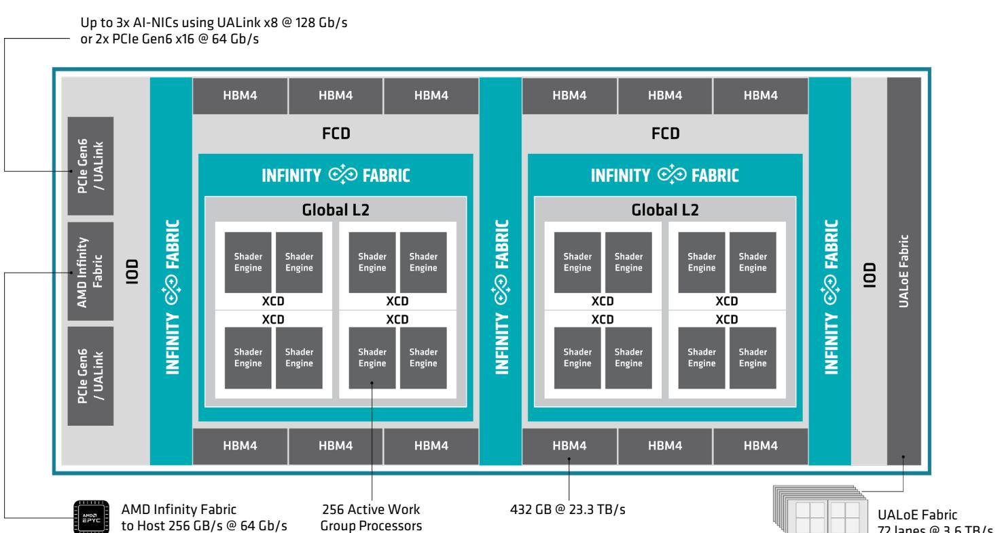
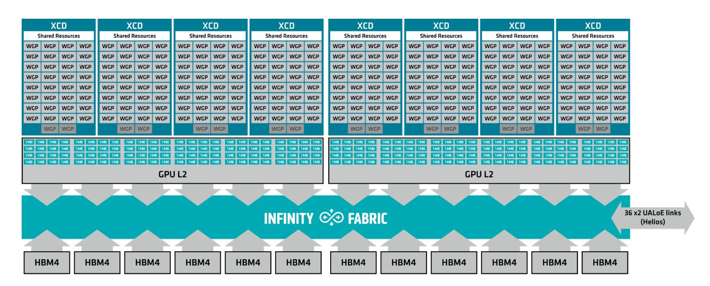
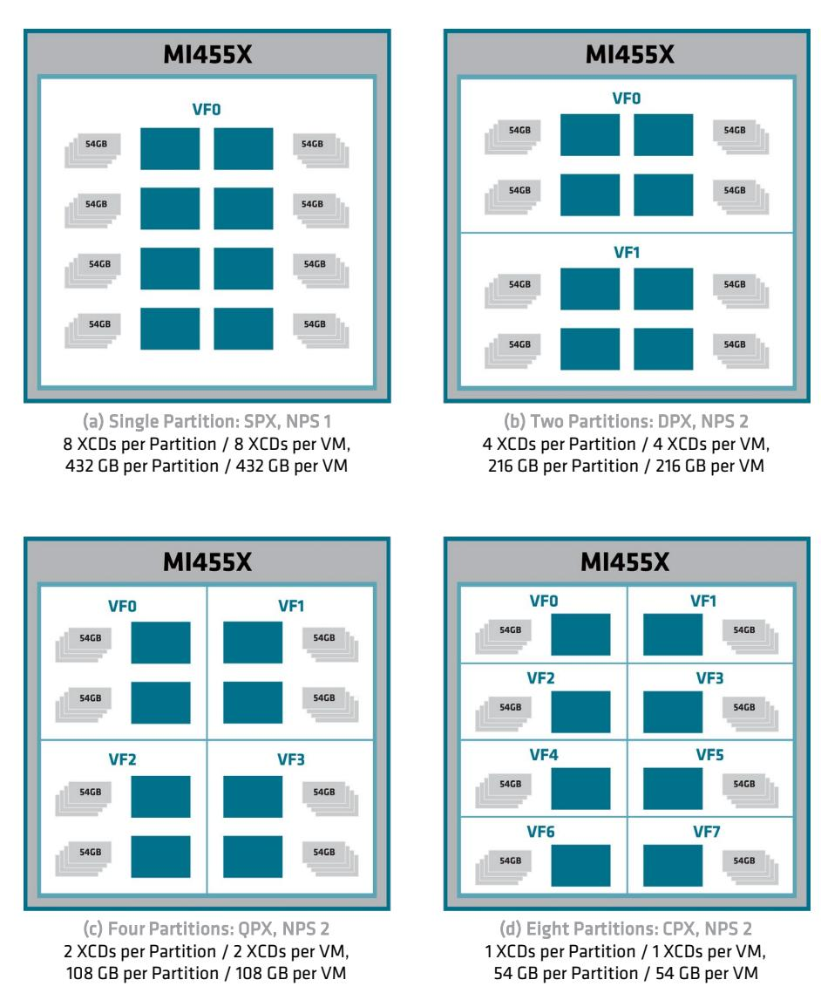
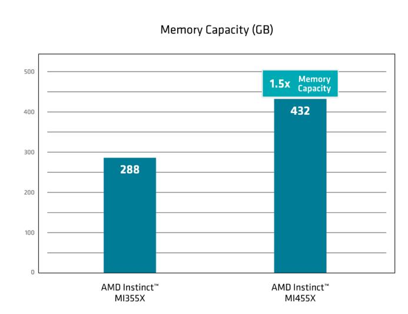
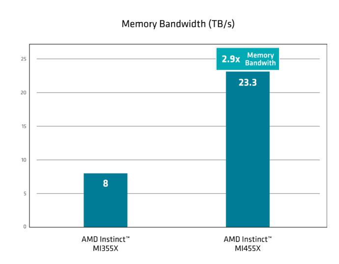
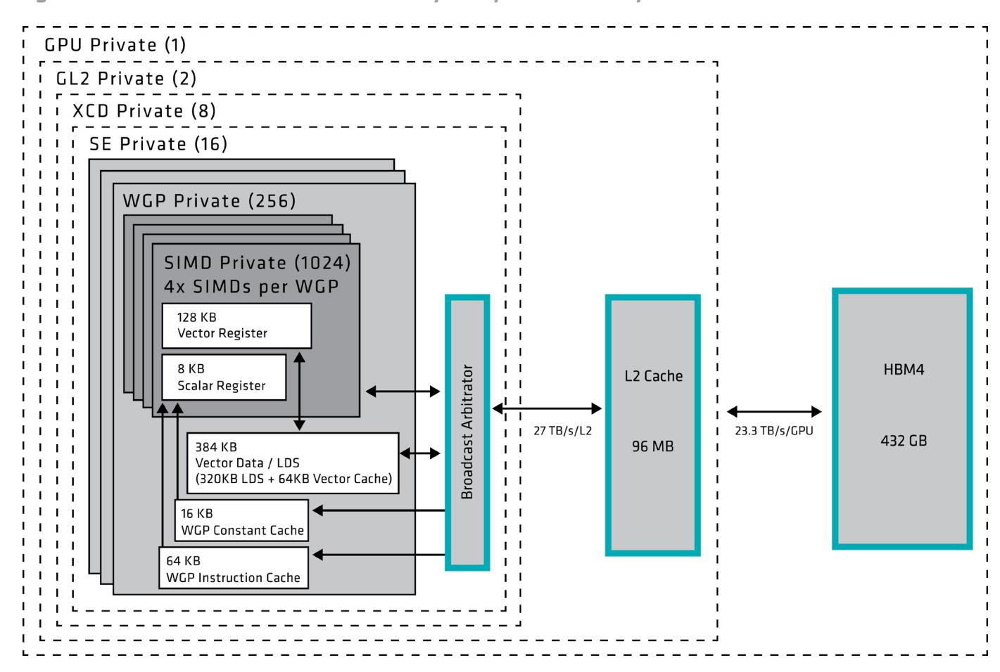
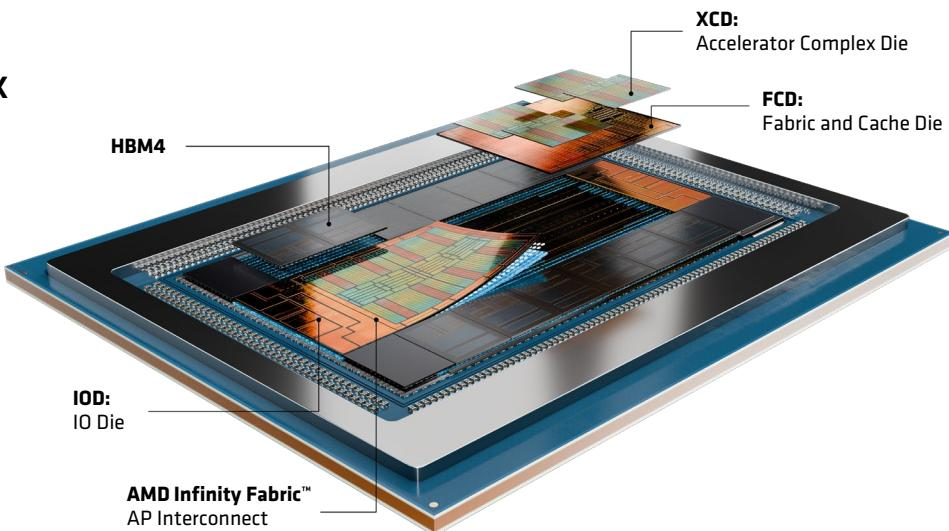
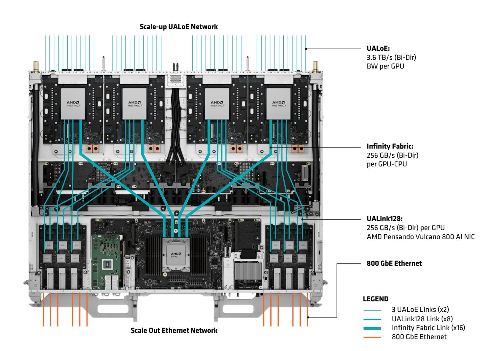
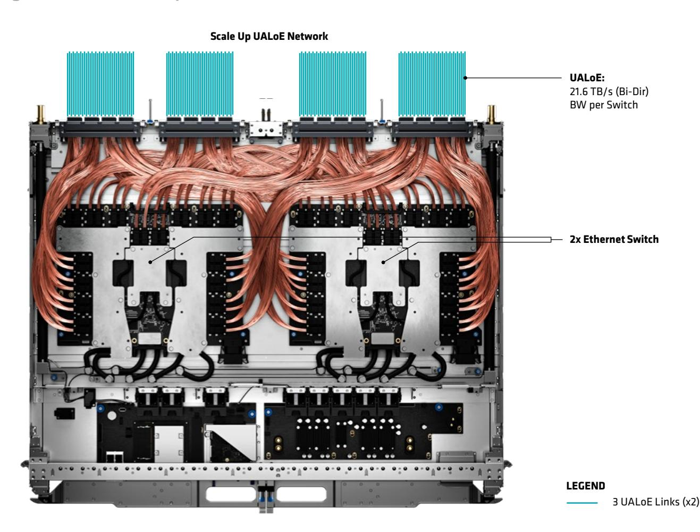
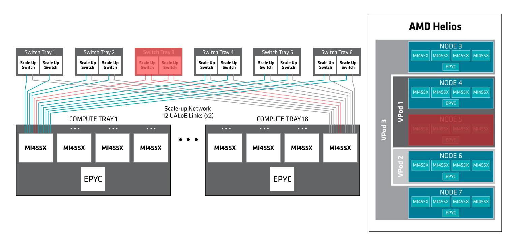

> **Repository notice (not part of the AMD publication).** This is an unofficial Markdown conversion of the [AMD source PDF](https://www.amd.com/content/dam/amd/en/documents/products/technologies/cdna/amd-cdna5-whitepaper.pdf), produced with automated tooling for easier browsing and text search. It is not affiliated with or endorsed by AMD and may contain errors and omissions. AMD retains its rights in the underlying publication; AMD's copyright and trademark notice from the source is reproduced below. Consult the linked PDF as the authoritative version.

# **AMD CDNA 5 Architecture**

INTRODUCING

Enabling the Future of Frontier AI With the AMD Helios Rackscale Solution

## **AI is Driving the Next Era of Computing**

Artificial intelligence is rapidly becoming one of the largest drivers of computing demand in history. Organizations across every industry are investing heavily in AI as it has demonstrated the ability to create measurable value at unprecedented scale. From financial services to healthcare, from software engineering to autonomous systems, AI is reshaping how products are built, decisions are made, and businesses operate. As big as the computer industry has become, AI promises to drive a far larger wave of growth. AI achieves its results through huge numbers of numerical calculations and memory operations. With large language model (LLM) sizes growing into the trillions of parameters, each output token (a number, a word, or even just part of a word) requires trillions of computations and hundreds of billions of DRAM requests.

As AI workloads continue to scale, the challenge is no longer simply delivering more compute. Customers can no longer meet the demands of frontier-model training, high-volume inference, fine-tuning, and emerging agentic AI workloads by deploying GPUs one system at a time. Performance increasingly depends on how efficiently compute, memory, networking, power, cooling, software, and operations work together as a unified rack-scale system.

Meanwhile, models continue to grow and evolve. Mixture of Experts (MoE) models, for example, behave differently in systems than traditional dense models, with more parameters in total but only a fraction of them accessed for each token being generated. This changes the typical relationship between computation and memory bandwidth. The proliferation of object types in foundation models (text, audio, images, video, 3D models, etc.) and new application-specific models impose additional complexity that AI data center operators must deal with.

## **AMD Rises to Meet the Challenge**

The AMD Instinct MI455X GPU, based on the AMD CDNA 5 architecture, and the AMD Helios rackscale solution, extend the AMD AI accelerator portfolio with an open solution that scales from one chip to one rack and on out to fill gigawatt AI factories.

As the AMD Helios rackscale solution illustrates, the AMD Instinct MI455X GPU is our first GPU designed for rack scale AI deployments. Having 72 GPUs within the same scale-up shared-memory pod significantly increases inferencing throughput for models that don't fit within an 8-GPU node. With the new chip's greatly improved scale-up and scale-out capability, the benefits for training are even greater.

The AMD Instinct MI355X GPU is also available in rack-level implementations, but typically these are clusters consisting of multiple 8-GPU systems connected in a scale-out domain using RDMA over Ethernet. The engineering effort behind the AMD Instinct MI455X GPU significantly expands the scale-up domain, shared-memory capacity, communication bandwidth, and scale-out connectivity compared to previous AMD Instinct GPU generations, enabling substantially larger rack-scale AI systems.

## **The AMD Instinct MI455X GPU**

To meet the growing demands of modern AI workloads, AMD developed the AMD Instinct MI455X GPU, which delivers substantial advances in compute performance, memory capacity, memory bandwidth, scalability, and efficiency, enabling new workloads that are far beyond the reach of many competing solutions, including frontier AI training, high-volume inferencing, and large-scale agentic AI.

Complementing the AMD Instinct MI455X GPU and the AMD Helios rackscale solution is the AMD ROCm open AI software stack. AMD ROCm software combines optimized compilers, runtimes, communication libraries, AI frameworks, and developer tools to deliver high performance, open ecosystem innovation, ease of adoption, and production-ready scalability. By co-designing AMD ROCm software with the AMD Instinct MI455X GPU and the AMD Helios rackscale solution, AMD enables customers to efficiently deploy, train, fine-tune, and serve AI models without proprietary software lock-in.

The AMD Instinct MI455X GPU delivers these advances through seven key architectural innovations and CoWoS-L advanced packaging technology:

First, the AMD Instinct MI455X GPU delivers significantly higher AI compute performance than previous AMD GPUs. It has 4x the peak FLOPS of the Instinct MI355X on the Open Compute Project's microscaling MXFP4 and MXFP8 data formats.1 This additional compute capability is designed to enable high inference throughput, support large batch sizes, accelerate model training, and maximize AI factory output within a fixed infrastructure footprint.

Second, the AMD Instinct MI455X GPU improves the effective utilization of compute resources. The AMD Instinct MI455X GPU benefits from dozens of internal improvements based on customer experience and feedback from the four previous generations of the AMD CDNA microarchitecture. This architecture enables flexible data formats, streamlines software development and efficient utilization of compute, memory and network resources.

Third, the memory subsystem has been substantially upgraded. Each AMD Instinct MI455X GPU integrates 432 GB of HBM4 memory, a 1.5X increase in capacity from 288 GB of HBM3E in the AMD Instinct MI355X, while delivering ~2.9X the peak memory bandwidth.2 Larger caches, higher cache bandwidth, and new bandwidth amplification techniques further improve effective memory performance. These advances enable larger models, larger context windows, higher user concurrency, more AI agents per system, and fewer memory-driven constraints at rack scale.

Fourth, the new GPU greatly increases scale-up bandwidth, the kind used to combine multiple GPUs into a single shared-memory pod. Each AMD Instinct MI455X GPU provides up to 3.6 TB/s of low-latency scaleup bandwidth across 36 links. Each UALoE (Ultra Accelerator Link over Ethernet) link delivers 400 Gbit/s in each direction using two lanes and the AMD Infinity Fabric protocol. Up to 72 AMD Instinct MI455X GPUs can be combined into one pod, a significant improvement that expands the amount of compute and memory resources available to a single workload while reducing the communication overhead associated with distributed execution.

Fifth, the AMD Instinct MI455X GPU delivers substantially increased scale-out bandwidth. Each AMD Instinct MI455X GPU supports up to three AMD Pensando Vulcano 800 AI-NICs, providing 600 GB/s of bidirectional scale-out bandwidth per GPU, six times what the AMD Instinct MI355X GPU offers. Combined with the AMD open networking strategy and support for industry-standard Ethernet technologies, this connectivity enables efficient scaling from a single rack to large multi-rack AI clusters while preserving ecosystem flexibility and avoiding proprietary networking lock-in.

Sixth, the AMD Instinct MI455X GPU has a dedicated high-speed AMD Infinity Fabric interface for strengthening CPU-GPU communication. The GPU was co-developed with the AMD EPYC 9006 SP7 Server CPU.

This interface offers a peak bidirectional transfer rate of 256 GB/s and gives the CPU cache-coherent access to GPU memory. This allows larger memory pools, more efficient data sharing, and improved support for memory-intensive AI workloads than previous generation architectures.

Seventh, and finally, is improved energy efficiency. Every aspect of the AMD Instinct MI455X GPU has been redesigned to make it more efficient, from the basic transistor up to the network interfaces. The result is improved energy efficiency across the platform, enabling customers to deploy more compute capability within a given power envelope.

Figure 2 shows an overall conceptual view of the subsystems in the AMD Instinct MI455X GPU. The CPU-GPU communication via AMD Infinity Fabric and scale-out interfaces via PCIe ® Gen 6 and UALink are shown at the left, and the UALoE scale-up lanes are shown at the right.

**Figure 2. Overall conceptual view of the AMD Instinct MI455X GPU.**

The following sections examine each of these innovations in greater detail and explain how they contribute to the performance, scalability, and efficiency of AMD Instinct MI455X GPU. These architectural advances are exposed to developers through AMD ROCm software, allowing applications and AI frameworks to take advantage of new compute, memory, and networking capabilities without requiring application-specific optimizations for underlying hardware.

#### **1. Increased Compute Performance**

The AMD Instinct MI455X GPU was designed to significantly improve AI compute throughput for both training and inference workloads. Higher compute capability enables faster model training, larger batch sizes, greater inference throughput, and improved utilization of rack-scale AI infrastructure.

The AMD Instinct MI455X GPU, like its predecessor the AMD Instinct MI355X GPU, has 8 Accelerator Complex Die (XCD) chiplets. The 32 Active Compute Units per XCD of the AMD Instinct MI355X GPU have been replaced by an equal number of Work Group Processors (WGPs) in the AMD Instinct MI455X GPU. Each XCD is divided into two Shader Engines (SEs) with 16 WGPs each.

Figure 3 shows the relationship of the 8 XCDs, 256 active WGPs, 192MB of L2 cache, and 432 GB of HBM4 DRAM within the AMD Instinct MI455X GPU.

**Figure 3. Relationship of compute and memory resources in the AMD Instinct MI455X GPU.**

The new WGP design, based on the new AMD CDNA 5 architecture, offers several improvements to previous generation AMD CDNA architectures. The Wave64 implementation has been replaced by a Wave32 solution which reduces instruction latency, branch divergence penalties, register pressure. Highly suited for latency sensitive compute. The Wave32 approach offers improved flexibility for implementing various tile sizes for tensor operations, which makes it easier for software to map compute kernels to the hardware.

Accordingly, the new WGP comprises four 32-thread SIMD (single-instruction, multiple-data) execution units, as well as four scalar execution units sharing a constant cache. The SIMD units perform the same operation on 32 threads in parallel and a new 32-thread operation can be started in each clock period.

The peak numerical throughput (for the WGP, the XCD, and the GPU overall), measured in math operations per clock period, has been increased by up to 4x for the Open Compute Project (OCP) microscaling MXFP4 and MXFP8 data formats and up to 2x for other supported tensor and vector data types.1 These improvements help increase the amount of useful AI computation that can be performed within a given power and infrastructure envelope.

#### **2. Optimized Compute for AI**

On top of the substantially increased performance for basic tensor operations, the AMD Instinct MI455X GPU adds new instructions and enhanced support for microscale data formats. Blocks sharing a common scale factor may now be 16 or 32 elements in size, and a new fractional scale is available for MXFP4 data. These enhancements provide greater flexibility for software frameworks and compilers while improving the efficiency of low-precision AI workloads. Block-level fractional scaling enables practical FP4 training, reducing quantization error vs. full-tile scaling.

The new instructions include native support for the BF16 vector data type, several new data-type conversion operations, and new transcendental operation tanh. Existing transcendental ops have twice the throughput vs. the same instructions on the AMD Instinct MI355X GPU, further improving the performance of critical machine learning functions such as activation and softmax.1 Figure 4 lists the supported data formats for the AMD Instinct MI455X GPU.

**Figure 4. Supported data formats for the AMD Instinct MI455X GPU.**

Several enhancements to the chip's front-end command processor architecture reduce task dispatch latencies by reducing kernel startup delays and delays between kernels. These improvements help increase GPU utilization vs. the previous generation, delivering a higher fraction of the chip's peak performance to the customer's workloads and making systems based on the AMD Instinct MI455X GPU exceptionally efficient.

The AMD Instinct MI455X GPU also supports internal spatial partitioning, as Figure 5 shows. Each GPU can be configured at boot time to have 1, 2, 4, or 8 partitions, each consisting of one to eight XCDs with equal portions of the on-package HBM4 DRAM.

The partitions securely isolate multiple virtual machines running on the same GPU. Further protection is provided by support for single-root I/O virtualization (SR-IOV) technology as specified by the PCI SIG.

**Figure 5. Spatial partitioning configurations for the AMD Instinct MI455X GPU.**

The AMD Instinct MI455X GPU also features a substantial set of security features. This begins with silicon root of trust on MI455X GPU SOC with support for DMTF Security Protocol and Data Model (SPDM) specification. SPDM (according to DMTF) "defines messages, data objects, and sequences for performing message exchanges over a variety of transport and physical media," thereby providing supply-chain security assurance and a hardware root of trust to prevent the use of untrusted firmware.

Like AMD CPUs and NICs, the AMD Instinct MI455X GPU supports a trusted execution environment (TEE) with Trusted I/O to assure the confidentiality and integrity of data in the system.

Together, these features meet the needs of enterprise AI, cloud service providers (including multi-tenant services), and users in regulated industries that require the highest level of security from silicon to rackscale systems.

#### **3. Upgraded Memory Subsystem**

Modern AI workloads are increasingly constrained by memory capacity, memory bandwidth, and data movement rather than raw compute performance alone. The AMD Instinct MI455X GPU memory subsystem was designed to address all three challenges simultaneously.

One of the headline advances in the AMD Instinct MI455X GPU is the inclusion of 12 stacks of HBM4 DRAM, up from 8 stacks of HBM3E in the AMD Instinct MI355X GPU. This change boosts memory capacity to 432 GB from 288 GB and peak memory bandwidth to ~2.9x that of the previous chip, 23.3 TB/s vs. 8 TB/s, as shown in Figure 6.2 The combination of higher capacity and bandwidth enables larger models, longer context windows, higher user concurrency, and more demanding inference workloads to run within a single GPU or rack-scale deployment.

**Figure 6. Comparing memory capacity and bandwidth from AMD Instinct MI355X and AMD Instinct MI455X.**

### **AMD Instinct MI355X** vs **AMD Instinct MI455X**

The biggest change is that HBM4 doubles the bit width of the interface from 1,024 bits per stack to 2,048. Several upgrades to the register, memory, and cache subsystems stack up additional gains.

A single memory read operation can now be multicast to multiple WGPs simultaneously. Because AI workloads frequently reuse the same weights and activations across many compute engines, multicast significantly reduces redundant memory traffic while increasing effective memory bandwidth and lowering power consumption.

The VGPR register file has been reorganized to support the transition to a native Wave32 architecture while preserving the overall register file capacity. With Wave32, each SIMD can support twice as many resident waves as the previous architecture, enabling up to 64 resident waves per WGP. In addition, the VGPR addressing capability has been significantly expanded, allowing a single wave to access up to 1,024 registers per thread, compared to 256 registers per thread on the AMD Instinct MI355X GPU. The SGPR register file has also been reorganized. Each wave is allocated 128 SGPRs, with each register being 32 bits (4 bytes) wide. This results in an SGPR capacity of 8 KB per SIMD and 32 KB per WGP.

Together, these enhancements provide greater flexibility for kernels with high register demands, allowing larger working sets to remain on-chip, reducing register spilling, and improving execution efficiency for compute-intensive AI workloads.

The local data store (LDS) SRAM in each WGP also operates as the WGP data cache (in combination with a separate cache tag memory). Capacity per WGP is 384 KB(320KB of LDS and 64KB of vector cache) for a total of 96 MB per GPU, twice that of the previous generation. The larger LDS capacity allows more data to remain close to the compute engines, reducing memory traffic and improving compute performance. The new LDS SRAM also delivers higher read/write bandwidth per clock per WGP.

Each WGP also has its own Tensor Data Mover (TDM) unit, so-called because it's specifically designed to understand tiling schemes for tensors of up to 5 dimensions. Transfers are defined by descriptors loaded from the SGPR, bounds-checked for security, and executed asynchronously to kernel operations. Multi-cast load operations are also supported. New in the AMD Instinct MI455X GPU, data can be transferred directly between LDS scratchpad and DRAM rather than being staged in intermediate registers. This reduces data movement overhead, lowers latency, and frees compute resources for more useful work.

Each WGP also has a separate 16 KB WGP constant cache and a 64 KB WGP instruction cache.

The AMD Instinct MI455X GPU features a substantially expanded L2 cache. Instead of the previous generation's 32 MB per GPU, the AMD Instinct MI455X GPU has 192 MB, implemented as 96 blocks of 1 MB each on each of the two Fabric and Cache dies (FCDs). The L2 blocks on each FCD deliver a combined 27 TB/s of bandwidth for a GPU total of 54 TB/s. This organization supports more outstanding memory requests, allowing a substantial amount of latency to be hidden by ongoing compute activity.

Figure 7 shows the memory subsystem hierarchy in the AMD Instinct MI455X GPU from the level of the individual SIMD units up to the HBM4 DRAM integrated into the GPU package.

**Figure 7. AMD Instinct MI455X GPU memory subsystem hierarchy.**

#### **4. Scale-Up Architecture**

Modern AI workloads increasingly exceed the practical limits of traditional multi-server configurations. Larger models, longer context windows, and Mixture-of-Experts architectures require more accelerators, more memory, and faster communication between them. The goal of scale-up is to allow many GPUs to operate as a single system, reducing communication overhead while expanding the amount of compute and memory available to a single workload.

Although the AMD Instinct MI455X GPU introduces advances across compute, memory, and efficiency, its support for rack-scale scalability represents one of the most significant architectural changes in the platform. Combined with the improved performance of the GPU itself, AMD can now deliver a significant improvement in the sustained throughput of a single shared-memory pod.

As AMD has demonstrated in the AMD Helios rackscale solution, up to 72 GPUs can operate within a single scale-up domain, providing 31 TB of shared memory, 1.7 petabytes per second of memory bandwidth, and up to 2.9 Exaflops of peak AI compute using microscaling FP4 data. The AMD Helios rackscale solution integrates these resources into a unified AI platform with the large-scale compute, memory, scale-up connectivity, scale-out networking, serviceability, and open standards-based infrastructure required for frontier-model training, high-volume inference, fine-tuning, and emerging agentic AI workloads.

The key change within the GPU to enable this scalability was a substantial increase in the number of scaleup interfaces. In the AMD Instinct MI355X GPU, there were only 7 AMD Infinity Fabric links, each operating at 153 GB/s for a total scale-up bandwidth of 1.07 TB/s.

The new AMD Instinct MI455X GPU is equipped with 36 400-Gbit/s UALoE links inside the package. Each link implements two 200-Gbit/s Ethernet lanes. These add up to 3.6 TB/s in peak bidirectional bandwidth per GPU.

What makes this step-function speedup possible is the efficiency-focused optimization of the AMD UALoE interface vs. traditional Ethernet NICs. It isn't intended for general-purpose networking, but only for GPUto-GPU memory transactions across short links, so the control logic and data buffers in the UALoE interface are much more compact than those of a full Ethernet NIC.

The AMD Instinct MI455X GPU introduces a split DMA architecture. This architecture solves a critical problem with DMA in complex shared-memory systems by automatically associating traffic with the optimal link. Front-end units receive transfer requests from software, split the requests into pieces, and distribute the pieces across the back-end units in the UALoE interfaces. The back-end units then move data between the GPUs over the UALoE links. This means communication libraries do not have to be aware of the UALoE topology. Additional back-end units are also provided to move data within the memory subsystem of a single GPU.

The practical experience AMD gained from the AMD Instinct MI355X GPU led it to add several useful features to the scale-up architecture of the AMD Instinct MI455X GPU for data center GPU operations.

First, the scale-up network can be subdivided to isolate groups of GPUs, allowing the secure, simultaneous execution of multiple independent tasks. This is an essential feature for multi-tenant data centers so that each user's data is effectively isolated from the other users.

Similarly, there is no need for a guest virtual machine to trust the host OS (or vice-versa). When a guest VM is running across multiple GPUs, its security domain is transparently extended to ensure secure inter-GPU communications.

A cryptographic unit within the UALoE interface optionally secures the traffic over the wire using the industry-standard AES-256-GCM algorithm. The cryptographic unit helps extend confidential computing protections across the scale-up fabric while maintaining high-performance communication between GPUs.

The AMD UALoE scale-up fabric provides low-latency, high-bandwidth communication for rack-scale AI systems using open, standards-based Ethernet technologies. Integrated flow control and congestion management help deliver predictable performance under demanding AI workloads, while built-in reliability mechanisms detect, recover from, and adapt to transient hardware events with minimal impact on application execution. Comprehensive telemetry, health monitoring, and automated failover simplify fabric operations and maintain communication availability. Together, these capabilities provide a resilient, highperformance, and software-friendly scale-up fabric for large-scale AI training and inference.

The AMD ROCm software communication libraries are optimized for the AMD Helios rackscale solution's scale-up topology, allowing distributed AI applications to efficiently utilize the UALoE fabric while abstracting the underlying communication mechanisms from application developers.

#### **5. Scale-Out Networking**

Scale-out is how multiple AMD Instinct MI455X GPU are connected between pods to form larger clusters. GPUs communicate over the scale-out network using RDMA and message passing instead of memory sharing. System architects have tremendous flexibility in designing clusters around the AMD Instinct MI455X GPU, limited only by how much pod-to-pod bandwidth is required for their anticipated workloads, such as training the largest LLMs.

The AMD Instinct MI455X GPU supports two external scale-out NICs using two PCIe® Gen6 x16 interfaces (which operate at 64 Gb/s per pin) or up to three NICs using 8-lane UALink (at 128 Gb/s per pin). Either way, each NIC can operate at speeds up to 800 Gbit/s or 200 GB/s bidirectionally. This represents a substantial per-GPU improvement over the AMD Instinct MI355X GPU, which was configured with only one scale-out NIC operating at 400 Gbit/s (800 GB/s of total bidirectional bandwidth for an 8-GPU node).

The scope of the improvement is best understood when you remember that a single AMD Helios rackscale solution can have up to 72 AMD Instinct MI455X GPUs, giving it 43 TB/s of scale-out bandwidth.

Large AI training and inference deployments depend on efficient communication between racks while supporting larger model sizes, higher concurrency, and distributed execution across AI factories. Unlike proprietary scale-out approaches, the AMD scale-out strategy is built on open networking technologies and industry-standard Ethernet infrastructure. Customers can leverage AMD Pensando Vulcano AI-NICs together with a broad ecosystem of Ethernet switches, network software, and operational tools. This approach provides flexibility in system design while allowing AI infrastructure to scale from a single rack to large multi-rack deployments using widely adopted networking technologies.

#### **6. Close-Coupled CPU Integration**

Although the AMD Instinct MI455X GPU is expected to perform most of the computations required by AI models, modern AI systems also require CPUs for orchestration, data pre- and post-processing, storage management, networking and application execution. As AI infrastructure scales, efficient CPU-GPU integration becomes increasingly important to overall system performance.

The AMD Instinct MI455X GPU has a 16-lane AMD Infinity Fabric host interface delivering 256 GB/s of bidirectional bandwidth. The AMD Infinity Fabric is particularly well suited to AI workloads because it gives the CPU low-latency, hardware-coherent cached access to GPU memory. Coherency enables more efficient sharing of data structures such as KV caches while reducing software overhead and capacity pressure on GPU memory.

The new GPU is designed to be paired with the AMD EPYC 9006 SP7 Server CPU, a 6th Generation AMD EPYC processor built on the "Zen 6" microarchitecture. It scales to up to 256 cores and 512 threads, supports 16 channels of DDR5/RDIMM delivering up to 1.6 TB/s of memory bandwidth, and provides up to 96 lanes of PCIe® Gen 6 (64 GT/s) plus the matching AMD Infinity Fabric interface for communicating with the GPU.

AMD ROCm software complements this hardware architecture by coordinating kernel execution, communication, and memory movement across CPUs and GPUs, allowing applications to efficiently utilize the tightly coupled AMD Instinct MI455X GPU and AMD EPYC CPU platform.

#### **7. Energy Efficiency**

The AMD move to TSMC's N2 process (2 nm gate all around) for the XCD chiplets and the N3 Performance process (3 nm FinFET) for the FCD and MID chiplets in the AMD Instinct MI455X GPU contributes to improved performance and energy efficiency. Figure 8 shows the 8 XCD, 2 IOD, and 2 FCD dies in the AMD Instinct MI455X GPU package, along with the 12 stacks of HBM4 DRAM.

With a transistor count of 320 billion, the platform's efficiency gains are even more substantial, however, the result of improvements across the entire architecture. Larger caches, multicast memory operations, Tensor Data Mover enhancements, Wave32 execution, HBM4 memory, and the optimized UALoE scale-up fabric all reduce the amount of data movement and overhead required to perform useful work.

**Figure 8. Shows the CDNA5 Architecture with the different dies.**

Together, these architectural advances increase the fraction of system power devoted to computation rather than moving and managing data, enabling significantly greater AI infrastructure capability within a single GPU, rack, or cluster.

## **The AMD Helios Rackscale Solution**

Now let's talk about the AMD Helios rackscale solution, an open, validated blueprint for rack-scale AI infrastructure that combines 72 AMD Instinct MI455X GPUs with AMD EPYC 9006 SP7 Server CPUs and AMD Pensando networking technologies to create a proven foundation for frontier AI factories. The AMD Helios rackscale solution serves as both a deployable rack-scale solution and a blueprint that partners can adopt, customize, and extend while leveraging the AMD investment in scalable AI system engineering. It achieves all this while preserving flexibility for system integration, networking, management, and deployment-specific requirements.

Combined with AMD ROCm software, the AMD Helios rackscale solution provides a complete AI platform that integrates silicon, networking, systems, and software into a unified infrastructure for frontier-model training, fine-tuning, and high-volume inference.

The first thing to understand about the AMD Helios rackscale solution is immediately apparent in person. It doesn't use a traditional 19" rack. Instead, it adopts OCP's new Open Rack Wide (ORW) form factor, a cabinet 1.2 m wide and 1.3 m deep. The standard cabinet provides 44 OU of rack space. (OU stands for Open Unit, the OCP measurement of vertical height in a rack, which is 48mm vs. the traditional 44.45mm rack unit.)

Using the ORW form factor unlocks access to proven multi-vendor solutions for power distribution, liquid cooling, and serviceability, all essential to hyperscale-ready AI deployments.

The GPUs are arranged in two groups of nine Compute Trays, each 1 OU in height. Each tray has four AMD Instinct MI455X GPUs and one AMD EPYC 9006 SP7 Server CPU, for a total of 72 GPUs. The six Switch Trays (also 1 OU) are located between the two groups of Compute Trays. Each Switch Tray contains two Ethernet switches, and each of the 12 switches is connected directly to all 72 GPUs providing high aggregate bandwidth and network redundancy.

All GPU to switch communication is performed electrically over integrated copper cable cartridges at the rear of the rack. Blind-mate connections on the Compute and Switch Trays avoid the need for hand plugging cables during manufacturing or service.

#### **Inside the Compute Trays**

The AMD Helios Compute Tray is the fundamental building block of the AMD Helios rackscale solution. Each tray integrates compute, memory, networking, management, power delivery, and cooling into a self-contained module that can be deployed and serviced independently.

As Figure 10 shows, each Compute Tray contains four AMD Instinct MI455X GPUs. At the front of the tray (the bottom of the figure) sits the high-frequency 96-core AMD EPYC 9G76 SP7 Server CPU with its 16 DIMM sockets. In the AMD Helios rackscale solution, these sockets are equipped with 1 TB of DRAM in the form of sixteen 64-GB DDR5 ECC RDIMMs. There are also five slots for E1.S SSDs connected to the CPU.

The Compute Tray implements three kinds of network interfaces. First, the scale-out network (also known as the back-end network in an AI data center) is implemented using two custom circuit boards, shown near the lower corners of the figures, each of which contains four or six AMD Pensando "Vulcano" AI-NICs. Together, these provide the scale-up ports for the four GPUs.

**Figure 10. The Compute Tray in the AMD Helios rackscale solution.**

Second, there is one PCIe® slot for an AMD Pensando "Salina" 400G Ethernet NIC (shown beside the "Vulcano" card at the lower left of the figure) to connect to the front-end network that carries user request and response data.

Finally, there is a system management module with its own Ethernet interface to handle secure configuration and monitoring tasks.

Power is delivered to the back of the tray over a 50V DC power bus, and connections to the liquid-cooling system through blind-mate, quick disconnect plugs also at the back of the tray.

#### **Inside the Switch Trays**

As Figure 11. shows, each AMD Helios Switch Tray contains two Ethernet switches delivering the bandwidth, resiliency, and tight coupling required for modern AI infrastructure.

The AMD strategy of building rack-scale AI infrastructure uses open, widely deployed Ethernet technologies rather than proprietary switching hardware. This approach provides the bandwidth, port density, maturity, and ecosystem support required for massive AI deployments while preserving the flexibility to adopt future Ethernet innovations.

The AMD Helios rackscale solution has six Switch Trays in total and all 12 switches across the trays are connected similarly. Each switch connects through high-density copper interconnects to three UALoE links on each GPU. Each link configures its two lanes to operate as a single connection, so each switch sees 216 links at 400 Gbit/s each for an aggregate bandwidth of 21.6 TB/s per switch. Connecting every GPU to every other GPU through exactly one switch hop minimizes latency, power and cost.

With all 72 GPUs active, the system's aggregate scale-up bandwidth is just over a petabit per second in each direction, or 260 TB/s bidirectionally.

Each Switch Tray has its own AMD Ryzen CPU and M.2 boot SSD to help manage the two switches, and three external management interfaces are also provided.

The AMD Helios rackscale solution routes all scale-up traffic through switches for three reasons: first, it means that the switched network is more flexible in bandwidth allocation, able to provide 100% of the network's bandwidth to a single route if that's what a workload needs at a given moment. Second, the software model doesn't have to deal with some GPU-to-GPU routes being faster or lower-latency than others, which can complicate task scheduling. And third, using the switches means that every connection benefits from the same level of fault protection and error recovery.

A layered management software architecture monitors the health of the rack, manages the scale-up fabric, collects telemetry, controls power and thermal events, and coordinates resource allocation across AI workloads. These capabilities enable efficient operation, simplified serviceability, and automated recovery from hardware events.

**Figure 11. The Switch Tray in the AMD Helios rackscale solution.**

### **Fault Tolerance & Operational Resilience**

The AMD Helios rackscale solution is designed with resilience as a core architectural principle, enabling AI workloads to continue operating in the presence of hardware faults and service events. The AMD Helios rackscale solution is engineered to maintain system operation across a range of network and compute infrastructure failures through fault detection, containment, and automated recovery.

As shown in the left side of Figure 12, The UALoE scale-up fabric is designed to tolerate transient link, switch, and switch tray failures, maintaining packet delivery and communication continuity through redundant paths and automated failover mechanisms.

Compute tray failures are isolated to the affected virtual pod (vPod) as shown in the right side of Figure 12 where node 5 is contained to vPod 1 (perhaps requiring a roll back to a checkpoint), while allowing the remainder of the rack to continue operating unaffected. Integrated monitoring, health management, and workload orchestration accelerate fault detection, isolate failing components, and restore full system capability as hardware returns to service.

Comprehensive telemetry, diagnostics, environmental sensing, and power and thermal management provide continuous operational visibility, while tray based, field-replaceable infrastructure simplifies maintenance and minimizes service disruption. Together, these capabilities deliver a resilient, highly available rack-scale AI platform designed for large-scale training and inference deployments.

**Figure 12. Scale-Up network resiliency(left) and Compute node fault isolation(right) in the AMD Helios rackscale solution.**

## **AMD Helios and Instinct MI455X GPU Feature Summary**

### AMD Helios

| Feature | Specification |
|---------|---------------|
| Compute performance | Up to 2.9 Exaflops |
| Memory capacity | 31 TB HBM4 memory |
| Memory bandwidth | 1.7 PB/s |
| Scale-up bandwidth | 260 TB/s |
| Scale-out bandwidth | 43 TB/s |

### AMD Instinct MI455X GPU

| Feature | Specification |
|---------|---------------|
| Architecture | AMD CDNA 5 |
| XCD | 8 |
| WGP | 256 |
| Max engine clock | 2,400 MHz |
| Transistor count | 320 billion |
| Performance | Peak theoretical |
| OCP MXFP4 | 40.26 PF |
| OCP MXFP6 | 20.13 PF |
| OCP MXFP8, FP8 | 20.13 PF |
| Matrix FP16, BF16 | 5.03 PF |
| Vector FP16 | 315 TF |
| Matrix/Vector FP32 | 315 TF |
| Memory capacity | 432 GB HBM4 |
| Memory interface | 2,048 bits x 12 stacks HBM4 |
| Memory bandwidth | Up to 23.3 TB/sec |
| L2 cache | 192 MB |
| Scale-up | 36 UALoE links (x2 lanes), 3.6 TB/s bidirectional |
| Scale-out | 2x16 PCIe® Gen 6 x16 @64 Gbit/s or 3x AI-NICs using UALink x8 @128 Gbit/s |
| CPU-GPU integration | AMD Infinity Fabric, 256 GB/s bidirectional |
| SR-IOV support | Yes |
| Partitions | Up to 8 |
| Supported technologies | AMD CDNA 5; AMD ROCm; UALink/UALoE |
| RAS support | Yes |
| Page retirement | Yes |
| Video decoders | HEVC/H.265, AVC/H.264, VP9, AV1 (4 engines) |
| Still-image decoders | JPEG/MJPEG (40 cores) |
| Form factor | Enhanced Accelerator Module powering rack-scale solutions |
| Cooling | Liquid |

## **Conclusions**

As the demand for AI compute continues to soar, the AMD Instinct MI455X GPU extends the AI Accelerator portfolio with a solution that scales from one chip up to one rack and out to fill gigawatt data centers.

Built on advanced process technology, the AMD Instinct MI455X GPU delivers improved performance, new instructions, more memory, and new security and reliability features. It's the first AMD GPU to enable a single node with 72 GPUs and scale out from one node to thousands.

The new GPU's peak numbers are extraordinary: 40 PetaFLOPS of microscaling MXFP4 compute, 432 GB of HBM4 DRAM, 23.3 TB/s of DRAM bandwidth, 3.6 TB/s of scale-up bidirectional bandwidth and 600 GB/s of scale-out bidirectional bandwidth.

The AMD Instinct MI455X GPU's full potential is realized in the new AMD Helios rackscale solution, which brings together 72 AMD Instinct MI455X GPUs fully interconnected within a single OCP 's Open Rack Wide (ORW), along with 18 AMD EPYC 9006 SP7 Server CPUs.

At the rack level, the peak numbers are substantial: up to 2.9 ExaFLOPS of compute, 31 TB of HBM4, 1.7 PB/s of memory bandwidth, 260 TB/s of scale-up bandwidth and 43 TB/s of available scale-out Ethernet bandwidth, all based on open standards—data formats and physical form factors defined by the Open Compute Platform, UALink over Ethernet for scale-out, RDMA over Ethernet for scale-up, and the open AMD ROCm software stack. Together, the AMD Instinct MI455X GPU, the AMD Helios rackscale solution, and the AMD ROCm software ecosystem enable customers to deploy open, scalable AI infrastructure capable of supporting frontier-model training, high-volume inference, and the next generation of AI applications.

Refer to [AMD Instinct MI400 Series webpage](https://www.amd.com/en/products/accelerators/instinct/mi400.html) for more information

## **ENDNOTES**

**1** Based on AMD Performance Labs calculations (June 2026) using an AMD Instinct MI455X GPU, peak theoretical precision performance (FP32, FP16, BF16, MXFP6, MXFP8, FP8, MXFP4 Matrix/Vector), compared to published specifications for AMD Instinct MI355X, MI350X, MI325X, MI300X, MI250X, and MI100 GPUs. Results may vary by system configuration and datatype. MI400-006

**2** Calculations by AMD Performance Labs in June 2026, based on the published memory capacity and memory bandwidth specifications of an AMD Instinct MI455X GPU vs the published memory capacity and memory bandwidth specifications of AMD Instinct MI355X, MI350X, MI325X, MI300X, MI250X and MI100 GPUs, respectively. System manufacturers may vary configurations, yielding different results. MI400-008

©2026 Advanced Micro Devices, Inc. All rights reserved. AMD, the AMD Arrow logo, CDNA, EPYC, Helios, Infinity Fabric, Instinct, Pensando, ROCm, Ryzen, and combinations thereof are trademarks of Advanced Micro Devices, Inc. PCIe® is a registered trademark of PCI-SIG Corporation. UCIE is a trademark of Universal Chiplet Interconnect Express, Inc. Ultra Accelerator Link and UALink are trademarks of the UALink Consortium. Other product names used herein are for identification purposes only and may be trademarks of their respective owners. PID#5159000
