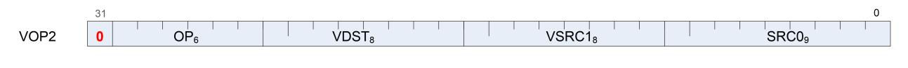
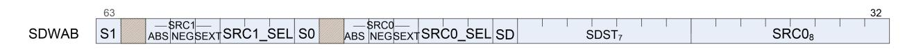

# "RDNA 1.0" Instruction Set Architecture *Reference Guide*

AMD

25-September-2020

#### **Specification Agreement**

This Specification Agreement (this "Agreement") is a legal agreement between Advanced Micro Devices, Inc. ("AMD") and "You" as the recipient of the attached AMD Specification (the "Specification"). If you are accessing the Specification as part of your performance of work for another party, you acknowledge that you have authority to bind such party to the terms and conditions of this Agreement. If you accessed the Specification by any means or otherwise use or provide Feedback (defined below) on the Specification, You agree to the terms and conditions set forth in this Agreement. If You do not agree to the terms and conditions set forth in this Agreement, you are not licensed to use the Specification; do not use, access or provide Feedback about the Specification. In consideration of Your use or access of the Specification (in whole or in part), the receipt and sufficiency of which are acknowledged, You agree as follows:

- 1. You may review the Specification only (a) as a reference to assist You in planning and designing Your product, service or technology ("Product") to interface with an AMD product in compliance with the requirements as set forth in the Specification and (b) to provide Feedback about the information disclosed in the Specification to AMD.
- 2. Except as expressly set forth in Paragraph 1, all rights in and to the Specification are retained by AMD. This Agreement does not give You any rights under any AMD patents, copyrights, trademarks or other intellectual property rights. You may not (i) duplicate any part of the Specification; (ii) remove this Agreement or any notices from the Specification, or (iii) give any part of the Specification, or assign or otherwise provide Your rights under this Agreement, to anyone else.
- 3. The Specification may contain preliminary information, errors, or inaccuracies, or may not include certain necessary information. Additionally, AMD reserves the right to discontinue or make changes to the Specification and its products at any time without notice. The Specification is provided entirely "AS IS." AMD MAKES NO WARRANTY OF ANY KIND AND DISCLAIMS ALL EXPRESS, IMPLIED AND STATUTORY WARRANTIES, INCLUDING BUT NOT LIMITED TO IMPLIED WARRANTIES OF MERCHANTABILITY, FITNESS FOR A PARTICULAR PURPOSE, NONINFRINGEMENT, TITLE OR THOSE WARRANTIES ARISING AS A COURSE OF DEALING OR CUSTOM OF TRADE. AMD SHALL NOT BE LIABLE FOR DIRECT, INDIRECT, CONSEQUENTIAL, SPECIAL, INCIDENTAL, PUNITIVE OR EXEMPLARY DAMAGES OF ANY KIND (INCLUDING LOSS OF BUSINESS, LOSS OF INFORMATION OR DATA, LOST PROFITS, LOSS OF CAPITAL, LOSS OF GOODWILL) REGARDLESS OF THE FORM OF ACTION WHETHER IN CONTRACT, TORT (INCLUDING NEGLIGENCE) AND STRICT PRODUCT LIABILITY OR OTHERWISE, EVEN IF ADVISED OF THE POSSIBILITY OF SUCH DAMAGES.
- 4. Furthermore, AMD's products are not designed, intended, authorized or warranted for use as components in systems intended for surgical implant into the body, or in other applications intended to support or sustain life, or in any other application in which the failure of AMD's product could create a situation where personal injury, death, or severe property or environmental damage may occur.
- 5. You have no obligation to give AMD any suggestions, comments or feedback ("Feedback") relating to the Specification. However, any Feedback You voluntarily provide may be used by AMD without restriction, fee or obligation of confidentiality. Accordingly, if You do give AMD Feedback on any version of the Specification, You agree AMD may freely use, reproduce, license, distribute, and otherwise commercialize Your Feedback in any product, as well as has the right to sublicense third parties to do the same. Further, You will not give AMD any Feedback that You may have reason to believe is (i) subject to any patent, copyright or other intellectual property claim or right of any third party; or (ii) subject to license terms which seek to require any product or intellectual property incorporating or derived from Feedback or any Product or other AMD intellectual property to be licensed to or otherwise provided to any third party.
- 6. You shall adhere to all applicable U.S., European, and other export laws, including but not limited to the U.S. Export Administration Regulations ("EAR"), (15 C.F.R. Sections 730 through 774), and E.U. Council Regulation (EC) No 428/2009 of 5 May 2009. Further, pursuant to Section 740.6 of the EAR, You hereby certifies that, except pursuant to a license granted by the United States Department of Commerce Bureau of Industry and Security or as otherwise permitted pursuant to a License Exception under the U.S. Export Administration Regulations ("EAR"), You will not (1) export, re-export or release to a national of a country in Country Groups D:1, E:1 or E:2 any restricted technology, software, or source code You receive hereunder, or (2) export to Country Groups D:1, E:1 or E:2 the direct product of such technology or software, if such foreign produced direct product is subject to

national security controls as identified on the Commerce Control List (currently found in Supplement 1 to Part 774 of EAR). For the most current Country Group listings, or for additional information about the EAR or Your obligations under those regulations, please refer to the U.S. Bureau of Industry and Security's website at<http://www.bis.doc.gov/>.

- 7. If You are a part of the U.S. Government, then the Specification is provided with "RESTRICTED RIGHTS" as set forth in subparagraphs (c) (1) and (2) of the Commercial Computer Software-Restricted Rights clause at FAR 52.227-14 or subparagraph (c) (1)(ii) of the Rights in Technical Data and Computer Software clause at DFARS 252.277-7013, as applicable.
- 8. This Agreement is governed by the laws of the State of California without regard to its choice of law principles. Any dispute involving it must be brought in a court having jurisdiction of such dispute in Santa Clara County, California, and You waive any defenses and rights allowing the dispute to be litigated elsewhere. If any part of this agreement is unenforceable, it will be considered modified to the extent necessary to make it enforceable, and the remainder shall continue in effect. The failure of AMD to enforce any rights granted hereunder or to take action against You in the event of any breach hereunder shall not be deemed a waiver by AMD as to subsequent enforcement of rights or subsequent actions in the event of future breaches. This Agreement is the entire agreement between You and AMD concerning the Specification; it may be changed only by a written document signed by both You and an authorized representative of AMD.

#### **DISCLAIMER**

The information contained herein is for informational purposes only, and is subject to change without notice. While every precaution has been taken in the preparation of this document, it may contain technical inaccuracies, omissions and typographical errors, and AMD is under no obligation to update or otherwise correct this information. Advanced Micro Devices, Inc. makes no representations or warranties with respect to the accuracy or completeness of the contents of this document, and assumes no liability of any kind, including the implied warranties of noninfringement, merchantability or fitness for particular purposes, with respect to the operation or use of AMD hardware, software or other products described herein. No license, including implied or arising by estoppel, to any intellectual property rights is granted by this document. Terms and limitations applicable to the purchase or use of AMD's products are as set forth in a signed agreement between the parties or in AMD's Standard Terms and Conditions of Sale.

AMD, the AMD Arrow logo, and combinations thereof are trademarks of Advanced Micro Devices, Inc. OpenCL is a trademark of Apple Inc. used by permission by Khronos Group, Inc. OpenGL® and the oval logo are trademarks or registered trademarks of Hewlett Packard Enterprise in the United States and/or other countries worldwide. DirectX is a registered trademark of Microsoft Corporation in the US and other jurisdictions. Other product names used in this publication are for identification purposes only and may be trademarks of their respective companies.

© 2018-2020 Advanced Micro Devices, Inc. All rights reserved.


**Advanced Micro Devices, Inc.** 2485 Augustine Drive Santa Clara, CA, 95054 www.amd.com

# **Contents**

| Preface                              | 1  |
|--------------------------------------|----|
| About This Document                  | 1  |
| Audience                             | 1  |
| Organization                         | 1  |
| Conventions                          | 2  |
| Related Documents                    | 2  |
| New Features of RDNA Devices         | 2  |
| Programming Model Changes            | 3  |
| Instruction Changes                  | 3  |
| Additional Information               | 4  |
| 1. Introduction                      |    |
| 1.1. Terminology                     | 6  |
| 2. Program Organization              | 8  |
| 2.1. Wave32 and Wave64               |    |
| 2.2. Compute Shaders                 | 9  |
| 2.3. Data Sharing                    | 9  |
| 2.3.1. Local Data Share (LDS)        | 10 |
| 2.3.2. Global Data Share (GDS)       |    |
| 2.4. Device Memory                   | 11 |
| 2.5. Shader Padding Requirement      | 12 |
| 3. Kernel State                      |    |
| 3.1. State Overview                  |    |
| 3.2. Program Counter (PC)            | 14 |
| 3.3. EXECute Mask                    |    |
| 3.4. Status registers                | 15 |
| 3.5. Mode register                   | 16 |
| 3.6. GPRs and LDS                    | 17 |
| 3.6.1. Out-of-Range behavior         | 17 |
| 3.6.2. SGPR Allocation and storage   | 18 |
| 3.6.3. SGPR Alignment                | 19 |
| 3.6.4. VGPR Allocation and Alignment | 19 |
| 3.6.5. Wave Shared VGPRs             | 19 |
| 3.6.6. LDS Allocation and Clamping   | 19 |
| 3.7. M# Memory Descriptor            | 20 |
| 3.8. SCC: Scalar Condition code      | 20 |
| 3.9. Vector Compares: VCC and VCCZ   | 20 |
| 3.10. Trap and Exception registers   | 21 |
| 3.10.1. Trap Status register         | 22 |
| 3.11. Memory Violations              | 23 |
| 3.12. Initial Wave State             | 23 |

|    | 3.12.1. State Registers                   | 24 |  |
|----|-------------------------------------------|----|--|
|    | 3.12.2. SGPR Initialization               | 24 |  |
| 4. | Program Flow Control                      | 27 |  |
|    | 4.1. Program Control                      | 27 |  |
|    | 4.1.1. Instruction Clauses                | 27 |  |
|    | 4.2. Branching                            | 28 |  |
|    | 4.2.1. Subvector Execution                | 29 |  |
|    | 4.3. Workgroups                           | 30 |  |
|    | 4.4. Data Dependency Resolution           | 30 |  |
|    | 4.5. Manually Inserted Wait States (NOPs) | 31 |  |
| 5. | Scalar ALU Operations                     | 32 |  |
|    | 5.1. SALU Instruction Formats             | 32 |  |
|    | 5.2. Scalar ALU Operands                  |    |  |
|    | 5.3. Scalar Condition Code (SCC)          | 34 |  |
|    | 5.4. Integer Arithmetic Instructions      | 35 |  |
|    | 5.5. Conditional Instructions             | 35 |  |
|    | 5.6. Comparison Instructions              | 36 |  |
|    | 5.7. Bit-Wise Instructions                |    |  |
|    | 5.8. Access Instructions                  | 38 |  |
| 6. | Vector ALU Operations                     | 41 |  |
|    | 6.1. Microcode Encodings                  | 41 |  |
|    | 6.2. Operands                             |    |  |
|    | 6.2.1. Instruction Inputs                 | 43 |  |
|    | 6.2.2. Instruction Outputs                | 44 |  |
|    | 6.2.3. Wave64 use of SGPRs                | 45 |  |
|    | 6.2.4. Wave64 Destination Restrictions    | 45 |  |
|    | 6.2.5. OPSEL Field Restrictions           | 45 |  |
|    | 6.2.6. Out-of-Range GPRs                  | 46 |  |
|    | 6.3. Instructions                         | 46 |  |
|    | 6.4. Denormalized and Rounding Modes      | 48 |  |
|    | 6.5. ALU Clamp Bit Usage                  | 48 |  |
|    | 6.6. VGPR Indexing                        | 49 |  |
|    | 6.7. Packed Math                          |    |  |
|    | 6.8. Sub-Dword Addressing (SDWA)          | 50 |  |
|    | 6.9. Data Parallel Processing (DPP)       | 50 |  |
|    | 6.10. PERMLANE Specific Rules             | 51 |  |
| 7. | Scalar Memory Operations                  | 52 |  |
|    | 7.1. Microcode Encoding                   | 52 |  |
|    | 7.2. Operations                           | 52 |  |
|    | 7.2.1. S_LOAD_DWORD                       | 53 |  |
|    | 7.2.2. S_DCACHE_INV                       | 54 |  |
|    | 7.2.3. S_MEMTIME                          | 54 |  |
|    |                                           |    |  |

| 7.2.4. S_MEMREALTIME<br>54                               |  |
|----------------------------------------------------------|--|
| 7.3. Dependency Checking<br>54                           |  |
| 7.4. Scalar Memory Clauses and Groups<br>55              |  |
| 7.5. Alignment and Bounds Checking<br>55                 |  |
| 8. Vector Memory Operations 56                           |  |
| 8.1. Vector Memory Buffer Instructions<br>56             |  |
| 8.1.1. Simplified Buffer Addressing<br>57                |  |
| 8.1.2. Buffer Instructions<br>57                         |  |
| 8.1.3. VGPR Usage 59                                     |  |
| 8.1.4. Buffer Data<br>59                                 |  |
| 8.1.5. Buffer Addressing<br>60                           |  |
| 8.1.6. 16-bit Memory Operations 65                       |  |
| 8.1.7. Alignment 65                                      |  |
| 8.1.8. Buffer Resource 65                                |  |
| 8.1.9. Memory Buffer Load to LDS<br>66                   |  |
| 8.1.10. GLC, DLC and SLC Bits Explained<br>67            |  |
| 8.2. Vector Memory (VM) Image Instructions 68            |  |
| 8.2.1. Image Instructions<br>69                          |  |
| 8.2.2. Image Non-Sequential Address (NSA)<br>71          |  |
| 8.2.3. Image Opcodes with No Sampler<br>72               |  |
| 8.2.4. Image Opcodes with a Sampler<br>72                |  |
| 8.2.5. VGPR Usage 74                                     |  |
| 8.2.6. Image Resource<br>76                              |  |
| 8.2.7. Image Sampler<br>77                               |  |
| 8.2.8. Data Formats 79                                   |  |
| 8.2.9. Vector Memory Instruction Data Dependencies<br>81 |  |
| 9. Flat Memory Instructions<br>82                        |  |
| 9.1. Flat Memory Instruction 82                          |  |
| 9.2. Instructions<br>84                                  |  |
| 9.2.1. Ordering 84                                       |  |
| 9.2.2. Important Timing Consideration<br>85              |  |
| 9.3. Addressing<br>85                                    |  |
| 9.3.1. Legal Addressing Combinations<br>85               |  |
| 9.4. Global<br>86                                        |  |
| 9.5. Scratch<br>86                                       |  |
| 9.6. Memory Error Checking<br>87                         |  |
| 9.7. Data 87                                             |  |
| 9.8. Scratch Space (Private)<br>87                       |  |
| 10. Data Share Operations 89                             |  |
| 10.1. Overview<br>89                                     |  |
| 10.2. Dataflow in Memory Hierarchy<br>90                 |  |
| 10.3. LDS Modes and Allocation: CU vs. WGP Mode<br>90    |  |

| 10.4. LDS Access 91                                 |  |
|-----------------------------------------------------|--|
| 10.4.1. LDS Direct Reads<br>91                      |  |
| 10.4.2. LDS Parameter Reads<br>92                   |  |
| 10.4.3. Data Share Indexed and Atomic Access<br>93  |  |
| 10.4.4. LDS Lane-permute Ops 96                     |  |
| 10.5. Global Data Share 96                          |  |
| 11. Exporting Pixel and Vertex Data<br>98           |  |
| 11.1. Microcode Encoding<br>98                      |  |
| 11.2. Operations 99                                 |  |
| 11.2.1. Pixel Shader Exports<br>99                  |  |
| 11.2.2. Vertex Shader Exports 99                    |  |
| 11.3. Primitive Shader Exports 100                  |  |
| 11.4. Dependency Checking<br>100                    |  |
| 12. Instructions<br>101                             |  |
| 12.1. SOP2 Instructions<br>101                      |  |
| 12.2. SOPK Instructions 107                         |  |
| 12.3. SOP1 Instructions<br>111                      |  |
| 12.4. SOPC Instructions 124                         |  |
| 12.5. SOPP Instructions 125                         |  |
| 12.5.1. Send Message 130                            |  |
| 12.6. SMEM Instructions<br>131                      |  |
| 12.7. VOP2 Instructions<br>132                      |  |
| 12.7.1. VOP2 using VOP3 encoding<br>138             |  |
| 12.8. VOP1 Instructions<br>139                      |  |
| 12.8.1. VOP1 using VOP3 encoding<br>152             |  |
| 12.9. VOPC Instructions 153                         |  |
| 12.9.1. VOPC using VOP3A encoding<br>165            |  |
| 12.10. VOP3P Instructions 166                       |  |
| 12.11. VINTERP Instructions<br>168                  |  |
| 12.11.1. VINTERP using VOP3 encoding<br>169         |  |
| 12.12. VOP3A & VOP3B Instructions<br>169            |  |
| 12.13. LDS & GDS Instructions<br>193                |  |
| 12.13.1. DS_SWIZZLE_B32 Details<br>213              |  |
| 12.13.2. LDS Instruction Limitations<br>215         |  |
| 12.14. MUBUF Instructions<br>216                    |  |
| 12.15. MTBUF Instructions<br>221                    |  |
| 12.16. MIMG Instructions 223                        |  |
| 12.17. EXPORT Instructions<br>228                   |  |
| 12.18. FLAT, Scratch and Global Instructions<br>229 |  |
| 12.18.1. Flat Instructions<br>229                   |  |
| 12.18.2. Scratch Instructions 234                   |  |
| 12.18.3. Global Instructions 235                    |  |
|                                                     |  |

| 12.19. Instruction Limitations              | . 240 |
|---------------------------------------------|-------|
| 12.19.1. DPP                                | . 240 |
| 12.19.2. SDWA                               | . 241 |
| 13. Microcode Formats                       | . 242 |
| 13.1. Scalar ALU and Control Formats        | . 243 |
| 13.1.1. SOP2                                | . 244 |
| 13.1.2. SOPK                                | . 246 |
| 13.1.3. SOP1                                | . 247 |
| 13.1.4. SOPC                                | . 249 |
| 13.1.5. SOPP                                | . 251 |
| 13.2. Scalar Memory Format                  | . 252 |
| 13.2.1. SMEM                                | . 252 |
| 13.3. Vector ALU Formats                    | . 253 |
| 13.3.1. VOP2                                | . 253 |
| 13.3.2. VOP1                                | . 255 |
| 13.3.3. VOPC                                | . 258 |
| 13.3.4. VOP3A                               | . 263 |
| 13.3.5. VOP3B                               | . 266 |
| 13.3.6. VOP3P                               | . 269 |
| 13.3.7. SDWA                                | . 271 |
| 13.3.8. SDWAB                               | . 272 |
| 13.3.9. DPP16                               | . 273 |
| 13.3.10. DPP8                               | . 274 |
| 13.4. Vector Parameter Interpolation Format | . 275 |
| 13.4.1. VINTRP                              | . 275 |
| 13.5. LDS and GDS format                    | . 275 |
| 13.5.1. DS                                  | . 275 |
| 13.6. Vector Memory Buffer Formats          | . 278 |
| 13.6.1. MTBUF                               | . 278 |
| 13.6.2. MUBUF                               | . 279 |
| 13.7. Vector Memory Image Format            | . 281 |
| 13.7.1. MIMG                                | . 281 |
| 13.8. Flat Formats                          | . 285 |
| 13.8.1. FLAT                                | . 285 |
| 13.8.2. GLOBAL                              | . 287 |
| 13.8.3. SCRATCH                             | . 288 |
| 13.9. Export Format                         | . 288 |
| 13 9 1 FXP                                  | 288   |

# <span id="page-8-0"></span>**Preface**

# <span id="page-8-1"></span>**About This Document**

This document describes the current environment, organization and program state of AMD "RDNA" Generation devices. It details the instruction set and the microcode formats native to this family of processors that are accessible to programmers and compilers.

The document specifies the instructions (include the format of each type of instruction) and the relevant program state (including how the program state interacts with the instructions). Some instruction fields are mutually dependent; not all possible settings for all fields are legal. This document specifies the valid combinations.

The main purposes of this document are to:

- 1. Specify the language constructs and behavior, including the organization of each type of instruction in both text syntax and binary format.
- 2. Provide a reference of instruction operation that compiler writers can use to maximize performance of the processor.

# <span id="page-8-2"></span>**Audience**

This document is intended for programmers writing application and system software, including operating systems, compilers, loaders, linkers, device drivers, and system utilities. It assumes that programmers are writing compute-intensive parallel applications (streaming applications) and assumes an understanding of requisite programming practices.

# <span id="page-8-3"></span>**Organization**

This document begins with an overview of the AMD RDNA processors' hardware and programming environment (Chapter 1).

Chapter 2 describes the organization of RDNA programs.

Chapter 3 describes the program state that is maintained.

Chapter 4 describes the program flow.

Chapter 5 describes the scalar ALU operations.

Chapter 6 describes the vector ALU operations.

Chapter 7 describes the scalar memory operations.

Chapter 8 describes the vector memory operations. Chapter 9 provides information about the flat memory instructions.

Chapter 10 describes the data share operations.

Chapter 11 describes exporting the parameters of pixel color and vertex shaders.

Chapter 12 describes instruction details, first by the microcode format to which they belong,

About This Document 1 of 289


then in alphabetic order.

Finally, Chapter 13 provides a detailed specification of each microcode format.

# <span id="page-9-0"></span>**Conventions**

The following conventions are used in this document:

| mono-spaced font          | A filename, file path or code.                                                                                       |
|---------------------------|----------------------------------------------------------------------------------------------------------------------|
| *                         | Any number of alphanumeric characters in the name of a code format,<br>parameter, or instruction.                    |
| < >                       | Angle brackets denote streams.                                                                                       |
| [1,2)                     | A range that includes the left-most value (in this case, 1), but excludes the right<br>most value (in this case, 2). |
| [1,2]                     | A range that includes both the left-most and right-most values.                                                      |
| {x   y}                   | One of the multiple options listed. In this case, X or Y.                                                            |
| 0.0                       | A single-precision (32-bit) floating-point value.                                                                    |
| 1011b                     | A binary value, in this example a 4-bit value.                                                                       |
| 7:4                       | A bit range, from bit 7 to bit 4, inclusive. The high-order bit is shown first.                                      |
| italicized word or phrase | The first use of a term or concept basic to the understanding of stream<br>computing.                                |

### <span id="page-9-1"></span>**Related Documents**

- Intermediate Language (IL) Reference Manual. Published by AMD.
- AMD Accelerated Parallel Processing OpenCL™ Programming Guide. Published by AMD.
- The OpenCL™ Specification. Published by Khronos Group. Aaftab Munshi, editor.
- OpenGL® Programming Guide, at<http://www.glprogramming.com/red/>
- Microsoft DirectX® Reference Website, at [https://msdn.microsoft.com/en-us/library/](https://msdn.microsoft.com/en-us/library/windows/desktop/ee663274(v=vs.85).aspx) [windows/desktop/ee663274\(v=vs.85\).aspx](https://msdn.microsoft.com/en-us/library/windows/desktop/ee663274(v=vs.85).aspx)

# <span id="page-9-2"></span>**New Features of RDNA Devices**

These architectural changes affect how code is scheduled for performance:

#### **Single cycle instruction issue**

Previous generations issued one instruction per wave once every 4 cycles, but now instructions are issued every cycle.

Conventions 2 of 289

#### **Wave32**

Previous generations used a wavefront size of 64 threads (work items). This generation supports both wavefront sizes of 32 and 64 threads.

#### **Workgroup Processors**

Previously the shader hardware was grouped into "compute units" ("CUs") which contained ALU, LDS and memory access. Now the "workgroup processor" ("WGP") replaces the compute unit as the basic unit of computing. This allows significantly more compute power and memory bandwidth to be directed at a single workgroup.

### <span id="page-10-0"></span>**Programming Model Changes**

- FLAT\_SCRATCH and XNACK\_MASK are no longer in SGPRs They are in dedicated hardware registers accessed via S\_GETREG\_B32 and S\_SETREG\_B32
- Added a scalar source enum: NULL (reads zero and writes nothing).
- Image operations add a DIMension field
- Memory operations gain DLC bit (Device Level Coherence) to control level-1 caching
- Buffer clamping rules in MUBUF/MTBUF is explicitly controlled by the buffer resource
- Separated dependency counters for vector memory loads from stores
- Moved POPS\_PACKER from mode to a hardware register accessed via S\_GETREG\_B32 and S\_SETREG\_B32
- SGPRs are no longer allocated: every wave gets a fixed number of SGPRs

### <span id="page-10-1"></span>**Instruction Changes**

- DS\_PERMUTE/DS\_BPERMUTE are limited to 32-lane permutation
- DPP (renamed to DPP16) is limited to 16-lane access
- VALU ops can use two SGPR inputs instead of just one
- VALU VOP3 format can use a literal constant
- VALU V\_CMPX writes only EXEC, not also an SGPR
- VALU Add & Sub instructions have change names to clarify carry-in and carry-out
- VALU all float-16 math uses FMA instead of MAD
- T# and V# (resource constants) have some bit changes
- Added SALU ops to quickly set float round & denormal modes
- Removed:
  - S\_SET\_GPR\_IDX family of instructions (use V\_MOVREL for GPR indexing)
  - CBRANCH\_FORK and CBRANCH\_JOIN
  - All non-reverse VALU V\_SHIFT opcodes
  - VSKIP
  - Removed non-volatile instruction control

# <span id="page-11-0"></span>**Additional Information**

For more information on AMD GPU architectures please visit <https://GPUOpen.com>

Additional Information 4 of 289

# <span id="page-12-0"></span>**Chapter 1. Introduction**

The AMD RDNA processor implements a parallel micro-architecture that provides an excellent platform not only for computer graphics applications but also for general-purpose data parallel applications. Data-intensive applications that require high bandwidth or are computationally intensive may be run on an AMD RDNA processor.

The figure below shows a block diagram of the AMD RDNA Generation series processors


*Figure 1. AMD RDNA Generation Series Block Diagram*

The RDNA device includes a data-parallel processor (DPP) array, a command processor, a memory controller, and other logic (not shown). The RDNA command processor reads commands that the host has written to memory-mapped RDNA registers in the system-memory address space. The command processor sends hardware-generated interrupts to the host when the command is completed. The RDNA memory controller has direct access to all RDNA device memory and the host-specified areas of system memory. To satisfy read and write requests, the memory controller performs the functions of a direct-memory access (DMA) controller, including computing memory-address offsets based on the format of the requested data in memory. In the RDNA environment, a complete application includes two parts:

- a program running on the host processor, and
- programs, called kernels, running on the RDNA processor.

The RDNA programs are controlled by host commands that

• set RDNA internal base-address and other configuration registers,

- specify the data domain on which the RDNA GPU is to operate,
- invalidate and flush caches on the RDNA GPU, and
- cause the RDNA GPU to begin execution of a program.

The RDNA driver program runs on the host.

The DPP array is the heart of the RDNA processor. The array is organized as a set of **workgroup processor** pipelines, each independent from the others, that operate in parallel on streams of floating-point or integer data. The workgroup processor pipelines can process data or, through the memory controller, transfer data to, or from, memory. Computation in a workgroup processor pipeline can be made conditional. Outputs written to memory can also be made conditional.

When it receives a request, the workgroup processor pipeline loads instructions and data from memory, begins execution, and continues until the end of the kernel. As kernels are running, the RDNA hardware automatically fetches instructions from memory into on-chip caches; RDNA software plays no role in this. RDNA kernels can load data from off-chip memory into on-chip general-purpose registers (GPRs) and caches.

The AMD RDNA devices can detect floating point exceptions and can generate interrupts. In particular, they detect IEEE floating-point exceptions in hardware; these can be recorded for post-execution analysis. The software interrupts shown in the previous figure from the command processor to the host represent hardware-generated interrupts for signaling commandcompletion and related management functions.

The RDNA processor hides memory latency by keeping track of potentially hundreds of workitems in different stages of execution, and by overlapping compute operations with memoryaccess operations.

# <span id="page-13-0"></span>**1.1. Terminology**

*Table 1. Basic Terms*

| Term              | Description                                                                                                                                                       |
|-------------------|-------------------------------------------------------------------------------------------------------------------------------------------------------------------|
| RDNA Processor    | The RDNA shader processor is a scalar and vector ALU designed to run complex<br>programs on behalf of a wavefront.                                                |
| Dispatch          | A dispatch launches a 1D, 2D, or 3D grid of work to the RDNA processor array.                                                                                     |
| Workgroup         | A workgroup is a collection of wavefronts that have the ability to synchronize with each<br>other quickly; they also can share data through the Local Data Share. |
| Wavefront         | A collection of 32 or 64 work-items that execute in parallel on a single RDNA processor.                                                                          |
| Work-item         | A single element of work: one element from the dispatch grid, or in graphics a pixel or<br>vertex.                                                                |
| Literal Constant  | A 32-bit integer or float constant that is placed in the instruction stream.                                                                                      |
| Scalar ALU (SALU) | The scalar ALU operates on one value per wavefront and manages all control flow.                                                                                  |

1.1. Terminology 6 of 289


| Term                         | Description                                                                                                                                      |
|------------------------------|--------------------------------------------------------------------------------------------------------------------------------------------------|
| Vector ALU (VALU)            | The vector ALU maintains Vector GPRs that are unique for each work item and execute<br>arithmetic operations uniquely on each work-item.         |
| Workgroup Processor<br>(WGP) | The basic unit of shader computation hardware, including scalar & vector ALU's and<br>memory, as well as LDS and scalar caches.                  |
| Compute Unit (CU)            | One half of a WGP. Contains 2 SIMD32's which share one path to memory.                                                                           |
| Microcode format             | The microcode format describes the bit patterns used to encode instructions. Each<br>instruction is either 32 or more bits, in units of 32-bits. |
| Instruction                  | An instruction is the basic unit of the kernel. Instructions include: vector ALU, scalar<br>ALU, memory transfer, and control flow operations.   |
| Quad                         | A quad is a 2x2 group of screen-aligned pixels. This is relevant for sampling texture<br>maps.                                                   |
| Texture Sampler (S#)         | A texture sampler is a 128-bit entity that describes how the vector memory system<br>reads and samples (filters) a texture map.                  |
| Texture Resource (T#)        | A texture resource descriptor describes an image in memory: address, data format,<br>stride, etc.                                                |
| Buffer Resource (V#)         | A buffer resource descriptor describes a buffer in memory: address, data format, stride,<br>etc.                                                 |
| UTC                          | Universal (Address) Translation Cache : used for virtual memory translating logical to<br>physical addresses.                                    |

1.1. Terminology 7 of 289

# <span id="page-15-0"></span>**Chapter 2. Program Organization**

RDNA kernels are programs executed by the RDNA processor. Conceptually, the kernel is executed independently on every work-item, but in reality the RDNA processor groups 32 or 64 work-items into a wavefront, which executes the kernel on all 32 or 64 work-items in one pass.

The RDNA processor consists of:

- A scalar ALU, which operates on one value per wavefront (common to all work items).
- A vector ALU, which operates on unique values per work-item.
- Local data storage, which allows work-items within a workgroup to communicate and share data.
- Scalar memory, which can transfer data between SGPRs and memory through a cache.
- Vector memory, which can transfer data between VGPRs and memory, including sampling texture maps.

All kernel control flow is handled using scalar ALU instructions. This includes if/else, branches and looping. Scalar ALU (SALU) and memory instructions work on an entire wavefront and operate on up to two SGPRs, as well as literal constants.

Vector memory and ALU instructions operate on all work-items in the wavefront at one time. In order to support branching and conditional execute, every wavefront has an EXECute mask that determines which work-items are active at that moment, and which are dormant. Active workitems execute the vector instruction, and dormant ones treat the instruction as a NOP. The EXEC mask can be changed at any time by Scalar ALU instructions.

Vector ALU instructions can take up to three arguments, which can come from VGPRs, SGPRs, or literal constants that are part of the instruction stream. They operate on all work-items enabled by the EXEC mask. Vector compare and add with- carryout return a bit-per-work-item mask back to the SGPRs to indicate, per work-item, which had a "true" result from the compare or generated a carry-out.

Vector memory instructions transfer data between VGPRs and memory. Each work-item supplies its own memory address and supplies or receives unique data. These instructions are also subject to the EXEC mask.

### <span id="page-15-1"></span>**2.1. Wave32 and Wave64**

The shader hardware supports both wavefronts of 32 workitems ("wave32") and wavefronts of 64 workitems ("wave64"). Both wave sizes are supported for all operations, but shader programs must be compiled for a particular wave size. The underlying hardware is primarily natively wave32, and wave64 vector ALU and memory operations are executed by issuing the instruction twice: once for the low 32 workitems, and then again for the high 32 workitems. Either half of the execution of a wave64 may be skipped if there is no work to do for that half

2.1. Wave32 and Wave64 8 of 289


(i.e. EXEC == 0 for that half). Wave64 VALU instructions which return a scalar (SGPR or VCC) value never skip either pass. Wave64 Vector Memory instructions can skip either pass, but never skip both passes.

The upper half of EXEC and VCC are ignored for wave32 waves.

# <span id="page-16-0"></span>**2.2. Compute Shaders**

Compute kernels (shaders) are generic programs that can run on the RDNA processor, taking data from memory, processing it, and writing results back to memory. Compute kernels are created by a dispatch, which causes the RDNA processors to run the kernel over all of the workitems in a 1D, 2D, or 3D grid of data. The RDNA processor walks through this grid and generates wavefronts, which then run the compute kernel. Each work-item is initialized with its unique address (index) within the grid. Based on this index, the work-item computes the address of the data it is required to work on and what to do with the results.

# <span id="page-16-1"></span>**2.3. Data Sharing**

The AMD RDNA stream processors are designed to share data between different work-items. Data sharing can boost performance. The figure below shows the memory hierarchy that is available to each work-item.

2.2. Compute Shaders 9 of 289


*Figure 2. Shared Memory Hierarchy*

### <span id="page-17-0"></span>**2.3.1. Local Data Share (LDS)**

Each workgroup processor (WGP) has a 128 kB memory space that enables low-latency communication between work-items within a workgroup, or the work-items within a wavefront; this is the local data share (LDS). This memory is configured with 64 banks, each with 512 entries of 4 bytes. The AMD RDNA processors use a 128 kB local data share (LDS) memory for each WGP; this enables 128 kB of low-latency bandwidth to the processing elements. The shared memory contains 64 integer atomic units to enable fast, unordered atomic operations. This memory can be used as a software cache for predictable re-use of data, a data exchange machine for the work-items of a workgroup, or as a cooperative way to enable efficient access to off-chip memory. A single workgroup may allocate up to 64kB of LDS space.

#### **LDS Allocation Modes**

When a workgroup is dispatched or a graphics draw is launched, the waves can be allocated LDS space in one of two modes: CU or WGP mode. The shader can simultaneously execute some waves in LDS mode and other waves in CU mode.

• **CU mode**: in this mode, the LDS is effectively split into a separate upper and lower LDS,

2.3. Data Sharing 10 of 289


each serving two SIMD32's.

Wave are allocated LDS space within the half of LDS which is associated with the SIMD the wave is running on.

For workgroups, all waves will be assigned to the pair of SIMD32's. This mode may provide faster operation since both halves run in parallel, but limits data sharing (upper waves cannot read data in the lower half of LDS and vice versa). When in CU mode, all waves in the workgroup are resident within the same CU.

• **WGP mode**: in this mode, the LDS is one large contiguous memory that all waves on the WGP can access.

In WGP mode, waves of a workgroup may be distributed across both CU's (all 4 SIMD32's) in the WGP.

### <span id="page-18-0"></span>**2.3.2. Global Data Share (GDS)**

The AMD RDNA devices use a 64 kB global data share (GDS) memory that can be used by wavefronts of a kernel on all WGPss. This memory provides 128 bytes per cycle of memory access to all the processing elements. The GDS is configured with 32 banks, each with 512 entries of 4 bytes each. It is designed to provide full access to any location for any processor. The shared memory contains 32 integer atomic units to enable fast, unordered atomic operations. This memory can be used as a software cache to store important control data for compute kernels, reduction operations, or a small global shared surface. Data can be preloaded from memory prior to kernel launch and written to memory after kernel completion. The GDS block contains support logic for unordered append/consume and domain launch ordered append/consume operations to buffers in memory. These dedicated circuits enable fast compaction of data or the creation of complex data structures in memory.

# <span id="page-18-1"></span>**2.4. Device Memory**

The AMD RDNA devices offer several methods for access to off-chip memory from the processing elements (PE) within each WGP. On the primary read path, the device consists of multiple channels of L2 cache that provides data to Read-only L1 caches, and finally to L0 caches per WGP. Specific cache-less load instructions can force data to be retrieved from device memory during an execution of a load clause. Load requests that overlap within the clause are cached with respect to each other. The output cache is formed by two levels of cache: the first for write-combining cache (collect scatter and store operations and combine them to provide good access patterns to memory); the second is a read/write cache with atomic units that lets each processing element complete unordered atomic accesses that return the initial value. Each processing element provides the destination address on which the atomic operation acts, the data to be used in the atomic operation, and a return address for the read/write atomic unit to store the pre-op value in memory. Each store or atomic operation can be set up to return an acknowledgment to the requesting PE upon write confirmation of the return value (pre-atomic op value at destination) being stored to device memory.

This acknowledgment has two purposes:

2.4. Device Memory 11 of 289


- enabling a PE to recover the pre-op value from an atomic operation by performing a cacheless load from its return address after receipt of the write confirmation acknowledgment, and
- enabling the system to maintain a relaxed consistency model.

Each scatter write from a given PE to a given memory channel maintains order. The acknowledgment enables one processing element to implement a fence to maintain serial consistency by ensuring all writes have been posted to memory prior to completing a subsequent write. In this manner, the system can maintain a relaxed consistency model between all parallel work-items operating on the system.

# <span id="page-19-0"></span>**2.5. Shader Padding Requirement**

Due to aggressive instruction prefetching used in some graphics devices, all shaders must be padded out with 64 extra dwords (256 bytes) of data past the end of the shader. It is recommended to use the S\_CODE\_END instruction as padding. This ensures that if the instruction prefetch hardware goes beyond the end of the shader, it will not reach into uninitialized memory (or unmapped memory pages).

# <span id="page-20-0"></span>**Chapter 3. Kernel State**

This chapter describes the kernel states visible to the shader program.

### <span id="page-20-1"></span>**3.1. State Overview**

The table below shows all of the hardware states readable or writable by a shader program.

*Table 2. Readable and Writable Hardware States*

| Abbrev.      | Name                         | Size<br>(bits) | Description                                                                                                                                          |
|--------------|------------------------------|----------------|------------------------------------------------------------------------------------------------------------------------------------------------------|
| PC           | Program Counter              | 48             | Points to the memory address of the next shader<br>instruction to execute.                                                                           |
| V0-V255      | VGPR                         | 32             | Vector general-purpose register.                                                                                                                     |
| S0-S105      | SGPR                         | 32             | Scalar general-purpose register.                                                                                                                     |
| LDS          | Local Data Share             | 64kB           | Local data share is a scratch RAM with built-in<br>arithmetic capabilities that allow data to be shared<br>between threads in a workgroup.           |
| EXEC         | Execute Mask                 | 64             | A bit mask with one bit per thread, which is applied to<br>vector instructions and controls that threads execute<br>and that ignore the instruction. |
| EXECZ        | EXEC is zero                 | 1              | A single bit flag indicating that the EXEC mask is all<br>zeros.                                                                                     |
| VCC          | Vector Condition Code        | 64             | A bit mask with one bit per thread; it holds the result<br>of a vector compare operation.                                                            |
| VCCZ         | VCC is zero                  | 1              | A single bit-flag indicating that the VCC mask is all<br>zeros.                                                                                      |
| SCC          | Scalar Condition Code        | 1              | Result from a scalar ALU comparison instruction.                                                                                                     |
| FLAT_SCRATCH | Flat scratch address         | 64             | The base address of scratch memory.                                                                                                                  |
| XNACK_MASK   | Address translation failure. | 32             | Bit mask of threads that have failed their address<br>translation.                                                                                   |
| STATUS       | Status                       | 32             | Read-only shader status bits.                                                                                                                        |
| MODE         | Mode                         | 32             | Writable shader mode bits.                                                                                                                           |
| M0           | Memory Reg                   | 32             | A temporary register that has various uses, including<br>GPR indexing and bounds checking.                                                           |
| TRAPSTS      | Trap Status                  | 32             | Holds information about exceptions and pending<br>traps.                                                                                             |
| TBA          | Trap Base Address            | 64             | Holds the pointer to the current trap handler program.                                                                                               |
| TMA          | Trap Memory Address          | 64             | Temporary register for shader operations. For<br>example, can hold a pointer to memory used by the<br>trap handler.                                  |

3.1. State Overview 13 of 289

| Abbrev.      | Name                                    | Size<br>(bits) | Description                                                                                                                                                                      |
|--------------|-----------------------------------------|----------------|----------------------------------------------------------------------------------------------------------------------------------------------------------------------------------|
| TTMP0-TTMP15 | Trap Temporary SGPRs                    | 32             | 16 SGPRs available only to the Trap Handler for<br>temporary storage.                                                                                                            |
| VMCNT        | Vector memory instruction<br>count      | 6              | Counts the number of VMEM load instructions issued<br>but not yet completed.                                                                                                     |
| VSCNT        | Vector memory instruction<br>count      | 6              | Counts the number of VMEM store instructions<br>issued but not yet completed.                                                                                                    |
| EXPCNT       | Export Count                            | 3              | Counts the number of Export and GDS instructions<br>issued but not yet completed. Also counts VMEM<br>writes that have not yet sent their write-data to the<br>last level cache. |
| LGKMCNT      | LDS, GDS, Constant and<br>Message count | 4              | Counts the number of LDS, GDS, constant-fetch<br>(scalar memory read), and message instructions<br>issued but not yet completed.                                                 |

# <span id="page-21-0"></span>**3.2. Program Counter (PC)**

The program counter (PC) is a byte address pointing to the next instruction to execute. When a wavefront is created, the PC is initialized to the first instruction in the program.

The PC interacts with three instructions: S\_GET\_PC, S\_SET\_PC, S\_SWAP\_PC. These transfer the PC to, and from, an even-aligned SGPR pair.

Branches jump to (PC\_of\_the\_instruction\_after\_the\_branch + offset). The shader program cannot directly read from, or write to, the PC. Branches, GET\_PC and SWAP\_PC, are PCrelative to the next instruction, not the current one. S\_TRAP saves the PC of the S\_TRAP instruction itself.

# <span id="page-21-1"></span>**3.3. EXECute Mask**

The Execute mask (64-bit) determines which threads in the vector are executed: 1 = execute, 0 = do not execute.

EXEC can be read from, and written to, through scalar instructions; it also can be written as a result of a vector-ALU compare (V\_CMPX). This mask affects vector-ALU, vector-memory, LDS, GDS, and export instructions. It does not affect scalar (ALU or memory) execution or branches.

A helper bit (EXECZ) can be used as a condition for branches to skip code when EXEC is zero.

Wave32: the upper 32-bit of EXEC are ignored, and EXECZ represents the status of only the lower 32-bits of EXEC.


This GPU can optimize instruction execution when EXEC = 0.

The shader hardware can skip vector ALU and memory instructions if EXEC is known to be zero, but with some limitations:

- VALU instructions can be skipped, unless they write SGPRs (never skipped)
- Wave64 memory instructions: can skip one half but never entire instruction
- Wave32 memory instructions: never skip

Use CBRANCH to rapidly skip over code when it is likely that the EXEC mask is zero.

# <span id="page-22-0"></span>**3.4. Status registers**

Status register fields can be read, but not written to, by the shader. These bits are initialized at wavefront-creation time. The table below lists and briefly describes the status register fields.

*Table 3. Status Register Fields*

| Field      | Bit<br>Position | Description                                                                                                                                                                                                                                                                                                                                                                                                                                                                                             |
|------------|-----------------|---------------------------------------------------------------------------------------------------------------------------------------------------------------------------------------------------------------------------------------------------------------------------------------------------------------------------------------------------------------------------------------------------------------------------------------------------------------------------------------------------------|
| SCC        | 1               | Scalar condition code. Used as a carry-out bit. For a comparison instruction,<br>this bit indicates failure or success. For logical operations, this is 1 if the<br>result was non-zero.                                                                                                                                                                                                                                                                                                                |
| SPI_PRIO   | 2:1             | Wavefront priority set by the shader processor interpolator (SPI) when the<br>wavefront is created. See the S_SETPRIO instruction (page 12-49) for<br>details. 0 is lowest, 3 is highest priority.                                                                                                                                                                                                                                                                                                      |
| USER_PRIO  | 4:3             | User settable wave-priority set by the shader program. See the<br>S_SETPRIO instruction (page 12-49) for details.                                                                                                                                                                                                                                                                                                                                                                                       |
| PRIV       | 5               | Privileged mode. Can only be active when in the trap handler. Gives write<br>access to the TTMP, TMA, and TBA registers.                                                                                                                                                                                                                                                                                                                                                                                |
| TRAP_EN    | 6               | Indicates that a trap handler is present. When set to zero, traps are not<br>taken.                                                                                                                                                                                                                                                                                                                                                                                                                     |
| TTRACE_EN  | 7               | Indicates whether thread trace is enabled for this wavefront. If zero, also<br>ignore any shader-generated (instruction) thread-trace data.                                                                                                                                                                                                                                                                                                                                                             |
| EXPORT_RDY | 8               | This status bit indicates if export buffer space has been allocated. The<br>shader stalls any export instruction until this bit becomes 1. It is set to 1<br>when export buffer space has been allocated. Before a Pixel or Vertex<br>shader can export, the hardware checks the state of this bit. If the bit is 1,<br>export can be issued. If the bit is zero, the wavefront sleeps until space<br>becomes available in the export buffer. Then, this bit is set to 1, and the<br>wavefront resumes. |
| EXECZ      | 9               | Exec mask is zero.                                                                                                                                                                                                                                                                                                                                                                                                                                                                                      |
| VCCZ       | 10              | Vector condition code is zero.                                                                                                                                                                                                                                                                                                                                                                                                                                                                          |
| IN_WG      | 11              | Wavefront is a member of a work-group of more than one wavefront.                                                                                                                                                                                                                                                                                                                                                                                                                                       |

3.4. Status registers 15 of 289


| Field          | Bit<br>Position | Description                                                                                                                                                                                                                                                                                                                                 |  |
|----------------|-----------------|---------------------------------------------------------------------------------------------------------------------------------------------------------------------------------------------------------------------------------------------------------------------------------------------------------------------------------------------|--|
| IN_BARRIER     | 12              | Wavefront is waiting at a barrier.                                                                                                                                                                                                                                                                                                          |  |
| HALT           | 13              | Wavefront is halted or scheduled to halt. HALT can be set by the host<br>through wavefront-control messages, or by the shader. This bit is ignored<br>while in the trap handler (PRIV = 1); it also is ignored if a host-initiated trap<br>is received (request to enter the trap handler).                                                 |  |
| TRAP           | 14              | Wavefront is flagged to enter the trap handler as soon as possible.                                                                                                                                                                                                                                                                         |  |
| TTRACE_SIMD_EN | 15              | Enables/disables thread trace for this SIMD. This bit allows more than one<br>SIMD to be outputting USERDATA (shader initiated writes to the thread<br>trace buffer). Note that wavefront data is only traced from one SIMD per<br>shader engine. Wavefront user data (instruction based) can still be output if<br>this bit is zero.       |  |
| VALID          | 16              | Wavefront is active (has been created and not yet ended).                                                                                                                                                                                                                                                                                   |  |
| ECC_ERR        | 17              | An ECC error has occurred.                                                                                                                                                                                                                                                                                                                  |  |
| SKIP_EXPORT    | 18              | For Vertex Shaders only. 1 = this shader is never allocated export buffer<br>space; all export instructions are ignored (treated as NOPs). Formerly<br>called VS_NO_ALLOC. Used for stream-out of multiple streams (multiple<br>passes over the same VS), and for DS running in the VS stage for<br>wavefronts that produced no primitives. |  |
| PERF_EN        | 19              | Performance counters are enabled for this wavefront.                                                                                                                                                                                                                                                                                        |  |
| COND_DBG_USER  | 20              | Conditional debug indicator for user mode                                                                                                                                                                                                                                                                                                   |  |
| COND_DBG_SYS   | 21              | Conditional debug indicator for system mode.                                                                                                                                                                                                                                                                                                |  |
| FATAL_HALT     | 23              | Set if the wave experienced a fatal error.                                                                                                                                                                                                                                                                                                  |  |
| MUST_EXPORT    | 27              | This wavefront is required to perform an export with Done=1 before<br>terminating.                                                                                                                                                                                                                                                          |  |

# <span id="page-23-0"></span>**3.5. Mode register**

Mode register fields can be read from, and written to, by the shader through scalar instructions. The table below lists and briefly describes the mode register fields.

*Table 4. Mode Register Fields*

| Field     | Bit<br>Position | Description                                                                                                                                                                                                                                                               |
|-----------|-----------------|---------------------------------------------------------------------------------------------------------------------------------------------------------------------------------------------------------------------------------------------------------------------------|
| FP_ROUND  | 3:0             | [1:0] Single precision round mode. [3:2] Double/Half-precision round mode.<br>Round Modes: 0=nearest even, 1= +infinity, 2= -infinity, 3= toward zero.                                                                                                                    |
| FP_DENORM | 7:4             | [1:0] Single denormal mode. [3:2] Double/Half-precision denormal mode.<br>Denorm modes:<br>0 = flush input and output denorms.<br>1 = allow input denorms, flush output denorms.<br>2 = flush input denorms, allow output denorms.<br>3 = allow input and output denorms. |

3.5. Mode register 16 of 289


| Field        | Bit<br>Position | Description                                                                                                                                                                                                                                                                                                |
|--------------|-----------------|------------------------------------------------------------------------------------------------------------------------------------------------------------------------------------------------------------------------------------------------------------------------------------------------------------|
| DX10_CLAMP   | 8               | Used by the vector ALU to force DX10-style treatment of NaNs: when set,<br>clamp NaN to zero; otherwise, pass NaN through.                                                                                                                                                                                 |
| IEEE         | 9               | Floating point opcodes that support exception flag gathering quiet and<br>propagate signaling NaN inputs per IEEE 754-2008. Min_dx10 and max_dx10<br>become IEEE 754-2008 compliant due to signaling NaN propagation and<br>quieting.                                                                      |
| LOD_CLAMPED  | 10              | Sticky bit indicating that one or more texture accesses had their LOD<br>clamped.                                                                                                                                                                                                                          |
| DEBUG        | 11              | Forces the wavefront to jump to the exception handler after each instruction is<br>executed (but not after ENDPGM). Only works if TRAP_EN = 1.                                                                                                                                                             |
| EXCP_EN      | 20:12           | Enable mask for exceptions. Enabled means if the exception occurs and<br>TRAP_EN==1, a trap is taken.<br>[12] : invalid.<br>[13] : inputDenormal.<br>[14] : float_div0.<br>[15] : overflow.<br>[16] : underflow.<br>[17] : inexact.<br>[18] : int_div0.<br>[19] : address watch<br>[20] : memory violation |
| FP16_OVFL    | 23              | If set, an overflowed FP16 result is clamped to +/- MAX_FP16, regardless of<br>round mode, while still preserving true INF values.                                                                                                                                                                         |
| DISABLE_PERF | 27              | 1 = disable performance counting for this wave                                                                                                                                                                                                                                                             |

### <span id="page-24-0"></span>**3.6. GPRs and LDS**

This section describes how GPR and LDS space is allocated to a wavefront, as well as how outof-range and misaligned accesses are handled.

### <span id="page-24-1"></span>**3.6.1. Out-of-Range behavior**

This section defines the behavior when a source or destination GPR or memory address is outside the legal range for a wavefront.

Out-of-range can occur through GPR-indexing or bad programming. It is illegal to index from one register type into another (for example: SGPRs into trap registers or inline constants). It is also illegal to index within inline constants.

The following describe the out-of-range behavior for various storage types.

• SGPRs

3.6. GPRs and LDS 17 of 289

◦ SGPRs cannot be "out of range".

However, it is illegal to index from one range to another, or for a 64-bit operand to straddle two ranges.

The ranges are: [ SGPRs 0-105 and VCCH, VCCL], [ Trap Temps 0-15 ], [ all other values ]

#### • VGPRs

- It is illegal to index from SGPRs into VGPRs, or vice versa.
- Out-of-range = (vgpr < 0 || (vgpr >= vgpr\_size))
- If a source VGPR is out of range, VGPR0 is used.
- If a destination VGPR is out-of-range, the instruction is ignored and nothing is written (treated as an NOP).

#### • LDS

- If the LDS-ADDRESS is out-of-range (addr < 0 or > (MIN(lds\_size, m0)):
  - Writes out-of-range are discarded; it is undefined if SIZE is not a multiple of writedata-size.
  - Reads return the value zero.
- If any source-VGPR is out-of-range, the VGPR0 value is used.
- If the dest-VGPR is out of range, nullify the instruction (issue with exec=0)
- Memory, LDS, and GDS: Reads and atomics with returns.
  - If any source VGPR or SGPR is out-of-range, the data value is undefined.
  - If any destination VGPR is out-of-range, the operation is nullified by issuing the instruction as if the EXEC mask were cleared to 0.
    - This out-of-range check must check all VGPRs that can be returned (for example: VDST to VDST+3 for a BUFFER\_LOAD\_DWORDx4).
    - This check must also include the extra PRT (partially resident texture) VGPR and nullify the fetch if this VGPR is out-of-range, no matter whether the texture system actually returns this value or not.
    - Atomic operations with out-of-range destination VGPRs are nullified: issued, but with exec mask of zero.

Instructions with multiple destinations (for example: V\_ADDC): if any destination is out-of-range, no results are written.

### <span id="page-25-0"></span>**3.6.2. SGPR Allocation and storage**

Every wavefront is allocated a fixed number of SGPRs:

- 106 normal SGPRs
- VCCh and VCCl (stored in SGPRs 106 and 107)
- 16 Trap-temporary SGPRs, meant for use by the trap handler

3.6. GPRs and LDS 18 of 289

#### <span id="page-26-0"></span>**3.6.3. SGPR Alignment**

Even-aligned SGPRs are required in the following cases.

- When 64-bit data is used. This is required for moves to/from 64-bit registers, including the PC.
- When scalar memory reads that the address-base comes from an SGPR-pair (either in SGPR).

Quad-alignment is required for the data-GPR when a scalar memory read returns four or more Dwords. When a 64-bit quantity is stored in SGPRs, the LSBs are in SGPR[n], and the MSBs are in SGPR[n+1].

### <span id="page-26-1"></span>**3.6.4. VGPR Allocation and Alignment**

VGPRs are allocated in groups of four Dwords for wave64, and 8 Dwords for wave32. Operations using pairs of VGPRs (for example: double-floats) have no alignment restrictions. Physically, allocations of VGPRs can wrap around the VGPR memory pool.

### <span id="page-26-2"></span>**3.6.5. Wave Shared VGPRs**

Wave64's can be allocated wave-private and wave-shared VGPRs. Private GPRs are the normal ones where each lane has a unique value. Shared VGPRS are shared between the high and low halves of a wave64. This can be useful to reduce overall VGPR usage when combined with subvector execution. Shared VGPRs are allocated in blocks of 8 Dwords.

Shared VGPRs logically occupy the VGPR addresses immediately following the private VGPRs. E.g. if a wave has 8 private VGPRs, they are V0-V7 and shared VGPRs start at V8. If there are 16 shared VGPRs, they are accessed as V8-23.

Shared VGPRs cannot be used for: Exports or GDS.

### <span id="page-26-3"></span>**3.6.6. LDS Allocation and Clamping**

LDS is allocated per work-group or per-wavefront when work-groups are not in use. LDS space is allocated to a work-group or wavefront in contiguous blocks of 128 Dwords on 128-Dword alignment. LDS allocations do not wrap around the LDS storage. All accesses to LDS are restricted to the space allocated to that wavefront/work-group.

Clamping of LDS reads and writes is controlled by two size registers, which contain values for the size of the LDS space allocated by SPI to this wavefront or work-group, and a possibly smaller value specified in the LDS instruction (size is held in M0). The LDS operations use the smaller of these two sizes to determine how to clamp the read/write addresses.

3.6. GPRs and LDS 19 of 289

# <span id="page-27-0"></span>**3.7. M# Memory Descriptor**

There is one 32-bit M# (M0) register per wavefront, which can be used for:

- Local Data Share (LDS)
  - Interpolation: holds { 1'b0, new\_prim\_mask[15:1], parameter\_offset[15:0] } // in bytes
  - LDS direct-read offset and data type: { 13'b0, DataType[2:0], LDS\_address[15:0] } // addr in bytes
  - LDS addressing for Memory/Vfetch → LDS: {16'h0, lds\_offset[15:0]} // in bytes
  - LDS "add\_TID" read/write: { 16'h0, lds\_offset[15:0] } // offset in bytes
- Global Data Share (GDS)
  - { base[15:0] , size[15:0] } // base and size are in bytes
- Indirect GPR addressing for both vector and scalar instructions. M0 is an unsigned index.
- Send-message value. EMIT/CUT use M0 and EXEC as the send-message data.
- Index value used by S\_MOVREL and V\_MOVREL

### <span id="page-27-1"></span>**3.8. SCC: Scalar Condition code**

Most scalar ALU instructions set the Scalar Condition Code (SCC) bit, indicating the result of the operation.

Compare operations: 1 = true Arithmetic operations: 1 = carry out

Bit/logical operations: 1 = result was not zero

Move: does not alter SCC

The SCC can be used as the carry-in for extended-precision integer arithmetic, as well as the selector for conditional moves and branches.

### <span id="page-27-2"></span>**3.9. Vector Compares: VCC and VCCZ**

Vector ALU comparisons set the Vector Condition Code (VCC) register (1=pass, 0=fail). Also, vector compares have the option of setting EXEC to the VCC value.

There is also a VCC summary bit (vccz) that is set to 1 when the VCC result is zero. This is useful for early-exit branch tests. VCC is also set for selected integer ALU operations (carryout).

Vector compares have the option of writing the result to VCC (32-bit instruction encoding) or to any SGPR (64-bit instruction encoding). VCCZ is updated every time VCC is updated: vector compares and scalar writes to VCC.

The EXEC mask determines which threads execute an instruction. The VCC indicates which executing threads passed the conditional test, or which threads generated a carry-out from an integer add or subtract.

```
V_CMP_* ⇒ VCC[n] = EXEC[n] & (test passed for thread[n])
```

VCC is fully written; there are no partial mask updates.


VCC physically resides in the SGPR register file, so when an instruction sources VCC, that counts against the limit on the total number of SGPRs that can be sourced for a given instruction. VCC physically resides in the highest two user SGPRs.

When used by a wave32, the upper 32 bits of VCC are unused and only the lower 32 bits of VCC contribute to the value of VCCZ.

# <span id="page-28-0"></span>**3.10. Trap and Exception registers**

Each type of exception can be enabled or disabled independently by setting, or clearing, bits in the TRAPSTS register's EXCP\_EN field. This section describes the registers which control and report kernel exceptions.

All Trap temporary SGPRs (TTMP\*) are privileged for writes - they can be written only when in the trap handler (status.priv = 1). When not privileged, writes to these are ignored. TMA and TBA are read-only; they can be accessed through S\_GETREG\_B32.

When a trap is taken (either user initiated, exception or host initiated), the shader hardware generates an S\_TRAP instruction. This loads trap information into a pair of SGPRS:

```
{TTMP1, TTMP0} = {1'h0, pc_rewind[5:0], HT[0],trapID[7:0], PC[47:0]}.
```

HT is set to one for host initiated traps, and zero for user traps (s\_trap) or exceptions. TRAP\_ID is zero for exceptions, or the user/host trapID for those traps. When the trap handler is entered, the PC of the faulting instruction will be: (PC - PC\_rewind\*4).

**STATUS . TRAP\_EN** - This bit indicates to the shader whether or not a trap handler is present. When one is not present, traps are not taken, no matter whether they're floating point, user-, or host-initiated traps. When the trap handler is present, the wavefront uses an extra 16 SGPRs for trap processing. If trap\_en == 0, all traps and exceptions are ignored, and s\_trap is converted by hardware to NOP.

**MODE . EXCP\_EN[8:0]** - Floating point exception enables. Defines which exceptions and

events cause a trap.

| Bit | Exception                                                                              |
|-----|----------------------------------------------------------------------------------------|
| 0   | Invalid                                                                                |
| 1   | Input Denormal                                                                         |
| 2   | Divide by zero                                                                         |
| 3   | Overflow                                                                               |
| 4   | Underflow                                                                              |
| 5   | Inexact                                                                                |
| 6   | Integer divide by zero                                                                 |
| 7   | Address Watch - the cache has witnessed a thread access to an<br>'address of interest' |

### <span id="page-29-0"></span>**3.10.1. Trap Status register**

The trap status register records previously seen traps or exceptions. It can be read and written by the kernel.

*Table 5. Exception Field Bits*

| Field         | Bits  | Description                                                                                                                                                                                                                                                                                                                                                                                                                                             |
|---------------|-------|---------------------------------------------------------------------------------------------------------------------------------------------------------------------------------------------------------------------------------------------------------------------------------------------------------------------------------------------------------------------------------------------------------------------------------------------------------|
| EXCP          | 8:0   | Status bits of which exceptions have occurred. These bits are sticky and<br>accumulate results until the shader program clears them. These bits are<br>accumulated regardless of the setting of EXCP_EN. These can be read or<br>written without shader privilege.<br>Bit Exception<br>0 invalid<br>1 Input Denormal<br>2 Divide by zero<br>3 overflow<br>4 underflow<br>5 inexact<br>6 integer divide by zero<br>7 address watch<br>8 memory violation |
| SAVECTX       | 10    | A bit set by the host command indicating that this wave must jump to its trap<br>handler and save its context. This bit must be cleared by the trap handler using<br>S_SETREG. Note - a shader can set this bit to 1 to cause a save-context trap,<br>and due to hardware latency the shader may execute up to 2 additional<br>instructions before taking the trap.                                                                                     |
| ILLEGAL_INST  | 11    | An illegal instruction has been detected.                                                                                                                                                                                                                                                                                                                                                                                                               |
| ADDR_WATCH1-3 | 14:12 | Indicates that address watch 1, 2, or 3 has been hit. Bit 12 is address watch 1;<br>bit 13 is 2; bit 14 is 3.                                                                                                                                                                                                                                                                                                                                           |
| BUFFER_OOB    | 15    | A buffer instruction has addresses data which is out of range.                                                                                                                                                                                                                                                                                                                                                                                          |


| Field           | Bits  | Description                                                                                                                                   |
|-----------------|-------|-----------------------------------------------------------------------------------------------------------------------------------------------|
| EXCP_CYCLE      | 19:16 | When a float exception occurs, this tells the trap handler on which cycle the<br>exception occurred in.                                       |
| EXCP_GROUP_MASK | 23:20 | When a float exception occurs, this bit mask tells the trap handler which of the<br>4 quadrants experienced the exception.                    |
| EXCP_WAVE64HI   | 24    | Indicates if a float ALU exception occurred in the second half of a wave64.                                                                   |
| XNACK_ERROR     | 28    | A memory address translation error has occurred.                                                                                              |
| DP_RATE         | 31:29 | Determines how the shader interprets the TRAP_STS.cycle. Different Vector<br>Shader Processors (VSP) process instructions at different rates. |

# <span id="page-30-0"></span>**3.11. Memory Violations**

A Memory Violation is reported from:

- LDS alignment error.
- Memory read/write/atomic alignment error.
- Flat access where the address is invalid (does not fall in any aperture).
- Write to a read-only surface.
- GDS alignment or address range error.
- GWS operation aborted (semaphore or barrier not executed).

Memory violations are not reported for instruction or scalar-data accesses.

Memory Buffer to LDS does NOT return a memory violation if the LDS address is out of range, but masks off EXEC bits of threads that would go out of range.

When a memory access is in violation, the appropriate memory (LDS or cache) returns MEM\_VIOL to the wave. This is stored in the wave's TRAPSTS.mem\_viol bit. This bit is sticky, so once set to 1, it remains at 1 until the user clears it.

Memory violations are fatal: if a trap handler is present and the wave is not already in the trap handler, the wave will jump to the trap handler; otherwise it will signal an interrupt and halt.

Memory violations are not precise. The violation is reported when the LDS or cache processes the address; during this time, the wave may have processed many more instructions. When a mem\_viol is reported, the Program Counter saved is that of the next instruction to execute; it has no relationship the faulting instruction.

### <span id="page-30-1"></span>**3.12. Initial Wave State**

When a wave is launched, some of the state data is pre-initialized. This section describes what state is initialized per shader stage. Note that as usual in this spec, the shader stages refer to

3.11. Memory Violations 23 of 289


hardware shader stages and these often are not identical to software shader stages.

State initialization is controlled by state registers which are defined in other documentation.

### <span id="page-31-0"></span>**3.12.1. State Registers**

*Table 6. State Register Initialization*

| Program Counter (PC)  | program start – from SPI_SHADER_PGM_LO/HI                                                                                                                                                                                                                |
|-----------------------|----------------------------------------------------------------------------------------------------------------------------------------------------------------------------------------------------------------------------------------------------------|
| Execute mask (EXEC)   | workitem valid mask. Indicates which workitems are valid for this wavefront.<br>Wave32 uses only bits 31-0. The combined ES+GS, HS+LS loads a dummy<br>non-zero value into EXEC, and the shader must calculate the real value from<br>initialized SGPRs. |
| Trap Status (TRAPSTS) | 0                                                                                                                                                                                                                                                        |
| MODE.round/denorm     | Round and denormal modes are initialized from:<br>SPI_SHADER_PGM_RSRC1_*.{float,round}_mode                                                                                                                                                              |
| MODE.debug/dx_clamp   | Similar for "debug" and "dx10_clamp".                                                                                                                                                                                                                    |
| EXCP_EN               | Initalized from SPI_SHADER_PGM_RSRC2_*.excp_en                                                                                                                                                                                                           |

### <span id="page-31-1"></span>**3.12.2. SGPR Initialization**

SGPRs are initialized based on various SPI\_PGM\_RSRC\* register setting. It is important to know that only the enabled values will be loaded, and they will be packed into consecutive SGPRs.

#### **Pixel Shader (PS)**

| SGPR Order   | Description                                                                                                       | Enable                                                |
|--------------|-------------------------------------------------------------------------------------------------------------------|-------------------------------------------------------|
| First 032 of | User data registers                                                                                               | SPI_SHADER_PGM_RSRC2_PS.user_sgpr                     |
| then         | {bc_optimize, prim_mask[14:0] , lds_offset[15:0]}                                                                 | N/A                                                   |
| then         | {ps_wave_id[9:0], ps_wave_index[2:0]}                                                                             | SPI_SHADER_PGM_RSRC2_PS.wave_cnt_en                   |
| then         | POPS collision wave ID<br>{DidOverlap, 2'b0, Packer ID[0], 4'b0, Newest<br>Overlapped WaveID[11:0], WaveID[11:0]} | SPI_SHADER_PGM_RSRC2_PS.load_collision<br>_waveID     |
| then         | {16'b0, Intra-Wave Quad Overlap[15:0]}                                                                            | SPI_SHADER_PGM_RSRC2_PS.load_intrawav<br>e_collisions |
| then         | Scratch offset, in bytes                                                                                          | SPI_SHADER_PGM_RSRC2_PS.scratch_en                    |

#### **Vertex Shader (VS)**

3.12. Initial Wave State 24 of 289


| SGPR Order    | Description                                                                           | Enable                                                                |
|---------------|---------------------------------------------------------------------------------------|-----------------------------------------------------------------------|
| First 0 32 of | User data registers                                                                   | SPI_SHADER_PGM_RSRC2_VS.user_sgpr                                     |
| then          | {stream_id[1:0], is_offchip,<br>streamout_vtx_count[6:0] ,<br>streamout_enable[15:0]} | SPI_SHADER_PGM_RSRC2_VS.so_en   <br>SPI_SHADER_PGM_RSRC2_VS.oc_lds_en |
| then          | streamout_write_index[31:0]                                                           | SPI_SHADER_PGM_RSRC2_VS.so_en                                         |
| then          | streamout_offset0[31:0]                                                               | SPI_SHADER_PGM_RSRC2_VS.so_base0_en                                   |
| then          | streamout_offset1[31:0]                                                               | SPI_SHADER_PGM_RSRC2_VS.so_base1_en                                   |
| then          | streamout_offset2[31:0]                                                               | SPI_SHADER_PGM_RSRC2_VS.so_base2_en                                   |
| then          | streamout_offset3[31:0]                                                               | SPI_SHADER_PGM_RSRC2_VS.so_base3_en                                   |
| then          | offchip_lds_pointer[31:0] in bytes                                                    | SPI_SHADER_PGM_RSRC2_VS.oc_lds_en                                     |
| then          | waveID (dispatch draw term)                                                           | SPI_SHADER_PGM_RSRC2_VS.dispatch_draw<br>_en                          |
| then          | pc_base                                                                               | SPI_SHADER_PGM_RSRC2_VS.pc_base_en                                    |
| then          | Scratch offset (in bytes)                                                             | SPI_SHADER_PGM_RSRC2_VS.scratch_en                                    |

#### **Geometry Shader (ES+GS)**

| SGPR Order   | Description                                                                                                                                 | Enable                             |
|--------------|---------------------------------------------------------------------------------------------------------------------------------------------|------------------------------------|
| 0            | GS User Data Address Low ([31:0])<br>comes from:<br>SPI_SHADER_USER_DATA_LO_GS                                                              | always loaded                      |
| 1            | GS User Data Address High ([47:32]}<br>comes from:<br>SPI_SHADER_USER_DATA_HI_GS                                                            | always loaded                      |
| 2            | GS2VS Ring buffer offset[31:0] (byte) OR<br>Control SB offset   Ordered Wave ID<br>{wave_crawler_inc[2:0], 16'h0,<br>ordered_wave_id[12:0]} | VGT_SHADER_STAGES.primgen_en       |
| 3            | { TGsize[3:0], WaveInSubgroup[3:0],<br>GSWaveID[7:0], GSPrimCount[7:0],<br>ESVertCount[7:0]}                                                | always loaded                      |
| 4            | Off-chip LDS base [31:0]                                                                                                                    | SPI_SHADER_PGM_RSRC2_GS.oc_lds_en  |
| 5            | Shared Scratch Offset                                                                                                                       | SPI_SHADER_PGM_RSRC2_GS.scratch_en |
| 6            | GS Shader address low comes from:<br>SPI_SHADER_PGM_LO_GS                                                                                   | always loaded                      |
| 7            | GS Shader address high comes from:<br>SPI_SHADER_PGM_HI_GS                                                                                  | always loaded                      |
| then 0 32 of | User data registers of GS shader                                                                                                            | SPI_SHADER_PGM_RSRC2_GS.user_sgpr  |

3.12. Initial Wave State 25 of 289


#### **Front End Shader (LS+HS)**

| SGPR Order   | Description                                                                                      | Enable                             |
|--------------|--------------------------------------------------------------------------------------------------|------------------------------------|
| 0            | HS User Data Address Low ([31:0])                                                                | SPI_SHADER_USER_DATA_LO_HS         |
| 1            | HS User Data Address High ([47:32])                                                              | SPI_SHADER_USER_DATA_HI_HS         |
| 2            | Off-chip LDS base [31:0]                                                                         | always loaded                      |
| 3            | {first_wave, lshs_TGsize[6:0],<br>lshs_PatchCount[7:0], HS_vertCount[7:0],<br>LS_vertCount[7:0]} | always loaded                      |
| 4            | TF buffer base [15:0]                                                                            | always loaded                      |
| 5            | Shared Scratch Offset                                                                            | SPI_SHADER_PGM_RSRC2_HS.scratch_en |
| 6            | HS Shader address low                                                                            | SPI_SHADER_PGM_LO_HS               |
| 7            | HS Shader address high                                                                           | SPI_SHADER_PGM_HI_HS               |
| then 0 32 of | User data registers of HS shader                                                                 | SPI_SHADER_PGM_RSRC2_HS.user_sgpr  |

#### **Compute Shader (CS)**

| SGPR Order    | Description                                                                             | Enable                       |
|---------------|-----------------------------------------------------------------------------------------|------------------------------|
| First 0 16 of | User data registers                                                                     | COMPUTE_PGM_RSRC2.user_sgpr  |
| then          | threadgroup_id0[31:0]                                                                   | COMPUTE_PGM_RSRC2.tgid_x_en  |
| then          | threadgroup_id1[31:0]                                                                   | COMPUTE_PGM_RSRC2.tgid_y_en  |
| then          | threadgroup_id2[31:0]                                                                   | COMPUTE_PGM_RSRC2.tgid_z_en  |
| then          | {first_wave, 14'h0000,<br>ordered_append_term[11:0],<br>threadgroup_size_in_waves[5:0]} | COMPUTE_PGM_RSRC2.tg_size_en |
| then          | Scratch offset (in bytes)                                                               | COMPUTE_PGM_RSRC2.scratch_en |

Compute shaders have up to 3 VGPRs initialized as well:

- VGPR0 = thread ID in group, X dimension
- VGPR1 = thread ID in group, Y dimension
- VGPR2 = thread ID in group, Z dimension

3.12. Initial Wave State 26 of 289


# <span id="page-34-0"></span>**Chapter 4. Program Flow Control**

All program flow control is programmed using scalar ALU instructions. This includes loops, branches, subroutine calls, and traps. The program uses SGPRs to store branch conditions and loop counters. Constants can be fetched from the scalar constant cache directly into SGPRs.

### <span id="page-34-1"></span>**4.1. Program Control**

The instructions in the table below control the priority and termination of a shader program, as well as provide support for trap handlers.

**Instructions Description** S\_ENDPGM Terminates the wavefront. It can appear anywhere in the kernel and can appear multiple times. S\_ENDPGM\_SAVED Terminates the wavefront due to context save. It can appear anywhere in the kernel and can appear multiple times. S\_NOP Does nothing; it can be repeated in hardware up to eight times. S\_TRAP Jumps to the trap handler. S\_RFE Returns from the trap handler S\_SETPRIO Modifies the priority of this wavefront: 0=lowest, 3 = highest. S\_SLEEP Causes the wavefront to sleep for 64 - 960 clock cycles. S\_SENDMSG Sends a message (typically an interrupt) to the host CPU. S\_CLAUSE Define a clause of instructions which will be executed together. S\_VERSION Does nothing (treated as S\_NOP), but can be used as a code comment to indicate the hardware version the shader is compiled for (using the SIMM16 field). S\_CODE\_END Treated as an illegal instruction. Used to pad past the end of shaders.

*Table 7. Control Instructions*

#### <span id="page-34-2"></span>**4.1.1. Instruction Clauses**

An **instruction clause** is a group of instructions of the same type which are to be executed in an uninterruped sequence. Normally the shader hardware may interleave instructions from different waves in order to maintain performance, but a clause can be used to override that behavior and force the hardware to service only one wave for a given instruction type for the duration of the clause.

Clauses are defined by the S\_CLAUSE instructions, which specifies the number of instructions that make up the clause. The clause-type is implicitly defined by the type of instruction immediately following the clause. Clause types are:

4.1. Program Control 27 of 289

- VALU
- SMEM
- LDS
- FLAT
- Texture, buffer, global and scratch

Clauses must contain only one instruction type. If a different instruction type is encountered during the clause, the clause is immediately terminated.

# <span id="page-35-0"></span>**4.2. Branching**

Branching is done using one of the following scalar ALU instructions.

*Table 8. Branch Instructions*

| Instructions                   | Description                                                                                                                                                                         |
|--------------------------------|-------------------------------------------------------------------------------------------------------------------------------------------------------------------------------------|
| S_BRANCH                       | Unconditional branch.                                                                                                                                                               |
| S_CBRANCH_ <test></test>       | Conditional branch. Branch only if <test> is true. Tests are VCCZ, VCCNZ,<br/>EXECZ, EXECNZ, SCCZ, and SCCNZ.</test>                                                                |
| S_CBRANCH_CDBGSYS              | Conditional branch, taken if the COND_DBG_SYS status bit is set.                                                                                                                    |
| S_CBRANCH_CDBGUSER             | Conditional branch, taken if the COND_DBG_USER status bit is set.                                                                                                                   |
| S_CBRANCH_CDBGSYS_AND_<br>USER | Conditional branch, taken only if both COND_DBG_SYS and<br>COND_DBG_USER are set.                                                                                                   |
| S_SETPC                        | Directly set the PC from an SGPR pair.                                                                                                                                              |
| S_SWAPPC                       | Swap the current PC with an address in an SGPR pair.                                                                                                                                |
| S_GETPC                        | Retrieve the current PC value (does not cause a branch).                                                                                                                            |
| S_CALL_B64                     | Jump to a subroutine, and save return address. SGPR_pair = PC+4; PC =<br>PC+4+SIMM16*4.                                                                                             |
| S_SUBVECTOR_LOOP_BEGIN         | Starts a subvector execution loop. The SIMM16 field is the branch offset to the<br>instruction after S_SUBVECTOR_LOOP_END, and the SGPR is used for<br>temporary EXEC storage.      |
| S_SUBVECTOR_LOOP_END           | Marks the end of the subvector execution loop. The SIMM16 field points back to<br>the instruction after S_SUBVECTOR_LOOP_BEGIN, and the SGPR is used for<br>temporary EXEC storage. |

For conditional branches, the branch condition can be determined by either scalar or vector operations. A scalar compare operation sets the Scalar Condition Code (SCC), which then can be used as a conditional branch condition. Vector compare operations set the VCC mask, and VCCZ or VCCNZ then can be used to determine branching.

4.2. Branching 28 of 289

### <span id="page-36-0"></span>**4.2.1. Subvector Execution**

"Subvector execution" is an alternate method of handling wave64 instruction execution. The normal method is to issue each half of a wave64 as two wave32 instructions, then move on to the next instruction. This alternative method is to issue a group of instructions, all for the first 32 workitems and then come back and execute the same instructions but for the second 32 workitems. This has two potential advantages:

- Memory operations are for smaller units of work and may cache better
  - example: reading multiple entries from a strided buffer
- Wave-temporary VGPRs are available:
  - In Wave64 each wave may declare N normal VGPRs (the wave gets 64 \* N dwords, with N per work-item), and M temp VGPRs which may only be used in this mode. The temp VGPRs are physically adjacent to the normal ones, but logically are from just after the private VGPRs. These can be used on each pass of the subvector execution.

This mode is explicitly declared in shader code as a loop:

```
  S_subvector_loop_begin S0, skip_all
loop_start:
  < vec32 code >
  S_subvector_loop_end S0, loop_start
skip_all:
```

*Table 9. SubVector Execution Order*

| Shader<br>Program | Normal Execution Sequence | Subvector Loop Execution Sequence |
|-------------------|---------------------------|-----------------------------------|
| inst0             | inst0 - low               | inst0 - low                       |
| inst1             | inst0 - high              | inst1 - low                       |
| inst2             | inst1 - low               | inst2 - low                       |
| inst3             | inst1 - high              | inst3 - low                       |
|                   | inst2 - low               | inst0 - high                      |
|                   | inst2 - high              | inst1 - high                      |
|                   | inst3 - low               | inst2 - high                      |
|                   | inst3 – high              | inst3 – high                      |

Subvector execution is simply a loop construct where half of the EXEC mask is zero for each pass over the body of the code. All wave64 rules still apply. The loop will execute zero, one or two times, depending on the initial state of the EXEC mask. During each pass of the loop, one half of EXEC is forced to zero (after being saved in an SGPR). The EXEC mask is restored at the end of the loop.

If EXECHI = 0: the body is executed only once: EXECLO is stored in S0 and restored at the end, but it was zero anyway. If EXEC\_LO was zero at the start, the same thing happens. If both halves of EXEC are non-zero, do the low pass first (storing EXECHI in S0), then restore EXECHI and save off EXECLO and do it again. Restore EXECLO at the end of the second

4.2. Branching 29 of 289

pass. The "pass #" is encoded by observing which half of EXEC is zero.

Subvector looping imposes a rule that the "body code" cannot let the working half of the exec mask go to zero. If it might go to zero, it must be saved at the start of the loop and be restored before the end since the S\_SUBVECTOR\_LOOP\_\* instructions determine which pass they're in by looking at which half of EXEC is zero.

# <span id="page-37-0"></span>**4.3. Workgroups**

Work-groups are collections of wavefronts running on the same workgroup processor which can synchronize and share data. Up to 1024 work-items (16 wave64's or 32 wave32's) can be combined into a work-group. When multiple wavefronts are in a workgroup, the S\_BARRIER instruction can be used to force each wavefront to wait until all other wavefronts reach the same instruction; then, all wavefronts continue. Any wavefront may terminate early using S\_ENDPGM, and the barrier is considered satisfied when the remaining live waves reach their barrier instruction.

# <span id="page-37-1"></span>**4.4. Data Dependency Resolution**

Shader hardware resolves most data dependencies, but a few cases must be explicitly handled by the shader program. In these cases, the program must insert S\_WAITCNT instructions to ensure that previous operations have completed before continuing.

The shader has four counters that track the progress of issued instructions. S\_WAITCNT waits for the values of these counters to be at, or below, specified values before continuing.

These allow the shader writer to schedule long-latency instructions, execute unrelated work, and specify when results of long-latency operations are needed.

Instructions of a given type return in order, but instructions of different types can complete outof-order. For example, both GDS and LDS instructions use LGKM\_cnt, but they can return outof-order. VMEM loads return in the order they were issued, but loads and stores are unordered with each other.

#### **VM\_CNT**

Vector memory count (reads, atomic with return). Determines when memory reads have returned data to VGPRs.

- Incremented every time a vector-memory read or atomic-with-return (MIMG, MUBUF, MTBUF, or FLAT/Scratch/Global format) instruction is issued.
- Decremented for reads when the data has been written back to the VGPRs.

4.3. Workgroups 30 of 289

#### **VS\_CNT**

Vector memory store count (writes, atomic without return). Determines when memory writes have completed.

- Incremented every time a vector-memory write or atomic-without-return (MIMG, MUBUF, MTBUF, or Flat/Scratch/Global format) instruction is issued.
- Decremented for writes when the data has been written to the L2 cache.

#### **LGKM\_CNT**

(LDS, GDS, (K)constant, (M)essage) Determines when one of these low-latency instructions have completed.

- Incremented by 1 for every LDS or GDS instruction issued, as well as by Dword-count for scalar-memory reads. For example, s\_memtime counts the same as an s\_load\_dwordx2.
- Decremented by 1 for LDS/GDS reads or atomic-with-return when the data has been returned to VGPRs.
- Incremented by 1 for each S\_SENDMSG issued. Decremented by 1 when message is sent out.
- Decremented by 1 for LDS/GDS writes when the data has been written to LDS/GDS.
- Decremented by 1 for each Dword returned from the data-cache (SMEM). **Ordering:**
  - Instructions of different types are returned out-of-order.
  - Instructions of the same type are returned in the order they were issued, except scalar-memory-reads, which can return out-of-order (in which case only S\_WAITCNT 0 is the only legitimate value).

#### **EXP\_CNT**

VGPR-export count. Determines when data has been read out of the VGPR and sent to GDS, at which time it is safe to overwrite the contents of that VGPR.

- Incremented when an Export/GDS instruction is issued from the wavefront buffer.
- Decremented for exports/GDS when the last cycle of the export instruction is granted and executed (VGPRs read out). Ordering
  - Exports are kept in order only within each export type (color/null, position, parameter cache).

### <span id="page-38-0"></span>**4.5. Manually Inserted Wait States (NOPs)**

Inserting S\_NOP is never required to achieve correct operation.

# <span id="page-39-0"></span>**Chapter 5. Scalar ALU Operations**

Scalar ALU (SALU) instructions operate on a single value per wavefront. These operations consist of 32-bit integer arithmetic and 32- or 64-bit bit-wise operations. The SALU also can perform operations directly on the Program Counter, allowing the program to create a call stack in SGPRs. Many operations also set the Scalar Condition Code bit (SCC) to indicate the result of a comparison, a carry-out, or whether the instruction result was zero.

### <span id="page-39-1"></span>**5.1. SALU Instruction Formats**

SALU instructions are encoded in one of five microcode formats, shown below:


*Figure 7. Scalar ALU format for program flow operations*

Each of these instruction formats uses some of these fields:

| Field  | Description                               |
|--------|-------------------------------------------|
| OP     | Opcode: instruction to be executed.       |
| SDST   | Destination SGPR.                         |
| SSRC0  | First source operand.                     |
| SSRC1  | Second source operand.                    |
| SIMM16 | Signed immediate 16-bit integer constant. |

The lists of similar instructions sometimes use a condensed form using curly braces { } to express a list of possible names. For example, S\_AND\_{B32, B64} defines two legal instructions: S\_AND\_B32 and S\_AND\_B64.

# <span id="page-40-0"></span>**5.2. Scalar ALU Operands**

Valid operands of SALU instructions are:

- SGPRs, including trap temporary SGPRs.
- Mode register.
- Status register (read-only).
- M0 register.
- TrapSts register.
- EXEC mask.
- VCC mask.
- SCC.
- Inline constants: integers from -16 to 64, and a some floating point values.
- VCCZ, EXECZ, and SCC.
- Hardware registers.
- 32-bit literal constant.

In the table below, 0-127 can be used as scalar sources or destinations; 128-255 can only be used as sources.

*Table 10. Scalar Operands*

|                            | Code    | Meaning         | Description                                                  |
|----------------------------|---------|-----------------|--------------------------------------------------------------|
| Scalar<br>Dest<br>(7 bits) | 0 - 105 | SGPR 0 to 105   | Scalar GPRs                                                  |
|                            | 106     | VCC_LO          | Holds the low Dword of the vector condition code             |
|                            | 107     | VCC_HI          | Holds the high Dword of the vector condition code            |
|                            | 108-123 | TTMP0 to TTMP15 | Trap temps (privileged)                                      |
|                            | 124     | M0              | Holds the low Dword of the flat-scratch memory<br>descriptor |
|                            | 125     | NULL            | Reads return zero, writes are discarded.                     |
|                            | 126     | EXEC_LO         | Execute mask, low Dword                                      |
|                            | 127     | EXEC_HI         | Execute mask, high Dword                                     |
|                            | 128     | 0               | zero                                                         |
|                            | 129-192 | int 1 to 64     | Positive integer values.                                     |
|                            | 193-208 | int -1 to -16   | Negative integer values.                                     |
|                            | 209-234 | reserved        | Unused.                                                      |
|                            | 235     | SHARED_BASE     | Memory Aperture definition. Values are affected by           |
|                            | 236     | SHARED_LIMIT    | system addressing mode: 32 or 64 bit.                        |
|                            | 237     | PRIVATE_BASE    |                                                              |
|                            | 238     | PRIVATE_LIMIT   |                                                              |

| Code    | Meaning              | Description                                       |  |
|---------|----------------------|---------------------------------------------------|--|
| 239     | POPS_EXITING_WAVE_ID | Primitive Ordered Pixel Shading wave ID.          |  |
| 240     | 0.5                  | single or double floats                           |  |
| 241     | -0.5                 |                                                   |  |
| 242     | 1.0                  |                                                   |  |
| 243     | -1.0                 |                                                   |  |
| 244     | 2.0                  |                                                   |  |
| 245     | -2.0                 |                                                   |  |
| 246     | 4.0                  |                                                   |  |
| 247     | -4.0                 |                                                   |  |
| 248     | 1.0 / (2 * PI)       |                                                   |  |
| 249-250 | reserved             | unused                                            |  |
| 251     | VCCZ                 | { zeros, VCCZ }                                   |  |
| 252     | EXECZ                | { zeros, EXECZ }                                  |  |
| 253     | SCC                  | { zeros, SCC }                                    |  |
| 254     | reserved             | unused                                            |  |
| 255     | Literal              | constant 32-bit constant from instruction stream. |  |

The SALU cannot use VGPRs or LDS. SALU instructions can use a 32-bit literal constant. This constant is part of the instruction stream and is available to all SALU microcode formats except SOPP and SOPK. Literal constants are used by setting the source instruction field to "literal" (255), and then the following instruction dword is used as the source value.

If the destination SGPR is out-of-range, no SGPR is written with the result. However, SCC and possibly EXEC (if saveexec) will still be written.

If an instruction uses 64-bit data in SGPRs, the SGPR pair must be aligned to an even boundary. For example, it is legal to use SGPRs 2 and 3 or 8 and 9 (but not 11 and 12) to represent 64-bit data.

# <span id="page-41-0"></span>**5.3. Scalar Condition Code (SCC)**

The scalar condition code (SCC) is written as a result of executing most SALU instructions.

The SCC is set by many instructions:

- Compare operations: 1 = true.
- Arithmetic operations: 1 = carry out.
  - SCC = overflow for signed add and subtract operations. For add, overflow = both operands are of the same sign, and the MSB (sign bit) of the result is different than the


sign of the operands. For subtract (AB), overflow = A and B have opposite signs and the resulting sign is not the same as the sign of A.

• Bit/logical operations: 1 = result was not zero.

### <span id="page-42-0"></span>**5.4. Integer Arithmetic Instructions**

This section describes the arithmetic operations supplied by the SALU. The table below shows the scalar integer arithmetic instructions:

*Table 11. Integer Arithmetic Instructions*

| Instruction            | Encoding | Sets SCC? | Operation                                                              |
|------------------------|----------|-----------|------------------------------------------------------------------------|
| S_ADD_I32              | SOP2     | y         | D = S0 + S1, SCC = overflow.                                           |
| S_ADD_U32              | SOP2     | y         | D = S0 + S1, SCC = carry out.                                          |
| S_ADDC_U32             | SOP2     | y         | D = S0 + S1 + SCC = overflow.                                          |
| S_SUB_I32              | SOP2     | y         | D = S0 - S1, SCC = overflow.                                           |
| S_SUB_U32              | SOP2     | y         | D = S0 - S1, SCC = carry out.                                          |
| S_SUBB_U32             | SOP2     | y         | D = S0 - S1 - SCC = carry out.                                         |
| S_ABSDIFF_I32          | SOP2     | y         | D = abs (S0 - S1), SCC = result not zero.                              |
| S_MIN_I32<br>S_MIN_U32 | SOP2     | y         | D = (S0 < S1) ? S0 : S1. SCC = 1 if S0 was min.                        |
| S_MAX_I32<br>S_MAX_U32 | SOP2     | y         | D = (S0 > S1) ? S0 : S1. SCC = 1 if S0 was max.                        |
| S_MUL_I32              | SOP2     | n         | D = S0 * S1. Low 32 bits of result.                                    |
| S_ADDK_I32             | SOPK     | y         | D = D + simm16, SCC = overflow. Sign extended<br>version of simm16.    |
| S_MULK_I32             | SOPK     | n         | D = D * simm16. Return low 32bits. Sign extended<br>version of simm16. |
| S_ABS_I32              | SOP1     | y         | D.i = abs (S0.i). SCC=result not zero.                                 |
| S_SEXT_I32_I8          | SOP1     | n         | D = { 24{S0[7]}, S0[7:0] }.                                            |
| S_SEXT_I32_I16         | SOP1     | n         | D = { 16{S0[15]}, S0[15:0] }.                                          |

## <span id="page-42-1"></span>**5.5. Conditional Instructions**

Conditional instructions use the SCC flag to determine whether to perform the operation, or (for CSELECT) which source operand to use.

*Table 12. Conditional Instructions*

| Instruction          | Encoding | Sets SCC? | Operation                     |
|----------------------|----------|-----------|-------------------------------|
| S_CSELECT_{B32, B64} | SOP2     | n         | D = SCC ? S0 : S1.            |
| S_CMOVK_I32          | SOPK     | n         | if (SCC) D = signext(simm16). |
| S_CMOV_{B32,B64}     | SOP1     | n         | if (SCC) D = S0, else NOP.    |

### <span id="page-43-0"></span>**5.6. Comparison Instructions**

These instructions compare two values and set the SCC to 1 if the comparison yielded a TRUE result.

*Table 13. Conditional Instructions*

| Instruction                              | Encoding | Sets<br>SCC? | Operation                                                                                                                     |
|------------------------------------------|----------|--------------|-------------------------------------------------------------------------------------------------------------------------------|
| S_CMP_EQ_U64,<br>S_CMP_LG_U64            | SOPC     | y            | Compare two 64-bit source values. SCC = S0 <cond><br/>S1.</cond>                                                              |
| S_CMP_{EQ,LG,GT,GE,LE,LT}_<br>{I32,U32}  | SOPC     | y            | Compare two source values. SCC = S0 <cond> S1.</cond>                                                                         |
| S_CMPK_{EQ,LG,GT,GE,LE,LT}<br>_{I32,U32} | SOPK     | y            | Compare Dest SGPR to a constant. SCC = DST<br><cond> simm16. simm16 is zero-extended (U32) or<br/>sign-extended (I32).</cond> |
| S_BITCMP0_{B32,B64}                      | SOPC     | y            | Test for "is a bit zero". SCC = !S0[S1].                                                                                      |
| S_BITCMP1_{B32,B64}                      | SOPC     | y            | Test for "is a bit one". SCC = S0[S1].                                                                                        |

# <span id="page-43-1"></span>**5.7. Bit-Wise Instructions**

Bit-wise instructions operate on 32- or 64-bit data without interpreting it has having a type. For bit-wise operations if noted in the table below, SCC is set if the result is nonzero.

*Table 14. Bit-Wise Instructions*

| Instruction                     | Encoding | Sets<br>SCC? | Operation                                 |
|---------------------------------|----------|--------------|-------------------------------------------|
| S_MOV_{B32,B64}                 | SOP1     | n            | D = S0                                    |
| S_MOVK_I32                      | SOPK     | n            | D = signext(simm16)                       |
| {S_AND,S_OR,S_XOR}_{B32,B64}    | SOP2     | y            | D = S0 & S1, S0 OR S1, S0 XOR S1          |
| {S_ANDN2,S_ORN2}_{B32,B64}      | SOP2     | y            | D = S0 & ~S1, S0 OR ~S1, S0 XOR ~S1,      |
| {S_NAND,S_NOR,S_XNOR}_{B32,B64} | SOP2     | y            | D = ~(S0 & S1), ~(S0 OR S1), ~(S0 XOR S1) |
| S_LSHL_{B32,B64}                | SOP2     | y            | D = S0 << S1[4:0], [5:0] for B64.         |
| S_LSHR_{B32,B64}                | SOP2     | y            | D = S0 >> S1[4:0], [5:0] for B64.         |

| Instruction                                                                | Encoding | Sets<br>SCC? | Operation                                                                                                                                                                                                                                                                                                                |
|----------------------------------------------------------------------------|----------|--------------|--------------------------------------------------------------------------------------------------------------------------------------------------------------------------------------------------------------------------------------------------------------------------------------------------------------------------|
| S_ASHR_{I32,I64}                                                           | SOP2     | y            | D = sext(S0 >> S1[4:0]) ([5:0] for I64).                                                                                                                                                                                                                                                                                 |
| S_BFM_{B32,B64}                                                            | SOP2     | n            | Bit field mask. D = ((1 << S0[4:0]) - 1) << S1[4:0].                                                                                                                                                                                                                                                                     |
| S_BFE_U32, S_BFE_U64<br>S_BFE_I32, S_BFE_I64<br>(signed/unsigned)          | SOP2     | y            | Bit Field Extract, then sign-extend result for I32/64<br>instructions.<br>S0 = data,<br>S1[5:0] = offset, S1[22:16]= width.                                                                                                                                                                                              |
| S_NOT_{B32,B64}                                                            | SOP1     | y            | D = ~S0.                                                                                                                                                                                                                                                                                                                 |
| S_WQM_{B32,B64}                                                            | SOP1     | y            | D = wholeQuadMode(S0). If any bit in a group of<br>four is set to 1, set the resulting group of four bits<br>all to 1.                                                                                                                                                                                                   |
| S_QUADMASK_{B32,B64}                                                       | SOP1     | y            | D[0] = OR(S0[3:0]), D[1]=OR(S0[7:4]), etc.                                                                                                                                                                                                                                                                               |
| S_BITREPLICATE_B64_B32                                                     | SOP1     | n            | Replicate each bit in 32-bit S0 twice:<br>D = { … S0[1], S0[1], S0[0], S0[0] }.<br>Two of these instructions is the inverse of<br>S_QUADMASK.                                                                                                                                                                            |
| S_BREV_{B32,B64}                                                           | SOP1     | n            | D = S0[0:31] are reverse bits.                                                                                                                                                                                                                                                                                           |
| S_BCNT0_I32_{B32,B64}                                                      | SOP1     | y            | D = CountZeroBits(S0).                                                                                                                                                                                                                                                                                                   |
| S_BCNT1_I32_{B32,B64}                                                      | SOP1     | y            | D = CountOneBits(S0).                                                                                                                                                                                                                                                                                                    |
| S_FF0_I32_{B32,B64}                                                        | SOP1     | n            | D = Bit position of first zero in S0 starting from<br>LSB1 if not found.                                                                                                                                                                                                                                                 |
| S_FF1_I32_{B32,B64}                                                        | SOP1     | n            | D = Bit position of first one in S0 starting from LSB.<br>-1 if not found.                                                                                                                                                                                                                                               |
| S_FLBIT_I32_{B32,B64}                                                      | SOP1     | n            | Find last bit. D = the number of zeros before the<br>first one starting from the MSB. Returns -1 if none.                                                                                                                                                                                                                |
| S_FLBIT_I32<br>S_FLBIT_I32_I64                                             | SOP1     | n            | Count how many bits in a row (from MSB to LSB)<br>are the same as the sign bit. Return -1 if the input<br>is zero or all 1's (-1). 32-bit pseudo-code:<br>if (S0 == 0    S0 == -1) D = -1<br>else<br>D = 0<br>for (I = 31 0)<br>if (S0[I] == S0[31])<br>D++<br>else break<br>This opcode behaves the same as V_FFBH_I32. |
| S_BITSET0_{B32,B64}                                                        | SOP1     | n            | D[S0[4:0], [5:0] for B64] = 0                                                                                                                                                                                                                                                                                            |
| S_BITSET1_{B32,B64}                                                        | SOP1     | n            | D[S0[4:0], [5:0] for B64] = 1                                                                                                                                                                                                                                                                                            |
| S_{and,or,xor,andn1,andn2,orn1,orn2,n<br>and, nor,xnor}_SAVEEXEC_{B32,B64} | SOP1     | y            | Save the EXEC mask, then apply a bit-wise<br>operation to it.<br>D = EXEC<br>EXEC = S0 <op> EXEC<br/>SCC = (exec != 0)</op>                                                                                                                                                                                              |

5.7. Bit-Wise Instructions 37 of 289

| Instruction                                | Encoding | Sets<br>SCC? | Operation                                                                                                                                                                     |
|--------------------------------------------|----------|--------------|-------------------------------------------------------------------------------------------------------------------------------------------------------------------------------|
| S_{ANDN{1,2}_WREXEC_B{32,64}               | SOP1     | y            | N1: EXEC, D = ~S0 & EXEC<br>N2: EXEC, D = S0 & ~EXEC<br>Both D and EXEC get the same result. SCC =<br>(result != 0).                                                          |
| S_MOVRELS_{B32,B64}<br>S_MOVRELD_{B32,B64} | SOP1     | n            | Move a value into an SGPR relative to the value in<br>M0.<br>MOVERELS: D = SGPR[S0+M0]<br>MOVERELD: SGPR[D+M0] = S0<br>Index must be even for 64. M0 is an unsigned<br>index. |

### <span id="page-45-0"></span>**5.8. Access Instructions**

These instructions access hardware internal registers.

*Table 15. Hardware Internal Registers*

| Instruction        | Encoding | Sets<br>SCC? | Operation                                                                                                                                                    |
|--------------------|----------|--------------|--------------------------------------------------------------------------------------------------------------------------------------------------------------|
| S_GETREG_B32       | SOPK*    | n            | Read a hardware register into the LSBs of D.                                                                                                                 |
| S_SETREG_B32       | SOPK*    | n            | Write the LSBs of D into a hardware register. (Note that D is a<br>source SGPR.) Must add an S_NOP between two consecutive<br>S_SETREG to the same register. |
| S_SETREG_IMM32_B32 | SOPK*    | n            | S_SETREG where 32-bit data comes from a literal constant (so<br>this is a 64-bit instruction format).                                                        |
| S_ROUND_MODE       | SOPP     | n            | Set the round mode from an immediate: simm16[3:0]                                                                                                            |
| S_DENORM_MODE      | SOPP     | n            | Set the denorm mode from an immediate: simm16[3:0]                                                                                                           |

The hardware register is specified in the DEST field of the instruction, using the values in the table above. Some bits of the DEST specify which register to read/write, but additional bits specify which bits in the register to read/write:

```
SIMM16 = {size[4:0], offset[4:0], hwRegId[5:0]}; offset is 0..31, size is 1..32.
```

*Table 16. Hardware Register Values*

| Code | Register | Description |
|------|----------|-------------|
| 0    | reserved |             |
| 1    | MODE     | R/W.        |
| 2    | STATUS   | Read only.  |
| 3    | TRAPSTS  | R/W.        |

5.8. Access Instructions 38 of 289


| Code   | Register        | Description                                                                 |
|--------|-----------------|-----------------------------------------------------------------------------|
| 5      | GPR_ALLOC       | Read only. {sgpr_size, sgpr_base, vgpr_size, vgpr_base }.                   |
| 6      | LDS_ALLOC       | Read only. {lds_size, lds_base}.                                            |
| 7      | IB_STS          | Read only. {valu_cnt, lgkm_cnt, exp_cnt, vm_cnt}.                           |
| 8 - 14 |                 | reserved.                                                                   |
| 15     | SH_MEM_BASES    | Bits [15:0] = Private Base; [31:16] = Shared Base.                          |
| 16     | TBA_LO          | Trap base address register [31:0].                                          |
| 17     | TBA_HI          | Trap base address register [47:32].                                         |
| 18     | TMA_LO          | Trap memory address register [31:0].                                        |
| 19     | TMA_HI          | Trap memory address register [47:32].                                       |
| 20     | FLAT_SCRATCH_LO | Flat Scratch memory address, bits [31:0]                                    |
| 21     | FLAT_SCRATCH_HI | Flat Scratch memory address, bits [63:32]                                   |
| 22     | XNACK_MASK      | Bit mask of which workitems received an XNACK (address translation failure) |
| 25     | POPS_PACKER     | Bit [0] = POPS enabled for this wave; bits [2:1] = Pops Packer ID           |

#### *Table 17. IB\_STS*

| Code             | Register      | Description                                                                                      |
|------------------|---------------|--------------------------------------------------------------------------------------------------|
| VM_CNT           | 23:22,<br>3:0 | Number of VMEM load instructions issued but not yet returned.                                    |
| EXP_CNT          | 6:4           | Number of Exports issued but have not yet read their data from VGPRs.                            |
| LGKM_CNT         | 11:8          | LDS, GDS, Constant-memory and Message instructions issued-but-not-completed<br>count.            |
| FIRST_REPLA<br>Y | 15            | Indicates this is the first instruction to be replayed.                                          |
| REPLAY_W64H 25   |               | For wave64, indicates that it was the high half of the wave that encountered the first<br>xnack. |
| VS_CNT           | 31:26         | Number of VMEM store instructions issued but not yet returned.                                   |

#### *Table 18. GPR\_ALLOC*

| Code      |       | Register Description                                                               |
|-----------|-------|------------------------------------------------------------------------------------|
| VGPR_BASE | 5:0   | Physical address of first VGPR assigned to this wavefront, as [7:2]                |
| VGPR_SIZE | 13:8  | Number of VGPRs assigned to this wavefront, as [7:2]+4. 0=4 VGPRs, 1=8 VGPRs, etc. |
| SGPR_BASE | 21:16 | Physical address of first SGPR assigned to this wavefront, as [7:3].               |

#### *Table 19. LDS\_ALLOC*

| Code     | Register | Description                                                                                  |
|----------|----------|----------------------------------------------------------------------------------------------|
| LDS_BASE | 7:0      | Physical address of first LDS location assigned to this wavefront, in<br>units of 64 Dwords. |

5.8. Access Instructions 39 of 289


| Code             | Register | Description                                                                                   |
|------------------|----------|-----------------------------------------------------------------------------------------------|
| LDS_SIZE         | 20:12    | Amount of LDS space assigned to this wavefront, in units of 64<br>Dwords.                     |
| VGPR_SHARED_SIZE | 27:24    | Number of shared VGPRs allocate to this wave, in units of 8 VGPRs.<br>(0=0vgprs, 1=8vgprs, …) |

5.8. Access Instructions 40 of 289

# <span id="page-48-0"></span>**Chapter 6. Vector ALU Operations**

Vector ALU instructions (VALU) perform an arithmetic or logical operation on data for each of 32 or 64 threads and write results back to VGPRs, SGPRs or the EXEC mask.

Parameter interpolation is a mixed VALU and LDS instruction, and is described in the Data Share chapter.

# <span id="page-48-1"></span>**6.1. Microcode Encodings**

Most VALU instructions are available in two encodings: VOP3 which uses 64-bits of instruction, and one of three 32-bit encodings that offer a restricted set of capabilities. A few instructions are only available in the VOP3 encoding.

When an instruction is available in two microcode formats, it is up to the user to decide which to use. It is recommended to use the 32-bit encoding whenever possible.

#### **The microcode encodings are shown below:**

**VOP2** is for instructions with two inputs and a single vector destination. Instructions that have a carry-out implicitly write the carry-out to the VCC register.


**VOP1** is for instructions with no inputs or a single input and one destination.


**VOPC** is for comparison instructions.


**VINTRP** is for parameter interpolation instructions.


6.1. Microcode Encodings 41 of 289

**VOP3** is for instructions with up to three inputs, input modifiers (negate and absolute value), and output modifiers. There are two forms of VOP3: one which uses a scalar destination field (used only for div\_scale, integer add and subtract); this is designated VOP3b. All other instructions use the common form, designated VOP3a.


Any of the 32-bit microcode formats may use a 32-bit literal constant, as well VOP3. Note however that VOP3 plus a literal makes a 96-bit instruction and excessive use of this combination may reduce performance.

**VOP3P** is for instructions that use "packed math": These instructions perform an operation on a pair of input values that are packed into the high and low 16-bits of each operand; the two 16-bit results are written to a single VGPR as two packed values.


# <span id="page-49-0"></span>**6.2. Operands**

All VALU instructions take at least one input operand (except V\_NOP and V\_CLREXCP). The data-size of the operands is explicitly defined in the name of the instruction. For example, V\_MAD\_F32 operates on 32-bit floating point data.

**Value Name Description** 0-105 SGPR 0 .. 105 106 VCC\_LO vcc[31:0]. 107 VCC\_HI vcc[63:32]. 108-123 TTMP0 to TTMP 15 Trap handler temps (privileged). 124 M0 M0 register 125 NULL Reads return zero, writes are discarded. 126 EXEC\_LO exec[31:0]. 127 EXEC\_HI exec[63:32]. 128 0 Zero

*Table 20. Instruction Operands*

6.2. Operands 42 of 289


| Value   | Name                 | Description                                                                      |  |
|---------|----------------------|----------------------------------------------------------------------------------|--|
| 129-192 | int 1 64             | Integer inline constants.                                                        |  |
| 193-208 | int -116             |                                                                                  |  |
| 209-232 | reserved             | Unused.                                                                          |  |
| 233     | DPP8                 | DPP - 8 lane transfer. (only valid as source-0)                                  |  |
| 234     | DPP8FI               | DPP - 8 lane transfer with fetch from invalid lanes. (only valid as source<br>0) |  |
| 235     | SHARED_BASE          | Memory Aperture definition.                                                      |  |
| 236     | SHARED_LIMIT         |                                                                                  |  |
| 237     | PRIVATE_BASE         |                                                                                  |  |
| 238     | PRIVATE_LIMIT        |                                                                                  |  |
| 239     | POPS_EXITING_WAVE_ID | Primitive Ordered Pixel Shading wave ID.                                         |  |
| 240     | 0.5                  | Single, double, or half-precision inline floats.                                 |  |
| 241     | -0.5                 | 1/(2*PI) is 0.15915494.                                                          |  |
| 242     | 1.0                  | The exact value used is:                                                         |  |
| 243     | -1.0                 | half: 0x3118<br>single: 0x3e22f983                                               |  |
| 244     | 2.0                  | double: 0x3fc45f306dc9c882                                                       |  |
| 245     | -2.0                 |                                                                                  |  |
| 246     | 4.0                  |                                                                                  |  |
| 247     | -4.0                 |                                                                                  |  |
| 248     | 1/(2*PI)             |                                                                                  |  |
| 249-250 | reserved             | Unused.                                                                          |  |
| 249     | SDWA                 | Sub Dword Address (only valid as Source-0)                                       |  |
| 250     | DPP16                | DPP over 16 lanes (only valid as Source-0)                                       |  |
| 251     | VCCZ                 | { zeros, VCCZ }                                                                  |  |
| 252     | EXECZ                | { zeros, EXECZ }                                                                 |  |
| 253     | SCC                  | { zeros, SCC }                                                                   |  |
| 254     | LDS direct           | Use LDS direct read to supply 32-bit value Vector-alu instructions only.         |  |
| 255     | Literal              | constant 32-bit constant from instruction stream.                                |  |
| 256-511 | VGPR                 | 0 255                                                                            |  |

### <span id="page-50-0"></span>**6.2.1. Instruction Inputs**

VALU instructions can use any of the following sources for input, subject to restrictions listed below:

6.2. Operands 43 of 289

- VGPRs
- SGPRs
- Inline constants constant selected by a specific VSRC value
- Literal constant 32-bit value in the instruction stream.
- LDS direct data read
- M0
- EXEC mask

#### **Limitations**

- At most two scalar values can be read per instructions, but the values can be used for more than one operand.
  - Scalar values include: SGPRs, VCC, EXEC (used as data), and literal constants
  - Some instructions implicitly read an SGPR (which includes VCC), and this implicit read counts agains the total supported limit.
    - These are: Add/sub with carry-in, FMAS and CNDMASK
  - 64-bit shift instructions can use only a single scalar value, not two
- At most one literal constant can be used
- Inline constants are free, and do not count against these limits
- Only SRC0 can use LDS\_DIRECT (see Chapter 10, "Data Share Operations")

Instructions using the VOP3 form and also using floating-point inputs have the option of applying absolute value (ABS field) or negate (NEG field) to any of the input operands.

#### **Literal Expansion to 64 bits**

Literal constants are 32-bits, but they can be used as sources which normally require 64-bit data. They are expanded to 64 bits following these rules:

- 64 bit float: the lower 32-bit are padded with zero.
- 64-bit unsigned integer: zero extended to 64 bits
- 64-bit signed integer: sign extended to 64 bits

### <span id="page-51-0"></span>**6.2.2. Instruction Outputs**

VALU instructions typically write their results to VGPRs specified in the VDST field of the microcode word. A thread only writes a result if the associated bit in the EXEC mask is set to 1.

All V\_CMPX instructions write the result of their comparison (one bit per thread) the EXEC mask.

Instructions producing a carry-out (integer add and subtract) write their result to VCC when used in the VOP2 form, and to an arbitrary SGPR-pair when used in the VOP3 form.

6.2. Operands 44 of 289

When the VOP3 form is used, instructions with a floating-point result can apply an output modifier (OMOD field) that multiplies the result by: 0.5, 1.0, 2.0 or 4.0. Optionally, the result can be clamped (CLAMP field) to the range [0.0, +1.0].

Output modifiers apply only to floating point results and are ignored for integer or bit results. Output modifiers are not compatible with output denormals: if output denormals are enabled, then output modifiers are ignored. If output demormals are disabled, then the output modifier is applied and denormals are flushed to zero. Output modifiers are not IEEE compatible: -0 is flushed to +0. Output modifiers are ignored if the IEEE mode bit is set to 1.

In the table below, all codes can be used when the vector source is nine bits; codes 0 to 255 can be the scalar source if it is eight bits; codes 0 to 127 can be the scalar source if it is seven bits; and codes 256 to 511 can be the vector source or destination.

### <span id="page-52-0"></span>**6.2.3. Wave64 use of SGPRs**

VALU instructions may use SGPRs as a uniform input, shared by all workitems. If the value is used as simple data value, then the same SGPR is distributed to all 64 workitems. If, on the other hand, the data value represents a mask (e.g. carry-in, mask for CNDMASK), then each workitem receives a separate value, and two consecutive SGPRs will be read.

### <span id="page-52-1"></span>**6.2.4. Wave64 Destination Restrictions**

When a VALU instruction is issued from a wave64, it is actually issued twice as two wave32 instructions. While in most cases the programmer need not be aware of these, it does impose a prohibition on wave64 VALU instructions which both write and read the same SGPR value. Doing this will lead to unpredictable results. *Specifically, the first pass of a wave64 VALU instruction must not overwrite a scalar value used by the second half.*

### <span id="page-52-2"></span>**6.2.5. OPSEL Field Restrictions**

The OPSEL field (of VOP3) is usable only for a subset of VOP3 instructions, and not for VOP1, VOP2 or VOPC instructions using the VOP3 encoding (these should use SDWA instead).

| V_MAD_{F16, I16} | V_INTERP_P2_F16      | V_ADD_NC_U16  |
|------------------|----------------------|---------------|
| V_FMA_F16        | V_CVT_PKNORM_I16_F16 | V_SUB_NC_U16  |
| V_ALIGNBIT_B32   | V_CVT_PKNORM_U16_F16 | V_MUL_LO_U16  |
| V_ALIGNBYTE_B32  | V_MAD_U32_U16        | V_LSHLREV_B16 |
| V_DIV_FIXUP_F16  | V_MAD_I32_I16        | V_LSHRREV_B16 |
|                  | V_MIN3_{F16,I16,U16} | V_ASHRREV_I16 |
|                  | V_MAX3_{F16,I16,U16} | V_MAX_U16     |

*Table 21. Opcodes usable with OPSEL*

6.2. Operands 45 of 289


| V_MED3_{F16,I16,U16} | V_MAX_I16 |
|----------------------|-----------|
| V_PACK_F16           | V_MIN_U16 |
|                      | V_MIN_I16 |

#### <span id="page-53-0"></span>**6.2.6. Out-of-Range GPRs**

When a source VGPR is out-of-range, the instruction uses as input the value from VGPR0.

When the destination GPR is out-of-range, the instruction executes but does not write the results.

### <span id="page-53-1"></span>**6.3. Instructions**

The table below lists the complete VALU instruction set by microcode encoding, except for VOP3P instructions which are listed in a later section.

*Table 22. VALU Instruction Set*

| VOP3                          | VOP3 – 1-2 operand opcodes     | VOP2             | VOP1                                      |
|-------------------------------|--------------------------------|------------------|-------------------------------------------|
| V_ADD_LSHL_U32                | One Operand:                   | V_ADD_{F16, F32} | V_BFREV_B32                               |
| V_ADD3_U32                    | V_LDEXP_F32                    | V_ADD_CO_CI_U32  | V_CEIL_{ F16,F32, F64}                    |
| V_ALIGNBIT_B32                | V_LDEXP_F64                    | V_ADD_NC_U32     | V_CLREXCP                                 |
| V_ALIGNBYTE_B32               |                                | V_AND_B32        | V_COS_ {F16,F32}                          |
| V_AND_OR_B32                  | Two Operands:                  | V_ASHRREV_B32    | V_CVT_{I32,U32,F16,<br>F64}_F32           |
| V_BFE_{U32 , I32 }            | V_ADD_CO_U32                   | V_CNDMASK_B32    | V_CVT_{I32,U32}_F64                       |
| V_BFI_B32                     | V_ADD_F64                      |                  | V_CVT_PKRTZ_F16_F32  V_CVT_{U16, I16}_F16 |
| V_CUBEID_F32                  | V_ADD_NC_{I32, U16, I16}       | V_FMAAK_F16      | V_CVT_F16_{U16, I16}                      |
| V_CUBEMA_F32                  | V_ASHRREV_{I16, I64}           | V_FMAAK_F32      | V_CVT_F32_{I32,U32,F16<br>,F64}           |
| V_CUBESC_F32                  | V_BCNT_U32_B32                 | V_FMAC_F16       | V_CVT_F32_UBYTE{0,1,2,<br>3}              |
| V_CUBETC_F32                  | V_BFM_B32                      | V_FMAC_F32       | V_CVT_F64_{I32,U32}                       |
| V_CVT_PK_U8_F32               | V_CVT_PK_{I16, U16}_U32        | V_FMAMK_F16      | V_CVT_FLR_I32_F32                         |
| V_DIV_FIXUP_{<br>F16,F32,F64} | V_CVT_PKNORM_{I16,<br>U16}_F16 | V_FMAMK_F32      | V_CVT_NORM_I16_F16                        |
| V_DIV_FMAS_{F32,F64}          | V_CVT_PKNORM_{I16,<br>U16}_F32 | V_LDEXP_F16      | V_CVT_NORM_U16_F16                        |
| V_DIV_SCALE_{F32,F64}         | V_INTERP_MOV_F32               | V_LSHLREV_B32    | V_CVT_OFF_F32_I4                          |
| V_FMA_{ F16, F32,<br>F64}     | V_INTERP_P1_F32                | V_LSHRREV_B32    | V_CVT_RPI_I32_F32                         |

6.3. Instructions 46 of 289

| VOP3                           | VOP3 – 1-2 operand opcodes | VOP2                         | VOP1                                      |
|--------------------------------|----------------------------|------------------------------|-------------------------------------------|
| V_LERP_U8                      | V_INTERP_P1LL_F16          | V_MAC_{ F16,F32}             | V_EXP_{ F16,F32}                          |
| V_LSHL_ADD_U32                 | V_INTERP_P1LV_F16          | V_MAC_LEGACY_F32             | V_FFBH_{U32, I32}                         |
| V_LSHL_OR_B32                  | V_INTERP_P2_F16            | V_MADAK_{ F16,F32}           | V_FFBL_B32                                |
| V_MAD_{ I16,U16,F32}           | V_INTERP_P2_F32            | V_MADMK_{ F16,F32}           | V_FLOOR_{ F16,F32,<br>F64}                |
| V_MAD_{U64_U32,<br>I64_I32}    | V_LSHLREV_{B16, B64}       | V_MAX_{ F16,<br>F32,I32,U32} | V_FRACT_{ F16,F32,F64}                    |
| V_MAD_I32_I16                  | V_LSHRREV_{B16, B64}       | V_MIN_{ F16,<br>F32,I32,U32} | V_FREXP_EXP_I16_F16                       |
| V_MAD_I32_I24                  | V_MAX_{U16, I16, F64}      | V_MUL_{F16, F32}             | V_FREXP_EXP_I32_F32                       |
| V_MAD_LEGACY_F32               | V_MBCNT_HI_U32_B32         | V_MUL_HI_I32_I24             | V_FREXP_EXP_I32_F64                       |
| V_MAD_U32_U16                  | V_MBCNT_LO_U32_B32         | V_MUL_HI_U32_U24             | V_FREXP_MANT_{<br>F16,F32,F64}            |
| V_MAD_U32_U24                  | V_MIN_ {U16, I16, F64}     | V_MUL_I32_I24                | V_LOG_ {F16,F32}                          |
| V_MAX3_{F16,I16,U16}           | V_MUL_F64                  | V_MUL_LEGACY_F32             | V_MOV_B32                                 |
| V_MAX3_{F32,I32,U32}           | V_MUL_HI_{I32,U32}         | V_MUL_U32_U24                | V_MOV_FED_B32                             |
| V_MED3_{F16,I16,U16}           | V_MUL_LO_{U16, U32}        | V_OR_B32                     | V_MOVREL{S,D,SD,<br>SD_2}_B32             |
| V_MED3_{F32,I32,U32}           | V_PACK_B32_F16             | V_SUB_{F16, F32}             | V_NOP                                     |
| V_MIN3_{F16,I16,U16}           | V_READLANE_B32             | V_SUB_CO_CI_U32              | V_NOT_B32                                 |
| V_MIN3_{F32,I32,U32}           | V_SUB_CO_U32               | V_SUB_NC_U32                 | V_PIPEFLUSH                               |
| V_MQSAD_PK_U16_U8              | V_SUB_NC_{I32, U16, I16}   |                              | V_SUBREV_{F16, F32}  V_RCP_{ F16,F32,F64} |
| V_MQSAD_PK_U32_U8              | V_SUBREV_CO_U32            | V_SUBREV_CO_CI_U32           | V_RCP_IFLAG_F32                           |
| V_MSAD_U8                      | V_WRITELANE_B32            | V_SUBREV_NC_U32              | V_READFIRSTLANE_B32                       |
| V_MULLIT_F32                   |                            | V_XNOR_B32                   | V_RNDNE_{ F16,F32,<br>F64}                |
| V_OR3_B32                      |                            | V_XOR_B32                    | V_RSQ_{ F16,F32, F64}                     |
| V_PERM_B32                     |                            |                              | V_SAT_PK_U8_I16                           |
| V_PERMLANE16_B32               |                            |                              | V_SIN_ {F16,F32}                          |
| V_PERMLANEX16_B32              |                            |                              | V_SQRT_{ F16,F32,F64}                     |
| V_QSAD_PK_U16_U8               |                            |                              | V_SWAP_B32                                |
| V_SAD_{U8, HI_U8,<br>U16, U32} |                            |                              | V_SWAPREL_B32                             |
| V_TRIG_PREOP_F64               |                            |                              | V_TRUNC_{ F16,F32,<br>F64}                |
| V_XAD_U32                      |                            |                              |                                           |
| V_XOR3_B32                     |                            |                              |                                           |

6.3. Instructions 47 of 289

The next table lists the compare instructions.

*Table 23. VALU Instruction Set*

| Op           | Formats                         | Functions                                                                                                                             | Result      |
|--------------|---------------------------------|---------------------------------------------------------------------------------------------------------------------------------------|-------------|
| V_CMP        | I16, I32, I64, U16,<br>U32, U64 | F, LT, EQ, LE, GT, LG, GE, T                                                                                                          | Write VCC   |
| V_CMPX       |                                 |                                                                                                                                       | Write exec. |
| V_CMP        | F16, F32, F64                   | F, LT, EQ, LE, GT, LG, GE, T,<br>O, U, NGE, NLG, NGT, NLE, NEQ, NLT<br>(o = total order, u = unordered,<br>N = NaN or normal compare) | Write VCC.  |
| V_CMPX       |                                 |                                                                                                                                       | Write exec. |
| V_CMP_CLASS  | F16, F32, F64                   | Test for one of: signaling-NaN, quiet-NaN,<br>positive or negative: infinity, normal,<br>subnormal, zero.                             | Write VCC.  |
| V_CMPX_CLASS |                                 |                                                                                                                                       | Write exec. |

# <span id="page-55-0"></span>**6.4. Denormalized and Rounding Modes**

The shader program has explicit control over the rounding mode applied and the handling of denormalized inputs and results. The MODE register is set using the S\_SETREG instruction; it has separate bits for controlling the behavior of single and double-precision floating-point numbers.

Round and denormal modes can also be set using S\_ROUND\_MODE and S\_DENORM\_MODE.

*Table 24. Round and Denormal Modes*

| Field     | Bit Position | Description                                                                                                                                                                                                                                                                              |
|-----------|--------------|------------------------------------------------------------------------------------------------------------------------------------------------------------------------------------------------------------------------------------------------------------------------------------------|
| FP_ROUND  | 3:0          | [1:0] Single-precision round mode.<br>[3:2] Double/Half-precision round mode.<br>Round Modes: 0=nearest even; 1= +infinity; 2= -infinity, 3= toward zero.                                                                                                                                |
| FP_DENORM | 7:4          | [5:4] Single-precision denormal mode.<br>[7:6] Double/Half-precision denormal mode.<br>Denormal modes:<br>0 = Flush input and output denorms.<br>1 = Allow input denorms, flush output denorms.<br>2 = Flush input denorms, allow output denorms.<br>3 = Allow input and output denorms. |

### <span id="page-55-1"></span>**6.5. ALU Clamp Bit Usage**

The clamp bit has multpiple uses. For V\_CMP instructions, setting the clamp bit to 1 indicates that the compare signals if a floating point exception occurs. For integer operations, it clamps the result to the largest and smallest representable value. For floating point operations, it

clamps the result to the range: [0.0, 1.0].

### <span id="page-56-0"></span>**6.6. VGPR Indexing**

VGPR indexing allows a value stored in the M0 register to act as an index into the VGPRs for either the source operand, destination or both for certain MOVE operations.

The table below describes the instructions which enable, disable and control VGPR indexing.

**Instruction Encoding Operation** V\_MOVRELD\_B32 VOP1 Move with relative destination: VGPR[D+M0] = VGPR[S0]. V\_MOVRELS\_B32 VOP1 Move with relative source: VGPR[D] = VGPR[S0+M0]. V\_MOVRELSD\_B32 VOP1 Move with relative source and destination: VGPR[D+M0] = VGPR[S0+M0]. V\_MOVRELSD\_2\_B32 VOP1 Move with relative source and destination, each different: VGPR[D+M0[25:16]] = VGPR[S0+M0[7:0]]. V\_SWAPREL\_B32 VOP1 Swap two VGPRs, each relative to a separate index: swap VGPR[D+M0[25:16]] with VGPR[S0+M0[7:0]].

*Table 25. VGPR Indexing Instructions*

### <span id="page-56-1"></span>**6.7. Packed Math**

**Packed math** is a form of operation which acclerates arithmetic on two values packed into the same VGPR. It performs operations on two 16-bit values within a DWORD as if they were separate threads. For example, a packed add of V0=V1+V2 is really two separate adds: adding the low 16 bits of each Dword and storing the result in the low 16 bit s of V0, and adding the high halves.

Packed math uses the instructions below and the microcode format "VOP3P". This format adds op\_sel and neg fields for both the low and high operands, and removes ABS and OMOD.

| V_PK_MAD_I16     | V_PK_MUL_LO_U16  | V_PK_ADD_I16     | V_PK_SUB_I16  |
|------------------|------------------|------------------|---------------|
| V_PK_LSHLREV_B16 | V_PK_LSHRREV_B16 | V_PK_ASHRREV_I16 | V_PK_MAX_I16  |
| V_PK_MIN_I16     | V_PK_MAD_U16     | V_PK_ADD_U16     | V_PK_SUB_U16  |
| V_PK_MAX_U16     | V_PK_MIN_U16     | V_PK_FMA_F16     | V_PK_ADD_F16  |
| V_PK_MUL_F16     | V_PK_MIN_F16     | V_PK_MAX_F16     | V_MAD_MIX_F32 |

*Table 26. Packed Math Opcodes:*

6.6. VGPR Indexing 49 of 289


V\_MAD\_MIX\_\* are not packed math, but perform a single MAD operation on a mixture of 16- and 32-bit inputs. They are listed here because they use the VOP3P encoding.

# <span id="page-57-0"></span>**6.8. Sub-Dword Addressing (SDWA)**

Sub DWord Addressing allows a VOP1, VOP2 and VOPC instruction to reference 16 bits of data in a 32-bit VGPR either the upper or lower half, or any of 4 bytes in the DWORD. The actual SRC0 operand will be supplied by the SRC0 field of the SDWA word. Each operand can select the high or low 16-bits or any byte as the destination portion of a VGPR. SDWA is indicated by setting the SRC0 to the inline constant: SQ\_SRC\_SDWA. VOPC instructions use a slightly different version of the SDWA instruction word which as "SD" and "SDST" fields, but not: OMOD, CLMP, DST\_U and DST\_SEL.

# <span id="page-57-1"></span>**6.9. Data Parallel Processing (DPP)**

Data Parallel ALU operations allow VALU instruction to select operands from different lanes (threads) rather than just using a thread's own lane. DPP is compatible only with: VOP1 and VOP2. There are no new instructions, but there are two new instruction formats in the form of an extra DWORD of instruction: DPP8 or DPP16.

There are two forms of the DPP instruction word:

**DPP8** allows arbitrary swizzling between groups of 8 lanes

**DPP16** allows a set of predefined swizzles between groups of 16 lanes

A scan operation is one which computes a value per thread which is based on the values of the previous threads and possibly itself. E.g. a running sum is the sum of the values from previous threads in the vector. A reduction operation is essentially a scan which returns a single value from the highest numbered active thread. These operations take the SP multiple instruction cycles (at least 8 times what an ADD\_F32 takes). Rather than make these a single macro in SQ, the shader program will have unique instructions for each pass of the scan. This prevents any instruction scheduling issues (any other waves may execute in between these individual stage instruction) and allows more general flexibility.

Use of DPP is indicated by setting the SRC0 operand to a literal constant: DPP8 or DPP16. Note that since SRC-0 is set to the literal value, the actual VGPR address for Source-0 comes from the literal constant (DPP). The scan operation requires the EXEC mask to be set to all 1's for proper operation. Unused threads (lanes) must be set to a value which will not change the result prior to the scan. Readlane, readfirstlane and writelane cannot be used with DPP.


# <span id="page-58-0"></span>**6.10. PERMLANE Specific Rules**

V\_PERMLANE must not occur immediately after a V\_CMPX. To prevent this, any other VALU opcode may be inserted (e.g. v\_mov\_b32 v0, v0).

# <span id="page-59-0"></span>**Chapter 7. Scalar Memory Operations**

Scalar Memory Read (SMEM) instructions allow a shader program to load data from memory into SGPRs through the Scalar Data Cache. Instructions can read from 1 to 16 Dwords, or write 1 to 4 Dwords at a time. Data is read directly into SGPRs without any format conversion.

The scalar unit reads consecutive Dwords from memory to the SGPRs. This is intended primarily for loading ALU constants and for indirect T#/S# lookup. No data formatting is supported, nor is byte or short data.

# <span id="page-59-1"></span>**7.1. Microcode Encoding**

Scalar memory read instructions are encoded using the SMEM microcode format.


The fields are described in the table below:

*Table 27. SMEM Encoding Field Descriptions*

| Field   | Size | Description                                                                                                                                                                                                                                                              |
|---------|------|--------------------------------------------------------------------------------------------------------------------------------------------------------------------------------------------------------------------------------------------------------------------------|
| OP      | 8    | Opcode.                                                                                                                                                                                                                                                                  |
| GLC     | 1    | Globally Coherent.<br>Controls L1 cache policy: 0=hit_lru, 1=miss_evict.                                                                                                                                                                                                 |
| DLC     | 1    | Device Coherent. "1" indicates to bypass the GL1 cache.                                                                                                                                                                                                                  |
| SDATA   | 7    | SGPRs to return read data to.<br>Reads of two Dwords must have an even SDST-sgpr.<br>Reads of four or more Dwords must have their DST-gpr aligned to a multiple of 4.<br>SDATA must be: SGPR or VCC. Not: exec or m0.                                                    |
| SBASE   | 6    | SGPR-pair (SBASE has an implied LSB of zero) which provides a base address, or for BUFFER<br>instructions, a set of 4 SGPRs (4-sgpr aligned) which hold the resource constant. For BUFFER<br>instructions, the only resource fields used are: base, stride, num_records. |
| OFFSET  | 21   | An immediated signed byte offset. Must be positive with s_buffer operations.                                                                                                                                                                                             |
| SOFFSET | 7    | The address of an SGPR which supplies an unsigned byte address offset. Set this to NULL to<br>disable.                                                                                                                                                                   |

### <span id="page-59-2"></span>**7.2. Operations**

7.1. Microcode Encoding 52 of 289

### <span id="page-60-0"></span>**7.2.1. S\_LOAD\_DWORD**

These instructions load 1-16 Dwords from memory. The data in SGPRs is specified in SDATA, and the address is composed of the SBASE, OFFSET, and SOFFSET fields.

#### **Scalar Memory Addressing**

S\_LOAD :

```
ADDR = SGPR[base] + inst_offset + { M0 or SGPR[offset] or zero }
```

S\_SCRATCH\_LOAD :

```
ADDR = SGPR[base] + inst_offset + { M0 or SGPR[offset] or zero } * 64
```

All components of the address (base, offset, inst\_offset, M0) are in bytes, but the two LSBs are ignored and treated as if they were zero.

It is illegal and undefined if the inst\_offset is negative and the resulting (inst\_offset + (M0 or SGPR[offset])) is negative.

Scalar access to private (scratch) space must either use a buffer constant or manually convert the address.

A scalar instruction must not overwrite its own source registers because the possibility of the instruction being replayed due to an UTC XNACK. Similarly, instructions in scalar memory clauses must not overwrite the sources of any of the instructions in the clause. A clause is defined as a string of memory instructions of the same type. A clause is broken by any nonmemory instruction.

#### **Reads using Buffer Constant**

Buffer constant fields used: base\_address, stride, num\_records. Other fields are ignored.

Scalar memory read does not support "swizzled" buffers. **Stride** is used only for memory address bounds checking, not for computing the address to access.

The SMEM supplies only a SBASE address (byte) and an offset (byte or Dword). Any "index \* stride" must be calculated manually in shader code and added to the offset prior to the SMEM.

The two LSBs of V#.base and of the final address are ignored to force Dword alignment.

7.2. Operations 53 of 289

```
"m_*" components come from the buffer constant (V#):
  offset = OFFSET + SOFFSET (M0, SGPR or zero)
  m_base = { SGPR[SBASE * 2 +1][15:0], SGPR[SBASE*2] }
  m_stride = SGPR[SBASE * 2 +1][31:16]
  m_num_records = SGPR[SBASE * 2 + 2]
  m_size = (m_stride == 0) ? 1 : m_num_records
  addr = (m_base + offset) & ~0x3
  SGPR[SDST] = read_Dword_from_dcache(base, m_size)
  If more than 1 dword is being read, it is returned to SDST+1, SDST+2, etc,
  and the offset is incremented by 4 bytes per DWORD.
```

### <span id="page-61-0"></span>**7.2.2. S\_DCACHE\_INV**

This instruction invalidates the entire scalar cache. It does not return anything to SDST.

### <span id="page-61-1"></span>**7.2.3. S\_MEMTIME**

This instruction reads a 64-bit clock counter into a pair of SGPRs: SDST and SDST+1.

### <span id="page-61-2"></span>**7.2.4. S\_MEMREALTIME**

This instruction reads a 64-bit "real time-counter" and returns the value into a pair of SGPRS: SDST and SDST+1. The time value is from a clock for which the frequency is constant (not affected by power modes or core clock frequency changes).

# <span id="page-61-3"></span>**7.3. Dependency Checking**

Scalar memory reads can return data out-of-order from how they were issued; they can return partial results at different times when the read crosses two cache lines. The shader program uses the LGKM\_CNT counter to determine when the data has been returned to the SDST SGPRs. This is done as follows.

- LGKM\_CNT is incremented by 1 for every fetch of a single Dword.
- LGKM\_CNT is incremented by 2 for every fetch of two or more Dwords.
- LGKM\_CNT is decremented by an equal amount when each instruction completes.

Because the instructions can return out-of-order, the only sensible way to use this counter is to implement S\_WAITCNT 0; this imposes a wait for all data to return from previous SMEMs before continuing.

# <span id="page-62-0"></span>**7.4. Scalar Memory Clauses and Groups**

A "clause" is a sequence of instructions starting with S\_CLAUSE and continuing for 2-63 instructions. Clauses lock the instruction arbiter onto this wave until the clause completes.

A "group" is a set of the same type of instruction that happen to occur in the code but are not necessarily executed as a clause. A group ends when there a non-SMEM instruction.

Scalar memory instructions are issued in groups. A group is a sequence of SMEM instructions, and any non-SMEM instruction breaks the group. The hardware does not enforce that a single wave will execute an entire group before issuing instructions from another wave.

#### **Group restrictions:**

- 1. Reads and writes must not be in the same group if they might access the same addresses
- 2. INV must be in a group by itself
- 3. "TIME" instructions are considered as reads for group rules

#### **Instruction ordering**

The data cache is free to re-order instructions. The only assurance of ordering comes when the shader executes an S\_WAITCNT LGKMcnt==0. Cache invalidate instructions are not assured to have completed until the shader waits for LGKMcnt==0.

# <span id="page-62-1"></span>**7.5. Alignment and Bounds Checking**

#### **SDST**

The value of SDST must be even for fetches of two Dwords (including S\_MEMTIME), or a multiple of four for larger fetches. If this rule is not followed, invalid data can result. If SDST is out-of-range, the instruction is not executed.

#### **SBASE**

The value of SBASE must be even for S\_BUFFER\_LOAD (specifying the address of an SGPR which is a multiple of four). If SBASE is out-of-range, the value from SGPR0 is used.

#### **OFFSET**

The value of OFFSET has no alignment restrictions.

**Memory Address** : If the memory address is out-of-range (clamped), the operation is not performed for any Dwords that are out-of-range.

# <span id="page-63-0"></span>**Chapter 8. Vector Memory Operations**

Vector Memory (VMEM) instructions read or write one piece of data separately for each workitem in a wavefront into, or out of, VGPRs. This is in contrast to Scalar Memory instructions, which move a single piece of data that is shared by all threads in the wavefront. All Vector Memory (VM) operations are processed by the texture cache system (level 1 and level 2 caches).

Software initiates a load, store or atomic operation through the texture cache through one of three types of VMEM instructions:

- MTBUF: Memory typed-buffer operations.
- MUBUF: Memory untyped-buffer operations.
- MIMG: Memory image operations.

The instruction defines which VGPR(s) supply the addresses for the operation, which VGPRs supply or receive data from the operation, and a series of SGPRs that contain the memory buffer descriptor (V# or T#). Also, MIMG operations supply a texture sampler (S#) from a series of four SGPRs; this sampler defines texel filtering operations to be performed on data read from the image.

### <span id="page-63-1"></span>**8.1. Vector Memory Buffer Instructions**

Vector-memory (VM) operations transfer data between the VGPRs and buffer objects in memory through the texture cache (TC). **Vector** means that one or more piece of data is transferred uniquely for every thread in the wavefront, in contrast to scalar memory reads, which transfer only one value that is shared by all threads in the wavefront.

Buffer reads have the option of returning data to VGPRs or directly into LDS.

Examples of buffer objects are vertex buffers, raw buffers, stream-out buffers, and structured buffers.

Buffer objects support both homogeneous and heterogeneous data, but no filtering of read-data (no samplers). Buffer instructions are divided into two groups:

- MUBUF: Untyped buffer objects.
  - Data format is specified in the resource constant.
  - Load, store, atomic operations, with or without data format conversion.
- MTBUF: Typed buffer objects.
  - Data format is specified in the instruction.
  - The only operations are Load and Store, both with data format conversion.

Atomic operations take data from VGPRs and combine them arithmetically with data already in

memory. Optionally, the value that was in memory before the operation took place can be returned to the shader.

All VM operations use a buffer resource constant (V#) which is a 128-bit value in SGPRs. This constant is sent to the texture cache when the instruction is executed. This constant defines the address and characteristics of the buffer in memory. Typically, these constants are fetched from memory using scalar memory reads prior to executing VM instructions, but these constants also can be generated within the shader.

### <span id="page-64-0"></span>**8.1.1. Simplified Buffer Addressing**

The equation below shows how the hardware calculates the memory address for a buffer access:

### <span id="page-64-1"></span>**8.1.2. Buffer Instructions**

Buffer instructions (MTBUF and MUBUF) allow the shader program to read from, and write to, linear buffers in memory. These operations can operate on data as small as one byte, and up to four Dwords per work-item. Atomic arithmetic operations are provided that can operate on the data values in memory and, optionally, return the value that was in memory before the arithmetic operation was performed.

The D16 instruction variants convert the results to packed 16-bit values. For example, BUFFER\_LOAD\_FORMAT\_D16\_XYZW will write two VGPRs.

*Table 28. Buffer Instructions*

| Instruction                                                                                                                                                                                                                 | Description                                                                                                                                                                                       |
|-----------------------------------------------------------------------------------------------------------------------------------------------------------------------------------------------------------------------------|---------------------------------------------------------------------------------------------------------------------------------------------------------------------------------------------------|
| MTBUF Instructions                                                                                                                                                                                                          |                                                                                                                                                                                                   |
| TBUFFER_LOAD_FORMAT_{x,xy,xyz,xyzw}<br>TBUFFER_STORE_FORMAT_{x,xy,xyz,xyzw}<br>TBUFFER_LOAD_FORMAT_D16_{x,xy,xyz,xyzw}<br>TBUFFER_STORE_FORMAT_D16_{x,xy,xyz,xyzw}                                                          | Read from, or write to, a typed buffer object. Also used for a<br>vertex fetch.                                                                                                                   |
| MUBUF Instructions                                                                                                                                                                                                          |                                                                                                                                                                                                   |
| BUFFER_LOAD_FORMAT_{x,xy,xyz,xyzw}<br>BUFFER_STORE_FORMAT_{x,xy,xyz,xyzw}<br>BUFFER_LOAD_FORMAT_D16_{x,xy,xyz,xyzw}<br>BUFFER_STORE_FORMAT_D16_{x,xy,xyz,xyzw}<br>BUFFER_LOAD_ <size><br/>BUFFER_STORE_<size></size></size> | Read to, or write from, an untyped buffer object.<br><size> = byte, ubyte, short, ushort, Dword, Dwordx2, Dwordx3,<br/>Dwordx4<br/>BUFFER_ATOMIC_<op><br/>BUFFER_ATOMIC_<op>_ x2</op></op></size> |


*Table 29. Microcode Formats*

| Field   |        | Bit Size Description                                                                                                                                                                                                                                                                                                                                                                                                                                                                                                                                                                                                                                                             |  |  |
|---------|--------|----------------------------------------------------------------------------------------------------------------------------------------------------------------------------------------------------------------------------------------------------------------------------------------------------------------------------------------------------------------------------------------------------------------------------------------------------------------------------------------------------------------------------------------------------------------------------------------------------------------------------------------------------------------------------------|--|--|
| OP      | 4<br>7 | MTBUF: Opcode for Typed buffer instructions.<br>MUBUF: Opcode for Untyped buffer instructions.                                                                                                                                                                                                                                                                                                                                                                                                                                                                                                                                                                                   |  |  |
| VADDR   | 8      | Address of VGPR to supply first component of address (offset or index). When both index and<br>offset are used, index is in the first VGPR, offset in the second.                                                                                                                                                                                                                                                                                                                                                                                                                                                                                                                |  |  |
| VDATA   | 8      | Address of VGPR to supply first component of write data or receive first component of read<br>data.                                                                                                                                                                                                                                                                                                                                                                                                                                                                                                                                                                              |  |  |
| SOFFSET | 8      | SGPR to supply unsigned byte offset. Must be an SGPR, M0, or inline constant.                                                                                                                                                                                                                                                                                                                                                                                                                                                                                                                                                                                                    |  |  |
| SRSRC   | 5      | Specifies which SGPR supplies V# (resource constant) in four consecutive SGPRs. This field<br>is missing the two LSBs of the SGPR address, since this address must be aligned to a multiple<br>of four SGPRs.                                                                                                                                                                                                                                                                                                                                                                                                                                                                    |  |  |
| FORMAT  | 7      | Data Format of data in memory buffer. See: Buffer Image format Table                                                                                                                                                                                                                                                                                                                                                                                                                                                                                                                                                                                                             |  |  |
| OFFSET  | 12     | Unsigned byte offset.                                                                                                                                                                                                                                                                                                                                                                                                                                                                                                                                                                                                                                                            |  |  |
| OFFEN   | 1      | 1 = Supply an offset from VGPR (VADDR). 0 = Do not (offset = 0).                                                                                                                                                                                                                                                                                                                                                                                                                                                                                                                                                                                                                 |  |  |
| IDXEN   | 1      | 1 = Supply an index from VGPR (VADDR). 0 = Do not (index = 0).                                                                                                                                                                                                                                                                                                                                                                                                                                                                                                                                                                                                                   |  |  |
| GLC     | 1      | Globally Coherent. Controls how reads and writes are handled by the L0 texture cache.<br>READ<br>GLC = 0 Reads can hit on the L0 and persist across wavefronts<br>GLC = 1 Reads miss the L0 and force fetch to L2. No L0 persistence across waves.<br>WRITE<br>GLC = 0 Writes miss the L0, write through to L2, and persist in L0 across wavefronts.<br>GLC = 1 Writes miss the L0, write through to L2. No persistence across wavefronts.<br>ATOMIC<br>GLC = 0 Previous data value is not returned. No L0 persistence across wavefronts.<br>GLC = 1 Previous data value is returned. No L0 persistence across wavefronts.<br>Note: GLC means "return pre-op value" for atomics. |  |  |
| DLC     | 1      | Device Level Coherent. When set, accesses are forced to miss in level 1                                                                                                                                                                                                                                                                                                                                                                                                                                                                                                                                                                                                          |  |  |
| SLC     | 1      | System Level Coherent. Used in conjunction with DLC to determine L2 cache policies.                                                                                                                                                                                                                                                                                                                                                                                                                                                                                                                                                                                              |  |  |
| TFE     | 1      | Texel Fail Enable for PRT (partially resident textures). When set to 1, fetch can return a NACK<br>that causes a VGPR write into DST+1 (first GPR after all fetch-dest GPRs).                                                                                                                                                                                                                                                                                                                                                                                                                                                                                                    |  |  |
| LDS     | 1      | MUBUF-ONLY: 0 = Return read-data to VGPRs. 1 = Return read-data to LDS instead of<br>VGPRs.                                                                                                                                                                                                                                                                                                                                                                                                                                                                                                                                                                                      |  |  |

#### <span id="page-66-0"></span>**8.1.3. VGPR Usage**

VGPRs supply address and write-data; also, they can be the destination for return data (the other option is LDS).

#### **Address**

Zero, one or two VGPRs are used, depending of the offset-enable (OFFEN) and indexenable (IDXEN) in the instruction word, as shown in the table below:

| IDXEN | OFFEN | VGPRn       | VGPRn+1     |
|-------|-------|-------------|-------------|
| 0     | 0     | nothing     |             |
| 0     | 1     | uint offset |             |
| 1     | 0     | uint index  |             |
| 1     | 1     | uint index  | uint offset |

*Table 30. Address VGPRs*

**Write Data** : N consecutive VGPRs, starting at VDATA. The data format specified in the instruction word (FORMAT for MTBUF, or encoded in the opcode field for MUBUF) determines how many Dwords to write.

**Read Data** : Same as writes. Data is returned to consecutive GPRs.

**Read Data Format** : Read data is 32 bits, based on the data format in the instruction or resource. Float or normalized data is returned as floats; integer formats are returned as integers (signed or unsigned, same type as the memory storage format). Memory reads of data in memory that is 32 or 64 bits do not undergo any format conversion.

**Atomics with Return** : Data is read out of the VGPR(s) starting at VDATA to supply to the atomic operation. If the atomic returns a value to VGPRs, that data is returned to those same VGPRs starting at VDATA.

### <span id="page-66-1"></span>**8.1.4. Buffer Data**

The amount and type of data that is read or written is controlled by the following: the resource format field, destination-component-selects (dst\_sel), and the opcode. FORMAT can come from the resource, instruction fields, or the opcode itself. Dst\_sel comes from the resource, but is ignored for many operations.

**Instruction Data Format Num Format DST SEL** TBUFFER\_LOAD\_FORMAT\_\* instruction instruction identity TBUFFER\_STORE\_FORMAT\_\* instruction instruction identity

*Table 31. Buffer Instructions*

| Instruction                 | Data Format | Num Format | DST SEL  |
|-----------------------------|-------------|------------|----------|
| BUFFER_LOAD_ <type></type>  | derived     | derived    | identity |
| BUFFER_STORE_ <type></type> | derived     | derived    | identity |
| BUFFER_LOAD_FORMAT_*        | resource    | resource   | resource |
| BUFFER_STORE_FORMAT_*       | resource    | resource   | resource |
| BUFFER_ATOMIC_*             | derived     | derived    | identity |

**Instruction** : The instruction's format field is used instead of the resource's fields.

**Data format derived** : The data format is derived from the opcode and ignores the resource definition. For example, buffer\_load\_ubyte sets the data-format to 8 and number-format to uint.


The resource's data format must not be INVALID; that format has specific meaning (unbound resource), and for that case the data format is not replaced by the instruction's implied data format.

**DST\_SEL identity** : Depending on the number of components in the data-format, this is: X000, XY00, XYZ0, or XYZW.

The MTBUF derives the data format from the instruction. The MUBUF BUFFER\_LOAD\_FORMAT and BUFFER\_STORE\_FORMAT instructions use dst\_sel from the resource; other MUBUF instructions derive data-format from the instruction itself.

**D16 Instructions** : Load-format and store-format instructions also come in a "d16" variant. For stores, each 32-bit VGPR holds two 16-bit data elements that are passed to the texture unit. This texture unit converts them to the texture format before writing to memory. For loads, data returned from the texture unit is converted to 16 bits, and a pair of data are stored in each 32-bit VGPR (LSBs first, then MSBs). Control over int vs. float is controlled by FORMAT.

### <span id="page-67-0"></span>**8.1.5. Buffer Addressing**

A **buffer** is a data structure in memory that is addressed with an **index** and an **offset**. The index points to a particular record of size **stride** bytes, and the offset is the byte-offset within the record. The **stride** comes from the resource, the index from a VGPR (or zero), and the offset from an SGPR or VGPR and also from the instruction itself.

| Table 32. BUFFER Instruction Fields for Addressing |
|----------------------------------------------------|
|                                                    |

| Field       | Size | Description                                                                                                                    |
|-------------|------|--------------------------------------------------------------------------------------------------------------------------------|
| inst_offset | 12   | Literal byte offset from the instruction.                                                                                      |
| inst_idxen  | 1    | Boolean: get index from VGPR when true, or no index when false.                                                                |
| inst_offen  | 1    | Boolean: get offset from VGPR when true, or no offset when false. Note that inst_offset is<br>present, regardless of this bit. |

The "element size" for a buffer instruction is the amount of data the instruction transfers. It is the number of contiguous bytes of a record for a given index, and is fixed at 4 bytes.

*Table 33. V# Buffer Resource Constant Fields for Addressing*

| Field                | Size | Description                                                                                                                                                                                    |
|----------------------|------|------------------------------------------------------------------------------------------------------------------------------------------------------------------------------------------------|
| const_base           | 48   | Base address, in bytes, of the buffer resource.                                                                                                                                                |
| const_stride         | 14   | Stride of the record in bytes (0 to 16,383 bytes, or 0 to<br>262,143 bytes).                                                                                                                   |
| const_num_records    | 32   | Number of records in the buffer.<br>In units of:<br>Bytes if: const_stride == 0    or const_swizzle_enable == false<br>Otherwise, in units of "stride".                                        |
| const_add_tid_enable | 1    | Boolean. Add thread_ID within the wavefront to the index<br>when true.                                                                                                                         |
| const_swizzle_enable | 1    | Boolean. Indicates that the surface is swizzled when true.                                                                                                                                     |
| const_index_stride   | 2    | Used only when const_swizzle_en = true. Number of<br>contiguous indices for a single element (of element_size)<br>before switching to the next element. There are 8, 16, 32, or<br>64 indices. |

*Table 34. Address Components from GPRs*

| Field       | Size | Description                                                                |
|-------------|------|----------------------------------------------------------------------------|
| SGPR_offset | 32   | An unsigned byte-offset to the address. Comes from an SGPR or M0.          |
| VGPR_offset | 32   | An optional unsigned byte-offset. It is per-thread, and comes from a VGPR. |
| VGPR_index  | 32   | An optional index value. It is per-thread and comes from a VGPR.           |

The final buffer memory address is composed of three parts:

- the base address from the buffer resource (V#),
- the offset from the SGPR, and
- a buffer-offset that is calculated differently, depending on whether the buffer is linearly addressed (a simple Array-of-Structures calculation) or is swizzled.


*Figure 8. Address Calculation for a Linear Buffer*

#### **Range Checking**

Range checking determines if a given buffer memory address is in-range (valid) or out of range. When an address is out of range, writes are ignored (dropped) and reads return zero. Range checking is controlled by a 2-bit field in the buffer resource: OOB\_SELECT (Out of Bounds select).

*Table 35. Buffer Out Of Bounds Selection*

| OOB<br>SELECT | Out of Bounds Check                                                                                                                                | Description or use                              |  |  |
|---------------|----------------------------------------------------------------------------------------------------------------------------------------------------|-------------------------------------------------|--|--|
| 0             | (index >= NumRecords)   (offset > stride)                                                                                                          | structured buffers                              |  |  |
| 1             | (index >= NumRecords)                                                                                                                              | Raw buffers                                     |  |  |
| 2             | (NumRecords == 0)                                                                                                                                  | never check bounds                              |  |  |
| 3             | Bounds check:                                                                                                                                      | Raw<br>In this mode,                            |  |  |
|               | if (swizzle_en & const_stride != 0x0)<br>OOB = (index >= NumRecords()    (offset+payload > stride))<br>else<br>OOB = (offset+payload > NumRecords) | "num_records" is<br>reduced by<br>"sgpr_offset" |  |  |
|               | Where "payload" is the number of dwords the instruction transfers.                                                                                 |                                                 |  |  |

#### **Notes:**


- 1. Reads that go out-of-range return zero (except for components with V#.dst\_sel = SEL\_1 that return 1).
- 2. Writes that are out-of-range do not write anything.
- 3. Load/store-format-\* instruction and atomics are range-checked "all or nothing" either entirely in or out.
- 4. Load/store-Dword-x{2,3,4} and range-check per component.

#### **Swizzled Buffer Addressing**

Swizzled addressing rearranges the data in the buffer and can help provide improved cache locality for arrays of structures. Swizzled addressing also requires Dword-aligned accesses. The buffer's STRIDE must be a multiple of element\_size.

```
Index = (inst_idxen ? vgpr_index : 0) +
  (const_add_tid_enable ? thread_id[5:0] : 0)
Offset = (inst_offen ? vgpr_offset : 0) + inst_offset
index_msb = index / const_index_stride
index_lsb = index % const_index_stride
offset_msb = offset / element_size
offset_lsb = offset % element_size
buffer_offset = (index_msb * const_stride + offset_msb *
  element_size) * const_index_stride + index_lsb *
  element_size + offset_lsb
Final Address = const_base + sgpr_offset + buffer_offset
```

Remember that the "sgpr\_offset" is not a part of the "offset" term in the above equations.


*Figure 9. Example of Buffer Swizzling*

#### **Proposed Use Cases for Swizzled Addressing**

Here are few proposed uses of swizzled addressing in common graphics buffers.

*Table 36. Swizzled Buffer Use Cases*

|                          | DX11 Raw<br>Uav OpenCL<br>Buffer Object | Dx11 Structured<br>(literal offset) | Dx11 Structured<br>(gpr offset) | Scratch        | Ring /<br>stream-out | Const<br>Buffer |
|--------------------------|-----------------------------------------|-------------------------------------|---------------------------------|----------------|----------------------|-----------------|
| inst_vgpr_offset_<br>en  | T                                       | F                                   | T                               | T              | T                    | T               |
| inst_vgpr_index_<br>en   | F                                       | T                                   | T                               | F              | F                    | F               |
| const_stride             | na                                      | <api></api>                         | <api></api>                     | scratchSize na |                      | na              |
| const_add_tid_en<br>able | F                                       | F                                   | F                               | T              | T                    | F               |
| const_buffer_swiz<br>zle | F                                       | T                                   | T                               | T              | F                    | F               |

### <span id="page-72-0"></span>**8.1.6. 16-bit Memory Operations**

The D16 buffer instructions allow a kernel to load or store just 16 bits per work item between VGPRs and memory. There are two variants of these instructions:

- D16 loads data into or stores data from the lower 16 bits of a VGPR.
- D16\_HI loads data into or stores data from the upper 16 bits of a VGPR.

For example, BUFFER\_LOAD\_UBYTE\_D16 reads a byte per work-item from memory, converts it to a 16-bit integer, then loads it into the lower 16 bits of the data VGPR.

### <span id="page-72-1"></span>**8.1.7. Alignment**

For Dword or larger reads or writes, the two LSBs of the byte-address are ignored, thus forcing Dword alignment.

LDS alignment enforcement is controlled by a configuration register: SH\_MEM\_CONFIG.alignment\_mode.

- DWORD: Automatic alignment to multiple of the smaller of element size or a dword.
- DWORD\_STRICT: Require alignment to multiple of the smaller of element size or a dword.
- STRICT: Require alignment to multiple of element size.
- UNALIGNED: No alignment requirements.

### <span id="page-72-2"></span>**8.1.8. Buffer Resource**

The buffer resource describes the location of a buffer in memory and the format of the data in the buffer. It is specified in four consecutive SGPRs (four aligned SGPRs) and sent to the texture cache with each buffer instruction.

The table below details the fields that make up the buffer resource descriptor.

*Table 37. Buffer Resource Descriptor*

| Bits    | Size | Name           | Description                                                                                                |
|---------|------|----------------|------------------------------------------------------------------------------------------------------------|
| 47:0    | 48   | Base address   | Byte address.                                                                                              |
| 61:48   | 14   | Stride         | Bytes 0 to 16383                                                                                           |
| 62      | 1    | Cache swizzle  | Buffer access. Optionally, swizzle texture cache TC L0 cache banks.                                        |
| 63      | 1    | Swizzle enable | Swizzle AOS according to stride, index_stride, and element_size,<br>else linear (stride * index + offset). |
| 95:64   | 32   | Num_records    | In units of stride if (stride \>=1), else in bytes.                                                        |
| 98:96   | 3    | Dst_sel_x      | Destination channel select:                                                                                |
| 101:99  | 3    | Dst_sel_y      | 0=0, 1=1, 4=R, 5=G, 6=B, 7=A                                                                               |
| 104:102 | 3    | Dst_sel_z      |                                                                                                            |
| 107:105 | 3    | Dst_sel_w      |                                                                                                            |
| 114:108 | 7    | Format         | Memory data type.                                                                                          |
| 118:117 | 2    | Index stride   | 8, 16, 32, or 64. Used for swizzled buffer addressing.                                                     |
| 119     | 1    | Add tid enable | Add thread ID to the index for to calculate the address.                                                   |
| 120     | 1    | Resource Level | Must be set to 1.                                                                                          |
| 125:124 | 2    | OOB_SELECT     | Out of bounds select.                                                                                      |
| 127:126 | 2    | Type           | Value == 0 for buffer. Overlaps upper two bits of four-bit TYPE field in<br>128-bit V# resource.           |

A resource set to all zeros acts as an unbound texture or buffer (return 0,0,0,0).

### <span id="page-73-0"></span>**8.1.9. Memory Buffer Load to LDS**

The MUBUF instruction format allows reading data from a memory buffer directly into LDS without passing through VGPRs. This is supported for the following subset of MUBUF instructions.

- BUFFER\_LOAD\_{ubyte, sbyte, ushort, sshort, dword, format\_x}.
- It is illegal to set the instruction's TFE bit for loads to LDS.

LDS\_offset = 16-bit unsigned byte offset from M0[15:0]. Mem\_offset = 32-bit unsigned byte offset from an SGPR (the SOFFSET SGPR). idx\_vgpr = index value from a VGPR (located at VADDR). (Zero if idxen=0.) off\_vgpr = offset value from a VGPR (located at VADDR or VADDR+1). (Zero if offen=0.)

The figure below shows the components of the LDS and memory address calculation:


TIDinWave is only added if the resource (V#) has the ADD\_TID\_ENABLE field set to 1, whereas LDS adds it. The MEM\_ADDR M# is in the VDATA field; it specifies M0.

#### **Clamping Rules**

Memory address clamping follows the same rules as any other buffer fetch. LDS address clamping: the return data must not be written outside the LDS space allocated to this wave.

- Set the active-mask to limit buffer reads to those threads that return data to a legal LDS location.
- The LDSbase (alloc) is in units of 32 Dwords, as is LDSsize.
- M0[15:0] is in bytes.

### <span id="page-74-0"></span>**8.1.10. GLC, DLC and SLC Bits Explained**

#### **GLC**

The GLC bit means different things for loads, stores, and atomic ops.

#### **GLC Meaning for Loads**

- For GLC==0
  - The load can read data from the GPU L0.
  - Typically, all loads (except load-acquire) use GLC==0.
- For GLC==1
  - The load intentionally misses the GPU L0 and reads from L2. If there was a line in the GPU L0 that matched, it is invalidated; L2 is reread.
  - NOTE: L2 is not re-read for every work-item in the same wave-front for a single load instruction. For example: b=uav[N+tid] // assume this is a byte read w/ glc==1 and N is aligned to 64B In the above op, the first Tid of the wavefront brings in the line from L2 or beyond, and all 63 of the other Tids read from same cache line in the L0.

#### **GLC Meaning for Stores**

- For GLC==0 This causes a write-combine across work-items of the wavefront store op; dirtied lines are written to the L2 automatically.
  - If the store operation dirtied all bytes of the 64 B line, it is left clean and valid in the L0; subsequent accesses to the cache are allowed to hit on this cache line.
  - Else do not leave write-combined lines in L0.
- For GLC==1 Same as GLC==0, except the write-combined lines are not left in the line, even if all bytes are dirtied.

#### **Atomics**

- For GLC == 0 No return data (this is "write-only" atomic op).
- For GLC == 1 Returns previous value in memory (before the atomic operation).

#### **DLC and SLC**

The Device Level Coherent bit (DLC) and System Level Coherent (SLC) bits control the behavior of the second and third level caches.

*Table 38. Vector Load Operations*

| SLC | DLC | L2 Cache        | L1 Cache                                 |
|-----|-----|-----------------|------------------------------------------|
| 0   | 0   | LRU             | Hit LRU - reads can hit on previous data |
| 0   | 1   | LRU             | Miss Evict - reads miss                  |
| 1   | 0   | Stream          | Hit LRU                                  |
| 1   | 1   | Hit No Allocate | Miss Evict                               |

*Table 39. Vector Store & Atomic Operations*

| SLC | DLC | L2 Cache                                                |
|-----|-----|---------------------------------------------------------|
| 0   | 0   | LRU                                                     |
| 0   | 1   | Bypass                                                  |
| 1   | 0   | Stream - Hit leaves line in cache but do not reset age. |
| 1   | 1   | Hit No Allocate                                         |

For stores and atomics, the L1 cache is bypassed (but is coherent). For stores the L0 cache is controlled by GLC: 0 = Miss-LRU (leave completely directly cachelines valid in the cache), 1 = Miss-Evict.

# <span id="page-75-0"></span>**8.2. Vector Memory (VM) Image Instructions**

Vector Memory (VM) operations transfer data between the VGPRs and memory through the texture cache (TC). Vector means the transfer of one or more pieces of data uniquely for every work-item in the wavefront. This is in contrast to scalar memory reads, which transfer only one value that is shared by all work-items in the wavefront.

Examples of image objects are texture maps and typed surfaces.

Image objects are accessed using from one to four dimensional addresses; they are composed of homogeneous data of one to four elements. These image objects are read from, or written to, using IMAGE\_\* or SAMPLE\_\* instructions, all of which use the MIMG instruction format. IMAGE\_LOAD instructions read an element from the image buffer directly into VGPRS, and SAMPLE instructions use sampler constants (S#) and apply filtering to the data after it is read. IMAGE\_ATOMIC instructions combine data from VGPRs with data already in memory, and optionally return the value that was in memory before the operation.

All VM operations use an image resource constant (T#) that is a 128-bit or 256-bit value in SGPRs. This constant is sent to the texture cache when the instruction is executed. This constant defines the address, data format, and characteristics of the surface in memory. Some image instructions also use a sampler constant that is a 128-bit constant in SGPRs. Typically, these constants are fetched from memory using scalar memory reads prior to executing VM instructions, but these constants can also be generated within the shader.

Texture fetch instructions have a data mask (DMASK) field. DMASK specifies how many data components it receives. If DMASK is less than the number of components in the texture, the texture unit only sends DMASK components, starting with R, then G, B, and A. if DMASK specifies more than the texture format specifies, the shader receives data based on T#.dst\_sel for the missing components.

### <span id="page-76-0"></span>**8.2.1. Image Instructions**

This section describes the image instruction set, and the microcode fields available to those instructions.

| MIMG                           | Description                                                                                                                                            |
|--------------------------------|--------------------------------------------------------------------------------------------------------------------------------------------------------|
| SAMPLE_*                       | Read and filter data from a image object.                                                                                                              |
| IMAGE_LOAD_ <op></op>          | Read data from an image object using one of the following: image_load,<br>image_load_mip, image_load_{pck, pck_sgn, mip_pck, mip_pck_sgn}.             |
| IMAGE_STORE<br>IMAGE_STORE_MIP | Store data to an image object. Store data to a specific mipmap level.                                                                                  |
| IMAGE_ATOMIC_ <op></op>        | Image atomic operation, which is one of the following: swap, cmpswap, add, sub,<br>rsub, {u,s}{min,max}, and, or, xor, inc, dec, fcmpswap, fmin, fmax. |

*Table 40. Image Instructions*


*Table 41. Instruction Fields*

| Field             | Bit<br>Size | Description                                                                                                                                                                                                                                                                                                                                                                                                                                                                                                                                                          |
|-------------------|-------------|----------------------------------------------------------------------------------------------------------------------------------------------------------------------------------------------------------------------------------------------------------------------------------------------------------------------------------------------------------------------------------------------------------------------------------------------------------------------------------------------------------------------------------------------------------------------|
| OP                | 8           | Opcode. Formed by joining the OPM and OP fields together.                                                                                                                                                                                                                                                                                                                                                                                                                                                                                                            |
| NSA               | 2           | Number of additional dwords of instruction: 0 - 3. 0 = instruction is 2 dwords in total; 3 =<br>instruction is 5 dwords in total. Values other than zero imply the "MIMG-NSA" usage of<br>addressing VGPRs.                                                                                                                                                                                                                                                                                                                                                          |
| VADDR             | 8           | Address of VGPR to supply first component of address.                                                                                                                                                                                                                                                                                                                                                                                                                                                                                                                |
| ADDR1 -<br>ADDR12 | 8           | 12 additional VGPR address fields, used by the MIMG-NSA format. (VADDR acts as<br>ADDR0).                                                                                                                                                                                                                                                                                                                                                                                                                                                                            |
| VDATA             | 8           | Address of VGPR to supply first component of write data or receive first component of<br>read-data.                                                                                                                                                                                                                                                                                                                                                                                                                                                                  |
| SSAMP             | 5           | SGPR to supply S# (sampler constant) in four consecutive SGPRs. Missing two LSBs of<br>SGPR-address since must be aligned to a multiple of four SGPRs.                                                                                                                                                                                                                                                                                                                                                                                                               |
| SRSRC             | 5           | SGPR to supply T# (resource constant) in four or eight consecutive SGPRs. Missing two<br>LSBs of SGPR-address since must be aligned to a multiple of four SGPRs.                                                                                                                                                                                                                                                                                                                                                                                                     |
| UNRM              | 1           | Force address to be un-normalized regardless of T#. Must be set to 1 for image stores<br>and atomics.                                                                                                                                                                                                                                                                                                                                                                                                                                                                |
| R128              | 1           | Texture buffer resource size: 0 = 256 bits, 1 = 128 bits.                                                                                                                                                                                                                                                                                                                                                                                                                                                                                                            |
| DIM               | 3           | Specifies the dimension of the surface:<br>0: 1D<br>1: 2D<br>2: 3D<br>3: Cube<br>4: 1D-array<br>5: 2D-array<br>6: 2D-msaa<br>7: 2D-msaa-array                                                                                                                                                                                                                                                                                                                                                                                                                        |
| DMASK             | 4           | Data VGPR enable mask: one to four consecutive VGPRs. Reads: defines which<br>components are returned.<br>0 = red, 1 = green, 2 = blue, 3 = alpha<br>Writes: defines which components are written with data from VGPRs (missing<br>components get 0). Enabled components come from consecutive VGPRs.<br>For example: DMASK=1001: Red is in VGPRn and alpha in VGPRn+1. For D16 writes,<br>DMASK is used only as a word count: each bit represents 16 bits of data to be written,<br>starting at the LSBs of VADDR, the MSBs, VADDR+1, etc. Bit position is ignored. |

| Field | Bit<br>Size | Description                                                                                                                                                                                                                                                                                                                                                                                                                                                                                                                                                                                                               |
|-------|-------------|---------------------------------------------------------------------------------------------------------------------------------------------------------------------------------------------------------------------------------------------------------------------------------------------------------------------------------------------------------------------------------------------------------------------------------------------------------------------------------------------------------------------------------------------------------------------------------------------------------------------------|
| GLC   | 1           | Globally Coherent. Controls how reads and writes are handled by the L0 texture cache.<br>READ:<br>GLC = 0 Reads can hit on the L0 and persist across waves.<br>GLC = 1 Reads miss the L0 and force fetch to L2. No L0 persistence across waves.<br>WRITE:<br>GLC = 0 Writes miss the L0, write through to L2, and persist in L0 across wavefronts.<br>GLC = 1 Writes miss the L0, write through to L2. No persistence across wavefronts.<br>ATOMIC:<br>GLC = 0 Previous data value is not returned. No L0 persistence across wavefronts.<br>GLC = 1 Previous data value is returned. No L0 persistence across wavefronts. |
| DLC   | 1           | Device Level Coherent. When set, accesses are forced to miss in level 1 texture cache.                                                                                                                                                                                                                                                                                                                                                                                                                                                                                                                                    |
| SLC   | 1           | System Level Coherent. Used in conjunction with DLC to determine L2 cache policies.                                                                                                                                                                                                                                                                                                                                                                                                                                                                                                                                       |
| TFE   | 1           | Texel Fail Enable for PRT (partially resident textures). When set, a fetch can return a<br>NACK, which causes a VGPR write into DST+1 (first GPR after all fetch-dest GPRs).                                                                                                                                                                                                                                                                                                                                                                                                                                              |
| LWE   | 1           | LOD Warning Enable. When set to 1, a texture fetch may return "LOD_CLAMPED = 1".                                                                                                                                                                                                                                                                                                                                                                                                                                                                                                                                          |
| A16   | 1           | Address components are 16-bits (instead of the usual 32 bits). When set, all address<br>components are 16 bits (packed into two per Dword), except:<br>Texel offsets (three 6-bit uint packed into one Dword).<br>PCF reference (for _C instructions).<br>Address components are 16-bit uint for image ops without sampler; 16-bit float with<br>sampler.                                                                                                                                                                                                                                                                 |
| D16   | 1           | VGPR-Data-16bit. On loads, convert data in memory to 16-bit format before storing it in<br>VGPRs (2 16bit values per VGPR). For stores, convert 16-bit data in VGPRs to memory<br>data format before going to memory. Whether the data is treated as float or int is<br>decided by format. Allowed only with these opcodes:<br>IMAGE_SAMPLE*<br>IMAGE_GATHER4*<br>IMAGE_LOAD<br>IMAGE_LOAD_MIP<br>IMAGE_STORE<br>IMAGE_STORE_MIP                                                                                                                                                                                          |

### <span id="page-78-0"></span>**8.2.2. Image Non-Sequential Address (NSA)**

To avoid having many move instructions to pack image address VGPRs together, MIMG supports a "Non Sequential Address" version of the instruction where the VGPR of every address component is uniquely defined. *Data components must still be packed.* This new format creates a larger instruction word, which can be up to 5 dwords long. The first address goes in the VADDR field, and subsequent addresses go into ADDR1-12. The 3 dword form of the instruction can supply up to 5 addresses; the 4 dword form 9 addresses and the 5 dword form 13 addresses which is the maximum any texture instruction can require.

When using 16-bit addresses, each VGPR holds a pair of addresses and these cannot be located in different VGPRs.


### <span id="page-79-0"></span>**8.2.3. Image Opcodes with No Sampler**

For image opcodes with no sampler, all VGPR address values are taken as uint. For cubemaps, face\_id = slice \* 6 + face.

The table below shows the contents of address VGPRs for the various image opcodes.

*Table 42. Image Opcodes with No Sampler*

| Image Opcode<br>(Resource w/o<br>Sampler) | Acnt | dim           | VGPRn | VGPRn+1 | VGPRn+2 | VGPRn+3 |
|-------------------------------------------|------|---------------|-------|---------|---------|---------|
| get_resinfo                               | 0    | Any           | mipid |         |         |         |
| load / store / atomics                    | 0    | 1D            | x     |         |         |         |
|                                           | 1    | 1D Array      | x     | slice   |         |         |
|                                           | 1    | 2D            | x     | y       |         |         |
|                                           | 2    | 2D MSAA       | x     | y       | fragid  |         |
|                                           | 2    | 2D Array      | x     | y       | slice   |         |
|                                           | 3    | 2D Array MSAA | x     | y       | slice   | fragid  |
|                                           | 2    | 3D            | x     | y       | z       |         |
|                                           | 2    | Cube          | x     | y       | face_id |         |
| load_mip / store_mip                      | 1    | 1D            | x     | mipid   |         |         |
|                                           | 2    | 1D Array      | x     | slice   | mipid   |         |
|                                           | 2    | 2D            | x     | y       | mipid   |         |
|                                           | 3    | 2D Array      | x     | y       | slice   | mipid   |
|                                           | 3    | 3D            | x     | y       | z       | mipid   |
|                                           | 3    | Cube          | x     | y       | face_id | mipid   |

### <span id="page-79-1"></span>**8.2.4. Image Opcodes with a Sampler**

For image opcodes with a sampler, all VGPR address values are taken as float. For cubemaps, face\_id = slice \* 8 + face.

Certain sample and gather opcodes require additional values from VGPRs beyond what is shown. These values are: offset, bias, z-compare, and gradients.

*Table 43. Image Opcodes with Sampler*


| Image Opcode<br>(w/ Sampler) | Acnt | dim           | VGPRn | VGPRn+1 | VGPRn+2 | VGPRn+3 |
|------------------------------|------|---------------|-------|---------|---------|---------|
| sample                       | 0    | 1D            | x     |         |         |         |
|                              | 1    | 1D Array      | x     | slice   |         |         |
|                              | 1    | 2D            | x     | y       |         |         |
|                              | 2    | 2D interlaced | x     | y       | field   |         |
|                              | 2    | 2D Array      | x     | y       | slice   |         |
|                              | 2    | 3D            | x     | y       | z       |         |
|                              | 2    | Cube          | x     | y       | face_id |         |
| sample_l                     | 1    | 1D            | x     | lod     |         |         |
|                              | 2    | 1D Array      | x     | slice   | lod     |         |
|                              | 2    | 2D            | x     | y       | lod     |         |
|                              | 3    | 2D interlaced | x     | y       | field   | lod     |
|                              | 3    | 2D Array      | x     | y       | slice   | lod     |
|                              | 3    | 3D            | x     | y       | z       | lod     |
|                              | 3    | Cube          | x     | y       | face_id | lod     |
| sample_cl                    | 1    | 1D            | x     | clamp   |         |         |
|                              | 2    | 1D Array      | x     | slice   | clamp   |         |
|                              | 2    | 2D            | x     | y       | clamp   |         |
|                              | 3    | 2D interlaced | x     | y       | field   | clamp   |
|                              | 3    | 2D Array      | x     | y       | slice   | clamp   |
|                              | 3    | 3D            | x     | y       | z       | clamp   |
|                              | 3    | Cube          | x     | y       | face_id | clamp   |
| gather4                      | 1    | 2D            | x     | y       |         |         |
|                              | 2    | 2D interlaced | x     | y       | field   |         |
|                              | 2    | 2D Array      | x     | y       | slice   |         |
|                              | 2    | Cube          | x     | y       | face_id |         |
| gather4_l                    | 2    | 2D            | x     | y       | lod     |         |
|                              | 3    | 2D interlaced | x     | y       | field   | lod     |
|                              | 3    | 2D Array      | x     | y       | slice   | lod     |
|                              | 3    | Cube          | x     | y       | face_id | lod     |
| gather4_cl                   | 2    | 2D            | x     | y       | clamp   |         |
|                              | 3    | 2D interlaced | x     | y       | field   | clamp   |
|                              | 3    | 2D Array      | x     | y       | slice   | clamp   |
|                              | 3    | Cube          | x     | y       | face_id | clamp   |

- 1. Sample includes sample, sample\_d, sample\_b, sample\_lz, sample\_c, sample\_c\_d, sample\_c\_b, sample\_c\_lz, and getlod.
- 2. Sample\_l includes sample\_l and sample\_c\_l.
- 3. Sample\_cl includes sample\_cl, sample\_d\_cl, sample\_b\_cl, sample\_c\_cl, sample\_c\_d\_cl, and sample\_c\_b\_cl.
- 4. Gather4 includes gather4, gather4\_lz, gather4\_c, and gather4\_c\_lz.

The table below lists and briefly describes the legal suffixes for image instructions:

**Suffix Meaning Extra Addresses Description** \_L LOD - LOD is used instead of computed LOD. \_B LOD BIAS 1: lod bias Add this BIAS to the LOD computed. \_CL LOD CLAMP - Clamp the LOD to be no larger than this value. \_D Derivative 2,4 or 6: slopes Send dx/dv, dx/dy, etc. slopes to TA for it to used in LOD computation. \_LZ Level 0 - Force use of MIP level 0. \_C PCF 1: z-comp Percentage closer filtering. \_O Offset 1: offsets

*Table 44. Sample Instruction Suffix Key*

### <span id="page-81-0"></span>**8.2.5. VGPR Usage**

Address: The address consists of up to four parts:

```
{ offset } { bias } { z-compare } { derivative } { body }
```

These are all packed into consecutive VGPRs.

- Offset: SAMPLE\**O*\*, GATHER\**O*\* One Dword of offset\_xyz. The offsets are six-bit signed integers: X=[5:0], Y=[13:8], and Z=[21:16].
- Bias: SAMPLE\**B*\*, GATHER\**B*\*. One Dword float.
- Z-compare: SAMPLE\**C*\*, GATHER\**C*\*. One Dword.
- Derivatives (sample\_d): 2, 4, or 6 Dwords, packed one Dword per derivative as:

| Image Dim | Vgpr N | N+1   | N+2   | N+3   | N+4   | N+5   |
|-----------|--------|-------|-------|-------|-------|-------|
| 1D        | DX/DH  | DX/DV | -     | -     | -     | -     |
| 2D        | DX/DH  | DY/DH | DX/DV | DY/DV | -     | -     |
| 3D        | DX/DH  | DY/DH | DZ/DH | DX/DV | DY/DV | DZ/DV |

- Body: One to four Dwords, as defined by the table: [Image Opcodes with Sampler] Address components are X,Y,Z,W with X in VGPR\_M, Y in VGPR\_M+1, etc. The number of components in "body" is the value of the ACNT field in the table, plus one.
- Data: Written from, or returned to, one to four consecutive VGPRs. The amount of data read or written is determined by the DMASK field of the instruction.
- Reads: DMASK specifies which elements of the resource are returned to consecutive VGPRs. The texture system reads data from memory and based on the data format expands it to a canonical RGBA form, filling in zero or one for missing components. Then, DMASK is applied, and only those components selected are returned to the shader.
- Writes: When writing an image object, it is only possible to write an entire element (all components), not just individual components. The components come from consecutive VGPRs, and the texture system fills in the value zero for any missing components of the image's data format; it ignores any values that are not part of the stored data format. For example, if the DMASK=1001, the shader sends Red from VGPR\_N, and Alpha from VGPR\_N+1, to the texture unit. If the image object is RGB, the texel is overwritten with Red from the VGPR\_N, Green and Blue set to zero, and Alpha from the shader ignored.
- Atomics: Image atomic operations are supported only on 32- and 64-bit-per pixel surfaces. The surface data format is specified in the resource constant. Atomic operations treat the element as a single component of 32- or 64-bits. For atomic operations, DMASK is set to the number of VGPRs (Dwords) to send to the texture unit. DMASK legal values for atomic image operations: no other values of DMASK are legal.

0x1 = 32-bit atomics except cmpswap.

0x3 = 32-bit atomic cmpswap.

0x3 = 64-bit atomics except cmpswap.

0xf = 64-bit atomic cmpswap.

• Atomics with Return: Data is read out of the VGPR(s), starting at VDATA, to supply to the atomic operation. If the atomic returns a value to VGPRs, that data is returned to those same VGPRs starting at VDATA.

#### **D16 Instructions**

Load-format and store-format instructions also come in a "d16" variant. For stores, each 32-bit VGPR holds two 16-bit data elements that are passed to the texture unit. The texture unit converts them to the texture format before writing to memory. For loads, data returned from the texture unit is converted to 16 bits, and a pair of data are stored in each 32- bit VGPR (LSBs first, then MSBs). The DMASK bit represents individual 16- bit elements; so, when DMASK=0011 for an image-load, two 16-bit components are loaded into a single 32-bit VGPR.

#### **A16 Instructions**

The **A16** instruction bit indicates that the address components are 16 bits instead of the usual 32 bits. Components are packed such that the first address component goes into the low 16 bits ([15:0]), and the next into the high 16 bits ([31:16]).

### <span id="page-83-0"></span>**8.2.6. Image Resource**

The image resource (also referred to as T#) defines the location of the image buffer in memory, its dimensions, tiling, and data format. These resources are stored in four or eight consecutive SGPRs and are read by MIMG instructions.

*Table 45. Image Resource Definition*

| Bits                                                                   | Size | Name                                                    | Comments                                                                                                                                                                                                                            |  |  |
|------------------------------------------------------------------------|------|---------------------------------------------------------|-------------------------------------------------------------------------------------------------------------------------------------------------------------------------------------------------------------------------------------|--|--|
| 128-bit Resource: 1D-tex, 2d-tex, 2d-msaa (multi-sample anti-aliasing) |      |                                                         |                                                                                                                                                                                                                                     |  |  |
| 39:0                                                                   | 40   | base address                                            | 256-byte aligned (represents bits 47:8). Also used for fmask-ptr.                                                                                                                                                                   |  |  |
| 51:40                                                                  | 12   | min lod                                                 | 4.8 (four uint bits, eight fraction bits) format.                                                                                                                                                                                   |  |  |
| 60:52                                                                  | 9    | format                                                  | Memory Data format                                                                                                                                                                                                                  |  |  |
| 77:62                                                                  | 16   | width                                                   | width-1 of mip 0 in texels                                                                                                                                                                                                          |  |  |
| 93:78                                                                  | 16   | height                                                  | height-1 of mip 0 in texels                                                                                                                                                                                                         |  |  |
| 95                                                                     | 1    | Resource level                                          | Must be set to 1.                                                                                                                                                                                                                   |  |  |
| 98:96                                                                  | 3    | dst_sel_x                                               | 0 = 0, 1 = 1, 4 = R, 5 = G, 6 = B, 7 = A.                                                                                                                                                                                           |  |  |
| 101:99                                                                 | 3    | dst_sel_y                                               |                                                                                                                                                                                                                                     |  |  |
| 104:102                                                                | 3    | dst_sel_z                                               |                                                                                                                                                                                                                                     |  |  |
| 107:105                                                                | 3    | dst_sel_w                                               |                                                                                                                                                                                                                                     |  |  |
| 111:108                                                                | 4    | base level                                              | largest mip level in the resource view. For MSAA, this should be set<br>to 0                                                                                                                                                        |  |  |
| 115:112                                                                | 4    | last level                                              | smallest mip level in resource view. For MSAA, holds log2(number of<br>samples).                                                                                                                                                    |  |  |
| 120:116                                                                | 5    | SW mode                                                 | swizzling (tiling) mode                                                                                                                                                                                                             |  |  |
| 123:121                                                                | 3    | BC Swizzle                                              | Specifies channel ordering for border color data independent of the<br>T# dst_sel_*s. Internal xyzw channels will get the following border<br>color channels as stored in memory. 0=xyzw, 1=xwyz, 2=wzyx,<br>3=wxyz, 4=zyxw, 5=yxwz |  |  |
| 127:124                                                                | 4    | type                                                    | 0 = buf, 8 = 1d, 9 = 2d, 10 = 3d, 11 = cube, 12 = 1d-array, 13 = 2d<br>array, 14 = 2d-msaa, 15 = 2d-msaa-array. 1-7 are reserved.                                                                                                   |  |  |
|                                                                        |      | 256-bit Resource: 1d-array, 2d-array, 3d, cubemap, MSAA |                                                                                                                                                                                                                                     |  |  |
| 143:128                                                                | 16   | depth                                                   | Depth-1 of Mip0 for a 3D map; last array slice for a 2D-array or 1D<br>array or cube-map.                                                                                                                                           |  |  |
| 159:144                                                                | 16   | base array                                              | First slice in array of the resource view.                                                                                                                                                                                          |  |  |


| Bits    | Size | Name                              | Comments                                                                                                                                                                                                                                                                                            |
|---------|------|-----------------------------------|-----------------------------------------------------------------------------------------------------------------------------------------------------------------------------------------------------------------------------------------------------------------------------------------------------|
| 163:160 | 4    | array pitch                       | For Arrays, array pitch for quilts, encoded as trunc(log2(array<br>pitch))+1. values 815 reserved<br>For 3D, bit 0 indicates SRV or UAV:<br>0: SRV (base_array ignored, depth w.r.t. base map)<br>1: UAV (base_array and depth are first and last layer in view, and<br>w.r.t. mip level specified) |
| 167:164 | 14   | max mip                           | Resource MipLevels-1. Describes the resource, as opposed to base<br>level and last-level which describes the resource-view. For MSAA,<br>holds the number of samples.                                                                                                                               |
| 179:168 | 12   | min lod warn                      | feedback trigger for LOD                                                                                                                                                                                                                                                                            |
| 182:180 | 3    | perf mod                          | scales sampler's perf Z, perf mip, aniso-bias, lod-bias-sec                                                                                                                                                                                                                                         |
| 183     | 1    | corner samples<br>mod             | Describes how texels were generated in the resource. 0=center<br>sampled, 1 = corner sampled.                                                                                                                                                                                                       |
| 185     | 1    | LOD hardware<br>count enable      | Partially resident texture hardware counter enable                                                                                                                                                                                                                                                  |
| 199:192 | 8    | Counter Bank ID                   | PRT counter ID                                                                                                                                                                                                                                                                                      |
| 208:207 | 2    | Max<br>Uncompressed<br>block size | Maximum uncompressed block size used for compressed shader<br>writes                                                                                                                                                                                                                                |
| 210:209 | 2    | Max Compressed<br>block size      | Maximum compressed block size used for compressed shader writes                                                                                                                                                                                                                                     |
| 211     | 1    | Meta Pipe Aligned                 | Maintains pipe alignment in metadata addressing (DCC and tiling)                                                                                                                                                                                                                                    |
| 212     | 1    | Write compression<br>enable       | Enable compressed writes from shader                                                                                                                                                                                                                                                                |
| 213     | 1    | Compression<br>Enable             | enable delta color compression (DCC)                                                                                                                                                                                                                                                                |
| 214     | 1    | Alpha is on MSB                   | Set to 1 if the surface's component swap is not reversed (DCC)                                                                                                                                                                                                                                      |
| 215     | 1    | Color Transform                   | Auto=0, none=1 (DCC)                                                                                                                                                                                                                                                                                |
| 255:216 | 40   | Meta Data Address                 | Upper bits of meta-data address (DCC) [47:8]                                                                                                                                                                                                                                                        |

### <span id="page-84-0"></span>**8.2.7. Image Sampler**

The sampler resource (also referred to as S#) defines what operations to perform on texture map data read by **sample** instructions. These are primarily address clamping and filter options. Sampler resources are defined in four consecutive SGPRs and are supplied to the texture cache with every sample instruction.

*Table 46. Image Sampler Definition*

| 2:0<br>3<br>clamp x<br>Clamp/wrap mode:<br>0: Wrap<br>1: Mirror<br>2: ClampLastTexel<br>5:3<br>3<br>clamp y<br>3: MirrorOnceLastTexel<br>4: ClampHalfBorder         |                                                                   |
|---------------------------------------------------------------------------------------------------------------------------------------------------------------------|-------------------------------------------------------------------|
|                                                                                                                                                                     |                                                                   |
|                                                                                                                                                                     |                                                                   |
| 5: MirrorOnceHalfBorder<br>8:6<br>3<br>clamp z<br>6: ClampBorder<br>7: MirrorOnceBorder                                                                             |                                                                   |
| 11:9<br>3<br>max aniso ratio<br>0 = 1:1<br>1 = 2:1<br>2 = 4:1<br>3 = 8:1<br>4 = 16:1                                                                                |                                                                   |
| 14:12<br>3<br>depth compare func<br>0: Never<br>1: Less<br>2: Equal<br>3: Less than or equal<br>4: Greater<br>5: Not equal<br>6: Greater than or equal<br>7: Always |                                                                   |
| 15<br>1<br>force unnormalized<br>normalized, in [0,1); 1 = address coordinates are<br>unnormalized:[0,dim).                                                         | Force address cords to be unorm: 0 = address coordinates are      |
| 18:16<br>3<br>aniso threshold<br>samples and step size                                                                                                              | threshold under which floor(aniso ratio) determines number of     |
| 19<br>1<br>mc coord trunc<br>compensation                                                                                                                           | enables bilinear blend fraction truncation to 1 bit for motion    |
| 20<br>1<br>force degamma<br>force num_format to srgb if data_format allows                                                                                          |                                                                   |
| 26:21<br>6<br>aniso bias<br>6 bits, in u1.5 format.                                                                                                                 |                                                                   |
| 27<br>1<br>trunc coord<br>selects texel coordinate rounding or truncation.                                                                                          |                                                                   |
| 28<br>1<br>disable cube wrap<br>according to clamp_x and clamp_y fields                                                                                             | disables seamless DX10 cubemaps, allows cubemaps to clamp         |
| 30:29<br>2<br>filter_mode<br>0 = Blend (lerp); 1 = min, 2 = max.                                                                                                    |                                                                   |
| 31<br>1<br>skip degamma<br>disabled degamma (sRGB→Linear) conversion.                                                                                               |                                                                   |
| 43:32<br>12<br>min lod                                                                                                                                              | minimum LOD ins resource view space (0.0 = T#.base_level) u4.8.   |
| 55:44<br>12<br>max lod<br>maximum LOD ins resource view space                                                                                                       |                                                                   |
| 59:56<br>4<br>perf_mip<br>mip_filter=Linear                                                                                                                         | defines range of lod fractions that snap to nearest mip only when |
| 63:60<br>4<br>perf z<br>z_filter=Linear                                                                                                                             | defines range of z fractions that snap to nearest z layer         |
| 75:64<br>12<br>lod bias<br>s6.8. This is bits[11:0] of the LOD bias.                                                                                                |                                                                   |

| Bits    | Size | Name               | Description                                                                       |
|---------|------|--------------------|-----------------------------------------------------------------------------------|
| 77:76   | 2    | lod bias high      | This is bits [13:12] of the LOD bias.                                             |
| 83:78   | 6    | lod bias sec       | bias added to computed LOD, scaled by T#.perf_modulation. s2.4.                   |
| 85:84   | 2    | xy mag filter      | Magnification filter: 0=point, 1=bilinear, 2=aniso-point, 3=aniso-linear          |
| 87:86   | 2    | xy min filter      | Minification filter: 0=point, 1=bilinear, 2=aniso-point, 3=aniso-linear           |
| 89:88   | 2    | z filter           | Volume Filter: 0=none (use XY min/mag filter), 1=point, 2=linear                  |
| 91:90   | 2    | mip filter         | Mip level filter: 0=none (disable mipmapping,use base-leve),<br>1=point, 2=linear |
| 92      | 1    | mip_point_preclamp | When mipfilter = point, add 0.5 before clamping.                                  |
| 93      | 1    | Aniso_override     | Disable Aniso filtering if base_level = last_level                                |
| 94      | 1    | blend_zero_prt     | For PRT fetches, zero out texel if not resident                                   |
| 95      | 1    | reserved           | reserved. set to zero.                                                            |
| 107:96  | 12   | border color ptr   |                                                                                   |
| 127:126 | 2    | border color type  | Opaque-black, transparent-black, white, use border color ptr.                     |

### <span id="page-86-0"></span>**8.2.8. Data Formats**

The table below details all the data formats that can be used by image and buffer resources.

*Table 47. Buffer and Image Data Formats*

<span id="page-86-1"></span>

| #  | Buffer and Image<br>Formats | #  | Buffer and Image<br>Formats | #   | Image Formats    |
|----|-----------------------------|----|-----------------------------|-----|------------------|
| 0  | INVALID                     | 37 | 11_11_10_UNORM              | 128 | 8_SRGB           |
| 1  | 8_UNORM                     | 38 | 11_11_10_SNORM              | 129 | 8_8_SRGB         |
| 2  | 8_SNORM                     | 39 | 11_11_10_USCALED            | 130 | 8_8_8_8_SRGB     |
| 3  | 8_USCALED                   | 40 | 11_11_10_SSCALED            | 131 | 6E4_FLOAT        |
| 4  | 8_SSCALED                   | 41 | 11_11_10_UINT               | 132 | 5_9_9_9_FLOAT    |
| 5  | 8_UINT                      | 42 | 11_11_10_SINT               | 133 | 5_6_5_UNORM      |
| 6  | 8_SINT                      | 43 | 11_11_10_FLOAT              | 134 | 1_5_5_5_UNORM    |
| 7  | 16_UNORM                    | 44 | 10_10_10_2_UNORM            | 135 | 5_5_5_1_UNORM    |
| 8  | 16_SNORM                    | 45 | 10_10_10_2_SNORM            | 136 | 4_4_4_4_UNORM    |
| 9  | 16_USCALED                  | 46 | 10_10_10_2_USCALED          | 137 | 4_4_UNORM        |
| 10 | 16_SSCALED                  | 47 | 10_10_10_2_SSCALED          | 138 | 1_UNORM          |
| 11 | 16_UINT                     | 48 | 10_10_10_2_UINT             | 139 | 1_REVERSED_UNORM |
| 12 | 16_SINT                     | 49 | 10_10_10_2_SINT             | 140 | 32_FLOAT_CLAMP   |
| 13 | 16_FLOAT                    | 50 | 2_10_10_10_UNORM            | 141 | 8_24_UNORM       |


| #  | Buffer and Image<br>Formats                     | #                 | Buffer and Image<br>Formats | #                  | Image Formats  |
|----|-------------------------------------------------|-------------------|-----------------------------|--------------------|----------------|
| 14 | 8_8_UNORM                                       | 51                | 2_10_10_10_SNORM            | 142                | 8_24_UINT      |
| 15 | 8_8_SNORM                                       | 52                | 2_10_10_10_USCALED          | 143                | 24_8_UNORM     |
| 16 | 8_8_USCALED                                     | 53                | 2_10_10_10_SSCALED          | 144                | 24_8_UINT      |
| 17 | 8_8_SSCALED                                     | 54                | 2_10_10_10_UINT             | 145                | X24_8_32_UINT  |
| 18 | 8_8_UINT                                        | 55                | 2_10_10_10_SINT             | 146                | X24_8_32_FLOAT |
| 19 | 8_8_SINT                                        | 56                | 8_8_8_8_UNORM               | 147                | GB_GR_UNORM    |
| 20 | 32_UINT                                         | 57                | 8_8_8_8_SNORM               | 148                | GB_GR_SNORM    |
| 21 | 32_SINT                                         | 58                | 8_8_8_8_USCALED             | 149                | GB_GR_UINT     |
| 22 | 32_FLOAT                                        | 59                | 8_8_8_8_SSCALED             | 150                | GB_GR_SRGB     |
| 23 | 16_16_UNORM                                     | 60                | 8_8_8_8_UINT                | 151                | BG_RG_UNORM    |
| 24 | 16_16_SNORM                                     | 61                | 8_8_8_8_SINT                | 152                | BG_RG_SNORM    |
| 25 | 16_16_USCALED                                   | 62                | 32_32_UINT                  | 153                | BG_RG_UINT     |
| 26 | 16_16_SSCALED                                   | 63                | 32_32_SINT                  | 154                | BG_RG_SRGB     |
| 27 | 16_16_UINT                                      | 64<br>32_32_FLOAT |                             |                    |                |
| 28 | 16_16_SINT<br>65<br>16_16_16_16_UNORM           |                   |                             | Compressed Formats |                |
| 29 | 16_16_FLOAT                                     | 66                | 16_16_16_16_SNORM           | 169                | BC1_UNORM      |
| 30 | 10_11_11_UNORM<br>67<br>16_16_16_16_USCALE<br>D |                   | 170                         | BC1_SRGB           |                |
| 31 | 10_11_11_SNORM                                  | 68                | 16_16_16_16_SSCALE<br>D     | 171                | BC2_UNORM      |
| 32 | 10_11_11_USCALED                                | 69                | 16_16_16_16_UINT            | 172                | BC2_SRGB       |
| 33 | 10_11_11_SSCALED                                | 70                | 16_16_16_16_SINT            | 173                | BC3_UNORM      |
| 34 | 10_11_11_UINT                                   | 71                | 16_16_16_16_FLOAT           | 174                | BC3_SRGB       |
| 35 | 10_11_11_SINT                                   | 72                | 32_32_32_UINT               | 175                | BC4_UNORM      |
| 36 | 10_11_11_FLOAT                                  | 73                | 32_32_32_SINT               | 176                | BC4_SNORM      |
|    |                                                 | 74                | 32_32_32_FLOAT              | 177                | BC5_UNORM      |
|    |                                                 | 75                | 32_32_32_32_UINT            | 178                | BC5_SNORM      |
|    |                                                 | 76                | 32_32_32_32_SINT            | 179                | BC6_UFLOAT     |
|    |                                                 | 77                | 32_32_32_32_FLOAT           | 180                | BC6_SFLOAT     |
|    |                                                 |                   |                             | 181                | BC7_UNORM      |
|    |                                                 |                   |                             | 182                | BC7_SRGB       |

### <span id="page-88-0"></span>**8.2.9. Vector Memory Instruction Data Dependencies**

When a VM instruction is issued, it schedules the reads of address and write-data from VGPRs to be sent to the texture unit. Any ALU instruction which attempts to write this data before it has been send to the texture unit will be stalled.

The shader developer's responsibility to avoid data hazards associated with VMEM instructions include waiting for VMEM read instruction completion before reading data fetched from the TC (VMCNT and VSCNT).

This is explained in the section: [Data Dependency Resolution](#page-37-1)

# <span id="page-89-0"></span>**Chapter 9. Flat Memory Instructions**

Flat Memory instructions read, or write, one piece of data into, or out of, VGPRs; they do this separately for each work-item in a wavefront. Unlike buffer or image instructions, Flat instructions do not use a resource constant to define the base address of a surface. Instead, Flat instructions use a single flat address from the VGPR; this addresses memory as a single flat memory space. This memory space includes video memory, system memory, LDS memory, and scratch (private) memory. It does not include GDS memory. Parts of the flat memory space may not map to any real memory, and accessing these regions generates a memory-violation error. The determination of the memory space to which an address maps is controlled by a set of "memory aperture" base and size registers.

# <span id="page-89-1"></span>**9.1. Flat Memory Instruction**

Flat memory instructions let the kernel read or write data in memory, or perform atomic operations on data already in memory. These operations occur through the texture L2 cache. The instruction declares which VGPR holds the address (either 32- or 64-bit, depending on the memory configuration), the VGPR which sends and the VGPR which receives data. Flat instructions also use M0 as described in the table below:

*Table 48. Flat, Global and Scratch Microcode Formats*

| Field  |    | Bit Size Description                                                                                                                                                                                                                                                                                                                                   |  |
|--------|----|--------------------------------------------------------------------------------------------------------------------------------------------------------------------------------------------------------------------------------------------------------------------------------------------------------------------------------------------------------|--|
| OP     | 7  | Opcode. Can be Flat, Scratch or Global instruction. See next table.                                                                                                                                                                                                                                                                                    |  |
| ADDR   | 8  | VGPR which holds the address. For 64-bit addresses, ADDR has the LSBs, and ADDR+1 has<br>the MSBs.<br>As an offset a single VGPR has a 32 bit unsigned offset.<br>For FLAT_*: specifies an address.<br>For GLOBAL_* and SCRATCH_* when SADDR is NULL: specifies an address.<br>For GLOBAL_* and SCRATCH_* when SADDR is not NULL: specifies an offset. |  |
| DATA   | 8  | VGPR which holds the first Dword of data. Instructions can use 0-4 Dwords.                                                                                                                                                                                                                                                                             |  |
| VDST   | 8  | VGPR destination for data returned to the kernel, either from LOADs or Atomics with GLC=1<br>(return pre-op value).                                                                                                                                                                                                                                    |  |
| SLC    | 1  | System Level Coherent. Used in conjunction with DLC to determine L2 cache policies.                                                                                                                                                                                                                                                                    |  |
| DLC    | 1  | Device Level Coherent. Controls GL1 cache bypass.                                                                                                                                                                                                                                                                                                      |  |
| GLC    | 1  | Global Level Coherent. For Atomics, GLC: 1 means return pre-op value, 0 means do not return<br>pre-op value.                                                                                                                                                                                                                                           |  |
| SEG    | 2  | Memory Segment: 0=FLAT, 1=SCRATCH, 2=GLOBAL, 3=reserved.                                                                                                                                                                                                                                                                                               |  |
| LDS    | 1  | When set, data is moved from memory to LDS instead of to VGPRs. Available only for loads.<br>For Global and Scratch only; must be zero for Flat.                                                                                                                                                                                                       |  |
| OFFSET | 12 | Address offset.<br>Scratch, Global: 12-bit signed byte offset.<br>Flat: must be positive.                                                                                                                                                                                                                                                              |  |


| Field |    | Bit Size Description                                                                                                                                                                                                                                                                                                                      |
|-------|----|-------------------------------------------------------------------------------------------------------------------------------------------------------------------------------------------------------------------------------------------------------------------------------------------------------------------------------------------|
| SADDR | 7  | Scalar SGPR that provides an offset address. To disable use, set this field to NULL or 0x7f<br>(exec_hi).<br>Meaning of this field is different for Scratch and Global:<br>Flat: Unused.<br>Scratch: Use an SGPR (instead of VGPR) for the address.<br>Global: Use the SGPR to provide a base address; the VGPR provides a 32-bit offset. |
| M0    | 16 | Implied use of M0 for SCRATCH and GLOBAL only when LDS=1. Provides the LDS address<br>offset.                                                                                                                                                                                                                                             |


*Table 49. Flat, Global and Scratch Opcodes*

| Flat Opcodes            | Global Opcodes            | Scratch Opcodes            |  |  |
|-------------------------|---------------------------|----------------------------|--|--|
| FLAT                    | GLOBAL                    | SCRATCH                    |  |  |
| FLAT_LOAD_UBYTE         | GLOBAL_LOAD_UBYTE         | SCRATCH_LOAD_UBYTE         |  |  |
| FLAT_LOAD_UBYTE_D16     | GLOBAL_LOAD_UBYTE_D16     | SCRATCH_LOAD_UBYTE_D16     |  |  |
| FLAT_LOAD_UBYTE_D16_HI  | GLOBAL_LOAD_UBYTE_D16_HI  | SCRATCH_LOAD_UBYTE_D16_HI  |  |  |
| FLAT_LOAD_SBYTE         | GLOBAL_LOAD_SBYTE         | SCRATCH_LOAD_SBYTE         |  |  |
| FLAT_LOAD_SBYTE_D16     | GLOBAL_LOAD_SBYTE_D16     | SCRATCH_LOAD_SBYTE_D16     |  |  |
| FLAT_LOAD_SBYTE_D16_HI  | GLOBAL_LOAD_SBYTE_D16_HI  | SCRATCH_LOAD_SBYTE_D16_HI  |  |  |
| FLAT_LOAD_USHORT        | GLOBAL_LOAD_USHORT        | SCRATCH_LOAD_USHORT        |  |  |
| FLAT_LOAD_SSHORT        | GLOBAL_LOAD_SSHORT        | SCRATCH_LOAD_SSHORT        |  |  |
| FLAT_LOAD_SHORT_D16     | GLOBAL_LOAD_SHORT_D16     | SCRATCH_LOAD_SHORT_D16     |  |  |
| FLAT_LOAD_SHORT_D16_HI  | GLOBAL_LOAD_SHORT_D16_HI  | SCRATCH_LOAD_SHORT_D16_HI  |  |  |
| FLAT_LOAD_DWORD         | GLOBAL_LOAD_DWORD         | SCRATCH_LOAD_DWORD         |  |  |
| FLAT_LOAD_DWORDX2       | GLOBAL_LOAD_DWORDX2       | SCRATCH_LOAD_DWORDX2       |  |  |
| FLAT_LOAD_DWORDX3       | GLOBAL_LOAD_DWORDX3       | SCRATCH_LOAD_DWORDX3       |  |  |
| FLAT_LOAD_DWORDX4       | GLOBAL_LOAD_DWORDX4       | SCRATCH_LOAD_DWORDX4       |  |  |
| FLAT_STORE_BYTE         | GLOBAL_STORE_BYTE         | SCRATCH_STORE_BYTE         |  |  |
| FLAT_STORE_BYTE_D16_HI  | GLOBAL_STORE_BYTE_D16_HI  | SCRATCH_STORE_BYTE_D16_HI  |  |  |
| FLAT_STORE_SHORT        | GLOBAL_STORE_SHORT        | SCRATCH_STORE_SHORT        |  |  |
| FLAT_STORE_SHORT_D16_HI | GLOBAL_STORE_SHORT_D16_HI | SCRATCH_STORE_SHORT_D16_HI |  |  |
| FLAT_STORE_DWORD        | GLOBAL_STORE_DWORD        | SCRATCH_STORE_DWORD        |  |  |
| FLAT_STORE_DWORDX2      | GLOBAL_STORE_DWORDX2      | SCRATCH_STORE_DWORDX2      |  |  |
| FLAT_STORE_DWORDX3      | GLOBAL_STORE_DWORDX3      | SCRATCH_STORE_DWORDX3      |  |  |
| FLAT_STORE_DWORDX4      | GLOBAL_STORE_DWORDX4      | SCRATCH_STORE_DWORDX4      |  |  |

| Flat Opcodes                                                                 | Global Opcodes         | Scratch Opcodes |  |
|------------------------------------------------------------------------------|------------------------|-----------------|--|
| FLAT_ATOMIC_SWAP                                                             | GLOBAL_ATOMIC_SWAP     | none            |  |
| FLAT_ATOMIC_CMPSWAP                                                          | GLOBAL_ATOMIC_CMPSWAP  | none            |  |
| FLAT_ATOMIC_ADD                                                              | GLOBAL_ATOMIC_ADD      | none            |  |
| FLAT_ATOMIC_SUB                                                              | GLOBAL_ATOMIC_SUB      | none            |  |
| FLAT_ATOMIC_SMIN                                                             | GLOBAL_ATOMIC_SMIN     | none            |  |
| FLAT_ATOMIC_UMIN                                                             | GLOBAL_ATOMIC_UMIN     | none            |  |
| FLAT_ATOMIC_SMAX                                                             | GLOBAL_ATOMIC_SMAX     | none            |  |
| FLAT_ATOMIC_UMAX                                                             | GLOBAL_ATOMIC_UMAX     | none            |  |
| FLAT_ATOMIC_AND                                                              | GLOBAL_ATOMIC_AND      | none            |  |
| FLAT_ATOMIC_OR                                                               | GLOBAL_ATOMIC_OR       | none            |  |
| FLAT_ATOMIC_XOR                                                              | GLOBAL_ATOMIC_XOR      | none            |  |
| FLAT_ATOMIC_INC                                                              | GLOBAL_ATOMIC_INC      | none            |  |
| FLAT_ATOMIC_DEC                                                              | GLOBAL_ATOMIC_DEC      | none            |  |
| FLAT_ATOMIC_FMIN                                                             | GLOBAL_ATOMIC_FMIN     | none            |  |
| FLAT_ATOMIC_FMAX                                                             | GLOBAL_ATOMIC_FMAX     | none            |  |
| FLAT_ATOMIC_FCMPSWAP                                                         | GLOBAL_ATOMIC_FCMPSWAP | none            |  |
| The atomic instructions above are also available in "_X2" versions (64-bit). |                        |                 |  |

### <span id="page-91-0"></span>**9.2. Instructions**

The FLAT instruction set is nearly identical to the Buffer instruction set, but without the FORMAT reads and writes. Unlike Buffer instructions, FLAT instructions cannot return data directly to LDS, but only to VGPRs.

FLAT instructions do not use a resource constant (V#) or sampler (S#); however, they do require a additional register (FLAT\_SCRATCH) to hold scratch-space memory address information in case any threads' address resolves to scratch space. See the scratch section for details.

Internally, FLAT instruction are executed as both an LDS and a Buffer instruction; so, they increment both VM\_CNT/VS\_CNT and LGKM\_CNT and are not considered done until both have been decremented. There is no way beforehand to determine whether a FLAT instruction uses only LDS or texture memory space.

### <span id="page-91-1"></span>**9.2.1. Ordering**

Flat instructions can complete out of order with each other. If one flat instruction finds all of its data in Texture cache, and the next finds all of its data in LDS, the second instruction might complete first. If the two fetches return data to the same VGPR, the result are unknown.

9.2. Instructions 84 of 289

### <span id="page-92-0"></span>**9.2.2. Important Timing Consideration**

Since the data for a FLAT load can come from either LDS or the texture cache, and because these units have different latencies, there is a potential race condition with respect to the VM\_CNT/VS\_CNT and LGKM\_CNT counters. Because of this, the only sensible S\_WAITCNT value to use after FLAT instructions is zero.

### <span id="page-92-1"></span>**9.3. Addressing**

FLAT instructions support both 64- and 32-bit addressing. The address size is set using a mode register (PTR32), and a local copy of the value is stored per wave.

The addresses for the aperture check differ in 32- and 64-bit mode; however, this is not covered here.

64-bit addresses are stored with the LSBs in the VGPR at ADDR, and the MSBs in the VGPR at ADDR+1.

For scratch space, the texture unit takes the address from the VGPR and does the following.

```
Address = VGPR[addr] + TID_in_wave * Size
  - private aperture base (in SH_MEM_BASES)
  + offset (from flat_scratch)
```

### <span id="page-92-2"></span>**9.3.1. Legal Addressing Combinations**

Not every combination of addressing modes is legal for each type of instruction. The legal combinations are:

- FLAT
  - a. VGPR (32 or 64 bit) supplies the complete address. SADDR must be NULL.
- Global
  - a. VGPR (32 or 64 bit) supplies the address. Indicated by: SADDR == NULL.
  - b. SGPR (64 bit) supplies an address, and a VGPR (32 bit) supplies an offset
- SCRATCH
  - a. VGPR (32 bit) supplies an offset. Indicated by SADDR==NULL.
  - b. SGPR (32 bit) supplies an offset. Indicated by SADDR!=NULL.

Every mode above can also add the "instruction immediate offset" to the address.

9.3. Addressing 85 of 289

# <span id="page-93-0"></span>**9.4. Global**

Global instructions are similar to Flat instructions, but the programmer must ensure that no threads access LDS space; thus, no LDS bandwidth is used by global instructions.

Global instructions offer two types of addressing:

- Memory\_addr = VGPR-address + instruction offset.
- Memory\_addr = SGPR-address + VGPR-offset + instruction offset.

The size of the address component is dependent on ADDRESS\_MODE: 32-bits or 64-bit pointers. The VGPR-offset is 32 bits.

These instructions also allow direct data movement to LDS from memory without going through VGPRs.

Since these instructions do not access LDS, only VM\_CNT/VS\_CNT is used, not LGKM\_CNT. If a global instruction does attempt to access LDS, the instruction returns MEM\_VIOL.

# <span id="page-93-1"></span>**9.5. Scratch**

Scratch instructions are similar to Flat, but the programmer must ensure that no threads access LDS space, and the memory space is swizzled. Thus, no LDS bandwidth is used by scratch instructions.

Scratch instructions also support multi-Dword access and mis-aligned access (although misaligned is slower).

Scratch instructions use the following addressing:

• Memory\_addr = flat\_scratch.addr + swizzle(V/SGPR\_offset + inst\_offset, threadID) The offset can come from either an SGPR or a VGPR, and is a 32- bit unsigned byte.

The size of the address component is dependent on the ADDRESS\_MODE: 32-bits or 64-bit pointers. The VGPR-offset is 32 bits.

These instructions also allow direct data movement to LDS from memory without going through VGPRs.

Since these instructions do not access LDS, only VM\_CNT/VS\_CNT is used, not LGKM\_CNT. It is not possible for a Scratch instruction to access LDS; thus, no error or aperture checking is done.

9.4. Global 86 of 289

# <span id="page-94-0"></span>**9.6. Memory Error Checking**

Both the texture unit and LDS can report that an error occurred due to a bad address. This can occur for the following reasons:

- invalid address (outside any aperture)
- write to read-only surface
- misaligned data
- out-of-range address:
  - LDS access with an address outside the range: [ 0, MIN(M0, LDS\_SIZE)-1 ]
  - Scratch access with an address outside the range: [0, scratch-size -1 ]

The policy for threads with bad addresses is: writes outside this range do not write a value, and reads return zero.

Addressing errors from either LDS or texture are returned on their respective "instruction done" busses as MEM\_VIOL. This sets the wave's MEM\_VIOL TrapStatus bit and causes an exception (trap) if the corresponding EXCPEN bit is set.

### <span id="page-94-1"></span>**9.7. Data**

FLAT instructions can use zero to four consecutive Dwords of data in VGPRs and/or memory. The DATA field determines which VGPR(s) supply source data (if any), and the VDST VGPRs hold return data (if any). No data-format conversion is done.

"D16" instructions use only 16-bit of the VGPR instead of the full 32bits. "D16\_HI" instructions read or write only the high 16-bits, while "D16" use the low 16-bits. Scratch & Global D16 load instructions with LDS=1 will write the entire 32-bits of LDS.

# <span id="page-94-2"></span>**9.8. Scratch Space (Private)**

Scratch (thread-private memory) is an area of memory defined by the aperture registers. When an address falls in scratch space, additional address computation is automatically performed by the hardware. The kernel must provide additional information for this computation to occur in the form of the FLAT\_SCRATCH register.

The wavefront must supply the scratch size and offset (for space allocated to this wave) with every FLAT request. Prior to issuing any FLAT or Scratch instructions, the shader program must initialize the FLAT\_SCRATCH register with the base address of scratch space allocated this wave.

FLAT\_SCRATCH is a 64-bit, byte address. The shader composes the value by adding together two separate values: the base address, which can be passed in via an initialized SGPR, or


perhaps through a constant buffer, and the per-wave allocation offset (also initialized in an SGPR).

# <span id="page-96-0"></span>**Chapter 10. Data Share Operations**

Local data share (LDS) is a very low-latency, RAM scratchpad for temporary data with at least one order of magnitude higher effective bandwidth than direct, uncached global memory. It permits sharing of data between work-items in a work-group, as well as holding parameters for pixel shader parameter interpolation. Unlike read-only caches, the LDS permits high-speed write-to-read re-use of the memory space (gather/read/load and scatter/write/store operations).

### <span id="page-96-1"></span>**10.1. Overview**

The figure below shows the conceptual framework of the LDS is integration into the memory of AMD GPUs using OpenCL.


*Figure 10. High-Level Memory Configuration*

Physically located on-chip, directly adjacent to the ALUs, the LDS is approximately one order of magnitude faster than global memory (assuming no bank conflicts).

There are 128kB memory per workgroup processor split up into 64 banks of dword-wide RAMs. These 64 banks are further sub-divided into two sets of 32-banks each where 32 of the banks are affiliated with a pair of SIMD32's, and the other 32 banks are affiliated with the other pair of SIMD32's within the WGP. Each bank is a 512x32 two-port RAM (1R/1W per clock cycle). Dwords are placed in the banks serially, but all banks can execute a store or load simultaneously. One work-group can request up to 64kB memory.

10.1. Overview 89 of 289

The high bandwidth of the LDS memory is achieved not only through its proximity to the ALUs, but also through simultaneous access to its memory banks. Thus, it is possible to concurrently execute 32 write or read instructions, each nominally 32-bits; extended instructions, read2/write2, can be 64-bits each. If, however, more than one access attempt is made to the same bank at the same time, a bank conflict occurs. In this case, for indexed and atomic operations, hardware prevents the attempted concurrent accesses to the same bank by turning them into serial accesses. This decreases the effective bandwidth of the LDS. For increased throughput (optimal efficiency), therefore, it is important to avoid bank conflicts. A knowledge of request scheduling and address mapping is key to achieving this.

### <span id="page-97-0"></span>**10.2. Dataflow in Memory Hierarchy**

The figure below is a conceptual diagram of the dataflow within the memory structure.


Data can be loaded into LDS either by transferring it from VGPRs to LDS using "DS" instructions, or by loading in from memory. When loading from memory, the data may be loaded into VGPRs first or for some types of loads it may be loaded directly into LDS from memory. To store data from LDS to global memory, data is read from LDS and placed into the workitem's VGPRs, then written out to global memory. To make effective use of the LDS, a kernel must perform many operations on what is transferred between global memory and LDS.

LDS atomics are performed in the LDS hardware. (Thus, although ALUs are not directly used for these operations, latency is incurred by the LDS executing this function.)

# <span id="page-97-1"></span>**10.3. LDS Modes and Allocation: CU vs. WGP Mode**

Workgroups of waves are dispatched in one of two modes: CU or WGP. This mode controls whether the waves of a workgroup are distributed across just two SIMD32's (CU mode), or

across all 4 SIMD32's (WGP mode) within a WGP.

In CU mode, waves are allocated to two SIMD32's which share a texture memory unit, and are allocated LDS space which is all local (on the same side) as the SIMDs. This mode can provide higher LDS memory bandwidth than WGP mode.

In WGP mode, the waves are distributed over all 4 SIMD32's and LDS space maybe allocated anywhere within the LDS memory. Waves may access data on the "near" or "far" side of LDS equally, but performance may be lower in some cases. This mode provides more ALU and texture memory bandwidth to a single workgroup (of at least 4 waves).

### <span id="page-98-0"></span>**10.4. LDS Access**

There are 3 forms of Local Data Share access:

- Direct Read reads a single dword from LDS and broadcasts the data as input to a vector ALU op.
- Indexed Read/write and Atomic ops read/write address comes from a VGPR and data to/from VGPR.
  - LDS-ops require up to 3 inputs: 2data+1addr and immediate return VGPR.
- Parameter Interpolation similar to direct read but with specific addressing.
  - Reads up to 2 parameters (P0, P1-P0) or (P2-P0) from one attribute to be supplied to a muladd.
  - Also supplies individual parameter read for general interpolation (or select I,J=0.0)

The following subsections describe these methods.

#### <span id="page-98-1"></span>**10.4.1. LDS Direct Reads**

Direct reads are only available in LDS, not in GDS.

LDS Direct reads occur in vector ALU (VALU) instructions and allow the LDS to supply a single DWORD value which is broadcast to all threads in the wavefront and is used as the SRC0 input to the ALU operations. A VALU instruction indicates that input is to be supplied by LDS by using the LDS\_DIRECT for the SRC0 field.

The LDS address and data-type of the data to be read from LDS comes from the M0 register:

10.4. LDS Access 91 of 289


```
LDS_addr = M0[15:0] (byte address and must be Dword aligned)
DataType = M0[18:16]
  0 unsigned byte
  1 unsigned short
  2 Dword
  3 unused
  4 signed byte
  5 signed short
```

#### <span id="page-99-0"></span>**10.4.2. LDS Parameter Reads**

Parameter reads are only available in LDS, not in GDS.

Pixel shaders use LDS to read vertex parameter values; the pixel shader then interpolates them to find the per-pixel parameter values. LDS parameter reads occur when the following opcodes are used.

- V\_INTERP\_P1\_F32 D = P10 \* S + P0 Parameter interpolation, first step.
- V\_INTERP\_P2\_F32D = P20 \* S + DParameter interpolation, second step.
- V\_INTERP\_MOV\_F32D = {P10,P20,P0}[S]Parameter load.

The typical parameter interpolation operations involves reading three parameters: P0, P10, and P20, and using the two barycentric coordinates, I and J, to determine the final per-pixel value:

```
Final value = P0 + P10 * I + P20 * J
```

Parameter interpolation instructions indicate the parameter attribute number (0 to 32) and the component number (0=x, 1=y, 2=z and 3=w).

*Table 50. Parameter Instruction Fields*

| Field    | Size | Description                                                                                                                                                                                                                    |
|----------|------|--------------------------------------------------------------------------------------------------------------------------------------------------------------------------------------------------------------------------------|
| VDST     | 8    | Destination VGPR. Also acts as source for v_interp_p2_f32.                                                                                                                                                                     |
| OP       | 2    | Opcode:<br>0: v_interp_p1_f32 VDST = P10 * VSRC + P0<br>1: v_interp_p2_f32 VDST = P20 * VSRC + VDST<br>2: v_interp_mov_f32 VDST = (P0, P10 or P20 selected by VSRC[1:0])<br>P0, P10 and P20 are parameter values read from LDS |
| ATTR     | 6    | Attribute number: 0 to 32.                                                                                                                                                                                                     |
| ATTRCHAN | 2    | 0=X, 1=Y, 2=Z, 3=W                                                                                                                                                                                                             |
| VSRC     | 8    | Source VGPR supplies interpolation "I" or "J" value. For OP==v_interp_mov_f32: 0=P10,<br>1=P20, 2=P0.                                                                                                                          |

10.4. LDS Access 92 of 289


| Field  | Size | Description                                                                                                    |
|--------|------|----------------------------------------------------------------------------------------------------------------|
| ( M0 ) | 32   | Use of the M0 register is automatic. M0 must contain: { 1'b0, new_prim_mask[15:1],<br>lds_param_offset[15:0] } |

Parameter interpolation and parameter move instructions must initialize the M0 register before using it. The lds\_param\_offset[15:0] is an address offset from the beginning of LDS storage allocated to this wavefront to where parameters begin in LDS memory for this wavefront.

The **new\_prim\_mask** is a 15-bit mask with one bit per quad; a one in this mask indicates that this quad begins a new primitive, a zero indicates it uses the same primitive as the previous quad. The mask is 15 bits, not 16, since the first quad in a wavefront begins a new primitive and so it is not included in the mask.

#### **Parameter Interpolation on 16-bit data**

The above parameter interpolation opcodes use the VINTRP microcode format, but for interpolation on 16-bit data, the VOP3 format is used. The opcodes supported are:

| Opcode            | Operation                             | Description                                                                                                            |
|-------------------|---------------------------------------|------------------------------------------------------------------------------------------------------------------------|
| V_INTERP_P1LL_F16 | d.f32 = lds.f16 * vgpr.f32 + lds.f16  | attr_word selects LDS high or low 16bits. "LL" is<br>for "two LDS arguments."                                          |
| V_INTERP_P2_F16   | d.f16 = lds.f16 * vgpr.f32 + vgpr.f32 | Final computation. attr_word selects LDS high or<br>low 16bits. Result is written to the 16 LSB's of the<br>dest-vgpr. |

In the VOP3 encoding, the following fields are overloaded:

- SRC1 : this field holds the VINTERP VSRC value (I or J)
- SRC0 : this is treated as a set of bit-fields: {attr\_word[1], attr\_chan[2], attr[6]} "attr\_word" is a bit to select the low or high half of the LDS word. 1=high, 0=low.

#### <span id="page-100-0"></span>**10.4.3. Data Share Indexed and Atomic Access**

Both LDS and GDS can perform indexed and atomic data share operations. For brevity, "LDS" is used in the text below and, except where noted, also applies to GDS.

Indexed and atomic operations supply a unique address per work-item from the VGPRs to the LDS, and supply or return unique data per work-item back to VGPRs. Due to the internal banked structure of LDS, operations can complete in as little as one cycle (for wave32, or 2 cycles for wave64), or take as many 64 cycles, depending upon the number of bank conflicts (addresses that map to the same memory bank).

Indexed operations are simple LDS load and store operations that read data from, and return data to, VGPRs.

10.4. LDS Access 93 of 289

Atomic operations are arithmetic operations that combine data from VGPRs and data in LDS, and write the result back to LDS. Atomic operations have the option of returning the LDS "preop" value to VGPRs.

The table below lists and briefly describes the LDS instruction fields.

*Table 51. LDS Instruction Fields*

| Field   | Size | Description                                                                                                                                                                                                |
|---------|------|------------------------------------------------------------------------------------------------------------------------------------------------------------------------------------------------------------|
| OP      | 7    | LDS opcode.                                                                                                                                                                                                |
| GDS     | 1    | 0 = LDS, 1 = GDS.                                                                                                                                                                                          |
| OFFSET0 | 8    | Immediate offset, in bytes. Instructions with one address combine the offset fields into a single 16-<br>bit unsigned offset: {offset1, offset0}. Instructions with two addresses (for example: READ2) use |
| OFFSET1 | 8    | the offsets separately as two 8- bit unsigned offsets.                                                                                                                                                     |
| VDST    | 8    | VGPR to which result is written: either from LDS-load or atomic return value.                                                                                                                              |
| ADDR    | 8    | VGPR that supplies the byte address offset.                                                                                                                                                                |
| DATA0   | 8    | VGPR that supplies first data source.                                                                                                                                                                      |
| DATA1   | 8    | VGPR that supplies second data source.                                                                                                                                                                     |

The M0 register is not used for most LDS-indexed operations: only the "ADD\_TID" instructions read M0 and for these it represents a byte address.

*Table 52. LDS Indexed Load/Store*

| Load / Store                             | Description                                                                                                                             |
|------------------------------------------|-----------------------------------------------------------------------------------------------------------------------------------------|
| DS_READ_{B32,B64,B96,B128,U8,I8,U16,I16} | Read one value per thread; sign extend to Dword, if signed.                                                                             |
| DS_READ2_{B32,B64}                       | Read two values at unique addresses.                                                                                                    |
| DS_READ2ST64_{B32,B64}                   | Read 2 values at unique addresses; offset *= 64.                                                                                        |
| DS_WRITE_{B32,B64,B96,B128,B8,B16}       | Write one value.                                                                                                                        |
| DS_WRITE2_{B32,B64}                      | Write two values.                                                                                                                       |
| DS_WRITE2ST64_{B32,B64}                  | Write two values, offset *= 64.                                                                                                         |
| DS_WRXCHG2_RTN_{B32,B64}                 | Exchange GPR with LDS-memory.                                                                                                           |
| DS_WRXCHG2ST64_RTN_{B32,B64}             | Exchange GPR with LDS-memory; offset *= 64.                                                                                             |
| DS_PERMUTE_B32                           | Forward permute. Does not write any LDS memory.<br>LDS[dst] = src0<br>returnVal = LDS[thread_id]<br>where thread_id is 063.             |
| DS_BPERMUTE_B32                          | Backward permute. Does not actually write any LDS memory.<br>LDS[thread_id] = src0<br>where thread_id is 063, and returnVal = LDS[dst]. |

#### **Single Address Instructions**

10.4. LDS Access 94 of 289

```
LDS_Addr = LDS_BASE + VGPR[ADDR] + {InstrOffset1,InstrOffset0}
```

#### **Double Address Instructions**

```
LDS_Addr0 = LDS_BASE + VGPR[ADDR] + InstrOffset0*ADJ +
LDS_Addr1 = LDS_BASE + VGPR[ADDR] + InstrOffset1*ADJ
  Where ADJ = 4 for 8, 16 and 32-bit data types; and ADJ = 8 for 64-bit.
```

Note that LDS\_ADDR1 is used only for READ2\*, WRITE2\*, and WREXCHG2\*.

The address comes from VGPR, and both ADDR and InstrOffset are byte addresses.

At the time of wavefront creation, LDS\_BASE is assigned to the physical LDS region owned by this wavefront or work-group.

Specify only one address by setting both offsets to the same value. This causes only one read or write to occur and uses only the first DATA0.

#### **DS\_{READ,WRITE}\_ADD\_TID Addressing**

```
LDS_Addr = LDS_BASE + {Inst_offset1, Inst_offset0} + TID(0..63)*4 + M0
  Note: no part of the address comes from a VGPR. M0 must be dword-aligned.
```

The "ADD\_TID" (add thread-id) is a separate form where the base address for the instruction is common to all threads, but then each thread has a fixed offset added in based on its thread-ID within the wave. This allows a convenient way to quickly transfer data between VGPRs and LDS without having to use a VGPR to supply an address.

#### **LDS Atomic Ops**

DS\_<atomicOp> OP, GDS=0, OFFSET0, OFFSET1, VDST, ADDR, Data0, Data1

Data size is encoded in atomicOp: byte, word, Dword, or double.

```
LDS_Addr0 = LDS_BASE + VGPR[ADDR] + {InstrOffset1,InstrOffset0}
```

ADDR is a Dword address. VGPRs 0,1 and dst are double-GPRs for doubles data.

VGPR data sources can only be VGPRs or constant values, not SGPRs.

10.4. LDS Access 95 of 289

### <span id="page-103-0"></span>**10.4.4. LDS Lane-permute Ops**

DS\_PERMUTE instructions allow data to be swizzled arbitrarily across 32 lanes. Two versions of the instruction are provided: a forward (scatter) and backward (gather).

Note that in wave64 mode the permute operates only across 32 lanes at a time of each half of a wave64. In other words, it executes as if were two independent wave32's. Each half-wave can use indices in the range 0-31 to reference lanes in that same half-wave.

These instructions use the LDS hardware but do not use any memory storage, and may be used by waves which have not allocated any LDS space. The instructions supply a data value from VGPRs and an index value per lane.

- ds\_permute\_b32 : Dst[index[0..31]] = src[0..31] Where [0..31] is the lane number
- ds\_bpermute\_b32 : Dst[0..31] = src[index[0..31]]

The EXEC mask is honored for both reading the source and writing the destination. Index values out of range will wrap around (only index bits [6:2] are used, the other bits of the index are ignored). Reading from disabled lanes returns zero.

In the instruction word: VDST is the dest VGPR, ADDR is the index VGPR, and DATA0 is the source data VGPR. Note that index values are in bytes (so multiply by 4), and have the 'offset0' field added to them before use.


### <span id="page-103-1"></span>**10.5. Global Data Share**

Global data share is similar to LDS, but is a single memory accessible by all waves on the GPU. Global Data share uses the same instruction format as local data share (indexed operations only – no interpolation or direct reads). Instructions increment the LGKM\_cnt for all reads, writes and atomics, and decrement LGKM\_cnt when the instruction completes.

10.5. Global Data Share 96 of 289

#### M0 is used for:

- [15:0] holds SIZE, in bytes
- [31:16] holds BASE address in bytes

10.5. Global Data Share 97 of 289

# <span id="page-105-0"></span>**Chapter 11. Exporting Pixel and Vertex Data**

The export instruction copies pixel or vertex shader data from VGPRs into a dedicated output buffer. The export instruction outputs the following types of data.

- Vertex Position
- Vertex Parameter
- Pixel color
- Pixel depth (Z)
- Primitive Data

# <span id="page-105-1"></span>**11.1. Microcode Encoding**

The export instruction uses the EXP microcode format.


*Table 53. EXP Encoding Field Descriptions*

| Field  | Size | Description                                                                                                                                                                                                                           |  |
|--------|------|---------------------------------------------------------------------------------------------------------------------------------------------------------------------------------------------------------------------------------------|--|
| VM     | 1    | Valid Mask. When set to 1, this indicates that the EXEC mask represents the<br>valid-mask for this wavefront. It can be sent multiple times per shader (the final<br>value is used), but must be sent at least once per pixel shader. |  |
| DONE   | 1    | This is the final pixel shader or vertex-position export of the program. Used only<br>for pixel and position exports. Set to zero for parameters.                                                                                     |  |
| COMPR  | 1    | Compressed data. When set, indicates that the data being exported is 16-bits<br>per component rather than the usual 32-bit.                                                                                                           |  |
| TARGET | 6    | Indicates type of data exported.<br>07 MRT 07<br>8<br>Z<br>9<br>Null (no data)<br>12-16 Position 04<br>20<br>Primitive data<br>32-63 Param 031                                                                                        |  |

| Field | Size | Description                                                                                                                                                                                                                                                          |
|-------|------|----------------------------------------------------------------------------------------------------------------------------------------------------------------------------------------------------------------------------------------------------------------------|
| EN    | 4    | COMPR==1: export half-Dword enable. Valid values are: 0x0,3,C,F.<br>[0] enables VSRC0 : R,G from one VGPGR<br>[2] enables VSRC1 : B,A from one VGPR<br>COMPR==0: [0-3] = enables for VSRC03.<br>EN can be zero (used when exporting only valid mask to NULL target). |
| VSRC3 | 8    | VGPR from which to read data.                                                                                                                                                                                                                                        |
| VSRC2 | 8    | Pos & Param: vsrc0=X, 1=Y, 2=Z, 3=W                                                                                                                                                                                                                                  |
| VSRC1 | 8    | MRT: vsrc0=R, 1=G, 2=B, 3=A                                                                                                                                                                                                                                          |
| VSRC0 | 8    |                                                                                                                                                                                                                                                                      |

### <span id="page-106-0"></span>**11.2. Operations**

### <span id="page-106-1"></span>**11.2.1. Pixel Shader Exports**

Export instructions copy color data to the MRTs. Data has up to four components (R, G, B, A). Optionally, export instructions also output depth (Z) data.

Every pixel shader must have at least one export instruction. The last export instruction executed must have the DONE bit set to one.

The EXEC mask is applied to all exports. Only pixels with the corresponding EXEC bit set to 1 export data to the output buffer. Results from multiple exports are accumulated in the output buffer.

At least one export must have the VM bit set to 1. This export, in addition to copying data to the color or depth output buffer, also informs the color buffer which pixels are valid and which have been discarded. The value of the EXEC mask communicates the pixel valid mask. If multiple exports are sent with VM set to 1, the mask from the final export is used. If the shader program wants to only update the valid mask but not send any new data, the program can do an export to the NULL target.

### <span id="page-106-2"></span>**11.2.2. Vertex Shader Exports**

The vertex shader uses export instructions to output vertex position data and vertex parameter data to the output buffer. This data is passed on to subsequent pixel shaders.

Every vertex shader must output at least one position vector (x, y, z; w is optional) to the POS0 target. The last position export must have the DONE bit set to 1. A vertex shader can export zero or more parameters. For improved performance, it is recommended to output all position

11.2. Operations 99 of 289

data as early as possible in the vertex shader.

### <span id="page-107-0"></span>**11.3. Primitive Shader Exports**

The primitive shader may export Position and Primitive data. Before exporting, the shader must request that space be allocated in the output buffer using the ALLOC\_REQ message.

# <span id="page-107-1"></span>**11.4. Dependency Checking**

Export instructions are executed by the hardware in two phases. First, the instruction is selected to be executed, and EXPCNT is incremented by 1. At this time, the hardware requests the use of internal busses needed to complete the instruction.

When access to the bus is granted, the EXEC mask is read and the VGPR data sent out. After the last of the VGPR data is sent, the EXPCNT counter is decremented by 1.

Use S\_WAITCNT on EXPCNT to prevent the shader program from overwriting EXEC or the VGPRs holding the data to be exported before the export operation has completed.

Multiple export instructions can be outstanding at one time. Exports of the same type (for example: position) are completed in order, but exports of different types can be completed out of order.

If the STATUS register's SKIP\_EXPORT bit is set to one, the hardware treats all EXPORT instructions as if they were NOPs.

# <span id="page-108-0"></span>**Chapter 12. Instructions**

This chapter lists, and provides descriptions for, all instructions in the RDNA Generation environment. Instructions are grouped according to their format.

#### **Instruction suffixes have the following definitions:**

- B32 Bitfield (untyped data) 32-bit
- B64 Bitfield (untyped data) 64-bit
- F16 floating-point 16-bit
- F32 floating-point 32-bit (IEEE 754 single-precision float)
- F64 floating-point 64-bit (IEEE 754 double-precision float)
- I8 signed 8-bit integer
- I16 signed 16-bit integer
- I32 signed 32-bit integer
- I64 signed 64-bit integer
- U16 unsigned 16-bit integer
- U32 unsigned 32-bit integer
- U64 unsigned 64-bit integer

If an instruction has two suffixes (for example, \_I32\_F32), the first suffix indicates the destination type, the second the source type.

The following abbreviations are used in instruction definitions:

- D = destination
- U = unsigned integer
- S = source
- SCC = scalar condition code
- I = signed integer
- B = bitfield

Note: .u or .i specifies to interpret the argument as an unsigned or signed integer.

Note: Rounding and Denormal modes apply to all floating-point operations unless otherwise specified in the instruction description.

### <span id="page-108-1"></span>**12.1. SOP2 Instructions**


12.1. SOP2 Instructions 101 of 289


Instructions in this format may use a 32-bit literal constant which occurs immediately after the instruction.

| Opcode | Name       | Description                                                                                                                                                                                                                                                          |
|--------|------------|----------------------------------------------------------------------------------------------------------------------------------------------------------------------------------------------------------------------------------------------------------------------|
| 0      | S_ADD_U32  | Add two unsigned integers with carry-out.<br>D.u32 = S0.u32 + S1.u32;<br>SCC = S0.u32 + S1.u32 >= 0x100000000ULL ? 1 : 0.                                                                                                                                            |
| 1      | S_SUB_U32  | Subtract the second unsigned integer from the first with carry<br>out.<br>D.u = S0.u - S1.u;<br>SCC = (S1.u > S0.u ? 1 : 0). // unsigned overflow or carry-out<br>for S_SUBB_U32.                                                                                    |
| 2      | S_ADD_I32  | Add two signed integers with carry-out.<br>This opcode is not suitable for use with S_ADDC_U32 for<br>implementing 64-bit operations.<br>D.i = S0.i + S1.i;<br>SCC = (S0.u[31] == S1.u[31] && S0.u[31] != D.u[31]). // signed<br>overflow.                           |
| 3      | S_SUB_I32  | Subtract the second signed integer from the first with carry-out.<br>This opcode is not suitable for use with S_SUBB_U32 for<br>implementing 64-bit operations.<br>D.i = S0.i - S1.i;<br>SCC = (S0.u[31] != S1.u[31] && S0.u[31] != D.u[31]). // signed<br>overflow. |
| 4      | S_ADDC_U32 | Add two unsigned integers with carry-in and carry-out.<br>D.u32 = S0.u32 + S1.u32 + SCC;<br>SCC = S0.u32 + S1.u32 + SCC >= 0x100000000ULL ? 1 : 0.                                                                                                                   |
| 5      | S_SUBB_U32 | Subtract the second unsigned integer from the first with carry-in<br>and carry-out.<br>D.u = S0.u - S1.u - SCC;<br>SCC = (S1.u + SCC > S0.u ? 1 : 0). // unsigned overflow.                                                                                          |
| 6      | S_MIN_I32  | Minimum of two signed integers.<br>D.i = (S0.i < S1.i) ? S0.i : S1.i;<br>SCC = (S0.i < S1.i).                                                                                                                                                                        |
| 7      | S_MIN_U32  | Minimum of two unsigned integers.<br>D.u = (S0.u < S1.u) ? S0.u : S1.u;<br>SCC = (S0.u < S1.u).                                                                                                                                                                      |

12.1. SOP2 Instructions 102 of 289


| Opcode | Name          | Description                                                                    |
|--------|---------------|--------------------------------------------------------------------------------|
| 8      | S_MAX_I32     | Maximum of two signed integers.                                                |
|        |               | D.i = (S0.i > S1.i) ? S0.i : S1.i;<br>SCC = (S0.i > S1.i).                     |
| 9      | S_MAX_U32     | Maximum of two unsigned integers.                                              |
|        |               | D.u = (S0.u > S1.u) ? S0.u : S1.u;<br>SCC = (S0.u > S1.u).                     |
| 10     | S_CSELECT_B32 | Conditional select based on scalar condition code.<br>D.u = SCC ? S0.u : S1.u. |
| 11     | S_CSELECT_B64 | Conditional select base on scalar condition code.                              |
|        |               | D.u64 = SCC ? S0.u64 : S1.u64.                                                 |
| 14     | S_AND_B32     | Bitwise AND.                                                                   |
|        |               | D = S0 & S1;<br>SCC = (D != 0).                                                |
| 15     | S_AND_B64     | Bitwise AND.                                                                   |
|        |               | D = S0 & S1;<br>SCC = (D != 0).                                                |
| 16     | S_OR_B32      | Bitwise OR.                                                                    |
|        |               | D = S0   S1;<br>SCC = (D != 0).                                                |
| 17     | S_OR_B64      | Bitwise OR.                                                                    |
|        |               | D = S0   S1;<br>SCC = (D != 0).                                                |
| 18     | S_XOR_B32     | Bitwise XOR.                                                                   |
|        |               | D = S0 ^ S1;<br>SCC = (D != 0).                                                |
| 19     | S_XOR_B64     | Bitwise XOR.                                                                   |
|        |               | D = S0 ^ S1;<br>SCC = (D != 0).                                                |
| 20     | S_ANDN2_B32   | Bitwise ANDN2.                                                                 |
|        |               | D = S0 & ~S1;<br>SCC = (D != 0).                                               |
| 21     | S_ANDN2_B64   | Bitwise ANDN2.                                                                 |
|        |               | D = S0 & ~S1;<br>SCC = (D != 0).                                               |

12.1. SOP2 Instructions 103 of 289

| Opcode | Name       | Description                                         |
|--------|------------|-----------------------------------------------------|
| 22     | S_ORN2_B32 | Bitwise ORN2.                                       |
|        |            | D = S0   ~S1;<br>SCC = (D != 0).                    |
| 23     | S_ORN2_B64 | Bitwise ORN2.                                       |
|        |            | D = S0   ~S1;<br>SCC = (D != 0).                    |
| 24     | S_NAND_B32 | Bitwise NAND.                                       |
|        |            | D = ~(S0 & S1);<br>SCC = (D != 0).                  |
| 25     | S_NAND_B64 | Bitwise NAND.                                       |
|        |            | D = ~(S0 & S1);<br>SCC = (D != 0).                  |
| 26     | S_NOR_B32  | Bitwise NOR.                                        |
|        |            | D = ~(S0   S1);<br>SCC = (D != 0).                  |
| 27     | S_NOR_B64  | Bitwise NOR.                                        |
|        |            | D = ~(S0   S1);<br>SCC = (D != 0).                  |
| 28     | S_XNOR_B32 | Bitwise XNOR.                                       |
|        |            | D = ~(S0 ^ S1);<br>SCC = (D != 0).                  |
| 29     | S_XNOR_B64 | Bitwise XNOR.                                       |
|        |            | D = ~(S0 ^ S1);<br>SCC = (D != 0).                  |
| 30     | S_LSHL_B32 | Logical shift left.                                 |
|        |            | D.u = S0.u << S1.u[4:0];<br>SCC = (D.u != 0).       |
| 31     | S_LSHL_B64 | Logical shift left.                                 |
|        |            | D.u64 = S0.u64 << S1.u[5:0];<br>SCC = (D.u64 != 0). |
| 32     | S_LSHR_B32 | Logical shift right.                                |
|        |            | D.u = S0.u >> S1.u[4:0];<br>SCC = (D.u != 0).       |
| 33     | S_LSHR_B64 | Logical shift right.                                |
|        |            | D.u64 = S0.u64 >> S1.u[5:0];<br>SCC = (D.u64 != 0). |

12.1. SOP2 Instructions 104 of 289


| Opcode | Name       | Description                                                                                                                                                                          |
|--------|------------|--------------------------------------------------------------------------------------------------------------------------------------------------------------------------------------|
| 34     | S_ASHR_I32 | Arithmetic shift right (preserve sign bit).<br>D.i = signext(S0.i) >> S1.u[4:0];<br>SCC = (D.i != 0).                                                                                |
| 35     | S_ASHR_I64 | Arithmetic shift right (preserve sign bit).<br>D.i64 = signext(S0.i64) >> S1.u[5:0];<br>SCC = (D.i64 != 0).                                                                          |
| 36     | S_BFM_B32  | Bitfield mask.<br>D.u = ((1 << S0.u[4:0]) - 1) << S1.u[4:0].                                                                                                                         |
| 37     | S_BFM_B64  | Bitfield mask.<br>D.u64 = ((1ULL << S0.u[5:0]) - 1) << S1.u[5:0].                                                                                                                    |
| 38     | S_MUL_I32  | Multiply two signed integers.<br>D.i = S0.i * S1.i.                                                                                                                                  |
| 39     | S_BFE_U32  | Bit field extract. S0 is Data, S1[4:0] is field offset, S1[22:16]<br>is field width.<br>D.u = (S0.u >> S1.u[4:0]) & ((1 << S1.u[22:16]) - 1);<br>SCC = (D.u != 0).                   |
| 40     | S_BFE_I32  | Bit field extract. S0 is Data, S1[4:0] is field offset, S1[22:16]<br>is field width.<br>D.i = signext((S0.i >> S1.u[4:0]) & ((1 << S1.u[22:16]) - 1));<br>SCC = (D.i != 0).          |
| 41     | S_BFE_U64  | Bit field extract. S0 is Data, S1[5:0] is field offset, S1[22:16]<br>is field width.<br>D.u64 = (S0.u64 >> S1.u[5:0]) & ((1 << S1.u[22:16]) - 1);<br>SCC = (D.u64 != 0).             |
| 42     | S_BFE_I64  | Bit field extract. S0 is Data, S1[5:0] is field offset, S1[22:16]<br>is field width.<br>D.i64 = signext((S0.i64 >> S1.u[5:0]) & ((1 << S1.u[22:16]) -<br>1));<br>SCC = (D.i64 != 0). |

12.1. SOP2 Instructions 105 of 289


| Opcode | Name                  | Description                                                                                                                                                                                                                                                                                                                                                                                                                                                                                                                                               |
|--------|-----------------------|-----------------------------------------------------------------------------------------------------------------------------------------------------------------------------------------------------------------------------------------------------------------------------------------------------------------------------------------------------------------------------------------------------------------------------------------------------------------------------------------------------------------------------------------------------------|
| 44     | S_ABSDIFF_I32         | Compute the absolute value of difference between two values.<br>D.i = S0.i - S1.i;<br>if(D.i < 0) then<br>D.i = -D.i;<br>endif;<br>SCC = (D.i != 0).<br>Functional examples:<br>S_ABSDIFF_I32(0x00000002, 0x00000005) => 0x00000003<br>S_ABSDIFF_I32(0xffffffff, 0x00000000) => 0x00000001<br>S_ABSDIFF_I32(0x80000000, 0x00000000) => 0x80000000<br>// Note:<br>result is negative!<br>S_ABSDIFF_I32(0x80000000, 0x00000001) => 0x7fffffff<br>S_ABSDIFF_I32(0x80000000, 0xffffffff) => 0x7fffffff<br>S_ABSDIFF_I32(0x80000000, 0xfffffffe) => 0x7ffffffe |
| 46     | S_LSHL1_ADD_U32       | Logical shift left by 1 bit and then add.<br>D.u = (S0.u << N) + S1.u; // N is the shift value in the opcode<br>SCC = (((S0.u << N) + S1.u) >= 0x100000000ULL ? 1 : 0). //<br>unsigned overflow.                                                                                                                                                                                                                                                                                                                                                          |
| 47     | S_LSHL2_ADD_U32       | Logical shift left by 2 bits and then add.<br>D.u = (S0.u << N) + S1.u; // N is the shift value in the opcode<br>SCC = (((S0.u << N) + S1.u) >= 0x100000000ULL ? 1 : 0). //<br>unsigned overflow.                                                                                                                                                                                                                                                                                                                                                         |
| 48     | S_LSHL3_ADD_U32       | Logical shift left by 3 bits and then add.<br>D.u = (S0.u << N) + S1.u; // N is the shift value in the opcode<br>SCC = (((S0.u << N) + S1.u) >= 0x100000000ULL ? 1 : 0). //<br>unsigned overflow.                                                                                                                                                                                                                                                                                                                                                         |
| 49     | S_LSHL4_ADD_U32       | Logical shift left by 4 bits and then add.<br>D.u = (S0.u << N) + S1.u; // N is the shift value in the opcode<br>SCC = (((S0.u << N) + S1.u) >= 0x100000000ULL ? 1 : 0). //<br>unsigned overflow.                                                                                                                                                                                                                                                                                                                                                         |
| 50     |                       | S_PACK_LL_B32_B16 Pack two short values into the destination.<br>D.u[31:0] = { S1.u[15:0], S0.u[15:0] }.                                                                                                                                                                                                                                                                                                                                                                                                                                                  |
| 51     | S_PACK_LH_B32_B1<br>6 | Pack two short values into the destination.<br>D.u[31:0] = { S1.u[31:16], S0.u[15:0] }.                                                                                                                                                                                                                                                                                                                                                                                                                                                                   |
| 52     | S_PACK_HH_B32_B1<br>6 | Pack two short values into the destination.<br>D.u[31:0] = { S1.u[31:16], S0.u[31:16] }.                                                                                                                                                                                                                                                                                                                                                                                                                                                                  |
| 53     | S_MUL_HI_U32          | Multiple two unsigned integers and store the high 32 bits.<br>D.u = (S0.u * S1.u) >> 32.                                                                                                                                                                                                                                                                                                                                                                                                                                                                  |

12.1. SOP2 Instructions 106 of 289


| Opcode | Name         | Description                                              |
|--------|--------------|----------------------------------------------------------|
| 54     | S_MUL_HI_I32 | Multiple two signed integers and store the high 32 bits. |
|        |              | D.i = (S0.i * S1.i) >> 32.                               |

# <span id="page-114-0"></span>**12.2. SOPK Instructions**


Instructions in this format may not use a 32-bit literal constant which occurs immediately after the instruction.

| Opcode | Name          | Description                                                                                                                                                                                                                                                                                                                                                                                                                                                                                                                                                                                                                                                                                                                                                         |
|--------|---------------|---------------------------------------------------------------------------------------------------------------------------------------------------------------------------------------------------------------------------------------------------------------------------------------------------------------------------------------------------------------------------------------------------------------------------------------------------------------------------------------------------------------------------------------------------------------------------------------------------------------------------------------------------------------------------------------------------------------------------------------------------------------------|
| 0      | S_MOVK_I32    | Sign extension from a 16-bit constant.<br>D.i32 = signext(SIMM16[15:0]).                                                                                                                                                                                                                                                                                                                                                                                                                                                                                                                                                                                                                                                                                            |
| 1      | S_VERSION     | Do nothing. Argument is ignored by hardware. This opcode is not<br>suitable for inserting wait states as it is possible the next<br>instruction will issue in the same cycle. Do not use this opcode<br>to resolve wait state hazards, use S_NOP instead.                                                                                                                                                                                                                                                                                                                                                                                                                                                                                                           |
|        |               | This opcode is used to specify the microcode version for tools<br>that interpret shader microcode; it may also be used to validate<br>microcode is running with the correct compatibility settings in<br>drivers and functional models that support multiple generations.<br>We strongly encourage this opcode be included at the top of every<br>shader block to simplify debug and catch configuration errors.                                                                                                                                                                                                                                                                                                                                                    |
|        |               | This opcode must appear in the first 16 bytes of a block of shader<br>code in order to be recognized by external tools and functional<br>models. Avoid placing opcodes > 32 bits or encodings that are not<br>available in all versions of the microcode before the S_VERSION<br>opcode. If this opcode is absent then tools are allowed to make a<br>'best guess' of the microcode version using cues from the<br>environment; the guess may be incorrect and lead to an invalid<br>decode. It is highly recommended that this be the FIRST opcode of<br>a shader block except for trap handlers, where it should be the<br>SECOND opcode (allowing the first opcode to be a 32-bit branch to<br>accommodate context switch).<br>SIMM16[15:8] must be set to zero. |
|        |               | SIMM16[7:0] specifies the microcode version.                                                                                                                                                                                                                                                                                                                                                                                                                                                                                                                                                                                                                                                                                                                        |
| 2      | S_CMOVK_I32   | Conditional move with sign extension.<br>if(SCC)<br>D.i32 = signext(SIMM16[15:0]);<br>endif.                                                                                                                                                                                                                                                                                                                                                                                                                                                                                                                                                                                                                                                                        |
| 3      | S_CMPK_EQ_I32 | SCC = (S0.i32 == signext(SIMM16[15:0])).                                                                                                                                                                                                                                                                                                                                                                                                                                                                                                                                                                                                                                                                                                                            |

12.2. SOPK Instructions 107 of 289


| Opcode | Name                   | Description                                                                                                                                                                                                                                                                                    |
|--------|------------------------|------------------------------------------------------------------------------------------------------------------------------------------------------------------------------------------------------------------------------------------------------------------------------------------------|
| 4      | S_CMPK_LG_I32          | SCC = (S0.i32 != signext(SIMM16[15:0])).                                                                                                                                                                                                                                                       |
| 5      | S_CMPK_GT_I32          | SCC = (S0.i32 > signext(SIMM16[15:0])).                                                                                                                                                                                                                                                        |
| 6      | S_CMPK_GE_I32          | SCC = (S0.i32 >= signext(SIMM16[15:0])).                                                                                                                                                                                                                                                       |
| 7      | S_CMPK_LT_I32          | SCC = (S0.i32 < signext(SIMM16[15:0])).                                                                                                                                                                                                                                                        |
| 8      | S_CMPK_LE_I32          | SCC = (S0.i32 <= signext(SIMM16[15:0])).                                                                                                                                                                                                                                                       |
| 9      | S_CMPK_EQ_U32          | SCC = (S0.u32 == SIMM16[15:0]).                                                                                                                                                                                                                                                                |
| 10     | S_CMPK_LG_U32          | SCC = (S0.u32 != SIMM16[15:0]).                                                                                                                                                                                                                                                                |
| 11     | S_CMPK_GT_U32          | SCC = (S0.u32 > SIMM16[15:0]).                                                                                                                                                                                                                                                                 |
| 12     | S_CMPK_GE_U32          | SCC = (S0.u32 >= SIMM16[15:0]).                                                                                                                                                                                                                                                                |
| 13     | S_CMPK_LT_U32          | SCC = (S0.u32 < SIMM16[15:0]).                                                                                                                                                                                                                                                                 |
| 14     | S_CMPK_LE_U32          | SCC = (S0.u32 <= SIMM16[15:0]).                                                                                                                                                                                                                                                                |
| 15     | S_ADDK_I32             | Add a 16-bit signed constant to the destination.                                                                                                                                                                                                                                               |
|        |                        | int32 tmp = D.i32; // save value so we can check sign bits for<br>overflow later.<br>D.i32 = D.i32 + signext(SIMM16[15:0]);<br>SCC = (tmp[31] == SIMM16[15] && tmp[31] != D.i32[31]). //<br>signed overflow.                                                                                   |
| 16     | S_MULK_I32             | Multiply a 16-bit signed constant with the destination.<br>D.i32 = D.i32 * signext(SIMM16[15:0]).                                                                                                                                                                                              |
| 18     | S_GETREG_B32           | Read some or all of a hardware register into the LSBs of D.<br>SIMM16 = {size[4:0], offset[4:0], hwRegId[5:0]}; offset is 031,<br>size is 132.<br>uint32 offset = SIMM16[10:6];<br>uint32 size = SIMM16[15:11];<br>uint32 id = SIMM16[5:0];<br>D.u32 = hardware_reg[id][offset+size-1:offset]. |
| 19     | S_SETREG_B32           | Write some or all of the LSBs of S0 into a hardware register.<br>SIMM16 = {size[4:0], offset[4:0], hwRegId[5:0]}; offset is 031,<br>size is 132.<br>hardware-reg = S0.u.                                                                                                                       |
| 21     | S_SETREG_IMM32_B<br>32 | Write some or all of the LSBs of IMM32 into a hardware register;<br>this instruction requires a 32-bit literal constant.<br>SIMM16 = {size[4:0], offset[4:0], hwRegId[5:0]}; offset is 031,<br>size is 132.<br>hardware-reg = LITERAL.                                                         |

12.2. SOPK Instructions 108 of 289


| Name                 | Description                                                                                                                                                                                                                                                                                                                                                                                                                                                                                                                           |
|----------------------|---------------------------------------------------------------------------------------------------------------------------------------------------------------------------------------------------------------------------------------------------------------------------------------------------------------------------------------------------------------------------------------------------------------------------------------------------------------------------------------------------------------------------------------|
| S_CALL_B64           | Implements a short call, where the return address (the next<br>instruction after the S_CALL_B64) is saved to D. Long calls<br>should consider S_SWAPPC_B64 instead. Note that this instruction<br>is always 4 bytes.<br>D.u64 = PC + 4;<br>PC = PC + signext(SIMM16 * 4) + 4.                                                                                                                                                                                                                                                         |
| S_WAITCNT_VSCNT      | Wait for the counts of outstanding vector store events vector<br>memory stores and atomics that DO NOT return data to be at or<br>below the specified level. This counter is not used in 'all-in<br>order' mode.<br>Waits for the following condition to hold before continuing:<br>vscnt <= S0.u[5:0] + S1.u[5:0].<br>// Comparison is 6 bits, no clamping is applied for add<br>overflow<br>To wait on a literal constant only, write 'null' for the GPR<br>argument.                                                               |
|                      | See also S_WAITCNT.                                                                                                                                                                                                                                                                                                                                                                                                                                                                                                                   |
| S_WAITCNT_VMCNT      | Wait for the counts of outstanding vector memory events<br>everything except for memory stores and atomics-without-return<br>to be at or below the specified level. When in 'all-in-order'<br>mode, wait for all vector memory events.<br>Waits for the following condition to hold before continuing:<br>vmcnt <= S0.u[5:0] + S1.u[5:0].<br>// Comparison is 6 bits, no clamping is applied for add<br>overflow<br>To wait on a literal constant only, write 'null' for the GPR<br>argument or use S_WAITCNT.<br>See also S_WAITCNT. |
| S_WAITCNT_EXPCN<br>T | Waits for the following condition to hold before continuing:<br>expcnt <= S0.u[2:0] + S1.u[2:0].<br>// Comparison is 3 bits, no clamping is applied for add<br>overflow<br>To wait on a literal constant only, write 'null' for the GPR<br>argument or use S_WAITCNT.                                                                                                                                                                                                                                                                 |
|                      |                                                                                                                                                                                                                                                                                                                                                                                                                                                                                                                                       |

12.2. SOPK Instructions 109 of 289


| Opcode | Name                       | Description                                                                                                                                                                                                                                                                                                                                                                                                                                                                                           |
|--------|----------------------------|-------------------------------------------------------------------------------------------------------------------------------------------------------------------------------------------------------------------------------------------------------------------------------------------------------------------------------------------------------------------------------------------------------------------------------------------------------------------------------------------------------|
| 26     | S_WAITCNT_LGKMC<br>NT      | Waits for the following condition to hold before continuing:<br>lgkmcnt <= S0.u[5:0] + S1.u[5:0].<br>// Comparison is 6 bits, no clamping is applied for add<br>overflow<br>To wait on a literal constant only, write 'null' for the GPR<br>argument or use S_WAITCNT.<br>See also S_WAITCNT.                                                                                                                                                                                                         |
| 27     | S_SUBVECTOR_LOO<br>P_BEGIN | Begin execution of a subvector block of code. See also<br>S_SUBVECTOR_LOOP_END.<br>if(EXEC[63:0] == 0)<br>// no passes, skip entire loop<br>jump LABEL<br>elif(EXEC_LO == 0)<br>// execute high pass only<br>D0 = EXEC_LO<br>else<br>// execute low pass first, either running both passes or<br>running low pass only<br>D0 = EXEC_HI<br>EXEC_HI = 0<br>endif.                                                                                                                                       |
|        |                            | Example:<br>s_subvector_loop_begin s0, SKIP_ALL<br>LOOP_START:<br>// instructions<br>//<br>LOOP_END:<br>s_subvector_loop_end s0, LOOP_START<br>SKIP_ALL:<br>This opcode is intended to be used in conjunction with<br>S_SUBVECTOR_LOOP_END but there is no dedicated subvector state and<br>internally it is equivalent to an S_CBRANCH with extra math. This<br>opcode has well-defined semantics in wave32 mode but the author of<br>this document is not aware of any practical wave32 programming |
|        |                            | scenario where it would make sense to use this opcode.<br>NOTE: D0 is marked as an input and an output. While the initial<br>value of D0 is not used as part of this instruction the SGPR is<br>still read due to a hardware limitation. This 'phantom read' may<br>show up in certain diagnostics and therefore we mark D0 as an in<br>out operand here.                                                                                                                                             |

12.2. SOPK Instructions 110 of 289


| Opcode | Name                     | Description                                                                     |
|--------|--------------------------|---------------------------------------------------------------------------------|
| 28     | S_SUBVECTOR_LOO<br>P_END | End execution of a subvector block of code. See also<br>S_SUBVECTOR_LOOP_START. |
|        |                          | if(EXEC_HI != 0)                                                                |
|        |                          | EXEC_LO = D0                                                                    |
|        |                          | elif(S0 == 0)                                                                   |
|        |                          | // done: executed low pass and skip high pass                                   |
|        |                          | nop                                                                             |
|        |                          | else                                                                            |
|        |                          | // execute second pass of two-pass mode                                         |
|        |                          | EXEC_HI = D0                                                                    |
|        |                          | D0 = EXEC_LO                                                                    |
|        |                          | EXEC_LO = 0                                                                     |
|        |                          | jump LABEL                                                                      |
|        |                          | endif.                                                                          |
|        |                          | This opcode is intended to be used in conjunction with                          |
|        |                          | S_SUBVECTOR_LOOP_BEGIN but there is no dedicated subvector state                |
|        |                          | and internally it is equivalent to an S_CBRANCH with extra math.                |
|        |                          | This opcode has well-defined semantics in wave32 mode but the                   |
|        |                          | author of this document is not aware of any practical wave32                    |
|        |                          | programming scenario where it would make sense to use this opcode.              |

# <span id="page-118-0"></span>**12.3. SOP1 Instructions**


Instructions in this format may use a 32-bit literal constant which occurs immediately after the instruction.

| Opcode | Name       | Description                                                               |
|--------|------------|---------------------------------------------------------------------------|
| 3      | S_MOV_B32  | Move data to an SGPR.                                                     |
|        |            | D.u = S0.u.                                                               |
| 4      | S_MOV_B64  | Move data to an SGPR.                                                     |
|        |            | D.u64 = S0.u64.                                                           |
| 5      | S_CMOV_B32 | Conditionally move data to an SGPR when scalar condition code is<br>true. |
|        |            | if(SCC) then<br>D.u = S0.u;<br>endif.                                     |

12.3. SOP1 Instructions 111 of 289


| Opcode | Name            | Description                                                                                                                                                                                                                                                                             |
|--------|-----------------|-----------------------------------------------------------------------------------------------------------------------------------------------------------------------------------------------------------------------------------------------------------------------------------------|
| 6      | S_CMOV_B64      | Conditionally move data to an SGPR when scalar condition code is<br>true.<br>if(SCC) then<br>D.u64 = S0.u64;<br>endif.                                                                                                                                                                  |
| 7      | S_NOT_B32       | Bitwise negation.<br>D = ~S0;<br>SCC = (D != 0).                                                                                                                                                                                                                                        |
| 8      | S_NOT_B64       | Bitwise negation.<br>D = ~S0;<br>SCC = (D != 0).                                                                                                                                                                                                                                        |
| 9      | S_WQM_B32       | Computes whole quad mode for an active/valid mask. If any pixel<br>in a quad is active, all pixels of the quad are marked active.<br>for i in 0 opcode_size_in_bits - 1 do<br>D[i] = (S0[(i & ~3):(i   3)] != 0);<br>endfor;<br>SCC = (D != 0).                                         |
| 10     | S_WQM_B64       | Computes whole quad mode for an active/valid mask. If any pixel<br>in a quad is active, all pixels of the quad are marked active.<br>for i in 0 opcode_size_in_bits - 1 do<br>D[i] = (S0[(i & ~3):(i   3)] != 0);<br>endfor;<br>SCC = (D != 0).                                         |
| 11     | S_BREV_B32      | Reverse bits.<br>D.u[31:0] = S0.u[0:31].                                                                                                                                                                                                                                                |
| 12     | S_BREV_B64      | Reverse bits.<br>D.u64[63:0] = S0.u64[0:63].                                                                                                                                                                                                                                            |
| 13     | S_BCNT0_I32_B32 | Count number of bits that are zero.<br>D = 0;<br>for i in 0 opcode_size_in_bits - 1 do<br>D += (S0[i] == 0 ? 1 : 0)<br>endfor;<br>SCC = (D != 0).<br>Functional examples:<br>S_BCNT0_I32_B32(0x00000000) => 32<br>S_BCNT0_I32_B32(0xcccccccc) => 16<br>S_BCNT0_I32_B32(0xffffffff) => 0 |

12.3. SOP1 Instructions 112 of 289


| Opcode | Name            | Description                                                                                                                                                                                                                                                                             |
|--------|-----------------|-----------------------------------------------------------------------------------------------------------------------------------------------------------------------------------------------------------------------------------------------------------------------------------------|
| 14     | S_BCNT0_I32_B64 | Count number of bits that are zero.<br>D = 0;<br>for i in 0 opcode_size_in_bits - 1 do<br>D += (S0[i] == 0 ? 1 : 0)<br>endfor;<br>SCC = (D != 0).<br>Functional examples:<br>S_BCNT0_I32_B32(0x00000000) => 32<br>S_BCNT0_I32_B32(0xcccccccc) => 16<br>S_BCNT0_I32_B32(0xffffffff) => 0 |
| 15     | S_BCNT1_I32_B32 | Count number of bits that are one.<br>D = 0;<br>for i in 0 opcode_size_in_bits - 1 do<br>D += (S0[i] == 1 ? 1 : 0)<br>endfor;<br>SCC = (D != 0).<br>Functional examples:<br>S_BCNT1_I32_B32(0x00000000) => 0<br>S_BCNT1_I32_B32(0xcccccccc) => 16<br>S_BCNT1_I32_B32(0xffffffff) => 32  |
| 16     | S_BCNT1_I32_B64 | Count number of bits that are one.<br>D = 0;<br>for i in 0 opcode_size_in_bits - 1 do<br>D += (S0[i] == 1 ? 1 : 0)<br>endfor;<br>SCC = (D != 0).<br>Functional examples:<br>S_BCNT1_I32_B32(0x00000000) => 0<br>S_BCNT1_I32_B32(0xcccccccc) => 16<br>S_BCNT1_I32_B32(0xffffffff) => 32  |

12.3. SOP1 Instructions 113 of 289


| Opcode | Name          | Description                                                                                                                                                                                                                                                                                                                                                                                                                                                                                             |
|--------|---------------|---------------------------------------------------------------------------------------------------------------------------------------------------------------------------------------------------------------------------------------------------------------------------------------------------------------------------------------------------------------------------------------------------------------------------------------------------------------------------------------------------------|
| 17     | S_FF0_I32_B32 | Returns the bit position of the first zero from the LSB (least<br>significant bit), or -1 if there are no zeros.<br>D.i = -1; // Set if no zeros are found<br>for i in 0 opcode_size_in_bits - 1 do // Search from LSB<br>if S0[i] == 0 then<br>D.i = i;<br>break for;<br>endif;<br>endfor.<br>Functional examples:<br>S_FF0_I32_B32(0xaaaaaaaa) => 0<br>S_FF0_I32_B32(0x55555555) => 1<br>S_FF0_I32_B32(0x00000000) => 0<br>S_FF0_I32_B32(0xffffffff) => 0xffffffff<br>S_FF0_I32_B32(0xfffeffff) => 16 |
| 18     | S_FF0_I32_B64 | Returns the bit position of the first zero from the LSB (least<br>significant bit), or -1 if there are no zeros.<br>D.i = -1; // Set if no zeros are found<br>for i in 0 opcode_size_in_bits - 1 do // Search from LSB<br>if S0[i] == 0 then<br>D.i = i;<br>break for;<br>endif;<br>endfor.<br>Functional examples:<br>S_FF0_I32_B32(0xaaaaaaaa) => 0<br>S_FF0_I32_B32(0x55555555) => 1<br>S_FF0_I32_B32(0x00000000) => 0<br>S_FF0_I32_B32(0xffffffff) => 0xffffffff<br>S_FF0_I32_B32(0xfffeffff) => 16 |

12.3. SOP1 Instructions 114 of 289


| Opcode | Name          | Description                                                                                                                                                                                                                                                                                                                                                                                                                                                                                          |
|--------|---------------|------------------------------------------------------------------------------------------------------------------------------------------------------------------------------------------------------------------------------------------------------------------------------------------------------------------------------------------------------------------------------------------------------------------------------------------------------------------------------------------------------|
| 19     | S_FF1_I32_B32 | Returns the bit position of the first one from the LSB (least<br>significant bit), or -1 if there are no ones.<br>D.i = -1; // Set if no ones are found<br>for i in 0 opcode_size_in_bits - 1 do // Search from LSB<br>if S0[i] == 1 then<br>D.i = i;<br>break for;<br>endif;<br>endfor.<br>Functional examples:<br>S_FF1_I32_B32(0xaaaaaaaa) => 1<br>S_FF1_I32_B32(0x55555555) => 0<br>S_FF1_I32_B32(0x00000000) => 0xffffffff<br>S_FF1_I32_B32(0xffffffff) => 0<br>S_FF1_I32_B32(0x00010000) => 16 |
| 20     | S_FF1_I32_B64 | Returns the bit position of the first one from the LSB (least<br>significant bit), or -1 if there are no ones.<br>D.i = -1; // Set if no ones are found<br>for i in 0 opcode_size_in_bits - 1 do // Search from LSB<br>if S0[i] == 1 then<br>D.i = i;<br>break for;<br>endif;<br>endfor.<br>Functional examples:<br>S_FF1_I32_B32(0xaaaaaaaa) => 1<br>S_FF1_I32_B32(0x55555555) => 0<br>S_FF1_I32_B32(0x00000000) => 0xffffffff<br>S_FF1_I32_B32(0xffffffff) => 0<br>S_FF1_I32_B32(0x00010000) => 16 |

12.3. SOP1 Instructions 115 of 289


| Opcode | Name            | Description                                                                                                                                                                                                                                                                                                                                                                                                                                                                                                                                                                                                |
|--------|-----------------|------------------------------------------------------------------------------------------------------------------------------------------------------------------------------------------------------------------------------------------------------------------------------------------------------------------------------------------------------------------------------------------------------------------------------------------------------------------------------------------------------------------------------------------------------------------------------------------------------------|
| 21     | S_FLBIT_I32_B32 | Counts how many zeros before the first one starting from the MSB<br>(most significant bit). Returns -1 if there are no ones.<br>D.i = -1; // Set if no ones are found<br>for i in 0 opcode_size_in_bits - 1 do<br>// Note: search is from the MSB<br>if S0[opcode_size_in_bits - 1 - i] == 1 then<br>D.i = i;<br>break for;<br>endif;<br>endfor.<br>Functional examples:<br>S_FLBIT_I32_B32(0x00000000) => 0xffffffff<br>S_FLBIT_I32_B32(0x0000cccc) => 16<br>S_FLBIT_I32_B32(0xffff3333) => 0<br>S_FLBIT_I32_B32(0x7fffffff) => 1<br>S_FLBIT_I32_B32(0x80000000) => 0<br>S_FLBIT_I32_B32(0xffffffff) => 0 |
| 22     | S_FLBIT_I32_B64 | Counts how many zeros before the first one starting from the MSB<br>(most significant bit). Returns -1 if there are no ones.<br>D.i = -1; // Set if no ones are found<br>for i in 0 opcode_size_in_bits - 1 do<br>// Note: search is from the MSB<br>if S0[opcode_size_in_bits - 1 - i] == 1 then<br>D.i = i;<br>break for;<br>endif;<br>endfor.<br>Functional examples:<br>S_FLBIT_I32_B32(0x00000000) => 0xffffffff<br>S_FLBIT_I32_B32(0x0000cccc) => 16<br>S_FLBIT_I32_B32(0xffff3333) => 0<br>S_FLBIT_I32_B32(0x7fffffff) => 1<br>S_FLBIT_I32_B32(0x80000000) => 0<br>S_FLBIT_I32_B32(0xffffffff) => 0 |

12.3. SOP1 Instructions 116 of 289


| Opcode   | Name                           | Description                                                                                                                                                                                                                                                                                                                                                                                                                                                                                                                                                                                                                                                                                                                                                                                                                                                                                                                                                                                                                                                                                                                                                             |
|----------|--------------------------------|-------------------------------------------------------------------------------------------------------------------------------------------------------------------------------------------------------------------------------------------------------------------------------------------------------------------------------------------------------------------------------------------------------------------------------------------------------------------------------------------------------------------------------------------------------------------------------------------------------------------------------------------------------------------------------------------------------------------------------------------------------------------------------------------------------------------------------------------------------------------------------------------------------------------------------------------------------------------------------------------------------------------------------------------------------------------------------------------------------------------------------------------------------------------------|
| 23<br>24 | S_FLBIT_I32<br>S_FLBIT_I32_I64 | Counts how many bits in a row (from MSB to LSB) are the same as<br>the sign bit. Returns -1 if all bits are the same.<br>D.i = -1; // Set if all bits are the same<br>for i in 1 opcode_size_in_bits - 1 do<br>// Note: search is from the MSB<br>if S0[opcode_size_in_bits - 1 - i] != S0[opcode_size_in_bits<br>- 1] then<br>D.i = i;<br>break for;<br>endif;<br>endfor.<br>Functional examples:<br>S_FLBIT_I32(0x00000000) => 0xffffffff<br>S_FLBIT_I32(0x0000cccc) => 16<br>S_FLBIT_I32(0xffff3333) => 16<br>S_FLBIT_I32(0x7fffffff) => 1<br>S_FLBIT_I32(0x80000000) => 1<br>S_FLBIT_I32(0xffffffff) => 0xffffffff<br>Counts how many bits in a row (from MSB to LSB) are the same as<br>the sign bit. Returns -1 if all bits are the same.<br>D.i = -1; // Set if all bits are the same<br>for i in 1 opcode_size_in_bits - 1 do<br>// Note: search is from the MSB<br>if S0[opcode_size_in_bits - 1 - i] != S0[opcode_size_in_bits<br>- 1] then<br>D.i = i;<br>break for;<br>endif;<br>endfor.<br>Functional examples:<br>S_FLBIT_I32(0x00000000) => 0xffffffff<br>S_FLBIT_I32(0x0000cccc) => 16<br>S_FLBIT_I32(0xffff3333) => 16<br>S_FLBIT_I32(0x7fffffff) => 1 |
|          |                                | S_FLBIT_I32(0x80000000) => 1<br>S_FLBIT_I32(0xffffffff) => 0xffffffff                                                                                                                                                                                                                                                                                                                                                                                                                                                                                                                                                                                                                                                                                                                                                                                                                                                                                                                                                                                                                                                                                                   |
| 25       | S_SEXT_I32_I8                  | Sign extension of a signed byte.<br>D.i = signext(S0.i[7:0]).                                                                                                                                                                                                                                                                                                                                                                                                                                                                                                                                                                                                                                                                                                                                                                                                                                                                                                                                                                                                                                                                                                           |
| 26       | S_SEXT_I32_I16                 | Sign extension of a signed short.<br>D.i = signext(S0.i[15:0]).                                                                                                                                                                                                                                                                                                                                                                                                                                                                                                                                                                                                                                                                                                                                                                                                                                                                                                                                                                                                                                                                                                         |
| 27       | S_BITSET0_B32                  | Set a specific bit to zero.                                                                                                                                                                                                                                                                                                                                                                                                                                                                                                                                                                                                                                                                                                                                                                                                                                                                                                                                                                                                                                                                                                                                             |
|          |                                | D.u[S0.u[4:0]] = 0.                                                                                                                                                                                                                                                                                                                                                                                                                                                                                                                                                                                                                                                                                                                                                                                                                                                                                                                                                                                                                                                                                                                                                     |

12.3. SOP1 Instructions 117 of 289

| Opcode | Name                   | Description                                                                                                                                                                                                                                                                                           |
|--------|------------------------|-------------------------------------------------------------------------------------------------------------------------------------------------------------------------------------------------------------------------------------------------------------------------------------------------------|
| 28     | S_BITSET0_B64          | Set a specific bit to zero.                                                                                                                                                                                                                                                                           |
|        |                        | D.u64[S0.u[5:0]] = 0.                                                                                                                                                                                                                                                                                 |
| 29     | S_BITSET1_B32          | Set a specific bit to one.                                                                                                                                                                                                                                                                            |
|        |                        | D.u[S0.u[4:0]] = 1.                                                                                                                                                                                                                                                                                   |
| 30     | S_BITSET1_B64          | Set a specific bit to one.                                                                                                                                                                                                                                                                            |
|        |                        | D.u64[S0.u[5:0]] = 1.                                                                                                                                                                                                                                                                                 |
| 31     | S_GETPC_B64            | Save current program location. Destination receives the byte<br>address of the next instruction. Note that this instruction is<br>always 4 bytes in size.                                                                                                                                             |
|        |                        | D.u64 = PC + 4.                                                                                                                                                                                                                                                                                       |
| 32     | S_SETPC_B64            | Jump to a new location. S0.u64 is a byte address of the<br>instruction to jump to.                                                                                                                                                                                                                    |
|        |                        | PC = S0.u64.                                                                                                                                                                                                                                                                                          |
| 33     | S_SWAPPC_B64           | Save current program location and jump to a new location. S0.u64<br>is a byte address of the instruction to jump to. Destination<br>receives the byte address of the instruction immediately following<br>the SWAPPC instruction. Note that this instruction is always 4<br>bytes.<br>D.u64 = PC + 4; |
|        |                        | PC = S0.u64.                                                                                                                                                                                                                                                                                          |
| 34     | S_RFE_B64              | Return from exception handler and continue. This instruction may<br>only be used within a trap handler.                                                                                                                                                                                               |
|        |                        | PRIV = 0;<br>PC = S0.u64.                                                                                                                                                                                                                                                                             |
| 36     | S_AND_SAVEEXEC_<br>B64 | Bitwise AND with EXEC mask. The original EXEC mask is saved to<br>the destination SGPRs before the bitwise operation is performed.<br>D.u64 = EXEC;<br>EXEC = S0.u64 & EXEC;<br>SCC = (EXEC != 0).                                                                                                    |
| 37     | S_OR_SAVEEXEC_B<br>64  | Bitwise OR with EXEC mask. The original EXEC mask is saved to the<br>destination SGPRs before the bitwise operation is performed.<br>D.u64 = EXEC;<br>EXEC = S0.u64   EXEC;<br>SCC = (EXEC != 0).                                                                                                     |
| 38     | S_XOR_SAVEEXEC_<br>B64 | Bitwise XOR with EXEC mask. The original EXEC mask is saved to<br>the destination SGPRs before the bitwise operation is performed.<br>D.u64 = EXEC;<br>EXEC = S0.u64 ^ EXEC;<br>SCC = (EXEC != 0).                                                                                                    |

12.3. SOP1 Instructions 118 of 289


| Opcode | Name                     | Description                                                                                                                                                                                                                      |
|--------|--------------------------|----------------------------------------------------------------------------------------------------------------------------------------------------------------------------------------------------------------------------------|
| 39     | S_ANDN2_SAVEEXE<br>C_B64 | Bitwise ANDN2 with EXEC mask. The original EXEC mask is saved to<br>the destination SGPRs before the bitwise operation is performed.<br>D.u64 = EXEC;<br>EXEC = S0.u64 & ~EXEC;<br>SCC = (EXEC != 0).                            |
| 40     | S_ORN2_SAVEEXEC<br>_B64  | Bitwise ORN2 with EXEC mask. The original EXEC mask is saved to<br>the destination SGPRs before the bitwise operation is performed.<br>D.u64 = EXEC;<br>EXEC = S0.u64   ~EXEC;<br>SCC = (EXEC != 0).                             |
| 41     | S_NAND_SAVEEXEC<br>_B64  | Bitwise NAND with EXEC mask. The original EXEC mask is saved to<br>the destination SGPRs before the bitwise operation is performed.<br>D.u64 = EXEC;<br>EXEC = ~(S0.u64 & EXEC);<br>SCC = (EXEC != 0).                           |
| 42     | S_NOR_SAVEEXEC_<br>B64   | Bitwise NOR with EXEC mask. The original EXEC mask is saved to<br>the destination SGPRs before the bitwise operation is performed.<br>D.u64 = EXEC;<br>EXEC = ~(S0.u64   EXEC);<br>SCC = (EXEC != 0).                            |
| 43     | S_XNOR_SAVEEXEC<br>_B64  | Bitwise XNOR with EXEC mask. The original EXEC mask is saved to<br>the destination SGPRs before the bitwise operation is performed.<br>D.u64 = EXEC;<br>EXEC = ~(S0.u64 ^ EXEC);<br>SCC = (EXEC != 0).                           |
| 44     | S_QUADMASK_B32           | Reduce a pixel mask to a quad mask. To perform the inverse<br>operation see S_BITREPLICATE_B64_B32.<br>D = 0;<br>for i in 0 (opcode_size_in_bits / 4) - 1 do<br>D[i] = (S0[i * 4 + 3:i * 4] != 0);<br>endfor;<br>SCC = (D != 0). |
| 45     | S_QUADMASK_B64           | Reduce a pixel mask to a quad mask. To perform the inverse<br>operation see S_BITREPLICATE_B64_B32.<br>D = 0;<br>for i in 0 (opcode_size_in_bits / 4) - 1 do<br>D[i] = (S0[i * 4 + 3:i * 4] != 0);<br>endfor;<br>SCC = (D != 0). |

12.3. SOP1 Instructions 119 of 289


| Opcode | Name                     | Description                                                                                                                                                                                                                                                                                                                                                                  |
|--------|--------------------------|------------------------------------------------------------------------------------------------------------------------------------------------------------------------------------------------------------------------------------------------------------------------------------------------------------------------------------------------------------------------------|
| 46     | S_MOVRELS_B32            | Move from a relative source address.                                                                                                                                                                                                                                                                                                                                         |
|        |                          | SGPR[D.addr].u32 = SGPR[S0.addr+M0[31:0]].u32<br>Example: The following instruction sequence will perform a move s5<br><== s17:<br>s_mov_b32 m0, 10                                                                                                                                                                                                                          |
| 47     | S_MOVRELS_B64            | s_movrels_b32 s5, s7<br>Move from a relative source address. The index in M0.u must be<br>even for this operation.                                                                                                                                                                                                                                                           |
|        |                          | SGPR[D.addr].u64 = SGPR[S0.addr+M0[31:0]].u64                                                                                                                                                                                                                                                                                                                                |
| 48     | S_MOVRELD_B32            | Move to a relative destination address.                                                                                                                                                                                                                                                                                                                                      |
|        |                          | SGPR[D.addr+M0[31:0]].u32 = SGPR[S0.addr].u32                                                                                                                                                                                                                                                                                                                                |
|        |                          | Example: The following instruction sequence will perform a move<br>s15 <== s7:<br>s_mov_b32 m0, 10<br>s_movreld_b32 s5, s7                                                                                                                                                                                                                                                   |
| 49     | S_MOVRELD_B64            | Move to a relative destination address. The index in M0.u must be<br>even for this operation.                                                                                                                                                                                                                                                                                |
|        |                          | SGPR[D.addr+M0[31:0]].u64 = SGPR[S0.addr].u64                                                                                                                                                                                                                                                                                                                                |
| 52     | S_ABS_I32                | Integer absolute value.<br>D.i = (S.i < 0 ? -S.i : S.i);<br>SCC = (D.i != 0).<br>Functional examples:<br>S_ABS_I32(0x00000001) => 0x00000001<br>S_ABS_I32(0x7fffffff) => 0x7fffffff<br>S_ABS_I32(0x80000000) => 0x80000000<br>// Note this is negative!<br>S_ABS_I32(0x80000001) => 0x7fffffff<br>S_ABS_I32(0x80000002) => 0x7ffffffe<br>S_ABS_I32(0xffffffff) => 0x00000001 |
| 55     | S_ANDN1_SAVEEXE<br>C_B64 | Bitwise ANDN1 with EXEC mask. The original EXEC mask is saved to<br>the destination SGPRs before the bitwise operation is performed.<br>D.u64 = EXEC;<br>EXEC = ~S0.u64 & EXEC;<br>SCC = (EXEC != 0).                                                                                                                                                                        |
| 56     | S_ORN1_SAVEEXEC<br>_B64  | Bitwise ORN1 with EXEC mask. The original EXEC mask is saved to<br>the destination SGPRs before the bitwise operation is performed.<br>D.u64 = EXEC;<br>EXEC = ~S0.u64   EXEC;<br>SCC = (EXEC != 0).                                                                                                                                                                         |

12.3. SOP1 Instructions 120 of 289


| Opcode | Name                   | Description                                                                                                                                                                                                                                                                                                                                                                                                                                                                                                                                                                                                                                                                                                                                                                                                                                                                                                                                                                                                                                                           |
|--------|------------------------|-----------------------------------------------------------------------------------------------------------------------------------------------------------------------------------------------------------------------------------------------------------------------------------------------------------------------------------------------------------------------------------------------------------------------------------------------------------------------------------------------------------------------------------------------------------------------------------------------------------------------------------------------------------------------------------------------------------------------------------------------------------------------------------------------------------------------------------------------------------------------------------------------------------------------------------------------------------------------------------------------------------------------------------------------------------------------|
| 57     | S_ANDN1_WREXEC_<br>B64 | Bitwise ANDN1 with EXEC mask. Unlike the SAVEEXEC series of<br>opcodes, the value written to destination SGPRs is the result of<br>the bitwise-op result. EXEC and the destination SGPRs will have<br>the same value at the end of this instruction. This instruction<br>is intended to accelerate waterfalling.<br>EXEC = ~S0.u64 & EXEC;<br>D.u64 = EXEC;<br>SCC = (EXEC != 0).                                                                                                                                                                                                                                                                                                                                                                                                                                                                                                                                                                                                                                                                                     |
| 58     | S_ANDN2_WREXEC_<br>B64 | Bitwise ANDN2 with EXEC mask. Unlike the SAVEEXEC series of<br>opcodes, the value written to destination SGPRs is the result of<br>the bitwise-op result. EXEC and the destination SGPRs will have<br>the same value at the end of this instruction. This instruction<br>is intended to accelerate waterfalling.<br>EXEC = S0.u64 & ~EXEC;<br>D.u64 = EXEC;<br>SCC = (EXEC != 0).<br>In particular, the following sequence of waterfall code is<br>optimized by using a WREXEC instead of two separate scalar ops:<br>// V0 holds the index value per lane<br>// save exec mask for restore at the end<br>s_mov_b64 s2, exec<br>// exec mask of remaining (unprocessed) threads<br>s_mov_b64 s4, exec<br>loop:<br>// get the index value for the first active lane<br>v_readfirstlane_b32 s0, v0<br>// find all other lanes with same index value<br>v_cmpx_eq s0, v0<br><op><br/>// do the operation using the current EXEC mask. S0<br/>holds the index.<br/>// mask out thread we just executed<br/>// s_andn2_b64 s4, s4, exec<br/>// s_mov_b64<br/>exec, s4</op> |
|        |                        | s_andn2_wrexec_b64 s4, s4<br>// replaces above 2 ops<br>// repeat until EXEC==0<br>s_cbranch_scc1 loop<br>s_mov_b64<br>exec, s2                                                                                                                                                                                                                                                                                                                                                                                                                                                                                                                                                                                                                                                                                                                                                                                                                                                                                                                                       |

12.3. SOP1 Instructions 121 of 289


| Opcode | Name                       | Description                                                                                                                                                                                                                                                                                                                                                                                                                        |
|--------|----------------------------|------------------------------------------------------------------------------------------------------------------------------------------------------------------------------------------------------------------------------------------------------------------------------------------------------------------------------------------------------------------------------------------------------------------------------------|
| 59     | S_BITREPLICATE_B6<br>4_B32 | Replicate the low 32 bits of S0 by 'doubling' each bit.<br>for i in 0 31 do<br>D.u64[i * 2 + 0] = S0.u32[i]<br>D.u64[i * 2 + 1] = S0.u32[i]<br>endfor.<br>This opcode can be used to convert a quad mask into a pixel mask;<br>given quad mask in s0, the following sequence will produce a pixel<br>mask in s2:<br>s_bitreplicate_b64 s2, s0<br>s_bitreplicate_b64 s2, s2<br>To perform the inverse operation see S_QUADMASK_B64. |
| 60     | S_AND_SAVEEXEC_<br>B32     | Bitwise AND with EXEC mask. The original EXEC mask is saved to<br>the destination SGPRs before the bitwise operation is performed.<br>D.u32 = EXEC_LO;<br>EXEC_LO = S0.u32 & EXEC_LO;<br>SCC = (EXEC_LO != 0).                                                                                                                                                                                                                     |
| 61     | S_OR_SAVEEXEC_B<br>32      | Bitwise OR with EXEC mask. The original EXEC mask is saved to the<br>destination SGPRs before the bitwise operation is performed.<br>D.u32 = EXEC_LO;<br>EXEC_LO = S0.u32   EXEC_LO;<br>SCC = (EXEC_LO != 0).                                                                                                                                                                                                                      |
| 62     | S_XOR_SAVEEXEC_<br>B32     | Bitwise XOR with EXEC mask. The original EXEC mask is saved to<br>the destination SGPRs before the bitwise operation is performed.<br>D.u32 = EXEC_LO;<br>EXEC_LO = S0.u32 ^ EXEC_LO;<br>SCC = (EXEC_LO != 0).                                                                                                                                                                                                                     |
| 63     | S_ANDN2_SAVEEXE<br>C_B32   | Bitwise ANDN2 with EXEC mask. The original EXEC mask is saved to<br>the destination SGPRs before the bitwise operation is performed.<br>D.u32 = EXEC_LO;<br>EXEC_LO = S0.u32 & ~EXEC_LO;<br>SCC = (EXEC_LO != 0).                                                                                                                                                                                                                  |
| 64     | S_ORN2_SAVEEXEC<br>_B32    | Bitwise ORN2 with EXEC mask. The original EXEC mask is saved to<br>the destination SGPRs before the bitwise operation is performed.<br>D.u32 = EXEC_LO;<br>EXEC_LO = S0.u32   ~EXEC_LO;<br>SCC = (EXEC_LO != 0).                                                                                                                                                                                                                   |
| 65     | S_NAND_SAVEEXEC<br>_B32    | Bitwise NAND with EXEC mask. The original EXEC mask is saved to<br>the destination SGPRs before the bitwise operation is performed.<br>D.u32 = EXEC_LO;<br>EXEC_LO = ~(S0.u32 & EXEC_LO);<br>SCC = (EXEC_LO != 0).                                                                                                                                                                                                                 |

12.3. SOP1 Instructions 122 of 289

| Opcode | Name                     | Description                                                                                                                                                                                                                                                                                                                                                                                                                               |
|--------|--------------------------|-------------------------------------------------------------------------------------------------------------------------------------------------------------------------------------------------------------------------------------------------------------------------------------------------------------------------------------------------------------------------------------------------------------------------------------------|
| 66     | S_NOR_SAVEEXEC_<br>B32   | Bitwise NOR with EXEC mask. The original EXEC mask is saved to<br>the destination SGPRs before the bitwise operation is performed.<br>D.u32 = EXEC_LO;<br>EXEC_LO = ~(S0.u32   EXEC_LO);<br>SCC = (EXEC_LO != 0).                                                                                                                                                                                                                         |
| 67     | S_XNOR_SAVEEXEC<br>_B32  | Bitwise XNOR with EXEC mask. The original EXEC mask is saved to<br>the destination SGPRs before the bitwise operation is performed.<br>D.u32 = EXEC_LO;<br>EXEC_LO = ~(S0.u32 ^ EXEC_LO);<br>SCC = (EXEC_LO != 0).                                                                                                                                                                                                                        |
| 68     | S_ANDN1_SAVEEXE<br>C_B32 | Bitwise ANDN1 with EXEC mask. The original EXEC mask is saved to<br>the destination SGPRs before the bitwise operation is performed.<br>D.u32 = EXEC_LO;<br>EXEC_LO = ~S0.u32 & EXEC_LO;<br>SCC = (EXEC_LO != 0).                                                                                                                                                                                                                         |
| 69     | S_ORN1_SAVEEXEC<br>_B32  | Bitwise ORN1 with EXEC mask. The original EXEC mask is saved to<br>the destination SGPRs before the bitwise operation is performed.<br>D.u32 = EXEC_LO;<br>EXEC_LO = ~S0.u32   EXEC_LO;<br>SCC = (EXEC_LO != 0).                                                                                                                                                                                                                          |
| 70     | S_ANDN1_WREXEC_<br>B32   | Bitwise ANDN1 with EXEC mask. Unlike the SAVEEXEC series of<br>opcodes, the value written to destination SGPRs is the result of<br>the bitwise-op result. EXEC and the destination SGPRs will have<br>the same value at the end of this instruction. This instruction<br>is intended to accelerate waterfalling.<br>EXEC_LO = ~S0.u32 & EXEC_LO;<br>D.u32 = EXEC_LO;<br>SCC = (EXEC_LO != 0).                                             |
| 71     | S_ANDN2_WREXEC_<br>B32   | Bitwise ANDN2 with EXEC mask. Unlike the SAVEEXEC series of<br>opcodes, the value written to destination SGPRs is the result of<br>the bitwise-op result. EXEC and the destination SGPRs will have<br>the same value at the end of this instruction. This instruction<br>is intended to accelerate waterfalling. See S_ANDN2_WREXEC_B64<br>for example code.<br>EXEC_LO = S0.u32 & ~EXEC_LO;<br>D.u32 = EXEC_LO;<br>SCC = (EXEC_LO != 0). |

12.3. SOP1 Instructions 123 of 289


| Opcode | Name | Description                                                                                                                                   |
|--------|------|-----------------------------------------------------------------------------------------------------------------------------------------------|
| 73     |      | S_MOVRELSD_2_B32 Move from a relative source address to a relative destination<br>address, with different offsets.                            |
|        |      | SGPR[D.addr+M0[25:16]].u32 = SGPR[S0.addr+M0[9:0]].u32                                                                                        |
|        |      | Example: The following instruction sequence will perform a move<br>s25 <== s17:<br>s_mov_b32 m0, ((20 << 16)   10)<br>s_movrelsd_2_b32 s5, s7 |

# <span id="page-131-0"></span>**12.4. SOPC Instructions**


Instructions in this format may use a 32-bit literal constant which occurs immediately after the instruction.

| Opcode | Name         | Description                                                                                                                                                        |
|--------|--------------|--------------------------------------------------------------------------------------------------------------------------------------------------------------------|
| 0      | S_CMP_EQ_I32 | Compare two integers for equality. Note that S_CMP_EQ_I32 and<br>S_CMP_EQ_U32 are identical opcodes, but both are provided for<br>symmetry.<br>SCC = (S0 == S1).   |
| 1      | S_CMP_LG_I32 | Compare two integers for inequality. Note that S_CMP_LG_I32 and<br>S_CMP_LG_U32 are identical opcodes, but both are provided for<br>symmetry.<br>SCC = (S0 != S1). |
| 2      | S_CMP_GT_I32 | SCC = (S0.i > S1.i).                                                                                                                                               |
| 3      | S_CMP_GE_I32 | SCC = (S0.i >= S1.i).                                                                                                                                              |
| 4      | S_CMP_LT_I32 | SCC = (S0.i < S1.i).                                                                                                                                               |
| 5      | S_CMP_LE_I32 | SCC = (S0.i <= S1.i).                                                                                                                                              |
| 6      | S_CMP_EQ_U32 | Compare two integers for equality. Note that S_CMP_EQ_I32 and<br>S_CMP_EQ_U32 are identical opcodes, but both are provided for<br>symmetry.<br>SCC = (S0 == S1).   |
| 7      | S_CMP_LG_U32 | Compare two integers for inequality. Note that S_CMP_LG_I32 and<br>S_CMP_LG_U32 are identical opcodes, but both are provided for<br>symmetry.<br>SCC = (S0 != S1). |
| 8      | S_CMP_GT_U32 | SCC = (S0.u > S1.u).                                                                                                                                               |
| 9      | S_CMP_GE_U32 | SCC = (S0.u >= S1.u).                                                                                                                                              |

12.4. SOPC Instructions 124 of 289


| Opcode | Name          | Description                     |
|--------|---------------|---------------------------------|
| 10     | S_CMP_LT_U32  | SCC = (S0.u < S1.u).            |
| 11     | S_CMP_LE_U32  | SCC = (S0.u <= S1.u).           |
| 12     | S_BITCMP0_B32 | SCC = (S0.u[S1.u[4:0]] == 0).   |
| 13     | S_BITCMP1_B32 | SCC = (S0.u[S1.u[4:0]] == 1).   |
| 14     | S_BITCMP0_B64 | SCC = (S0.u64[S1.u[5:0]] == 0). |
| 15     | S_BITCMP1_B64 | SCC = (S0.u64[S1.u[5:0]] == 1). |
| 18     | S_CMP_EQ_U64  | SCC = (S0.i64 == S1.i64).       |
| 19     | S_CMP_LG_U64  | SCC = (S0.i64 != S1.i64).       |

# <span id="page-132-0"></span>**12.5. SOPP Instructions**


| Opcode | Name     | Description                                                                                                                                                                                                                                                                                                         |
|--------|----------|---------------------------------------------------------------------------------------------------------------------------------------------------------------------------------------------------------------------------------------------------------------------------------------------------------------------|
| 0      | S_NOP    | Do nothing. Repeat NOP 116 times based on SIMM16[3:0] 0x0 =<br>1 time, 0xf = 16 times.<br>Examples:<br>s_nop 0<br>// Wait 1 cycle.<br>s_nop 0xf<br>// Wait 16 cycles.                                                                                                                                               |
| 1      | S_ENDPGM | End of program; terminate wavefront. The hardware implicitly<br>executes S_WAITCNT 0 and S_WAITCNT_VSCNT 0 before executing this<br>instruction. See S_ENDPGM_SAVED for the context-switch version<br>of this instruction and S_ENDPGM_ORDERED_PS_DONE for the POPS<br>critical region version of this instruction. |
| 2      | S_BRANCH | Perform an unconditional short jump. For a long jump, use<br>S_SETPC_B64.<br>PC = PC + signext(SIMM16 * 4) + 4. // short jump.<br>Examples:<br>s_branch label<br>// Set SIMM16 = +4 = 0x0004<br>s_nop 0<br>// 4 bytes<br>label:<br>s_nop 0<br>// 4 bytes<br>s_branch label<br>// Set SIMM16 = -8 = 0xfff8           |

12.5. SOPP Instructions 125 of 289


| Opcode<br>Name<br>Description |                  |                                                                                                                                                                                                                                                                                                                                                                                                                                                                                                                                                                                                                                                                                                                                                                                                                                                                        |  |
|-------------------------------|------------------|------------------------------------------------------------------------------------------------------------------------------------------------------------------------------------------------------------------------------------------------------------------------------------------------------------------------------------------------------------------------------------------------------------------------------------------------------------------------------------------------------------------------------------------------------------------------------------------------------------------------------------------------------------------------------------------------------------------------------------------------------------------------------------------------------------------------------------------------------------------------|--|
| 3                             | S_WAKEUP         | Allow a wave to 'ping' all the other waves in its threadgroup to<br>force them to wake up immediately from an S_SLEEP instruction.<br>The ping is ignored if the waves are not sleeping. This allows<br>for efficient polling on a memory location. The waves which are<br>polling can sit in a long S_SLEEP between memory reads, but the<br>wave which writes the value can tell them all to wake up early<br>now that the data is available. This is useful for fBarrier<br>implementations (speedup). This method is also safe from races<br>because if any wave misses the ping, everything still works fine<br>(waves which missed it just complete their S_SLEEP).<br>If the wave executing S_WAKEUP is in a threadgroup (in_tg set),<br>then it will wake up all waves associated with the same<br>threadgroup ID. Otherwise, S_WAKEUP is treated as an S_NOP. |  |
| 4                             | S_CBRANCH_SCC0   | Perform a conditional short jump when SCC is zero.<br>if(SCC == 0) then<br>PC = PC + signext(SIMM16 * 4) + 4;<br>endif.                                                                                                                                                                                                                                                                                                                                                                                                                                                                                                                                                                                                                                                                                                                                                |  |
| 5                             | S_CBRANCH_SCC1   | Perform a conditional short jump when SCC is one.<br>if(SCC == 1) then<br>PC = PC + signext(SIMM16 * 4) + 4;<br>endif.                                                                                                                                                                                                                                                                                                                                                                                                                                                                                                                                                                                                                                                                                                                                                 |  |
| 6                             | S_CBRANCH_VCCZ   | Perform a conditional short jump when VCC is zero.<br>if(VCC == 0) then<br>PC = PC + signext(SIMM16 * 4) + 4;<br>endif.                                                                                                                                                                                                                                                                                                                                                                                                                                                                                                                                                                                                                                                                                                                                                |  |
| 7                             | S_CBRANCH_VCCNZ  | Perform a conditional short jump when VCC is nonzero.<br>if(VCC != 0) then<br>PC = PC + signext(SIMM16 * 4) + 4;<br>endif.                                                                                                                                                                                                                                                                                                                                                                                                                                                                                                                                                                                                                                                                                                                                             |  |
| 8                             | S_CBRANCH_EXECZ  | Perform a conditional short jump when EXEC is zero.<br>if(EXEC == 0) then<br>PC = PC + signext(SIMM16 * 4) + 4;<br>endif.                                                                                                                                                                                                                                                                                                                                                                                                                                                                                                                                                                                                                                                                                                                                              |  |
| 9                             | S_CBRANCH_EXECNZ | Perform a conditional short jump when EXEC is nonzero.<br>if(EXEC != 0) then<br>PC = PC + signext(SIMM16 * 4) + 4;<br>endif.                                                                                                                                                                                                                                                                                                                                                                                                                                                                                                                                                                                                                                                                                                                                           |  |
| 10                            | S_BARRIER        | Synchronize waves within a threadgroup. If not all waves of the<br>threadgroup have been created yet, waits for entire group before<br>proceeding. If some waves in the threadgroup have already<br>terminated, this waits on only the surviving waves. Barriers<br>are legal inside trap handlers.                                                                                                                                                                                                                                                                                                                                                                                                                                                                                                                                                                    |  |

12.5. SOPP Instructions 126 of 289


| Opcode | Name          | Description                                                                                                                                                                                                                                                                                           |  |
|--------|---------------|-------------------------------------------------------------------------------------------------------------------------------------------------------------------------------------------------------------------------------------------------------------------------------------------------------|--|
| 11     | S_SETKILL     | Set KILL bit to value of SIMM16[0]. Used primarily for<br>debugging kill wave host command behavior.                                                                                                                                                                                                  |  |
| 12     | S_WAITCNT     | Wait for the counts of outstanding lds, vector-memory and<br>export/vmem-write-data to be at or below the specified levels.                                                                                                                                                                           |  |
|        |               | Waits for all of the following conditions to hold before<br>continuing:                                                                                                                                                                                                                               |  |
|        |               | vmcnt <= {SIMM16[15:14], SIMM16[3:0]}<br>expcnt <= SIMM16[6:4]<br>lgkmcnt <= SIMM16[13:8]                                                                                                                                                                                                             |  |
|        |               | NOTE: VMCNT only counts vector memory loads, image sample<br>instructions, and vector memory atomics that return data.<br>Contrast with the VSCNT counter.                                                                                                                                            |  |
|        |               | See also S_WAITCNT_VSCNT.                                                                                                                                                                                                                                                                             |  |
| 13     | S_SETHALT     | S_SETHALT can set/clear the HALT or FATAL_HALT status bits. The<br>particular status bit is chosen by halt type control as<br>indicated in SIMM16[2]; 0 = HALT bit select; 1 = FATAL_HALT bit<br>select.                                                                                              |  |
|        |               | When halt type control is set to 0 = HALT bit select: Set HALT<br>bit to value of SIMM16[0]; 1 = halt, 0 = clear HALT bit. The<br>halt flag is ignored while PRIV == 1 (inside trap handlers) but<br>the shader will halt immediately after the handler returns if<br>HALT is still set at that time. |  |
|        |               | When halt type control is set to 1 = FATAL HALT bit select: Set<br>FATAL_HALT bit to value of SIMM16[0]; 1 = fatal_halt, 0 = clear<br>FATAL_HALT bit. Setting the fatal_halt flag halts the shader in<br>or outside of the trap handlers.                                                             |  |
| 14     | S_SLEEP       | Cause a wave to sleep for (64*(SIMM16[6:0]-1) 64*SIMM16[6:0])<br>clocks. The exact amount of delay is approximate. Compare with<br>S_NOP. When SIMM16[6:0] is zero then no sleep occurs.                                                                                                              |  |
|        |               | Examples:<br>s_sleep 0<br>// Wait for 0 clocks.<br>s_sleep 1<br>// Wait for 1-64 clocks.<br>s_sleep 2<br>// Wait for 65-128 clocks.                                                                                                                                                                   |  |
| 15     | S_SETPRIO     | User settable wave priority is set to SIMM16[1:0]. 0 = lowest, 3<br>= highest. The overall wave priority is {SPIPrio[1:0] +<br>UserPrio[1:0], WaveAge[3:0]}.                                                                                                                                          |  |
| 16     | S_SENDMSG     | Send a message upstream to VGT or the interrupt handler.<br>SIMM16[9:0] contains the message type.                                                                                                                                                                                                    |  |
| 17     | S_SENDMSGHALT | Send a message and then HALT the wavefront; see S_SENDMSG for<br>details.                                                                                                                                                                                                                             |  |

12.5. SOPP Instructions 127 of 289


| Opcode | Name                           | Description                                                                                                                                                                                                                                                                                                                                                                                                          |  |
|--------|--------------------------------|----------------------------------------------------------------------------------------------------------------------------------------------------------------------------------------------------------------------------------------------------------------------------------------------------------------------------------------------------------------------------------------------------------------------|--|
| 18     | S_TRAP                         | Enter the trap handler. This instruction may be generated<br>internally as well in response to a host trap (HT = 1) or an<br>exception. TrapID 0 is reserved for hardware use and should not<br>be used in a shader-generated trap.<br>TrapID = SIMM16[7:0];<br>Wait for all instructions to complete;<br>{TTMP1, TTMP0} = {1'h0, PCRewind[5:0], HT[0], TrapID[7:0],<br>PC[47:0]};<br>PC = TBA; // trap base address |  |
| 19     | S_ICACHE_INV                   | PRIV = 1.                                                                                                                                                                                                                                                                                                                                                                                                            |  |
|        |                                | Invalidate entire L0 instruction cache.<br>The hardware will immediately invalidate the instruction buffer,<br>so no S_NOP instructions are required after S_ICACHE_INV.                                                                                                                                                                                                                                             |  |
| 20     | S_INCPERFLEVEL                 | Increment performance counter specified in SIMM16[3:0] by 1.                                                                                                                                                                                                                                                                                                                                                         |  |
| 21     | S_DECPERFLEVEL                 | Decrement performance counter specified in SIMM16[3:0] by 1.                                                                                                                                                                                                                                                                                                                                                         |  |
| 22     | S_TTRACEDATA                   | Send M0 as user data to the thread trace stream.                                                                                                                                                                                                                                                                                                                                                                     |  |
| 23     | S_CBRANCH_CDBGSY<br>S          | Perform a conditional short jump when the system debug flag is<br>set.<br>if(conditional_debug_system != 0) then<br>PC = PC + signext(SIMM16 * 4) + 4;<br>endif.                                                                                                                                                                                                                                                     |  |
| 24     | S_CBRANCH_CDBGUS<br>ER         | Perform a conditional short jump when the user debug flag is<br>set.<br>if(conditional_debug_user != 0) then<br>PC = PC + signext(SIMM16 * 4) + 4;<br>endif.                                                                                                                                                                                                                                                         |  |
| 25     | S_CBRANCH_CDBGSY<br>S_OR_USER  | Perform a conditional short jump when either the system or the<br>user debug flag are set.<br>if(conditional_debug_system    conditional_debug_user) then<br>PC = PC + signext(SIMM16 * 4) + 4;<br>endif.                                                                                                                                                                                                            |  |
| 26     | S_CBRANCH_CDBGSY<br>S_AND_USER | Perform a conditional short jump when both the system and the<br>user debug flag are set.<br>if(conditional_debug_system && conditional_debug_user) then<br>PC = PC + signext(SIMM16 * 4) + 4;<br>endif.                                                                                                                                                                                                             |  |
| 27     | S_ENDPGM_SAVED                 | End of program; signal that a wave has been saved by the<br>context-switch trap handler and terminate wavefront. The<br>hardware implicitly executes S_WAITCNT 0 and S_WAITCNT_VSCNT 0<br>before executing this instruction. See S_ENDPGM for additional<br>variants.                                                                                                                                                |  |

12.5. SOPP Instructions 128 of 289

| Opcode | Name                         | Description                                                                                                                                                                                                                                                                                                                                                                                                                                                                                                     |  |  |
|--------|------------------------------|-----------------------------------------------------------------------------------------------------------------------------------------------------------------------------------------------------------------------------------------------------------------------------------------------------------------------------------------------------------------------------------------------------------------------------------------------------------------------------------------------------------------|--|--|
| 30     | S_ENDPGM_ORDERED<br>_PS_DONE | End of program; signal that a wave has exited its POPS critical<br>section and terminate wavefront. The hardware implicitly<br>executes S_WAITCNT 0 and S_WAITCNT_VSCNT 0 before executing this<br>instruction. This instruction is an optimization that combines<br>S_SENDMSG(MSG_ORDERED_PS_DONE) and S_ENDPGM; there may be cases<br>where you still need to send the message separately, in which<br>case the shader must end with a regular S_ENDPGM instruction.<br>See S_ENDPGM for additional variants. |  |  |
| 31     | S_CODE_END                   | Generate an illegal instruction interrupt.                                                                                                                                                                                                                                                                                                                                                                                                                                                                      |  |  |
|        |                              | This instruction should NEVER appear in typical shader code. It<br>is used to pad the end of a shader program to make it easier for<br>analysis programs to locate the end of a shader program buffer.<br>Use of this opcode in an embedded shader block may cause<br>analysis tools to fail.                                                                                                                                                                                                                   |  |  |
|        |                              | To unambiguously mark the end of a shader buffer, this<br>instruction must be specified five times in a row (total of 20<br>bytes) and analysis tools must ensure the opcode occurs at least<br>five times to be certain they are at the end of the buffer. This<br>is because the bit pattern generated by this opcode could<br>incidentally appear in a valid instruction's second dword,<br>literal constant or as part of a multi-DWORD image instruction.                                                  |  |  |
|        |                              | In short: do not embed this opcode in the middle of a valid<br>shader program. DO use this opcode 5 times at the end of a<br>shader program to clearly mark the end of the program.                                                                                                                                                                                                                                                                                                                             |  |  |
|        |                              | Example:                                                                                                                                                                                                                                                                                                                                                                                                                                                                                                        |  |  |
|        |                              | <br>s_endpgm<br>// last real instruction in shader buffer<br>s_code_end<br>// 1<br>s_code_end<br>// 2<br>s_code_end<br>// 3<br>s_code_end<br>// 4<br>s_code_end<br>// done!                                                                                                                                                                                                                                                                                                                                     |  |  |
|        |                              | Note that S_CODE_END did not exist in older ASICs; however the<br>encoding of S_CODE_END was an illegal encoding in older ASICs<br>and would have similar effects as other illegal instructions on<br>those architectures. Therefore we do *not* specify a view.                                                                                                                                                                                                                                                |  |  |
| 32     | S_INST_PREFETCH              | Change instruction prefetch mode.                                                                                                                                                                                                                                                                                                                                                                                                                                                                               |  |  |
|        |                              | SIMM16[1:0] specifies the prefetch mode to switch to. Currently<br>defined prefetch modes are:<br>0: Reserved<br>1: SQ_PREFETCH_1_LINE prefetch 1 line<br>2: SQ_PREFETCH_2_LINES prefetch 2 lines<br>3: SQ_PREFETCH_3_LINES prefetch 3 lines                                                                                                                                                                                                                                                                    |  |  |
|        |                              | SIMM16[15:2] should be set to zero.                                                                                                                                                                                                                                                                                                                                                                                                                                                                             |  |  |

12.5. SOPP Instructions 129 of 289


| Opcode | Name             | Description                                                                                                                                                                                                                                                                                                                                                                                                                                                                                                                                                                                                                                               |  |  |
|--------|------------------|-----------------------------------------------------------------------------------------------------------------------------------------------------------------------------------------------------------------------------------------------------------------------------------------------------------------------------------------------------------------------------------------------------------------------------------------------------------------------------------------------------------------------------------------------------------------------------------------------------------------------------------------------------------|--|--|
| 33     | S_CLAUSE         | Mark the beginning of a clause. The next instruction determines<br>the clause type, which may be one of the following types.<br>VMEM (Texture, Buffer, Global, Scratch, Flat)<br>LDS<br>SMEM<br>VALU<br>Halting and killing a wave will always break the clause.<br>The clause length is: (SIMM16[5:0] + 1), and clauses must be 2<br>instructions or longer and no more than 63 instructions.<br>SIMM16[11:8] determines the number of instructions per clause<br>break, in the range 015. If SIMM16[11:8] == 0 then there are<br>no clause breaks. The following instruction types cannot appear<br>in a clause:<br>SALU<br>Export<br>Branch<br>Message |  |  |
| 36     | S_ROUND_MODE     | Set floating point round mode using an immediate constant.<br>Avoids wait state penalty that would be imposed by S_SETREG.                                                                                                                                                                                                                                                                                                                                                                                                                                                                                                                                |  |  |
| 37     | S_DENORM_MODE    | Set floating point denormal mode using an immediate constant.<br>Avoids wait state penalty that would be imposed by S_SETREG.                                                                                                                                                                                                                                                                                                                                                                                                                                                                                                                             |  |  |
| 40     | S_TTRACEDATA_IMM | Send SIMM16[7:0] as user data to the thread trace stream.                                                                                                                                                                                                                                                                                                                                                                                                                                                                                                                                                                                                 |  |  |

### <span id="page-137-0"></span>**12.5.1. Send Message**

The S\_SENDMSG instruction encodes the message type in M0, and can also send data from the SIMM16 field and in some cases from EXEC.

| Message            | SIMM16[3:0] | SIMM16[6:4]           | Payload                                             |
|--------------------|-------------|-----------------------|-----------------------------------------------------|
| none               | 0           | -                     | illegal                                             |
| GS                 | 2           | 0=nop, 1=cut,         | GS output. M0[4:0]=gs-waveID, SIMM[9:8] = stream-id |
| GS-done            | 3           | 2=emit,<br>3=emit-cut |                                                     |
| Save wave          | 4           | -                     | used in context switching                           |
| Stall Wave<br>Gen  | 5           | -                     | stop new wave generation                            |
| Halt Waves         | 6           | -                     | halt all running waves of this vmid                 |
| Ordered PS<br>Done | 7           | -                     | POPS ordered section done                           |

12.5. SOPP Instructions 130 of 289


| Message      | SIMM16[3:0] | SIMM16[6:4] | Payload                                                                                                 |
|--------------|-------------|-------------|---------------------------------------------------------------------------------------------------------|
| GS alloc req | 9           | -           | Request GS space in parameter cache. M0[9:0] = number of<br>vertices, M0[22:12] = number of primitives. |

### <span id="page-138-0"></span>**12.6. SMEM Instructions**


| Opcode | Name                       | Description                                                                                                                                                                                                                                                   |
|--------|----------------------------|---------------------------------------------------------------------------------------------------------------------------------------------------------------------------------------------------------------------------------------------------------------|
| 0      | S_LOAD_DWORD               | Read 1 dword from scalar data cache.<br>If the offset is specified as an SGPR, the SGPR contains an<br>UNSIGNED BYTE offset (the 2 LSBs are ignored).<br>If the offset is specified as an immediate 21-bit constant,<br>the constant is a SIGNED BYTE offset. |
| 1      | S_LOAD_DWORDX2             | Read 2 dwords from scalar data cache. See S_LOAD_DWORD for<br>details on the offset input.                                                                                                                                                                    |
| 2      | S_LOAD_DWORDX4             | Read 4 dwords from scalar data cache. See S_LOAD_DWORD for<br>details on the offset input.                                                                                                                                                                    |
| 3      | S_LOAD_DWORDX8             | Read 8 dwords from scalar data cache. See S_LOAD_DWORD for<br>details on the offset input.                                                                                                                                                                    |
| 4      | S_LOAD_DWORDX16            | Read 16 dwords from scalar data cache. See S_LOAD_DWORD for<br>details on the offset input.                                                                                                                                                                   |
| 8      | S_BUFFER_LOAD_DWORD        | Read 1 dword from scalar data cache. See S_LOAD_DWORD for<br>details on the offset input.                                                                                                                                                                     |
| 9      | S_BUFFER_LOAD_DWORDX<br>2  | Read 2 dwords from scalar data cache. See S_LOAD_DWORD for<br>details on the offset input.                                                                                                                                                                    |
| 10     | S_BUFFER_LOAD_DWORDX<br>4  | Read 4 dwords from scalar data cache. See S_LOAD_DWORD for<br>details on the offset input.                                                                                                                                                                    |
| 11     | S_BUFFER_LOAD_DWORDX<br>8  | Read 8 dwords from scalar data cache. See S_LOAD_DWORD for<br>details on the offset input.                                                                                                                                                                    |
| 12     | S_BUFFER_LOAD_DWORDX<br>16 | Read 16 dwords from scalar data cache. See S_LOAD_DWORD for<br>details on the offset input.                                                                                                                                                                   |
| 32     | S_DCACHE_INV               | Invalidate the scalar data L0 cache.                                                                                                                                                                                                                          |
| 36     | S_MEMTIME                  | Return current 64-bit timestamp.                                                                                                                                                                                                                              |
| 37     | S_MEMREALTIME              | Return current 64-bit RTC.                                                                                                                                                                                                                                    |
| 38     | S_ATC_PROBE                | Probe or prefetch an address into the SQC data cache.                                                                                                                                                                                                         |
| 39     | S_ATC_PROBE_BUFFER         | Probe or prefetch an address into the SQC data cache.                                                                                                                                                                                                         |

12.6. SMEM Instructions 131 of 289

# <span id="page-139-0"></span>**12.7. VOP2 Instructions**


Instructions in this format may use a 32-bit literal constant, DPP or SDWA which occurs immediately after the instruction.

| Opcode | Name             | Description                                                                                                                                                                                                                                                                                                                                                  |  |
|--------|------------------|--------------------------------------------------------------------------------------------------------------------------------------------------------------------------------------------------------------------------------------------------------------------------------------------------------------------------------------------------------------|--|
| 1      | V_CNDMASK_B32    | Conditional mask on each thread. In VOP3 the VCC source may be a<br>scalar GPR specified in S2.u.<br>Floating-point modifiers are valid for this instruction if S0.u<br>and S1.u are 32-bit floating point values. This instruction is<br>suitable for negating or taking the absolute value of a floating<br>point value.<br>D.u32 = VCC ? S1.u32 : S0.u32. |  |
| 3      | V_ADD_F32        | Add two single-precision values. 0.5ULP precision, denormals are<br>supported.<br>D.f32 = S0.f32 + S1.f32.                                                                                                                                                                                                                                                   |  |
| 4      | V_SUB_F32        | Subtract the second single-precision input from the first input.<br>D.f32 = S0.f32 - S1.f32.                                                                                                                                                                                                                                                                 |  |
| 5      | V_SUBREV_F32     | Subtract the first single-precision input from the second input.<br>D.f32 = S1.f32 - S0.f32.                                                                                                                                                                                                                                                                 |  |
| 6      | V_MAC_LEGACY_F32 | Multiply two single-precision values and accumulate the result<br>with the destination. Follows DX9 rules where 0.0 times anything<br>produces 0.0 (this is not IEEE compliant).<br>D.f32 = S0.f32 * S1.f32 + S2.f32. // DX9 rules, 0.0 * x = 0.0                                                                                                            |  |
| 7      | V_MUL_LEGACY_F32 | Multiply two single-precision values. Follows DX9 rules where<br>0.0 times anything produces 0.0 (this is not IEEE compliant).<br>D.f32 = S0.f32 * S1.f32. // DX9 rules, 0.0*x = 0.0                                                                                                                                                                         |  |
| 8      | V_MUL_F32        | Multiply two single-precision values. 0.5ULP precision,<br>denormals are supported.<br>D.f32 = S0.f32 * S1.f32.                                                                                                                                                                                                                                              |  |
| 9      | V_MUL_I32_I24    | Multiply two signed 24-bit integers and store the result as a<br>signed 32-bit integer. This opcode is as efficient as basic<br>single-precision opcodes since it utilizes the single-precision<br>floating point multiplier. See also V_MUL_HI_I32_I24.<br>D.i32 = S0.i24 * S1.i24.                                                                         |  |

12.7. VOP2 Instructions 132 of 289


| Opcode | Name             | Description                                                                                                                                                                                                                                                                                                                                                                                                                                                                                                                           |  |
|--------|------------------|---------------------------------------------------------------------------------------------------------------------------------------------------------------------------------------------------------------------------------------------------------------------------------------------------------------------------------------------------------------------------------------------------------------------------------------------------------------------------------------------------------------------------------------|--|
| 10     | V_MUL_HI_I32_I24 | Multiply two signed 24-bit integers and store the high 32 bits of<br>the result as a signed 32-bit integer. See also V_MUL_I32_I24.<br>D.i32 = (S0.i24 * S1.i24)>>32;                                                                                                                                                                                                                                                                                                                                                                 |  |
| 11     | V_MUL_U32_U24    | Multiply two unsigned 24-bit integers and store the result as an<br>unsigned 32-bit integer. This opcode is as efficient as basic<br>single-precision opcodes since it utilizes the single-precision<br>floating point multiplier. See also V_MUL_HI_U32_U24.<br>D.u32 = S0.u24 * S1.u24.                                                                                                                                                                                                                                             |  |
| 12     | V_MUL_HI_U32_U24 | Multiply two unsigned 24-bit integers and store the high 32 bits<br>of the result as an unsigned 32-bit integer. See also<br>V_MUL_U32_U24.<br>D.u32 = (S0.u24 * S1.u24)>>32.                                                                                                                                                                                                                                                                                                                                                         |  |
| 15     | V_MIN_F32        | Compute the minimum of two single-precision floats.<br>D.f32 = min(S0.f32,S1.f32);<br>if (IEEE_MODE && S0.f == sNaN)<br>D.f = Quiet(S0.f);<br>else if (IEEE_MODE && S1.f == sNaN)<br>D.f = Quiet(S1.f);<br>else if (S0.f == NaN)<br>D.f = S1.f;<br>else if (S1.f == NaN)<br>D.f = S0.f;<br>else if (S0.f == +0.0 && S1.f == -0.0)<br>D.f = S1.f;<br>else if (S0.f == -0.0 && S1.f == +0.0)<br>D.f = S0.f;<br>else<br>// Note: there's no IEEE special case here like there is<br>for V_MAX_F32.<br>D.f = (S0.f < S1.f ? S0.f : S1.f); |  |

12.7. VOP2 Instructions 133 of 289


| Opcode | Name          | Description                                                                                                                                                                                                                                                                                                                                                                                                                                                              |
|--------|---------------|--------------------------------------------------------------------------------------------------------------------------------------------------------------------------------------------------------------------------------------------------------------------------------------------------------------------------------------------------------------------------------------------------------------------------------------------------------------------------|
| 16     | V_MAX_F32     | Compute the maximum of two single-precision floats.                                                                                                                                                                                                                                                                                                                                                                                                                      |
|        |               | D.f32 = max(S0.f32,S1.f32);<br>if (IEEE_MODE && S0.f == sNaN)<br>D.f = Quiet(S0.f);<br>else if (IEEE_MODE && S1.f == sNaN)<br>D.f = Quiet(S1.f);<br>else if (S0.f == NaN)<br>D.f = S1.f;<br>else if (S1.f == NaN)<br>D.f = S0.f;<br>else if (S0.f == +0.0 && S1.f == -0.0)<br>D.f = S0.f;<br>else if (S0.f == -0.0 && S1.f == +0.0)<br>D.f = S1.f;<br>else if (IEEE_MODE)<br>D.f = (S0.f >= S1.f ? S0.f : S1.f);<br>else<br>D.f = (S0.f > S1.f ? S0.f : S1.f);<br>endif. |
| 17     | V_MIN_I32     | Compute the minimum of two signed integers.<br>D.i32 = (S0.i32 < S1.i32 ? S0.i32 : S1.i32).                                                                                                                                                                                                                                                                                                                                                                              |
| 18     | V_MAX_I32     | Compute the maximum of two signed integers.<br>D.i32 = (S0.i32 >= S1.i32 ? S0.i32 : S1.i32).                                                                                                                                                                                                                                                                                                                                                                             |
| 19     | V_MIN_U32     | Compute the minimum of two unsigned integers.<br>D.u32 = (S0.u32 < S1.u32 ? S0.u32 : S1.u32).                                                                                                                                                                                                                                                                                                                                                                            |
| 20     | V_MAX_U32     | Compute the maximum of two unsigned integers.<br>D.u32 = (S0.u32 >= S1.u32 ? S0.u32 : S1.u32).                                                                                                                                                                                                                                                                                                                                                                           |
| 22     | V_LSHRREV_B32 | Logical shift right with shift count in the first operand.<br>D.u32 = S1.u32 >> S0[4:0].                                                                                                                                                                                                                                                                                                                                                                                 |
| 24     | V_ASHRREV_I32 | Arithmetic shift right (preserve sign bit) with shift count in<br>the first operand.<br>D.i32 = S1.i32 >> S0[4:0].                                                                                                                                                                                                                                                                                                                                                       |
| 26     | V_LSHLREV_B32 | Logical shift left with shift count in the first operand.<br>D.u32 = S1.u32 << S0[4:0].                                                                                                                                                                                                                                                                                                                                                                                  |
| 27     | V_AND_B32     | Bitwise AND. Input and output modifiers not supported.<br>D.u32 = S0.u32 & S1.u32.                                                                                                                                                                                                                                                                                                                                                                                       |
| 28     | V_OR_B32      | Bitwise OR. Input and output modifiers not supported.<br>D.u32 = S0.u32   S1.u32.                                                                                                                                                                                                                                                                                                                                                                                        |

12.7. VOP2 Instructions 134 of 289

| Opcode | Name            | Description                                                                                                                                                                                                                                                                                  |
|--------|-----------------|----------------------------------------------------------------------------------------------------------------------------------------------------------------------------------------------------------------------------------------------------------------------------------------------|
| 29     | V_XOR_B32       | Bitwise XOR. Input and output modifiers not supported.                                                                                                                                                                                                                                       |
|        |                 | D.u32 = S0.u32 ^ S1.u32.                                                                                                                                                                                                                                                                     |
| 30     | V_XNOR_B32      | Bitwise XNOR. Input and output modifiers not supported.                                                                                                                                                                                                                                      |
|        |                 | D.u32 = ~(S0.u32 ^ S1.u32).                                                                                                                                                                                                                                                                  |
| 31     | V_MAC_F32       | Multiply two single-precision floats and accumulate with<br>destination.                                                                                                                                                                                                                     |
|        |                 | D.f32 = S0.f32 * S1.f32 + D.f32.                                                                                                                                                                                                                                                             |
| 32     | V_MADMK_F32     | Multiply a single-precision float with a literal constant and add<br>a second single-precision float. This opcode cannot use the VOP3<br>encoding and cannot use input/output modifiers.<br>D.f32 = S0.f32 * K.f32 + S1.f32. // K is a 32-bit literal                                        |
|        |                 | constant.                                                                                                                                                                                                                                                                                    |
| 33     | V_MADAK_F32     | Multiply two single-precision floats and add a literal constant.<br>This opcode cannot use the VOP3 encoding and cannot use<br>input/output modifiers.                                                                                                                                       |
|        |                 | D.f32 = S0.f32 * S1.f32 + K.f32. // K is a 32-bit literal<br>constant.                                                                                                                                                                                                                       |
| 37     | V_ADD_NC_U32    | Add two unsigned integers. No carry-in or carry-out.                                                                                                                                                                                                                                         |
|        |                 | D.u32 = S0.u32 + S1.u32.                                                                                                                                                                                                                                                                     |
| 38     | V_SUB_NC_U32    | Subtract the second unsigned integer from the first unsigned<br>integer. No carry-in or carry-out.                                                                                                                                                                                           |
| 39     | V_SUBREV_NC_U32 | D.u32 = S0.u32 - S1.u32.<br>Subtract the first unsigned integer from the second unsigned                                                                                                                                                                                                     |
|        |                 | integer. No carry-in or carry-out.                                                                                                                                                                                                                                                           |
|        |                 | D.u32 = S1.u32 - S0.u32.                                                                                                                                                                                                                                                                     |
| 40     | V_ADD_CO_CI_U32 | Add two unsigned integers and a carry-in from VCC. Store the<br>result and also save the carry-out to VCC. In VOP3 the VCC<br>destination may be an arbitrary SGPR-pair, and the VCC source<br>comes from the SGPR-pair at S2.u.                                                             |
|        |                 | D.u32 = S0.u32 + S1.u32 + VCC;<br>VCC = S0.u32 + S1.u32 + VCC >= 0x100000000ULL ? 1 : 0.                                                                                                                                                                                                     |
| 41     | V_SUB_CO_CI_U32 | Subtract the second unsigned integer from the first unsigned<br>integer and then subtract a carry-in from VCC. Store the result<br>and also save the carry-out to VCC. In VOP3 the VCC destination<br>may be an arbitrary SGPR-pair, and the VCC source comes from the<br>SGPR-pair at S2.u. |
|        |                 | D.u32 = S0.u32 - S1.u32 - VCC;<br>VCC = S1.u32 + VCC > S0.u32 ? 1 : 0.                                                                                                                                                                                                                       |

12.7. VOP2 Instructions 135 of 289

| Opcode | Name                    | Description                                                                                                                                                                                                                                                                                                                                                                                                                          |
|--------|-------------------------|--------------------------------------------------------------------------------------------------------------------------------------------------------------------------------------------------------------------------------------------------------------------------------------------------------------------------------------------------------------------------------------------------------------------------------------|
| 42     | V_SUBREV_CO_CI_U3<br>2  | Subtract the first unsigned integer from the second unsigned<br>integer and then subtract a carry-in from VCC. Store the result<br>and also save the carry-out to VCC. In VOP3 the VCC destination<br>may be an arbitrary SGPR-pair, and the VCC source comes from the<br>SGPR-pair at S2.u.<br>D.u32 = S1.u32 - S0.u32 - VCC;<br>VCC = S1.u32 + VCC > S0.u ? 1 : 0.                                                                 |
| 43     | V_FMAC_F32              | Fused multiply-add of single-precision floats, accumulate with<br>destination.<br>D.f32 = S0.f32 * S1.f32 + D.f32. // Fused operation                                                                                                                                                                                                                                                                                                |
| 44     | V_FMAMK_F32             | Multiply a single-precision float with a literal constant and add<br>a second single-precision float using fused multiply-add. This<br>opcode cannot use the VOP3 encoding and cannot use input/output<br>modifiers.<br>D.f32 = S0.f32 * K.f32 + S1.f32. // K is a 32-bit literal<br>constant.                                                                                                                                       |
| 45     | V_FMAAK_F32             | Multiply two single-precision floats and add a literal constant<br>using fused multiply-add. This opcode cannot use the VOP3<br>encoding and cannot use input/output modifiers.<br>D.f32 = S0.f32 * S1.f32 + K.f32. // K is a 32-bit literal<br>constant.                                                                                                                                                                            |
| 47     | V_CVT_PKRTZ_F16_F<br>32 | Convert two single-precision floats into a packed FP16 result and<br>always round to zero (ignore the current rounding mode). This<br>opcode is intended for use with 16-bit compressed exports. See<br>V_CVT_F16_F32 for a version that respects the current rounding<br>mode.<br>D.f16_lo = f32_to_f16(S0.f32);<br>D.f16_hi = f32_to_f16(S1.f32).<br>// Round-toward-zero regardless of current round mode setting<br>in hardware. |
| 50     | V_ADD_F16               | Add two FP16 values. 0.5ULP precision. Supports denormals,<br>round mode, exception flags and saturation.<br>D.f16_lo = S0.f16_lo + S1.f16_lo.                                                                                                                                                                                                                                                                                       |
| 51     | V_SUB_F16               | Subtract the second FP16 value from the first. 0.5ULP precision,<br>Supports denormals, round mode, exception flags and saturation.<br>D.f16_lo = S0.f16_lo - S1.f16_lo.                                                                                                                                                                                                                                                             |
| 52     | V_SUBREV_F16            | Subtract the first FP16 value from the second. 0.5ULP precision.<br>Supports denormals, round mode, exception flags and saturation.<br>D.f16_lo = S1.f16_lo - S0.f16_lo.                                                                                                                                                                                                                                                             |

12.7. VOP2 Instructions 136 of 289


| Opcode | Name        | Description                                                                                                                                                                                                                                    |
|--------|-------------|------------------------------------------------------------------------------------------------------------------------------------------------------------------------------------------------------------------------------------------------|
| 53     | V_MUL_F16   | Multiply two FP16 values. 0.5ULP precision. Supports denormals,<br>round mode, exception flags and saturation.                                                                                                                                 |
|        |             | D.f16_lo = S0.f16_lo * S1.f16_lo.                                                                                                                                                                                                              |
| 54     | V_FMAC_F16  | Fused multiply-add of FP16 values, accumulate with destination.<br>0.5ULP precision. Supports denormals, round mode, exception<br>flags and saturation.                                                                                        |
|        |             | D.f16_lo = S0.f16_lo * S1.f16_lo + D.f16_lo.                                                                                                                                                                                                   |
| 55     | V_FMAMK_F16 | Multiply a FP16 value with a literal constant and add a second<br>FP16 value using fused multiply-add. This opcode cannot use the<br>VOP3 encoding and cannot use input/output modifiers. Supports<br>round mode, exception flags, saturation. |
|        |             | D.f16_lo = S0.f16_lo * K.f16_lo + S1.f16_lo.<br>// K is a 32-bit literal constant stored in the following<br>literal DWORD.                                                                                                                    |
| 56     | V_FMAAK_F16 | Multiply two FP16 values and add a literal constant using fused<br>multiply-add. This opcode cannot use the VOP3 encoding and<br>cannot use input/output modifiers. Supports round mode,<br>exception flags, saturation.                       |
|        |             | D.f16_lo = S0.f16_lo * S1.f16_lo + K.f16_lo.<br>// K is a 32-bit literal constant stored in the following<br>literal DWORD.                                                                                                                    |
| 57     | V_MAX_F16   | Maximum of two FP16 values. IEEE compliant. Supports denormals,<br>round mode, exception flags, saturation.                                                                                                                                    |
|        |             | D.f16 = max(S0.f16,S1.f16);                                                                                                                                                                                                                    |
|        |             | if (IEEE_MODE && S0.f16 == sNaN)                                                                                                                                                                                                               |
|        |             | D.f16 = Quiet(S0.f16);<br>else if (IEEE_MODE && S1.f16 == sNaN)                                                                                                                                                                                |
|        |             | D.f16 = Quiet(S1.f16);                                                                                                                                                                                                                         |
|        |             | else if (S0.f16 == NaN)                                                                                                                                                                                                                        |
|        |             | D.f16 = S1.f16;                                                                                                                                                                                                                                |
|        |             | else if (S1.f16 == NaN)                                                                                                                                                                                                                        |
|        |             | D.f16 = S0.f16;                                                                                                                                                                                                                                |
|        |             | else if (S0.f16 == +0.0 && S1.f16 == -0.0)                                                                                                                                                                                                     |
|        |             | D.f16 = S0.f16;<br>else if (S0.f16 == -0.0 && S1.f16 == +0.0)                                                                                                                                                                                  |
|        |             | D.f16 = S1.f16;                                                                                                                                                                                                                                |
|        |             | else if (IEEE_MODE)                                                                                                                                                                                                                            |
|        |             | D.f16 = (S0.f16 >= S1.f16 ? S0.f16 : S1.f16);                                                                                                                                                                                                  |
|        |             | else                                                                                                                                                                                                                                           |
|        |             | D.f16 = (S0.f16 > S1.f16 ? S0.f16 : S1.f16);                                                                                                                                                                                                   |
|        |             | endif.                                                                                                                                                                                                                                         |

12.7. VOP2 Instructions 137 of 289


| Opcode | Name          | Description                                                                                                                                                                                                                                                                                                                                                                                                                                                                                                                                                                                                                                     |
|--------|---------------|-------------------------------------------------------------------------------------------------------------------------------------------------------------------------------------------------------------------------------------------------------------------------------------------------------------------------------------------------------------------------------------------------------------------------------------------------------------------------------------------------------------------------------------------------------------------------------------------------------------------------------------------------|
| 58     | V_MIN_F16     | Minimum of two FP16 values. IEEE compliant. Supports denormals,<br>round mode, exception flags, saturation.<br>D.f16 = min(S0.f16,S1.f16);<br>if (IEEE_MODE && S0.f16 == sNaN)<br>D.f16 = Quiet(S0.f16);<br>else if (IEEE_MODE && S1.f16 == sNaN)<br>D.f16 = Quiet(S1.f16);<br>else if (S0.f16 == NaN)<br>D.f16 = S1.f16;<br>else if (S1.f16 == NaN)<br>D.f16 = S0.f16;<br>else if (S0.f16 == +0.0 && S1.f16 == -0.0)<br>D.f16 = S1.f16;<br>else if (S0.f16 == -0.0 && S1.f16 == +0.0)<br>D.f16 = S0.f16;<br>else<br>// Note: there's no IEEE special case here like there is<br>for V_MAX_F16.<br>D.f16 = (S0.f16 < S1.f16 ? S0.f16 : S1.f16); |
| 59     | V_LDEXP_F16   | endif.<br>Multiply an FP16 value by an integral power of 2, compare with<br>the ldexp() function in C. Note that the S1 has a format of f16<br>since floating point literal constants are interpreted as 16 bit<br>value for this opcode.<br>D.f16 = S0.f16 * (2 ** S1.i16).                                                                                                                                                                                                                                                                                                                                                                    |
| 60     | V_PK_FMAC_F16 | Multiply packed FP16 values and accumulate with destination.<br>VOP2 version of V_PK_FMA_F16 with third source VGPR address is<br>the destination.<br>D.f16_lo = S0.f16_lo * S1.f16_lo + D.f16_lo;<br>D.f16_hi = S0.f16_hi * S1.f16_hi + D.f16_hi.                                                                                                                                                                                                                                                                                                                                                                                              |

### <span id="page-145-0"></span>**12.7.1. VOP2 using VOP3 encoding**

Instructions in this format may also be encoded as VOP3. VOP3 allows access to the extra control bits (e.g. ABS, OMOD) at the expense of a larger instruction word. The VOP3 opcode is: VOP2 opcode + 0x100.


12.7. VOP2 Instructions 138 of 289

# <span id="page-146-0"></span>**12.8. VOP1 Instructions**


Instructions in this format may use a 32-bit literal constant, DPP or SDWA which occurs immediately after the instruction.

| Opcode | Name                    | Description                                                                                                                                                                                                                                                                                                                                                                                                                     |
|--------|-------------------------|---------------------------------------------------------------------------------------------------------------------------------------------------------------------------------------------------------------------------------------------------------------------------------------------------------------------------------------------------------------------------------------------------------------------------------|
| 0      | V_NOP                   | Do nothing, with style!                                                                                                                                                                                                                                                                                                                                                                                                         |
| 1      | V_MOV_B32               | Move data to a VGPR. Floating-point modifiers are valid for this<br>instruction if S0.u is a 32-bit floating point value. This<br>instruction is suitable for negating or taking the absolute value<br>of a floating-point value.<br>D.u = S0.u.<br>Examples:<br>v_mov_b32 v0, v1<br>// Move v1 to v0<br>v_mov_b32 v0, -v1<br>// Set v1 to the negation of v0<br>v_mov_b32 v0, abs(v1)<br>// Set v1 to the absolute value of v0 |
| 2      | V_READFIRSTLANE_B<br>32 | Copy one VGPR value to one SGPR. D = SGPR destination, S0 =<br>source data (VGPR# or M0 for lds direct access), Lane# =<br>FindFirst1fromLSB(exec) (Lane# = 0 if exec is zero). Ignores<br>exec mask for the access. Input and output modifiers not<br>supported; this is an untyped operation.                                                                                                                                 |
| 3      | V_CVT_I32_F64           | Convert from a double-precision float to a signed integer. 0.5ULP<br>accuracy, out-of-range floating point values (including infinity)<br>saturate. NaN is converted to 0. Generation of the INEXACT<br>exception is controlled by the CLAMP bit. INEXACT exceptions are<br>enabled for this conversion iff CLAMP == 1.<br>D.i = (int)S0.d.                                                                                     |
| 4      | V_CVT_F64_I32           | Convert from a signed integer to a double-precision float, 0ULP<br>accuracy.<br>D.d = (double)S0.i.                                                                                                                                                                                                                                                                                                                             |
| 5      | V_CVT_F32_I32           | Convert from a signed integer to a single-precision float, 0.5ULP<br>accuracy.<br>D.f = (float)S0.i.                                                                                                                                                                                                                                                                                                                            |
| 6      | V_CVT_F32_U32           | Convert from an unsigned integer to a single-precision float,<br>0.5ULP accuracy.<br>D.f = (float)S0.u.                                                                                                                                                                                                                                                                                                                         |

12.8. VOP1 Instructions 139 of 289


| Opcode | Name              | Description                                                                                                                                                                                                                                                                                                                                       |
|--------|-------------------|---------------------------------------------------------------------------------------------------------------------------------------------------------------------------------------------------------------------------------------------------------------------------------------------------------------------------------------------------|
| 7      | V_CVT_U32_F32     | Convert from a single-precision float to an unsigned integer.<br>1ULP accuracy, out-of-range floating point values (including<br>infinity) saturate. NaN is converted to 0. Generation of the<br>INEXACT exception is controlled by the CLAMP bit. INEXACT<br>exceptions are enabled for this conversion iff CLAMP == 1.<br>D.u = (unsigned)S0.f. |
| 8      | V_CVT_I32_F32     | Convert from a single-precision float to a signed integer. 1ULP<br>accuracy, out-of-range floating point values (including infinity)<br>saturate. NaN is converted to 0. Generation of the INEXACT<br>exception is controlled by the CLAMP bit. INEXACT exceptions are<br>enabled for this conversion iff CLAMP == 1.<br>D.i = (int)S0.f.         |
| 10     | V_CVT_F16_F32     | Convert from a single-precision float to an FP16 float. 0.5ULP<br>accuracy, supports input modifiers and creates FP16 denormals<br>when appropriate.<br>D.f16 = flt32_to_flt16(S0.f).                                                                                                                                                             |
| 11     | V_CVT_F32_F16     | Convert from an FP16 float to a single-precision float. 0ULP<br>accuracy, FP16 denormal inputs are accepted.<br>D.f = flt16_to_flt32(S0.f16).                                                                                                                                                                                                     |
| 12     | V_CVT_RPI_I32_F32 | Convert from a single-precision float to a signed integer, round<br>to nearest integer.0.5ULP accuracy, denormals are supported.<br>D.i = (int)floor(S0.f + 0.5).                                                                                                                                                                                 |
| 13     | V_CVT_FLR_I32_F32 | Convert from a single-precision float to a signed integer, round<br>down. 1ULP accuracy, denormals are supported.<br>D.i = (int)floor(S0.f).                                                                                                                                                                                                      |

12.8. VOP1 Instructions 140 of 289


| Opcode | Name             | Description                                                                                                                                                                                                                                                                                                                                         |
|--------|------------------|-----------------------------------------------------------------------------------------------------------------------------------------------------------------------------------------------------------------------------------------------------------------------------------------------------------------------------------------------------|
| 14     | V_CVT_OFF_F32_I4 | 4-bit signed int to 32-bit float. Used for interpolation in<br>shader.<br>S0Result<br>1000 -0.5000f<br>1001 -0.4375f<br>1010 -0.3750f<br>1011 -0.3125f<br>1100 -0.2500f<br>1101 -0.1875f<br>1110 -0.1250f<br>1111 -0.0625f<br>0000 +0.0000f<br>0001 +0.0625f<br>0010 +0.1250f<br>0011 +0.1875f<br>0100 +0.2500f                                     |
|        |                  | 0101 +0.3125f<br>0110 +0.3750f<br>0111 +0.4375f                                                                                                                                                                                                                                                                                                     |
| 15     | V_CVT_F32_F64    | Convert from a double-precision float to a single-precision<br>float. 0.5ULP accuracy, denormals are supported.<br>D.f = (float)S0.d.                                                                                                                                                                                                               |
| 16     | V_CVT_F64_F32    | Convert from a single-precision float to a double-precision<br>float. 0ULP accuracy, denormals are supported.<br>D.d = (double)S0.f.                                                                                                                                                                                                                |
| 17     | V_CVT_F32_UBYTE0 | Convert an unsigned byte (byte 0) to a single-precision float.<br>D.f = (float)(S0.u[7:0]).                                                                                                                                                                                                                                                         |
| 18     | V_CVT_F32_UBYTE1 | Convert an unsigned byte (byte 1) to a single-precision float.<br>D.f = (float)(S0.u[15:8]).                                                                                                                                                                                                                                                        |
| 19     | V_CVT_F32_UBYTE2 | Convert an unsigned byte (byte 2) to a single-precision float.<br>D.f = (float)(S0.u[23:16]).                                                                                                                                                                                                                                                       |
| 20     | V_CVT_F32_UBYTE3 | Convert an unsigned byte (byte 3) to a single-precision float.<br>D.f = (float)(S0.u[31:24]).                                                                                                                                                                                                                                                       |
| 21     | V_CVT_U32_F64    | Convert from a double-precision float to an unsigned integer.<br>0.5ULP accuracy, out-of-range floating point values (including<br>infinity) saturate. NaN is converted to 0. Generation of the<br>INEXACT exception is controlled by the CLAMP bit. INEXACT<br>exceptions are enabled for this conversion iff CLAMP == 1.<br>D.u = (unsigned)S0.d. |

12.8. VOP1 Instructions 141 of 289


| Opcode | Name          | Description                                                                                                                                 |
|--------|---------------|---------------------------------------------------------------------------------------------------------------------------------------------|
| 22     | V_CVT_F64_U32 | Convert from an unsigned integer to a double-precision float.<br>0ULP accuracy.                                                             |
|        |               | D.d = (double)S0.u.                                                                                                                         |
| 23     | V_TRUNC_F64   | Return integer part of S0.d, round-to-zero semantics.<br>D.d = trunc(S0.d).                                                                 |
| 24     | V_CEIL_F64    | Round up to next whole integer.<br>D.d = trunc(S0.d);<br>if(S0.d > 0.0 && S0.d != D.d) then<br>D.d += 1.0;<br>endif.                        |
| 25     | V_RNDNE_F64   | Round-to-nearest-even semantics.<br>D.d = floor(S0.d + 0.5);<br>if(floor(S0.d) is even && fract(S0.d) == 0.5) then<br>D.d -= 1.0;<br>endif. |
| 26     | V_FLOOR_F64   | Round down to previous whole integer.<br>D.d = trunc(S0.d);<br>if(S0.d < 0.0 && S0.d != D.d) then<br>D.d += -1.0;<br>endif.                 |
| 27     | V_PIPEFLUSH   | Flush the VALU destination cache.                                                                                                           |
| 32     | V_FRACT_F32   | Return fractional portion of a number. 0.5ULP accuracy,<br>denormals are accepted.<br>D.f = S0.f + -floor(S0.f).                            |
| 33     | V_TRUNC_F32   | Return integer part of S0.f, round-to-zero semantics.<br>D.f = trunc(S0.f).                                                                 |
| 34     | V_CEIL_F32    | Round up to next whole integer.<br>D.f = trunc(S0.f);<br>if(S0.f > 0.0 && S0.f != D.f) then<br>D.f += 1.0;<br>endif.                        |
| 35     | V_RNDNE_F32   | Round-to-nearest-even semantics.<br>D.f = floor(S0.f + 0.5);<br>if(floor(S0.f) is even && fract(S0.f) == 0.5) then<br>D.f -= 1.0;<br>endif. |

12.8. VOP1 Instructions 142 of 289


| Opcode | Name        | Description                                                                                                                                                                                                                                                                                                                                                                                                                                                                                                                              |
|--------|-------------|------------------------------------------------------------------------------------------------------------------------------------------------------------------------------------------------------------------------------------------------------------------------------------------------------------------------------------------------------------------------------------------------------------------------------------------------------------------------------------------------------------------------------------------|
| 36     | V_FLOOR_F32 | Round down to previous whole integer.<br>D.f = trunc(S0.f);<br>if(S0.f < 0.0 && S0.f != D.f) then<br>D.f += -1.0;<br>endif.                                                                                                                                                                                                                                                                                                                                                                                                              |
| 37     | V_EXP_F32   | Base 2 exponentiation. 1ULP accuracy, denormals are flushed.<br>D.f = pow(2.0, S0.f).<br>Functional examples:<br>V_EXP_F32(0xff800000) => 0x00000000<br>// exp(-INF) = 0<br>V_EXP_F32(0x80000000) => 0x3f800000<br>// exp(-0.0) = 1<br>V_EXP_F32(0x7f800000) => 0x7f800000<br>// exp(+INF) = +INF                                                                                                                                                                                                                                        |
| 39     | V_LOG_F32   | Base 2 logarithm. 1ULP accuracy, denormals are flushed.<br>D.f = log2(S0.f).<br>Functional examples:<br>V_LOG_F32(0xff800000) => 0xffc00000<br>// log(-INF) = NAN<br>V_LOG_F32(0xbf800000) => 0xffc00000<br>// log(-1.0) = NAN<br>V_LOG_F32(0x80000000) => 0xff800000<br>// log(-0.0) = -INF<br>V_LOG_F32(0x00000000) => 0xff800000<br>// log(+0.0) = -INF<br>V_LOG_F32(0x3f800000) => 0x00000000<br>// log(+1.0) = 0<br>V_LOG_F32(0x7f800000) => 0x7f800000<br>// log(+INF) = +INF                                                      |
| 42     | V_RCP_F32   | Compute reciprocal with IEEE rules. 1ULP accuracy. Accuracy<br>converges to < 0.5ULP when using the Newton-Raphson method and 2<br>FMA operations. Denormals are flushed.<br>D.f = 1.0 / S0.f.<br>Functional examples:<br>V_RCP_F32(0xff800000) => 0x80000000<br>// rcp(-INF) = -0<br>V_RCP_F32(0xc0000000) => 0xbf000000<br>// rcp(-2.0) = -0.5<br>V_RCP_F32(0x80000000) => 0xff800000<br>// rcp(-0.0) = -INF<br>V_RCP_F32(0x00000000) => 0x7f800000<br>// rcp(+0.0) = +INF<br>V_RCP_F32(0x7f800000) => 0x00000000<br>// rcp(+INF) = +0 |

12.8. VOP1 Instructions 143 of 289


| Opcode | Name            | Description                                                                                                                                                                                                                                                                                                                                                                                                                                            |
|--------|-----------------|--------------------------------------------------------------------------------------------------------------------------------------------------------------------------------------------------------------------------------------------------------------------------------------------------------------------------------------------------------------------------------------------------------------------------------------------------------|
| 43     | V_RCP_IFLAG_F32 | Compute reciprocal as part of integer divide. Can raise integer<br>DIV_BY_ZERO exception but cannot raise floating-point exceptions.<br>To be used in an integer reciprocal macro by the compiler with<br>one of the following sequences:<br>D.f = 1.0 / S0.f.<br>Unsigned usage:<br>CVT_F32_U32<br>RCP_IFLAG_F32<br>MUL_F32 (2**32 - 1)<br>CVT_U32_F32<br>Signed usage:<br>CVT_F32_I32<br>RCP_IFLAG_F32<br>MUL_F32 (2**31 - 1)<br>CVT_I32_F32         |
| 46     | V_RSQ_F32       | Reciprocal square root with IEEE rules. 1ULP accuracy, denormals<br>are flushed.<br>D.f = 1.0 / sqrt(S0.f).<br>Functional examples:<br>V_RSQ_F32(0xff800000) => 0xffc00000<br>// rsq(-INF) = NAN<br>V_RSQ_F32(0x80000000) => 0xff800000<br>// rsq(-0.0) = -INF<br>V_RSQ_F32(0x00000000) => 0x7f800000<br>// rsq(+0.0) = +INF<br>V_RSQ_F32(0x40800000) => 0x3f000000<br>// rsq(+4.0) = +0.5<br>V_RSQ_F32(0x7f800000) => 0x00000000<br>// rsq(+INF) = +0 |
| 47     | V_RCP_F64       | Reciprocal with IEEE rules. Precision is (2**29) ULP, and<br>supports denormals.<br>D.d = 1.0 / S0.d.                                                                                                                                                                                                                                                                                                                                                  |
| 49     | V_RSQ_F64       | Reciprocal square root with IEEE rules. Precision is (2**29)<br>ULP, and supports denormals.<br>D.f16 = 1.0 / sqrt(S0.f16).                                                                                                                                                                                                                                                                                                                            |
| 51     | V_SQRT_F32      | Square root. 1ULP accuracy, denormals are flushed.<br>D.f = sqrt(S0.f).<br>Functional examples:<br>V_SQRT_F32(0xff800000) => 0xffc00000<br>// sqrt(-INF) = NAN<br>V_SQRT_F32(0x80000000) => 0x80000000<br>// sqrt(-0.0) = -0<br>V_SQRT_F32(0x00000000) => 0x00000000<br>// sqrt(+0.0) = +0<br>V_SQRT_F32(0x40800000) => 0x40000000<br>// sqrt(+4.0) = +2.0<br>V_SQRT_F32(0x7f800000) => 0x7f800000<br>// sqrt(+INF) = +INF                             |

12.8. VOP1 Instructions 144 of 289


| Opcode | Name        | Description                                                                                                                                                                                                                                                                                                 |
|--------|-------------|-------------------------------------------------------------------------------------------------------------------------------------------------------------------------------------------------------------------------------------------------------------------------------------------------------------|
| 52     | V_SQRT_F64  | Square root. Precision is (2**29) ULP, and supports denormals.                                                                                                                                                                                                                                              |
|        |             | D.d = sqrt(S0.d).                                                                                                                                                                                                                                                                                           |
| 53     | V_SIN_F32   | Trigonometric sine. Denormals are supported.                                                                                                                                                                                                                                                                |
|        |             | D.f = sin(S0.f * 2 * PI).                                                                                                                                                                                                                                                                                   |
|        |             | Functional examples:                                                                                                                                                                                                                                                                                        |
|        |             | V_SIN_F32(0xff800000) => 0xffc00000<br>// sin(-INF) = NAN<br>V_SIN_F32(0xff7fffff) => 0x00000000<br>// -MaxFloat, finite                                                                                                                                                                                    |
|        |             | V_SIN_F32(0x80000000) => 0x80000000<br>// sin(-0.0) = -0<br>V_SIN_F32(0x3e800000) => 0x3f800000<br>// sin(0.25) = 1                                                                                                                                                                                         |
|        |             | V_SIN_F32(0x7f800000) => 0xffc00000<br>// sin(+INF) = NAN                                                                                                                                                                                                                                                   |
| 54     | V_COS_F32   | Trigonometric cosine. Denormals are supported.                                                                                                                                                                                                                                                              |
|        |             | D.f = cos(S0.f * 2 * PI).                                                                                                                                                                                                                                                                                   |
|        |             | Functional examples:                                                                                                                                                                                                                                                                                        |
|        |             | V_COS_F32(0xff800000) => 0xffc00000<br>// cos(-INF) = NAN<br>V_COS_F32(0xff7fffff) => 0x3f800000<br>// -MaxFloat, finite<br>V_COS_F32(0x80000000) => 0x3f800000<br>// cos(-0.0) = 1<br>V_COS_F32(0x3e800000) => 0x00000000<br>// cos(0.25) = 0<br>V_COS_F32(0x7f800000) => 0xffc00000<br>// cos(+INF) = NAN |
| 55     | V_NOT_B32   | Bitwise negation. Input and output modifiers not supported.<br>D.u = ~S0.u.                                                                                                                                                                                                                                 |
| 56     | V_BFREV_B32 | Bitfield reverse. Input and output modifiers not supported.                                                                                                                                                                                                                                                 |
|        |             | D.u[31:0] = S0.u[0:31].                                                                                                                                                                                                                                                                                     |
| 57     | V_FFBH_U32  | Counts how many zeros before the first one starting from the MSB.<br>Returns -1 if there are no ones.                                                                                                                                                                                                       |
|        |             | D.i = -1; // Set if no ones are found<br>for i in 0 31 do<br>// Note: search is from the MSB<br>if S0.u[31 - i] == 1 then<br>D.i = i;<br>break for;<br>endif;<br>endfor.                                                                                                                                    |
|        |             | Functional examples:                                                                                                                                                                                                                                                                                        |
|        |             |                                                                                                                                                                                                                                                                                                             |
|        |             | V_FFBH_U32(0x00000000) => 0xffffffff<br>V_FFBH_U32(0x800000ff) => 0                                                                                                                                                                                                                                         |
|        |             | V_FFBH_U32(0x100000ff) => 3                                                                                                                                                                                                                                                                                 |
|        |             | V_FFBH_U32(0x0000ffff) => 16                                                                                                                                                                                                                                                                                |
|        |             | V_FFBH_U32(0x00000001) => 31                                                                                                                                                                                                                                                                                |

12.8. VOP1 Instructions 145 of 289


| Opcode | Name                    | Description                                                                                                                                                                                                                                                                                                                                                                                                                                 |
|--------|-------------------------|---------------------------------------------------------------------------------------------------------------------------------------------------------------------------------------------------------------------------------------------------------------------------------------------------------------------------------------------------------------------------------------------------------------------------------------------|
| 58     | V_FFBL_B32              | Returns the bit position of the first one from the LSB, or -1 if<br>there are no ones.<br>D.i = -1; // Set if no ones are found<br>for i in 0 31 do // Search from LSB<br>if S0.u[i] == 1 then<br>D.i = i;<br>break for;<br>endif;<br>endfor.<br>Functional examples:<br>V_FFBL_B32(0x00000000) => 0xffffffff<br>V_FFBL_B32(0xff000001) => 0<br>V_FFBL_B32(0xff000008) => 3<br>V_FFBL_B32(0xffff0000) => 16<br>V_FFBL_B32(0x80000000) => 31 |
| 59     | V_FFBH_I32              | Counts how many bits in a row (from MSB to LSB) are the same as<br>the sign bit. Returns -1 if all bits are the same.<br>D.i = -1; // Set if all bits are the same<br>for i in 1 31 do<br>// Note: search is from the MSB<br>if S0.i[31 - i] != S0.i[31] then<br>D.i = i;<br>break for;<br>endif;<br>endfor.<br>Functional examples:                                                                                                        |
|        |                         | V_FFBH_I32(0x00000000) => 0xffffffff<br>V_FFBH_I32(0x40000000) => 1<br>V_FFBH_I32(0x80000000) => 1<br>V_FFBH_I32(0x0fffffff) => 4<br>V_FFBH_I32(0xffff0000) => 16<br>V_FFBH_I32(0xfffffffe) => 31<br>V_FFBH_I32(0xffffffff) => 0xffffffff                                                                                                                                                                                                   |
| 60     | V_FREXP_EXP_I32_F6<br>4 | Returns exponent of single precision float input, such that S0.d<br>= significand * (2 ** exponent). See also V_FREXP_MANT_F64,<br>which returns the significand. See the C library function<br>frexp() for more information.<br>if(S0.f64 == +-INF    S0.f64 == NAN)<br>D.i32 = 0;<br>else<br>D.i32 = S0.f64.exp - 1023 + 1;<br>endif.                                                                                                     |

12.8. VOP1 Instructions 146 of 289


| Opcode | Name                    | Description                                                                                                                                                                                                                                                                                                                                                                                                 |
|--------|-------------------------|-------------------------------------------------------------------------------------------------------------------------------------------------------------------------------------------------------------------------------------------------------------------------------------------------------------------------------------------------------------------------------------------------------------|
| 61     | V_FREXP_MANT_F64        | Returns binary significand of double precision float input, such<br>that S0.d = significand * (2 ** exponent). Result range is in (-<br>1.0,-0.5][0.5,1.0) in normal cases. See also<br>V_FREXP_EXP_I32_F64, which returns integer exponent. See the C<br>library function frexp() for more information.<br>if(S0.d == +-INF    S0.d == NAN) then<br>D.d = S0.d;<br>else<br>D.d = Mantissa(S0.d);<br>endif. |
| 62     | V_FRACT_F64             | Return fractional portion of a number. 0.5ULP accuracy,<br>denormals are accepted.<br>D.d = S0.d + -floor(S0.d).                                                                                                                                                                                                                                                                                            |
| 63     | V_FREXP_EXP_I32_F3<br>2 | Returns exponent of single precision float input, such that S0.f<br>= significand * (2 ** exponent). See also V_FREXP_MANT_F32, which<br>returns the significand. See the C library function frexp() for<br>more information.<br>if(S0.f == +-INF    S0.f == NAN) then<br>D.i = 0;<br>else<br>D.i = TwosComplement(Exponent(S0.f) - 127 + 1);<br>endif.                                                     |
| 64     | V_FREXP_MANT_F32        | Returns binary significand of single precision float input, such<br>that S0.f = significand * (2 ** exponent). Result range is in (-<br>1.0,-0.5][0.5,1.0) in normal cases. See also<br>V_FREXP_EXP_I32_F32, which returns integer exponent. See the C<br>library function frexp() for more information.<br>if(S0.f == +-INF    S0.f == NAN) then<br>D.f = S0.f;<br>else<br>D.f = Mantissa(S0.f);<br>endif. |
| 65     | V_CLREXCP               | Clear this wave's exception state in the SIMD (SP).                                                                                                                                                                                                                                                                                                                                                         |
| 66     | V_MOVRELD_B32           | Move to a relative destination address.<br>addr = VGPR address appearing in instruction DST field;<br>addr += M0.u[31:0];<br>VGPR[addr].u = S0.u.<br>Example: The following instruction sequence will perform a move<br>v15 <== v7:<br>s_mov_b32 m0, 10<br>v_movreld_b32 v5, v7                                                                                                                             |

12.8. VOP1 Instructions 147 of 289


| Opcode | Name             | Description                                                                                                                                                                                                                                                                                                                                                                                                                                                                              |  |
|--------|------------------|------------------------------------------------------------------------------------------------------------------------------------------------------------------------------------------------------------------------------------------------------------------------------------------------------------------------------------------------------------------------------------------------------------------------------------------------------------------------------------------|--|
| 67     | V_MOVRELS_B32    | Move from a relative source address.<br>addr = VGPR address appearing in instruction SRC0 field;<br>addr += M0.u[31:0];<br>D.u = VGPR[addr].u.<br>Example: The following instruction sequence will perform a move<br>v5 <== v17:<br>s_mov_b32 m0, 10<br>v_movrels_b32 v5, v7                                                                                                                                                                                                             |  |
| 68     | V_MOVRELSD_B32   | Move from a relative source address to a relative destination<br>address.<br>addr_src = VGPR address appearing in instruction SRC0 field;<br>addr_src += M0.u[31:0];<br>addr_dst = VGPR address appearing in instruction DST field;<br>addr_dst += M0.u[31:0];<br>VGPR[addr_dst].u = VGPR[addr_src].u.<br>Example: The following instruction sequence will perform a move<br>v15 <== v17:<br>s_mov_b32 m0, 10<br>v_movrelsd_b32 v5, v7                                                   |  |
| 72     | V_MOVRELSD_2_B32 | Move from a relative source address to a relative destination<br>address, with different relative offsets.<br>addr_src = VGPR address appearing in instruction SRC0 field;<br>addr_src += M0.u[9:0];<br>addr_dst = VGPR address appearing in instruction DST field;<br>addr_dst += M0.u[25:16];<br>VGPR[addr_dst].u = VGPR[addr_src].u.<br>Example: The following instruction sequence will perform a move<br>v25 <== v17:<br>s_mov_b32 m0, ((20 << 16)   10)<br>v_movrelsd_2_b32 v5, v7 |  |
| 80     | V_CVT_F16_U16    | Convert from an unsigned short to an FP16 float. 0.5ULP<br>accuracy, supports denormals, rounding, exception flags and<br>saturation.<br>D.f16 = uint16_to_flt16(S.u16).                                                                                                                                                                                                                                                                                                                 |  |
| 81     | V_CVT_F16_I16    | Convert from a signed short to an FP16 float. 0.5ULP accuracy,<br>supports denormals, rounding, exception flags and saturation.<br>D.f16 = int16_to_flt16(S.i16).                                                                                                                                                                                                                                                                                                                        |  |

12.8. VOP1 Instructions 148 of 289


| Opcode | Name          | Description                                                                                                                                                                                                                                                                                                                                                                  |  |  |
|--------|---------------|------------------------------------------------------------------------------------------------------------------------------------------------------------------------------------------------------------------------------------------------------------------------------------------------------------------------------------------------------------------------------|--|--|
| 82     | V_CVT_U16_F16 | Convert from an FP16 float to an unsigned short. 1ULP accuracy,<br>supports rounding, exception flags and saturation. FP16<br>denormals are accepted. Conversion is done with truncation.<br>Generation of the INEXACT exception is controlled by the CLAMP<br>bit. INEXACT exceptions are enabled for this conversion iff<br>CLAMP == 1.<br>D.u16 = flt16_to_uint16(S.f16). |  |  |
|        |               |                                                                                                                                                                                                                                                                                                                                                                              |  |  |
| 83     | V_CVT_I16_F16 | Convert from an FP16 float to a signed short. 1ULP accuracy,<br>supports rounding, exception flags and saturation. FP16<br>denormals are accepted. Conversion is done with truncation.<br>Generation of the INEXACT exception is controlled by the CLAMP<br>bit. INEXACT exceptions are enabled for this conversion iff<br>CLAMP == 1.<br>D.i16 = flt16_to_int16(S.f16).     |  |  |
| 84     | V_RCP_F16     | Reciprocal with IEEE rules. 0.51ULP accuracy.                                                                                                                                                                                                                                                                                                                                |  |  |
|        |               | D.f16 = 1.0 / S0.f16.<br>Functional examples:                                                                                                                                                                                                                                                                                                                                |  |  |
|        |               | V_RCP_F16(0xfc00) => 0x8000<br>// rcp(-INF) = -0<br>V_RCP_F16(0xc000) => 0xb800<br>// rcp(-2.0) = -0.5<br>V_RCP_F16(0x8000) => 0xfc00<br>// rcp(-0.0) = -INF<br>V_RCP_F16(0x0000) => 0x7c00<br>// rcp(+0.0) = +INF<br>V_RCP_F16(0x7c00) => 0x0000<br>// rcp(+INF) = +0                                                                                                       |  |  |
| 85     | V_SQRT_F16    | Square root. 0.51ULP accuracy, denormals are supported.<br>D.f16 = sqrt(S0.f16).                                                                                                                                                                                                                                                                                             |  |  |
|        |               | Functional examples:                                                                                                                                                                                                                                                                                                                                                         |  |  |
|        |               | V_SQRT_F16(0xfc00) => 0xfe00<br>// sqrt(-INF) = NAN<br>V_SQRT_F16(0x8000) => 0x8000<br>// sqrt(-0.0) = -0<br>V_SQRT_F16(0x0000) => 0x0000<br>// sqrt(+0.0) = +0<br>V_SQRT_F16(0x4400) => 0x4000<br>// sqrt(+4.0) = +2.0<br>V_SQRT_F16(0x7c00) => 0x7c00<br>// sqrt(+INF) = +INF                                                                                              |  |  |
| 86     | V_RSQ_F16     | Reciprocal square root with IEEE rules. 0.51ULP accuracy,<br>denormals are supported.<br>D.f16 = 1.0 / sqrt(S0.f16).                                                                                                                                                                                                                                                         |  |  |
|        |               | Functional examples:<br>V_RSQ_F16(0xfc00) => 0xfe00<br>// rsq(-INF) = NAN<br>V_RSQ_F16(0x8000) => 0xfc00<br>// rsq(-0.0) = -INF<br>V_RSQ_F16(0x0000) => 0x7c00<br>// rsq(+0.0) = +INF                                                                                                                                                                                        |  |  |
|        |               | V_RSQ_F16(0x4400) => 0x3800<br>// rsq(+4.0) = +0.5                                                                                                                                                                                                                                                                                                                           |  |  |

12.8. VOP1 Instructions 149 of 289


| Opcode | Name                    | Description                                                                                                                                                                                                                                                                                                                                                                                                                                |  |  |
|--------|-------------------------|--------------------------------------------------------------------------------------------------------------------------------------------------------------------------------------------------------------------------------------------------------------------------------------------------------------------------------------------------------------------------------------------------------------------------------------------|--|--|
| 87     | V_LOG_F16               | Base 2 logarithm. 0.51ULP accuracy, denormals are supported.<br>D.f16 = log2(S0.f).<br>Functional examples:<br>V_LOG_F16(0xfc00) => 0xfe00<br>// log(-INF) = NAN<br>V_LOG_F16(0xbc00) => 0xfe00<br>// log(-1.0) = NAN<br>V_LOG_F16(0x8000) => 0xfc00<br>// log(-0.0) = -INF<br>V_LOG_F16(0x0000) => 0xfc00<br>// log(+0.0) = -INF<br>V_LOG_F16(0x3c00) => 0x0000<br>// log(+1.0) = 0<br>V_LOG_F16(0x7c00) => 0x7c00<br>// log(+INF) = +INF |  |  |
| 88     | V_EXP_F16               | Base 2 exponentiation. 0.51ULP accuracy, denormals are<br>supported.<br>D.f16 = pow(2.0, S0.f16).<br>Functional examples:<br>V_EXP_F16(0xfc00) => 0x0000<br>// exp(-INF) = 0<br>V_EXP_F16(0x8000) => 0x3c00<br>// exp(-0.0) = 1<br>V_EXP_F16(0x7c00) => 0x7c00<br>// exp(+INF) = +INF                                                                                                                                                      |  |  |
| 89     | V_FREXP_MANT_F16        | Returns binary significand of half precision float input, such<br>that S0.f16 = significand * (2 ** exponent). Result range is in<br>(-1.0,-0.5][0.5,1.0) in normal cases. See also<br>V_FREXP_EXP_I16_F16, which returns integer exponent. See the C<br>library function frexp() for more information.<br>if(S0.f16 == +-INF    S0.f16 == NAN) then<br>D.f16 = S0.f16;<br>else<br>D.f16 = Mantissa(S0.f16);<br>endif.                     |  |  |
| 90     | V_FREXP_EXP_I16_F1<br>6 | Returns exponent of half precision float input, such that S0.f16<br>= significand * (2 ** exponent). See also V_FREXP_MANT_F16, which<br>returns the significand. See the C library function frexp() for<br>more information.<br>if(S0.f16 == +-INF    S0.f16 == NAN) then<br>D.i = 0;<br>else<br>D.i = TwosComplement(Exponent(S0.f16) - 15 + 1);<br>endif.                                                                               |  |  |
| 91     | V_FLOOR_F16             | Round down to previous whole integer.<br>D.f16 = trunc(S0.f16);<br>if(S0.f16 < 0.0f && S0.f16 != D.f16) then<br>D.f16 -= 1.0;<br>endif.                                                                                                                                                                                                                                                                                                    |  |  |

12.8. VOP1 Instructions 150 of 289


| Opcode | Name            | Description                                                                                                                                                                                                                                                                                                                                                                                                                                           |  |  |
|--------|-----------------|-------------------------------------------------------------------------------------------------------------------------------------------------------------------------------------------------------------------------------------------------------------------------------------------------------------------------------------------------------------------------------------------------------------------------------------------------------|--|--|
| 92     | V_CEIL_F16      | Round up to next whole integer.<br>D.f16 = trunc(S0.f16);<br>if(S0.f16 > 0.0f && S0.f16 != D.f16) then<br>D.f16 += 1.0;<br>endif.                                                                                                                                                                                                                                                                                                                     |  |  |
| 93     | V_TRUNC_F16     | Return integer part of S0.f16, round-to-zero semantics.<br>D.f16 = trunc(S0.f16).                                                                                                                                                                                                                                                                                                                                                                     |  |  |
| 94     | V_RNDNE_F16     | Round-to-nearest-even semantics.<br>D.f16 = floor(S0.f16 + 0.5);<br>if(floor(S0.f16) is even && fract(S0.f16) == 0.5) then<br>D.f16 -= 1.0;<br>endif.                                                                                                                                                                                                                                                                                                 |  |  |
| 95     | V_FRACT_F16     | Return fractional portion of a number. 0.5ULP accuracy,<br>denormals are accepted.<br>D.f16 = S0.f16 + -floor(S0.f16).                                                                                                                                                                                                                                                                                                                                |  |  |
| 96     | V_SIN_F16       | Trigonometric sine. Denormals are supported.<br>D.f16 = sin(S0.f16 * 2 * PI).<br>Functional examples:<br>V_SIN_F16(0xfc00) => 0xfe00<br>// sin(-INF) = NAN<br>V_SIN_F16(0xfbff) => 0x0000<br>// Most negative finite FP16<br>V_SIN_F16(0x8000) => 0x8000<br>// sin(-0.0) = -0<br>V_SIN_F16(0x3400) => 0x3c00<br>// sin(0.25) = 1<br>V_SIN_F16(0x7bff) => 0x0000<br>// Most positive finite FP16<br>V_SIN_F16(0x7c00) => 0xfe00<br>// sin(+INF) = NAN  |  |  |
| 97     | V_COS_F16       | Trigonometric cosine. Denormals are supported.<br>D.f16 = cos(S0.f16 * 2 * PI).<br>Functional examples:<br>V_COS_F16(0xfc00) => 0xfe00<br>// cos(-INF) = NAN<br>V_COS_F16(0xfbff) => 0x3c00<br>// Most negative finite FP16<br>V_COS_F16(0x8000) => 0x3c00<br>// cos(-0.0) = 1<br>V_COS_F16(0x3400) => 0x0000<br>// cos(0.25) = 0<br>V_COS_F16(0x7bff) => 0x3c00<br>// Most positive finite FP16<br>V_COS_F16(0x7c00) => 0xfe00<br>// cos(+INF) = NAN |  |  |
| 98     | V_SAT_PK_U8_I16 | Packed 8-bit saturating add.<br>D.u32 = {16'b0, sat8(S.u[31:16]), sat8(S.u[15:0])}.                                                                                                                                                                                                                                                                                                                                                                   |  |  |

12.8. VOP1 Instructions 151 of 289


| Opcode | Name                   | Description                                                                                                                                                                                                                                                                                                                                                                                                                                                                                                                                                    |  |
|--------|------------------------|----------------------------------------------------------------------------------------------------------------------------------------------------------------------------------------------------------------------------------------------------------------------------------------------------------------------------------------------------------------------------------------------------------------------------------------------------------------------------------------------------------------------------------------------------------------|--|
| 99     | V_CVT_NORM_I16_F1<br>6 | Convert from an FP16 float to a signed normalized short. 0.5ULP<br>accuracy, supports rounding, exception flags and saturation,<br>denormals are supported.<br>D.i16 = flt16_to_snorm16(S.f16).                                                                                                                                                                                                                                                                                                                                                                |  |
| 100    | V_CVT_NORM_U16_F<br>16 | Convert from an FP16 float to an unsigned normalized short.<br>0.5ULP accuracy, supports rounding, exception flags and<br>saturation, denormals are supported.<br>D.u16 = flt16_to_unorm16(S.f16).                                                                                                                                                                                                                                                                                                                                                             |  |
| 101    | V_SWAP_B32             | Swap operands. Input and output modifiers not supported; this is<br>an untyped operation.<br>tmp = D.u;<br>D.u = S0.u;<br>S0.u = tmp.                                                                                                                                                                                                                                                                                                                                                                                                                          |  |
| 104    | V_SWAPREL_B32          | Swap operands. Input and output modifiers not supported; this is<br>an untyped operation. The two addresses are relatively indexed<br>using M0.<br>addr_src = VGPR address appearing in instruction SRC0 field;<br>addr_src += M0.u[9:0];<br>addr_dst = VGPR address appearing in instruction DST field;<br>addr_dst += M0.u[25:16];<br>tmp = VGPR[addr_dst];<br>VGPR[addr_dst] = VGPR[addr_src];<br>VGPR[addr_src] = tmp.<br>Example: The following instruction sequence will swap v25 and<br>v17:<br>s_mov_b32 m0, ((20 << 16)   10)<br>v_swaprel_b32 v5, v7 |  |

### <span id="page-159-0"></span>**12.8.1. VOP1 using VOP3 encoding**

Instructions in this format may also be encoded as VOP3. VOP3 allows access to the extra control bits (e.g. ABS, OMOD) at the expense of a larger instruction word. The VOP3 opcode is: VOP2 opcode + 0x180.


12.8. VOP1 Instructions 152 of 289

# <span id="page-160-0"></span>**12.9. VOPC Instructions**

The bitfield map for VOPC is:


Compare instructions perform the same compare operation on each lane (workItem or thread) using that lane's private data, and producing a 1 bit result per lane into VCC or EXEC.

Instructions in this format may use a 32-bit literal constant or SDWA which occurs immediately after the instruction.

Most compare instructions fall into one of two categories:

- Those which can use one of 16 compare operations (floating point types). "{COMPF}"
- Those which can use one of 8 compare operations (integer types). "{COMPI}"

The opcode number is such that for these the opcode number can be calculated from a base opcode number for the data type, plus an offset for the specific compare operation.

| Compare Operation | Opcode Offset | Description                      |  |  |
|-------------------|---------------|----------------------------------|--|--|
| F                 | 0             | D.u = 0                          |  |  |
| LT                | 1             | D.u = (S0 < S1)                  |  |  |
| EQ                | 2             | D.u = (S0 == S1)                 |  |  |
| LE                | 3             | D.u = (S0 <= S1)                 |  |  |
| GT                | 4             | D.u = (S0 > S1)                  |  |  |
| LG                | 5             | D.u = (S0 <> S1)                 |  |  |
| GE                | 6             | D.u = (S0 >= S1)                 |  |  |
| O                 | 7             | D.u = (!isNaN(S0) && !isNaN(S1)) |  |  |
| U                 | 8             | D.u = (!isNaN(S0)    !isNaN(S1)) |  |  |
| NGE               | 9             | D.u = !(S0 >= S1)                |  |  |
| NLG               | 10            | D.u = !(S0 <> S1)                |  |  |

NGT 11 D.u = !(S0 > S1)

*Table 54. Instructions with Sixteen Compare Operations*

12.9. VOPC Instructions 153 of 289


| Compare Operation | Opcode Offset | Description       |
|-------------------|---------------|-------------------|
| NLE               | 12            | D.u = !(S0 <= S1) |
| NEQ               | 13            | D.u = !(S0 == S1) |
| NLT               | 14            | D.u = !(S0 < S1)  |
| TRU               | 15            | D.u = 1           |

*Table 55. Instructions with Sixteen Compare Operations*

| Instruction         | Description                             | Hex Range    |
|---------------------|-----------------------------------------|--------------|
| V_CMP_{COMPF}_F16   | 16-bit float compare.                   | 0x20 to 0x2F |
| V_CMPX_{COMPF}_F16  | 16-bit float compare. Also writes EXEC. | 0x30 to 0x3F |
| V_CMP_{COMPF}_F32   | 32-bit float compare.                   | 0x40 to 0x4F |
| V_CMPX_{COMPF}_F32  | 32-bit float compare. Also writes EXEC. | 0x50 to 0x5F |
| V_CMPS_{COMPF}_F64  | 64-bit float compare.                   | 0x60 to 0x6F |
| V_CMPSX_{COMPF}_F64 | 64-bit float compare. Also writes EXEC. | 0x70 to 0x7F |

*Table 56. Instructions with Sixteen Compare Operations*

| Compare Operation | Opcode Offset | Description      |
|-------------------|---------------|------------------|
| F                 | 0             | D.u = 0          |
| LT                | 1             | D.u = (S0 < S1)  |
| EQ                | 2             | D.u = (S0 == S1) |
| LE                | 3             | D.u = (S0 <= S1) |
| GT                | 4             | D.u = (S0 > S1)  |
| LG                | 5             | D.u = (S0 <> S1) |
| GE                | 6             | D.u = (S0 >= S1) |
| TRU               | 7             | D.u = 1          |

*Table 57. Instructions with Eight Compare Operations*

| Instruction        | Description                                        | Hex Range   |
|--------------------|----------------------------------------------------|-------------|
| V_CMP_{COMPI}_I16  | 16-bit signed integer compare.                     | 0xA0 - 0xA7 |
| V_CMP_{COMPI}_U16  | 16-bit signed integer compare. Also writes EXEC.   | 0xA8 - 0xAF |
| V_CMPX_{COMPI}_I16 | 16-bit unsigned integer compare.                   | 0xB0 - 0xB7 |
| V_CMPX_{COMPI}_U16 | 16-bit unsigned integer compare. Also writes EXEC. | 0xB8 - 0xBF |
| V_CMP_{COMPI}_I32  | 32-bit signed integer compare.                     | 0xC0 - 0xC7 |
| V_CMP_{COMPI}_U32  | 32-bit signed integer compare. Also writes EXEC.   | 0xC8 - 0xCF |
| V_CMPX_{COMPI}_I32 | 32-bit unsigned integer compare.                   | 0xD0 - 0xD7 |
| V_CMPX_{COMPI}_U32 | 32-bit unsigned integer compare. Also writes EXEC. | 0xD8 - 0xDF |

12.9. VOPC Instructions 154 of 289


| Instruction        | Description                                        | Hex Range   |
|--------------------|----------------------------------------------------|-------------|
| V_CMP_{COMPI}_I64  | 64-bit signed integer compare.                     | 0xE0 - 0xE7 |
| V_CMP_{COMPI}_U64  | 64-bit signed integer compare. Also writes EXEC.   | 0xE8 - 0xEF |
| V_CMPX_{COMPI}_I64 | 64-bit unsigned integer compare.                   | 0xF0 - 0xF7 |
| V_CMPX_{COMPI}_U64 | 64-bit unsigned integer compare. Also writes EXEC. | 0xF8 - 0xFF |

*Table 58. VOPC Compare Opcodes*

| Opcode | Name          | Description                                                                                                           |
|--------|---------------|-----------------------------------------------------------------------------------------------------------------------|
| 0      | V_CMP_F_F32   | D[threadId] = 0.<br>// D = VCC in VOPC encoding.                                                                      |
| 1      | V_CMP_LT_F32  | D[threadId] = (S0 < S1).<br>// D = VCC in VOPC encoding.                                                              |
| 2      | V_CMP_EQ_F32  | D[threadId] = (S0 == S1).<br>// D = VCC in VOPC encoding.                                                             |
| 3      | V_CMP_LE_F32  | D[threadId] = (S0 <= S1).<br>// D = VCC in VOPC encoding.                                                             |
| 4      | V_CMP_GT_F32  | D[threadId] = (S0 > S1).<br>// D = VCC in VOPC encoding.                                                              |
| 5      | V_CMP_LG_F32  | D[threadId] = (S0 <> S1).<br>// D = VCC in VOPC encoding.                                                             |
| 6      | V_CMP_GE_F32  | D[threadId] = (S0 >= S1).<br>// D = VCC in VOPC encoding.                                                             |
| 7      | V_CMP_O_F32   | D[threadId] = (!isNan(S0) && !isNan(S1)).<br>// D = VCC in VOPC encoding.                                             |
| 8      | V_CMP_U_F32   | D[threadId] = (isNan(S0)    isNan(S1)).<br>// D = VCC in VOPC encoding.                                               |
| 9      | V_CMP_NGE_F32 | D[threadId] = !(S0 >= S1)<br>// With NAN inputs this is not the same operation as <.<br>// D = VCC in VOPC encoding.  |
| 10     | V_CMP_NLG_F32 | D[threadId] = !(S0 <> S1)<br>// With NAN inputs this is not the same operation as ==.<br>// D = VCC in VOPC encoding. |
| 11     | V_CMP_NGT_F32 | D[threadId] = !(S0 > S1)<br>// With NAN inputs this is not the same operation as <=.<br>// D = VCC in VOPC encoding.  |
| 12     | V_CMP_NLE_F32 | D[threadId] = !(S0 <= S1)<br>// With NAN inputs this is not the same operation as >.<br>// D = VCC in VOPC encoding.  |
| 13     | V_CMP_NEQ_F32 | D[threadId] = !(S0 == S1)<br>// With NAN inputs this is not the same operation as !=.<br>// D = VCC in VOPC encoding. |

12.9. VOPC Instructions 155 of 289


| Opcode | Name           | Description                                                                                                          |
|--------|----------------|----------------------------------------------------------------------------------------------------------------------|
| 14     | V_CMP_NLT_F32  | D[threadId] = !(S0 < S1)<br>// With NAN inputs this is not the same operation as >=.<br>// D = VCC in VOPC encoding. |
| 15     | V_CMP_TRU_F32  | D[threadId] = 1.<br>// D = VCC in VOPC encoding.                                                                     |
| 16     | V_CMPX_F_F32   | EXEC[threadId] = 0.                                                                                                  |
| 17     | V_CMPX_LT_F32  | EXEC[threadId] = (S0 < S1).                                                                                          |
| 18     | V_CMPX_EQ_F32  | EXEC[threadId] = (S0 == S1).                                                                                         |
| 19     | V_CMPX_LE_F32  | EXEC[threadId] = (S0 <= S1).                                                                                         |
| 20     | V_CMPX_GT_F32  | EXEC[threadId] = (S0 > S1).                                                                                          |
| 21     | V_CMPX_LG_F32  | EXEC[threadId] = (S0 <> S1).                                                                                         |
| 22     | V_CMPX_GE_F32  | EXEC[threadId] = (S0 >= S1).                                                                                         |
| 23     | V_CMPX_O_F32   | EXEC[threadId] = (!isNan(S0) && !isNan(S1)).                                                                         |
| 24     | V_CMPX_U_F32   | EXEC[threadId] = (isNan(S0)    isNan(S1)).                                                                           |
| 25     | V_CMPX_NGE_F32 | EXEC[threadId] = !(S0 >= S1)<br>// With NAN inputs this is not the same operation as <.                              |
| 26     | V_CMPX_NLG_F32 | EXEC[threadId] = !(S0 <> S1)<br>// With NAN inputs this is not the same operation as ==.                             |
| 27     | V_CMPX_NGT_F32 | EXEC[threadId] = !(S0 > S1)<br>// With NAN inputs this is not the same operation as <=.                              |
| 28     | V_CMPX_NLE_F32 | EXEC[threadId] = !(S0 <= S1)<br>// With NAN inputs this is not the same operation as >.                              |
| 29     | V_CMPX_NEQ_F32 | EXEC[threadId] = !(S0 == S1)<br>// With NAN inputs this is not the same operation as !=.                             |
| 30     | V_CMPX_NLT_F32 | EXEC[threadId] = !(S0 < S1)<br>// With NAN inputs this is not the same operation as >=.                              |
| 31     | V_CMPX_TRU_F32 | EXEC[threadId] = 1.                                                                                                  |
| 32     | V_CMP_F_F64    | D[threadId] = 0.<br>// D = VCC in VOPC encoding.                                                                     |
| 33     | V_CMP_LT_F64   | D[threadId] = (S0 < S1).<br>// D = VCC in VOPC encoding.                                                             |
| 34     | V_CMP_EQ_F64   | D[threadId] = (S0 == S1).<br>// D = VCC in VOPC encoding.                                                            |
| 35     | V_CMP_LE_F64   | D[threadId] = (S0 <= S1).<br>// D = VCC in VOPC encoding.                                                            |
| 36     | V_CMP_GT_F64   | D[threadId] = (S0 > S1).<br>// D = VCC in VOPC encoding.                                                             |
| 37     | V_CMP_LG_F64   | D[threadId] = (S0 <> S1).<br>// D = VCC in VOPC encoding.                                                            |

12.9. VOPC Instructions 156 of 289


| Opcode | Name           | Description                                                                                                           |
|--------|----------------|-----------------------------------------------------------------------------------------------------------------------|
| 38     | V_CMP_GE_F64   | D[threadId] = (S0 >= S1).<br>// D = VCC in VOPC encoding.                                                             |
| 39     | V_CMP_O_F64    | D[threadId] = (!isNan(S0) && !isNan(S1)).<br>// D = VCC in VOPC encoding.                                             |
| 40     | V_CMP_U_F64    | D[threadId] = (isNan(S0)    isNan(S1)).<br>// D = VCC in VOPC encoding.                                               |
| 41     | V_CMP_NGE_F64  | D[threadId] = !(S0 >= S1)<br>// With NAN inputs this is not the same operation as <.<br>// D = VCC in VOPC encoding.  |
| 42     | V_CMP_NLG_F64  | D[threadId] = !(S0 <> S1)<br>// With NAN inputs this is not the same operation as ==.<br>// D = VCC in VOPC encoding. |
| 43     | V_CMP_NGT_F64  | D[threadId] = !(S0 > S1)<br>// With NAN inputs this is not the same operation as <=.<br>// D = VCC in VOPC encoding.  |
| 44     | V_CMP_NLE_F64  | D[threadId] = !(S0 <= S1)<br>// With NAN inputs this is not the same operation as >.<br>// D = VCC in VOPC encoding.  |
| 45     | V_CMP_NEQ_F64  | D[threadId] = !(S0 == S1)<br>// With NAN inputs this is not the same operation as !=.<br>// D = VCC in VOPC encoding. |
| 46     | V_CMP_NLT_F64  | D[threadId] = !(S0 < S1)<br>// With NAN inputs this is not the same operation as >=.<br>// D = VCC in VOPC encoding.  |
| 47     | V_CMP_TRU_F64  | D[threadId] = 1.<br>// D = VCC in VOPC encoding.                                                                      |
| 48     | V_CMPX_F_F64   | EXEC[threadId] = 0.                                                                                                   |
| 49     | V_CMPX_LT_F64  | EXEC[threadId] = (S0 < S1).                                                                                           |
| 50     | V_CMPX_EQ_F64  | EXEC[threadId] = (S0 == S1).                                                                                          |
| 51     | V_CMPX_LE_F64  | EXEC[threadId] = (S0 <= S1).                                                                                          |
| 52     | V_CMPX_GT_F64  | EXEC[threadId] = (S0 > S1).                                                                                           |
| 53     | V_CMPX_LG_F64  | EXEC[threadId] = (S0 <> S1).                                                                                          |
| 54     | V_CMPX_GE_F64  | EXEC[threadId] = (S0 >= S1).                                                                                          |
| 55     | V_CMPX_O_F64   | EXEC[threadId] = (!isNan(S0) && !isNan(S1)).                                                                          |
| 56     | V_CMPX_U_F64   | EXEC[threadId] = (isNan(S0)    isNan(S1)).                                                                            |
| 57     | V_CMPX_NGE_F64 | EXEC[threadId] = !(S0 >= S1)<br>// With NAN inputs this is not the same operation as <.                               |
| 58     | V_CMPX_NLG_F64 | EXEC[threadId] = !(S0 <> S1)<br>// With NAN inputs this is not the same operation as ==.                              |
| 59     | V_CMPX_NGT_F64 | EXEC[threadId] = !(S0 > S1)<br>// With NAN inputs this is not the same operation as <=.                               |

12.9. VOPC Instructions 157 of 289


| Opcode | Name            | Description                                                                                                                                                                                                                                                                                                                                                                                                                                                                                                                                                                                          |
|--------|-----------------|------------------------------------------------------------------------------------------------------------------------------------------------------------------------------------------------------------------------------------------------------------------------------------------------------------------------------------------------------------------------------------------------------------------------------------------------------------------------------------------------------------------------------------------------------------------------------------------------------|
| 60     | V_CMPX_NLE_F64  | EXEC[threadId] = !(S0 <= S1)<br>// With NAN inputs this is not the same operation as >.                                                                                                                                                                                                                                                                                                                                                                                                                                                                                                              |
| 61     | V_CMPX_NEQ_F64  | EXEC[threadId] = !(S0 == S1)<br>// With NAN inputs this is not the same operation as !=.                                                                                                                                                                                                                                                                                                                                                                                                                                                                                                             |
| 62     | V_CMPX_NLT_F64  | EXEC[threadId] = !(S0 < S1)<br>// With NAN inputs this is not the same operation as >=.                                                                                                                                                                                                                                                                                                                                                                                                                                                                                                              |
| 63     | V_CMPX_TRU_F64  | EXEC[threadId] = 1.                                                                                                                                                                                                                                                                                                                                                                                                                                                                                                                                                                                  |
| 128    | V_CMP_F_I32     | D[threadId] = 0.<br>// D = VCC in VOPC encoding.                                                                                                                                                                                                                                                                                                                                                                                                                                                                                                                                                     |
| 129    | V_CMP_LT_I32    | D[threadId] = (S0 < S1).<br>// D = VCC in VOPC encoding.                                                                                                                                                                                                                                                                                                                                                                                                                                                                                                                                             |
| 130    | V_CMP_EQ_I32    | D[threadId] = (S0 == S1).<br>// D = VCC in VOPC encoding.                                                                                                                                                                                                                                                                                                                                                                                                                                                                                                                                            |
| 131    | V_CMP_LE_I32    | D[threadId] = (S0 <= S1).<br>// D = VCC in VOPC encoding.                                                                                                                                                                                                                                                                                                                                                                                                                                                                                                                                            |
| 132    | V_CMP_GT_I32    | D[threadId] = (S0 > S1).<br>// D = VCC in VOPC encoding.                                                                                                                                                                                                                                                                                                                                                                                                                                                                                                                                             |
| 133    | V_CMP_NE_I32    | D[threadId] = (S0 <> S1).<br>// D = VCC in VOPC encoding.                                                                                                                                                                                                                                                                                                                                                                                                                                                                                                                                            |
| 134    | V_CMP_GE_I32    | D[threadId] = (S0 >= S1).<br>// D = VCC in VOPC encoding.                                                                                                                                                                                                                                                                                                                                                                                                                                                                                                                                            |
| 135    | V_CMP_T_I32     | D[threadId] = 1.<br>// D = VCC in VOPC encoding.                                                                                                                                                                                                                                                                                                                                                                                                                                                                                                                                                     |
| 136    | V_CMP_CLASS_F32 | VCC = IEEE numeric class function specified in S1.u, performed on<br>S0.f.<br>The function reports true if the floating point value is *any* of<br>the numeric types selected in S1.u according to the following<br>list:<br>S1.u[0] value is a signaling NaN.<br>S1.u[1] value is a quiet NaN.<br>S1.u[2] value is negative infinity.<br>S1.u[3] value is a negative normal value.<br>S1.u[4] value is a negative denormal value.<br>S1.u[5] value is negative zero.<br>S1.u[6] value is positive zero.<br>S1.u[7] value is a positive denormal value.<br>S1.u[8] value is a positive normal value. |
| 137    | V_CMP_LT_I16    | S1.u[9] value is positive infinity.<br>D[threadId] = (S0 < S1).<br>// D = VCC in VOPC encoding.                                                                                                                                                                                                                                                                                                                                                                                                                                                                                                      |
| 138    | V_CMP_EQ_I16    | D[threadId] = (S0 == S1).<br>// D = VCC in VOPC encoding.                                                                                                                                                                                                                                                                                                                                                                                                                                                                                                                                            |

12.9. VOPC Instructions 158 of 289


| Opcode | Name            | Description                                                                                                                                                                                                                                                                                                                                                                                                    |
|--------|-----------------|----------------------------------------------------------------------------------------------------------------------------------------------------------------------------------------------------------------------------------------------------------------------------------------------------------------------------------------------------------------------------------------------------------------|
| 139    | V_CMP_LE_I16    | D[threadId] = (S0 <= S1).<br>// D = VCC in VOPC encoding.                                                                                                                                                                                                                                                                                                                                                      |
| 140    | V_CMP_GT_I16    | D[threadId] = (S0 > S1).<br>// D = VCC in VOPC encoding.                                                                                                                                                                                                                                                                                                                                                       |
| 141    | V_CMP_NE_I16    | D[threadId] = (S0 <> S1).<br>// D = VCC in VOPC encoding.                                                                                                                                                                                                                                                                                                                                                      |
| 142    | V_CMP_GE_I16    | D[threadId] = (S0 >= S1).<br>// D = VCC in VOPC encoding.                                                                                                                                                                                                                                                                                                                                                      |
| 143    | V_CMP_CLASS_F16 | VCC = IEEE numeric class function specified in S1.u, performed on<br>S0.f16.                                                                                                                                                                                                                                                                                                                                   |
|        |                 | Note that the S1 has a format of f16 since floating point literal<br>constants are interpreted as 16 bit value for this opcode.                                                                                                                                                                                                                                                                                |
|        |                 | The function reports true if the floating point value is *any* of<br>the numeric types selected in S1.u according to the following<br>list:                                                                                                                                                                                                                                                                    |
|        |                 | S1.u[0] value is a signaling NaN.<br>S1.u[1] value is a quiet NaN.<br>S1.u[2] value is negative infinity.<br>S1.u[3] value is a negative normal value.<br>S1.u[4] value is a negative denormal value.<br>S1.u[5] value is negative zero.<br>S1.u[6] value is positive zero.<br>S1.u[7] value is a positive denormal value.<br>S1.u[8] value is a positive normal value.<br>S1.u[9] value is positive infinity. |
| 144    | V_CMPX_F_I32    | EXEC[threadId] = 0.                                                                                                                                                                                                                                                                                                                                                                                            |
| 145    | V_CMPX_LT_I32   | EXEC[threadId] = (S0 < S1).                                                                                                                                                                                                                                                                                                                                                                                    |
| 146    | V_CMPX_EQ_I32   | EXEC[threadId] = (S0 == S1).                                                                                                                                                                                                                                                                                                                                                                                   |
| 147    | V_CMPX_LE_I32   | EXEC[threadId] = (S0 <= S1).                                                                                                                                                                                                                                                                                                                                                                                   |
| 148    | V_CMPX_GT_I32   | EXEC[threadId] = (S0 > S1).                                                                                                                                                                                                                                                                                                                                                                                    |
| 149    | V_CMPX_NE_I32   | EXEC[threadId] = (S0 <> S1).                                                                                                                                                                                                                                                                                                                                                                                   |
| 150    | V_CMPX_GE_I32   | EXEC[threadId] = (S0 >= S1).                                                                                                                                                                                                                                                                                                                                                                                   |
| 151    | V_CMPX_T_I32    | EXEC[threadId] = 1.                                                                                                                                                                                                                                                                                                                                                                                            |

12.9. VOPC Instructions 159 of 289


| Opcode | Name          | Description                                                                                                                                                                                                                                                                                                                                                                                                                                                                                                                                                                                                                                                                                                                                                                                        |
|--------|---------------|----------------------------------------------------------------------------------------------------------------------------------------------------------------------------------------------------------------------------------------------------------------------------------------------------------------------------------------------------------------------------------------------------------------------------------------------------------------------------------------------------------------------------------------------------------------------------------------------------------------------------------------------------------------------------------------------------------------------------------------------------------------------------------------------------|
| 152    |               | V_CMPX_CLASS_F32 EXEC = IEEE numeric class function specified in S1.u, performed on<br>S0.f.<br>The function reports true if the floating point value is *any* of<br>the numeric types selected in S1.u according to the following<br>list:<br>S1.u[0] value is a signaling NaN.<br>S1.u[1] value is a quiet NaN.<br>S1.u[2] value is negative infinity.<br>S1.u[3] value is a negative normal value.<br>S1.u[4] value is a negative denormal value.<br>S1.u[5] value is negative zero.<br>S1.u[6] value is positive zero.<br>S1.u[7] value is a positive denormal value.<br>S1.u[8] value is a positive normal value.<br>S1.u[9] value is positive infinity.                                                                                                                                      |
| 153    | V_CMPX_LT_I16 | EXEC[threadId] = (S0 < S1).                                                                                                                                                                                                                                                                                                                                                                                                                                                                                                                                                                                                                                                                                                                                                                        |
| 154    | V_CMPX_EQ_I16 | EXEC[threadId] = (S0 == S1).                                                                                                                                                                                                                                                                                                                                                                                                                                                                                                                                                                                                                                                                                                                                                                       |
| 155    | V_CMPX_LE_I16 | EXEC[threadId] = (S0 <= S1).                                                                                                                                                                                                                                                                                                                                                                                                                                                                                                                                                                                                                                                                                                                                                                       |
| 156    | V_CMPX_GT_I16 | EXEC[threadId] = (S0 > S1).                                                                                                                                                                                                                                                                                                                                                                                                                                                                                                                                                                                                                                                                                                                                                                        |
| 157    | V_CMPX_NE_I16 | EXEC[threadId] = (S0 <> S1).                                                                                                                                                                                                                                                                                                                                                                                                                                                                                                                                                                                                                                                                                                                                                                       |
| 158    | V_CMPX_GE_I16 | EXEC[threadId] = (S0 >= S1).                                                                                                                                                                                                                                                                                                                                                                                                                                                                                                                                                                                                                                                                                                                                                                       |
| 159    |               | V_CMPX_CLASS_F16 EXEC = IEEE numeric class function specified in S1.u, performed on<br>S0.f16.<br>Note that the S1 has a format of f16 since floating point literal<br>constants are interpreted as 16 bit value for this opcode.<br>The function reports true if the floating point value is *any* of<br>the numeric types selected in S1.u according to the following<br>list:<br>S1.u[0] value is a signaling NaN.<br>S1.u[1] value is a quiet NaN.<br>S1.u[2] value is negative infinity.<br>S1.u[3] value is a negative normal value.<br>S1.u[4] value is a negative denormal value.<br>S1.u[5] value is negative zero.<br>S1.u[6] value is positive zero.<br>S1.u[7] value is a positive denormal value.<br>S1.u[8] value is a positive normal value.<br>S1.u[9] value is positive infinity. |
| 160    | V_CMP_F_I64   | D[threadId] = 0.<br>// D = VCC in VOPC encoding.                                                                                                                                                                                                                                                                                                                                                                                                                                                                                                                                                                                                                                                                                                                                                   |
| 161    | V_CMP_LT_I64  | D[threadId] = (S0 < S1).<br>// D = VCC in VOPC encoding.                                                                                                                                                                                                                                                                                                                                                                                                                                                                                                                                                                                                                                                                                                                                           |

12.9. VOPC Instructions 160 of 289


| Opcode | Name            | Description                                                                                                                                                                                                                                                                                                                                                                                                    |
|--------|-----------------|----------------------------------------------------------------------------------------------------------------------------------------------------------------------------------------------------------------------------------------------------------------------------------------------------------------------------------------------------------------------------------------------------------------|
| 162    | V_CMP_EQ_I64    | D[threadId] = (S0 == S1).<br>// D = VCC in VOPC encoding.                                                                                                                                                                                                                                                                                                                                                      |
| 163    | V_CMP_LE_I64    | D[threadId] = (S0 <= S1).<br>// D = VCC in VOPC encoding.                                                                                                                                                                                                                                                                                                                                                      |
| 164    | V_CMP_GT_I64    | D[threadId] = (S0 > S1).<br>// D = VCC in VOPC encoding.                                                                                                                                                                                                                                                                                                                                                       |
| 165    | V_CMP_NE_I64    | D[threadId] = (S0 <> S1).<br>// D = VCC in VOPC encoding.                                                                                                                                                                                                                                                                                                                                                      |
| 166    | V_CMP_GE_I64    | D[threadId] = (S0 >= S1).<br>// D = VCC in VOPC encoding.                                                                                                                                                                                                                                                                                                                                                      |
| 167    | V_CMP_T_I64     | D[threadId] = 1.<br>// D = VCC in VOPC encoding.                                                                                                                                                                                                                                                                                                                                                               |
| 168    | V_CMP_CLASS_F64 | VCC = IEEE numeric class function specified in S1.u, performed on<br>S0.d.<br>The function reports true if the floating point value is *any* of<br>the numeric types selected in S1.u according to the following<br>list:                                                                                                                                                                                      |
|        |                 | S1.u[0] value is a signaling NaN.<br>S1.u[1] value is a quiet NaN.<br>S1.u[2] value is negative infinity.<br>S1.u[3] value is a negative normal value.<br>S1.u[4] value is a negative denormal value.<br>S1.u[5] value is negative zero.<br>S1.u[6] value is positive zero.<br>S1.u[7] value is a positive denormal value.<br>S1.u[8] value is a positive normal value.<br>S1.u[9] value is positive infinity. |
| 169    | V_CMP_LT_U16    | D[threadId] = (S0 < S1).<br>// D = VCC in VOPC encoding.                                                                                                                                                                                                                                                                                                                                                       |
| 170    | V_CMP_EQ_U16    | D[threadId] = (S0 == S1).<br>// D = VCC in VOPC encoding.                                                                                                                                                                                                                                                                                                                                                      |
| 171    | V_CMP_LE_U16    | D[threadId] = (S0 <= S1).<br>// D = VCC in VOPC encoding.                                                                                                                                                                                                                                                                                                                                                      |
| 172    | V_CMP_GT_U16    | D[threadId] = (S0 > S1).<br>// D = VCC in VOPC encoding.                                                                                                                                                                                                                                                                                                                                                       |
| 173    | V_CMP_NE_U16    | D[threadId] = (S0 <> S1).<br>// D = VCC in VOPC encoding.                                                                                                                                                                                                                                                                                                                                                      |
| 174    | V_CMP_GE_U16    | D[threadId] = (S0 >= S1).<br>// D = VCC in VOPC encoding.                                                                                                                                                                                                                                                                                                                                                      |
| 176    | V_CMPX_F_I64    | EXEC[threadId] = 0.                                                                                                                                                                                                                                                                                                                                                                                            |
| 177    | V_CMPX_LT_I64   | EXEC[threadId] = (S0 < S1).                                                                                                                                                                                                                                                                                                                                                                                    |
| 178    | V_CMPX_EQ_I64   | EXEC[threadId] = (S0 == S1).                                                                                                                                                                                                                                                                                                                                                                                   |

12.9. VOPC Instructions 161 of 289


| Opcode | Name          | Description                                                                                                                                                                                                                                                                                                                                                                                                                                                                                                                                                                                                                                                   |
|--------|---------------|---------------------------------------------------------------------------------------------------------------------------------------------------------------------------------------------------------------------------------------------------------------------------------------------------------------------------------------------------------------------------------------------------------------------------------------------------------------------------------------------------------------------------------------------------------------------------------------------------------------------------------------------------------------|
| 179    | V_CMPX_LE_I64 | EXEC[threadId] = (S0 <= S1).                                                                                                                                                                                                                                                                                                                                                                                                                                                                                                                                                                                                                                  |
| 180    | V_CMPX_GT_I64 | EXEC[threadId] = (S0 > S1).                                                                                                                                                                                                                                                                                                                                                                                                                                                                                                                                                                                                                                   |
| 181    | V_CMPX_NE_I64 | EXEC[threadId] = (S0 <> S1).                                                                                                                                                                                                                                                                                                                                                                                                                                                                                                                                                                                                                                  |
| 182    | V_CMPX_GE_I64 | EXEC[threadId] = (S0 >= S1).                                                                                                                                                                                                                                                                                                                                                                                                                                                                                                                                                                                                                                  |
| 183    | V_CMPX_T_I64  | EXEC[threadId] = 1.                                                                                                                                                                                                                                                                                                                                                                                                                                                                                                                                                                                                                                           |
| 184    |               | V_CMPX_CLASS_F64 EXEC = IEEE numeric class function specified in S1.u, performed on<br>S0.d.<br>The function reports true if the floating point value is *any* of<br>the numeric types selected in S1.u according to the following<br>list:<br>S1.u[0] value is a signaling NaN.<br>S1.u[1] value is a quiet NaN.<br>S1.u[2] value is negative infinity.<br>S1.u[3] value is a negative normal value.<br>S1.u[4] value is a negative denormal value.<br>S1.u[5] value is negative zero.<br>S1.u[6] value is positive zero.<br>S1.u[7] value is a positive denormal value.<br>S1.u[8] value is a positive normal value.<br>S1.u[9] value is positive infinity. |
| 185    | V_CMPX_LT_U16 | EXEC[threadId] = (S0 < S1).                                                                                                                                                                                                                                                                                                                                                                                                                                                                                                                                                                                                                                   |
| 186    | V_CMPX_EQ_U16 | EXEC[threadId] = (S0 == S1).                                                                                                                                                                                                                                                                                                                                                                                                                                                                                                                                                                                                                                  |
| 187    | V_CMPX_LE_U16 | EXEC[threadId] = (S0 <= S1).                                                                                                                                                                                                                                                                                                                                                                                                                                                                                                                                                                                                                                  |
| 188    | V_CMPX_GT_U16 | EXEC[threadId] = (S0 > S1).                                                                                                                                                                                                                                                                                                                                                                                                                                                                                                                                                                                                                                   |
| 189    | V_CMPX_NE_U16 | EXEC[threadId] = (S0 <> S1).                                                                                                                                                                                                                                                                                                                                                                                                                                                                                                                                                                                                                                  |
| 190    | V_CMPX_GE_U16 | EXEC[threadId] = (S0 >= S1).                                                                                                                                                                                                                                                                                                                                                                                                                                                                                                                                                                                                                                  |
| 192    | V_CMP_F_U32   | D[threadId] = 0.<br>// D = VCC in VOPC encoding.                                                                                                                                                                                                                                                                                                                                                                                                                                                                                                                                                                                                              |
| 193    | V_CMP_LT_U32  | D[threadId] = (S0 < S1).<br>// D = VCC in VOPC encoding.                                                                                                                                                                                                                                                                                                                                                                                                                                                                                                                                                                                                      |
| 194    | V_CMP_EQ_U32  | D[threadId] = (S0 == S1).<br>// D = VCC in VOPC encoding.                                                                                                                                                                                                                                                                                                                                                                                                                                                                                                                                                                                                     |
| 195    | V_CMP_LE_U32  | D[threadId] = (S0 <= S1).<br>// D = VCC in VOPC encoding.                                                                                                                                                                                                                                                                                                                                                                                                                                                                                                                                                                                                     |
| 196    | V_CMP_GT_U32  | D[threadId] = (S0 > S1).<br>// D = VCC in VOPC encoding.                                                                                                                                                                                                                                                                                                                                                                                                                                                                                                                                                                                                      |
| 197    | V_CMP_NE_U32  | D[threadId] = (S0 <> S1).<br>// D = VCC in VOPC encoding.                                                                                                                                                                                                                                                                                                                                                                                                                                                                                                                                                                                                     |
| 198    | V_CMP_GE_U32  | D[threadId] = (S0 >= S1).<br>// D = VCC in VOPC encoding.                                                                                                                                                                                                                                                                                                                                                                                                                                                                                                                                                                                                     |

12.9. VOPC Instructions 162 of 289


| Opcode | Name          | Description                                                               |
|--------|---------------|---------------------------------------------------------------------------|
| 199    | V_CMP_T_U32   | D[threadId] = 1.<br>// D = VCC in VOPC encoding.                          |
| 200    | V_CMP_F_F16   | D[threadId] = 0.<br>// D = VCC in VOPC encoding.                          |
| 201    | V_CMP_LT_F16  | D[threadId] = (S0 < S1).<br>// D = VCC in VOPC encoding.                  |
| 202    | V_CMP_EQ_F16  | D[threadId] = (S0 == S1).<br>// D = VCC in VOPC encoding.                 |
| 203    | V_CMP_LE_F16  | D[threadId] = (S0 <= S1).<br>// D = VCC in VOPC encoding.                 |
| 204    | V_CMP_GT_F16  | D[threadId] = (S0 > S1).<br>// D = VCC in VOPC encoding.                  |
| 205    | V_CMP_LG_F16  | D[threadId] = (S0 <> S1).<br>// D = VCC in VOPC encoding.                 |
| 206    | V_CMP_GE_F16  | D[threadId] = (S0 >= S1).<br>// D = VCC in VOPC encoding.                 |
| 207    | V_CMP_O_F16   | D[threadId] = (!isNan(S0) && !isNan(S1)).<br>// D = VCC in VOPC encoding. |
| 208    | V_CMPX_F_U32  | EXEC[threadId] = 0.                                                       |
| 209    | V_CMPX_LT_U32 | EXEC[threadId] = (S0 < S1).                                               |
| 210    | V_CMPX_EQ_U32 | EXEC[threadId] = (S0 == S1).                                              |
| 211    | V_CMPX_LE_U32 | EXEC[threadId] = (S0 <= S1).                                              |
| 212    | V_CMPX_GT_U32 | EXEC[threadId] = (S0 > S1).                                               |
| 213    | V_CMPX_NE_U32 | EXEC[threadId] = (S0 <> S1).                                              |
| 214    | V_CMPX_GE_U32 | EXEC[threadId] = (S0 >= S1).                                              |
| 215    | V_CMPX_T_U32  | EXEC[threadId] = 1.                                                       |
| 216    | V_CMPX_F_F16  | EXEC[threadId] = 0.                                                       |
| 217    | V_CMPX_LT_F16 | EXEC[threadId] = (S0 < S1).                                               |
| 218    | V_CMPX_EQ_F16 | EXEC[threadId] = (S0 == S1).                                              |
| 219    | V_CMPX_LE_F16 | EXEC[threadId] = (S0 <= S1).                                              |
| 220    | V_CMPX_GT_F16 | EXEC[threadId] = (S0 > S1).                                               |
| 221    | V_CMPX_LG_F16 | EXEC[threadId] = (S0 <> S1).                                              |
| 222    | V_CMPX_GE_F16 | EXEC[threadId] = (S0 >= S1).                                              |
| 223    | V_CMPX_O_F16  | EXEC[threadId] = (!isNan(S0) && !isNan(S1)).                              |
| 224    | V_CMP_F_U64   | D[threadId] = 0.<br>// D = VCC in VOPC encoding.                          |
| 225    | V_CMP_LT_U64  | D[threadId] = (S0 < S1).<br>// D = VCC in VOPC encoding.                  |

12.9. VOPC Instructions 163 of 289


| Opcode | Name          | Description                                                                                                           |
|--------|---------------|-----------------------------------------------------------------------------------------------------------------------|
| 226    | V_CMP_EQ_U64  | D[threadId] = (S0 == S1).<br>// D = VCC in VOPC encoding.                                                             |
| 227    | V_CMP_LE_U64  | D[threadId] = (S0 <= S1).<br>// D = VCC in VOPC encoding.                                                             |
| 228    | V_CMP_GT_U64  | D[threadId] = (S0 > S1).<br>// D = VCC in VOPC encoding.                                                              |
| 229    | V_CMP_NE_U64  | D[threadId] = (S0 <> S1).<br>// D = VCC in VOPC encoding.                                                             |
| 230    | V_CMP_GE_U64  | D[threadId] = (S0 >= S1).<br>// D = VCC in VOPC encoding.                                                             |
| 231    | V_CMP_T_U64   | D[threadId] = 1.<br>// D = VCC in VOPC encoding.                                                                      |
| 232    | V_CMP_U_F16   | D[threadId] = (isNan(S0)    isNan(S1)).<br>// D = VCC in VOPC encoding.                                               |
| 233    | V_CMP_NGE_F16 | D[threadId] = !(S0 >= S1)<br>// With NAN inputs this is not the same operation as <.<br>// D = VCC in VOPC encoding.  |
| 234    | V_CMP_NLG_F16 | D[threadId] = !(S0 <> S1)<br>// With NAN inputs this is not the same operation as ==.<br>// D = VCC in VOPC encoding. |
| 235    | V_CMP_NGT_F16 | D[threadId] = !(S0 > S1)<br>// With NAN inputs this is not the same operation as <=.<br>// D = VCC in VOPC encoding.  |
| 236    | V_CMP_NLE_F16 | D[threadId] = !(S0 <= S1)<br>// With NAN inputs this is not the same operation as >.<br>// D = VCC in VOPC encoding.  |
| 237    | V_CMP_NEQ_F16 | D[threadId] = !(S0 == S1)<br>// With NAN inputs this is not the same operation as !=.<br>// D = VCC in VOPC encoding. |
| 238    | V_CMP_NLT_F16 | D[threadId] = !(S0 < S1)<br>// With NAN inputs this is not the same operation as >=.<br>// D = VCC in VOPC encoding.  |
| 239    | V_CMP_TRU_F16 | D[threadId] = 1.<br>// D = VCC in VOPC encoding.                                                                      |
| 240    | V_CMPX_F_U64  | EXEC[threadId] = 0.                                                                                                   |
| 241    | V_CMPX_LT_U64 | EXEC[threadId] = (S0 < S1).                                                                                           |
| 242    | V_CMPX_EQ_U64 | EXEC[threadId] = (S0 == S1).                                                                                          |
| 243    | V_CMPX_LE_U64 | EXEC[threadId] = (S0 <= S1).                                                                                          |
| 244    | V_CMPX_GT_U64 | EXEC[threadId] = (S0 > S1).                                                                                           |
| 245    | V_CMPX_NE_U64 | EXEC[threadId] = (S0 <> S1).                                                                                          |
| 246    | V_CMPX_GE_U64 | EXEC[threadId] = (S0 >= S1).                                                                                          |

12.9. VOPC Instructions 164 of 289


| Opcode | Name           | Description                                                                              |
|--------|----------------|------------------------------------------------------------------------------------------|
| 247    | V_CMPX_T_U64   | EXEC[threadId] = 1.                                                                      |
| 248    | V_CMPX_U_F16   | EXEC[threadId] = (isNan(S0)    isNan(S1)).                                               |
| 249    | V_CMPX_NGE_F16 | EXEC[threadId] = !(S0 >= S1)<br>// With NAN inputs this is not the same operation as <.  |
| 250    | V_CMPX_NLG_F16 | EXEC[threadId] = !(S0 <> S1)<br>// With NAN inputs this is not the same operation as ==. |
| 251    | V_CMPX_NGT_F16 | EXEC[threadId] = !(S0 > S1)<br>// With NAN inputs this is not the same operation as <=.  |
| 252    | V_CMPX_NLE_F16 | EXEC[threadId] = !(S0 <= S1)<br>// With NAN inputs this is not the same operation as >.  |
| 253    | V_CMPX_NEQ_F16 | EXEC[threadId] = !(S0 == S1)<br>// With NAN inputs this is not the same operation as !=. |
| 254    | V_CMPX_NLT_F16 | EXEC[threadId] = !(S0 < S1)<br>// With NAN inputs this is not the same operation as >=.  |
| 255    | V_CMPX_TRU_F16 | EXEC[threadId] = 1.                                                                      |

### <span id="page-172-0"></span>**12.9.1. VOPC using VOP3A encoding**

Instructions in this format may also be encoded as VOP3A. VOP3A allows access to the extra control bits (e.g. ABS, OMOD) at the expense of a larger instruction word. The VOP3A opcode is: VOP2 opcode + 0x000.

When the CLAMP microcode bit is set to 1, these compare instructions signal an exception when either of the inputs is NaN. When CLAMP is set to zero, NaN does not signal an exception. The second eight VOPC instructions have {OP8} embedded in them. This refers to each of the compare operations listed below.


```
where:
  VDST = Destination for instruction in the VGPR.
  ABS = Floating-point absolute value.
  CLMP = Clamp output.
  OP = Instruction Opcode.
  SRC0 = First operand for instruction.
  SRC1 = Second operand for instruction.
  SRC2 = Third operand for instruction. Unused in VOPC instructions.
  OMOD = Output modifier for instruction. Unused in VOPC instructions.
  NEG = Floating-point negation.
```

12.9. VOPC Instructions 165 of 289

# <span id="page-173-0"></span>**12.10. VOP3P Instructions**


| Opcode | Name             | Description                                                                                    |
|--------|------------------|------------------------------------------------------------------------------------------------|
| 0      | V_PK_MAD_I16     | Packed multiply-add on signed shorts.<br>D.i[31:16] = S0.i[31:16] * S1.i[31:16] + S2.i[31:16]; |
|        |                  | D.i[15:0] = S0.i[15:0] * S1.i[15:0] + S2.i[15:0].                                              |
| 1      | V_PK_MUL_LO_U16  | Packed multiply on unsigned shorts.                                                            |
|        |                  | D.u[31:16] = S0.u[31:16] * S1.u[31:16];<br>D.u[15:0] = S0.u[15:0] * S1.u[15:0].                |
| 2      | V_PK_ADD_I16     | Packed addition on signed shorts.                                                              |
|        |                  | D.i[31:16] = S0.i[31:16] + S1.i[31:16];<br>D.i[15:0] = S0.i[15:0] + S1.i[15:0].                |
| 3      | V_PK_SUB_I16     | Packed subtraction on signed shorts. The second operand is<br>subtracted from the first.       |
|        |                  | D.i[31:16] = S0.i[31:16] - S1.i[31:16];<br>D.i[15:0] = S0.i[15:0] - S1.i[15:0].                |
| 4      | V_PK_LSHLREV_B16 | Packed logical shift left. The shift count is in the first<br>operand.                         |
|        |                  | D.u[31:16] = S1.u[31:16] << S0.u[19:16];<br>D.u[15:0] = S1.u[15:0] << S0.u[3:0].               |
| 5      | V_PK_LSHRREV_B16 | Packed logical shift right. The shift count is in the first<br>operand.                        |
|        |                  | D.u[31:16] = S1.u[31:16] >> S0.u[19:16];<br>D.u[15:0] = S1.u[15:0] >> S0.u[3:0].               |
| 6      | V_PK_ASHRREV_I16 | Packed arithmetic shift right (preserve sign bit). The shift<br>count is in the first operand. |
|        |                  | D.i[31:16] = S1.i[31:16] >> S0.i[19:16];<br>D.i[15:0] = S1.i[15:0] >> S0.i[3:0].               |
| 7      | V_PK_MAX_I16     | Packed maximum of signed shorts.                                                               |
|        |                  | D.i[31:16] = (S0.i[31:16] >= S1.i[31:16]) ? S0.i[31:16] :<br>S1.i[31:16];                      |
|        |                  | D.i[15:0] = (S0.i[15:0] >= S1.i[15:0]) ? S0.i[15:0] :<br>S1.i[15:0].                           |

12.10. VOP3P Instructions 166 of 289


| Opcode | Name         | Description                                                                                                                                                                             |
|--------|--------------|-----------------------------------------------------------------------------------------------------------------------------------------------------------------------------------------|
| 8      | V_PK_MIN_I16 | Packed minimum of signed shorts.<br>D.i[31:16] = (S0.i[31:16] < S1.i[31:16]) ? S0.i[31:16] :<br>S1.i[31:16];<br>D.i[15:0] = (S0.i[15:0] < S1.i[15:0]) ? S0.i[15:0] :<br>S1.i[15:0].     |
| 9      | V_PK_MAD_U16 | Packed multiply-add on unsigned shorts.<br>D.u[31:16] = S0.u[31:16] * S1.u[31:16] + S2.u[31:16];<br>D.u[15:0] = S0.u[15:0] * S1.u[15:0] + S2.u[15:0].                                   |
| 10     | V_PK_ADD_U16 | Packed addition on unsigned shorts.<br>D.u[31:16] = S0.u[31:16] + S1.u[31:16];<br>D.u[15:0] = S0.u[15:0] + S1.u[15:0].                                                                  |
| 11     | V_PK_SUB_U16 | Packed subtraction on unsigned shorts. The second operand is<br>subtracted from the first.<br>D.u[31:16] = S0.u[31:16] - S1.u[31:16];<br>D.u[15:0] = S0.u[15:0] - S1.u[15:0].           |
| 12     | V_PK_MAX_U16 | Packed maximum of unsigned shorts.<br>D.u[31:16] = (S0.u[31:16] >= S1.u[31:16]) ? S0.u[31:16] :<br>S1.u[31:16];<br>D.u[15:0] = (S0.u[15:0] >= S1.u[15:0]) ? S0.u[15:0] :<br>S1.u[15:0]. |
| 13     | V_PK_MIN_U16 | Packed minimum of unsigned shorts.<br>D.u[31:16] = (S0.u[31:16] < S1.u[31:16]) ? S0.u[31:16] :<br>S1.u[31:16];<br>D.u[15:0] = (S0.u[15:0] < S1.u[15:0]) ? S0.u[15:0] :<br>S1.u[15:0].   |
| 14     | V_PK_FMA_F16 | Packed fused-multiply-add of FP16 values.<br>D.f[31:16] = S0.f[31:16] * S1.f[31:16] + S2.f[31:16];<br>D.f[15:0] = S0.f[15:0] * S1.f[15:0] + S2.f[15:0].                                 |
| 15     | V_PK_ADD_F16 | Packed addition of FP16 values.<br>D.f[31:16] = S0.f[31:16] + S1.f[31:16];<br>D.f[15:0] = S0.f[15:0] + S1.f[15:0].                                                                      |
| 16     | V_PK_MUL_F16 | Packed multiply of FP16 values.<br>D.f[31:16] = S0.f[31:16] * S1.f[31:16];<br>D.f[15:0] = S0.f[15:0] * S1.f[15:0].                                                                      |
| 17     | V_PK_MIN_F16 | Packed minimum of FP16 values.<br>D.f[31:16] = min(S0.f[31:16], S1.f[31:16]);<br>D.f[15:0] = min(S0.f[15:0], S1.u[15:0]).                                                               |

12.10. VOP3P Instructions 167 of 289


| Opcode | Name            | Description                                                                                                                                                                                                                                                                                                                                     |
|--------|-----------------|-------------------------------------------------------------------------------------------------------------------------------------------------------------------------------------------------------------------------------------------------------------------------------------------------------------------------------------------------|
| 18     | V_PK_MAX_F16    | Packed maximum of FP16 values.<br>D.f[31:16] = max(S0.f[31:16], S1.f[31:16]);<br>D.f[15:0] = max(S0.f[15:0], S1.f[15:0]).                                                                                                                                                                                                                       |
| 32     | V_FMA_MIX_F32   | Fused-multiply-add of single-precision values with MIX encoding.<br>Size and location of S0, S1 and S2 controlled by OPSEL:<br>0=src[31:0], 1=src[31:0], 2=src[15:0], 3=src[31:16]. Also, for<br>MAD_MIX, the NEG_HI field acts instead as an absolute-value<br>modifier.<br>D.f[31:0] = S0.f * S1.f + S2.f.                                    |
| 33     | V_FMA_MIXLO_F16 | Fused-multiply-add of FP16 values with MIX encoding, result<br>stored in low 16 bits of destination. Size and location of S0,<br>S1 and S2 controlled by OPSEL: 0=src[31:0], 1=src[31:0],<br>2=src[15:0], 3=src[31:16]. Also, for MAD_MIX, the NEG_HI field<br>acts instead as an absolute-value modifier.<br>D.f[15:0] = S0.f * S1.f + S2.f.   |
| 34     | V_FMA_MIXHI_F16 | Fused-multiply-add of FP16 values with MIX encoding, result<br>stored in HIGH 16 bits of destination. Size and location of S0,<br>S1 and S2 controlled by OPSEL: 0=src[31:0], 1=src[31:0],<br>2=src[15:0], 3=src[31:16]. Also, for MAD_MIX, the NEG_HI field<br>acts instead as an absolute-value modifier.<br>D.f[31:16] = S0.f * S1.f + S2.f. |

# <span id="page-175-0"></span>**12.11. VINTERP Instructions**


| Opcode | Name            | Description                                                                                                                                                                                                                         |
|--------|-----------------|-------------------------------------------------------------------------------------------------------------------------------------------------------------------------------------------------------------------------------------|
| 0      | V_INTERP_P1_F32 | Parameter interpolation, first pass.                                                                                                                                                                                                |
|        |                 | D.f32 = P10[S1.u32].f32 * S0.f32 + P0[S1.u3].f32.                                                                                                                                                                                   |
|        |                 | CAUTION: when in HALF_LDS mode, D must not be the same GPR as S;<br>if D == S then data corruption will occur.                                                                                                                      |
|        |                 | NOTE: In textual representations the I/J VGPR is the first source<br>and the attribute is the second source; however in the VOP3<br>encoding the attribute is stored in the src0 field and the VGPR is<br>stored in the src1 field. |

12.11. VINTERP Instructions 168 of 289


| Opcode | Name             | Description                                                                                                                                                                                                                         |
|--------|------------------|-------------------------------------------------------------------------------------------------------------------------------------------------------------------------------------------------------------------------------------|
| 1      | V_INTERP_P2_F32  | Parameter interpolation, second pass.<br>D.f = P20[S1.u] * S0.f + D.f.                                                                                                                                                              |
|        |                  | NOTE: In textual representations the I/J VGPR is the first source<br>and the attribute is the second source; however in the VOP3<br>encoding the attribute is stored in the src0 field and the VGPR is<br>stored in the src1 field. |
| 2      | V_INTERP_MOV_F32 | Parameter load. Used for custom interpolation in the shader.                                                                                                                                                                        |
|        |                  | D.f = {P10,P20,P0}[S1.u].                                                                                                                                                                                                           |

### <span id="page-176-0"></span>**12.11.1. VINTERP using VOP3 encoding**

Instructions in this format may also be encoded as VOP3A. VOP3A allows access to the extra control bits (e.g. ABS, OMOD) at the expense of a larger instruction word. The VOP3A opcode is: VOP2 opcode + 0x270.


# <span id="page-176-1"></span>**12.12. VOP3A & VOP3B Instructions**

VOP3 instructions use one of two encodings:


#### **VOP3B** this encoding allows specifying a unique scalar destination, and is used only for:

V\_ADD\_CO\_U32

V\_SUB\_CO\_U32

V\_SUBREV\_CO\_U32

V\_ADDC\_CO\_U32

V\_SUBB\_CO\_U32

V\_SUBBREV\_CO\_U32

V\_DIV\_SCALE\_F32

V\_DIV\_SCALE\_F64

V\_MAD\_U64\_U32

V\_MAD\_I64\_I32

#### **VOP3A** all other VALU instructions use this encoding

| Opcode | Name                 | Description                                                                                                                                                                                                                                                                                                 |
|--------|----------------------|-------------------------------------------------------------------------------------------------------------------------------------------------------------------------------------------------------------------------------------------------------------------------------------------------------------|
| 320    | V_MAD_LEGACY_F3<br>2 | Multiply and add single-precision values. Follows DX9 rules where<br>0.0 times anything produces 0.0 (this is not IEEE compliant).<br>D.f = S0.f * S1.f + S2.f. // DX9 rules, 0.0 * x = 0.0                                                                                                                 |
| 321    | V_MAD_F32            | Multiply and add single-precision values. 1ULP accuracy, IEEE<br>compliant, denormals are flushed.<br>D.f = S0.f * S1.f + S2.f.                                                                                                                                                                             |
| 322    | V_MAD_I32_I24        | Multiply two signed 24-bit integers, add a signed 32-bit integer<br>and store the result as a signed 32-bit integer. This opcode is as<br>efficient as basic single-precision opcodes since it utilizes the<br>single-precision floating point multiplier.<br>D.i = S0.i[23:0] * S1.i[23:0] + S2.i.         |
| 323    | V_MAD_U32_U24        | Multiply two unsigned 24-bit integers, add an unsigned 32-bit<br>integer and store the result as an unsigned 32-bit integer. This<br>opcode is as efficient as basic single-precision opcodes since it<br>utilizes the single-precision floating point multiplier.<br>D.u = S0.u[23:0] * S1.u[23:0] + S2.u. |


| Opcode | Name         | Description                                                                                                                                                                                                                                                                                                                                                                                                                                                                                                                             |
|--------|--------------|-----------------------------------------------------------------------------------------------------------------------------------------------------------------------------------------------------------------------------------------------------------------------------------------------------------------------------------------------------------------------------------------------------------------------------------------------------------------------------------------------------------------------------------------|
| 324    | V_CUBEID_F32 | Cubemap Face ID determination. Result is a floating point face<br>ID.<br>// Set D.f = cubemap face ID ({0.0, 1.0,, 5.0}).<br>// XYZ coordinate is given in (S0.f, S1.f, S2.f).<br>// S0.f = x<br>// S1.f = y<br>// S2.f = z<br>if (abs(S2.f) >= abs(S0.f) && abs(S2.f) >= abs(S1.f))<br>if (S2.f < 0)<br>D.f = 5.0;<br>else<br>D.f = 4.0;<br>endif;<br>else if (abs(S1.f) >= abs(S0.f))<br>if (S1.f < 0)<br>D.f = 3.0;<br>else<br>D.f = 2.0;<br>endif;<br>else<br>if (S0.f < 0)<br>D.f = 1.0;<br>else<br>D.f = 0.0;<br>endif;<br>endif. |
| 325    | V_CUBESC_F32 | Cubemap S coordinate.<br>// D.f = cubemap S coordinate.<br>// XYZ coordinate is given in (S0.f, S1.f, S2.f).<br>// S0.f = x<br>// S1.f = y<br>// S2.f = z<br>if (abs(S2.f) >= abs(S0.f) && abs(S2.f) >= abs(S1.f))<br>if (S2.f < 0)<br>D.f = -S0.f;<br>else<br>D.f = S0.f;<br>endif;<br>else if (abs(S1.f) >= abs(S0.f))<br>D.f = S0.f;<br>else<br>if (S0.f < 0)<br>D.f = S2.f;<br>else<br>D.f = -S2.f;<br>endif;<br>endif.                                                                                                             |


| Opcode | Name         | Description                                                                                                                                                                                                                                                                                                                                                               |
|--------|--------------|---------------------------------------------------------------------------------------------------------------------------------------------------------------------------------------------------------------------------------------------------------------------------------------------------------------------------------------------------------------------------|
| 326    | V_CUBETC_F32 | Cubemap T coordinate.<br>// D.f = cubemap T coordinate.<br>// XYZ coordinate is given in (S0.f, S1.f, S2.f).<br>// S0.f = x<br>// S1.f = y<br>// S2.f = z<br>if (abs(S2.f) >= abs(S0.f) && abs(S2.f) >= bs(S1.f))<br>D.f = -S1.f;<br>else if (abs(S1.f) >= abs(S0.f))<br>if (S1.f < 0)<br>D.f = -S2.f;<br>else<br>D.f = S2.f;<br>endif;<br>else<br>D.f = -S1.f;<br>endif. |
| 327    | V_CUBEMA_F32 | Determine cubemap major axis.<br>// D.f = 2.0 * cubemap major axis.<br>// XYZ coordinate is given in (S0.f, S1.f, S2.f).<br>// S0.f = x<br>// S1.f = y<br>// S2.f = z<br>if (abs(S2.f) >= abs(S0.f) && abs(S2.f) >= abs(S1.f))<br>D.f = 2.0 * S2.f;<br>else if (abs(S1.f) >= abs(S0.f))<br>D.f = 2.0 * S1.f;<br>else<br>D.f = 2.0 * S0.f;<br>endif.                       |
| 328    | V_BFE_U32    | Bitfield extract with S0 = data, S1 = field_offset, S2 =<br>field_width.<br>D.u = (S0.u >> S1.u[4:0]) & ((1 << S2.u[4:0]) - 1).                                                                                                                                                                                                                                           |
| 329    | V_BFE_I32    | Bitfield extract with S0 = data, S1 = field_offset, S2 =<br>field_width.<br>D.i = (S0.i >> S1.u[4:0]) & ((1 << S2.u[4:0]) - 1).                                                                                                                                                                                                                                           |
| 330    | V_BFI_B32    | Bitfield insert.<br>D.u = (S0.u & S1.u)   (~S0.u & S2.u).                                                                                                                                                                                                                                                                                                                 |
| 331    | V_FMA_F32    | Fused single precision multiply add. 0.5ULP accuracy, denormals<br>are supported.<br>D.f = S0.f * S1.f + S2.f.                                                                                                                                                                                                                                                            |


| Opcode | Name            | Description                                                                                                                                                                                                                                                                                                                                                                                             |
|--------|-----------------|---------------------------------------------------------------------------------------------------------------------------------------------------------------------------------------------------------------------------------------------------------------------------------------------------------------------------------------------------------------------------------------------------------|
| 332    | V_FMA_F64       | Fused double precision multiply add. 0.5ULP precision, denormals<br>are supported.<br>D.d = S0.d * S1.d + S2.d.                                                                                                                                                                                                                                                                                         |
| 333    | V_LERP_U8       | Unsigned 8-bit pixel average on packed unsigned bytes (linear<br>interpolation). S2 acts as a round mode; if set, 0.5 rounds up,<br>otherwise 0.5 truncates.<br>D.u = ((S0.u[31:24] + S1.u[31:24] + S2.u[24]) >> 1) << 24<br>D.u += ((S0.u[23:16] + S1.u[23:16] + S2.u[16]) >> 1) << 16;<br>D.u += ((S0.u[15:8] + S1.u[15:8] + S2.u[8]) >> 1) << 8;<br>D.u += ((S0.u[7:0] + S1.u[7:0] + S2.u[0]) >> 1). |
| 334    | V_ALIGNBIT_B32  | Align a value to the specified bit position.<br>D.u = ({S0,S1} >> S2.u[4:0]) & 0xffffffff.                                                                                                                                                                                                                                                                                                              |
| 335    | V_ALIGNBYTE_B32 | Align a value to the specified byte position.<br>D.u = ({S0,S1} >> (8*S2.u[4:0])) & 0xffffffff.                                                                                                                                                                                                                                                                                                         |
| 336    | V_MULLIT_F32    | Multiply for lighting. Specific rules apply: 0.0 * x = 0.0;<br>Specific INF, NaN, overflow rules.<br>D.f = S0.f * S1.f                                                                                                                                                                                                                                                                                  |
| 337    | V_MIN3_F32      | Return minimum single-precision value of three inputs.<br>D.f = V_MIN_F32(V_MIN_F32(S0.f, S1.f), S2.f).                                                                                                                                                                                                                                                                                                 |
| 338    | V_MIN3_I32      | Return minimum signed integer value of three inputs.<br>D.i = V_MIN_I32(V_MIN_I32(S0.i, S1.i), S2.i).                                                                                                                                                                                                                                                                                                   |
| 339    | V_MIN3_U32      | Return minimum unsigned integer value of three inputs.<br>D.u = V_MIN_U32(V_MIN_U32(S0.u, S1.u), S2.u).                                                                                                                                                                                                                                                                                                 |
| 340    | V_MAX3_F32      | Return maximum single precision value of three inputs.<br>D.f = V_MAX_F32(V_MAX_F32(S0.f, S1.f), S2.f).                                                                                                                                                                                                                                                                                                 |
| 341    | V_MAX3_I32      | Return maximum signed integer value of three inputs.<br>D.i = V_MAX_I32(V_MAX_I32(S0.i, S1.i), S2.i).                                                                                                                                                                                                                                                                                                   |
| 342    | V_MAX3_U32      | Return maximum unsigned integer value of three inputs.<br>D.u = V_MAX_U32(V_MAX_U32(S0.u, S1.u), S2.u).                                                                                                                                                                                                                                                                                                 |


| Opcode | Name        | Description                                                                                                                                                                                                                                                                                                                                                          |
|--------|-------------|----------------------------------------------------------------------------------------------------------------------------------------------------------------------------------------------------------------------------------------------------------------------------------------------------------------------------------------------------------------------|
| 343    | V_MED3_F32  | Return median single precision value of three inputs.<br>if (isNan(S0.f)    isNan(S1.f)    isNan(S2.f))<br>D.f = V_MIN3_F32(S0.f, S1.f, S2.f);<br>else if (V_MAX3_F32(S0.f, S1.f, S2.f) == S0.f)<br>D.f = V_MAX_F32(S1.f, S2.f);<br>else if (V_MAX3_F32(S0.f, S1.f, S2.f) == S1.f)<br>D.f = V_MAX_F32(S0.f, S2.f);<br>else<br>D.f = V_MAX_F32(S0.f, S1.f);<br>endif. |
| 344    | V_MED3_I32  | Return median signed integer value of three inputs.<br>if (V_MAX3_I32(S0.i, S1.i, S2.i) == S0.i)<br>D.i = V_MAX_I32(S1.i, S2.i);<br>else if (V_MAX3_I32(S0.i, S1.i, S2.i) == S1.i)<br>D.i = V_MAX_I32(S0.i, S2.i);<br>else<br>D.i = V_MAX_I32(S0.i, S1.i);<br>endif.                                                                                                 |
| 345    | V_MED3_U32  | Return median unsigned integer value of three inputs.<br>if (V_MAX3_U32(S0.u, S1.u, S2.u) == S0.u)<br>D.u = V_MAX_U32(S1.u, S2.u);<br>else if (V_MAX3_U32(S0.u, S1.u, S2.u) == S1.u)<br>D.u = V_MAX_U32(S0.u, S2.u);<br>else<br>D.u = V_MAX_U32(S0.u, S1.u);<br>endif.                                                                                               |
| 346    | V_SAD_U8    | Sum of absolute differences with accumulation, overflow into upper<br>bits is allowed.<br>ABSDIFF(x, y) := (x > y ? x - y : y - x) // UNSIGNED comparison<br>D.u = S2.u;<br>D.u += ABSDIFF(S0.u[31:24], S1.u[31:24]);<br>D.u += ABSDIFF(S0.u[23:16], S1.u[23:16]);<br>D.u += ABSDIFF(S0.u[15:8], S1.u[15:8]);<br>D.u += ABSDIFF(S0.u[7:0],<br>S1.u[7:0]).            |
| 347    | V_SAD_HI_U8 | Sum of absolute differences with accumulation, accumulate into the<br>higher-order bits of S2.<br>D.u = (V_SAD_U8(S0, S1, 0) << 16) + S2.u.                                                                                                                                                                                                                          |
| 348    | V_SAD_U16   | Short SAD with accumulation.<br>ABSDIFF(x, y) := (x > y ? x - y : y - x) // UNSIGNED comparison<br>D.u = S2.u;<br>D.u += ABSDIFF(S0.u[31:16], S1.u[31:16]);<br>D.u += ABSDIFF(S0.u[15:0], S1.u[15:0]).                                                                                                                                                               |


| Opcode | Name            | Description                                                                                                                                                                                                                                                            |
|--------|-----------------|------------------------------------------------------------------------------------------------------------------------------------------------------------------------------------------------------------------------------------------------------------------------|
| 349    | V_SAD_U32       | Dword SAD with accumulation.                                                                                                                                                                                                                                           |
|        |                 | ABSDIFF(x, y) := (x > y ? x - y : y - x) // UNSIGNED comparison<br>D.u = ABSDIFF(S0.u, S1.u) + S2.u.                                                                                                                                                                   |
| 350    | V_CVT_PK_U8_F32 | Convert floating point value S0 to 8-bit unsigned integer and pack<br>the result into byte S1 of dword S2.                                                                                                                                                             |
|        |                 | D.u = (S2.u & ~(0xff << (8 * S1.u[1:0])));<br>D.u = D.u   ((flt32_to_uint8(S0.f) & 0xff) << (8 * S1.u[1:0])).                                                                                                                                                          |
| 351    | V_DIV_FIXUP_F32 | Single precision division fixup. S0 = Quotient, S1 = Denominator,<br>S2 = Numerator.                                                                                                                                                                                   |
|        |                 | Given a numerator, denominator, and quotient from a divide, this<br>opcode will detect and apply specific case numerics, touching up<br>the quotient if necessary. This opcode also generates invalid,<br>denorm and divide by zero exceptions caused by the division. |
|        |                 | sign_out = sign(S1.f)^sign(S2.f);<br>if (S2.f == NAN)                                                                                                                                                                                                                  |
|        |                 | D.f = Quiet(S2.f);                                                                                                                                                                                                                                                     |
|        |                 | else if (S1.f == NAN)                                                                                                                                                                                                                                                  |
|        |                 | D.f = Quiet(S1.f);                                                                                                                                                                                                                                                     |
|        |                 | else if (S1.f == S2.f == 0)                                                                                                                                                                                                                                            |
|        |                 | // 0/0                                                                                                                                                                                                                                                                 |
|        |                 | D.f = 0xffc0_0000;                                                                                                                                                                                                                                                     |
|        |                 | else if (abs(S1.f) == abs(S2.f) == +-INF)                                                                                                                                                                                                                              |
|        |                 | // inf/inf                                                                                                                                                                                                                                                             |
|        |                 | D.f = 0xffc0_0000;                                                                                                                                                                                                                                                     |
|        |                 | else if (S1.f == 0    abs(S2.f) == +-INF)                                                                                                                                                                                                                              |
|        |                 | // x/0, or inf/y<br>D.f = sign_out ? -INF : +INF;                                                                                                                                                                                                                      |
|        |                 | else if (abs(S1.f) == +-INF    S2.f == 0)                                                                                                                                                                                                                              |
|        |                 | // x/inf, 0/y                                                                                                                                                                                                                                                          |
|        |                 | D.f = sign_out ? -0 : 0;                                                                                                                                                                                                                                               |
|        |                 | else if ((exponent(S2.f) - exponent(S1.f)) < -150)                                                                                                                                                                                                                     |
|        |                 | D.f = sign_out ? -underflow : underflow;                                                                                                                                                                                                                               |
|        |                 | else if (exponent(S1.f) == 255)                                                                                                                                                                                                                                        |
|        |                 | D.f = sign_out ? -overflow : overflow;                                                                                                                                                                                                                                 |
|        |                 | else                                                                                                                                                                                                                                                                   |
|        |                 | D.f = sign_out ? -abs(S0.f) : abs(S0.f);<br>endif.                                                                                                                                                                                                                     |


| Opcode | Name            | Description                                                                                                                                                                                                                                                                                                                                                                                                                                                                                                                                                                                                                                                                                                                                                                                                                                                                                                                                                                                                                                                                                                 |
|--------|-----------------|-------------------------------------------------------------------------------------------------------------------------------------------------------------------------------------------------------------------------------------------------------------------------------------------------------------------------------------------------------------------------------------------------------------------------------------------------------------------------------------------------------------------------------------------------------------------------------------------------------------------------------------------------------------------------------------------------------------------------------------------------------------------------------------------------------------------------------------------------------------------------------------------------------------------------------------------------------------------------------------------------------------------------------------------------------------------------------------------------------------|
| 352    | V_DIV_FIXUP_F64 | Double precision division fixup. S0 = Quotient, S1 = Denominator,<br>S2 = Numerator.<br>Given a numerator, denominator, and quotient from a divide, this<br>opcode will detect and apply specific case numerics, touching up<br>the quotient if necessary. This opcode also generates invalid,<br>denorm and divide by zero exceptions caused by the division.<br>sign_out = sign(S1.d)^sign(S2.d);<br>if (S2.d == NAN)<br>D.d = Quiet(S2.d);<br>else if (S1.d == NAN)<br>D.d = Quiet(S1.d);<br>else if (S1.d == S2.d == 0)<br>// 0/0<br>D.d = 0xfff8_0000_0000_0000;<br>else if (abs(S1.d) == abs(S2.d) == +-INF)<br>// inf/inf<br>D.d = 0xfff8_0000_0000_0000;<br>else if (S1.d == 0    abs(S2.d) == +-INF)<br>// x/0, or inf/y<br>D.d = sign_out ? -INF : +INF;<br>else if (abs(S1.d) == +-INF    S2.d == 0)<br>// x/inf, 0/y<br>D.d = sign_out ? -0 : 0;<br>else if ((exponent(S2.d) - exponent(S1.d)) < -1075)<br>D.d = sign_out ? -underflow : underflow;<br>else if (exponent(S1.d) == 2047)<br>D.d = sign_out ? -overflow : overflow;<br>else<br>D.d = sign_out ? -abs(S0.d) : abs(S0.d);<br>endif. |
| 356    | V_ADD_F64       | Add two double-precision values. 0.5ULP precision, denormals are<br>supported.<br>D.d = S0.d + S1.d.                                                                                                                                                                                                                                                                                                                                                                                                                                                                                                                                                                                                                                                                                                                                                                                                                                                                                                                                                                                                        |
| 357    | V_MUL_F64       | Multiply two double-precision values. 0.5ULP precision, denormals<br>are supported.<br>D.d = S0.d * S1.d.                                                                                                                                                                                                                                                                                                                                                                                                                                                                                                                                                                                                                                                                                                                                                                                                                                                                                                                                                                                                   |


| Opcode | Name         | Description                                                                                                                                                                                                                                                                                                                                                                                                                                                                                                      |
|--------|--------------|------------------------------------------------------------------------------------------------------------------------------------------------------------------------------------------------------------------------------------------------------------------------------------------------------------------------------------------------------------------------------------------------------------------------------------------------------------------------------------------------------------------|
| 358    | V_MIN_F64    | Compute the minimum of two double-precision floats.<br>if (IEEE_MODE && S0.d == sNaN)<br>D.d = Quiet(S0.d);<br>else if (IEEE_MODE && S1.d == sNaN)<br>D.d = Quiet(S1.d);<br>else if (S0.d == NaN)<br>D.d = S1.d;<br>else if (S1.d == NaN)<br>D.d = S0.d;<br>else if (S0.d == +0.0 && S1.d == -0.0)<br>D.d = S1.d;<br>else if (S0.d == -0.0 && S1.d == +0.0)<br>D.d = S0.d;<br>else<br>// Note: there's no IEEE special case here like there is for<br>V_MAX_F64.<br>D.d = (S0.d < S1.d ? S0.d : S1.d);<br>endif. |
| 359    | V_MAX_F64    | Compute the maximum of two double-precision floats.<br>if (IEEE_MODE && S0.d == sNaN)<br>D.d = Quiet(S0.d);<br>else if (IEEE_MODE && S1.d == sNaN)<br>D.d = Quiet(S1.d);<br>else if (S0.d == NaN)<br>D.d = S1.d;<br>else if (S1.d == NaN)<br>D.d = S0.d;<br>else if (S0.d == +0.0 && S1.d == -0.0)<br>D.d = S0.d;<br>else if (S0.d == -0.0 && S1.d == +0.0)<br>D.d = S1.d;<br>else if (IEEE_MODE)<br>D.d = (S0.d >= S1.d ? S0.d : S1.d);<br>else<br>D.d = (S0.d > S1.d ? S0.d : S1.d);<br>endif.                 |
| 360    | V_LDEXP_F64  | Multiply a double-precision float by an integral power of 2,<br>compare with the ldexp() function in C.<br>D.d = S0.d * (2 ** S1.i).                                                                                                                                                                                                                                                                                                                                                                             |
| 361    | V_MUL_LO_U32 | Multiply two unsigned integers. If you only need to multiply<br>integers with small magnitudes consider V_MUL_U32_U24, which is a<br>faster implementation.<br>D.u = S0.u * S1.u.                                                                                                                                                                                                                                                                                                                                |


| Opcode | Name         | Description                                                                                                                                                                                                                              |
|--------|--------------|------------------------------------------------------------------------------------------------------------------------------------------------------------------------------------------------------------------------------------------|
| 362    | V_MUL_HI_U32 | Multiply two unsigned integers and store the high 32 bits of the<br>result. If you only need to multiply integers with small<br>magnitudes consider V_MUL_HI_U32_U24, which is a faster<br>implementation.<br>D.u = (S0.u * S1.u) >> 32. |
| 364    | V_MUL_HI_I32 | Multiply two signed integers and store the high 32 bits of the<br>result. If you only need to multiply integers with small<br>magnitudes consider V_MUL_HI_I32_I24, which is a faster<br>implementation.<br>D.i = (S0.i * S1.i) >> 32.   |


| Opcode | Name            | Description                                                                                                                                                                                                             |
|--------|-----------------|-------------------------------------------------------------------------------------------------------------------------------------------------------------------------------------------------------------------------|
| 365    | V_DIV_SCALE_F32 | Single precision division pre-scale. S0 = Input to scale (either<br>denominator or numerator), S1 = Denominator, S2 = Numerator.                                                                                        |
|        |                 | Given a numerator and denominator, this opcode will appropriately<br>scale inputs for division to avoid subnormal terms during Newton<br>Raphson correction algorithm. S0 must be the same value as either<br>S1 or S2. |
|        |                 | This opcode producses a VCC flag for post-scaling of the quotient<br>(using V_DIV_FMAS_F32).                                                                                                                            |
|        |                 | VCC = 0;                                                                                                                                                                                                                |
|        |                 | if (S2.f == 0    S1.f == 0)                                                                                                                                                                                             |
|        |                 | D.f = NAN                                                                                                                                                                                                               |
|        |                 | else if (exponent(S2.f) - exponent(S1.f) >= 96)                                                                                                                                                                         |
|        |                 | // N/D near MAX_FLOAT                                                                                                                                                                                                   |
|        |                 | VCC = 1;                                                                                                                                                                                                                |
|        |                 | if (S0.f == S1.f)                                                                                                                                                                                                       |
|        |                 | // Only scale the denominator                                                                                                                                                                                           |
|        |                 | D.f = ldexp(S0.f, 64);                                                                                                                                                                                                  |
|        |                 | end if                                                                                                                                                                                                                  |
|        |                 | else if (S1.f == DENORM)                                                                                                                                                                                                |
|        |                 | D.f = ldexp(S0.f, 64);                                                                                                                                                                                                  |
|        |                 | else if (1 / S1.f == DENORM && S2.f / S1.f == DENORM)                                                                                                                                                                   |
|        |                 | VCC = 1;                                                                                                                                                                                                                |
|        |                 | if (S0.f == S1.f)                                                                                                                                                                                                       |
|        |                 | // Only scale the denominator                                                                                                                                                                                           |
|        |                 | D.f = ldexp(S0.f, 64);                                                                                                                                                                                                  |
|        |                 | end if                                                                                                                                                                                                                  |
|        |                 | else if (1 / S1.f == DENORM)                                                                                                                                                                                            |
|        |                 | D.f = ldexp(S0.f, -64);                                                                                                                                                                                                 |
|        |                 | else if (S2.f / S1.f==DENORM)                                                                                                                                                                                           |
|        |                 | VCC = 1;                                                                                                                                                                                                                |
|        |                 | if (S0.f == S2.f)                                                                                                                                                                                                       |
|        |                 | // Only scale the numerator                                                                                                                                                                                             |
|        |                 | D.f = ldexp(S0.f, 64);                                                                                                                                                                                                  |
|        |                 | end if                                                                                                                                                                                                                  |
|        |                 | else if (exponent(S2.f) <= 23)                                                                                                                                                                                          |
|        |                 | // Numerator is tiny                                                                                                                                                                                                    |
|        |                 | D.f = ldexp(S0.f, 64);                                                                                                                                                                                                  |
|        |                 | end if.                                                                                                                                                                                                                 |


| Opcode | Name            | Description                                                                                                                                                                                                             |
|--------|-----------------|-------------------------------------------------------------------------------------------------------------------------------------------------------------------------------------------------------------------------|
| 366    | V_DIV_SCALE_F64 | Double precision division pre-scale. S0 = Input to scale (either<br>denominator or numerator), S1 = Denominator, S2 = Numerator.                                                                                        |
|        |                 | Given a numerator and denominator, this opcode will appropriately<br>scale inputs for division to avoid subnormal terms during Newton<br>Raphson correction algorithm. S0 must be the same value as either<br>S1 or S2. |
|        |                 | This opcode producses a VCC flag for post-scaling of the quotient<br>(using V_DIV_FMAS_F64).                                                                                                                            |
|        |                 | VCC = 0;                                                                                                                                                                                                                |
|        |                 | if (S2.d == 0    S1.d == 0)                                                                                                                                                                                             |
|        |                 | D.d = NAN                                                                                                                                                                                                               |
|        |                 | else if (exponent(S2.d) - exponent(S1.d) >= 768)                                                                                                                                                                        |
|        |                 | // N/D near MAX_FLOAT                                                                                                                                                                                                   |
|        |                 | VCC = 1;                                                                                                                                                                                                                |
|        |                 | if (S0.d == S1.d)                                                                                                                                                                                                       |
|        |                 | // Only scale the denominator                                                                                                                                                                                           |
|        |                 | D.d = ldexp(S0.d, 128);                                                                                                                                                                                                 |
|        |                 | end if                                                                                                                                                                                                                  |
|        |                 | else if (S1.d == DENORM)                                                                                                                                                                                                |
|        |                 | D.d = ldexp(S0.d, 128);                                                                                                                                                                                                 |
|        |                 | else if (1 / S1.d == DENORM && S2.d / S1.d == DENORM)                                                                                                                                                                   |
|        |                 | VCC = 1;                                                                                                                                                                                                                |
|        |                 | if (S0.d == S1.d)                                                                                                                                                                                                       |
|        |                 | // Only scale the denominator                                                                                                                                                                                           |
|        |                 | D.d = ldexp(S0.d, 128);                                                                                                                                                                                                 |
|        |                 | end if                                                                                                                                                                                                                  |
|        |                 | else if (1 / S1.d == DENORM)                                                                                                                                                                                            |
|        |                 | D.d = ldexp(S0.d, -128);                                                                                                                                                                                                |
|        |                 | else if (S2.d / S1.d==DENORM)                                                                                                                                                                                           |
|        |                 | VCC = 1;                                                                                                                                                                                                                |
|        |                 | if (S0.d == S2.d)                                                                                                                                                                                                       |
|        |                 | // Only scale the numerator                                                                                                                                                                                             |
|        |                 | D.d = ldexp(S0.d, 128);                                                                                                                                                                                                 |
|        |                 | end if                                                                                                                                                                                                                  |
|        |                 | else if (exponent(S2.d) <= 53)                                                                                                                                                                                          |
|        |                 | // Numerator is tiny                                                                                                                                                                                                    |
|        |                 | D.d = ldexp(S0.d, 128);                                                                                                                                                                                                 |
|        |                 | end if.                                                                                                                                                                                                                 |


| Opcode | Name                  | Description                                                                                                                                                                                                                                                                                                                                                                                                                                                |
|--------|-----------------------|------------------------------------------------------------------------------------------------------------------------------------------------------------------------------------------------------------------------------------------------------------------------------------------------------------------------------------------------------------------------------------------------------------------------------------------------------------|
| 367    | V_DIV_FMAS_F32        | Single precision FMA with fused scale.<br>This opcode performs a standard Fused Multiply-Add operation and<br>will conditionally scale the resulting exponent if VCC is set.<br>Input denormals are not flushed, but output flushing is allowed.<br>if (VCC[threadId])<br>D.f = 2**32 * (S0.f * S1.f + S2.f);<br>else                                                                                                                                      |
|        |                       | D.f = S0.f * S1.f + S2.f;<br>end if.                                                                                                                                                                                                                                                                                                                                                                                                                       |
| 368    | V_DIV_FMAS_F64        | Double precision FMA with fused scale.<br>This opcode performs a standard Fused Multiply-Add operation and<br>will conditionally scale the resulting exponent if VCC is set.<br>Input denormals are not flushed, but output flushing is allowed.<br>if (VCC[threadId])<br>D.d = 2**64 * (S0.d * S1.d + S2.d);<br>else<br>D.d = S0.d * S1.d + S2.d;<br>end if.                                                                                              |
| 369    | V_MSAD_U8             | Masked sum of absolute differences with accumulation, overflow<br>into upper bits is allowed. Components where the reference value<br>in S1 is zero are not included in the sum.<br>D.u = abs(S1.i[31:24] == 0 ? 0 : S0.i[31:24] - S1.i[31:24]);<br>D.u += abs(S1.i[23:16] == 0 ? 0 : S0.i[23:16] - S1.i[23:16]);<br>D.u += abs(S1.i[15:8] == 0 ? 0 : S0.i[15:8] - S1.i[15:8]);<br>D.u += abs(S1.i[7:0]<br>== 0 ? 0 : S0.i[7:0]<br>- S1.i[7:0]) +<br>S2.u. |
| 370    |                       | V_QSAD_PK_U16_U8 Quad-byte SAD with 16-bit packed accumulation.<br>D[63:48] = SAD_U8(S0[55:24], S1[31:0], S2[63:48]);<br>D[47:32] = SAD_U8(S0[47:16], S1[31:0], S2[47:32]);<br>D[31:16] = SAD_U8(S0[39:8], S1[31:0], S2[31:16]);<br>D[15:0] = SAD_U8(S0[31:0], S1[31:0], S2[15:0]).                                                                                                                                                                        |
| 371    | V_MQSAD_PK_U16_<br>U8 | Quad-byte masked SAD with 16-bit packed accumulation.<br>D[63:48] = MSAD_U8(S0[55:24], S1[31:0], S2[63:48]);<br>D[47:32] = MSAD_U8(S0[47:16], S1[31:0], S2[47:32]);<br>D[31:16] = MSAD_U8(S0[39:8], S1[31:0], S2[31:16]);<br>D[15:0] = MSAD_U8(S0[31:0], S1[31:0], S2[15:0]).                                                                                                                                                                              |


| Opcode | Name             | Description                                                                                                                                                                                                                                                                                                                                                                                                                                                                                                                                                                                                                                                                   |
|--------|------------------|-------------------------------------------------------------------------------------------------------------------------------------------------------------------------------------------------------------------------------------------------------------------------------------------------------------------------------------------------------------------------------------------------------------------------------------------------------------------------------------------------------------------------------------------------------------------------------------------------------------------------------------------------------------------------------|
| 372    | V_TRIG_PREOP_F64 | Look Up 2/PI (S0.d) with segment select S1.u[4:0]. This operation<br>returns an aligned, double precision segment of 2/PI needed to do<br>range reduction on S0.d (double-precision value). Multiple<br>segments can be specified through S1.u[4:0]. Rounding is round<br>to-zero. Large inputs (exp > 1968) are scaled to avoid loss of<br>precision through denormalization.<br>shift = S1.u * 53;<br>if exponent(S0.d) > 1077 then<br>shift += exponent(S0.d) - 1077;<br>endif<br>result = (double) ((2/PI[1200:0] << shift) &<br>0x1fffff_ffffffff);<br>scale = (-53 - shift);<br>if exponent(S0.d) >= 1968 then<br>scale += 128;<br>endif<br>D.d = ldexp(result, scale). |
| 373    | V_MQSAD_U32_U8   | Quad-byte masked SAD with 32-bit packed accumulation.<br>D[127:96] = MSAD_U8(S0[55:24], S1[31:0], S2[127:96]);<br>D[95:64] = MSAD_U8(S0[47:16], S1[31:0], S2[95:64]);<br>D[63:32] = MSAD_U8(S0[39:8], S1[31:0], S2[63:32]);<br>D[31:0]<br>= MSAD_U8(S0[31:0], S1[31:0], S2[31:0]).                                                                                                                                                                                                                                                                                                                                                                                            |
| 374    | V_MAD_U64_U32    | Multiply and add unsigned integers and produce a 64-bit result.<br>{vcc_out,D.u64} = S0.u32 * S1.u32 + S2.u64.                                                                                                                                                                                                                                                                                                                                                                                                                                                                                                                                                                |
| 375    | V_MAD_I64_I32    | Multiply and add signed integers and produce a 64-bit result.<br>{vcc_out,D.i64} = S0.i32 * S1.i32 + S2.i64.                                                                                                                                                                                                                                                                                                                                                                                                                                                                                                                                                                  |
| 376    | V_XOR3_B32       | Bitwise XOR of three inputs. Input and output modifiers not<br>supported.<br>D.u32 = S0.u32 ^ S1.u32 ^ S2.u32.                                                                                                                                                                                                                                                                                                                                                                                                                                                                                                                                                                |
| 767    | V_LSHLREV_B64    | Logical shift left, count is in the first operand. Only one<br>scalar broadcast constant is allowed.<br>D.u64 = S1.u64 << S0.u[5:0].                                                                                                                                                                                                                                                                                                                                                                                                                                                                                                                                          |
| 768    | V_LSHRREV_B64    | Logical shift right, count is in the first operand. Only one<br>scalar broadcast constant is allowed.<br>D.u64 = S1.u64 >> S0.u[5:0].                                                                                                                                                                                                                                                                                                                                                                                                                                                                                                                                         |
| 769    | V_ASHRREV_I64    | Arithmetic shift right (preserve sign bit), count is in the first<br>operand. Only one scalar broadcast constant is allowed.<br>D.u64 = signext(S1.u64) >> S0.u[5:0].                                                                                                                                                                                                                                                                                                                                                                                                                                                                                                         |


| Opcode | Name          | Description                                                                                                                                                          |
|--------|---------------|----------------------------------------------------------------------------------------------------------------------------------------------------------------------|
| 771    | V_ADD_NC_U16  | Add two unsigned shorts. Supports saturation (unsigned 16-bit<br>integer domain). No carry-in or carry-out.<br>D.u16 = S0.u16 + S1.u16.                              |
|        |               |                                                                                                                                                                      |
| 772    | V_SUB_NC_U16  | Subtract the second unsigned short from the first. Supports<br>saturation (unsigned 16-bit integer domain). No carry-in or<br>carry-out.<br>D.u16 = S0.u16 - S1.u16. |
| 773    | V_MUL_LO_U16  | Multiply two unsigned shorts. Supports saturation (unsigned 16-<br>bit integer domain).<br>D.u16 = S0.u16 * S1.u16.                                                  |
|        |               |                                                                                                                                                                      |
| 775    | V_LSHRREV_B16 | Logical shift right, count is in the first operand.                                                                                                                  |
|        |               | D.u[15:0] = S1.u[15:0] >> S0.u[3:0].                                                                                                                                 |
| 776    | V_ASHRREV_I16 | Arithmetic shift right (preserve sign bit), count is in the first<br>operand.                                                                                        |
|        |               | D.i[15:0] = signext(S1.i[15:0]) >> S0.i[3:0].                                                                                                                        |
| 777    | V_MAX_U16     | Maximum of two unsigned shorts.                                                                                                                                      |
|        |               | D.u16 = (S0.u16 >= S1.u16 ? S0.u16 : S1.u16).                                                                                                                        |
| 778    | V_MAX_I16     | Maximum of two signed shorts.<br>D.i16 = (S0.i16 >= S1.i16 ? S0.i16 : S1.i16).                                                                                       |
| 779    | V_MIN_U16     | Minimum of two unsigned shorts.                                                                                                                                      |
|        |               |                                                                                                                                                                      |
|        |               | D.u16 = (S0.u16 < S1.u16 ? S0.u16 : S1.u16).                                                                                                                         |
| 780    | V_MIN_I16     | Minimum of two signed shorts.                                                                                                                                        |
|        |               | D.i16 = (S0.i16 < S1.i16 ? S0.i16 : S1.i16).                                                                                                                         |
| 781    | V_ADD_NC_I16  | Add two signed shorts. Supports saturation (signed 16-bit integer<br>domain). No carry-in or carry-out.                                                              |
|        |               | D.i16 = S0.i16 + S1.i16.                                                                                                                                             |
| 782    | V_SUB_NC_I16  | Subtract the second signed short from the first. Supports<br>saturation (unsigned 16-bit integer domain). No carry-in or<br>carry-out.                               |
|        |               | D.i16 = S0.i16 - S1.i16.                                                                                                                                             |
| 783    | V_ADD_CO_U32  | Add two unsigned integers with carry-out. In VOP3 the VCC<br>destination may be an arbitrary SGPR-pair.                                                              |
|        |               | D.u32 = S0.u32 + S1.u32;<br>VCC = S0.u + S1.u >= 0x100000000ULL ? 1 : 0.                                                                                             |


| Opcode | Name                     | Description                                                                                                                                                                                                                                                                                                                                                                                                                                                                        |
|--------|--------------------------|------------------------------------------------------------------------------------------------------------------------------------------------------------------------------------------------------------------------------------------------------------------------------------------------------------------------------------------------------------------------------------------------------------------------------------------------------------------------------------|
| 784    | V_SUB_CO_U32             | Subtract the second unsigned integer from the first with carry<br>out. In VOP3 the VCC destination may be an arbitrary SGPR-pair.<br>D.u = S0.u - S1.u;<br>VCC[threadId] = (S1.u > S0.u ? 1 : 0).<br>// VCC is an UNSIGNED overflow/carry-out for V_SUB_CO_CI_U32.                                                                                                                                                                                                                 |
| 785    | V_PACK_B32_F16           | Pack two FP16 values together.<br>D[31:16].f16 = S1.f16;<br>D[15:0].f16 = S0.f16.                                                                                                                                                                                                                                                                                                                                                                                                  |
| 786    | V_CVT_PKNORM_I16<br>_F16 | Convert two FP16 values into packed signed normalized shorts.<br>D = {(snorm)S1.f16, (snorm)S0.f16}.                                                                                                                                                                                                                                                                                                                                                                               |
| 787    | V_CVT_PKNORM_U1<br>6_F16 | Convert two FP16 values into packed unsigned normalized shorts.<br>D = {(unorm)S1.f16, (unorm)S0.f16}.                                                                                                                                                                                                                                                                                                                                                                             |
| 788    | V_LSHLREV_B16            | Logical shift left, count is in the first operand.<br>D.u[15:0] = S1.u[15:0] << S0.u[3:0].                                                                                                                                                                                                                                                                                                                                                                                         |
| 793    | V_SUBREV_CO_U32          | Subtract the first unsigned integer from the second with carry<br>out. In VOP3 the VCC destination may be an arbitrary SGPR-pair.<br>D.u = S1.u - S0.u;<br>VCC[threadId] = (S0.u > S1.u ? 1 : 0).<br>// VCC is an UNSIGNED overflow/carry-out for V_SUB_CO_CI_U32.                                                                                                                                                                                                                 |
| 832    | V_MAD_U16                | Multiply and add unsigned shorts. Supports saturation (unsigned<br>16-bit integer domain).<br>If op_sel[3] is 0: Result is written to 16 LSBs of destination<br>VGPR and hi 16 bits are preserved.<br>If op_sel[3] is 1: Result is written to 16 MSBs of destination<br>VGPR and lo 16 bits are preserved.<br>D.u16 = S0.u16 * S1.u16 + S2.u16.                                                                                                                                    |
| 834    | V_INTERP_P1LL_F16        | FP16 parameter interpolation. `LL' stands for `two LDS<br>arguments'. attr_word selects the high or low half 16 bits of<br>each LDS dword accessed. This opcode is available for 32-bank LDS<br>only.<br>NOTE: In textual representations the I/J VGPR is the first source<br>and the attribute is the second source; however in the VOP3<br>encoding the attribute is stored in the src0 field and the VGPR is<br>stored in the src1 field.<br>D.f32 = P10.f16 * S0.f32 + P0.f16. |


| Opcode | Name              | Description                                                                                                                                                                                                                                                                |
|--------|-------------------|----------------------------------------------------------------------------------------------------------------------------------------------------------------------------------------------------------------------------------------------------------------------------|
| 835    | V_INTERP_P1LV_F16 | FP16 parameter interpolation. `LV' stands for `One LDS and one<br>VGPR argument'. S2 holds two parameters, attr_word selects the<br>high or low word of the VGPR for this calculation, as well as the<br>high or low half of the LDS data. Meant for use with 16-bank LDS. |
|        |                   | NOTE: In textual representations the I/J VGPR is the first source<br>and the attribute is the second source; however in the VOP3<br>encoding the attribute is stored in the src0 field and the VGPR is<br>stored in the src1 field.                                        |
|        |                   | D.f32 = P10.f16 * S0.f32 + (S2.u32 >> (attr_word * 16)).f16.                                                                                                                                                                                                               |
| 836    | V_PERM_B32        | Byte permute.                                                                                                                                                                                                                                                              |
|        |                   | D.u[31:24] = byte_permute({S0.u, S1.u}, S2.u[31:24]);<br>D.u[23:16] = byte_permute({S0.u, S1.u}, S2.u[23:16]);<br>D.u[15:8] = byte_permute({S0.u, S1.u}, S2.u[15:8]);<br>D.u[7:0] = byte_permute({S0.u, S1.u}, S2.u[7:0]);                                                 |
|        |                   | byte permute(byte in[8], byte sel) {                                                                                                                                                                                                                                       |
|        |                   | if(sel>=13) then return 0xff;<br>elsif(sel==12) then return 0x00;                                                                                                                                                                                                          |
|        |                   | elsif(sel==11) then return in[7][7] * 0xff;                                                                                                                                                                                                                                |
|        |                   | elsif(sel==10) then return in[5][7] * 0xff;                                                                                                                                                                                                                                |
|        |                   | elsif(sel==9) then return in[3][7] * 0xff;<br>elsif(sel==8) then return in[1][7] * 0xff;                                                                                                                                                                                   |
|        |                   | else return in[sel];<br>}                                                                                                                                                                                                                                                  |
| 837    | V_XAD_U32         | Bitwise XOR and then add. No carryin/carryout and no saturation.<br>This opcode exists to accelerate the SHA256 hash algorithm.                                                                                                                                            |
|        |                   | D.u32 = (S0.u32 ^ S1.u32) + S2.u32.                                                                                                                                                                                                                                        |
| 838    | V_LSHL_ADD_U32    | Logical shift left and then add.                                                                                                                                                                                                                                           |
|        |                   | D.u = (S0.u << S1.u[4:0]) + S2.u.                                                                                                                                                                                                                                          |
| 839    | V_ADD_LSHL_U32    | Add and then logical shift left the result.                                                                                                                                                                                                                                |
|        |                   | D.u = (S0.u + S1.u) << S2.u[4:0].                                                                                                                                                                                                                                          |
| 843    | V_FMA_F16         | Fused half precision multiply add of FP16 values. 0.5ULP<br>accuracy, denormals are supported.                                                                                                                                                                             |
|        |                   | If op_sel[3] is 0 Result is written to 16 LSBs of destination VGPR<br>and hi 16 bits are preserved.                                                                                                                                                                        |
|        |                   | If op_sel[3] is 1 Result is written to 16 MSBs of destination VGPR<br>and lo 16 bits are preserved.                                                                                                                                                                        |
|        |                   | D.f16 = S0.f16 * S1.f16 + S2.f16.                                                                                                                                                                                                                                          |
| 849    | V_MIN3_F16        | Return minimum FP16 value of three inputs.                                                                                                                                                                                                                                 |
|        |                   | D.f16 = V_MIN_F16(V_MIN_F16(S0.f16, S1.f16), S2.f16).                                                                                                                                                                                                                      |


| Opcode | Name       | Description                                                                                                                                                                                                                                                                                                                                                 |
|--------|------------|-------------------------------------------------------------------------------------------------------------------------------------------------------------------------------------------------------------------------------------------------------------------------------------------------------------------------------------------------------------|
| 850    | V_MIN3_I16 | Return minimum signed short value of three inputs.                                                                                                                                                                                                                                                                                                          |
|        |            | D.i16 = V_MIN_I16(V_MIN_I16(S0.i16, S1.i16), S2.i16).                                                                                                                                                                                                                                                                                                       |
| 851    | V_MIN3_U16 | Return minimum unsigned short value of three inputs.                                                                                                                                                                                                                                                                                                        |
|        |            | D.u16 = V_MIN_U16(V_MIN_U16(S0.u16, S1.u16), S2.u16).                                                                                                                                                                                                                                                                                                       |
| 852    | V_MAX3_F16 | Return maximum FP16 value of three inputs.                                                                                                                                                                                                                                                                                                                  |
|        |            | D.f16 = V_MAX_F16(V_MAX_F16(S0.f16, S1.f16), S2.f16).                                                                                                                                                                                                                                                                                                       |
| 853    | V_MAX3_I16 | Return maximum signed short value of three inputs.                                                                                                                                                                                                                                                                                                          |
|        |            | D.i16 = V_MAX_I16(V_MAX_I16(S0.i16, S1.i16), S2.i16).                                                                                                                                                                                                                                                                                                       |
| 854    | V_MAX3_U16 | Return maximum unsigned short value of three inputs.                                                                                                                                                                                                                                                                                                        |
|        |            | D.u16 = V_MAX_U16(V_MAX_U16(S0.u16, S1.u16), S2.u16).                                                                                                                                                                                                                                                                                                       |
| 855    | V_MED3_F16 | Return median FP16 value of three inputs.                                                                                                                                                                                                                                                                                                                   |
|        |            | if (isNan(S0.f16)    isNan(S1.f16)    isNan(S2.f16))<br>D.f16 = V_MIN3_F16(S0.f16, S1.f16, S2.f16);<br>else if (V_MAX3_F16(S0.f16, S1.f16, S2.f16) == S0.f16)<br>D.f16 = V_MAX_F16(S1.f16, S2.f16);<br>else if (V_MAX3_F16(S0.f16, S1.f16, S2.f16) == S1.f16)<br>D.f16 = V_MAX_F16(S0.f16, S2.f16);<br>else<br>D.f16 = V_MAX_F16(S0.f16, S1.f16);<br>endif. |
| 856    | V_MED3_I16 | Return median signed short value of three inputs.<br>if (V_MAX3_I16(S0.i16, S1.i16, S2.i16) == S0.i16)<br>D.i16 = V_MAX_I16(S1.i16, S2.i16);<br>else if (V_MAX3_I16(S0.i16, S1.i16, S2.i16) == S1.i16)<br>D.i16 = V_MAX_I16(S0.i16, S2.i16);<br>else<br>D.i16 = V_MAX_I16(S0.i16, S1.i16);<br>endif.                                                        |
| 857    | V_MED3_U16 | Return median unsigned short value of three inputs.<br>if (V_MAX3_U16(S0.u16, S1.u16, S2.u16) == S0.u16)<br>D.u16 = V_MAX_U16(S1.u16, S2.u16);<br>else if (V_MAX3_U16(S0.u16, S1.u16, S2.u16) == S1.u16)<br>D.u16 = V_MAX_U16(S0.u16, S2.u16);<br>else<br>D.u16 = V_MAX_U16(S0.u16, S1.u16);<br>endif.                                                      |


| Opcode | Name            | Description                                                                                                                                                                                                                         |
|--------|-----------------|-------------------------------------------------------------------------------------------------------------------------------------------------------------------------------------------------------------------------------------|
| 858    | V_INTERP_P2_F16 | FP16 parameter interpolation. Final computation. attr_word<br>selects LDS high or low 16bits. Used for both 16- and 32-bank<br>LDS.                                                                                                 |
|        |                 | NOTE: In textual representations the I/J VGPR is the first source<br>and the attribute is the second source; however in the VOP3<br>encoding the attribute is stored in the src0 field and the VGPR is<br>stored in the src1 field. |
|        |                 | If op_sel[3] is 0 Result is written to 16 LSBs of destination VGPR<br>and hi 16 bits are preserved.                                                                                                                                 |
|        |                 | If op_sel[3] is 1 Result is written to 16 MSBs of destination VGPR<br>and lo 16 bits are preserved.                                                                                                                                 |
|        |                 | D.f16 = P20.f16 * S0.f32 + S2.f32.                                                                                                                                                                                                  |
| 862    | V_MAD_I16       | Multiply and add signed short values. Supports saturation (signed<br>16-bit integer domain).                                                                                                                                        |
|        |                 | If op_sel[3] is 0 Result is written to 16 LSBs of destination VGPR<br>and hi 16 bits are preserved.                                                                                                                                 |
|        |                 | If op_sel[3] is 1 Result is written to 16 MSBs of destination VGPR<br>and lo 16 bits are preserved.                                                                                                                                 |
|        |                 | D.i16 = S0.i16 * S1.i16 + S2.i16.                                                                                                                                                                                                   |


| Opcode | Name            | Description                                                                                                                                                                                                                                                                                                                                                                                                                                                                                                                                                                                                                                                                                                                                                                                                                                                                                                                                                                                                                                                                                                                                 |
|--------|-----------------|---------------------------------------------------------------------------------------------------------------------------------------------------------------------------------------------------------------------------------------------------------------------------------------------------------------------------------------------------------------------------------------------------------------------------------------------------------------------------------------------------------------------------------------------------------------------------------------------------------------------------------------------------------------------------------------------------------------------------------------------------------------------------------------------------------------------------------------------------------------------------------------------------------------------------------------------------------------------------------------------------------------------------------------------------------------------------------------------------------------------------------------------|
| 863    | V_DIV_FIXUP_F16 | Half precision division fixup. S0 = Quotient, S1 = Denominator, S2<br>= Numerator.<br>Given a numerator, denominator, and quotient from a divide, this<br>opcode will detect and apply specific case numerics, touching up<br>the quotient if necessary. This opcode also generates invalid,<br>denorm and divide by zero exceptions caused by the division.<br>If op_sel[3] is 0 Result is written to 16 LSBs of destination VGPR<br>and hi 16 bits are preserved.<br>If op_sel[3] is 1 Result is written to 16 MSBs of destination VGPR<br>and lo 16 bits are preserved.<br>sign_out = sign(S1.f16)^sign(S2.f16);<br>if (S2.f16 == NAN)<br>D.f16 = Quiet(S2.f16);<br>else if (S1.f16 == NAN)<br>D.f16 = Quiet(S1.f16);<br>else if (S1.f16 == S2.f16 == 0)<br>// 0/0<br>D.f16 = 0xfe00;<br>else if (abs(S1.f16) == abs(S2.f16) == +-INF)<br>// inf/inf<br>D.f16 = 0xfe00;<br>else if (S1.f16 ==0    abs(S2.f16) == +-INF)<br>// x/0, or inf/y<br>D.f16 = sign_out ? -INF : +INF;<br>else if (abs(S1.f16) == +-INF    S2.f16 == 0)<br>// x/inf, 0/y<br>D.f16 = sign_out ? -0 : 0;<br>else<br>D.f16 = sign_out ? -abs(S0.f16) : abs(S0.f16); |
| 864    | V_READLANE_B32  | end if.<br>Copy one VGPR value to one SGPR. D = SGPR-dest, S0 = Source Data<br>(VGPR# or M0(lds-direct)), S1 = Lane Select (SGPR or M0). Lane is<br>S1 % (32 if wave32, 64 if wave64). Ignores exec mask.<br>Input and output modifiers not supported; this is an untyped<br>operation.<br>if(wave32)<br>SMEM[D_ADDR] = VMEM[S0_ADDR][S1[4:0]]; // For wave32<br>else<br>SMEM[D_ADDR] = VMEM[S0_ADDR][S1[5:0]]; // For wave64<br>endif.                                                                                                                                                                                                                                                                                                                                                                                                                                                                                                                                                                                                                                                                                                     |


| Opcode | Name                   | Description                                                                                                                                                                                                                                                                                                                                                                                                                                                                                                                                                                            |
|--------|------------------------|----------------------------------------------------------------------------------------------------------------------------------------------------------------------------------------------------------------------------------------------------------------------------------------------------------------------------------------------------------------------------------------------------------------------------------------------------------------------------------------------------------------------------------------------------------------------------------------|
| 865    | V_WRITELANE_B32        | Write value into one VGPR in one lane. D = VGPR-dest, S0 = Source<br>Data (sgpr, m0, exec or constants), S1 = Lane Select (SGPR or M0).<br>Lane is S1 % (32 if wave32, 64 if wave64). Ignores exec mask.<br>Input and output modifiers not supported; this is an untyped<br>operation.<br>if(wave32)<br>VMEM[D_ADDR][S1[4:0]] = SMEM[S0_ADDR]; // For wave32<br>else<br>VMEM[D_ADDR][S1[5:0]] = SMEM[S0_ADDR]; // For wave64<br>endif.                                                                                                                                                 |
| 866    | V_LDEXP_F32            | Multiply a single-precision float by an integral power of 2,<br>compare with the ldexp() function in C.<br>D.f = S0.f * (2 ** S1.i).                                                                                                                                                                                                                                                                                                                                                                                                                                                   |
| 867    | V_BFM_B32              | Bitfield modify. S0 is the bitfield width and S1 is the bitfield<br>offset.<br>D.u32 = ((1< <s0[4:0])-1) <<="" s1[4:0].<="" td=""></s0[4:0])-1)>                                                                                                                                                                                                                                                                                                                                                                                                                                       |
| 868    | V_BCNT_U32_B32         | Bit count.<br>D.u = S1.u;<br>for i in 0 31 do<br>D.u += S0.u[i]; // count i'th bit<br>endfor.                                                                                                                                                                                                                                                                                                                                                                                                                                                                                          |
| 869    | V_MBCNT_LO_U32_B<br>32 | Masked bit count, ThreadPosition is the position of this thread in<br>the wavefront (in 063). See also V_MBCNT_HI_U32_B32.<br>ThreadMask = (1LL << ThreadPosition) - 1;<br>MaskedValue = (S0.u & ThreadMask[31:0]);<br>D.u = S1.u;<br>for i in 0 31 do<br>D.u += (MaskedValue[i] == 1 ? 1 : 0);<br>endfor.                                                                                                                                                                                                                                                                             |
| 870    | V_MBCNT_HI_U32_B<br>32 | Masked bit count, ThreadPosition is the position of this thread in<br>the wavefront (in 063). See also V_MBCNT_LO_U32_B32. Note that<br>in Wave32 mode ThreadMask[63:32] == 0 and this instruction simply<br>performs a move from S1 to D.<br>ThreadMask = (1LL << ThreadPosition) - 1;<br>MaskedValue = (S0.u & ThreadMask[63:32]);<br>D.u = S1.u;<br>for i in 0 31 do<br>D.u += (MaskedValue[i] == 1 ? 1 : 0);<br>endfor.<br>Example to compute each thread's position in 063:<br>v_mbcnt_lo_u32_b32 v0, -1, 0<br>v_mbcnt_hi_u32_b32 v0, -1, v0<br>// v0 now contains ThreadPosition |


| Opcode | Name                     | Description                                                                                                                                               |
|--------|--------------------------|-----------------------------------------------------------------------------------------------------------------------------------------------------------|
| 872    | V_CVT_PKNORM_I16<br>_F32 | Convert two single-precision floats into a packed signed<br>normalized value.<br>D.i16_lo = (snorm)S0.f32;<br>D.i16_hi = (snorm)S1.f32.                   |
| 873    | V_CVT_PKNORM_U1<br>6_F32 | Convert two single-precision floats into a packed unsigned<br>normalized value.<br>D.u16_lo = (unorm)S0.f32;<br>D.u16_hi = (unorm)S1.f32.                 |
| 874    | V_CVT_PK_U16_U32         | Convert two unsigned integers into a packed unsigned short.<br>D.u16_lo = u32_to_u16(S0.u32);<br>D.u16_hi = u32_to_u16(S1.u32).                           |
| 875    | V_CVT_PK_I16_I32         | Convert two signed integers into a packed signed short.<br>D.i16_lo = i32_to_i16(S0.i32);<br>D.i16_hi = i32_to_i16(S1.i32).                               |
| 877    | V_ADD3_U32               | Add three unsigned integers.<br>D.u = S0.u + S1.u + S2.u.                                                                                                 |
| 879    | V_LSHL_OR_B32            | Logical shift left and then bitwise OR.<br>D.u = (S0.u << S1.u[4:0])   S2.u.                                                                              |
| 881    | V_AND_OR_B32             | Bitwise AND and then bitwise OR.<br>D.u = (S0.u & S1.u)   S2.u.                                                                                           |
| 882    | V_OR3_B32                | Bitwise OR of three inputs.<br>D.u = S0.u   S1.u   S2.u.                                                                                                  |
| 883    | V_MAD_U32_U16            | Multiply and add unsigned values.<br>D.u32 = S0.u16 * S1.u16 + S2.u32.                                                                                    |
| 885    | V_MAD_I32_I16            | Multiply and add signed values.<br>D.i32 = S0.i16 * S1.i16 + S2.i32.                                                                                      |
| 886    | V_SUB_NC_I32             | Subtract the second signed integer from the first. No carry-in or<br>carry-out. Supports saturation (signed 32-bit integer domain).<br>D.i = S0.i - S1.i. |


| Opcode | Name | Description                                                                                                                                                                                                                                                                                           |
|--------|------|-------------------------------------------------------------------------------------------------------------------------------------------------------------------------------------------------------------------------------------------------------------------------------------------------------|
| 887    |      | V_PERMLANE16_B32 Perform arbitrary gather-style operation within a row (16<br>contiguous lanes).                                                                                                                                                                                                      |
|        |      | The first source must be a VGPR and the second and third sources<br>must be scalar values; the second and third source are combined<br>into a single 64-bit value representing lane selects used to<br>swizzle within each row.                                                                       |
|        |      | OP_SEL is not used in its typical manner for this instruction. For<br>this instruction OP_SEL[0] is overloaded to represent the DPP 'FI'<br>(Fetch Inactive) bit and OP_SEL[1] is overloaded to represent the<br>DPP 'BOUND_CTRL' bit. The remainin OP_SEL bits are reserved for<br>this instruction. |
|        |      | ABS, NEG and OMOD modifiers should all be zeroed for this<br>instruction.                                                                                                                                                                                                                             |
|        |      | Compare with V_PERMLANEX16_B32.                                                                                                                                                                                                                                                                       |
|        |      | lanesel = { S2.u, S1.u }; // Concatenate lane select bits<br>for row in 0 3 do // interval is 0 1 for wave32 mode<br>// Implement arbitrary swizzle within each row<br>for i in 0 15 do                                                                                                               |
|        |      | D.lane[row * 16 + i] = S0.lane[row * 16 + lanesel[i * 4 +<br>3:i * 4]];<br>endfor;<br>endfor.                                                                                                                                                                                                         |
|        |      | Example implementing a rotation within each row:                                                                                                                                                                                                                                                      |
|        |      | v_mov_b32 s0, 0x87654321;<br>v_mov_b32 s1, 0x0fedcba9;                                                                                                                                                                                                                                                |
|        |      | v_permlane16_b32 v1, v0, s0, s1;<br>// ROW 0:<br>// v1.lane[0] < v0.lane[1]<br>// v1.lane[1] < v0.lane[2]<br>//                                                                                                                                                                                       |
|        |      | // v1.lane[14] < v0.lane[15]<br>// v1.lane[15] < v0.lane[0]<br>//<br>// ROW 1:                                                                                                                                                                                                                        |
|        |      | // v1.lane[16] < v0.lane[17]<br>// v1.lane[17] < v0.lane[18]<br>//                                                                                                                                                                                                                                    |
|        |      | // v1.lane[30] < v0.lane[31]<br>// v1.lane[31] < v0.lane[16]                                                                                                                                                                                                                                          |


| Opcode | Name                  | Description                                                                                                                                                                                                                                                                                           |
|--------|-----------------------|-------------------------------------------------------------------------------------------------------------------------------------------------------------------------------------------------------------------------------------------------------------------------------------------------------|
| 888    | V_PERMLANEX16_B3<br>2 | Perform arbitrary gather-style operation across two rows (each row<br>is 16 contiguous lanes).                                                                                                                                                                                                        |
|        |                       | The first source must be a VGPR and the second and third sources<br>must be scalar values; the second and third source are combined<br>into a single 64-bit value representing lane selects used to<br>swizzle within each row.                                                                       |
|        |                       | OP_SEL is not used in its typical manner for this instruction. For<br>this instruction OP_SEL[0] is overloaded to represent the DPP 'FI'<br>(Fetch Inactive) bit and OP_SEL[1] is overloaded to represent the<br>DPP 'BOUND_CTRL' bit. The remainin OP_SEL bits are reserved for<br>this instruction. |
|        |                       | ABS, NEG and OMOD modifiers should all be zeroed for this<br>instruction.                                                                                                                                                                                                                             |
|        |                       | Compare with V_PERMLANE16_B32.                                                                                                                                                                                                                                                                        |
|        |                       | lanesel = { S2.u, S1.u }; // Concatenate lane select bits<br>for row in 0 3 do // interval is 0 1 for wave32 mode<br>// Implement arbitrary swizzle across two rows<br>altrow = {row[1], ~row[0]}; // 1<->0, 3<->2<br>for i in 0 15 do<br>D.lane[row * 16 + i] = S0.lane[altrow * 16 + lanesel[i *    |
|        |                       | 4 + 3:i * 4]];<br>endfor;<br>endfor.                                                                                                                                                                                                                                                                  |
|        |                       | Example implementing a rotation across an entire wave32 wavefront:                                                                                                                                                                                                                                    |
|        |                       | // Note for this to work, source and destination VGPRs must be                                                                                                                                                                                                                                        |
|        |                       | different.<br>// For this rotation, lane 15 gets data from lane 16, lane 31                                                                                                                                                                                                                           |
|        |                       | gets data from lane 0.<br>// These are the only two lanes that need to use<br>v_permlanex16_b32.                                                                                                                                                                                                      |
|        |                       | v_mov_b32 exec_lo, 0x7fff7fff; // Lanes getting data from their<br>own row<br>v_mov_b32 s0, 0x87654321;                                                                                                                                                                                               |
|        |                       | v_mov_b32 s1, 0x0fedcba9;<br>v_permlane16_b32 v1, v0, s0, s1 fi; // FI bit needed for lanes 14<br>and 30                                                                                                                                                                                              |
|        |                       | v_mov_b32 exec_lo, 0x80008000; // Lanes getting data from the<br>other row<br>v_permlanex16_b32 v1, v0, s0, s1 fi; // FI bit needed for lanes 15                                                                                                                                                      |
|        |                       | and 31                                                                                                                                                                                                                                                                                                |


| Opcode | Name         | Description                                                                                                                            |
|--------|--------------|----------------------------------------------------------------------------------------------------------------------------------------|
| 895    | V_ADD_NC_I32 | Add two signed integers. No carry-in or carry-out. Supports<br>saturation (signed 32-bit integer domain). No carry-in or carry<br>out. |
|        |              | D.i = S0.i + S1.i.                                                                                                                     |

## <span id="page-200-0"></span>**12.13. LDS & GDS Instructions**

This suite of instructions operates on data stored within the data share memory. The instructions transfer data between VGPRs and data share memory.

The bitfield map for the LDS/GDS is:


```
where:
OFFSET0 = Unsigned byte offset added to the address from the ADDR VGPR.
OFFSET1 = Unsigned byte offset added to the address from the ADDR VGPR.
GDS = Set if GDS, cleared if LDS.
OP = DS Instruction Opcode.
ADDR = Source LDS address VGPR 0 - 255.
DATA0 = Source data0 VGPR 0 - 255.
DATA1 = Source data1 VGPR 0 - 255.
VDST = Destination VGPR 0- 255.
```


All instructions with RTN in the name return the value that was in memory before the operation was performed.

| Opcode | Name        | Description                                                                                                                                                                         |
|--------|-------------|-------------------------------------------------------------------------------------------------------------------------------------------------------------------------------------|
| 0      | DS_ADD_U32  | // 32bit<br>tmp = MEM[ADDR];<br>MEM[ADDR] += DATA;<br>RETURN_DATA = tmp.                                                                                                            |
| 1      | DS_SUB_U32  | // 32bit<br>tmp = MEM[ADDR];<br>MEM[ADDR] -= DATA;<br>RETURN_DATA = tmp.                                                                                                            |
| 2      | DS_RSUB_U32 | Subtraction with reversed operands.<br>// 32bit<br>addr = VGPR[ADDR]+{INST1,INST0};<br>tmp = DS[addr].u32;<br>DS[addr].u32 = VGPR[DATA0].u32-DS[addr].u32;<br>VGPR[VDST].u32 = tmp. |


| Opcode | Name         | Description                                                                                                                                                               |
|--------|--------------|---------------------------------------------------------------------------------------------------------------------------------------------------------------------------|
| 3      | DS_INC_U32   | // 32bit<br>tmp = MEM[ADDR];<br>MEM[ADDR] = (tmp >= DATA) ? 0 : tmp + 1; // unsigned compare<br>RETURN_DATA = tmp.                                                        |
| 4      | DS_DEC_U32   | // 32bit<br>tmp = MEM[ADDR];<br>MEM[ADDR] = (tmp == 0    tmp > DATA) ? DATA : tmp - 1; //<br>unsigned compare<br>RETURN_DATA = tmp.                                       |
| 5      | DS_MIN_I32   | // 32bit<br>tmp = MEM[ADDR];<br>MEM[ADDR] = (DATA < tmp) ? DATA : tmp; // signed compare<br>RETURN_DATA = tmp.                                                            |
| 6      | DS_MAX_I32   | // 32bit<br>tmp = MEM[ADDR];<br>MEM[ADDR] = (DATA > tmp) ? DATA : tmp; // signed compare<br>RETURN_DATA = tmp.                                                            |
| 7      | DS_MIN_U32   | // 32bit<br>tmp = MEM[ADDR];<br>MEM[ADDR] = (DATA < tmp) ? DATA : tmp; // unsigned compare<br>RETURN_DATA = tmp.                                                          |
| 8      | DS_MAX_U32   | // 32bit<br>tmp = MEM[ADDR];<br>MEM[ADDR] = (DATA > tmp) ? DATA : tmp; // unsigned compare<br>RETURN_DATA = tmp.                                                          |
| 9      | DS_AND_B32   | // 32bit<br>tmp = MEM[ADDR];<br>MEM[ADDR] &= DATA;<br>RETURN_DATA = tmp.                                                                                                  |
| 10     | DS_OR_B32    | // 32bit<br>tmp = MEM[ADDR];<br>MEM[ADDR]  = DATA;<br>RETURN_DATA = tmp.                                                                                                  |
| 11     | DS_XOR_B32   | // 32bit<br>tmp = MEM[ADDR];<br>MEM[ADDR] ^= DATA;<br>RETURN_DATA = tmp.                                                                                                  |
| 12     | DS_MSKOR_B32 | Masked dword OR, D0 contains the mask and D1 contains the new<br>value.<br>// 32bit<br>tmp = MEM[ADDR];<br>MEM[ADDR] = (MEM[ADDR] & ~DATA)   DATA2;<br>RETURN_DATA = tmp. |


| Opcode | Name              | Description                                                                                                                                                                                                                                                                                              |
|--------|-------------------|----------------------------------------------------------------------------------------------------------------------------------------------------------------------------------------------------------------------------------------------------------------------------------------------------------|
| 13     | DS_WRITE_B32      | Write dword.<br>// 32bit<br>MEM[ADDR] = DATA.                                                                                                                                                                                                                                                            |
| 14     | DS_WRITE2_B32     | Write 2 dwords.<br>// 32bit<br>MEM[ADDR + OFFSET0 * 4] = DATA;<br>MEM[ADDR + OFFSET1 * 4] = DATA2.                                                                                                                                                                                                       |
| 15     | DS_WRITE2ST64_B32 | Write 2 dwords with larger stride.<br>// 32bit<br>MEM[ADDR + OFFSET0 * 4 * 64] = DATA;<br>MEM[ADDR + OFFSET1 * 4 * 64] = DATA2.                                                                                                                                                                          |
| 16     | DS_CMPST_B32      | Compare and store. Caution, the order of src and cmp are the<br>*opposite* of the BUFFER_ATOMIC_CMPSWAP opcode.<br>// 32bit<br>tmp = MEM[ADDR];<br>src = DATA2;<br>cmp = DATA;<br>MEM[ADDR] = (tmp == cmp) ? src : tmp;<br>RETURN_DATA[0] = tmp.                                                         |
| 17     | DS_CMPST_F32      | Floating point compare and store that handles NaN/INF/denormal<br>values. Caution, the order of src and cmp are the *opposite*<br>of the BUFFER_ATOMIC_FCMPSWAP opcode.<br>// 32bit<br>tmp = MEM[ADDR];<br>src = DATA2;<br>cmp = DATA;<br>MEM[ADDR] = (tmp == cmp) ? src : tmp;<br>RETURN_DATA[0] = tmp. |
| 18     | DS_MIN_F32        | Floating point minimum that handles NaN/INF/denormal values.<br>Note that this opcode is slightly more general-purpose than<br>BUFFER_ATOMIC_FMIN.<br>// 32bit<br>tmp = MEM[ADDR];<br>src = DATA;<br>cmp = DATA2;<br>MEM[ADDR] = (cmp < tmp) ? src : tmp.                                                |


| Opcode | Name                        | Description                                                                                                                                                                                                                                                                                                                                                                                                                                                                                                                |
|--------|-----------------------------|----------------------------------------------------------------------------------------------------------------------------------------------------------------------------------------------------------------------------------------------------------------------------------------------------------------------------------------------------------------------------------------------------------------------------------------------------------------------------------------------------------------------------|
| 19     | DS_MAX_F32                  | Floating point maximum that handles NaN/INF/denormal values.<br>Note that this opcode is slightly more general-purpose than<br>BUFFER_ATOMIC_FMAX.<br>// 32bit<br>tmp = MEM[ADDR];<br>src = DATA;<br>cmp = DATA2;<br>MEM[ADDR] = (tmp > cmp) ? src : tmp.                                                                                                                                                                                                                                                                  |
| 20     | DS_NOP                      | Do nothing.                                                                                                                                                                                                                                                                                                                                                                                                                                                                                                                |
| 21     | DS_ADD_F32                  | Floating point add that handles NaN/INF/denormal values.<br>float tmp = MEM[ADDR].f32;<br>MEM[ADDR].f32 += DATA0.f32;<br>VDST.f32 = tmp;                                                                                                                                                                                                                                                                                                                                                                                   |
| 24     | DS_GWS_SEMA_RELEA<br>SE_ALL | GDS Only: The GWS resource (rid) indicated will process this<br>opcode by updating the counter and labeling the specified<br>resource as a semaphore.<br>// Determine the GWS resource to work on<br>rid[5:0] = SH_SX_EXPCMD.gds_base[5:0] + offset0[5:0];<br>// Incr the state counter of the resource<br>state.counter[rid] = state.wave_in_queue;<br>state.type = SEMAPHORE;<br>return rd_done; //release calling wave<br>This action will release ALL queued waves; it Will have no<br>effect if no waves are present. |
| 25     | DS_GWS_INIT                 | GDS Only: Initialize a barrier or semaphore resource.<br>// Determine the GWS resource to work on<br>rid[5:0] = SH_SX_EXPCMD.gds_base[5:0] + offset0[5:0];<br>// Get the value to use in init<br>index = find_first_valid(vector mask)<br>value = DATA[thread: index]<br>// Set the state of the resource<br>state.counter[rid] = lsb(value); //limit #waves<br>state.flag[rid] = 0;<br>return rd_done; //release calling wave                                                                                             |


| Opcode | Name           | Description                                                                                                                                                                                                                                                                                                                                                                                                                                                                                                                                                                                                                       |
|--------|----------------|-----------------------------------------------------------------------------------------------------------------------------------------------------------------------------------------------------------------------------------------------------------------------------------------------------------------------------------------------------------------------------------------------------------------------------------------------------------------------------------------------------------------------------------------------------------------------------------------------------------------------------------|
| 26     | DS_GWS_SEMA_V  | GDS Only: The GWS resource indicated will process this opcode<br>by updating the counter and labeling the resource as a<br>semaphore.<br>//Determine the GWS resource to work on<br>rid[5:0] = SH_SX_EXPCMD.gds_base[5:0] + offset0[5:0];<br>//Incr the state counter of the resource<br>state.counter[rid] += 1;<br>state.type = SEMAPHORE;<br>return rd_done; //release calling wave<br>This action will release one waved if any are queued in this<br>resource.                                                                                                                                                               |
| 27     | DS_GWS_SEMA_BR | GDS Only: The GWS resource indicated will process this opcode<br>by updating the counter by the bulk release delivered count and<br>labeling the resource as a semaphore.<br>//Determine the GWS resource to work on<br>rid[5:0] = SH_SX_EXPCMD.gds_base[5:0] + offset0[5:0];<br>index = find first valid (vector mask)<br>count = DATA[thread: index];<br>//Add count to the resource state counter<br>state.counter[rid] += count;<br>state.type = SEMAPHORE;<br>return rd_done; //release calling wave<br>This action will release count number of waves, immediately if<br>queued, or as they arrive from the noted resource. |
| 28     | DS_GWS_SEMA_P  | GDS Only: The GWS resource indicated will process this opcode<br>by queueing it until counter enables a release and then<br>decrementing the counter of the resource as a semaphore.<br>//Determine the GWS resource to work on<br>rid[5:0] = SH_SX_EXPCMD.gds_base[5:0] + offset0[5:0];<br>state.type = SEMAPHORE;<br>ENQUEUE until(state[rid].counter > 0)<br>state[rid].counter -= 1;<br>return rd_done;                                                                                                                                                                                                                       |


| Opcode | Name           | Description                                                                                                                                                                                                                                                                                                                                                                                                                                                                                                                                                                                                                                                                                                                                                                                                                                                                                                                                                                    |
|--------|----------------|--------------------------------------------------------------------------------------------------------------------------------------------------------------------------------------------------------------------------------------------------------------------------------------------------------------------------------------------------------------------------------------------------------------------------------------------------------------------------------------------------------------------------------------------------------------------------------------------------------------------------------------------------------------------------------------------------------------------------------------------------------------------------------------------------------------------------------------------------------------------------------------------------------------------------------------------------------------------------------|
| 29     | DS_GWS_BARRIER | GDS Only: The GWS resource indicated will process this opcode<br>by queueing it until barrier is satisfied. The number of waves<br>needed is passed in as DATA of first valid thread.<br>//Determine the GWS resource to work on<br>rid[5:0] = SH_SX_EXPCMD.gds_base[5:0] + OFFSET0[5:0];<br>index = find first valid (vector mask);<br>value = DATA[thread: index];<br>// Input Decision Machine<br>state.type[rid] = BARRIER;<br>if(state[rid].counter <= 0) then<br>thread[rid].flag = state[rid].flag;<br>ENQUEUE;<br>state[rid].flag = !state.flag;<br>state[rid].counter = value;<br>return rd_done;<br>else<br>state[rid].counter -= 1;<br>thread.flag = state[rid].flag;<br>ENQUEUE;<br>endif.<br>Since the waves deliver the count for the next barrier, this<br>function can have a different size barrier for each occurrence.<br>// Release Machine<br>if(state.type == BARRIER) then<br>if(state.flag != thread.flag) then<br>return rd_done;<br>endif;<br>endif. |
| 30     | DS_WRITE_B8    | Byte write.<br>MEM[ADDR] = DATA[7:0].                                                                                                                                                                                                                                                                                                                                                                                                                                                                                                                                                                                                                                                                                                                                                                                                                                                                                                                                          |
| 31     | DS_WRITE_B16   | Short write.<br>MEM[ADDR] = DATA[15:0].                                                                                                                                                                                                                                                                                                                                                                                                                                                                                                                                                                                                                                                                                                                                                                                                                                                                                                                                        |
| 32     | DS_ADD_RTN_U32 | // 32bit<br>tmp = MEM[ADDR];<br>MEM[ADDR] += DATA;<br>RETURN_DATA = tmp.                                                                                                                                                                                                                                                                                                                                                                                                                                                                                                                                                                                                                                                                                                                                                                                                                                                                                                       |
| 33     | DS_SUB_RTN_U32 | // 32bit<br>tmp = MEM[ADDR];<br>MEM[ADDR] -= DATA;<br>RETURN_DATA = tmp.                                                                                                                                                                                                                                                                                                                                                                                                                                                                                                                                                                                                                                                                                                                                                                                                                                                                                                       |


| Opcode | Name            | Description                                                                                                                                                                         |
|--------|-----------------|-------------------------------------------------------------------------------------------------------------------------------------------------------------------------------------|
| 34     | DS_RSUB_RTN_U32 | Subtraction with reversed operands.<br>// 32bit<br>addr = VGPR[ADDR]+{INST1,INST0};<br>tmp = DS[addr].u32;<br>DS[addr].u32 = VGPR[DATA0].u32-DS[addr].u32;<br>VGPR[VDST].u32 = tmp. |
| 35     | DS_INC_RTN_U32  | // 32bit<br>tmp = MEM[ADDR];<br>MEM[ADDR] = (tmp >= DATA) ? 0 : tmp + 1; // unsigned compare<br>RETURN_DATA = tmp.                                                                  |
| 36     | DS_DEC_RTN_U32  | // 32bit<br>tmp = MEM[ADDR];<br>MEM[ADDR] = (tmp == 0    tmp > DATA) ? DATA : tmp - 1; //<br>unsigned compare<br>RETURN_DATA = tmp.                                                 |
| 37     | DS_MIN_RTN_I32  | // 32bit<br>tmp = MEM[ADDR];<br>MEM[ADDR] = (DATA < tmp) ? DATA : tmp; // signed compare<br>RETURN_DATA = tmp.                                                                      |
| 38     | DS_MAX_RTN_I32  | // 32bit<br>tmp = MEM[ADDR];<br>MEM[ADDR] = (DATA > tmp) ? DATA : tmp; // signed compare<br>RETURN_DATA = tmp.                                                                      |
| 39     | DS_MIN_RTN_U32  | // 32bit<br>tmp = MEM[ADDR];<br>MEM[ADDR] = (DATA < tmp) ? DATA : tmp; // unsigned compare<br>RETURN_DATA = tmp.                                                                    |
| 40     | DS_MAX_RTN_U32  | // 32bit<br>tmp = MEM[ADDR];<br>MEM[ADDR] = (DATA > tmp) ? DATA : tmp; // unsigned compare<br>RETURN_DATA = tmp.                                                                    |
| 41     | DS_AND_RTN_B32  | // 32bit<br>tmp = MEM[ADDR];<br>MEM[ADDR] &= DATA;<br>RETURN_DATA = tmp.                                                                                                            |
| 42     | DS_OR_RTN_B32   | // 32bit<br>tmp = MEM[ADDR];<br>MEM[ADDR]  = DATA;<br>RETURN_DATA = tmp.                                                                                                            |
| 43     | DS_XOR_RTN_B32  | // 32bit<br>tmp = MEM[ADDR];<br>MEM[ADDR] ^= DATA;<br>RETURN_DATA = tmp.                                                                                                            |


| Opcode | Name                       | Description                                                                                                                                                                                                                                                                                              |
|--------|----------------------------|----------------------------------------------------------------------------------------------------------------------------------------------------------------------------------------------------------------------------------------------------------------------------------------------------------|
| 44     | DS_MSKOR_RTN_B32           | Masked dword OR, D0 contains the mask and D1 contains the new<br>value.<br>// 32bit<br>tmp = MEM[ADDR];<br>MEM[ADDR] = (MEM[ADDR] & ~DATA)   DATA2;<br>RETURN_DATA = tmp.                                                                                                                                |
| 45     | DS_WRXCHG_RTN_B32          | Write-exchange operation.<br>tmp = MEM[ADDR];<br>MEM[ADDR] = DATA;<br>RETURN_DATA = tmp.                                                                                                                                                                                                                 |
| 46     | DS_WRXCHG2_RTN_B3<br>2     | Write-exchange 2 separate dwords.                                                                                                                                                                                                                                                                        |
| 47     | DS_WRXCHG2ST64_RT<br>N_B32 | Write-exchange 2 separate dwords with a stride of 64 dwords.                                                                                                                                                                                                                                             |
| 48     | DS_CMPST_RTN_B32           | Compare and store. Caution, the order of src and cmp are the<br>*opposite* of the BUFFER_ATOMIC_CMPSWAP opcode.<br>// 32bit<br>tmp = MEM[ADDR];<br>src = DATA2;<br>cmp = DATA;<br>MEM[ADDR] = (tmp == cmp) ? src : tmp;<br>RETURN_DATA[0] = tmp.                                                         |
| 49     | DS_CMPST_RTN_F32           | Floating point compare and store that handles NaN/INF/denormal<br>values. Caution, the order of src and cmp are the *opposite*<br>of the BUFFER_ATOMIC_FCMPSWAP opcode.<br>// 32bit<br>tmp = MEM[ADDR];<br>src = DATA2;<br>cmp = DATA;<br>MEM[ADDR] = (tmp == cmp) ? src : tmp;<br>RETURN_DATA[0] = tmp. |
| 50     | DS_MIN_RTN_F32             | Floating point minimum that handles NaN/INF/denormal values.<br>Note that this opcode is slightly more general-purpose than<br>BUFFER_ATOMIC_FMIN.<br>// 32bit<br>tmp = MEM[ADDR];<br>src = DATA;<br>cmp = DATA2;<br>MEM[ADDR] = (cmp < tmp) ? src : tmp.                                                |


| Opcode | Name             | Description                                                                                                                                                                                                                                               |
|--------|------------------|-----------------------------------------------------------------------------------------------------------------------------------------------------------------------------------------------------------------------------------------------------------|
| 51     | DS_MAX_RTN_F32   | Floating point maximum that handles NaN/INF/denormal values.<br>Note that this opcode is slightly more general-purpose than<br>BUFFER_ATOMIC_FMAX.<br>// 32bit<br>tmp = MEM[ADDR];<br>src = DATA;<br>cmp = DATA2;<br>MEM[ADDR] = (tmp > cmp) ? src : tmp. |
| 52     | DS_WRAP_RTN_B32  | tmp = MEM[ADDR];<br>MEM[ADDR] = (tmp >= DATA) ? tmp - DATA : tmp + DATA2;<br>RETURN_DATA = tmp.                                                                                                                                                           |
| 53     | DS_SWIZZLE_B32   | Dword swizzle, no data is written to LDS memory. See next<br>section for details.                                                                                                                                                                         |
| 54     | DS_READ_B32      | Dword read.<br>RETURN_DATA = MEM[ADDR].                                                                                                                                                                                                                   |
| 55     | DS_READ2_B32     | Read 2 dwords.<br>RETURN_DATA[0] = MEM[ADDR + OFFSET0 * 4];<br>RETURN_DATA[1] = MEM[ADDR + OFFSET1 * 4].                                                                                                                                                  |
| 56     | DS_READ2ST64_B32 | Read 2 dwords with a larger stride.<br>RETURN_DATA[0] = MEM[ADDR + OFFSET0 * 4 * 64];<br>RETURN_DATA[1] = MEM[ADDR + OFFSET1 * 4 * 64].                                                                                                                   |
| 57     | DS_READ_I8       | Signed byte read.<br>RETURN_DATA = signext(MEM[ADDR][7:0]).                                                                                                                                                                                               |
| 58     | DS_READ_U8       | Unsigned byte read.<br>RETURN_DATA = {24'h0,MEM[ADDR][7:0]}.                                                                                                                                                                                              |
| 59     | DS_READ_I16      | Signed short read.<br>RETURN_DATA = signext(MEM[ADDR][15:0]).                                                                                                                                                                                             |
| 60     | DS_READ_U16      | Unsigned short read.<br>RETURN_DATA = {16'h0,MEM[ADDR][15:0]}.                                                                                                                                                                                            |


| Opcode           | Name | Description                                                                                                                                                                                                                                                                                                                                                                                                                                                                                                                                                                                                                                                                                                 |
|------------------|------|-------------------------------------------------------------------------------------------------------------------------------------------------------------------------------------------------------------------------------------------------------------------------------------------------------------------------------------------------------------------------------------------------------------------------------------------------------------------------------------------------------------------------------------------------------------------------------------------------------------------------------------------------------------------------------------------------------------|
| 61<br>DS_CONSUME |      | LDS & GDS. Subtract (count_bits(exec_mask)) from the value<br>stored in DS memory at (M0.base + instr_offset). Return the<br>pre-operation value to VGPRs.                                                                                                                                                                                                                                                                                                                                                                                                                                                                                                                                                  |
|                  |      | The DS will subtract count_bits(vector valid mask) from the<br>value stored at address M0.base + instruction based offset and<br>return the pre-op value to all valid lanes. This op can be<br>used in both the LDS and GDS. In the LDS this address will be<br>an offset to HWBASE and clamped by M0.size, but in the GDS the<br>M0.base constant will have the physical GDS address and the<br>compiler will always force offset to zero. In GDS it is for<br>the traditional append buffer operations. In LDS it is for<br>local thread group appends and can be used to regroup divergent<br>threads. The use of the M0 register enables the compiler to do<br>indexing of UAV append/consume counters. |
|                  |      | For GDS (system wide) consume, the compiler will always use a<br>zero for {offset1,offset0}, for LDS the compiler will use<br>{offset1,offset0} to provide the relative address to the append<br>counter in the LDS for runtime index offset or index.                                                                                                                                                                                                                                                                                                                                                                                                                                                      |
|                  |      | Inside DS Do one atomic add for first valid lane and<br>broadcast result to all valid lanes. Offset = 0ffset1:offset0;<br>Interpreted as byte offset For 10xx LDS designs only<br>aligned atomics will be supported, so 2 lsbs offset will always<br>need to be zero.                                                                                                                                                                                                                                                                                                                                                                                                                                       |
|                  |      | addr = M0.base + offset; // offset by LDS HWBASE, limit to<br>M.size<br>rtnval = LDS(addr);<br>LDS(addr) = LDS(addr) - countbits(valid mask);<br>GPR[VDST] = rtnval; // return to all valid threads                                                                                                                                                                                                                                                                                                                                                                                                                                                                                                         |


| Opcode | Name      | Description                                                                                                                                                                                                                                                                                                                                                                                                                                                                                                                                                                                                                                                                                            |
|--------|-----------|--------------------------------------------------------------------------------------------------------------------------------------------------------------------------------------------------------------------------------------------------------------------------------------------------------------------------------------------------------------------------------------------------------------------------------------------------------------------------------------------------------------------------------------------------------------------------------------------------------------------------------------------------------------------------------------------------------|
| 62     | DS_APPEND | LDS & GDS. Add (count_bits(exec_mask)) to the value stored in<br>DS memory at (M0.base + instr_offset). Return the pre-operation<br>value to VGPRs.                                                                                                                                                                                                                                                                                                                                                                                                                                                                                                                                                    |
|        |           | The DS will add count_bits(vector valid mask) from the value<br>stored at address M0.base + instruction based offset and return<br>the pre-op value to all valid lanes. This op can be used in<br>both the LDS and GDS. In the LDS this address will be an<br>offset to HWBASE and clamped by M0.size, but in the GDS the<br>M0.base constant will have the physical GDS address and the<br>compiler will always force offset to zero. In GDS it is for<br>the traditional append buffer operations. In LDS it is for<br>local thread group appends and can be used to regroup divergent<br>threads. The use of the M0 register enables the compiler to do<br>indexing of UAV append/consume counters. |
|        |           | For GDS (system wide) consume, the compiler will always use a<br>zero for {offset1,offset0}, for LDS the compiler will use<br>{offset1,offset0} to provide the relative address to the append<br>counter in the LDS for runtime index offset or index.                                                                                                                                                                                                                                                                                                                                                                                                                                                 |
|        |           | Inside DS Do one atomic add for first valid lane and<br>broadcast result to all valid lanes. Offset = 0ffset1:offset0;<br>Interpreted as byte offset For 10xx LDS designs only<br>aligned atomics will be supported, so 2 lsbs offset will always<br>need to be zero.                                                                                                                                                                                                                                                                                                                                                                                                                                  |
|        |           | addr = M0.base + offset; // offset by LDS HWBASE, limit to<br>M.size<br>rtnval = LDS(addr);<br>LDS(addr) = LDS(addr) + countbits(valid mask);<br>GPR[VDST] = rtnval; // return to all valid threads                                                                                                                                                                                                                                                                                                                                                                                                                                                                                                    |


| Opcode | Name             | Description                                                                                                                                                                                                                                                                                                                                                                                                                                                                                                                                                                                 |
|--------|------------------|---------------------------------------------------------------------------------------------------------------------------------------------------------------------------------------------------------------------------------------------------------------------------------------------------------------------------------------------------------------------------------------------------------------------------------------------------------------------------------------------------------------------------------------------------------------------------------------------|
| 63     | DS_ORDERED_COUNT | GDS-only. Add (count_bits(exec_mask)) to one of 4 dedicated<br>ordered-count counters (aka 'packers'). Additional bits of<br>instr.offset field are overloaded to hold packer-id, 'last'.                                                                                                                                                                                                                                                                                                                                                                                                   |
|        |                  | GDS Only: Intercepted by GDS and processed by ordered append<br>module. The ordered append module will queue request until<br>this request wave is the oldest in the queue at which time the<br>oldest wave request will be dispatched to the DS with an atomic<br>add for execution and broadcast back to ALL lanes of a wave.<br>This is a ordered count operation and can only be called once<br>per issue with the release flag set. If the release flag is<br>not sent, the wave will have full control over the order count<br>module until it sends a request with the release flag. |
|        |                  | Unlike append/consume this op needs to be sent even if there<br>are no valid lanes when it is issued. The GDS will add zero<br>and advance the tracking walker that needs to match up with the<br>dispatch counter.                                                                                                                                                                                                                                                                                                                                                                         |
|        |                  | The sequencer will send the following data to identify which<br>wave to return the result to:                                                                                                                                                                                                                                                                                                                                                                                                                                                                                               |
|        |                  | SQ will prepare a SH_SX_EXPCMD.gds_data.pipeline_id for the<br>ordered count to use to select the correct pipeline's tracking<br>data. Additionally pixel waves will use 4 counters depending<br>on the packer sourcing the pixel waves and generating the<br>launch order.                                                                                                                                                                                                                                                                                                                 |
|        |                  | Pipeline_id = ring_id + !pixel wave type;<br>0 = ring0 pixel wave<br>1 = ring0 CS<br>2 = ring1 CS<br>3 = ring2 CS                                                                                                                                                                                                                                                                                                                                                                                                                                                                           |
|        |                  | Physical_wave_id = {SH_SX_EXPCMD.se_id, SH_SX_EXPCMD.sh_id,<br>SH_SX_EXPCMD.wave_buf_id}                                                                                                                                                                                                                                                                                                                                                                                                                                                                                                    |
|        |                  | SH_SX_EXPCMD.gds_size from the M0.size register will contain<br>the SPI inserted pkr_id and logical_wave_id for pixel waves and<br>launch order logical wave_id for compute shaders.                                                                                                                                                                                                                                                                                                                                                                                                        |
|        |                  | The pixel shader will be using four counters for each instance,<br>so the pkr_id will need to be added to the gds_base to act on<br>the correct counter.                                                                                                                                                                                                                                                                                                                                                                                                                                    |
|        |                  | index = find first valid (vector mask)<br>count = src0[index][31:0];<br>Pkr_id = SH_SX_EXPCMD.gds_size[1:0];<br>gds_atomic_address[15:2] = SH_SX_EXPCMD.gds_base[15:2] will<br>contain the dword address in the ds for the count accumulation<br>counter.                                                                                                                                                                                                                                                                                                                                   |
|        |                  | ds_address[15:2] = SH_SX_EXPCMD.gds_base[15:2] +<br>offset0[7:2] + (pipeline_id == 0)?Pkr_id:0<br>//2 new control signals<br>Wave_release = Offset1[0];<br>Wave_done = offset1[1];                                                                                                                                                                                                                                                                                                                                                                                                          |


| Opcode | Name        | Description                                                                                                                                        |
|--------|-------------|----------------------------------------------------------------------------------------------------------------------------------------------------|
| 64     | DS_ADD_U64  | // 64bit<br>tmp = MEM[ADDR];<br>MEM[ADDR] += DATA[0:1];<br>RETURN_DATA[0:1] = tmp.                                                                 |
| 65     | DS_SUB_U64  | // 64bit<br>tmp = MEM[ADDR];<br>MEM[ADDR] -= DATA[0:1];<br>RETURN_DATA[0:1] = tmp.                                                                 |
| 66     | DS_RSUB_U64 | Subtraction with reversed operands.<br>// 64bit<br>tmp = MEM[ADDR];<br>MEM[ADDR] = DATA - MEM[ADDR];<br>RETURN_DATA = tmp.                         |
| 67     | DS_INC_U64  | // 64bit<br>tmp = MEM[ADDR];<br>MEM[ADDR] = (tmp >= DATA[0:1]) ? 0 : tmp + 1; // unsigned<br>compare<br>RETURN_DATA[0:1] = tmp.                    |
| 68     | DS_DEC_U64  | // 64bit<br>tmp = MEM[ADDR];<br>MEM[ADDR] = (tmp == 0    tmp > DATA[0:1]) ? DATA[0:1] : tmp<br>- 1; // unsigned compare<br>RETURN_DATA[0:1] = tmp. |
| 69     | DS_MIN_I64  | // 64bit<br>tmp = MEM[ADDR];<br>MEM[ADDR] -= (DATA[0:1] < tmp) ? DATA[0:1] : tmp; // signed<br>compare<br>RETURN_DATA[0:1] = tmp.                  |
| 70     | DS_MAX_I64  | // 64bit<br>tmp = MEM[ADDR];<br>MEM[ADDR] -= (DATA[0:1] > tmp) ? DATA[0:1] : tmp; // signed<br>compare<br>RETURN_DATA[0:1] = tmp.                  |
| 71     | DS_MIN_U64  | // 64bit<br>tmp = MEM[ADDR];<br>MEM[ADDR] -= (DATA[0:1] < tmp) ? DATA[0:1] : tmp; //<br>unsigned compare<br>RETURN_DATA[0:1] = tmp.                |
| 72     | DS_MAX_U64  | // 64bit<br>tmp = MEM[ADDR];<br>MEM[ADDR] -= (DATA[0:1] > tmp) ? DATA[0:1] : tmp; //<br>unsigned compare<br>RETURN_DATA[0:1] = tmp.                |
| 73     | DS_AND_B64  | // 64bit<br>tmp = MEM[ADDR];<br>MEM[ADDR] &= DATA[0:1];<br>RETURN_DATA[0:1] = tmp.                                                                 |


| Opcode | Name              | Description                                                                                                                                                                                                                                                                                                 |
|--------|-------------------|-------------------------------------------------------------------------------------------------------------------------------------------------------------------------------------------------------------------------------------------------------------------------------------------------------------|
| 74     | DS_OR_B64         | // 64bit<br>tmp = MEM[ADDR];<br>MEM[ADDR]  = DATA[0:1];<br>RETURN_DATA[0:1] = tmp.                                                                                                                                                                                                                          |
| 75     | DS_XOR_B64        | // 64bit<br>tmp = MEM[ADDR];<br>MEM[ADDR] ^= DATA[0:1];<br>RETURN_DATA[0:1] = tmp.                                                                                                                                                                                                                          |
| 76     | DS_MSKOR_B64      | Masked dword OR, D0 contains the mask and D1 contains the new<br>value.<br>// 64bit<br>tmp = MEM[ADDR];<br>MEM[ADDR] = (MEM[ADDR] & ~DATA)   DATA2;<br>RETURN_DATA = tmp.                                                                                                                                   |
| 77     | DS_WRITE_B64      | Write qword.<br>// 64bit<br>MEM[ADDR] = DATA.                                                                                                                                                                                                                                                               |
| 78     | DS_WRITE2_B64     | Write 2 qwords.<br>// 64bit<br>MEM[ADDR + OFFSET0 * 8] = DATA;<br>MEM[ADDR + OFFSET1 * 8] = DATA2.                                                                                                                                                                                                          |
| 79     | DS_WRITE2ST64_B64 | Write 2 qwords with a larger stride.<br>// 64bit<br>MEM[ADDR + OFFSET0 * 8 * 64] = DATA;<br>MEM[ADDR + OFFSET1 * 8 * 64] = DATA2.                                                                                                                                                                           |
| 80     | DS_CMPST_B64      | Compare and store. Caution, the order of src and cmp are the<br>*opposite* of the BUFFER_ATOMIC_CMPSWAP_X2 opcode.<br>// 64bit<br>tmp = MEM[ADDR];<br>src = DATA2;<br>cmp = DATA;<br>MEM[ADDR] = (tmp == cmp) ? src : tmp;<br>RETURN_DATA[0] = tmp.                                                         |
| 81     | DS_CMPST_F64      | Floating point compare and store that handles NaN/INF/denormal<br>values. Caution, the order of src and cmp are the *opposite*<br>of the BUFFER_ATOMIC_FCMPSWAP_X2 opcode.<br>// 64bit<br>tmp = MEM[ADDR];<br>src = DATA2;<br>cmp = DATA;<br>MEM[ADDR] = (tmp == cmp) ? src : tmp;<br>RETURN_DATA[0] = tmp. |


| Opcode | Name            | Description                                                                                                                                                                                                                                                  |
|--------|-----------------|--------------------------------------------------------------------------------------------------------------------------------------------------------------------------------------------------------------------------------------------------------------|
| 82     | DS_MIN_F64      | Floating point minimum that handles NaN/INF/denormal values.<br>Note that this opcode is slightly more general-purpose than<br>BUFFER_ATOMIC_FMIN_X2.<br>// 64bit<br>tmp = MEM[ADDR];<br>src = DATA;<br>cmp = DATA2;<br>MEM[ADDR] = (cmp < tmp) ? src : tmp. |
| 83     | DS_MAX_F64      | Floating point maximum that handles NaN/INF/denormal values.<br>Note that this opcode is slightly more general-purpose than<br>BUFFER_ATOMIC_FMAX_X2.<br>// 64bit<br>tmp = MEM[ADDR];<br>src = DATA;<br>cmp = DATA2;<br>MEM[ADDR] = (tmp > cmp) ? src : tmp. |
| 85     | DS_ADD_RTN_F32  | Floating point add that handles NaN/INF/denormal values.<br>float tmp = MEM[ADDR].f32;<br>MEM[ADDR].f32 += DATA0.f32;<br>VDST.f32 = tmp;                                                                                                                     |
| 96     | DS_ADD_RTN_U64  | // 64bit<br>tmp = MEM[ADDR];<br>MEM[ADDR] += DATA[0:1];<br>RETURN_DATA[0:1] = tmp.                                                                                                                                                                           |
| 97     | DS_SUB_RTN_U64  | // 64bit<br>tmp = MEM[ADDR];<br>MEM[ADDR] -= DATA[0:1];<br>RETURN_DATA[0:1] = tmp.                                                                                                                                                                           |
| 98     | DS_RSUB_RTN_U64 | Subtraction with reversed operands.<br>// 64bit<br>tmp = MEM[ADDR];<br>MEM[ADDR] = DATA - MEM[ADDR];<br>RETURN_DATA = tmp.                                                                                                                                   |
| 99     | DS_INC_RTN_U64  | // 64bit<br>tmp = MEM[ADDR];<br>MEM[ADDR] = (tmp >= DATA[0:1]) ? 0 : tmp + 1; // unsigned<br>compare<br>RETURN_DATA[0:1] = tmp.                                                                                                                              |
| 100    | DS_DEC_RTN_U64  | // 64bit<br>tmp = MEM[ADDR];<br>MEM[ADDR] = (tmp == 0    tmp > DATA[0:1]) ? DATA[0:1] : tmp<br>- 1; // unsigned compare<br>RETURN_DATA[0:1] = tmp.                                                                                                           |


| Opcode | Name                   | Description                                                                                                                                                               |  |
|--------|------------------------|---------------------------------------------------------------------------------------------------------------------------------------------------------------------------|--|
| 101    | DS_MIN_RTN_I64         | // 64bit<br>tmp = MEM[ADDR];<br>MEM[ADDR] -= (DATA[0:1] < tmp) ? DATA[0:1] : tmp; // signed<br>compare<br>RETURN_DATA[0:1] = tmp.                                         |  |
| 102    | DS_MAX_RTN_I64         | // 64bit<br>tmp = MEM[ADDR];<br>MEM[ADDR] -= (DATA[0:1] > tmp) ? DATA[0:1] : tmp; // signed<br>compare<br>RETURN_DATA[0:1] = tmp.                                         |  |
| 103    | DS_MIN_RTN_U64         | // 64bit<br>tmp = MEM[ADDR];<br>MEM[ADDR] -= (DATA[0:1] < tmp) ? DATA[0:1] : tmp; //<br>unsigned compare<br>RETURN_DATA[0:1] = tmp.                                       |  |
| 104    | DS_MAX_RTN_U64         | // 64bit<br>tmp = MEM[ADDR];<br>MEM[ADDR] -= (DATA[0:1] > tmp) ? DATA[0:1] : tmp; //<br>unsigned compare<br>RETURN_DATA[0:1] = tmp.                                       |  |
| 105    | DS_AND_RTN_B64         | // 64bit<br>tmp = MEM[ADDR];<br>MEM[ADDR] &= DATA[0:1];<br>RETURN_DATA[0:1] = tmp.                                                                                        |  |
| 106    | DS_OR_RTN_B64          | // 64bit<br>tmp = MEM[ADDR];<br>MEM[ADDR]  = DATA[0:1];<br>RETURN_DATA[0:1] = tmp.                                                                                        |  |
| 107    | DS_XOR_RTN_B64         | // 64bit<br>tmp = MEM[ADDR];<br>MEM[ADDR] ^= DATA[0:1];<br>RETURN_DATA[0:1] = tmp.                                                                                        |  |
| 108    | DS_MSKOR_RTN_B64       | Masked dword OR, D0 contains the mask and D1 contains the new<br>value.<br>// 64bit<br>tmp = MEM[ADDR];<br>MEM[ADDR] = (MEM[ADDR] & ~DATA)   DATA2;<br>RETURN_DATA = tmp. |  |
| 109    | DS_WRXCHG_RTN_B64      | Write-exchange operation.<br>tmp = MEM[ADDR];<br>MEM[ADDR] = DATA;<br>RETURN_DATA = tmp.                                                                                  |  |
| 110    | DS_WRXCHG2_RTN_B6<br>4 | Write-exchange 2 separate qwords.                                                                                                                                         |  |


| Opcode | Name                       | Description                                                                                                                                                                                                                                                                                                 |  |
|--------|----------------------------|-------------------------------------------------------------------------------------------------------------------------------------------------------------------------------------------------------------------------------------------------------------------------------------------------------------|--|
| 111    | DS_WRXCHG2ST64_RT<br>N_B64 | Write-exchange 2 qwords with a stride of 64 qwords.                                                                                                                                                                                                                                                         |  |
| 112    | DS_CMPST_RTN_B64           | Compare and store. Caution, the order of src and cmp are the<br>*opposite* of the BUFFER_ATOMIC_CMPSWAP_X2 opcode.<br>// 64bit<br>tmp = MEM[ADDR];<br>src = DATA2;<br>cmp = DATA;<br>MEM[ADDR] = (tmp == cmp) ? src : tmp;<br>RETURN_DATA[0] = tmp.                                                         |  |
| 113    | DS_CMPST_RTN_F64           | Floating point compare and store that handles NaN/INF/denormal<br>values. Caution, the order of src and cmp are the *opposite*<br>of the BUFFER_ATOMIC_FCMPSWAP_X2 opcode.<br>// 64bit<br>tmp = MEM[ADDR];<br>src = DATA2;<br>cmp = DATA;<br>MEM[ADDR] = (tmp == cmp) ? src : tmp;<br>RETURN_DATA[0] = tmp. |  |
| 114    | DS_MIN_RTN_F64             | Floating point minimum that handles NaN/INF/denormal values.<br>Note that this opcode is slightly more general-purpose than<br>BUFFER_ATOMIC_FMIN_X2.<br>// 64bit<br>tmp = MEM[ADDR];<br>src = DATA;<br>cmp = DATA2;<br>MEM[ADDR] = (cmp < tmp) ? src : tmp.                                                |  |
| 115    | DS_MAX_RTN_F64             | Floating point maximum that handles NaN/INF/denormal values.<br>Note that this opcode is slightly more general-purpose than<br>BUFFER_ATOMIC_FMAX_X2.<br>// 64bit<br>tmp = MEM[ADDR];<br>src = DATA;<br>cmp = DATA2;<br>MEM[ADDR] = (tmp > cmp) ? src : tmp.                                                |  |
| 118    | DS_READ_B64                | Read 1 qword.<br>RETURN_DATA = MEM[ADDR].                                                                                                                                                                                                                                                                   |  |
| 119    | DS_READ2_B64               | Read 2 qwords.<br>RETURN_DATA[0] = MEM[ADDR + OFFSET0 * 8];<br>RETURN_DATA[1] = MEM[ADDR + OFFSET1 * 8].                                                                                                                                                                                                    |  |
| 120    | DS_READ2ST64_B64           | Read 2 qwords with a larger stride.<br>RETURN_DATA[0] = MEM[ADDR + OFFSET0 * 8 * 64];<br>RETURN_DATA[1] = MEM[ADDR + OFFSET1 * 8 * 64].                                                                                                                                                                     |  |


| Opcode | Name                      | Description                                                                                                            |  |
|--------|---------------------------|------------------------------------------------------------------------------------------------------------------------|--|
| 126    | DS_CONDXCHG32_RTN<br>_B64 | Conditional write exchange.                                                                                            |  |
| 160    | DS_WRITE_B8_D16_HI        | Byte write in to high word.<br>MEM[ADDR] = DATA[23:16].                                                                |  |
| 161    | DS_WRITE_B16_D16_HI       | Short write in to high word.<br>MEM[ADDR] = DATA[31:16].                                                               |  |
| 162    | DS_READ_U8_D16            | Unsigned byte read with masked return to lower word.<br>RETURN_DATA[15:0] = {8'h0,MEM[ADDR][7:0]}.                     |  |
| 163    | DS_READ_U8_D16_HI         | Unsigned byte read with masked return to upper word.<br>RETURN_DATA[31:16] = {8'h0,MEM[ADDR][7:0]}.                    |  |
| 164    | DS_READ_I8_D16            | Signed byte read with masked return to lower word.<br>RETURN_DATA[15:0] = signext(MEM[ADDR][7:0]).                     |  |
| 165    | DS_READ_I8_D16_HI         | Signed byte read with masked return to upper word.<br>RETURN_DATA[31:16] = signext(MEM[ADDR][7:0]).                    |  |
| 166    | DS_READ_U16_D16           | Unsigned short read with masked return to lower word.<br>RETURN_DATA[15:0] = MEM[ADDR][15:0].                          |  |
| 167    | DS_READ_U16_D16_HI        | Unsigned short read with masked return to upper word.<br>RETURN_DATA[31:0] = MEM[ADDR][15:0].                          |  |
| 176    | DS_WRITE_ADDTID_B32       | Write dword with thread ID offset.<br>LDS_GS[LDS_BASE + {OFFSET1,OFFSET0} + M0[15:0] + TID*4].u32<br>= VGPR[DATA0].u32 |  |
| 177    | DS_READ_ADDTID_B32        | Dword read with thread ID offset.<br>VGPR[VDST].u32 = LDS_GS[LDS_BASE + {OFFSET1,OFFSET0} +<br>M0[15:0] + TID*4].u32   |  |


| Opcode | Name           | Description                                                                                                                                                                                                                                                                                                                                                                                                                                                                                                                                                                                                                                                                                                                                                                                                                                                                                                                                                                                                                                                                                                                                                                                      |
|--------|----------------|--------------------------------------------------------------------------------------------------------------------------------------------------------------------------------------------------------------------------------------------------------------------------------------------------------------------------------------------------------------------------------------------------------------------------------------------------------------------------------------------------------------------------------------------------------------------------------------------------------------------------------------------------------------------------------------------------------------------------------------------------------------------------------------------------------------------------------------------------------------------------------------------------------------------------------------------------------------------------------------------------------------------------------------------------------------------------------------------------------------------------------------------------------------------------------------------------|
| 178    | DS_PERMUTE_B32 | // VGPR[index][thread_id] is the VGPR RAM<br>// VDST, ADDR and DATA0 are from the microcode DS encoding<br>tmp[063] = 0<br>for i in 063 do<br>// If a source thread is disabled, it will not propagate<br>data.<br>next if !EXEC[i]<br>// ADDR needs to be divided by 4.<br>// High-order bits are ignored.<br>dst_lane = floor((VGPR[ADDR][i] + OFFSET) / 4) mod 64<br>tmp[dst_lane] = VGPR[DATA0][i]<br>endfor<br>// Copy data into destination VGPRs. If multiple sources<br>// select the same destination thread, the highest-numbered<br>// source thread wins.<br>for i in 063 do<br>next if !EXEC[i]<br>VGPR[VDST][i] = tmp[i]<br>endfor<br>Forward permute. This does not access LDS memory and may be<br>called even if no LDS memory is allocated to the wave. It uses<br>LDS hardware to implement an arbitrary swizzle across threads<br>in a wavefront.<br>Note the address passed in is the thread ID multiplied by 4.<br>If multiple sources map to the same destination lane, the final<br>value is not predictable but will be the value from one of the<br>writers.<br>See also DS_BPERMUTE_B32.<br>Examples (simplified 4-thread wavefronts):<br>VGPR[SRC0] = { A, B, C, D } |
|        |                | VGPR[ADDR] = { 0, 0, 12, 4 }<br>EXEC = 0xF, OFFSET = 0<br>VGPR[VDST] := { B, D, 0, C }<br>VGPR[SRC0] = { A, B, C, D }<br>VGPR[ADDR] = { 0, 0, 12, 4 }<br>EXEC = 0xA, OFFSET = 0                                                                                                                                                                                                                                                                                                                                                                                                                                                                                                                                                                                                                                                                                                                                                                                                                                                                                                                                                                                                                  |


| Opcode | Name            | Description                                                                                                                                                                                                                                                                                                                                                                                                                                                                                                                                                                                                                                                                                                                                                                                                                                                                                                                                                                                                                                                                                                                                                                                                                                                                                                                        |  |
|--------|-----------------|------------------------------------------------------------------------------------------------------------------------------------------------------------------------------------------------------------------------------------------------------------------------------------------------------------------------------------------------------------------------------------------------------------------------------------------------------------------------------------------------------------------------------------------------------------------------------------------------------------------------------------------------------------------------------------------------------------------------------------------------------------------------------------------------------------------------------------------------------------------------------------------------------------------------------------------------------------------------------------------------------------------------------------------------------------------------------------------------------------------------------------------------------------------------------------------------------------------------------------------------------------------------------------------------------------------------------------|--|
| 179    | DS_BPERMUTE_B32 | // VGPR[index][thread_id] is the VGPR RAM<br>// VDST, ADDR and DATA0 are from the microcode DS encoding<br>tmp[063] = 0<br>for i in 063 do<br>// ADDR needs to be divided by 4.<br>// High-order bits are ignored.<br>src_lane = floor((VGPR[ADDR][i] + OFFSET) / 4) mod 64<br>// EXEC is applied to the source VGPR reads.<br>next if !EXEC[src_lane]<br>tmp[i] = VGPR[DATA0][src_lane]<br>endfor<br>// Copy data into destination VGPRs. Some source<br>// data may be broadcast to multiple lanes.<br>for i in 063 do<br>next if !EXEC[i]<br>VGPR[VDST][i] = tmp[i]<br>endfor<br>Backward permute. This does not access LDS memory and may be<br>called even if no LDS memory is allocated to the wave. It uses<br>LDS hardware to implement an arbitrary swizzle across threads<br>in a wavefront.<br>Note the address passed in is the thread ID multiplied by 4.<br>Note that EXEC mask is applied to both VGPR read and write. If<br>src_lane selects a disabled thread, zero will be returned.<br>See also DS_PERMUTE_B32.<br>Examples (simplified 4-thread wavefronts):<br>VGPR[SRC0] = { A, B, C, D }<br>VGPR[ADDR] = { 0, 0, 12, 4 }<br>EXEC = 0xF, OFFSET = 0<br>VGPR[VDST] := { A, A, D, B }<br>VGPR[SRC0] = { A, B, C, D }<br>VGPR[ADDR] = { 0, 0, 12, 4 }<br>EXEC = 0xA, OFFSET = 0<br>VGPR[VDST] := { -, 0, -, B } |  |
| 222    | DS_WRITE_B96    | Tri-dword write.<br>{MEM[ADDR + 8], MEM[ADDR + 4], MEM[ADDR]} = DATA[95:0].                                                                                                                                                                                                                                                                                                                                                                                                                                                                                                                                                                                                                                                                                                                                                                                                                                                                                                                                                                                                                                                                                                                                                                                                                                                        |  |
| 223    | DS_WRITE_B128   | Quad-dword write.<br>{MEM[ADDR + 12], MEM[ADDR + 8], MEM[ADDR + 4], MEM[ADDR]} =<br>DATA[127:0].                                                                                                                                                                                                                                                                                                                                                                                                                                                                                                                                                                                                                                                                                                                                                                                                                                                                                                                                                                                                                                                                                                                                                                                                                                   |  |
|        |                 | Tri-dword read.                                                                                                                                                                                                                                                                                                                                                                                                                                                                                                                                                                                                                                                                                                                                                                                                                                                                                                                                                                                                                                                                                                                                                                                                                                                                                                                    |  |
| 254    | DS_READ_B96     |                                                                                                                                                                                                                                                                                                                                                                                                                                                                                                                                                                                                                                                                                                                                                                                                                                                                                                                                                                                                                                                                                                                                                                                                                                                                                                                                    |  |

### <span id="page-220-0"></span>**12.13.1. DS\_SWIZZLE\_B32 Details**

Dword swizzle, no data is written to LDS memory.

Swizzles input thread data based on offset mask and returns; note does not read or write the DS memory banks.

Note that reading from an invalid thread results in 0x0.

This opcode supports two specific modes, FFT and rotate, plus two basic modes which swizzle in groups of 4 or 32 consecutive threads.

The FFT mode (offset >= 0xe000) swizzles the input based on offset[4:0] to support FFT calculation. Example swizzles using input {1, 2, … 20} are:

Offset[4:0]: Swizzle 0x00:

{1,11,9,19,5,15,d,1d,3,13,b,1b,7,17,f,1f,2,12,a,1a,6,16,e,1e,4,14,c,1c,8,18,10,20} 0x10: {1,9,5,d,3,b,7,f,2,a,6,e,4,c,8,10,11,19,15,1d,13,1b,17,1f,12,1a,16,1e,14,1c,18,20} 0x1f: No swizzle

The rotate mode (offset >= 0xc000 and offset < 0xe000) rotates the input either left (offset[10] == 0) or right (offset[10] == 1) a number of threads equal to offset[9:5]. The rotate mode also uses a mask value which can alter the rotate result. For example, mask == 1 will swap the odd threads across every other even thread (rotate left), or even threads across every other odd thread (rotate right).

Offset[9:5]: Swizzle 0x01, mask=0, rotate left:

{2,3,4,5,6,7,8,9,a,b,c,d,e,f,10,11,12,13,14,15,16,17,18,19,1a,1b,1c,1d,1e,1f,20,1} 0x01, mask=0, rotate right:

{20,1,2,3,4,5,6,7,8,9,a,b,c,d,e,f,10,11,12,13,14,15,16,17,18,19,1a,1b,1c,1d,1e,1f} 0x01, mask=1, rotate left:

{2,1,4,7,6,5,8,b,a,9,c,f,e,d,10,13,12,11,14,17,16,15,18,1b,1a,19,1c,1f,1e,1d,20,3} 0x01, mask=1, rotate right:

{1e,1,4,3,2,5,8,7,6,9,c,b,a,d,10,f,e,11,14,13,12,15,18,17,16,19,1c,1b,1a,1d,20,1f}

If offset < 0xc000, one of the basic swizzle modes is used based on offset[15]. If offset[15] == 1, groups of 4 consecutive threads are swizzled together. If offset[15] == 0, all 32 threads are swizzled together. The first basic swizzle mode (when offset[15] == 1) allows full data sharing between a group of 4 consecutive threads. Any thread within the group of 4 can get data from any other thread within the group of 4, specified by the corresponding offset bits --- [1:0] for the first thread, [3:2] for the second thread, [5:4] for the third thread, [7:6] for the fourth thread. Note that the offset bits apply to all groups of 4 within a wavefront; thus if offset[1:0] == 1, then thread0 will grab thread1, thread4 will grab thread5, etc.

The second basic swizzle mode (when offset[15] == 0) allows limited data sharing between 32 consecutive threads. In this case, the offset is used to specify a 5-bit xor-mask, 5-bit or-mask, and 5-bit and-mask used to generate a thread mapping. Note that the offset bits apply to each


group of 32 within a wavefront. The details of the thread mapping are listed below. Some example usages:

```
SWAPX16 : xor_mask = 0x10, or_mask = 0x00, and_mask = 0x1f
SWAPX8 : xor_mask = 0x08, or_mask = 0x00, and_mask = 0x1f
SWAPX4 : xor_mask = 0x04, or_mask = 0x00, and_mask = 0x1f
SWAPX2 : xor_mask = 0x02, or_mask = 0x00, and_mask = 0x1f
SWAPX1 : xor_mask = 0x01, or_mask = 0x00, and_mask = 0x1f
REVERSEX32 : xor_mask = 0x1f, or_mask = 0x00, and_mask = 0x1f
REVERSEX16 : xor_mask = 0x0f, or_mask = 0x00, and_mask = 0x1f
REVERSEX8 : xor_mask = 0x07, or_mask = 0x00, and_mask = 0x1f
REVERSEX4 : xor_mask = 0x03, or_mask = 0x00, and_mask = 0x1f
REVERSEX2 : xor_mask = 0x01 or_mask = 0x00, and_mask = 0x1f
BCASTX32: xor_mask = 0x00, or_mask = thread, and_mask = 0x00
BCASTX16: xor_mask = 0x00, or_mask = thread, and_mask = 0x10
BCASTX8: xor_mask = 0x00, or_mask = thread, and_mask = 0x18
BCASTX4: xor_mask = 0x00, or_mask = thread, and_mask = 0x1c
BCASTX2: xor_mask = 0x00, or_mask = thread, and_mask = 0x1e
Pseudocode follows:
```

```
offset = offset1:offset0;
```

```
if (offset >= 0xe000) {
  // FFT decomposition
  mask = offset[4:0];
  for (i = 0; i < 64; i++) {
  j = reverse_bits(i & 0x1f);
  j = (j >> count_ones(mask));
  j \|= (i & mask);
  j \|= i & 0x20;
  thread_out[i] = thread_valid[j] ? thread_in[j] : 0;
  }
```


```
} else if (offset >= 0xc000) {
  // rotate
  rotate = offset[9:5];
  mask = offset[4:0];
  if (offset[10]) {
  rotate = -rotate;
  }
  for (i = 0; i < 64; i++) {
  j = (i & mask) \| ((i + rotate) & ~mask);
  j \|= i & 0x20;
  thread_out[i] = thread_valid[j] ? thread_in[j] : 0;
  }
```

```
} else if (offset[15]) {
  // full data sharing within 4 consecutive threads
  for (i = 0; i < 64; i+=4) {
  thread_out[i+0] = thread_valid[i+offset[1:0]]?thread_in[i+offset[1:0]]:0;
  thread_out[i+1] = thread_valid[i+offset[3:2]]?thread_in[i+offset[3:2]]:0;
  thread_out[i+2] = thread_valid[i+offset[5:4]]?thread_in[i+offset[5:4]]:0;
  thread_out[i+3] = thread_valid[i+offset[7:6]]?thread_in[i+offset[7:6]]:0;
  }
```

```
} else { // offset[15] == 0
  // limited data sharing within 32 consecutive threads
  xor_mask = offset[14:10];
  or_mask = offset[9:5];
  and_mask = offset[4:0];
  for (i = 0; i < 64; i++) {
  j = (((i & 0x1f) & and_mask) \| or_mask) ^ xor_mask;
  j \|= (i & 0x20); // which group of 32
  thread_out[i] = thread_valid[j] ? thread_in[j] : 0;
  }
}
```

#### <span id="page-222-0"></span>**12.13.2. LDS Instruction Limitations**

Some of the DS instructions are available only to GDS, not LDS. These are:

- DS\_GWS\_SEMA\_RELEASE\_ALL
- DS\_GWS\_INIT
- DS\_GWS\_SEMA\_V
- DS\_GWS\_SEMA\_BR
- DS\_GWS\_SEMA\_P
- DS\_GWS\_BARRIER
- DS\_ORDERED\_COUNT


# <span id="page-223-0"></span>**12.14. MUBUF Instructions**

The bitfield map of the MUBUF format is:


 where: OFFSET = Unsigned immediate byte offset. OFFEN = Send offset either as VADDR or as zero.. IDXEN = Send index either as VADDR or as zero. GLC = Global coherency. LDS = Data read from/written to LDS or VGPR. OP = Instruction Opcode. VADDR = VGPR address source. VDATA = Destination vector GPR. SRSRC = Scalar GPR that specifies resource constant. SLC = System level coherent. TFE = Texture fail enable. SOFFSET = Byte offset added to the memory address of an SGPR.

| Opcode | Name                     | Description                                                              |
|--------|--------------------------|--------------------------------------------------------------------------|
| 0      | BUFFER_LOAD_FORMAT_X     | Untyped buffer load 1 dword with format conversion.                      |
| 1      | BUFFER_LOAD_FORMAT_XY    | Untyped buffer load 2 dwords with format conversion.                     |
| 2      | BUFFER_LOAD_FORMAT_XYZ   | Untyped buffer load 3 dwords with format conversion.                     |
| 3      | BUFFER_LOAD_FORMAT_XYZW  | Untyped buffer load 4 dwords with format conversion.                     |
| 4      | BUFFER_STORE_FORMAT_X    | Untyped buffer store 1 dword with format conversion.                     |
| 5      | BUFFER_STORE_FORMAT_XY   | Untyped buffer store 2 dwords with format conversion.                    |
| 6      | BUFFER_STORE_FORMAT_XYZ  | Untyped buffer store 3 dwords with format conversion.                    |
| 7      | BUFFER_STORE_FORMAT_XYZW | Untyped buffer store 4 dwords with format conversion.                    |
| 8      | BUFFER_LOAD_UBYTE        | Untyped buffer load unsigned byte (zero extend to VGPR<br>destination).  |
| 9      | BUFFER_LOAD_SBYTE        | Untyped buffer load signed byte (sign extend to VGPR<br>destination).    |
| 10     | BUFFER_LOAD_USHORT       | Untyped buffer load unsigned short (zero extend to VGPR<br>destination). |
| 11     | BUFFER_LOAD_SSHORT       | Untyped buffer load signed short (sign extend to VGPR<br>destination).   |
| 12     | BUFFER_LOAD_DWORD        | Untyped buffer load dword.                                               |
| 13     | BUFFER_LOAD_DWORDX2      | Untyped buffer load 2 dwords.                                            |
| 14     | BUFFER_LOAD_DWORDX4      | Untyped buffer load 4 dwords.                                            |

12.14. MUBUF Instructions 216 of 289


| BUFFER_LOAD_DWORDX3<br>BUFFER_STORE_BYTE<br>BUFFER_STORE_BYTE_D16_HI<br>BUFFER_STORE_SHORT<br>BUFFER_STORE_SHORT_D16_HI<br>BUFFER_STORE_DWORD<br>BUFFER_STORE_DWORDX2<br>BUFFER_STORE_DWORDX4<br>BUFFER_STORE_DWORDX3<br>BUFFER_LOAD_UBYTE_D16<br>BUFFER_LOAD_UBYTE_D16_HI | Untyped buffer load 3 dwords.<br>Untyped buffer store byte. Stores S0[7:0].<br>Untyped buffer store byte. Stores S0[23:16].<br>Untyped buffer store short. Stores S0[15:0].<br>Untyped buffer store short. Stores S0[31:16].<br>Untyped buffer store dword.<br>Untyped buffer store 2 dwords.<br>Untyped buffer store 4 dwords.<br>Untyped buffer store 3 dwords.<br>D0[15:0] = {8'h0, MEM[ADDR]}.<br>Untyped buffer load unsigned byte.<br>D0[31:16] = {8'h0, MEM[ADDR]}. |
|----------------------------------------------------------------------------------------------------------------------------------------------------------------------------------------------------------------------------------------------------------------------------|----------------------------------------------------------------------------------------------------------------------------------------------------------------------------------------------------------------------------------------------------------------------------------------------------------------------------------------------------------------------------------------------------------------------------------------------------------------------------|
|                                                                                                                                                                                                                                                                            |                                                                                                                                                                                                                                                                                                                                                                                                                                                                            |
|                                                                                                                                                                                                                                                                            |                                                                                                                                                                                                                                                                                                                                                                                                                                                                            |
|                                                                                                                                                                                                                                                                            |                                                                                                                                                                                                                                                                                                                                                                                                                                                                            |
|                                                                                                                                                                                                                                                                            |                                                                                                                                                                                                                                                                                                                                                                                                                                                                            |
|                                                                                                                                                                                                                                                                            |                                                                                                                                                                                                                                                                                                                                                                                                                                                                            |
|                                                                                                                                                                                                                                                                            |                                                                                                                                                                                                                                                                                                                                                                                                                                                                            |
|                                                                                                                                                                                                                                                                            |                                                                                                                                                                                                                                                                                                                                                                                                                                                                            |
|                                                                                                                                                                                                                                                                            |                                                                                                                                                                                                                                                                                                                                                                                                                                                                            |
|                                                                                                                                                                                                                                                                            |                                                                                                                                                                                                                                                                                                                                                                                                                                                                            |
|                                                                                                                                                                                                                                                                            |                                                                                                                                                                                                                                                                                                                                                                                                                                                                            |
|                                                                                                                                                                                                                                                                            |                                                                                                                                                                                                                                                                                                                                                                                                                                                                            |
|                                                                                                                                                                                                                                                                            |                                                                                                                                                                                                                                                                                                                                                                                                                                                                            |
|                                                                                                                                                                                                                                                                            | Untyped buffer load unsigned byte.                                                                                                                                                                                                                                                                                                                                                                                                                                         |
| BUFFER_LOAD_SBYTE_D16                                                                                                                                                                                                                                                      | D0[15:0] = {8'h0, MEM[ADDR]}.                                                                                                                                                                                                                                                                                                                                                                                                                                              |
|                                                                                                                                                                                                                                                                            | Untyped buffer load signed byte.                                                                                                                                                                                                                                                                                                                                                                                                                                           |
| BUFFER_LOAD_SBYTE_D16_HI                                                                                                                                                                                                                                                   | D0[31:16] = {8'h0, MEM[ADDR]}.                                                                                                                                                                                                                                                                                                                                                                                                                                             |
|                                                                                                                                                                                                                                                                            | Untyped buffer load signed byte.                                                                                                                                                                                                                                                                                                                                                                                                                                           |
| BUFFER_LOAD_SHORT_D16                                                                                                                                                                                                                                                      | D0[15:0] = MEM[ADDR].                                                                                                                                                                                                                                                                                                                                                                                                                                                      |
|                                                                                                                                                                                                                                                                            | Untyped buffer load short.                                                                                                                                                                                                                                                                                                                                                                                                                                                 |
| BUFFER_LOAD_SHORT_D16_HI                                                                                                                                                                                                                                                   | D0[31:16] = MEM[ADDR].                                                                                                                                                                                                                                                                                                                                                                                                                                                     |
|                                                                                                                                                                                                                                                                            | Untyped buffer load short.                                                                                                                                                                                                                                                                                                                                                                                                                                                 |
| BUFFER_LOAD_FORMAT_D16_HI                                                                                                                                                                                                                                                  | D0[31:16] = MEM[ADDR].                                                                                                                                                                                                                                                                                                                                                                                                                                                     |
|                                                                                                                                                                                                                                                                            | Untyped buffer load 1 dword with format conversion.                                                                                                                                                                                                                                                                                                                                                                                                                        |
| BUFFER_STORE_FORMAT_D16_<br>HI_X                                                                                                                                                                                                                                           | Untyped buffer store 1 dword with format conversion.                                                                                                                                                                                                                                                                                                                                                                                                                       |
| BUFFER_ATOMIC_SWAP                                                                                                                                                                                                                                                         | // 32bit                                                                                                                                                                                                                                                                                                                                                                                                                                                                   |
|                                                                                                                                                                                                                                                                            | tmp = MEM[ADDR];<br>MEM[ADDR] = DATA;                                                                                                                                                                                                                                                                                                                                                                                                                                      |
|                                                                                                                                                                                                                                                                            | RETURN_DATA = tmp.                                                                                                                                                                                                                                                                                                                                                                                                                                                         |
| BUFFER_ATOMIC_CMPSWAP                                                                                                                                                                                                                                                      | // 32bit                                                                                                                                                                                                                                                                                                                                                                                                                                                                   |
|                                                                                                                                                                                                                                                                            | tmp = MEM[ADDR];<br>src = DATA[0];                                                                                                                                                                                                                                                                                                                                                                                                                                         |
|                                                                                                                                                                                                                                                                            | cmp = DATA[1];                                                                                                                                                                                                                                                                                                                                                                                                                                                             |
|                                                                                                                                                                                                                                                                            | MEM[ADDR] = (tmp == cmp) ? src : tmp;<br>RETURN_DATA[0] = tmp.                                                                                                                                                                                                                                                                                                                                                                                                             |
| _X                                                                                                                                                                                                                                                                         |                                                                                                                                                                                                                                                                                                                                                                                                                                                                            |

12.14. MUBUF Instructions 217 of 289


| Opcode | Name               | Description                                                                                                           |
|--------|--------------------|-----------------------------------------------------------------------------------------------------------------------|
| 50     | BUFFER_ATOMIC_ADD  | // 32bit<br>tmp = MEM[ADDR];<br>MEM[ADDR] += DATA;<br>RETURN_DATA = tmp.                                              |
| 51     | BUFFER_ATOMIC_SUB  | // 32bit<br>tmp = MEM[ADDR];<br>MEM[ADDR] -= DATA;<br>RETURN_DATA = tmp.                                              |
| 53     | BUFFER_ATOMIC_SMIN | // 32bit<br>tmp = MEM[ADDR];<br>MEM[ADDR] = (DATA < tmp) ? DATA : tmp; // signed<br>compare<br>RETURN_DATA = tmp.     |
| 54     | BUFFER_ATOMIC_UMIN | // 32bit<br>tmp = MEM[ADDR];<br>MEM[ADDR] = (DATA < tmp) ? DATA : tmp; // unsigned<br>compare<br>RETURN_DATA = tmp.   |
| 55     | BUFFER_ATOMIC_SMAX | // 32bit<br>tmp = MEM[ADDR];<br>MEM[ADDR] = (DATA > tmp) ? DATA : tmp; // signed<br>compare<br>RETURN_DATA = tmp.     |
| 56     | BUFFER_ATOMIC_UMAX | // 32bit<br>tmp = MEM[ADDR];<br>MEM[ADDR] = (DATA > tmp) ? DATA : tmp; // unsigned<br>compare<br>RETURN_DATA = tmp.   |
| 57     | BUFFER_ATOMIC_AND  | // 32bit<br>tmp = MEM[ADDR];<br>MEM[ADDR] &= DATA;<br>RETURN_DATA = tmp.                                              |
| 58     | BUFFER_ATOMIC_OR   | // 32bit<br>tmp = MEM[ADDR];<br>MEM[ADDR]  = DATA;<br>RETURN_DATA = tmp.                                              |
| 59     | BUFFER_ATOMIC_XOR  | // 32bit<br>tmp = MEM[ADDR];<br>MEM[ADDR] ^= DATA;<br>RETURN_DATA = tmp.                                              |
| 60     | BUFFER_ATOMIC_INC  | // 32bit<br>tmp = MEM[ADDR];<br>MEM[ADDR] = (tmp >= DATA) ? 0 : tmp + 1; // unsigned<br>compare<br>RETURN_DATA = tmp. |

12.14. MUBUF Instructions 218 of 289


| Opcode | Name                     | Description                                                                                                                                                                                 |
|--------|--------------------------|---------------------------------------------------------------------------------------------------------------------------------------------------------------------------------------------|
| 61     | BUFFER_ATOMIC_DEC        | // 32bit<br>tmp = MEM[ADDR];<br>MEM[ADDR] = (tmp == 0    tmp > DATA) ? DATA : tmp -<br>1; // unsigned compare<br>RETURN_DATA = tmp.                                                         |
| 62     | BUFFER_ATOMIC_FCMPSWAP   | // 32bit<br>tmp = MEM[ADDR];<br>src = DATA[0];<br>cmp = DATA[1];<br>MEM[ADDR] = (tmp == cmp) ? src : tmp;<br>RETURN_DATA[0] = tmp.<br>Floating-point compare swap (handles NaN/INF/denorm). |
| 63     | BUFFER_ATOMIC_FMIN       | // 32bit<br>tmp = MEM[ADDR];<br>src = DATA[0];<br>MEM[ADDR] = (src < tmp) ? src : tmp;<br>RETURN_DATA[0] = tmp.<br>Floating-point compare (handles NaN/INF/denorm).                         |
| 64     | BUFFER_ATOMIC_FMAX       | // 32bit<br>tmp = MEM[ADDR];<br>src = DATA[0];<br>MEM[ADDR] = (src > tmp) ? src : tmp;<br>RETURN_DATA[0] = tmp.<br>Floating-point compare (handles NaN/INF/denorm).                         |
| 80     | BUFFER_ATOMIC_SWAP_X2    | // 64bit<br>tmp = MEM[ADDR];<br>MEM[ADDR] = DATA[0:1];<br>RETURN_DATA[0:1] = tmp.                                                                                                           |
| 81     | BUFFER_ATOMIC_CMPSWAP_X2 | // 64bit<br>tmp = MEM[ADDR];<br>src = DATA[0:1];<br>cmp = DATA[2:3];<br>MEM[ADDR] = (tmp == cmp) ? src : tmp;<br>RETURN_DATA[0:1] = tmp.                                                    |
| 82     | BUFFER_ATOMIC_ADD_X2     | // 64bit<br>tmp = MEM[ADDR];<br>MEM[ADDR] += DATA[0:1];<br>RETURN_DATA[0:1] = tmp.                                                                                                          |
| 83     | BUFFER_ATOMIC_SUB_X2     | // 64bit<br>tmp = MEM[ADDR];<br>MEM[ADDR] -= DATA[0:1];<br>RETURN_DATA[0:1] = tmp.                                                                                                          |

12.14. MUBUF Instructions 219 of 289


| Opcode | Name                  | Description                                                                                                                                        |
|--------|-----------------------|----------------------------------------------------------------------------------------------------------------------------------------------------|
| 85     | BUFFER_ATOMIC_SMIN_X2 | // 64bit<br>tmp = MEM[ADDR];<br>MEM[ADDR] -= (DATA[0:1] < tmp) ? DATA[0:1] : tmp; //<br>signed compare<br>RETURN_DATA[0:1] = tmp.                  |
| 86     | BUFFER_ATOMIC_UMIN_X2 | // 64bit<br>tmp = MEM[ADDR];<br>MEM[ADDR] -= (DATA[0:1] < tmp) ? DATA[0:1] : tmp; //<br>unsigned compare<br>RETURN_DATA[0:1] = tmp.                |
| 87     | BUFFER_ATOMIC_SMAX_X2 | // 64bit<br>tmp = MEM[ADDR];<br>MEM[ADDR] -= (DATA[0:1] > tmp) ? DATA[0:1] : tmp; //<br>signed compare<br>RETURN_DATA[0:1] = tmp.                  |
| 88     | BUFFER_ATOMIC_UMAX_X2 | // 64bit<br>tmp = MEM[ADDR];<br>MEM[ADDR] -= (DATA[0:1] > tmp) ? DATA[0:1] : tmp; //<br>unsigned compare<br>RETURN_DATA[0:1] = tmp.                |
| 89     | BUFFER_ATOMIC_AND_X2  | // 64bit<br>tmp = MEM[ADDR];<br>MEM[ADDR] &= DATA[0:1];<br>RETURN_DATA[0:1] = tmp.                                                                 |
| 90     | BUFFER_ATOMIC_OR_X2   | // 64bit<br>tmp = MEM[ADDR];<br>MEM[ADDR]  = DATA[0:1];<br>RETURN_DATA[0:1] = tmp.                                                                 |
| 91     | BUFFER_ATOMIC_XOR_X2  | // 64bit<br>tmp = MEM[ADDR];<br>MEM[ADDR] ^= DATA[0:1];<br>RETURN_DATA[0:1] = tmp.                                                                 |
| 92     | BUFFER_ATOMIC_INC_X2  | // 64bit<br>tmp = MEM[ADDR];<br>MEM[ADDR] = (tmp >= DATA[0:1]) ? 0 : tmp + 1; //<br>unsigned compare<br>RETURN_DATA[0:1] = tmp.                    |
| 93     | BUFFER_ATOMIC_DEC_X2  | // 64bit<br>tmp = MEM[ADDR];<br>MEM[ADDR] = (tmp == 0    tmp > DATA[0:1]) ?<br>DATA[0:1] : tmp - 1; // unsigned compare<br>RETURN_DATA[0:1] = tmp. |

12.14. MUBUF Instructions 220 of 289


| Opcode | Name                             | Description                                                                                                                                                                                 |
|--------|----------------------------------|---------------------------------------------------------------------------------------------------------------------------------------------------------------------------------------------|
| 94     | BUFFER_ATOMIC_FCMPSWAP_X<br>2    | // 64bit<br>tmp = MEM[ADDR];<br>src = DATA[0];<br>cmp = DATA[1];<br>MEM[ADDR] = (tmp == cmp) ? src : tmp;<br>RETURN_DATA[0] = tmp.<br>Floating-point compare swap (handles NaN/INF/denorm). |
| 95     | BUFFER_ATOMIC_FMIN_X2            | // 64bit<br>tmp = MEM[ADDR];<br>src = DATA[0];<br>MEM[ADDR] = (src < tmp) ? src : tmp;<br>RETURN_DATA[0] = tmp.<br>Floating-point compare (handles NaN/INF/denorm).                         |
| 96     | BUFFER_ATOMIC_FMAX_X2            | // 64bit<br>tmp = MEM[ADDR];<br>src = DATA[0];<br>MEM[ADDR] = (src > tmp) ? src : tmp;<br>RETURN_DATA[0] = tmp.<br>Floating-point compare (handles NaN/INF/denorm).                         |
| 113    | BUFFER_GL0_INV                   | Write back and invalidate the shader L0. Always<br>returns ACK to shader.                                                                                                                   |
| 114    | BUFFER_GL1_INV                   | Invalidate the GL1 cache only. Always returns ACK to<br>shader.                                                                                                                             |
| 128    | BUFFER_LOAD_FORMAT_D16_X         | Untyped buffer load 1 dword with format conversion.<br>D0[15:0] = MEM[ADDR].                                                                                                                |
| 129    |                                  | BUFFER_LOAD_FORMAT_D16_XY Untyped buffer load 1 dword with format conversion.                                                                                                               |
| 130    | BUFFER_LOAD_FORMAT_D16_XY<br>Z   | Untyped buffer load 2 dwords with format conversion.                                                                                                                                        |
| 131    | BUFFER_LOAD_FORMAT_D16_XY<br>ZW  | Untyped buffer load 2 dwords with format conversion.                                                                                                                                        |
| 132    |                                  | BUFFER_STORE_FORMAT_D16_X Untyped buffer store 1 dword with format conversion.                                                                                                              |
| 133    | BUFFER_STORE_FORMAT_D16_<br>XY   | Untyped buffer store 1 dword with format conversion.                                                                                                                                        |
| 134    | BUFFER_STORE_FORMAT_D16_<br>XYZ  | Untyped buffer store 2 dwords with format conversion.                                                                                                                                       |
| 135    | BUFFER_STORE_FORMAT_D16_<br>XYZW | Untyped buffer store 2 dwords with format conversion.                                                                                                                                       |

### <span id="page-228-0"></span>**12.15. MTBUF Instructions**

The bitfield map of the MTBUF format is:

12.15. MTBUF Instructions 221 of 289


#### where:

OFFSET = Unsigned immediate byte offset.

 OFFEN = Send offset either as VADDR or as zero. IDXEN = Send index either as VADDR or as zero.

 GLC = Global coherency. OP = Instruction Opcode.

FORMAT = Data format for typed buffer.

VADDR = VGPR address source.

VDATA = Vector GPR for read/write result.

SRSRC = Scalar GPR that specifies resource constant.

SOFFSET = Unsigned byte offset from an SGPR.

| Opcode | Name                              | Description                                         |
|--------|-----------------------------------|-----------------------------------------------------|
| 0      | TBUFFER_LOAD_FORMAT_X             | Typed buffer load 1 dword with format conversion.   |
| 1      | TBUFFER_LOAD_FORMAT_XY            | Typed buffer load 2 dwords with format conversion.  |
| 2      | TBUFFER_LOAD_FORMAT_XYZ           | Typed buffer load 3 dwords with format conversion.  |
| 3      | TBUFFER_LOAD_FORMAT_XYZW          | Typed buffer load 4 dwords with format conversion.  |
| 4      | TBUFFER_STORE_FORMAT_X            | Typed buffer store 1 dword with format conversion.  |
| 5      | TBUFFER_STORE_FORMAT_XY           | Typed buffer store 2 dwords with format conversion. |
| 6      | TBUFFER_STORE_FORMAT_XYZ          | Typed buffer store 3 dwords with format conversion. |
| 7      | TBUFFER_STORE_FORMAT_XYZW         | Typed buffer store 4 dwords with format conversion. |
| 8      | TBUFFER_LOAD_FORMAT_D16_X         | Typed buffer load 1 dword with format conversion.   |
| 9      | TBUFFER_LOAD_FORMAT_D16_XY        | Typed buffer load 1 dword with format conversion.   |
| 10     | TBUFFER_LOAD_FORMAT_D16_XY<br>Z   | Typed buffer load 2 dwords with format conversion.  |
| 11     | TBUFFER_LOAD_FORMAT_D16_XY<br>ZW  | Typed buffer load 2 dwords with format conversion.  |
| 12     | TBUFFER_STORE_FORMAT_D16_X        | Typed buffer store 1 dword with format conversion.  |
| 13     | TBUFFER_STORE_FORMAT_D16_X<br>Y   | Typed buffer store 1 dword with format conversion.  |
| 14     | TBUFFER_STORE_FORMAT_D16_X<br>YZ  | Typed buffer store 2 dwords with format conversion. |
| 15     | TBUFFER_STORE_FORMAT_D16_X<br>YZW | Typed buffer store 2 dwords with format conversion. |

12.15. MTBUF Instructions 222 of 289


# <span id="page-230-0"></span>**12.16. MIMG Instructions**

The bitfield map of the MIMG format is:

| 31          |                                                           |                                       | 0                         |
|-------------|-----------------------------------------------------------|---------------------------------------|---------------------------|
| 1 1 1 1 0 0 | SLC OP <sub>7</sub> LWE TFE                               | R128 GLC unrm DMASK                   | DLC DIM NSA OPM           |
| D16 A16 4   | SSAMP <sub>5</sub> (S# sgpr) SRSRC <sub>5</sub> (T# sgpr) | VDATA <sub>8</sub> (vgpr: src or dst) | VADDR <sub>8</sub> (vgpr) |
| 63          |                                                           |                                       | 32                        |
| 95          |                                                           |                                       | 64                        |
| Addr4       | Addr3                                                     | Addr2                                 | Addr1                     |
| Addr8       | Addr7                                                     | Addr6                                 | Addr5                     |
| Addr12      | Addr11                                                    | Addr10                                | Addr9                     |
| 159         |                                                           |                                       | 128                       |

#### where:

DMASK = Enable mask for image read/write data components.

UNRM = Force address to be unnormalized.

GLC = Global coherency.

DA = Declare an array.

A16 = Texture address component size.

TFE = Texture fail enable.

LWE = LOD warning enable.

OP = Instruction Opcode.

SLC = System level coherent.

VADDR = VGPR address source.

VDATA = Vector GPR for read/write result.

SRSRC = Scalar GPR that specifies resource constant.

SSAMP = Scalar GPR that specifies sampler constant.

D16 = Data in VGPRs is 16 bits, not 32 bits.

| Opcode | Name                   | Description                                                                                                                                           |
|--------|------------------------|-------------------------------------------------------------------------------------------------------------------------------------------------------|
| 0      | IMAGE_LOAD             | Load element from largest miplevel in resource view, with<br>format conversion specified in the resource constant. No<br>sampler.                     |
| 1      | IMAGE_LOAD_MIP         | Load element from user-specified miplevel in resource<br>view, with format conversion specified in the resource<br>constant. No sampler.              |
| 2      | IMAGE_LOAD_PCK         | Load element from largest miplevel in resource view,<br>without format conversion. 8- and 16-bit elements are not<br>sign-extended. No sampler.       |
| 3      | IMAGE_LOAD_PCK_SGN     | Load element from largest miplevel in resource view,<br>without format conversion. 8- and 16-bit elements are<br>sign-extended. No sampler.           |
| 4      | IMAGE_LOAD_MIP_PCK     | Load element from user-supplied miplevel in resource view,<br>without format conversion. 8- and 16-bit elements are not<br>sign-extended. No sampler. |
| 5      | IMAGE_LOAD_MIP_PCK_SGN | Load element from user-supplied miplevel in resource view,<br>without format conversion. 8- and 16-bit elements are<br>sign-extended. No sampler.     |

12.16. MIMG Instructions 223 of 289


| Opcode | Name                 | Description                                                                                                                                                                  |
|--------|----------------------|------------------------------------------------------------------------------------------------------------------------------------------------------------------------------|
| 8      | IMAGE_STORE          | Store element to largest miplevel in resource view, with<br>format conversion specified in resource constant. No<br>sampler.                                                 |
| 9      | IMAGE_STORE_MIP      | Store element to user-specified miplevel in resource view,<br>with format conversion specified in resource constant. No<br>sampler.                                          |
| 10     | IMAGE_STORE_PCK      | Store element to largest miplevel in resource view,<br>without format conversion. No sampler.                                                                                |
| 11     | IMAGE_STORE_MIP_PCK  | Store element to user-specified miplevel in resource view,<br>without format conversion. No sampler.                                                                         |
| 14     | IMAGE_GET_RESINFO    | Return resource info for a given mip level specified in<br>the address vgpr. No sampler. Returns 4 integer values<br>into VGPRs 3-0: {num_mip_levels, depth, height, width}. |
| 15     | IMAGE_ATOMIC_SWAP    | // 32bit<br>tmp = MEM[ADDR];<br>MEM[ADDR] = DATA;<br>RETURN_DATA = tmp.                                                                                                      |
| 16     | IMAGE_ATOMIC_CMPSWAP | // 32bit<br>tmp = MEM[ADDR];<br>src = DATA[0];<br>cmp = DATA[1];<br>MEM[ADDR] = (tmp == cmp) ? src : tmp;<br>RETURN_DATA[0] = tmp.                                           |
| 17     | IMAGE_ATOMIC_ADD     | // 32bit<br>tmp = MEM[ADDR];<br>MEM[ADDR] += DATA;<br>RETURN_DATA = tmp.                                                                                                     |
| 18     | IMAGE_ATOMIC_SUB     | // 32bit<br>tmp = MEM[ADDR];<br>MEM[ADDR] -= DATA;<br>RETURN_DATA = tmp.                                                                                                     |
| 20     | IMAGE_ATOMIC_SMIN    | // 32bit<br>tmp = MEM[ADDR];<br>MEM[ADDR] = (DATA < tmp) ? DATA : tmp; // signed<br>compare<br>RETURN_DATA = tmp.                                                            |
| 21     | IMAGE_ATOMIC_UMIN    | // 32bit<br>tmp = MEM[ADDR];<br>MEM[ADDR] = (DATA < tmp) ? DATA : tmp; // unsigned<br>compare<br>RETURN_DATA = tmp.                                                          |
| 22     | IMAGE_ATOMIC_SMAX    | // 32bit<br>tmp = MEM[ADDR];<br>MEM[ADDR] = (DATA > tmp) ? DATA : tmp; // signed<br>compare<br>RETURN_DATA = tmp.                                                            |

12.16. MIMG Instructions 224 of 289


| Opcode | Name                  | Description                                                                                                                                                                                                                  |
|--------|-----------------------|------------------------------------------------------------------------------------------------------------------------------------------------------------------------------------------------------------------------------|
| 23     | IMAGE_ATOMIC_UMAX     | // 32bit<br>tmp = MEM[ADDR];<br>MEM[ADDR] = (DATA > tmp) ? DATA : tmp; // unsigned<br>compare<br>RETURN_DATA = tmp.                                                                                                          |
| 24     | IMAGE_ATOMIC_AND      | // 32bit<br>tmp = MEM[ADDR];<br>MEM[ADDR] &= DATA;<br>RETURN_DATA = tmp.                                                                                                                                                     |
| 25     | IMAGE_ATOMIC_OR       | // 32bit<br>tmp = MEM[ADDR];<br>MEM[ADDR]  = DATA;<br>RETURN_DATA = tmp.                                                                                                                                                     |
| 26     | IMAGE_ATOMIC_XOR      | // 32bit<br>tmp = MEM[ADDR];<br>MEM[ADDR] ^= DATA;<br>RETURN_DATA = tmp.                                                                                                                                                     |
| 27     | IMAGE_ATOMIC_INC      | // 32bit<br>tmp = MEM[ADDR];<br>MEM[ADDR] = (tmp >= DATA) ? 0 : tmp + 1; // unsigned<br>compare<br>RETURN_DATA = tmp.                                                                                                        |
| 28     | IMAGE_ATOMIC_DEC      | // 32bit<br>tmp = MEM[ADDR];<br>MEM[ADDR] = (tmp == 0    tmp > DATA) ? DATA : tmp - 1;<br>// unsigned compare<br>RETURN_DATA = tmp.                                                                                          |
| 29     | IMAGE_ATOMIC_FCMPSWAP | // 32bit<br>tmp = MEM[ADDR];<br>src = DATA[0];<br>cmp = DATA[1];<br>MEM[ADDR] = (tmp == cmp) ? src : tmp;<br>RETURN_DATA[0] = tmp.                                                                                           |
| 30     | IMAGE_ATOMIC_FMIN     | Floating-point compare swap (handles NaN/INF/denorm).<br>// 32bit<br>tmp = MEM[ADDR];<br>src = DATA[0];<br>MEM[ADDR] = (src < tmp) ? src : tmp;<br>RETURN_DATA[0] = tmp.<br>Floating-point compare (handles NaN/INF/denorm). |

12.16. MIMG Instructions 225 of 289


| Opcode | Name                | Description                                                                                                                                                         |
|--------|---------------------|---------------------------------------------------------------------------------------------------------------------------------------------------------------------|
| 31     | IMAGE_ATOMIC_FMAX   | // 32bit<br>tmp = MEM[ADDR];<br>src = DATA[0];<br>MEM[ADDR] = (src > tmp) ? src : tmp;<br>RETURN_DATA[0] = tmp.<br>Floating-point compare (handles NaN/INF/denorm). |
| 32     | IMAGE_SAMPLE        | sample texture map.                                                                                                                                                 |
| 33     | IMAGE_SAMPLE_CL     | sample texture map, with LOD clamp specified in shader.                                                                                                             |
| 34     | IMAGE_SAMPLE_D      | sample texture map, with user derivatives                                                                                                                           |
| 35     | IMAGE_SAMPLE_D_CL   | sample texture map, with LOD clamp specified in shader,<br>with user derivatives.                                                                                   |
| 36     | IMAGE_SAMPLE_L      | sample texture map, with user LOD.                                                                                                                                  |
| 37     | IMAGE_SAMPLE_B      | sample texture map, with lod bias.                                                                                                                                  |
| 38     | IMAGE_SAMPLE_B_CL   | sample texture map, with LOD clamp specified in shader,<br>with lod bias.                                                                                           |
| 39     | IMAGE_SAMPLE_LZ     | sample texture map, from level 0.                                                                                                                                   |
| 40     | IMAGE_SAMPLE_C      | sample texture map, with PCF.                                                                                                                                       |
| 41     | IMAGE_SAMPLE_C_CL   | SAMPLE_C, with LOD clamp specified in shader.                                                                                                                       |
| 42     | IMAGE_SAMPLE_C_D    | SAMPLE_C, with user derivatives.                                                                                                                                    |
| 43     | IMAGE_SAMPLE_C_D_CL | SAMPLE_C, with LOD clamp specified in shader, with user<br>derivatives.                                                                                             |
| 44     | IMAGE_SAMPLE_C_L    | SAMPLE_C, with user LOD.                                                                                                                                            |
| 45     | IMAGE_SAMPLE_C_B    | SAMPLE_C, with lod bias.                                                                                                                                            |
| 46     | IMAGE_SAMPLE_C_B_CL | SAMPLE_C, with LOD clamp specified in shader, with lod<br>bias.                                                                                                     |
| 47     | IMAGE_SAMPLE_C_LZ   | SAMPLE_C, from level 0.                                                                                                                                             |
| 48     | IMAGE_SAMPLE_O      | sample texture map, with user offsets.                                                                                                                              |
| 49     | IMAGE_SAMPLE_CL_O   | SAMPLE_O with LOD clamp specified in shader.                                                                                                                        |
| 50     | IMAGE_SAMPLE_D_O    | SAMPLE_O, with user derivatives.                                                                                                                                    |
| 51     | IMAGE_SAMPLE_D_CL_O | SAMPLE_O, with LOD clamp specified in shader, with user<br>derivatives.                                                                                             |
| 52     | IMAGE_SAMPLE_L_O    | SAMPLE_O, with user LOD.                                                                                                                                            |
| 53     | IMAGE_SAMPLE_B_O    | SAMPLE_O, with lod bias.                                                                                                                                            |
| 54     | IMAGE_SAMPLE_B_CL_O | SAMPLE_O, with LOD clamp specified in shader, with lod<br>bias.                                                                                                     |
| 55     | IMAGE_SAMPLE_LZ_O   | SAMPLE_O, from level 0.                                                                                                                                             |
| 56     | IMAGE_SAMPLE_C_O    | SAMPLE_C with user specified offsets.                                                                                                                               |

12.16. MIMG Instructions 226 of 289


| Opcode | Name                  | Description                                                                |
|--------|-----------------------|----------------------------------------------------------------------------|
| 57     | IMAGE_SAMPLE_C_CL_O   | SAMPLE_C_O, with LOD clamp specified in shader.                            |
| 58     | IMAGE_SAMPLE_C_D_O    | SAMPLE_C_O, with user derivatives.                                         |
| 59     | IMAGE_SAMPLE_C_D_CL_O | SAMPLE_C_O, with LOD clamp specified in shader, with user<br>derivatives.  |
| 60     | IMAGE_SAMPLE_C_L_O    | SAMPLE_C_O, with user LOD.                                                 |
| 61     | IMAGE_SAMPLE_C_B_O    | SAMPLE_C_O, with lod bias.                                                 |
| 62     | IMAGE_SAMPLE_C_B_CL_O | SAMPLE_C_O, with LOD clamp specified in shader, with lod<br>bias.          |
| 63     | IMAGE_SAMPLE_C_LZ_O   | SAMPLE_C_O, from level 0.                                                  |
| 64     | IMAGE_GATHER4         | gather 4 single component elements (2x2).                                  |
| 65     | IMAGE_GATHER4_CL      | gather 4 single component elements (2x2) with user LOD<br>clamp.           |
| 68     | IMAGE_GATHER4_L       | gather 4 single component elements (2x2) with user LOD.                    |
| 69     | IMAGE_GATHER4_B       | gather 4 single component elements (2x2) with user bias.                   |
| 70     | IMAGE_GATHER4_B_CL    | gather 4 single component elements (2x2) with user bias<br>and clamp.      |
| 71     | IMAGE_GATHER4_LZ      | gather 4 single component elements (2x2) at level 0.                       |
| 72     | IMAGE_GATHER4_C       | gather 4 single component elements (2x2) with PCF.                         |
| 73     | IMAGE_GATHER4_C_CL    | gather 4 single component elements (2x2) with user LOD<br>clamp and PCF.   |
| 76     | IMAGE_GATHER4_C_L     | gather 4 single component elements (2x2) with user LOD and<br>PCF.         |
| 77     | IMAGE_GATHER4_C_B     | gather 4 single component elements (2x2) with user bias<br>and PCF.        |
| 78     | IMAGE_GATHER4_C_B_CL  | gather 4 single component elements (2x2) with user bias,<br>clamp and PCF. |
| 79     | IMAGE_GATHER4_C_LZ    | gather 4 single component elements (2x2) at level 0, with<br>PCF.          |
| 80     | IMAGE_GATHER4_O       | GATHER4, with user offsets.                                                |
| 81     | IMAGE_GATHER4_CL_O    | GATHER4_CL, with user offsets.                                             |
| 84     | IMAGE_GATHER4_L_O     | GATHER4_L, with user offsets.                                              |
| 85     | IMAGE_GATHER4_B_O     | GATHER4_B, with user offsets.                                              |
| 86     | IMAGE_GATHER4_B_CL_O  | GATHER4_B_CL, with user offsets.                                           |
| 87     | IMAGE_GATHER4_LZ_O    | GATHER4_LZ, with user offsets.                                             |
| 88     | IMAGE_GATHER4_C_O     | GATHER4_C, with user offsets.                                              |
| 89     | IMAGE_GATHER4_C_CL_O  | GATHER4_C_CL, with user offsets.                                           |
| 92     | IMAGE_GATHER4_C_L_O   | GATHER4_C_L, with user offsets.                                            |

12.16. MIMG Instructions 227 of 289


| Opcode | Name                          | Description                                                                                                |
|--------|-------------------------------|------------------------------------------------------------------------------------------------------------|
| 93     | IMAGE_GATHER4_C_B_O           | GATHER4_B, with user offsets.                                                                              |
| 94     | IMAGE_GATHER4_C_B_CL_O        | GATHER4_B_CL, with user offsets.                                                                           |
| 95     | IMAGE_GATHER4_C_LZ_O          | GATHER4_C_LZ, with user offsets.                                                                           |
| 96     | IMAGE_GET_LOD                 | VDATA[0] = clampedLOD;<br>VDATA[1] = rawLOD.<br>Return calculated LOD as two 32-bit floating point values. |
| 97     | IMAGE_GATHER4H                | Same as Gather4, but fetches one component per texel, from<br>a 4x1 group of texels.                       |
| 162    | IMAGE_SAMPLE_D_G16            | SAMPLE_D with 16-bit floating point derivatives<br>(gradients)                                             |
| 163    | IMAGE_SAMPLE_D_CL_G16         | SAMPLE_D_CL with 16-bit floating point derivatives<br>(gradients)                                          |
| 170    | IMAGE_SAMPLE_C_D_G16          | SAMPLE_C_D with 16-bit floating point derivatives<br>(gradients)                                           |
| 171    | IMAGE_SAMPLE_C_D_CL_G16       | SAMPLE_C_D_CL with 16-bit floating point derivatives<br>(gradients)                                        |
| 178    | IMAGE_SAMPLE_D_O_G16          | SAMPLE_D_O with 16-bit floating point derivatives<br>(gradients)                                           |
| 179    | IMAGE_SAMPLE_D_CL_O_G16       | SAMPLE_D_CL_O with 16-bit floating point derivatives<br>(gradients)                                        |
| 186    | IMAGE_SAMPLE_C_D_O_G16        | SAMPLE_C_D_O with 16-bit floating point derivatives<br>(gradients)                                         |
| 187    | IMAGE_SAMPLE_C_D_CL_O_G<br>16 | SAMPLE_C_D_CL_O with 16-bit floating point derivatives<br>(gradients)                                      |

# <span id="page-235-0"></span>**12.17. EXPORT Instructions**

Transfer vertex position, vertex parameter, pixel color, or pixel depth information to the output buffer. Every pixel shader must do at least one export to a color, depth or NULL target with the VM bit set to 1. This communicates the pixel-valid mask to the color and depth buffers. Every pixel does only one of the above export types with the DONE bit set to 1. Vertex shaders must do one or more position exports, and at least one parameter export. The final position export must have the DONE bit set to 1.


12.17. EXPORT Instructions 228 of 289

# <span id="page-236-0"></span>**12.18. FLAT, Scratch and Global Instructions**

The bitfield map of the FLAT format is:


```
  where:
  GLC = Global coherency.
  SLC = System level coherency.
  OP = Instruction Opcode.
  ADDR = Source of flat address VGPR.
  DATA = Source data.
  VDST = Destination VGPR.
  SADDR = SGPR holding address or offset
  SEG = Instruction type: Flat, Scratch, or Global
  LDS = Data is transferred between LDS and Memory, not VGPRs.
  OFFSET = Immediate address byte-offset.
```

### <span id="page-236-1"></span>**12.18.1. Flat Instructions**

Flat instructions look at the per-workitem address and determine for each work item if the target memory address is in global, private or scratch memory.

| Opcode | Name                    | Description                                                              |
|--------|-------------------------|--------------------------------------------------------------------------|
| 8      | FLAT_LOAD_UBYTE         | Untyped buffer load unsigned byte (zero extend to VGPR<br>destination).  |
| 9      | FLAT_LOAD_SBYTE         | Untyped buffer load signed byte (sign extend to VGPR<br>destination).    |
| 10     | FLAT_LOAD_USHORT        | Untyped buffer load unsigned short (zero extend to VGPR<br>destination). |
| 11     | FLAT_LOAD_SSHORT        | Untyped buffer load signed short (sign extend to VGPR<br>destination).   |
| 12     | FLAT_LOAD_DWORD         | Untyped buffer load dword.                                               |
| 13     | FLAT_LOAD_DWORDX2       | Untyped buffer load 2 dwords.                                            |
| 14     | FLAT_LOAD_DWORDX4       | Untyped buffer load 4 dwords.                                            |
| 15     | FLAT_LOAD_DWORDX3       | Untyped buffer load 3 dwords.                                            |
| 24     | FLAT_STORE_BYTE         | Untyped buffer store byte. Stores S0[7:0].                               |
| 25     | FLAT_STORE_BYTE_D16_HI  | Untyped buffer store byte. Stores S0[23:16].                             |
| 26     | FLAT_STORE_SHORT        | Untyped buffer store short. Stores S0[15:0].                             |
| 27     | FLAT_STORE_SHORT_D16_HI | Untyped buffer store short. Stores S0[31:16].                            |


| Opcode | Name                   | Description                                                                                                                        |
|--------|------------------------|------------------------------------------------------------------------------------------------------------------------------------|
| 28     | FLAT_STORE_DWORD       | Untyped buffer store dword.                                                                                                        |
| 29     | FLAT_STORE_DWORDX2     | Untyped buffer store 2 dwords.                                                                                                     |
| 30     | FLAT_STORE_DWORDX4     | Untyped buffer store 4 dwords.                                                                                                     |
| 31     | FLAT_STORE_DWORDX3     | Untyped buffer store 3 dwords.                                                                                                     |
| 32     | FLAT_LOAD_UBYTE_D16    | D0[15:0] = {8'h0, MEM[ADDR]}.                                                                                                      |
|        |                        | Untyped buffer load unsigned byte.                                                                                                 |
| 33     | FLAT_LOAD_UBYTE_D16_HI | D0[31:16] = {8'h0, MEM[ADDR]}.                                                                                                     |
|        |                        | Untyped buffer load unsigned byte.                                                                                                 |
| 34     | FLAT_LOAD_SBYTE_D16    | D0[15:0] = {8'h0, MEM[ADDR]}.                                                                                                      |
|        |                        | Untyped buffer load signed byte.                                                                                                   |
| 35     | FLAT_LOAD_SBYTE_D16_HI | D0[31:16] = {8'h0, MEM[ADDR]}.                                                                                                     |
|        |                        | Untyped buffer load signed byte.                                                                                                   |
| 36     | FLAT_LOAD_SHORT_D16    | D0[15:0] = MEM[ADDR].                                                                                                              |
|        |                        | Untyped buffer load short.                                                                                                         |
| 37     | FLAT_LOAD_SHORT_D16_HI | D0[31:16] = MEM[ADDR].                                                                                                             |
|        |                        | Untyped buffer load short.                                                                                                         |
| 48     | FLAT_ATOMIC_SWAP       | // 32bit<br>tmp = MEM[ADDR];<br>MEM[ADDR] = DATA;<br>RETURN_DATA = tmp.                                                            |
| 49     | FLAT_ATOMIC_CMPSWAP    | // 32bit<br>tmp = MEM[ADDR];<br>src = DATA[0];<br>cmp = DATA[1];<br>MEM[ADDR] = (tmp == cmp) ? src : tmp;<br>RETURN_DATA[0] = tmp. |
| 50     | FLAT_ATOMIC_ADD        | // 32bit<br>tmp = MEM[ADDR];<br>MEM[ADDR] += DATA;<br>RETURN_DATA = tmp.                                                           |
| 51     | FLAT_ATOMIC_SUB        | // 32bit<br>tmp = MEM[ADDR];<br>MEM[ADDR] -= DATA;<br>RETURN_DATA = tmp.                                                           |
| 53     | FLAT_ATOMIC_SMIN       | // 32bit<br>tmp = MEM[ADDR];<br>MEM[ADDR] = (DATA < tmp) ? DATA : tmp; // signed<br>compare<br>RETURN_DATA = tmp.                  |


| Opcode | Name                 | Description                                                                                                                                                                                 |
|--------|----------------------|---------------------------------------------------------------------------------------------------------------------------------------------------------------------------------------------|
| 54     | FLAT_ATOMIC_UMIN     | // 32bit<br>tmp = MEM[ADDR];<br>MEM[ADDR] = (DATA < tmp) ? DATA : tmp; // unsigned<br>compare<br>RETURN_DATA = tmp.                                                                         |
| 55     | FLAT_ATOMIC_SMAX     | // 32bit<br>tmp = MEM[ADDR];<br>MEM[ADDR] = (DATA > tmp) ? DATA : tmp; // signed<br>compare<br>RETURN_DATA = tmp.                                                                           |
| 56     | FLAT_ATOMIC_UMAX     | // 32bit<br>tmp = MEM[ADDR];<br>MEM[ADDR] = (DATA > tmp) ? DATA : tmp; // unsigned<br>compare<br>RETURN_DATA = tmp.                                                                         |
| 57     | FLAT_ATOMIC_AND      | // 32bit<br>tmp = MEM[ADDR];<br>MEM[ADDR] &= DATA;<br>RETURN_DATA = tmp.                                                                                                                    |
| 58     | FLAT_ATOMIC_OR       | // 32bit<br>tmp = MEM[ADDR];<br>MEM[ADDR]  = DATA;<br>RETURN_DATA = tmp.                                                                                                                    |
| 59     | FLAT_ATOMIC_XOR      | // 32bit<br>tmp = MEM[ADDR];<br>MEM[ADDR] ^= DATA;<br>RETURN_DATA = tmp.                                                                                                                    |
| 60     | FLAT_ATOMIC_INC      | // 32bit<br>tmp = MEM[ADDR];<br>MEM[ADDR] = (tmp >= DATA) ? 0 : tmp + 1; // unsigned<br>compare<br>RETURN_DATA = tmp.                                                                       |
| 61     | FLAT_ATOMIC_DEC      | // 32bit<br>tmp = MEM[ADDR];<br>MEM[ADDR] = (tmp == 0    tmp > DATA) ? DATA : tmp - 1;<br>// unsigned compare<br>RETURN_DATA = tmp.                                                         |
| 62     | FLAT_ATOMIC_FCMPSWAP | // 32bit<br>tmp = MEM[ADDR];<br>src = DATA[0];<br>cmp = DATA[1];<br>MEM[ADDR] = (tmp == cmp) ? src : tmp;<br>RETURN_DATA[0] = tmp.<br>Floating-point compare swap (handles NaN/INF/denorm). |


| Opcode | Name                   | Description                                                                                                                                                         |
|--------|------------------------|---------------------------------------------------------------------------------------------------------------------------------------------------------------------|
| 63     | FLAT_ATOMIC_FMIN       | // 32bit<br>tmp = MEM[ADDR];<br>src = DATA[0];<br>MEM[ADDR] = (src < tmp) ? src : tmp;<br>RETURN_DATA[0] = tmp.<br>Floating-point compare (handles NaN/INF/denorm). |
| 64     | FLAT_ATOMIC_FMAX       | // 32bit<br>tmp = MEM[ADDR];<br>src = DATA[0];<br>MEM[ADDR] = (src > tmp) ? src : tmp;<br>RETURN_DATA[0] = tmp.<br>Floating-point compare (handles NaN/INF/denorm). |
| 80     | FLAT_ATOMIC_SWAP_X2    | // 64bit<br>tmp = MEM[ADDR];<br>MEM[ADDR] = DATA[0:1];<br>RETURN_DATA[0:1] = tmp.                                                                                   |
| 81     | FLAT_ATOMIC_CMPSWAP_X2 | // 64bit<br>tmp = MEM[ADDR];<br>src = DATA[0:1];<br>cmp = DATA[2:3];<br>MEM[ADDR] = (tmp == cmp) ? src : tmp;<br>RETURN_DATA[0:1] = tmp.                            |
| 82     | FLAT_ATOMIC_ADD_X2     | // 64bit<br>tmp = MEM[ADDR];<br>MEM[ADDR] += DATA[0:1];<br>RETURN_DATA[0:1] = tmp.                                                                                  |
| 83     | FLAT_ATOMIC_SUB_X2     | // 64bit<br>tmp = MEM[ADDR];<br>MEM[ADDR] -= DATA[0:1];<br>RETURN_DATA[0:1] = tmp.                                                                                  |
| 85     | FLAT_ATOMIC_SMIN_X2    | // 64bit<br>tmp = MEM[ADDR];<br>MEM[ADDR] -= (DATA[0:1] < tmp) ? DATA[0:1] : tmp; //<br>signed compare<br>RETURN_DATA[0:1] = tmp.                                   |
| 86     | FLAT_ATOMIC_UMIN_X2    | // 64bit<br>tmp = MEM[ADDR];<br>MEM[ADDR] -= (DATA[0:1] < tmp) ? DATA[0:1] : tmp; //<br>unsigned compare<br>RETURN_DATA[0:1] = tmp.                                 |
| 87     | FLAT_ATOMIC_SMAX_X2    | // 64bit<br>tmp = MEM[ADDR];<br>MEM[ADDR] -= (DATA[0:1] > tmp) ? DATA[0:1] : tmp; //<br>signed compare<br>RETURN_DATA[0:1] = tmp.                                   |


| Opcode | Name                    | Description                                                                                                                                                                                 |
|--------|-------------------------|---------------------------------------------------------------------------------------------------------------------------------------------------------------------------------------------|
| 88     | FLAT_ATOMIC_UMAX_X2     | // 64bit<br>tmp = MEM[ADDR];<br>MEM[ADDR] -= (DATA[0:1] > tmp) ? DATA[0:1] : tmp; //<br>unsigned compare<br>RETURN_DATA[0:1] = tmp.                                                         |
| 89     | FLAT_ATOMIC_AND_X2      | // 64bit<br>tmp = MEM[ADDR];<br>MEM[ADDR] &= DATA[0:1];<br>RETURN_DATA[0:1] = tmp.                                                                                                          |
| 90     | FLAT_ATOMIC_OR_X2       | // 64bit<br>tmp = MEM[ADDR];<br>MEM[ADDR]  = DATA[0:1];<br>RETURN_DATA[0:1] = tmp.                                                                                                          |
| 91     | FLAT_ATOMIC_XOR_X2      | // 64bit<br>tmp = MEM[ADDR];<br>MEM[ADDR] ^= DATA[0:1];<br>RETURN_DATA[0:1] = tmp.                                                                                                          |
| 92     | FLAT_ATOMIC_INC_X2      | // 64bit<br>tmp = MEM[ADDR];<br>MEM[ADDR] = (tmp >= DATA[0:1]) ? 0 : tmp + 1; //<br>unsigned compare<br>RETURN_DATA[0:1] = tmp.                                                             |
| 93     | FLAT_ATOMIC_DEC_X2      | // 64bit<br>tmp = MEM[ADDR];<br>MEM[ADDR] = (tmp == 0    tmp > DATA[0:1]) ? DATA[0:1] :<br>tmp - 1; // unsigned compare<br>RETURN_DATA[0:1] = tmp.                                          |
| 94     | FLAT_ATOMIC_FCMPSWAP_X2 | // 64bit<br>tmp = MEM[ADDR];<br>src = DATA[0];<br>cmp = DATA[1];<br>MEM[ADDR] = (tmp == cmp) ? src : tmp;<br>RETURN_DATA[0] = tmp.<br>Floating-point compare swap (handles NaN/INF/denorm). |
| 95     | FLAT_ATOMIC_FMIN_X2     | // 64bit<br>tmp = MEM[ADDR];<br>src = DATA[0];<br>MEM[ADDR] = (src < tmp) ? src : tmp;<br>RETURN_DATA[0] = tmp.<br>Floating-point compare (handles NaN/INF/denorm).                         |


| Opcode | Name                | Description                                                                                                                                                         |
|--------|---------------------|---------------------------------------------------------------------------------------------------------------------------------------------------------------------|
| 96     | FLAT_ATOMIC_FMAX_X2 | // 64bit<br>tmp = MEM[ADDR];<br>src = DATA[0];<br>MEM[ADDR] = (src > tmp) ? src : tmp;<br>RETURN_DATA[0] = tmp.<br>Floating-point compare (handles NaN/INF/denorm). |

### <span id="page-241-0"></span>**12.18.2. Scratch Instructions**

Scratch instructions are like Flat, but assume all workitem addresses fall in scratch (private) space.

| Opcode | Name                           | Description                                                              |
|--------|--------------------------------|--------------------------------------------------------------------------|
| 8      | SCRATCH_LOAD_UBYTE             | Untyped buffer load unsigned byte (zero extend to VGPR<br>destination).  |
| 9      | SCRATCH_LOAD_SBYTE             | Untyped buffer load signed byte (sign extend to VGPR<br>destination).    |
| 10     | SCRATCH_LOAD_USHORT            | Untyped buffer load unsigned short (zero extend to VGPR<br>destination). |
| 11     | SCRATCH_LOAD_SSHORT            | Untyped buffer load signed short (sign extend to VGPR<br>destination).   |
| 12     | SCRATCH_LOAD_DWORD             | Untyped buffer load dword.                                               |
| 13     | SCRATCH_LOAD_DWORDX2           | Untyped buffer load 2 dwords.                                            |
| 14     | SCRATCH_LOAD_DWORDX4           | Untyped buffer load 4 dwords.                                            |
| 15     | SCRATCH_LOAD_DWORDX3           | Untyped buffer load 3 dwords.                                            |
| 24     | SCRATCH_STORE_BYTE             | Untyped buffer store byte. Stores S0[7:0].                               |
| 25     | SCRATCH_STORE_BYTE_D16_<br>HI  | Untyped buffer store byte. Stores S0[23:16].                             |
| 26     | SCRATCH_STORE_SHORT            | Untyped buffer store short. Stores S0[15:0].                             |
| 27     | SCRATCH_STORE_SHORT_D16<br>_HI | Untyped buffer store short. Stores S0[31:16].                            |
| 28     | SCRATCH_STORE_DWORD            | Untyped buffer store dword.                                              |
| 29     | SCRATCH_STORE_DWORDX2          | Untyped buffer store 2 dwords.                                           |
| 30     | SCRATCH_STORE_DWORDX4          | Untyped buffer store 4 dwords.                                           |
| 31     | SCRATCH_STORE_DWORDX3          | Untyped buffer store 3 dwords.                                           |
| 32     | SCRATCH_LOAD_UBYTE_D16         | D0[15:0] = {8'h0, MEM[ADDR]}.<br>Untyped buffer load unsigned byte.      |


| Opcode | Name                          | Description                        |
|--------|-------------------------------|------------------------------------|
| 33     | SCRATCH_LOAD_UBYTE_D16_<br>HI | D0[31:16] = {8'h0, MEM[ADDR]}.     |
|        |                               | Untyped buffer load unsigned byte. |
| 34     | SCRATCH_LOAD_SBYTE_D16        | D0[15:0] = {8'h0, MEM[ADDR]}.      |
|        |                               | Untyped buffer load signed byte.   |
| 35     | SCRATCH_LOAD_SBYTE_D16_<br>HI | D0[31:16] = {8'h0, MEM[ADDR]}.     |
|        |                               | Untyped buffer load signed byte.   |
| 36     | SCRATCH_LOAD_SHORT_D16        | D0[15:0] = MEM[ADDR].              |
|        |                               | Untyped buffer load short.         |
| 37     | SCRATCH_LOAD_SHORT_D16_<br>HI | D0[31:16] = MEM[ADDR].             |
|        |                               | Untyped buffer load short.         |

### <span id="page-242-0"></span>**12.18.3. Global Instructions**

Global instructions are like Flat, but assume all workitem addresses fall in global memory space.

| Opcode | Name                          | Description                                                              |
|--------|-------------------------------|--------------------------------------------------------------------------|
| 8      | GLOBAL_LOAD_UBYTE             | Untyped buffer load unsigned byte (zero extend to VGPR<br>destination).  |
| 9      | GLOBAL_LOAD_SBYTE             | Untyped buffer load signed byte (sign extend to VGPR<br>destination).    |
| 10     | GLOBAL_LOAD_USHORT            | Untyped buffer load unsigned short (zero extend to VGPR<br>destination). |
| 11     | GLOBAL_LOAD_SSHORT            | Untyped buffer load signed short (sign extend to VGPR<br>destination).   |
| 12     | GLOBAL_LOAD_DWORD             | Untyped buffer load dword.                                               |
| 13     | GLOBAL_LOAD_DWORDX2           | Untyped buffer load 2 dwords.                                            |
| 14     | GLOBAL_LOAD_DWORDX4           | Untyped buffer load 4 dwords.                                            |
| 15     | GLOBAL_LOAD_DWORDX3           | Untyped buffer load 3 dwords.                                            |
| 24     | GLOBAL_STORE_BYTE             | Untyped buffer store byte. Stores S0[7:0].                               |
| 25     | GLOBAL_STORE_BYTE_D16_HI      | Untyped buffer store byte. Stores S0[23:16].                             |
| 26     | GLOBAL_STORE_SHORT            | Untyped buffer store short. Stores S0[15:0].                             |
| 27     | GLOBAL_STORE_SHORT_D16_<br>HI | Untyped buffer store short. Stores S0[31:16].                            |
| 28     | GLOBAL_STORE_DWORD            | Untyped buffer store dword.                                              |
| 29     | GLOBAL_STORE_DWORDX2          | Untyped buffer store 2 dwords.                                           |
| 30     | GLOBAL_STORE_DWORDX4          | Untyped buffer store 4 dwords.                                           |


| Opcode | Name                                              | Description                                                            |
|--------|---------------------------------------------------|------------------------------------------------------------------------|
| 31     | GLOBAL_STORE_DWORDX3                              | Untyped buffer store 3 dwords.                                         |
| 32     | GLOBAL_LOAD_UBYTE_D16                             | D0[15:0] = {8'h0, MEM[ADDR]}.                                          |
|        |                                                   | Untyped buffer load unsigned byte.                                     |
| 33     | GLOBAL_LOAD_UBYTE_D16_HI                          | D0[31:16] = {8'h0, MEM[ADDR]}.                                         |
|        |                                                   | Untyped buffer load unsigned byte.                                     |
| 34     | GLOBAL_LOAD_SBYTE_D16                             | D0[15:0] = {8'h0, MEM[ADDR]}.                                          |
|        |                                                   | Untyped buffer load signed byte.                                       |
| 35     | GLOBAL_LOAD_SBYTE_D16_HI                          | D0[31:16] = {8'h0, MEM[ADDR]}.                                         |
|        |                                                   | Untyped buffer load signed byte.                                       |
| 36     | GLOBAL_LOAD_SHORT_D16                             | D0[15:0] = MEM[ADDR].                                                  |
|        |                                                   | Untyped buffer load short.                                             |
| 37     | GLOBAL_LOAD_SHORT_D16_HI   D0[31:16] = MEM[ADDR]. |                                                                        |
|        |                                                   | Untyped buffer load short.                                             |
| 48     | GLOBAL_ATOMIC_SWAP                                | // 32bit<br>tmp = MEM[ADDR];                                           |
|        |                                                   | MEM[ADDR] = DATA;                                                      |
|        |                                                   | RETURN_DATA = tmp.                                                     |
| 49     | GLOBAL_ATOMIC_CMPSWAP                             | // 32bit<br>tmp = MEM[ADDR];                                           |
|        |                                                   | src = DATA[0];<br>cmp = DATA[1];                                       |
|        |                                                   | MEM[ADDR] = (tmp == cmp) ? src : tmp;<br>RETURN_DATA[0] = tmp.         |
| 50     | GLOBAL_ATOMIC_ADD                                 | // 32bit                                                               |
|        |                                                   | tmp = MEM[ADDR];                                                       |
|        |                                                   | MEM[ADDR] += DATA;<br>RETURN_DATA = tmp.                               |
| 51     | GLOBAL_ATOMIC_SUB                                 | // 32bit                                                               |
|        |                                                   | tmp = MEM[ADDR];<br>MEM[ADDR] -= DATA;                                 |
|        |                                                   | RETURN_DATA = tmp.                                                     |
| 53     | GLOBAL_ATOMIC_SMIN                                | // 32bit<br>tmp = MEM[ADDR];                                           |
|        |                                                   | MEM[ADDR] = (DATA < tmp) ? DATA : tmp; // signed                       |
|        |                                                   | compare<br>RETURN_DATA = tmp.                                          |
| 54     | GLOBAL_ATOMIC_UMIN                                | // 32bit                                                               |
|        |                                                   | tmp = MEM[ADDR];<br>MEM[ADDR] = (DATA < tmp) ? DATA : tmp; // unsigned |
|        |                                                   | compare                                                                |
|        |                                                   | RETURN_DATA = tmp.                                                     |


| Opcode | Name                   | Description                                                                                                                                                                                 |
|--------|------------------------|---------------------------------------------------------------------------------------------------------------------------------------------------------------------------------------------|
| 55     | GLOBAL_ATOMIC_SMAX     | // 32bit<br>tmp = MEM[ADDR];<br>MEM[ADDR] = (DATA > tmp) ? DATA : tmp; // signed<br>compare<br>RETURN_DATA = tmp.                                                                           |
| 56     | GLOBAL_ATOMIC_UMAX     | // 32bit<br>tmp = MEM[ADDR];<br>MEM[ADDR] = (DATA > tmp) ? DATA : tmp; // unsigned<br>compare<br>RETURN_DATA = tmp.                                                                         |
| 57     | GLOBAL_ATOMIC_AND      | // 32bit<br>tmp = MEM[ADDR];<br>MEM[ADDR] &= DATA;<br>RETURN_DATA = tmp.                                                                                                                    |
| 58     | GLOBAL_ATOMIC_OR       | // 32bit<br>tmp = MEM[ADDR];<br>MEM[ADDR]  = DATA;<br>RETURN_DATA = tmp.                                                                                                                    |
| 59     | GLOBAL_ATOMIC_XOR      | // 32bit<br>tmp = MEM[ADDR];<br>MEM[ADDR] ^= DATA;<br>RETURN_DATA = tmp.                                                                                                                    |
| 60     | GLOBAL_ATOMIC_INC      | // 32bit<br>tmp = MEM[ADDR];<br>MEM[ADDR] = (tmp >= DATA) ? 0 : tmp + 1; // unsigned<br>compare<br>RETURN_DATA = tmp.                                                                       |
| 61     | GLOBAL_ATOMIC_DEC      | // 32bit<br>tmp = MEM[ADDR];<br>MEM[ADDR] = (tmp == 0    tmp > DATA) ? DATA : tmp - 1;<br>// unsigned compare<br>RETURN_DATA = tmp.                                                         |
| 62     | GLOBAL_ATOMIC_FCMPSWAP | // 32bit<br>tmp = MEM[ADDR];<br>src = DATA[0];<br>cmp = DATA[1];<br>MEM[ADDR] = (tmp == cmp) ? src : tmp;<br>RETURN_DATA[0] = tmp.<br>Floating-point compare swap (handles NaN/INF/denorm). |
| 63     | GLOBAL_ATOMIC_FMIN     | // 32bit<br>tmp = MEM[ADDR];<br>src = DATA[0];<br>MEM[ADDR] = (src < tmp) ? src : tmp;<br>RETURN_DATA[0] = tmp.<br>Floating-point compare (handles NaN/INF/denorm).                         |


| Opcode | Name                         | Description                                                                                                                                                         |
|--------|------------------------------|---------------------------------------------------------------------------------------------------------------------------------------------------------------------|
| 64     | GLOBAL_ATOMIC_FMAX           | // 32bit<br>tmp = MEM[ADDR];<br>src = DATA[0];<br>MEM[ADDR] = (src > tmp) ? src : tmp;<br>RETURN_DATA[0] = tmp.<br>Floating-point compare (handles NaN/INF/denorm). |
| 80     | GLOBAL_ATOMIC_SWAP_X2        | // 64bit<br>tmp = MEM[ADDR];<br>MEM[ADDR] = DATA[0:1];<br>RETURN_DATA[0:1] = tmp.                                                                                   |
| 81     | GLOBAL_ATOMIC_CMPSWAP_<br>X2 | // 64bit<br>tmp = MEM[ADDR];<br>src = DATA[0:1];<br>cmp = DATA[2:3];<br>MEM[ADDR] = (tmp == cmp) ? src : tmp;<br>RETURN_DATA[0:1] = tmp.                            |
| 82     | GLOBAL_ATOMIC_ADD_X2         | // 64bit<br>tmp = MEM[ADDR];<br>MEM[ADDR] += DATA[0:1];<br>RETURN_DATA[0:1] = tmp.                                                                                  |
| 83     | GLOBAL_ATOMIC_SUB_X2         | // 64bit<br>tmp = MEM[ADDR];<br>MEM[ADDR] -= DATA[0:1];<br>RETURN_DATA[0:1] = tmp.                                                                                  |
| 85     | GLOBAL_ATOMIC_SMIN_X2        | // 64bit<br>tmp = MEM[ADDR];<br>MEM[ADDR] -= (DATA[0:1] < tmp) ? DATA[0:1] : tmp; //<br>signed compare<br>RETURN_DATA[0:1] = tmp.                                   |
| 86     | GLOBAL_ATOMIC_UMIN_X2        | // 64bit<br>tmp = MEM[ADDR];<br>MEM[ADDR] -= (DATA[0:1] < tmp) ? DATA[0:1] : tmp; //<br>unsigned compare<br>RETURN_DATA[0:1] = tmp.                                 |
| 87     | GLOBAL_ATOMIC_SMAX_X2        | // 64bit<br>tmp = MEM[ADDR];<br>MEM[ADDR] -= (DATA[0:1] > tmp) ? DATA[0:1] : tmp; //<br>signed compare<br>RETURN_DATA[0:1] = tmp.                                   |
| 88     | GLOBAL_ATOMIC_UMAX_X2        | // 64bit<br>tmp = MEM[ADDR];<br>MEM[ADDR] -= (DATA[0:1] > tmp) ? DATA[0:1] : tmp; //<br>unsigned compare<br>RETURN_DATA[0:1] = tmp.                                 |


| Opcode | Name                          | Description                                                                                                                                                                                 |
|--------|-------------------------------|---------------------------------------------------------------------------------------------------------------------------------------------------------------------------------------------|
| 89     | GLOBAL_ATOMIC_AND_X2          | // 64bit<br>tmp = MEM[ADDR];<br>MEM[ADDR] &= DATA[0:1];<br>RETURN_DATA[0:1] = tmp.                                                                                                          |
| 90     | GLOBAL_ATOMIC_OR_X2           | // 64bit<br>tmp = MEM[ADDR];<br>MEM[ADDR]  = DATA[0:1];<br>RETURN_DATA[0:1] = tmp.                                                                                                          |
| 91     | GLOBAL_ATOMIC_XOR_X2          | // 64bit<br>tmp = MEM[ADDR];<br>MEM[ADDR] ^= DATA[0:1];<br>RETURN_DATA[0:1] = tmp.                                                                                                          |
| 92     | GLOBAL_ATOMIC_INC_X2          | // 64bit<br>tmp = MEM[ADDR];<br>MEM[ADDR] = (tmp >= DATA[0:1]) ? 0 : tmp + 1; //<br>unsigned compare<br>RETURN_DATA[0:1] = tmp.                                                             |
| 93     | GLOBAL_ATOMIC_DEC_X2          | // 64bit<br>tmp = MEM[ADDR];<br>MEM[ADDR] = (tmp == 0    tmp > DATA[0:1]) ? DATA[0:1] :<br>tmp - 1; // unsigned compare<br>RETURN_DATA[0:1] = tmp.                                          |
| 94     | GLOBAL_ATOMIC_FCMPSWAP<br>_X2 | // 64bit<br>tmp = MEM[ADDR];<br>src = DATA[0];<br>cmp = DATA[1];<br>MEM[ADDR] = (tmp == cmp) ? src : tmp;<br>RETURN_DATA[0] = tmp.<br>Floating-point compare swap (handles NaN/INF/denorm). |
| 95     | GLOBAL_ATOMIC_FMIN_X2         | // 64bit<br>tmp = MEM[ADDR];<br>src = DATA[0];<br>MEM[ADDR] = (src < tmp) ? src : tmp;<br>RETURN_DATA[0] = tmp.<br>Floating-point compare (handles NaN/INF/denorm).                         |
| 96     | GLOBAL_ATOMIC_FMAX_X2         | // 64bit<br>tmp = MEM[ADDR];<br>src = DATA[0];<br>MEM[ADDR] = (src > tmp) ? src : tmp;<br>RETURN_DATA[0] = tmp.<br>Floating-point compare (handles NaN/INF/denorm).                         |

# <span id="page-247-0"></span>**12.19. Instruction Limitations**

### <span id="page-247-1"></span>**12.19.1. DPP**

The following instructions cannot use DPP:

- V\_MADMK\_F32
- V\_MADAK\_F32
- V\_MADMK\_F16
- V\_MADAK\_F16
- V\_READFIRSTLANE\_B32
- V\_CVT\_I32\_F64
- V\_CVT\_F64\_I32
- V\_CVT\_F32\_F64
- V\_CVT\_F64\_F32
- V\_CVT\_U32\_F64
- V\_CVT\_F64\_U32
- V\_TRUNC\_F64
- V\_CEIL\_F64
- V\_RNDNE\_F64
- V\_FLOOR\_F64
- V\_RCP\_F64
- V\_RSQ\_F64
- V\_SQRT\_F64
- V\_FREXP\_EXP\_I32\_F64
- V\_FREXP\_MANT\_F64
- V\_FRACT\_F64
- V\_CLREXCP
- V\_SWAP\_B32
- V\_CMP\_CLASS\_F64
- V\_CMPX\_CLASS\_F64
- V\_CMP\_\*\_F64
- V\_CMPX\_\*\_F64
- V\_CMP\_\*\_I64
- V\_CMP\_\*\_U64
- V\_CMPX\_\*\_I64
- V\_CMPX\_\*\_U64

### <span id="page-248-0"></span>**12.19.2. SDWA**

The following instructions cannot use SDWA:

- V\_MAC\_F32
- V\_MADMK\_F32
- V\_MADAK\_F32
- V\_MAC\_F16
- V\_MADMK\_F16
- V\_MADAK\_F16
- V\_FMAC\_F32
- V\_READFIRSTLANE\_B32
- V\_CLREXCP
- V\_SWAP\_B32

# <span id="page-249-0"></span>**Chapter 13. Microcode Formats**

This section specifies the microcode formats. The definitions can be used to simplify compilation by providing standard templates and enumeration names for the various instruction formats.

Endian Order - The RDNA architecture addresses memory and registers using littleendian byteordering and bit-ordering. Multi-byte values are stored with their least-significant (low-order) byte (LSB) at the lowest byte address, and they are illustrated with their LSB at the right side. Byte values are stored with their least-significant (low-order) bit (lsb) at the lowest bit address, and they are illustrated with their lsb at the right side.

The table below summarizes the microcode formats and their widths. The sections that follow provide details

*Table 59. Summary of Microcode Formats*

| Microcode Formats                     | Reference | Width (bits) |  |
|---------------------------------------|-----------|--------------|--|
| Scalar ALU and Control Formats        |           |              |  |
| SOP2                                  | SOP2      | 32           |  |
| SOP1                                  | SOP1      |              |  |
| SOPK                                  | SOPK      |              |  |
| SOPP                                  | SOPP      |              |  |
| SOPC                                  | SOPC      |              |  |
| Scalar Memory Format                  |           |              |  |
| SMEM                                  | SMEM      | 64           |  |
| Vector ALU Format                     |           |              |  |
| VOP1                                  | VOP1      | 32           |  |
| VOP2                                  | VOP2      | 32           |  |
| VOPC                                  | VOPC      | 32           |  |
| VOP3A                                 | VOP3A     | 64           |  |
| VOP3B                                 | VOP3B     | 64           |  |
| VOP3P                                 | VOP3P     | 64           |  |
| DPP                                   | DPP       | 32           |  |
| SDWA                                  | VOP2      | 32           |  |
| Vector Parameter Interpolation Format |           |              |  |
| VINTRP                                | VINTRP    | 32           |  |
| LDS/GDS Format                        |           |              |  |
| DS                                    | DS        | 64           |  |
| Vector Memory Buffer Formats          |           |              |  |

| Microcode Formats          | Reference | Width (bits) |
|----------------------------|-----------|--------------|
| MTBUF                      | MTBUF     | 64           |
| MUBUF                      | MUBUF     | 64           |
| Vector Memory Image Format |           |              |
| MIMG                       | MIMG      | 64           |
| Export Format              |           |              |
| EXP                        | EXP       | 64           |
| Flat Formats               |           |              |
| FLAT                       | FLAT      | 64           |
| GLOBAL                     | GLOBAL    | 64           |
| SCRATCH                    | SCRATCH   | 64           |

The field-definition tables that accompany the descriptions in the sections below use the following notation.

- int(2) A two-bit field that specifies an unsigned integer value.
- enum(7) A seven-bit field that specifies an enumerated set of values (in this case, a set of up to 27 values). The number of valid values can be less than the maximum.

The default value of all fields is zero. Any bitfield not identified is assumed to be reserved.

#### **Instruction Suffixes**

Most instructions include a suffix which indicates the data type the instruction handles. This suffix may also include a number which indicate the size of the data.

For example: "F32" indicates "32-bit floating point data", or "B16" is "16-bit binary data".

- B = binary
- F = floating point
- U = unsigned integer
- S = signed integer

When more than one data-type specifier occurs in an instruction, the last one is the result type and size, and the earlier one(s) is/are input data type and size.

### <span id="page-250-0"></span>**13.1. Scalar ALU and Control Formats**

### <span id="page-251-0"></span>**13.1.1. SOP2**

Scalar format with Two inputs, one output


**Format** SOP2

**Description** This is a scalar instruction with two inputs and one output. Can be followed

by a 32-bit literal constant.

*Table 60. SOP2 Fields*

| Field Name | Bits      | Format or Description                               |
|------------|-----------|-----------------------------------------------------|
| SSRC0      | [7:0]     | Source 0. First operand for the instruction.        |
|            | 0 - 105   | SGPR0 to SGPR105: Scalar general-purpose registers. |
|            | 106       | VCC_LO: vcc[31:0].                                  |
|            | 107       | VCC_HI: vcc[63:32].                                 |
|            | 108-123   | TTMP0 - TTMP15: Trap handler temporary register.    |
|            | 124       | M0. Memory register 0.                              |
|            | 125       | NULL                                                |
|            | 126       | EXEC_LO: exec[31:0].                                |
|            | 127       | EXEC_HI: exec[63:32].                               |
|            | 128       | 0.                                                  |
|            | 129-192   | Signed integer 1 to 64.                             |
|            | 193-208   | Signed integer -1 to -16.                           |
|            | 209-234   | Reserved.                                           |
|            | 235       | SHARED_BASE (Memory Aperture definition).           |
|            | 236       | SHARED_LIMIT (Memory Aperture definition).          |
|            | 237       | PRIVATE_BASE (Memory Aperture definition).          |
|            | 238       | PRIVATE_LIMIT (Memory Aperture definition).         |
|            | 239       | POPS_EXITING_WAVE_ID .                              |
|            | 240       | 0.5.                                                |
|            | 241       | -0.5.                                               |
|            | 242       | 1.0.                                                |
|            | 243       | -1.0.                                               |
|            | 244       | 2.0.                                                |
|            | 245       | -2.0.                                               |
|            | 246       | 4.0.                                                |
|            | 247       | -4.0.                                               |
|            | 248       | 1/(2*PI).                                           |
|            | 249 - 250 | Reserved.                                           |
|            | 251       | VCCZ.                                               |
|            | 252       | EXECZ.                                              |
|            | 253       | SCC.                                                |
|            | 254       | Reserved.                                           |
|            | 255       | Literal constant.                                   |
| SSRC1      | [15:8]    | Second scalar source operand.                       |


| Field Name | Bits    | Format or Description                                                                |
|------------|---------|--------------------------------------------------------------------------------------|
| SDST       | [22:16] | Scalar destination.<br>Same codes as SSRC0, above except only codes 0-127 are valid. |
| OP         | [29:23] | See Opcode table below.                                                              |
| ENCODING   | [31:30] | Must be: 10                                                                          |

*Table 61. SOP2 Opcodes*

| Opcode # | Name          | Opcode # | Name              |
|----------|---------------|----------|-------------------|
| 0        | S_ADD_U32     | 28       | S_XNOR_B32        |
| 1        | S_SUB_U32     | 29       | S_XNOR_B64        |
| 2        | S_ADD_I32     | 30       | S_LSHL_B32        |
| 3        | S_SUB_I32     | 31       | S_LSHL_B64        |
| 4        | S_ADDC_U32    | 32       | S_LSHR_B32        |
| 5        | S_SUBB_U32    | 33       | S_LSHR_B64        |
| 6        | S_MIN_I32     | 34       | S_ASHR_I32        |
| 7        | S_MIN_U32     | 35       | S_ASHR_I64        |
| 8        | S_MAX_I32     | 36       | S_BFM_B32         |
| 9        | S_MAX_U32     | 37       | S_BFM_B64         |
| 10       | S_CSELECT_B32 | 38       | S_MUL_I32         |
| 11       | S_CSELECT_B64 | 39       | S_BFE_U32         |
| 14       | S_AND_B32     | 40       | S_BFE_I32         |
| 15       | S_AND_B64     | 41       | S_BFE_U64         |
| 16       | S_OR_B32      | 42       | S_BFE_I64         |
| 17       | S_OR_B64      | 44       | S_ABSDIFF_I32     |
| 18       | S_XOR_B32     | 46       | S_LSHL1_ADD_U32   |
| 19       | S_XOR_B64     | 47       | S_LSHL2_ADD_U32   |
| 20       | S_ANDN2_B32   | 48       | S_LSHL3_ADD_U32   |
| 21       | S_ANDN2_B64   | 49       | S_LSHL4_ADD_U32   |
| 22       | S_ORN2_B32    | 50       | S_PACK_LL_B32_B16 |
| 23       | S_ORN2_B64    | 51       | S_PACK_LH_B32_B16 |
| 24       | S_NAND_B32    | 52       | S_PACK_HH_B32_B16 |
| 25       | S_NAND_B64    | 53       | S_MUL_HI_U32      |
| 26       | S_NOR_B32     | 54       | S_MUL_HI_I32      |
| 27       | S_NOR_B64     |          |                   |

### <span id="page-253-0"></span>**13.1.2. SOPK**


**Format** SOPK

**Description** This is a scalar instruction with one 16-bit signed immediate (SIMM16)

input and a single destination. Instructions which take 2 inputs use the

destination as the second input.

*Table 62. SOPK Fields*

| Field Name | Bits                                                                    | Format or Description                                                                                                                                                                                                                                                                                 |
|------------|-------------------------------------------------------------------------|-------------------------------------------------------------------------------------------------------------------------------------------------------------------------------------------------------------------------------------------------------------------------------------------------------|
| SIMM16     | [15:0]                                                                  | Signed immediate 16-bit value.                                                                                                                                                                                                                                                                        |
| SDST       | [22:16]<br>0 - 105<br>106<br>107<br>108-123<br>124<br>125<br>126<br>127 | Scalar destination, and can provide second source operand.<br>SGPR0 to SGPR105: Scalar general-purpose registers.<br>VCC_LO: vcc[31:0].<br>VCC_HI: vcc[63:32].<br>TTMP0 - TTMP15: Trap handler temporary register.<br>M0. Memory register 0.<br>NULL<br>EXEC_LO: exec[31:0].<br>EXEC_HI: exec[63:32]. |
| OP         | [27:23]                                                                 | See Opcode table below.                                                                                                                                                                                                                                                                               |
| ENCODING   | [31:28]                                                                 | Must be: 1011                                                                                                                                                                                                                                                                                         |

*Table 63. SOPK Opcodes*

| Opcode # | Name          | Opcode # | Name                   |
|----------|---------------|----------|------------------------|
| 0        | S_MOVK_I32    | 14       | S_CMPK_LE_U32          |
| 1        | S_VERSION     | 15       | S_ADDK_I32             |
| 2        | S_CMOVK_I32   | 16       | S_MULK_I32             |
| 3        | S_CMPK_EQ_I32 | 18       | S_GETREG_B32           |
| 4        | S_CMPK_LG_I32 | 19       | S_SETREG_B32           |
| 5        | S_CMPK_GT_I32 | 21       | S_SETREG_IMM32_B32     |
| 6        | S_CMPK_GE_I32 | 22       | S_CALL_B64             |
| 7        | S_CMPK_LT_I32 | 23       | S_WAITCNT_VSCNT        |
| 8        | S_CMPK_LE_I32 | 24       | S_WAITCNT_VMCNT        |
| 9        | S_CMPK_EQ_U32 | 25       | S_WAITCNT_EXPCNT       |
| 10       | S_CMPK_LG_U32 | 26       | S_WAITCNT_LGKMCNT      |
| 11       | S_CMPK_GT_U32 | 27       | S_SUBVECTOR_LOOP_BEGIN |

| Opcode # | Name          | Opcode # | Name                 |
|----------|---------------|----------|----------------------|
| 12       | S_CMPK_GE_U32 | 28       | S_SUBVECTOR_LOOP_END |
| 13       | S_CMPK_LT_U32 |          |                      |

### <span id="page-254-0"></span>**13.1.3. SOP1**


**Format** SOP1

**Description** This is a scalar instruction with two inputs and one output. Can be followed

by a 32-bit literal constant.

*Table 64. SOP1 Fields*


| Field Name | Bits                                         | Format or Description                                                                |
|------------|----------------------------------------------|--------------------------------------------------------------------------------------|
| SSRC0      | [7:0]                                        | Source 0. First operand for the instruction.                                         |
|            | 0 - 105                                      | SGPR0 to SGPR105: Scalar general-purpose registers.                                  |
|            | 106                                          | VCC_LO: vcc[31:0].                                                                   |
|            | 107                                          | VCC_HI: vcc[63:32].                                                                  |
|            | 108-123                                      | TTMP0 - TTMP15: Trap handler temporary register.                                     |
|            | 124<br>M0. Memory register 0.<br>125<br>NULL |                                                                                      |
|            |                                              |                                                                                      |
|            | 126                                          | EXEC_LO: exec[31:0].                                                                 |
|            | 127                                          | EXEC_HI: exec[63:32].                                                                |
|            | 128                                          | 0.                                                                                   |
|            | 129-192                                      | Signed integer 1 to 64.                                                              |
|            | 193-208                                      | Signed integer -1 to -16.                                                            |
|            | 209-234                                      | Reserved.                                                                            |
|            | 235                                          | SHARED_BASE (Memory Aperture definition).                                            |
|            | 236                                          | SHARED_LIMIT (Memory Aperture definition).                                           |
|            | 237                                          | PRIVATE_BASE (Memory Aperture definition).                                           |
|            | 238                                          | PRIVATE_LIMIT (Memory Aperture definition).                                          |
|            | 239                                          | POPS_EXITING_WAVE_ID .                                                               |
|            | 240                                          | 0.5.                                                                                 |
|            | 241                                          | -0.5.                                                                                |
|            | 242                                          | 1.0.                                                                                 |
|            | 243                                          | -1.0.                                                                                |
|            | 244                                          | 2.0.                                                                                 |
|            | 245                                          | -2.0.                                                                                |
|            | 246                                          | 4.0.                                                                                 |
|            | 247                                          | -4.0.                                                                                |
|            | 248                                          | 1/(2*PI).                                                                            |
|            | 249 - 250                                    | Reserved.                                                                            |
|            | 251                                          | VCCZ.                                                                                |
|            | 252                                          | EXECZ.                                                                               |
|            | 253                                          | SCC.                                                                                 |
|            | 254                                          | Reserved.                                                                            |
|            | 255                                          | Literal constant.                                                                    |
|            |                                              |                                                                                      |
| OP         | [15:8]                                       | See Opcode table below.                                                              |
| SDST       | [22:16]                                      | Scalar destination.<br>Same codes as SSRC0, above except only codes 0-127 are valid. |
|            |                                              |                                                                                      |
| ENCODING   | [31:23]                                      | Must be: 10_1111101                                                                  |

#### *Table 65. SOP1 Opcodes*

| Opcode # | Name       | Opcode # | Name                 |
|----------|------------|----------|----------------------|
| 3        | S_MOV_B32  | 37       | S_OR_SAVEEXEC_B64    |
| 4        | S_MOV_B64  | 38       | S_XOR_SAVEEXEC_B64   |
| 5        | S_CMOV_B32 | 39       | S_ANDN2_SAVEEXEC_B64 |
| 6        | S_CMOV_B64 | 40       | S_ORN2_SAVEEXEC_B64  |
| 7        | S_NOT_B32  | 41       | S_NAND_SAVEEXEC_B64  |
| 8        | S_NOT_B64  | 42       | S_NOR_SAVEEXEC_B64   |

| Opcode # | Name               | Opcode # | Name                   |
|----------|--------------------|----------|------------------------|
| 9        | S_WQM_B32          | 43       | S_XNOR_SAVEEXEC_B64    |
| 10       | S_WQM_B64          | 44       | S_QUADMASK_B32         |
| 11       | S_BREV_B32         | 45       | S_QUADMASK_B64         |
| 12       | S_BREV_B64         | 46       | S_MOVRELS_B32          |
| 13       | S_BCNT0_I32_B32    | 47       | S_MOVRELS_B64          |
| 14       | S_BCNT0_I32_B64    | 48       | S_MOVRELD_B32          |
| 15       | S_BCNT1_I32_B32    | 49       | S_MOVRELD_B64          |
| 16       | S_BCNT1_I32_B64    | 52       | S_ABS_I32              |
| 17       | S_FF0_I32_B32      | 55       | S_ANDN1_SAVEEXEC_B64   |
| 18       | S_FF0_I32_B64      | 56       | S_ORN1_SAVEEXEC_B64    |
| 19       | S_FF1_I32_B32      | 57       | S_ANDN1_WREXEC_B64     |
| 20       | S_FF1_I32_B64      | 58       | S_ANDN2_WREXEC_B64     |
| 21       | S_FLBIT_I32_B32    | 59       | S_BITREPLICATE_B64_B32 |
| 22       | S_FLBIT_I32_B64    | 60       | S_AND_SAVEEXEC_B32     |
| 23       | S_FLBIT_I32        | 61       | S_OR_SAVEEXEC_B32      |
| 24       | S_FLBIT_I32_I64    | 62       | S_XOR_SAVEEXEC_B32     |
| 25       | S_SEXT_I32_I8      | 63       | S_ANDN2_SAVEEXEC_B32   |
| 26       | S_SEXT_I32_I16     | 64       | S_ORN2_SAVEEXEC_B32    |
| 27       | S_BITSET0_B32      | 65       | S_NAND_SAVEEXEC_B32    |
| 28       | S_BITSET0_B64      | 66       | S_NOR_SAVEEXEC_B32     |
| 29       | S_BITSET1_B32      | 67       | S_XNOR_SAVEEXEC_B32    |
| 30       | S_BITSET1_B64      | 68       | S_ANDN1_SAVEEXEC_B32   |
| 31       | S_GETPC_B64        | 69       | S_ORN1_SAVEEXEC_B32    |
| 32       | S_SETPC_B64        | 70       | S_ANDN1_WREXEC_B32     |
| 33       | S_SWAPPC_B64       | 71       | S_ANDN2_WREXEC_B32     |
| 34       | S_RFE_B64          | 73       | S_MOVRELSD_2_B32       |
| 36       | S_AND_SAVEEXEC_B64 |          |                        |

#### <span id="page-256-0"></span>**13.1.4. SOPC**


**Format** SOPC

**Description** This is a scalar instruction with two inputs which are compared and produce SCC as a result. Can be followed by a 32-bit literal constant.

*Table 66. SOPC Fields*

| Field Name | Bits      | Format or Description                               |
|------------|-----------|-----------------------------------------------------|
| SSRC0      | [7:0]     | Source 0. First operand for the instruction.        |
|            | 0 - 105   | SGPR0 to SGPR105: Scalar general-purpose registers. |
|            | 106       | VCC_LO: vcc[31:0].                                  |
|            | 107       | VCC_HI: vcc[63:32].                                 |
|            | 108-123   | TTMP0 - TTMP15: Trap handler temporary register.    |
|            | 124       | M0. Memory register 0.                              |
|            | 125       | NULL                                                |
|            | 126       | EXEC_LO: exec[31:0].                                |
|            | 127       | EXEC_HI: exec[63:32].                               |
|            | 128       | 0.                                                  |
|            | 129-192   | Signed integer 1 to 64.                             |
|            | 193-208   | Signed integer -1 to -16.                           |
|            | 209-234   | Reserved.                                           |
|            | 235       | SHARED_BASE (Memory Aperture definition).           |
|            | 236       | SHARED_LIMIT (Memory Aperture definition).          |
|            | 237       | PRIVATE_BASE (Memory Aperture definition).          |
|            | 238       | PRIVATE_LIMIT (Memory Aperture definition).         |
|            | 239       | POPS_EXITING_WAVE_ID .                              |
|            | 240       | 0.5.                                                |
|            | 241       | -0.5.                                               |
|            | 242       | 1.0.                                                |
|            | 243       | -1.0.                                               |
|            | 244       | 2.0.                                                |
|            | 245       | -2.0.                                               |
|            | 246       | 4.0.                                                |
|            | 247       | -4.0.                                               |
|            | 248       | 1/(2*PI).                                           |
|            | 249 - 250 | Reserved.                                           |
|            | 251       | VCCZ.                                               |
|            | 252       | EXECZ.                                              |
|            | 253       | SCC.                                                |
|            | 254       | Reserved.                                           |
|            | 255       | Literal constant.                                   |
| SSRC1      | [15:8]    | Second scalar source operand.                       |
|            |           | Same codes as SSRC0, above.                         |
| OP         | [22:16]   | See Opcode table below.                             |
| ENCODING   | [31:23]   | Must be: 10_1111110                                 |

*Table 67. SOPC Opcodes*

| Opcode # | Name         | Opcode # | Name         |
|----------|--------------|----------|--------------|
| 0        | S_CMP_EQ_I32 | 9        | S_CMP_GE_U32 |
| 1        | S_CMP_LG_I32 | 10       | S_CMP_LT_U32 |

| Opcode # | Name         | Opcode # | Name          |
|----------|--------------|----------|---------------|
| 2        | S_CMP_GT_I32 | 11       | S_CMP_LE_U32  |
| 3        | S_CMP_GE_I32 | 12       | S_BITCMP0_B32 |
| 4        | S_CMP_LT_I32 | 13       | S_BITCMP1_B32 |
| 5        | S_CMP_LE_I32 | 14       | S_BITCMP0_B64 |
| 6        | S_CMP_EQ_U32 | 15       | S_BITCMP1_B64 |
| 7        | S_CMP_LG_U32 | 18       | S_CMP_EQ_U64  |
| 8        | S_CMP_GT_U32 | 19       | S_CMP_LG_U64  |

### **13.1.5. SOPP**

<span id="page-258-0"></span>

**Format** SOPP

**Description** This is a scalar instruction with one 16-bit signed immediate (SIMM16)

input.

*Table 68. SOPP Fields*

| Field Name | Bits    | Format or Description          |
|------------|---------|--------------------------------|
| SIMM16     | [15:0]  | Signed immediate 16-bit value. |
| OP         | [22:16] | See Opcode table below.        |
| ENCODING   | [31:23] | Must be: 10_1111111            |

*Table 69. SOPP Opcodes*

| Opcode # | Name             | Opcode # | Name                       |
|----------|------------------|----------|----------------------------|
| 0        | S_NOP            | 18       | S_TRAP                     |
| 1        | S_ENDPGM         | 19       | S_ICACHE_INV               |
| 2        | S_BRANCH         | 20       | S_INCPERFLEVEL             |
| 3        | S_WAKEUP         | 21       | S_DECPERFLEVEL             |
| 4        | S_CBRANCH_SCC0   | 22       | S_TTRACEDATA               |
| 5        | S_CBRANCH_SCC1   | 23       | S_CBRANCH_CDBGSYS          |
| 6        | S_CBRANCH_VCCZ   | 24       | S_CBRANCH_CDBGUSER         |
| 7        | S_CBRANCH_VCCNZ  | 25       | S_CBRANCH_CDBGSYS_OR_USER  |
| 8        | S_CBRANCH_EXECZ  | 26       | S_CBRANCH_CDBGSYS_AND_USER |
| 9        | S_CBRANCH_EXECNZ | 27       | S_ENDPGM_SAVED             |

| Opcode # | Name          | Opcode # | Name                     |
|----------|---------------|----------|--------------------------|
| 10       | S_BARRIER     | 30       | S_ENDPGM_ORDERED_PS_DONE |
| 11       | S_SETKILL     | 31       | S_CODE_END               |
| 12       | S_WAITCNT     | 32       | S_INST_PREFETCH          |
| 13       | S_SETHALT     | 33       | S_CLAUSE                 |
| 14       | S_SLEEP       | 36       | S_ROUND_MODE             |
| 15       | S_SETPRIO     | 37       | S_DENORM_MODE            |
| 16       | S_SENDMSG     | 40       | S_TTRACEDATA_IMM         |
| 17       | S_SENDMSGHALT |          |                          |

### <span id="page-259-0"></span>**13.2. Scalar Memory Format**

### **13.2.1. SMEM**

<span id="page-259-1"></span>

**Format** SMEM

**Description** Scalar Memory data load/store

*Table 70. SMEM Fields*

| Field Name | Bits    | Format or Description                                                                                      |
|------------|---------|------------------------------------------------------------------------------------------------------------|
| SBASE      | [5:0]   | SGPR-pair which provides base address or SGPR-quad which provides V#.<br>(LSB of SGPR address is omitted). |
| SDATA      | [12:6]  | SGPR which provides write data or accepts return data.                                                     |
| DLC        | [14]    | Device level coherent.                                                                                     |
| GLC        | [16]    | Globally memory Coherent. Force bypass of L1 cache, or for atomics, cause<br>pre-op value to be returned.  |
| OP         | [25:18] | See Opcode table below.                                                                                    |
| ENCODING   | [31:26] | Must be: 111101                                                                                            |
| OFFSET     | [52:32] | An immediate signed byte offset. Signed offsets only work with<br>S_LOAD/STORE.                            |
| SOFFSET    | [63:57] | SGPR which supplies an unsigned byte offset. Disabled if set to NULL.                                      |

*Table 71. SMEM Opcodes*


| Opcode # | Name                  | Opcode # | Name                   |
|----------|-----------------------|----------|------------------------|
| 0        | S_LOAD_DWORD          | 11       | S_BUFFER_LOAD_DWORDX8  |
| 1        | S_LOAD_DWORDX2        | 12       | S_BUFFER_LOAD_DWORDX16 |
| 2        | S_LOAD_DWORDX4        | 32       | S_DCACHE_INV           |
| 3        | S_LOAD_DWORDX8        | 36       | S_MEMTIME              |
| 4        | S_LOAD_DWORDX16       | 37       | S_MEMREALTIME          |
| 8        | S_BUFFER_LOAD_DWORD   | 38       | S_ATC_PROBE            |
| 9        | S_BUFFER_LOAD_DWORDX2 | 39       | S_ATC_PROBE_BUFFER     |
| 10       | S_BUFFER_LOAD_DWORDX4 |          |                        |

### <span id="page-260-0"></span>**13.3. Vector ALU Formats**

### <span id="page-260-1"></span>**13.3.1. VOP2**



**Format** VOP2

**Description** Vector ALU format with two operands

*Table 72. VOP2 Fields*

13.3. Vector ALU Formats 253 of 289


| Field Name | Bits      | Format or Description                               |
|------------|-----------|-----------------------------------------------------|
| SRC0       | [8:0]     | Source 0. First operand for the instruction.        |
|            | 0 - 105   | SGPR0 to SGPR105: Scalar general-purpose registers. |
|            | 106       | VCC_LO: vcc[31:0].                                  |
|            | 107       | VCC_HI: vcc[63:32].                                 |
|            | 108-123   | TTMP0 - TTMP15: Trap handler temporary register.    |
|            | 124       | M0. Memory register 0.                              |
|            | 125       | NULL                                                |
|            | 126       | EXEC_LO: exec[31:0].                                |
|            | 127       | EXEC_HI: exec[63:32].                               |
|            | 128       | 0.                                                  |
|            | 129-192   | Signed integer 1 to 64.                             |
|            | 193-208   | Signed integer -1 to -16.                           |
|            | 209-232   | Reserved.                                           |
|            | 233       | DPP8                                                |
|            | 234       | DPP8FI                                              |
|            | 235       | SHARED_BASE (Memory Aperture definition).           |
|            | 236       | SHARED_LIMIT (Memory Aperture definition).          |
|            | 237       | PRIVATE_BASE (Memory Aperture definition).          |
|            | 238       | PRIVATE_LIMIT (Memory Aperture definition).         |
|            | 239       | POPS_EXITING_WAVE_ID .                              |
|            | 240       | 0.5.                                                |
|            | 241       | -0.5.                                               |
|            | 242       | 1.0.                                                |
|            | 243       | -1.0.                                               |
|            | 244       | 2.0.                                                |
|            | 245       | -2.0.                                               |
|            | 246       | 4.0.                                                |
|            | 247       | -4.0.                                               |
|            | 248       | 1/(2*PI).                                           |
|            | 249       | SDWA                                                |
|            | 250       | DPP16                                               |
|            | 251       | VCCZ.                                               |
|            | 252       | EXECZ.                                              |
|            | 253       | SCC.                                                |
|            | 254       | Reserved.                                           |
|            | 255       | Literal constant.                                   |
|            | 256 - 511 | VGPR 0 - 255                                        |
| VSRC1      | [16:9]    | VGPR which provides the second operand.             |
| VDST       | [24:17]   | Destination VGPR.                                   |
| OP         | [30:25]   | See Opcode table below.                             |
| ENCODING   | [31]      | Must be: 0                                          |

*Table 73. VOP2 Opcodes*

| Opcode # | Name          | Opcode # | Name         |
|----------|---------------|----------|--------------|
| 1        | V_CNDMASK_B32 | 31       | V_MAC_F32    |
| 3        | V_ADD_F32     | 32       | V_MADMK_F32  |
| 4        | V_SUB_F32     | 33       | V_MADAK_F32  |
| 5        | V_SUBREV_F32  | 37       | V_ADD_NC_U32 |

13.3. Vector ALU Formats 254 of 289

| Opcode # | Name             | Opcode # | Name                |
|----------|------------------|----------|---------------------|
| 6        | V_MAC_LEGACY_F32 | 38       | V_SUB_NC_U32        |
| 7        | V_MUL_LEGACY_F32 | 39       | V_SUBREV_NC_U32     |
| 8        | V_MUL_F32        | 40       | V_ADD_CO_CI_U32     |
| 9        | V_MUL_I32_I24    | 41       | V_SUB_CO_CI_U32     |
| 10       | V_MUL_HI_I32_I24 | 42       | V_SUBREV_CO_CI_U32  |
| 11       | V_MUL_U32_U24    | 43       | V_FMAC_F32          |
| 12       | V_MUL_HI_U32_U24 | 44       | V_FMAMK_F32         |
| 15       | V_MIN_F32        | 45       | V_FMAAK_F32         |
| 16       | V_MAX_F32        | 47       | V_CVT_PKRTZ_F16_F32 |
| 17       | V_MIN_I32        | 50       | V_ADD_F16           |
| 18       | V_MAX_I32        | 51       | V_SUB_F16           |
| 19       | V_MIN_U32        | 52       | V_SUBREV_F16        |
| 20       | V_MAX_U32        | 53       | V_MUL_F16           |
| 22       | V_LSHRREV_B32    | 54       | V_FMAC_F16          |
| 24       | V_ASHRREV_I32    | 55       | V_FMAMK_F16         |
| 26       | V_LSHLREV_B32    | 56       | V_FMAAK_F16         |
| 27       | V_AND_B32        | 57       | V_MAX_F16           |
| 28       | V_OR_B32         | 58       | V_MIN_F16           |
| 29       | V_XOR_B32        | 59       | V_LDEXP_F16         |
| 30       | V_XNOR_B32       | 60       | V_PK_FMAC_F16       |

### **13.3.2. VOP1**

<span id="page-262-0"></span>

**Format** VOP1

**Description** Vector ALU format with one operand

*Table 74. VOP1 Fields*

13.3. Vector ALU Formats 255 of 289


| Field Name | Bits                                                                                                                                                                                                                                                                                        | Format or Description                                                                                                                                                                                                                                                                                                                                                                                                                                                                                                                                                                                                                                                                                                                                                                 |
|------------|---------------------------------------------------------------------------------------------------------------------------------------------------------------------------------------------------------------------------------------------------------------------------------------------|---------------------------------------------------------------------------------------------------------------------------------------------------------------------------------------------------------------------------------------------------------------------------------------------------------------------------------------------------------------------------------------------------------------------------------------------------------------------------------------------------------------------------------------------------------------------------------------------------------------------------------------------------------------------------------------------------------------------------------------------------------------------------------------|
| SRC0       | [8:0]<br>0 - 105<br>106<br>107<br>108-123<br>124<br>125<br>126<br>127<br>128<br>129-192<br>193-208<br>209-232<br>233<br>234<br>235<br>236<br>237<br>238<br>239<br>240<br>241<br>242<br>243<br>244<br>245<br>246<br>247<br>248<br>249<br>250<br>251<br>252<br>253<br>254<br>255<br>256 - 511 | Source 0. First operand for the instruction.<br>SGPR0 to SGPR105: Scalar general-purpose registers.<br>VCC_LO: vcc[31:0].<br>VCC_HI: vcc[63:32].<br>TTMP0 - TTMP15: Trap handler temporary register.<br>M0. Memory register 0.<br>NULL<br>EXEC_LO: exec[31:0].<br>EXEC_HI: exec[63:32].<br>0.<br>Signed integer 1 to 64.<br>Signed integer -1 to -16.<br>Reserved.<br>DPP8<br>DPP8FI<br>SHARED_BASE (Memory Aperture definition).<br>SHARED_LIMIT (Memory Aperture definition).<br>PRIVATE_BASE (Memory Aperture definition).<br>PRIVATE_LIMIT (Memory Aperture definition).<br>POPS_EXITING_WAVE_ID .<br>0.5.<br>-0.5.<br>1.0.<br>-1.0.<br>2.0.<br>-2.0.<br>4.0.<br>-4.0.<br>1/(2*PI).<br>SDWA<br>DPP16<br>VCCZ.<br>EXECZ.<br>SCC.<br>Reserved.<br>Literal constant.<br>VGPR 0 - 255 |
| OP         | [16:9]                                                                                                                                                                                                                                                                                      | See Opcode table below.                                                                                                                                                                                                                                                                                                                                                                                                                                                                                                                                                                                                                                                                                                                                                               |
|            |                                                                                                                                                                                                                                                                                             |                                                                                                                                                                                                                                                                                                                                                                                                                                                                                                                                                                                                                                                                                                                                                                                       |
| VDST       | [24:17]                                                                                                                                                                                                                                                                                     | Destination VGPR.                                                                                                                                                                                                                                                                                                                                                                                                                                                                                                                                                                                                                                                                                                                                                                     |
| ENCODING   | [31:25]                                                                                                                                                                                                                                                                                     | Must be: 0_111111                                                                                                                                                                                                                                                                                                                                                                                                                                                                                                                                                                                                                                                                                                                                                                     |

#### *Table 75. VOP1 Opcodes*

| Opcode # | Name                | Opcode # | Name        |
|----------|---------------------|----------|-------------|
| 0        | V_NOP               | 53       | V_SIN_F32   |
| 1        | V_MOV_B32           | 54       | V_COS_F32   |
| 2        | V_READFIRSTLANE_B32 | 55       | V_NOT_B32   |
| 3        | V_CVT_I32_F64       | 56       | V_BFREV_B32 |
| 4        | V_CVT_F64_I32       | 57       | V_FFBH_U32  |

13.3. Vector ALU Formats 256 of 289

| 5<br>V_CVT_F32_I32<br>58<br>V_FFBL_B32<br>6<br>V_CVT_F32_U32<br>59<br>V_FFBH_I32<br>7<br>V_CVT_U32_F32<br>60<br>V_FREXP_EXP_I32_F64<br>8<br>V_CVT_I32_F32<br>61<br>V_FREXP_MANT_F64<br>10<br>V_CVT_F16_F32<br>62<br>V_FRACT_F64<br>11<br>V_CVT_F32_F16<br>63<br>V_FREXP_EXP_I32_F32<br>12<br>V_CVT_RPI_I32_F32<br>64<br>V_FREXP_MANT_F32<br>13<br>V_CVT_FLR_I32_F32<br>65<br>V_CLREXCP<br>14<br>V_CVT_OFF_F32_I4<br>66<br>V_MOVRELD_B32<br>15<br>V_CVT_F32_F64<br>67<br>V_MOVRELS_B32<br>16<br>V_CVT_F64_F32<br>68<br>V_MOVRELSD_B32<br>17<br>V_CVT_F32_UBYTE0<br>72<br>V_MOVRELSD_2_B32<br>18<br>V_CVT_F32_UBYTE1<br>80<br>V_CVT_F16_U16<br>19<br>V_CVT_F32_UBYTE2<br>81<br>V_CVT_F16_I16<br>20<br>V_CVT_F32_UBYTE3<br>82<br>V_CVT_U16_F16<br>21<br>V_CVT_U32_F64<br>83<br>V_CVT_I16_F16<br>22<br>V_CVT_F64_U32<br>84<br>V_RCP_F16<br>23<br>V_TRUNC_F64<br>85<br>V_SQRT_F16<br>24<br>V_CEIL_F64<br>86<br>V_RSQ_F16<br>25<br>V_RNDNE_F64<br>87<br>V_LOG_F16<br>26<br>V_FLOOR_F64<br>88<br>V_EXP_F16<br>27<br>V_PIPEFLUSH<br>89<br>V_FREXP_MANT_F16<br>32<br>V_FRACT_F32<br>90<br>V_FREXP_EXP_I16_F16<br>33<br>V_TRUNC_F32<br>91<br>V_FLOOR_F16<br>34<br>V_CEIL_F32<br>92<br>V_CEIL_F16<br>35<br>V_RNDNE_F32<br>93<br>V_TRUNC_F16<br>36<br>V_FLOOR_F32<br>94<br>V_RNDNE_F16<br>37<br>V_EXP_F32<br>95<br>V_FRACT_F16<br>39<br>V_LOG_F32<br>96<br>V_SIN_F16<br>42<br>V_RCP_F32<br>97<br>V_COS_F16<br>43<br>V_RCP_IFLAG_F32<br>98<br>V_SAT_PK_U8_I16<br>46<br>V_RSQ_F32<br>99<br>V_CVT_NORM_I16_F16<br>47<br>V_RCP_F64<br>100<br>V_CVT_NORM_U16_F16<br>49<br>V_RSQ_F64<br>101<br>V_SWAP_B32 | Opcode # | Name | Opcode # | Name |
|-----------------------------------------------------------------------------------------------------------------------------------------------------------------------------------------------------------------------------------------------------------------------------------------------------------------------------------------------------------------------------------------------------------------------------------------------------------------------------------------------------------------------------------------------------------------------------------------------------------------------------------------------------------------------------------------------------------------------------------------------------------------------------------------------------------------------------------------------------------------------------------------------------------------------------------------------------------------------------------------------------------------------------------------------------------------------------------------------------------------------------------------------------------------------------------------------------------------------------------------------------------------------------------------------------------------------------------------------------------------------------------------------------------------------------------------------------------------------------------------------------------------------------------------------------------------------------------------|----------|------|----------|------|
|                                                                                                                                                                                                                                                                                                                                                                                                                                                                                                                                                                                                                                                                                                                                                                                                                                                                                                                                                                                                                                                                                                                                                                                                                                                                                                                                                                                                                                                                                                                                                                                         |          |      |          |      |
|                                                                                                                                                                                                                                                                                                                                                                                                                                                                                                                                                                                                                                                                                                                                                                                                                                                                                                                                                                                                                                                                                                                                                                                                                                                                                                                                                                                                                                                                                                                                                                                         |          |      |          |      |
|                                                                                                                                                                                                                                                                                                                                                                                                                                                                                                                                                                                                                                                                                                                                                                                                                                                                                                                                                                                                                                                                                                                                                                                                                                                                                                                                                                                                                                                                                                                                                                                         |          |      |          |      |
|                                                                                                                                                                                                                                                                                                                                                                                                                                                                                                                                                                                                                                                                                                                                                                                                                                                                                                                                                                                                                                                                                                                                                                                                                                                                                                                                                                                                                                                                                                                                                                                         |          |      |          |      |
|                                                                                                                                                                                                                                                                                                                                                                                                                                                                                                                                                                                                                                                                                                                                                                                                                                                                                                                                                                                                                                                                                                                                                                                                                                                                                                                                                                                                                                                                                                                                                                                         |          |      |          |      |
|                                                                                                                                                                                                                                                                                                                                                                                                                                                                                                                                                                                                                                                                                                                                                                                                                                                                                                                                                                                                                                                                                                                                                                                                                                                                                                                                                                                                                                                                                                                                                                                         |          |      |          |      |
|                                                                                                                                                                                                                                                                                                                                                                                                                                                                                                                                                                                                                                                                                                                                                                                                                                                                                                                                                                                                                                                                                                                                                                                                                                                                                                                                                                                                                                                                                                                                                                                         |          |      |          |      |
|                                                                                                                                                                                                                                                                                                                                                                                                                                                                                                                                                                                                                                                                                                                                                                                                                                                                                                                                                                                                                                                                                                                                                                                                                                                                                                                                                                                                                                                                                                                                                                                         |          |      |          |      |
|                                                                                                                                                                                                                                                                                                                                                                                                                                                                                                                                                                                                                                                                                                                                                                                                                                                                                                                                                                                                                                                                                                                                                                                                                                                                                                                                                                                                                                                                                                                                                                                         |          |      |          |      |
|                                                                                                                                                                                                                                                                                                                                                                                                                                                                                                                                                                                                                                                                                                                                                                                                                                                                                                                                                                                                                                                                                                                                                                                                                                                                                                                                                                                                                                                                                                                                                                                         |          |      |          |      |
|                                                                                                                                                                                                                                                                                                                                                                                                                                                                                                                                                                                                                                                                                                                                                                                                                                                                                                                                                                                                                                                                                                                                                                                                                                                                                                                                                                                                                                                                                                                                                                                         |          |      |          |      |
|                                                                                                                                                                                                                                                                                                                                                                                                                                                                                                                                                                                                                                                                                                                                                                                                                                                                                                                                                                                                                                                                                                                                                                                                                                                                                                                                                                                                                                                                                                                                                                                         |          |      |          |      |
|                                                                                                                                                                                                                                                                                                                                                                                                                                                                                                                                                                                                                                                                                                                                                                                                                                                                                                                                                                                                                                                                                                                                                                                                                                                                                                                                                                                                                                                                                                                                                                                         |          |      |          |      |
|                                                                                                                                                                                                                                                                                                                                                                                                                                                                                                                                                                                                                                                                                                                                                                                                                                                                                                                                                                                                                                                                                                                                                                                                                                                                                                                                                                                                                                                                                                                                                                                         |          |      |          |      |
|                                                                                                                                                                                                                                                                                                                                                                                                                                                                                                                                                                                                                                                                                                                                                                                                                                                                                                                                                                                                                                                                                                                                                                                                                                                                                                                                                                                                                                                                                                                                                                                         |          |      |          |      |
|                                                                                                                                                                                                                                                                                                                                                                                                                                                                                                                                                                                                                                                                                                                                                                                                                                                                                                                                                                                                                                                                                                                                                                                                                                                                                                                                                                                                                                                                                                                                                                                         |          |      |          |      |
|                                                                                                                                                                                                                                                                                                                                                                                                                                                                                                                                                                                                                                                                                                                                                                                                                                                                                                                                                                                                                                                                                                                                                                                                                                                                                                                                                                                                                                                                                                                                                                                         |          |      |          |      |
|                                                                                                                                                                                                                                                                                                                                                                                                                                                                                                                                                                                                                                                                                                                                                                                                                                                                                                                                                                                                                                                                                                                                                                                                                                                                                                                                                                                                                                                                                                                                                                                         |          |      |          |      |
|                                                                                                                                                                                                                                                                                                                                                                                                                                                                                                                                                                                                                                                                                                                                                                                                                                                                                                                                                                                                                                                                                                                                                                                                                                                                                                                                                                                                                                                                                                                                                                                         |          |      |          |      |
|                                                                                                                                                                                                                                                                                                                                                                                                                                                                                                                                                                                                                                                                                                                                                                                                                                                                                                                                                                                                                                                                                                                                                                                                                                                                                                                                                                                                                                                                                                                                                                                         |          |      |          |      |
|                                                                                                                                                                                                                                                                                                                                                                                                                                                                                                                                                                                                                                                                                                                                                                                                                                                                                                                                                                                                                                                                                                                                                                                                                                                                                                                                                                                                                                                                                                                                                                                         |          |      |          |      |
|                                                                                                                                                                                                                                                                                                                                                                                                                                                                                                                                                                                                                                                                                                                                                                                                                                                                                                                                                                                                                                                                                                                                                                                                                                                                                                                                                                                                                                                                                                                                                                                         |          |      |          |      |
|                                                                                                                                                                                                                                                                                                                                                                                                                                                                                                                                                                                                                                                                                                                                                                                                                                                                                                                                                                                                                                                                                                                                                                                                                                                                                                                                                                                                                                                                                                                                                                                         |          |      |          |      |
|                                                                                                                                                                                                                                                                                                                                                                                                                                                                                                                                                                                                                                                                                                                                                                                                                                                                                                                                                                                                                                                                                                                                                                                                                                                                                                                                                                                                                                                                                                                                                                                         |          |      |          |      |
|                                                                                                                                                                                                                                                                                                                                                                                                                                                                                                                                                                                                                                                                                                                                                                                                                                                                                                                                                                                                                                                                                                                                                                                                                                                                                                                                                                                                                                                                                                                                                                                         |          |      |          |      |
|                                                                                                                                                                                                                                                                                                                                                                                                                                                                                                                                                                                                                                                                                                                                                                                                                                                                                                                                                                                                                                                                                                                                                                                                                                                                                                                                                                                                                                                                                                                                                                                         |          |      |          |      |
|                                                                                                                                                                                                                                                                                                                                                                                                                                                                                                                                                                                                                                                                                                                                                                                                                                                                                                                                                                                                                                                                                                                                                                                                                                                                                                                                                                                                                                                                                                                                                                                         |          |      |          |      |
|                                                                                                                                                                                                                                                                                                                                                                                                                                                                                                                                                                                                                                                                                                                                                                                                                                                                                                                                                                                                                                                                                                                                                                                                                                                                                                                                                                                                                                                                                                                                                                                         |          |      |          |      |
|                                                                                                                                                                                                                                                                                                                                                                                                                                                                                                                                                                                                                                                                                                                                                                                                                                                                                                                                                                                                                                                                                                                                                                                                                                                                                                                                                                                                                                                                                                                                                                                         |          |      |          |      |
|                                                                                                                                                                                                                                                                                                                                                                                                                                                                                                                                                                                                                                                                                                                                                                                                                                                                                                                                                                                                                                                                                                                                                                                                                                                                                                                                                                                                                                                                                                                                                                                         |          |      |          |      |
|                                                                                                                                                                                                                                                                                                                                                                                                                                                                                                                                                                                                                                                                                                                                                                                                                                                                                                                                                                                                                                                                                                                                                                                                                                                                                                                                                                                                                                                                                                                                                                                         |          |      |          |      |
|                                                                                                                                                                                                                                                                                                                                                                                                                                                                                                                                                                                                                                                                                                                                                                                                                                                                                                                                                                                                                                                                                                                                                                                                                                                                                                                                                                                                                                                                                                                                                                                         |          |      |          |      |
|                                                                                                                                                                                                                                                                                                                                                                                                                                                                                                                                                                                                                                                                                                                                                                                                                                                                                                                                                                                                                                                                                                                                                                                                                                                                                                                                                                                                                                                                                                                                                                                         |          |      |          |      |
|                                                                                                                                                                                                                                                                                                                                                                                                                                                                                                                                                                                                                                                                                                                                                                                                                                                                                                                                                                                                                                                                                                                                                                                                                                                                                                                                                                                                                                                                                                                                                                                         |          |      |          |      |

13.3. Vector ALU Formats 257 of 289

| Opcode # | Name       | Opcode # | Name          |
|----------|------------|----------|---------------|
| 51       | V_SQRT_F32 | 104      | V_SWAPREL_B32 |
| 52       | V_SQRT_F64 |          |               |

### **13.3.3. VOPC**

<span id="page-265-0"></span>

#### **Format** VOPC

**Description** Vector instruction taking two inputs and producing a comparison result. Can be followed by a 32- bit literal constant. Vector Comparison operations are divided into three groups:

- those which can use any one of 16 comparison operations,
- those which can use any one of 8, and
- those which have only a single comparison operation.

The final opcode number is determined by adding the base for the opcode family plus the offset from the compare op. Compare instructions write a result to VCC (for VOPC) or an SGPR (for VOP3). Additionally, every compare instruction has a variant that writes to the EXEC mask instead of VCC or SGPR. The destination of the compare result is VCC or EXEC when encoded using the VOPC format, and can be an arbitrary SGPR when only encoded in the VOP3 format.

#### **Comparison Operations**

*Table 76. Comparison Operations*

| Compare Operation | Opcode<br>Offset                  | Description                      |  |
|-------------------|-----------------------------------|----------------------------------|--|
|                   | Sixteen Compare Operations (OP16) |                                  |  |
| F                 | 0                                 | D.u = 0                          |  |
| LT                | 1                                 | D.u = (S0 < S1)                  |  |
| EQ                | 2                                 | D.u = (S0 == S1)                 |  |
| LE                | 3                                 | D.u = (S0 <= S1)                 |  |
| GT                | 4                                 | D.u = (S0 > S1)                  |  |
| LG                | 5                                 | D.u = (S0 <> S1)                 |  |
| GE                | 6                                 | D.u = (S0 >= S1)                 |  |
| O                 | 7                                 | D.u = (!isNaN(S0) && !isNaN(S1)) |  |
| U                 | 8                                 | D.u = (!isNaN(S0)    !isNaN(S1)) |  |

13.3. Vector ALU Formats 258 of 289


| Compare Operation | Opcode<br>Offset               | Description       |  |
|-------------------|--------------------------------|-------------------|--|
| NGE               | 9                              | D.u = !(S0 >= S1) |  |
| NLG               | 10                             | D.u = !(S0 <> S1) |  |
| NGT               | 11                             | D.u = !(S0 > S1)  |  |
| NLE               | 12                             | D.u = !(S0 <= S1) |  |
| NEQ               | 13                             | D.u = !(S0 == S1) |  |
| NLT               | 14                             | D.u = !(S0 < S1)  |  |
| TRU               | 15                             | D.u = 1           |  |
|                   | Eight Compare Operations (OP8) |                   |  |
| F                 | 0                              | D.u = 0           |  |
| LT                | 1                              | D.u = (S0 < S1)   |  |
| EQ                | 2                              | D.u = (S0 == S1)  |  |
| LE                | 3                              | D.u = (S0 <= S1)  |  |
| GT                | 4                              | D.u = (S0 > S1)   |  |
| LG                | 5                              | D.u = (S0 <> S1)  |  |
| GE                | 6                              | D.u = (S0 >= S1)  |  |
| TRU               | 7                              | D.u = 1           |  |

*Table 77. VOPC Fields*

13.3. Vector ALU Formats 259 of 289


| SRC0     | [8:0]<br>0 - 105<br>106<br>107<br>108-123                                                                                                                                                                                                      | Source 0. First operand for the instruction.<br>SGPR0 to SGPR105: Scalar general-purpose registers.<br>VCC_LO: vcc[31:0].                                                                                                                                                                                                                                                                                                                                                                                                                                                                                                                                |
|----------|------------------------------------------------------------------------------------------------------------------------------------------------------------------------------------------------------------------------------------------------|----------------------------------------------------------------------------------------------------------------------------------------------------------------------------------------------------------------------------------------------------------------------------------------------------------------------------------------------------------------------------------------------------------------------------------------------------------------------------------------------------------------------------------------------------------------------------------------------------------------------------------------------------------|
|          | 124<br>125<br>126<br>127<br>128<br>129-192<br>193-208<br>209-232<br>233<br>234<br>235<br>236<br>237<br>238<br>239<br>240<br>241<br>242<br>243<br>244<br>245<br>246<br>247<br>248<br>249<br>250<br>251<br>252<br>253<br>254<br>255<br>256 - 511 | VCC_HI: vcc[63:32].<br>TTMP0 - TTMP15: Trap handler temporary register.<br>M0. Memory register 0.<br>NULL<br>EXEC_LO: exec[31:0].<br>EXEC_HI: exec[63:32].<br>0.<br>Signed integer 1 to 64.<br>Signed integer -1 to -16.<br>Reserved.<br>DPP8<br>DPP8FI<br>SHARED_BASE (Memory Aperture definition).<br>SHARED_LIMIT (Memory Aperture definition).<br>PRIVATE_BASE (Memory Aperture definition).<br>PRIVATE_LIMIT (Memory Aperture definition).<br>POPS_EXITING_WAVE_ID .<br>0.5.<br>-0.5.<br>1.0.<br>-1.0.<br>2.0.<br>-2.0.<br>4.0.<br>-4.0.<br>1/(2*PI).<br>SDWA<br>DPP16<br>VCCZ.<br>EXECZ.<br>SCC.<br>Reserved.<br>Literal constant.<br>VGPR 0 - 255 |
| VSRC1    | [16:9]                                                                                                                                                                                                                                         | VGPR which provides the second operand.                                                                                                                                                                                                                                                                                                                                                                                                                                                                                                                                                                                                                  |
| OP       | [24:17]                                                                                                                                                                                                                                        | See Opcode table below.                                                                                                                                                                                                                                                                                                                                                                                                                                                                                                                                                                                                                                  |
| ENCODING | [31:25]                                                                                                                                                                                                                                        | Must be: 0_111110                                                                                                                                                                                                                                                                                                                                                                                                                                                                                                                                                                                                                                        |

*Table 78. VOPC Opcodes*

| Opcode # | Name         | Opcode # | Name             |
|----------|--------------|----------|------------------|
| 0        | V_CMP_F_F32  | 159      | V_CMPX_CLASS_F16 |
| 1        | V_CMP_LT_F32 | 160      | V_CMP_F_I64      |
| 2        | V_CMP_EQ_F32 | 161      | V_CMP_LT_I64     |
| 3        | V_CMP_LE_F32 | 162      | V_CMP_EQ_I64     |
| 4        | V_CMP_GT_F32 | 163      | V_CMP_LE_I64     |

13.3. Vector ALU Formats 260 of 289


| Name           | Opcode # | Name             |
|----------------|----------|------------------|
| V_CMP_LG_F32   | 164      | V_CMP_GT_I64     |
| V_CMP_GE_F32   | 165      | V_CMP_NE_I64     |
| V_CMP_O_F32    | 166      | V_CMP_GE_I64     |
| V_CMP_U_F32    | 167      | V_CMP_T_I64      |
| V_CMP_NGE_F32  | 168      | V_CMP_CLASS_F64  |
| V_CMP_NLG_F32  | 169      | V_CMP_LT_U16     |
| V_CMP_NGT_F32  | 170      | V_CMP_EQ_U16     |
| V_CMP_NLE_F32  | 171      | V_CMP_LE_U16     |
| V_CMP_NEQ_F32  | 172      | V_CMP_GT_U16     |
| V_CMP_NLT_F32  | 173      | V_CMP_NE_U16     |
| V_CMP_TRU_F32  | 174      | V_CMP_GE_U16     |
| V_CMPX_F_F32   | 176      | V_CMPX_F_I64     |
| V_CMPX_LT_F32  | 177      | V_CMPX_LT_I64    |
| V_CMPX_EQ_F32  | 178      | V_CMPX_EQ_I64    |
| V_CMPX_LE_F32  | 179      | V_CMPX_LE_I64    |
| V_CMPX_GT_F32  | 180      | V_CMPX_GT_I64    |
| V_CMPX_LG_F32  | 181      | V_CMPX_NE_I64    |
| V_CMPX_GE_F32  | 182      | V_CMPX_GE_I64    |
| V_CMPX_O_F32   | 183      | V_CMPX_T_I64     |
| V_CMPX_U_F32   | 184      | V_CMPX_CLASS_F64 |
| V_CMPX_NGE_F32 | 185      | V_CMPX_LT_U16    |
| V_CMPX_NLG_F32 | 186      | V_CMPX_EQ_U16    |
| V_CMPX_NGT_F32 | 187      | V_CMPX_LE_U16    |
| V_CMPX_NLE_F32 | 188      | V_CMPX_GT_U16    |
| V_CMPX_NEQ_F32 | 189      | V_CMPX_NE_U16    |
| V_CMPX_NLT_F32 | 190      | V_CMPX_GE_U16    |
| V_CMPX_TRU_F32 | 192      | V_CMP_F_U32      |
| V_CMP_F_F64    | 193      | V_CMP_LT_U32     |
| V_CMP_LT_F64   | 194      | V_CMP_EQ_U32     |
| V_CMP_EQ_F64   | 195      | V_CMP_LE_U32     |
| V_CMP_LE_F64   | 196      | V_CMP_GT_U32     |
| V_CMP_GT_F64   | 197      | V_CMP_NE_U32     |
| V_CMP_LG_F64   | 198      | V_CMP_GE_U32     |
| V_CMP_GE_F64   | 199      | V_CMP_T_U32      |
|                |          |                  |

13.3. Vector ALU Formats 261 of 289


| Opcode # | Name            | Opcode # | Name          |
|----------|-----------------|----------|---------------|
| 39       | V_CMP_O_F64     | 200      | V_CMP_F_F16   |
| 40       | V_CMP_U_F64     | 201      | V_CMP_LT_F16  |
| 41       | V_CMP_NGE_F64   | 202      | V_CMP_EQ_F16  |
| 42       | V_CMP_NLG_F64   | 203      | V_CMP_LE_F16  |
| 43       | V_CMP_NGT_F64   | 204      | V_CMP_GT_F16  |
| 44       | V_CMP_NLE_F64   | 205      | V_CMP_LG_F16  |
| 45       | V_CMP_NEQ_F64   | 206      | V_CMP_GE_F16  |
| 46       | V_CMP_NLT_F64   | 207      | V_CMP_O_F16   |
| 47       | V_CMP_TRU_F64   | 208      | V_CMPX_F_U32  |
| 48       | V_CMPX_F_F64    | 209      | V_CMPX_LT_U32 |
| 49       | V_CMPX_LT_F64   | 210      | V_CMPX_EQ_U32 |
| 50       | V_CMPX_EQ_F64   | 211      | V_CMPX_LE_U32 |
| 51       | V_CMPX_LE_F64   | 212      | V_CMPX_GT_U32 |
| 52       | V_CMPX_GT_F64   | 213      | V_CMPX_NE_U32 |
| 53       | V_CMPX_LG_F64   | 214      | V_CMPX_GE_U32 |
| 54       | V_CMPX_GE_F64   | 215      | V_CMPX_T_U32  |
| 55       | V_CMPX_O_F64    | 216      | V_CMPX_F_F16  |
| 56       | V_CMPX_U_F64    | 217      | V_CMPX_LT_F16 |
| 57       | V_CMPX_NGE_F64  | 218      | V_CMPX_EQ_F16 |
| 58       | V_CMPX_NLG_F64  | 219      | V_CMPX_LE_F16 |
| 59       | V_CMPX_NGT_F64  | 220      | V_CMPX_GT_F16 |
| 60       | V_CMPX_NLE_F64  | 221      | V_CMPX_LG_F16 |
| 61       | V_CMPX_NEQ_F64  | 222      | V_CMPX_GE_F16 |
| 62       | V_CMPX_NLT_F64  | 223      | V_CMPX_O_F16  |
| 63       | V_CMPX_TRU_F64  | 224      | V_CMP_F_U64   |
| 128      | V_CMP_F_I32     | 225      | V_CMP_LT_U64  |
| 129      | V_CMP_LT_I32    | 226      | V_CMP_EQ_U64  |
| 130      | V_CMP_EQ_I32    | 227      | V_CMP_LE_U64  |
| 131      | V_CMP_LE_I32    | 228      | V_CMP_GT_U64  |
| 132      | V_CMP_GT_I32    | 229      | V_CMP_NE_U64  |
| 133      | V_CMP_NE_I32    | 230      | V_CMP_GE_U64  |
| 134      | V_CMP_GE_I32    | 231      | V_CMP_T_U64   |
| 135      | V_CMP_T_I32     | 232      | V_CMP_U_F16   |
| 136      | V_CMP_CLASS_F32 | 233      | V_CMP_NGE_F16 |

13.3. Vector ALU Formats 262 of 289

| Opcode # | Name             | Opcode # | Name           |
|----------|------------------|----------|----------------|
| 137      | V_CMP_LT_I16     | 234      | V_CMP_NLG_F16  |
| 138      | V_CMP_EQ_I16     | 235      | V_CMP_NGT_F16  |
| 139      | V_CMP_LE_I16     | 236      | V_CMP_NLE_F16  |
| 140      | V_CMP_GT_I16     | 237      | V_CMP_NEQ_F16  |
| 141      | V_CMP_NE_I16     | 238      | V_CMP_NLT_F16  |
| 142      | V_CMP_GE_I16     | 239      | V_CMP_TRU_F16  |
| 143      | V_CMP_CLASS_F16  | 240      | V_CMPX_F_U64   |
| 144      | V_CMPX_F_I32     | 241      | V_CMPX_LT_U64  |
| 145      | V_CMPX_LT_I32    | 242      | V_CMPX_EQ_U64  |
| 146      | V_CMPX_EQ_I32    | 243      | V_CMPX_LE_U64  |
| 147      | V_CMPX_LE_I32    | 244      | V_CMPX_GT_U64  |
| 148      | V_CMPX_GT_I32    | 245      | V_CMPX_NE_U64  |
| 149      | V_CMPX_NE_I32    | 246      | V_CMPX_GE_U64  |
| 150      | V_CMPX_GE_I32    | 247      | V_CMPX_T_U64   |
| 151      | V_CMPX_T_I32     | 248      | V_CMPX_U_F16   |
| 152      | V_CMPX_CLASS_F32 | 249      | V_CMPX_NGE_F16 |
| 153      | V_CMPX_LT_I16    | 250      | V_CMPX_NLG_F16 |
| 154      | V_CMPX_EQ_I16    | 251      | V_CMPX_NGT_F16 |
| 155      | V_CMPX_LE_I16    | 252      | V_CMPX_NLE_F16 |
| 156      | V_CMPX_GT_I16    | 253      | V_CMPX_NEQ_F16 |
| 157      | V_CMPX_NE_I16    | 254      | V_CMPX_NLT_F16 |
| 158      | V_CMPX_GE_I16    | 255      | V_CMPX_TRU_F16 |

### **13.3.4. VOP3A**

<span id="page-270-0"></span>

**Format** VOP3A

**Description** Vector ALU format with three operands

*Table 79. VOP3A Fields*

13.3. Vector ALU Formats 263 of 289


| Field Name | Bits                                                                                                                                                                                                                                                                             | Format or Description                                                                                                                                                                                                                                                                                                                                                                                                                                                                                                                                                                                                                                                                                                                                                 |  |
|------------|----------------------------------------------------------------------------------------------------------------------------------------------------------------------------------------------------------------------------------------------------------------------------------|-----------------------------------------------------------------------------------------------------------------------------------------------------------------------------------------------------------------------------------------------------------------------------------------------------------------------------------------------------------------------------------------------------------------------------------------------------------------------------------------------------------------------------------------------------------------------------------------------------------------------------------------------------------------------------------------------------------------------------------------------------------------------|--|
| VDST       | [7:0]                                                                                                                                                                                                                                                                            | Destination VGPR                                                                                                                                                                                                                                                                                                                                                                                                                                                                                                                                                                                                                                                                                                                                                      |  |
| ABS        | [10:8]                                                                                                                                                                                                                                                                           | Absolute value of input. [8] = src0, [9] = src1, [10] = src2                                                                                                                                                                                                                                                                                                                                                                                                                                                                                                                                                                                                                                                                                                          |  |
| OPSEL      | [14:11]                                                                                                                                                                                                                                                                          | Operand select for 16-bit data. 0 = select low half, 1 = select high half. [11] =<br>src0, [12] = src1, [13] = src2, [14] = dest.                                                                                                                                                                                                                                                                                                                                                                                                                                                                                                                                                                                                                                     |  |
| CLMP       | [15]                                                                                                                                                                                                                                                                             | Clamp output                                                                                                                                                                                                                                                                                                                                                                                                                                                                                                                                                                                                                                                                                                                                                          |  |
| OP         | [25:16]                                                                                                                                                                                                                                                                          | Opcode. See next table.                                                                                                                                                                                                                                                                                                                                                                                                                                                                                                                                                                                                                                                                                                                                               |  |
| ENCODING   | [31:26]                                                                                                                                                                                                                                                                          | Must be: 110101                                                                                                                                                                                                                                                                                                                                                                                                                                                                                                                                                                                                                                                                                                                                                       |  |
| SRC0       | [40:32]<br>0 - 105<br>106<br>107<br>108-123<br>124<br>125<br>126<br>127<br>128<br>129-192<br>193-208<br>209-232<br>233<br>234<br>235<br>236<br>237<br>238<br>239<br>240<br>241<br>242<br>243<br>244<br>245<br>246<br>247<br>248<br>249<br>250<br>251<br>252<br>253<br>254<br>255 | Source 0. First operand for the instruction.<br>SGPR0 to SGPR105: Scalar general-purpose registers.<br>VCC_LO: vcc[31:0].<br>VCC_HI: vcc[63:32].<br>TTMP0 - TTMP15: Trap handler temporary register.<br>M0. Memory register 0.<br>NULL<br>EXEC_LO: exec[31:0].<br>EXEC_HI: exec[63:32].<br>0.<br>Signed integer 1 to 64.<br>Signed integer -1 to -16.<br>Reserved.<br>DPP8<br>DPP8FI<br>SHARED_BASE (Memory Aperture definition).<br>SHARED_LIMIT (Memory Aperture definition).<br>PRIVATE_BASE (Memory Aperture definition).<br>PRIVATE_LIMIT (Memory Aperture definition).<br>POPS_EXITING_WAVE_ID .<br>0.5.<br>-0.5.<br>1.0.<br>-1.0.<br>2.0.<br>-2.0.<br>4.0.<br>-4.0.<br>1/(2*PI).<br>SDWA<br>DPP16<br>VCCZ.<br>EXECZ.<br>SCC.<br>Reserved.<br>Literal constant. |  |
|            | 256 - 511                                                                                                                                                                                                                                                                        | VGPR 0 - 255                                                                                                                                                                                                                                                                                                                                                                                                                                                                                                                                                                                                                                                                                                                                                          |  |
| SRC1       | [49:41]                                                                                                                                                                                                                                                                          | Second input operand. Same options as SRC0.                                                                                                                                                                                                                                                                                                                                                                                                                                                                                                                                                                                                                                                                                                                           |  |
| SRC2       | [58:50]                                                                                                                                                                                                                                                                          | Third input operand. Same options as SRC0.                                                                                                                                                                                                                                                                                                                                                                                                                                                                                                                                                                                                                                                                                                                            |  |
| OMOD       | [60:59]                                                                                                                                                                                                                                                                          | Output Modifier: 0=none, 1=*2, 2=*4, 3=div-2                                                                                                                                                                                                                                                                                                                                                                                                                                                                                                                                                                                                                                                                                                                          |  |

13.3. Vector ALU Formats 264 of 289

#### *Table 80. VOP3A Opcodes*

| Opcode # | Name             | Opcode # | Name                 |
|----------|------------------|----------|----------------------|
| 320      | V_MAD_LEGACY_F32 | 773      | V_MUL_LO_U16         |
| 321      | V_MAD_F32        | 775      | V_LSHRREV_B16        |
| 322      | V_MAD_I32_I24    | 776      | V_ASHRREV_I16        |
| 323      | V_MAD_U32_U24    | 777      | V_MAX_U16            |
| 324      | V_CUBEID_F32     | 778      | V_MAX_I16            |
| 325      | V_CUBESC_F32     | 779      | V_MIN_U16            |
| 326      | V_CUBETC_F32     | 780      | V_MIN_I16            |
| 327      | V_CUBEMA_F32     | 781      | V_ADD_NC_I16         |
| 328      | V_BFE_U32        | 782      | V_SUB_NC_I16         |
| 329      | V_BFE_I32        | 785      | V_PACK_B32_F16       |
| 330      | V_BFI_B32        | 786      | V_CVT_PKNORM_I16_F16 |
| 331      | V_FMA_F32        | 787      | V_CVT_PKNORM_U16_F16 |
| 332      | V_FMA_F64        | 788      | V_LSHLREV_B16        |
| 333      | V_LERP_U8        | 832      | V_MAD_U16            |
| 334      | V_ALIGNBIT_B32   | 834      | V_INTERP_P1LL_F16    |
| 335      | V_ALIGNBYTE_B32  | 835      | V_INTERP_P1LV_F16    |
| 336      | V_MULLIT_F32     | 836      | V_PERM_B32           |
| 337      | V_MIN3_F32       | 837      | V_XAD_U32            |
| 338      | V_MIN3_I32       | 838      | V_LSHL_ADD_U32       |
| 339      | V_MIN3_U32       | 839      | V_ADD_LSHL_U32       |
| 340      | V_MAX3_F32       | 843      | V_FMA_F16            |
| 341      | V_MAX3_I32       | 849      | V_MIN3_F16           |
| 342      | V_MAX3_U32       | 850      | V_MIN3_I16           |
| 343      | V_MED3_F32       | 851      | V_MIN3_U16           |
| 344      | V_MED3_I32       | 852      | V_MAX3_F16           |
| 345      | V_MED3_U32       | 853      | V_MAX3_I16           |
| 346      | V_SAD_U8         | 854      | V_MAX3_U16           |
| 347      | V_SAD_HI_U8      | 855      | V_MED3_F16           |
| 348      | V_SAD_U16        | 856      | V_MED3_I16           |
| 349      | V_SAD_U32        | 857      | V_MED3_U16           |
| 350      | V_CVT_PK_U8_F32  | 858      | V_INTERP_P2_F16      |
| 351      | V_DIV_FIXUP_F32  | 862      | V_MAD_I16            |
| 352      | V_DIV_FIXUP_F64  | 863      | V_DIV_FIXUP_F16      |

13.3. Vector ALU Formats 265 of 289

| Opcode # | Name              | Opcode # | Name                 |
|----------|-------------------|----------|----------------------|
| 356      | V_ADD_F64         | 864      | V_READLANE_B32       |
| 357      | V_MUL_F64         | 865      | V_WRITELANE_B32      |
| 358      | V_MIN_F64         | 866      | V_LDEXP_F32          |
| 359      | V_MAX_F64         | 867      | V_BFM_B32            |
| 360      | V_LDEXP_F64       | 868      | V_BCNT_U32_B32       |
| 361      | V_MUL_LO_U32      | 869      | V_MBCNT_LO_U32_B32   |
| 362      | V_MUL_HI_U32      | 870      | V_MBCNT_HI_U32_B32   |
| 364      | V_MUL_HI_I32      | 872      | V_CVT_PKNORM_I16_F32 |
| 367      | V_DIV_FMAS_F32    | 873      | V_CVT_PKNORM_U16_F32 |
| 368      | V_DIV_FMAS_F64    | 874      | V_CVT_PK_U16_U32     |
| 369      | V_MSAD_U8         | 875      | V_CVT_PK_I16_I32     |
| 370      | V_QSAD_PK_U16_U8  | 877      | V_ADD3_U32           |
| 371      | V_MQSAD_PK_U16_U8 | 879      | V_LSHL_OR_B32        |
| 372      | V_TRIG_PREOP_F64  | 881      | V_AND_OR_B32         |
| 373      | V_MQSAD_U32_U8    | 882      | V_OR3_B32            |
| 376      | V_XOR3_B32        | 883      | V_MAD_U32_U16        |
| 767      | V_LSHLREV_B64     | 885      | V_MAD_I32_I16        |
| 768      | V_LSHRREV_B64     | 886      | V_SUB_NC_I32         |
| 769      | V_ASHRREV_I64     | 887      | V_PERMLANE16_B32     |
| 771      | V_ADD_NC_U16      | 888      | V_PERMLANEX16_B32    |
| 772      | V_SUB_NC_U16      | 895      | V_ADD_NC_I32         |

### **13.3.5. VOP3B**

<span id="page-273-0"></span>

**Format** VOP3B

**Description** Vector ALU format with three operands and a scalar result. This encoding is used only for a few opcodes.

This encoding allows specifying a unique scalar destination, and is used only for the opcodes listed below. All other opcodes use VOP3A.

13.3. Vector ALU Formats 266 of 289

- V\_ADD\_CO\_U32
- V\_SUB\_CO\_U32
- V\_SUBREV\_CO\_U32
- V\_ADDC\_CO\_U32
- V\_SUBB\_CO\_U32
- V\_SUBBREV\_CO\_U32
- V\_DIV\_SCALE\_F32
- V\_DIV\_SCALE\_F64
- V\_MAD\_U64\_U32
- V\_MAD\_I64\_I32

*Table 81. VOP3B Fields*

| Field Name | Bits    | Format or Description   |
|------------|---------|-------------------------|
| VDST       | [7:0]   | Destination VGPR        |
| SDST       | [14:8]  | Scalar destination      |
| CLMP       | [15]    | Clamp result            |
| OP         | [25:16] | Opcode. see next table. |
| ENCODING   | [31:26] | Must be: 110101         |

13.3. Vector ALU Formats 267 of 289


| Field Name | Bits                                                                                                                                                                                                                                                                                          | Format or Description                                                                                                                                                                                                                                                                                                                                                                                                                                                                                                                                                                                                                                                                                                                                                                 |
|------------|-----------------------------------------------------------------------------------------------------------------------------------------------------------------------------------------------------------------------------------------------------------------------------------------------|---------------------------------------------------------------------------------------------------------------------------------------------------------------------------------------------------------------------------------------------------------------------------------------------------------------------------------------------------------------------------------------------------------------------------------------------------------------------------------------------------------------------------------------------------------------------------------------------------------------------------------------------------------------------------------------------------------------------------------------------------------------------------------------|
| SRC0       | [40:32]<br>0 - 105<br>106<br>107<br>108-123<br>124<br>125<br>126<br>127<br>128<br>129-192<br>193-208<br>209-232<br>233<br>234<br>235<br>236<br>237<br>238<br>239<br>240<br>241<br>242<br>243<br>244<br>245<br>246<br>247<br>248<br>249<br>250<br>251<br>252<br>253<br>254<br>255<br>256 - 511 | Source 0. First operand for the instruction.<br>SGPR0 to SGPR105: Scalar general-purpose registers.<br>VCC_LO: vcc[31:0].<br>VCC_HI: vcc[63:32].<br>TTMP0 - TTMP15: Trap handler temporary register.<br>M0. Memory register 0.<br>NULL<br>EXEC_LO: exec[31:0].<br>EXEC_HI: exec[63:32].<br>0.<br>Signed integer 1 to 64.<br>Signed integer -1 to -16.<br>Reserved.<br>DPP8<br>DPP8FI<br>SHARED_BASE (Memory Aperture definition).<br>SHARED_LIMIT (Memory Aperture definition).<br>PRIVATE_BASE (Memory Aperture definition).<br>PRIVATE_LIMIT (Memory Aperture definition).<br>POPS_EXITING_WAVE_ID .<br>0.5.<br>-0.5.<br>1.0.<br>-1.0.<br>2.0.<br>-2.0.<br>4.0.<br>-4.0.<br>1/(2*PI).<br>SDWA<br>DPP16<br>VCCZ.<br>EXECZ.<br>SCC.<br>Reserved.<br>Literal constant.<br>VGPR 0 - 255 |
| SRC1       | [49:41]                                                                                                                                                                                                                                                                                       | Second input operand. Same options as SRC0.                                                                                                                                                                                                                                                                                                                                                                                                                                                                                                                                                                                                                                                                                                                                           |
| SRC2       | [58:50]                                                                                                                                                                                                                                                                                       | Third input operand. Same options as SRC0.                                                                                                                                                                                                                                                                                                                                                                                                                                                                                                                                                                                                                                                                                                                                            |
| OMOD       | [60:59]                                                                                                                                                                                                                                                                                       | Output Modifier: 0=none, 1=*2, 2=*4, 3=div-2                                                                                                                                                                                                                                                                                                                                                                                                                                                                                                                                                                                                                                                                                                                                          |
|            |                                                                                                                                                                                                                                                                                               |                                                                                                                                                                                                                                                                                                                                                                                                                                                                                                                                                                                                                                                                                                                                                                                       |
| NEG        | [63:61]                                                                                                                                                                                                                                                                                       | Negate input. [61] = src0, [62] = src1, [63] = src2                                                                                                                                                                                                                                                                                                                                                                                                                                                                                                                                                                                                                                                                                                                                   |

*Table 82. VOP3B Opcodes*

| Opcode # | Name            | Opcode # | Name            |
|----------|-----------------|----------|-----------------|
| 365      | V_DIV_SCALE_F32 | 783      | V_ADD_CO_U32    |
| 366      | V_DIV_SCALE_F64 | 784      | V_SUB_CO_U32    |
| 374      | V_MAD_U64_U32   | 793      | V_SUBREV_CO_U32 |
| 375      | V_MAD_I64_I32   |          |                 |

13.3. Vector ALU Formats 268 of 289


### <span id="page-276-0"></span>**13.3.6. VOP3P**


**Format** VOP3P

**Description** Vector ALU format taking one, two or three pairs of 16 bit inputs and producing two 16-bit outputs (packed into 1 dword).

*Table 83. VOP3P Fields*

| Field Name | Bits    | Format or Description                                       |
|------------|---------|-------------------------------------------------------------|
| VDST       | [7:0]   | Destination VGPR                                            |
| NEG_HI     | [10:8]  | Negate sources 0,1,2 of the high 16-bits.                   |
| OPSEL      | [13:11] | Select low or high for low sources 0=[11], 1=[12], 2=[13].  |
| OPSEL_HI2  | [14]    | Select low or high for high sources 0=[14], 1=[60], 2=[59]. |
| CLMP       | [15]    | 1 = clamp result.                                           |
| OP         | [22:16] | Opcode. see next table.                                     |
| ENCODING   | [31:26] | Must be: 110011                                             |

13.3. Vector ALU Formats 269 of 289


| SRC0     | [40:32]<br>0 - 105<br>106<br>107<br>108-123<br>124<br>125<br>126                                                                                                                                             | Source 0. First operand for the instruction.<br>SGPR0 to SGPR105: Scalar general-purpose registers.<br>VCC_LO: vcc[31:0].<br>VCC_HI: vcc[63:32].<br>TTMP0 - TTMP15: Trap handler temporary register.<br>M0. Memory register 0.<br>NULL                                                                                                                                                                                                                                                                                      |
|----------|--------------------------------------------------------------------------------------------------------------------------------------------------------------------------------------------------------------|-----------------------------------------------------------------------------------------------------------------------------------------------------------------------------------------------------------------------------------------------------------------------------------------------------------------------------------------------------------------------------------------------------------------------------------------------------------------------------------------------------------------------------|
|          | 127<br>128<br>129-192<br>193-208<br>209-232<br>233<br>234<br>235<br>236<br>237<br>238<br>239<br>240<br>241<br>242<br>243<br>244<br>245<br>246<br>247<br>248<br>249<br>250<br>251<br>252<br>253<br>254<br>255 | EXEC_LO: exec[31:0].<br>EXEC_HI: exec[63:32].<br>0.<br>Signed integer 1 to 64.<br>Signed integer -1 to -16.<br>Reserved.<br>DPP8<br>DPP8FI<br>SHARED_BASE (Memory Aperture definition).<br>SHARED_LIMIT (Memory Aperture definition).<br>PRIVATE_BASE (Memory Aperture definition).<br>PRIVATE_LIMIT (Memory Aperture definition).<br>POPS_EXITING_WAVE_ID .<br>0.5.<br>-0.5.<br>1.0.<br>-1.0.<br>2.0.<br>-2.0.<br>4.0.<br>-4.0.<br>1/(2*PI).<br>SDWA<br>DPP16<br>VCCZ.<br>EXECZ.<br>SCC.<br>Reserved.<br>Literal constant. |
| SRC1     | 256 - 511<br>[49:41]                                                                                                                                                                                         | VGPR 0 - 255<br>Second input operand. Same options as SRC0.                                                                                                                                                                                                                                                                                                                                                                                                                                                                 |
| SRC2     | [58:50]                                                                                                                                                                                                      | Third input operand. Same options as SRC0.                                                                                                                                                                                                                                                                                                                                                                                                                                                                                  |
| OPSEL_HI | [60:59]                                                                                                                                                                                                      | See OP_SEL_HI2.                                                                                                                                                                                                                                                                                                                                                                                                                                                                                                             |
| NEG      | [63:61]                                                                                                                                                                                                      | Negate input for low 16-bits of sources. [61] = src0, [62] = src1, [63] = src2                                                                                                                                                                                                                                                                                                                                                                                                                                              |

*Table 84. VOP3P Opcodes*

| Opcode # | Name            | Opcode # | Name         |
|----------|-----------------|----------|--------------|
| 0        | V_PK_MAD_I16    | 11       | V_PK_SUB_U16 |
| 1        | V_PK_MUL_LO_U16 | 12       | V_PK_MAX_U16 |
| 2        | V_PK_ADD_I16    | 13       | V_PK_MIN_U16 |
| 3        | V_PK_SUB_I16    | 14       | V_PK_FMA_F16 |

13.3. Vector ALU Formats 270 of 289

| Opcode # | Name             | Opcode # | Name            |
|----------|------------------|----------|-----------------|
| 4        | V_PK_LSHLREV_B16 | 15       | V_PK_ADD_F16    |
| 5        | V_PK_LSHRREV_B16 | 16       | V_PK_MUL_F16    |
| 6        | V_PK_ASHRREV_I16 | 17       | V_PK_MIN_F16    |
| 7        | V_PK_MAX_I16     | 18       | V_PK_MAX_F16    |
| 8        | V_PK_MIN_I16     | 32       | V_FMA_MIX_F32   |
| 9        | V_PK_MAD_U16     | 33       | V_FMA_MIXLO_F16 |
| 10       | V_PK_ADD_U16     | 34       | V_FMA_MIXHI_F16 |

#### **13.3.7. SDWA**

<span id="page-278-0"></span>

**Format** SDWA

**Description** Sub-Dword Addressing. This is a second dword which can follow VOP1 or VOP2 instructions (in place of a literal constant) to control selection of subdword (8-bit and 16-bit) operands. Use of SDWA is indicated by assigning the SRC0 field to SDWA, and then the actual VGPR used as source-zero is determined in SDWA instruction word.

*Table 85. SDWA Fields*

| Field Name | Bits    | Format or Description                                                                                                                                                                                |
|------------|---------|------------------------------------------------------------------------------------------------------------------------------------------------------------------------------------------------------|
| SRC0       | [39:32] | Real SRC0 operand (VGPR).                                                                                                                                                                            |
| DST_SEL    | [42:40] | Select the data destination:<br>0 = data[7:0]<br>1 = data[15:8]<br>2 = data[23:16]<br>3 = data[31:24]<br>4 = data[15:0]<br>5 = data[31:16]<br>6 = data[31:0]<br>7 = reserved                         |
| DST_U      | [44:43] | Destination format: what do with the bits in the VGPR that are not selected by<br>DST_SEL:<br>0 = pad with zeros + 1 = sign extend upper / zero lower<br>2 = preserve (don't modify)<br>3 = reserved |
| CLMP       | [45]    | 1 = clamp result                                                                                                                                                                                     |
| OMOD       | [47:46] | Output modifiers (see VOP3). [46] = low half, [47] = high half                                                                                                                                       |

13.3. Vector ALU Formats 271 of 289


| Field Name | Bits    | Format or Description                     |
|------------|---------|-------------------------------------------|
| SRC0_SEL   | [50:48] | Source 0 select. Same options as DST_SEL. |
| SRC0_SEXT  | [51]    | Sign extend modifier for source 0.        |
| SRC0_NEG   | [52]    | 1 = negate source 0.                      |
| SRC0_ABS   | [53]    | 1 = Absolute value of source 0.           |
| S0         | [55]    | 0 = source 0 is VGPR, 1 = is SGPR.        |
| SRC1_SEL   | [58:56] | Same options as SRC0_SEL.                 |
| SRC1_SEXT  | [59]    | Sign extend modifier for source 1.        |
| SRC1_NEG   | [60]    | 1 = negate source 1.                      |
| SRC1_ABS   | [61]    | 1 = Absolute value of source 1.           |
| S1         | [63]    | 0 = source 1 is VGPR, 1 = is SGPR.        |

### **13.3.8. SDWAB**

<span id="page-279-0"></span>

#### **Format** SDWAB

**Description** Sub-Dword Addressing. This is a second dword which can follow VOPC instructions (in place of a literal constant) to control selection of sub-dword (8-bit and 16-bit) operands. Use of SDWA is indicated by assigning the SRC0 field to SDWA, and then the actual VGPR used as source-zero is determined in SDWA instruction word. This version has a scalar destination.

*Table 86. SDWAB Fields*

| Field Name | Bits    | Format or Description                              |
|------------|---------|----------------------------------------------------|
| SRC0       | [39:32] | Real SRC0 operand (VGPR).                          |
| SDST       | [46:40] | Scalar GPR destination.                            |
| SD         | [47]    | Scalar destination type: 0 = VCC, 1 = normal SGPR. |
| SRC0_SEL   | [50:48] | Source 0 select. Same options as DST_SEL.          |
| SRC0_SEXT  | [51]    | Sign extend modifier for source 0.                 |
| SRC0_NEG   | [52]    | 1 = negate source 0.                               |
| SRC0_ABS   | [53]    | 1 = Absolute value of source 0.                    |
| S0         | [55]    | 0 = source 0 is VGPR, 1 = is SGPR.                 |
| SRC1_SEL   | [58:56] | Same options as SRC0_SEL.                          |

13.3. Vector ALU Formats 272 of 289


| Field Name | Bits | Format or Description              |
|------------|------|------------------------------------|
| SRC1_SEXT  | [59] | Sign extend modifier for source 1. |
| SRC1_NEG   | [60] | 1 = negate source 1.               |
| SRC1_ABS   | [61] | 1 = Absolute value of source 1.    |
| S1         | [63] | 0 = source 1 is VGPR, 1 = is SGPR. |

### **13.3.9. DPP16**

<span id="page-280-0"></span>

**Format** DPP16

**Description** Data Parallel Primitives over 16 lanes. This is a second dword which can

follow VOP1, VOP2 or VOPC instructions (in place of a literal constant) to

control selection of data from other lanes.

*Table 87. DPP16 Fields*

| Field Name | Bits    | Format or Description                                                                                                                                                                                                                                                                                                                                                                                                                 |
|------------|---------|---------------------------------------------------------------------------------------------------------------------------------------------------------------------------------------------------------------------------------------------------------------------------------------------------------------------------------------------------------------------------------------------------------------------------------------|
| SRC0       | [39:32] | Real SRC0 operand (VGPR).                                                                                                                                                                                                                                                                                                                                                                                                             |
| DPP_CTRL   | [48:40] | See next table: "DPP_CTRL Enumeration"                                                                                                                                                                                                                                                                                                                                                                                                |
| FI         | [50]    | Fetch invalid data: 0 = read zero for any inactive lanes; 1 = read VGPRs even<br>for invalid lanes.                                                                                                                                                                                                                                                                                                                                   |
| BC         | [51]    | Bounds Control: 0 = do not write when source is out of range, 1 = write.                                                                                                                                                                                                                                                                                                                                                              |
| SRC0_NEG   | [52]    | 1 = negate source 0.                                                                                                                                                                                                                                                                                                                                                                                                                  |
| SRC0_ABS   | [53]    | 1 = Absolute value of source 0.                                                                                                                                                                                                                                                                                                                                                                                                       |
| SRC1_NEG   | [54]    | 1 = negate source 1.                                                                                                                                                                                                                                                                                                                                                                                                                  |
| SRC1_ABS   | [55]    | 1 = Absolute value of source 1.                                                                                                                                                                                                                                                                                                                                                                                                       |
| BANK_MASK  | [59:56] | Bank Mask Applies to the VGPR destination write only, does not impact the<br>thread mask when fetching source VGPR data.<br>27==0: lanes[12:15, 28:31, 44:47, 60:63] are disabled<br>26==0: lanes[8:11, 24:27, 40:43, 56:59] are disabled<br>25==0: lanes[4:7, 20:23, 36:39, 52:55] are disabled<br>24==0: lanes[0:3, 16:19, 32:35, 48:51] are disabled<br>Notice: the term "bank" here is not the same as we used for the VGPR bank. |
| ROW_MASK   | [63:60] | Row Mask Applies to the VGPR destination write only, does not impact the<br>thread mask when fetching source VGPR data.<br>31==0: lanes[63:48] are disabled (wave 64 only)<br>30==0: lanes[47:32] are disabled (wave 64 only)<br>29==0: lanes[31:16] are disabled<br>28==0: lanes[15:0] are disabled                                                                                                                                  |

13.3. Vector ALU Formats 273 of 289


*Table 88. DPP\_CTRL Enumeration*

| DPP_Cntl<br>Enumeration  | Hex<br>Value | Function                                                           | Description                               |
|--------------------------|--------------|--------------------------------------------------------------------|-------------------------------------------|
| DPP_QUAD_PER             | 000-         | pix[n].srca = pix[(n&0x3c)+ dpp_cntl[n%4*2+1 : n%4*2]].srca        | Permute of four                           |
| M*                       | 0FF          |                                                                    | threads.                                  |
| DPP_UNUSED               | 100          | Undefined                                                          | Reserved.                                 |
| DPP_ROW_SL*              | 101-         | if ((n&0xf) < (16-cntl[3:0])) pix[n].srca = pix[n+ cntl[3:0]].srca | Row shift left by 1-15                    |
|                          | 10F          | else use bound_cntl                                                | threads.                                  |
| DPP_ROW_SR*              | 111-         | if \((n&0xf) >= cntl[3:0]) pix[n].srca = pix[n - cntl[3:0]].srca   | Row shift right by 1-15                   |
|                          | 11F          | else use bound_cntl                                                | threads.                                  |
| DPP_ROW_RR*              | 121-         | if \((n&0xf) >= cnt[3:0]) pix[n].srca = pix[n - cntl[3:0]].srca    | Row rotate right by 1-15                  |
|                          | 12F          | else pix[n].srca = pix[n + 16 - cntl[3:0]].srca                    | threads.                                  |
| DPP_ROW_MIRR<br>OR*      | 140          | pix[n].srca = pix[15-(n&f)].srca                                   | Mirror threads within<br>row.             |
| DPP_ROW_HALF_<br>MIRROR* | 141          | pix[n].srca = pix[7-(n&7)].srca                                    | Mirror threads within<br>row (8 threads). |

### <span id="page-281-0"></span>**13.3.10. DPP8**

|      | 63   |      |      |      |      |      |      |      | 32                |
|------|------|------|------|------|------|------|------|------|-------------------|
| DPP8 | SEL7 | SEL6 | SEL5 | SEL4 | SEL3 | SEL2 | SEL1 | SEL0 | SRC0 <sub>8</sub> |

**Format** DPP8

**Description** Data Parallel Primitives over 8 lanes. This is a second dword which can

follow VOP1, VOP2 or VOPC instructions (in place of a literal constant) to

control selection of data from other lanes.

*Table 89. DPP8 Fields*

| Field Name | Bits    | Format or Description                                   |
|------------|---------|---------------------------------------------------------|
| SRC0       | [39:32] | Real SRC0 operand (VGPR).                               |
| LANE_SEL0  | 42:40   | Which lane to read for 1st output lane per 8-lane group |
| LANE_SEL1  | 45:43   | Which lane to read for 2nd output lane per 8-lane group |
| LANE_SEL2  | 48:46   | Which lane to read for 3rd output lane per 8-lane group |
| LANE_SEL3  | 51:49   | Which lane to read for 4th output lane per 8-lane group |
| LANE_SEL4  | 54:52   | Which lane to read for 5th output lane per 8-lane group |
| LANE_SEL5  | 57:55   | Which lane to read for 6th output lane per 8-lane group |
| LANE_SEL6  | 60:58   | Which lane to read for 7th output lane per 8-lane group |
| LANE_SEL7  | 63:61   | Which lane to read for 8th output lane per 8-lane group |

13.3. Vector ALU Formats 274 of 289

### <span id="page-282-0"></span>**13.4. Vector Parameter Interpolation Format**

### **13.4.1. VINTRP**

<span id="page-282-1"></span>

**Format** VINTRP

**Description** Vector Parameter Interpolation.

These opcodes perform parameter interpolation using vertex data in pixel

shaders.

*Table 90. VINTRP Fields*

| Field Name | Bits    | Format or Description                                                                                                                                                        |
|------------|---------|------------------------------------------------------------------------------------------------------------------------------------------------------------------------------|
| VSRC       | [7:0]   | SRC0 operand (VGPR).                                                                                                                                                         |
| ATTR_CHAN  | [9:8]   | Attribute channel: 0=X, 1=Y, 2=Z, 3=W                                                                                                                                        |
| ATTR       | [15:10] | Attribute number: 0 - 32.                                                                                                                                                    |
| OP         | [17:16] | Opcode:<br>0: v_interp_p1_f32 : VDST = P10 * VSRC + P0<br>1: v_interp_p2_f32: VDST = P20 * VSRC + VDST<br>2: v_interp_mov_f32: VDST = (P0, P10 or P20 selected by VSRC[1:0]) |
| VDST       | [25:18] | Destination VGPR                                                                                                                                                             |
| ENCODING   | [31:26] | Must be: 110010                                                                                                                                                              |

VSRC must be different from VDST.

# <span id="page-282-2"></span>**13.5. LDS and GDS format**

### **13.5.1. DS**

<span id="page-282-3"></span>

**Format** LDS and GDS

**Description** Local and Global Data Sharing instructions

#### *Table 91. DS Fields*

| Field Name | Bits    | Format or Description                                                      |
|------------|---------|----------------------------------------------------------------------------|
| OFFSET0    | [7:0]   | First address offset                                                       |
| OFFSET1    | [15:8]  | Second address offset. For some opcodes this is concatenated with OFFSET0. |
| GDS        | [16]    | 1=GDS, 0=LDS operation.                                                    |
| OP         | [24:17] | See Opcode table below.                                                    |
| ENCODING   | [31:26] | Must be: 110110                                                            |
| ADDR       | [39:32] | VGPR which supplies the address.                                           |
| DATA0      | [47:40] | First data VGPR.                                                           |
| DATA1      | [55:48] | Second data VGPR.                                                          |
| VDST       | [63:56] | Destination VGPR when results returned to VGPRs.                           |

#### *Table 92. DS Opcodes*

| Opcode # | Name              | Opcode # | Name              |
|----------|-------------------|----------|-------------------|
| 0        | DS_ADD_U32        | 64       | DS_ADD_U64        |
| 1        | DS_SUB_U32        | 65       | DS_SUB_U64        |
| 2        | DS_RSUB_U32       | 66       | DS_RSUB_U64       |
| 3        | DS_INC_U32        | 67       | DS_INC_U64        |
| 4        | DS_DEC_U32        | 68       | DS_DEC_U64        |
| 5        | DS_MIN_I32        | 69       | DS_MIN_I64        |
| 6        | DS_MAX_I32        | 70       | DS_MAX_I64        |
| 7        | DS_MIN_U32        | 71       | DS_MIN_U64        |
| 8        | DS_MAX_U32        | 72       | DS_MAX_U64        |
| 9        | DS_AND_B32        | 73       | DS_AND_B64        |
| 10       | DS_OR_B32         | 74       | DS_OR_B64         |
| 11       | DS_XOR_B32        | 75       | DS_XOR_B64        |
| 12       | DS_MSKOR_B32      | 76       | DS_MSKOR_B64      |
| 13       | DS_WRITE_B32      | 77       | DS_WRITE_B64      |
| 14       | DS_WRITE2_B32     | 78       | DS_WRITE2_B64     |
| 15       | DS_WRITE2ST64_B32 | 79       | DS_WRITE2ST64_B64 |
| 16       | DS_CMPST_B32      | 80       | DS_CMPST_B64      |
| 17       | DS_CMPST_F32      | 81       | DS_CMPST_F64      |
| 18       | DS_MIN_F32        | 82       | DS_MIN_F64        |
| 19       | DS_MAX_F32        | 83       | DS_MAX_F64        |
| 20       | DS_NOP            | 85       | DS_ADD_RTN_F32    |

13.5. LDS and GDS format 276 of 289


| Opcode # | Name                    | Opcode # | Name                   |
|----------|-------------------------|----------|------------------------|
| 21       | DS_ADD_F32              | 96       | DS_ADD_RTN_U64         |
| 24       | DS_GWS_SEMA_RELEASE_ALL | 97       | DS_SUB_RTN_U64         |
| 25       | DS_GWS_INIT             | 98       | DS_RSUB_RTN_U64        |
| 26       | DS_GWS_SEMA_V           | 99       | DS_INC_RTN_U64         |
| 27       | DS_GWS_SEMA_BR          | 100      | DS_DEC_RTN_U64         |
| 28       | DS_GWS_SEMA_P           | 101      | DS_MIN_RTN_I64         |
| 29       | DS_GWS_BARRIER          | 102      | DS_MAX_RTN_I64         |
| 30       | DS_WRITE_B8             | 103      | DS_MIN_RTN_U64         |
| 31       | DS_WRITE_B16            | 104      | DS_MAX_RTN_U64         |
| 32       | DS_ADD_RTN_U32          | 105      | DS_AND_RTN_B64         |
| 33       | DS_SUB_RTN_U32          | 106      | DS_OR_RTN_B64          |
| 34       | DS_RSUB_RTN_U32         | 107      | DS_XOR_RTN_B64         |
| 35       | DS_INC_RTN_U32          | 108      | DS_MSKOR_RTN_B64       |
| 36       | DS_DEC_RTN_U32          | 109      | DS_WRXCHG_RTN_B64      |
| 37       | DS_MIN_RTN_I32          | 110      | DS_WRXCHG2_RTN_B64     |
| 38       | DS_MAX_RTN_I32          | 111      | DS_WRXCHG2ST64_RTN_B64 |
| 39       | DS_MIN_RTN_U32          | 112      | DS_CMPST_RTN_B64       |
| 40       | DS_MAX_RTN_U32          | 113      | DS_CMPST_RTN_F64       |
| 41       | DS_AND_RTN_B32          | 114      | DS_MIN_RTN_F64         |
| 42       | DS_OR_RTN_B32           | 115      | DS_MAX_RTN_F64         |
| 43       | DS_XOR_RTN_B32          | 118      | DS_READ_B64            |
| 44       | DS_MSKOR_RTN_B32        | 119      | DS_READ2_B64           |
| 45       | DS_WRXCHG_RTN_B32       | 120      | DS_READ2ST64_B64       |
| 46       | DS_WRXCHG2_RTN_B32      | 126      | DS_CONDXCHG32_RTN_B64  |
| 47       | DS_WRXCHG2ST64_RTN_B32  | 160      | DS_WRITE_B8_D16_HI     |
| 48       | DS_CMPST_RTN_B32        | 161      | DS_WRITE_B16_D16_HI    |
| 49       | DS_CMPST_RTN_F32        | 162      | DS_READ_U8_D16         |
| 50       | DS_MIN_RTN_F32          | 163      | DS_READ_U8_D16_HI      |
| 51       | DS_MAX_RTN_F32          | 164      | DS_READ_I8_D16         |
| 52       | DS_WRAP_RTN_B32         | 165      | DS_READ_I8_D16_HI      |
| 53       | DS_SWIZZLE_B32          | 166      | DS_READ_U16_D16        |
| 54       | DS_READ_B32             | 167      | DS_READ_U16_D16_HI     |
| 55       | DS_READ2_B32            | 176      | DS_WRITE_ADDTID_B32    |
| 56       | DS_READ2ST64_B32        | 177      | DS_READ_ADDTID_B32     |
|          |                         |          |                        |

13.5. LDS and GDS format 277 of 289

| Opcode # | Name             | Opcode # | Name            |
|----------|------------------|----------|-----------------|
| 57       | DS_READ_I8       | 178      | DS_PERMUTE_B32  |
| 58       | DS_READ_U8       | 179      | DS_BPERMUTE_B32 |
| 59       | DS_READ_I16      | 222      | DS_WRITE_B96    |
| 60       | DS_READ_U16      | 223      | DS_WRITE_B128   |
| 61       | DS_CONSUME       | 254      | DS_READ_B96     |
| 62       | DS_APPEND        | 255      | DS_READ_B128    |
| 63       | DS_ORDERED_COUNT |          |                 |

### <span id="page-285-0"></span>**13.6. Vector Memory Buffer Formats**

There are two memory buffer instruction formats:

#### **MTBUF**

typed buffer access (data type is defined by the instruction)

#### **MUBUF**

untyped buffer access (data type is defined by the buffer / resource-constant)

### **13.6.1. MTBUF**

<span id="page-285-1"></span>

**Format** MTBUF

**Description** Memory Typed-Buffer Instructions

*Table 93. MTBUF Fields*

| Field Name | Bits   | Format or Description                                                                               |
|------------|--------|-----------------------------------------------------------------------------------------------------|
| OFFSET     | [11:0] | Address offset, unsigned byte.                                                                      |
| OFFEN      | [12]   | 1 = enable offset VGPR, 0 = use zero for address offset                                             |
| IDXEN      | [13]   | 1 = enable index VGPR, 0 = use zero for address index                                               |
| GLC        | [14]   | 0 = normal, 1 = globally coherent (bypass L0 cache) or for atomics, return pre<br>op value to VGPR. |
| DLC        | [15]   | 0 = normal, 1 = Device Coherent                                                                     |

| Field Name | Bits             | Format or Description                                                                                                                                                   |
|------------|------------------|-------------------------------------------------------------------------------------------------------------------------------------------------------------------------|
| OP         | [53],[18:16<br>] | Opcode. See table below. (combined bits 53 with 18-16 to form opcode)                                                                                                   |
| DFMT       | 25:19            | Data Format of data in memory buffer. See chapter 8 for encoding. Buffer<br>Image format Table                                                                          |
| ENCODING   | [31:26]          | Must be: 111010                                                                                                                                                         |
| VADDR      | [39:32]          | Address of VGPR to supply first component of address (offset or index). When<br>both index and offset are used, index is in the first VGPR and offset in the<br>second. |
| VDATA      | [47:40]          | Address of VGPR to supply first component of write data or receive first<br>component of read-data.                                                                     |
| SRSRC      | [52:48]          | SGPR to supply V# (resource constant) in 4 or 8 consecutive SGPRs. It is<br>missing 2 LSB's of SGPR-address since must be aligned to 4.                                 |
| SLC        | [54]             | System Level Coherent. Used in conjunction with DLC to determine L2 cache<br>policies.                                                                                  |
| TFE        | [55]             | Partially resident texture, texture fail enable.                                                                                                                        |
| SOFFSET    | [63:56]          | Address offset, unsigned byte.                                                                                                                                          |

*Table 94. MTBUF Opcodes*

| Opcode # | Name                      | Opcode # | Name                          |
|----------|---------------------------|----------|-------------------------------|
| 0        | TBUFFER_LOAD_FORMAT_X     | 8        | TBUFFER_LOAD_FORMAT_D16_X     |
| 1        | TBUFFER_LOAD_FORMAT_XY    | 9        | TBUFFER_LOAD_FORMAT_D16_XY    |
| 2        | TBUFFER_LOAD_FORMAT_XYZ   | 10       | TBUFFER_LOAD_FORMAT_D16_XYZ   |
| 3        | TBUFFER_LOAD_FORMAT_XYZW  | 11       | TBUFFER_LOAD_FORMAT_D16_XYZW  |
| 4        | TBUFFER_STORE_FORMAT_X    | 12       | TBUFFER_STORE_FORMAT_D16_X    |
| 5        | TBUFFER_STORE_FORMAT_XY   | 13       | TBUFFER_STORE_FORMAT_D16_XY   |
| 6        | TBUFFER_STORE_FORMAT_XYZ  | 14       | TBUFFER_STORE_FORMAT_D16_XYZ  |
| 7        | TBUFFER_STORE_FORMAT_XYZW | 15       | TBUFFER_STORE_FORMAT_D16_XYZW |

#### **13.6.2. MUBUF**

<span id="page-286-0"></span>

**Format** MUBUF

**Description** Memory Untyped-Buffer Instructions

#### *Table 95. MUBUF Fields*

| Field Name | Bits    | Format or Description                                                                                                                                                   |
|------------|---------|-------------------------------------------------------------------------------------------------------------------------------------------------------------------------|
| OFFSET     | [11:0]  | Address offset, unsigned byte.                                                                                                                                          |
| OFFEN      | [12]    | 1 = enable offset VGPR, 0 = use zero for address offset                                                                                                                 |
| IDXEN      | [13]    | 1 = enable index VGPR, 0 = use zero for address index                                                                                                                   |
| GLC        | [14]    | 0 = normal, 1 = globally coherent (bypass L0 cache) or for atomics, return pre<br>op value to VGPR.                                                                     |
| DLC        | [15]    | 0 = normal, 1 = Device Coherent                                                                                                                                         |
| LDS        | [16]    | 0 = normal, 1 = transfer data between LDS and memory instead of VGPRs and<br>memory.                                                                                    |
| OP         | [25:18] | Opcode. See table below.                                                                                                                                                |
| ENCODING   | [31:26] | Must be: 111000                                                                                                                                                         |
| VADDR      | [39:32] | Address of VGPR to supply first component of address (offset or index). When<br>both index and offset are used, index is in the first VGPR and offset in the<br>second. |
| VDATA      | [47:40] | Address of VGPR to supply first component of write data or receive first<br>component of read-data.                                                                     |
| SRSRC      | [52:48] | SGPR to supply V# (resource constant) in 4 or 8 consecutive SGPRs. It is<br>missing 2 LSB's of SGPR-address since must be aligned to 4.                                 |
| SLC        | [54]    | System Level Coherent. Used in conjunction with DLC to determine L2 cache<br>policies.                                                                                  |
| TFE        | [55]    | Partially resident texture, texture fail enable.                                                                                                                        |
| SOFFSET    | [63:56] | Address offset, unsigned byte.                                                                                                                                          |

#### *Table 96. MUBUF Opcodes*

| Opcode # | Name                     | Opcode # | Name                   |
|----------|--------------------------|----------|------------------------|
| 0        | BUFFER_LOAD_FORMAT_X     | 54       | BUFFER_ATOMIC_UMIN     |
| 1        | BUFFER_LOAD_FORMAT_XY    | 55       | BUFFER_ATOMIC_SMAX     |
| 2        | BUFFER_LOAD_FORMAT_XYZ   | 56       | BUFFER_ATOMIC_UMAX     |
| 3        | BUFFER_LOAD_FORMAT_XYZW  | 57       | BUFFER_ATOMIC_AND      |
| 4        | BUFFER_STORE_FORMAT_X    | 58       | BUFFER_ATOMIC_OR       |
| 5        | BUFFER_STORE_FORMAT_XY   | 59       | BUFFER_ATOMIC_XOR      |
| 6        | BUFFER_STORE_FORMAT_XYZ  | 60       | BUFFER_ATOMIC_INC      |
| 7        | BUFFER_STORE_FORMAT_XYZW | 61       | BUFFER_ATOMIC_DEC      |
| 8        | BUFFER_LOAD_UBYTE        | 62       | BUFFER_ATOMIC_FCMPSWAP |
| 9        | BUFFER_LOAD_SBYTE        | 63       | BUFFER_ATOMIC_FMIN     |
| 10       | BUFFER_LOAD_USHORT       | 64       | BUFFER_ATOMIC_FMAX     |
| 11       | BUFFER_LOAD_SSHORT       | 80       | BUFFER_ATOMIC_SWAP_X2  |


| Opcode # | Name                         | Opcode # | Name                         |
|----------|------------------------------|----------|------------------------------|
| 12       | BUFFER_LOAD_DWORD            | 81       | BUFFER_ATOMIC_CMPSWAP_X2     |
| 13       | BUFFER_LOAD_DWORDX2          | 82       | BUFFER_ATOMIC_ADD_X2         |
| 14       | BUFFER_LOAD_DWORDX4          | 83       | BUFFER_ATOMIC_SUB_X2         |
| 15       | BUFFER_LOAD_DWORDX3          | 85       | BUFFER_ATOMIC_SMIN_X2        |
| 24       | BUFFER_STORE_BYTE            | 86       | BUFFER_ATOMIC_UMIN_X2        |
| 25       | BUFFER_STORE_BYTE_D16_HI     | 87       | BUFFER_ATOMIC_SMAX_X2        |
| 26       | BUFFER_STORE_SHORT           | 88       | BUFFER_ATOMIC_UMAX_X2        |
| 27       | BUFFER_STORE_SHORT_D16_HI    | 89       | BUFFER_ATOMIC_AND_X2         |
| 28       | BUFFER_STORE_DWORD           | 90       | BUFFER_ATOMIC_OR_X2          |
| 29       | BUFFER_STORE_DWORDX2         | 91       | BUFFER_ATOMIC_XOR_X2         |
| 30       | BUFFER_STORE_DWORDX4         | 92       | BUFFER_ATOMIC_INC_X2         |
| 31       | BUFFER_STORE_DWORDX3         | 93       | BUFFER_ATOMIC_DEC_X2         |
| 32       | BUFFER_LOAD_UBYTE_D16        | 94       | BUFFER_ATOMIC_FCMPSWAP_X2    |
| 33       | BUFFER_LOAD_UBYTE_D16_HI     | 95       | BUFFER_ATOMIC_FMIN_X2        |
| 34       | BUFFER_LOAD_SBYTE_D16        | 96       | BUFFER_ATOMIC_FMAX_X2        |
| 35       | BUFFER_LOAD_SBYTE_D16_HI     | 113      | BUFFER_GL0_INV               |
| 36       | BUFFER_LOAD_SHORT_D16        | 114      | BUFFER_GL1_INV               |
| 37       | BUFFER_LOAD_SHORT_D16_HI     | 128      | BUFFER_LOAD_FORMAT_D16_X     |
| 38       | BUFFER_LOAD_FORMAT_D16_HI_X  | 129      | BUFFER_LOAD_FORMAT_D16_XY    |
| 39       | BUFFER_STORE_FORMAT_D16_HI_X | 130      | BUFFER_LOAD_FORMAT_D16_XYZ   |
| 48       | BUFFER_ATOMIC_SWAP           | 131      | BUFFER_LOAD_FORMAT_D16_XYZW  |
| 49       | BUFFER_ATOMIC_CMPSWAP        | 132      | BUFFER_STORE_FORMAT_D16_X    |
| 50       | BUFFER_ATOMIC_ADD            | 133      | BUFFER_STORE_FORMAT_D16_XY   |
| 51       | BUFFER_ATOMIC_SUB            | 134      | BUFFER_STORE_FORMAT_D16_XYZ  |
| 53       | BUFFER_ATOMIC_SMIN           | 135      | BUFFER_STORE_FORMAT_D16_XYZW |

# <span id="page-288-0"></span>**13.7. Vector Memory Image Format**

#### <span id="page-288-1"></span>**13.7.1. MIMG**


**Format** MIMG

**Description** Memory Image Instructions

Memory Image instructions (MIMG format) can be betwen 2 and 5 dwords. There are two variations of the instruction:

- Normal, where the address VGPRs are specified in the "ADDR" field, and are a contiguous set of VGPRs. This is a 2-dword instruction.
- Non-Sequential-Address (NSA), where each address VGPR is specified individually and the address VGPRs can be scattered. This version uses 1-3 extra dwords to specify the individual address VGPRs.

*Table 97. MIMG Fields*

| Field Name | Bits   | Format or Description                                                                                                                                                                                                                                                                                                                                                                                                                                                                                                                                |
|------------|--------|------------------------------------------------------------------------------------------------------------------------------------------------------------------------------------------------------------------------------------------------------------------------------------------------------------------------------------------------------------------------------------------------------------------------------------------------------------------------------------------------------------------------------------------------------|
| NSA        | [2:1]  | Non-sequential address. Specifies how many additional instruction dwords<br>exist (0-3).                                                                                                                                                                                                                                                                                                                                                                                                                                                             |
| DIM        | [5:3]  | Dimensionality of the resource constant. Set to bits [3:1] of the resource type<br>field.                                                                                                                                                                                                                                                                                                                                                                                                                                                            |
| DLC        | [7]    | 0 = normal, 1 = Device Coherent                                                                                                                                                                                                                                                                                                                                                                                                                                                                                                                      |
| DMASK      | [11:8] | Data VGPR enable mask: 1 4 consecutive VGPRs<br>Reads: defines which components are returned:<br>0=red,1=green,2=blue,3=alpha<br>Writes: defines which components are written with data from VGPRs (missing<br>components get 0).<br>Enabled components come from consecutive VGPRs.<br>E.G. dmask=1001 : Red is in VGPRn and alpha in VGPRn+1.<br>For D16 writes, DMASK is only used as a word count: each bit represents 16<br>bits of data to be written starting at the LSB's of VDATA, then MSBs, then<br>VDATA+1 etc. Bit position is ignored. |
| UNRM       | [12]   | Force address to be un-normalized. Must be set to 1 for Image stores &<br>atomics.                                                                                                                                                                                                                                                                                                                                                                                                                                                                   |
| GLC        | [13]   | 0 = normal, 1 = globally coherent (bypass L0 cache) or for atomics, return pre<br>op value to VGPR.                                                                                                                                                                                                                                                                                                                                                                                                                                                  |
| R128       | [15]   | Resource constant size: 1 = 128bit, 0 = 256bit                                                                                                                                                                                                                                                                                                                                                                                                                                                                                                       |
| TFE        | [16]   | Partially resident texture, texture fail enable.                                                                                                                                                                                                                                                                                                                                                                                                                                                                                                     |


| Field Name | Bits        | Format or Description                                                                                                                                                                                                                                                                                                                         |
|------------|-------------|-----------------------------------------------------------------------------------------------------------------------------------------------------------------------------------------------------------------------------------------------------------------------------------------------------------------------------------------------|
| LWE        | [17]        | LOD Warning Enable. When set to 1, a texture fetch may return<br>"LOD_CLAMPED = 1".                                                                                                                                                                                                                                                           |
| OP         | [0],[24:18] | Opcode. See table below. (combine bits zero and 18-24 to form opcode).                                                                                                                                                                                                                                                                        |
| SLC        | [25]        | System Level Coherent. Used in conjunction with DLC to determine L2 cache<br>policies.                                                                                                                                                                                                                                                        |
| ENCODING   | [31:26]     | Must be: 111100                                                                                                                                                                                                                                                                                                                               |
| VADDR      | [39:32]     | Address of VGPR to supply first component of address (offset or index). When<br>both index and offset are used, index is in the first VGPR and offset in the<br>second.                                                                                                                                                                       |
| VDATA      | [47:40]     | Address of VGPR to supply first component of write data or receive first<br>component of read-data.                                                                                                                                                                                                                                           |
| SRSRC      | [52:48]     | SGPR to supply V# (resource constant) in 4 or 8 consecutive SGPRs. It is<br>missing 2 LSB's of SGPR-address since must be aligned to 4.                                                                                                                                                                                                       |
| SSAMP      | [57:53]     | SGPR to supply V# (resource constant) in 4 or 8 consecutive SGPRs. It is<br>missing 2 LSB's of SGPR-address since must be aligned to 4.                                                                                                                                                                                                       |
| A16        | [62]        | Address components are 16-bits (instead of the usual 32 bits).<br>When set, all address components are 16 bits (packed into 2 per dword),<br>except:<br>Texel offsets (3 6bit UINT packed into 1 dword)<br>PCF reference (for "_C" instructions)<br>Address components are 16b uint for image ops without sampler; 16b float with<br>sampler. |
| D16        | [63]        | Address offset, unsigned byte.                                                                                                                                                                                                                                                                                                                |

#### *Table 98. MIMG Opcodes*

| Opcode # | Name                   | Opcode # | Name                  |
|----------|------------------------|----------|-----------------------|
| 0        | IMAGE_LOAD             | 52       | IMAGE_SAMPLE_L_O      |
| 1        | IMAGE_LOAD_MIP         | 53       | IMAGE_SAMPLE_B_O      |
| 2        | IMAGE_LOAD_PCK         | 54       | IMAGE_SAMPLE_B_CL_O   |
| 3        | IMAGE_LOAD_PCK_SGN     | 55       | IMAGE_SAMPLE_LZ_O     |
| 4        | IMAGE_LOAD_MIP_PCK     | 56       | IMAGE_SAMPLE_C_O      |
| 5        | IMAGE_LOAD_MIP_PCK_SGN | 57       | IMAGE_SAMPLE_C_CL_O   |
| 8        | IMAGE_STORE            | 58       | IMAGE_SAMPLE_C_D_O    |
| 9        | IMAGE_STORE_MIP        | 59       | IMAGE_SAMPLE_C_D_CL_O |
| 10       | IMAGE_STORE_PCK        | 60       | IMAGE_SAMPLE_C_L_O    |
| 11       | IMAGE_STORE_MIP_PCK    | 61       | IMAGE_SAMPLE_C_B_O    |
| 14       | IMAGE_GET_RESINFO      | 62       | IMAGE_SAMPLE_C_B_CL_O |
| 15       | IMAGE_ATOMIC_SWAP      | 63       | IMAGE_SAMPLE_C_LZ_O   |
| 16       | IMAGE_ATOMIC_CMPSWAP   | 64       | IMAGE_GATHER4         |

| Opcode # | Name                  | Opcode # | Name                      |
|----------|-----------------------|----------|---------------------------|
| 17       | IMAGE_ATOMIC_ADD      | 65       | IMAGE_GATHER4_CL          |
| 18       | IMAGE_ATOMIC_SUB      | 68       | IMAGE_GATHER4_L           |
| 20       | IMAGE_ATOMIC_SMIN     | 69       | IMAGE_GATHER4_B           |
| 21       | IMAGE_ATOMIC_UMIN     | 70       | IMAGE_GATHER4_B_CL        |
| 22       | IMAGE_ATOMIC_SMAX     | 71       | IMAGE_GATHER4_LZ          |
| 23       | IMAGE_ATOMIC_UMAX     | 72       | IMAGE_GATHER4_C           |
| 24       | IMAGE_ATOMIC_AND      | 73       | IMAGE_GATHER4_C_CL        |
| 25       | IMAGE_ATOMIC_OR       | 76       | IMAGE_GATHER4_C_L         |
| 26       | IMAGE_ATOMIC_XOR      | 77       | IMAGE_GATHER4_C_B         |
| 27       | IMAGE_ATOMIC_INC      | 78       | IMAGE_GATHER4_C_B_CL      |
| 28       | IMAGE_ATOMIC_DEC      | 79       | IMAGE_GATHER4_C_LZ        |
| 29       | IMAGE_ATOMIC_FCMPSWAP | 80       | IMAGE_GATHER4_O           |
| 30       | IMAGE_ATOMIC_FMIN     | 81       | IMAGE_GATHER4_CL_O        |
| 31       | IMAGE_ATOMIC_FMAX     | 84       | IMAGE_GATHER4_L_O         |
| 32       | IMAGE_SAMPLE          | 85       | IMAGE_GATHER4_B_O         |
| 33       | IMAGE_SAMPLE_CL       | 86       | IMAGE_GATHER4_B_CL_O      |
| 34       | IMAGE_SAMPLE_D        | 87       | IMAGE_GATHER4_LZ_O        |
| 35       | IMAGE_SAMPLE_D_CL     | 88       | IMAGE_GATHER4_C_O         |
| 36       | IMAGE_SAMPLE_L        | 89       | IMAGE_GATHER4_C_CL_O      |
| 37       | IMAGE_SAMPLE_B        | 92       | IMAGE_GATHER4_C_L_O       |
| 38       | IMAGE_SAMPLE_B_CL     | 93       | IMAGE_GATHER4_C_B_O       |
| 39       | IMAGE_SAMPLE_LZ       | 94       | IMAGE_GATHER4_C_B_CL_O    |
| 40       | IMAGE_SAMPLE_C        | 95       | IMAGE_GATHER4_C_LZ_O      |
| 41       | IMAGE_SAMPLE_C_CL     | 96       | IMAGE_GET_LOD             |
| 42       | IMAGE_SAMPLE_C_D      | 97       | IMAGE_GATHER4H            |
| 43       | IMAGE_SAMPLE_C_D_CL   | 162      | IMAGE_SAMPLE_D_G16        |
| 44       | IMAGE_SAMPLE_C_L      | 163      | IMAGE_SAMPLE_D_CL_G16     |
| 45       | IMAGE_SAMPLE_C_B      | 170      | IMAGE_SAMPLE_C_D_G16      |
| 46       | IMAGE_SAMPLE_C_B_CL   | 171      | IMAGE_SAMPLE_C_D_CL_G16   |
| 47       | IMAGE_SAMPLE_C_LZ     | 178      | IMAGE_SAMPLE_D_O_G16      |
| 48       | IMAGE_SAMPLE_O        | 179      | IMAGE_SAMPLE_D_CL_O_G16   |
| 49       | IMAGE_SAMPLE_CL_O     | 186      | IMAGE_SAMPLE_C_D_O_G16    |
| 50       | IMAGE_SAMPLE_D_O      | 187      | IMAGE_SAMPLE_C_D_CL_O_G16 |
| 51       | IMAGE_SAMPLE_D_CL_O   |          |                           |


### <span id="page-292-0"></span>**13.8. Flat Formats**

Flat memory instruction come in three versions: FLAT:: memory address (per work-item) may be in global memory, scratch (private) memory or shared memory (LDS) GLOBAL:: same as FLAT, but assumes all memory addresses are global memory. SCRATCH:: same as FLAT, but assumes all memory addresses are scratch (private) memory.

The microcode format is identical for each, and only the value of the SEG (segment) field differs.

### **13.8.1. FLAT**

<span id="page-292-1"></span>

**Format** FLAT

**Description** FLAT Memory Access

*Table 99. FLAT Fields*

| Field Name | Bits    | Format or Description                                                                                                                                                                                                                                                                                                                                                           |
|------------|---------|---------------------------------------------------------------------------------------------------------------------------------------------------------------------------------------------------------------------------------------------------------------------------------------------------------------------------------------------------------------------------------|
| OFFSET     | [11:0]  | Address offset<br>Scratch, Global: 12-bit signed byte offset<br>FLAT: 11-bit unsigned offset (MSB is ignored)                                                                                                                                                                                                                                                                   |
| DLC        | [12]    | 0 = normal, 1 = Device Coherent                                                                                                                                                                                                                                                                                                                                                 |
| LDS        | [13]    | 0 = normal, 1 = transfer data between LDS and memory instead of VGPRs and<br>memory.                                                                                                                                                                                                                                                                                            |
| SEG        | [15:14] | Memory Segment (instruction type): 0 = flat, 1 = scratch, 2 = global.                                                                                                                                                                                                                                                                                                           |
| GLC        | [16]    | 0 = normal, 1 = globally coherent (bypass L0 cache) or for atomics, return pre<br>op value to VGPR.                                                                                                                                                                                                                                                                             |
| SLC        | [17]    | System Level Coherent. Used in conjunction with DLC to determine L2 cache<br>policies.                                                                                                                                                                                                                                                                                          |
| OP         | [24:18] | Opcode. See tables below for FLAT, SCRATCH and GLOBAL opcodes.                                                                                                                                                                                                                                                                                                                  |
| ENCODING   | [31:26] | Must be: 110111                                                                                                                                                                                                                                                                                                                                                                 |
| ADDR       | [39:32] | VGPR which holds address or offset. For 64-bit addresses, ADDR has the<br>LSB's and ADDR+1 has the MSBs. For offset a single VGPR has a 32 bit<br>unsigned offset.<br>For FLAT_*: specifies an address.<br>For GLOBAL_* and SCRATCH_* when SADDR is NULL or 0x7f: specifies an<br>address.<br>For GLOBAL_* and SCRATCH_* when SADDR is not NULL or0x7f: specifies<br>an offset. |

13.8. Flat Formats 285 of 289


| Field Name | Bits    | Format or Description                                                                                                                                                                                                                                                                                                                                   |
|------------|---------|---------------------------------------------------------------------------------------------------------------------------------------------------------------------------------------------------------------------------------------------------------------------------------------------------------------------------------------------------------|
| DATA       | [47:40] | VGPR which supplies data.                                                                                                                                                                                                                                                                                                                               |
| SADDR      | [54:48] | Scalar SGPR which provides an address of offset (unsigned). Set this field to<br>NULL or 0x7f to disable use.<br>Meaning of this field is different for Scratch and Global:<br>FLAT: Unused<br>Scratch: use an SGPR for the address instead of a VGPR<br>Global: use the SGPR to provide a base address and the VGPR provides a 32-<br>bit byte offset. |
| VDST       | [63:56] | Destination VGPR for data returned from memory to VGPRs.                                                                                                                                                                                                                                                                                                |

#### *Table 100. FLAT Opcodes*

| Opcode # | Name                    | Opcode # | Name                   |
|----------|-------------------------|----------|------------------------|
| 8        | FLAT_LOAD_UBYTE         | 54       | FLAT_ATOMIC_UMIN       |
| 9        | FLAT_LOAD_SBYTE         | 55       | FLAT_ATOMIC_SMAX       |
| 10       | FLAT_LOAD_USHORT        | 56       | FLAT_ATOMIC_UMAX       |
| 11       | FLAT_LOAD_SSHORT        | 57       | FLAT_ATOMIC_AND        |
| 12       | FLAT_LOAD_DWORD         | 58       | FLAT_ATOMIC_OR         |
| 13       | FLAT_LOAD_DWORDX2       | 59       | FLAT_ATOMIC_XOR        |
| 14       | FLAT_LOAD_DWORDX4       | 60       | FLAT_ATOMIC_INC        |
| 15       | FLAT_LOAD_DWORDX3       | 61       | FLAT_ATOMIC_DEC        |
| 24       | FLAT_STORE_BYTE         | 62       | FLAT_ATOMIC_FCMPSWAP   |
| 25       | FLAT_STORE_BYTE_D16_HI  | 63       | FLAT_ATOMIC_FMIN       |
| 26       | FLAT_STORE_SHORT        | 64       | FLAT_ATOMIC_FMAX       |
| 27       | FLAT_STORE_SHORT_D16_HI | 80       | FLAT_ATOMIC_SWAP_X2    |
| 28       | FLAT_STORE_DWORD        | 81       | FLAT_ATOMIC_CMPSWAP_X2 |
| 29       | FLAT_STORE_DWORDX2      | 82       | FLAT_ATOMIC_ADD_X2     |
| 30       | FLAT_STORE_DWORDX4      | 83       | FLAT_ATOMIC_SUB_X2     |
| 31       | FLAT_STORE_DWORDX3      | 85       | FLAT_ATOMIC_SMIN_X2    |
| 32       | FLAT_LOAD_UBYTE_D16     | 86       | FLAT_ATOMIC_UMIN_X2    |
| 33       | FLAT_LOAD_UBYTE_D16_HI  | 87       | FLAT_ATOMIC_SMAX_X2    |
| 34       | FLAT_LOAD_SBYTE_D16     | 88       | FLAT_ATOMIC_UMAX_X2    |
| 35       | FLAT_LOAD_SBYTE_D16_HI  | 89       | FLAT_ATOMIC_AND_X2     |
| 36       | FLAT_LOAD_SHORT_D16     | 90       | FLAT_ATOMIC_OR_X2      |
| 37       | FLAT_LOAD_SHORT_D16_HI  | 91       | FLAT_ATOMIC_XOR_X2     |
| 48       | FLAT_ATOMIC_SWAP        | 92       | FLAT_ATOMIC_INC_X2     |
| 49       | FLAT_ATOMIC_CMPSWAP     | 93       | FLAT_ATOMIC_DEC_X2     |

13.8. Flat Formats 286 of 289


| Opcode # | Name             | Opcode # | Name                    |
|----------|------------------|----------|-------------------------|
| 50       | FLAT_ATOMIC_ADD  | 94       | FLAT_ATOMIC_FCMPSWAP_X2 |
| 51       | FLAT_ATOMIC_SUB  | 95       | FLAT_ATOMIC_FMIN_X2     |
| 53       | FLAT_ATOMIC_SMIN | 96       | FLAT_ATOMIC_FMAX_X2     |

### <span id="page-294-0"></span>**13.8.2. GLOBAL**

*Table 101. GLOBAL Opcodes*

| Opcode # | Name                                           | Opcode #                        | Name                     |  |
|----------|------------------------------------------------|---------------------------------|--------------------------|--|
| 8        | GLOBAL_LOAD_UBYTE                              | 54                              | GLOBAL_ATOMIC_UMIN       |  |
| 9        | GLOBAL_LOAD_SBYTE                              | 55                              | GLOBAL_ATOMIC_SMAX       |  |
| 10       | GLOBAL_LOAD_USHORT                             | 56                              | GLOBAL_ATOMIC_UMAX       |  |
| 11       | GLOBAL_LOAD_SSHORT                             | 57                              | GLOBAL_ATOMIC_AND        |  |
| 12       | GLOBAL_LOAD_DWORD                              | 58                              | GLOBAL_ATOMIC_OR         |  |
| 13       | GLOBAL_LOAD_DWORDX2                            | 59                              | GLOBAL_ATOMIC_XOR        |  |
| 14       | GLOBAL_LOAD_DWORDX4                            | 60                              | GLOBAL_ATOMIC_INC        |  |
| 15       | GLOBAL_LOAD_DWORDX3                            | 61                              | GLOBAL_ATOMIC_DEC        |  |
| 24       | GLOBAL_STORE_BYTE                              | 62<br>GLOBAL_ATOMIC_FCMPSWAP    |                          |  |
| 25       | GLOBAL_STORE_BYTE_D16_HI                       | 63                              | GLOBAL_ATOMIC_FMIN       |  |
| 26       | GLOBAL_STORE_SHORT<br>64<br>GLOBAL_ATOMIC_FMAX |                                 |                          |  |
| 27       | GLOBAL_STORE_SHORT_D16_HI                      | 80                              | GLOBAL_ATOMIC_SWAP_X2    |  |
| 28       | GLOBAL_STORE_DWORD                             | 81                              | GLOBAL_ATOMIC_CMPSWAP_X2 |  |
| 29       | GLOBAL_STORE_DWORDX2                           | 82                              | GLOBAL_ATOMIC_ADD_X2     |  |
| 30       | GLOBAL_STORE_DWORDX4                           | 83                              | GLOBAL_ATOMIC_SUB_X2     |  |
| 31       | GLOBAL_STORE_DWORDX3                           | 85<br>GLOBAL_ATOMIC_SMIN_X2     |                          |  |
| 32       | GLOBAL_LOAD_UBYTE_D16                          | 86                              | GLOBAL_ATOMIC_UMIN_X2    |  |
| 33       | GLOBAL_LOAD_UBYTE_D16_HI                       | 87                              | GLOBAL_ATOMIC_SMAX_X2    |  |
| 34       | GLOBAL_LOAD_SBYTE_D16<br>88                    |                                 | GLOBAL_ATOMIC_UMAX_X2    |  |
| 35       | GLOBAL_LOAD_SBYTE_D16_HI                       | 89                              | GLOBAL_ATOMIC_AND_X2     |  |
| 36       | GLOBAL_LOAD_SHORT_D16                          | 90                              | GLOBAL_ATOMIC_OR_X2      |  |
| 37       | GLOBAL_LOAD_SHORT_D16_HI                       | 91                              | GLOBAL_ATOMIC_XOR_X2     |  |
| 48       | GLOBAL_ATOMIC_SWAP                             | 92                              | GLOBAL_ATOMIC_INC_X2     |  |
| 49       | GLOBAL_ATOMIC_CMPSWAP                          | 93                              | GLOBAL_ATOMIC_DEC_X2     |  |
| 50       | GLOBAL_ATOMIC_ADD                              | 94<br>GLOBAL_ATOMIC_FCMPSWAP_X2 |                          |  |
| 51       | GLOBAL_ATOMIC_SUB                              | 95                              | GLOBAL_ATOMIC_FMIN_X2    |  |

13.8. Flat Formats 287 of 289


| Opcode # | Name               | Opcode # | Name                  |
|----------|--------------------|----------|-----------------------|
| 53       | GLOBAL_ATOMIC_SMIN | 96       | GLOBAL_ATOMIC_FMAX_X2 |

### <span id="page-295-0"></span>**13.8.3. SCRATCH**

*Table 102. SCRATCH Opcodes*

| Opcode # | Name                      | Opcode # | Name                       |
|----------|---------------------------|----------|----------------------------|
|          |                           |          |                            |
| 8        | SCRATCH_LOAD_UBYTE        | 27       | SCRATCH_STORE_SHORT_D16_HI |
| 9        | SCRATCH_LOAD_SBYTE        | 28       | SCRATCH_STORE_DWORD        |
| 10       | SCRATCH_LOAD_USHORT       | 29       | SCRATCH_STORE_DWORDX2      |
| 11       | SCRATCH_LOAD_SSHORT       | 30       | SCRATCH_STORE_DWORDX4      |
| 12       | SCRATCH_LOAD_DWORD        | 31       | SCRATCH_STORE_DWORDX3      |
| 13       | SCRATCH_LOAD_DWORDX2      | 32       | SCRATCH_LOAD_UBYTE_D16     |
| 14       | SCRATCH_LOAD_DWORDX4      | 33       | SCRATCH_LOAD_UBYTE_D16_HI  |
| 15       | SCRATCH_LOAD_DWORDX3      | 34       | SCRATCH_LOAD_SBYTE_D16     |
| 24       | SCRATCH_STORE_BYTE        | 35       | SCRATCH_LOAD_SBYTE_D16_HI  |
| 25       | SCRATCH_STORE_BYTE_D16_HI | 36       | SCRATCH_LOAD_SHORT_D16     |
| 26       | SCRATCH_STORE_SHORT       | 37       | SCRATCH_LOAD_SHORT_D16_HI  |

## <span id="page-295-1"></span>**13.9. Export Format**

#### **13.9.1. EXP**

<span id="page-295-2"></span>

**Format** EXP

**Description** EXPORT instructions

The export format has only a single opcode, "EXPORT".

*Table 103. EXP Fields*

13.9. Export Format 288 of 289


| Field Name | Bits    | Format or Description                                                                                                                                                                                                                                                                                                                                      |
|------------|---------|------------------------------------------------------------------------------------------------------------------------------------------------------------------------------------------------------------------------------------------------------------------------------------------------------------------------------------------------------------|
| EN         | [3:0]   | COMPR==1: export half-dword enable. Valid values are: 0x0,3,c,f<br>[0] enables VSRC0 : R,G from one VGPR (R in low bits, G high)<br>[2] enables VSRC1 : B,A from one VGPR (B in low bits, A high)<br>COMPR==0: [0-3] = enables for VSRC03.<br>EN may be zero only for "NULL Pixel Shader" exports (used when exporting<br>only valid mask to NULL target). |
| TARGET     | [9:4]   | Export destination:<br>0-7: MRT 07<br>8: Z<br>9: Null pixel shader export (no data)<br>12-15: Position 03<br>20: Primitive data<br>32-63: Parameter 031                                                                                                                                                                                                    |
| COMPR      | [10]    | Indicates that data is float-16/short/byte (compressed). Data is written to<br>consecutive components (rgba or xyzw).                                                                                                                                                                                                                                      |
| DONE       | [11]    | Indicates that this is the last export from the shader. Used only for Position and<br>Pixel/color data.                                                                                                                                                                                                                                                    |
| VM         | [12]    | 1 = the exec mask IS the valid mask for this export. Can be sent multiple times,<br>must be sent at least once per pixel shader. This bit is only used for Pixel<br>Shaders.                                                                                                                                                                               |
| ENCODING   | [31:26] | Must be: 111110                                                                                                                                                                                                                                                                                                                                            |
| VSRC0      | [39:32] | VGPR for source 0.                                                                                                                                                                                                                                                                                                                                         |
| VSRC1      | [47:40] | VGPR for source 1.                                                                                                                                                                                                                                                                                                                                         |
| VSRC2      | [55:48] | VGPR for source 2.                                                                                                                                                                                                                                                                                                                                         |
| VSRC3      | [63:56] | VGPR for source 3.                                                                                                                                                                                                                                                                                                                                         |

13.9. Export Format 289 of 289