# "RDNA3" Instruction Set Architecture **Reference Guide**

15-August-2023


### **Specification Agreement**

This Specification Agreement (this "Agreement") is a legal agreement between Advanced Micro Devices, Inc. ("AMD") and "You" as the recipient of the attached AMD Specification (the "Specification"). If you are accessing the Specification as part of your performance of work for another party, you acknowledge that you have authority to bind such party to the terms and conditions of this Agreement. If you accessed the Specification by any means or otherwise use or provide Feedback (defined below) on the Specification, You agree to the terms and conditions set forth in this Agreement. If You do not agree to the terms and conditions set forth in this Agreement, you are not licensed to use the Specification; do not use, access or provide Feedback about the Specification. In consideration of Your use or access of the Specification (in whole or in part), the receipt and sufficiency of which are acknowledged, You agree as follows:

- 1. You may review the Specification only (a) as a reference to assist You in planning and designing Your product, service or technology ("Product") to interface with an AMD product in compliance with the requirements as set forth in the Specification and (b) to provide Feedback about the information disclosed in the Specification to AMD.
- 2. Except as expressly set forth in Paragraph 1, all rights in and to the Specification are retained by AMD. This Agreement does not give You any rights under any AMD patents, copyrights, trademarks or other intellectual property rights. You may not (i) duplicate any part of the Specification; (ii) remove this Agreement or any notices from the Specification, or (iii) give any part of the Specification, or assign or otherwise provide Your rights under this Agreement, to anyone else.
- 3. The Specification may contain preliminary information, errors, or inaccuracies, or may not include certain necessary information. Additionally, AMD reserves the right to discontinue or make changes to the Specification and its products at any time without notice. The Specification is provided entirely "AS IS." AMD MAKES NO WARRANTY OF ANY KIND AND DISCLAIMS ALL EXPRESS, IMPLIED AND STATUTORY WARRANTIES, INCLUDING BUT NOT LIMITED TO IMPLIED WARRANTIES OF MERCHANTABILITY, FITNESS FOR A PARTICULAR PURPOSE, NONINFRINGEMENT, TITLE OR THOSE WARRANTIES ARISING AS A COURSE OF DEALING OR CUSTOM OF TRADE. AMD SHALL NOT BE LIABLE FOR DIRECT, INDIRECT, CONSEQUENTIAL, SPECIAL, INCIDENTAL, PUNITIVE OR EXEMPLARY DAMAGES OF ANY KIND (INCLUDING LOSS OF BUSINESS, LOSS OF INFORMATION OR DATA, LOST PROFITS, LOSS OF CAPITAL, LOSS OF GOODWILL) REGARDLESS OF THE FORM OF ACTION WHETHER IN CONTRACT, TORT (INCLUDING NEGLIGENCE) AND STRICT PRODUCT LIABILITY OR OTHERWISE, EVEN IF ADVISED OF THE POSSIBILITY OF SUCH DAMAGES.
- 4. Furthermore, AMD's products are not designed, intended, authorized or warranted for use as components in systems intended for surgical implant into the body, or in other applications intended to support or sustain life, or in any other application in which the failure of AMD's product could create a situation where personal injury, death, or severe property or environmental damage may occur.
- 5. You have no obligation to give AMD any suggestions, comments or feedback ("Feedback") relating to the Specification. However, any Feedback You voluntarily provide may be used by AMD without restriction, fee or obligation of confidentiality. Accordingly, if You do give AMD Feedback on any version of the Specification, You agree AMD may freely use, reproduce, license, distribute, and otherwise commercialize Your Feedback in any product, as well as has the right to sublicense third parties to do the same. Further, You will not give AMD any Feedback that You may have reason to believe is (i) subject to any patent, copyright or other intellectual property claim or right of any third party; or (ii) subject to license terms which seek to require any product or intellectual property incorporating or derived from Feedback or any Product or other AMD intellectual property to be licensed to or otherwise provided to any third party.
- 6. You shall adhere to all applicable U.S., European, and other export laws, including but not limited to the U.S. Export Administration Regulations ("EAR"), (15 C.F.R. Sections 730 through 774), and E.U. Council Regulation (EC) No 428/2009 of 5 May 2009. Further, pursuant to Section 740.6 of the EAR, You hereby certifies that, except pursuant to a license granted by the United States Department of Commerce Bureau of Industry and Security or as otherwise permitted pursuant to a License Exception under the U.S. Export Administration Regulations ("EAR"), You will not (1) export, re-export or release to a national of a country in Country Groups D:1, E:1 or E:2 any restricted technology, software, or source code You receive hereunder, or (2) export to Country Groups D:1, E:1 or E:2 the direct product of such technology or software, if such foreign produced direct product is subject to national security controls as identified on the Commerce Control List (currently found in Supplement 1 to Part 774 of EAR). For the most current Country Group listings, or for additional information about the EAR or Your obligations under those regulations, please refer to the U.S. Bureau of Industry and Security's website at [http://www.bis.doc.gov/.](http://www.bis.doc.gov/)
- 7. If You are a part of the U.S. Government, then the Specification is provided with "RESTRICTED RIGHTS" as set forth in subparagraphs (c) (1) and (2) of the Commercial Computer Software-Restricted Rights clause at FAR 52.227-14 or subparagraph (c) (1)(ii) of the Rights in Technical Data and Computer Software clause at DFARS 252.277-7013, as applicable.
- 8. This Agreement is governed by the laws of the State of California without regard to its choice of law principles. Any dispute involving it must be brought in a court having jurisdiction of such dispute in Santa Clara County, California, and You waive any defenses and rights


allowing the dispute to be litigated elsewhere. If any part of this agreement is unenforceable, it will be considered modified to the extent necessary to make it enforceable, and the remainder shall continue in effect. The failure of AMD to enforce any rights granted hereunder or to take action against You in the event of any breach hereunder shall not be deemed a waiver by AMD as to subsequent enforcement of rights or subsequent actions in the event of future breaches. This Agreement is the entire agreement between You and AMD concerning the Specification; it may be changed only by a written document signed by both You and an authorized representative of AMD.

#### **DISCLAIMER**

The information contained herein is for informational purposes only, and is subject to change without notice. This document may contain technical inaccuracies, omissions and typographical errors, and AMD is under no obligation to update or otherwise correct this information. Advanced Micro Devices, Inc. makes no representations or warranties with respect to the accuracy or completeness of the contents of this document, and assumes no liability of any kind, including the implied warranties of noninfringement, merchantability or fitness for particular purposes, with respect to the operation or use of AMD hardware, software or other products described herein. No license, including implied or arising by estoppel, to any intellectual property rights is granted by this document. Terms and limitations applicable to the purchase or use of AMD's products or technology are as set forth in a signed agreement between the parties or in AMD's Standard Terms and Conditions of Sale.

AMD, the AMD Arrow logo, and combinations thereof are trademarks of Advanced Micro Devices, Inc. OpenCL is a trademark of Apple Inc. used by permission by Khronos Group, Inc. DirectX is a registered trademark of Microsoft Corporation in the US and other jurisdictions. Other product names used in this publication are for identification purposes only and may be trademarks of their respective companies.

© 2018-2022 Advanced Micro Devices, Inc. All rights reserved.


**Advanced Micro Devices, Inc.**

2485 Augustine Drive Santa Clara, CA, 95054 www.amd.com


# **Contents**

| About This Document Audience Organization. Related Documents Additional Information 1. Introduction 1.1. Terminology 1.2. Hardware Overview 1.2.1. Work-group Processor (WGP) 1.2.2. Data Sharing 1.2.3. Device Memory 2. Shader Concepts 2.1. Wave32 and Wave64 2.2. Shader Types 2.2.1. Compute Shaders 2.2.2. Graphics Shaders 1.2.3. Work-groups 1.2.3. Work-groups 1.3. State Overview 1.3. State Overview 1.4. Shader Padding Requirement 1.5. State Overview 1.6. State Overview 1.7. State Overview 1.8. State Overview 1.9. State Overview 1.9. State State SGPR, VGPR, LDS 1.9. State SGPR, VGPR, LDS 1.9. State SGPR, VGPR, LDS 1.9. State Registers 1.9. State Registers 1.9. State Registers 1.9. State Registers 1.9. State Registers 1.9. State Registers 1.9. State Registers 1.9. State Registers 1.9. State Registers 1.9. State Registers 1.9. State Registers 1.9. State Register 1.9. State Register 1.9. State Register 1.9. State Register 1.9. State Register 1.9. State Register 1.9. State Register 1.9. State Register 1.9. State Register 1.9. State Register 1.9. State Register 1.9. State Register 1.9. State Register 1.9. State Register 1.9. State Register 1.9. State Register 1.9. State Register 1.9. State Register 1.9. State Register 1.9. State Register 1.9. State Register 1.9. State Register 1.9. State Register 1.9. State Register 1.9. State Register 1.9. State Register 1.9. State Register 1.9. State Register 1.9. State Register 1.9. State Register 1.9. State Register 1.9. State Register 1.9. State Register 1.9. State Register 1.9. State Register 1.9. State Register 1.9. State Register 1.9. State Register 1.9. State Register 1.9. State Register 1.9. State Register 1.9. State Register 1.9. State Register 1.9. State Register 1.9. State Register 1.9. State Register 1.9. State Register 1.9. State Register 1.9. State Register 1.9. State Register 1.9. State Register 1.9. State Register 1.9. State Register 1.9. State Register 1.9. State Register 1.9. State Register 1.9. State Register 1.9. State Register 1.9. State Register 1.9. State Regis | Preface                                           | 1  |
|--------------------------------------------------------------------------------------------------------------------------------------------------------------------------------------------------------------------------------------------------------------------------------------------------------------------------------------------------------------------------------------------------------------------------------------------------------------------------------------------------------------------------------------------------------------------------------------------------------------------------------------------------------------------------------------------------------------------------------------------------------------------------------------------------------------------------------------------------------------------------------------------------------------------------------------------------------------------------------------------------------------------------------------------------------------------------------------------------------------------------------------------------------------------------------------------------------------------------------------------------------------------------------------------------------------------------------------------------------------------------------------------------------------------------------------------------------------------------------------------------------------------------------------------------------------------------------------------------------------------------------------------------------------------------------------------------------------------------------------------------------------------------------------------------------------------------------------------------------------------------------------------------------------------------------------------------------------------------------------------------------------------------------------------------------------------------------------------------------------------------------|---------------------------------------------------|----|
| Organization       Related Documents         Additional Information                                                                                                                                                                                                                                                                                                                                                                                                                                                                                                                                                                                                                                                                                                                                                                                                                                                                                                                                                                                                                                                                                                                                                                                                                                                                                                                                                                                                                                                                                                                                                                                                                                                                                                                                                                                                                                                                                                                                                                                                                                                            | About This Document                               | 1  |
| Related Documents       Additional Information         1. Introduction                                                                                                                                                                                                                                                                                                                                                                                                                                                                                                                                                                                                                                                                                                                                                                                                                                                                                                                                                                                                                                                                                                                                                                                                                                                                                                                                                                                                                                                                                                                                                                                                                                                                                                                                                                                                                                                                                                                                                                                                                                                         | Audience                                          | 1  |
| Additional Information                                                                                                                                                                                                                                                                                                                                                                                                                                                                                                                                                                                                                                                                                                                                                                                                                                                                                                                                                                                                                                                                                                                                                                                                                                                                                                                                                                                                                                                                                                                                                                                                                                                                                                                                                                                                                                                                                                                                                                                                                                                                                                         | Organization                                      | 1  |
| 1. Introduction       1.1. Terminology         1.2. Hardware Overview       1.2.1. Work-group Processor (WGP)         1.2.2. Data Sharing       1.2.3. Device Memory         2. Shader Concepts       2.1. Wave32 and Wave64         2.2. Shader Types       10         2.2.1. Compute Shaders       10         2.2.2. Graphics Shaders       11         2.3. Work-groups       1         2.4. Shader Padding Requirement       13         3.Wave State       15         3.1. State Overview       15         3.2. Control State: PG and EXEC       16         3.2.1. Program Counter (PC)       1         3.2.2. EXECUte Mask       1         3.2.3. Instruction Skipping: EXEC=0       1         3.3.1. SGPRs       1         3.3.2. VGPRs       1         3.3.3. Memory Alignment and Out-of-Range Behavior       1         3.4. Wave State Registers       2         3.4.1. Status register       2         3.4.2. Mode register       2         3.4.3. M0: Miscellaneous Register       2         3.4.4. NULL       2         3.4.5. SCC: Scalar Condition Code       2         3.4.6. Vector Compares: VCC and VCCZ       2                                                                                                                                                                                                                                                                                                                                                                                                                                                                                                                                                                                                                                                                                                                                                                                                                                                                                                                                                                                              | Related Documents                                 | 2  |
| 1.1. Terminology       1.2. Hardware Overview         1.2.1. Work-group Processor (WGP)       1.2.2. Data Sharing         1.2.2. Data Sharing       1.2.3. Device Memory         2. Shader Concepts       2.1. Wave32 and Wave64         2.2. I. Compute Shaders       10         2.2.1. Compute Shaders       10         2.2.2. Graphics Shaders       10         2.3. Work-groups       1         2.4. Shader Padding Requirement       1         3. Wave State       1         3.1. State Overview       1         3.2. Control State: PC and EXEC       1         3.2.1. Program Counter (PC)       1         3.2.2. EXECute Mask       1         3.2.3. Instruction Skipping: EXEC==0       1         3.3. Storage State: SGPR, VGPR, LDS       1         3.3.1. SGPRs       1         3.3.2. VGPRs       1         3.3.3. Memory Alignment and Out-of-Range Behavior       1         3.4. LDS       1         3.4. Status register       2         3.4.1. Status register       2         3.4.2. Mode register       2         3.4.3. M0: Miscellaneous Register       2         3.4.4. NULL       2         3.4.5. SCC: Scalar Condition Code       2                                                                                                                                                                                                                                                                                                                                                                                                                                                                                                                                                                                                                                                                                                                                                                                                                                                                                                                                                                   | Additional Information                            | 2  |
| 1.2. Hardware Overview 1.2.1. Work-group Processor (WGP) 1.2.2. Data Sharing 1.2.3. Device Memory 2. Shader Concepts 2.1. Wave32 and Wave64 2.2. Shader Types 2.2.1. Compute Shaders 2.2.2. Graphics Shaders 10 2.2.1. Compute Shaders 11 2.2.2. Graphics Shaders 11 3. Work-groups 12 3. Work-groups 13 3. Wave State 13 3.1. State Overview 15 3.2. Control State: PC and EXEC 16 3.2.1. Program Counter (PC) 17 3.2.2. EXECute Mask 19 3.2.3. Instruction Skipping: EXEC==0 3.3. Storage State: SGPR, VGPR, LDS 3.3.1. SGPRs 3.3.2. VGPRs 3.3.3. Memory Alignment and Out-of-Range Behavior 3.3.4. LDS 16 3.4. Wave State Registers 22 3.4.1. Status register 23 3.4.1. Status register 24 3.4.3. Mo: Miscellaneous Register 25 3.4.4. NULL 3.4.5. SCC: Scalar Condition Code 26 3.4.6. Vector Compares: VCC and VCCZ 22                                                                                                                                                                                                                                                                                                                                                                                                                                                                                                                                                                                                                                                                                                                                                                                                                                                                                                                                                                                                                                                                                                                                                                                                                                                                                                    | 1. Introduction                                   | 3  |
| 1.2.1. Work-group Processor (WGP)       1.2.2. Data Sharing         1.2.2. Data Sharing       1.2.3. Device Memory         2. Shader Concepts       2.1. Wave32 and Wave64         2.2. Shader Types       1.2. Compute Shaders         2.2. Graphics Shaders       1.2. Shader Padding Requirement         2.3. Work-groups       1.3. State Overview         3.4. State Overview       1.3. State Overview         3.2. Control State: PC and EXEC       1.3. Storage State: PC and EXEC         3.2.1. Program Counter (PC)       1.2. State Overview         3.2. EXECute Mask       1.3. Storage State: SGPR, VGPR, LDS         3.3. Storage State: SGPR, VGPR, LDS       1.3. Storage State: SGPR, VGPR, LDS         3.3.1. SGPRs       1.3. SJ. SGPRs         3.3.2. VGPRs       1.3. Status register         3.4. LDS       3.4. Wave State Registers         3.4. Status register       2. State Control State Condition Code         3.4. NULL       2. State Condition Code         3.4. SCC: Scalar Condition Code       2. State Condition Code         3.4. Vector Compares: VCC and VCCZ       2. State Condition Code                                                                                                                                                                                                                                                                                                                                                                                                                                                                                                                                                                                                                                                                                                                                                                                                                                                                                                                                                                                          | 1.1. Terminology                                  | 3  |
| 1.2.2. Data Sharing       1.2.3. Device Memory         2. Shader Concepts       2.1. Wave32 and Wave64         2.2. Shader Types       1.2. Shader Types         2.2. I. Compute Shaders       1.2. Shader Shaders         2.2. Graphics Shaders       1.2. Shader Padding Requirement         2.3. Work-groups       1.3. State Overview         3.4. Shader Padding Requirement       1.3. State Overview         3.1. State Overview       1.3. State Overview         3.2. Control State: PC and EXEC       1.3. State Overview         3.2. I. Program Counter (PC)       1.3. Storage State: SGPR, VGPR, LDS         3.2. EXECute Mask       1.3. Storage State: SGPR, VGPR, LDS         3.3.1. SGPRs       1.3. Storage State: SGPR, VGPR, LDS         3.3.1. SGPRs       1.3. Storage State: SGPR, VGPR, LDS         3.3.1. SGPRs       1.3. Status register         3.4. Wave State Registers       2.2 Status register         3.4. Wave State Registers       2.2 Status register         3.4. Status register       2.3 Status register         3.4. Mol: Miscellaneous Register       2.3 Status register         3.4. NULL       2.3 States Condition Code         3.4. Vector Compares: VCC and VCCZ       2.3 States Condition Code                                                                                                                                                                                                                                                                                                                                                                                                                                                                                                                                                                                                                                                                                                                                                                                                                                                                            | 1.2. Hardware Overview                            | 5  |
| 1.2.3. Device Memory       2. Shader Concepts         2.1. Wave32 and Wave64       2.2. Shader Types         2.2.1. Compute Shaders       10         2.2.2. Graphics Shaders       11         2.3. Work-groups       1         2.4. Shader Padding Requirement       1         3. Wave State       1         3.1. State Overview       1         3.2. Control State: PC and EXEC       1         3.2.1. Program Counter (PC)       1         3.2.2. EXECute Mask       1         3.2.3. Instruction Skipping: EXEC=0       1         3.3. Storage State: SGPR, VGPR, LDS       1         3.3.1. SGPRs       1         3.3.2. VGPRs       1         3.3.3. Memory Alignment and Out-of-Range Behavior       1         3.4. LDS       1         3.4. Wave State Registers       2         3.4.1. Status register       2         3.4.2. Mode register       2         3.4.3. M0 : Miscellaneous Register       2         3.4.4. NULL       2         3.4.5. SCC: Scalar Condition Code       2         3.4.6. Vector Compares: VCC and VCCZ       2                                                                                                                                                                                                                                                                                                                                                                                                                                                                                                                                                                                                                                                                                                                                                                                                                                                                                                                                                                                                                                                                              | 1.2.1. Work-group Processor (WGP)                 | 6  |
| 2. Shader Concepts       2.1. Wave32 and Wave64         2. 2. Shader Types       10         2. 2. 1. Compute Shaders       11         2. 2. 2. Graphics Shaders       12         2. 3. Work-groups       1         2. 4. Shader Padding Requirement       17         3. Wave State       12         3.1. State Overview       13         3.2. Control State: PC and EXEC       14         3.2.1. Program Counter (PC)       14         3.2.2. EXECute Mask       14         3.2.3. Instruction Skipping: EXEC=0       15         3.3. Storage State: SGPR, VGPR, LDS       16         3.3.1. SGPRs       17         3.3.2. VGPRs       17         3.3.3. Memory Alignment and Out-of-Range Behavior       16         3.4. LDS       17         3.4. Wave State Registers       22         3.4.1. Status register       22         3.4.2. Mode register       22         3.4.3. M0: Miscellaneous Register       22         3.4.4. NULL       22         3.4.5. SCC: Scalar Condition Code       22         3.4.6. Vector Compares: VCC and VCCZ       2                                                                                                                                                                                                                                                                                                                                                                                                                                                                                                                                                                                                                                                                                                                                                                                                                                                                                                                                                                                                                                                                        | 1.2.2. Data Sharing                               | 6  |
| 2.1. Wave32 and Wave64       2.2. Shader Types       1         2.2.1. Compute Shaders       1         2.2.2. Graphics Shaders       1         2.3. Work-groups       1         2.4. Shader Padding Requirement       13         3. Wave State       1         3.1. State Overview       1         3.2. Control State: PC and EXEC       1         3.2.1. Program Counter (PC)       1         3.2.2. EXECute Mask       1         3.2.3. Instruction Skipping: EXEC=0       1         3.3. Storage State: SGPR, VGPR, LDS       1         3.3.1. SGPRs       1         3.3.2. VGPRs       1         3.3.3. Memory Alignment and Out-of-Range Behavior       1         3.4. LDS       1         3.4.1. Status register       2         3.4.1. Status register       2         3.4.2. Mode register       2         3.4.3. M0 : Miscellaneous Register       2         3.4.4. NULL       2         3.4.5. SCC: Scalar Condition Code       2         3.4.6. Vector Compares: VCC and VCCZ       2                                                                                                                                                                                                                                                                                                                                                                                                                                                                                                                                                                                                                                                                                                                                                                                                                                                                                                                                                                                                                                                                                                                                | 1.2.3. Device Memory                              | 7  |
| 2.2. Shader Types       1         2.2.1. Compute Shaders       1         2.2.2. Graphics Shaders       1         2.3. Work-groups       1         2.4. Shader Padding Requirement       1         3. Wave State       1         3.1. State Overview       1         3.2. Control State: PC and EXEC       1         3.2.1. Program Counter (PC)       1         3.2.2. EXECute Mask       1         3.2.3. Instruction Skipping: EXEC==0       1         3.3. Storage State: SGPR, VGPR, LDS       1         3.3.1. SGPRs       1         3.3.2. VGPRs       1         3.3.3. Memory Alignment and Out-of-Range Behavior       1         3.4. LDS       1         3.4. Wave State Registers       2         3.4.1. Status register       2         3.4.2. Mode register       2         3.4.3. M0: Miscellaneous Register       2         3.4.4. NULL       2         3.4.5. SCC: Scalar Condition Code       2         3.4.6. Vector Compares: VCC and VCCZ       2                                                                                                                                                                                                                                                                                                                                                                                                                                                                                                                                                                                                                                                                                                                                                                                                                                                                                                                                                                                                                                                                                                                                                           | 2. Shader Concepts                                | 9  |
| 2.2.1. Compute Shaders       1         2.2.2. Graphics Shaders       1         2.3. Work-groups       1         2.4. Shader Padding Requirement       1         3. Wave State       1         3.1. State Overview       1         3.2. Control State: PC and EXEC       1         3.2.1. Program Counter (PC)       1         3.2.2. EXECute Mask       1         3.2.3. Instruction Skipping: EXEC==0       1         3.3. Storage State: SGPR, VGPR, LDS       1         3.3.1. SGPRs       1         3.3.2. VGPRs       1         3.3.3. Memory Alignment and Out-of-Range Behavior       1         3.4. LDS       1         3.4.1. Status register       2         3.4.2. Mode register       2         3.4.3. M0: Miscellaneous Register       2         3.4.4. NULL       2         3.4.5. SCC: Scalar Condition Code       2         3.4.6. Vector Compares: VCC and VCCZ       2                                                                                                                                                                                                                                                                                                                                                                                                                                                                                                                                                                                                                                                                                                                                                                                                                                                                                                                                                                                                                                                                                                                                                                                                                                       | 2.1. Wave32 and Wave64                            | 9  |
| 2.2.2. Graphics Shaders       1         2.3. Work-groups       1         2.4. Shader Padding Requirement       1         3. Wave State       1         3.1. State Overview       1         3.2. Control State: PC and EXEC       1         3.2.1. Program Counter (PC)       1         3.2.2. EXECUte Mask       1         3.2.3. Instruction Skipping: EXEC=0       1         3.3. Storage State: SGPR, VGPR, LDS       1         3.3.1. SGPRs       1         3.3.2. VGPRs       1         3.3.3. Memory Alignment and Out-of-Range Behavior       1         3.4. LDS       1         3.4. Wave State Registers       2         3.4.1. Status register       2         3.4.2. Mode register       2         3.4.3. M0: Miscellaneous Register       2         3.4.4. NULL       2         3.4.5. SCC: Scalar Condition Code       2         3.4.6. Vector Compares: VCC and VCCZ       2                                                                                                                                                                                                                                                                                                                                                                                                                                                                                                                                                                                                                                                                                                                                                                                                                                                                                                                                                                                                                                                                                                                                                                                                                                     | 2.2. Shader Types                                 | 10 |
| 2.3. Work-groups       1         2.4. Shader Padding Requirement       1         3. Wave State       1         3.1. State Overview       1         3.2. Control State: PC and EXEC       1         3.2.1. Program Counter (PC)       1         3.2.2. EXECute Mask       1         3.2.3. Instruction Skipping: EXEC=0       1         3.3. Storage State: SGPR, VGPR, LDS       1         3.3.1. SGPRs       1         3.3.2. VGPRs       1         3.3.3. Memory Alignment and Out-of-Range Behavior       1         3.3.4. LDS       1         3.4. Wave State Registers       2         3.4.1. Status register       2         3.4.2. Mode register       2         3.4.3. M0: Miscellaneous Register       2         3.4.4. NULL       2         3.4.5. SCC: Scalar Condition Code       2         3.4.6. Vector Compares: VCC and VCCZ       2                                                                                                                                                                                                                                                                                                                                                                                                                                                                                                                                                                                                                                                                                                                                                                                                                                                                                                                                                                                                                                                                                                                                                                                                                                                                           | 2.2.1. Compute Shaders                            | 10 |
| 2.4. Shader Padding Requirement       1:         3. Wave State       1:         3.1. State Overview       1:         3.2. Control State: PC and EXEC       1:         3.2.1. Program Counter (PC)       1:         3.2.2. EXECUTE Mask       1:         3.2.3. Instruction Skipping: EXEC=0       1:         3.3. Storage State: SGPR, VGPR, LDS       1:         3.3.1. SGPRs       1:         3.3.2. VGPRs       1:         3.3.3. Memory Alignment and Out-of-Range Behavior       1:         3.3.4. LDS       1:         3.4. Wave State Registers       2:         3.4.1. Status register       2:         3.4.2. Mode register       2:         3.4.3. M0 : Miscellaneous Register       2:         3.4.4. NULL       2:         3.4.5. SCC: Scalar Condition Code       2:         3.4.6. Vector Compares: VCC and VCCZ       2:                                                                                                                                                                                                                                                                                                                                                                                                                                                                                                                                                                                                                                                                                                                                                                                                                                                                                                                                                                                                                                                                                                                                                                                                                                                                                        | 2.2.2. Graphics Shaders                           | 10 |
| 3. Wave State 1. 3.1. State Overview 1. 3.2. Control State: PC and EXEC 1. 3.2.1. Program Counter (PC) 1. 3.2.2. EXECute Mask 1. 3.2.3. Instruction Skipping: EXEC==0 1. 3.3. Storage State: SGPR, VGPR, LDS 1. 3.3.1. SGPRs 1. 3.3.2. VGPRs 1. 3.3.3. Memory Alignment and Out-of-Range Behavior 1. 3.3.4. LDS 1. 3.3.4. LDS 1. 3.3.4. LDS 1. 3.3.4. Wave State Registers 2. 3.4.1. Status register 2. 3.4.2. Mode register 2. 3.4.3. M0: Miscellaneous Register 2. 3.4.4. NULL 2. 3.4.5. SCC: Scalar Condition Code 2. 3.4.6. Vector Compares: VCC and VCCZ 2. 2. 2. 2. 2. 2. 2. 2. 2. 2. 2. 2. 2.                                                                                                                                                                                                                                                                                                                                                                                                                                                                                                                                                                                                                                                                                                                                                                                                                                                                                                                                                                                                                                                                                                                                                                                                                                                                                                                                                                                                                                                                                                                           | 2.3. Work-groups                                  | 11 |
| 3.1. State Overview       1.         3.2. Control State: PC and EXEC       1.         3.2.1. Program Counter (PC)       1.         3.2.2. EXECute Mask       1.         3.2.3. Instruction Skipping: EXEC==0       1.         3.3. Storage State: SGPR, VGPR, LDS       1.         3.3.1. SGPRs       1.         3.3.2. VGPRs       1.         3.3.3. Memory Alignment and Out-of-Range Behavior       1.         3.4. LDS       1.         3.4. Wave State Registers       2.         3.4.1. Status register       2.         3.4.2. Mode register       2.         3.4.3. M0: Miscellaneous Register       2.         3.4.4. NULL       2.         3.4.5. SCC: Scalar Condition Code       2.         3.4.6. Vector Compares: VCC and VCCZ       2.                                                                                                                                                                                                                                                                                                                                                                                                                                                                                                                                                                                                                                                                                                                                                                                                                                                                                                                                                                                                                                                                                                                                                                                                                                                                                                                                                                          | 5 ·                                               |    |
| 3.2. Control State: PC and EXEC       1.         3.2.1. Program Counter (PC)       1.         3.2.2. EXECute Mask       1.         3.2.3. Instruction Skipping: EXEC==0       1.         3.3. Storage State: SGPR, VGPR, LDS       1.         3.3.1. SGPRs       1.         3.3.2. VGPRs       1.         3.3.3. Memory Alignment and Out-of-Range Behavior       1.         3.3.4. LDS       1.         3.4.1. Status register       2.         3.4.2. Mode register       2.         3.4.3. M0: Miscellaneous Register       2.         3.4.4. NULL       2.         3.4.5. SCC: Scalar Condition Code       2.         3.4.6. Vector Compares: VCC and VCCZ       2.                                                                                                                                                                                                                                                                                                                                                                                                                                                                                                                                                                                                                                                                                                                                                                                                                                                                                                                                                                                                                                                                                                                                                                                                                                                                                                                                                                                                                                                        | 3. Wave State                                     | 13 |
| 3.2.1. Program Counter (PC)       1.         3.2.2. EXECute Mask       1.         3.2.3. Instruction Skipping: EXEC==0       1.         3.3. Storage State: SGPR, VGPR, LDS       1.         3.3.1. SGPRs       1.         3.3.2. VGPRs       1.         3.3.3. Memory Alignment and Out-of-Range Behavior       1.         3.3.4. LDS       1.         3.4. Wave State Registers       2.         3.4.1. Status register       2.         3.4.2. Mode register       2.         3.4.3. M0: Miscellaneous Register       2.         3.4.4. NULL       2.         3.4.5. SCC: Scalar Condition Code       2.         3.4.6. Vector Compares: VCC and VCCZ       2.                                                                                                                                                                                                                                                                                                                                                                                                                                                                                                                                                                                                                                                                                                                                                                                                                                                                                                                                                                                                                                                                                                                                                                                                                                                                                                                                                                                                                                                              | 3.1. State Overview                               | 13 |
| 3.2.2. EXECute Mask       1.         3.2.3. Instruction Skipping: EXEC==0       1.         3.3. Storage State: SGPR, VGPR, LDS       1.         3.3.1. SGPRs       1.         3.3.2. VGPRs       1.         3.3.3. Memory Alignment and Out-of-Range Behavior       1.         3.3.4. LDS       1.         3.4. Wave State Registers       2.         3.4.1. Status register       2.         3.4.2. Mode register       2.         3.4.3. M0: Miscellaneous Register       2.         3.4.4. NULL       2.         3.4.5. SCC: Scalar Condition Code       2.         3.4.6. Vector Compares: VCC and VCCZ       2.                                                                                                                                                                                                                                                                                                                                                                                                                                                                                                                                                                                                                                                                                                                                                                                                                                                                                                                                                                                                                                                                                                                                                                                                                                                                                                                                                                                                                                                                                                           | 3.2. Control State: PC and EXEC                   | 14 |
| 3.2.3. Instruction Skipping: EXEC==0       1.         3.3. Storage State: SGPR, VGPR, LDS       1.         3.3.1. SGPRs       1.         3.3.2. VGPRs       1.         3.3.3. Memory Alignment and Out-of-Range Behavior       1.         3.3.4. LDS       1.         3.4. Wave State Registers       2.         3.4.1. Status register       2.         3.4.2. Mode register       2.         3.4.3. M0: Miscellaneous Register       2.         3.4.4. NULL       2.         3.4.5. SCC: Scalar Condition Code       2.         3.4.6. Vector Compares: VCC and VCCZ       2.                                                                                                                                                                                                                                                                                                                                                                                                                                                                                                                                                                                                                                                                                                                                                                                                                                                                                                                                                                                                                                                                                                                                                                                                                                                                                                                                                                                                                                                                                                                                                | 3.2.1. Program Counter (PC)                       | 14 |
| 3.3. Storage State: SGPR, VGPR, LDS       1.         3.3.1. SGPRs       1.         3.3.2. VGPRs       1.         3.3.3. Memory Alignment and Out-of-Range Behavior       1.         3.3.4. LDS       1.         3.4. Wave State Registers       2.         3.4.1. Status register       2.         3.4.2. Mode register       2.         3.4.3. M0: Miscellaneous Register       2.         3.4.4. NULL       2.         3.4.5. SCC: Scalar Condition Code       2.         3.4.6. Vector Compares: VCC and VCCZ       2.                                                                                                                                                                                                                                                                                                                                                                                                                                                                                                                                                                                                                                                                                                                                                                                                                                                                                                                                                                                                                                                                                                                                                                                                                                                                                                                                                                                                                                                                                                                                                                                                      | 3.2.2. EXECute Mask                               | 14 |
| 3.3.1. SGPRs       1.         3.3.2. VGPRs       1.         3.3.3. Memory Alignment and Out-of-Range Behavior       1.         3.3.4. LDS       1.         3.4. Wave State Registers       2.         3.4.1. Status register       2.         3.4.2. Mode register       2.         3.4.3. M0 : Miscellaneous Register       2.         3.4.4. NULL       2.         3.4.5. SCC: Scalar Condition Code       2.         3.4.6. Vector Compares: VCC and VCCZ       2.                                                                                                                                                                                                                                                                                                                                                                                                                                                                                                                                                                                                                                                                                                                                                                                                                                                                                                                                                                                                                                                                                                                                                                                                                                                                                                                                                                                                                                                                                                                                                                                                                                                          | 3.2.3. Instruction Skipping: EXEC==0              | 15 |
| 3.3.2. VGPRs.       1         3.3.3. Memory Alignment and Out-of-Range Behavior       15         3.3.4. LDS       19         3.4. Wave State Registers       20         3.4.1. Status register       21         3.4.2. Mode register       22         3.4.3. M0 : Miscellaneous Register       22         3.4.4. NULL       23         3.4.5. SCC: Scalar Condition Code       22         3.4.6. Vector Compares: VCC and VCCZ       22                                                                                                                                                                                                                                                                                                                                                                                                                                                                                                                                                                                                                                                                                                                                                                                                                                                                                                                                                                                                                                                                                                                                                                                                                                                                                                                                                                                                                                                                                                                                                                                                                                                                                        | 3.3. Storage State: SGPR, VGPR, LDS               | 15 |
| 3.3.3. Memory Alignment and Out-of-Range Behavior       18         3.3.4. LDS       19         3.4. Wave State Registers       20         3.4.1. Status register       21         3.4.2. Mode register       22         3.4.3. M0 : Miscellaneous Register       22         3.4.4. NULL       23         3.4.5. SCC: Scalar Condition Code       22         3.4.6. Vector Compares: VCC and VCCZ       24                                                                                                                                                                                                                                                                                                                                                                                                                                                                                                                                                                                                                                                                                                                                                                                                                                                                                                                                                                                                                                                                                                                                                                                                                                                                                                                                                                                                                                                                                                                                                                                                                                                                                                                      | 3.3.1. SGPRs                                      | 15 |
| 3.3.4. LDS       19         3.4. Wave State Registers       20         3.4.1. Status register       21         3.4.2. Mode register       22         3.4.3. M0 : Miscellaneous Register       22         3.4.4. NULL       22         3.4.5. SCC: Scalar Condition Code       22         3.4.6. Vector Compares: VCC and VCCZ       22                                                                                                                                                                                                                                                                                                                                                                                                                                                                                                                                                                                                                                                                                                                                                                                                                                                                                                                                                                                                                                                                                                                                                                                                                                                                                                                                                                                                                                                                                                                                                                                                                                                                                                                                                                                         | 3.3.2. VGPRs                                      | 17 |
| 3.4. Wave State Registers       20         3.4.1. Status register       20         3.4.2. Mode register       21         3.4.3. M0 : Miscellaneous Register       22         3.4.4. NULL       22         3.4.5. SCC: Scalar Condition Code       22         3.4.6. Vector Compares: VCC and VCCZ       22                                                                                                                                                                                                                                                                                                                                                                                                                                                                                                                                                                                                                                                                                                                                                                                                                                                                                                                                                                                                                                                                                                                                                                                                                                                                                                                                                                                                                                                                                                                                                                                                                                                                                                                                                                                                                     | 3.3.3. Memory Alignment and Out-of-Range Behavior | 18 |
| 3.4.1. Status register       20         3.4.2. Mode register       21         3.4.3. M0 : Miscellaneous Register       22         3.4.4. NULL       22         3.4.5. SCC: Scalar Condition Code       22         3.4.6. Vector Compares: VCC and VCCZ       22                                                                                                                                                                                                                                                                                                                                                                                                                                                                                                                                                                                                                                                                                                                                                                                                                                                                                                                                                                                                                                                                                                                                                                                                                                                                                                                                                                                                                                                                                                                                                                                                                                                                                                                                                                                                                                                                | 3.3.4. LDS                                        | 19 |
| 3.4.2. Mode register 22 3.4.3. M0 : Miscellaneous Register 22 3.4.4. NULL 22 3.4.5. SCC: Scalar Condition Code 22 3.4.6. Vector Compares: VCC and VCCZ 22                                                                                                                                                                                                                                                                                                                                                                                                                                                                                                                                                                                                                                                                                                                                                                                                                                                                                                                                                                                                                                                                                                                                                                                                                                                                                                                                                                                                                                                                                                                                                                                                                                                                                                                                                                                                                                                                                                                                                                      | 3.4. Wave State Registers                         | 20 |
| 3.4.3. M0 : Miscellaneous Register 2: 3.4.4. NULL 2: 3.4.5. SCC: Scalar Condition Code 2: 3.4.6. Vector Compares: VCC and VCCZ 2: 3.4.6.                                                                                                                                                                                                                                                                                                                                                                                                                                                                                                                                                                                                                                                                                                                                                                                                                                                                                                                                                                                                                                                                                                                                                                                                                                                                                                                                                                                                                                                                                                                                                                                                                                                                                                                                                                                                                                                                                                                                                                                       | 3.4.1. Status register                            | 20 |
| 3.4.4. NULL  3.4.5. SCC: Scalar Condition Code  3.4.6. Vector Compares: VCC and VCCZ                                                                                                                                                                                                                                                                                                                                                                                                                                                                                                                                                                                                                                                                                                                                                                                                                                                                                                                                                                                                                                                                                                                                                                                                                                                                                                                                                                                                                                                                                                                                                                                                                                                                                                                                                                                                                                                                                                                                                                                                                                           | 3.4.2. Mode register                              | 22 |
| 3.4.5. SCC: Scalar Condition Code 2. 3.4.6. Vector Compares: VCC and VCCZ 2.                                                                                                                                                                                                                                                                                                                                                                                                                                                                                                                                                                                                                                                                                                                                                                                                                                                                                                                                                                                                                                                                                                                                                                                                                                                                                                                                                                                                                                                                                                                                                                                                                                                                                                                                                                                                                                                                                                                                                                                                                                                   | 3.4.3. M0 : Miscellaneous Register                | 23 |
| 3.4.6. Vector Compares: VCC and VCCZ                                                                                                                                                                                                                                                                                                                                                                                                                                                                                                                                                                                                                                                                                                                                                                                                                                                                                                                                                                                                                                                                                                                                                                                                                                                                                                                                                                                                                                                                                                                                                                                                                                                                                                                                                                                                                                                                                                                                                                                                                                                                                           | 3.4.4. NULL                                       | 23 |
| •                                                                                                                                                                                                                                                                                                                                                                                                                                                                                                                                                                                                                                                                                                                                                                                                                                                                                                                                                                                                                                                                                                                                                                                                                                                                                                                                                                                                                                                                                                                                                                                                                                                                                                                                                                                                                                                                                                                                                                                                                                                                                                                              | 3.4.5. SCC: Scalar Condition Code                 | 23 |
| 3.4.7. FLAT_SCRATCH 2-                                                                                                                                                                                                                                                                                                                                                                                                                                                                                                                                                                                                                                                                                                                                                                                                                                                                                                                                                                                                                                                                                                                                                                                                                                                                                                                                                                                                                                                                                                                                                                                                                                                                                                                                                                                                                                                                                                                                                                                                                                                                                                         | 3.4.6. Vector Compares: VCC and VCCZ              | 24 |
|                                                                                                                                                                                                                                                                                                                                                                                                                                                                                                                                                                                                                                                                                                                                                                                                                                                                                                                                                                                                                                                                                                                                                                                                                                                                                                                                                                                                                                                                                                                                                                                                                                                                                                                                                                                                                                                                                                                                                                                                                                                                                                                                | 3.4.7. FLAT_SCRATCH                               | 24 |
| 3.4.8. Hardware Internal Registers                                                                                                                                                                                                                                                                                                                                                                                                                                                                                                                                                                                                                                                                                                                                                                                                                                                                                                                                                                                                                                                                                                                                                                                                                                                                                                                                                                                                                                                                                                                                                                                                                                                                                                                                                                                                                                                                                                                                                                                                                                                                                             | 3.4.8. Hardware Internal Registers                | 25 |


| 3.4.9. Trap and Exception registers              | 25 |
|--------------------------------------------------|----|
| 3.4.10. Time                                     | 27 |
| 3.5. Initial Wave State                          | 28 |
| 3.5.1. EXEC initialization                       | 28 |
| 3.5.2. FLAT_SCRATCH Initialization               | 28 |
| 3.5.3. SGPR Initialization                       | 28 |
| 3.5.4. Which VGPRs Get Initialized               | 31 |
| 3.5.5. LDS Initialization                        | 33 |
| 4. Shader Instruction Set                        | 34 |
| 4.1. Common Instruction Fields                   | 34 |
| 4.1.1. Cache Controls: SLC, GLC and DLC          | 35 |
| 5. Program Flow Control                          | 38 |
| 5.1. Program Control                             | 38 |
| 5.2. Instruction Clauses                         | 39 |
| 5.2.1. Clause Breaks                             | 40 |
| 5.3. Send Message Types                          |    |
| 5.4. Branching                                   | 42 |
| 5.5. Work-groups and Barriers                    | 42 |
| 5.6. Data Dependency Resolution                  | 43 |
| 5.7. ALU Instruction Software Scheduling         | 44 |
| 6. Scalar ALU Operations                         | 46 |
| 6.1. SALU Instruction Formats                    | 46 |
| 6.2. Scalar ALU Operands                         | 46 |
| 6.3. Scalar Condition Code (SCC)                 | 49 |
| 6.4. Integer Arithmetic Instructions             | 49 |
| 6.5. Conditional Move Instructions               | 50 |
| 6.6. Comparison Instructions                     | 50 |
| 6.7. Bit-Wise Instructions                       | 50 |
| 6.8. Access Instructions                         | 52 |
| 6.9. Memory Aperture Query                       | 52 |
| 7. Vector ALU Operations                         | 54 |
| 7.1. Microcode Encodings                         | 54 |
| 7.2. Operands                                    | 56 |
| 7.2.1. Non-Standard Uses of Operand Fields       | 57 |
| 7.2.2. Inputs Operands                           | 58 |
| 7.2.3. Output Operands                           | 60 |
| 7.2.4. Denormalized and Rounding Modes           | 61 |
| 7.2.5. Instructions using SGPRs as Mask or Carry | 62 |
| 7.2.6. Wave64 use of SGPRs                       | 62 |
| 7.2.7. Out-of-Range GPRs                         | 62 |
| 7.2.8. PERMLANE Specific Rules                   | 62 |
|                                                  |    |


| 7.3. Instructions                                               | 63  |
|-----------------------------------------------------------------|-----|
| 7.4. 16-bit Math and VGPRs                                      | 65  |
| 7.5. Packed Math                                                | 65  |
| 7.5.1. Inline Constants with Packed Math                        | 67  |
| 7.6. Dual Issue VALU                                            | 68  |
| 7.7. Data Parallel Processing (DPP)                             | 69  |
| 7.7.1. DPP16                                                    | 70  |
| 7.7.2. DPP8                                                     | 72  |
| 7.8. VGPR Indexing                                              | 72  |
| 7.9. Wave Matrix Multiply Accumulate (WMMA)                     | 72  |
| 8. Scalar Memory Operations                                     | 76  |
| 8.1. Microcode Encoding                                         | 76  |
| 8.1.1. Scalar Memory Addressing                                 | 77  |
| 8.1.2. Loads using Buffer Constant                              | 77  |
| 8.1.3. S_DCACHE_INV and S_GL1_INV                               | 77  |
| 8.2. Dependency Checking                                        | 78  |
| 8.3. Scalar Memory Clauses and Groups                           | 78  |
| 8.4. Alignment and Bounds Checking.                             | 78  |
| 8.4.1. Address and GPR Range Checking                           | 79  |
| 9. Vector Memory Buffer Instructions                            | 80  |
| 9.1. Buffer Instructions                                        | 80  |
| 9.2. VGPR Usage                                                 | 84  |
| 9.3. Buffer Data                                                | 86  |
| 9.3.1. D16 Instructions                                         | 87  |
| 9.3.2. LOAD/STORE_FORMAT and DATA-FORMAT mismatches             | 87  |
| 9.4. Buffer Addressing                                          | 87  |
| 9.4.1. Range Checking                                           |     |
| 9.4.2. Swizzled Buffer Addressing                               | 90  |
| 9.5. Alignment                                                  | 91  |
| 9.6. Buffer Resource                                            | 92  |
| 10. Vector Memory Image Instructions                            | 94  |
| 10.1. Image Instructions                                        | 94  |
| 10.1.1. Texture Fault Enable (TFE) and LOD Warning Enable (LWE) | 96  |
| 10.1.2. D16 Instructions                                        | 97  |
| 10.1.3. A16 Instructions                                        | 97  |
| 10.1.4. G16 Instructions                                        | 97  |
| 10.1.5. Image Non-Sequential Address (NSA)                      | 97  |
| 10.2. Image Opcodes with No Sampler                             | 98  |
| 10.3. Image Opcodes with a Sampler                              | 100 |
| 10.4. VGPR Usage                                                | 101 |
| 10.4.1. Data format in VGPRs                                    | 103 |


| 10.5. Image Resource                              | 103 |
|---------------------------------------------------|-----|
| 10.6. Image Sampler                               | 104 |
| 10.7. Data Formats                                | 106 |
| 10.8. Vector Memory Instruction Data Dependencies | 107 |
| 10.9. Ray Tracing                                 | 107 |
| 10.9.1. Instruction definition and fields         | 107 |
| 10.9.2. Using BVH with NSA                        | 108 |
| 10.9.3. Texture Resource Definition               | 109 |
| 10.10. Partially Resident Textures                | 110 |
| 11. Global, Scratch and Flat Address Space        | 111 |
| 11.1. Instructions                                | 113 |
| 11.1.1. FLAT                                      | 113 |
| 11.1.2. Global                                    | 114 |
| 11.1.3. Scratch                                   | 114 |
| 11.2. Addressing                                  | 115 |
| 11.3. Memory Error Checking                       | 116 |
| 11.4. Data                                        | 117 |
| 12. Data Share Operations                         | 118 |
| 12.1. Overview                                    | 118 |
| 12.1.1. Dataflow in Memory Hierarchy              | 119 |
| 12.1.2. LDS Modes and Allocation: CU vs. WGP Mode |     |
| 12.1.3. LDS Access Methods                        | 119 |
| 12.2. Pixel Parameter Interpolation               | 120 |
| 12.2.1. LDS Parameter Loads                       | 120 |
| 12.3. VALU Parameter Interpolation                | 123 |
| 12.3.1. 16-bit Parameter Interpolation            | 124 |
| 12.4. LDS Direct Load                             |     |
| 12.5. Data Share Indexed and Atomic Access        | 125 |
| 12.5.1. LDS Atomic Ops                            | 128 |
| 12.5.2. LDS Lane-permute Ops                      | 128 |
| 12.5.3. DS Stack Operations for Ray Tracing       | 129 |
| 12.6. Global Data Share                           | 130 |
| 12.6.1. GS NGG Streamout Instructions             | 130 |
| 12.7. Alignment and Errors                        | 131 |
| 13. Float Memory Atomics                          | 132 |
| 13.1. Rounding                                    | 132 |
| 13.2. Denormals                                   | 132 |
| 13.3. NaN Handling                                | 133 |
| 13.4. Global Wave Sync & Atomic Ordered Count     | 134 |
| 13.4.1. GWS and Ordered Count Programming Rule    | 134 |
| 13.4.2. EXEC Handling                             | 134 |


| 13.4.3. Ordered Count                                 | 134 |
|-------------------------------------------------------|-----|
| 13.4.4. Global Wave Sync                              | 136 |
| 14. Export: Position, Color/MRT                       | 139 |
| 14.1. Pixel Shader Exports                            | 140 |
| 14.2. Primitive Shader Exports (From GS shader stage) | 140 |
| 14.3. Dependency Checking                             | 140 |
| 15. Microcode Formats.                                | 142 |
| 15.1. Scalar ALU and Control Formats                  | 144 |
| 15.1.1. SOP2                                          | 144 |
| 15.1.2. SOPK                                          | 145 |
| 15.1.3. SOP1                                          | 146 |
| 15.1.4. SOPC                                          | 148 |
| 15.1.5. SOPP                                          | 150 |
| 15.2. Scalar Memory Format                            | 151 |
| 15.2.1. SMEM                                          | 151 |
| 15.3. Vector ALU Formats                              | 152 |
| 15.3.1. VOP2                                          | 152 |
| 15.3.2. VOP1                                          | 153 |
| 15.3.3. VOPC.                                         | 155 |
| 15.3.4. VOP3.                                         | 159 |
| 15.3.5. VOP3SD                                        | 165 |
| 15.3.6. VOP3P.                                        | 166 |
| 15.3.7. VOPD                                          | 168 |
| 15.3.8. DPP16                                         | 170 |
| 15.3.9. DPP8                                          | 171 |
| 15.4. Vector Parameter Interpolation Format           | 172 |
| 15.4.1. VINTERP                                       | 172 |
| 15.5. Parameter and Direct Load from LDS              | 173 |
| 15.5.1. LDSDIR                                        | 173 |
| 15.6. LDS and GDS Format                              | 175 |
| 15.6.1. DS                                            | 175 |
| 15.7. Vector Memory Buffer Formats                    | 177 |
| 15.7.1. MTBUF                                         | 177 |
| 15.7.2. MUBUF                                         | 178 |
| 15.8. Vector Memory Image Format                      | 180 |
| 15.8.1. MIMG                                          | 180 |
| 15.9. Flat Formats.                                   | 183 |
| 15.9.1. FLAT                                          | 183 |
| 15.9.2. GLOBAL                                        | 184 |
| 15.9.3. SCRATCH                                       | 185 |
| 15.10. Export Format                                  | 186 |


| 15.10.1. EXP                                           |  |
|--------------------------------------------------------|--|
| 16. Instructions                                       |  |
| 16.1. SOP2 Instructions                                |  |
| 16.2. SOPK Instructions                                |  |
| 16.3. SOP1 Instructions                                |  |
| 16.4. SOPC Instructions                                |  |
| 16.5. SOPP Instructions                                |  |
| 16.6. SMEM Instructions                                |  |
| 16.7. VOP2 Instructions                                |  |
| 16.7.1. VOP2 using VOP3 or VOP3SD encoding             |  |
| 16.8. VOP1 Instructions                                |  |
| 16.8.1. VOP1 using VOP3 encoding                       |  |
| 16.9. VOPC Instructions                                |  |
| 16.9.1. VOPC using VOP3 encoding                       |  |
| 16.10. VOP3P Instructions                              |  |
| 16.11. VOPD Instructions                               |  |
| 16.11.1. VOPD X-Instructions                           |  |
| 16.11.2. VOPD Y-Instructions                           |  |
| 16.12. VOP3 & VOP3SD Instructions                      |  |
| 16.13. VINTERP Instructions                            |  |
| 16.14. Parameter and Direct Load from LDS Instructions |  |
| 16.15. LDS & GDS Instructions                          |  |
| 16.15.1. LDS Instruction Limitations                   |  |
| 16.16. MUBUF Instructions                              |  |
| 16.17. MTBUF Instructions                              |  |
| 16.18. MIMG Instructions                               |  |
| 16.19. EXPORT Instructions                             |  |
| 16.20. FLAT, Scratch and Global Instructions           |  |
| 16.20.1. Flat Instructions                             |  |
| 16.20.2. Scratch Instructions                          |  |
| 16.20.3. Global Instructions                           |  |


# <span id="page-9-0"></span>**Preface**

# <span id="page-9-1"></span>**About This Document**

This document describes the current environment, organization and program state of AMD "RDNA3" Generation devices. It details the instruction set and the microcode formats native to this family of processors that are accessible to programmers and compilers.

The document specifies the instructions (including the format of each type of instruction) and the relevant program state (including how the program state interacts with the instructions). Some instruction fields are mutually dependent; not all possible settings for all fields are legal. This document specifies the valid combinations.

The main purposes of this document are to:

- 1. Specify the language constructs and behavior, including the organization of each type of instruction in both text syntax and binary format
- 2. Provide a reference of instruction operation that compiler writers can use to maximize performance of the processor

# <span id="page-9-2"></span>**Audience**

This document is intended for programmers writing application and system software, including operating systems, compilers, loaders, linkers, device drivers, and system utilities. It assumes that programmers are writing compute-intensive parallel applications (streaming applications) and assumes an understanding of requisite programming practices.

# <span id="page-9-3"></span>**Organization**

This document begins with an overview of the AMD RDNA3 processors' hardware and programming environment. Subsequent chapters cover:

- 1. Organization of RDNA3 programs
- 2. Program state that is maintained
- 3. Program flow
- 4. Scalar ALU operations
- 5. Vector ALU operations
- 6. Scalar memory operations
- 7. Vector memory operations
- 8. Flat memory instructions
- 9. Data share operations
- 10. Exporting the parameters of pixel color and vertex shaders
- 11. Detailed specification of each microcode format
- 12. Instruction details, first by the microcode format to which they belong, then in alphabetic order

About This Document 1 of 600


# <span id="page-10-0"></span>**Related Documents**

- Intermediate Language (IL) Reference Manual. Published by AMD.
- AMD Accelerated Parallel Processing OpenCL™ Programming Guide. Published by AMD.
- AMD LLVM GPU documentation:<https://llvm.org/docs/AMDGPUUsage.html>
- The OpenCL™ Specification:<https://www.khronos.org/opencl/>
- Microsoft DirectX® Reference Website, at [https://msdn.microsoft.com/en-us/library/windows/desktop/](https://msdn.microsoft.com/en-us/library/windows/desktop/ee663274(v=vs.85).aspx) [ee663274\(v=vs.85\).aspx](https://msdn.microsoft.com/en-us/library/windows/desktop/ee663274(v=vs.85).aspx)

Third party content may be licensed to you directly by the third party that owns the content and is not licensed to you by AMD. ALL LINKED THIRD PARTY CONTENT IS PROVIDED 'AS IS' WITHOUT A WARRANTY OF ANY KIND. USE OF SUCH THIRD PARTY CONTENT IS DONE AT YOUR SOLE DISCRETION AND UNDER NO CIRCUMSTANCES WILL AMD BE LIABLE TO YOU FOR ANY THIRD PARTY CONTENT. YOU ASSUME ALL RISK AND ARE SOLELY RESPONSIBILITY FOR ANY DAMAGES THAT MAY ARISE FROM YOUR USE OF THIRD PARTY CONTENT.

# <span id="page-10-1"></span>**Additional Information**

For more information on AMD GPU architectures please visit <https://GPUOpen.com>

Related Documents 2 of 600


# <span id="page-11-0"></span>**Chapter 1. Introduction**

This document describes the instruction set and shader program accessible state for RDNA3 devices.

The AMD RDNA3 processor implements a parallel micro-architecture that provides a platform for computer graphics applications and also for general-purpose data parallel applications.

# <span id="page-11-1"></span>**1.1. Terminology**

The following terminology and conventions are used in this document:

#### Table 1. **Conventions**

| *                         | Any number of alphanumeric characters in the name of a code format, parameter, or instruction.                             |  |  |
|---------------------------|----------------------------------------------------------------------------------------------------------------------------|--|--|
| < >                       | Angle brackets denote streams.                                                                                             |  |  |
| [1,2)                     | A range that includes the left-most value (in this case, 1), but excludes the right-most value (in this<br>case, 2).       |  |  |
| [1,2]                     | A range that includes both the left-most and right-most values.                                                            |  |  |
| {x   y} or {x, y}         | One of the multiple options listed. In this case, X or Y.                                                                  |  |  |
| 0.0                       | A floating-point value.                                                                                                    |  |  |
| 1011b                     | A binary value, in this example a 4-bit value.                                                                             |  |  |
| 'b0010                    | A binary value of unspecified size.                                                                                        |  |  |
| 32'b0010                  | A 32-bit binary value. Binary values may include underscores for readability and can be ignored<br>when parsing the value. |  |  |
| 0x1A                      | A hexadecimal value.                                                                                                       |  |  |
| 'h123                     | A hexadecimal value.                                                                                                       |  |  |
| 24'h01                    | A 24-bit hexadecimal value.                                                                                                |  |  |
| 7:4                       | A bit range, from bit 7 to bit 4, inclusive. The high-order bit is shown first. May be enclosed in                         |  |  |
| [7:4]                     | brackets.                                                                                                                  |  |  |
| italicized word or phrase | The first use of a term or concept basic to the understanding of stream computing.                                         |  |  |

Table 2. **Basic Terms**

| Term            | Description                                                                                                                                                                                                           |  |  |
|-----------------|-----------------------------------------------------------------------------------------------------------------------------------------------------------------------------------------------------------------------|--|--|
| RDNA3 Processor | The RDNA3 shader processor is a scalar and vector ALU with memory access designed to run<br>complex programs on behalf of a wave.                                                                                     |  |  |
| Kernel          | A program executed by the shader processor for each work item submitted to it.                                                                                                                                        |  |  |
| Shader Program  | Same meaning as "Kernel". The shader types are:<br>CS (Compute Shader), and for graphics-capable devices, PS (Pixel Shader), GS (Geometry Shader),<br>and HS (Hull Shader).                                           |  |  |
| Dispatch        | A dispatch launches a 1D, 2D, or 3D grid of work to the RDNA3 processor array.                                                                                                                                        |  |  |
| Work-group      | A work-group is a collection of waves that have the ability to synchronize with each other with<br>barriers; they also can share data through the Local Data Share. Waves in a work-group all run on<br>the same WGP. |  |  |
| Wave            | A collection of 32 or 64 work-items that execute in parallel on a single RDNA3 processor.                                                                                                                             |  |  |
| Work-item       | A single element of work: one element from the dispatch grid, or in graphics a pixel, vertex or<br>primitive.                                                                                                         |  |  |
| Thread          | A synonym for "work-item".                                                                                                                                                                                            |  |  |
| Lane            | A synonym for "work-item" typically used only when describing VALU operations.                                                                                                                                        |  |  |
| SA              | Shader Array. A collection of compute units.                                                                                                                                                                          |  |  |

1.1. Terminology 3 of 600


| Term                          | Description                                                                                                                                    |  |  |  |
|-------------------------------|------------------------------------------------------------------------------------------------------------------------------------------------|--|--|--|
| SE                            | Shader Engine. A collection of shader arrays.                                                                                                  |  |  |  |
| SGPR                          | Scalar General Purpose Registers. 32-bit registers that are shared by work-items in each wave.                                                 |  |  |  |
| VGPR                          | Vector General Purpose Registers. 32-bit registers that are private to each work-items in a wave.                                              |  |  |  |
| LDS                           | Local Data Share. A 32-bank scratch memory allocated to waves or work-groups                                                                   |  |  |  |
| GDS                           | Global Data Share. A scratch memory shared by all shader engines. Similar to LDS but also<br>supports append operations.                       |  |  |  |
| VMEM                          | Vector Memory. Refers to LDS, Texture, Global, Flat and Scratch memory.                                                                        |  |  |  |
| SIMD32                        | Single Instruction Multiple Data. In this document a SIMD refers to the Vector ALU unit that<br>processes instructions for a single wave.      |  |  |  |
| Literal Constant              | A 32-bit integer or float constant that is placed in the instruction stream.                                                                   |  |  |  |
| Scalar ALU (SALU)             | The scalar ALU operates on one value per wave and manages all control flow.                                                                    |  |  |  |
| Vector ALU (VALU)             | The vector ALU maintains Vector GPRs that are unique for each work item and execute arithmetic<br>operations uniquely on each work-item.       |  |  |  |
| Work-group Processor<br>(WGP) | The basic unit of shader computation hardware, including scalar & vector ALU's and memory, as<br>well as LDS and scalar caches.                |  |  |  |
| Compute Unit (CU)             | One half of a WGP. Contains 2 SIMD32's that share one path to memory.                                                                          |  |  |  |
| Microcode format              | The microcode format describes the bit patterns used to encode instructions. Each instruction is<br>32-bits or more, in units of 32-bits.      |  |  |  |
| Instruction                   | An instruction is the basic unit of the kernel. Instructions include: vector ALU, scalar ALU,<br>memory transfer, and control flow operations. |  |  |  |
| Quad                          | A quad is a 2x2 group of screen-aligned pixels. This is relevant for sampling texture maps.                                                    |  |  |  |
| Texture Sampler (S#)          | A texture sampler is a 128-bit entity that describes how the vector memory system reads and<br>samples (filters) a texture map.                |  |  |  |
| Texture Resource (T#)         | A texture resource descriptor describes an image in memory: address, data format, width, height,<br>depth, etc.                                |  |  |  |
| Buffer Resource (V#)          | A buffer resource descriptor describes a buffer in memory: address, data format, stride, etc.                                                  |  |  |  |
| NGG                           | Next Generation Graphics pipeline                                                                                                              |  |  |  |
| DPP                           | Data Parallel Primitives: VALU instructions which can pass data between work-items                                                             |  |  |  |
| LSB                           | Least Significant Bit                                                                                                                          |  |  |  |
| MSB                           | Most Significant Bit                                                                                                                           |  |  |  |
| DWORD                         | 32-bit data                                                                                                                                    |  |  |  |
| SHORT                         | 16-bit data                                                                                                                                    |  |  |  |
| BYTE                          | 8-bit data                                                                                                                                     |  |  |  |

#### Table 3. **Instruction suffixes have the following definitions:**

| Format | Meaning                                                                         |  |  |
|--------|---------------------------------------------------------------------------------|--|--|
| B32    | binary (untyped data) 32-bit                                                    |  |  |
| B64    | binary (untyped data) 64-bit                                                    |  |  |
| F16    | floating-point 16-bit (sign + exp5 + mant10)                                    |  |  |
| F32    | floating-point 32-bit (IEEE 754 single-precision float) (sign + exp8 + mant23)  |  |  |
| F64    | floating-point 64-bit (IEEE 754 double-precision float) (sign + exp11 + mant52) |  |  |
| BF16   | floating-point 16-bit for machine learning ("bfloat16"). (sign + exp8 + mant7)  |  |  |
| I8     | signed 8-bit integer                                                            |  |  |
| I16    | signed 16-bit integer                                                           |  |  |
| I32    | signed 32-bit integer                                                           |  |  |
| I64    | signed 64-bit integer                                                           |  |  |
| U16    | unsigned 16-bit integer                                                         |  |  |
| U32    | unsigned 32-bit integer                                                         |  |  |

1.1. Terminology 4 of 600


| Format | Meaning                                  |  |
|--------|------------------------------------------|--|
| U64    | unsigned 64-bit integer                  |  |
| D.i    | Destination which is a signed integer    |  |
| D.u    | Destination which is an unsigned integer |  |
| D.f    | Destination which is a float             |  |
| S*.i   | Source which is a signed integer         |  |
| S*.u   | Source which is an unsigned integer      |  |
| S*.f   | Source which is a float                  |  |

If an instruction has two suffixes (for example, \_I32\_F32), the first suffix indicates the destination type, the second the source type.

The following abbreviations are used in instruction definitions:

- D = destination
- U = unsigned integer
- S = source
- SCC = scalar condition code
- I = signed integer
- B = bitfield

Note: .u or .i specifies to interpret the argument as an unsigned or signed integer.

# <span id="page-13-0"></span>**1.2. Hardware Overview**

The figure below shows a block diagram of the AMD RDNA3 Generation series processors:


Figure 1. AMD RDNA3 Generation Series Block Diagram

1.2. Hardware Overview 5 of 600


The RDNA3 device includes a data-parallel processor array, a command processor, a memory controller, and other logic (not shown). The command processor reads commands that the host has written to memorymapped registers in the system-memory address space. The command processor sends hardware-generated interrupts to the host when the command is completed. The memory controller has direct access to all device memory and the host-specified areas of system memory. To satisfy read and write requests, the memory controller performs the functions of a direct-memory access (DMA) controller, including computing memoryaddress offsets based on the format of the requested data in memory.

In the RDNA3 environment, a complete application includes two parts:

- a program running on the host processor, and
- programs, called shader programs or kernels, running on the RDNA3 processor.

The RDNA3 programs are controlled by a driver running on the host that:

- sets internal base-address and other configuration registers,
- specifies the data domain on which the GPU is to operate,
- invalidates and flushes caches on the GPU, and
- causes the GPU to begin execution of a program.

### <span id="page-14-0"></span>**1.2.1. Work-group Processor (WGP)**

The processor array is the heart of the GPU. The array is organized as a set of **work-group processor** (WGP) pipelines, each independent from the others, that operate in parallel on streams of floating-point or integer data. The work-group processor pipelines can process data or, through the memory controller, transfer data to, or from, memory. Computation in a work-group processor pipeline can be made conditional. Outputs written to memory can also be made conditional.

When it receives a request, the work-group processor pipeline loads instructions and data from memory, begins execution, and continues until the end of the kernel. As kernels are running, the GPU hardware automatically fetches instructions from memory into on-chip caches; software plays no role in this. Kernels can load data from off-chip memory into on-chip general-purpose registers (GPRs) and caches.

The GPU devices can detect floating point exceptions and can generate interrupts to the host. In particular, they detect IEEE-754 floating-point exceptions in hardware; these can be recorded for post-execution analysis.

The GPU hides memory latency by keeping track of potentially hundreds of work-items in various stages of execution, and by overlapping compute operations with memory-access operations.

### <span id="page-14-1"></span>**1.2.2. Data Sharing**

The processors may share data between different work-items. Data sharing can boost performance. The figure below shows the memory hierarchy that is available to each work-item. The actual number of GPRs may differ from what is shown in the image below.

1.2. Hardware Overview 6 of 600


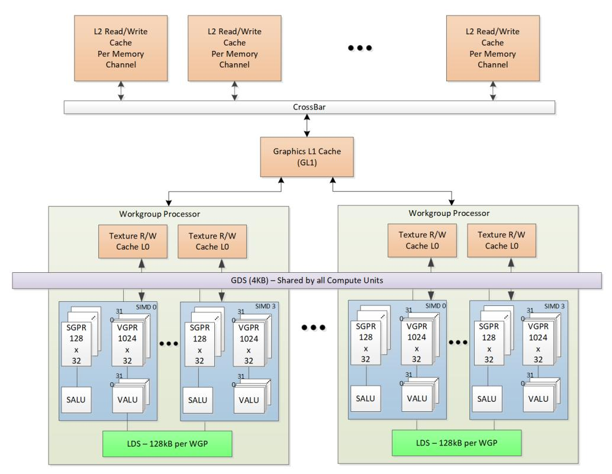

Figure 2. Shared Memory Hierarchy

### **1.2.2.1. Local Data Share (LDS)**

Each work-group processor (WGP) has a 128kB memory space that enables low-latency communication between work-items within a work-group, or the work-items within a wave; this is the local data share (LDS). This memory is configured with 64 banks, each with 512 entries of 4 bytes. The shared memory contains 64 integer atomic units to enable fast, unordered atomic operations. This memory can be used as a software cache for predictable re-use of data, a data exchange machine for the work-items of a work-group, or as a cooperative way to enable efficient access to off-chip memory. A single work-group may allocate up to 64kB of LDS space.

### **1.2.2.2. Global Data Share (GDS)**

The AMD RDNA3 devices use a 4kB global data share (GDS) memory that can be used by waves of a kernel on all WGPs. This memory provides 128 bytes per cycle of memory access to all the processing elements. It provides full access to any location for any processor. The shared memory contains 2 integer atomic units to enable fast, unordered atomic operations. This memory can be used as a software cache to store important control data for compute kernels, reduction operations, or a small global shared surface. Data can be preloaded from memory prior to kernel launch and written to memory after kernel completion. The GDS block contains support logic for unordered append/consume and domain launch ordered append/consume operations to buffers in memory. These dedicated circuits enable fast compaction of data or the creation of complex data structures in memory.

### <span id="page-15-0"></span>**1.2.3. Device Memory**

The AMD RDNA3 devices offer several methods for access to off-chip memory from the processing elements

1.2. Hardware Overview 7 of 600


(PE) within each WGP. On the primary read path, the device consists of multiple channels of L2 cache that provides data to read-only L1 caches, and finally to L0 caches per WGP. Specific cache-less load instructions can force data to be retrieved from device memory during an execution of a load clause. Load requests that overlap within the clause are cached with respect to each other. The output cache is formed by two levels of cache: the first for write-combining cache (collect scatter and store operations and combine them to provide good access patterns to memory); the second is a read/write cache with atomic units that lets each processing element complete unordered atomic accesses that return the initial value. Each processing element provides the destination address on which the atomic operation acts, the data to be used in the atomic operation, and a return address for the read/write atomic unit to store the pre-op value in memory. Each store or atomic operation can be set up to return an acknowledgment to the requesting PE upon write confirmation of the return value (pre-atomic op value at destination) being stored to device memory.

#### This acknowledgment has two purposes:

- enabling a PE to recover the pre-op value from an atomic operation by performing a cache-less load from its return address after receipt of the write confirmation acknowledgment, and
- enabling the system to maintain a relaxed consistency model.

Each scatter write from a given PE to a given memory channel maintains order. The acknowledgment enables one processing element to implement a fence to maintain serial consistency by ensuring all writes have been posted to memory prior to completing a subsequent write. In this manner, the system can maintain a relaxed consistency model between all parallel work-items operating on the system.

1.2. Hardware Overview 8 of 600


# <span id="page-17-0"></span>**Chapter 2. Shader Concepts**

RDNA3 shader programs (kernels) are programs executed by the GPU processor. Conceptually, the shader program is executed independently on every work-item, but in reality the processor groups up to 32 or 64 work-items into a wave, which executes the shader program on all 32 or 64 work-items in one pass.

The RDNA3 processor consists primarily of:

- A scalar ALU, which operates on one value per wave (common to all work-items)
- A vector ALU, which operates on unique values per work-item
- Local data storage, which allows work-items within a work-group to communicate and share data
- Scalar memory, which can transfer data between SGPRs and memory through a cache
- Vector memory, which can transfer data between VGPRs and memory, including sampling texture maps
- Exports which transfer data from the shader to dedicated rendering hardware

Program control flow is handled using scalar ALU instructions. This includes if/else, branches and looping. Scalar ALU (SALU) and memory instructions work on an entire wave and operate on up to two SGPRs, as well as literal constants.

Vector memory and ALU instructions operate on all work-items in the wave at one time. In order to support branching and conditional execute, every wave has an EXECute mask that determines which work-items are active at that moment, and which are dormant. Active work-items execute the vector instruction, and dormant ones treat the instruction as a NOP. The EXEC mask can be written at any time by Scalar ALU instructions or VALU comparisons.

Vector ALU instructions can typically take up to three arguments, which can come from VGPRs, SGPRs, or literal constants that are part of the instruction stream. They operate on all work-items enabled by the EXEC mask. Vector compare and add-with-carry-out return a bit-per-work-item mask back to the SGPRs to indicate, per work-item, which had a "true" result from the compare or generated a carry-out.

Vector memory instructions transfer data between VGPRs and memory. Each work-item supplies its own memory address and supplies or receives unique data. These instructions are also subject to the EXEC mask.

# <span id="page-17-1"></span>**2.1. Wave32 and Wave64**

The shader supports both waves of 32 work-items ("wave32") and waves of 64 work-items ("wave64").

Both wave sizes are supported for all operations, but shader programs must be compiled for and run as a particular wave size, regardless of how many work-items are active in any given wave.

Wave32 waves issue each instruction at most once. Wave64 waves typically issue each instruction twice: once for the low half (work-items 31-0) and then again for the high half (work-items 63-32). This occurs only for VALU and VMEM (LDS, texture, buffer, flat) instructions; scalar ALU and memory as well as branch and messages are issued only once regardless of the wave size. Export requests also issue just once regardless of wave size. It is possible that instructions from other waves may be executed in between the low and high half of a given wave's instructions.

Hardware may choose to skip either half if the EXEC mask for that half is all zeros, but does not skip both halves for VMEM instructions as that would confuse the outstanding-memory-instruction counters, unless

2.1. Wave32 and Wave64 9 of 600


there are no outstanding VMEM instructions from this wave. It also does not skip either half of a VALU instruction which writes an SGPR. See [Instruction Skipping: EXEC==0](#page-23-0) for details on instruction skipping rules.

Hardware operates such that both passes of a wave64 use the state of the wave prior to instruction execution; the first pass of the wave64 does not affect the input to the second pass.

In addition to the EXEC mask being different between the low and high half, scalar inputs may vary between the two passes. Both passes use the same constants, but different masks and carry-in/out.

The differences in the second pass are:

- Input increments: Carry-in, div-fmas and v\_cndmask all use the next SGPR (SSRC + 1, or VCC\_HI)
- Output increments: Carry-out, div-scale and v\_cmp all write to the next SGPR (SDST + 1, or VCC\_HI)
  - v\_cmpx writes to EXEC\_HI instead of EXEC\_LO

The upper 32-bits of EXEC and VCC are ignored for wave32 waves. VCCZ and EXECZ reflect the status of the lowest 32-bits of VCC and EXEC respectively for wave32 waves.

# <span id="page-18-0"></span>**2.2. Shader Types**

## <span id="page-18-1"></span>**2.2.1. Compute Shaders**

Compute kernels (shaders) are generic programs that can run on the RDNA3 processor, taking data from memory, processing it, and writing results back to memory. Compute kernels are created by a dispatch, which causes the RDNA3 processors to run the kernel over all of the work-items in a 1D, 2D, or 3D grid of data. The RDNA3 processor walks through this grid and generates waves, which then run the compute kernel. Each work-item is initialized with its unique address (index) within the grid. Based on this index, the work-item computes the address of the data it is required to work on and what to do with the results.

### <span id="page-18-2"></span>**2.2.2. Graphics Shaders**

The shader supports 3 types of graphics waves: PS, GS, and HS.

Rendering modes (launch behavior):

- **Normal NGG** Geometry Engine (GE) sends info to wave launch hardware to init VGPRs for each element (prim) launched; GE fetches index and vertex buffer data and loads to VGPRs
- **Mesh shader** turns GS-launch into a CS-style launch, and wave launch hardware does unrolling into elements and generates element indices on the fly. The mesh shader program determines how to use this index value.

2.2. Shader Types 10 of 600


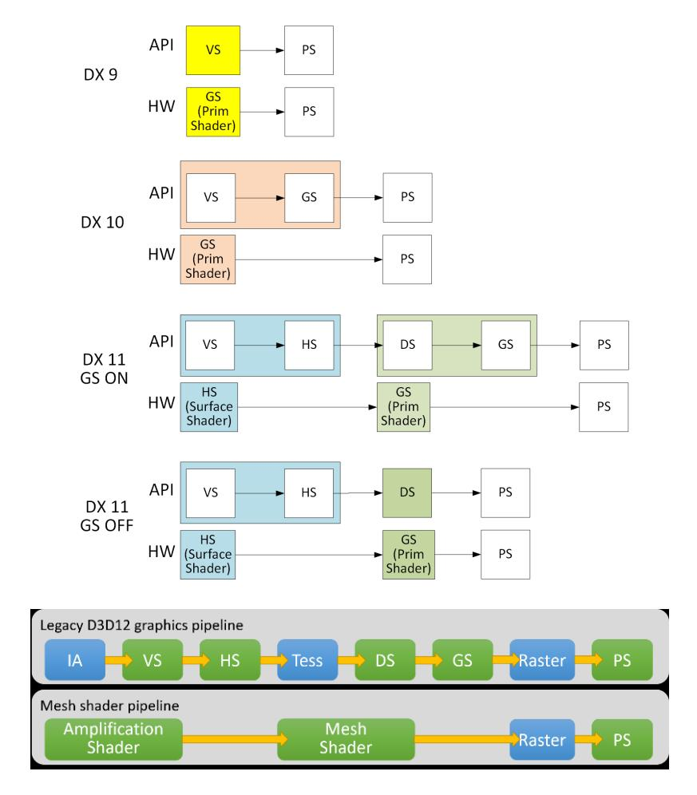

The amplification shader decides how many mesh shader groups to launch. The mesh shader processes vertices and then primitives.

# <span id="page-19-0"></span>**2.3. Work-groups**

A work-group is a collection of waves which can share data through LDS and can synchronize at a barrier. Waves in a work-group are all issued to the same WGP but can run on any of the 4 SIMD32's and can share data through LDS. The WGP supports up to 32 work-groups with a maximum of 1024 work-items per work-group.

Waves in a work-group may share up to 64kB of LDS space. Work-groups consisting of a single wave do not count against the limit of 32. They do not allocate a barrier resource, and barrier ops are treated as S\_NOP.

Each work-group or wave can operate in one of two modes, selectable per draw/dispatch at wave-create time:

#### <span id="page-19-1"></span>**CU mode**

In this mode, the LDS is effectively split into a separate upper and lower LDS, each serving two SIMD32's. Waves are allocated LDS space within the half of LDS which is associated with the SIMD the wave is running on. For work-groups, all waves are assigned to the pair of SIMD32's. This mode may provide faster operation since both halves run in parallel, but limits data sharing (upper waves cannot read data in the lower half of LDS and vice versa). When in CU mode, all waves in the work-group are resident within the same CU.

2.3. Work-groups 11 of 600


#### **WGP mode**

In this mode, the LDS is one large contiguous memory that all waves on the WGP can access. In WGP mode, waves of a work-group may be distributed across both CU's (all 4 SIMD32's) in the WGP. LDS\_PARAM\_LOAD and LDS\_DIRECT\_LOAD are not supported in WGP mode.

The WGP (and LDS) can simultaneously have some waves running in WGP mode and other waves in CU mode running.

A barrier is a synchronization primitive which makes each wave reach a given point in the shader before any wave proceeds.

# <span id="page-20-0"></span>**2.4. Shader Padding Requirement**

Due to aggressive instruction prefetching used in some graphics devices, the user must pad all shaders with 64 extra DWORDs (256 bytes) of data past the end of the shader. It is recommended to use the S\_CODE\_END instruction as padding. This ensures that if the instruction prefetch hardware goes beyond the end of the shader, it may not reach into uninitialized memory (or unmapped memory pages).

The amount of shader padding required is related to how far the shader may prefetch ahead. The shader can be set to prefetch 1, 2 or 3 cachelines (64 bytes) ahead of the current program counter. This is controlled via a wave-launch state register, or by the shader program itself with S\_SET\_INST\_PREFETCH\_DISTANCE.


# <span id="page-21-0"></span>**Chapter 3. Wave State**

This chapter describes the state variables visible to the shader program. Each wave has a private copy of this state unless otherwise specified.

# <span id="page-21-1"></span>**3.1. State Overview**

The table below shows the hardware states readable or writable by a shader program. All registers below are unique to each wave except for TBA and TMA which are shared.

Table 4. Readable and Writable Hardware States

| Abbrev.      | Name                  | Size<br>(bits) | Description                                                                                                                                                                                                                                                                       |
|--------------|-----------------------|----------------|-----------------------------------------------------------------------------------------------------------------------------------------------------------------------------------------------------------------------------------------------------------------------------------|
| PC           | Program Counter       | 48             | Points to the memory address of the next shader instruction<br>to execute. Read/write only via scalar control flow<br>instructions and indirectly using branch. The 2 LSB's are<br>forced to zero.                                                                                |
| V0-V255      | VGPR                  | 32             | Vector general-purpose register. (32 bits per work-item x (32<br>or 64) work-items per wave).                                                                                                                                                                                     |
| S0-S105      | SGPR                  | 32             | Scalar general-purpose register. All waves are allocated 106<br>SGPRs + 16 TTMPs.                                                                                                                                                                                                 |
| LDS          | Local Data Share      | 64kB           | Local data share is a scratch RAM with built-in arithmetic<br>capabilities that allow data to be shared between threads in a<br>work-group.                                                                                                                                       |
| EXEC         | Execute Mask          | 64             | A bit mask with one bit per thread, which is applied to vector<br>instructions and controls which threads execute and which<br>ignore the instruction.                                                                                                                            |
| EXECZ        | EXEC is zero          | 1              | A single bit flag indicating that the EXEC mask is all zeros.<br>For wave32 it considers only EXEC[31:0].                                                                                                                                                                         |
| VCC          | Vector Condition Code | 64             | A bit mask with one bit per thread; it holds the result of a<br>vector compare operation or integer carry-out. Physically<br>VCC is stored in specific SGPRs.                                                                                                                     |
| VCCZ         | VCC is zero           | 1              | A single-bit flag indicating that the VCC mask is all zeros. For<br>wave32 it considers only VCC[31:0].                                                                                                                                                                           |
| SCC          | Scalar Condition Code | 1              | Result from a scalar ALU comparison instruction.                                                                                                                                                                                                                                  |
| FLAT_SCRATCH | Flat scratch address  | 48             | The base address of scratch memory for this wave. Used by<br>Flat and Scratch instructions. Read-only by user shader.                                                                                                                                                             |
| STATUS       | Status                | 32             | Read-only shader status bits.                                                                                                                                                                                                                                                     |
| MODE         | Mode                  | 32             | Writable shader mode bits.                                                                                                                                                                                                                                                        |
| M0           | Misc Reg              | 32             | A temporary register that has various uses, including GPR<br>indexing and bounds checking.                                                                                                                                                                                        |
| TRAPSTS      | Trap Status           | 32             | Holds information about exceptions and pending traps.                                                                                                                                                                                                                             |
| TBA          | Trap Base Address     | 48             | Holds the pointer to the current trap handler program<br>address. Per-VMID register. Bit [63] indicates if the trap<br>handler is present (1) or not (0) and is not considered part of<br>the address (bit[62] is replicated into address bit[63]).<br>Accessed via S_SENDMSG_RTN |
| TMA          | Trap Memory Address   | 48             | Temporary register for shader operations. For example, can<br>hold a pointer to memory used by the trap handler.                                                                                                                                                                  |

3.1. State Overview 13 of 600


| Abbrev.      | Name                                     | Size<br>(bits) | Description                                                                                                                      |
|--------------|------------------------------------------|----------------|----------------------------------------------------------------------------------------------------------------------------------|
| TTMP0-TTMP15 | Trap Temporary SGPRs                     | 32             | 16 SGPRs available only to the Trap Handler for temporary<br>storage.                                                            |
| VMcnt        | Vector memory load<br>instruction count  | 6              | Counts the number of VMEM load and sample instructions<br>issued but not yet completed.                                          |
| VScnt        | Vector memory store<br>instruction count | 6              | Counts the number of VMEM store instructions issued but<br>not yet completed.                                                    |
| EXPcnt       | Export Count                             | 3              | Counts the number of Export and GDS instructions issued<br>but not yet completed. Also counts parameter loads<br>outstanding.    |
| LGKMcnt      | LDS, GDS, Constant and<br>Message count  | 6              | Counts the number of LDS, GDS, constant-fetch (scalar<br>memory read), and message instructions issued but not yet<br>completed. |

# <span id="page-22-0"></span>**3.2. Control State: PC and EXEC**

### <span id="page-22-1"></span>**3.2.1. Program Counter (PC)**

The Program Counter is a DWORD-aligned byte address that points to the next instruction to execute. When a wave is created the PC is initialized to the first instruction in the program.

There are a few instructions to interact directly with the PC: S\_GETPC\_B64, S\_SETPC\_B64, S\_CALL\_B64, S\_RFE\_B64 and S\_SWAPPC\_B64. These transfer the PC to and from an even-aligned SGPR pair (sign-extended).

Branches jump to (PC\_of\_the\_instruction\_after\_the\_branch + offset\*4). Branches, GET\_PC and SWAP\_PC are PCrelative to the **next** instruction, not the current one. S\_TRAP, on the other hand, saves the PC of the S\_TRAP instruction itself.

During wave debugging, the program counter may be read. The PC points to the next instruction to issue. All prior instructions have been issued but may or may not have completed execution.

### <span id="page-22-2"></span>**3.2.2. EXECute Mask**

The Execute mask (64-bit) controls which threads in the vector are executed. Each bit indicates how one thread behaves for vector instructions: 1 = execute, 0 = do not execute. EXEC can be read and written via scalar instructions, and can also be written as a result of a vector-alu compare. EXEC affects: vector-alu, vectormemory, LDS, GDS and export instructions. It does not affect scalar execution or branches.

Wave64 uses all 64 bits of the exec mask. Wave32 waves use only bits 31:0 and hardware does not act upon the upper bits.

There is a summary bit (EXECZ) that indicates that the entire execute mask is zero. It can be used as a condition for branches to skip code when EXEC is zero. For wave32, this reflects the state of EXEC[31:0].


### <span id="page-23-0"></span>**3.2.3. Instruction Skipping: EXEC==0**

The shader hardware may skip vector instructions when EXEC==0. Instructions which may be skipped are:

- VALU skip if EXEC == 0
  - Not skipped if the instruction writes SGPRs/VCC
  - Does not skip WMMA or SWMMA
  - This skipping is opportunistic and may not occur depending on timing after a V\_CMPX.
- These are not skipped regardless of EXEC mask value, and are issued only once in wave64
  - V\_NOP, V\_PIPEFLUSH, V\_READLANE, V\_READFIRSTLANE, V\_WRITELANE
  - BUFFER\_GL1\_INV, BUFFER\_GL0\_INV
- These are not skipped and are issued twice regardless of EXEC mask value in wave64 mode
  - V\_CMP which writes SGPR or VCC (not V\_CMPX may skip one pass but not both)
  - Any VALU which writes an SGPR
- Export Request skip unless: Done==1 or if export target is POS0
  - Skipped if the wave was created with SKIP\_EXPORT=1
- LDS\_param\_load / LDS-direct: are skipped when EXEC==0 and EXP\_cnt==0
- LDS, Memory, GDS do not skip
  - VMEM can be skipped only if: VMcnt/VScnt==0 and EXEC==0
    - otherwise for wave64 one pass can be skipped if EXEC==0 for that half, but not both halves.
  - LDS can be skipped only if: LGKMcnt==0 and EXEC==0
  - Does not skip GDS or GWS

## <span id="page-23-1"></span>**3.3. Storage State: SGPR, VGPR, LDS**

### <span id="page-23-2"></span>**3.3.1. SGPRs**

### **3.3.1.1. SGPR Allocation and storage**

Every wave is allocated a fixed number of SGPRs:

- 106 normal SGPRs
- VCC\_HI and VCC\_LO (stored in SGPRs 106 and 107)
- 16 Trap-temporary SGPRs, meant for use by the trap handler

### **3.3.1.2. VCC**

The Vector Condition Code (VCC) can be written by V\_CMP and integer vector ADD/SUB instructions. VCC is implicitly read by V\_ADD\_CI, V\_SUB\_CI, V\_CNDMASK and V\_DIV\_FMAS. VCC is a named SGPR-pair and is subject to the same dependency checks as any other SGPR.


### **3.3.1.3. SGPR Alignment**

There are a few cases where even-aligned SGPRs are required:

- 1. any time 64-bit data is used
  - a. this includes moves to/from 64-bit registers, including PC
- 2. Scalar memory reads when the address-base comes from an SGPR-pair

Quad-alignment of SGPRs is required for operation on more than 64-bits, and for the data GPR when a scalar memory operation (read, write or atomic) operates on more than 2 DWORDs. Similarly, when a 64-bit SGPR data value is used as a source to a VALU op, it must be even aligned regardless of size. In contrast, when a 32 bit SGPR data value is used as a source to a VALU op, it can be arbitrarily aligned regardless of wave size.

When a 64-bit quantity is stored in SGPRs, the LSB's are in SGPR[n], and the MSB's are in SGPR[n+1].

It is illegal to use mis-aligned source or destination SGPRs for data larger than 32 bits and results are unpredictable.

As an example, VALU ops with carry-in or carry-out:

- When used with wave32, these are 32 bit values and may have any arbitrary alignment
- When used with wave64, these are 64 bit values and must be aligned to an even SGPR address

Hardware enforces SGPR alignment by ignoring LSB's as necessary and treating them as zero. For \*MOVREL\*\_B64, the LSB of the index is also ignored and treated as zero.

### **3.3.1.4. SGPR Out of Range Behavior**

Scalar sources and dests use a 7-bit encoding:

Scalar 0-105=SGPR; 106,107=VCC, 108-123=TTMP0-15, and 124-127={NULL, M0, EXEC\_LO, EXEC\_HI}.

It is illegal to use GPR indexing or a multi-DWORD operand to cross SGPR regions. The regions are:

- SGPRs 0 107 (includes VCC)
- Trap Temp SGPRs
- All other SGPR & Scalar-source addresses must not be indexed and no single operand can reference multiple register ranges.

#### General Rules:

- Out of range source SGPRs return zero (using a TTMP when STATUS.PRIV=0, NULL, M0 or EXEC where not allowed)
- Writes to an out of range SGPR are ignored

TTMP0-15 can only be written while in the trap handler (STATUS.PRIV=1) and cannot be read by the user's shader (returns zero when STATUS.PRIV=0). Writes to TTMPs while outside the trap handler are ignored. SALU instructions which try but fail to write a TTMP also do not update SCC.

- SALU: Above rules apply.
  - WREXEC and SAVEEXEC write the EXEC mask even when the SDST is out-of-range
- VALU: Above rules apply.
- VMEM: S#, T#, V# must be contained within one region.

- T# (128b), V# or S#: no possible range violation exists (forced alignment puts all in 1 range).
- T# (256b) starting at 104 and extending into TTMPs; or starting at TTMP12 and going past TTMP15 is a violation. If this occurs, force to use S0.
- SMEM return data starting in SGPRs/VCC and extending into TTMPs, or starting in TTMPs and extending outside TTMPs becomes out of range.
  - No data gets written to dest-SGPRs that are out-of-range
  - Addr and write-data are aligned and so cannot go out of range, except:
    - Referencing M0, NULL, or EXEC\* returns zero, and SMEM loads cannot load into these registers.
- S\_MOVREL:
  - Indexing is allowed only within SGPRs and TTMPs, and must not cross between the two. Indexing must stay within the "base" range (the operand type where index==0).

The ranges are: [ SGPRs 0-105 and VCC\_LO, VCC\_HI ], [ Trap Temps 0-15 ], [ all other values ]

- Indexing must not reach M0, exec or inline constants, the rule is:
  - Base is SGPR: addr > VCC\_HI (or if 64-bit operand, addr > VCC\_LO)
  - Base is TTMP: addr > TTMP15 (or if B64 if addr > ttmp14)
- If the source is out of range, S0 is used. If the dest is out of range, nothing is written.

### <span id="page-25-0"></span>**3.3.2. VGPRs**

### **3.3.2.1. VGPR Allocation and Alignment**

VGPRs are allocated in blocks of 16 for wave32 or 8 for wave64, and a shader may have up to 256 VGPRs. In other words, VGPRs are allocated in units of (16\*32 or 8\*64 = 512 DWORDs). A wave may not be created with zero VGPRs. Devices which have 1536 VGPRs per SIMD allocate in blocks of 24 for wave32 and 12 for wave64.

A wave may voluntarily deallocate all of its VGPRs via S\_SENDMSG. Once this is done, the wave may not reallocate them and the only valid action is to terminate the wave. This can be useful if a wave has issued stores to memory and is waiting for the write-confirms before terminating. Releasing the VGPRs while waiting may allow a new wave to allocate them and start earlier.

### **3.3.2.2. VGPR Out of Range Behavior**

Given an instruction operand that uses one or more DWORDs of VGPR data: "V"

```
Vs = the first VGPR DWORD (start) 
Ve = the last VGPR DWORD (end)
```

For a 32-bit operand, Vs==Ve; for a 64-bit operand Ve=Vs+1, etc.

Operand is out of range if:

- Vs < 0 || Vs >= VGPR\_SIZE
- Ve < 0 || Ve >= VGPR\_SIZE

V\_MOVREL indexed operand out of range if either:

• Index > 255


- (Vs + M0) >= VGPR\_SIZE
- (Ve + M0) >= VGPR\_SIZE

#### Out of range consequences:

- If a dest VGPR is out of range, the instruction is ignored (treat as NOP).
- V\_SWAP & V\_SWAPREL : since both arguments are destinations, if either is out of range, discard the instruction.
  - VALU instructions with multiple destination (e.g. VGPR and SGPR): nothing is written to any GPR
- If a source VGPR is out of range in a VMEM or Export instruction: VGPR0 is used
  - Memory instructions that use a group of consecutive VGPRs that are out of range use VGPR0 for the individual out of range VGPRs.
- If a source VGPR in a VALU instruction is out of range in a VALU instruction: VGPR0
  - VOPD has different rules: the source address forced to (VGPRaddr % 4).

Instructions with multiple destinations (e.g. V\_ADD\_CO): if any destination is out of range, no results are written.

### <span id="page-26-0"></span>**3.3.3. Memory Alignment and Out-of-Range Behavior**

This section defines the behavior when a source or destination GPR or memory address is outside the legal range for a wave. Except where noted, these rules apply to LDS, GDS, buffer, global, flat and scratch memory accesses.

Memory, LDS & GDS: Reads and Atomics with return:

- If any source VGPR or SGPR is out-of-range, the data value is undefined.
- If any destination VGPR is out-of-range, the operation is nullified by issuing the instruction as if the EXEC mask were cleared to 0.
  - This out-of-range test checks all VGPRs which could be returned (e.g. VDST to VDST+3 for a BUFFER\_LOAD\_B128)
  - This check also includes the extra PRT (partially resident texture) VGPR and nullifies the fetch if this VGPR would be out of range no matter whether the texture system actually returns this value or not.
  - Atomic operations with out-of-range destination VGPRs are nullified: issued, but with EXEC mask of zero.
- Image loads and stores consider DMASK bits when making an out-of-bounds determination.
- Note: VDST is only checked for lds/gds/mem-atomic that actually return a value.

VMEM (texture) memory alignment rules are defined using the config register: SH\_MEM\_CONFIG.alignment\_mode. This setting also affects LDS, Flat/Scratch/Global operations.

**DWORD** Automatic alignment to multiple of the smaller of element size or a DWORD.

**UNALIGNED** No alignment requirements.

Formatted ops such as BUFFER\_LOAD\_FORMAT\_\* must be aligned as follows:

- 1-byte formats require 1-byte alignment
- 2-byte formats require 2-byte alignment
- 4-byte and larger formats require 4-byte alignment


Atomics must be aligned to the data size, or triggers a MEMVIOL.

### <span id="page-27-0"></span>**3.3.4. LDS**

Waves may be allocated LDS memory, and waves in a work-group all share the same LDS memory allocation. A wave may have 0 - 64kbyte of LDS space allocated, and it is allocated in blocks of 1024 bytes. All accesses to LDS are restricted to the space allocated to that wave/work-group.

Internally LDS is composed of two blocks of memory of 64kB each. Each one of these two blocks is affiliated with one CU or the other: byte addresses 0-65535 with CU0, 65536-131071 with CU1. Allocations of LDS space to a wave or work-group do not wrap around: the allocation starting address is less than the ending address.

In CU mode, a wave's entire LDS allocation resides in the same "side" of LDS as the wave is loaded. No access is allowed to cross over or wrap around to the other side.

In WGP mode, a wave's LDS allocation may be entirely in either the CU0 or CU1 part of LDS, or it may straddle the boundary and be partially in each CU. The location of the LDS storage is unrelated to which CU the wave is on.

Pixel parameters are loaded into the same CU side as the wave resides and do not cross over into the other side of LDS storage. Pixel shaders are run only in CU mode. Pixel shader may request additional LDS space in addition to what is required for vertex parameters.

### **3.3.4.1. LDS/GDS Alignment and Out-of-Range**

Any DS\_LOAD or DS\_STORE of any size can be byte aligned if the alignment mode is set to "unaligned". For all other alignment modes, LDS forces alignment by zeroing out address least significant bits.

- 32-bit Atomics must be aligned to a 4-byte address; 64-bit atomics to an 8-byte address.
- LDS operations report MEMVIOL if the LDS-address is out of range and LDS\_CONFIG.ADDR\_OUT\_OF\_RANGE\_REPORTING==1
- MEMVIOL is reported for misaligned LDS accesses when the alignment mode is set to STRICT or DWORD\_STRICT.

#### Out Of Range

- If the LDS-ADDRESS is out of range (addr < 0 or >= LDS\_size):
  - Writes out-of-range are discarded.
  - Reads return the value zero. For multi-DWORD reads, if any part of the LDS-address is out of range, the entire instruction returns zero.
- If any source-VGPR is out of range, the value from VGPR0 is used to supply the LDS address or data.
- If the dest-VGPR is out of range, nullify the instruction (issue with EXEC=0)

"Native" Alignment in LDS & GDS is:

B8: byte aligned

B16 or D16: 2 byte aligned

B32: 4 byte aligned B64: 8 byte aligned

B128 and B96: 16 byte aligned


If the alignment mode is set to "unaligned", the LDS disables its auto-alignment and doesn't report error for misaligned reads & writes.

```
  if (sh_alignment_mode == unaligned) align = 0xffff
  else if (B32) align = 0xfffC
  else if (B64) align = 0xfff8
  else if (B96 or B128) align = 0xfff0
  LDSaddr = (addr + offset) & align
```

# <span id="page-28-0"></span>**3.4. Wave State Registers**

The following registers are accessed infrequently, and are only readable/writable via S\_GETREG and S\_SETREG instructions. Some of these registers are read-only, some are writable and others are writable only when in the trap handler ("PRIV").

<span id="page-28-2"></span>

| Code | Register        |                                                                                                                                                                       |
|------|-----------------|-----------------------------------------------------------------------------------------------------------------------------------------------------------------------|
| 0    | Reserved        |                                                                                                                                                                       |
| 1    | MODE            | read / write                                                                                                                                                          |
| 2    | STATUS          | read / write. Only writable when priv=1                                                                                                                               |
| 3    | TRAPSTS         | read / write                                                                                                                                                          |
| 14   | FLUSH_IB        | write-only. Writing this causes all waves to flush their instruction buffers                                                                                          |
| 15   | SH_MEM_BASES    | read-only. Allows a wave to read the value of this register to do aperture checks and<br>memory space conversions. Bits [15:0] = Private Base; [31:16] = Shared Base. |
| 20   | FLAT_SCRATCH_LO | read only (writable only while in trap handler)                                                                                                                       |
| 21   | FLAT_SCRATCH_HI | read only (writable only while in trap handler)                                                                                                                       |
| 23   | HW_ID1          | read only. debug only - not predictable values                                                                                                                        |
| 24   | HW_ID2          | read only. debug only - not predictable values                                                                                                                        |
| 29   | SHADER_CYCLES   | Get the current graphics clock counter value                                                                                                                          |

### <span id="page-28-1"></span>**3.4.1. Status register**

Status register fields can be read but not written to by the shader. While in the trap handler, certain STATUS fields can be written. These bits are initialized at wave-creation time. The table below describes the status register fields.

Table 5. Status Register Fields

| Field     | Bit<br>Pos | Write<br>when<br>Priv? | Description                                                                                                                                                                          |
|-----------|------------|------------------------|--------------------------------------------------------------------------------------------------------------------------------------------------------------------------------------|
| SCC       | 0          | Y                      | Scalar condition code. Used as a carry-out bit. For a comparison instruction, this bit<br>indicates failure or success. For logical operations, this is 1 if the result is non-zero. |
| SYS_PRIO  | 2:1        | Y                      | Wave priority set at wave creation time. See S_SETPRIO instruction for details. 0 is<br>lowest, 3 is highest priority.                                                               |
| USER_PRIO | 4:3        | Y                      | Wave's priority set by shader program itself. See S_SETPRIO instruction for details.                                                                                                 |
| PRIV      | 5          | N                      | Privileged mode. Indicates that the wave is in the trap handler. Gives write access to<br>TTMP registers.                                                                            |
| TRAP_EN   | 6          | N                      | Indicates that a trap handler is present. When set to zero, traps are not taken.                                                                                                     |

3.4. Wave State Registers 20 of 600


| Field         | Bit<br>Pos | Write<br>when<br>Priv? | Description                                                                                                                                                                                                                                                                                                                                                                                                                                                                                                                         |
|---------------|------------|------------------------|-------------------------------------------------------------------------------------------------------------------------------------------------------------------------------------------------------------------------------------------------------------------------------------------------------------------------------------------------------------------------------------------------------------------------------------------------------------------------------------------------------------------------------------|
| EXPORT_RDY    | 8          | Y                      | This status bit indicates if export buffer space has been allocated. The shader stalls<br>any export instruction until this bit becomes "1". It gets set to 1 when export buffer space<br>has been allocated.<br>Shader hardware checks this bit before executing any EXPORT instruction to<br>Position, Z or MRT targets, and put the wave into a waiting state if the alloc has not<br>yet been received. The alloc arrives eventually (unless SKIP_EXPORT is set) as a<br>message and the shader then continues with the export. |
| EXECZ         | 9          | N                      | Exec Mask is Zero.                                                                                                                                                                                                                                                                                                                                                                                                                                                                                                                  |
| VCCZ          | 10         | N                      | Vector Condition Code is Zero.                                                                                                                                                                                                                                                                                                                                                                                                                                                                                                      |
| IN_WG         | 11         | N                      | Wave is a member of a work-group of more than one wave.                                                                                                                                                                                                                                                                                                                                                                                                                                                                             |
| IN_BARRIER    | 12         | N                      | Wave is waiting at a barrier.                                                                                                                                                                                                                                                                                                                                                                                                                                                                                                       |
| HALT          | 13         | Y                      | Wave is halted or scheduled to halt.<br>HALT can be set by the host via wave-control messages, or by the shader. The HALT<br>bit is ignored while in the trap handler (PRIV = 1). HALT is also ignored if a host<br>initiated trap is received (request to enter the trap handler).                                                                                                                                                                                                                                                 |
| TRAP          | 14         | N                      | Wave is flagged to enter the trap handler as soon as possible.                                                                                                                                                                                                                                                                                                                                                                                                                                                                      |
| VALID         | 16         | N                      | Wave is valid (has been created and not yet ended)                                                                                                                                                                                                                                                                                                                                                                                                                                                                                  |
| SKIP_EXPORT   | 18         | Y                      | For Pixel and Vertex Shaders only.<br>"1" means this shader is not allocated export buffer space, so export instructions are<br>ignored (treated as NOPs). For pixel shaders, this is set to 1 when both the<br>COL0_EXPORT_FORMAT and Z_EXPORT_FORMAT are set to ZERO. If<br>SKIP_EXPORT==1, Must_export must be zero and vice versa.                                                                                                                                                                                              |
| PERF_EN       | 19         | N                      | Performance counters are enabled for this wave                                                                                                                                                                                                                                                                                                                                                                                                                                                                                      |
| CDBG_USER     | 20         | Y                      | User-controlled conditional debug. Set at wave-create time by a user register. Can be<br>used in conditional branches.                                                                                                                                                                                                                                                                                                                                                                                                              |
| CDBG_SYS      | 21         | Y                      | System-controlled conditional debug. Set at wave-create time by a system register.<br>Can be used in conditional branches.                                                                                                                                                                                                                                                                                                                                                                                                          |
| FATAL_HALT    | 23         | N                      | Indicates that the wave has halted due to a fatal error:<br>illegal instruction . The difference between halt and fatal_halt is that fatal_halt stops<br>waves even when PRIV=1.                                                                                                                                                                                                                                                                                                                                                    |
| NO_VGPRS      | 24         | N                      | Indicates that this wave has released all of its VGPRs.                                                                                                                                                                                                                                                                                                                                                                                                                                                                             |
| LDS_PARAM_RDY | 25         | Y                      | PS shaders only: indicates that LDS has been written with vertex attribute data and<br>the shader may now execute LDS_PARAM_LOAD instructions. If the wave attempts to<br>issue LDS_PARAM_LOAD before this bit is set, it stalls until the bit is set.                                                                                                                                                                                                                                                                              |
| MUST_GS_ALLOC | 26         | N                      | GS shader must issue a GS_ALLOC_REQ message before terminating.<br>Sending this message clears this bit.                                                                                                                                                                                                                                                                                                                                                                                                                            |
| MUST_EXPORT   | 27         | Y                      | PS: this wave must export color ("export-done") before it terminates.<br>Set to 1 for PS waves unless "skip_export==1". Cleared when PS exports data with<br>export's Done bit set to 1.<br>GS: this wave must perform a GDS_ordered_count before terminating. Cleared when<br>a GS shader issues a GDS_ordered_count. GS is initialized to 1 normally, but to zero<br>for "no export" passes (stream-out only).                                                                                                                    |
| IDLE          | 28         | N                      | Wave is idle (has no outstanding instructions). Used by the host (GRBM) to<br>determine if a wave is valid, halted and idle - able to read other wave state.                                                                                                                                                                                                                                                                                                                                                                        |
| SCRATCH_EN    | 29         | Y                      | Indicate that the wave has scratch memory allocated. This bit gets set to 1 if the wave<br>has FLAT_SCRATCH initialized; otherwise is zero.                                                                                                                                                                                                                                                                                                                                                                                         |

3.4. Wave State Registers 21 of 600


### <span id="page-30-0"></span>**3.4.2. Mode register**

Mode register fields can be read from, and written to, by the shader through scalar instructions. The table below describes the mode register fields.

Table 6. Mode Register Fields

| Field            | Bit<br>Pos | Description                                                                                                                                                                                                                                                                                                                                                                                                                                                                                                                                                                                                                                                                           |
|------------------|------------|---------------------------------------------------------------------------------------------------------------------------------------------------------------------------------------------------------------------------------------------------------------------------------------------------------------------------------------------------------------------------------------------------------------------------------------------------------------------------------------------------------------------------------------------------------------------------------------------------------------------------------------------------------------------------------------|
| FP_ROUND         | 3:0        | Controls round modes for math operations<br>[1:0] Single precision round mode<br>[3:2] Double precision and half precision (FP16) round mode<br>Round Modes: 0=nearest even, 1= +infinity, 2= -infinity, 3= toward zero<br>Round mode affects float ops in VALU, but not LDS or memory.                                                                                                                                                                                                                                                                                                                                                                                               |
| FP_DENORM        | 7:4        | Controls whether floating point denormals are flushed or not.<br>[5:4] Single precision denormal mode<br>[7:6] Double precision and FP16 denormal mode<br>Denormal modes: 2 bits = { allow_output_denorms, allow_input_denorms }<br>0 = flush input and output denorms<br>1 = allow input denorms, flush output denorms<br>2 = flush input denorms, allow output denorms<br>3 = allow input and output denorms<br>Denorm mode affects float ops in: VALU, LDS, and VMEM atomics.<br>Texture/Buffer/Flat considers only bits 4 and 6 (allowing mode control over input-denorm<br>flushing, and not flushing output denorms), while LDS uses all bits for DS ops (but not for<br>FLAT). |
| DX10_CLAMP       | 8          | Used by the vector ALU to force DX10 style treatment of NaN's. When set, clamp NaN to<br>zero, otherwise pass NaN thru and also suppress all VALU exceptions. The clamping only<br>occurs when the instruction has the CLAMP bit set to 1, but exceptions are suppressed<br>when DX10_CLAMP==1.                                                                                                                                                                                                                                                                                                                                                                                       |
| IEEE             | 9          | IEEE==0: IEEE-754-1985/DX10 behavior for Min and Max, pass signaling NaN.<br>IEEE==1: IEEE-754-2008 behavior for Min and Max, quiet signaling NaN.<br>When set to 1, floating point opcodes that support exception flag gathering quiet and<br>propagate signaling NaN inputs per IEEE 754-2008. Min_f32/f64 and Max_f32/f64 become<br>IEEE 754-2008 compliant due to signaling NaN propagation and quieting. When set to 1,<br>MAX performs a ">" compare, but when set to zero (directX mode/IEEE 754-1985 mode)<br>MAX performs a ">=" compare. This only affects results for +/-0 and input denormals<br>which are flushed to zero.                                               |
| LOD_CLAMPED      | 10         | Sticky status bit - indicates that one or more texture accesses had their LOD clamped.                                                                                                                                                                                                                                                                                                                                                                                                                                                                                                                                                                                                |
| TRAP_AFTER_ INST | 11         | Forces the wave to jump to the exception handler after each instruction is executed (but<br>not after ENDPGM). Only works if TRAP_EN = 1.                                                                                                                                                                                                                                                                                                                                                                                                                                                                                                                                             |
| EXCP_EN          | 21:12      | Enable mask for exceptions. Enabled means if the exception occurs and if TRAP_EN==1, a<br>trap may be taken.<br>[12] : invalid<br>[13] : inputDenormal<br>[14] : float_div0<br>[15] : overflow<br>[16] : underflow<br>[17] : inexact<br>[18] : int_div0<br>[19] : addr_watch - take exception when TC sees wave access an "address of interest"<br>[21] : trap on wave end - h/w clears this upon entering trap handler for end-of-wave                                                                                                                                                                                                                                               |

3.4. Wave State Registers 22 of 600


| Field        | Bit<br>Pos | Description                                                                                                                                                                                                           |
|--------------|------------|-----------------------------------------------------------------------------------------------------------------------------------------------------------------------------------------------------------------------|
| FP16_OVFL    | 23         | If set, an overflowed FP16 VALU result is clamped to +/- MAX_FP16 regardless of round<br>mode, while still preserving true INF values. (Inputs which are infinity may result in infinity,<br>as does divide-by-zero). |
| DISABLE_PERF | 27         | 1 = disable performance counting for this wave.                                                                                                                                                                       |

## <span id="page-31-0"></span>**3.4.3. M0 : Miscellaneous Register**

There is one 32-bit M0 register per wave and is it used for:

Table 7. M0 Register Fields

| Operation         | M0 Contents                                              | Notes                                                                                           |
|-------------------|----------------------------------------------------------|-------------------------------------------------------------------------------------------------|
| LDS_PARAM_LOAD    | { 1'b0, new_prim_mask[15:1],<br>parameter_offset[15:0] } | Offset is in bytes and offset[6:0] must be zero.<br>Wave32: new_prim_mask is {8'b0, mask[7:1] } |
| LDS_DIRECT_LOAD   | { 13'b0, DataType[2:0],<br>LDS_address[15:0] }           | address is in bytes                                                                             |
| LDS ADDTID        | { 16'h0, lds_offset[15:0] }                              | offset is in bytes, must be 4-byte aligned                                                      |
| Global Data Share | { base[15:0] , size[15:0] }                              | base and size are in bytes                                                                      |
| GDS Ordered Count | { base[15:0], 3'h0,<br>logical_wave_id[12:0] }           | used for deferred attribute shading (split-GS)                                                  |
| Global Wave Sync  | various uses                                             | see instruction definition                                                                      |
| S/V_MOVREL        | GPR index                                                | See S_MOVREL and V_MOVREL instructions                                                          |
| S_SENDMSG / _RTN  | varies                                                   | sendmsg data. See [Send_Message_Types]                                                          |
| EXPORT            | Row number for mesh shader POS<br>& Param exports        | See Export chapter                                                                              |
| SMEM              | address_offset[31:0]                                     | see SMEM section                                                                                |
| Temporary         | data[31:0]                                               | can be used as general temporary data storage                                                   |

M0 can only be written by the scalar ALU.

### <span id="page-31-1"></span>**3.4.4. NULL**

NULL is a scalar source and destination. Reading NULL returns zero, writing to NULL has no effect (write data is discarded).

NULL may be used anywhere scalar sources can normally be used:

- When NULL is used as the destination of an SALU instruction, the instruction executes: SDST is not written but SCC is updated (if the instruction normally updates SCC).
- NULL may not be used as an S#, V# or T#.

### <span id="page-31-2"></span>**3.4.5. SCC: Scalar Condition Code**

Many scalar ALU instructions set the Scalar Condition Code (SCC) bit, indicating the result of the operation.

Compare operations: 1 = true

3.4. Wave State Registers 23 of 600


```
Arithmetic operations: 1 = carry out
Bit/logical operations: 1 = result was not zero
Move: does not alter SCC
```

The SCC can be used as the carry-in for extended-precision integer arithmetic, as well as the selector for conditional moves and branches.

## <span id="page-32-0"></span>**3.4.6. Vector Compares: VCC and VCCZ**

Vector ALU comparison instructions (V\_CMP) compare two values and return a bit-mask of the result, where each bit represents one lane (work-item) where: 1= pass, 0 = fail. This result mask is the Vector Condition Code (VCC). VCC is also set for selected integer ALU operations (carry-out).

These instructions write this mask either to VCC, an SGPR or to EXEC, but do not write to both EXEC and SGPRs. Wave32 writes only the low 32 bits of VCC, EXEC or a single SGPR; Wave64 writes 64-bits of VCC, EXEC or an aligned pair of SGPRs.

Whenever any instruction writes a value to VCC, the hardware automatically updates a "VCC summary" bit called VCCZ. This bit indicates whether or not the entire VCC mask is zero for the current wave-size. Wave32 ignores VCC[63:32] and only bits[31:0] contribute to VCCZ. This is useful for early-exit branch tests. VCC is also set for certain integer ALU operations (carry-out).

The EXEC mask determines which threads execute an instruction. The VCC indicates which executing threads passed the conditional test, or which threads generated a carry-out from an integer add or subtract.

```
S_MOV_B64 EXEC, 0x00000001 // set just one thread active; others are inactive
V_CMP_EQ_B32 VCC, V0, V0 // compare (V0 == V0) and write result to VCC (all bits in VCC are
updated)
```


VCC physically resides in the SGPR register file in a specific pair of SGPRs, so when an instruction sources VCC, that counts against the limit on the total number of SGPRs that can be sourced for a given instruction.

Wave32 waves may use any SGPR for mask/carry/borrow operations, but may not use VCC\_HI or EXEC\_HI.

### <span id="page-32-1"></span>**3.4.7. FLAT\_SCRATCH**

FLAT\_SCRATCH is a 64-bit register that holds a pointer to the base of scratch memory for this wave. For waves that have scratch space allocated, wave-launch hardware initializes the FLAT\_SCRATCH register with the scratch base address unique to this wave. This register is read-only, except while in the trap handler where it is writable. The value is a byte address and must be 256byte aligned. If the wave has no scratch space allocated, then reading FLAT\_SCRATCH returns zero.

The value for FLAT\_SCRATCH is computed in hardware and initialized for any wave that has scratch space allocated:

scratch\_base = scratch\_base[63:0] + spi\_scratch\_offset[31:0]

3.4. Wave State Registers 24 of 600


FLAT\_SCRATCH\_LO = scratch\_base [31:0] FLAT\_SCRATCH\_HI = scratch\_base [63:32]

### <span id="page-33-0"></span>**3.4.8. Hardware Internal Registers**

These registers are read-only and can be accessed by the S\_GETREG instruction. They return information about hardware allocation and status. HW\_ID and the various \*\_BASE values are not predictable and may change over the lifetime of a wave if context-switching can occur.

#### **HW\_ID1**

| Field   | Bits  | Description                                                                                                                                                                                        |
|---------|-------|----------------------------------------------------------------------------------------------------------------------------------------------------------------------------------------------------|
| WAVE_ID | 4:0   | Wave id within the SIMD.                                                                                                                                                                           |
| SIMD_ID | 9:8   | SIMD_ID within the WGP: [0] = row, [1] = column.                                                                                                                                                   |
| WGP_ID  | 13:10 | Physical WGP ID.                                                                                                                                                                                   |
| SA_ID   | 16    | Shader Array ID                                                                                                                                                                                    |
| SE_ID   | 20:18 | Shader Engine ID                                                                                                                                                                                   |
| DP_RATE | 31:29 | Number of double-precision float units per SIMD. 1+log2(#DP-alu's). 0=none, 1=1/32rate (1 dp<br>lane/clk), 2=1/16 rate (2 dp lanes/clk), 3=1/8, 4=1/4, 5=1/2, 6=full rate (32 dp lanes per clock). |

#### **HW\_ID2**

| Field    | Bits  | Description                                       |
|----------|-------|---------------------------------------------------|
| QUEUE_ID | 3:0   | Queue_ID (also encodes shader stage)              |
| PIPE_ID  | 5:4   | Pipeline ID                                       |
| ME_ID    | 9:8   | MicroEngine ID: 0 = graphics, 1 & 2 = ACE compute |
| STATE_ID | 14:12 | State context ID                                  |
| WG_ID    | 20:16 | Work-group ID (0-31) within the WGP.              |
| VM_ID    | 27:24 | Virtual Memory ID                                 |

#### **Other S\_GETREG, S\_SETREG targets:**

| Register                           | Bits     | Description                                                                                             |  |
|------------------------------------|----------|---------------------------------------------------------------------------------------------------------|--|
| FLUSH_IB                           | 1        | Writing this with bit[0]=1 flushes the instruction fetch buffers for the targeted wave.                 |  |
| SH_MEM_BASES                       | 16, 16   | Per-VMID register, readable by the shader, which holds the private and shared<br>apertures.             |  |
| PC_LO<br>PC_HI                     | 32<br>32 | Program counter low and high halves. GETREG should not be used to read the PC -<br>use S_GETPC instead. |  |
| FLAT_SCRATCH_HI<br>FLAT_SCRATCH_LO | 32<br>32 | Flat scratch base address. Only writable when in trap handler                                           |  |

Note: TMA and TBA are read using S\_SENDMSG\_RTN.

### <span id="page-33-1"></span>**3.4.9. Trap and Exception registers**

Each type of exception can be enabled or disabled independently by setting, or clearing, bits in the TRAPSTS register's EXCP\_EN field. This section describes the registers that control and report shader exceptions.

Trap temporary SGPRs (TTMP\*) are privileged for writes - they can be written only when in the trap handler

3.4. Wave State Registers 25 of 600


(STATUS.PRIV = 1). TTMPs cannot be read by the user shader (returns zero).

When the shader is not privileged (STATUS.PRIV==0), writes to these are ignored. TMA and TBA are read-only; they can be accessed through S\_SENDMSG\_RTN.

When a trap is taken (either user initiated, exception or host initiated), the shader hardware generates an S\_TRAP instruction. This loads trap information into a pair of SGPRS:

```
{TTMP1, TTMP0} = {7'h0, HT[0],trapID[7:0], PC[47:0]}.
```

HT is set to one for host initiated traps, and zero for user traps (s\_trap) or exceptions. TRAP\_ID is zero for exceptions, or the user/host trapID for those traps.

#### **STATUS . TRAP\_EN**

This bit tells the shader whether or not a trap handler is present. When one is not present, traps are not taken no matter whether they're floating point, user or host-initiated traps. When the trap handler is present, the wave uses an extra 16 SGPRs for trap processing.

If trap\_en == 0, all traps and exceptions are ignored, and s\_trap is converted by hardware to NOP.

#### **MODE . EXCP\_EN**[8:0]

Exception enable mask. Defines which of the sources of exception cause the shader to jump to the trap handler when the exception occurs. 1 = enable traps; 0 = disable traps.

MEMVIOL and Illegal-Instruction jump to the trap handler and cannot be masked off.

|   | Bit Exception              | Cause                                                                                                 | Result                                                |
|---|----------------------------|-------------------------------------------------------------------------------------------------------|-------------------------------------------------------|
| 0 | invalid                    | operand is invalid for operation: 0 * inf, 0/0, sqrt(-x), any input<br>is SNaN.                       | QNaN                                                  |
| 1 | Input<br>Denormal          | one or more operands was subnormal                                                                    | ordinary result                                       |
| 2 | Divide by zero Float X / 0 |                                                                                                       | correct signed infinity                               |
| 3 | overflow                   | The rounded result would be larger than the largest finite<br>number.                                 | Depends on rounding mode.<br>Signed max# or infinity. |
| 4 | underflow                  | The exact or rounded result is less than the smallest normal<br>(non-subnormal) representable number. | subnormal or zero                                     |
| 5 | inexact                    | The rounded result of a valid operation is different from the<br>infinitely precise result.           | Operation result                                      |
| 6 | integer divide<br>by zero  | Integer X / 0                                                                                         | undefined                                             |
| 7 |                            | address watch VMEM or SMEM has witnessed a thread access an 'address of<br>interest'                  |                                                       |
| 8 | reserved                   |                                                                                                       |                                                       |

#### **TRAPSTS Register**

TRAPSTS contains information about traps and exceptions, and may be written by user shader or trap handler.

3.4. Wave State Registers 26 of 600


| Field           | Bit<br>Pos | Description                                                                                                                                                                                                                                                        |  |                        |  |
|-----------------|------------|--------------------------------------------------------------------------------------------------------------------------------------------------------------------------------------------------------------------------------------------------------------------|--|------------------------|--|
| EXCP            | 8:0        | Status bits of which exceptions have occurred. These bits are sticky and<br>accumulate results until the shader program clears them. These bits are<br>accumulated regardless of the setting of EXCP_EN. These can be read or<br>written without shader privilege. |  |                        |  |
|                 |            | Bit<br>Exception                                                                                                                                                                                                                                                   |  |                        |  |
|                 |            | 0                                                                                                                                                                                                                                                                  |  | invalid                |  |
|                 |            | 1                                                                                                                                                                                                                                                                  |  | Input Denormal         |  |
|                 |            | 2                                                                                                                                                                                                                                                                  |  | Divide by zero         |  |
|                 |            | 3                                                                                                                                                                                                                                                                  |  | overflow               |  |
|                 |            | 4                                                                                                                                                                                                                                                                  |  | underflow              |  |
|                 |            | 5                                                                                                                                                                                                                                                                  |  | inexact                |  |
|                 |            | 6                                                                                                                                                                                                                                                                  |  | integer divide by zero |  |
|                 |            | 7                                                                                                                                                                                                                                                                  |  | address watch          |  |
|                 |            | 8                                                                                                                                                                                                                                                                  |  | memory violation       |  |
| SAVECTX         | 10         | A bit set by the host command via GRBM (or context-save/restore unit)<br>indicating that this wave must jump to its trap handler and save its context.<br>This bit should be cleared by the trap handler using S_SETREG.                                           |  |                        |  |
| ILLEGAL_INST    | 11         | An illegal instruction has been detected. If a trap handler is present and the<br>wave is not in the trap handler: jump to the trap handler; Otherwise, send an<br>interrupt and halt.                                                                             |  |                        |  |
| ADDR_WATCH1-3   | 14:12      | Indicates that address watch 1, 2 or 3 have been hit. [12]=addr_watch1.<br>Addr_watch0 is indicated by the existing bit TRAPSTS.EXCP[7].                                                                                                                           |  |                        |  |
| BUFFER_OOB      | 15         | Buffer Out Of Bounds indicator.<br>Set when a buffer (MUBUF, MTBUF) instruction requests an address that is<br>out of bounds. Does not cause a trap. Status bit is sticky.                                                                                         |  |                        |  |
| HOST_TRAP       | 16         | Trap handler has been called to service a host trap. Trap may simultaneously<br>have been called to handle other traps as well                                                                                                                                     |  |                        |  |
| WAVE_START      | 17         | Trap handler has been called before the first instruction of a new wave.                                                                                                                                                                                           |  |                        |  |
| WAVE_END        | 18         | Trap handler has been called after the last instruction of a wave.                                                                                                                                                                                                 |  |                        |  |
| TRAP_AFTER_INST | 20         | Trap handler has been called due to "trap after instruction" mode                                                                                                                                                                                                  |  |                        |  |

### <span id="page-35-0"></span>**3.4.10. Time**

There are two methods for measuring time in the shader:

- "TIME" measure cycles in graphics core clocks (20 bit counter)
- "REALTIME" measure time based on a fixed frequency, constantly running clock (typically 100MHz), providing a 64bit value.

Shader programs have access to a free-running clock counter in order to measure the duration of portions of a wave's execution. This counter can be read via: "S\_GETREG S0, SHADER\_CYCLES" and returns a 20-bit cycle counter value. This counter is not synchronized across different SIMDs and should only be used to measure time-delta within one wave. Reading the counter is handled through the SALU which has a typical latency of around 8 cycles.

For measuring time between different waves or SIMDs, or to reference a clock that does not stop counting when the chip is idle, use "REALTIME". Real-time is a clock counter that comes from the clock-generator and runs at a constant speed, regardless of the shader or memory clock speeds. This counter can be read by:

3.4. Wave State Registers 27 of 600


```
  S_SENDMSG_RTN_B64 S[2:3] REALTIME
  S_WAITCNT LGKMcnt == 0
```

# <span id="page-36-0"></span>**3.5. Initial Wave State**

Before a wave begins execution, some of the state registers including SGPRs and VGPRs are initialized with values derived either from state data, dynamic or derived data (e.g. interpolants or unique per-wave data). The values are derived from register state and dynamic wave-launch state.

Note that some of this state is common across all waves in a draw call, and other state is unique per wave.

This section describes what state is initialized per shader stage. Note that as usual in this spec, the shader stages refer to hardware shader stages and these often are not identical to software shader stages.

State initialization is controlled by state registers which are defined in other documentation.

## <span id="page-36-1"></span>**3.5.1. EXEC initialization**

Normally, EXEC is initialized with the mask of which threads are active in a wave. There are, however, cases where the EXEC mask is initialized to zero indicating that this wave should do no work and exit immediately. These are referred to as "Null waves" (EXEC==0) and exit immediately after starting execution.

## <span id="page-36-2"></span>**3.5.2. FLAT\_SCRATCH Initialization**

Waves that have scratch memory space allocated to them are initialized with their FLAT\_SCRATCH register having a pointer to the address in global memory. Waves without scratch have this initialized to zero.

## <span id="page-36-3"></span>**3.5.3. SGPR Initialization**

SGPRs are initialized based on various SPI\_PGM\_RSRC\* or COMPUTE\_PGM\_\* register settings. Note that only the enabled values are loaded, and they are packed into consecutive SGPRs, skipping over disabled values regardless of the number of user-constants loaded. No SGPRs are skipped for alignment.

The tables below show how to control which values are initialized prior to shader launch.

### **3.5.3.1. Pixel Shader (PS)**

Table 8. **PS SGPR Load**

| SGPR Order   | Description                                      | Enable                              |
|--------------|--------------------------------------------------|-------------------------------------|
| First 032 of | User data registers                              | SPI_SHADER_PGM_RSRC2_PS.user_sgpr   |
| then         | {bc_optimize, prim_mask[14:0], lds_offset[15:0]} | N/A                                 |
| then         | {ps_wave_id[9:0], ps_wave_index[5:0]}            | SPI_SHADER_PGM_RSRC2_PS.wave_cnt_en |

3.5. Initial Wave State 28 of 600


| SGPR Order | Description                               | Enable                    |  |  |
|------------|-------------------------------------------|---------------------------|--|--|
| then       | Provoking Vtx Info:                       | SPI_SHADER_PGM_RSRC1_PS . |  |  |
|            | {prim15[1:0], prim14[1:0], …, prim0[1:0]} | LOAD_PROVOKING_VTX        |  |  |

**PS\_wave\_index** is (se\_id[1:0] \* GPU\_\_GC\_\_NUM\_PACKER\_PER\_SE + packer\_id).

**PS\_wave\_id** is an index value which is incremented for every wave. There is a separate counter per packer, so the combination of { ps\_wave\_id, ps\_wave\_index } forms a unique ID for any wave on the chip. The wave-id counter wraps at SPI\_PS\_MAX\_WAVE\_ID.

### **3.5.3.2. Geometry Shader (GS)**

ES and GS are launched as a combined wave, of type GS. The shader is initialized as a GS wave type, with the PC pointing to the ES shader and with GS user-SGPRs preloaded, along with a memory pointer to more GS user SGPRs. The shader executes to the ES program first, then upon completion executes the GS shader. Once the ES shader completes, it may re-use the SGPRs which contain ES user data and the GS shader address.

The first 8 SGPRs are automatically initialized - no values are skipped (unused ones are written with zero).

#### State registers:

- SPI\_SHADER\_PGM\_{LO,HI}\_ES : address of the GS shader
- SPI\_SHADER\_PGM\_RSRC1: resources of combined ES + GS shader
  - GS\_VGPR\_COMP\_CNT = # of GS VGPRs to load (2 bits)
- SPI\_SHADER\_PGM\_RSRC2: resources of combined ES + GS shader
  - VGPR\_COMP\_CNT = # of VGPRs to load (2 bits)
  - OC\_LDS\_EN
- SPI\_SHADER\_PGM\_RSRC{3,4}: resources of combined ES + GS shader

Table 9. **GS SGPR Load**

| SGPR # | GS with FAST_LAUNCH != 2                                                                   | GS with FAST_LAUNCH == 2                                          | Enable                                                  |  |  |
|--------|--------------------------------------------------------------------------------------------|-------------------------------------------------------------------|---------------------------------------------------------|--|--|
| 0      | GS Program Address [31:0]<br>comes from:<br>SPI_SHADER_PGM_LO_GS                           | GS Program Address [31:0]<br>comes from:<br>SPI_SHADER_PGM_LO_GS  | automatically loaded                                    |  |  |
| 1      | GS Program Address [63:32]<br>comes from:<br>SPI_SHADER_PGM_HI_GS                          | GS Program Address [63:32]<br>comes from:<br>SPI_SHADER_PGM_HI_GS | automatically loaded                                    |  |  |
| 2      | {1'b0, gsAmpPrimPerGrp[8:0],<br>1'b0, esAmpVertPerGrp[8:0],<br>ordered_wave_id[11:0]}      | 32'h0                                                             | Must not be overwritten, in some cases listed<br>below. |  |  |
| 3      | { TGsize[3:0],<br>WaveInGroup[3:0], 8'h0,<br>gsInputPrimCnt[7:0],<br>esInputVertCnt[7:0] } | { TGsize[3:0],<br>WaveInGroup[3:0], 24'h0 }                       | automatically loaded.                                   |  |  |
| 4      | Off-chip LDS base [31:0]                                                                   | { TGID_Y[15:0],<br>TGID_X[15:0] }                                 | SPI_SHADER_PGM_RSRC2_GS.oc_lds_en                       |  |  |
| 5      | { 17'h0, attrSgBase[14:0] }                                                                | { TGID_Z[15:0], 1'b0,<br>attrSgBase[14:0] }                       | -                                                       |  |  |
| 6      |                                                                                            | SPI is loading flat_scratch[63:0] at this time                    | -                                                       |  |  |
| 7      |                                                                                            |                                                                   | -                                                       |  |  |

3.5. Initial Wave State 29 of 600


| SGPR #            | GS with FAST_LAUNCH != 2            | GS with FAST_LAUNCH == 2         | Enable                            |  |  |
|-------------------|-------------------------------------|----------------------------------|-----------------------------------|--|--|
| 8 - (up to)<br>39 | User data registers of GS<br>shader | User data registers of GS shader | SPI_SHADER_PGM_RSRC2_GS.user_sgpr |  |  |

When stream-out is used, SGPR[2] must not be modified or overwritten any time before the final stream out is issued (GDS ordered count with 'done' = 1). This is because the pipeline reset sequence which hardware automatically executes reads SGPR to fabricate a GDS-ordered-count instruction and relies on this value.

### **3.5.3.3. Front End Shader (HS)**

LS and HS are launched as a combined wave, of type HS. The shader is initialized as an HS wave type, with the PC pointing to the LS shader and with HS user-SGPRs preloaded, along with a memory pointer to more HS user SGPRs. The shader executes to the LS program first, then upon completion executes the HS shader. Once the LS shader completes, it may re-use the SGPRs which contain LS user data and the HS shader address.

The first 8 SGPRs are automatically initialized - no values are skipped (unused ones are written with zero).

#### Other registers:

- SPI\_SHADER\_PGM\_{LO,HI}\_LS : address of the LS shader
- SPI\_SHADER\_PGM\_RSRC1: resources of combined LS + HS shader
  - LS\_VGPR\_COMP\_CNT = # of LS VGPRs to load (2 bits)
- SPI\_SHADER\_PGM\_RSRC{2,3,4}: resources of combined LS + HS shader

**SGPR # Description Enable** 0 HS Program Address Low ([31:0]) SPI\_SHADER\_USER\_DATA\_LO\_HS 1 HS Program Address High ([63:32]) SPI\_SHADER\_USER\_DATA\_HI\_HS 2 Off-chip LDS base [31:0] automatically loaded 3 {first\_wave[0], lshs\_TGsize[6:0], lshs\_PatchCount[7:0], HS\_vertCount[7:0], LS\_vertCount[7:0]} automatically loaded 4 TF buffer base [15:0] automatically loaded 5 { 27'b0, wave\_id\_in\_group[4:0] } SPI\_SHADER\_PGM\_RSRC2\_HS.scratch\_en 8 - (up to) 39 User data registers of HS shader SPI\_SHADER\_PGM\_RSRC2\_HS.user\_sgpr

Table 10. **HS (LS) SGPR Load**

### **3.5.3.4. Compute Shader (CS)**

Table 11. **CS SGPR Load**

| SGPR Order    | Description                                                                                                      | Enable                       |
|---------------|------------------------------------------------------------------------------------------------------------------|------------------------------|
| First 0 16 of | User data registers                                                                                              | COMPUTE_PGM_RSRC2.user_sgpr  |
| then          | work_group_id0[31:0]                                                                                             | COMPUTE_PGM_RSRC2.tgid_x_en  |
| then          | work_group_id1[31:0]                                                                                             | COMPUTE_PGM_RSRC2.tgid_y_en  |
| then          | work_group_id2[31:0]                                                                                             | COMPUTE_PGM_RSRC2.tgid_z_en  |
| then          | {first_wave, 6'h00, wave_id_in_group[4:0], 2'h0,<br>ordered_append_term[11:0], work<br>group_size_in_waves[5:0]} | COMPUTE_PGM_RSRC2.tg_size_en |

3.5. Initial Wave State 30 of 600


### <span id="page-39-0"></span>**3.5.4. Which VGPRs Get Initialized**

The table shows the VGPRs which may be initialized prior to wave launch. COMPUTE\_PGM\_RSRC\* or SPI\_SHADER\_PGM\_RSRC\* control registers can select a reduced set per shader stage.

| Stage                                           | VGPR8              | VGPR7               | VGPR6              | VGPR5                       | VGPR4                          | VGPR3                                           | VGPR2                                                     | VGPR1                                                               | VGPR0                                                                   |
|-------------------------------------------------|--------------------|---------------------|--------------------|-----------------------------|--------------------------------|-------------------------------------------------|-----------------------------------------------------------|---------------------------------------------------------------------|-------------------------------------------------------------------------|
| HS (+LS)<br>combined                            |                    |                     |                    | LS:<br>Instance ID          | LS:<br>User VGPR<br>(opt)      | LS:<br>index of vertex<br>within work-group     | LS:<br>index of current<br>vertex within<br>vertex buffer | HS:<br>[7:0] = rel patch ID<br>(0255), [12:8] =<br>control point ID | HS:<br>Patch ID                                                         |
| GS (+ES)<br>ES is DS<br>combined                | ES:<br>Patch ID    | ES:<br>rel patch id | ES:<br>v[fp32]     | ES:<br>u[fp32]              | GS:<br>unused                  | GS:<br>RT Index   Edgeflags<br>  gs instance ID | GS:<br>Primitive ID or<br>Payload                         | GS:<br>offset of vtx2                                               | GS:<br>offset of vtx1, vtx0                                             |
| GS (+ES)<br>ES is DS<br>combined<br>Passthrough | ES:<br>Patch ID    | ES:<br>rel patch id | ES:<br>v[fp32]     | ES:<br>u[fp32]              | unused                         | GS:<br>RT Index   Edgeflags<br>  gs instance ID | GS:<br>Primitive ID or<br>Payload                         | unused                                                              | GS:<br>Edgeflag2, offset2,<br>edgeflag1, offset1,<br>edgeflag0, offset0 |
| GS (+ES)<br>ES is VS<br>combined                | ES:<br>instance ID | ES:<br>user vgpr    | ES:<br>user vgpr   | ES:<br>vertex indx          | GS:<br>offset of<br>vtx5, vtx4 | GS:<br>RT Index   Edgeflags<br>  gs instance ID | GS:<br>Primitive ID or<br>Payload                         | GS:<br>offset of vtx3, vtx2                                         | GS:<br>offset of vtx1, vtx0                                             |
| GS (+ES)<br>ES is VS<br>combined<br>Passthrough | ES:<br>instance ID | ES:<br>user vgpr    | ES:<br>user vgpr   | ES:<br>vertex indx          | unused                         | GS:<br>RT Index   Edgeflags<br>  gs instance ID | GS:<br>Primitive ID or<br>Payload                         | unused                                                              | GS:<br>Edgeflag2, offset2,<br>edgeflag1, offset1,<br>edgeflag0, offset0 |
| GS (+ES)<br>Fast Launch 1<br>combined           | unused             | unused              | ES:<br>instance ID | ES:<br>base vertex<br>index | unused                         | unused                                          | GS:<br>base primitive<br>ID                               | unused                                                              | unused                                                                  |
| GS (+ES)<br>Fast Launch 2<br>combined           | unused             | unused              | unused             | unused                      | unused                         | unused                                          | unused                                                    | unused                                                              | x, y, z                                                                 |

### **3.5.4.1. Pixel Shader VGPR Input Control**

**Pixel Shader** VGPR input loading is quite a bit more complicated. There is a CAM which maps VS outputs to PS inputs. Of the PS inputs which need loading, they are loaded in this order:

| I persp sample   | I linear sample   | X float                  |
|------------------|-------------------|--------------------------|
| J persp sample   | J linear sample   | Y float                  |
| I persp center   | I linear center   | Z float                  |
| J persp center   | J linear center   | W float                  |
| I persp centroid | I linear centroid | Facedness                |
| J persp centroid | J linear centroid | Ancillary: RTA, ISN, PT, |
| I/W              | Line stipple      | eye-id                   |
| J/W              |                   | Sample mask              |
| 1/W              |                   | X/Y fixed                |

Two registers (SPI\_PS\_INPUT\_ENA and SPI\_PS\_INPUT\_ADDR) control the enabling of IJ calculations and specifying of VGPR initialization for PS waves. SPI\_PS\_INPUT\_ENA is used to determine what gradients are enabled for setup, whether per-pixel Z is enabled, what terms are calculated and/or passed through the barycentric logic, and what is loaded into VGPR for PS. SPI\_PS\_INPUT\_ADDR can be used to manipulate the VGPR destination of terms that are enabled by INPUT\_ENA, typically providing a way to maintain consistent VGPR addressing when terms are removed from INPUT\_ENA. It is valid to set a bit in ADDR when the corresponding bit in ENA is not set, but if the ENA bit is set then the corresponding bit in ADDR must also be set.

The two Pixel Staging Register (PSR) control registers contain an identical set of fields and consist of the following:

3.5. Initial Wave State 31 of 600


| Field Name           | IJ / VGPR Terms                                                                                           | BITS | VGPR Dest with Full<br>Load |
|----------------------|-----------------------------------------------------------------------------------------------------------|------|-----------------------------|
| PERSP_SAMPLE_ENA     | PERSP_SAMPLE I                                                                                            | 32   | VGPR0                       |
|                      | PERSP_SAMPLE J                                                                                            | 32   | VGPR1                       |
| PERSP_CENTER_ENA     | PERSP_CENTER I                                                                                            | 32   | VGPR2                       |
|                      | PERSP_CENTER J                                                                                            | 32   | VGPR3                       |
| PERSP_CENTROID_ENA   | PERSP_CENTROID I                                                                                          | 32   | VGPR4                       |
|                      | PERSP_CENTROID J                                                                                          | 32   | VGPR5                       |
| PERSP_PULL_MODEL_ENA | PERSP_PULL_MODEL I/W                                                                                      | 32   | VGPR6                       |
|                      | PERSP_PULL_MODEL J/W                                                                                      | 32   | VGPR7                       |
|                      | PERSP_PULL_MODEL 1/W                                                                                      | 32   | VGPR8                       |
| LINEAR_SAMPLE_ENA    | LINEAR_SAMPLE I                                                                                           | 32   | VGPR9                       |
|                      | LINEAR_SAMPLE J                                                                                           | 32   | VGPR10                      |
| LINEAR_CENTER_ENA    | LINEAR_CENTER I                                                                                           | 32   | VGPR11                      |
|                      | LINEAR_CENTER J                                                                                           | 32   | VGPR12                      |
| LINEAR_CENTROID_ENA  | LINEAR_CENTROID I                                                                                         | 32   | VGPR13                      |
|                      | LINEAR_CENTROID J                                                                                         | 32   | VGPR14                      |
| LINE_STIPPLE_TEX_ENA | LINE_STIPPLE_TEX                                                                                          | 32   | VGPR15                      |
| POS_X_FLOAT_ENA      | POS_X_FLOAT                                                                                               | 32   | VGPR16                      |
| POS_Y_FLOAT_ENA      | POS_Y_FLOAT                                                                                               | 32   | VGPR17                      |
| POS_Z_FLOAT_ENA      | POS_Z_FLOAT                                                                                               | 32   | VGPR18                      |
| POS_W_FLOAT_ENA      | POS_W_FLOAT                                                                                               | 32   | VGPR19                      |
| FRONT_FACE_ENA       | FRONT_FACE                                                                                                | 32   | VGPR20                      |
| ANCILLARY_ENA        | RTA_Index[28:16],<br>Sample_Num[11:8],<br>Eye_id[7],<br>VRSrateY[5:4],<br>VRSrateX[3:2],<br>Prim Typ[1:0] | 29   | VGPR21                      |
| SAMPLE_COVERAGE_ENA  | SAMPLE_COVERAGE                                                                                           | 16   | VGPR22                      |
| POS_FIXED_PT_ENA     | Position {Y[16], X[16]}                                                                                   | 32   | VGPR23                      |

The above table shows VGPR destinations for PS when all possible terms are enabled. If PS\_INPUT\_ADDR == PS\_INPUT\_ENA, then PS VGPRs pack towards VGPR0 as terms are disabled, as shown in the table below:

| Field Name           | ENA | ADDR | IJ / VGPR Terms      | VGPR Dest |
|----------------------|-----|------|----------------------|-----------|
| PERSP_SAMPLE_ENA     | 1   | 1    | PERSP_SAMPLE I       | VGPR0     |
|                      |     |      | PERSP_SAMPLE J       | VGPR1     |
| PERSP_CENTER_ENA     | 1   | 1    | PERSP_CENTER I       | VGPR2     |
|                      |     |      | PERSP_CENTER J       | VGPR3     |
| PERSP_CENTROID_ENA   | 0   | 0    | PERSP_CENTROID I     | X         |
|                      |     |      | PERSP_CENTROID J     | X         |
| PERSP_PULL_MODEL_ENA | 0   | 0    | PERSP_PULL_MODEL I/W | X         |
|                      |     |      | PERSP_PULL_MODEL J/W | X         |
|                      |     |      | PERSP_PULL_MODEL 1/W | X         |
| LINEAR_SAMPLE_ENA    | 0   | 0    | LINEAR_SAMPLE I      | X         |
|                      |     |      | LINEAR_SAMPLE J      | X         |
| LINEAR_CENTER_ENA    | 0   | 0    | LINEAR_CENTER I      | X         |
|                      |     |      | LINEAR_CENTER J      | X         |

3.5. Initial Wave State 32 of 600


| Field Name           | ENA | ADDR | IJ / VGPR Terms         | VGPR Dest |
|----------------------|-----|------|-------------------------|-----------|
| LINEAR_CENTROID_ENA  | 0   | 0    | LINEAR_CENTROID I       | X         |
|                      |     |      | LINEAR_CENTROID J       | X         |
| LINE_STIPPLE_TEX_ENA | 0   | 0    | LINE_STIPPLE_TEX        | X         |
| POS_X_FLOAT_ENA      | 1   | 1    | POS_X_FLOAT             | VGPR4     |
| POS_Y_FLOAT_ENA      | 1   | 1    | POS_Y_FLOAT             | VGPR5     |
| POS_Z_FLOAT_ENA      | 0   | 0    | POS_Z_FLOAT             | X         |
| POS_W_FLOAT_ENA      | 0   | 0    | POS_W_FLOAT             | X         |
| FRONT_FACE_ENA       | 0   | 0    | FRONT_FACE              | X         |
| ANCILLARY_ENA        | 0   | 0    | Ancil Data              | X         |
| SAMPLE_COVERAGE_ENA  | 0   | 0    | SAMPLE_COVERAGE         | X         |
| POS_FIXED_PT_ENA     | 0   | 0    | Position {Y[16], X[16]} | X         |

However, if PS\_INPUT\_ADDR != PS\_INPUT\_ENA then the VGPR destination of enabled terms can be manipulated. An example is this is shown in the table below:

| Field Name           | ENA | ADDR | IJ / VGPR Terms         | VGPR Dest      |
|----------------------|-----|------|-------------------------|----------------|
| PERSP_SAMPLE_ENA     | 1   | 1    | PERSP_SAMPLE I          | VGPR0          |
|                      |     |      | PERSP_SAMPLE J          | VGPR1          |
| PERSP_CENTER_ENA     | 1   | 1    | PERSP_CENTER I          | VGPR2          |
|                      |     |      | PERSP_CENTER J          | VGPR3          |
| PERSP_CENTROID_ENA   | 0   | 1    | PERSP_CENTROID I        | VGPR4 skipped  |
|                      |     |      | PERSP_CENTROID J        | VGPR5 skipped  |
| PERSP_PULL_MODEL_ENA | 0   | 1    | PERSP_PULL_MODEL I/W    | VGPR6 skipped  |
|                      |     |      | PERSP_PULL_MODEL J/W    | VGPR7 skipped  |
|                      |     |      | PERSP_PULL_MODEL 1/W    | VGPR8 skipped  |
| LINEAR_SAMPLE_ENA    | 0   | 0    | LINEAR_SAMPLE I         | X              |
|                      |     |      | LINEAR_SAMPLE J         | X              |
| LINEAR_CENTER_ENA    | 0   | 0    | LINEAR_CENTER I         | X              |
|                      |     |      | LINEAR_CENTER J         | X              |
| LINEAR_CENTROID_ENA  | 0   | 1    | LINEAR_CENTROID I       | VGPR9 skipped  |
|                      |     |      | LINEAR_CENTROID J       | VGPR10 skipped |
| LINE_STIPPLE_TEX_ENA | 0   | 1    | LINE_STIPPLE_TEX        | VGPR11 skipped |
| POS_X_FLOAT_ENA      | 1   | 1    | POS_X_FLOAT             | VGPR12         |
| POS_Y_FLOAT_ENA      | 1   | 1    | POS_Y_FLOAT             | VGPR13         |
| POS_Z_FLOAT_ENA      | 0   | 0    | POS_Z_FLOAT             | X              |
| POS_W_FLOAT_ENA      | 0   | 0    | POS_W_FLOAT             | X              |
| FRONT_FACE_ENA       | 0   | 0    | FRONT_FACE              | X              |
| ANCILLARY_ENA        | 0   | 0    | Ancil Data              | X              |
| SAMPLE_COVERAGE_ENA  | 0   | 0    | SAMPLE_COVERAGE         | X              |
| POS_FIXED_PT_ENA     | 0   | 0    | Position {Y[16], X[16]} | X              |

### <span id="page-41-0"></span>**3.5.5. LDS Initialization**

Only pixel shader (PS) waves have LDS pre-initialized with data before the wave launches. For PS wave, LDS is preloaded with vertex parameter data that can be interpolated using barycentrics (I and J) to compute per-pixel parameters.

3.5. Initial Wave State 33 of 600

# <span id="page-42-0"></span>**Chapter 4. Shader Instruction Set**

This chapter describes the shader instruction set. Instructions are divided into the following groups:

- Program Flow
- Scalar ALU
- Scalar memory read from constant cache
- Vector ALU & Parameter-Interpolate
- Vector Memory read/write :
  - buffers
  - Flat, Global and Scratch
  - LDS
- GDS
- Misc: wait on counter, barrier, send message

Instructions are encoded in various microcode formats. The formats are defined by a set of "encoding" bits (in red) that define the family of instructions and the meaning of the rest of the bits in the instruction. Not every instruction uses every field in its encoding. Fields which can specify an SGPR as a source or dest are typically set to NULL when unused; other fields are typically set to zero.

# <span id="page-42-1"></span>**4.1. Common Instruction Fields**

**"inline constant"** - a constant specified in place of a source argument, # 128-248. E.g 1.0, -0.5, 32 etc.

Float constants work with single, double and 16bit float instructions, and when used in non-float instructions, the data is not converted (remains a float).

Float constants are encoded according to the size of the source operand. For 16-bit operations (both packed and non-packed), a float constant is treated as zero-extended 32-bit data, i.e. with the 16-bit floating point in the low bits and zeros in the high bits.

Integer constants used with 32-bit or smaller operands are treated as 32-bit signed integers. Integer constants are signed extended for 64-bit sources.

**"literal constant"** - a 32-bit constant in the instruction stream immediately after a 32- or 64-bit instruction.

When used in a 64-bit signed integer operation, it is sign-extended to 64 bits. For unsigned 64-bit integer ops (and 64-bit binary ops) it is zero extended. When used in a double-float operation, the 32-bit literal is the most-significant bits, and the LSBs are zero. Other operations (32 bits or less, or packed math) treat it as 32-bit data.


|                                                  |                            |                     | Code         | Meaning                                                                                          |                                                             |
|--------------------------------------------------|----------------------------|---------------------|--------------|--------------------------------------------------------------------------------------------------|-------------------------------------------------------------|
| Vector                                           | Scalar                     | Scalar              | 0-105        | SGPR 0 105                                                                                       | SGPRs. One DWORD each.                                      |
| Source<br>Source (8<br>(when 9<br>bits)<br>bits) | Dest (7                    | 106                 | VCC_LO       | VCC[31:0]                                                                                        |                                                             |
|                                                  | bits)                      | 107                 | VCC_HI       | VCC[63:32]                                                                                       |                                                             |
|                                                  |                            | 108-123             | ttmp0 ttmp15 | Trap handler temporary SGPRs (privileged)                                                        |                                                             |
|                                                  |                            | 124                 | NULL         | Reads return zero, writes are ignored. When used<br>as a destination, nullifies the instruction. |                                                             |
|                                                  |                            | 125                 | M0           | Temporary register, use for a variety of functions                                               |                                                             |
|                                                  |                            | 126                 | EXEC_LO      | EXEC[31:0]                                                                                       |                                                             |
|                                                  |                            | 127                 | EXEC_HI      | EXEC[63:32]                                                                                      |                                                             |
|                                                  |                            | Integer             | 128          | 0                                                                                                | Inline constant zero                                        |
|                                                  |                            | Inline              | 129-192      | int 1 64                                                                                         | Integer inline constants                                    |
|                                                  |                            | Constants           | 193-208      | int -116                                                                                         |                                                             |
|                                                  |                            |                     | 209-232      | Reserved                                                                                         | Reserved                                                    |
|                                                  |                            |                     | 233          | DPP8                                                                                             | 8-lane DPP (only valid as SRC0)                             |
|                                                  |                            |                     | 234          | DPP8FI                                                                                           | 8-lane DPP with Fetch-Invalid (only valid as SRC0)          |
|                                                  |                            |                     | 235          | SHARED_BASE                                                                                      | Memory Aperture Definition                                  |
|                                                  |                            |                     | 236          | SHARED_LIMIT                                                                                     |                                                             |
|                                                  |                            |                     | 237          | PRIVATE_BASE                                                                                     |                                                             |
|                                                  |                            |                     | 238          | PRIVATE_LIMIT                                                                                    |                                                             |
|                                                  |                            |                     | 239          | Reserved                                                                                         | Reserved                                                    |
|                                                  |                            | Float               | 240          | 0.5                                                                                              | Inline floating point constants. Can be used in 16,         |
|                                                  |                            | Inline<br>Constants | 241          | -0.5                                                                                             | 32 and 64 bit floating point math. They may be              |
|                                                  |                            |                     | 242          | 1.0                                                                                              | used with non-float instructions but the value              |
|                                                  |                            |                     | 243          | -1.0                                                                                             | remains a float.                                            |
|                                                  |                            |                     | 244          | 2.0                                                                                              |                                                             |
|                                                  |                            |                     | 245          | -2.0                                                                                             | 1/(2*PI) is 0.15915494. The hex values are:<br>half: 0x3118 |
|                                                  |                            |                     | 246          | 4.0                                                                                              | single: 0x3e22f983                                          |
|                                                  |                            |                     | 247          | -4.0                                                                                             | double: 0x3fc45f306dc9c882                                  |
|                                                  |                            |                     | 248          | 1.0 / (2 * PI)                                                                                   |                                                             |
|                                                  |                            |                     | 249          | Reserved                                                                                         | Reserved                                                    |
|                                                  |                            |                     | 250          | DPP16                                                                                            | data parallel primitive                                     |
|                                                  |                            |                     | 251          | Reserved                                                                                         | Reserved                                                    |
|                                                  |                            |                     | 252          | Reserved                                                                                         | Reserved                                                    |
|                                                  |                            |                     | 253          | SCC                                                                                              | { 31'b0, SCC }                                              |
|                                                  |                            |                     | 254          | Reserved                                                                                         | Reserved                                                    |
|                                                  |                            |                     | 255          | Literal constant                                                                                 | 32 bit constant from instruction stream                     |
|                                                  | Vector Src/Dst<br>(8 bits) |                     | 256 - 511    | VGPR 0 255                                                                                       | Vector GPRs. One DWORD each.                                |

### <span id="page-43-0"></span>**4.1.1. Cache Controls: SLC, GLC and DLC**

Scalar and vector memory instructions contain bits that control cache behavior. The SLC, GLC and DLC instruction bits influence cache behavior for loads, stores, and atomics.

**GLC** controls the graphics first-level cache


**SLC** controls the graphics L2 cache

**DLC** controls the Memory-Attached Last-Level cache (MALL) if it is present (ignored otherwise)

Typically loads use GLC=0 (except for load-acquire). GLC=1 forces a miss in the first level cache and reads data rom the L2 cache. If there was a line in the GPU L0 that matched, it is invalidated; L2 is reread.

#### **Shader LOAD ops (load, sample, gather, etc…)**

| SRD             | ISA |         |     | Resulting Policy in Cache |        |            |            | SCOPE  | Non-Temporal Hint |     |      |         |
|-----------------|-----|---------|-----|---------------------------|--------|------------|------------|--------|-------------------|-----|------|---------|
| llc_<br>noalloc |     | DLC SLC | GLC | MALL<br>(NOA)             | GL2    | GL1        | Tex(L0)    |        | MALL              | GL2 | GL1  | Tex(L0) |
| 0 or 1          | 0   | 0       | 0   | 0                         | LRU    | HIT_LRU    | HIT_LRU    | CU     | no                | no  | no   | no      |
| 0 or 1          | 0   | 0       | 1   | 0                         | LRU    | MISS_EVICT | MISS_EVICT | DEVICE | no                | no  | _NA_ | _NA_    |
| 0 or 1          | 0   | 1       | 0   | 0                         | STREAM | HIT_EVICT  | HIT_LRU    | CU     | no                | yes | yes  | no      |
| 0 or 1          | 0   | 1       | 1   | 0                         | STREAM | MISS_EVICT | MISS_EVICT | DEVICE | no                | yes | _NA_ | _NA_    |
| 0 or 1          | 1   | 0       | 0   | 1                         | LRU    | HIT_LRU    | HIT_LRU    | CU     | yes               | no  | no   | no      |
| 0 or 1          | 1   | 0       | 1   | 1                         | LRU    | MISS_EVICT | MISS_EVICT | DEVICE | yes               | no  | _NA_ | _NA_    |
| 0 or 1          | 1   | 1       | 0   | 1                         | STREAM | HIT_EVICT  | HIT_LRU    | CU     | yes               | yes | yes  | no      |
| 0 or 1          | 1   | 1       | 1   | 1                         | STREAM | MISS_EVICT | MISS_EVICT | DEVICE | yes               | yes | _NA_ | _NA_    |
| 2 or 3          | 0   | 0       | 0   | 1                         | LRU    | HIT_LRU    | HIT_LRU    | CU     | no                | no  | no   | no      |
| 2 or 3          | 0   | 0       | 1   | 1                         | LRU    | MISS_EVICT | MISS_EVICT | DEVICE | no                | no  | _NA_ | _NA_    |
| 2 or 3          | 0   | 1       | 0   | 1                         | STREAM | HIT_EVICT  | HIT_LRU    | CU     | no                | yes | yes  | no      |
| 2 or 3          | 0   | 1       | 1   | 1                         | STREAM | MISS_EVICT | MISS_EVICT | DEVICE | no                | yes | _NA_ | _NA_    |
| 2 or 3          | 1   | 0       | 0   | 1                         | LRU    | HIT_LRU    | HIT_LRU    | CU     | yes               | no  | no   | no      |
| 2 or 3          | 1   | 0       | 1   | 1                         | LRU    | MISS_EVICT | MISS_EVICT | DEVICE | yes               | no  | _NA_ | _NA_    |
| 2 or 3          | 1   | 1       | 0   | 1                         | STREAM | HIT_EVICT  | HIT_LRU    | CU     | yes               | yes | yes  | no      |
| 2 or 3          | 1   | 1       | 1   | 1                         | STREAM | MISS_EVICT | MISS_EVICT | DEVICE | yes               | yes | _NA_ | _NA_    |

- For S\_BUFFER\_LOAD instructions, LLC\_NOALLOC comes from V#.LLC\_noalloc. For S\_LOAD, LLC\_NOALLOC is zero.
- SMEM operations have SLC set to zero.

#### **Shader STORE / ATOMIC ops (all are device scope)**

| SRD             | ISA |     |               | Policy in Cache | Non-Temporal Hint |     |  |
|-----------------|-----|-----|---------------|-----------------|-------------------|-----|--|
| llc_<br>noalloc | DLC | SLC | MALL<br>(NOA) | GL2             | MALL              | GL2 |  |
| 0 or 2          | 0   | 0   | 0             | LRU             | no                | no  |  |
| 0 or 2          | 0   | 1   | 0             | STREAM          | no                | yes |  |
| 0 or 2          | 1   | 0   | 1             | LRU             | yes               | no  |  |
| 0 or 2          | 1   | 1   | 1             | STREAM          | yes               | yes |  |
| 1 or 3          | 0   | 0   | 1             | LRU             | no                | no  |  |
| 1 or 3          | 0   | 1   | 1             | STREAM          | no                | yes |  |
| 1 or 3          | 1   | 0   | 1             | LRU             | no                | no  |  |
| 1 or 3          | 1   | 1   | 1             | STREAM          | no                | yes |  |

"Temporal Hint" = expect data to have temporal reuse.

"SRD" = Shader Resource Descriptor

- ISA.GLC ⇒ this is a scope bit for load operations (including sample, gather, etc…)
  - 0 : CU (work-group) scope
  - 1 : DEVICE scope


- All stores/atomic ops are device scope (GLC has non-perf related functionality)
- ISA.SLC ⇒ Temporal Hint for graphic client caches
  - 0 : Regular
  - 1 : Stream (non-temporal)
- ISA.DLC ⇒ Temporal Hint for Infinity Cache
  - 0 : Regular
  - 1 : Non-temporal

#### GLC is used by atomics to indicate:

- 0: return nothing
- 1: return pre-operation value from memory to VGPR


# <span id="page-46-0"></span>**Chapter 5. Program Flow Control**

Program flow control is programmed using scalar ALU instructions. This includes loops, branches, subroutine calls, and traps. The program uses SGPRs to store branch conditions and loop counters. Constants can be fetched from the scalar constant cache directly into SGPRs.

# <span id="page-46-1"></span>**5.1. Program Control**

The instructions in the table below control the priority and termination of a shader program, as well as provide support for trap handlers.

Table 12. Wave Termination and Traps

| Instructions   | Description                                                                                                                                                                                                                                                     |
|----------------|-----------------------------------------------------------------------------------------------------------------------------------------------------------------------------------------------------------------------------------------------------------------|
| S_ENDPGM       | Terminates the wave. It can appear anywhere in the shader program and can appear<br>multiple times.                                                                                                                                                             |
| S_ENDPGM_SAVED | Terminates the wave due to context save. Intended for use only within the trap handler.                                                                                                                                                                         |
| S_TRAP         | Jump to the trap handler and pass in 8-bit TRAP id from SIMM[7:0].<br>It does not affect SCCZ.                                                                                                                                                                  |
|                | <wait finish="" for="" instructions="" outstanding="" to=""><br/>{TTMP1,TTMP0} = {7'h0,HT[0],trapID[7:0],PC[47:0]}<br/>PC = TBA (trap base address)<br/>PRIV = 1</wait>                                                                                         |
|                | "HT" : 1 = this is a host-initiated trap, 0 = user (s_trap). Host traps cause the shader<br>hardware to generate an S_TRAP instruction. Note: the save-PC points to the S_TRAP<br>instruction. TRAPID 0 is reserved for hardware use.                           |
| S_RFE_B64      | Return from exception (trap handler) and continue.<br>Start executing at PC (trap handler must increment PC past the faulting instruction).<br>MOVE PC, <src> ; STATUS.PRIV = 0.<br/>This instruction may only be used within a trap handler.</src>             |
| S_SETKILL      | Set the KILL bit to 1, causing the shader to s_endpgm immediately. Used primarily for<br>debugging 'kill' wave-command behavior.                                                                                                                                |
| S_SETHALT      | Set the HALT bit to the value of SIMM16[0].<br>Setting to 1 halts the shader when PRIV=0 (not in trap handler);<br>setting to 0 resumes the shader (can only occur in trap handler).<br>Fatal Halt control: SIMM16[2] 1 : set fatal halt; 0 : clear fatal halt. |

Table 13. Dependency, Delay and Scheduling Instructions

| Instructions | Description                                                                                  |
|--------------|----------------------------------------------------------------------------------------------|
| S_NOP        | NOP. Repeat SIMM16[3:0] times. (116)                                                         |
|              | Like a short version of S_SLEEP                                                              |
| S_SLEEP      | Cause a wave to sleep for approx. 64*SIMM16[6:0] clocks.                                     |
|              | "s_sleep 0" sleeps the wave for 0 cycles.                                                    |
| S_WAKEUP     | Causes one wave in a work-group to signal all other waves in the same work-group to wake     |
|              | up from S_SLEEP early. If waves are not sleeping, they are not affected by this instruction. |
| S_SETPRIO    | Set 2-bits of USER_PRIO: user-settable wave priority. 0 = low, 3 = high.                     |
|              | Overall wave priority is: {MIN(3,(SysPrio[1:0] + UserPrio[1:0])), WaveAge[3:0]}              |

5.1. Program Control 38 of 600


| Instructions | Description                                                                                                                                                                                                                                                                                                             |
|--------------|-------------------------------------------------------------------------------------------------------------------------------------------------------------------------------------------------------------------------------------------------------------------------------------------------------------------------|
| S_CLAUSE     | Begin a clause consisting of instructions matching the instruction after the s_clause. The<br>clause length is: (SIMM16[5:0] + 1), and clauses must be between 2 and 63 instructions.<br>SIMM16[5:0] must be 1-62, not 0 or 63. The clause breaks after every N instructions, N =<br>simm[11:8] (0 - 15; 0 = no breaks) |
| S_BARRIER    | Synchronize waves within a work-group. If not all waves in group have been created yet,<br>waits for entire group before proceeding. Waves that have ended do not prevent barriers<br>from being satisfied. Waves not in a work-group (or work-group size = 1 wave), treat this as<br>S_NOP.                            |

Table 14. Control Instructions

| Instructions                           | Description                                                                                                                                                                                                                                                                                                                                                          |
|----------------------------------------|----------------------------------------------------------------------------------------------------------------------------------------------------------------------------------------------------------------------------------------------------------------------------------------------------------------------------------------------------------------------|
| S_VERSION                              | Does nothing (treated as S_NOP), but can be used as a code comment to indicate the<br>hardware version the shader is compiled for (using the SIMM16 field).                                                                                                                                                                                                          |
| S_CODE_END                             | Treated as an illegal instruction. Used to pad past the end of shaders.                                                                                                                                                                                                                                                                                              |
| S_SENDMSG                              | Send a message upstream to the Interrupt handler or dedicated hardware. SIMM[9:0] is an<br>immediate value holding the message type. There is no "s_waitcnt" enforced before this.                                                                                                                                                                                   |
| S_SENDMSG_RTN_B32<br>S_SENDMSG_RTN_B64 | Send a message upstream to that requests that some data be returned to an SGPR. Uses<br>LGKMcnt to track when data is returned. (or an aligned SGPR-pair for "_B64").<br>SDST = SGPR to return to.<br>SSRC0 = enum, not an SGPR with the code for what data is requested. (see the message table<br>below).<br>If this is used to write VCC, then VCCZ is undefined. |
| S_SENDMSGHALT                          | S_SENDMSG and then HALT.                                                                                                                                                                                                                                                                                                                                             |
| S_ICACHE_INV                           | Invalidate first-level shader instruction cache for the WGP associated with this wave.                                                                                                                                                                                                                                                                               |

# <span id="page-47-0"></span>**5.2. Instruction Clauses**

An **instruction clause** is a group of instructions of the same type that are to be executed in an uninterrupted sequence. Normally hardware may interleave instructions from different waves, but a clause can be used to override that behavior and force the hardware to service only one wave for a given instruction type for the duration of the clause, even if that leaves the execution hardware idle.

Clauses are defined and started using the S\_CLAUSE instruction, and must contain only a single type of instruction. The clause-type is implicitly defined by the type of instruction immediately following the clause.

#### **Clause Types are:**

- Image (no sampler) load
- Image store
- Image atomic
- Image sample
- Buffer / Global / Scratch load
- Buffer / Global / Scratch store
- Buffer / Global / Scratch atomic
- Flat load
- Flat store
- Flat atomic
- LDS load / store / atomic / bvh\_stack
- IMAGE\_BVH

5.2. Instruction Clauses 39 of 600


- SMEM
- VALU

May also be in a clause ("clause internal instructions"):

- S\_DELAY\_ALU is legal inside a clause (internal) but is pointless.
  - S\_DELAY\_ALU must not occur within a VALU clause.
- S\_NOP and S\_SLEEP may be used inside a clause, but the first instruction of the clause must be the clausetype instruction (ALU, memory).

#### Cannot be in a clause:

- Instructions of a different type those of the clause type are illegal
- S\_CLAUSE
- S\_ENDPGM
- SALU, Export, branch, message, GDS, lds\_param\_load, lds\_direct\_load
- S\_WAITCNT, S\_WAIT\_IDLE, S\_WAIT\_DEPCTR

S\_CLAUSE defines both the total length of the clause, and how often it should be broken to allow other waves a chance to go. For instance, it could say: clause of 16 instructions, but break after every 4th to allow a higher priority wave to get access to the execution unit. "clause internal instructions" count against this clause size.

If a clause defines regular clause breaks (e.g. a clause of 16 instructions, but break every 4th), the first instruction of each sub-clause (every 4 instructions) must be of the clause-type, not a "clause internal instruction". Each group of instructions must have at least two of the clause-type of instructions. E.g. a clause of 12 VALU instructions broken up into 4 groups of 3 instructions - each group of 3 instructions must have at least two VALU instructions. Clause groups with only 1 VALU instruction per group make no sense - they are no longer a clause.

If the first instruction in a VALU clause has EXEC==0, then the clause is ignored and instructions are issued as if there were no clause. If the VALU clause starts with EXEC!=0 but EXEC becomes zero in the middle of the clause, the clause continues until the last instruction of the specified clause.

#### **If an S\_DELAY\_ALU is needed before starting a clause, the order must be:**

```
  S_DELAY_ALU // must not come immediately after S_CLAUSE - that inst declares clause type
  S_CLAUSE
  <first instruction in clause>
```

If the first instruction after S\_CLAUSE is skipped (e.g. due to EXEC==0, or VMEM-load skipped due to EXEC==0 and VMcnt==0) then then a clause is not started. Subsequent instructions within what would have been the clause that are not skipped and are still executed but individually, not as part of a clause.

### <span id="page-48-0"></span>**5.2.1. Clause Breaks**

The following conditions can break a clause:

- 1. VALU exception (trap) breaks a VALU clause
- 2. Host commands to wave (halt, resume, single step, etc) breaks all active clauses. Context-save breaks clauses of affected waves. This allows the host to read and write SGPRs & VGPRs while debugging. If clauses were not broken by host

5.2. Instruction Clauses 40 of 600


commands, the GPRs could not be read from waves other than the one currently in a clause. If a wave halts or is kill, its clauses are ended.

3. Any action that cause a wave to jump to its trap handler breaks clause (includes context-save). A wave entering HALT (including for host-initiated single-step) may break clauses.

# <span id="page-49-0"></span>**5.3. Send Message Types**

<span id="page-49-1"></span>S\_SENDMSG is used to send messages to fixed function hardware, the host, or to request that a value be returned to the wave. S\_SENDMSG encodes the message type in the SIMM16 field and the message payload in M0. S\_SENDMSG\_RTN encodes the message type in the SSRC0 field (does not read an SGPR), the payload (if any) in M0, and the destination SGPR in SDST.

Completion is tracked with LGKMcnt.

The table below lists the messages that can be generated using the S\_SENDMSG command.

S\_SENDMSG\_RTN\_B\* instructions return data to the shader: increment LGKMcnt by 2, and then decrement by 1 when the messages goes out, and by another 1 when the data returns. This allows the user to simply use "s\_waitcnt LGKMcnt==0" to wait for the data to be returned.

All message codes not listed are reserved (illegal).

Table 15. S\_SENDMSG Messages

| Message       | SIMM16<br>[7:0] | Payload                                                                                                                                                                                                                                        |  |  |
|---------------|-----------------|------------------------------------------------------------------------------------------------------------------------------------------------------------------------------------------------------------------------------------------------|--|--|
| Reserved      | 0x00            | Reserved                                                                                                                                                                                                                                       |  |  |
| Interrupt     | 0x01            | Software-generated interrupt. M0[23:0] carries user data. ID's are also sent (wave_id,<br>cu_id, etc.)                                                                                                                                         |  |  |
| HS TessFactor | 0x02            | Indicates HS tessellation factor is all zero or one for all patches in this HS work-group.<br>Data from M0[0]: 1 = "all are zero or one". This message is optional, but do not send<br>more than once or from any shader stage other than HS.  |  |  |
| Dealloc VGPRs | 0x03            | Deallocate all VGPRs for this wave, allowing another wave to allocate these VGPRs<br>before this wave ends. Use only when next instruction is S_ENDPGM. Typically used<br>when a shader is waiting memory-write-acknowledgments before ending. |  |  |
| GS alloc req  | 0x09            | Request GS space in parameter cache. M0[9:0] = number of vertices, M0[22:12] =<br>number of primitives. Response: a GS-alloc response to non-zero requests (broadcast to<br>work-group).                                                       |  |  |

S\_SENDMSG\_RTN is used to send messages that return a value to the wave. The instruction specifies which SGPR receives the data in SDST field. The message is encoded in SSRC0 (in the instruction field, not in an SGPR).

Table 16. S\_SENDMSG\_RTN Messages

| Message         | SSRC0 | Payload                                                                                                                                          |  |  |
|-----------------|-------|--------------------------------------------------------------------------------------------------------------------------------------------------|--|--|
| Get Doorbell ID | 0x80  | Get the doorbell ID associated with this wave.<br>(does not exist for ME0. Return 0x0bad. Also returns 0x0bad for invalid pipeID or<br>queueID). |  |  |
| Get Draw ID     | 0x81  | Get the Draw or dispatch ID associated with this wave.                                                                                           |  |  |
| Get TMA         | 0x82  | Get the Trap Memory Address: [31:0] or [63:0] depending on the request size.                                                                     |  |  |

5.3. Send Message Types 41 of 600


| Message          | SSRC0 | Payload                                                                                                                                                                                |  |  |  |
|------------------|-------|----------------------------------------------------------------------------------------------------------------------------------------------------------------------------------------|--|--|--|
| Get REALTIME     | 0x83  | Get the value of the constant frequency (REFCLK) time counter: [31:0] or [63:0]<br>depending on the request size.                                                                      |  |  |  |
| Save wave        | 0x84  | Used in context switching in indicate this wave is ready to be context saved.<br>Only the trap handler can send this message (user shaders have this converted to<br>MSG_ILLEGAL_RTN). |  |  |  |
| Get TBA          | 0x85  | Gets the Trap Base Address [31:0] or [63:0] depending on request size                                                                                                                  |  |  |  |
| MSG_ILLEGAL _RTN | 0xFF  | Illegal message with data return to wave                                                                                                                                               |  |  |  |

# <span id="page-50-0"></span>**5.4. Branching**

Branching is done using one of the following scalar ALU instructions. "SIMM16" is a sign-extended 16 bit integer constant, treated as a DWORD offset for branches.

Table 17. Branch Instructions

| Instructions                   | Description                                                                                                                                                                                                                                                                                        |  |  |
|--------------------------------|----------------------------------------------------------------------------------------------------------------------------------------------------------------------------------------------------------------------------------------------------------------------------------------------------|--|--|
| S_BRANCH                       | Unconditional branch. PC = PC + (SIMM16 * 4) + 4                                                                                                                                                                                                                                                   |  |  |
| S_CBRANCH_ <test></test>       | Conditional branch. Branch only if <condition> is true.<br/>if (cond) PC = PC + (SIMM16 *4) +4; else NOP;<br/>If SIMM16=0, the branch goes to the next instruction).<br/><cond> : SCC1, SCC0, VCCZ, VCCNZ, EXECZ, EXECNZ (SCC==1, SCC==0, VCC==0, VCC!=0,<br/>EXEC==0, EXEC!=0)</cond></condition> |  |  |
| S_CBRANCH_CDBGSYS              | Conditional branch, taken if the COND_DBG_SYS status bit is set.<br>if (cond) PC = PC + (SIMM16 *4) +4; else NOP;<br><cond> = SYS, USER, SYS_AND_USER, SYS_OR_USER.</cond>                                                                                                                         |  |  |
| S_CBRANCH_CDBGUSER             | Conditional branch, taken if the COND_DBG_USER status bit is set.                                                                                                                                                                                                                                  |  |  |
| S_CBRANCH_CDBGSYS_AND<br>_USER | Conditional branch, taken only if both COND_DBG_SYS and COND_DBG_USER are set.                                                                                                                                                                                                                     |  |  |
| S_CBRANCH_CDBGSYS_OR_U<br>SER  | Conditional branch, taken if either COND_DBG_SYS or COND_DBG_USER is set.                                                                                                                                                                                                                          |  |  |
| S_SETPC_B64                    | Directly set the PC from an SGPR pair: PC = SGPR-pair                                                                                                                                                                                                                                              |  |  |
| S_SWAPPC_B64                   | Swap the current PC with an address in an SGPR pair. SWAP (PC+4, SGPR-pair).<br>(result is: PC of this instruction + 4, zero extended)                                                                                                                                                             |  |  |
| S_GETPC_B64                    | Retrieve the current PC value (does not cause a branch). (SGPR-pair = PC of this instruction<br>+ 4, zero extended)                                                                                                                                                                                |  |  |
| S_CALL_B64                     | Jump to a subroutine, and save return address. SGPR_pair = PC+4; PC = PC+4+SIMM16*4.                                                                                                                                                                                                               |  |  |

For conditional branches, the branch condition can be determined by either scalar or vector operations. A scalar compare operation sets the Scalar Condition Code (SCC) which then can be used as a conditional branch condition. Vector compare operations set the VCC mask, and VCCZ or VCCNZ then can be used to determine branching.

# <span id="page-50-1"></span>**5.5. Work-groups and Barriers**

Work-groups are collections of waves running on the same work-group processor that can synchronize and share data. Up to 1024 work-items (16 wave64's or 32 wave32's) can be combined into a work-group. When multiple waves are in a work-group, the S\_BARRIER instruction can be used to force each wave to wait until all other waves reach the same instruction; then, all waves continue. Work-groups of a single wave treat all

5.4. Branching 42 of 600


barrier instructions as S\_NOP.

If a wave executes an S\_BARRIER before all of the waves of the work-group have been created, the wave waits until the work-group is complete.

Any wave may terminate early using S\_ENDPGM, and the barrier is considered satisfied when the remaining live waves reach their barrier instruction.

# <span id="page-51-0"></span>**5.6. Data Dependency Resolution**

Shader hardware can resolve most data dependencies, but a few cases must be explicitly handled by the shader program. In these cases, the program must insert S\_WAITCNT instructions to ensure that previous operations have completed before continuing.

The shader has four counters that track the progress of issued instructions. S\_WAITCNT waits for the values of these counters to be at, or below, specified values before continuing. These allow the shader writer to schedule long-latency instructions, execute unrelated work, and specify when results of long-latency operations are needed.

#### **Inserting S\_NOP is not required to achieve correct operation.**

Table 18. Data Dependency Instructions

| Instructions      | Description                                                                                                                                                                                                                                                                                                                                                          |  |  |
|-------------------|----------------------------------------------------------------------------------------------------------------------------------------------------------------------------------------------------------------------------------------------------------------------------------------------------------------------------------------------------------------------|--|--|
| S_WAITCNT         | Wait for count of outstanding instruction counters to be less-than or equal-to all of these<br>values before continuing.<br>SIMM16 = { VMcnt[5:0], LGKMcnt[5:0], 1'b0, EXPcnt[2:0] }                                                                                                                                                                                 |  |  |
| S_WAITCNT_VSCNT   | Wait for VSCNT, VMCNT, EXPCNT or LGKMcnt to be less-than or equal-to the count in                                                                                                                                                                                                                                                                                    |  |  |
| S_WAITCNT_LGKMCNT | SIMM16 before continuing.                                                                                                                                                                                                                                                                                                                                            |  |  |
| S_WAITCNT_EXPCNT  |                                                                                                                                                                                                                                                                                                                                                                      |  |  |
| S_WAITCNT_VMCNT   |                                                                                                                                                                                                                                                                                                                                                                      |  |  |
| S_WAIT_EVENT      | Wait for an event to occur before proceeding<br>SIMM16[0] : 1=don't wait, 0= wait for export-ready; other bits are reserved.<br>Any exception waits for this to complete before being processed, including: KILL, save<br>context, host trap, memviol and anything that causes a trap to be taken.                                                                   |  |  |
| S_DELAY_ALU       | Insert delay between dependent SALU/VALU instructions.<br>SIMM16[3:0] = InstID0<br>SIMM16[6:4] = InstSkip<br>SIMM16[10:7] = InstID1<br>This instruction describes dependencies for two instructions, directing the hardware to insert<br>delay if the dependent instruction was issued too recently to forward data to the second. For<br>details, see: S_DELAY_ALU. |  |  |

S\_WAITCNT\* waits for outstanding instructions that use the specified counter to complete. Instructions within a type often return in the order they were issued compared to other instructions of that type, but typically return out of order with respect to instructions of different types. These counters count instructions, not threads.

These are the memory instruction groups - each returns out of order with respect to the others:

- VMcnt:
  - Texture SAMPLE
  - Texture/Buffer/Global/Scratch/Flat Loads and atomic-with-return

- VScnt:
  - Texture/Buffer/Global/Scratch/Flat Stores and atomic-without-return
- LGKMcnt:
  - LDS indexed operations
  - SMEM: scalar memory loads may return completely out-of-order with respect to other scalar memory loads
  - GDS & GWS
  - FLAT instructions (uses both LGKMcnt and either VMcnt or VScnt)
  - Messages
- EXPcnt:
  - LDS parameter-load and direct-load
  - Exports: stay in order within a type (MRT, Z, position, primitive data) but out of order between types

It is possible for data to be written to VGPRs out-of-order, but the counter-decrement still reflects in-order completion. Stores from a wave are not kept in order with stores from that same wave when they write to different addresses.

#### **Simple S\_WAITCNT Example**

```
  global_load_b32 V0, V[4:5], 0x0 // load memory[ {V5, V4} ] into V0
  global_load_b32 V1, V[4:5], 0x8 // load memory[ {V5, V4} +8 ] into V1
  s_waitcnt VMcnt <= 1 // wait for first global_load to have completed
  v_mov_b32 V9, V0 // move V0 into V9
```

# <span id="page-52-0"></span>**5.7. ALU Instruction Software Scheduling**

The shader program may include instructions to delay ALU instructions from being issued in order to attempt to avoid pipeline stalls caused by issuing dependent instructions too closely together.

This is accomplished with the: S\_DELAY\_ALU instruction: "insert delay with respect to a previous VALU instruction". The compiler may insert **S\_DELAY\_ALU** instructions to indicate data dependencies that might benefit from having extra idle cycles inserted between them.

This instruction is inserted before the instruction which the user wants to delay, and it specifies which previous instructions this one is dependent on. The hardware then determines the number of cycles of delay to add.

This instruction is optional - it is not necessary for correct operation. It should be inserted only when necessary to avoid dependency stalls. If enough independent instructions are between dependent ones then no delay is necessary. For wave64, the user may not know the status of the EXEC mask and hence not know if instructions take 1 or 2 passes to issue.

The S\_DELAY\_ALU instruction says: wait for the VALU-Inst N ago to have completed. To reduce instruction stream overhead, the S\_DELAY\_ALU instructions packs two delay values into one instruction, with a "skip" indicator so the two delayed instructions don't need to be back-to-back.

S\_DELAY\_ALU may be executed in zero cycles - it may be executed in parallel with the instruction before it. This avoids extra delay if no delay is needed.


#### **S\_DELAY\_ALU InstID1[4], Skip[3], InstID0[4] // packed into SIMM16**

**INSTID** counts backwards N **VALU** instructions that were **issued**. This means it does not count

instructions which were branched over. VALU instructions skipped due to EXEC==0 do count

(scoreboard immediately marked 'ready').

**SKIP** counts the number of instructions skipped before the instruction which has the second

dependency. Every instruction is counted for skipping - all types.

If another S\_DELAY\_ALU is encountered before the info from the previous one is consumed, the current S\_DELAY\_ALU replaces any previous dependency info. This means if an instruction is dependent on two separate previous instructions, both of those dependencies can be expressed in a single S\_DELAY\_ALU op, but not in two separate S\_DELAY\_ALU ops.

S\_DELAY\_ALU is applied to any type of opcode, even non-alu (but serves no purpose).

S\_DELAY\_ALU should not be used within VALU clauses.

Table 19. S\_DELAY\_ALU Instruction Codes

| DEP<br>Code | Dep Code Meaning                              | SKIP<br>Code | SKIP Code Meaning                                                                                                |
|-------------|-----------------------------------------------|--------------|------------------------------------------------------------------------------------------------------------------|
| 0           | no dependency                                 | 0            | Same op. Both DEP codes apply to the next instruction                                                            |
| 1-4         | dependent on previous VALU<br>1-4 back        | 1            | No skip. Dep0 applies to the following instruction, and DEP1 applies to<br>the instruction after that one.       |
| 5-7         | dependent on previous trans.<br>VALU 1-4 back | 2            | Skip 1. Dep0 applies to the following instruction. Dep1 applies to 2<br>instructions ahead (skip 1 instruction). |
| 8           | Reserved                                      | 3-5          | Skip 2-4 instructions between Dep0 and Dep1.                                                                     |
| 9-11        | Wait 1-3 cycles for previous<br>SALU ops      | 6            | Reserved                                                                                                         |

Codes 9-11: SALU ops typically complete in a single cycle, so waiting for 1 cycle is roughly equivalent to waiting for 1 SALU op to execute before continuing.

# <span id="page-54-0"></span>**Chapter 6. Scalar ALU Operations**

Scalar ALU (SALU) instructions operate on values that are common to all work-items in the wave. These operations consist of 32-bit integer or float arithmetic, and 32- or 64-bit bit-wise operations. The SALU also can perform operations directly on the Program Counter, allowing the program to create a call stack in SGPRs. Many operations also set the Scalar Condition Code bit (SCC) to indicate the result of a comparison, a carry-out, or whether the instruction result was zero.

# <span id="page-54-1"></span>**6.1. SALU Instruction Formats**

SALU instructions are encoded in one of five microcode formats, shown below:

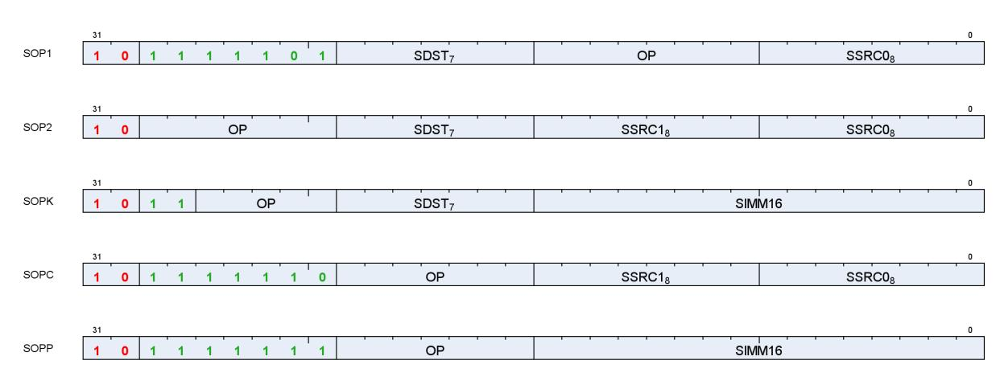

| Name | Size   | Function                                            |
|------|--------|-----------------------------------------------------|
| SOP1 | 32 bit | SALU op with 1 input                                |
| SOP2 | 32 bit | SALU op with 2 inputs                               |
| SOPK | 32 bit | SALU op with 1 constant signed 16-bit integer input |
| SOPC | 32 bit | SALU compare op                                     |
| SOPP | 32 bit | SALU program control op                             |

Each of these instruction formats uses some of these fields:

| Field  | Description                               |  |  |
|--------|-------------------------------------------|--|--|
| OP     | Opcode: instruction to be executed.       |  |  |
| SDST   | Destination SGPR, M0, NULL or EXEC.       |  |  |
| SSRC0  | First source operand.                     |  |  |
| SSRC1  | Second source operand.                    |  |  |
| SIMM16 | Signed immediate 16-bit integer constant. |  |  |

The lists of similar instructions sometimes use a condensed form using curly braces { } to express a list of possible names. For example, S\_AND\_{B32, B64} defines two legal instructions: S\_AND\_B32 and S\_AND\_B64.

# <span id="page-54-2"></span>**6.2. Scalar ALU Operands**

Valid operands of SALU instructions are:


- SGPRs, including trap temporary SGPRs
- Mode register
- Status register (read-only)
- M0 register
- EXEC mask
- VCC mask
- SCC
- Inline constants: integers from -16 to 64, and select floating point values
- Hardware registers (at most 1 of: EXEC, M0, SCC)
- One 32-bit literal constant
- If the destination is NULL, the instruction does not execute: nothing is written and SCC is not modified

In the table below, 0-127 can be used as scalar sources or destinations; 128-255 can only be used as sources.

Table 20. Scalar Operands

6.2. Scalar ALU Operands 47 of 600


|                    |                              | Code    | Meaning          |                                                                                                  |  |
|--------------------|------------------------------|---------|------------------|--------------------------------------------------------------------------------------------------|--|
| Scalar             | Scalar Dest                  | 0-105   | SGPR 0 105       | SGPRs. One DWORD each.                                                                           |  |
| Source (8<br>bits) | (7 bits)                     | 106     | VCC_LO           | VCC[31:0]                                                                                        |  |
|                    |                              | 107     | VCC_HI           | VCC[63:32]                                                                                       |  |
|                    |                              | 108-123 | ttmp0 ttmp15     | Trap handler temporary SGPRs (privileged)                                                        |  |
|                    |                              | 124     | NULL             | Reads return zero, writes are ignored. When used as a<br>destination, nullifies the instruction. |  |
|                    |                              | 125     | M0               | Temporary register, use for a variety of functions                                               |  |
|                    |                              | 126     | EXEC_LO          | EXEC[31:0]                                                                                       |  |
|                    |                              | 127     | EXEC_HI          | EXEC[63:32]                                                                                      |  |
|                    | Integer                      | 128     | 0                | Inline constant zero                                                                             |  |
|                    | Inline                       | 129-192 | int 1 64         | Integer inline constants                                                                         |  |
|                    | Constants                    | 193-208 | int -116         |                                                                                                  |  |
|                    |                              | 209-232 | Reserved         | Reserved                                                                                         |  |
|                    |                              | 233     | DPP8             | 8-lane DPP (only valid as SRC0)                                                                  |  |
|                    |                              | 234     | DPP8FI           | 8-lane DPP with Fetch-Invalid (only valid as SRC0)                                               |  |
|                    |                              | 235     | SHARED_BASE      | Memory Aperture Definition                                                                       |  |
|                    |                              | 236     | SHARED_LIMIT     |                                                                                                  |  |
|                    |                              | 237     | PRIVATE_BASE     |                                                                                                  |  |
|                    |                              | 238     | PRIVATE_LIMIT    |                                                                                                  |  |
|                    |                              | 239     | Reserved         | Reserved                                                                                         |  |
|                    | Float<br>Inline<br>Constants | 240     | 0.5              | Inline floating point constants. Can be used in 16, 32 and                                       |  |
|                    |                              | 241     | -0.5             | 64 bit floating point math. They may be used with non                                            |  |
|                    |                              | 242     | 1.0              | float instructions but the value remains a float.                                                |  |
|                    |                              | 243     | -1.0             | 1/(2*PI) is 0.15915494. The hex values are:                                                      |  |
|                    |                              | 244     | 2.0              | half: 0x3118                                                                                     |  |
|                    |                              | 245     | -2.0             | single: 0x3e22f983                                                                               |  |
|                    |                              | 246     | 4.0              | double: 0x3fc45f306dc9c882                                                                       |  |
|                    |                              | 247     | -4.0             |                                                                                                  |  |
|                    |                              | 248     | 1.0 / (2 * PI)   |                                                                                                  |  |
|                    |                              | 249     | Reserved         | Reserved                                                                                         |  |
|                    |                              | 250     | DPP16            | data parallel primitive                                                                          |  |
|                    |                              | 251     | Reserved         | Reserved                                                                                         |  |
|                    |                              | 252     | Reserved         | Reserved                                                                                         |  |
|                    |                              | 253     | SCC              | { 31'b0, SCC }                                                                                   |  |
|                    |                              | 254     | Reserved         | Reserved                                                                                         |  |
|                    |                              | 255     | Literal constant | 32 bit constant from instruction stream                                                          |  |

SALU destinations are in the range 0-127.

SALU instructions can use a 32-bit literal constant. This constant is part of the instruction stream and is available to all SALU microcode formats except SOPP and SOPK (except literal is allowed in S\_SETREG\_IMM32\_B32). Literal constants are used by setting the source instruction field to "literal" (255), and then the following instruction DWORD is used as the source value.

If the destination SGPR is out-of-range, no SGPR is written with the result and SCC is not updated.

If an instruction uses 64-bit data in SGPRs, the SGPR pair must be aligned to an even boundary. For example, it is legal to use SGPRs 2 and 3 or 8 and 9 (but not 11 and 12) to represent 64-bit data.

6.2. Scalar ALU Operands 48 of 600

# <span id="page-57-0"></span>**6.3. Scalar Condition Code (SCC)**

The scalar condition code (SCC) is written as a result of executing most SALU instructions. For integer arithmetic it is used as carry/borrow in for extended integer arithmetic.

The SCC is set by many instructions:

- Compare operations: 1 = true.
- Arithmetic operations: 1 = carry out.
  - SCC = overflow for signed add and subtract operations. For add ops, overflow = both operands are of the same sign, and the MSB (sign bit) of the result is different than the sign of the operands. For subtract (A - B), overflow = A and B have opposite signs and the resulting sign is not the same as the sign of A.
- Bit/logical operations: 1 = result was not zero.

# <span id="page-57-1"></span>**6.4. Integer Arithmetic Instructions**

This section describes the arithmetic operations supplied by the SALU. The table below shows the scalar integer arithmetic instructions:

| Instruction                 | Encoding | Sets SCC? | Operation                                                               |  |
|-----------------------------|----------|-----------|-------------------------------------------------------------------------|--|
| S_ADD_I32                   | SOP2     | Ovfl      | D = S0 + S1, SCC = overflow.                                            |  |
| S_ADD_U32                   | SOP2     | Cout      | D = S0 + S1, SCC = carry out.                                           |  |
| S_ADDC_U32                  | SOP2     | Cout      | D = S0 + S1 + SCC, SCC = overflow.                                      |  |
| S_SUB_I32                   | SOP2     | Ovfl      | D = S0 - S1, SCC = overflow.                                            |  |
| S_SUB_U32                   | SOP2     | Cout      | D = S0 - S1, SCC = carry out.                                           |  |
| S_SUBB_U32                  | SOP2     | Cout      | D = S0 - S1 - SCC, SCC = carry out.                                     |  |
| S_ADD_LSH{1,2,3,4}_U32 SOP2 |          | D!=0      | D = S0 + (S1 << {1,2,3,4})                                              |  |
| S_ABSDIFF_I32               | SOP2     | D!=0      | D = abs (S0 - S1), SCC = result not zero.                               |  |
| S_MIN_I32<br>S_MIN_U32      | SOP2     | D!=0      | D = (S0 < S1) ? S0 : S1<br>SCC = (S0 < S1)                              |  |
| S_MAX_I32<br>S_MAX_U32      | SOP2     | D!=0      | D = (S0 > S1) ? S0 : S1<br>SCC = (S0 > S1)                              |  |
| S_MUL_I32                   | SOP2     | No        | D = S0 * S1 low 32bits of result<br>works identically for unsigned data |  |
| S_ADDK_I32                  | SOPK     | Ovfl      | D = D + simm16, SCC = overflow. Sign extended version of<br>simm16.     |  |
| S_MULK_I32                  | SOPK     | No        | D = D * simm16. Return low 32bits. Sign extended version of<br>simm16.  |  |
| S_ABS_I32                   | SOP1     | D!=0      | D.i = abs (S0.i). SCC=result not zero.                                  |  |
| S_SEXT_I32_I8               | SOP1     | No        | D = { 24{S0[7]}, S0[7:0] }.                                             |  |
| S_SEXT_I32_I16              | SOP1     | No        | D = { 16{S0[15]}, S0[15:0] }.                                           |  |
| S_MUL_HI_I32                | SOP2     | No        | D = S0 * S1 high 32bits of result                                       |  |
| S_MUL_HI_U32                | SOP2     | No        | D = S0 * S1 high 32bits of result                                       |  |
| S_PACK_LL_B32_B16           | SOP2     | No        | D = { S1[15:0], S0[15:0] }                                              |  |
| S_PACK_LH_B32_B16           | SOP2     | No        | D = { S1[31:16], S0[15:0] }                                             |  |
| S_PACK_HL_B32_B16           | SOP2     | No        | D = { S1[15:0], S0[31:16] }                                             |  |

Table 21. Integer Arithmetic Instructions


| Instruction       | Encoding | Sets SCC? | Operation                    |
|-------------------|----------|-----------|------------------------------|
| S_PACK_HH_B32_B16 | SOP2     | No        | D = { S1[31:16], S0[31:16] } |

# <span id="page-58-0"></span>**6.5. Conditional Move Instructions**

Conditional instructions use the SCC flag to determine whether to perform the operation, or (for CSELECT) which source operand to use.

Table 22. Conditional Instructions

| Instruction          | Encoding | Sets SCC? | Operation                     |
|----------------------|----------|-----------|-------------------------------|
| S_CSELECT_{B32, B64} | SOP2     | No        | D = SCC ? S0 : S1.            |
| S_CMOVK_I32          | SOPK     | No        | if (SCC) D = signext(simm16). |
| S_CMOV_{B32,B64}     | SOP1     | No        | if (SCC) D = S0, else NOP.    |

# <span id="page-58-1"></span>**6.6. Comparison Instructions**

These instructions compare two values and set the SCC to 1 if the comparison yielded a TRUE result.

Table 23. Conditional Instructions

| Instruction                             | Encoding | Sets SCC? | Operation                                                    |
|-----------------------------------------|----------|-----------|--------------------------------------------------------------|
| S_CMP_EQ_U64, S_CMP_LG_U64              | SOPC     | Test      | Compare two 64-bit source values. SCC = S0 <cond> S1.</cond> |
| S_CMP_{EQ,LG,GT,GE,LE,LT}_{I32<br>,U32} | SOPC     | Test      | Compare two source values. SCC = S0 <cond> S1.</cond>        |
| S_BITCMP0_{B32,B64}                     | SOPC     | Test      | Test for "is a bit zero". SCC = !S0[S1].                     |
| S_BITCMP1_{B32,B64}                     | SOPC     | Test      | Test for "is a bit one". SCC = S0[S1].                       |

# <span id="page-58-2"></span>**6.7. Bit-Wise Instructions**

Bit-wise instructions operate on 32- or 64-bit data without interpreting it has having a type. For bit-wise operations if noted in the table below, SCC is set if the result is nonzero.

Table 24. Bit-Wise Instructions

| Instruction                      | Encoding |      | Sets SCC? Operation                                                                       |
|----------------------------------|----------|------|-------------------------------------------------------------------------------------------|
| S_MOV_{B32,B64}                  | SOP1     | No   | D = S0                                                                                    |
| S_MOVK_I32                       | SOPK     | No   | D = signext(simm16)                                                                       |
| {S_AND,S_OR,S_XOR}_{B32,B64}     | SOP2     | D!=0 | D = S0 & S1, S0 OR S1, S0 XOR S1                                                          |
| {S_AND_NOT1,S_OR_NOT1}_{B32,B64} | SOP2     | D!=0 | D = S0 & ~S1, S0 OR ~S1                                                                   |
| {S_NAND,S_NOR,S_XNOR}_{B32,B64}  | SOP2     | D!=0 | D = ~(S0 & S1), ~(S0 OR S1), ~(S0 XOR S1)                                                 |
| S_LSHL_{B32,B64}                 | SOP2     | D!=0 | D = S0 << S1[4:0], [5:0] for B64.                                                         |
| S_LSHR_{B32,B64}                 | SOP2     | D!=0 | D = S0 >> S1[4:0], [5:0] for B64.                                                         |
| S_ASHR_{I32,I64}                 | SOP2     | D!=0 | D = sext(S0 >> S1[4:0]) ([5:0] for I64).                                                  |
| S_BFM_{B32,B64}                  | SOP2     | No   | Bit field mask<br>D = ( (1 << S0[4:0]) -1) << S1[4:0]<br>(uses [5:0] for the B64 version) |


| Instruction                                                       | Encoding |      | Sets SCC? Operation                                                                                                                                                                                                                                                                                                                                                                     |
|-------------------------------------------------------------------|----------|------|-----------------------------------------------------------------------------------------------------------------------------------------------------------------------------------------------------------------------------------------------------------------------------------------------------------------------------------------------------------------------------------------|
| S_BFE_U32, S_BFE_U64<br>S_BFE_I32, S_BFE_I64<br>(signed/unsigned) | SOP2     | D!=0 | Bit Field Extract, then sign extend result for I32/64<br>instructions.<br>S0 = data, S1[22:16]= width<br>I32/U32: S1[4:0] = offset<br>I64/U64: S1[5:0] = offset                                                                                                                                                                                                                         |
| S_NOT_{B32,B64}                                                   | SOP1     | D!=0 | D = ~S0.                                                                                                                                                                                                                                                                                                                                                                                |
| S_WQM_{B32,B64}                                                   | SOP1     | D!=0 | D = wholeQuadMode(S0)<br>Per quad (4 bits): set the result to 1111 if any of the 4<br>bits in the corresponding source mask are set to 1.<br>D[n*4] = (S[n*4]    S[n*4+1]    S[n*4+2]    S[n*4+3] )<br>D[n*4+1] = (S[n*4]    S[n*4+1]    S[n*4+2]    S[n*4+3] )<br>D[n*4+2] = (S[n*4]    S[n*4+1]    S[n*4+2]    S[n*4+3] )<br>D[n*4+3] = (S[n*4]    S[n*4+1]    S[n*4+2]    S[n*4+3] ) |
| S_QUADMASK_{B32,B64}                                              | SOP1     | D!=0 | Create a 1-bit per quad mask from a 1 bit per pixel<br>mask.<br>Creates an 8-bit mask from 32-bits, or 16 bits from 64.<br>D[0] = (S0[3:0] != 0),<br>D[1] = (S0[7:4] != 0), …                                                                                                                                                                                                           |
| S_BITREPLICATE_B64_B32                                            | SOP1     | No   | Replicate each bit in 32-bit S0 twice:<br>D = { … S0[1], S0[1], S0[0], S0[0] }.<br>Two of these instructions is the inverse of<br>S_QUADMASK.<br>Two of these instructions expands a quad mask into a<br>thread-mask.                                                                                                                                                                   |
| S_BREV_{B32,B64}                                                  | SOP1     | No   | D = S0[0:31] are reverse bits.                                                                                                                                                                                                                                                                                                                                                          |
| S_BCNT0_I32_{B32,B64}                                             | SOP1     | D!=0 | D = CountZeroBits(S0).                                                                                                                                                                                                                                                                                                                                                                  |
| S_BCNT1_I32_{B32,B64}                                             | SOP1     | D!=0 | D = CountOneBits(S0).                                                                                                                                                                                                                                                                                                                                                                   |
| S_CTZ_I32_{B32,B64}                                               | SOP1     | No   | Count Trailing zeroes: Find-first One from LSB.<br>D = Bit position of first one in S0<br>starting from LSB1 if not found                                                                                                                                                                                                                                                               |
| S_CLZ_I32_{B32,B64}                                               | SOP1     | No   | Count Leading zeroes. D = "how many zeros before<br>the first one starting from the MSB".<br>Returns -1 if none.                                                                                                                                                                                                                                                                        |
| S_CLS_I32_{B32,B64}                                               | SOP1     | N    | Count Leading Sign-bits: Count how many bits in a<br>row (from MSB to LSB) are the same as the sign bit.<br>Return -1 if the input is zero or all 1's (-1). 32-bit<br>pseudo-code:                                                                                                                                                                                                      |
|                                                                   |          |      | if (S0 == 0    S0 == -1) D = -1<br>else<br>D = 0<br>for (I = 31 0)<br>if (S0[I] == S0[31])<br>D++<br>else break                                                                                                                                                                                                                                                                         |
| S_BITSET0_{B32,B64}                                               | SOP1     | No   | D[S0[4:0], [5:0] for B64] = 0                                                                                                                                                                                                                                                                                                                                                           |
| S_BITSET1_{B32,B64}                                               | SOP1     | No   | D[S0[4:0], [5:0] for B64] = 1                                                                                                                                                                                                                                                                                                                                                           |

6.7. Bit-Wise Instructions 51 of 600


| Instruction                                                                                     | Encoding |      | Sets SCC? Operation                                                                                                                                                                             |
|-------------------------------------------------------------------------------------------------|----------|------|-------------------------------------------------------------------------------------------------------------------------------------------------------------------------------------------------|
| S_{and, or, xor, and_not0,<br>and_not1,or_not0, or_not1, nand, nor,<br>xnor}_SAVEEXEC_{B32,B64} | SOP1     | D!=0 | Save the EXEC mask, then apply a bit-wise operation<br>to it.<br>D = EXEC<br>EXEC = S0 <op> EXEC<br/>SCC = (EXEC != 0)<br/>("not1" version inverts EXEC)<br/>("not0" version inverts SGPR)</op> |
| S_{AND_NOT{0,1}_WREXEC_B{32,64}                                                                 | SOP1     | D!=0 | NOT0: EXEC, D = ~S0 & EXEC<br>NOT1: EXEC, D = S0 & ~EXEC<br>Both D and EXEC get the same result. SCC = (result !=<br>0). D cannot be EXEC.                                                      |
| S_MOVRELS_{B32,B64}<br>S_MOVRELD_{B32,B64}                                                      | SOP1     | No   | Move a value into an SGPR relative to the value in M0.<br>MOVRELS: D = SGPR[S0+M0]<br>MOVRELD: SGPR[D+M0] = S0<br>Index must be even for B64. M0 is an unsigned index.                          |

# <span id="page-60-0"></span>**6.8. Access Instructions**

These instructions access hardware internal registers.

Table 25. Hardware Internal Registers

| Instruction        | Encoding                                                                                          | Sets<br>SCC? | Operation                                                                                             |  |
|--------------------|---------------------------------------------------------------------------------------------------|--------------|-------------------------------------------------------------------------------------------------------|--|
| S_GETREG_B32       | SOPK                                                                                              | No           | Read a hardware register into the LSBs of SDST.                                                       |  |
| S_SETREG_B32       | SOPK                                                                                              | No           | Write the LSBs of SDST into a hardware register. (Note that SDST is<br>used as a source SGPR).        |  |
| S_SETREG_IMM32_B32 | SOPK                                                                                              | No           | S_SETREG where 32-bit data comes from a literal constant (so this is<br>a 64-bit instruction format). |  |
|                    | GETREG/SETREG : #SIMM16 = { Size[4:0], Offset[4:0], hwRegId[5:0] }<br>Offset is 031. Size is 132. |              |                                                                                                       |  |
| S_ROUND_MODE       | SOPP                                                                                              | No           | Set the round mode from an immediate: simm16[3:0]                                                     |  |
| S_DENORM_MODE      | SOPP                                                                                              | No           | Set the denorm mode from an immediate: simm16[3:0]                                                    |  |

For hardware register index values, see [Hardware Registers](#page-28-2) .

# <span id="page-60-1"></span>**6.9. Memory Aperture Query**

Shaders can query the memory aperture base and size for shared and private space through scalar operands:

- PRIVATE\_BASE
- PRIVATE\_LIMIT
- SHARED\_BASE
- SHARED\_LIMIT

These values originate from the SH\_MEM\_BASES register ("SMB"), and are used primarily with FLAT memory instructions. Setting Shared Base or Private Base to zero disables that aperture.

"PTR32" is short for "Address mode is 32bit", and "SMB" is short for "SH\_MEM\_BASES". These constants can be

6.8. Access Instructions 52 of 600


used by SALU and VALU ops, and are 64-bit unsigned integers:

SHARED\_BASE = ptr32 ? {32'h0, SMB.shared\_base[15:0], 16'h0000} : {SMB.shared\_base[15:0], 48'h000000000000} SHARED\_LIMIT = ptr32 ? {32'h0, SMB.shared\_base[15:0], 16'hFFFF} : {SMB.shared\_base[15:0], 48'h0000FFFFFFFF} PRIVATE\_BASE = ptr32 ? {32'h0, SMB.private\_base[15:0], 16'h0000} : {SMB.private\_base[15:0], 48'h000000000000} PRIVATE\_LIMIT =ptr32 ? {32'h0, SMB.private\_base[15:0], 16'hFFFF} : {SMB.private\_base[15:0], 48'h0000FFFFFFFF}

"Hole" = (addr[63:47] != all zeros or all ones) and is the illegal address section of memory


# <span id="page-62-0"></span>**Chapter 7. Vector ALU Operations**

Vector ALU instructions (VALU) perform an arithmetic or logical operations on data for each of 32 or 64 threads and write results back to VGPRs, SGPRs or the EXEC mask.

Parameter interpolation is a two step process involving an LDS instruction followed by a VALU instruction and is described in: [Parameter Interpolation](#page-128-0)

Vector ALU (VALU) instructions control the SIMD32's math unit and operate on 32 work-items of data at a time. Each instruction may take input from either VGPRs, SGPRs or constants and typically returns results to VGPRs. Mask results and carry-out are returned to SGPRs. The ALU provides operations that work on 16, 32 and 64-bit data of both integer and float types. The ALU also supports "packed" data types that pack 2 16-bit values into one VGPR, or 4 8-bit values into a VGPR.

# <span id="page-62-1"></span>**7.1. Microcode Encodings**

VALU instructions are encoded in one of these ways:

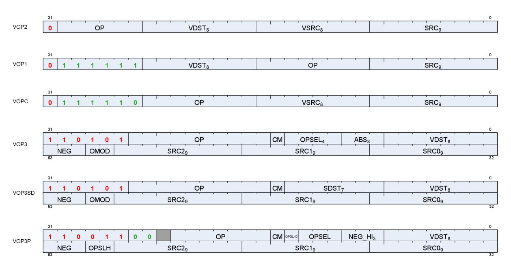

| Name   | Size   | Function                                           | Modifiers             |
|--------|--------|----------------------------------------------------|-----------------------|
| VOP1   | 32 bit | VALU op with 1 input                               | -                     |
| VOP2   | 32 bit | VALU op with 2 inputs                              | -                     |
| VOP3   | 64 bit | VALU op with 3 inputs, or a VOP1,2,C instruction   | abs, neg, omod, clamp |
| VOP3SD | 64 bit | VALU op with 3 inputs and SDST                     | neg, omod, clamp      |
| VOPC   | 32 bit | VALU compare op with 2 inputs, writes to VCC/EXEC  | -                     |
| VOP3P  | 64 bit | VALU op with 3 inputs using packed math            | neg, clamp            |
| VOPD   | 64 bit | VALU dual opcode : 2 operations in one instruction | -                     |

Many VALU instructions are available in two encodings: VOP3 that uses 64-bits of instruction, and one of three 32-bit encodings that offer a restricted set of capabilities but smaller code size. Some instructions are only available in the VOP3 encoding. When an instruction is available in two microcode formats, it is up to the user to decide which to use. It is recommended to use the 32-bit encoding whenever possible. VOP2 can also be used


for "ACCUM" type ops where the third input is implied to be the same as the dest.

Advantages of using VOP3 include:

- More flexibility in source addressing (all source fields are 9 bits)
- NEG, ABS, and OMOD fields (for floating point only)
- CLAMP field for output range limiting
- Ability to select alternate source and destination registers for VCC (carry in and out)

The following VOP1 and VOP2 instructions may not be promoted to VOP3:

- swap and swaprel
- fmamk, fmaak, pk\_fmac

The VOP3 encoding has two variants:

- VOP3 used for most instructions including V\_CMP\*; has OPSEL and ABS fields
- VOP3SD has an SDST field instead of OPSEL and ABS. This encoding is used only for:
  - V\_{ADD,SUB,SUBREV}\_CO\_CI\_U32, V\_{ADD,SUB,SUBREV}\_CO\_U32 (adds with carry-out)
  - V\_DIV\_SCALE\_{F32, F64}, V\_MAD\_U64\_U32, V\_MAD\_I64\_I32.
  - V\_DOT2ACC\_F32\_F16
  - VOP3SD is not used for V\_CMP\*.

Any of the VALU microcode formats may use a 32-bit literal constant, as well VOP3. Note however that VOP3 plus a literal makes a 96-bit instruction and excessive use of this combination may reduce performance.

**VOP3P** is for instructions that use "packed math": instructions that performs an operation on a pair of input values that are packed into the high and low 16-bits of each operand; the two 16-bit results are written to a single VGPR as two packed values.

| Field | Size   | Description                                                                                                                                                                                                                                    |  |  |  |
|-------|--------|------------------------------------------------------------------------------------------------------------------------------------------------------------------------------------------------------------------------------------------------|--|--|--|
| OP    | varies | instruction opcode                                                                                                                                                                                                                             |  |  |  |
| SRC0  | 9      | first instruction argument. May come from: vgpr, sgpr, VCC, M0, EXEC, SCC, or a constant                                                                                                                                                       |  |  |  |
| SRC1  | 9      | second instruction argument. May come from: vgpr, sgpr, VCC, M0, EXEC, SCC, or a constant                                                                                                                                                      |  |  |  |
| VSRC1 | 8      | second instruction argument. May come from: vgpr only                                                                                                                                                                                          |  |  |  |
| SRC2  | 9      | third instruction argument. May come from: vgpr, sgpr, VCC, M0, EXEC, SCC, or a constant                                                                                                                                                       |  |  |  |
| VDST  | 8      | VGPR that takes the result.<br>For V_READLANE and V_CMP, indicates the SGPR that receives the result. This cannot be M0 or EXEC.                                                                                                               |  |  |  |
| SDST  | 8      | SGPR that takes the result of operations that produce a scalar output. Can't be M0 or EXEC. Supports<br>NULL to not write any SDST.<br>Used for: V_{ADD,SUB,SUBREV}_CO_U32, V_{ADD,SUB,SUBREV}_CO_CI_U32, V_DIV_SCALE*; not<br>used for V_CMP. |  |  |  |
| OMOD  | 2      | output modifier. for float results only.<br>0 = no modifier, 1=multiply result by 2, 2=multiply result by 4, 3=divide result by 2                                                                                                              |  |  |  |
| NEG   | 3      | negate the input (invert sign bit). float inputs only.<br>bit 0 is for src0, bit 1 is for src1 and bit 2 is for src2.                                                                                                                          |  |  |  |
| ABS   | 3      | apply absolute value on input. float inputs only. applied before 'neg'.<br>bit 0 is for src0, bit 1 is for src1 and bit 2 is for src2.                                                                                                         |  |  |  |


| Field | Size | Description                                                                                                                                                                                                                                                                                                                                                                                                                                                                                                                      |
|-------|------|----------------------------------------------------------------------------------------------------------------------------------------------------------------------------------------------------------------------------------------------------------------------------------------------------------------------------------------------------------------------------------------------------------------------------------------------------------------------------------------------------------------------------------|
| CLMP  | 1    | clamp or compare-signal (depends on opcode):<br>V_CMP: clmp=1 means signaling-compare when qNaN detected; 0 = non-signaling<br>Float arithmetic: clamp result to [0, 1.0]; -0 is clamped to +0.<br>Signed integer arithmetic: clamp result to [min_int, +max_int]<br>Unsigned integer arithmetic: clamp result to [0, +max_uint]<br>Where "min_int" and "max_int" are the largest negative and positive representable integers for the size<br>of integer being used (16, 32 or 64 bit). "max_uint" is the largest unsigned int. |
| OPSEL | 4    | Operation select for 16-bit math: 1=select high half, 0=select low half<br>[0]=src0, [1]=src1, [2]=src2, [3]=dest<br>For dest=0, dest_vgpr[31:0] = {prev_dst_vgpr[31:16], result[15:0] }<br>For dest=1, dest_vgpr[31:0] = {result[15:0], prev_dst_vgpr[15:0] }<br>OPSEL may only be used for 16-bit operands, and must be zero for any other operands/results.<br>For V_PERMLANE*, OPSEL[0] is "fetch invalid"; OPSEL[1] is "bounds control" (like DPP8).<br>DOT2_F16 and_BF16: src0 and src1 must have OPSEL[1:0] = 0           |

# <span id="page-64-0"></span>**7.2. Operands**

Most VALU instructions take at least one input operand. The data-size of the operands is explicitly defined in the name of the instruction. For example, V\_FMA\_F32 operates on 32-bit floating point data.

<span id="page-64-1"></span>VGPR Alignment: there is no alignment restriction for single or double-float operations.

Table 26. VALU Instruction Operands

7.2. Operands 56 of 600


|                            |                            |                     | Code      | Meaning          |                                                                                                  |  |
|----------------------------|----------------------------|---------------------|-----------|------------------|--------------------------------------------------------------------------------------------------|--|
| Vector                     | Scalar                     | Scalar              | 0-105     | SGPR 0 105       | SGPRs. One DWORD each.                                                                           |  |
| Source<br>(when 9<br>bits) | Source (8                  | Dest (7             | 106       | VCC_LO           | VCC[31:0]                                                                                        |  |
|                            | bits)                      | bits)               | 107       | VCC_HI           | VCC[63:32]                                                                                       |  |
|                            |                            |                     | 108-123   | ttmp0 ttmp15     | Trap handler temporary SGPRs (privileged)                                                        |  |
|                            |                            |                     | 124       | NULL             | Reads return zero, writes are ignored. When used<br>as a destination, nullifies the instruction. |  |
|                            |                            |                     | 125       | M0               | Temporary register, use for a variety of functions                                               |  |
|                            |                            |                     | 126       | EXEC_LO          | EXEC[31:0]                                                                                       |  |
|                            |                            |                     | 127       | EXEC_HI          | EXEC[63:32]                                                                                      |  |
|                            |                            | Integer             | 128       | 0                | Inline constant zero                                                                             |  |
|                            |                            | Inline<br>Constants | 129-192   | int 1 64         | Integer inline constants                                                                         |  |
|                            |                            |                     | 193-208   | int -116         |                                                                                                  |  |
|                            |                            |                     | 209-232   | Reserved         | Reserved                                                                                         |  |
|                            |                            |                     | 233       | DPP8             | 8-lane DPP (only valid as SRC0)                                                                  |  |
|                            |                            |                     | 234       | DPP8FI           | 8-lane DPP with Fetch-Invalid (only valid as SRC0)                                               |  |
|                            |                            |                     | 235       | SHARED_BASE      | Memory Aperture Definition                                                                       |  |
|                            |                            |                     | 236       | SHARED_LIMIT     |                                                                                                  |  |
|                            |                            |                     | 237       | PRIVATE_BASE     |                                                                                                  |  |
|                            |                            |                     | 238       | PRIVATE_LIMIT    |                                                                                                  |  |
|                            |                            |                     | 239       | Reserved         | Reserved                                                                                         |  |
|                            |                            | Float               | 240       | 0.5              | Inline floating point constants. Can be used in 16,                                              |  |
|                            |                            | Inline<br>Constants | 241       | -0.5             | 32 and 64 bit floating point math. They may be                                                   |  |
|                            |                            |                     | 242       | 1.0              | used with non-float instructions but the value                                                   |  |
|                            |                            |                     | 243       | -1.0             | remains a float.                                                                                 |  |
|                            |                            |                     | 244       | 2.0              | 1/(2*PI) is 0.15915494. The hex values are:                                                      |  |
|                            |                            |                     | 245       | -2.0             | half: 0x3118                                                                                     |  |
|                            |                            |                     | 246       | 4.0              | single: 0x3e22f983                                                                               |  |
|                            |                            |                     | 247       | -4.0             | double: 0x3fc45f306dc9c882                                                                       |  |
|                            |                            |                     | 248       | 1.0 / (2 * PI)   |                                                                                                  |  |
|                            |                            |                     | 249       | Reserved         | Reserved                                                                                         |  |
|                            |                            |                     | 250       | DPP16            | data parallel primitive                                                                          |  |
|                            |                            |                     | 251       | Reserved         | Reserved                                                                                         |  |
|                            |                            |                     | 252       | Reserved         | Reserved                                                                                         |  |
|                            |                            |                     | 253       | SCC              | { 31'b0, SCC }                                                                                   |  |
|                            |                            |                     | 254       | Reserved         | Reserved                                                                                         |  |
|                            |                            |                     | 255       | Literal constant | 32 bit constant from instruction stream                                                          |  |
|                            | Vector Src/Dst<br>(8 bits) |                     | 256 - 511 | VGPR 0 255       | Vector GPRs. One DWORD each.                                                                     |  |

### <span id="page-65-0"></span>**7.2.1. Non-Standard Uses of Operand Fields**

A few instructions use the operand fields in non-standard ways:

7.2. Operands 57 of 600


| Opcode                           | Encoding | VDST                          | SDST      | VSRC0               | VSRC1                         | VSRC2                     |
|----------------------------------|----------|-------------------------------|-----------|---------------------|-------------------------------|---------------------------|
| V_{ADD,SUB,SUBREV}<br>_CO_U32,   | VOP2     | add result<br>(VCC=carry-out) | n/a       | in0                 | in1                           | unused<br>(carry-in=VCC)  |
| V_{ADD,SUB,SUBREV}<br>_CO_CI_U32 | VOP3SD   | add result                    | carry-out | in0                 | in1                           | carry-in                  |
| V_DIV_SCALE                      | VOP3SD   | result                        | carry-out | in0                 | in1                           | in2                       |
| V_READLANE                       | VOP3     | scalar dst (SGPR<br>only)     | n/a       | vgpr#               | lane-sel: sgpr, M0,<br>inline | n/a                       |
| V_READFIRSTLANE                  | VOP1     | scalar dst (SGPR<br>only)     | n/a       | vgpr#               | n/a (lane-sel = exec)         | n/a                       |
| V_WRITELANE                      | VOP3     | vgpr dst                      | n/a       | sgpr#, const,<br>M0 | lane-sel: sgpr, M0,<br>inline | n/a                       |
| V_CMP*                           | VOPC     | "VCC" implied                 | n/a       | in0                 | in1                           | n/a                       |
|                                  | VOP3SD   | cmp-result (sgpr)             | unused    | in0                 | in1                           | unused                    |
| V_CNDMASK                        | VOP2     | dest vgpr                     | n/a       | in0                 | in1                           | unused (implied:<br>VCC)  |
|                                  | VOP3     | dest vgpr                     | unused    | in0                 | in1                           | select sgpr (e.g.<br>VCC) |

The readlane lane-select is limited to the valid range of lanes (0-31 for wave32, 0-63 for wave64) by ignoring upper bits of the lane number.

#### **Inline constants with DOT2\_F16\_F16 and DOT2\_BF16\_BF16**

For these 2 instructions, the inline constant for sources 0 and 1 replicate the inline constant value into bits[31:16]. For source2, the OPSEL bit is used to control replication or not (gets zero if not replicating low bits).

## <span id="page-66-0"></span>**7.2.2. Inputs Operands**

VALU instructions can use any of the following sources for input, subject to restrictions listed below:

- VOP1, VOP2, VOPC:
  - SRC0 is 9 bits and may be a VGPR, SGPR (including TTMPs and VCC), M0, EXEC, inline or literal constant.
  - SRC1 is 8 bits and may specify only a VGPR
- VOP3 : all 3 sources are 9 bits but still have restrictions:
  - Not all VOPC/1/2 instructions are available in VOP3 (only those that benefit from VOP3 encoding).
- See complete operand list: [VALU Instruction Operands](#page-64-1)

### **7.2.2.1. Input Operand Modifiers**

The **input modifiers** ABS and NEG apply to floating point inputs and are undefined for any other type of input. In addition, input modifiers are supported for: V\_MOV\_B32, V\_MOV\_B16, V\_MOVREL\*\_B32 and V\_CNDMASK. ABS returns the absolute value, and NEG negates the input.

#### **Input modifiers are not supported for**:

- readlane, readfirstlane, writelane
- integer arithmetic or bitwise operations
- permlane

7.2. Operands 58 of 600


• QSAD

### **7.2.2.2. Literal Expansion to 64 bits**

Literal constants are 32-bits, but they can be used as sources that normally require 64-bit data.

They are expanded to 64 bits following these rules:

- 64 bit float: the lower 32-bit are padded with zero
- 64-bit unsigned integer: zero extended to 64 bits
- 64-bit signed integer: sign extended to 64 bits

### **7.2.2.3. Source Operand Restrictions**

Not every combination of source operands that can be expressed in the microcode format is legal. This section describes the legal and illegal settings.

Terminology for this section:

"scalar value" = SGPR, EXEC, VCC, M0, SCC or literal constant; can be 32 or 64 bits.

- Instructions may use at most two Scalar Values: SGPR, VCC, M0, EXEC, SCC, Literal
- All instruction formats including VOP3 and VOP3P may use one literal constant
  - Inline constants are free (do not count against 2 scalar value limit).
  - Literals may not be used with DPP
  - It is permissible for both scalar values to be SGPRs, although VCC counts as an SGPR.
    - VCC when used implicitly counts against this limit: addci, subci, fmas, cndmask
  - 64-bit shift instructions can use only one scalar value input, and can't use the same one twice (inlines don't count against this limit)
  - Using the same scalar value twice only counts as a single scalar value, however using the same scalar value twice, but with different sizes has specific rules and limits:
    - Using the same literal with different sizes counts as 2 scalar values, not 1.
    - S[0] and S[0:1] can be considered as 1 scalar value, but S[1] and S[0:1] count as 2. In general, these rules apply to any S[2n] and S[2n:2n+1] count as one, but S[2n+1] and S[2n:2n+1] count as 2.
- SGPR source rules must be met for both passes of a wave64, bearing in mind that sources that read a mask (bit-per-lane) increment the SGPR address for the second pass, and they may not be shared with other sources.

### **7.2.2.4. OPSEL Field Restrictions**

The OPSEL field (of VOP3) is usable only for a subset of VOP3 instructions, as well as VOP1/2/C instructions promoted to VOP3.

Table 27. Opcodes usable with OPSEL

| V_MAD_I16    | V_MAD_U16    | V_FMA_F16            |
|--------------|--------------|----------------------|
| V_ADD_NC_U16 | V_ADD_NC_I16 | V_CVT_PKNORM_I16_F16 |
| V_SUB_NC_U16 | V_SUB_NC_I16 | V_CVT_PKNORM_U16_F16 |

7.2. Operands 59 of 600


| V_MUL_LO_U16             | V_MAD_U32_U16           | V_MAD_I32_I16        |
|--------------------------|-------------------------|----------------------|
| V_LSHLREV_B16            | V_LSHRREV_B16           | V_ASHRREV_I16        |
| V_ALIGNBIT_B32           | V_ALIGNBYTE_B32         | V_DIV_FIXUP_F16      |
| V_MIN3_{F16,I16,U16}     | V_MAX3_{F16,I16,U16}    | V_MED3_{F16,I16,U16} |
| V_MAX_{I16,U16}          | V_MIN_{I16,U16}         | V_PACK_B32_F16       |
| V_MAXMIN_F16             | V_MINMAX_F16            | V_CNDMASK_B16        |
| V_XOR_B16                | V_AND_B16               | V_OR_B16             |
| V_DOT2_F16_F16           | V_DOT2_BF16_BF16        |                      |
| V_INTERP_P10_RTZ_F16_F32 | V_INTERP_P2_RTZ_F16_F32 | V_INTERP_P2_F16_F32  |
| V_INTERP_P10_F16_F32     |                         |                      |

### <span id="page-68-0"></span>**7.2.3. Output Operands**

VALU instructions typically write their results to VGPRs specified in the VDST field of the microcode word. A thread only writes a result if the associated bit in the EXEC mask is set to 1.

V\_CMPX instructions write the result of their comparison (one bit per thread) to the EXEC mask.

Instructions producing a carry-out (integer add and subtract) write their result to VCC when used in the VOP2 form, and to an arbitrary SGPR-pair when used in the VOP3 form.

When the VOP3 form is used, instructions with a floating-point result may apply an output modifier (OMOD field) that multiplies the result by: 0.5, 2.0, or 4.0. Optionally, the result can be clamped (CLAMP field) to the min and max representable range (see next section).

### **7.2.3.1. Output Operand Modifiers**

**Output modifiers** (OMOD) apply to half, single and double floating point results only and scale the result by : 0.5, 2.0, 4.0 or do not scale. Integer and packed float 16 results ignore the omod setting. Output modifiers are not compatible with output denormals: if output denormals are enabled, then output modifiers are ignored. If output denormals are disabled, then the output modifier is applied and denormals are flushed to zero. These are not IEEE compatible: -0 is flushed to +0. Output modifiers are ignored if the IEEE mode bit is set to 1. A few opcodes force output denorms to be disabled.

#### **Output Modifiers are not supported for**:

- V\_PERMLANE
- DOT2\_F16\_F16
- DOT2\_BF16\_BF16

The **clamp** bit has multiple uses. For V\_CMP instructions, setting the clamp bit to 1 indicates that the compare signals if a floating point exception occurs. For integer operations, it clamps the result to the largest and smallest representable value. For floating point operations, it clamps the result to the range: [0.0, 1.0].

**Output Clamping**: The clamp instruction bit applies to the following operations and data types:

- Float clamp to [0.0, 1.0]
- Signed Int [-max\_int, +max\_int]
- Unsigned int [0, +max\_int]
- Bool (V\_CMP) enables signaling compare

7.2. Operands 60 of 600


The clamp bit is not supported for (ignored):

| V_PERMLANE*          | V_PERM_B32        | Float DOT instructions |
|----------------------|-------------------|------------------------|
| V_SWAP and V_SWAPREL | WMMA ops          | V_ADD3                 |
| V_ADD_LSHL           | V_ALIGN*          | Bitwise ops            |
| V_CMP*_CLASS         | V_CMP on integers |                        |
| V_READLANE           | V_READFIRSTLANE   | V_WRITELANE            |

### **7.2.3.2. Wave64 Destination Restrictions**

When a VALU instruction is issued from a wave64, it may issue twice as two wave32 instructions. While in most cases the programmer need not be aware of this, it does impose a prohibition on wave64 VALU instructions that both write and read the same SGPR value. Doing this may lead to unpredictable results. Specifically, the first pass of a wave64 VALU instruction may not overwrite a scalar value used by the second half.

### <span id="page-69-0"></span>**7.2.4. Denormalized and Rounding Modes**

The shader program has explicit control over the rounding mode applied and the handling of denormalized inputs and results. The MODE register is set using the S\_SETREG instruction; it has separate bits for controlling the behavior of single and double-precision floating-point numbers.

Round and denormal modes can also be set using S\_ROUND\_MODE and S\_DENORM\_MODE which is the preferred method over using S\_SETREG.

16-bit floats support denormals, infinity and NaN.

Table 28. Round and Denormal Modes

| Field     | Bit Position | Description                                                                                                                                                                                                                                                                                     |
|-----------|--------------|-------------------------------------------------------------------------------------------------------------------------------------------------------------------------------------------------------------------------------------------------------------------------------------------------|
| FP_ROUND  | 3:0          | [1:0] Single-precision round mode.<br>[3:2] Double and Half-precision (FP16) round mode.<br>Round Modes:<br>0=nearest even<br>1= +infinity<br>2= -infinity<br>3= toward zero                                                                                                                    |
| FP_DENORM | 7:4          | [5:4] Single-precision denormal mode.<br>[7:6] Double and Half-precision (FP16) denormal mode.<br>Denormal modes:<br>0 = Flush input and output denorms<br>1 = Allow input denorms, flush output denorms<br>2 = Flush input denorms, allow output denorms<br>3 = Allow input and output denorms |

These mode bits do not affect rounding and denormal handling of F32 global memory atomics.

DOT2\_F16\_F16 and DOT2\_BF16\_BF16 support round-to-nearest-even rounding. DOT2\_F16\_F16 supports denorms, and DOT2\_BF16\_BF16 disables all denorms.

7.2. Operands 61 of 600


### <span id="page-70-0"></span>**7.2.5. Instructions using SGPRs as Mask or Carry**

Every VALU instruction can use SGPRs as a constant, but the following can read or write SGPRs as masks or carry:

| Read Mask or Carry in | Write Carry out                 | Implicitly Reads VCC                     | Implicitly Writes VCC |
|-----------------------|---------------------------------|------------------------------------------|-----------------------|
| V_CNDMASK_B32         | V_CMP*                          | V_DIV_FMAS_F32                           | V_DIV_SCALE_F32       |
| V_ADD_CO_CI_U32       | V_ADD_CO_CI_U32                 | V_DIV_FMAS_F64                           | V_DIV_SCALE_F64       |
| V_SUB_CO_CI_U32       | V_SUB_CO_CI_U32                 | (fmas reads 3 operands + VCC)            | V_CMP (not V_CMPX)    |
| V_SUBREV_CO_CI_U32    | V_SUBREV_CO_CI_U32              | V_CNDMASK in VOP2                        |                       |
|                       | V_ADD_CO_U32                    | V_{ADD,SUB,SUBREV}_CO_CI_U<br>32 in VOP2 |                       |
|                       | V_SUB_CO_U32<br>V_SUBREV_CO_U32 |                                          |                       |
|                       | V_MAD_U64_U32                   |                                          |                       |
|                       | V_MAD_I64_I32                   |                                          |                       |
|                       | Write Data out (not carry)      |                                          |                       |
|                       | V_READLANE                      |                                          |                       |
|                       | V_READFIRSTLANE                 |                                          |                       |

"VCC" in the above table refers to VCC in a VOP2 or VOPC encoding, or any SGPR specified in the SRC2 or SDST field for VOP3 encoding, except for DIV\_FMAS that implicitly reads VCC (no choice).

V\_CMPX is the only VALU instruction that writes EXEC.

### <span id="page-70-1"></span>**7.2.6. Wave64 use of SGPRs**

VALU instructions may use SGPRs as a uniform input, shared by all work-items. If the value is used as simple data value, then the same SGPR is distributed to all 64 work-items. If, on the other hand, the data value represents a mask (e.g. carry-in, mask for CNDMASK), then each work-item receives a separate value, and two consecutive SGPRs are read.

### <span id="page-70-2"></span>**7.2.7. Out-of-Range GPRs**

When a source VGPR is out-of-range, the instruction uses as input the value from VGPR0.

When the destination GPR is out-of-range, the instruction executes but does not write the results.

See VGPR Out Of Range Behavior for more information.

### <span id="page-70-3"></span>**7.2.8. PERMLANE Specific Rules**

V\_PERMLANE may not occur immediately after a V\_CMPX. To prevent this, any other VALU opcode may be inserted (e.g. V\_NOP).

7.2. Operands 62 of 600


# <span id="page-71-0"></span>**7.3. Instructions**

The table below lists the complete VALU instruction set by microcode encoding, except for VOP3P instructions which are listed in a later section.

| VOP3               | VOP3 - 2 operands     | VOP2                 | VOP1                  |
|--------------------|-----------------------|----------------------|-----------------------|
| V_ADD3_U32         | V_ADD_CO_U32          | V_ADD_CO_CI_U32      | V_BFREV_B32           |
| V_ADD_LSHL_U32     | V_ADD_F64             | V_ADD_F16            | V_CEIL_F16            |
| V_ALIGNBIT_B32     | V_ADD_NC_I16          | V_ADD_F32            | V_CEIL_F32            |
| V_ALIGNBYTE_B32    | V_ADD_NC_I32          | V_ADD_NC_U32         | V_CEIL_F64            |
| V_AND_OR_B32       | V_ADD_NC_U16          | V_AND_B32            | V_CLS_I32             |
| V_BFE_I32          | V_AND_B16             | V_ASHRREV_I32        | V_CLZ_I32_U32         |
| V_BFE_U32          | V_ASHRREV_I16         | V_CNDMASK_B32        | V_COS_F16             |
| V_BFI_B32          | V_ASHRREV_I64         | V_CVT_PK_RTZ_F16_F32 | V_COS_F32             |
| V_CNDMASK_B16      | V_BCNT_U32_B32        | V_DOT2ACC_F32_F16    | V_CTZ_I32_B32         |
| V_CUBEID_F32       | V_BFM_B32             | V_FMAAK_F16          | V_CVT_F16_F32         |
| V_CUBEMA_F32       | V_CVT_PK_I16_F32      | V_FMAAK_F32          | V_CVT_F16_I16         |
| V_CUBESC_F32       | V_CVT_PK_I16_I32      | V_FMAC_DX9_ZERO_F32  | V_CVT_F16_U16         |
| V_CUBETC_F32       | V_CVT_PK_NORM_I16_F16 | V_FMAC_F16           | V_CVT_F32_F16         |
| V_CVT_PK_U8_F32    | V_CVT_PK_NORM_I16_F32 | V_FMAC_F32           | V_CVT_F32_F64         |
| V_DIV_FIXUP_F16    | V_CVT_PK_NORM_U16_F16 | V_FMAMK_F16          | V_CVT_F32_I32         |
| V_DIV_FIXUP_F32    | V_CVT_PK_NORM_U16_F32 | V_FMAMK_F32          | V_CVT_F32_U32         |
| V_DIV_FIXUP_F64    | V_CVT_PK_U16_F32      | V_LDEXP_F16          | V_CVT_F32_UBYTE0      |
| V_DIV_FMAS_F32     | V_CVT_PK_U16_U32      | V_LSHLREV_B32        | V_CVT_F32_UBYTE1      |
| V_DIV_FMAS_F64     | V_LDEXP_F32           | V_LSHRREV_B32        | V_CVT_F32_UBYTE2      |
| V_DIV_SCALE_F32    | V_LDEXP_F64           | V_MAX_F16            | V_CVT_F32_UBYTE3      |
| V_DIV_SCALE_F64    | V_LSHLREV_B16         | V_MAX_F32            | V_CVT_F64_F32         |
| V_DOT2_BF16_BF16   | V_LSHLREV_B64         | V_MAX_I32            | V_CVT_F64_I32         |
|                    |                       |                      |                       |
| V_DOT2_F16_F16     | V_LSHRREV_B16         | V_MAX_U32            | V_CVT_F64_U32         |
| V_FMA_DX9_ZERO_F32 | V_LSHRREV_B64         | V_MIN_F16            | V_CVT_FLOOR_I32_F32   |
| V_FMA_F16          | V_MAX_F64             | V_MIN_F32            | V_CVT_I16_F16         |
| V_FMA_F32          | V_MAX_I16             | V_MIN_I32            | V_CVT_I32_F32         |
| V_FMA_F64          | V_MAX_U16             | V_MIN_U32            | V_CVT_I32_F64         |
| V_LERP_U8          | V_MBCNT_HI_U32_B32    | V_MUL_DX9_ZERO_F32   | V_CVT_I32_I16         |
| V_LSHL_ADD_U32     | V_MBCNT_LO_U32_B32    | V_MUL_F16            | V_CVT_NEAREST_I32_F32 |
| V_LSHL_OR_B32      | V_MIN_F64             | V_MUL_F32            | V_CVT_NORM_I16_F16    |
| V_MAD_I16          | V_MIN_I16             | V_MUL_HI_I32_I24     | V_CVT_NORM_U16_F16    |
| V_MAD_I32_I16      | V_MIN_U16             | V_MUL_HI_U32_U24     | V_CVT_OFF_F32_I4      |
| V_MAD_I32_I24      | V_MUL_F64             | V_MUL_I32_I24        | V_CVT_U16_F16         |
| V_MAD_I64_I32      | V_MUL_HI_I32          | V_MUL_U32_U24        | V_CVT_U32_F32         |
| V_MAD_U16          | V_MUL_HI_U32          | V_OR_B32             | V_CVT_U32_F64         |
| V_MAD_U32_U16      | V_MUL_LO_U16          | V_PK_FMAC_F16        | V_CVT_U32_U16         |
| V_MAD_U32_U24      | V_MUL_LO_U32          | V_SUBREV_CO_CI_U32   | V_EXP_F16             |
| V_MAD_U64_U32      | V_OR_B16              | V_SUBREV_F16         | V_EXP_F32             |
| V_MAX3_F16         | V_PACK_B32_F16        | V_SUBREV_F32         | V_FLOOR_F16           |
| V_MAX3_F32         | V_READLANE_B32        | V_SUBREV_NC_U32      | V_FLOOR_F32           |
| V_MAX3_I16         | V_SUBREV_CO_U32       | V_SUB_CO_CI_U32      | V_FLOOR_F64           |
| V_MAX3_I32         | V_SUB_CO_U32          | V_SUB_F16            | V_FRACT_F16           |
| V_MAX3_U16         | V_SUB_NC_I16          | V_SUB_F32            | V_FRACT_F32           |
| V_MAX3_U32         | V_SUB_NC_I32          | V_SUB_NC_U32         | V_FRACT_F64           |
| V_MAXMIN_F16       | V_SUB_NC_U16          | V_XNOR_B32           | V_FREXP_EXP_I16_F16   |
| V_MAXMIN_F32       | V_TRIG_PREOP_F64      | V_XOR_B32            | V_FREXP_EXP_I32_F32   |
| V_MAXMIN_I32       | V_WRITELANE_B32       |                      | V_FREXP_EXP_I32_F64   |

7.3. Instructions 63 of 600


| VOP3              | VOP3 - 2 operands | VOP2 | VOP1                |
|-------------------|-------------------|------|---------------------|
| V_MAXMIN_U32      | V_XOR_B16         |      | V_FREXP_MANT_F16    |
| V_MED3_F16        |                   |      | V_FREXP_MANT_F32    |
| V_MED3_F32        |                   |      | V_FREXP_MANT_F64    |
| V_MED3_I16        |                   |      | V_LOG_F16           |
| V_MED3_I32        |                   |      | V_LOG_F32           |
| V_MED3_U16        |                   |      | V_MOVRELD_B32       |
| V_MED3_U32        |                   |      | V_MOVRELSD_2_B32    |
| V_MIN3_F16        |                   |      | V_MOVRELSD_B32      |
| V_MIN3_F32        |                   |      | V_MOVRELS_B32       |
| V_MIN3_I16        |                   |      | V_MOV_B16           |
| V_MIN3_I32        |                   |      | V_MOV_B32           |
| V_MIN3_U16        |                   |      | V_NOP               |
| V_MIN3_U32        |                   |      | V_NOT_B16           |
| V_MINMAX_F16      |                   |      | V_NOT_B32           |
| V_MINMAX_F32      |                   |      | V_PERMLANE64_B32    |
| V_MINMAX_I32      |                   |      | V_PIPEFLUSH         |
| V_MINMAX_U32      |                   |      | V_RCP_F16           |
| V_MQSAD_PK_U16_U8 |                   |      | V_RCP_F32           |
| V_MQSAD_U32_U8    |                   |      | V_RCP_F64           |
| V_MSAD_U8         |                   |      | V_RCP_IFLAG_F32     |
| V_MULLIT_F32      |                   |      | V_READFIRSTLANE_B32 |
| V_OR3_B32         |                   |      | V_RNDNE_F16         |
| V_PERMLANE16_B32  |                   |      | V_RNDNE_F32         |
| V_PERMLANEX16_B32 |                   |      | V_RNDNE_F64         |
| V_PERM_B32        |                   |      | V_RSQ_F16           |
| V_QSAD_PK_U16_U8  |                   |      | V_RSQ_F32           |
| V_SAD_HI_U8       |                   |      | V_RSQ_F64           |
| V_SAD_U16         |                   |      | V_SAT_PK_U8_I16     |
| V_SAD_U32         |                   |      | V_SIN_F16           |
| V_SAD_U8          |                   |      | V_SIN_F32           |
| V_XAD_U32         |                   |      | V_SQRT_F16          |
| V_XOR3_B32        |                   |      | V_SQRT_F32          |
|                   |                   |      | V_SQRT_F64          |
|                   |                   |      | V_SWAPREL_B32       |
|                   |                   |      | V_SWAP_B16          |
|                   |                   |      | V_SWAP_B32          |
|                   |                   |      | V_TRUNC_F16         |
|                   |                   |      | V_TRUNC_F32         |
|                   |                   |      | V_TRUNC_F64         |

| VOPC - Compare Ops                                         |               |                                                                                       |            |  |
|------------------------------------------------------------|---------------|---------------------------------------------------------------------------------------|------------|--|
| VOPC writes to VCC, VOP3 writes compare result to any SGPR |               |                                                                                       |            |  |
| V_CMP                                                      |               |                                                                                       | write VCC  |  |
| V_CMPX                                                     |               | I16, I32, I64, U16, U32, U64 F, LT, EQ, LE, GT, LG, GE, T                             | write exec |  |
| V_CMP                                                      | F16, F32, F64 | F, LT, EQ, LE, GT, LG, GE, T,<br>O, U, NGE, NLG, NGT, NLE, NEQ, NLT                   | write VCC  |  |
| V_CMPX                                                     |               | (T = True, F = False, O = total order, U = unordered, "N"<br>= Not (inverse) compare) | write exec |  |
| V_CMP_CLASS                                                | F16, F32, F64 | Test for any combination of: signaling-NaN, quiet-NaN,                                | write VCC  |  |
| V_CMPX_CLASS                                               |               | positive or negative: infinity, normal, subnormal, zero.                              | write exec |  |

7.3. Instructions 64 of 600


# <span id="page-73-0"></span>**7.4. 16-bit Math and VGPRs**

VALU instructions that operate on 16-bit data (non-packed) can separately address the two halves of a 32-bit VGPR.

16-bit VGPR-pairs are packed into a 32-bit VGPRs: the 32-bit VGPR "V0" contains two 16-bit VGPRs: "V0.L" representing V0[15:0] and "V0.H" representing V0[31:16].

How this addressing is encoded in the ISA varies by the instruction encoding: The 16-bit instructions can be encoded using VOP1/2/C as well as VOP3/VOP3P/VINTERP.

#### **16bit VGPR Naming**

The 32-bit VGPR is "V0". The two halves are called "V0.L" and "V0.H".

#### **VOP1, VOP2, VOPC Encoding**

16-bit VGPRs are encoded as: SRC/DST[6:0] = 32-bit VGPR address; SRC/DST[7] = (1=hi, 0=lo half) In this encoding, only 256 16-bit VGPRs can be addressed.

### **VOP3, VOP3P, VINTERP**

16-bit VGPRs are encoded as: SRC/DST[7:0] = 32-bit VGPR address, OPSEL = high/low. In this encoding, a wave can address 512 16-bit VGPRs.

The packing shown below allows reading or writing in one cycle:

- 32 lanes of one 32-bit VGPR: V0
- 64 lanes of one 16-bit VGPR: V0.L
- 32 lanes of two 16-bit VGPRs (a pair, as used by packed math): V0.L and V0.H

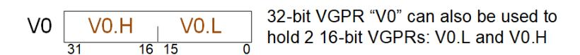

# <span id="page-73-1"></span>**7.5. Packed Math**

**Packed math** is a form of operation that accelerates arithmetic on two values packed into the same VGPR. It performs operations on two 16-bit values within a DWORD as if they were separate threads. For example, a packed add of V0=V1+V2 is really two separate adds: adding the low 16 bits of each DWORD and storing the result in the low 16 bits of V0, and adding the high halves and storing the result in the high 16 bits of V0.

Packed math uses the instructions below and the microcode format "VOP3P". This format has OPSEL and NEG fields for both the low and high operands, and does not have ABS and OMOD.

Table 29. Packed Math Opcodes:

| Packed Math ops |               |              |                  |
|-----------------|---------------|--------------|------------------|
| V_PK_MUL_F16    | V_PK_FMA_F16  | V_PK_MIN_F16 |                  |
| V_PK_ADD_F16    | V_PK_FMAC_F16 | V_PK_MAX_F16 |                  |
| V_PK_ADD_I16    | V_PK_MAD_I16  | V_PK_MIN_I16 | V_PK_LSHLREV_B16 |

7.4. 16-bit Math and VGPRs 65 of 600


| Packed Math ops           |                 |                 |                  |
|---------------------------|-----------------|-----------------|------------------|
| V_PK_ADD_U16              | V_PK_MAD_U16    | V_PK_MIN_U16    | V_PK_LSHRREV_B16 |
| V_PK_SUB_I16              | V_PK_MUL_LO_U16 | V_PK_MAX_I16    | V_PK_ASHRREV_I16 |
| V_PK_SUB_U16              |                 | V_PK_MAX_U16    |                  |
| V_FMA_MIX_F32             | V_FMA_MIXLO_F16 | V_FMA_MIXHI_F16 |                  |
| V_WMMA_F32_16X16X16_F16   |                 | V_DOT2_F32_BF16 |                  |
| V_WMMA_F32_16X16X16_BF16  |                 | V_DOT2_F32_F16  |                  |
| V_WMMA_F16_16X16X16_F16   |                 | V_DOT4_I32_IU8  |                  |
| V_WMMA_BF16_16X16X16_BF16 |                 | V_DOT4_U32_U8   |                  |
| V_WMMA_I32_16X16X16_IU8   |                 | V_DOT8_I32_IU4  |                  |
| V_WMMA_I32_16X16X16_IU4   |                 | V_DOT8_U32_U4   |                  |


V\_FMA\_MIX\_\* and WMMA instructions are not packed math, but perform a single MAD operation on a mixture of 16- and 32-bit inputs. They are listed here because they use the VOP3P encoding.

#### **VOP3P Instruction Fields**

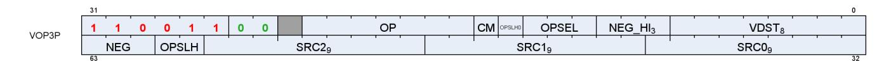

| Field            | Size | Description                                                                                                                                                                                                                                                                                                                                                                                                                                                                                                                                                                                                                                                                                                                                                                                                  |  |
|------------------|------|--------------------------------------------------------------------------------------------------------------------------------------------------------------------------------------------------------------------------------------------------------------------------------------------------------------------------------------------------------------------------------------------------------------------------------------------------------------------------------------------------------------------------------------------------------------------------------------------------------------------------------------------------------------------------------------------------------------------------------------------------------------------------------------------------------------|--|
| OP               | 7    | instruction opcode                                                                                                                                                                                                                                                                                                                                                                                                                                                                                                                                                                                                                                                                                                                                                                                           |  |
| SRC0             | 9    | first instruction argument. May come from: vgpr, sgpr, VCC, M0, exec or a constant<br>WMMA: must be a VGPR                                                                                                                                                                                                                                                                                                                                                                                                                                                                                                                                                                                                                                                                                                   |  |
| SRC1             | 9    | second instruction argument. May come from: vgpr, sgpr, VCC, M0, exec or a constant<br>WMMA: must be a VGPR                                                                                                                                                                                                                                                                                                                                                                                                                                                                                                                                                                                                                                                                                                  |  |
| SRC2             | 9    | third instruction argument. May come from: vgpr, sgpr, VCC, M0, exec or a constant                                                                                                                                                                                                                                                                                                                                                                                                                                                                                                                                                                                                                                                                                                                           |  |
| VDST             | 8    | vgpr that takes the result.<br>For V_READLANE, indicates the SGPR that receives the result.                                                                                                                                                                                                                                                                                                                                                                                                                                                                                                                                                                                                                                                                                                                  |  |
| NEG              | 3    | negate the input (invert sign bit) for the lower-16bit operand. float inputs only.<br>bit 0 is for src0, bit 1 is for src1 and bit 2 is for src2.<br>For V_FMA_MIX_* opcodes, this modifies all inputs.<br>For DOT…IU… and WMMA…IU… NEG[1:0] = signed(1)/unsigned(0) for src0 and src1,<br>and Neg[2] behavior is undefined.                                                                                                                                                                                                                                                                                                                                                                                                                                                                                 |  |
| NEG_HI           | 3    | negate the input (invert sign bit) for the higher-16bit operand. float inputs only.<br>bit 0 is for src0, bit 1 is for src1 and bit 2 is for src2.<br>For V_FMA_MIX_* opcodes, this acts as an ABS (absolute value) modifier.<br>For DOT…IU… and WMMA…IU… NEG_HI behavior is undefined.                                                                                                                                                                                                                                                                                                                                                                                                                                                                                                                      |  |
| OPSEL<br>[13:11] | 3    | Select the high (1) or low (0) operand as input to the operation that results in the lower-half of the<br>destination. [0] = src0, [1] = src1, [2] = src2<br>If either the source operand or destination operand is 32bits, the corresponding OPSEL bit must set<br>to zero. This rule does not apply to MIX instructions, which have a unique interpretation of OPSEL. See<br>notes below. OPSEL works for 16-bit VGPR, SGPR and literal-constant sources; for inline constant<br>sources OPSEL must be zero (value only exists in lower 16 bits).<br>OPSEL[0] and [1] are unused for WMMA ops, and OPSEL[2] is used only with WMMA ops with 16-bit<br>output to control whether the C matrix is read from upper or lower bits in the VGPR, and whether<br>the D matrix is stored into upper or lower bits. |  |

7.5. Packed Math 66 of 600


| Field                      | Size | Description                                                                                                                                                                                                                                                                                                                                                                                                                                                     |
|----------------------------|------|-----------------------------------------------------------------------------------------------------------------------------------------------------------------------------------------------------------------------------------------------------------------------------------------------------------------------------------------------------------------------------------------------------------------------------------------------------------------|
| OPSEL_HI<br>{[60:59],[14]} | 3    | Select the high (1) or low (0) operand as input to the operation that results in the upper-half of the<br>destination. [0] = src0, [1] = src1, [2] = src2. Concatenation of ISA fields { OPSLH, OPSLH0 }. If either<br>the source operand or destination operand is 32bits or is a constant, the corresponding OPSEL_HI<br>bit must set to zero. This rule does not apply to MIX instructions, which have a unique interpretation of<br>OPSEL. See notes below. |
| CLMP                       | 1    | clamp result.<br>Float arithmetic: clamp result to [0, 1.0]; -0 is clamped to +0.<br>Signed integer arithmetic: clamp result to [min_int, +max_int]<br>Unsigned integer arithmetic: clamp result to [0, +max_uint]<br>Where "min_int" and "max_int" are the largest negative and positive representable integers for the<br>size of integer being used (16, 32 or 64 bit). "max_uint" is the largest unsigned int.                                              |

#### **OPSEL for MIX instructions**

MIX, MIXLO and MIXHI interpret OPSEL and OPSEL\_HI as three 2-bit fields, one per source operand:

{ OPSEL\_HI[0], OPSEL[0] } controls source0;

{ OPSEL\_HI[1], OPSEL[1] } controls source1;

{ OPSEL\_HI[2], OPSEL[2] } controls source2.

These 2-bit fields control source-selection for each of the 3 source operands:

2'b00: Src[31:0] as FP32 2'b01: Src[31:0] as FP32 2'b10: Src[15:0] as FP16 2'b11: Src[31:16] as FP16

#### V\_WMMA…**IU**… and V\_DOT4…**IU**… with NEG::

These instructions use the NEG[1:0] bits to indicate signed (0=unsigned, 1=signed) per input source instead of meaning "negate". NEG[2] should be set to zero (behavior is undefined). NEG\_HI must be zero.

### <span id="page-75-0"></span>**7.5.1. Inline Constants with Packed Math**

Inline constants may be used with packed math, but they require the use of OPSEL. Inline constants produce a value in only the low 16-bits of the 32-bit constant value. Inline constants used with float 16-bit sources produce an F16 constant value. Without using OPSEL, only the lower half of the source would contain the constant. To use the inline constant in both halves, use OPSEL to select the lower input for both low and high sources.

BF16 uses 32-bit float constants and then the BF16 operand selects the upper 16 bits of the FP32 constant (matches the definition of BF16).

For the WMMA\_F16\_F16\_16x16x16 or VOPD DOT2\_F32\_F16, hardware automatically selects the low 16 bits of the constant.

Any packed math instructions that use data sizes less than 16 bits do not work with inline constants, other than the DOT instructions below:

| Opcode       | inline                                 | OPSEL                    |
|--------------|----------------------------------------|--------------------------|
| DOT4_I32_IU8 | use 32bit inline src0/1 (ignore OPSEL) | OPSEL/OPSEL_HI on src0/1 |
| DOT8_I32_IU4 | use 32bit inline src0/1 (ignore OPSEL) | OPSEL/OPSEL_HI on src0/1 |
| DOT4_U32_U8  | use 32bit inline src0/1 (ignore OPSEL) | OPSEL/OPSEL_HI on src0/1 |

7.5. Packed Math 67 of 600


| Opcode           | inline                                                | OPSEL                    |
|------------------|-------------------------------------------------------|--------------------------|
| DOT8_U32_U4      | use 32bit inline src0/1 (ignore OPSEL)                | OPSEL/OPSEL_HI on src0/1 |
| DOT2_F32_F16     | use FP32 inline, supports OPSEL                       | OPSEL/OPSEL_HI on src0/1 |
| DOT2_F32_BF16    | upper16(FP32)/same as replicate (src0/1) ignore OPSEL | OPSEL/OPSEL_HI on src0/1 |
| DOT2ACC_F32_F16  | Duplicate lo to hi, ignore OPSEL                      | none                     |
| DOT2ACC_F32_BF16 | Duplicate lo to hi, ignore OPSEL                      | none                     |

# <span id="page-76-0"></span>**7.6. Dual Issue VALU**

The VOPD instruction encoding allows a single shader instruction to encode two separate VALU operations that are executed in parallel. The two operations must be independent of each other. This instruction has certain restrictions that must be met - hardware **does not function correctly** if they are not. This instruction format is legal only for wave32. It must not be used by wave64's. It is skipped for wave64.

The instruction defines 2 operations, named "X" and "Y", each with their own sources and destination VGPRs. The two instructions packed into this one ISA are referred to as OpcodeX and OpcodeY.

- OpcodeX sources data from SRC0X (a VGPR, SGPR or constant), and SRC1X (a VGPR);
- OpcodeY sources data from SRC0Y (a VGPR, SGPR or constant), and SRC1Y (a VGPR).

The two instructions in the VOPD are executed at the same time, so there are no races between them if one reads a VGPR and the other writes the same VGPR. The 'read' gets the old value.

#### **Restrictions**:

- Each of the two instructions may use up to 2 VGPRs
- Each instruction in the pair may use at most 1 SGPR or they may share a single literal
  - Legal combinations for the dual-op: at most 2 SGPRs, or 1 SGPR + 1 literal, or share a literal.
- SRC0 can be either a VGPR or SGPR (or constant)
- VSRC1 can only be a VGPR
- Instructions must not exceed the VGPR source-cache port limits
  - There are 4 VGPR banks (indexed by SRC[1:0]), and each bank has a cache
  - Each cache has 3 read ports: one dedicated to SRC0, one dedicated to SRC1 and one for SRC2
    - A cache can read all 3 of them at once, but it can't read two SRC0's at once (or SRC1/2).
  - SRCX0 and SRCY0 must use different VGPR banks;
  - VSRCX1 and VSRCY1 must use different banks.
    - FMAMK is an exception : V = S0 + K \* S1 ("S1" uses the SRC2 read port)
  - If both operations use the SRC2 input, then one SRC2 input must be even and the other SRC2 input must be odd. The following operations use SRC2: FMAMK\_F32 (second input operand); DOT2ACC\_F32\_F16, DOT2ACC\_F32\_BF16, FMAC\_F32 (destination operand).
  - These are hard rules the instruction does not function if these rules are broken
- The pair of instructions combined have the following restrictions:
  - At most one literal constant, or they may share the same literal
  - Dest VGPRs: one must be even and the other odd
  - The instructions must be independent of each other
- Must not use DPP
- Must be wave32.

7.6. Dual Issue VALU 68 of 600


#### **VOPD Instruction Fields**

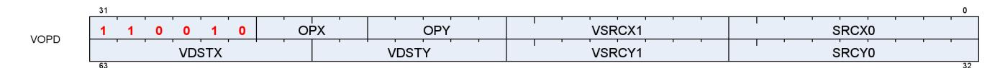

| Field  | Size | Description                                                                                                                                                                        |  |
|--------|------|------------------------------------------------------------------------------------------------------------------------------------------------------------------------------------|--|
| opX    | 4    | instruction opcode for the X operation                                                                                                                                             |  |
| opY    | 5    | instruction opcode for the Y operation                                                                                                                                             |  |
| src0X  | 9    | Source 0 for X operation. May be a VGPR, SGPR, exec, inline or literal constant                                                                                                    |  |
| src0Y  | 9    | Source 0 for Y operation. May be a VGPR, SGPR, exec, inline or literal constant                                                                                                    |  |
| vsrc1X | 8    | Source 1 for X operation. Must be a VGPR. Ignored for V_MOV_B32                                                                                                                    |  |
| vsrc1Y | 8    | Source 1 for Y operation. Must be a VGPR. Ignored for V_MOV_B32                                                                                                                    |  |
| vdstX  | 8    | Destination VGPR for X operation.                                                                                                                                                  |  |
| vdstY  | 7    | Destination VGPR for Y operation. vdstY specifies bits [7:1]. The LSB of the destination address is:<br>!vdstX[0]. vdstX and vdstY: one must be even and the other is an odd VGPR. |  |

See [VOPD](#page-176-0) for a list of opcodes usable in the X and Y opcode fields.

V\_CNDMASK\_B32 is the "VOP2" form that uses VCC as the select. VCC counts as one SGPR read.

VOPD instruction pairs generate only a single exception if either or both raise an exception.

# <span id="page-77-0"></span>**7.7. Data Parallel Processing (DPP)**

Data Parallel Processing (DPP) operations allow VALU instruction to select operands from different lanes (threads) rather than just using a thread's own data. DPP operations are indicated by the use of the inline constant: **DPP8** or **DPP16** in the SRC0 operand. Note that since SRC0 is set to the DPP value, the actual VGPR address for SRC0 comes from the DPP DWORD.

One example of using DPP is for scan operations. A scan operation is one that computes a value per thread that is based on the values of the previous threads and possibly itself. E.g. a running sum is the sum of the values from previous threads in the vector. A reduction operation is essentially a scan that returns a single value from the highest numbered active thread. A scan operation requires that the EXEC mask to be set to all 1's for proper operation. Unused threads (lanes) should be set to a value that does not change the result prior to the scan.

There are two forms of the DPP instruction word:

**DPP8** allows arbitrary swizzling between groups of 8 lanes

**DPP16** allows a set of predefined swizzles between groups of 16 lanes

DPP may be used only with: VOP1, VOP2, VOPC, VOP3 and VOP3P (but not "packed math" ops). DPP instructions incur an extra cycle of delay to execute.

Table 30. Which instructions support DPP


| Encoding | Opcodes                                                                              | * Rule*   | Encoding | Opcodes            | Rule      |
|----------|--------------------------------------------------------------------------------------|-----------|----------|--------------------|-----------|
| VOP1     | All 64-bit opcodes                                                                   | NO DPP    | VOP3     | All 64bit opcodes  | NO DPP    |
|          | READFIRSTLANE_B32                                                                    | NO DPP    |          | MUL_LO_U32         | NO DPP    |
|          | SWAP_B32                                                                             | NO DPP    |          | MUL_HI_U32         | NO DPP    |
|          | PIPEFLUSH                                                                            | NO DPP    |          | MUL_HI_I32         | NO DPP    |
|          | WRITELANE_REGWR_B32                                                                  | NO DPP    |          | QSAD_PK_U16_U8     | NO DPP    |
|          | PERMUTE64                                                                            | NO DPP    |          | MQSAD_PK_U16_U8    | NO DPP    |
|          | All Others                                                                           | Allow DPP |          | MQSAD_U32_U8       | NO DPP    |
| VOP2     | ALL 64bit opcodes                                                                    | NO DPP    |          | READLANE_REGRD_B32 | NO DPP    |
|          | FMAMK/AD_F32/16                                                                      | NO DPP    |          | READLANE_B32       | NO DPP    |
|          | All Others                                                                           | Allow DPP |          | WRITELANE_B32      | NO DPP    |
| VOP3P    | V_DOT4_I32_IU8<br>V_DOT4_U32_U8<br>V_DOT8_I32_IU4<br>V_DOT8_U32_U4<br>V_PK_*<br>WMMA | NO DPP    |          | PERMLANE16_B32     | NO DPP    |
|          | ALL Others:<br>V_FMA_MIX_*<br>V_DOT2_F32_{BF16, F16}                                 | Allow DPP |          | PERMLANEX16_B32    | NO DPP    |
| VINTERP  | ALL                                                                                  | NO DPP    |          |                    |           |
|          |                                                                                      |           |          | The others         | Allow DPP |
| VOPD     | ALL                                                                                  | NO DPP    | VOPC     | All 64bit opcodes  | NO DPP    |
|          |                                                                                      |           |          | The others         | Allow DPP |

V\_CMP and V\_CMPX write the full mask, not a partial mask. When using DPP with V\_CMP or V\_CMPX and setting bound\_ctrl=0, lanes that have their EXEC mask bit set to zero instead of not writing the bit, a zero bit is written. "FI" (Fetch Inactive) with DPP16 causes a lane to act as if it is active when supplying data, but the compare result for that lane is still zero for V\_CMPX (V\_CMPX with FI=1 does not turn on a lane that was off).

### <span id="page-78-0"></span>**7.7.1. DPP16**

DPP16 allows selection of data within groups of 16 lanes with a fixed set of possible swizzle patterns.

Both VOP3/VOP3P and DPP16 have ABS and NEG fields:

- VOP3's ABS & NEG fields are used, and DPP16's are ignored
- VOP3P's NEG/NEG\_HI fields are used and DPP16's ABS & NEG are ignored.

#### **DPP16 Instruction Fields**

| Field    | BITS  | Description                                                                                                                                                                          |
|----------|-------|--------------------------------------------------------------------------------------------------------------------------------------------------------------------------------------|
| row_mask | 31:28 | Applies to the VGPR destination write only, does not impact the thread mask when fetching<br>source VGPR data. For VOPC, the SGPR/VCC bit associated with the disabled lane receives |
|          |       | zero.                                                                                                                                                                                |
|          |       | 31==0: lanes[63:48] are disabled (wave 64 only)                                                                                                                                      |
|          |       | 30==0: lanes[47:32] are disabled (wave 64 only)                                                                                                                                      |
|          |       | 29==0: lanes[31:16] are disabled                                                                                                                                                     |
|          |       | 28==0: lanes[15:0] are disabled                                                                                                                                                      |


| Field     | BITS  | Description                                                                                                                                                                                                                                                                                                                                                                                                                                                                                                                                                                                                                                                                                                             |           |  |  |  |
|-----------|-------|-------------------------------------------------------------------------------------------------------------------------------------------------------------------------------------------------------------------------------------------------------------------------------------------------------------------------------------------------------------------------------------------------------------------------------------------------------------------------------------------------------------------------------------------------------------------------------------------------------------------------------------------------------------------------------------------------------------------------|-----------|--|--|--|
| bank_mask | 27:24 | Applies to the VGPR destination write only, does not impact the thread mask when fetching<br>source VGPR data. For VOPC, the SGPR/VCC bit associated with the disabled lane receives<br>zero.<br>In wave32 mode:<br>27==0: lanes[12:15, 28:31] are disabled<br>26==0: lanes[8:11, 24:27 are disabled<br>25==0: lanes[4:7, 20:23] are disabled<br>24==0: lanes[0:3, 16:19] are disabled<br>In wave64 mode:<br>27==0: lanes[12:15, 28:31, 44:47, 60:63] are disabled<br>26==0: lanes[8:11, 24:27, 40:43, 56:59] are disabled<br>25==0: lanes[4:7, 20:23, 36:39, 52:55] are disabled<br>24==0: lanes[0:3, 16:19, 32:35, 48:51] are disabled<br>Notice: the term "bank" here is not the same as was used for the VGPR bank. |           |  |  |  |
| src1_imod | 23:22 | 23: Apply Absolute value to SRC1<br>22: Apply Negate to SRC1 (done after absolute value)                                                                                                                                                                                                                                                                                                                                                                                                                                                                                                                                                                                                                                |           |  |  |  |
| src0_imod | 21:20 | 21: Apply Absolute value to SRC0<br>20: Apply Negate to SRC0 (done after absolute value)                                                                                                                                                                                                                                                                                                                                                                                                                                                                                                                                                                                                                                |           |  |  |  |
| BC        | 19    | Bound_ctrl is used to determine what a thread should do if its source operand is from a<br>disabled thread or invalid input: use the value zero, or disable the write. For example, a right<br>shift into lane 0 is an invalid input, so the VALU uses Bound_ctrl to decide if lane 0's src0 should<br>be 0 or if it's VGPR write enable should be disabled.<br>19==0: Do not write when source is invalid or out-of-range (DPP_BOUND_OFF)<br>19==1: User zero as input if source is invalid or out-of-range. (DPP_BOUND_ZERO)                                                                                                                                                                                          |           |  |  |  |
| FI        | 18    | Fetch inactive lane behavior:<br>18 == 0: If source lane is invalid (disabled thread or out-of-range), use "bound_ctrl" to<br>determine the source value.<br>18 == 1: If the source lane is disabled, fetch the source value anyway (ignoring the<br>bound_ctrl bit). If the source lane is out-of-range, behavior is decided by the bound_ctrl bit.                                                                                                                                                                                                                                                                                                                                                                    |           |  |  |  |
| rsvd      | 17    | Reserved                                                                                                                                                                                                                                                                                                                                                                                                                                                                                                                                                                                                                                                                                                                |           |  |  |  |
| dpp_ctrl  | 16:8  | Data Share control word.                                                                                                                                                                                                                                                                                                                                                                                                                                                                                                                                                                                                                                                                                                |           |  |  |  |
|           |       | DPP_QUAD_PERM{00:FF}                                                                                                                                                                                                                                                                                                                                                                                                                                                                                                                                                                                                                                                                                                    | 000-0FF   |  |  |  |
|           |       | DPP_UNUSED                                                                                                                                                                                                                                                                                                                                                                                                                                                                                                                                                                                                                                                                                                              | 100       |  |  |  |
|           |       | DPP_ROW_SL{1:15}                                                                                                                                                                                                                                                                                                                                                                                                                                                                                                                                                                                                                                                                                                        | 101-10F   |  |  |  |
|           |       | DPP_ROW_SR{1:15}                                                                                                                                                                                                                                                                                                                                                                                                                                                                                                                                                                                                                                                                                                        | 111-11F   |  |  |  |
|           |       | DPP_ROW_RR{1:15}                                                                                                                                                                                                                                                                                                                                                                                                                                                                                                                                                                                                                                                                                                        | 121-12F   |  |  |  |
|           |       | DPP_ROW_MIRROR                                                                                                                                                                                                                                                                                                                                                                                                                                                                                                                                                                                                                                                                                                          | 140       |  |  |  |
|           |       | DPP_ROW_HALF_MIRROR                                                                                                                                                                                                                                                                                                                                                                                                                                                                                                                                                                                                                                                                                                     | 141       |  |  |  |
|           |       | DPP_ROW_SHARE{0:15}                                                                                                                                                                                                                                                                                                                                                                                                                                                                                                                                                                                                                                                                                                     | 150 - 15F |  |  |  |
|           |       | DPP_ROW_XMASK{0:15}                                                                                                                                                                                                                                                                                                                                                                                                                                                                                                                                                                                                                                                                                                     | 160 - 16F |  |  |  |
| Src0      | 7:0   | VGPR address of srcA operand                                                                                                                                                                                                                                                                                                                                                                                                                                                                                                                                                                                                                                                                                            |           |  |  |  |

Table 31. BC and FI Behavior

| BC | FI | Source lane out-of<br>range | Source lane in-range<br>but disabled | Source lane in-range<br>and active |
|----|----|-----------------------------|--------------------------------------|------------------------------------|
| 0  | 0  | Disable write               | Disable write                        | Normal                             |
| 1  | 0  | Src0 = 0                    | Src0 = 0                             | Normal                             |
| 0  | 1  | Src0 = 0                    | Normal                               | Normal                             |
| 1  | 1  | Normal                      | Normal                               | Normal                             |


Where "out of range" means the lane offset goes outside a group of 16 lanes (e.g. 0..15, or 16..31).

### <span id="page-80-0"></span>**7.7.2. DPP8**

DPP8 allows arbitrary cross-lane swizzling within groups of 8 lanes. There are two forms of DPP8: normal, which reads zero from lanes whose EXEC mask bit is zero, and DPP8FI, which fetches data from inactive lanes instead of using the value zero.

DPP8 follows DPP16's "BC = 1" behavior and assumes all source lanes are in-range.

#### **DPP8 Instruction Fields**

| Field | Size | Description                                                                                                                                       |
|-------|------|---------------------------------------------------------------------------------------------------------------------------------------------------|
| SRC   | 8    | Source 0 (VGPR). Since the VOP1/VOP2 source0 slot was filled with the constant "DPP" or<br>"DPPFI", this field provides the actual source-0 vgpr. |
| SEL0  | 3    | Selects which lane to pull data from, within a group of 8 lanes.                                                                                  |
| SEL1  |      | SEL0 selects which lane to read from to supply data into lane 0.                                                                                  |
| SEL2  |      | SEL1 selects which lane to read from to supply data into lane 1.                                                                                  |
| SEL3  |      | etc.                                                                                                                                              |
| SEL4  |      | 0 = read from lane 0, 1 = read from lane 1, … 7 = read from lane 7.                                                                               |
| SEL5  |      | Lanes 0-7 can pull from any of lanes 0-7; lanes 8-15 can pull from lanes 8-15, etc.                                                               |
| SEL6  |      |                                                                                                                                                   |
| SEL7  |      |                                                                                                                                                   |

# <span id="page-80-1"></span>**7.8. VGPR Indexing**

The VALU provides a set of instructions that move or swap VGPRs where the source, dest or both are indexed by a value in the M0 register. Indices are unsigned.

| Instruction      | Index          | Function                                                   |
|------------------|----------------|------------------------------------------------------------|
| V_MOVRELD_B32    | M0[31:0]       | Move with relative destination:                            |
|                  |                | VGPR[dst + M0[31:0]] = VGPR[src]                           |
| V_MOVRELS_B32    |                | Move with relative source:                                 |
|                  |                | VGPR[dst] = VGPR[src + M0[31:0]]                           |
| V_MOVRELSD_B32   |                | Move with relative source and destination:                 |
|                  |                | VGPR[dst + M0[31:0]] = VGPR[src + M0[31:0]]                |
| V_MOVRELSD_2_B32 | Src: M0[9:0]   | Move with relative source and destination, each different: |
|                  | Dst: M0[25:16] | VGPR[dst + M0[25:16]] = VGPR[src + M0[9:0]]                |
| V_SWAPREL_B32    |                | Swap two VGPRs, each relative to a separate index:         |
|                  |                | tmp = VGPR[src + M0[9:0]]                                  |
|                  |                | VGPR[src + M0[9:0]] = VGPR[dst + M0[25:16]]                |
|                  |                | VGPR[dst + M0[25:16]] = tmp                                |

Table 32. VGPR Indexing Instructions

## <span id="page-80-2"></span>**7.9. Wave Matrix Multiply Accumulate (WMMA)**

Wave Matrix Multiply-Accumulate (WMMA) instructions provide acceleration for common matrix arithmetic operations. The instructions are encoded using the VOP3P encoding.

7.8. VGPR Indexing 72 of 600

These perform: A \* B + C ⇒ D, where A, B, C and D are matrices.

Additional information can be found on the GPUOpen blog: [https://gpuopen.com/learn/](https://gpuopen.com/learn/wmma_on_rdna3/) [wmma\\_on\\_rdna3/](https://gpuopen.com/learn/wmma_on_rdna3/)

The AMD Matrix Instruction Calculator ([https://github.com/RadeonOpenCompute/](https://github.com/RadeonOpenCompute/amd_matrix_instruction_calculator) [amd\\_matrix\\_instruction\\_calculator\)](https://github.com/RadeonOpenCompute/amd_matrix_instruction_calculator) contains a helper tool that allows developers to view detailed information about the WMMA instructions in the RDNA architecture. It allows users to query instructionlevel information such as computational throughput and register usage. It also allows users to generate mappings between matrix element and hardware registers for each matrix instruction and their modifiers.

WMMA does not generate any ALU exceptions.

These are all encoded using VOP3P. The NEG[1:0] field is repurposed for the "IU" integer types to indicate whether the inputs are signed or not (0=unsigned, 1=signed). For WMMA\_\*UI8/UI4, NEG[1:0] indicates whether SRC0 and 1 are signed or unsigned, and NEG[2] and NEG\_HI[2:0] must be zero. For WMMA\*\_F16/BF16, NEG[1:0] is applied on SRC1 and SRC0's low 16bit. NEG\_HI[1:0] is applied on SRC1 and SRC0's high 16bit. {NEG\_HI[2], NEG[2]} is applied on SRC2, act as {ABS, NEG}. The destination is signed for the integer types. Neg[0] applies to the A-matrix, and Neg[1] to the B-matrix. Neg[2] must be set to zero.

| Instruction               | Matrix A   | Matrix B   | Matrix C   | Result Matrix |
|---------------------------|------------|------------|------------|---------------|
| V_WMMA_F32_16X16X16_F16   | 16x16 F16  | 16x16 F16  | 16x16 F32  | 16x16 F32     |
| V_WMMA_F32_16X16X16_BF16  | 16x16 BF16 | 16x16 BF16 | 16x16 F32  | 16x16 F32     |
| V_WMMA_F16_16X16X16_F16   | 16x16 F16  | 16x16 F16  | 16x16 F16  | 16x16 F16     |
| V_WMMA_BF16_16X16X16_BF16 | 16x16 BF16 | 16x16 BF16 | 16x16 BF16 | 16x16 BF16    |
| V_WMMA_I32_16X16X16_IU8   | 16x16 IU8  | 16x16 IU8  | 16x16 I32  | 16x16 I32     |
| V_WMMA_I32_16X16X16_IU4   | 16x16 IU4  | 16x16 IU4  | 16x16 I32  | 16x16 I32     |

Table 33. WMMA Instructions

"IU4" and "IU8" mean that the operand is either signed or unsigned (4 or 8 bits) as indicate by the NEG bits.

These instructions work over multiple cycles to compute the result matrix and internally use the DOT instructions. In order to achieve this performance, the user must arrange the data such that:

• A and B matrices: lanes 0-15 data are replicated into lanes 16-31 (for wave64: also into lanes 32-47 and 48- 63).

WMMA supports only round-to-nearest-even rounding for float types.

Inline constants: can only be used for C-matrix. For F16 and BF16, the inline value is replicated into both low and high halves of the DWORD.

Back-to-back dependent WMMA instructions require one V\_NOP (or independent VALU op) between them if the first instruction's matrix D is the same or overlaps with the second instruction's matrices A or B. Matrix A/B can overlap C as long as C is distinct from D. The typical case is that C and D are the same.

Simplified example of matrix multiplication on 4x4 matrices:

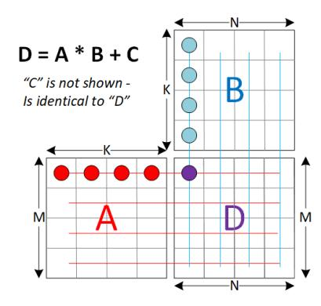

This diagram below shows the A, B, C and D matrices in the traditional point of view: one row is a horizontal strip of entries, and columns are a vertical strip. This is the linear algebra view, regardless of layout in memory or in VGPRs. The matrix operation is defined as: D = A \* B + C. Each entry in D is the result of multiplication of a row from A with a column from B, added to the C value for that entry.

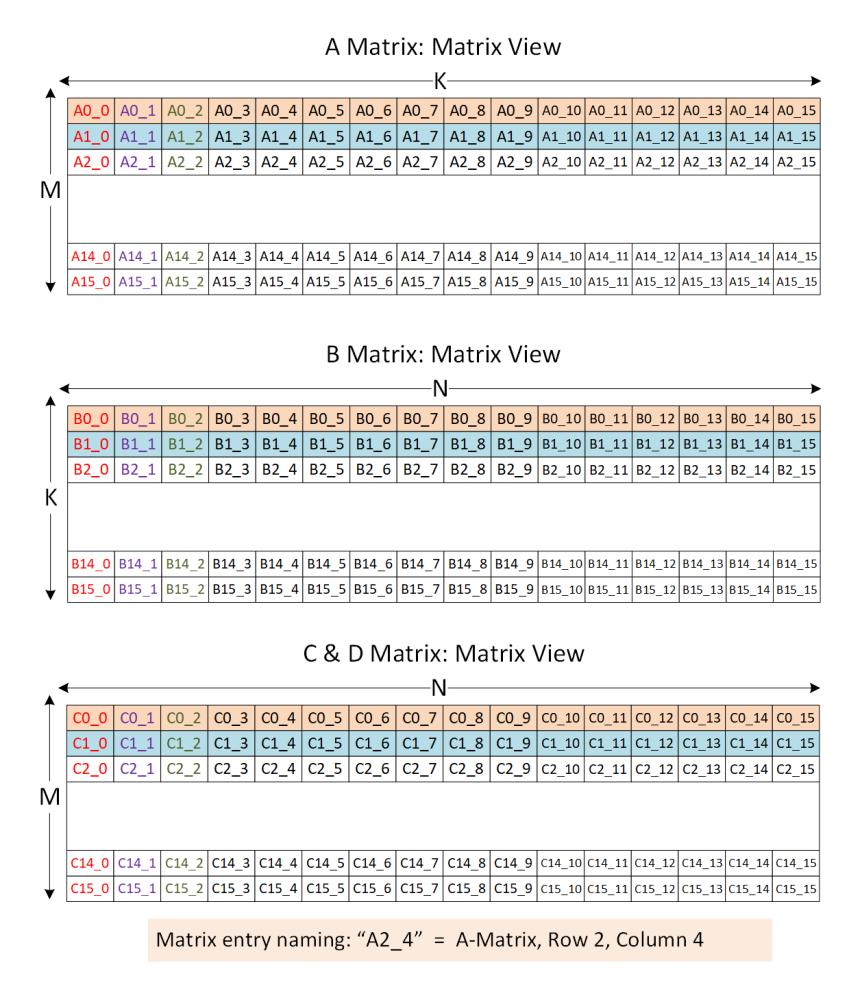

This diagram below shows how the matrices are laid out in VGPRs when M = N = K = 16. Note that the A matrix is column-major while the others are in row-major order.


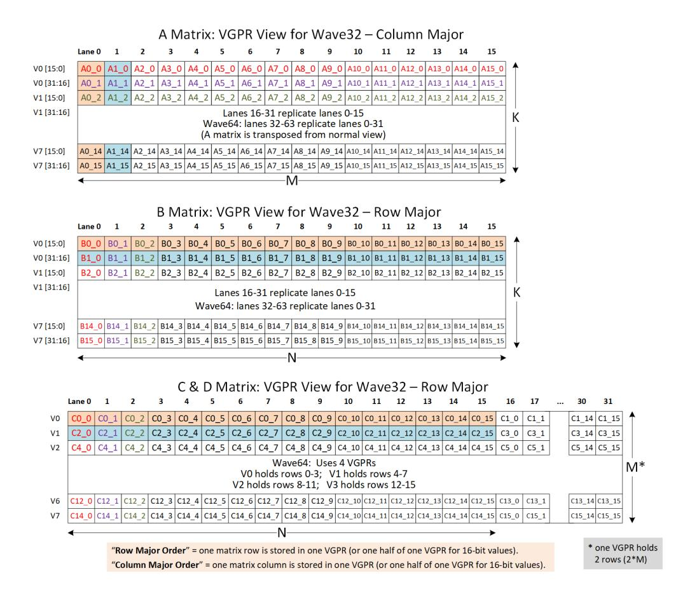


# <span id="page-84-0"></span>**Chapter 8. Scalar Memory Operations**

Scalar Memory Loads (SMEM) instructions allow a shader program to load data from memory into SGPRs through the Constant Cache ("Kcache"). Instructions can load from 1 to 16 DWORDs. Data is loaded directly into SGPRs without any format conversion.

The scalar unit loads consecutive DWORDs from memory to the SGPRs. This is intended primarily for loading ALU constants and for indirect T#/S# lookup. No data formatting is supported, nor is byte or short data.

Loads come in two forms: one that simply takes a base-address pointer, and the other that uses a vertex-buffer constant to provide: base, size and stride.

# <span id="page-84-1"></span>**8.1. Microcode Encoding**

Scalar memory load instructions are encoded using the SMEM microcode format.

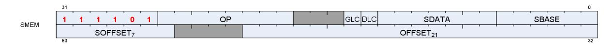

The fields are described in the table below:

Table 34. SMEM Encoding Field Descriptions

| Field     |    | Size Description                                                                                                                                                                                                                                                                               |
|-----------|----|------------------------------------------------------------------------------------------------------------------------------------------------------------------------------------------------------------------------------------------------------------------------------------------------|
| OP        | 8  | Opcode. See the next table.                                                                                                                                                                                                                                                                    |
| SDATA     | 7  | SGPRs to return Load data to.<br>• Loads of 2 DWORDs must have an even SDST-sgpr.<br>• Loads of 4 or more DWORDs must have their DST-gpr aligned to a multiple of 4.<br>• SDATA must be: SGPR or VCC. Not: EXEC, M0 or NULL except for instructions that return nothing: these<br>may use NULL |
| SBASE     | 6  | SGPR-pair (SBASE has an implied LSB of zero) that provides a base address, or for BUFFER instructions, a<br>set of 4 SGPRs (4-sgpr aligned) that hold the resource constant.<br>For BUFFER instructions, the only resource fields used are: base, stride, num_records.                         |
| OFFSET    | 21 | Instruction Address Offset : An immediate signed byte offset.<br>Negative offsets only work with S_LOAD; a negative offset applied to S_BUFFER results in a MEMVIOL.                                                                                                                           |
| SOFFSET 7 |    | SGPR that has the 32-bit unsigned byte offset. May only specify an SGPR, M0 or set to "NULL" to not use<br>(offset=0).                                                                                                                                                                         |
| GLC       | 1  | Globally Coherent.                                                                                                                                                                                                                                                                             |
| DLC       | 1  | Device Coherent.                                                                                                                                                                                                                                                                               |

Table 35. SMEM Instructions

| Opcode # | Name              | Opcode # | Name               |
|----------|-------------------|----------|--------------------|
| 0        | S_LOAD_B32        | 9        | S_BUFFER_LOAD_B64  |
| 1        | S_LOAD_B64        | 10       | S_BUFFER_LOAD_B128 |
| 2        | S_LOAD_B128       | 11       | S_BUFFER_LOAD_B256 |
| 3        | S_LOAD_B256       | 12       | S_BUFFER_LOAD_B512 |
| 4        | S_LOAD_B512       | 32       | S_GL1_INV          |
| 8        | S_BUFFER_LOAD_B32 | 33       | S_DCACHE_INV       |

8.1. Microcode Encoding 76 of 600


These instructions load 1-16 DWORDs from memory. The data in SGPRs is specified in SDATA, and the address is composed of the SBASE, OFFSET, and SOFFSET fields.

## <span id="page-85-0"></span>**8.1.1. Scalar Memory Addressing**

Non-buffer S\_LOAD instructions use the following formula to calculate the memory address:

```
ADDR = SGPR[base] + inst_offset + { M0 or SGPR[offset] or zero }
```

All components of the address (base, offset, inst\_offset, M0) are in bytes, but the two LSBs are ignored and treated as if they were zero.

It is illegal and undefined for the inst\_offset to be negative if the resulting (inst\_offset + (M0 or SGPR[offset])) is negative.

### <span id="page-85-1"></span>**8.1.2. Loads using Buffer Constant**

S\_BUFFER\_LOAD instructions use a similar formula, but the base address comes from the buffer constant's base\_address field.

Buffer constant fields used: base\_address, stride, num\_records. Other fields are ignored.

Scalar memory load does not support "swizzled" buffers. **Stride** is used only for memory address bounds checking, not for computing the address to access.

The SMEM supplies only a SBASE address (byte) and an offset (byte or DWORD). Any "index \* stride" must be calculated manually in shader code and added to the offset prior to the SMEM. Inst\_offset must be nonnegative - a negative value of inst\_offset results in a MEMVIOL.

The two LSBs of V#.base and of the final address are ignored to force DWORD alignment.

```
"m_*" components come from the buffer constant (V#):
  offset = OFFSET + SOFFSET (M0, SGPR or zero)
  m_base = { SGPR[SBASE * 2 +1][15:0], SGPR[SBASE*2] }
  m_stride = SGPR[SBASE * 2 +1][31:16]
  m_num_records = SGPR[SBASE * 2 + 2]
  m_size = (m_stride == 0 ? 1 : m_stride) * m_num_records
  addr = (m_base & ~3) + (offset & ~0x3)
  SGPR[SDST] = load_dword_from_dcache(addr, m_size)
  If more than 1 DWORD is being loaded, it is returned to SDST+1, SDST+2, etc,
  and the offset is incremented by 4 bytes per DWORD.
```

## <span id="page-85-2"></span>**8.1.3. S\_DCACHE\_INV and S\_GL1\_INV**

This instruction invalidates the entire scalar cache or L1 cache. It does not return anything to SDST.

8.1. Microcode Encoding 77 of 600


S\_GL1\_INV and S\_DCACHE\_INV do not have any address or data arguments.

# <span id="page-86-0"></span>**8.2. Dependency Checking**

Scalar memory loads can return data out-of-order from how they were issued; they can return partial results at different times when the load crosses two cache lines. The shader program uses the LGKMcnt counter to determine when the data has been returned to the SDST SGPRs. This is done as follows.

- LGKMcnt is incremented by 1 for every fetch of a single DWORD, or cache invalidates.
- LGKMcnt is incremented by 2 for every fetch of two or more DWORDs.
- LGKMcnt is decremented by an equal amount when each instruction completes.

Because the instructions can return out-of-order, the only sensible way to use this counter is to implement "S\_WAITCNT LGKMcnt 0"; this imposes a wait for all data to return from previous SMEMs before continuing.

Cache invalidate instructions are not known to have completed until the shader waits for LGKMcnt==0.

# <span id="page-86-1"></span>**8.3. Scalar Memory Clauses and Groups**

A **clause** is a sequence of instructions starting with S\_CLAUSE and continuing for 2-63 instructions. Clauses lock the instruction arbiter onto this wave until the clause completes.

A **group** is a set of the same type of instruction that happen to occur in the code but are not necessarily executed as a clause. A group ends when a non-SMEM instruction is encountered. Scalar memory instructions are issued in groups. The hardware does not enforce that a single wave executes an entire group before issuing instructions from another wave.

#### **Group restrictions:**

• INV must be in a group by itself and may not be in a clause

# <span id="page-86-2"></span>**8.4. Alignment and Bounds Checking**

### **SDST**

The value of SDST must be even for fetches of two DWORDs, or a multiple of four for larger fetches. If this rule is not followed, invalid data can result.

### **SBASE**

The value of SBASE must be even for S\_BUFFER\_LOAD (specifying the address of an SGPR which is a multiple of four). If SBASE is out-of-range, the value from SGPR0 is used.

### **OFFSET**

The value of OFFSET has no alignment restrictions.


### <span id="page-87-0"></span>**8.4.1. Address and GPR Range Checking**

The hardware checks for both the address being out of range (BUFFER instructions only), and for the source or destination SGPRs being out of range.

**Address Out-of-Range if** offset >= ( (stride==0 ? 1 : stride) \* num\_records).

where "offset" is: inst\_offset + {M0 or sgpr-offset}

Any DWORDs that are out of range in memory from a buffer\_load return zero. If a multi-DWORD request (e.g. S\_BUFFER\_LOAD\_B256) is partially out of range, the DWORDs that are in range return data as

normal, and the out-of-range DWORDs return zero.

**Source SGPR out of range** If any source data is out of the range of SGPRs (either partially or

completely), the value 'zero' is used instead.

**Destination SGPR out of range** If the destination SGPR is partially or fully out of range, no data is

written back to SGPRs for this instruction.


# <span id="page-88-0"></span>**Chapter 9. Vector Memory Buffer Instructions**

Vector-memory (VM) buffer operations transfer data between the VGPRs and buffer objects in memory through the texture cache (TC). **Vector** means that one or more piece of data is transferred uniquely for every thread in the wave, in contrast to scalar memory loads that transfer only one value that is shared by all threads in the wave.

The instruction defines which VGPR(s) supply the addresses for the operation, which VGPRs supply or receive data from the operation, and a series of SGPRs that contain the memory buffer descriptor (V#). Buffer atomics have the option of returning the pre-op memory value to VGPRs.

Examples of buffer objects are vertex buffers, raw buffers, stream-out buffers, and structured buffers.

Buffer objects support both homogeneous and heterogeneous data, but no filtering of load-data (no samplers). Buffer instructions are divided into two groups:

#### **MUBUF: Untyped buffer objects**

- Data format is specified in the resource constant.
- Load, store, atomic operations, with or without data format conversion.

#### **MTBUF: Typed buffer objects**

- Data format is specified in the instruction.
- The only operations are Load and Store, both with data format conversion.

All buffer operations use a buffer resource constant (V#) that is a 128-bit value in SGPRs. This constant is sent to the texture cache when the instruction is executed. This constant defines the address and characteristics of the buffer in memory. Typically, these constants are fetched from memory using scalar memory loads prior to executing VM instructions, but these constants also can be generated within the shader.

Memory operations of different types (loads, stores) can complete out of order with respect to each other.

#### **Simplified view of buffer addressing**

The equation below shows how the memory address is calculated for a buffer access:

Memory instructions return MEMVIOL for any misaligned access when the alignment mode does not allow it.

# <span id="page-88-1"></span>**9.1. Buffer Instructions**

Buffer instructions (MTBUF and MUBUF) allow the shader program to load from, and store to, linear buffers in memory. These operations can operate on data as small as one byte, and up to four DWORDs per work-item. Atomic operations take data from VGPRs and combine them arithmetically with data already in memory. Optionally, the value that was in memory before the operation took place can be returned to the shader.

9.1. Buffer Instructions 80 of 600


The D16 instruction variants of buffer ops convert the results to and from packed 16-bit values. For example, BUFFER\_LOAD\_D16\_FORMAT\_XYZW stores two VGPRs with 4 16-bit values.

Table 36. Buffer Instructions

| MTBUF Instructions                       |                                                                  |
|------------------------------------------|------------------------------------------------------------------|
| TBUFFER_LOAD_FORMAT_{x,xy,xyz,xyzw}      | Load from or store to a Typed buffer object.                     |
| TBUFFER_STORE_FORMAT_{x,xy,xyz,xyzw}     |                                                                  |
| TBUFFER_LOAD_D16_FORMAT_{x,xy,xyz,xyzw}  | Convert data to 16-bits before loading into VGPRs.               |
| TBUFFER_STORE_D16_FORMAT_{x,xy,xyz,xyzw} | Convert data from 16-bits to tex-format before storing to memory |

| MUBUF Instructions                                                                                                                                                                                                                                                                                   |                                                                                                             |
|------------------------------------------------------------------------------------------------------------------------------------------------------------------------------------------------------------------------------------------------------------------------------------------------------|-------------------------------------------------------------------------------------------------------------|
| BUFFER_LOAD_FORMAT_{x,xy,xyz,xyzw}<br>BUFFER_STORE_FORMAT_{x,xy,xyz,xyzw}<br>BUFFER_LOAD_D16_FORMAT_{x,xy,xyz,xyzw}<br>BUFFER_STORE_D16_FORMAT_{x,xy,xyz,xyzw}<br>BUFFER_LOAD_ <size> BUFFER_STORE_<size><br/>BUFFER_{LOAD,STORE}_D16_FORMAT_X<br/>BUFFER_{LOAD,STORE}_D16_HI_FORMAT_X</size></size> | Load from or store to an Untyped Buffer object<br><size> = I8, U8, I16, U16, B32, B64, B96, B128</size>     |
| BUFFER_ATOMIC_ <op></op>                                                                                                                                                                                                                                                                             | Buffer object atomic operation. Automatically globally coherent.<br>Operates on 32bit or 64bit values.      |
| BUFFER_GL{0,1}_INV                                                                                                                                                                                                                                                                                   | Cache invalidate: either L0 or L1 cache for the CU (L0) and Shader<br>Array (L1) associated with this wave. |

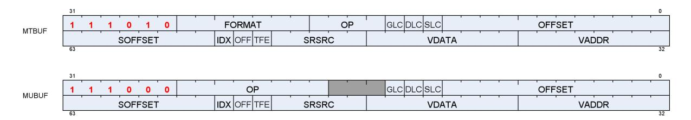

Table 37. Microcode Formats

| Field      |    | Bit Size Description                                                                                                                                                                                     |  |
|------------|----|----------------------------------------------------------------------------------------------------------------------------------------------------------------------------------------------------------|--|
| OP         | 4  | MTBUF: Opcode for Typed buffer instructions.                                                                                                                                                             |  |
|            | 8  | MUBUF: Opcode for Untyped buffer instructions.                                                                                                                                                           |  |
| VADDR      | 8  | Address of VGPR to supply first component of address (offset or index). When both index and offset are<br>used, index is in the first VGPR, offset in the second.                                        |  |
| VDATA      | 8  | Address of VGPR to supply first component of store data or receive first component of load-data.                                                                                                         |  |
| SOFFSET 8  |    | SGPR to supply unsigned byte offset. SGPR, M0, NULL, or inline constant.                                                                                                                                 |  |
| SRSRC      | 5  | Specifies which SGPR supplies V# (resource constant) in four consecutive SGPRs. This field is missing<br>the two LSBs of the SGPR address, since this address is be aligned to a multiple of four SGPRs. |  |
| FORMA<br>T | 7  | Data Format of data in memory buffer. See: Buffer Image Format Table                                                                                                                                     |  |
| OFFSET     | 12 | Unsigned byte offset.                                                                                                                                                                                    |  |
| OFFEN      | 1  | 1 = Supply an offset from VGPR (VADDR). 0 = Do not (offset = 0).                                                                                                                                         |  |
| IDXEN      | 1  | 1 = Supply an index from VGPR (VADDR). 0 = Do not (index = 0).                                                                                                                                           |  |
| GLC        | 1  | Globally Coherent. Controls how loads and stores are handled by the L0 texture cache.<br>ATOMIC<br>GLC = 0 Previous data value is not returned.<br>GLC = 1 Previous data value is returned.              |  |
| DLC        | 1  | Device Level Coherent.                                                                                                                                                                                   |  |
| SLC        | 1  | System Level Coherent.                                                                                                                                                                                   |  |

9.1. Buffer Instructions 81 of 600


| Field | Bit Size Description |                                                                                                                                                                    |
|-------|----------------------|--------------------------------------------------------------------------------------------------------------------------------------------------------------------|
| TFE   | 1                    | Texel Fault Enable for PRT (partially resident textures). When set to 1 and fetch returns a NACK, status<br>is written to the VGPR after the last fetch-dest VGPR. |

#### Table 38. **MTBUF Instructions**

| Opcode                        | Description - all address components for buffer ops are uint |
|-------------------------------|--------------------------------------------------------------|
| TBUFFER_LOAD_FORMAT_X         | load X component w/ format convert                           |
| TBUFFER_LOAD_FORMAT_XY        | load XY components w/ format convert                         |
| TBUFFER_LOAD_FORMAT_XYZ       | load XYZ components w/ format convert                        |
| TBUFFER_LOAD_FORMAT_XYZW      | load XYZW components w/ format convert                       |
| TBUFFER_STORE_FORMAT_X        | store X component w/ format convert                          |
| TBUFFER_STORE_FORMAT_XY       | store XY components w/ format convert                        |
| TBUFFER_STORE_FORMAT_XYZ      | store XYZ components w/ format convert                       |
| TBUFFER_STORE_FORMAT_XYZW     | store XYZW components w/ format convert                      |
| TBUFFER_LOAD_D16_FORMAT_X     | load X component w/ format convert, 16bit                    |
| TBUFFER_LOAD_D16_FORMAT_XY    | load XY components w/ format convert, 16bit                  |
| TBUFFER_LOAD_D16_FORMAT_XYZ   | load XYZ components w/ format convert, 16bit                 |
| TBUFFER_LOAD_D16_FORMAT_XYZW  | load XYZW components w/ format convert, 16bit                |
| TBUFFER_STORE_D16_FORMAT_X    | store X component w/ format convert, 16bit                   |
| TBUFFER_STORE_D16_FORMAT_XY   | store XY components w/ format convert, 16bit                 |
| TBUFFER_STORE_D16_FORMAT_XYZ  | store XYZ components w/ format convert, 16bit                |
| TBUFFER_STORE_D16_FORMAT_XYZW | store XYZW components w/ format convert, 16bit               |

• TBUFFER\*\_FORMAT instructions include a data-format conversion specified in the instruction.

#### Table 39. **MUBUF Instructions**

| Opcode                      | Description - all address components for buffer ops are uint |
|-----------------------------|--------------------------------------------------------------|
| BUFFER_LOAD_U8              | load unsigned byte (extend 0's to MSB's of DWORD VGPR)       |
| BUFFER_LOAD_D16_U8          | load unsigned byte into VGPR[15:0]                           |
| BUFFER_LOAD_D16_HI_U8       | load unsigned byte into VGPR[31:16]                          |
| BUFFER_LOAD_I8              | load signed byte (sign extend to MSB's of DWORD VGPR)        |
| BUFFER_LOAD_D16_I8          | load signed byte into VGPR[15:0]                             |
| BUFFER_LOAD_D16_HI_I8       | load signed byte into VGPR[31:16]                            |
| BUFFER_LOAD_U16             | load unsigned short (extend 0's to MSB's of DWORD VGPR)      |
| BUFFER_LOAD_I16             | load signed short (sign extend to MSB's of DWORD VGPR)       |
| BUFFER_LOAD_D16_B16         | load short into VGPR[15:0]                                   |
| BUFFER_LOAD_D16_HI_B16      | load short into VGPR[31:16]                                  |
| BUFFER_LOAD_B32             | load DWORD                                                   |
| BUFFER_LOAD_B64             | load 2 DWORD per element                                     |
| BUFFER_LOAD_B96             | load 3 DWORD per element                                     |
| BUFFER_LOAD_B128            | load 4 DWORD per element                                     |
| BUFFER_LOAD_FORMAT_X        | load X component w/ format convert                           |
| BUFFER_LOAD_FORMAT_XY       | load XY components w/ format convert                         |
| BUFFER_LOAD_FORMAT_XYZ      | load XYZ components w/ format convert                        |
| BUFFER_LOAD_FORMAT_XYZW     | load XYZW components w/ format convert                       |
| BUFFER_LOAD_D16_FORMAT_X    | load X component w/ format convert, 16b                      |
| BUFFER_LOAD_D16_HI_FORMAT_X | load X component w/ format convert, 16b                      |
| BUFFER_LOAD_D16_FORMAT_XY   | load XY components w/ format convert, 16b                    |

9.1. Buffer Instructions 82 of 600


| Description - all address components for buffer ops are uint                                                                                 |
|----------------------------------------------------------------------------------------------------------------------------------------------|
| load XYZ components w/ format convert, 16b                                                                                                   |
| load XYZW components w/ format convert, 16b                                                                                                  |
| store byte (ignore MSB's of DWORD VGPR)                                                                                                      |
| store byte from VGPR bits [23:16]                                                                                                            |
| store short (ignore MSB's of DWORD VGPR)                                                                                                     |
| store short from VGPR bits [32:16]                                                                                                           |
| store DWORD                                                                                                                                  |
| store 2 DWORD per element                                                                                                                    |
| store 3 DWORD per element                                                                                                                    |
| store 4 DWORD per element                                                                                                                    |
| store X component w/ format convert                                                                                                          |
| store XY components w/ format convert                                                                                                        |
| store XYZ components w/ format convert                                                                                                       |
| store XYZW components w/ format convert                                                                                                      |
| store X component w/ format convert, 16b                                                                                                     |
| store X component w/ format convert, 16b                                                                                                     |
| store XY components w/ format convert, 16b                                                                                                   |
| store XYZ components w/ format convert, 16b                                                                                                  |
| store XYZW components w/ format convert, 16b                                                                                                 |
| 32b , dst += src, returns previous value if glc==1                                                                                           |
| 32b , dst += src, returns previous value if glc==1                                                                                           |
| 64b , dst += src, returns previous value if glc==1                                                                                           |
| 32b , dst &= src, returns previous value if glc==1                                                                                           |
| 64b , dst &= src, returns previous value if glc==1                                                                                           |
| 32b , dst = (dst == cmp) ? src : dst, returns previous value if glc==1. Src is from                                                          |
| vdata, cmp from vdata+1                                                                                                                      |
| 64b , dst = (dst == cmp) ? src : dst, returns previous value if glc==1                                                                       |
| 32b , dst = if (src > dst) ? 0 : dst - src, returns previous . GLC must be set to 1.                                                         |
| 32b , dst = dst == 0)   (dst > src ? src : dst-1, returns previous value if glc==1                                                           |
| 64b , dst = dst == 0)   (dst > src ? src : dst-1, returns previous value if glc==1                                                           |
| 32b , dst = (dst == cmp) ? src : dst, returns previous value if glc==1. Src is from<br>vdata, cmp from vdata+1                               |
| 32b , dst = (src > dst) ? src : dst, (float) returns previous value if glc==1                                                                |
| 32b , dst = (src < dst) ? src : dst, (float) returns previous value if glc==1                                                                |
| 32b , dst = (dst >= src) ? 0 : dst+1, returns previous value if glc==1                                                                       |
| 64b , dst = (dst >= src) ? 0 : dst+1, returns previous value if glc==1                                                                       |
| 32b , dst  = src, returns previous value if glc==1                                                                                           |
| 64b , dst  = src, returns previous value if glc==1                                                                                           |
| 32b , dst = (src > dst) ? src : dst, (signed) returns previous value if glc==1                                                               |
| 64b , dst = (src > dst) ? src : dst, (signed) returns previous value if glc==1                                                               |
| 32b , dst = (src < dst) ? src : dst, (signed) returns previous value if glc==1                                                               |
| 64b , dst = (src < dst) ? src : dst, (signed) returns previous value if glc==1                                                               |
| 32b , dst -= src, returns previous value if glc==1                                                                                           |
| 64b , dst -= src, returns previous value if glc==1                                                                                           |
| 32b , dst = src, returns previous value of dst if glc==1                                                                                     |
|                                                                                                                                              |
|                                                                                                                                              |
| 64b , dst = src, returns previous value of dst if glc==1<br>32b , dst = (src > dst) ? src : dst, (unsigned) returns previous value if glc==1 |
|                                                                                                                                              |

9.1. Buffer Instructions 83 of 600

| Opcode                | Description - all address components for buffer ops are uint                     |
|-----------------------|----------------------------------------------------------------------------------|
| BUFFER_ATOMIC_MIN_U32 | 32b , dst = (src < dst) ? src : dst, (unsigned) returns previous value if glc==1 |
| BUFFER_ATOMIC_MIN_U64 | 64b , dst = (src < dst) ? src : dst, (unsigned) returns previous value if glc==1 |
| BUFFER_ATOMIC_XOR_B32 | 32b , dst ^= src, returns previous value if glc==1                               |
| BUFFER_ATOMIC_XOR_B64 | 64b , dst ^= src, returns previous value if glc==1                               |
| BUFFER_GL0_INV        | invalidate the shader L0 cache (texture cache) associated with this wave.        |
| BUFFER_GL1_INV        | invalidate the GL1 (L1) cache associated with this wave, for this wave's VMID    |

- BUFFER\*\_FORMAT instructions include a data-format conversion specified in the resource constant (V#).
- In the table above, "D16" means the data in the VGPR is 16-bits, not the usual 32 bits. "D16\_HI" means that the upper 16-bits of the VGPR is used instead of "D16" that uses the lower 16 bits.

# <span id="page-92-0"></span>**9.2. VGPR Usage**

VGPRs supply address and store-data, and they can be the destination for return data.

#### **Address**

Zero, one or two VGPRs are used, depending on the index-enable (IDXEN) and offset-enable (OFFEN) in the instruction word. These are unsigned ints.

For 64-bit addresses the LSBs are in VGPRn and the MSBs are in VGPRn+1.

**IDXEN OFFEN VGPRn VGPRn+1** 0 0 nothing 0 1 uint offset 1 0 uint index 1 1 uint index uint offset

Table 40. Address VGPRs

**Store Data** : N consecutive VGPRs, starting at VDATA. The data format specified in the instruction word's opcode and D16 setting determines how many DWORDs the shader provides to store.

**Load Data** : Same as stores. Data is returned to consecutive VGPRs.

**Load Data Format** : Load data is 32 or 16 bits, based on the data format in the instruction or resource and D16. Float or normalized data is returned as floats; integer formats are returned as integers (signed or unsigned, same type as the memory storage format). Memory loads of data in memory that is 32 or 64 bits do not undergo any format conversion unless they return as 16-bit due to D16 being set to 1.

**Atomics with Return** : Data is read out of the VGPR(s) starting at VDATA to supply to the atomic operation. If the atomic returns a value to VGPRs, that data is returned to those same VGPRs starting at VDATA.

**Instruction Memory Format VGPR Format Notes** BUFFER\_LOAD\_U8 ubyte V0[31:0] = {24'b0, byte} BUFFER\_LOAD\_D16\_U8 ubyte V0[15:0] = {8'b0, byte} writes only 16 bits BUFFER\_LOAD\_D16\_HI\_U8 ubyte V0[31:16] = {8'h0, byte} writes only 16 bits BUFFER\_LOAD\_S8 sbyte V0[31:0] = { 24{sign}, byte} BUFFER\_LOAD\_D16\_S8 sbyte V0[15:0] {8{sign}, byte} writes only 16 bits

Table 41. **Data format in VGPRs and Memory**

9.2. VGPR Usage 84 of 600


| Instruction                 | Memory Format | VGPR Format                                                                                 | Notes                                   |
|-----------------------------|---------------|---------------------------------------------------------------------------------------------|-----------------------------------------|
| BUFFER_LOAD_D16_HI_S8       | sbyte         | V0[31:16] = {8{sign}, byte}                                                                 | writes only 16 bits                     |
| BUFFER_LOAD_U16             | ushort        | V0[31:0] = { 16'b0, short}                                                                  |                                         |
| BUFFER_LOAD_S16             | sshort        | V0[31:0] = { 16{sign}, short}                                                               |                                         |
| BUFFER_LOAD_D16_B16         | short         | V0[15:0] = short                                                                            | writes only 16 bits                     |
| BUFFER_LOAD_D16_HI_B16      | short         | V0[31:16] = short                                                                           | writes only 16 bits                     |
| BUFFER_LOAD_B32             | DWORD         | DWORD                                                                                       |                                         |
| BUFFER_LOAD_FORMAT_X        | FORMAT field  | float, uint or sint<br>Load X into V0[31:0]                                                 | data type in VGPR is<br>based on FORMAT |
| BUFFER_LOAD_FORMAT_XY       | FORMAT field  | float, uint or sint<br>Load X,Y into V0[31:0], V1[31:0]                                     | field.<br>(D16_X and D16_HI_X           |
| BUFFER_LOAD_FORMAT_XYZ      | FORMAT field  | float, uint or sint<br>Load X,Y,Z into V0[31:0],<br>V1[31:0], V2[31:0]                      | write only 16 bits)                     |
| BUFFER_LOAD_FORMAT_XYZW     | FORMAT field  | float, uint or sint<br>Load X,Y,Z,W into V0[31:0],<br>V1[31:0], V2[31:0], v3[31:0]          |                                         |
| BUFFER_LOAD_D16_FORMAT_X    | FORMAT field  | float, uint or sint<br>Load X into in V0[15:0]                                              |                                         |
| BUFFER_LOAD_D16_HI_FORMAT_X | FORMAT field  | float, ushort or sshort<br>Load X into in V0[31:16]                                         |                                         |
| BUFFER_LOAD_D16_FORMAT_XY   | FORMAT field  | float, ushort or sshort<br>Load X,Y into in V0[15:0],<br>V0[31:16]                          |                                         |
| BUFFER_LOAD_D16_FORMAT_XYZ  | FORMAT field  | float, ushort or sshort<br>Load X,Y,Z into in V0[15:0],<br>V0[31:16], V1[15:0]              |                                         |
| BUFFER_LOAD_D16_FORMAT_XYZW | FORMAT field  | float, ushort or sshort<br>Load X,Y,Z,W into in V0[15:0],<br>V0[31:16], V1[15:0], V1[31:16] |                                         |

Where "V0" is the VDATA VGPR; V1 is the VDATA+1 VGPR, etc.

| Instruction             | VGPR Format      | Memory<br>Format | Notes |
|-------------------------|------------------|------------------|-------|
| BUFFER_STORE_B8         | byte in [7:0]    | byte             |       |
| BUFFER_STORE_D16_HI_B8  | byte in [23:16]  | byte             |       |
| BUFFER_STORE_B16        | short in [15:0]  | short            |       |
| BUFFER_STORE_D16_HI_B16 | short in [31:16] | short            |       |
| BUFFER_STORE_B32        | data in [31:0]   | DWORD            |       |

9.2. VGPR Usage 85 of 600


| Instruction                  | VGPR Format                                                                    | Memory<br>Format | Notes                                   |
|------------------------------|--------------------------------------------------------------------------------|------------------|-----------------------------------------|
| BUFFER_STORE_FORMAT_X        | float, uint or sint<br>data in V0[31:0]                                        | FORMAT field     | data type in VGPR is<br>based on FORMAT |
| BUFFER_STORE_D16_FORMAT_X    | float, ushort or sshort<br>data in V0[15:0]                                    |                  | field.                                  |
| BUFFER_STORE_D16_FORMAT_XY   | float, ushort or sshort<br>data in V0[15:0], V0[31:16]                         |                  |                                         |
| BUFFER_STORE_D16_FORMAT_XYZ  | float, ushort or sshort<br>data in V0[15:0], V0[31:16], V1[15:0]               |                  |                                         |
| BUFFER_STORE_D16_FORMAT_XYZW | float, ushort or sshort<br>data in V0[15:0], V0[31:16], V1[15:0],<br>V1[31:16] |                  |                                         |
| BUFFER_STORE_D16_HI_FORMAT_X | float, ushort or sshort<br>data in V0[31:16]                                   |                  |                                         |

# <span id="page-94-0"></span>**9.3. Buffer Data**

The amount and type of data that is loaded or stored is controlled by the following: the resource format field, destination-component-selects (dst\_sel), and the opcode.

Data-format can come from the resource, instruction fields, or the opcode itself. MTBUF derives data-format from the instruction, MUBUF-"format" instructions use format from the resource, and other MUBUF opcode derive data-format from the instruction itself.

DST\_SEL comes from the resource, but is ignored for many operations.

Table 42. Buffer Instructions

| Instruction                 | Data Format | DST SEL  |
|-----------------------------|-------------|----------|
| TBUFFER_LOAD_FORMAT_*       | instruction | identity |
| TBUFFER_STORE_FORMAT_*      | instruction | identity |
| BUFFER_LOAD_ <type></type>  | derived     | identity |
| BUFFER_STORE_ <type></type> | derived     | identity |
| BUFFER_LOAD_FORMAT_*        | resource    | resource |
| BUFFER_STORE_FORMAT_*       | resource    | resource |
| BUFFER_ATOMIC_*             | derived     | identity |

**Instruction** : The instruction's format field is used instead of the resource's fields.

**Data format derived** : The data format is derived from the opcode and ignores the resource definition. For example, BUFFER\_LOAD\_U8 sets the data-format to uint-8.


The resource's data format must not be INVALID; that format has specific meaning (unbound resource), and for that case the data format is not replaced by the instruction's implied data format.

**DST\_SEL identity** : Depending on the number of components in the data-format, this is: X000, XY00, XYZ0, or XYZW.

9.3. Buffer Data 86 of 600


### <span id="page-95-0"></span>**9.3.1. D16 Instructions**

Load-format and store-format instructions also come in a "D16" variant. The D16 buffer instructions allow a shader program to load or store just 16 bits per work-item between VGPRs and memory. For stores, each 32bit VGPR holds two 16bit data elements that are passed to the texture unit which in turn, converts to the texture format before writing to memory. For loads, data returned from the texture unit is converted to 16 bits and a pair of data are stored in each 32bit VGPR (LSBs first, then MSBs). Control over int vs. float is controlled by FORMAT. Conversion of float32 to float16 uses truncation; conversion of other input data formats uses roundto-nearest-even.

There are two variants of these instructions:

- D16 loads data into or stores data from the lower 16 bits of a VGPR.
- D16\_HI loads data into or stores data from the upper 16 bits of a VGPR.

For example, BUFFER\_LOAD\_D16\_U8 loads a byte per work-item from memory, converts it to a 16-bit integer, then loads it into the lower 16 bits of the data VGPR.

## <span id="page-95-1"></span>**9.3.2. LOAD/STORE\_FORMAT and DATA-FORMAT mismatches**

The "format" instructions specify a number of elements (x, xy, xyz or xyzw) and this could mismatch with the number of elements in the data format specified in the instruction's or resource's data-format field. When that happens.

- buffer\_load\_format\_x and dfmt is "32\_32\_32\_32" : load 4 DWORDs from memory, but only load first into the shader
- buffer\_store\_format\_x and dfmt is "32\_32\_32\_32" : stores 4 DWORDs to memory based on dst\_sel
- buffer\_load\_format\_xyzw and dfmt is "32" : load 1 DWORD from memory, return 4 to shader (dst\_sel)
- buffer\_store\_format\_xyzw and dfmt is "32" : store 1 DWORD (X) to memory, ignore YZW.

# <span id="page-95-2"></span>**9.4. Buffer Addressing**

A **buffer** is a data structure in memory that is addressed with an **index** and an **offset**. The index points to a particular record of size **stride** bytes, and the offset is the byte-offset within the record. The **stride** comes from the resource, the index from a VGPR (or zero), and the offset from an SGPR or VGPR and also from the instruction itself.

Table 43. BUFFER Instruction Fields for Addressing

| Field          | Size Description                                                                                                                       |
|----------------|----------------------------------------------------------------------------------------------------------------------------------------|
| inst_offset 12 | Literal byte offset from the instruction.                                                                                              |
| inst_idxen 1   | Boolean: get per-lane index from VGPR when true, or no index when false.                                                               |
| inst_offen 1   | Boolean: get per-lane offset from VGPR when true, or no offset when false. Note that inst_offset is present<br>regardless of this bit. |

The "element size" for a buffer instruction is the amount of data the instruction transfers in bytes. It is determined by the FORMAT field for MTBUF instructions, or from the opcode for MUBUF instructions, and is: 1, 2, 4, 8, 12 or 16 bytes. For example, format "16\_16" has an element size of 4-bytes.

9.4. Buffer Addressing 87 of 600


Table 44. Buffer Resource Constant Fields for Addressing

| Field                | Size | Description                                                                                                                                                                                          |
|----------------------|------|------------------------------------------------------------------------------------------------------------------------------------------------------------------------------------------------------|
| const_base           | 48   | Base address of the buffer resource, in bytes.                                                                                                                                                       |
| const_stride         | 14   | Stride of the record in bytes (0 to 16,383 bytes).                                                                                                                                                   |
| const_num_records    | 32   | Number of records in the buffer. In units of:<br>Bytes if: const_stride == 0    const_swizzle_enable == false<br>Otherwise, in units of "stride".                                                    |
| const_add_tid_enable | 1    | Boolean. Add thread_ID within the wave to the index when true.                                                                                                                                       |
| const_swizzle_enable | 2    | Swizzle AOS according to stride, index_stride and element_size:<br>0: disabled<br>1: enabled with element_size = 4-byte<br>2: Reserved<br>3: enabled with element_size = 16-byte                     |
| const_index_stride   | 2    | Used only when const_swizzle_en = true. Number of contiguous indices for a single<br>element (of const_element_size=4 or 16 bytes) before switching to the next element.<br>8, 16, 32 or 64 indices. |

Table 45. Address Components from GPRs

| Field       |    | Size Description                                                           |
|-------------|----|----------------------------------------------------------------------------|
| SGPR_offset | 32 | An unsigned byte-offset to the address. Comes from an SGPR or M0.          |
| VGPR_offset | 32 | An optional unsigned byte-offset. It is per-thread, and comes from a VGPR. |
| VGPR_index  | 32 | An optional index value. It is per-thread and comes from a VGPR.           |

The final buffer memory address is composed of three parts:

- the base address from the buffer resource (V#),
- the offset from the SGPR, and
- a buffer-offset that is calculated differently, depending on whether the buffer is linearly addressed (a simple Array-of-Structures calculation) or is swizzled.

Address Calculation for a Linear Buffer

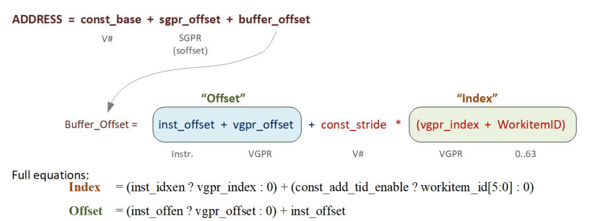

## <span id="page-96-0"></span>**9.4.1. Range Checking**

Buffer addresses are checked against the size of the memory buffer. Loads that are out of range return zero, and stores and atomics are dropped. Range checking is per-component for non-formatted loads and stores that are larger than one DWORD. Note that load/store\_B64, B96 and B128 are considered "2-DWORD/3-DWORD/4- DWORD load/store", and each DWORD is bounds checked separately. The method of clamping is controlled by

9.4. Buffer Addressing 88 of 600


a 2-bit field in the buffer resource: OOB\_SELECT (Out of Bounds select).

Table 46. Buffer Out Of Bounds Selection

| OOB<br>SELECT | Out of Bounds Check                                                                                                                               | Description or use                           |  |
|---------------|---------------------------------------------------------------------------------------------------------------------------------------------------|----------------------------------------------|--|
| 0             | (index >= NumRecords)    (offset+payload > stride)                                                                                                | structured buffers                           |  |
| 1             | (index >= NumRecords)                                                                                                                             | Raw buffers                                  |  |
| 2             | (NumRecords == 0)                                                                                                                                 | do not check bounds (except<br>empty buffer) |  |
| 3             | Bounds check:                                                                                                                                     | Raw<br>In this mode, "num_records" is        |  |
|               | if (swizzle_en && const_stride != 0x0)<br>OOB = (index >= NumRecords    (offset+payload > stride))<br>else<br>OOB = (offset+payload > NumRecords) | reduced by "sgpr_offset"                     |  |
|               | Where "payload" is the number of bytes the instruction transfers.                                                                                 |                                              |  |

#### **Notes:**

- 1. Loads that go out-of-range return zero (except for components with V#.dst\_sel = SEL\_1 that return 1).
- 2. Stores that are out-of-range do not store anything.
- 3. Load/store-format-\* instruction and atomics are range-checked "all or nothing" either entirely in or out.
- 4. Load/store-B{64,96,128} and range-check per component. For MTBUF, if any component of the thread is out of bounds, the whole thread is considered out of bounds and returns zero. For MUBUF, only the components that are out of bounds return zero.

### **9.4.1.1. Structured Buffer**

The address calculation for swizzle\_en==0 is: (unswizzled structured buffer)

```
  ADDR = Base + baseOff + Ioff + Stride * Vidx + (OffEn ? Voff : 0)
  V# SGPR INST V# VGPR INST VGPR
```

NumRecords for structured buffer is in units of stride.

### **9.4.1.2. Raw Buffer**

```
  ADDR = Base + baseOff + Ioff + (OffEn ? Voff : 0)
  V# SGPR INST INST VGPR
```

NumRecords for raw buffer is in units of bytes. This is an exact range check, meaning it includes the payload and handles multi-DWORD and unaligned correctly. The stride field is ignored.

9.4. Buffer Addressing 89 of 600


### **9.4.1.3. Scratch Buffer**

The address calculation for swizzle\_en = 0 is…(unswizzled scratch buffer)

```
  ADDR = Base + baseOffset + Ioff + Stride * TID + (OffEn ? Voff : 0)
  V# SGPR INST V# 0..63 INST VGPR
```

Swizzle of scratch buffer is also supported (and is typical). The MSBs of the TID (TID / 64) is folded into baseOffset. No range checking (using OOB mode 2).

### **9.4.1.4. Scalar Memory**

Scalar memory does the following, that works with RAW buffers and unswizzled structured buffers:

```
Addr = Base + offset
  V# SGPR or Inst
```

Address Out-of-Range if: offset >= ( (stride==0 ? 1 : stride) \* num\_records).

### **Notes**

- 1. Loads that go out-of-range return zero (except for components with V#.dst\_sel = SEL\_1 that return 1). Stores that are out of range do not write anything.
- 2. Load/store-format-\* instruction and atomics are range-checked "all or nothing" either entirely in or out.
- 3. Load/store-DWORD-x{2,3,4} perform range-check per component.

### <span id="page-98-0"></span>**9.4.2. Swizzled Buffer Addressing**

Swizzled addressing rearranges the data in the buffer that may improve cache locality for arrays of structures. Swizzled addressing also requires DWORD-aligned accesses. A single fetch instruction must not fetch a unit larger than const\_element\_size. The buffer's STRIDE must be a multiple of const\_element\_size.

**const\_element\_size is either 4 or 16 bytes, depending on the setting of V#.swizzle\_enable**

```
Index = (inst_idxen ? vgpr_index : 0) + (const_add_tid_enable ? thread_id[5:0] : 0)
Offset = (inst_offen ? vgpr_offset : 0) + inst_offset
index_msb = index / const_index_stride
index_lsb = index % const_index_stride
offset_msb = offset / const_element_size
offset_lsb = offset % const_element_size
buffer_offset = (index_msb * const_stride + offset_msb * const_element_size) * const_index_stride +
  index_lsb * const_element_size + offset_lsb
Final Address = const_base + sgpr_offset + buffer_offset
  The "sgpr_offset" is not a part of the "offset" term in the above equations - it's in the "base".
```

9.4. Buffer Addressing 90 of 600


#### Example of Buffer Swizzling

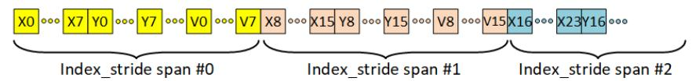

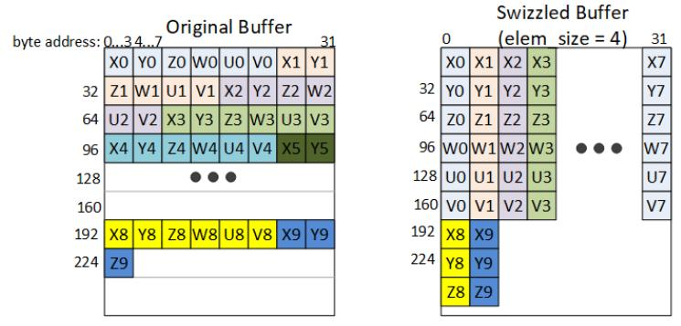

# <span id="page-99-0"></span>**9.5. Alignment**

Formatted ops such as BUFFER\_LOAD\_FORMAT\_\* must be aligned as follows:

- 1-byte formats require 1-byte alignment
- 2-byte formats require 2-byte alignment
- 4-byte and larger formats require 4-byte alignment

Atomics must be aligned to the data size, or triggers a MEMVIOL.

Memory alignment enforcement for non-formatted ops is controlled by a configuration register: SH\_MEM\_CONFIG.alignment\_mode.

Options are:

9.5. Alignment 91 of 600


- 0. : DWORD hardware automatically aligns request to the smaller of: element-size or DWORD. For DWORD or larger loads or stores of non-formatted ops (such as BUFFER\_LOAD\_DWORD), the two LSBs of the byte-address are ignored, thus forcing DWORD alignment.
- 1. : DWORD\_STRICT must be aligned to the smaller of: element-size or DWORD.
- 2. : STRICT access must be aligned to data size
- 3. : UNALIGNED any alignment is allowed

Options 1 and 2 report MEMVIOL if a request is made with incorrect address alignment. In options 1 and 2, loads that are misaligned return zero, and stores that are misaligned are discarded. Note that in this context "element-size" refers to the size of the data transfer indicated by the instruction, not const\_element\_size.

# <span id="page-100-0"></span>**9.6. Buffer Resource**

The buffer resource (V#) describes the location of a buffer in memory and the format of the data in the buffer. It is specified in four consecutive SGPRs (4-SGPR aligned) and sent to the texture cache with each buffer instruction.

The table below details the fields that make up the buffer resource descriptor.

| Bits    | Size | Name           | Description                                                                                                                                                                                         |
|---------|------|----------------|-----------------------------------------------------------------------------------------------------------------------------------------------------------------------------------------------------|
| 47:0    | 48   | Base address   | Byte address.                                                                                                                                                                                       |
| 61:48   | 14   | Stride         | Bytes 0 to 16383                                                                                                                                                                                    |
| 63:62   | 2    | swizzle Enable | Swizzle AOS according to stride, index_stride and element_size;<br>otherwise linear.<br>0: disabled<br>1: enabled with element_size = 4byte<br>2: Reserved<br>3: enabled with element_size = 16byte |
| 95:64   | 32   | Num_records    | In units of stride if (stride >=1), else in bytes.                                                                                                                                                  |
| 98:96   | 3    | Dst_sel_x      | Destination channel select:                                                                                                                                                                         |
| 101:99  | 3    | Dst_sel_y      | 0=0, 1=1, 4=R, 5=G, 6=B, 7=A                                                                                                                                                                        |
| 104:102 | 3    | Dst_sel_z      |                                                                                                                                                                                                     |
| 107:105 | 3    | Dst_sel_w      |                                                                                                                                                                                                     |
| 113:108 | 6    | Format         | Memory data type.                                                                                                                                                                                   |
| 118:117 | 2    | Index stride   | 0:8, 1:16, 2:32, or 3:64. Used for swizzled buffer addressing.                                                                                                                                      |
| 119     | 1    | Add tid enable | Add thread ID to the index for to calculate the address.                                                                                                                                            |
| 123:122 | 2    | Reserved       | Set to zero.                                                                                                                                                                                        |
| 125:124 | 2    | OOB_SELECT     | Out of bounds select.                                                                                                                                                                               |
| 127:126 | 2    | Type           | Value == 0 for buffer. Overlaps upper two bits of four-bit TYPE field in<br>128-bit V# resource.                                                                                                    |

Table 47. Buffer Resource Descriptor

#### **Unbound Resources**

Setting the resource constant to all zeros has the effect of forcing any loads to return zero, and stores to be ignored. This is keyed off the "data-format" being set to zero (INVALID), and for MUBUF the "add\_tid\_en = false".

#### **Resource - Instruction mismatch**

9.6. Buffer Resource 92 of 600


If the resource type and instruction mismatch (e.g. a buffer constant with an image instruction, or an image resource with a buffer instruction), the instruction is ignored (loads return nothing and stores do not alter memory).

9.6. Buffer Resource 93 of 600


# <span id="page-102-0"></span>**Chapter 10. Vector Memory Image Instructions**

Vector Memory (VMEM) Image operations transfer data between the VGPRs and memory through the texture cache. Image operations support access to image objects such as texture maps and typed surfaces. Sample operations read multiple elements from a surface and combine them to produce a single result per lane.

Image objects are accessed using from one to four dimensional addresses; they are composed of homogeneous samples, each sample containing one to four elements. These image objects are read from, or written to, using IMAGE\_\* or SAMPLE\_\* instructions, all of which use the MIMG instruction format. IMAGE\_LOAD instructions load an element from the image buffer directly into VGPRS, and SAMPLE instructions use sampler constants (S#) and apply filtering to the data after it is read. IMAGE\_ATOMIC instructions combine data from VGPRs with data already in memory, and optionally return the value that was in memory before the operation.

VMEM image operations use an image resource constant (T#) that is a 128-bit or 256-bit value in SGPRs. This constant is sent to the texture cache when the instruction is executed. This constant defines the address, data format, and characteristics of the surface in memory. Some image instructions also use a sampler constant that is a 128-bit constant in SGPRs. Typically, these constants are fetched from memory using scalar memory loads prior to executing VM instructions, but these constants can also be generated within the shader.

Texture fetch instructions have a data mask (DMASK) field. DMASK specifies how many data components it receives. If DMASK is less than the number of components in the texture, the texture unit only sends DMASK components, starting with R, then G, B, and A. if DMASK specifies more than the texture format specifies, the shader receives data based on T#.DST\_SEL for the missing components. Image ops do not generate MemViol instead they apply clamp modes if the address goes out of range.

Memory operations of different types (e.g. loads, stores and samples) can complete out of order with respect to each other.

# <span id="page-102-1"></span>**10.1. Image Instructions**

This section describes the image instruction set, and the microcode fields available to those instructions.

| MIMG Instructions                                                 |                                                                                                                                                                                                     |  |  |  |
|-------------------------------------------------------------------|-----------------------------------------------------------------------------------------------------------------------------------------------------------------------------------------------------|--|--|--|
| IMAGE_SAMPLE<br>IMAGE_SAMPLE_G16                                  | Load and filter data from a image object<br>Sample with 16-bit gradients                                                                                                                            |  |  |  |
| IMAGE_GATHER4                                                     | Load and return samples from 4 texels for software filtering. Returns a single<br>component, starting with the lower-left texel and in counter-clockwise order.                                     |  |  |  |
| IMAGE_GATHER4H                                                    | 4H: fetch 1 component per texel from 4x1 texels<br>"DMASK" selects which component to load (R,G,B,A) and must have only one bit<br>set to 1.                                                        |  |  |  |
| IMAGE_LOAD_{-, PCK, PCK_SGN}<br>IMAGE_LOAD_MIP_{-, PCK, PCK_SGN } | Load data from an image object<br>Load data from an image object from a specified mip level.                                                                                                        |  |  |  |
| IMAGE_MSAA_LOAD                                                   | Load up to 4 samples of 1 component from an MSAA resource with a user<br>specified fragment ID.<br>Uses DMASK as component select - it behaves like gather4 ops and returns 4<br>VGPR (2 if D16=1). |  |  |  |
| IMAGE_STORE_{-, PCK }<br>IMAGE_STORE_MIP_{-, PCK }                | Store data to an image object to a specific mipmap level                                                                                                                                            |  |  |  |

10.1. Image Instructions 94 of 600


| MIMG Instructions                                                                             |                                                                                                                                                                                                                                                                      |
|-----------------------------------------------------------------------------------------------|----------------------------------------------------------------------------------------------------------------------------------------------------------------------------------------------------------------------------------------------------------------------|
| IMAGE_ATOMIC_{SWAP, CMPSWAP,<br>ADD, SUB, SMIN, UMIN, SMAX, UMAX,<br>AND, OR, XOR, INC, DEC } | Image atomic operations                                                                                                                                                                                                                                              |
| IMAGE_GET_RESINFO                                                                             | Return resource info into 4 VGPRs for the MIP level specified. These are 32bit<br>integer values:<br>VDATA3-0 = { #mipLevels, depth, height, width }<br>For cubemaps, depth = 6 * Number_of_array_faces.<br>(DX expects the # of cubes, but gets # of faces instead) |
| IMAGE_GET_LOD                                                                                 | Return the calculated LOD. Treated as a Sample instruction.<br>Returns the "raw" LOD and the "clamped" LOD into VDATA as two 32 bit floats:<br>First VGPR = clampLOD<br>Second VGPR = rawLOD                                                                         |

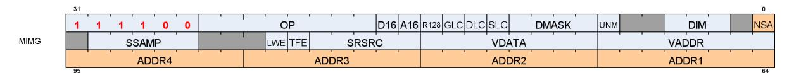

Table 48. Instruction Fields

| Instruction Fields |      |                                                                                                                                                                                                                                                                                                                                                                                                                                                                                                |                  |  |
|--------------------|------|------------------------------------------------------------------------------------------------------------------------------------------------------------------------------------------------------------------------------------------------------------------------------------------------------------------------------------------------------------------------------------------------------------------------------------------------------------------------------------------------|------------------|--|
| Field              | Size | Description                                                                                                                                                                                                                                                                                                                                                                                                                                                                                    |                  |  |
| OP                 | 8    | Opcode                                                                                                                                                                                                                                                                                                                                                                                                                                                                                         |                  |  |
| VADDR              | 8    | Address of VGPR to supply first component of address.                                                                                                                                                                                                                                                                                                                                                                                                                                          |                  |  |
| VDATA              | 8    | Address of VGPR to supply first component of store-data or receive first component of load-data.                                                                                                                                                                                                                                                                                                                                                                                               |                  |  |
| SSAMP              | 5    | SGPR to supply S# (sampler constant) in 4 consecutive SGPRs.<br>missing 2 LSB's of SGPR-address since must be aligned to 4.                                                                                                                                                                                                                                                                                                                                                                    |                  |  |
| SRSRC              | 5    | SGPR to supply T# (resource constant) in 8 consecutive SGPRs.<br>missing 2 LSB's of SGPR-address since must be aligned to 4.                                                                                                                                                                                                                                                                                                                                                                   |                  |  |
| UNRM               | 1    | Force address to be un-normalized. Must be set to 1 for Image stores & atomics.<br>0: for image ops with samplers, S,T,R from [0.0, 1.0] span the entire texture map;<br>1: for image ops with samplers, S,T,R from [0.0 to N] span the texture map, where N is width,<br>height or depth. Array/cube slice, lod, bias etc. are not affected. Image ops without sampler are<br>not affected. UINT inputs are "unnormalized".<br>This bit is logically OR'd with the S#.force_unnormalized bit. |                  |  |
| R128               | 1    | Texture Resource Size: 1 = 128bits, 0 = 256bits                                                                                                                                                                                                                                                                                                                                                                                                                                                |                  |  |
| A16                | 1    | Address components are 16-bits (instead of the usual 32 bits).<br>When set, all address components are 16 bits (packed into 2 per DWORD), except:<br>Texel offsets (3 6bit UINT packed into 1 DWORD)<br>PCF reference (for "_C" instructions)<br>Address components are 16b uint for image ops without sampler; 16b float with sampler.                                                                                                                                                        |                  |  |
| DIM                | 3    | Surface Dimension:                                                                                                                                                                                                                                                                                                                                                                                                                                                                             |                  |  |
|                    |      | 0: 1D                                                                                                                                                                                                                                                                                                                                                                                                                                                                                          | 4: 1d array      |  |
|                    |      | 1: 2D                                                                                                                                                                                                                                                                                                                                                                                                                                                                                          | 5: 2d array      |  |
|                    |      | 2: 3D                                                                                                                                                                                                                                                                                                                                                                                                                                                                                          | 6: 2d msaa       |  |
|                    |      | 3: cube                                                                                                                                                                                                                                                                                                                                                                                                                                                                                        | 7: 2d msaa array |  |

10.1. Image Instructions 95 of 600


| Instruction Fields<br>DMASK<br>4 | Data VGPR enable mask: 1 4 consecutive VGPRs<br>Loads: defines which components are returned: 0=red,1=green,2=blue,3=alpha<br>Stores: defines which components are written with data from VGPRs (missing components get 0).                                                                                                                                                                                                                                                                                                                                                                                                                                                                                                                                                                                                                                                                                                                                |
|----------------------------------|------------------------------------------------------------------------------------------------------------------------------------------------------------------------------------------------------------------------------------------------------------------------------------------------------------------------------------------------------------------------------------------------------------------------------------------------------------------------------------------------------------------------------------------------------------------------------------------------------------------------------------------------------------------------------------------------------------------------------------------------------------------------------------------------------------------------------------------------------------------------------------------------------------------------------------------------------------|
|                                  | Enabled components come from consecutive VGPRs.<br>E.G. DMASK=1001 : Red is in VGPRn and alpha in VGPRn+1.<br>For D16 loads, DMASK indicates which components to return;<br>For D16 stores, the DMASK the mask indicates which components to store but has restrictions:<br>Data is read out of consecutive VGPRs: LSB's of VDATA, then MSB's of VDATA then LSB's<br>of VDATA+1 and last if needed MSB's of VDATA+1. This is regardless of which DMASK bits<br>are set, only how many bits are set. The position of the DMASK bits controls which components<br>are written in memory.<br>If DMASK==0, the TA overrides DMASK=1 and puts zeros in VGPR followed by LWE status if exists. TFE<br>status is not generated since the fetch is dropped.<br>For IMAGE_GATHER4* instructions, DMASK indicates which component (RGBA), and the<br>number of VGPRs to use is determined automatically by hardware (4 VGPRs when D16=0, and 2<br>VGPRs when D16=1). |
| GLC<br>1                         | Group Level Coherent.<br>Atomics:<br>1 = return the memory value before the atomic operation is performed.<br>0 = do not return anything.                                                                                                                                                                                                                                                                                                                                                                                                                                                                                                                                                                                                                                                                                                                                                                                                                  |
| DLC<br>1                         | Device Level Coherent. Controls behavior of L1 cache (GL1).                                                                                                                                                                                                                                                                                                                                                                                                                                                                                                                                                                                                                                                                                                                                                                                                                                                                                                |
| SLC<br>1                         | System Level Coherent.                                                                                                                                                                                                                                                                                                                                                                                                                                                                                                                                                                                                                                                                                                                                                                                                                                                                                                                                     |
| TFE<br>1                         | Texel Fault Enable for PRT (Partially Resident Textures). When set, fetch may return a NACK that<br>causes a VGPR write into DST+1 (first GPR after all fetch-dest gprs).                                                                                                                                                                                                                                                                                                                                                                                                                                                                                                                                                                                                                                                                                                                                                                                  |
| LWE<br>1                         | LOD Warning Enable. When set to 1, a texture fetch may return "LOD_CLAMPED = 1", and causes<br>a VGPR write into DST+1 (first GPR after all fetch-dest gprs). LWE only works for sampler ops;<br>LWE is ignored for non-sampler ops.                                                                                                                                                                                                                                                                                                                                                                                                                                                                                                                                                                                                                                                                                                                       |
| D16<br>1                         | VGPR-Data-16bit. On loads, convert data in memory to 16-bit format before storing it in VGPRs.<br>For stores, convert 16-bit data in VGPRs to the memory format before going to memory. Whether<br>the data is treated as float or int is decided by NFMT. Allowed only with these opcodes:<br>• IMAGE_SAMPLE*<br>• IMAGE_GATHER4<br>• IMAGE_LOAD<br>• IMAGE_LOAD_MIP<br>• IMAGE_STORE<br>• IMAGE_STORE_MIP                                                                                                                                                                                                                                                                                                                                                                                                                                                                                                                                                |
| NSA<br>1                         | Non-Sequential Address<br>When NSA=0, the image addresses must be in sequential VGPRs starting at 'VADDR'.<br>When NSA=1, the instruction encoding allows up to 5 address components to be specified                                                                                                                                                                                                                                                                                                                                                                                                                                                                                                                                                                                                                                                                                                                                                       |
|                                  | separately by using an additional instruction DWORD.                                                                                                                                                                                                                                                                                                                                                                                                                                                                                                                                                                                                                                                                                                                                                                                                                                                                                                       |

### <span id="page-104-0"></span>**10.1.1. Texture Fault Enable (TFE) and LOD Warning Enable (LWE)**

This is related to "Partially Resident Textures".

When either of these bits are set in the instruction, any texture fetch may return one extra VGPR after all of the data-return VGPRs. This data is returned uniquely to each thread and indicates the error / warning status of that thread.

10.1. Image Instructions 96 of 600


The data returned is: TEXEL\_FAIL | (LOD\_WARNING << 1) | (LOD << 16)

- TEXEL\_FAIL : 1 bit indicating that 1 or more texels for this pixel produced a NACK. "failure" means accessing an unmapped page.
  - TFE == 0
    - TD writes the data for threads that didn't NACK to VGPR DST
    - TD writes zeros or the result of blend using zeros for samples that NACKed to VGPR DST
  - TFE == 1
    - VGPR DST is written similar to above
    - TD writes to VGPR DST+1 with a status where the bits corresponding to threads that NACKed are set to 1
- LOD\_WARNING : 1 bit indicating a that a pixel attempted to access a texel at too small a LOD: warn = ( LOD < T#.min\_lod\_warning)
- LOD : indicates which LOD was attempted to be accessed that caused the NACK. Returns the floor of the requested LOD.

A pixel cannot receive both TEXEL\_FAIL and LOD\_WARNING: TEXEL\_FAIL takes precedence.

### <span id="page-105-0"></span>**10.1.2. D16 Instructions**

Load-format and store-format instructions also come in a "d16" variant. For stores, each 32-bit VGPR holds two 16-bit data elements that are passed to the texture unit. The texture unit converts them to the texture format before writing to memory. For loads, data returned from the texture unit is converted to 16 bits, and a pair of data are stored in each 32- bit VGPR (LSBs first, then MSBs). The DMASK bit represents individual 16- bit elements; so, when DMASK=0011 for an image-load, two 16-bit components are loaded into a single 32-bit VGPR.

### <span id="page-105-1"></span>**10.1.3. A16 Instructions**

The **A16** instruction bit indicates that the address components are 16 bits instead of the usual 32 bits. Components are packed such that the first address component goes into the low 16 bits ([15:0]), and the next into the high 16 bits ([31:16]).

### <span id="page-105-2"></span>**10.1.4. G16 Instructions**

The instructions with "G16" in the name mean the user provided derivatives are 16 bits instead of the usual 32 bits. Derivatives are packed such that the first derivative goes into the low 16 bits ([15:0]), and the next into the high 16 bits ([31:16]).

### <span id="page-105-3"></span>**10.1.5. Image Non-Sequential Address (NSA)**

To avoid having many V\_MOV instructions to pack image address VGPRs together, MIMG supports a "Non Sequential Address" version of the instruction where the VGPR of every address component is uniquely defined. Data components are still packed. This format creates a larger instruction word, which can be up to 3 DWORDs long. The first address goes in the VADDR field, and subsequent addresses go into ADDR1-4. This 3 DWORD form of the instruction can supply up to 5 addresses.

10.1. Image Instructions 97 of 600


NSA allows an image instruction to specify up to 5 unique address VGPRs. These are the rules for how instructions requiring more than 5 addresses are handled with NSA. It is permissible to use non-NSA mode where all addresses are in sequential VGPRs.

- VADDR provides the first address component
- ADDR1 provides the second address component
- ADDR2 provides the third address component
- ADDR3 provides the fourth address component
- ADDR4 provides all additional components in sequential VGPRs: VADDR4, VADDR4+1, etc.

When using 16-bit addresses, each VGPR holds a pair of addresses and these cannot be located in different VGPRs. The lower numbered 16-bit value is in the LSBs of the VGPR.

For Ray Tracing, the VGPRs are divided up into 5 groups of VGPRs. The VGPRs within each group must be contiguous, but the groups can be scattered. The packing is different when A16=1 because RayDir.Z and RayInvDir.x are in the same DWORD. In A16 mode, the RayDir and RayInvDir are merged into 3 VGPRs but in a different order: RayDir and RayInvDir per component share a VGPR.

# <span id="page-106-0"></span>**10.2. Image Opcodes with No Sampler**

For image opcodes with no sampler, all VGPR address values are taken as uint. For cubemaps, face\_id = slice \* **6** + face.

MSAA surfaces support only load, store and atomics; not load-mip or store-mip.

The table below shows the contents of address VGPRs for the various image opcodes.

| Opcode      | a16[0] type |               | acnt | VGPRn<br>[31:0] | VGPRn+1[31:0] | VGPRn+2[31:0] | VGPRn+3[31:0] |
|-------------|-------------|---------------|------|-----------------|---------------|---------------|---------------|
| GET_RESINFO | x           | Any           | 0    | mipid           |               |               |               |
| MSAA_LOAD   | 0           | 2D MSAA       | 2    | s               | t             | fragid        |               |
|             |             | 2D Array MSAA | 3    | s               | t             | slice         | fragid        |
|             | 1           | 2D MSAA       | 2    | t, s            | -, fragid     |               |               |
|             |             | 2D Array MSAA | 3    | t, s            | fragid, slice |               |               |


| Opcode                                         | a16[0] type |                   | acnt | VGPRn<br>[31:0] | VGPRn+1[31:0] | VGPRn+2[31:0] | VGPRn+3[31:0] |
|------------------------------------------------|-------------|-------------------|------|-----------------|---------------|---------------|---------------|
| LOAD                                           | 0           | 1D                | 0    | s               |               |               |               |
| LOAD_PCK<br>LOAD_PCK_SGN<br>STORE<br>STORE_PCK |             | 2D                | 1    | s               | t             |               |               |
|                                                |             | 3D                | 2    | s               | t             | r             |               |
|                                                |             | Cube/Cube Array 2 |      | s               | t             | face          |               |
|                                                |             | 1D Array          | 1    | s               | slice         |               |               |
|                                                |             | 2D Array          | 2    | s               | t             | slice         |               |
|                                                |             | 2D MSAA           | 2    | s               | t             | fragid        |               |
|                                                |             | 2D Array MSAA     | 3    | s               | t             | slice         | fragid        |
|                                                | 1           | 1D                | 0    | -, s            |               |               |               |
|                                                |             | 2D                | 1    | t, s            |               |               |               |
|                                                |             | 3D                | 2    | t, s            | -, r          |               |               |
|                                                |             | Cube/Cube Array 2 |      | t, s            | -, face       |               |               |
|                                                |             | 1D Array          | 1    | slice, s        |               |               |               |
|                                                |             | 2D Array          | 2    | t, s            | -, slice      |               |               |
|                                                |             | 2D MSAA           | 2    | t, s            | -, fragid     |               |               |
|                                                |             | 2D Array MSAA     | 3    | t, s            | fragid, slice |               |               |
| ATOMIC                                         | 0           | 1D                | 0    | s               |               |               |               |
|                                                |             | 2D                | 1    | s               | t             |               |               |
|                                                |             | 3D                | 2    | s               | t             | r             |               |
|                                                |             | 1D Array          | 1    | s               | slice         |               |               |
|                                                |             | 2D Array          | 2    | s               | t             | slice         |               |
|                                                |             | 2D MSAA           | 2    | s               | t             | fragid        |               |
|                                                |             | 2D Array MSAA     | 3    | s               | t             | slice         | fragid        |
|                                                | 1           | 1D                | 0    | -, s            |               |               |               |
|                                                |             | 2D                | 1    | t, s            |               |               |               |
|                                                |             | 3D                | 2    | t, s            | -, r          |               |               |
|                                                |             | 1D Array          | 1    | slice, s        |               |               |               |
|                                                |             | 2D Array          | 2    | t, s            | -, slice      |               |               |
|                                                |             | 2D MSAA           | 2    | t, s            | -, fragid     |               |               |
|                                                |             | 2D Array MSAA     | 3    | t, s            | fragid, slice |               |               |
| LOAD_MIP                                       | 0           | 1D                | 1    | s               | mipid         |               |               |
| LOAD_MIP_PCK                                   |             | 2D                | 2    | s               | t             | mipid         |               |
| LOAD_MIP_PCK_SGN                               |             | 3D                | 3    | s               | t             | r             | mipid         |
| STORE_MIP                                      |             | Cube/Cube Array 3 |      | s               | t             | face          | mipid         |
| STORE_MIP_PCK                                  |             | 1D Array          | 2    | s               | slice         | mipid         |               |
|                                                |             | 2D Array          | 3    | s               | t             | slice         | mipid         |
|                                                | 1           | 1D                | 1    | mipid, s        |               |               |               |
|                                                |             | 2D                | 2    | t, s            | -, mipid      |               |               |
|                                                |             | 3D                | 3    | t, s            | mipid, r      |               |               |
|                                                |             | Cube/Cube Array 3 |      | t, s            | mipid, face   |               |               |
|                                                |             | 1D Array          | 2    | slice, s        | -, mipid      |               |               |
|                                                |             | 2D Array          | 3    | t, s            | mipid, slice  |               |               |

- Image\_Load : image\_load, image\_load\_mip, image\_load\_{pck, pck\_sgn, mip\_pck, mip\_pck\_sgn}
- Image\_Store: image\_store, image\_store\_mip
- Image\_Atomic\_\*: swap, cmpswap, add, sub, {u,s}{min,max}, and, or, xor, inc, dec.

<sup>&</sup>quot;ACNT" is the Address Count: the number of VGPRs that supply the "body" of the address, derived from the

instruction's DIM field and the opcode.

# <span id="page-108-0"></span>**10.3. Image Opcodes with a Sampler**

Opcodes with a sampler: all VGPR address values are taken as FLOAT except for Texel-offset which are UINT. For cubemaps, face\_id = slice \* **8** + face.

(Note that the "\*8" differs from the non-sampler case which is "\*6").

Certain sample and gather opcodes require additional values from VGPRs beyond what is shown in the table below. These values are: offset, bias, z-compare and gradients. Please see the next section for details. MSAA surfaces do not support sample or gather4 operations.

| Opcode           | a16[0] acnt type |   |             | VGPRn<br>[31:0] | VGPRn+1[31:0] | VGPRn+2[31:0] | VGPRn+3[31:0] |
|------------------|------------------|---|-------------|-----------------|---------------|---------------|---------------|
| Sample<br>GetLod | 0                | 0 | 1D          | s               |               |               |               |
|                  |                  | 1 | 2D          | s               | t             |               |               |
|                  |                  | 2 | 3D          | s               | t             | r             |               |
|                  |                  | 2 | Cube(Array) | s               | t             | face          |               |
|                  |                  | 1 | 1D Array    | s               | slice         |               |               |
|                  |                  | 2 | 2D Array    | s               | t             | slice         |               |
|                  | 1                | 0 | 1D          | -, s            |               |               |               |
|                  |                  | 1 | 2D          | t, s            |               |               |               |
|                  |                  | 2 | 3D          | t, s            | -, r          |               |               |
|                  |                  | 2 | Cube(Array) | t, s            | -, face       |               |               |
|                  |                  | 1 | 1D Array    | slice, s        |               |               |               |
|                  |                  | 2 | 2D Array    | t, s            | -, slice      |               |               |
| Sample "_L":     | 0                | 1 | 1D          | s               | lod           |               |               |
|                  |                  | 2 | 2D          | s               | t             | lod           |               |
|                  |                  | 3 | 3D          | s               | t             | r             | lod           |
|                  |                  | 3 | Cube(Array) | s               | t             | face          | lod           |
|                  |                  | 2 | 1D Array    | s               | slice         | lod           |               |
|                  |                  | 3 | 2D Array    | s               | t             | slice         | lod           |
|                  | 1                | 1 | 1D          | lod, s          |               |               |               |
|                  |                  | 2 | 2D          | t, s            | -, lod        |               |               |
|                  |                  | 3 | 3D          | t, s            | lod, r        |               |               |
|                  |                  | 3 | Cube(Array) | t, s            | lod, face     |               |               |
|                  |                  | 2 | 1D Array    | slice, s        | -, lod        |               |               |
|                  |                  | 3 | 2D Array    | t, s            | lod, slice    |               |               |
| Sample "_CL":    | 0                | 1 | 1D          | s               | clamp         |               |               |
|                  |                  | 2 | 2D          | s               | t             | clamp         |               |
|                  |                  | 3 | 3D          | s               | t             | r             | clamp         |
|                  |                  | 3 | Cube(Array) | s               | t             | face          | clamp         |
|                  |                  | 2 | 1D Array    | s               | slice         | clamp         |               |
|                  |                  | 3 | 2D Array    | s               | t             | slice         | clamp         |
|                  | 1                | 1 | 1D          | clamp, s        |               |               |               |
|                  |                  | 2 | 2D          | t, s            | -, clamp      |               |               |
|                  |                  | 3 | 3D          | t, s            | clamp, r      |               |               |
|                  |                  | 3 | Cube(Array) | t, s            | clamp, face   |               |               |
|                  |                  | 2 | 1D Array    | slice, s        | -, clamp      |               |               |
|                  |                  | 3 | 2D Array    | t, s            | clamp, slice  |               |               |


| Opcode       | a16[0] acnt type |   |             | VGPRn<br>[31:0] | VGPRn+1[31:0] | VGPRn+2[31:0] | VGPRn+3[31:0] |
|--------------|------------------|---|-------------|-----------------|---------------|---------------|---------------|
| Gather       | 0                | 1 | 2D          | s               | t             |               |               |
|              |                  | 2 | Cube(Array) | s               | t             | face          |               |
|              |                  | 2 | 2D Array    | s               | t             | slice         |               |
|              | 1                | 1 | 2D          | t, s            |               |               |               |
|              |                  | 2 | Cube(Array) | t, s            | -, face       |               |               |
|              |                  | 2 | 2D Array    | t, s            | -, slice      |               |               |
| Gather "_L"  | 0                | 2 | 2D          | s               | t             | lod           |               |
|              |                  | 3 | Cube(Array) | s               | t             | face          | lod           |
|              |                  | 3 | 2D Array    | s               | t             | slice         | lod           |
|              | 1                | 2 | 2D          | t, s            | -, lod        |               |               |
|              |                  | 3 | Cube(Array) | t, s            | lod, face     |               |               |
|              |                  | 3 | 2D Array    | t, s            | lod, slice    |               |               |
| Gather "_CL" | 0                | 2 | 2D          | s               | t             | clamp         |               |
|              |                  | 3 | Cube(Array) | s               | t             | face          | clamp         |
|              |                  | 3 | 2D Array    | s               | t             | slice         | clamp         |
|              | 1                | 2 | 2D          | t, s            | -, clamp      |               |               |
|              |                  | 3 | Cube(Array) | t, s            | clamp, face   |               |               |
|              |                  | 3 | 2D Array    | t, s            | clamp, slice  |               |               |

The table below lists and briefly describes the legal suffixes for image instructions:

**Suffix Meaning Extra Addresses Description** \_L LOD - LOD is used instead of computed LOD. \_B LOD BIAS 1: lod bias Add this BIAS to the computed LOD. \_CL LOD CLAMP - Clamp the computed LOD to be no larger than this value. \_D Derivative 2,4 or 6: slopes Send dx/dv, dx/dy, etc. slopes to be used in LOD computation. \_LZ Level 0 - Force use of MIP level 0. \_C PCF 1: z-comp Percentage closer filtering. \_O Offset 1: offsets Send X, Y, Z integer offsets (packed into 1 DWORD) to offset XYZ address. \_G16 Gradient 16b - Gradients are 16-bits instead of 32-bits, packed 2 gradients per VGPR (dX in low 16bits, dY in high 16bits).

Table 49. Sample Instruction Suffix Key

# <span id="page-109-0"></span>**10.4. VGPR Usage**

**Address**: The address consists of up to 5 parts: { **offset** } { **bias** } { **z-compare** } { **derivative** } { **body** }

These are all packed into consecutive VGPRs, (may be non-consecutive if "NSA" is used), and can consist of up to 12 values.

- **Offset**: SAMPLE\*O\*, GATHER\*O\* 1 DWORD of 'offset\_xyz' . The offsets are 6-bit signed integers: X=[5:0], Y=[13:8], Z=[21:16]
- **Bias**: SAMPLE\*B\*, GATHER\*B\*. 1 DWORD float.
- **Z-compare**: SAMPLE\*C\*, GATHER\*C\*. 1 DWORD.
- **Derivatives** (SAMPLE\_D): 2,4 or 6 DWORDS these packed 1 DWORD per derivative as shown below (F32).
- **Body:** One to four DWORDs, as defined by the table: [Image Opcodes with a Sampler](#page-108-0) Address components are X,Y,Z,W with X in VGPR[M], Y in VGPR[M]+1, etc.

10.4. VGPR Usage 101 of 600


The number of components in "body" is the value of the ACNT field in the table, plus one.

Address components are X,Y,Z,W with X in VGPR[M], Y in VGPR[M]+1, etc.

Note: Bias and Derivatives are mutually exclusive - the shader can use one or the other, but not both.

### **32-bit derivatives:**

| Image Dim | VGPR N | N+1   | N+2   | N+3   | N+4   | N+5   |
|-----------|--------|-------|-------|-------|-------|-------|
| 1D        | dx/dh  | dx/dv | -     | -     | -     | -     |
| 2D/cube   | dx/dh  | dy/dh | dx/dv | dy/dv | -     | —     |
| 3D        | dx/dh  | dy/dh | dz/dh | dx/dv | dy/dv | dz/dv |

#### **16-bit derivatives:**

| Image Type                | VGPR_D                    | VGPR_D+1                    | VGPR_D+2                  | VGPR_D+3 |
|---------------------------|---------------------------|-----------------------------|---------------------------|----------|
| 1 (1D, 1D Array)          | 16'hx, dx/dh              | 16'hx dx/dv                 | -                         | -        |
| 2 (2D, 2D Array, Cubemap) |                           | dy/dh, dx/dh dy/dv, dx/dv - |                           | -        |
| 3 (3D)                    | dy/dh, dx/dh 16'hx, dz/dh |                             | dy/dv, dx/dv 16'hx, dz/dv |          |

The "A16" instruction bit specifies that address components are 16 bits instead of the usual 32 bits.

#### **Data :**

data is stored from or returned to 1-4 consecutive VGPRs. The amount of data loaded or stored is completely determined by the DMASK field of the instruction.

#### **Loads**

DMASK specifies which elements of the resource are returned to consecutive VGPRs. The texture system loads data from memory and based on the data format expands it to a canonical RGBA form, filling in values for missing components based on T#.dst\_sel. Then DMASK is applied and only those components selected are returned to the shader.

#### **Stores**

When writing an image object, it is only possible to write an entire element (all components) - not only individual components. The components come from consecutive VGPRs and the texture system fill in the value zero for any missing components of the image's data format, and ignore any values that are not part of the stored data format. For example if the DMASK=1001, the shader sends Red from VGPR\_N and Alpha from VGPR\_N+1 to the texture unit. If the image object is RGB, the texel is overwritten with Red from the VGPR\_N, Green and Blue set to zero, and Alpha from the shader ignored. For D16=1, the DMASK has 1 bit set per 16-bits of data to be written from VGPRs to memory. The position of the bits in DMASK is irrelevant, only the number of bits set to 1.

#### **"D16" instructions**

Load and store instructions also come in a "d16" variant. For stores, each 32bit VGPR holds two 16bit data elements that are passed to the texture unit which in turn, converts to the texture format before writing to memory. For loads, data returned from the texture unit is converted to 16 bits and a pair of data are stored in each 32bit VGPR (LSBs first, then MSBs). If there is only one component, the data goes into the lower half of the VGPR unless the "HI" instruction variant is used in which case the high-half of the VGPR is loaded with data.

10.4. VGPR Usage 102 of 600


#### **Atomics**

Image atomic operations are supported only on 32- and 64-bit-per-pixel surfaces. The surface data format is specified in the resource constant. Atomic operations treat the element as a single component of 32- or 64 bits. For atomic operations, DMASK is set to the number of VGPRs (DWORDs) to send to the texture unit. DMASK legal values for atomic image operations: All other values of DMASK are illegal.

- 0x1 = 32bit atomics except cmpswap
- 0x3 = 32bit atomic cmpswap
- 0x3 = 64bit atomics except cmpswap
- 0xf = 64bit atomic cmpswap
- Atomics with Return: Data is read out of the VGPR(s), starting at VDATA, to supply to the atomic operation. If the atomic returns a value to VGPRs, that data is returned to those same VGPRs starting at VDATA.

The DMASK must be compatible with the resource's data format.

#### **Denormals in Floats**

Sample ops flush denormals, and loads do not modify denormals.

### <span id="page-111-0"></span>**10.4.1. Data format in VGPRs**

Data in VGPRs sent to texture (stores) or returned from texture (loads) is in one of a few standard formats, and the texture unit converts to/from the memory format.

| FORMAT            | VGPR data format                 | If D16==1           |
|-------------------|----------------------------------|---------------------|
| SINT              | signed 32-bit integer            | 16 bit signed int   |
| UINT              | unsigned 32-bit integer          | 16 bit unsigned int |
| others            | 32-bit float                     | 16 bit float        |
| Atomics           | depends on opcode: uint or float | -                   |
| ASTC data formats | 32-bit float                     | -                   |

# <span id="page-111-1"></span>**10.5. Image Resource**

The image resource (also referred to as T#) defines the location of the image buffer in memory, its dimensions, tiling, and data format. These resources are stored in four or eight consecutive SGPRs and are read by MIMG instructions. All undefined or reserved bit must be set to zero unless otherwise specified.

Table 50. Image Resource Definition

| Bits  | Size                                                                   | Name         | Comments                                                                                                                                            |  |
|-------|------------------------------------------------------------------------|--------------|-----------------------------------------------------------------------------------------------------------------------------------------------------|--|
|       | 128-bit Resource: 1D-tex, 2d-tex, 2d-msaa (multi-sample anti-aliasing) |              |                                                                                                                                                     |  |
| 39:0  | 40                                                                     | base address | 256-byte aligned (represents bits 47:8).                                                                                                            |  |
| 47    | 1                                                                      | Big Page     | 0 = No page size override, 1 = coalesce page translation requests to 64kB<br>granularity. Use only when entire resource uses pages 64kB or greater. |  |
| 51:48 | 4                                                                      | max mip      | MSAA resources: holds Log2(number of samples); others holds:<br>MipLevels-1. This describes the resource, not the resource view.                    |  |
| 59:52 | 8                                                                      | format       | Memory Data format                                                                                                                                  |  |
| 75:62 | 14                                                                     | width        | width-1 of mip 0 in texels                                                                                                                          |  |

10.5. Image Resource 103 of 600


| 91:78<br>14<br>height<br>height-1 of mip 0 in texels<br>98:96<br>3<br>dst_sel_x<br>0 = 0, 1 = 1, 4 = R, 5 = G, 6 = B, 7 = A.<br>101:99<br>3<br>dst_sel_y<br>104:102<br>3<br>dst_sel_z<br>107:105<br>3<br>dst_sel_w<br>111:108<br>4<br>base level<br>115:112<br>4<br>last level<br>samples).<br>123:121<br>3<br>BC Swizzle<br>dst_sel_*s. Internal xyzw channels get the following border color<br>5=yxwz<br>127:124<br>4<br>type<br>2d-msaa, 15 = 2d-msaa-array. 1-7 are reserved.<br>256-bit Resource: 1d-array, 2d-array, 3d, cubemap, MSAA<br>140:128<br>13<br>depth<br>pitch > width.<br>141<br>1<br>Pitch[13]<br>(pitch-1)[13] of mip0 for 1D, 2D and 2D-MSAA.<br>156:144<br>13<br>base array<br>First slice in array of the resource view.<br>163:160<br>4<br>array pitch<br>For 3D, bit 0 indicates SRV or UAV:<br>0: SRV (base_array ignored, depth w.r.t. base map)<br>mip level specified)<br>179:168<br>12<br>min lod warn<br>feedback trigger for LOD, u4.8 format<br>183<br>1<br>corner samples mod<br>1 = corner sampled.<br>198:187<br>12<br>min_lod<br>smallest LOD allowed for PRTs, U4.8 format<br>198:187<br>12<br>min LOD<br>smallest LOD allowed for PRTs, u4.8 format.<br>202<br>1<br>Iterate 256<br>every 256B of the tile. Applies only to MSAA depth surfaces.<br>211<br>1<br>Meta Pipe Aligned<br>Maintains pipe alignment in metadata addressing (DCC and tiling)<br>213<br>1<br>Compression Enable<br>enable delta color compression (DCC)<br>214<br>1<br>Alpha is on MSB<br>Set to 1 if the surface's component swap is not reversed (DCC) | Bits | Size | Name            | Comments                                                                                                                                           |  |
|-------------------------------------------------------------------------------------------------------------------------------------------------------------------------------------------------------------------------------------------------------------------------------------------------------------------------------------------------------------------------------------------------------------------------------------------------------------------------------------------------------------------------------------------------------------------------------------------------------------------------------------------------------------------------------------------------------------------------------------------------------------------------------------------------------------------------------------------------------------------------------------------------------------------------------------------------------------------------------------------------------------------------------------------------------------------------------------------------------------------------------------------------------------------------------------------------------------------------------------------------------------------------------------------------------------------------------------------------------------------------------------------------------------------------------------------------------------------------------------------------------------------------------------------------------------------------|------|------|-----------------|----------------------------------------------------------------------------------------------------------------------------------------------------|--|
|                                                                                                                                                                                                                                                                                                                                                                                                                                                                                                                                                                                                                                                                                                                                                                                                                                                                                                                                                                                                                                                                                                                                                                                                                                                                                                                                                                                                                                                                                                                                                                         |      |      |                 |                                                                                                                                                    |  |
|                                                                                                                                                                                                                                                                                                                                                                                                                                                                                                                                                                                                                                                                                                                                                                                                                                                                                                                                                                                                                                                                                                                                                                                                                                                                                                                                                                                                                                                                                                                                                                         |      |      |                 |                                                                                                                                                    |  |
|                                                                                                                                                                                                                                                                                                                                                                                                                                                                                                                                                                                                                                                                                                                                                                                                                                                                                                                                                                                                                                                                                                                                                                                                                                                                                                                                                                                                                                                                                                                                                                         |      |      |                 |                                                                                                                                                    |  |
|                                                                                                                                                                                                                                                                                                                                                                                                                                                                                                                                                                                                                                                                                                                                                                                                                                                                                                                                                                                                                                                                                                                                                                                                                                                                                                                                                                                                                                                                                                                                                                         |      |      |                 |                                                                                                                                                    |  |
|                                                                                                                                                                                                                                                                                                                                                                                                                                                                                                                                                                                                                                                                                                                                                                                                                                                                                                                                                                                                                                                                                                                                                                                                                                                                                                                                                                                                                                                                                                                                                                         |      |      |                 |                                                                                                                                                    |  |
|                                                                                                                                                                                                                                                                                                                                                                                                                                                                                                                                                                                                                                                                                                                                                                                                                                                                                                                                                                                                                                                                                                                                                                                                                                                                                                                                                                                                                                                                                                                                                                         |      |      |                 | largest mip level in the resource view. For MSAA, this should be set to 0                                                                          |  |
|                                                                                                                                                                                                                                                                                                                                                                                                                                                                                                                                                                                                                                                                                                                                                                                                                                                                                                                                                                                                                                                                                                                                                                                                                                                                                                                                                                                                                                                                                                                                                                         |      |      |                 | smallest mip level in resource view. For MSAA, holds log2(number of                                                                                |  |
|                                                                                                                                                                                                                                                                                                                                                                                                                                                                                                                                                                                                                                                                                                                                                                                                                                                                                                                                                                                                                                                                                                                                                                                                                                                                                                                                                                                                                                                                                                                                                                         |      |      |                 | Specifies channel ordering for border color data independent of the T#<br>channels as stored in memory. 0=xyzw, 1=xwyz, 2=wzyx, 3=wxyz, 4=zyxw,    |  |
|                                                                                                                                                                                                                                                                                                                                                                                                                                                                                                                                                                                                                                                                                                                                                                                                                                                                                                                                                                                                                                                                                                                                                                                                                                                                                                                                                                                                                                                                                                                                                                         |      |      |                 | 0 = buf, 8 = 1d, 9 = 2d, 10 = 3d, 11 = cube, 12 = 1d-array, 13 = 2d-array, 14 =                                                                    |  |
|                                                                                                                                                                                                                                                                                                                                                                                                                                                                                                                                                                                                                                                                                                                                                                                                                                                                                                                                                                                                                                                                                                                                                                                                                                                                                                                                                                                                                                                                                                                                                                         |      |      |                 |                                                                                                                                                    |  |
|                                                                                                                                                                                                                                                                                                                                                                                                                                                                                                                                                                                                                                                                                                                                                                                                                                                                                                                                                                                                                                                                                                                                                                                                                                                                                                                                                                                                                                                                                                                                                                         |      |      |                 | Depth-1 of Mip0 for a 3D map; last array slice for a 2D-array or 1D-array<br>or cube-map; (pitch-1)[12:0] of mip0 for 1D, 2D, 2D-MSAA resources if |  |
|                                                                                                                                                                                                                                                                                                                                                                                                                                                                                                                                                                                                                                                                                                                                                                                                                                                                                                                                                                                                                                                                                                                                                                                                                                                                                                                                                                                                                                                                                                                                                                         |      |      |                 |                                                                                                                                                    |  |
|                                                                                                                                                                                                                                                                                                                                                                                                                                                                                                                                                                                                                                                                                                                                                                                                                                                                                                                                                                                                                                                                                                                                                                                                                                                                                                                                                                                                                                                                                                                                                                         |      |      |                 |                                                                                                                                                    |  |
|                                                                                                                                                                                                                                                                                                                                                                                                                                                                                                                                                                                                                                                                                                                                                                                                                                                                                                                                                                                                                                                                                                                                                                                                                                                                                                                                                                                                                                                                                                                                                                         |      |      |                 | 1: UAV (base_array and depth are first and last layer in view, and w.r.t.                                                                          |  |
|                                                                                                                                                                                                                                                                                                                                                                                                                                                                                                                                                                                                                                                                                                                                                                                                                                                                                                                                                                                                                                                                                                                                                                                                                                                                                                                                                                                                                                                                                                                                                                         |      |      |                 |                                                                                                                                                    |  |
|                                                                                                                                                                                                                                                                                                                                                                                                                                                                                                                                                                                                                                                                                                                                                                                                                                                                                                                                                                                                                                                                                                                                                                                                                                                                                                                                                                                                                                                                                                                                                                         |      |      |                 | Describes how texels were generated in the resource. 0=center sampled,                                                                             |  |
|                                                                                                                                                                                                                                                                                                                                                                                                                                                                                                                                                                                                                                                                                                                                                                                                                                                                                                                                                                                                                                                                                                                                                                                                                                                                                                                                                                                                                                                                                                                                                                         |      |      |                 |                                                                                                                                                    |  |
|                                                                                                                                                                                                                                                                                                                                                                                                                                                                                                                                                                                                                                                                                                                                                                                                                                                                                                                                                                                                                                                                                                                                                                                                                                                                                                                                                                                                                                                                                                                                                                         |      |      |                 |                                                                                                                                                    |  |
|                                                                                                                                                                                                                                                                                                                                                                                                                                                                                                                                                                                                                                                                                                                                                                                                                                                                                                                                                                                                                                                                                                                                                                                                                                                                                                                                                                                                                                                                                                                                                                         |      |      |                 | Indicates that compressed tiles in this surface have been flushed out to                                                                           |  |
|                                                                                                                                                                                                                                                                                                                                                                                                                                                                                                                                                                                                                                                                                                                                                                                                                                                                                                                                                                                                                                                                                                                                                                                                                                                                                                                                                                                                                                                                                                                                                                         |      |      |                 |                                                                                                                                                    |  |
|                                                                                                                                                                                                                                                                                                                                                                                                                                                                                                                                                                                                                                                                                                                                                                                                                                                                                                                                                                                                                                                                                                                                                                                                                                                                                                                                                                                                                                                                                                                                                                         |      |      |                 |                                                                                                                                                    |  |
|                                                                                                                                                                                                                                                                                                                                                                                                                                                                                                                                                                                                                                                                                                                                                                                                                                                                                                                                                                                                                                                                                                                                                                                                                                                                                                                                                                                                                                                                                                                                                                         |      |      |                 |                                                                                                                                                    |  |
|                                                                                                                                                                                                                                                                                                                                                                                                                                                                                                                                                                                                                                                                                                                                                                                                                                                                                                                                                                                                                                                                                                                                                                                                                                                                                                                                                                                                                                                                                                                                                                         | 215  | 1    | Color Transform | Auto=0, none=1 (DCC)                                                                                                                               |  |
| 255:216<br>40<br>Meta Data Address<br>Upper bits of meta-data address (DCC) [47:8]                                                                                                                                                                                                                                                                                                                                                                                                                                                                                                                                                                                                                                                                                                                                                                                                                                                                                                                                                                                                                                                                                                                                                                                                                                                                                                                                                                                                                                                                                      |      |      |                 |                                                                                                                                                    |  |

A resource that is all zeros is treated as 'unbound': it returns all zeros and not generate a memory transaction. The "resource-level" field is ignored when checking for "all zeros".

# <span id="page-112-0"></span>**10.6. Image Sampler**

The sampler resource (also referred to as S#) defines what operations to perform on texture map data loaded by **sample** instructions. These are primarily address clamping and filter options. Sampler resources are defined in four consecutive SGPRs and are supplied to the texture cache with every sample instruction.

Table 51. Image Sampler Definition

10.6. Image Sampler 104 of 600


| Bits   | Size | Name               | Description                                                                             |  |
|--------|------|--------------------|-----------------------------------------------------------------------------------------|--|
| 2:0    | 3    | clamp x            | Clamp/wrap mode:                                                                        |  |
|        |      |                    | 0: Wrap                                                                                 |  |
|        |      |                    | 1: Mirror                                                                               |  |
| 5:3    | 3    | clamp y            | 2: ClampLastTexel                                                                       |  |
|        |      |                    | 3: MirrorOnceLastTexel<br>4: ClampHalfBorder                                            |  |
| 8:6    | 3    | clamp z            | 5: MirrorOnceHalfBorder                                                                 |  |
|        |      |                    | 6: ClampBorder                                                                          |  |
|        |      |                    | 7: MirrorOnceBorder                                                                     |  |
| 11:9   | 3    | max aniso ratio    | 0 = 1:1                                                                                 |  |
|        |      |                    | 1 = 2:1                                                                                 |  |
|        |      |                    | 2 = 4:1                                                                                 |  |
|        |      |                    | 3 = 8:1<br>4 = 16:1                                                                     |  |
| 14:12  | 3    | depth compare func | 0: Never                                                                                |  |
|        |      |                    | 1: Less                                                                                 |  |
|        |      |                    | 2: Equal                                                                                |  |
|        |      |                    | 3: Less than or equal                                                                   |  |
|        |      |                    | 4: Greater                                                                              |  |
|        |      |                    | 5: Not equal                                                                            |  |
|        |      |                    | 6: Greater than or equal                                                                |  |
|        |      |                    | 7: Always                                                                               |  |
| 15     | 1    | force unnormalized | Force address cords to be unorm: 0 = address coordinates are                            |  |
|        |      |                    | normalized, in [0,1); 1 = address coordinates are unnormalized in the<br>range [0,dim). |  |
| 18:16  | 3    | aniso threshold    | threshold under which floor(aniso ratio) determines number of samples                   |  |
|        |      |                    | and step size                                                                           |  |
| 19     | 1    | mc coord trunc     | enables bilinear blend fraction truncation to 1 bit for motion                          |  |
|        |      |                    | compensation                                                                            |  |
| 20     | 1    | force degamma      | force format to srgb if data_format allows                                              |  |
| 26:21  | 6    | aniso bias         | 6 bits, in u1.5 format.                                                                 |  |
| 27     | 1    | trunc coord        | selects texel coordinate rounding or truncation.                                        |  |
| 28     | 1    | disable cube wrap  | disables seamless DX10 cubemaps, allows cubemaps to clamp according                     |  |
|        |      |                    | to clamp_x and clamp_y fields                                                           |  |
| 30:29  | 2    | filter_mode        | 0 = Blend (lerp); 1 = min, 2 = max.                                                     |  |
| 31     | 1    | skip degamma       | disabled degamma (sRGB→Linear) conversion.                                              |  |
| 43:32  | 12   | min lod            | minimum LOD ins resource view space (0.0 = T#.base_level) u4.8.                         |  |
| 55:44  | 12   | max lod            | maximum LOD ins resource view space                                                     |  |
| 77:64  | 14   | lod bias           | LOD bias s6.8.                                                                          |  |
| 83:78  | 6    | lod bias sec       | bias (s2.4) added to computed LOD                                                       |  |
| 85:84  | 2    | xy mag filter      | Magnification filter: 0=point, 1=bilinear, 2=aniso-point, 3=aniso-linear                |  |
| 87:86  | 2    | xy min filter      | Minification filter: 0=point, 1=bilinear, 2=aniso-point, 3=aniso-linear                 |  |
| 89:88  | 2    | z filter           | Volume Filter: 0=none (use XY min/mag filter), 1=point, 2=linear                        |  |
| 91:90  | 2    | mip filter         | Mip level filter: 0=none (disable mipmapping,use base-leve), 1=point,<br>2=linear       |  |
| 94     | 1    | Blend PRT          | For PRT fetches, bled the PRT_default valu for non-resident levels                      |  |
| 107:96 | 12   | border color ptr   |                                                                                         |  |

10.6. Image Sampler 105 of 600


| Bits    | Size | Name              | Description                                                      |
|---------|------|-------------------|------------------------------------------------------------------|
| 127:126 | 2    | border color type | Opaque-black, transparent-black, white, use border color ptr.    |
|         |      |                   | 0: Transparent Black                                             |
|         |      |                   | 1: Opaque Black                                                  |
|         |      |                   | 2: Opaque White                                                  |
|         |      |                   | 3: Register (User border color, pointed to by border_color_ptr)" |

# <span id="page-114-0"></span>**10.7. Data Formats**

The table below details all the data formats that can be used by image and buffer resources.

Table 52. Buffer and Image Data Formats

<span id="page-114-1"></span>

| #  | Format         | #  | Format                | #                | Format             |
|----|----------------|----|-----------------------|------------------|--------------------|
| 0  | INVALID        | 31 | 11_11_10_FLOAT        | 64               | 8_SRGB             |
| 1  | 8_UNORM        | 32 | 10_10_10_2_UNORM      | 65               |                    |
| 2  | 8_SNORM        | 33 | 10_10_10_2_SNORM      | 66               | 8_8_8_8_SRGB       |
| 3  | 8_USCALED      | 34 | 10_10_10_2_UINT<br>67 |                  | 5_9_9_9_FLOAT      |
| 4  | 8_SSCALED      | 35 | 10_10_10_2_SINT       | 68               | 5_6_5_UNORM        |
| 5  | 8_UINT         | 36 | 2_10_10_10_UNORM      | 69               | 1_5_5_5_UNORM      |
| 6  | 8_SINT         | 37 | 2_10_10_10_SNORM      | 70               | 5_5_5_1_UNORM      |
| 7  | 16_UNORM       | 38 | 2_10_10_10_USCALED    | 71               | 4_4_4_4_UNORM      |
| 8  | 16_SNORM       | 39 | 2_10_10_10_SSCALED    | 72               | 4_4_UNORM          |
| 9  | 16_USCALED     | 40 | 2_10_10_10_UINT       | 73               | 1_UNORM            |
| 10 | 16_SSCALED     | 41 | 2_10_10_10_SINT       | 74               | 1_REVERSED_UNORM   |
| 11 | 16_UINT        | 42 | 8_8_8_8_UNORM         | 75               | 32_FLOAT_CLAMP     |
| 12 | 16_SINT        | 43 | 8_8_8_8_SNORM         | 76               | 8_24_UNORM         |
| 13 | 16_FLOAT       | 44 | 8_8_8_8_USCALED       | 77               | 8_24_UINT          |
| 14 | 8_8_UNORM      | 45 | 8_8_8_8_SSCALED       | 78               | 24_8_UNORM         |
| 15 | 8_8_SNORM      | 46 | 8_8_8_8_UINT          | 79               | 24_8_UINT          |
| 16 | 8_8_USCALED    | 47 | 8_8_8_8_SINT          | 80               | X24_8_32_UINT      |
| 17 | 8_8_SSCALED    | 48 | 32_32_UINT<br>81      |                  | X24_8_32_FLOAT     |
| 18 | 8_8_UINT       | 49 | 32_32_SINT            | 82               |                    |
| 19 | 8_8_SINT       | 50 | 32_32_FLOAT           | 83               | GB_GR_SNORM        |
| 20 | 32_UINT        | 51 | 16_16_16_16_UNORM     | 84               |                    |
| 21 | 32_SINT        | 52 | 16_16_16_16_SNORM     | 85               | GB_GR_SRGB         |
| 22 | 32_FLOAT       | 53 | 16_16_16_16_USCALED   | 86               | BG_RG_UNORM        |
| 23 | 16_16_UNORM    | 54 | 16_16_16_16_SSCALED   | 87               | BG_RG_SNORM        |
| 24 | 16_16_SNORM    | 55 | 16_16_16_16_UINT      | 88<br>BG_RG_UINT |                    |
| 25 | 16_16_USCALED  | 56 | 16_16_16_16_SINT      | 89<br>BG_RG_SRGB |                    |
| 26 | 16_16_SSCALED  | 57 | 16_16_16_16_FLOAT     |                  |                    |
| 27 | 16_16_UINT     | 58 | 32_32_32_UINT         |                  | Compressed Formats |
| 28 | 16_16_SINT     | 59 | 32_32_32_SINT<br>109  |                  | BC1_UNORM          |
| 29 | 16_16_FLOAT    | 60 | 32_32_32_FLOAT        | 110              | BC1_SRGB           |
| 30 | 10_11_11_FLOAT | 61 | 32_32_32_32_UINT      | 111              | BC2_UNORM          |
|    |                | 62 | 32_32_32_32_SINT      | 112              | BC2_SRGB           |
|    |                | 63 | 32_32_32_32_FLOAT     | 113              | BC3_UNORM          |
|    |                |    |                       | 114              | BC3_SRGB           |
|    |                |    |                       | 115              | BC4_UNORM          |

10.7. Data Formats 106 of 600

| # | Format | # | Format | #   | Format      |
|---|--------|---|--------|-----|-------------|
|   |        |   |        | 116 | BC4_SNORM   |
|   |        |   |        | 117 | BC5_UNORM   |
|   |        |   |        | 118 | BC5_SNORM   |
|   |        |   |        | 119 | BC6_UFLOAT  |
|   |        |   |        | 120 | BC6_SFLOAT  |
|   |        |   |        | 121 | BC7_UNORM   |
|   |        |   |        | 122 | BC7_SRGB    |
|   |        |   |        | 205 | YCBCR_UNORM |
|   |        |   |        | 206 | YCBCR_SRGB  |

# <span id="page-115-0"></span>**10.8. Vector Memory Instruction Data Dependencies**

When a VM instruction is issued, it schedules the reads of address and store-data from VGPRs to be sent to the texture unit. Any ALU instruction that attempts to write this data before it has been sent to the texture unit is stalled.

The shader developer's responsibility to avoid data hazards associated with VMEM instructions include waiting for VMEM load instruction completion before reading data fetched from the cache (VMCNT and VSCNT).

This is explained in the section: [Data Dependency Resolution](#page-51-0)

# <span id="page-115-1"></span>**10.9. Ray Tracing**

Ray Tracing support includes the following instructions:

- IMAGE\_BVH\_INTERSECT\_RAY
- IMAGE\_BVH64\_INTERSECT\_RAY

These instructions receive ray data from the VGPRs and fetch BVH (Bounding Volume Hierarchy) from memory.

- Box BVH nodes perform 4x Ray/Box intersection, sorts the 4 children based on intersection distance and returns the child pointers and hit status.
- Triangle nodes perform 1 Ray/Triangle intersection test and returns the intersection point and triangle ID.

The two instructions are identical, except that the "64" version supports a 64-bit address while the normal version supports only a 32bit address. Both instructions can use the "A16" instruction field to reduce some (but not all) of the address components to 16 bits (from 32). These addresses are: ray\_dir and ray\_inv\_dir.

## <span id="page-115-2"></span>**10.9.1. Instruction definition and fields**

```
image_bvh_intersect_ray vgpr_d[4], vgpr_a[11], sgpr_r[4]
image_bvh_intersect_ray vgpr_d[4], vgpr_a[8], sgpr_r[4] A16=1
image_bvh64_intersect_ray vgpr_d[4], vgpr_a[12], sgpr_r[4]
image_bvh64_intersect_ray vgpr_d[4], vgpr_a[9], sgpr_r[4] A16=1
```


Table 53. Ray Tracing VGPR Contents

| VGPR_<br>A | BVH A16=0           | BVH A16=1                                                 | BVH64 A16=0                | BVH64 A16=1                                               |
|------------|---------------------|-----------------------------------------------------------|----------------------------|-----------------------------------------------------------|
| 0          | node_pointer (u32)  | node_pointer (u32)                                        | node_pointer [31:0] (u32)  | node_pointer [31:0] (u32)                                 |
| 1          | ray_extent (f32)    | ray_extent (f32)                                          | node_pointer [63:32] (u32) | node_pointer [63:32] (u32)                                |
| 2          | ray_origin.x (f32)  | ray_origin.x (f32)                                        | ray_extent (f32)           | ray_extent (f32)                                          |
| 3          | ray_origin.y (f32)  | ray_origin.y (f32)                                        | ray_origin.x (f32)         | ray_origin.x (f32)                                        |
| 4          | ray_origin.z (f32)  | ray_origin.z (f32)                                        | ray_origin.y (f32)         | ray_origin.y (f32)                                        |
| 5          | ray_dir.x (f32)     | [15:0] = ray_dir.x (f16)<br>[31:16] = ray_inv_dir.x (f16) | ray_origin.z (f32)         | ray_origin.z (f32)                                        |
| 6          | ray_dir.y (f32)     | [15:0] = ray_dir.y (f16)<br>[31:16] = ray_inv_dir.y(f16)  | ray_dir.x (f32)            | [15:0] = ray_dir.x (f16)<br>[31:16] = ray_inv_dir.x (f16) |
| 7          | ray_dir.z (f32)     | [15:0] = ray_dir.z (f16)<br>[31:16] = ray_inv_dir.z (f16) | ray_dir.y (f32)            | [15:0] = ray_dir.y (f16)<br>[31:16] = ray_inv_dir.y(f16)  |
| 8          | ray_inv_dir.x (f32) | unused                                                    | ray_dir.z (f32)            | [15:0] = ray_dir.z (f16)<br>[31:16] = ray_inv_dir.z (f16) |
| 9          | ray_inv_dir.y (f32) | unused                                                    | ray_inv_dir.x (f32)        | unused                                                    |
| 10         | ray_inv_dir.z (f32) | unused                                                    | ray_inv_dir.y (f32)        | unused                                                    |
| 11         | unused              | unused                                                    | ray_inv_dir.z (f32)        | unused                                                    |

**Vgpr\_d[4]** are the destination VGPRs of the results of intersection testing. The values returned here are different depending on the type of BVH node that was fetched. For box nodes the results contain the 4 pointers of the children boxes in intersection time sorted order. For triangle BVH nodes the results contain the intersection time and triangle ID of the triangle tested.

**Sgpr\_r[4]** is the texture descriptor for the operation. The instruction is encoded with use\_128bit\_resource=1.

#### **Restrictions on image\_bvh instructions**

- DMASK must be set to 0xf (instruction returns all four DWORDs)
- D16 must be set to 0 (16 bit return data is not supported)
- R128 must be set to 1 (256 bit T#s are not supported)
- UNRM must be set to 1 (only unnormalized coordinates are supported)
- DIM must be set to 0 (BVH textures are 1D)
- LWE must be set to 0 (LOD warn is not supported)
- TFE must be set to 0 (no support for writing out the extra DWORD for the PRT hit status)
- SSAMP must be set to 0 (just a placeholder, since samplers are not used by the instruction)

The return order settings of the BVH ops are ignored instead they use the in-order load return queue.

### <span id="page-116-0"></span>**10.9.2. Using BVH with NSA**

When using the BVH instruction with Non-Sequential Address, the BVH components fall into 5 groups each of which is specified by a NSA address VGPR.

• node pointer : 1 vgpr • ray extent : 1 vgpr

• ray origin : 3 consecutive vgprs • ray dir : 3 consecutive vgprs

• ray inv dir : 3 consecutive vgprs (paired with ray-dir for 16-bit addresses)

10.9. Ray Tracing 108 of 600


#### NSA and A16:

- A16=0, MIMG-NSA specifies 5 groups of consecutive VGPRs: node\_pointer, ray\_extent, ray\_origin, ray\_dir and ray\_inv\_dir.
- A16=1, MIMG-NSA specifies 4 groups. In the above set, ray\_dir and ray\_inv\_dir are packed into 3 VGPRs.

When using A16=1 mode, ray-dir and ray-inv-dir share the same vgprs and ADDR4 is unused.

## <span id="page-117-0"></span>**10.9.3. Texture Resource Definition**

The T# used with these instructions is different from other image instructions.

Table 54. BVH Resource Definition

| Field                    | Bits    | Size | Data                                                                                                                                                                                             |  |
|--------------------------|---------|------|--------------------------------------------------------------------------------------------------------------------------------------------------------------------------------------------------|--|
| Base Address             | 39:0    | 40   | Base address of the BVH texture 256 byte aligned                                                                                                                                                 |  |
| Reserved                 | 54:40   | 15   | Set to zero                                                                                                                                                                                      |  |
| Box growing<br>amount    | 62:55   | 8    | Number of ULPs to be added during ray-box test, encoded as unsigned integer                                                                                                                      |  |
| Box sorting<br>enable    | 63      | 1    | Whether the ray-box test result need to be sorted                                                                                                                                                |  |
| Size                     | 105:64  | 42   | Number of nodes minus 1 in the BVH texture used to enforce bounds checking                                                                                                                       |  |
| Reserved                 | 118:106 | 13   | Set to zero                                                                                                                                                                                      |  |
| Pointer Flags            | 119     | 1    | 0: Do not use pointer flags or features supported by point flags<br>1: Utilize pointer flags to enable HW winding, backface cull, opaque/non-opaque<br>culling and primitive type-based culling. |  |
| triangle_return<br>_mode | 120     | 1    | 0: Return data for triangle tests are<br>{0: t_num, 1: t_denom, 2: triangle_id, 3: hit_status}<br>1: Return data for triangle tests are<br>{0: t_num, 1: t_denom, 2: I_num, 3: J_num}            |  |
| llc_stream or<br>unused  | 122:121 | 2    | 0: use the LLC for load/store if enabled in Mtype<br>1: use the LLC for load, bypass for store/atomics (store/atomics probe-invalidate)<br>2: Reserved<br>3: bypass the LLC for all ops          |  |
| big_page                 | 123     | 1    | Describes resource page usage<br>0 : No page size override.<br>1 : Indicates when a whole resource is only using pages that are >= 64kB in size.                                                 |  |
| Type                     | 127:124 | 4    | Set to 0x8                                                                                                                                                                                       |  |

#### **Barycentrics**

The ray-tracing hardware is designed to support computation of barycentric coordinates directly in hardware. This uses the "triangle\_return\_mode" in the table in the previous section (T# descriptor).

Table 55. Ray Tracing Return Mode

| DWORD | Return Mode =0 |                        | Return Mode = 1 |         |
|-------|----------------|------------------------|-----------------|---------|
|       | Field Name     | Type                   | Field Name      | Type    |
| 0     | t_num          | float32                | t_num           | float32 |
| 1     | t_denom        | float32                | t_denom         | float32 |
| 2     | triangle_id    | uint32                 | I_num           | float32 |
| 3     | hit_status     | uint32 (boolean value) | J_num           | float32 |

10.9. Ray Tracing 109 of 600

# <span id="page-118-0"></span>**10.10. Partially Resident Textures**

"Partially Resident Textures" provides support for texture maps in which not all levels of detail are resident in memory. The shader compiler declares the texture map as being P.R.T. in the resource, but the shader program must also be aware of this because if a texture fetch accesses a MIP level that is not present, the texture unit returns an extra DWORD of status into VGPRs indicating the fetch failure. If any of the texels are not present in memory, the texture cache returns NACK that causes a non-zero value to be written into DST\_VGPR+1 for each failing thread. The value may represent the LOD requested. The shader program must allocate this extra VGPR for all PRT texture fetches and check that it is zero after the fetch. This PRT VGPR must have previously been initialized to zero by the shader.

PRT is enabled when the texture resource MIN\_LOD\_WARN value is non-zero. Normal textures cannot NACK, so only PRT's can get a NACK, and a NACK causes a write to DST\_VGPR+Num\_VGPRS. E.g. if a SAMPLE loads 4 values into 4 VGPRs: 4,5,6,7 then PRT may return NACK status into VGPR\_8.

# <span id="page-119-0"></span>**Chapter 11. Global, Scratch and Flat Address Space**

Flat, Global and Scratch are a collection of VMEM instructions that allow per-thread access to global memory, shared memory and private memory. Unlike buffer and image instructions, these do not use an SRD (resource constant).

**Flat** is the most generic of the 3 types where per-thread the address may map to global, private or shared memory. Memory is addressed as a single flat address space, where certain memory address apertures map these regions. The determination of the memory space to which an address maps is controlled by a set of "memory aperture" base and size registers. Flat load/store/atomic instructions are effectively a simultaneous issue of an LDS and GLOBAL instruction at the same time with the same address. The address per-thread is read from the ADDR VGPR and then tested to see in which address space the data exists.

Flat Address Space ("flat") instructions allow load/store/atomic access to a generic memory address pointer that can resolve to any of the following physical memories:

- Global memory
- Scratch ("private")
- LDS ("shared")
- Invalid
- **But not to**: GPRs, GDS or LDS-parameters.

**GLOBAL** is used when all of the address fall into global memory, not LDS or Scratch. This should be used when possible (instead of "Flat") as Global does not tie up LDS resources. SCRATCH is similar, but is used to access scratch (private) memory space.

**Scratch** (thread-private memory) is an area of memory defined by the aperture registers. When an address falls in scratch space, additional address computation is automatically performed by the hardware. For waves that are allocated scratch memory space, the 64-bit FLAT\_SCRATCH register is initialized with the a pointer to that wave's private scratch memory. Waves that have no scratch memory have FLAT\_SCRATCH initialized to zero. FLAT\_SCRATCH is a 64-bit byte address that is implicitly used by Flat and Scratch memory instructions, and can be manually read via S\_GETREG.

The instruction specifies which VGPR supplies the address (per work-item), and that address for each workitem may be in any one of those address spaces.

#### **Instruction Fields**

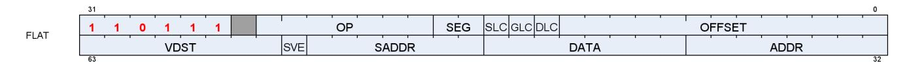

| Field | Size | Description                                                                                                                                                                                                                                                                                                                                                             |
|-------|------|-------------------------------------------------------------------------------------------------------------------------------------------------------------------------------------------------------------------------------------------------------------------------------------------------------------------------------------------------------------------------|
| OP    | 8    | Opcode: see next table                                                                                                                                                                                                                                                                                                                                                  |
| ADDR  | 8    | VGPR that holds address or offset. For 64-bit addresses, ADDR has the LSB's and ADDR+1 has the MSBs.<br>For offset a single VGPR has a 32 bit unsigned offset.<br>For FLAT_*: specifies an address.<br>For GLOBAL_* when SADDR is NULL: specifies an address.<br>For GLOBAL_* when SADDR is not NULL: specifies an offset.<br>For SCRATCH, specifies an offset if SVE=1 |


| Field  | Size | Description                                                                                                                                                                                                                                                                                                                       |  |  |
|--------|------|-----------------------------------------------------------------------------------------------------------------------------------------------------------------------------------------------------------------------------------------------------------------------------------------------------------------------------------|--|--|
| DATA   | 8    | VGPR that holds the first DWORD of store-data. Instructions can use 0-4 DWORDs.                                                                                                                                                                                                                                                   |  |  |
| VDST   | 8    | VGPR destination for data returned to the shader, either from LOADs or Atomics with GLC=1 (return<br>pre-op value).                                                                                                                                                                                                               |  |  |
| SLC    | 1    | System Level Coherent. Used in conjunction with GLC to determine cache policies.                                                                                                                                                                                                                                                  |  |  |
| DLC    | 1    | Device Level Coherent. Controls behavior of L1 cache (GL1).                                                                                                                                                                                                                                                                       |  |  |
| GLC    | 1    | Group Level Coherent - controls behavior of L0 cache. Atomics: 1 = return the memory value before the<br>atomic operation is performed.<br>0 = do not return anything.                                                                                                                                                            |  |  |
| SEG    | 2    | Memory Segment: 0=Flat, 1=Scratch, 2=GLOBAL, 3=Reserved                                                                                                                                                                                                                                                                           |  |  |
| OFFSET | 13   | Address offset: 13-bit signed byte offset<br>(Must be positive for Flat; MSB is ignored and forced to zero)                                                                                                                                                                                                                       |  |  |
| SADDR  | 7    | Scalar SGPR that provides an address of offset (unsigned). To disable use, set this field to NULL. The<br>meaning of this field is different for Scratch and Global.<br>Flat: Unused<br>Scratch: use an SGPR as part of the address<br>Global: use the SGPR to provide a base address and the VGPR provides a 32-bit byte offset. |  |  |
| SVE    | 1    | Scratch VGPR Enable<br>When set to 1, scratch instructions include a 32-bit offset from a VGPR;<br>when set to 0, scratch instructions do not use a VGPR for addressing.                                                                                                                                                          |  |  |

Table 56. Instructions

| Flat                    | GLOBAL                    | Scratch                  |
|-------------------------|---------------------------|--------------------------|
| FLAT_LOAD_U8            | GLOBAL_LOAD_U8            | SCRATCH_LOAD_U8          |
| FLAT_LOAD_D16_U8        | GLOBAL_LOAD_D16_U8        | SCRATCH_LOAD_D16_U8      |
| FLAT_LOAD_D16_HI_U8     | GLOBAL_LOAD_D16_HI_U8     | SCRATCH_LOAD_D16_HI_U8   |
| FLAT_LOAD_I8            | GLOBAL_LOAD_I8            | SCRATCH_LOAD_I8          |
| FLAT_LOAD_D16_I8        | GLOBAL_LOAD_D16_I8        | SCRATCH_LOAD_D16_I8      |
| FLAT_LOAD_D16_HI_I8     | GLOBAL_LOAD_D16_HI_I8     | SCRATCH_LOAD_D16_HI_I8   |
| FLAT_LOAD_U16           | GLOBAL_LOAD_U16           | SCRATCH_LOAD_U16         |
| FLAT_LOAD_I16           | GLOBAL_LOAD_I16           | SCRATCH_LOAD_I16         |
| FLAT_LOAD_D16_B16       | GLOBAL_LOAD_D16_B16       | SCRATCH_LOAD_D16_B16     |
| FLAT_LOAD_D16_HI_B16    | GLOBAL_LOAD_D16_HI_B16    | SCRATCH_LOAD_D16_HI_B16  |
| FLAT_LOAD_B32           | GLOBAL_LOAD_B32           | SCRATCH_LOAD_B32         |
| FLAT_LOAD_B64           | GLOBAL_LOAD_B64           | SCRATCH_LOAD_B64         |
| FLAT_LOAD_B96           | GLOBAL_LOAD_B96           | SCRATCH_LOAD_B96         |
| FLAT_LOAD_B128          | GLOBAL_LOAD_B128          | SCRATCH_LOAD_B128        |
| FLAT_STORE_B8           | GLOBAL_STORE_B8           | SCRATCH_STORE_B8         |
| FLAT_STORE_D16_HI_B8    | GLOBAL_STORE_D16_HI_B8    | SCRATCH_STORE_D16_HI_B8  |
| FLAT_STORE_B16          | GLOBAL_STORE_B16          | SCRATCH_STORE_B16        |
| FLAT_STORE_D16_HI_B16   | GLOBAL_STORE_D16_HI_B16   | SCRATCH_STORE_D16_HI_B16 |
| FLAT_STORE_B32          | GLOBAL_STORE_B32          | SCRATCH_STORE_B32        |
| FLAT_STORE_B64          | GLOBAL_STORE_B64          | SCRATCH_STORE_B64        |
| FLAT_STORE_B96          | GLOBAL_STORE_B96          | SCRATCH_STORE_B96        |
| FLAT_STORE_B128         | GLOBAL_STORE_B128         | SCRATCH_STORE_B128       |
| none                    | GLOBAL_LOAD_ADDTID_B32    | none                     |
| none                    | GLOBAL_STORE_ADDTID_B32   | none                     |
| FLAT_ATOMIC_SWAP_B32    | GLOBAL_ATOMIC_SWAP_B32    | none                     |
| FLAT_ATOMIC_CMPSWAP_B32 | GLOBAL_ATOMIC_CMPSWAP_B32 | none                     |


| Flat                    | GLOBAL                                           | Scratch |
|-------------------------|--------------------------------------------------|---------|
| FLAT_ATOMIC_ADD_U32     | GLOBAL_ATOMIC_ADD_U32                            | none    |
| FLAT_ATOMIC_ADD_F32     | GLOBAL_ATOMIC_ADD_F32                            | none    |
| FLAT_ATOMIC_SUB_U32     | GLOBAL_ATOMIC_SUB_U32                            | none    |
| FLAT_ATOMIC_MIN_I32     | GLOBAL_ATOMIC_MIN_I32                            | none    |
| FLAT_ATOMIC_MIN_U32     | GLOBAL_ATOMIC_MIN_U32                            | none    |
| FLAT_ATOMIC_MAX_I32     | GLOBAL_ATOMIC_MAX_I32                            | none    |
| FLAT_ATOMIC_MAX_U32     | GLOBAL_ATOMIC_MAX_U32                            | none    |
| FLAT_ATOMIC_AND_B32     | GLOBAL_ATOMIC_AND_B32                            | none    |
| FLAT_ATOMIC_OR_B32      | GLOBAL_ATOMIC_OR_B32                             | none    |
| FLAT_ATOMIC_XOR_B32     | GLOBAL_ATOMIC_XOR_B32                            | none    |
| FLAT_ATOMIC_INC_U32     | GLOBAL_ATOMIC_INC_U32                            | none    |
| FLAT_ATOMIC_DEC_U32     | GLOBAL_ATOMIC_DEC_U32                            | none    |
| FLAT_ATOMIC_CMPSWAP_F32 | GLOBAL_ATOMIC_CMPSWAP_F32                        | none    |
| FLAT_ATOMIC_MIN_F32     | GLOBAL_ATOMIC_MIN_F32                            | none    |
| FLAT_ATOMIC_MAX_F32     | GLOBAL_ATOMIC_MAX_F32                            | none    |
| FLAT_ATOMIC_SWAP_B64    | GLOBAL_ATOMIC_SWAP_B64                           | none    |
| FLAT_ATOMIC_CMPSWAP_B64 | GLOBAL_ATOMIC_CMPSWAP_B64                        | none    |
| FLAT_ATOMIC_ADD_U64     | GLOBAL_ATOMIC_ADD_U64                            | none    |
| FLAT_ATOMIC_SUB_U64     | GLOBAL_ATOMIC_SUB_U64                            | none    |
| FLAT_ATOMIC_MIN_I64     | GLOBAL_ATOMIC_MIN_I64                            | none    |
| FLAT_ATOMIC_MIN_U64     | GLOBAL_ATOMIC_MIN_U64                            | none    |
| FLAT_ATOMIC_MAX_I64     | GLOBAL_ATOMIC_MAX_I64                            | none    |
| FLAT_ATOMIC_MAX_U64     | GLOBAL_ATOMIC_MAX_U64                            | none    |
| FLAT_ATOMIC_AND_B64     | GLOBAL_ATOMIC_AND_B64                            | none    |
| FLAT_ATOMIC_OR_B64      | GLOBAL_ATOMIC_OR_B64                             | none    |
| FLAT_ATOMIC_XOR_B64     | GLOBAL_ATOMIC_XOR_B64                            | none    |
| FLAT_ATOMIC_INC_U64     | GLOBAL_ATOMIC_INC_U64                            | none    |
| FLAT_ATOMIC_DEC_U64     | GLOBAL_ATOMIC_DEC_U64                            | none    |
| none                    | GLOBAL_ATOMIC_CSUB_U32<br>(GLC must be set to 1) | none    |

# <span id="page-121-0"></span>**11.1. Instructions**

### <span id="page-121-1"></span>**11.1.1. FLAT**

The Flat instruction set is nearly identical to the BUFFER instruction set, minus the FORMAT loads & stores.

Flat instructions do not use a resource constant (V#) or sampler (S#), but they do use a specific SGPR-pair (FLAT\_SCRATCH) to hold scratch-space information in case any threads' address resolves to scratch space. See "Scratch" section below.

Since Flat instruction are executed as both an LDS and a Global instruction, Flat instructions increment both VMcnt (or VScnt) and LGKMcnt and are not considered done until both have been decremented. There is no way a priori to determine whether a Flat instruction uses only LDS or Global memory space.

When the address from a Flat instruction falls into scratch (private) space, a different addressing mechanism is

11.1. Instructions 113 of 600


used. The address from the VGPR points to the memory space for a specific DWORD of scratch data owned by this thread. The hardware maps this address to the actual memory address that holds data for all of the threads in the wave. Flat atomics which map into scratch: 4-byte atomics are supported, and 8-byte atomics return MEMVIOL.

The wave supplies the offset (for space allocated to this wave) with every Flat request. This is stored in a dedicated per-wave register: FLAT\_SCRATCH, that holds a 64-bit byte address.

The aperture check occurs when VGPRs are read, with invalid addresses being routed to the texture unit. The "aperture check" is performed **before** "inst\_offset" is added into the address, so it is undefined what occurs if the addition of inst\_offset pushes the address into a different memory aperture.

| (Hole) Addr[48] | Addr[47] | Addr[46] | Aperture                    |
|-----------------|----------|----------|-----------------------------|
| 0               | x        | x        | Normal (global memory)      |
| 1               | 0        | 0        | Potential Private (scratch) |
| 1               | 0        | 1        | Potential Shared (LDS)      |
| 1               | 1        | x        | Invalid                     |

#### **Ordering**

Flat instructions may complete out of order with each other. If one Flat instruction finds all of its data in Texture cache, and the next finds all of its data in LDS, the second instruction might complete first. If the two fetches return data to the same VGPR, the result is unknown (order is not deterministic). Flat instructions decrement VMcnt in order for the threads that went to global memory and those are in order with other scratch, global, texture and buffer instructions. Separately each Flat instruction increments and decrements LGKMcnt. This is out-of-order with the VMcnt path but is in-order with other DS (LDS) instructions. Since the data for a Flat load can come from either LDS or the texture cache, and because these units have different latencies, there is a potential race condition with respect to the VMcnt/VScnt and LGKMcnt counters. Because of this, the only sensible S\_WAITCNT value to use after Flat instructions is zero.

## <span id="page-122-0"></span>**11.1.2. Global**

Global operations transfer data between VGPR and global memory. Global instructions are similar to Flat, but the programmer is responsible to make sure that no threads access LDS or private space. Because of this, no LDS bandwidth is used by global instructions.

Since these instructions do not access LDS, only VMcnt (or VScnt) is used, not LGKMcnt. If a global instruction does attempt to access LDS, the instruction returns MEMVIOL.

Global includes two instructions which do not use any VGPRs for addressing, just SGPRs and INST\_OFFSET:

- GLOBAL\_LOAD\_ADDTID\_B32
- GLOBAL\_STORE\_ADDTID\_B32

### <span id="page-122-1"></span>**11.1.3. Scratch**

Scratch instructions are similar to global but they access a private (per-thread) memory space that is swizzled. Because of this, no LDS bandwidth is used by scratch instructions. Scratch instructions also support multi-DWORD access and mis-aligned access (although mis-aligned is slower).

11.1. Instructions 114 of 600


Since these instructions do not access LDS, only VMcnt (or VScnt) is used, not LGKMcnt. It is not possible for a scratch instruction to access LDS, and so no error checking is done (and no aperture check is performed).

# <span id="page-123-0"></span>**11.2. Addressing**

Global, Flat and Scratch each have their own addressing modes. Flat addressing is a subset of the global and scratch modes. 64-bit addresses are stored with the LSB's in the VGPR at ADDR, and the MSBs in the VGPR at ADDR+1.

There are 4 distinct shader instructions:

- GLOBAL
- SCRATCH
- LDS
- FLAT based on per-thread address (VGPR), can load/store: global memory, LDS or scratch memory.

#### **Global Addressing**

```
GV mem_addr = VGPRU64 + INST_OFFSETI13
GVS mem_addr = SGPRU64 + VGPRU32 + INST_OFFSETI13
GT mem_addr = SGPRU64 + INST_OFFSETI13 + ThreadID*4
```

#### **LDS Addressing (DS ops)**

```
LDS LDS_ADDR = VGPR_addrU32 + INST_OFFSETU16
          LDS address is relative to the LDS space allocated to this wave.
```

#### **Scratch Addressing**

```
SV mem_addr = SCRATCH_BASEU64 + SWIZZLE(VGPR_offsetU32 + INST_OFFSETI13, ThreadID)
SS mem_addr = SCRATCH_BASEU64 + SWIZZLE(SGPR_offsetU32 + INST_OFFSETI13, ThreadID)
SVS mem_addr = SCRATCH_BASEU64 + SWIZZLE(SGPR_offsetU32 + VGPR_offsetU32 + INST_OFFSETI13, ThreadID)
ST mem_addr = SCRATCH_BASEU64 + SWIZZLE(INST_OFFSETI13, ThreadID)
         SGPR_offset and VGPR_offset are 32 bits unsigned byte offsets.
```

The combined offsets inside SWIZZLE() must result in a non-negative number.

The value from an SGPR and VGPR are **unsigned** 32-bit byte offsets.

```
Flat Addressing
                 Aperture test on the address-VGPR value determines: Global/LDS/Scratch per thread (ignores
                 INST_OFFSET). 
                 Use one of the 3 address equations per lane depending on which memory it maps to:
GLOBAL (GV) mem_addr = VGPRU64 + INST_OFFSETI13
SCRATCH (SV) mem_addr = SCRATCH_BASE(sgpr:U64) + SWIZZLE(VGPR_offset + INST_OFFSETI13, ThreadID)
LDS LDS_ADDR = VGPR(addr) + INST_OFFSET - sharedApertureBase 
                 If the address falls into LDS space, it is checked against the range: [0, LDS_allocated_size-1 ]
```

There is no range checking on this address.

Scratch Addressing Equation

#### **"SWIZZLE(offset,TID)" is hard coded based on wave size (32 or 64)**

Swizzle for **Scratch** is hard-coded to: elem\_size=4bytes, const\_index\_stride=32 (wave32) or 64 (wave64).

11.2. Addressing 115 of 600


Addr = SCRATCH\_BASE + (offset / 4) \* 4 \* const\_index\_stride + (offset % 4) + TID\*4 where "offset" = either "INST\_OFFSET + SGPR\_offset" or "INST\_OFFSET + VGPR\_offset".

#### **Restrictions:**

- Inst\_offset :
  - Flat and Scratch-ST mode: must not be negative
  - Global and Scratch-SS and -SV modes: can be negative
  - In Scratch SS mode, the inst\_offset must be aligned to the payload size: 4 byte aligned for 1-DWORD, 16-byte aligned for 4-DWORD.
    - Also (SADDR + INST\_OFFSET) must be at least DWORD-aligned

| SADDR  | SVE | MODE |
|--------|-----|------|
| ==NULL | 0   | ST   |
| !=NULL | 0   | SS   |
| ==NULL | 1   | SV   |
| !=NULL | 1   | SVS  |

| Scratch Instruction Modes |        |              |          |                                                      | Indicated by SVE<br>/ SADDR |
|---------------------------|--------|--------------|----------|------------------------------------------------------|-----------------------------|
| SV                        | Addr = | FLAT_SCRATCH |          | + swizzle(Voff + Ioff, TID)                          | 1 / NULL                    |
| SS                        | Addr = | FLAT_SCRATCH |          | + swizzle(Soff + Ioff, TID)                          | 0 / !NULL                   |
| ST                        | Addr = | FLAT_SCRATCH |          | + swizzle(0 + Ioff, TID)                             | 0 / NULL                    |
| SVS                       | Addr = | FLAT_SCRATCH |          | + swizzle(Soff + Voff + Ioff, TID)                   | 1 / !NULL                   |
| BUFFER_<br>+ LOAD         | Addr = | T#.base      | + Soff   | + swizzle( (Vidx + TID) * stride + Ioff + Voff)      |                             |
| Global Instruction Modes  |        |              |          |                                                      |                             |
| GV                        | Addr = | Vaddr64      |          | + Ioff                                               | x / NULL                    |
| GVS                       | Addr = | Saddr64      | + Voff32 | + Ioff                                               | x / !=NULL                  |
| GT                        | Addr = | Saddr64      |          | + Ioff + TID*4                                       | x/x instruction             |
| LDS Instruction Modes     |        |              |          |                                                      |                             |
| LDS                       | Addr = | Vaddr        |          | + Ioff                                               | x/x instruction             |
| Flat Instruction Modes    |        |              |          |                                                      |                             |
| Scratch                   | Addr = | FLAT_SCRATCH |          | swizzle (Voff + Ioff -privApertureBase, TID) // "SV" | x / NULL                    |
| LDS                       | Addr = | Vaddr        |          | + Ioff - sharedApertureBase // "LDS"                 | x / NULL                    |
| Global                    | Addr = | Vaddr        |          | + Ioff // "GV"                                       | x / NULL                    |

- Scratch: Voff and Soff are 32 bits, unsigned bytes.
- Global: Addresses are 64 bits, offset is 32bits.
- FLAT\_SCRATCH is an SGPR-pair 64-bit address.
- "Ioff" is the offset from the instruction field.
- "x" = don't care (either value works)

# <span id="page-124-0"></span>**11.3. Memory Error Checking**

Both Texture and LDS can report that an error occurred due to a bad address. This can occur due to:

- Invalid address (outside any aperture)
- Write to read-only global memory address


- Misaligned data (scratch accesses may be misaligned)
- Out-of-range address:
  - LDS access with an address outside the range: [ 0, LDS\_SIZE-1 ]

The policy for threads with bad addresses is: stores outside this range do not write a value, and reads return zero. The aperture check for invalid address occurs before adding any address offsets - it is based only on the base address; the other checks are performed after adding the offsets.

Addressing errors from either LDS or TA are returned on their respective "instruction done" busses as MEMVIOL. This sets the wave's MEMVIOL TrapStatus bit, and also causes an exception (trap).

# <span id="page-125-0"></span>**11.4. Data**

FLAT instructions can use from zero to four consecutive DWORDs of data in VGPRs and/or memory. The DATA field determines which VGPR(s) supply source data (if any) and the VDST VGPRs hold return data (if any). There is no data-format conversion performed.

"D16" instructions use only 16-bit of the VGPR instead of the full 32bits. "D16\_HI" instructions read or write only the high 16-bits, while "D16" use the low 16-bits.

11.4. Data 117 of 600


# <span id="page-126-0"></span>**Chapter 12. Data Share Operations**

Local data share (LDS) is a low-latency, RAM scratchpad for temporary data storage and for sharing data between threads within a work-group. Accessing data through LDS may be significantly lower latency and higher bandwidth than going through memory.

For compute workloads, it allows a simple method to pass data between threads in different waves within the same work-group. For graphics, it is also used to hold vertex parameters for pixel shaders.

LDS space is allocated per work-group or wave (when work-groups not used) and recorded in dedicated LDSbase/size (allocation) registers that are not writable by the shader. These restrict all LDS accesses to the space owned by the work-group or wave.

# <span id="page-126-1"></span>**12.1. Overview**

The figure below shows how the LDS fits into the memory hierarchy of the GPU.

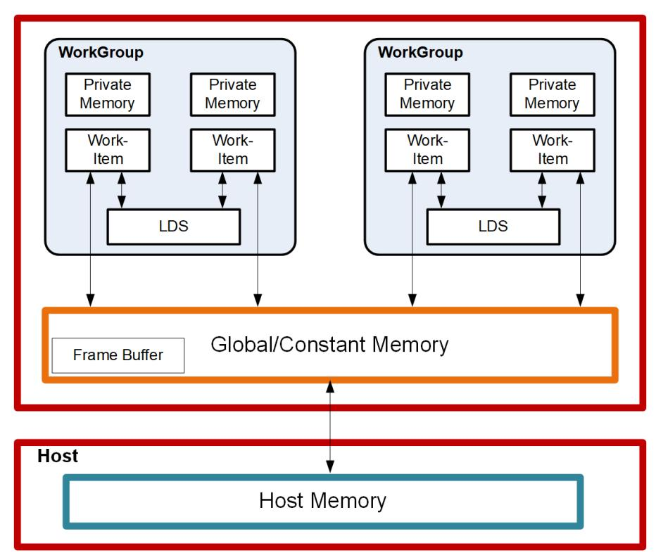

Figure 3. High-Level Memory Configuration

There are 128kB of memory per work-group processor split up into 64 banks of DWORD-wide RAMs. These 64 banks are further sub-divided into two sets of 32-banks each where 32 of the banks are affiliated with a pair of SIMD32's, and the other 32 banks are affiliated with the other pair of SIMD32's within the WGP. Each bank is a 512x32 two-port RAM (1R/1W per clock cycle). DWORDs are placed in the banks serially, but all banks can execute a store or load simultaneously. One work-group can request up to 64kB memory.

The high bandwidth of the LDS memory is achieved not only through its proximity to the ALUs, but also through simultaneous access to its memory banks. Thus, it is possible to concurrently execute 32 store or load instructions, each nominally 32-bits; extended instructions, load\_2addr/store\_2addr, can be 64-bits each. If,

12.1. Overview 118 of 600


however, more than one access attempt is made to the same bank at the same time, a bank conflict occurs. In this case, for indexed and atomic operations, the hardware is designed to prevent the attempted concurrent accesses to the same bank by turning them into serial accesses. This can decrease the effective bandwidth of the LDS. For increased throughput (optimal efficiency), therefore, it is important to avoid bank conflicts. A knowledge of request scheduling and address mapping can be key to help achieving this.

### <span id="page-127-0"></span>**12.1.1. Dataflow in Memory Hierarchy**

The figure below is a conceptual diagram of the dataflow within the memory structure.

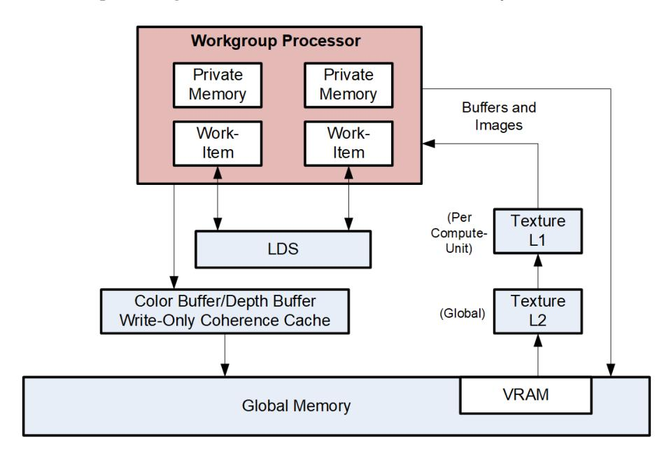

Data can be loaded into LDS either by transferring it from VGPRs to LDS using "DS" instructions, or by loading in from memory. When loading from memory, the data may be loaded into VGPRs first or for some types of loads it may be loaded directly into LDS from memory. To store data from LDS to global memory, data is read from LDS and placed into the work-item's VGPRs, then written out to global memory. To help make effective use of the LDS, a shader program must perform many operations on what is transferred between global memory and LDS.

LDS atomics are performed in the LDS hardware. Although ALUs are not directly used for these operations, latency is incurred by the LDS executing this function.

## <span id="page-127-1"></span>**12.1.2. LDS Modes and Allocation: CU vs. WGP Mode**

Work-groups of waves are dispatched in one of two modes: CU or WGP.

See this section for details: [WGP and CU Mode](#page-19-1)

### <span id="page-127-2"></span>**12.1.3. LDS Access Methods**

There are 3 forms of Local Data Share access:

12.1. Overview 119 of 600

#### **Direct Load**

Loads a single DWORD from LDS and broadcasts the data to a VGPR across all lanes.

#### **Indexed load/store and Atomic ops**

Load/store address comes from a VGPR and data to/from VGPR. LDS-ops require up to 3 inputs: 2data+1addr and immediate return VGPR.

#### **Parameter Interpolation Load**

Reads pixel parameters from LDS per quad and loads them into one VGPR. Reads all 3 parameters per quad (P1, P1-P0 and P2-P0) and loads them into 3 lanes within the quad (the 4th lane receives zero).

The following sections describe these methods.

# <span id="page-128-0"></span>**12.2. Pixel Parameter Interpolation**

For pixel waves, vertex attribute data is preloaded into LDS and barycentrics (I, J) are preloaded into VGPRs before the wave starts. Parameter interpolation can be performed by loading attribute data from LDS into VGPRs using LDS\_PARAM\_LOAD and then using V\_INTERP instructions to interpolate the value per pixel.

LDS-Parameter loads are used to read vertex parameter data and store them in VGPRs to be used for parameter interpolation. These instructions operate like memory instructions except they use EXPcnt to track outstanding reads and decrement EXPCnt when they arrive in VGPRs.

Pixel shaders can be launched before their parameter data has been written into LDS. Once the data is available in LDS, the wave's STATUS register "LDS\_READY" bit is set to 1. Pixel shader waves stall if an LDS\_DIRECT\_LOAD or LDS\_PARAM\_LOAD is to be issued before LDS\_READY is set.

The most common form of interpolation involves weighting vertex parameters by the barycentric coordinates "I" and "J". A common calculation is:

```
  Result = P0 + I * P10 + J * P20
  where "P10" is (P1 - P0), and "P20" is (P2 - P0)
```

Parameter interpolation involves two types of instructions:

- LDS\_PARAM\_LOAD : to read packed parameter data from LDS into a VGPR (data packed per quad)
- V\_INTERP\_\* : VALU FMA instructions that unpack parameter data across lanes in a quad.

### <span id="page-128-1"></span>**12.2.1. LDS Parameter Loads**

Parameter Loads are only available in LDS, not in GDS, and only in CU mode (not WGP mode).

LDS\_PARAM\_LOAD reads three parameters (P0, P10, P20) of one 32-bit attribute or of two 16-bit attributes from LDS into VGPRs. The are 3 parameters (P0, P10 and P20) are the same for the 4 pixels within a quad. These values are spread out across VGPR lanes 0, 1 and 2 of each quad. Interpolation is then performed using FMA with DPP so each lane uses its I or J value with the quad's shared P0, P10 and P20 values.

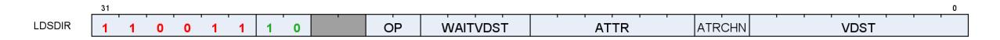

Table 57. LDSDIR Instruction Fields

| Field     | Size | Description                                                                                                                                                               |  |
|-----------|------|---------------------------------------------------------------------------------------------------------------------------------------------------------------------------|--|
| OP        | 2    | Opcode:<br>0: LDS_DIRECT_LOAD<br>1: LDS_PARAM_LOAD<br>2,3: Reserved                                                                                                       |  |
| WAITVDST  | 4    | Wait for the number of previously issued still outstanding VALU instructions to be less than<br>or equal to this number. Used to avoid Write-After-Read hazards on VGPRs. |  |
| VDST      | 8    | Destination VGPR                                                                                                                                                          |  |
| ATTR_CHAN | 2    | Attribute channel: 0=X, 1=Y, 2=Z, 3=W. Unused for LDS_DIRECT_LOAD.                                                                                                        |  |
| ATTR      | 6    | Attribute number: 0 - 32. Unused for LDS_DIRECT_LOAD.                                                                                                                     |  |
| ( M0 )    | 32   | LDS_DIRECT_LOAD:<br>{ 13'b0, DataType[2:0], LDS_address[15:0] } //addr in bytes<br>LDS_PARAM_LOAD:<br>{ 1'b0, new_prim_mask[15:1], lds_param_offset[15:0] }               |  |

M0 is implicitly read for this instruction and must be initialized before these instructions.

#### **new\_prim\_mask**

a mask that has a bit per quad indicating that this quad begins a new primitive; zero indicates same primitive as previous quad. There is an implied "one" for the first quad in the wave (every wave begins a new primitive) and so bit[0] is omitted.

#### **lds\_param\_offset**

The parameter offset indicates the starting address of the parameters in LDS. Space before that can be used as temporary wave storage space. Lds\_param\_offset bits [6:0] must be set to zero.

**Example LDS\_PARAM\_LOAD** (new\_prim\_mask[3:0] = 0110)

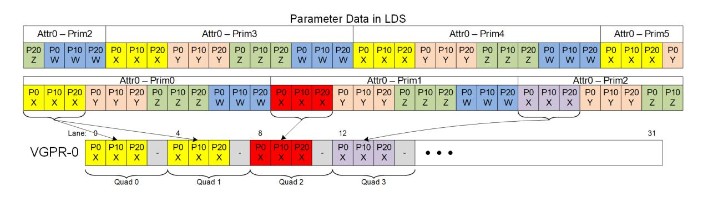

**LDS\_ADDR = lds\_base + param\_offset + attr#\*numPrimsInVector\*12DWORDs + prim#\*12 + attr\_offset**

(attr\_offset = 0..11 : 0 = P0.x, 1 = P0.Y, … 11 = P2.W)

From NewPrimMask h/w derives NumPrimInVec and Prim# (0..15)

If the dest-VGPR is out of range, the load is still performed but EXEC is forced to zero.

LDS\_PARAM\_LOAD and LDS\_DIRECT\_LOAD use **EXEC per quad** (if any pixel is enabled in the quad, data is written to all 4 pixels/threads in the quad).

### **12.2.1.1. 16-bit Parameter Data**

16-bit parameters are packed in LDS as pairs of attributes in DWORDs: ATTR0.X and ATTR1.X share a DWORD. There is an alternate packing mode where the parameters are not packed (one 16-bit param in low half of DWORD). These attributes can be read with the same LDS\_PARAM\_LOAD instruction, and returns the packed DWORD with 2 attributes (when they are packed). Interpolation can then be done using specific mixedprecision FMA opcodes, along with DPP (to select P0, P10 or P20) and OPSEL (to select upper or lower 16-bits).

Barycentrics are 32-bits, not 16 bit.

### **12.2.1.2. Parameter Load Data Hazard Avoidance**

These data dependency rules apply to both parameter and direct loads.

LDS\_DIRECT\_LOAD and LDS\_PARAM\_LOAD read data from LDS and write it into VGPRs, and they use EXPcnt to track when the instruction has completed and written the VGPRs.

It is up to the shader program to ensure that data hazards are avoided. These instructions are issued along a different path from VALU instructions so it is possible that previous VALU instructions may still be reading from the VGPR that these LDS instructions are going to write and this could lead to a hazard.

EXPcnt is used to track read-after-write hazards where LDS\_PARAM\_LOAD writes a value to a VGPR and another instruction reads it. The shader program uses "s\_waitcnt EXPcnt" to wait for results from a LDS\_DIRECT\_LOAD or LDS\_PARAM\_LOAD to be available in VGPRs before consuming it in a subsequent instruction. The VINTERP instructions have a "wait\_EXPcnt" field to assist in avoid this hazard.

These are **skipped when EXEC==0** and EXPCnt==0 (like memory ops).

Mixed exports & LDS-direct/param instructions from the same wave might not complete in order (both use EXPcnt), requiring "s\_waitcnt 0" if they are overlapped.

 LDS\_PARAM\_LOAD V2 S\_WAITCNT EXPcnt 0

A potential Write-After-Read hazard exists if a VALU instruction reads a VGPR and then LDS\_PARAM\_LOAD writes that VGPR: It is possible the LDS\_PARAM\_LOAD overwrites the VALU's source VGPR before it was read. The user must prevent this by using the "wait\_Vdst" field of the LDS\_PARAM\_LOAD instruction. This field indicates the maximum number of uncompleted VALU instructions that may be outstanding when this LDS\_PARAM\_LOAD is issued. Use this to ensure any dependent VALU instructions have completed.

Another potential data hazard involves LDS\_PARAM\_LOAD overwriting a VGPR that has not yet been read as a source by a previous VMEM (LDS, Texture, Buffer, Flat) instruction. To avoid this hazard, the user must ensure that the VMEM instruction has read its source VGPRs. This can be achieved by issuing any VALU or export instruction before the LDS\_PARAM\_LOAD.

# <span id="page-131-0"></span>**12.3. VALU Parameter Interpolation**

Parameter interpolation is performed using an FMA operation that includes a built-in DPP operation to unpack the per-quad P0/P10/P20 values into per-lane values. Because this instruction reads data from neighboring lanes, the implicit DPP acts as if "fetch invalid = 1", so that the instruction can read data from neighboring lanes that have EXEC==0, rather than getting the value 0 from those. Standard interpolation is calculating:

```
  Per-Pixel-Parameter = P0 + I * P10 + J * P20 // I, J are per-pixel; P0/P10/P20 are per-primitive
```

This parameter interpolation is realized using a pair of instructions:

```
  // V1 = I, V2 = J, V3 = result of LDS_PARAM_LOAD
  V_INTERP_P10_F32 V4, V3[1], V1, V3[0] // tmp = P0 + I*P10
  // uses DPP8=1,1,1,1,5,5,5,5; Src2(P0) uses DPP8=0,0,0,0,4,4,4,4
  V_INTERP_P20_F32 V5, V3[2], V2, V4 // dst = J*P20 + tmp uses DPP8=2,2,2,2,6,6,6,6
```

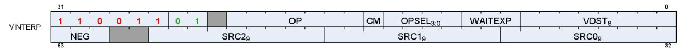

Table 58. Parameter Interpolation Instruction Fields

| Field     |   | Size Description                                                                                                  |                                                  |  |  |
|-----------|---|-------------------------------------------------------------------------------------------------------------------|--------------------------------------------------|--|--|
| OP        | 7 | Instruction Opcode:                                                                                               |                                                  |  |  |
|           |   | V_INTERP_P10_F32                                                                                                  | // tmp = P0 + I*P10. hardcoded DPP8 on 2 sources |  |  |
|           |   | V_INTERP_P2_F32                                                                                                   | // D = tmp + J*P20. hardcoded DPP8 on 1 source   |  |  |
|           |   | V_INTERP_P10_F16_F32                                                                                              | // tmp = P0 + I*P10. hardcoded DPP8 on 2 sources |  |  |
|           |   | V_INTERP_P2_F16_F32                                                                                               | // D = tmp + J*P20. hardcoded DPP8 on 1 source   |  |  |
|           |   | V_INTERP_RTZ_P10_F16_F32                                                                                          | // same as above, but round-toward-zero          |  |  |
|           |   | V_INTERP_RTZ_P2_F16_F32                                                                                           | // same as above, but round-toward-zero          |  |  |
| SRC0      | 9 | First argument VGPR: Parameter data (P0 or P20) from LDS stored in a VGPR.                                        |                                                  |  |  |
| SRC1      | 9 | Second argument VGPR: I or J barycentric                                                                          |                                                  |  |  |
| SRC2      | 9 | Third argument VGPR: "P10" ops holds P10 data; "P2" ops holds partial result from "P10" op.                       |                                                  |  |  |
| VDST      | 8 | Destination VGPR                                                                                                  |                                                  |  |  |
| NEG       | 3 | Negate the input (invert sign bit).<br>bit 0 is for src0, bit 1 is for src1 and bit 2 is for src2.                |                                                  |  |  |
|           |   |                                                                                                                   |                                                  |  |  |
|           |   | For 16-bit interpolation this applies to both low and high halves.                                                |                                                  |  |  |
| WaitEXP 3 |   | Wait for EXPcnt to be less than or equal to this value before issuing this instruction.                           |                                                  |  |  |
| OPSEL     | 4 | Used to wait for a specific previous LDS_PARAM_LOAD to have completed.                                            |                                                  |  |  |
|           |   | Operation select for 16-bit math: 1=select high half, 0=select low half<br>[0]=src0, [1]=src1, [2]=src2, [3]=dest |                                                  |  |  |
|           |   | For dest=0, dest_vgpr[31:0] = {prev_dst_vgpr[31:16], result[15:0] }                                               |                                                  |  |  |
|           |   | For dest=1, dest_vgpr[31:0] = {result[15:0], prev_dst_vgpr[15:0] }                                                |                                                  |  |  |
|           |   | OPSEL may only be used for 16-bit operands, and must be zero for any other operands/results.                      |                                                  |  |  |
| CLMP      | 1 | Clamp result to [0, 1.0]                                                                                          |                                                  |  |  |

The VINTERP instructions include a builtin "s\_waitcnt EXPcnt" to easily allow data hazard resolution for data produced by LDS\_PARAM\_LOAD.


Instructions Restrictions and Limitations:

- V\_INTERP instructions do not detect or report exceptions
- V\_INTERP instructions do not support data forwarding into inputs that would normally come from LDS data (sources A and C for V\_INTERP\_P10\_\* and source A for V\_INTERP\_P2\_\*).

VGPRs are preloaded with some or all of:

- I\_persp\_sample, J\_persp\_sample, I\_persp\_center, J\_persp\_center,
- I\_persp\_centroid, J\_persp\_centroid,
- I/W, J/W, 1.0/W,
- I\_linear\_sample, J\_linear\_sample,
- I\_linear\_center, J\_linear\_center,
- I\_linear\_centroid, J\_linear\_centroid

These instructions consume data that was supplied by LDS\_PARAM\_LOAD. These instructions contain a builtin "s\_waitcnt EXPcnt <= N" capability to allow for efficient software pipelining.

```
lds_param_load V0, attr0
lds_param_load V10, attr1
lds_param_load V20, attr2
lds_param_load V30, attr3
v_interp_p0 V1, V0[1], Vi, V0[0] s_waitcnt EXPcnt<=3 //Wait V0
v_interp_p0 V11, V10[1], Vi, V10[0] s_waitcnt EXPcnt<=2
v_interp_p0 V21, V20[1], Vi, V20[0] s_waitcnt EXPcnt<=1
v_interp_p0 V31, V30[1], Vi, V30[0] s_waitcnt EXPcnt<=0 //Wait V30
v_interp_p2 V2, V0[2], Vj, V1
v_interp_p2 V12, V10[2], Vj, V11
v_interp_p2 V22, V20[2], Vj, V21
v_interp_p2 V32, V30[2], Vj, V31
```

## <span id="page-132-0"></span>**12.3.1. 16-bit Parameter Interpolation**

16-bit interpolation operates on pairs of attribute values packed into a 16-bit VGPR. These use the same I and J values during interpolation. OPSEL is used to select the upper or lower portion of the data.

There are variants of the 16-bit interpolation instructions that override the round mode to "round toward zero".

```
V_INTERP_P10_F16_F32 dst.f32 = vgpr_hi/lo.f16 * vgpr.f32 + vgpr_hi/lo.f16 // tmp = P10 * I + P0
  • allows OPSEL; Src0 uses DPP8=1,1,1,1,5,5,5,5; Src2 uses DPP8=0,0,0,0,4,4,4,4
```

```
V_INTERP_P2_F16_F32 dst.f16 = vgpr_hi/lo.f16 * vgpr.f32 + vgpr.f32 // dst = P2 * J + tmp
```

• allows OPSEL; Src0 uses DPP8=2,2,2,2,6,6,6,6

# <span id="page-132-1"></span>**12.4. LDS Direct Load**

Direct loads are only available in LDS, not in GDS. Direct access is allowed only in CU mode, not WGP mode.

The LDS\_DIRECT\_LOAD instruction reads a single DWORD from LDS and returns it to a VGPR, broadcasting it

12.4. LDS Direct Load 124 of 600

to all active lanes in the wave. M0 provides the address and data type. LDS\_DIRECT\_LOAD uses EXEC **per quad**, not per pixel: if any pixel in a quad is enabled then the data is written to all 4 pixels in the quad. LDS\_DIRECT\_LOAD uses EXPcnt to track completion.

LDS\_DIRECT\_LOAD uses the same instruction format and fields as LDS\_PARAM\_LOAD. See [Pixel Parameter](#page-128-0) [Interpolation](#page-128-0).

```
LDS_addr = M0[15:0] (byte address and must be DWORD aligned)
DataType = M0[18:16]
  0 unsigned byte
  1 unsigned short
  2 DWORD
  3 unused
  4 signed byte
  5 signed short
  6,7 Reserved
```

```
Example: LDS_DIRECT_LOAD V4 // load the value from LDS-address in M0[15:0] to V4
```

Signed byte and short data is sign-extend to 32 bits before writing the result to a VGPR; unsigned byte and short data is zero-extended to 32 bits before writing to a VGPR.

# <span id="page-133-0"></span>**12.5. Data Share Indexed and Atomic Access**

Both LDS and GDS can perform indexed and atomic data share operations. For brevity, "LDS" is used in the text below and, except where noted, also applies to GDS.

Indexed and atomic operations supply a unique address per work-item from the VGPRs to the LDS, and supply or return unique data per work-item back to VGPRs. Due to the internal banked structure of LDS, operations can complete in as little as one cycle (for wave32, or 2 cycles for wave64), or take as many 64 cycles, depending upon the number of bank conflicts (addresses that map to the same memory bank).

Indexed operations are simple LDS load and store operations that read data from, and return data to, VGPRs.

Atomic operations are arithmetic operations that combine data from VGPRs and data in LDS, and write the result back to LDS. Atomic operations have the option of returning the LDS "pre-op" value to VGPRs.

LDS Indexed and atomic instructions use LGKMcnt to track when they have completed. LGKMcnt is incremented as each instruction is issued, and decremented when they have completed execution. LDS instructions stay in-order with other LDS instructions from the same wave.

The table below lists and briefly describes the LDS instruction fields.

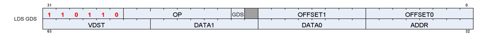

Table 59. LDS Instruction Fields


| Field     |    | Size Description                                                                                                                                                                                                             |  |
|-----------|----|------------------------------------------------------------------------------------------------------------------------------------------------------------------------------------------------------------------------------|--|
| OP        | 8  | LDS opcode.                                                                                                                                                                                                                  |  |
| GDS       | 1  | 0 = LDS, 1 = GDS.                                                                                                                                                                                                            |  |
| OFFSET0 8 |    | Immediate address offset. Interpretation varies with opcode:<br>Instructions with one address:: combine the offset fields into a 16-bit unsigned byte offset: {offset1,<br>offset0}.                                         |  |
| OFFSET1 8 |    | Instructions that have 2 addresses (e.g. {LOAD, STORE, XCHG}_2ADDR):: use the offsets separately as 2 8-<br>bit unsigned offsets. Each offset is multiplied by 4 for 8, 16 and 32-bit data; multiplied by 8 for 64-bit data. |  |
| VDST      | 8  | VGPR to which result is written: either from LDS-load or atomic return value.                                                                                                                                                |  |
| ADDR      | 8  | VGPR that supplies the byte address offset.                                                                                                                                                                                  |  |
| DATA0     | 8  | VGPR that supplies first data source.                                                                                                                                                                                        |  |
| DATA1     | 8  | VGPR that supplies second data source.                                                                                                                                                                                       |  |
| M0        | 16 | Unsigned byte Offset[15:0] used for: ds_load_addtid_b32, ds_write_addtid_b32 and for GDS-base/size                                                                                                                           |  |

The M0 register is not used for most LDS-indexed operations: only the "ADDTID" instructions read M0 and for these it represents a byte address.

Table 60. LDS Indexed Load/Store

| Load / Store                                                                               | Description                                                                                         |  |  |
|--------------------------------------------------------------------------------------------|-----------------------------------------------------------------------------------------------------|--|--|
| DS_LOAD_{B32,B64,B96,B128,U8,I8,U16,I16}                                                   | Load one value per thread into VGPRs; if signed, sign extend to<br>DWORD; zero e xtend if unsigned. |  |  |
| DS_LOAD_2ADDR_{B32,B64}                                                                    | Load two values at unique addresses.                                                                |  |  |
| DS_LOAD_2ADDR_STRIDE64_{B32,B64}                                                           | Load 2 values at unique addresses; offset *= 64.                                                    |  |  |
| DS_STORE_{B32,B64,B96,B128,B8,B16}                                                         | Store one value from VGPR to LDS.                                                                   |  |  |
| DS_STORE_2ADDR_{B32,B64}                                                                   | Store two values.                                                                                   |  |  |
| DS_STORE_2ADDR_STRIDE64_{B32,B64}                                                          | Store two values, offset *= 64.                                                                     |  |  |
| DS_STOREXCHG_RTN_{B32,B64}                                                                 | Exchange GPR with LDS-memory.                                                                       |  |  |
| DS_STOREXCHG_2ADDR_RTN_{B32,B64}                                                           | Exchange two separate GPRs with LDS-memory.                                                         |  |  |
| DS_STOREXCHG_2ADDR_STRIDE64_RTN_{B32,B64} Exchange GPR with LDS-memory; offset *= 64.      |                                                                                                     |  |  |
| "D16 ops" - Load ops write only 16bits of VGPR, low or high; Store ops use 16bits of VGPR: |                                                                                                     |  |  |
| DS_STORE_{B8, B16}_D16_HI                                                                  | Store 8 or 16 bits using high 16 bits of VGPR.                                                      |  |  |
| DS_LOAD_{U8, I8, U16}_D16                                                                  | Load unsigned or signed 8 or 16 bits into low-half of VGPR                                          |  |  |
| DS_LOAD_{U8, I8, U16}_D16_HI                                                               | Load unsigned or signed 8 or 16 bits into high-half of VGPR                                         |  |  |
| DS_PERMUTE_B32                                                                             | Forward permute. Does not write any LDS memory. See LDS Lane<br>permute Ops for details.            |  |  |
| DS_BPERMUTE_B32                                                                            | Backward permute. Does not write any LDS memory. See LDS Lane<br>permute Ops for details.           |  |  |

#### **Single Address Instructions**

```
LDS_Addr = LDS_BASE + VGPR[ADDR] + {InstOffset1,InstOffset0}
```

#### **Double Address Instructions**

```
LDS_Addr0 = LDS_BASE + VGPR[ADDR] + InstOffset0*ADJ +
LDS_Addr1 = LDS_BASE + VGPR[ADDR] + InstOffset1*ADJ +
  Where ADJ = 4 for 8, 16 and 32-bit data types; and ADJ = 8 for 64-bit.
```


The double address instructions are: LOAD\_2ADDR\*, STORE\_2ADDR\*, and STOREXCHG\_2ADDR\_\*. The address comes from VGPR, and both VGPR[ADDR] and InstOffset are byte addresses. At the time of wave creation, LDS\_BASE is assigned to the physical LDS region owned by this wave or work-group.

#### **DS\_{LOAD,STORE}\_ADDTID Addressing**

```
LDS_Addr = LDS_BASE + {InstOffset1, InstOffset0} + TID(0..63)*4 + M0
  Note: no part of the address comes from a VGPR. M0 must be DWORD-aligned.
```

The "ADDTID" (add thread-id) is a separate form where the base address for the instruction is common to all threads, but then each thread has a fixed offset added in based on its thread-ID within the wave. This can allow a convenient way to quickly transfer data between VGPRs and LDS without having to use a VGPR to supply an address.

| LDS & GDS Opcodes                 |                                                                         |                                 |                            |
|-----------------------------------|-------------------------------------------------------------------------|---------------------------------|----------------------------|
|                                   | Instruction Fields: op, gds, offset0, offset1, vdst, addr, data0, data1 |                                 |                            |
| 32-bit no return                  | 32-bit with return                                                      | 64-bit no return                | 64-bit with return         |
| ds_load_b{64,96,128}              |                                                                         | ds_store_b{64,96,128}           |                            |
| ds_store_{b32,b16,b8}             |                                                                         | ds_store_b64                    |                            |
| ds_load_addtid_b32 (LDS<br>only)  | ds_permute_b32 (LDS only)                                               |                                 |                            |
| ds_store_addtid_b32 (LDS<br>only) | ds_bpermute_b32 (LDS only)                                              |                                 |                            |
| ds_store_2addr_b32                |                                                                         | ds_store_2addr_b64              |                            |
| ds_store_2addr_stride64_b3<br>2   |                                                                         | ds_store_2addr_stride64_<br>b64 |                            |
|                                   | ds_load_{b32, u8,i8,u16,i16}                                            |                                 | ds_load_b64                |
| ds_store_b8_d16_hi                | ds_load_2addr_b32                                                       |                                 | ds_load_2addr_b64          |
| ds_store_b16_d16_hi               | ds_load_2addr_stride64_b32                                              |                                 | ds_load_2addr_stride64_b64 |
| ds_load_u8_d16                    | ds_consume                                                              |                                 |                            |
| ds_load_u8_d16_hi                 | ds_append                                                               |                                 | ds_condxchg32_rtn_b64      |
| ds_load_i8_d16                    |                                                                         |                                 |                            |
| ds_load_i8_d16_hi                 | ds_swizzle_b32 (LDS only)                                               |                                 |                            |
| ds_load_u16_d16                   |                                                                         |                                 |                            |
| ds_load_u16_d16_hi                |                                                                         |                                 |                            |
|                                   |                                                                         | GDS-only Opcodes                |                            |
|                                   | ds_ordered_count                                                        |                                 |                            |
|                                   | gws_init                                                                |                                 |                            |
|                                   | gws_sema_v                                                              |                                 |                            |
|                                   | gws_sema_bf                                                             |                                 |                            |
|                                   | gws_sema_p                                                              |                                 |                            |
|                                   | gws_barrier                                                             |                                 |                            |
|                                   | gws_sema_release_all                                                    |                                 |                            |
|                                   | ds_add_gs_reg_rtn                                                       |                                 |                            |
|                                   | ds_sub_gs_reg_rtn                                                       |                                 |                            |

### <span id="page-136-0"></span>**12.5.1. LDS Atomic Ops**

Atomic ops combine data from a VGPR with data in LDS, write the result back to LDS memory and optionally return the "pre-op" value from LDS memory back to a VGPR. When multiple lanes in a wave access the same LDS location there it is not specified in which order the lanes perform their operations, only that each lane performs the complete read-modify-write operation before another lane operates on the data.

LDS\_Addr0 = LDS\_BASE + VGPR[ADDR] + {InstOffset1,InstOffset0}

VGPR[ADDR] is a byte address. VGPRs 0,1 and dst are double-GPRs for doubles data. VGPR data sources can only be VGPRs or constant values, not SGPRs. Floating point atomic ops use the MODE register to control denormal flushing behavior.

| LDS & GDS Atomic Opcodes                                                |                                         |                      |                                         |  |
|-------------------------------------------------------------------------|-----------------------------------------|----------------------|-----------------------------------------|--|
| Instruction Fields: op, gds, offset0, offset1, vdst, addr, data0, data1 |                                         |                      |                                         |  |
| 32-bit no return                                                        | 32-bit with return                      | 64-bit no return     | 64-bit with return                      |  |
| ds_add_u32                                                              | ds_add_rtn_u32                          | ds_add_u64           | ds_add_rtn_u64                          |  |
| ds_sub_u32                                                              | ds_sub_rtn_u32                          | ds_sub_u64           | ds_rsub_rtn_u64                         |  |
| ds_rsub_u32                                                             | ds_rsub_rtn_u32                         | ds_rsub_u64          | ds_rsub_rtn_u64                         |  |
| ds_inc_u32                                                              | ds_inc_rtn_u32                          | ds_inc_u64           | ds_inc_rtn_u64                          |  |
| ds_dec_u32                                                              | ds_dec_rtn_u32                          | ds_dec_u64           | ds_dec_rtn_u64                          |  |
| ds_min_{u32,i32,f32}                                                    | ds_min_rtn_{u32,i32,f32}                | ds_min_{u64,i64,f64} | ds_min_rtn_{u64,i64,f64}                |  |
| ds_max_{u32,i32,f32}                                                    | ds_max_rtn_{u32,i32,f32}                | ds_max_{u64,i64,f64} | ds_max_rtn_{u64,i64,f64}                |  |
| ds_and_b32                                                              | ds_and_rtn_b32                          | ds_and_b64           | ds_and_rtn_b64                          |  |
| ds_or_b32                                                               | ds_or_rtn_b32                           | ds_or_b64            | ds_or_rtn_b64                           |  |
| ds_xor_b32                                                              | ds_xor_rtn_b32                          | ds_xor_b64           | ds_xor_rtn_b64                          |  |
| ds_mskor_b32                                                            | ds_mskor_rtn_b32                        | ds_mskor_b64         | ds_mskor_rtn_b64                        |  |
| ds_cmpstore_b32                                                         | ds_cmpstore_rtn_b32                     | ds_cmpstore_b64      | ds_cmpstore_rtn_b64                     |  |
| ds_cmpstore_f32                                                         | ds_cmpstore_rtn_f32                     | ds_cmpstore_f64      | ds_cmpstore_rtn_f64                     |  |
| ds_add_f32                                                              | ds_add_rtn_f32                          |                      |                                         |  |
|                                                                         | ds_storexchg_rtn_b32                    |                      | ds_storexchg_rtn_b64                    |  |
|                                                                         | ds_storexchg_2addr_rtn_b32              |                      | ds_storexchg_2addr_rtn_b64              |  |
|                                                                         | ds_storexchg_2addr_stride64_rt<br>n_b32 |                      | ds_storexchg_2addr_stride64_rt<br>n_b64 |  |

### <span id="page-136-1"></span>**12.5.2. LDS Lane-permute Ops**

DS\_PERMUTE instructions allow data to be swizzled arbitrarily across 32 lanes. Two versions of the instruction are provided: forward (scatter) and backward (gather). These exist in LDS only, not GDS.

Note that in wave64 mode the permute operates only across 32 lanes at a time on each half of a wave64. In other words, it executes as if were two independent wave32's. Each half-wave can use indices in the range 0-31 to reference lanes in that same half-wave.

These instructions use the LDS hardware but do not use any memory storage, and may be used by waves that have not allocated any LDS space. The instructions supply a data value from VGPRs and an index value per lane.

- ds\_permute\_b32 : Dst[index[0..31]] = src[0..31] Where [0..31] is the lane number
- ds\_bpermute\_b32 : Dst[0..31] = src[index[0..31]]

The EXEC mask is honored for both reading the source and writing the destination. Index values out of range wrap around (only index bits [6:2] are used, the other bits of the index are ignored). Reading from disabled lanes returns zero.

In the instruction word: VDST is the dest VGPR, ADDR is the index VGPR, and DATA0 is the source data VGPR. Note that index values are in bytes (so multiply by 4), and have the 'offset0' field added to them before use.

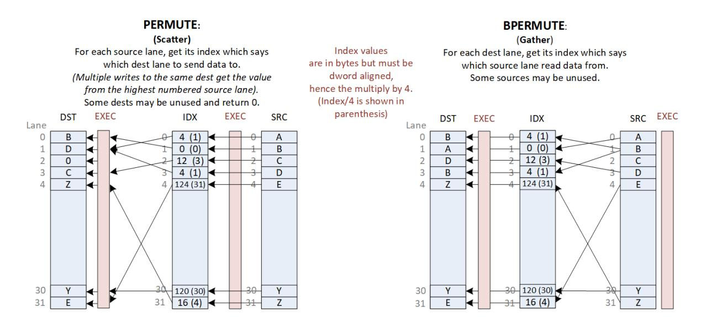

## <span id="page-137-0"></span>**12.5.3. DS Stack Operations for Ray Tracing**

DS\_BVH\_STACK\_RTN\_B32 is an LDS instruction to manage a per-thread shallow stack in LDS used in ray tracing BVH traversal. BVH structures consist of box nodes and triangle nodes. A box node has up to four child node pointers that may all be returned to the shader (to VGPRs) for a given ray (thread). A traversal shader follows one pointer per ray per iteration, and extra pointers can be pushed to a per-thread stack in LDS. Note: the returned pointers are sorted.

This "short stack" has a limited size beyond that the stack wraps around and overwrites older items. When the stack is exhausted, the shader should switch to a stackless mode where it looks up the parent of the current node from a table in memory. The shader program tracks the last visited address to avoid re-traversing subtrees.

**DS\_BVH\_STACK\_RTN\_B32** vgpr(dst), vgpr(stack\_addr), vgpr(lvaddr), vgpr[4](data)

| Field   | Size | Description                                                                                   |  |
|---------|------|-----------------------------------------------------------------------------------------------|--|
| OP      | 8    | Instruction == DS_STORE_STACK (LDS only)                                                      |  |
| GDS     | 1    | 1 = GDS, 0 = LDS (must be: 0 = LDS)                                                           |  |
| OFFSET0 | 8    | unused                                                                                        |  |
| OFFSET1 | 8    | bits[5:4] carry StackSize (8, 16, 32, 64)                                                     |  |
| VDST    | 8    | Destination VGPR for resulting address (e.g. X or top of stack)<br>Returns the next "LV addr" |  |


| Field | Size | Description                                                                                                                                                                                                                                                                                                                                                                            |  |
|-------|------|----------------------------------------------------------------------------------------------------------------------------------------------------------------------------------------------------------------------------------------------------------------------------------------------------------------------------------------------------------------------------------------|--|
| ADDR  | 8    | STACK_VGPR: Both a source and destination VGPR:<br>supplies the LDS stack address and is written back with updated address.<br>stack_addr[31:18] = stack_base[15:2] : stack base address (relative to allocated LDS space).<br>stack_addr[17:16] = stack_size[1:0] : 0=8DWORDs, 1=16, 2=32, 3=64 DWORDs per thread<br>stack_addr[15:0] = stack_index[15:0]. (bits [1:0] must be zero). |  |
| DATA0 | 8    | LVADDR: Last Visited Address. Is compared with data values (next field) to determine the next<br>node to visit.                                                                                                                                                                                                                                                                        |  |
| DATA1 | 8    | 4 VGPRs (X,Y,Z,W).                                                                                                                                                                                                                                                                                                                                                                     |  |
| M0    | 16   | Unused.                                                                                                                                                                                                                                                                                                                                                                                |  |

# <span id="page-138-0"></span>**12.6. Global Data Share**

Global data Share is similar to LDS, but is a single memory accessible by all waves on the GPU. Global Data Share uses the same instruction format as local data share (indexed operations only - no interpolation or direct loads). Instructions increment the LGKMcnt for all loads, stores and atomics, and decrement LGKMcnt when the instruction completes. GDS instructions support only one active lane per instruction. The first active lane (based on EXEC) is used and others are ignored.

#### M0 is used for:

- [15:0] holds SIZE, in bytes
- [31:16] holds BASE address in bytes

### <span id="page-138-1"></span>**12.6.1. GS NGG Streamout Instructions**

The DS\_ADD\_GS\_REG\_RTN and DS\_SUB\_GS\_REG\_RTN instructions are used only by the GS stage, and are used for streamout. These instructions perform atomic add or sub operations to data in dedicated registers, not in GDS memory, and return the pre-op value. The source register is 32 bits and is an unsigned int. These 2 instructions increment the wave's LGKMcnt, and decrement LGKMcnt when the instruction completes.

| offset[5:2] | Register<br>32-bit source, 32-bit dest & return value | offset[5:2] | Register<br>32-bit source, 64-bit dest & return value |
|-------------|-------------------------------------------------------|-------------|-------------------------------------------------------|
| 0           | GDS_STRMOUT_DWORDS_WRITTEN_0                          | 8           | GDS_STRMOUT_PRIMS_NEEDED_0                            |
| 1           | GDS_STRMOUT_DWORDS_WRITTEN_1                          | 9           | GDS_STRMOUT_PRIMS_WRITTEN_0                           |
| 2           | GDS_STRMOUT_DWORDS_WRITTEN_2                          | 10          | GDS_STRMOUT_PRIMS_NEEDED_1                            |
| 3           | GDS_STRMOUT_DWORDS_WRITTEN_3                          | 11          | GDS_STRMOUT_PRIMS_WRITTEN_1                           |
| 4           | GDS_GS_0                                              | 12          | GDS_STRMOUT_PRIMS_NEEDED_2                            |
| 5           | GDS_GS_1                                              | 13          | GDS_STRMOUT_PRIMS_WRITTEN_2                           |
| 6           | GDS_GS_2                                              | 14          | GDS_STRMOUT_PRIMS_NEEDED_3                            |
|             |                                                       |             |                                                       |

Table 61. GDS Streamout Register Targets

Table 62. DS\_ADD\_GS\_REG\_RTN\* and DS\_SUB\_GS\_REG\_RTN:

7 GDS\_GS\_3 15 GDS\_STRMOUT\_PRIMS\_WRITTEN\_3

| Field   | Size | Description                                                  |  |
|---------|------|--------------------------------------------------------------|--|
| OP      | 8    | ds_add_gs_reg_rtn, ds_sub_gs_reg_rtn                         |  |
| OFFSET0 | 8    | gs_reg_index[3:0]=offset0[5:2] indexes the GS register array |  |
| VDST    | 8    | VGPR to write pre-op value to                                |  |

12.6. Global Data Share 130 of 600


| Field | Size | Description                                                                                |
|-------|------|--------------------------------------------------------------------------------------------|
| DATA0 | 8    | operand, from the first valid data; if no valid data (i.e., EXEC==0), the operand<br>is 0. |

- The input comes from the first valid data of DATA0.
- If offset[5:2] is 8-15: The operation is mapped to 64b operation to take 2 dst registers as a combined one. The source data is still 32b. The post-op result is 64b and store back to the 2 dst registers. The return value takes 2 VGPRs.
- If offset[5:2] is 0-7: The operation is mapped to normal 32b operation.
- For ds\_add\_gs\_reg\_rtn, the atomic add operation is
  - VDST[0] = GS\_REG[offset0[5:2]][31:0]
  - If (offset0[5:2] >= 8) VDST[1] = GS\_REG[offset0[5:2]][63:32]
  - GS\_REG[offset0[4:2]] += DATA0
- For ds\_sub\_gs\_reg, the atomic sub operation is
  - VDST[0] = GS\_REG[offset0[5:2]][31:0]
  - If (offset0[5:2] >= 8) VDST[1] = GS\_REG[offset0[5:2]][63:32]
  - GS\_REG[offset0[4:2]] -= DATA0

# <span id="page-139-0"></span>**12.7. Alignment and Errors**

GDS and LDS operations (both direct & indexed) report Memory Violation (memviol) for misaligned atomics. LDS handles misaligned indexed reads & writes, but only when SH\_MEM\_CONFIG. alignment\_mode == UNALIGNED. Atomics must be aligned.

LDS Alignment modes (config-reg controlled, in SH\_MEM\_CONFIG):

- ALIGNMENT\_MODE\_DWORD: Automatic alignment to multiple of element size
- ALIGNMENT\_MODE\_UNALIGNED: No alignment requirements.

| # | LDS Access<br>Type         | Source Inst<br>Types | Controls                                   | Behavior                                                                                                                                                          |
|---|----------------------------|----------------------|--------------------------------------------|-------------------------------------------------------------------------------------------------------------------------------------------------------------------|
| 1 | Direct (Read<br>Broadcast) | ALU ops              | LDS_CONFIG.ADDR_OUT_<br>OF_RANGE_REPORTING | Out of range direct operations report memviol if<br>ADDR_OUT_OF_RANGE_REPORTING is true.                                                                          |
| 2 | Indexed<br>Atomic          | DS ops<br>FLAT ops   | LDS_CONFIG.ADDR_OUT_<br>OF_RANGE_REPORTING | Out of range atomic operations report memviol if<br>ADDR_OUT_OF_RANGE_REPORTING is true.                                                                          |
| 3 | Indexed Non<br>Atomic      | DS ops<br>FLAT ops   | LDS_CONFIG.ADDR_OUT_<br>OF_RANGE_REPORTING | the LSBs are ignored to force alignment. No memviol<br>is generated.<br>Out of range indexed operations report memviol if<br>ADDR_OUT_OF_RANGE_REPORTING is true. |


# <span id="page-140-0"></span>**Chapter 13. Float Memory Atomics**

Floating point atomics can be issued as LDS, Buffer, and Flat/Global/Scratch instructions.

# <span id="page-140-1"></span>**13.1. Rounding**

LDS and Memory atomics have the rounding mode for float-atomic-add fixed at "round to nearest even". The MODE.round bits are ignored.

# <span id="page-140-2"></span>**13.2. Denormals**

When these operate on floating point data, there is the possibility of the data containing denormal numbers, or the operation producing a denormal. The floating point atomic instructions have the option of passing denormal values through, or flushing them to zero.

LDS instructions allow denormals to be passed through or flushed to zero based on the MODE.denormal wavestate register. As with VALU ops, "denorm\_single" affects F32 ops and "denorm\_double" affects F64. LDS instructions use both FP\_DENORM bits (allow\_input\_denormal, allow\_output\_denormal) to control flushing of inputs and outputs separately.

- Float 32 bit adder uses both input and output denorm flush controls from MODE
- Float CMP, MIN and MAX use only the "input denormal" flushing control
  - Each input to the comparisons flushes the mantissa of both operands to zero before the compare if the exponent is zero and the flush denorm control is active. For Min and Max the actual result returned is the selected non-flushed input.
  - CompareStore ("compare swap") flushes the result when input denormal flushing occurs.

| Cache Atomic Float Denormal<br>(Buffer, Flat, Global, Scratch) |       |  |  |
|----------------------------------------------------------------|-------|--|--|
| Min/Max_F32                                                    | Mode  |  |  |
| CmpStore_F32, _F64                                             | Mode  |  |  |
| Add_F32                                                        | Flush |  |  |
| LDS Float Atomics                                              |       |  |  |
| Min/Max_F32                                                    | Mode  |  |  |
| CmpStore_F32, _F64                                             | Mode  |  |  |
| Add_F32                                                        | Mode  |  |  |
| Min/Max_F64                                                    | Mode  |  |  |

- "Flush" = flush all input denorm
- "No Flush" = don't flush input denorm
- "Mode" = denormal flush controlled by bit from shader's "MODE . fp\_denorm" register

Note that MIN and MAX when flushing denormals only do it for the comparison, but the result is an unmodified copy of one of the sources. CompareStore ("compare swap") flushes the result when input denormal flushing occurs.

#### **Memory Atomics:**

13.1. Rounding 132 of 600


The floating point atomic instructions (ds\_{min,max,cmpst}\_f32) have the option of passing denormal values through, or flushing them to zero. This is controlled with the MODE.fp\_denorm bits that also control VALU denormal behavior. There is no separate input and output denormal control: only bit 0 of sp\_denorm or bit 0 of dp\_denorm is considered. The rest of the denormal rules are identical to LDS.

Float atomic add is hardwired to flush input denormals - it does not use the MODE.fp\_denorm bits.

# <span id="page-141-0"></span>**13.3. NaN Handling**

Not A Number ("NaN") is a IEEE-754 value representing a result that cannot be computed.

There two types of NaN: quiet and signaling

- Quiet NaN Exponent=0xFF, Mantissa MSB=1
- Signaling NaN Exponent=0xFF, Mantissa MSB=0 and at least one other mantissa bit ==1

The LDS does not produce any exception or "signal" due to a signaling NaN.

DS\_ADD\_F32 can create a quiet NaN, or propagate NaN from its inputs: if either input is a NaN, the output is that same NaN, and if both inputs are NaN, the NaN from the first input is selected as the output. Signaling NaN is converted to Quiet NaN.

Floating point atomics (CMPSWAP, MIN, MAX) flush input denormals only when MODE (allow\_input\_denorm)=0, otherwise values are passed through without modification. When flushing, denorms are flushed before the operation (i.e. before the comparison).

#### **FP Max Selection Rules:**

```
  if (src0 == SNaN) result = QNaN (src0) // bits of SRC0 are preserved but is a QNaN
  else if (src1 == SNaN) result = QNaN (src1)
  else result = larger of (src0, src1)
  "Larger" order from smallest to largest: QNaN, -inf, -float, -denorm, -0, +0, +denorm, +float, +inf
```

#### **FP Min Selection Rules:**

```
  if (src0 == SNaN) result = QNaN (src0)
  else if (src1 == SNaN) result = QNaN (src1)
  else result = smaller of (src0, src1)
  "Smaller" order from smallest to largest: -inf, -float, -denorm, -0, +0, +denorm, +float, +inf, QNaN
```

#### **FP Compare Swap: only swap if the compare condition (==) is true, treating +0 and -0 as equal**

```
  doSwap = (src0 != NaN) && (src1 != NaN) && (src0 == src1) // allow +0 == -0
```

### **Float Add rules**:

- 1. -INF + INF = QNAN (mantissa is all zeros except MSB)
- 2. +/-INF + NAN = QNAN (NAN input is copied to output but made quiet NAN)
- 3. -INF + INF, or INF INF = -QNAN
- 4. -0 + 0 = +0

13.3. NaN Handling 133 of 600

- 5. INF + (float, +0, -0) = INF, with infinity sign preserved
- 6. NaN + NaN = SRC0's NaN, converted to QNaN

# <span id="page-142-0"></span>**13.4. Global Wave Sync & Atomic Ordered Count**

Global Wave Sync (GWS) provides a capability to synchronize between different waves across the entire GPU. GWS instructions use LGKMcnt to determine when the operation has completed.

### <span id="page-142-1"></span>**13.4.1. GWS and Ordered Count Programming Rule**

"GWS" instructions (ordered count and GWS\*) must be issued as a single instruction clause of the form:

S\_WAITCNT LGKMcnt==0 // this is only necessary if there might be any outstanding GDS instructions GWS\_instruction

S\_WAITCNT LGKMcnt==0

<any instruction except: S\_ENDPGM (pad with NOP if the next instruction is s\_endpgm)

Before issuing a GWS or Ordered Count instruction, the user must make sure that there are no outstanding GDS instructions. Failure to do this may cause a "NACK" to arrive out of order.

**Programming Rule:** the source and destination VGPRs in a GWS or ordered count instruction must not be the same. When an ordered count operation is NACK'd, the destination VGPR may be written with data. If this VGPR is the same as the source VGPR, that prevents the instruction from being replayed later if it was interrupted due to a context switch.

### <span id="page-142-2"></span>**13.4.2. EXEC Handling**

GDS / GWS is now only a single lane wide. If the EXEC mask has more than one bit set to 1, hardware behaves as if only EXEC had only one "1" in it: the least significant one. GDS / GWS opcodes are not skipped when EXEC==0.

For these opcodes, if EXEC==0, the hardware acts as if EXEC==0…001 for the instruction:

ORDERED\_COUNT / GWS\_INIT / SEMA\_BR/GWS\_BARRIER

For other GDS / GWS opcodes, the instruction is sent with EXE==0, nothing is sent to or returned from GDS/GWS. In hardware, data is sent but it is ignored and data is returned and ignored in order to keep LGKMcnt working.

### <span id="page-142-3"></span>**13.4.3. Ordered Count**

Ordered count generates a pointer in wave-creation order to an append buffer of unlimited size.

Ordered Alloc generates a pointer to a ring buffer of finite size which is returned to the wave in "VDST". The ordered alloc counter can be issued up to 4 times from a shader. Ordered count and alloc use the same instruction - the difference is in how the GDS counters are initialized with their config registers.

The GDS unit supports an instruction that operates on dedicated append/consume counters:

• DS\_ORDERED\_COUNT Takes one value from the first valid lane and sends to GDS.

For shaders that use this function, this instruction must be issued once and only once per wave. The GDS receives these in arbitrary order from different waves across the chip, but processes them in the order the waves were created. The GDS contains a large fifo to hold these pending requests.

#### **Instruction Fields**

| Field        | Normal GDS                                 | GDS Ordered Count                                                                                                                    | Global Wave Sync (GWS)                                                                   |  |
|--------------|--------------------------------------------|--------------------------------------------------------------------------------------------------------------------------------------|------------------------------------------------------------------------------------------|--|
| OP           | any GDS op                                 | DS_ORDERED_COUNT*                                                                                                                    | GWS_INIT, GWS_SEMA_V,<br>GWS_SEMA_BR, GWS_SEMA_P<br>GWS_SEMA_RELEASE_ALL,<br>GWS_BARRIER |  |
| GDS          | 1                                          | 1                                                                                                                                    | 1                                                                                        |  |
| VDST         | VGPR to write result<br>to                 | VGPR to write result to                                                                                                              | unused                                                                                   |  |
| ADDR         | VGPR which supplies<br>byte address offset | Increment, from the first valid data.<br>If no valid data, increment=0.                                                              | Used for: barrier, init and<br>sema_br;<br>unused for others.                            |  |
| DATA0        | VGPR which supplies<br>first data source   | unused                                                                                                                               | unused                                                                                   |  |
| DATA1        | VGPR which supplies<br>second data source  | unused                                                                                                                               | unused                                                                                   |  |
| Offset0[7:0] | Same usage as LDS                          | Ordered Count Index.<br>Must be multiple of 4 (2 LSB's must be zero)                                                                 | { 0,0,resource_index[5:0] }                                                              |  |
| Offset1[0]   | Same usage as LDS                          | wave_release                                                                                                                         | unused                                                                                   |  |
| Offset1[1]   | Same usage as LDS                          | wave_done                                                                                                                            | unused                                                                                   |  |
| Offset1[3:2] | Same usage as LDS                          | unused                                                                                                                               | unused                                                                                   |  |
| Offset1[5:4] | Same usage as LDS                          | ordered-index-opcode :<br>0 = Add (ds_add_rtn_b32)<br>1 = Exchange (ds_wrxchg_rtn_b32)<br>2 = Reserved<br>3 = Wrap (ds_wrap_rtn_b32) | unused                                                                                   |  |
| Offset1[7:6] | Same usage as LDS                          | unused                                                                                                                               | unused                                                                                   |  |
| M0[15:0]     |                                            | gds_size[15:0] in bytes { waveCrawlerInc[2:0], logicalWaveID[12:0] }<br>In graphics pipe, logicalWaveID[2:0] is really<br>packerID   | unused                                                                                   |  |
| M0[31:16]    | gds_base[15:0] in<br>bytes                 | orderedCntBase[15:0]<br>Ordered count base is in DWORDs.<br>(2 LSB's are ignored, forced to zero - DWORD<br>aligned)                 | { 10'0, gds_base[5:0] }<br>gdsBase = resourceBase                                        |  |

#### **ORDERED COUNT Targets**

The OFFSET0[5:2] field of ordered-count instructions reference one of 16 registers in GDS. These are listed in the GDS section: GS NGG Streamout Instructions. See: [GS NGG Streamout Instructions](#page-138-1) Only the ADD instruction may be used on targets that are 64 bits (offset[5:2] = 8 - 15). Exchange can only be used with offset[5:2] = 4 - 7.

#### **APPEND and CONSUME**

Append and Consume count bits in EXEC and add or subtract the count from the GDS stored value. GDS now only operates on a single lane, but for Append & Consume the full EXEC mask is still considered.

### <span id="page-144-0"></span>**13.4.4. Global Wave Sync**

"Global Wave Sync" allows the waves running in different thread-groups, including across different CU's and SE's to synchronize through barriers and semaphores.

The Global Wave Sync (GWS) unit contains 64 sync resources that are allocated by the Command Processor to applications (VM\_ID's). These sync resources can be configured to act as counting semaphores or barriers.

- GWS registers must be configured before use via GRBM reg writes: gds\_gws\_resource\_cntl, gds\_gws\_resource
- GDS\_GWS\_RESOURCE: Flag, Counter (number of waves at resource), type, head\_{queue, valid, flag}
- GDS\_GWS\_VMID: Per-VMID register identifying the range of GWS resources owned by each VMID (base & size)

The GWS contains **64 sync resources**, each of which contains the following state:

- 1-bit state flag: 0 or 1 used to separate even & odd passes, distinguish entering waves from leaving.
- a 12-bit counter unsigned int
- 1 byte Type: Semaphore or Barrier
- Head-of-queue + valid + flag (13 bits)
- Tail of Queue + flag (12 bits)
- FIFO holds full wave-id and a 1-bit flag

When used by the shader, M0 supplies the "resource\_base[5:0]" which is used to virtualize the resources.

The resource offset comes from the GDS/GWS instruction's "offset0[5:0]" field and is added to M0 and also to a base-address per VMID to get the final resource ID. Resource ID's are clamped to the range owned by this VMID. If clamping occurs, the GWS returns a NACK which causes the wave to rewind the PC and halt.

• GWS\_resource\_id = (GDS\_GWS\_VMID.BASE(vmid) + M0[21:16] + offset0[5:0]) % 64

Table 63. **GWS Instructions**

| Opcode                  | Description                                                                                           |  |
|-------------------------|-------------------------------------------------------------------------------------------------------|--|
| GWS_INIT                | Initialize GWS resource                                                                               |  |
| (uint vsrc0, u8 offset0 |                                                                                                       |  |
| )                       | Initialize the global wave sync resource specified by the virtualized resource id OFFSET0[5:0] with a |  |
|                         | total wave count. This is most often intended to initialize a barrier resource for use by a later     |  |
|                         | ds_gws_barrier to synchronize all waves associated with this resource, but is not type specific and   |  |
|                         | can also be used to initialize a semaphore with an initial wave release count. The total wave count   |  |
|                         | is provided by the lane of vsrc associated with the first active thread based on the current EXEC     |  |
|                         | thread mask, interpreted as a 32-bit integer value.                                                   |  |
|                         | The resource id is also offset by the value of M0[21:16], allowing virtualization of global wave sync |  |
|                         | resource ids between draw contexts or based on other shader initialization state.                     |  |
|                         | This is primarily to be used via the GRBM.                                                            |  |
|                         | Operation:                                                                                            |  |
|                         | //Initialize GWS_RESOURCE for later gws commands:                                                     |  |
|                         | rid = (M0[21:16] + OFFSET0[5:0]) % 64                                                                 |  |
|                         | GWS_RESOURCE[rid].counter = vsrc.lane[find_first(EXEC)].u                                             |  |
|                         | GWS_RESOURCE[rid].flag = 0                                                                            |  |
|                         | return //release calling wave immediately                                                             |  |


| Opcode                                   | Description                                                                                                                                                                                                                                                                                                                                                                                                                                                                                                                                                                                        |
|------------------------------------------|----------------------------------------------------------------------------------------------------------------------------------------------------------------------------------------------------------------------------------------------------------------------------------------------------------------------------------------------------------------------------------------------------------------------------------------------------------------------------------------------------------------------------------------------------------------------------------------------------|
| GWS_SEMA_V                               | Semaphore: Increment resource counter                                                                                                                                                                                                                                                                                                                                                                                                                                                                                                                                                              |
| (u8 offset0)                             | For the global wave sync resource specified by the virtualized resource id OFFSET0[5:0], releases<br>one wave, immediately if already queued at this semaphore or once one arrives. Sets the resource<br>to semaphore type.<br>Operation:<br>//Release waves queued by ds_gws_sema_p instructions:<br>rid = (M0[21:16] + OFFSET0[5:0]) % 64<br>GWS_RESOURCE[rid].counter++<br>GWS_RESOURCE[rid].type = SEMAPHORE<br>return //release calling wave immediately                                                                                                                                      |
| GWS_SEMA_BR                              | Semaphore Bulk Release                                                                                                                                                                                                                                                                                                                                                                                                                                                                                                                                                                             |
| (uint vsrc0, u8 offset0<br>)             | For the global wave sync resource specified by the virtualized resource id OFFSET0[5:0], releases<br>the number of waves specified as a 32-bit integer in the first active lane of vsrc, immediately if<br>already queued at this semaphore or as they arrive. Sets the resource to semaphore type.<br>Operation: //Release waves queued by ds_gws_sema_p instructions:<br>rid = (M0[21:16] + OFFSET0[5:0]) % 64<br>release_count = vsrc.lane[find_first(EXEC)].u<br>GWS_RESOURCE[rid].counter += release_count<br>GWS_RESOURCE[rid].type = SEMAPHORE<br>return //release calling wave immediately |
| GWS_SEMA_P                               | Semaphore acquire (wait)                                                                                                                                                                                                                                                                                                                                                                                                                                                                                                                                                                           |
| (u8 offset0 )                            | Queues this wave until the global wave sync resource specified by the virtualized resource id<br>OFFSET0[5:0] indicates that it should be released, which may be immediately if another wave has<br>already issued a ds_gws_sema_v or ds_gws_sema_br instruction to the resource. Sets the resource<br>to semaphore type.<br>Operation:<br>//Queue this wave until released:<br>rid = (M0[21:16] + OFFSET0[5:0]) % 64<br>GWS_RESOURCE[rid].type = SEMAPHORE<br>while (GWS_RESOURCE[rid].counter <= 0)<br>WAIT_IN_QUEUE<br>GWS_RESOURCE[rid].counter<br>return //release calling wave               |
| GWS_SEMA_<br>RELEASE_ALL<br>(u8 offset0) | Semaphore release all waves waiting at a semaphore<br>Operation:<br>//Release waves queued by ds_gws_sema_p instructions:<br>rid = (M0[21:16] + OFFSET0[5:0]) % 64<br>release_count = the number of waves currently enqueued at the semaphore<br>GWS_RESOURCE[rid].counter += release_count<br>GWS_RESOURCE[rid].type = SEMAPHORE<br>return //release calling wave immediately<br>This is typically used via the GRBM.                                                                                                                                                                             |


| Opcode                  | Description                                                                                                                                                                                                                                                                                                                                                                                                                                                                                     |  |  |
|-------------------------|-------------------------------------------------------------------------------------------------------------------------------------------------------------------------------------------------------------------------------------------------------------------------------------------------------------------------------------------------------------------------------------------------------------------------------------------------------------------------------------------------|--|--|
| GWS_BARRIER             | Barrier wait                                                                                                                                                                                                                                                                                                                                                                                                                                                                                    |  |  |
| (uint vsrc0, u8 offset0 |                                                                                                                                                                                                                                                                                                                                                                                                                                                                                                 |  |  |
| )                       | Creates a global barrier for all waves associated with the global wave sync resource specified by a<br>virtualized resource id OFFSET0[5:0], which causes all waves issuing a ds_gws_barrier on the same<br>resource id to wait until a previously specified count of waves have also issued. Sets the resource to<br>barrier type. This provides functionality similar to an s_barrier instruction for local waves, but<br>allows synchronization of waves running on different compute units. |  |  |
|                         |                                                                                                                                                                                                                                                                                                                                                                                                                                                                                                 |  |  |
|                         | The wave count for completion of the barrier is initially provided by a ds_gws_init instruction.<br>Each subsequent ds_gws_barrier instruction may then provide the total wave count value for a<br>following ds_gws_barrier instruction. The total wave count minus one is provided by the lane of<br>vsrc associated with the first active thread based on the current EXEC thread mask, interpreted as a<br>32-bit integer value.                                                            |  |  |
|                         |                                                                                                                                                                                                                                                                                                                                                                                                                                                                                                 |  |  |
|                         | Operation:<br>//On entry: GWS_RESOURCE[rid].counter previously initialized                                                                                                                                                                                                                                                                                                                                                                                                                      |  |  |
|                         | rid = (M0[21:16] + OFFSET0[5:0]) % 64                                                                                                                                                                                                                                                                                                                                                                                                                                                           |  |  |
|                         | count_next = vsrc.lane[find_first(EXEC)].u                                                                                                                                                                                                                                                                                                                                                                                                                                                      |  |  |
|                         | GWS_RESOURCE[rid].type = BARRIER                                                                                                                                                                                                                                                                                                                                                                                                                                                                |  |  |
|                         | GWS_RESOURCE[rid].counter                                                                                                                                                                                                                                                                                                                                                                                                                                                                       |  |  |
|                         | flag = GWS_RESOURCE[rid].flag                                                                                                                                                                                                                                                                                                                                                                                                                                                                   |  |  |
|                         | if (GWS_RESOURCE[rid].counter <= 0) //last wave in group                                                                                                                                                                                                                                                                                                                                                                                                                                        |  |  |
|                         | GWS_RESOURCE[rid].flag ^= 1 //release enqueued waves                                                                                                                                                                                                                                                                                                                                                                                                                                            |  |  |
|                         | GWS_RESOURCE[rid].counter = count_next //init for next barrier                                                                                                                                                                                                                                                                                                                                                                                                                                  |  |  |
|                         | return //release calling wave                                                                                                                                                                                                                                                                                                                                                                                                                                                                   |  |  |
|                         | // Enqueue waves which enter until the last enters and releases them<br>while (1)                                                                                                                                                                                                                                                                                                                                                                                                               |  |  |
|                         | if (GWS_RESOURCE[rid].type == BARRIER && GWS_RESOURCE[rid].flag != flag)<br>return //release calling wave                                                                                                                                                                                                                                                                                                                                                                                       |  |  |
|                         | The description of "flag" above is a bit simplistic. Basically, every wave which enters is tagged with the                                                                                                                                                                                                                                                                                                                                                                                      |  |  |
|                         | current GWS_RESOURCE.flag value. When the barrier condition is met, all waves with that flag value are<br>released, and GWS_RESOURCE.flag is inverted so any incoming waves are tagged with the opposite value<br>of flag.                                                                                                                                                                                                                                                                      |  |  |


# <span id="page-147-0"></span>**Chapter 14. Export: Position, Color/MRT**

"Export" is the act of copying data from a VGPR to the one of the export buffers (position, color or Z). Exports use the EXEC mask and only output the enabled pixels or vertices. A shader may export to each target only once. The last export from a pixel shader, or the last position export of a vertex shader must indicate "done" there are no more pixel shader exports or vertex position exports. This allows the values to be consumed by the Render back-end and Primitive Assembler respectively.

Exports can transfer 32-bit or 16-bit data per element. 16-bit exports occurs in pairs: 32-bits transferred from one VGPR that holds two 16-bit values. The export instruction does not know or care about the difference between the two - it just moves 32-bits of data per lane. 16-bit exports are a contract between the shader program that is responsible for converting and packing 16-bit data, and the receiving hardware in configuration registers that declare the exported data type. 16-bit data is packed into a VGPR, with the first component in the lower 16 bits.

#### **Instruction Fields**

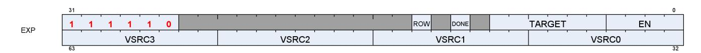

| Field  | Size | Description                                                                                                                                                                                                                                                 |                                             |  |
|--------|------|-------------------------------------------------------------------------------------------------------------------------------------------------------------------------------------------------------------------------------------------------------------|---------------------------------------------|--|
| Done   | 1    | Indicates this is the last export from the shader.Used only for Pixel, Position and Primitive<br>data. Must be set for primitive export.                                                                                                                    |                                             |  |
| Target | 6    | Export Target:                                                                                                                                                                                                                                              |                                             |  |
|        |      | 0-7                                                                                                                                                                                                                                                         | MRT 0-7                                     |  |
|        |      | 8                                                                                                                                                                                                                                                           | Z                                           |  |
|        |      | 12-16                                                                                                                                                                                                                                                       | Position 0-4 (Pos4 is for stereo rendering) |  |
|        |      | 20                                                                                                                                                                                                                                                          | NGG Primitive data (connectivity data)      |  |
|        |      | 21                                                                                                                                                                                                                                                          | Dual source blend Left                      |  |
|        |      | 22                                                                                                                                                                                                                                                          | Dual source blend Right                     |  |
| EN     | 4    | 16-bit components: export half-DWORD enable. Valid values are: 0x0,1,3<br>[0] enables VSRC0 : R,G from one VGPR (R in low bits, G high)<br>[1] enables VSRC1 : B,A from one VGPR (B in low bits, A high)<br>32-bit components: [0-3] = enables for VSRC0-3. |                                             |  |
| VSRC0  | 8    | VGPR to read data from.                                                                                                                                                                                                                                     |                                             |  |
| VSRC1  | 8    | Pos: vsrc0=X, 1=Y, 2=Z, 3=W                                                                                                                                                                                                                                 |                                             |  |
| VSRC2  | 8    | MRT: vsrc0=R, 1=G, 2=B, 3=A                                                                                                                                                                                                                                 |                                             |  |
| VSRC3  | 8    |                                                                                                                                                                                                                                                             |                                             |  |
| ROW_EN | 1    | 0 = normal mode; 1 = use M0 to provide the row number for mesh shader's POS and PRIM<br>exports.                                                                                                                                                            |                                             |  |
| (M0)   | 8    | Row number for mesh shader POS and PRIM exports                                                                                                                                                                                                             |                                             |  |

| 32-bit components | EN[0]        | VSRC0   | Red/X/ …               |
|-------------------|--------------|---------|------------------------|
|                   | EN[1]        | VSRC1   | Green/Y/…              |
|                   | EN[2]        | VSRC2   | Blue/Z/…               |
|                   | EN[3]        | VSRC3   | Alpha/W/…              |
| 16-bit components | EN[0]        | VSRC0   | {green, red} / { y, x} |
|                   | EN[1]        | VSRC1   | {alpha, blue} / {w,z}  |
|                   | EN[2], EN[3] | ignored | unused                 |

# <span id="page-148-0"></span>**14.1. Pixel Shader Exports**

#### **Pixel Exports**

Export instructions copy color data to the MRTs. Data has up to four components (R, G, B, A).

Optionally, export instructions also output depth (Z) data.

Every pixel shader must have at least one export instruction.

The last export instruction executed must have the DONE bit set to one.

The EXEC mask is applied to all exports. Only pixels with the corresponding EXEC bit set to 1 export data to the output buffer.

Each export target must be exported to only once.

The shader program is responsible for conversion of data from 32b to 16b for 16-bit exports. The shader program is responsible for alpha-test.

All data that can affect the sample mask must be sent on the first export from the shader. This means if depth is being exported, it must be exported first. If alpha to mask is enabled, MRT0 must be exported first, unless depth is also enabled, in which case, MRT0's alpha value must be written to the depth export's alpha value. If alpha to mask and coverage to mask are both enabled, then the depth export's alpha value is set to the minimum of the alpha to mask value (alpha of MRT0) and the coverage to mask value (alpha of what would have been in the depth export). If the shader can kill a pixel, it must be determined before the first export.

#### **Pixel Shader Dual-Source Blend**

In this mode, alternating lanes (threads) hold MRT0 and MRT1, not all threads going to one MRT. There are two instructions to complete a dual-source blend export. It is required that exports to 21 and 22 be back-toback, with no other export types in between them.

| Export target | EXEC mask                                                                     | MRT<br>Exported | Lane 0        | Lane 1        | Lane 2    |
|---------------|-------------------------------------------------------------------------------|-----------------|---------------|---------------|-----------|
| 21            | exec_mask =<br>(exec_mask & 0x5555_5555)  <br>((exec_mask <<1) & 0xAAAA_AAAA) | 0               | Pix0,<br>MRT0 | Pix0<br>MRT1  | Pix2 MRT0 |
| 22            | exec_mask =<br>(exec_mask & 0xAAAA_AAAA)  <br>((exec_mask >>1) & 0x5555_5555) | 1               | Pix1,<br>MRT0 | Pix1,<br>MRT1 | Pix3 MRT0 |

# <span id="page-148-1"></span>**14.2. Primitive Shader Exports (From GS shader stage)**

The GS shader uses export instructions to output vertex position data, and memory stores for vertex parameter data. This data is passed on to subsequent pixel shaders.

Every vertex shader must output at least one position vector (x, y, z; w is optional) to the POS0 target. The last position export must have the DONE bit set to 1. For optimized performance, it is recommended to output all position data as early as possible in the vertex shader.

# <span id="page-148-2"></span>**14.3. Dependency Checking**

Export instructions are executed by the hardware in two phases. First, the instruction is selected to be executed, and EXPCNT is incremented by 1. At this time, the wave has made a request to export data, but the


data has not been exported yet. Later, when the export actually occurs the EXEC mask and VGPR data is read and the data is exported, and finally EXPcnt is decremented.

Use S\_WAITCNT on EXPcnt to prevent the shader program from overwriting EXEC or the VGPRs holding the data to be exported before the export operation has completed.

Multiple export instructions can be outstanding at one time. Exports of the same type (for example: position) are completed in order, but exports of different types can be completed out of order. If the STATUS register's SKIP\_EXPORT bit is set to one, the hardware treats all EXPORT instructions as if they were NOPs.


# <span id="page-150-0"></span>**Chapter 15. Microcode Formats**

This section specifies the microcode formats. The definitions can be used to simplify compilation by providing standard templates and enumeration names for the various instruction formats.

Endian Order - The RDNA3 architecture addresses memory and registers using little-endian byte-ordering and bit-ordering. Multi-byte values are stored with their least-significant (low-order) byte at the lowest byte address, and they are illustrated with their least-significant byte at the right side. Byte values are stored with their least-significant (low-order) bit (LSB) at the lowest bit address, and they are illustrated with their LSB at the right side.

SALU and VALU instructions may optionally include a 32-bit literal constant, and some VALU instructions may include a 32-bit DPP control DWORD at the end of the instructions. No instruction may use both DPP and a literal constant.

The table below summarizes the microcode formats and their widths, not including extra literal or DPP instruction words. The sections that follow provide details.

Table 64. Summary of Microcode Formats

| Microcode Formats                     | Reference | Width (bits) |  |
|---------------------------------------|-----------|--------------|--|
| Scalar ALU and Control Formats        |           |              |  |
| SOP2                                  | SOP2      | 32           |  |
| SOP1                                  | SOP1      |              |  |
| SOPK                                  | SOPK      |              |  |
| SOPP                                  | SOPP      |              |  |
| SOPC                                  | SOPC      |              |  |
| Scalar Memory Format                  |           |              |  |
| SMEM                                  | SMEM      | 64           |  |
| Vector ALU Format                     |           |              |  |
| VOP1                                  | VOP1      | 32           |  |
| VOP2                                  | VOP2      | 32           |  |
| VOPC                                  | VOPC      | 32           |  |
| VOP3                                  | VOP3      | 64           |  |
| VOP3SD                                | VOP3SD    | 64           |  |
| VOP3P                                 | VOP3P     | 64           |  |
| VOPD                                  | VOPD      | 64           |  |
| DPP16                                 | DPP16     | 32           |  |
| DPP8                                  | DPP8      | 32           |  |
| Vector Parameter Interpolation Format |           |              |  |
| VINTERP                               | VINTERP   | 64           |  |
| LDS Parameter Load and Direct Load    |           |              |  |
| LDSDIR                                | LDSDIR    | 32           |  |
| LDS/GDS Format                        |           |              |  |
| DS                                    | DS        | 64           |  |
| Vector Memory Buffer Formats          |           |              |  |
| MTBUF                                 | MTBUF     | 64           |  |
| MUBUF                                 | MUBUF     | 64           |  |
| Vector Memory Image Format            |           |              |  |


| Microcode Formats | Reference | Width (bits) |  |  |
|-------------------|-----------|--------------|--|--|
| MIMG              | MIMG      | 64 or 96     |  |  |
| Export Format     |           |              |  |  |
| EXP               | EXP       | 64           |  |  |
| Flat Formats      |           |              |  |  |
| FLAT              | FLAT      | 64           |  |  |
| GLOBAL            | GLOBAL    | 64           |  |  |
| SCRATCH           | SCRATCH   | 64           |  |  |


any instruction field marked as "Reserved" must be set to zero.

#### **Instruction Suffixes**

Most instructions include a suffix that indicates the data type the instruction handles. This suffix may also include a number that indicates the size of the data.

For example: "F32" indicates "32-bit floating point data", or "B16" is "16-bit binary data".

- B = binary
- F = floating point
- BF = "brain-float" floating point
- U = unsigned integer
- S = signed integer

When more than one data-type specifier occurs in an instruction, the first one is the result type and size, and the later one(s) is/are input data type and size.

E.g. V\_CVT\_F32\_I32 reads an integer and writes a float.


# <span id="page-152-0"></span>**15.1. Scalar ALU and Control Formats**

### <span id="page-152-1"></span>**15.1.1. SOP2**

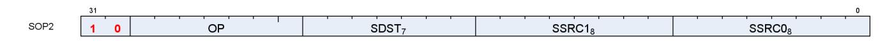

**Description** This is a scalar instruction with two inputs and one output. Can be followed by a 32-bit literal constant.

Table 65. SOP2 Fields

| Field Name     | Bits      | Format or Description                                         |
|----------------|-----------|---------------------------------------------------------------|
| SSRC0<br>[7:0] |           | Source 0. First operand for the instruction.                  |
|                | 0-105     | SGPR0 - SGPR105: Scalar general-purpose registers.            |
|                | 106       | VCC_LO: VCC[31:0].                                            |
|                | 107       | VCC_HI: VCC[63:32].                                           |
|                | 108-123   | TTMP0 - TTMP15: Trap handler temporary register.              |
|                | 124       | NULL                                                          |
|                | 125       | M0. Misc register 0.                                          |
|                | 126       | EXEC_LO: EXEC[31:0].                                          |
|                | 127       | EXEC_HI: EXEC[63:32].                                         |
|                | 128       | 0.                                                            |
|                | 129-192   | Signed integer 1 to 64.                                       |
|                | 193-208   | Signed integer -1 to -16.                                     |
|                | 209-234   | Reserved.                                                     |
|                | 235       | SHARED_BASE (Memory Aperture definition).                     |
|                | 236       | SHARED_LIMIT (Memory Aperture definition).                    |
|                | 237       | PRIVATE_BASE (Memory Aperture definition).                    |
|                | 238       | PRIVATE_LIMIT (Memory Aperture definition).                   |
|                | 239       | Reserved.                                                     |
|                | 240       | 0.5.                                                          |
|                | 241       | -0.5.                                                         |
|                | 242       | 1.0.                                                          |
|                | 243       | -1.0.                                                         |
|                | 244       | 2.0.                                                          |
|                | 245       | -2.0.                                                         |
|                | 246       | 4.0.                                                          |
|                | 247       | -4.0.                                                         |
|                | 248       | 1/(2*PI).                                                     |
|                | 249 - 252 | Reserved.                                                     |
|                | 253       | SCC.                                                          |
|                | 254       | Reserved.                                                     |
|                | 255       | Literal constant.                                             |
| SSRC1          | [15:8]    | Second scalar source operand.                                 |
|                |           | Same codes as SSRC0, above.                                   |
| SDST           | [22:16]   | Scalar destination.                                           |
|                |           | Same codes as SSRC0, above except only codes 0-127 are valid. |
| OP             | [29:23]   | See Opcode table below.                                       |
| ENCODING       | [31:30]   | 'b10                                                          |
|                |           |                                                               |

Table 66. SOP2 Opcodes


| Opcode # | Name            | Opcode # | Name              |
|----------|-----------------|----------|-------------------|
| 0        | S_ADD_U32       | 27       | S_XOR_B64         |
| 1        | S_SUB_U32       | 28       | S_NAND_B32        |
| 2        | S_ADD_I32       | 29       | S_NAND_B64        |
| 3        | S_SUB_I32       | 30       | S_NOR_B32         |
| 4        | S_ADDC_U32      | 31       | S_NOR_B64         |
| 5        | S_SUBB_U32      | 32       | S_XNOR_B32        |
| 6        | S_ABSDIFF_I32   | 33       | S_XNOR_B64        |
| 8        | S_LSHL_B32      | 34       | S_AND_NOT1_B32    |
| 9        | S_LSHL_B64      | 35       | S_AND_NOT1_B64    |
| 10       | S_LSHR_B32      | 36       | S_OR_NOT1_B32     |
| 11       | S_LSHR_B64      | 37       | S_OR_NOT1_B64     |
| 12       | S_ASHR_I32      | 38       | S_BFE_U32         |
| 13       | S_ASHR_I64      | 39       | S_BFE_I32         |
| 14       | S_LSHL1_ADD_U32 | 40       | S_BFE_U64         |
| 15       | S_LSHL2_ADD_U32 | 41       | S_BFE_I64         |
| 16       | S_LSHL3_ADD_U32 | 42       | S_BFM_B32         |
| 17       | S_LSHL4_ADD_U32 | 43       | S_BFM_B64         |
| 18       | S_MIN_I32       | 44       | S_MUL_I32         |
| 19       | S_MIN_U32       | 45       | S_MUL_HI_U32      |
| 20       | S_MAX_I32       | 46       | S_MUL_HI_I32      |
| 21       | S_MAX_U32       | 48       | S_CSELECT_B32     |
| 22       | S_AND_B32       | 49       | S_CSELECT_B64     |
| 23       | S_AND_B64       | 50       | S_PACK_LL_B32_B16 |
| 24       | S_OR_B32        | 51       | S_PACK_LH_B32_B16 |
| 25       | S_OR_B64        | 52       | S_PACK_HH_B32_B16 |
| 26       | S_XOR_B32       | 53       | S_PACK_HL_B32_B16 |

### <span id="page-153-0"></span>**15.1.2. SOPK**


**Description** This is a scalar instruction with one 16-bit signed immediate (SIMM16) input and a single destination. Instructions that take 2 inputs use the destination as the first input and the SIMM16 as the second input.

E.g. "S\_CMPK\_GT\_I32 S0, 1" means "SCC = (s0 > 1)"

Table 67. SOPK Fields

| Field Name | Bits   | Format or Description          |
|------------|--------|--------------------------------|
| SIMM16     | [15:0] | Signed immediate 16-bit value. |


| Field Name | Bits                                                                  | Format or Description                              |
|------------|-----------------------------------------------------------------------|----------------------------------------------------|
| SDST       | [22:16]<br>Scalar destination, and can provide second source operand. |                                                    |
|            | 0-105                                                                 | SGPR0 - SGPR105: Scalar general-purpose registers. |
|            | 106                                                                   | VCC_LO: VCC[31:0].                                 |
|            | 107<br>VCC_HI: VCC[63:32].                                            |                                                    |
|            | 108-123                                                               | TTMP0 - TTMP15: Trap handler temporary register.   |
|            | 124                                                                   | M0. Memory register 0.                             |
|            | 125                                                                   | NULL                                               |
|            | 126                                                                   | EXEC_LO: EXEC[31:0].                               |
|            | 127                                                                   | EXEC_HI: EXEC[63:32].                              |
| OP         | [27:23]                                                               | See Opcode table below.                            |
| ENCODING   | [31:28]                                                               | 'b1011                                             |

Table 68. SOPK Opcodes

| Opcode # | Name          | Opcode # | Name               |
|----------|---------------|----------|--------------------|
| 0        | S_MOVK_I32    | 13       | S_CMPK_LT_U32      |
| 1        | S_VERSION     | 14       | S_CMPK_LE_U32      |
| 2        | S_CMOVK_I32   | 15       | S_ADDK_I32         |
| 3        | S_CMPK_EQ_I32 | 16       | S_MULK_I32         |
| 4        | S_CMPK_LG_I32 | 17       | S_GETREG_B32       |
| 5        | S_CMPK_GT_I32 | 18       | S_SETREG_B32       |
| 6        | S_CMPK_GE_I32 | 19       | S_SETREG_IMM32_B32 |
| 7        | S_CMPK_LT_I32 | 20       | S_CALL_B64         |
| 8        | S_CMPK_LE_I32 | 24       | S_WAITCNT_VSCNT    |
| 9        | S_CMPK_EQ_U32 | 25       | S_WAITCNT_VMCNT    |
| 10       | S_CMPK_LG_U32 | 26       | S_WAITCNT_EXPCNT   |
| 11       | S_CMPK_GT_U32 | 27       | S_WAITCNT_LGKMCNT  |
| 12       | S_CMPK_GE_U32 |          |                    |

### **15.1.3. SOP1**

<span id="page-154-0"></span>

**Description** This is a scalar instruction with two inputs and one output. Can be followed by a 32-bit literal constant.

Table 69. SOP1 Fields


| Field Name | Bits      | Format or Description                                         |  |  |
|------------|-----------|---------------------------------------------------------------|--|--|
| SSRC0      | [7:0]     | Source 0. First operand for the instruction.                  |  |  |
|            | 0-105     | SGPR0 - SGPR105: Scalar general-purpose registers.            |  |  |
|            | 106       | VCC_LO: VCC[31:0].                                            |  |  |
|            | 107       | VCC_HI: VCC[63:32].                                           |  |  |
|            | 108-123   | TTMP0 - TTMP15: Trap handler temporary register.              |  |  |
|            | 124       | NULL                                                          |  |  |
|            | 125       | M0. Misc register 0.                                          |  |  |
|            | 126       | EXEC_LO: EXEC[31:0].                                          |  |  |
|            | 127       | EXEC_HI: EXEC[63:32].                                         |  |  |
|            | 128       | 0.                                                            |  |  |
|            | 129-192   | Signed integer 1 to 64.                                       |  |  |
|            | 193-208   | Signed integer -1 to -16.                                     |  |  |
|            | 209-234   | Reserved.                                                     |  |  |
|            | 235       | SHARED_BASE (Memory Aperture definition).                     |  |  |
|            | 236       | SHARED_LIMIT (Memory Aperture definition).                    |  |  |
|            | 237       | PRIVATE_BASE (Memory Aperture definition).                    |  |  |
|            | 238       | PRIVATE_LIMIT (Memory Aperture definition).                   |  |  |
|            | 239       | Reserved.                                                     |  |  |
|            | 240       | 0.5.                                                          |  |  |
|            | 241       | -0.5.                                                         |  |  |
|            | 242       | 1.0.                                                          |  |  |
|            | 243       | -1.0.                                                         |  |  |
|            | 244       | 2.0.                                                          |  |  |
|            | 245       | -2.0.                                                         |  |  |
|            | 246       | 4.0.                                                          |  |  |
|            | 247       | -4.0.                                                         |  |  |
|            | 248       | 1/(2*PI).                                                     |  |  |
|            | 249 - 252 | Reserved.                                                     |  |  |
|            | 253       | SCC.                                                          |  |  |
|            | 254       | Reserved.                                                     |  |  |
|            | 255       | Literal constant.                                             |  |  |
| OP         | [15:8]    | See Opcode table below.                                       |  |  |
| SDST       | [22:16]   | Scalar destination.                                           |  |  |
|            |           | Same codes as SSRC0, above except only codes 0-127 are valid. |  |  |
| ENCODING   | [31:23]   | 'b10_1111101                                                  |  |  |

Table 70. SOP1 Opcodes

| Opcode # | Name           | Opcode # | Name                    |
|----------|----------------|----------|-------------------------|
| 0        | S_MOV_B32      | 35       | S_OR_SAVEEXEC_B64       |
| 1        | S_MOV_B64      | 36       | S_XOR_SAVEEXEC_B32      |
| 2        | S_CMOV_B32     | 37       | S_XOR_SAVEEXEC_B64      |
| 3        | S_CMOV_B64     | 38       | S_NAND_SAVEEXEC_B32     |
| 4        | S_BREV_B32     | 39       | S_NAND_SAVEEXEC_B64     |
| 5        | S_BREV_B64     | 40       | S_NOR_SAVEEXEC_B32      |
| 8        | S_CTZ_I32_B32  | 41       | S_NOR_SAVEEXEC_B64      |
| 9        | S_CTZ_I32_B64  | 42       | S_XNOR_SAVEEXEC_B32     |
| 10       | S_CLZ_I32_U32  | 43       | S_XNOR_SAVEEXEC_B64     |
| 11       | S_CLZ_I32_U64  | 44       | S_AND_NOT0_SAVEEXEC_B32 |
| 12       | S_CLS_I32      | 45       | S_AND_NOT0_SAVEEXEC_B64 |
| 13       | S_CLS_I32_I64  | 46       | S_OR_NOT0_SAVEEXEC_B32  |
| 14       | S_SEXT_I32_I8  | 47       | S_OR_NOT0_SAVEEXEC_B64  |
| 15       | S_SEXT_I32_I16 | 48       | S_AND_NOT1_SAVEEXEC_B32 |


| Opcode # | Name                   | Opcode # | Name                    |
|----------|------------------------|----------|-------------------------|
| 16       | S_BITSET0_B32          | 49       | S_AND_NOT1_SAVEEXEC_B64 |
| 17       | S_BITSET0_B64          | 50       | S_OR_NOT1_SAVEEXEC_B32  |
| 18       | S_BITSET1_B32          | 51       | S_OR_NOT1_SAVEEXEC_B64  |
| 19       | S_BITSET1_B64          | 52       | S_AND_NOT0_WREXEC_B32   |
| 20       | S_BITREPLICATE_B64_B32 | 53       | S_AND_NOT0_WREXEC_B64   |
| 21       | S_ABS_I32              | 54       | S_AND_NOT1_WREXEC_B32   |
| 22       | S_BCNT0_I32_B32        | 55       | S_AND_NOT1_WREXEC_B64   |
| 23       | S_BCNT0_I32_B64        | 64       | S_MOVRELS_B32           |
| 24       | S_BCNT1_I32_B32        | 65       | S_MOVRELS_B64           |
| 25       | S_BCNT1_I32_B64        | 66       | S_MOVRELD_B32           |
| 26       | S_QUADMASK_B32         | 67       | S_MOVRELD_B64           |
| 27       | S_QUADMASK_B64         | 68       | S_MOVRELSD_2_B32        |
| 28       | S_WQM_B32              | 71       | S_GETPC_B64             |
| 29       | S_WQM_B64              | 72       | S_SETPC_B64             |
| 30       | S_NOT_B32              | 73       | S_SWAPPC_B64            |
| 31       | S_NOT_B64              | 74       | S_RFE_B64               |
| 32       | S_AND_SAVEEXEC_B32     | 76       | S_SENDMSG_RTN_B32       |
| 33       | S_AND_SAVEEXEC_B64     | 77       | S_SENDMSG_RTN_B64       |
| 34       | S_OR_SAVEEXEC_B32      |          |                         |

## <span id="page-156-0"></span>**15.1.4. SOPC**

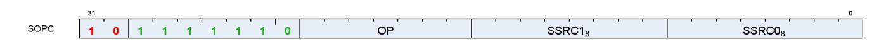

**Description** This is a scalar instruction with two inputs that are compared and produces SCC as a result. Can be followed by a 32-bit literal constant.

Table 71. SOPC Fields


| Field Name | Bits      | Format or Description                              |
|------------|-----------|----------------------------------------------------|
| SSRC0      | [7:0]     | Source 0. First operand for the instruction.       |
|            | 0-105     | SGPR0 - SGPR105: Scalar general-purpose registers. |
|            | 106       | VCC_LO: VCC[31:0].                                 |
|            | 107       | VCC_HI: VCC[63:32].                                |
|            | 108-123   | TTMP0 - TTMP15: Trap handler temporary register.   |
|            | 124       | NULL                                               |
|            | 125       | M0. Misc register 0.                               |
|            | 126       | EXEC_LO: EXEC[31:0].                               |
|            | 127       | EXEC_HI: EXEC[63:32].                              |
|            | 128       | 0.                                                 |
|            | 129-192   | Signed integer 1 to 64.                            |
|            | 193-208   | Signed integer -1 to -16.                          |
|            | 209-234   | Reserved.                                          |
|            | 235       | SHARED_BASE (Memory Aperture definition).          |
|            | 236       | SHARED_LIMIT (Memory Aperture definition).         |
|            | 237       | PRIVATE_BASE (Memory Aperture definition).         |
|            | 238       | PRIVATE_LIMIT (Memory Aperture definition).        |
|            | 239       | Reserved.                                          |
|            | 240       | 0.5.                                               |
|            | 241       | -0.5.                                              |
|            | 242       | 1.0.                                               |
|            | 243       | -1.0.                                              |
|            | 244       | 2.0.                                               |
|            | 245       | -2.0.                                              |
|            | 246       | 4.0.                                               |
|            | 247       | -4.0.                                              |
|            | 248       | 1/(2*PI).                                          |
|            | 249 - 252 | Reserved.                                          |
|            | 253       | SCC.                                               |
|            | 254       | Reserved.                                          |
|            | 255       | Literal constant.                                  |
| SSRC1      | [15:8]    | Second scalar source operand.                      |
|            |           | Same codes as SSRC0, above.                        |
| OP         | [22:16]   | See Opcode table below.                            |
| ENCODING   | [31:23]   | 'b10_1111110                                       |

Table 72. SOPC Opcodes

| Opcode # | Name         | Opcode # | Name          |
|----------|--------------|----------|---------------|
| 0        | S_CMP_EQ_I32 | 9        | S_CMP_GE_U32  |
| 1        | S_CMP_LG_I32 | 10       | S_CMP_LT_U32  |
| 2        | S_CMP_GT_I32 | 11       | S_CMP_LE_U32  |
| 3        | S_CMP_GE_I32 | 12       | S_BITCMP0_B32 |
| 4        | S_CMP_LT_I32 | 13       | S_BITCMP1_B32 |
| 5        | S_CMP_LE_I32 | 14       | S_BITCMP0_B64 |
| 6        | S_CMP_EQ_U32 | 15       | S_BITCMP1_B64 |
| 7        | S_CMP_LG_U32 | 16       | S_CMP_EQ_U64  |
| 8        | S_CMP_GT_U32 | 17       | S_CMP_LG_U64  |

## <span id="page-158-0"></span>**15.1.5. SOPP**

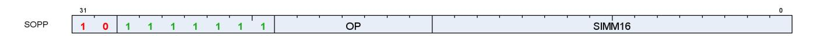

**Description** This is a scalar instruction with one 16-bit signed immediate (SIMM16) input.

Table 73. SOPP Fields

| Field Name | Bits    | Format or Description          |
|------------|---------|--------------------------------|
| SIMM16     | [15:0]  | Signed immediate 16-bit value. |
| OP         | [22:16] | See Opcode table below.        |
| ENCODING   | [31:23] | 'b10_1111111                   |

Table 74. SOPP Opcodes

| Opcode # | Name                         | Opcode # | Name                       |
|----------|------------------------------|----------|----------------------------|
| 0        | S_NOP                        | 36       | S_CBRANCH_VCCNZ            |
| 1        | S_SETKILL                    | 37       | S_CBRANCH_EXECZ            |
| 2        | S_SETHALT                    | 38       | S_CBRANCH_EXECNZ           |
| 3        | S_SLEEP                      | 39       | S_CBRANCH_CDBGSYS          |
| 4        | S_SET_INST_PREFETCH_DISTANCE | 40       | S_CBRANCH_CDBGUSER         |
| 5        | S_CLAUSE                     | 41       | S_CBRANCH_CDBGSYS_OR_USER  |
| 7        | S_DELAY_ALU                  | 42       | S_CBRANCH_CDBGSYS_AND_USER |
| 8        | Reserved                     | 48       | S_ENDPGM                   |
| 9        | S_WAITCNT                    | 49       | S_ENDPGM_SAVED             |
| 10       | S_WAIT_IDLE                  | 50       | S_ENDPGM_ORDERED_PS_DONE   |
| 11       | S_WAIT_EVENT                 | 52       | S_WAKEUP                   |
| 16       | S_TRAP                       | 53       | S_SETPRIO                  |
| 17       | S_ROUND_MODE                 | 54       | S_SENDMSG                  |
| 18       | S_DENORM_MODE                | 55       | S_SENDMSGHALT              |
| 31       | S_CODE_END                   | 56       | S_INCPERFLEVEL             |
| 32       | S_BRANCH                     | 57       | S_DECPERFLEVEL             |
| 33       | S_CBRANCH_SCC0               | 60       | S_ICACHE_INV               |
| 34       | S_CBRANCH_SCC1               | 61       | S_BARRIER                  |
| 35       | S_CBRANCH_VCCZ               |          |                            |


# <span id="page-159-0"></span>**15.2. Scalar Memory Format**

### <span id="page-159-1"></span>**15.2.1. SMEM**

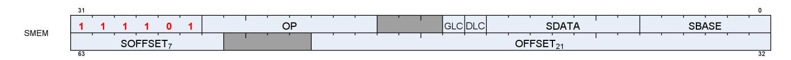

**Description** Scalar Memory data load

Table 75. SMEM Fields

| Field Name | Bits    | Format or Description                                                                                     |
|------------|---------|-----------------------------------------------------------------------------------------------------------|
| SBASE      | [5:0]   | SGPR-pair that provides base address or SGPR-quad that provides V#. (LSB of SGPR<br>address is omitted).  |
| SDATA      | [12:6]  | SGPR that provides write data or accepts return data.                                                     |
| DLC        | [14]    | Device level coherent.                                                                                    |
| GLC        | [16]    | Globally memory Coherent. Force bypass of L1 cache, or for atomics, cause pre-op<br>value to be returned. |
| OP         | [25:18] | See Opcode table below.                                                                                   |
| ENCODING   | [31:26] | 'b111101                                                                                                  |
| OFFSET     | [52:32] | An immediate signed byte offset. Ignored for cache invalidations.                                         |
| SOFFSET    | [63:57] | SGPR that supplies an unsigned byte offset. Disabled if set to NULL.                                      |

Table 76. SMEM Opcodes

| Opcode # | Name              | Opcode # | Name               |
|----------|-------------------|----------|--------------------|
| 0        | S_LOAD_B32        | 9        | S_BUFFER_LOAD_B64  |
| 1        | S_LOAD_B64        | 10       | S_BUFFER_LOAD_B128 |
| 2        | S_LOAD_B128       | 11       | S_BUFFER_LOAD_B256 |
| 3        | S_LOAD_B256       | 12       | S_BUFFER_LOAD_B512 |
| 4        | S_LOAD_B512       | 32       | S_GL1_INV          |
| 8        | S_BUFFER_LOAD_B32 | 33       | S_DCACHE_INV       |


# <span id="page-160-0"></span>**15.3. Vector ALU Formats**

### **15.3.1. VOP2**

<span id="page-160-1"></span>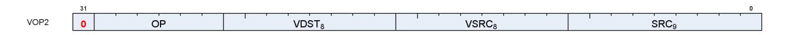

**Description** Vector ALU format with two input operands. Can be followed by a 32-bit literal constant or DPP instruction DWORD when the instruction allows it.

Table 77. VOP2 Fields

| Field Name | Bits      | Format or Description                              |
|------------|-----------|----------------------------------------------------|
| SRC0       | [8:0]     | Source 0. First operand for the instruction.       |
|            | 0-105     | SGPR0 - SGPR105: Scalar general-purpose registers. |
|            | 106       | VCC_LO: VCC[31:0].                                 |
|            | 107       | VCC_HI: VCC[63:32].                                |
|            | 108-123   | TTMP0 - TTMP15: Trap handler temporary register.   |
|            | 124       | NULL                                               |
|            | 125       | M0. Misc register 0.                               |
|            | 126       | EXEC_LO: EXEC[31:0].                               |
|            | 127       | EXEC_HI: EXEC[63:32].                              |
|            | 128       | 0.                                                 |
|            | 129-192   | Signed integer 1 to 64.                            |
|            | 193-208   | Signed integer -1 to -16.                          |
|            | 209-232   | Reserved.                                          |
|            | 233       | DPP8                                               |
|            | 234       | DPP8FI                                             |
|            | 235       | SHARED_BASE (Memory Aperture definition).          |
|            | 236       | SHARED_LIMIT (Memory Aperture definition).         |
|            | 237       | PRIVATE_BASE (Memory Aperture definition).         |
|            | 238       | PRIVATE_LIMIT (Memory Aperture definition).        |
|            | 239       | Reserved.                                          |
|            | 240       | 0.5.                                               |
|            | 241       | -0.5.                                              |
|            | 242       | 1.0.                                               |
|            | 243       | -1.0.                                              |
|            | 244       | 2.0.                                               |
|            | 245       | -2.0.                                              |
|            | 246       | 4.0.                                               |
|            | 247       | -4.0.                                              |
|            | 248       | 1/(2*PI).                                          |
|            | 250       | DPP16                                              |
|            | 253       | SCC.                                               |
|            | 254       | Reserved.                                          |
|            | 255       | Literal constant.                                  |
|            | 256 - 511 | VGPR 0 - 255                                       |
| VSRC1      | [16:9]    | VGPR that provides the second operand.             |
| VDST       | [24:17]   | Destination VGPR.                                  |
| OP         | [30:25]   | See Opcode table below.                            |
| ENCODING   | [31]      | 'b0                                                |
|            |           |                                                    |

Table 78. VOP2 Opcodes

15.3. Vector ALU Formats 152 of 600


| Opcode # | Name                | Opcode # | Name                 |
|----------|---------------------|----------|----------------------|
| 1        | V_CNDMASK_B32       | 29       | V_XOR_B32            |
| 2        | V_DOT2ACC_F32_F16   | 30       | V_XNOR_B32           |
| 3        | V_ADD_F32           | 32       | V_ADD_CO_CI_U32      |
| 4        | V_SUB_F32           | 33       | V_SUB_CO_CI_U32      |
| 5        | V_SUBREV_F32        | 34       | V_SUBREV_CO_CI_U32   |
| 6        | V_FMAC_DX9_ZERO_F32 | 37       | V_ADD_NC_U32         |
| 7        | V_MUL_DX9_ZERO_F32  | 38       | V_SUB_NC_U32         |
| 8        | V_MUL_F32           | 39       | V_SUBREV_NC_U32      |
| 9        | V_MUL_I32_I24       | 43       | V_FMAC_F32           |
| 10       | V_MUL_HI_I32_I24    | 44       | V_FMAMK_F32          |
| 11       | V_MUL_U32_U24       | 45       | V_FMAAK_F32          |
| 12       | V_MUL_HI_U32_U24    | 47       | V_CVT_PK_RTZ_F16_F32 |
| 15       | V_MIN_F32           | 50       | V_ADD_F16            |
| 16       | V_MAX_F32           | 51       | V_SUB_F16            |
| 17       | V_MIN_I32           | 52       | V_SUBREV_F16         |
| 18       | V_MAX_I32           | 53       | V_MUL_F16            |
| 19       | V_MIN_U32           | 54       | V_FMAC_F16           |
| 20       | V_MAX_U32           | 55       | V_FMAMK_F16          |
| 24       | V_LSHLREV_B32       | 56       | V_FMAAK_F16          |
| 25       | V_LSHRREV_B32       | 57       | V_MAX_F16            |
| 26       | V_ASHRREV_I32       | 58       | V_MIN_F16            |
| 27       | V_AND_B32           | 59       | V_LDEXP_F16          |
| 28       | V_OR_B32            | 60       | V_PK_FMAC_F16        |

### **15.3.2. VOP1**

<span id="page-161-0"></span>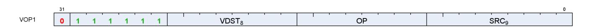

**Description** Vector ALU format with one input operand. Can be followed by a 32-bit literal constant or DPP instruction DWORD when the instruction allows it.

Table 79. VOP1 Fields

15.3. Vector ALU Formats 153 of 600


| Field Name | Bits      | Format or Description                              |
|------------|-----------|----------------------------------------------------|
| SRC0       | [8:0]     | Source 0. First operand for the instruction.       |
|            | 0-105     | SGPR0 - SGPR105: Scalar general-purpose registers. |
|            | 106       | VCC_LO: VCC[31:0].                                 |
|            | 107       | VCC_HI: VCC[63:32].                                |
|            | 108-123   | TTMP0 - TTMP15: Trap handler temporary register.   |
|            | 124       | NULL                                               |
|            | 125       | M0. Misc register 0.                               |
|            | 126       | EXEC_LO: EXEC[31:0].                               |
|            | 127       | EXEC_HI: EXEC[63:32].                              |
|            | 128       | 0.                                                 |
|            | 129-192   | Signed integer 1 to 64.                            |
|            | 193-208   | Signed integer -1 to -16.                          |
|            | 209-232   | Reserved.                                          |
|            | 233       | DPP8                                               |
|            | 234       | DPP8FI                                             |
|            | 235       | SHARED_BASE (Memory Aperture definition).          |
|            | 236       | SHARED_LIMIT (Memory Aperture definition).         |
|            | 237       | PRIVATE_BASE (Memory Aperture definition).         |
|            | 238       | PRIVATE_LIMIT (Memory Aperture definition).        |
|            | 239       | Reserved.                                          |
|            | 240       | 0.5.                                               |
|            | 241       | -0.5.                                              |
|            | 242       | 1.0.                                               |
|            | 243       | -1.0.                                              |
|            | 244       | 2.0.                                               |
|            | 245       | -2.0.                                              |
|            | 246       | 4.0.                                               |
|            | 247       | -4.0.                                              |
|            | 248       | 1/(2*PI).                                          |
|            | 250       | DPP16                                              |
|            | 253       | SCC.                                               |
|            | 254       | Reserved.                                          |
|            | 255       | Literal constant.                                  |
|            | 256 - 511 | VGPR 0 - 255                                       |
| OP         | [16:9]    | See Opcode table below.                            |
| VDST       | [24:17]   | Destination VGPR.                                  |
| ENCODING   | [31:25]   | 'b0_111111                                         |

Table 80. VOP1 Opcodes

| Opcode # | Name                  | Opcode # | Name                |
|----------|-----------------------|----------|---------------------|
| 0        | V_NOP                 | 54       | V_COS_F32           |
| 1        | V_MOV_B32             | 55       | V_NOT_B32           |
| 2        | V_READFIRSTLANE_B32   | 56       | V_BFREV_B32         |
| 3        | V_CVT_I32_F64         | 57       | V_CLZ_I32_U32       |
| 4        | V_CVT_F64_I32         | 58       | V_CTZ_I32_B32       |
| 5        | V_CVT_F32_I32         | 59       | V_CLS_I32           |
| 6        | V_CVT_F32_U32         | 60       | V_FREXP_EXP_I32_F64 |
| 7        | V_CVT_U32_F32         | 61       | V_FREXP_MANT_F64    |
| 8        | V_CVT_I32_F32         | 62       | V_FRACT_F64         |
| 10       | V_CVT_F16_F32         | 63       | V_FREXP_EXP_I32_F32 |
| 11       | V_CVT_F32_F16         | 64       | V_FREXP_MANT_F32    |
| 12       | V_CVT_NEAREST_I32_F32 | 66       | V_MOVRELD_B32       |

15.3. Vector ALU Formats 154 of 600


| 13<br>V_CVT_FLOOR_I32_F32<br>67<br>V_MOVRELS_B32<br>14<br>V_CVT_OFF_F32_I4<br>68<br>V_MOVRELSD_B32<br>15<br>V_CVT_F32_F64<br>72<br>V_MOVRELSD_2_B32<br>16<br>V_CVT_F64_F32<br>80<br>V_CVT_F16_U16<br>17<br>V_CVT_F32_UBYTE0<br>81<br>V_CVT_F16_I16<br>18<br>V_CVT_F32_UBYTE1<br>82<br>V_CVT_U16_F16<br>19<br>V_CVT_F32_UBYTE2<br>83<br>V_CVT_I16_F16<br>20<br>V_CVT_F32_UBYTE3<br>84<br>V_RCP_F16<br>21<br>V_CVT_U32_F64<br>85<br>V_SQRT_F16<br>22<br>V_CVT_F64_U32<br>86<br>V_RSQ_F16<br>23<br>V_TRUNC_F64<br>87<br>V_LOG_F16<br>24<br>V_CEIL_F64<br>88<br>V_EXP_F16<br>25<br>V_RNDNE_F64<br>89<br>V_FREXP_MANT_F16<br>26<br>V_FLOOR_F64<br>90<br>V_FREXP_EXP_I16_F16<br>27<br>V_PIPEFLUSH<br>91<br>V_FLOOR_F16<br>28<br>V_MOV_B16<br>92<br>V_CEIL_F16<br>32<br>V_FRACT_F32<br>93<br>V_TRUNC_F16<br>33<br>V_TRUNC_F32<br>94<br>V_RNDNE_F16<br>34<br>V_CEIL_F32<br>95<br>V_FRACT_F16<br>35<br>V_RNDNE_F32<br>96<br>V_SIN_F16<br>36<br>V_FLOOR_F32<br>97<br>V_COS_F16<br>37<br>V_EXP_F32<br>98<br>V_SAT_PK_U8_I16<br>39<br>V_LOG_F32<br>99<br>V_CVT_NORM_I16_F16<br>42<br>V_RCP_F32<br>100<br>V_CVT_NORM_U16_F16<br>43<br>V_RCP_IFLAG_F32<br>101<br>V_SWAP_B32<br>46<br>V_RSQ_F32<br>102<br>V_SWAP_B16<br>47<br>V_RCP_F64<br>103<br>V_PERMLANE64_B32<br>49<br>V_RSQ_F64<br>104<br>V_SWAPREL_B32<br>51<br>V_SQRT_F32<br>105<br>V_NOT_B16<br>52<br>V_SQRT_F64<br>106<br>V_CVT_I32_I16<br>53<br>V_SIN_F32<br>107<br>V_CVT_U32_U16 | Opcode # | Name | Opcode # | Name |
|-------------------------------------------------------------------------------------------------------------------------------------------------------------------------------------------------------------------------------------------------------------------------------------------------------------------------------------------------------------------------------------------------------------------------------------------------------------------------------------------------------------------------------------------------------------------------------------------------------------------------------------------------------------------------------------------------------------------------------------------------------------------------------------------------------------------------------------------------------------------------------------------------------------------------------------------------------------------------------------------------------------------------------------------------------------------------------------------------------------------------------------------------------------------------------------------------------------------------------------------------------------------------------------------------------------------------------------------------------------------------------------------------------------------------------|----------|------|----------|------|
|                                                                                                                                                                                                                                                                                                                                                                                                                                                                                                                                                                                                                                                                                                                                                                                                                                                                                                                                                                                                                                                                                                                                                                                                                                                                                                                                                                                                                               |          |      |          |      |
|                                                                                                                                                                                                                                                                                                                                                                                                                                                                                                                                                                                                                                                                                                                                                                                                                                                                                                                                                                                                                                                                                                                                                                                                                                                                                                                                                                                                                               |          |      |          |      |
|                                                                                                                                                                                                                                                                                                                                                                                                                                                                                                                                                                                                                                                                                                                                                                                                                                                                                                                                                                                                                                                                                                                                                                                                                                                                                                                                                                                                                               |          |      |          |      |
|                                                                                                                                                                                                                                                                                                                                                                                                                                                                                                                                                                                                                                                                                                                                                                                                                                                                                                                                                                                                                                                                                                                                                                                                                                                                                                                                                                                                                               |          |      |          |      |
|                                                                                                                                                                                                                                                                                                                                                                                                                                                                                                                                                                                                                                                                                                                                                                                                                                                                                                                                                                                                                                                                                                                                                                                                                                                                                                                                                                                                                               |          |      |          |      |
|                                                                                                                                                                                                                                                                                                                                                                                                                                                                                                                                                                                                                                                                                                                                                                                                                                                                                                                                                                                                                                                                                                                                                                                                                                                                                                                                                                                                                               |          |      |          |      |
|                                                                                                                                                                                                                                                                                                                                                                                                                                                                                                                                                                                                                                                                                                                                                                                                                                                                                                                                                                                                                                                                                                                                                                                                                                                                                                                                                                                                                               |          |      |          |      |
|                                                                                                                                                                                                                                                                                                                                                                                                                                                                                                                                                                                                                                                                                                                                                                                                                                                                                                                                                                                                                                                                                                                                                                                                                                                                                                                                                                                                                               |          |      |          |      |
|                                                                                                                                                                                                                                                                                                                                                                                                                                                                                                                                                                                                                                                                                                                                                                                                                                                                                                                                                                                                                                                                                                                                                                                                                                                                                                                                                                                                                               |          |      |          |      |
|                                                                                                                                                                                                                                                                                                                                                                                                                                                                                                                                                                                                                                                                                                                                                                                                                                                                                                                                                                                                                                                                                                                                                                                                                                                                                                                                                                                                                               |          |      |          |      |
|                                                                                                                                                                                                                                                                                                                                                                                                                                                                                                                                                                                                                                                                                                                                                                                                                                                                                                                                                                                                                                                                                                                                                                                                                                                                                                                                                                                                                               |          |      |          |      |
|                                                                                                                                                                                                                                                                                                                                                                                                                                                                                                                                                                                                                                                                                                                                                                                                                                                                                                                                                                                                                                                                                                                                                                                                                                                                                                                                                                                                                               |          |      |          |      |
|                                                                                                                                                                                                                                                                                                                                                                                                                                                                                                                                                                                                                                                                                                                                                                                                                                                                                                                                                                                                                                                                                                                                                                                                                                                                                                                                                                                                                               |          |      |          |      |
|                                                                                                                                                                                                                                                                                                                                                                                                                                                                                                                                                                                                                                                                                                                                                                                                                                                                                                                                                                                                                                                                                                                                                                                                                                                                                                                                                                                                                               |          |      |          |      |
|                                                                                                                                                                                                                                                                                                                                                                                                                                                                                                                                                                                                                                                                                                                                                                                                                                                                                                                                                                                                                                                                                                                                                                                                                                                                                                                                                                                                                               |          |      |          |      |
|                                                                                                                                                                                                                                                                                                                                                                                                                                                                                                                                                                                                                                                                                                                                                                                                                                                                                                                                                                                                                                                                                                                                                                                                                                                                                                                                                                                                                               |          |      |          |      |
|                                                                                                                                                                                                                                                                                                                                                                                                                                                                                                                                                                                                                                                                                                                                                                                                                                                                                                                                                                                                                                                                                                                                                                                                                                                                                                                                                                                                                               |          |      |          |      |
|                                                                                                                                                                                                                                                                                                                                                                                                                                                                                                                                                                                                                                                                                                                                                                                                                                                                                                                                                                                                                                                                                                                                                                                                                                                                                                                                                                                                                               |          |      |          |      |
|                                                                                                                                                                                                                                                                                                                                                                                                                                                                                                                                                                                                                                                                                                                                                                                                                                                                                                                                                                                                                                                                                                                                                                                                                                                                                                                                                                                                                               |          |      |          |      |
|                                                                                                                                                                                                                                                                                                                                                                                                                                                                                                                                                                                                                                                                                                                                                                                                                                                                                                                                                                                                                                                                                                                                                                                                                                                                                                                                                                                                                               |          |      |          |      |
|                                                                                                                                                                                                                                                                                                                                                                                                                                                                                                                                                                                                                                                                                                                                                                                                                                                                                                                                                                                                                                                                                                                                                                                                                                                                                                                                                                                                                               |          |      |          |      |
|                                                                                                                                                                                                                                                                                                                                                                                                                                                                                                                                                                                                                                                                                                                                                                                                                                                                                                                                                                                                                                                                                                                                                                                                                                                                                                                                                                                                                               |          |      |          |      |
|                                                                                                                                                                                                                                                                                                                                                                                                                                                                                                                                                                                                                                                                                                                                                                                                                                                                                                                                                                                                                                                                                                                                                                                                                                                                                                                                                                                                                               |          |      |          |      |
|                                                                                                                                                                                                                                                                                                                                                                                                                                                                                                                                                                                                                                                                                                                                                                                                                                                                                                                                                                                                                                                                                                                                                                                                                                                                                                                                                                                                                               |          |      |          |      |
|                                                                                                                                                                                                                                                                                                                                                                                                                                                                                                                                                                                                                                                                                                                                                                                                                                                                                                                                                                                                                                                                                                                                                                                                                                                                                                                                                                                                                               |          |      |          |      |
|                                                                                                                                                                                                                                                                                                                                                                                                                                                                                                                                                                                                                                                                                                                                                                                                                                                                                                                                                                                                                                                                                                                                                                                                                                                                                                                                                                                                                               |          |      |          |      |
|                                                                                                                                                                                                                                                                                                                                                                                                                                                                                                                                                                                                                                                                                                                                                                                                                                                                                                                                                                                                                                                                                                                                                                                                                                                                                                                                                                                                                               |          |      |          |      |
|                                                                                                                                                                                                                                                                                                                                                                                                                                                                                                                                                                                                                                                                                                                                                                                                                                                                                                                                                                                                                                                                                                                                                                                                                                                                                                                                                                                                                               |          |      |          |      |
|                                                                                                                                                                                                                                                                                                                                                                                                                                                                                                                                                                                                                                                                                                                                                                                                                                                                                                                                                                                                                                                                                                                                                                                                                                                                                                                                                                                                                               |          |      |          |      |
|                                                                                                                                                                                                                                                                                                                                                                                                                                                                                                                                                                                                                                                                                                                                                                                                                                                                                                                                                                                                                                                                                                                                                                                                                                                                                                                                                                                                                               |          |      |          |      |
|                                                                                                                                                                                                                                                                                                                                                                                                                                                                                                                                                                                                                                                                                                                                                                                                                                                                                                                                                                                                                                                                                                                                                                                                                                                                                                                                                                                                                               |          |      |          |      |

### <span id="page-163-0"></span>**15.3.3. VOPC**

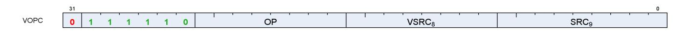

**Description** Vector instruction taking two inputs and producing a comparison result. Can be followed by a 32-bit literal constant or DPP control DWORD. Vector Comparison operations are divided into three groups:

- those that can use any one of 16 comparison operations,
- those that can use any one of 8, and
- those that have a single comparison operation.

The final opcode number is determined by adding the base for the opcode family plus the offset from the compare op. Compare instructions write a result to VCC (for VOPC) or an SGPR (for VOP3). Additionally,

15.3. Vector ALU Formats 155 of 600


compare instructions have variants that writes to the EXEC mask instead of VCC or SGPR. The destination of the compare result is VCC or EXEC when encoded using the VOPC format, and can be an arbitrary SGPR (indicated in the VDST field) when only encoded in the VOP3 format.

#### **Comparison Operations**

Table 81. Comparison Operations

| Compare Operation                | Opcode<br>Offset                   | Description                      |  |  |
|----------------------------------|------------------------------------|----------------------------------|--|--|
|                                  | Sixteen Compare Operations (COMPF) |                                  |  |  |
| F                                | 0                                  | D.u = 0                          |  |  |
| LT                               | 1                                  | D.u = (S0 < S1)                  |  |  |
| EQ                               | 2                                  | D.u = (S0 == S1)                 |  |  |
| LE                               | 3                                  | D.u = (S0 <= S1)                 |  |  |
| GT                               | 4                                  | D.u = (S0 > S1)                  |  |  |
| LG                               | 5                                  | D.u = (S0 <> S1)                 |  |  |
| GE                               | 6                                  | D.u = (S0 >= S1)                 |  |  |
| O                                | 7                                  | D.u = (!isNaN(S0) && !isNaN(S1)) |  |  |
| U                                | 8                                  | D.u = (!isNaN(S0)    !isNaN(S1)) |  |  |
| NGE                              | 9                                  | D.u = !(S0 >= S1)                |  |  |
| NLG                              | 10                                 | D.u = !(S0 <> S1)                |  |  |
| NGT                              | 11                                 | D.u = !(S0 > S1)                 |  |  |
| NLE                              | 12                                 | D.u = !(S0 <= S1)                |  |  |
| NEQ                              | 13                                 | D.u = !(S0 == S1)                |  |  |
| NLT                              | 14                                 | D.u = !(S0 < S1)                 |  |  |
| TRU                              | 15                                 | D.u = 1                          |  |  |
| Eight Compare Operations (COMPI) |                                    |                                  |  |  |
| F                                | 0                                  | D.u = 0                          |  |  |
| LT                               | 1                                  | D.u = (S0 < S1)                  |  |  |
| EQ                               | 2                                  | D.u = (S0 == S1)                 |  |  |
| LE                               | 3                                  | D.u = (S0 <= S1)                 |  |  |
| GT                               | 4                                  | D.u = (S0 > S1)                  |  |  |
| LG                               | 5                                  | D.u = (S0 <> S1)                 |  |  |
| GE                               | 6                                  | D.u = (S0 >= S1)                 |  |  |
| TRU                              | 7                                  | D.u = 1                          |  |  |

Table 82. VOPC Fields

15.3. Vector ALU Formats 156 of 600


| Field Name | Bits      | Format or Description                              |
|------------|-----------|----------------------------------------------------|
| SRC0       | [8:0]     | Source 0. First operand for the instruction.       |
|            | 0-105     | SGPR0 - SGPR105: Scalar general-purpose registers. |
|            | 106       | VCC_LO: VCC[31:0].                                 |
|            | 107       | VCC_HI: VCC[63:32].                                |
|            | 108-123   | TTMP0 - TTMP15: Trap handler temporary register.   |
|            | 124       | NULL                                               |
|            | 125       | M0. Misc register 0.                               |
|            | 126       | EXEC_LO: EXEC[31:0].                               |
|            | 127       | EXEC_HI: EXEC[63:32].                              |
|            | 128       | 0.                                                 |
|            | 129-192   | Signed integer 1 to 64.                            |
|            | 193-208   | Signed integer -1 to -16.                          |
|            | 209-232   | Reserved.                                          |
|            | 233       | DPP8                                               |
|            | 234       | DPP8FI                                             |
|            | 235       | SHARED_BASE (Memory Aperture definition).          |
|            | 236       | SHARED_LIMIT (Memory Aperture definition).         |
|            | 237       | PRIVATE_BASE (Memory Aperture definition).         |
|            | 238       | PRIVATE_LIMIT (Memory Aperture definition).        |
|            | 239       | Reserved.                                          |
|            | 240       | 0.5.                                               |
|            | 241       | -0.5.                                              |
|            | 242       | 1.0.                                               |
|            | 243       | -1.0.                                              |
|            | 244       | 2.0.                                               |
|            | 245       | -2.0.                                              |
|            | 246       | 4.0.                                               |
|            | 247       | -4.0.                                              |
|            | 248       | 1/(2*PI).                                          |
|            | 250       | DPP16                                              |
|            | 253       | SCC.                                               |
|            | 254       | Reserved.                                          |
|            | 255       | Literal constant.                                  |
|            | 256 - 511 | VGPR 0 - 255                                       |
| VSRC1      | [16:9]    | VGPR that provides the second operand.             |
| OP         | [24:17]   | See Opcode table below.                            |
|            |           |                                                    |
| ENCODING   | [31:25]   | 'b0_111110                                         |

Table 83. VOPC Opcodes

| Opcode # | Name          | Opcode # | Name           |
|----------|---------------|----------|----------------|
| 0        | V_CMP_F_F16   | 128      | V_CMPX_F_F16   |
| 1        | V_CMP_LT_F16  | 129      | V_CMPX_LT_F16  |
| 2        | V_CMP_EQ_F16  | 130      | V_CMPX_EQ_F16  |
| 3        | V_CMP_LE_F16  | 131      | V_CMPX_LE_F16  |
| 4        | V_CMP_GT_F16  | 132      | V_CMPX_GT_F16  |
| 5        | V_CMP_LG_F16  | 133      | V_CMPX_LG_F16  |
| 6        | V_CMP_GE_F16  | 134      | V_CMPX_GE_F16  |
| 7        | V_CMP_O_F16   | 135      | V_CMPX_O_F16   |
| 8        | V_CMP_U_F16   | 136      | V_CMPX_U_F16   |
| 9        | V_CMP_NGE_F16 | 137      | V_CMPX_NGE_F16 |
| 10       | V_CMP_NLG_F16 | 138      | V_CMPX_NLG_F16 |
| 11       | V_CMP_NGT_F16 | 139      | V_CMPX_NGT_F16 |

15.3. Vector ALU Formats 157 of 600


| Opcode # | Name          | Opcode # | Name           |
|----------|---------------|----------|----------------|
| 12       | V_CMP_NLE_F16 | 140      | V_CMPX_NLE_F16 |
| 13       | V_CMP_NEQ_F16 | 141      | V_CMPX_NEQ_F16 |
| 14       | V_CMP_NLT_F16 | 142      | V_CMPX_NLT_F16 |
| 15       | V_CMP_T_F16   | 143      | V_CMPX_T_F16   |
| 16       | V_CMP_F_F32   | 144      | V_CMPX_F_F32   |
| 17       | V_CMP_LT_F32  | 145      | V_CMPX_LT_F32  |
| 18       | V_CMP_EQ_F32  | 146      | V_CMPX_EQ_F32  |
| 19       | V_CMP_LE_F32  | 147      | V_CMPX_LE_F32  |
| 20       | V_CMP_GT_F32  | 148      | V_CMPX_GT_F32  |
| 21       | V_CMP_LG_F32  | 149      | V_CMPX_LG_F32  |
| 22       | V_CMP_GE_F32  | 150      | V_CMPX_GE_F32  |
| 23       | V_CMP_O_F32   | 151      | V_CMPX_O_F32   |
| 24       | V_CMP_U_F32   | 152      | V_CMPX_U_F32   |
| 25       | V_CMP_NGE_F32 | 153      | V_CMPX_NGE_F32 |
| 26       | V_CMP_NLG_F32 | 154      | V_CMPX_NLG_F32 |
| 27       | V_CMP_NGT_F32 | 155      | V_CMPX_NGT_F32 |
| 28       | V_CMP_NLE_F32 | 156      | V_CMPX_NLE_F32 |
| 29       | V_CMP_NEQ_F32 | 157      | V_CMPX_NEQ_F32 |
| 30       | V_CMP_NLT_F32 | 158      | V_CMPX_NLT_F32 |
| 31       | V_CMP_T_F32   | 159      | V_CMPX_T_F32   |
| 32       | V_CMP_F_F64   | 160      | V_CMPX_F_F64   |
| 33       | V_CMP_LT_F64  | 161      | V_CMPX_LT_F64  |
| 34       | V_CMP_EQ_F64  | 162      | V_CMPX_EQ_F64  |
| 35       | V_CMP_LE_F64  | 163      | V_CMPX_LE_F64  |
| 36       | V_CMP_GT_F64  | 164      | V_CMPX_GT_F64  |
| 37       | V_CMP_LG_F64  | 165      | V_CMPX_LG_F64  |
| 38       | V_CMP_GE_F64  | 166      | V_CMPX_GE_F64  |
| 39       | V_CMP_O_F64   | 167      | V_CMPX_O_F64   |
| 40       | V_CMP_U_F64   | 168      | V_CMPX_U_F64   |
| 41       | V_CMP_NGE_F64 | 169      | V_CMPX_NGE_F64 |
| 42       | V_CMP_NLG_F64 | 170      | V_CMPX_NLG_F64 |
| 43       | V_CMP_NGT_F64 | 171      | V_CMPX_NGT_F64 |
| 44       | V_CMP_NLE_F64 | 172      | V_CMPX_NLE_F64 |
| 45       | V_CMP_NEQ_F64 | 173      | V_CMPX_NEQ_F64 |
| 46       | V_CMP_NLT_F64 | 174      | V_CMPX_NLT_F64 |
| 47       | V_CMP_T_F64   | 175      | V_CMPX_T_F64   |
| 49       | V_CMP_LT_I16  | 177      | V_CMPX_LT_I16  |
| 50       | V_CMP_EQ_I16  | 178      | V_CMPX_EQ_I16  |
| 51       | V_CMP_LE_I16  | 179      | V_CMPX_LE_I16  |
| 52       | V_CMP_GT_I16  | 180      | V_CMPX_GT_I16  |
| 53       | V_CMP_NE_I16  | 181      | V_CMPX_NE_I16  |
| 54       | V_CMP_GE_I16  | 182      | V_CMPX_GE_I16  |
| 57       | V_CMP_LT_U16  | 185      | V_CMPX_LT_U16  |
| 58       | V_CMP_EQ_U16  | 186      | V_CMPX_EQ_U16  |
| 59       | V_CMP_LE_U16  | 187      | V_CMPX_LE_U16  |
| 60       | V_CMP_GT_U16  | 188      | V_CMPX_GT_U16  |
| 61       | V_CMP_NE_U16  | 189      | V_CMPX_NE_U16  |

15.3. Vector ALU Formats 158 of 600


| Opcode # | Name            | Opcode # | Name             |
|----------|-----------------|----------|------------------|
| 62       | V_CMP_GE_U16    | 190      | V_CMPX_GE_U16    |
| 64       | V_CMP_F_I32     | 192      | V_CMPX_F_I32     |
| 65       | V_CMP_LT_I32    | 193      | V_CMPX_LT_I32    |
| 66       | V_CMP_EQ_I32    | 194      | V_CMPX_EQ_I32    |
| 67       | V_CMP_LE_I32    | 195      | V_CMPX_LE_I32    |
| 68       | V_CMP_GT_I32    | 196      | V_CMPX_GT_I32    |
| 69       | V_CMP_NE_I32    | 197      | V_CMPX_NE_I32    |
| 70       | V_CMP_GE_I32    | 198      | V_CMPX_GE_I32    |
| 71       | V_CMP_T_I32     | 199      | V_CMPX_T_I32     |
| 72       | V_CMP_F_U32     | 200      | V_CMPX_F_U32     |
| 73       | V_CMP_LT_U32    | 201      | V_CMPX_LT_U32    |
| 74       | V_CMP_EQ_U32    | 202      | V_CMPX_EQ_U32    |
| 75       | V_CMP_LE_U32    | 203      | V_CMPX_LE_U32    |
| 76       | V_CMP_GT_U32    | 204      | V_CMPX_GT_U32    |
| 77       | V_CMP_NE_U32    | 205      | V_CMPX_NE_U32    |
| 78       | V_CMP_GE_U32    | 206      | V_CMPX_GE_U32    |
| 79       | V_CMP_T_U32     | 207      | V_CMPX_T_U32     |
| 80       | V_CMP_F_I64     | 208      | V_CMPX_F_I64     |
| 81       | V_CMP_LT_I64    | 209      | V_CMPX_LT_I64    |
| 82       | V_CMP_EQ_I64    | 210      | V_CMPX_EQ_I64    |
| 83       | V_CMP_LE_I64    | 211      | V_CMPX_LE_I64    |
| 84       | V_CMP_GT_I64    | 212      | V_CMPX_GT_I64    |
| 85       | V_CMP_NE_I64    | 213      | V_CMPX_NE_I64    |
| 86       | V_CMP_GE_I64    | 214      | V_CMPX_GE_I64    |
| 87       | V_CMP_T_I64     | 215      | V_CMPX_T_I64     |
| 88       | V_CMP_F_U64     | 216      | V_CMPX_F_U64     |
| 89       | V_CMP_LT_U64    | 217      | V_CMPX_LT_U64    |
| 90       | V_CMP_EQ_U64    | 218      | V_CMPX_EQ_U64    |
| 91       | V_CMP_LE_U64    | 219      | V_CMPX_LE_U64    |
| 92       | V_CMP_GT_U64    | 220      | V_CMPX_GT_U64    |
| 93       | V_CMP_NE_U64    | 221      | V_CMPX_NE_U64    |
| 94       | V_CMP_GE_U64    | 222      | V_CMPX_GE_U64    |
| 95       | V_CMP_T_U64     | 223      | V_CMPX_T_U64     |
| 125      | V_CMP_CLASS_F16 | 253      | V_CMPX_CLASS_F16 |
| 126      | V_CMP_CLASS_F32 | 254      | V_CMPX_CLASS_F32 |
| 127      | V_CMP_CLASS_F64 | 255      | V_CMPX_CLASS_F64 |

### **15.3.4. VOP3**

<span id="page-167-0"></span>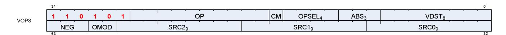

**Description** Vector ALU format with three input operands. Can be followed by a 32-bit literal constant or DPP instruction DWORD when the instruction allows it.

Table 84. VOP3 Fields

15.3. Vector ALU Formats 159 of 600


| Field Name       | Bits                                                                                                                                                                                                                                                   | Format or Description                                                                                                                                                                                                                                                                                                                                                                                                                                                                                                                                                                                                                                                                                |  |
|------------------|--------------------------------------------------------------------------------------------------------------------------------------------------------------------------------------------------------------------------------------------------------|------------------------------------------------------------------------------------------------------------------------------------------------------------------------------------------------------------------------------------------------------------------------------------------------------------------------------------------------------------------------------------------------------------------------------------------------------------------------------------------------------------------------------------------------------------------------------------------------------------------------------------------------------------------------------------------------------|--|
| VDST             | [7:0]                                                                                                                                                                                                                                                  | Destination VGPR                                                                                                                                                                                                                                                                                                                                                                                                                                                                                                                                                                                                                                                                                     |  |
| ABS              | [10:8]                                                                                                                                                                                                                                                 | Absolute value of input. [8] = src0, [9] = src1, [10] = src2                                                                                                                                                                                                                                                                                                                                                                                                                                                                                                                                                                                                                                         |  |
| OPSEL            | [14:11]                                                                                                                                                                                                                                                | Operand select for 16-bit data. 0 = select low half, 1 = select high half. [11] = src0,<br>[12] = src1, [13] = src2, [14] = dest.                                                                                                                                                                                                                                                                                                                                                                                                                                                                                                                                                                    |  |
| CLMP             | [15]                                                                                                                                                                                                                                                   | Clamp output                                                                                                                                                                                                                                                                                                                                                                                                                                                                                                                                                                                                                                                                                         |  |
| OP               | [25:16]                                                                                                                                                                                                                                                | Opcode. See next table.                                                                                                                                                                                                                                                                                                                                                                                                                                                                                                                                                                                                                                                                              |  |
|                  |                                                                                                                                                                                                                                                        |                                                                                                                                                                                                                                                                                                                                                                                                                                                                                                                                                                                                                                                                                                      |  |
| ENCODING<br>SRC0 | [31:26]<br>[40:32]<br>0-105<br>106<br>107<br>108-123<br>124<br>125<br>126<br>127<br>128<br>129-192<br>193-208<br>209-232<br>233<br>234<br>235<br>236<br>237<br>238<br>239<br>240<br>241<br>242<br>243<br>244<br>245<br>246<br>247<br>248<br>250<br>253 | 'b110101<br>Source 0. First operand for the instruction.<br>SGPR0 - SGPR105: Scalar general-purpose registers.<br>VCC_LO: VCC[31:0].<br>VCC_HI: VCC[63:32].<br>TTMP0 - TTMP15: Trap handler temporary register.<br>NULL<br>M0. Misc register 0.<br>EXEC_LO: EXEC[31:0].<br>EXEC_HI: EXEC[63:32].<br>0.<br>Signed integer 1 to 64.<br>Signed integer -1 to -16.<br>Reserved.<br>DPP8<br>DPP8FI<br>SHARED_BASE (Memory Aperture definition).<br>SHARED_LIMIT (Memory Aperture definition).<br>PRIVATE_BASE (Memory Aperture definition).<br>PRIVATE_LIMIT (Memory Aperture definition).<br>Reserved.<br>0.5.<br>-0.5.<br>1.0.<br>-1.0.<br>2.0.<br>-2.0.<br>4.0.<br>-4.0.<br>1/(2*PI).<br>DPP16<br>SCC. |  |
|                  | 254                                                                                                                                                                                                                                                    | Reserved.                                                                                                                                                                                                                                                                                                                                                                                                                                                                                                                                                                                                                                                                                            |  |
|                  | 255                                                                                                                                                                                                                                                    | Literal constant.                                                                                                                                                                                                                                                                                                                                                                                                                                                                                                                                                                                                                                                                                    |  |
|                  | 256 - 511                                                                                                                                                                                                                                              | VGPR 0 - 255                                                                                                                                                                                                                                                                                                                                                                                                                                                                                                                                                                                                                                                                                         |  |
| SRC1             | [49:41]                                                                                                                                                                                                                                                | Second input operand. Same options as SRC0.                                                                                                                                                                                                                                                                                                                                                                                                                                                                                                                                                                                                                                                          |  |
| SRC2             | [58:50]                                                                                                                                                                                                                                                | Third input operand. Same options as SRC0.                                                                                                                                                                                                                                                                                                                                                                                                                                                                                                                                                                                                                                                           |  |
| OMOD             | [60:59]                                                                                                                                                                                                                                                | Output Modifier: 0=none, 1=*2, 2=*4, 3=*0.5                                                                                                                                                                                                                                                                                                                                                                                                                                                                                                                                                                                                                                                          |  |
| NEG              | [63:61]                                                                                                                                                                                                                                                | Negate input. [61] = src0, [62] = src1, [63] = src2                                                                                                                                                                                                                                                                                                                                                                                                                                                                                                                                                                                                                                                  |  |

#### Table 85. VOP3 Opcodes

| Opcode # | Name                | Opcode # | Name             |
|----------|---------------------|----------|------------------|
| 384      | V_NOP               | 803      | V_CVT_PK_U16_U32 |
| 385      | V_MOV_B32           | 804      | V_CVT_PK_I16_I32 |
| 386      | V_READFIRSTLANE_B32 | 805      | V_SUB_NC_I32     |
| 387      | V_CVT_I32_F64       | 806      | V_ADD_NC_I32     |

15.3. Vector ALU Formats 160 of 600


| Opcode # | Name                  | Opcode # | Name             |  |  |
|----------|-----------------------|----------|------------------|--|--|
| 388      | V_CVT_F64_I32         | 807      | V_ADD_F64        |  |  |
| 389      | V_CVT_F32_I32         | 808      | V_MUL_F64        |  |  |
| 390      | V_CVT_F32_U32         | 809      | V_MIN_F64        |  |  |
| 391      | V_CVT_U32_F32         | 810      | V_MAX_F64        |  |  |
| 392      | V_CVT_I32_F32         | 811      | V_LDEXP_F64      |  |  |
| 394      | V_CVT_F16_F32         | 812      | V_MUL_LO_U32     |  |  |
| 395      | V_CVT_F32_F16         | 813      | V_MUL_HI_U32     |  |  |
| 396      | V_CVT_NEAREST_I32_F32 | 814      | V_MUL_HI_I32     |  |  |
| 397      | V_CVT_FLOOR_I32_F32   | 815      | V_TRIG_PREOP_F64 |  |  |
| 398      | V_CVT_OFF_F32_I4      | 824      | V_LSHLREV_B16    |  |  |
| 399      | V_CVT_F32_F64         | 825      | V_LSHRREV_B16    |  |  |
| 400      | V_CVT_F64_F32         | 826      | V_ASHRREV_I16    |  |  |
| 401      | V_CVT_F32_UBYTE0      | 828      | V_LSHLREV_B64    |  |  |
| 402      | V_CVT_F32_UBYTE1      | 829      | V_LSHRREV_B64    |  |  |
| 403      | V_CVT_F32_UBYTE2      | 830      | V_ASHRREV_I64    |  |  |
| 404      | V_CVT_F32_UBYTE3      | 864      | V_READLANE_B32   |  |  |
| 405      | V_CVT_U32_F64         | 865      | V_WRITELANE_B32  |  |  |
| 406      | V_CVT_F64_U32         | 866      | V_AND_B16        |  |  |
| 407      | V_TRUNC_F64           | 867      | V_OR_B16         |  |  |
| 408      | V_CEIL_F64            | 868      | V_XOR_B16        |  |  |
| 409      | V_RNDNE_F64           | 0        | V_CMP_F_F16      |  |  |
| 410      | V_FLOOR_F64           | 1        | V_CMP_LT_F16     |  |  |
| 411      | V_PIPEFLUSH           | 2        | V_CMP_EQ_F16     |  |  |
| 412      | V_MOV_B16             | 3        | V_CMP_LE_F16     |  |  |
| 416      | V_FRACT_F32           | 4        | V_CMP_GT_F16     |  |  |
| 417      | V_TRUNC_F32           | 5        | V_CMP_LG_F16     |  |  |
| 418      | V_CEIL_F32            | 6        | V_CMP_GE_F16     |  |  |
| 419      | V_RNDNE_F32           | 7        | V_CMP_O_F16      |  |  |
| 420      | V_FLOOR_F32           | 8        | V_CMP_U_F16      |  |  |
| 421      | V_EXP_F32             | 9        | V_CMP_NGE_F16    |  |  |
| 423      | V_LOG_F32             | 10       | V_CMP_NLG_F16    |  |  |
| 426      | V_RCP_F32             | 11       | V_CMP_NGT_F16    |  |  |
| 427      | V_RCP_IFLAG_F32       | 12       | V_CMP_NLE_F16    |  |  |
| 430      | V_RSQ_F32             | 13       | V_CMP_NEQ_F16    |  |  |
| 431      | V_RCP_F64             | 14       | V_CMP_NLT_F16    |  |  |
| 433      | V_RSQ_F64             | 15       | V_CMP_T_F16      |  |  |
| 435      | V_SQRT_F32            | 16       | V_CMP_F_F32      |  |  |
| 436      | V_SQRT_F64            | 17       | V_CMP_LT_F32     |  |  |
| 437      | V_SIN_F32             | 18       | V_CMP_EQ_F32     |  |  |
| 438      | V_COS_F32             | 19       | V_CMP_LE_F32     |  |  |
| 439      | V_NOT_B32             | 20       | V_CMP_GT_F32     |  |  |
| 440      | V_BFREV_B32           | 21       | V_CMP_LG_F32     |  |  |
| 441      | V_CLZ_I32_U32         | 22       | V_CMP_GE_F32     |  |  |
| 442      | V_CTZ_I32_B32         | 23       |                  |  |  |
|          |                       |          | V_CMP_O_F32      |  |  |
| 443      | V_CLS_I32             | 24       | V_CMP_U_F32      |  |  |
| 444      | V_FREXP_EXP_I32_F64   | 25       | V_CMP_NGE_F32    |  |  |
| 445      | V_FREXP_MANT_F64      | 26       | V_CMP_NLG_F32    |  |  |

15.3. Vector ALU Formats 161 of 600


| Opcode # | Name                | Opcode # | Name          |  |  |
|----------|---------------------|----------|---------------|--|--|
| 446      | V_FRACT_F64         | 27       | V_CMP_NGT_F32 |  |  |
| 447      | V_FREXP_EXP_I32_F32 | 28       | V_CMP_NLE_F32 |  |  |
| 448      | V_FREXP_MANT_F32    | 29       | V_CMP_NEQ_F32 |  |  |
| 450      | V_MOVRELD_B32       | 30       | V_CMP_NLT_F32 |  |  |
| 451      | V_MOVRELS_B32       | 31       | V_CMP_T_F32   |  |  |
| 452      | V_MOVRELSD_B32      | 32       | V_CMP_F_F64   |  |  |
| 456      | V_MOVRELSD_2_B32    | 33       | V_CMP_LT_F64  |  |  |
| 464      | V_CVT_F16_U16       | 34       | V_CMP_EQ_F64  |  |  |
| 465      | V_CVT_F16_I16       | 35       | V_CMP_LE_F64  |  |  |
| 466      | V_CVT_U16_F16       | 36       | V_CMP_GT_F64  |  |  |
| 467      | V_CVT_I16_F16       | 37       | V_CMP_LG_F64  |  |  |
| 468      | V_RCP_F16           | 38       | V_CMP_GE_F64  |  |  |
| 469      | V_SQRT_F16          | 39       | V_CMP_O_F64   |  |  |
| 470      | V_RSQ_F16           | 40       | V_CMP_U_F64   |  |  |
| 471      | V_LOG_F16           | 41       | V_CMP_NGE_F64 |  |  |
| 472      | V_EXP_F16           | 42       | V_CMP_NLG_F64 |  |  |
| 473      | V_FREXP_MANT_F16    | 43       | V_CMP_NGT_F64 |  |  |
| 474      | V_FREXP_EXP_I16_F16 | 44       | V_CMP_NLE_F64 |  |  |
| 475      | V_FLOOR_F16         | 45       | V_CMP_NEQ_F64 |  |  |
| 476      | V_CEIL_F16          | 46       | V_CMP_NLT_F64 |  |  |
| 477      | V_TRUNC_F16         | 47       | V_CMP_T_F64   |  |  |
| 478      | V_RNDNE_F16         | 49       | V_CMP_LT_I16  |  |  |
| 479      | V_FRACT_F16         | 50       | V_CMP_EQ_I16  |  |  |
| 480      | V_SIN_F16           | 51       | V_CMP_LE_I16  |  |  |
| 481      | V_COS_F16           | 52       | V_CMP_GT_I16  |  |  |
| 482      | V_SAT_PK_U8_I16     | 53       | V_CMP_NE_I16  |  |  |
| 483      | V_CVT_NORM_I16_F16  | 54       | V_CMP_GE_I16  |  |  |
| 484      | V_CVT_NORM_U16_F16  | 57       | V_CMP_LT_U16  |  |  |
| 489      | V_NOT_B16           | 58       | V_CMP_EQ_U16  |  |  |
| 490      | V_CVT_I32_I16       | 59       | V_CMP_LE_U16  |  |  |
| 491      | V_CVT_U32_U16       | 60       | V_CMP_GT_U16  |  |  |
| 257      | V_CNDMASK_B32       | 61       | V_CMP_NE_U16  |  |  |
| 259      | V_ADD_F32           | 62       | V_CMP_GE_U16  |  |  |
| 260      | V_SUB_F32           | 64       | V_CMP_F_I32   |  |  |
| 261      | V_SUBREV_F32        | 65       | V_CMP_LT_I32  |  |  |
| 262      | V_FMAC_DX9_ZERO_F32 | 66       | V_CMP_EQ_I32  |  |  |
| 263      | V_MUL_DX9_ZERO_F32  | 67       | V_CMP_LE_I32  |  |  |
| 264      | V_MUL_F32           | 68       | V_CMP_GT_I32  |  |  |
| 265      | V_MUL_I32_I24       | 69       | V_CMP_NE_I32  |  |  |
| 266      | V_MUL_HI_I32_I24    | 70       | V_CMP_GE_I32  |  |  |
| 267      | V_MUL_U32_U24       | 71       | V_CMP_T_I32   |  |  |
| 268      | V_MUL_HI_U32_U24    | 72       | V_CMP_F_U32   |  |  |
| 271      | V_MIN_F32           | 73       | V_CMP_LT_U32  |  |  |
| 272      | V_MAX_F32           | 74       | V_CMP_EQ_U32  |  |  |
| 273      | V_MIN_I32           | 75       | V_CMP_LE_U32  |  |  |
| 274      | V_MAX_I32           | 76       | V_CMP_GT_U32  |  |  |
| 275      | V_MIN_U32           | 77       | V_CMP_NE_U32  |  |  |

15.3. Vector ALU Formats 162 of 600


| Opcode # | Name                 | Opcode # | Name            |  |  |
|----------|----------------------|----------|-----------------|--|--|
| 276      | V_MAX_U32            | 78       | V_CMP_GE_U32    |  |  |
| 280      | V_LSHLREV_B32        | 79       | V_CMP_T_U32     |  |  |
| 281      | V_LSHRREV_B32        | 80       | V_CMP_F_I64     |  |  |
| 282      | V_ASHRREV_I32        | 81       | V_CMP_LT_I64    |  |  |
| 283      | V_AND_B32            | 82       | V_CMP_EQ_I64    |  |  |
| 284      | V_OR_B32             | 83       | V_CMP_LE_I64    |  |  |
| 285      | V_XOR_B32            | 84       | V_CMP_GT_I64    |  |  |
| 286      | V_XNOR_B32           | 85       | V_CMP_NE_I64    |  |  |
| 293      | V_ADD_NC_U32         | 86       | V_CMP_GE_I64    |  |  |
| 294      | V_SUB_NC_U32         | 87       | V_CMP_T_I64     |  |  |
| 295      | V_SUBREV_NC_U32      | 88       | V_CMP_F_U64     |  |  |
| 299      | V_FMAC_F32           | 89       | V_CMP_LT_U64    |  |  |
| 303      | V_CVT_PK_RTZ_F16_F32 | 90       | V_CMP_EQ_U64    |  |  |
| 306      | V_ADD_F16            | 91       | V_CMP_LE_U64    |  |  |
| 307      | V_SUB_F16            | 92       | V_CMP_GT_U64    |  |  |
| 308      | V_SUBREV_F16         | 93       | V_CMP_NE_U64    |  |  |
| 309      | V_MUL_F16            | 94       | V_CMP_GE_U64    |  |  |
| 310      | V_FMAC_F16           | 95       | V_CMP_T_U64     |  |  |
| 313      | V_MAX_F16            | 125      | V_CMP_CLASS_F16 |  |  |
| 314      | V_MIN_F16            | 126      | V_CMP_CLASS_F32 |  |  |
| 315      | V_LDEXP_F16          | 127      | V_CMP_CLASS_F64 |  |  |
| 521      | V_FMA_DX9_ZERO_F32   | 128      | V_CMPX_F_F16    |  |  |
| 522      | V_MAD_I32_I24        | 129      | V_CMPX_LT_F16   |  |  |
| 523      | V_MAD_U32_U24        | 130      | V_CMPX_EQ_F16   |  |  |
| 524      | V_CUBEID_F32         | 131      | V_CMPX_LE_F16   |  |  |
| 525      | V_CUBESC_F32         | 132      | V_CMPX_GT_F16   |  |  |
| 526      | V_CUBETC_F32         | 133      | V_CMPX_LG_F16   |  |  |
| 527      | V_CUBEMA_F32         | 134      | V_CMPX_GE_F16   |  |  |
| 528      | V_BFE_U32            | 135      | V_CMPX_O_F16    |  |  |
| 529      | V_BFE_I32            | 136      | V_CMPX_U_F16    |  |  |
| 530      | V_BFI_B32            | 137      | V_CMPX_NGE_F16  |  |  |
| 531      | V_FMA_F32            | 138      | V_CMPX_NLG_F16  |  |  |
| 532      | V_FMA_F64            | 139      | V_CMPX_NGT_F16  |  |  |
| 533      | V_LERP_U8            | 140      | V_CMPX_NLE_F16  |  |  |
| 534      | V_ALIGNBIT_B32       | 141      | V_CMPX_NEQ_F16  |  |  |
| 535      | V_ALIGNBYTE_B32      | 142      | V_CMPX_NLT_F16  |  |  |
| 536      | V_MULLIT_F32         | 143      | V_CMPX_T_F16    |  |  |
| 537      | V_MIN3_F32           | 144      | V_CMPX_F_F32    |  |  |
| 538      | V_MIN3_I32           | 145      | V_CMPX_LT_F32   |  |  |
| 539      | V_MIN3_U32           | 146      | V_CMPX_EQ_F32   |  |  |
| 540      | V_MAX3_F32           | 147      | V_CMPX_LE_F32   |  |  |
| 541      | V_MAX3_I32           | 148      | V_CMPX_GT_F32   |  |  |
| 542      | V_MAX3_U32           | 149      | V_CMPX_LG_F32   |  |  |
| 543      | V_MED3_F32           | 150      | V_CMPX_GE_F32   |  |  |
| 544      | V_MED3_I32           | 151      | V_CMPX_O_F32    |  |  |
| 545      | V_MED3_U32           | 152      | V_CMPX_U_F32    |  |  |
| 546      | V_SAD_U8             | 153      | V_CMPX_NGE_F32  |  |  |
|          |                      |          |                 |  |  |

15.3. Vector ALU Formats 163 of 600


| Opcode # | Name              | Opcode # | Name           |  |  |
|----------|-------------------|----------|----------------|--|--|
| 547      | V_SAD_HI_U8       | 154      | V_CMPX_NLG_F32 |  |  |
| 548      | V_SAD_U16         | 155      | V_CMPX_NGT_F32 |  |  |
| 549      | V_SAD_U32         | 156      | V_CMPX_NLE_F32 |  |  |
| 550      | V_CVT_PK_U8_F32   | 157      | V_CMPX_NEQ_F32 |  |  |
| 551      | V_DIV_FIXUP_F32   | 158      | V_CMPX_NLT_F32 |  |  |
| 552      | V_DIV_FIXUP_F64   | 159      | V_CMPX_T_F32   |  |  |
| 567      | V_DIV_FMAS_F32    | 160      | V_CMPX_F_F64   |  |  |
| 568      | V_DIV_FMAS_F64    | 161      | V_CMPX_LT_F64  |  |  |
| 569      | V_MSAD_U8         | 162      | V_CMPX_EQ_F64  |  |  |
| 570      | V_QSAD_PK_U16_U8  | 163      | V_CMPX_LE_F64  |  |  |
| 571      | V_MQSAD_PK_U16_U8 | 164      | V_CMPX_GT_F64  |  |  |
| 573      | V_MQSAD_U32_U8    | 165      | V_CMPX_LG_F64  |  |  |
| 576      | V_XOR3_B32        | 166      | V_CMPX_GE_F64  |  |  |
| 577      | V_MAD_U16         | 167      | V_CMPX_O_F64   |  |  |
| 580      | V_PERM_B32        | 168      | V_CMPX_U_F64   |  |  |
| 581      | V_XAD_U32         | 169      | V_CMPX_NGE_F64 |  |  |
| 582      | V_LSHL_ADD_U32    | 170      | V_CMPX_NLG_F64 |  |  |
| 583      | V_ADD_LSHL_U32    | 171      | V_CMPX_NGT_F64 |  |  |
| 584      | V_FMA_F16         | 172      | V_CMPX_NLE_F64 |  |  |
| 585      | V_MIN3_F16        | 173      | V_CMPX_NEQ_F64 |  |  |
| 586      | V_MIN3_I16        | 174      | V_CMPX_NLT_F64 |  |  |
| 587      | V_MIN3_U16        | 175      | V_CMPX_T_F64   |  |  |
| 588      | V_MAX3_F16        | 177      | V_CMPX_LT_I16  |  |  |
| 589      | V_MAX3_I16        | 178      | V_CMPX_EQ_I16  |  |  |
| 590      | V_MAX3_U16        | 179      | V_CMPX_LE_I16  |  |  |
| 591      | V_MED3_F16        | 180      | V_CMPX_GT_I16  |  |  |
| 592      | V_MED3_I16        | 181      | V_CMPX_NE_I16  |  |  |
| 593      | V_MED3_U16        | 182      | V_CMPX_GE_I16  |  |  |
| 595      | V_MAD_I16         | 185      | V_CMPX_LT_U16  |  |  |
| 596      | V_DIV_FIXUP_F16   | 186      | V_CMPX_EQ_U16  |  |  |
| 597      | V_ADD3_U32        | 187      | V_CMPX_LE_U16  |  |  |
| 598      | V_LSHL_OR_B32     | 188      | V_CMPX_GT_U16  |  |  |
| 599      | V_AND_OR_B32      | 189      | V_CMPX_NE_U16  |  |  |
| 600      | V_OR3_B32         | 190      | V_CMPX_GE_U16  |  |  |
| 601      | V_MAD_U32_U16     | 192      | V_CMPX_F_I32   |  |  |
| 602      | V_MAD_I32_I16     | 193      | V_CMPX_LT_I32  |  |  |
| 603      | V_PERMLANE16_B32  | 194      | V_CMPX_EQ_I32  |  |  |
| 604      | V_PERMLANEX16_B32 | 195      | V_CMPX_LE_I32  |  |  |
| 605      | V_CNDMASK_B16     | 196      | V_CMPX_GT_I32  |  |  |
| 606      | V_MAXMIN_F32      | 197      | V_CMPX_NE_I32  |  |  |
| 607      | V_MINMAX_F32      | 198      | V_CMPX_GE_I32  |  |  |
| 608      | V_MAXMIN_F16      | 199      | V_CMPX_T_I32   |  |  |
| 609      | V_MINMAX_F16      | 200      | V_CMPX_F_U32   |  |  |
| 610      | V_MAXMIN_U32      | 201      | V_CMPX_LT_U32  |  |  |
| 611      | V_MINMAX_U32      | 202      | V_CMPX_EQ_U32  |  |  |
| 612      | V_MAXMIN_I32      | 203      | V_CMPX_LE_U32  |  |  |
| 613      | V_MINMAX_I32      | 204      | V_CMPX_GT_U32  |  |  |

15.3. Vector ALU Formats 164 of 600


| Opcode # | Name<br>Opcode #<br>Name |     |                  |  |
|----------|--------------------------|-----|------------------|--|
| 614      | V_DOT2_F16_F16           | 205 | V_CMPX_NE_U32    |  |
| 615      | V_DOT2_BF16_BF16         | 206 | V_CMPX_GE_U32    |  |
| 771      | V_ADD_NC_U16             | 207 | V_CMPX_T_U32     |  |
| 772      | V_SUB_NC_U16             | 208 | V_CMPX_F_I64     |  |
| 773      | V_MUL_LO_U16             | 209 | V_CMPX_LT_I64    |  |
| 774      | V_CVT_PK_I16_F32         | 210 | V_CMPX_EQ_I64    |  |
| 775      | V_CVT_PK_U16_F32         | 211 | V_CMPX_LE_I64    |  |
| 777      | V_MAX_U16                | 212 | V_CMPX_GT_I64    |  |
| 778      | V_MAX_I16                | 213 | V_CMPX_NE_I64    |  |
| 779      | V_MIN_U16                | 214 | V_CMPX_GE_I64    |  |
| 780      | V_MIN_I16                | 215 | V_CMPX_T_I64     |  |
| 781      | V_ADD_NC_I16             | 216 | V_CMPX_F_U64     |  |
| 782      | V_SUB_NC_I16             | 217 | V_CMPX_LT_U64    |  |
| 785      | V_PACK_B32_F16           | 218 | V_CMPX_EQ_U64    |  |
| 786      | V_CVT_PK_NORM_I16_F16    | 219 | V_CMPX_LE_U64    |  |
| 787      | V_CVT_PK_NORM_U16_F16    | 220 | V_CMPX_GT_U64    |  |
| 796      | V_LDEXP_F32              | 221 | V_CMPX_NE_U64    |  |
| 797      | V_BFM_B32                | 222 | V_CMPX_GE_U64    |  |
| 798      | V_BCNT_U32_B32           | 223 | V_CMPX_T_U64     |  |
| 799      | V_MBCNT_LO_U32_B32       | 253 | V_CMPX_CLASS_F16 |  |
| 800      | V_MBCNT_HI_U32_B32       | 254 | V_CMPX_CLASS_F32 |  |
| 801      | V_CVT_PK_NORM_I16_F32    | 255 | V_CMPX_CLASS_F64 |  |
| 802      | V_CVT_PK_NORM_U16_F32    |     |                  |  |

### <span id="page-173-0"></span>**15.3.5. VOP3SD**

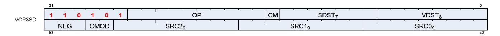

**Description** Vector ALU format with three operands and a scalar result. This encoding is used only for a few opcodes. Can be followed by a 32-bit literal constant or DPP instruction DWORD when the instruction allows it.

This encoding allows specifying a unique scalar destination, and is used only for the opcodes listed below. All other opcodes use VOP3.

Table 86. VOP3SD Fields

| Field Name | Bits    | Format or Description   |
|------------|---------|-------------------------|
| VDST       | [7:0]   | Destination VGPR        |
| SDST       | [14:8]  | Scalar destination      |
| CLMP       | [15]    | Clamp result            |
| OP         | [25:16] | Opcode. see next table. |
| ENCODING   | [31:26] | 'b110101                |

15.3. Vector ALU Formats 165 of 600


| Field Name | Bits      | Format or Description                               |  |
|------------|-----------|-----------------------------------------------------|--|
| SRC0       | [40:32]   | Source 0. First operand for the instruction.        |  |
|            | 0-105     | SGPR0 - SGPR105: Scalar general-purpose registers.  |  |
|            | 106       | VCC_LO: VCC[31:0].                                  |  |
|            | 107       | VCC_HI: VCC[63:32].                                 |  |
|            | 108-123   | TTMP0 - TTMP15: Trap handler temporary register.    |  |
|            | 124       | NULL                                                |  |
|            | 125       | M0. Misc register 0.                                |  |
|            | 126       | EXEC_LO: EXEC[31:0].                                |  |
|            | 127       | EXEC_HI: EXEC[63:32].                               |  |
|            | 128       | 0.                                                  |  |
|            | 129-192   | Signed integer 1 to 64.                             |  |
|            | 193-208   | Signed integer -1 to -16.                           |  |
|            | 209-232   | Reserved.                                           |  |
|            | 233       | DPP8                                                |  |
|            | 234       | DPP8FI                                              |  |
|            | 235       | SHARED_BASE (Memory Aperture definition).           |  |
|            | 236       | SHARED_LIMIT (Memory Aperture definition).          |  |
|            | 237       | PRIVATE_BASE (Memory Aperture definition).          |  |
|            | 238       | PRIVATE_LIMIT (Memory Aperture definition).         |  |
|            | 239       | Reserved.                                           |  |
|            | 240       | 0.5.                                                |  |
|            | 241       | -0.5.                                               |  |
|            | 242       | 1.0.                                                |  |
|            | 243       | -1.0.                                               |  |
|            | 244       | 2.0.                                                |  |
|            | 245       | -2.0.                                               |  |
|            | 246       | 4.0.                                                |  |
|            | 247       | -4.0.                                               |  |
|            | 248       | 1/(2*PI).                                           |  |
|            | 250       | DPP16                                               |  |
|            | 253       | SCC.                                                |  |
|            | 254       | Reserved.                                           |  |
|            | 255       | Literal constant.                                   |  |
|            | 256 - 511 | VGPR 0 - 255                                        |  |
| SRC1       | [49:41]   | Second input operand. Same options as SRC0.         |  |
| SRC2       | [58:50]   | Third input operand. Same options as SRC0.          |  |
| OMOD       | [60:59]   | Output Modifier: 0=none, 1=*2, 2=*4, 3=*0.5         |  |
| NEG        | [63:61]   | Negate input. [61] = src0, [62] = src1, [63] = src2 |  |

Table 87. VOP3SD Opcodes

| Opcode # | Name               | Opcode # | Name            |
|----------|--------------------|----------|-----------------|
| 288      | V_ADD_CO_CI_U32    | 766      | V_MAD_U64_U32   |
| 289      | V_SUB_CO_CI_U32    | 767      | V_MAD_I64_I32   |
| 290      | V_SUBREV_CO_CI_U32 | 768      | V_ADD_CO_U32    |
| 764      | V_DIV_SCALE_F32    | 769      | V_SUB_CO_U32    |
| 765      | V_DIV_SCALE_F64    | 770      | V_SUBREV_CO_U32 |

### <span id="page-174-0"></span>**15.3.6. VOP3P**

15.3. Vector ALU Formats 166 of 600


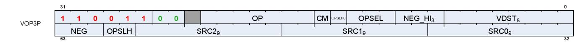

**Description** Vector ALU format taking one, two or three pairs of 16 bit inputs and producing two 16-bit outputs (packed into 1 DWORD). WMMA instructions have larger input and output VGPR sets. Can be followed by a 32-bit literal constant or DPP instruction DWORD when the instruction allows it.

Table 88. VOP3P Fields

| Field Name | Bits             | Format or Description                                                                              |  |
|------------|------------------|----------------------------------------------------------------------------------------------------|--|
| VDST       | [7:0]            | Destination VGPR                                                                                   |  |
| NEG_HI     | [10:8]           | Negate sources 0,1,2 of the high 16-bits.                                                          |  |
| OPSEL      | [13:11]          | Select low or high for low sources 0=[11], 1=[12], 2=[13].                                         |  |
| OPSEL_HI2  | [14]             | Select low or high for high sources 0=[14], 1=[60], 2=[59].                                        |  |
| CLMP       | [15]             | 1 = clamp result.                                                                                  |  |
| OP         | [22:16]          | Opcode. see next table.                                                                            |  |
| ENCODING   | [31:26]          | 'b11001100                                                                                         |  |
|            |                  |                                                                                                    |  |
| SRC0       | [40:32]<br>0-105 | Source 0. First operand for the instruction.<br>SGPR0 - SGPR105: Scalar general-purpose registers. |  |
|            | 106              | VCC_LO: VCC[31:0].                                                                                 |  |
|            | 107              | VCC_HI: VCC[63:32].                                                                                |  |
|            | 108-123          | TTMP0 - TTMP15: Trap handler temporary register.                                                   |  |
|            | 124              | NULL                                                                                               |  |
|            | 125              | M0. Misc register 0.                                                                               |  |
|            | 126              | EXEC_LO: EXEC[31:0].                                                                               |  |
|            | 127              | EXEC_HI: EXEC[63:32].                                                                              |  |
|            | 128              | 0.                                                                                                 |  |
|            | 129-192          | Signed integer 1 to 64.                                                                            |  |
|            | 193-208          | Signed integer -1 to -16.                                                                          |  |
|            | 209-232          | Reserved.                                                                                          |  |
|            | 233              | DPP8                                                                                               |  |
|            | 234              | DPP8FI                                                                                             |  |
|            | 235              | SHARED_BASE (Memory Aperture definition).                                                          |  |
|            | 236              | SHARED_LIMIT (Memory Aperture definition).                                                         |  |
|            | 237              | PRIVATE_BASE (Memory Aperture definition).                                                         |  |
|            | 238              | PRIVATE_LIMIT (Memory Aperture definition).                                                        |  |
|            | 239              | Reserved.                                                                                          |  |
|            | 240              | 0.5.                                                                                               |  |
|            | 241              | -0.5.                                                                                              |  |
|            | 242              | 1.0.                                                                                               |  |
|            | 243              | -1.0.                                                                                              |  |
|            | 244              | 2.0.                                                                                               |  |
|            | 245              | -2.0.                                                                                              |  |
|            | 246              | 4.0.                                                                                               |  |
|            | 247              | -4.0.                                                                                              |  |
|            | 248<br>250       | 1/(2*PI).<br>DPP16                                                                                 |  |
|            | 253              | SCC.                                                                                               |  |
|            | 254              | Reserved.                                                                                          |  |
|            | 255              | Literal constant.                                                                                  |  |
|            | 256 - 511        | VGPR 0 - 255                                                                                       |  |
| SRC1       | [49:41]          | Second input operand. Same options as SRC0.                                                        |  |
| SRC2       | [58:50]          | Third input operand. Same options as SRC0.                                                         |  |

15.3. Vector ALU Formats 167 of 600


| Field Name | Bits    | Format or Description                                                          |  |
|------------|---------|--------------------------------------------------------------------------------|--|
| OPSEL_HI   | [60:59] | See OPSEL_HI2.                                                                 |  |
| NEG        | [63:61] | Negate input for low 16-bits of sources. [61] = src0, [62] = src1, [63] = src2 |  |

Table 89. VOP3P Opcodes

| Opcode # | Name             | Opcode # | Name                      |
|----------|------------------|----------|---------------------------|
| 0        | V_PK_MAD_I16     | 17       | V_PK_MIN_F16              |
| 1        | V_PK_MUL_LO_U16  | 18       | V_PK_MAX_F16              |
| 2        | V_PK_ADD_I16     | 19       | V_DOT2_F32_F16            |
| 3        | V_PK_SUB_I16     | 22       | V_DOT4_I32_IU8            |
| 4        | V_PK_LSHLREV_B16 | 23       | V_DOT4_U32_U8             |
| 5        | V_PK_LSHRREV_B16 | 24       | V_DOT8_I32_IU4            |
| 6        | V_PK_ASHRREV_I16 | 25       | V_DOT8_U32_U4             |
| 7        | V_PK_MAX_I16     | 26       | V_DOT2_F32_BF16           |
| 8        | V_PK_MIN_I16     | 32       | V_FMA_MIX_F32             |
| 9        | V_PK_MAD_U16     | 33       | V_FMA_MIXLO_F16           |
| 10       | V_PK_ADD_U16     | 34       | V_FMA_MIXHI_F16           |
| 11       | V_PK_SUB_U16     | 64       | V_WMMA_F32_16X16X16_F16   |
| 12       | V_PK_MAX_U16     | 65       | V_WMMA_F32_16X16X16_BF16  |
| 13       | V_PK_MIN_U16     | 66       | V_WMMA_F16_16X16X16_F16   |
| 14       | V_PK_FMA_F16     | 67       | V_WMMA_BF16_16X16X16_BF16 |
| 15       | V_PK_ADD_F16     | 68       | V_WMMA_I32_16X16X16_IU8   |
| 16       | V_PK_MUL_F16     | 69       | V_WMMA_I32_16X16X16_IU4   |

### <span id="page-176-0"></span>**15.3.7. VOPD**

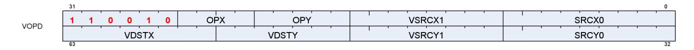

**Description** Vector ALU format describing two instructions to be executed in parallel. Can be followed by a 32-bit literal constant, but not a DPP control DWORD.

This instruction format describe two opcodes: X and Y.

Table 90. VOPD Fields

15.3. Vector ALU Formats 168 of 600


| Field Name | Bits       | Format or Description                                                           |  |  |
|------------|------------|---------------------------------------------------------------------------------|--|--|
| SRCX0      | [8:0]      | Source 0 for opcode X. First operand for the instruction.                       |  |  |
|            | 0-105      | SGPR0 - SGPR105: Scalar general-purpose registers.                              |  |  |
|            | 106        | VCC_LO: VCC[31:0].                                                              |  |  |
|            | 107        | VCC_HI: VCC[63:32].                                                             |  |  |
|            | 108-123    | TTMP0 - TTMP15: Trap handler temporary register.                                |  |  |
|            | 124        | NULL                                                                            |  |  |
|            | 125        | M0. Misc register 0.                                                            |  |  |
|            | 126        | EXEC_LO: EXEC[31:0].                                                            |  |  |
|            | 127        | EXEC_HI: EXEC[63:32].                                                           |  |  |
|            | 128        | 0.                                                                              |  |  |
|            | 129-192    | Signed integer 1 to 64.                                                         |  |  |
|            | 193-208    | Signed integer -1 to -16.                                                       |  |  |
|            | 209-232    | Reserved.                                                                       |  |  |
|            | 233        | DPP8                                                                            |  |  |
|            | 234        | DPP8FI                                                                          |  |  |
|            | 235        | SHARED_BASE (Memory Aperture definition).                                       |  |  |
|            | 236        | SHARED_LIMIT (Memory Aperture definition).                                      |  |  |
|            | 237        | PRIVATE_BASE (Memory Aperture definition).                                      |  |  |
|            | 238        | PRIVATE_LIMIT (Memory Aperture definition).                                     |  |  |
|            | 239        | Reserved.                                                                       |  |  |
|            | 240        | 0.5.                                                                            |  |  |
|            | 241        | -0.5.                                                                           |  |  |
|            | 242        | 1.0.                                                                            |  |  |
|            | 243        | -1.0.                                                                           |  |  |
|            | 244        | 2.0.                                                                            |  |  |
|            | 245        | -2.0.                                                                           |  |  |
|            | 246        | 4.0.                                                                            |  |  |
|            | 247        | -4.0.                                                                           |  |  |
|            | 248        | 1/(2*PI).                                                                       |  |  |
|            | 250        | DPP16                                                                           |  |  |
|            | 253        | SCC.                                                                            |  |  |
|            | 254<br>255 | Reserved.<br>Literal constant.                                                  |  |  |
|            | 256 - 511  | VGPR 0 - 255                                                                    |  |  |
| VSRCX1     | [16:9]     |                                                                                 |  |  |
| OPY        | [21:17]    | Source VGPR 1 for opcode X.<br>Opcode Y. see next table.                        |  |  |
| OPX        | [25:22]    | Opcode X. see next table.                                                       |  |  |
| ENCODING   | [31:26]    | 'b110010                                                                        |  |  |
| SRCY0      | [40:32]    | Source 0 for opcode Y. See SRCX0 for enumerations                               |  |  |
| VSRCY1     | [48:41]    | Source VGPR 1 for opcode Y.                                                     |  |  |
| VDSTY      | [55:49]    | Instruction Y destination VGPR, excluding LSB. LSB is the opposite of VDSTX[0]. |  |  |
| VDSTX      | [63:56]    | Instruction X destination VGPR                                                  |  |  |

#### Table 91. VOPD X-Opcodes

| 0 V_DUAL_FMAC_F32   | 7 | V_DUAL_MUL_DX9_ZERO_F32    |
|---------------------|---|----------------------------|
| 1 V_DUAL_FMAAK_F32  | 8 | V_DUAL_MOV_B32             |
| 2 V_DUAL_FMAMK_F32  | 9 | V_DUAL_CNDMASK_B32         |
| 3 V_DUAL_MUL_F32    |   | 10 V_DUAL_MAX_F32          |
| 4 V_DUAL_ADD_F32    |   | 11 V_DUAL_MIN_F32          |
| 5 V_DUAL_SUB_F32    |   | 12 V_DUAL_DOT2ACC_F32_F16  |
| 6 V_DUAL_SUBREV_F32 |   | 13 V_DUAL_DOT2ACC_F32_BF16 |

15.3. Vector ALU Formats 169 of 600


#### Table 92. VOPD Y-Opcodes

| 0 V_DUAL_FMAC_F32         | 9 | V_DUAL_CNDMASK_B32         |
|---------------------------|---|----------------------------|
| 1 V_DUAL_FMAAK_F32        |   | 10 V_DUAL_MAX_F32          |
| 2 V_DUAL_FMAMK_F32        |   | 11 V_DUAL_MIN_F32          |
| 3 V_DUAL_MUL_F32          |   | 12 V_DUAL_DOT2ACC_F32_F16  |
| 4 V_DUAL_ADD_F32          |   | 13 V_DUAL_DOT2ACC_F32_BF16 |
| 5 V_DUAL_SUB_F32          |   | 16 V_DUAL_ADD_NC_U32       |
| 6 V_DUAL_SUBREV_F32       |   | 17 V_DUAL_LSHLREV_B32      |
| 7 V_DUAL_MUL_DX9_ZERO_F32 |   | 18 V_DUAL_AND_B32          |
| 8 V_DUAL_MOV_B32          |   |                            |

### <span id="page-178-0"></span>**15.3.8. DPP16**

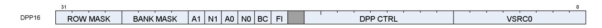

**Description** Data Parallel Primitives over 16 lanes. This is an additional DWORD that can follow VOP1, VOP2, VOPC, VOP3 or VOP3P instructions (in place of a literal constant) to control selection of data from other lanes.

Table 93. DPP16 Fields

| Field Name | Bits    | Format or Description                                                                                                                                                                                                                                                                                                                                                                                                                  |  |  |  |
|------------|---------|----------------------------------------------------------------------------------------------------------------------------------------------------------------------------------------------------------------------------------------------------------------------------------------------------------------------------------------------------------------------------------------------------------------------------------------|--|--|--|
| SRC0       | [39:32] | Real SRC0 operand (VGPR).                                                                                                                                                                                                                                                                                                                                                                                                              |  |  |  |
| DPP_CTRL   | [48:40] | See next table: "DPP_CTRL Enumeration"                                                                                                                                                                                                                                                                                                                                                                                                 |  |  |  |
| FI         | [50]    | Fetch invalid data: 0 = read zero for any inactive lanes; 1 = read VGPRs even for<br>invalid lanes.                                                                                                                                                                                                                                                                                                                                    |  |  |  |
| BC         | [51]    | Bounds Control: 0 = do not write when source is out of range, 1 = write.                                                                                                                                                                                                                                                                                                                                                               |  |  |  |
| SRC0_NEG   | [52]    | 1 = negate source 0.                                                                                                                                                                                                                                                                                                                                                                                                                   |  |  |  |
| SRC0_ABS   | [53]    | 1 = Absolute value of source 0.                                                                                                                                                                                                                                                                                                                                                                                                        |  |  |  |
| SRC1_NEG   | [54]    | 1 = negate source 1.                                                                                                                                                                                                                                                                                                                                                                                                                   |  |  |  |
| SRC1_ABS   | [55]    | 1 = Absolute value of source 1.                                                                                                                                                                                                                                                                                                                                                                                                        |  |  |  |
| BANK_MASK  | [59:56] | Bank Mask Applies to the VGPR destination write only, does not impact the thread<br>mask when fetching source VGPR data.<br>27==0: lanes[12:15, 28:31, 44:47, 60:63] are disabled<br>26==0: lanes[8:11, 24:27, 40:43, 56:59] are disabled<br>25==0: lanes[4:7, 20:23, 36:39, 52:55] are disabled<br>24==0: lanes[0:3, 16:19, 32:35, 48:51] are disabled<br>Notice: the term "bank" here is not the same as was used for the VGPR bank. |  |  |  |
| ROW_MASK   | [63:60] | Row Mask Applies to the VGPR destination write only, does not impact the thread<br>mask when fetching source VGPR data.<br>31==0: lanes[63:48] are disabled (wave 64 only)<br>30==0: lanes[47:32] are disabled (wave 64 only)<br>29==0: lanes[31:16] are disabled<br>28==0: lanes[15:0] are disabled                                                                                                                                   |  |  |  |

Table 94. DPP\_CTRL Enumeration

15.3. Vector ALU Formats 170 of 600


| DPP_Cntl<br>Enumeration  | Hex<br>Value | Function                                                                                                             | Description                                                                           |  |  |
|--------------------------|--------------|----------------------------------------------------------------------------------------------------------------------|---------------------------------------------------------------------------------------|--|--|
| DPP_QUAD_PE<br>RM*       | 000-<br>0FF  | pix[n].srca = pix[(n&0x3c)+ dpp_cntl[n%4*2+1 :<br>n%4*2]].srca                                                       | Permute of four threads.                                                              |  |  |
| DPP_UNUSED               | 100          | Undefined                                                                                                            | Reserved.                                                                             |  |  |
| DPP_ROW_SL*              | 101-<br>10F  | if ((n&0xf) < (16-cntl[3:0])) pix[n].srca = pix[n+<br>cntl[3:0]].srca else use bound_cntl                            | Row shift left by 1-15 threads.                                                       |  |  |
| DPP_ROW_SR*              | 111-<br>11F  | if ((n&0xf) >= cntl[3:0]) pix[n].srca = pix[n -<br>cntl[3:0]].srca else use bound_cntl                               | Row shift right by 1-15 threads.                                                      |  |  |
| DPP_ROW_RR* 121-         | 12F          | if ((n&0xf) >= cnt[3:0]) pix[n].srca = pix[n -<br>cntl[3:0]].srca else pix[n].srca = pix[n + 16 -<br>cntl[3:0]].srca | Row rotate right by 1-15 threads.                                                     |  |  |
| DPP_ROW_MIR<br>ROR*      | 140          | pix[n].srca = pix[15-(n&f)].srca                                                                                     | Mirror threads within row.                                                            |  |  |
| DPP_ROW_HA<br>LF_MIRROR* | 141          | pix[n].srca = pix[7-(n&7)].srca                                                                                      | Mirror threads within row (8 threads).                                                |  |  |
| DPP_ROW_SHA<br>RE*       | 150-<br>15F  | lanesel = DPP_CTRL & 0xf;<br>lane[n].src0 = lane[(n & 0x30) + lanesel].src0.                                         | Select one lane within each row and share<br>the result with all lanes in the row.    |  |  |
| DPP_ROW_XM<br>ASK*       | 160-<br>16F  | lane[n].src0 = lane[(n & 0x30) + ((n & 0xf) ^<br>mask)].src0.                                                        | Fetch lane ID is the current lane ID XOR'd<br>with a mask specified by DPP_CTRL[3:0]. |  |  |

### <span id="page-179-0"></span>**15.3.9. DPP8**

|      | 31   |      |      |      |      |      |      |      | 0     |
|------|------|------|------|------|------|------|------|------|-------|
| DPP8 | SEL7 | SEL6 | SEL5 | SEL4 | SEL3 | SEL2 | SEL1 | SEL0 | VSRC0 |

**Description** Data Parallel Primitives over 8 lanes. This is a second DWORD that can follow VOP1, VOP2, VOPC, VOP3 or VOP3P instructions (in place of a literal constant) to control selection of data from other lanes.

Table 95. DPP8 Fields

| Field Name | Bits    | Format or Description                                   |
|------------|---------|---------------------------------------------------------|
| SRC0       | [39:32] | Real SRC0 operand (VGPR).                               |
| LANE_SEL0  | [42:40] | Which lane to read for 1st output lane per 8-lane group |
| LANE_SEL1  | [45:43] | Which lane to read for 2nd output lane per 8-lane group |
| LANE_SEL2  | [48:46] | Which lane to read for 3rd output lane per 8-lane group |
| LANE_SEL3  | [51:49] | Which lane to read for 4th output lane per 8-lane group |
| LANE_SEL4  | [54:52] | Which lane to read for 5th output lane per 8-lane group |
| LANE_SEL5  | [57:55] | Which lane to read for 6th output lane per 8-lane group |
| LANE_SEL6  | [60:58] | Which lane to read for 7th output lane per 8-lane group |
| LANE_SEL7  | [63:61] | Which lane to read for 8th output lane per 8-lane group |

15.3. Vector ALU Formats 171 of 600


# <span id="page-180-0"></span>**15.4. Vector Parameter Interpolation Format**

### <span id="page-180-1"></span>**15.4.1. VINTERP**

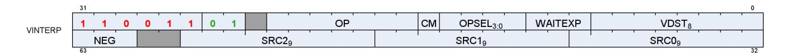

**Description** Vector Parameter Interpolation.

These opcodes perform parameter interpolation using vertex data in pixel shaders.

Table 96. VINTERP Fields

| Field Name | Bits    | Format or Description                                                              |
|------------|---------|------------------------------------------------------------------------------------|
| VDST       | [7:0]   | Destination VGPR                                                                   |
| WAITEXP    | [10:8]  | Wait for EXPcnt to be less-than or equal-to this value before issuing instruction. |
| OPSEL      | [14:11] | Select low or high for low sources 0=[11], 1=[12], 2=[13], dst=[14].               |
| CLMP       | [15]    | 1 = clamp result.                                                                  |
| OP         | [22:16] | Opcode. see next table.                                                            |
| ENCODING   | [31:26] | 'b11001101                                                                         |
| SRC0       | [40:32] | Source 0. First operand for the instruction: VGPR 0-255.                           |


| Field Name | Bits      | Format or Description                                                          |  |  |  |
|------------|-----------|--------------------------------------------------------------------------------|--|--|--|
| SRC0       | [40:32]   | Source 0. First operand for the instruction.                                   |  |  |  |
|            | 0-105     | SGPR0 - SGPR105: Scalar general-purpose registers.                             |  |  |  |
|            | 106       | VCC_LO: VCC[31:0].                                                             |  |  |  |
|            | 107       | VCC_HI: VCC[63:32].                                                            |  |  |  |
|            | 108-123   | TTMP0 - TTMP15: Trap handler temporary register.                               |  |  |  |
|            | 124       | NULL                                                                           |  |  |  |
|            | 125       | M0. Misc register 0.                                                           |  |  |  |
|            | 126       | EXEC_LO: EXEC[31:0].                                                           |  |  |  |
|            | 127       | EXEC_HI: EXEC[63:32].                                                          |  |  |  |
|            | 128       | 0.                                                                             |  |  |  |
|            | 129-192   | Signed integer 1 to 64.                                                        |  |  |  |
|            | 193-208   | Signed integer -1 to -16.                                                      |  |  |  |
|            | 209-232   | Reserved.                                                                      |  |  |  |
|            | 233       | DPP8                                                                           |  |  |  |
|            | 234       | DPP8FI                                                                         |  |  |  |
|            | 235       | SHARED_BASE (Memory Aperture definition).                                      |  |  |  |
|            | 236       | SHARED_LIMIT (Memory Aperture definition).                                     |  |  |  |
|            | 237       | PRIVATE_BASE (Memory Aperture definition).                                     |  |  |  |
|            | 238       | PRIVATE_LIMIT (Memory Aperture definition).                                    |  |  |  |
|            | 239       | Reserved.                                                                      |  |  |  |
|            | 240       | 0.5.                                                                           |  |  |  |
|            | 241       | -0.5.                                                                          |  |  |  |
|            | 242       | 1.0.                                                                           |  |  |  |
|            | 243       | -1.0.                                                                          |  |  |  |
|            | 244       | 2.0.                                                                           |  |  |  |
|            | 245       | -2.0.                                                                          |  |  |  |
|            | 246       | 4.0.                                                                           |  |  |  |
|            | 247       | -4.0.                                                                          |  |  |  |
|            | 248       | 1/(2*PI).                                                                      |  |  |  |
|            | 250       | DPP16                                                                          |  |  |  |
|            | 253       | SCC.                                                                           |  |  |  |
|            | 254       | Reserved.                                                                      |  |  |  |
|            | 255       | Literal constant.                                                              |  |  |  |
|            | 256 - 511 | VGPR 0 - 255                                                                   |  |  |  |
| SRC1       | [49:41]   | Second input operand. Same options as SRC0.                                    |  |  |  |
| SRC2       | [58:50]   | Third input operand. Same options as SRC0.                                     |  |  |  |
| NEG        | [63:61]   | Negate input for low 16-bits of sources. [61] = src0, [62] = src1, [63] = src2 |  |  |  |

Table 97. VINTERP Opcodes

| Opcode # | Name                 | Opcode # | Name                     |
|----------|----------------------|----------|--------------------------|
| 0        | V_INTERP_P10_F32     | 3        | V_INTERP_P2_F16_F32      |
| 1        | V_INTERP_P2_F32      | 4        | V_INTERP_P10_RTZ_F16_F32 |
| 2        | V_INTERP_P10_F16_F32 | 5        | V_INTERP_P2_RTZ_F16_F32  |

# <span id="page-181-0"></span>**15.5. Parameter and Direct Load from LDS**

### <span id="page-181-1"></span>**15.5.1. LDSDIR**

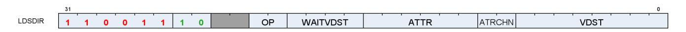


**Description** LDS Direct and Parameter Load.

These opcodes read either pixel parameter data or individual DWORDs from LDS into

VGPRs.

### Table 98. LDSDIR Fields

| Field Name | Bits    | Format or Description                                                                                                                                               |  |
|------------|---------|---------------------------------------------------------------------------------------------------------------------------------------------------------------------|--|
| VDST       | [7:0]   | Destination VGPR                                                                                                                                                    |  |
| ATTR_CHAN  | [9:8]   | Attribute channel: 0=X, 1=Y, 2=Z, 3=W                                                                                                                               |  |
| ATTR       | [15:10] | Attribute number: 0 - 32.                                                                                                                                           |  |
| WAIT_VA    | [19:16] | Wait for previous VALU instructions to complete to resolve data dependency. Value<br>is the max number of VALU ops still outstanding when issuing this instruction. |  |
| OP         | [21:20] | Opcode:<br>0: LDS_DIRECT_LOAD<br>1: LDS_PARAM_LOAD<br>2, 3: Reserved.                                                                                               |  |
| ENCODING   | [31:24] | 'b11001110                                                                                                                                                          |  |


# <span id="page-183-0"></span>**15.6. LDS and GDS Format**

### <span id="page-183-1"></span>**15.6.1. DS**

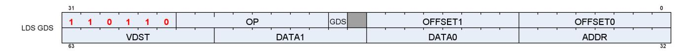

**Description** Local and Global Data Sharing instructions

Table 99. DS Fields

| Field Name | Bits    | Format or Description                                                      |
|------------|---------|----------------------------------------------------------------------------|
| OFFSET0    | [7:0]   | First address offset                                                       |
| OFFSET1    | [15:8]  | Second address offset. For some opcodes this is concatenated with OFFSET0. |
| GDS        | [17]    | 1=GDS, 0=LDS operation.                                                    |
| OP         | [25:18] | See Opcode table below.                                                    |
| ENCODING   | [31:26] | 'b110110                                                                   |
| ADDR       | [39:32] | VGPR that supplies the address.                                            |
| DATA0      | [47:40] | First data VGPR.                                                           |
| DATA1      | [55:48] | Second data VGPR.                                                          |
| VDST       | [63:56] | Destination VGPR when results returned to VGPRs.                           |

Table 100. DS Opcodes

| Opcode # | Name                        | Opcode # | Name                        |
|----------|-----------------------------|----------|-----------------------------|
| 0        | DS_ADD_U32                  | 65       | DS_SUB_U64                  |
| 1        | DS_SUB_U32                  | 66       | DS_RSUB_U64                 |
| 2        | DS_RSUB_U32                 | 67       | DS_INC_U64                  |
| 3        | DS_INC_U32                  | 68       | DS_DEC_U64                  |
| 4        | DS_DEC_U32                  | 69       | DS_MIN_I64                  |
| 5        | DS_MIN_I32                  | 70       | DS_MAX_I64                  |
| 6        | DS_MAX_I32                  | 71       | DS_MIN_U64                  |
| 7        | DS_MIN_U32                  | 72       | DS_MAX_U64                  |
| 8        | DS_MAX_U32                  | 73       | DS_AND_B64                  |
| 9        | DS_AND_B32                  | 74       | DS_OR_B64                   |
| 10       | DS_OR_B32                   | 75       | DS_XOR_B64                  |
| 11       | DS_XOR_B32                  | 76       | DS_MSKOR_B64                |
| 12       | DS_MSKOR_B32                | 77       | DS_STORE_B64                |
| 13       | DS_STORE_B32                | 78       | DS_STORE_2ADDR_B64          |
| 14       | DS_STORE_2ADDR_B32          | 79       | DS_STORE_2ADDR_STRIDE64_B64 |
| 15       | DS_STORE_2ADDR_STRIDE64_B32 | 80       | DS_CMPSTORE_B64             |
| 16       | DS_CMPSTORE_B32             | 81       | DS_CMPSTORE_F64             |
| 17       | DS_CMPSTORE_F32             | 82       | DS_MIN_F64                  |
| 18       | DS_MIN_F32                  | 83       | DS_MAX_F64                  |
| 19       | DS_MAX_F32                  | 96       | DS_ADD_RTN_U64              |
| 20       | DS_NOP                      | 97       | DS_SUB_RTN_U64              |
| 21       | DS_ADD_F32                  | 98       | DS_RSUB_RTN_U64             |
| 24       | Reserved                    | 99       | DS_INC_RTN_U64              |

15.6. LDS and GDS Format 175 of 600


| Opcode # | Name                                | Opcode # | Name                                |
|----------|-------------------------------------|----------|-------------------------------------|
| 25       | Reserved                            | 100      | DS_DEC_RTN_U64                      |
| 26       | Reserved                            | 101      | DS_MIN_RTN_I64                      |
| 27       | Reserved                            | 102      | DS_MAX_RTN_I64                      |
| 28       | Reserved                            | 103      | DS_MIN_RTN_U64                      |
| 29       | Reserved                            | 104      | DS_MAX_RTN_U64                      |
| 30       | DS_STORE_B8                         | 105      | DS_AND_RTN_B64                      |
| 31       | DS_STORE_B16                        | 106      | DS_OR_RTN_B64                       |
| 32       | DS_ADD_RTN_U32                      | 107      | DS_XOR_RTN_B64                      |
| 33       | DS_SUB_RTN_U32                      | 108      | DS_MSKOR_RTN_B64                    |
| 34       | DS_RSUB_RTN_U32                     | 109      | DS_STOREXCHG_RTN_B64                |
| 35       | DS_INC_RTN_U32                      | 110      | DS_STOREXCHG_2ADDR_RTN_B64          |
| 36       | DS_DEC_RTN_U32                      | 111      | DS_STOREXCHG_2ADDR_STRIDE64_RTN_B64 |
| 37       | DS_MIN_RTN_I32                      | 112      | DS_CMPSTORE_RTN_B64                 |
| 38       | DS_MAX_RTN_I32                      | 113      | DS_CMPSTORE_RTN_F64                 |
| 39       | DS_MIN_RTN_U32                      | 114      | DS_MIN_RTN_F64                      |
| 40       | DS_MAX_RTN_U32                      | 115      | DS_MAX_RTN_F64                      |
| 41       | DS_AND_RTN_B32                      | 118      | DS_LOAD_B64                         |
| 42       | DS_OR_RTN_B32                       | 119      | DS_LOAD_2ADDR_B64                   |
| 43       | DS_XOR_RTN_B32                      | 120      | DS_LOAD_2ADDR_STRIDE64_B64          |
| 44       | DS_MSKOR_RTN_B32                    | 121      | DS_ADD_RTN_F32                      |
| 45       | DS_STOREXCHG_RTN_B32                | 122      | DS_ADD_GS_REG_RTN                   |
| 46       | DS_STOREXCHG_2ADDR_RTN_B32          | 123      | DS_SUB_GS_REG_RTN                   |
| 47       | DS_STOREXCHG_2ADDR_STRIDE64_RTN_B32 | 126      | DS_CONDXCHG32_RTN_B64               |
| 48       | DS_CMPSTORE_RTN_B32                 | 160      | DS_STORE_B8_D16_HI                  |
| 49       | DS_CMPSTORE_RTN_F32                 | 161      | DS_STORE_B16_D16_HI                 |
| 50       | DS_MIN_RTN_F32                      | 162      | DS_LOAD_U8_D16                      |
| 51       | DS_MAX_RTN_F32                      | 163      | DS_LOAD_U8_D16_HI                   |
| 52       | DS_WRAP_RTN_B32                     | 164      | DS_LOAD_I8_D16                      |
| 53       | DS_SWIZZLE_B32                      | 165      | DS_LOAD_I8_D16_HI                   |
| 54       | DS_LOAD_B32                         | 166      | DS_LOAD_U16_D16                     |
| 55       | DS_LOAD_2ADDR_B32                   | 167      | DS_LOAD_U16_D16_HI                  |
| 56       | DS_LOAD_2ADDR_STRIDE64_B32          | 173      | DS_BVH_STACK_RTN_B32                |
| 57       | DS_LOAD_I8                          | 176      | DS_STORE_ADDTID_B32                 |
| 58       | DS_LOAD_U8                          | 177      | DS_LOAD_ADDTID_B32                  |
| 59       | DS_LOAD_I16                         | 178      | DS_PERMUTE_B32                      |
| 60       | DS_LOAD_U16                         | 179      | DS_BPERMUTE_B32                     |
| 61       | DS_CONSUME                          | 222      | DS_STORE_B96                        |
| 62       | DS_APPEND                           | 223      | DS_STORE_B128                       |
| 63       | DS_ORDERED_COUNT                    | 254      | DS_LOAD_B96                         |
| 64       | DS_ADD_U64                          | 255      | DS_LOAD_B128                        |

15.6. LDS and GDS Format 176 of 600

# <span id="page-185-0"></span>**15.7. Vector Memory Buffer Formats**

There are two memory buffer instruction formats:

#### **MTBUF**

typed buffer access (data type is defined by the instruction)

#### **MUBUF**

untyped buffer access (data type is defined by the buffer / resource-constant)

### <span id="page-185-1"></span>**15.7.1. MTBUF**

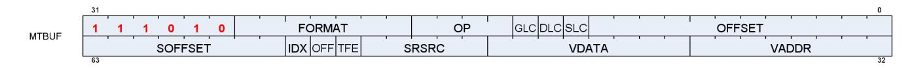

**Description** Memory Typed-Buffer Instructions

Table 101. MTBUF Fields

| Field Name | Bits    | Format or Description                                                                                                                                                |
|------------|---------|----------------------------------------------------------------------------------------------------------------------------------------------------------------------|
| OFFSET     | [11:0]  | Address offset, unsigned byte.                                                                                                                                       |
| SLC        | [12]    | System Level Coherent. Used in conjunction with DLC to determine L2 cache<br>policies.                                                                               |
| DLC        | [13]    | 0 = normal, 1 = Device Coherent                                                                                                                                      |
| GLC        | [14]    | 0 = normal, 1 = globally coherent (bypass L0 cache) or for atomics, return pre-op<br>value to VGPR.                                                                  |
| OP         | [18:15] | Opcode. See table below.                                                                                                                                             |
| FORMAT     | [25:19] | Data Format of data in memory buffer. See Buffer Image format Table                                                                                                  |
| ENCODING   | [31:26] | 'b111010                                                                                                                                                             |
| VADDR      | [39:32] | Address of VGPR to supply first component of address (offset or index). When both<br>index and offset are used, index is in the first VGPR and offset in the second. |
| VDATA      | [47:40] | Address of VGPR to supply first component of write data or receive first component<br>of read-data.                                                                  |
| SRSRC      | [52:48] | SGPR to supply V# (resource constant) in 4 or 8 consecutive SGPRs. It is missing 2<br>LSB's of SGPR-address since it is aligned to 4 SGPRs.                          |
| TFE        | [53]    | Partially resident texture, texture fault enable.                                                                                                                    |
| OFFEN      | [54]    | 1 = enable offset VGPR, 0 = use zero for address offset                                                                                                              |
| IDXEN      | [55]    | 1 = enable index VGPR, 0 = use zero for address index                                                                                                                |
| SOFFSET    | [63:56] | Address offset, unsigned byte.                                                                                                                                       |

Table 102. MTBUF Opcodes

| Opcode # | Name                     | Opcode # | Name                         |
|----------|--------------------------|----------|------------------------------|
| 0        | TBUFFER_LOAD_FORMAT_X    | 8        | TBUFFER_LOAD_D16_FORMAT_X    |
| 1        | TBUFFER_LOAD_FORMAT_XY   | 9        | TBUFFER_LOAD_D16_FORMAT_XY   |
| 2        | TBUFFER_LOAD_FORMAT_XYZ  | 10       | TBUFFER_LOAD_D16_FORMAT_XYZ  |
| 3        | TBUFFER_LOAD_FORMAT_XYZW | 11       | TBUFFER_LOAD_D16_FORMAT_XYZW |
| 4        | TBUFFER_STORE_FORMAT_X   | 12       | TBUFFER_STORE_D16_FORMAT_X   |
| 5        | TBUFFER_STORE_FORMAT_XY  | 13       | TBUFFER_STORE_D16_FORMAT_XY  |


| Opcode # | Name                      | Opcode # | Name                          |
|----------|---------------------------|----------|-------------------------------|
| 6        | TBUFFER_STORE_FORMAT_XYZ  | 14       | TBUFFER_STORE_D16_FORMAT_XYZ  |
| 7        | TBUFFER_STORE_FORMAT_XYZW | 15       | TBUFFER_STORE_D16_FORMAT_XYZW |

### **15.7.2. MUBUF**

<span id="page-186-0"></span>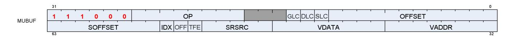

#### **Description** Memory Untyped-Buffer Instructions

Table 103. MUBUF Fields

| Field Name | Bits    | Format or Description                                                                                                                                                |
|------------|---------|----------------------------------------------------------------------------------------------------------------------------------------------------------------------|
| OFFSET     | [11:0]  | Address offset, unsigned byte.                                                                                                                                       |
| SLC        | [12]    | System Level Coherent. Used in conjunction with DLC to determine L2 cache<br>policies.                                                                               |
| DLC        | [13]    | 0 = normal, 1 = Device Coherent                                                                                                                                      |
| GLC        | [14]    | 0 = normal, 1 = globally coherent (bypass L0 cache) or for atomics, return pre-op<br>value to VGPR.                                                                  |
| OP         | [25:18] | Opcode. See table below.                                                                                                                                             |
| ENCODING   | [31:26] | 'b111000                                                                                                                                                             |
| VADDR      | [39:32] | Address of VGPR to supply first component of address (offset or index). When both<br>index and offset are used, index is in the first VGPR and offset in the second. |
| VDATA      | [47:40] | Address of VGPR to supply first component of write data or receive first component<br>of read-data.                                                                  |
| SRSRC      | [52:48] | SGPR to supply V# (resource constant) in 4 or 8 consecutive SGPRs. It is missing 2<br>LSB's of SGPR-address since it is aligned to 4 SGPRs.                          |
| TFE        | [53]    | Partially resident texture, texture fault enable.                                                                                                                    |
| OFFEN      | [54]    | 1 = enable offset VGPR, 0 = use zero for address offset                                                                                                              |
| IDXEN      | [55]    | 1 = enable index VGPR, 0 = use zero for address index                                                                                                                |
| SOFFSET    | [63:56] | Address offset, unsigned byte.                                                                                                                                       |

Table 104. MUBUF Opcodes

| Opcode # | Name                        | Opcode # | Name                         |
|----------|-----------------------------|----------|------------------------------|
| 0        | BUFFER_LOAD_FORMAT_X        | 37       | BUFFER_STORE_D16_HI_B16      |
| 1        | BUFFER_LOAD_FORMAT_XY       | 38       | BUFFER_LOAD_D16_HI_FORMAT_X  |
| 2        | BUFFER_LOAD_FORMAT_XYZ      | 39       | BUFFER_STORE_D16_HI_FORMAT_X |
| 3        | BUFFER_LOAD_FORMAT_XYZW     | 43       | BUFFER_GL0_INV               |
| 4        | BUFFER_STORE_FORMAT_X       | 44       | BUFFER_GL1_INV               |
| 5        | BUFFER_STORE_FORMAT_XY      | 51       | BUFFER_ATOMIC_SWAP_B32       |
| 6        | BUFFER_STORE_FORMAT_XYZ     | 52       | BUFFER_ATOMIC_CMPSWAP_B32    |
| 7        | BUFFER_STORE_FORMAT_XYZW    | 53       | BUFFER_ATOMIC_ADD_U32        |
| 8        | BUFFER_LOAD_D16_FORMAT_X    | 54       | BUFFER_ATOMIC_SUB_U32        |
| 9        | BUFFER_LOAD_D16_FORMAT_XY   | 55       | BUFFER_ATOMIC_CSUB_U32       |
| 10       | BUFFER_LOAD_D16_FORMAT_XYZ  | 56       | BUFFER_ATOMIC_MIN_I32        |
| 11       | BUFFER_LOAD_D16_FORMAT_XYZW | 57       | BUFFER_ATOMIC_MIN_U32        |
| 12       | BUFFER_STORE_D16_FORMAT_X   | 58       | BUFFER_ATOMIC_MAX_I32        |


| Opcode # | Name                         | Opcode # | Name                      |
|----------|------------------------------|----------|---------------------------|
| 13       | BUFFER_STORE_D16_FORMAT_XY   | 59       | BUFFER_ATOMIC_MAX_U32     |
| 14       | BUFFER_STORE_D16_FORMAT_XYZ  | 60       | BUFFER_ATOMIC_AND_B32     |
| 15       | BUFFER_STORE_D16_FORMAT_XYZW | 61       | BUFFER_ATOMIC_OR_B32      |
| 16       | BUFFER_LOAD_U8               | 62       | BUFFER_ATOMIC_XOR_B32     |
| 17       | BUFFER_LOAD_I8               | 63       | BUFFER_ATOMIC_INC_U32     |
| 18       | BUFFER_LOAD_U16              | 64       | BUFFER_ATOMIC_DEC_U32     |
| 19       | BUFFER_LOAD_I16              | 65       | BUFFER_ATOMIC_SWAP_B64    |
| 20       | BUFFER_LOAD_B32              | 66       | BUFFER_ATOMIC_CMPSWAP_B64 |
| 21       | BUFFER_LOAD_B64              | 67       | BUFFER_ATOMIC_ADD_U64     |
| 22       | BUFFER_LOAD_B96              | 68       | BUFFER_ATOMIC_SUB_U64     |
| 23       | BUFFER_LOAD_B128             | 69       | BUFFER_ATOMIC_MIN_I64     |
| 24       | BUFFER_STORE_B8              | 70       | BUFFER_ATOMIC_MIN_U64     |
| 25       | BUFFER_STORE_B16             | 71       | BUFFER_ATOMIC_MAX_I64     |
| 26       | BUFFER_STORE_B32             | 72       | BUFFER_ATOMIC_MAX_U64     |
| 27       | BUFFER_STORE_B64             | 73       | BUFFER_ATOMIC_AND_B64     |
| 28       | BUFFER_STORE_B96             | 74       | BUFFER_ATOMIC_OR_B64      |
| 29       | BUFFER_STORE_B128            | 75       | BUFFER_ATOMIC_XOR_B64     |
| 30       | BUFFER_LOAD_D16_U8           | 76       | BUFFER_ATOMIC_INC_U64     |
| 31       | BUFFER_LOAD_D16_I8           | 77       | BUFFER_ATOMIC_DEC_U64     |
| 32       | BUFFER_LOAD_D16_B16          | 80       | BUFFER_ATOMIC_CMPSWAP_F32 |
| 33       | BUFFER_LOAD_D16_HI_U8        | 81       | BUFFER_ATOMIC_MIN_F32     |
| 34       | BUFFER_LOAD_D16_HI_I8        | 82       | BUFFER_ATOMIC_MAX_F32     |
| 35       | BUFFER_LOAD_D16_HI_B16       | 86       | BUFFER_ATOMIC_ADD_F32     |
| 36       | BUFFER_STORE_D16_HI_B8       |          |                           |


# <span id="page-188-0"></span>**15.8. Vector Memory Image Format**

### <span id="page-188-1"></span>**15.8.1. MIMG**

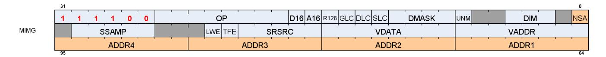

**Description** Memory Image Instructions

Memory Image instructions (MIMG format) can be between 2 and 3 DWORDs. There are two variations of the instruction:

- Normal, where the address VGPRs are specified in the "ADDR" field, and are a contiguous set of VGPRs. This is a 2-DWORD instruction.
- Non-Sequential-Address (NSA), where each address VGPR is specified individually and the address VGPRs can be scattered. This version uses 1 extra DWORD to specify the individual address VGPRs.

Table 105. MIMG Fields

| Field Name | Bits    | Format or Description                                                                                                                                                                                                                                                                                                                                                                                                                                                                                                                                |  |
|------------|---------|------------------------------------------------------------------------------------------------------------------------------------------------------------------------------------------------------------------------------------------------------------------------------------------------------------------------------------------------------------------------------------------------------------------------------------------------------------------------------------------------------------------------------------------------------|--|
| NSA        | [0]     | Non-sequential address. Specifies that an additional instruction DWORD exists<br>holding up to 4 unique VGPR addresses.                                                                                                                                                                                                                                                                                                                                                                                                                              |  |
| DIM        | [4:2]   | Dimensionality of the resource constant. Set to bits [3:1] of the resource type field.                                                                                                                                                                                                                                                                                                                                                                                                                                                               |  |
| UNRM       | [7]     | Force address to be un-normalized. User must set to 1 for Image stores & atomics.                                                                                                                                                                                                                                                                                                                                                                                                                                                                    |  |
| DMASK      | [11:8]  | Data VGPR enable mask: 1 4 consecutive VGPRs<br>Reads: defines which components are returned:<br>0=red,1=green,2=blue,3=alpha<br>Writes: defines which components are written with data from VGPRs (missing<br>components get 0).<br>Enabled components come from consecutive VGPRs.<br>E.G. dmask=1001 : Red is in VGPRn and alpha in VGPRn+1.<br>For D16 writes, DMASK is only used as a word count: each bit represents 16 bits of<br>data to be written starting at the LSB's of VDATA, then MSBs, then VDATA+1 etc. Bit<br>position is ignored. |  |
| SLC        | [12]    | System Level Coherent. Used in conjunction with DLC to determine L2 cache<br>policies.                                                                                                                                                                                                                                                                                                                                                                                                                                                               |  |
| DLC        | [13]    | 0 = normal, 1 = Device Coherent                                                                                                                                                                                                                                                                                                                                                                                                                                                                                                                      |  |
| GLC        | [14]    | 0 = normal, 1 = globally coherent (bypass L0 cache) or for atomics, return pre-op<br>value to VGPR.                                                                                                                                                                                                                                                                                                                                                                                                                                                  |  |
| R128       | [15]    | Resource constant size: 1 = 128bit, 0 = 256bit                                                                                                                                                                                                                                                                                                                                                                                                                                                                                                       |  |
| A16        | [16]    | Address components are 16-bits (instead of the usual 32 bits).<br>When set, all address components are 16 bits (packed into 2 per DWORD), except:<br>Texel offsets (3 6bit UINT packed into 1 DWORD)<br>PCF reference (for "_C" instructions)<br>Address components are 16b uint for image ops without sampler; 16b float with<br>sampler.                                                                                                                                                                                                           |  |
| D16        | [17]    | Data components are 16-bits (instead of the usual 32 bits).                                                                                                                                                                                                                                                                                                                                                                                                                                                                                          |  |
| OP         | [25:18] | Opcode. See table below.                                                                                                                                                                                                                                                                                                                                                                                                                                                                                                                             |  |
| ENCODING   | [31:26] | 'b111100                                                                                                                                                                                                                                                                                                                                                                                                                                                                                                                                             |  |


| Field Name | Bits    | Format or Description                                                                                                                       |
|------------|---------|---------------------------------------------------------------------------------------------------------------------------------------------|
| VADDR      | [39:32] | Address of VGPR to supply first component of address.                                                                                       |
| VDATA      | [47:40] | Address of VGPR to supply first component of write data or receive first component<br>of read-data.                                         |
| SRSRC      | [52:48] | SGPR to supply T# (resource constant) in 4 or 8 consecutive SGPRs. It is missing 2<br>LSB's of SGPR-address since it is aligned to 4 SGPRs. |
| TFE        | [53]    | Partially resident texture, texture fault enable.                                                                                           |
| LWE        | [54]    | LOD Warning Enable. When set to 1, a texture fetch may return "LOD_CLAMPED =<br>1".                                                         |
| SSAMP      | [62:58] | SGPR to supply S# (sampler constant) in 4 or 8 consecutive SGPRs. It is missing 2<br>LSB's of SGPR-address since it is aligned to 4 SGPRs.  |
| ADDR1      | [71:64] | Second Address register or group. Present only when NSA=1.                                                                                  |
| ADDR2      | [79:72] | Third Address register or group. Present only when NSA=1.                                                                                   |

Table 106. MIMG Opcodes

| Opcode # | Name                      | Opcode # | Name                    |
|----------|---------------------------|----------|-------------------------|
| 0        | IMAGE_LOAD                | 42       | IMAGE_SAMPLE_C_O        |
| 1        | IMAGE_LOAD_MIP            | 43       | IMAGE_SAMPLE_C_D_O      |
| 2        | IMAGE_LOAD_PCK            | 44       | IMAGE_SAMPLE_C_L_O      |
| 3        | IMAGE_LOAD_PCK_SGN        | 45       | IMAGE_SAMPLE_C_B_O      |
| 4        | IMAGE_LOAD_MIP_PCK        | 46       | IMAGE_SAMPLE_C_LZ_O     |
| 5        | IMAGE_LOAD_MIP_PCK_SGN    | 47       | IMAGE_GATHER4           |
| 6        | IMAGE_STORE               | 48       | IMAGE_GATHER4_L         |
| 7        | IMAGE_STORE_MIP           | 49       | IMAGE_GATHER4_B         |
| 8        | IMAGE_STORE_PCK           | 50       | IMAGE_GATHER4_LZ        |
| 9        | IMAGE_STORE_MIP_PCK       | 51       | IMAGE_GATHER4_C         |
| 10       | IMAGE_ATOMIC_SWAP         | 52       | IMAGE_GATHER4_C_LZ      |
| 11       | IMAGE_ATOMIC_CMPSWAP      | 53       | IMAGE_GATHER4_O         |
| 12       | IMAGE_ATOMIC_ADD          | 54       | IMAGE_GATHER4_LZ_O      |
| 13       | IMAGE_ATOMIC_SUB          | 55       | IMAGE_GATHER4_C_LZ_O    |
| 14       | IMAGE_ATOMIC_SMIN         | 56       | IMAGE_GET_LOD           |
| 15       | IMAGE_ATOMIC_UMIN         | 57       | IMAGE_SAMPLE_D_G16      |
| 16       | IMAGE_ATOMIC_SMAX         | 58       | IMAGE_SAMPLE_C_D_G16    |
| 17       | IMAGE_ATOMIC_UMAX         | 59       | IMAGE_SAMPLE_D_O_G16    |
| 18       | IMAGE_ATOMIC_AND          | 60       | IMAGE_SAMPLE_C_D_O_G16  |
| 19       | IMAGE_ATOMIC_OR           | 64       | IMAGE_SAMPLE_CL         |
| 20       | IMAGE_ATOMIC_XOR          | 65       | IMAGE_SAMPLE_D_CL       |
| 21       | IMAGE_ATOMIC_INC          | 66       | IMAGE_SAMPLE_B_CL       |
| 22       | IMAGE_ATOMIC_DEC          | 67       | IMAGE_SAMPLE_C_CL       |
| 23       | IMAGE_GET_RESINFO         | 68       | IMAGE_SAMPLE_C_D_CL     |
| 24       | IMAGE_MSAA_LOAD           | 69       | IMAGE_SAMPLE_C_B_CL     |
| 25       | IMAGE_BVH_INTERSECT_RAY   | 70       | IMAGE_SAMPLE_CL_O       |
| 26       | IMAGE_BVH64_INTERSECT_RAY | 71       | IMAGE_SAMPLE_D_CL_O     |
| 27       | IMAGE_SAMPLE              | 72       | IMAGE_SAMPLE_B_CL_O     |
| 28       | IMAGE_SAMPLE_D            | 73       | IMAGE_SAMPLE_C_CL_O     |
| 29       | IMAGE_SAMPLE_L            | 74       | IMAGE_SAMPLE_C_D_CL_O   |
| 30       | IMAGE_SAMPLE_B            | 75       | IMAGE_SAMPLE_C_B_CL_O   |
| 31       | IMAGE_SAMPLE_LZ           | 84       | IMAGE_SAMPLE_C_D_CL_G16 |
| 32       | IMAGE_SAMPLE_C            | 85       | IMAGE_SAMPLE_D_CL_O_G16 |


| Opcode # | Name              | Opcode # | Name                      |
|----------|-------------------|----------|---------------------------|
| 33       | IMAGE_SAMPLE_C_D  | 86       | IMAGE_SAMPLE_C_D_CL_O_G16 |
| 34       | IMAGE_SAMPLE_C_L  | 95       | IMAGE_SAMPLE_D_CL_G16     |
| 35       | IMAGE_SAMPLE_C_B  | 96       | IMAGE_GATHER4_CL          |
| 36       | IMAGE_SAMPLE_C_LZ | 97       | IMAGE_GATHER4_B_CL        |
| 37       | IMAGE_SAMPLE_O    | 98       | IMAGE_GATHER4_C_CL        |
| 38       | IMAGE_SAMPLE_D_O  | 99       | IMAGE_GATHER4_C_L         |
| 39       | IMAGE_SAMPLE_L_O  | 100      | IMAGE_GATHER4_C_B         |
| 40       | IMAGE_SAMPLE_B_O  | 101      | IMAGE_GATHER4_C_B_CL      |
| 41       | IMAGE_SAMPLE_LZ_O | 144      | IMAGE_GATHER4H            |


# <span id="page-191-0"></span>**15.9. Flat Formats**

Flat memory instructions come in three versions:

#### **FLAT**

memory address (per work-item) may be in global memory, scratch (private) memory or shared memory (LDS)

#### **GLOBAL**

same as FLAT, but assumes all memory addresses are global memory.

#### **SCRATCH**

same as FLAT, but assumes all memory addresses are scratch (private) memory.

The microcode format is identical for each, and only the value of the SEG (segment) field differs.

### **15.9.1. FLAT**

<span id="page-191-1"></span>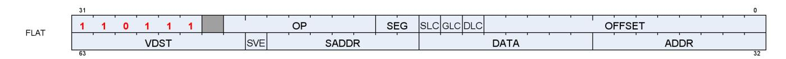

**Description** FLAT Memory Access

Table 107. FLAT Fields

| Field Name | Bits    | Format or Description                                                                                                                                                                                                                                                                                                                                                    |  |
|------------|---------|--------------------------------------------------------------------------------------------------------------------------------------------------------------------------------------------------------------------------------------------------------------------------------------------------------------------------------------------------------------------------|--|
| OFFSET     | [12:0]  | Address offset<br>Scratch, Global: 13-bit signed byte offset<br>FLAT: 12-bit unsigned offset (MSB is ignored)                                                                                                                                                                                                                                                            |  |
| DLC        | [13]    | 0 = normal, 1 = Device Coherent                                                                                                                                                                                                                                                                                                                                          |  |
| GLC        | [14]    | 0 = normal, 1 = globally coherent (bypass L0 cache) or for atomics, return pre-op<br>value to VGPR.                                                                                                                                                                                                                                                                      |  |
| SLC        | [15]    | System Level Coherent. Used in conjunction with DLC to determine L2 cache<br>policies.                                                                                                                                                                                                                                                                                   |  |
| SEG        | [17:16] | Memory Segment (instruction type): 0 = flat, 1 = scratch, 2 = global.                                                                                                                                                                                                                                                                                                    |  |
| OP         | [24:18] | Opcode. See tables below for FLAT, SCRATCH and GLOBAL opcodes.                                                                                                                                                                                                                                                                                                           |  |
| ENCODING   | [31:26] | 'b110111                                                                                                                                                                                                                                                                                                                                                                 |  |
| ADDR       | [39:32] | VGPR that holds address or offset. For 64-bit addresses, ADDR has the LSBs and<br>ADDR+1 has the MSBs. For offset a single VGPR has a 32 bit unsigned offset.<br>For FLAT_*: specifies an address.<br>For GLOBAL_* and SCRATCH_* when SADDR is NULL or 0x7f: specifies an address.<br>For GLOBAL_* and SCRATCH_* when SADDR is not NULL or 0x7f: specifies an<br>offset. |  |
| DATA       | [47:40] | VGPR that supplies data.                                                                                                                                                                                                                                                                                                                                                 |  |
| SADDR      | [54:48] | Scalar SGPR that provides an address of offset (unsigned). Set this field to NULL or<br>0x7f to disable use.<br>Meaning of this field is different for Scratch and Global:<br>FLAT: Unused<br>Scratch: use an SGPR for the address instead of a VGPR<br>Global: use the SGPR to provide a base address and the VGPR provides a 32-bit byte<br>offset.                    |  |

15.9. Flat Formats 183 of 600


| Field Name | Bits    | Format or Description                                                                               |
|------------|---------|-----------------------------------------------------------------------------------------------------|
| SVE        | [55]    | Scratch VGPR Enable. 1 = scratch address includes a VGPR to provide an offset; 0 =<br>no VGPR used. |
| VDST       | [63:56] | Destination VGPR for data returned from memory to VGPRs.                                            |

Table 108. FLAT Opcodes

| Name                    | Opcode # | Name                    |
|-------------------------|----------|-------------------------|
| FLAT_LOAD_U8            | 56       | FLAT_ATOMIC_MIN_I32     |
| FLAT_LOAD_I8            | 57       | FLAT_ATOMIC_MIN_U32     |
| FLAT_LOAD_U16           | 58       | FLAT_ATOMIC_MAX_I32     |
| FLAT_LOAD_I16           | 59       | FLAT_ATOMIC_MAX_U32     |
| FLAT_LOAD_B32           | 60       | FLAT_ATOMIC_AND_B32     |
| FLAT_LOAD_B64           | 61       | FLAT_ATOMIC_OR_B32      |
| FLAT_LOAD_B96           | 62       | FLAT_ATOMIC_XOR_B32     |
| FLAT_LOAD_B128          | 63       | FLAT_ATOMIC_INC_U32     |
| FLAT_STORE_B8           | 64       | FLAT_ATOMIC_DEC_U32     |
| FLAT_STORE_B16          | 65       | FLAT_ATOMIC_SWAP_B64    |
| FLAT_STORE_B32          | 66       | FLAT_ATOMIC_CMPSWAP_B64 |
| FLAT_STORE_B64          | 67       | FLAT_ATOMIC_ADD_U64     |
| FLAT_STORE_B96          | 68       | FLAT_ATOMIC_SUB_U64     |
| FLAT_STORE_B128         | 69       | FLAT_ATOMIC_MIN_I64     |
| FLAT_LOAD_D16_U8        | 70       | FLAT_ATOMIC_MIN_U64     |
| FLAT_LOAD_D16_I8        | 71       | FLAT_ATOMIC_MAX_I64     |
| FLAT_LOAD_D16_B16       | 72       | FLAT_ATOMIC_MAX_U64     |
| FLAT_LOAD_D16_HI_U8     | 73       | FLAT_ATOMIC_AND_B64     |
| FLAT_LOAD_D16_HI_I8     | 74       | FLAT_ATOMIC_OR_B64      |
| FLAT_LOAD_D16_HI_B16    | 75       | FLAT_ATOMIC_XOR_B64     |
| FLAT_STORE_D16_HI_B8    | 76       | FLAT_ATOMIC_INC_U64     |
| FLAT_STORE_D16_HI_B16   | 77       | FLAT_ATOMIC_DEC_U64     |
| FLAT_ATOMIC_SWAP_B32    | 80       | FLAT_ATOMIC_CMPSWAP_F32 |
| FLAT_ATOMIC_CMPSWAP_B32 | 81       | FLAT_ATOMIC_MIN_F32     |
| FLAT_ATOMIC_ADD_U32     | 82       | FLAT_ATOMIC_MAX_F32     |
| FLAT_ATOMIC_SUB_U32     | 86       | FLAT_ATOMIC_ADD_F32     |
|                         |          |                         |

### <span id="page-192-0"></span>**15.9.2. GLOBAL**

Table 109. GLOBAL Opcodes

| Opcode # | Name             | Opcode # | Name                   |
|----------|------------------|----------|------------------------|
| 16       | GLOBAL_LOAD_U8   | 55       | GLOBAL_ATOMIC_CSUB_U32 |
| 17       | GLOBAL_LOAD_I8   | 56       | GLOBAL_ATOMIC_MIN_I32  |
| 18       | GLOBAL_LOAD_U16  | 57       | GLOBAL_ATOMIC_MIN_U32  |
| 19       | GLOBAL_LOAD_I16  | 58       | GLOBAL_ATOMIC_MAX_I32  |
| 20       | GLOBAL_LOAD_B32  | 59       | GLOBAL_ATOMIC_MAX_U32  |
| 21       | GLOBAL_LOAD_B64  | 60       | GLOBAL_ATOMIC_AND_B32  |
| 22       | GLOBAL_LOAD_B96  | 61       | GLOBAL_ATOMIC_OR_B32   |
| 23       | GLOBAL_LOAD_B128 | 62       | GLOBAL_ATOMIC_XOR_B32  |
| 24       | GLOBAL_STORE_B8  | 63       | GLOBAL_ATOMIC_INC_U32  |

15.9. Flat Formats 184 of 600


| Opcode # | Name                      | Opcode # | Name                      |
|----------|---------------------------|----------|---------------------------|
| 25       | GLOBAL_STORE_B16          | 64       | GLOBAL_ATOMIC_DEC_U32     |
| 26       | GLOBAL_STORE_B32          | 65       | GLOBAL_ATOMIC_SWAP_B64    |
| 27       | GLOBAL_STORE_B64          | 66       | GLOBAL_ATOMIC_CMPSWAP_B64 |
| 28       | GLOBAL_STORE_B96          | 67       | GLOBAL_ATOMIC_ADD_U64     |
| 29       | GLOBAL_STORE_B128         | 68       | GLOBAL_ATOMIC_SUB_U64     |
| 30       | GLOBAL_LOAD_D16_U8        | 69       | GLOBAL_ATOMIC_MIN_I64     |
| 31       | GLOBAL_LOAD_D16_I8        | 70       | GLOBAL_ATOMIC_MIN_U64     |
| 32       | GLOBAL_LOAD_D16_B16       | 71       | GLOBAL_ATOMIC_MAX_I64     |
| 33       | GLOBAL_LOAD_D16_HI_U8     | 72       | GLOBAL_ATOMIC_MAX_U64     |
| 34       | GLOBAL_LOAD_D16_HI_I8     | 73       | GLOBAL_ATOMIC_AND_B64     |
| 35       | GLOBAL_LOAD_D16_HI_B16    | 74       | GLOBAL_ATOMIC_OR_B64      |
| 36       | GLOBAL_STORE_D16_HI_B8    | 75       | GLOBAL_ATOMIC_XOR_B64     |
| 37       | GLOBAL_STORE_D16_HI_B16   | 76       | GLOBAL_ATOMIC_INC_U64     |
| 40       | GLOBAL_LOAD_ADDTID_B32    | 77       | GLOBAL_ATOMIC_DEC_U64     |
| 41       | GLOBAL_STORE_ADDTID_B32   | 80       | GLOBAL_ATOMIC_CMPSWAP_F32 |
| 51       | GLOBAL_ATOMIC_SWAP_B32    | 81       | GLOBAL_ATOMIC_MIN_F32     |
| 52       | GLOBAL_ATOMIC_CMPSWAP_B32 | 82       | GLOBAL_ATOMIC_MAX_F32     |
| 53       | GLOBAL_ATOMIC_ADD_U32     | 86       | GLOBAL_ATOMIC_ADD_F32     |
| 54       | GLOBAL_ATOMIC_SUB_U32     |          |                           |

### <span id="page-193-0"></span>**15.9.3. SCRATCH**

Table 110. SCRATCH Opcodes

| Opcode # | Name              | Opcode # | Name                     |
|----------|-------------------|----------|--------------------------|
| 16       | SCRATCH_LOAD_U8   | 27       | SCRATCH_STORE_B64        |
| 17       | SCRATCH_LOAD_I8   | 28       | SCRATCH_STORE_B96        |
| 18       | SCRATCH_LOAD_U16  | 29       | SCRATCH_STORE_B128       |
| 19       | SCRATCH_LOAD_I16  | 30       | SCRATCH_LOAD_D16_U8      |
| 20       | SCRATCH_LOAD_B32  | 31       | SCRATCH_LOAD_D16_I8      |
| 21       | SCRATCH_LOAD_B64  | 32       | SCRATCH_LOAD_D16_B16     |
| 22       | SCRATCH_LOAD_B96  | 33       | SCRATCH_LOAD_D16_HI_U8   |
| 23       | SCRATCH_LOAD_B128 | 34       | SCRATCH_LOAD_D16_HI_I8   |
| 24       | SCRATCH_STORE_B8  | 35       | SCRATCH_LOAD_D16_HI_B16  |
| 25       | SCRATCH_STORE_B16 | 36       | SCRATCH_STORE_D16_HI_B8  |
| 26       | SCRATCH_STORE_B32 | 37       | SCRATCH_STORE_D16_HI_B16 |

15.9. Flat Formats 185 of 600


# <span id="page-194-0"></span>**15.10. Export Format**

### <span id="page-194-1"></span>**15.10.1. EXP**

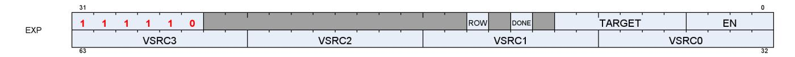

**Description** EXPORT instructions

The export format has only a single opcode, "EXPORT".

Table 111. EXP Fields

| Field Name | Bits    | Format or Description                                                                                                                                        |  |
|------------|---------|--------------------------------------------------------------------------------------------------------------------------------------------------------------|--|
| EN         | [3:0]   | VGPR Enables: [0] enables VSRC0, … [3] enables VSRC3.                                                                                                        |  |
| TARGET     | [9:4]   | Export destination:<br>07<br>MRT 07<br>8<br>Z<br>12-16 Position 0-4<br>20<br>Primitive data<br>21<br>Dual Source Blend Left<br>22<br>Dual Source Blend Right |  |
| DONE       | [11]    | Indicates that this is the last export from the shader. Used only for Position and<br>Pixel/color data.                                                      |  |
| ROW        | [13]    | Row to export                                                                                                                                                |  |
| ENCODING   | [31:26] | 'b111110                                                                                                                                                     |  |
| VSRC0      | [39:32] | VGPR for source 0.                                                                                                                                           |  |
| VSRC1      | [47:40] | VGPR for source 1.                                                                                                                                           |  |
| VSRC2      | [55:48] | VGPR for source 2.                                                                                                                                           |  |
| VSRC3      | [63:56] | VGPR for source 3.                                                                                                                                           |  |

15.10. Export Format 186 of 600


# <span id="page-195-0"></span>**Chapter 16. Instructions**

This chapter lists, and provides descriptions for, all instructions in the RDNA3 Generation environment. Instructions are grouped according to their format.

Note: Rounding and Denormal modes apply to all floating-point operations unless otherwise specified in the instruction description.

# <span id="page-196-0"></span>**16.1. SOP2 Instructions**

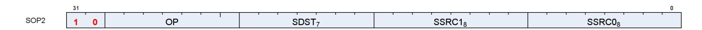

Instructions in this format may use a 32-bit literal constant that occurs immediately after the instruction.

**S\_ADD\_U32 0**

Add two unsigned inputs, store the result into a scalar register and store the carry-out bit into SCC.

```
tmp = 64'U(S0.u) + 64'U(S1.u);
SCC = tmp >= 0x100000000ULL ? 1'1U : 1'0U;
// unsigned overflow or carry-out for S_ADDC_U32.
D0.u = tmp.u
```

**S\_SUB\_U32 1**

Subtract the second unsigned input from the first input, store the result into a scalar register and store the carry-out bit into SCC.

```
tmp = S0.u - S1.u;
SCC = S1.u > S0.u ? 1'1U : 1'0U;
// unsigned overflow or carry-out for S_SUBB_U32.
D0.u = tmp.u
```

**S\_ADD\_I32 2**

Add two signed inputs, store the result into a scalar register and store the carry-out bit into SCC.

```
tmp = S0.i + S1.i;
SCC = ((S0.u[31] == S1.u[31]) && (S0.u[31] != tmp.u[31]));
// signed overflow.
D0.i = tmp.i
```

#### **Notes**

This opcode is not suitable for use with S\_ADDC\_U32 for implementing 64-bit operations.

**S\_SUB\_I32 3**

16.1. SOP2 Instructions 188 of 600


Subtract the second signed input from the first input, store the result into a scalar register and store the carryout bit into SCC.

```
tmp = S0.i - S1.i;
SCC = ((S0.u[31] != S1.u[31]) && (S0.u[31] != tmp.u[31]));
// signed overflow.
D0.i = tmp.i
```

#### **Notes**

This opcode is not suitable for use with S\_SUBB\_U32 for implementing 64-bit operations.

**S\_ADDC\_U32 4**

Add two unsigned inputs and a carry-in bit, store the result into a scalar register and store the carry-out bit into SCC.

```
tmp = 64'U(S0.u) + 64'U(S1.u) + SCC.u64;
SCC = tmp >= 0x100000000ULL ? 1'1U : 1'0U;
// unsigned overflow.
D0.u = tmp.u
```

**S\_SUBB\_U32 5**

Subtract the second unsigned input from the first input, subtract the carry-in bit, store the result into a scalar register and store the carry-out bit into SCC.

```
tmp = S0.u - S1.u - SCC.u;
SCC = 64'U(S1.u) + SCC.u64 > 64'U(S0.u) ? 1'1U : 1'0U;
// unsigned overflow.
D0.u = tmp.u
```

**S\_ABSDIFF\_I32 6**

Calculate the absolute value of difference between two scalar inputs, store the result into a scalar register and set SCC iff the result is nonzero.

```
D0.i = S0.i - S1.i;
if D0.i < 0 then
  D0.i = -D0.i
endif;
SCC = D0.i != 0
```

16.1. SOP2 Instructions 189 of 600


Functional examples:

```
S_ABSDIFF_I32(0x00000002, 0x00000005) => 0x00000003
S_ABSDIFF_I32(0xffffffff, 0x00000000) => 0x00000001
S_ABSDIFF_I32(0x80000000, 0x00000000) => 0x80000000 // Note: result is negative!
S_ABSDIFF_I32(0x80000000, 0x00000001) => 0x7fffffff
S_ABSDIFF_I32(0x80000000, 0xffffffff) => 0x7fffffff
S_ABSDIFF_I32(0x80000000, 0xfffffffe) => 0x7ffffffe
```

**S\_LSHL\_B32 8**

Given a shift count in the second scalar input, calculate the logical shift left of the first scalar input, store the result into a scalar register and set SCC iff the result is nonzero.

```
D0.u = (S0.u << S1.u[4 : 0].u);
SCC = D0.u != 0U
```

**S\_LSHL\_B64 9**

Given a shift count in the second scalar input, calculate the logical shift left of the first scalar input, store the result into a scalar register and set SCC iff the result is nonzero.

```
D0.u64 = (S0.u64 << S1.u[5 : 0].u);
SCC = D0.u64 != 0ULL
```

**S\_LSHR\_B32 10**

Given a shift count in the second scalar input, calculate the logical shift right of the first scalar input, store the result into a scalar register and set SCC iff the result is nonzero.

```
D0.u = (S0.u >> S1.u[4 : 0].u);
SCC = D0.u != 0U
```

**S\_LSHR\_B64 11**

Given a shift count in the second scalar input, calculate the logical shift right of the first scalar input, store the result into a scalar register and set SCC iff the result is nonzero.

16.1. SOP2 Instructions 190 of 600


```
D0.u64 = (S0.u64 >> S1.u[5 : 0].u);
SCC = D0.u64 != 0ULL
```

**S\_ASHR\_I32 12**

Given a shift count in the second scalar input, calculate the arithmetic shift right (preserving sign bit) of the first scalar input, store the result into a scalar register and set SCC iff the result is nonzero.

```
D0.i = 32'I(signext(S0.i) >> S1.u[4 : 0].u);
SCC = D0.i != 0
```

**S\_ASHR\_I64 13**

Given a shift count in the second scalar input, calculate the arithmetic shift right (preserving sign bit) of the first scalar input, store the result into a scalar register and set SCC iff the result is nonzero.

```
D0.i64 = (signext(S0.i64) >> S1.u[5 : 0].u);
SCC = D0.i64 != 0LL
```

**S\_LSHL1\_ADD\_U32 14**

Calculate the logical shift left of the first input by 1, then add the second input, store the result into a scalar register and set SCC iff the summation results in an unsigned overflow.

```
tmp = (64'U(S0.u) << 1U) + 64'U(S1.u);
SCC = tmp >= 0x100000000ULL ? 1'1U : 1'0U;
// unsigned overflow.
D0.u = tmp.u
```

**S\_LSHL2\_ADD\_U32 15**

Calculate the logical shift left of the first input by 2, then add the second input, store the result into a scalar register and set SCC iff the summation results in an unsigned overflow.

```
tmp = (64'U(S0.u) << 2U) + 64'U(S1.u);
SCC = tmp >= 0x100000000ULL ? 1'1U : 1'0U;
// unsigned overflow.
D0.u = tmp.u
```

16.1. SOP2 Instructions 191 of 600


**S\_LSHL3\_ADD\_U32 16**

Calculate the logical shift left of the first input by 3, then add the second input, store the result into a scalar register and set SCC iff the summation results in an unsigned overflow.

```
tmp = (64'U(S0.u) << 3U) + 64'U(S1.u);
SCC = tmp >= 0x100000000ULL ? 1'1U : 1'0U;
// unsigned overflow.
D0.u = tmp.u
```

**S\_LSHL4\_ADD\_U32 17**

Calculate the logical shift left of the first input by 4, then add the second input, store the result into a scalar register and set SCC iff the summation results in an unsigned overflow.

```
tmp = (64'U(S0.u) << 4U) + 64'U(S1.u);
SCC = tmp >= 0x100000000ULL ? 1'1U : 1'0U;
// unsigned overflow.
D0.u = tmp.u
```

**S\_MIN\_I32 18**

Select the minimum of two signed integers, store the selected value into a scalar register and set SCC iff the first value is selected.

```
SCC = S0.i < S1.i;
D0.i = SCC ? S0.i : S1.i
```

**S\_MIN\_U32 19**

Select the minimum of two unsigned integers, store the selected value into a scalar register and set SCC iff the first value is selected.

```
SCC = S0.u < S1.u;
D0.u = SCC ? S0.u : S1.u
```

**S\_MAX\_I32 20**

16.1. SOP2 Instructions 192 of 600


Select the maximum of two signed integers, store the selected value into a scalar register and set SCC iff the first value is selected.

```
SCC = S0.i > S1.i;
D0.i = SCC ? S0.i : S1.i
```

**S\_MAX\_U32 21**

Select the maximum of two unsigned integers, store the selected value into a scalar register and set SCC iff the first value is selected.

```
SCC = S0.u > S1.u;
D0.u = SCC ? S0.u : S1.u
```

**S\_AND\_B32 22**

Calculate bitwise AND on two scalar inputs, store the result into a scalar register and set SCC iff the result is nonzero.

```
D0.u = (S0.u & S1.u);
SCC = D0.u != 0U
```

**S\_AND\_B64 23**

Calculate bitwise AND on two scalar inputs, store the result into a scalar register and set SCC iff the result is nonzero.

```
D0.u64 = (S0.u64 & S1.u64);
SCC = D0.u64 != 0ULL
```

**S\_OR\_B32 24**

Calculate bitwise OR on two scalar inputs, store the result into a scalar register and set SCC iff the result is nonzero.

```
D0.u = (S0.u | S1.u);
SCC = D0.u != 0U
```

16.1. SOP2 Instructions 193 of 600


**S\_OR\_B64 25**

Calculate bitwise OR on two scalar inputs, store the result into a scalar register and set SCC iff the result is nonzero.

```
D0.u64 = (S0.u64 | S1.u64);
SCC = D0.u64 != 0ULL
```

**S\_XOR\_B32 26**

Calculate bitwise XOR on two scalar inputs, store the result into a scalar register and set SCC iff the result is nonzero.

```
D0.u = (S0.u ^ S1.u);
SCC = D0.u != 0U
```

**S\_XOR\_B64 27**

Calculate bitwise XOR on two scalar inputs, store the result into a scalar register and set SCC iff the result is nonzero.

```
D0.u64 = (S0.u64 ^ S1.u64);
SCC = D0.u64 != 0ULL
```

**S\_NAND\_B32 28**

Calculate bitwise NAND on two scalar inputs, store the result into a scalar register and set SCC if the result is nonzero.

```
D0.u = ~(S0.u & S1.u);
SCC = D0.u != 0U
```

**S\_NAND\_B64 29**

Calculate bitwise NAND on two scalar inputs, store the result into a scalar register and set SCC if the result is nonzero.

16.1. SOP2 Instructions 194 of 600


```
D0.u64 = ~(S0.u64 & S1.u64);
SCC = D0.u64 != 0ULL
```

**S\_NOR\_B32 30**

Calculate bitwise NOR on two scalar inputs, store the result into a scalar register and set SCC if the result is nonzero.

```
D0.u = ~(S0.u | S1.u);
SCC = D0.u != 0U
```

**S\_NOR\_B64 31**

Calculate bitwise NOR on two scalar inputs, store the result into a scalar register and set SCC if the result is nonzero.

```
D0.u64 = ~(S0.u64 | S1.u64);
SCC = D0.u64 != 0ULL
```

**S\_XNOR\_B32 32**

Calculate bitwise XNOR on two scalar inputs, store the result into a scalar register and set SCC if the result is nonzero.

```
D0.u = ~(S0.u ^ S1.u);
SCC = D0.u != 0U
```

**S\_XNOR\_B64 33**

Calculate bitwise XNOR on two scalar inputs, store the result into a scalar register and set SCC if the result is nonzero.

```
D0.u64 = ~(S0.u64 ^ S1.u64);
SCC = D0.u64 != 0ULL
```

**S\_AND\_NOT1\_B32 34**

16.1. SOP2 Instructions 195 of 600


Calculate bitwise AND with the first input and the negation of the second input, store the result into a scalar register and set SCC if the result is nonzero.

```
D0.u = (S0.u & ~S1.u);
SCC = D0.u != 0U
```

**S\_AND\_NOT1\_B64 35**

Calculate bitwise AND with the first input and the negation of the second input, store the result into a scalar register and set SCC if the result is nonzero.

```
D0.u64 = (S0.u64 & ~S1.u64);
SCC = D0.u64 != 0ULL
```

**S\_OR\_NOT1\_B32 36**

Calculate bitwise OR with the first input and the negation of the second input, store the result into a scalar register and set SCC if the result is nonzero.

```
D0.u = (S0.u | ~S1.u);
SCC = D0.u != 0U
```

**S\_OR\_NOT1\_B64 37**

Calculate bitwise OR with the first input and the negation of the second input, store the result into a scalar register and set SCC if the result is nonzero.

```
D0.u64 = (S0.u64 | ~S1.u64);
SCC = D0.u64 != 0ULL
```

**S\_BFE\_U32 38**

Extract an unsigned bitfield from the first input using field offset and size encoded in the second input, store the result into a scalar register and set SCC iff the result is nonzero.

```
D0.u = ((S0.u >> S1.u[4 : 0].u) & ((1U << S1.u[22 : 16].u) - 1U));
SCC = D0.u != 0U
```

16.1. SOP2 Instructions 196 of 600


**S\_BFE\_I32 39**

Extract a signed bitfield from the first input using field offset and size encoded in the second input, store the result into a scalar register and set SCC iff the result is nonzero.

```
tmp = ((S0.i >> S1.u[4 : 0].u) & ((1 << S1.u[22 : 16].u) - 1));
D0.i = 32'I(signextFromBit(tmp, S1.i[22 : 16].i));
SCC = D0.i != 0
```

**S\_BFE\_U64 40**

Extract an unsigned bitfield from the first input using field offset and size encoded in the second input, store the result into a scalar register and set SCC iff the result is nonzero.

```
D0.u64 = ((S0.u64 >> S1.u[5 : 0].u) & ((1ULL << S1.u[22 : 16].u) - 1ULL));
SCC = D0.u64 != 0ULL
```

**S\_BFE\_I64 41**

Extract a signed bitfield from the first input using field offset and size encoded in the second input, store the result into a scalar register and set SCC iff the result is nonzero.

```
tmp = ((S0.i64 >> S1.u[5 : 0].u) & ((1LL << S1.u[22 : 16].u) - 1LL));
D0.i64 = signextFromBit(tmp, S1.i[22 : 16].i64);
SCC = D0.i64 != 0LL
```

**S\_BFM\_B32 42**

Calculate a bitfield mask given a field offset and size and store the result in a scalar register.

```
D0.u = (((1U << S0.u[4 : 0].u) - 1U) << S1.u[4 : 0].u)
```

**S\_BFM\_B64 43**

Calculate a bitfield mask given a field offset and size and store the result in a scalar register.

```
D0.u64 = (((1ULL << S0.u[5 : 0].u) - 1ULL) << S1.u[5 : 0].u)
```

16.1. SOP2 Instructions 197 of 600


**S\_MUL\_I32 44**

Multiply two signed integers and store the result into a scalar register.

```
D0.i = S0.i * S1.i
```

**S\_MUL\_HI\_U32 45**

Multiply two unsigned integers and store the high 32 bits of the result into a scalar register.

```
D0.u = 32'U((64'U(S0.u) * 64'U(S1.u)) >> 32U)
```

**S\_MUL\_HI\_I32 46**

Multiply two signed integers and store the high 32 bits of the result into a scalar register.

```
D0.i = 32'I((64'I(S0.i) * 64'I(S1.i)) >> 32U)
```

**S\_CSELECT\_B32 48**

Select the first input if SCC is true otherwise select the second input, then store the selected input into a scalar register.

```
D0.u = SCC ? S0.u : S1.u
```

**S\_CSELECT\_B64 49**

Select the first input if SCC is true otherwise select the second input, then store the selected input into a scalar register.

```
D0.u64 = SCC ? S0.u64 : S1.u64
```

**S\_PACK\_LL\_B32\_B16 50**

16.1. SOP2 Instructions 198 of 600


Pack two 16-bit scalar values into a scalar register.

```
D0 = { S1[15 : 0].u16, S0[15 : 0].u16 }
```

**S\_PACK\_LH\_B32\_B16 51**

Pack two 16-bit scalar values into a scalar register.

```
D0 = { S1[31 : 16].u16, S0[15 : 0].u16 }
```

**S\_PACK\_HH\_B32\_B16 52**

Pack two 16-bit scalar values into a scalar register.

```
D0 = { S1[31 : 16].u16, S0[31 : 16].u16 }
```

**S\_PACK\_HL\_B32\_B16 53**

Pack two 16-bit scalar values into a scalar register.

```
D0 = { S1[15 : 0].u16, S0[31 : 16].u16 }
```

16.1. SOP2 Instructions 199 of 600


# <span id="page-208-0"></span>**16.2. SOPK Instructions**

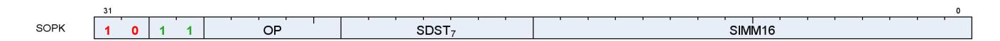

Instructions in this format may not use a 32-bit literal constant that occurs immediately after the instruction.

**S\_MOVK\_I32 0**

Sign extend a literal 16-bit constant and store the result into a scalar register.

```
D0.i = 32'I(signext(SIMM16.i16))
```

**S\_VERSION 1**

Do nothing. This opcode is used to specify the microcode version for tools that interpret shader microcode.

Argument is ignored by hardware. This opcode is not designed for inserting wait states as the next instruction may issue in the same cycle. Do not use this opcode to resolve wait state hazards, use S\_NOP instead.

This opcode may also be used to validate microcode is running with the correct compatibility settings in drivers and functional models that support multiple generations. We strongly encourage this opcode be included at the top of every shader block to simplify debug and catch configuration errors.

This opcode must appear in the first 16 bytes of a block of shader code in order to be recognized by external tools and functional models. Avoid placing opcodes > 32 bits or encodings that are not available in all versions of the microcode before the S\_VERSION opcode. If this opcode is absent then tools are allowed to make an educated guess of the microcode version using cues from the environment; the guess may be incorrect and lead to an invalid decode. It is highly recommended that this be the first opcode of a shader block except for trap handlers, where it should be the second opcode (allowing the first opcode to be a 32-bit branch to accommodate context switch).

SIMM16[7:0] specifies the microcode version. SIMM16[15:8] must be set to zero.

```
nop();
// Do nothing - for use by tools only
```

**S\_CMOVK\_I32 2**

Move the sign extension of a literal 16-bit constant into a scalar register iff SCC is nonzero.

```
if SCC then
```

16.2. SOPK Instructions 200 of 600


```
  D0.i = 32'I(signext(SIMM16.i16))
endif
```

**S\_CMPK\_EQ\_I32 3**

Set SCC to 1 iff scalar input is equal to the sign extension of a literal 16-bit constant.

```
SCC = 64'I(S0.i) == signext(SIMM16.i16)
```

**S\_CMPK\_LG\_I32 4**

Set SCC to 1 iff scalar input is less than or greater than the sign extension of a literal 16-bit constant.

```
SCC = 64'I(S0.i) != signext(SIMM16.i16)
```

**S\_CMPK\_GT\_I32 5**

Set SCC to 1 iff scalar input is greater than the sign extension of a literal 16-bit constant.

```
SCC = 64'I(S0.i) > signext(SIMM16.i16)
```

**S\_CMPK\_GE\_I32 6**

Set SCC to 1 iff scalar input is greater than or equal to the sign extension of a literal 16-bit constant.

```
SCC = 64'I(S0.i) >= signext(SIMM16.i16)
```

**S\_CMPK\_LT\_I32 7**

Set SCC to 1 iff scalar input is less than the sign extension of a literal 16-bit constant.

```
SCC = 64'I(S0.i) < signext(SIMM16.i16)
```

16.2. SOPK Instructions 201 of 600


**S\_CMPK\_LE\_I32 8**

Set SCC to 1 iff scalar input is less than or equal to the sign extension of a literal 16-bit constant.

```
SCC = 64'I(S0.i) <= signext(SIMM16.i16)
```

**S\_CMPK\_EQ\_U32 9**

Set SCC to 1 iff scalar input is equal to the zero extension of a literal 16-bit constant.

```
SCC = S0.u == 32'U(SIMM16.u16)
```

**S\_CMPK\_LG\_U32 10**

Set SCC to 1 iff scalar input is less than or greater than the zero extension of a literal 16-bit constant.

```
SCC = S0.u != 32'U(SIMM16.u16)
```

**S\_CMPK\_GT\_U32 11**

Set SCC to 1 iff scalar input is greater than the zero extension of a literal 16-bit constant.

```
SCC = S0.u > 32'U(SIMM16.u16)
```

**S\_CMPK\_GE\_U32 12**

Set SCC to 1 iff scalar input is greater than or equal to the zero extension of a literal 16-bit constant.

```
SCC = S0.u >= 32'U(SIMM16.u16)
```

**S\_CMPK\_LT\_U32 13**

Set SCC to 1 iff scalar input is less than the zero extension of a literal 16-bit constant.

16.2. SOPK Instructions 202 of 600


```
SCC = S0.u < 32'U(SIMM16.u16)
```

**S\_CMPK\_LE\_U32 14**

Set SCC to 1 iff scalar input is less than or equal to the zero extension of a literal 16-bit constant.

```
SCC = S0.u <= 32'U(SIMM16.u16)
```

**S\_ADDK\_I32 15**

Add a scalar input and the sign extension of a literal 16-bit constant, store the result into a scalar register and store the carry-out bit into SCC.

```
tmp = D0.i;
// save value so we can check sign bits for overflow later.
D0.i = 32'I(64'I(D0.i) + signext(SIMM16.i16));
SCC = ((tmp[31] == SIMM16.i16[15]) && (tmp[31] != D0.i[31]));
// signed overflow.
```

**S\_MULK\_I32 16**

Multiply a scalar input with the sign extension of a literal 16-bit constant and store the result into a scalar register.

```
D0.i = 32'I(64'I(D0.i) * signext(SIMM16.i16))
```

**S\_GETREG\_B32 17**

Read some or all of a hardware register into the LSBs of destination.

The SIMM16 argument is encoded as follows:

#### **ID = SIMM16[5:0]**

ID of hardware register to access.

#### **OFFSET = SIMM16[10:6]**

LSB offset of register bits to access.

16.2. SOPK Instructions 203 of 600


### **SIZE = SIMM16[15:11]**

Size of register bits to access, minus 1. Set this field to 31 to read/write all bits of the hardware register.

```
hwRegId = SIMM16.u16[5 : 0];
offset = SIMM16.u16[10 : 6];
size = SIMM16.u16[15 : 11].u + 1U;
// logical size is in range 1:32
value = HW_REGISTERS[hwRegId];
D0.u = 32'U(32'I(value >> offset.u) & ((1 << size) - 1))
```

**S\_SETREG\_B32 18**

Write some or all of the LSBs of source argument into a hardware register.

The SIMM16 argument is encoded as follows:

### **ID = SIMM16[5:0]**

ID of hardware register to access.

### **OFFSET = SIMM16[10:6]**

LSB offset of register bits to access.

### **SIZE = SIMM16[15:11]**

Size of register bits to access, minus 1. Set this field to 31 to read/write all bits of the hardware register.

```
hwRegId = SIMM16.u16[5 : 0];
offset = SIMM16.u16[10 : 6];
size = SIMM16.u16[15 : 11].u + 1U;
// logical size is in range 1:32
mask = (1 << size) - 1;
mask = (mask & 32'I(writeableBitMask(hwRegId.u, WAVE_STATUS.PRIV)));
// Mask of bits we are allowed to modify
value = ((S0.u << offset.u) & mask.u);
value = (value | 32'U(HW_REGISTERS[hwRegId].i & ~mask));
HW_REGISTERS[hwRegId] = value.b;
// Side-effects may trigger here if certain bits are modified
```

```
S_SETREG_IMM32_B32 19
```

Write some or all of the LSBs of a 32-bit literal constant into a hardware register; this instruction requires a 32 bit literal constant.

The SIMM16 argument is encoded as follows:

#### **ID = SIMM16[5:0]**

ID of hardware register to access.

16.2. SOPK Instructions 204 of 600


#### **OFFSET = SIMM16[10:6]**

LSB offset of register bits to access.

#### **SIZE = SIMM16[15:11]**

Size of register bits to access, minus 1. Set this field to 31 to read/write all bits of the hardware register.

```
hwRegId = SIMM16.u16[5 : 0];
offset = SIMM16.u16[10 : 6];
size = SIMM16.u16[15 : 11].u + 1U;
// logical size is in range 1:32
mask = (1 << size) - 1;
mask = (mask & 32'I(writeableBitMask(hwRegId.u, WAVE_STATUS.PRIV)));
// Mask of bits we are allowed to modify
value = ((SIMM32.u << offset.u) & mask.u);
value = (value | 32'U(HW_REGISTERS[hwRegId].i & ~mask));
HW_REGISTERS[hwRegId] = value.b;
// Side-effects may trigger here if certain bits are modified
```

**S\_CALL\_B64 20**

Store the address of the next instruction to a scalar register and then jump to a constant offset relative to the current PC.

The literal argument is a signed DWORD offset relative to the PC of the next instruction. The byte address of the instruction immediately following this instruction is saved to the destination.

```
D0.i64 = PC + 4LL;
PC = PC + signext(SIMM16.i16 * 16'4) + 4LL
```

#### **Notes**

This implements a short subroutine call where the return address (the next instruction after the S\_CALL\_B64) is saved to D. Long calls should consider S\_SWAPPC\_B64 instead.

This instruction must be 4 bytes.

**S\_WAITCNT\_VSCNT 24**

Wait for the counts of outstanding vector store events -- vector memory stores and atomics that DO NOT return data -- to be at or below the specified level. This counter is not used in 'all-in-order' mode.

Waits for the following condition to hold before continuing:

```
  vscnt <= S0.u[5:0] + S1.u[5:0].
  // Comparison is 6 bits, no clamping is applied for add overflow
```

16.2. SOPK Instructions 205 of 600


To wait on a literal constant only, write 'null' for the GPR argument.

This opcode may only appear inside a clause if the SGPR operand is set to NULL.

See also S\_WAITCNT.

**S\_WAITCNT\_VMCNT 25**

Wait for the counts of outstanding vector memory events -- everything except for memory stores and atomicswithout-return -- to be at or below the specified level. When in 'all-in-order' mode, wait for all vector memory events.

Waits for the following condition to hold before continuing:

```
  vmcnt <= S0.u[5:0] + S1.u[5:0].
  // Comparison is 6 bits, no clamping is applied for add overflow
```

To wait on a literal constant only, write 'null' for the GPR argument or use S\_WAITCNT.

This opcode may only appear inside a clause if the SGPR operand is set to NULL.

See also S\_WAITCNT.

**S\_WAITCNT\_EXPCNT 26**

Wait for the counts of outstanding export events to be at or below the specified level.

Waits for the following condition to hold before continuing:

```
  expcnt <= S0.u[2:0] + S1.u[2:0].
  // Comparison is 3 bits, no clamping is applied for add overflow
```

To wait on a literal constant only, write 'null' for the GPR argument or use S\_WAITCNT.

This opcode may only appear inside a clause if the SGPR operand is set to NULL.

See also S\_WAITCNT.

**S\_WAITCNT\_LGKMCNT 27**

Wait for the counts of outstanding DS (LG), scalar memory (K) and message (M) events to be at or below the specified level.

Waits for the following condition to hold before continuing:

16.2. SOPK Instructions 206 of 600


```
  lgkmcnt <= S0.u[5:0] + S1.u[5:0].
  // Comparison is 6 bits, no clamping is applied for add overflow
```

To wait on a literal constant only, write 'null' for the GPR argument or use S\_WAITCNT.

This opcode may only appear inside a clause if the SGPR operand is set to NULL.

See also S\_WAITCNT.

16.2. SOPK Instructions 207 of 600

# <span id="page-216-0"></span>**16.3. SOP1 Instructions**

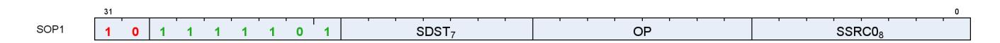

Instructions in this format may use a 32-bit literal constant that occurs immediately after the instruction.

**S\_MOV\_B32 0**

Move scalar input into a scalar register.

```
D0.b = S0.b
```

**S\_MOV\_B64 1**

Move scalar input into a scalar register.

```
D0.b64 = S0.b64
```

**S\_CMOV\_B32 2**

Move scalar input into a scalar register iff SCC is nonzero.

```
if SCC then
  D0.b = S0.b
endif
```

**S\_CMOV\_B64 3**

Move scalar input into a scalar register iff SCC is nonzero.

```
if SCC then
  D0.b64 = S0.b64
endif
```

**S\_BREV\_B32 4**

16.3. SOP1 Instructions 208 of 600


Reverse the order of bits in a scalar input and store the result into a scalar register.

```
D0.u[31 : 0] = S0.u[0 : 31]
```

**S\_BREV\_B64 5**

Reverse the order of bits in a scalar input and store the result into a scalar register.

```
D0.u64[63 : 0] = S0.u64[0 : 63]
```

**S\_CTZ\_I32\_B32 8**

Count the number of trailing "0" bits before the first "1" in a scalar input and store the result into a scalar register. Store -1 if there are no "1" bits in the input.

```
tmp = -1;
// Set if no ones are found
for i in 0 : 31 do
  // Search from LSB
  if S0.u[i] == 1'1U then
  tmp = i;
  break
  endif
endfor;
D0.i = tmp
```

#### **Notes**

Functional examples:

```
S_CTZ_I32_B32(0xaaaaaaaa) => 1
S_CTZ_I32_B32(0x55555555) => 0
S_CTZ_I32_B32(0x00000000) => 0xffffffff
S_CTZ_I32_B32(0xffffffff) => 0
S_CTZ_I32_B32(0x00010000) => 16
```

Compare with V\_CTZ\_I32\_B32, which performs the equivalent operation in the vector ALU.

**S\_CTZ\_I32\_B64 9**

Count the number of trailing "0" bits before the first "1" in a scalar input and store the result into a scalar register. Store -1 if there are no "1" bits in the input.

16.3. SOP1 Instructions 209 of 600


```
tmp = -1;
// Set if no ones are found
for i in 0 : 63 do
  // Search from LSB
  if S0.u64[i] == 1'1U then
  tmp = i;
  break
  endif
endfor;
D0.i = tmp
```

**S\_CLZ\_I32\_U32 10**

Count the number of leading "0" bits before the first "1" in a scalar input and store the result into a scalar register. Store -1 if there are no "1" bits.

```
tmp = -1;
// Set if no ones are found
for i in 0 : 31 do
  // Search from MSB
  if S0.u[31 - i] == 1'1U then
  tmp = i;
  break
  endif
endfor;
D0.i = tmp
```

#### **Notes**

Functional examples:

```
S_CLZ_I32_U32(0x00000000) => 0xffffffff
S_CLZ_I32_U32(0x0000cccc) => 16
S_CLZ_I32_U32(0xffff3333) => 0
S_CLZ_I32_U32(0x7fffffff) => 1
S_CLZ_I32_U32(0x80000000) => 0
S_CLZ_I32_U32(0xffffffff) => 0
```

Compare with V\_CLZ\_I32\_U32, which performs the equivalent operation in the vector ALU.

**S\_CLZ\_I32\_U64 11**

Count the number of leading "0" bits before the first "1" in a scalar input and store the result into a scalar register. Store -1 if there are no "1" bits.

```
tmp = -1;
```

16.3. SOP1 Instructions 210 of 600


```
// Set if no ones are found
for i in 0 : 63 do
  // Search from MSB
  if S0.u64[63 - i] == 1'1U then
  tmp = i;
  break
  endif
endfor;
D0.i = tmp
```

**S\_CLS\_I32 12**

Count the number of leading bits that are the same as the sign bit of a scalar input and store the result into a scalar register. Store -1 if all input bits are the same.

```
tmp = -1;
// Set if all bits are the same
for i in 1 : 31 do
  // Search from MSB
  if S0.u[31 - i] != S0.u[31] then
  tmp = i;
  break
  endif
endfor;
D0.i = tmp
```

#### **Notes**

Functional examples:

```
S_CLS_I32(0x00000000) => 0xffffffff
S_CLS_I32(0x0000cccc) => 16
S_CLS_I32(0xffff3333) => 16
S_CLS_I32(0x7fffffff) => 1
S_CLS_I32(0x80000000) => 1
S_CLS_I32(0xffffffff) => 0xffffffff
```

Compare with V\_CLS\_I32, which performs the equivalent operation in the vector ALU.

**S\_CLS\_I32\_I64 13**

Count the number of leading bits that are the same as the sign bit of a scalar input and store the result into a scalar register. Store -1 if all input bits are the same.

```
tmp = -1;
// Set if all bits are the same
for i in 1 : 63 do
```

16.3. SOP1 Instructions 211 of 600


```
  // Search from MSB
  if S0.u64[63 - i] != S0.u64[63] then
  tmp = i;
  break
  endif
endfor;
D0.i = tmp
```

**S\_SEXT\_I32\_I8 14**

Sign extend a signed 8 bit scalar input to 32 bits and store the result into a scalar register.

```
D0.i = 32'I(signext(S0.i8))
```

**S\_SEXT\_I32\_I16 15**

Sign extend a signed 16 bit scalar input to 32 bits and store the result into a scalar register.

```
D0.i = 32'I(signext(S0.i16))
```

**S\_BITSET0\_B32 16**

Given a bit offset in a scalar input, set the indicated bit in the destination scalar register to 0.

```
D0.u[S0.u[4 : 0]] = 1'0U
```

**S\_BITSET0\_B64 17**

Given a bit offset in a scalar input, set the indicated bit in the destination scalar register to 0.

```
D0.u64[S0.u[5 : 0]] = 1'0U
```

**S\_BITSET1\_B32 18**

Given a bit offset in a scalar input, set the indicated bit in the destination scalar register to 1.

16.3. SOP1 Instructions 212 of 600


```
D0.u[S0.u[4 : 0]] = 1'1U
```

**S\_BITSET1\_B64 19**

Given a bit offset in a scalar input, set the indicated bit in the destination scalar register to 1.

```
D0.u64[S0.u[5 : 0]] = 1'1U
```

#### **S\_BITREPLICATE\_B64\_B32 20**

Substitute each bit of a 32 bit scalar input with two instances of itself and store the result into a 64 bit scalar register.

```
tmp = S0.u;
for i in 0 : 31 do
  D0.u64[i * 2 + 0] = tmp[i];
  D0.u64[i * 2 + 1] = tmp[i]
endfor
```

#### **Notes**

This opcode can be used to convert a quad mask into a pixel mask; given quad mask in s0, the following sequence produces a pixel mask in s2:

```
  s_bitreplicate_b64 s2, s0
  s_bitreplicate_b64 s2, s2
```

To perform the inverse operation see S\_QUADMASK\_B64.

**S\_ABS\_I32 21**

Compute the absolute value of a scalar input, store the result into a scalar register and set SCC iff the result is nonzero.

```
D0.i = S0.i < 0 ? -S0.i : S0.i;
SCC = D0.i != 0
```

#### **Notes**

Functional examples:

16.3. SOP1 Instructions 213 of 600


```
S_ABS_I32(0x00000001) => 0x00000001
S_ABS_I32(0x7fffffff) => 0x7fffffff
S_ABS_I32(0x80000000) => 0x80000000 // Note this is negative!
S_ABS_I32(0x80000001) => 0x7fffffff
S_ABS_I32(0x80000002) => 0x7ffffffe
S_ABS_I32(0xffffffff) => 0x00000001
```

**S\_BCNT0\_I32\_B32 22**

Count the number of "0" bits in a scalar input, store the result into a scalar register and set SCC iff the result is nonzero.

```
tmp = 0;
for i in 0 : 31 do
  tmp += S0.u[i].u == 0U ? 1 : 0
endfor;
D0.i = tmp;
SCC = D0.u != 0U
```

#### **Notes**

Functional examples:

```
S_BCNT0_I32_B32(0x00000000) => 32
S_BCNT0_I32_B32(0xcccccccc) => 16
S_BCNT0_I32_B32(0xffffffff) => 0
```

**S\_BCNT0\_I32\_B64 23**

Count the number of "0" bits in a scalar input, store the result into a scalar register and set SCC iff the result is nonzero.

```
tmp = 0;
for i in 0 : 63 do
  tmp += S0.u64[i].u == 0U ? 1 : 0
endfor;
D0.i = tmp;
SCC = D0.u64 != 0ULL
```

**S\_BCNT1\_I32\_B32 24**

Count the number of "1" bits in a scalar input, store the result into a scalar register and set SCC iff the result is

16.3. SOP1 Instructions 214 of 600


nonzero.

```
tmp = 0;
for i in 0 : 31 do
  tmp += S0.u[i].u == 1U ? 1 : 0
endfor;
D0.i = tmp;
SCC = D0.u != 0U
```

#### **Notes**

Functional examples:

```
S_BCNT1_I32_B32(0x00000000) => 0
S_BCNT1_I32_B32(0xcccccccc) => 16
S_BCNT1_I32_B32(0xffffffff) => 32
```

**S\_BCNT1\_I32\_B64 25**

Count the number of "1" bits in a scalar input, store the result into a scalar register and set SCC iff the result is nonzero.

```
tmp = 0;
for i in 0 : 63 do
  tmp += S0.u64[i].u == 1U ? 1 : 0
endfor;
D0.i = tmp;
SCC = D0.u64 != 0ULL
```

**S\_QUADMASK\_B32 26**

Reduce a pixel mask from the scalar input into a quad mask, store the result in a scalar register and set SCC iff the result is nonzero.

```
tmp = 0U;
for i in 0 : 7 do
  tmp[i] = S0.u[i * 4 + 3 : i * 4] != 0U
endfor;
D0.u = tmp;
SCC = D0.u != 0U
```

#### **Notes**

To perform the inverse operation see S\_BITREPLICATE\_B64\_B32.

16.3. SOP1 Instructions 215 of 600


**S\_QUADMASK\_B64 27**

Reduce a pixel mask from the scalar input into a quad mask, store the result in a scalar register and set SCC iff the result is nonzero.

```
tmp = 0ULL;
for i in 0 : 15 do
  tmp[i] = S0.u64[i * 4 + 3 : i * 4] != 0ULL
endfor;
D0.u64 = tmp;
SCC = D0.u64 != 0ULL
```

#### **Notes**

To perform the inverse operation see S\_BITREPLICATE\_B64\_B32.

```
S_WQM_B32 28
```

Given an active pixel mask in a scalar input, calculate whole quad mode mask for that input, store the result into a scalar register and set SCC iff the result is nonzero.

In whole quad mode, if any pixel in a quad is active then all pixels of the quad are marked active.

```
tmp = 0U;
declare i : 6'U;
for i in 6'0U : 6'31U do
  tmp[i] = S0.u[i | 6'3U : i & 6'60U] != 0U
endfor;
D0.u = tmp;
SCC = D0.u != 0U
```

```
S_WQM_B64 29
```

Given an active pixel mask in a scalar input, calculate whole quad mode mask for that input, store the result into a scalar register and set SCC iff the result is nonzero.

In whole quad mode, if any pixel in a quad is active then all pixels of the quad are marked active.

```
tmp = 0ULL;
declare i : 6'U;
for i in 6'0U : 6'63U do
  tmp[i] = S0.u64[i | 6'3U : i & 6'60U] != 0ULL
endfor;
D0.u64 = tmp;
```

16.3. SOP1 Instructions 216 of 600


```
SCC = D0.u64 != 0ULL
```

**S\_NOT\_B32 30**

Calculate bitwise negation on a scalar input, store the result into a scalar register and set SCC iff the result is nonzero.

```
D0.u = ~S0.u;
SCC = D0.u != 0U
```

**S\_NOT\_B64 31**

Calculate bitwise negation on a scalar input, store the result into a scalar register and set SCC iff the result is nonzero.

```
D0.u64 = ~S0.u64;
SCC = D0.u64 != 0ULL
```

**S\_AND\_SAVEEXEC\_B32 32**

Calculate bitwise AND on the scalar input and the EXEC mask, store the calculated result into the EXEC mask, set SCC iff the calculated result is nonzero and store the original value of the EXEC mask into the scalar destination register.

The original EXEC mask is saved to the destination SGPRs before the bitwise operation is performed.

```
saveexec = EXEC.u;
EXEC.u = (S0.u & EXEC.u);
D0.u = saveexec.u;
SCC = EXEC.u != 0U
```

**S\_AND\_SAVEEXEC\_B64 33**

Calculate bitwise AND on the scalar input and the EXEC mask, store the calculated result into the EXEC mask, set SCC iff the calculated result is nonzero and store the original value of the EXEC mask into the scalar destination register.

The original EXEC mask is saved to the destination SGPRs before the bitwise operation is performed.

16.3. SOP1 Instructions 217 of 600


```
saveexec = EXEC.u64;
EXEC.u64 = (S0.u64 & EXEC.u64);
D0.u64 = saveexec.u64;
SCC = EXEC.u64 != 0ULL
```

**S\_OR\_SAVEEXEC\_B32 34**

Calculate bitwise OR on the scalar input and the EXEC mask, store the calculated result into the EXEC mask, set SCC iff the calculated result is nonzero and store the original value of the EXEC mask into the scalar destination register.

The original EXEC mask is saved to the destination SGPRs before the bitwise operation is performed.

```
saveexec = EXEC.u;
EXEC.u = (S0.u | EXEC.u);
D0.u = saveexec.u;
SCC = EXEC.u != 0U
```

**S\_OR\_SAVEEXEC\_B64 35**

Calculate bitwise OR on the scalar input and the EXEC mask, store the calculated result into the EXEC mask, set SCC iff the calculated result is nonzero and store the original value of the EXEC mask into the scalar destination register.

The original EXEC mask is saved to the destination SGPRs before the bitwise operation is performed.

```
saveexec = EXEC.u64;
EXEC.u64 = (S0.u64 | EXEC.u64);
D0.u64 = saveexec.u64;
SCC = EXEC.u64 != 0ULL
```

**S\_XOR\_SAVEEXEC\_B32 36**

Calculate bitwise XOR on the scalar input and the EXEC mask, store the calculated result into the EXEC mask, set SCC iff the calculated result is nonzero and store the original value of the EXEC mask into the scalar destination register.

The original EXEC mask is saved to the destination SGPRs before the bitwise operation is performed.

```
saveexec = EXEC.u;
EXEC.u = (S0.u ^ EXEC.u);
D0.u = saveexec.u;
```

16.3. SOP1 Instructions 218 of 600


```
SCC = EXEC.u != 0U
```

#### **S\_XOR\_SAVEEXEC\_B64 37**

Calculate bitwise XOR on the scalar input and the EXEC mask, store the calculated result into the EXEC mask, set SCC iff the calculated result is nonzero and store the original value of the EXEC mask into the scalar destination register.

The original EXEC mask is saved to the destination SGPRs before the bitwise operation is performed.

```
saveexec = EXEC.u64;
EXEC.u64 = (S0.u64 ^ EXEC.u64);
D0.u64 = saveexec.u64;
SCC = EXEC.u64 != 0ULL
```

#### **S\_NAND\_SAVEEXEC\_B32 38**

Bitwise NAND with EXEC mask.

The original EXEC mask is saved to the destination SGPRs before the bitwise operation is performed.

```
saveexec = EXEC.u;
EXEC.u = ~(S0.u & EXEC.u);
D0.u = saveexec.u;
SCC = EXEC.u != 0U
```

#### **S\_NAND\_SAVEEXEC\_B64 39**

Bitwise NAND with EXEC mask.

The original EXEC mask is saved to the destination SGPRs before the bitwise operation is performed.

```
saveexec = EXEC.u64;
EXEC.u64 = ~(S0.u64 & EXEC.u64);
D0.u64 = saveexec.u64;
SCC = EXEC.u64 != 0ULL
```

#### **S\_NOR\_SAVEEXEC\_B32 40**

Bitwise NOR with EXEC mask.

16.3. SOP1 Instructions 219 of 600


The original EXEC mask is saved to the destination SGPRs before the bitwise operation is performed.

```
saveexec = EXEC.u;
EXEC.u = ~(S0.u | EXEC.u);
D0.u = saveexec.u;
SCC = EXEC.u != 0U
```

**S\_NOR\_SAVEEXEC\_B64 41**

Bitwise NOR with EXEC mask.

The original EXEC mask is saved to the destination SGPRs before the bitwise operation is performed.

```
saveexec = EXEC.u64;
EXEC.u64 = ~(S0.u64 | EXEC.u64);
D0.u64 = saveexec.u64;
SCC = EXEC.u64 != 0ULL
```

### **S\_XNOR\_SAVEEXEC\_B32 42**

Bitwise XNOR with EXEC mask.

The original EXEC mask is saved to the destination SGPRs before the bitwise operation is performed.

```
saveexec = EXEC.u;
EXEC.u = ~(S0.u ^ EXEC.u);
D0.u = saveexec.u;
SCC = EXEC.u != 0U
```

```
S_XNOR_SAVEEXEC_B64 43
```

Bitwise XNOR with EXEC mask.

The original EXEC mask is saved to the destination SGPRs before the bitwise operation is performed.

```
saveexec = EXEC.u64;
EXEC.u64 = ~(S0.u64 ^ EXEC.u64);
D0.u64 = saveexec.u64;
SCC = EXEC.u64 != 0ULL
```

16.3. SOP1 Instructions 220 of 600


#### **S\_AND\_NOT0\_SAVEEXEC\_B32 44**

Calculate bitwise AND on the EXEC mask and the negation of the scalar input, store the calculated result into the EXEC mask, set SCC iff the calculated result is nonzero and store the original value of the EXEC mask into the scalar destination register.

The original EXEC mask is saved to the destination SGPRs before the bitwise operation is performed.

```
saveexec = EXEC.u;
EXEC.u = (~S0.u & EXEC.u);
D0.u = saveexec.u;
SCC = EXEC.u != 0U
```

#### **S\_AND\_NOT0\_SAVEEXEC\_B64 45**

Calculate bitwise AND on the EXEC mask and the negation of the scalar input, store the calculated result into the EXEC mask, set SCC iff the calculated result is nonzero and store the original value of the EXEC mask into the scalar destination register.

The original EXEC mask is saved to the destination SGPRs before the bitwise operation is performed.

```
saveexec = EXEC.u64;
EXEC.u64 = (~S0.u64 & EXEC.u64);
D0.u64 = saveexec.u64;
SCC = EXEC.u64 != 0ULL
```

#### **S\_OR\_NOT0\_SAVEEXEC\_B32 46**

Calculate bitwise OR on the EXEC mask and the negation of the scalar input, store the calculated result into the EXEC mask, set SCC iff the calculated result is nonzero and store the original value of the EXEC mask into the scalar destination register.

The original EXEC mask is saved to the destination SGPRs before the bitwise operation is performed.

```
saveexec = EXEC.u;
EXEC.u = (~S0.u | EXEC.u);
D0.u = saveexec.u;
SCC = EXEC.u != 0U
```

#### **S\_OR\_NOT0\_SAVEEXEC\_B64 47**

Calculate bitwise OR on the EXEC mask and the negation of the scalar input, store the calculated result into the EXEC mask, set SCC iff the calculated result is nonzero and store the original value of the EXEC mask into the

16.3. SOP1 Instructions 221 of 600


scalar destination register.

The original EXEC mask is saved to the destination SGPRs before the bitwise operation is performed.

```
saveexec = EXEC.u64;
EXEC.u64 = (~S0.u64 | EXEC.u64);
D0.u64 = saveexec.u64;
SCC = EXEC.u64 != 0ULL
```

#### **S\_AND\_NOT1\_SAVEEXEC\_B32 48**

Calculate bitwise AND on the scalar input and the negation of the EXEC mask, store the calculated result into the EXEC mask, set SCC iff the calculated result is nonzero and store the original value of the EXEC mask into the scalar destination register.

The original EXEC mask is saved to the destination SGPRs before the bitwise operation is performed.

```
saveexec = EXEC.u;
EXEC.u = (S0.u & ~EXEC.u);
D0.u = saveexec.u;
SCC = EXEC.u != 0U
```

#### **S\_AND\_NOT1\_SAVEEXEC\_B64 49**

Calculate bitwise AND on the scalar input and the negation of the EXEC mask, store the calculated result into the EXEC mask, set SCC iff the calculated result is nonzero and store the original value of the EXEC mask into the scalar destination register.

The original EXEC mask is saved to the destination SGPRs before the bitwise operation is performed.

```
saveexec = EXEC.u64;
EXEC.u64 = (S0.u64 & ~EXEC.u64);
D0.u64 = saveexec.u64;
SCC = EXEC.u64 != 0ULL
```

#### **S\_OR\_NOT1\_SAVEEXEC\_B32 50**

Calculate bitwise OR on the scalar input and the negation of the EXEC mask, store the calculated result into the EXEC mask, set SCC iff the calculated result is nonzero and store the original value of the EXEC mask into the scalar destination register.

The original EXEC mask is saved to the destination SGPRs before the bitwise operation is performed.

16.3. SOP1 Instructions 222 of 600


```
saveexec = EXEC.u;
EXEC.u = (S0.u | ~EXEC.u);
D0.u = saveexec.u;
SCC = EXEC.u != 0U
```

#### **S\_OR\_NOT1\_SAVEEXEC\_B64 51**

Calculate bitwise OR on the scalar input and the negation of the EXEC mask, store the calculated result into the EXEC mask, set SCC iff the calculated result is nonzero and store the original value of the EXEC mask into the scalar destination register.

The original EXEC mask is saved to the destination SGPRs before the bitwise operation is performed.

```
saveexec = EXEC.u64;
EXEC.u64 = (S0.u64 | ~EXEC.u64);
D0.u64 = saveexec.u64;
SCC = EXEC.u64 != 0ULL
```

#### **S\_AND\_NOT0\_WREXEC\_B32 52**

Calculate bitwise AND on the EXEC mask and the negation of the scalar input, store the calculated result into the EXEC mask and also into the scalar destination register, and set SCC iff the calculated result is nonzero.

Unlike the SAVEEXEC series of opcodes, the value written to destination SGPRs is the result of the bitwise-op result. EXEC and the destination SGPRs have the same value at the end of this instruction. This instruction is intended to help accelerate waterfalling.

```
EXEC.u = (~S0.u & EXEC.u);
D0.u = EXEC.u;
SCC = EXEC.u != 0U
```

#### **S\_AND\_NOT0\_WREXEC\_B64 53**

Calculate bitwise AND on the EXEC mask and the negation of the scalar input, store the calculated result into the EXEC mask and also into the scalar destination register, and set SCC iff the calculated result is nonzero.

Unlike the SAVEEXEC series of opcodes, the value written to destination SGPRs is the result of the bitwise-op result. EXEC and the destination SGPRs have the same value at the end of this instruction. This instruction is intended to help accelerate waterfalling.

```
EXEC.u64 = (~S0.u64 & EXEC.u64);
D0.u64 = EXEC.u64;
```

16.3. SOP1 Instructions 223 of 600


```
SCC = EXEC.u64 != 0ULL
```

#### **S\_AND\_NOT1\_WREXEC\_B32 54**

Calculate bitwise AND on the scalar input and the negation of the EXEC mask, store the calculated result into the EXEC mask and also into the scalar destination register, and set SCC iff the calculated result is nonzero.

Unlike the SAVEEXEC series of opcodes, the value written to destination SGPRs is the result of the bitwise-op result. EXEC and the destination SGPRs have the same value at the end of this instruction. This instruction is intended to help accelerate waterfalling.

```
EXEC.u = (S0.u & ~EXEC.u);
D0.u = EXEC.u;
SCC = EXEC.u != 0U
```

#### **Notes**

See S\_AND\_NOT1\_WREXEC\_B64 for example code.

#### **S\_AND\_NOT1\_WREXEC\_B64 55**

Calculate bitwise AND on the scalar input and the negation of the EXEC mask, store the calculated result into the EXEC mask and also into the scalar destination register, and set SCC iff the calculated result is nonzero.

Unlike the SAVEEXEC series of opcodes, the value written to destination SGPRs is the result of the bitwise-op result. EXEC and the destination SGPRs have the same value at the end of this instruction. This instruction is intended to help accelerate waterfalling.

```
EXEC.u64 = (S0.u64 & ~EXEC.u64);
D0.u64 = EXEC.u64;
SCC = EXEC.u64 != 0ULL
```

#### **Notes**

In particular, the following sequence of waterfall code is optimized by using a WREXEC instead of two separate scalar ops:

```
// V0 holds the index value per lane
// save exec mask for restore at the end
s_mov_b64 s2, exec
// exec mask of remaining (unprocessed) threads
s_mov_b64 s4, exec
loop:
// get the index value for the first active lane
v_readfirstlane_b32 s0, v0
// find all other lanes with same index value
```

16.3. SOP1 Instructions 224 of 600


```
v_cmpx_eq s0, v0
<OP> // do the operation using the current EXEC mask. S0 holds the index.
// mask out thread that was just executed
// s_andn2_b64 s4, s4, exec
// s_mov_b64 exec, s4
s_andn2_wrexec_b64 s4, s4 // replaces above 2 ops
// repeat until EXEC==0
s_cbranch_scc1 loop
s_mov_b64 exec, s2
```

**S\_MOVRELS\_B32 64**

Move data from a relatively-indexed scalar register into another scalar register.

```
addr = SRC0.u;
// Raw value from instruction
addr += M0.u[31 : 0];
D0.b = SGPR[addr].b
```

#### **Notes**

Example: The following instruction sequence performs the move s5 <= s17:

```
  s_mov_b32 m0, 10
  s_movrels_b32 s5, s7
```

**S\_MOVRELS\_B64 65**

Move data from a relatively-indexed scalar register into another scalar register.

The index in M0.u and the operand address in SRC0.u must be even for this operation.

```
addr = SRC0.u;
// Raw value from instruction
addr += M0.u[31 : 0];
D0.b64 = SGPR[addr].b64
```

**S\_MOVRELD\_B32 66**

Move data from a scalar input into a relatively-indexed scalar register.

```
addr = DST.u;
// Raw value from instruction
```

16.3. SOP1 Instructions 225 of 600


```
addr += M0.u[31 : 0];
SGPR[addr].b = S0.b
```

Example: The following instruction sequence performs the move s15 <= s7:

```
  s_mov_b32 m0, 10
  s_movreld_b32 s5, s7
```

**S\_MOVRELD\_B64 67**

Move data from a scalar input into a relatively-indexed scalar register.

The index in M0.u and the operand address in DST.u must be even for this operation.

```
addr = DST.u;
// Raw value from instruction
addr += M0.u[31 : 0];
SGPR[addr].b64 = S0.b64
```

**S\_MOVRELSD\_2\_B32 68**

Move data from a relatively-indexed scalar register into another relatively-indexed scalar register, using different offsets for each index.

```
addrs = SRC0.u;
// Raw value from instruction
addrd = DST.u;
// Raw value from instruction
addrs += M0.u[9 : 0].u;
addrd += M0.u[25 : 16].u;
SGPR[addrd].b = SGPR[addrs].b
```

#### **Notes**

Example: The following instruction sequence performs the move s25 <= s17:

```
  s_mov_b32 m0, ((20 << 16) | 10)
  s_movrelsd_2_b32 s5, s7
```

16.3. SOP1 Instructions 226 of 600


**S\_GETPC\_B64 71**

Store the address of the next instruction to a scalar register.

The byte address of the instruction immediately following this instruction is saved to the destination.

```
D0.i64 = PC + 4LL
```

#### **Notes**

This instruction must be 4 bytes.

**S\_SETPC\_B64 72**

Jump to an address specified in a scalar register.

The argument is a byte address of the instruction to jump to.

```
PC = S0.i64
```

**S\_SWAPPC\_B64 73**

Store the address of the next instruction to a scalar register and then jump to an address specified in the scalar input.

The argument is a byte address of the instruction to jump to. The byte address of the instruction immediately following this instruction is saved to the destination.

```
jump_addr = S0.i64;
D0.i64 = PC + 4LL;
PC = jump_addr.i64
```

#### **Notes**

This instruction must be 4 bytes.

**S\_RFE\_B64 74**

Return from the exception handler. Clear the wave's PRIV bit and then jump to an address specified by the scalar input.

The argument is a byte address of the instruction to jump to; this address is likely derived from the state passed into the trap handler.

16.3. SOP1 Instructions 227 of 600


This instruction may only be used within a trap handler.

```
WAVE_STATUS.PRIV = 1'0U;
PC = S0.i64
```

**S\_SENDMSG\_RTN\_B32 76**

Send a message to upstream control hardware.

SSRC[7:0] contains the message type encoded in the instruction directly (this instruction does not read an SGPR). The message is expected to return a response from the upstream control hardware and the result is written to SDST. Use s\_waitcnt lgkmcnt(…) to wait for the response on the dependent instruction.

S\_SENDMSG\_RTN\* instructions return data in-order among themselves but out-of-order with other instructions that manipulate lgkmcnt (including S\_SENDMSG and S\_SENDMSGHALT).

If the message returns a 64 bit value then only the lower 32 bits are written to SDST.

If SDST is VCC then VCCZ is undefined.

**S\_SENDMSG\_RTN\_B64 77**

Send a message to upstream control hardware.

SSRC[7:0] contains the message type encoded in the instruction directly (this instruction does not read an SGPR). The message is expected to return a response from the upstream control hardware and the result is written to SDST. Use s\_waitcnt lgkmcnt(…) to wait for the response on the dependent instruction.

S\_SENDMSG\_RTN\* instructions return data in-order among themselves but out-of-order with other instructions that manipulate lgkmcnt (including S\_SENDMSG and S\_SENDMSGHALT).

If the message returns a 32 bit value then this instruction fills the upper bits of SDST with zero.

If SDST is VCC then VCCZ is undefined.

16.3. SOP1 Instructions 228 of 600

# <span id="page-237-0"></span>**16.4. SOPC Instructions**

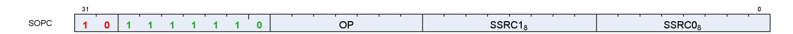

Instructions in this format may use a 32-bit literal constant that occurs immediately after the instruction.

**S\_CMP\_EQ\_I32 0**

Set SCC to 1 iff the first scalar input is equal to the second scalar input.

```
SCC = S0.i == S1.i
```

#### **Notes**

Note that S\_CMP\_EQ\_I32 and S\_CMP\_EQ\_U32 are identical opcodes, but both are provided for symmetry.

**S\_CMP\_LG\_I32 1**

Set SCC to 1 iff the first scalar input is less than or greater than the second scalar input.

```
SCC = S0.i <> S1.i
```

### **Notes**

Note that S\_CMP\_LG\_I32 and S\_CMP\_LG\_U32 are identical opcodes, but both are provided for symmetry.

**S\_CMP\_GT\_I32 2**

Set SCC to 1 iff the first scalar input is greater than the second scalar input.

SCC = S0.i > S1.i

**S\_CMP\_GE\_I32 3**

Set SCC to 1 iff the first scalar input is greater than or equal to the second scalar input.

SCC = S0.i >= S1.i

16.4. SOPC Instructions 229 of 600


**S\_CMP\_LT\_I32 4**

Set SCC to 1 iff the first scalar input is less than the second scalar input.

```
SCC = S0.i < S1.i
```

**S\_CMP\_LE\_I32 5**

Set SCC to 1 iff the first scalar input is less than or equal to the second scalar input.

```
SCC = S0.i <= S1.i
```

**S\_CMP\_EQ\_U32 6**

Set SCC to 1 iff the first scalar input is equal to the second scalar input.

```
SCC = S0.u == S1.u
```

#### **Notes**

Note that S\_CMP\_EQ\_I32 and S\_CMP\_EQ\_U32 are identical opcodes, but both are provided for symmetry.

**S\_CMP\_LG\_U32 7**

Set SCC to 1 iff the first scalar input is less than or greater than the second scalar input.

```
SCC = S0.u <> S1.u
```

#### **Notes**

Note that S\_CMP\_LG\_I32 and S\_CMP\_LG\_U32 are identical opcodes, but both are provided for symmetry.

**S\_CMP\_GT\_U32 8**

Set SCC to 1 iff the first scalar input is greater than the second scalar input.

```
SCC = S0.u > S1.u
```

16.4. SOPC Instructions 230 of 600


**S\_CMP\_GE\_U32 9**

Set SCC to 1 iff the first scalar input is greater than or equal to the second scalar input.

```
SCC = S0.u >= S1.u
```

**S\_CMP\_LT\_U32 10**

Set SCC to 1 iff the first scalar input is less than the second scalar input.

```
SCC = S0.u < S1.u
```

**S\_CMP\_LE\_U32 11**

Set SCC to 1 iff the first scalar input is less than or equal to the second scalar input.

```
SCC = S0.u <= S1.u
```

**S\_BITCMP0\_B32 12**

Extract a bit from the first scalar input based on an index in the second scalar input, and set SCC to 1 iff the extracted bit is equal to 0.

```
SCC = S0.u[S1.u[4 : 0]] == 1'0U
```

**S\_BITCMP1\_B32 13**

Extract a bit from the first scalar input based on an index in the second scalar input, and set SCC to 1 iff the extracted bit is equal to 1.

```
SCC = S0.u[S1.u[4 : 0]] == 1'1U
```

**S\_BITCMP0\_B64 14**

16.4. SOPC Instructions 231 of 600


Extract a bit from the first scalar input based on an index in the second scalar input, and set SCC to 1 iff the extracted bit is equal to 0.

```
SCC = S0.u64[S1.u[5 : 0]] == 1'0U
```

**S\_BITCMP1\_B64 15**

Extract a bit from the first scalar input based on an index in the second scalar input, and set SCC to 1 iff the extracted bit is equal to 1.

```
SCC = S0.u64[S1.u[5 : 0]] == 1'1U
```

**S\_CMP\_EQ\_U64 16**

Set SCC to 1 iff the first scalar input is equal to the second scalar input.

```
SCC = S0.u64 == S1.u64
```

**S\_CMP\_LG\_U64 17**

Set SCC to 1 iff the first scalar input is less than or greater than the second scalar input.

```
SCC = S0.u64 <> S1.u64
```

16.4. SOPC Instructions 232 of 600


# <span id="page-241-0"></span>**16.5. SOPP Instructions**

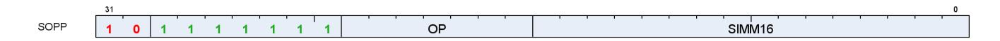

**S\_NOP 0**

Do nothing. Delay issue of next instruction by a small, fixed amount.

Insert 0..15 wait states based on SIMM16[3:0]. 0x0 means the next instruction can issue on the next clock, 0xf means the next instruction can issue 16 clocks later.

```
for i in 0U : SIMM16.u16[3 : 0].u do
  nop()
endfor
```

#### **Notes**

Examples:

```
  s_nop 0 // Wait 1 cycle.
  s_nop 0xf // Wait 16 cycles.
```

**S\_SETKILL 1**

Kill this wave if the least significant bit of the immediate constant is 1.

Used primarily for debugging kill wave host command behavior.

**S\_SETHALT 2**

Set or clear the HALT or FATAL\_HALT status bits.

The particular status bit is chosen by halt type control as indicated in SIMM16[2]; 0 = HALT bit select; 1 = FATAL\_HALT bit select.

When halt type control is set to 0 (HALT bit select): Set HALT bit to value of SIMM16[0]; 1 = halt, 0 = clear HALT bit. The halt flag is ignored while PRIV == 1 (inside trap handlers) but the shader halts after the handler returns if HALT is still set at that time.

When halt type control is set to 1 (FATAL HALT bit select): Set FATAL\_HALT bit to value of SIMM16[0]; 1 = fatal\_halt, 0 = clear FATAL\_HALT bit. Setting the fatal\_halt flag halts the shader in or outside of the trap handlers.

16.5. SOPP Instructions 233 of 600


**S\_SLEEP 3**

Cause a wave to sleep for up to ~8000 clocks.

The wave sleeps for (64\*(SIMM16[6:0]-1) .. 64\*SIMM16[6:0]) clocks. The exact amount of delay is approximate. Compare with S\_NOP. When SIMM16[6:0] is zero then no sleep occurs.

#### **Notes**

Examples:

```
  s_sleep 0 // Wait for 0 clocks.
  s_sleep 1 // Wait for 1-64 clocks.
  s_sleep 2 // Wait for 65-128 clocks.
```

#### **S\_SET\_INST\_PREFETCH\_DISTANCE 4**

Change instruction prefetch mode. This controls how many cachelines ahead of the current PC the shader will try to prefetch.

SIMM16[1:0] specifies the prefetch mode to switch to. Prefetch modes are:

#### **PREFETCH\_SAFE (0x0)**

Reserved, do not use.

#### **PREFETCH\_1\_LINE (0x1)**

Prefetch 1 cache line ahead of PC; keep 2 lines behind PC.

#### **PREFETCH\_2\_LINES (0x2)**

Prefetch 2 cache lines ahead of PC; keep 1 line behind PC.

#### **PREFETCH\_3\_LINES (0x3)**

Prefetch 3 cache lines ahead of PC; keep 0 lines behind PC.

SIMM16[15:2] must be set to zero.

**S\_CLAUSE 5**

Mark the beginning of a clause.

The next instruction determines the clause type, which may be one of the following types.

- Image Load (non-sample instructions )
- Image Sample
- Image Store
- Image Atomic

16.5. SOPP Instructions 234 of 600


- Buffer/Global/Scratch Load
- Buffer/Global/Scratch Store
- Buffer/Global/Scratch Atomic
- Flat Load
- Flat Store
- Flat Atomic
- LDS (loads, stores, atomics may be in same clause)
- Scalar Memory
- Vector ALU

Once the clause type is determined, any instruction encountered within the clause that is not of the same type (and not an internal instruction described below) is illegal and may lead to undefined behaviour. Attempting to issue S\_CLAUSE while inside a clause is also illegal.

Instructions that are processed internally do not interrupt the clause. The following instructions are internal:

- S\_NOP,
- S\_WAITCNT and its variants, unless they read an SGPR,
- S\_SLEEP,
- S\_DELAY\_ALU.

Halting or killing a wave breaks the clause. VALU exceptions and other traps that cause the shader to enter its trap handler breaks the clause. The single-step debug mode breaks the clause.

The clause length must be between 2 and 63 instructions, inclusive. Clause breaks may be from 1 to 15, or may be disabled entirely. Clause length and breaks are encoded in the SIMM16 argument as follows:

#### **LENGTH = SIMM16[5:0]**

This field is set to the logical number of instructions in the clause, minus 1 (e.g. if a clause has 4 instructions, program this field to **3**). The minimum number of instructions required for a clause is 2 and the maximum number of instructions is 63, therefore this field must be programmed in the range [1, 62] inclusive.

#### **BREAK\_SPAN = SIMM16[11:8]**

This field is set to the number of instructions to issue before each clause break. If set to zero then there are no clause breaks. If set to nonzero value then the maximum number of instructions between clause breaks is 15.

The following instruction types cannot appear in a clause:

- SALU
- Export
- Branch
- Message
- LDSDIR
- VINTERP
- GDS

To schedule an S\_WAITCNT or S\_DELAY\_ALU instruction for the first instruction in the clause, the waitcnt/delay instruction must appear before the S\_CLAUSE instruction so that S\_CLAUSE can accurately

16.5. SOPP Instructions 235 of 600


determine the clause type.

S\_DELAY\_ALU must not appear inside a clause. The features are orthogonal; ALU clauses should be structured to avoid any stalling.

**S\_DELAY\_ALU 7**

Insert delay between dependent SALU/VALU instructions.

The SIMM16 argument is encoded as:

#### **INSTID0 = SIMM16[3:0]**

Hazard to delay for with the next VALU instruction.

#### **INSTSKIP = SIMM16[6:4]**

Identify the VALU instruction that the second delay condition applies to.

#### **INSTID1 = SIMM16[10:7]**

Hazard to delay for with the VALU instruction identified by INSTSKIP.

Legal values for the InstID0 and InstID1 fields are:

#### **INSTID\_NO\_DEP (0x0)**

No dependency on any prior instruction.

#### **INSTID\_VALU\_DEP\_1 (0x1)**

Dependent on previous VALU instruction, 1 instruction back.

#### **INSTID\_VALU\_DEP\_2 (0x2)**

Dependent on previous VALU instruction, 2 instructions back.

#### **INSTID\_VALU\_DEP\_3 (0x3)**

Dependent on previous VALU instruction, 3 instructions back.

#### **INSTID\_VALU\_DEP\_4 (0x4)**

Dependent on previous VALU instruction, 4 instructions back.

#### **INSTID\_TRANS32\_DEP\_1 (0x5)**

Dependent on previous TRANS32 instruction, 1 instruction back.

#### **INSTID\_TRANS32\_DEP\_2 (0x6)**

Dependent on previous TRANS32 instruction, 2 instructions back.

#### **INSTID\_TRANS32\_DEP\_3 (0x7)**

Dependent on previous TRANS32 instruction, 3 instructions back.

#### **INSTID\_FMA\_ACCUM\_CYCLE\_1 (0x8)**

Single cycle penalty for FMA accumulation (reserved).

16.5. SOPP Instructions 236 of 600


#### **INSTID\_SALU\_CYCLE\_1 (0x9)**

1 cycle penalty for a prior SALU instruction.

#### **INSTID\_SALU\_CYCLE\_2 (0xa)**

2 cycle penalty for a prior SALU instruction (reserved).

#### **INSTID\_SALU\_CYCLE\_3 (0xb)**

3 cycle penalty for a prior SALU instruction (reserved).

Legal values for the InstSkip field are:

#### **INSTSKIP\_SAME (0x0)**

Apply second dependency to same instruction (2 dependencies on one instruction).

#### **INSTSKIP\_NEXT (0x1)**

Apply second dependency to next instruction (no skip).

#### **INSTSKIP\_SKIP\_1 (0x2)**

Skip 1 instruction then apply dependency.

#### **INSTSKIP\_SKIP\_2 (0x3)**

Skip 2 instructions then apply dependency.

#### **INSTSKIP\_SKIP\_3 (0x4)**

Skip 3 instructions then apply dependency.

#### **INSTSKIP\_SKIP\_4 (0x5)**

Skip 4 instructions then apply dependency.

This instruction describes dependencies for two instructions, directing the hardware to insert delay if the dependent instruction was issued too recently to forward data to the second.

S\_DELAY\_ALU instructions record the required delay with respect to a previous VALU instruction and indicate data dependencies that benefit from having extra idle cycles inserted between them. These instructions are optional: without them the program still functions correctly but performance may suffer when multiple waves are in flight; IB may issue dependent instructions that stall in the ALU, preventing those cycles from being utilized by other wavefronts.

If enough independent instructions are between dependent ones then no delay is necessary and this instruction may be omitted. For wave64 the compiler may not know the status of the EXEC mask and hence does not know if instructions require 1 or 2 passes to issue. S\_DELAY\_ALU encodes the type of dependency so that hardware may apply the correct delay depending on the number of active passes.

S\_DELAY\_ALU may execute in zero cycles.

To reduce instruction stream overhead the S\_DELAY\_ALU instructions packs two delay values into one instruction, with a "skip" indicator so the two delayed instructions don't need to be back-to-back.

S\_DELAY\_ALU is illegal inside of a clause created by S\_CLAUSE.

Example:

16.5. SOPP Instructions 237 of 600


```
v_mov_b32 v3, v0
v_lshlrev_b32 v30, 1, v31
v_lshlrev_b32 v24, 1, v25
s_delay_alu instid0(INSTID_VALU_DEP_3) | instskip(INSTSKIP_SKIP_1) | instid1(INSTID_VALU_DEP_1)
  // 1 cycle delay here
v_add_f32 v0, v1, v3
v_sub_f32 v11, v9, v9
  // 2 cycles delay here
v_mul_f32 v10, v13, v11
```

**S\_WAITCNT 9**

Wait for the counts of outstanding lds, vector-memory and export/vmem-write-data to be at or below the specified levels.

The SIMM16 argument is encoded as:

#### **EXP = SIMM16[2:0]**

Export wait count. 0x7 means do not wait on EXPCNT.

### **LGKM = SIMM16[9:4]**

LGKM wait count. 0x3f means do not wait on LGKMCNT.

#### **VM = SIMM16[15:10]**

VM wait count. 0x3f means do not wait on VMCNT.

Waits for all of the following conditions to hold before continuing:

```
  expcnt <= WaitEXPCNT
  lgkmcnt <= WaitLGKMCNT
  vmcnt <= WaitVMCNT
```

VMCNT only counts vector memory loads, image sample instructions, and vector memory atomics that return data. Contrast with the VSCNT counter.

See also S\_WAITCNT\_VSCNT.

**S\_WAIT\_IDLE 10**

Wait for all activity in the wave to be complete (all dependency and memory counters at zero).

**S\_WAIT\_EVENT 11**

Wait for an event to occur or a condition to be satisfied before continuing. The SIMM16 argument specifies

16.5. SOPP Instructions 238 of 600


which event(s) to wait on.

#### **DONT\_WAIT\_EXPORT\_READY = SIMM16[0]**

If this value is ZERO then sleep until the export\_ready bit is 1. If the export\_ready bit is already 1, no sleep occurs. Effect is the same as the export\_ready check performed before issuing an export instruction.

No wait occurs if this value is ONE.

This wait can be broken or preempted by KILL, context-save, host trap, single-step or trap after instruction events. IB waits for the event to occur before processing internal exceptions which can delay entry to the trap handler for a significant amount of time.

**S\_TRAP 16**

Enter the trap handler.

This instruction may be generated internally as well in response to a host trap (HT = 1) or an exception. TrapID 0 is reserved for hardware use and should not be used in a shader-generated trap.

```
TrapID = SIMM16.u16[7 : 0];
"Wait for all instructions to complete";
// PC passed into trap handler points to S_TRAP itself,
// *not* to the next instruction.
{ TTMP[1], TTMP[0] } = { 7'0, HT[0], TrapID[7 : 0], PC[47 : 0] };
PC = TBA.i64;
// trap base address
WAVE_STATUS.PRIV = 1'1U
```

**S\_ROUND\_MODE 17**

Set floating point round mode using an immediate constant.

Avoids wait state penalty that would be imposed by S\_SETREG.

**S\_DENORM\_MODE 18**

Set floating point denormal mode using an immediate constant.

Avoids wait state penalty that would be imposed by S\_SETREG.

**S\_CODE\_END 31**

Generate an illegal instruction interrupt. This instruction is used to mark the end of a shader buffer for debug tools.

16.5. SOPP Instructions 239 of 600


This instruction should not appear in typical shader code. It is used to pad the end of a shader program to make it easier for analysis programs to locate the end of a shader program buffer. Use of this opcode in an embedded shader block may cause analysis tools to fail.

To unambiguously mark the end of a shader buffer, this instruction must be specified five times in a row (total of 20 bytes) and analysis tools must ensure the opcode occurs at least five times to be certain they are at the end of the buffer. This is because the bit pattern generated by this opcode could incidentally appear in a valid instruction's second dword, literal constant or as part of a multi-DWORD image instruction.

In short: do not embed this opcode in the middle of a valid shader program. DO use this opcode 5 times at the end of a shader program to clearly mark the end of the program.

#### Example:

```
  ...
  s_endpgm // last real instruction in shader buffer
  s_code_end // 1
  s_code_end // 2
  s_code_end // 3
  s_code_end // 4
  s_code_end // done!
```

**S\_BRANCH 32**

Jump to a constant offset relative to the current PC.

The literal argument is a signed DWORD offset relative to the PC of the next instruction.

```
PC = PC + signext(SIMM16.i16 * 16'4) + 4LL;
// short jump.
```

#### **Notes**

For a long jump or an indirect jump use S\_SETPC\_B64.

#### Examples:

```
  s_branch label // Set SIMM16 = +4 = 0x0004
  s_nop 0 // 4 bytes
label:
  s_nop 0 // 4 bytes
  s_branch label // Set SIMM16 = -8 = 0xfff8
```

**S\_CBRANCH\_SCC0 33**

16.5. SOPP Instructions 240 of 600


If SCC is 0 then jump to a constant offset relative to the current PC.

The literal argument is a signed DWORD offset relative to the PC of the next instruction.

```
if SCC == 1'0U then
  PC = PC + signext(SIMM16.i16 * 16'4) + 4LL
else
  PC = PC + 4LL
endif
```

**S\_CBRANCH\_SCC1 34**

If SCC is 1 then jump to a constant offset relative to the current PC.

The literal argument is a signed DWORD offset relative to the PC of the next instruction.

```
if SCC == 1'1U then
  PC = PC + signext(SIMM16.i16 * 16'4) + 4LL
else
  PC = PC + 4LL
endif
```

**S\_CBRANCH\_VCCZ 35**

If VCCZ is 1 then jump to a constant offset relative to the current PC.

The literal argument is a signed DWORD offset relative to the PC of the next instruction.

```
if VCCZ.u1 == 1'1U then
  PC = PC + signext(SIMM16.i16 * 16'4) + 4LL
else
  PC = PC + 4LL
endif
```

**S\_CBRANCH\_VCCNZ 36**

If VCCZ is 0 then jump to a constant offset relative to the current PC.

The literal argument is a signed DWORD offset relative to the PC of the next instruction.

```
if VCCZ.u1 == 1'0U then
  PC = PC + signext(SIMM16.i16 * 16'4) + 4LL
else
```

16.5. SOPP Instructions 241 of 600


```
  PC = PC + 4LL
endif
```

**S\_CBRANCH\_EXECZ 37**

If EXECZ is 1 then jump to a constant offset relative to the current PC.

The literal argument is a signed DWORD offset relative to the PC of the next instruction.

```
if EXECZ.u1 == 1'1U then
  PC = PC + signext(SIMM16.i16 * 16'4) + 4LL
else
  PC = PC + 4LL
endif
```

**S\_CBRANCH\_EXECNZ 38**

If EXECZ is 0 then jump to a constant offset relative to the current PC.

The literal argument is a signed DWORD offset relative to the PC of the next instruction.

```
if EXECZ.u1 == 1'0U then
  PC = PC + signext(SIMM16.i16 * 16'4) + 4LL
else
  PC = PC + 4LL
endif
```

**S\_CBRANCH\_CDBGSYS 39**

If the system debug flag is set then jump to a constant offset relative to the current PC.

The literal argument is a signed DWORD offset relative to the PC of the next instruction.

```
if WAVE_STATUS.COND_DBG_SYS.u != 0U then
  PC = PC + signext(SIMM16.i16 * 16'4) + 4LL
else
  PC = PC + 4LL
endif
```

**S\_CBRANCH\_CDBGUSER 40**

16.5. SOPP Instructions 242 of 600


If the user debug flag is set then jump to a constant offset relative to the current PC.

The literal argument is a signed DWORD offset relative to the PC of the next instruction.

```
if WAVE_STATUS.COND_DBG_USER.u != 0U then
  PC = PC + signext(SIMM16.i16 * 16'4) + 4LL
else
  PC = PC + 4LL
endif
```

#### **S\_CBRANCH\_CDBGSYS\_OR\_USER 41**

If either the system debug flag or the user debug flag is set then jump to a constant offset relative to the current PC.

The literal argument is a signed DWORD offset relative to the PC of the next instruction.

```
if (WAVE_STATUS.COND_DBG_SYS || WAVE_STATUS.COND_DBG_USER) then
  PC = PC + signext(SIMM16.i16 * 16'4) + 4LL
else
  PC = PC + 4LL
endif
```

#### **S\_CBRANCH\_CDBGSYS\_AND\_USER 42**

If both the system debug flag and the user debug flag are set then jump to a constant offset relative to the current PC.

The literal argument is a signed DWORD offset relative to the PC of the next instruction.

```
if (WAVE_STATUS.COND_DBG_SYS && WAVE_STATUS.COND_DBG_USER) then
  PC = PC + signext(SIMM16.i16 * 16'4) + 4LL
else
  PC = PC + 4LL
endif
```

**S\_ENDPGM 48**

End of program; terminate wavefront.

The hardware implicitly executes S\_WAITCNT 0 and S\_WAITCNT\_VSCNT 0 before executing this instruction. See S\_ENDPGM\_SAVED for the context-switch version of this instruction and S\_ENDPGM\_ORDERED\_PS\_DONE for the POPS critical region version of this instruction.

16.5. SOPP Instructions 243 of 600


**S\_ENDPGM\_SAVED 49**

End of program; signal that a wave has been saved by the context-switch trap handler and terminate wavefront.

The hardware implicitly executes S\_WAITCNT 0 and S\_WAITCNT\_VSCNT 0 before executing this instruction. See S\_ENDPGM for additional variants.

#### **S\_ENDPGM\_ORDERED\_PS\_DONE 50**

End of program; signal that a wave has exited its POPS critical section and terminate wavefront.

The hardware implicitly executes S\_WAITCNT 0 and S\_WAITCNT\_VSCNT 0 before executing this instruction. This instruction is an optimization that combines S\_SENDMSG(MSG\_ORDERED\_PS\_DONE) and S\_ENDPGM; there may be cases where the message needs to be sent separately, in which case the shader can be terminated with a normal S\_ENDPGM instruction.

See S\_ENDPGM for additional variants.

**S\_WAKEUP 52**

Allow a wave to 'ping' all the other waves in its threadgroup to force them to wake up early from an S\_SLEEP instruction.

The ping is ignored if the waves are not sleeping. This allows for efficient polling on a memory location. The waves which are polling can sit in a long S\_SLEEP between memory reads, but the wave which writes the value can tell them all to wake up early now that the data is available. This method is also safe from races because if any wave misses the ping, everything is expected to work fine (waves which missed it just complete their S\_SLEEP).

If the wave executing S\_WAKEUP is in a threadgroup (in\_wg set), then it wakes up all waves associated with the same threadgroup ID. Otherwise, S\_WAKEUP is treated as an S\_NOP.

**S\_SETPRIO 53**

Change wave user priority.

User settable wave priority is set to SIMM16[1:0]. 0 is the lowest priority and 3 is the highest. The overall wave priority is:

```
Priority = {SysUserPrio[1:0], WaveAge[3:0]}
SysUserPrio = MIN(3, SysPrio[1:0] + UserPrio[1:0]).
```

The system priority cannot be modified from within the wave.

16.5. SOPP Instructions 244 of 600


**S\_SENDMSG 54** Send a message to upstream control hardware. SIMM16[7:0] contains the message type. **Notes S\_SENDMSGHALT 55** Send a message to upstream control hardware and then HALT the wavefront; see S\_SENDMSG for details. **S\_INCPERFLEVEL 56** Increment performance counter specified in SIMM16[3:0] by 1. **S\_DECPERFLEVEL 57** Decrement performance counter specified in SIMM16[3:0] by 1. **S\_ICACHE\_INV 60** Invalidate entire first level instruction cache. **S\_BARRIER 61** Synchronize waves within a threadgroup. If not all waves of the threadgroup have been created yet, waits for entire group before proceeding. If some waves in the threadgroup have already terminated, this waits on only the surviving waves. Barriers are legal

inside trap handlers.

Barrier instructions do not wait for any counters to go to zero before issuing. If the barrier is being used to protect an outstanding memory operation use the appropriate S\_WAITCNT instruction before the barrier.

16.5. SOPP Instructions 245 of 600


# <span id="page-254-0"></span>**16.6. SMEM Instructions**


**S\_LOAD\_B32 0**

Load 32 bits of data from the scalar data cache into a scalar register.

```
SDATA[31 : 0] = MEM[ADDR + 0U].b
```

#### **Notes**

If the offset is specified as an SGPR, the SGPR contains an UNSIGNED BYTE offset (the 2 LSBs are ignored).

If the offset is specified as an immediate 21-bit constant, the constant is a SIGNED BYTE offset.

**S\_LOAD\_B64 1**

Load 64 bits of data from the scalar data cache into a scalar register.

```
SDATA[31 : 0] = MEM[ADDR + 0U].b;
SDATA[63 : 32] = MEM[ADDR + 4U].b
```

#### **Notes**

See S\_LOAD\_B32 for details on the offset input.

**S\_LOAD\_B128 2**

Load 128 bits of data from the scalar data cache into a scalar register.

```
SDATA[31 : 0] = MEM[ADDR + 0U].b;
SDATA[63 : 32] = MEM[ADDR + 4U].b;
SDATA[95 : 64] = MEM[ADDR + 8U].b;
SDATA[127 : 96] = MEM[ADDR + 12U].b
```

#### **Notes**

See S\_LOAD\_B32 for details on the offset input.

16.6. SMEM Instructions 246 of 600


**S\_LOAD\_B256 3**

Load 256 bits of data from the scalar data cache into a scalar register.

```
SDATA[31 : 0] = MEM[ADDR + 0U].b;
SDATA[63 : 32] = MEM[ADDR + 4U].b;
SDATA[95 : 64] = MEM[ADDR + 8U].b;
SDATA[127 : 96] = MEM[ADDR + 12U].b;
SDATA[159 : 128] = MEM[ADDR + 16U].b;
SDATA[191 : 160] = MEM[ADDR + 20U].b;
SDATA[223 : 192] = MEM[ADDR + 24U].b;
SDATA[255 : 224] = MEM[ADDR + 28U].b
```

#### **Notes**

See S\_LOAD\_B32 for details on the offset input.

**S\_LOAD\_B512 4**

Load 512 bits of data from the scalar data cache into a scalar register.

```
SDATA[31 : 0] = MEM[ADDR + 0U].b;
SDATA[63 : 32] = MEM[ADDR + 4U].b;
SDATA[95 : 64] = MEM[ADDR + 8U].b;
SDATA[127 : 96] = MEM[ADDR + 12U].b;
SDATA[159 : 128] = MEM[ADDR + 16U].b;
SDATA[191 : 160] = MEM[ADDR + 20U].b;
SDATA[223 : 192] = MEM[ADDR + 24U].b;
SDATA[255 : 224] = MEM[ADDR + 28U].b;
SDATA[287 : 256] = MEM[ADDR + 32U].b;
SDATA[319 : 288] = MEM[ADDR + 36U].b;
SDATA[351 : 320] = MEM[ADDR + 40U].b;
SDATA[383 : 352] = MEM[ADDR + 44U].b;
SDATA[415 : 384] = MEM[ADDR + 48U].b;
SDATA[447 : 416] = MEM[ADDR + 52U].b;
SDATA[479 : 448] = MEM[ADDR + 56U].b;
SDATA[511 : 480] = MEM[ADDR + 60U].b
```

#### **Notes**

See S\_LOAD\_B32 for details on the offset input.

```
S_BUFFER_LOAD_B32 8
```

Load 32 bits of data from the scalar data cache into a scalar register using a buffer resource descriptor.

16.6. SMEM Instructions 247 of 600


```
SDATA[31 : 0] = MEM[ADDR + 0U].b
```

See S\_LOAD\_B32 for details on the offset input.

**S\_BUFFER\_LOAD\_B64 9**

Load 64 bits of data from the scalar data cache into a scalar register using a buffer resource descriptor.

```
SDATA[31 : 0] = MEM[ADDR + 0U].b;
SDATA[63 : 32] = MEM[ADDR + 4U].b
```

#### **Notes**

See S\_LOAD\_B32 for details on the offset input.

**S\_BUFFER\_LOAD\_B128 10**

Load 128 bits of data from the scalar data cache into a scalar register using a buffer resource descriptor.

```
SDATA[31 : 0] = MEM[ADDR + 0U].b;
SDATA[63 : 32] = MEM[ADDR + 4U].b;
SDATA[95 : 64] = MEM[ADDR + 8U].b;
SDATA[127 : 96] = MEM[ADDR + 12U].b
```

#### **Notes**

See S\_LOAD\_B32 for details on the offset input.

**S\_BUFFER\_LOAD\_B256 11**

Load 256 bits of data from the scalar data cache into a scalar register using a buffer resource descriptor.

```
SDATA[31 : 0] = MEM[ADDR + 0U].b;
SDATA[63 : 32] = MEM[ADDR + 4U].b;
SDATA[95 : 64] = MEM[ADDR + 8U].b;
SDATA[127 : 96] = MEM[ADDR + 12U].b;
SDATA[159 : 128] = MEM[ADDR + 16U].b;
SDATA[191 : 160] = MEM[ADDR + 20U].b;
SDATA[223 : 192] = MEM[ADDR + 24U].b;
SDATA[255 : 224] = MEM[ADDR + 28U].b
```

16.6. SMEM Instructions 248 of 600


See S\_LOAD\_B32 for details on the offset input.

**S\_BUFFER\_LOAD\_B512 12**

Load 512 bits of data from the scalar data cache into a scalar register using a buffer resource descriptor.

```
SDATA[31 : 0] = MEM[ADDR + 0U].b;
SDATA[63 : 32] = MEM[ADDR + 4U].b;
SDATA[95 : 64] = MEM[ADDR + 8U].b;
SDATA[127 : 96] = MEM[ADDR + 12U].b;
SDATA[159 : 128] = MEM[ADDR + 16U].b;
SDATA[191 : 160] = MEM[ADDR + 20U].b;
SDATA[223 : 192] = MEM[ADDR + 24U].b;
SDATA[255 : 224] = MEM[ADDR + 28U].b;
SDATA[287 : 256] = MEM[ADDR + 32U].b;
SDATA[319 : 288] = MEM[ADDR + 36U].b;
SDATA[351 : 320] = MEM[ADDR + 40U].b;
SDATA[383 : 352] = MEM[ADDR + 44U].b;
SDATA[415 : 384] = MEM[ADDR + 48U].b;
SDATA[447 : 416] = MEM[ADDR + 52U].b;
SDATA[479 : 448] = MEM[ADDR + 56U].b;
SDATA[511 : 480] = MEM[ADDR + 60U].b
```

#### **Notes**

See S\_LOAD\_B32 for details on the offset input.

**S\_GL1\_INV 32**

Invalidate the GL1 cache only.

**S\_DCACHE\_INV 33**

Invalidate the scalar data L0 cache.

16.6. SMEM Instructions 249 of 600


# <span id="page-258-0"></span>**16.7. VOP2 Instructions**


Instructions in this format may use a 32-bit literal constant or DPP that occurs immediately after the instruction.

**V\_CNDMASK\_B32 1**

Copy data from one of two inputs based on the vector condition code and store the result into a vector register.

```
D0.u = VCC.u64[laneId] ? S1.u : S0.u
```

#### **Notes**

In VOP3 the VCC source may be a scalar GPR specified in S2.

Floating-point modifiers are valid for this instruction if S0 and S1 are 32-bit floating point values. This instruction is suitable for negating or taking the absolute value of a floating-point value.

**V\_DOT2ACC\_F32\_F16 2**

Dot product of packed FP16 values, accumulate with destination.

```
// Accumulate with destination
D0.f += 32'F(S0[15 : 0].f16) * 32'F(S1[15 : 0].f16);
D0.f += 32'F(S0[31 : 16].f16) * 32'F(S1[31 : 16].f16)
```

**V\_ADD\_F32 3**

Add two floating point inputs and store the result into a vector register.

```
D0.f = S0.f + S1.f
```

#### **Notes**

0.5ULP precision, denormals are supported.

**V\_SUB\_F32 4**

16.7. VOP2 Instructions 250 of 600


Subtract the second floating point input from the first input and store the result into a vector register.

```
D0.f = S0.f - S1.f
```

#### **Notes**

0.5ULP precision, denormals are supported.

**V\_SUBREV\_F32 5**

Subtract the first floating point input from the second input and store the result into a vector register.

```
D0.f = S1.f - S0.f
```

#### **Notes**

0.5ULP precision, denormals are supported.

#### **V\_FMAC\_DX9\_ZERO\_F32 6**

Multiply two single-precision values and accumulate the result with the destination. Follows DX9 rules where 0.0 times anything produces 0.0 (this is not IEEE compliant).

```
if ((64'F(S0.f) == 0.0) || (64'F(S1.f) == 0.0)) then
  // DX9 rules, 0.0 * x = 0.0
  D0.f = S2.f
else
  D0.f = fma(S0.f, S1.f, D0.f)
endif
```

#### **V\_MUL\_DX9\_ZERO\_F32 7**

Multiply two floating point inputs and store the result in a vector register. Follows DX9 rules where 0.0 times anything produces 0.0 (this differs from other APIs when the other input is infinity or NaN).

```
if ((64'F(S0.f) == 0.0) || (64'F(S1.f) == 0.0)) then
  // DX9 rules, 0.0 * x = 0.0
  D0.f = 0.0F
else
  D0.f = S0.f * S1.f
endif
```

16.7. VOP2 Instructions 251 of 600


**V\_MUL\_F32 8**

Multiply two floating point inputs and store the result into a vector register.

```
D0.f = S0.f * S1.f
```

#### **Notes**

0.5ULP precision, denormals are supported.

**V\_MUL\_I32\_I24 9**

Multiply two signed 24 bit integer inputs and store the result as a signed 32 bit integer into a vector register.

```
D0.i = 32'I(S0.i24) * 32'I(S1.i24)
```

#### **Notes**

This opcode is expected to be as efficient as basic single-precision opcodes since it utilizes the single-precision floating point multiplier. See also V\_MUL\_HI\_I32\_I24.

**V\_MUL\_HI\_I32\_I24 10**

Multiply two signed 24 bit integer inputs and store the high 32 bits of the result as a signed 32 bit integer into a vector register.

```
D0.i = 32'I((64'I(S0.i24) * 64'I(S1.i24)) >> 32U)
```

#### **Notes**

See also V\_MUL\_I32\_I24.

**V\_MUL\_U32\_U24 11**

Multiply two unsigned 24 bit integer inputs and store the result as a unsigned 32 bit integer into a vector register.

```
D0.u = 32'U(S0.u24) * 32'U(S1.u24)
```

#### **Notes**

16.7. VOP2 Instructions 252 of 600


This opcode is expected to be as efficient as basic single-precision opcodes since it utilizes the single-precision floating point multiplier. See also V\_MUL\_HI\_U32\_U24.

**V\_MUL\_HI\_U32\_U24 12**

Multiply two unsigned 24 bit integer inputs and store the high 32 bits of the result as a unsigned 32 bit integer into a vector register.

```
D0.u = 32'U((64'U(S0.u24) * 64'U(S1.u24)) >> 32U)
```

#### **Notes**

See also V\_MUL\_U32\_U24.

**V\_MIN\_F32 15**

Select the minimum of two floating point inputs and store the result into a vector register.

```
LT_NEG_ZERO = lambda(a, b) (
  ((a < b) || ((64'F(abs(a)) == 0.0) && (64'F(abs(b)) == 0.0) && sign(a) && !sign(b))));
// Version of comparison where -0.0 < +0.0, differs from IEEE
if WAVE_MODE.IEEE then
  if isSignalNAN(64'F(S0.f)) then
  D0.f = 32'F(cvtToQuietNAN(64'F(S0.f)))
  elsif isSignalNAN(64'F(S1.f)) then
  D0.f = 32'F(cvtToQuietNAN(64'F(S1.f)))
  elsif isQuietNAN(64'F(S1.f)) then
  D0.f = S0.f
  elsif isQuietNAN(64'F(S0.f)) then
  D0.f = S1.f
  elsif LT_NEG_ZERO(S0.f, S1.f) then
  // NOTE: -0<+0 is TRUE in this comparison
  D0.f = S0.f
  else
  D0.f = S1.f
  endif
else
  if isNAN(64'F(S1.f)) then
  D0.f = S0.f
  elsif isNAN(64'F(S0.f)) then
  D0.f = S1.f
  elsif LT_NEG_ZERO(S0.f, S1.f) then
  // NOTE: -0<+0 is TRUE in this comparison
  D0.f = S0.f
  else
  D0.f = S1.f
  endif
endif;
// Inequalities in the above pseudocode behave differently from IEEE
```

16.7. VOP2 Instructions 253 of 600


```
// when both inputs are +-0.
```

IEEE compliant. Supports denormals, round mode, exception flags, saturation.

Denorm flushing for this operation is effectively controlled by the input denorm mode control: If input denorm mode is disabling denorm, the internal result of a min/max operation cannot be a denorm value, so output denorm mode is irrelevant. If input denorm mode is enabling denorm, the internal min/max result can be a denorm and this operation outputs as a denorm regardless of output denorm mode.

**V\_MAX\_F32 16**

Select the maximum of two floating point inputs and store the result into a vector register.

```
GT_NEG_ZERO = lambda(a, b) (
  ((a > b) || ((64'F(abs(a)) == 0.0) && (64'F(abs(b)) == 0.0) && !sign(a) && sign(b))));
// Version of comparison where +0.0 > -0.0, differs from IEEE
if WAVE_MODE.IEEE then
  if isSignalNAN(64'F(S0.f)) then
  D0.f = 32'F(cvtToQuietNAN(64'F(S0.f)))
  elsif isSignalNAN(64'F(S1.f)) then
  D0.f = 32'F(cvtToQuietNAN(64'F(S1.f)))
  elsif isQuietNAN(64'F(S1.f)) then
  D0.f = S0.f
  elsif isQuietNAN(64'F(S0.f)) then
  D0.f = S1.f
  elsif GT_NEG_ZERO(S0.f, S1.f) then
  // NOTE: +0>-0 is TRUE in this comparison
  D0.f = S0.f
  else
  D0.f = S1.f
  endif
else
  if isNAN(64'F(S1.f)) then
  D0.f = S0.f
  elsif isNAN(64'F(S0.f)) then
  D0.f = S1.f
  elsif GT_NEG_ZERO(S0.f, S1.f) then
  // NOTE: +0>-0 is TRUE in this comparison
  D0.f = S0.f
  else
  D0.f = S1.f
  endif
endif;
// Inequalities in the above pseudocode behave differently from IEEE
// when both inputs are +-0.
```

#### **Notes**

IEEE compliant. Supports denormals, round mode, exception flags, saturation.

16.7. VOP2 Instructions 254 of 600


Denorm flushing for this operation is effectively controlled by the input denorm mode control: If input denorm mode is disabling denorm, the internal result of a min/max operation cannot be a denorm value, so output denorm mode is irrelevant. If input denorm mode is enabling denorm, the internal min/max result can be a denorm and this operation outputs as a denorm regardless of output denorm mode.

**V\_MIN\_I32 17**

Select the minimum of two signed integers and store the selected value into a vector register.

```
D0.i = S0.i < S1.i ? S0.i : S1.i
```

**V\_MAX\_I32 18**

Select the maximum of two signed integers and store the selected value into a vector register.

```
D0.i = S0.i >= S1.i ? S0.i : S1.i
```

**V\_MIN\_U32 19**

Select the minimum of two unsigned integers and store the selected value into a vector register.

```
D0.u = S0.u < S1.u ? S0.u : S1.u
```

**V\_MAX\_U32 20**

Select the maximum of two unsigned integers and store the selected value into a vector register.

```
D0.u = S0.u >= S1.u ? S0.u : S1.u
```

**V\_LSHLREV\_B32 24**

Given a shift count in the first vector input, calculate the logical shift left of the second vector input and store the result into a vector register.

```
D0.u = (S1.u << S0[4 : 0].u)
```

16.7. VOP2 Instructions 255 of 600


**V\_LSHRREV\_B32 25**

Given a shift count in the first vector input, calculate the logical shift right of the second vector input and store the result into a vector register.

```
D0.u = (S1.u >> S0[4 : 0].u)
```

**V\_ASHRREV\_I32 26**

Given a shift count in the first vector input, calculate the arithmetic shift right (preserving sign bit) of the second vector input and store the result into a vector register.

```
D0.i = (S1.i >> S0[4 : 0].u)
```

**V\_AND\_B32 27**

Calculate bitwise AND on two vector inputs and store the result into a vector register.

```
D0.u = (S0.u & S1.u)
```

#### **Notes**

Input and output modifiers not supported.

**V\_OR\_B32 28**

Calculate bitwise OR on two vector inputs and store the result into a vector register.

```
D0.u = (S0.u | S1.u)
```

#### **Notes**

Input and output modifiers not supported.

**V\_XOR\_B32 29**

Calculate bitwise XOR on two vector inputs and store the result into a vector register.

16.7. VOP2 Instructions 256 of 600


```
D0.u = (S0.u ^ S1.u)
```

Input and output modifiers not supported.

**V\_XNOR\_B32 30**

Calculate bitwise XNOR on two vector inputs and store the result into a vector register.

```
D0.u = ~(S0.u ^ S1.u)
```

#### **Notes**

Input and output modifiers not supported.

**V\_ADD\_CO\_CI\_U32 32**

Add two unsigned inputs and a bit from a carry-in mask, store the result into a vector register and store the carry-out mask into a scalar register.

```
tmp = 64'U(S0.u) + 64'U(S1.u) + VCC.u64[laneId].u64;
VCC.u64[laneId] = tmp >= 0x100000000ULL ? 1'1U : 1'0U;
D0.u = tmp.u
```

#### **Notes**

In VOP3 the VCC destination may be an arbitrary SGPR-pair, and the VCC source comes from the SGPR-pair at S2.u.

Supports saturation (unsigned 32-bit integer domain).

**V\_SUB\_CO\_CI\_U32 33**

Subtract the second unsigned input from the first input, subtract a bit from the carry-in mask, store the result into a vector register and store the carry-out mask to a scalar register.

```
tmp = S0.u - S1.u - VCC.u64[laneId].u;
VCC.u64[laneId] = 64'U(S1.u) + VCC.u64[laneId].u64 > 64'U(S0.u) ? 1'1U : 1'0U;
D0.u = tmp.u
```

16.7. VOP2 Instructions 257 of 600


In VOP3 the VCC destination may be an arbitrary SGPR-pair, and the VCC source comes from the SGPR-pair at S2.u.

Supports saturation (unsigned 32-bit integer domain).

```
V_SUBREV_CO_CI_U32 34
```

Subtract the first unsigned input from the second input, subtract a bit from the carry-in mask, store the result into a vector register and store the carry-out mask to a scalar register.

```
tmp = S1.u - S0.u - VCC.u64[laneId].u;
VCC.u64[laneId] = 64'U(S1.u) + VCC.u64[laneId].u64 > 64'U(S0.u) ? 1'1U : 1'0U;
D0.u = tmp.u
```

#### **Notes**

In VOP3 the VCC destination may be an arbitrary SGPR-pair, and the VCC source comes from the SGPR-pair at S2.u.

Supports saturation (unsigned 32-bit integer domain).

**V\_ADD\_NC\_U32 37**

Add two unsigned inputs and store the result into a vector register. No carry-in or carry-out support.

```
D0.u = S0.u + S1.u
```

#### **Notes**

Supports saturation (unsigned 32-bit integer domain).

**V\_SUB\_NC\_U32 38**

Subtract the second unsigned input from the first input and store the result into a vector register. No carry-in or carry-out support.

```
D0.u = S0.u - S1.u
```

#### **Notes**

Supports saturation (unsigned 32-bit integer domain).

16.7. VOP2 Instructions 258 of 600


**V\_SUBREV\_NC\_U32 39**

Subtract the first unsigned input from the second input and store the result into a vector register. No carry-in or carry-out support.

```
D0.u = S1.u - S0.u
```

#### **Notes**

Supports saturation (unsigned 32-bit integer domain).

**V\_FMAC\_F32 43**

Multiply two floating point inputs and accumulate the result into the destination register using fused multiplyadd.

```
D0.f = fma(S0.f, S1.f, D0.f)
```

**V\_FMAMK\_F32 44**

Multiply a single-precision float with a literal constant and add a second single-precision float using fused multiply-add.

```
D0.f = fma(S0.f, SIMM32.f, S1.f)
```

#### **Notes**

This opcode cannot use the VOP3 encoding and cannot use input/output modifiers.

**V\_FMAAK\_F32 45**

Multiply two single-precision floats and add a literal constant using fused multiply-add.

```
D0.f = fma(S0.f, S1.f, SIMM32.f)
```

#### **Notes**

This opcode cannot use the VOP3 encoding and cannot use input/output modifiers.

16.7. VOP2 Instructions 259 of 600


#### **V\_CVT\_PK\_RTZ\_F16\_F32 47**

Convert two single-precision float inputs into a packed FP16 result with round toward zero semantics (ignore the current rounding mode), and store the result into a vector register.

```
D0[15 : 0].f16 = f32_to_f16(S0.f);
D0[31 : 16].f16 = f32_to_f16(S1.f);
// Round-toward-zero regardless of current round mode setting in hardware.
```

#### **Notes**

This opcode is intended for use with 16-bit compressed exports. See V\_CVT\_F16\_F32 for a version that respects the current rounding mode.

**V\_ADD\_F16 50**

Add two floating point inputs and store the result into a vector register.

```
D0.f16 = S0.f16 + S1.f16
```

#### **Notes**

0.5ULP precision. Supports denormals, round mode, exception flags and saturation.

**V\_SUB\_F16 51**

Subtract the second floating point input from the first input and store the result into a vector register.

```
D0.f16 = S0.f16 - S1.f16
```

#### **Notes**

0.5ULP precision. Supports denormals, round mode, exception flags and saturation.

**V\_SUBREV\_F16 52**

Subtract the first floating point input from the second input and store the result into a vector register.

```
D0.f16 = S1.f16 - S0.f16
```

16.7. VOP2 Instructions 260 of 600


0.5ULP precision. Supports denormals, round mode, exception flags and saturation.

**V\_MUL\_F16 53**

Multiply two floating point inputs and store the result into a vector register.

```
D0.f16 = S0.f16 * S1.f16
```

#### **Notes**

0.5ULP precision. Supports denormals, round mode, exception flags and saturation.

**V\_FMAC\_F16 54**

Multiply two floating point inputs and accumulate the result into the destination register using fused multiplyadd.

```
D0.f16 = fma(S0.f16, S1.f16, D0.f16)
```

#### **Notes**

0.5ULP precision. Supports denormals, round mode, exception flags and saturation.

**V\_FMAMK\_F16 55**

Multiply a FP16 value with a literal constant and add a second FP16 value using fused multiply-add.

```
D0.f16 = fma(S0.f16, SIMM32.f16, S1.f16)
```

#### **Notes**

This opcode cannot use the VOP3 encoding and cannot use input/output modifiers. Supports round mode, exception flags, saturation.

**V\_FMAAK\_F16 56**

Multiply two FP16 values and add a literal constant using fused multiply-add.

16.7. VOP2 Instructions 261 of 600


```
D0.f16 = fma(S0.f16, S1.f16, SIMM32.f16)
```

This opcode cannot use the VOP3 encoding and cannot use input/output modifiers. Supports round mode, exception flags, saturation.

**V\_MAX\_F16 57**

Select the maximum of two floating point inputs and store the result into a vector register.

```
GT_NEG_ZERO = lambda(a, b) (
  ((a > b) || ((64'F(abs(a)) == 0.0) && (64'F(abs(b)) == 0.0) && !sign(a) && sign(b))));
// Version of comparison where +0.0 > -0.0, differs from IEEE
if WAVE_MODE.IEEE then
  if isSignalNAN(64'F(S0.f16)) then
  D0.f16 = 16'F(cvtToQuietNAN(64'F(S0.f16)))
  elsif isSignalNAN(64'F(S1.f16)) then
  D0.f16 = 16'F(cvtToQuietNAN(64'F(S1.f16)))
  elsif isQuietNAN(64'F(S1.f16)) then
  D0.f16 = S0.f16
  elsif isQuietNAN(64'F(S0.f16)) then
  D0.f16 = S1.f16
  elsif GT_NEG_ZERO(S0.f16, S1.f16) then
  // NOTE: +0>-0 is TRUE in this comparison
  D0.f16 = S0.f16
  else
  D0.f16 = S1.f16
  endif
else
  if isNAN(64'F(S1.f16)) then
  D0.f16 = S0.f16
  elsif isNAN(64'F(S0.f16)) then
  D0.f16 = S1.f16
  elsif GT_NEG_ZERO(S0.f16, S1.f16) then
  // NOTE: +0>-0 is TRUE in this comparison
  D0.f16 = S0.f16
  else
  D0.f16 = S1.f16
  endif
endif;
// Inequalities in the above pseudocode behave differently from IEEE
// when both inputs are +-0.
```

#### **Notes**

IEEE compliant. Supports denormals, round mode, exception flags, saturation.

Denorm flushing for this operation is effectively controlled by the input denorm mode control: If input denorm mode is disabling denorm, the internal result of a min/max operation cannot be a denorm value, so output denorm mode is irrelevant. If input denorm mode is enabling denorm, the internal min/max result can

16.7. VOP2 Instructions 262 of 600


be a denorm and this operation outputs as a denorm regardless of output denorm mode.

**V\_MIN\_F16 58**

Select the minimum of two floating point inputs and store the result into a vector register.

```
LT_NEG_ZERO = lambda(a, b) (
  ((a < b) || ((64'F(abs(a)) == 0.0) && (64'F(abs(b)) == 0.0) && sign(a) && !sign(b))));
// Version of comparison where -0.0 < +0.0, differs from IEEE
if WAVE_MODE.IEEE then
  if isSignalNAN(64'F(S0.f16)) then
  D0.f16 = 16'F(cvtToQuietNAN(64'F(S0.f16)))
  elsif isSignalNAN(64'F(S1.f16)) then
  D0.f16 = 16'F(cvtToQuietNAN(64'F(S1.f16)))
  elsif isQuietNAN(64'F(S1.f16)) then
  D0.f16 = S0.f16
  elsif isQuietNAN(64'F(S0.f16)) then
  D0.f16 = S1.f16
  elsif LT_NEG_ZERO(S0.f16, S1.f16) then
  // NOTE: -0<+0 is TRUE in this comparison
  D0.f16 = S0.f16
  else
  D0.f16 = S1.f16
  endif
else
  if isNAN(64'F(S1.f16)) then
  D0.f16 = S0.f16
  elsif isNAN(64'F(S0.f16)) then
  D0.f16 = S1.f16
  elsif LT_NEG_ZERO(S0.f16, S1.f16) then
  // NOTE: -0<+0 is TRUE in this comparison
  D0.f16 = S0.f16
  else
  D0.f16 = S1.f16
  endif
endif;
// Inequalities in the above pseudocode behave differently from IEEE
// when both inputs are +-0.
```

#### **Notes**

IEEE compliant. Supports denormals, round mode, exception flags, saturation.

Denorm flushing for this operation is effectively controlled by the input denorm mode control: If input denorm mode is disabling denorm, the internal result of a min/max operation cannot be a denorm value, so output denorm mode is irrelevant. If input denorm mode is enabling denorm, the internal min/max result can be a denorm and this operation outputs as a denorm regardless of output denorm mode.

**V\_LDEXP\_F16 59**

16.7. VOP2 Instructions 263 of 600


Multiply the first input, a floating point value, by an integral power of 2 specified in the second input, a signed integer value, and store the floating point result into a vector register. Compare with the ldexp() function in C.

```
D0.f16 = S0.f16 * 16'F(2.0F ** 32'I(S1.i16))
```

**V\_PK\_FMAC\_F16 60**

Multiply packed FP16 values and accumulate with destination.

```
D0[31 : 16].f16 = fma(S0[31 : 16].f16, S1[31 : 16].f16, D0[31 : 16].f16);
D0[15 : 0].f16 = fma(S0[15 : 0].f16, S1[15 : 0].f16, D0[15 : 0].f16)
```

#### **Notes**

VOP2 version of V\_PK\_FMA\_F16 with third source VGPR address is the destination.

### <span id="page-272-0"></span>**16.7.1. VOP2 using VOP3 or VOP3SD encoding**

Instructions in this format may also be encoded as VOP3. VOP3 allows access to the extra control bits (e.g. ABS, OMOD) at the expense of a larger instruction word. The VOP3 opcode is: VOP2 opcode + 0x100.


16.7. VOP2 Instructions 264 of 600

# <span id="page-273-0"></span>**16.8. VOP1 Instructions**


Instructions in this format may use a 32-bit literal constant or DPP that occurs immediately after the instruction.

**V\_NOP 0**

Do nothing.

**V\_MOV\_B32 1**

Move data from a vector input into a vector register.

```
D0.b = S0.b
```

#### **Notes**

Floating-point modifiers are valid for this instruction if S0.u is a 32-bit floating point value. This instruction is suitable for negating or taking the absolute value of a floating-point value.

Functional examples:

```
  v_mov_b32 v0, v1 // Move v1 to v0
  v_mov_b32 v0, -v1 // Set v1 to the negation of v0
  v_mov_b32 v0, abs(v1) // Set v1 to the absolute value of v0
```

#### **V\_READFIRSTLANE\_B32 2**

Read the scalar value in the lowest active lane of the input vector register and store it into a scalar register.

```
declare lane : 32'U;
if WAVE64 then
  // 64 lanes
  if EXEC == 0x0LL then
  lane = 0U;
  // Force lane 0 if all lanes are disabled
  else
  lane = 32'U(s_ff1_i32_b64(EXEC));
  // Lowest active lane
  endif
else
```

16.8. VOP1 Instructions 265 of 600


```
  // 32 lanes
  if EXEC_LO.i == 0 then
  lane = 0U;
  // Force lane 0 if all lanes are disabled
  else
  lane = 32'U(s_ff1_i32_b32(EXEC_LO));
  // Lowest active lane
  endif
endif;
D0.b = VGPR[lane][SRC0.u]
```

Overrides EXEC mask for the VGPR read. Input and output modifiers not supported; this is an untyped operation.

**V\_CVT\_I32\_F64 3**

Convert from a double-precision float input to a signed 32-bit integer and store the result into a vector register.

```
D0.i = f64_to_i32(S0.f64)
```

#### **Notes**

0.5ULP accuracy, out-of-range floating point values (including infinity) saturate. NAN is converted to 0.

Generation of the INEXACT exception is controlled by the CLAMP bit. INEXACT exceptions are enabled for this conversion iff CLAMP == 1.

**V\_CVT\_F64\_I32 4**

Convert from a signed 32-bit integer input to a double-precision float and store the result into a vector register.

```
D0.f64 = i32_to_f64(S0.i)
```

#### **Notes**

0ULP accuracy.

**V\_CVT\_F32\_I32 5**

Convert from a signed 32-bit integer input to a single-precision float and store the result into a vector register.

16.8. VOP1 Instructions 266 of 600


```
D0.f = i32_to_f32(S0.i)
```

0.5ULP accuracy.

**V\_CVT\_F32\_U32 6**

Convert from an unsigned 32-bit integer input to a single-precision float and store the result into a vector register.

```
D0.f = u32_to_f32(S0.u)
```

#### **Notes**

0.5ULP accuracy.

**V\_CVT\_U32\_F32 7**

Convert from a single-precision float input to an unsigned 32-bit integer and store the result into a vector register.

```
D0.u = f32_to_u32(S0.f)
```

#### **Notes**

1ULP accuracy, out-of-range floating point values (including infinity) saturate. NAN is converted to 0.

Generation of the INEXACT exception is controlled by the CLAMP bit. INEXACT exceptions are enabled for this conversion iff CLAMP == 1.

**V\_CVT\_I32\_F32 8**

Convert from a single-precision float input to a signed 32-bit integer and store the result into a vector register.

```
D0.i = f32_to_i32(S0.f)
```

#### **Notes**

1ULP accuracy, out-of-range floating point values (including infinity) saturate. NAN is converted to 0.

16.8. VOP1 Instructions 267 of 600


Generation of the INEXACT exception is controlled by the CLAMP bit. INEXACT exceptions are enabled for this conversion iff CLAMP == 1.

**V\_CVT\_F16\_F32 10**

Convert from a single-precision float input to an FP16 float and store the result into a vector register.

```
D0.f16 = f32_to_f16(S0.f)
```

#### **Notes**

0.5ULP accuracy, supports input modifiers and creates FP16 denormals when appropriate. Flush denorms on output if specified based on DP denorm mode. Output rounding based on DP rounding mode.

**V\_CVT\_F32\_F16 11**

Convert from an FP16 float input to a single-precision float and store the result into a vector register.

```
D0.f = f16_to_f32(S0.f16)
```

#### **Notes**

0ULP accuracy, FP16 denormal inputs are accepted. Flush denorms on input if specified based on DP denorm mode.

#### **V\_CVT\_NEAREST\_I32\_F32 12**

Convert from a single-precision float input to a signed 32-bit integer using round-to-nearest-integer semantics (ignore the default rounding mode) and store the result into a vector register.

```
D0.i = f32_to_i32(floor(S0.f + 0.5F))
```

#### **Notes**

0.5ULP accuracy, denormals are supported.

#### **V\_CVT\_FLOOR\_I32\_F32 13**

Convert from a single-precision float input to a signed 32-bit integer using round-down semantics (ignore the default rounding mode) and store the result into a vector register.

16.8. VOP1 Instructions 268 of 600


```
D0.i = f32_to_i32(floor(S0.f))
```

1ULP accuracy, denormals are supported.

**V\_CVT\_OFF\_F32\_I4 14**

Convert from a signed 4-bit integer to a single-precision float using an offset table and store the result into a vector register.

Used for interpolation in shader. Lookup table on S0[3:0]:

```
S0 binary Result
```

1000 -0.5000f

1001 -0.4375f

1010 -0.3750f

1011 -0.3125f

1100 -0.2500f

1101 -0.1875f

1110 -0.1250f

1111 -0.0625f

0000 +0.0000f

0001 +0.0625f

0010 +0.1250f

0011 +0.1875f

0100 +0.2500f

0101 +0.3125f

0110 +0.3750f 0111 +0.4375f

```
declare CVT_OFF_TABLE : 32'F[16];
D0.f = CVT_OFF_TABLE[S0.u[3 : 0]]
```

**V\_CVT\_F32\_F64 15**

Convert from a double-precision float input to a single-precision float and store the result into a vector register.

```
D0.f = f64_to_f32(S0.f64)
```

### **Notes**

0.5ULP accuracy, denormals are supported.

16.8. VOP1 Instructions 269 of 600


**V\_CVT\_F64\_F32 16**

Convert from a single-precision float input to a double-precision float and store the result into a vector register.

```
D0.f64 = f32_to_f64(S0.f)
```

#### **Notes**

0ULP accuracy, denormals are supported.

**V\_CVT\_F32\_UBYTE0 17**

Convert an unsigned byte in byte 0 of the input to a single-precision float and store the result into a vector register.

```
D0.f = u32_to_f32(S0.u[7 : 0].u)
```

**V\_CVT\_F32\_UBYTE1 18**

Convert an unsigned byte in byte 1 of the input to a single-precision float and store the result into a vector register.

```
D0.f = u32_to_f32(S0.u[15 : 8].u)
```

**V\_CVT\_F32\_UBYTE2 19**

Convert an unsigned byte in byte 2 of the input to a single-precision float and store the result into a vector register.

```
D0.f = u32_to_f32(S0.u[23 : 16].u)
```

**V\_CVT\_F32\_UBYTE3 20**

Convert an unsigned byte in byte 3 of the input to a single-precision float and store the result into a vector register.

16.8. VOP1 Instructions 270 of 600


```
D0.f = u32_to_f32(S0.u[31 : 24].u)
```

**V\_CVT\_U32\_F64 21**

Convert from a double-precision float input to an unsigned 32-bit integer and store the result into a vector register.

```
D0.u = f64_to_u32(S0.f64)
```

#### **Notes**

0.5ULP accuracy, out-of-range floating point values (including infinity) saturate. NAN is converted to 0.

Generation of the INEXACT exception is controlled by the CLAMP bit. INEXACT exceptions are enabled for this conversion iff CLAMP == 1.

**V\_CVT\_F64\_U32 22**

Convert from an unsigned 32-bit integer input to a double-precision float and store the result into a vector register.

```
D0.f64 = u32_to_f64(S0.u)
```

#### **Notes**

0ULP accuracy.

**V\_TRUNC\_F64 23**

Compute the integer part of a double-precision float input with round-toward-zero semantics and store the result in floating point format into a vector register.

```
D0.f64 = trunc(S0.f64)
```

**V\_CEIL\_F64 24**

Round the double-precision float input up to next integer and store the result in floating point format into a vector register.

16.8. VOP1 Instructions 271 of 600


```
D0.f64 = trunc(S0.f64);
if ((S0.f64 > 0.0) && (S0.f64 != D0.f64)) then
  D0.f64 += 1.0
endif
```

**V\_RNDNE\_F64 25**

Round the double-precision float input to the nearest even integer and store the result in floating point format into a vector register.

```
D0.f64 = floor(S0.f64 + 0.5);
if (isEven(floor(S0.f64)) && (fract(S0.f64) == 0.5)) then
  D0.f64 -= 1.0
endif
```

**V\_FLOOR\_F64 26**

Round the double-precision float input down to previous integer and store the result in floating point format into a vector register.

```
D0.f64 = trunc(S0.f64);
if ((S0.f64 < 0.0) && (S0.f64 != D0.f64)) then
  D0.f64 += -1.0
endif
```

**V\_PIPEFLUSH 27**

Flush the VALU destination cache.

**V\_MOV\_B16 28**

Move data to a VGPR.

```
D0.b16 = S0.b16
```

#### **Notes**

Floating-point modifiers are valid for this instruction if S0.u16 is a 16-bit floating point value. This instruction is suitable for negating or taking the absolute value of a floating-point value.

16.8. VOP1 Instructions 272 of 600


**V\_FRACT\_F32 32**

Compute the fractional portion of a single-precision float input and store the result in floating point format into a vector register.

```
D0.f = S0.f + -floor(S0.f)
```

#### **Notes**

0.5ULP accuracy, denormals are accepted.

This is intended to comply with the DX specification of fract where the function behaves like an extension of integer modulus; be aware this may differ from how fract() is defined in other domains. For example: fract(- 1.2) = 0.8 in DX.

Obey round mode, result clamped to 0x3f7fffff.

**V\_TRUNC\_F32 33**

Compute the integer part of a single-precision float input with round-toward-zero semantics and store the result in floating point format into a vector register.

```
D0.f = trunc(S0.f)
```

**V\_CEIL\_F32 34**

Round the single-precision float input up to next integer and store the result in floating point format into a vector register.

```
D0.f = trunc(S0.f);
if ((S0.f > 0.0F) && (S0.f != D0.f)) then
  D0.f += 1.0F
endif
```

**V\_RNDNE\_F32 35**

Round the single-precision float input to the nearest even integer and store the result in floating point format into a vector register.

```
D0.f = floor(S0.f + 0.5F);
if (isEven(64'F(floor(S0.f))) && (fract(S0.f) == 0.5F)) then
```

16.8. VOP1 Instructions 273 of 600


```
  D0.f -= 1.0F
endif
```

**V\_FLOOR\_F32 36**

Round the single-precision float input down to previous integer and store the result in floating point format into a vector register.

```
D0.f = trunc(S0.f);
if ((S0.f < 0.0F) && (S0.f != D0.f)) then
  D0.f += -1.0F
endif
```

**V\_EXP\_F32 37**

Calculate 2 raised to the power of the single-precision float input and store the result into a vector register.

```
D0.f = pow(2.0F, S0.f)
```

#### **Notes**

1ULP accuracy, denormals are flushed.

Functional examples:

```
V_EXP_F32(0xff800000) => 0x00000000 // exp(-INF) = 0
V_EXP_F32(0x80000000) => 0x3f800000 // exp(-0.0) = 1
V_EXP_F32(0x7f800000) => 0x7f800000 // exp(+INF) = +INF
```

**V\_LOG\_F32 39**

Calculate the base 2 logarithm of the single-precision float input and store the result into a vector register.

```
D0.f = log2(S0.f)
```

#### **Notes**

1ULP accuracy, denormals are flushed.

Functional examples:

16.8. VOP1 Instructions 274 of 600


```
V_LOG_F32(0xff800000) => 0xffc00000 // log(-INF) = NAN
V_LOG_F32(0xbf800000) => 0xffc00000 // log(-1.0) = NAN
V_LOG_F32(0x80000000) => 0xff800000 // log(-0.0) = -INF
V_LOG_F32(0x00000000) => 0xff800000 // log(+0.0) = -INF
V_LOG_F32(0x3f800000) => 0x00000000 // log(+1.0) = 0
V_LOG_F32(0x7f800000) => 0x7f800000 // log(+INF) = +INF
```

**V\_RCP\_F32 42**

Calculate the reciprocal of the single-precision float input using IEEE rules and store the result into a vector register.

```
D0.f = 1.0F / S0.f
```

#### **Notes**

1ULP accuracy. Accuracy converges to < 0.5ULP when using the Newton-Raphson method and 2 FMA operations. Denormals are flushed.

Functional examples:

```
V_RCP_F32(0xff800000) => 0x80000000 // rcp(-INF) = -0
V_RCP_F32(0xc0000000) => 0xbf000000 // rcp(-2.0) = -0.5
V_RCP_F32(0x80000000) => 0xff800000 // rcp(-0.0) = -INF
V_RCP_F32(0x00000000) => 0x7f800000 // rcp(+0.0) = +INF
V_RCP_F32(0x7f800000) => 0x00000000 // rcp(+INF) = +0
```

**V\_RCP\_IFLAG\_F32 43**

Calculate the reciprocal of the vector float input in a manner suitable for integer division and store the result into a vector register. This opcode is intended for use as part of an integer division macro.

```
D0.f = 1.0F / S0.f;
// Can only raise integer DIV_BY_ZERO exception
```

#### **Notes**

Can raise integer DIV\_BY\_ZERO exception but cannot raise floating-point exceptions. To be used in an integer reciprocal macro by the compiler with one of the sequences listed below (depending on signed or unsigned operation).

Unsigned usage:

CVT\_F32\_U32 RCP\_IFLAG\_F32

16.8. VOP1 Instructions 275 of 600


```
MUL_F32 (2**32 - 1)
CVT_U32_F32
Signed usage:
CVT_F32_I32
RCP_IFLAG_F32
MUL_F32 (2**31 - 1)
CVT_I32_F32
```

**V\_RSQ\_F32 46**

Calculate the reciprocal of the square root of the single-precision float input using IEEE rules and store the result into a vector register.

```
D0.f = 1.0F / sqrt(S0.f)
```

#### **Notes**

1ULP accuracy, denormals are flushed.

Functional examples:

```
V_RSQ_F32(0xff800000) => 0xffc00000 // rsq(-INF) = NAN
V_RSQ_F32(0x80000000) => 0xff800000 // rsq(-0.0) = -INF
V_RSQ_F32(0x00000000) => 0x7f800000 // rsq(+0.0) = +INF
V_RSQ_F32(0x40800000) => 0x3f000000 // rsq(+4.0) = +0.5
V_RSQ_F32(0x7f800000) => 0x00000000 // rsq(+INF) = +0
```

**V\_RCP\_F64 47**

Calculate the reciprocal of the double-precision float input using IEEE rules and store the result into a vector register.

```
D0.f64 = 1.0 / S0.f64
```

#### **Notes**

This opcode has (2\*\*29)ULP accuracy and supports denormals.

**V\_RSQ\_F64 49**

Calculate the reciprocal of the square root of the double-precision float input using IEEE rules and store the result into a vector register.

16.8. VOP1 Instructions 276 of 600


```
D0.f64 = 1.0 / sqrt(S0.f64)
```

This opcode has (2\*\*29)ULP accuracy and supports denormals.

**V\_SQRT\_F32 51**

Calculate the square root of the single-precision float input using IEEE rules and store the result into a vector register.

```
D0.f = sqrt(S0.f)
```

#### **Notes**

1ULP accuracy, denormals are flushed.

Functional examples:

```
V_SQRT_F32(0xff800000) => 0xffc00000 // sqrt(-INF) = NAN
V_SQRT_F32(0x80000000) => 0x80000000 // sqrt(-0.0) = -0
V_SQRT_F32(0x00000000) => 0x00000000 // sqrt(+0.0) = +0
V_SQRT_F32(0x40800000) => 0x40000000 // sqrt(+4.0) = +2.0
V_SQRT_F32(0x7f800000) => 0x7f800000 // sqrt(+INF) = +INF
```

**V\_SQRT\_F64 52**

Calculate the square root of the double-precision float input using IEEE rules and store the result into a vector register.

```
D0.f64 = sqrt(S0.f64)
```

#### **Notes**

This opcode has (2\*\*29)ULP accuracy and supports denormals.

**V\_SIN\_F32 53**

Calculate the trigonometric sine of a single-precision float value using IEEE rules and store the result into a vector register. The operand is calculated by scaling the vector input by 2 PI.

16.8. VOP1 Instructions 277 of 600


```
D0.f = 32'F(sin(64'F(S0.f) * 2.0 * PI))
```

Denormals are supported. Full range input is supported.

Functional examples:

```
V_SIN_F32(0xff800000) => 0xffc00000 // sin(-INF) = NAN
V_SIN_F32(0xff7fffff) => 0x00000000 // -MaxFloat, finite
V_SIN_F32(0x80000000) => 0x80000000 // sin(-0.0) = -0
V_SIN_F32(0x3e800000) => 0x3f800000 // sin(0.25) = 1
V_SIN_F32(0x7f800000) => 0xffc00000 // sin(+INF) = NAN
```

**V\_COS\_F32 54**

Calculate the trigonometric cosine of a single-precision float value using IEEE rules and store the result into a vector register. The operand is calculated by scaling the vector input by 2 PI.

```
D0.f = 32'F(cos(64'F(S0.f) * 2.0 * PI))
```

#### **Notes**

Denormals are supported. Full range input is supported.

Functional examples:

```
V_COS_F32(0xff800000) => 0xffc00000 // cos(-INF) = NAN
V_COS_F32(0xff7fffff) => 0x3f800000 // -MaxFloat, finite
V_COS_F32(0x80000000) => 0x3f800000 // cos(-0.0) = 1
V_COS_F32(0x3e800000) => 0x00000000 // cos(0.25) = 0
V_COS_F32(0x7f800000) => 0xffc00000 // cos(+INF) = NAN
```

**V\_NOT\_B32 55**

Calculate bitwise negation on a vector input and store the result into a vector register.

```
D0.u = ~S0.u
```

#### **Notes**

Input and output modifiers not supported.

16.8. VOP1 Instructions 278 of 600


**V\_BFREV\_B32 56**

Reverse the order of bits in a vector input and store the result into a vector register.

```
D0.u[31 : 0] = S0.u[0 : 31]
```

#### **Notes**

Input and output modifiers not supported.

**V\_CLZ\_I32\_U32 57**

Count the number of leading "0" bits before the first "1" in a vector input and store the result into a vector register. Store -1 if there are no "1" bits.

```
D0.i = -1;
// Set if no ones are found
for i in 0 : 31 do
  // Search from MSB
  if S0.u[31 - i] == 1'1U then
  D0.i = i;
  break
  endif
endfor
```

#### **Notes**

Compare with S\_CLZ\_I32\_U32, which performs the equivalent operation in the scalar ALU.

Functional examples:

```
V_CLZ_I32_U32(0x00000000) => 0xffffffff
V_CLZ_I32_U32(0x800000ff) => 0
V_CLZ_I32_U32(0x100000ff) => 3
V_CLZ_I32_U32(0x0000ffff) => 16
V_CLZ_I32_U32(0x00000001) => 31
```

**V\_CTZ\_I32\_B32 58**

Count the number of trailing "0" bits before the first "1" in a vector input and store the result into a vector register. Store -1 if there are no "1" bits in the input.

```
D0.i = -1;
```

16.8. VOP1 Instructions 279 of 600


```
// Set if no ones are found
for i in 0 : 31 do
  // Search from LSB
  if S0.u[i] == 1'1U then
  D0.i = i;
  break
  endif
endfor
```

Compare with S\_CTZ\_I32\_B32, which performs the equivalent operation in the scalar ALU.

Functional examples:

```
V_CTZ_I32_B32(0x00000000) => 0xffffffff
V_CTZ_I32_B32(0xff000001) => 0
V_CTZ_I32_B32(0xff000008) => 3
V_CTZ_I32_B32(0xffff0000) => 16
V_CTZ_I32_B32(0x80000000) => 31
```

**V\_CLS\_I32 59**

Count the number of leading bits that are the same as the sign bit of a vector input and store the result into a vector register. Store -1 if all input bits are the same.

```
D0.i = -1;
// Set if all bits are the same
for i in 1 : 31 do
  // Search from MSB
  if S0.i[31 - i] != S0.i[31] then
  D0.i = i;
  break
  endif
endfor
```

#### **Notes**

Compare with S\_CLS\_I32, which performs the equivalent operation in the scalar ALU.

Functional examples:

```
V_CLS_I32(0x00000000) => 0xffffffff
V_CLS_I32(0x40000000) => 1
V_CLS_I32(0x80000000) => 1
V_CLS_I32(0x0fffffff) => 4
V_CLS_I32(0xffff0000) => 16
V_CLS_I32(0xfffffffe) => 31
```

16.8. VOP1 Instructions 280 of 600


```
V_CLS_I32(0xffffffff) => 0xffffffff
```

```
V_FREXP_EXP_I32_F64 60
```

Extract the exponent of a double-precision float input and store the result as a signed 32-bit integer into a vector register.

```
if ((S0.f64 == +INF) || (S0.f64 == -INF) || isNAN(S0.f64)) then
  D0.i = 0
else
  D0.i = exponent(S0.f64) - 1023 + 1
endif
```

#### **Notes**

This operation satisfies the invariant S0.f64 = significand \* (2 \*\* exponent). See also V\_FREXP\_MANT\_F64, which returns the significand. See the C library function frexp() for more information.

```
V_FREXP_MANT_F64 61
```

Extract the binary significand, or mantissa, of a double-precision float input and store the result as a doubleprecision float into a vector register.

```
if ((S0.f64 == +INF) || (S0.f64 == -INF) || isNAN(S0.f64)) then
  D0.f64 = S0.f64
else
  D0.f64 = mantissa(S0.f64)
endif
```

#### **Notes**

This operation satisfies the invariant S0.f64 = significand \* (2 \*\* exponent). Result range is in (-1.0,-0.5][0.5,1.0) in normal cases. See also V\_FREXP\_EXP\_I\_F64, which returns integer exponent. See the C library function frexp() for more information.

```
V_FRACT_F64 62
```

Compute the fractional portion of a double-precision float input and store the result in floating point format into a vector register.

```
D0.f64 = S0.f64 + -floor(S0.f64)
```

16.8. VOP1 Instructions 281 of 600


0.5ULP accuracy, denormals are accepted.

This is intended to comply with the DX specification of fract where the function behaves like an extension of integer modulus; be aware this may differ from how fract() is defined in other domains. For example: fract(- 1.2) = 0.8 in DX.

Obey round mode, result clamped to 0x3fefffffffffffff.

```
V_FREXP_EXP_I32_F32 63
```

Extract the exponent of a single-precision float input and store the result as a signed 32-bit integer into a vector register.

```
if ((64'F(S0.f) == +INF) || (64'F(S0.f) == -INF) || isNAN(64'F(S0.f))) then
  D0.i = 0
else
  D0.i = exponent(S0.f) - 127 + 1
endif
```

#### **Notes**

This operation satisfies the invariant S0.f32 = significand \* (2 \*\* exponent). See also V\_FREXP\_MANT\_F32, which returns the significand. See the C library function frexp() for more information.

```
V_FREXP_MANT_F32 64
```

Extract the binary significand, or mantissa, of a single-precision float input and store the result as a singleprecision float into a vector register.

```
if ((64'F(S0.f) == +INF) || (64'F(S0.f) == -INF) || isNAN(64'F(S0.f))) then
  D0.f = S0.f
else
  D0.f = mantissa(S0.f)
endif
```

#### **Notes**

This operation satisfies the invariant S0.f32 = significand \* (2 \*\* exponent). Result range is in (-1.0,-0.5][0.5,1.0) in normal cases. See also V\_FREXP\_EXP\_I\_F32, which returns integer exponent. See the C library function frexp() for more information.

**V\_MOVRELD\_B32 66**

16.8. VOP1 Instructions 282 of 600


Move to a relative destination address.

```
addr = DST.u;
// Raw value from instruction
addr += M0.u[31 : 0];
VGPR[laneId][addr].b = S0.b
```

#### **Notes**

Example: The following instruction sequence performs the move v15 <= v7:

```
  s_mov_b32 m0, 10
  v_movreld_b32 v5, v7
```

**V\_MOVRELS\_B32 67**

Move from a relative source address.

```
addr = SRC0.u;
// Raw value from instruction
addr += M0.u[31 : 0];
D0.b = VGPR[laneId][addr].b
```

#### **Notes**

Example: The following instruction sequence performs the move v5 <= v17:

```
  s_mov_b32 m0, 10
  v_movrels_b32 v5, v7
```

**V\_MOVRELSD\_B32 68**

Move from a relative source address to a relative destination address.

```
addrs = SRC0.u;
// Raw value from instruction
addrd = DST.u;
// Raw value from instruction
addrs += M0.u[31 : 0];
addrd += M0.u[31 : 0];
VGPR[laneId][addrd].b = VGPR[laneId][addrs].b
```

#### **Notes**

16.8. VOP1 Instructions 283 of 600


Example: The following instruction sequence performs the move v15 <= v17:

```
  s_mov_b32 m0, 10
  v_movrelsd_b32 v5, v7
```

**V\_MOVRELSD\_2\_B32 72**

Move from a relative source address to a relative destination address, with different relative offsets.

```
addrs = SRC0.u;
// Raw value from instruction
addrd = DST.u;
// Raw value from instruction
addrs += M0.u[9 : 0].u;
addrd += M0.u[25 : 16].u;
VGPR[laneId][addrd].b = VGPR[laneId][addrs].b
```

#### **Notes**

Example: The following instruction sequence performs the move v25 <= v17:

```
  s_mov_b32 m0, ((20 << 16) | 10)
  v_movrelsd_2_b32 v5, v7
```

**V\_CVT\_F16\_U16 80**

Convert from an unsigned 16-bit integer input to an FP16 float and store the result into a vector register.

```
D0.f16 = u16_to_f16(S0.u16)
```

#### **Notes**

0.5ULP accuracy, supports denormals, rounding, exception flags and saturation.

**V\_CVT\_F16\_I16 81**

Convert from a signed 16-bit integer input to an FP16 float and store the result into a vector register.

```
D0.f16 = i16_to_f16(S0.i16)
```

16.8. VOP1 Instructions 284 of 600


0.5ULP accuracy, supports denormals, rounding, exception flags and saturation.

**V\_CVT\_U16\_F16 82**

Convert from an FP16 float input to an unsigned 16-bit integer and store the result into a vector register.

```
D0.u16 = f16_to_u16(S0.f16)
```

#### **Notes**

1ULP accuracy, supports rounding, exception flags and saturation. FP16 denormals are accepted. Conversion is done with truncation.

Generation of the INEXACT exception is controlled by the CLAMP bit. INEXACT exceptions are enabled for this conversion iff CLAMP == 1.

**V\_CVT\_I16\_F16 83**

Convert from an FP16 float input to a signed 16-bit integer and store the result into a vector register.

```
D0.i16 = f16_to_i16(S0.f16)
```

#### **Notes**

1ULP accuracy, supports rounding, exception flags and saturation. FP16 denormals are accepted. Conversion is done with truncation.

Generation of the INEXACT exception is controlled by the CLAMP bit. INEXACT exceptions are enabled for this conversion iff CLAMP == 1.

**V\_RCP\_F16 84**

Calculate the reciprocal of the half-precision float input using IEEE rules and store the result into a vector register.

```
D0.f16 = 16'1.0 / S0.f16
```

#### **Notes**

0.51ULP accuracy.

16.8. VOP1 Instructions 285 of 600


Functional examples:

```
V_RCP_F16(0xfc00) => 0x8000 // rcp(-INF) = -0
V_RCP_F16(0xc000) => 0xb800 // rcp(-2.0) = -0.5
V_RCP_F16(0x8000) => 0xfc00 // rcp(-0.0) = -INF
V_RCP_F16(0x0000) => 0x7c00 // rcp(+0.0) = +INF
V_RCP_F16(0x7c00) => 0x0000 // rcp(+INF) = +0
```

**V\_SQRT\_F16 85**

Calculate the square root of the half-precision float input using IEEE rules and store the result into a vector register.

```
D0.f16 = sqrt(S0.f16)
```

#### **Notes**

0.51ULP accuracy, denormals are supported.

Functional examples:

```
V_SQRT_F16(0xfc00) => 0xfe00 // sqrt(-INF) = NAN
V_SQRT_F16(0x8000) => 0x8000 // sqrt(-0.0) = -0
V_SQRT_F16(0x0000) => 0x0000 // sqrt(+0.0) = +0
V_SQRT_F16(0x4400) => 0x4000 // sqrt(+4.0) = +2.0
V_SQRT_F16(0x7c00) => 0x7c00 // sqrt(+INF) = +INF
```

**V\_RSQ\_F16 86**

Calculate the reciprocal of the square root of the half-precision float input using IEEE rules and store the result into a vector register.

```
D0.f16 = 16'1.0 / sqrt(S0.f16)
```

#### **Notes**

0.51ULP accuracy, denormals are supported.

Functional examples:

```
V_RSQ_F16(0xfc00) => 0xfe00 // rsq(-INF) = NAN
V_RSQ_F16(0x8000) => 0xfc00 // rsq(-0.0) = -INF
V_RSQ_F16(0x0000) => 0x7c00 // rsq(+0.0) = +INF
```

16.8. VOP1 Instructions 286 of 600


```
V_RSQ_F16(0x4400) => 0x3800 // rsq(+4.0) = +0.5
V_RSQ_F16(0x7c00) => 0x0000 // rsq(+INF) = +0
```

**V\_LOG\_F16 87**

Calculate the base 2 logarithm of the half-precision float input and store the result into a vector register.

```
D0.f16 = log2(S0.f16)
```

#### **Notes**

0.51ULP accuracy, denormals are supported.

Functional examples:

```
V_LOG_F16(0xfc00) => 0xfe00 // log(-INF) = NAN
V_LOG_F16(0xbc00) => 0xfe00 // log(-1.0) = NAN
V_LOG_F16(0x8000) => 0xfc00 // log(-0.0) = -INF
V_LOG_F16(0x0000) => 0xfc00 // log(+0.0) = -INF
V_LOG_F16(0x3c00) => 0x0000 // log(+1.0) = 0
V_LOG_F16(0x7c00) => 0x7c00 // log(+INF) = +INF
```

**V\_EXP\_F16 88**

Calculate 2 raised to the power of the half-precision float input and store the result into a vector register.

```
D0.f16 = pow(16'2.0, S0.f16)
```

#### **Notes**

0.51ULP accuracy, denormals are supported.

Functional examples:

```
V_EXP_F16(0xfc00) => 0x0000 // exp(-INF) = 0
V_EXP_F16(0x8000) => 0x3c00 // exp(-0.0) = 1
V_EXP_F16(0x7c00) => 0x7c00 // exp(+INF) = +INF
```

**V\_FREXP\_MANT\_F16 89**

Extract the binary significand, or mantissa, of an FP16 float input and store the result as an FP16 float into a

16.8. VOP1 Instructions 287 of 600


vector register.

```
if ((64'F(S0.f16) == +INF) || (64'F(S0.f16) == -INF) || isNAN(64'F(S0.f16))) then
  D0.f16 = S0.f16
else
  D0.f16 = mantissa(S0.f16)
endif
```

#### **Notes**

This operation satisfies the invariant S0.f16 = significand \* (2 \*\* exponent). Result range is in (-1.0,-0.5][0.5,1.0) in normal cases. See also V\_FREXP\_EXP\_I\_F16, which returns integer exponent. See the C library function frexp() for more information.

```
V_FREXP_EXP_I16_F16 90
```

Extract the exponent of an FP16 float input and store the result as a signed 16-bit integer into a vector register.

```
if ((64'F(S0.f16) == +INF) || (64'F(S0.f16) == -INF) || isNAN(64'F(S0.f16))) then
  D0.i16 = 16'0
else
  D0.i16 = 16'I(exponent(S0.f16) - 15 + 1)
endif
```

#### **Notes**

This operation satisfies the invariant S0.f16 = significand \* (2 \*\* exponent). See also V\_FREXP\_MANT\_F16, which returns the significand. See the C library function frexp() for more information.

**V\_FLOOR\_F16 91**

Round the half-precision float input down to previous integer and store the result in floating point format into a vector register.

```
D0.f16 = trunc(S0.f16);
if ((S0.f16 < 16'0.0) && (S0.f16 != D0.f16)) then
  D0.f16 += -16'1.0
endif
```

**V\_CEIL\_F16 92**

Round the half-precision float input up to next integer and store the result in floating point format into a vector register.

16.8. VOP1 Instructions 288 of 600


```
D0.f16 = trunc(S0.f16);
if ((S0.f16 > 16'0.0) && (S0.f16 != D0.f16)) then
  D0.f16 += 16'1.0
endif
```

**V\_TRUNC\_F16 93**

Compute the integer part of an FP16 float input with round-toward-zero semantics and store the result in floating point format into a vector register.

```
D0.f16 = trunc(S0.f16)
```

**V\_RNDNE\_F16 94**

Round the half-precision float input to the nearest even integer and store the result in floating point format into a vector register.

```
D0.f16 = floor(S0.f16 + 16'0.5);
if (isEven(64'F(floor(S0.f16))) && (fract(S0.f16) == 16'0.5)) then
  D0.f16 -= 16'1.0
endif
```

**V\_FRACT\_F16 95**

Compute the fractional portion of an FP16 float input and store the result in floating point format into a vector register.

```
D0.f16 = S0.f16 + -floor(S0.f16)
```

#### **Notes**

0.5ULP accuracy, denormals are accepted.

This is intended to comply with the DX specification of fract where the function behaves like an extension of integer modulus; be aware this may differ from how fract() is defined in other domains. For example: fract(- 1.2) = 0.8 in DX.

**V\_SIN\_F16 96**

16.8. VOP1 Instructions 289 of 600


Calculate the trigonometric sine of an FP16 float value using IEEE rules and store the result into a vector register. The operand is calculated by scaling the vector input by 2 PI.

```
D0.f16 = 16'F(sin(64'F(S0.f16) * 2.0 * PI))
```

#### **Notes**

Denormals are supported. Full range input is supported.

Functional examples:

```
V_SIN_F16(0xfc00) => 0xfe00 // sin(-INF) = NAN
V_SIN_F16(0xfbff) => 0x0000 // Most negative finite FP16
V_SIN_F16(0x8000) => 0x8000 // sin(-0.0) = -0
V_SIN_F16(0x3400) => 0x3c00 // sin(0.25) = 1
V_SIN_F16(0x7bff) => 0x0000 // Most positive finite FP16
V_SIN_F16(0x7c00) => 0xfe00 // sin(+INF) = NAN
```

**V\_COS\_F16 97**

Calculate the trigonometric cosine of an FP16 float value using IEEE rules and store the result into a vector register. The operand is calculated by scaling the vector input by 2 PI.

```
D0.f16 = 16'F(cos(64'F(S0.f16) * 2.0 * PI))
```

#### **Notes**

Denormals are supported. Full range input is supported.

Functional examples:

```
V_COS_F16(0xfc00) => 0xfe00 // cos(-INF) = NAN
V_COS_F16(0xfbff) => 0x3c00 // Most negative finite FP16
V_COS_F16(0x8000) => 0x3c00 // cos(-0.0) = 1
V_COS_F16(0x3400) => 0x0000 // cos(0.25) = 0
V_COS_F16(0x7bff) => 0x3c00 // Most positive finite FP16
V_COS_F16(0x7c00) => 0xfe00 // cos(+INF) = NAN
```

**V\_SAT\_PK\_U8\_I16 98**

Given two 16-bit unsigned integer inputs, saturate each input over an 8-bit unsigned range, pack the resulting values into a 16-bit word and store the result into a vector register.

16.8. VOP1 Instructions 290 of 600


```
SAT8 = lambda(n) (
  if n.i <= 0 then
  return 8'0U
  elsif n >= 16'I(0xff) then
  return 8'255U
  else
  return n[7 : 0].u8
  endif);
D0.b16 = { SAT8(S0[31 : 16].i16), SAT8(S0[15 : 0].i16) }
```

Used for 4x16bit data packed as 4x8bit data.

```
V_CVT_NORM_I16_F16 99
```

Convert from an FP16 float input to a signed normalized short and store the result into a vector register.

```
D0.i16 = f16_to_snorm(S0.f16)
```

#### **Notes**

0.5ULP accuracy, supports rounding, exception flags and saturation, denormals are supported.

```
V_CVT_NORM_U16_F16 100
```

Convert from an FP16 float input to an unsigned normalized short and store the result into a vector register.

```
D0.u16 = f16_to_unorm(S0.f16)
```

#### **Notes**

0.5ULP accuracy, supports rounding, exception flags and saturation, denormals are supported.

**V\_SWAP\_B32 101**

Swap the values in two vector registers.

```
tmp = D0.b;
D0.b = S0.b;
S0.b = tmp
```

16.8. VOP1 Instructions 291 of 600


Input and output modifiers not supported; this is an untyped operation.

**V\_SWAP\_B16 102**

Swap the values in two vector registers.

```
tmp = D0.b16;
D0.b16 = S0.b16;
S0.b16 = tmp
```

#### **Notes**

Input and output modifiers not supported; this is an untyped operation.

**V\_PERMLANE64\_B32 103**

Perform a specific permutation across lanes where the high half and low half of a wave64 are swapped. Performs no operation in wave32 mode.

```
declare tmp : 32'B[64];
declare lane : 32'U;
if WAVE32 then
  // Supported in wave64 ONLY
  v_nop()
else
  for lane in 0U : 63U do
  // Copy original S0 in case D==S0
  tmp[lane] = VGPR[lane][SRC0.u]
  endfor;
  for lane in 0U : 63U do
  altlane = { ~lane[5], lane[4 : 0] };
  // 0<->32, ..., 31<->63
  if EXEC[lane].u1 then
  VGPR[lane][VDST.u] = tmp[altlane]
  endif
  endfor
endif
```

#### **Notes**

In wave32 mode this opcode is translated to V\_NOP and performs no writes.

In wave64 the EXEC mask of the destination lane is used as the read mask for the alternate lane; as a result this opcode may read values from disabled lanes.

The source must be a VGPR and SVGPRs are not allowed for this opcode.

16.8. VOP1 Instructions 292 of 600


ABS, NEG and OMOD modifiers should all be zeroed for this instruction.

**V\_SWAPREL\_B32 104**

Swap values of two operands. The two addresses are relatively indexed using M0.

```
addrs = SRC0.u;
// Raw value from instruction
addrd = DST.u;
// Raw value from instruction
addrs += M0.u[9 : 0].u;
addrd += M0.u[25 : 16].u;
tmp = VGPR[laneId][addrd].b;
VGPR[laneId][addrd].b = VGPR[laneId][addrs].b;
VGPR[laneId][addrs].b = tmp
```

#### **Notes**

Input and output modifiers not supported; this is an untyped operation.

Example: The following instruction sequence swaps v25 and v17:

```
  s_mov_b32 m0, ((20 << 16) | 10)
  v_swaprel_b32 v5, v7
```

**V\_NOT\_B16 105**

Calculate bitwise negation on a vector input and store the result into a vector register.

```
D0.u16 = ~S0.u16
```

#### **Notes**

Input and output modifiers not supported.

**V\_CVT\_I32\_I16 106**

Convert from an 16-bit signed integer to a 32-bit signed integer, sign extending as needed.

```
D0.i = 32'I(signext(S0.i16))
```

#### **Notes**

16.8. VOP1 Instructions 293 of 600


To convert in the other direction (from 32-bit to 16-bit integer) use V\_MOV\_B16.

**V\_CVT\_U32\_U16 107**

Convert from an 16-bit unsigned integer to a 32-bit unsigned integer, zero extending as needed.

```
D0 = { 16'0, S0.u16 }
```

#### **Notes**

To convert in the other direction (from 32-bit to 16-bit integer) use V\_MOV\_B16.

## <span id="page-302-0"></span>**16.8.1. VOP1 using VOP3 encoding**

Instructions in this format may also be encoded as VOP3. VOP3 allows access to the extra control bits (e.g. ABS, OMOD) at the expense of a larger instruction word. The VOP3 opcode is: VOP2 opcode + 0x180.


16.8. VOP1 Instructions 294 of 600

# <span id="page-303-0"></span>**16.9. VOPC Instructions**

The bitfield map for VOPC is:


Compare instructions perform the same compare operation on each lane (work-Item or thread) using that lane's private data, and producing a 1 bit result per lane into VCC or EXEC.

Instructions in this format may use a 32-bit literal constant that occurs immediately after the instruction.

Most compare instructions fall into one of two categories:

- Those which can use one of 16 compare operations (floating point types). "{COMPF}"
- Those which can use one of 8 compare operations (integer types). "{COMPI}"

All VOPC instructions can alternatively be encoded in the VOP3 format.

The opcode number is such that for these the opcode number can be calculated from a base opcode number for the data type, plus an offset for the specific compare operation.

| Compare Operation | Opcode Offset | Description                      |
|-------------------|---------------|----------------------------------|
| F                 | 0             | D.u = 0                          |
| LT                | 1             | D.u = (S0 < S1)                  |
| EQ                | 2             | D.u = (S0 == S1)                 |
| LE                | 3             | D.u = (S0 <= S1)                 |
| GT                | 4             | D.u = (S0 > S1)                  |
| LG                | 5             | D.u = (S0 <> S1)                 |
| GE                | 6             | D.u = (S0 >= S1)                 |
| O                 | 7             | D.u = (!isNaN(S0) && !isNaN(S1)) |
| U                 | 8             | D.u = (!isNaN(S0)    !isNaN(S1)) |
| NGE               | 9             | D.u = !(S0 >= S1)                |
| NLG               | 10            | D.u = !(S0 <> S1)                |
| NGT               | 11            | D.u = !(S0 > S1)                 |
| NLE               | 12            | D.u = !(S0 <= S1)                |
| NEQ               | 13            | D.u = !(S0 == S1)                |
| NLT               | 14            | D.u = !(S0 < S1)                 |
| TRU               | 15            | D.u = 1                          |

Table 112. Float Compare Operations

Table 113. Instructions with Sixteen Compare Operations

| Instruction        | Description                            | Hex Range    |
|--------------------|----------------------------------------|--------------|
| V_CMP_{COMPF}_F16  | 16-bit float compare. Writes VCC/SGPR. | 0x20 to 0x2F |
| V_CMPX_{COMPF}_F16 | 16-bit float compare. Writes EXEC.     | 0x30 to 0x3F |
| V_CMP_{COMPF}_F32  | 32-bit float compare. Writes VCC/SGPR. | 0x40 to 0x4F |

16.9. VOPC Instructions 295 of 600


| Instruction        | Description                            | Hex Range    |
|--------------------|----------------------------------------|--------------|
| V_CMPX_{COMPF}_F32 | 32-bit float compare. Writes EXEC.     | 0x50 to 0x5F |
| V_CMP_{COMPF}_F64  | 64-bit float compare. Writes VCC/SGPR. | 0x60 to 0x6F |
| V_CMPX_{COMPF}_F64 | 64-bit float compare. Writes EXEC.     | 0x70 to 0x7F |

Table 114. Integer Compare Operations

| Compare Operation | Opcode Offset | Description      |
|-------------------|---------------|------------------|
| F                 | 0             | D.u = 0          |
| LT                | 1             | D.u = (S0 < S1)  |
| EQ                | 2             | D.u = (S0 == S1) |
| LE                | 3             | D.u = (S0 <= S1) |
| GT                | 4             | D.u = (S0 > S1)  |
| LG                | 5             | D.u = (S0 <> S1) |
| GE                | 6             | D.u = (S0 >= S1) |
| TRU               | 7             | D.u = 1          |

Table 115. Instructions with Eight Compare Operations

| Instruction        | Description                                     | Hex Range   |
|--------------------|-------------------------------------------------|-------------|
| V_CMP_{COMPI}_I16  | 16-bit signed integer compare. Writes VCC/SGPR. | 0xA0 - 0xA7 |
| V_CMP_{COMPI}_U16  | 16-bit signed integer compare. Writes VCC/SGPR. | 0xA8 - 0xAF |
| V_CMPX_{COMPI}_I16 | 16-bit unsigned integer compare. Writes EXEC.   | 0xB0 - 0xB7 |
| V_CMPX_{COMPI}_U16 | 16-bit unsigned integer compare. Writes EXEC.   | 0xB8 - 0xBF |
| V_CMP_{COMPI}_I32  | 32-bit signed integer compare. Writes VCC/SGPR. | 0xC0 - 0xC7 |
| V_CMP_{COMPI}_U32  | 32-bit signed integer compare. Writes VCC/SGPR. | 0xC8 - 0xCF |
| V_CMPX_{COMPI}_I32 | 32-bit unsigned integer compare. Writes EXEC.   | 0xD0 - 0xD7 |
| V_CMPX_{COMPI}_U32 | 32-bit unsigned integer compare. Writes EXEC.   | 0xD8 - 0xDF |
| V_CMP_{COMPI}_I64  | 64-bit signed integer compare. Writes VCC/SGPR. | 0xE0 - 0xE7 |
| V_CMP_{COMPI}_U64  | 64-bit signed integer compare. Writes VCC/SGPR. | 0xE8 - 0xEF |
| V_CMPX_{COMPI}_I64 | 64-bit unsigned integer compare. Writes EXEC.   | 0xF0 - 0xF7 |
| V_CMPX_{COMPI}_U64 | 64-bit unsigned integer compare. Writes EXEC.   | 0xF8 - 0xFF |

**V\_CMP\_F\_F16 0**

Return 0.

```
D0.u64[laneId] = 1'0U;
// D0 = VCC in VOPC encoding.
```

#### **Notes**

Signal 'invalid' on sNAN's, and also on qNAN's if clamp is set.

**V\_CMP\_LT\_F16 1**

Return 1 iff A less than B.

16.9. VOPC Instructions 296 of 600


```
D0.u64[laneId] = S0.f16 < S1.f16;
// D0 = VCC in VOPC encoding.
```

Signal 'invalid' on sNAN's, and also on qNAN's if clamp is set.

**V\_CMP\_EQ\_F16 2**

Return 1 iff A equal to B.

```
D0.u64[laneId] = S0.f16 == S1.f16;
// D0 = VCC in VOPC encoding.
```

#### **Notes**

Signal 'invalid' on sNAN's, and also on qNAN's if clamp is set.

**V\_CMP\_LE\_F16 3**

Return 1 iff A less than or equal to B.

```
D0.u64[laneId] = S0.f16 <= S1.f16;
// D0 = VCC in VOPC encoding.
```

#### **Notes**

Signal 'invalid' on sNAN's, and also on qNAN's if clamp is set.

**V\_CMP\_GT\_F16 4**

Return 1 iff A greater than B.

```
D0.u64[laneId] = S0.f16 > S1.f16;
// D0 = VCC in VOPC encoding.
```

#### **Notes**

Signal 'invalid' on sNAN's, and also on qNAN's if clamp is set.

16.9. VOPC Instructions 297 of 600


**V\_CMP\_LG\_F16 5**

Return 1 iff A less than or greater than B.

```
D0.u64[laneId] = S0.f16 <> S1.f16;
// D0 = VCC in VOPC encoding.
```

#### **Notes**

Signal 'invalid' on sNAN's, and also on qNAN's if clamp is set.

**V\_CMP\_GE\_F16 6**

Return 1 iff A greater than or equal to B.

```
D0.u64[laneId] = S0.f16 >= S1.f16;
// D0 = VCC in VOPC encoding.
```

#### **Notes**

Signal 'invalid' on sNAN's, and also on qNAN's if clamp is set.

**V\_CMP\_O\_F16 7**

Return 1 iff A orderable with B.

```
D0.u64[laneId] = (!isNAN(64'F(S0.f16)) && !isNAN(64'F(S1.f16)));
// D0 = VCC in VOPC encoding.
```

### **Notes**

Signal 'invalid' on sNAN's, and also on qNAN's if clamp is set.

**V\_CMP\_U\_F16 8**

Return 1 iff A not orderable with B.

```
D0.u64[laneId] = (isNAN(64'F(S0.f16)) || isNAN(64'F(S1.f16)));
// D0 = VCC in VOPC encoding.
```

#### **Notes**

16.9. VOPC Instructions 298 of 600


Signal 'invalid' on sNAN's, and also on qNAN's if clamp is set.

**V\_CMP\_NGE\_F16 9**

Return 1 iff A not greater than or equal to B.

```
D0.u64[laneId] = !(S0.f16 >= S1.f16);
// With NAN inputs this is not the same operation as <
// D0 = VCC in VOPC encoding.
```

#### **Notes**

Signal 'invalid' on sNAN's, and also on qNAN's if clamp is set.

**V\_CMP\_NLG\_F16 10**

Return 1 iff A not less than or greater than B.

```
D0.u64[laneId] = !(S0.f16 <> S1.f16);
// With NAN inputs this is not the same operation as ==
// D0 = VCC in VOPC encoding.
```

#### **Notes**

Signal 'invalid' on sNAN's, and also on qNAN's if clamp is set.

**V\_CMP\_NGT\_F16 11**

Return 1 iff A not greater than B.

```
D0.u64[laneId] = !(S0.f16 > S1.f16);
// With NAN inputs this is not the same operation as <=
// D0 = VCC in VOPC encoding.
```

#### **Notes**

Signal 'invalid' on sNAN's, and also on qNAN's if clamp is set.

**V\_CMP\_NLE\_F16 12**

Return 1 iff A not less than or equal to B.

16.9. VOPC Instructions 299 of 600


```
D0.u64[laneId] = !(S0.f16 <= S1.f16);
// With NAN inputs this is not the same operation as >
// D0 = VCC in VOPC encoding.
```

Signal 'invalid' on sNAN's, and also on qNAN's if clamp is set.

**V\_CMP\_NEQ\_F16 13**

Return 1 iff A not equal to B.

```
D0.u64[laneId] = !(S0.f16 == S1.f16);
// With NAN inputs this is not the same operation as !=
// D0 = VCC in VOPC encoding.
```

#### **Notes**

Signal 'invalid' on sNAN's, and also on qNAN's if clamp is set.

**V\_CMP\_NLT\_F16 14**

Return 1 iff A not less than B.

```
D0.u64[laneId] = !(S0.f16 < S1.f16);
// With NAN inputs this is not the same operation as >=
// D0 = VCC in VOPC encoding.
```

#### **Notes**

Signal 'invalid' on sNAN's, and also on qNAN's if clamp is set.

**V\_CMP\_T\_F16 15**

Return 1.

```
D0.u64[laneId] = 1'1U;
// D0 = VCC in VOPC encoding.
```

#### **Notes**

Signal 'invalid' on sNAN's, and also on qNAN's if clamp is set.

16.9. VOPC Instructions 300 of 600


**V\_CMP\_F\_F32 16**

Return 0.

```
D0.u64[laneId] = 1'0U;
// D0 = VCC in VOPC encoding.
```

#### **Notes**

Signal 'invalid' on sNAN's, and also on qNAN's if clamp is set.

```
V_CMP_LT_F32 17
```

Return 1 iff A less than B.

```
D0.u64[laneId] = S0.f < S1.f;
// D0 = VCC in VOPC encoding.
```

#### **Notes**

Signal 'invalid' on sNAN's, and also on qNAN's if clamp is set.

```
V_CMP_EQ_F32 18
```

Return 1 iff A equal to B.

```
D0.u64[laneId] = S0.f == S1.f;
// D0 = VCC in VOPC encoding.
```

#### **Notes**

Signal 'invalid' on sNAN's, and also on qNAN's if clamp is set.

**V\_CMP\_LE\_F32 19**

Return 1 iff A less than or equal to B.

```
D0.u64[laneId] = S0.f <= S1.f;
// D0 = VCC in VOPC encoding.
```

16.9. VOPC Instructions 301 of 600


Signal 'invalid' on sNAN's, and also on qNAN's if clamp is set.

**V\_CMP\_GT\_F32 20**

Return 1 iff A greater than B.

```
D0.u64[laneId] = S0.f > S1.f;
// D0 = VCC in VOPC encoding.
```

#### **Notes**

Signal 'invalid' on sNAN's, and also on qNAN's if clamp is set.

**V\_CMP\_LG\_F32 21**

Return 1 iff A less than or greater than B.

```
D0.u64[laneId] = S0.f <> S1.f;
// D0 = VCC in VOPC encoding.
```

#### **Notes**

Signal 'invalid' on sNAN's, and also on qNAN's if clamp is set.

**V\_CMP\_GE\_F32 22**

Return 1 iff A greater than or equal to B.

```
D0.u64[laneId] = S0.f >= S1.f;
// D0 = VCC in VOPC encoding.
```

#### **Notes**

Signal 'invalid' on sNAN's, and also on qNAN's if clamp is set.

**V\_CMP\_O\_F32 23**

Return 1 iff A orderable with B.

16.9. VOPC Instructions 302 of 600


```
D0.u64[laneId] = (!isNAN(64'F(S0.f)) && !isNAN(64'F(S1.f)));
// D0 = VCC in VOPC encoding.
```

Signal 'invalid' on sNAN's, and also on qNAN's if clamp is set.

**V\_CMP\_U\_F32 24**

Return 1 iff A not orderable with B.

```
D0.u64[laneId] = (isNAN(64'F(S0.f)) || isNAN(64'F(S1.f)));
// D0 = VCC in VOPC encoding.
```

#### **Notes**

Signal 'invalid' on sNAN's, and also on qNAN's if clamp is set.

**V\_CMP\_NGE\_F32 25**

Return 1 iff A not greater than or equal to B.

```
D0.u64[laneId] = !(S0.f >= S1.f);
// With NAN inputs this is not the same operation as <
// D0 = VCC in VOPC encoding.
```

#### **Notes**

Signal 'invalid' on sNAN's, and also on qNAN's if clamp is set.

**V\_CMP\_NLG\_F32 26**

Return 1 iff A not less than or greater than B.

```
D0.u64[laneId] = !(S0.f <> S1.f);
// With NAN inputs this is not the same operation as ==
// D0 = VCC in VOPC encoding.
```

#### **Notes**

Signal 'invalid' on sNAN's, and also on qNAN's if clamp is set.

16.9. VOPC Instructions 303 of 600


**V\_CMP\_NGT\_F32 27**

Return 1 iff A not greater than B.

```
D0.u64[laneId] = !(S0.f > S1.f);
// With NAN inputs this is not the same operation as <=
// D0 = VCC in VOPC encoding.
```

#### **Notes**

Signal 'invalid' on sNAN's, and also on qNAN's if clamp is set.

**V\_CMP\_NLE\_F32 28**

Return 1 iff A not less than or equal to B.

```
D0.u64[laneId] = !(S0.f <= S1.f);
// With NAN inputs this is not the same operation as >
// D0 = VCC in VOPC encoding.
```

#### **Notes**

Signal 'invalid' on sNAN's, and also on qNAN's if clamp is set.

**V\_CMP\_NEQ\_F32 29**

Return 1 iff A not equal to B.

```
D0.u64[laneId] = !(S0.f == S1.f);
// With NAN inputs this is not the same operation as !=
// D0 = VCC in VOPC encoding.
```

#### **Notes**

Signal 'invalid' on sNAN's, and also on qNAN's if clamp is set.

**V\_CMP\_NLT\_F32 30**

Return 1 iff A not less than B.

```
D0.u64[laneId] = !(S0.f < S1.f);
// With NAN inputs this is not the same operation as >=
```

16.9. VOPC Instructions 304 of 600


```
// D0 = VCC in VOPC encoding.
```

Signal 'invalid' on sNAN's, and also on qNAN's if clamp is set.

**V\_CMP\_T\_F32 31**

Return 1.

```
D0.u64[laneId] = 1'1U;
// D0 = VCC in VOPC encoding.
```

#### **Notes**

Signal 'invalid' on sNAN's, and also on qNAN's if clamp is set.

**V\_CMP\_F\_F64 32**

Return 0.

```
D0.u64[laneId] = 1'0U;
// D0 = VCC in VOPC encoding.
```

#### **Notes**

Signal 'invalid' on sNAN's, and also on qNAN's if clamp is set.

**V\_CMP\_LT\_F64 33**

Return 1 iff A less than B.

```
D0.u64[laneId] = S0.f64 < S1.f64;
// D0 = VCC in VOPC encoding.
```

#### **Notes**

Signal 'invalid' on sNAN's, and also on qNAN's if clamp is set.

**V\_CMP\_EQ\_F64 34**

16.9. VOPC Instructions 305 of 600


Return 1 iff A equal to B.

```
D0.u64[laneId] = S0.f64 == S1.f64;
// D0 = VCC in VOPC encoding.
```

#### **Notes**

Signal 'invalid' on sNAN's, and also on qNAN's if clamp is set.

**V\_CMP\_LE\_F64 35**

Return 1 iff A less than or equal to B.

```
D0.u64[laneId] = S0.f64 <= S1.f64;
// D0 = VCC in VOPC encoding.
```

#### **Notes**

Signal 'invalid' on sNAN's, and also on qNAN's if clamp is set.

**V\_CMP\_GT\_F64 36**

Return 1 iff A greater than B.

```
D0.u64[laneId] = S0.f64 > S1.f64;
// D0 = VCC in VOPC encoding.
```

### **Notes**

Signal 'invalid' on sNAN's, and also on qNAN's if clamp is set.

**V\_CMP\_LG\_F64 37**

Return 1 iff A less than or greater than B.

```
D0.u64[laneId] = S0.f64 <> S1.f64;
// D0 = VCC in VOPC encoding.
```

#### **Notes**

Signal 'invalid' on sNAN's, and also on qNAN's if clamp is set.

16.9. VOPC Instructions 306 of 600


**V\_CMP\_GE\_F64 38**

Return 1 iff A greater than or equal to B.

```
D0.u64[laneId] = S0.f64 >= S1.f64;
// D0 = VCC in VOPC encoding.
```

#### **Notes**

Signal 'invalid' on sNAN's, and also on qNAN's if clamp is set.

**V\_CMP\_O\_F64 39**

Return 1 iff A orderable with B.

```
D0.u64[laneId] = (!isNAN(S0.f64) && !isNAN(S1.f64));
// D0 = VCC in VOPC encoding.
```

#### **Notes**

Signal 'invalid' on sNAN's, and also on qNAN's if clamp is set.

**V\_CMP\_U\_F64 40**

Return 1 iff A not orderable with B.

```
D0.u64[laneId] = (isNAN(S0.f64) || isNAN(S1.f64));
// D0 = VCC in VOPC encoding.
```

### **Notes**

Signal 'invalid' on sNAN's, and also on qNAN's if clamp is set.

**V\_CMP\_NGE\_F64 41**

Return 1 iff A not greater than or equal to B.

```
D0.u64[laneId] = !(S0.f64 >= S1.f64);
// With NAN inputs this is not the same operation as <
// D0 = VCC in VOPC encoding.
```

16.9. VOPC Instructions 307 of 600


Signal 'invalid' on sNAN's, and also on qNAN's if clamp is set.

**V\_CMP\_NLG\_F64 42**

Return 1 iff A not less than or greater than B.

```
D0.u64[laneId] = !(S0.f64 <> S1.f64);
// With NAN inputs this is not the same operation as ==
// D0 = VCC in VOPC encoding.
```

#### **Notes**

Signal 'invalid' on sNAN's, and also on qNAN's if clamp is set.

**V\_CMP\_NGT\_F64 43**

Return 1 iff A not greater than B.

```
D0.u64[laneId] = !(S0.f64 > S1.f64);
// With NAN inputs this is not the same operation as <=
// D0 = VCC in VOPC encoding.
```

#### **Notes**

Signal 'invalid' on sNAN's, and also on qNAN's if clamp is set.

**V\_CMP\_NLE\_F64 44**

Return 1 iff A not less than or equal to B.

```
D0.u64[laneId] = !(S0.f64 <= S1.f64);
// With NAN inputs this is not the same operation as >
// D0 = VCC in VOPC encoding.
```

#### **Notes**

Signal 'invalid' on sNAN's, and also on qNAN's if clamp is set.

**V\_CMP\_NEQ\_F64 45**

16.9. VOPC Instructions 308 of 600


Return 1 iff A not equal to B.

```
D0.u64[laneId] = !(S0.f64 == S1.f64);
// With NAN inputs this is not the same operation as !=
// D0 = VCC in VOPC encoding.
```

#### **Notes**

Signal 'invalid' on sNAN's, and also on qNAN's if clamp is set.

**V\_CMP\_NLT\_F64 46**

Return 1 iff A not less than B.

```
D0.u64[laneId] = !(S0.f64 < S1.f64);
// With NAN inputs this is not the same operation as >=
// D0 = VCC in VOPC encoding.
```

#### **Notes**

Signal 'invalid' on sNAN's, and also on qNAN's if clamp is set.

**V\_CMP\_T\_F64 47**

Return 1.

```
D0.u64[laneId] = 1'1U;
// D0 = VCC in VOPC encoding.
```

#### **Notes**

Signal 'invalid' on sNAN's, and also on qNAN's if clamp is set.

**V\_CMP\_LT\_I16 49**

Return 1 iff A less than B.

```
D0.u64[laneId] = S0.i16 < S1.i16;
// D0 = VCC in VOPC encoding.
```

#### **Notes**

16.9. VOPC Instructions 309 of 600


Signal 'invalid' on sNAN's, and also on qNAN's if clamp is set.

**V\_CMP\_EQ\_I16 50**

Return 1 iff A equal to B.

```
D0.u64[laneId] = S0.i16 == S1.i16;
// D0 = VCC in VOPC encoding.
```

#### **Notes**

Signal 'invalid' on sNAN's, and also on qNAN's if clamp is set.

**V\_CMP\_LE\_I16 51**

Return 1 iff A less than or equal to B.

```
D0.u64[laneId] = S0.i16 <= S1.i16;
// D0 = VCC in VOPC encoding.
```

#### **Notes**

Signal 'invalid' on sNAN's, and also on qNAN's if clamp is set.

**V\_CMP\_GT\_I16 52**

Return 1 iff A greater than B.

```
D0.u64[laneId] = S0.i16 > S1.i16;
// D0 = VCC in VOPC encoding.
```

#### **Notes**

Signal 'invalid' on sNAN's, and also on qNAN's if clamp is set.

**V\_CMP\_NE\_I16 53**

Return 1 iff A not equal to B.

```
D0.u64[laneId] = S0.i16 <> S1.i16;
```

16.9. VOPC Instructions 310 of 600


```
// D0 = VCC in VOPC encoding.
```

Signal 'invalid' on sNAN's, and also on qNAN's if clamp is set.

**V\_CMP\_GE\_I16 54**

Return 1 iff A greater than or equal to B.

```
D0.u64[laneId] = S0.i16 >= S1.i16;
// D0 = VCC in VOPC encoding.
```

#### **Notes**

Signal 'invalid' on sNAN's, and also on qNAN's if clamp is set.

**V\_CMP\_LT\_U16 57**

Return 1 iff A less than B.

```
D0.u64[laneId] = S0.u16 < S1.u16;
// D0 = VCC in VOPC encoding.
```

#### **Notes**

Signal 'invalid' on sNAN's, and also on qNAN's if clamp is set.

**V\_CMP\_EQ\_U16 58**

Return 1 iff A equal to B.

```
D0.u64[laneId] = S0.u16 == S1.u16;
// D0 = VCC in VOPC encoding.
```

#### **Notes**

Signal 'invalid' on sNAN's, and also on qNAN's if clamp is set.

**V\_CMP\_LE\_U16 59**

16.9. VOPC Instructions 311 of 600


Return 1 iff A less than or equal to B.

```
D0.u64[laneId] = S0.u16 <= S1.u16;
// D0 = VCC in VOPC encoding.
```

#### **Notes**

Signal 'invalid' on sNAN's, and also on qNAN's if clamp is set.

**V\_CMP\_GT\_U16 60**

Return 1 iff A greater than B.

```
D0.u64[laneId] = S0.u16 > S1.u16;
// D0 = VCC in VOPC encoding.
```

#### **Notes**

Signal 'invalid' on sNAN's, and also on qNAN's if clamp is set.

**V\_CMP\_NE\_U16 61**

Return 1 iff A not equal to B.

```
D0.u64[laneId] = S0.u16 <> S1.u16;
// D0 = VCC in VOPC encoding.
```

### **Notes**

Signal 'invalid' on sNAN's, and also on qNAN's if clamp is set.

**V\_CMP\_GE\_U16 62**

Return 1 iff A greater than or equal to B.

```
D0.u64[laneId] = S0.u16 >= S1.u16;
// D0 = VCC in VOPC encoding.
```

#### **Notes**

Signal 'invalid' on sNAN's, and also on qNAN's if clamp is set.

16.9. VOPC Instructions 312 of 600


**V\_CMP\_F\_I32 64**

Return 0.

```
D0.u64[laneId] = 1'0U;
// D0 = VCC in VOPC encoding.
```

#### **Notes**

Signal 'invalid' on sNAN's, and also on qNAN's if clamp is set.

**V\_CMP\_LT\_I32 65**

Return 1 iff A less than B.

```
D0.u64[laneId] = S0.i < S1.i;
// D0 = VCC in VOPC encoding.
```

#### **Notes**

Signal 'invalid' on sNAN's, and also on qNAN's if clamp is set.

**V\_CMP\_EQ\_I32 66**

Return 1 iff A equal to B.

```
D0.u64[laneId] = S0.i == S1.i;
// D0 = VCC in VOPC encoding.
```

### **Notes**

Signal 'invalid' on sNAN's, and also on qNAN's if clamp is set.

**V\_CMP\_LE\_I32 67**

Return 1 iff A less than or equal to B.

```
D0.u64[laneId] = S0.i <= S1.i;
// D0 = VCC in VOPC encoding.
```

16.9. VOPC Instructions 313 of 600


Signal 'invalid' on sNAN's, and also on qNAN's if clamp is set.

**V\_CMP\_GT\_I32 68**

Return 1 iff A greater than B.

```
D0.u64[laneId] = S0.i > S1.i;
// D0 = VCC in VOPC encoding.
```

#### **Notes**

Signal 'invalid' on sNAN's, and also on qNAN's if clamp is set.

**V\_CMP\_NE\_I32 69**

Return 1 iff A not equal to B.

```
D0.u64[laneId] = S0.i <> S1.i;
// D0 = VCC in VOPC encoding.
```

#### **Notes**

Signal 'invalid' on sNAN's, and also on qNAN's if clamp is set.

**V\_CMP\_GE\_I32 70**

Return 1 iff A greater than or equal to B.

```
D0.u64[laneId] = S0.i >= S1.i;
// D0 = VCC in VOPC encoding.
```

#### **Notes**

Signal 'invalid' on sNAN's, and also on qNAN's if clamp is set.

**V\_CMP\_T\_I32 71**

Return 1.

16.9. VOPC Instructions 314 of 600


```
D0.u64[laneId] = 1'1U;
// D0 = VCC in VOPC encoding.
```

Signal 'invalid' on sNAN's, and also on qNAN's if clamp is set.

**V\_CMP\_F\_U32 72**

Return 0.

```
D0.u64[laneId] = 1'0U;
// D0 = VCC in VOPC encoding.
```

#### **Notes**

Signal 'invalid' on sNAN's, and also on qNAN's if clamp is set.

**V\_CMP\_LT\_U32 73**

Return 1 iff A less than B.

```
D0.u64[laneId] = S0.u < S1.u;
// D0 = VCC in VOPC encoding.
```

#### **Notes**

Signal 'invalid' on sNAN's, and also on qNAN's if clamp is set.

**V\_CMP\_EQ\_U32 74**

Return 1 iff A equal to B.

```
D0.u64[laneId] = S0.u == S1.u;
// D0 = VCC in VOPC encoding.
```

#### **Notes**

Signal 'invalid' on sNAN's, and also on qNAN's if clamp is set.

16.9. VOPC Instructions 315 of 600


**V\_CMP\_LE\_U32 75**

Return 1 iff A less than or equal to B.

```
D0.u64[laneId] = S0.u <= S1.u;
// D0 = VCC in VOPC encoding.
```

#### **Notes**

Signal 'invalid' on sNAN's, and also on qNAN's if clamp is set.

**V\_CMP\_GT\_U32 76**

Return 1 iff A greater than B.

```
D0.u64[laneId] = S0.u > S1.u;
// D0 = VCC in VOPC encoding.
```

#### **Notes**

Signal 'invalid' on sNAN's, and also on qNAN's if clamp is set.

**V\_CMP\_NE\_U32 77**

Return 1 iff A not equal to B.

```
D0.u64[laneId] = S0.u <> S1.u;
// D0 = VCC in VOPC encoding.
```

### **Notes**

Signal 'invalid' on sNAN's, and also on qNAN's if clamp is set.

**V\_CMP\_GE\_U32 78**

Return 1 iff A greater than or equal to B.

```
D0.u64[laneId] = S0.u >= S1.u;
// D0 = VCC in VOPC encoding.
```

#### **Notes**

16.9. VOPC Instructions 316 of 600


Signal 'invalid' on sNAN's, and also on qNAN's if clamp is set.

**V\_CMP\_T\_U32 79**

Return 1.

```
D0.u64[laneId] = 1'1U;
// D0 = VCC in VOPC encoding.
```

#### **Notes**

Signal 'invalid' on sNAN's, and also on qNAN's if clamp is set.

**V\_CMP\_F\_I64 80**

Return 0.

```
D0.u64[laneId] = 1'0U;
// D0 = VCC in VOPC encoding.
```

#### **Notes**

Signal 'invalid' on sNAN's, and also on qNAN's if clamp is set.

**V\_CMP\_LT\_I64 81**

Return 1 iff A less than B.

```
D0.u64[laneId] = S0.i64 < S1.i64;
// D0 = VCC in VOPC encoding.
```

#### **Notes**

Signal 'invalid' on sNAN's, and also on qNAN's if clamp is set.

**V\_CMP\_EQ\_I64 82**

Return 1 iff A equal to B.

```
D0.u64[laneId] = S0.i64 == S1.i64;
```

16.9. VOPC Instructions 317 of 600


```
// D0 = VCC in VOPC encoding.
```

Signal 'invalid' on sNAN's, and also on qNAN's if clamp is set.

**V\_CMP\_LE\_I64 83**

Return 1 iff A less than or equal to B.

```
D0.u64[laneId] = S0.i64 <= S1.i64;
// D0 = VCC in VOPC encoding.
```

#### **Notes**

Signal 'invalid' on sNAN's, and also on qNAN's if clamp is set.

**V\_CMP\_GT\_I64 84**

Return 1 iff A greater than B.

```
D0.u64[laneId] = S0.i64 > S1.i64;
// D0 = VCC in VOPC encoding.
```

#### **Notes**

Signal 'invalid' on sNAN's, and also on qNAN's if clamp is set.

**V\_CMP\_NE\_I64 85**

Return 1 iff A not equal to B.

```
D0.u64[laneId] = S0.i64 <> S1.i64;
// D0 = VCC in VOPC encoding.
```

#### **Notes**

Signal 'invalid' on sNAN's, and also on qNAN's if clamp is set.

**V\_CMP\_GE\_I64 86**

16.9. VOPC Instructions 318 of 600


Return 1 iff A greater than or equal to B.

```
D0.u64[laneId] = S0.i64 >= S1.i64;
// D0 = VCC in VOPC encoding.
```

#### **Notes**

Signal 'invalid' on sNAN's, and also on qNAN's if clamp is set.

**V\_CMP\_T\_I64 87**

Return 1.

```
D0.u64[laneId] = 1'1U;
// D0 = VCC in VOPC encoding.
```

#### **Notes**

Signal 'invalid' on sNAN's, and also on qNAN's if clamp is set.

**V\_CMP\_F\_U64 88**

Return 0.

```
D0.u64[laneId] = 1'0U;
// D0 = VCC in VOPC encoding.
```

### **Notes**

Signal 'invalid' on sNAN's, and also on qNAN's if clamp is set.

**V\_CMP\_LT\_U64 89**

Return 1 iff A less than B.

```
D0.u64[laneId] = S0.u64 < S1.u64;
// D0 = VCC in VOPC encoding.
```

#### **Notes**

Signal 'invalid' on sNAN's, and also on qNAN's if clamp is set.

16.9. VOPC Instructions 319 of 600


**V\_CMP\_EQ\_U64 90**

Return 1 iff A equal to B.

```
D0.u64[laneId] = S0.u64 == S1.u64;
// D0 = VCC in VOPC encoding.
```

#### **Notes**

Signal 'invalid' on sNAN's, and also on qNAN's if clamp is set.

**V\_CMP\_LE\_U64 91**

Return 1 iff A less than or equal to B.

```
D0.u64[laneId] = S0.u64 <= S1.u64;
// D0 = VCC in VOPC encoding.
```

#### **Notes**

Signal 'invalid' on sNAN's, and also on qNAN's if clamp is set.

**V\_CMP\_GT\_U64 92**

Return 1 iff A greater than B.

```
D0.u64[laneId] = S0.u64 > S1.u64;
// D0 = VCC in VOPC encoding.
```

### **Notes**

Signal 'invalid' on sNAN's, and also on qNAN's if clamp is set.

**V\_CMP\_NE\_U64 93**

Return 1 iff A not equal to B.

```
D0.u64[laneId] = S0.u64 <> S1.u64;
// D0 = VCC in VOPC encoding.
```

16.9. VOPC Instructions 320 of 600


Signal 'invalid' on sNAN's, and also on qNAN's if clamp is set.

**V\_CMP\_GE\_U64 94**

Return 1 iff A greater than or equal to B.

```
D0.u64[laneId] = S0.u64 >= S1.u64;
// D0 = VCC in VOPC encoding.
```

#### **Notes**

Signal 'invalid' on sNAN's, and also on qNAN's if clamp is set.

**V\_CMP\_T\_U64 95**

Return 1.

```
D0.u64[laneId] = 1'1U;
// D0 = VCC in VOPC encoding.
```

#### **Notes**

Signal 'invalid' on sNAN's, and also on qNAN's if clamp is set.

**V\_CMP\_CLASS\_F16 125**

IEEE numeric class function specified in S1.u, performed on S0.f16.

The function reports true if the floating point value is any of the numeric types selected in S1.u according to the following list:

S1.u[0] -- value is a signaling NAN.

S1.u[1] -- value is a quiet NAN.

S1.u[2] -- value is negative infinity.

S1.u[3] -- value is a negative normal value.

S1.u[4] -- value is a negative denormal value.

S1.u[5] -- value is negative zero.

S1.u[6] -- value is positive zero.

S1.u[7] -- value is a positive denormal value.

S1.u[8] -- value is a positive normal value.

S1.u[9] -- value is positive infinity.

16.9. VOPC Instructions 321 of 600


```
declare result : 1'U;
if isSignalNAN(64'F(S0.f16)) then
  result = S1.u[0]
elsif isQuietNAN(64'F(S0.f16)) then
  result = S1.u[1]
elsif exponent(S0.f16) == 31 then
  // +-INF
  result = S1.u[sign(S0.f16) ? 2 : 9]
elsif exponent(S0.f16) > 0 then
  // +-normal value
  result = S1.u[sign(S0.f16) ? 3 : 8]
elsif 64'F(abs(S0.f16)) > 0.0 then
  // +-denormal value
  result = S1.u[sign(S0.f16) ? 4 : 7]
else
  // +-0.0
  result = S1.u[sign(S0.f16) ? 5 : 6]
endif;
D0.u64[laneId] = result;
// D0 = VCC in VOPC encoding.
```

Signal 'invalid' on sNAN's, and also on qNAN's if clamp is set.

**V\_CMP\_CLASS\_F32 126**

IEEE numeric class function specified in S1.u, performed on S0.f.

The function reports true if the floating point value is any of the numeric types selected in S1.u according to the following list:

```
S1.u[0] -- value is a signaling NAN.
S1.u[1] -- value is a quiet NAN.
S1.u[2] -- value is negative infinity.
S1.u[3] -- value is a negative normal value.
S1.u[4] -- value is a negative denormal value.
S1.u[5] -- value is negative zero.
S1.u[6] -- value is positive zero.
S1.u[7] -- value is a positive denormal value.
S1.u[8] -- value is a positive normal value.
S1.u[9] -- value is positive infinity.
```

```
declare result : 1'U;
if isSignalNAN(64'F(S0.f)) then
  result = S1.u[0]
elsif isQuietNAN(64'F(S0.f)) then
  result = S1.u[1]
elsif exponent(S0.f) == 255 then
  // +-INF
  result = S1.u[sign(S0.f) ? 2 : 9]
```

16.9. VOPC Instructions 322 of 600


```
elsif exponent(S0.f) > 0 then
  // +-normal value
  result = S1.u[sign(S0.f) ? 3 : 8]
elsif 64'F(abs(S0.f)) > 0.0 then
  // +-denormal value
  result = S1.u[sign(S0.f) ? 4 : 7]
else
  // +-0.0
  result = S1.u[sign(S0.f) ? 5 : 6]
endif;
D0.u64[laneId] = result;
// D0 = VCC in VOPC encoding.
```

Signal 'invalid' on sNAN's, and also on qNAN's if clamp is set.

**V\_CMP\_CLASS\_F64 127**

IEEE numeric class function specified in S1.u, performed on S0.f64.

The function reports true if the floating point value is any of the numeric types selected in S1.u according to the following list:

```
S1.u[0] -- value is a signaling NAN.
S1.u[1] -- value is a quiet NAN.
S1.u[2] -- value is negative infinity.
S1.u[3] -- value is a negative normal value.
S1.u[4] -- value is a negative denormal value.
S1.u[5] -- value is negative zero.
S1.u[6] -- value is positive zero.
S1.u[7] -- value is a positive denormal value.
S1.u[8] -- value is a positive normal value.
S1.u[9] -- value is positive infinity.
```

```
declare result : 1'U;
if isSignalNAN(S0.f64) then
  result = S1.u[0]
elsif isQuietNAN(S0.f64) then
  result = S1.u[1]
elsif exponent(S0.f64) == 1023 then
  // +-INF
  result = S1.u[sign(S0.f64) ? 2 : 9]
elsif exponent(S0.f64) > 0 then
  // +-normal value
  result = S1.u[sign(S0.f64) ? 3 : 8]
elsif abs(S0.f64) > 0.0 then
  // +-denormal value
  result = S1.u[sign(S0.f64) ? 4 : 7]
else
  // +-0.0
  result = S1.u[sign(S0.f64) ? 5 : 6]
```

16.9. VOPC Instructions 323 of 600


```
endif;
D0.u64[laneId] = result;
// D0 = VCC in VOPC encoding.
```

Signal 'invalid' on sNAN's, and also on qNAN's if clamp is set.

**V\_CMPX\_F\_F16 128**

Return 0.

```
EXEC.u64[laneId] = 1'0U
```

#### **Notes**

Write only EXEC. SDST must be set to EXEC\_LO. Signal 'invalid' on sNAN's, and also on qNAN's if clamp is set.

**V\_CMPX\_LT\_F16 129**

Return 1 iff A less than B.

```
EXEC.u64[laneId] = S0.f16 < S1.f16
```

#### **Notes**

Write only EXEC. SDST must be set to EXEC\_LO. Signal 'invalid' on sNAN's, and also on qNAN's if clamp is set.

**V\_CMPX\_EQ\_F16 130**

Return 1 iff A equal to B.

```
EXEC.u64[laneId] = S0.f16 == S1.f16
```

#### **Notes**

Write only EXEC. SDST must be set to EXEC\_LO. Signal 'invalid' on sNAN's, and also on qNAN's if clamp is set.

**V\_CMPX\_LE\_F16 131**

16.9. VOPC Instructions 324 of 600


Return 1 iff A less than or equal to B.

```
EXEC.u64[laneId] = S0.f16 <= S1.f16
```

#### **Notes**

Write only EXEC. SDST must be set to EXEC\_LO. Signal 'invalid' on sNAN's, and also on qNAN's if clamp is set.

**V\_CMPX\_GT\_F16 132**

Return 1 iff A greater than B.

```
EXEC.u64[laneId] = S0.f16 > S1.f16
```

#### **Notes**

Write only EXEC. SDST must be set to EXEC\_LO. Signal 'invalid' on sNAN's, and also on qNAN's if clamp is set.

**V\_CMPX\_LG\_F16 133**

Return 1 iff A less than or greater than B.

```
EXEC.u64[laneId] = S0.f16 <> S1.f16
```

#### **Notes**

Write only EXEC. SDST must be set to EXEC\_LO. Signal 'invalid' on sNAN's, and also on qNAN's if clamp is set.

**V\_CMPX\_GE\_F16 134**

Return 1 iff A greater than or equal to B.

```
EXEC.u64[laneId] = S0.f16 >= S1.f16
```

#### **Notes**

Write only EXEC. SDST must be set to EXEC\_LO. Signal 'invalid' on sNAN's, and also on qNAN's if clamp is set.

**V\_CMPX\_O\_F16 135**

16.9. VOPC Instructions 325 of 600


Return 1 iff A orderable with B.

```
EXEC.u64[laneId] = (!isNAN(64'F(S0.f16)) && !isNAN(64'F(S1.f16)))
```

#### **Notes**

Write only EXEC. SDST must be set to EXEC\_LO. Signal 'invalid' on sNAN's, and also on qNAN's if clamp is set.

**V\_CMPX\_U\_F16 136**

Return 1 iff A not orderable with B.

```
EXEC.u64[laneId] = (isNAN(64'F(S0.f16)) || isNAN(64'F(S1.f16)))
```

#### **Notes**

Write only EXEC. SDST must be set to EXEC\_LO. Signal 'invalid' on sNAN's, and also on qNAN's if clamp is set.

**V\_CMPX\_NGE\_F16 137**

Return 1 iff A not greater than or equal to B.

```
EXEC.u64[laneId] = !(S0.f16 >= S1.f16);
// With NAN inputs this is not the same operation as <
```

#### **Notes**

Write only EXEC. SDST must be set to EXEC\_LO. Signal 'invalid' on sNAN's, and also on qNAN's if clamp is set.

**V\_CMPX\_NLG\_F16 138**

Return 1 iff A not less than or greater than B.

```
EXEC.u64[laneId] = !(S0.f16 <> S1.f16);
// With NAN inputs this is not the same operation as ==
```

#### **Notes**

Write only EXEC. SDST must be set to EXEC\_LO. Signal 'invalid' on sNAN's, and also on qNAN's if clamp is set.

16.9. VOPC Instructions 326 of 600


**V\_CMPX\_NGT\_F16 139**

Return 1 iff A not greater than B.

```
EXEC.u64[laneId] = !(S0.f16 > S1.f16);
// With NAN inputs this is not the same operation as <=
```

#### **Notes**

Write only EXEC. SDST must be set to EXEC\_LO. Signal 'invalid' on sNAN's, and also on qNAN's if clamp is set.

**V\_CMPX\_NLE\_F16 140**

Return 1 iff A not less than or equal to B.

```
EXEC.u64[laneId] = !(S0.f16 <= S1.f16);
// With NAN inputs this is not the same operation as >
```

#### **Notes**

Write only EXEC. SDST must be set to EXEC\_LO. Signal 'invalid' on sNAN's, and also on qNAN's if clamp is set.

**V\_CMPX\_NEQ\_F16 141**

Return 1 iff A not equal to B.

```
EXEC.u64[laneId] = !(S0.f16 == S1.f16);
// With NAN inputs this is not the same operation as !=
```

#### **Notes**

Write only EXEC. SDST must be set to EXEC\_LO. Signal 'invalid' on sNAN's, and also on qNAN's if clamp is set.

**V\_CMPX\_NLT\_F16 142**

Return 1 iff A not less than B.

```
EXEC.u64[laneId] = !(S0.f16 < S1.f16);
// With NAN inputs this is not the same operation as >=
```

#### **Notes**

16.9. VOPC Instructions 327 of 600


**V\_CMPX\_T\_F16 143**

Return 1.

```
EXEC.u64[laneId] = 1'1U
```

#### **Notes**

Write only EXEC. SDST must be set to EXEC\_LO. Signal 'invalid' on sNAN's, and also on qNAN's if clamp is set.

**V\_CMPX\_F\_F32 144**

Return 0.

```
EXEC.u64[laneId] = 1'0U
```

#### **Notes**

Write only EXEC. SDST must be set to EXEC\_LO. Signal 'invalid' on sNAN's, and also on qNAN's if clamp is set.

**V\_CMPX\_LT\_F32 145**

Return 1 iff A less than B.

```
EXEC.u64[laneId] = S0.f < S1.f
```

#### **Notes**

Write only EXEC. SDST must be set to EXEC\_LO. Signal 'invalid' on sNAN's, and also on qNAN's if clamp is set.

**V\_CMPX\_EQ\_F32 146**

Return 1 iff A equal to B.

```
EXEC.u64[laneId] = S0.f == S1.f
```

#### **Notes**

16.9. VOPC Instructions 328 of 600


**V\_CMPX\_LE\_F32 147**

Return 1 iff A less than or equal to B.

```
EXEC.u64[laneId] = S0.f <= S1.f
```

#### **Notes**

Write only EXEC. SDST must be set to EXEC\_LO. Signal 'invalid' on sNAN's, and also on qNAN's if clamp is set.

**V\_CMPX\_GT\_F32 148**

Return 1 iff A greater than B.

EXEC.u64[laneId] = S0.f > S1.f

#### **Notes**

Write only EXEC. SDST must be set to EXEC\_LO. Signal 'invalid' on sNAN's, and also on qNAN's if clamp is set.

**V\_CMPX\_LG\_F32 149**

Return 1 iff A less than or greater than B.

EXEC.u64[laneId] = S0.f <> S1.f

#### **Notes**

Write only EXEC. SDST must be set to EXEC\_LO. Signal 'invalid' on sNAN's, and also on qNAN's if clamp is set.

**V\_CMPX\_GE\_F32 150**

Return 1 iff A greater than or equal to B.

```
EXEC.u64[laneId] = S0.f >= S1.f
```

#### **Notes**

16.9. VOPC Instructions 329 of 600


**V\_CMPX\_O\_F32 151**

Return 1 iff A orderable with B.

```
EXEC.u64[laneId] = (!isNAN(64'F(S0.f)) && !isNAN(64'F(S1.f)))
```

#### **Notes**

Write only EXEC. SDST must be set to EXEC\_LO. Signal 'invalid' on sNAN's, and also on qNAN's if clamp is set.

**V\_CMPX\_U\_F32 152**

Return 1 iff A not orderable with B.

```
EXEC.u64[laneId] = (isNAN(64'F(S0.f)) || isNAN(64'F(S1.f)))
```

#### **Notes**

Write only EXEC. SDST must be set to EXEC\_LO. Signal 'invalid' on sNAN's, and also on qNAN's if clamp is set.

**V\_CMPX\_NGE\_F32 153**

Return 1 iff A not greater than or equal to B.

```
EXEC.u64[laneId] = !(S0.f >= S1.f);
// With NAN inputs this is not the same operation as <
```

#### **Notes**

Write only EXEC. SDST must be set to EXEC\_LO. Signal 'invalid' on sNAN's, and also on qNAN's if clamp is set.

**V\_CMPX\_NLG\_F32 154**

Return 1 iff A not less than or greater than B.

```
EXEC.u64[laneId] = !(S0.f <> S1.f);
// With NAN inputs this is not the same operation as ==
```

16.9. VOPC Instructions 330 of 600


Write only EXEC. SDST must be set to EXEC\_LO. Signal 'invalid' on sNAN's, and also on qNAN's if clamp is set.

**V\_CMPX\_NGT\_F32 155**

Return 1 iff A not greater than B.

```
EXEC.u64[laneId] = !(S0.f > S1.f);
// With NAN inputs this is not the same operation as <=
```

#### **Notes**

Write only EXEC. SDST must be set to EXEC\_LO. Signal 'invalid' on sNAN's, and also on qNAN's if clamp is set.

**V\_CMPX\_NLE\_F32 156**

Return 1 iff A not less than or equal to B.

```
EXEC.u64[laneId] = !(S0.f <= S1.f);
// With NAN inputs this is not the same operation as >
```

#### **Notes**

Write only EXEC. SDST must be set to EXEC\_LO. Signal 'invalid' on sNAN's, and also on qNAN's if clamp is set.

**V\_CMPX\_NEQ\_F32 157**

Return 1 iff A not equal to B.

```
EXEC.u64[laneId] = !(S0.f == S1.f);
// With NAN inputs this is not the same operation as !=
```

#### **Notes**

Write only EXEC. SDST must be set to EXEC\_LO. Signal 'invalid' on sNAN's, and also on qNAN's if clamp is set.

**V\_CMPX\_NLT\_F32 158**

Return 1 iff A not less than B.

16.9. VOPC Instructions 331 of 600


```
EXEC.u64[laneId] = !(S0.f < S1.f);
// With NAN inputs this is not the same operation as >=
```

Write only EXEC. SDST must be set to EXEC\_LO. Signal 'invalid' on sNAN's, and also on qNAN's if clamp is set.

**V\_CMPX\_T\_F32 159**

Return 1.

```
EXEC.u64[laneId] = 1'1U
```

#### **Notes**

Write only EXEC. SDST must be set to EXEC\_LO. Signal 'invalid' on sNAN's, and also on qNAN's if clamp is set.

**V\_CMPX\_F\_F64 160**

Return 0.

```
EXEC.u64[laneId] = 1'0U
```

#### **Notes**

Write only EXEC. SDST must be set to EXEC\_LO. Signal 'invalid' on sNAN's, and also on qNAN's if clamp is set.

**V\_CMPX\_LT\_F64 161**

Return 1 iff A less than B.

```
EXEC.u64[laneId] = S0.f64 < S1.f64
```

#### **Notes**

Write only EXEC. SDST must be set to EXEC\_LO. Signal 'invalid' on sNAN's, and also on qNAN's if clamp is set.

**V\_CMPX\_EQ\_F64 162**

16.9. VOPC Instructions 332 of 600


Return 1 iff A equal to B.

```
EXEC.u64[laneId] = S0.f64 == S1.f64
```

#### **Notes**

Write only EXEC. SDST must be set to EXEC\_LO. Signal 'invalid' on sNAN's, and also on qNAN's if clamp is set.

**V\_CMPX\_LE\_F64 163**

Return 1 iff A less than or equal to B.

```
EXEC.u64[laneId] = S0.f64 <= S1.f64
```

#### **Notes**

Write only EXEC. SDST must be set to EXEC\_LO. Signal 'invalid' on sNAN's, and also on qNAN's if clamp is set.

**V\_CMPX\_GT\_F64 164**

Return 1 iff A greater than B.

```
EXEC.u64[laneId] = S0.f64 > S1.f64
```

#### **Notes**

Write only EXEC. SDST must be set to EXEC\_LO. Signal 'invalid' on sNAN's, and also on qNAN's if clamp is set.

**V\_CMPX\_LG\_F64 165**

Return 1 iff A less than or greater than B.

```
EXEC.u64[laneId] = S0.f64 <> S1.f64
```

#### **Notes**

Write only EXEC. SDST must be set to EXEC\_LO. Signal 'invalid' on sNAN's, and also on qNAN's if clamp is set.

**V\_CMPX\_GE\_F64 166**

16.9. VOPC Instructions 333 of 600


Return 1 iff A greater than or equal to B.

```
EXEC.u64[laneId] = S0.f64 >= S1.f64
```

#### **Notes**

Write only EXEC. SDST must be set to EXEC\_LO. Signal 'invalid' on sNAN's, and also on qNAN's if clamp is set.

**V\_CMPX\_O\_F64 167**

Return 1 iff A orderable with B.

```
EXEC.u64[laneId] = (!isNAN(S0.f64) && !isNAN(S1.f64))
```

#### **Notes**

Write only EXEC. SDST must be set to EXEC\_LO. Signal 'invalid' on sNAN's, and also on qNAN's if clamp is set.

**V\_CMPX\_U\_F64 168**

Return 1 iff A not orderable with B.

```
EXEC.u64[laneId] = (isNAN(S0.f64) || isNAN(S1.f64))
```

#### **Notes**

Write only EXEC. SDST must be set to EXEC\_LO. Signal 'invalid' on sNAN's, and also on qNAN's if clamp is set.

**V\_CMPX\_NGE\_F64 169**

Return 1 iff A not greater than or equal to B.

```
EXEC.u64[laneId] = !(S0.f64 >= S1.f64);
// With NAN inputs this is not the same operation as <
```

#### **Notes**

Write only EXEC. SDST must be set to EXEC\_LO. Signal 'invalid' on sNAN's, and also on qNAN's if clamp is set.

16.9. VOPC Instructions 334 of 600


**V\_CMPX\_NLG\_F64 170**

Return 1 iff A not less than or greater than B.

```
EXEC.u64[laneId] = !(S0.f64 <> S1.f64);
// With NAN inputs this is not the same operation as ==
```

#### **Notes**

Write only EXEC. SDST must be set to EXEC\_LO. Signal 'invalid' on sNAN's, and also on qNAN's if clamp is set.

**V\_CMPX\_NGT\_F64 171**

Return 1 iff A not greater than B.

```
EXEC.u64[laneId] = !(S0.f64 > S1.f64);
// With NAN inputs this is not the same operation as <=
```

#### **Notes**

Write only EXEC. SDST must be set to EXEC\_LO. Signal 'invalid' on sNAN's, and also on qNAN's if clamp is set.

**V\_CMPX\_NLE\_F64 172**

Return 1 iff A not less than or equal to B.

```
EXEC.u64[laneId] = !(S0.f64 <= S1.f64);
// With NAN inputs this is not the same operation as >
```

#### **Notes**

Write only EXEC. SDST must be set to EXEC\_LO. Signal 'invalid' on sNAN's, and also on qNAN's if clamp is set.

**V\_CMPX\_NEQ\_F64 173**

Return 1 iff A not equal to B.

```
EXEC.u64[laneId] = !(S0.f64 == S1.f64);
// With NAN inputs this is not the same operation as !=
```

#### **Notes**

16.9. VOPC Instructions 335 of 600


**V\_CMPX\_NLT\_F64 174**

Return 1 iff A not less than B.

```
EXEC.u64[laneId] = !(S0.f64 < S1.f64);
// With NAN inputs this is not the same operation as >=
```

#### **Notes**

Write only EXEC. SDST must be set to EXEC\_LO. Signal 'invalid' on sNAN's, and also on qNAN's if clamp is set.

**V\_CMPX\_T\_F64 175**

Return 1.

```
EXEC.u64[laneId] = 1'1U
```

#### **Notes**

Write only EXEC. SDST must be set to EXEC\_LO. Signal 'invalid' on sNAN's, and also on qNAN's if clamp is set.

**V\_CMPX\_LT\_I16 177**

Return 1 iff A less than B.

```
EXEC.u64[laneId] = S0.i16 < S1.i16
```

#### **Notes**

Write only EXEC. SDST must be set to EXEC\_LO. Signal 'invalid' on sNAN's, and also on qNAN's if clamp is set.

**V\_CMPX\_EQ\_I16 178**

Return 1 iff A equal to B.

```
EXEC.u64[laneId] = S0.i16 == S1.i16
```

16.9. VOPC Instructions 336 of 600


Write only EXEC. SDST must be set to EXEC\_LO. Signal 'invalid' on sNAN's, and also on qNAN's if clamp is set.

**V\_CMPX\_LE\_I16 179**

Return 1 iff A less than or equal to B.

```
EXEC.u64[laneId] = S0.i16 <= S1.i16
```

#### **Notes**

Write only EXEC. SDST must be set to EXEC\_LO. Signal 'invalid' on sNAN's, and also on qNAN's if clamp is set.

**V\_CMPX\_GT\_I16 180**

Return 1 iff A greater than B.

```
EXEC.u64[laneId] = S0.i16 > S1.i16
```

#### **Notes**

Write only EXEC. SDST must be set to EXEC\_LO. Signal 'invalid' on sNAN's, and also on qNAN's if clamp is set.

**V\_CMPX\_NE\_I16 181**

Return 1 iff A not equal to B.

```
EXEC.u64[laneId] = S0.i16 <> S1.i16
```

#### **Notes**

Write only EXEC. SDST must be set to EXEC\_LO. Signal 'invalid' on sNAN's, and also on qNAN's if clamp is set.

**V\_CMPX\_GE\_I16 182**

Return 1 iff A greater than or equal to B.

```
EXEC.u64[laneId] = S0.i16 >= S1.i16
```

16.9. VOPC Instructions 337 of 600


Write only EXEC. SDST must be set to EXEC\_LO. Signal 'invalid' on sNAN's, and also on qNAN's if clamp is set.

**V\_CMPX\_LT\_U16 185**

Return 1 iff A less than B.

```
EXEC.u64[laneId] = S0.u16 < S1.u16
```

#### **Notes**

Write only EXEC. SDST must be set to EXEC\_LO. Signal 'invalid' on sNAN's, and also on qNAN's if clamp is set.

**V\_CMPX\_EQ\_U16 186**

Return 1 iff A equal to B.

```
EXEC.u64[laneId] = S0.u16 == S1.u16
```

#### **Notes**

Write only EXEC. SDST must be set to EXEC\_LO. Signal 'invalid' on sNAN's, and also on qNAN's if clamp is set.

**V\_CMPX\_LE\_U16 187**

Return 1 iff A less than or equal to B.

```
EXEC.u64[laneId] = S0.u16 <= S1.u16
```

#### **Notes**

Write only EXEC. SDST must be set to EXEC\_LO. Signal 'invalid' on sNAN's, and also on qNAN's if clamp is set.

**V\_CMPX\_GT\_U16 188**

Return 1 iff A greater than B.

```
EXEC.u64[laneId] = S0.u16 > S1.u16
```

16.9. VOPC Instructions 338 of 600


Write only EXEC. SDST must be set to EXEC\_LO. Signal 'invalid' on sNAN's, and also on qNAN's if clamp is set.

**V\_CMPX\_NE\_U16 189**

Return 1 iff A not equal to B.

```
EXEC.u64[laneId] = S0.u16 <> S1.u16
```

#### **Notes**

Write only EXEC. SDST must be set to EXEC\_LO. Signal 'invalid' on sNAN's, and also on qNAN's if clamp is set.

**V\_CMPX\_GE\_U16 190**

Return 1 iff A greater than or equal to B.

```
EXEC.u64[laneId] = S0.u16 >= S1.u16
```

#### **Notes**

Write only EXEC. SDST must be set to EXEC\_LO. Signal 'invalid' on sNAN's, and also on qNAN's if clamp is set.

**V\_CMPX\_F\_I32 192**

Return 0.

```
EXEC.u64[laneId] = 1'0U
```

#### **Notes**

Write only EXEC. SDST must be set to EXEC\_LO. Signal 'invalid' on sNAN's, and also on qNAN's if clamp is set.

**V\_CMPX\_LT\_I32 193**

Return 1 iff A less than B.

```
EXEC.u64[laneId] = S0.i < S1.i
```

16.9. VOPC Instructions 339 of 600


Write only EXEC. SDST must be set to EXEC\_LO. Signal 'invalid' on sNAN's, and also on qNAN's if clamp is set.

**V\_CMPX\_EQ\_I32 194**

Return 1 iff A equal to B.

```
EXEC.u64[laneId] = S0.i == S1.i
```

#### **Notes**

Write only EXEC. SDST must be set to EXEC\_LO. Signal 'invalid' on sNAN's, and also on qNAN's if clamp is set.

**V\_CMPX\_LE\_I32 195**

Return 1 iff A less than or equal to B.

```
EXEC.u64[laneId] = S0.i <= S1.i
```

#### **Notes**

Write only EXEC. SDST must be set to EXEC\_LO. Signal 'invalid' on sNAN's, and also on qNAN's if clamp is set.

**V\_CMPX\_GT\_I32 196**

Return 1 iff A greater than B.

```
EXEC.u64[laneId] = S0.i > S1.i
```

#### **Notes**

Write only EXEC. SDST must be set to EXEC\_LO. Signal 'invalid' on sNAN's, and also on qNAN's if clamp is set.

**V\_CMPX\_NE\_I32 197**

Return 1 iff A not equal to B.

```
EXEC.u64[laneId] = S0.i <> S1.i
```

16.9. VOPC Instructions 340 of 600


Write only EXEC. SDST must be set to EXEC\_LO. Signal 'invalid' on sNAN's, and also on qNAN's if clamp is set.

**V\_CMPX\_GE\_I32 198**

Return 1 iff A greater than or equal to B.

```
EXEC.u64[laneId] = S0.i >= S1.i
```

#### **Notes**

Write only EXEC. SDST must be set to EXEC\_LO. Signal 'invalid' on sNAN's, and also on qNAN's if clamp is set.

**V\_CMPX\_T\_I32 199**

Return 1.

```
EXEC.u64[laneId] = 1'1U
```

#### **Notes**

Write only EXEC. SDST must be set to EXEC\_LO. Signal 'invalid' on sNAN's, and also on qNAN's if clamp is set.

**V\_CMPX\_F\_U32 200**

Return 0.

```
EXEC.u64[laneId] = 1'0U
```

#### **Notes**

Write only EXEC. SDST must be set to EXEC\_LO. Signal 'invalid' on sNAN's, and also on qNAN's if clamp is set.

**V\_CMPX\_LT\_U32 201**

Return 1 iff A less than B.

```
EXEC.u64[laneId] = S0.u < S1.u
```

16.9. VOPC Instructions 341 of 600


Write only EXEC. SDST must be set to EXEC\_LO. Signal 'invalid' on sNAN's, and also on qNAN's if clamp is set.

**V\_CMPX\_EQ\_U32 202**

Return 1 iff A equal to B.

```
EXEC.u64[laneId] = S0.u == S1.u
```

#### **Notes**

Write only EXEC. SDST must be set to EXEC\_LO. Signal 'invalid' on sNAN's, and also on qNAN's if clamp is set.

**V\_CMPX\_LE\_U32 203**

Return 1 iff A less than or equal to B.

```
EXEC.u64[laneId] = S0.u <= S1.u
```

#### **Notes**

Write only EXEC. SDST must be set to EXEC\_LO. Signal 'invalid' on sNAN's, and also on qNAN's if clamp is set.

**V\_CMPX\_GT\_U32 204**

Return 1 iff A greater than B.

```
EXEC.u64[laneId] = S0.u > S1.u
```

#### **Notes**

Write only EXEC. SDST must be set to EXEC\_LO. Signal 'invalid' on sNAN's, and also on qNAN's if clamp is set.

**V\_CMPX\_NE\_U32 205**

Return 1 iff A not equal to B.

```
EXEC.u64[laneId] = S0.u <> S1.u
```

16.9. VOPC Instructions 342 of 600


Write only EXEC. SDST must be set to EXEC\_LO. Signal 'invalid' on sNAN's, and also on qNAN's if clamp is set.

**V\_CMPX\_GE\_U32 206**

Return 1 iff A greater than or equal to B.

```
EXEC.u64[laneId] = S0.u >= S1.u
```

#### **Notes**

Write only EXEC. SDST must be set to EXEC\_LO. Signal 'invalid' on sNAN's, and also on qNAN's if clamp is set.

**V\_CMPX\_T\_U32 207**

Return 1.

```
EXEC.u64[laneId] = 1'1U
```

#### **Notes**

Write only EXEC. SDST must be set to EXEC\_LO. Signal 'invalid' on sNAN's, and also on qNAN's if clamp is set.

**V\_CMPX\_F\_I64 208**

Return 0.

```
EXEC.u64[laneId] = 1'0U
```

#### **Notes**

Write only EXEC. SDST must be set to EXEC\_LO. Signal 'invalid' on sNAN's, and also on qNAN's if clamp is set.

**V\_CMPX\_LT\_I64 209**

Return 1 iff A less than B.

```
EXEC.u64[laneId] = S0.i64 < S1.i64
```

16.9. VOPC Instructions 343 of 600


Write only EXEC. SDST must be set to EXEC\_LO. Signal 'invalid' on sNAN's, and also on qNAN's if clamp is set.

**V\_CMPX\_EQ\_I64 210**

Return 1 iff A equal to B.

```
EXEC.u64[laneId] = S0.i64 == S1.i64
```

#### **Notes**

Write only EXEC. SDST must be set to EXEC\_LO. Signal 'invalid' on sNAN's, and also on qNAN's if clamp is set.

**V\_CMPX\_LE\_I64 211**

Return 1 iff A less than or equal to B.

```
EXEC.u64[laneId] = S0.i64 <= S1.i64
```

#### **Notes**

Write only EXEC. SDST must be set to EXEC\_LO. Signal 'invalid' on sNAN's, and also on qNAN's if clamp is set.

**V\_CMPX\_GT\_I64 212**

Return 1 iff A greater than B.

```
EXEC.u64[laneId] = S0.i64 > S1.i64
```

#### **Notes**

Write only EXEC. SDST must be set to EXEC\_LO. Signal 'invalid' on sNAN's, and also on qNAN's if clamp is set.

**V\_CMPX\_NE\_I64 213**

Return 1 iff A not equal to B.

```
EXEC.u64[laneId] = S0.i64 <> S1.i64
```

16.9. VOPC Instructions 344 of 600


Write only EXEC. SDST must be set to EXEC\_LO. Signal 'invalid' on sNAN's, and also on qNAN's if clamp is set.

**V\_CMPX\_GE\_I64 214**

Return 1 iff A greater than or equal to B.

```
EXEC.u64[laneId] = S0.i64 >= S1.i64
```

#### **Notes**

Write only EXEC. SDST must be set to EXEC\_LO. Signal 'invalid' on sNAN's, and also on qNAN's if clamp is set.

**V\_CMPX\_T\_I64 215**

Return 1.

```
EXEC.u64[laneId] = 1'1U
```

#### **Notes**

Write only EXEC. SDST must be set to EXEC\_LO. Signal 'invalid' on sNAN's, and also on qNAN's if clamp is set.

**V\_CMPX\_F\_U64 216**

Return 0.

```
EXEC.u64[laneId] = 1'0U
```

#### **Notes**

Write only EXEC. SDST must be set to EXEC\_LO. Signal 'invalid' on sNAN's, and also on qNAN's if clamp is set.

**V\_CMPX\_LT\_U64 217**

Return 1 iff A less than B.

```
EXEC.u64[laneId] = S0.u64 < S1.u64
```

16.9. VOPC Instructions 345 of 600


Write only EXEC. SDST must be set to EXEC\_LO. Signal 'invalid' on sNAN's, and also on qNAN's if clamp is set.

**V\_CMPX\_EQ\_U64 218**

Return 1 iff A equal to B.

```
EXEC.u64[laneId] = S0.u64 == S1.u64
```

#### **Notes**

Write only EXEC. SDST must be set to EXEC\_LO. Signal 'invalid' on sNAN's, and also on qNAN's if clamp is set.

**V\_CMPX\_LE\_U64 219**

Return 1 iff A less than or equal to B.

```
EXEC.u64[laneId] = S0.u64 <= S1.u64
```

#### **Notes**

Write only EXEC. SDST must be set to EXEC\_LO. Signal 'invalid' on sNAN's, and also on qNAN's if clamp is set.

**V\_CMPX\_GT\_U64 220**

Return 1 iff A greater than B.

```
EXEC.u64[laneId] = S0.u64 > S1.u64
```

#### **Notes**

Write only EXEC. SDST must be set to EXEC\_LO. Signal 'invalid' on sNAN's, and also on qNAN's if clamp is set.

**V\_CMPX\_NE\_U64 221**

Return 1 iff A not equal to B.

```
EXEC.u64[laneId] = S0.u64 <> S1.u64
```

16.9. VOPC Instructions 346 of 600


Write only EXEC. SDST must be set to EXEC\_LO. Signal 'invalid' on sNAN's, and also on qNAN's if clamp is set.

**V\_CMPX\_GE\_U64 222**

Return 1 iff A greater than or equal to B.

```
EXEC.u64[laneId] = S0.u64 >= S1.u64
```

#### **Notes**

Write only EXEC. SDST must be set to EXEC\_LO. Signal 'invalid' on sNAN's, and also on qNAN's if clamp is set.

**V\_CMPX\_T\_U64 223**

Return 1.

```
EXEC.u64[laneId] = 1'1U
```

#### **Notes**

Write only EXEC. SDST must be set to EXEC\_LO. Signal 'invalid' on sNAN's, and also on qNAN's if clamp is set.

**V\_CMPX\_CLASS\_F16 253**

IEEE numeric class function specified in S1.u, performed on S0.f16.

The function reports true if the floating point value is any of the numeric types selected in S1.u according to the following list:

S1.u[0] -- value is a signaling NAN.

S1.u[1] -- value is a quiet NAN.

S1.u[2] -- value is negative infinity.

S1.u[3] -- value is a negative normal value.

S1.u[4] -- value is a negative denormal value.

S1.u[5] -- value is negative zero.

S1.u[6] -- value is positive zero.

S1.u[7] -- value is a positive denormal value.

S1.u[8] -- value is a positive normal value.

S1.u[9] -- value is positive infinity.

```
declare result : 1'U;
```

16.9. VOPC Instructions 347 of 600


```
if isSignalNAN(64'F(S0.f16)) then
  result = S1.u[0]
elsif isQuietNAN(64'F(S0.f16)) then
  result = S1.u[1]
elsif exponent(S0.f16) == 31 then
  // +-INF
  result = S1.u[sign(S0.f16) ? 2 : 9]
elsif exponent(S0.f16) > 0 then
  // +-normal value
  result = S1.u[sign(S0.f16) ? 3 : 8]
elsif 64'F(abs(S0.f16)) > 0.0 then
  // +-denormal value
  result = S1.u[sign(S0.f16) ? 4 : 7]
else
  // +-0.0
  result = S1.u[sign(S0.f16) ? 5 : 6]
endif;
EXEC.u64[laneId] = result
```

Write only EXEC. SDST must be set to EXEC\_LO. Signal 'invalid' on sNAN's, and also on qNAN's if clamp is set.

**V\_CMPX\_CLASS\_F32 254**

IEEE numeric class function specified in S1.u, performed on S0.f.

The function reports true if the floating point value is any of the numeric types selected in S1.u according to the following list:

```
S1.u[0] -- value is a signaling NAN.
S1.u[1] -- value is a quiet NAN.
S1.u[2] -- value is negative infinity.
S1.u[3] -- value is a negative normal value.
S1.u[4] -- value is a negative denormal value.
S1.u[5] -- value is negative zero.
S1.u[6] -- value is positive zero.
S1.u[7] -- value is a positive denormal value.
S1.u[8] -- value is a positive normal value.
S1.u[9] -- value is positive infinity.
```

```
declare result : 1'U;
if isSignalNAN(64'F(S0.f)) then
  result = S1.u[0]
elsif isQuietNAN(64'F(S0.f)) then
  result = S1.u[1]
elsif exponent(S0.f) == 255 then
  // +-INF
  result = S1.u[sign(S0.f) ? 2 : 9]
elsif exponent(S0.f) > 0 then
  // +-normal value
  result = S1.u[sign(S0.f) ? 3 : 8]
```

16.9. VOPC Instructions 348 of 600


```
elsif 64'F(abs(S0.f)) > 0.0 then
  // +-denormal value
  result = S1.u[sign(S0.f) ? 4 : 7]
else
  // +-0.0
  result = S1.u[sign(S0.f) ? 5 : 6]
endif;
EXEC.u64[laneId] = result
```

Write only EXEC. SDST must be set to EXEC\_LO. Signal 'invalid' on sNAN's, and also on qNAN's if clamp is set.

**V\_CMPX\_CLASS\_F64 255**

IEEE numeric class function specified in S1.u, performed on S0.f64.

The function reports true if the floating point value is any of the numeric types selected in S1.u according to the following list:

```
S1.u[0] -- value is a signaling NAN.
S1.u[1] -- value is a quiet NAN.
S1.u[2] -- value is negative infinity.
S1.u[3] -- value is a negative normal value.
S1.u[4] -- value is a negative denormal value.
S1.u[5] -- value is negative zero.
S1.u[6] -- value is positive zero.
S1.u[7] -- value is a positive denormal value.
S1.u[8] -- value is a positive normal value.
S1.u[9] -- value is positive infinity.
```

```
declare result : 1'U;
if isSignalNAN(S0.f64) then
  result = S1.u[0]
elsif isQuietNAN(S0.f64) then
  result = S1.u[1]
elsif exponent(S0.f64) == 1023 then
  // +-INF
  result = S1.u[sign(S0.f64) ? 2 : 9]
elsif exponent(S0.f64) > 0 then
  // +-normal value
  result = S1.u[sign(S0.f64) ? 3 : 8]
elsif abs(S0.f64) > 0.0 then
  // +-denormal value
  result = S1.u[sign(S0.f64) ? 4 : 7]
else
  // +-0.0
  result = S1.u[sign(S0.f64) ? 5 : 6]
endif;
EXEC.u64[laneId] = result
```

16.9. VOPC Instructions 349 of 600


Write only EXEC. SDST must be set to EXEC\_LO. Signal 'invalid' on sNAN's, and also on qNAN's if clamp is set.

## <span id="page-358-0"></span>**16.9.1. VOPC using VOP3 encoding**

Instructions in this format may also be encoded as VOP3. VOP3 allows access to the extra control bits (e.g. ABS, OMOD) at the expense of a larger instruction word. The VOP3 opcode is: VOP2 opcode + 0x000.

When the CLAMP microcode bit is set to 1, these compare instructions signal an exception when either of the inputs is NaN. When CLAMP is set to zero, NaN does not signal an exception. The second eight VOPC instructions have {OP8} embedded in them. This refers to each of the compare operations listed below.


```
  VDST = Destination for instruction in the VGPR.
  ABS = Floating-point absolute value.
  CLMP = Clamp output.
  OP = Instruction opcode.
  SRC0 = First operand for instruction.
  SRC1 = Second operand for instruction.
  SRC2 = Third operand for instruction. Unused in VOPC instructions.
  OMOD = Output modifier for instruction. Unused in VOPC instructions.
  NEG = Floating-point negation.
```

16.9. VOPC Instructions 350 of 600


# <span id="page-359-0"></span>**16.10. VOP3P Instructions**


**V\_PK\_MAD\_I16 0**

Packed multiply-add on signed shorts.

```
D0[31 : 16].i16 = S0[31 : 16].i16 * S1[31 : 16].i16 + S2[31 : 16].i16;
D0[15 : 0].i16 = S0[15 : 0].i16 * S1[15 : 0].i16 + S2[15 : 0].i16
```

**V\_PK\_MUL\_LO\_U16 1**

Packed multiply on unsigned shorts.

```
D0[31 : 16].u16 = S0[31 : 16].u16 * S1[31 : 16].u16;
D0[15 : 0].u16 = S0[15 : 0].u16 * S1[15 : 0].u16
```

**V\_PK\_ADD\_I16 2**

Packed addition on signed shorts.

```
D0[31 : 16].i16 = S0[31 : 16].i16 + S1[31 : 16].i16;
D0[15 : 0].i16 = S0[15 : 0].i16 + S1[15 : 0].i16
```

**V\_PK\_SUB\_I16 3**

Packed subtraction on signed shorts. The second operand is subtracted from the first.

```
D0[31 : 16].i16 = S0[31 : 16].i16 - S1[31 : 16].i16;
D0[15 : 0].i16 = S0[15 : 0].i16 - S1[15 : 0].i16
```

**V\_PK\_LSHLREV\_B16 4**

Packed logical shift left. The shift count is in the first operand.

16.10. VOP3P Instructions 351 of 600


```
D0[31 : 16].u16 = (S1[31 : 16].u16 << S0.u[19 : 16].u);
D0[15 : 0].u16 = (S1[15 : 0].u16 << S0.u[3 : 0].u)
```

**V\_PK\_LSHRREV\_B16 5**

Packed logical shift right. The shift count is in the first operand.

```
D0[31 : 16].u16 = (S1[31 : 16].u16 >> S0.u[19 : 16].u);
D0[15 : 0].u16 = (S1[15 : 0].u16 >> S0.u[3 : 0].u)
```

**V\_PK\_ASHRREV\_I16 6**

Packed arithmetic shift right (preserve sign bit). The shift count is in the first operand.

```
D0[31 : 16].i16 = (S1[31 : 16].i16 >> S0.u[19 : 16].u);
D0[15 : 0].i16 = (S1[15 : 0].i16 >> S0.u[3 : 0].u)
```

**V\_PK\_MAX\_I16 7**

Packed maximum of signed shorts.

```
D0[31 : 16].i16 = S0[31 : 16].i16 >= S1[31 : 16].i16 ? S0[31 : 16].i16 : S1[31 : 16].i16;
D0[15 : 0].i16 = S0[15 : 0].i16 >= S1[15 : 0].i16 ? S0[15 : 0].i16 : S1[15 : 0].i16
```

**V\_PK\_MIN\_I16 8**

Packed minimum of signed shorts.

```
D0[31 : 16].i16 = S0[31 : 16].i16 < S1[31 : 16].i16 ? S0[31 : 16].i16 : S1[31 : 16].i16;
D0[15 : 0].i16 = S0[15 : 0].i16 < S1[15 : 0].i16 ? S0[15 : 0].i16 : S1[15 : 0].i16
```

**V\_PK\_MAD\_U16 9**

Packed multiply-add on unsigned shorts.

16.10. VOP3P Instructions 352 of 600


```
D0[31 : 16].u16 = S0[31 : 16].u16 * S1[31 : 16].u16 + S2[31 : 16].u16;
D0[15 : 0].u16 = S0[15 : 0].u16 * S1[15 : 0].u16 + S2[15 : 0].u16
```

**V\_PK\_ADD\_U16 10**

Packed addition on unsigned shorts.

```
D0[31 : 16].u16 = S0[31 : 16].u16 + S1[31 : 16].u16;
D0[15 : 0].u16 = S0[15 : 0].u16 + S1[15 : 0].u16
```

**V\_PK\_SUB\_U16 11**

Packed subtraction on unsigned shorts. The second operand is subtracted from the first.

```
D0[31 : 16].u16 = S0[31 : 16].u16 - S1[31 : 16].u16;
D0[15 : 0].u16 = S0[15 : 0].u16 - S1[15 : 0].u16
```

**V\_PK\_MAX\_U16 12**

Packed maximum of unsigned shorts.

```
D0[31 : 16].u16 = S0[31 : 16].u16 >= S1[31 : 16].u16 ? S0[31 : 16].u16 : S1[31 : 16].u16;
D0[15 : 0].u16 = S0[15 : 0].u16 >= S1[15 : 0].u16 ? S0[15 : 0].u16 : S1[15 : 0].u16
```

**V\_PK\_MIN\_U16 13**

Packed minimum of unsigned shorts.

```
D0[31 : 16].u16 = S0[31 : 16].u16 < S1[31 : 16].u16 ? S0[31 : 16].u16 : S1[31 : 16].u16;
D0[15 : 0].u16 = S0[15 : 0].u16 < S1[15 : 0].u16 ? S0[15 : 0].u16 : S1[15 : 0].u16
```

**V\_PK\_FMA\_F16 14**

Packed fused-multiply-add of FP16 values.

16.10. VOP3P Instructions 353 of 600


```
D0[31 : 16].f16 = fma(S0[31 : 16].f16, S1[31 : 16].f16, S2[31 : 16].f16);
D0[15 : 0].f16 = fma(S0[15 : 0].f16, S1[15 : 0].f16, S2[15 : 0].f16)
```

**V\_PK\_ADD\_F16 15**

Packed addition of FP16 values.

```
D0[31 : 16].f16 = S0[31 : 16].f16 + S1[31 : 16].f16;
D0[15 : 0].f16 = S0[15 : 0].f16 + S1[15 : 0].f16
```

**V\_PK\_MUL\_F16 16**

Packed multiply of FP16 values.

```
D0[31 : 16].f16 = S0[31 : 16].f16 * S1[31 : 16].f16;
D0[15 : 0].f16 = S0[15 : 0].f16 * S1[15 : 0].f16
```

**V\_PK\_MIN\_F16 17**

Packed minimum of FP16 values.

```
D0[31 : 16].f16 = v_min_f16(S0[31 : 16].f16, S1[31 : 16].f16);
D0[15 : 0].f16 = v_min_f16(S0[15 : 0].f16, S1[15 : 0].f16)
```

**V\_PK\_MAX\_F16 18**

Packed maximum of FP16 values.

```
D0[31 : 16].f16 = v_max_f16(S0[31 : 16].f16, S1[31 : 16].f16);
D0[15 : 0].f16 = v_max_f16(S0[15 : 0].f16, S1[15 : 0].f16)
```

**V\_DOT2\_F32\_F16 19**

Dot product of packed FP16 values.

16.10. VOP3P Instructions 354 of 600


```
tmp = 32'F(S0[15 : 0].f16) * 32'F(S1[15 : 0].f16);
tmp += 32'F(S0[31 : 16].f16) * 32'F(S1[31 : 16].f16);
tmp += S2.f;
D0.f = tmp
```

**V\_DOT4\_I32\_IU8 22**

Dot product of signed or unsigned bytes.

```
declare A : 32'I[4];
declare B : 32'I[4];
// Figure out whether inputs are signed/unsigned.
for i in 0 : 3 do
  A8 = S0[i * 8 + 7 : i * 8];
  B8 = S1[i * 8 + 7 : i * 8];
  A[i] = NEG[0].u1 ? 32'I(signext(A8.i8)) : 32'I(32'U(A8.u8));
  B[i] = NEG[1].u1 ? 32'I(signext(B8.i8)) : 32'I(32'U(B8.u8))
endfor;
C = S2.i;
// Signed multiplier/adder. Extend unsigned inputs with leading 0.
D0.i = A[0] * B[0];
D0.i += A[1] * B[1];
D0.i += A[2] * B[2];
D0.i += A[3] * B[3];
D0.i += C
```

#### **Notes**

This opcode does not depend on the inference or deep learning features being enabled.

**V\_DOT4\_U32\_U8 23**

Dot product of unsigned bytes.

```
tmp = 32'U(S0[7 : 0].u8) * 32'U(S1[7 : 0].u8);
tmp += 32'U(S0[15 : 8].u8) * 32'U(S1[15 : 8].u8);
tmp += 32'U(S0[23 : 16].u8) * 32'U(S1[23 : 16].u8);
tmp += 32'U(S0[31 : 24].u8) * 32'U(S1[31 : 24].u8);
tmp += S2.u;
D0.u = tmp
```

#### **Notes**

This opcode does not depend on the inference or deep learning features being enabled.

16.10. VOP3P Instructions 355 of 600

**V\_DOT8\_I32\_IU4 24**

Dot product of signed or unsigned nibbles.

```
declare A : 32'I[8];
declare B : 32'I[8];
// Figure out whether inputs are signed/unsigned.
for i in 0 : 7 do
  A4 = S0[i * 4 + 3 : i * 4];
  B4 = S1[i * 4 + 3 : i * 4];
  A[i] = NEG[0].u1 ? 32'I(signext(A4.i4)) : 32'I(32'U(A4.u4));
  B[i] = NEG[1].u1 ? 32'I(signext(B4.i4)) : 32'I(32'U(B4.u4))
endfor;
C = S2.i;
// Signed multiplier/adder. Extend unsigned inputs with leading 0.
D0.i = A[0] * B[0];
D0.i += A[1] * B[1];
D0.i += A[2] * B[2];
D0.i += A[3] * B[3];
D0.i += A[4] * B[4];
D0.i += A[5] * B[5];
D0.i += A[6] * B[6];
D0.i += A[7] * B[7];
D0.i += C
```

**V\_DOT8\_U32\_U4 25**

Dot product of unsigned nibbles.

```
tmp = 32'U(S0[3 : 0].u4) * 32'U(S1[3 : 0].u4);
tmp += 32'U(S0[7 : 4].u4) * 32'U(S1[7 : 4].u4);
tmp += 32'U(S0[11 : 8].u4) * 32'U(S1[11 : 8].u4);
tmp += 32'U(S0[15 : 12].u4) * 32'U(S1[15 : 12].u4);
tmp += 32'U(S0[19 : 16].u4) * 32'U(S1[19 : 16].u4);
tmp += 32'U(S0[23 : 20].u4) * 32'U(S1[23 : 20].u4);
tmp += 32'U(S0[27 : 24].u4) * 32'U(S1[27 : 24].u4);
tmp += 32'U(S0[31 : 28].u4) * 32'U(S1[31 : 28].u4);
tmp += S2.u;
D0.u = tmp
```

**V\_DOT2\_F32\_BF16 26**

Dot product of packed brain-float values.

```
tmp = 32'F(S0[15 : 0].bf16) * 32'F(S1[15 : 0].bf16);
tmp += 32'F(S0[31 : 16].bf16) * 32'F(S1[31 : 16].bf16);
tmp += S2.f;
```

16.10. VOP3P Instructions 356 of 600


```
D0.f = tmp
```

**V\_FMA\_MIX\_F32 32**

Fused-multiply-add of single-precision values with MIX encoding.

Size and location of S0, S1 and S2 controlled by OPSEL: 0=src[31:0], 1=src[31:0], 2=src[15:0], 3=src[31:16]. Also, for FMA\_MIX, the NEG\_HI field acts instead as an absolute-value modifier.

```
declare in : 32'F[3];
declare S : 32'B[3];
for i in 0 : 2 do
  if !OPSEL_HI.u3[i] then
  in[i] = S[i].f
  elsif OPSEL.u3[i] then
  in[i] = f16_to_f32(S[i][31 : 16].f16)
  else
  in[i] = f16_to_f32(S[i][15 : 0].f16)
  endif
endfor;
D0[31 : 0].f = fma(in[0], in[1], in[2])
```

**V\_FMA\_MIXLO\_F16 33**

Fused-multiply-add of FP16 values with MIX encoding, result stored in low 16 bits of destination.

Size and location of S0, S1 and S2 controlled by OPSEL: 0=src[31:0], 1=src[31:0], 2=src[15:0], 3=src[31:16]. Also, for FMA\_MIX, the NEG\_HI field acts instead as an absolute-value modifier.

```
declare in : 32'F[3];
declare S : 32'B[3];
for i in 0 : 2 do
  if !OPSEL_HI.u3[i] then
  in[i] = S[i].f
  elsif OPSEL.u3[i] then
  in[i] = f16_to_f32(S[i][31 : 16].f16)
  else
  in[i] = f16_to_f32(S[i][15 : 0].f16)
  endif
endfor;
D0[15 : 0].f16 = f32_to_f16(fma(in[0], in[1], in[2]))
```

**V\_FMA\_MIXHI\_F16 34**

Fused-multiply-add of FP16 values with MIX encoding, result stored in HIGH 16 bits of destination.

16.10. VOP3P Instructions 357 of 600


Size and location of S0, S1 and S2 controlled by OPSEL: 0=src[31:0], 1=src[31:0], 2=src[15:0], 3=src[31:16]. Also, for FMA\_MIX, the NEG\_HI field acts instead as an absolute-value modifier.

```
declare in : 32'F[3];
declare S : 32'B[3];
for i in 0 : 2 do
  if !OPSEL_HI.u3[i] then
  in[i] = S[i].f
  elsif OPSEL.u3[i] then
  in[i] = f16_to_f32(S[i][31 : 16].f16)
  else
  in[i] = f16_to_f32(S[i][15 : 0].f16)
  endif
endfor;
D0[31 : 16].f16 = f32_to_f16(fma(in[0], in[1], in[2]))
```

#### **V\_WMMA\_F32\_16X16X16\_F16 64**

WMMA matrix multiplication with F16 multiplicands and single precision result.

```
saved_exec = EXEC;
EXEC = 64'B(-1);
eval "D0.f32(16x16) = S0.f16(16x16) * S1.f16(16x16) + S2.f32(16x16)";
EXEC = saved_exec
```

#### **V\_WMMA\_F32\_16X16X16\_BF16 65**

WMMA matrix multiplication with brain float multiplicands and single precision result.

```
saved_exec = EXEC;
EXEC = 64'B(-1);
eval "D0.f32(16x16) = S0.bf16(16x16) * S1.bf16(16x16) + S2.f32(16x16)";
EXEC = saved_exec
```

#### **V\_WMMA\_F16\_16X16X16\_F16 66**

WMMA matrix multiplication with F16 multiplicands and F16 result.

```
saved_exec = EXEC;
EXEC = 64'B(-1);
eval "D0.f16(16x16) = S0.f16(16x16) * S1.f16(16x16) + S2.f16(16x16)";
EXEC = saved_exec
```

16.10. VOP3P Instructions 358 of 600


#### **V\_WMMA\_BF16\_16X16X16\_BF16 67**

WMMA matrix multiplication with brain float multiplicands and brain float result.

```
saved_exec = EXEC;
EXEC = 64'B(-1);
eval "D0.bf16(16x16) = S0.bf16(16x16) * S1.bf16(16x16) + S2.bf16(16x16)";
EXEC = saved_exec
```

#### **V\_WMMA\_I32\_16X16X16\_IU8 68**

WMMA matrix multiplication with 8-bit integer multiplicands and signed 32-bit integer result.

```
saved_exec = EXEC;
EXEC = 64'B(-1);
eval "D0.i32(16x16) = S0.iu8(16x16) * S1.iu8(16x16) + S2.i32(16x16)";
EXEC = saved_exec
```

#### **V\_WMMA\_I32\_16X16X16\_IU4 69**

WMMA matrix multiplication with 4-bit integer multiplicands and signed 32-bit integer result.

```
saved_exec = EXEC;
EXEC = 64'B(-1);
eval "D0.i32(16x16) = S0.iu4(16x16) * S1.iu4(16x16) + S2.i32(16x16)";
EXEC = saved_exec
```

16.10. VOP3P Instructions 359 of 600


# <span id="page-368-0"></span>**16.11. VOPD Instructions**


The VOPD encoded describes two VALU opcodes that are executed in parallel.

For instruction definitions, refer to the VOP1, VOP2 and VOP3 sections.

## <span id="page-368-1"></span>**16.11.1. VOPD X-Instructions**

**V\_DUAL\_FMAC\_F32 0**

Multiply two floating point inputs and accumulate the result into the destination register using fused multiplyadd.

**V\_DUAL\_FMAAK\_F32 1**

Multiply two single-precision floats and add a literal constant using fused multiply-add.

**V\_DUAL\_FMAMK\_F32 2**

Multiply a single-precision float with a literal constant and add a second single-precision float using fused multiply-add.

**V\_DUAL\_MUL\_F32 3**

Multiply two floating point inputs and store the result into a vector register.

**V\_DUAL\_ADD\_F32 4**

Add two floating point inputs and store the result into a vector register.

**V\_DUAL\_SUB\_F32 5**

Subtract the second floating point input from the first input and store the result into a vector register.

16.11. VOPD Instructions 360 of 600


**V\_DUAL\_SUBREV\_F32 6** Subtract the first floating point input from the second input and store the result into a vector register. **V\_DUAL\_MUL\_DX9\_ZERO\_F32 7** Multiply two floating point inputs and store the result in a vector register. Follows DX9 rules where 0.0 times anything produces 0.0 (this differs from other APIs when the other input is infinity or NaN). **V\_DUAL\_MOV\_B32 8** Move data from a vector input into a vector register. **V\_DUAL\_CNDMASK\_B32 9** Copy data from one of two inputs based on the vector condition code and store the result into a vector register. **V\_DUAL\_MAX\_F32 10** Select the maximum of two floating point inputs and store the result into a vector register. **V\_DUAL\_MIN\_F32 11** Select the minimum of two floating point inputs and store the result into a vector register. **V\_DUAL\_DOT2ACC\_F32\_F16 12** Dot product of packed FP16 values, accumulate with destination. The initial value in D is used as S2.

#### **V\_DUAL\_DOT2ACC\_F32\_BF16 13**

Dot product of packed brain-float values, accumulate with destination. The initial value in D is used as S2.

16.11. VOPD Instructions 361 of 600


### <span id="page-370-0"></span>**16.11.2. VOPD Y-Instructions**

**V\_DUAL\_FMAC\_F32 0**

Multiply two floating point inputs and accumulate the result into the destination register using fused multiplyadd.

**V\_DUAL\_FMAAK\_F32 1**

Multiply two single-precision floats and add a literal constant using fused multiply-add.

**V\_DUAL\_FMAMK\_F32 2**

Multiply a single-precision float with a literal constant and add a second single-precision float using fused multiply-add.

**V\_DUAL\_MUL\_F32 3**

Multiply two floating point inputs and store the result into a vector register.

**V\_DUAL\_ADD\_F32 4**

Add two floating point inputs and store the result into a vector register.

**V\_DUAL\_SUB\_F32 5**

Subtract the second floating point input from the first input and store the result into a vector register.

**V\_DUAL\_SUBREV\_F32 6**

Subtract the first floating point input from the second input and store the result into a vector register.

**V\_DUAL\_MUL\_DX9\_ZERO\_F32 7**

Multiply two floating point inputs and store the result in a vector register. Follows DX9 rules where 0.0 times anything produces 0.0 (this differs from other APIs when the other input is infinity or NaN).

16.11. VOPD Instructions 362 of 600


| V_DUAL_MOV_B32                                                                                                                                             | 8  |
|------------------------------------------------------------------------------------------------------------------------------------------------------------|----|
| Move data from a vector input into a vector register.                                                                                                      |    |
| V_DUAL_CNDMASK_B32                                                                                                                                         | 9  |
| Copy data from one of two inputs based on the vector condition code and store the result into a vector register.                                           |    |
| V_DUAL_MAX_F32                                                                                                                                             | 10 |
| Select the maximum of two floating point inputs and store the result into a vector register.                                                               |    |
| V_DUAL_MIN_F32                                                                                                                                             | 11 |
| Select the minimum of two floating point inputs and store the result into a vector register.                                                               |    |
| V_DUAL_DOT2ACC_F32_F16                                                                                                                                     | 12 |
| Dot product of packed FP16 values, accumulate with destination. The initial value in D is used as S2.                                                      |    |
| V_DUAL_DOT2ACC_F32_BF16                                                                                                                                    | 13 |
| Dot product of packed brain-float values, accumulate with destination. The initial value in D is used as S2.                                               |    |
| V_DUAL_ADD_NC_U32                                                                                                                                          | 16 |
| Add two unsigned inputs and store the result into a vector register. No carry-in or carry-out support.                                                     |    |
| V_DUAL_LSHLREV_B32                                                                                                                                         | 17 |
| Given a shift count in the first vector input, calculate the logical shift left of the second vector input and store the<br>result into a vector register. |    |
| V_DUAL_AND_B32                                                                                                                                             | 18 |
| Calculate bitwise AND on two vector inputs and store the result into a vector register.                                                                    |    |

16.11. VOPD Instructions 363 of 600


16.11. VOPD Instructions 364 of 600

# <span id="page-373-0"></span>**16.12. VOP3 & VOP3SD Instructions**

VOP3 instructions use one of two encodings:


**VOP3SD** this encoding allows specifying a unique scalar destination, and is used only for:

V\_ADD\_CO\_U32

V\_SUB\_CO\_U32

V\_SUBREV\_CO\_U32

V\_ADDC\_CO\_U32

V\_SUBB\_CO\_U32

V\_SUBBREV\_CO\_U32

V\_DIV\_SCALE\_F32

V\_DIV\_SCALE\_F64

V\_MAD\_U64\_U32

V\_MAD\_I64\_I32

**VOP3** all other VALU instructions use this encoding

**V\_NOP 384**

Do nothing.

**V\_MOV\_B32 385**

Move data from a vector input into a vector register.

```
D0.b = S0.b
```

#### **Notes**

Floating-point modifiers are valid for this instruction if S0.u is a 32-bit floating point value. This instruction is suitable for negating or taking the absolute value of a floating-point value.

Functional examples:

```
  v_mov_b32 v0, v1 // Move v1 to v0
  v_mov_b32 v0, -v1 // Set v1 to the negation of v0
  v_mov_b32 v0, abs(v1) // Set v1 to the absolute value of v0
```


**V\_READFIRSTLANE\_B32 386**

Read the scalar value in the lowest active lane of the input vector register and store it into a scalar register.

```
declare lane : 32'U;
if WAVE64 then
  // 64 lanes
  if EXEC == 0x0LL then
  lane = 0U;
  // Force lane 0 if all lanes are disabled
  else
  lane = 32'U(s_ff1_i32_b64(EXEC));
  // Lowest active lane
  endif
else
  // 32 lanes
  if EXEC_LO.i == 0 then
  lane = 0U;
  // Force lane 0 if all lanes are disabled
  else
  lane = 32'U(s_ff1_i32_b32(EXEC_LO));
  // Lowest active lane
  endif
endif;
D0.b = VGPR[lane][SRC0.u]
```

#### **Notes**

Overrides EXEC mask for the VGPR read. Input and output modifiers not supported; this is an untyped operation.

**V\_CVT\_I32\_F64 387**

Convert from a double-precision float input to a signed 32-bit integer and store the result into a vector register.

```
D0.i = f64_to_i32(S0.f64)
```

#### **Notes**

0.5ULP accuracy, out-of-range floating point values (including infinity) saturate. NAN is converted to 0.

Generation of the INEXACT exception is controlled by the CLAMP bit. INEXACT exceptions are enabled for this conversion iff CLAMP == 1.

**V\_CVT\_F64\_I32 388**


Convert from a signed 32-bit integer input to a double-precision float and store the result into a vector register.

```
D0.f64 = i32_to_f64(S0.i)
```

#### **Notes**

0ULP accuracy.

**V\_CVT\_F32\_I32 389**

Convert from a signed 32-bit integer input to a single-precision float and store the result into a vector register.

```
D0.f = i32_to_f32(S0.i)
```

#### **Notes**

0.5ULP accuracy.

**V\_CVT\_F32\_U32 390**

Convert from an unsigned 32-bit integer input to a single-precision float and store the result into a vector register.

```
D0.f = u32_to_f32(S0.u)
```

#### **Notes**

0.5ULP accuracy.

**V\_CVT\_U32\_F32 391**

Convert from a single-precision float input to an unsigned 32-bit integer and store the result into a vector register.

```
D0.u = f32_to_u32(S0.f)
```

#### **Notes**

1ULP accuracy, out-of-range floating point values (including infinity) saturate. NAN is converted to 0.

Generation of the INEXACT exception is controlled by the CLAMP bit. INEXACT exceptions are enabled for this


conversion iff CLAMP == 1.

**V\_CVT\_I32\_F32 392**

Convert from a single-precision float input to a signed 32-bit integer and store the result into a vector register.

```
D0.i = f32_to_i32(S0.f)
```

#### **Notes**

1ULP accuracy, out-of-range floating point values (including infinity) saturate. NAN is converted to 0.

Generation of the INEXACT exception is controlled by the CLAMP bit. INEXACT exceptions are enabled for this conversion iff CLAMP == 1.

**V\_CVT\_F16\_F32 394**

Convert from a single-precision float input to an FP16 float and store the result into a vector register.

```
D0.f16 = f32_to_f16(S0.f)
```

#### **Notes**

0.5ULP accuracy, supports input modifiers and creates FP16 denormals when appropriate. Flush denorms on output if specified based on DP denorm mode. Output rounding based on DP rounding mode.

**V\_CVT\_F32\_F16 395**

Convert from an FP16 float input to a single-precision float and store the result into a vector register.

```
D0.f = f16_to_f32(S0.f16)
```

#### **Notes**

0ULP accuracy, FP16 denormal inputs are accepted. Flush denorms on input if specified based on DP denorm mode.

#### **V\_CVT\_NEAREST\_I32\_F32 396**

Convert from a single-precision float input to a signed 32-bit integer using round-to-nearest-integer semantics (ignore the default rounding mode) and store the result into a vector register.


```
D0.i = f32_to_i32(floor(S0.f + 0.5F))
```

0.5ULP accuracy, denormals are supported.

**V\_CVT\_FLOOR\_I32\_F32 397**

Convert from a single-precision float input to a signed 32-bit integer using round-down semantics (ignore the default rounding mode) and store the result into a vector register.

```
D0.i = f32_to_i32(floor(S0.f))
```

#### **Notes**

1ULP accuracy, denormals are supported.

**V\_CVT\_OFF\_F32\_I4 398**

Convert from a signed 4-bit integer to a single-precision float using an offset table and store the result into a vector register.

Used for interpolation in shader. Lookup table on S0[3:0]:

S0 binary Result

1000 -0.5000f

1001 -0.4375f

1010 -0.3750f

1011 -0.3125f

1100 -0.2500f

1101 -0.1875f

1110 -0.1250f

1111 -0.0625f

0000 +0.0000f

0001 +0.0625f

0010 +0.1250f 0011 +0.1875f

0100 +0.2500f

0101 +0.3125f

0110 +0.3750f

0111 +0.4375f

```
declare CVT_OFF_TABLE : 32'F[16];
D0.f = CVT_OFF_TABLE[S0.u[3 : 0]]
```


**V\_CVT\_F32\_F64 399**

Convert from a double-precision float input to a single-precision float and store the result into a vector register.

```
D0.f = f64_to_f32(S0.f64)
```

#### **Notes**

0.5ULP accuracy, denormals are supported.

**V\_CVT\_F64\_F32 400**

Convert from a single-precision float input to a double-precision float and store the result into a vector register.

```
D0.f64 = f32_to_f64(S0.f)
```

#### **Notes**

0ULP accuracy, denormals are supported.

**V\_CVT\_F32\_UBYTE0 401**

Convert an unsigned byte in byte 0 of the input to a single-precision float and store the result into a vector register.

```
D0.f = u32_to_f32(S0.u[7 : 0].u)
```

**V\_CVT\_F32\_UBYTE1 402**

Convert an unsigned byte in byte 1 of the input to a single-precision float and store the result into a vector register.

```
D0.f = u32_to_f32(S0.u[15 : 8].u)
```

**V\_CVT\_F32\_UBYTE2 403**

Convert an unsigned byte in byte 2 of the input to a single-precision float and store the result into a vector


register.

```
D0.f = u32_to_f32(S0.u[23 : 16].u)
```

**V\_CVT\_F32\_UBYTE3 404**

Convert an unsigned byte in byte 3 of the input to a single-precision float and store the result into a vector register.

```
D0.f = u32_to_f32(S0.u[31 : 24].u)
```

**V\_CVT\_U32\_F64 405**

Convert from a double-precision float input to an unsigned 32-bit integer and store the result into a vector register.

```
D0.u = f64_to_u32(S0.f64)
```

#### **Notes**

0.5ULP accuracy, out-of-range floating point values (including infinity) saturate. NAN is converted to 0.

Generation of the INEXACT exception is controlled by the CLAMP bit. INEXACT exceptions are enabled for this conversion iff CLAMP == 1.

**V\_CVT\_F64\_U32 406**

Convert from an unsigned 32-bit integer input to a double-precision float and store the result into a vector register.

```
D0.f64 = u32_to_f64(S0.u)
```

#### **Notes**

0ULP accuracy.

**V\_TRUNC\_F64 407**

Compute the integer part of a double-precision float input with round-toward-zero semantics and store the


result in floating point format into a vector register.

```
D0.f64 = trunc(S0.f64)
```

**V\_CEIL\_F64 408**

Round the double-precision float input up to next integer and store the result in floating point format into a vector register.

```
D0.f64 = trunc(S0.f64);
if ((S0.f64 > 0.0) && (S0.f64 != D0.f64)) then
  D0.f64 += 1.0
endif
```

**V\_RNDNE\_F64 409**

Round the double-precision float input to the nearest even integer and store the result in floating point format into a vector register.

```
D0.f64 = floor(S0.f64 + 0.5);
if (isEven(floor(S0.f64)) && (fract(S0.f64) == 0.5)) then
  D0.f64 -= 1.0
endif
```

**V\_FLOOR\_F64 410**

Round the double-precision float input down to previous integer and store the result in floating point format into a vector register.

```
D0.f64 = trunc(S0.f64);
if ((S0.f64 < 0.0) && (S0.f64 != D0.f64)) then
  D0.f64 += -1.0
endif
```

**V\_PIPEFLUSH 411**

Flush the VALU destination cache.


**V\_MOV\_B16 412**

Move data to a VGPR.

```
D0.b16 = S0.b16
```

#### **Notes**

Floating-point modifiers are valid for this instruction if S0.u16 is a 16-bit floating point value. This instruction is suitable for negating or taking the absolute value of a floating-point value.

**V\_FRACT\_F32 416**

Compute the fractional portion of a single-precision float input and store the result in floating point format into a vector register.

```
D0.f = S0.f + -floor(S0.f)
```

#### **Notes**

0.5ULP accuracy, denormals are accepted.

This is intended to comply with the DX specification of fract where the function behaves like an extension of integer modulus; be aware this may differ from how fract() is defined in other domains. For example: fract(- 1.2) = 0.8 in DX.

Obey round mode, result clamped to 0x3f7fffff.

**V\_TRUNC\_F32 417**

Compute the integer part of a single-precision float input with round-toward-zero semantics and store the result in floating point format into a vector register.

```
D0.f = trunc(S0.f)
```

**V\_CEIL\_F32 418**

Round the single-precision float input up to next integer and store the result in floating point format into a vector register.

```
D0.f = trunc(S0.f);
if ((S0.f > 0.0F) && (S0.f != D0.f)) then
```


```
  D0.f += 1.0F
endif
```

**V\_RNDNE\_F32 419**

Round the single-precision float input to the nearest even integer and store the result in floating point format into a vector register.

```
D0.f = floor(S0.f + 0.5F);
if (isEven(64'F(floor(S0.f))) && (fract(S0.f) == 0.5F)) then
  D0.f -= 1.0F
endif
```

**V\_FLOOR\_F32 420**

Round the single-precision float input down to previous integer and store the result in floating point format into a vector register.

```
D0.f = trunc(S0.f);
if ((S0.f < 0.0F) && (S0.f != D0.f)) then
  D0.f += -1.0F
endif
```

**V\_EXP\_F32 421**

Calculate 2 raised to the power of the single-precision float input and store the result into a vector register.

```
D0.f = pow(2.0F, S0.f)
```

#### **Notes**

1ULP accuracy, denormals are flushed.

Functional examples:

```
V_EXP_F32(0xff800000) => 0x00000000 // exp(-INF) = 0
V_EXP_F32(0x80000000) => 0x3f800000 // exp(-0.0) = 1
V_EXP_F32(0x7f800000) => 0x7f800000 // exp(+INF) = +INF
```


**V\_LOG\_F32 423**

Calculate the base 2 logarithm of the single-precision float input and store the result into a vector register.

```
D0.f = log2(S0.f)
```

#### **Notes**

1ULP accuracy, denormals are flushed.

Functional examples:

```
V_LOG_F32(0xff800000) => 0xffc00000 // log(-INF) = NAN
V_LOG_F32(0xbf800000) => 0xffc00000 // log(-1.0) = NAN
V_LOG_F32(0x80000000) => 0xff800000 // log(-0.0) = -INF
V_LOG_F32(0x00000000) => 0xff800000 // log(+0.0) = -INF
V_LOG_F32(0x3f800000) => 0x00000000 // log(+1.0) = 0
V_LOG_F32(0x7f800000) => 0x7f800000 // log(+INF) = +INF
```

**V\_RCP\_F32 426**

Calculate the reciprocal of the single-precision float input using IEEE rules and store the result into a vector register.

```
D0.f = 1.0F / S0.f
```

#### **Notes**

1ULP accuracy. Accuracy converges to < 0.5ULP when using the Newton-Raphson method and 2 FMA operations. Denormals are flushed.

Functional examples:

```
V_RCP_F32(0xff800000) => 0x80000000 // rcp(-INF) = -0
V_RCP_F32(0xc0000000) => 0xbf000000 // rcp(-2.0) = -0.5
V_RCP_F32(0x80000000) => 0xff800000 // rcp(-0.0) = -INF
V_RCP_F32(0x00000000) => 0x7f800000 // rcp(+0.0) = +INF
V_RCP_F32(0x7f800000) => 0x00000000 // rcp(+INF) = +0
```

**V\_RCP\_IFLAG\_F32 427**

Calculate the reciprocal of the vector float input in a manner suitable for integer division and store the result into a vector register. This opcode is intended for use as part of an integer division macro.

```
D0.f = 1.0F / S0.f;
// Can only raise integer DIV_BY_ZERO exception
```

Can raise integer DIV\_BY\_ZERO exception but cannot raise floating-point exceptions. To be used in an integer reciprocal macro by the compiler with one of the sequences listed below (depending on signed or unsigned operation).

```
Unsigned usage:
CVT_F32_U32
RCP_IFLAG_F32
MUL_F32 (2**32 - 1)
CVT_U32_F32
Signed usage:
CVT_F32_I32
RCP_IFLAG_F32
MUL_F32 (2**31 - 1)
CVT_I32_F32
```

**V\_RSQ\_F32 430**

Calculate the reciprocal of the square root of the single-precision float input using IEEE rules and store the result into a vector register.

```
D0.f = 1.0F / sqrt(S0.f)
```

#### **Notes**

1ULP accuracy, denormals are flushed.

Functional examples:

```
V_RSQ_F32(0xff800000) => 0xffc00000 // rsq(-INF) = NAN
V_RSQ_F32(0x80000000) => 0xff800000 // rsq(-0.0) = -INF
V_RSQ_F32(0x00000000) => 0x7f800000 // rsq(+0.0) = +INF
V_RSQ_F32(0x40800000) => 0x3f000000 // rsq(+4.0) = +0.5
V_RSQ_F32(0x7f800000) => 0x00000000 // rsq(+INF) = +0
```

**V\_RCP\_F64 431**

Calculate the reciprocal of the double-precision float input using IEEE rules and store the result into a vector register.


```
D0.f64 = 1.0 / S0.f64
```

This opcode has (2\*\*29)ULP accuracy and supports denormals.

**V\_RSQ\_F64 433**

Calculate the reciprocal of the square root of the double-precision float input using IEEE rules and store the result into a vector register.

```
D0.f64 = 1.0 / sqrt(S0.f64)
```

#### **Notes**

This opcode has (2\*\*29)ULP accuracy and supports denormals.

**V\_SQRT\_F32 435**

Calculate the square root of the single-precision float input using IEEE rules and store the result into a vector register.

```
D0.f = sqrt(S0.f)
```

#### **Notes**

1ULP accuracy, denormals are flushed.

Functional examples:

```
V_SQRT_F32(0xff800000) => 0xffc00000 // sqrt(-INF) = NAN
V_SQRT_F32(0x80000000) => 0x80000000 // sqrt(-0.0) = -0
V_SQRT_F32(0x00000000) => 0x00000000 // sqrt(+0.0) = +0
V_SQRT_F32(0x40800000) => 0x40000000 // sqrt(+4.0) = +2.0
V_SQRT_F32(0x7f800000) => 0x7f800000 // sqrt(+INF) = +INF
```

**V\_SQRT\_F64 436**

Calculate the square root of the double-precision float input using IEEE rules and store the result into a vector register.


```
D0.f64 = sqrt(S0.f64)
```

This opcode has (2\*\*29)ULP accuracy and supports denormals.

**V\_SIN\_F32 437**

Calculate the trigonometric sine of a single-precision float value using IEEE rules and store the result into a vector register. The operand is calculated by scaling the vector input by 2 PI.

```
D0.f = 32'F(sin(64'F(S0.f) * 2.0 * PI))
```

#### **Notes**

Denormals are supported. Full range input is supported.

Functional examples:

```
V_SIN_F32(0xff800000) => 0xffc00000 // sin(-INF) = NAN
V_SIN_F32(0xff7fffff) => 0x00000000 // -MaxFloat, finite
V_SIN_F32(0x80000000) => 0x80000000 // sin(-0.0) = -0
V_SIN_F32(0x3e800000) => 0x3f800000 // sin(0.25) = 1
V_SIN_F32(0x7f800000) => 0xffc00000 // sin(+INF) = NAN
```

**V\_COS\_F32 438**

Calculate the trigonometric cosine of a single-precision float value using IEEE rules and store the result into a vector register. The operand is calculated by scaling the vector input by 2 PI.

```
D0.f = 32'F(cos(64'F(S0.f) * 2.0 * PI))
```

#### **Notes**

Denormals are supported. Full range input is supported.

Functional examples:

```
V_COS_F32(0xff800000) => 0xffc00000 // cos(-INF) = NAN
V_COS_F32(0xff7fffff) => 0x3f800000 // -MaxFloat, finite
V_COS_F32(0x80000000) => 0x3f800000 // cos(-0.0) = 1
V_COS_F32(0x3e800000) => 0x00000000 // cos(0.25) = 0
```


```
V_COS_F32(0x7f800000) => 0xffc00000 // cos(+INF) = NAN
```

**V\_NOT\_B32 439**

Calculate bitwise negation on a vector input and store the result into a vector register.

```
D0.u = ~S0.u
```

#### **Notes**

Input and output modifiers not supported.

**V\_BFREV\_B32 440**

Reverse the order of bits in a vector input and store the result into a vector register.

```
D0.u[31 : 0] = S0.u[0 : 31]
```

#### **Notes**

Input and output modifiers not supported.

**V\_CLZ\_I32\_U32 441**

Count the number of leading "0" bits before the first "1" in a vector input and store the result into a vector register. Store -1 if there are no "1" bits.

```
D0.i = -1;
// Set if no ones are found
for i in 0 : 31 do
  // Search from MSB
  if S0.u[31 - i] == 1'1U then
  D0.i = i;
  break
  endif
endfor
```

#### **Notes**

Compare with S\_CLZ\_I32\_U32, which performs the equivalent operation in the scalar ALU.

Functional examples:

```
V_CLZ_I32_U32(0x00000000) => 0xffffffff
V_CLZ_I32_U32(0x800000ff) => 0
V_CLZ_I32_U32(0x100000ff) => 3
V_CLZ_I32_U32(0x0000ffff) => 16
V_CLZ_I32_U32(0x00000001) => 31
```

**V\_CTZ\_I32\_B32 442**

Count the number of trailing "0" bits before the first "1" in a vector input and store the result into a vector register. Store -1 if there are no "1" bits in the input.

```
D0.i = -1;
// Set if no ones are found
for i in 0 : 31 do
  // Search from LSB
  if S0.u[i] == 1'1U then
  D0.i = i;
  break
  endif
endfor
```

#### **Notes**

Compare with S\_CTZ\_I32\_B32, which performs the equivalent operation in the scalar ALU.

Functional examples:

```
V_CTZ_I32_B32(0x00000000) => 0xffffffff
V_CTZ_I32_B32(0xff000001) => 0
V_CTZ_I32_B32(0xff000008) => 3
V_CTZ_I32_B32(0xffff0000) => 16
V_CTZ_I32_B32(0x80000000) => 31
```

**V\_CLS\_I32 443**

Count the number of leading bits that are the same as the sign bit of a vector input and store the result into a vector register. Store -1 if all input bits are the same.

```
D0.i = -1;
// Set if all bits are the same
for i in 1 : 31 do
  // Search from MSB
  if S0.i[31 - i] != S0.i[31] then
  D0.i = i;
  break
  endif
```


endfor

#### **Notes**

Compare with S\_CLS\_I32, which performs the equivalent operation in the scalar ALU.

Functional examples:

```
V_CLS_I32(0x00000000) => 0xffffffff
V_CLS_I32(0x40000000) => 1
V_CLS_I32(0x80000000) => 1
V_CLS_I32(0x0fffffff) => 4
V_CLS_I32(0xffff0000) => 16
V_CLS_I32(0xfffffffe) => 31
V_CLS_I32(0xffffffff) => 0xffffffff
```

```
V_FREXP_EXP_I32_F64 444
```

Extract the exponent of a double-precision float input and store the result as a signed 32-bit integer into a vector register.

```
if ((S0.f64 == +INF) || (S0.f64 == -INF) || isNAN(S0.f64)) then
  D0.i = 0
else
  D0.i = exponent(S0.f64) - 1023 + 1
endif
```

#### **Notes**

This operation satisfies the invariant S0.f64 = significand \* (2 \*\* exponent). See also V\_FREXP\_MANT\_F64, which returns the significand. See the C library function frexp() for more information.

**V\_FREXP\_MANT\_F64 445**

Extract the binary significand, or mantissa, of a double-precision float input and store the result as a doubleprecision float into a vector register.

```
if ((S0.f64 == +INF) || (S0.f64 == -INF) || isNAN(S0.f64)) then
  D0.f64 = S0.f64
else
  D0.f64 = mantissa(S0.f64)
endif
```


This operation satisfies the invariant S0.f64 = significand \* (2 \*\* exponent). Result range is in (-1.0,-0.5][0.5,1.0) in normal cases. See also V\_FREXP\_EXP\_I\_F64, which returns integer exponent. See the C library function frexp() for more information.

**V\_FRACT\_F64 446**

Compute the fractional portion of a double-precision float input and store the result in floating point format into a vector register.

```
D0.f64 = S0.f64 + -floor(S0.f64)
```

#### **Notes**

0.5ULP accuracy, denormals are accepted.

This is intended to comply with the DX specification of fract where the function behaves like an extension of integer modulus; be aware this may differ from how fract() is defined in other domains. For example: fract(- 1.2) = 0.8 in DX.

Obey round mode, result clamped to 0x3fefffffffffffff.

```
V_FREXP_EXP_I32_F32 447
```

Extract the exponent of a single-precision float input and store the result as a signed 32-bit integer into a vector register.

```
if ((64'F(S0.f) == +INF) || (64'F(S0.f) == -INF) || isNAN(64'F(S0.f))) then
  D0.i = 0
else
  D0.i = exponent(S0.f) - 127 + 1
endif
```

#### **Notes**

This operation satisfies the invariant S0.f32 = significand \* (2 \*\* exponent). See also V\_FREXP\_MANT\_F32, which returns the significand. See the C library function frexp() for more information.

**V\_FREXP\_MANT\_F32 448**

Extract the binary significand, or mantissa, of a single-precision float input and store the result as a singleprecision float into a vector register.

```
if ((64'F(S0.f) == +INF) || (64'F(S0.f) == -INF) || isNAN(64'F(S0.f))) then
  D0.f = S0.f
```

```
else
  D0.f = mantissa(S0.f)
endif
```

This operation satisfies the invariant S0.f32 = significand \* (2 \*\* exponent). Result range is in (-1.0,-0.5][0.5,1.0) in normal cases. See also V\_FREXP\_EXP\_I\_F32, which returns integer exponent. See the C library function frexp() for more information.

**V\_MOVRELD\_B32 450**

Move to a relative destination address.

```
addr = DST.u;
// Raw value from instruction
addr += M0.u[31 : 0];
VGPR[laneId][addr].b = S0.b
```

#### **Notes**

Example: The following instruction sequence performs the move v15 <= v7:

```
  s_mov_b32 m0, 10
  v_movreld_b32 v5, v7
```

**V\_MOVRELS\_B32 451**

Move from a relative source address.

```
addr = SRC0.u;
// Raw value from instruction
addr += M0.u[31 : 0];
D0.b = VGPR[laneId][addr].b
```

#### **Notes**

Example: The following instruction sequence performs the move v5 <= v17:

```
  s_mov_b32 m0, 10
  v_movrels_b32 v5, v7
```


**V\_MOVRELSD\_B32 452**

Move from a relative source address to a relative destination address.

```
addrs = SRC0.u;
// Raw value from instruction
addrd = DST.u;
// Raw value from instruction
addrs += M0.u[31 : 0];
addrd += M0.u[31 : 0];
VGPR[laneId][addrd].b = VGPR[laneId][addrs].b
```

#### **Notes**

Example: The following instruction sequence performs the move v15 <= v17:

```
  s_mov_b32 m0, 10
  v_movrelsd_b32 v5, v7
```

**V\_MOVRELSD\_2\_B32 456**

Move from a relative source address to a relative destination address, with different relative offsets.

```
addrs = SRC0.u;
// Raw value from instruction
addrd = DST.u;
// Raw value from instruction
addrs += M0.u[9 : 0].u;
addrd += M0.u[25 : 16].u;
VGPR[laneId][addrd].b = VGPR[laneId][addrs].b
```

#### **Notes**

Example: The following instruction sequence performs the move v25 <= v17:

```
  s_mov_b32 m0, ((20 << 16) | 10)
  v_movrelsd_2_b32 v5, v7
```

**V\_CVT\_F16\_U16 464**

Convert from an unsigned 16-bit integer input to an FP16 float and store the result into a vector register.

```
D0.f16 = u16_to_f16(S0.u16)
```


0.5ULP accuracy, supports denormals, rounding, exception flags and saturation.

**V\_CVT\_F16\_I16 465**

Convert from a signed 16-bit integer input to an FP16 float and store the result into a vector register.

```
D0.f16 = i16_to_f16(S0.i16)
```

#### **Notes**

0.5ULP accuracy, supports denormals, rounding, exception flags and saturation.

**V\_CVT\_U16\_F16 466**

Convert from an FP16 float input to an unsigned 16-bit integer and store the result into a vector register.

```
D0.u16 = f16_to_u16(S0.f16)
```

#### **Notes**

1ULP accuracy, supports rounding, exception flags and saturation. FP16 denormals are accepted. Conversion is done with truncation.

Generation of the INEXACT exception is controlled by the CLAMP bit. INEXACT exceptions are enabled for this conversion iff CLAMP == 1.

**V\_CVT\_I16\_F16 467**

Convert from an FP16 float input to a signed 16-bit integer and store the result into a vector register.

```
D0.i16 = f16_to_i16(S0.f16)
```

#### **Notes**

1ULP accuracy, supports rounding, exception flags and saturation. FP16 denormals are accepted. Conversion is done with truncation.

Generation of the INEXACT exception is controlled by the CLAMP bit. INEXACT exceptions are enabled for this conversion iff CLAMP == 1.


**V\_RCP\_F16 468**

Calculate the reciprocal of the half-precision float input using IEEE rules and store the result into a vector register.

```
D0.f16 = 16'1.0 / S0.f16
```

#### **Notes**

0.51ULP accuracy.

Functional examples:

```
V_RCP_F16(0xfc00) => 0x8000 // rcp(-INF) = -0
V_RCP_F16(0xc000) => 0xb800 // rcp(-2.0) = -0.5
V_RCP_F16(0x8000) => 0xfc00 // rcp(-0.0) = -INF
V_RCP_F16(0x0000) => 0x7c00 // rcp(+0.0) = +INF
V_RCP_F16(0x7c00) => 0x0000 // rcp(+INF) = +0
```

**V\_SQRT\_F16 469**

Calculate the square root of the half-precision float input using IEEE rules and store the result into a vector register.

```
D0.f16 = sqrt(S0.f16)
```

### **Notes**

0.51ULP accuracy, denormals are supported.

Functional examples:

```
V_SQRT_F16(0xfc00) => 0xfe00 // sqrt(-INF) = NAN
V_SQRT_F16(0x8000) => 0x8000 // sqrt(-0.0) = -0
V_SQRT_F16(0x0000) => 0x0000 // sqrt(+0.0) = +0
V_SQRT_F16(0x4400) => 0x4000 // sqrt(+4.0) = +2.0
V_SQRT_F16(0x7c00) => 0x7c00 // sqrt(+INF) = +INF
```

**V\_RSQ\_F16 470**

Calculate the reciprocal of the square root of the half-precision float input using IEEE rules and store the result into a vector register.


```
D0.f16 = 16'1.0 / sqrt(S0.f16)
```

0.51ULP accuracy, denormals are supported.

Functional examples:

```
V_RSQ_F16(0xfc00) => 0xfe00 // rsq(-INF) = NAN
V_RSQ_F16(0x8000) => 0xfc00 // rsq(-0.0) = -INF
V_RSQ_F16(0x0000) => 0x7c00 // rsq(+0.0) = +INF
V_RSQ_F16(0x4400) => 0x3800 // rsq(+4.0) = +0.5
V_RSQ_F16(0x7c00) => 0x0000 // rsq(+INF) = +0
```

**V\_LOG\_F16 471**

Calculate the base 2 logarithm of the half-precision float input and store the result into a vector register.

```
D0.f16 = log2(S0.f16)
```

#### **Notes**

0.51ULP accuracy, denormals are supported.

Functional examples:

```
V_LOG_F16(0xfc00) => 0xfe00 // log(-INF) = NAN
V_LOG_F16(0xbc00) => 0xfe00 // log(-1.0) = NAN
V_LOG_F16(0x8000) => 0xfc00 // log(-0.0) = -INF
V_LOG_F16(0x0000) => 0xfc00 // log(+0.0) = -INF
V_LOG_F16(0x3c00) => 0x0000 // log(+1.0) = 0
V_LOG_F16(0x7c00) => 0x7c00 // log(+INF) = +INF
```

**V\_EXP\_F16 472**

Calculate 2 raised to the power of the half-precision float input and store the result into a vector register.

```
D0.f16 = pow(16'2.0, S0.f16)
```

#### **Notes**

0.51ULP accuracy, denormals are supported.

Functional examples:

```
V_EXP_F16(0xfc00) => 0x0000 // exp(-INF) = 0
V_EXP_F16(0x8000) => 0x3c00 // exp(-0.0) = 1
V_EXP_F16(0x7c00) => 0x7c00 // exp(+INF) = +INF
```

**V\_FREXP\_MANT\_F16 473**

Extract the binary significand, or mantissa, of an FP16 float input and store the result as an FP16 float into a vector register.

```
if ((64'F(S0.f16) == +INF) || (64'F(S0.f16) == -INF) || isNAN(64'F(S0.f16))) then
  D0.f16 = S0.f16
else
  D0.f16 = mantissa(S0.f16)
endif
```

#### **Notes**

This operation satisfies the invariant S0.f16 = significand \* (2 \*\* exponent). Result range is in (-1.0,-0.5][0.5,1.0) in normal cases. See also V\_FREXP\_EXP\_I\_F16, which returns integer exponent. See the C library function frexp() for more information.

```
V_FREXP_EXP_I16_F16 474
```

Extract the exponent of an FP16 float input and store the result as a signed 16-bit integer into a vector register.

```
if ((64'F(S0.f16) == +INF) || (64'F(S0.f16) == -INF) || isNAN(64'F(S0.f16))) then
  D0.i16 = 16'0
else
  D0.i16 = 16'I(exponent(S0.f16) - 15 + 1)
endif
```

#### **Notes**

This operation satisfies the invariant S0.f16 = significand \* (2 \*\* exponent). See also V\_FREXP\_MANT\_F16, which returns the significand. See the C library function frexp() for more information.

**V\_FLOOR\_F16 475**

Round the half-precision float input down to previous integer and store the result in floating point format into a vector register.


```
D0.f16 = trunc(S0.f16);
if ((S0.f16 < 16'0.0) && (S0.f16 != D0.f16)) then
  D0.f16 += -16'1.0
endif
```

**V\_CEIL\_F16 476**

Round the half-precision float input up to next integer and store the result in floating point format into a vector register.

```
D0.f16 = trunc(S0.f16);
if ((S0.f16 > 16'0.0) && (S0.f16 != D0.f16)) then
  D0.f16 += 16'1.0
endif
```

**V\_TRUNC\_F16 477**

Compute the integer part of an FP16 float input with round-toward-zero semantics and store the result in floating point format into a vector register.

```
D0.f16 = trunc(S0.f16)
```

**V\_RNDNE\_F16 478**

Round the half-precision float input to the nearest even integer and store the result in floating point format into a vector register.

```
D0.f16 = floor(S0.f16 + 16'0.5);
if (isEven(64'F(floor(S0.f16))) && (fract(S0.f16) == 16'0.5)) then
  D0.f16 -= 16'1.0
endif
```

**V\_FRACT\_F16 479**

Compute the fractional portion of an FP16 float input and store the result in floating point format into a vector register.

```
D0.f16 = S0.f16 + -floor(S0.f16)
```


0.5ULP accuracy, denormals are accepted.

This is intended to comply with the DX specification of fract where the function behaves like an extension of integer modulus; be aware this may differ from how fract() is defined in other domains. For example: fract(- 1.2) = 0.8 in DX.

**V\_SIN\_F16 480**

Calculate the trigonometric sine of an FP16 float value using IEEE rules and store the result into a vector register. The operand is calculated by scaling the vector input by 2 PI.

```
D0.f16 = 16'F(sin(64'F(S0.f16) * 2.0 * PI))
```

#### **Notes**

Denormals are supported. Full range input is supported.

Functional examples:

```
V_SIN_F16(0xfc00) => 0xfe00 // sin(-INF) = NAN
V_SIN_F16(0xfbff) => 0x0000 // Most negative finite FP16
V_SIN_F16(0x8000) => 0x8000 // sin(-0.0) = -0
V_SIN_F16(0x3400) => 0x3c00 // sin(0.25) = 1
V_SIN_F16(0x7bff) => 0x0000 // Most positive finite FP16
V_SIN_F16(0x7c00) => 0xfe00 // sin(+INF) = NAN
```

**V\_COS\_F16 481**

Calculate the trigonometric cosine of an FP16 float value using IEEE rules and store the result into a vector register. The operand is calculated by scaling the vector input by 2 PI.

```
D0.f16 = 16'F(cos(64'F(S0.f16) * 2.0 * PI))
```

#### **Notes**

Denormals are supported. Full range input is supported.

Functional examples:

```
V_COS_F16(0xfc00) => 0xfe00 // cos(-INF) = NAN
V_COS_F16(0xfbff) => 0x3c00 // Most negative finite FP16
V_COS_F16(0x8000) => 0x3c00 // cos(-0.0) = 1
V_COS_F16(0x3400) => 0x0000 // cos(0.25) = 0
```


```
V_COS_F16(0x7bff) => 0x3c00 // Most positive finite FP16
V_COS_F16(0x7c00) => 0xfe00 // cos(+INF) = NAN
```

**V\_SAT\_PK\_U8\_I16 482**

Given two 16-bit unsigned integer inputs, saturate each input over an 8-bit unsigned range, pack the resulting values into a 16-bit word and store the result into a vector register.

```
SAT8 = lambda(n) (
  if n.i <= 0 then
  return 8'0U
  elsif n >= 16'I(0xff) then
  return 8'255U
  else
  return n[7 : 0].u8
  endif);
D0.b16 = { SAT8(S0[31 : 16].i16), SAT8(S0[15 : 0].i16) }
```

#### **Notes**

Used for 4x16bit data packed as 4x8bit data.

**V\_CVT\_NORM\_I16\_F16 483**

Convert from an FP16 float input to a signed normalized short and store the result into a vector register.

```
D0.i16 = f16_to_snorm(S0.f16)
```

#### **Notes**

0.5ULP accuracy, supports rounding, exception flags and saturation, denormals are supported.

**V\_CVT\_NORM\_U16\_F16 484**

Convert from an FP16 float input to an unsigned normalized short and store the result into a vector register.

```
D0.u16 = f16_to_unorm(S0.f16)
```

#### **Notes**

0.5ULP accuracy, supports rounding, exception flags and saturation, denormals are supported.


**V\_NOT\_B16 489**

Calculate bitwise negation on a vector input and store the result into a vector register.

```
D0.u16 = ~S0.u16
```

#### **Notes**

Input and output modifiers not supported.

**V\_CVT\_I32\_I16 490**

Convert from an 16-bit signed integer to a 32-bit signed integer, sign extending as needed.

```
D0.i = 32'I(signext(S0.i16))
```

#### **Notes**

To convert in the other direction (from 32-bit to 16-bit integer) use V\_MOV\_B16.

**V\_CVT\_U32\_U16 491**

Convert from an 16-bit unsigned integer to a 32-bit unsigned integer, zero extending as needed.

```
D0 = { 16'0, S0.u16 }
```

#### **Notes**

To convert in the other direction (from 32-bit to 16-bit integer) use V\_MOV\_B16.

**V\_CNDMASK\_B32 257**

Copy data from one of two inputs based on the vector condition code and store the result into a vector register.

```
D0.u = VCC.u64[laneId] ? S1.u : S0.u
```

#### **Notes**

In VOP3 the VCC source may be a scalar GPR specified in S2.

Floating-point modifiers are valid for this instruction if S0 and S1 are 32-bit floating point values. This


instruction is suitable for negating or taking the absolute value of a floating-point value.

**V\_ADD\_F32 259**

Add two floating point inputs and store the result into a vector register.

```
D0.f = S0.f + S1.f
```

#### **Notes**

0.5ULP precision, denormals are supported.

**V\_SUB\_F32 260**

Subtract the second floating point input from the first input and store the result into a vector register.

```
D0.f = S0.f - S1.f
```

#### **Notes**

0.5ULP precision, denormals are supported.

**V\_SUBREV\_F32 261**

Subtract the first floating point input from the second input and store the result into a vector register.

```
D0.f = S1.f - S0.f
```

#### **Notes**

0.5ULP precision, denormals are supported.

#### **V\_FMAC\_DX9\_ZERO\_F32 262**

Multiply two single-precision values and accumulate the result with the destination. Follows DX9 rules where 0.0 times anything produces 0.0 (this is not IEEE compliant).

```
if ((64'F(S0.f) == 0.0) || (64'F(S1.f) == 0.0)) then
  // DX9 rules, 0.0 * x = 0.0
  D0.f = S2.f
```


```
else
  D0.f = fma(S0.f, S1.f, D0.f)
endif
```

```
V_MUL_DX9_ZERO_F32 263
```

Multiply two floating point inputs and store the result in a vector register. Follows DX9 rules where 0.0 times anything produces 0.0 (this differs from other APIs when the other input is infinity or NaN).

```
if ((64'F(S0.f) == 0.0) || (64'F(S1.f) == 0.0)) then
  // DX9 rules, 0.0 * x = 0.0
  D0.f = 0.0F
else
  D0.f = S0.f * S1.f
endif
```

**V\_MUL\_F32 264**

Multiply two floating point inputs and store the result into a vector register.

```
D0.f = S0.f * S1.f
```

#### **Notes**

0.5ULP precision, denormals are supported.

**V\_MUL\_I32\_I24 265**

Multiply two signed 24 bit integer inputs and store the result as a signed 32 bit integer into a vector register.

```
D0.i = 32'I(S0.i24) * 32'I(S1.i24)
```

#### **Notes**

This opcode is expected to be as efficient as basic single-precision opcodes since it utilizes the single-precision floating point multiplier. See also V\_MUL\_HI\_I32\_I24.

**V\_MUL\_HI\_I32\_I24 266**

Multiply two signed 24 bit integer inputs and store the high 32 bits of the result as a signed 32 bit integer into a


vector register.

```
D0.i = 32'I((64'I(S0.i24) * 64'I(S1.i24)) >> 32U)
```

#### **Notes**

See also V\_MUL\_I32\_I24.

**V\_MUL\_U32\_U24 267**

Multiply two unsigned 24 bit integer inputs and store the result as a unsigned 32 bit integer into a vector register.

```
D0.u = 32'U(S0.u24) * 32'U(S1.u24)
```

#### **Notes**

This opcode is expected to be as efficient as basic single-precision opcodes since it utilizes the single-precision floating point multiplier. See also V\_MUL\_HI\_U32\_U24.

**V\_MUL\_HI\_U32\_U24 268**

Multiply two unsigned 24 bit integer inputs and store the high 32 bits of the result as a unsigned 32 bit integer into a vector register.

```
D0.u = 32'U((64'U(S0.u24) * 64'U(S1.u24)) >> 32U)
```

#### **Notes**

See also V\_MUL\_U32\_U24.

**V\_MIN\_F32 271**

Select the minimum of two floating point inputs and store the result into a vector register.

```
LT_NEG_ZERO = lambda(a, b) (
  ((a < b) || ((64'F(abs(a)) == 0.0) && (64'F(abs(b)) == 0.0) && sign(a) && !sign(b))));
// Version of comparison where -0.0 < +0.0, differs from IEEE
if WAVE_MODE.IEEE then
  if isSignalNAN(64'F(S0.f)) then
  D0.f = 32'F(cvtToQuietNAN(64'F(S0.f)))
  elsif isSignalNAN(64'F(S1.f)) then
```

```
  D0.f = 32'F(cvtToQuietNAN(64'F(S1.f)))
  elsif isQuietNAN(64'F(S1.f)) then
  D0.f = S0.f
  elsif isQuietNAN(64'F(S0.f)) then
  D0.f = S1.f
  elsif LT_NEG_ZERO(S0.f, S1.f) then
  // NOTE: -0<+0 is TRUE in this comparison
  D0.f = S0.f
  else
  D0.f = S1.f
  endif
else
  if isNAN(64'F(S1.f)) then
  D0.f = S0.f
  elsif isNAN(64'F(S0.f)) then
  D0.f = S1.f
  elsif LT_NEG_ZERO(S0.f, S1.f) then
  // NOTE: -0<+0 is TRUE in this comparison
  D0.f = S0.f
  else
  D0.f = S1.f
  endif
endif;
// Inequalities in the above pseudocode behave differently from IEEE
// when both inputs are +-0.
```

IEEE compliant. Supports denormals, round mode, exception flags, saturation.

Denorm flushing for this operation is effectively controlled by the input denorm mode control: If input denorm mode is disabling denorm, the internal result of a min/max operation cannot be a denorm value, so output denorm mode is irrelevant. If input denorm mode is enabling denorm, the internal min/max result can be a denorm and this operation outputs as a denorm regardless of output denorm mode.

**V\_MAX\_F32 272**

Select the maximum of two floating point inputs and store the result into a vector register.

```
GT_NEG_ZERO = lambda(a, b) (
  ((a > b) || ((64'F(abs(a)) == 0.0) && (64'F(abs(b)) == 0.0) && !sign(a) && sign(b))));
// Version of comparison where +0.0 > -0.0, differs from IEEE
if WAVE_MODE.IEEE then
  if isSignalNAN(64'F(S0.f)) then
  D0.f = 32'F(cvtToQuietNAN(64'F(S0.f)))
  elsif isSignalNAN(64'F(S1.f)) then
  D0.f = 32'F(cvtToQuietNAN(64'F(S1.f)))
  elsif isQuietNAN(64'F(S1.f)) then
  D0.f = S0.f
  elsif isQuietNAN(64'F(S0.f)) then
  D0.f = S1.f
  elsif GT_NEG_ZERO(S0.f, S1.f) then
  // NOTE: +0>-0 is TRUE in this comparison
```

```
  D0.f = S0.f
  else
  D0.f = S1.f
  endif
else
  if isNAN(64'F(S1.f)) then
  D0.f = S0.f
  elsif isNAN(64'F(S0.f)) then
  D0.f = S1.f
  elsif GT_NEG_ZERO(S0.f, S1.f) then
  // NOTE: +0>-0 is TRUE in this comparison
  D0.f = S0.f
  else
  D0.f = S1.f
  endif
endif;
// Inequalities in the above pseudocode behave differently from IEEE
// when both inputs are +-0.
```

IEEE compliant. Supports denormals, round mode, exception flags, saturation.

Denorm flushing for this operation is effectively controlled by the input denorm mode control: If input denorm mode is disabling denorm, the internal result of a min/max operation cannot be a denorm value, so output denorm mode is irrelevant. If input denorm mode is enabling denorm, the internal min/max result can be a denorm and this operation outputs as a denorm regardless of output denorm mode.

**V\_MIN\_I32 273**

Select the minimum of two signed integers and store the selected value into a vector register.

```
D0.i = S0.i < S1.i ? S0.i : S1.i
```

**V\_MAX\_I32 274**

Select the maximum of two signed integers and store the selected value into a vector register.

```
D0.i = S0.i >= S1.i ? S0.i : S1.i
```

**V\_MIN\_U32 275**

Select the minimum of two unsigned integers and store the selected value into a vector register.


```
D0.u = S0.u < S1.u ? S0.u : S1.u
```

**V\_MAX\_U32 276**

Select the maximum of two unsigned integers and store the selected value into a vector register.

```
D0.u = S0.u >= S1.u ? S0.u : S1.u
```

**V\_LSHLREV\_B32 280**

Given a shift count in the first vector input, calculate the logical shift left of the second vector input and store the result into a vector register.

```
D0.u = (S1.u << S0[4 : 0].u)
```

**V\_LSHRREV\_B32 281**

Given a shift count in the first vector input, calculate the logical shift right of the second vector input and store the result into a vector register.

```
D0.u = (S1.u >> S0[4 : 0].u)
```

**V\_ASHRREV\_I32 282**

Given a shift count in the first vector input, calculate the arithmetic shift right (preserving sign bit) of the second vector input and store the result into a vector register.

```
D0.i = (S1.i >> S0[4 : 0].u)
```

**V\_AND\_B32 283**

Calculate bitwise AND on two vector inputs and store the result into a vector register.

```
D0.u = (S0.u & S1.u)
```


Input and output modifiers not supported.

**V\_OR\_B32 284**

Calculate bitwise OR on two vector inputs and store the result into a vector register.

```
D0.u = (S0.u | S1.u)
```

#### **Notes**

Input and output modifiers not supported.

**V\_XOR\_B32 285**

Calculate bitwise XOR on two vector inputs and store the result into a vector register.

```
D0.u = (S0.u ^ S1.u)
```

#### **Notes**

Input and output modifiers not supported.

**V\_XNOR\_B32 286**

Calculate bitwise XNOR on two vector inputs and store the result into a vector register.

```
D0.u = ~(S0.u ^ S1.u)
```

#### **Notes**

Input and output modifiers not supported.

**V\_ADD\_CO\_CI\_U32 288**

Add two unsigned inputs and a bit from a carry-in mask, store the result into a vector register and store the carry-out mask into a scalar register.

```
tmp = 64'U(S0.u) + 64'U(S1.u) + VCC.u64[laneId].u64;
```


```
VCC.u64[laneId] = tmp >= 0x100000000ULL ? 1'1U : 1'0U;
D0.u = tmp.u
```

In VOP3 the VCC destination may be an arbitrary SGPR-pair, and the VCC source comes from the SGPR-pair at S2.u.

Supports saturation (unsigned 32-bit integer domain).

**V\_SUB\_CO\_CI\_U32 289**

Subtract the second unsigned input from the first input, subtract a bit from the carry-in mask, store the result into a vector register and store the carry-out mask to a scalar register.

```
tmp = S0.u - S1.u - VCC.u64[laneId].u;
VCC.u64[laneId] = 64'U(S1.u) + VCC.u64[laneId].u64 > 64'U(S0.u) ? 1'1U : 1'0U;
D0.u = tmp.u
```

#### **Notes**

In VOP3 the VCC destination may be an arbitrary SGPR-pair, and the VCC source comes from the SGPR-pair at S2.u.

Supports saturation (unsigned 32-bit integer domain).

**V\_SUBREV\_CO\_CI\_U32 290**

Subtract the first unsigned input from the second input, subtract a bit from the carry-in mask, store the result into a vector register and store the carry-out mask to a scalar register.

```
tmp = S1.u - S0.u - VCC.u64[laneId].u;
VCC.u64[laneId] = 64'U(S1.u) + VCC.u64[laneId].u64 > 64'U(S0.u) ? 1'1U : 1'0U;
D0.u = tmp.u
```

#### **Notes**

In VOP3 the VCC destination may be an arbitrary SGPR-pair, and the VCC source comes from the SGPR-pair at S2.u.

Supports saturation (unsigned 32-bit integer domain).

**V\_ADD\_NC\_U32 293**


Add two unsigned inputs and store the result into a vector register. No carry-in or carry-out support.

```
D0.u = S0.u + S1.u
```

#### **Notes**

Supports saturation (unsigned 32-bit integer domain).

**V\_SUB\_NC\_U32 294**

Subtract the second unsigned input from the first input and store the result into a vector register. No carry-in or carry-out support.

```
D0.u = S0.u - S1.u
```

#### **Notes**

Supports saturation (unsigned 32-bit integer domain).

**V\_SUBREV\_NC\_U32 295**

Subtract the first unsigned input from the second input and store the result into a vector register. No carry-in or carry-out support.

```
D0.u = S1.u - S0.u
```

#### **Notes**

Supports saturation (unsigned 32-bit integer domain).

**V\_FMAC\_F32 299**

Multiply two floating point inputs and accumulate the result into the destination register using fused multiplyadd.

```
D0.f = fma(S0.f, S1.f, D0.f)
```

**V\_CVT\_PK\_RTZ\_F16\_F32 303**


Convert two single-precision float inputs into a packed FP16 result with round toward zero semantics (ignore the current rounding mode), and store the result into a vector register.

```
D0[15 : 0].f16 = f32_to_f16(S0.f);
D0[31 : 16].f16 = f32_to_f16(S1.f);
// Round-toward-zero regardless of current round mode setting in hardware.
```

#### **Notes**

This opcode is intended for use with 16-bit compressed exports. See V\_CVT\_F16\_F32 for a version that respects the current rounding mode.

**V\_ADD\_F16 306**

Add two floating point inputs and store the result into a vector register.

```
D0.f16 = S0.f16 + S1.f16
```

#### **Notes**

0.5ULP precision. Supports denormals, round mode, exception flags and saturation.

**V\_SUB\_F16 307**

Subtract the second floating point input from the first input and store the result into a vector register.

```
D0.f16 = S0.f16 - S1.f16
```

#### **Notes**

0.5ULP precision. Supports denormals, round mode, exception flags and saturation.

**V\_SUBREV\_F16 308**

Subtract the first floating point input from the second input and store the result into a vector register.

```
D0.f16 = S1.f16 - S0.f16
```

#### **Notes**

0.5ULP precision. Supports denormals, round mode, exception flags and saturation.

**V\_MUL\_F16 309**

Multiply two floating point inputs and store the result into a vector register.

```
D0.f16 = S0.f16 * S1.f16
```

#### **Notes**

0.5ULP precision. Supports denormals, round mode, exception flags and saturation.

**V\_FMAC\_F16 310**

Multiply two floating point inputs and accumulate the result into the destination register using fused multiplyadd.

```
D0.f16 = fma(S0.f16, S1.f16, D0.f16)
```

#### **Notes**

0.5ULP precision. Supports denormals, round mode, exception flags and saturation.

**V\_MAX\_F16 313**

Select the maximum of two floating point inputs and store the result into a vector register.

```
GT_NEG_ZERO = lambda(a, b) (
  ((a > b) || ((64'F(abs(a)) == 0.0) && (64'F(abs(b)) == 0.0) && !sign(a) && sign(b))));
// Version of comparison where +0.0 > -0.0, differs from IEEE
if WAVE_MODE.IEEE then
  if isSignalNAN(64'F(S0.f16)) then
  D0.f16 = 16'F(cvtToQuietNAN(64'F(S0.f16)))
  elsif isSignalNAN(64'F(S1.f16)) then
  D0.f16 = 16'F(cvtToQuietNAN(64'F(S1.f16)))
  elsif isQuietNAN(64'F(S1.f16)) then
  D0.f16 = S0.f16
  elsif isQuietNAN(64'F(S0.f16)) then
  D0.f16 = S1.f16
  elsif GT_NEG_ZERO(S0.f16, S1.f16) then
  // NOTE: +0>-0 is TRUE in this comparison
  D0.f16 = S0.f16
  else
  D0.f16 = S1.f16
  endif
else
  if isNAN(64'F(S1.f16)) then
```

```
  D0.f16 = S0.f16
  elsif isNAN(64'F(S0.f16)) then
  D0.f16 = S1.f16
  elsif GT_NEG_ZERO(S0.f16, S1.f16) then
  // NOTE: +0>-0 is TRUE in this comparison
  D0.f16 = S0.f16
  else
  D0.f16 = S1.f16
  endif
endif;
// Inequalities in the above pseudocode behave differently from IEEE
// when both inputs are +-0.
```

IEEE compliant. Supports denormals, round mode, exception flags, saturation.

Denorm flushing for this operation is effectively controlled by the input denorm mode control: If input denorm mode is disabling denorm, the internal result of a min/max operation cannot be a denorm value, so output denorm mode is irrelevant. If input denorm mode is enabling denorm, the internal min/max result can be a denorm and this operation outputs as a denorm regardless of output denorm mode.

**V\_MIN\_F16 314**

Select the minimum of two floating point inputs and store the result into a vector register.

```
LT_NEG_ZERO = lambda(a, b) (
  ((a < b) || ((64'F(abs(a)) == 0.0) && (64'F(abs(b)) == 0.0) && sign(a) && !sign(b))));
// Version of comparison where -0.0 < +0.0, differs from IEEE
if WAVE_MODE.IEEE then
  if isSignalNAN(64'F(S0.f16)) then
  D0.f16 = 16'F(cvtToQuietNAN(64'F(S0.f16)))
  elsif isSignalNAN(64'F(S1.f16)) then
  D0.f16 = 16'F(cvtToQuietNAN(64'F(S1.f16)))
  elsif isQuietNAN(64'F(S1.f16)) then
  D0.f16 = S0.f16
  elsif isQuietNAN(64'F(S0.f16)) then
  D0.f16 = S1.f16
  elsif LT_NEG_ZERO(S0.f16, S1.f16) then
  // NOTE: -0<+0 is TRUE in this comparison
  D0.f16 = S0.f16
  else
  D0.f16 = S1.f16
  endif
else
  if isNAN(64'F(S1.f16)) then
  D0.f16 = S0.f16
  elsif isNAN(64'F(S0.f16)) then
  D0.f16 = S1.f16
  elsif LT_NEG_ZERO(S0.f16, S1.f16) then
  // NOTE: -0<+0 is TRUE in this comparison
  D0.f16 = S0.f16
  else
```

```
  D0.f16 = S1.f16
  endif
endif;
// Inequalities in the above pseudocode behave differently from IEEE
// when both inputs are +-0.
```

IEEE compliant. Supports denormals, round mode, exception flags, saturation.

Denorm flushing for this operation is effectively controlled by the input denorm mode control: If input denorm mode is disabling denorm, the internal result of a min/max operation cannot be a denorm value, so output denorm mode is irrelevant. If input denorm mode is enabling denorm, the internal min/max result can be a denorm and this operation outputs as a denorm regardless of output denorm mode.

**V\_LDEXP\_F16 315**

Multiply the first input, a floating point value, by an integral power of 2 specified in the second input, a signed integer value, and store the floating point result into a vector register. Compare with the ldexp() function in C.

```
D0.f16 = S0.f16 * 16'F(2.0F ** 32'I(S1.i16))
```

**V\_FMA\_DX9\_ZERO\_F32 521**

Multiply and add single-precision values. Follows DX9 rules where 0.0 times anything produces 0.0 (this is not IEEE compliant).

```
if ((64'F(S0.f) == 0.0) || (64'F(S1.f) == 0.0)) then
  // DX9 rules, 0.0 * x = 0.0
  D0.f = S2.f
else
  D0.f = fma(S0.f, S1.f, S2.f)
endif
```

**V\_MAD\_I32\_I24 522**

Multiply two signed 24-bit integers, add a signed 32-bit integer and store the result as a signed 32-bit integer.

```
D0.i = 32'I(S0.i24) * 32'I(S1.i24) + S2.i
```


This opcode is expected to be as efficient as basic single-precision opcodes since it utilizes the single-precision floating point multiplier.

**V\_MAD\_U32\_U24 523**

Multiply two unsigned 24-bit integers, add an unsigned 32-bit integer and store the result as an unsigned 32-bit integer.

```
D0.u = 32'U(S0.u24) * 32'U(S1.u24) + S2.u
```

#### **Notes**

This opcode is expected to be as efficient as basic single-precision opcodes since it utilizes the single-precision floating point multiplier.

**V\_CUBEID\_F32 524**

Cubemap Face ID determination. Result is a floating point face ID.

```
// Set D0.f = cubemap face ID ({0.0, 1.0, ..., 5.0}).
// XYZ coordinate is given in (S0.f, S1.f, S2.f).
// S0.f = x
// S1.f = y
// S2.f = z
if ((abs(S2.f) >= abs(S0.f)) && (abs(S2.f) >= abs(S1.f))) then
  if S2.f < 0.0F then
  D0.f = 5.0F
  else
  D0.f = 4.0F
  endif
elsif abs(S1.f) >= abs(S0.f) then
  if S1.f < 0.0F then
  D0.f = 3.0F
  else
  D0.f = 2.0F
  endif
else
  if S0.f < 0.0F then
  D0.f = 1.0F
  else
  D0.f = 0.0F
  endif
endif
```

**V\_CUBESC\_F32 525**

Cubemap S coordinate.

```
// D0.f = cubemap S coordinate.
// XYZ coordinate is given in (S0.f, S1.f, S2.f).
// S0.f = x
// S1.f = y
// S2.f = z
if ((abs(S2.f) >= abs(S0.f)) && (abs(S2.f) >= abs(S1.f))) then
  if S2.f < 0.0F then
  D0.f = -S0.f
  else
  D0.f = S0.f
  endif
elsif abs(S1.f) >= abs(S0.f) then
  D0.f = S0.f
else
  if S0.f < 0.0F then
  D0.f = S2.f
  else
  D0.f = -S2.f
  endif
endif
```

**V\_CUBETC\_F32 526**

Cubemap T coordinate.

```
// D0.f = cubemap T coordinate.
// XYZ coordinate is given in (S0.f, S1.f, S2.f).
// S0.f = x
// S1.f = y
// S2.f = z
if ((abs(S2.f) >= abs(S0.f)) && (abs(S2.f) >= abs(S1.f))) then
  D0.f = -S1.f
elsif abs(S1.f) >= abs(S0.f) then
  if S1.f < 0.0F then
  D0.f = -S2.f
  else
  D0.f = S2.f
  endif
else
  D0.f = -S1.f
endif
```

**V\_CUBEMA\_F32 527**

Determine cubemap major axis.

```
// D0.f = 2.0 * cubemap major axis.
// XYZ coordinate is given in (S0.f, S1.f, S2.f).
// S0.f = x
// S1.f = y
// S2.f = z
if ((abs(S2.f) >= abs(S0.f)) && (abs(S2.f) >= abs(S1.f))) then
  D0.f = S2.f * 2.0F
elsif abs(S1.f) >= abs(S0.f) then
  D0.f = S1.f * 2.0F
else
  D0.f = S0.f * 2.0F
endif
```

**V\_BFE\_U32 528**

Bitfield extract. Extract unsigned bitfield from first operand using field offset in second operand and field size in third operand.

```
D0.u = ((S0.u >> S1.u[4 : 0].u) & 32'U((1 << S2.u[4 : 0].u) - 1))
```

**V\_BFE\_I32 529**

Bitfield extract. Extract signed bitfield from first operand using field offset in second operand and field size in third operand.

```
tmp = ((S0.i >> S1.u[4 : 0].u) & ((1 << S2.u[4 : 0].u) - 1));
D0.i = 32'I(signextFromBit(tmp.i, S2.i[4 : 0].i))
```

**V\_BFI\_B32 530**

Bitfield insert. Using a bitmask from the first operand, merge bitfield in second operand with packed value in third operand.

```
D0.u = ((S0.u & S1.u) | (~S0.u & S2.u))
```

**V\_FMA\_F32 531**

Fused single precision multiply add.


```
D0.f = fma(S0.f, S1.f, S2.f)
```

0.5ULP accuracy, denormals are supported.

**V\_FMA\_F64 532**

Fused double precision multiply add.

```
D0.f64 = fma(S0.f64, S1.f64, S2.f64)
```

#### **Notes**

0.5ULP precision, denormals are supported.

**V\_LERP\_U8 533**

Unsigned 8-bit pixel average on packed unsigned bytes (linear interpolation).

Each byte in S2 acts as a round mode; if the LSB is set then 0.5 rounds up, otherwise 0.5 truncates.

```
D0.u = 32'U((S0.u[31 : 24] + S1.u[31 : 24] + S2.u[24].u8) >> 1U << 24U);
D0.u += 32'U((S0.u[23 : 16] + S1.u[23 : 16] + S2.u[16].u8) >> 1U << 16U);
D0.u += 32'U((S0.u[15 : 8] + S1.u[15 : 8] + S2.u[8].u8) >> 1U << 8U);
D0.u += 32'U((S0.u[7 : 0] + S1.u[7 : 0] + S2.u[0].u8) >> 1U)
```

**V\_ALIGNBIT\_B32 534**

Align a value to the specified bit position.

```
D0.u = 32'U(({ S0.u, S1.u } >> S2.u[4 : 0].u) & 0xffffffffLL)
```

#### **Notes**


S0 carries the MSBs and S1 carries the LSBs of the value being aligned.

**V\_ALIGNBYTE\_B32 535**


Align a value to the specified byte position.

```
D0.u = 32'U(({ S0.u, S1.u } >> (S2.u[1 : 0].u * 8U)) & 0xffffffffLL)
```

#### **Notes**


S0 carries the MSBs and S1 carries the LSBs of the value being aligned.

**V\_MULLIT\_F32 536**

Multiply for lighting. Specific rules apply: 0.0 \* x = 0.0; specific INF, NAN, overflow rules.

```
if ((S1.f == -MAX_FLOAT_F32) || (64'F(S1.f) == -INF) || isNAN(64'F(S1.f)) || (S2.f <= 0.0F) ||
isNAN(64'F(S2.f))) then
  D0.f = -MAX_FLOAT_F32
else
  D0.f = S0.f * S1.f
endif
```

#### **Notes**

**V\_MIN3\_F32 537**

Return minimum single-precision value of three inputs.

```
D0.f = v_min_f32(v_min_f32(S0.f, S1.f), S2.f)
```

**V\_MIN3\_I32 538**

Return minimum signed integer value of three inputs.

```
D0.i = v_min_i32(v_min_i32(S0.i, S1.i), S2.i)
```

**V\_MIN3\_U32 539**

Return minimum unsigned integer value of three inputs.


```
D0.u = v_min_u32(v_min_u32(S0.u, S1.u), S2.u)
```

**V\_MAX3\_F32 540**

Return maximum single precision value of three inputs.

```
D0.f = v_max_f32(v_max_f32(S0.f, S1.f), S2.f)
```

**V\_MAX3\_I32 541**

Return maximum signed integer value of three inputs.

```
D0.i = v_max_i32(v_max_i32(S0.i, S1.i), S2.i)
```

**V\_MAX3\_U32 542**

Return maximum unsigned integer value of three inputs.

```
D0.u = v_max_u32(v_max_u32(S0.u, S1.u), S2.u)
```

**V\_MED3\_F32 543**

Return median single precision value of three inputs.

```
if (isNAN(64'F(S0.f)) || isNAN(64'F(S1.f)) || isNAN(64'F(S2.f))) then
  D0.f = v_min3_f32(S0.f, S1.f, S2.f)
elsif v_max3_f32(S0.f, S1.f, S2.f) == S0.f then
  D0.f = v_max_f32(S1.f, S2.f)
elsif v_max3_f32(S0.f, S1.f, S2.f) == S1.f then
  D0.f = v_max_f32(S0.f, S2.f)
else
  D0.f = v_max_f32(S0.f, S1.f)
endif
```

**V\_MED3\_I32 544**

Return median signed integer value of three inputs.

```
if v_max3_i32(S0.i, S1.i, S2.i) == S0.i then
  D0.i = v_max_i32(S1.i, S2.i)
elsif v_max3_i32(S0.i, S1.i, S2.i) == S1.i then
  D0.i = v_max_i32(S0.i, S2.i)
else
  D0.i = v_max_i32(S0.i, S1.i)
endif
```

**V\_MED3\_U32 545**

Return median unsigned integer value of three inputs.

```
if v_max3_u32(S0.u, S1.u, S2.u) == S0.u then
  D0.u = v_max_u32(S1.u, S2.u)
elsif v_max3_u32(S0.u, S1.u, S2.u) == S1.u then
  D0.u = v_max_u32(S0.u, S2.u)
else
  D0.u = v_max_u32(S0.u, S1.u)
endif
```

**V\_SAD\_U8 546**

Sum of absolute differences with accumulation, overflow into upper bits is allowed.

```
ABSDIFF = lambda(x, y) (
  x > y ? x - y : y - x);
// UNSIGNED comparison
D0.u = S2.u;
D0.u += 32'U(ABSDIFF(S0.u[31 : 24], S1.u[31 : 24]));
D0.u += 32'U(ABSDIFF(S0.u[23 : 16], S1.u[23 : 16]));
D0.u += 32'U(ABSDIFF(S0.u[15 : 8], S1.u[15 : 8]));
D0.u += 32'U(ABSDIFF(S0.u[7 : 0], S1.u[7 : 0]))
```

**V\_SAD\_HI\_U8 547**

Sum of absolute differences with accumulation, accumulate from the higher-order bits of the third source operand.

```
D0.u = (32'U(v_sad_u8(S0, S1, 0U)) << 16U) + S2.u
```


**V\_SAD\_U16 548**

Short SAD with accumulation.

```
ABSDIFF = lambda(x, y) (
  x > y ? x - y : y - x);
// UNSIGNED comparison
D0.u = S2.u;
D0.u += ABSDIFF(S0[31 : 16].u16, S1[31 : 16].u16);
D0.u += ABSDIFF(S0[15 : 0].u16, S1[15 : 0].u16)
```

**V\_SAD\_U32 549**

Dword SAD with accumulation.

```
ABSDIFF = lambda(x, y) (
  x > y ? x - y : y - x);
// UNSIGNED comparison
D0.u = ABSDIFF(S0.u, S1.u) + S2.u
```

**V\_CVT\_PK\_U8\_F32 550**

Packed float to byte conversion.

Convert floating point value S0 to 8-bit unsigned integer and pack the result into byte S1 of dword S2.

```
D0.u = (S2.u & 32'U(~(0xff << (S1.u[1 : 0].u * 8U))));
D0.u = (D0.u | ((32'U(f32_to_u8(S0.f)) & 255U) << (S1.u[1 : 0].u * 8U)))
```

**V\_DIV\_FIXUP\_F32 551**

Single precision division fixup.

S0 = Quotient, S1 = Denominator, S2 = Numerator.

Given a numerator, denominator, and quotient from a divide, this opcode detects and applies specific case numerics, touching up the quotient if necessary. This opcode also generates invalid, denorm and divide by zero exceptions caused by the division.

```
sign_out = (sign(S1.f) ^ sign(S2.f));
if isNAN(64'F(S2.f)) then
  D0.f = 32'F(cvtToQuietNAN(64'F(S2.f)))
elsif isNAN(64'F(S1.f)) then
```

```
  D0.f = 32'F(cvtToQuietNAN(64'F(S1.f)))
elsif ((64'F(S1.f) == 0.0) && (64'F(S2.f) == 0.0)) then
  // 0/0
  D0.f = 32'F(0xffc00000)
elsif ((64'F(abs(S1.f)) == +INF) && (64'F(abs(S2.f)) == +INF)) then
  // inf/inf
  D0.f = 32'F(0xffc00000)
elsif ((64'F(S1.f) == 0.0) || (64'F(abs(S2.f)) == +INF)) then
  // x/0, or inf/y
  D0.f = sign_out ? -INF.f : +INF.f
elsif ((64'F(abs(S1.f)) == +INF) || (64'F(S2.f) == 0.0)) then
  // x/inf, 0/y
  D0.f = sign_out ? -0.0F : 0.0F
elsif exponent(S2.f) - exponent(S1.f) < -150 then
  D0.f = sign_out ? -UNDERFLOW_F32 : UNDERFLOW_F32
elsif exponent(S1.f) == 255 then
  D0.f = sign_out ? -OVERFLOW_F32 : OVERFLOW_F32
else
  D0.f = sign_out ? -abs(S0.f) : abs(S0.f)
endif
```

**V\_DIV\_FIXUP\_F64 552**

Double precision division fixup.

S0 = Quotient, S1 = Denominator, S2 = Numerator.

Given a numerator, denominator, and quotient from a divide, this opcode detects and applies specific case numerics, touching up the quotient if necessary. This opcode also generates invalid, denorm and divide by zero exceptions caused by the division.

```
sign_out = (sign(S1.f64) ^ sign(S2.f64));
if isNAN(S2.f64) then
  D0.f64 = cvtToQuietNAN(S2.f64)
elsif isNAN(S1.f64) then
  D0.f64 = cvtToQuietNAN(S1.f64)
elsif ((S1.f64 == 0.0) && (S2.f64 == 0.0)) then
  // 0/0
  D0.f64 = 64'F(0xfff8000000000000LL)
elsif ((abs(S1.f64) == +INF) && (abs(S2.f64) == +INF)) then
  // inf/inf
  D0.f64 = 64'F(0xfff8000000000000LL)
elsif ((S1.f64 == 0.0) || (abs(S2.f64) == +INF)) then
  // x/0, or inf/y
  D0.f64 = sign_out ? -INF : +INF
elsif ((abs(S1.f64) == +INF) || (S2.f64 == 0.0)) then
  // x/inf, 0/y
  D0.f64 = sign_out ? -0.0 : 0.0
elsif exponent(S2.f64) - exponent(S1.f64) < -1075 then
  D0.f64 = sign_out ? -UNDERFLOW_F64 : UNDERFLOW_F64
elsif exponent(S1.f64) == 2047 then
  D0.f64 = sign_out ? -OVERFLOW_F64 : OVERFLOW_F64
else
```


```
  D0.f64 = sign_out ? -abs(S0.f64) : abs(S0.f64)
endif
```

**V\_DIV\_FMAS\_F32 567**

Single precision FMA with fused scale.

This opcode performs a standard Fused Multiply-Add operation and conditionally scales the resulting exponent if VCC is set.

```
if VCC.u64[laneId] then
  D0.f = 2.0F ** 32 * fma(S0.f, S1.f, S2.f)
else
  D0.f = fma(S0.f, S1.f, S2.f)
endif
```

#### **Notes**

Input denormals are not flushed, but output flushing is allowed.

**V\_DIV\_FMAS\_F64 568**

Double precision FMA with fused scale.

This opcode performs a standard Fused Multiply-Add operation and conditionally scales the resulting exponent if VCC is set.

```
if VCC.u64[laneId] then
  D0.f64 = 2.0 ** 64 * fma(S0.f64, S1.f64, S2.f64)
else
  D0.f64 = fma(S0.f64, S1.f64, S2.f64)
endif
```

#### **Notes**

Input denormals are not flushed, but output flushing is allowed.

**V\_MSAD\_U8 569**

Masked sum of absolute differences with accumulation, overflow into upper bits is allowed.

Components where the reference value in S1 is zero are not included in the sum.

```
ABSDIFF = lambda(x, y) (
```


```
  x > y ? x - y : y - x);
// UNSIGNED comparison
D0.u = S2.u;
D0.u += S1.u[31 : 24] == 8'0U ? 0U : 32'U(ABSDIFF(S0.u[31 : 24], S1.u[31 : 24]));
D0.u += S1.u[23 : 16] == 8'0U ? 0U : 32'U(ABSDIFF(S0.u[23 : 16], S1.u[23 : 16]));
D0.u += S1.u[15 : 8] == 8'0U ? 0U : 32'U(ABSDIFF(S0.u[15 : 8], S1.u[15 : 8]));
D0.u += S1.u[7 : 0] == 8'0U ? 0U : 32'U(ABSDIFF(S0.u[7 : 0], S1.u[7 : 0]))
```

**V\_QSAD\_PK\_U16\_U8 570**

Quad-byte SAD with 16-bit packed accumulation.

```
D0[63 : 48] = 16'B(v_sad_u8(S0[55 : 24], S1[31 : 0], S2[63 : 48].u));
D0[47 : 32] = 16'B(v_sad_u8(S0[47 : 16], S1[31 : 0], S2[47 : 32].u));
D0[31 : 16] = 16'B(v_sad_u8(S0[39 : 8], S1[31 : 0], S2[31 : 16].u));
D0[15 : 0] = 16'B(v_sad_u8(S0[31 : 0], S1[31 : 0], S2[15 : 0].u))
```

**V\_MQSAD\_PK\_U16\_U8 571**

Quad-byte masked SAD with 16-bit packed accumulation.

```
D0[63 : 48] = 16'B(v_msad_u8(S0[55 : 24], S1[31 : 0], S2[63 : 48].u));
D0[47 : 32] = 16'B(v_msad_u8(S0[47 : 16], S1[31 : 0], S2[47 : 32].u));
D0[31 : 16] = 16'B(v_msad_u8(S0[39 : 8], S1[31 : 0], S2[31 : 16].u));
D0[15 : 0] = 16'B(v_msad_u8(S0[31 : 0], S1[31 : 0], S2[15 : 0].u))
```

**V\_MQSAD\_U32\_U8 573**

Quad-byte masked SAD with 32-bit packed accumulation.

```
D0[127 : 96] = 32'B(v_msad_u8(S0[55 : 24], S1[31 : 0], S2[127 : 96].u));
D0[95 : 64] = 32'B(v_msad_u8(S0[47 : 16], S1[31 : 0], S2[95 : 64].u));
D0[63 : 32] = 32'B(v_msad_u8(S0[39 : 8], S1[31 : 0], S2[63 : 32].u));
D0[31 : 0] = 32'B(v_msad_u8(S0[31 : 0], S1[31 : 0], S2[31 : 0].u))
```

**V\_XOR3\_B32 576**

Calculate the bitwise XOR of three vector inputs and store the result into a vector register.

```
D0.u = (S0.u ^ S1.u ^ S2.u)
```


Input and output modifiers not supported.

**V\_MAD\_U16 577**

Multiply and add three unsigned short values.

```
D0.u16 = S0.u16 * S1.u16 + S2.u16
```

#### **Notes**

Supports saturation (unsigned 16-bit integer domain).

**V\_PERM\_B32 580**

Permute a 64-bit value constructed from two vector inputs using a per-lane selector and store the result into a vector register.

```
BYTE_PERMUTE = lambda(data, sel) (
  declare in : 8'B[8];
  for i in 0 : 7 do
  in[i] = data[i * 8 + 7 : i * 8].b8
  endfor;
  if sel.u >= 13U then
  return 8'0xff
  elsif sel.u == 12U then
  return 8'0x0
  elsif sel.u == 11U then
  return in[7][7].b8 * 8'0xff
  elsif sel.u == 10U then
  return in[5][7].b8 * 8'0xff
  elsif sel.u == 9U then
  return in[3][7].b8 * 8'0xff
  elsif sel.u == 8U then
  return in[1][7].b8 * 8'0xff
  else
  return in[sel]
  endif);
D0[31 : 24] = BYTE_PERMUTE({ S0.u, S1.u }, S2.u[31 : 24]);
D0[23 : 16] = BYTE_PERMUTE({ S0.u, S1.u }, S2.u[23 : 16]);
D0[15 : 8] = BYTE_PERMUTE({ S0.u, S1.u }, S2.u[15 : 8]);
D0[7 : 0] = BYTE_PERMUTE({ S0.u, S1.u }, S2.u[7 : 0])
```

#### **Notes**

Selects 8 through 11 are useful in modeling sign extension of a smaller-precision signed integer to a largerprecision result.


Note the MSBs of the 64-bit value being selected are stored in S0. This is counterintuitive for a little-endian architecture.

**V\_XAD\_U32 581**

Calculate bitwise XOR of the first two vector inputs, then add the third vector input to the intermediate result, then store the result into a vector register.

```
D0.u = (S0.u ^ S1.u) + S2.u
```

#### **Notes**

No carryin/carryout and no saturation. This opcode is designed to help accelerate the SHA256 hash algorithm.

**V\_LSHL\_ADD\_U32 582**

Given a shift count in the second input, calculate the logical shift left of the first input, then add the third input to the intermediate result, then store the final result into a vector register.

```
D0.u = (S0.u << S1.u[4 : 0].u) + S2.u
```

**V\_ADD\_LSHL\_U32 583**

Add the first two integer inputs, then given a shift count in the third input, calculate the logical shift left of the intermediate result, then store the final result into a vector register.

```
D0.u = ((S0.u + S1.u) << S2.u[4 : 0].u)
```

**V\_FMA\_F16 584**

Fused half precision multiply add.

```
D0.f16 = fma(S0.f16, S1.f16, S2.f16)
```

#### **Notes**

0.5ULP accuracy, denormals are supported.


**V\_MIN3\_F16 585**

Return minimum FP16 value of three inputs.

```
D0.f16 = v_min_f16(v_min_f16(S0.f16, S1.f16), S2.f16)
```

**V\_MIN3\_I16 586**

Return minimum signed short value of three inputs.

```
D0.i16 = v_min_i16(v_min_i16(S0.i16, S1.i16), S2.i16)
```

**V\_MIN3\_U16 587**

Return minimum unsigned short value of three inputs.

```
D0.u16 = v_min_u16(v_min_u16(S0.u16, S1.u16), S2.u16)
```

**V\_MAX3\_F16 588**

Return maximum FP16 value of three inputs.

```
D0.f16 = v_max_f16(v_max_f16(S0.f16, S1.f16), S2.f16)
```

**V\_MAX3\_I16 589**

Return maximum signed short value of three inputs.

```
D0.i16 = v_max_i16(v_max_i16(S0.i16, S1.i16), S2.i16)
```

**V\_MAX3\_U16 590**

Return maximum unsigned short value of three inputs.


```
D0.u16 = v_max_u16(v_max_u16(S0.u16, S1.u16), S2.u16)
```

**V\_MED3\_F16 591**

Return median FP16 value of three inputs.

```
if (isNAN(64'F(S0.f16)) || isNAN(64'F(S1.f16)) || isNAN(64'F(S2.f16))) then
  D0.f16 = v_min3_f16(S0.f16, S1.f16, S2.f16)
elsif v_max3_f16(S0.f16, S1.f16, S2.f16) == S0.f16 then
  D0.f16 = v_max_f16(S1.f16, S2.f16)
elsif v_max3_f16(S0.f16, S1.f16, S2.f16) == S1.f16 then
  D0.f16 = v_max_f16(S0.f16, S2.f16)
else
  D0.f16 = v_max_f16(S0.f16, S1.f16)
endif
```

**V\_MED3\_I16 592**

Return median signed short value of three inputs.

```
if v_max3_i16(S0.i16, S1.i16, S2.i16) == S0.i16 then
  D0.i16 = v_max_i16(S1.i16, S2.i16)
elsif v_max3_i16(S0.i16, S1.i16, S2.i16) == S1.i16 then
  D0.i16 = v_max_i16(S0.i16, S2.i16)
else
  D0.i16 = v_max_i16(S0.i16, S1.i16)
endif
```

**V\_MED3\_U16 593**

Return median unsigned short value of three inputs.

```
if v_max3_u16(S0.u16, S1.u16, S2.u16) == S0.u16 then
  D0.u16 = v_max_u16(S1.u16, S2.u16)
elsif v_max3_u16(S0.u16, S1.u16, S2.u16) == S1.u16 then
  D0.u16 = v_max_u16(S0.u16, S2.u16)
else
  D0.u16 = v_max_u16(S0.u16, S1.u16)
endif
```

**V\_MAD\_I16 595**

Multiply and add three signed short values.

```
D0.i16 = S0.i16 * S1.i16 + S2.i16
```

#### **Notes**

Supports saturation (signed 16-bit integer domain).

**V\_DIV\_FIXUP\_F16 596**

Half precision division fixup.

S0 = Quotient, S1 = Denominator, S2 = Numerator.

Given a numerator, denominator, and quotient from a divide, this opcode detects and applies specific case numerics, touching up the quotient if necessary. This opcode also generates invalid, denorm and divide by zero exceptions caused by the division.

```
sign_out = (sign(S1.f16) ^ sign(S2.f16));
if isNAN(64'F(S2.f16)) then
  D0.f16 = 16'F(cvtToQuietNAN(64'F(S2.f16)))
elsif isNAN(64'F(S1.f16)) then
  D0.f16 = 16'F(cvtToQuietNAN(64'F(S1.f16)))
elsif ((64'F(S1.f16) == 0.0) && (64'F(S2.f16) == 0.0)) then
  // 0/0
  D0.f16 = 16'F(0xfe00)
elsif ((64'F(abs(S1.f16)) == +INF) && (64'F(abs(S2.f16)) == +INF)) then
  // inf/inf
  D0.f16 = 16'F(0xfe00)
elsif ((64'F(S1.f16) == 0.0) || (64'F(abs(S2.f16)) == +INF)) then
  // x/0, or inf/y
  D0.f16 = sign_out ? -INF.f16 : +INF.f16
elsif ((64'F(abs(S1.f16)) == +INF) || (64'F(S2.f16) == 0.0)) then
  // x/inf, 0/y
  D0.f16 = sign_out ? -16'0.0 : 16'0.0
else
  D0.f16 = sign_out ? -abs(S0.f16) : abs(S0.f16)
endif
```

**V\_ADD3\_U32 597**

Add three unsigned integers.

```
D0.u = S0.u + S1.u + S2.u
```


**V\_LSHL\_OR\_B32 598**

Given a shift count in the second input, calculate the logical shift left of the first input, then calculate the bitwise OR of the intermediate result and the third input, then store the final result into a vector register.

```
D0.u = ((S0.u << S1.u[4 : 0].u) | S2.u)
```

**V\_AND\_OR\_B32 599**

Calculate bitwise AND on the first two vector inputs, then compute the bitwise OR of the intermediate result and the third vector input, then store the result into a vector register.

```
D0.u = ((S0.u & S1.u) | S2.u)
```

#### **Notes**

Input and output modifiers not supported.

**V\_OR3\_B32 600**

Calculate the bitwise OR of three vector inputs and store the result into a vector register.

```
D0.u = (S0.u | S1.u | S2.u)
```

#### **Notes**

Input and output modifiers not supported.

**V\_MAD\_U32\_U16 601**

Multiply and add unsigned values.

```
D0.u = 32'U(S0.u16) * 32'U(S1.u16) + S2.u
```

**V\_MAD\_I32\_I16 602**

Multiply and add signed values.

```
D0.i = 32'I(S0.i16) * 32'I(S1.i16) + S2.i
```

**V\_PERMLANE16\_B32 603**

Perform arbitrary gather-style operation within a row (16 contiguous lanes).

The first source must be a VGPR and the second and third sources must be scalar values; the second and third source are combined into a single 64-bit value representing lane selects used to swizzle within each row.

OPSEL is not used in its typical manner for this instruction. For this instruction OPSEL[0] is overloaded to represent the DPP 'FI' (Fetch Inactive) bit and OPSEL[1] is overloaded to represent the DPP 'BOUND\_CTRL' bit. The remaining OPSEL bits are reserved for this instruction.

Compare with V\_PERMLANEX16\_B32.

```
declare tmp : 32'B[64];
lanesel = { S2.u, S1.u };
// Concatenate lane select bits
for i in 0 : WAVE32 ? 31 : 63 do
  // Copy original S0 in case D==S0
  tmp[i] = VGPR[i][SRC0.u]
endfor;
for row in 0 : WAVE32 ? 1 : 3 do
  // Implement arbitrary swizzle within each row
  for i in 0 : 15 do
  if EXEC[row * 16 + i].u1 then
  VGPR[row * 16 + i][VDST.u] = tmp[64'B(row * 16) + lanesel[i * 4 + 3 : i * 4]]
  endif
  endfor
endfor
```

### **Notes**

ABS, NEG and OMOD modifiers should all be zeroed for this instruction.

Example implementing a rotation within each row:

```
v_mov_b32 s0, 0x87654321;
v_mov_b32 s1, 0x0fedcba9;
v_permlane16_b32 v1, v0, s0, s1;
// ROW 0:
// v1.lane[0] <- v0.lane[1]
// v1.lane[1] <- v0.lane[2]
// ...
// v1.lane[14] <- v0.lane[15]
// v1.lane[15] <- v0.lane[0]
//
// ROW 1:
// v1.lane[16] <- v0.lane[17]
// v1.lane[17] <- v0.lane[18]
```

```
// ...
// v1.lane[30] <- v0.lane[31]
// v1.lane[31] <- v0.lane[16]
```

**V\_PERMLANEX16\_B32 604**

Perform arbitrary gather-style operation across two rows (each row is 16 contiguous lanes).

The first source must be a VGPR and the second and third sources must be scalar values; the second and third source are combined into a single 64-bit value representing lane selects used to swizzle within each row.

OPSEL is not used in its typical manner for this instruction. For this instruction OPSEL[0] is overloaded to represent the DPP 'FI' (Fetch Inactive) bit and OPSEL[1] is overloaded to represent the DPP 'BOUND\_CTRL' bit. The remaining OPSEL bits are reserved for this instruction.

Compare with V\_PERMLANE16\_B32.

```
declare tmp : 32'B[64];
lanesel = { S2.u, S1.u };
// Concatenate lane select bits
for i in 0 : WAVE32 ? 31 : 63 do
  // Copy original S0 in case D==S0
  tmp[i] = VGPR[i][SRC0.u]
endfor;
for row in 0 : WAVE32 ? 1 : 3 do
  // Implement arbitrary swizzle across two rows
  altrow = { row[1], ~row[0] };
  // 1<->0, 3<->2
  for i in 0 : 15 do
  if EXEC[row * 16 + i].u1 then
  VGPR[row * 16 + i][VDST.u] = tmp[64'B(altrow.i * 16) + lanesel[i * 4 + 3 : i * 4]]
  endif
  endfor
endfor
```

### **Notes**

ABS, NEG and OMOD modifiers should all be zeroed for this instruction.

Example implementing a rotation across an entire wave32 wavefront:

```
// Note for this to work, source and destination VGPRs must be different.
// For this rotation, lane 15 gets data from lane 16, lane 31 gets data from lane 0.
// These are the only two lanes that need to use v_permlanex16_b32.
 // Enable only the threads that get data from their own row.
v_mov_b32 exec_lo, 0x7fff7fff; // Lanes getting data from their own row
v_mov_b32 s0, 0x87654321;
v_mov_b32 s1, 0x0fedcba9;
v_permlane16_b32 v1, v0, s0, s1 fi; // FI bit needed for lanes 14 and 30
// ROW 0:
```

```
// v1.lane[0] <- v0.lane[1]
// v1.lane[1] <- v0.lane[2]
// ...
// v1.lane[14] <- v0.lane[15] (needs FI to read)
// v1.lane[15] unset
//
// ROW 1:
// v1.lane[16] <- v0.lane[17]
// v1.lane[17] <- v0.lane[18]
// ...
// v1.lane[30] <- v0.lane[31] (needs FI to read)
// v1.lane[31] unset
// Enable only the threads that get data from the other row.
v_mov_b32 exec_lo, 0x80008000; // Lanes getting data from the other row
v_permlanex16_b32 v1, v0, s0, s1 fi; // FI bit needed for lanes 15 and 31
// v1.lane[15] <- v0.lane[16]
// v1.lane[31] <- v0.lane[0]
```

**V\_CNDMASK\_B16 605**

Copy data from one of two inputs based on the vector condition code and store the result into a vector register.

```
D0.u16 = VCC.u64[laneId] ? S1.u16 : S0.u16
```

#### **Notes**

In VOP3 the VCC source may be a scalar GPR specified in S2.

Floating-point modifiers are valid for this instruction if S0 and S1 are 16-bit floating point values. This instruction is suitable for negating or taking the absolute value of a floating-point value.

**V\_MAXMIN\_F32 606**

Compute maximum of first two operands, followed by minimum of that result and the third operand.

This instruction can emulate an API-level "clamp"; unlike MED3 this correctly handles the case where the clamp's maxBound < minBound.

```
D0.f = v_min_f32(v_max_f32(S0.f, S1.f), S2.f)
```

#### **Notes**

Support input denorm control, allow output denorm value. Exceptions are supported. Note: +0.0 > -0.0 is true.


**V\_MINMAX\_F32 607**

Compute minimum of first two operands, followed by maximum of that result and the third operand.

This instruction can emulate an API-level "clamp"; unlike MED3 this correctly handles the case where the clamp's minBound > maxBound.

```
D0.f = v_max_f32(v_min_f32(S0.f, S1.f), S2.f)
```

#### **Notes**

Support input denorm control, allow output denorm value. Exceptions are supported. Note: +0.0 > -0.0 is true.

**V\_MAXMIN\_F16 608**

Compute maximum of first two operands, followed by minimum of that result and the third operand.

This instruction can emulate an API-level "clamp"; unlike MED3 this correctly handles the case where the clamp's maxBound < minBound.

```
D0.f16 = v_min_f16(v_max_f16(S0.f16, S1.f16), S2.f16)
```

#### **Notes**

Support input denorm control, allow output denorm value. Exceptions are supported. Note: +0.0 > -0.0 is true.

**V\_MINMAX\_F16 609**

Compute minimum of first two operands, followed by maximum of that result and the third operand.

This instruction can emulate an API-level "clamp"; unlike MED3 this correctly handles the case where the clamp's maxBound < minBound.

```
D0.f16 = v_max_f16(v_min_f16(S0.f16, S1.f16), S2.f16)
```

#### **Notes**

Support input denorm control, allow output denorm value. Exceptions are supported. Note: +0.0 > -0.0 is true.

**V\_MAXMIN\_U32 610**

Compute maximum of first two operands, followed by minimum of that result and the third operand.


This instruction can emulate an API-level "clamp"; unlike MED3 this correctly handles the case where the clamp's maxBound < minBound.

```
D0.i = 32'I(v_min_u32(v_max_u32(S0.u, S1.u), S2.u))
```

**V\_MINMAX\_U32 611**

Compute minimum of first two operands, followed by maximum of that result and the third operand.

This instruction can emulate an API-level "clamp"; unlike MED3 this correctly handles the case where the clamp's maxBound < minBound.

```
D0.i = 32'I(v_max_u32(v_min_u32(S0.u, S1.u), S2.u))
```

**V\_MAXMIN\_I32 612**

Compute maximum of first two operands, followed by minimum of that result and the third operand.

This instruction can emulate an API-level "clamp"; unlike MED3 this correctly handles the case where the clamp's maxBound < minBound.

```
D0.i = v_min_i32(v_max_i32(S0.i, S1.i), S2.i)
```

**V\_MINMAX\_I32 613**

Compute minimum of first two operands, followed by maximum of that result and the third operand.

This instruction can emulate an API-level "clamp"; unlike MED3 this correctly handles the case where the clamp's maxBound < minBound.

```
D0.i = v_max_i32(v_min_i32(S0.i, S1.i), S2.i)
```

**V\_DOT2\_F16\_F16 614**

Dot product of packed FP16 values.

```
tmp = S0[15 : 0].f16 * S1[15 : 0].f16;
tmp += S0[31 : 16].f16 * S1[31 : 16].f16;
```


```
tmp += S2.f16;
D0.f16 = tmp
```

OPSEL[2] controls which half of S2 is read and OPSEL[3] controls which half of D is written; OPSEL[1:0] are ignored.

**V\_DOT2\_BF16\_BF16 615**

Dot product of packed brain-float values.

```
tmp = S0[15 : 0].bf16 * S1[15 : 0].bf16;
tmp += S0[31 : 16].bf16 * S1[31 : 16].bf16;
tmp += S2.bf16;
D0.bf16 = tmp
```

#### **Notes**

OPSEL[2] controls which half of S2 is read and OPSEL[3] controls which half of D is written; OPSEL[1:0] are ignored.

**V\_DIV\_SCALE\_F32 764**

Single precision division pre-scale.

S0 = Input to scale (either denominator or numerator), S1 = Denominator, S2 = Numerator.

Given a numerator and denominator, this opcode appropriately scales inputs for division to avoid subnormal terms during Newton-Raphson correction method. S0 must be the same value as either S1 or S2.

This opcode produces a VCC flag for post-scaling of the quotient (using V\_DIV\_FMAS\_F32).

```
VCC = 0x0LL;
if ((64'F(S2.f) == 0.0) || (64'F(S1.f) == 0.0)) then
  D0.f = NAN.f
elsif exponent(S2.f) - exponent(S1.f) >= 96 then
  // N/D near MAX_FLOAT_F32
  VCC = 0x1LL;
  if S0.f == S1.f then
  // Only scale the denominator
  D0.f = ldexp(S0.f, 64)
  endif
elsif S1.f == DENORM.f then
  D0.f = ldexp(S0.f, 64)
elsif ((1.0 / 64'F(S1.f) == DENORM.f64) && (S2.f / S1.f == DENORM.f)) then
  VCC = 0x1LL;
  if S0.f == S1.f then
```

```
  // Only scale the denominator
  D0.f = ldexp(S0.f, 64)
  endif
elsif 1.0 / 64'F(S1.f) == DENORM.f64 then
  D0.f = ldexp(S0.f, -64)
elsif S2.f / S1.f == DENORM.f then
  VCC = 0x1LL;
  if S0.f == S2.f then
  // Only scale the numerator
  D0.f = ldexp(S0.f, 64)
  endif
elsif exponent(S2.f) <= 23 then
  // Numerator is tiny
  D0.f = ldexp(S0.f, 64)
endif
```

**V\_DIV\_SCALE\_F64 765**

Double precision division pre-scale.

S0 = Input to scale (either denominator or numerator), S1 = Denominator, S2 = Numerator.

Given a numerator and denominator, this opcode appropriately scales inputs for division to avoid subnormal terms during Newton-Raphson correction method. S0 must be the same value as either S1 or S2.

This opcode produces a VCC flag for post-scaling of the quotient (using V\_DIV\_FMAS\_F64).

```
VCC = 0x0LL;
if ((S2.f64 == 0.0) || (S1.f64 == 0.0)) then
  D0.f64 = NAN.f64
elsif exponent(S2.f64) - exponent(S1.f64) >= 768 then
  // N/D near MAX_FLOAT_F64
  VCC = 0x1LL;
  if S0.f64 == S1.f64 then
  // Only scale the denominator
  D0.f64 = ldexp(S0.f64, 128)
  endif
elsif S1.f64 == DENORM.f64 then
  D0.f64 = ldexp(S0.f64, 128)
elsif ((1.0 / S1.f64 == DENORM.f64) && (S2.f64 / S1.f64 == DENORM.f64)) then
  VCC = 0x1LL;
  if S0.f64 == S1.f64 then
  // Only scale the denominator
  D0.f64 = ldexp(S0.f64, 128)
  endif
elsif 1.0 / S1.f64 == DENORM.f64 then
  D0.f64 = ldexp(S0.f64, -128)
elsif S2.f64 / S1.f64 == DENORM.f64 then
  VCC = 0x1LL;
  if S0.f64 == S2.f64 then
  // Only scale the numerator
  D0.f64 = ldexp(S0.f64, 128)
  endif
```


```
elsif exponent(S2.f64) <= 53 then
  // Numerator is tiny
  D0.f64 = ldexp(S0.f64, 128)
endif
```

**V\_MAD\_U64\_U32 766**

Multiply two unsigned integer inputs, add a third unsigned integer input, store the result into a 64-bit vector register and store the overflow/carryout into a scalar mask register.

```
{ D1.u1, D0.u64 } = 65'B(65'U(S0.u) * 65'U(S1.u) + 65'U(S2.u64))
```

#### **Notes**

In VOP3 the VCC destination may be an arbitrary SGPR-pair.

**V\_MAD\_I64\_I32 767**

Multiply two signed integer inputs, add a third signed integer input, store the result into a 64-bit vector register and store the overflow/carryout into a scalar mask register.

```
{ D1.i1, D0.i64 } = 65'B(65'I(S0.i) * 65'I(S1.i) + 65'I(S2.i64))
```

#### **Notes**

In VOP3 the VCC destination may be an arbitrary SGPR-pair.

**V\_ADD\_CO\_U32 768**

Add two unsigned inputs, store the result into a vector register and store the carry-out mask into a scalar register.

```
tmp = 64'U(S0.u) + 64'U(S1.u);
VCC.u64[laneId] = tmp >= 0x100000000ULL ? 1'1U : 1'0U;
// VCC is an UNSIGNED overflow/carry-out for V_ADD_CO_CI_U32.
D0.u = tmp.u
```

#### **Notes**

In VOP3 the VCC destination may be an arbitrary SGPR-pair.

Supports saturation (unsigned 32-bit integer domain).

**V\_SUB\_CO\_U32 769**

Subtract the second unsigned input from the first input, store the result into a vector register and store the carry-out mask into a scalar register.

```
tmp = S0.u - S1.u;
VCC.u64[laneId] = S1.u > S0.u ? 1'1U : 1'0U;
// VCC is an UNSIGNED overflow/carry-out for V_SUB_CO_CI_U32.
D0.u = tmp.u
```

#### **Notes**

In VOP3 the VCC destination may be an arbitrary SGPR-pair.

Supports saturation (unsigned 32-bit integer domain).

**V\_SUBREV\_CO\_U32 770**

Subtract the first unsigned input from the second input, store the result into a vector register and store the carry-out mask into a scalar register.

```
tmp = S1.u - S0.u;
VCC.u64[laneId] = S0.u > S1.u ? 1'1U : 1'0U;
// VCC is an UNSIGNED overflow/carry-out for V_SUB_CO_CI_U32.
D0.u = tmp.u
```

#### **Notes**

In VOP3 the VCC destination may be an arbitrary SGPR-pair.

Supports saturation (unsigned 32-bit integer domain).

**V\_ADD\_NC\_U16 771**

Add two unsigned inputs and store the result into a vector register. No carry-in or carry-out support.

```
D0.u16 = S0.u16 + S1.u16
```

### **Notes**

Supports saturation (unsigned 16-bit integer domain).


**V\_SUB\_NC\_U16 772**

Subtract the second unsigned input from the first input and store the result into a vector register. No carry-in or carry-out support.

```
D0.u16 = S0.u16 - S1.u16
```

#### **Notes**

Supports saturation (unsigned 16-bit integer domain).

**V\_MUL\_LO\_U16 773**

Multiply two unsigned inputs and store the low bits of the result into a vector register.

```
D0.u16 = S0.u16 * S1.u16
```

#### **Notes**

Supports saturation (unsigned 16-bit integer domain).

**V\_CVT\_PK\_I16\_F32 774**

Convert two single-precision floats into a packed value of signed words.

```
D0[31 : 16] = 16'B(v_cvt_i16_f32(S1.f));
D0[15 : 0] = 16'B(v_cvt_i16_f32(S0.f))
```

**V\_CVT\_PK\_U16\_F32 775**

Convert two single-precision floats into a packed value of unsigned words.

```
D0[31 : 16] = 16'B(v_cvt_u16_f32(S1.f));
D0[15 : 0] = 16'B(v_cvt_u16_f32(S0.f))
```

**V\_MAX\_U16 777**

Select the maximum of two unsigned integers and store the selected value into a vector register.


```
D0.u16 = S0.u16 >= S1.u16 ? S0.u16 : S1.u16
```

**V\_MAX\_I16 778**

Select the maximum of two signed integers and store the selected value into a vector register.

```
D0.i16 = S0.i16 >= S1.i16 ? S0.i16 : S1.i16
```

**V\_MIN\_U16 779**

Select the minimum of two unsigned integers and store the selected value into a vector register.

```
D0.u16 = S0.u16 < S1.u16 ? S0.u16 : S1.u16
```

**V\_MIN\_I16 780**

Select the minimum of two signed integers and store the selected value into a vector register.

```
D0.i16 = S0.i16 < S1.i16 ? S0.i16 : S1.i16
```

**V\_ADD\_NC\_I16 781**

Add two signed inputs and store the result into a vector register. No carry-in or carry-out support.

```
D0.i16 = S0.i16 + S1.i16
```

#### **Notes**

Supports saturation (signed 16-bit integer domain).

**V\_SUB\_NC\_I16 782**

Subtract the second signed input from the first input and store the result into a vector register. No carry-in or carry-out support.


```
D0.i16 = S0.i16 - S1.i16
```

Supports saturation (signed 16-bit integer domain).

**V\_PACK\_B32\_F16 785**

Pack two FP16 values together.

```
D0[31 : 16].f16 = S1.f16;
D0[15 : 0].f16 = S0.f16
```

#### **V\_CVT\_PK\_NORM\_I16\_F16 786**

Convert two FP16 values into packed signed normalized shorts.

```
D0[15 : 0].i16 = f16_to_snorm(S0[15 : 0].f16);
D0[31 : 16].i16 = f16_to_snorm(S1[15 : 0].f16)
```

#### **V\_CVT\_PK\_NORM\_U16\_F16 787**

Convert two FP16 values into packed unsigned normalized shorts.

```
D0[15 : 0].u16 = f16_to_unorm(S0[15 : 0].f16);
D0[31 : 16].u16 = f16_to_unorm(S1[15 : 0].f16)
```

**V\_LDEXP\_F32 796**

Multiply the first input, a floating point value, by an integral power of 2 specified in the second input, a signed integer value, and store the floating point result into a vector register. Compare with the ldexp() function in C.

```
D0.f = S0.f * 2.0F ** S1.i
```

**V\_BFM\_B32 797**


Bitfield modify.

S0 is the bitfield width and S1 is the bitfield offset.

```
D0.u = 32'U(((1 << S0[4 : 0].u) - 1) << S1[4 : 0].u)
```

**V\_BCNT\_U32\_B32 798**

Count the number of "1" bits in the vector input and store the result into a vector register.

```
D0.u = S1.u;
for i in 0 : 31 do
  D0.u += S0[i].u;
  // count i'th bit
endfor
```

**V\_MBCNT\_LO\_U32\_B32 799**

Masked bit count.

laneId is the position of this thread in the wavefront (in 0..63). See also V\_MBCNT\_HI\_U32\_B32.

```
ThreadMask = (1LL << laneId.u) - 1LL;
MaskedValue = (S0.u & ThreadMask[31 : 0].u);
D0.u = S1.u;
for i in 0 : 31 do
  D0.u += MaskedValue[i] == 1'1U ? 1U : 0U
endfor
```

**V\_MBCNT\_HI\_U32\_B32 800**

Masked bit count, high pass.

laneId is the position of this thread in the wavefront (in 0..63). See also V\_MBCNT\_LO\_U32\_B32.

```
ThreadMask = (1LL << laneId.u) - 1LL;
MaskedValue = (S0.u & ThreadMask[63 : 32].u);
D0.u = S1.u;
for i in 0 : 31 do
  D0.u += MaskedValue[i] == 1'1U ? 1U : 0U
endfor
```


Note that in Wave32 mode ThreadMask[63:32] == 0 and this instruction simply performs a move from S1 to D.

Example to compute each thread's position in 0..63:

```
  v_mbcnt_lo_u32_b32 v0, -1, 0
  v_mbcnt_hi_u32_b32 v0, -1, v0
  // v0 now contains laneId
```

#### **V\_CVT\_PK\_NORM\_I16\_F32 801**

Convert two single-precision floats into a packed signed normalized value.

```
D0[15 : 0].i16 = f32_to_snorm(S0.f);
D0[31 : 16].i16 = f32_to_snorm(S1.f)
```

#### **V\_CVT\_PK\_NORM\_U16\_F32 802**

Convert two single-precision floats into a packed unsigned normalized value.

```
D0[15 : 0].u16 = f32_to_unorm(S0.f);
D0[31 : 16].u16 = f32_to_unorm(S1.f)
```

**V\_CVT\_PK\_U16\_U32 803**

Convert two unsigned integers into a packed unsigned short.

```
D0[15 : 0].u16 = u32_to_u16(S0.u);
D0[31 : 16].u16 = u32_to_u16(S1.u)
```

**V\_CVT\_PK\_I16\_I32 804**

Convert two signed integers into a packed signed short.

```
D0[15 : 0].i16 = i32_to_i16(S0.i);
D0[31 : 16].i16 = i32_to_i16(S1.i)
```

16.12. VOP3 & VOP3SD Instructions 436 of 600


**V\_SUB\_NC\_I32 805**

Subtract the second signed input from the first input and store the result into a vector register. No carry-in or carry-out support.

D0.i = S0.i - S1.i

#### **Notes**

Supports saturation (signed 32-bit integer domain).

**V\_ADD\_NC\_I32 806**

Add two signed inputs and store the result into a vector register. No carry-in or carry-out support.

D0.i = S0.i + S1.i

#### **Notes**

Supports saturation (signed 32-bit integer domain).

**V\_ADD\_F64 807**

Add two floating point inputs and store the result into a vector register.

```
D0.f64 = S0.f64 + S1.f64
```

#### **Notes**

0.5ULP precision, denormals are supported.

**V\_MUL\_F64 808**

Multiply two floating point inputs and store the result into a vector register.

```
D0.f64 = S0.f64 * S1.f64
```

#### **Notes**

0.5ULP precision, denormals are supported.

**V\_MIN\_F64 809**

Select the minimum of two floating point inputs and store the result into a vector register.

```
LT_NEG_ZERO = lambda(a, b) (
  ((a < b) || ((abs(a) == 0.0) && (abs(b) == 0.0) && sign(a) && !sign(b))));
// Version of comparison where -0.0 < +0.0, differs from IEEE
if WAVE_MODE.IEEE then
  if isSignalNAN(S0.f64) then
  D0.f64 = cvtToQuietNAN(S0.f64)
  elsif isSignalNAN(S1.f64) then
  D0.f64 = cvtToQuietNAN(S1.f64)
  elsif isQuietNAN(S1.f64) then
  D0.f64 = S0.f64
  elsif isQuietNAN(S0.f64) then
  D0.f64 = S1.f64
  elsif LT_NEG_ZERO(S0.f64, S1.f64) then
  // NOTE: -0<+0 is TRUE in this comparison
  D0.f64 = S0.f64
  else
  D0.f64 = S1.f64
  endif
else
  if isNAN(S1.f64) then
  D0.f64 = S0.f64
  elsif isNAN(S0.f64) then
  D0.f64 = S1.f64
  elsif LT_NEG_ZERO(S0.f64, S1.f64) then
  // NOTE: -0<+0 is TRUE in this comparison
  D0.f64 = S0.f64
  else
  D0.f64 = S1.f64
  endif
endif;
// Inequalities in the above pseudocode behave differently from IEEE
// when both inputs are +-0.
```

#### **Notes**

IEEE compliant. Supports denormals, round mode, exception flags, saturation.

Denorm flushing for this operation is effectively controlled by the input denorm mode control: If input denorm mode is disabling denorm, the internal result of a min/max operation cannot be a denorm value, so output denorm mode is irrelevant. If input denorm mode is enabling denorm, the internal min/max result can be a denorm and this operation outputs as a denorm regardless of output denorm mode.

**V\_MAX\_F64 810**

Select the maximum of two floating point inputs and store the result into a vector register.

```
GT_NEG_ZERO = lambda(a, b) (
  ((a > b) || ((abs(a) == 0.0) && (abs(b) == 0.0) && !sign(a) && sign(b))));
// Version of comparison where +0.0 > -0.0, differs from IEEE
if WAVE_MODE.IEEE then
  if isSignalNAN(S0.f64) then
  D0.f64 = cvtToQuietNAN(S0.f64)
  elsif isSignalNAN(S1.f64) then
  D0.f64 = cvtToQuietNAN(S1.f64)
  elsif isQuietNAN(S1.f64) then
  D0.f64 = S0.f64
  elsif isQuietNAN(S0.f64) then
  D0.f64 = S1.f64
  elsif GT_NEG_ZERO(S0.f64, S1.f64) then
  // NOTE: +0>-0 is TRUE in this comparison
  D0.f64 = S0.f64
  else
  D0.f64 = S1.f64
  endif
else
  if isNAN(S1.f64) then
  D0.f64 = S0.f64
  elsif isNAN(S0.f64) then
  D0.f64 = S1.f64
  elsif GT_NEG_ZERO(S0.f64, S1.f64) then
  // NOTE: +0>-0 is TRUE in this comparison
  D0.f64 = S0.f64
  else
  D0.f64 = S1.f64
  endif
endif;
// Inequalities in the above pseudocode behave differently from IEEE
// when both inputs are +-0.
```

IEEE compliant. Supports denormals, round mode, exception flags, saturation.

Denorm flushing for this operation is effectively controlled by the input denorm mode control: If input denorm mode is disabling denorm, the internal result of a min/max operation cannot be a denorm value, so output denorm mode is irrelevant. If input denorm mode is enabling denorm, the internal min/max result can be a denorm and this operation outputs as a denorm regardless of output denorm mode.

**V\_LDEXP\_F64 811**

Multiply the first input, a floating point value, by an integral power of 2 specified in the second input, a signed integer value, and store the floating point result into a vector register. Compare with the ldexp() function in C.

```
D0.f64 = S0.f64 * 2.0 ** S1.i
```


**V\_MUL\_LO\_U32 812**

Multiply two unsigned integers.

```
D0.u = S0.u * S1.u
```

#### **Notes**

To multiply integers with small magnitudes consider V\_MUL\_U32\_U24, which is intended to be a more efficient implementation.

**V\_MUL\_HI\_U32 813**

Multiply two unsigned integers and store the high 32 bits of the result.

```
D0.u = 32'U((64'U(S0.u) * 64'U(S1.u)) >> 32U)
```

#### **Notes**

To multiply integers with small magnitudes consider V\_MUL\_HI\_U32\_U24, which is intended to be a more efficient implementation.

**V\_MUL\_HI\_I32 814**

Multiply two signed integers and store the high 32 bits of the result.

```
D0.i = 32'I((64'I(S0.i) * 64'I(S1.i)) >> 32U)
```

### **Notes**

To multiply integers with small magnitudes consider V\_MUL\_HI\_I32\_I24, which is intended to be a more efficient implementation.

**V\_TRIG\_PREOP\_F64 815**

Look Up 2/PI (S0.f64) with segment select S1.u[4:0].

This operation returns an aligned, double precision segment of 2/PI needed to do range reduction on S0.f64 (double-precision value). Multiple segments can be specified through S1.u[4:0]. Rounding is round-to-zero. Large inputs (exp > 1968) are scaled to avoid loss of precision through denormalization.

```
shift = 32'I(S1[4 : 0].u) * 53;
```

```
if exponent(S0.f64) > 1077 then
  shift += exponent(S0.f64) - 1077
endif;
// (2.0/PI) == 0.{b_1200, b_1199, b_1198, ..., b_1, b_0}
// b_1200 is the MSB of the fractional part of 2.0/PI
// Left shift operation indicates which bits are brought
// into the whole part of the number.
// Only whole part of result is kept.
result = 64'F((1201'B(2.0 / PI)[1200 : 0] << shift.u) & 1201'0x1fffffffffffff);
scale = -53 - shift;
if exponent(S0.f64) >= 1968 then
  scale += 128
endif;
D0.f64 = ldexp(result, scale)
```

**V\_LSHLREV\_B16 824**

Given a shift count in the first vector input, calculate the logical shift left of the second vector input and store the result into a vector register.

```
D0.u[15 : 0] = (S1.u[15 : 0] << S0[3 : 0].u)
```

**V\_LSHRREV\_B16 825**

Given a shift count in the first vector input, calculate the logical shift right of the second vector input and store the result into a vector register.

```
D0.u[15 : 0] = (S1.u[15 : 0] >> S0[3 : 0].u)
```

**V\_ASHRREV\_I16 826**

Given a shift count in the first vector input, calculate the arithmetic shift right (preserving sign bit) of the second vector input and store the result into a vector register.

```
D0.i[15 : 0] = (S1.i[15 : 0] >> S0[3 : 0].u)
```

**V\_LSHLREV\_B64 828**

Given a shift count in the first vector input, calculate the logical shift left of the second vector input and store the result into a vector register.


```
D0.u64 = (S1.u64 << S0[5 : 0].u)
```

Only one scalar broadcast constant is allowed.

**V\_LSHRREV\_B64 829**

Given a shift count in the first vector input, calculate the logical shift right of the second vector input and store the result into a vector register.

```
D0.u64 = (S1.u64 >> S0[5 : 0].u)
```

#### **Notes**

Only one scalar broadcast constant is allowed.

**V\_ASHRREV\_I64 830**

Given a shift count in the first vector input, calculate the arithmetic shift right (preserving sign bit) of the second vector input and store the result into a vector register.

```
D0.i64 = (S1.i64 >> S0[5 : 0].u)
```

#### **Notes**

Only one scalar broadcast constant is allowed.

**V\_READLANE\_B32 864**

Copy one VGPR value from a single lane to one SGPR.

```
declare lane : 32'U;
if WAVE32 then
  lane = S1.u[4 : 0].u;
  // Lane select for wave32
else
  lane = S1.u[5 : 0].u;
  // Lane select for wave64
endif;
D0.b = VGPR[lane][SRC0.u]
```


Ignores EXEC mask for the VGPR read. Input and output modifiers not supported; this is an untyped operation.

**V\_WRITELANE\_B32 865**

Write scalar value into one VGPR in one lane.

```
declare lane : 32'U;
if WAVE32 then
  lane = S1.u[4 : 0].u;
  // Lane select for wave32
else
  lane = S1.u[5 : 0].u;
  // Lane select for wave64
endif;
VGPR[lane][VDST.u] = S0.b
```

#### **Notes**

Ignores EXEC mask for the VGPR write. Input and output modifiers not supported; this is an untyped operation.

**V\_AND\_B16 866**

Calculate bitwise AND on two vector inputs and store the result into a vector register.

```
D0.u16 = (S0.u16 & S1.u16)
```

#### **Notes**

Input and output modifiers not supported.

**V\_OR\_B16 867**

Calculate bitwise OR on two vector inputs and store the result into a vector register.

```
D0.u16 = (S0.u16 | S1.u16)
```

#### **Notes**

Input and output modifiers not supported.


**V\_XOR\_B16 868**

Calculate bitwise XOR on two vector inputs and store the result into a vector register.

```
D0.u16 = (S0.u16 ^ S1.u16)
```

#### **Notes**

Input and output modifiers not supported.

**V\_CMP\_F\_F16 0**

Return 0.

```
D0.u64[laneId] = 1'0U;
// D0 = VCC in VOPC encoding.
```

#### **Notes**

Signal 'invalid' on sNAN's, and also on qNAN's if clamp is set.

**V\_CMP\_LT\_F16 1**

Return 1 iff A less than B.

```
D0.u64[laneId] = S0.f16 < S1.f16;
// D0 = VCC in VOPC encoding.
```

#### **Notes**

Signal 'invalid' on sNAN's, and also on qNAN's if clamp is set.

**V\_CMP\_EQ\_F16 2**

Return 1 iff A equal to B.

```
D0.u64[laneId] = S0.f16 == S1.f16;
// D0 = VCC in VOPC encoding.
```


Signal 'invalid' on sNAN's, and also on qNAN's if clamp is set.

**V\_CMP\_LE\_F16 3**

Return 1 iff A less than or equal to B.

```
D0.u64[laneId] = S0.f16 <= S1.f16;
// D0 = VCC in VOPC encoding.
```

#### **Notes**

Signal 'invalid' on sNAN's, and also on qNAN's if clamp is set.

**V\_CMP\_GT\_F16 4**

Return 1 iff A greater than B.

```
D0.u64[laneId] = S0.f16 > S1.f16;
// D0 = VCC in VOPC encoding.
```

#### **Notes**

Signal 'invalid' on sNAN's, and also on qNAN's if clamp is set.

**V\_CMP\_LG\_F16 5**

Return 1 iff A less than or greater than B.

```
D0.u64[laneId] = S0.f16 <> S1.f16;
// D0 = VCC in VOPC encoding.
```

#### **Notes**

Signal 'invalid' on sNAN's, and also on qNAN's if clamp is set.

**V\_CMP\_GE\_F16 6**

Return 1 iff A greater than or equal to B.

```
D0.u64[laneId] = S0.f16 >= S1.f16;
```


```
// D0 = VCC in VOPC encoding.
```

Signal 'invalid' on sNAN's, and also on qNAN's if clamp is set.

**V\_CMP\_O\_F16 7**

Return 1 iff A orderable with B.

```
D0.u64[laneId] = (!isNAN(64'F(S0.f16)) && !isNAN(64'F(S1.f16)));
// D0 = VCC in VOPC encoding.
```

#### **Notes**

Signal 'invalid' on sNAN's, and also on qNAN's if clamp is set.

**V\_CMP\_U\_F16 8**

Return 1 iff A not orderable with B.

```
D0.u64[laneId] = (isNAN(64'F(S0.f16)) || isNAN(64'F(S1.f16)));
// D0 = VCC in VOPC encoding.
```

#### **Notes**

Signal 'invalid' on sNAN's, and also on qNAN's if clamp is set.

**V\_CMP\_NGE\_F16 9**

Return 1 iff A not greater than or equal to B.

```
D0.u64[laneId] = !(S0.f16 >= S1.f16);
// With NAN inputs this is not the same operation as <
// D0 = VCC in VOPC encoding.
```

#### **Notes**

Signal 'invalid' on sNAN's, and also on qNAN's if clamp is set.


**V\_CMP\_NLG\_F16 10**

Return 1 iff A not less than or greater than B.

```
D0.u64[laneId] = !(S0.f16 <> S1.f16);
// With NAN inputs this is not the same operation as ==
// D0 = VCC in VOPC encoding.
```

#### **Notes**

Signal 'invalid' on sNAN's, and also on qNAN's if clamp is set.

**V\_CMP\_NGT\_F16 11**

Return 1 iff A not greater than B.

```
D0.u64[laneId] = !(S0.f16 > S1.f16);
// With NAN inputs this is not the same operation as <=
// D0 = VCC in VOPC encoding.
```

#### **Notes**

Signal 'invalid' on sNAN's, and also on qNAN's if clamp is set.

**V\_CMP\_NLE\_F16 12**

Return 1 iff A not less than or equal to B.

```
D0.u64[laneId] = !(S0.f16 <= S1.f16);
// With NAN inputs this is not the same operation as >
// D0 = VCC in VOPC encoding.
```

#### **Notes**

Signal 'invalid' on sNAN's, and also on qNAN's if clamp is set.

**V\_CMP\_NEQ\_F16 13**

Return 1 iff A not equal to B.

```
D0.u64[laneId] = !(S0.f16 == S1.f16);
// With NAN inputs this is not the same operation as !=
```


```
// D0 = VCC in VOPC encoding.
```

Signal 'invalid' on sNAN's, and also on qNAN's if clamp is set.

**V\_CMP\_NLT\_F16 14**

Return 1 iff A not less than B.

```
D0.u64[laneId] = !(S0.f16 < S1.f16);
// With NAN inputs this is not the same operation as >=
// D0 = VCC in VOPC encoding.
```

#### **Notes**

Signal 'invalid' on sNAN's, and also on qNAN's if clamp is set.

**V\_CMP\_T\_F16 15**

Return 1.

```
D0.u64[laneId] = 1'1U;
// D0 = VCC in VOPC encoding.
```

#### **Notes**

Signal 'invalid' on sNAN's, and also on qNAN's if clamp is set.

**V\_CMP\_F\_F32 16**

Return 0.

```
D0.u64[laneId] = 1'0U;
// D0 = VCC in VOPC encoding.
```

#### **Notes**

Signal 'invalid' on sNAN's, and also on qNAN's if clamp is set.


**V\_CMP\_LT\_F32 17**

Return 1 iff A less than B.

```
D0.u64[laneId] = S0.f < S1.f;
// D0 = VCC in VOPC encoding.
```

#### **Notes**

Signal 'invalid' on sNAN's, and also on qNAN's if clamp is set.

**V\_CMP\_EQ\_F32 18**

Return 1 iff A equal to B.

```
D0.u64[laneId] = S0.f == S1.f;
// D0 = VCC in VOPC encoding.
```

#### **Notes**

Signal 'invalid' on sNAN's, and also on qNAN's if clamp is set.

**V\_CMP\_LE\_F32 19**

Return 1 iff A less than or equal to B.

```
D0.u64[laneId] = S0.f <= S1.f;
// D0 = VCC in VOPC encoding.
```

#### **Notes**

Signal 'invalid' on sNAN's, and also on qNAN's if clamp is set.

**V\_CMP\_GT\_F32 20**

Return 1 iff A greater than B.

```
D0.u64[laneId] = S0.f > S1.f;
// D0 = VCC in VOPC encoding.
```


Signal 'invalid' on sNAN's, and also on qNAN's if clamp is set.

**V\_CMP\_LG\_F32 21**

Return 1 iff A less than or greater than B.

```
D0.u64[laneId] = S0.f <> S1.f;
// D0 = VCC in VOPC encoding.
```

#### **Notes**

Signal 'invalid' on sNAN's, and also on qNAN's if clamp is set.

**V\_CMP\_GE\_F32 22**

Return 1 iff A greater than or equal to B.

```
D0.u64[laneId] = S0.f >= S1.f;
// D0 = VCC in VOPC encoding.
```

#### **Notes**

Signal 'invalid' on sNAN's, and also on qNAN's if clamp is set.

**V\_CMP\_O\_F32 23**

Return 1 iff A orderable with B.

```
D0.u64[laneId] = (!isNAN(64'F(S0.f)) && !isNAN(64'F(S1.f)));
// D0 = VCC in VOPC encoding.
```

#### **Notes**

Signal 'invalid' on sNAN's, and also on qNAN's if clamp is set.

**V\_CMP\_U\_F32 24**

Return 1 iff A not orderable with B.

```
D0.u64[laneId] = (isNAN(64'F(S0.f)) || isNAN(64'F(S1.f)));
```


```
// D0 = VCC in VOPC encoding.
```

Signal 'invalid' on sNAN's, and also on qNAN's if clamp is set.

**V\_CMP\_NGE\_F32 25**

Return 1 iff A not greater than or equal to B.

```
D0.u64[laneId] = !(S0.f >= S1.f);
// With NAN inputs this is not the same operation as <
// D0 = VCC in VOPC encoding.
```

#### **Notes**

Signal 'invalid' on sNAN's, and also on qNAN's if clamp is set.

**V\_CMP\_NLG\_F32 26**

Return 1 iff A not less than or greater than B.

```
D0.u64[laneId] = !(S0.f <> S1.f);
// With NAN inputs this is not the same operation as ==
// D0 = VCC in VOPC encoding.
```

#### **Notes**

Signal 'invalid' on sNAN's, and also on qNAN's if clamp is set.

**V\_CMP\_NGT\_F32 27**

Return 1 iff A not greater than B.

```
D0.u64[laneId] = !(S0.f > S1.f);
// With NAN inputs this is not the same operation as <=
// D0 = VCC in VOPC encoding.
```

#### **Notes**

Signal 'invalid' on sNAN's, and also on qNAN's if clamp is set.


**V\_CMP\_NLE\_F32 28**

Return 1 iff A not less than or equal to B.

```
D0.u64[laneId] = !(S0.f <= S1.f);
// With NAN inputs this is not the same operation as >
// D0 = VCC in VOPC encoding.
```

#### **Notes**

Signal 'invalid' on sNAN's, and also on qNAN's if clamp is set.

**V\_CMP\_NEQ\_F32 29**

Return 1 iff A not equal to B.

```
D0.u64[laneId] = !(S0.f == S1.f);
// With NAN inputs this is not the same operation as !=
// D0 = VCC in VOPC encoding.
```

#### **Notes**

Signal 'invalid' on sNAN's, and also on qNAN's if clamp is set.

**V\_CMP\_NLT\_F32 30**

Return 1 iff A not less than B.

```
D0.u64[laneId] = !(S0.f < S1.f);
// With NAN inputs this is not the same operation as >=
// D0 = VCC in VOPC encoding.
```

#### **Notes**

Signal 'invalid' on sNAN's, and also on qNAN's if clamp is set.

**V\_CMP\_T\_F32 31**

Return 1.

```
D0.u64[laneId] = 1'1U;
// D0 = VCC in VOPC encoding.
```


Signal 'invalid' on sNAN's, and also on qNAN's if clamp is set.

**V\_CMP\_F\_F64 32**

Return 0.

```
D0.u64[laneId] = 1'0U;
// D0 = VCC in VOPC encoding.
```

#### **Notes**

Signal 'invalid' on sNAN's, and also on qNAN's if clamp is set.

**V\_CMP\_LT\_F64 33**

Return 1 iff A less than B.

```
D0.u64[laneId] = S0.f64 < S1.f64;
// D0 = VCC in VOPC encoding.
```

#### **Notes**

Signal 'invalid' on sNAN's, and also on qNAN's if clamp is set.

**V\_CMP\_EQ\_F64 34**

Return 1 iff A equal to B.

```
D0.u64[laneId] = S0.f64 == S1.f64;
// D0 = VCC in VOPC encoding.
```

#### **Notes**

Signal 'invalid' on sNAN's, and also on qNAN's if clamp is set.

**V\_CMP\_LE\_F64 35**

Return 1 iff A less than or equal to B.


```
D0.u64[laneId] = S0.f64 <= S1.f64;
// D0 = VCC in VOPC encoding.
```

Signal 'invalid' on sNAN's, and also on qNAN's if clamp is set.

**V\_CMP\_GT\_F64 36**

Return 1 iff A greater than B.

```
D0.u64[laneId] = S0.f64 > S1.f64;
// D0 = VCC in VOPC encoding.
```

#### **Notes**

Signal 'invalid' on sNAN's, and also on qNAN's if clamp is set.

**V\_CMP\_LG\_F64 37**

Return 1 iff A less than or greater than B.

```
D0.u64[laneId] = S0.f64 <> S1.f64;
// D0 = VCC in VOPC encoding.
```

#### **Notes**

Signal 'invalid' on sNAN's, and also on qNAN's if clamp is set.

**V\_CMP\_GE\_F64 38**

Return 1 iff A greater than or equal to B.

```
D0.u64[laneId] = S0.f64 >= S1.f64;
// D0 = VCC in VOPC encoding.
```

#### **Notes**

Signal 'invalid' on sNAN's, and also on qNAN's if clamp is set.


**V\_CMP\_O\_F64 39**

Return 1 iff A orderable with B.

```
D0.u64[laneId] = (!isNAN(S0.f64) && !isNAN(S1.f64));
// D0 = VCC in VOPC encoding.
```

#### **Notes**

Signal 'invalid' on sNAN's, and also on qNAN's if clamp is set.

**V\_CMP\_U\_F64 40**

Return 1 iff A not orderable with B.

```
D0.u64[laneId] = (isNAN(S0.f64) || isNAN(S1.f64));
// D0 = VCC in VOPC encoding.
```

#### **Notes**

Signal 'invalid' on sNAN's, and also on qNAN's if clamp is set.

**V\_CMP\_NGE\_F64 41**

Return 1 iff A not greater than or equal to B.

```
D0.u64[laneId] = !(S0.f64 >= S1.f64);
// With NAN inputs this is not the same operation as <
// D0 = VCC in VOPC encoding.
```

#### **Notes**

Signal 'invalid' on sNAN's, and also on qNAN's if clamp is set.

**V\_CMP\_NLG\_F64 42**

Return 1 iff A not less than or greater than B.

```
D0.u64[laneId] = !(S0.f64 <> S1.f64);
// With NAN inputs this is not the same operation as ==
// D0 = VCC in VOPC encoding.
```


Signal 'invalid' on sNAN's, and also on qNAN's if clamp is set.

**V\_CMP\_NGT\_F64 43**

Return 1 iff A not greater than B.

```
D0.u64[laneId] = !(S0.f64 > S1.f64);
// With NAN inputs this is not the same operation as <=
// D0 = VCC in VOPC encoding.
```

#### **Notes**

Signal 'invalid' on sNAN's, and also on qNAN's if clamp is set.

**V\_CMP\_NLE\_F64 44**

Return 1 iff A not less than or equal to B.

```
D0.u64[laneId] = !(S0.f64 <= S1.f64);
// With NAN inputs this is not the same operation as >
// D0 = VCC in VOPC encoding.
```

#### **Notes**

Signal 'invalid' on sNAN's, and also on qNAN's if clamp is set.

**V\_CMP\_NEQ\_F64 45**

Return 1 iff A not equal to B.

```
D0.u64[laneId] = !(S0.f64 == S1.f64);
// With NAN inputs this is not the same operation as !=
// D0 = VCC in VOPC encoding.
```

#### **Notes**

Signal 'invalid' on sNAN's, and also on qNAN's if clamp is set.

**V\_CMP\_NLT\_F64 46**


Return 1 iff A not less than B.

```
D0.u64[laneId] = !(S0.f64 < S1.f64);
// With NAN inputs this is not the same operation as >=
// D0 = VCC in VOPC encoding.
```

#### **Notes**

Signal 'invalid' on sNAN's, and also on qNAN's if clamp is set.

**V\_CMP\_T\_F64 47**

Return 1.

```
D0.u64[laneId] = 1'1U;
// D0 = VCC in VOPC encoding.
```

#### **Notes**

Signal 'invalid' on sNAN's, and also on qNAN's if clamp is set.

**V\_CMP\_LT\_I16 49**

Return 1 iff A less than B.

```
D0.u64[laneId] = S0.i16 < S1.i16;
// D0 = VCC in VOPC encoding.
```

#### **Notes**

Signal 'invalid' on sNAN's, and also on qNAN's if clamp is set.

**V\_CMP\_EQ\_I16 50**

Return 1 iff A equal to B.

```
D0.u64[laneId] = S0.i16 == S1.i16;
// D0 = VCC in VOPC encoding.
```

#### **Notes**

Signal 'invalid' on sNAN's, and also on qNAN's if clamp is set.


**V\_CMP\_LE\_I16 51**

Return 1 iff A less than or equal to B.

```
D0.u64[laneId] = S0.i16 <= S1.i16;
// D0 = VCC in VOPC encoding.
```

#### **Notes**

Signal 'invalid' on sNAN's, and also on qNAN's if clamp is set.

**V\_CMP\_GT\_I16 52**

Return 1 iff A greater than B.

```
D0.u64[laneId] = S0.i16 > S1.i16;
// D0 = VCC in VOPC encoding.
```

#### **Notes**

Signal 'invalid' on sNAN's, and also on qNAN's if clamp is set.

**V\_CMP\_NE\_I16 53**

Return 1 iff A not equal to B.

```
D0.u64[laneId] = S0.i16 <> S1.i16;
// D0 = VCC in VOPC encoding.
```

#### **Notes**

Signal 'invalid' on sNAN's, and also on qNAN's if clamp is set.

**V\_CMP\_GE\_I16 54**

Return 1 iff A greater than or equal to B.

```
D0.u64[laneId] = S0.i16 >= S1.i16;
// D0 = VCC in VOPC encoding.
```


Signal 'invalid' on sNAN's, and also on qNAN's if clamp is set.

**V\_CMP\_LT\_U16 57**

Return 1 iff A less than B.

```
D0.u64[laneId] = S0.u16 < S1.u16;
// D0 = VCC in VOPC encoding.
```

#### **Notes**

Signal 'invalid' on sNAN's, and also on qNAN's if clamp is set.

**V\_CMP\_EQ\_U16 58**

Return 1 iff A equal to B.

```
D0.u64[laneId] = S0.u16 == S1.u16;
// D0 = VCC in VOPC encoding.
```

#### **Notes**

Signal 'invalid' on sNAN's, and also on qNAN's if clamp is set.

**V\_CMP\_LE\_U16 59**

Return 1 iff A less than or equal to B.

```
D0.u64[laneId] = S0.u16 <= S1.u16;
// D0 = VCC in VOPC encoding.
```

#### **Notes**

Signal 'invalid' on sNAN's, and also on qNAN's if clamp is set.

**V\_CMP\_GT\_U16 60**

Return 1 iff A greater than B.


```
D0.u64[laneId] = S0.u16 > S1.u16;
// D0 = VCC in VOPC encoding.
```

Signal 'invalid' on sNAN's, and also on qNAN's if clamp is set.

**V\_CMP\_NE\_U16 61**

Return 1 iff A not equal to B.

```
D0.u64[laneId] = S0.u16 <> S1.u16;
// D0 = VCC in VOPC encoding.
```

#### **Notes**

Signal 'invalid' on sNAN's, and also on qNAN's if clamp is set.

**V\_CMP\_GE\_U16 62**

Return 1 iff A greater than or equal to B.

```
D0.u64[laneId] = S0.u16 >= S1.u16;
// D0 = VCC in VOPC encoding.
```

#### **Notes**

Signal 'invalid' on sNAN's, and also on qNAN's if clamp is set.

**V\_CMP\_F\_I32 64**

Return 0.

```
D0.u64[laneId] = 1'0U;
// D0 = VCC in VOPC encoding.
```

#### **Notes**

Signal 'invalid' on sNAN's, and also on qNAN's if clamp is set.


**V\_CMP\_LT\_I32 65**

Return 1 iff A less than B.

```
D0.u64[laneId] = S0.i < S1.i;
// D0 = VCC in VOPC encoding.
```

#### **Notes**

Signal 'invalid' on sNAN's, and also on qNAN's if clamp is set.

**V\_CMP\_EQ\_I32 66**

Return 1 iff A equal to B.

```
D0.u64[laneId] = S0.i == S1.i;
// D0 = VCC in VOPC encoding.
```

#### **Notes**

Signal 'invalid' on sNAN's, and also on qNAN's if clamp is set.

**V\_CMP\_LE\_I32 67**

Return 1 iff A less than or equal to B.

```
D0.u64[laneId] = S0.i <= S1.i;
// D0 = VCC in VOPC encoding.
```

### **Notes**

Signal 'invalid' on sNAN's, and also on qNAN's if clamp is set.

**V\_CMP\_GT\_I32 68**

Return 1 iff A greater than B.

```
D0.u64[laneId] = S0.i > S1.i;
// D0 = VCC in VOPC encoding.
```


Signal 'invalid' on sNAN's, and also on qNAN's if clamp is set.

**V\_CMP\_NE\_I32 69**

Return 1 iff A not equal to B.

```
D0.u64[laneId] = S0.i <> S1.i;
// D0 = VCC in VOPC encoding.
```

#### **Notes**

Signal 'invalid' on sNAN's, and also on qNAN's if clamp is set.

**V\_CMP\_GE\_I32 70**

Return 1 iff A greater than or equal to B.

```
D0.u64[laneId] = S0.i >= S1.i;
// D0 = VCC in VOPC encoding.
```

#### **Notes**

Signal 'invalid' on sNAN's, and also on qNAN's if clamp is set.

**V\_CMP\_T\_I32 71**

Return 1.

```
D0.u64[laneId] = 1'1U;
// D0 = VCC in VOPC encoding.
```

#### **Notes**

Signal 'invalid' on sNAN's, and also on qNAN's if clamp is set.

**V\_CMP\_F\_U32 72**

Return 0.

```
D0.u64[laneId] = 1'0U;
```


```
// D0 = VCC in VOPC encoding.
```

Signal 'invalid' on sNAN's, and also on qNAN's if clamp is set.

**V\_CMP\_LT\_U32 73**

Return 1 iff A less than B.

```
D0.u64[laneId] = S0.u < S1.u;
// D0 = VCC in VOPC encoding.
```

#### **Notes**

Signal 'invalid' on sNAN's, and also on qNAN's if clamp is set.

**V\_CMP\_EQ\_U32 74**

Return 1 iff A equal to B.

```
D0.u64[laneId] = S0.u == S1.u;
// D0 = VCC in VOPC encoding.
```

#### **Notes**

Signal 'invalid' on sNAN's, and also on qNAN's if clamp is set.

**V\_CMP\_LE\_U32 75**

Return 1 iff A less than or equal to B.

```
D0.u64[laneId] = S0.u <= S1.u;
// D0 = VCC in VOPC encoding.
```

#### **Notes**

Signal 'invalid' on sNAN's, and also on qNAN's if clamp is set.

**V\_CMP\_GT\_U32 76**


Return 1 iff A greater than B.

```
D0.u64[laneId] = S0.u > S1.u;
// D0 = VCC in VOPC encoding.
```

#### **Notes**

Signal 'invalid' on sNAN's, and also on qNAN's if clamp is set.

**V\_CMP\_NE\_U32 77**

Return 1 iff A not equal to B.

```
D0.u64[laneId] = S0.u <> S1.u;
// D0 = VCC in VOPC encoding.
```

#### **Notes**

Signal 'invalid' on sNAN's, and also on qNAN's if clamp is set.

**V\_CMP\_GE\_U32 78**

Return 1 iff A greater than or equal to B.

```
D0.u64[laneId] = S0.u >= S1.u;
// D0 = VCC in VOPC encoding.
```

### **Notes**

Signal 'invalid' on sNAN's, and also on qNAN's if clamp is set.

**V\_CMP\_T\_U32 79**

Return 1.

```
D0.u64[laneId] = 1'1U;
// D0 = VCC in VOPC encoding.
```

#### **Notes**

Signal 'invalid' on sNAN's, and also on qNAN's if clamp is set.


**V\_CMP\_F\_I64 80**

Return 0.

```
D0.u64[laneId] = 1'0U;
// D0 = VCC in VOPC encoding.
```

#### **Notes**

Signal 'invalid' on sNAN's, and also on qNAN's if clamp is set.

**V\_CMP\_LT\_I64 81**

Return 1 iff A less than B.

```
D0.u64[laneId] = S0.i64 < S1.i64;
// D0 = VCC in VOPC encoding.
```

#### **Notes**

Signal 'invalid' on sNAN's, and also on qNAN's if clamp is set.

**V\_CMP\_EQ\_I64 82**

Return 1 iff A equal to B.

```
D0.u64[laneId] = S0.i64 == S1.i64;
// D0 = VCC in VOPC encoding.
```

### **Notes**

Signal 'invalid' on sNAN's, and also on qNAN's if clamp is set.

**V\_CMP\_LE\_I64 83**

Return 1 iff A less than or equal to B.

```
D0.u64[laneId] = S0.i64 <= S1.i64;
// D0 = VCC in VOPC encoding.
```


Signal 'invalid' on sNAN's, and also on qNAN's if clamp is set.

**V\_CMP\_GT\_I64 84**

Return 1 iff A greater than B.

```
D0.u64[laneId] = S0.i64 > S1.i64;
// D0 = VCC in VOPC encoding.
```

#### **Notes**

Signal 'invalid' on sNAN's, and also on qNAN's if clamp is set.

**V\_CMP\_NE\_I64 85**

Return 1 iff A not equal to B.

```
D0.u64[laneId] = S0.i64 <> S1.i64;
// D0 = VCC in VOPC encoding.
```

#### **Notes**

Signal 'invalid' on sNAN's, and also on qNAN's if clamp is set.

**V\_CMP\_GE\_I64 86**

Return 1 iff A greater than or equal to B.

```
D0.u64[laneId] = S0.i64 >= S1.i64;
// D0 = VCC in VOPC encoding.
```

#### **Notes**

Signal 'invalid' on sNAN's, and also on qNAN's if clamp is set.

**V\_CMP\_T\_I64 87**

Return 1.


```
D0.u64[laneId] = 1'1U;
// D0 = VCC in VOPC encoding.
```

Signal 'invalid' on sNAN's, and also on qNAN's if clamp is set.

**V\_CMP\_F\_U64 88**

Return 0.

```
D0.u64[laneId] = 1'0U;
// D0 = VCC in VOPC encoding.
```

#### **Notes**

Signal 'invalid' on sNAN's, and also on qNAN's if clamp is set.

**V\_CMP\_LT\_U64 89**

Return 1 iff A less than B.

```
D0.u64[laneId] = S0.u64 < S1.u64;
// D0 = VCC in VOPC encoding.
```

#### **Notes**

Signal 'invalid' on sNAN's, and also on qNAN's if clamp is set.

**V\_CMP\_EQ\_U64 90**

Return 1 iff A equal to B.

```
D0.u64[laneId] = S0.u64 == S1.u64;
// D0 = VCC in VOPC encoding.
```

#### **Notes**

Signal 'invalid' on sNAN's, and also on qNAN's if clamp is set.


**V\_CMP\_LE\_U64 91**

Return 1 iff A less than or equal to B.

```
D0.u64[laneId] = S0.u64 <= S1.u64;
// D0 = VCC in VOPC encoding.
```

#### **Notes**

Signal 'invalid' on sNAN's, and also on qNAN's if clamp is set.

**V\_CMP\_GT\_U64 92**

Return 1 iff A greater than B.

```
D0.u64[laneId] = S0.u64 > S1.u64;
// D0 = VCC in VOPC encoding.
```

#### **Notes**

Signal 'invalid' on sNAN's, and also on qNAN's if clamp is set.

**V\_CMP\_NE\_U64 93**

Return 1 iff A not equal to B.

```
D0.u64[laneId] = S0.u64 <> S1.u64;
// D0 = VCC in VOPC encoding.
```

#### **Notes**

Signal 'invalid' on sNAN's, and also on qNAN's if clamp is set.

**V\_CMP\_GE\_U64 94**

Return 1 iff A greater than or equal to B.

```
D0.u64[laneId] = S0.u64 >= S1.u64;
// D0 = VCC in VOPC encoding.
```

Signal 'invalid' on sNAN's, and also on qNAN's if clamp is set.

**V\_CMP\_T\_U64 95**

Return 1.

```
D0.u64[laneId] = 1'1U;
// D0 = VCC in VOPC encoding.
```

#### **Notes**

Signal 'invalid' on sNAN's, and also on qNAN's if clamp is set.

**V\_CMP\_CLASS\_F16 125**

IEEE numeric class function specified in S1.u, performed on S0.f16.

The function reports true if the floating point value is any of the numeric types selected in S1.u according to the following list:

- S1.u[0] -- value is a signaling NAN.
- S1.u[1] -- value is a quiet NAN.
- S1.u[2] -- value is negative infinity.
- S1.u[3] -- value is a negative normal value.
- S1.u[4] -- value is a negative denormal value.
- S1.u[5] -- value is negative zero.
- S1.u[6] -- value is positive zero.
- S1.u[7] -- value is a positive denormal value.
- S1.u[8] -- value is a positive normal value.
- S1.u[9] -- value is positive infinity.

```
declare result : 1'U;
if isSignalNAN(64'F(S0.f16)) then
  result = S1.u[0]
elsif isQuietNAN(64'F(S0.f16)) then
  result = S1.u[1]
elsif exponent(S0.f16) == 31 then
  // +-INF
  result = S1.u[sign(S0.f16) ? 2 : 9]
elsif exponent(S0.f16) > 0 then
  // +-normal value
  result = S1.u[sign(S0.f16) ? 3 : 8]
elsif 64'F(abs(S0.f16)) > 0.0 then
  // +-denormal value
  result = S1.u[sign(S0.f16) ? 4 : 7]
else
  // +-0.0
  result = S1.u[sign(S0.f16) ? 5 : 6]
```

```
endif;
D0.u64[laneId] = result;
// D0 = VCC in VOPC encoding.
```

Signal 'invalid' on sNAN's, and also on qNAN's if clamp is set.

**V\_CMP\_CLASS\_F32 126**

IEEE numeric class function specified in S1.u, performed on S0.f.

The function reports true if the floating point value is any of the numeric types selected in S1.u according to the following list:

```
S1.u[0] -- value is a signaling NAN.
S1.u[1] -- value is a quiet NAN.
S1.u[2] -- value is negative infinity.
S1.u[3] -- value is a negative normal value.
S1.u[4] -- value is a negative denormal value.
S1.u[5] -- value is negative zero.
S1.u[6] -- value is positive zero.
S1.u[7] -- value is a positive denormal value.
S1.u[8] -- value is a positive normal value.
S1.u[9] -- value is positive infinity.
```

```
declare result : 1'U;
if isSignalNAN(64'F(S0.f)) then
  result = S1.u[0]
elsif isQuietNAN(64'F(S0.f)) then
  result = S1.u[1]
elsif exponent(S0.f) == 255 then
  // +-INF
  result = S1.u[sign(S0.f) ? 2 : 9]
elsif exponent(S0.f) > 0 then
  // +-normal value
  result = S1.u[sign(S0.f) ? 3 : 8]
elsif 64'F(abs(S0.f)) > 0.0 then
  // +-denormal value
  result = S1.u[sign(S0.f) ? 4 : 7]
else
  // +-0.0
  result = S1.u[sign(S0.f) ? 5 : 6]
endif;
D0.u64[laneId] = result;
// D0 = VCC in VOPC encoding.
```

#### **Notes**

Signal 'invalid' on sNAN's, and also on qNAN's if clamp is set.

**V\_CMP\_CLASS\_F64 127**

IEEE numeric class function specified in S1.u, performed on S0.f64.

The function reports true if the floating point value is any of the numeric types selected in S1.u according to the following list:

```
S1.u[0] -- value is a signaling NAN.
S1.u[1] -- value is a quiet NAN.
S1.u[2] -- value is negative infinity.
S1.u[3] -- value is a negative normal value.
S1.u[4] -- value is a negative denormal value.
S1.u[5] -- value is negative zero.
S1.u[6] -- value is positive zero.
S1.u[7] -- value is a positive denormal value.
S1.u[8] -- value is a positive normal value.
S1.u[9] -- value is positive infinity.
```

```
declare result : 1'U;
if isSignalNAN(S0.f64) then
  result = S1.u[0]
elsif isQuietNAN(S0.f64) then
  result = S1.u[1]
elsif exponent(S0.f64) == 1023 then
  // +-INF
  result = S1.u[sign(S0.f64) ? 2 : 9]
elsif exponent(S0.f64) > 0 then
  // +-normal value
  result = S1.u[sign(S0.f64) ? 3 : 8]
elsif abs(S0.f64) > 0.0 then
  // +-denormal value
  result = S1.u[sign(S0.f64) ? 4 : 7]
else
  // +-0.0
  result = S1.u[sign(S0.f64) ? 5 : 6]
endif;
D0.u64[laneId] = result;
// D0 = VCC in VOPC encoding.
```

#### **Notes**

Signal 'invalid' on sNAN's, and also on qNAN's if clamp is set.

**V\_CMPX\_F\_F16 128**

Return 0.


```
EXEC.u64[laneId] = 1'0U
```

Write only EXEC. SDST must be set to EXEC\_LO. Signal 'invalid' on sNAN's, and also on qNAN's if clamp is set.

**V\_CMPX\_LT\_F16 129**

Return 1 iff A less than B.

```
EXEC.u64[laneId] = S0.f16 < S1.f16
```

#### **Notes**

Write only EXEC. SDST must be set to EXEC\_LO. Signal 'invalid' on sNAN's, and also on qNAN's if clamp is set.

**V\_CMPX\_EQ\_F16 130**

Return 1 iff A equal to B.

```
EXEC.u64[laneId] = S0.f16 == S1.f16
```

#### **Notes**

Write only EXEC. SDST must be set to EXEC\_LO. Signal 'invalid' on sNAN's, and also on qNAN's if clamp is set.

**V\_CMPX\_LE\_F16 131**

Return 1 iff A less than or equal to B.

```
EXEC.u64[laneId] = S0.f16 <= S1.f16
```

#### **Notes**

Write only EXEC. SDST must be set to EXEC\_LO. Signal 'invalid' on sNAN's, and also on qNAN's if clamp is set.

**V\_CMPX\_GT\_F16 132**

Return 1 iff A greater than B.


```
EXEC.u64[laneId] = S0.f16 > S1.f16
```

Write only EXEC. SDST must be set to EXEC\_LO. Signal 'invalid' on sNAN's, and also on qNAN's if clamp is set.

**V\_CMPX\_LG\_F16 133**

Return 1 iff A less than or greater than B.

```
EXEC.u64[laneId] = S0.f16 <> S1.f16
```

#### **Notes**

Write only EXEC. SDST must be set to EXEC\_LO. Signal 'invalid' on sNAN's, and also on qNAN's if clamp is set.

**V\_CMPX\_GE\_F16 134**

Return 1 iff A greater than or equal to B.

```
EXEC.u64[laneId] = S0.f16 >= S1.f16
```

#### **Notes**

Write only EXEC. SDST must be set to EXEC\_LO. Signal 'invalid' on sNAN's, and also on qNAN's if clamp is set.

**V\_CMPX\_O\_F16 135**

Return 1 iff A orderable with B.

```
EXEC.u64[laneId] = (!isNAN(64'F(S0.f16)) && !isNAN(64'F(S1.f16)))
```

#### **Notes**

Write only EXEC. SDST must be set to EXEC\_LO. Signal 'invalid' on sNAN's, and also on qNAN's if clamp is set.

**V\_CMPX\_U\_F16 136**

Return 1 iff A not orderable with B.


```
EXEC.u64[laneId] = (isNAN(64'F(S0.f16)) || isNAN(64'F(S1.f16)))
```

Write only EXEC. SDST must be set to EXEC\_LO. Signal 'invalid' on sNAN's, and also on qNAN's if clamp is set.

**V\_CMPX\_NGE\_F16 137**

Return 1 iff A not greater than or equal to B.

```
EXEC.u64[laneId] = !(S0.f16 >= S1.f16);
// With NAN inputs this is not the same operation as <
```

#### **Notes**

Write only EXEC. SDST must be set to EXEC\_LO. Signal 'invalid' on sNAN's, and also on qNAN's if clamp is set.

**V\_CMPX\_NLG\_F16 138**

Return 1 iff A not less than or greater than B.

```
EXEC.u64[laneId] = !(S0.f16 <> S1.f16);
// With NAN inputs this is not the same operation as ==
```

#### **Notes**

Write only EXEC. SDST must be set to EXEC\_LO. Signal 'invalid' on sNAN's, and also on qNAN's if clamp is set.

**V\_CMPX\_NGT\_F16 139**

Return 1 iff A not greater than B.

```
EXEC.u64[laneId] = !(S0.f16 > S1.f16);
// With NAN inputs this is not the same operation as <=
```

#### **Notes**

Write only EXEC. SDST must be set to EXEC\_LO. Signal 'invalid' on sNAN's, and also on qNAN's if clamp is set.


**V\_CMPX\_NLE\_F16 140**

Return 1 iff A not less than or equal to B.

```
EXEC.u64[laneId] = !(S0.f16 <= S1.f16);
// With NAN inputs this is not the same operation as >
```

#### **Notes**

Write only EXEC. SDST must be set to EXEC\_LO. Signal 'invalid' on sNAN's, and also on qNAN's if clamp is set.

**V\_CMPX\_NEQ\_F16 141**

Return 1 iff A not equal to B.

```
EXEC.u64[laneId] = !(S0.f16 == S1.f16);
// With NAN inputs this is not the same operation as !=
```

#### **Notes**

Write only EXEC. SDST must be set to EXEC\_LO. Signal 'invalid' on sNAN's, and also on qNAN's if clamp is set.

**V\_CMPX\_NLT\_F16 142**

Return 1 iff A not less than B.

```
EXEC.u64[laneId] = !(S0.f16 < S1.f16);
// With NAN inputs this is not the same operation as >=
```

#### **Notes**

Write only EXEC. SDST must be set to EXEC\_LO. Signal 'invalid' on sNAN's, and also on qNAN's if clamp is set.

**V\_CMPX\_T\_F16 143**

Return 1.

```
EXEC.u64[laneId] = 1'1U
```


**V\_CMPX\_F\_F32 144**

Return 0.

EXEC.u64[laneId] = 1'0U

#### **Notes**

Write only EXEC. SDST must be set to EXEC\_LO. Signal 'invalid' on sNAN's, and also on qNAN's if clamp is set.

**V\_CMPX\_LT\_F32 145**

Return 1 iff A less than B.

EXEC.u64[laneId] = S0.f < S1.f

#### **Notes**

Write only EXEC. SDST must be set to EXEC\_LO. Signal 'invalid' on sNAN's, and also on qNAN's if clamp is set.

**V\_CMPX\_EQ\_F32 146**

Return 1 iff A equal to B.

EXEC.u64[laneId] = S0.f == S1.f

#### **Notes**

Write only EXEC. SDST must be set to EXEC\_LO. Signal 'invalid' on sNAN's, and also on qNAN's if clamp is set.

**V\_CMPX\_LE\_F32 147**

Return 1 iff A less than or equal to B.

EXEC.u64[laneId] = S0.f <= S1.f


**V\_CMPX\_GT\_F32 148**

Return 1 iff A greater than B.

```
EXEC.u64[laneId] = S0.f > S1.f
```

#### **Notes**

Write only EXEC. SDST must be set to EXEC\_LO. Signal 'invalid' on sNAN's, and also on qNAN's if clamp is set.

**V\_CMPX\_LG\_F32 149**

Return 1 iff A less than or greater than B.

```
EXEC.u64[laneId] = S0.f <> S1.f
```

#### **Notes**

Write only EXEC. SDST must be set to EXEC\_LO. Signal 'invalid' on sNAN's, and also on qNAN's if clamp is set.

**V\_CMPX\_GE\_F32 150**

Return 1 iff A greater than or equal to B.

```
EXEC.u64[laneId] = S0.f >= S1.f
```

### **Notes**

Write only EXEC. SDST must be set to EXEC\_LO. Signal 'invalid' on sNAN's, and also on qNAN's if clamp is set.

**V\_CMPX\_O\_F32 151**

Return 1 iff A orderable with B.

```
EXEC.u64[laneId] = (!isNAN(64'F(S0.f)) && !isNAN(64'F(S1.f)))
```


**V\_CMPX\_U\_F32 152**

Return 1 iff A not orderable with B.

```
EXEC.u64[laneId] = (isNAN(64'F(S0.f)) || isNAN(64'F(S1.f)))
```

#### **Notes**

Write only EXEC. SDST must be set to EXEC\_LO. Signal 'invalid' on sNAN's, and also on qNAN's if clamp is set.

**V\_CMPX\_NGE\_F32 153**

Return 1 iff A not greater than or equal to B.

```
EXEC.u64[laneId] = !(S0.f >= S1.f);
// With NAN inputs this is not the same operation as <
```

#### **Notes**

Write only EXEC. SDST must be set to EXEC\_LO. Signal 'invalid' on sNAN's, and also on qNAN's if clamp is set.

**V\_CMPX\_NLG\_F32 154**

Return 1 iff A not less than or greater than B.

```
EXEC.u64[laneId] = !(S0.f <> S1.f);
// With NAN inputs this is not the same operation as ==
```

#### **Notes**

Write only EXEC. SDST must be set to EXEC\_LO. Signal 'invalid' on sNAN's, and also on qNAN's if clamp is set.

**V\_CMPX\_NGT\_F32 155**

Return 1 iff A not greater than B.

```
EXEC.u64[laneId] = !(S0.f > S1.f);
```


```
// With NAN inputs this is not the same operation as <=
```

Write only EXEC. SDST must be set to EXEC\_LO. Signal 'invalid' on sNAN's, and also on qNAN's if clamp is set.

**V\_CMPX\_NLE\_F32 156**

Return 1 iff A not less than or equal to B.

```
EXEC.u64[laneId] = !(S0.f <= S1.f);
// With NAN inputs this is not the same operation as >
```

#### **Notes**

Write only EXEC. SDST must be set to EXEC\_LO. Signal 'invalid' on sNAN's, and also on qNAN's if clamp is set.

**V\_CMPX\_NEQ\_F32 157**

Return 1 iff A not equal to B.

```
EXEC.u64[laneId] = !(S0.f == S1.f);
// With NAN inputs this is not the same operation as !=
```

#### **Notes**

Write only EXEC. SDST must be set to EXEC\_LO. Signal 'invalid' on sNAN's, and also on qNAN's if clamp is set.

**V\_CMPX\_NLT\_F32 158**

Return 1 iff A not less than B.

```
EXEC.u64[laneId] = !(S0.f < S1.f);
// With NAN inputs this is not the same operation as >=
```

#### **Notes**

Write only EXEC. SDST must be set to EXEC\_LO. Signal 'invalid' on sNAN's, and also on qNAN's if clamp is set.

**V\_CMPX\_T\_F32 159**


#### Return 1.

```
EXEC.u64[laneId] = 1'1U
```

#### **Notes**

Write only EXEC. SDST must be set to EXEC\_LO. Signal 'invalid' on sNAN's, and also on qNAN's if clamp is set.

**V\_CMPX\_F\_F64 160**

Return 0.

```
EXEC.u64[laneId] = 1'0U
```

#### **Notes**

Write only EXEC. SDST must be set to EXEC\_LO. Signal 'invalid' on sNAN's, and also on qNAN's if clamp is set.

**V\_CMPX\_LT\_F64 161**

Return 1 iff A less than B.

```
EXEC.u64[laneId] = S0.f64 < S1.f64
```

#### **Notes**

Write only EXEC. SDST must be set to EXEC\_LO. Signal 'invalid' on sNAN's, and also on qNAN's if clamp is set.

**V\_CMPX\_EQ\_F64 162**

Return 1 iff A equal to B.

```
EXEC.u64[laneId] = S0.f64 == S1.f64
```

#### **Notes**

Write only EXEC. SDST must be set to EXEC\_LO. Signal 'invalid' on sNAN's, and also on qNAN's if clamp is set.

**V\_CMPX\_LE\_F64 163**


Return 1 iff A less than or equal to B.

```
EXEC.u64[laneId] = S0.f64 <= S1.f64
```

#### **Notes**

Write only EXEC. SDST must be set to EXEC\_LO. Signal 'invalid' on sNAN's, and also on qNAN's if clamp is set.

**V\_CMPX\_GT\_F64 164**

Return 1 iff A greater than B.

```
EXEC.u64[laneId] = S0.f64 > S1.f64
```

#### **Notes**

Write only EXEC. SDST must be set to EXEC\_LO. Signal 'invalid' on sNAN's, and also on qNAN's if clamp is set.

**V\_CMPX\_LG\_F64 165**

Return 1 iff A less than or greater than B.

```
EXEC.u64[laneId] = S0.f64 <> S1.f64
```

#### **Notes**

Write only EXEC. SDST must be set to EXEC\_LO. Signal 'invalid' on sNAN's, and also on qNAN's if clamp is set.

**V\_CMPX\_GE\_F64 166**

Return 1 iff A greater than or equal to B.

```
EXEC.u64[laneId] = S0.f64 >= S1.f64
```

#### **Notes**

Write only EXEC. SDST must be set to EXEC\_LO. Signal 'invalid' on sNAN's, and also on qNAN's if clamp is set.

**V\_CMPX\_O\_F64 167**

Return 1 iff A orderable with B.

```
EXEC.u64[laneId] = (!isNAN(S0.f64) && !isNAN(S1.f64))
```

#### **Notes**

Write only EXEC. SDST must be set to EXEC\_LO. Signal 'invalid' on sNAN's, and also on qNAN's if clamp is set.

**V\_CMPX\_U\_F64 168**

Return 1 iff A not orderable with B.

```
EXEC.u64[laneId] = (isNAN(S0.f64) || isNAN(S1.f64))
```

#### **Notes**

Write only EXEC. SDST must be set to EXEC\_LO. Signal 'invalid' on sNAN's, and also on qNAN's if clamp is set.

**V\_CMPX\_NGE\_F64 169**

Return 1 iff A not greater than or equal to B.

```
EXEC.u64[laneId] = !(S0.f64 >= S1.f64);
// With NAN inputs this is not the same operation as <
```

#### **Notes**

Write only EXEC. SDST must be set to EXEC\_LO. Signal 'invalid' on sNAN's, and also on qNAN's if clamp is set.

**V\_CMPX\_NLG\_F64 170**

Return 1 iff A not less than or greater than B.

```
EXEC.u64[laneId] = !(S0.f64 <> S1.f64);
// With NAN inputs this is not the same operation as ==
```

#### **Notes**

Write only EXEC. SDST must be set to EXEC\_LO. Signal 'invalid' on sNAN's, and also on qNAN's if clamp is set.


**V\_CMPX\_NGT\_F64 171**

Return 1 iff A not greater than B.

```
EXEC.u64[laneId] = !(S0.f64 > S1.f64);
// With NAN inputs this is not the same operation as <=
```

#### **Notes**

Write only EXEC. SDST must be set to EXEC\_LO. Signal 'invalid' on sNAN's, and also on qNAN's if clamp is set.

**V\_CMPX\_NLE\_F64 172**

Return 1 iff A not less than or equal to B.

```
EXEC.u64[laneId] = !(S0.f64 <= S1.f64);
// With NAN inputs this is not the same operation as >
```

#### **Notes**

Write only EXEC. SDST must be set to EXEC\_LO. Signal 'invalid' on sNAN's, and also on qNAN's if clamp is set.

**V\_CMPX\_NEQ\_F64 173**

Return 1 iff A not equal to B.

```
EXEC.u64[laneId] = !(S0.f64 == S1.f64);
// With NAN inputs this is not the same operation as !=
```

#### **Notes**

Write only EXEC. SDST must be set to EXEC\_LO. Signal 'invalid' on sNAN's, and also on qNAN's if clamp is set.

**V\_CMPX\_NLT\_F64 174**

Return 1 iff A not less than B.

```
EXEC.u64[laneId] = !(S0.f64 < S1.f64);
// With NAN inputs this is not the same operation as >=
```


**V\_CMPX\_T\_F64 175**

Return 1.

```
EXEC.u64[laneId] = 1'1U
```

#### **Notes**

Write only EXEC. SDST must be set to EXEC\_LO. Signal 'invalid' on sNAN's, and also on qNAN's if clamp is set.

**V\_CMPX\_LT\_I16 177**

Return 1 iff A less than B.

```
EXEC.u64[laneId] = S0.i16 < S1.i16
```

#### **Notes**

Write only EXEC. SDST must be set to EXEC\_LO. Signal 'invalid' on sNAN's, and also on qNAN's if clamp is set.

**V\_CMPX\_EQ\_I16 178**

Return 1 iff A equal to B.

```
EXEC.u64[laneId] = S0.i16 == S1.i16
```

#### **Notes**

Write only EXEC. SDST must be set to EXEC\_LO. Signal 'invalid' on sNAN's, and also on qNAN's if clamp is set.

**V\_CMPX\_LE\_I16 179**

Return 1 iff A less than or equal to B.

```
EXEC.u64[laneId] = S0.i16 <= S1.i16
```


**V\_CMPX\_GT\_I16 180**

Return 1 iff A greater than B.

```
EXEC.u64[laneId] = S0.i16 > S1.i16
```

#### **Notes**

Write only EXEC. SDST must be set to EXEC\_LO. Signal 'invalid' on sNAN's, and also on qNAN's if clamp is set.

**V\_CMPX\_NE\_I16 181**

Return 1 iff A not equal to B.

```
EXEC.u64[laneId] = S0.i16 <> S1.i16
```

#### **Notes**

Write only EXEC. SDST must be set to EXEC\_LO. Signal 'invalid' on sNAN's, and also on qNAN's if clamp is set.

**V\_CMPX\_GE\_I16 182**

Return 1 iff A greater than or equal to B.

EXEC.u64[laneId] = S0.i16 >= S1.i16

#### **Notes**

Write only EXEC. SDST must be set to EXEC\_LO. Signal 'invalid' on sNAN's, and also on qNAN's if clamp is set.

**V\_CMPX\_LT\_U16 185**

Return 1 iff A less than B.

EXEC.u64[laneId] = S0.u16 < S1.u16


**V\_CMPX\_EQ\_U16 186**

Return 1 iff A equal to B.

```
EXEC.u64[laneId] = S0.u16 == S1.u16
```

#### **Notes**

Write only EXEC. SDST must be set to EXEC\_LO. Signal 'invalid' on sNAN's, and also on qNAN's if clamp is set.

**V\_CMPX\_LE\_U16 187**

Return 1 iff A less than or equal to B.

```
EXEC.u64[laneId] = S0.u16 <= S1.u16
```

#### **Notes**

Write only EXEC. SDST must be set to EXEC\_LO. Signal 'invalid' on sNAN's, and also on qNAN's if clamp is set.

**V\_CMPX\_GT\_U16 188**

Return 1 iff A greater than B.

```
EXEC.u64[laneId] = S0.u16 > S1.u16
```

### **Notes**

Write only EXEC. SDST must be set to EXEC\_LO. Signal 'invalid' on sNAN's, and also on qNAN's if clamp is set.

**V\_CMPX\_NE\_U16 189**

Return 1 iff A not equal to B.

```
EXEC.u64[laneId] = S0.u16 <> S1.u16
```


**V\_CMPX\_GE\_U16 190**

Return 1 iff A greater than or equal to B.

```
EXEC.u64[laneId] = S0.u16 >= S1.u16
```

#### **Notes**

Write only EXEC. SDST must be set to EXEC\_LO. Signal 'invalid' on sNAN's, and also on qNAN's if clamp is set.

**V\_CMPX\_F\_I32 192**

Return 0.

```
EXEC.u64[laneId] = 1'0U
```

#### **Notes**

Write only EXEC. SDST must be set to EXEC\_LO. Signal 'invalid' on sNAN's, and also on qNAN's if clamp is set.

**V\_CMPX\_LT\_I32 193**

Return 1 iff A less than B.

```
EXEC.u64[laneId] = S0.i < S1.i
```

#### **Notes**

Write only EXEC. SDST must be set to EXEC\_LO. Signal 'invalid' on sNAN's, and also on qNAN's if clamp is set.

**V\_CMPX\_EQ\_I32 194**

Return 1 iff A equal to B.

```
EXEC.u64[laneId] = S0.i == S1.i
```


**V\_CMPX\_LE\_I32 195**

Return 1 iff A less than or equal to B.

```
EXEC.u64[laneId] = S0.i <= S1.i
```

#### **Notes**

Write only EXEC. SDST must be set to EXEC\_LO. Signal 'invalid' on sNAN's, and also on qNAN's if clamp is set.

**V\_CMPX\_GT\_I32 196**

Return 1 iff A greater than B.

```
EXEC.u64[laneId] = S0.i > S1.i
```

#### **Notes**

Write only EXEC. SDST must be set to EXEC\_LO. Signal 'invalid' on sNAN's, and also on qNAN's if clamp is set.

**V\_CMPX\_NE\_I32 197**

Return 1 iff A not equal to B.

```
EXEC.u64[laneId] = S0.i <> S1.i
```

#### **Notes**

Write only EXEC. SDST must be set to EXEC\_LO. Signal 'invalid' on sNAN's, and also on qNAN's if clamp is set.

**V\_CMPX\_GE\_I32 198**

Return 1 iff A greater than or equal to B.

```
EXEC.u64[laneId] = S0.i >= S1.i
```


**V\_CMPX\_T\_I32 199**

Return 1.

```
EXEC.u64[laneId] = 1'1U
```

#### **Notes**

Write only EXEC. SDST must be set to EXEC\_LO. Signal 'invalid' on sNAN's, and also on qNAN's if clamp is set.

**V\_CMPX\_F\_U32 200**

Return 0.

```
EXEC.u64[laneId] = 1'0U
```

#### **Notes**

Write only EXEC. SDST must be set to EXEC\_LO. Signal 'invalid' on sNAN's, and also on qNAN's if clamp is set.

**V\_CMPX\_LT\_U32 201**

Return 1 iff A less than B.

```
EXEC.u64[laneId] = S0.u < S1.u
```

### **Notes**

Write only EXEC. SDST must be set to EXEC\_LO. Signal 'invalid' on sNAN's, and also on qNAN's if clamp is set.

**V\_CMPX\_EQ\_U32 202**

Return 1 iff A equal to B.

```
EXEC.u64[laneId] = S0.u == S1.u
```


**V\_CMPX\_LE\_U32 203**

Return 1 iff A less than or equal to B.

```
EXEC.u64[laneId] = S0.u <= S1.u
```

#### **Notes**

Write only EXEC. SDST must be set to EXEC\_LO. Signal 'invalid' on sNAN's, and also on qNAN's if clamp is set.

**V\_CMPX\_GT\_U32 204**

Return 1 iff A greater than B.

```
EXEC.u64[laneId] = S0.u > S1.u
```

#### **Notes**

Write only EXEC. SDST must be set to EXEC\_LO. Signal 'invalid' on sNAN's, and also on qNAN's if clamp is set.

**V\_CMPX\_NE\_U32 205**

Return 1 iff A not equal to B.

EXEC.u64[laneId] = S0.u <> S1.u

#### **Notes**

Write only EXEC. SDST must be set to EXEC\_LO. Signal 'invalid' on sNAN's, and also on qNAN's if clamp is set.

**V\_CMPX\_GE\_U32 206**

Return 1 iff A greater than or equal to B.

```
EXEC.u64[laneId] = S0.u >= S1.u
```


**V\_CMPX\_T\_U32 207**

Return 1.

```
EXEC.u64[laneId] = 1'1U
```

#### **Notes**

Write only EXEC. SDST must be set to EXEC\_LO. Signal 'invalid' on sNAN's, and also on qNAN's if clamp is set.

**V\_CMPX\_F\_I64 208**

Return 0.

```
EXEC.u64[laneId] = 1'0U
```

#### **Notes**

Write only EXEC. SDST must be set to EXEC\_LO. Signal 'invalid' on sNAN's, and also on qNAN's if clamp is set.

**V\_CMPX\_LT\_I64 209**

Return 1 iff A less than B.

```
EXEC.u64[laneId] = S0.i64 < S1.i64
```

### **Notes**

Write only EXEC. SDST must be set to EXEC\_LO. Signal 'invalid' on sNAN's, and also on qNAN's if clamp is set.

**V\_CMPX\_EQ\_I64 210**

Return 1 iff A equal to B.

```
EXEC.u64[laneId] = S0.i64 == S1.i64
```


**V\_CMPX\_LE\_I64 211**

Return 1 iff A less than or equal to B.

```
EXEC.u64[laneId] = S0.i64 <= S1.i64
```

#### **Notes**

Write only EXEC. SDST must be set to EXEC\_LO. Signal 'invalid' on sNAN's, and also on qNAN's if clamp is set.

**V\_CMPX\_GT\_I64 212**

Return 1 iff A greater than B.

EXEC.u64[laneId] = S0.i64 > S1.i64

#### **Notes**

Write only EXEC. SDST must be set to EXEC\_LO. Signal 'invalid' on sNAN's, and also on qNAN's if clamp is set.

**V\_CMPX\_NE\_I64 213**

Return 1 iff A not equal to B.

EXEC.u64[laneId] = S0.i64 <> S1.i64

#### **Notes**

Write only EXEC. SDST must be set to EXEC\_LO. Signal 'invalid' on sNAN's, and also on qNAN's if clamp is set.

**V\_CMPX\_GE\_I64 214**

Return 1 iff A greater than or equal to B.

EXEC.u64[laneId] = S0.i64 >= S1.i64


**V\_CMPX\_T\_I64 215**

Return 1.

```
EXEC.u64[laneId] = 1'1U
```

#### **Notes**

Write only EXEC. SDST must be set to EXEC\_LO. Signal 'invalid' on sNAN's, and also on qNAN's if clamp is set.

**V\_CMPX\_F\_U64 216**

Return 0.

EXEC.u64[laneId] = 1'0U

#### **Notes**

Write only EXEC. SDST must be set to EXEC\_LO. Signal 'invalid' on sNAN's, and also on qNAN's if clamp is set.

**V\_CMPX\_LT\_U64 217**

Return 1 iff A less than B.

EXEC.u64[laneId] = S0.u64 < S1.u64

#### **Notes**

Write only EXEC. SDST must be set to EXEC\_LO. Signal 'invalid' on sNAN's, and also on qNAN's if clamp is set.

**V\_CMPX\_EQ\_U64 218**

Return 1 iff A equal to B.

EXEC.u64[laneId] = S0.u64 == S1.u64


**V\_CMPX\_LE\_U64 219**

Return 1 iff A less than or equal to B.

```
EXEC.u64[laneId] = S0.u64 <= S1.u64
```

#### **Notes**

Write only EXEC. SDST must be set to EXEC\_LO. Signal 'invalid' on sNAN's, and also on qNAN's if clamp is set.

**V\_CMPX\_GT\_U64 220**

Return 1 iff A greater than B.

EXEC.u64[laneId] = S0.u64 > S1.u64

#### **Notes**

Write only EXEC. SDST must be set to EXEC\_LO. Signal 'invalid' on sNAN's, and also on qNAN's if clamp is set.

**V\_CMPX\_NE\_U64 221**

Return 1 iff A not equal to B.

EXEC.u64[laneId] = S0.u64 <> S1.u64

#### **Notes**

Write only EXEC. SDST must be set to EXEC\_LO. Signal 'invalid' on sNAN's, and also on qNAN's if clamp is set.

**V\_CMPX\_GE\_U64 222**

Return 1 iff A greater than or equal to B.

EXEC.u64[laneId] = S0.u64 >= S1.u64


**V\_CMPX\_T\_U64 223**

Return 1.

```
EXEC.u64[laneId] = 1'1U
```

#### **Notes**

Write only EXEC. SDST must be set to EXEC\_LO. Signal 'invalid' on sNAN's, and also on qNAN's if clamp is set.

**V\_CMPX\_CLASS\_F16 253**

IEEE numeric class function specified in S1.u, performed on S0.f16.

The function reports true if the floating point value is any of the numeric types selected in S1.u according to the following list:

- S1.u[0] -- value is a signaling NAN.
- S1.u[1] -- value is a quiet NAN.
- S1.u[2] -- value is negative infinity.
- S1.u[3] -- value is a negative normal value.
- S1.u[4] -- value is a negative denormal value.
- S1.u[5] -- value is negative zero.
- S1.u[6] -- value is positive zero.
- S1.u[7] -- value is a positive denormal value.
- S1.u[8] -- value is a positive normal value.
- S1.u[9] -- value is positive infinity.

```
declare result : 1'U;
if isSignalNAN(64'F(S0.f16)) then
  result = S1.u[0]
elsif isQuietNAN(64'F(S0.f16)) then
  result = S1.u[1]
elsif exponent(S0.f16) == 31 then
  // +-INF
  result = S1.u[sign(S0.f16) ? 2 : 9]
elsif exponent(S0.f16) > 0 then
  // +-normal value
  result = S1.u[sign(S0.f16) ? 3 : 8]
elsif 64'F(abs(S0.f16)) > 0.0 then
  // +-denormal value
  result = S1.u[sign(S0.f16) ? 4 : 7]
else
  // +-0.0
  result = S1.u[sign(S0.f16) ? 5 : 6]
endif;
```

```
EXEC.u64[laneId] = result
```

Write only EXEC. SDST must be set to EXEC\_LO. Signal 'invalid' on sNAN's, and also on qNAN's if clamp is set.

**V\_CMPX\_CLASS\_F32 254**

IEEE numeric class function specified in S1.u, performed on S0.f.

The function reports true if the floating point value is any of the numeric types selected in S1.u according to the following list:

```
S1.u[0] -- value is a signaling NAN.
S1.u[1] -- value is a quiet NAN.
S1.u[2] -- value is negative infinity.
S1.u[3] -- value is a negative normal value.
S1.u[4] -- value is a negative denormal value.
S1.u[5] -- value is negative zero.
S1.u[6] -- value is positive zero.
S1.u[7] -- value is a positive denormal value.
S1.u[8] -- value is a positive normal value.
```

S1.u[9] -- value is positive infinity.

```
declare result : 1'U;
if isSignalNAN(64'F(S0.f)) then
  result = S1.u[0]
elsif isQuietNAN(64'F(S0.f)) then
  result = S1.u[1]
elsif exponent(S0.f) == 255 then
  // +-INF
  result = S1.u[sign(S0.f) ? 2 : 9]
elsif exponent(S0.f) > 0 then
  // +-normal value
  result = S1.u[sign(S0.f) ? 3 : 8]
elsif 64'F(abs(S0.f)) > 0.0 then
  // +-denormal value
  result = S1.u[sign(S0.f) ? 4 : 7]
else
  // +-0.0
  result = S1.u[sign(S0.f) ? 5 : 6]
endif;
EXEC.u64[laneId] = result
```

#### **Notes**

Write only EXEC. SDST must be set to EXEC\_LO. Signal 'invalid' on sNAN's, and also on qNAN's if clamp is set.

**V\_CMPX\_CLASS\_F64 255**

IEEE numeric class function specified in S1.u, performed on S0.f64.

The function reports true if the floating point value is any of the numeric types selected in S1.u according to the following list:

```
S1.u[0] -- value is a signaling NAN.
S1.u[1] -- value is a quiet NAN.
S1.u[2] -- value is negative infinity.
S1.u[3] -- value is a negative normal value.
S1.u[4] -- value is a negative denormal value.
S1.u[5] -- value is negative zero.
S1.u[6] -- value is positive zero.
S1.u[7] -- value is a positive denormal value.
S1.u[8] -- value is a positive normal value.
S1.u[9] -- value is positive infinity.
```

```
declare result : 1'U;
if isSignalNAN(S0.f64) then
  result = S1.u[0]
elsif isQuietNAN(S0.f64) then
  result = S1.u[1]
elsif exponent(S0.f64) == 1023 then
  // +-INF
  result = S1.u[sign(S0.f64) ? 2 : 9]
elsif exponent(S0.f64) > 0 then
  // +-normal value
  result = S1.u[sign(S0.f64) ? 3 : 8]
elsif abs(S0.f64) > 0.0 then
  // +-denormal value
  result = S1.u[sign(S0.f64) ? 4 : 7]
else
  // +-0.0
  result = S1.u[sign(S0.f64) ? 5 : 6]
endif;
EXEC.u64[laneId] = result
```

### **Notes**

Write only EXEC. SDST must be set to EXEC\_LO. Signal 'invalid' on sNAN's, and also on qNAN's if clamp is set.


# <span id="page-506-0"></span>**16.13. VINTERP Instructions**

Parameter interpolation VALU instructions.


**V\_INTERP\_P10\_F32 0**

Parameter interpolation, first pass.

```
D0.f = S0[lane.i % 4 + 1].f * S1.f + S2[lane.i % 4].f
```

#### **Notes**

Performs a V\_FMA\_F32 operation using fixed DPP8 settings. S0 and S2 refer to a VGPR previously loaded with LDS\_PARAM\_LOAD that contains packed interpolation data. S1 is the I/J coordinate.

S0 uses a fixed DPP8 lane select of {1,1,1,1,5,5,5,5}.

S2 uses a fixed DPP8 lane select of {0,0,0,0,4,4,4,4}.

Example usage:

```
s_mov_b32 m0, s0 // assume s0 contains newprim mask
lds_param_load v0, attr0 // v0 is a temporary register
v_interp_p10_f32 v3, v0, v1, v0 // v1 contains i coordinate
v_interp_p2_f32 v3, v0, v2, v3 // v2 contains j coordinate
```

**V\_INTERP\_P2\_F32 1**

Parameter interpolation, second pass.

```
D0.f = fma(S0[lane.i % 4 + 2].f, S1.f, S2.f)
```

#### **Notes**

Performs a V\_FMA\_F32 operation using fixed DPP8 settings. S0 refers to a VGPR previously loaded with LDS\_PARAM\_LOAD that contains packed interpolation data. S1 is the I/J coordinate. S2 is the result of a previous V\_INTERP\_P10\_F32 instruction.

S0 uses a fixed DPP8 lane select of {2,2,2,2,6,6,6,6}.

16.13. VINTERP Instructions 498 of 600

**V\_INTERP\_P10\_F16\_F32 2**

Parameter interpolation, first pass.

```
D0.f = 32'F(S0[lane.i % 4 + 1].f16) * S1.f + 32'F(S2[lane.i % 4].f16)
```

#### **Notes**

Performs a hybrid 16/32-bit multiply-add operation using fixed DPP8 settings. S0 and S2 refer to a VGPR previously loaded with LDS\_PARAM\_LOAD that contains packed interpolation data. S1 is the I/J coordinate.

S0 uses a fixed DPP8 lane select of {1,1,1,1,5,5,5,5}.

S2 uses a fixed DPP8 lane select of {0,0,0,0,4,4,4,4}.

OPSEL is allowed for S0 and S2 to specify which half of the register to read from.

Note that the I/J coordinate is 32-bit and the destination is also 32-bit.

**V\_INTERP\_P2\_F16\_F32 3**

Parameter interpolation, second pass.

```
D0.f16 = 16'F(32'F(S0[lane.i % 4 + 2].f16) * S1.f + S2.f)
```

#### **Notes**

Performs a hybrid 16/32-bit multiply-add operation using fixed DPP8 settings. S0 refers to a VGPR previously loaded with LDS\_PARAM\_LOAD that contains packed interpolation data. S1 is the I/J coordinate. S2 is the result of a previous V\_INTERP\_P10\_F16\_F32 instruction.

S0 uses a fixed DPP8 lane select of {2,2,2,2,6,6,6,6}.

OPSEL is allowed for D and S0 to specify which half of the register to write to/read from.

Note that the I/J coordinate is 32-bit and the accumulator input is also 32-bit.

#### **V\_INTERP\_P10\_RTZ\_F16\_F32 4**

Same as V\_INTERP\_P10\_F16\_F32 except rounding mode is overridden to round toward zero.

#### **V\_INTERP\_P2\_RTZ\_F16\_F32 5**

Same as V\_INTERP\_P2\_F16\_F32 except rounding mode is overridden to round toward zero.


# <span id="page-509-0"></span>**16.14. Parameter and Direct Load from LDS Instructions**

These instructions load data from LDS into a VGPR where the LDS address is derived from wave state and the M0 register.


**LDS\_PARAM\_LOAD 0**

Transfer parameter data from LDS to VGPRs and expand data in LDS using the NewPrimMask (provided in M0) to place per-quad data into lanes 0-3 of each quad as follows:

{P0, P10, P20, 0.0}

This data may be extracted using DPP8 for interpolation operations. The V\_INTERP\_\* instructions unpack data automatically.

When loading FP16 parameters, two attributes are loaded into a single VGPR: Attribute 2\*ATTR is loaded into the low 16 bits and attribute 2\*ATTR+1 is loaded into the high 16 bits.

This instruction runs in whole quad mode: if any pixel of a quad is active then all 4 pixels of that quad are written. This is required for interpolation instructions to have all the parameter information available for the quad.

**LDS\_DIRECT\_LOAD 1**

Read a single 32-bit value from LDS to all lanes. A single DWORD is read from LDS memory at ADDR[M0[15:0]], where M0[15:0] is a byte address and is dword-aligned. M0[18:16] specify the data type for the read and may be 0=UBYTE, 1=USHORT, 2=DWORD, 4=SBYTE, 5=SSHORT.


This instruction runs in whole quad mode: if any pixel of a quad is active then all 4 pixels of that quad are written.

# <span id="page-510-0"></span>**16.15. LDS & GDS Instructions**

This suite of instructions operates on data stored within the data share memory. The instructions transfer data between VGPRs and data share memory.

The bitfield map for the LDS/GDS is:


```
OFFSET0 = Unsigned byte offset added to the address from the ADDR VGPR.
OFFSET1 = Unsigned byte offset added to the address from the ADDR VGPR.
GDS = Set if GDS, cleared if LDS.
OP = DS instruction opcode
ADDR = Source LDS address VGPR 0 - 255.
DATA0 = Source data0 VGPR 0 - 255.
DATA1 = Source data1 VGPR 0 - 255.
VDST = Destination VGPR 0- 255.
```


All instructions with RTN in the name return the value that was in memory before the operation was performed.

**DS\_ADD\_U32 0**

Add data register to memory value.

```
tmp = MEM[ADDR].u;
MEM[ADDR].u += DATA.u;
RETURN_DATA.u = tmp
```

**DS\_SUB\_U32 1**

Subtract data register from memory value.

```
tmp = MEM[ADDR].u;
MEM[ADDR].u -= DATA.u;
RETURN_DATA.u = tmp
```

**DS\_RSUB\_U32 2**

Subtraction with reversed operands.


```
tmp = MEM[ADDR].b;
MEM[ADDR] = DATA.b - MEM[ADDR].b;
RETURN_DATA = tmp
```

**DS\_INC\_U32 3**

Increment memory value with wraparound to zero when incremented to register value.

```
tmp = MEM[ADDR].u;
src = DATA.u;
MEM[ADDR].u = tmp >= src ? 0U : tmp + 1U;
RETURN_DATA.u = tmp
```

**DS\_DEC\_U32 4**

Decrement memory value with wraparound to register value when decremented below zero.

```
tmp = MEM[ADDR].u;
src = DATA.u;
MEM[ADDR].u = ((tmp == 0U) || (tmp > src)) ? src : tmp - 1U;
RETURN_DATA.u = tmp
```

**DS\_MIN\_I32 5**

Minimum of two signed integer values.

```
tmp = MEM[ADDR].i;
src = DATA.i;
MEM[ADDR].i = src < tmp ? src : tmp;
RETURN_DATA.i = tmp
```

**DS\_MAX\_I32 6**

Maximum of two signed integer values.

```
tmp = MEM[ADDR].i;
src = DATA.i;
MEM[ADDR].i = src > tmp ? src : tmp;
RETURN_DATA.i = tmp
```


**DS\_MIN\_U32 7**

Minimum of two unsigned integer values.

```
tmp = MEM[ADDR].u;
src = DATA.u;
MEM[ADDR].u = src < tmp ? src : tmp;
RETURN_DATA.u = tmp
```

**DS\_MAX\_U32 8**

Maximum of two unsigned integer values.

```
tmp = MEM[ADDR].u;
src = DATA.u;
MEM[ADDR].u = src > tmp ? src : tmp;
RETURN_DATA.u = tmp
```

**DS\_AND\_B32 9**

Bitwise AND of register value and memory value.

```
tmp = MEM[ADDR].b;
MEM[ADDR].b = (tmp & DATA.b);
RETURN_DATA.b = tmp
```

**DS\_OR\_B32 10**

Bitwise OR of register value and memory value.

```
tmp = MEM[ADDR].b;
MEM[ADDR].b = (tmp | DATA.b);
RETURN_DATA.b = tmp
```

**DS\_XOR\_B32 11**

Bitwise XOR of register value and memory value.


```
tmp = MEM[ADDR].b;
MEM[ADDR].b = (tmp ^ DATA.b);
RETURN_DATA.b = tmp
```

**DS\_MSKOR\_B32 12**

Masked dword OR, D0 contains the mask and D1 contains the new value.

```
tmp = MEM[ADDR].b;
MEM[ADDR].b = ((tmp & ~DATA.b) | DATA2.b);
RETURN_DATA.b = tmp
```

**DS\_STORE\_B32 13**

Store 32-bit data from a vector register into a given memory location.

```
MEM[ADDR] = DATA.b
```

**DS\_STORE\_2ADDR\_B32 14**

Write 2 dwords.

```
MEM[ADDR_BASE.u + OFFSET0.u * 4U] = DATA.b;
MEM[ADDR_BASE.u + OFFSET1.u * 4U] = DATA2.b
```

**DS\_STORE\_2ADDR\_STRIDE64\_B32 15**

Write 2 dwords with larger stride.

```
MEM[ADDR_BASE.u + OFFSET0.u * 4U * 64U] = DATA.b;
MEM[ADDR_BASE.u + OFFSET1.u * 4U * 64U] = DATA2.b
```

**DS\_CMPSTORE\_B32 16**

Compare and store.


```
tmp = MEM[ADDR].b;
src = DATA.b;
cmp = DATA2.b;
MEM[ADDR].b = tmp == cmp ? src : tmp;
RETURN_DATA.b = tmp
```

In this architecture the order of src and cmp agree with the BUFFER\_ATOMIC\_CMPSWAP opcode.

**DS\_CMPSTORE\_F32 17**

Floating point compare and store that handles NAN/INF/denormal values.

```
tmp = MEM[ADDR].f;
src = DATA.f;
cmp = DATA2.f;
MEM[ADDR].f = tmp == cmp ? src : tmp;
RETURN_DATA.f = tmp
```

#### **Notes**

In this architecture the order of src and cmp agree with the BUFFER\_ATOMIC\_CMPSWAP opcode.

**DS\_MIN\_F32 18**

Minimum of two floating-point values.

```
tmp = MEM[ADDR].f;
src = DATA.f;
MEM[ADDR].f = src < tmp ? src : tmp;
RETURN_DATA = tmp
```

#### **Notes**

Floating-point compare handles NAN/INF/denorm.

**DS\_MAX\_F32 19**

Maximum of two floating-point values.

```
tmp = MEM[ADDR].f;
src = DATA.f;
```


```
MEM[ADDR].f = src > tmp ? src : tmp;
RETURN_DATA = tmp
```

Floating-point compare handles NAN/INF/denorm.

**DS\_NOP 20**

Do nothing.

**DS\_ADD\_F32 21**

Add data register to floating-point memory value.

```
tmp = MEM[ADDR].f;
src = DATA.f;
MEM[ADDR].f = src + tmp;
RETURN_DATA.f = tmp
```

#### **Notes**

Floating-point addition handles NAN/INF/denorm.

**DS\_STORE\_B8 30**

Byte write.

```
MEM[ADDR].b8 = DATA[7 : 0].b8
```

**DS\_STORE\_B16 31**

Short write.

```
MEM[ADDR].b16 = DATA[15 : 0].b16
```

**DS\_ADD\_RTN\_U32 32**


Add data register to memory value.

```
tmp = MEM[ADDR].u;
MEM[ADDR].u += DATA.u;
RETURN_DATA.u = tmp
```

**DS\_SUB\_RTN\_U32 33**

Subtract data register from memory value.

```
tmp = MEM[ADDR].u;
MEM[ADDR].u -= DATA.u;
RETURN_DATA.u = tmp
```

**DS\_RSUB\_RTN\_U32 34**

Subtraction with reversed operands.

```
tmp = MEM[ADDR].b;
MEM[ADDR] = DATA.b - MEM[ADDR].b;
RETURN_DATA = tmp
```

**DS\_INC\_RTN\_U32 35**

Increment memory value with wraparound to zero when incremented to register value.

```
tmp = MEM[ADDR].u;
src = DATA.u;
MEM[ADDR].u = tmp >= src ? 0U : tmp + 1U;
RETURN_DATA.u = tmp
```

**DS\_DEC\_RTN\_U32 36**

Decrement memory value with wraparound to register value when decremented below zero.

```
tmp = MEM[ADDR].u;
src = DATA.u;
MEM[ADDR].u = ((tmp == 0U) || (tmp > src)) ? src : tmp - 1U;
RETURN_DATA.u = tmp
```


**DS\_MIN\_RTN\_I32 37**

Minimum of two signed integer values.

```
tmp = MEM[ADDR].i;
src = DATA.i;
MEM[ADDR].i = src < tmp ? src : tmp;
RETURN_DATA.i = tmp
```

**DS\_MAX\_RTN\_I32 38**

Maximum of two signed integer values.

```
tmp = MEM[ADDR].i;
src = DATA.i;
MEM[ADDR].i = src > tmp ? src : tmp;
RETURN_DATA.i = tmp
```

**DS\_MIN\_RTN\_U32 39**

Minimum of two unsigned integer values.

```
tmp = MEM[ADDR].u;
src = DATA.u;
MEM[ADDR].u = src < tmp ? src : tmp;
RETURN_DATA.u = tmp
```

**DS\_MAX\_RTN\_U32 40**

Maximum of two unsigned integer values.

```
tmp = MEM[ADDR].u;
src = DATA.u;
MEM[ADDR].u = src > tmp ? src : tmp;
RETURN_DATA.u = tmp
```

**DS\_AND\_RTN\_B32 41**


Bitwise AND of register value and memory value.

```
tmp = MEM[ADDR].b;
MEM[ADDR].b = (tmp & DATA.b);
RETURN_DATA.b = tmp
```

**DS\_OR\_RTN\_B32 42**

Bitwise OR of register value and memory value.

```
tmp = MEM[ADDR].b;
MEM[ADDR].b = (tmp | DATA.b);
RETURN_DATA.b = tmp
```

**DS\_XOR\_RTN\_B32 43**

Bitwise XOR of register value and memory value.

```
tmp = MEM[ADDR].b;
MEM[ADDR].b = (tmp ^ DATA.b);
RETURN_DATA.b = tmp
```

**DS\_MSKOR\_RTN\_B32 44**

Masked dword OR, D0 contains the mask and D1 contains the new value.

```
tmp = MEM[ADDR].b;
MEM[ADDR].b = ((tmp & ~DATA.b) | DATA2.b);
RETURN_DATA.b = tmp
```

**DS\_STOREXCHG\_RTN\_B32 45**

Write-exchange operation.

```
tmp = MEM[ADDR].b;
MEM[ADDR].b = DATA.b;
RETURN_DATA.b = tmp
```

16.15. LDS & GDS Instructions 510 of 600


#### **DS\_STOREXCHG\_2ADDR\_RTN\_B32 46**

Write-exchange 2 separate dwords.

```
addr1 = ADDR_BASE.u + OFFSET0.u * 4U;
addr2 = ADDR_BASE.u + OFFSET1.u * 4U;
tmp1 = MEM[addr1].b;
tmp2 = MEM[addr2].b;
MEM[addr1].b = DATA.b;
MEM[addr2].b = DATA2.b;
// Note DATA2 can be any other register
RETURN_DATA[31 : 0] = tmp1;
RETURN_DATA[63 : 32] = tmp2
```

#### **DS\_STOREXCHG\_2ADDR\_STRIDE64\_RTN\_B32 47**

Write-exchange 2 separate dwords with a stride of 64 dwords.

```
addr1 = ADDR_BASE.u + OFFSET0.u * 4U * 64U;
addr2 = ADDR_BASE.u + OFFSET1.u * 4U * 64U;
tmp1 = MEM[addr1].b;
tmp2 = MEM[addr2].b;
MEM[addr1].b = DATA.b;
MEM[addr2].b = DATA2.b;
// Note DATA2 can be any other register
RETURN_DATA[31 : 0] = tmp1;
RETURN_DATA[63 : 32] = tmp2
```

#### **DS\_CMPSTORE\_RTN\_B32 48**

Compare and store.

```
tmp = MEM[ADDR].b;
src = DATA.b;
cmp = DATA2.b;
MEM[ADDR].b = tmp == cmp ? src : tmp;
RETURN_DATA.b = tmp
```

#### **Notes**

In this architecture the order of src and cmp agree with the BUFFER\_ATOMIC\_CMPSWAP opcode.

#### **DS\_CMPSTORE\_RTN\_F32 49**


Floating point compare and store that handles NAN/INF/denormal values.

```
tmp = MEM[ADDR].f;
src = DATA.f;
cmp = DATA2.f;
MEM[ADDR].f = tmp == cmp ? src : tmp;
RETURN_DATA.f = tmp
```

#### **Notes**

In this architecture the order of src and cmp agree with the BUFFER\_ATOMIC\_CMPSWAP opcode.

**DS\_MIN\_RTN\_F32 50**

Minimum of two floating-point values.

```
tmp = MEM[ADDR].f;
src = DATA.f;
MEM[ADDR].f = src < tmp ? src : tmp;
RETURN_DATA = tmp
```

#### **Notes**

Floating-point compare handles NAN/INF/denorm.

**DS\_MAX\_RTN\_F32 51**

Maximum of two floating-point values.

```
tmp = MEM[ADDR].f;
src = DATA.f;
MEM[ADDR].f = src > tmp ? src : tmp;
RETURN_DATA = tmp
```

#### **Notes**

Floating-point compare handles NAN/INF/denorm.

**DS\_WRAP\_RTN\_B32 52**

Wrap calculation. Intended for use in ring buffer management.

```
tmp = MEM[ADDR].u;
```

```
MEM[ADDR].u = tmp >= DATA.u ? tmp - DATA.u : tmp + DATA2.u;
RETURN_DATA = tmp
```

**DS\_SWIZZLE\_B32 53**

Dword swizzle, no data is written to LDS memory.

Swizzles input thread data based on offset mask and returns; note does not read or write the DS memory banks.

Note that reading from an invalid thread results in 0x0.

This opcode supports two specific modes, FFT and rotate, plus two basic modes which swizzle in groups of 4 or 32 consecutive threads.

The FFT mode (offset >= 0xe000) swizzles the input based on offset[4:0] to support FFT calculation. Example swizzles using input {1, 2, … 20} are:

```
Offset[4:0]: Swizzle
```

```
0x00: {1,11,9,19,5,15,d,1d,3,13,b,1b,7,17,f,1f,2,12,a,1a,6,16,e,1e,4,14,c,1c,8,18,10,20}
0x10: {1,9,5,d,3,b,7,f,2,a,6,e,4,c,8,10,11,19,15,1d,13,1b,17,1f,12,1a,16,1e,14,1c,18,20}
0x1f: No swizzle
```

The rotate mode (offset >= 0xc000 and offset < 0xe000) rotates the input either left (offset[10] == 0) or right (offset[10] == 1) a number of threads equal to offset[9:5]. The rotate mode also uses a mask value which can alter the rotate result. For example, mask == 1 swaps the odd threads across every other even thread (rotate left), or even threads across every other odd thread (rotate right).

```
Offset[9:5]: Swizzle
```

```
0x01, mask=0, rotate left: {2,3,4,5,6,7,8,9,a,b,c,d,e,f,10,11,12,13,14,15,16,17,18,19,1a,1b,1c,1d,1e,1f,20,1}
0x01, mask=0, rotate right: {20,1,2,3,4,5,6,7,8,9,a,b,c,d,e,f,10,11,12,13,14,15,16,17,18,19,1a,1b,1c,1d,1e,1f}
0x01, mask=1, rotate left: {2,1,4,7,6,5,8,b,a,9,c,f,e,d,10,13,12,11,14,17,16,15,18,1b,1a,19,1c,1f,1e,1d,20,3}
0x01, mask=1, rotate right: {1e,1,4,3,2,5,8,7,6,9,c,b,a,d,10,f,e,11,14,13,12,15,18,17,16,19,1c,1b,1a,1d,20,1f}
```

If offset < 0xc000, one of the basic swizzle modes is used based on offset[15]. If offset[15] == 1, groups of 4 consecutive threads are swizzled together. If offset[15] == 0, all 32 threads are swizzled together.

The first basic swizzle mode (when offset[15] == 1) allows full data sharing between a group of 4 consecutive threads. Any thread within the group of 4 can get data from any other thread within the group of 4, specified by the corresponding offset bits --- [1:0] for the first thread, [3:2] for the second thread, [5:4] for the third thread, [7:6] for the fourth thread. Note that the offset bits apply to all groups of 4 within a wavefront; thus if offset[1:0] == 1, then thread0 grabs thread1, thread4 grabs thread5, etc.

The second basic swizzle mode (when offset[15] == 0) allows limited data sharing between 32 consecutive threads. In this case, the offset is used to specify a 5-bit xor-mask, 5-bit or-mask, and 5-bit and-mask used to generate a thread mapping. Note that the offset bits apply to each group of 32 within a wavefront. The details of the thread mapping are listed below. Some example usages:

```
SWAPX16 : xor_mask = 0x10, or_mask = 0x00, and_mask = 0x1f
```

SWAPX8 : xor\_mask = 0x08, or\_mask = 0x00, and\_mask = 0x1f

```
SWAPX4 : xor_mask = 0x04, or_mask = 0x00, and_mask = 0x1f
SWAPX2 : xor_mask = 0x02, or_mask = 0x00, and_mask = 0x1f
SWAPX1 : xor_mask = 0x01, or_mask = 0x00, and_mask = 0x1f
REVERSEX32 : xor_mask = 0x1f, or_mask = 0x00, and_mask = 0x1f
REVERSEX16 : xor_mask = 0x0f, or_mask = 0x00, and_mask = 0x1f
REVERSEX8 : xor_mask = 0x07, or_mask = 0x00, and_mask = 0x1f
REVERSEX4 : xor_mask = 0x03, or_mask = 0x00, and_mask = 0x1f
REVERSEX2 : xor_mask = 0x01 or_mask = 0x00, and_mask = 0x1f
BCASTX32: xor_mask = 0x00, or_mask = thread, and_mask = 0x00
BCASTX16: xor_mask = 0x00, or_mask = thread, and_mask = 0x10
BCASTX8: xor_mask = 0x00, or_mask = thread, and_mask = 0x18
BCASTX4: xor_mask = 0x00, or_mask = thread, and_mask = 0x1c
BCASTX2: xor_mask = 0x00, or_mask = thread, and_mask = 0x1e
```

#### Pseudocode follows:

```
offset = offset1:offset0;
if (offset >= 0xe000) {
  // FFT decomposition
  mask = offset[4:0];
  for (i = 0; i < 64; i++) {
  j = reverse_bits(i & 0x1f);
  j = (j >> count_ones(mask));
  j |= (i & mask);
  j |= i & 0x20;
  thread_out[i] = thread_valid[j] ? thread_in[j] : 0;
  }
```

```
} elsif (offset >= 0xc000) {
  // rotate
  rotate = offset[9:5];
  mask = offset[4:0];
  if (offset[10]) {
  rotate = -rotate;
  }
  for (i = 0; i < 64; i++) {
  j = (i & mask) | ((i + rotate) & ~mask);
  j |= i & 0x20;
  thread_out[i] = thread_valid[j] ? thread_in[j] : 0;
```


```
  }
```

```
} elsif (offset[15]) {
  // full data sharing within 4 consecutive threads
  for (i = 0; i < 64; i+=4) {
  thread_out[i+0] = thread_valid[i+offset[1:0]]?thread_in[i+offset[1:0]]:0;
  thread_out[i+1] = thread_valid[i+offset[3:2]]?thread_in[i+offset[3:2]]:0;
  thread_out[i+2] = thread_valid[i+offset[5:4]]?thread_in[i+offset[5:4]]:0;
  thread_out[i+3] = thread_valid[i+offset[7:6]]?thread_in[i+offset[7:6]]:0;
  }
```

```
} else { // offset[15] == 0
  // limited data sharing within 32 consecutive threads
  xor_mask = offset[14:10];
  or_mask = offset[9:5];
  and_mask = offset[4:0];
  for (i = 0; i < 64; i++) {
  j = (((i & 0x1f) & and_mask) | or_mask) ^ xor_mask;
  j |= (i & 0x20); // which group of 32
  thread_out[i] = thread_valid[j] ? thread_in[j] : 0;
  }
}
```

**DS\_LOAD\_B32 54**

Load 32-bit data from a given memory location into a vector register.

```
RETURN_DATA = MEM[ADDR].b
```

**DS\_LOAD\_2ADDR\_B32 55**

Read 2 dwords.

```
RETURN_DATA[31 : 0] = MEM[ADDR_BASE.u + OFFSET0.u * 4U].b;
RETURN_DATA[63 : 32] = MEM[ADDR_BASE.u + OFFSET1.u * 4U].b
```

**DS\_LOAD\_2ADDR\_STRIDE64\_B32 56**

Read 2 dwords with a larger stride.

```
RETURN_DATA[31 : 0] = MEM[ADDR_BASE.u + OFFSET0.u * 4U * 64U].b;
```


```
RETURN_DATA[63 : 32] = MEM[ADDR_BASE.u + OFFSET1.u * 4U * 64U].b
```

**DS\_LOAD\_I8 57**

Signed byte read.

```
RETURN_DATA.i = 32'I(signext(MEM[ADDR][7 : 0].i8))
```

**DS\_LOAD\_U8 58**

Unsigned byte read.

```
RETURN_DATA.u = 32'U({ 24'0, MEM[ADDR][7 : 0].u8 })
```

**DS\_LOAD\_I16 59**

Signed short read.

```
RETURN_DATA.i = 32'I(signext(MEM[ADDR][15 : 0].i16))
```

**DS\_LOAD\_U16 60**

Unsigned short read.

```
RETURN_DATA.u = 32'U({ 16'0, MEM[ADDR][15 : 0].u16 })
```

**DS\_CONSUME 61**

LDS & GDS. Subtract (count\_bits(exec\_mask)) from the value stored in DS memory at (M0.base + instr\_offset). Return the pre-operation value to VGPRs.

The DS subtracts count\_bits(vector valid mask) from the value stored at address M0.base + instruction based offset and returns the pre-op value to all valid lanes. This op can be used in both the LDS and GDS. In the LDS this address is an offset to HWBASE and clamped by M0.size, but in the GDS the M0.base constant has the physical GDS address and the compiler must force offset to zero. In GDS it is for the traditional append buffer operations. In LDS it is for local thread group appends and can be used to regroup divergent threads. The use

of the M0 register enables the compiler to do indexing of UAV append/consume counters.

For GDS (system wide) consume, the compiler must use a zero for {offset1,offset0}, for LDS the compiler uses {offset1,offset0} to provide the relative address to the append counter in the LDS for runtime index offset or index.

Inside DS, do one atomic add for first valid lane and broadcast result to all valid lanes. Offset = 0ffset1:offset0; Interpreted as byte offset. Only aligned atomics are supported, so 2 lsbs of offset must be set to zero.

```
addr = M0.base + offset; // offset by LDS HWBASE, limit to M.size
rtnval = LDS(addr);
LDS(addr) = LDS(addr) - countbits(valid mask);
GPR[VDST] = rtnval; // return to all valid threads
```

**DS\_APPEND 62**

LDS & GDS. Add (count\_bits(exec\_mask)) to the value stored in DS memory at (M0.base + instr\_offset). Return the pre-operation value to VGPRs.

The DS adds count\_bits(vector valid mask) from the value stored at address M0.base + instruction based offset and return the pre-op value to all valid lanes. This op can be used in both the LDS and GDS. In the LDS this address is an offset to HWBASE and clamped by M0.size, but in the GDS the M0.base constant has the physical GDS address and the compiler must set offset to zero. In GDS it is for the traditional append buffer operations. In LDS it is for local thread group appends and can be used to regroup divergent threads. The use of the M0 register enables the compiler to do indexing of UAV append/consume counters.

For GDS (system wide) consume, the compiler must use a zero for {offset1,offset0}, for LDS the compiler uses {offset1,offset0} to provide the relative address to the append counter in the LDS for runtime index offset or index.

Inside DS, do one atomic add for first valid lane and broadcast result to all valid lanes. Offset = 0ffset1:offset0; Interpreted as byte offset. Only aligned atomics are supported, so 2 lsbs of offset must be set to zero.

```
addr = M0.base + offset; // offset by LDS HWBASE, limit to M.size
rtnval = LDS(addr);
LDS(addr) = LDS(addr) + countbits(valid mask);
GPR[VDST] = rtnval; // return to all valid threads
```

**DS\_ORDERED\_COUNT 63**

GDS-only: Intercepted by GDS and processed by ordered append module. The ordered append module queues request until this request wave is the oldest in the queue at which time the oldest wave request is dispatched to the DS with an atomic opcode indicated by OFFSET1[5:4].

Unlike append/consume this operation is sent even if there are no valid lanes when it is issued. The GDS adds zero and advances the tracking walker that needs to match up with the dispatch counter.

The following attributes are encoded in the instruction:

- OFFSET0[7:2] contains the ordered\_count\_index (in dwords).
- OFFSET1[0] contains the wave\_release flag.
- OFFSET1[1] contains the wave\_done flag.
- OFFSET1[5:4] contains the ord\_idx\_opcode: 2'b00 = DS\_ADD\_RTN\_U32, 2'b01 = DS\_STOREXCHG\_RTN\_B32, 2'b11 = DS\_WRAP\_RTN\_B32.
- VGPR\_DST is the VGPR the result is written to.
- VGPR\_ADDR specifies the increment in the first valid lane. If no lanes are valid (EXEC = 0) then the increment is zero.
- M0 normally carries {16'gds\_base, 16'gds\_size} for GDS usage. gds\_base[15:2] is ordered\_count\_base[13:0] (in dwords) and gds\_size is used to hold the logical\_wave\_id, the width is based on total number of waves in the chip.

The wave type is determined automatically based on the ME\_ID and QUEUE\_ID of the wavefront.

**DS\_ADD\_U64 64**

Add data register to 64-bit memory value.

```
tmp = MEM[ADDR].u64;
MEM[ADDR].u64 += DATA.u64;
RETURN_DATA.u64 = tmp
```

**DS\_SUB\_U64 65**

Subtract data register from 64-bit memory value.

```
tmp = MEM[ADDR].u64;
MEM[ADDR].u64 -= DATA.u64;
RETURN_DATA.u64 = tmp
```

**DS\_RSUB\_U64 66**

Subtraction with reversed operands.

```
tmp = MEM[ADDR].b64;
MEM[ADDR].b64 = DATA.b64 - tmp;
RETURN_DATA.b64 = tmp
```


**DS\_INC\_U64 67**

Increment 64-bit memory value with wraparound to zero when incremented to register value.

```
tmp = MEM[ADDR].u64;
src = DATA.u64;
MEM[ADDR].u64 = tmp >= src ? 0ULL : tmp + 1ULL;
RETURN_DATA.u64 = tmp
```

**DS\_DEC\_U64 68**

Decrement 64-bit memory value with wraparound to register value when decremented below zero.

```
tmp = MEM[ADDR].u64;
src = DATA.u64;
MEM[ADDR].u64 = ((tmp == 0ULL) || (tmp > src)) ? src : tmp - 1ULL;
RETURN_DATA.u64 = tmp
```

**DS\_MIN\_I64 69**

Minimum of two signed 64-bit integer values.

```
tmp = MEM[ADDR].i64;
src = DATA.i64;
MEM[ADDR].i64 = src < tmp ? src : tmp;
RETURN_DATA.i64 = tmp
```

**DS\_MAX\_I64 70**

Maximum of two signed 64-bit integer values.

```
tmp = MEM[ADDR].i64;
src = DATA.i64;
MEM[ADDR].i64 = src > tmp ? src : tmp;
RETURN_DATA.i64 = tmp
```

**DS\_MIN\_U64 71**

Minimum of two unsigned 64-bit integer values.


```
tmp = MEM[ADDR].u64;
src = DATA.u64;
MEM[ADDR].u64 = src < tmp ? src : tmp;
RETURN_DATA.u64 = tmp
```

**DS\_MAX\_U64 72**

Maximum of two unsigned 64-bit integer values.

```
tmp = MEM[ADDR].u64;
src = DATA.u64;
MEM[ADDR].u64 = src > tmp ? src : tmp;
RETURN_DATA.u64 = tmp
```

**DS\_AND\_B64 73**

Bitwise AND of register value and 64-bit memory value.

```
tmp = MEM[ADDR].b64;
MEM[ADDR].b64 = (tmp & DATA.b64);
RETURN_DATA.b64 = tmp
```

**DS\_OR\_B64 74**

Bitwise OR of register value and 64-bit memory value.

```
tmp = MEM[ADDR].b64;
MEM[ADDR].b64 = (tmp | DATA.b64);
RETURN_DATA.b64 = tmp
```

**DS\_XOR\_B64 75**

Bitwise XOR of register value and 64-bit memory value.

```
tmp = MEM[ADDR].b64;
MEM[ADDR].b64 = (tmp ^ DATA.b64);
RETURN_DATA.b64 = tmp
```


**DS\_MSKOR\_B64 76**

Masked dword OR, D0 contains the mask and D1 contains the new value.

```
tmp = MEM[ADDR].b64;
MEM[ADDR].b64 = ((tmp & ~DATA.b64) | DATA2.b64);
RETURN_DATA.b64 = tmp
```

**DS\_STORE\_B64 77**

Write qword.

```
MEM[ADDR].b64 = DATA.b64
```

**DS\_STORE\_2ADDR\_B64 78**

Write 2 qwords.

```
MEM[ADDR_BASE.u + OFFSET0.u * 8U].b64 = DATA.b64;
MEM[ADDR_BASE.u + OFFSET1.u * 8U].b64 = DATA2.b64
```

**DS\_STORE\_2ADDR\_STRIDE64\_B64 79**

Write 2 qwords with a larger stride.

```
MEM[ADDR_BASE.u + OFFSET0.u * 8U * 64U].b64 = DATA.b64;
MEM[ADDR_BASE.u + OFFSET1.u * 8U * 64U].b64 = DATA2.b64
```

**DS\_CMPSTORE\_B64 80**

Compare and store.

```
tmp = MEM[ADDR].b64;
src = DATA.b64;
cmp = DATA2.b64;
MEM[ADDR].b64 = tmp == cmp ? src : tmp;
RETURN_DATA.b64 = tmp
```

16.15. LDS & GDS Instructions 521 of 600


In this architecture the order of src and cmp agree with the BUFFER\_ATOMIC\_CMPSWAP opcode.

**DS\_CMPSTORE\_F64 81**

Floating point compare and store that handles NAN/INF/denormal values.

```
tmp = MEM[ADDR].f64;
src = DATA.f64;
cmp = DATA2.f64;
MEM[ADDR].f64 = tmp == cmp ? src : tmp;
RETURN_DATA.f64 = tmp
```

#### **Notes**

In this architecture the order of src and cmp agree with the BUFFER\_ATOMIC\_CMPSWAP opcode.

**DS\_MIN\_F64 82**

Minimum of two floating-point values.

```
tmp = MEM[ADDR].f64;
src = DATA.f64;
MEM[ADDR].f64 = src < tmp ? src : tmp;
RETURN_DATA.f64 = tmp
```

#### **Notes**

Floating-point compare handles NAN/INF/denorm.

**DS\_MAX\_F64 83**

Maximum of two floating-point values.

```
tmp = MEM[ADDR].f64;
src = DATA.f64;
MEM[ADDR].f64 = src > tmp ? src : tmp;
RETURN_DATA.f64 = tmp
```

#### **Notes**

Floating-point compare handles NAN/INF/denorm.


**DS\_ADD\_RTN\_U64 96**

Add data register to 64-bit memory value.

```
tmp = MEM[ADDR].u64;
MEM[ADDR].u64 += DATA.u64;
RETURN_DATA.u64 = tmp
```

**DS\_SUB\_RTN\_U64 97**

Subtract data register from 64-bit memory value.

```
tmp = MEM[ADDR].u64;
MEM[ADDR].u64 -= DATA.u64;
RETURN_DATA.u64 = tmp
```

**DS\_RSUB\_RTN\_U64 98**

Subtraction with reversed operands.

```
tmp = MEM[ADDR].b64;
MEM[ADDR].b64 = DATA.b64 - tmp;
RETURN_DATA.b64 = tmp
```

**DS\_INC\_RTN\_U64 99**

Increment 64-bit memory value with wraparound to zero when incremented to register value.

```
tmp = MEM[ADDR].u64;
src = DATA.u64;
MEM[ADDR].u64 = tmp >= src ? 0ULL : tmp + 1ULL;
RETURN_DATA.u64 = tmp
```

**DS\_DEC\_RTN\_U64 100**

Decrement 64-bit memory value with wraparound to register value when decremented below zero.

```
tmp = MEM[ADDR].u64;
```

16.15. LDS & GDS Instructions 523 of 600


```
src = DATA.u64;
MEM[ADDR].u64 = ((tmp == 0ULL) || (tmp > src)) ? src : tmp - 1ULL;
RETURN_DATA.u64 = tmp
```

**DS\_MIN\_RTN\_I64 101**

Minimum of two signed 64-bit integer values.

```
tmp = MEM[ADDR].i64;
src = DATA.i64;
MEM[ADDR].i64 = src < tmp ? src : tmp;
RETURN_DATA.i64 = tmp
```

**DS\_MAX\_RTN\_I64 102**

Maximum of two signed 64-bit integer values.

```
tmp = MEM[ADDR].i64;
src = DATA.i64;
MEM[ADDR].i64 = src > tmp ? src : tmp;
RETURN_DATA.i64 = tmp
```

**DS\_MIN\_RTN\_U64 103**

Minimum of two unsigned 64-bit integer values.

```
tmp = MEM[ADDR].u64;
src = DATA.u64;
MEM[ADDR].u64 = src < tmp ? src : tmp;
RETURN_DATA.u64 = tmp
```

**DS\_MAX\_RTN\_U64 104**

Maximum of two unsigned 64-bit integer values.

```
tmp = MEM[ADDR].u64;
src = DATA.u64;
MEM[ADDR].u64 = src > tmp ? src : tmp;
RETURN_DATA.u64 = tmp
```


**DS\_AND\_RTN\_B64 105**

Bitwise AND of register value and 64-bit memory value.

```
tmp = MEM[ADDR].b64;
MEM[ADDR].b64 = (tmp & DATA.b64);
RETURN_DATA.b64 = tmp
```

**DS\_OR\_RTN\_B64 106**

Bitwise OR of register value and 64-bit memory value.

```
tmp = MEM[ADDR].b64;
MEM[ADDR].b64 = (tmp | DATA.b64);
RETURN_DATA.b64 = tmp
```

**DS\_XOR\_RTN\_B64 107**

Bitwise XOR of register value and 64-bit memory value.

```
tmp = MEM[ADDR].b64;
MEM[ADDR].b64 = (tmp ^ DATA.b64);
RETURN_DATA.b64 = tmp
```

**DS\_MSKOR\_RTN\_B64 108**

Masked dword OR, D0 contains the mask and D1 contains the new value.

```
tmp = MEM[ADDR].b64;
MEM[ADDR].b64 = ((tmp & ~DATA.b64) | DATA2.b64);
RETURN_DATA.b64 = tmp
```

**DS\_STOREXCHG\_RTN\_B64 109**

Write-exchange operation.

```
tmp = MEM[ADDR].b64;
MEM[ADDR].b64 = DATA.b64;
```


```
RETURN_DATA.b64 = tmp
```

#### **DS\_STOREXCHG\_2ADDR\_RTN\_B64 110**

Write-exchange 2 separate qwords.

```
addr1 = ADDR_BASE.u + OFFSET0.u * 8U;
addr2 = ADDR_BASE.u + OFFSET1.u * 8U;
tmp1 = MEM[addr1].b64;
tmp2 = MEM[addr2].b64;
MEM[addr1].b64 = DATA.b64;
MEM[addr2].b64 = DATA2.b64;
// Note DATA2 can be any other register
RETURN_DATA[63 : 0] = tmp1;
RETURN_DATA[127 : 64] = tmp2
```

#### **DS\_STOREXCHG\_2ADDR\_STRIDE64\_RTN\_B64 111**

Write-exchange 2 qwords with a stride of 64 qwords.

```
addr1 = ADDR_BASE.u + OFFSET0.u * 8U * 64U;
addr2 = ADDR_BASE.u + OFFSET1.u * 8U * 64U;
tmp1 = MEM[addr1].b64;
tmp2 = MEM[addr2].b64;
MEM[addr1].b64 = DATA.b64;
MEM[addr2].b64 = DATA2.b64;
// Note DATA2 can be any other register
RETURN_DATA[63 : 0] = tmp1;
RETURN_DATA[127 : 64] = tmp2
```

#### **DS\_CMPSTORE\_RTN\_B64 112**

Compare and store.

```
tmp = MEM[ADDR].b64;
src = DATA.b64;
cmp = DATA2.b64;
MEM[ADDR].b64 = tmp == cmp ? src : tmp;
RETURN_DATA.b64 = tmp
```

#### **Notes**

In this architecture the order of src and cmp agree with the BUFFER\_ATOMIC\_CMPSWAP opcode.


#### **DS\_CMPSTORE\_RTN\_F64 113**

Floating point compare and store that handles NAN/INF/denormal values.

```
tmp = MEM[ADDR].f64;
src = DATA.f64;
cmp = DATA2.f64;
MEM[ADDR].f64 = tmp == cmp ? src : tmp;
RETURN_DATA.f64 = tmp
```

#### **Notes**

In this architecture the order of src and cmp agree with the BUFFER\_ATOMIC\_CMPSWAP opcode.

**DS\_MIN\_RTN\_F64 114**

Minimum of two floating-point values.

```
tmp = MEM[ADDR].f64;
src = DATA.f64;
MEM[ADDR].f64 = src < tmp ? src : tmp;
RETURN_DATA.f64 = tmp
```

#### **Notes**

Floating-point compare handles NAN/INF/denorm.

**DS\_MAX\_RTN\_F64 115**

Maximum of two floating-point values.

```
tmp = MEM[ADDR].f64;
src = DATA.f64;
MEM[ADDR].f64 = src > tmp ? src : tmp;
RETURN_DATA.f64 = tmp
```

#### **Notes**

Floating-point compare handles NAN/INF/denorm.

**DS\_LOAD\_B64 118**

16.15. LDS & GDS Instructions 527 of 600


Read 1 qword.

```
RETURN_DATA = MEM[ADDR].b64
```

**DS\_LOAD\_2ADDR\_B64 119**

Read 2 qwords.

```
RETURN_DATA[63 : 0] = MEM[ADDR_BASE.u + OFFSET0.u * 8U].b64;
RETURN_DATA[127 : 64] = MEM[ADDR_BASE.u + OFFSET1.u * 8U].b64
```

#### **DS\_LOAD\_2ADDR\_STRIDE64\_B64 120**

Read 2 qwords with a larger stride.

```
RETURN_DATA[63 : 0] = MEM[ADDR_BASE.u + OFFSET0.u * 8U * 64U].b64;
RETURN_DATA[127 : 64] = MEM[ADDR_BASE.u + OFFSET1.u * 8U * 64U].b64
```

**DS\_ADD\_RTN\_F32 121**

Add data register to floating-point memory value.

```
tmp = MEM[ADDR].f;
src = DATA.f;
MEM[ADDR].f = src + tmp;
RETURN_DATA.f = tmp
```

### **Notes**

Floating-point addition handles NAN/INF/denorm.

**DS\_ADD\_GS\_REG\_RTN 122**

Perform an atomic add to data in specific registers embedded in GDS rather than operating on GDS memory directly. This instruction returns the pre-op value. This instruction is only used by the GS stage and is used to facilitate streamout.

The return value may be 32 bits or 64 bits depending on the GS register accessed. The data value is 32 bits.

16.15. LDS & GDS Instructions 528 of 600

```
if OFFSET0[5:2] > 7
  // 64-bit GS register access
  addr = (OFFSET0[5:2] - 8) * 2 + 8;
  VDST[0] = GS_REGS(addr + 0);
  VDST[1] = GS_REGS(addr + 1);
  {GS_REGS(addr + 1), GS_REGS(addr)} += DATA0[0]; // source is 32 bit
else
  addr = OFFSET0[5:2];
  VDST[0] = GS_REGS(addr);
  GS_REGS(addr) += DATA0[0];
endif.
```

#### **32-bit GS registers:**

```
offset[5:2] Register
0 GDS_STRMOUT_BUFFER_FILLED_SIZE_0
1 GDS_STRMOUT_BUFFER_FILLED_SIZE_1
2 GDS_STRMOUT_BUFFER_FILLED_SIZE_2
3 GDS_STRMOUT_BUFFER_FILLED_SIZE_3
4 GDS_GS_0
5 GDS_GS_1
6 GDS_GS_2
7 GDS_GS_3
```

### **64-bit GS registers:**

```
offset[5:2] Register
8 GDS_STRMOUT_PRIMS_NEEDED_0
9 GDS_STRMOUT_PRIMS_WRITTEN_0
10 GDS_STRMOUT_PRIMS_NEEDED_1
11 GDS_STRMOUT_PRIMS_WRITTEN_1
12 GDS_STRMOUT_PRIMS_NEEDED_2
13 GDS_STRMOUT_PRIMS_WRITTEN_2
14 GDS_STRMOUT_PRIMS_NEEDED_3
15 GDS_STRMOUT_PRIMS_WRITTEN_3
```

**DS\_SUB\_GS\_REG\_RTN 123**

Perform an atomic subtraction from data in specific registers embedded in GDS rather than operating on GDS memory directly. This instruction returns the pre-op value. This instruction is only used by the GS stage and is used to facilitate streamout.

The return value may be 32 bits or 64 bits depending on the GS register accessed. The data value is 32 bits.

```
if OFFSET0[5:2] > 7
  // 64-bit GS register access
  addr = (OFFSET0[5:2] - 8) * 2 + 8;
  VDST[0] = GS_REGS(addr + 0);
  VDST[1] = GS_REGS(addr + 1);
```

```
  {GS_REGS(addr + 1), GS_REGS(addr)} -= DATA0[0]; // source is 32 bit
else
  addr = OFFSET0[5:2];
  VDST[0] = GS_REGS(addr);
  GS_REGS(addr) -= DATA0[0];
endif.
```

#### **32-bit GS registers:**

```
offset[5:2] Register
0 GDS_STRMOUT_BUFFER_FILLED_SIZE_0
1 GDS_STRMOUT_BUFFER_FILLED_SIZE_1
2 GDS_STRMOUT_BUFFER_FILLED_SIZE_2
3 GDS_STRMOUT_BUFFER_FILLED_SIZE_3
4 GDS_GS_0
5 GDS_GS_1
6 GDS_GS_2
7 GDS_GS_3
```

### **64-bit GS registers:**

```
offset[5:2] Register
8 GDS_STRMOUT_PRIMS_NEEDED_0
9 GDS_STRMOUT_PRIMS_WRITTEN_0
10 GDS_STRMOUT_PRIMS_NEEDED_1
11 GDS_STRMOUT_PRIMS_WRITTEN_1
12 GDS_STRMOUT_PRIMS_NEEDED_2
13 GDS_STRMOUT_PRIMS_WRITTEN_2
14 GDS_STRMOUT_PRIMS_NEEDED_3
15 GDS_STRMOUT_PRIMS_WRITTEN_3
```

#### **DS\_CONDXCHG32\_RTN\_B64 126**

Conditional write exchange.

```
declare OFFSET0 : 8'U;
declare OFFSET1 : 8'U;
declare RETURN_DATA : 32'U[2];
ADDR = S0.u;
DATA = S1.u64;
offset = { OFFSET1, OFFSET0 };
ADDR0 = ((ADDR + offset.u) & 0xfff8U);
ADDR1 = ADDR0 + 4U;
RETURN_DATA[0] = LDS[ADDR0].u;
if DATA[31] then
  LDS[ADDR0] = { 1'0, DATA[30 : 0] }
endif;
RETURN_DATA[1] = LDS[ADDR1].u;
if DATA[63] then
  LDS[ADDR1] = { 1'0, DATA[62 : 32] }
```

16.15. LDS & GDS Instructions 530 of 600


endif

**DS\_STORE\_B8\_D16\_HI 160**

Byte write in to high word.

```
MEM[ADDR].b8 = DATA[23 : 16].b8
```

#### **DS\_STORE\_B16\_D16\_HI 161**

Short write in to high word.

```
MEM[ADDR].b16 = DATA[31 : 16].b16
```

**DS\_LOAD\_U8\_D16 162**

Unsigned byte read with masked return to lower word.

```
RETURN_DATA[15 : 0].u16 = 16'U({ 8'0U, MEM[ADDR][7 : 0].u8 })
```

**DS\_LOAD\_U8\_D16\_HI 163**

Unsigned byte read with masked return to upper word.

```
RETURN_DATA[31 : 16].u16 = 16'U({ 8'0U, MEM[ADDR][7 : 0].u8 })
```

**DS\_LOAD\_I8\_D16 164**

Signed byte read with masked return to lower word.

```
RETURN_DATA[15 : 0].i16 = 16'I(signext(MEM[ADDR][7 : 0].i8))
```

**DS\_LOAD\_I8\_D16\_HI 165**


Signed byte read with masked return to upper word.

```
RETURN_DATA[31 : 16].i16 = 16'I(signext(MEM[ADDR][7 : 0].i8))
```

**DS\_LOAD\_U16\_D16 166**

Unsigned short read with masked return to lower word.

```
RETURN_DATA[15 : 0].u16 = MEM[ADDR][15 : 0].u16
```

**DS\_LOAD\_U16\_D16\_HI 167**

Unsigned short read with masked return to upper word.

```
RETURN_DATA[31 : 16].u16 = MEM[ADDR][15 : 0].u16
```

#### **DS\_BVH\_STACK\_RTN\_B32 173**

Ray tracing involves traversing a BVH which is a kind of tree where nodes have up to 4 children. Each shader thread processes one child at a time, and overflow nodes are stored temporarily in LDS using a stack. This instruction supports pushing/popping the stack to reduce the number of VALU instructions required per traversal and reduce VMEM bandwidth requirements.

The LDS stack address is computed using values packed into ADDR and part of OFFSET1. ADDR carries the stack address for the lane. OFFSET1[5:4] contains stack\_size[1:0] -- this value is constant for all lanes and is patched into the shader by software. Valid stack sizes are {8, 16, 32, 64}.

A new stack address is returned to ADDR --- note that this VGPR is an **in-out** operand.

DATA0 contains the last node pointer for BVH.

DATA1 contains up to 4 valid data DWORDs for each thread. At a high level the first 3 DWORDs (DATA1[0:2]) is pushed to the stack if they are valid, and the last DWORD (DATA1[3]) is returned. If the last DWORD is invalid then pop the stack and return the value from memory.

In general this instruction performs the following :

```
  (stack_base, stack_index) = DECODE_ADDR(ADDR, OFFSET1);
  last_node_ptr = DATA0;
  // First 3 passes: push data onto stack
  for i = 0..2 do
  if DATA_VALID(DATA1[i])
```


```
  MEM[stack_base + stack_index] = DATA1[i];
  Increment stack_index
  elsif DATA1[i] == last_node_ptr
  // Treat all further data as invalid as well.
  break
  endif
  endfor
  // Fourth pass: return data or pop
  if DATA_VALID(DATA1[3])
  VGPR_RTN = DATA1[3]
  else
  VGPR_RTN = MEM[stack_base + stack_index];
  MEM[stack_base + stack_index] = INVALID_NODE;
  Decrement stack_index
  endif
  ADDR = ENCODE_ADDR(stack_base, stack_index).
function DATA_VALID(data):
  if data == INVALID_NODE
  return false
  elsif last_node_ptr != INVALID_NODE && data == last_node_ptr
  // Match last_node_ptr
  return false
  else
  return true
  endif
endfunction.
```

**DS\_STORE\_ADDTID\_B32 176**

Write dword with thread ID offset.

```
declare OFFSET0 : 8'U;
declare OFFSET1 : 8'U;
MEM[32'I({ OFFSET1, OFFSET0 } + M0[15 : 0]) + laneID.i * 4].u = DATA0.u
```

**DS\_LOAD\_ADDTID\_B32 177**

Read dword with thread ID offset.

```
declare OFFSET0 : 8'U;
declare OFFSET1 : 8'U;
RETURN_DATA.u = MEM[32'I({ OFFSET1, OFFSET0 } + M0[15 : 0]) + laneID.i * 4].u
```

**DS\_PERMUTE\_B32 178**

16.15. LDS & GDS Instructions 533 of 600

Forward permute. This does not access LDS memory and may be called even if no LDS memory is allocated to the wave. It uses LDS to implement an arbitrary swizzle across threads in a wavefront.

Note the address passed in is the thread ID multiplied by 4.

If multiple sources map to the same destination lane, it is not deterministic which source lane writes to the destination lane.

See also DS\_BPERMUTE\_B32.

```
// VGPR[laneId][index] is the VGPR RAM
// VDST, ADDR and DATA0 are from the microcode DS encoding
declare tmp : 32'B[64];
declare OFFSET : 16'U;
declare DATA0 : 32'U;
declare VDST : 32'U;
for i in 0 : WAVE64 ? 63 : 31 do
  tmp[i] = 0x0
endfor;
for i in 0 : WAVE64 ? 63 : 31 do
  // If a source thread is disabled, it does not propagate data.
  if EXEC[i].u1 then
  // ADDR needs to be divided by 4.
  // High-order bits are ignored.
  // NOTE: destination lane is MOD 32 regardless of wave size.
  dst_lane = 32'I(VGPR[i][ADDR] + OFFSET.b) / 4 % 32;
  tmp[dst_lane] = VGPR[i][DATA0]
  endif
endfor;
// Copy data into destination VGPRs. If multiple sources
// select the same destination thread, the highest-numbered
// source thread wins.
for i in 0 : WAVE64 ? 63 : 31 do
  if EXEC[i].u1 then
  VGPR[i][VDST] = tmp[i]
  endif
endfor
```

#### **Notes**

Examples (simplified 4-thread wavefronts):

```
  VGPR[SRC0] = { A, B, C, D }
  VGPR[ADDR] = { 0, 0, 12, 4 }
  EXEC = 0xF, OFFSET = 0
  VGPR[VDST] = { B, D, 0, C }
```

```
  VGPR[SRC0] = { A, B, C, D }
  VGPR[ADDR] = { 0, 0, 12, 4 }
  EXEC = 0xA, OFFSET = 0
  VGPR[VDST] = { -, D, -, 0 }
```

**DS\_BPERMUTE\_B32 179**

Backward permute. This does not access LDS memory and may be called even if no LDS memory is allocated to the wave. It uses LDS hardware to implement an arbitrary swizzle across threads in a wavefront.

Note the address passed in is the thread ID multiplied by 4.

Note that EXEC mask is applied to both VGPR read and write. If src\_lane selects a disabled thread then zero is returned.

See also DS\_PERMUTE\_B32.

```
// VGPR[laneId][index] is the VGPR RAM
// VDST, ADDR and DATA0 are from the microcode DS encoding
declare tmp : 32'B[64];
declare OFFSET : 16'U;
declare DATA0 : 32'U;
declare VDST : 32'U;
for i in 0 : WAVE64 ? 63 : 31 do
  tmp[i] = 0x0
endfor;
for i in 0 : WAVE64 ? 63 : 31 do
  // ADDR needs to be divided by 4.
  // High-order bits are ignored.
  // NOTE: destination lane is MOD 32 regardless of wave size.
  src_lane = 32'I(VGPR[i][ADDR] + OFFSET.b) / 4 % 32;
  // EXEC is applied to the source VGPR reads.
  if EXEC[src_lane].u1 then
  tmp[i] = VGPR[src_lane][DATA0]
  endif
endfor;
// Copy data into destination VGPRs. Some source
// data may be broadcast to multiple lanes.
for i in 0 : WAVE64 ? 63 : 31 do
  if EXEC[i].u1 then
  VGPR[i][VDST] = tmp[i]
  endif
endfor
```

#### **Notes**

Examples (simplified 4-thread wavefronts):

```
  VGPR[SRC0] = { A, B, C, D }
  VGPR[ADDR] = { 0, 0, 12, 4 }
  EXEC = 0xF, OFFSET = 0
  VGPR[VDST] = { A, A, D, B }
```

```
  VGPR[SRC0] = { A, B, C, D }
  VGPR[ADDR] = { 0, 0, 12, 4 }
```


```
  EXEC = 0xA, OFFSET = 0
  VGPR[VDST] = { -, 0, -, B }
```

**DS\_STORE\_B96 222**

Tri-dword write.

```
MEM[ADDR + 0U].b = DATA[31 : 0];
MEM[ADDR + 4U].b = DATA[63 : 32];
MEM[ADDR + 8U].b = DATA[95 : 64]
```

**DS\_STORE\_B128 223**

Quad-dword write.

```
MEM[ADDR + 0U].b = DATA[31 : 0];
MEM[ADDR + 4U].b = DATA[63 : 32];
MEM[ADDR + 8U].b = DATA[95 : 64];
MEM[ADDR + 12U].b = DATA[127 : 96]
```

**DS\_LOAD\_B96 254**

Tri-dword read.

```
RETURN_DATA[31 : 0] = MEM[ADDR + 0U].b;
RETURN_DATA[63 : 32] = MEM[ADDR + 4U].b;
RETURN_DATA[95 : 64] = MEM[ADDR + 8U].b
```

**DS\_LOAD\_B128 255**

Quad-dword read.

```
RETURN_DATA[31 : 0] = MEM[ADDR + 0U].b;
RETURN_DATA[63 : 32] = MEM[ADDR + 4U].b;
RETURN_DATA[95 : 64] = MEM[ADDR + 8U].b;
RETURN_DATA[127 : 96] = MEM[ADDR + 12U].b
```

16.15. LDS & GDS Instructions 536 of 600


### <span id="page-545-0"></span>**16.15.1. LDS Instruction Limitations**

Some of the DS instructions are available only to GDS, not LDS. These are:

- DS\_GWS\_SEMA\_RELEASE\_ALL
- DS\_GWS\_INIT
- DS\_GWS\_SEMA\_V
- DS\_GWS\_SEMA\_BR
- DS\_GWS\_SEMA\_P
- DS\_GWS\_BARRIER
- DS\_ORDERED\_COUNT


# <span id="page-546-0"></span>**16.16. MUBUF Instructions**

The bitfield map of the MUBUF format is:


#### **BUFFER\_LOAD\_FORMAT\_X 0**

Untyped buffer load 1 component with format conversion.

```
VDATA[31 : 0].b = ConvertFromFormat(MEM[TADDR.X]);
// Mem access size depends on format
```

#### **BUFFER\_LOAD\_FORMAT\_XY 1**

Untyped buffer load 2 components with format conversion.

```
VDATA[31 : 0].b = ConvertFromFormat(MEM[TADDR.X]);
// Mem access size depends on format
VDATA[63 : 32].b = ConvertFromFormat(MEM[TADDR.Y])
```

#### **BUFFER\_LOAD\_FORMAT\_XYZ 2**

Untyped buffer load 3 components with format conversion.

```
VDATA[31 : 0].b = ConvertFromFormat(MEM[TADDR.X]);
// Mem access size depends on format
VDATA[63 : 32].b = ConvertFromFormat(MEM[TADDR.Y]);
VDATA[95 : 64].b = ConvertFromFormat(MEM[TADDR.Z])
```

#### **BUFFER\_LOAD\_FORMAT\_XYZW 3**

Untyped buffer load 4 components with format conversion.

```
VDATA[31 : 0].b = ConvertFromFormat(MEM[TADDR.X]);
// Mem access size depends on format
VDATA[63 : 32].b = ConvertFromFormat(MEM[TADDR.Y]);
VDATA[95 : 64].b = ConvertFromFormat(MEM[TADDR.Z]);
```

16.16. MUBUF Instructions 538 of 600


```
VDATA[127 : 96].b = ConvertFromFormat(MEM[TADDR.W])
```

#### **BUFFER\_STORE\_FORMAT\_X 4**

Untyped buffer store 1 component with format conversion.

```
MEM[TADDR.X] = ConvertToFormat(VDATA[31 : 0].b);
// Mem access size depends on format
```

#### **BUFFER\_STORE\_FORMAT\_XY 5**

Untyped buffer store 2 components with format conversion.

```
MEM[TADDR.X] = ConvertToFormat(VDATA[31 : 0].b);
// Mem access size depends on format
MEM[TADDR.Y] = ConvertToFormat(VDATA[63 : 32].b)
```

#### **BUFFER\_STORE\_FORMAT\_XYZ 6**

Untyped buffer store 3 components with format conversion.

```
MEM[TADDR.X] = ConvertToFormat(VDATA[31 : 0].b);
// Mem access size depends on format
MEM[TADDR.Y] = ConvertToFormat(VDATA[63 : 32].b);
MEM[TADDR.Z] = ConvertToFormat(VDATA[95 : 64].b)
```

#### **BUFFER\_STORE\_FORMAT\_XYZW 7**

Untyped buffer store 4 components with format conversion.

```
MEM[TADDR.X] = ConvertToFormat(VDATA[31 : 0].b);
// Mem access size depends on format
MEM[TADDR.Y] = ConvertToFormat(VDATA[63 : 32].b);
MEM[TADDR.Z] = ConvertToFormat(VDATA[95 : 64].b);
MEM[TADDR.W] = ConvertToFormat(VDATA[127 : 96].b)
```

#### **BUFFER\_LOAD\_D16\_FORMAT\_X 8**

16.16. MUBUF Instructions 539 of 600


Untyped buffer load 1 component with format conversion, packed 16-bit components in data register.

```
VDATA[15 : 0].b16 = 16'B(ConvertFromFormat(MEM[TADDR.X]));
// Mem access size depends on format
// VDATA[31:16].b16 is preserved.
```

#### **BUFFER\_LOAD\_D16\_FORMAT\_XY 9**

Untyped buffer load 2 components with format conversion, packed 16-bit components in data register.

```
VDATA[15 : 0].b16 = 16'B(ConvertFromFormat(MEM[TADDR.X]));
// Mem access size depends on format
VDATA[31 : 16].b16 = 16'B(ConvertFromFormat(MEM[TADDR.Y]))
```

#### **BUFFER\_LOAD\_D16\_FORMAT\_XYZ 10**

Untyped buffer load 3 components with format conversion, packed 16-bit components in data register.

```
VDATA[15 : 0].b16 = 16'B(ConvertFromFormat(MEM[TADDR.X]));
// Mem access size depends on format
VDATA[31 : 16].b16 = 16'B(ConvertFromFormat(MEM[TADDR.Y]));
VDATA[47 : 32].b16 = 16'B(ConvertFromFormat(MEM[TADDR.Z]));
// VDATA[63:48].b16 is preserved.
```

#### **BUFFER\_LOAD\_D16\_FORMAT\_XYZW 11**

Untyped buffer load 4 components with format conversion, packed 16-bit components in data register.

```
VDATA[15 : 0].b16 = 16'B(ConvertFromFormat(MEM[TADDR.X]));
// Mem access size depends on format
VDATA[31 : 16].b16 = 16'B(ConvertFromFormat(MEM[TADDR.Y]));
VDATA[47 : 32].b16 = 16'B(ConvertFromFormat(MEM[TADDR.Z]));
VDATA[63 : 48].b16 = 16'B(ConvertFromFormat(MEM[TADDR.W]))
```

#### **BUFFER\_STORE\_D16\_FORMAT\_X 12**

Untyped buffer store 1 component with format conversion, packed 16-bit components in data register.

```
MEM[TADDR.X] = ConvertToFormat(32'B(VDATA[15 : 0].b16));
```

16.16. MUBUF Instructions 540 of 600


```
// Mem access size depends on format
```

#### **BUFFER\_STORE\_D16\_FORMAT\_XY 13**

Untyped buffer store 2 components with format conversion, packed 16-bit components in data register.

```
MEM[TADDR.X] = ConvertToFormat(32'B(VDATA[15 : 0].b16));
// Mem access size depends on format
MEM[TADDR.Y] = ConvertToFormat(32'B(VDATA[31 : 16].b16))
```

#### **BUFFER\_STORE\_D16\_FORMAT\_XYZ 14**

Untyped buffer store 3 components with format conversion, packed 16-bit components in data register.

```
MEM[TADDR.X] = ConvertToFormat(32'B(VDATA[15 : 0].b16));
// Mem access size depends on format
MEM[TADDR.Y] = ConvertToFormat(32'B(VDATA[31 : 16].b16));
MEM[TADDR.Z] = ConvertToFormat(32'B(VDATA[47 : 32].b16))
```

#### **BUFFER\_STORE\_D16\_FORMAT\_XYZW 15**

Untyped buffer store 4 components with format conversion, packed 16-bit components in data register.

```
MEM[TADDR.X] = ConvertToFormat(32'B(VDATA[15 : 0].b16));
// Mem access size depends on format
MEM[TADDR.Y] = ConvertToFormat(32'B(VDATA[31 : 16].b16));
MEM[TADDR.Z] = ConvertToFormat(32'B(VDATA[47 : 32].b16));
MEM[TADDR.W] = ConvertToFormat(32'B(VDATA[63 : 48].b16))
```

**BUFFER\_LOAD\_U8 16**

Untyped buffer load unsigned byte, zero extend in data register.

```
VDATA.u = 32'U({ 24'0, MEM[ADDR].u8 })
```

**BUFFER\_LOAD\_I8 17**

16.16. MUBUF Instructions 541 of 600


Untyped buffer load signed byte, sign extend in data register.

```
VDATA.i = 32'I(signext(MEM[ADDR].i8))
```

**BUFFER\_LOAD\_U16 18**

Untyped buffer load unsigned short, zero extend in data register.

```
VDATA.u = 32'U({ 16'0, MEM[ADDR].u16 })
```

**BUFFER\_LOAD\_I16 19**

Untyped buffer load signed short, sign extend in data register.

```
VDATA.i = 32'I(signext(MEM[ADDR].i16))
```

**BUFFER\_LOAD\_B32 20**

Untyped buffer load dword.

```
VDATA.b = MEM[ADDR].b
```

**BUFFER\_LOAD\_B64 21**

Untyped buffer load 2 dwords.

```
VDATA[31 : 0] = MEM[ADDR + 0U].b;
VDATA[63 : 32] = MEM[ADDR + 4U].b
```

**BUFFER\_LOAD\_B96 22**

Untyped buffer load 3 dwords.

```
VDATA[31 : 0] = MEM[ADDR + 0U].b;
VDATA[63 : 32] = MEM[ADDR + 4U].b;
```

16.16. MUBUF Instructions 542 of 600


```
VDATA[95 : 64] = MEM[ADDR + 8U].b
```

**BUFFER\_LOAD\_B128 23**

Untyped buffer load 4 dwords.

```
VDATA[31 : 0] = MEM[ADDR + 0U].b;
VDATA[63 : 32] = MEM[ADDR + 4U].b;
VDATA[95 : 64] = MEM[ADDR + 8U].b;
VDATA[127 : 96] = MEM[ADDR + 12U].b
```

**BUFFER\_STORE\_B8 24**

Untyped buffer store byte.

```
MEM[ADDR].b8 = VDATA[7 : 0]
```

**BUFFER\_STORE\_B16 25**

Untyped buffer store short.

```
MEM[ADDR].b16 = VDATA[15 : 0]
```

**BUFFER\_STORE\_B32 26**

Untyped buffer store dword.

```
MEM[ADDR].b = VDATA[31 : 0]
```

**BUFFER\_STORE\_B64 27**

Untyped buffer store 2 dwords.

```
MEM[ADDR + 0U].b = VDATA[31 : 0];
MEM[ADDR + 4U].b = VDATA[63 : 32]
```

16.16. MUBUF Instructions 543 of 600


**BUFFER\_STORE\_B96 28**

Untyped buffer store 3 dwords.

```
MEM[ADDR + 0U].b = VDATA[31 : 0];
MEM[ADDR + 4U].b = VDATA[63 : 32];
MEM[ADDR + 8U].b = VDATA[95 : 64]
```

**BUFFER\_STORE\_B128 29**

Untyped buffer store 4 dwords.

```
MEM[ADDR + 0U].b = VDATA[31 : 0];
MEM[ADDR + 4U].b = VDATA[63 : 32];
MEM[ADDR + 8U].b = VDATA[95 : 64];
MEM[ADDR + 12U].b = VDATA[127 : 96]
```

**BUFFER\_LOAD\_D16\_U8 30**

Untyped buffer load unsigned byte, use low 16 bits of data register.

```
VDATA[15 : 0].u16 = 16'U({ 8'0, MEM[ADDR].u8 });
// VDATA[31:16] is preserved.
```

**BUFFER\_LOAD\_D16\_I8 31**

Untyped buffer load signed byte, use low 16 bits of data register.

```
VDATA[15 : 0].i16 = 16'I(signext(MEM[ADDR].i8));
// VDATA[31:16] is preserved.
```

**BUFFER\_LOAD\_D16\_B16 32**

Untyped buffer load short, use low 16 bits of data register.

```
VDATA[15 : 0].b16 = MEM[ADDR].b16;
```

16.16. MUBUF Instructions 544 of 600


```
// VDATA[31:16] is preserved.
```

#### **BUFFER\_LOAD\_D16\_HI\_U8 33**

Untyped buffer load unsigned byte, use high 16 bits of data register.

```
VDATA[31 : 16].u16 = 16'U({ 8'0, MEM[ADDR].u8 });
// VDATA[15:0] is preserved.
```

#### **BUFFER\_LOAD\_D16\_HI\_I8 34**

Untyped buffer load signed byte, use high 16 bits of data register.

```
VDATA[31 : 16].i16 = 16'I(signext(MEM[ADDR].i8));
// VDATA[15:0] is preserved.
```

#### **BUFFER\_LOAD\_D16\_HI\_B16 35**

Untyped buffer load short, use high 16 bits of data register.

```
VDATA[31 : 16].b16 = MEM[ADDR].b16;
// VDATA[15:0] is preserved.
```

#### **BUFFER\_STORE\_D16\_HI\_B8 36**

Untyped buffer store byte, use high 16 bits of data register.

```
MEM[ADDR].b8 = VDATA[23 : 16].b8
```

#### **BUFFER\_STORE\_D16\_HI\_B16 37**

Untyped buffer store short, use high 16 bits of data register.

```
MEM[ADDR].b16 = VDATA[31 : 16].b16
```

16.16. MUBUF Instructions 545 of 600


#### **BUFFER\_LOAD\_D16\_HI\_FORMAT\_X 38**

Untyped buffer load 1 dword with format conversion, use high 16 bits of data register.

```
VDATA[31 : 16].b16 = 16'B(ConvertFromFormat(MEM[TADDR.X]));
// Mem access size depends on format
// VDATA[15:0].b16 is preserved.
```

#### **BUFFER\_STORE\_D16\_HI\_FORMAT\_X 39**

Untyped buffer store 1 dword with format conversion, use high 16 bits of data register.

```
MEM[TADDR.X] = ConvertToFormat(32'B(VDATA[31 : 16].b16));
// Mem access size depends on format
```

#### **BUFFER\_GL0\_INV 43**

Write back and invalidate the shader L0. Returns ACK to shader.

```
BUFFER_GL1_INV 44
```

Invalidate the GL1 cache only. Returns ACK to shader.

#### **BUFFER\_ATOMIC\_SWAP\_B32 51**

Swap values in data register and memory.

```
tmp = MEM[ADDR].b;
MEM[ADDR].b = DATA.b;
RETURN_DATA.b = tmp
```

#### **BUFFER\_ATOMIC\_CMPSWAP\_B32 52**

Compare and swap with memory value.

```
tmp = MEM[ADDR].b;
src = DATA[31 : 0].b;
cmp = DATA[63 : 32].b;
```

16.16. MUBUF Instructions 546 of 600


```
MEM[ADDR].b = tmp == cmp ? src : tmp;
RETURN_DATA.b = tmp
```

#### **BUFFER\_ATOMIC\_ADD\_U32 53**

Add data register to memory value.

```
tmp = MEM[ADDR].u;
MEM[ADDR].u += DATA.u;
RETURN_DATA.u = tmp
```

#### **BUFFER\_ATOMIC\_SUB\_U32 54**

Subtract data register from memory value.

```
tmp = MEM[ADDR].u;
MEM[ADDR].u -= DATA.u;
RETURN_DATA.u = tmp
```

#### **BUFFER\_ATOMIC\_CSUB\_U32 55**

Subtract data register from memory value, clamp to zero.

```
declare new_value : 32'U;
old_value = MEM[ADDR].u;
if old_value < DATA.u then
  new_value = 0U
else
  new_value = old_value - DATA.u
endif;
MEM[ADDR].u = new_value;
RETURN_DATA.u = old_value
```

#### **BUFFER\_ATOMIC\_MIN\_I32 56**

Minimum of two signed integer values.

```
tmp = MEM[ADDR].i;
src = DATA.i;
MEM[ADDR].i = src < tmp ? src : tmp;
```

16.16. MUBUF Instructions 547 of 600


```
RETURN_DATA.i = tmp
```

#### **BUFFER\_ATOMIC\_MIN\_U32 57**

Minimum of two unsigned integer values.

```
tmp = MEM[ADDR].u;
src = DATA.u;
MEM[ADDR].u = src < tmp ? src : tmp;
RETURN_DATA.u = tmp
```

#### **BUFFER\_ATOMIC\_MAX\_I32 58**

Maximum of two signed integer values.

```
tmp = MEM[ADDR].i;
src = DATA.i;
MEM[ADDR].i = src > tmp ? src : tmp;
RETURN_DATA.i = tmp
```

#### **BUFFER\_ATOMIC\_MAX\_U32 59**

Maximum of two unsigned integer values.

```
tmp = MEM[ADDR].u;
src = DATA.u;
MEM[ADDR].u = src > tmp ? src : tmp;
RETURN_DATA.u = tmp
```

#### **BUFFER\_ATOMIC\_AND\_B32 60**

Bitwise AND of register value and memory value.

```
tmp = MEM[ADDR].b;
MEM[ADDR].b = (tmp & DATA.b);
RETURN_DATA.b = tmp
```

16.16. MUBUF Instructions 548 of 600


#### **BUFFER\_ATOMIC\_OR\_B32 61**

Bitwise OR of register value and memory value.

```
tmp = MEM[ADDR].b;
MEM[ADDR].b = (tmp | DATA.b);
RETURN_DATA.b = tmp
```

#### **BUFFER\_ATOMIC\_XOR\_B32 62**

Bitwise XOR of register value and memory value.

```
tmp = MEM[ADDR].b;
MEM[ADDR].b = (tmp ^ DATA.b);
RETURN_DATA.b = tmp
```

#### **BUFFER\_ATOMIC\_INC\_U32 63**

Increment memory value with wraparound to zero when incremented to register value.

```
tmp = MEM[ADDR].u;
src = DATA.u;
MEM[ADDR].u = tmp >= src ? 0U : tmp + 1U;
RETURN_DATA.u = tmp
```

#### **BUFFER\_ATOMIC\_DEC\_U32 64**

Decrement memory value with wraparound to register value when decremented below zero.

```
tmp = MEM[ADDR].u;
src = DATA.u;
MEM[ADDR].u = ((tmp == 0U) || (tmp > src)) ? src : tmp - 1U;
RETURN_DATA.u = tmp
```

#### **BUFFER\_ATOMIC\_SWAP\_B64 65**

Swap 64-bit values in data register and memory.

```
tmp = MEM[ADDR].b64;
```

16.16. MUBUF Instructions 549 of 600


```
MEM[ADDR].b64 = DATA.b64;
RETURN_DATA.b64 = tmp
```

#### **BUFFER\_ATOMIC\_CMPSWAP\_B64 66**

Compare and swap with 64-bit memory value.

```
tmp = MEM[ADDR].b64;
src = DATA[63 : 0].b64;
cmp = DATA[127 : 64].b64;
MEM[ADDR].b64 = tmp == cmp ? src : tmp;
RETURN_DATA.b64 = tmp
```

#### **BUFFER\_ATOMIC\_ADD\_U64 67**

Add data register to 64-bit memory value.

```
tmp = MEM[ADDR].u64;
MEM[ADDR].u64 += DATA.u64;
RETURN_DATA.u64 = tmp
```

#### **BUFFER\_ATOMIC\_SUB\_U64 68**

Subtract data register from 64-bit memory value.

```
tmp = MEM[ADDR].u64;
MEM[ADDR].u64 -= DATA.u64;
RETURN_DATA.u64 = tmp
```

#### **BUFFER\_ATOMIC\_MIN\_I64 69**

Minimum of two signed 64-bit integer values.

```
tmp = MEM[ADDR].i64;
src = DATA.i64;
MEM[ADDR].i64 = src < tmp ? src : tmp;
RETURN_DATA.i64 = tmp
```

16.16. MUBUF Instructions 550 of 600


#### **BUFFER\_ATOMIC\_MIN\_U64 70**

Minimum of two unsigned 64-bit integer values.

```
tmp = MEM[ADDR].u64;
src = DATA.u64;
MEM[ADDR].u64 = src < tmp ? src : tmp;
RETURN_DATA.u64 = tmp
```

#### **BUFFER\_ATOMIC\_MAX\_I64 71**

Maximum of two signed 64-bit integer values.

```
tmp = MEM[ADDR].i64;
src = DATA.i64;
MEM[ADDR].i64 = src > tmp ? src : tmp;
RETURN_DATA.i64 = tmp
```

#### **BUFFER\_ATOMIC\_MAX\_U64 72**

Maximum of two unsigned 64-bit integer values.

```
tmp = MEM[ADDR].u64;
src = DATA.u64;
MEM[ADDR].u64 = src > tmp ? src : tmp;
RETURN_DATA.u64 = tmp
```

#### **BUFFER\_ATOMIC\_AND\_B64 73**

Bitwise AND of register value and 64-bit memory value.

```
tmp = MEM[ADDR].b64;
MEM[ADDR].b64 = (tmp & DATA.b64);
RETURN_DATA.b64 = tmp
```

#### **BUFFER\_ATOMIC\_OR\_B64 74**

Bitwise OR of register value and 64-bit memory value.

16.16. MUBUF Instructions 551 of 600


```
tmp = MEM[ADDR].b64;
MEM[ADDR].b64 = (tmp | DATA.b64);
RETURN_DATA.b64 = tmp
```

#### **BUFFER\_ATOMIC\_XOR\_B64 75**

Bitwise XOR of register value and 64-bit memory value.

```
tmp = MEM[ADDR].b64;
MEM[ADDR].b64 = (tmp ^ DATA.b64);
RETURN_DATA.b64 = tmp
```

#### **BUFFER\_ATOMIC\_INC\_U64 76**

Increment 64-bit memory value with wraparound to zero when incremented to register value.

```
tmp = MEM[ADDR].u64;
src = DATA.u64;
MEM[ADDR].u64 = tmp >= src ? 0ULL : tmp + 1ULL;
RETURN_DATA.u64 = tmp
```

#### **BUFFER\_ATOMIC\_DEC\_U64 77**

Decrement 64-bit memory value with wraparound to register value when decremented below zero.

```
tmp = MEM[ADDR].u64;
src = DATA.u64;
MEM[ADDR].u64 = ((tmp == 0ULL) || (tmp > src)) ? src : tmp - 1ULL;
RETURN_DATA.u64 = tmp
```

#### **BUFFER\_ATOMIC\_CMPSWAP\_F32 80**

Compare and swap with floating-point memory value.

```
tmp = MEM[ADDR].f;
src = DATA[31 : 0].f;
cmp = DATA[63 : 32].f;
MEM[ADDR].f = tmp == cmp ? src : tmp;
RETURN_DATA.f = tmp
```

16.16. MUBUF Instructions 552 of 600


Floating-point compare handles NAN/INF/denorm.

#### **BUFFER\_ATOMIC\_MIN\_F32 81**

Minimum of two floating-point values.

```
tmp = MEM[ADDR].f;
src = DATA.f;
MEM[ADDR].f = src < tmp ? src : tmp;
RETURN_DATA = tmp
```

#### **Notes**

Floating-point compare handles NAN/INF/denorm.

#### **BUFFER\_ATOMIC\_MAX\_F32 82**

Maximum of two floating-point values.

```
tmp = MEM[ADDR].f;
src = DATA.f;
MEM[ADDR].f = src > tmp ? src : tmp;
RETURN_DATA = tmp
```

#### **Notes**

Floating-point compare handles NAN/INF/denorm.

#### **BUFFER\_ATOMIC\_ADD\_F32 86**

Add data register to floating-point memory value.

```
tmp = MEM[ADDR].f;
src = DATA.f;
MEM[ADDR].f = src + tmp;
RETURN_DATA.f = tmp
```

#### **Notes**

Floating-point addition handles NAN/INF/denorm.

16.16. MUBUF Instructions 553 of 600


# <span id="page-562-0"></span>**16.17. MTBUF Instructions**

The bitfield map of the MTBUF format is:


#### **TBUFFER\_LOAD\_FORMAT\_X 0**

Typed buffer load 1 component with format conversion.

```
VDATA[31 : 0].b = ConvertFromFormat(MEM[TADDR.X]);
// Mem access size depends on format
```

#### **TBUFFER\_LOAD\_FORMAT\_XY 1**

Typed buffer load 2 components with format conversion.

```
VDATA[31 : 0].b = ConvertFromFormat(MEM[TADDR.X]);
// Mem access size depends on format
VDATA[63 : 32].b = ConvertFromFormat(MEM[TADDR.Y])
```

#### **TBUFFER\_LOAD\_FORMAT\_XYZ 2**

Typed buffer load 3 components with format conversion.

```
VDATA[31 : 0].b = ConvertFromFormat(MEM[TADDR.X]);
// Mem access size depends on format
VDATA[63 : 32].b = ConvertFromFormat(MEM[TADDR.Y]);
VDATA[95 : 64].b = ConvertFromFormat(MEM[TADDR.Z])
```

#### **TBUFFER\_LOAD\_FORMAT\_XYZW 3**

Typed buffer load 4 components with format conversion.

```
VDATA[31 : 0].b = ConvertFromFormat(MEM[TADDR.X]);
// Mem access size depends on format
VDATA[63 : 32].b = ConvertFromFormat(MEM[TADDR.Y]);
VDATA[95 : 64].b = ConvertFromFormat(MEM[TADDR.Z]);
```

16.17. MTBUF Instructions 554 of 600


```
VDATA[127 : 96].b = ConvertFromFormat(MEM[TADDR.W])
```

#### **TBUFFER\_STORE\_FORMAT\_X 4**

Typed buffer store 1 component with format conversion.

```
MEM[TADDR.X] = ConvertToFormat(VDATA[31 : 0].b);
// Mem access size depends on format
```

#### **TBUFFER\_STORE\_FORMAT\_XY 5**

Typed buffer store 2 components with format conversion.

```
MEM[TADDR.X] = ConvertToFormat(VDATA[31 : 0].b);
// Mem access size depends on format
MEM[TADDR.Y] = ConvertToFormat(VDATA[63 : 32].b)
```

#### **TBUFFER\_STORE\_FORMAT\_XYZ 6**

Typed buffer store 3 components with format conversion.

```
MEM[TADDR.X] = ConvertToFormat(VDATA[31 : 0].b);
// Mem access size depends on format
MEM[TADDR.Y] = ConvertToFormat(VDATA[63 : 32].b);
MEM[TADDR.Z] = ConvertToFormat(VDATA[95 : 64].b)
```

#### **TBUFFER\_STORE\_FORMAT\_XYZW 7**

Typed buffer store 4 components with format conversion.

```
MEM[TADDR.X] = ConvertToFormat(VDATA[31 : 0].b);
// Mem access size depends on format
MEM[TADDR.Y] = ConvertToFormat(VDATA[63 : 32].b);
MEM[TADDR.Z] = ConvertToFormat(VDATA[95 : 64].b);
MEM[TADDR.W] = ConvertToFormat(VDATA[127 : 96].b)
```

#### **TBUFFER\_LOAD\_D16\_FORMAT\_X 8**

16.17. MTBUF Instructions 555 of 600


Typed buffer load 1 component with format conversion, packed 16-bit components in data register.

```
VDATA[15 : 0].b16 = 16'B(ConvertFromFormat(MEM[TADDR.X]));
// Mem access size depends on format
// VDATA[31:16].b16 is preserved.
```

#### **TBUFFER\_LOAD\_D16\_FORMAT\_XY 9**

Typed buffer load 2 components with format conversion, packed 16-bit components in data register.

```
VDATA[15 : 0].b16 = 16'B(ConvertFromFormat(MEM[TADDR.X]));
// Mem access size depends on format
VDATA[31 : 16].b16 = 16'B(ConvertFromFormat(MEM[TADDR.Y]))
```

#### **TBUFFER\_LOAD\_D16\_FORMAT\_XYZ 10**

Typed buffer load 3 components with format conversion, packed 16-bit components in data register.

```
VDATA[15 : 0].b16 = 16'B(ConvertFromFormat(MEM[TADDR.X]));
// Mem access size depends on format
VDATA[31 : 16].b16 = 16'B(ConvertFromFormat(MEM[TADDR.Y]));
VDATA[47 : 32].b16 = 16'B(ConvertFromFormat(MEM[TADDR.Z]));
// VDATA[63:48].b16 is preserved.
```

#### **TBUFFER\_LOAD\_D16\_FORMAT\_XYZW 11**

Typed buffer load 4 components with format conversion, packed 16-bit components in data register.

```
VDATA[15 : 0].b16 = 16'B(ConvertFromFormat(MEM[TADDR.X]));
// Mem access size depends on format
VDATA[31 : 16].b16 = 16'B(ConvertFromFormat(MEM[TADDR.Y]));
VDATA[47 : 32].b16 = 16'B(ConvertFromFormat(MEM[TADDR.Z]));
VDATA[63 : 48].b16 = 16'B(ConvertFromFormat(MEM[TADDR.W]))
```

#### **TBUFFER\_STORE\_D16\_FORMAT\_X 12**

Typed buffer store 1 component with format conversion, packed 16-bit components in data register.

```
MEM[TADDR.X] = ConvertToFormat(32'B(VDATA[15 : 0].b16));
```

16.17. MTBUF Instructions 556 of 600


```
// Mem access size depends on format
```

#### **TBUFFER\_STORE\_D16\_FORMAT\_XY 13**

Typed buffer store 2 components with format conversion, packed 16-bit components in data register.

```
MEM[TADDR.X] = ConvertToFormat(32'B(VDATA[15 : 0].b16));
// Mem access size depends on format
MEM[TADDR.Y] = ConvertToFormat(32'B(VDATA[31 : 16].b16))
```

#### **TBUFFER\_STORE\_D16\_FORMAT\_XYZ 14**

Typed buffer store 3 components with format conversion, packed 16-bit components in data register.

```
MEM[TADDR.X] = ConvertToFormat(32'B(VDATA[15 : 0].b16));
// Mem access size depends on format
MEM[TADDR.Y] = ConvertToFormat(32'B(VDATA[31 : 16].b16));
MEM[TADDR.Z] = ConvertToFormat(32'B(VDATA[47 : 32].b16))
```

#### **TBUFFER\_STORE\_D16\_FORMAT\_XYZW 15**

Typed buffer store 4 components with format conversion, packed 16-bit components in data register.

```
MEM[TADDR.X] = ConvertToFormat(32'B(VDATA[15 : 0].b16));
// Mem access size depends on format
MEM[TADDR.Y] = ConvertToFormat(32'B(VDATA[31 : 16].b16));
MEM[TADDR.Z] = ConvertToFormat(32'B(VDATA[47 : 32].b16));
MEM[TADDR.W] = ConvertToFormat(32'B(VDATA[63 : 48].b16))
```

16.17. MTBUF Instructions 557 of 600


# <span id="page-566-0"></span>**16.18. MIMG Instructions**

The bitfield map of the MIMG format is:


**IMAGE\_LOAD 0**

Load element from largest miplevel in resource view, with format conversion specified in the resource constant. No sampler.

**IMAGE\_LOAD\_MIP 1**

Load element from user-specified miplevel in resource view, with format conversion specified in the resource constant. No sampler.

**IMAGE\_LOAD\_PCK 2**

Load element from largest miplevel in resource view, without format conversion. 8- and 16-bit elements are not sign-extended. No sampler.

**IMAGE\_LOAD\_PCK\_SGN 3**

Load element from largest miplevel in resource view, without format conversion. 8- and 16-bit elements are sign-extended. No sampler.

**IMAGE\_LOAD\_MIP\_PCK 4**

Load element from user-supplied miplevel in resource view, without format conversion. 8- and 16-bit elements are not sign-extended. No sampler.

**IMAGE\_LOAD\_MIP\_PCK\_SGN 5**

Load element from user-supplied miplevel in resource view, without format conversion. 8- and 16-bit elements are sign-extended. No sampler.

16.18. MIMG Instructions 558 of 600


**IMAGE\_STORE 6**

Store element to largest miplevel in resource view, with format conversion specified in resource constant. No sampler.

**IMAGE\_STORE\_MIP 7**

Store element to user-specified miplevel in resource view, with format conversion specified in resource constant. No sampler.

**IMAGE\_STORE\_PCK 8**

Store element to largest miplevel in resource view, without format conversion. No sampler.

**IMAGE\_STORE\_MIP\_PCK 9**

Store element to user-specified miplevel in resource view, without format conversion. No sampler.

**IMAGE\_ATOMIC\_SWAP 10**

Swap values in data register and memory.

```
tmp = MEM[ADDR].b;
MEM[ADDR].b = DATA.b;
RETURN_DATA.b = tmp
```

**IMAGE\_ATOMIC\_CMPSWAP 11**

Compare and swap with memory value.

```
tmp = MEM[ADDR].b;
src = DATA[31 : 0].b;
cmp = DATA[63 : 32].b;
MEM[ADDR].b = tmp == cmp ? src : tmp;
RETURN_DATA.b = tmp
```

**IMAGE\_ATOMIC\_ADD 12**

16.18. MIMG Instructions 559 of 600


Add data register to memory value.

```
tmp = MEM[ADDR].u;
MEM[ADDR].u += DATA.u;
RETURN_DATA.u = tmp
```

**IMAGE\_ATOMIC\_SUB 13**

Subtract data register from memory value.

```
tmp = MEM[ADDR].u;
MEM[ADDR].u -= DATA.u;
RETURN_DATA.u = tmp
```

**IMAGE\_ATOMIC\_SMIN 14**

Minimum of two signed integer values.

```
tmp = MEM[ADDR].i;
src = DATA.i;
MEM[ADDR].i = src < tmp ? src : tmp;
RETURN_DATA.i = tmp
```

**IMAGE\_ATOMIC\_UMIN 15**

Minimum of two unsigned integer values.

```
tmp = MEM[ADDR].u;
src = DATA.u;
MEM[ADDR].u = src < tmp ? src : tmp;
RETURN_DATA.u = tmp
```

**IMAGE\_ATOMIC\_SMAX 16**

Maximum of two signed integer values.

```
tmp = MEM[ADDR].i;
src = DATA.i;
MEM[ADDR].i = src > tmp ? src : tmp;
```

16.18. MIMG Instructions 560 of 600


```
RETURN_DATA.i = tmp
```

#### **IMAGE\_ATOMIC\_UMAX 17**

Maximum of two unsigned integer values.

```
tmp = MEM[ADDR].u;
src = DATA.u;
MEM[ADDR].u = src > tmp ? src : tmp;
RETURN_DATA.u = tmp
```

**IMAGE\_ATOMIC\_AND 18**

Bitwise AND of register value and memory value.

```
tmp = MEM[ADDR].b;
MEM[ADDR].b = (tmp & DATA.b);
RETURN_DATA.b = tmp
```

**IMAGE\_ATOMIC\_OR 19**

Bitwise OR of register value and memory value.

```
tmp = MEM[ADDR].b;
MEM[ADDR].b = (tmp | DATA.b);
RETURN_DATA.b = tmp
```

**IMAGE\_ATOMIC\_XOR 20**

Bitwise XOR of register value and memory value.

```
tmp = MEM[ADDR].b;
MEM[ADDR].b = (tmp ^ DATA.b);
RETURN_DATA.b = tmp
```

**IMAGE\_ATOMIC\_INC 21**

16.18. MIMG Instructions 561 of 600


Increment memory value with wraparound to zero when incremented to register value.

```
tmp = MEM[ADDR].u;
src = DATA.u;
MEM[ADDR].u = tmp >= src ? 0U : tmp + 1U;
RETURN_DATA.u = tmp
```

**IMAGE\_ATOMIC\_DEC 22**

Decrement memory value with wraparound to register value when decremented below zero.

```
tmp = MEM[ADDR].u;
src = DATA.u;
MEM[ADDR].u = ((tmp == 0U) || (tmp > src)) ? src : tmp - 1U;
RETURN_DATA.u = tmp
```

**IMAGE\_GET\_RESINFO 23**

Return resource info for a given mip level specified in the address vgpr. No sampler. Returns 4 integer values into VGPRs 3-0: {num\_mip\_levels, depth, height, width}.

**IMAGE\_MSAA\_LOAD 24**

Load up to 4 samples of 1 component from an MSAA resource with a user-specified fragment ID. No sampler.

**IMAGE\_BVH\_INTERSECT\_RAY 25**

Intersection test on bound volume hierarchy nodes for ray tracing acceleration. 32-bit node pointer. No sampler.

#### **DATA:**

The destination VGPRs contain the results of intersection testing. The values returned here are different depending on the type of BVH node that was fetched.

For box nodes the results contain the 4 pointers of the children boxes in intersection time sorted order.

For triangle BVH nodes the results contain the intersection time and triangle ID of the triangle tested.

The address GPR packing varies based on addressing mode (A16) and NSA mode.

**ADDR (A16 = 0):**

16.18. MIMG Instructions 562 of 600


11 address VGPRs contain the ray data and BVH node pointer for the intersection test. The data is laid out as follows (dependent on NSA mode):

#### • **NSA=0 NSA=1 Value**

```
VADDR[0] VADDR[0] = node_pointer (uint32)
VADDR[1] VADDRA[0] = ray_extent (float32)
VADDR[2] VADDRB[0] = ray_origin.x (float32)
VADDR[3] VADDRB[1] = ray_origin.y (float32)
VADDR[4] VADDRB[2] = ray_origin.z (float32)
VADDR[5] VADDRC[0] = ray_dir.x (float32)
VADDR[6] VADDRC[1] = ray_dir.y (float32)
VADDR[7] VADDRC[2] = ray_dir.z (float32)
VADDR[8] VADDRD[0] = ray_inv_dir.x (float32)
VADDR[9] VADDRD[1] = ray_inv_dir.y (float32)
VADDR[10] VADDRD[2] = ray_inv_dir.z (float32)
```

#### **ADDR (A16 = 1):**

For performance and power optimization, the instruction can be encoded to use 16 bit floats for ray\_dir and ray\_inv\_dir by setting A16 to 1. When the instruction is encoded with 16 bit addresses only **8** address VGPRs are used as follows (dependent on NSA mode):

#### • **NSA=0 NSA=1 Value**

```
VADDR[0] VADDR[0] = node_pointer (uint32)
VADDR[1] VADDRA[0] = ray_extent (float32)
VADDR[2] VADDRB[0] = ray_origin.x (float32)
VADDR[3] VADDRB[1] = ray_origin.y (float32)
VADDR[4] VADDRB[2] = ray_origin.z (float32)
VADDR[5] VADDRC[0] = {ray_inv_dir.x, ray_dir.x} (2x float16)
VADDR[6] VADDRC[1] = {ray_inv_dir.y, ray_dir.y} (2x float16)
VADDR[7] VADDRC[2] = {ray_inv_dir.z, ray_dir.z} (2x float16)
```

#### **RSRC:**

The resource is the texture descriptor for the operation. The instruction must be encoded with r128=1.

#### **RESTRICTIONS:**

The image\_bvh\_intersect\_ray and image\_bvh64\_intersect\_ray opcode do not support all of the features of a standard MIMG instruction. This puts some restrictions on how the instruction is encoded:

- DMASK must be set to 0xf (instruction returns all four DWORDs)
- D16 must be set to 0 (16 bit return data is not supported)
- R128 must be set to 1 (256 bit T#s are not supported)
- UNRM must be set to 1 (only unnormalized coordinates are supported)
- DIM must be set to 0 (BVH textures are 1D)
- LWE must be set to 0 (LOD warn is not supported)
- TFE must be set to 0 (no support for writing out the extra DWORD for the PRT hit status)

These restrictions must be respected by the SW/compiler, and are not enforced by HW. HW is allowed to assume that these values are encoded according to the above restrictions, and ignore improper values, or do

16.18. MIMG Instructions 563 of 600


any other undefined behavior, if the above fields do not match their specified values for these instructions.

The HW also has some additional restrictions on the BVH instructions when they are issued:

• The HW ignores the return order settings of the BVH ops and schedules them in the in order read return queue when fetching data from the texture pipe.

#### **IMAGE\_BVH64\_INTERSECT\_RAY 26**

Intersection test on bound volume hierarchy nodes for ray tracing acceleration. 64-bit node pointer. No sampler.

This instruction allows support for very large BVHs (larger than 32 GBs) that may occur in workstation workloads. See IMAGE\_BVH\_INTERSECT\_RAY for basic information including restrictions. Only differences are described here.

#### **ADDR (A16 = 0):**

12 address VGPRs contain the ray data and BVH node pointer for the intersection test. The data is laid out as follows (dependent on NSA mode):

### • **NSA=0 NSA=1 Value**

```
VADDR[0] VADDR[0] = node_pointer[31:0] (uint32)
VADDR[1] VADDR[1] = node_pointer[63:32] (uint32)
VADDR[2] VADDRA[0] = ray_extent (float32)
VADDR[3] VADDRB[0] = ray_origin.x (float32)
VADDR[4] VADDRB[1] = ray_origin.y (float32)
VADDR[5] VADDRB[2] = ray_origin.z (float32)
VADDR[6] VADDRC[0] = ray_dir.x (float32)
VADDR[7] VADDRC[1] = ray_dir.y (float32)
VADDR[8] VADDRC[2] = ray_dir.z (float32)
VADDR[9] VADDRD[0] = ray_inv_dir.x (float32)
VADDR[10] VADDRD[1] = ray_inv_dir.y (float32)
VADDR[11] VADDRD[2] = ray_inv_dir.z (float32)
```

#### **ADDR (A16 = 1):**

When the instruction is encoded with 16 bit addresses only **9** address VGPRs are used as follows (dependent on NSA mode):

#### • **NSA=0 NSA=1 Value**

```
VADDR[0] VADDR[0] = node_pointer[31:0] (uint32)
VADDR[1] VADDR[1] = node_pointer[63:32] (uint32)
VADDR[2] VADDRA[0] = ray_extent (float32)
VADDR[3] VADDRB[0] = ray_origin.x (float32)
VADDR[4] VADDRB[1] = ray_origin.y (float32)
VADDR[5] VADDRB[2] = ray_origin.z (float32)
VADDR[6] VADDRC[0] = {ray_inv_dir.x, ray_dir.x} (2x float16)
VADDR[7] VADDRC[1] = {ray_inv_dir.y, ray_dir.y} (2x float16)
VADDR[8] VADDRC[2] = {ray_inv_dir.z, ray_dir.z} (2x float16)
```

16.18. MIMG Instructions 564 of 600

16.18. MIMG Instructions 565 of 600

SAMPLE\_C\_O, with user derivatives. **IMAGE\_SAMPLE\_C\_L\_O 44** SAMPLE\_C\_O, with user LOD.

16.18. MIMG Instructions 566 of 600

| IMAGE_SAMPLE_C_B_O                                             | 45 |
|----------------------------------------------------------------|----|
| SAMPLE_C_O, with lod bias.                                     |    |
| IMAGE_SAMPLE_C_LZ_O                                            | 46 |
| SAMPLE_C_O, from level 0.                                      |    |
| IMAGE_GATHER4                                                  | 47 |
| Gather 4 single component elements (2x2).                      |    |
| IMAGE_GATHER4_L                                                | 48 |
| Gather 4 single component elements (2x2) with user LOD.        |    |
| IMAGE_GATHER4_B                                                | 49 |
| Gather 4 single component elements (2x2) with user bias.       |    |
| IMAGE_GATHER4_LZ                                               | 50 |
| Gather 4 single component elements (2x2) at level 0.           |    |
| IMAGE_GATHER4_C                                                | 51 |
| Gather 4 single component elements (2x2) with PCF.             |    |
| IMAGE_GATHER4_C_LZ                                             | 52 |
| Gather 4 single component elements (2x2) at level 0, with PCF. |    |
| IMAGE_GATHER4_O                                                | 53 |
| GATHER4, with user offsets.                                    |    |
|                                                                |    |

16.18. MIMG Instructions 567 of 600


| IMAGE_GATHER4_LZ_O                                               | 54 |
|------------------------------------------------------------------|----|
| GATHER4_LZ, with user offsets.                                   |    |
| IMAGE_GATHER4_C_LZ_O                                             | 55 |
| GATHER4_C_LZ, with user offsets.                                 |    |
| IMAGE_GET_LOD                                                    | 56 |
| Return calculated LOD as two 32-bit floating point values.       |    |
| VDATA[0] = clampedLOD;<br>VDATA[1] = rawLOD.                     |    |
|                                                                  |    |
| IMAGE_SAMPLE_D_G16                                               | 57 |
| SAMPLE_D with 16-bit floating point derivatives (gradients).     |    |
| IMAGE_SAMPLE_C_D_G16                                             | 58 |
| SAMPLE_C_D with 16-bit floating point derivatives (gradients).   |    |
| IMAGE_SAMPLE_D_O_G16                                             | 59 |
| SAMPLE_D_O with 16-bit floating point derivatives (gradients).   |    |
| IMAGE_SAMPLE_C_D_O_G16                                           | 60 |
| SAMPLE_C_D_O with 16-bit floating point derivatives (gradients). |    |
| IMAGE_SAMPLE_CL                                                  | 64 |
| Sample texture map, with LOD clamp specified in shader.          |    |
|                                                                  |    |

16.18. MIMG Instructions 568 of 600

| IMAGE_SAMPLE_D_CL                                                              | 65 |
|--------------------------------------------------------------------------------|----|
| Sample texture map, with LOD clamp specified in shader, with user derivatives. |    |
| IMAGE_SAMPLE_B_CL                                                              | 66 |
| Sample texture map, with LOD clamp specified in shader, with lod bias.         |    |
| IMAGE_SAMPLE_C_CL                                                              | 67 |
| SAMPLE_C, with LOD clamp specified in shader.                                  |    |
| IMAGE_SAMPLE_C_D_CL                                                            | 68 |
| SAMPLE_C, with LOD clamp specified in shader, with user derivatives.           |    |
| IMAGE_SAMPLE_C_B_CL                                                            | 69 |
| SAMPLE_C, with LOD clamp specified in shader, with lod bias.                   |    |
| IMAGE_SAMPLE_CL_O                                                              | 70 |
| SAMPLE_O with LOD clamp specified in shader.                                   |    |
| IMAGE_SAMPLE_D_CL_O                                                            | 71 |
| SAMPLE_O, with LOD clamp specified in shader, with user derivatives.           |    |
| IMAGE_SAMPLE_B_CL_O                                                            | 72 |
| SAMPLE_O, with LOD clamp specified in shader, with lod bias.                   |    |
| IMAGE_SAMPLE_C_CL_O                                                            | 73 |
| SAMPLE_C_O, with LOD clamp specified in shader.                                |    |

16.18. MIMG Instructions 569 of 600

| IMAGE_SAMPLE_C_D_CL_O                                                  | 74 |
|------------------------------------------------------------------------|----|
| SAMPLE_C_O, with LOD clamp specified in shader, with user derivatives. |    |
| IMAGE_SAMPLE_C_B_CL_O                                                  | 75 |
| SAMPLE_C_O, with LOD clamp specified in shader, with lod bias.         |    |
| IMAGE_SAMPLE_C_D_CL_G16                                                | 84 |
| SAMPLE_C_D_CL with 16-bit floating point derivatives (gradients).      |    |
| IMAGE_SAMPLE_D_CL_O_G16                                                | 85 |
| SAMPLE_D_CL_O with 16-bit floating point derivatives (gradients).      |    |
| IMAGE_SAMPLE_C_D_CL_O_G16                                              | 86 |
| SAMPLE_C_D_CL_O with 16-bit floating point derivatives (gradients).    |    |
| IMAGE_SAMPLE_D_CL_G16                                                  | 95 |
| SAMPLE_D_CL with 16-bit floating point derivatives (gradients).        |    |
| IMAGE_GATHER4_CL                                                       | 96 |
| Gather 4 single component elements (2x2) with user LOD clamp.          |    |
| IMAGE_GATHER4_B_CL                                                     | 97 |
| Gather 4 single component elements (2x2) with user bias and clamp.     |    |
| IMAGE_GATHER4_C_CL                                                     | 98 |
| Gather 4 single component elements (2x2) with user LOD clamp and PCF.  |    |
|                                                                        |    |

16.18. MIMG Instructions 570 of 600

have only one bit set to 1.


| IMAGE_GATHER4_C_L                                                       | 99  |
|-------------------------------------------------------------------------|-----|
| Gather 4 single component elements (2x2) with user LOD and PCF.         |     |
| IMAGE_GATHER4_C_B                                                       | 100 |
| Gather 4 single component elements (2x2) with user bias and PCF.        |     |
| IMAGE_GATHER4_C_B_CL                                                    | 101 |
| Gather 4 single component elements (2x2) with user bias, clamp and PCF. |     |
| IMAGE_GATHER4H                                                          | 144 |

Fetch 1 component per texel from 4x1 texels. DMASK selects which component to read (R,G,B,A) and must

16.18. MIMG Instructions 571 of 600


# <span id="page-580-0"></span>**16.19. EXPORT Instructions**

Transfer vertex position, vertex parameter, pixel color, or pixel depth information to the output buffer. Every pixel shader must do at least one export to a color, depth or NULL target with the VM bit set to 1. This communicates the pixel-valid mask to the color and depth buffers. Every pixel does only one of the above export types with the DONE bit set to 1. Vertex shaders must do one or more position exports, and at least one parameter export. The final position export must have the DONE bit set to 1.


16.19. EXPORT Instructions 572 of 600


# <span id="page-581-0"></span>**16.20. FLAT, Scratch and Global Instructions**

The bitfield map of the FLAT format is:


## <span id="page-581-1"></span>**16.20.1. Flat Instructions**

Flat instructions look at the per work-item address and determine for each work-item if the target memory address is in global, private or scratch memory.

**FLAT\_LOAD\_U8 16**

Untyped buffer load unsigned byte, zero extend in data register.

```
VDATA.u = 32'U({ 24'0, MEM[ADDR].u8 })
```

**FLAT\_LOAD\_I8 17**

Untyped buffer load signed byte, sign extend in data register.

```
VDATA.i = 32'I(signext(MEM[ADDR].i8))
```

**FLAT\_LOAD\_U16 18**

Untyped buffer load unsigned short, zero extend in data register.

```
VDATA.u = 32'U({ 16'0, MEM[ADDR].u16 })
```

**FLAT\_LOAD\_I16 19**

Untyped buffer load signed short, sign extend in data register.

```
VDATA.i = 32'I(signext(MEM[ADDR].i16))
```


**FLAT\_LOAD\_B32 20**

Untyped buffer load dword.

```
VDATA.b = MEM[ADDR].b
```

**FLAT\_LOAD\_B64 21**

Untyped buffer load 2 dwords.

```
VDATA[31 : 0] = MEM[ADDR + 0U].b;
VDATA[63 : 32] = MEM[ADDR + 4U].b
```

**FLAT\_LOAD\_B96 22**

Untyped buffer load 3 dwords.

```
VDATA[31 : 0] = MEM[ADDR + 0U].b;
VDATA[63 : 32] = MEM[ADDR + 4U].b;
VDATA[95 : 64] = MEM[ADDR + 8U].b
```

**FLAT\_LOAD\_B128 23**

Untyped buffer load 4 dwords.

```
VDATA[31 : 0] = MEM[ADDR + 0U].b;
VDATA[63 : 32] = MEM[ADDR + 4U].b;
VDATA[95 : 64] = MEM[ADDR + 8U].b;
VDATA[127 : 96] = MEM[ADDR + 12U].b
```

**FLAT\_STORE\_B8 24**

Untyped buffer store byte.

```
MEM[ADDR].b8 = VDATA[7 : 0]
```


**FLAT\_STORE\_B16 25**

Untyped buffer store short.

```
MEM[ADDR].b16 = VDATA[15 : 0]
```

**FLAT\_STORE\_B32 26**

Untyped buffer store dword.

```
MEM[ADDR].b = VDATA[31 : 0]
```

**FLAT\_STORE\_B64 27**

Untyped buffer store 2 dwords.

```
MEM[ADDR + 0U].b = VDATA[31 : 0];
MEM[ADDR + 4U].b = VDATA[63 : 32]
```

**FLAT\_STORE\_B96 28**

Untyped buffer store 3 dwords.

```
MEM[ADDR + 0U].b = VDATA[31 : 0];
MEM[ADDR + 4U].b = VDATA[63 : 32];
MEM[ADDR + 8U].b = VDATA[95 : 64]
```

**FLAT\_STORE\_B128 29**

Untyped buffer store 4 dwords.

```
MEM[ADDR + 0U].b = VDATA[31 : 0];
MEM[ADDR + 4U].b = VDATA[63 : 32];
MEM[ADDR + 8U].b = VDATA[95 : 64];
MEM[ADDR + 12U].b = VDATA[127 : 96]
```


**FLAT\_LOAD\_D16\_U8 30**

Untyped buffer load unsigned byte, use low 16 bits of data register.

```
VDATA[15 : 0].u16 = 16'U({ 8'0, MEM[ADDR].u8 });
// VDATA[31:16] is preserved.
```

**FLAT\_LOAD\_D16\_I8 31**

Untyped buffer load signed byte, use low 16 bits of data register.

```
VDATA[15 : 0].i16 = 16'I(signext(MEM[ADDR].i8));
// VDATA[31:16] is preserved.
```

**FLAT\_LOAD\_D16\_B16 32**

Untyped buffer load short, use low 16 bits of data register.

```
VDATA[15 : 0].b16 = MEM[ADDR].b16;
// VDATA[31:16] is preserved.
```

**FLAT\_LOAD\_D16\_HI\_U8 33**

Untyped buffer load unsigned byte, use high 16 bits of data register.

```
VDATA[31 : 16].u16 = 16'U({ 8'0, MEM[ADDR].u8 });
// VDATA[15:0] is preserved.
```

**FLAT\_LOAD\_D16\_HI\_I8 34**

Untyped buffer load signed byte, use high 16 bits of data register.

```
VDATA[31 : 16].i16 = 16'I(signext(MEM[ADDR].i8));
// VDATA[15:0] is preserved.
```

**FLAT\_LOAD\_D16\_HI\_B16 35**


Untyped buffer load short, use high 16 bits of data register.

```
VDATA[31 : 16].b16 = MEM[ADDR].b16;
// VDATA[15:0] is preserved.
```

#### **FLAT\_STORE\_D16\_HI\_B8 36**

Untyped buffer store byte, use high 16 bits of data register.

```
MEM[ADDR].b8 = VDATA[23 : 16].b8
```

#### **FLAT\_STORE\_D16\_HI\_B16 37**

Untyped buffer store short, use high 16 bits of data register.

```
MEM[ADDR].b16 = VDATA[31 : 16].b16
```

#### **FLAT\_ATOMIC\_SWAP\_B32 51**

Swap values in data register and memory.

```
tmp = MEM[ADDR].b;
MEM[ADDR].b = DATA.b;
RETURN_DATA.b = tmp
```

#### **FLAT\_ATOMIC\_CMPSWAP\_B32 52**

Compare and swap with memory value.

```
tmp = MEM[ADDR].b;
src = DATA[31 : 0].b;
cmp = DATA[63 : 32].b;
MEM[ADDR].b = tmp == cmp ? src : tmp;
RETURN_DATA.b = tmp
```

#### **FLAT\_ATOMIC\_ADD\_U32 53**


Add data register to memory value.

```
tmp = MEM[ADDR].u;
MEM[ADDR].u += DATA.u;
RETURN_DATA.u = tmp
```

#### **FLAT\_ATOMIC\_SUB\_U32 54**

Subtract data register from memory value.

```
tmp = MEM[ADDR].u;
MEM[ADDR].u -= DATA.u;
RETURN_DATA.u = tmp
```

#### **FLAT\_ATOMIC\_MIN\_I32 56**

Minimum of two signed integer values.

```
tmp = MEM[ADDR].i;
src = DATA.i;
MEM[ADDR].i = src < tmp ? src : tmp;
RETURN_DATA.i = tmp
```

#### **FLAT\_ATOMIC\_MIN\_U32 57**

Minimum of two unsigned integer values.

```
tmp = MEM[ADDR].u;
src = DATA.u;
MEM[ADDR].u = src < tmp ? src : tmp;
RETURN_DATA.u = tmp
```

#### **FLAT\_ATOMIC\_MAX\_I32 58**

Maximum of two signed integer values.

```
tmp = MEM[ADDR].i;
src = DATA.i;
MEM[ADDR].i = src > tmp ? src : tmp;
```


| RETURN_DATA.i = tmp |  |  |
|---------------------|--|--|
|                     |  |  |

#### **FLAT\_ATOMIC\_MAX\_U32 59**

Maximum of two unsigned integer values.

```
tmp = MEM[ADDR].u;
src = DATA.u;
MEM[ADDR].u = src > tmp ? src : tmp;
RETURN_DATA.u = tmp
```

#### **FLAT\_ATOMIC\_AND\_B32 60**

Bitwise AND of register value and memory value.

```
tmp = MEM[ADDR].b;
MEM[ADDR].b = (tmp & DATA.b);
RETURN_DATA.b = tmp
```

#### **FLAT\_ATOMIC\_OR\_B32 61**

Bitwise OR of register value and memory value.

```
tmp = MEM[ADDR].b;
MEM[ADDR].b = (tmp | DATA.b);
RETURN_DATA.b = tmp
```

#### **FLAT\_ATOMIC\_XOR\_B32 62**

Bitwise XOR of register value and memory value.

```
tmp = MEM[ADDR].b;
MEM[ADDR].b = (tmp ^ DATA.b);
RETURN_DATA.b = tmp
```

#### **FLAT\_ATOMIC\_INC\_U32 63**


Increment memory value with wraparound to zero when incremented to register value.

```
tmp = MEM[ADDR].u;
src = DATA.u;
MEM[ADDR].u = tmp >= src ? 0U : tmp + 1U;
RETURN_DATA.u = tmp
```

#### **FLAT\_ATOMIC\_DEC\_U32 64**

Decrement memory value with wraparound to register value when decremented below zero.

```
tmp = MEM[ADDR].u;
src = DATA.u;
MEM[ADDR].u = ((tmp == 0U) || (tmp > src)) ? src : tmp - 1U;
RETURN_DATA.u = tmp
```

#### **FLAT\_ATOMIC\_SWAP\_B64 65**

Swap 64-bit values in data register and memory.

```
tmp = MEM[ADDR].b64;
MEM[ADDR].b64 = DATA.b64;
RETURN_DATA.b64 = tmp
```

#### **FLAT\_ATOMIC\_CMPSWAP\_B64 66**

Compare and swap with 64-bit memory value.

NOTE: RETURN\_DATA[2:3] is not modified.

```
tmp = MEM[ADDR].b64;
src = DATA[63 : 0].b64;
cmp = DATA[127 : 64].b64;
MEM[ADDR].b64 = tmp == cmp ? src : tmp;
RETURN_DATA.b64 = tmp
```

#### **FLAT\_ATOMIC\_ADD\_U64 67**

Add data register to 64-bit memory value.


```
tmp = MEM[ADDR].u64;
MEM[ADDR].u64 += DATA.u64;
RETURN_DATA.u64 = tmp
```

#### **FLAT\_ATOMIC\_SUB\_U64 68**

Subtract data register from 64-bit memory value.

```
tmp = MEM[ADDR].u64;
MEM[ADDR].u64 -= DATA.u64;
RETURN_DATA.u64 = tmp
```

#### **FLAT\_ATOMIC\_MIN\_I64 69**

Minimum of two signed 64-bit integer values.

```
tmp = MEM[ADDR].i64;
src = DATA.i64;
MEM[ADDR].i64 = src < tmp ? src : tmp;
RETURN_DATA.i64 = tmp
```

#### **FLAT\_ATOMIC\_MIN\_U64 70**

Minimum of two unsigned 64-bit integer values.

```
tmp = MEM[ADDR].u64;
src = DATA.u64;
MEM[ADDR].u64 = src < tmp ? src : tmp;
RETURN_DATA.u64 = tmp
```

#### **FLAT\_ATOMIC\_MAX\_I64 71**

Maximum of two signed 64-bit integer values.

```
tmp = MEM[ADDR].i64;
src = DATA.i64;
MEM[ADDR].i64 = src > tmp ? src : tmp;
RETURN_DATA.i64 = tmp
```


**FLAT\_ATOMIC\_MAX\_U64 72**

Maximum of two unsigned 64-bit integer values.

```
tmp = MEM[ADDR].u64;
src = DATA.u64;
MEM[ADDR].u64 = src > tmp ? src : tmp;
RETURN_DATA.u64 = tmp
```

#### **FLAT\_ATOMIC\_AND\_B64 73**

Bitwise AND of register value and 64-bit memory value.

```
tmp = MEM[ADDR].b64;
MEM[ADDR].b64 = (tmp & DATA.b64);
RETURN_DATA.b64 = tmp
```

#### **FLAT\_ATOMIC\_OR\_B64 74**

Bitwise OR of register value and 64-bit memory value.

```
tmp = MEM[ADDR].b64;
MEM[ADDR].b64 = (tmp | DATA.b64);
RETURN_DATA.b64 = tmp
```

#### **FLAT\_ATOMIC\_XOR\_B64 75**

Bitwise XOR of register value and 64-bit memory value.

```
tmp = MEM[ADDR].b64;
MEM[ADDR].b64 = (tmp ^ DATA.b64);
RETURN_DATA.b64 = tmp
```

#### **FLAT\_ATOMIC\_INC\_U64 76**

Increment 64-bit memory value with wraparound to zero when incremented to register value.

```
tmp = MEM[ADDR].u64;
```


```
src = DATA.u64;
MEM[ADDR].u64 = tmp >= src ? 0ULL : tmp + 1ULL;
RETURN_DATA.u64 = tmp
```

#### **FLAT\_ATOMIC\_DEC\_U64 77**

Decrement 64-bit memory value with wraparound to register value when decremented below zero.

```
tmp = MEM[ADDR].u64;
src = DATA.u64;
MEM[ADDR].u64 = ((tmp == 0ULL) || (tmp > src)) ? src : tmp - 1ULL;
RETURN_DATA.u64 = tmp
```

#### **FLAT\_ATOMIC\_CMPSWAP\_F32 80**

Compare and swap with floating-point memory value.

```
tmp = MEM[ADDR].f;
src = DATA[31 : 0].f;
cmp = DATA[63 : 32].f;
MEM[ADDR].f = tmp == cmp ? src : tmp;
RETURN_DATA.f = tmp
```

#### **Notes**

Floating-point compare handles NAN/INF/denorm.

#### **FLAT\_ATOMIC\_MIN\_F32 81**

Minimum of two floating-point values.

```
tmp = MEM[ADDR].f;
src = DATA.f;
MEM[ADDR].f = src < tmp ? src : tmp;
RETURN_DATA = tmp
```

#### **Notes**

Floating-point compare handles NAN/INF/denorm.

#### **FLAT\_ATOMIC\_MAX\_F32 82**


Maximum of two floating-point values.

```
tmp = MEM[ADDR].f;
src = DATA.f;
MEM[ADDR].f = src > tmp ? src : tmp;
RETURN_DATA = tmp
```

#### **Notes**

Floating-point compare handles NAN/INF/denorm.

#### **FLAT\_ATOMIC\_ADD\_F32 86**

Add data register to floating-point memory value.

```
tmp = MEM[ADDR].f;
src = DATA.f;
MEM[ADDR].f = src + tmp;
RETURN_DATA.f = tmp
```

#### **Notes**

Floating-point addition handles NAN/INF/denorm.

### <span id="page-592-0"></span>**16.20.2. Scratch Instructions**

Scratch instructions are like Flat, but assume all work-item addresses fall in scratch (private) space.

**SCRATCH\_LOAD\_U8 16**

Untyped buffer load unsigned byte, zero extend in data register.

```
VDATA.u = 32'U({ 24'0, MEM[ADDR].u8 })
```

**SCRATCH\_LOAD\_I8 17**

Untyped buffer load signed byte, sign extend in data register.


```
VDATA.i = 32'I(signext(MEM[ADDR].i8))
```

**SCRATCH\_LOAD\_U16 18**

Untyped buffer load unsigned short, zero extend in data register.

```
VDATA.u = 32'U({ 16'0, MEM[ADDR].u16 })
```

**SCRATCH\_LOAD\_I16 19**

Untyped buffer load signed short, sign extend in data register.

```
VDATA.i = 32'I(signext(MEM[ADDR].i16))
```

**SCRATCH\_LOAD\_B32 20**

Untyped buffer load dword.

```
VDATA.b = MEM[ADDR].b
```

**SCRATCH\_LOAD\_B64 21**

Untyped buffer load 2 dwords.

```
VDATA[31 : 0] = MEM[ADDR + 0U].b;
VDATA[63 : 32] = MEM[ADDR + 4U].b
```

**SCRATCH\_LOAD\_B96 22**

Untyped buffer load 3 dwords.

```
VDATA[31 : 0] = MEM[ADDR + 0U].b;
VDATA[63 : 32] = MEM[ADDR + 4U].b;
VDATA[95 : 64] = MEM[ADDR + 8U].b
```


| SCRATCH_LOAD_B128 | 23 |
|-------------------|----|
|                   |    |

Untyped buffer load 4 dwords.

```
VDATA[31 : 0] = MEM[ADDR + 0U].b;
VDATA[63 : 32] = MEM[ADDR + 4U].b;
VDATA[95 : 64] = MEM[ADDR + 8U].b;
VDATA[127 : 96] = MEM[ADDR + 12U].b
```

**SCRATCH\_STORE\_B8 24**

Untyped buffer store byte.

```
MEM[ADDR].b8 = VDATA[7 : 0]
```

**SCRATCH\_STORE\_B16 25**

Untyped buffer store short.

```
MEM[ADDR].b16 = VDATA[15 : 0]
```

**SCRATCH\_STORE\_B32 26**

Untyped buffer store dword.

```
MEM[ADDR].b = VDATA[31 : 0]
```

**SCRATCH\_STORE\_B64 27**

Untyped buffer store 2 dwords.

```
MEM[ADDR + 0U].b = VDATA[31 : 0];
MEM[ADDR + 4U].b = VDATA[63 : 32]
```


**SCRATCH\_STORE\_B96 28**

Untyped buffer store 3 dwords.

```
MEM[ADDR + 0U].b = VDATA[31 : 0];
MEM[ADDR + 4U].b = VDATA[63 : 32];
MEM[ADDR + 8U].b = VDATA[95 : 64]
```

**SCRATCH\_STORE\_B128 29**

Untyped buffer store 4 dwords.

```
MEM[ADDR + 0U].b = VDATA[31 : 0];
MEM[ADDR + 4U].b = VDATA[63 : 32];
MEM[ADDR + 8U].b = VDATA[95 : 64];
MEM[ADDR + 12U].b = VDATA[127 : 96]
```

**SCRATCH\_LOAD\_D16\_U8 30**

Untyped buffer load unsigned byte, use low 16 bits of data register.

```
VDATA[15 : 0].u16 = 16'U({ 8'0, MEM[ADDR].u8 });
// VDATA[31:16] is preserved.
```

**SCRATCH\_LOAD\_D16\_I8 31**

Untyped buffer load signed byte, use low 16 bits of data register.

```
VDATA[15 : 0].i16 = 16'I(signext(MEM[ADDR].i8));
// VDATA[31:16] is preserved.
```

**SCRATCH\_LOAD\_D16\_B16 32**

Untyped buffer load short, use low 16 bits of data register.

```
VDATA[15 : 0].b16 = MEM[ADDR].b16;
// VDATA[31:16] is preserved.
```

16.20. FLAT, Scratch and Global Instructions 587 of 600


#### **SCRATCH\_LOAD\_D16\_HI\_U8 33**

Untyped buffer load unsigned byte, use high 16 bits of data register.

```
VDATA[31 : 16].u16 = 16'U({ 8'0, MEM[ADDR].u8 });
// VDATA[15:0] is preserved.
```

#### **SCRATCH\_LOAD\_D16\_HI\_I8 34**

Untyped buffer load signed byte, use high 16 bits of data register.

```
VDATA[31 : 16].i16 = 16'I(signext(MEM[ADDR].i8));
// VDATA[15:0] is preserved.
```

#### **SCRATCH\_LOAD\_D16\_HI\_B16 35**

Untyped buffer load short, use high 16 bits of data register.

```
VDATA[31 : 16].b16 = MEM[ADDR].b16;
// VDATA[15:0] is preserved.
```

#### **SCRATCH\_STORE\_D16\_HI\_B8 36**

Untyped buffer store byte, use high 16 bits of data register.

```
MEM[ADDR].b8 = VDATA[23 : 16].b8
```

#### **SCRATCH\_STORE\_D16\_HI\_B16 37**

Untyped buffer store short, use high 16 bits of data register.

```
MEM[ADDR].b16 = VDATA[31 : 16].b16
```


### <span id="page-597-0"></span>**16.20.3. Global Instructions**

Global instructions are like Flat, but assume all work-item addresses fall in global memory space.

**GLOBAL\_LOAD\_U8 16**

Untyped buffer load unsigned byte, zero extend in data register.

```
VDATA.u = 32'U({ 24'0, MEM[ADDR].u8 })
```

**GLOBAL\_LOAD\_I8 17**

Untyped buffer load signed byte, sign extend in data register.

```
VDATA.i = 32'I(signext(MEM[ADDR].i8))
```

**GLOBAL\_LOAD\_U16 18**

Untyped buffer load unsigned short, zero extend in data register.

```
VDATA.u = 32'U({ 16'0, MEM[ADDR].u16 })
```

**GLOBAL\_LOAD\_I16 19**

Untyped buffer load signed short, sign extend in data register.

```
VDATA.i = 32'I(signext(MEM[ADDR].i16))
```

**GLOBAL\_LOAD\_B32 20**

Untyped buffer load dword.

```
VDATA.b = MEM[ADDR].b
```


**GLOBAL\_LOAD\_B64 21**

Untyped buffer load 2 dwords.

```
VDATA[31 : 0] = MEM[ADDR + 0U].b;
VDATA[63 : 32] = MEM[ADDR + 4U].b
```

**GLOBAL\_LOAD\_B96 22**

Untyped buffer load 3 dwords.

```
VDATA[31 : 0] = MEM[ADDR + 0U].b;
VDATA[63 : 32] = MEM[ADDR + 4U].b;
VDATA[95 : 64] = MEM[ADDR + 8U].b
```

**GLOBAL\_LOAD\_B128 23**

Untyped buffer load 4 dwords.

```
VDATA[31 : 0] = MEM[ADDR + 0U].b;
VDATA[63 : 32] = MEM[ADDR + 4U].b;
VDATA[95 : 64] = MEM[ADDR + 8U].b;
VDATA[127 : 96] = MEM[ADDR + 12U].b
```

**GLOBAL\_STORE\_B8 24**

Untyped buffer store byte.

```
MEM[ADDR].b8 = VDATA[7 : 0]
```

**GLOBAL\_STORE\_B16 25**

Untyped buffer store short.

```
MEM[ADDR].b16 = VDATA[15 : 0]
```


**GLOBAL\_STORE\_B32 26**

Untyped buffer store dword.

```
MEM[ADDR].b = VDATA[31 : 0]
```

**GLOBAL\_STORE\_B64 27**

Untyped buffer store 2 dwords.

```
MEM[ADDR + 0U].b = VDATA[31 : 0];
MEM[ADDR + 4U].b = VDATA[63 : 32]
```

**GLOBAL\_STORE\_B96 28**

Untyped buffer store 3 dwords.

```
MEM[ADDR + 0U].b = VDATA[31 : 0];
MEM[ADDR + 4U].b = VDATA[63 : 32];
MEM[ADDR + 8U].b = VDATA[95 : 64]
```

**GLOBAL\_STORE\_B128 29**

Untyped buffer store 4 dwords.

```
MEM[ADDR + 0U].b = VDATA[31 : 0];
MEM[ADDR + 4U].b = VDATA[63 : 32];
MEM[ADDR + 8U].b = VDATA[95 : 64];
MEM[ADDR + 12U].b = VDATA[127 : 96]
```

**GLOBAL\_LOAD\_D16\_U8 30**

Untyped buffer load unsigned byte, use low 16 bits of data register.

```
VDATA[15 : 0].u16 = 16'U({ 8'0, MEM[ADDR].u8 });
// VDATA[31:16] is preserved.
```

16.20. FLAT, Scratch and Global Instructions 591 of 600


**GLOBAL\_LOAD\_D16\_I8 31**

Untyped buffer load signed byte, use low 16 bits of data register.

```
VDATA[15 : 0].i16 = 16'I(signext(MEM[ADDR].i8));
// VDATA[31:16] is preserved.
```

**GLOBAL\_LOAD\_D16\_B16 32**

Untyped buffer load short, use low 16 bits of data register.

```
VDATA[15 : 0].b16 = MEM[ADDR].b16;
// VDATA[31:16] is preserved.
```

#### **GLOBAL\_LOAD\_D16\_HI\_U8 33**

Untyped buffer load unsigned byte, use high 16 bits of data register.

```
VDATA[31 : 16].u16 = 16'U({ 8'0, MEM[ADDR].u8 });
// VDATA[15:0] is preserved.
```

#### **GLOBAL\_LOAD\_D16\_HI\_I8 34**

Untyped buffer load signed byte, use high 16 bits of data register.

```
VDATA[31 : 16].i16 = 16'I(signext(MEM[ADDR].i8));
// VDATA[15:0] is preserved.
```

#### **GLOBAL\_LOAD\_D16\_HI\_B16 35**

Untyped buffer load short, use high 16 bits of data register.

```
VDATA[31 : 16].b16 = MEM[ADDR].b16;
// VDATA[15:0] is preserved.
```

#### **GLOBAL\_STORE\_D16\_HI\_B8 36**


Untyped buffer store byte, use high 16 bits of data register.

```
MEM[ADDR].b8 = VDATA[23 : 16].b8
```

#### **GLOBAL\_STORE\_D16\_HI\_B16 37**

Untyped buffer store short, use high 16 bits of data register.

```
MEM[ADDR].b16 = VDATA[31 : 16].b16
```

#### **GLOBAL\_LOAD\_ADDTID\_B32 40**

Untyped buffer load dword. No VGPR address is supplied in this instruction. TID is added to the address as shown below:

memory\_Addr = sgpr\_addr(64) + inst\_offset(12) + tid\*4

#### **GLOBAL\_STORE\_ADDTID\_B32 41**

Untyped buffer store dword. No VGPR address is supplied in this instruction. TID is added to the address as shown below:

memory\_Addr = sgpr\_addr(64) + inst\_offset(12) + tid\*4

#### **GLOBAL\_ATOMIC\_SWAP\_B32 51**

Swap values in data register and memory.

```
tmp = MEM[ADDR].b;
MEM[ADDR].b = DATA.b;
RETURN_DATA.b = tmp
```

#### **GLOBAL\_ATOMIC\_CMPSWAP\_B32 52**

Compare and swap with memory value.

```
tmp = MEM[ADDR].b;
src = DATA[31 : 0].b;
```


```
cmp = DATA[63 : 32].b;
MEM[ADDR].b = tmp == cmp ? src : tmp;
RETURN_DATA.b = tmp
```

#### **GLOBAL\_ATOMIC\_ADD\_U32 53**

Add data register to memory value.

```
tmp = MEM[ADDR].u;
MEM[ADDR].u += DATA.u;
RETURN_DATA.u = tmp
```

#### **GLOBAL\_ATOMIC\_SUB\_U32 54**

Subtract data register from memory value.

```
tmp = MEM[ADDR].u;
MEM[ADDR].u -= DATA.u;
RETURN_DATA.u = tmp
```

#### **GLOBAL\_ATOMIC\_CSUB\_U32 55**

Subtract data register from memory value, clamp to zero.

```
declare new_value : 32'U;
old_value = MEM[ADDR].u;
if old_value < DATA.u then
  new_value = 0U
else
  new_value = old_value - DATA.u
endif;
MEM[ADDR].u = new_value;
RETURN_DATA.u = old_value
```

#### **GLOBAL\_ATOMIC\_MIN\_I32 56**

Minimum of two signed integer values.

```
tmp = MEM[ADDR].i;
src = DATA.i;
MEM[ADDR].i = src < tmp ? src : tmp;
```


```
RETURN_DATA.i = tmp
```

#### **GLOBAL\_ATOMIC\_MIN\_U32 57**

Minimum of two unsigned integer values.

```
tmp = MEM[ADDR].u;
src = DATA.u;
MEM[ADDR].u = src < tmp ? src : tmp;
RETURN_DATA.u = tmp
```

#### **GLOBAL\_ATOMIC\_MAX\_I32 58**

Maximum of two signed integer values.

```
tmp = MEM[ADDR].i;
src = DATA.i;
MEM[ADDR].i = src > tmp ? src : tmp;
RETURN_DATA.i = tmp
```

#### **GLOBAL\_ATOMIC\_MAX\_U32 59**

Maximum of two unsigned integer values.

```
tmp = MEM[ADDR].u;
src = DATA.u;
MEM[ADDR].u = src > tmp ? src : tmp;
RETURN_DATA.u = tmp
```

#### **GLOBAL\_ATOMIC\_AND\_B32 60**

Bitwise AND of register value and memory value.

```
tmp = MEM[ADDR].b;
MEM[ADDR].b = (tmp & DATA.b);
RETURN_DATA.b = tmp
```


#### **GLOBAL\_ATOMIC\_OR\_B32 61**

Bitwise OR of register value and memory value.

```
tmp = MEM[ADDR].b;
MEM[ADDR].b = (tmp | DATA.b);
RETURN_DATA.b = tmp
```

#### **GLOBAL\_ATOMIC\_XOR\_B32 62**

Bitwise XOR of register value and memory value.

```
tmp = MEM[ADDR].b;
MEM[ADDR].b = (tmp ^ DATA.b);
RETURN_DATA.b = tmp
```

#### **GLOBAL\_ATOMIC\_INC\_U32 63**

Increment memory value with wraparound to zero when incremented to register value.

```
tmp = MEM[ADDR].u;
src = DATA.u;
MEM[ADDR].u = tmp >= src ? 0U : tmp + 1U;
RETURN_DATA.u = tmp
```

#### **GLOBAL\_ATOMIC\_DEC\_U32 64**

Decrement memory value with wraparound to register value when decremented below zero.

```
tmp = MEM[ADDR].u;
src = DATA.u;
MEM[ADDR].u = ((tmp == 0U) || (tmp > src)) ? src : tmp - 1U;
RETURN_DATA.u = tmp
```

#### **GLOBAL\_ATOMIC\_SWAP\_B64 65**

Swap 64-bit values in data register and memory.

```
tmp = MEM[ADDR].b64;
```


```
MEM[ADDR].b64 = DATA.b64;
RETURN_DATA.b64 = tmp
```

#### **GLOBAL\_ATOMIC\_CMPSWAP\_B64 66**

Compare and swap with 64-bit memory value.

```
tmp = MEM[ADDR].b64;
src = DATA[63 : 0].b64;
cmp = DATA[127 : 64].b64;
MEM[ADDR].b64 = tmp == cmp ? src : tmp;
RETURN_DATA.b64 = tmp
```

#### **GLOBAL\_ATOMIC\_ADD\_U64 67**

Add data register to 64-bit memory value.

```
tmp = MEM[ADDR].u64;
MEM[ADDR].u64 += DATA.u64;
RETURN_DATA.u64 = tmp
```

#### **GLOBAL\_ATOMIC\_SUB\_U64 68**

Subtract data register from 64-bit memory value.

```
tmp = MEM[ADDR].u64;
MEM[ADDR].u64 -= DATA.u64;
RETURN_DATA.u64 = tmp
```

#### **GLOBAL\_ATOMIC\_MIN\_I64 69**

Minimum of two signed 64-bit integer values.

```
tmp = MEM[ADDR].i64;
src = DATA.i64;
MEM[ADDR].i64 = src < tmp ? src : tmp;
RETURN_DATA.i64 = tmp
```


#### **GLOBAL\_ATOMIC\_MIN\_U64 70**

Minimum of two unsigned 64-bit integer values.

```
tmp = MEM[ADDR].u64;
src = DATA.u64;
MEM[ADDR].u64 = src < tmp ? src : tmp;
RETURN_DATA.u64 = tmp
```

#### **GLOBAL\_ATOMIC\_MAX\_I64 71**

Maximum of two signed 64-bit integer values.

```
tmp = MEM[ADDR].i64;
src = DATA.i64;
MEM[ADDR].i64 = src > tmp ? src : tmp;
RETURN_DATA.i64 = tmp
```

#### **GLOBAL\_ATOMIC\_MAX\_U64 72**

Maximum of two unsigned 64-bit integer values.

```
tmp = MEM[ADDR].u64;
src = DATA.u64;
MEM[ADDR].u64 = src > tmp ? src : tmp;
RETURN_DATA.u64 = tmp
```

#### **GLOBAL\_ATOMIC\_AND\_B64 73**

Bitwise AND of register value and 64-bit memory value.

```
tmp = MEM[ADDR].b64;
MEM[ADDR].b64 = (tmp & DATA.b64);
RETURN_DATA.b64 = tmp
```

#### **GLOBAL\_ATOMIC\_OR\_B64 74**

Bitwise OR of register value and 64-bit memory value.


```
tmp = MEM[ADDR].b64;
MEM[ADDR].b64 = (tmp | DATA.b64);
RETURN_DATA.b64 = tmp
```

#### **GLOBAL\_ATOMIC\_XOR\_B64 75**

Bitwise XOR of register value and 64-bit memory value.

```
tmp = MEM[ADDR].b64;
MEM[ADDR].b64 = (tmp ^ DATA.b64);
RETURN_DATA.b64 = tmp
```

#### **GLOBAL\_ATOMIC\_INC\_U64 76**

Increment 64-bit memory value with wraparound to zero when incremented to register value.

```
tmp = MEM[ADDR].u64;
src = DATA.u64;
MEM[ADDR].u64 = tmp >= src ? 0ULL : tmp + 1ULL;
RETURN_DATA.u64 = tmp
```

#### **GLOBAL\_ATOMIC\_DEC\_U64 77**

Decrement 64-bit memory value with wraparound to register value when decremented below zero.

```
tmp = MEM[ADDR].u64;
src = DATA.u64;
MEM[ADDR].u64 = ((tmp == 0ULL) || (tmp > src)) ? src : tmp - 1ULL;
RETURN_DATA.u64 = tmp
```

#### **GLOBAL\_ATOMIC\_CMPSWAP\_F32 80**

Compare and swap with floating-point memory value.

```
tmp = MEM[ADDR].f;
src = DATA[31 : 0].f;
cmp = DATA[63 : 32].f;
MEM[ADDR].f = tmp == cmp ? src : tmp;
RETURN_DATA.f = tmp
```


Floating-point compare handles NAN/INF/denorm.

#### **GLOBAL\_ATOMIC\_MIN\_F32 81**

Minimum of two floating-point values.

```
tmp = MEM[ADDR].f;
src = DATA.f;
MEM[ADDR].f = src < tmp ? src : tmp;
RETURN_DATA = tmp
```

#### **Notes**

Floating-point compare handles NAN/INF/denorm.

#### **GLOBAL\_ATOMIC\_MAX\_F32 82**

Maximum of two floating-point values.

```
tmp = MEM[ADDR].f;
src = DATA.f;
MEM[ADDR].f = src > tmp ? src : tmp;
RETURN_DATA = tmp
```

#### **Notes**

Floating-point compare handles NAN/INF/denorm.

#### **GLOBAL\_ATOMIC\_ADD\_F32 86**

Add data register to floating-point memory value.

```
tmp = MEM[ADDR].f;
src = DATA.f;
MEM[ADDR].f = src + tmp;
RETURN_DATA.f = tmp
```

#### **Notes**

Floating-point addition handles NAN/INF/denorm.