# "RDNA4" Instruction Set Architecture **Reference Guide**

7-April-2025

# **Specification Agreement**

This Specification Agreement (this "Agreement") is a legal agreement between Advanced Micro Devices, Inc. ("AMD") and "You" as the recipient of the attached AMD Specification (the "Specification"). If you are accessing the Specification as part of your performance of work for another party, you acknowledge that you have authority to bind such party to the terms and conditions of this Agreement. If you accessed the Specification by any means or otherwise use or provide Feedback (defined below) on the Specification, You agree to the terms and conditions set forth in this Agreement. If You do not agree to the terms and conditions set forth in this Agreement, you are not licensed to use the Specification; do not use, access or provide Feedback about the Specification. In consideration of Your use or access of the Specification (in whole or in part), the receipt and sufficiency of which are acknowledged, You agree as follows:

- 1. You may review the Specification only (a) as a reference to assist You in planning and designing Your product, service or technology ("Product") to interface with an AMD product in compliance with the requirements as set forth in the Specification and (b) to provide Feedback about the information disclosed in the Specification to AMD.
- 2. Except as expressly set forth in Paragraph 1, all rights in and to the Specification are retained by AMD. This Agreement does not give You any rights under any AMD patents, copyrights, trademarks or other intellectual property rights. You may not (i) duplicate any part of the Specification; (ii) remove this Agreement or any notices from the Specification, or (iii) give any part of the Specification, or assign or otherwise provide Your rights under this Agreement, to anyone else.
- 3. The Specification may contain preliminary information, errors, or inaccuracies, or may not include certain necessary information. Additionally, AMD reserves the right to discontinue or make changes to the Specification and its products at any time without notice. The Specification is provided entirely "AS IS." AMD MAKES NO WARRANTY OF ANY KIND AND DISCLAIMS ALL EXPRESS, IMPLIED AND STATUTORY WARRANTIES, INCLUDING BUT NOT LIMITED TO IMPLIED WARRANTIES OF MERCHANTABILITY, FITNESS FOR A PARTICULAR PURPOSE, NONINFRINGEMENT, TITLE OR THOSE WARRANTIES ARISING AS A COURSE OF DEALING OR CUSTOM OF TRADE. AMD SHALL NOT BE LIABLE FOR DIRECT, INDIRECT, CONSEQUENTIAL, SPECIAL, INCIDENTAL, PUNITIVE OR EXEMPLARY DAMAGES OF ANY KIND (INCLUDING LOSS OF BUSINESS, LOSS OF INFORMATION OR DATA, LOST PROFITS, LOSS OF CAPITAL, LOSS OF GOODWILL) REGARDLESS OF THE FORM OF ACTION WHETHER IN CONTRACT, TORT (INCLUDING NEGLIGENCE) AND STRICT PRODUCT LIABILITY OR OTHERWISE, EVEN IF ADVISED OF THE POSSIBILITY OF SUCH DAMAGES.
- 4. Furthermore, AMD's products are not designed, intended, authorized or warranted for use as components in systems intended for surgical implant into the body, or in other applications intended to support or sustain life, or in any other application in which the failure of AMD's product could create a situation where personal injury, death, or severe property or environmental damage may occur.
- 5. You have no obligation to give AMD any suggestions, comments or feedback ("Feedback") relating to the Specification. However, any Feedback You voluntarily provide may be used by AMD without restriction, fee or obligation of confidentiality. Accordingly, if You do give AMD Feedback on any version of the Specification, You agree AMD may freely use, reproduce, license, distribute, and otherwise commercialize Your Feedback in any product, as well as has the right to sublicense third parties to do the same. Further, You will not give AMD any Feedback that You may have reason to believe is (i) subject to any patent, copyright or other intellectual property claim or right of any third party; or (ii) subject to license terms which seek to require any product or intellectual property incorporating or derived from Feedback or any Product or other AMD intellectual property to be licensed to or otherwise provided to any third party.
- 6. You shall adhere to all applicable U.S., European, and other export laws, including but not limited to the U.S. Export Administration Regulations ("EAR"), (15 C.F.R. Sections 730 through 774), and E.U. Council Regulation (EC) No 428/2009 of 5 May 2009. Further, pursuant to Section 740.6 of the EAR, You hereby certifies that, except pursuant to a license granted by the United States Department of Commerce Bureau of Industry and Security or as otherwise permitted pursuant to a License Exception under the U.S. Export Administration Regulations ("EAR"), You will not (1) export, re-export or release to a national of a country in Country Groups D:1, E:1 or E:2 any restricted technology, software, or source code You receive hereunder, or (2) export to Country Groups D:1, E:1 or E:2 the direct product of such technology or software, if such foreign produced direct product is subject to national security controls as identified on the Commerce Control List (currently found in Supplement 1 to Part 774 of EAR). For the most current Country Group listings, or for additional information about the EAR or Your obligations under those regulations, please refer to the U.S. Bureau of Industry and Security's website at [http://www.bis.doc.gov/.](http://www.bis.doc.gov/)
- 7. If You are a part of the U.S. Government, then the Specification is provided with "RESTRICTED RIGHTS" as set forth in subparagraphs (c) (1) and (2) of the Commercial Computer Software-Restricted Rights clause at FAR 52.227-14 or subparagraph (c) (1)(ii) of the Rights in Technical Data and Computer Software clause at DFARS 252.277-7013, as applicable.
- 8. This Agreement is governed by the laws of the State of California without regard to its choice of law principles. Any dispute involving it must be brought in a court having jurisdiction of such dispute in Santa Clara County, California, and You waive any defenses and rights

allowing the dispute to be litigated elsewhere. If any part of this agreement is unenforceable, it will be considered modified to the extent necessary to make it enforceable, and the remainder shall continue in effect. The failure of AMD to enforce any rights granted hereunder or to take action against You in the event of any breach hereunder shall not be deemed a waiver by AMD as to subsequent enforcement of rights or subsequent actions in the event of future breaches. This Agreement is the entire agreement between You and AMD concerning the Specification; it may be changed only by a written document signed by both You and an authorized representative of AMD.

# **DISCLAIMER**

The information contained herein is for informational purposes only, and is subject to change without notice. This document may contain technical inaccuracies, omissions and typographical errors, and AMD is under no obligation to update or otherwise correct this information. Advanced Micro Devices, Inc. makes no representations or warranties with respect to the accuracy or completeness of the contents of this document, and assumes no liability of any kind, including the implied warranties of noninfringement, merchantability or fitness for particular purposes, with respect to the operation or use of AMD hardware, software or other products described herein. No license, including implied or arising by estoppel, to any intellectual property rights is granted by this document. Terms and limitations applicable to the purchase or use of AMD's products or technology are as set forth in a signed agreement between the parties or in AMD's Standard Terms and Conditions of Sale.

AMD, the AMD Arrow logo, and combinations thereof are trademarks of Advanced Micro Devices, Inc. OpenCL is a trademark of Apple Inc. used by permission by Khronos Group, Inc. DirectX is a registered trademark of Microsoft Corporation in the US and other jurisdictions. Other product names used in this publication are for identification purposes only and may be trademarks of their respective companies.

© 2018-2024 Advanced Micro Devices, Inc. All rights reserved.

**Advanced Micro Devices, Inc.**

2485 Augustine Drive Santa Clara, CA, 95054 www.amd.com

# **Contents**

| Pref  | ace                                               | 1    |
|-------|---------------------------------------------------|------|
| A     | oout This Document                                | 1    |
| Αı    | udience                                           | 1    |
| 0:    | rganization                                       | 1    |
| Re    | elated Documents                                  | 2    |
| A     | lditional Information                             | 2    |
| 1. In | troduction                                        | 3    |
| 1.    | 1. Terminology                                    | 3    |
| 1.    | 2. Hardware Overview                              | 5    |
|       | 1.2.1. Work-Group Processor                       | 6    |
|       | 1.2.2. Cache System Hierarchy                     | 7    |
|       | 1.2.3. Device Memory                              | 8    |
| 2. Sh | ader Concepts                                     | 9    |
| 2.    | 1. Wave32 and Wave64                              | 9    |
| 2.    | 2. Shader Types                                   | . 10 |
|       | 2.2.1. Compute Shaders                            | . 10 |
|       | 2.2.2. Graphics Shaders                           | . 10 |
| 2.    | 3. Work-groups                                    | . 11 |
| 2.    | 4. Shader Padding Requirement                     | . 12 |
| 2.    | 5. Whole Quad Mode                                | . 12 |
| 3. W  | ave State                                         | . 13 |
| 3.    | 1. State Overview                                 | . 13 |
| 3.    | 2. Control State: PC and EXEC                     | . 14 |
|       | 3.2.1. Program Counter (PC)                       | . 14 |
|       | 3.2.2. EXECute Mask                               | . 15 |
| 3.    | 3. Storage State: SGPR, VGPR, LDS                 | . 15 |
|       | 3.3.1. SGPRs                                      | . 16 |
|       | 3.3.2. VGPRs.                                     | . 17 |
|       | 3.3.3. Dynamic VGPR Allocation & Deallocation     | . 18 |
|       | 3.3.4. Memory Alignment and Out-of-Range Behavior |      |
|       | 3.3.5. Local Data Share (LDS)                     |      |
|       | 3.3.6. Scratch (Private) Memory                   |      |
| 3.    | 4. Wave State Registers                           |      |
|       | 3.4.1. STATUS register                            |      |
|       | 3.4.2. STATE_PRIV register                        |      |
|       | 3.4.3. MODE register                              |      |
|       | 3.4.4. M0 : Miscellaneous Register                |      |
|       | 3.4.5. NULL                                       |      |
|       | 3.4.6. SCC: Scalar Condition Code                 |      |
|       |                                                   | _    |

|    | 3.4.7. Vector Compares: VCC and VCCZ           | . 25 |
|----|------------------------------------------------|------|
|    | 3.4.8. SCRATCH_BASE                            | . 26 |
|    | 3.4.9. Hardware Internal Registers             | . 26 |
|    | 3.4.10. Trap and Exception registers           | . 28 |
|    | 3.4.11. Time                                   | . 30 |
|    | 3.5. Initial Wave State                        | . 31 |
|    | 3.5.1. EXEC initialization                     | . 31 |
|    | 3.5.2. SCRATCH_BASE Initialization             | . 31 |
|    | 3.5.3. SGPR Initialization                     | . 31 |
|    | 3.5.4. VGPR Initialization                     | . 34 |
|    | 3.5.5. LDS Initialization                      | . 37 |
| 4. | Shader Instruction Set                         | . 38 |
|    | 4.1. Common Instruction Fields                 | . 38 |
|    | 4.1.1. Cache Controls: SCOPE and Temporal-Hint | . 39 |
| 5. | Program Flow Control                           | . 43 |
|    | 5.1. Program Flow Control Instruction Formats  | . 43 |
|    | 5.2. Program Control Instructions              | . 43 |
|    | 5.3. Instruction Clauses                       | . 45 |
|    | 5.3.1. Clause Breaks                           | . 46 |
|    | 5.4. Send Message Types                        | . 46 |
|    | 5.5. Branching                                 | . 47 |
|    | 5.6. Work-groups and Barriers                  | . 48 |
|    | 5.6.1. Barrier State                           | . 49 |
|    | 5.6.2. Barrier Instructions                    | . 49 |
|    | 5.6.3. Traps and Exceptions with Barriers      | . 50 |
|    | 5.6.4. Context Switching                       | . 50 |
|    | 5.7. Data Dependency Resolution                | . 51 |
|    | 5.7.1. Memory Dependency Counters              | . 52 |
|    | 5.7.2. Specific Dependency Cases               | . 56 |
|    | 5.8. ALU Instruction Software Scheduling       | . 56 |
| 6. | Scalar ALU Operations                          | . 58 |
|    | 6.1. SALU Instruction Formats                  | . 58 |
|    | 6.2. Scalar ALU Operands                       | . 58 |
|    | 6.3. Scalar Condition Code (SCC)               | . 60 |
|    | 6.4. Integer Arithmetic Instructions           | . 60 |
|    | 6.5. Conditional Move Instructions             | . 61 |
|    | 6.6. Comparison Instructions                   | . 61 |
|    | 6.7. Bit-Wise Instructions                     | . 61 |
|    | 6.8. SALU Floating Point                       | . 63 |
|    | 6.9. State Access Instructions                 | . 64 |
|    | 6.10. Memory Aperture Query                    | . 64 |
|    |                                                |      |

| 7. Vector ALU Operations                           | 66  |
|----------------------------------------------------|-----|
| 7.1. Microcode Encodings                           | 66  |
| 7.2. Operands                                      | 68  |
| 7.2.1. Non-Standard Uses of Operand Fields         | 69  |
| 7.2.2. Input Operands                              | 70  |
| 7.2.3. Output Operands                             | 72  |
| 7.2.4. Denormal and Rounding Modes                 | 73  |
| 7.2.5. Instructions using SGPRs as Mask or Carry   | 74  |
| 7.2.6. Wave64 use of SGPRs as Input Operands       | 75  |
| 7.2.7. Out-of-Range GPRs                           |     |
| 7.2.8. PERMLANE Specific Rules                     | 75  |
| 7.3. Instructions                                  | 75  |
| 7.4. 16-bit Math and VGPRs                         | 77  |
| 7.5. 8-bit Math                                    | 78  |
| 7.6. Data Conversion Operations                    | 78  |
| 7.6.1. Data Convert Instruction Types              | 79  |
| 7.6.2. OPSEL with FP8 and BF8 Conversions          | 79  |
| 7.7. Packed Math                                   | 80  |
| 7.7.1. Scalar Constants with Packed Math           | 82  |
| 7.7.2. Inline Constants with Packed Math           | 82  |
| 7.8. Dual Issue VALU (VOPD)                        | 82  |
| 7.9. Cross-Lane and Data Parallel Processing (DPP) | 84  |
| 7.9.1. DPP16                                       | 86  |
| 7.9.2. DPP8                                        | 87  |
| 7.10. Pseudo-scalar Transcendental ALU ops         | 88  |
| 7.11. VGPR Indexing                                |     |
| 7.12. Wave Matrix Multiply Accumulate (WMMA)       | 89  |
| 7.12.1. Requirements for WMMA data hazards         | 90  |
| 7.12.2. Matrix Element Storage in VGPRs            | 91  |
| 7.12.3. Structured Sparse Matrices                 | 96  |
| 8. Scalar Memory Operations                        | 97  |
| 8.1. Microcode Encoding                            | 97  |
| 8.1.1. Scalar Memory Addressing                    | 98  |
| 8.1.2. Loads using Buffer Resource (V#)            | 98  |
| 8.1.3. Loads of 8 and 16-bit Data                  | 99  |
| 8.1.4. S_DCACHE_INV                                | 99  |
| 8.2. Dependency Checking                           | 99  |
| 8.3. Scalar Memory Clauses and Groups              | 100 |
| 8.4. Alignment and Bounds Checking                 | 100 |
| 8.4.1. Address and GPR Range Checking              | 100 |
| 8.5. Scalar Prefetch Instructions                  | 101 |

| 8.5.1. Prefetching Data                                         | 101 |
|-----------------------------------------------------------------|-----|
| 8.5.2. Prefetching Instructions                                 | 101 |
| 9. Vector Memory Buffer Instructions                            | 102 |
| 9.1. Buffer Instructions                                        | 102 |
| 9.2. VGPR Usage                                                 | 106 |
| 9.3. Buffer Data                                                | 108 |
| 9.3.1. D16 Instructions                                         | 108 |
| 9.3.2. LOAD/STORE_FORMAT and DATA-FORMAT mismatches             | 109 |
| 9.4. Buffer Addressing                                          | 109 |
| 9.4.1. Range Checking                                           | 110 |
| 9.4.2. Swizzled Buffer Addressing                               | 112 |
| 9.5. Alignment                                                  | 113 |
| 9.6. Buffer Resource                                            | 114 |
| 10. Vector Memory Image Instructions                            | 116 |
| 10.1. Image Instructions                                        | 116 |
| 10.1.1. Texture Fault Enable (TFE) and LOD Warning Enable (LWE) | 119 |
| 10.1.2. D16 Instructions                                        | 119 |
| 10.1.3. A16 Instructions                                        | 120 |
| 10.1.4. G16 Instructions                                        | 120 |
| 10.2. Image Opcodes with No Sampler                             | 120 |
| 10.3. Image Opcodes with a Sampler                              | 121 |
| 10.4. VGPR Usage                                                | 123 |
| 10.4.1. Address VGPRs                                           | 124 |
| 10.4.2. Data VGPRs                                              | 124 |
| 10.4.3. Data format in VGPRs                                    | 125 |
| 10.5. Image Resource                                            | 126 |
| 10.6. Image Sampler                                             | 127 |
| 10.7. Data Formats                                              | 128 |
| 10.8. Vector Memory Instruction Data Dependencies               | 129 |
| 10.9. Ray Tracing                                               | 129 |
| 10.9.1. Instruction definition and fields                       | 130 |
| 10.9.2. VGPR_A Field Organization                               | 132 |
| 10.9.3. BVH Texture Resource Definition                         | 132 |
| 10.10. Partially Resident Textures                              | 134 |
| 11. Global, Scratch and Flat Address Space Operations           | 135 |
| 11.1. Instructions                                              | 138 |
| 11.1.1. FLAT                                                    | 138 |
| 11.1.2. Global                                                  | 138 |
| 11.1.3. Scratch                                                 | 138 |
| 11.2. Addressing                                                | 139 |
| 11.3. Memory Error Checking                                     | 140 |
|                                                                 |     |

| 1   | 1.4. Data                                            | . 141 |
|-----|------------------------------------------------------|-------|
| 1   | 1.5. Block VGPR Load & Store                         | . 141 |
|     | 11.5.1. Error Handling                               | . 141 |
| 1   | 1.6. WMMA Matrix Load Ops with Transpose             | . 142 |
|     | 11.6.1. Dense Matrices                               | . 142 |
|     | 11.6.2. WMMA Load-Transpose Instructions             | . 142 |
| 12. | Local Data Share Operations                          | . 144 |
| 1   | 2.1. Overview                                        | . 144 |
|     | 12.1.1. LDS Modes and Allocation: CU vs. WGP Mode    | . 144 |
|     | 12.1.2. LDS Access Methods                           | . 145 |
| 1   | 2.2. Pixel Parameter Interpolation                   | . 145 |
|     | 12.2.1. LDS Parameter Loads                          | . 145 |
| 1   | 2.3. VALU Parameter Interpolation                    | . 148 |
|     | 12.3.1. 16-bit Parameter Interpolation               | . 149 |
| 1   | 2.4. LDS Direct Load                                 | . 150 |
| 1   | 2.5. Data Share Indexed and Atomic Access            | . 150 |
|     | 12.5.1. LDS Atomic Ops                               | . 152 |
|     | 12.5.2. LDS Lane-permute Ops                         | . 153 |
|     | 12.5.3. DS Stack Operations for Ray Tracing          | . 154 |
| 13. | Float Memory Atomics                                 | . 156 |
| 1   | 3.1. Rounding                                        | . 156 |
| 1   | 3.2. Denormals                                       | . 156 |
| 1   | 3.3. NaN Handling                                    | . 157 |
| 14. | Export: Position, Color/MRT                          | . 159 |
| 1   | 4.1. Pixel Shader Exports                            | . 160 |
| 1   | 4.2. Primitive Shader Exports (From GS shader stage) | . 160 |
| 1   | 4.3. Dependency Checking                             | . 161 |
| 15. | Microcode Formats                                    | . 162 |
| 1   | 5.1. Scalar ALU and Control Formats                  | . 164 |
|     | 15.1.1. SOP2                                         | . 164 |
|     | 15.1.2. SOPK                                         | . 165 |
|     | 15.1.3. SOP1                                         | . 166 |
|     | 15.1.4. SOPC                                         | . 168 |
|     | 15.1.5. SOPP                                         | . 170 |
| 1   | 5.2. Scalar Memory Format                            | . 171 |
|     | 15.2.1. SMEM                                         | . 171 |
| 1   | 5.3. Vector ALU Formats                              | . 172 |
|     | 15.3.1. VOP2                                         | . 172 |
|     | 15.3.2. VOP1                                         | . 173 |
|     | 15.3.3. VOPC                                         | . 175 |
|     | 15.3.4. VOP3                                         | . 179 |
|     |                                                      |       |

| 15.3.5. VOP3SD                                         | 35 |
|--------------------------------------------------------|----|
| 15.3.6. VOP3P                                          | 36 |
| 15.3.7. VOPD                                           | 38 |
| 15.3.8. DPP16                                          | 90 |
| 15.3.9. DPP8                                           | 91 |
| 15.4. Vector Parameter Interpolation Format            | 92 |
| 15.4.1. VINTERP                                        | Э2 |
| 15.5. Parameter and Direct Load from LDS               | 92 |
| 15.5.1. VDSDIR                                         | 92 |
| 15.6. Data-Share Format 19                             | 94 |
| 15.6.1. VDS                                            | 94 |
| 15.7. Vector Memory Buffer Formats                     | 96 |
| 15.7.1. VBUFFER                                        | 96 |
| 15.8. Vector Memory Image Format                       | 98 |
| 15.9. Vector Memory Sample Format                      | 00 |
| 15.10. Flat, Global and Scratch Formats 20             | )2 |
| 15.10.1. VFLAT 20                                      | )3 |
| 15.10.2. VGLOBAL 20                                    | )3 |
| 15.10.3. VSCRATCH                                      | )4 |
| 15.11. Export Format                                   | )5 |
| 15.11.1. VEXPORT                                       | )5 |
| 16. Instructions 20                                    | )6 |
| 16.1. SOP2 Instructions 20                             | )7 |
| 16.2. SOPK Instructions 22                             | 26 |
| 16.3. SOP1 Instructions 23                             | 30 |
| 16.4. SOPC Instructions 25                             | 57 |
| 16.5. SOPP Instructions 26                             |    |
| 16.6. SMEM Instructions 27                             | 79 |
| 16.7. VOP2 Instructions 28                             | 39 |
| 16.7.1. VOP2 using VOP3 or VOP3SD encoding             | )4 |
| 16.8. VOP1 Instructions 30                             | )5 |
| 16.8.1. VOP1 using VOP3 encoding                       | 36 |
| 16.9. VOPC Instructions 33                             | 37 |
| 16.9.1. VOPC using VOP3 encoding                       | 38 |
| 16.10. VOP3P Instructions 38                           | 39 |
| 16.11. VOPD Instructions                               | 11 |
| 16.11.1. VOPD X-Instructions 41                        | 11 |
| 16.11.2. VOPD Y-Instructions 41                        | 15 |
| 16.12. VOP3 & VOP3SD Instructions 42                   | 22 |
| 16.13. VINTERP Instructions 57                         | 70 |
| 16.14. Parameter and Direct Load from LDS Instructions | 74 |

| 16.15. VDS Instructions 575                      |  |
|--------------------------------------------------|--|
| 16.16. VBUFFER Instructions 616                  |  |
| 16.17. VIMAGE Instructions 640                   |  |
| 16.18. VSAMPLE Instructions 652                  |  |
| 16.19. VEXPORT Instructions 660                  |  |
| 16.20. FLAT, Scratch and Global Instructions 661 |  |
| 16.20.1. VFLAT Instructions 661                  |  |
| 16.20.2. VSCRATCH Instructions 676               |  |
| 16.20.3. VGLOBAL Instructions 681                |  |

# <span id="page-10-0"></span>**Preface**

# <span id="page-10-1"></span>**About This Document**

This document describes the current environment, organization and program state of AMD "RDNA4" Generation devices. It details the instruction set and the microcode formats native to this family of processors that are accessible to programmers and compilers.

The document specifies the instructions (including the format of each type of instruction) and the relevant program state (including how the program state interacts with the instructions). Some instruction fields are mutually dependent; not all possible settings for all fields are legal. This document specifies the valid combinations.

The main purposes of this document are to:

- 1. Specify the language constructs and behavior, including the organization of each type of instruction in both text syntax and binary format
- 2. Provide a reference of instruction operation that compiler writers can use to maximize performance of the processor

# <span id="page-10-2"></span>**Audience**

This document is intended for programmers writing application and system software, including operating systems, compilers, loaders, linkers, device drivers, and system utilities. It assumes that programmers are writing compute-intensive parallel applications and assumes an understanding of requisite programming practices.

# <span id="page-10-3"></span>**Organization**

This document begins with an overview of the AMD RDNA4 processors' hardware and programming environment. Subsequent chapters cover:

- 1. Organization of RDNA4 programs
- 2. Program state that is maintained
- 3. Program flow
- 4. Scalar ALU operations
- 5. Vector ALU operations
- 6. Scalar memory operations
- 7. Vector memory operations
- 8. Flat memory instructions
- 9. Data share operations
- 10. Exporting the parameters of pixel color and vertex shaders
- 11. Detailed specification of each microcode format
- 12. Instruction details, first by the microcode format to which they belong, then in alphabetic order

About This Document 1 of 697

# <span id="page-11-0"></span>**Related Documents**

- AMD Accelerated Parallel Processing OpenCL™ Programming Guide. Published by AMD.
- AMD LLVM GPU documentation:<https://llvm.org/docs/AMDGPUUsage.html>
- ROCm on Radeon: <https://rocm.docs.amd.com/projects/radeon/en/latest/index.html>
- The OpenCL™ Specification:<https://www.khronos.org/opencl/>
- Microsoft DirectX® Reference Website, at: <https://learn.microsoft.com/en-us/windows/win32/direct3d>
- GPU Open:<https://gpuopen.com/>

Third party content may be licensed to you directly by the third party that owns the content and is not licensed to you by AMD. ALL LINKED THIRD PARTY CONTENT IS PROVIDED 'AS IS' WITHOUT A WARRANTY OF ANY KIND. USE OF SUCH THIRD PARTY CONTENT IS DONE AT YOUR SOLE DISCRETION AND UNDER NO CIRCUMSTANCES WILL AMD BE LIABLE TO YOU FOR ANY THIRD PARTY CONTENT. YOU ASSUME ALL RISK AND ARE SOLELY RESPONSIBILITY FOR ANY DAMAGES THAT MAY ARISE FROM YOUR USE OF THIRD PARTY CONTENT.

# <span id="page-11-1"></span>**Additional Information**

For more information on AMD GPU architectures please visit <https://GPUOpen.com>

For information concerning AMD Accelerated Parallel Processing development, please see: <http://developer.amd.com/>

Related Documents 2 of 697

# <span id="page-12-0"></span>**Chapter 1. Introduction**

This document describes the instruction set and shader program accessible state for RDNA4 devices.

The AMD RDNA4 processor implements a parallel micro-architecture that provides a platform for computer graphics applications and general-purpose data parallel applications.

# <span id="page-12-1"></span>**1.1. Terminology**

The following terminology and conventions are used in this document:

#### Table 1. **Conventions**

| *                           | Any number of alphanumeric characters in the name of a code format, parameter, or instruction.                                                                                                                                                                                              |
|-----------------------------|---------------------------------------------------------------------------------------------------------------------------------------------------------------------------------------------------------------------------------------------------------------------------------------------|
| [1,2)                       | A range that includes the left-most value (in this case, 1), but excludes the right-most value (in this<br>case, 2).                                                                                                                                                                        |
| [1,2]                       | A range that includes both the left-most and right-most values.                                                                                                                                                                                                                             |
| {x   y} or {x, y}           | One of the multiple options listed. In this case, X or Y. For example, S_AND_{B32, B64} defines<br>two legal instructions: S_AND_B32 and S_AND_B64.                                                                                                                                         |
| 0.0                         | A floating-point value.                                                                                                                                                                                                                                                                     |
| 1011b<br>'b0010<br>32'b0010 | A binary value, in this example a 4-bit value.<br>A binary value of unspecified size.<br>A 32-bit binary value. Binary values may include underscores for readability and can be ignored<br>when parsing the value. If fewer than 32 bits are shown, the upper bits are assumed to be zero. |
| 0x1A<br>'h123<br>24'h01A3B4 | A hexadecimal value.<br>A hexadecimal value.<br>A 24-bit hexadecimal value.                                                                                                                                                                                                                 |
| 7:4<br>[7:4]                | A bit range, from bit 7 to bit 4, inclusive. The high-order bit is shown first. May be enclosed in<br>brackets.                                                                                                                                                                             |
| italicized word or phrase   | The first use of a term or concept basic to the understanding of GPU-based computing.                                                                                                                                                                                                       |

Table 2. **Basic Terms**

| Term            | Description                                                                                                                                                                                                           |
|-----------------|-----------------------------------------------------------------------------------------------------------------------------------------------------------------------------------------------------------------------|
| RDNA4 Processor | The RDNA4 shader processor is a scalar and vector ALU with memory access designed to run<br>complex programs on behalf of a wave.                                                                                     |
| Kernel          | A program executed by the shader processor for each work-item submitted to it.                                                                                                                                        |
| Shader Program  | Same meaning as "Kernel". The shader types are:<br>CS (Compute Shader), and for graphics-capable devices, PS (Pixel Shader), GS (Geometry Shader),<br>and HS (Hull Shader).                                           |
| Dispatch        | A dispatch launches a 1D, 2D, or 3D grid of work to the RDNA4 processor array.                                                                                                                                        |
| Work-group      | A work-group is a collection of waves that have the ability to synchronize with each other with<br>barriers; they also can share data through the Local Data Share. Waves in a work-group all run on<br>the same WGP. |
| Wave            | A collection of 32 or 64 work-items that execute in parallel on a single RDNA4 processor.                                                                                                                             |
| Work-item       | A single element of work: one element from the dispatch grid , or in graphics a pixel, vertex or<br>primitive.                                                                                                        |
| Thread          | A synonym for "work-item".                                                                                                                                                                                            |
| Lane            | A synonym for "work-item" typically used only when describing VALU operations.                                                                                                                                        |
| SA              | Shader Array. A collection of compute units.                                                                                                                                                                          |

1.1. Terminology 3 of 697

| Term                          | Description                                                                                                                                                                                                                     |
|-------------------------------|---------------------------------------------------------------------------------------------------------------------------------------------------------------------------------------------------------------------------------|
| SE                            | Shader Engine. A collection of shader arrays.                                                                                                                                                                                   |
| SGPR                          | Scalar General Purpose Registers. 32-bit registers that are shared by work-items in each wave.                                                                                                                                  |
| VGPR                          | Vector General Purpose Registers. 32-bit registers that are private to each work-items in a wave.                                                                                                                               |
| LDS                           | Local Data Share. A multi-bank scratch memory allocated to waves or work-groups                                                                                                                                                 |
| VMEM                          | Vector Memory. Refers to LDS, Texture, Global, Flat and Scratch memory.                                                                                                                                                         |
| SIMD                          | Single Instruction Multiple Data. In this document a SIMD refers to the Vector ALU unit that<br>processes instructions for a single wave.                                                                                       |
| SIMD32                        | Single Instruction Multiple Data that operates on 32 work-items in parallel.                                                                                                                                                    |
| CWSR                          | Compute Wave Save-Restore (context switch)                                                                                                                                                                                      |
| Literal Constant              | A 32-bit integer or float constant that is placed in the instruction stream.                                                                                                                                                    |
| Scalar ALU (SALU)             | The scalar ALU operates on one value per wave and manages all control flow.                                                                                                                                                     |
| Vector ALU (VALU)             | The vector ALU maintains Vector GPRs that are unique for each work-item and execute arithmetic<br>operations uniquely on each work-item.                                                                                        |
| Work-group Processor<br>(WGP) | The basic unit of shader computation hardware, including scalar & vector ALU's and memory, as<br>well as LDS and scalar caches. In some contexts this is also referred to as a "Double Compute Unit" or<br>"Compute Unit Pair". |
| Compute Unit (CU)             | One half of a WGP. Contains 2 SIMD32's that share one path to memory.                                                                                                                                                           |
| Microcode format              | The microcode format describes the bit patterns used to encode instructions. Each instruction is<br>32-bits or more, in units of 32-bits.                                                                                       |
| Instruction                   | An instruction is the basic unit of the kernel. Instructions include: vector ALU, scalar ALU,<br>memory transfer, and control flow operations.                                                                                  |
| NGG                           | Next Generation Graphics pipeline                                                                                                                                                                                               |
| Quad                          | A quad is a 2x2 group of screen-aligned pixels. This is relevant for sampling texture maps.                                                                                                                                     |
| Texture Sampler (S#)          | A texture sampler is a 128-bit entity that describes how the vector memory system reads and<br>samples (filters) a texture map.                                                                                                 |
| Texture Resource (T#)         | A texture resource descriptor describes an image in memory: address, data format, width, height,<br>depth, etc.                                                                                                                 |
| Buffer Resource (V#)          | A buffer resource descriptor describes a buffer in memory: address, data format, stride, etc.                                                                                                                                   |
| DPP                           | Data Parallel Primitives: VALU instructions that can pass data between work-items                                                                                                                                               |
| LSB                           | Least Significant Bit                                                                                                                                                                                                           |
| MSB                           | Most Significant Bit                                                                                                                                                                                                            |
| DWORD                         | 32-bit data                                                                                                                                                                                                                     |
| SHORT                         | 16-bit data                                                                                                                                                                                                                     |
| BYTE                          | 8-bit data                                                                                                                                                                                                                      |
| \$                            | Cache. Frequently used as a suffix abbreviation, as in "Inst\$" to mean "Instruction Cache".                                                                                                                                    |
| K                             | Constant. Occasionally used to refer to constants, constant-buffers or constant-cache ("K\$")                                                                                                                                   |

Table 3. **Instruction suffixes have the following definitions:**

| Format | Meaning                                                                         |
|--------|---------------------------------------------------------------------------------|
| B32    | binary (untyped data) 32-bit                                                    |
| B64    | binary (untyped data) 64-bit                                                    |
| F16    | floating-point 16-bit (sign + exp5 + mant10)                                    |
| F32    | floating-point 32-bit (IEEE 754 single-precision float) (sign + exp8 + mant23)  |
| F64    | floating-point 64-bit (IEEE 754 double-precision float) (sign + exp11 + mant52) |
| BF16   | floating-point 16-bit for machine learning ("bfloat16"). (sign + exp8 + mant7)  |
| F8     | floating-point 8-bit (also called "FP8"): (sign + exp4 + mant3)                 |
| BF8    | floating-point 8-bit : (sign + exp5 + mant2)                                    |
| I8     | signed 8-bit integer                                                            |

1.1. Terminology 4 of 697

| Format | Meaning                                                                         |
|--------|---------------------------------------------------------------------------------|
| I16    | signed 16-bit integer                                                           |
| I32    | signed 32-bit integer                                                           |
| I64    | signed 64-bit integer                                                           |
| U8     | unsigned 8-bit integer                                                          |
| U16    | unsigned 16-bit integer                                                         |
| U32    | unsigned 32-bit integer                                                         |
| U64    | unsigned 64-bit integer                                                         |
| D.i    | Destination that is a signed integer                                            |
| D.u    | Destination that is an unsigned integer                                         |
| D.f    | Destination that is a float                                                     |
| S*.i   | Source that is a signed integer. E.g. S2.i means "source 2 is a signed integer" |
| S*.u   | Source that is an unsigned integer                                              |
| S*.f   | Source that is a float                                                          |

If an instruction has two suffixes (for example, \_I32\_F32), the first suffix indicates the destination type, the second the source type.

The following abbreviations are used in instruction definitions:

- D = destination
- U = unsigned integer
- S = source
- SCC = scalar condition code
- I = signed integer
- B = bitfield

Note: .u or .i specifies to interpret the argument as an unsigned or signed integer.

# <span id="page-14-0"></span>**1.2. Hardware Overview**

The figure below shows a block diagram of the AMD RDNA4 Generation series processors:

1.2. Hardware Overview 5 of 697

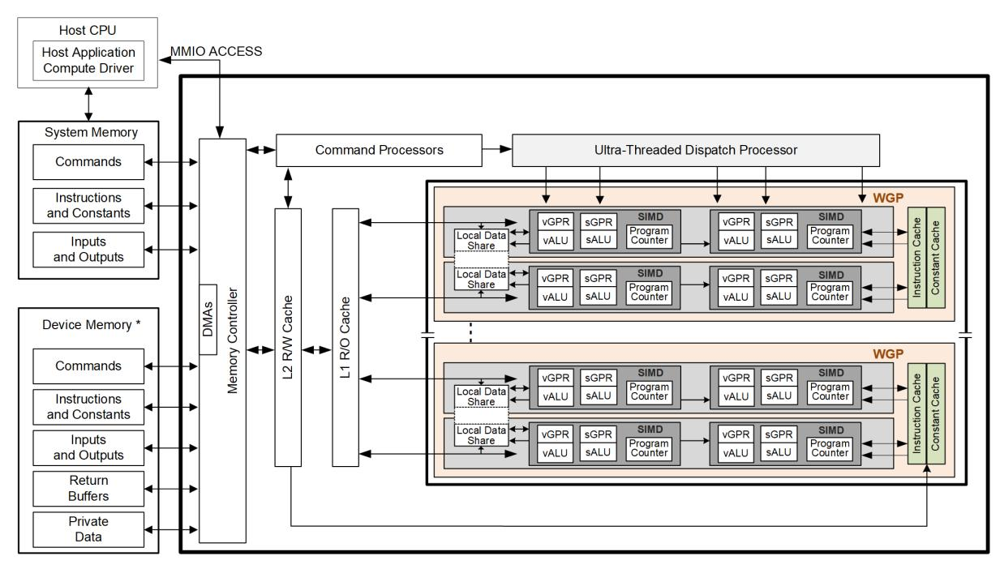

Figure 1. AMD RDNA4 Generation Series Block Diagram

The RDNA4 device includes a data-parallel processor array, a command processor, a memory controller, and other logic (not shown). The command processor reads commands that the host has written to memorymapped registers in the system-memory address space. The command processor sends hardware-generated interrupts to the host when the command is completed. The memory controller has direct access to all device memory and the host-specified areas of system memory. To satisfy read and write requests, the memory controller performs the functions of a direct-memory access (DMA) controller, including computing memoryaddress offsets based on the format of the requested data in memory.

In the RDNA4 environment, a complete application includes two parts:

- a program running on the host processor, and
- programs, called shader programs or kernels, running on the RDNA4 processor.

The RDNA4 programs are controlled by a driver running on the host that:

- Sets internal base-address and other configuration registers,
- Specifies the data domain on which the RDNA4 processor is to operate,
- Invalidates and flushes caches on the RDNA4 processor, and
- Causes the RDNA4 processor to begin execution of a program.

# <span id="page-15-0"></span>**1.2.1. Work-Group Processor**

The processor array is the heart of the RDNA4 processor. The array is organized as a set of **Work-Group Processor** (WGP) pipelines, each independent from the others, that operate in parallel on streams of floatingpoint or integer data.

The WGP processor pipelines can process data or, through the memory controller, transfer data to, or from, memory. Computation in a WGP processor pipeline can be made conditional. Outputs written to memory can also be made conditional.

1.2. Hardware Overview 6 of 697

When it receives a request, the WGP processor pipeline loads instructions and data from memory, begins execution, and continues until the end of the kernel. As kernels are running, the processor array hardware automatically fetches instructions from memory into on-chip caches; software plays no role in this. Kernels can load data from off-chip memory into on-chip general-purpose registers (GPRs) and caches.

The RDNA4 devices can detect floating point exceptions in hardware and can generate interrupts to the host. These exceptions can be recorded for post-execution analysis.

The RDNA4 hides memory latency by keeping track of potentially hundreds of work-items in various stages of execution, and by overlapping compute operations with memory-access operations.

# <span id="page-16-0"></span>**1.2.2. Cache System Hierarchy**

The memory system is divided into a number of levels of hierarchy. The figure below shows the memory hierarchy that is available to each work-item. The actual number of GPRs may differ from what is shown in the image below.

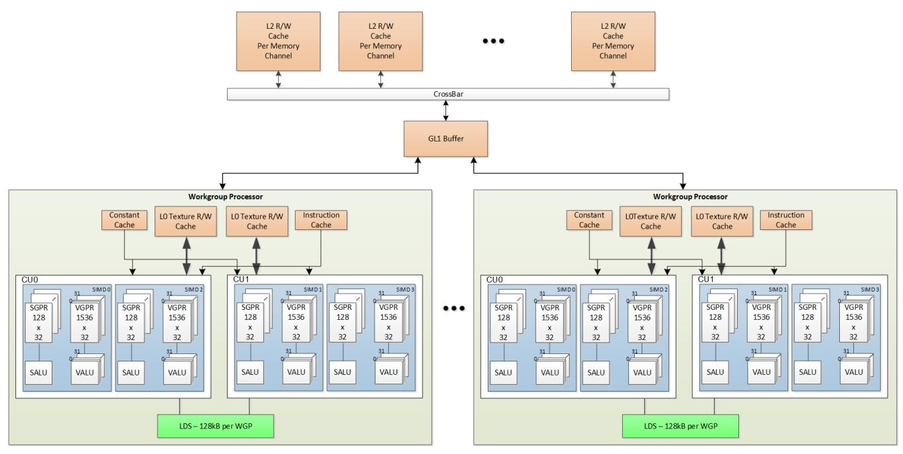

Figure 2. Shared Memory Hierarchy

"R/W" = read/write cache.

# **1.2.2.1. Local Data Share (LDS)**

Work-items within a work-group may share data with other work-items in the same work-group through the cache-memory system, or through the local shared memory (LDS).

Each work-group processor (WGP) has a 128kB memory space that enables low-latency communication between work-items within a work-group, or the work-items within a wave; this is the local data share (LDS). This memory is configured with 64 banks, each with 512 entries of 4 bytes. The shared memory contains 64 integer atomic units to enable fast, unordered atomic operations. This memory can be used as a software cache for predictable re-use of data, a data exchange machine for the work-items of a work-group, or as a cooperative

1.2. Hardware Overview 7 of 697

way to enable efficient access to off-chip memory. A single work-group may allocate up to 64kB of LDS space.

# <span id="page-17-0"></span>**1.2.3. Device Memory**

The AMD RDNA4 devices offer several methods for access to off-chip memory from the processing elements (PE) within each WGP. On the primary read path, the device consists of multiple channels of L2 cache that provides data to read-only L1 caches, and finally to L0 caches per WGP. The memory cache is formed by two levels of cache: the first-level (GL1) for write-combining cache (collect scatter and store operations and combine them to provide good access patterns to memory); the second (L2) is a read/write cache with atomic units that lets each processing element complete unordered atomic accesses that return the initial value. Specific cache-less load instructions can force data to be retrieved from device memory during an execution of a load clause.

The instruction cache provides shader instructions to each SIMD, and the constant cache provides access to scalar constants. Both of these caches are read-only.

Each processing element provides the destination address on which the atomic operation acts, the data to be used in the atomic operation, and a return address for the read/write atomic unit to store the pre-op value in memory.

Each store or atomic operation can receive an acknowledgment from the cache system to the requesting PE upon completing the write at the requested cache scope, or for atomics-with-return value, upon receiving the "pre-op" value from memory. This acknowledgment enables one processing element to implement a fence to maintain serial consistency by ensuring all writes have been posted to memory prior to completing a subsequent write. In this manner, the system can maintain a relaxed consistency model between all parallel work-items operating on the system. Each scatter write from a given PE to a given memory channel maintains order.

1.2. Hardware Overview 8 of 697

# <span id="page-18-0"></span>**Chapter 2. Shader Concepts**

RDNA4 shader programs (kernels) are programs executed by the shader processor. Conceptually, the shader program is executed independently on every work-item, but in reality the processor groups up to 32 or 64 work-items into a wave, that executes the shader program on all 32 or 64 work-items in one pass ("wave32" or "wave64").

The RDNA4 processor consists primarily of:

- A scalar ALU, that operates on one value per wave (common to all work-items)
- A vector ALU, that operates on unique values per work-item
- Local data storage, that allows work-items within a work-group to communicate and share data
- Scalar memory, that can transfer data to SGPRs from memory through a cache
- Vector memory, that can transfer data between VGPRs and memory , including sampling texture maps
- Exports that transfer data from the shader to dedicated graphics rendering hardware

Program control flow is handled using scalar ALU instructions. This includes if/else, branches and looping. Scalar ALU (SALU) and memory instructions work on an entire wave and operate on up to two SGPRs, as well as literal constants.

Vector memory and ALU instructions operate on all work-items in the wave at one time. In order to support branching and conditional execution, every wave has an EXECute mask that determines which work-items are active at that moment, and which are dormant. Active work-items execute the vector instruction, and dormant ones treat the instruction as a NOP. The EXEC mask can be written at any time by Scalar ALU instructions or vector ALU comparisons.

Vector ALU instructions can typically take up to three arguments, which can come from VGPRs, SGPRs, or literal constants that are part of the instruction stream. They operate on all work-items enabled by the EXEC mask. Vector compare and add-with-carry-out return a bit-per-work-item mask back to the SGPRs to indicate, per work-item, which had a "true" result from the compare or generated a carry-out.

Vector memory instructions transfer data between VGPRs and memory. Each work-item supplies its own memory address and supplies or receives unique data. These instructions are also subject to the EXEC mask.

# <span id="page-18-1"></span>**2.1. Wave32 and Wave64**

The shader supports both waves of 32 work-items ("wave32") and waves of 64 work-items ("wave64").

Both wave sizes are supported for all operations except VOPD (dual-VALU), but shader programs must be compiled for and run as a particular wave size, regardless of how many work-items are active in any given wave.

Wave32 waves issue each instruction at most once. Wave64 waves typically execute each instruction twice: once for the low half (work-items 31-0) and then again for the high half (work-items 63-32). This occurs only for VALU and VMEM (LDS, texture, buffer, flat, scratch, global) instructions; scalar ALU and memory as well as branch and messages are issued only once regardless of the wave size. Export requests also issue just once regardless of wave size.

Hardware may choose to skip either half if the EXEC mask for that half is all zeros, but does not skip both

2.1. Wave32 and Wave64 9 of 697

halves for VMEM instructions as that would confuse the outstanding-memory-instruction counters, unless there are no outstanding VMEM instructions from this wave. It also does not skip either half of a VALU instruction that writes an SGPR. See [Instruction Skipping: EXEC==0](#page-24-2) for details on instruction skipping rules.

Hardware operates such that both passes of a wave64 use the state of the wave prior to instruction execution; the first pass of the wave64 does not affect the input to the second pass.

There is an exception to this rule for wave64 VALU instructions that both read and write the same SGPR. See [Wave64](#page-82-1) [Destination Restrictions on SGPRs.](#page-82-1)

In addition to the EXEC mask being different between the low and high half, scalar inputs may vary between the two passes. Both passes use the same constants, but different masks and carry-in/out.

The differences in the second pass are:

- Input increments: Carry-in, div-fmas and v\_cndmask all use the next SGPR (SSRC + 1, or VCC\_HI)
- Output increments: Carry-out, div-scale and v\_cmp all write to the next SGPR (SDST + 1, or VCC\_HI)
  - v\_cmpx writes to EXEC\_HI instead of EXEC\_LO

The upper 32-bits of EXEC and VCC are ignored for wave32 waves. VCCZ and EXECZ reflect the status of the lowest 32-bits of VCC and EXEC respectively for wave32 waves.

# <span id="page-19-0"></span>**2.2. Shader Types**

# <span id="page-19-1"></span>**2.2.1. Compute Shaders**

Compute kernels (shaders) are generic programs that can run on the RDNA4 processor, taking data from memory, processing it, and writing results back to memory. Compute kernels are created by a dispatch, which causes the RDNA4 processors to run the kernel over all of the work-items in a 1D, 2D, or 3D grid of data. The RDNA4 processor walks through this grid and generates waves, which then run the compute kernel. Each work-item is initialized with its unique address (index) within the grid. Based on this index, the work-item computes the address of the data it is required to work on and what to do with the results.

# <span id="page-19-2"></span>**2.2.2. Graphics Shaders**

The shader supports 3 types of graphics waves: Pixel Shader (PS), Geometry Shader (GS) and Hull Shader (HS).

Rendering modes (launch behavior):

- **Normal** Geometry Engine (GE) sends info to wave launch hardware to initialize VGPRs for each element (primitive) launched; GE fetches index and vertex buffer data and loads to VGPRs
- **Mesh shader** turns GS-launch into a CS-style launch, and wave launch hardware does unrolling into elements and generates element indices on the fly. The mesh shader program determines how to use this index value.

2.2. Shader Types 10 of 697

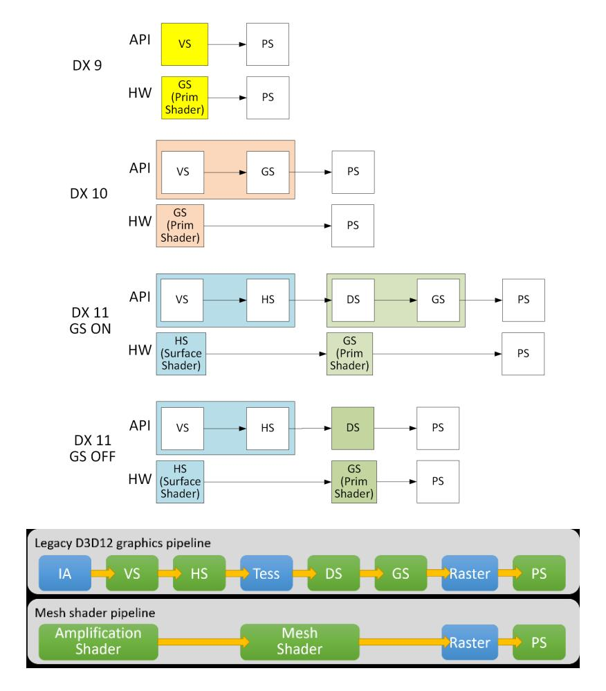

The amplification shader decides how many mesh shader groups to launch. The mesh shader processes vertices and then primitives.

# <span id="page-20-0"></span>**2.3. Work-groups**

A work-group is a collection of waves that can share data through LDS and can synchronize at a barrier. A barrier is a synchronization primitive that makes each wave reach a given point in the shader before any wave proceeds. Waves in a work-group are all issued to the same WGP but can run on any of the 4 SIMD32s and can share data through LDS. The WGP supports up to 32 work-groups with a maximum of 1024 work-items per work-group.

Waves in a work-group may share an allocation of LDS space up to 64kB. Work-groups consisting of a single wave do not count against the limit of 32. They do not allocate a barrier resource, and barrier ops are treated as S\_NOP.

Each work-group or wave can operate in one of two modes, selectable per draw/dispatch at wave-create time:

## <span id="page-20-1"></span>**CU mode**

In this mode, the LDS is effectively split into a separate upper and lower LDS, each serving two SIMD32s. Waves are allocated LDS space within the half of LDS which is associated with the SIMD the wave is running on. For work-groups, all waves are assigned to the pair of SIMD32s. This mode may provide faster operation since both halves run in parallel, but limits data sharing (upper waves cannot read data in the lower half of LDS and vice versa). When in CU mode, all waves in the work-group are resident within the same CU.

2.3. Work-groups 11 of 697

# **WGP mode**

In this mode, the LDS is one large contiguous memory that waves on the WGP allocate from, up to the same maximum allocation size. In WGP mode, waves of a work-group may be distributed across both CU's (all 4 SIMD32s) in the WGP. DS\_PARAM\_LOAD and DS\_DIRECT\_LOAD are not supported in WGP mode.

The WGP (and LDS) can simultaneously have some waves running in WGP mode and other waves in CU mode running. LDS performance may degrade when wave reference data on the "opposite side" from the SIMD they're on.

# <span id="page-21-0"></span>**2.4. Shader Padding Requirement**

Due to aggressive instruction prefetching used in RDNA4 devices, the user must pad all shaders with 64 extra DWORDs (256 bytes) of data past the end of the shader. It is recommended to use the S\_CODE\_END instruction as padding to make it easier to identify the end of a shader when debugging. This ensures that if the instruction prefetch hardware goes beyond the end of the shader, it may not reach into uninitialized memory (or unmapped memory pages).

# <span id="page-21-1"></span>**2.5. Whole Quad Mode**

Whole Quad Mode (WQM) is a method of operating where if any thread in a set of 4 threads is enabled, then all 4 act as if they were enabled. This mode is useful for operations which rely on all threads in a quad to be enabled to calculate data which relies on knowing the values in neighboring pixels. SAMPLE level-of-detail calculation is a common example of this.

Whole Quad Mode can be applied explicitly using S\_WQM\_B32 or S\_WQM\_B64 to modify the EXEC mask to enable groups of 4 lanes.

Whole Quad Mode is temporarily applied for these cases:

- V\_INTERP\_\* instructions: uses data from 3 lanes in a quad
- DS\_PARAM\_LOAD, DS\_DIRECT\_LOAD: loads data into 3 lanes per quad
- SAMPLE: operations which use neighboring pixel data to calculate a level-of-detail

# <span id="page-22-0"></span>**Chapter 3. Wave State**

This chapter describes the state variables visible to the shader program. Each wave has a private copy of this state unless otherwise specified.

# <span id="page-22-1"></span>**3.1. State Overview**

The table below shows the hardware states readable or writable by a shader program. The registers below are unique to each wave except for TBA and TMA which are shared.

Table 4. Commonly used Shader Wave State

| Abbrev.        | Name                       | Size<br>(bits) | Description                                                                                                                                                                                        |
|----------------|----------------------------|----------------|----------------------------------------------------------------------------------------------------------------------------------------------------------------------------------------------------|
| PC             | Program Counter            | 48             | Points to the memory address of the next shader instruction<br>to execute. Read/write only via scalar control flow<br>instructions and indirectly using branch. The 2 LSB's are<br>forced to zero. |
| V0-V255        | VGPR                       | 32             | Vector general-purpose register. (32 bits per work-item x (32<br>or 64) work-items per wave).                                                                                                      |
| S0-S105        | SGPR                       | 32             | Scalar general-purpose register. All waves are allocated 106<br>SGPRs + 16 TTMPs.                                                                                                                  |
| LDS            | Local Data Share           | 64kB           | Local data share is a scratch RAM with built-in arithmetic<br>capabilities that allows data to be shared between threads in<br>a work-group.                                                       |
| EXEC           | Execute Mask               | 64             | A bit mask with one bit per thread, that is applied to vector<br>instructions and controls which threads execute and which<br>ignore the instruction.                                              |
| EXECZ          | EXEC is zero               | 1              | A single bit flag indicating that the EXEC mask is all zeros.<br>For wave32 it considers only EXEC[31:0].                                                                                          |
| VCC            | Vector Condition Code      | 64             | A bit mask with one bit per thread; it holds the result of a<br>vector compare operation or integer carry-out. Physically<br>VCC is stored in specific SGPRs.                                      |
| VCCZ           | VCC is zero                | 1              | A single-bit flag indicating that the VCC mask is all zeros. For<br>wave32 it considers only VCC[31:0].                                                                                            |
| SCC            | Scalar Condition Code      | 1              | Result from a scalar ALU comparison instruction, carry-out<br>or other uses.                                                                                                                       |
| SCRATCH_BASE   | Scratch memory address     | 48             | The base address of scratch memory for this wave. Used by<br>Flat and Scratch instructions. Read-only by user shader;<br>writable by trap handler.                                                 |
| M0             | Misc Reg                   | 32             | A temporary register that has various uses, including GPR<br>indexing and bounds checking.                                                                                                         |
| STATUS         | Status                     | 32             | Shader status bits (read-only).                                                                                                                                                                    |
| STATE_PRIV     | Privileged State           | 32             | Shader state bits writable only by trap handler.                                                                                                                                                   |
| MODE           | Mode                       | 32             | Writable shader mode bits.                                                                                                                                                                         |
| TRAP_CTRL      | Exception Mask             | 32             | Mask of which exceptions cause a trap. Writable only by trap<br>handler; user shader can read.                                                                                                     |
| EXCP_FLAG_PRIV | Privileged Exception Flags | 32             | Mask of exceptions that have occurred. Writable only by trap<br>handler; user shader can read.                                                                                                     |

3.1. State Overview 13 of 697

| Abbrev.        | Name                                      | Size<br>(bits) | Description                                                                                                                                                                                                                                                                                 |
|----------------|-------------------------------------------|----------------|---------------------------------------------------------------------------------------------------------------------------------------------------------------------------------------------------------------------------------------------------------------------------------------------|
| EXCP_FLAG_USER | User-clearable Exception<br>Flags         | 32             | Mask of exceptions that have occurred. Writable by user<br>shader.                                                                                                                                                                                                                          |
| TBA            | Trap Base Address                         | 48             | Holds the program address of the trap handler. Per-VMID<br>register. Bit [63] indicates if the trap handler is present (1) or<br>not (0) and is not considered part of the address (bit[62] is<br>replicated into address bit[63] to form a 64-bit address).<br>Accessed via S_SENDMSG_RTN. |
| TMA            | Trap Memory Address                       | 48             | Temporary register for shader operations. For example, can<br>hold a pointer to data memory used by the trap handler.                                                                                                                                                                       |
| TTMP0-TTMP15   | Trap Temporary SGPRs                      | 32             | 16 SGPRs available only to the Trap Handler for temporary<br>storage.                                                                                                                                                                                                                       |
| LOADcnt        | Vector memory load<br>instruction count   | 6              | Counts the number of VMEM load (and atomic with return<br>value) instructions issued but not yet completed.                                                                                                                                                                                 |
| STOREcnt       | Vector memory store<br>instruction count  | 6              | Counts the number of VMEM store (and atomic without<br>return) instructions issued but not yet completed.                                                                                                                                                                                   |
| DScnt          | LDS instruction count                     | 6              | Counts the number of LDS instructions issued but not yet<br>completed.                                                                                                                                                                                                                      |
| KMcnt          | Constant and Message count 5              |                | Counts the number of constant-fetch (scalar memory read),<br>and message instructions issued but not yet completed.                                                                                                                                                                         |
| SAMPLEcnt      | Vector memory sample<br>instruction count | 6              | Counts the number of VMEM sample/gather/msaa-load/get<br>lod instructions (VSAMPLE encoding) issued but not yet<br>completed.                                                                                                                                                               |
| BVHcnt         | Vector memory BVH<br>instruction count    | 3              | Counts the number of VMEM BVH instructions issued but<br>not yet completed.                                                                                                                                                                                                                 |
| EXPcnt         | Export Count                              | 3              | Counts the number of Export instructions issued but not yet<br>completed. Also counts parameter loads outstanding.                                                                                                                                                                          |

# <span id="page-23-0"></span>**3.2. Control State: PC and EXEC**

# <span id="page-23-1"></span>**3.2.1. Program Counter (PC)**

The Program Counter is a DWORD-aligned byte address that points to the next instruction to execute. When a wave is created the PC is initialized to the first instruction in the program. The address is DWORD-aligned so the two LSBs are forced to zero.

There are a few instructions that interact directly with the PC: S\_GETPC\_B64, S\_SETPC\_B64, S\_CALL\_B64, S\_RFE\_B64, and S\_SWAPPC\_B64. These transfer the PC to and from an even-aligned SGPR pair (zeroextended).

Branches jump to (PC\_of\_the\_instruction\_after\_the\_branch + offset\*4). Branches, GET\_PC and SWAP\_PC are PCrelative to the **next** instruction, not the current one. S\_TRAP, on the other hand, saves the PC of the S\_TRAP instruction itself.

During wave debugging the program counter may be read. The PC points to the next instruction to issue. All prior instructions have been issued but may or may not have completed execution.

# <span id="page-24-0"></span>**3.2.2. EXECute Mask**

The Execute mask (64-bit) controls which threads in the vector are executed. Each bit indicates how one thread behaves for vector instructions: 1 = execute, 0 = do not execute. EXEC can be read and written via scalar instructions, and can also be written as a result of a vector-alu compare. EXEC affects: vector-alu, vectormemory, LDS , and export instructions. It does not affect scalar execution or branches.

Wave64 uses all 64 bits of the exec mask. Wave32 waves use only bits 31:0 and hardware does not act upon the upper bits.

There is a summary bit (EXECZ) that indicates that the entire execute mask is zero. It can be used as a condition for branches to skip code when EXEC is zero. For wave32, this reflects the state of EXEC[31:0].

# <span id="page-24-2"></span>**3.2.2.1. Instruction Skipping: EXEC==0**

The shader hardware may skip vector instructions when EXEC==0.

Instructions that are skipped result in the same wave state as if they had executed with EXEC==0: no wave state changes.

Instructions that may be skipped are:

- VALU skip if EXEC == 0
  - Not skipped if the instruction writes SGPRs/VCC
  - Does not skip WMMA or SWMMAC ops
  - This skipping is timing-dependent and might not occur depending on timing after a V\_CMPX.
- These are not skipped regardless of EXEC mask value , and are issued only once in wave64 mode
  - V\_NOP, V\_PIPEFLUSH, V\_READLANE, V\_READFIRSTLANE, V\_WRITELANE
  - GLOBAL\_INV, GLOBAL\_WB, GLOBAL\_WBINV
- These are not skipped and are issued twice in wave64 mode regardless of EXEC mask value
  - V\_CMP that writes SGPR or VCC (not V\_CMPX may skip one pass but not both)
  - Any VALU that writes an SGPR
- Export Request skip unless: Done==1 or if export target is POS0
  - Skipped if the wave was created with SKIP\_EXPORT=1
- DS\_param\_load / DS\_direct\_load: are skipped when EXEC==0 and EXPcnt==0
- LDS, Memory typically do not skip
  - VMEM can be skipped only if: EXEC == 0 and LOADcnt / STOREcnt / BVHcnt / SAMPLEcnt == 0
    - FLAT also requires that DScnt==0 to be skipped.
    - otherwise for wave64 one pass can be skipped if EXEC==0 for that half, but not both halves.
  - LDS can be skipped only if: DScnt==0 and EXEC==0

# <span id="page-24-1"></span>**3.3. Storage State: SGPR, VGPR, LDS**

# <span id="page-25-0"></span>**3.3.1. SGPRs**

# **3.3.1.1. SGPR Allocation and storage**

Every wave is allocated a fixed number of SGPRs:

- 106 normal SGPRs
- VCC\_HI and VCC\_LO (stored in SGPRs 106 and 107)
- 16 Trap-temporary SGPRs, meant for use by the trap handler

# **3.3.1.1.1. VCC**

The Vector Condition Code (VCC) is a named SGPR-pair that can be written by V\_CMP and integer vector ADD/SUB instructions. VCC is implicitly read by V\_ADD\_CI, V\_SUB\_CI, V\_CNDMASK and V\_DIV\_FMAS. VCC is subject to the same dependency checks as any other SGPR.

# **3.3.1.2. SGPR Alignment**

There are a few cases where even-aligned SGPRs are required:

- 1. any time 64-bit data is used
  - a. this includes moves to/from 64-bit registers, including PC
- 2. Scalar memory loads when the address-base comes from an SGPR-pair

When a 64-bit SGPR data value is used as a source to a VALU op, it must be even aligned regardless of size. In contrast, when a 32-bit SGPR data value is used as a source to a VALU op, it can be arbitrarily aligned regardless of wave size.

Quad-alignment of SGPRs is required for operations on more than 64-bits, and for the data SGPR when a scalar memory operation (read, write or atomic) operates on more than 2 DWORDs.

When a 64-bit quantity is stored in SGPRs, the LSB's are in SGPR[n], and the MSB's are in SGPR[n+1].

When an SGPR is used as a carry-in, carry-out or mask value to a VALU op, it must be even-aligned in wave64 shaders but may be arbitrarily aligned in wave32 shaders.

It is illegal to use mis-aligned source or destination SGPRs for data larger than 32 bits and results are unpredictable.

# **3.3.1.3. SGPR Out of Range Behavior**

Scalar sources and dests use a 7-bit encoding:

Scalar 0-105=SGPR; 106,107=VCC, 108-123=TTMP0-15, and 124-127={NULL, M0, EXEC\_LO, EXEC\_HI}.

It is illegal to use GPR indexing or a multi-DWORD operand to cross SGPR regions. The regions are:

- SGPRs 0 107 (includes VCC)
- Trap Temp SGPRs

• All other SGPR & Scalar-source addresses must not be indexed and no single operand can reference multiple register ranges.

# General Rules:

- Out of range source SGPRs return zero (NULL, M0 or EXEC where not allowed)
- Writes to an out of range SGPR are ignored

TTMP0-15 can only be written while in the trap handler (STATUS.PRIV=1) but can be read by the user's shader (STATUS.PRIV=0). Writes to TTMPs while outside the trap handler are ignored. SALU instructions that try but fail to write a TTMP also do not update SCC.

- SALU: Above rules apply.
  - WREXEC and SAVEEXEC write the EXEC mask even when the SDST is out-of-range
- VALU: Above rules apply.
- VMEM: S#, T#, V# must be contained within one region.
  - T# (128b), V# or S#: no possible range violation exists (forced alignment puts all in one range).
  - T# (256b) starting at 104 and extending into TTMPs; or starting at TTMP12 and going past TTMP15 is a violation. If this occurs, force to use S0.
- SMEM ops return data starting in SGPRs/VCC and extending into TTMPs, or starting in TTMPs and extending outside TTMPs becomes out of range.
  - No data gets written to dest-SGPRs that are out-of-range
  - Addr and write-data are aligned and so cannot go out of range, except:
    - Referencing M0, NULL, or EXEC\* returns zero, and SMEM loads cannot load into these registers.
- S\_MOVREL:
  - Indexing is allowed only within SGPRs and TTMPs, and must not cross between the two. Indexing must stay within the "base" range (the operand type where index==0).

The ranges are: [ SGPRs 0-105 and VCC\_LO, VCC\_HI ], [ Trap Temps 0-15 ], [ all other values ]

- Indexing must not reach M0, exec or inline constants, the rule is:
  - Base is SGPR: addr > VCC\_HI (or if 64-bit operand, addr > VCC\_LO)
  - Base is TTMP: addr > TTMP15 (or if B64 if addr > TTMP14)
- If the source is out of range, S0 is used. If the dest is out of range, nothing is written.

# <span id="page-26-0"></span>**3.3.2. VGPRs**

# **3.3.2.1. VGPR Allocation and Alignment**

VGPRs are allocated in blocks of 16 for wave32 or 8 for wave64, and a shader may have up to 256 VGPRs. In other words, VGPRs are allocated in units of (16\*32 or 8\*64 = 512 DWORDs). A wave may not be created with zero VGPRs. Devices that have 1536 VGPRs per SIMD allocate in blocks of 24 for wave32 and 12 for wave64.

A wave may voluntarily deallocate all of its VGPRs via S\_SENDMSG. Once this is done, the wave may not reallocate them and the only valid action is to terminate the wave. This can be useful if a wave has issued stores to memory and is waiting for the write-confirms before terminating. Releasing the VGPRs while waiting may allow a new wave to allocate them and start earlier.

# <span id="page-27-1"></span>**3.3.2.2. VGPR Out of Range Behavior**

Given an instruction operand that uses one or more DWORDs of VGPR data: "V"

```
Vs = the first VGPR DWORD (start) 
Ve = the last VGPR DWORD (end)
```

For a 32-bit operand, Vs==Ve; for a 64-bit operand Ve=Vs+1, etc.

Operand is out of range if:

- Vs < 0 || Vs >= VGPR\_SIZE
- Ve < 0 || Ve >= VGPR\_SIZE

V\_MOVREL indexed operand out of range if either:

- Index > 255
- (Vs + M0) >= VGPR\_SIZE
- (Ve + M0) >= VGPR\_SIZE

Out of range consequences:

- If a dest VGPR is out of range, the instruction is ignored (treat as NOP). VMEM instructions (including LDS) issue the instruction as if EXEC==0 to keep LOADcnt/STOREcnt/… correct.
- V\_SWAP & V\_SWAPREL : since both arguments are destinations, if either is out of range, discard the instruction.
  - VALU instructions with multiple destination (e.g. VGPR and SGPR): nothing is written to any GPR
- If a source VGPR is out of range in a VMEM or Export instruction: VGPR0 is used for the out of range VGPR
  - Memory instructions that use a group of consecutive VGPRs that are out of range use VGPR0 for the individual out of range VGPRs.
- If a source VGPR in a VALU instruction is out of range: act as if the instruction's source field is set to VGPR0. Operands > 32 bits use consecutive VGPRs: V0, V1, V2, …
  - VOPD has different rules: the source address forced to (VGPRaddr % 4).

Instructions with multiple destinations (e.g. V\_ADD\_CO): if any destination is out of range, no results are written.

# <span id="page-27-0"></span>**3.3.3. Dynamic VGPR Allocation & Deallocation**

Compute Shaders may be launched in a mode where they can dynamically allocate and deallocate VGPRs; dynamic VGPRs is not supported for graphics-shaders. Waves must be launched in "dynamic VGPR" mode to be granted this ability; without it instructions requesting to alter the VGPR allocation size are ignored.

Dynamic VGPRs are supported only for wave32, not wave64.

Dynamic-VGPR workgroups take over a WGP (no mixing of dynamic and non-dynamic VGPR waves on a WGP): if any workgroup is using dynamic VGPRs, only dynamic VGPR enabled workgroups or waves may be running on that WGP. DVGPR workgroups take over a WGP when the workgroup is launched in WGP-mode, and take over a CU when launched in CU-mode.

VGPRs are allocated/deallocated in blocks of 16 or 32 VGPRs (configurable) and are added to or removed from the highest numbered VGPRs, keeping the range of available logical VGPRs contiguous starting from VGPR0.

Waves may allocate up to a maximum of 8 blocks of VGPRs and have a minimum of one block.

#### **Block Size**

The VGPR block size is configurable to be 16-VGPRs with a maximum allocation of 128 VGPRs per wave, or 32-VGPRs with a maximum allocation of 256 VGPRs per wave. This block-size is a chip-wide config; it cannot be modified per draw or dispatch. "Blocks" are also called "segments" in some contexts. Waves using block-size of 16-VGPRs must not access VGPRs above 127 - results are unpredictable.

Waves in dynamic VGPR mode are initialized with one VGPR-block allocated.

# **3.3.3.1. Instruction**

```
S_ALLOC_VGPR <NumVgprs> // Number of VGPRs wave now wants to own. Either inline-constant or SGPR
  // NumVgprs is rounded up to the nearest BlockSize.
```

S\_ALLOC\_VGPR attempts to allocate (when: NumVgprs > currentVgprs) or deallocate (when: NumVgprs < currentVgprs). Allocation requests can fail and return SCC=1 for success, SCC=0 for failure. Allocations do not partially succeed - it's all or nothing. If an allocation fails, the shader may retry again until it succeeds. Deallocations do not fail, as do S\_ALLOC\_VGPR that do not change the allocation size. Only bits [8:0] of NumVgprs are considered.

Allocations requesting more than the maximum number of VGPRs automatically fail and return SCC=0. A wave may deallocate down to zero VGPRs. Deallocating down to zero VGPRs is not the same as "S\_SENDMSG DEALLOC\_VGPRS", and this latter message must not be issued while using dynamic VGPRs.

VGPR out of bounds: the same out-of-bounds rules apply as when not using dynamic VGPRs.

A single-state (chip-wide) config register defines the maximum number of waves per SIMD that can be present when using dynamic VGPRs: SQ\_DYN\_VGPR. Each of those wave-slots up to the maximum has 1 block of VGPRs reserved whether or not that wave-slot is in use, but wave-slots past the maximum have no VGPRs allocated. With blockSize=16 this means every wave-slot has 16 VGPRs regardless if there is a wave using it or not, and the remaining VGPRs are available for allocation.

# **3.3.3.2. Deadlock Avoidance**

Dynamically allocating VGPRs can lead to deadlock when all VGPRs have been allocated but every wave needs to allocate more VGPRs to make progress. Hardware mitigates this with a mode that reserves just enough VGPRs that at least one wave can reach the maximum VGPR allocation at all times. This does not prevent deadlock when multiple waves require the maximum allocation to progress.

# **3.3.3.3. Context Save & Restore**

Dynamic VGPRs are supported with Compute Wave Save Restore (CWSR). Waves must save off all VGPRs to memory and on restore, using S\_ALLOC\_VGPR to first allocate VGPRs before restoring them from memory. Waves are re-launched on restore in dynamic-vgpr-mode.

# <span id="page-29-0"></span>**3.3.4. Memory Alignment and Out-of-Range Behavior**

This section defines the behavior when a source or destination GPR or memory address is outside the legal range for a wave. Except where noted, these rules apply to LDS, buffer, global, flat and scratch memory accesses.

Memory, LDS: Loads and Atomics with return:

- If any source VGPR or SGPR is out-of-range, the data value is undefined.
- If any destination VGPR is out-of-range, the operation is nullified by issuing the instruction as if the EXEC mask were cleared to 0.
  - This out-of-range test checks all VGPRs that could be returned (e.g. VDST to VDST+3 for a BUFFER\_LOAD\_B128)
  - This check also includes the extra PRT (partially resident texture) VGPR and nullifies the fetch if this VGPR would be out of range no matter whether the texture system actually returns this value or not.
  - Atomic operations with out-of-range destination VGPRs are nullified: issued, but with EXEC mask of zero.
- Image loads and stores consider DMASK bits when making an out-of-bounds determination.
- Note: VDST is only checked for lds/mem-atomic that actually return a value.

VMEM memory alignment rules are defined using the config register: SH\_MEM\_CONFIG.alignment\_mode. This setting also affects LDS, Flat/Scratch/Global operations.

**DWORD** Automatic alignment to multiple of the smaller of element size or a DWORD.

**UNALIGNED** No alignment requirements, except for atomics.

Formatted ops such as BUFFER\_LOAD\_FORMAT\_\* must be aligned as follows:

- 1-byte formats require 1-byte alignment
- 2-byte formats require 2-byte alignment
- 4-byte and larger formats require 4-byte alignment

Atomics must be aligned to the data size, or they trigger a MEMVIOL.

# <span id="page-29-1"></span>**3.3.5. Local Data Share (LDS)**

LDS is a scratch-pad memory allocated to waves or workgroups (in which case it is sometimes referred to as "shared memory"). Waves may be allocated LDS memory, and waves in a work-group all share the same LDS memory allocation. All accesses to LDS are restricted to the space allocated to that wave/work-group.

A wave may have 0 - 64kbyte of LDS space allocated, and it is allocated in blocks of 1024 bytes.

Internally LDS is composed of two blocks of memory of 64kB each. Each one of these two blocks is affiliated with one CU or the other: byte addresses 0-65535 with CU0, 65536-131071 with CU1. Allocations of LDS space to a wave or work-group do not wrap around: the allocation starting address is less than the ending address.

In CU mode, a wave's entire LDS allocation resides in the same "side" of LDS as the wave is loaded. No access is allowed to cross over or wrap around to the other side.

In WGP mode, a wave's LDS allocation may be entirely in either the CU0 or CU1 part of LDS, or it may straddle

the boundary and be partially in each CU. The location of the LDS storage is unrelated to which CU the wave is on.

Pixel parameters are loaded into the same CU side as the wave resides and do not cross over into the other side of LDS storage. Pixel shaders are run only in CU mode. Pixel shader may request additional LDS space in addition to what is required for vertex parameters.

# **3.3.5.1. LDS Alignment and Out-of-Range**

Any DS\_LOAD or DS\_STORE of any size can be byte aligned if the alignment mode is set to "unaligned". For all other alignment modes, LDS forces alignment by zeroing out address least significant bits.

- 32-bit Atomics must be aligned to a 4-byte address; 64-bit atomics to an 8-byte address, otherwise they return MEMVIOL.
- LDS operations report MEMVIOL if the LDS-address is out of range

## Out Of Range

- If the LDS-ADDRESS is out of range (addr < 0 or >= LDS\_size):
  - Loads return the value zero. For multi-DWORD loads, this is checked per DWORD and when any portion of a DWORD is out of range, it returns zero.
  - Any portion of a store operation that is in range is written to LDS, and stored bytes out of range are discarded
  - For both loads and stores the out of bounds check is performed at byte granularity for UNALIGNED mode, and DWORD granularity for DWORD alignment mode.
- If any source-VGPR is out of range, the value from VGPR0 is used to supply the LDS address or data.
- If the dest-VGPR is out of range, nullify the instruction (issue with EXEC=0)

"Native" Alignment in LDS is:

B8: byte aligned B16 or D16: 2 byte aligned B32: 4 byte aligned B64: 8 byte aligned B128 and B96: 16 byte aligned

If the alignment mode is set to "unaligned", the LDS disables its auto-alignment and doesn't report error for misaligned loads & stores

```
  if (sh_alignment_mode == unaligned) align = 0xffff
  else if (B32) align = 0xfffC
  else if (B64) align = 0xfff8
  else if (B96 or B128) align = 0xfff0
  LDSaddr = (addr + offset) & align
```

# <span id="page-30-0"></span>**3.3.6. Scratch (Private) Memory**

Waves may be allocated a block of global memory at wave-launch time that can be used for thread-private data.

This memory is private to each thread (although this is not enforced) and memory swizzling is optimized for the case when each thread has the same index into its scratch space.

Scratch memory is allocated with 64-DWORD granularity and may be [0 - (16M-64)] DWORDs per wave.

# <span id="page-31-0"></span>**3.4. Wave State Registers**

The following registers are accessed infrequently, and are only readable/writable via S\_GETREG\_B32 and S\_SETREG instructions. Some of these registers are read-only, some are writable and others are writable only when in the trap handler ("PRIV").

<span id="page-31-2"></span>

| Index | Writable? | Register            |                                                       |
|-------|-----------|---------------------|-------------------------------------------------------|
| 1     | Yes       | MODE                | Wave mode bits                                        |
| 2     | No        | STATUS              | Wave status bits                                      |
| 4     | PRIV      | STATE_PRIV          | wave state bits writable by the trap handler (PRIV=1) |
| 10    | No        | PERF_SNAPSHOT_DATA  | Data captured during performance snapshot             |
| 11    | No        | PERF_SNAPSHOT_PC_LO | PC[31:0] of performance snapshot                      |
| 12    | No        | PERF_SNAPSHOT_PC_HI | PC[39:32] of performance snapshot                     |
| 15    | No        | PERF_SNAPSHOT_DATA1 | Data captured during performance snapshot             |
| 16    | No        | PERF_SNAPSHOT_DATA2 | Data captured during performance snapshot             |
| 17    | PRIV      | EXCP_FLAG_PRIV      | Exception flags writable only by trap handler         |
| 18    | Yes       | EXCP_FLAG_USER      | Exception flags writable by user                      |
| 19    | PRIV      | TRAP_CTRL           | Trap exception enables; writable only by trap handler |
| 20    | PRIV      | SCRATCH_BASE_LO     | user-read only; writable only by trap handler         |
| 21    | PRIV      | SCRATCH_BASE_HI     | user-read only; writable only by trap handler         |
| 23    | No        | HW_ID1              | read only. debug only - not predictable values        |
| 24    | No        | HW_ID2              | read only. debug only - not predictable values        |
| 29    | No        | SHADER_CYCLES_LO    | Get the current shader clock counter value            |
| 30    | No        | SHADER_CYCLES_HI    | Get the current shader clock counter value            |
| 28    | No        | IB_STS2             |                                                       |

# <span id="page-31-1"></span>**3.4.1. STATUS register**

Status register fields can be read but not written to by the shader. These bits are initialized at wave-creation time or updated during execution.

Table 5. Status Register Fields

| Field      | Bit<br>Pos | Description                                                                                                                                                                                                                                                                                                                                                                                                                                                                                                                                            |
|------------|------------|--------------------------------------------------------------------------------------------------------------------------------------------------------------------------------------------------------------------------------------------------------------------------------------------------------------------------------------------------------------------------------------------------------------------------------------------------------------------------------------------------------------------------------------------------------|
| PRIV       | 5          | Privileged mode. Indicates that the wave is in the trap handler. Gives write access to TTMP<br>registers.                                                                                                                                                                                                                                                                                                                                                                                                                                              |
| TRAP_EN    | 6          | Indicates that a trap handler is present. When set to zero, traps are not taken.                                                                                                                                                                                                                                                                                                                                                                                                                                                                       |
| EXPORT_RDY | 8          | Pixel shaders only: This status bit indicates that export buffer space has been allocated.<br>The shader stalls any export instruction until this bit becomes "1". It gets set to 1 when<br>export buffer space has been allocated. Shader hardware checks this bit before executing any<br>EXPORT instruction to Position, Z or MRT targets, and put the wave into a waiting state if<br>the alloc has not yet been received. The alloc arrives eventually (unless SKIP_EXPORT is<br>set) as a message and the shader then continues with the export. |

3.4. Wave State Registers 22 of 697

| Field                     | Bit<br>Pos | Description                                                                                                                                                                                                                                                                                                                        |
|---------------------------|------------|------------------------------------------------------------------------------------------------------------------------------------------------------------------------------------------------------------------------------------------------------------------------------------------------------------------------------------|
| EXECZ                     | 9          | Exec Mask is Zero.                                                                                                                                                                                                                                                                                                                 |
| VCCZ                      | 10         | Vector Condition Code is Zero.                                                                                                                                                                                                                                                                                                     |
| IN_WG                     | 11         | Wave is a member of a work-group of more than one wave.                                                                                                                                                                                                                                                                            |
| TRAP                      | 14         | Wave is flagged to enter the trap handler as soon as possible.                                                                                                                                                                                                                                                                     |
| TRAP_BARRIER_<br>COMPLETE | 15         | Indicates that the trap-barrier has completed but wave has not yet waited on that barrier                                                                                                                                                                                                                                          |
| VALID                     | 16         | Wave is valid (has been created and not yet ended)                                                                                                                                                                                                                                                                                 |
| SKIP_EXPORT               | 18         | Pixel and Vertex Shaders only:<br>"1" means this shader is not allocated export buffer space, so export instructions are<br>ignored (treated as NOPs). For pixel shaders, this is set to 1 when both the<br>COL0_EXPORT_FORMAT and Z_EXPORT_FORMAT are set to ZERO. If SKIP_EXPORT==1,<br>Must_export must be zero and vice versa. |
| FATAL_HALT                | 23         | Indicates that the wave has halted due to a fatal error:<br>• illegal instruction<br>The difference between halt and fatal_halt is that fatal_halt stops waves even when<br>PRIV=1.                                                                                                                                                |
| NO_VGPRS                  | 24         | Indicates that this wave has released all of its VGPRs.                                                                                                                                                                                                                                                                            |
| LDS_PARAM_RDY             | 25         | Pixel shaders only: indicates that LDS has been written with vertex attribute data and the<br>shader may now execute DS_PARAM_LOAD instructions. If the wave attempts to issue<br>DS_PARAM_LOAD before this bit is set, it stalls until the bit is set.                                                                            |
| MUST_GS_ALLOC             | 26         | Indicates that the GS shader must issue a GS_ALLOC_REQ message before terminating.<br>Sending this message clears this bit.                                                                                                                                                                                                        |
| MUST_EXPORT               | 27         | Pixel Shaders: this wave must export color ("export-done") before it terminates.<br>Set to 1 for PS waves unless "skip_export==1". Cleared when PS exports data with export's<br>Done bit set to 1.<br>Is set to zero for other wave types.                                                                                        |
| IDLE                      | 28         | Wave is idle (has no outstanding instructions). Used via register-read to determine if a<br>wave is valid, halted and idle - able to read other wave state.                                                                                                                                                                        |
| WAVE64                    | 29         | Wave is 64 (0 = wave32)                                                                                                                                                                                                                                                                                                            |
| DYN_VGPR_EN               | 30         | Indicates that the wave is running using Dynamic VGPRs.                                                                                                                                                                                                                                                                            |

# <span id="page-32-0"></span>**3.4.2. STATE\_PRIV register**

STATE\_PRIV register fields can be read by the user shader and written while in the trap handler (PRIV=1). These bits are initialized at wave-creation time or updated during execution.

Table 6. STATE\_PRIV Register Fields

| Field            | Bit<br>Pos | Description                                                                                                                                                                          |
|------------------|------------|--------------------------------------------------------------------------------------------------------------------------------------------------------------------------------------|
| WG_RR_EN         | 0          | Workgroup Round-robin arbitration requested.                                                                                                                                         |
| SLEEP_WAKEUP     | 1          | The wave has one credit to skip the next S_SLEEP instruction due to previously receiving<br>a S_WAKEUP                                                                               |
| BARRIER_COMPLETE | 2          | has the barrier completed but wave has not yet waited on that barrier                                                                                                                |
| SCC              | 9          | Scalar condition code. Used as a carry-out bit. For a comparison instruction, this bit<br>indicates failure or success. For logical operations, this is 1 if the result is non-zero. |

3.4. Wave State Registers 23 of 697

| Field      | Bit<br>Pos | Description                                                                                                                                                                                                                                                                         |
|------------|------------|-------------------------------------------------------------------------------------------------------------------------------------------------------------------------------------------------------------------------------------------------------------------------------------|
| SYS_PRIO   | 11:10      | Wave priority set at wave creation time. See S_SETPRIO instruction for details. 0 is<br>lowest, 3 is highest priority.                                                                                                                                                              |
| USER_PRIO  | 13:12      | Wave's priority set by shader program itself. See S_SETPRIO instruction for details.                                                                                                                                                                                                |
| HALT       | 14         | Wave is halted or scheduled to halt.<br>HALT can be set by the host via wave-control messages, or by the shader. The HALT bit<br>is ignored while in the trap handler (PRIV = 1). HALT is also ignored if a host-initiated<br>trap is received (request to enter the trap handler). |
| SCRATCH_EN | 18         | Indicate that the wave has scratch memory allocated. This bit gets set to 1 if the wave has<br>SCRATCH_BASE initialized; otherwise is zero.                                                                                                                                         |

# <span id="page-33-0"></span>**3.4.3. MODE register**

Mode register fields can be read from, and written to, by the shader through scalar instructions.

Table 7. Mode Register Fields

| Field              | Bit<br>Pos | Description                                                                                                                                                                                                                                                                                                                                                                                                                                                                                                                                                                                          |
|--------------------|------------|------------------------------------------------------------------------------------------------------------------------------------------------------------------------------------------------------------------------------------------------------------------------------------------------------------------------------------------------------------------------------------------------------------------------------------------------------------------------------------------------------------------------------------------------------------------------------------------------------|
| FP_ROUND           | 3:0        | Controls round modes for math operations<br>[1:0] Single precision round mode<br>[3:2] Double precision and half precision (FP16) round mode<br>Round Modes: 0=nearest even, 1= +infinity, 2= -infinity, 3= toward zero<br>Round mode affects float ops in VALU, but not LDS or memory.                                                                                                                                                                                                                                                                                                              |
| FP_DENORM          | 7:4        | Controls whether floating point denormals are flushed or not.<br>[5:4] Single precision denormal mode<br>[7:6] Double precision and FP16 denormal mode<br>Denormal modes: 2 bits = { allow_output_denorms, allow_input_denorms }<br>0 = flush input and output denorms<br>1 = allow input denorms, flush output denorms<br>2 = flush input denorms, allow output denorms<br>3 = allow input and output denorms<br>Denorm mode affects float ops in: VALU, LDS-atomics (DS ops, not flat).<br>Flat (including those serviced by LDS) and memory atomics ignore this mode and do not<br>flush denorms. |
| FP16_OVFL          | 23         | If set, an overflowed FP16 VALU result is clamped to +/- MAX_FP16 regardless of round<br>mode, while still preserving true INF values. (Inputs that are infinity may result in infinity,<br>as does divide-by-zero).                                                                                                                                                                                                                                                                                                                                                                                 |
| SCALAR_PREFETCH_EN | 24         | 1 = enable scalar prefetch instructions (both instruction & data); 0 = ignore them<br>(S_NOP).                                                                                                                                                                                                                                                                                                                                                                                                                                                                                                       |
| DISABLE_PERF       | 27         | 1 = temporarily disable performance counting for this wave.                                                                                                                                                                                                                                                                                                                                                                                                                                                                                                                                          |

# <span id="page-33-1"></span>**3.4.4. M0 : Miscellaneous Register**

There is one 32-bit M0 register per wave and is it used for:

Table 8. M0 Register Fields

| Operation  | M0 Contents                 | Notes                                      |
|------------|-----------------------------|--------------------------------------------|
| S/V_MOVREL | GPR index                   | See S_MOVREL and V_MOVREL instructions     |
| LDS ADDTID | { 16'h0, lds_offset[15:0] } | offset is in bytes, must be 4-byte aligned |

3.4. Wave State Registers 24 of 697

| Operation        | M0 Contents                                              | Notes                                                                                           |
|------------------|----------------------------------------------------------|-------------------------------------------------------------------------------------------------|
| DS_PARAM_LOAD    | { 1'b0, new_prim_mask[15:1],<br>parameter_offset[15:0] } | Offset is in bytes and offset[6:0] must be zero.<br>Wave32: new_prim_mask is {8'b0, mask[7:1] } |
| DS_DIRECT_LOAD   | { 13'b0, DataType[2:0],<br>LDS_address[15:0] }           | address is in bytes                                                                             |
| EXPORT           | Row number for mesh shader POS<br>& Param exports        | See Export chapter                                                                              |
| S_SENDMSG / _RTN | varies                                                   | sendmsg data. See [SendMessageTypes]                                                            |
| Various          | Temporary data[31:0]                                     | can be used as general temporary data storage                                                   |

M0 can only be written by the scalar ALU.

# <span id="page-34-0"></span>**3.4.5. NULL**

NULL is a scalar source and destination. Reading NULL returns zero, writing to NULL has no effect (write data is discarded).

NULL may be used anywhere scalar sources can normally be used:

- When NULL is used as the destination of an SALU instruction, the instruction executes: SDST is not written but SCC is updated (if the instruction normally updates SCC). Instructions like S\_SWAP\_PC with NULL as a DEST still execute, loading zero into the PC and not writing any other result.
- NULL may not be used as an S#, V# or T#.

# <span id="page-34-1"></span>**3.4.6. SCC: Scalar Condition Code**

Many scalar ALU instructions set the Scalar Condition Code (SCC) bit, indicating the result of the operation.

Compare operations: 1 = true

Arithmetic operations: 1 = carry out

Bit/logical operations: 1 = result was not zero

Move: does not alter SCC

The SCC can be used as the carry-in for extended-precision integer arithmetic, as well as the selector for conditional moves and branches.

# <span id="page-34-2"></span>**3.4.7. Vector Compares: VCC and VCCZ**

Vector ALU comparison instructions (V\_CMP) compare two values and return a bit-mask of the result, where each bit represents one lane (work-item) where: 1= pass, 0 = fail. This result mask is the Vector Condition Code (VCC). VCC is also set for selected integer ALU operations (carry-out).

These instructions write this mask either to VCC, an SGPR or to EXEC, but do not write to both EXEC and SGPRs. Wave64 writes 64-bits of VCC, EXEC or an aligned pair of SGPRs; Wave32 writes only the low 32 bits of VCC, EXEC or a single SGPR.

3.4. Wave State Registers 25 of 697

Whenever any instruction writes a value to VCC, the hardware automatically updates a "VCC summary" bit called VCCZ. This bit indicates whether or not the entire VCC mask is zero for the current wave-size. Wave32 ignores VCC[63:32] and only bits[31:0] contribute to VCCZ. This is useful for early-exit branch tests. VCC is also set for certain integer ALU operations (carry-out).

The EXEC mask determines which threads execute an instruction. The VCC indicates which executing threads passed the conditional test, or which threads generated a carry-out from an integer add or subtract.

```
S_MOV_B64 EXEC, 0x00000001 // set just one thread active; others are inactive
V_CMP_EQ_B32 VCC, V0, V0 // compare (V0 == V0) and write result to VCC (all bits in VCC are updated)
```

VCC physically resides in the SGPR register file in a specific pair of SGPRs, so when an instruction sources VCC, that counts against the limit on the total number of SGPRs that can be sourced for a given instruction.

Wave32 waves may use any SGPR for mask/carry/borrow operations, but may not use VCC\_HI or EXEC\_HI.

# <span id="page-35-0"></span>**3.4.8. SCRATCH\_BASE**

SCRATCH\_BASE is a 64-bit register that holds a pointer to the base of scratch memory for this wave. For waves that have scratch space allocated, wave-launch hardware initializes the SCRATCH\_BASE register with the scratch base address unique to this wave. This register is read-only, except while in the trap handler where it is writable. The value is a byte address and must be 256byte aligned. If the wave has no scratch space allocated, then reading SCRATCH\_BASE returns zero.

# <span id="page-35-1"></span>**3.4.9. Hardware Internal Registers**

These registers are read-only and can be accessed by the S\_GETREG\_B32 instruction. They return information about hardware allocation and status. These registers are read-only unless otherwise specified.

# **HW\_ID1**

| Field   | Bits  | Description                                                        |
|---------|-------|--------------------------------------------------------------------|
| WAVE_ID | 4:0   | Wave id within the SIMD.                                           |
| SIMD_ID | 9:8   | SIMD_ID within the WGP: [0] = CU within WGP, [1] = SIMD within CU. |
| WGP_ID  | 13:10 | Physical WGP ID.                                                   |
| SA_ID   | 16    | Shader Array ID                                                    |

#### **HW\_ID2**

| Field    | Bits  | Description                                       |
|----------|-------|---------------------------------------------------|
| QUEUE_ID | 3:0   | Queue_ID (also encodes shader stage)              |
| PIPE_ID  | 5:4   | Pipeline ID                                       |
| ME_ID    | 9:8   | MicroEngine ID: 0 = graphics, 1 & 2 = ACE compute |
| STATE_ID | 14:12 | State context ID                                  |
| WG_ID    | 20:16 | Work-group ID (0-31) within the WGP.              |
| VM_ID    | 27:24 | Virtual Memory ID                                 |

3.4. Wave State Registers 26 of 697

### **IB\_STS2**

| Field | Bits | Description |
|-------|------|-------------|
|-------|------|-------------|

#### **PERF\_SNAPSHOT\_DATA**

Note that all PERF\_SNAPSHOT registers can only be read by the wave that was snapshot (others read zero). Users should read PERF\_SNAPSHOT\_PC\_HI last, as reading this resets (unlocks) the perf\_snapshot registers for the next snapshot to be taken, as does the wave terminating.

| Field                   | Bits     | Description                                                                                                                                 |                           |                           |                  |  |
|-------------------------|----------|---------------------------------------------------------------------------------------------------------------------------------------------|---------------------------|---------------------------|------------------|--|
| VALID                   | 0        | 1: snapshot data is written & sampled wave is reading it, 0: invalid or sampled                                                             |                           |                           |                  |  |
|                         |          | wave is not the targeted wave                                                                                                               |                           |                           |                  |  |
| WAVE_ISSUE<br>INST_TYPE | 1<br>5:2 | 1: wave issued an instruction on the cycle it was snapshot; 0 = did not issue.<br>Instruction type that was issued or wave wanted to issue: |                           |                           |                  |  |
|                         |          |                                                                                                                                             |                           |                           |                  |  |
|                         |          | 0                                                                                                                                           | VALU                      | 8                         | Branch not taken |  |
|                         |          | 1                                                                                                                                           | Scalar                    | 9                         | Branch taken     |  |
|                         |          | 2                                                                                                                                           | VMEM                      | 10                        | Jump             |  |
|                         |          | 3                                                                                                                                           | LDS                       | 11                        | Other            |  |
|                         |          | 4<br>LDS direct / Param                                                                                                                     |                           | 12                        | None             |  |
|                         |          | 5<br>Export                                                                                                                                 |                           | 13                        | Dual VALU        |  |
|                         |          | 6                                                                                                                                           | Message                   | 14                        | Flat             |  |
|                         |          | 7                                                                                                                                           | Barrier                   | 15                        | VALU-Matrix      |  |
| NO_ISSUE_REASON         | 8:6      | If an instruction was not issued, why?                                                                                                      |                           |                           |                  |  |
|                         |          | 0                                                                                                                                           | no instructions available |                           |                  |  |
|                         |          | 1                                                                                                                                           |                           | waiting on ALU dependency |                  |  |
|                         |          | 2                                                                                                                                           | waiting on s_waitcnt      |                           |                  |  |
|                         |          | 3<br>did not win arbitration vs. other waves                                                                                                |                           |                           |                  |  |
|                         |          | 4                                                                                                                                           | sleep                     |                           |                  |  |
|                         |          | 5                                                                                                                                           | barrier wait              |                           |                  |  |
|                         |          | 6                                                                                                                                           | other causes              |                           |                  |  |
|                         |          | 7                                                                                                                                           | internal op               |                           |                  |  |
| WAVE_ID                 | 13:9     | Wave ID of wave that had snapshot taken                                                                                                     |                           |                           |                  |  |

#### **PERF\_SNAPSHOT\_DATA1**

| Field                      | Bits | Description |                                                                     |  |  |
|----------------------------|------|-------------|---------------------------------------------------------------------|--|--|
| WAVE_CNT                   | 5:0  |             | number of waves active on this CU with this VMID                    |  |  |
| Issued Instruction<br>12:6 |      |             | SIMD issued an instruction of these types during the snapshot cycle |  |  |
|                            |      | 6           | Branch/Message                                                      |  |  |
|                            |      | 7           | Export                                                              |  |  |
|                            |      | 8           | LDS-Direct/param load                                               |  |  |
|                            |      | 9           | LDS                                                                 |  |  |
|                            |      | 10          | Texture/Vmem                                                        |  |  |
|                            |      | 11          | Scalar ALU/mem                                                      |  |  |
|                            |      | 12          | Vector ALU                                                          |  |  |

3.4. Wave State Registers 27 of 697

| Field          | Bits  | Description                                                                                                    |
|----------------|-------|----------------------------------------------------------------------------------------------------------------|
| Issued Stalled | 20:14 | SIMD was stalled from issuing an instruction of these types during the snapshot<br>cycle<br>Same as above, +8. |

## **PERF\_SNAPSHOT\_DATA2**

| Field     | Bits  | Description               |
|-----------|-------|---------------------------|
| LOADcnt   | 5:0   | value of wave's LOADcnt   |
| STOREcnt  | 11:6  | value of wave's STOREcnt  |
| BVHcnt    | 14:12 | value of wave's BVHcnt    |
| SAMPLEcnt | 20:15 | value of wave's SAMPLEcnt |
| DScnt     | 26:21 | value of wave's DScnt     |
| KMcnt     | 31:27 | value of wave's KMcnt     |

## **PERF\_SNAPSHOT\_PC\_LO**

| Field | Bits | Description                                                   |
|-------|------|---------------------------------------------------------------|
| PC_LO | 31:0 | Program counter low bits of wave's PC at the time of snapshot |

## **PERF\_SNAPSHOT\_PC\_HI**

| Field | Bits | Description                                                    |
|-------|------|----------------------------------------------------------------|
| PC_HI | 15:0 | Program counter high bits of wave's PC at the time of snapshot |

# <span id="page-37-0"></span>**3.4.10. Trap and Exception registers**

Each type of exception can be enabled or disabled independently by setting, or clearing, bits in the TRAP\_CTRL register. This section describes the registers that control and report shader exceptions.

Trap temporary SGPRs (TTMP\*) are privileged for writes - they can be written only when in the trap handler (STATUS.PRIV = 1). TTMPs can be read by the user shader. When the shader is not privileged (STATUS.PRIV==0), writes to these are ignored. TMA and TBA are read-only; they can be accessed through S\_SENDMSG\_RTN.

When a trap is taken (either user initiated, exception or host initiated), the shader hardware generates an S\_TRAP instruction. TRAP\_ID in TTMP1 is zero for exceptions, or the S\_TRAP ID for those traps. This loads trap information into a pair of SGPRs:

```
<wait for outstanding instructions to finish>
{ TTMP1, TTMP0 } = {TrapID[3:0], zeros, PC[47:0]} // TrapID=0 unless the exception is "S_TRAP"
```

#### **STATUS . TRAP\_EN**

This bit tells the shader whether or not a trap handler is present. When one is not present, traps are not taken no matter whether they're floating point, user or host-initiated traps. When the trap handler is present, the wave may use TTMP0-15 for trap processing.

If trap\_en == 0, all traps and exceptions are ignored except for fatal ones, and S\_TRAP is converted by hardware to NOP.

3.4. Wave State Registers 28 of 697

## **TRAP\_CTRL**

Exception enable mask. Defines which of the sources of exception cause the shader to jump to the trap handler when the exception occurs. 1 = enable traps; 0 = disable traps.

MEMVIOL and Illegal-Instruction jump to the trap handler and cannot be masked off.

| Bit | Exception        | Cause                                                                                                            | Result                                                |
|-----|------------------|------------------------------------------------------------------------------------------------------------------|-------------------------------------------------------|
| 0   | alu_invalid      | INVALID: operand is invalid for operation: 0 * inf, 0/0, sqrt(-<br>x), any input is SNaN.                        | QNaN                                                  |
| 1   | alu_input_denorm | INPUT DENORMAL: one or more operands was subnormal                                                               | ordinary result                                       |
| 2   | alu_float_div0   | FLOAT DIVIDE BY ZERO: Float X / 0                                                                                | correct signed infinity                               |
| 3   | alu_overflow     | OVERFLOW: The rounded result would be larger than the<br>largest finite number.                                  | Depends on rounding mode.<br>Signed max# or infinity. |
| 4   | alu_underflow    | UNDERFLOW: The exact or rounded result is less than the<br>smallest normal (non-subnormal) representable number. | subnormal or zero                                     |
| 5   | alu_inexact      | INEXACT: The rounded result of a valid operation is different<br>from the infinitely precise result.             | Operation result                                      |
| 6   | alu_int_div0     | INTEGER DIVIDE BY ZERO: Integer X / 0                                                                            | undefined                                             |
| 7   | addr_watch       | ADDRESS WATCH: VMEM or SMEM has witnessed a thread<br>access an 'address of interest'                            |                                                       |
| 8   | trap_on_wave_end | Trap before executing S_ENDPGM                                                                                   |                                                       |
| 9   | trap_after_inst  | Trap after every instruction (except S_ENDPGM)                                                                   |                                                       |

## **EXCP\_FLAG\_PRIV Register**

EXCP\_FLAG\_PRIV contains flags of which exceptions have occurred. These flags are sticky - they accumulate (logical OR) exceptions as they occur regardless of TRAP\_CTRL settings. This register can be written only in the trap handler; the user shader may read it. A few of the bits are status bits that do not trigger a trap.

| Field                      | Bit Pos | Description                                                                                                                                                                                                              |  |
|----------------------------|---------|--------------------------------------------------------------------------------------------------------------------------------------------------------------------------------------------------------------------------|--|
| addr_watch                 | 3:0     | Four bits that Indicate if address watch 0, 1, 2 or 3 have been hit.                                                                                                                                                     |  |
| memviol                    | 4       | A memory violation has occurred.                                                                                                                                                                                         |  |
| save_context               | 5       | A bit set by the host command via GRBM (or context-save/restore unit) indicating that this<br>wave must jump to its trap handler and save its context. This bit should be cleared by the<br>trap handler using S_SETREG. |  |
| illegal_inst               | 6       | An illegal instruction has been detected. If a trap handler is present and the wave is not in<br>the trap handler: jump to the trap handler; Otherwise, send an interrupt and halt.                                      |  |
| host_trap                  | 7       | Trap handler has been called to service a host trap. Trap may simultaneously have been<br>called to handle other traps as well.                                                                                          |  |
| wave_start                 | 8       | Trap handler has been called before the first instruction of a new wave.                                                                                                                                                 |  |
| wave_end                   | 9       | Trap handler has been called after the last instruction of a wave.                                                                                                                                                       |  |
| perf_snapshot              | 10      | Trap handler has been called due to a stochastic performance snapshot                                                                                                                                                    |  |
| trap_after_inst            | 11      | Trap handler has been called due to "trap after instruction" mode                                                                                                                                                        |  |
| first_memviol_source 31:30 |         | Indicates the source of the first MEMVIOL: 0=instruction cache, 1=SMEM, 2=LDS,<br>3=VMEM.                                                                                                                                |  |

### **EXCP\_FLAG\_USER Register**

EXCP\_FLAG\_USER contains flags of which exceptions have occurred. These flags are sticky - they accumulate (logical OR) exceptions as they occur regardless of TRAP\_CTRL settings. This register can be written by the user shader. A few of the bits are status bits that do not trigger a trap.

3.4. Wave State Registers 29 of 697

| Field              | Bit Pos | Description                                                                                                                                     |
|--------------------|---------|-------------------------------------------------------------------------------------------------------------------------------------------------|
| alu_invalid        | 0       | ALU float invalid                                                                                                                               |
| alu_input_denormal | 1       | ALU float input denormal                                                                                                                        |
| alu_float_div0     | 2       | ALU float divide by zero                                                                                                                        |
| alu_overflow       | 3       | ALU float overflow                                                                                                                              |
| alu_underflow      | 4       | ALU float underflow                                                                                                                             |
| alu_inexact        | 5       | ALU float inexact result                                                                                                                        |
| alu_int_div0       | 6       | Integer divide by zero                                                                                                                          |
| buffer_oob         | 30      | Buffer Out Of Bounds indicator.<br>Set when a buffer (VBUFFER) instruction requests an address that is out of bounds.<br>Does not cause a trap. |
| lod_clamped        | 31      | Texture Level-Of-Detail was clamped. indicates that one or more texture accesses had<br>their LOD clamped. Does not cause a trap.               |

# <span id="page-39-0"></span>**3.4.11. Time**

There are two methods for measuring time in the shader:

- "TIME" measure cycles in shader core clocks (64 bit counter)
- "REALTIME" measure time based on a fixed frequency, constantly running clock (typically 100MHz), providing a 64bit value.

Shader programs have access to a free-running clock counter in order to measure the duration of portions of a wave's execution. This counter is 64-bits and can be read via: "S\_GETREG\_B32 S0, SHADER\_CYCLES\_LO" or \_HI, and returns the two halves of the counter value.

Because this is a 64 bit counter but is read in 32-bit halves, it's possible that the counter can roll over between reading the two halves. The recommended procedure is:

- 1. Read counter high with S\_GETREG\_B32
- 2. Read counter low with S\_GETREG\_B32
- 3. Re-read counter high and compare to the value read the first time. If it is different, repeat both reads.

This counter is not synchronized across different SIMDs and should only be used to measure time-delta within one wave. Reading the counter is handled through the SALU which has a typical latency of around 8 cycles.

# **3.4.11.1. Fixed-Frequency Time**

For measuring time between different waves or SIMDs, or to reference a clock that does not stop counting when the chip is idle, use "REALTIME". Real-time is a clock counter that comes from the clock-generator and runs at a constant speed, regardless of the shader or memory clock speeds. This counter can be read by:

 S\_SENDMSG\_RTN\_B64 S[2:3] REALTIME S\_WAIT\_KMcnt == 0

3.4. Wave State Registers 30 of 697

# <span id="page-40-0"></span>**3.5. Initial Wave State**

Before a wave begins execution, some of the state registers including SGPRs and VGPRs are initialized with values derived either from state data, dynamic or derived data (e.g. interpolants or unique per-wave data). The values are derived from register state and dynamic wave-launch state.

Note that some of this state is common across all waves in a draw call, and other state is unique per wave.

This section describes what state is initialized per shader stage. Note that as usual in this spec, the shader stages refer to hardware shader stages and these often are not identical to software shader stages. **Shader state that is not explicitly listed as initialized in this section is not initialized.** This includes LDS, VGPRs and SGPRs not listed here as initialized.

# <span id="page-40-1"></span>**3.5.1. EXEC initialization**

Normally, EXEC is initialized with the mask of which threads are active in a wave. There are, however, cases where the EXEC mask is initialized to zero indicating that this wave should do no work and exit immediately. These are referred to as "Null waves" (EXEC==0) and exit immediately after starting execution.

# <span id="page-40-2"></span>**3.5.2. SCRATCH\_BASE Initialization**

Waves that have scratch memory space allocated to them are initialized with their SCRATCH\_BASE register having a pointer to the address in global memory. Waves without scratch have this initialized to zero.

# <span id="page-40-3"></span>**3.5.3. SGPR Initialization**

SGPRs are initialized based on various SPI\_PGM\_RSRC\* or COMPUTE\_PGM\_\* register settings. Note that only the enabled values are loaded, and they are packed into consecutive SGPRs, skipping over disabled values regardless of the number of user-constants loaded. No SGPRs are skipped for alignment.

The tables below show how to control that values are initialized prior to shader launch.

# **3.5.3.1. Pixel Shader (PS)**

Table 9. **PS SGPR Load**

| SGPR Order   | Description                                                      | Enable                                          |
|--------------|------------------------------------------------------------------|-------------------------------------------------|
| First 032 of | User data registers                                              | SPI_SHADER_PGM_RSRC2_PS.user_sgpr               |
| then         | {bc_optimize, prim_mask[14:0], lds_offset[15:0]}                 | N/A                                             |
| then         | {ps_wave_id[9:0], ps_wave_index[5:0]}                            | SPI_SHADER_PGM_RSRC2_PS.wave_cnt_en             |
| then         | Provoking Vtx Info:<br>{prim15[1:0], prim14[1:0], …, prim0[1:0]} | SPI_SHADER_PGM_RSRC1_PS .<br>LOAD_PROVOKING_VTX |

**PS\_wave\_index** is (se\_id[1:0] \* NUM\_PACKER\_PER\_SE + packer\_id).

**PS\_wave\_id** is an index value which is incremented for every wave. There is a separate counter per packer, so the combination of { ps\_wave\_id, ps\_wave\_index } forms a unique ID for any wave on the

3.5. Initial Wave State 31 of 697

chip. The wave-id counter wraps at SPI\_PS\_MAX\_WAVE\_ID.

# **3.5.3.2. Geometry Shader (GS)**

ES and GS are launched as a combined wave, of type GS. The shader is initialized as a GS wave type, with the PC pointing to the ES shader and with GS user-SGPRs preloaded, along with a memory pointer to more GS user SGPRs. The shader executes to the ES program first, then upon completion executes the GS shader. Once the ES shader completes, it may re-use the SGPRs that contain ES user data and the GS shader address.

The first 8 SGPRs are automatically initialized - no values are skipped (unused ones are written with zero).

# State registers:

- SPI\_SHADER\_PGM\_{LO,HI}\_ES : address of the GS shader
- SPI\_SHADER\_PGM\_RSRC1: resources of combined ES + GS shader
  - GS\_VGPR\_COMP\_CNT = # of GS VGPRs to load (2 bits)
- SPI\_SHADER\_PGM\_RSRC2: resources of combined ES + GS shader
  - VGPR\_COMP\_CNT = # of VGPRs to load (2 bits)
  - OC\_LDS\_EN
- SPI\_SHADER\_PGM\_RSRC{3,4}: resources of combined ES + GS shader

**SGPR # GS with FAST\_LAUNCH != 2 GS with FAST\_LAUNCH == 2 Enable** comes from: SPI\_SHADER\_PGM\_LO\_GS GS Program Address [31:0] comes from: SPI\_SHADER\_PGM\_LO\_GS automatically loaded

| 0                 | GS Program Address [31:0]<br>comes from:<br>SPI_SHADER_PGM_LO_GS                           | GS Program Address [31:0]<br>comes from:<br>SPI_SHADER_PGM_LO_GS  | automatically loaded              |
|-------------------|--------------------------------------------------------------------------------------------|-------------------------------------------------------------------|-----------------------------------|
| 1                 | GS Program Address [63:32]<br>comes from:<br>SPI_SHADER_PGM_HI_GS                          | GS Program Address [63:32]<br>comes from:<br>SPI_SHADER_PGM_HI_GS | automatically loaded              |
| 2                 | {1'b0, gsAmpPrimPerGrp[8:0],<br>1'b0, esAmpVertPerGrp[8:0],<br>ordered_wave_id[11:0]}      | 32'h0                                                             | automatically loaded              |
| 3                 | { TGsize[3:0],<br>WaveInGroup[3:0], 8'h0,<br>gsInputPrimCnt[7:0],<br>esInputVertCnt[7:0] } | { TGsize[3:0],<br>WaveInGroup[3:0], 24'h0 }                       | automatically loaded.             |
| 4                 | Off-chip LDS base [31:0]                                                                   | { TGID_Y[15:0],<br>TGID_X[15:0] }                                 | SPI_SHADER_PGM_RSRC2_GS.oc_lds_en |
| 5                 | { 17'h0, attrSgBase[14:0] }                                                                | { TGID_Z[15:0], 1'b0,<br>attrSgBase[14:0] }                       | -                                 |
| 6-7               | -                                                                                          | -                                                                 | -                                 |
| 8 - (up to)<br>39 | User data registers of GS<br>shader                                                        | User data registers of GS shader                                  | SPI_SHADER_PGM_RSRC2_GS.user_sgpr |

Table 10. **GS SGPR Load**

# **3.5.3.3. Front End Shader (HS)**

LS and HS are launched as a combined wave, of type HS. The shader is initialized as an HS wave type, with the PC pointing to the LS shader and with HS user-SGPRs preloaded, along with a memory pointer to more HS user SGPRs. The shader executes to the LS program first, then upon completion executes the HS shader. Once the

3.5. Initial Wave State 32 of 697

LS shader completes, it may re-use the SGPRs that contain LS user data and the HS shader address.

The first 8 SGPRs are automatically initialized - no values are skipped (unused ones are written with zero).

## Other registers:

- SPI\_SHADER\_PGM\_{LO,HI}\_LS : address of the LS shader
- SPI\_SHADER\_PGM\_RSRC1: resources of combined LS + HS shader
  - LS\_VGPR\_COMP\_CNT = # of LS VGPRs to load (2 bits)
- SPI\_SHADER\_PGM\_RSRC{2,3,4}: resources of combined LS + HS shader

Table 11. **HS (LS) SGPR Load**

| SGPR #         | Description                                                                                         | Enable                             |
|----------------|-----------------------------------------------------------------------------------------------------|------------------------------------|
| 0              | HS Program Address Low ([31:0])                                                                     | SPI_SHADER_USER_DATA_LO_HS         |
| 1              | HS Program Address High ([63:32])                                                                   | SPI_SHADER_USER_DATA_HI_HS         |
| 2              | Off-chip LDS base [31:0]                                                                            | automatically loaded               |
| 3              | {first_wave[0], lshs_TGsize[6:0],<br>lshs_PatchCount[7:0], HS_vertCount[7:0],<br>LS_vertCount[7:0]} | automatically loaded               |
| 4              | TF buffer base [17:0]                                                                               | automatically loaded               |
| 5              | { 27'b0, wave_id_in_group[4:0] }                                                                    | SPI_SHADER_PGM_RSRC2_HS.scratch_en |
| 8 - (up to) 39 | User data registers of HS shader                                                                    | SPI_SHADER_PGM_RSRC2_HS.user_sgpr  |

# **3.5.3.4. Compute Shader (CS)**

Compute shaders initialize both user-SGPRs as well as trap-temp SGPRs.

Table 12. **CS SGPR Load**

| SGPR #        | Description                                                                 | Enable                                                                                                                                                                                 |
|---------------|-----------------------------------------------------------------------------|----------------------------------------------------------------------------------------------------------------------------------------------------------------------------------------|
| First 0 16 of | User data registers                                                         | COMPUTE_PGM_RSRC2.user_sgpr                                                                                                                                                            |
| then          | {14'h0, ordered_append_term[11:0],<br>work_group_size_in_waves[5:0]}        | COMPUTE_PGM_RSRC2.tg_size_en                                                                                                                                                           |
| TTMP6         | Unused                                                                      |                                                                                                                                                                                        |
| TTMP7         | workgroup Grid {Z[15:0], Y[15:0]}                                           | Loaded if GridYZvalid==1                                                                                                                                                               |
| TTMP8         | {DebugMark[0], GridYZvalid[0],<br>waveIDinGroup[4:0], dispatchIndex[24:0] } | All CS waves init this: DebugMark=0; GridYZvalid<br>indicates if GridY and GridZ are both valid or if<br>neither is valid. dispatchIndex is from<br>compute_dispatch_pkt_addr_lo[24:0] |
| TTMP9         | work_group Grid X[31:0]                                                     | All CS waves init this.                                                                                                                                                                |

Work-group Grid X, Y, Z are in units of "workgroup-dimension". Every wave in a given workgroup has the same work-group Grid X, Y and Z values. Finding the thread position within the grid is accomplished by:

```
thread_id_x = work_group_grid_X * work_group_dim_x + thread_idx_in_workgroup_X (VGPR0)
(similar for Y and Z if exists)
work_group_dim_x/y/z is a compile-time constant.
```

• If the shader references either GridY or GridZ, then both are initialized and GridYZvalid=1;

3.5. Initial Wave State 33 of 697

if neither is used by the shader then neither is initialized and GridYZvalid=0.

- If GridY is valid but GridZ is not, GridZ receives the value of zero.
- If a wave has no scratch space allocated, SCRATCH\_BASE == 0
- "wave-id-in-work-group" is a 6 bit index (not x,y,z).
- The dispatch-index is a zero-based index of the 64-byte dispatch packet in the AQL user queue
- The trap handler can determine the dispatch grid dimensions by looking up into in the dispatch packet, referenced by the dispatch-index pointer.

# <span id="page-43-0"></span>**3.5.4. VGPR Initialization**

The section shows the VGPRs that may be initialized prior to wave launch. COMPUTE\_PGM\_RSRC\* or SPI\_SHADER\_PGM\_RSRC\* control registers can select a reduced set per shader stage.

| Stage | HS (+LS) combined                                               | GS (+ES)<br>ES is DS combined                                                                                                                                                                                               | GS (+ES)<br>ES is VS combined                                                                                                                                                                                               | GS (+ES)<br>Fast Launch<br>combined |
|-------|-----------------------------------------------------------------|-----------------------------------------------------------------------------------------------------------------------------------------------------------------------------------------------------------------------------|-----------------------------------------------------------------------------------------------------------------------------------------------------------------------------------------------------------------------------|-------------------------------------|
| VGPR0 | HS: Patch ID                                                    | GS:<br>[7:0] = rel index vertex 0<br>[8] = edge flag for index 0<br>[16:9] = rel index vertex 1<br>[17] = edge flag for index 1<br>[25:18] = rel index vertex 2<br>[26] = edge flag for index 2<br>[31:27] = gs instance ID | GS:<br>[7:0] = rel index vertex 0<br>[8] = edge flag for index 0<br>[16:9] = rel index vertex 1<br>[17] = edge flag for index 1<br>[25:18] = rel index vertex 2<br>[26] = edge flag for index 2<br>[31:27] = gs instance ID | X, Y, Z                             |
| VGPR1 | HS:<br>[7:0] = rel patch ID (0255)<br>[12:8] = control point ID | GS:<br>Primitive ID                                                                                                                                                                                                         | GS:<br>Primitive ID                                                                                                                                                                                                         | unused                              |
| VGPR2 | LS:<br>index of current vertex<br>within vertex buffer          | unused                                                                                                                                                                                                                      | GS and adjacent prim type:<br>[7:0] = rel index vertex 3<br>[8] = edge flag for index 3<br>[16:9] = rel index vertex 4<br>[17] = edge flag for index 4<br>[25:18] = rel index vertex 5<br>[26] = edge flag for index 5      | unused                              |
| VGPR3 | LS: Instance ID                                                 | ES: U[fp32]                                                                                                                                                                                                                 | ES: vertex index                                                                                                                                                                                                            | unused                              |
| VGPR4 | unused                                                          | ES: V[fp32]                                                                                                                                                                                                                 | ES: instance ID                                                                                                                                                                                                             | unused                              |
| VGPR5 | unused                                                          | ES: Rel Patch ID                                                                                                                                                                                                            | unused                                                                                                                                                                                                                      | unused                              |
| VGPR6 | unused                                                          | ES: Patch ID                                                                                                                                                                                                                | unused                                                                                                                                                                                                                      | unused                              |

| Stage | CS                                                                                                                |
|-------|-------------------------------------------------------------------------------------------------------------------|
| VGPR0 | {2'b0, Z[9:0], Y[9:0], X[9:0]}<br>X, Y, and Z work-item position within the workgroup. Work-item 0 is at (0,0,0). |

# **3.5.4.1. Pixel Shader VGPR Input Control**

**Pixel Shader** VGPR input loading is quite a bit more complicated. There is a CAM in SPI that maps VS outputs to PS inputs. Of the PS inputs which need loading, they are loaded in this order:

3.5. Initial Wave State 34 of 697

| I persp sample   | I linear sample   | X float                  |
|------------------|-------------------|--------------------------|
| J persp sample   | J linear sample   | Y float                  |
| I persp center   | I linear center   | Z float                  |
| J persp center   | J linear center   | W float                  |
| I persp centroid | I linear centroid | Facedness                |
| J persp centroid | J linear centroid | Ancillary: RTA, ISN, PT, |
| I/W              | Line stipple      | eye-id                   |
| J/W              |                   | Sample mask              |
| 1/W              |                   | X/Y fixed                |

Two registers (SPI\_PS\_INPUT\_ENA and SPI\_PS\_INPUT\_ADDR) control the enabling of IJ calculations and specifying of VGPR initialization for PS waves. SPI\_PS\_INPUT\_ENA is used to determine what gradients are enabled for setup, whether per-pixel Z is enabled, what terms are calculated and/or passed through the barycentric logic, and what is loaded into VGPR for PS. SPI\_PS\_INPUT\_ADDR can be used to manipulate the VGPR destination of terms that are enabled by INPUT\_ENA, typically providing a way to maintain consistent VGPR addressing when terms are disabled in INPUT\_ENA. It is valid to set a bit in ADDR when the corresponding bit in ENA is not set, but if the ENA bit is set then the corresponding bit in ADDR must also be set.

The two Pixel Staging Register (PSR) control registers contain an identical set of fields and consist of the following:

| Field Name           | IJ / VGPR Terms                                                                                           | BITS | VGPR Dest with Full<br>Load |
|----------------------|-----------------------------------------------------------------------------------------------------------|------|-----------------------------|
| PERSP_SAMPLE_ENA     | PERSP_SAMPLE I                                                                                            | 32   | VGPR0                       |
|                      | PERSP_SAMPLE J                                                                                            | 32   | VGPR1                       |
| PERSP_CENTER_ENA     | PERSP_CENTER I                                                                                            | 32   | VGPR2                       |
|                      | PERSP_CENTER J                                                                                            | 32   | VGPR3                       |
| PERSP_CENTROID_ENA   | PERSP_CENTROID I                                                                                          | 32   | VGPR4                       |
|                      | PERSP_CENTROID J                                                                                          | 32   | VGPR5                       |
| PERSP_PULL_MODEL_ENA | PERSP_PULL_MODEL I/W                                                                                      | 32   | VGPR6                       |
|                      | PERSP_PULL_MODEL J/W                                                                                      | 32   | VGPR7                       |
|                      | PERSP_PULL_MODEL 1/W                                                                                      | 32   | VGPR8                       |
| LINEAR_SAMPLE_ENA    | LINEAR_SAMPLE I                                                                                           | 32   | VGPR9                       |
|                      | LINEAR_SAMPLE J                                                                                           | 32   | VGPR10                      |
| LINEAR_CENTER_ENA    | LINEAR_CENTER I                                                                                           | 32   | VGPR11                      |
|                      | LINEAR_CENTER J                                                                                           | 32   | VGPR12                      |
| LINEAR_CENTROID_ENA  | LINEAR_CENTROID I                                                                                         | 32   | VGPR13                      |
|                      | LINEAR_CENTROID J                                                                                         | 32   | VGPR14                      |
| LINE_STIPPLE_TEX_ENA | LINE_STIPPLE_TEX                                                                                          | 32   | VGPR15                      |
| POS_X_FLOAT_ENA      | POS_X_FLOAT                                                                                               | 32   | VGPR16                      |
| POS_Y_FLOAT_ENA      | POS_Y_FLOAT                                                                                               | 32   | VGPR17                      |
| POS_Z_FLOAT_ENA      | POS_Z_FLOAT                                                                                               | 32   | VGPR18                      |
| POS_W_FLOAT_ENA      | POS_W_FLOAT                                                                                               | 32   | VGPR19                      |
| FRONT_FACE_ENA       | FRONT_FACE                                                                                                | 32   | VGPR20                      |
| ANCILLARY_ENA        | RTA_Index[28:16],<br>Sample_Num[11:8],<br>Eye_id[7],<br>VRSrateY[5:4],<br>VRSrateX[3:2],<br>Prim Typ[1:0] | 29   | VGPR21                      |

3.5. Initial Wave State 35 of 697

| Field Name          | IJ / VGPR Terms         | BITS | VGPR Dest with Full<br>Load |
|---------------------|-------------------------|------|-----------------------------|
| SAMPLE_COVERAGE_ENA | SAMPLE_COVERAGE         | 16   | VGPR22                      |
| POS_FIXED_PT_ENA    | Position {Y[16], X[16]} | 32   | VGPR23                      |

The above table shows VGPR destinations for PS when all possible terms are enabled. If PS\_INPUT\_ADDR == PS\_INPUT\_ENA, then PS VGPRs pack towards VGPR0 as terms are disabled, as shown in the table below:

| Field Name           | ENA | ADDR | IJ / VGPR Terms         | VGPR Dest |
|----------------------|-----|------|-------------------------|-----------|
| PERSP_SAMPLE_ENA     | 1   | 1    | PERSP_SAMPLE I          | VGPR0     |
|                      |     |      | PERSP_SAMPLE J          | VGPR1     |
| PERSP_CENTER_ENA     | 1   | 1    | PERSP_CENTER I          | VGPR2     |
|                      |     |      | PERSP_CENTER J          | VGPR3     |
| PERSP_CENTROID_ENA   | 0   | 0    | PERSP_CENTROID I        | X         |
|                      |     |      | PERSP_CENTROID J        | X         |
| PERSP_PULL_MODEL_ENA | 0   | 0    | PERSP_PULL_MODEL I/W    | X         |
|                      |     |      | PERSP_PULL_MODEL J/W    | X         |
|                      |     |      | PERSP_PULL_MODEL 1/W    | X         |
| LINEAR_SAMPLE_ENA    | 0   | 0    | LINEAR_SAMPLE I         | X         |
|                      |     |      | LINEAR_SAMPLE J         | X         |
| LINEAR_CENTER_ENA    | 0   | 0    | LINEAR_CENTER I         | X         |
|                      |     |      | LINEAR_CENTER J         | X         |
| LINEAR_CENTROID_ENA  | 0   | 0    | LINEAR_CENTROID I       | X         |
|                      |     |      | LINEAR_CENTROID J       | X         |
| LINE_STIPPLE_TEX_ENA | 0   | 0    | LINE_STIPPLE_TEX        | X         |
| POS_X_FLOAT_ENA      | 1   | 1    | POS_X_FLOAT             | VGPR4     |
| POS_Y_FLOAT_ENA      | 1   | 1    | POS_Y_FLOAT             | VGPR5     |
| POS_Z_FLOAT_ENA      | 0   | 0    | POS_Z_FLOAT             | X         |
| POS_W_FLOAT_ENA      | 0   | 0    | POS_W_FLOAT             | X         |
| FRONT_FACE_ENA       | 0   | 0    | FRONT_FACE              | X         |
| ANCILLARY_ENA        | 0   | 0    | Ancil Data              | X         |
| SAMPLE_COVERAGE_ENA  | 0   | 0    | SAMPLE_COVERAGE         | X         |
| POS_FIXED_PT_ENA     | 0   | 0    | Position {Y[16], X[16]} | X         |

However, if PS\_INPUT\_ADDR != PS\_INPUT\_ENA then the VGPR destination of enabled terms can be manipulated. An example is this is shown in the table below:

| Field Name           | ENA | ADDR | IJ / VGPR Terms      | VGPR Dest     |
|----------------------|-----|------|----------------------|---------------|
| PERSP_SAMPLE_ENA     | 1   | 1    | PERSP_SAMPLE I       | VGPR0         |
|                      |     |      | PERSP_SAMPLE J       | VGPR1         |
| PERSP_CENTER_ENA     | 1   | 1    | PERSP_CENTER I       | VGPR2         |
|                      |     |      | PERSP_CENTER J       | VGPR3         |
| PERSP_CENTROID_ENA   | 0   | 1    | PERSP_CENTROID I     | VGPR4 skipped |
|                      |     |      | PERSP_CENTROID J     | VGPR5 skipped |
| PERSP_PULL_MODEL_ENA | 0   | 1    | PERSP_PULL_MODEL I/W | VGPR6 skipped |
|                      |     |      | PERSP_PULL_MODEL J/W | VGPR7 skipped |
|                      |     |      | PERSP_PULL_MODEL 1/W | VGPR8 skipped |
| LINEAR_SAMPLE_ENA    | 0   | 0    | LINEAR_SAMPLE I      | X             |
|                      |     |      | LINEAR_SAMPLE J      | X             |

3.5. Initial Wave State 36 of 697

| Field Name           | ENA | ADDR | IJ / VGPR Terms         | VGPR Dest      |
|----------------------|-----|------|-------------------------|----------------|
| LINEAR_CENTER_ENA    | 0   | 0    | LINEAR_CENTER I         | X              |
|                      |     |      | LINEAR_CENTER J         | X              |
| LINEAR_CENTROID_ENA  | 0   | 1    | LINEAR_CENTROID I       | VGPR9 skipped  |
|                      |     |      | LINEAR_CENTROID J       | VGPR10 skipped |
| LINE_STIPPLE_TEX_ENA | 0   | 1    | LINE_STIPPLE_TEX        | VGPR11 skipped |
| POS_X_FLOAT_ENA      | 1   | 1    | POS_X_FLOAT             | VGPR12         |
| POS_Y_FLOAT_ENA      | 1   | 1    | POS_Y_FLOAT             | VGPR13         |
| POS_Z_FLOAT_ENA      | 0   | 0    | POS_Z_FLOAT             | X              |
| POS_W_FLOAT_ENA      | 0   | 0    | POS_W_FLOAT             | X              |
| FRONT_FACE_ENA       | 0   | 0    | FRONT_FACE              | X              |
| ANCILLARY_ENA        | 0   | 0    | Ancil Data              | X              |
| SAMPLE_COVERAGE_ENA  | 0   | 0    | SAMPLE_COVERAGE         | X              |
| POS_FIXED_PT_ENA     | 0   | 0    | Position {Y[16], X[16]} | X              |

# <span id="page-46-0"></span>**3.5.5. LDS Initialization**

Only pixel shader (PS) waves have LDS pre-initialized with data before the wave launches. For PS wave, LDS is preloaded with vertex parameter data that can be interpolated using barycentrics (I and J) to compute per-pixel parameters. This data may be loaded before the wave launches, or after launch. When it is loaded after wave launch, DS\_PARAM\_LOAD instruction stall until the parameter data is loaded into LDS.

3.5. Initial Wave State 37 of 697

# <span id="page-47-0"></span>**Chapter 4. Shader Instruction Set**

This chapter describes the shader instruction set. Instructions are divided into the following groups:

- Program Flow
- Scalar ALU
- Scalar memory read from constant cache
- Vector ALU & Parameter-Interpolate
- Vector Memory read/write :
  - Buffers, Images
  - Flat, Global and Scratch
  - LDS
- Export: Position, Primitive, color/MRT/Z

Instructions are encoded in various microcode formats. The formats are defined by a set of "encoding" bits that define the family of instructions and the meaning of the rest of the bits in the instruction. Not every instruction uses every field in its encoding. Fields that can specify an SGPR as a source or dest are typically set to NULL when unused; other fields are typically set to zero.

# <span id="page-47-1"></span>**4.1. Common Instruction Fields**

**"inline constant"** - a constant hardwired into the processor that is specified in place of a source argument. E.g 1.0, -0.5, 32 etc.

Float constants work with single, double and 16bit float instructions, and when used in non-float instructions, the data is not converted (remains a float).

Float constants are encoded according to the size of the source operand. For 16-bit operations (both packed and non-packed), a float constant is treated as zero-extended 32-bit data, i.e. with the 16-bit floating point in the low bits and zeros in the high bits.

Integer constants used with 32-bit or smaller operands are treated as 32-bit signed integers. Integer constants are sign-extended for 64-bit sources.

**"32-bit literal constant"** - a 32-bit constant in the instruction stream immediately after a 32- or 64-bit instruction.

A 32-bit literal constant can supply constant data to a larger or smaller operand.

- When used in a 64-bit signed integer operation, it is sign-extended to 64 bits.
- For unsigned 64-bit integer ops (and 64-bit binary ops) it is zero extended.
- When used in a double-float operation, the 32-bit literal is the most-significant bits, and the LSBs are zero.
- Other operations (32 bits or less, or packed math) treat it as 32-bit data and typically use the LSBs.

|                            |             | Code      | Meaning            |                                                                                                        |
|----------------------------|-------------|-----------|--------------------|--------------------------------------------------------------------------------------------------------|
| Scalar                     | Scalar Dest | 0-105     | SGPR 0 105         | Scalar GPRs. One DWORD each.                                                                           |
| Source                     | (7 bits)    | 106       | VCC_LO             | VCC[31:0]                                                                                              |
| (8 bits)                   |             | 107       | VCC_HI             | VCC[63:32]                                                                                             |
|                            |             | 108-123   | TTMP0 TTMP15       | Trap handler temporary SGPRs (privileged)                                                              |
|                            |             | 124       | NULL               | Reads return zero, writes are ignored. When used as an<br>SALU destination, nullifies the instruction. |
|                            |             | 125       | M0                 | Temporary register, use for a variety of functions                                                     |
|                            |             | 126       | EXEC_LO            | EXEC[31:0]                                                                                             |
|                            |             | 127       | EXEC_HI            | EXEC[63:32]                                                                                            |
|                            | Integer     | 128       | 0                  | Inline constant zero                                                                                   |
|                            | Inline      | 129-192   | int 1 64           | Integer inline constants                                                                               |
|                            | Constants   | 193-208   | int -116           |                                                                                                        |
|                            |             | 209-229   | Reserved           | Reserved                                                                                               |
|                            |             | 230       | Reserved           | Reserved                                                                                               |
|                            |             | 231       | Reserved           | Reserved                                                                                               |
|                            |             | 232       | Reserved           | Reserved                                                                                               |
|                            |             | 233       | DPP8               | 8-lane DPP (only valid as SRC0)                                                                        |
|                            |             | 234       | DPP8FI             | 8-lane DPP with Fetch-Invalid (only valid as SRC0)                                                     |
|                            |             | 235       | SHARED_BASE        | Memory Aperture Definition                                                                             |
|                            |             | 236       | SHARED_LIMIT       |                                                                                                        |
|                            |             | 237       | PRIVATE_BASE       |                                                                                                        |
|                            |             | 238       | PRIVATE_LIMIT      |                                                                                                        |
|                            |             | 239       | Reserved           | Reserved                                                                                               |
|                            | Float       | 240       | 0.5                | Inline floating point constants. Can be used in 16, 32 and                                             |
|                            | Inline      | 241       | -0.5               | 64 bit floating point math. They may be used with non                                                  |
|                            | Constants   | 242       | 1.0                | float instructions but the value is treated as an integer                                              |
|                            |             | 243       | -1.0               | with the hex value of the float.                                                                       |
|                            |             | 244       | 2.0                | 1/(2*PI) is 0.15915494. The hex values are:                                                            |
|                            |             | 245       | -2.0               | half: 0x3118                                                                                           |
|                            |             | 246       | 4.0                | single: 0x3e22f983                                                                                     |
|                            |             | 247       | -4.0               | double: 0x3fc45f306dc9c882                                                                             |
|                            |             | 248       | 1.0 / (2 * PI)     |                                                                                                        |
|                            |             | 249       | Reserved           | Reserved                                                                                               |
|                            |             | 250       | DPP16              | data parallel primitive (only valid as SRC0)                                                           |
|                            |             | 251       | Reserved           | Reserved                                                                                               |
|                            |             | 252       | Reserved           | Reserved                                                                                               |
|                            |             | 253       | SCC                | { 31'b0, SCC }                                                                                         |
|                            |             | 254       | Reserved           | Reserved                                                                                               |
|                            |             | 255       | Literal constant32 | 32 bit constant from instruction stream                                                                |
| Vector Src/Dst<br>(8 bits) |             | 256 - 511 | VGPR 0 255         | Vector GPRs. One DWORD each.                                                                           |

# <span id="page-48-0"></span>**4.1.1. Cache Controls: SCOPE and Temporal-Hint**

Scalar and Vector memory instructions contain two fields that control cache scope (which level of cache to hold the data), and a temporal-hint to suggest how soon data might be reused.

See [Cache System Hierarchy](#page-16-0) for a diagram of the cache hierarchy.

These bits also control memory atomic operations, indicating if they return the pre-op value or not.

The ISA **SCOPE** bits correspond to the 4 cache levels and indicates whether a given cache can do an operation locally or whether it needs to forward the operation to a next level in the cache hierarchy to complete the operation at the desired scope (coherence domain).

| # | Name | Meaning                                                                                                  |
|---|------|----------------------------------------------------------------------------------------------------------|
| 0 | CU   | Compute Unit (Work-group) Scope - coherent among all VMEM threads in a CU (work-group, but<br>not a WGP) |
| 1 | SE   | Shader Engine - coherent among all clients (threads) sharing a SE-cache                                  |
| 2 | DEV  | Device - coherent among all threads on the same device                                                   |
| 3 | SYS  | System                                                                                                   |

At each level of the cache hierarchy:

- If the ISA.scope <= Cache-scope
  - Reads can hit into the cache
  - Writes into the cache and transaction is acknowledged from this level of cache
  - Read-modify-write operations can occur locally in this cache
- Else: must "forward" the operation to the next larger scope cache
  - Forward = load cannot hit in this cache, store must propagate to the next higher cache (but updates state of this cache level as well)

A cache may be part of a coherence domain for certain memory pools, and not other memory pools, which impacts how the CACHE\_SCOPE is determined by the hardware for a given cache. For example, if a cache is part of a full coherent data fabric for local memory, but access to remote memory (e.g. IO space) is via a noncoherent fabric, then local memory could have CACHE\_SCOPE = SYS, but remote memory is downgraded to CACHE\_SCOPE = DEV.

#### **Acquire / Release and Scope**

## **Release**

When a thread is producing / writing data, it can perform a release function which can promote all prior writes to a higher scope specified by the release. The hw ISA implementation of this is with a "WB" (write-back) op with a scope. A cache may get a "WB" op w/ ISA.Scope..

- If WB op and ISA.SCOPE > CACHE\_SCOPE
  - Flush all dirty blocks to next level in hierarchy
  - Transaction completion is when all evicted dirty blocks have been acknowledged by next level in hierarchy
- Else If WB op and ISA.SCOPE <= CACHE\_SCOPE
  - NOP no flush is required, wb op is not forwarded to next level of hierarchy

#### **Acquire**

Similarly, a consuming / reading thread can perform an acquire function which can promote all subsequent reads to the scope specified by the acquire. The hw ISA implementation of this is with a "INV" (invalidate) op with a scope. A cache may get a "INV" op w/ ISA.Scope..

- If INV op and ISA.SCOPE > CACHE\_SCOPE
  - Invalidate all blocks such that subsequent reads re-read data from the next level cache
- Else If INV op and ISA.SCOPE <= CACHE\_SCOPE
  - NOP no invalidate is required

**Temporal Hint** (TH) ISA bits provide an indicator of expected data re-use and is used for prioritization in retention of data in the cache hierarchy.

Stores to a certain scope return 'done' from that scope (decrement STOREcnt).

Table 13. TH Policies for Load Ops

| TH[2:0] | Code     | Meaning                                                                  |
|---------|----------|--------------------------------------------------------------------------|
| 0       | RT       | regular temporal (default) for both near and far caches                  |
| 1       | NT       | non-temporal (re-use not expected) for both near and far caches          |
| 2       | HT       | High-priority temporal (precedence over RT) for both near and far caches |
| 3       | LU       | Last-use (non-temporal AND discard dirty if it hits)                     |
| 4       | NT_RT    | non-temporal for near cache(s) and regular for far caches                |
| 5       | RT_NT    | regular for near cache(s) and non-temporal for far caches                |
| 6       | NT_HT    | non-temporal for near cache(s) and high-priority temporal for far caches |
| 7       | reserved |                                                                          |

Table 14. TH Policies for Store Ops

| TH[2:0] | Code  | Meaning                                                                                          |
|---------|-------|--------------------------------------------------------------------------------------------------|
| 0       | RT    | regular temporal (default) for both near and far caches (default wr-rinse)                       |
| 1       | NT    | non-temporal (re-use not expected) for both near and far caches                                  |
| 2       | HT    | High-priority temporal (precedence over RT) for both near and far caches<br>(default wr-rinse)   |
| 3       | WB    | Same as "HT", but also overrides wr-rinse in far cache where it forces to<br>stay dirty in cache |
| 4       | NT_RT | non-temporal for near cache(s) and regular for far caches                                        |
| 5       | RT_NT | regular for near cache(s) and non-temporal for far caches                                        |
| 6       | NT_HT | non-temporal for near cache(s) and HT for far caches                                             |
| 7       | NT_WB | non-temporal for near cache(s) and WB for far cache                                              |

For Read-Modify-Write Atomic operations, the TH field is split into 3 independent fields

Table 15. TH Policies for RMW Atomic Ops

| TH[0] | 0 : non-returning atomic RMW operation (no data is returned to VGPR)<br>1 : returning atomic RMW operation (data is returned to VGPR)                                             |  |
|-------|-----------------------------------------------------------------------------------------------------------------------------------------------------------------------------------|--|
| TH[1] | 0 : "RT" – Regular (or default) temporal re-use is expected.<br>1 : "NT" – Non-temporal where re-use is not expected. Also known as "stream".                                     |  |
| TH[2] | Cascade (deferred scope)<br>0 : regular atomic op, do not defer the scope (TH[0] == 1 atomics are not deferred)<br>1 – cascading atomic op, where scope is deferred if TH[0] == 0 |  |

- Atomic operations have the option to return the value from memory before the atomic op is performed or not.
- A cascading atomic op is for histogram (non-returning) type atomic ops where the full specified scope of the op is not realized until a subsequent release "synchronization/fence/atomic-operation" of a matching or higher scope occurs.

Table 16. VMEM Policies for Writeback and Invalidate Ops

| Scope | CU\$         | L2\$         |
|-------|--------------|--------------|
| 0-CU  | NOP          | NOP          |
| 1-SE  | wb/wbinv/inv | NOP          |
| 2-DEV | wb/wbinv/inv | NOP          |
| 3-SYS | wb/wbinv/inv | wb/wbinv/inv |

# **SMEM Scope Field for Load Ops:**

SMEM ops have the same 2-bit SCOPE field with same definition as the VMEM-load op encoding. Note the "CU" scope only means it has scope with other scalar threads on the same CU, not with vector threads. One must use scope > 0 for synchronizing scalar and vector memory threads of a CU.

SMEM also supports a 2-bit TH field (same enums as TH[1:0] of VMEM TH[1:0] = 0 to 3); SMEM doesn't support independent near-cache and far-cache temporal hint, and the hint is uniform across all caches in the hierarchy.

SMEM loads of scope==CU are not coherent with VMEM store/atomics.

# <span id="page-52-0"></span>**Chapter 5. Program Flow Control**

Program flow control is programmed using scalar ALU instructions. This includes loops, branches, subroutine calls, and traps. The program uses SGPRs to store branch conditions and loop counters. Constants can be fetched from the scalar constant cache directly into SGPRs.

The instructions in the this chapter control the priority and termination of a shader program, as well as provide support for trap handlers.

# <span id="page-52-1"></span>**5.1. Program Flow Control Instruction Formats**

These instructions are encoded in one of these microcode formats, shown below:

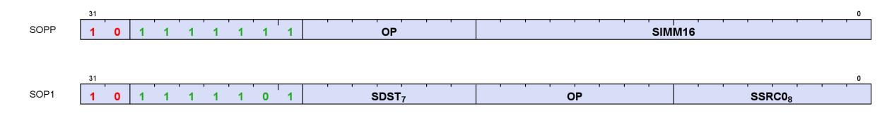

| Name | Size   | Function                                                    |
|------|--------|-------------------------------------------------------------|
| SOPP | 32 bit | SALU program control op with a 16-bit immediate<br>constant |
| SOP1 | 32 bit | SALU op with 1 input                                        |

Each of these instruction formats uses some of these fields:

| Field  | Description                               |
|--------|-------------------------------------------|
| OP     | Opcode: instruction to be executed.       |
| SDST   | Destination SGPR, M0, NULL or EXEC.       |
| SSRC0  | First source operand.                     |
| SIMM16 | Signed immediate 16-bit integer constant. |

# <span id="page-52-2"></span>**5.2. Program Control Instructions**

Table 17. Wave Termination and Traps

| Instructions   | Description                                                                                         |
|----------------|-----------------------------------------------------------------------------------------------------|
| S_ENDPGM       | Terminates the wave. It can appear anywhere in the shader program and can appear<br>multiple times. |
| S_ENDPGM_SAVED | Terminates the wave due to context save. Intended for use only within the trap handler.             |

| Instructions | Description                                                                                                                                                                                                                          |
|--------------|--------------------------------------------------------------------------------------------------------------------------------------------------------------------------------------------------------------------------------------|
| S_TRAP       | Jump to the trap handler and pass in 4-bit TRAP id from SIMM[3:0].                                                                                                                                                                   |
|              | <wait finish="" for="" instructions="" outstanding="" to=""><br/>{ TTMP1, TTMP0 } = {TrapID[3:0], zeros, PC[47:0]} // TrapID=0 unless the exception is<br/>"S_TRAP"<br/>PC = TBA (trap base address)<br/>PRIV = 1</wait>             |
|              | Host traps cause the shader hardware to generate an S_TRAP instruction. Note: the save-PC<br>points to the S_TRAP instruction. TRAPID 0 is reserved and should not be used.                                                          |
| S_RFE_B64    | Return from exception (trap handler) and continue.<br>Start executing at PC stored in SGPRs or TTMPs.<br>MOVE PC, <src> ; STATUS.PRIV = 0.</src>                                                                                     |
|              | This instruction may only be used within a trap handler.                                                                                                                                                                             |
| S_SETHALT    | Set the HALT or FATAL_HALT bit to the value of SIMM16[0].<br>SIMM16[0]: 1 = halt, 0 = resume. Applies to HALT or FATAL_HALT (see SIMM16[2])<br>SIMM16[2]: 1 = set FATAL_HALT bit; 0 = set HALT bit.                                  |
|              | The user shader can set the HALT bit, but not the FATAL_HALT bit;<br>the trap handler (priv=1) is allowed to set either bit.                                                                                                         |
|              |                                                                                                                                                                                                                                      |
|              | HALT == 1<br>halts a wave when PRIV==0, but not when PRIV==1                                                                                                                                                                         |
|              | FATAL_HALT == 1<br>halts a wave when PRIV==0 and when PRIV==1                                                                                                                                                                        |
|              | The HALT==1 bit causes shaders to halt when PRIV==0, but is ignored when PRIV==1. If<br>HALT is set to 1 while PRIV==1, it only takes effect and halts the shader after returning to<br>the user shader (S_RFE, which makes PRIV=0). |
|              | The FATAL_HALT==1 bit causes shaders to halt regardless of PRIV value. Once                                                                                                                                                          |
|              | FATAL_HALTed, a shader cannot un-halt itself – only host-commands can do that.                                                                                                                                                       |

Table 18. Dependency, Delay and Scheduling Instructions

| Instructions                                 | Description                                                                                                                                                                                                                                    |
|----------------------------------------------|------------------------------------------------------------------------------------------------------------------------------------------------------------------------------------------------------------------------------------------------|
| S_NOP                                        | NOP. Repeat SIMM16[6:0] times. [1128]<br>Like a short version of S_SLEEP                                                                                                                                                                       |
| S_SLEEP                                      | Cause a wave to sleep for approximately 64*SIMM16[6:0] clocks, or can be woken up early<br>by S_WAKEUP instructions.<br>"s_sleep 0" sleeps the wave for 0 cycles. If SIMM16[15]==1, sleep forever (until wakeup, trap or<br>kill).             |
| S_SLEEP_VAR                                  | Cause a wave to sleep for approximately SGPR_value[6:0]*64 cycles. This is also woken up<br>by S_WAKEUP instructions.                                                                                                                          |
| S_WAKEUP                                     | Causes one wave in a work-group to signal all other waves in the same work-group to wake<br>up from S_SLEEP/S_SLEEP_VAR early. If waves are not sleeping, they are not affected by<br>this instruction.                                        |
| S_SETPRIO                                    | Set 2-bits of USER_PRIO: user-settable wave priority. 0 = low, 3 = high.<br>Overall wave priority is: {MIN(3,(SysPrio[1:0] + UserPrio[1:0])), WaveAge[3:0]}                                                                                    |
| S_CLAUSE                                     | Begin a clause consisting of instructions matching the type of instruction after the s_clause.<br>The clause length is: (SIMM16[5:0] + 1), and clauses must be between 2 and 63 instructions.<br>SIMM16[5:0] must be 1-32, not 0 or 63.        |
| S_BARRIER_SIGNAL<br>S_BARRIER_SIGNAL_ISFIRST | Signal that a wave has as arrived at a barrier. Synchronize waves within a work-group.<br>Waves not in a work-group (or work-group size = 1 wave), treat this as S_NOP. ISFIRST<br>variant returns to SCC if this is the first wave to signal. |

| Instructions        | Description                                                                                                                                                                                                                                                                                                                                                                |
|---------------------|----------------------------------------------------------------------------------------------------------------------------------------------------------------------------------------------------------------------------------------------------------------------------------------------------------------------------------------------------------------------------|
| S_BARRIER_WAIT      | Wait for all waves in the work-group to signal the barrier before proceeding. Synchronize<br>waves within a work-group. If not all waves in group have been created yet, waits for entire<br>group before proceeding. Waves that have ended do not prevent barriers from being<br>satisfied. Waves not in a work-group (or work-group size = 1 wave), treat this as S_NOP. |
| S_GET_BARRIER_STATE | Get the current barrier state, typically for context switching.                                                                                                                                                                                                                                                                                                            |

Table 19. Control Instructions

| Instructions                           | Description                                                                                                                                                                                                                                                                                                                                                       |
|----------------------------------------|-------------------------------------------------------------------------------------------------------------------------------------------------------------------------------------------------------------------------------------------------------------------------------------------------------------------------------------------------------------------|
| S_VERSION                              | Does nothing (treated as S_NOP), but can be used as a code comment to indicate the<br>hardware version the shader is compiled for (using the SIMM16 field).                                                                                                                                                                                                       |
| S_CODE_END                             | Treated as an illegal instruction. Used to pad past the end of shaders.                                                                                                                                                                                                                                                                                           |
| S_SENDMSG                              | Send a message upstream to the Interrupt handler or dedicated hardware. SIMM[9:0] is an<br>immediate value holding the message type. There is no "S_WAIT_*CNT" enforced before this.                                                                                                                                                                              |
| S_SENDMSG_RTN_B32<br>S_SENDMSG_RTN_B64 | Send a message upstream to that requests that some data be returned to an SGPR. Uses<br>KMcnt to track when data is returned.<br>SDST = SGPR to return to (or an aligned SGPR-pair for "_B64").<br>SSRC0 = enum, not an SGPR with the code for what data is requested. (see the message table<br>below).<br>If this is used to write VCC, then VCCZ is undefined. |
| S_SENDMSGHALT                          | S_SENDMSG and then HALT.                                                                                                                                                                                                                                                                                                                                          |
| S_ICACHE_INV                           | Invalidate first-level shader instruction cache for the WGP associated with this wave.                                                                                                                                                                                                                                                                            |

Table 20. Float Arithmetic State Instructions

| Instructions  | Description                                        |
|---------------|----------------------------------------------------|
| S_ROUND_MODE  | Set the round mode from an immediate: SIMM16[3:0]  |
| S_DENORM_MODE | Set the denorm mode from an immediate: SIMM16[3:0] |

# <span id="page-54-0"></span>**5.3. Instruction Clauses**

An **instruction clause** is a series of instructions of the same type that are to be executed in an uninterrupted sequence. Normally hardware may interleave instructions from different waves, but a clause can be used to override that behavior and force the hardware to service only one wave for a given instruction type for the duration of the clause, even if that leaves the execution hardware idle.

Clauses are defined and started using the S\_CLAUSE instruction, and must contain only a single type of instruction. The clause-type is implicitly defined by the type of instruction immediately following the s\_clause.

#### **Clause Types are:**

- Non-Flat Loads: Image, buffer, global, scratch, BVH and sample/gather
- Non-Flat Stores: Image, buffer, global, scratch
- Non-Flat Atomics: Image, buffer, global, scratch
- Flat Load
- Flat Store
- Flat Atomic
- LDS Indexed Load, Store, Atomic , BVH\_stack (all one type)
- SMEM
- VALU

5.3. Instruction Clauses 45 of 697

| These are ILLEGAL within a clause                              | These are LEGAL within a clause of any type, but not<br>as the first instruction |
|----------------------------------------------------------------|----------------------------------------------------------------------------------|
| Instructions of a different type than those of the clause type | S_DELAY_ALU                                                                      |
| S_CLAUSE                                                       | S_NOP                                                                            |
| S_ENDPGM                                                       | S_SETPRIO*                                                                       |
| SALU                                                           | S_VERSION                                                                        |
| Branch/Jump                                                    | S_WAIT_EVENT                                                                     |
| S_SENDMSG*                                                     | S_WAIT_*CNT, S_WAIT_IDLE                                                         |
| S_SLEEP, S_SLEEP_VAR                                           | S_ICACHE_INV                                                                     |
| S_SETHALT                                                      |                                                                                  |
| DS_PARAM_LOAD, DS_DIRECT_LOAD                                  |                                                                                  |
| Export                                                         |                                                                                  |
| VALU: FP64 ops                                                 |                                                                                  |

S\_TRAP is legal within a clause, even as the first instruction after S\_CLAUSE. S\_TRAP ends the clause.

Note: V\_S\_\* instructions (Pseudo-scalar trans) are VALU ops and may be used in a VALU clause.

If the first instruction in a VALU clause has EXEC==0, then the clause is ignored and instructions are issued as if there were no clause. If the VALU clause starts with EXEC!=0 but EXEC becomes zero in the middle of the clause, the clause continues until the last instruction of the specified clause.

#### **If an S\_DELAY\_ALU is needed before starting a clause, the order must be:**

```
  S_DELAY_ALU // must not come immediately after S_CLAUSE - that inst declares clause type
  S_CLAUSE
  <first instruction in clause>
```

If the first instruction after S\_CLAUSE is skipped (e.g. due to EXEC==0, or VMEM-load skipped due to EXEC==0 and LOADcnt==0) then a clause is not started. Subsequent instructions within what would have been the clause are not skipped and are still executed but individually, not as part of a clause.

# <span id="page-55-0"></span>**5.3.1. Clause Breaks**

The following conditions can break a clause:

- 1. VALU exception (trap) breaks a VALU clause
- 2. Host commands to wave (halt, resume, single step, etc) breaks all active clauses. Context-save breaks clauses of affected waves. If a wave halts or is killed, its clauses are ended.
- 3. Any action that causes a wave to jump to its trap handler breaks clause (includes context-save). A wave entering HALT (including for host-initiated single-step) may break clauses.

# <span id="page-55-1"></span>**5.4. Send Message Types**

<span id="page-55-2"></span>S\_SENDMSG is used to send messages to fixed function hardware, the host, or to request that a value be returned to the wave. S\_SENDMSG encodes the message type in the SIMM16 field and the message payload in M0. S\_SENDMSG\_RTN\_B\* encodes the message type in the SSRC0 field (does not read an SGPR), the payload (if any) in M0, and the destination SGPR in SDST. S\_SENDMSG\_RTN\_B\* instructions return data to the shader:

5.4. Send Message Types 46 of 697

increment KMcnt by 2, and then decrement by 1 when the messages goes out, and by another 1 when the data returns. This allows the user to use "S\_WAIT\_KMCNT==0" to wait for the data to be returned.

Completion is tracked with KMcnt.

The table below lists the messages that can be generated using the S\_SENDMSG command. All message codes not listed are reserved (illegal).

| Message       | SIMM16<br>[7:0] | Payload                                                                                                                                                                                                                                                                                                        |
|---------------|-----------------|----------------------------------------------------------------------------------------------------------------------------------------------------------------------------------------------------------------------------------------------------------------------------------------------------------------|
| Reserved      | 0x00            | Reserved                                                                                                                                                                                                                                                                                                       |
| INTERRUPT     | 0x01            | Software-generated interrupt. M0[23:0] carries user data. ID's are also sent (wave_id,<br>wgp_id, etc.)                                                                                                                                                                                                        |
| HS_TESSFACTOR | 0x02            | Indicates HS tessellation factor is all zero or one for all patches in this HS work-group.<br>Data from M0[0]: 0 = "all threads have tess factor of zero", 1 = "all threads have a tess<br>factor of one". This message is optional, but do not send more than once or from any<br>shader stage other than HS. |
| DEALLOC_VGPRS | 0x03            | Deallocate all VGPRs and scratch memory for this wave, allowing another wave to<br>allocate these VGPRs before this wave ends. Typically used immediately before<br>S_ENDPGM when a shader is waiting for memory-write-acknowledgments before<br>ending.                                                       |
| GS_ALLOC_REQ  | 0x09            | Request GS space in parameter cache. M0[9:0] = number of vertices, M0[22:12] =<br>number of primitives. Response: a GS-alloc response to non-zero requests (broadcast to<br>work-group).                                                                                                                       |

Table 21. S\_SENDMSG Messages

S\_SENDMSG\_RTN is used to send messages that return a value to the wave. The instruction specifies which SGPR receives the data in SDST field. The message is encoded in SSRC0 (in the instruction field, not in an SGPR).

| Message          | SIMM16<br>[7:0] | Payload                                                                                                                                                                                |
|------------------|-----------------|----------------------------------------------------------------------------------------------------------------------------------------------------------------------------------------|
| RTN_GET_DOORBELL | 0x80            | Get the doorbell ID associated with this wave.                                                                                                                                         |
| RTN_GET_DDID     | 0x81            | Get the Draw or dispatch ID associated with this wave.                                                                                                                                 |
| RTN_GET_TMA      | 0x82            | Get the Trap Memory Address: [31:0] or [63:0] depending on the request size.                                                                                                           |
| RTN_GET_REALTIME | 0x83            | Get the value of the constant frequency (REFCLK) time counter: [31:0] or [63:0]<br>depending on the request size.                                                                      |
| RTN_SAVE_WAVE    | 0x84            | Used in context switching to indicate this wave is ready to be context saved.<br>Only the trap handler can send this message (user shaders have this converted<br>to MSG_ILLEGAL_RTN). |
| RTN_GET_TBA      | 0x85            | Gets the Trap Base Address [31:0] or [63:0] depending on request size                                                                                                                  |
| RTN_GET_SE_HW_ID | 0x87            | Gets the logical shader-engine IDs, returned as:<br>data[3:0] = SE_ID; data[11:8] = AID_ID                                                                                             |
| RTN_ILLEGAL_MSG  | 0xFF            | Illegal message with data return to wave                                                                                                                                               |

Table 22. S\_SENDMSG\_RTN Messages

# <span id="page-56-0"></span>**5.5. Branching**

Branching is done using one of the following scalar ALU instructions and affects the entire wave, not just individual work-items. "SIMM16" is a sign-extended 16 bit integer constant, treated as a DWORD offset for

5.5. Branching 47 of 697

branches.

**PC value**: S\_BRANCH, S\_CBRANCH, S\_SWAPPC, S\_CALL, and S\_GETPC operate on the PC when it is pointing to the instruction after this one. So "S\_BRANCH 0" is like a NOP, not an infinite loop.

Table 23. Branch Instructions

| Instructions                | Description                                                                                                                                                                                                                                                                                     |
|-----------------------------|-------------------------------------------------------------------------------------------------------------------------------------------------------------------------------------------------------------------------------------------------------------------------------------------------|
| S_BRANCH                    | Unconditional branch. PC = PC + (SIMM16 * 4)                                                                                                                                                                                                                                                    |
| S_CBRANCH_<br><cond></cond> | Conditional branch. Branch only if <condition> is true.<br/>if (cond) PC = PC + (SIMM16 *4); else NOP;<br/>If SIMM16=0, the branch goes to the next instruction).<br/><cond> : SCC1, SCC0, VCCZ, VCCNZ, EXECZ, EXECNZ<br/>(SCC==1, SCC==0, VCC==0, VCC!=0, EXEC==0, EXEC!=0)</cond></condition> |
| S_SETPC_B64                 | Directly set the PC from an SGPR pair: PC = SGPR-pair                                                                                                                                                                                                                                           |
| S_SWAPPC_B64                | Swap the current PC (pointing to instruction after this) with an address in an SGPR pair. SWAP (PC,<br>SGPR-pair).                                                                                                                                                                              |
| S_GETPC_B64                 | Retrieve the current PC value (zero-extended). This does not cause a branch. (SGPR-pair = PC of next<br>instruction)                                                                                                                                                                            |
| S_CALL_B64                  | Jump to a subroutine, and save return address. SGPR_pair = PC; PC = PC+SIMM16*4.                                                                                                                                                                                                                |

For conditional branches, the branch condition can be determined by either scalar or vector operations. A scalar compare operation sets the Scalar Condition Code (SCC) which then can be used as a conditional branch condition. Vector compare operations set the VCC mask, and VCCZ or VCCNZ then can be used to determine branching.

# <span id="page-57-0"></span>**5.6. Work-groups and Barriers**

Work-groups are collections of waves running on the same WGP that can synchronize and share data. Up to 1024 work-items (16 wave64's or 32 wave32's) can be combined into a work-group. When multiple waves are in a work-group, the barrier instructions can be used to cause each wave to wait until all other waves reach the same instruction; then, all waves continue.

The barrier operation is divided into two parts: Signal (arrive) and Wait. Each wave first issues an S\_BARRIER\_SIGNAL to indicate that other waves may proceed. Later the wave issues S\_BARRIER\_WAIT that causes the wave to wait until every wave in the work-group has also issued an S\_BARRIER\_SIGNAL. When all member waves have signaled, the barrier resets and the waves may proceed through their S\_BARRIER\_WAITs.

### **Barrier Valid**

A barrier is valid once all of the waves in the work-group have been created. Until then, the number of waves in the work-group is unknown.

#### **Barrier Complete**

A barrier is complete when each of the waves in the work-group have signaled (or terminated). A barrier cannot complete until it is valid, but waves may signal before the barrier is valid.

It is allowable for a wave to terminate early instead of signaling, and the remaining waves can still use the barrier and when the remaining waves have all signaled, they can pass through an S\_BARRIER\_WAIT. Waves should not signal then exit - this could leave the barrier in an unusable state.

Work-groups consisting of a single wave, and waves not in a work-group, treat all barrier instructions as

S\_NOP.

All waves in work-groups have these barriers:

## **Work-group Barrier**

A barrier that is completed when each of the waves in the work-group have signaled or terminated.

# **Trap Barrier**

Same as the work-group-barrier, but exclusively for use by the trap handler. If the user shader tries to signal or wait on it, the operation ignored.

# <span id="page-58-0"></span>**5.6.1. Barrier State**

A Barrier consists of two counts:

- **Member count**: how many waves must signal in order to complete the barrier. Initialized to the workgroup size for the workgroup and trap barriers.
- **Signaled count**: how many waves have already signaled the barrier. This resets to zero when the first wave of the work-group is created and after barrier completes.

When the last wave signals a barrier making it complete (signaledCount == memberCount), the barrier broadcasts to the work-group that the barrier is complete and then resets signaledCount=0. Keep in mind that trap and work-group barriers can only complete once they're valid. When a work-group is launched, all signalCounts are set to zero, the trap and work-group barrier's memberCount is set to the number of waves in the work-group.

Waves have these bits of state related to barriers:

- **barrierComplete**: records if the work-group barrier has previously completed but wave has not yet waited on it. This bit is used by S\_BARRIER\_WAIT: if the bit is 1 when S\_BARRIER\_WAIT executes, the S\_BARRIER\_WAIT executes immediately and the bit is reset to zero; if the bit is zero then the wave waits until the barrier completes (and then the bit is reset to zero when the wave executes S\_BARRIER\_WAIT).
- **trapBarrierComplete**: same, but for the trap barrier

This wave state (excluding the trap barrier state) can be read with S\_GETREG\_B32 STATE\_PRIV, and written with S\_SETREG\_B32 STATE\_PRIV only while in the trap handler (PRIV=1). The barrier state can be read with S\_GET\_BARRIER\_STATE but cannot be written.

# <span id="page-58-1"></span>**5.6.2. Barrier Instructions**

Barriers are controlled using: S\_BARRIER\_SIGNAL{\_ISFIRST}, S\_BARRIER\_WAIT, and S\_GET\_BARRIER\_STATE. Barrier instructions can use M0 or an inline constant to refer to the barrier number, except that for S\_BARRIER\_WAIT can only take an inline constant.

Reference to the work-group and trap barriers can only be made with inline constants.

Table 24. Barrier ID's

| Instruction<br>Bar# | Barrier      | Description                                   |
|---------------------|--------------|-----------------------------------------------|
| -2                  | Trap Barrier | Barrier dedicated for use by the trap handler |

| Instruction<br>Bar# | Barrier            | Description                                      |
|---------------------|--------------------|--------------------------------------------------|
| -1                  | Work-group barrier | Barrier to synchronize all waves in a work-group |

Table 25. Barrier Instructions

| Instruction                                      | Args          | Description                                                                                                                                                                                                                                                                                                                                                                                                                                                                                                                                   |
|--------------------------------------------------|---------------|-----------------------------------------------------------------------------------------------------------------------------------------------------------------------------------------------------------------------------------------------------------------------------------------------------------------------------------------------------------------------------------------------------------------------------------------------------------------------------------------------------------------------------------------------|
| S_BARRIER_SIGNAL<br>S_BARRIER_SIGNAL_<br>ISFIRST | Bar#          | Signal barrier <bar#>. Bar# can be an inline constant or M0.<br/>When M0 is used, it supplies the barrierID# (M0[4:0]). When an inline-constant supplies<br/>the barrierID#, the memberCount is not set. Setting MemberCnt &lt;= SignalCnt is considered<br/>illegal and may cause the barrier to not complete.<br/>S_BARRIER_SIGNAL_ISFIRST:<br/>Same as above, but also return SCC to the wave: 1 if it was the first wave to signal the<br/>barrier in this round, else return zero. Workgroup barriers return SCC=0 or =1 for each</bar#> |
|                                                  |               | s_barrier_signal_isfirst; Uses KMcnt to track when SCC has returned for workgroups.<br>SCC should only be read after barrier is complete (after an S_BARRIER_WAIT).                                                                                                                                                                                                                                                                                                                                                                           |
| S_BARRIER_WAIT                                   | Bar#          | Wait for a barrier to complete. Bar# must be an inline constant.                                                                                                                                                                                                                                                                                                                                                                                                                                                                              |
| S_GET_BARRIER_STATE                              | Bar#,<br>SDST | Get barrier state and return it to an SGPR.<br>SDST = { 0, signalCnt[6:0], 5'b0, memberCnt[6:0], 3'b0, valid }.                                                                                                                                                                                                                                                                                                                                                                                                                               |
|                                                  |               | Uses KMcnt to track completion (inc/dec by 1) Bar# is from M0[4:0] or an inline constant.                                                                                                                                                                                                                                                                                                                                                                                                                                                     |

# <span id="page-59-0"></span>**5.6.3. Traps and Exceptions with Barriers**

Traps and exceptions may occur while barriers are in use. They behave normally: the wave waits for idle and jumps to the trap handler. If a wave is waiting at S\_BARRIER\_WAIT when an exception occurs, the wave saves the PC of the S\_BARRIER\_WAIT and jumps to the trap handler. When the shader returns from the trap handler, the S\_BARRIER\_WAIT is re-executed.

# <span id="page-59-1"></span>**5.6.4. Context Switching**

It is up to the trap handler to save and restore wave and barrier-unit state. Each wave knows if its barrier has completed or not. The trap handler begins with a S\_BARRIER\_SIGNAL & wait (trap barrier). This ensures that any previous S\_BARRIER\_SIGNAL from the user shader has completed and reported back barrier-complete if the barrier had completed. The trap handler can then read out and save barrier unit state (the signal-count), and restore it later when the context is restored via a series of S\_BARRIER\_SIGNALs.

To save context, if a wave is part of a work-group, the wave's user-barrier state (barrierComplete) must be saved & restored. The context save must first ensure all waves have entered their trap handler (or exited) and that the user's barrier operations are all done (idle). This is accomplished by using the trap-barrier.

One wave is nominated to save the barrier unit state using the barrier's "signal\_isfirst" capability. This wave reads the barrier state per unit (excluding the trap barrier) with S\_GET\_BARRIER\_STATE and saves it off. On context restore, the same wave restores the state of each barrier unit before any of the waves return to the user shader.

# <span id="page-60-0"></span>**5.7. Data Dependency Resolution**

Shader hardware can resolve most non-memory data dependencies, but memory and export dependencies require explicit handling by the shader program. This section describes the rules shader programmers must follow in order to get correct results from their shader program. The programmer is rarely required to insert waitstates (S\_NOP or unrelated instructions).

The S\_WAIT\_\*CNT instructions are used to resolve data hazards.

Each wave has counters that count the number of outstanding memory instructions per wave. These counters increment when an instruction is issued and decrement when the instructions completes. These allow the shader writer to schedule long-latency instructions, execute unrelated work and specify when results of longlatency operations are needed. The shader uses the appropriate S\_WAIT\_\*CNT instruction to wait for the named counter to be less than or equal to a certain value, to know that some or all of the previously issued instructions have completed. While waiting, the wave is effectively asleep (inactive, unable to issue instructions).

# **Simple S\_WAIT\_\*CNT Example**

```
  GLOBAL_LOAD_B32 V0, V[4:5], 0x0 // load memory[ {V5, V4} ] into V0, LOADcnt++
  GLOBAL_LOAD_B32 V1, V[4:5], 0x8 // load memory[ {V5, V4} +8 ] into V1, LOADcnt++
  S_WAIT_LOADcnt <= 1 // wait for first global_load to have completed
  V_MOV_B32 V9, V0 // move V0 into V9
```

## **Another Example**

```
  S_LOAD s0, ...
  S_LOAD s1, ...
  S_WAIT_KMcnt <= 0
  S_MOV_B32 s2, s0 // out of order
  DS_param_load v0
  DS_param_load v1
  EXP v2
  EXP v3
  S_WAIT_EXPcnt <= 1 // higher values don't work but also don't need zero
  V_MOV_B32 v4, v0
```

Instructions of a given type return in order (except SMEM which return out-of-order), but instructions of different types can complete out of order. For example, both exports and LDS-param-load instructions use EXPcnt but they can return out of order. From vector memory, samples stay in order with samples (from one wave) but are unordered with respect to loads, stores and BVH ops. Export-grants return in-order within a family of targets but out-of-order between different families (where a family is: MRT's and Z, positions, primitive data, dual-source-blends).

Table 26. Data Dependency Instructions

| Instructions          | Description                                                                                                                                                                                                                                                                                                                                                          |  |
|-----------------------|----------------------------------------------------------------------------------------------------------------------------------------------------------------------------------------------------------------------------------------------------------------------------------------------------------------------------------------------------------------------|--|
| S_WAIT_STORECNT       | Wait for the counter specified to be less-than or equal-to the count in SIMM16 before                                                                                                                                                                                                                                                                                |  |
| S_WAIT_DSCNT          | continuing.                                                                                                                                                                                                                                                                                                                                                          |  |
| S_WAIT_KMCNT          |                                                                                                                                                                                                                                                                                                                                                                      |  |
| S_WAIT_EXPCNT         |                                                                                                                                                                                                                                                                                                                                                                      |  |
| S_WAIT_LOADCNT        |                                                                                                                                                                                                                                                                                                                                                                      |  |
| S_WAIT_SAMPLECNT      |                                                                                                                                                                                                                                                                                                                                                                      |  |
| S_WAIT_BVHCNT         |                                                                                                                                                                                                                                                                                                                                                                      |  |
| S_WAIT_LOADCNT_DSCNT  | Wait for the two counters specified to be less-than or equal-to the counts in SIMM16 before<br>continuing.                                                                                                                                                                                                                                                           |  |
| S_WAIT_STORECNT_DSCNT | SIMM16[15:8] = load/store<br>SIMM16[ 7:0] = DS                                                                                                                                                                                                                                                                                                                       |  |
| S_WAIT_EVENT          | Wait for an event to occur before proceeding<br>SIMM16[1] : 0=don't wait, 1=wait for export-ready; other bits are reserved.<br>Any exception waits for this to complete before being processed, including: KILL, save<br>context, host trap, memviol and anything that causes a trap to be taken.                                                                    |  |
| S_DELAY_ALU           | Insert delay between dependent SALU/VALU instructions.<br>SIMM16[3:0] = InstID0<br>SIMM16[6:4] = InstSkip<br>SIMM16[10:7] = InstID1<br>This instruction describes dependencies for two instructions, directing the hardware to<br>insert delay if the dependent instruction was issued too recently to forward data to the<br>second. For details, see: S_DELAY_ALU. |  |

To ensure correct operation some reads of SGPR registers must be guarded with s\_wait\_alu instructions. If a subset of a 64b SGPR pair (i.e. s[0:1], s[2:3], s[4:5], etc) has been read by a VALU instruction, then reads of subsequent values written to any subset of the same SGPR pair must be guarded as follows:

- for VALU writes to VCC, VALU reads of VCC must wait using s\_wait\_alu 0xFFFD;
- for VALU writes to an SGPR, VALU reads of the SGPR must wait using s\_wait\_alu 0xF1FF;
- for SALU writes to an SGPR or VCC, SALU or VALU reads of the SGPR or VCC must wait using s\_wait\_alu 0xFFFE.

```
For example:
  v_mov_b32 v0, s1 // VALU reads pair s[0:1]
  s_mov_b32 s0, 0x42 // SALU writes s0
  s_wait_alu 0xFFFE // Read of s0 must be guarded by waiting on the SALU to complete
  s_mov_b32 s2, s0 // SALU reads s0
```

# <span id="page-61-0"></span>**5.7.1. Memory Dependency Counters**

S\_WAIT\_\*CNT waits for outstanding instructions that use the specified counter to complete to avoid data hazards. Instructions within a type return in the order they were issued compared to other instructions of that type (except for SMEM), but often return out of order with respect to instructions of different types.

Hardware prevents these counters from overflowing by stalling the issue of any instruction that by incrementing the counter would cause it to overflow.

It is possible for load-data to be written to VGPRs out-of-order, but the counter-decrement still reflects in-order completion. Stores from a wave are not kept in order with stores from that same wave when they write to

different addresses.

These counters count instructions, not threads.

This table describes the cases that increment and decrement the memory dependency counters.

| Counter   | Size | Description                                                                                                                                                                                                                                                                                                                                                                                                                   |  |  |
|-----------|------|-------------------------------------------------------------------------------------------------------------------------------------------------------------------------------------------------------------------------------------------------------------------------------------------------------------------------------------------------------------------------------------------------------------------------------|--|--|
| LOADcnt   | 6    | Vector memory count: image, buffer, flat, scratch, global (loads and atomic with return), global_inv.<br>Determines when memory loads have finished:                                                                                                                                                                                                                                                                          |  |  |
|           |      | • Incremented by 1 every time a vector-memory load or atomic-with-return (VIMAGE, VBUFFER,<br>or FLAT/Scratch/Global format) instruction is issued.                                                                                                                                                                                                                                                                           |  |  |
|           |      | • Decremented for loads when that instruction and those before it have completed.                                                                                                                                                                                                                                                                                                                                             |  |  |
| SAMPLEcnt | 6    | Vector memory sample count.<br>Increments by 1 for each sample instruction issued, and decrements as they complete (in-order with<br>other SAMPLE ops).                                                                                                                                                                                                                                                                       |  |  |
| BVHcnt    | 3    | Vector memory BVH instruction count. Increments and decrements by 1 for each BVH instruction.                                                                                                                                                                                                                                                                                                                                 |  |  |
| STOREcnt  | 6    | Vector memory store count: image, buffer, flat, scratch, global (stores and atomic without return),<br>global_wb/wbinv.<br>Determines when memory stores have completed:                                                                                                                                                                                                                                                      |  |  |
|           |      | • Incremented every time a vector-memory store or atomic-without-return (VIMAGE, VBUFFER,<br>or Flat/Scratch/Global format) instruction is issued.                                                                                                                                                                                                                                                                            |  |  |
|           |      | • Decremented for stores when the data has been written to the memory hierarchy level specified<br>in the SCOPE bits.                                                                                                                                                                                                                                                                                                         |  |  |
| DScnt     | 6    | Data-Store count (LDS and Flat)                                                                                                                                                                                                                                                                                                                                                                                               |  |  |
|           |      | Determines when one of these low-latency memory instructions have completed:<br>• Incremented by 1 for every LDS instruction issued<br>• Decremented by 1 for LDS loads or atomic-with-return when the data has been returned to<br>VGPRs.<br>• Decremented by 1 for LDS stores when the data has been written to LDS.<br>• Incremented by 1 for each Flat instruction issued, decremented when the LDS portion<br>completes. |  |  |
|           |      | Ordering:                                                                                                                                                                                                                                                                                                                                                                                                                     |  |  |
|           |      | • Instructions of different types are returned out-of-order.                                                                                                                                                                                                                                                                                                                                                                  |  |  |
|           |      | • Instructions of the same type are returned in the order they were issued.                                                                                                                                                                                                                                                                                                                                                   |  |  |
| KMcnt     | 5    | Constant Cache (Kcache) and Message Count                                                                                                                                                                                                                                                                                                                                                                                     |  |  |
|           |      | • Incremented by 1 by 32-bit and smaller loads, by 2 for larger loads<br>• Incremented by 1 for each S_SENDMSG issued. Decremented by 1 when message is sent out or<br>when data is returned.<br>• Decremented by 1 for each DWORD returned from the data-cache (SMEM).                                                                                                                                                       |  |  |
|           |      | Ordering:                                                                                                                                                                                                                                                                                                                                                                                                                     |  |  |
|           |      | • Instructions of different types are returned out-of-order.                                                                                                                                                                                                                                                                                                                                                                  |  |  |
|           |      | • Instructions of the same type are returned in the order they were issued, except scalar-memory<br>loads, which can return out-of-order (in which case only S_WAIT_KMcnt 0 is the only legitimate<br>value).                                                                                                                                                                                                                 |  |  |

| Counter | Size | Description                                                                                                                              |
|---------|------|------------------------------------------------------------------------------------------------------------------------------------------|
| EXPcnt  | 3    | VGPR-export count, and LDS-direct/param-load count.                                                                                      |
|         |      | Determines when data has been read out of the VGPR and sent out, at which time it is safe to<br>overwrite the contents of that VGPR.     |
|         |      | • Incremented when an Export instruction is issued                                                                                       |
|         |      | • Decremented for exports when the last cycle of the export instruction is granted and executed<br>(VGPRs read out).                     |
|         |      | • Incremented when DS_PARAM_LOAD and DS_DIRECT_LOAD are issued, and decremented<br>when they complete and write data to VGPRs.           |
|         |      | Ordering:                                                                                                                                |
|         |      | • Exports are kept in order only within each export type (color/null, position, primitive, dual<br>source blend), but not between types. |
|         |      | • DS_PARAM_LOAD is ordered with DS_DIRECT_LOAD, but these are unordered with exports.                                                    |

# **5.7.1.1. Scalar Memory**

SMEM instructions use the KMcnt counter. The counter is incremented by 1 if only a single DWORD is read or written, or incremented by 2 for any larger instruction. Cache invalidate instructions count 1 per scalar data cache bank. SMEM instructions return **out of order even to the same address**, so the only sensible way to use the counter is: S\_WAIT\_KMcnt <= 0.

The scalar data cache is read-only, and is not coherent with the first or second level vector memory cache. Users must manually invalidate caches with register writes or shader instructions to stay coherent. The user must use S\_WAIT\_KMcnt<=0 after sending cache-invalidate to confirm it has completed.

# **5.7.1.2. Vector Memory - Image, Buffer, Scratch, Global**

LOADcnt counts the number of issued-but-not-completed instructions of type: load, atomic-with-return, and cache-invalidate.

SAMPLEcnt counts the number of issued-but-not-completed instructions of type: sample (includes gather).

STOREcnt counts the number of memory-store and memory atomic-without-return data instructions issued but not yet completed. It is only necessary to wait on STOREcnt when the shader must know that previous writes are committed to memory before issuing subsequent writes. There is no hazard on issuing a memory store followed by a subsequent instruction overwriting the source GPRs. There is also no hazard between a memory store to one memory location followed by a load from the same location (if both are from the same wave) - the load and store to the same address stay in order.

Global invalidate instructions are tracked with LOADcnt, and Global write-back (and write-back-invalidate) are tracked with STOREcnt. The shader must use S\_WAIT\*CNT to know that these have completed.

Loads are kept in order with other loads and stores are ordered against other stores. Sample instruction are kept in order with other samples.

# **5.7.1.3. Vector Memory - Flat**

Since Flat instructions may have work-items going to vector memory and others going to LDS, Flat instructions use both DScnt and LOADcnt/STOREcnt. Every Flat instruction increments both DScnt and either LOADcnt or STOREcnt when the instruction issues, and both are decremented by the time the instruction completes but the two counters are decremented at different times: DScnt when LDS is done with its work-items; LOADcnt/STOREcnt when vector memory is done with its work-items. The LDS portion of the flat instruction is placed in order with other LDS-indexed instructions, and the global memory portion is kept in order with other buffer/image/global/scratch instructions.

Flat instructions effectively work as if both a VMEM and an LDS instruction were issued at the same time, with complementary EXEC masks. Once launched, each half completes on its own schedule with no respect to the other. This can introduce Write-After-Write hazards if multiple FLAT load instructions write to the same VGPR:

A: flat\_load\_B32 v10, v[0:1]

B: flat\_load\_B32 v10, v[2:3]

In this example, if "A" reads from vector memory, while "B" reads from LDS, it is likely B completes first, and then A overwrites the data from B causing a Write-After-Write hazard.

Flat vs. LDS

FLAT and LDS instructions issued from a single wave stay in order as they move through LDS and as they complete (and decrement DScnt). However the threads serviced by LDS complete out of order with respect to threads serviced by global memory.

# **5.7.1.4. LDS**

LDS operations use the DScnt. The counter is incremented when the instruction is issued, and decremented when the instruction completes. For writes, this means the data is written into LDS memory; for reads or atomic-with-return, it means the return data is available in VGPRs. LDS instructions are kept in order.

LDS parameter and direct loads use EXPcnt to track when the loads have completed (VGPRs have been written).

# **5.7.1.5. Export**

Exports use the EXPcnt counter. This counter is used to prevent Write-after-Read hazards. When an export instruction is issued, the EXPcnt counter is incremented and an export-request is made to the central export arbiter. The shader program continues immediately, but must not overwrite any of the VGPRs holding data which have yet to be exported until the export completes. Exports within each type complete in order, but different types may complete out of order. For example, if a GS shader exports position and then parameters, the parameter export request might be granted first.

Export instructions do not read the EXEC mask until after the export is granted (which can occur well after the instruction is issued). The shader program must use "S\_WAIT\_EXPcnt 0" before overwriting the EXEC mask. M0 is read when the export-request is made, so there is no WAR hazard on M0.

# **5.7.1.6. Messages**

Messages use KMcnt: The counter is incremented when the S\_SENDMSG instruction is issued, and decremented when the message is sent out of the WGP. Use "S\_WAIT\_KMcnt 0" to ensure the message has been sent out of the WGP.

# <span id="page-65-0"></span>**5.7.2. Specific Dependency Cases**

- 1. The following cases require a S\_NOP or any other instruction before the S\_GETREG
  - S\_SETHALT, then S\_GETREG (STATE\_PRIV or STATUS)
  - S\_SETPRIO, then S\_GETREG STATE\_PRIV

See [Requirements for WMMA data hazards](#page-99-0) for more information on WMMA hazard avoidance.

# <span id="page-65-1"></span>**5.8. ALU Instruction Software Scheduling**

The shader program may include instructions to delay ALU instructions from being issued in order to attempt to avoid pipeline stalls caused by issuing dependent instructions too closely together.

This is accomplished with the: **S\_DELAY\_ALU** instruction: "insert delay with respect to a previous VALU instruction". The compiler may insert S\_DELAY\_ALU instructions to indicate data dependencies that might benefit from having extra idle cycles inserted between them.

This instruction is inserted before the instruction that the user wants to delay, and it specifies which previous instructions this one is dependent on. The hardware then determines the number of cycles of delay to add.

This instruction is optional - it is not necessary for correct operation. It should be inserted only when necessary to avoid dependency stalls. If enough independent instructions are between dependent ones then no delay is necessary. For wave64, the user may not know the status of the EXEC mask and hence not know if instructions take 1 or 2 passes to execute.

The S\_DELAY\_ALU instruction says: wait for the VALU-Inst N ago to have completed. To reduce instruction stream overhead, the S\_DELAY\_ALU instructions packs two delay values into one instruction, with a "skip" indicator so the two delayed instructions don't need to be back-to-back.

S\_DELAY\_ALU may be executed in zero cycles - it may be executed in parallel with the instruction before it. This avoids extra delay if no delay is needed.

**S\_DELAY\_ALU InstID1[4], Skip[3], InstID0[4] // packed into SIMM16**

**INSTID** counts backwards N **VALU** instructions that were **issued**. This means it does not count instructions that were branched over. VALU instructions skipped due to EXEC==0 do count when calculating INSTID.

**SKIP** counts the number of instructions skipped before the instruction that has the second dependency. Every instruction is counted for skipping - all types.

If another S\_DELAY\_ALU is encountered before the info from the previous one is consumed, the current S\_DELAY\_ALU replaces any previous dependency info. This means if an instruction is dependent on two separate previous instructions, both of those dependencies can be expressed in a single S\_DELAY\_ALU op, but not in two separate S\_DELAY\_ALU ops.

S\_DELAY\_ALU is applied to any type of opcode, even non-alu (but serves no purpose).

S\_DELAY\_ALU should not be used within VALU clauses.

**DEP Code Dep Code Meaning SKIP Code SKIP Code Meaning** 0 no dependency 0 Same op. Both DEP codes apply to the next instruction 1-4 dependent on previous VALU 1-4 back 1 No skip. Dep0 applies to the following instruction, and DEP1 applies to the instruction after that one. 5-7 dependent on previous transcendental VALU 1-4 back 2 Skip 1. Dep0 applies to the following instruction. Dep1 applies to 2 instructions ahead (skip 1 instruction). 8 Reserved 3-5 Skip 2-4 instructions between Dep0 and Dep1. 9-11 Wait 1-3 cycles for previous SALU ops 6 Reserved

Table 27. S\_DELAY\_ALU Instruction Codes

Codes 9-11: SALU ops typically complete in a single cycle, so waiting for 1 cycle is roughly equivalent to waiting for 1 SALU op to execute before continuing.

Transcendental VALU ops are: SIN, COS, SQRT, RCP, RSQ, EXP, and LOG.

# <span id="page-67-0"></span>**Chapter 6. Scalar ALU Operations**

Scalar ALU (SALU) instructions operate on values that are common to all work-items in the wave. These operations consist of 32-bit integer or float arithmetic, and 32- or 64-bit bit-wise operations. The SALU also can perform operations directly on the Program Counter, allowing the program to create a call stack in SGPRs. Many operations also set the Scalar Condition Code bit (SCC) to indicate the result of a comparison, a carry-out, or whether the instruction result was zero.

# <span id="page-67-1"></span>**6.1. SALU Instruction Formats**

SALU instructions are encoded in one of five microcode formats, shown below:

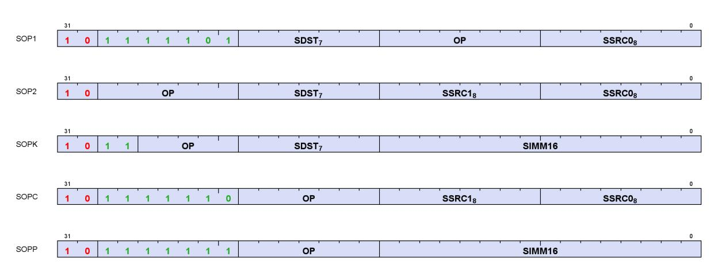

| Name | Size   | Function                                            |
|------|--------|-----------------------------------------------------|
| SOP1 | 32 bit | SALU op with 1 input                                |
| SOP2 | 32 bit | SALU op with 2 inputs                               |
| SOPK | 32 bit | SALU op with 1 constant signed 16-bit integer input |
| SOPC | 32 bit | SALU compare op                                     |
| SOPP | 32 bit | SALU program control op                             |

Each of these instruction formats uses some of these fields:

| Field  | Description                               |
|--------|-------------------------------------------|
| OP     | Opcode: instruction to be executed.       |
| SDST   | Destination SGPR, M0, NULL or EXEC.       |
| SSRC0  | First source operand.                     |
| SSRC1  | Second source operand.                    |
| SIMM16 | Signed immediate 16-bit integer constant. |

# <span id="page-67-2"></span>**6.2. Scalar ALU Operands**

The table below lists the operands available to SALU instructions. In the table below, 0-127 can be used as scalar sources or destinations; 128-255 can only be used as sources.

Table 28. Scalar Operands

|                    |                           | Code    | Meaning            |                                                                                                                     |  |
|--------------------|---------------------------|---------|--------------------|---------------------------------------------------------------------------------------------------------------------|--|
| Scalar             | Scalar Dest<br>(7 bits)   | 0-105   | SGPR 0 105         | Scalar GPRs. One DWORD each.                                                                                        |  |
| Source (8<br>bits) |                           | 106     | VCC_LO             | VCC[31:0]                                                                                                           |  |
|                    |                           | 107     | VCC_HI             | VCC[63:32]                                                                                                          |  |
|                    |                           | 108-123 | TTMP0 TTMP15       | Trap handler temporary SGPRs (privileged)                                                                           |  |
|                    |                           | 124     | NULL               | Reads return zero, writes are ignored. When used as an<br>SALU destination, nullifies the instruction.              |  |
|                    |                           | 125     | M0                 | Temporary register, use for a variety of functions                                                                  |  |
|                    |                           | 126     | EXEC_LO            | EXEC[31:0]                                                                                                          |  |
|                    |                           | 127     | EXEC_HI            | EXEC[63:32]                                                                                                         |  |
|                    | Integer                   | 128     | 0                  | Inline constant zero                                                                                                |  |
|                    | Inline                    | 129-192 | int 1 64           | Integer inline constants                                                                                            |  |
|                    | Constants                 | 193-208 | int -116           |                                                                                                                     |  |
|                    |                           | 209-231 | Reserved           | Reserved                                                                                                            |  |
|                    |                           | 230     | Reserved           | Reserved                                                                                                            |  |
|                    |                           | 231     | Reserved           | Reserved                                                                                                            |  |
|                    |                           | 232-234 | Reserved           | Reserved                                                                                                            |  |
|                    |                           | 235     | SHARED_BASE        | Memory Aperture Definition                                                                                          |  |
|                    |                           | 236     | SHARED_LIMIT       |                                                                                                                     |  |
|                    |                           | 237     | PRIVATE_BASE       |                                                                                                                     |  |
|                    |                           | 238     | PRIVATE_LIMIT      |                                                                                                                     |  |
|                    |                           | 239     | Reserved           | Reserved                                                                                                            |  |
|                    | Float Inline<br>Constants | 240     | 0.5                | Inline floating point constants. Can be used in 16, 32 and<br>64 bit floating point math. They may be used with non |  |
|                    |                           | 241     | -0.5               |                                                                                                                     |  |
|                    |                           | 242     | 1.0                | float instructions but the value is treated as an integer with                                                      |  |
|                    |                           | 243     | -1.0               | the hex value of the float.                                                                                         |  |
|                    |                           | 244     | 2.0                | 1/(2*PI) is 0.15915494. The hex values are:                                                                         |  |
|                    |                           | 245     | -2.0               | half: 0x3118                                                                                                        |  |
|                    |                           | 246     | 4.0                | single: 0x3e22f983                                                                                                  |  |
|                    |                           | 247     | -4.0               | double: 0x3fc45f306dc9c882                                                                                          |  |
|                    |                           | 248     | 1.0 / (2 * PI)     |                                                                                                                     |  |
|                    |                           | 249-252 | Reserved           | Reserved                                                                                                            |  |
|                    |                           | 253     | SCC                | { 31'b0, SCC }                                                                                                      |  |
|                    |                           | 254     | Reserved           | Reserved                                                                                                            |  |
|                    |                           | 255     | Literal constant32 | 32 bit constant from instruction stream                                                                             |  |

SALU destinations are in the range 0-127.

SALU instructions can use a 32-bit or 64-bit literal constant. This constant is part of the instruction stream and is available to all SALU microcode formats except SOPP and SOPK (except literal is allowed in S\_SETREG\_IMM32\_B32). Literal constants are used by setting the source instruction field to "literal" (255), and then the following instruction DWORD is used as the source value.

If the destination SGPR is out-of-range, no SGPR is written with the result and SCC is not updated.

If an instruction uses 64-bit data in SGPRs, the SGPR pair must be aligned to an even boundary. For example, it is legal to use SGPRs 2 and 3 or 8 and 9 (but not 11 and 12) to represent 64-bit data.

6.2. Scalar ALU Operands 59 of 697

# <span id="page-69-0"></span>**6.3. Scalar Condition Code (SCC)**

The scalar condition code (SCC) is written as a result of executing most SALU instructions. For integer arithmetic it is used as carry/borrow in for extended integer arithmetic.

The SCC is set by many instructions:

- Compare operations: 1 = true.
- Arithmetic operations: 1 = carry out.
  - SCC = overflow for signed add and subtract operations. For add ops, overflow = both operands are of the same sign, and the MSB (sign bit) of the result is different than the sign of the operands. For subtract (A - B), overflow = A and B have opposite signs and the resulting sign is not the same as the sign of A.
- Bit/logical operations: 1 = result was not zero.

# <span id="page-69-1"></span>**6.4. Integer Arithmetic Instructions**

S\_PACK\_LL\_B32\_B16 SOP2 No D = { S1[15:0], S0[15:0] }

This section describes the arithmetic operations supplied by the SALU. The table below shows the scalar integer arithmetic instructions:

| Instruction                 | Encoding | Sets SCC? | Operation                                                   |
|-----------------------------|----------|-----------|-------------------------------------------------------------|
| S_ADD_CO_I32                | SOP2     | Overflow  | D = S0 + S1, SCC = overflow.                                |
| S_ADD_CO_U32                | SOP2     | Carryout  | D = S0 + S1, SCC = carry out.                               |
| S_ADD_U64                   | SOP2     | No        | D = S0 + S1                                                 |
| S_SUB_U64                   | SOP2     | No        | D = S0 - S1                                                 |
| S_ADD_CO_CI_U32             | SOP2     | Carryout  | D = S0 + S1 + SCC, SCC = overflow.                          |
| S_SUB_CO_I32                | SOP2     | Overflow  | D = S0 - S1, SCC = overflow.                                |
| S_SUB_CO_U32                | SOP2     | Carryout  | D = S0 - S1, SCC = carry out.                               |
| S_SUB_CO_CI_U32             | SOP2     | Carryout  | D = S0 - S1 - SCC, SCC = carry out.                         |
| S_ADD_LSH{1,2,3,4}_U32 SOP2 |          | D!=0      | D = S0 + (S1 << {1,2,3,4})                                  |
| S_ABSDIFF_I32               | SOP2     | D!=0      | D = abs (S0 - S1), SCC = result not zero.                   |
| S_MIN_I32                   | SOP2     | D!=0      | D = (S0 < S1) ? S0 : S1                                     |
| S_MIN_U32                   |          |           | SCC = (S0 < S1)                                             |
| S_MAX_I32                   | SOP2     | D!=0      | D = (S0 > S1) ? S0 : S1                                     |
| S_MAX_U32                   |          |           | SCC = (S0 > S1)                                             |
| S_MUL_I32                   | SOP2     | No        | D = S0 * S1 low 32bits of result                            |
|                             |          |           | works identically for unsigned data                         |
| S_MUL_U64                   | SOP2     | No        | D = S0 * S1                                                 |
| S_ADDK_I32                  | SOPK     | Overflow  | D = D + SIMM16, SCC = overflow.                             |
| S_MULK_I32                  | SOPK     | No        | D = D * SIMM16. Return low 32bits. Sign extended version of |
|                             |          |           | SIMM16.                                                     |
| S_ABS_I32                   | SOP1     | D!=0      | D.i = abs (S0.i). SCC=result not zero.                      |
| S_SEXT_I32_I8               | SOP1     | No        | D = { 24{S0[7]}, S0[7:0] }.                                 |
| S_SEXT_I32_I16              | SOP1     | No        | D = { 16{S0[15]}, S0[15:0] }.                               |
| S_MUL_HI_I32                | SOP2     | No        | D = S0 * S1 high 32bits of result                           |
| S_MUL_HI_U32                | SOP2     | No        | D = S0 * S1 high 32bits of result                           |
|                             |          |           |                                                             |

Table 29. Integer Arithmetic Instructions

| Instruction       | Encoding | Sets SCC? | Operation                    |  |
|-------------------|----------|-----------|------------------------------|--|
| S_PACK_LH_B32_B16 | SOP2     | No        | D = { S1[31:16], S0[15:0] }  |  |
| S_PACK_HL_B32_B16 | SOP2     | No        | D = { S1[15:0], S0[31:16] }  |  |
| S_PACK_HH_B32_B16 | SOP2     | No        | D = { S1[31:16], S0[31:16] } |  |

# <span id="page-70-0"></span>**6.5. Conditional Move Instructions**

Conditional instructions use the SCC flag to determine whether to perform the operation, or (for CSELECT) which source operand to use.

Table 30. Conditional Instructions

| Instruction          | Encoding | Sets SCC? | Operation                               |
|----------------------|----------|-----------|-----------------------------------------|
| S_CSELECT_{B32, B64} | SOP2     | No        | D = SCC ? S0 : S1.                      |
| S_CMOVK_I32          | SOPK     | No        | if (SCC) D = signext(SIMM16); else NOP. |
| S_CMOV_{B32,B64}     | SOP1     | No        | if (SCC) D = S0; else NOP.              |

# <span id="page-70-1"></span>**6.6. Comparison Instructions**

These instructions compare two values and set the SCC to 1 if the comparison yielded a TRUE result.

Table 31. Conditional Instructions

| Instruction                             | Encoding | Sets SCC? | Operation                                                    |
|-----------------------------------------|----------|-----------|--------------------------------------------------------------|
| S_CMP_EQ_U64, S_CMP_LG_U64              | SOPC     | Test      | Compare two 64-bit source values. SCC = S0 <cond> S1.</cond> |
| S_CMP_{EQ,LG,GT,GE,LE,LT}_{I32<br>,U32} | SOPC     | Test      | Compare two source values. SCC = S0 <cond> S1.</cond>        |
| S_BITCMP0_{B32,B64}                     | SOPC     | Test      | Test for "is a bit zero". SCC = !S0[S1].                     |
| S_BITCMP1_{B32,B64}                     | SOPC     | Test      | Test for "is a bit one". SCC = S0[S1].                       |

# <span id="page-70-2"></span>**6.7. Bit-Wise Instructions**

Bit-wise instructions operate on 32- or 64-bit data without interpreting it has having a type. For bit-wise operations if noted in the table below, SCC is set if the result is nonzero.

Table 32. Bit-Wise Instructions

| Instruction                      | Encoding |      | Sets SCC? Operation                         |
|----------------------------------|----------|------|---------------------------------------------|
| S_MOV_{B32,B64}                  | SOP1     | No   | D = S0                                      |
| S_MOVK_I32                       | SOPK     | No   | D = signext(SIMM16)                         |
| S_{AND,S_OR,S_XOR}_{B32,B64}     | SOP2     | D!=0 | D = S0 & S1, S0   S1, S0 ^ S1               |
| S_{AND_NOT1,S_OR_NOT1}_{B32,B64} | SOP2     | D!=0 | D = S0 & ~S1, S0   ~S1                      |
| S_{NAND,S_NOR,S_XNOR}_{B32,B64}  | SOP2     | D!=0 | D = ~(S0 & S1), ~(S0   S1), ~(S0 ^ S1)      |
| S_LSHL_{B32,B64}                 | SOP2     | D!=0 | D = S0 << S1[4:0], [5:0] for B64.           |
| S_LSHR_{B32,B64}                 | SOP2     | D!=0 | D = S0 >> S1[4:0], [5:0] for B64.           |
| S_ASHR_{I32,I64}                 | SOP2     | D!=0 | D = signext(S0 >> S1[4:0]) ([5:0] for I64). |

| Instruction                                                       | Encoding |      | Sets SCC? Operation                                                                                                                                                                                                                                                                                                                                                                       |
|-------------------------------------------------------------------|----------|------|-------------------------------------------------------------------------------------------------------------------------------------------------------------------------------------------------------------------------------------------------------------------------------------------------------------------------------------------------------------------------------------------|
| S_BFM_{B32,B64}                                                   | SOP2     | No   | Bit field mask                                                                                                                                                                                                                                                                                                                                                                            |
|                                                                   |          |      | D = ( (1 << S0[4:0]) - 1) << S1[4:0]<br>(uses [5:0] for the B64 version)                                                                                                                                                                                                                                                                                                                  |
| S_BFE_U32, S_BFE_U64<br>S_BFE_I32, S_BFE_I64<br>(signed/unsigned) | SOP2     | D!=0 | Bit Field Extract, then sign extend result for I32/64<br>instructions.<br>S0 = data, S1[22:16]= width<br>I32/U32: S1[4:0] = offset<br>I64/U64: S1[5:0] = offset                                                                                                                                                                                                                           |
| S_NOT_{B32,B64}                                                   | SOP1     | D!=0 | D = ~S0.                                                                                                                                                                                                                                                                                                                                                                                  |
| S_WQM_{B32,B64}                                                   | SOP1     | D!=0 | D = wholeQuadMode(S0)<br>Per quad (4 bits): set the result to 1111 if any of the 4<br>bits in the corresponding source mask are set to 1.<br>D[n*4+0] = (S[n*4]    S[n*4+1]    S[n*4+2]    S[n*4+3] )<br>D[n*4+1] = (S[n*4]    S[n*4+1]    S[n*4+2]    S[n*4+3] )<br>D[n*4+2] = (S[n*4]    S[n*4+1]    S[n*4+2]    S[n*4+3] )<br>D[n*4+3] = (S[n*4]    S[n*4+1]    S[n*4+2]    S[n*4+3] ) |
| S_QUADMASK_{B32,B64}                                              | SOP1     | D!=0 | Create a 1-bit per quad mask from a 1-bit per pixel<br>mask.<br>Creates an 8-bit mask from 32-bits, or 16 bits from 64.<br>D[0] = (S0[3:0] != 0),<br>D[1] = (S0[7:4] != 0), …                                                                                                                                                                                                             |
| S_BITREPLICATE_B64_B32                                            | SOP1     | No   | Replicate each bit in 32-bit S0:<br>D = { … S0[1], S0[1], S0[0], S0[0] }.<br>Two of these instructions is the inverse of<br>S_QUADMASK.<br>Two of these instructions expands a quad mask into a<br>thread-mask.                                                                                                                                                                           |
| S_BREV_{B32,B64}                                                  | SOP1     | No   | D[31:0] = S0[0:31] are reverse bits.                                                                                                                                                                                                                                                                                                                                                      |
| S_BCNT0_I32_{B32,B64}                                             | SOP1     | D!=0 | D = CountZeroBits(S0).                                                                                                                                                                                                                                                                                                                                                                    |
| S_BCNT1_I32_{B32,B64}                                             | SOP1     | D!=0 | D = CountOneBits(S0).                                                                                                                                                                                                                                                                                                                                                                     |
| S_CTZ_I32_{B32,B64}                                               | SOP1     | No   | Count Trailing zeroes: Find-first One from LSB.<br>D = Bit position of first one in S0<br>starting from LSB1 if not found                                                                                                                                                                                                                                                                 |
| S_CLZ_I32_{B32,B64}                                               | SOP1     | No   | Count Leading zeroes. D = "how many zeros before<br>the first one starting from the MSB".<br>Returns -1 if none.                                                                                                                                                                                                                                                                          |
| S_CLS_I32_{B32,B64}                                               | SOP1     | No   | Count Leading Sign-bits: Count how many bits in a<br>row (from MSB to LSB) are the same as the sign bit.<br>Return -1 if the input is zero or all 1's (-1). 32-bit<br>pseudo-code:                                                                                                                                                                                                        |
|                                                                   |          |      | if (S0 == 0    S0 == -1) D = -1<br>else<br>D = 0<br>for (I = 31 0)<br>if (S0[I] == S0[31])<br>D++<br>else break                                                                                                                                                                                                                                                                           |
| S_BITSET0_{B32,B64}                                               | SOP1     | No   | D[S0[4:0], [5:0] for B64] = 0                                                                                                                                                                                                                                                                                                                                                             |
| S_BITSET1_{B32,B64}                                               | SOP1     | No   | D[S0[4:0], [5:0] for B64] = 1                                                                                                                                                                                                                                                                                                                                                             |

6.7. Bit-Wise Instructions 62 of 697

| Instruction                                                                                     | Encoding |      | Sets SCC? Operation                                                                                                                                                                             |
|-------------------------------------------------------------------------------------------------|----------|------|-------------------------------------------------------------------------------------------------------------------------------------------------------------------------------------------------|
| S_{AND, OR, XOR, AND_NOT0,<br>AND_NOT1,OR_NOT0, OR_NOT1, NAND,<br>NOR, XNOR}_SAVEEXEC_{B32,B64} | SOP1     | D!=0 | Save the EXEC mask, then apply a bit-wise operation<br>to it.<br>D = EXEC<br>EXEC = S0 <op> EXEC<br/>SCC = (EXEC != 0)<br/>("not1" version inverts EXEC)<br/>("not0" version inverts SGPR)</op> |
| S_{AND_NOT{0,1}_WREXEC_B{32,64}}                                                                | SOP1     | D!=0 | NOT0: EXEC = D = ~S0 & EXEC<br>NOT1: EXEC = D = S0 & ~EXEC<br>Both D and EXEC get the same result. SCC = (result !=<br>0). D cannot be EXEC.                                                    |
| S_MOVRELS_{B32,B64}<br>S_MOVRELD_{B32,B64}                                                      | SOP1     | No   | Move a value into an SGPR relative to the value in M0.<br>MOVRELS: D = SGPR[S0+M0]<br>MOVRELD: SGPR[D+M0] = S0<br>Index must be even for B64. M0 is an unsigned index.                          |

# <span id="page-72-0"></span>**6.8. SALU Floating Point**

The SALU supports a set of floating point operations to offload uniform value calculation from the VALU pipe. The table below shows the scalar float instructions. These scalar instructions produce identical results with their VALU counterparts but with some limitations: The scalar instructions do not support operand modifiers. The compiler can emulate such modifiers with additional instructions.

| Scalar F32 Arithmetic Instructions | Scalar F32 Compare Instructions | Scalar Float Conversion Instructions |
|------------------------------------|---------------------------------|--------------------------------------|
| S_ADD_F32                          | S_CMP_LT_F32                    | S_CVT_F32_I32                        |
| S_SUB_F32                          | S_CMP_EQ_F32                    | S_CVT_F32_U32                        |
| S_MIN_NUM_F32                      | S_CMP_LE_F32                    | S_CVT_I32_F32                        |
| S_MAX_NUM_F32                      | S_CMP_GT_F32                    | S_CVT_U32_F32                        |
| S_MINIMUM_F32                      | S_CMP_LG_F32                    | S_CVT_F16_F32                        |
| S_MAXIMUM_F32                      | S_CMP_GE_F32                    | S_CVT_PK_RTZ_F16_F32                 |
| S_MUL_F32                          | S_CMP_O_F32                     | S_CVT_F32_F16                        |
| S_FMAC_F32                         | S_CMP_U_F32                     | S_CVT_HI_F32_F16                     |
| S_CEIL_F32                         | S_CMP_NGE_F32                   |                                      |
| S_FLOOR_F32                        | S_CMP_NLG_F32                   |                                      |
| S_TRUNC_F32                        | S_CMP_NGT_F32                   |                                      |
| S_RNDNE_F32                        | S_CMP_NLE_F32                   |                                      |
| S_FMAAK_F32                        | S_CMP_NEQ_F32                   |                                      |
| S_FMAMK_F32                        | S_CMP_NLT_F32                   |                                      |
| Scalar F16 Arithmetic Instructions |                                 | Scalar F16 Compare Instructions      |
| S_ADD_F16                          | S_CMP_LT_F16                    | S_CMP_U_F16                          |
| S_SUB_F16                          | S_CMP_EQ_F16                    | S_CMP_NGE_F16                        |
| S_MIN_NUM_F16                      | S_CMP_LE_F16                    | S_CMP_NLG_F16                        |
| S_MAX_NUM_F16                      | S_CMP_GT_F16                    | S_CMP_NGT_F16                        |
| S_MINIMUM_F16                      | S_CMP_LG_F16                    | S_CMP_NLE_F16                        |
| S_MAXIMUM_F16                      | S_CMP_GE_F16                    | S_CMP_NEQ_F16                        |
| S_FMAC_F16                         | S_CMP_O_F16                     | S_CMP_NLT_F16                        |
| S_MUL_F16                          |                                 |                                      |
| S_CEIL_F16                         |                                 |                                      |

6.8. SALU Floating Point 63 of 697

| S_FLOOR_F16 |  |
|-------------|--|
| S_TRUNC_F16 |  |
| S_RNDNE_F16 |  |

The S\_CMP ops set SCC as usual (SCC=1 indicates comparison condition is met); other ops do not set SCC.

S\_CVT\_HI\_F32\_F16 does not have an associated VALU counterpart instruction - it is a variant of S\_CVT\_F32\_F16 to convert the upper 16 bits of the SGPR source from F16 to F32.

Rounding and denormal handling follow the MODE.round and MODE.denorm settings.

These scalar floating point arithmetic instructions can trigger floating point exceptions. These exceptions are handled in the same manner as exceptions occurring in the VALU pipe.

Scalar F16 instructions do not support encoding half SGPRs in their source/destination operand fields. All scalar F16 instructions operate on the low part (bit[15:0]) of the SGPR specified, and set the high part (bit[31:16]) of its SGPR destination to 0.

# <span id="page-73-0"></span>**6.9. State Access Instructions**

These instructions access hardware internal registers.

Table 33. Hardware Internal Registers

| Instruction        | Encoding                                                                                          | Sets<br>SCC? | Operation                                                                                             |
|--------------------|---------------------------------------------------------------------------------------------------|--------------|-------------------------------------------------------------------------------------------------------|
| S_GETREG_B32       | SOPK                                                                                              | No           | Read a hardware register into the LSBs of SDST.                                                       |
| S_SETREG_B32       | SOPK                                                                                              | No           | Write the LSBs of SDST into a hardware register. (Note that SDST is<br>used as a source SGPR).        |
| S_SETREG_IMM32_B32 | SOPK                                                                                              | No           | S_SETREG where 32-bit data comes from a literal constant (so this is<br>a 64-bit instruction format). |
|                    | GETREG/SETREG : #SIMM16 = { Size[4:0], Offset[4:0], hwRegId[5:0] }<br>Offset is 031. Size is 132. |              |                                                                                                       |

For hardware register index values, see [Hardware Registers](#page-31-2) .

Note that S\_SETREG should only write entire register fields, not partial fields. \_Each bit of MODE.FP\_ROUND and FP\_DENORM may be set individually.

# <span id="page-73-1"></span>**6.10. Memory Aperture Query**

Shaders can query the memory aperture base and size for shared and private space through scalar operands:

- PRIVATE\_BASE
- PRIVATE\_LIMIT
- SHARED\_BASE
- SHARED\_LIMIT

These values originate from the SH\_MEM\_BASES register ("SMB"), and are used primarily with FLAT memory instructions. Setting Shared Base or Private (scratch) Base to zero disables that aperture. The table below shows

that starting address ("base") and ending address ("limit") of each of: memory segment0, memory segment1, and the "hole" in the address map.

| Seg1 | Limit | 0xFFFF_FFFF_FFFF_FFFF |
|------|-------|-----------------------|
|      | Base  | 0xFFFF_8000_0000_0000 |
|      | Limit | 0xFFFF_7FFF_FFFF_FFFF |
| Hole | Base  | 0x0000_8000_0000_0000 |
| Seg0 | Limit | 0x0000_7FFF_FFFF_FFFF |
|      | Base  | 0x0000_0000_0000_0000 |

These constants can be used by SALU and VALU ops, and are 64-bit unsigned integers:

```
  SHARED_BASE = {SMB.shared_base[15:0], 48'h000000000000}
  SHARED_LIMIT = {SMB.shared_base[15:0], 48'h0000FFFFFFFF}
  PRIVATE_BASE = {SMB.private_base[15:0], 48'h000000000000}
  PRIVATE_LIMIT = {SMB.private_base[15:0], 48'h0000FFFFFFFF}
  "Hole" = (addr[63:47] != all zeros or all ones and not in the shared or private aperture) and is the
illegal address section of memory
```

# <span id="page-75-0"></span>**Chapter 7. Vector ALU Operations**

Vector ALU instructions (VALU) perform an arithmetic or logical operation on data for each of 32 or 64 lanes and write results back to VGPRs, SGPRs or the EXEC mask.

Parameter interpolation is a two step process involving an LDS instruction followed by a VALU instruction and is described in: [Parameter Interpolation](#page-154-1)

Vector ALU instructions control the SIMD32's math unit and operate on 32 work-items of data at a time. Each instruction may take input from either VGPRs, SGPRs or constants and typically returns results to VGPRs. Mask results and carry-out are returned to SGPRs. The ALU provides operations that work on 16, 32 and 64-bit data of both integer and float types. The ALU also supports "packed" data types that pack 2 16-bit values into one VGPR, or 4 8-bit values into a VGPR.

# <span id="page-75-1"></span>**7.1. Microcode Encodings**

VALU instructions are encoded in one of 6 ways:

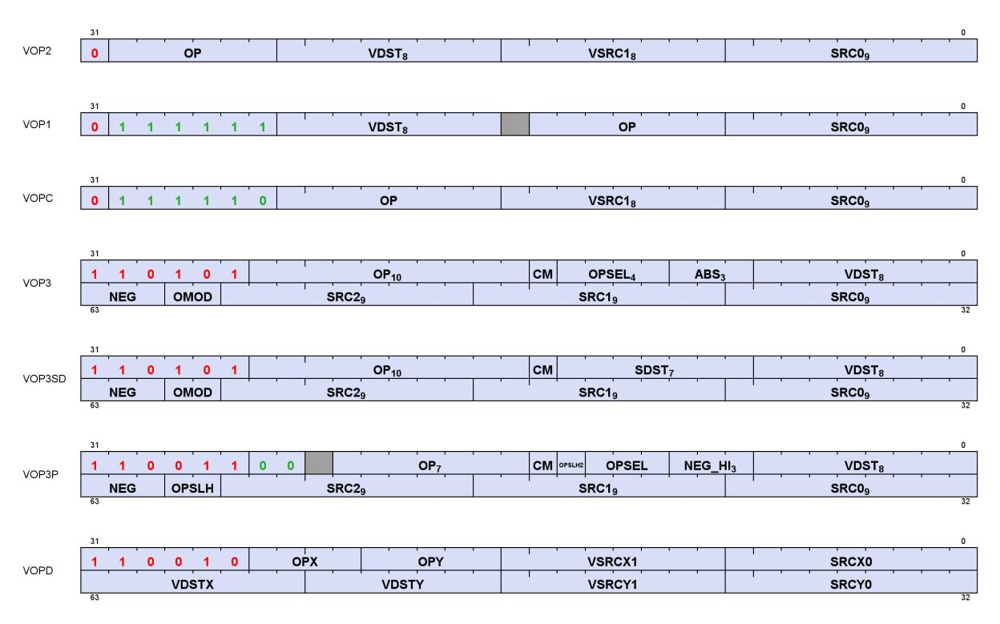

| Name   | Size   | Function                                                                  | Modifiers             |
|--------|--------|---------------------------------------------------------------------------|-----------------------|
| VOP2   | 32 bit | VALU op with 2 inputs                                                     | -                     |
| VOP1   | 32 bit | VALU op with 1 input                                                      | -                     |
| VOPC   | 32 bit | VALU compare op with 2 inputs, writes to VCC/EXEC                         | -                     |
| VOP3   | 64 bit | VALU op with 3 inputs, or a VOP1,2,C instruction                          | abs, neg, omod, clamp |
| VOP3SD | 64 bit | VALU op with 3 inputs and scalar dest                                     | neg, omod, clamp      |
| VOP3P  | 64 bit | VALU op with 3 inputs using packed math or requiring larger<br>VGPR range | neg, clamp            |
| VOPD   | 64 bit | VALU dual opcode : 2 operations in one instruction                        | -                     |

7.1. Microcode Encodings 66 of 697

Many VALU instructions are available in two encodings: VOP3 that uses 64-bits of instruction, and one of three 32-bit encodings that offer a restricted set of capabilities but smaller code size. Some instructions are only available in the VOP3 encoding. When an instruction is available in two microcode formats, it is up to the user to decide which to use. It is recommended to use the 32-bit encoding whenever possible. VOP2 can also be used for "ACCUM" type ops where the third input is implied to be the same as the dest.

Advantages of using VOP3 include:

- More flexibility in source addressing (all source fields are 9 bits)
- NEG, ABS, and OMOD fields (for floating point only)
- CLAMP field for output range limiting
- Ability to select alternate source and destination registers for VCC (carry in and out)

The following VOP1 and VOP2 instructions may not be promoted to VOP3:

- SWAP and SWAPREL, PERMLANE64\_B32
- FMAMK, FMAAK, PK\_FMAC

The VOP3 encoding has two variants:

- VOP3 used for most instructions including V\_CMP\*; has OPSEL and ABS fields
- VOP3SD has an SDST field instead of OPSEL and ABS. This encoding is used only for:
  - V\_{ADD,SUB,SUBREV}\_CO\_CI\_U32, V\_{ADD,SUB,SUBREV}\_CO\_U32 (adds with carry-out)
  - V\_DIV\_SCALE\_{F32, F64}, V\_MAD\_CO\_U64\_U32, V\_MAD\_CO\_I64\_I32.
  - VOP3SD is not used for V\_CMP\*.

Any of the VALU 32-bit or 64-bit microcode formats may use a 32-bit literal constant. Note however that VOP3 plus a literal makes a 96-bit instruction and excessive use of this combination may reduce performance.

**VOP3P** is for instructions that use "packed math": instructions that performs an operation on a pair of input values that are packed into the high and low 16-bits of each operand; the two 16-bit results are written to a single VGPR as two packed values. See [Packed Math](#page-89-0) for details.

**DPP** (Data Parallel Primitives) is an optional extension instruction DWORD that can be used with some instructions to allow a limited set of permutations of SRC0 data between different lanes. DPP is specified by setting SRC0 to the dedicated ENUM values: DPP8, DPP8FI or DPP16.

| Field | Size   | Description                                                                                                                                                         |
|-------|--------|---------------------------------------------------------------------------------------------------------------------------------------------------------------------|
| OP    | varies | instruction opcode                                                                                                                                                  |
| SRC0  | 9      | first instruction argument. May come from: VGPR, SGPR, VCC, M0, EXEC, SCC, or a constant                                                                            |
| SRC1  | 9      | second instruction argument. May come from: VGPR, SGPR, VCC, M0, EXEC, SCC, or a constant                                                                           |
| VSRC1 | 8      | second instruction argument. May come from: VGPR only                                                                                                               |
| SRC2  | 9      | third instruction argument. May come from: VGPR, SGPR, VCC, M0, EXEC, SCC, or a constant                                                                            |
| VDST  | 8      | VGPR that takes the result.<br>For V_READLANE and V_CMP, indicates the SGPR that receives the result. This cannot be M0 or EXEC.                                    |
| SDST  | 8      | VOP3SD encoding only. Holds the SGPR that takes the result of operations that produce a scalar output.<br>Can't be M0 or EXEC. Supports NULL to not write any SDST. |
| OMOD  | 2      | output modifier. for float results only.<br>0 = no modifier, 1=multiply result by 2, 2=multiply result by 4, 3=divide result by 2                                   |
| NEG   | 3      | negate the input (invert sign bit). float inputs only.<br>bit 0 is for src0, bit 1 is for src1 and bit 2 is for src2.                                               |
| ABS   | 3      | apply absolute value on input. float inputs only. applied before 'neg'.<br>bit 0 is for src0, bit 1 is for src1 and bit 2 is for src2.                              |

| Field | Size | Description                                                                                                                                                                                                                                                                                                                                                                                                                                                                                                                                                                                                                                                                                                |
|-------|------|------------------------------------------------------------------------------------------------------------------------------------------------------------------------------------------------------------------------------------------------------------------------------------------------------------------------------------------------------------------------------------------------------------------------------------------------------------------------------------------------------------------------------------------------------------------------------------------------------------------------------------------------------------------------------------------------------------|
| CM    | 1    | clamp or compare-signal (depends on opcode):<br>V_CMP: CM=1 means signaling-compare when qNaN detected; 0 = non-signaling<br>Float arithmetic: clamp result to [0, 1.0]; -0 is clamped to +0.<br>Signed integer arithmetic: clamp result to [INT_MIN, INT_MAX]<br>Unsigned integer arithmetic: clamp result to [0, +UINT_MAX]<br>Where "INT_MIN" and "INT_MAX" are the largest negative and positive representable integers for the<br>size of integer being used (16, 32 or 64 bit). "UINT_MAX" is the largest unsigned int.                                                                                                                                                                              |
| OPSEL | 4    | Operation select for 16-bit math: 1=select high half, 0=select low half<br>[0]=src0, [1]=src1, [2]=src2, [3]=dest<br>For dest=0, dest_vgpr[31:0] = {prev_dst_vgpr[31:16], result[15:0] }<br>For dest=1, dest_vgpr[31:0] = {result[15:0], prev_dst_vgpr[15:0] }<br>OPSEL may only be used for 16-bit operands, and must be zero for any other operands/results.<br>Uniquely for V_PERMLANE*: OPSEL[0] is "fetch invalid"; OPSEL[1] is "bounds control" (like DPP8).<br>DOT2_F16 and_BF16: src0 and src1 must have OPSEL[1:0] = 0.<br>OPSEL may be used to select upper or lower halves of an SGPR data input.<br>Certain operations described in later sections overload OPSEL to have a different meaning. |

# <span id="page-77-0"></span>**7.2. Operands**

Most VALU instructions take at least one input operand. The data-size of the operands is explicitly defined in the name of the instruction. For example, V\_FMA\_F32 operates on 32-bit floating point data.

<span id="page-77-1"></span>VGPR Alignment: there is no alignment restriction for single or double-float operations.

Table 34. VALU Instruction Operands

7.2. Operands 68 of 697

|                            |             | Code      | Meaning            |                                                                                                        |  |  |
|----------------------------|-------------|-----------|--------------------|--------------------------------------------------------------------------------------------------------|--|--|
| Scalar                     | Scalar Dest | 0-105     | SGPR 0 105         | Scalar GPRs. One DWORD each.                                                                           |  |  |
| Source                     | (7 bits)    | 106       | VCC_LO             | VCC[31:0]                                                                                              |  |  |
| (8 bits)                   |             | 107       | VCC_HI             | VCC[63:32]                                                                                             |  |  |
|                            |             | 108-123   | TTMP0 TTMP15       | Trap handler temporary SGPRs (privileged)                                                              |  |  |
|                            |             | 124       | NULL               | Reads return zero, writes are ignored. When used as an<br>SALU destination, nullifies the instruction. |  |  |
|                            |             | 125       | M0                 | Temporary register, use for a variety of functions                                                     |  |  |
|                            |             | 126       | EXEC_LO            | EXEC[31:0]                                                                                             |  |  |
|                            |             | 127       | EXEC_HI            | EXEC[63:32]                                                                                            |  |  |
|                            | Integer     | 128       | 0                  | Inline constant zero                                                                                   |  |  |
|                            | Inline      | 129-192   | int 1 64           | Integer inline constants                                                                               |  |  |
|                            | Constants   | 193-208   | int -116           |                                                                                                        |  |  |
|                            |             | 209-229   | Reserved           | Reserved                                                                                               |  |  |
|                            |             | 230       | Reserved           | Reserved                                                                                               |  |  |
|                            |             | 231       | Reserved           | Reserved                                                                                               |  |  |
|                            |             | 232       | Reserved           | Reserved                                                                                               |  |  |
|                            |             | 233       | DPP8               | 8-lane DPP (only valid as SRC0)                                                                        |  |  |
|                            |             | 234       | DPP8FI             | 8-lane DPP with Fetch-Invalid (only valid as SRC0)                                                     |  |  |
|                            |             | 235       | SHARED_BASE        | Memory Aperture Definition                                                                             |  |  |
|                            |             | 236       | SHARED_LIMIT       |                                                                                                        |  |  |
|                            |             | 237       | PRIVATE_BASE       |                                                                                                        |  |  |
|                            |             | 238       | PRIVATE_LIMIT      |                                                                                                        |  |  |
|                            |             | 239       | Reserved           | Reserved                                                                                               |  |  |
|                            | Float       | 240       | 0.5                | Inline floating point constants. Can be used in 16, 32 and                                             |  |  |
|                            | Inline      | 241       | -0.5               | 64 bit floating point math. They may be used with non                                                  |  |  |
|                            | Constants   | 242       | 1.0                | float instructions but the value is treated as an integer                                              |  |  |
|                            |             | 243       | -1.0               | with the hex value of the float.                                                                       |  |  |
|                            |             | 244       | 2.0                | 1/(2*PI) is 0.15915494. The hex values are:                                                            |  |  |
|                            |             | 245       | -2.0               | half: 0x3118                                                                                           |  |  |
|                            |             | 246       | 4.0                | single: 0x3e22f983                                                                                     |  |  |
|                            |             | 247       | -4.0               | double: 0x3fc45f306dc9c882                                                                             |  |  |
|                            |             | 248       | 1.0 / (2 * PI)     |                                                                                                        |  |  |
|                            |             | 249       | Reserved           | Reserved                                                                                               |  |  |
|                            |             | 250       | DPP16              | data parallel primitive (only valid as SRC0)                                                           |  |  |
|                            |             | 251       | Reserved           | Reserved                                                                                               |  |  |
|                            |             | 252       | Reserved           | Reserved                                                                                               |  |  |
|                            |             | 253       | SCC                | { 31'b0, SCC }                                                                                         |  |  |
|                            |             | 254       | Reserved           | Reserved                                                                                               |  |  |
|                            |             | 255       | Literal constant32 | 32 bit constant from instruction stream                                                                |  |  |
| Vector Src/Dst<br>(8 bits) |             | 256 - 511 | VGPR 0 255         | Vector GPRs. One DWORD each.                                                                           |  |  |

# <span id="page-78-0"></span>**7.2.1. Non-Standard Uses of Operand Fields**

A few instructions use the operand fields in non-standard ways:

7.2. Operands 69 of 697

| Opcode                           | Encoding | VDST                          | SDST      | VSRC0               | VSRC1                         | VSRC2                     |
|----------------------------------|----------|-------------------------------|-----------|---------------------|-------------------------------|---------------------------|
| V_{ADD,SUB,SUBREV}<br>_CO_U32,   | VOP2     | add result<br>(VCC=carry-out) | n/a       | in0                 | in1                           | unused<br>(carry-in=VCC)  |
| V_{ADD,SUB,SUBREV}<br>_CO_CI_U32 | VOP3SD   | add result                    | carry-out | in0                 | in1                           | carry-in                  |
| V_MAD_*_CO                       | VOP3SD   | result                        | carry-out | in0                 | in1                           | in2                       |
| V_DIV_SCALE                      | VOP3SD   | result                        | carry-out | in0                 | in1                           | in2                       |
| V_READLANE                       | VOP3     | scalar dst (SGPR<br>only)     | n/a       | vgpr#               | lane-sel: sgpr, M0,<br>inline | n/a                       |
| V_READFIRSTLANE                  | VOP1     | scalar dst (SGPR<br>only)     | n/a       | vgpr#               | n/a (lane-sel = exec)         | n/a                       |
| V_WRITELANE                      | VOP3     | dest vgpr                     | n/a       | sgpr#, const,<br>M0 | lane-sel: sgpr, M0,<br>inline | n/a                       |
| V_CMP*                           | VOPC     | "VCC" implied                 | n/a       | in0                 | in1                           | n/a                       |
|                                  | VOP3SD   | cmp-result (sgpr)             | unused    | in0                 | in1                           | unused                    |
| V_CNDMASK                        | VOP2     | dest vgpr                     | n/a       | in0                 | in1                           | unused (implied:<br>VCC)  |
|                                  | VOP3     | dest vgpr                     | unused    | in0                 | in1                           | select sgpr (e.g.<br>VCC) |

The readlane lane-select is limited to the valid range of lanes (0-31 for wave32, 0-63 for wave64) by ignoring upper bits of the lane number.

# <span id="page-79-0"></span>**7.2.2. Input Operands**

VALU instructions can use any of the following sources for input, subject to restrictions listed below:

- VOP1, VOP2, VOPC:
  - SRC0 is 9 bits and may be a VGPR, SGPR (including TTMPs and VCC), M0, EXEC, inline or literal constant.
  - VSRC1 is 8 bits and may specify only a VGPR
- VOP3 : all 3 sources are 9 bits but still have restrictions:
  - Not all VOPC/1/2 instructions are available in VOP3 (only those that benefit from VOP3 encoding).
- See complete operand list: [VALU Instruction Operands](#page-77-1)

### **Inline constants with: V\_DOT2\_F32\_BF16, V\_DOT2\_F32\_F16, V\_DOT2\_F16\_F16, and DOT2\_BF16\_BF16**

For these instructions, the inline constant for sources 0 and 1 replicate the inline constant value into bits[31:16]. For source2, the OPSEL bit is used to control replication or not (gets zero if not replicating low bits).

# **7.2.2.1. Input Operand Modifiers**

The **input modifiers** ABS and NEG apply to floating point inputs and are undefined for any other type of input. In addition, input modifiers are supported for: V\_MOV\_B32, V\_MOV\_B16, V\_MOVREL\*\_B32 and V\_CNDMASK. ABS returns the absolute value, and NEG negates the input.

### **Input modifiers are not supported for**:

- READLANE, READFIRSTLANE, WRITELANE
- Integer arithmetic or bitwise operations

7.2. Operands 70 of 697

- PERMLANE
- Ops that cannot be promoted to VOP3
- QSAD
- SWAP
- CVT\*\_F32\_{FP8,BF8}
- DOT2 with F16/BF16 (NEG ok but ABS is not)
- DOT4 with FP8/BF8 (NEG ok but ABS is not)

# **7.2.2.2. Source Operand Restrictions**

Not every combination of source operands that can be expressed in the microcode format is legal. This section describes the legal and illegal settings.

Terminology for this section:

 "scalar value" = SGPR, VCC, M0, EXEC, SCC or literal constant and also: shared\_base, shared\_limit, private\_base, private\_limit

- Instructions may use at most two Scalar Values: SGPR, VCC, M0, EXEC, SCC, Literal
- All instruction formats including VOP3 and VOP3P may use one literal constant
  - Inline constants are free (do not count against 2 scalar value limit).
  - Literals may not be used with DPP
  - It is permissible for both scalar values to be SGPRs, although VCC counts as an SGPR.
    - VCC when used implicitly counts against this limit: ADD\*\_CI, SUB\*\_CI, DIV\_FMAS, CNDMASK
  - 64-bit shift instructions can use only one scalar value input, and can't use the same one twice (inlines don't count against this limit)
  - Using the same scalar value twice only counts as a single scalar value, however using the same scalar value twice, but with different sizes has specific rules and limits:
    - Using the same literal with different sizes counts as 2 scalar values, not 1.
    - S[0] and S[0:1] can be considered as 1 scalar value, but S[1] and S[0:1] count as 2. In general, these rules apply to any S[2n] and S[2n:2n+1] count as one, but S[2n+1] and S[2n:2n+1] count as 2.
- SGPR source rules must be met for both passes of a wave64, bearing in mind that sources that read a mask (bit-per-lane) increment the SGPR address for the second pass, and they may not be shared with other sources.

# **7.2.2.3. OPSEL Field Restrictions**

The OPSEL field (of VOP3) is usable only for a subset of VOP3 instructions, as well as VOP1/2/C instructions promoted to VOP3.

Table 35. Opcodes usable with OPSEL

| V_ADD_F16      | V_ADD_NC_I16     | V_ADD_NC_U16     | V_CMP*_{I16,U16,F16} |
|----------------|------------------|------------------|----------------------|
| V_SUBREV_F16   | V_SUB_F16        | V_SUB_NC_I16     | V_SUB_NC_U16         |
| V_MAD_I16      | V_MAD_I32_I16    | V_MAD_U16        | V_MAD_U32_U16        |
| V_MUL_F16      | V_MUL_LO_U16     | V_FMAC_F16       | V_FMA_F16            |
| V_ALIGNBIT_B32 | V_ALIGNBYTE_B32  |                  | V_PACK_B32_F16       |
| V_ASHRREV_I16  | V_ASHR_PK_I8_I32 | V_ASHR_PK_U8_I32 | V_LSHLREV_B16        |

7.2. Operands 71 of 697

| V_LSHRREV_B16            | V_MIN*16                | V_MAX*16                   | V_MED3_*16                 |
|--------------------------|-------------------------|----------------------------|----------------------------|
| V_AND_B16                | V_NOT_B16               | V_OR_B16                   | V_XOR_B16                  |
| V_MOV_B16                | V_SWAP_B16              | V_CNDMASK_B16              |                            |
| V_SAT_PK4_I4_I8          | V_SAT_PK4_U4_U8         | V_SAT_PK_U8_I16            | V_LDEXP_F16                |
| V_RNDNE_F16              | V_TRUNC_F16             | V_CEIL_F16                 | V_DIV_FIXUP_F16            |
| V_FLOOR_F16              | V_FRACT_F16             | V_FREXP_EXP_I16_F16        | V_FREXP_MANT_F16           |
| V_COS_F16                | V_SIN_F16               | V_EXP_F16                  | V_LOG_F16                  |
| V_RCP_F16                | V_RSQ_F16               | V_SQRT_F16                 |                            |
| V_CVT_F16_*              | V_CVT_*_{F16, U16}      | V_CVT_PK_*_{F16, BF8, FP8} | V_CVT_PK_{F16, BF8, FP8}_* |
| V_INTERP_P10_RTZ_F16_F32 | V_INTERP_P2_RTZ_F16_F32 | V_INTERP_P2_F16_F32        | V_INTERP_P10_F16_F32       |

# <span id="page-81-0"></span>**7.2.3. Output Operands**

VALU instructions typically write their results to VGPRs specified in the VDST field of the microcode word. A thread only writes a result if the associated bit in the EXEC mask is set to 1.

V\_CMPX instructions write the result of their comparison (one bit per thread) to the EXEC mask. Both V\_CMP and V\_CMPX write a full mask of results (32-bits for wave32 and 64-bits for wave64 ) regardless of the value of EXEC. Inactive lanes write zero into the result mask.

Instructions producing a carry-out (integer add and subtract) write their result to VCC when used in the VOP2 form, and to an arbitrary SGPR-pair when used in the VOP3 form. Inactive lanes write zero into this carry-out.

When the VOP3 form is used, instructions with a floating-point result may apply an output modifier (OMOD field) that multiplies the result by: 0.5, 2.0, or 4.0. Optionally, the result can be clamped (CLAMP field) to the min and max representable range (see next section).

# **7.2.3.1. Output Operand Modifiers**

**Output modifiers** (OMOD) apply to half, single and double floating point results only and scale the result by : 0.5, 2.0, 4.0 or do not scale. Integer and packed float 16 results ignore the OMOD setting.

OMOD is allowed regardless of MODE.denorm setting, but flushes output denorms when OMOD!=0. It has the result of: -0 \* OMOD = +0.

Instructions with OMOD!=0 report exceptions, but not: underflow, or inexact. It reports: invalid, inputdenormal, divide-by-zero, overflow.

A few opcodes force output denorms to be disabled. See individual instruction descriptions.

#### **Output Modifiers are not supported for**:

- V\_SWAP\_\*
- V\_PERMLANE
- DOT2\_F16\_F16
- DOT2\_BF16\_BF16
- Integer and bitwise ops
- V\_CMP\*
- V\_CVT\*F32{BF8,FP8}
- DOT4 with BF8/FP8

7.2. Operands 72 of 697

The **clamp** bit has multiple uses. For V\_CMP instructions, setting the clamp bit to 1 indicates that the compare signals if a floating point exception occurs. For integer operations, it clamps the result to the largest and smallest representable value. For floating point operations, it clamps the result to the range: [0.0, 1.0].

When CLAMP==1, any NaN result is clamped to zero, and exceptions are reported on the result before CLAMP is applied.

All operands that can produce exceptions quiet SNaNs. E.g. V\_ADD\_F32 quiets SNaN but V\_MOV\_B32 does not.

**Output Clamping**: The clamp instruction bit applies to the following operations and data types:

- Float clamp to [0.0, 1.0]
- Signed Int [INT\_MIN, INT\_MAX]
- Unsigned int [0, UINT\_MAX]
- Bool (V\_CMP) enables signaling compare when clamp==1

The clamp bit is not supported for (ignored):

| V_PERMLANE*          | V_PERM_B32          | Float DOT instructions |
|----------------------|---------------------|------------------------|
| V_SWAP and V_SWAPREL | WMMA ops            | V_ADD3_NC              |
| V_MOV                | V_CVT*F32_{BF8,FP8} |                        |
| V_DOT4_I32_IU8       | V_DOT4_U32_U8       |                        |
| V_ADD_LSHL           | V_ALIGN*            | Bitwise ops            |
| V_CMP*_CLASS         | V_CMP on integers   |                        |
| V_READLANE           | V_READFIRSTLANE     | V_WRITELANE            |

# <span id="page-82-1"></span>**7.2.3.2. Wave64 Destination Restrictions on SGPRs**

When a VALU instruction is issued from a wave64, it may issue twice as two wave32 instructions. While in most cases the programmer need not be aware of this, it does impose a prohibition on wave64 VALU instructions that both write and read the same SGPR value. Doing this may lead to unpredictable results. Specifically, the first pass of a wave64 VALU instruction may not overwrite a scalar value used by the second half.

# <span id="page-82-0"></span>**7.2.4. Denormal and Rounding Modes**

The shader program has explicit control over the rounding mode applied and the handling of denormalized inputs and results. The MODE register is set using the S\_SETREG instruction; it has separate bits for controlling the behavior of single and double-precision floating-point numbers.

Round and denormal modes can also be set using S\_ROUND\_MODE and S\_DENORM\_MODE.

16-bit floats support denormals, infinity and NaN.

Table 36. Round and Denormal Modes

7.2. Operands 73 of 697

| Field     | Bit Position | Description                                                                                                                                                                                                                                                                                     |
|-----------|--------------|-------------------------------------------------------------------------------------------------------------------------------------------------------------------------------------------------------------------------------------------------------------------------------------------------|
| FP_ROUND  | 3:0          | [1:0] Single-precision round mode.<br>[3:2] Double and Half-precision (FP16) round mode.<br>Round Modes:<br>0=nearest even<br>1= +infinity<br>2= -infinity<br>3= toward zero                                                                                                                    |
| FP_DENORM | 7:4          | [5:4] Single-precision denormal mode.<br>[7:6] Double and Half-precision (FP16) denormal mode.<br>Denormal modes:<br>0 = Flush input and output denorms<br>1 = Allow input denorms, flush output denorms<br>2 = Flush input denorms, allow output denorms<br>3 = Allow input and output denorms |

These mode bits do not affect rounding and denormal handling of float global memory atomics.

DOT2\_F16\_F16 and DOT2\_BF16\_BF16 support round-to-nearest-even rounding. DOT2\_F16\_F16 supports denorms, and DOT2\_BF16\_BF16 disables all denorms. These opcodes flush input and output denorms: FMA\_DX9\_ZERO\_F32, CUBExx\_F32, EXP\_F32, LOG\_F32, RCP\_F32, RCP\_IFLAG\_F32, RSQ\_F32, SQRT\_F32, COS\_F32.

# <span id="page-83-0"></span>**7.2.5. Instructions using SGPRs as Mask or Carry**

Every VALU instruction can use SGPRs as a constant, but the following can read or write SGPRs as masks or carry:

| Read Mask or Carry in | Write Carry out                 | Implicitly Reads VCC                     | Implicitly Writes VCC  |
|-----------------------|---------------------------------|------------------------------------------|------------------------|
| V_CNDMASK_B32         | V_CMP*                          | V_DIV_FMAS_F32                           | V_CMP (not V_CMPX)     |
| V_CNDMASK_B16         | V_ADD_CO_CI_U32                 | V_DIV_FMAS_F64                           |                        |
| V_ADD_CO_CI_U32       | V_SUB_CO_CI_U32                 | (fmas reads 3 operands + VCC)            |                        |
| V_SUB_CO_CI_U32       | V_SUBREV_CO_CI_U32              | V_CNDMASK in VOP2                        |                        |
| V_SUBREV_CO_CI_U32    | V_ADD_CO_U32                    | V_{ADD,SUB,SUBREV}_CO_CI_U<br>32 in VOP2 |                        |
|                       | V_SUB_CO_U32<br>V_SUBREV_CO_U32 |                                          |                        |
|                       | V_MAD_U64_U32                   |                                          |                        |
|                       | V_MAD_I64_I32                   |                                          |                        |
|                       | Write Data out (not carry)      |                                          | Write Carry out / mask |
|                       | V_READLANE                      |                                          | V_DIV_SCALE_F32        |
|                       | V_READFIRSTLANE                 |                                          | V_DIV_SCALE_F64        |

<sup>&</sup>quot;VCC" in the above table refers to VCC in a VOP2 or VOPC encoding.

V\_CMPX is the only VALU instruction that writes EXEC.

7.2. Operands 74 of 697

# <span id="page-84-0"></span>**7.2.6. Wave64 use of SGPRs as Input Operands**

VALU instructions may use SGPRs as a uniform input, shared by all work-items. If the value is used as simple data value, then the same SGPR is distributed to all 64 work-items. If, on the other hand, the data value represents a mask (e.g. carry-in, mask for CNDMASK), then each work-item receives a separate value, and two consecutive SGPRs are read.

# <span id="page-84-1"></span>**7.2.7. Out-of-Range GPRs**

When a source VGPR is out-of-range, it acts as if the instruction indicated VGPR0.

When the destination GPR is out-of-range, the instruction issues to the VALU but does not write the results or report exceptions.

See [VGPR Out Of Range Behavior](#page-27-1) for more information.

# <span id="page-84-2"></span>**7.2.8. PERMLANE Specific Rules**

V\_PERMLANE\* may not occur immediately after a V\_CMPX. To prevent this, any other VALU opcode may be inserted (e.g. V\_NOP).

# <span id="page-84-3"></span>**7.3. Instructions**

The table below lists the complete VALU instruction set by microcode encoding, except for VOP3P instructions which are listed in a later section.

| VOP3            | VOP3 - 2 operands     | VOP2                 | VOP1             |
|-----------------|-----------------------|----------------------|------------------|
| V_ADD3_U32      | V_ADD_CO_U32          | V_ADD_CO_CI_U32      | V_BFREV_B32      |
| V_ADD_LSHL_U32  | V_ADD_NC_I16          | V_ADD_F16            | V_CEIL_F16       |
| V_ALIGNBIT_B32  | V_ADD_NC_I32          | V_ADD_F32            | V_CEIL_F32       |
| V_ALIGNBYTE_B32 | V_ADD_NC_U16          | V_ADD_F64            | V_CEIL_F64       |
| V_AND_OR_B32    | V_AND_B16             | V_ADD_NC_U32         | V_CLS_I32        |
| V_BFE_I32       | V_ASHRREV_I16         | V_AND_B32            | V_CLZ_I32_U32    |
| V_BFE_U32       | V_ASHRREV_I64         | V_ASHRREV_I32        | V_COS_F16        |
| V_BFI_B32       | V_BCNT_U32_B32        | V_CNDMASK_B32        | V_COS_F32        |
| V_CNDMASK_B16   | V_BFM_B32             | V_CVT_PK_RTZ_F16_F32 | V_CTZ_I32_B32    |
| V_CUBEID_F32    | V_CVT_PK_BF8_F32      | V_FMAAK_F16          | V_CVT_F16_F32    |
| V_CUBEMA_F32    | V_CVT_PK_FP8_F32      | V_FMAAK_F32          | V_CVT_F16_I16    |
| V_CUBESC_F32    | V_CVT_PK_I16_F32      | V_FMAC_F16           | V_CVT_F16_U16    |
| V_CUBETC_F32    | V_CVT_PK_I16_I32      | V_FMAC_F32           | V_CVT_F32_BF8    |
| V_CVT_PK_U8_F32 | V_CVT_PK_NORM_I16_F16 | V_FMAMK_F16          | V_CVT_F32_F16    |
| V_DIV_FIXUP_F16 | V_CVT_PK_NORM_I16_F32 | V_FMAMK_F32          | V_CVT_F32_F64    |
| V_DIV_FIXUP_F32 | V_CVT_PK_NORM_U16_F16 | V_LDEXP_F16          | V_CVT_F32_FP8    |
| V_DIV_FIXUP_F64 | V_CVT_PK_NORM_U16_F32 | V_LSHLREV_B32        | V_CVT_F32_I32    |
| V_DIV_FMAS_F32  | V_CVT_PK_U16_F32      | V_LSHLREV_B64        | V_CVT_F32_U32    |
| V_DIV_FMAS_F64  | V_CVT_PK_U16_U32      | V_LSHRREV_B32        | V_CVT_F32_UBYTE0 |
| V_DIV_SCALE_F32 | V_CVT_SR_BF8_F32      | V_MAX_I32            | V_CVT_F32_UBYTE1 |
| V_DIV_SCALE_F64 | V_CVT_SR_FP8_F32      | V_MAX_NUM_F16        | V_CVT_F32_UBYTE2 |

7.3. Instructions 75 of 697

| VOP3                 | VOP3 - 2 operands     | VOP2               | VOP1                  |
|----------------------|-----------------------|--------------------|-----------------------|
| V_DOT2_BF16_BF16     | V_LDEXP_F32           | V_MAX_NUM_F32      | V_CVT_F32_UBYTE3      |
| V_DOT2_F16_F16       | V_LDEXP_F64           | V_MAX_NUM_F64      | V_CVT_F64_F32         |
| V_FMA_DX9_ZERO_F32   | V_LSHLREV_B16         | V_MAX_U32          | V_CVT_F64_I32         |
| V_FMA_F16            | V_LSHRREV_B16         | V_MIN_I32          | V_CVT_F64_U32         |
| V_FMA_F32            | V_LSHRREV_B64         | V_MIN_NUM_F16      | V_CVT_FLOOR_I32_F32   |
| V_FMA_F64            | V_MAXIMUM_F16         | V_MIN_NUM_F32      | V_CVT_I16_F16         |
| V_LERP_U8            | V_MAXIMUM_F32         | V_MIN_NUM_F64      | V_CVT_I32_F32         |
| V_LSHL_ADD_U32       | V_MAXIMUM_F64         | V_MIN_U32          | V_CVT_I32_F64         |
| V_LSHL_OR_B32        | V_MAX_I16             | V_MUL_DX9_ZERO_F32 | V_CVT_I32_I16         |
| V_MAD_CO_I64_I32     | V_MAX_U16             | V_MUL_F16          | V_CVT_NEAREST_I32_F32 |
| V_MAD_CO_U64_U32     | V_MBCNT_HI_U32_B32    | V_MUL_F32          | V_CVT_NORM_I16_F16    |
| V_MAD_I16            | V_MBCNT_LO_U32_B32    | V_MUL_F64          | V_CVT_NORM_U16_F16    |
| V_MAD_I32_I16        | V_MINIMUM_F16         | V_MUL_HI_I32_I24   | V_CVT_OFF_F32_I4      |
| V_MAD_I32_I24        | V_MINIMUM_F32         | V_MUL_HI_U32_U24   | V_CVT_PK_F32_BF8      |
| V_MAD_U16            | V_MINIMUM_F64         | V_MUL_I32_I24      | V_CVT_PK_F32_FP8      |
| V_MAD_U32_U16        | V_MIN_I16             | V_MUL_U32_U24      | V_CVT_U16_F16         |
| V_MAD_U32_U24        | V_MIN_U16             | V_OR_B32           | V_CVT_U32_F32         |
| V_MAX3_I16           | V_MUL_HI_I32          | V_PK_FMAC_F16      | V_CVT_U32_F64         |
| V_MAX3_I32           | V_MUL_HI_U32          | V_SUBREV_CO_CI_U32 | V_CVT_U32_U16         |
| V_MAX3_NUM_F16       | V_MUL_LO_U16          | V_SUBREV_F16       | V_EXP_F16             |
| V_MAX3_NUM_F32       | V_MUL_LO_U32          | V_SUBREV_F32       | V_EXP_F32             |
| V_MAX3_U16           | V_OR_B16              | V_SUBREV_NC_U32    | V_FLOOR_F16           |
| V_MAX3_U32           | V_PACK_B32_F16        | V_SUB_CO_CI_U32    | V_FLOOR_F32           |
| V_MAXIMUM3_F16       | V_PERMLANE16_VAR_B32  | V_SUB_F16          | V_FLOOR_F64           |
|                      |                       |                    |                       |
| V_MAXIMUM3_F32       | V_PERMLANEX16_VAR_B32 | V_SUB_F32          | V_FRACT_F16           |
| V_MAXIMUMMINIMUM_F16 | V_READLANE_B32        | V_SUB_NC_U32       | V_FRACT_F32           |
| V_MAXIMUMMINIMUM_F32 | V_SUBREV_CO_U32       | V_XNOR_B32         | V_FRACT_F64           |
| V_MAXMIN_I32         | V_SUB_CO_U32          | V_XOR_B32          | V_FREXP_EXP_I16_F16   |
| V_MAXMIN_NUM_F16     | V_SUB_NC_I16          |                    | V_FREXP_EXP_I32_F32   |
| V_MAXMIN_NUM_F32     | V_SUB_NC_I32          |                    | V_FREXP_EXP_I32_F64   |
| V_MAXMIN_U32         | V_SUB_NC_U16          |                    | V_FREXP_MANT_F16      |
| V_MED3_I16           | V_TRIG_PREOP_F64      |                    | V_FREXP_MANT_F32      |
| V_MED3_I32           | V_WRITELANE_B32       |                    | V_FREXP_MANT_F64      |
| V_MED3_NUM_F16       | V_XOR_B16             |                    | V_LOG_F16             |
| V_MED3_NUM_F32       |                       |                    | V_LOG_F32             |
| V_MED3_U16           |                       |                    | V_MOVRELD_B32         |
| V_MED3_U32           | One Operand:          |                    | V_MOVRELSD_2_B32      |
| V_MIN3_I16           | V_S_EXP_F16           |                    | V_MOVRELSD_B32        |
| V_MIN3_I32           | V_S_EXP_F32           |                    | V_MOVRELS_B32         |
| V_MIN3_NUM_F16       | V_S_LOG_F16           |                    | V_MOV_B16             |
| V_MIN3_NUM_F32       | V_S_LOG_F32           |                    | V_MOV_B32             |
| V_MIN3_U16           | V_S_RCP_F16           |                    |                       |
| V_MIN3_U32           | V_S_RCP_F32           |                    |                       |
| V_MINIMUM3_F16       | V_S_RSQ_F16           |                    | V_NOP                 |
| V_MINIMUM3_F32       | V_S_RSQ_F32           |                    | V_NOT_B16             |
| V_MINIMUMMAXIMUM_F16 | V_S_SQRT_F16          |                    | V_NOT_B32             |
| V_MINIMUMMAXIMUM_F32 | V_S_SQRT_F32          |                    | V_PERMLANE64_B32      |
| V_MINMAX_I32         |                       |                    | V_PIPEFLUSH           |
| V_MINMAX_NUM_F16     |                       |                    | V_RCP_F16             |
| V_MINMAX_NUM_F32     |                       |                    | V_RCP_F32             |
| V_MINMAX_U32         |                       |                    | V_RCP_F64             |
| V_MQSAD_PK_U16_U8    |                       |                    | V_RCP_IFLAG_F32       |

7.3. Instructions 76 of 697

| VOP3              | VOP3 - 2 operands | VOP2 | VOP1                |
|-------------------|-------------------|------|---------------------|
| V_MQSAD_U32_U8    |                   |      | V_READFIRSTLANE_B32 |
| V_MSAD_U8         |                   |      | V_RNDNE_F16         |
| V_MULLIT_F32      |                   |      | V_RNDNE_F32         |
| V_OR3_B32         |                   |      | V_RNDNE_F64         |
| V_PERMLANE16_B32  |                   |      | V_RSQ_F16           |
| V_PERMLANEX16_B32 |                   |      | V_RSQ_F32           |
| V_PERM_B32        |                   |      | V_RSQ_F64           |
| V_QSAD_PK_U16_U8  |                   |      | V_SAT_PK_U8_I16     |
| V_SAD_HI_U8       |                   |      | V_SIN_F16           |
| V_SAD_U16         |                   |      | V_SIN_F32           |
| V_SAD_U32         |                   |      | V_SQRT_F16          |
| V_SAD_U8          |                   |      | V_SQRT_F32          |
| V_XAD_U32         |                   |      | V_SQRT_F64          |
| V_XOR3_B32        |                   |      | V_SWAPREL_B32       |
|                   |                   |      | V_SWAP_B16          |
|                   |                   |      | V_SWAP_B32          |
|                   |                   |      | V_TRUNC_F16         |
|                   |                   |      | V_TRUNC_F32         |
|                   |                   |      | V_TRUNC_F64         |

| VOPC - Compare Ops |                                                            |                                                                                       |            |  |  |  |
|--------------------|------------------------------------------------------------|---------------------------------------------------------------------------------------|------------|--|--|--|
|                    | VOPC writes to VCC, VOP3 writes compare result to any SGPR |                                                                                       |            |  |  |  |
| V_CMP              |                                                            |                                                                                       | write VCC  |  |  |  |
| V_CMPX             |                                                            | I16, I32, I64, U16, U32, U64 F, LT, EQ, LE, GT, LG, GE, T                             | write exec |  |  |  |
| V_CMP              | F16, F32, F64                                              | F, LT, EQ, LE, GT, LG, GE, T,<br>O, U, NGE, NLG, NGT, NLE, NEQ, NLT                   | write VCC  |  |  |  |
| V_CMPX             |                                                            | (T = True, F = False, O = total order, U = unordered, "N"<br>= Not (inverse) compare) | write exec |  |  |  |
| V_CMP_CLASS        | F16, F32, F64                                              | Test for any combination of: signaling-NaN, quiet-NaN,                                | write VCC  |  |  |  |
| V_CMPX_CLASS       |                                                            | positive or negative: infinity, normal, subnormal, zero.                              | write exec |  |  |  |

# <span id="page-86-0"></span>**7.4. 16-bit Math and VGPRs**

VALU instructions that operate on 16-bit data (non-packed) can separately address the two halves of a 32-bit VGPR.

16-bit VGPR-pairs are packed into a 32-bit VGPRs: the 32-bit VGPR "V0" contains two 16-bit VGPRs: "V0.L" representing V0[15:0] and "V0.H" representing V0[31:16].

How this addressing is encoded in the ISA varies by the instruction encoding: The 16-bit instructions can be encoded using VOP1/2/C as well as VOP3 / VOP3P.

#### **16bit VGPR Naming**

The 32-bit VGPR is "V0". The two halves are called "V0.L" and "V0.H".

## **VOP1, VOP2, VOPC Encoding of 16-bit VGPRs**

SRC/DST[6:0] = 32-bit VGPR address;

SRC/DST[7] = (1=hi, 0=lo half)

In this encoding, only 256 16-bit VGPRs can be addressed.

7.4. 16-bit Math and VGPRs 77 of 697

## **VOP3, VOP3P, VINTERP Encoding of 16-bit VGPRs**

SRC/DST[7:0] = 32-bit VGPR address, OPSEL = high/low. In this encoding, a wave can address 512 16-bit VGPRs.

The packing shown below allows reading or writing in one cycle:

- 32 lanes of one 32-bit VGPR: V0
- 64 lanes of one 16-bit VGPR: V0.L
- 32 lanes of two 16-bit VGPRs (a pair, as used by packed math): V0.L and V0.H

# <span id="page-87-0"></span>**7.5. 8-bit Math**

8-bit floating point values can be represented in one of two forms:

- FP8 : { Sign, Exp4, Mant3 }; ExpBias = 7
- BF8 : { Sign, Exp5, Mant2 }; ExpBias = 15

These formats are supported in DOT, WMMA and CVT operations.

The ISA does not allow directly addressing individual 8-bit quantities in VGPRs.

The following table provides the numeric ranges based on the data format and bias selection.

| F8_<br>Mode | Fmt  | Sign-Exp<br>Mant | Bias | +0<br>-0         | INF,<br>-INF     | NaN,<br>-NaN             | Max   | Min<br>(norm) | Min (denorm) |
|-------------|------|------------------|------|------------------|------------------|--------------------------|-------|---------------|--------------|
| x           | FP16 | E5M10            | 15   | 0x0000<br>0x8000 | 0x7C00<br>0xFC00 | (normal)                 | 65504 | 6.10352E-05   | 5.96046E-08  |
| 1           | BF8  | E5M2             | 16   | 0x00<br>0x00     | 0x80             | 0x80                     | 57344 | 3.05176E-05   | 7.62939E-06  |
| 0           | BF8  | E5M2             | 15   | 0x00<br>0x80     | 0x7C<br>0xFC     | +: 0x7D-7F<br>-: 0xFD-FF | 57344 | 6.10352E-05   | 1.52588E-05  |
| 1           | FP8  | E4M3             | 8    | 0x00<br>0x00     | 0x80             | 0x80                     | 240   | 0.0078125     | 0.000976563  |
| 0           | FP8  | E4M3             | 7    | 0x00<br>0x80     | N/A              | +: 0x7F<br>-: 0xFF       | 448   | 0.0156250     | 0.001953125  |

# <span id="page-87-1"></span>**7.6. Data Conversion Operations**

Common Restrictions on data conversion operations:

- Input modifiers (neg, abs) are not supported
- Rounding is RNE (except for "SR" ops, which truncate)
- OMOD is not used
- CLAMP is not supported for conversions from BF8/FP8 or smaller floats
- FP16\_OVFL applies when the destination is FP16 or BF16
- OPSEL is not supported for packed or stochastic converts

7.5. 8-bit Math 78 of 697

# <span id="page-88-0"></span>**7.6.1. Data Convert Instruction Types**

**Normal / Single** Convert one value in a source register into one value in a destination register

**Packed ("PK")** Convert two consecutive values in source register(s) into two values in destination

register(s)

**Stochastic Rounded** add a pseudo-random value (unique per lane) to each source value, then truncate

Stochastic rounding adds bits from a source VGPR supplying a random value to the input data value and then truncates to the smaller precision result type. Due to the small range of F8, the result of conversion from FP32 to F8 has an option to be clamped +/-MAX normal value instead of +/-INF.

Convert with Stochastic Round:

- one source has the number to convert and the other has a random number used in rounding
- These ops add a random value from the specified VGPR and then truncate to the smaller result data type

# <span id="page-88-1"></span>**7.6.2. OPSEL with FP8 and BF8 Conversions**

| CVT_PK_FP8_F32<br>CVT_PK_BF8_F32 | 16-bits of data written represents two packed 8-bit values.<br>case OPSEL[3]:<br>0: write DST[15:0], preserve DST[31:16]<br>1: write DST[31:16], preserve DST[15:0]                                           |
|----------------------------------|---------------------------------------------------------------------------------------------------------------------------------------------------------------------------------------------------------------|
| CVT_SR_FP8_F32<br>CVT_SR_BF8_F32 | case OPSEL[3:2]:<br>0: write DST[7:0], preserve other DST bits<br>1: write DST[16:8], preserve other DST bits<br>2: write DST[24:16], preserve other DST bits<br>3: write DST[31:24], preserve other DST bits |
| CVT_PK_F32_FP8<br>CVT_PK_F32_BF8 | SourceData[15:0] = (SRC0 >> (16 * OPSEL[0])) & 0xFFFF                                                                                                                                                         |
| CVT_F32_FP8<br>CVT_F32_BF8       | SourceData[7:0] = (SRC0 >> (8 * OPSEL[0:1])) & 0xFF                                                                                                                                                           |

These instructions do not support ABS, NEG, OMOD or CLAMP. CVT\_PK\_\*\_F32 uses round-to-nearest-even; others do not need rounding (except CVT\_SR opcodes: uses truncate). CVT\_PK\_F16\_\* does not support DPP.

The FP16\_OVFL flag is applied to data conversions from F32 to FP8/BF8 formats. The overflow behaviour is specified in the table below:

|                                | Destination Value |             |             |             |  |
|--------------------------------|-------------------|-------------|-------------|-------------|--|
|                                |                   | FP8         | BF8         |             |  |
| Source Value                   | FP16_OVFL=1       | FP16_OVFL=0 | FP16_OVFL=1 | FP16_OVFL=0 |  |
| NaN                            | NaN               | NaN         | NaN         | NaN         |  |
| ±Inf                           | ±max_E4M3         | NaN         | ±max_E5M2   | ±Inf        |  |
| Greater than max FP8 magnitude | ±max_E4M3         | NaN         | ±max_E5M2   | ±Inf        |  |

# <span id="page-89-0"></span>**7.7. Packed Math**

**Packed math** is a form of operation that accelerates arithmetic on two values packed into the same VGPR. It performs operations on two 16-bit values within a DWORD as if they were separate threads. For example, a packed add of V0=V1+V2 is really two separate adds: adding the low 16 bits of each DWORD and storing the result in the low 16 bits of V0, and adding the high halves and storing the result in the high 16 bits of V0.

Packed math uses the instructions below and the microcode format "VOP3P". This format has OPSEL and NEG fields for both the low and high operands, and does not have ABS and OMOD.

**Packed Math ops** V\_PK\_MUL\_F16 V\_PK\_MINIMUM\_F16 V\_PK\_FMA\_F16 V\_PK\_ADD\_F16 V\_PK\_MAXIMUM\_F16 V\_PK\_FMAC\_F16 V\_PK\_MIN\_NUM\_F16 V\_PK\_MAX\_NUM\_F16 V\_PK\_ADD\_I16 V\_PK\_MIN\_I16 V\_PK\_MAD\_I16 V\_PK\_ADD\_U16 V\_PK\_MIN\_U16 V\_PK\_MAD\_U16 V\_PK\_SUB\_I16 V\_PK\_MAX\_I16 V\_PK\_MUL\_LO\_U16 V\_PK\_SUB\_U16 V\_PK\_MAX\_U16 V\_FMA\_MIX\_F32 V\_FMA\_MIXHI\_F16 V\_FMA\_MIXLO\_F16 V\_PK\_LSHLREV\_B16 V\_PK\_LSHRREV\_B16 V\_PK\_ASHRREV\_I16 V\_DOT2\_F32\_BF16 V\_DOT2\_F32\_F16 V\_DOT4\_F32\_FP8\_BF8 V\_DOT4\_F32\_BF8\_FP8 V\_DOT4\_F32\_FP8\_FP8 V\_DOT4\_F32\_BF8\_BF8 V\_DOT4\_I32\_IU8 V\_DOT4\_U32\_U8 V\_DOT8\_I32\_IU4 V\_DOT8\_U32\_U4

Table 37. Packed Math Opcodes:

V\_FMA\_MIX\* and WMMA instructions are not packed math, but perform a single MAD operation on a mixture of 16- and 32-bit inputs. They are listed here because they use the VOP3P encoding. Matrix multiply operations are described in a later section.

#### **VOP3P Instruction Fields**

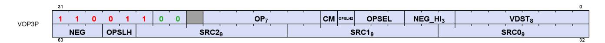

| Field | Size | Description                                                                                                                                                                                                                                                                                                                 |
|-------|------|-----------------------------------------------------------------------------------------------------------------------------------------------------------------------------------------------------------------------------------------------------------------------------------------------------------------------------|
| OP    | 7    | instruction opcode                                                                                                                                                                                                                                                                                                          |
| SRC0  | 9    | first instruction argument. May come from: VGPR, SGPR, VCC, M0, exec or a constant                                                                                                                                                                                                                                          |
| SRC1  | 9    | second instruction argument. May come from: VGPR, SGPR, VCC, M0, exec or a constant                                                                                                                                                                                                                                         |
| SRC2  | 9    | third instruction argument. May come from: VGPR, SGPR, VCC, M0, exec or a constant                                                                                                                                                                                                                                          |
| VDST  | 8    | VGPR that takes the result.                                                                                                                                                                                                                                                                                                 |
| NEG   | 3    | negate the input (invert sign bit) for the lower-16bit operand. float inputs only.<br>bit 0 is for src0, bit 1 is for src1 and bit 2 is for src2.<br>For V_FMA_MIX* opcodes, this modifies all inputs.<br>For DOT…IU… and WMMA…IU… NEG[1:0] = signed(1)/unsigned(0) for src0 and src1,<br>and NEG[2] behavior is undefined. |

7.7. Packed Math 80 of 697

| Field    | Size | Description                                                                                                                                                                                                                                                                                                                                                                                                                                                                                                                                                                                                    |  |
|----------|------|----------------------------------------------------------------------------------------------------------------------------------------------------------------------------------------------------------------------------------------------------------------------------------------------------------------------------------------------------------------------------------------------------------------------------------------------------------------------------------------------------------------------------------------------------------------------------------------------------------------|--|
| NEG_HI   | 3    | negate the input (invert sign bit) for the higher-16bit operand. float inputs only.<br>bit 0 is for src0, bit 1 is for src1 and bit 2 is for src2.<br>For V_FMA_MIX* opcodes, this acts as an ABS (absolute value) modifier.<br>For DOT…IU… and WMMA…IU… NEG_HI behavior is undefined.                                                                                                                                                                                                                                                                                                                         |  |
| OPSEL    | 3    | Select the high (1) or low (0) operand as input to the operation that results in the lower-half of the<br>destination. [0] = src0, [1] = src1, [2] = src2<br>If either the source operand or destination operand is 32bits, the corresponding OPSEL bit must set<br>to zero. This rule does not apply to MIX instructions, which have a unique interpretation of OPSEL. See<br>notes below.<br>OPSEL works for 16-bit VGPR, SGPR and literal-constant sources; for inline constant sources OPSEL<br>must be zero (value only exists in lower 16 bits). (only wave64 uses OPSEL[1]), and OPSEL[2] is<br>unused. |  |
| OPSEL_HI | 3    | Select the high (1) or low (0) operand as input to the operation that results in the upper-half of the<br>destination. [0] = src0, [1] = src1, [2] = src2. Concatenation of ISA fields {OPSLH2, OPSLH}. If either<br>the source operand or destination operand is 32bits or is a constant, the corresponding OPSEL_HI<br>bit must set to zero. This rule does not apply to MIX instructions, which have a unique interpretation of<br>OPSEL. See notes below.                                                                                                                                                  |  |
| CM       | 1    | clamp result.<br>Float arithmetic: clamp result to [0, 1.0]; -0 is clamped to +0.<br>Signed integer arithmetic: clamp result to [INT_MIN, INT_MAX]<br>Unsigned integer arithmetic: clamp result to [0, UINT_MAX]<br>Where "INT_MIN" and "INT_MAX" are the largest negative and positive representable integers for<br>the size of integer being used (16, 32 or 64 bit). "UINT_MAX" is the largest unsigned int.                                                                                                                                                                                               |  |

### OPSEL for MIX instructions

MIX, MIXLO and MIXHI interpret OPSEL and OPSEL\_HI as three 2-bit fields, one per source operand:

{ OPSEL\_HI[0], OPSEL[0] } controls source0;

{ OPSEL\_HI[1], OPSEL[1] } controls source1;

{ OPSEL\_HI[2], OPSEL[2] } controls source2.

These 2-bit fields control source-selection for each of the 3 source operands:

2'b00: Src[31:0] as FP32 2'b01: Src[31:0] as FP32 2'b10: Src[15:0] as FP16 2'b11: Src[31:16] as FP16

#### V\_WMMA…**IU**… and V\_DOT4…**IU**… with NEG:

These instructions use the NEG[1:0] bits to indicate signed (0=unsigned, 1=signed) per input source instead of meaning "negate". NEG[2] should be set to zero (behavior is undefined). NEG\_HI must be zero.

#### DOT4\_F32\_{FP8,BF8}\_{FP8,BF8}

OPSEL must be zero, and OPSEL\_HI must be 7. Only SRC2 can apply NEG/NEG\_HI (NEG\_HI acts as the ABS modifier for these ops). OMOD and CLAMP are not supported, and round-mode is round-to-nearesteven. Exceptions are not reported.

#### WMMA\_\*\_{FP8,BF8}\_{FP8,BF8}

No OPSEL (has other uses), ABS, NEG, OMOD, DPP, FP16\_OVFL or clamp support. Matrix sources A and B must come from VGPRs; C may be a VGPR or inline constant. Exceptions are not reported.

7.7. Packed Math 81 of 697

# <span id="page-91-0"></span>**7.7.1. Scalar Constants with Packed Math**

This section defines the rules for scalar constants in packed math operations and how much data is read per operand.

| Input Type                      | PK_F16                                                       | PK_F32                                                 |  |
|---------------------------------|--------------------------------------------------------------|--------------------------------------------------------|--|
|                                 | All cases use OPSEL to select high<br>or low 16 bits per op. |                                                        |  |
| VGPR                            | 1 vgpr                                                       | 2 vgprs. opsel selects high/low<br>dword               |  |
| SGPR                            | 1 SGPR                                                       | 1 SGPR                                                 |  |
| Literal32<br>M0<br>{31'h0, SCC} | like SGPR                                                    | replicates literal to 64 bits. no<br>opsel (redundant) |  |
| EXEC                            | invalid                                                      | invalid                                                |  |
| Inline Const                    | {16'h0, const}                                               | 32-bit const. no opsel                                 |  |

# <span id="page-91-1"></span>**7.7.2. Inline Constants with Packed Math**

Inline constants may be used with packed math, but they require the use of OPSEL. Inline constants produce a value in only the low 16-bits of the 32-bit constant value. Inline constants used with float 16-bit sources produce an F16 constant value. Without using OPSEL, only the lower half of the source would contain the constant. To use the inline constant in both halves, use OPSEL to select the lower input for both low and high sources.

BF16 uses 32-bit float constants and then the BF16 operand selects the upper 16 bits of the FP32 constant (matches the definition of BF16).

For WMMA and DOT instructions sourcing 16-bit data, the LSBs of the inline constant value are used.

Any packed math instructions (excluding WMMA) that have source float data sizes less than 16 bits do not work with inline constants. 8-bit and 4-bit integer inlines constants work as expected.

| Opcode           | inline                                                | OPSEL                    |
|------------------|-------------------------------------------------------|--------------------------|
| DOT4_I32_IU8     | use 32bit inline src0/1 (ignore OPSEL)                | OPSEL/OPSEL_HI on src0/1 |
| DOT8_I32_IU4     | use 32bit inline src0/1 (ignore OPSEL)                | OPSEL/OPSEL_HI on src0/1 |
| DOT4_U32_U8      | use 32bit inline src0/1 (ignore OPSEL)                | OPSEL/OPSEL_HI on src0/1 |
| DOT8_U32_U4      | use 32bit inline src0/1 (ignore OPSEL)                | OPSEL/OPSEL_HI on src0/1 |
| DOT2_F32_F16     | use FP32 inline, supports OPSEL                       | OPSEL/OPSEL_HI on src0/1 |
| DOT2_F32_BF16    | upper16(FP32)/same as replicate (src0/1) ignore OPSEL | OPSEL/OPSEL_HI on src0/1 |
| DOT2ACC_F32_F16  | Duplicate lo to hi, ignore OPSEL                      | none                     |
| DOT2ACC_F32_BF16 | Duplicate lo to hi, ignore OPSEL                      | none                     |

# <span id="page-91-2"></span>**7.8. Dual Issue VALU (VOPD)**

The VOPD instruction encoding allows a single shader instruction to encode two separate VALU operations that are executed in parallel. The two operations must be independent of each other. This instruction has certain restrictions that must be met - hardware **does not function correctly** if they are not. This instruction format is legal only for wave32. It must not be used by wave64's.

The instruction defines 2 operations, named "X" and "Y", each with their own source and destination VGPRs. The two instructions packed into this one ISA are referred to as OpcodeX and OpcodeY.

- OpcodeX sources data from SRC0X (a VGPR, SGPR or constant), and SRC1X (a VGPR);
- OpcodeY sources data from SRC0Y (a VGPR, SGPR or constant), and SRC1Y (a VGPR).

# **Restrictions**:

- Each of the two instructions may use up to 2 VGPRs
- Each instruction in the pair may use at most 1 SGPR or they may share a single literal
  - Legal combinations for the dual-op: at most 2 SGPRs, or 1 SGPR + 1 literal, or share a literal.
    - SCC and EXEC as data count as one SGPR
- SRC0 can be either a VGPR or SGPR (or constant)
- VSRC1 can only be a VGPR
- Instructions must not exceed the VGPR source-cache port limits
  - SRC0x and SRC0y must come from different VGPR banks (bank# = SRC % 4), or be the same VGPR and same sized operand. Same for SRC1.
  - Each cache has 3 read ports: one dedicated to SRC0, one dedicated to SRC1 and one for SRC2
    - A cache can read all 3 of them at once, but it can't read two SRC0's at once (or SRC1/2).
  - SRCX0 and SRCY0 must use different VGPR banks;
  - VSRCX1 and VSRCY1 must use different banks.
    - FMAMK is an exception : V = S0 + K \* S1 ("S1" uses the SRC2 read port)
    - V\_MOV\_B32 when in OPY uses SRC2 (not SRC0) if OPX is also a V\_MOV\_B32.
  - If both operations use the SRC2 input, then one SRC2 input must be even and the other SRC2 input must be odd. The following operations use SRC2: FMAMK\_F32 (second input operand); DOT2ACC\_F32\_F16, DOT2ACC\_F32\_BF16, FMAC\_F32 (destination operand).
  - These are hard rules the instruction does not function if these rules are broken
- The pair of instructions combined have the following restrictions:
  - At most one literal constant, or they may share the same literal
  - Dest VGPRs: one must be even and the other odd
  - The two instructions must be independent of each other: The OPX instruction must not overwrite sources of the OPY instruction but the OPY instruction may overwrite the sources of the OPX instruction without creating a hazard.
- Must not use DPP
- Must be wave32.

#### **VOPD Instruction Fields**

| Field  | Size | Description                                                                     |  |
|--------|------|---------------------------------------------------------------------------------|--|
| opX    | 4    | instruction opcode for the X operation                                          |  |
| opY    | 5    | instruction opcode for the Y operation                                          |  |
| src0X  | 9    | Source 0 for X operation. May be a VGPR, SGPR, exec, inline or literal constant |  |
| src0Y  | 9    | Source 0 for Y operation. May be a VGPR, SGPR, exec, inline or literal constant |  |
| vsrc1X | 8    | Source 1 for X operation. Must be a VGPR. Ignored for V_MOV_B32                 |  |
| vsrc1Y | 8    | Source 1 for Y operation. Must be a VGPR. Ignored for V_MOV_B32                 |  |

| Field | Size | Description                                                                                                                                                                        |
|-------|------|------------------------------------------------------------------------------------------------------------------------------------------------------------------------------------|
| vdstX | 8    | Destination VGPR for X operation.                                                                                                                                                  |
| vdstY | 7    | Destination VGPR for Y operation. vdstY specifies bits [7:1]. The LSB of the destination address is:<br>~vdstX[0]. vdstX and vdstY: one must be even and the other is an odd VGPR. |

## **OPX Opcodes**:

| # | Opcode            | #  | Opcode                  |
|---|-------------------|----|-------------------------|
| 0 | V_DUAL_FMAC_F32   | 7  | V_DUAL_MUL_DX9_ZERO_F32 |
| 1 | V_DUAL_FMAAK_F32  | 8  | V_DUAL_MOV_B32          |
| 2 | V_DUAL_FMAMK_F32  | 9  | V_DUAL_CNDMASK_B32      |
| 3 | V_DUAL_MUL_F32    | 10 | V_DUAL_MAX_NUM_F32      |
| 4 | V_DUAL_ADD_F32    | 11 | V_DUAL_MIN_NUM_F32      |
| 5 | V_DUAL_SUB_F32    | 12 | V_DUAL_DOT2ACC_F32_F16  |
| 6 | V_DUAL_SUBREV_F32 | 13 | V_DUAL_DOT2ACC_F32_BF16 |

# **OPY Opcodes**:

| # | Opcode                  | #  | Opcode                  |
|---|-------------------------|----|-------------------------|
| 0 | V_DUAL_FMAC_F32         | 9  | V_DUAL_CNDMASK_B32      |
| 1 | V_DUAL_FMAAK_F32        | 10 | V_DUAL_MAX_NUM_F32      |
| 2 | V_DUAL_FMAMK_F32        | 11 | V_DUAL_MIN_NUM_F32      |
| 3 | V_DUAL_MUL_F32          | 12 | V_DUAL_DOT2ACC_F32_F16  |
| 4 | V_DUAL_ADD_F32          | 13 | V_DUAL_DOT2ACC_F32_BF16 |
| 5 | V_DUAL_SUB_F32          | 16 | V_DUAL_ADD_NC_U32       |
| 6 | V_DUAL_SUBREV_F32       | 17 | V_DUAL_LSHLREV_B32      |
| 7 | V_DUAL_MUL_DX9_ZERO_F32 | 18 | V_DUAL_AND_B32          |
| 8 | V_DUAL_MOV_B32          |    |                         |

V\_CNDMASK\_B32 is the "VOP2" form that uses VCC as the select. VCC counts as one SGPR read.

VOPD instruction pairs generate only a single exception if either or both raise an exception.

# <span id="page-93-0"></span>**7.9. Cross-Lane and Data Parallel Processing (DPP)**

The VALU offers a number of capabilities for transferring data between different lanes of a wave:

| Instruction           | Function                                                                                                                                    |
|-----------------------|---------------------------------------------------------------------------------------------------------------------------------------------|
| V_PERM_B32            | Byte swizzle within 64-bits of source data; unique swizzle per lane (not cross-lane)                                                        |
| V_PERMLANE16_B32      | Arbitrary gather-style lane swizzle with group of 16-lanes (0-15, 16-31, etc) with uniform<br>swizzle control                               |
| V_PERMLANE16_VAR_B32  | Same as above, but unique lane-select per lane.                                                                                             |
| V_PERMLANEX16_B32     | Same as V_PERMLANE16_B32, but access opposite group of 16-lanes: lanes 0-15 read from<br>lanes 16-31, and lanes 16-31 read from lanes 0-15. |
| V_PERMLANEX16_VAR_B32 | Same as above, but unique lane-select per lane.                                                                                             |
| V_PERMLANE64_B32      | Swap upper 32-lanes and lower 32-lanes. NOP for wave32.                                                                                     |
| DPP8                  | ALU instruction that also has an arbitrary 8 lane swizzle within groups of 8 lanes (07, 815,<br>etc)                                        |

| Instruction           | Function                                                                                                                    |
|-----------------------|-----------------------------------------------------------------------------------------------------------------------------|
| DPP16                 | ALU instruction that also has a swizzle selected from a menu of swizzles, selecting one<br>input within groups of 16-lanes. |
| DS_SWIZZLE            | LDS operation: swizzles within a group of 32 lanes from a fixed menu of swizzles (rotate,<br>broadcast, swap)               |
| DS_PERMUTE / BPERMUTE | LDS operation: permute or backwards-permute across all lanes (64 for wave64)                                                |

Permutes are opcodes, and DPP is specified as an operand.

Data Parallel Processing (DPP) operations allow VALU instruction to select operands from different lanes (threads) rather than just using a thread's own data. DPP operations are indicated by the use of the inline constant: **DPP8**, **DPP8FI**, or **DPP16** in the SRC0 operand. Note that since SRC0 is set to the DPP value, the actual VGPR address for SRC0 comes from the DPP DWORD.

One example of using DPP is for scan operations. A scan operation is one that computes a value per thread that is based on the values of the previous threads and possibly itself. E.g. a running sum is the sum of the values from previous threads in the vector. A reduction operation is essentially a scan that returns a single value from the highest numbered active thread. A scan operation requires that the EXEC mask to be set to all 1's for proper operation. Unused threads (lanes) should be set prior to the scan to a value that does not affect the result.

There are two forms of the DPP instruction word:

**DPP8** allows arbitrary swizzling between groups of 8 lanes

**DPP16** allows a set of predefined swizzles between groups of 16 lanes

DPP may be used only with: VOP1, VOP2, VOPC, VOP3 and VOP3P (but not "packed math" ops).

Table 38. Which instructions support DPP

| Encoding | Opcodes                                                                              | Rule      |
|----------|--------------------------------------------------------------------------------------|-----------|
| VOP1     | All 64-bit opcodes                                                                   | NO DPP    |
|          | READFIRSTLANE_B32                                                                    | NO DPP    |
|          | SWAP                                                                                 | NO DPP    |
|          | V_NOP                                                                                | NO DPP    |
|          | PERMLANE                                                                             | NO DPP    |
|          | All Others                                                                           | Allow DPP |
| VOP2     | All 64-bit Opcodes                                                                   | NO DPP    |
|          | FMAMK/AK_F32/F16                                                                     | NO DPP    |
|          | All Others                                                                           | Allow DPP |
| VOP3P    | V_DOT4_I32_IU8<br>V_DOT4_U32_U8<br>V_DOT8_I32_IU4<br>V_DOT8_U32_U4<br>V_PK_*<br>WMMA | NO DPP    |
|          | V_FMA_MIX*                                                                           | Allow DPP |
| VINTERP  | ALL                                                                                  | NO DPP    |
| VOPD     | ALL                                                                                  | NO DPP    |

| Encoding | Opcodes                         | Rule      |  |
|----------|---------------------------------|-----------|--|
| VOP3     | All 64-bit Opcodes              | NO DPP    |  |
|          | CVT_PK_F32_*                    | NO DPP    |  |
|          | MUL_LO_U32<br>MUL_HI_{U32, I32} | NO DPP    |  |
|          | QSAD_PK_*                       | NO DPP    |  |
|          | MQSAD_*                         | NO DPP    |  |
|          | READLANE*                       | NO DPP    |  |
|          | WRITELANE*                      | NO DPP    |  |
|          | PERMLANE*                       | NO DPP    |  |
|          | SWAP*                           | NO DPP    |  |
|          | Others                          | Allow DPP |  |
| VOPC     | All 64-bit opcodes              | NO DPP    |  |
|          | Others                          | Allow DPP |  |

# <span id="page-95-0"></span>**7.9.1. DPP16**

DPP16 allows selection of data within groups of 16 lanes with a fixed set of possible swizzle patterns.

When using DPP with VOP3/VOP3P, the OPSEL must be set such that the low result only uses low inputs, and the high result only uses high inputs.

The DPP16 DWORD has ABS and NEG controls in the SRC\*\_IMOD fields. When DPP16 is used in a VOP3 (has ABS and NEG) or VOP3P (has NEG), these rules dictate which fields are applied:

- VOP3's ABS & NEG fields are used, and DPP16's are ignored
- VOP3P's NEG/NEG\_HI fields are used and DPP16's ABS & NEG are ignored.

### **DPP16 Instruction Fields**

| Field     | BITS  | Description                                                                                                                                                                                                                                                                                                                                                                                                                                                                                                                                                                                                                                                                                                              |
|-----------|-------|--------------------------------------------------------------------------------------------------------------------------------------------------------------------------------------------------------------------------------------------------------------------------------------------------------------------------------------------------------------------------------------------------------------------------------------------------------------------------------------------------------------------------------------------------------------------------------------------------------------------------------------------------------------------------------------------------------------------------|
| row_mask  | 31:28 | Applies to the VGPR destination write only, does not impact the thread mask when fetching<br>source VGPR data. For VOPC, the SGPR/VCC bit associated with the disabled lane receives<br>zero.<br>31==0: lanes[63:48] are disabled (wave 64 only)<br>30==0: lanes[47:32] are disabled (wave 64 only)<br>29==0: lanes[31:16] are disabled<br>28==0: lanes[15:0] are disabled                                                                                                                                                                                                                                                                                                                                               |
| bank_mask | 27:24 | Applies to the VGPR destination write only, does not impact the thread mask when fetching<br>source VGPR data. For VOPC, the SGPR/VCC bit associated with the disabled lane receives<br>zero.<br>In wave32 mode:<br>27==0: lanes[12:15, 28:31] are disabled<br>26==0: lanes[8:11, 24:27] are disabled<br>25==0: lanes[4:7, 20:23] are disabled<br>24==0: lanes[0:3, 16:19] are disabled<br>In wave64 mode:<br>27==0: lanes[12:15, 28:31, 44:47, 60:63] are disabled<br>26==0: lanes[8:11, 24:27, 40:43, 56:59] are disabled<br>25==0: lanes[4:7, 20:23, 36:39, 52:55] are disabled<br>24==0: lanes[0:3, 16:19, 32:35, 48:51] are disabled<br>Notice: the term "bank" here is not the same as was used for the VGPR bank. |

| Field     | BITS  | Description                                                                                                                                                                                                                                                                                                                                                                                                                                                                                                                   |           |  |  |  |
|-----------|-------|-------------------------------------------------------------------------------------------------------------------------------------------------------------------------------------------------------------------------------------------------------------------------------------------------------------------------------------------------------------------------------------------------------------------------------------------------------------------------------------------------------------------------------|-----------|--|--|--|
| src1_imod | 23:22 | 23: Apply Absolute value to SRC1<br>22: Apply Negate to SRC1 (done after absolute value)                                                                                                                                                                                                                                                                                                                                                                                                                                      |           |  |  |  |
| src0_imod | 21:20 | 21: Apply Absolute value to SRC0<br>20: Apply Negate to SRC0 (done after absolute value)                                                                                                                                                                                                                                                                                                                                                                                                                                      |           |  |  |  |
| BC        | 19    | Bound_ctrl is used to determine what a thread should do if its source operand is from a<br>disabled thread or invalid input: use the value zero, or disable the write. For example, a right<br>shift into lane 0 is an invalid input, so the VALU uses Bound_ctrl to decide if lane 0's src0 should<br>be 0 or if it's VGPR write enable should be disabled.<br>19==0: Do not write when source is invalid or out-of-range (DPP_BOUND_OFF)<br>19==1: Use zero as input if source is invalid or out-of-range. (DPP_BOUND_ZERO) |           |  |  |  |
| FI        | 18    | Fetch inactive lane behavior:<br>18 == 0: If source lane is invalid (disabled thread or out-of-range), use "bound_ctrl" to<br>determine the source value.<br>18 == 1: If the source lane is disabled, fetch the source value anyway (ignoring the<br>bound_ctrl bit). If the source lane is out-of-range, behavior is decided by the bound_ctrl bit.                                                                                                                                                                          |           |  |  |  |
| rsvd      | 17    | Reserved                                                                                                                                                                                                                                                                                                                                                                                                                                                                                                                      |           |  |  |  |
| dpp_ctrl  | 16:8  | Data Share control word.                                                                                                                                                                                                                                                                                                                                                                                                                                                                                                      |           |  |  |  |
|           |       | DPP_QUAD_PERM{00:FF}                                                                                                                                                                                                                                                                                                                                                                                                                                                                                                          | 000-0FF   |  |  |  |
|           |       | DPP_UNUSED                                                                                                                                                                                                                                                                                                                                                                                                                                                                                                                    | 100       |  |  |  |
|           |       | DPP_ROW_SL{1:15}                                                                                                                                                                                                                                                                                                                                                                                                                                                                                                              | 101-10F   |  |  |  |
|           |       | DPP_ROW_SR{1:15}                                                                                                                                                                                                                                                                                                                                                                                                                                                                                                              | 111-11F   |  |  |  |
|           |       | DPP_ROW_RR{1:15}                                                                                                                                                                                                                                                                                                                                                                                                                                                                                                              | 121-12F   |  |  |  |
|           |       | DPP_ROW_MIRROR                                                                                                                                                                                                                                                                                                                                                                                                                                                                                                                | 140       |  |  |  |
|           |       | DPP_ROW_HALF_MIRROR                                                                                                                                                                                                                                                                                                                                                                                                                                                                                                           | 141       |  |  |  |
|           |       | DPP_ROW_SHARE{0:15}                                                                                                                                                                                                                                                                                                                                                                                                                                                                                                           | 150 - 15F |  |  |  |
|           |       | DPP_ROW_XMASK{0:15}                                                                                                                                                                                                                                                                                                                                                                                                                                                                                                           | 160 - 16F |  |  |  |
| Src0      | 7:0   | VGPR address of srcA operand                                                                                                                                                                                                                                                                                                                                                                                                                                                                                                  |           |  |  |  |

Table 39. BC and FI Behavior

| BC | FI | Source lane out-of<br>range | Source lane in-range<br>but disabled | Source lane in-range<br>and active |
|----|----|-----------------------------|--------------------------------------|------------------------------------|
| 0  | 0  | Disable write               | Disable write                        | Normal                             |
| 1  | 0  | Src0 = 0                    | Src0 = 0                             | Normal                             |
| 0  | 1  | Src0 = 0                    | Normal                               | Normal                             |
| 1  | 1  | Normal                      | Normal                               | Normal                             |

Where "out of range" means the lane offset goes outside a group of 16 lanes (e.g. 0..15, or 16..31).

When using DPP with V\_CMP or V\_CMPX and setting bound\_ctrl=0, lanes that have their EXEC mask bit set to zero instead of not writing the bit, a zero bit is written. "FI" (Fetch Inactive) with DPP16 causes a lane to act as if it is active when supplying data, but the compare result for that lane is still zero for V\_CMPX (V\_CMPX with FI=1 does not turn on a lane that was off).

# <span id="page-96-0"></span>**7.9.2. DPP8**

DPP8 allows arbitrary cross-lane swizzling within groups of 8 lanes. There are two forms of DPP8: normal, which reads zero from lanes whose EXEC mask bit is zero, and DPP8FI, which fetches data from inactive lanes instead of using the value zero.

When using DPP8 with VOP3/VOP3P, the OPSEL field must be set such that the low result only uses low inputs, and the high result only uses high inputs. DPP8 follows DPP16's "BC = 1" behavior and assumes all source lanes are in-range.

# **DPP8 Instruction Fields**

| Field | Size | Description                                                                             |
|-------|------|-----------------------------------------------------------------------------------------|
| SRC   | 8    | Source 0 (VGPR). Since the VOP1/VOP2 source0 slot was filled with the constant "DPP" or |
|       |      | "DPPFI", this field provides the actual source0 vgpr.                                   |
| SEL0  | 3    | Selects which lane to pull data from, within a group of 8 lanes.                        |
| SEL1  |      | SEL0 selects which lane to read from to supply data into lane 0.                        |
| SEL2  |      | SEL1 selects which lane to read from to supply data into lane 1.                        |
| SEL3  |      | etc.                                                                                    |
| SEL4  |      | 0 = read from lane 0, 1 = read from lane 1, … 7 = read from lane 7.                     |
| SEL5  |      | Lanes 0-7 can pull from any of lanes 0-7; lanes 8-15 can pull from lanes 8-15, etc.     |
| SEL6  |      |                                                                                         |
| SEL7  |      |                                                                                         |

# <span id="page-97-0"></span>**7.10. Pseudo-scalar Transcendental ALU ops**

This is a collection of VALU ops that operate on a single lane of data where both the source and destination are SGPRs. These use the VALU pipeline like any other VALU op, and are encoded in the VOP3 format.

| Pseudo-Scalar F32 Trans ops | Pseudo-Scalar F16 Trans ops |  |  |
|-----------------------------|-----------------------------|--|--|
| V_S_EXP_F32                 | V_S_EXP_F16                 |  |  |
| V_S_LOG_F32                 | V_S_LOG_F16                 |  |  |
| V_S_RCP_F32                 | V_S_RCP_F16                 |  |  |
| V_S_RSQ_F32                 | V_S_RSQ_F16                 |  |  |
| V_S_SQRT_F32                | V_S_SQRT_F16                |  |  |

## Notes

- Half-SGPRs are not supported for 16-bit data. The data is expected to be in bits[15:0], and the full 32-bits are written with the upper half receiving zeros.
- These use the usual DENORMAL and ROUND mode bits
- These produce exceptions like their VALU equivalent instructions
- Value of EXEC is ignored and the instructions execute even when EXEC==0.
- VCC may not be used as a destination
- OPSEL[3] must be set to zero (write to LSBs of SGPR); setting to 1 may result in garbage data.
- The destination is specified in VDST, not in the SDST field.

# <span id="page-97-1"></span>**7.11. VGPR Indexing**

The VALU provides a set of instructions that move or swap VGPRs where the source, dest or both are indexed by a value in the M0 register. Indices are unsigned.

Table 40. VGPR Indexing Instructions

| Instruction      | Index                          | Function                                                                                                                                                      |  |
|------------------|--------------------------------|---------------------------------------------------------------------------------------------------------------------------------------------------------------|--|
| V_MOVRELD_B32    | M0[31:0]                       | Move with relative destination:<br>VGPR[dst + M0[31:0]] = VGPR[src]                                                                                           |  |
| V_MOVRELS_B32    |                                | Move with relative source:<br>VGPR[dst] = VGPR[src + M0[31:0]]                                                                                                |  |
| V_MOVRELSD_B32   |                                | Move with relative source and destination:<br>VGPR[dst + M0[31:0]] = VGPR[src + M0[31:0]]                                                                     |  |
| V_MOVRELSD_2_B32 | Src: M0[9:0]<br>Dst: M0[25:16] | Move with relative source and destination, each different:<br>VGPR[dst + M0[25:16]] = VGPR[src + M0[9:0]]                                                     |  |
| V_SWAPREL_B32    |                                | Swap two VGPRs, each relative to a separate index:<br>tmp = VGPR[src + M0[9:0]]<br>VGPR[src + M0[9:0]] = VGPR[dst + M0[25:16]]<br>VGPR[dst + M0[25:16]] = tmp |  |

# <span id="page-98-0"></span>**7.12. Wave Matrix Multiply Accumulate (WMMA)**

Wave Matrix Multiply-Accumulate (WMMA) instructions provide acceleration for matrix-multiplication operations. Each WMMA or SWMMAC (Sparse WMMA) instruction performs a single matrix multiply operation with the data in VGPRs holding one each of the A, B, C and D-matrices. One matrix is striped across all of the lanes - it's not one matrix per lane. The instructions are encoded using the VOP3P encoding.

These perform: A \* B + C ⇒ D, where A, B, C and D are matrices.

Simplified example of matrix multiplication on 4x4 matrices:

Additional information can be found on the GPUOpen blog:

[https://gpuopen.com/learn/wmma\\_on\\_rdna3/](https://gpuopen.com/learn/wmma_on_rdna3/)

This blog post pertains to RDNA3 but may aid in understanding RDNA4.

The AMD Matrix Instruction Calculator:

([https://github.com/ROCm/amd\\_matrix\\_instruction\\_calculator](https://github.com/ROCm/amd_matrix_instruction_calculator))

contains a helper tool that allows developers to view detailed information about the matrix instructions in the RDNA4 architecture. It allows users to query instruction-level information such as computational throughput and register usage. It also allows users to generate mappings between matrix element and hardware registers for each matrix instruction and their modifiers.

SWMMAC instructions take a **sparse matrix** for matrix A (matrix B must be dense). Sparse matrices consume half the storage space by requiring that two out of every 4 elements be zero. Index sets are included to specify which 2 elements out of every 4 are zero.

Table 41. WMMA Instructions

| Instruction                                          | Matrix A   | Matrix B   | Matrix C   | Result Matrix |  |
|------------------------------------------------------|------------|------------|------------|---------------|--|
| V_WMMA_F32_16X16X16_F16                              | 16x16 F16  | 16x16 F16  | 16x16 F32  | 16x16 F32     |  |
| V_WMMA_F32_16X16X16_BF16                             | 16x16 BF16 | 16x16 BF16 | 16x16 F32  | 16x16 F32     |  |
| V_WMMA_F16_16X16X16_F16                              | 16x16 F16  | 16x16 F16  | 16x16 F16  | 16x16 F16     |  |
| V_WMMA_BF16_16X16X16_BF16                            | 16x16 BF16 | 16x16 BF16 | 16x16 BF16 | 16x16 BF16    |  |
| V_WMMA_I32_16X16X16_IU8                              | 16x16 IU8  | 16x16 IU8  | 16x16 I32  | 16x16 I32     |  |
| V_WMMA_I32_16X16X16_IU4                              | 16x16 IU4  | 16x16 IU4  | 16x16 I32  | 16x16 I32     |  |
| V_WMMA_I32_16X16X32_IU4                              | 16x32 IU4  | 32x16 IU4  | 16x16 I32  | 16x16 I32     |  |
| V_WMMA_F32_16X16X16_FP8_FP8                          | 16x16 FP8  | 16x16 FP8  | 16x16 F32  | 16x16 F32     |  |
| V_WMMA_F32_16X16X16_FP8_BF8                          | 16x16 FP8  | 16x16 BF8  | 16x16 F32  | 16x16 F32     |  |
| V_WMMA_F32_16X16X16_BF8_FP8                          | 16x16 BF8  | 16x16 FP8  | 16x16 F32  | 16x16 F32     |  |
| V_WMMA_F32_16X16X16_BF8_BF8                          | 16x16 BF8  | 16x16 BF8  | 16x16 F32  | 16x16 F32     |  |
| Sparse Matrix Operations                             |            |            |            |               |  |
| (A-Matrix size shown is after sparse data expansion) |            |            |            |               |  |
| V_SWMMAC_F32_16X16X32_F16                            | 16x32 F16  | 32x16 F16  | 16x16 F32  | 16x16 F32     |  |
| V_SWMMAC_F32_16X16X32_BF16                           | 16x32 BF16 | 32x16 BF16 | 16x16 F32  | 16x16 F32     |  |
| V_SWMMAC_F16_16X16X32_F16                            | 16x32 F16  | 32x16 F16  | 16x16 F16  | 16x16 F16     |  |
| V_SWMMAC_BF16_16X16X32_BF16                          | 16x32 BF16 | 32x16 BF16 | 16x16 BF16 | 16x16 BF16    |  |
| V_SWMMAC_I32_16X16X32_IU8                            | 16x32 IU8  | 32x16 IU8  | 16x16 I32  | 16x16 I32     |  |
| V_SWMMAC_I32_16X16X32_IU4                            | 16x32 IU4  | 32x16 IU4  | 16x16 I32  | 16x16 I32     |  |
| V_SWMMAC_I32_16X16X64_IU4                            | 16x64 IU4  | 64x16 IU4  | 16x16 I32  | 16x16 I32     |  |
| V_SWMMAC_F32_16X16X32_FP8_FP8                        | 16x32 FP8  | 32x16 FP8  | 16x16 F32  | 16x16 F32     |  |
| V_SWMMAC_F32_16X16X32_FP8_BF8                        | 16x32 FP8  | 32x16 BF8  | 16x16 F32  | 16x16 F32     |  |
| V_SWMMAC_F32_16X16X32_BF8_FP8                        | 16x32 BF8  | 32x16 FP8  | 16x16 F32  | 16x16 F32     |  |
| V_SWMMAC_F32_16X16X32_BF8_BF8                        | 16x32 BF8  | 32x16 BF8  | 16x16 F32  | 16x16 F32     |  |

"IU4" and "IU8" mean that the operand is either signed or unsigned (4 or 8 bits) as indicated by the NEG bits instead of performing negation.

The NEG[1:0] field is repurposed for the "IU" integer types to indicate whether the inputs are signed or not (0=unsigned, 1=signed). For WMMA using IU8/IU4 NEG[0] indicates if the A-matrix is signed, NEG[1] indicates if the B-matrix is signed; NEG[2] and NEG\_HI[2:0] must be zero. The destination is signed for the integer types.

For WMMA using F16/BF16, NEG[1:0] is applied on SRC1 and SRC0's low 16bit. NEG\_HI[1:0] is applied on SRC1 and SRC0's high 16bit. {NEG\_HI[2], NEG[2]} is applied on SRC2, and acts as {ABS, NEG}.

For WMMA using FP8/BF8, NEG must be set to zero for the A- and B-matrices.

# <span id="page-99-0"></span>**7.12.1. Requirements for WMMA data hazards**

In the table below "WMMA" is either WMMA or SWMMAC, and "V\_NOP" means either a V\_NOP instruction or another unrelated (independent) VALU instruction in between the first and second instruction in the table.

| First Instruction                                 | Second Instruction | Requirement between First and Second Inst |  |  |
|---------------------------------------------------|--------------------|-------------------------------------------|--|--|
| The cases below are required for correct function |                    |                                           |  |  |

| First Instruction | Second Instruction                                                                                          | Requirement between First and Second Inst                                                                                       |
|-------------------|-------------------------------------------------------------------------------------------------------------|---------------------------------------------------------------------------------------------------------------------------------|
| WMMA              | WMMA where matrix A, B or index are the same<br>as or overlap with previous WMMA instruction's<br>D-matrix. | At least 1 V_NOP or independent VALU<br>instruction. This is required for correct function.                                     |
| WMMA              | WMMA instruction with same VGPR of previous<br>WMMA instruction's Matrix D as Matrix C                      | Stall if the first and second instruction are not the<br>same type of WMMA or use ABS/NEG on SRC2 of<br>the second instruction. |
| WMMA              | WMMA instruction with overlapped VGPR of<br>previous WMMA instruction's Matrix D as Matrix<br>C             | Hardware may stall.                                                                                                             |
| WMMA              | VALU instruction reads the previous WMMA<br>instruction's Matrix D                                          | Hardware may stall.                                                                                                             |
| WMMA              | WMMA instruction reads the VALU's result as<br>Matrix A/B/C                                                 | Hardware may stall.                                                                                                             |

# <span id="page-100-0"></span>**7.12.2. Matrix Element Storage in VGPRs**

This section describes in detail where each element in a matrix is stored: which lane and which VGPR. The tables below shows how matrix elements are stored in VGPRs for various data-sizes and wave-sizes. "Verilog" style notation is used to represent bit extractions.

# **Simplified view of matrix layout in VGPRs:**

The A matrix is laid out in VGPRs such that one row of data is striped across VGPRs within one lane (although due to storage limitations it may wrap into another lane). The B, C and D matrices are laid out in the opposite manner: one row of the matrix is striped across the lanes within one VGPR.

The next section provides the details of this layout.

All layouts follow the below procedure to map a matrix element referenced by its row and column to a specific VGPR address, lane index and bit offset within the VGPR. For sparse matrices this procedure is applied on the pre-expanded matrix data.

row=0..31 col=0..15

Memory[row][col] → VGPR[lane][vgpr][startPosn\*dataSize + dataSize-1 : startPosn\*dataSize ]

StartPosn is scaled by dataSize to indicate where within a VGPR DWORD the data is placed. E.g. dataSize=8 and startPosn=2 means data is in bits: [23:16].

| Data Size | Field                         | Wave32               | Wave64                       |  |
|-----------|-------------------------------|----------------------|------------------------------|--|
|           | A-Matrix 16x16 (M x K) Matrix |                      |                              |  |
| 16        | lane                          | { col[2], row[3:0] } | { col[3:2], row[3:0] }       |  |
|           | vgpr                          | { col[3], col[1] }   | col[1]                       |  |
|           | startPosn                     | col[0]               | col[0]                       |  |
| 8         | lane                          | { col[3], row[3:0] } | { col[2], col[3], row[3:0] } |  |
|           | vgpr                          | col[2]               | 0                            |  |
|           | startPosn                     | col[1:0]             | col[1:0]                     |  |
| 4         | lane                          | { col[3], row[3:0] } | {0, col[3], row[3:0]}        |  |
|           | vgpr                          | 0                    | 0                            |  |
|           | startPosn                     | col[2:0]             | col[2:0]                     |  |

| Field                         | Wave32               | Wave64                       |  |  |  |
|-------------------------------|----------------------|------------------------------|--|--|--|
| A-Matrix 16x32 (M x K) Matrix |                      |                              |  |  |  |
| lane                          | { col[4], row[3:0] } | {col[3], col[4], row[3:0]}   |  |  |  |
| vgpr                          | col[3]               | 0                            |  |  |  |
| startPosn                     | col[2:0]             | col[2:0]                     |  |  |  |
| B-Matrix 16x16 (K x N) Matrix |                      |                              |  |  |  |
| lane                          | { row[2], col[3:0] } | { row[3:2], col[3:0] }       |  |  |  |
| vgpr                          | { row[3], row[1] }   | row[1]                       |  |  |  |
| startPosn                     | row[0]               | row[0]                       |  |  |  |
| lane                          | { row[3], col[3:0] } | { row[2], row[3], col[3:0] } |  |  |  |
| vgpr                          | row[2]               | 0                            |  |  |  |
| startPosn                     | row[1:0]             | row[1:0]                     |  |  |  |
| lane                          | { row[3], col[3:0] } | { 0, row[3], col[3:0] }      |  |  |  |
| vgpr                          | 0                    | 0                            |  |  |  |
| startPosn                     | row[2:0]             | row[2:0]                     |  |  |  |
| B-Matrix 32x16 (K x N) Matrix |                      |                              |  |  |  |
| lane                          | { row[4], col[3:0] } | { row[3], row[4], col[3:0] } |  |  |  |
| vgpr                          | row[3]               | 0                            |  |  |  |
| startPosn                     | row[2:0]             | row[2:0]                     |  |  |  |
| Matrix C and D (16x16)        |                      |                              |  |  |  |
| lane                          | { row[3], col[3:0] } | { row[2], row[3], col[3:0] } |  |  |  |
| vgpr                          | row[2:0]             | row[1:0]                     |  |  |  |
| startPosn                     | 0                    | 0                            |  |  |  |
| lane                          | { row[3], col[3:0] } | { row[2], row[3], col[3:0] } |  |  |  |
| vgpr                          | row[2:1]             | row[1]                       |  |  |  |
| startPosn                     | row[0]               | row[0]                       |  |  |  |
|                               |                      |                              |  |  |  |

- WMMA\_16X16X16\_IU4 : works with wave64 but uses only lanes 0..31; others unused.
- WMMA\_16X16X32\_IU4 : works with wave32 but uses 2 VGPRs

Table 42. ISA Operand Fields

| Instruction Type | Operand | Meaning                                                              |
|------------------|---------|----------------------------------------------------------------------|
| WMMA / SWMMAC    | SRC0    | A-Matrix                                                             |
| WMMA / SWMMAC    | SRC1    | B-Matrix                                                             |
| WMMA             | SRC2    | C-Matrix                                                             |
| SWMMAC           | SRC2    | Sparse Index Data                                                    |
| WMMA             | VDST    | D-Matrix                                                             |
| SWMMAC           | VDST    | C-Matrix and D-Matrix.<br>SWMMAC reads VDST and accumulates into it. |

Table 43. Matrix Sizes and VGPR Usage

| Data Size Wave | size | A-Matrix Size packed<br>(MxK) | A-Matrix Size<br>Expanded | Dense A,B VGPRs | Sparse # VGPRs   |
|----------------|------|-------------------------------|---------------------------|-----------------|------------------|
| 16             | 32   | 16x16                         | 16x32                     | A=B=4           | A=4, B=8, S=0.5  |
|                | 64   | 16x16                         | 16x32                     | A=B=2           | A=2, B=4, S=0.25 |
| 8              | 32   | 16x16                         | 16x32                     | A=B=2           | A=2, B=4, S=0.5  |
|                | 64   | 16x16                         | 16x32                     | A=B=1           | A=1, B=2, S=0.25 |

| Data Size Wave | size | A-Matrix Size packed<br>(MxK) | A-Matrix Size<br>Expanded | Dense A,B VGPRs               | Sparse # VGPRs     |
|----------------|------|-------------------------------|---------------------------|-------------------------------|--------------------|
| 4              | 32   | 16x16                         | 16x32                     | A=B=1 from first subv<br>only | A=1, B=2, S=0.5    |
|                | 64   | 16x16                         | 16x32                     | A=B=1 from first subv<br>only | A=0.5, B=2, S=0.25 |
| 4              | 32   | 16x32                         | 16x64                     | A=B=2                         | A=2, B=4, S=1      |
|                | 64   | 16x32                         | 16x64                     | A=B=1                         | A=1, B=2, S=0.5    |

<sup>&</sup>quot;subv" = sub-vector (32 lanes of a wave64)

# **Example: 16x16 A-Matrix of 16-bit data in Row-Major order:**

This diagram shows the layout of an A-matrix in memory. The number shown in each element is the WORDaddress (i.e. byte address divided by 2).

Layout of that same matrix in VGPRs:

<sup>◦</sup> "first subv" = lanes 0..31

<sup>&</sup>quot;S" = sparse matrix index VGPRs

<sup>&</sup>quot;0.5" = just lanes 0..31 of the wave64's lanes 0..63, or for wave32 uses just lanes 0..15

<sup>&</sup>quot;0.25" = uses just 16 lanes of 64.

| Wave32 16bit    |    |    |    |    |    |    |    |    |    |
|-----------------|----|----|----|----|----|----|----|----|----|
|                 | th | V0 |    | V1 |    | V2 |    | V3 |    |
|                 | 0  | 00 | 01 | 02 | 03 | 08 | 09 | 0a | 0b |
|                 | 1  | 10 | 11 | 12 | 13 | 18 | 19 | 1a | 1b |
|                 | 2  | 20 | 21 | 22 | 23 | 28 | 29 | 2a | 2b |
|                 | 3  | 30 | 31 | 32 | 33 | 38 | 39 | 3a | 3b |
|                 | 4  | 40 | 41 | 42 | 43 | 48 | 49 | 4a | 4b |
|                 | 5  | 50 | 51 | 52 | 53 | 58 | 59 | 5a | 5b |
|                 | 6  | 60 | 61 | 62 | 63 | 68 | 69 | 6a | 6b |
|                 | 7  | 70 | 71 | 72 | 73 | 78 | 79 | 7a | 7b |
|                 | 8  | 80 | 81 | 82 | 83 | 88 | 89 | 8a | 8b |
|                 | 9  | 90 | 91 | 92 | 93 | 98 | 99 | 9a | 9b |
|                 | 10 | a0 | a1 | a2 | a3 | a8 | a9 | aa | ab |
|                 | 11 | b0 | b1 | b2 | b3 | b8 | b9 | ba | bb |
|                 | 12 | c0 | c1 | c2 | сЗ | с8 | с9 | са | cb |
|                 | 13 | d0 | d1 | d2 | d3 | d8 | d9 | da | db |
|                 | 14 | e0 | e1 | e2 | е3 | e8 | е9 | ea | eb |
| data in<br>VGPR | 15 | f0 | f1 | f2 | f3 | f8 | f9 | fa | fb |
| VGFK            | 16 | 04 | 05 | 06 | 07 | 0c | 0d | 0e | Of |
|                 | 17 | 14 | 15 | 16 | 17 | 1c | 1d | 1e | 1f |
|                 | 18 | 24 | 25 | 26 | 27 | 2c | 2d | 2e | 2f |
|                 | 19 | 34 | 35 | 36 | 37 | 3с | 3d | 3e | 3f |
|                 | 20 | 44 | 45 | 46 | 47 | 4c | 4d | 4e | 4f |
|                 | 21 | 54 | 55 | 56 | 57 | 5c | 5d | 5e | 5f |
|                 | 22 | 64 | 65 | 66 | 67 | 6c | 6d | 6e | 6f |
|                 | 23 | 74 | 75 | 76 | 77 | 7c | 7d | 7e | 7f |
|                 | 24 | 84 | 85 | 86 | 87 | 8c | 8d | 8e | 8f |
|                 | 25 | 94 | 95 | 96 | 97 | 9с | 9d | 9e | 9f |
|                 | 26 | a4 | a5 | a6 | a7 | ac | ad | ae | af |
|                 | 27 | b4 | b5 | b6 | b7 | bc | bd | be | bf |
|                 | 28 | с4 | с5 | c6 | с7 | СС | cd | се | cf |
|                 | 29 | d4 | d5 | d6 | d7 | dc | dd | de | df |
|                 | 30 | e4 | e5 | e6 | е7 | ec | ed | ee | ef |
|                 | 31 | f4 | f5 | f6 | f7 | fc | fd | fe | ff |

# **Register format for dense matrix results**:

In order to store the matrices C and D (the result of a WMMA/SWMMAC operation), the rows of the matrix are split into chunkSize = waveSize / 16 chunks. In other words, the rows are split in half for wave32 mode and into four equal parts for wave64 mode. The lanes of the wave grouped into chunks of 16 lanes, with each lane holding chunkSize = 16 / (waveSize / 16) values.

For wave32 mode, the first chunk (lanes 0..15) receives the first half of each row (indices 0..7) and the second chunk (lanes 16..31) receives the second half (indices (8..15). In wave64 mode, the chunks are permuted so that the first 32 lanes are the even chunks and the second 32 lanes have the odd chucks. That is, lanes 0..15 receive m = 0..3, lanes 16..31 have m=8..11, lanes 32..47 have m=4..7, and lanes 48..63 have m=12..15.

The columns of the result matrix are spread across the 16 lanes in each chunk. Each lane holds chunkSize elements from its row, packed contiguously into VGPRs. In the case of 16-bit matrix outputs, such as for the WMMA\_F16\_16x16x16\_F16 instruction, two result elements are packed into each result VGPR, with even elements in the lower 16 bits.

That is, for 32-bit matrix results, this is the map:

```
matrix[row][col] -> VGPR[(row / 8) * 16 + col][row % 8]
```

and for 16-bit outputs, the map is:

```
matrix[row][col] -> VGPR[(row / 8) * 16 + col][(row % 8) / 2][15 + (row % 2) * 16:(row % 2) * 16]
```

In wave64 mode, the following is the map for 32-bit outputs:

```
matrix[row][col] -> VGPR[(row / 4) % 2 * 32 + (row / 8) * 16 + col][row % 4]
```

and for 16-bit outputs, the map is:

```
matrix[row][col] -> VGPR[(row / 4) % 2 * 32 + (row / 8) * 16 + col][(row % 4) / 2][15 + (row % 2) *
16:(row % 2) * 16]
```

For example, the result layout of WMMA\_F32\_16x16x16xF16 in wave32 mode, showing "D[M, N]":

| VGPR:<br>LANE | V0       | V1       | … | V7        |
|---------------|----------|----------|---|-----------|
| 0             | D[0, 0]  | D[1, 0]  | … | D[7, 0]   |
| 1             | D[0, 1]  | D[0, 1]  | … | D[7, 1]   |
| …             | …        | …        | … | …         |
| 15            | D[0, 15] | D[1, 15] | … | D[7, 15]  |
| 16            | D[8, 0]  | D[9, 0]  | … | D[15, 0]  |
| …             | …        | …        | … | …         |
| 31            | D[8, 15] | D[9, 15] | … | D[15, 15] |

and the layout for WMMA\_F16\_16x16x16\_F16 for wave32 mode is:

| VGPR:<br>LANE | V0[15:0] | V0[31:16] | … | V3[31:16] |
|---------------|----------|-----------|---|-----------|
| 0             | D[0, 0]  | D[1, 0]   | … | D[7, 0]   |
| 1             | D[0, 1]  | D[1, 1]   | … | D[7, 1]   |
| …             | …        | …         | … | …         |
| 15            | D[0, 15] | D[1, 15]  | … | D[7, 15]  |
| 16            | D[8, 0]  | D[9, 0]   | … | D[15, 0]  |
| …             | …        | …         | … | …         |
| 31            | D[8, 15] | D[9, 15]  | … | D[15, 15] |

In wave64 mode, the layout for WMMA\_F32\_16x16x16\_F16 changes to:

| VGPR:<br>LANE | V0        | V1        | V2        | V3        |
|---------------|-----------|-----------|-----------|-----------|
| 0             | D[0, 0]   | D[1, 0]   | D[2, 0]   | D[3, 0]   |
| 1             | D[0, 1]   | D[1, 1]   | …         | D[3, 1]   |
| …             | …         | …         | …         | …         |
| 15            | D[0, 15]  | D[1, 15]  | D[2, 15]  | D[3, 15]  |
| 16            | D[8, 0]   | D[9, 0]   | D[10, 0]  | D[11, 0]  |
| …             | …         | …         | …         | …         |
| 32            | D[4, 0]   | D[5, 0]   | D[6, 0]   | D[7, 0]   |
| …             | …         | …         | …         | …         |
| 63            | D[12, 15] | D[13, 15] | D[14, 15] | D[15, 15] |

# <span id="page-105-0"></span>**7.12.3. Structured Sparse Matrices**

A-matrices may be sparse, where a packed (M x K/2) A-matrix represents a (M x K) matrix in which 2 out of every 4 elements in the "K" dimension are zero. Sparse matrices use an additional set of index data which has two 2-bit index values to define the expansion from packed to unpacked format. When the A-matrix is a 4:2 sparse matrix, the corresponding B-matrix must be (K x N), and loaded in column-major order.

Sparsity information is loaded into a single VGPR and each 2-bit index entry identifies which 2 out 4 elements are non-zero. The two indices have the rule: Idx0 < Idx1. Sparse matrix index bits are arranged in the VGPR in the same way that columns are arranged in the A-matrix: the values that can be found in the lane-0 VGPRs are the same ones controlled by the index values in lane 0 of the index VGPR.

All vector-memory loads (with or without transpose) are the same as the 16x16 matrix load, except that two load instructions are used and they load into the next consecutive group of VGPRs.

The K dimension is often 32, so expanding the A-matrix requires 16 index values to expand 16→32. Wave32: each lane has 8 index values per lane (since the 16 columns data of are divided over 32 lanes). Wave64: each lane has 4 index values per lane (since the 16 columns data of are divided over 64 lanes). Sparse matrix index VGPRs contain two or four sets of index data. These may correspond to two or four Amatrices. The VGPR holding the indices can hold 2 sets of indices in wave32 that are selected using OPSEL[0] of the WMMA instruction, and 4 sets for wave64 selected by OPSEL[1:0]. Matrices with larger K values operate similarly.

### **Expanding a packed sparse A-matrix for expanded 16x32:**

```
  For row = 0..15
  For col = 0..31, step=4 // step through groups of 4 columns (K) in the expanded A matrix
  // Idx0 & idx1 indicate which 2 of 4 A-matrix entries are non-zero
  idxLane = <same as VGPR layout lane#>
  idxFirstBit = isWave64 ? (col[2:2]*4) : (col[3:2]*4)
  idx0 = VGPR[idxLane][idxFirstBit+1 : idxFirstBit+0]
  idx1 = VGPR[idxLane][idxFirstBit+3 : idxFirstBit+2]
  idx0_value = Packed_A_matrix[row][col/2]
  idx1_value = Packed_A_matrix[row][col/2 + 1]
  Unpacked_A_Matrix[row][col+0] = idx0==0 ? idx0_value : 0
  Unpacked_A_Matrix[row][col+1] = idx0==1 ? idx0_value :
  idx1==1 ? idx1_value : 0;
  Unpacked_A_Matrix[row][col+2] = idx0==2 ? idx0_value :
  idx1==2 ? idx1_value : 0;
  Unpacked_A_Matrix[row][col+3] = idx1==3 ? idx1_value : 0;
```

# <span id="page-106-0"></span>**Chapter 8. Scalar Memory Operations**

Scalar Memory Loads (SMEM) instructions allow a shader program to load data from memory into SGPRs through the Constant Cache ("Kcache"). Instructions can load from 1 to 16 DWORDs. Data is loaded directly into SGPRs without any format conversion (no data formatting is supported).

The scalar unit loads consecutive DWORDs from memory to the SGPRs. One common use for SMEM loads is for loading ALU constants and for indirect T#/S#/V# lookup.

Loads come in two forms: one that simply takes a base-address pointer, and the other that uses a buffer resource (V#) to provide: base, size and stride.

# <span id="page-106-1"></span>**8.1. Microcode Encoding**

Scalar memory load instructions are encoded using the SMEM microcode format.

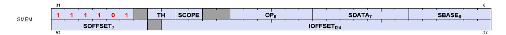

The fields are described in the table below:

Table 44. SMEM Encoding Field Descriptions

| Field   | Size | Description                                                                                                                                                                                                                                                          |
|---------|------|----------------------------------------------------------------------------------------------------------------------------------------------------------------------------------------------------------------------------------------------------------------------|
| OP      | 6    | Opcode. See the next table.                                                                                                                                                                                                                                          |
| SDATA   | 7    | SDATA specifies the SGPRs to load the data into.<br>• Loads of 2 DWORDs must have an even SDST-sgpr.<br>• Loads of 3 or more DWORDs must have their SDST-gpr aligned to a multiple of 4 SGPRs.<br>• SDATA must be: SGPR or VCC. Not: EXEC, or M0. NULL is allowed    |
| SBASE   | 6    | SGPR-pair (SBASE has an implied LSB of zero) that provides a base address, or for BUFFER<br>instructions, a set of 4 SGPRs (4-sgpr aligned) that hold the buffer resource.<br>For BUFFER instructions, the only resource fields used are: base, stride, num_records. |
| IOFFSET | 24   | Instruction Address Offset : An immediate signed byte offset.<br>Negative IOFFSETs only work with S_LOAD; a negative IOFFSETs applied to S_BUFFER results<br>in a MEMVIOL.                                                                                           |
| SOFFSET | 7    | SGPR that has the 32-bit unsigned byte offset. May only specify an SGPR, M0 or set to "NULL" to<br>not use (offset=0).                                                                                                                                               |
| SCOPE   | 2    | Memory Scope                                                                                                                                                                                                                                                         |
| TH      | 2    | Memory Temporal Hint                                                                                                                                                                                                                                                 |

See [Cache Controls: SCOPE and Temporal-Hint](#page-48-0) for more information about SCOPE and TH bits.

Table 45. SMEM Instructions

| Opcode # | Name        | Opcode # | Name               |
|----------|-------------|----------|--------------------|
| 0        | S_LOAD_B32  | 19       | S_BUFFER_LOAD_B256 |
| 1        | S_LOAD_B64  | 20       | S_BUFFER_LOAD_B512 |
| 2        | S_LOAD_B128 | 21       | S_BUFFER_LOAD_B96  |
| 3        | S_LOAD_B256 | 24       | S_BUFFER_LOAD_I8   |
| 4        | S_LOAD_B512 | 25       | S_BUFFER_LOAD_U8   |

8.1. Microcode Encoding 97 of 697

| Opcode # | Name               | Opcode # | Name                   |
|----------|--------------------|----------|------------------------|
| 5        | S_LOAD_B96         | 26       | S_BUFFER_LOAD_I16      |
| 8        | S_LOAD_I8          | 27       | S_BUFFER_LOAD_U16      |
| 9        | S_LOAD_U8          | 33       | S_DCACHE_INV           |
| 10       | S_LOAD_I16         | 36       | S_PREFETCH_INST        |
| 11       | S_LOAD_U16         | 37       | S_PREFETCH_INST_PC_REL |
| 16       | S_BUFFER_LOAD_B32  | 38       | S_PREFETCH_DATA        |
| 17       | S_BUFFER_LOAD_B64  | 39       | S_BUFFER_PREFETCH_DATA |
| 18       | S_BUFFER_LOAD_B128 | 40       | S_PREFETCH_DATA_PC_REL |

These instructions load 1-16 DWORDs from memory. The SDATA field indicates which SGPRs to load data into, and the address is composed of the SBASE, OFFSET, and SOFFSET fields.

SMEM loads may use NULL as a destination SGPR in order to achieve a "prefetch data with acknowledge".

# <span id="page-107-0"></span>**8.1.1. Scalar Memory Addressing**

Non-buffer S\_LOAD instructions use the following formula to calculate the memory address:

```
  ADDR = SGPR[base] + IOFFSET + { M0 or SGPR[offset] or zero }
```

All components of the address (base, offset, IOFFSET, M0) are in bytes, but the two LSBs of each component are ignored and treated as if they were zero except for 8- and 16-bit loads. For 16-bit loads the one LSB of the each component is ignored and treated as zero. For 8-bit loads the full byte address of each component is used.

For S\_LOAD (non-buffer) instructions, it is illegal and undefined if (IOFFSET + (M0, SGPR[offset], or zero)) is negative.

For S\_BUFFER\_LOAD, it is illegal and undefined for IOFFSET to be negative.

# <span id="page-107-1"></span>**8.1.2. Loads using Buffer Resource (V#)**

S\_BUFFER\_LOAD instructions use a similar formula, but the base address comes from the buffer resource's base\_address field.

Buffer resource fields used: base\_address, stride, num\_records; other fields are ignored.

Scalar memory load does not support "swizzled" buffers. **Stride** is used only for memory address bounds checking, not for computing the address to access. Stride and buffer size must be a multiple of 4.

The SMEM supplies only a SBASE address (byte) and an offset (byte). Any "index \* stride" must be calculated manually in shader code and added to the offset prior to the SMEM. IOFFSET must be non-negative - a negative value of IOFFSET results in a MEMVIOL.

The two LSBs of V#.base are ignored and treated as if they were zero except for 8- and 16-bit loads. For 16-bit loads the one LSB of V#.base is ignored and treated as zero. For 8-bit loads the full byte address of V#.base is used.

8.1. Microcode Encoding 98 of 697

```
"m_*" components come from the buffer resource (V#):
  def alignToSize(addr): return (dataSize == 8bit ? addr : dataSize == 16bit ? addr & ~1 : addr & ~3)
  resource = { SGPR[SBASE * 2 +3], SGPR[SBASE * 2 +2], SGPR[SBASE * 2 +1], SGPR[SBASE * 2] }
  m_base = alignToSize(resource[47:0], dataSize)
  m_stride = resource[61:48]
  m_num_records = resource[95:64]
  offset = alignToSize(IOFFSET) + alignToSize(SOFFSET)
  m_size = alignToSize((m_stride == 0 ? 1 : m_stride) * m_num_records)
  addr = m_base + offset
  SGPR[SDST] = load_dword_from_dcache(addr, m_size)
  If more than 1 DWORD is being loaded, it is returned to SDST+1, SDST+2, etc,
  and the offset is incremented by 4 bytes per DWORD.
  Note: the V#.stride_scale field is ignored.
```

# <span id="page-108-0"></span>**8.1.3. Loads of 8 and 16-bit Data**

- S\_LOAD\_U8: load 8-bit unsigned data, zero-extend to 32 bits
- S\_LOAD\_I8: load 8-bit signed data, sign-extend to 32 bits
- S\_LOAD\_U16: load 16-bit unsigned data, zero-extend to 32 bits
- S\_LOAD\_I16: load 16-bit signed data, sign-extend to 32 bits

Same for S\_BUFFER\_LOAD.

16-bit loads must be **16-bit aligned** in memory.

# <span id="page-108-1"></span>**8.1.4. S\_DCACHE\_INV**

These instructions invalidate the entire scalar constant cache. It does not return anything to SDST. S\_DCACHE\_INV does not have any address or data arguments.

# <span id="page-108-2"></span>**8.2. Dependency Checking**

Scalar memory loads can return data out-of-order from how they were issued; they can return partial results at different times when the load crosses two cache lines. The shader program uses the KMcnt counter to determine when the data has been returned to the SDST SGPRs. This is done as follows.

- KMcnt is incremented by 1 for every fetch of a single DWORD, or cache invalidates.
- KMcnt is incremented by 2 for every fetch of two or more DWORDs.
- KMcnt is decremented by an equal amount when each instruction completes.

Because the instructions can return out-of-order, the only sensible way to use this counter is to implement "S\_WAIT\_KMCNT 0"; this imposes a wait for all data to return from previous SMEMs before continuing.

Cache invalidate instructions are not known to have completed until the shader waits for KMcnt==0.

# <span id="page-109-0"></span>**8.3. Scalar Memory Clauses and Groups**

A **clause** is a sequence of instructions starting with S\_CLAUSE and continuing for 2-63 instructions. Clauses lock the instruction arbiter onto this wave until the clause completes.

A **group** is a set of the same type of instruction that happen to occur in the code but are not necessarily executed as a clause. A group ends when a non-SMEM instruction is encountered. Scalar memory instructions are issued in groups. The hardware does not enforce that a single wave executes an entire group before issuing instructions from another wave.

#### **Group restrictions:**

• INV must be in a group by itself and may not be in a clause

# <span id="page-109-1"></span>**8.4. Alignment and Bounds Checking**

#### **SDST**

The value of SDST must be even for fetches of two DWORDs, or a multiple of four for larger fetches. If this rule is not followed, invalid data can result.

## **SBASE**

The value of SBASE must be even for S\_BUFFER\_LOAD (specifying the address of an SGPR that is a multiple of four). If SBASE is out-of-range, the value from SGPR0 is used.

#### **OFFSET**

The value of OFFSET has no alignment restrictions.

# <span id="page-109-2"></span>**8.4.1. Address and GPR Range Checking**

The hardware checks for both the address being out of range (BUFFER instructions only), and for the source or destination SGPRs being out of range.

Memory addresses are forced into alignment:

The base address is forced to DWORD alignment; DWORD or larger loads force memory address to DWORD alignment; loads of 16-bit data force the address to 2-byte alignment, and byte loads have no forced alignment.

**Address Out-of-Range if** offset >= ( (stride==0 ? 1 : stride) \* num\_records).

where "offset" is: IOFFSET + {M0 or sgpr-offset}

Any DWORDs that are out of range in memory from a buffer\_load return zero. If a multi-DWORD request (e.g. S\_BUFFER\_LOAD\_B256) is partially out of range, the DWORDs that are in range return data as

normal, and the out-of-range DWORDs return zero.

**Source SGPR out of range** If any source data is out of the range of SGPRs (either partially or

completely), the value 'zero' is used instead.

**Destination SGPR out of range** If the destination SGPR is partially or fully out of range, no data is

written back to SGPRs for this instruction.

# <span id="page-110-0"></span>**8.5. Scalar Prefetch Instructions**

The shader can request that instructions or data be prefetched into the first-level cache via shader instructions. These do not use KMcnt.

The cache reuse policies are controlled through the SCOPE and TH bits and apply to data-prefetch but not instruction prefetch.

These instructions are skipped (treated as S\_NOP) if MODE.SCALAR\_PREFETCH\_EN == 0.

Prefetch Length: SOFFSET holds an SGPR/M0 (int) with the length, or set to NULL for zero, and SDATA carries a literal constant value (set to 0 to ignore). The sum is 0-31 (modulo 32 - upper bits dropped) representing a prefetch size of 1-32 chunks of 128Bytes.

All components of the address (base, offset, IOFFSET, M0) are in bytes, but the two LSBs of each component are ignored and treated as if they were zero.

# <span id="page-110-1"></span>**8.5.1. Prefetching Data**

These instructions prefetch data into the constant cache using either a simple address, a buffer resource (V#), or PC-relative address.

```
 S_PREFETCH_DATA SBASE(addr) IOFFSET SOFFSET(length) SDATA(as immediate value)
          MemAddr = (SBASE[63:0].u64 + IOFFSET.i24) & ~0x07f Forced to 128B alignment
          Length = SOFFSET + #SDATA : SGPR/M0 + immediate, limit to 1-32 chunks, units of 128B
 S_BUFFER_PREFETCH_DATA SBASE(V#) IOFFSET SOFFSET(length)
          MemAddr = (SBASE[47:0].u64 + IOFFSET.i24) & ~0x07f
          Length = SOFFSET + #SDATA : SGPR/M0 + immediate, limit to 1-32 cacheline-pairs, units of 128B
          Note: S_BUFFER_PREFETCH_DATA does not perform bounds checking on the prefetch address.
 S_PREFETCH_DATA_PC_REL IOFFSET SOFFSET(length)
          Addr = (PC + IOFFSET.i24) & ~0x07f. Forced to 128B alignment.
          Length = SOFFSET + #SDATA : SGPR/M0 + immediate, limit to 1-32 chunks, units of 128B
          "PC" is pointing to the instruction after this one when the address is computed.
```

Note: S\_BUFFER\_PREFETCH\_DATA does not perform bounds-checking on the prefetch address. S\_BUFFER\_PREFETCH\_DATA does not support negative IOFFSET, but does not return MEMVIOL if IOFFSET is negative (and the prefetch request is dropped).

# <span id="page-110-2"></span>**8.5.2. Prefetching Instructions**

These instructions prefetch instructions into the instruction cache using either a simple address, or PC-relative address.

```
 S_PREFETCH_INST SBASE(addr) IOFFSET SOFFSET(length) SDATA(as immediate value)
          MemAddr = (SBASE[63:0].u64 + IOFFSET.i24) & ~0x07f Forced to 128B alignment
          Length = SOFFSET + #SDATA : SGPR/M0 + immediate, limit to 1-32 chunks, units of 128B
 S_PREFETCH_INST_PC_REL IOFFSET SOFFSET(length) SDATA(as immediate value)
          Addr = (PC + IOFFSET.i24) & ~0x07f. Forced to 128B alignment. SBASE is ignored.
          Length = SOFFSET + #SDATA : SGPR/M0 + immediate, limit to 1-32 chunks, units of 128B
          "PC" is pointing to the instruction after this one when the address is computed.
```

# <span id="page-111-0"></span>**Chapter 9. Vector Memory Buffer Instructions**

Vector-memory (VM) buffer operations transfer data between the VGPRs and buffer objects in memory through the L0 cache. **Vector** means that one or more piece of data is transferred uniquely for every thread in the wave, in contrast to scalar memory loads that transfer only one value that is shared by all threads in the wave.

The instruction defines which VGPR(s) supply the addresses for the operation, which VGPRs supply or receive data from the operation, and a series of SGPRs that contain the memory buffer descriptor (V#). Buffer atomics have the option of returning the pre-op memory value to VGPRs.

Examples of buffer objects are vertex buffers, raw buffers, stream-out buffers, and structured buffers.

Buffer objects support both homogeneous and heterogeneous data, but no filtering of load-data. Buffer instructions are divided into two groups:

# **Untyped buffer objects**

- Data format is specified in the resource constant.
- Load, store, atomic operations, with or without data format conversion.

# **Typed buffer objects**

- Data format is specified in the instruction.
- The only operations are Load and Store, both with data format conversion.

All buffer operations use a buffer resource constant (V#) that is a 128-bit value in SGPRs. This constant is sent when the instruction is executed. This constant defines the address and characteristics of the buffer in memory. Typically, these constants are fetched from memory using scalar memory loads prior to executing VM instructions, but these constants also can be generated within the shader.

Memory operations of different types (loads, stores) can complete out of order with respect to each other.

# **Simplified view of buffer addressing**

The equation below shows how the memory address is calculated for a buffer access:

Memory instructions return MEMVIOL for any misaligned access when the alignment mode does not allow it.

# <span id="page-111-1"></span>**9.1. Buffer Instructions**

Buffer instructions allow the shader program to load from, and store to, linear buffers in memory. These operations can operate on data as small as one byte, and up to four DWORDs per work-item. Atomic operations take data from VGPRs and combine them arithmetically with data already in memory. Optionally, the value that was in memory before the operation took place can be returned to the shader.

9.1. Buffer Instructions 102 of 697

The D16 instruction variants of buffer ops convert the results to and from packed 16-bit values. For example, BUFFER\_LOAD\_D16\_FORMAT\_XYZW stores two VGPRs with 4 16-bit values.

Table 46. Buffer Instructions

| Untyped Buffer Instructions             |                                                                  |  |
|-----------------------------------------|------------------------------------------------------------------|--|
| BUFFER_LOAD_ <size></size>              | Load from or store to an Untyped Buffer object                   |  |
| BUFFER_STORE_ <size></size>             | <size> = I8, U8, I16, U16, B32, B64, B96, B128</size>            |  |
| BUFFER_LOAD_FORMAT_{x,xy,xyz,xyzw}      |                                                                  |  |
| BUFFER_STORE_FORMAT_{x,xy,xyz,xyzw}     |                                                                  |  |
| BUFFER_LOAD_D16_FORMAT_{x,xy,xyz,xyzw}  |                                                                  |  |
| BUFFER_STORE_D16_FORMAT_{x,xy,xyz,xyzw} |                                                                  |  |
| BUFFER_LOAD_D16_FORMAT_X                |                                                                  |  |
| BUFFER_STORE_D16_FORMAT_X               |                                                                  |  |
| BUFFER_LOAD_D16_HI_FORMAT_X             |                                                                  |  |
| BUFFER_STORE_D16_HI_FORMAT_X            |                                                                  |  |
| BUFFER_ATOMIC_ <op></op>                | Buffer object atomic operation. Automatically globally coherent. |  |
|                                         | Operates on 32bit or 64bit values.                               |  |

| Typed Buffer Instructions                |                                                                  |  |
|------------------------------------------|------------------------------------------------------------------|--|
| TBUFFER_LOAD_FORMAT_{x,xy,xyz,xyzw}      | Load from or store to a Typed buffer object.                     |  |
| TBUFFER_STORE_FORMAT_{x,xy,xyz,xyzw}     |                                                                  |  |
| TBUFFER_LOAD_D16_FORMAT_{x,xy,xyz,xyzw}  | Convert data to 16-bits before loading into VGPRs.               |  |
| TBUFFER_STORE_D16_FORMAT_{x,xy,xyz,xyzw} | Convert data from 16-bits to tex-format before storing to memory |  |

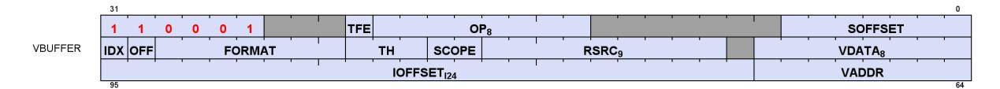

Table 47. Microcode Formats

| Field   | Bit Size | Description                                                                                                                                                        |
|---------|----------|--------------------------------------------------------------------------------------------------------------------------------------------------------------------|
| OP      | 8        | Opcode                                                                                                                                                             |
| SOFFSET | 7        | SGPR to supply unsigned byte offset. SGPR, M0, NULL                                                                                                                |
| VADDR   | 8        | Address of VGPR to supply first component of address (offset or index). When both index<br>and offset are used, index is in the first VGPR, offset in the second.  |
| VDATA   | 8        | Address of VGPR to supply first component of store data or receive first component of load<br>data.                                                                |
| IOFFSET | 24       | signed 24-bit byte offset, must be non-negative.                                                                                                                   |
| RSRC    | 9        | Specifies which SGPR supplies V# (resource constant) in four consecutive SGPRs. Must be a<br>multiple of 4, in the range 0-120.                                    |
| FORMAT  | 7        | Data Format of data in memory buffer for Typed-Buffer instructions. See: Buffer Image<br>Format Table                                                              |
| OFFEN   | 1        | 1 = Supply an offset from VGPR (VADDR). 0 = Do not (offset = 0).                                                                                                   |
| IDXEN   | 1        | 1 = Supply an index from VGPR (VADDR). 0 = Do not (index = 0).                                                                                                     |
| SCOPE   | 2        | Memory Scope                                                                                                                                                       |
| TH      | 3        | Memory Temporal Hint. For atomics, indicates whether or not to return the pre-op value.                                                                            |
| TFE     | 1        | Texel Fault Enable for PRT (partially resident textures). When set to 1 and fetch returns a<br>NACK, status is written to the VGPR after the last fetch-dest VGPR. |

TBUFFER\*\_FORMAT instructions (shown below) include a data-format conversion specified in the instruction. The instruction specifies the format of data in memory, and it is expanded to 32-bits per component in VGPRs except for "D16" instructions - they expand data to 16-bits per component.

9.1. Buffer Instructions 103 of 697

Table 48. **Typed Buffer Instructions**

| Opcode                        | Description - all address components for buffer ops are uint |
|-------------------------------|--------------------------------------------------------------|
| TBUFFER_LOAD_FORMAT_X         | load X component w/ format convert                           |
| TBUFFER_LOAD_FORMAT_XY        | load XY components w/ format convert                         |
| TBUFFER_LOAD_FORMAT_XYZ       | load XYZ components w/ format convert                        |
| TBUFFER_LOAD_FORMAT_XYZW      | load XYZW components w/ format convert                       |
| TBUFFER_STORE_FORMAT_X        | store X component w/ format convert                          |
| TBUFFER_STORE_FORMAT_XY       | store XY components w/ format convert                        |
| TBUFFER_STORE_FORMAT_XYZ      | store XYZ components w/ format convert                       |
| TBUFFER_STORE_FORMAT_XYZW     | store XYZW components w/ format convert                      |
| TBUFFER_LOAD_D16_FORMAT_X     | load X component w/ format convert, 16bit                    |
| TBUFFER_LOAD_D16_FORMAT_XY    | load XY components w/ format convert, 16bit                  |
| TBUFFER_LOAD_D16_FORMAT_XYZ   | load XYZ components w/ format convert, 16bit                 |
| TBUFFER_LOAD_D16_FORMAT_XYZW  | load XYZW components w/ format convert, 16bit                |
| TBUFFER_STORE_D16_FORMAT_X    | store X component w/ format convert, 16bit                   |
| TBUFFER_STORE_D16_FORMAT_XY   | store XY components w/ format convert, 16bit                 |
| TBUFFER_STORE_D16_FORMAT_XYZ  | store XYZ components w/ format convert, 16bit                |
| TBUFFER_STORE_D16_FORMAT_XYZW | store XYZW components w/ format convert, 16bit               |

BUFFER\*\_FORMAT instructions (shown below) include a data-format conversion specified in the resource constant (V#).

In the table below, "D16" means the data in the VGPR is 16-bits, not the usual 32 bits. "D16\_HI" means that the upper 16-bits of the VGPR is used instead of "D16" that uses the lower 16 bits.

Table 49. **Untyped Buffer Instructions**

| Opcode                      | Description - all address components for buffer ops are uint       |
|-----------------------------|--------------------------------------------------------------------|
| BUFFER_LOAD_U8              | load unsigned byte (extend 0's to MSB's of DWORD VGPR)             |
| BUFFER_LOAD_D16_U8          | load unsigned byte into VGPR[15:0]                                 |
| BUFFER_LOAD_D16_HI_U8       | load unsigned byte into VGPR[31:16]                                |
| BUFFER_LOAD_I8              | load signed byte (sign extend to MSB's of DWORD VGPR)              |
| BUFFER_LOAD_D16_I8          | load signed byte into VGPR[15:0]                                   |
| BUFFER_LOAD_D16_HI_I8       | load signed byte into VGPR[31:16]                                  |
| BUFFER_LOAD_U16             | load unsigned short (extend 0's to MSB's of DWORD VGPR)            |
| BUFFER_LOAD_I16             | load signed short (sign extend to MSB's of DWORD VGPR)             |
| BUFFER_LOAD_D16_B16         | load short into VGPR[15:0]                                         |
| BUFFER_LOAD_D16_HI_B16      | load short into VGPR[31:16]                                        |
| BUFFER_LOAD_B32             | load DWORD                                                         |
| BUFFER_LOAD_B64             | load 2 DWORD per element                                           |
| BUFFER_LOAD_B96             | load 3 DWORD per element                                           |
| BUFFER_LOAD_B128            | load 4 DWORD per element                                           |
| BUFFER_LOAD_FORMAT_X        | load X component w/ format convert                                 |
| BUFFER_LOAD_FORMAT_XY       | load XY components w/ format convert                               |
| BUFFER_LOAD_FORMAT_XYZ      | load XYZ components w/ format convert                              |
| BUFFER_LOAD_FORMAT_XYZW     | load XYZW components w/ format convert                             |
| BUFFER_LOAD_D16_FORMAT_X    | load X component w/ format convert, 16b                            |
| BUFFER_LOAD_D16_HI_FORMAT_X | load X component w/ format convert, 16b into upper 16-bits of VGPR |
| BUFFER_LOAD_D16_FORMAT_XY   | load XY components w/ format convert, 16b                          |

9.1. Buffer Instructions 104 of 697

| Opcode                       | Description - all address components for buffer ops are uint                                                    |  |  |
|------------------------------|-----------------------------------------------------------------------------------------------------------------|--|--|
| BUFFER_LOAD_D16_FORMAT_XYZ   | load XYZ components w/ format convert, 16b                                                                      |  |  |
| BUFFER_LOAD_D16_FORMAT_XYZW  | load XYZW components w/ format convert, 16b                                                                     |  |  |
| BUFFER_STORE_B8              | store byte (ignore MSB's of DWORD VGPR)                                                                         |  |  |
| BUFFER_STORE_D16_HI_B8       | store byte from VGPR bits [23:16]                                                                               |  |  |
| BUFFER_STORE_B16             | store short (ignore MSB's of DWORD VGPR)                                                                        |  |  |
| BUFFER_STORE_D16_HI_B16      | store short from VGPR bits [31:16]                                                                              |  |  |
| BUFFER_STORE_B32             | store DWORD                                                                                                     |  |  |
| BUFFER_STORE_B64             | store 2 DWORD per element                                                                                       |  |  |
| BUFFER_STORE_B96             | store 3 DWORD per element                                                                                       |  |  |
| BUFFER_STORE_B128            | store 4 DWORD per element                                                                                       |  |  |
| BUFFER_STORE_FORMAT_X        | store X component w/ format convert                                                                             |  |  |
| BUFFER_STORE_FORMAT_XY       | store XY components w/ format convert                                                                           |  |  |
| BUFFER_STORE_FORMAT_XYZ      | store XYZ components w/ format convert                                                                          |  |  |
| BUFFER_STORE_FORMAT_XYZW     | store XYZW components w/ format convert                                                                         |  |  |
| BUFFER_STORE_D16_FORMAT_X    | store X component w/ format convert, 16b                                                                        |  |  |
| BUFFER_STORE_D16_HI_FORMAT_X | store X component w/ format convert, 16b from upper 16-bits of VGPR                                             |  |  |
| BUFFER_STORE_D16_FORMAT_XY   | store XY components w/ format convert, 16b                                                                      |  |  |
| BUFFER_STORE_D16_FORMAT_XYZ  | store XYZ components w/ format convert, 16b                                                                     |  |  |
| BUFFER_STORE_D16_FORMAT_XYZW | store XYZW components w/ format convert, 16b                                                                    |  |  |
| BUFFER_ATOMIC_ADD_U32        | 32b , dst += src, returns previous value if TH==RET                                                             |  |  |
| BUFFER_ATOMIC_ADD_F32        | 32b , dst += src, returns previous value if TH==RET                                                             |  |  |
| BUFFER_ATOMIC_PK_ADD_F16     | 32b , dst[15:0] += src[15:0]; dst[31:16] += src[31:16]. returns previous value if                               |  |  |
|                              | TH==RET                                                                                                         |  |  |
| BUFFER_ATOMIC_ADD_U64        | 64b , dst += src, returns previous value if TH==RET                                                             |  |  |
| BUFFER_ATOMIC_AND_B32        | 32b , dst &= src, returns previous value if TH==RET                                                             |  |  |
| BUFFER_ATOMIC_AND_B64        | 64b , dst &= src, returns previous value if TH==RET                                                             |  |  |
| BUFFER_ATOMIC_CMPSWAP_B32    | 32b , dst = (dst == cmp) ? src : dst, returns previous value if TH==RET. Src is from<br>vdata, cmp from vdata+1 |  |  |
| BUFFER_ATOMIC_CMPSWAP_B64    | 64b , dst = (dst == cmp) ? src : dst, returns previous value if TH==RET                                         |  |  |
| BUFFER_ATOMIC_DEC_U32        | 32b , dst = ( (dst == 0)   (dst > src) ) ? src : dst-1, returns previous value if TH==RET                       |  |  |
| BUFFER_ATOMIC_DEC_U64        | 64b , dst = ( (dst == 0)   (dst > src) ) ? src : dst-1, returns previous value if TH==RET                       |  |  |
| BUFFER_ATOMIC_MAX_NUM_F32    | 32b , dst = (src > dst) ? src : dst, (float) returns previous value if TH==RET                                  |  |  |
| BUFFER_ATOMIC_MIN_NUM_F32    | 32b , dst = (src < dst) ? src : dst, (float) returns previous value if TH==RET                                  |  |  |
| BUFFER_ATOMIC_INC_U32        | 32b , dst = (dst >= src) ? 0 : dst+1, returns previous value if TH==RET                                         |  |  |
| BUFFER_ATOMIC_INC_U64        | 64b , dst = (dst >= src) ? 0 : dst+1, returns previous value if TH==RET                                         |  |  |
| BUFFER_ATOMIC_OR_B32         | 32b , dst  = src, returns previous value if TH==RET                                                             |  |  |
| BUFFER_ATOMIC_OR_B64         | 64b , dst  = src, returns previous value if TH==RET                                                             |  |  |
| BUFFER_ATOMIC_MAX_I32        | 32b , dst = (src > dst) ? src : dst, (signed) returns previous value if TH==RET                                 |  |  |
| BUFFER_ATOMIC_MAX_I64        | 64b , dst = (src > dst) ? src : dst, (signed) returns previous value if TH==RET                                 |  |  |
| BUFFER_ATOMIC_MIN_I32        | 32b , dst = (src < dst) ? src : dst, (signed) returns previous value if TH==RET                                 |  |  |
| BUFFER_ATOMIC_MIN_I64        | 64b , dst = (src < dst) ? src : dst, (signed) returns previous value if TH==RET                                 |  |  |
| BUFFER_ATOMIC_SUB_U32        | 32b , dst -= src, returns previous value if TH==RET                                                             |  |  |
|                              |                                                                                                                 |  |  |
| BUFFER_ATOMIC_SUB_U64        | 64b , dst -= src, returns previous value if TH==RET                                                             |  |  |
| BUFFER_ATOMIC_SWAP_B32       | 32b , dst = src, returns previous value of dst if TH==RET                                                       |  |  |
| BUFFER_ATOMIC_SWAP_B64       | 64b , dst = src, returns previous value of dst if TH==RET                                                       |  |  |
| BUFFER_ATOMIC_MAX_U32        | 32b , dst = (src > dst) ? src : dst, (unsigned) returns previous value if TH==RET                               |  |  |
| BUFFER_ATOMIC_MAX_U64        | 64b , dst = (src > dst) ? src : dst, (unsigned) returns previous value if TH==RET                               |  |  |
| BUFFER_ATOMIC_MIN_U32        | 32b , dst = (src < dst) ? src : dst, (unsigned) returns previous value if TH==RET                               |  |  |

9.1. Buffer Instructions 105 of 697

| Opcode                    | Description - all address components for buffer ops are uint                      |
|---------------------------|-----------------------------------------------------------------------------------|
| BUFFER_ATOMIC_MIN_U64     | 64b , dst = (src < dst) ? src : dst, (unsigned) returns previous value if TH==RET |
| BUFFER_ATOMIC_XOR_B32     | 32b , dst ^= src, returns previous value if TH==RET                               |
| BUFFER_ATOMIC_XOR_B64     | 64b , dst ^= src, returns previous value if TH==RET                               |
| BUFFER_ATOMIC_CSUB_U32    | 32b , dst = (src > dst) ? 0 : dst - src, returns previous TH must be set to RET.  |
| BUFFER_ATOMIC_CONDSUB_U32 | 32b, dst = (src > dst) ? dst : dst - src, returns previous                        |

# <span id="page-115-0"></span>**9.2. VGPR Usage**

VGPRs supply address and store-data, and they can be the destination for return data.

## **Address**

Zero, one or two VGPRs are used, depending on the index-enable (IDXEN) and offset-enable (OFFEN) in the instruction word. These are unsigned ints.

For 64-bit addresses the LSBs are in VGPRn and the MSBs are in VGPRn+1.

**IDXEN OFFEN VGPRn VGPRn+1** 0 0 nothing 0 1 uint offset 1 0 uint index 1 1 uint index uint offset

Table 50. Address VGPRs

**Store Data** : N consecutive VGPRs, starting at VDATA. The data format specified in the instruction word's opcode and D16 setting determines how many DWORDs the shader provides to store.

**Load Data** : Same as stores. Data is returned to consecutive VGPRs.

**Load Data Format** : Load data is 32 or 16 bits, based on the data format in the instruction or resource and D16. Float or normalized data is returned as floats; integer formats are returned as integers (signed or unsigned, same type as the memory storage format). Memory loads of data in memory that is 32 or 64 bits do not undergo any format conversion unless they return as 16-bit due to D16 being set to 1.

**Atomics with Return** : Data is read out of the VGPR(s) starting at VDATA to supply to the atomic operation. If the atomic returns a value to VGPRs, that data is returned to those same VGPRs starting at VDATA.

| Instruction            | Memory Format | VGPR Format                   | Notes               |
|------------------------|---------------|-------------------------------|---------------------|
| BUFFER_LOAD_U8         | ubyte         | V0[31:0] = {24'b0, byte}      |                     |
| BUFFER_LOAD_D16_U8     | ubyte         | V0[15:0] = {8'b0, byte}       | writes only 16 bits |
| BUFFER_LOAD_D16_HI_U8  | ubyte         | V0[31:16] = {8'h0, byte}      | writes only 16 bits |
| BUFFER_LOAD_S8         | sbyte         | V0[31:0] = { 24{sign}, byte}  |                     |
| BUFFER_LOAD_D16_S8     | sbyte         | V0[15:0] {8{sign}, byte}      | writes only 16 bits |
| BUFFER_LOAD_D16_HI_S8  | sbyte         | V0[31:16] = {8{sign}, byte}   | writes only 16 bits |
| BUFFER_LOAD_U16        | uint16        | V0[31:0] = { 16'b0, short}    |                     |
| BUFFER_LOAD_S16        | int16         | V0[31:0] = { 16{sign}, short} |                     |
| BUFFER_LOAD_D16_B16    | short         | V0[15:0] = short              | writes only 16 bits |
| BUFFER_LOAD_D16_HI_B16 | short         | V0[31:16] = short             | writes only 16 bits |

Table 51. **Data format in VGPRs and Memory**

9.2. VGPR Usage 106 of 697

| Instruction                 | Memory Format | VGPR Format                                                                                | Notes                                   |
|-----------------------------|---------------|--------------------------------------------------------------------------------------------|-----------------------------------------|
| BUFFER_LOAD_B32             | DWORD         | DWORD                                                                                      |                                         |
| BUFFER_LOAD_FORMAT_X        | FORMAT field  | float, uint or sint<br>Load X into V0[31:0]                                                | data type in VGPR is<br>based on FORMAT |
| BUFFER_LOAD_FORMAT_XY       | FORMAT field  | float, uint or sint<br>Load X,Y into V0[31:0], V1[31:0]                                    | field.<br>(D16_X and D16_HI_X           |
| BUFFER_LOAD_FORMAT_XYZ      | FORMAT field  | float, uint or sint<br>Load X,Y,Z into V0[31:0], V1[31:0],<br>V2[31:0]                     | write only 16 bits)                     |
| BUFFER_LOAD_FORMAT_XYZW     | FORMAT field  | float, uint or sint<br>Load X,Y,Z,W into V0[31:0],<br>V1[31:0], V2[31:0], v3[31:0]         |                                         |
| BUFFER_LOAD_D16_FORMAT_X    | FORMAT field  | float, uint or sint<br>Load X into in V0[15:0]                                             |                                         |
| BUFFER_LOAD_D16_HI_FORMAT_X | FORMAT field  | float, uint16 or int16<br>Load X into in V0[31:16]                                         |                                         |
| BUFFER_LOAD_D16_FORMAT_XY   | FORMAT field  | float, uint16 or int16<br>Load X,Y into in V0[15:0], V0[31:16]                             |                                         |
| BUFFER_LOAD_D16_FORMAT_XYZ  | FORMAT field  | float, uint16 or int16<br>Load X,Y,Z into in V0[15:0],<br>V0[31:16], V1[15:0]              |                                         |
| BUFFER_LOAD_D16_FORMAT_XYZW | FORMAT field  | float, uint16 or int16<br>Load X,Y,Z,W into in V0[15:0],<br>V0[31:16], V1[15:0], V1[31:16] |                                         |

Where "V0" is the VDATA VGPR; V1 is the VDATA+1 VGPR, etc.

| Instruction                  | VGPR Format                                                                   | Memory Format | Notes                                             |
|------------------------------|-------------------------------------------------------------------------------|---------------|---------------------------------------------------|
| BUFFER_STORE_B8              | byte in [7:0]                                                                 | byte          |                                                   |
| BUFFER_STORE_D16_HI_B8       | byte in [23:16]                                                               | byte          |                                                   |
| BUFFER_STORE_B16             | short in [15:0]                                                               | short         |                                                   |
| BUFFER_STORE_D16_HI_B16      | short in [31:16]                                                              | short         |                                                   |
| BUFFER_STORE_B32             | data in [31:0]                                                                | DWORD         |                                                   |
| BUFFER_STORE_FORMAT_X        | float, uint or sint<br>data in V0[31:0]                                       | FORMAT field  | data type in VGPR is<br>based on FORMAT<br>field. |
| BUFFER_STORE_D16_FORMAT_X    | float, uint16 or int16<br>data in V0[15:0]                                    |               |                                                   |
| BUFFER_STORE_D16_FORMAT_XY   | float, uint16 or int16<br>data in V0[15:0], V0[31:16]                         |               |                                                   |
| BUFFER_STORE_D16_FORMAT_XYZ  | float, uint16 or int16<br>data in V0[15:0], V0[31:16],<br>V1[15:0]            |               |                                                   |
| BUFFER_STORE_D16_FORMAT_XYZW | float, uint16 or int16<br>data in V0[15:0], V0[31:16],<br>V1[15:0], V1[31:16] |               |                                                   |
| BUFFER_STORE_D16_HI_FORMAT_X | float, uint16 or int16<br>data in V0[31:16]                                   |               |                                                   |

9.2. VGPR Usage 107 of 697

# <span id="page-117-0"></span>**9.3. Buffer Data**

The amount and type of data that is loaded or stored is controlled by the following: the resource format field, destination-component-selects (dst\_sel), and the opcode.

Data-format can come from the resource, instruction fields, or the opcode itself. Typed buffer ops derive dataformat from the instruction's FORMAT field, untyped "format" instructions use FORMAT from the resource, and other buffer opcodes derive data-format from the instruction itself. DST\_SEL comes from the resource, but is ignored for many operations.

| Instruction                 | Data Format | DST SEL  |  |
|-----------------------------|-------------|----------|--|
| TBUFFER_LOAD_FORMAT_*       | instruction | identity |  |
| TBUFFER_STORE_FORMAT_*      | instruction | identity |  |
| BUFFER_LOAD_FORMAT_*        | resource    | resource |  |
| BUFFER_STORE_FORMAT_*       | resource    | resource |  |
| BUFFER_LOAD_ <type></type>  | derived     | identity |  |
| BUFFER_STORE_ <type></type> | derived     | identity |  |
| BUFFER_ATOMIC_*             | derived     | identity |  |

Table 52. Buffer Instructions

**Instruction** : The instruction's format field is used instead of the resource's fields.

**Data format derived** : The data format is derived from the opcode and ignores the resource definition. For example, BUFFER\_LOAD\_U8 sets the data-format to uint-8.

The resource's data format must not be INVALID; that format has specific meaning (unbound resource), and for that case the data format is not replaced by the instruction's implied data format.

**DST\_SEL identity** : Depending on the number of components in the data-format, this is: X000, XY00, XYZ0, or XYZW.

When the shader provides fewer components than the surface format, the first component is replicated to fill in the missing ones. E.g. if the surface has 4 components and the shader only supplies X and Y, the result is written with XYXX.

# <span id="page-117-1"></span>**9.3.1. D16 Instructions**

Load and store instructions also come in a "D16" variant. The D16 buffer instructions allow a shader program to load or store just 16 bits per work-item between VGPRs and memory. For stores, each 32bit VGPR holds two 16bit data elements that are passed to the texture unit which in turn, converts to the buffer format before writing to memory. For loads, data returned from the texture unit is converted to 16 bits and a pair of data are stored in each 32bit VGPR (LSBs first, then MSBs). Control over int vs. float is controlled by FORMAT. Conversion of float32 to float16 uses truncation; conversion of other input data formats uses round-to-nearesteven.

There are two variants of these instructions:

• D16 loads data into or stores data from the lower 16 bits of a VGPR.

9.3. Buffer Data 108 of 697

• D16\_HI loads data into or stores data from the upper 16 bits of a VGPR.

For example, BUFFER\_LOAD\_D16\_U8 loads a byte per work-item from memory, converts it to a 16-bit integer, then loads it into the lower 16 bits of the data VGPR.

# <span id="page-118-0"></span>**9.3.2. LOAD/STORE\_FORMAT and DATA-FORMAT mismatches**

The "format" instructions specify a number of elements (x, xy, xyz or xyzw) and this could mismatch with the number of elements in the data format specified in the instruction's or resource's data-format field. When that happens.

- buffer\_load\_format\_x and dfmt is "32\_32\_32\_32" : load 4 DWORDs from memory, but only load first into the shader.
- buffer\_store\_format\_x and dfmt is "32\_32\_32\_32" : stores "x" to all non-constant channels in memory if "x" is sent from shader, stores 0 otherwise.
- buffer\_load\_format\_xyzw and dfmt is "32" : load 1 DWORD from memory, return 4 to shader (dst\_sel).
- buffer\_store\_format\_xyzw and dfmt is "32" : store 1 DWORD (X) to memory, ignore YZW.

# <span id="page-118-1"></span>**9.4. Buffer Addressing**

A **buffer** is a data structure in memory that is addressed with an **index** and an **offset**. The index points to a particular record of size **stride** bytes, and the offset is the byte-offset within the record. The **stride** comes from the resource, the index from a VGPR (or zero), and the offset from an SGPR or VGPR and also from the instruction itself.

Table 53. BUFFER Instruction Fields for Addressing

| Field      |   | Size Description                                                                                                                   |
|------------|---|------------------------------------------------------------------------------------------------------------------------------------|
| IOFFSET 24 |   | Literal byte offset from the instruction.                                                                                          |
| IDXEN      | 1 | Boolean: get per-lane index from VGPR when true, or no index when false.                                                           |
| OFFEN      | 1 | Boolean: get per-lane offset from VGPR when true, or no offset when false. Note that IOFFSET is present<br>regardless of this bit. |

The "element size" for a buffer instruction is the amount of data the instruction transfers. It is determined by the FORMAT field for typed-buffer instructions, or from the opcode for untyped-buffer instructions, and is: 1, 2, 4, 8, 12 or 16 bytes. For example, format "16\_16" has an element size of 4-bytes.

Table 54. Buffer Resource Constant Fields for Addressing

| Field                | Size | Description                                                                                                                                                                                            |  |
|----------------------|------|--------------------------------------------------------------------------------------------------------------------------------------------------------------------------------------------------------|--|
| const_base           | 48   | Base address of the buffer resource, in bytes.                                                                                                                                                         |  |
| const_stride         | 14   | Stride of the record in bytes, then multiplied by stride_scale.                                                                                                                                        |  |
| const_num_records    | 32   | Number of records in the buffer. In units of:<br>Bytes if: const_stride ⇐ 1, otherwise, in units of "stride".                                                                                          |  |
| const_add_tid_enable | 1    | Boolean. Add thread_ID within the wave to the index when true.                                                                                                                                         |  |
| const_swizzle_enable | 2    | Swizzle AOS (Array of Structures) according to stride, index_stride and element_size:<br>0: disabled<br>1: enabled with element_size = 4-byte<br>2: Reserved<br>3: enabled with element_size = 16-byte |  |

9.4. Buffer Addressing 109 of 697

| Field              | Size | Description                                                                                                                                                                                          |
|--------------------|------|------------------------------------------------------------------------------------------------------------------------------------------------------------------------------------------------------|
| const_index_stride | 2    | Used only when const_swizzle_en = true. Number of contiguous indices for a single<br>element (of const_element_size=4 or 16 bytes) before switching to the next element.<br>8, 16, 32 or 64 indices. |

Table 55. Address Components from GPRs

| Field       |    | Size Description                                                           |
|-------------|----|----------------------------------------------------------------------------|
| SGPR_offset | 32 | An unsigned byte-offset to the address. Comes from an SGPR or M0.          |
| VGPR_offset | 32 | An optional unsigned byte-offset. It is per-thread, and comes from a VGPR. |
| VGPR_index  | 32 | An optional index value. It is per-thread and comes from a VGPR.           |

The final buffer memory address is composed of three parts:

- the base address from the buffer resource (V#),
- the offset from the SGPR, and
- a buffer-offset that is calculated differently, depending on whether the buffer is linearly addressed (a simple Array-of-Structures calculation) or is swizzled.

Address Calculation for a Linear Buffer

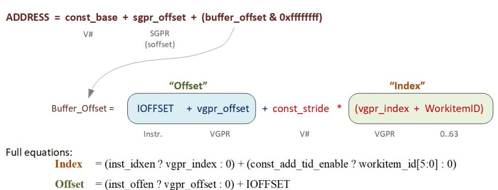

# <span id="page-119-0"></span>**9.4.1. Range Checking**

Buffer addresses are checked against the size of the memory buffer. Loads that are out of range return zero, and stores and atomics are dropped. Range checking is per-component for non-formatted loads and stores that are larger than one DWORD. Note that load/store\_B64, B96 and B128 are considered "2-DWORD/3-DWORD/4- DWORD load/store", and each DWORD is bounds checked separately. The method of clamping is controlled by a 2-bit field in the buffer resource: OOB\_SELECT (Out of Bounds select).

**Payload** below is the number of bytes the instruction transfers.

Table 56. Buffer Out Of Bounds Selection

| OOB<br>SELECT | Out of Bounds if:                                  | Description or use                           |
|---------------|----------------------------------------------------|----------------------------------------------|
| 0             | (index >= NumRecords)    (offset+payload > stride) | structured buffers                           |
| 1             | (index >= NumRecords)                              | Raw buffers                                  |
| 2             | (NumRecords == 0)                                  | do not check bounds (except<br>empty buffer) |

9.4. Buffer Addressing 110 of 697

| OOB<br>SELECT | Out of Bounds if:                                                                                                                                                  | Description or use                                                |
|---------------|--------------------------------------------------------------------------------------------------------------------------------------------------------------------|-------------------------------------------------------------------|
| 3             | Bounds check:<br>if (swizzle_en && const_stride != 0x0)<br>OOB = (index >= NumRecords    (offset+payload > stride))<br>else<br>OOB = (offset+payload > NumRecords) | Raw<br>In this mode, "num_records" is<br>reduced by "sgpr_offset" |

- 1. Loads that go out-of-range return zero (except for components with V#.dst\_sel = SEL\_1 that return 1).
- 2. Stores that are out-of-range do not store anything.
- 3. Load/store-format-\* instruction and atomics are range-checked "all or nothing" either entirely in or out.
- 4. Load/store-B{64,96,128} and range-check per component. For typed-buffer, if any component of the thread is out of bounds, the whole thread is considered out of bounds and returns zero. For untyped-buffer, only the components that are out of bounds return zero.

# **9.4.1.1. Structured Buffer**

**The address calculation for swizzle\_en==0 is: (unswizzled structured buffer)**

```
  ADDR = Base + baseOff + Ioff + Stride * Vidx + (OffEn ? Voff : 0)
  V# SGPR INST V# VGPR INST VGPR
```

NumRecords for structured buffer is in units of stride.

# **9.4.1.2. Raw Buffer**

```
  ADDR = Base + baseOff + Ioff + (OffEn ? Voff : 0)
  V# SGPR INST INST VGPR
```

NumRecords for raw buffer is in units of bytes. This is an exact range check, meaning it includes the payload and handles multi-DWORD and unaligned correctly. The stride field is ignored.

# **9.4.1.3. Scratch Buffer**

**The address calculation for swizzle\_en = 0 is…(unswizzled scratch buffer)**

```
  ADDR = Base + baseOffset + Ioff + Stride * TID + (OffEn ? Voff : 0)
  V# SGPR INST V# 0..63 INST VGPR
```

Swizzle of scratch buffer is also supported (and is typical). The MSBs of the TID (TID / 64) is folded into baseOffset. No range checking (using OOB mode 2).

9.4. Buffer Addressing 111 of 697

# **9.4.1.4. Scalar Memory**

Scalar memory does the following, that works with RAW buffers and unswizzled structured buffers:

```
Addr = Base + offset
  V# SGPR or Inst
```

Address Out-of-Range if: offset >= ( (stride==0 ? 1 : stride) \* num\_records).

#### **Notes**

- 1. Loads that go out-of-range return zero (except for components with V#.dst\_sel = SEL\_1 that return 1). Stores that are out of range do not store anything.
- 2. Atomics and Load/store-format-\* instruction are range-checked "all or nothing" either entirely in or out.
- 3. Load/store-DWORD-x{2,3,4} perform range-check per component.

# <span id="page-121-0"></span>**9.4.2. Swizzled Buffer Addressing**

Swizzled addressing rearranges the data in the buffer that may improve cache locality for arrays of structures. A single fetch instruction must not fetch a unit larger than const\_element\_size. The buffer's STRIDE must be a multiple of const\_element\_size.

**const\_element\_size is either 4 or 16 bytes, depending on the setting of V#.swizzle\_enable**

```
Index = (IDXEN ? vgpr_index : 0) + (const_add_tid_enable ? thread_id[5:0] : 0)
index_msb = index / const_index_stride
index_lsb = index % const_index_stride
total_offset = ( (OFFEN ? vgpr_offset : 0) + IOFFSET + sgpr_offset) & 32'hffffffff
offset_msb = total_offset / const_element_size
offset_lsb = total_offset % const_element_size
buffer_offset = (index_msb * const_stride + offset_msb * const_element_size) * const_index_stride +
  index_lsb * const_element_size + offset_lsb
Final Address = const_base + buffer_offset
```

Restrictions and behavior with swizzled buffers:

- 16-byte elements are not supported with const\_swizzle\_en==3 (16byte)
- For 16-byte elements that are only DWORD-aligned, addresses to higher dwords are offset linearly from the address of the first dword

Example of Buffer Swizzling

9.4. Buffer Addressing 112 of 697

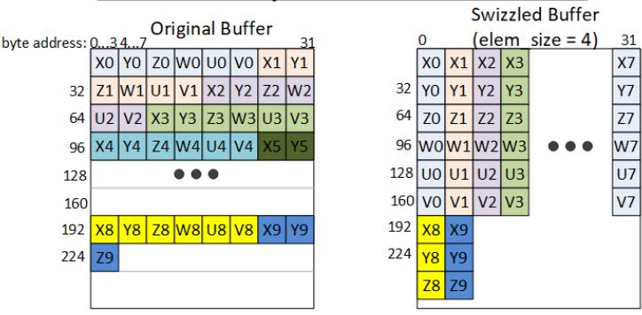

# <span id="page-122-0"></span>**9.5. Alignment**

Formatted ops such as BUFFER\_LOAD\_FORMAT\_\* must be aligned as follows:

- 1-byte formats require 1-byte alignment
- 2-byte formats require 2-byte alignment
- 4-byte and larger formats require 4-byte alignment

Memory alignment enforcement for non-formatted ops is controlled by a configuration register: SH\_MEM\_CONFIG.alignment\_mode.

Atomics must be aligned to the data size, or they trigger a MEMVIOL.

#### Options are:

0. : DWORD - hardware automatically aligns request to the smaller of: element-size or DWORD.

9.5. Alignment 113 of 697

For DWORD or larger loads or stores of non-formatted ops (such as BUFFER\_LOAD\_DWORD), the two LSBs of the byte-address are ignored, thus forcing DWORD alignment. For ATOMICs this forces the required alignment by ignoring the LSBs until the atomic is payload aligned, this means 8-byte ATOMIC operations are forced to a greater alignment than DWORD.

- 1. : DWORD\_STRICT must be aligned to the smaller of: element-size or DWORD.
- 2. : STRICT access must be aligned to data size
- 3. : UNALIGNED any alignment is allowed (but atomics must still be aligned)

# <span id="page-123-0"></span>**9.6. Buffer Resource**

The buffer resource (V#) describes the location of a buffer in memory and the format of the data in the buffer. It is specified in four consecutive SGPRs (4-SGPR aligned) and sent to the texture cache with each buffer instruction.

The table below details the fields that make up the buffer resource descriptor.

Table 57. Buffer Resource Descriptor

| Bits    | Size | Name                        | Description                                                                                                                                                                                         |  |
|---------|------|-----------------------------|-----------------------------------------------------------------------------------------------------------------------------------------------------------------------------------------------------|--|
| 47:0    | 48   | Base address                | Byte address.                                                                                                                                                                                       |  |
| 61:48   | 14   | Stride                      | Bytes 0 to 16383 (modified by Stride Scale)                                                                                                                                                         |  |
| 63:62   | 2    | swizzle Enable              | Swizzle AOS according to stride, index_stride and element_size; otherwise<br>linear.<br>0: disabled<br>1: enabled with element_size = 4byte<br>2: Reserved<br>3: enabled with element_size = 16byte |  |
| 95:64   | 32   | Num_records                 | In units of stride if (stride >=1), else in bytes.                                                                                                                                                  |  |
| 98:96   | 3    | Dst_sel_x                   | Destination channel select:<br>0=0, 1=1, 4=R, 5=G, 6=B, 7=A                                                                                                                                         |  |
| 101:99  | 3    | Dst_sel_y                   |                                                                                                                                                                                                     |  |
| 104:102 | 3    | Dst_sel_z                   |                                                                                                                                                                                                     |  |
| 107:105 | 3    | Dst_sel_w                   |                                                                                                                                                                                                     |  |
| 113:108 | 6    | Format                      | Memory data type. Used only by Untyped-buffer "FORMAT" instructions.                                                                                                                                |  |
| 115:114 | 2    | Stride Scale                | Multiply the stride field by: 0: x1; 1: x4; 2: x8; 3: x32.                                                                                                                                          |  |
| 118:117 | 2    | Index stride                | 0:8, 1:16, 2:32, or 3:64. Used for swizzled buffer addressing.                                                                                                                                      |  |
| 119     | 1    | Add tid enable              | Add thread ID to the index for to calculate the address.                                                                                                                                            |  |
| 120     | 1    | Write Compression<br>Enable | 1 = enable write compression, 0 = disabled                                                                                                                                                          |  |
| 121     | 1    | Compression Enable          | 0 = bypass compression (resource is not compressible);<br>1 = don't bypass compression                                                                                                              |  |
| 123:122 | 2    | Compression Access<br>Mode  | 0 = normal<br>1 = force existing data to compress<br>2 = compressed data access<br>3 = metadata access                                                                                              |  |
| 125:124 | 2    | OOB_SELECT                  | Out of bounds select.                                                                                                                                                                               |  |
| 127:126 | 2    | Type                        | Value == 0 for buffer. Overlaps upper two bits of four-bit TYPE field in<br>128-bit V# resource.                                                                                                    |  |

### **Unbound Resources**

9.6. Buffer Resource 114 of 697

This is keyed off the "data-format" being set to zero (INVALID), and for untyped-buffer the "add\_tid\_en = false".

### **Resource - Instruction mismatch**

If the resource type and instruction mismatch (e.g. a buffer resource with an image instruction, or an image resource with a buffer instruction), the instruction is ignored (loads return nothing and stores do not alter memory).

9.6. Buffer Resource 115 of 697

# <span id="page-125-0"></span>**Chapter 10. Vector Memory Image Instructions**

Vector Memory (VMEM) Image operations transfer data between the VGPRs and memory through the texture cache. Image operations support access to image objects such as texture maps and typed surfaces. Image-Sample operations read multiple elements from a surface and combine them to produce a single result per lane.

Image objects are accessed using from one to four dimensional addresses; they are composed of homogeneous samples, each sample containing one to four elements. These image objects are read from, or written to, using IMAGE\_\* or SAMPLE\_\* instructions, all of which use the VIMAGE or VSAMPLE instruction formats. IMAGE\_LOAD instructions load an element from the image buffer directly into VGPRS, and SAMPLE instructions use sampler constants (S#) and apply filtering to the data after it is read. IMAGE\_ATOMIC instructions combine data from VGPRs with data already in memory, and optionally return the value that was in memory before the operation.

VMEM image operations use an image resource constant (T#) that is a 128-bit or 256-bit value in SGPRs. This constant is sent to the texture cache when the instruction is executed. This constant defines the address, data format, and characteristics of the surface in memory. Some image instructions also use a sampler constant that is a 128-bit constant in SGPRs. Typically, these constants are fetched from memory using scalar memory loads prior to executing VM instructions, but these constants can also be generated within the shader.

Texture fetch instructions have a data mask (DMASK) field. DMASK specifies how many data components it receives. If DMASK is less than the number of components in the texture, the texture unit only sends DMASK components, starting with R, then G, B, and A. if DMASK specifies more than the texture format specifies, the shader receives data based on T#.DST\_SEL for the missing components. Image ops do not generate MemViol instead they apply clamp modes if the address goes out of range.

Memory operations of different types (e.g. loads, stores and samples) can complete out of order with respect to each other.

# <span id="page-125-1"></span>**10.1. Image Instructions**

This section describes the image instruction set, and the microcode fields available to those instructions. Image instruction are divided into two categories based on instruction encoding: VIMAGE and VSAMPLE.

| VIMAGE Instructions                                               |                                                                                              |  |
|-------------------------------------------------------------------|----------------------------------------------------------------------------------------------|--|
| IMAGE_LOAD_{-, PCK, PCK_SGN}<br>IMAGE_LOAD_MIP_{-, PCK, PCK_SGN } | Load data from an image object<br>Load data from an image object from a specified mip level. |  |
| IMAGE_STORE<br>IMAGE_STORE_PCK                                    | Store data to an image object to a specific mipmap level                                     |  |
| IMAGE_STORE_MIP<br>IMAGE_STORE_MIP_PCK                            |                                                                                              |  |

10.1. Image Instructions 116 of 697

| VIMAGE Instructions                                                                                                                                                                                                                                                                                                                                                         |                                                                                                                                                                                    |  |  |
|-----------------------------------------------------------------------------------------------------------------------------------------------------------------------------------------------------------------------------------------------------------------------------------------------------------------------------------------------------------------------------|------------------------------------------------------------------------------------------------------------------------------------------------------------------------------------|--|--|
| IMAGE_ATOMIC_SWAP<br>IMAGE_ATOMIC_CMPSWAP<br>IMAGE_ATOMIC_ADD<br>IMAGE_ATOMIC_SUB<br>IMAGE_ATOMIC_SMIN<br>IMAGE_ATOMIC_UMIN<br>IMAGE_ATOMIC_SMAX<br>IMAGE_ATOMIC_UMAX<br>IMAGE_ATOMIC_AND<br>IMAGE_ATOMIC_OR<br>IMAGE_ATOMIC_XOR<br>IMAGE_ATOMIC_INC<br>IMAGE_ATOMIC_DEC<br>IMAGE_ATOMIC_ADD_F32<br>IMAGE_ATOMIC_MIN_F32<br>IMAGE_ATOMIC_MAX_F32<br>IMAGE_ATOMIC_PK_ADD_F16 | Image atomic operations                                                                                                                                                            |  |  |
| IMAGE_ATOMIC_PK_ADD_BF16<br>IMAGE_GET_RESINFO                                                                                                                                                                                                                                                                                                                               | Return resource info into 4 VGPRs for the MIP level specified. These are 32bit                                                                                                     |  |  |
|                                                                                                                                                                                                                                                                                                                                                                             | integer values:<br>VDATA3-0 = { #mipLevels, depth, height, width }<br>For cubemaps, depth = 6 * Number_of_array_faces.<br>(DX expects the # of cubes, but gets # of faces instead) |  |  |
| BVH ops                                                                                                                                                                                                                                                                                                                                                                     | All Ray tracing BVH instructions.<br>See: Ray Tracing Instructions                                                                                                                 |  |  |

| VSAMPLE Instructions                 |                                                                                                                                                                                                                                                                                |  |
|--------------------------------------|--------------------------------------------------------------------------------------------------------------------------------------------------------------------------------------------------------------------------------------------------------------------------------|--|
| IMAGE_SAMPLE_*<br>IMAGE_SAMPLE_*_G16 | Load and filter data from a image object<br>Sample with 16-bit gradients                                                                                                                                                                                                       |  |
| IMAGE_GATHER4_*                      | Load and return samples from 4 texels for software filtering. Returns a single<br>component, starting with the lower-left texel and in counter-clockwise order.                                                                                                                |  |
| IMAGE_GATHER4H                       | 4H: fetch 1 component per texel from 4x1 texels<br>"DMASK" selects which component to load (R,G,B,A) and must have only one bit<br>set to 1.                                                                                                                                   |  |
| IMAGE_MSAA_LOAD                      | Load up to 4 samples of 1 component from an MSAA resource with a user<br>specified fragment ID.<br>Uses DMASK as component select - it behaves like gather4 ops and returns 4<br>VGPR (2 if D16=1).<br>SAMP should be set to NULL since this operation does not use a sampler. |  |
| IMAGE_GET_LOD                        | Return the calculated LOD. Treated as a Sample instruction.<br>Returns the "raw" LOD and the "clamped" LOD into VDATA as two 32 bit floats:<br>First VGPR = clampLOD<br>Second VGPR = rawLOD                                                                                   |  |

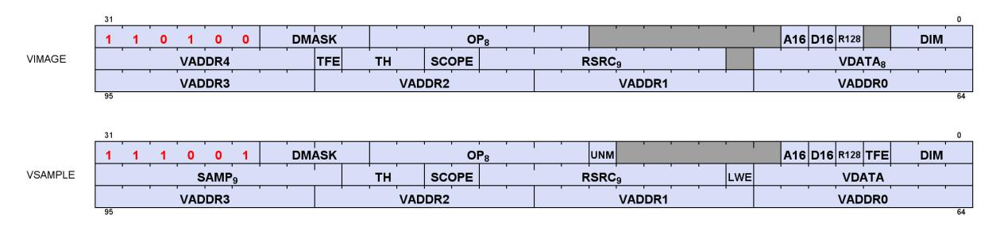

Table 58. Instruction Fields

10.1. Image Instructions 117 of 697

| Instruction Fields |                                                                                                                                                                                                                                                                                                                                                                             |                                                                                                                                                                                                                                                                                                                                                                                                                                                                                                                                                                                                                                                                                                                                                                                                                                                                                                                                                                                                                                                                                                                                                                                                   |         |                  |  |  |
|--------------------|-----------------------------------------------------------------------------------------------------------------------------------------------------------------------------------------------------------------------------------------------------------------------------------------------------------------------------------------------------------------------------|---------------------------------------------------------------------------------------------------------------------------------------------------------------------------------------------------------------------------------------------------------------------------------------------------------------------------------------------------------------------------------------------------------------------------------------------------------------------------------------------------------------------------------------------------------------------------------------------------------------------------------------------------------------------------------------------------------------------------------------------------------------------------------------------------------------------------------------------------------------------------------------------------------------------------------------------------------------------------------------------------------------------------------------------------------------------------------------------------------------------------------------------------------------------------------------------------|---------|------------------|--|--|
| Field              | Size                                                                                                                                                                                                                                                                                                                                                                        | Description                                                                                                                                                                                                                                                                                                                                                                                                                                                                                                                                                                                                                                                                                                                                                                                                                                                                                                                                                                                                                                                                                                                                                                                       |         |                  |  |  |
| OP                 | 8                                                                                                                                                                                                                                                                                                                                                                           | Opcode                                                                                                                                                                                                                                                                                                                                                                                                                                                                                                                                                                                                                                                                                                                                                                                                                                                                                                                                                                                                                                                                                                                                                                                            |         |                  |  |  |
| DIM                | 3                                                                                                                                                                                                                                                                                                                                                                           | Surface Dimension:                                                                                                                                                                                                                                                                                                                                                                                                                                                                                                                                                                                                                                                                                                                                                                                                                                                                                                                                                                                                                                                                                                                                                                                |         |                  |  |  |
|                    |                                                                                                                                                                                                                                                                                                                                                                             |                                                                                                                                                                                                                                                                                                                                                                                                                                                                                                                                                                                                                                                                                                                                                                                                                                                                                                                                                                                                                                                                                                                                                                                                   | 0: 1D   | 4: 1d array      |  |  |
|                    |                                                                                                                                                                                                                                                                                                                                                                             |                                                                                                                                                                                                                                                                                                                                                                                                                                                                                                                                                                                                                                                                                                                                                                                                                                                                                                                                                                                                                                                                                                                                                                                                   | 1: 2D   | 5: 2d array      |  |  |
|                    |                                                                                                                                                                                                                                                                                                                                                                             |                                                                                                                                                                                                                                                                                                                                                                                                                                                                                                                                                                                                                                                                                                                                                                                                                                                                                                                                                                                                                                                                                                                                                                                                   | 2: 3D   | 6: 2d MSAA       |  |  |
|                    |                                                                                                                                                                                                                                                                                                                                                                             |                                                                                                                                                                                                                                                                                                                                                                                                                                                                                                                                                                                                                                                                                                                                                                                                                                                                                                                                                                                                                                                                                                                                                                                                   | 3: cube | 7: 2d MSAA array |  |  |
| DMASK              | 4                                                                                                                                                                                                                                                                                                                                                                           | Data VGPR enable mask: 1 4 consecutive VGPRs<br>Loads: defines which components are returned: 0=red,1=green,2=blue,3=alpha<br>Stores: defines which components are written with data from VGPRs (missing components get<br>the value of the X component).<br>Enabled components come from consecutive VGPRs.<br>E.G. DMASK=1001 : Red is in VGPRn and alpha in VGPRn+1.<br>For D16 loads, DMASK indicates which components to return;<br>For D16 stores, the DMASK the mask indicates which components to store but has restrictions:<br>Data is read out of consecutive VGPRs: LSB's of VDATA, then MSB's of VDATA then LSB's<br>of VDATA+1 and last if needed MSB's of VDATA+1. This is regardless of which DMASK bits<br>are set, only how many bits are set. The position of the DMASK bits controls which components<br>are written in memory.<br>If DMASK==0, the TA overrides DMASK=1 and puts zeros in VGPR followed by LWE status if exists. TFE<br>status is not generated since the fetch is dropped.<br>For IMAGE_GATHER4* instructions, DMASK indicates which component (RGBA), and the<br>number of VGPRs to use is determined automatically by hardware (4 VGPRs when D16=0, and 2 |         |                  |  |  |
|                    |                                                                                                                                                                                                                                                                                                                                                                             | VGPRs when D16=1).                                                                                                                                                                                                                                                                                                                                                                                                                                                                                                                                                                                                                                                                                                                                                                                                                                                                                                                                                                                                                                                                                                                                                                                |         |                  |  |  |
| R128               | 1                                                                                                                                                                                                                                                                                                                                                                           | Texture Resource Size: 1 = 128bits, 0 = 256bits                                                                                                                                                                                                                                                                                                                                                                                                                                                                                                                                                                                                                                                                                                                                                                                                                                                                                                                                                                                                                                                                                                                                                   |         |                  |  |  |
| A16                | 1                                                                                                                                                                                                                                                                                                                                                                           | Address components are 16-bits (instead of the usual 32 bits).<br>When set, all address components are 16 bits (packed into 2 per DWORD), except:<br>Texel offsets (3 6bit UINT packed into 1 DWORD)<br>PCF reference (for "_C" instructions)<br>Address components are 16b uint for image ops without sampler; 16b float with sampler.                                                                                                                                                                                                                                                                                                                                                                                                                                                                                                                                                                                                                                                                                                                                                                                                                                                           |         |                  |  |  |
| D16                | 1<br>VGPR-Data-16bit. On loads, convert data in memory to 16-bit format before storing it in VGPRs.<br>For stores, convert 16-bit data in VGPRs to the memory format before going to memory. Whether<br>the data is treated as float or int is decided by NFMT. Allowed only with these opcodes:<br>• IMAGE_SAMPLE*<br>• IMAGE_GATHER4<br>• IMAGE_MSAA_LOAD<br>• IMAGE_LOAD |                                                                                                                                                                                                                                                                                                                                                                                                                                                                                                                                                                                                                                                                                                                                                                                                                                                                                                                                                                                                                                                                                                                                                                                                   |         |                  |  |  |
|                    |                                                                                                                                                                                                                                                                                                                                                                             | • IMAGE_LOAD_MIP<br>• IMAGE_STORE<br>• IMAGE_STORE_MIP                                                                                                                                                                                                                                                                                                                                                                                                                                                                                                                                                                                                                                                                                                                                                                                                                                                                                                                                                                                                                                                                                                                                            |         |                  |  |  |
| VDATA              | 8                                                                                                                                                                                                                                                                                                                                                                           | Address of VGPR to supply first component of store-data or receive first component of load-data.<br>0-255.                                                                                                                                                                                                                                                                                                                                                                                                                                                                                                                                                                                                                                                                                                                                                                                                                                                                                                                                                                                                                                                                                        |         |                  |  |  |
| RSRC               | 9                                                                                                                                                                                                                                                                                                                                                                           | Specifies which SGPR supplies T# (resource constant) in four consecutive SGPRs. Must be a<br>multiple of 4, in the range 0-120.                                                                                                                                                                                                                                                                                                                                                                                                                                                                                                                                                                                                                                                                                                                                                                                                                                                                                                                                                                                                                                                                   |         |                  |  |  |
| SCOPE              | 2                                                                                                                                                                                                                                                                                                                                                                           | Memory Scope                                                                                                                                                                                                                                                                                                                                                                                                                                                                                                                                                                                                                                                                                                                                                                                                                                                                                                                                                                                                                                                                                                                                                                                      |         |                  |  |  |
| TH                 | 3                                                                                                                                                                                                                                                                                                                                                                           | Memory Temporal Hint                                                                                                                                                                                                                                                                                                                                                                                                                                                                                                                                                                                                                                                                                                                                                                                                                                                                                                                                                                                                                                                                                                                                                                              |         |                  |  |  |
|                    | 1                                                                                                                                                                                                                                                                                                                                                                           | Texel Fault Enable for PRT (Partially Resident Textures). When set, fetch may return a NACK that<br>causes a VGPR write into DST+1 (first GPR after all fetch-dest gprs).                                                                                                                                                                                                                                                                                                                                                                                                                                                                                                                                                                                                                                                                                                                                                                                                                                                                                                                                                                                                                         |         |                  |  |  |
| TFE                |                                                                                                                                                                                                                                                                                                                                                                             |                                                                                                                                                                                                                                                                                                                                                                                                                                                                                                                                                                                                                                                                                                                                                                                                                                                                                                                                                                                                                                                                                                                                                                                                   |         |                  |  |  |

10.1. Image Instructions 118 of 697

| Instruction Fields               |       |                                                                                                                                                                                                                                                                                                                                                                                                                                                                                                |  |  |  |  |  |  |  |  |
|----------------------------------|-------|------------------------------------------------------------------------------------------------------------------------------------------------------------------------------------------------------------------------------------------------------------------------------------------------------------------------------------------------------------------------------------------------------------------------------------------------------------------------------------------------|--|--|--|--|--|--|--|--|
| VADDR0-4                         | 5 x 8 | Five 8-bit VGPR address fields. Each one provides one or a consecutive group of address VGPRs.                                                                                                                                                                                                                                                                                                                                                                                                 |  |  |  |  |  |  |  |  |
| Fields Available only in VSAMPLE |       |                                                                                                                                                                                                                                                                                                                                                                                                                                                                                                |  |  |  |  |  |  |  |  |
| VADDR0-3                         | 4 x 8 | Four 8-bit VGPR address fields. Each one provides one or a consecutive group of address VGPRs.                                                                                                                                                                                                                                                                                                                                                                                                 |  |  |  |  |  |  |  |  |
| SAMP                             | 9     | Specifies which SGPR supplies S# (sampler constant) in four consecutive SGPRs. Must be a<br>multiple of 4, in the range 0-120.                                                                                                                                                                                                                                                                                                                                                                 |  |  |  |  |  |  |  |  |
| UNRM                             | 1     | Force address to be un-normalized. Must be set to 1 for Image stores & atomics.<br>0: for image ops with samplers, S,T,R from [0.0, 1.0] span the entire texture map;<br>1: for image ops with samplers, S,T,R from [0.0 to N] span the texture map, where N is width,<br>height or depth. Array/cube slice, lod, bias etc. are not affected. Image ops without sampler are<br>not affected. UINT inputs are "unnormalized".<br>This bit is logically OR'd with the S#.force_unnormalized bit. |  |  |  |  |  |  |  |  |
| LWE                              | 1     | LOD Warning Enable. When set to 1, a texture fetch may return "LOD_CLAMPED = 1", and causes<br>a VGPR write into DST+1 (first GPR after all fetch-dest gprs). LWE only works for sampler ops;<br>LWE is ignored for non-sampler ops.                                                                                                                                                                                                                                                           |  |  |  |  |  |  |  |  |

# <span id="page-128-0"></span>**10.1.1. Texture Fault Enable (TFE) and LOD Warning Enable (LWE)**

This is related to "Partially Resident Textures".

When either of these bits are set in the instruction, any texture fetch may return one extra VGPR after all of the data-return VGPRs. This data is returned uniquely to each thread and indicates the error / warning status of that thread and nothing is returned if no thread experiences a texture fault or LOD warning.

The data returned is: TEXEL\_FAIL | (LOD\_WARNING << 1) | (LOD << 16)

- TEXEL\_FAIL : 1 bit indicating that 1 or more texels for this pixel produced a NACK. "failure" means accessing an unmapped page.
  - TFE == 0
    - TEX writes the data for threads that didn't NACK to VGPR DST
    - TEX writes zeros or the result of blend using zeros for samples that NACKed to VGPR DST
  - TFE == 1
    - VGPR DST is written similar to above
    - TEX writes to VGPR DST+1 with a status where the bits corresponding to threads that NACKed are set to 1
- LOD\_WARNING : 1 bit indicating a that a pixel attempted to access a texel at too small a LOD: warn = ( LOD < T#.min\_lod\_warning)
- LOD : indicates which LOD was attempted to be accessed that caused the NACK. Returns the floor of the requested LOD.

A pixel cannot receive both TEXEL\_FAIL and LOD\_WARNING: TEXEL\_FAIL takes precedence.

# <span id="page-128-1"></span>**10.1.2. D16 Instructions**

Load-format and store-format instructions also come in a "D16" variant. For stores, each 32-bit VGPR holds two 16-bit data elements that are passed to the texture unit. The texture unit converts them to the texture format before writing to memory. For loads, data returned from the texture unit is converted to 16 bits, and a pair of data are stored in each 32- bit VGPR (LSBs first, then MSBs). The DMASK bit represents individual 16- bit elements; so, when DMASK=0011 for an image-load, two 16-bit components are loaded into a single 32-bit

10.1. Image Instructions 119 of 697

VGPR.

# <span id="page-129-0"></span>**10.1.3. A16 Instructions**

The **A16** instruction bit indicates that the address components are 16 bits instead of the usual 32 bits. Components are packed such that the first address component goes into the low 16 bits ([15:0]), and the next into the high 16 bits ([31:16]).

# <span id="page-129-1"></span>**10.1.4. G16 Instructions**

The instructions with "G16" in the name mean the user provided derivatives are 16 bits instead of the usual 32 bits. Derivatives are packed such that the first derivative goes into the low 16 bits ([15:0]), and the next into the high 16 bits ([31:16]).

# <span id="page-129-2"></span>**10.2. Image Opcodes with No Sampler**

For image opcodes with no sampler, all VGPR address values are taken as uint. For cubemaps, face\_id = slice \* **6** + face.

MSAA surfaces support only load, store and atomics; not load-mip or store-mip.

The table below shows the contents of address VGPRs for the various image opcodes.

| Opcode       | a16[0] type |                   | acnt | VGPRn<br>[31:0] | VGPRn+1[31:0] | VGPRn+2[31:0] | VGPRn+3[31:0] |
|--------------|-------------|-------------------|------|-----------------|---------------|---------------|---------------|
| GET_RESINFO  | x           | Any               | 0    | mipid           |               |               |               |
| LOAD         | 0           | 1D                | 0    | s               |               |               |               |
| LOAD_PCK     |             | 2D                | 1    | s               | t             |               |               |
| LOAD_PCK_SGN |             | 3D                | 2    | s               | t             | r             |               |
| STORE        |             | Cube/Cube Array 2 |      | s               | t             | face          |               |
| STORE_PCK    |             | 1D Array          | 1    | s               | slice         |               |               |
|              |             | 2D Array          | 2    | s               | t             | slice         |               |
|              |             | 2D MSAA           | 2    | s               | t             | fragid        |               |
|              |             | 2D Array MSAA     | 3    | s               | t             | slice         | fragid        |
|              | 1           | 1D                | 0    | -, s            |               |               |               |
|              |             | 2D                | 1    | t, s            |               |               |               |
|              |             | 3D                | 2    | t, s            | -, r          |               |               |
|              |             | Cube/Cube Array 2 |      | t, s            | -, face       |               |               |
|              |             | 1D Array          | 1    | slice, s        |               |               |               |
|              |             | 2D Array          | 2    | t, s            | -, slice      |               |               |
|              |             | 2D MSAA           | 2    | t, s            | -, fragid     |               |               |
|              |             | 2D Array MSAA     | 3    | t, s            | fragid, slice |               |               |

| Opcode           | a16[0] type |                   | acnt | VGPRn<br>[31:0] | VGPRn+1[31:0] | VGPRn+2[31:0] | VGPRn+3[31:0] |
|------------------|-------------|-------------------|------|-----------------|---------------|---------------|---------------|
| ATOMIC           | 0           | 1D                | 0    | s               |               |               |               |
|                  |             | 2D                | 1    | s               | t             |               |               |
|                  |             | 3D                | 2    | s               | t             | r             |               |
|                  |             | 1D Array          | 1    | s               | slice         |               |               |
|                  |             | 2D Array          | 2    | s               | t             | slice         |               |
|                  |             | 2D MSAA           | 2    | s               | t             | fragid        |               |
|                  |             | 2D Array MSAA     | 3    | s               | t             | slice         | fragid        |
|                  | 1           | 1D                | 0    | -, s            |               |               |               |
|                  |             | 2D                | 1    | t, s            |               |               |               |
|                  |             | 3D                | 2    | t, s            | -, r          |               |               |
|                  |             | 1D Array          | 1    | slice, s        |               |               |               |
|                  |             | 2D Array          | 2    | t, s            | -, slice      |               |               |
|                  |             | 2D MSAA           | 2    | t, s            | -, fragid     |               |               |
|                  |             | 2D Array MSAA     | 3    | t, s            | fragid, slice |               |               |
| LOAD_MIP         | 0           | 1D                | 1    | s               | mipid         |               |               |
| LOAD_MIP_PCK     |             | 2D                | 2    | s               | t             | mipid         |               |
| LOAD_MIP_PCK_SGN |             | 3D                | 3    | s               | t             | r             | mipid         |
| STORE_MIP        |             | Cube/Cube Array 3 |      | s               | t             | face          | mipid         |
| STORE_MIP_PCK    |             | 1D Array          | 2    | s               | slice         | mipid         |               |
|                  |             | 2D Array          | 3    | s               | t             | slice         | mipid         |
|                  | 1           | 1D                | 1    | mipid, s        |               |               |               |
|                  |             | 2D                | 2    | t, s            | -, mipid      |               |               |
|                  |             | 3D                | 3    | t, s            | mipid, r      |               |               |
|                  |             | Cube/Cube Array 3 |      | t, s            | mipid, face   |               |               |
|                  |             | 1D Array          | 2    | slice, s        | -, mipid      |               |               |
|                  |             | 2D Array          | 3    | t, s            | mipid, slice  |               |               |

- Image\_Load : image\_load, image\_load\_mip, image\_load\_{pck, pck\_sgn, mip\_pck, mip\_pck\_sgn}
- Image\_Store: image\_store, image\_store\_mip
- Image\_Atomic\_\*: swap, cmpswap, add, sub, {u,s}{min,max}, and, or, xor, inc, dec, add\_f32, min\_f32, max\_f32.

"ACNT" is the Address Count: the number of VGPRs that supply the "body" of the address, derived from the instruction's DIM field and the opcode.

# <span id="page-130-0"></span>**10.3. Image Opcodes with a Sampler**

Opcodes with a sampler: all VGPR address values are taken as FLOAT except for Texel-offset, which are UINT. For cubemaps, face\_id = slice \* **8** + face.

(Note that the "\*8" differs from the non-sampler case which is "\*6").

Certain sample and gather opcodes require additional values from VGPRs beyond what is shown in the table below. These values are: offset, bias, z-compare and gradients. Please see the next section for details. MSAA surfaces do not support sample or gather4 operations. MSAA\_LOAD does not use a sampler, but uses the VSAMPLE instruction encoding (users should set SAMP = NULL).

| Opcode        | a16[0] acnt type |   |             | VGPRn<br>[31:0] | VGPRn+1[31:0] | VGPRn+2[31:0] | VGPRn+3[31:0] |
|---------------|------------------|---|-------------|-----------------|---------------|---------------|---------------|
| Sample        | 0                | 0 | 1D          | s               |               |               |               |
| GetLod        |                  | 1 | 2D          | s               | t             |               |               |
|               |                  | 2 | 3D          | s               | t             | r             |               |
|               |                  | 2 | Cube(Array) | s               | t             | face          |               |
|               |                  | 1 | 1D Array    | s               | slice         |               |               |
|               |                  | 2 | 2D Array    | s               | t             | slice         |               |
|               | 1                | 0 | 1D          | -, s            |               |               |               |
|               |                  | 1 | 2D          | t, s            |               |               |               |
|               |                  | 2 | 3D          | t, s            | -, r          |               |               |
|               |                  | 2 | Cube(Array) | t, s            | -, face       |               |               |
|               |                  | 1 | 1D Array    | slice, s        |               |               |               |
|               |                  | 2 | 2D Array    | t, s            | -, slice      |               |               |
| Sample "_L":  | 0                | 1 | 1D          | s               | lod           |               |               |
|               |                  | 2 | 2D          | s               | t             | lod           |               |
|               |                  | 3 | 3D          | s               | t             | r             | lod           |
|               |                  | 3 | Cube(Array) | s               | t             | face          | lod           |
|               |                  | 2 | 1D Array    | s               | slice         | lod           |               |
|               |                  | 3 | 2D Array    | s               | t             | slice         | lod           |
|               | 1                | 1 | 1D          | lod, s          |               |               |               |
|               |                  | 2 | 2D          | t, s            | -, lod        |               |               |
|               |                  | 3 | 3D          | t, s            | lod, r        |               |               |
|               |                  | 3 | Cube(Array) | t, s            | lod, face     |               |               |
|               |                  | 2 | 1D Array    | slice, s        | -, lod        |               |               |
|               |                  | 3 | 2D Array    | t, s            | lod, slice    |               |               |
| Sample "_CL": | 0                | 1 | 1D          | s               | clamp         |               |               |
|               |                  | 2 | 2D          | s               | t             | clamp         |               |
|               |                  | 3 | 3D          | s               | t             | r             | clamp         |
|               |                  | 3 | Cube(Array) | s               | t             | face          | clamp         |
|               |                  | 2 | 1D Array    | s               | slice         | clamp         |               |
|               |                  | 3 | 2D Array    | s               | t             | slice         | clamp         |
|               | 1                | 1 | 1D          | clamp, s        |               |               |               |
|               |                  | 2 | 2D          | t, s            | -, clamp      |               |               |
|               |                  | 3 | 3D          | t, s            | clamp, r      |               |               |
|               |                  | 3 | Cube(Array) | t, s            | clamp, face   |               |               |
|               |                  | 2 | 1D Array    | slice, s        | -, clamp      |               |               |
|               |                  | 3 | 2D Array    | t, s            | clamp, slice  |               |               |
| Gather        | 0                | 1 | 2D          | s               | t             |               |               |
|               |                  | 2 | Cube(Array) | s               | t             | face          |               |
|               |                  | 2 | 2D Array    | s               | t             | slice         |               |
|               | 1                | 1 | 2D          | t, s            |               |               |               |
|               |                  | 2 | Cube(Array) | t, s            | -, face       |               |               |
|               |                  | 2 | 2D Array    | t, s            | -, slice      |               |               |

| Opcode       | a16[0] acnt type |   |                  | VGPRn<br>[31:0] | VGPRn+1[31:0] | VGPRn+2[31:0] | VGPRn+3[31:0] |
|--------------|------------------|---|------------------|-----------------|---------------|---------------|---------------|
| Gather "_L"  | 0                | 2 | 2D               | s               | t             | lod           |               |
|              |                  | 3 | Cube(Array)      | s               | t             | face          | lod           |
|              |                  | 3 | 2D Array         | s               | t             | slice         | lod           |
|              | 1                | 2 | 2D               | t, s            | -, lod        |               |               |
|              |                  | 3 | Cube(Array)      | t, s            | lod, face     |               |               |
|              |                  | 3 | 2D Array         | t, s            | lod, slice    |               |               |
| Gather "_CL" | 0<br>1           | 2 | 2D               | s               | t             | clamp         |               |
|              |                  | 3 | Cube(Array)      | s               | t             | face          | clamp         |
|              |                  | 3 | 2D Array         | s               | t             | slice         | clamp         |
|              |                  | 2 | 2D               | t, s            | -, clamp      |               |               |
|              |                  | 3 | Cube(Array)      | t, s            | clamp, face   |               |               |
|              |                  | 3 | 2D Array         | t, s            | clamp, slice  |               |               |
| MSAA_LOAD    | 0                | 2 | 2D MSAA          | s               | t             | fragid        |               |
|              |                  | 3 | 2D Array<br>MSAA | s               | t             | slice         | fragid        |
|              | 1                | 2 | 2D MSAA          | t, s            | -, fragid     |               |               |
|              |                  | 3 | 2D Array<br>MSAA | t, s            | fragid, slice |               |               |

The table below lists and briefly describes the legal suffixes for image instructions:

**Suffix Meaning Extra Addresses Description** \_L LOD - LOD is used instead of computed LOD. \_B LOD BIAS 1: lod bias Add this BIAS to the computed LOD. \_CL LOD CLAMP - Clamp the computed LOD to be no larger than this value. \_D Derivative 2,4 or 6: slopes Send dx/dv, dx/dy, etc. slopes to be used in LOD computation. \_LZ Level 0 - Force use of MIP level 0. \_C PCF 1: z-comp Percentage closer filtering. \_O Offset 1: offsets Send X, Y, Z integer offsets (packed into 1 DWORD) to offset XYZ address. \_G16 Gradient 16b - Gradients are 16-bits instead of 32-bits, packed 2 gradients per VGPR (dX in low 16bits, dY in high 16bits).

Table 59. Sample Instruction Suffix Key

# <span id="page-132-0"></span>**10.4. VGPR Usage**

**Address**: The address consists of up to 5 parts: { **offset** } { **bias** } { **z-compare** } { **derivative** } { **body** }

These are all in VGPRs, and can consist of up to 12 values.

- **Offset**: SAMPLE\*O\*, GATHER\*O\* 1 DWORD of 'offset\_xyz' . The offsets are 6-bit signed integers: X=[5:0], Y=[13:8], Z=[21:16]
- **Bias**: SAMPLE\*B\*, GATHER\*B\*. 1 DWORD float.
- **Z-compare**: SAMPLE\*C\*, GATHER\*C\*. 1 DWORD.
- **Derivatives** (SAMPLE\_D): 2,4 or 6 DWORDS these packed 1 DWORD per derivative as shown below (F32).
- **Body:** One to four DWORDs, as defined by the table: [Image Opcodes with a Sampler](#page-130-0) Address components are X,Y,Z,W with X in VGPR[M], Y in VGPR[M]+1, etc. The number of components in "body" is the value of the ACNT field in the table, plus one.

10.4. VGPR Usage 123 of 697

Address components are X,Y,Z,W with X in VGPR[M], Y in VGPR[M]+1, etc.

Note: Bias and Derivatives are mutually exclusive - the shader can use one or the other, but not both.

#### **32-bit derivatives:**

| Image Dim | VGPR N | N+1   | N+2   | N+3   | N+4   | N+5   |
|-----------|--------|-------|-------|-------|-------|-------|
| 1D        | dx/dh  | dx/dv | -     | -     | -     | -     |
| 2D/cube   | dx/dh  | dy/dh | dx/dv | dy/dv | -     | —     |
| 3D        | dx/dh  | dy/dh | dz/dh | dx/dv | dy/dv | dz/dv |

#### **16-bit derivatives:**

| Image Type                | VGPR_N                    | VGPR_N+1                    | VGPR_N+2                  | VGPR_N+3 |
|---------------------------|---------------------------|-----------------------------|---------------------------|----------|
| 1 (1D, 1D Array)          | 16'hx, dx/dh              | 16'hx dx/dv                 | -                         | -        |
| 2 (2D, 2D Array, Cubemap) |                           | dy/dh, dx/dh dy/dv, dx/dv - |                           | -        |
| 3 (3D)                    | dy/dh, dx/dh 16'hx, dz/dh |                             | dy/dv, dx/dv 16'hx, dz/dv |          |

# <span id="page-133-0"></span>**10.4.1. Address VGPRs**

Image and Sample instructions support multiple address VGPRs to allow the shader to perform a gather operation of address components. This allows an image instruction to specify up to 5 unique address VGPRs.

- VADDR provides the first address component
- VADDR1 provides the second address component
- VADDR2 provides the third address component
- VADDR3 (for VIMAGE) provides the fourth address component for VIMAGE, or for VSAMPLE provides all additional components in sequential VGPRs: VADDR3, VADDR3+1, etc.
- VADDR4 (for VIMAGE) provides all additional components in sequential VGPRs: VADDR4, VADDR4+1, etc.

The "A16" instruction bit specifies that address components are 16 bits instead of the usual 32 bits. When using 16-bit addresses, each VGPR holds a pair of addresses and these cannot be located in different VGPRs. The lower numbered 16-bit value is in the LSBs of the VGPR.

For Ray Tracing, the VGPRs are divided up into 5 groups of VGPRs. The VGPRs within each group must be contiguous, but the groups can be scattered. The packing is different when A16=1 because RayDir.Z and RayInvDir.x are in the same DWORD. In A16 mode, the RayDir and RayInvDir are merged into 3 VGPRs but in a different order: RayDir and RayInvDir per component share a VGPR.

# <span id="page-133-1"></span>**10.4.2. Data VGPRs**

# **Data :**

data is stored from or returned to 1-4 consecutive VGPRs. The amount of data loaded or stored is completely determined by the DMASK field of the instruction.

#### **Loads**

DMASK specifies which elements of the resource are returned to consecutive VGPRs. The texture system loads data from memory and based on the data format expands it to a canonical RGBA form, filling in

10.4. VGPR Usage 124 of 697

values for missing components based on T#.dst\_sel. Then DMASK is applied and only those components selected are returned to the shader.

#### **Stores**

When writing an image object, it is only possible to store an entire element (all components) - not only individual components. The components come from consecutive VGPRs and if the surface uses more components than the shader supplies, the missing components are filled in by replicating the first VGPR into the missing components. E.g. if the surface has 4 components and the shader only supplies X and Y, the surfaces is written with XYXX.

For example if the DMASK=1001, the shader sends Red from VGPR\_N and Alpha from VGPR\_N+1 to the texture unit. If the image object is RGB, the texel is overwritten with Red from the VGPR\_N, Green and Blue set to Red value, and Alpha from the shader ignored. For D16=1, the DMASK has 1 bit set per 16-bits of data to be written from VGPRs to memory. The position of the bits in DMASK is irrelevant, only the number of bits set to 1.

## **"D16" instructions**

Load and store instructions also come in a "D16" variant. For stores, each 32bit VGPR holds two 16bit data elements that are passed to the texture unit which in turn, converts to the texture format before writing to memory. For loads, data returned from the texture unit is converted to 16 bits and a pair of data are stored in each 32bit VGPR (LSBs first, then MSBs). If there is only one component, the data goes into the lower half of the VGPR unless the "HI" instruction variant is used in which case the high-half of the VGPR is loaded with data.

#### **Atomics**

Image atomic operations are supported only on 32- and 64-bit-per-pixel surfaces. The surface data format is specified in the resource constant. Atomic operations treat the element as a single component of 32- or 64 bits. For atomic operations, DMASK is set to the number of VGPRs (DWORDs) to send to the texture unit. DMASK legal values for atomic image operations: All other values of DMASK are illegal.

- 0x1 = 32bit atomics except cmpswap
- 0x3 = 32bit atomic cmpswap
- 0x3 = 64bit atomics except cmpswap
- 0xf = 64bit atomic cmpswap
- Atomics with Return: Data is read out of the VGPR(s), starting at VDATA, to supply to the atomic operation. If the atomic returns a value to VGPRs, that data is returned to those same VGPRs starting at VDATA.

The DMASK must be compatible with the resource's data format.

## **Denormals in Floats**

Sample ops flush denormals, and loads do not modify denormals.

# <span id="page-134-0"></span>**10.4.3. Data format in VGPRs**

Data in VGPRs sent to texture (stores) or returned from texture (loads) is in one of a few standard formats, and the texture unit converts to/from the memory format.

| FORMAT | VGPR data format        | If D16==1           |  |
|--------|-------------------------|---------------------|--|
| SINT   | signed 32-bit integer   | 16 bit signed int   |  |
| UINT   | unsigned 32-bit integer | 16 bit unsigned int |  |

10.4. VGPR Usage 125 of 697

| FORMAT  | VGPR data format                 | If D16==1    |
|---------|----------------------------------|--------------|
| others  | 32-bit float                     | 16 bit float |
| Atomics | depends on opcode: uint or float | -            |

# <span id="page-135-0"></span>**10.5. Image Resource**

The image resource (also referred to as T#) defines the location of the image buffer in memory, its dimensions, tiling, and data format. These resources are stored in four or eight consecutive SGPRs and are read by image instructions. All undefined or reserved bit must be set to zero unless otherwise specified.

Table 60. Image Resource Definition

| Bits    | Size | Name         | Comments                                                                                                                                                                                                                                                                                                                                |  |
|---------|------|--------------|-----------------------------------------------------------------------------------------------------------------------------------------------------------------------------------------------------------------------------------------------------------------------------------------------------------------------------------------|--|
|         |      |              | 128-bit Resource: 1D-tex, 2d-tex, 2d-msaa (multi-sample anti-aliasing)                                                                                                                                                                                                                                                                  |  |
| 39:0    | 40   | base address | 256-byte aligned (represents bits 47:8).                                                                                                                                                                                                                                                                                                |  |
| 48:44   | 5    | max mip      | MSAA resources: holds Log2(number of samples); others holds maximum mip level:<br>MipLevels-1. This describes the resource, not the resource view (like<br>base_level/last_level).                                                                                                                                                      |  |
| 56:49   | 8    | format       | Memory Data format                                                                                                                                                                                                                                                                                                                      |  |
| 61:57   | 5    | base level   | largest mip level in the resource view. For MSAA, this should be set to 0.                                                                                                                                                                                                                                                              |  |
| 77:62   | 16   | width        | width-1 of mip 0 in texels                                                                                                                                                                                                                                                                                                              |  |
| 93:78   | 16   | height       | height-1 of mip 0 in texels                                                                                                                                                                                                                                                                                                             |  |
| 98:96   | 3    | dst_sel_x    | 0 = 0, 1 = 1, 4 = R, 5 = G, 6 = B, 7 = A.                                                                                                                                                                                                                                                                                               |  |
| 101:99  | 3    | dst_sel_y    |                                                                                                                                                                                                                                                                                                                                         |  |
| 104:102 | 3    | dst_sel_z    |                                                                                                                                                                                                                                                                                                                                         |  |
| 107:105 | 3    | dst_sel_w    |                                                                                                                                                                                                                                                                                                                                         |  |
| 115:111 | 5    | last level   | smallest mip level in resource view. For MSAA, holds log2(number of samples).                                                                                                                                                                                                                                                           |  |
| 123:121 | 3    | BC Swizzle   | Specifies channel ordering for border color data independent of the T# dst_sel_*s.<br>Internal xyzw channels get the following border color channels as stored in memory.<br>0=xyzw, 1=xwyz, 2=wzyx, 3=wxyz, 4=zyxw, 5=yxwz                                                                                                             |  |
| 127:124 | 4    | type         | 0 = buf, 8 = 1d, 9 = 2d, 10 = 3d, 11 = cube, 12 = 1d-array, 13 = 2d-array, 14 = 2d-msaa, 15                                                                                                                                                                                                                                             |  |
|         |      |              | = 2d-msaa-array. 1-7 are reserved.                                                                                                                                                                                                                                                                                                      |  |
|         |      |              | 256-bit Resource: 1d-array, 2d-array, 3d, cubemap, MSAA                                                                                                                                                                                                                                                                                 |  |
| 141:128 | 14   | depth        | 3D resources: (depth-1) of mip 0.<br>1D or 2D Array, cube resources: last array slice (see type table below). Max 8k - bit 14<br>not used.<br>1D or 2D, MSAA resources: LSBs of pitch-1. i.e. (pitch-1)[13:0] of mip 0, if pitch ><br>width. The pitch_msb field contains the MSBs of the pitch field.<br>Other resources: Must be zero |  |
| 143:142 | 2    | pitch_msb    | 1D or 2D, MSAA resources: MSBs of pitch-1. i.e. (pitch-1)[15:14]] of mip 0, if pitch ><br>width.<br>Other resources: Must be zero                                                                                                                                                                                                       |  |
| 156:144 | 13   | base array   | First slice in array of the resource view.                                                                                                                                                                                                                                                                                              |  |
| 164     | 1    | UAV3D        | 3D resources: bit 0 indicates SRV or UAV:<br>0: SRV (base_array ignored, depth w.r.t. base map)<br>1: UAV (base_array and depth are first and last layer in view, and w.r.t. mip level<br>specified)<br>Other resources: Not used                                                                                                       |  |
| 177:165 | 13   | min_lod_warn | feedback trigger for LOD, u5.8 format                                                                                                                                                                                                                                                                                                   |  |

10.5. Image Resource 126 of 697

| Bits    | Size | Name                  | Comments                                                                                      |  |
|---------|------|-----------------------|-----------------------------------------------------------------------------------------------|--|
| 183     | 1    | corner samples<br>mod | Describes how texels were generated in the resource. 0=center sampled, 1 = corner<br>sampled. |  |
| 198:186 | 13   | min_lod               | smallest LOD allowed for PRTs, U5.8 format                                                    |  |

A resource that is all zeros is treated as 'unbound': it returns all zeros and not generate a memory transaction. The "resource-level" field is ignored when checking for "all zeros".

# <span id="page-136-0"></span>**10.6. Image Sampler**

The sampler resource (also referred to as S#) defines what operations to perform on texture map data loaded by **sample** instructions. These are primarily address clamping and filter options. Sampler resources are defined in four consecutive SGPRs and are supplied to the texture cache with every sample instruction.

Table 61. Image Sampler Definition

| Bits  | Size | Name               | Description                                                                                                                                             |  |
|-------|------|--------------------|---------------------------------------------------------------------------------------------------------------------------------------------------------|--|
| 2:0   | 3    | clamp x            | Clamp/wrap mode:<br>0: Wrap<br>1: Mirror                                                                                                                |  |
| 5:3   | 3    | clamp y            | 2: ClampLastTexel<br>3: MirrorOnceLastTexel<br>4: ClampHalfBorder                                                                                       |  |
| 8:6   | 3    | clamp z            | 5: MirrorOnceHalfBorder<br>6: ClampBorder<br>7: MirrorOnceBorder                                                                                        |  |
| 11:9  | 3    | max aniso ratio    | 0 = 1:1<br>1 = 2:1<br>2 = 4:1<br>3 = 8:1<br>4 = 16:1                                                                                                    |  |
| 14:12 | 3    | depth compare func | 0: Never<br>1: Less<br>2: Equal<br>3: Less than or equal<br>4: Greater<br>5: Not equal<br>6: Greater than or equal<br>7: Always                         |  |
| 15    | 1    | force unnormalized | Force address cords to be unorm: 0 = address coordinates are<br>normalized, in [0,1); 1 = address coordinates are unnormalized in the<br>range [0,dim). |  |
| 18:16 | 3    | aniso threshold    | threshold under which floor(aniso ratio) determines number of samples<br>and step size                                                                  |  |
| 19    | 1    | mc coord trunc     | enables bilinear blend fraction truncation to 1 bit for motion<br>compensation                                                                          |  |
| 20    | 1    | force degamma      | force format to srgb if data_format allows                                                                                                              |  |
| 26:21 | 6    | aniso bias         | 6 bits, in u1.5 format.                                                                                                                                 |  |
| 27    | 1    | trunc coord        | selects texel coordinate rounding or truncation.                                                                                                        |  |
| 28    | 1    | disable cube wrap  | disables seamless DX10 cubemaps, allows cubemaps to clamp according<br>to clamp_x and clamp_y fields                                                    |  |
| 30:29 | 2    | filter_mode        | 0 = Blend (lerp); 1 = min, 2 = max.                                                                                                                     |  |

10.6. Image Sampler 127 of 697

| Bits    | Size | Name              | Description                                                                                                                                                                                     |  |
|---------|------|-------------------|-------------------------------------------------------------------------------------------------------------------------------------------------------------------------------------------------|--|
| 31      | 1    | skip degamma      | disabled degamma (sRGB→Linear) conversion.                                                                                                                                                      |  |
| 44:32   | 13   | min lod           | minimum LOD ins resource view space (0.0 = T#.base_level) u5.8.                                                                                                                                 |  |
| 57:45   | 13   | max lod           | maximum LOD ins resource view space                                                                                                                                                             |  |
| 77:64   | 14   | lod bias          | LOD bias s6.8.                                                                                                                                                                                  |  |
| 83:78   | 6    | lod bias sec      | bias (s2.4) added to computed LOD                                                                                                                                                               |  |
| 85:84   | 2    | xy mag filter     | Magnification filter: 0=point, 1=bilinear, 2=aniso-point, 3=aniso-linear                                                                                                                        |  |
| 87:86   | 2    | xy min filter     | Minification filter: 0=point, 1=bilinear, 2=aniso-point, 3=aniso-linear                                                                                                                         |  |
| 89:88   | 2    | z filter          | Volume Filter: 0=none (use XY min/mag filter), 1=point, 2=linear                                                                                                                                |  |
| 91:90   | 2    | mip filter        | Mip level filter: 0=none (disable mipmapping,use base-level), 1=point,<br>2=linear                                                                                                              |  |
| 125:114 | 12   | border color ptr  | index to border color space                                                                                                                                                                     |  |
| 127:126 | 2    | border color type | Opaque-black, transparent-black, white, use border color ptr.<br>0: Transparent Black<br>1: Opaque Black<br>2: Opaque White<br>3: Register (User border color, pointed to by border_color_ptr)" |  |

# <span id="page-137-0"></span>**10.7. Data Formats**

The table below details all the data formats that can be used by image and buffer resources.

Table 62. Buffer and Image Data Formats

<span id="page-137-1"></span>

| #  | Format      | #  | Format              | #  | Format           |
|----|-------------|----|---------------------|----|------------------|
| 0  | INVALID     | 32 | 10_10_10_2_UNORM    | 64 | 8_SRGB           |
| 1  | 8_UNORM     | 33 | 10_10_10_2_SNORM    | 65 | 8_8_SRGB         |
| 2  | 8_SNORM     | 34 | 10_10_10_2_UINT     | 66 | 8_8_8_8_SRGB     |
| 3  | 8_USCALED   | 35 | 10_10_10_2_SINT     | 67 | 5_9_9_9_FLOAT    |
| 4  | 8_SSCALED   | 36 | 2_10_10_10_UNORM    | 68 | 5_6_5_UNORM      |
| 5  | 8_UINT      | 37 | 2_10_10_10_SNORM    | 69 | 1_5_5_5_UNORM    |
| 6  | 8_SINT      | 38 | 2_10_10_10_USCALED  | 70 | 5_5_5_1_UNORM    |
| 7  | 16_UNORM    | 39 | 2_10_10_10_SSCALED  | 71 | 4_4_4_4_UNORM    |
| 8  | 16_SNORM    | 40 | 2_10_10_10_UINT     | 72 | 4_4_UNORM        |
| 9  | 16_USCALED  | 41 | 2_10_10_10_SINT     | 73 | 1_UNORM          |
| 10 | 16_SSCALED  | 42 | 8_8_8_8_UNORM       | 74 | 1_REVERSED_UNORM |
| 11 | 16_UINT     | 43 | 8_8_8_8_SNORM       | 75 | 32_FLOAT_CLAMP   |
| 12 | 16_SINT     | 44 | 8_8_8_8_USCALED     | 76 | 8_24_UNORM       |
| 13 | 16_FLOAT    | 45 | 8_8_8_8_SSCALED     | 77 | 8_24_UINT        |
| 14 | 8_8_UNORM   | 46 | 8_8_8_8_UINT        | 78 | 24_8_UNORM       |
| 15 | 8_8_SNORM   | 47 | 8_8_8_8_SINT        | 79 | 24_8_UINT        |
| 16 | 8_8_USCALED | 48 | 32_32_UINT          | 80 | X24_8_32_UINT    |
| 17 | 8_8_SSCALED | 49 | 32_32_SINT          | 81 | X24_8_32_FLOAT   |
| 18 | 8_8_UINT    | 50 | 32_32_FLOAT         | 82 | GB_GR_UNORM      |
| 19 | 8_8_SINT    | 51 | 16_16_16_16_UNORM   | 83 | GB_GR_SNORM      |
| 20 | 32_UINT     | 52 | 16_16_16_16_SNORM   | 84 | GB_GR_UINT       |
| 21 | 32_SINT     | 53 | 16_16_16_16_USCALED | 85 | GB_GR_SRGB       |
| 22 | 32_FLOAT    | 54 | 16_16_16_16_SSCALED | 86 | BG_RG_UNORM      |
| 23 | 16_16_UNORM | 55 | 16_16_16_16_UINT    | 87 | BG_RG_SNORM      |

10.7. Data Formats 128 of 697

| #  | Format         | #  | Format            | #   | Format             |
|----|----------------|----|-------------------|-----|--------------------|
| 24 | 16_16_SNORM    | 56 | 16_16_16_16_SINT  | 88  | BG_RG_UINT         |
| 25 | 16_16_USCALED  | 57 | 16_16_16_16_FLOAT | 89  | BG_RG_SRGB         |
| 26 | 16_16_SSCALED  | 58 | 32_32_32_UINT     |     |                    |
| 27 | 16_16_UINT     | 59 | 32_32_32_SINT     |     | Compressed Formats |
| 28 | 16_16_SINT     | 60 | 32_32_32_FLOAT    | 109 | BC1_UNORM          |
| 29 | 16_16_FLOAT    | 61 | 32_32_32_32_UINT  | 110 | BC1_SRGB           |
| 30 | 10_11_11_FLOAT | 62 | 32_32_32_32_SINT  | 111 | BC2_UNORM          |
| 31 | 11_11_10_FLOAT | 63 | 32_32_32_32_FLOAT | 112 | BC2_SRGB           |
|    |                |    |                   | 113 | BC3_UNORM          |
|    |                |    |                   | 114 | BC3_SRGB           |
|    |                |    |                   | 115 | BC4_UNORM          |
|    |                |    |                   | 116 | BC4_SNORM          |
|    |                |    |                   | 117 | BC5_UNORM          |
|    |                |    |                   | 118 | BC5_SNORM          |
|    |                |    |                   | 119 | BC6_UFLOAT         |
|    |                |    |                   | 120 | BC6_SFLOAT         |
|    |                |    |                   | 121 | BC7_UNORM          |
|    |                |    |                   | 122 | BC7_SRGB           |
|    |                |    |                   | 205 | YCBCR_UNORM        |
|    |                |    |                   | 206 | YCBCR_SRGB         |
|    |                |    |                   | 227 | 6E4_FLOAT          |

# <span id="page-138-0"></span>**10.8. Vector Memory Instruction Data Dependencies**

When a VM instruction is issued, it schedules the reads of address and store-data from VGPRs to be sent to the texture unit. Any ALU instruction that attempts to write this data before it has been sent to the texture unit is stalled.

The shader developer's responsibility to avoid data hazards associated with VMEM instructions include waiting for VMEM read instruction completion before reading data fetched from the TC (LOADcnt and STOREcnt). Ray-tracing Image BVH instructions are tracked with BVHcnt.

This is explained in the section: [Data Dependency Resolution](#page-60-0)

# <span id="page-138-1"></span>**10.9. Ray Tracing**

Ray Tracing support includes the following instructions:

| IMAGE_BVH_INTERSECT_RAY      | tests a single QBVH node referenced by a 32 bit<br>node pointer per lane            |
|------------------------------|-------------------------------------------------------------------------------------|
| IMAGE_BVH64_INTERSECT_RAY    | tests a single QBVH node referenced by a 64 bit<br>node pointer per lane            |
| IMAGE_BVH_DUAL_INTERSECT_RAY | tests two QBVH nodes referenced by a 64 bit BVH<br>base and two 32 bit node offsets |
| IMAGE_BVH8_INTERSECT_RAY     | tests a BVH8 node referenced by a 64 bit BVH<br>base and a 32 bit node offset       |

Ray tracing instruction support also includes BVH stack operations in LDS. See [Ray Tracing Stack Ops.](#page-163-0)

These instructions receive ray data from the VGPRs and fetch BVH (Bounding Volume Hierarchy) from memory.

- Box BVH nodes perform 4x Ray/Box intersection, sorts the 4 children based on intersection distance and returns the child pointers and hit status.
- Triangle nodes perform 1 Ray/Triangle intersection test and returns the intersection point and triangle ID.

The first two instructions are identical, except that the "64" version supports a 64-bit address while the normal version supports only a 32bit address. These instructions can use the "A16" instruction field to reduce some (but not all) of the address components to 16 bits (from 32), except for image\_bvh\_dual\_intersect\_ray and image\_bvh8\_intersect\_ray that do not support A16=1. The addresses that can be 16-bits are: ray\_dir and ray\_inv\_dir.

# <span id="page-139-0"></span>**10.9.1. Instruction definition and fields**

```
  image_bvh_intersect_ray vgpr_d[4], vgpr_a[11], sgpr_r[4]
  image_bvh_intersect_ray vgpr_d[4], vgpr_a[8], sgpr_r[4] A16=1
  image_bvh64_intersect_ray vgpr_d[4], vgpr_a[12], sgpr_r[4]
  image_bvh64_intersect_ray vgpr_d[4], vgpr_a[9], sgpr_r[4] A16=1
  image_bvh_dual_intersect_ray vgpr_d[10], vgpr_a[12], sgpr_r[4]
  image_bvh8_intersect_ray vgpr_d[10], vgpr_a[11], sgpr_r[4]
```

When issued these instructions perform the following operations for every active lane in the wave:

- 1. Receive data that describes the ray to be tested from the SP (stored in vgpr\_a)
- 2. Receives the BVH node pointers that should be fetched and tested from the SP (stored in vgpr\_a)
- 3. Receives a BVH resource descriptor from the Shader (stored in sgpr\_r)
- 4. Calculates the BVH node type, data size and address for the BVH node that is being tested
- 5. Fetches the BVH node from memory
- 6. Performs intersection testing based on the BVH node type
- 7. Returns intersection results to the shader (where they are stored in vgpr\_d)
- 8. Updates the ray origin and direction if an instance node is tested (updating values in vgpr\_a)

Every lane in the wave can test a different ray against a different BVH node, even mixing multiple types of BVH node tests within a single wave in one instruction issue. Additionally, image\_bvh instructions can be pipelined with other image, buffer and flat memory instructions using the typical s\_waitcnt based synchronization.

However, hardware does not do any recursion or looping internally before returning control to the shader. It only tests the BVH nodes against each ray and returns - the shader must implement the traversal loop required to implement a full BVH traversal.

Table 63. Ray Tracing VGPR Contents for image\_bvh\_intersect\_ray and image\_bvh64\_intersect\_ray

| VGPR_ | BVH A16=0          | BVH A16=1          | BVH64 A16=0                | BVH64 A16=1                |
|-------|--------------------|--------------------|----------------------------|----------------------------|
| A     |                    |                    |                            |                            |
| 0     | node_pointer (u32) | node_pointer (u32) | node_pointer [31:0] (u32)  | node_pointer [31:0] (u32)  |
| 1     | ray_extent (f32)   | ray_extent (f32)   | node_pointer [63:32] (u32) | node_pointer [63:32] (u32) |
| 2     | ray_origin.x (f32) | ray_origin.x (f32) | ray_extent (f32)           | ray_extent (f32)           |

10.9. Ray Tracing 130 of 697

| VGPR_<br>A | BVH A16=0           | BVH A16=1                                                     | BVH64 A16=0         | BVH64 A16=1                                                   |
|------------|---------------------|---------------------------------------------------------------|---------------------|---------------------------------------------------------------|
| 3          | ray_origin.y (f32)  | ray_origin.y (f32)                                            | ray_origin.x (f32)  | ray_origin.x (f32)                                            |
| 4          | ray_origin.z (f32)  | ray_origin.z (f32)                                            | ray_origin.y (f32)  | ray_origin.y (f32)                                            |
| 5          | ray_dir.x (f32)     | [15:0] = ray_dir.x (f16)<br>[31:16] = ray_dir.y (f16)         | ray_origin.z (f32)  | ray_origin.z (f32)                                            |
| 6          | ray_dir.y (f32)     | [15:0] = ray_dir.z (f16)<br>[31:16] = ray_inv_dir.x(f16)      | ray_dir.x (f32)     | [15:0] = ray_dir.x (f16)<br>[31:16] = ray_dir.y (f16)         |
| 7          | ray_dir.z (f32)     | [15:0] = ray_inv_dir.y (f16)<br>[31:16] = ray_inv_dir.z (f16) | ray_dir.y (f32)     | [15:0] = ray_dir.z (f16)<br>[31:16] = ray_inv_dir.x(f16)      |
| 8          | ray_inv_dir.x (f32) | unused                                                        | ray_dir.z (f32)     | [15:0] = ray_inv_dir.y (f16)<br>[31:16] = ray_inv_dir.z (f16) |
| 9          | ray_inv_dir.y (f32) | unused                                                        | ray_inv_dir.x (f32) | unused                                                        |
| 10         | ray_inv_dir.z (f32) | unused                                                        | ray_inv_dir.y (f32) | unused                                                        |
| 11         | unused              | unused                                                        | ray_inv_dir.z (f32) | unused                                                        |

**Vgpr\_d[4]** are the destination VGPRs of the results of intersection testing. The values returned here are different depending on the type of BVH node that was fetched. For box nodes the results contain the 4 pointers of the children boxes in intersection time sorted order. For triangle BVH nodes the results contain the intersection time and triangle ID of the triangle tested.

**Sgpr\_r[4]** is the texture descriptor for the operation. The instruction is encoded with use\_128bit\_resource=1.

### **IMAGE\_BVH\_DUAL\_INTERSECT\_RAY:**

Table 64. Ray Tracing VGPR Contents for image\_bvh\_dual\_intersect\_ray and image\_bvh8\_intersect\_ray

| VGPR Group | VGPR in Group | Contents                                                                                                                                                                 |  |
|------------|---------------|--------------------------------------------------------------------------------------------------------------------------------------------------------------------------|--|
| 0          | 0             | bvh_base[31:0] (first part of uint64, input, bits[2:0] must be 0)                                                                                                        |  |
| 0          | 1             | bvh_base[63:32] (second part of uint64,input)                                                                                                                            |  |
| 1          | 0             | ray_extent (float32,input)                                                                                                                                               |  |
| 1          | 1             | instance_mask (8bit uint,input)                                                                                                                                          |  |
| 2          | 0             | ray_origin.x (float32, input and output parameter)                                                                                                                       |  |
| 2          | 1             | ray_origin.y (float32, input and output parameter)                                                                                                                       |  |
| 2          | 2             | ray_origin.z (float32, input and output parameter)                                                                                                                       |  |
| 3          | 0             | ray_dir.x (float32, input and output parameter)                                                                                                                          |  |
| 3          | 1             | ray_dir.y (float32, input and output parameter)                                                                                                                          |  |
| 3          | 2             | ray_dir.z (float32, input and output parameter)                                                                                                                          |  |
| 4          | 0             | image_bvh_dual_intersect_ray: node_pointer0 (offset of first node to test, uint32,input)<br>image_bvh8_intersect_ray: node_pointer (offset of BVH8 node to test, uint32) |  |
| 4          | 1             | image_bvh_dual_intersect_ray: node_pointer1 (offset of second node to test,<br>uint32,input)                                                                             |  |
|            |               | image_bvh8_intersect_ray: unused                                                                                                                                         |  |

**vgpr\_d[10]** are the destination VGPRs of the results of intersection testing. The first 4 values correspond to the results from the first node, while the second 4 values correspond to the results of the second node. If both nodes are box nodes and wide sorting is enabled, the 8 values are intermixed between both nodes tested (as dictated by the 8 wide sort). The values returned here are different depending on the type of BVH node that was fetched.

For box nodes the results contain the 4 pointers of the children boxes in intersection time sorted order. For triangle BVH nodes the results contain the intersection time and triangle ID or barycentrics of the triangle

10.9. Ray Tracing 131 of 697

tested. For Instance nodes, the data consists of the 64 bit BVH base, the node pointer offset in the BVH, a 24 bit user data field, and 8 bit instance mask. See section "Intersection Engine Return Data" for more information.

The last two DWORDs contain the ShapeID/GeoID of each triangle tested.

## **IMAGE\_BVH8\_INTERSECT\_RAY:**

**vgpr\_d[10]** are the destination VGPRs of the results of intersection testing. The values returned here are different depending on the type of BVH node that was fetched.

For box nodes the results contain the 8 pointers of the children boxes in intersection time sorted order. When wide sorting is disabled, the first 4 values correspond to the results from boxes 0-3, while the second 4 values correspond to the results of boxes 4-7. If wide sorting is enabled, the 8 values are fully intermixed and contain results for boxes 0-7 (as dictated by the 8 wide sort). For triangle BVH nodes the results contain the intersection time and triangle ID or barycentrics of both the triangles tested. For Instance nodes, the data consists of the 64 bit BVH base, the node pointer offset in the BVH, a 24 bit user data field, and 8 bit instance mask. See section "Intersection Engine Return Data" for more information.

The last two DWORDs contain the ShapeID/GeoID of each triangle tested.

## **Restrictions on image\_bvh instructions**

- DMASK must be set to 0xf (instruction returns all four DWORDs)
- D16 must be set to 0 (16 bit return data is not supported)
- R128 must be set to 1 (256 bit T#s are not supported)
- UNRM must be set to 1 (only unnormalized coordinates are supported)
- DIM must be set to 0 (BVH textures are 1D)
- LWE must be set to 0 (LOD warn is not supported)
- TFE must be set to 0 (no support for writing out the extra DWORD for the PRT hit status)
- SSAMP must be set to 0 (just a placeholder, since samplers are not used by the instruction)

The return order settings of the BVH ops are ignored instead they use the in-order load return queue.

# <span id="page-141-0"></span>**10.9.2. VGPR\_A Field Organization**

The VIMAGE instruction encoding specifies 5 VADDR fields that are used with BVH instructions as follows:

| node pointer | VADDR0: 1 vgpr                                                         |
|--------------|------------------------------------------------------------------------|
| ray extent   | VADDR1: 1 vgpr                                                         |
| ray origin   | VADDR2: 3 consecutive vgprs                                            |
| ray dir      | VADDR3: 3 consecutive vgprs                                            |
| ray inv dir  | VADDR4: 3 consecutive vgprs (paired with ray-dir for 16-bit addresses) |

When using A16=1 mode, ray-dir and ray-inv-dir share the same vgprs and ADDR4 is unused.

# <span id="page-141-1"></span>**10.9.3. BVH Texture Resource Definition**

The T# used with these BVH instructions is different from other image instructions.

10.9. Ray Tracing 132 of 697

Table 65. BVH Resource Definition

| Bits       | Size | Field                 | Description                                                                                                                                                                                                                                                                                                                                                                                                                                                                                                                                                                        |  |  |
|------------|------|-----------------------|------------------------------------------------------------------------------------------------------------------------------------------------------------------------------------------------------------------------------------------------------------------------------------------------------------------------------------------------------------------------------------------------------------------------------------------------------------------------------------------------------------------------------------------------------------------------------------|--|--|
| 39:0       | 40   | base_address[47:8]    | Base address of the BVH texture, 256 byte aligned.                                                                                                                                                                                                                                                                                                                                                                                                                                                                                                                                 |  |  |
| 51:40      | 12   | Reserved              | Must be zero.                                                                                                                                                                                                                                                                                                                                                                                                                                                                                                                                                                      |  |  |
| 52         | 1    | sort_triangles_first  | 0: Pointers to triangle nodes are not treated differently during child sorting.<br>1: Pointers to triangle nodes (type 0 and 1 for image_bvh8, type 0,1,2,3 for all other<br>image_bvh ops) are sorted before valid box nodes.                                                                                                                                                                                                                                                                                                                                                     |  |  |
| 54:53      | 2    | box_sorting_heuristic | Specifies which heuristic should be utilized for sorting children when box sorting<br>is enabled.<br>0: Closest Traversal is ordered to enter the children that intersect the ray closer to<br>the ray origin first.<br>1: LargestFirst Traversal is ordered to enter the children that have the largest<br>interval where the box intersects the ray first.<br>2: ClosestMidpoint Traversal is ordered to enter the children that have a midpoint<br>in the interval, where the box intersects that has the lowest intersection time<br>before clamping.<br>3: Undefined Reserved |  |  |
| 62:55      | 8    | box_grow_value        | UINT — used to extend the MAX plane of the box intersection                                                                                                                                                                                                                                                                                                                                                                                                                                                                                                                        |  |  |
| 63         | 1    | box_sort_en           | boolean to enable sorting the box intersect results                                                                                                                                                                                                                                                                                                                                                                                                                                                                                                                                |  |  |
| 105:64     | 42   | size[47:6]            | In units of 64 bytes. Represents the number of nodes in BVH texture minus 1. Used<br>for bounds checking.                                                                                                                                                                                                                                                                                                                                                                                                                                                                          |  |  |
| 115:106 10 |      | Reserved              | Must be zero.                                                                                                                                                                                                                                                                                                                                                                                                                                                                                                                                                                      |  |  |
| 116        | 1    | box_node_64B          | 0: node type 4 is FP16 box node<br>1: node type 4 is 64B high precision box node                                                                                                                                                                                                                                                                                                                                                                                                                                                                                                   |  |  |
| 117        | 1    | wide_sort_en          | 0: sort across 4 box children<br>1: sort across 8 box children                                                                                                                                                                                                                                                                                                                                                                                                                                                                                                                     |  |  |
| 118        | 1    | instance_en           | 0: node 6 is user node<br>1: node 6 is instance node                                                                                                                                                                                                                                                                                                                                                                                                                                                                                                                               |  |  |
| 119        | 1    | pointer_flags         | 0: Do not use pointer flags or features supported by pointer flags.<br>1: Utilize pointer flags to enable HW winding, back face cull, opaque/non-opaque<br>culling and primitive type based culling.                                                                                                                                                                                                                                                                                                                                                                               |  |  |
| 120        | 1    | triangle_return_mode  | 0: return hit/miss with triangle test result dword[3:0] = {t_num, t_denom,<br>triangle_id, hit_status}<br>1: return barycentrics with triangle test result dword[3:0] = {t_num, t_denom,<br>I_nim, J_num}                                                                                                                                                                                                                                                                                                                                                                          |  |  |
| 123:121 3  |      | Reserved              | Must be zero.                                                                                                                                                                                                                                                                                                                                                                                                                                                                                                                                                                      |  |  |
| 127:124 4  |      | type                  | Must be set to 0x08.                                                                                                                                                                                                                                                                                                                                                                                                                                                                                                                                                               |  |  |

#### **Barycentrics**

The ray-tracing hardware is designed to support computation of barycentric coordinates directly in hardware. This uses the "triangle\_return\_mode" in the table in the previous section (T# descriptor).

Table 66. Ray Tracing Return Mode

| DWORD | Return Mode =0 |                        | Return Mode = 1 |         |
|-------|----------------|------------------------|-----------------|---------|
|       | Field Name     | Type                   | Field Name      | Type    |
| 0     | t_num          | float32                | t_num           | float32 |
| 1     | t_denom        | float32                | t_denom         | float32 |
| 2     | triangle_id    | uint32                 | I_num           | float32 |
| 3     | hit_status     | uint32 (boolean value) | J_num           | float32 |

10.9. Ray Tracing 133 of 697

# <span id="page-143-0"></span>**10.10. Partially Resident Textures**

"Partially Resident Textures" provides support for texture maps in which not all levels of detail are resident in memory. The shader compiler declares the texture map as being P.R.T. in the resource, but the shader program must also be aware of this because if a texture fetch accesses a MIP level that is not present, the texture unit returns an extra DWORD of status into VGPRs indicating the fetch failure. If any of the texels are not present in memory, the texture cache returns NACK that causes a non-zero value to be written into DST\_VGPR+1 for each failing thread. The value may represent the LOD requested. The shader program must allocate this extra VGPR for all PRT texture fetches and check that it is zero after the fetch. The user should initialize this PRT VGPR to zero prior to issuing a texture fetch which may return a PRT result.

PRT is enabled when the texture resource MIN\_LOD\_WARN value is non-zero. Normal textures cannot NACK, so only PRT's can get a NACK, and a NACK causes a write to DST\_VGPR+Num\_VGPRS. E.g. if a SAMPLE loads 4 values into 4 VGPRs: 4,5,6,7 then PRT may return NACK status into VGPR\_8.

# <span id="page-144-0"></span>**Chapter 11. Global, Scratch and Flat Address Space Operations**

Flat, Global and Scratch are a collection of VMEM instructions that allow per-thread access to global memory, shared memory and private memory. Unlike buffer and image instructions, these do not use a resource constant.

**Flat** is the most generic of the 3 types where per-thread the address may map to global, private or shared memory. Memory is addressed as a single flat address space, where certain memory address apertures map these regions. The determination of the memory space to which an address maps is controlled by a set of "memory aperture" base and size registers. Flat load/store/atomic instructions are effectively a simultaneous issue of an LDS and GLOBAL instruction at the same time with the same address. The address per-thread is read from the ADDR VGPR and then tested to see in which address space the data exists.

Flat Address Space ("flat") instructions allow load/store/atomic access to a generic memory address pointer that can resolve to any of the following physical memories:

- Global memory
- Scratch ("private")
- LDS ("shared")
- Invalid
- **But not to**: GPRs or LDS-parameters

**GLOBAL** is used when all of the address fall into global memory, not LDS or Scratch. This should be used when possible (instead of "Flat") as Global does not tie up LDS resources. SCRATCH is similar, but is used to access scratch (private) memory space.

**Scratch** (thread-private memory) is an allocation of memory private to a wave or workgroup in global memory. It can be accessed either via SCRATCH memory instructions, or using FLAT instructions where the address falls into an area of memory defined by the aperture registers. When an address falls in scratch space, additional address computation is automatically performed by the hardware. For waves that are allocated scratch memory space, the 64-bit SCRATCH\_BASE register is initialized with the a pointer to that wave's private scratch memory. Waves that have no scratch memory have SCRATCH\_BASE initialized to zero. SCRATCH\_BASE is a 64-bit byte address that is implicitly used by Flat and Scratch memory instructions, and can be manually read via S\_GETREG\_B32.

The instruction specifies which VGPR supplies the address (per work-item), and that address for each workitem may be in any one of those address spaces.

#### **Instruction Fields**

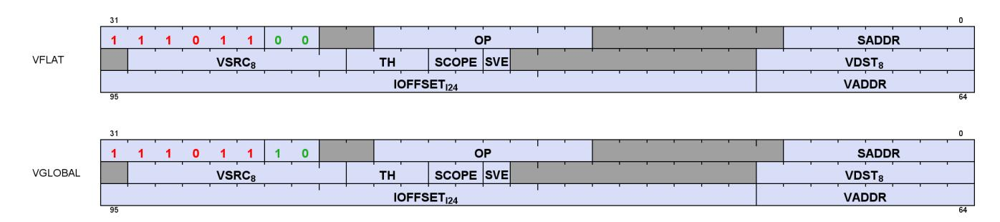

| Field   | Size | Description                                                                                                                                                                                                                                                                                                                                                                                      |  |
|---------|------|--------------------------------------------------------------------------------------------------------------------------------------------------------------------------------------------------------------------------------------------------------------------------------------------------------------------------------------------------------------------------------------------------|--|
| OP      | 8    | Opcode: see next table                                                                                                                                                                                                                                                                                                                                                                           |  |
| VADDR   | 8    | VGPR that holds address or offset. For 64-bit addresses, ADDR has the LSB's and ADDR+1 has the<br>MSBs. For offset a single VGPR has a 32 bit unsigned offset.<br>For FLAT_*: specifies an address.<br>For GLOBAL_* when SADDR is NULL: specifies an address.<br>For GLOBAL_* when SADDR is not NULL: specifies an unsigned byte offset.<br>For SCRATCH, specifies a signed byte offset if SVE=1 |  |
| VSRC    | 8    | VGPR that holds the first DWORD of store-data. Instructions can use 0-4 DWORDs.                                                                                                                                                                                                                                                                                                                  |  |
| VDST    | 8    | VGPR destination for data returned to the shader, either from LOADs or Atomics that return the<br>pre-op value.                                                                                                                                                                                                                                                                                  |  |
| SCOPE   | 2    | Memory Scope and Memory Temporal Hint. For atomics, TH indicates whether or not to return the<br>pre-op value.<br>See Cache Controls: SCOPE and Temporal-Hint for more information about SCOPE and TH bits.                                                                                                                                                                                      |  |
| TH      | 3    |                                                                                                                                                                                                                                                                                                                                                                                                  |  |
| IOFFSET | 24   | Address immediate offset: 24-bit signed byte offset                                                                                                                                                                                                                                                                                                                                              |  |
| SADDR   | 7    | SGPR that provides an address or offset. To disable use, set this field to NULL. The meaning of this<br>field is different for Scratch and Global.<br>Flat: Unused<br>Scratch: use an SGPR for the signed 32-bit.<br>Global: use the SGPR to provide a 64-bit unsigned base address and the VGPR provides a 32-bit byte<br>offset.                                                               |  |
| SVE     | 1    | Scratch VGPR Enable<br>When set to 1, scratch instructions include a 32-bit offset from a VGPR;<br>when set to 0, scratch instructions do not use a VGPR for addressing.                                                                                                                                                                                                                         |  |

Table 67. Instructions

| Flat                  | GLOBAL                  | Scratch                  |
|-----------------------|-------------------------|--------------------------|
| FLAT_LOAD_U8          | GLOBAL_LOAD_U8          | SCRATCH_LOAD_U8          |
| FLAT_LOAD_D16_U8      | GLOBAL_LOAD_D16_U8      | SCRATCH_LOAD_D16_U8      |
| FLAT_LOAD_D16_HI_U8   | GLOBAL_LOAD_D16_HI_U8   | SCRATCH_LOAD_D16_HI_U8   |
| FLAT_LOAD_I8          | GLOBAL_LOAD_I8          | SCRATCH_LOAD_I8          |
| FLAT_LOAD_D16_I8      | GLOBAL_LOAD_D16_I8      | SCRATCH_LOAD_D16_I8      |
| FLAT_LOAD_D16_HI_I8   | GLOBAL_LOAD_D16_HI_I8   | SCRATCH_LOAD_D16_HI_I8   |
| FLAT_LOAD_U16         | GLOBAL_LOAD_U16         | SCRATCH_LOAD_U16         |
| FLAT_LOAD_I16         | GLOBAL_LOAD_I16         | SCRATCH_LOAD_I16         |
| FLAT_LOAD_D16_B16     | GLOBAL_LOAD_D16_B16     | SCRATCH_LOAD_D16_B16     |
| FLAT_LOAD_D16_HI_B16  | GLOBAL_LOAD_D16_HI_B16  | SCRATCH_LOAD_D16_HI_B16  |
| FLAT_LOAD_B32         | GLOBAL_LOAD_B32         | SCRATCH_LOAD_B32         |
| FLAT_LOAD_B64         | GLOBAL_LOAD_B64         | SCRATCH_LOAD_B64         |
| FLAT_LOAD_B96         | GLOBAL_LOAD_B96         | SCRATCH_LOAD_B96         |
| FLAT_LOAD_B128        | GLOBAL_LOAD_B128        | SCRATCH_LOAD_B128        |
| FLAT_STORE_B8         | GLOBAL_STORE_B8         | SCRATCH_STORE_B8         |
| FLAT_STORE_D16_HI_B8  | GLOBAL_STORE_D16_HI_B8  | SCRATCH_STORE_D16_HI_B8  |
| FLAT_STORE_B16        | GLOBAL_STORE_B16        | SCRATCH_STORE_B16        |
| FLAT_STORE_D16_HI_B16 | GLOBAL_STORE_D16_HI_B16 | SCRATCH_STORE_D16_HI_B16 |
| FLAT_STORE_B32        | GLOBAL_STORE_B32        | SCRATCH_STORE_B32        |

| Flat                           | GLOBAL                                | Scratch            |
|--------------------------------|---------------------------------------|--------------------|
| FLAT_STORE_B64                 | GLOBAL_STORE_B64                      | SCRATCH_STORE_B64  |
| FLAT_STORE_B96                 | GLOBAL_STORE_B96                      | SCRATCH_STORE_B96  |
| FLAT_STORE_B128                | GLOBAL_STORE_B128                     | SCRATCH_STORE_B128 |
| none                           | GLOBAL_LOAD_ADDTID_B32                | none               |
| none                           | GLOBAL_STORE_ADDTID_B32               | none               |
| FLAT_ATOMIC_SWAP_B32           | GLOBAL_ATOMIC_SWAP_B32                | none               |
| FLAT_ATOMIC_CMPSWAP_B32        | GLOBAL_ATOMIC_CMPSWAP_B32             | none               |
| FLAT_ATOMIC_ADD_U32            | GLOBAL_ATOMIC_ADD_U32                 | none               |
| FLAT_ATOMIC_ADD_F32            | GLOBAL_ATOMIC_ADD_F32                 | none               |
| FLAT_ATOMIC_PK_ADD_F16         | GLOBAL_ATOMIC_PK_ADD_F16              | none               |
| FLAT_ATOMIC_PK_ADD_BF16        | GLOBAL_ATOMIC_PK_ADD_BF16             | none               |
| FLAT_ATOMIC_SUB_U32            | GLOBAL_ATOMIC_SUB_U32                 | none               |
| FLAT_ATOMIC_MIN_I32            | GLOBAL_ATOMIC_MIN_I32                 | none               |
| FLAT_ATOMIC_MIN_U32            | GLOBAL_ATOMIC_MIN_U32                 | none               |
| FLAT_ATOMIC_MAX_I32            | GLOBAL_ATOMIC_MAX_I32                 | none               |
| FLAT_ATOMIC_MAX_U32            | GLOBAL_ATOMIC_MAX_U32                 | none               |
| FLAT_ATOMIC_AND_B32            | GLOBAL_ATOMIC_AND_B32                 | none               |
| FLAT_ATOMIC_OR_B32             | GLOBAL_ATOMIC_OR_B32                  | none               |
| FLAT_ATOMIC_XOR_B32            | GLOBAL_ATOMIC_XOR_B32                 | none               |
| FLAT_ATOMIC_INC_U32            | GLOBAL_ATOMIC_INC_U32                 | none               |
| FLAT_ATOMIC_DEC_U32            | GLOBAL_ATOMIC_DEC_U32                 | none               |
|                                |                                       |                    |
| FLAT_ATOMIC_MIN_NUM_F32        | GLOBAL_ATOMIC_MIN_NUM_F32             | none               |
| FLAT_ATOMIC_MAX_NUM_F32        | GLOBAL_ATOMIC_MAX_NUM_F32             | none               |
| FLAT_ATOMIC_SWAP_B64           | GLOBAL_ATOMIC_SWAP_B64                | none               |
| FLAT_ATOMIC_ADD_U64            | GLOBAL_ATOMIC_ADD_U64                 | none               |
| FLAT_ATOMIC_SUB_U64            | GLOBAL_ATOMIC_SUB_U64                 | none               |
| FLAT_ATOMIC_MIN_I64            | GLOBAL_ATOMIC_MIN_I64                 | none               |
| FLAT_ATOMIC_MIN_U64            | GLOBAL_ATOMIC_MIN_U64                 | none               |
| FLAT_ATOMIC_MAX_I64            | GLOBAL_ATOMIC_MAX_I64                 | none               |
| FLAT_ATOMIC_MAX_U64            | GLOBAL_ATOMIC_MAX_U64                 | none               |
| FLAT_ATOMIC_AND_B64            | GLOBAL_ATOMIC_AND_B64                 | none               |
| FLAT_ATOMIC_OR_B64             | GLOBAL_ATOMIC_OR_B64                  | none               |
| FLAT_ATOMIC_XOR_B64            | GLOBAL_ATOMIC_XOR_B64                 | none               |
| FLAT_ATOMIC_INC_U64            | GLOBAL_ATOMIC_INC_U64                 | none               |
| FLAT_ATOMIC_DEC_U64            | GLOBAL_ATOMIC_DEC_U64                 | none               |
| FLAT_ATOMIC_COND_SUB_U32       | GLOBAL_ATOMIC_COND_SUB_U32            | none               |
| (Supports only "return preOp") | (Supports only "return preOp")        |                    |
| none                           | GLOBAL_ATOMIC_SUB_CLAMP_U32           | none               |
|                                | (Supports only "return preOp")        |                    |
| none                           | GLOBAL_ATOMIC_ORDERED_ADD_            | none               |
|                                | B64<br>(Supports only "return preOp") |                    |
| none                           | GLOBAL_INV                            | none               |
|                                |                                       |                    |
| none                           | GLOBAL_WB                             | none               |
| none                           | GLOBAL_WBINV                          | none               |

# <span id="page-147-0"></span>**11.1. Instructions**

# <span id="page-147-1"></span>**11.1.1. FLAT**

The Flat instruction set consists of loads, stores and memory atomic operations. Flat instructions do not use a resource constant (V#) or sampler (S#), but they make use of wave state (SCRATCH\_BASE) that holds scratchspace information in case any threads' address resolves to scratch space. See [Scratch](#page-147-3) section below.

Flat instructions are executed as both an LDS and a Global instruction, and so Flat instructions increment both LOADcnt (or STOREcnt) and DScnt and are not considered done until both have been decremented. Loads, atomics-with-return and GLOBAL\_INV are tracked with LOADcnt. Stores, atomics-without-return, GLOBAL\_WB and GLOBAL\_WBINV are tracked with STOREcnt.

When the address from a Flat instruction falls into scratch (private) space, a different ("swizzled") addressing mechanism is used. The address (per thread) points to the memory space for a specific DWORD of scratch data owned by this thread. The hardware maps this address to the actual memory address that holds data for all of the threads in the wave. Flat atomics that map into scratch: 4-byte atomics are supported, and 8-byte atomics return MEMVIOL.

The wave supplies the offset (for space allocated to this wave) with every Flat request. This is stored in a dedicated per-wave register: SCRATCH\_BASE, that holds a 64-bit byte address.

The aperture check occurs on the value read from VGPRs, with invalid addresses being routed to the texture unit. The "aperture check" is performed **before** IOFFSET is added into the address, so it is undefined what occurs if the addition of IOFFSET pushes the address into a different memory aperture.

For threads whose address fall into LDS space, the only address check applied is:

Out of bounds = Logical\_ADDR[16:0] >= Wave\_allocated\_LDS

If the thread is not out of bounds, the address is mapped into LDS space by discarding upper address bits. This means many virtual addresses may map to the same physical LDS storage.

# <span id="page-147-2"></span>**11.1.2. Global**

Global operations transfer data between VGPR and global memory. Global instructions are similar to Flat, but the programmer is responsible to make sure that no threads access LDS or private space. Because of this, no LDS bandwidth is used by global instructions. Since these instructions do not access LDS, only LOADcnt (or STOREcnt) is used, not DScnt.

Global includes two instructions that do not use any VGPRs for addressing, just SGPRs and IOFFSET:

- GLOBAL\_LOAD\_ADDTID\_B32
- GLOBAL\_STORE\_ADDTID\_B32

# <span id="page-147-3"></span>**11.1.3. Scratch**

Scratch instructions are similar to global but they access a private (per-thread) memory space that is swizzled. Because of this, no LDS bandwidth is used by scratch instructions. Scratch instructions also support multi-DWORD access and mis-aligned access (although mis-aligned is slower).

11.1. Instructions 138 of 697

Since these instructions do not access LDS, only LOADcnt (or STOREcnt) is used, not DScnt. It is not possible for a scratch instruction to access LDS, and so no error checking is done (and no aperture check is performed).

# <span id="page-148-0"></span>**11.2. Addressing**

Global, Flat and Scratch each have their own addressing modes. Flat addressing is a subset of the global and scratch modes. 64-bit addresses are stored with the LSB's in the VGPR at ADDR, and the MSBs in the VGPR at ADDR+1.

There are 4 distinct shader instructions:

- GLOBAL
- SCRATCH
- LDS
- FLAT based on per-thread address (VGPR), can load/store: global memory, LDS or scratch memory.

Table 68. Selecting Addressing Mode

| Instruction Type | Instruction Modes | SVE     | SADDR                            |  |  |  |  |
|------------------|-------------------|---------|----------------------------------|--|--|--|--|
| Scratch          | SV                | 1       | NULL                             |  |  |  |  |
|                  | SS                | 0       | ! NULL                           |  |  |  |  |
|                  | ST                | 0       | NULL                             |  |  |  |  |
|                  | SVS               | 1       | ! NULL                           |  |  |  |  |
| Flat and Global  | GV                | ignored | NULL                             |  |  |  |  |
|                  | GT                |         | Global only: Indicated by opcode |  |  |  |  |
| LDS              | LDS               |         | Indicated by opcode              |  |  |  |  |

# **Global Addressing**

**GV** mem\_addr = VGPRU64 + IOFFSETI24 **GVS** mem\_addr = SGPRU64 + VGPRU32 + IOFFSETI24 **GT** mem\_addr = SGPRU64 + IOFFSETI24 + ThreadID\*4

#### **LDS Addressing (DS ops)**

**LDS** LDS\_ADDR = VGPR\_addrU32 + IOFFSETU16 LDS address is relative to the LDS space allocated to this wave.

# **Scratch Addressing**

```
SV mem_addr = SCRATCH_BASEU64 + SWIZZLE(VGPR_offsetI32 + IOFFSETI24, ThreadID)
SS mem_addr = SCRATCH_BASEU64 + SWIZZLE(SGPR_offsetI32 + IOFFSETI24, ThreadID)
SVS mem_addr = SCRATCH_BASEU64 + SWIZZLE(SGPR_offsetI32 + VGPR_offsetI32 + IOFFSETI24, ThreadID)
ST mem_addr = SCRATCH_BASEU64 + SWIZZLE(IOFFSETI24, ThreadID)
```

The combined offsets inside SWIZZLE() must result in a non-negative number.

The offset value from SGPRs and VGPRs are **signed** 32-bit byte offsets.

IOFFSET: In Scratch ST mode, the IOFFSET must be aligned to the payload size: 4 byte aligned for 1-DWORD, 16-byte aligned for 4-DWORD.

For reference, BUFFER\_LOAD when using swizzled-addressing is:

11.2. Addressing 139 of 697

```
BUFFER_LOAD: Addr = T#.base + Soffset + swizzle( (Vidx + TID) * stride + Ioff + Voff)
```

# **Flat Addressing** Flat instructions use the "GV" addressing mode. Aperture test on the address determines: Global/LDS/Scratch per thread. The aperture test uses only the base address, not the IOFFSET. Normal (GV) addr[63:0] = VGPRU64 + IOFFSETI24

Next the aperture check is performed on each thread to determine which memory space it falls into, using "ADDR" from the previous table:

```
  Aperture check, given 64-bit address from VGPR:
  isLDS = (ADDR[63:32] == { SH_MEM_BASES.SHARED_BASE[15:0], 16'b0000 }
  isScratch = (ADDR[63:32] == { SH_MEM_BASES.PRIVATE_BASE[15:0], 16'b0000 }
  isHole = ADDR[63:47] != (all zeros or all ones) && !isLDS && !isScratch
  isGlobal = !isLDS && !isScratch && !isHole
```

See [Memory Aperture Query](#page-73-1) for the definition of the aperture ranges.

Depending on which memory space each thread falls into a different addressing calculation applies:

| Aperture     | Address Calculation                                                                       |
|--------------|-------------------------------------------------------------------------------------------|
| GLOBAL       | mem_addr = addr                                                                           |
| SCRATCH (SV) | mem_addr = SCRATCH_BASE(sgpr:U64) + SWIZZLE(addr[31:0], ThreadID)                         |
| LDS          | LDS_ADDR.U17 = VGPR(addr)[16:0] + IOFFSET[16:0]                                           |
|              | LDS address math is truncated and may wrap around without being detected as out-of-range. |
|              | The only range check is: LDS_ADDR.U17 < LDS_SIZE (space allocated to wave), with the      |
|              | LDS_ADDR zero-extended (not sign-extended) for the range-check.                           |
| Hole         | Memory Violation                                                                          |

# <span id="page-149-0"></span>**11.3. Memory Error Checking**

Both Cache and LDS can report that an error occurred due to a bad address. This can occur due to:

- Invalid address (outside any aperture)
- Write to read-only global memory address (page is read-only)
- Misaligned data (scratch accesses may be misaligned)
- Out-of-range address:
  - LDS access with an address outside the range: [ 0, LDS\_SIZE-1 ]

The policy for threads with bad addresses is: stores outside this range do not store a value, and reads return zero. The aperture check for invalid address occurs before adding any address offsets - it is based only on the base address; the other checks are performed after adding the offsets.

Addressing errors from either LDS or VMEM set the wave's MEMVIOL bit, and also causes an exception (trap).

# <span id="page-150-0"></span>**11.4. Data**

FLAT instructions can use from zero to four consecutive DWORDs of data in VGPRs and/or memory. The DATA field determines which VGPR(s) supply source data (if any) and the VDST VGPRs hold return data (if any). There is no data-format conversion performed.

"D16" instructions use only 16-bit of the VGPR instead of the full 32bits. "D16\_HI" instructions read or write only the high 16-bits, while "D16" use the low 16-bits.

# <span id="page-150-1"></span>**11.5. Block VGPR Load & Store**

These instructions can be used to efficiently move consecutive blocks of up to 32 VGPRs to and from memory:

| GLOBAL_LOAD_BLOCK   | VDST, VADDR, SADDR, IOFFSET, (M0) |
|---------------------|-----------------------------------|
| GLOBAL_STORE_BLOCK  | VSRC, VADDR, SADDR, IOFFSET, (M0) |
| SCRATCH_LOAD_BLOCK  | VDST, VADDR, SADDR, IOFFSET, (M0) |
| SCRATCH_STORE_BLOCK | VSRC, VADDR, SADDR, IOFFSET, (M0) |

Data is transferred from consecutive VGPRs to consecutive DWORDs in memory (per thread), with the option of skipping some VGPRs (but still skipping the memory location - not compacted in memory).

The instruction fields are identical to SCRATCH and GLOBAL instructions except for the use of M0 to carry a bitmask of which VGPRs to load/store (1) or skip (0). The LSB of M0 is for the first VGPR.

GLOBAL\_LOAD and GLOBAL\_STORE support the "GV" and "GVS" addressing modes, but not "GT"; SCRATCH\_LOAD and SCRATCH\_STORE support the "SS", "SV" and "SVS" addressing modes, but not "ST".

The block load/store addresses memory as if the IOFFSET field was incremented by 4 bytes for each VGPR, regardless of whether it was actually transferred or not (based on M0 bits).

Block loads must load data into their own source VGPRs.

```
  for (n = 0..31)
  if (M0[n])
  load/store using IOFFSET and VGPR[vdst/vdata + n]
  IOFFSET += 4 bytes
```

If M0==0, no data is transferred.

The entire block load/store is tracked with LOADcnt or STOREcnt: increments 1 for the entire block transfer, and decrements when the block transfer has completed.

# <span id="page-150-2"></span>**11.5.1. Error Handling**

Out-of-range address VGPRs follow the same rules as Global and Scratch.

Out-of-range dest VGPRs for loads:

each DWORD of the instruction is individually checked for out-of-range. Those that are in-range execute

11.4. Data 141 of 697

normally, and those that are out-of-range are ignored.

Out-of-range VSRC VGPRs for stores:

each DWORD of the instruction is individually checked for out-of-range. Those that are in-range supply data as specified, and those out of range read data from VGPR0.

# <span id="page-151-0"></span>**11.6. WMMA Matrix Load Ops with Transpose**

Matrices are often stored in memory in a tiled manner. RDNA4 has instructions that simplify loading of 16x16 matrix tiles into VGPRs where the matrix in memory has the opposite major order (row vs. column) as required by the WMMA operations. The instructions load and transpose a block of memory into VGPRs.

See [WMMA Ops](#page-98-0) for information on WMMA matrix storage in VGPRs and matrix multiply operations.

# <span id="page-151-1"></span>**11.6.1. Dense Matrices**

An "A-matrix" of (M rows x K columns) is composed of elements (1 or 2 bytes each for this discussion) arranged in memory in either row-major or column-major. The examples below show the layout for a 16x16 matrix.

## **Row Major Data in memory for A-matrix (MxK)**

```
Memory_address = (col# + row# * K) * ElementSize (# of bytes)
```

#### **Column Major Data in memory for B-matrix (KxN)**

```
Memory_address = (col# * K + row#) * ElementSize (# of bytes)
```

# <span id="page-151-2"></span>**11.6.2. WMMA Load-Transpose Instructions**

These two instructions perform a load of an 8-bit or 16-bit 16x16 matrix and transpose row and column major order.

If EXEC==0, the instruction acts like an S\_NOP; otherwise these instructions require that EXEC be set to all ones, else the operation is undefined.

The diagrams below show which matrix element each of the 32 lanes in a wave32 loads in a A-matrix. E.g. lane 0 loads 64 bits of contiguous memory and stores it in the matrix: K=0, M=0..7. B-matrix loads are similar: one lane loads multiple contiguous N-values along single K-dimension index.

|     |                                      |                       |                                      |        |        |        |        |         |         |         | ŀ       | <b>(</b> |         |         |         |         |         |         |         |
|-----|--------------------------------------|-----------------------|--------------------------------------|--------|--------|--------|--------|---------|---------|---------|---------|----------|---------|---------|---------|---------|---------|---------|---------|
| _   |                                      |                       |                                      | 0      | 1      | 2      | 3      | 4       | 5       | 6       | 7       | 8        | 9       | Α       | В       | С       | D       | Ε       | F       |
| D/A | 0<br>1<br>2<br>3<br>4<br>5<br>6<br>7 | 2<br>3<br>4<br>5<br>6 | Lane 0                               | Lane 1 | Lane 2 | Lane 3 | Lane 8 | Lane 9  | Lane 10 | Lane 11 | Lane 16 | Lane 17  | Lane 18 | Lane 19 | Lane 24 | Lane 25 | Lane 26 | Lane 27 |         |
|     | M                                    |                       | 8<br>9<br>A<br>B<br>C<br>D<br>E<br>F | Lane 4 | Lane 5 | Lane 6 | Lane 7 | Lane 12 | Lane 13 | Lane 14 | Lane 15 | Lane 20  | Lane 21 | Lane 22 | Lane 23 | Lane 28 | Lane 29 | Lane 30 | Lane 31 |

| Instructions        | Description                                                                                                                                                                                                                                                                                                                                                                                                                                                                                                                                                                                                                                                                 |
|---------------------|-----------------------------------------------------------------------------------------------------------------------------------------------------------------------------------------------------------------------------------------------------------------------------------------------------------------------------------------------------------------------------------------------------------------------------------------------------------------------------------------------------------------------------------------------------------------------------------------------------------------------------------------------------------------------------|
| GLOBAL_LOAD_TR_B128 | Load a 16x16 matrix of 16-bit data into VGPRs and transpose between row-major and column<br>major order.<br>This instruction loads the same amount of data for both wave32 and wave64:<br>wave32 loads data into 4 consecutive VGPRs;<br>wave64 loads data into 2 consecutive VGPRs but use only addresses from lanes 0-31 (that<br>refers to 128-bit data) and ignore addresses in lanes 32-63.<br>This instruction behaves similarly to GLOBAL_LOAD_B128 except that after the 16<br>consecutive memory bytes are read (per lane), they are transposed before being stored into<br>VGPRS: instead of filling two consecutive VGPRs, they fill 16-bits in each of 8 VGPRs. |
| GLOBAL_LOAD_TR_B64  | Load a 16x16 matrix of 8-bit data into VGPRs and transpose between row-major and column<br>major order.<br>This instruction loads the same amount of data for both wave32 and wave64:<br>wave32 loads data into 2 consecutive VGPRs;<br>wave64 loads data into 1 VGPR but use only addresses from lanes 0-31 (that refers to 64-bit<br>data) and ignore addresses in lanes 32-63. This instruction behaves similarly to<br>GLOBAL_LOAD_B64 except that after the 8 consecutive memory bytes are read (per lane),<br>they are transposed before being stored into VGPRS: instead of filling two consecutive VGPRs,<br>they fill 16-bits in each of 8 VGPRs.                  |

All fields of these instructions are identical to GLOBAL\_LOAD\_B64 and \_B128, and as loads they are tracked with LOADcnt.

| Memory order | Element<br>Size | Wave<br>Size | VGPR Layout | Instruction to use                                        |
|--------------|-----------------|--------------|-------------|-----------------------------------------------------------|
| Row Major    | 16              | 32           | Row Major   | GLOBAL_LOAD_B128                                          |
| Row Major    | 16              | 64           | Row Major   | GLOBAL_LOAD_B64                                           |
| Column Major | 16              | 32           | Row Major   | GLOBAL_LOAD_TR_B128 — writes 128 bits per lane x 32 lanes |
| Column Major | 16              | 64           | Row Major   | GLOBAL_LOAD_TR_B128 — writes 64bits per lane x 64 lanes   |
| Row Major    | 8               | 32           | Row Major   | GLOBAL_LOAD_B64                                           |
| Row Major    | 8               | 64           | Row Major   | GLOBAL_LOAD_B32                                           |
| Column Major | 8               | 32           | Row Major   | GLOBAL_LOAD_TR_B64 — writes 64 bits per lane x 32 lanes   |
| Column Major | 8               | 64           | Row Major   | GLOBAL_LOAD_TR_B64 — writes 32bits per lane x 64 lanes    |

• The above table can also be used when "VGPR Layout" is column-major: simply reverse the "memory order" meaning between "Row" and "Column".

# <span id="page-153-0"></span>**Chapter 12. Local Data Share Operations**

Local data store (LDS) is a low-latency, RAM scratchpad for temporary data storage and for sharing data between threads within a work-group. Accessing data through LDS may be significantly lower latency and higher bandwidth than going through memory.

For compute workloads, it allows a simple method to pass data between threads in different waves within the same work-group. For graphics, it is also used to hold vertex parameters for pixel shaders.

The high bandwidth of the LDS memory is achieved not only through its proximity to the ALUs, but also through simultaneous access to its memory banks. Thus, it is possible to concurrently execute many store or load operations simultaneously. If, however, more than one access attempt is made to the same bank at the same time, a bank conflict occurs. In this case, for indexed and atomic operations, the hardware is designed to prevent the attempted concurrent accesses to the same bank by turning them into serial accesses. This can decrease the effective bandwidth of the LDS. For increased throughput (optimal efficiency), therefore, it is important to avoid bank conflicts. A knowledge of request scheduling and address mapping can be key to help achieving this.

Data can be loaded into LDS either by transferring it from VGPRs to LDS using "DS" instructions, or by loading in from memory. When loading from memory, the data may be loaded into VGPRs first or for some types of loads it may be loaded directly into LDS from memory. To store data from LDS to global memory, data is read from LDS and placed into the work-item's VGPRs, then written out to global memory. To make effective use of the LDS, a shader program must perform many operations on what is transferred between global memory and LDS.

LDS space is allocated per work-group or wave (when work-groups not used) and recorded in dedicated LDSbase/size (allocation) registers that are not writable by the shader. These restrict all LDS accesses to the space owned by the work-group or wave.

# <span id="page-153-1"></span>**12.1. Overview**

There are 128kB of memory per work-group processor split up into 64 banks of DWORD-wide RAMs. These 64 banks are further sub-divided into two sets of 32-banks each where 32 of the banks are affiliated with a pair of SIMD32's, and the other 32 banks are affiliated with the other pair of SIMD32's within the WGP. Each bank is a 512x32 two-port RAM (1R/1W per clock cycle). DWORDs are placed in the banks serially, but all banks can execute a store or load simultaneously. One work-group can request up to 64kB memory.

LDS atomics are performed in the LDS hardware. Although ALUs are not directly used for these operations, latency is incurred by the LDS executing this function.

# <span id="page-153-2"></span>**12.1.1. LDS Modes and Allocation: CU vs. WGP Mode**

Work-groups of waves are dispatched in one of two modes: CU or WGP. See this section for details: [WGP and](#page-20-1) [CU Mode](#page-20-1)

12.1. Overview 144 of 697

# <span id="page-154-0"></span>**12.1.2. LDS Access Methods**

LDS may be accessed via:

#### **Indexed load/store and Atomic ops**

Load/store address comes from a VGPR and data to/from VGPR. LDS-ops require up to 3 inputs: 2data+1addr and immediate return VGPR.

## **Direct Load**

Loads a single DWORD from LDS and broadcasts the data to a VGPR across all lanes.

### **Parameter Interpolation Load**

Reads pixel parameters from LDS per quad and loads them into one VGPR.

Reads all 3 parameters per quad (P1, P1-P0 and P2-P0) and loads them into 3 lanes within the quad (the 4th lane receives zero).

# <span id="page-154-1"></span>**12.2. Pixel Parameter Interpolation**

For pixel waves, vertex attribute data is preloaded into LDS and barycentrics (I, J) are preloaded into VGPRs before the wave starts. Parameter interpolation can be performed by loading attribute data from LDS into VGPRs using DS\_PARAM\_LOAD and then using V\_INTERP instructions to interpolate the value per pixel.

LDS-Parameter loads are used to read vertex parameter data and store them in VGPRs to be used for parameter interpolation. These instructions operate like memory instructions except they use EXPcnt to track outstanding reads and decrement EXPCnt when they arrive in VGPRs.

Pixel shaders can be launched before their parameter data has been written into LDS. Once the data is available in LDS, the wave's STATUS register "LDS\_READY" bit is set to 1. Pixel shader waves stall if an DS\_DIRECT\_LOAD or DS\_PARAM\_LOAD is to be issued before LDS\_READY is set.

The most common form of interpolation involves weighting vertex parameters by the barycentric coordinates "I" and "J". A common calculation is:

```
  Result = P0 + I * P10 + J * P20
  where "P10" is (P1 - P0), and "P20" is (P2 - P0)
```

Parameter interpolation involves two types of instructions:

- DS\_PARAM\_LOAD : to read packed parameter data from LDS into a VGPR (data packed per quad)
- V\_INTERP\_\* : VALU FMA instructions that unpack parameter data across lanes in a quad.

# <span id="page-154-2"></span>**12.2.1. LDS Parameter Loads**

Parameter Loads are available only in CU mode (not WGP mode).

DS\_PARAM\_LOAD reads three parameters (P0, P10, P20) of one 32-bit attribute or of two 16-bit attributes from LDS into VGPRs. The are 3 parameters (P0, P10 and P20) are the same for the 4 pixels within a quad. These values are spread out across VGPR lanes 0, 1 and 2 of each quad. Interpolation is then performed using FMA

with DPP so each lane uses its I or J value with the quad's shared P0, P10 and P20 values.

Table 69. VDSDIR Instruction Fields

| Field     | Size | Description                                                                                                                                                                                                      |  |
|-----------|------|------------------------------------------------------------------------------------------------------------------------------------------------------------------------------------------------------------------|--|
| OP        | 2    | Opcode:<br>0: DS_PARAM_LOAD<br>1: DS_DIRECT_LOAD<br>2,3: Reserved                                                                                                                                                |  |
| WAITVDST  | 4    | Wait for the number of previously issued still outstanding VALU instructions to be less than<br>or equal to this number. Used to avoid Write-After-Read hazards on VGPRs.                                        |  |
| VDST      | 8    | Destination VGPR                                                                                                                                                                                                 |  |
| ATTR_CHAN | 2    | Attribute channel: 0=X, 1=Y, 2=Z, 3=W. Unused for DS_DIRECT_LOAD.                                                                                                                                                |  |
| ATTR      | 6    | Attribute number: 0 - 32. Unused for DS_DIRECT_LOAD.                                                                                                                                                             |  |
| WAITVMVS  | 1    | Wait for all previous VMEM ops to have read their VGPR sources: 0=wait, 1=don't wait<br>(similar to S_WAITCNT).                                                                                                  |  |
| ( M0 )    | 32   | DS_DIRECT_LOAD:<br>{ 13'b0, DataType[2:0], LDS_address[15:0] } //addr in bytes<br>DS_PARAM_LOAD:<br>Use of the M0 register is automatic. M0 must contain:<br>1'b0, new_prim_mask[15:1], lds_param_offset[15:0] } |  |

M0 is implicitly read for this instruction and must be initialized before these instructions.

### **new\_prim\_mask**

a mask that has a bit per quad indicating that this quad begins a new primitive; zero indicates same primitive as previous quad. There is an implied "one" for the first quad in the wave (every wave begins a new primitive) and so bit[0] is omitted.

### **lds\_param\_offset**

The parameter offset indicates the starting address of the parameters in LDS. Space before that can be used as temporary wave storage space. Lds\_param\_offset bits [6:0] must be set to zero.

**Example DS\_PARAM\_LOAD** (new\_prim\_mask[3:0] = 0110)

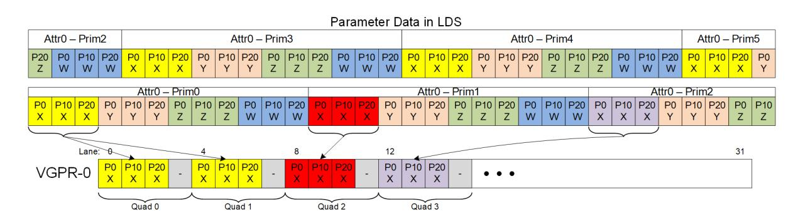

**LDS\_ADDR = lds\_base + param\_offset + attr#\*numPrimsInVector\*12DWORDs + prim#\*12 + attr\_offset**

(attr\_offset = 0..11 : 0 = P0.x, 1 = P0.Y, … 11 = P2.W)

From NewPrimMask h/w derives NumPrimInVec and Prim# (0..15)

If the dest-VGPR is out of range, the load is still performed but EXEC is forced to zero.

DS\_PARAM\_LOAD and DS\_DIRECT\_LOAD use **EXEC per quad** (if any pixel is enabled in the quad, data is written to all 4 pixels/threads in the quad).

# **12.2.1.1. 16-bit Parameter Data**

16-bit parameters are packed in LDS as pairs of attributes in DWORDs: ATTR0.X and ATTR1.X share a DWORD. There is an alternate packing mode where the parameters are not packed (one 16-bit param in low half of DWORD). These attributes can be read with the same DS\_PARAM\_LOAD instruction, and returns the packed DWORD with 2 attributes (when they are packed). Interpolation can then be done using specific mixedprecision FMA opcodes, along with DPP (to select P0, P10 or P20) and OPSEL (to select upper or lower 16-bits).

Barycentrics are 32-bits, not 16 bit.

# **12.2.1.2. Parameter Load Data Hazard Avoidance**

These data dependency rules apply to both parameter and direct loads.

DS\_DIRECT\_LOAD and DS\_PARAM\_LOAD read data from LDS and write it into VGPRs, and they use EXPcnt to track when the instruction has completed and written the VGPRs.

It is up to the shader program to ensure that data hazards are avoided. These instructions are issued along a different path from VALU instructions so it is possible that previous VALU instructions may still be reading from the VGPR that these LDS instructions are going to write and this could lead to a hazard.

EXPcnt is used to track read-after-write hazards where DS\_PARAM\_LOAD writes a value to a VGPR and another instruction reads it. The shader program uses "S\_WAIT\_EXPCNT" to wait for results from a DS\_DIRECT\_LOAD or DS\_PARAM\_LOAD to be available in VGPRs before consuming it in a subsequent instruction. The VINTERP instructions have a "wait\_EXPcnt" field to assist in avoid this hazard.

These are **skipped when EXEC==0** and EXPCnt==0 (like memory ops).

Mixed exports & LDS-direct/param instructions from the same wave might not complete in order (both use EXPcnt), requiring "S\_WAIT\_EXPCNT 0" if they are overlapped.

 DS\_PARAM\_LOAD V2 S\_WAIT\_EXPCNT 0

A potential Write-After-Read hazard exists if a VALU instruction reads a VGPR and then DS\_PARAM\_LOAD writes that VGPR: It is possible the DS\_PARAM\_LOAD overwrites the VALU's source VGPR before it was read. The user must prevent this by using the "wait\_va\_vdst" field of the DS\_PARAM\_LOAD instruction. Setting this field to zero is the safest setting. This field indicates the maximum number of uncompleted VALU instructions that may be outstanding when this DS\_PARAM\_LOAD is issued. Use this to ensure any dependent VALU instructions have completed.

Another potential data hazard involves DS\_PARAM\_LOAD overwriting a VGPR that has not yet been read as a source by a previous VMEM (LDS, Texture, Buffer, Flat) instruction. To avoid this hazard, the user must ensure that the VMEM instruction has read its source VGPRs. This can be achieved by issuing any VALU or export instruction before the DS\_PARAM\_LOAD, or by using the WAITVMVS field. Setting this to zero is the safest value

and prevents the hazard..

# <span id="page-157-0"></span>**12.3. VALU Parameter Interpolation**

Parameter interpolation is performed using an FMA operation that includes a built-in DPP operation to unpack the per-quad P0/P10/P20 values into per-lane values. Because this instruction reads data from neighboring lanes, the implicit DPP acts as if "fetch invalid = 1", so that the instruction can read data from neighboring lanes that have EXEC==0, rather than getting the value 0 from those. Standard interpolation is calculating:

```
  Per-Pixel-Parameter = P0 + I * P10 + J * P20 // I, J are per-pixel; P0/P10/P20 are per-primitive
```

This parameter interpolation is realized using a pair of instructions:

```
  V_INTERP_P10_F32 V5, V0, V1, v2 // tmp = P0 + I*P10 uses DPP8=1,1,1,1,5,5,5,5; Src2(P0) uses
DPP8=0,0,0,0,4,4,4,4
  V_INTERP_P20_F32 V5, V3, V4, V5 // dst = J*P20 + tmp uses DPP8=2,2,2,2,6,6,6,6
```

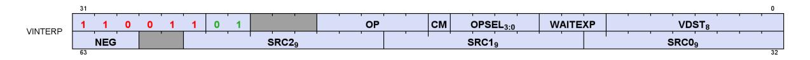

Table 70. Parameter Interpolation Instruction Fields

| Field     |                                                                                              | Size Description                                                                                                                  |                                                  |  |  |
|-----------|----------------------------------------------------------------------------------------------|-----------------------------------------------------------------------------------------------------------------------------------|--------------------------------------------------|--|--|
| OP        | 5                                                                                            | Instruction Opcode:                                                                                                               |                                                  |  |  |
|           |                                                                                              | V_INTERP_P10_F32<br>// tmp = P0 + I*P10. hardcoded DPP8 on 2 sources                                                              |                                                  |  |  |
|           |                                                                                              | V_INTERP_P2_F32                                                                                                                   | // D = tmp + J*P20. hardcoded DPP8 on 1 source   |  |  |
|           |                                                                                              | V_INTERP_P10_F16_F32                                                                                                              | // tmp = P0 + I*P10. hardcoded DPP8 on 2 sources |  |  |
|           |                                                                                              | V_INTERP_P2_F16_F32                                                                                                               | // D = tmp + J*P20. hardcoded DPP8 on 1 source   |  |  |
|           |                                                                                              | V_INTERP_RTZ_P10_F16_F32                                                                                                          | // same as above, but round-toward-zero          |  |  |
|           |                                                                                              | V_INTERP_RTZ_P2_F16_F32                                                                                                           | // same as above, but round-toward-zero          |  |  |
| SRC0      | 9                                                                                            | First argument VGPR: Parameter data (P0 or P20) from LDS stored in a VGPR.                                                        |                                                  |  |  |
| SRC1      | 9                                                                                            | Second argument VGPR: I or J barycentric                                                                                          |                                                  |  |  |
| SRC2      | 9                                                                                            | Third argument VGPR: "P10" ops holds P10 data; "P2" ops holds partial result from "P10" op.                                       |                                                  |  |  |
| VDST      | 8                                                                                            | Destination VGPR                                                                                                                  |                                                  |  |  |
| NEG       | 3                                                                                            | Negate the input (invert sign bit).                                                                                               |                                                  |  |  |
|           |                                                                                              | bit 0 is for src0, bit 1 is for src1 and bit 2 is for src2.<br>For 16-bit interpolation this applies to both low and high halves. |                                                  |  |  |
| WaitEXP 3 |                                                                                              | Wait for EXPcnt to be less than or equal to this value before issuing this instruction.                                           |                                                  |  |  |
|           |                                                                                              | Used to wait for a specific previous DS_PARAM_LOAD to have completed.                                                             |                                                  |  |  |
| OPSEL     | 4                                                                                            | Operation select for 16-bit math: 1=select high half, 0=select low half<br>[0]=src0, [1]=src1, [2]=src2, [3]=dest                 |                                                  |  |  |
|           |                                                                                              | For dest=0, dest_vgpr[31:0] = {prev_dst_vgpr[31:16], result[15:0] }                                                               |                                                  |  |  |
|           | For dest=1, dest_vgpr[31:0] = {result[15:0], prev_dst_vgpr[15:0] }                           |                                                                                                                                   |                                                  |  |  |
|           | OPSEL may only be used for 16-bit operands, and must be zero for any other operands/results. |                                                                                                                                   |                                                  |  |  |
| CM        | 1                                                                                            | Clamp result to [0, 1.0]                                                                                                          |                                                  |  |  |

The VINTERP instructions include a builtin "S\_WAIT\_EXPCNT" to easily allow data hazard resolution for data produced by DS\_PARAM\_LOAD.

Instructions Restrictions and Limitations:

- V\_INTERP instructions do not detect or report exceptions
- V\_INTERP instructions do not support data forwarding into inputs that would normally come from LDS data (sources A and C for V\_INTERP\_P10\_\* and source A for V\_INTERP\_P2\_\*).

VGPRs are preloaded with some or all of:

- I\_persp\_sample, J\_persp\_sample, I\_persp\_center, J\_persp\_center,
- I\_persp\_centroid, J\_persp\_centroid,
- I/W, J/W, 1.0/W,
- I\_linear\_sample, J\_linear\_sample,
- I\_linear\_center, J\_linear\_center,
- I\_linear\_centroid, J\_linear\_centroid

These instructions consume data that was supplied by DS\_PARAM\_LOAD. These instructions contain a built-in "S\_WAIT\_EXPCNT <= N" capability to allow for efficient software pipelining.

```
ds_param_load V0, attr0
ds_param_load V10, attr1
ds_param_load V20, attr2
ds_param_load V30, attr3
v_interp_p0 V1, V0[1], Vi, V0[0] S_WAIT_EXPCNT <=3 //Wait V0
v_interp_p0 V11, V10[1], Vi, V10[0] S_WAIT_EXPCNT <=2
v_interp_p0 V21, V20[1], Vi, V20[0] S_WAIT_EXPCNT <=1
v_interp_p0 V31, V30[1], Vi, V30[0] S_WAIT_EXPCNT <=0 //Wait V30
v_interp_p2 V2, V0[2], Vj, V1
v_interp_p2 V12, V10[2], Vj, V11
v_interp_p2 V22, V20[2], Vj, V21
v_interp_p2 V32, V30[2], Vj, V31
```

# <span id="page-158-0"></span>**12.3.1. 16-bit Parameter Interpolation**

16-bit interpolation operates on pairs of attribute values packed into a 16-bit VGPR. These use the same I and J values during interpolation. OPSEL is used to select the upper or lower portion of the data.

There are variants of the 16-bit interpolation instructions that override the round mode to "round toward zero".

```
V_INTERP_P10_F16_F32 dst.f32 = vgpr_hi/lo.f16 * vgpr.f32 + vgpr_hi/lo.f16 // tmp = P10 * I + P0
  • allows OPSEL; Src0 uses DPP8=1,1,1,1,5,5,5,5; Src2 uses DPP8=0,0,0,0,4,4,4,4
```

```
V_INTERP_P2_F16_F32 dst.f16 = vgpr_hi/lo.f16 * vgpr.f32 + vgpr.f32 // dst = P2 * J + tmp
```

• allows OPSEL; Src0 uses DPP8=2,2,2,2,6,6,6,6

# <span id="page-159-0"></span>**12.4. LDS Direct Load**

Direct access is allowed only in CU mode, not WGP mode.

The DS\_DIRECT\_LOAD instruction reads a single DWORD from LDS and returns it to a VGPR, broadcasting it to all active lanes in the wave. M0 provides the address and data type. DS\_DIRECT\_LOAD uses EXEC **per quad**, not per pixel: if any pixel in a quad is enabled then the data is written to all 4 pixels in the quad. DS\_DIRECT\_LOAD uses EXPcnt to track completion.

DS\_DIRECT\_LOAD uses the same instruction format and fields as DS\_PARAM\_LOAD. See [Pixel Parameter](#page-154-1) [Interpolation](#page-154-1).

```
LDS_addr = M0[15:0] (byte address and must be DWORD aligned)
DataType = M0[18:16]
  0 unsigned byte
  1 unsigned short
  2 DWORD
  3 unused
  4 signed byte
  5 signed short
  6,7 Reserved
```

```
Example: DS_DIRECT_LOAD V4 // load the value from LDS-address in M0[15:0] to V4
```

Signed byte and short data is sign-extend to 32 bits before writing the result to a VGPR; unsigned byte and short data is zero-extended to 32 bits before writing to a VGPR.

# <span id="page-159-1"></span>**12.5. Data Share Indexed and Atomic Access**

The data-share can perform indexed and atomic data share operations.

Indexed and atomic operations supply a unique address per work-item from the VGPRs to the LDS, and supply or return unique data per work-item back to VGPRs. Due to the internal banked structure of LDS, operations can complete in as little as one cycle, or take many more, depending upon the number of bank conflicts (addresses that map to the same memory bank).

Indexed operations are simple LDS load and store operations that read data from, and return data to, VGPRs.

Atomic operations are arithmetic operations that combine data from VGPRs and data in LDS, and write the result back to LDS. Atomic operations have the option of returning the LDS "pre-op" value to VGPRs.

LDS Indexed and atomic instructions use DScnt to track when they have completed. DScnt is incremented as each instruction is issued, and decremented when they have completed execution. LDS instructions stay inorder with other LDS instructions from the same wave.

The table below lists and briefly describes the LDS instruction fields.

12.4. LDS Direct Load 150 of 697

Table 71. VDS Instruction Fields

| Field     |    | Size Description                                                                                                                                                                                                            |  |  |
|-----------|----|-----------------------------------------------------------------------------------------------------------------------------------------------------------------------------------------------------------------------------|--|--|
| OP        | 8  | LDS opcode.                                                                                                                                                                                                                 |  |  |
| OFFSET0 8 |    | Immediate address offset. Interpretation varies with opcode:<br>Instructions with one address: combine the offset fields into a 16-bit unsigned byte offset: {offset1,<br>offset0}.                                         |  |  |
| OFFSET1 8 |    | Instructions that have 2 addresses (e.g. {LOAD, STORE, XCHG}_2ADDR): use the offsets separately as 2 8-<br>bit unsigned offsets. Each offset is multiplied by 4 for 8, 16 and 32-bit data; multiplied by 8 for 64-bit data. |  |  |
| VDST      | 8  | VGPR to which result is written: either from LDS-load or atomic return value.                                                                                                                                               |  |  |
| ADDR      | 8  | VGPR that supplies the byte address offset.                                                                                                                                                                                 |  |  |
| DATA0     | 8  | VGPR that supplies first data source.                                                                                                                                                                                       |  |  |
| DATA1     | 8  | VGPR that supplies second data source.                                                                                                                                                                                      |  |  |
| M0        | 16 | Unsigned byte Offset[15:0] used for: ds_load_addtid_b32, ds_write_addtid_b32                                                                                                                                                |  |  |

The M0 register is not used for most LDS-indexed operations: only the "ADDTID" instructions read M0 and for these it represents a byte address.

Table 72. LDS Indexed Load/Store

| Load / Store                                                                               | Description                                                                                        |  |  |  |
|--------------------------------------------------------------------------------------------|----------------------------------------------------------------------------------------------------|--|--|--|
| DS_LOAD_{B32,B64,B96,B128,U8,I8,U16,I16}                                                   | Load one value per thread into VGPRs; if signed, sign extend to<br>DWORD; zero extend if unsigned. |  |  |  |
| DS_LOAD_2ADDR_{B32,B64}                                                                    | Load two values at unique addresses.                                                               |  |  |  |
| DS_LOAD_2ADDR_STRIDE64_{B32,B64}                                                           | Load 2 values at unique addresses; offset *= 64.                                                   |  |  |  |
| DS_STORE_{B8,B16,B32,B64,B96,B128}                                                         | Store one value from VGPR to LDS.                                                                  |  |  |  |
| DS_STORE_2ADDR_{B32,B64}                                                                   | Store two values.                                                                                  |  |  |  |
| DS_STORE_2ADDR_STRIDE64_{B32,B64}                                                          | Store two values, offset *= 64.                                                                    |  |  |  |
| DS_STOREXCHG_RTN_{B32,B64}                                                                 | Exchange GPR with LDS-memory.                                                                      |  |  |  |
| DS_STOREXCHG_2ADDR_RTN_{B32,B64}                                                           | Exchange two separate GPRs with LDS-memory.                                                        |  |  |  |
| DS_STOREXCHG_2ADDR_STRIDE64_RTN_{B32,B64} Exchange GPR with LDS-memory; offset *= 64.      |                                                                                                    |  |  |  |
| "D16 ops" - Load ops write only 16bits of VGPR, low or high; Store ops use 16bits of VGPR: |                                                                                                    |  |  |  |
| DS_STORE_{B8, B16}_D16_HI                                                                  | Store 8 or 16 bits using high 16 bits of VGPR.                                                     |  |  |  |
| DS_LOAD_{U8, I8, U16}_D16                                                                  | Load unsigned or signed 8 or 16 bits into low-half of VGPR                                         |  |  |  |
| DS_LOAD_{U8, I8, U16}_D16_HI                                                               | Load unsigned or signed 8 or 16 bits into high-half of VGPR                                        |  |  |  |
| DS_LOAD_ADDTID_B32                                                                         | Load and store B32, using thread-ID as part of the address-offset.                                 |  |  |  |
| DS_STORE_ADDTID_B32                                                                        |                                                                                                    |  |  |  |
|                                                                                            | Other non-load/store ops not considered "atomic ops"                                               |  |  |  |
| DS_PERMUTE_B32                                                                             | Forward & Backward permute. Does not write any LDS memory. See                                     |  |  |  |
| DS_BPERMUTE_B32                                                                            | LDS Lane-permute Ops for details.                                                                  |  |  |  |
| DS_BPERMUTE_FI_B32                                                                         |                                                                                                    |  |  |  |
| DS_SWIZZLE_B32                                                                             | DWORD swizzle; no data is written to LDS memory.                                                   |  |  |  |
| DS_CONSUME                                                                                 | Subtract countBits(EXEC) from memory, return pre-op value.                                         |  |  |  |
| DS_APPEND                                                                                  | Add countBits(EXEC) to memory, return pre-op value.                                                |  |  |  |

#### **Single Address Instructions**

```
LDS_Addr = LDS_BASE + VGPR[ADDR] + {OFFSET1,OFFSET0}
```

# **Double Address Instructions**

```
LDS_Addr0 = LDS_BASE + VGPR[ADDR] + OFFSET0*ADJ +
LDS_Addr1 = LDS_BASE + VGPR[ADDR] + OFFSET1*ADJ +
  Where ADJ = 4 for 8, 16 and 32-bit data types; and ADJ = 8 for 64-bit.
```

The double address instructions are: LOAD\_2ADDR\*, STORE\_2ADDR\*, and STOREXCHG\_2ADDR\_\*. The address comes from VGPR, and both VGPR[ADDR] and OFFSET are byte addresses. At the time of wave creation, LDS\_BASE is assigned to the physical LDS region owned by this wave or work-group.

## **DS\_{LOAD,STORE}\_ADDTID Addressing**

```
LDS_Addr = LDS_BASE + {OFFSET1, OFFSET0} + TID(0..63)*4 + M0
  Note: no part of the address comes from a VGPR. M0 must be DWORD-aligned.
```

The "ADDTID" (add thread-id) is a separate form where the base address for the instruction is common to all threads, but then each thread has a fixed offset added in based on its thread-ID within the wave. This allows a convenient way to quickly transfer data between VGPRs and LDS without having to use a VGPR to supply an address.

# <span id="page-161-0"></span>**12.5.1. LDS Atomic Ops**

Atomic ops combine data from a VGPR with data in LDS, write the result back to LDS memory and optionally return the "pre-op" value from LDS memory back to a VGPR. When multiple lanes in a wave access the same LDS location there it is not specified in which order the lanes perform their operations, only that each lane performs the complete read-modify-write operation before another lane operates on the data.

```
LDS_Addr0 = LDS_BASE + VGPR[ADDR] + {OFFSET1,OFFSET0}
```

VGPR[ADDR] is a byte address. VGPRs 0,1 and dst are double-GPRs for doubles data. VGPR data sources can only be VGPRs or constant values, not SGPRs. Floating point atomic ops use the MODE register to control denormal flushing behavior.

| Atomic Opcodes                                                     |                      |                  |                      |  |  |
|--------------------------------------------------------------------|----------------------|------------------|----------------------|--|--|
| Instruction Fields: op, offset0, offset1, vdst, addr, data0, data1 |                      |                  |                      |  |  |
| 32-bit no return                                                   | 32-bit with return   | 64-bit no return | 64-bit with return   |  |  |
| ds_add_u32                                                         | ds_add_rtn_u32       | ds_add_u64       | ds_add_rtn_u64       |  |  |
| ds_sub_u32                                                         | ds_sub_rtn_u32       | ds_sub_u64       | ds_rsub_rtn_u64      |  |  |
| ds_rsub_u32                                                        | ds_rsub_rtn_u32      | ds_rsub_u64      | ds_rsub_rtn_u64      |  |  |
| ds_inc_u32                                                         | ds_inc_rtn_u32       | ds_inc_u64       | ds_inc_rtn_u64       |  |  |
| ds_dec_u32                                                         | ds_dec_rtn_u32       | ds_dec_u64       | ds_dec_rtn_u64       |  |  |
| ds_min_{u32,i32}                                                   | ds_min_rtn_{u32,i32} | ds_min_{u64,i64} | ds_min_rtn_{u64,i64} |  |  |

| Atomic Opcodes   |                                         |                  |                                         |  |  |  |
|------------------|-----------------------------------------|------------------|-----------------------------------------|--|--|--|
| ds_max_{u32,i32} | ds_max_rtn_{u32,i32}                    | ds_max_{u64,i64} | ds_max_rtn_{u64,i64}                    |  |  |  |
| ds_min_num_f32   | ds_min_num_rtn_f32                      | ds_min_num_f64   | ds_min_num_rtn_f64                      |  |  |  |
| ds_max_num_f32   | ds_max_num_rtn_f32                      | ds_max_num_f64   | ds_max_num_rtn_f64                      |  |  |  |
| ds_and_b32       | ds_and_rtn_b32                          | ds_and_b64       | ds_and_rtn_b64                          |  |  |  |
| ds_or_b32        | ds_or_rtn_b32                           | ds_or_b64        | ds_or_rtn_b64                           |  |  |  |
| ds_xor_b32       | ds_xor_rtn_b32                          | ds_xor_b64       | ds_xor_rtn_b64                          |  |  |  |
| ds_mskor_b32     | ds_mskor_rtn_b32                        | ds_mskor_b64     | ds_mskor_rtn_b64                        |  |  |  |
| ds_cmpstore_b32  | ds_cmpstore_rtn_b32                     | ds_cmpstore_b64  | ds_cmpstore_rtn_b64                     |  |  |  |
| ds_add_f32       | ds_add_rtn_f32                          |                  |                                         |  |  |  |
| ds_pk_add_f16    | ds_pk_add_rtn_f16                       |                  |                                         |  |  |  |
| ds_pk_add_bf16   | ds_pk_add_rtn_bf16                      |                  |                                         |  |  |  |
|                  | ds_storexchg_rtn_b32                    |                  | ds_storexchg_rtn_b64                    |  |  |  |
|                  | ds_storexchg_2addr_rtn_b32              |                  | ds_storexchg_2addr_rtn_b64              |  |  |  |
|                  | ds_storexchg_2addr_stride64_rtn_b<br>32 |                  | ds_storexchg_2addr_stride64_rtn_b<br>64 |  |  |  |
|                  | ds_condxchg32_rtn_b64                   |                  |                                         |  |  |  |
| ds_clampsub_u32  | ds_clampsub_rtn_u32                     |                  |                                         |  |  |  |
| ds_condsub_u32   | ds_condsub_rtn_u32                      |                  |                                         |  |  |  |

# <span id="page-162-0"></span>**12.5.2. LDS Lane-permute Ops**

DS\_PERMUTE instructions allow data to be swizzled arbitrarily across 32 lanes for wave32, or across all 64 lanes of a wave64. Two versions of the instruction are provided: forward (scatter) and backward (gather).

These instructions use the LDS hardware but do not use any memory storage, and may be used by waves that have not allocated any LDS space. The instructions supply a data value from VGPRs and an index value per lane.

- ds\_permute\_b32 : Dst[index[0..31]] = src[0..31] Where [0..31] is the lane number
- ds\_bpermute\_b32 : Dst[0..31] = src[index[0..31]]
  - For wave64, replace "31" with "63" above.

The EXEC mask is honored for both reading the source and writing the destination, except for DS\_BPERMUTE\_FI\_B32 which reads all lanes and EXEC applies only to which lanes to write. Index values out of range wrap around: for wave32, only index bits [6:2] are used, the other bits of the index are ignored; for wave64 index bits [7:2] are used. Reading from disabled lanes returns zero.

In the instruction word: VDST is the dest VGPR, ADDR is the index VGPR, and DATA0 is the source data VGPR. Note that index values are in bytes (so multiply by 4), and have the 'offset0' field added to them before use.

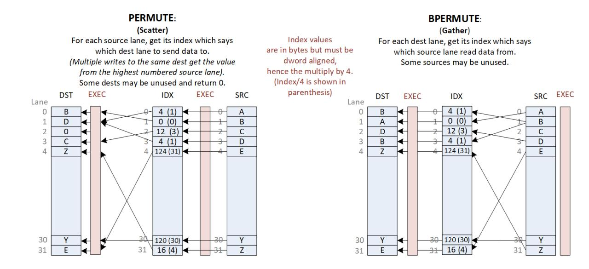

# <span id="page-163-0"></span>**12.5.3. DS Stack Operations for Ray Tracing**

These LDS instructions can be used to manage a per-thread shallow stack in LDS used in ray tracing BVH traversal. BVH structures consist of box nodes and triangle nodes. A box node has up to four child node pointers which may all be returned to the shader (to VGPRs) for a given ray (thread). The traversal shader follows one pointer per ray per iteration, so extra pointers are pushed to a per-thread stack in LDS. Note: the returned pointers are sorted.

This "short stack" has a limited size beyond which the stack wraps around and overwrites older items. When the stack is exhausted, the shader switches to a stackless mode where it looks up the parent of the current node from a table in memory. The shader tracks the last visited address to avoid re-traversing subtrees.

| DS_BVH_STACK_PUSH4_POP1_RTN_B32<br>push 4 and pop 1              | vgpr(dst), vgpr(stack_addr), vgpr(lvaddr), vgpr[4](data) |
|------------------------------------------------------------------|----------------------------------------------------------|
| DS_BVH_STACK_PUSH8_POP1_RTN_B32<br>push 8 and pop 1              | dst, stack_addr, last_node_ptr, data[8], stack_size      |
| DS_BVH_STACK_PUSH8_POP2_RTN_B64<br>push 8, pop 1 and one tri-pop | dst[2], stack_addr, last_node_ptr, data[8], stack_size   |

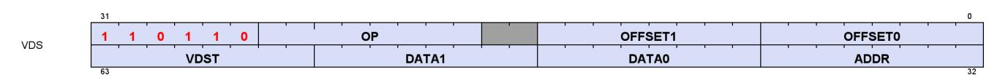

| Field   | Size | Description                                                                                                   |
|---------|------|---------------------------------------------------------------------------------------------------------------|
| OP      | 8    | DS_STORE_STACK                                                                                                |
| OFFSET0 | 8    | bits[4:0] carry StackSize                                                                                     |
| OFFSET1 | 8    | bit[1] primitive range enabled<br>bit[0] triangle pair optimization                                           |
| VDST    | 9    | Destination VGPR for resulting address (e.g. X or top of stack). Must be 0-255.<br>Returns the next "LV addr" |

| Field | Size | Description                                                                                                                                                                                                                                                                                                                                                                            |
|-------|------|----------------------------------------------------------------------------------------------------------------------------------------------------------------------------------------------------------------------------------------------------------------------------------------------------------------------------------------------------------------------------------------|
| ADDR  | 8    | STACK_VGPR: Both a source and destination VGPR:<br>supplies the LDS stack address and is written back with updated address.<br>stack_addr[31:18] = stack_base[15:2] : stack base address (relative to allocated LDS space).<br>stack_addr[17:16] = stack_size[1:0] : 0=8DWORDs, 1=16, 2=32, 3=64 DWORDs per thread<br>stack_addr[15:0] = stack_index[15:0]. (bits [1:0] must be zero). |
| DATA0 | 9    | LVADDR: Last Visited Address. Is compared with data values (next field) to determine the next<br>node to visit. Must be 0-255.                                                                                                                                                                                                                                                         |
| DATA1 | 9    | 4 VGPRs (X,Y,Z,W). Must be 0-255.                                                                                                                                                                                                                                                                                                                                                      |
| M0    | 16   | Unused.                                                                                                                                                                                                                                                                                                                                                                                |

#### **Address Fields:**

| Field             | Bits  | Size | Type    | Description                                                                                                                                                        |
|-------------------|-------|------|---------|--------------------------------------------------------------------------------------------------------------------------------------------------------------------|
| valid_entries     | 4:0   | 5    | uint    | The number of valid(non-clobbered) entries on the stack                                                                                                            |
| entries_to_tlas   | 9:5   | 5    | uint    | The number of entries that must be popped before a BLAS→TLAS transition<br>should happen                                                                           |
| ring_addr         | 14:10 | 5    | uint    | The rolling address in the ring buffer where new items are pushed onto the<br>stack at or popped from.                                                             |
| stack_base_addr   | 28:15 | 14   | uint    | DWORD offset in LDS where the ring buffer for the lane should be stored at                                                                                         |
| has_tlas_in_stack | 29    | 1    | boolean | 0: All valid entries in the stack are from the same BVH<br>1: Some valid entries in the stack are from a parent's BVH                                              |
| has_overflowed    | 30    | 1    | boolean | 0: Rolling stack has not lost any entries pushed onto the stack<br>1: Some of the items pushed on the stack have been lost (for example<br>because of clobbering)  |
| blas_to_tlas_pop  | 31    | 1    | boolean | 0: The last pop was from the same BVH as the previous pop<br>1: The last pop was from the parent BVH of the previous pop (so the parent<br>ray should be restored) |

# <span id="page-165-0"></span>**Chapter 13. Float Memory Atomics**

Floating point atomics can be issued as LDS, Buffer, and Flat/Global/Scratch instructions.

Memory atomics do not report any numeric exceptions (e.g. signaling NaN).

# <span id="page-165-1"></span>**13.1. Rounding**

LDS and Memory atomics have the rounding mode for float-atomic-add fixed at "round to nearest even". The MODE.round bits are ignored for atomics.

# <span id="page-165-2"></span>**13.2. Denormals**

When these operate on floating point data, there is the possibility of the data containing denormal numbers, or the operation producing a denormal. The floating point atomic instructions have the option of passing denormal values through, or flushing them to zero.

LDS-indexed instructions allow denormals to be passed through or flushed to zero based on the MODE.denormal wave-state register. As with VALU ops, "denorm\_single" affects F32 ops and "denorm\_double" affects F64 and F16. LDS instructions use both FP\_DENORM bits (allow\_input\_denormal, allow\_output\_denormal) to control flushing of inputs and outputs separately. Using MODE allows LDS and VALU to produce identical results for float ops.

- Float 16 and 32 bit adder uses both input and output denorm flush controls from MODE
- Float 64 bit adder does not flush denorms
- Float MIN and MAX use only the "input denormal" flushing control
  - Each input to the comparisons flushes the mantissa of both operands to zero before the compare if the exponent is zero and the flush denorm control is active.
  - Min and Max flush input denormals first when enabled, then perform the Min/Max operation on the flushed denormals
  - Float CompareStore ("compare swap") flushes both input and output denormals based on the "flush input denormals" control.

|                                 | LDS (DS)                 |                           | LDS (FLAT)               |                           | L2 Cache                 |                           | Data Fabric              |                           |
|---------------------------------|--------------------------|---------------------------|--------------------------|---------------------------|--------------------------|---------------------------|--------------------------|---------------------------|
| Operation                       | Flush<br>Input<br>Denorm | Flush<br>Output<br>Denorm | Flush<br>Input<br>Denorm | Flush<br>Output<br>Denorm | Flush<br>Input<br>Denorm | Flush<br>Output<br>Denorm | Flush<br>Input<br>Denorm | Flush<br>Output<br>Denorm |
| ADD_F32                         | Mode.I                   | Mode.O                    | NoFlush                  | NoFlush                   | NoFlush                  | NoFlush                   | Reg                      | Reg                       |
| PK_ADD_F16 / _BF16              | Mode.I                   | Mode.O                    | NoFlush                  | NoFlush                   | NoFlush                  | NoFlush                   | Reg                      | Reg                       |
| Compare-Store /<br>Compare-Swap | Mode.I                   | Mode.I                    | NoFlush                  | NoFlush                   | NoFlush                  | NoFlush                   | NoFlush                  | NoFlush                   |

- NoFlush: Do No flush denorms
- Mode.I : flushing is controlled by MODE.denorm (input denormal control)
- Mode.O : flushing is controlled by MODE.denorm (output denormal control)
- Reg : denormal flushing is controlled by a config register (which should be set to "No flush")

13.1. Rounding 156 of 697

Flat instructions that are processed by LDS do not flush denorms, regardless of the MODE.denorm setting.

CompareStore ("compare swap") flushes the result when input denormal flushing occurs.

# <span id="page-166-0"></span>**13.3. NaN Handling**

Not A Number ("NaN") is a IEEE-754 value representing a result that cannot be computed.

There two types of NaN: quiet and signaling

- Quiet NaN Exponent=0xFF, Mantissa MSB=1
- Signaling NaN Exponent=0xFF, Mantissa MSB=0 and at least one other mantissa bit ==1

The LDS does not produce any exception or "signal" due to a signaling NaN.

DS\_ADD\_F32 can create a quiet NaN, or propagate NaN from its inputs: if either input is a NaN, the output is that same NaN, and if both inputs are NaN, the NaN from the first input is selected as the output. Signaling NaN is converted to Quiet NaN.

When denormals are flushed (see table in previous section), they are flushed **before** the operation (i.e. before the comparison).

## **FP MAX / MIN Selection Rules**

```
  if (Src0==NaN) result = quiet(Src0) // either SNaN or QNaN
  else if (Src1==NaN) result = quiet(Src1)
  else if (Src0>Src1) larger_of (src0, src1) // or smaller_of for Minimum
  "Larger_of" order from smallest to largest: -inf, -float, -denorm, -0, +0, +denorm, +float, +inf
  -0 < +0. Preserves -0. If any input is sNaN, signal invalid exception.
  "Smaller_of" order from smallest to largest: -inf, -float, -denorm, -0, +0, +denorm, +float, +inf
  -0 < +0. Preserves -0. If any input is sNaN, signal invalid exception.
```

#### **FP MAXNUM / MINNUM Selection Rules**

```
  if (src0 == SNaN or QNaN) && (src1 == SNaN or QNaN) result = QNaN (src0)
  else if (src0 == SNaN or QNaN) result = src1
  else if (src1 == SNaN or QNaN) result = src0
  else result = larger_of (src0, src1) // or smaller_of for minimumNumber
  "Larger_of" order from smallest to largest: -inf, -float, -denorm, -0, +0, +denorm, +float, +inf
  -0 < +0. Preserves -0. If any input is sNaN, signal invalid exception.
  "Smaller_of" order from smallest to largest: -inf, -float, -denorm, -0, +0, +denorm, +float, +inf
  -0 < +0. Preserves -0. If any input is sNaN, signal invalid exception.
```

# **Memory atomics use the MINNUM / MAXNUM style.**

For VALU ops, when CLAMP=1 any NaN result is clamped to zero, and exceptions are reported before applying the CLAMP.

13.3. NaN Handling 157 of 697

#### **Float Add rules**:

- 1. if SRC0 == NaN: result = QNaN of SRC0 (preserve sign)
- 2. else if SRC1 == NaN: result = QNaN of SRC1 (preserve sign)
- 3. else if SRC0 ==INF and SRC1==INF and signs differ: -QNAN (FP32: 0xFFC00000)
- 4. else if SRC0 == INF: result = SRC0
- 5. else if SRC1 == INF: result = SRC1

13.3. NaN Handling 158 of 697

# <span id="page-168-0"></span>**Chapter 14. Export: Position, Color/MRT**

"Export" is the act of copying data from a VGPR to the one of the export buffers (position, color or Z). Exports use the EXEC mask and only output the enabled pixels or vertices. A shader may export to each target only once. The last export from a pixel shader, or the last position export of a vertex shader must indicate "done" the shader is done with pixel shader exports or vertex position exports. This allows the values to be consumed by the Render back-end and Primitive Assembler respectively.

Exports can transfer 32-bit or 16-bit data per element. 16-bit exports occurs in pairs: 32-bits transferred from one VGPR that holds two 16-bit values. The export instruction does not know or care about the difference between the two - it just moves 32-bits of data per lane. 16-bit exports are a contract between the shader program that is responsible for converting and packing 16-bit data, and the receiving hardware in configuration registers that declare the exported data type. 16-bit data is packed into a VGPR, with the first component in the lower 16 bits.

## **Instruction Fields**

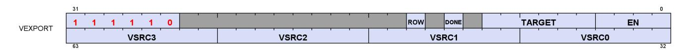

| Field  | Size | Description                                                                                                                                                                                                                                                 |                                             |  |
|--------|------|-------------------------------------------------------------------------------------------------------------------------------------------------------------------------------------------------------------------------------------------------------------|---------------------------------------------|--|
| Done   | 1    | Indicates this is the last export from the shader.Used only for Pixel, Position and Primitive<br>data. Must be set for primitive export.                                                                                                                    |                                             |  |
| Target | 6    | Export Target:                                                                                                                                                                                                                                              |                                             |  |
|        |      | 0-7                                                                                                                                                                                                                                                         | MRT 0-7                                     |  |
|        |      | 8                                                                                                                                                                                                                                                           | Z                                           |  |
|        |      | 12-16                                                                                                                                                                                                                                                       | Position 0-4 (Pos4 is for stereo rendering) |  |
|        |      | 20                                                                                                                                                                                                                                                          | NGG Primitive data (connectivity data)      |  |
|        |      | 21                                                                                                                                                                                                                                                          | Dual source blend Left                      |  |
|        |      | 22                                                                                                                                                                                                                                                          | Dual source blend Right                     |  |
| EN     | 4    | 16-bit components: export half-DWORD enable. Valid values are: 0x0,1,3<br>[0] enables VSRC0 : R,G from one VGPR (R in low bits, G high)<br>[1] enables VSRC1 : B,A from one VGPR (B in low bits, A high)<br>32-bit components: [0-3] = enables for VSRC0-3. |                                             |  |
| VSRC0  | 8    | VGPR to read data from.                                                                                                                                                                                                                                     |                                             |  |
| VSRC1  | 8    | Pos: vsrc0=X, 1=Y, 2=Z, 3=W                                                                                                                                                                                                                                 |                                             |  |
| VSRC2  | 8    | MRT: vsrc0=R, 1=G, 2=B, 3=A                                                                                                                                                                                                                                 |                                             |  |
| VSRC3  | 8    |                                                                                                                                                                                                                                                             |                                             |  |
| ROW_EN | 1    | 0 = normal mode; 1 = use M0 to provide the row number for mesh shader's POS and PRIM<br>exports.                                                                                                                                                            |                                             |  |
| (M0)   | 8    | Row number for mesh shader POS and PRIM exports                                                                                                                                                                                                             |                                             |  |

| 32-bit components | EN[0]        | VSRC0   | Red/X/ …               |
|-------------------|--------------|---------|------------------------|
|                   | EN[1]        | VSRC1   | Green/Y/…              |
|                   | EN[2]        | VSRC2   | Blue/Z/…               |
|                   | EN[3]        | VSRC3   | Alpha/W/…              |
| 16-bit components | EN[0]        | VSRC0   | {green, red} / { y, x} |
|                   | EN[1]        | VSRC1   | {alpha, blue} / {w,z}  |
|                   | EN[2], EN[3] | ignored | unused                 |

# <span id="page-169-0"></span>**14.1. Pixel Shader Exports**

#### **Pixel Exports**

Export instructions copy color data to the MRTs. Data has up to four components (R, G, B, A).

Optionally, export instructions also output depth (Z) data.

Every pixel shader must have at least one export instruction.

The last export instruction executed must have the DONE bit set to one.

The EXEC mask is applied to all exports. Only pixels with the corresponding EXEC bit set to 1 export data to the output buffer.

Each export target must be exported to only once.

The shader program is responsible for conversion of data from 32b to 16b for 16-bit exports.

The shader program is responsible for alpha-test. If the shader can kill a pixel, it must be determined before the first export. Each pixel shader export must have the same pixel-valid mask (EXEC) and this must be the final mask value (subsequent exports cannot have a different mask value).

Pixel exports do not execute until export-buffer space has been allocated to the wave. If STATUS.SKIP\_EXPORT==1, the shader program ignores export instructions.

# **OREO - Opaque Random Order Export of Pixel Data**

OREO allows opaque surfaces to export out of order. Without this, all exports must occur in-order between waves. OREO has a mechanism that detects conflicts (waves that write to the same pixel) and enforces ordering. If a wave has a 'conflict', exports for that wave may be at reduced rate while the conflict exists. No software is needed to support this.

All data that can affect the sample mask must be sent on the first export from the shader. If depth is being exported, it must be exported first. If alpha to mask is being exported, MRT0 must be exported first, unless depth is also enabled, in which case, MRT0's alpha value must be written to the depth export's alpha value. If alpha to mask and coverage to mask are both enabled, then the depth export's alpha value is be set to the minimum of the alpha to mask value (alpha of MRT0) and the coverage to mask value (alpha of what would have been in the depth export).

## **Pixel Shader Dual-Source Blend**

In this mode, alternating lanes (threads) hold MRT0 and MRT1, not all threads going to one MRT. There are two instructions to complete a dual-source blend export. It is required that exports to 21 and 22 be back-toback, with no other export types in between them.

| Export target | EXEC mask                                                                     | MRT<br>Exported | Lane 0        | Lane 1        | Lane 2    |
|---------------|-------------------------------------------------------------------------------|-----------------|---------------|---------------|-----------|
| 21            | exec_mask =<br>(exec_mask & 0x5555_5555)  <br>((exec_mask <<1) & 0xAAAA_AAAA) | 0               | Pix0,<br>MRT0 | Pix0<br>MRT1  | Pix2 MRT0 |
| 22            | exec_mask =<br>(exec_mask & 0xAAAA_AAAA)  <br>((exec_mask >>1) & 0x5555_5555) | 1               | Pix1,<br>MRT0 | Pix1,<br>MRT1 | Pix3 MRT0 |

# <span id="page-169-1"></span>**14.2. Primitive Shader Exports (From GS shader stage)**

The GS shader uses export instructions to output vertex position data, and memory stores for vertex parameter

data. This data is passed on to subsequent pixel shaders.

Every vertex shader must output at least one position vector (x, y, z; w is optional) to the POS0 target. The last position export must have the DONE bit set to 1.

# <span id="page-170-0"></span>**14.3. Dependency Checking**

Export instructions are executed by the hardware in two phases. First, the instruction is selected to be executed, and EXPCNT is incremented by 1. At this time, the wave has made a request to export data, but the data has not been exported yet. Later, when the export actually occurs the EXEC mask and VGPR data is read and the data is exported, and finally EXPcnt is decremented.

Use S\_WAIT\_EXPCNT to prevent the shader program from overwriting EXEC or the VGPRs holding the data to be exported before the export operation has completed.

Multiple export instructions can be outstanding at one time. Exports of the same type (for example: position) are completed in order, but exports of different types can be completed out of order. If the STATUS register's SKIP\_EXPORT bit is set to one, the hardware treats all EXPORT instructions as if they were NOPs.

# <span id="page-171-0"></span>**Chapter 15. Microcode Formats**

This section specifies the microcode formats. The definitions can be used to simplify compilation by providing standard templates and enumeration names for the various instruction formats.

Endian Order - The RDNA4 architecture addresses memory and registers using little-endian byte-ordering and bit-ordering. Multi-byte values are stored with their least-significant (low-order) byte at the lowest byte address, and they are illustrated with their least-significant byte at the right side. Byte values are stored with their least-significant (low-order) bit (LSB) at the lowest bit address, and they are illustrated with their LSB at the right side.

SALU and VALU instructions may optionally include a 32-bit literal constant, and some VALU instructions may include a 32-bit DPP control DWORD at the end of the instructions. No instruction may use both DPP and a literal constant.

The table below summarizes the microcode formats and their widths, not including extra literal or DPP instruction words. The sections that follow provide details.

Table 73. Summary of Microcode Formats

| Microcode Formats                     | Reference | Width (bits) |  |
|---------------------------------------|-----------|--------------|--|
| Scalar ALU and Control Formats        |           |              |  |
| SOP2                                  | SOP2      | 32           |  |
| SOP1                                  | SOP1      |              |  |
| SOPK                                  | SOPK      |              |  |
| SOPP                                  | SOPP      |              |  |
| SOPC                                  | SOPC      |              |  |
| Scalar Memory Format                  |           |              |  |
| SMEM                                  | SMEM      | 64           |  |
| Vector ALU Format                     |           |              |  |
| VOP1                                  | VOP1      | 32           |  |
| VOP2                                  | VOP2      | 32           |  |
| VOPC                                  | VOPC      | 32           |  |
| VOP3                                  | VOP3      | 64           |  |
| VOP3SD                                | VOP3SD    | 64           |  |
| VOP3P                                 | VOP3P     | 64           |  |
| VOPD                                  | VOPD      | 64           |  |
| DPP16                                 | DPP16     | 32           |  |
| DPP8                                  | DPP8      | 32           |  |
| Vector Parameter Interpolation Format |           |              |  |
| VINTERP                               | VINTERP   | 64           |  |
| LDS Parameter Load and Direct Load    |           |              |  |
| VDSDIR                                | VDSDIR    | 32           |  |
| Data Share Format                     |           |              |  |
| VDS                                   | VDS       | 64           |  |
| Vector Memory Buffer Format           |           |              |  |
| VBUFFER                               | VBUFFER   | 96           |  |
| Vector Memory Image Formats           |           |              |  |
| VIMAGE                                | VIMAGE    | 96           |  |

| Microcode Formats                | Reference | Width (bits) |  |  |
|----------------------------------|-----------|--------------|--|--|
| VSAMPLE                          | VSAMPLE   | 96           |  |  |
| Flat, Global and Scratch Formats |           |              |  |  |
| VFLAT                            | VFLAT     | 96           |  |  |
| VGLOBAL                          | VGLOBAL   | 96           |  |  |
| VSCRATCH                         | VSCRATCH  | 96           |  |  |
| Export Format                    |           |              |  |  |
| VEXPORT                          | VEXPORT   | 64           |  |  |

Any instruction field marked as "Reserved" must be set to zero.

# **Instruction Suffixes**

Most instructions include a suffix that indicates the data type the instruction handles. This suffix may also include a number that indicates the size of the data.

For example: "F32" indicates "32-bit floating point data", or "B16" is "16-bit binary data".

- B = Binary
- F = Floating point
- BF = "brain-float" floating point
- U = Unsigned integer
- I = Signed integer
- U = Unsigned integer
- IU = Signed or Unsigned integer

When more than one data-type specifier occurs in an instruction, the first one is the result type and size, and the later one(s) is/are input data type and size.

E.g. V\_CVT\_F32\_I32 reads an integer and writes a float.

# <span id="page-173-0"></span>**15.1. Scalar ALU and Control Formats**

# <span id="page-173-1"></span>**15.1.1. SOP2**

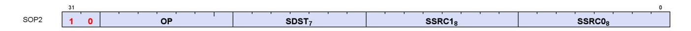

**Description** This is a scalar instruction with two inputs and one output. Can be followed by a 32-bit literal constant.

Table 74. SOP2 Fields

| Field Name | Bits      | Format or Description                                         |
|------------|-----------|---------------------------------------------------------------|
| SSRC0      | [7:0]     | Source 0. First operand for the instruction.                  |
|            | 0-105     | SGPR0 - SGPR105: Scalar general-purpose registers.            |
|            | 106       | VCC_LO: VCC[31:0].                                            |
|            | 107       | VCC_HI: VCC[63:32].                                           |
|            | 108-123   | TTMP0 - TTMP15: Trap handler temporary register.              |
|            | 124       | NULL                                                          |
|            | 125       | M0. Misc register 0.                                          |
|            | 126       | EXEC_LO: EXEC[31:0].                                          |
|            | 127       | EXEC_HI: EXEC[63:32].                                         |
|            | 128       | 0.                                                            |
|            | 129-192   | Signed integer 1 to 64.                                       |
|            | 193-208   | Signed integer -1 to -16.                                     |
|            | 209-233   | Reserved.                                                     |
|            | 235       | SHARED_BASE (Memory Aperture definition).                     |
|            | 236       | SHARED_LIMIT (Memory Aperture definition).                    |
|            | 237       | PRIVATE_BASE (Memory Aperture definition).                    |
|            | 238       | PRIVATE_LIMIT (Memory Aperture definition).                   |
|            | 239       | Reserved.                                                     |
|            | 240       | 0.5.                                                          |
|            | 241       | -0.5.                                                         |
|            | 242       | 1.0.                                                          |
|            | 243       | -1.0.                                                         |
|            | 244       | 2.0.                                                          |
|            | 245       | -2.0.                                                         |
|            | 246       | 4.0.                                                          |
|            | 247       | -4.0.                                                         |
|            | 248       | 1/(2*PI).                                                     |
|            | 249 - 252 | Reserved.                                                     |
|            | 253       | SCC.                                                          |
|            | 254       | 64-bit Literal constant.                                      |
|            | 255       | 32-bit Literal constant.                                      |
| SSRC1      | [15:8]    | Second scalar source operand.                                 |
|            |           | Same codes as SSRC0, above.                                   |
| SDST       | [22:16]   | Scalar destination.                                           |
|            |           | Same codes as SSRC0, above except only codes 0-127 are valid. |
| OP         | [29:23]   | See Opcode table below.                                       |
| ENCODING   | [31:30]   | 'b10                                                          |
|            |           |                                                               |

Table 75. SOP2 Opcodes

| Opcode # | Name            | Opcode # | Name                 |
|----------|-----------------|----------|----------------------|
| 0        | S_ADD_CO_U32    | 38       | S_BFE_U32            |
| 1        | S_SUB_CO_U32    | 39       | S_BFE_I32            |
| 2        | S_ADD_CO_I32    | 40       | S_BFE_U64            |
| 3        | S_SUB_CO_I32    | 41       | S_BFE_I64            |
| 4        | S_ADD_CO_CI_U32 | 42       | S_BFM_B32            |
| 5        | S_SUB_CO_CI_U32 | 43       | S_BFM_B64            |
| 6        | S_ABSDIFF_I32   | 44       | S_MUL_I32            |
| 8        | S_LSHL_B32      | 45       | S_MUL_HI_U32         |
| 9        | S_LSHL_B64      | 46       | S_MUL_HI_I32         |
| 10       | S_LSHR_B32      | 48       | S_CSELECT_B32        |
| 11       | S_LSHR_B64      | 49       | S_CSELECT_B64        |
| 12       | S_ASHR_I32      | 50       | S_PACK_LL_B32_B16    |
| 13       | S_ASHR_I64      | 51       | S_PACK_LH_B32_B16    |
| 14       | S_LSHL1_ADD_U32 | 52       | S_PACK_HH_B32_B16    |
| 15       | S_LSHL2_ADD_U32 | 53       | S_PACK_HL_B32_B16    |
| 16       | S_LSHL3_ADD_U32 | 64       | S_ADD_F32            |
| 17       | S_LSHL4_ADD_U32 | 65       | S_SUB_F32            |
| 18       | S_MIN_I32       | 66       | S_MIN_NUM_F32        |
| 19       | S_MIN_U32       | 67       | S_MAX_NUM_F32        |
| 20       | S_MAX_I32       | 68       | S_MUL_F32            |
| 21       | S_MAX_U32       | 69       | S_FMAAK_F32          |
| 22       | S_AND_B32       | 70       | S_FMAMK_F32          |
| 23       | S_AND_B64       | 71       | S_FMAC_F32           |
| 24       | S_OR_B32        | 72       | S_CVT_PK_RTZ_F16_F32 |
| 25       | S_OR_B64        | 73       | S_ADD_F16            |
| 26       | S_XOR_B32       | 74       | S_SUB_F16            |
| 27       | S_XOR_B64       | 75       | S_MIN_NUM_F16        |
| 28       | S_NAND_B32      | 76       | S_MAX_NUM_F16        |
| 29       | S_NAND_B64      | 77       | S_MUL_F16            |
| 30       | S_NOR_B32       | 78       | S_FMAC_F16           |
| 31       | S_NOR_B64       | 79       | S_MINIMUM_F32        |
| 32       | S_XNOR_B32      | 80       | S_MAXIMUM_F32        |
| 33       | S_XNOR_B64      | 81       | S_MINIMUM_F16        |
| 34       | S_AND_NOT1_B32  | 82       | S_MAXIMUM_F16        |
| 35       | S_AND_NOT1_B64  | 83       | S_ADD_NC_U64         |
| 36       | S_OR_NOT1_B32   | 84       | S_SUB_NC_U64         |
| 37       | S_OR_NOT1_B64   | 85       | S_MUL_U64            |

# <span id="page-174-0"></span>**15.1.2. SOPK**

**Description** This is a scalar instruction with one 16-bit signed immediate (SIMM16) input and a single destination. Instructions that take 2 inputs use the destination as the first input and the SIMM16 as the second input.

E.g. "S\_ADDK\_I32 S0, 1" means "S0 = S0 + 1".

Table 76. SOPK Fields

| Field Name | Bits                                                                  | Format or Description                                                                                                                                                                                                                                                                                |
|------------|-----------------------------------------------------------------------|------------------------------------------------------------------------------------------------------------------------------------------------------------------------------------------------------------------------------------------------------------------------------------------------------|
| SIMM16     | [15:0]                                                                | Signed immediate 16-bit value.                                                                                                                                                                                                                                                                       |
| SDST       | [22:16]<br>0-105<br>106<br>107<br>108-123<br>124<br>125<br>126<br>127 | Scalar destination, and can provide second source operand.<br>SGPR0 - SGPR105: Scalar general-purpose registers.<br>VCC_LO: VCC[31:0].<br>VCC_HI: VCC[63:32].<br>TTMP0 - TTMP15: Trap handler temporary register.<br>M0. Memory register 0.<br>NULL<br>EXEC_LO: EXEC[31:0].<br>EXEC_HI: EXEC[63:32]. |
| OP         | [27:23]                                                               | See Opcode table below.                                                                                                                                                                                                                                                                              |
| ENCODING   | [31:28]                                                               | 'b1011                                                                                                                                                                                                                                                                                               |

Table 77. SOPK Opcodes

| Opcode # | Name          | Opcode # | Name               |
|----------|---------------|----------|--------------------|
| 0        | S_MOVK_I32    | 17       | S_GETREG_B32       |
| 1        | S_VERSION     | 18       | S_SETREG_B32       |
| 2        | S_CMOVK_I32   | 19       | S_SETREG_IMM32_B32 |
| 15       | S_ADDK_CO_I32 | 20       | S_CALL_B64         |
| 16       | S_MULK_I32    |          |                    |

# **15.1.3. SOP1**

<span id="page-175-0"></span>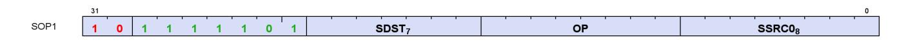

**Description** This is a scalar instruction with two inputs and one output. Can be followed by a 32-bit literal constant.

Table 78. SOP1 Fields

| Field Name | Bits      | Format or Description                                         |
|------------|-----------|---------------------------------------------------------------|
| SSRC0      | [7:0]     | Source 0. First operand for the instruction.                  |
|            | 0-105     | SGPR0 - SGPR105: Scalar general-purpose registers.            |
|            | 106       | VCC_LO: VCC[31:0].                                            |
|            | 107       | VCC_HI: VCC[63:32].                                           |
|            | 108-123   | TTMP0 - TTMP15: Trap handler temporary register.              |
|            | 124       | NULL                                                          |
|            | 125       | M0. Misc register 0.                                          |
|            | 126       | EXEC_LO: EXEC[31:0].                                          |
|            | 127       | EXEC_HI: EXEC[63:32].                                         |
|            | 128       | 0.                                                            |
|            | 129-192   | Signed integer 1 to 64.                                       |
|            | 193-208   | Signed integer -1 to -16.                                     |
|            | 209-233   | Reserved.                                                     |
|            | 235       | SHARED_BASE (Memory Aperture definition).                     |
|            | 236       | SHARED_LIMIT (Memory Aperture definition).                    |
|            | 237       | PRIVATE_BASE (Memory Aperture definition).                    |
|            | 238       | PRIVATE_LIMIT (Memory Aperture definition).                   |
|            | 239       | Reserved.                                                     |
|            | 240       | 0.5.                                                          |
|            | 241       | -0.5.                                                         |
|            | 242       | 1.0.                                                          |
|            | 243       | -1.0.                                                         |
|            | 244       | 2.0.                                                          |
|            | 245       | -2.0.                                                         |
|            | 246       | 4.0.                                                          |
|            | 247       | -4.0.                                                         |
|            | 248       | 1/(2*PI).                                                     |
|            | 249 - 252 | Reserved.                                                     |
|            | 253       | SCC.                                                          |
|            | 254       | 64-bit Literal constant.                                      |
|            | 255       | 32-bit Literal constant.                                      |
| OP         | [15:8]    | See Opcode table below.                                       |
| SDST       | [22:16]   | Scalar destination.                                           |
|            |           | Same codes as SSRC0, above except only codes 0-127 are valid. |
| ENCODING   | [31:23]   | 'b10_1111101                                                  |

Table 79. SOP1 Opcodes

| Opcode # | Name           | Opcode # | Name                   |
|----------|----------------|----------|------------------------|
| 0        | S_MOV_B32      | 50       | S_OR_NOT1_SAVEEXEC_B32 |
| 1        | S_MOV_B64      | 51       | S_OR_NOT1_SAVEEXEC_B64 |
| 2        | S_CMOV_B32     | 52       | S_AND_NOT0_WREXEC_B32  |
| 3        | S_CMOV_B64     | 53       | S_AND_NOT0_WREXEC_B64  |
| 4        | S_BREV_B32     | 54       | S_AND_NOT1_WREXEC_B32  |
| 5        | S_BREV_B64     | 55       | S_AND_NOT1_WREXEC_B64  |
| 8        | S_CTZ_I32_B32  | 64       | S_MOVRELS_B32          |
| 9        | S_CTZ_I32_B64  | 65       | S_MOVRELS_B64          |
| 10       | S_CLZ_I32_U32  | 66       | S_MOVRELD_B32          |
| 11       | S_CLZ_I32_U64  | 67       | S_MOVRELD_B64          |
| 12       | S_CLS_I32      | 68       | S_MOVRELSD_2_B32       |
| 13       | S_CLS_I32_I64  | 71       | S_GETPC_B64            |
| 14       | S_SEXT_I32_I8  | 72       | S_SETPC_B64            |
| 15       | S_SEXT_I32_I16 | 73       | S_SWAPPC_B64           |

| Opcode # | Name                    | Opcode # | Name                     |
|----------|-------------------------|----------|--------------------------|
| 16       | S_BITSET0_B32           | 74       | S_RFE_B64                |
| 17       | S_BITSET0_B64           | 76       | S_SENDMSG_RTN_B32        |
| 18       | S_BITSET1_B32           | 77       | S_SENDMSG_RTN_B64        |
| 19       | S_BITSET1_B64           | 78       | S_BARRIER_SIGNAL         |
| 20       | S_BITREPLICATE_B64_B32  | 79       | S_BARRIER_SIGNAL_ISFIRST |
| 21       | S_ABS_I32               | 80       | S_GET_BARRIER_STATE      |
| 22       | S_BCNT0_I32_B32         | 81       | Reserved                 |
| 23       | S_BCNT0_I32_B64         | 82       | Reserved                 |
| 24       | S_BCNT1_I32_B32         | 83       | S_ALLOC_VGPR             |
| 25       | S_BCNT1_I32_B64         | 84       | Reserved                 |
| 26       | S_QUADMASK_B32          | 85       | Reserved                 |
| 27       | S_QUADMASK_B64          | 86       | Reserved                 |
| 28       | S_WQM_B32               | 87       | Reserved                 |
| 29       | S_WQM_B64               | 88       | S_SLEEP_VAR              |
| 30       | S_NOT_B32               | 91       | Reserved                 |
| 31       | S_NOT_B64               | 92       | Reserved                 |
| 32       | S_AND_SAVEEXEC_B32      | 93       | Reserved                 |
| 33       | S_AND_SAVEEXEC_B64      | 94       | Reserved                 |
| 34       | S_OR_SAVEEXEC_B32       | 95       | Reserved                 |
| 35       | S_OR_SAVEEXEC_B64       | 96       | S_CEIL_F32               |
| 36       | S_XOR_SAVEEXEC_B32      | 97       | S_FLOOR_F32              |
| 37       | S_XOR_SAVEEXEC_B64      | 98       | S_TRUNC_F32              |
| 38       | S_NAND_SAVEEXEC_B32     | 99       | S_RNDNE_F32              |
| 39       | S_NAND_SAVEEXEC_B64     | 100      | S_CVT_F32_I32            |
| 40       | S_NOR_SAVEEXEC_B32      | 101      | S_CVT_F32_U32            |
| 41       | S_NOR_SAVEEXEC_B64      | 102      | S_CVT_I32_F32            |
| 42       | S_XNOR_SAVEEXEC_B32     | 103      | S_CVT_U32_F32            |
| 43       | S_XNOR_SAVEEXEC_B64     | 104      | S_CVT_F16_F32            |
| 44       | S_AND_NOT0_SAVEEXEC_B32 | 105      | S_CVT_F32_F16            |
| 45       | S_AND_NOT0_SAVEEXEC_B64 | 106      | S_CVT_HI_F32_F16         |
| 46       | S_OR_NOT0_SAVEEXEC_B32  | 107      | S_CEIL_F16               |
| 47       | S_OR_NOT0_SAVEEXEC_B64  | 108      | S_FLOOR_F16              |
| 48       | S_AND_NOT1_SAVEEXEC_B32 | 109      | S_TRUNC_F16              |
| 49       | S_AND_NOT1_SAVEEXEC_B64 | 110      | S_RNDNE_F16              |
|          |                         |          |                          |

# **15.1.4. SOPC**

<span id="page-177-0"></span>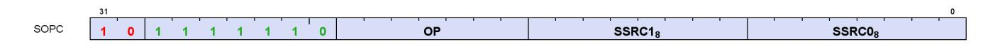

**Description** This is a scalar instruction with two inputs that are compared and produces SCC as a result. Can be followed by a 32-bit literal constant.

Table 80. SOPC Fields

| Field Name | Bits      | Format or Description                              |  |
|------------|-----------|----------------------------------------------------|--|
| SSRC0      | [7:0]     | Source 0. First operand for the instruction.       |  |
|            | 0-105     | SGPR0 - SGPR105: Scalar general-purpose registers. |  |
|            | 106       | VCC_LO: VCC[31:0].                                 |  |
|            | 107       | VCC_HI: VCC[63:32].                                |  |
|            | 108-123   | TTMP0 - TTMP15: Trap handler temporary register.   |  |
|            | 124       | NULL                                               |  |
|            | 125       | M0. Misc register 0.                               |  |
|            | 126       | EXEC_LO: EXEC[31:0].                               |  |
|            | 127       | EXEC_HI: EXEC[63:32].                              |  |
|            | 128       | 0.                                                 |  |
|            | 129-192   | Signed integer 1 to 64.                            |  |
|            | 193-208   | Signed integer -1 to -16.                          |  |
|            | 209-233   | Reserved.                                          |  |
|            | 235       | SHARED_BASE (Memory Aperture definition).          |  |
|            | 236       | SHARED_LIMIT (Memory Aperture definition).         |  |
|            | 237       | PRIVATE_BASE (Memory Aperture definition).         |  |
|            | 238       | PRIVATE_LIMIT (Memory Aperture definition).        |  |
|            | 239       | Reserved.                                          |  |
|            | 240       | 0.5.                                               |  |
|            | 241       | -0.5.                                              |  |
|            | 242       | 1.0.                                               |  |
|            | 243       | -1.0.                                              |  |
|            | 244       | 2.0.                                               |  |
|            | 245       | -2.0.                                              |  |
|            | 246       | 4.0.                                               |  |
|            | 247       | -4.0.                                              |  |
|            | 248       | 1/(2*PI).                                          |  |
|            | 249 - 252 | Reserved.                                          |  |
|            | 253       | SCC.                                               |  |
|            | 254       | 64-bit Literal constant.                           |  |
|            | 255       | 32-bit Literal constant.                           |  |
| SSRC1      | [15:8]    | Second scalar source operand.                      |  |
|            |           | Same codes as SSRC0, above.                        |  |
| OP         | [22:16]   | See Opcode table below.                            |  |
| ENCODING   | [31:23]   | 'b10_1111110                                       |  |

Table 81. SOPC Opcodes

| Opcode # | Name          | Opcode # | Name          |
|----------|---------------|----------|---------------|
| 0        | S_CMP_EQ_I32  | 70       | S_CMP_GE_F32  |
| 1        | S_CMP_LG_I32  | 71       | S_CMP_O_F32   |
| 2        | S_CMP_GT_I32  | 72       | S_CMP_U_F32   |
| 3        | S_CMP_GE_I32  | 73       | S_CMP_NGE_F32 |
| 4        | S_CMP_LT_I32  | 74       | S_CMP_NLG_F32 |
| 5        | S_CMP_LE_I32  | 75       | S_CMP_NGT_F32 |
| 6        | S_CMP_EQ_U32  | 76       | S_CMP_NLE_F32 |
| 7        | S_CMP_LG_U32  | 77       | S_CMP_NEQ_F32 |
| 8        | S_CMP_GT_U32  | 78       | S_CMP_NLT_F32 |
| 9        | S_CMP_GE_U32  | 81       | S_CMP_LT_F16  |
| 10       | S_CMP_LT_U32  | 82       | S_CMP_EQ_F16  |
| 11       | S_CMP_LE_U32  | 83       | S_CMP_LE_F16  |
| 12       | S_BITCMP0_B32 | 84       | S_CMP_GT_F16  |
| 13       | S_BITCMP1_B32 | 85       | S_CMP_LG_F16  |

| Opcode # | Name          | Opcode # | Name          |
|----------|---------------|----------|---------------|
| 14       | S_BITCMP0_B64 | 86       | S_CMP_GE_F16  |
| 15       | S_BITCMP1_B64 | 87       | S_CMP_O_F16   |
| 16       | S_CMP_EQ_U64  | 88       | S_CMP_U_F16   |
| 17       | S_CMP_LG_U64  | 89       | S_CMP_NGE_F16 |
| 65       | S_CMP_LT_F32  | 90       | S_CMP_NLG_F16 |
| 66       | S_CMP_EQ_F32  | 91       | S_CMP_NGT_F16 |
| 67       | S_CMP_LE_F32  | 92       | S_CMP_NLE_F16 |
| 68       | S_CMP_GT_F32  | 93       | S_CMP_NEQ_F16 |
| 69       | S_CMP_LG_F32  | 94       | S_CMP_NLT_F16 |

# <span id="page-179-0"></span>**15.1.5. SOPP**

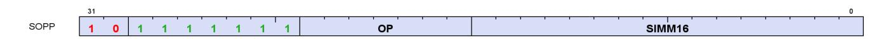

**Description** This is a scalar instruction with one 16-bit signed immediate (SIMM16) input.

Table 82. SOPP Fields

| Field Name | Bits    | Format or Description          |
|------------|---------|--------------------------------|
| SIMM16     | [15:0]  | Signed immediate 16-bit value. |
| OP         | [22:16] | See Opcode table below.        |
| ENCODING   | [31:23] | 'b10_1111111                   |

Table 83. SOPP Opcodes

| Opcode # | Name            | Opcode # | Name                  |
|----------|-----------------|----------|-----------------------|
| 0        | S_NOP           | 37       | S_CBRANCH_EXECZ       |
| 1        | S_SETKILL       | 38       | S_CBRANCH_EXECNZ      |
| 2        | S_SETHALT       | 48       | S_ENDPGM              |
| 3        | S_SLEEP         | 49       | S_ENDPGM_SAVED        |
| 5        | S_CLAUSE        | 52       | S_WAKEUP              |
| 7        | S_DELAY_ALU     | 53       | S_SETPRIO             |
| 8        | S_WAIT_ALU      | 54       | S_SENDMSG             |
| 9        | S_WAITCNT       | 55       | S_SENDMSGHALT         |
| 10       | S_WAIT_IDLE     | 56       | S_INCPERFLEVEL        |
| 11       | S_WAIT_EVENT    | 57       | S_DECPERFLEVEL        |
| 16       | S_TRAP          | 58       | Reserved              |
| 17       | S_ROUND_MODE    | 59       | Reserved              |
| 18       | S_DENORM_MODE   | 60       | S_ICACHE_INV          |
| 19       | Reserved        | 64       | S_WAIT_LOADCNT        |
| 20       | S_BARRIER_WAIT  | 65       | S_WAIT_STORECNT       |
| 21       | Reserved        | 66       | S_WAIT_SAMPLECNT      |
| 31       | S_CODE_END      | 67       | S_WAIT_BVHCNT         |
| 32       | S_BRANCH        | 68       | S_WAIT_EXPCNT         |
| 33       | S_CBRANCH_SCC0  | 70       | S_WAIT_DSCNT          |
| 34       | S_CBRANCH_SCC1  | 71       | S_WAIT_KMCNT          |
| 35       | S_CBRANCH_VCCZ  | 72       | S_WAIT_LOADCNT_DSCNT  |
| 36       | S_CBRANCH_VCCNZ | 73       | S_WAIT_STORECNT_DSCNT |

# <span id="page-180-0"></span>**15.2. Scalar Memory Format**

# <span id="page-180-1"></span>**15.2.1. SMEM**

**Description** Scalar Memory data load

Table 84. SMEM Fields

| Field Name | Bits    | Format or Description                                                                                    |
|------------|---------|----------------------------------------------------------------------------------------------------------|
| SBASE      | [5:0]   | SGPR-pair that provides base address or SGPR-quad that provides V#. (LSB of SGPR<br>address is omitted). |
| SDATA      | [12:6]  | SGPR that provides write data or accepts return data.                                                    |
| OP         | [18:13] | See Opcode table below.                                                                                  |
| SCOPE      | [22:21] | Memory Scope                                                                                             |
| TH         | [24:23] | Memory Temporal Hint                                                                                     |
| ENCODING   | [31:26] | 'b111101                                                                                                 |
| IOFFSET    | [55:32] | An immediate signed byte offset. Ignored for cache invalidations.                                        |
| SOFFSET    | [63:57] | SGPR that supplies an unsigned byte offset. Disabled if set to NULL.                                     |

Table 85. SMEM Opcodes

| Opcode # | Name               | Opcode # | Name                   |
|----------|--------------------|----------|------------------------|
| 0        | S_LOAD_B32         | 19       | S_BUFFER_LOAD_B256     |
| 1        | S_LOAD_B64         | 20       | S_BUFFER_LOAD_B512     |
| 2        | S_LOAD_B128        | 21       | S_BUFFER_LOAD_B96      |
| 3        | S_LOAD_B256        | 24       | S_BUFFER_LOAD_I8       |
| 4        | S_LOAD_B512        | 25       | S_BUFFER_LOAD_U8       |
| 5        | S_LOAD_B96         | 26       | S_BUFFER_LOAD_I16      |
| 8        | S_LOAD_I8          | 27       | S_BUFFER_LOAD_U16      |
| 9        | S_LOAD_U8          | 33       | S_DCACHE_INV           |
| 10       | S_LOAD_I16         | 36       | S_PREFETCH_INST        |
| 11       | S_LOAD_U16         | 37       | S_PREFETCH_INST_PC_REL |
| 16       | S_BUFFER_LOAD_B32  | 38       | S_PREFETCH_DATA        |
| 17       | S_BUFFER_LOAD_B64  | 39       | S_BUFFER_PREFETCH_DATA |
| 18       | S_BUFFER_LOAD_B128 | 40       | S_PREFETCH_DATA_PC_REL |

# <span id="page-181-0"></span>**15.3. Vector ALU Formats**

# <span id="page-181-1"></span>**15.3.1. VOP2**

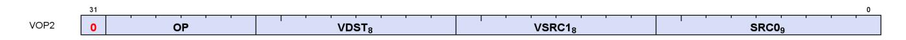

**Description** Vector ALU format with two input operands. Can be followed by a 32-bit literal constant or DPP instruction DWORD when the instruction allows it.

Table 86. VOP2 Fields

| Field Name | Bits      | Format or Description                              |
|------------|-----------|----------------------------------------------------|
| SRC0       | [8:0]     | Source 0. First operand for the instruction.       |
|            | 0-105     | SGPR0 - SGPR105: Scalar general-purpose registers. |
|            | 106       | VCC_LO: VCC[31:0].                                 |
|            | 107       | VCC_HI: VCC[63:32].                                |
|            | 108-123   | TTMP0 - TTMP15: Trap handler temporary register.   |
|            | 124       | NULL                                               |
|            | 125       | M0. Misc register 0.                               |
|            | 126       | EXEC_LO: EXEC[31:0].                               |
|            | 127       | EXEC_HI: EXEC[63:32].                              |
|            | 128       | 0.                                                 |
|            | 129-192   | Signed integer 1 to 64.                            |
|            | 193-208   | Signed integer -1 to -16.                          |
|            | 209-232   | Reserved.                                          |
|            | 233       | DPP8 (only valid as SRC0)                          |
|            | 234       | DPP8FI (only valid as SRC0)                        |
|            | 235       | SHARED_BASE (Memory Aperture definition).          |
|            | 236       | SHARED_LIMIT (Memory Aperture definition).         |
|            | 237       | PRIVATE_BASE (Memory Aperture definition).         |
|            | 238       | PRIVATE_LIMIT (Memory Aperture definition).        |
|            | 239       | Reserved.                                          |
|            | 240       | 0.5.                                               |
|            | 241       | -0.5.                                              |
|            | 242       | 1.0.                                               |
|            | 243       | -1.0.                                              |
|            | 244       | 2.0.                                               |
|            | 245       | -2.0.                                              |
|            | 246       | 4.0.                                               |
|            | 247       | -4.0.                                              |
|            | 248       | 1/(2*PI).                                          |
|            | 250       | DPP16 (only valid as SRC0)                         |
|            | 253       | SCC.                                               |
|            | 254       | 64-bit Literal constant.                           |
|            | 255       | 32-bit Literal constant.                           |
|            | 256 - 511 | VGPR 0 - 255                                       |
| VSRC1      | [16:9]    | VGPR that provides the second operand.             |
| VDST       | [24:17]   | Destination VGPR.                                  |
| OP         | [30:25]   | See Opcode table below.                            |
| ENCODING   | [31]      | 'b0                                                |
|            |           |                                                    |

Table 87. VOP2 Opcodes

15.3. Vector ALU Formats 172 of 697

| Opcode # | Name               | Opcode # | Name                 |
|----------|--------------------|----------|----------------------|
| 1        | V_CNDMASK_B32      | 29       | V_XOR_B32            |
| 2        | V_ADD_F64          | 30       | V_XNOR_B32           |
| 3        | V_ADD_F32          | 31       | V_LSHLREV_B64        |
| 4        | V_SUB_F32          | 32       | V_ADD_CO_CI_U32      |
| 5        | V_SUBREV_F32       | 33       | V_SUB_CO_CI_U32      |
| 6        | V_MUL_F64          | 34       | V_SUBREV_CO_CI_U32   |
| 7        | V_MUL_DX9_ZERO_F32 | 37       | V_ADD_NC_U32         |
| 8        | V_MUL_F32          | 38       | V_SUB_NC_U32         |
| 9        | V_MUL_I32_I24      | 39       | V_SUBREV_NC_U32      |
| 10       | V_MUL_HI_I32_I24   | 43       | V_FMAC_F32           |
| 11       | V_MUL_U32_U24      | 44       | V_FMAMK_F32          |
| 12       | V_MUL_HI_U32_U24   | 45       | V_FMAAK_F32          |
| 13       | V_MIN_NUM_F64      | 47       | V_CVT_PK_RTZ_F16_F32 |
| 14       | V_MAX_NUM_F64      | 48       | V_MIN_NUM_F16        |
| 17       | V_MIN_I32          | 49       | V_MAX_NUM_F16        |
| 18       | V_MAX_I32          | 50       | V_ADD_F16            |
| 19       | V_MIN_U32          | 51       | V_SUB_F16            |
| 20       | V_MAX_U32          | 52       | V_SUBREV_F16         |
| 21       | V_MIN_NUM_F32      | 53       | V_MUL_F16            |
| 22       | V_MAX_NUM_F32      | 54       | V_FMAC_F16           |
| 24       | V_LSHLREV_B32      | 55       | V_FMAMK_F16          |
| 25       | V_LSHRREV_B32      | 56       | V_FMAAK_F16          |
| 26       | V_ASHRREV_I32      | 59       | V_LDEXP_F16          |
| 27       | V_AND_B32          | 60       | V_PK_FMAC_F16        |
| 28       | V_OR_B32           |          |                      |

# **15.3.2. VOP1**

<span id="page-182-0"></span>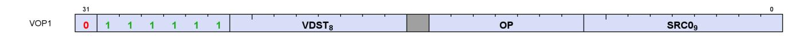

**Description** Vector ALU format with one input operand. Can be followed by a 32-bit literal constant or DPP instruction DWORD when the instruction allows it.

Table 88. VOP1 Fields

15.3. Vector ALU Formats 173 of 697

| Field Name | Bits      | Format or Description                              |
|------------|-----------|----------------------------------------------------|
| SRC0       | [8:0]     | Source 0. First operand for the instruction.       |
|            | 0-105     | SGPR0 - SGPR105: Scalar general-purpose registers. |
|            | 106       | VCC_LO: VCC[31:0].                                 |
|            | 107       | VCC_HI: VCC[63:32].                                |
|            | 108-123   | TTMP0 - TTMP15: Trap handler temporary register.   |
|            | 124       | NULL                                               |
|            | 125       | M0. Misc register 0.                               |
|            | 126       | EXEC_LO: EXEC[31:0].                               |
|            | 127       | EXEC_HI: EXEC[63:32].                              |
|            | 128       | 0.                                                 |
|            | 129-192   | Signed integer 1 to 64.                            |
|            | 193-208   | Signed integer -1 to -16.                          |
|            | 209-232   | Reserved.                                          |
|            | 233       | DPP8 (only valid as SRC0)                          |
|            | 234       | DPP8FI (only valid as SRC0)                        |
|            | 235       | SHARED_BASE (Memory Aperture definition).          |
|            | 236       | SHARED_LIMIT (Memory Aperture definition).         |
|            | 237       | PRIVATE_BASE (Memory Aperture definition).         |
|            | 238       | PRIVATE_LIMIT (Memory Aperture definition).        |
|            | 239       | Reserved.                                          |
|            | 240       | 0.5.                                               |
|            | 241       | -0.5.                                              |
|            | 242       | 1.0.                                               |
|            | 243       | -1.0.                                              |
|            | 244       | 2.0.                                               |
|            | 245       | -2.0.                                              |
|            | 246       | 4.0.                                               |
|            | 247       | -4.0.                                              |
|            | 248       | 1/(2*PI).                                          |
|            | 250       | DPP16 (only valid as SRC0)                         |
|            | 253       | SCC.                                               |
|            | 254       | 64-bit Literal constant.                           |
|            | 255       | 32-bit Literal constant.                           |
|            | 256 - 511 | VGPR 0 - 255                                       |
| OP         | [15:9]    | See Opcode table below.                            |
| VDST       | [24:17]   | Destination VGPR.                                  |
| ENCODING   | [31:25]   | 'b0_111111                                         |

Table 89. VOP1 Opcodes

| Opcode # | Name                  | Opcode # | Name                |
|----------|-----------------------|----------|---------------------|
| 0        | V_NOP                 | 57       | V_CLZ_I32_U32       |
| 1        | V_MOV_B32             | 58       | V_CTZ_I32_B32       |
| 2        | V_READFIRSTLANE_B32   | 59       | V_CLS_I32           |
| 3        | V_CVT_I32_F64         | 60       | V_FREXP_EXP_I32_F64 |
| 4        | V_CVT_F64_I32         | 61       | V_FREXP_MANT_F64    |
| 5        | V_CVT_F32_I32         | 62       | V_FRACT_F64         |
| 6        | V_CVT_F32_U32         | 63       | V_FREXP_EXP_I32_F32 |
| 7        | V_CVT_U32_F32         | 64       | V_FREXP_MANT_F32    |
| 8        | V_CVT_I32_F32         | 66       | V_MOVRELD_B32       |
| 10       | V_CVT_F16_F32         | 67       | V_MOVRELS_B32       |
| 11       | V_CVT_F32_F16         | 68       | V_MOVRELSD_B32      |
| 12       | V_CVT_NEAREST_I32_F32 | 72       | V_MOVRELSD_2_B32    |

15.3. Vector ALU Formats 174 of 697

| Opcode # | Name                | Opcode # | Name                |
|----------|---------------------|----------|---------------------|
| 13       | V_CVT_FLOOR_I32_F32 | 80       | V_CVT_F16_U16       |
| 14       | V_CVT_OFF_F32_I4    | 81       | V_CVT_F16_I16       |
| 15       | V_CVT_F32_F64       | 82       | V_CVT_U16_F16       |
| 16       | V_CVT_F64_F32       | 83       | V_CVT_I16_F16       |
| 17       | V_CVT_F32_UBYTE0    | 84       | V_RCP_F16           |
| 18       | V_CVT_F32_UBYTE1    | 85       | V_SQRT_F16          |
| 19       | V_CVT_F32_UBYTE2    | 86       | V_RSQ_F16           |
| 20       | V_CVT_F32_UBYTE3    | 87       | V_LOG_F16           |
| 21       | V_CVT_U32_F64       | 88       | V_EXP_F16           |
| 22       | V_CVT_F64_U32       | 89       | V_FREXP_MANT_F16    |
| 23       | V_TRUNC_F64         | 90       | V_FREXP_EXP_I16_F16 |
| 24       | V_CEIL_F64          | 91       | V_FLOOR_F16         |
| 25       | V_RNDNE_F64         | 92       | V_CEIL_F16          |
| 26       | V_FLOOR_F64         | 93       | V_TRUNC_F16         |
| 27       | V_PIPEFLUSH         | 94       | V_RNDNE_F16         |
| 28       | V_MOV_B16           | 95       | V_FRACT_F16         |
| 32       | V_FRACT_F32         | 96       | V_SIN_F16           |
| 33       | V_TRUNC_F32         | 97       | V_COS_F16           |
| 34       | V_CEIL_F32          | 98       | V_SAT_PK_U8_I16     |
| 35       | V_RNDNE_F32         | 99       | V_CVT_NORM_I16_F16  |
| 36       | V_FLOOR_F32         | 100      | V_CVT_NORM_U16_F16  |
| 37       | V_EXP_F32           | 101      | V_SWAP_B32          |
| 39       | V_LOG_F32           | 102      | V_SWAP_B16          |
| 42       | V_RCP_F32           | 103      | V_PERMLANE64_B32    |
| 43       | V_RCP_IFLAG_F32     | 104      | V_SWAPREL_B32       |
| 46       | V_RSQ_F32           | 105      | V_NOT_B16           |
| 47       | V_RCP_F64           | 106      | V_CVT_I32_I16       |
| 49       | V_RSQ_F64           | 107      | V_CVT_U32_U16       |
| 51       | V_SQRT_F32          | 108      | V_CVT_F32_FP8       |
| 52       | V_SQRT_F64          | 109      | V_CVT_F32_BF8       |
| 53       | V_SIN_F32           | 110      | V_CVT_PK_F32_FP8    |
| 54       | V_COS_F32           | 111      | V_CVT_PK_F32_BF8    |
| 55       | V_NOT_B32           | 112      | Reserved            |
| 56       | V_BFREV_B32         | 113      | Reserved            |
|          |                     |          |                     |

# <span id="page-184-0"></span>**15.3.3. VOPC**

**Description** Vector instruction taking two inputs and producing a comparison result. Can be followed by a 32-bit literal constant or DPP control DWORD. Vector Comparison operations are divided into three groups:

- those that can use any one of 16 comparison operations,
- those that can use any one of 8, and
- those that have a single comparison operation.

15.3. Vector ALU Formats 175 of 697

The final opcode number is determined by adding the base for the opcode family plus the offset from the compare op. Compare instructions write a result to VCC (for VOPC) or an SGPR (for VOP3). Additionally, compare instructions have variants that writes to the EXEC mask instead of VCC or SGPR. The destination of the compare result is VCC or EXEC when encoded using the VOPC format, and can be an arbitrary SGPR (indicated in the VDST field) when only encoded in the VOP3 format.

## **Comparison Operations**

Table 90. Comparison Operations

| Compare Operation                  | Opcode<br>Offset | Description                      |
|------------------------------------|------------------|----------------------------------|
| Sixteen Compare Operations (COMPF) |                  |                                  |
| F                                  | 0                | D.u = 0                          |
| LT                                 | 1                | D.u = (S0 < S1)                  |
| EQ                                 | 2                | D.u = (S0 == S1)                 |
| LE                                 | 3                | D.u = (S0 <= S1)                 |
| GT                                 | 4                | D.u = (S0 > S1)                  |
| LG                                 | 5                | D.u = (S0 <> S1)                 |
| GE                                 | 6                | D.u = (S0 >= S1)                 |
| O                                  | 7                | D.u = (!isNaN(S0) && !isNaN(S1)) |
| U                                  | 8                | D.u = (!isNaN(S0)    !isNaN(S1)) |
| NGE                                | 9                | D.u = !(S0 >= S1)                |
| NLG                                | 10               | D.u = !(S0 <> S1)                |
| NGT                                | 11               | D.u = !(S0 > S1)                 |
| NLE                                | 12               | D.u = !(S0 <= S1)                |
| NEQ                                | 13               | D.u = !(S0 == S1)                |
| NLT                                | 14               | D.u = !(S0 < S1)                 |
| TRU                                | 15               | D.u = 1                          |
| Eight Compare Operations (COMPI)   |                  |                                  |
| F                                  | 0                | D.u = 0                          |
| LT                                 | 1                | D.u = (S0 < S1)                  |
| EQ                                 | 2                | D.u = (S0 == S1)                 |
| LE                                 | 3                | D.u = (S0 <= S1)                 |
| GT                                 | 4                | D.u = (S0 > S1)                  |
| LG                                 | 5                | D.u = (S0 <> S1)                 |
| GE                                 | 6                | D.u = (S0 >= S1)                 |
| TRU                                | 7                | D.u = 1                          |

Table 91. VOPC Fields

15.3. Vector ALU Formats 176 of 697

| Field Name | Bits      | Format or Description                              |
|------------|-----------|----------------------------------------------------|
| SRC0       | [8:0]     | Source 0. First operand for the instruction.       |
|            | 0-105     | SGPR0 - SGPR105: Scalar general-purpose registers. |
|            | 106       | VCC_LO: VCC[31:0].                                 |
|            | 107       | VCC_HI: VCC[63:32].                                |
|            | 108-123   | TTMP0 - TTMP15: Trap handler temporary register.   |
|            | 124       | NULL                                               |
|            | 125       | M0. Misc register 0.                               |
|            | 126       | EXEC_LO: EXEC[31:0].                               |
|            | 127       | EXEC_HI: EXEC[63:32].                              |
|            | 128       | 0.                                                 |
|            | 129-192   | Signed integer 1 to 64.                            |
|            | 193-208   | Signed integer -1 to -16.                          |
|            | 209-232   | Reserved.                                          |
|            | 233       | DPP8 (only valid as SRC0)                          |
|            | 234       | DPP8FI (only valid as SRC0)                        |
|            | 235       | SHARED_BASE (Memory Aperture definition).          |
|            | 236       | SHARED_LIMIT (Memory Aperture definition).         |
|            | 237       | PRIVATE_BASE (Memory Aperture definition).         |
|            | 238       | PRIVATE_LIMIT (Memory Aperture definition).        |
|            | 239       | Reserved.                                          |
|            | 240       | 0.5.                                               |
|            | 241       | -0.5.                                              |
|            | 242       | 1.0.                                               |
|            | 243       | -1.0.                                              |
|            | 244       | 2.0.                                               |
|            | 245       | -2.0.                                              |
|            | 246       | 4.0.                                               |
|            | 247       | -4.0.                                              |
|            | 248       | 1/(2*PI).                                          |
|            | 250       | DPP16 (only valid as SRC0)                         |
|            | 253       | SCC.                                               |
|            | 254       | 64-bit Literal constant.                           |
|            | 255       | 32-bit Literal constant.                           |
|            | 256 - 511 | VGPR 0 - 255                                       |
| VSRC1      | [16:9]    | VGPR that provides the second operand.             |
| OP         | [24:17]   | See Opcode table below.                            |
| ENCODING   | [31:25]   | 'b0_111110                                         |

Table 92. VOPC Opcodes

| Opcode # | Name          | Opcode # | Name           |
|----------|---------------|----------|----------------|
| 1        | V_CMP_LT_F16  | 129      | V_CMPX_LT_F16  |
| 2        | V_CMP_EQ_F16  | 130      | V_CMPX_EQ_F16  |
| 3        | V_CMP_LE_F16  | 131      | V_CMPX_LE_F16  |
| 4        | V_CMP_GT_F16  | 132      | V_CMPX_GT_F16  |
| 5        | V_CMP_LG_F16  | 133      | V_CMPX_LG_F16  |
| 6        | V_CMP_GE_F16  | 134      | V_CMPX_GE_F16  |
| 7        | V_CMP_O_F16   | 135      | V_CMPX_O_F16   |
| 8        | V_CMP_U_F16   | 136      | V_CMPX_U_F16   |
| 9        | V_CMP_NGE_F16 | 137      | V_CMPX_NGE_F16 |
| 10       | V_CMP_NLG_F16 | 138      | V_CMPX_NLG_F16 |
| 11       | V_CMP_NGT_F16 | 139      | V_CMPX_NGT_F16 |
| 12       | V_CMP_NLE_F16 | 140      | V_CMPX_NLE_F16 |

15.3. Vector ALU Formats 177 of 697

| Opcode # | Name          | Opcode # | Name           |
|----------|---------------|----------|----------------|
| 13       | V_CMP_NEQ_F16 | 141      | V_CMPX_NEQ_F16 |
| 14       | V_CMP_NLT_F16 | 142      | V_CMPX_NLT_F16 |
| 17       | V_CMP_LT_F32  | 145      | V_CMPX_LT_F32  |
| 18       | V_CMP_EQ_F32  | 146      | V_CMPX_EQ_F32  |
| 19       | V_CMP_LE_F32  | 147      | V_CMPX_LE_F32  |
| 20       | V_CMP_GT_F32  | 148      | V_CMPX_GT_F32  |
| 21       | V_CMP_LG_F32  | 149      | V_CMPX_LG_F32  |
| 22       | V_CMP_GE_F32  | 150      | V_CMPX_GE_F32  |
| 23       | V_CMP_O_F32   | 151      | V_CMPX_O_F32   |
| 24       | V_CMP_U_F32   | 152      | V_CMPX_U_F32   |
| 25       | V_CMP_NGE_F32 | 153      | V_CMPX_NGE_F32 |
| 26       | V_CMP_NLG_F32 | 154      | V_CMPX_NLG_F32 |
| 27       | V_CMP_NGT_F32 | 155      | V_CMPX_NGT_F32 |
| 28       | V_CMP_NLE_F32 | 156      | V_CMPX_NLE_F32 |
| 29       | V_CMP_NEQ_F32 | 157      | V_CMPX_NEQ_F32 |
| 30       | V_CMP_NLT_F32 | 158      | V_CMPX_NLT_F32 |
| 33       | V_CMP_LT_F64  | 161      | V_CMPX_LT_F64  |
| 34       | V_CMP_EQ_F64  | 162      | V_CMPX_EQ_F64  |
| 35       | V_CMP_LE_F64  | 163      | V_CMPX_LE_F64  |
| 36       | V_CMP_GT_F64  | 164      | V_CMPX_GT_F64  |
| 37       | V_CMP_LG_F64  | 165      | V_CMPX_LG_F64  |
| 38       | V_CMP_GE_F64  | 166      | V_CMPX_GE_F64  |
| 39       | V_CMP_O_F64   | 167      | V_CMPX_O_F64   |
| 40       | V_CMP_U_F64   | 168      | V_CMPX_U_F64   |
| 41       | V_CMP_NGE_F64 | 169      | V_CMPX_NGE_F64 |
| 42       | V_CMP_NLG_F64 | 170      | V_CMPX_NLG_F64 |
| 43       | V_CMP_NGT_F64 | 171      | V_CMPX_NGT_F64 |
| 44       | V_CMP_NLE_F64 | 172      | V_CMPX_NLE_F64 |
| 45       | V_CMP_NEQ_F64 | 173      | V_CMPX_NEQ_F64 |
|          |               |          |                |
| 46       | V_CMP_NLT_F64 | 174      | V_CMPX_NLT_F64 |
| 49       | V_CMP_LT_I16  | 177      | V_CMPX_LT_I16  |
| 50       | V_CMP_EQ_I16  | 178      | V_CMPX_EQ_I16  |
| 51       | V_CMP_LE_I16  | 179      | V_CMPX_LE_I16  |
| 52       | V_CMP_GT_I16  | 180      | V_CMPX_GT_I16  |
| 53       | V_CMP_NE_I16  | 181      | V_CMPX_NE_I16  |
| 54       | V_CMP_GE_I16  | 182      | V_CMPX_GE_I16  |
| 57       | V_CMP_LT_U16  | 185      | V_CMPX_LT_U16  |
| 58       | V_CMP_EQ_U16  | 186      | V_CMPX_EQ_U16  |
| 59       | V_CMP_LE_U16  | 187      | V_CMPX_LE_U16  |
| 60       | V_CMP_GT_U16  | 188      | V_CMPX_GT_U16  |
| 61       | V_CMP_NE_U16  | 189      | V_CMPX_NE_U16  |
| 62       | V_CMP_GE_U16  | 190      | V_CMPX_GE_U16  |
| 65       | V_CMP_LT_I32  | 193      | V_CMPX_LT_I32  |
| 66       | V_CMP_EQ_I32  | 194      | V_CMPX_EQ_I32  |
| 67       | V_CMP_LE_I32  | 195      | V_CMPX_LE_I32  |
| 68       | V_CMP_GT_I32  | 196      | V_CMPX_GT_I32  |
| 69       | V_CMP_NE_I32  | 197      | V_CMPX_NE_I32  |

15.3. Vector ALU Formats 178 of 697

| Opcode # | Name            | Opcode # | Name             |
|----------|-----------------|----------|------------------|
| 70       | V_CMP_GE_I32    | 198      | V_CMPX_GE_I32    |
| 73       | V_CMP_LT_U32    | 201      | V_CMPX_LT_U32    |
| 74       | V_CMP_EQ_U32    | 202      | V_CMPX_EQ_U32    |
| 75       | V_CMP_LE_U32    | 203      | V_CMPX_LE_U32    |
| 76       | V_CMP_GT_U32    | 204      | V_CMPX_GT_U32    |
| 77       | V_CMP_NE_U32    | 205      | V_CMPX_NE_U32    |
| 78       | V_CMP_GE_U32    | 206      | V_CMPX_GE_U32    |
| 81       | V_CMP_LT_I64    | 209      | V_CMPX_LT_I64    |
| 82       | V_CMP_EQ_I64    | 210      | V_CMPX_EQ_I64    |
| 83       | V_CMP_LE_I64    | 211      | V_CMPX_LE_I64    |
| 84       | V_CMP_GT_I64    | 212      | V_CMPX_GT_I64    |
| 85       | V_CMP_NE_I64    | 213      | V_CMPX_NE_I64    |
| 86       | V_CMP_GE_I64    | 214      | V_CMPX_GE_I64    |
| 89       | V_CMP_LT_U64    | 217      | V_CMPX_LT_U64    |
| 90       | V_CMP_EQ_U64    | 218      | V_CMPX_EQ_U64    |
| 91       | V_CMP_LE_U64    | 219      | V_CMPX_LE_U64    |
| 92       | V_CMP_GT_U64    | 220      | V_CMPX_GT_U64    |
| 93       | V_CMP_NE_U64    | 221      | V_CMPX_NE_U64    |
| 94       | V_CMP_GE_U64    | 222      | V_CMPX_GE_U64    |
| 125      | V_CMP_CLASS_F16 | 253      | V_CMPX_CLASS_F16 |
| 126      | V_CMP_CLASS_F32 | 254      | V_CMPX_CLASS_F32 |
| 127      | V_CMP_CLASS_F64 | 255      | V_CMPX_CLASS_F64 |

# <span id="page-188-0"></span>**15.3.4. VOP3**

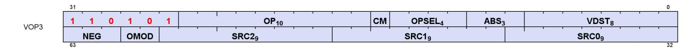

**Description** Vector ALU format with three input operands. Can be followed by a 32-bit literal constant or DPP instruction DWORD when the instruction allows it.

Table 93. VOP3 Fields

| Field Name | Bits    | Format or Description                                                                                                             |
|------------|---------|-----------------------------------------------------------------------------------------------------------------------------------|
| VDST       | [7:0]   | Destination VGPR                                                                                                                  |
| ABS        | [10:8]  | Absolute value of input. [8] = src0, [9] = src1, [10] = src2                                                                      |
| OPSEL      | [14:11] | Operand select for 16-bit data. 0 = select low half, 1 = select high half. [11] = src0,<br>[12] = src1, [13] = src2, [14] = dest. |
| CM         | [15]    | Clamp output                                                                                                                      |
| OP         | [25:16] | Opcode. See next table.                                                                                                           |
| ENCODING   | [31:26] | 'b110101                                                                                                                          |

15.3. Vector ALU Formats 179 of 697

| Field Name                                 | Bits      | Format or Description                               |  |  |
|--------------------------------------------|-----------|-----------------------------------------------------|--|--|
| SRC0                                       | [40:32]   | Source 0. First operand for the instruction.        |  |  |
|                                            | 0-105     | SGPR0 - SGPR105: Scalar general-purpose registers.  |  |  |
|                                            | 106       | VCC_LO: VCC[31:0].                                  |  |  |
|                                            | 107       | VCC_HI: VCC[63:32].                                 |  |  |
|                                            | 108-123   | TTMP0 - TTMP15: Trap handler temporary register.    |  |  |
|                                            | 124       | NULL                                                |  |  |
|                                            | 125       | M0. Misc register 0.                                |  |  |
|                                            | 126       | EXEC_LO: EXEC[31:0].                                |  |  |
|                                            | 127       | EXEC_HI: EXEC[63:32].                               |  |  |
|                                            | 128       | 0.                                                  |  |  |
|                                            | 129-192   | Signed integer 1 to 64.                             |  |  |
|                                            | 193-208   | Signed integer -1 to -16.                           |  |  |
|                                            | 209-232   | Reserved.                                           |  |  |
|                                            | 233       | DPP8 (only valid as SRC0)                           |  |  |
|                                            | 234       | DPP8FI (only valid as SRC0)                         |  |  |
|                                            | 235       | SHARED_BASE (Memory Aperture definition).           |  |  |
|                                            | 236       | SHARED_LIMIT (Memory Aperture definition).          |  |  |
|                                            | 237       | PRIVATE_BASE (Memory Aperture definition).          |  |  |
|                                            | 238       | PRIVATE_LIMIT (Memory Aperture definition).         |  |  |
|                                            | 239       | Reserved.                                           |  |  |
| 240<br>0.5.<br>241<br>-0.5.<br>242<br>1.0. |           |                                                     |  |  |
|                                            |           |                                                     |  |  |
|                                            |           |                                                     |  |  |
|                                            | 243       | -1.0.                                               |  |  |
|                                            | 244       | 2.0.                                                |  |  |
|                                            | 245       | -2.0.                                               |  |  |
|                                            | 246       | 4.0.                                                |  |  |
|                                            | 247       | -4.0.                                               |  |  |
|                                            | 248       | 1/(2*PI).                                           |  |  |
|                                            | 250       | DPP16 (only valid as SRC0)                          |  |  |
|                                            | 253       | SCC.                                                |  |  |
|                                            | 254       | Reserved.                                           |  |  |
|                                            | 255       | Literal constant.                                   |  |  |
|                                            | 256 - 511 | VGPR 0 - 255                                        |  |  |
| SRC1                                       | [49:41]   | Second input operand. Same options as SRC0.         |  |  |
| SRC2                                       | [58:50]   | Third input operand. Same options as SRC0.          |  |  |
| OMOD                                       | [60:59]   | Output Modifier: 0=none, 1=*2, 2=*4, 3=*0.5         |  |  |
| NEG                                        | [63:61]   | Negate input. [61] = src0, [62] = src1, [63] = src2 |  |  |

Table 94. VOP3 Opcodes

| Opcode # | Name          | Opcode # | Name             |
|----------|---------------|----------|------------------|
| 1        | V_CMP_LT_F16  | 400      | V_CVT_F64_F32    |
| 2        | V_CMP_EQ_F16  | 401      | V_CVT_F32_UBYTE0 |
| 3        | V_CMP_LE_F16  | 402      | V_CVT_F32_UBYTE1 |
| 4        | V_CMP_GT_F16  | 403      | V_CVT_F32_UBYTE2 |
| 5        | V_CMP_LG_F16  | 404      | V_CVT_F32_UBYTE3 |
| 6        | V_CMP_GE_F16  | 405      | V_CVT_U32_F64    |
| 7        | V_CMP_O_F16   | 406      | V_CVT_F64_U32    |
| 8        | V_CMP_U_F16   | 407      | V_TRUNC_F64      |
| 9        | V_CMP_NGE_F16 | 408      | V_CEIL_F64       |
| 10       | V_CMP_NLG_F16 | 409      | V_RNDNE_F64      |
| 11       | V_CMP_NGT_F16 | 410      | V_FLOOR_F64      |

15.3. Vector ALU Formats 180 of 697

| Opcode # | Name          | Opcode # | Name                |
|----------|---------------|----------|---------------------|
| 12       | V_CMP_NLE_F16 | 411      | V_PIPEFLUSH         |
| 13       | V_CMP_NEQ_F16 | 412      | V_MOV_B16           |
| 14       | V_CMP_NLT_F16 | 416      | V_FRACT_F32         |
| 17       | V_CMP_LT_F32  | 417      | V_TRUNC_F32         |
| 18       | V_CMP_EQ_F32  | 418      | V_CEIL_F32          |
| 19       | V_CMP_LE_F32  | 419      | V_RNDNE_F32         |
| 20       | V_CMP_GT_F32  | 420      | V_FLOOR_F32         |
| 21       | V_CMP_LG_F32  | 421      | V_EXP_F32           |
| 22       | V_CMP_GE_F32  | 423      | V_LOG_F32           |
| 23       | V_CMP_O_F32   | 426      | V_RCP_F32           |
| 24       | V_CMP_U_F32   | 427      | V_RCP_IFLAG_F32     |
| 25       | V_CMP_NGE_F32 | 430      | V_RSQ_F32           |
| 26       | V_CMP_NLG_F32 | 431      | V_RCP_F64           |
| 27       | V_CMP_NGT_F32 | 433      | V_RSQ_F64           |
| 28       | V_CMP_NLE_F32 | 435      | V_SQRT_F32          |
| 29       | V_CMP_NEQ_F32 | 436      | V_SQRT_F64          |
| 30       | V_CMP_NLT_F32 | 437      | V_SIN_F32           |
| 33       | V_CMP_LT_F64  | 438      | V_COS_F32           |
| 34       | V_CMP_EQ_F64  | 439      | V_NOT_B32           |
| 35       | V_CMP_LE_F64  | 440      | V_BFREV_B32         |
| 36       | V_CMP_GT_F64  | 441      | V_CLZ_I32_U32       |
| 37       | V_CMP_LG_F64  | 442      | V_CTZ_I32_B32       |
| 38       | V_CMP_GE_F64  | 443      | V_CLS_I32           |
| 39       | V_CMP_O_F64   | 444      | V_FREXP_EXP_I32_F64 |
| 40       | V_CMP_U_F64   | 445      | V_FREXP_MANT_F64    |
| 41       | V_CMP_NGE_F64 | 446      | V_FRACT_F64         |
| 42       | V_CMP_NLG_F64 | 447      | V_FREXP_EXP_I32_F32 |
| 43       | V_CMP_NGT_F64 | 448      | V_FREXP_MANT_F32    |
| 44       | V_CMP_NLE_F64 | 450      | V_MOVRELD_B32       |
| 45       | V_CMP_NEQ_F64 | 451      | V_MOVRELS_B32       |
| 46       | V_CMP_NLT_F64 | 452      | V_MOVRELSD_B32      |
| 49       | V_CMP_LT_I16  | 456      | V_MOVRELSD_2_B32    |
| 50       | V_CMP_EQ_I16  | 464      | V_CVT_F16_U16       |
| 51       | V_CMP_LE_I16  | 465      | V_CVT_F16_I16       |
| 52       | V_CMP_GT_I16  | 466      | V_CVT_U16_F16       |
| 53       | V_CMP_NE_I16  | 467      | V_CVT_I16_F16       |
| 54       | V_CMP_GE_I16  | 468      | V_RCP_F16           |
| 57       | V_CMP_LT_U16  | 469      | V_SQRT_F16          |
| 58       | V_CMP_EQ_U16  | 470      | V_RSQ_F16           |
| 59       | V_CMP_LE_U16  | 471      | V_LOG_F16           |
| 60       | V_CMP_GT_U16  | 472      | V_EXP_F16           |
| 61       | V_CMP_NE_U16  | 473      | V_FREXP_MANT_F16    |
| 62       | V_CMP_GE_U16  | 474      | V_FREXP_EXP_I16_F16 |
| 65       | V_CMP_LT_I32  | 475      | V_FLOOR_F16         |
| 66       | V_CMP_EQ_I32  | 476      | V_CEIL_F16          |
| 67       | V_CMP_LE_I32  | 477      | V_TRUNC_F16         |
| 68       | V_CMP_GT_I32  | 478      | V_RNDNE_F16         |

15.3. Vector ALU Formats 181 of 697

| Opcode # | Name            | Opcode # | Name               |
|----------|-----------------|----------|--------------------|
| 69       | V_CMP_NE_I32    | 479      | V_FRACT_F16        |
| 70       | V_CMP_GE_I32    | 480      | V_SIN_F16          |
| 73       | V_CMP_LT_U32    | 481      | V_COS_F16          |
| 74       | V_CMP_EQ_U32    | 482      | V_SAT_PK_U8_I16    |
| 75       | V_CMP_LE_U32    | 483      | V_CVT_NORM_I16_F16 |
| 76       | V_CMP_GT_U32    | 484      | V_CVT_NORM_U16_F16 |
| 77       | V_CMP_NE_U32    | 489      | V_NOT_B16          |
| 78       | V_CMP_GE_U32    | 490      | V_CVT_I32_I16      |
| 81       | V_CMP_LT_I64    | 491      | V_CVT_U32_U16      |
| 82       | V_CMP_EQ_I64    | 492      | V_CVT_F32_FP8      |
| 83       | V_CMP_LE_I64    | 493      | V_CVT_F32_BF8      |
| 84       | V_CMP_GT_I64    | 494      | V_CVT_PK_F32_FP8   |
| 85       | V_CMP_NE_I64    | 495      | V_CVT_PK_F32_BF8   |
| 86       | V_CMP_GE_I64    | 496      | Reserved           |
| 89       | V_CMP_LT_U64    | 497      | Reserved           |
| 90       | V_CMP_EQ_U64    | 521      | V_FMA_DX9_ZERO_F32 |
| 91       | V_CMP_LE_U64    | 522      | V_MAD_I32_I24      |
| 92       | V_CMP_GT_U64    | 523      | V_MAD_U32_U24      |
| 93       | V_CMP_NE_U64    | 524      | V_CUBEID_F32       |
| 94       | V_CMP_GE_U64    | 525      | V_CUBESC_F32       |
| 125      | V_CMP_CLASS_F16 | 526      | V_CUBETC_F32       |
| 126      | V_CMP_CLASS_F32 | 527      | V_CUBEMA_F32       |
| 127      | V_CMP_CLASS_F64 | 528      | V_BFE_U32          |
| 129      | V_CMPX_LT_F16   | 529      | V_BFE_I32          |
| 130      | V_CMPX_EQ_F16   | 530      | V_BFI_B32          |
| 131      | V_CMPX_LE_F16   | 531      | V_FMA_F32          |
| 132      | V_CMPX_GT_F16   | 532      | V_FMA_F64          |
| 133      | V_CMPX_LG_F16   | 533      | V_LERP_U8          |
| 134      | V_CMPX_GE_F16   | 534      | V_ALIGNBIT_B32     |
| 135      | V_CMPX_O_F16    | 535      | V_ALIGNBYTE_B32    |
| 136      | V_CMPX_U_F16    | 536      | V_MULLIT_F32       |
| 137      | V_CMPX_NGE_F16  | 538      | V_MIN3_I32         |
| 138      | V_CMPX_NLG_F16  | 539      | V_MIN3_U32         |
| 139      | V_CMPX_NGT_F16  | 541      | V_MAX3_I32         |
| 140      | V_CMPX_NLE_F16  | 542      | V_MAX3_U32         |
| 141      | V_CMPX_NEQ_F16  | 544      | V_MED3_I32         |
| 142      | V_CMPX_NLT_F16  | 545      | V_MED3_U32         |
| 145      | V_CMPX_LT_F32   | 546      | V_SAD_U8           |
| 146      | V_CMPX_EQ_F32   | 547      | V_SAD_HI_U8        |
| 147      | V_CMPX_LE_F32   | 548      | V_SAD_U16          |
| 148      | V_CMPX_GT_F32   | 549      | V_SAD_U32          |
| 149      | V_CMPX_LG_F32   | 550      | V_CVT_PK_U8_F32    |
| 150      | V_CMPX_GE_F32   | 551      | V_DIV_FIXUP_F32    |
| 151      | V_CMPX_O_F32    | 552      | V_DIV_FIXUP_F64    |
| 152      | V_CMPX_U_F32    | 553      | V_MIN3_NUM_F32     |
| 153      | V_CMPX_NGE_F32  | 554      | V_MAX3_NUM_F32     |
|          |                 |          |                    |
| 154      | V_CMPX_NLG_F32  | 555      | V_MIN3_NUM_F16     |

15.3. Vector ALU Formats 182 of 697

| Opcode # | Name           | Opcode # | Name              |
|----------|----------------|----------|-------------------|
| 155      | V_CMPX_NGT_F32 | 556      | V_MAX3_NUM_F16    |
| 156      | V_CMPX_NLE_F32 | 557      | V_MINIMUM3_F32    |
| 157      | V_CMPX_NEQ_F32 | 558      | V_MAXIMUM3_F32    |
| 158      | V_CMPX_NLT_F32 | 559      | V_MINIMUM3_F16    |
| 161      | V_CMPX_LT_F64  | 560      | V_MAXIMUM3_F16    |
| 162      | V_CMPX_EQ_F64  | 561      | V_MED3_NUM_F32    |
| 163      | V_CMPX_LE_F64  | 562      | V_MED3_NUM_F16    |
| 164      | V_CMPX_GT_F64  | 567      | V_DIV_FMAS_F32    |
| 165      | V_CMPX_LG_F64  | 568      | V_DIV_FMAS_F64    |
| 166      | V_CMPX_GE_F64  | 569      | V_MSAD_U8         |
| 167      | V_CMPX_O_F64   | 570      | V_QSAD_PK_U16_U8  |
| 168      | V_CMPX_U_F64   | 571      | V_MQSAD_PK_U16_U8 |
| 169      | V_CMPX_NGE_F64 | 573      | V_MQSAD_U32_U8    |
| 170      | V_CMPX_NLG_F64 | 576      | V_XOR3_B32        |
| 171      | V_CMPX_NGT_F64 | 577      | V_MAD_U16         |
| 172      | V_CMPX_NLE_F64 | 580      | V_PERM_B32        |
| 173      | V_CMPX_NEQ_F64 | 581      | V_XAD_U32         |
| 174      | V_CMPX_NLT_F64 | 582      | V_LSHL_ADD_U32    |
| 177      | V_CMPX_LT_I16  | 583      | V_ADD_LSHL_U32    |
| 178      | V_CMPX_EQ_I16  | 584      | V_FMA_F16         |
| 179      | V_CMPX_LE_I16  | 586      | V_MIN3_I16        |
| 180      | V_CMPX_GT_I16  | 587      | V_MIN3_U16        |
| 181      | V_CMPX_NE_I16  | 589      | V_MAX3_I16        |
| 182      | V_CMPX_GE_I16  | 590      | V_MAX3_U16        |
| 185      | V_CMPX_LT_U16  | 592      | V_MED3_I16        |
| 186      | V_CMPX_EQ_U16  | 593      | V_MED3_U16        |
| 187      | V_CMPX_LE_U16  | 595      | V_MAD_I16         |
| 188      | V_CMPX_GT_U16  | 596      | V_DIV_FIXUP_F16   |
| 189      | V_CMPX_NE_U16  | 597      | V_ADD3_U32        |
| 190      | V_CMPX_GE_U16  | 598      | V_LSHL_OR_B32     |
| 193      | V_CMPX_LT_I32  | 599      | V_AND_OR_B32      |
| 194      | V_CMPX_EQ_I32  | 600      | V_OR3_B32         |
| 195      | V_CMPX_LE_I32  | 601      | V_MAD_U32_U16     |
| 196      | V_CMPX_GT_I32  | 602      | V_MAD_I32_I16     |
| 197      | V_CMPX_NE_I32  | 603      | V_PERMLANE16_B32  |
| 198      | V_CMPX_GE_I32  | 604      | V_PERMLANEX16_B32 |
| 201      | V_CMPX_LT_U32  | 605      | V_CNDMASK_B16     |
| 202      | V_CMPX_EQ_U32  | 610      | V_MAXMIN_U32      |
|          |                |          |                   |
| 203      | V_CMPX_LE_U32  | 611      | V_MINMAX_U32      |
| 204      | V_CMPX_GT_U32  | 612      | V_MAXMIN_I32      |
| 205      | V_CMPX_NE_U32  | 613      | V_MINMAX_I32      |
| 206      | V_CMPX_GE_U32  | 614      | V_DOT2_F16_F16    |
| 209      | V_CMPX_LT_I64  | 615      | V_DOT2_BF16_BF16  |
| 210      | V_CMPX_EQ_I64  | 616      | V_MINMAX_NUM_F32  |
| 211      | V_CMPX_LE_I64  | 617      | V_MAXMIN_NUM_F32  |
| 212      | V_CMPX_GT_I64  | 618      | V_MINMAX_NUM_F16  |
| 213      | V_CMPX_NE_I64  | 619      | V_MAXMIN_NUM_F16  |

15.3. Vector ALU Formats 183 of 697

| Opcode # | Name                 | Opcode # | Name                  |
|----------|----------------------|----------|-----------------------|
| 214      | V_CMPX_GE_I64        | 620      | V_MINIMUMMAXIMUM_F32  |
| 217      | V_CMPX_LT_U64        | 621      | V_MAXIMUMMINIMUM_F32  |
| 218      | V_CMPX_EQ_U64        | 622      | V_MINIMUMMAXIMUM_F16  |
| 219      | V_CMPX_LE_U64        | 623      | V_MAXIMUMMINIMUM_F16  |
| 220      | V_CMPX_GT_U64        | 640      | V_S_EXP_F32           |
| 221      | V_CMPX_NE_U64        | 641      | V_S_EXP_F16           |
| 222      | V_CMPX_GE_U64        | 642      | V_S_LOG_F32           |
| 253      | V_CMPX_CLASS_F16     | 643      | V_S_LOG_F16           |
| 254      | V_CMPX_CLASS_F32     | 644      | V_S_RCP_F32           |
| 255      | V_CMPX_CLASS_F64     | 645      | V_S_RCP_F16           |
| 257      | V_CNDMASK_B32        | 646      | V_S_RSQ_F32           |
| 258      | V_ADD_F64            | 647      | V_S_RSQ_F16           |
| 259      | V_ADD_F32            | 648      | V_S_SQRT_F32          |
| 260      | V_SUB_F32            | 649      | V_S_SQRT_F16          |
| 261      | V_SUBREV_F32         | 771      | V_ADD_NC_U16          |
| 262      | V_MUL_F64            | 772      | V_SUB_NC_U16          |
| 263      | V_MUL_DX9_ZERO_F32   | 773      | V_MUL_LO_U16          |
| 264      | V_MUL_F32            | 774      | V_CVT_PK_I16_F32      |
| 265      | V_MUL_I32_I24        | 775      | V_CVT_PK_U16_F32      |
| 266      | V_MUL_HI_I32_I24     | 777      | V_MAX_U16             |
| 267      | V_MUL_U32_U24        | 778      | V_MAX_I16             |
| 268      | V_MUL_HI_U32_U24     | 779      | V_MIN_U16             |
| 269      | V_MIN_NUM_F64        | 780      | V_MIN_I16             |
| 270      | V_MAX_NUM_F64        | 781      | V_ADD_NC_I16          |
| 273      | V_MIN_I32            | 782      | V_SUB_NC_I16          |
| 274      | V_MAX_I32            | 783      | V_PERMLANE16_VAR_B32  |
| 275      | V_MIN_U32            | 784      | V_PERMLANEX16_VAR_B32 |
| 276      | V_MAX_U32            | 785      | V_PACK_B32_F16        |
| 277      | V_MIN_NUM_F32        | 786      | V_CVT_PK_NORM_I16_F16 |
| 278      | V_MAX_NUM_F32        | 787      | V_CVT_PK_NORM_U16_F16 |
| 280      | V_LSHLREV_B32        | 796      | V_LDEXP_F32           |
| 281      | V_LSHRREV_B32        | 797      | V_BFM_B32             |
| 282      | V_ASHRREV_I32        | 798      | V_BCNT_U32_B32        |
| 283      | V_AND_B32            | 799      | V_MBCNT_LO_U32_B32    |
| 284      | V_OR_B32             | 800      | V_MBCNT_HI_U32_B32    |
| 285      | V_XOR_B32            | 801      | V_CVT_PK_NORM_I16_F32 |
| 286      | V_XNOR_B32           | 802      | V_CVT_PK_NORM_U16_F32 |
| 287      | V_LSHLREV_B64        | 803      | V_CVT_PK_U16_U32      |
| 293      | V_ADD_NC_U32         | 804      | V_CVT_PK_I16_I32      |
| 294      | V_SUB_NC_U32         | 805      | V_SUB_NC_I32          |
| 295      | V_SUBREV_NC_U32      | 806      | V_ADD_NC_I32          |
| 299      | V_FMAC_F32           | 811      | V_LDEXP_F64           |
| 303      | V_CVT_PK_RTZ_F16_F32 | 812      | V_MUL_LO_U32          |
| 304      | V_MIN_NUM_F16        | 813      | V_MUL_HI_U32          |
| 305      | V_MAX_NUM_F16        | 814      | V_MUL_HI_I32          |
| 306      | V_ADD_F16            | 815      | V_TRIG_PREOP_F64      |
| 307      | V_SUB_F16            | 824      | V_LSHLREV_B16         |
|          |                      |          |                       |

15.3. Vector ALU Formats 184 of 697

| Opcode # | Name                  | Opcode # | Name             |
|----------|-----------------------|----------|------------------|
| 308      | V_SUBREV_F16          | 825      | V_LSHRREV_B16    |
| 309      | V_MUL_F16             | 826      | V_ASHRREV_I16    |
| 310      | V_FMAC_F16            | 829      | V_LSHRREV_B64    |
| 315      | V_LDEXP_F16           | 830      | V_ASHRREV_I64    |
| 384      | V_NOP                 | 833      | V_MINIMUM_F64    |
| 385      | V_MOV_B32             | 834      | V_MAXIMUM_F64    |
| 386      | V_READFIRSTLANE_B32   | 864      | V_READLANE_B32   |
| 387      | V_CVT_I32_F64         | 865      | V_WRITELANE_B32  |
| 388      | V_CVT_F64_I32         | 866      | V_AND_B16        |
| 389      | V_CVT_F32_I32         | 867      | V_OR_B16         |
| 390      | V_CVT_F32_U32         | 868      | V_XOR_B16        |
| 391      | V_CVT_U32_F32         | 869      | V_MINIMUM_F32    |
| 392      | V_CVT_I32_F32         | 870      | V_MAXIMUM_F32    |
| 394      | V_CVT_F16_F32         | 871      | V_MINIMUM_F16    |
| 395      | V_CVT_F32_F16         | 872      | V_MAXIMUM_F16    |
| 396      | V_CVT_NEAREST_I32_F32 | 873      | V_CVT_PK_FP8_F32 |
| 397      | V_CVT_FLOOR_I32_F32   | 874      | V_CVT_PK_BF8_F32 |
| 398      | V_CVT_OFF_F32_I4      | 875      | V_CVT_SR_FP8_F32 |
| 399      | V_CVT_F32_F64         | 876      | V_CVT_SR_BF8_F32 |

# **15.3.5. VOP3SD**

<span id="page-194-0"></span>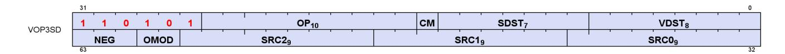

**Description** Vector ALU format with three operands and a scalar result. This encoding is used only for a few opcodes. Can be followed by a 32-bit literal constant or DPP instruction DWORD when the instruction allows it.

This encoding allows specifying a unique scalar destination, and is used only for the opcodes listed below. All other opcodes use VOP3.

Table 95. VOP3SD Fields

| Field Name | Bits    | Format or Description   |
|------------|---------|-------------------------|
| VDST       | [7:0]   | Destination VGPR        |
| SDST       | [14:8]  | Scalar destination      |
| CM         | [15]    | Clamp result            |
| OP         | [25:16] | Opcode. see next table. |
| ENCODING   | [31:26] | 'b110101                |

15.3. Vector ALU Formats 185 of 697

| Field Name | Bits      | Format or Description                               |
|------------|-----------|-----------------------------------------------------|
| SRC0       | [40:32]   | Source 0. First operand for the instruction.        |
|            | 0-105     | SGPR0 - SGPR105: Scalar general-purpose registers.  |
|            | 106       | VCC_LO: VCC[31:0].                                  |
|            | 107       | VCC_HI: VCC[63:32].                                 |
|            | 108-123   | TTMP0 - TTMP15: Trap handler temporary register.    |
|            | 124       | NULL                                                |
|            | 125       | M0. Misc register 0.                                |
|            | 126       | EXEC_LO: EXEC[31:0].                                |
|            | 127       | EXEC_HI: EXEC[63:32].                               |
|            | 128       | 0.                                                  |
|            | 129-192   | Signed integer 1 to 64.                             |
|            | 193-208   | Signed integer -1 to -16.                           |
|            | 209-232   | Reserved.                                           |
|            | 233       | DPP8 (only valid as SRC0)                           |
|            | 234       | DPP8FI (only valid as SRC0)                         |
|            | 235       | SHARED_BASE (Memory Aperture definition).           |
|            | 236       | SHARED_LIMIT (Memory Aperture definition).          |
|            | 237       | PRIVATE_BASE (Memory Aperture definition).          |
|            | 238       | PRIVATE_LIMIT (Memory Aperture definition).         |
|            | 239       | Reserved.                                           |
|            | 240       | 0.5.                                                |
|            | 241       | -0.5.                                               |
|            | 242       | 1.0.                                                |
|            | 243       | -1.0.                                               |
|            | 244       | 2.0.                                                |
|            | 245       | -2.0.                                               |
|            | 246       | 4.0.                                                |
|            | 247       | -4.0.                                               |
|            | 248       | 1/(2*PI).                                           |
|            | 250       | DPP16 (only valid as SRC0)                          |
|            | 253       | SCC.                                                |
|            | 254       | Reserved.                                           |
|            | 255       | Literal constant.                                   |
|            | 256 - 511 | VGPR 0 - 255                                        |
| SRC1       | [49:41]   | Second input operand. Same options as SRC0.         |
| SRC2       | [58:50]   | Third input operand. Same options as SRC0.          |
| OMOD       | [60:59]   | Output Modifier: 0=none, 1=*2, 2=*4, 3=*0.5         |
| NEG        | [63:61]   | Negate input. [61] = src0, [62] = src1, [63] = src2 |

#### Table 96. VOP3SD Opcodes

| Opcode # | Name               | Opcode # | Name             |
|----------|--------------------|----------|------------------|
| 288      | V_ADD_CO_CI_U32    | 766      | V_MAD_CO_U64_U32 |
| 289      | V_SUB_CO_CI_U32    | 767      | V_MAD_CO_I64_I32 |
| 290      | V_SUBREV_CO_CI_U32 | 768      | V_ADD_CO_U32     |
| 764      | V_DIV_SCALE_F32    | 769      | V_SUB_CO_U32     |
| 765      | V_DIV_SCALE_F64    | 770      | V_SUBREV_CO_U32  |

# <span id="page-195-0"></span>**15.3.6. VOP3P**

15.3. Vector ALU Formats 186 of 697

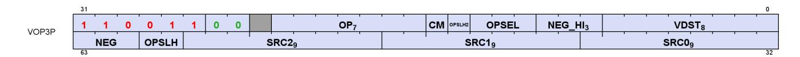

**Description** Vector ALU format taking one, two or three pairs of 16 bit inputs and producing two 16-bit outputs (packed into 1 DWORD). WMMA instructions have larger input and output VGPR sets. Can be followed by a 32-bit literal constant or DPP instruction DWORD when the instruction allows it.

Table 97. VOP3P Fields

| Field Name       | Bits                                                                                                                                                                                                                                            | Format or Description                                                                                                                                                                                                                                                                                                                                                                                                                                                                                                                                                                                                                                                                                                                                         |
|------------------|-------------------------------------------------------------------------------------------------------------------------------------------------------------------------------------------------------------------------------------------------|---------------------------------------------------------------------------------------------------------------------------------------------------------------------------------------------------------------------------------------------------------------------------------------------------------------------------------------------------------------------------------------------------------------------------------------------------------------------------------------------------------------------------------------------------------------------------------------------------------------------------------------------------------------------------------------------------------------------------------------------------------------|
| VDST             | [7:0]                                                                                                                                                                                                                                           | Destination VGPR                                                                                                                                                                                                                                                                                                                                                                                                                                                                                                                                                                                                                                                                                                                                              |
| NEG_HI           | [10:8]                                                                                                                                                                                                                                          | Negate sources 0,1,2 of the high 16-bits.                                                                                                                                                                                                                                                                                                                                                                                                                                                                                                                                                                                                                                                                                                                     |
| OPSEL            | [13:11]                                                                                                                                                                                                                                         | Select low or high for low sources 0=[11], 1=[12], 2=[13].                                                                                                                                                                                                                                                                                                                                                                                                                                                                                                                                                                                                                                                                                                    |
| OPSEL_HI2        | [14]                                                                                                                                                                                                                                            | Bit[2] of OPSEL_HI. Select low or high for high sources 2=[14], 1=[60], 0=[59].                                                                                                                                                                                                                                                                                                                                                                                                                                                                                                                                                                                                                                                                               |
| CM               | [15]                                                                                                                                                                                                                                            | 1 = clamp result.                                                                                                                                                                                                                                                                                                                                                                                                                                                                                                                                                                                                                                                                                                                                             |
| OP               | [22:16]                                                                                                                                                                                                                                         | Opcode. see next table.                                                                                                                                                                                                                                                                                                                                                                                                                                                                                                                                                                                                                                                                                                                                       |
|                  |                                                                                                                                                                                                                                                 |                                                                                                                                                                                                                                                                                                                                                                                                                                                                                                                                                                                                                                                                                                                                                               |
| ENCODING<br>SRC0 | [31:24]<br>[40:32]<br>0-105<br>106<br>107<br>108-123<br>124<br>125<br>126<br>127<br>128<br>129-192<br>193-208<br>209-232<br>233<br>234<br>235<br>236<br>237<br>238<br>239<br>240<br>241<br>242<br>243<br>244<br>245<br>246<br>247<br>248<br>250 | 'b11001100<br>Source 0. First operand for the instruction.<br>SGPR0 - SGPR105: Scalar general-purpose registers.<br>VCC_LO: VCC[31:0].<br>VCC_HI: VCC[63:32].<br>TTMP0 - TTMP15: Trap handler temporary register.<br>NULL<br>M0. Misc register 0.<br>EXEC_LO: EXEC[31:0].<br>EXEC_HI: EXEC[63:32].<br>0.<br>Signed integer 1 to 64.<br>Signed integer -1 to -16.<br>Reserved.<br>DPP8 (only valid as SRC0)<br>DPP8FI (only valid as SRC0)<br>SHARED_BASE (Memory Aperture definition).<br>SHARED_LIMIT (Memory Aperture definition).<br>PRIVATE_BASE (Memory Aperture definition).<br>PRIVATE_LIMIT (Memory Aperture definition).<br>Reserved.<br>0.5.<br>-0.5.<br>1.0.<br>-1.0.<br>2.0.<br>-2.0.<br>4.0.<br>-4.0.<br>1/(2*PI).<br>DPP16 (only valid as SRC0) |
|                  | 253<br>254<br>255<br>256 - 511                                                                                                                                                                                                                  | SCC.<br>Reserved.<br>Literal constant.<br>VGPR 0 - 255                                                                                                                                                                                                                                                                                                                                                                                                                                                                                                                                                                                                                                                                                                        |
|                  |                                                                                                                                                                                                                                                 |                                                                                                                                                                                                                                                                                                                                                                                                                                                                                                                                                                                                                                                                                                                                                               |
| SRC1<br>SRC2     | [49:41]<br>[58:50]                                                                                                                                                                                                                              | Second input operand. Same options as SRC0.<br>Third input operand. Same options as SRC0.                                                                                                                                                                                                                                                                                                                                                                                                                                                                                                                                                                                                                                                                     |

15.3. Vector ALU Formats 187 of 697

| Field Name | Bits    | Format or Description                                                          |
|------------|---------|--------------------------------------------------------------------------------|
| OPSEL_HI   | [60:59] | Bits [1:0] of OPSEL_HI. See OPSEL_HI2.                                         |
| NEG        | [63:61] | Negate input for low 16-bits of sources. [61] = src0, [62] = src1, [63] = src2 |

Table 98. VOP3P Opcodes

| Opcode # | Name             | Opcode # | Name                          |
|----------|------------------|----------|-------------------------------|
| 0        | V_PK_MAD_I16     | 33       | V_FMA_MIXLO_F16               |
| 1        | V_PK_MUL_LO_U16  | 34       | V_FMA_MIXHI_F16               |
| 2        | V_PK_ADD_I16     | 36       | V_DOT4_F32_FP8_BF8            |
| 3        | V_PK_SUB_I16     | 37       | V_DOT4_F32_BF8_FP8            |
| 4        | V_PK_LSHLREV_B16 | 38       | V_DOT4_F32_FP8_FP8            |
| 5        | V_PK_LSHRREV_B16 | 39       | V_DOT4_F32_BF8_BF8            |
| 6        | V_PK_ASHRREV_I16 | 64       | V_WMMA_F32_16X16X16_F16       |
| 7        | V_PK_MAX_I16     | 65       | V_WMMA_F32_16X16X16_BF16      |
| 8        | V_PK_MIN_I16     | 66       | V_WMMA_F16_16X16X16_F16       |
| 9        | V_PK_MAD_U16     | 67       | V_WMMA_BF16_16X16X16_BF16     |
| 10       | V_PK_ADD_U16     | 68       | V_WMMA_I32_16X16X16_IU8       |
| 11       | V_PK_SUB_U16     | 69       | V_WMMA_I32_16X16X16_IU4       |
| 12       | V_PK_MAX_U16     | 70       | V_WMMA_F32_16X16X16_FP8_FP8   |
| 13       | V_PK_MIN_U16     | 71       | V_WMMA_F32_16X16X16_FP8_BF8   |
| 14       | V_PK_FMA_F16     | 72       | V_WMMA_F32_16X16X16_BF8_FP8   |
| 15       | V_PK_ADD_F16     | 73       | V_WMMA_F32_16X16X16_BF8_BF8   |
| 16       | V_PK_MUL_F16     | 74       | V_WMMA_I32_16X16X32_IU4       |
| 19       | V_DOT2_F32_F16   | 80       | V_SWMMAC_F32_16X16X32_F16     |
| 22       | V_DOT4_I32_IU8   | 81       | V_SWMMAC_F32_16X16X32_BF16    |
| 23       | V_DOT4_U32_U8    | 82       | V_SWMMAC_F16_16X16X32_F16     |
| 24       | V_DOT8_I32_IU4   | 83       | V_SWMMAC_BF16_16X16X32_BF16   |
| 25       | V_DOT8_U32_U4    | 84       | V_SWMMAC_I32_16X16X32_IU8     |
| 26       | V_DOT2_F32_BF16  | 85       | V_SWMMAC_I32_16X16X32_IU4     |
| 27       | V_PK_MIN_NUM_F16 | 86       | V_SWMMAC_I32_16X16X64_IU4     |
| 28       | V_PK_MAX_NUM_F16 | 87       | V_SWMMAC_F32_16X16X32_FP8_FP8 |
| 29       | V_PK_MINIMUM_F16 | 88       | V_SWMMAC_F32_16X16X32_FP8_BF8 |
| 30       | V_PK_MAXIMUM_F16 | 89       | V_SWMMAC_F32_16X16X32_BF8_FP8 |
| 32       | V_FMA_MIX_F32    | 90       | V_SWMMAC_F32_16X16X32_BF8_BF8 |

# **15.3.7. VOPD**

<span id="page-197-0"></span>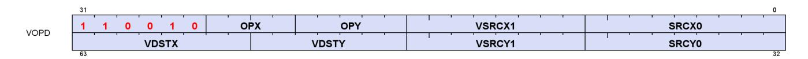

**Description** Vector ALU format describing two instructions to be executed in parallel. Can be followed by a 32-bit literal constant, but not a DPP control DWORD.

This instruction format describe two opcodes: X and Y.

Table 99. VOPD Fields

15.3. Vector ALU Formats 188 of 697

| Field Name | Bits<br>Format or Description |                                                                                 |  |  |  |
|------------|-------------------------------|---------------------------------------------------------------------------------|--|--|--|
| SRCX0      | [8:0]                         | Source 0 for opcode X. First operand for the instruction.                       |  |  |  |
|            | 0-105                         | SGPR0 - SGPR105: Scalar general-purpose registers.                              |  |  |  |
|            | 106                           | VCC_LO: VCC[31:0].                                                              |  |  |  |
|            | 107                           | VCC_HI: VCC[63:32].                                                             |  |  |  |
|            | 108-123                       | TTMP0 - TTMP15: Trap handler temporary register.                                |  |  |  |
|            | 124                           | NULL                                                                            |  |  |  |
|            | 125                           | M0. Misc register 0.                                                            |  |  |  |
|            | 126                           | EXEC_LO: EXEC[31:0].                                                            |  |  |  |
|            | 127                           | EXEC_HI: EXEC[63:32].                                                           |  |  |  |
|            | 128                           | 0.                                                                              |  |  |  |
|            | 129-192                       | Signed integer 1 to 64.                                                         |  |  |  |
|            | 193-208                       | Signed integer -1 to -16.                                                       |  |  |  |
|            | 209-232                       | Reserved.                                                                       |  |  |  |
|            | 233                           | DPP8 (only valid as SRC0)                                                       |  |  |  |
|            | 234                           | DPP8FI (only valid as SRC0)                                                     |  |  |  |
|            | 235                           | SHARED_BASE (Memory Aperture definition).                                       |  |  |  |
|            | 236                           | SHARED_LIMIT (Memory Aperture definition).                                      |  |  |  |
|            | 237                           | PRIVATE_BASE (Memory Aperture definition).                                      |  |  |  |
|            | 238                           | PRIVATE_LIMIT (Memory Aperture definition).                                     |  |  |  |
|            | 239                           | Reserved.                                                                       |  |  |  |
|            | 240                           | 0.5.                                                                            |  |  |  |
|            | 241                           | -0.5.                                                                           |  |  |  |
|            | 242                           | 1.0.                                                                            |  |  |  |
|            | 243                           | -1.0.                                                                           |  |  |  |
|            | 244                           | 2.0.                                                                            |  |  |  |
|            | 245                           | -2.0.                                                                           |  |  |  |
|            | 246                           | 4.0.                                                                            |  |  |  |
|            | 247                           | -4.0.                                                                           |  |  |  |
|            | 248                           | 1/(2*PI).                                                                       |  |  |  |
|            | 250                           | DPP16 (only valid as SRC0)                                                      |  |  |  |
|            | 253                           | SCC.                                                                            |  |  |  |
|            | 254                           | Reserved.                                                                       |  |  |  |
|            | 255                           | Literal constant.                                                               |  |  |  |
|            | 256 - 511                     | VGPR 0 - 255                                                                    |  |  |  |
| VSRCX1     | [16:9]                        | Source VGPR 1 for opcode X.                                                     |  |  |  |
| OPY        | [21:17]                       | Opcode Y. see next table.                                                       |  |  |  |
| OPX        | [25:22]                       | Opcode X. see next table.                                                       |  |  |  |
| ENCODING   | [31:26]                       | 'b110010                                                                        |  |  |  |
| SRCY0      | [40:32]                       | Source 0 for opcode Y. See SRCX0 for enumerations                               |  |  |  |
| VSRCY1     | [48:41]                       | Source VGPR 1 for opcode Y.                                                     |  |  |  |
| VDSTY      | [55:49]                       | Instruction Y destination VGPR, excluding LSB. LSB is the opposite of VDSTX[0]. |  |  |  |
| VDSTX      | [63:56]                       | Instruction X destination VGPR                                                  |  |  |  |

#### Table 100. VOPD X-Opcodes

| 0 V_DUAL_FMAC_F32   | 7 | V_DUAL_MUL_DX9_ZERO_F32    |
|---------------------|---|----------------------------|
| 1 V_DUAL_FMAAK_F32  | 8 | V_DUAL_MOV_B32             |
| 2 V_DUAL_FMAMK_F32  | 9 | V_DUAL_CNDMASK_B32         |
| 3 V_DUAL_MUL_F32    |   | 10 V_DUAL_MAX_NUM_F32      |
| 4 V_DUAL_ADD_F32    |   | 11 V_DUAL_MIN_NUM_F32      |
| 5 V_DUAL_SUB_F32    |   | 12 V_DUAL_DOT2ACC_F32_F16  |
| 6 V_DUAL_SUBREV_F32 |   | 13 V_DUAL_DOT2ACC_F32_BF16 |

15.3. Vector ALU Formats 189 of 697

## Table 101. VOPD Y-Opcodes

| 0 V_DUAL_FMAC_F32         | 9 | V_DUAL_CNDMASK_B32         |
|---------------------------|---|----------------------------|
| 1 V_DUAL_FMAAK_F32        |   | 10 V_DUAL_MAX_NUM_F32      |
| 2 V_DUAL_FMAMK_F32        |   | 11 V_DUAL_MIN_NUM_F32      |
| 3 V_DUAL_MUL_F32          |   | 12 V_DUAL_DOT2ACC_F32_F16  |
| 4 V_DUAL_ADD_F32          |   | 13 V_DUAL_DOT2ACC_F32_BF16 |
| 5 V_DUAL_SUB_F32          |   | 16 V_DUAL_ADD_NC_U32       |
| 6 V_DUAL_SUBREV_F32       |   | 17 V_DUAL_LSHLREV_B32      |
| 7 V_DUAL_MUL_DX9_ZERO_F32 |   | 18 V_DUAL_AND_B32          |
| 8 V_DUAL_MOV_B32          |   |                            |

# **15.3.8. DPP16**

<span id="page-199-0"></span>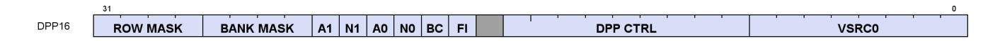

**Description** Data Parallel Primitives over 16 lanes. This is an additional DWORD that can follow VOP1, VOP2, VOPC, VOP3 or VOP3P instructions (in place of a literal constant) to control selection of data from other lanes.

Table 102. DPP16 Fields

| Field Name | Bits    | Format or Description                                                                                                                                                                                                                                                                                                                                                                                                                  |  |
|------------|---------|----------------------------------------------------------------------------------------------------------------------------------------------------------------------------------------------------------------------------------------------------------------------------------------------------------------------------------------------------------------------------------------------------------------------------------------|--|
| SRC0       | [39:32] | Real SRC0 operand (VGPR).                                                                                                                                                                                                                                                                                                                                                                                                              |  |
| DPP_CTRL   | [48:40] | See next table: "DPP_CTRL Enumeration"                                                                                                                                                                                                                                                                                                                                                                                                 |  |
| FI         | [50]    | Fetch invalid data: 0 = read zero for any inactive lanes; 1 = read VGPRs even for<br>invalid lanes.                                                                                                                                                                                                                                                                                                                                    |  |
| BC         | [51]    | Bounds Control: 0 = do not write when source is out of range, 1 = write.                                                                                                                                                                                                                                                                                                                                                               |  |
| SRC0_NEG   | [52]    | 1 = negate source 0.                                                                                                                                                                                                                                                                                                                                                                                                                   |  |
| SRC0_ABS   | [53]    | 1 = Absolute value of source 0.                                                                                                                                                                                                                                                                                                                                                                                                        |  |
| SRC1_NEG   | [54]    | 1 = negate source 1.                                                                                                                                                                                                                                                                                                                                                                                                                   |  |
| SRC1_ABS   | [55]    | 1 = Absolute value of source 1.                                                                                                                                                                                                                                                                                                                                                                                                        |  |
| BANK_MASK  | [59:56] | Bank Mask Applies to the VGPR destination write only, does not impact the thread<br>mask when fetching source VGPR data.<br>27==0: lanes[12:15, 28:31, 44:47, 60:63] are disabled<br>26==0: lanes[8:11, 24:27, 40:43, 56:59] are disabled<br>25==0: lanes[4:7, 20:23, 36:39, 52:55] are disabled<br>24==0: lanes[0:3, 16:19, 32:35, 48:51] are disabled<br>Notice: the term "bank" here is not the same as was used for the VGPR bank. |  |
| ROW_MASK   | [63:60] | Row Mask Applies to the VGPR destination write only, does not impact the thread<br>mask when fetching source VGPR data.<br>31==0: lanes[63:48] are disabled (wave 64 only)<br>30==0: lanes[47:32] are disabled (wave 64 only)<br>29==0: lanes[31:16] are disabled<br>28==0: lanes[15:0] are disabled                                                                                                                                   |  |

Table 103. DPP\_CTRL Enumeration

15.3. Vector ALU Formats 190 of 697

| DPP_Cntl<br>Enumeration  | Hex<br>Value | Function                                                                                                             | Description                                                                           |
|--------------------------|--------------|----------------------------------------------------------------------------------------------------------------------|---------------------------------------------------------------------------------------|
| DPP_QUAD_PE<br>RM*       | 000-<br>0FF  | pix[n].srca = pix[(n&0x3c)+ dpp_cntl[n%4*2+1 :<br>n%4*2]].srca                                                       | Permute of four threads.                                                              |
| DPP_UNUSED               | 100          | Undefined                                                                                                            | Reserved.                                                                             |
| DPP_ROW_SL*              | 101-<br>10F  | if ((n&0xf) < (16-cntl[3:0])) pix[n].srca = pix[n+<br>cntl[3:0]].srca else use bound_cntl                            | Row shift left by 1-15 threads.                                                       |
| DPP_ROW_SR*              | 111-<br>11F  | if ((n&0xf) >= cntl[3:0]) pix[n].srca = pix[n -<br>cntl[3:0]].srca else use bound_cntl                               | Row shift right by 1-15 threads.                                                      |
| DPP_ROW_RR* 121-         | 12F          | if ((n&0xf) >= cnt[3:0]) pix[n].srca = pix[n -<br>cntl[3:0]].srca else pix[n].srca = pix[n + 16 -<br>cntl[3:0]].srca | Row rotate right by 1-15 threads.                                                     |
| DPP_ROW_MIR<br>ROR*      | 140          | pix[n].srca = pix[15-(n&f)].srca                                                                                     | Mirror threads within row.                                                            |
| DPP_ROW_HA<br>LF_MIRROR* | 141          | pix[n].srca = pix[7-(n&7)].srca                                                                                      | Mirror threads within row (8 threads).                                                |
| DPP_ROW_SHA<br>RE*       | 150-<br>15F  | lanesel = DPP_CTRL & 0xf;<br>lane[n].src0 = lane[(n & 0x30) + lanesel].src0.                                         | Select one lane within each row and share<br>the result with all lanes in the row.    |
| DPP_ROW_XM<br>ASK*       | 160-<br>16F  | lane[n].src0 = lane[(n & 0x30) + ((n & 0xf) ^<br>mask)].src0.                                                        | Fetch lane ID is the current lane ID XOR'd<br>with a mask specified by DPP_CTRL[3:0]. |

# <span id="page-200-0"></span>**15.3.9. DPP8**

|      | 31   |      |      |      |      |      |      |      |       | 0 |
|------|------|------|------|------|------|------|------|------|-------|---|
| DPP8 | SEL7 | SEL6 | SEL5 | SEL4 | SEL3 | SEL2 | SEL1 | SEL0 | VSRC0 | 1 |

**Description** Data Parallel Primitives over 8 lanes. This is a second DWORD that can follow VOP1, VOP2, VOPC, VOP3 or VOP3P instructions (in place of a literal constant) to control selection of data from other lanes.

### Table 104. DPP8 Fields

| Field Name | Bits    | Format or Description                                   |
|------------|---------|---------------------------------------------------------|
| SRC0       | [39:32] | Real SRC0 operand (VGPR).                               |
| LANE_SEL0  | [42:40] | Which lane to read for 1st output lane per 8-lane group |
| LANE_SEL1  | [45:43] | Which lane to read for 2nd output lane per 8-lane group |
| LANE_SEL2  | [48:46] | Which lane to read for 3rd output lane per 8-lane group |
| LANE_SEL3  | [51:49] | Which lane to read for 4th output lane per 8-lane group |
| LANE_SEL4  | [54:52] | Which lane to read for 5th output lane per 8-lane group |
| LANE_SEL5  | [57:55] | Which lane to read for 6th output lane per 8-lane group |
| LANE_SEL6  | [60:58] | Which lane to read for 7th output lane per 8-lane group |
| LANE_SEL7  | [63:61] | Which lane to read for 8th output lane per 8-lane group |

15.3. Vector ALU Formats 191 of 697

# <span id="page-201-0"></span>**15.4. Vector Parameter Interpolation Format**

# <span id="page-201-1"></span>**15.4.1. VINTERP**

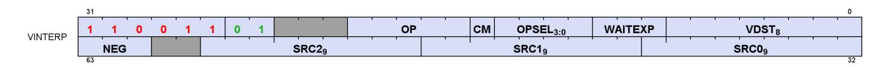

**Description** Vector Parameter Interpolation.

These opcodes perform parameter interpolation using vertex data in pixel shaders.

Table 105. VINTERP Fields

| Field Name | Bits      | Format or Description                                                              |  |
|------------|-----------|------------------------------------------------------------------------------------|--|
| VDST       | [7:0]     | Destination VGPR                                                                   |  |
| WAITEXP    | [10:8]    | Wait for EXPcnt to be less-than or equal-to this value before issuing instruction. |  |
| OPSEL      | [14:11]   | Select low or high for low sources 0=[11], 1=[12], 2=[13], dst=[14].               |  |
| CM         | [15]      | 1 = clamp result.                                                                  |  |
| OP         | [20:16]   | Opcode. see next table.                                                            |  |
| ENCODING   | [31:26]   | 'b11001101                                                                         |  |
| SRC0       | [40:32]   | Source 0. First operand for the instruction.                                       |  |
|            | 256 - 511 | VGPR 0 - 255                                                                       |  |
| SRC1       | [49:41]   | Second input operand. Same options as SRC0.                                        |  |
| SRC2       | [58:50]   | Third input operand. Same options as SRC0.                                         |  |
| NEG        | [63:61]   | Negate input for low 16-bits of sources. [61] = src0, [62] = src1, [63] = src2     |  |

Table 106. VINTERP Opcodes

| Opcode # | Name                 | Opcode # | Name                     |
|----------|----------------------|----------|--------------------------|
| 0        | V_INTERP_P10_F32     | 3        | V_INTERP_P2_F16_F32      |
| 1        | V_INTERP_P2_F32      | 4        | V_INTERP_P10_RTZ_F16_F32 |
| 2        | V_INTERP_P10_F16_F32 | 5        | V_INTERP_P2_RTZ_F16_F32  |

# <span id="page-201-2"></span>**15.5. Parameter and Direct Load from LDS**

# <span id="page-201-3"></span>**15.5.1. VDSDIR**

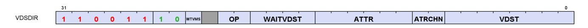

**Description** LDS Direct and Parameter Load.

These opcodes read either pixel parameter data or individual DWORDs from LDS into VGPRs.

Table 107. VDSDIR Fields

| Field Name | Bits  | Format or Description                 |
|------------|-------|---------------------------------------|
| VDST       | [7:0] | Destination VGPR                      |
| ATTR_CHAN  | [9:8] | Attribute channel: 0=X, 1=Y, 2=Z, 3=W |

| Field Name  | Bits    | Format or Description                                                                                                                                                                                  |
|-------------|---------|--------------------------------------------------------------------------------------------------------------------------------------------------------------------------------------------------------|
| ATTR        | [15:10] | Attribute number: 0 - 32.                                                                                                                                                                              |
| WAIT_VA     | [19:16] | Wait for previous VALU instructions to complete to resolve data dependency. Value is<br>the max number of VALU ops still outstanding when issuing this instruction.                                    |
| OP          | [21:20] | Opcode:<br>0: DS_PARAM_LOAD<br>1: DS_DIRECT_LOAD<br>2, 3: Reserved.                                                                                                                                    |
| WAIT_VMVSRC | [23]    | When set to 0, wait for all previously issued VMEM ops (including LDS) to have finished<br>reading source VGPRs before issuing this instruction; when set to one issue as usual (no<br>extra waiting). |
| ENCODING    | [31:24] | 'b11001110                                                                                                                                                                                             |

Table 108. VDSDIR Opcodes

| Opcode # | Name          | Opcode # | Name           |
|----------|---------------|----------|----------------|
| 0        | DS_PARAM_LOAD | 1        | DS_DIRECT_LOAD |

# <span id="page-203-0"></span>**15.6. Data-Share Format**

# <span id="page-203-1"></span>**15.6.1. VDS**

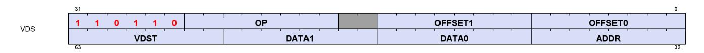

**Description** Local Data Sharing instructions

Table 109. DS Fields

| Field Name | Bits    | Format or Description                                                      |
|------------|---------|----------------------------------------------------------------------------|
| OFFSET0    | [7:0]   | First address offset                                                       |
| OFFSET1    | [15:8]  | Second address offset. For some opcodes this is concatenated with OFFSET0. |
| OP         | [25:18] | See Opcode table below.                                                    |
| ENCODING   | [31:26] | 'b110110                                                                   |
| ADDR       | [39:32] | VGPR that supplies the address.                                            |
| DATA0      | [47:40] | First data VGPR.                                                           |
| DATA1      | [55:48] | Second data VGPR.                                                          |
| VDST       | [63:56] | Destination VGPR when results returned to VGPRs.                           |

Table 110. DS Opcodes

| Opcode # | Name                        | Opcode # | Name                                |
|----------|-----------------------------|----------|-------------------------------------|
| 0        | DS_ADD_U32                  | 78       | DS_STORE_2ADDR_B64                  |
| 1        | DS_SUB_U32                  | 79       | DS_STORE_2ADDR_STRIDE64_B64         |
| 2        | DS_RSUB_U32                 | 80       | DS_CMPSTORE_B64                     |
| 3        | DS_INC_U32                  | 82       | DS_MIN_NUM_F64                      |
| 4        | DS_DEC_U32                  | 83       | DS_MAX_NUM_F64                      |
| 5        | DS_MIN_I32                  | 96       | DS_ADD_RTN_U64                      |
| 6        | DS_MAX_I32                  | 97       | DS_SUB_RTN_U64                      |
| 7        | DS_MIN_U32                  | 98       | DS_RSUB_RTN_U64                     |
| 8        | DS_MAX_U32                  | 99       | DS_INC_RTN_U64                      |
| 9        | DS_AND_B32                  | 100      | DS_DEC_RTN_U64                      |
| 10       | DS_OR_B32                   | 101      | DS_MIN_RTN_I64                      |
| 11       | DS_XOR_B32                  | 102      | DS_MAX_RTN_I64                      |
| 12       | DS_MSKOR_B32                | 103      | DS_MIN_RTN_U64                      |
| 13       | DS_STORE_B32                | 104      | DS_MAX_RTN_U64                      |
| 14       | DS_STORE_2ADDR_B32          | 105      | DS_AND_RTN_B64                      |
| 15       | DS_STORE_2ADDR_STRIDE64_B32 | 106      | DS_OR_RTN_B64                       |
| 16       | DS_CMPSTORE_B32             | 107      | DS_XOR_RTN_B64                      |
| 18       | DS_MIN_NUM_F32              | 108      | DS_MSKOR_RTN_B64                    |
| 19       | DS_MAX_NUM_F32              | 109      | DS_STOREXCHG_RTN_B64                |
| 20       | DS_NOP                      | 110      | DS_STOREXCHG_2ADDR_RTN_B64          |
| 21       | DS_ADD_F32                  | 111      | DS_STOREXCHG_2ADDR_STRIDE64_RTN_B64 |
| 30       | DS_STORE_B8                 | 112      | DS_CMPSTORE_RTN_B64                 |
| 31       | DS_STORE_B16                | 114      | DS_MIN_NUM_RTN_F64                  |
| 32       | DS_ADD_RTN_U32              | 115      | DS_MAX_NUM_RTN_F64                  |

15.6. Data-Share Format 194 of 697

| Opcode # | Name                                | Opcode # | Name                            |
|----------|-------------------------------------|----------|---------------------------------|
| 33       | DS_SUB_RTN_U32                      | 118      | DS_LOAD_B64                     |
| 34       | DS_RSUB_RTN_U32                     | 119      | DS_LOAD_2ADDR_B64               |
| 35       | DS_INC_RTN_U32                      | 120      | DS_LOAD_2ADDR_STRIDE64_B64      |
| 36       | DS_DEC_RTN_U32                      | 121      | DS_ADD_RTN_F32                  |
| 37       | DS_MIN_RTN_I32                      | 126      | DS_CONDXCHG32_RTN_B64           |
| 38       | DS_MAX_RTN_I32                      | 152      | DS_COND_SUB_U32                 |
| 39       | DS_MIN_RTN_U32                      | 153      | DS_SUB_CLAMP_U32                |
| 40       | DS_MAX_RTN_U32                      | 154      | DS_PK_ADD_F16                   |
| 41       | DS_AND_RTN_B32                      | 155      | DS_PK_ADD_BF16                  |
| 42       | DS_OR_RTN_B32                       | 160      | DS_STORE_B8_D16_HI              |
| 43       | DS_XOR_RTN_B32                      | 161      | DS_STORE_B16_D16_HI             |
| 44       | DS_MSKOR_RTN_B32                    | 162      | DS_LOAD_U8_D16                  |
| 45       | DS_STOREXCHG_RTN_B32                | 163      | DS_LOAD_U8_D16_HI               |
| 46       | DS_STOREXCHG_2ADDR_RTN_B32          | 164      | DS_LOAD_I8_D16                  |
| 47       | DS_STOREXCHG_2ADDR_STRIDE64_RTN_B32 | 165      | DS_LOAD_I8_D16_HI               |
| 48       | DS_CMPSTORE_RTN_B32                 | 166      | DS_LOAD_U16_D16                 |
| 50       | DS_MIN_NUM_RTN_F32                  | 167      | DS_LOAD_U16_D16_HI              |
| 51       | DS_MAX_NUM_RTN_F32                  | 168      | DS_COND_SUB_RTN_U32             |
| 53       | DS_SWIZZLE_B32                      | 169      | DS_SUB_CLAMP_RTN_U32            |
| 54       | DS_LOAD_B32                         | 170      | DS_PK_ADD_RTN_F16               |
| 55       | DS_LOAD_2ADDR_B32                   | 171      | DS_PK_ADD_RTN_BF16              |
| 56       | DS_LOAD_2ADDR_STRIDE64_B32          | 176      | DS_STORE_ADDTID_B32             |
| 57       | DS_LOAD_I8                          | 177      | DS_LOAD_ADDTID_B32              |
| 58       | DS_LOAD_U8                          | 178      | DS_PERMUTE_B32                  |
| 59       | DS_LOAD_I16                         | 179      | DS_BPERMUTE_B32                 |
| 60       | DS_LOAD_U16                         | 192      | Reserved                        |
| 61       | DS_CONSUME                          | 194      | Reserved                        |
| 62       | DS_APPEND                           | 195      | Reserved                        |
| 64       | DS_ADD_U64                          | 196      | Reserved                        |
| 65       | DS_SUB_U64                          | 198      | Reserved                        |
| 66       | DS_RSUB_U64                         | 199      | Reserved                        |
| 67       | DS_INC_U64                          | 200      | Reserved                        |
| 68       | DS_DEC_U64                          | 202      | Reserved                        |
| 69       | DS_MIN_I64                          | 203      | Reserved                        |
| 70       | DS_MAX_I64                          | 205      | DS_BPERMUTE_FI_B32              |
| 71       | DS_MIN_U64                          | 222      | DS_STORE_B96                    |
| 72       | DS_MAX_U64                          | 223      | DS_STORE_B128                   |
| 73       | DS_AND_B64                          | 224      | DS_BVH_STACK_PUSH4_POP1_RTN_B32 |
| 74       | DS_OR_B64                           | 225      | DS_BVH_STACK_PUSH8_POP1_RTN_B32 |
| 75       | DS_XOR_B64                          | 226      | DS_BVH_STACK_PUSH8_POP2_RTN_B64 |
| 76       | DS_MSKOR_B64                        | 254      | DS_LOAD_B96                     |
| 77       | DS_STORE_B64                        | 255      | DS_LOAD_B128                    |

15.6. Data-Share Format 195 of 697

# <span id="page-205-0"></span>**15.7. Vector Memory Buffer Formats**

There are two memory buffer instruction formats:

#### **VBUFFER**

typed buffer access (data type is defined by the instruction) or untyped (defined by the resource-constant)

# <span id="page-205-1"></span>**15.7.1. VBUFFER**

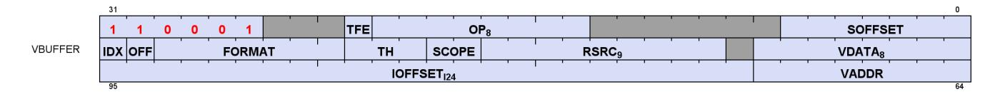

**Description** Memory Typed-Buffer Instructions

Table 111. VBUFFER Fields

| Field Name | Bits    | Format or Description                                                                                                                                                |
|------------|---------|----------------------------------------------------------------------------------------------------------------------------------------------------------------------|
| SOFFSET    | [6:0]   | Address offset from SGPR or NULL, unsigned byte.                                                                                                                     |
| OP         | [21:14] | Opcode. See table below. (combined bits 53 with 18-16 to form opcode)                                                                                                |
| TFE        | [22]    | Partially resident texture, texture fault enable.                                                                                                                    |
| ENCODING   | [31:26] | 'b110001                                                                                                                                                             |
| VDATA      | [39:32] | Address of VGPR to supply first component of write data or receive first component of<br>read-data.                                                                  |
| RSRC       | [49:41] | SGPR to supply V# (resource constant) in 4 or 8 consecutive SGPRs. Must be multiple of 4 in<br>the range 0-120.                                                      |
| SCOPE      | [51:50] | Memory Scope                                                                                                                                                         |
| TH         | [54:52] | Memory Temporal Hint                                                                                                                                                 |
| FORMAT     | [61:55] | Data Format of data in memory buffer. See Buffer Image format Table                                                                                                  |
| OFFEN      | [62]    | 1 = enable offset VGPR, 0 = use zero for address offset                                                                                                              |
| IDXEN      | [63]    | 1 = enable index VGPR, 0 = use zero for address index                                                                                                                |
| VADDR      | [71:64] | Address of VGPR to supply first component of address (offset or index). When both index<br>and offset are used, index is in the first VGPR and offset in the second. |
| IOFFSET    | [95:72] | Address offset, signed byte; must be non-negative.                                                                                                                   |

Table 112. VBUFFER Opcodes

| Opcode # | Name                       | Opcode # | Name                      |
|----------|----------------------------|----------|---------------------------|
| 0        | BUFFER_LOAD_FORMAT_X       | 56       | BUFFER_ATOMIC_MIN_I32     |
| 1        | BUFFER_LOAD_FORMAT_XY      | 57       | BUFFER_ATOMIC_MIN_U32     |
| 2        | BUFFER_LOAD_FORMAT_XYZ     | 58       | BUFFER_ATOMIC_MAX_I32     |
| 3        | BUFFER_LOAD_FORMAT_XYZW    | 59       | BUFFER_ATOMIC_MAX_U32     |
| 4        | BUFFER_STORE_FORMAT_X      | 60       | BUFFER_ATOMIC_AND_B32     |
| 5        | BUFFER_STORE_FORMAT_XY     | 61       | BUFFER_ATOMIC_OR_B32      |
| 6        | BUFFER_STORE_FORMAT_XYZ    | 62       | BUFFER_ATOMIC_XOR_B32     |
| 7        | BUFFER_STORE_FORMAT_XYZW   | 63       | BUFFER_ATOMIC_INC_U32     |
| 8        | BUFFER_LOAD_D16_FORMAT_X   | 64       | BUFFER_ATOMIC_DEC_U32     |
| 9        | BUFFER_LOAD_D16_FORMAT_XY  | 65       | BUFFER_ATOMIC_SWAP_B64    |
| 10       | BUFFER_LOAD_D16_FORMAT_XYZ | 66       | BUFFER_ATOMIC_CMPSWAP_B64 |

| Opcode # | Name                         | Opcode # | Name                          |
|----------|------------------------------|----------|-------------------------------|
| 11       | BUFFER_LOAD_D16_FORMAT_XYZW  | 67       | BUFFER_ATOMIC_ADD_U64         |
| 12       | BUFFER_STORE_D16_FORMAT_X    | 68       | BUFFER_ATOMIC_SUB_U64         |
| 13       | BUFFER_STORE_D16_FORMAT_XY   | 69       | BUFFER_ATOMIC_MIN_I64         |
| 14       | BUFFER_STORE_D16_FORMAT_XYZ  | 70       | BUFFER_ATOMIC_MIN_U64         |
| 15       | BUFFER_STORE_D16_FORMAT_XYZW | 71       | BUFFER_ATOMIC_MAX_I64         |
| 16       | BUFFER_LOAD_U8               | 72       | BUFFER_ATOMIC_MAX_U64         |
| 17       | BUFFER_LOAD_I8               | 73       | BUFFER_ATOMIC_AND_B64         |
| 18       | BUFFER_LOAD_U16              | 74       | BUFFER_ATOMIC_OR_B64          |
| 19       | BUFFER_LOAD_I16              | 75       | BUFFER_ATOMIC_XOR_B64         |
| 20       | BUFFER_LOAD_B32              | 76       | BUFFER_ATOMIC_INC_U64         |
| 21       | BUFFER_LOAD_B64              | 77       | BUFFER_ATOMIC_DEC_U64         |
| 22       | BUFFER_LOAD_B96              | 80       | BUFFER_ATOMIC_COND_SUB_U32    |
| 23       | BUFFER_LOAD_B128             | 81       | BUFFER_ATOMIC_MIN_NUM_F32     |
| 24       | BUFFER_STORE_B8              | 82       | BUFFER_ATOMIC_MAX_NUM_F32     |
| 25       | BUFFER_STORE_B16             | 86       | BUFFER_ATOMIC_ADD_F32         |
| 26       | BUFFER_STORE_B32             | 89       | BUFFER_ATOMIC_PK_ADD_F16      |
| 27       | BUFFER_STORE_B64             | 90       | BUFFER_ATOMIC_PK_ADD_BF16     |
| 28       | BUFFER_STORE_B96             | 128      | TBUFFER_LOAD_FORMAT_X         |
| 29       | BUFFER_STORE_B128            | 129      | TBUFFER_LOAD_FORMAT_XY        |
| 30       | BUFFER_LOAD_D16_U8           | 130      | TBUFFER_LOAD_FORMAT_XYZ       |
| 31       | BUFFER_LOAD_D16_I8           | 131      | TBUFFER_LOAD_FORMAT_XYZW      |
| 32       | BUFFER_LOAD_D16_B16          | 132      | TBUFFER_STORE_FORMAT_X        |
| 33       | BUFFER_LOAD_D16_HI_U8        | 133      | TBUFFER_STORE_FORMAT_XY       |
| 34       | BUFFER_LOAD_D16_HI_I8        | 134      | TBUFFER_STORE_FORMAT_XYZ      |
| 35       | BUFFER_LOAD_D16_HI_B16       | 135      | TBUFFER_STORE_FORMAT_XYZW     |
| 36       | BUFFER_STORE_D16_HI_B8       | 136      | TBUFFER_LOAD_D16_FORMAT_X     |
| 37       | BUFFER_STORE_D16_HI_B16      | 137      | TBUFFER_LOAD_D16_FORMAT_XY    |
| 38       | BUFFER_LOAD_D16_HI_FORMAT_X  | 138      | TBUFFER_LOAD_D16_FORMAT_XYZ   |
| 39       | BUFFER_STORE_D16_HI_FORMAT_X | 139      | TBUFFER_LOAD_D16_FORMAT_XYZW  |
| 51       | BUFFER_ATOMIC_SWAP_B32       | 140      | TBUFFER_STORE_D16_FORMAT_X    |
| 52       | BUFFER_ATOMIC_CMPSWAP_B32    | 141      | TBUFFER_STORE_D16_FORMAT_XY   |
| 53       | BUFFER_ATOMIC_ADD_U32        | 142      | TBUFFER_STORE_D16_FORMAT_XYZ  |
| 54       | BUFFER_ATOMIC_SUB_U32        | 143      | TBUFFER_STORE_D16_FORMAT_XYZW |
| 55       | BUFFER_ATOMIC_SUB_CLAMP_U32  |          |                               |

# <span id="page-207-0"></span>**15.8. Vector Memory Image Format**


**Description** Memory Image Instructions - image load, store and atomics (instructions that do not use a sampler)

Table 113. VIMAGE Fields

| Field Name | Bits    | Format or Description                                                                                                                                                                                                                                                                                                                                                                                                                                                                                                                                                    |  |
|------------|---------|--------------------------------------------------------------------------------------------------------------------------------------------------------------------------------------------------------------------------------------------------------------------------------------------------------------------------------------------------------------------------------------------------------------------------------------------------------------------------------------------------------------------------------------------------------------------------|--|
| DIM        | [2:0]   | Dimensionality of the resource constant. Set to bits [3:1] of the resource type field.                                                                                                                                                                                                                                                                                                                                                                                                                                                                                   |  |
| R128       | [4]     | Resource constant size: 1 = 128bit, 0 = 256bit                                                                                                                                                                                                                                                                                                                                                                                                                                                                                                                           |  |
| D16        | [5]     | Data components are 16-bits (instead of the usual 32 bits).                                                                                                                                                                                                                                                                                                                                                                                                                                                                                                              |  |
| A16        | [6]     | Address components are 16-bits (instead of the usual 32 bits).                                                                                                                                                                                                                                                                                                                                                                                                                                                                                                           |  |
| OP         | [21:14] | Opcode. See table below. (combined bits 53 with 18-16 to form opcode)                                                                                                                                                                                                                                                                                                                                                                                                                                                                                                    |  |
| DMASK      | [25:22] | Data VGPR enable mask: 1 4 consecutive VGPRs<br>Reads: defines which components are returned:<br>0=red,1=green,2=blue,3=alpha<br>Writes: defines which components are written with data from VGPRs (missing components<br>replicate first component).<br>Enabled components come from consecutive VGPRs.<br>E.G. dmask=1001 : Red is in VGPRn and alpha in VGPRn+1.<br>For D16 writes, DMASK is only used as a word count: each bit represents 16 bits of data to<br>be written starting at the LSB's of VDATA, then MSBs, then VDATA+1 etc. Bit position is<br>ignored. |  |
| ENCODING   | [31:26] | 'b110100                                                                                                                                                                                                                                                                                                                                                                                                                                                                                                                                                                 |  |
| VDATA      | [39:32] | Address of VGPR to supply first component of write data or receive first component of<br>read-data.                                                                                                                                                                                                                                                                                                                                                                                                                                                                      |  |
| RSRC       | [49:41] | SGPR to supply T# (resource constant) in 4 or 8 consecutive SGPRs. Must be multiple of 4 in<br>the range 0-120.                                                                                                                                                                                                                                                                                                                                                                                                                                                          |  |
| SCOPE      | [51:50] | Memory Scope                                                                                                                                                                                                                                                                                                                                                                                                                                                                                                                                                             |  |
| TH         | [54:52] | Memory Temporal Hint                                                                                                                                                                                                                                                                                                                                                                                                                                                                                                                                                     |  |
| TFE        | [55]    | Partially resident texture, texture fault enable.                                                                                                                                                                                                                                                                                                                                                                                                                                                                                                                        |  |
| VADDR4     | [56:63] | Address of VGPR to supply fifth component of address.                                                                                                                                                                                                                                                                                                                                                                                                                                                                                                                    |  |
| VADDR0     | [71:64] | Address of VGPR to supply first component of address.                                                                                                                                                                                                                                                                                                                                                                                                                                                                                                                    |  |
| VADDR1     | [79:72] | Address of VGPR to supply second component of address.                                                                                                                                                                                                                                                                                                                                                                                                                                                                                                                   |  |
| VADDR2     | [87:80] | Address of VGPR to supply third component of address.                                                                                                                                                                                                                                                                                                                                                                                                                                                                                                                    |  |
| VADDR3     | [95:88] | Address of VGPR to supply fourth component of address.                                                                                                                                                                                                                                                                                                                                                                                                                                                                                                                   |  |

IMAGE\_BVH ops use VADDR0-VADDR4 to specify component-groups instead of single components.

Table 114. VIMAGE Opcodes

| Opcode # | Name               | Opcode # | Name                  |
|----------|--------------------|----------|-----------------------|
| 0        | IMAGE_LOAD         | 17       | IMAGE_ATOMIC_MAX_UINT |
| 1        | IMAGE_LOAD_MIP     | 18       | IMAGE_ATOMIC_AND      |
| 2        | IMAGE_LOAD_PCK     | 19       | IMAGE_ATOMIC_OR       |
| 3        | IMAGE_LOAD_PCK_SGN | 20       | IMAGE_ATOMIC_XOR      |
| 4        | IMAGE_LOAD_MIP_PCK | 21       | IMAGE_ATOMIC_INC_UINT |

| Opcode # | Name                   | Opcode # | Name                         |
|----------|------------------------|----------|------------------------------|
| 5        | IMAGE_LOAD_MIP_PCK_SGN | 22       | IMAGE_ATOMIC_DEC_UINT        |
| 6        | IMAGE_STORE            | 23       | IMAGE_GET_RESINFO            |
| 7        | IMAGE_STORE_MIP        | 25       | IMAGE_BVH_INTERSECT_RAY      |
| 8        | IMAGE_STORE_PCK        | 26       | IMAGE_BVH64_INTERSECT_RAY    |
| 9        | IMAGE_STORE_MIP_PCK    | 128      | IMAGE_BVH_DUAL_INTERSECT_RAY |
| 10       | IMAGE_ATOMIC_SWAP      | 129      | IMAGE_BVH8_INTERSECT_RAY     |
| 11       | IMAGE_ATOMIC_CMPSWAP   | 131      | IMAGE_ATOMIC_ADD_FLT         |
| 12       | IMAGE_ATOMIC_ADD_UINT  | 132      | IMAGE_ATOMIC_MIN_FLT         |
| 13       | IMAGE_ATOMIC_SUB_UINT  | 133      | IMAGE_ATOMIC_MAX_FLT         |
| 14       | IMAGE_ATOMIC_MIN_INT   | 134      | IMAGE_ATOMIC_PK_ADD_F16      |
| 15       | IMAGE_ATOMIC_MIN_UINT  | 135      | IMAGE_ATOMIC_PK_ADD_BF16     |
| 16       | IMAGE_ATOMIC_MAX_INT   |          |                              |

# <span id="page-209-0"></span>**15.9. Vector Memory Sample Format**

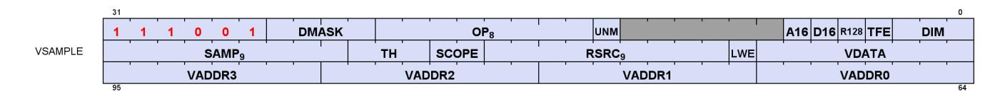

**Description** Memory Image-Sample Instructions - sample and gather4 (instructions that do use a sampler)

Table 115. VSAMPLE Fields

| Field Name | Bits    | Format or Description                                                                                                                                                                                                                                                                                                                                                                                                                     |  |
|------------|---------|-------------------------------------------------------------------------------------------------------------------------------------------------------------------------------------------------------------------------------------------------------------------------------------------------------------------------------------------------------------------------------------------------------------------------------------------|--|
| DIM        | [2:0]   | Dimensionality of the resource constant. Set to bits [3:1] of the resource type field.                                                                                                                                                                                                                                                                                                                                                    |  |
| TFE        | [3]     | Partially resident texture, texture fault enable.                                                                                                                                                                                                                                                                                                                                                                                         |  |
| R128       | [4]     | Resource constant size: 1 = 128bit, 0 = 256bit                                                                                                                                                                                                                                                                                                                                                                                            |  |
| D16        | [5]     | Data components are 16-bits (instead of the usual 32 bits).                                                                                                                                                                                                                                                                                                                                                                               |  |
| A16        | [6]     | Address components are 16-bits (instead of the usual 32 bits).                                                                                                                                                                                                                                                                                                                                                                            |  |
| UNRM       | [13]    | Force address to be un-normalized. User must set to 1 for Image stores & atomics. When<br>set, all address components are 16 bits (packed into 2 per DWORD), except:<br>Texel offsets (3 6bit UINT packed into 1 DWORD)<br>PCF reference (for "_C" instructions)<br>Address components are 16b uint for image ops without sampler; 16b float with sampler.                                                                                |  |
| OP         | [21:14] | Opcode. See table below. (combined bits 53 with 18-16 to form opcode)                                                                                                                                                                                                                                                                                                                                                                     |  |
| DMASK      | [25:22] | Data VGPR enable mask: 1 4 consecutive VGPRs<br>Defines which components are returned:<br>0=red,1=green,2=blue,3=alpha<br>Enabled components come from consecutive VGPRs.<br>E.G. dmask=1001 : Red is in VGPRn and alpha in VGPRn+1.<br>For D16 writes, DMASK is only used as a word count: each bit represents 16 bits of data to<br>be written starting at the LSB's of VDATA, then MSBs, then VDATA+1 etc. Bit position is<br>ignored. |  |
| ENCODING   | [31:26] | 'b111001                                                                                                                                                                                                                                                                                                                                                                                                                                  |  |
| VDATA      | [39:32] | Address of VGPR to supply first component of write data or receive first component of<br>read-data.                                                                                                                                                                                                                                                                                                                                       |  |
| LWE        | [40]    | LOD Warning Enable. When set to 1, a texture fetch may return "LOD_CLAMPED = 1".                                                                                                                                                                                                                                                                                                                                                          |  |
| RSRC       | [49:41] | SGPR to supply V# (resource constant) in 4 or 8 consecutive SGPRs. Must be multiple of 4 in<br>the range 0-120.                                                                                                                                                                                                                                                                                                                           |  |
| SCOPE      | [51:50] | Memory Scope                                                                                                                                                                                                                                                                                                                                                                                                                              |  |
| TH         | [54:52] | Memory Temporal Hint                                                                                                                                                                                                                                                                                                                                                                                                                      |  |
| SAMP       | [63:55] | SGPR to supply S# (sampler constant) in 4 or 8 consecutive SGPRs. Must be multiple of 4 in<br>the range 0-120.                                                                                                                                                                                                                                                                                                                            |  |
| VADDR0     | [71:64] | Address of VGPR to supply first component of address.                                                                                                                                                                                                                                                                                                                                                                                     |  |
| VADDR1     | [79:72] | Address of VGPR to supply second component of address.                                                                                                                                                                                                                                                                                                                                                                                    |  |
| VADDR2     | [87:80] | Address of VGPR to supply third component of address.                                                                                                                                                                                                                                                                                                                                                                                     |  |
| VADDR3     | [95:88] | Address of VGPR to supply fourth component of address.                                                                                                                                                                                                                                                                                                                                                                                    |  |

Table 116. VSAMPLE Opcodes

| Opcode # | Name            | Opcode # | Name                 |
|----------|-----------------|----------|----------------------|
| 24       | IMAGE_MSAA_LOAD | 55       | IMAGE_GATHER4_C_LZ_O |
| 27       | IMAGE_SAMPLE    | 56       | IMAGE_GET_LOD        |
| 28       | IMAGE_SAMPLE_D  | 57       | IMAGE_SAMPLE_D_G16   |

| Opcode # | Name                | Opcode # | Name                      |
|----------|---------------------|----------|---------------------------|
| 29       | IMAGE_SAMPLE_L      | 58       | IMAGE_SAMPLE_C_D_G16      |
| 30       | IMAGE_SAMPLE_B      | 59       | IMAGE_SAMPLE_D_O_G16      |
| 31       | IMAGE_SAMPLE_LZ     | 60       | IMAGE_SAMPLE_C_D_O_G16    |
| 32       | IMAGE_SAMPLE_C      | 64       | IMAGE_SAMPLE_CL           |
| 33       | IMAGE_SAMPLE_C_D    | 65       | IMAGE_SAMPLE_D_CL         |
| 34       | IMAGE_SAMPLE_C_L    | 66       | IMAGE_SAMPLE_B_CL         |
| 35       | IMAGE_SAMPLE_C_B    | 67       | IMAGE_SAMPLE_C_CL         |
| 36       | IMAGE_SAMPLE_C_LZ   | 68       | IMAGE_SAMPLE_C_D_CL       |
| 37       | IMAGE_SAMPLE_O      | 69       | IMAGE_SAMPLE_C_B_CL       |
| 38       | IMAGE_SAMPLE_D_O    | 70       | IMAGE_SAMPLE_CL_O         |
| 39       | IMAGE_SAMPLE_L_O    | 71       | IMAGE_SAMPLE_D_CL_O       |
| 40       | IMAGE_SAMPLE_B_O    | 72       | IMAGE_SAMPLE_B_CL_O       |
| 41       | IMAGE_SAMPLE_LZ_O   | 73       | IMAGE_SAMPLE_C_CL_O       |
| 42       | IMAGE_SAMPLE_C_O    | 74       | IMAGE_SAMPLE_C_D_CL_O     |
| 43       | IMAGE_SAMPLE_C_D_O  | 75       | IMAGE_SAMPLE_C_B_CL_O     |
| 44       | IMAGE_SAMPLE_C_L_O  | 84       | IMAGE_SAMPLE_C_D_CL_G16   |
| 45       | IMAGE_SAMPLE_C_B_O  | 85       | IMAGE_SAMPLE_D_CL_O_G16   |
| 46       | IMAGE_SAMPLE_C_LZ_O | 86       | IMAGE_SAMPLE_C_D_CL_O_G16 |
| 47       | IMAGE_GATHER4       | 95       | IMAGE_SAMPLE_D_CL_G16     |
| 48       | IMAGE_GATHER4_L     | 96       | IMAGE_GATHER4_CL          |
| 49       | IMAGE_GATHER4_B     | 97       | IMAGE_GATHER4_B_CL        |
| 50       | IMAGE_GATHER4_LZ    | 98       | IMAGE_GATHER4_C_CL        |
| 51       | IMAGE_GATHER4_C     | 99       | IMAGE_GATHER4_C_L         |
| 52       | IMAGE_GATHER4_C_LZ  | 100      | IMAGE_GATHER4_C_B         |
| 53       | IMAGE_GATHER4_O     | 101      | IMAGE_GATHER4_C_B_CL      |
| 54       | IMAGE_GATHER4_LZ_O  | 144      | IMAGE_GATHER4H            |

# <span id="page-211-0"></span>**15.10. Flat, Global and Scratch Formats**

Flat memory instructions come in three versions:

#### **FLAT**

memory address (per work-item) may be in global memory, scratch (private) memory or shared memory (LDS)

## **GLOBAL**

same as FLAT, but assumes all memory addresses are global memory.

### **SCRATCH**

same as FLAT, but assumes all memory addresses are scratch (private) memory.

The microcode format is identical for each, and only the value of the SEG (segment) field differs.

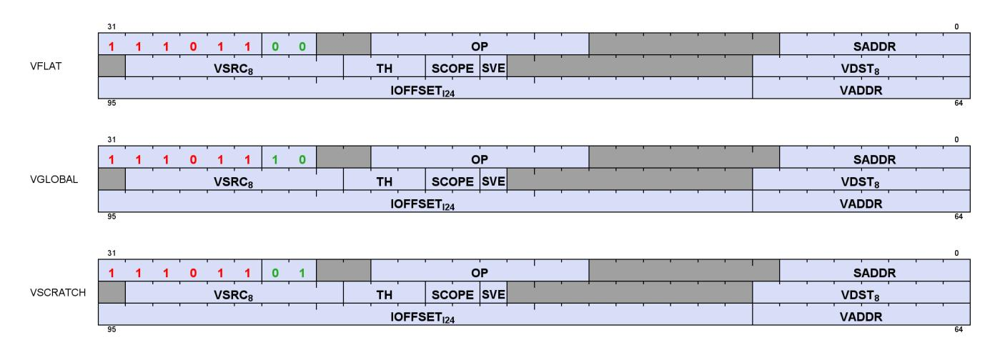

**Description** FLAT Memory Access

Table 117. FLAT, GLOBAL and SCRATCH Fields

| Field Name | Bits    | Format or Description                                                                                                                                                                                                                                                                                                                                                    |  |
|------------|---------|--------------------------------------------------------------------------------------------------------------------------------------------------------------------------------------------------------------------------------------------------------------------------------------------------------------------------------------------------------------------------|--|
| SADDR      | [6:0]   | SGPR that provides an address or offset (signed). Set this field to NULL to disable use.<br>Meaning of this field is different for Scratch and Global:<br>FLAT: NULL=Normal addressing; non-NULL=GVS addressing.<br>Scratch: use an SGPR for the address instead of a VGPR<br>Global: use the SGPR to provide a base address and the VGPR provides a 32-bit byte offset. |  |
| OP         | [20:13] | Opcode. See tables below for FLAT, SCRATCH and GLOBAL opcodes.                                                                                                                                                                                                                                                                                                           |  |
| ENCODING   | [31:24] | Flat='b11101100, Global='b11101110, Scratch='b11101101                                                                                                                                                                                                                                                                                                                   |  |
| VDST       | [39:32] | Destination VGPR for data returned from memory to VGPRs.                                                                                                                                                                                                                                                                                                                 |  |
| SVE        | [49]    | Scratch VGPR Enable. 1 = scratch address includes a VGPR to provide an offset; 0 = no<br>VGPR used.                                                                                                                                                                                                                                                                      |  |
| SCOPE      | [51:50] | Memory Scope                                                                                                                                                                                                                                                                                                                                                             |  |
| TH         | [54:52] | Memory Temporal Hint                                                                                                                                                                                                                                                                                                                                                     |  |
| VSRC       | [62:55] | Source VGPR for data sent from VGPRs to memory.                                                                                                                                                                                                                                                                                                                          |  |
| VADDR      | [71:64] | VGPR that holds address or offset. For 64-bit addresses, ADDR has the LSBs and ADDR+1<br>has the MSBs. For offset a single VGPR has a 32 bit unsigned offset.<br>For FLAT_*: specifies an address.<br>For GLOBAL_* and SCRATCH_* when SADDR is NULL or 0x7f: specifies an address.<br>For GLOBAL_* and SCRATCH_* when SADDR is not NULL or 0x7f: specifies an offset.    |  |

| Field Name | Bits    | Format or Description        |
|------------|---------|------------------------------|
| IOFFSET    | [95:72] | Address offset, signed byte. |

# <span id="page-212-0"></span>**15.10.1. VFLAT**

Table 118. VFLAT Opcodes

| Opcode # | Name                      | Opcode # | Name                     |
|----------|---------------------------|----------|--------------------------|
| 16       | FLAT_LOAD_U8              | 57       | FLAT_ATOMIC_MIN_U32      |
| 17       | FLAT_LOAD_I8              | 58       | FLAT_ATOMIC_MAX_I32      |
| 18       | FLAT_LOAD_U16             | 59       | FLAT_ATOMIC_MAX_U32      |
| 19       | FLAT_LOAD_I16             | 60       | FLAT_ATOMIC_AND_B32      |
| 20       | FLAT_LOAD_B32             | 61       | FLAT_ATOMIC_OR_B32       |
| 21       | FLAT_LOAD_B64             | 62       | FLAT_ATOMIC_XOR_B32      |
| 22       | FLAT_LOAD_B96             | 63       | FLAT_ATOMIC_INC_U32      |
| 23       | FLAT_LOAD_B128            | 64       | FLAT_ATOMIC_DEC_U32      |
| 24       | FLAT_STORE_B8             | 65       | FLAT_ATOMIC_SWAP_B64     |
| 25       | FLAT_STORE_B16            | 66       | FLAT_ATOMIC_CMPSWAP_B64  |
| 26       | FLAT_STORE_B32            | 67       | FLAT_ATOMIC_ADD_U64      |
| 27       | FLAT_STORE_B64            | 68       | FLAT_ATOMIC_SUB_U64      |
| 28       | FLAT_STORE_B96            | 69       | FLAT_ATOMIC_MIN_I64      |
| 29       | FLAT_STORE_B128           | 70       | FLAT_ATOMIC_MIN_U64      |
| 30       | FLAT_LOAD_D16_U8          | 71       | FLAT_ATOMIC_MAX_I64      |
| 31       | FLAT_LOAD_D16_I8          | 72       | FLAT_ATOMIC_MAX_U64      |
| 32       | FLAT_LOAD_D16_B16         | 73       | FLAT_ATOMIC_AND_B64      |
| 33       | FLAT_LOAD_D16_HI_U8       | 74       | FLAT_ATOMIC_OR_B64       |
| 34       | FLAT_LOAD_D16_HI_I8       | 75       | FLAT_ATOMIC_XOR_B64      |
| 35       | FLAT_LOAD_D16_HI_B16      | 76       | FLAT_ATOMIC_INC_U64      |
| 36       | FLAT_STORE_D16_HI_B8      | 77       | FLAT_ATOMIC_DEC_U64      |
| 37       | FLAT_STORE_D16_HI_B16     | 80       | FLAT_ATOMIC_COND_SUB_U32 |
| 51       | FLAT_ATOMIC_SWAP_B32      | 81       | FLAT_ATOMIC_MIN_NUM_F32  |
| 52       | FLAT_ATOMIC_CMPSWAP_B32   | 82       | FLAT_ATOMIC_MAX_NUM_F32  |
| 53       | FLAT_ATOMIC_ADD_U32       | 86       | FLAT_ATOMIC_ADD_F32      |
| 54       | FLAT_ATOMIC_SUB_U32       | 89       | FLAT_ATOMIC_PK_ADD_F16   |
| 55       | FLAT_ATOMIC_SUB_CLAMP_U32 | 90       | FLAT_ATOMIC_PK_ADD_BF16  |
| 56       | FLAT_ATOMIC_MIN_I32       |          |                          |

# <span id="page-212-1"></span>**15.10.2. VGLOBAL**

Table 119. VGLOBAL Opcodes

| Opcode # | Name            | Opcode # | Name                  |
|----------|-----------------|----------|-----------------------|
| 16       | GLOBAL_LOAD_U8  | 58       | GLOBAL_ATOMIC_MAX_I32 |
| 17       | GLOBAL_LOAD_I8  | 59       | GLOBAL_ATOMIC_MAX_U32 |
| 18       | GLOBAL_LOAD_U16 | 60       | GLOBAL_ATOMIC_AND_B32 |
| 19       | GLOBAL_LOAD_I16 | 61       | GLOBAL_ATOMIC_OR_B32  |
| 20       | GLOBAL_LOAD_B32 | 62       | GLOBAL_ATOMIC_XOR_B32 |
| 21       | GLOBAL_LOAD_B64 | 63       | GLOBAL_ATOMIC_INC_U32 |

| Name                        | Opcode # | Name                          |
|-----------------------------|----------|-------------------------------|
| GLOBAL_LOAD_B96             | 64       | GLOBAL_ATOMIC_DEC_U32         |
| GLOBAL_LOAD_B128            | 65       | GLOBAL_ATOMIC_SWAP_B64        |
| GLOBAL_STORE_B8             | 66       | GLOBAL_ATOMIC_CMPSWAP_B64     |
| GLOBAL_STORE_B16            | 67       | GLOBAL_ATOMIC_ADD_U64         |
| GLOBAL_STORE_B32            | 68       | GLOBAL_ATOMIC_SUB_U64         |
| GLOBAL_STORE_B64            | 69       | GLOBAL_ATOMIC_MIN_I64         |
| GLOBAL_STORE_B96            | 70       | GLOBAL_ATOMIC_MIN_U64         |
| GLOBAL_STORE_B128           | 71       | GLOBAL_ATOMIC_MAX_I64         |
| GLOBAL_LOAD_D16_U8          | 72       | GLOBAL_ATOMIC_MAX_U64         |
| GLOBAL_LOAD_D16_I8          | 73       | GLOBAL_ATOMIC_AND_B64         |
| GLOBAL_LOAD_D16_B16         | 74       | GLOBAL_ATOMIC_OR_B64          |
| GLOBAL_LOAD_D16_HI_U8       | 75       | GLOBAL_ATOMIC_XOR_B64         |
| GLOBAL_LOAD_D16_HI_I8       | 76       | GLOBAL_ATOMIC_INC_U64         |
| GLOBAL_LOAD_D16_HI_B16      | 77       | GLOBAL_ATOMIC_DEC_U64         |
| GLOBAL_STORE_D16_HI_B8      | 79       | GLOBAL_WBINV                  |
| GLOBAL_STORE_D16_HI_B16     | 80       | GLOBAL_ATOMIC_COND_SUB_U32    |
| GLOBAL_LOAD_ADDTID_B32      | 81       | GLOBAL_ATOMIC_MIN_NUM_F32     |
| GLOBAL_STORE_ADDTID_B32     | 82       | GLOBAL_ATOMIC_MAX_NUM_F32     |
| GLOBAL_INV                  | 83       | GLOBAL_LOAD_BLOCK             |
| GLOBAL_WB                   | 84       | GLOBAL_STORE_BLOCK            |
| GLOBAL_ATOMIC_SWAP_B32      | 86       | GLOBAL_ATOMIC_ADD_F32         |
| GLOBAL_ATOMIC_CMPSWAP_B32   | 87       | GLOBAL_LOAD_TR_B128           |
| GLOBAL_ATOMIC_ADD_U32       | 88       | GLOBAL_LOAD_TR_B64            |
| GLOBAL_ATOMIC_SUB_U32       | 89       | GLOBAL_ATOMIC_PK_ADD_F16      |
| GLOBAL_ATOMIC_SUB_CLAMP_U32 | 90       | GLOBAL_ATOMIC_PK_ADD_BF16     |
| GLOBAL_ATOMIC_MIN_I32       | 115      | GLOBAL_ATOMIC_ORDERED_ADD_B64 |
| GLOBAL_ATOMIC_MIN_U32       |          |                               |
|                             |          |                               |

# <span id="page-213-0"></span>**15.10.3. VSCRATCH**

Table 120. VSCRATCH Opcodes

| Opcode # | Name              | Opcode # | Name                     |
|----------|-------------------|----------|--------------------------|
| 16       | SCRATCH_LOAD_U8   | 28       | SCRATCH_STORE_B96        |
| 17       | SCRATCH_LOAD_I8   | 29       | SCRATCH_STORE_B128       |
| 18       | SCRATCH_LOAD_U16  | 30       | SCRATCH_LOAD_D16_U8      |
| 19       | SCRATCH_LOAD_I16  | 31       | SCRATCH_LOAD_D16_I8      |
| 20       | SCRATCH_LOAD_B32  | 32       | SCRATCH_LOAD_D16_B16     |
| 21       | SCRATCH_LOAD_B64  | 33       | SCRATCH_LOAD_D16_HI_U8   |
| 22       | SCRATCH_LOAD_B96  | 34       | SCRATCH_LOAD_D16_HI_I8   |
| 23       | SCRATCH_LOAD_B128 | 35       | SCRATCH_LOAD_D16_HI_B16  |
| 24       | SCRATCH_STORE_B8  | 36       | SCRATCH_STORE_D16_HI_B8  |
| 25       | SCRATCH_STORE_B16 | 37       | SCRATCH_STORE_D16_HI_B16 |
| 26       | SCRATCH_STORE_B32 | 83       | SCRATCH_LOAD_BLOCK       |
| 27       | SCRATCH_STORE_B64 | 84       | SCRATCH_STORE_BLOCK      |

# <span id="page-214-0"></span>**15.11. Export Format**

# <span id="page-214-1"></span>**15.11.1. VEXPORT**

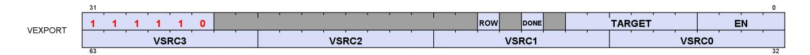

**Description** EXPORT instructions

The export format has only a single opcode, "EXPORT".

Table 121. VEXPORT Fields

| Field Name | Bits    | Format or Description                                                                                                                                        |
|------------|---------|--------------------------------------------------------------------------------------------------------------------------------------------------------------|
| EN         | [3:0]   | VGPR Enables: [0] enables VSRC0, … [3] enables VSRC3.                                                                                                        |
| TARGET     | [9:4]   | Export destination:<br>07<br>MRT 07<br>8<br>Z<br>12-16 Position 0-4<br>20<br>Primitive data<br>21<br>Dual Source Blend Left<br>22<br>Dual Source Blend Right |
| DONE       | [11]    | Indicates that this is the last export from the shader. Used only for Position and Pixel/color<br>data.                                                      |
| ROW        | [13]    | Row to export                                                                                                                                                |
| ENCODING   | [31:26] | 'b111110                                                                                                                                                     |
| VSRC0      | [39:32] | VGPR for source 0.                                                                                                                                           |
| VSRC1      | [47:40] | VGPR for source 1.                                                                                                                                           |
| VSRC2      | [55:48] | VGPR for source 2.                                                                                                                                           |
| VSRC3      | [63:56] | VGPR for source 3.                                                                                                                                           |

15.11. Export Format 205 of 697

# <span id="page-215-0"></span>**Chapter 16. Instructions**

This chapter lists, and provides descriptions for, all instructions in the RDNA4 device. Instructions are grouped according to their format.

Note: Rounding and Denormal modes apply to all floating-point operations unless otherwise specified in the instruction description.

# <span id="page-216-0"></span>**16.1. SOP2 Instructions**

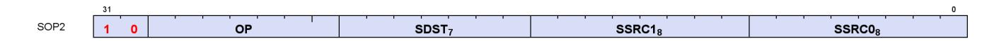

Instructions in this format may use a 32-bit literal constant that occurs immediately after the instruction.

**S\_ADD\_CO\_U32 0**

Add two unsigned 32-bit integer inputs, store the result into a scalar register and store the carry-out bit into SCC.

```
tmp = 64'U(S0.u32) + 64'U(S1.u32);
SCC = tmp >= 0x100000000ULL ? 1'1U : 1'0U;
// unsigned overflow or carry-out for S_ADD_CO_CI_U32.
D0.u32 = tmp.u32
```

**S\_SUB\_CO\_U32 1**

Subtract the second unsigned 32-bit integer input from the first input, store the result into a scalar register and store the carry-out bit into SCC.

```
tmp = S0.u32 - S1.u32;
SCC = S1.u32 > S0.u32 ? 1'1U : 1'0U;
// unsigned overflow or carry-out for S_SUB_CO_CI_U32.
D0.u32 = tmp.u32
```

**S\_ADD\_CO\_I32 2**

Add two signed 32-bit integer inputs, store the result into a scalar register and store the carry-out bit into SCC.

```
tmp = S0.i32 + S1.i32;
SCC = ((S0.u32[31] == S1.u32[31]) && (S0.u32[31] != tmp.u32[31]));
// signed overflow.
D0.i32 = tmp.i32
```

#### **Notes**

This opcode is not suitable for use with S\_ADD\_CO\_CI\_U32 for implementing 64-bit operations.

**S\_SUB\_CO\_I32 3**

16.1. SOP2 Instructions 207 of 697

Subtract the second signed 32-bit integer input from the first input, store the result into a scalar register and store the carry-out bit into SCC.

```
tmp = S0.i32 - S1.i32;
SCC = ((S0.u32[31] != S1.u32[31]) && (S0.u32[31] != tmp.u32[31]));
// signed overflow.
D0.i32 = tmp.i32
```

#### **Notes**

This opcode is not suitable for use with S\_SUB\_CO\_CI\_U32 for implementing 64-bit operations.

**S\_ADD\_CO\_CI\_U32 4**

Add two unsigned 32-bit integer inputs and a carry-in bit from SCC, store the result into a scalar register and store the carry-out bit into SCC.

```
tmp = 64'U(S0.u32) + 64'U(S1.u32) + SCC.u64;
SCC = tmp >= 0x100000000ULL ? 1'1U : 1'0U;
// unsigned overflow or carry-out for S_ADD_CO_CI_U32.
D0.u32 = tmp.u32
```

**S\_SUB\_CO\_CI\_U32 5**

Subtract the second unsigned 32-bit integer input from the first input, subtract the carry-in bit, store the result into a scalar register and store the carry-out bit into SCC.

```
tmp = S0.u32 - S1.u32 - SCC.u32;
SCC = 64'U(S1.u32) + SCC.u64 > 64'U(S0.u32) ? 1'1U : 1'0U;
// unsigned overflow or carry-out for S_SUB_CO_CI_U32.
D0.u32 = tmp.u32
```

**S\_ABSDIFF\_I32 6**

Calculate the absolute value of difference between two scalar inputs, store the result into a scalar register and set SCC iff the result is nonzero.

```
D0.i32 = S0.i32 - S1.i32;
if D0.i32 < 0 then
  D0.i32 = -D0.i32
endif;
SCC = D0.i32 != 0
```

16.1. SOP2 Instructions 208 of 697

Functional examples:

```
S_ABSDIFF_I32(0x00000002, 0x00000005) => 0x00000003
S_ABSDIFF_I32(0xffffffff, 0x00000000) => 0x00000001
S_ABSDIFF_I32(0x80000000, 0x00000000) => 0x80000000 // Note: result is negative!
S_ABSDIFF_I32(0x80000000, 0x00000001) => 0x7fffffff
S_ABSDIFF_I32(0x80000000, 0xffffffff) => 0x7fffffff
S_ABSDIFF_I32(0x80000000, 0xfffffffe) => 0x7ffffffe
```

**S\_LSHL\_B32 8**

Given a shift count in the second scalar input, calculate the logical shift left of the first scalar input, store the result into a scalar register and set SCC iff the result is nonzero.

```
D0.u32 = (S0.u32 << S1[4 : 0].u32);
SCC = D0.u32 != 0U
```

**S\_LSHL\_B64 9**

Given a shift count in the second scalar input, calculate the logical shift left of the first scalar input, store the result into a scalar register and set SCC iff the result is nonzero.

```
D0.u64 = (S0.u64 << S1[5 : 0].u32);
SCC = D0.u64 != 0ULL
```

**S\_LSHR\_B32 10**

Given a shift count in the second scalar input, calculate the logical shift right of the first scalar input, store the result into a scalar register and set SCC iff the result is nonzero.

```
D0.u32 = (S0.u32 >> S1[4 : 0].u32);
SCC = D0.u32 != 0U
```

**S\_LSHR\_B64 11**

Given a shift count in the second scalar input, calculate the logical shift right of the first scalar input, store the result into a scalar register and set SCC iff the result is nonzero.

16.1. SOP2 Instructions 209 of 697

```
D0.u64 = (S0.u64 >> S1[5 : 0].u32);
SCC = D0.u64 != 0ULL
```

**S\_ASHR\_I32 12**

Given a shift count in the second scalar input, calculate the arithmetic shift right (preserving sign bit) of the first scalar input, store the result into a scalar register and set SCC iff the result is nonzero.

```
D0.i32 = 32'I(signext(S0.i32) >> S1[4 : 0].u32);
SCC = D0.i32 != 0
```

**S\_ASHR\_I64 13**

Given a shift count in the second scalar input, calculate the arithmetic shift right (preserving sign bit) of the first scalar input, store the result into a scalar register and set SCC iff the result is nonzero.

```
D0.i64 = (signext(S0.i64) >> S1[5 : 0].u32);
SCC = D0.i64 != 0LL
```

**S\_LSHL1\_ADD\_U32 14**

Calculate the logical shift left of the first input by 1, then add the second input, store the result into a scalar register and set SCC iff the summation results in an unsigned overflow.

```
tmp = (64'U(S0.u32) << 1U) + 64'U(S1.u32);
SCC = tmp >= 0x100000000ULL ? 1'1U : 1'0U;
// unsigned overflow.
D0.u32 = tmp.u32
```

**S\_LSHL2\_ADD\_U32 15**

Calculate the logical shift left of the first input by 2, then add the second input, store the result into a scalar register and set SCC iff the summation results in an unsigned overflow.

```
tmp = (64'U(S0.u32) << 2U) + 64'U(S1.u32);
SCC = tmp >= 0x100000000ULL ? 1'1U : 1'0U;
// unsigned overflow.
D0.u32 = tmp.u32
```

16.1. SOP2 Instructions 210 of 697

**S\_LSHL3\_ADD\_U32 16**

Calculate the logical shift left of the first input by 3, then add the second input, store the result into a scalar register and set SCC iff the summation results in an unsigned overflow.

```
tmp = (64'U(S0.u32) << 3U) + 64'U(S1.u32);
SCC = tmp >= 0x100000000ULL ? 1'1U : 1'0U;
// unsigned overflow.
D0.u32 = tmp.u32
```

**S\_LSHL4\_ADD\_U32 17**

Calculate the logical shift left of the first input by 4, then add the second input, store the result into a scalar register and set SCC iff the summation results in an unsigned overflow.

```
tmp = (64'U(S0.u32) << 4U) + 64'U(S1.u32);
SCC = tmp >= 0x100000000ULL ? 1'1U : 1'0U;
// unsigned overflow.
D0.u32 = tmp.u32
```

**S\_MIN\_I32 18**

Select the minimum of two signed 32-bit integer inputs, store the selected value into a scalar register and set SCC iff the first value is selected.

```
SCC = S0.i32 < S1.i32;
D0.i32 = SCC ? S0.i32 : S1.i32
```

**S\_MIN\_U32 19**

Select the minimum of two unsigned 32-bit integer inputs, store the selected value into a scalar register and set SCC iff the first value is selected.

```
SCC = S0.u32 < S1.u32;
D0.u32 = SCC ? S0.u32 : S1.u32
```

**S\_MAX\_I32 20**

16.1. SOP2 Instructions 211 of 697

Select the maximum of two signed 32-bit integer inputs, store the selected value into a scalar register and set SCC iff the first value is selected.

```
SCC = S0.i32 >= S1.i32;
D0.i32 = SCC ? S0.i32 : S1.i32
```

**S\_MAX\_U32 21**

Select the maximum of two unsigned 32-bit integer inputs, store the selected value into a scalar register and set SCC iff the first value is selected.

```
SCC = S0.u32 >= S1.u32;
D0.u32 = SCC ? S0.u32 : S1.u32
```

**S\_AND\_B32 22**

Calculate bitwise AND on two scalar inputs, store the result into a scalar register and set SCC iff the result is nonzero.

```
D0.u32 = (S0.u32 & S1.u32);
SCC = D0.u32 != 0U
```

**S\_AND\_B64 23**

Calculate bitwise AND on two scalar inputs, store the result into a scalar register and set SCC iff the result is nonzero.

```
D0.u64 = (S0.u64 & S1.u64);
SCC = D0.u64 != 0ULL
```

**S\_OR\_B32 24**

Calculate bitwise OR on two scalar inputs, store the result into a scalar register and set SCC iff the result is nonzero.

```
D0.u32 = (S0.u32 | S1.u32);
SCC = D0.u32 != 0U
```

16.1. SOP2 Instructions 212 of 697

**S\_OR\_B64 25**

Calculate bitwise OR on two scalar inputs, store the result into a scalar register and set SCC iff the result is nonzero.

```
D0.u64 = (S0.u64 | S1.u64);
SCC = D0.u64 != 0ULL
```

**S\_XOR\_B32 26**

Calculate bitwise XOR on two scalar inputs, store the result into a scalar register and set SCC iff the result is nonzero.

```
D0.u32 = (S0.u32 ^ S1.u32);
SCC = D0.u32 != 0U
```

**S\_XOR\_B64 27**

Calculate bitwise XOR on two scalar inputs, store the result into a scalar register and set SCC iff the result is nonzero.

```
D0.u64 = (S0.u64 ^ S1.u64);
SCC = D0.u64 != 0ULL
```

**S\_NAND\_B32 28**

Calculate bitwise NAND on two scalar inputs, store the result into a scalar register and set SCC if the result is nonzero.

```
D0.u32 = ~(S0.u32 & S1.u32);
SCC = D0.u32 != 0U
```

**S\_NAND\_B64 29**

Calculate bitwise NAND on two scalar inputs, store the result into a scalar register and set SCC if the result is nonzero.

16.1. SOP2 Instructions 213 of 697

```
D0.u64 = ~(S0.u64 & S1.u64);
SCC = D0.u64 != 0ULL
```

**S\_NOR\_B32 30**

Calculate bitwise NOR on two scalar inputs, store the result into a scalar register and set SCC if the result is nonzero.

```
D0.u32 = ~(S0.u32 | S1.u32);
SCC = D0.u32 != 0U
```

**S\_NOR\_B64 31**

Calculate bitwise NOR on two scalar inputs, store the result into a scalar register and set SCC if the result is nonzero.

```
D0.u64 = ~(S0.u64 | S1.u64);
SCC = D0.u64 != 0ULL
```

**S\_XNOR\_B32 32**

Calculate bitwise XNOR on two scalar inputs, store the result into a scalar register and set SCC if the result is nonzero.

```
D0.u32 = ~(S0.u32 ^ S1.u32);
SCC = D0.u32 != 0U
```

**S\_XNOR\_B64 33**

Calculate bitwise XNOR on two scalar inputs, store the result into a scalar register and set SCC if the result is nonzero.

```
D0.u64 = ~(S0.u64 ^ S1.u64);
SCC = D0.u64 != 0ULL
```

**S\_AND\_NOT1\_B32 34**

16.1. SOP2 Instructions 214 of 697

Calculate bitwise AND with the first input and the negation of the second input, store the result into a scalar register and set SCC if the result is nonzero.

```
D0.u32 = (S0.u32 & ~S1.u32);
SCC = D0.u32 != 0U
```

**S\_AND\_NOT1\_B64 35**

Calculate bitwise AND with the first input and the negation of the second input, store the result into a scalar register and set SCC if the result is nonzero.

```
D0.u64 = (S0.u64 & ~S1.u64);
SCC = D0.u64 != 0ULL
```

**S\_OR\_NOT1\_B32 36**

Calculate bitwise OR with the first input and the negation of the second input, store the result into a scalar register and set SCC if the result is nonzero.

```
D0.u32 = (S0.u32 | ~S1.u32);
SCC = D0.u32 != 0U
```

**S\_OR\_NOT1\_B64 37**

Calculate bitwise OR with the first input and the negation of the second input, store the result into a scalar register and set SCC if the result is nonzero.

```
D0.u64 = (S0.u64 | ~S1.u64);
SCC = D0.u64 != 0ULL
```

**S\_BFE\_U32 38**

Extract an unsigned bitfield from the first input using field offset and size encoded in the second input, store the result into a scalar register and set SCC iff the result is nonzero.

```
D0.u32 = ((S0.u32 >> S1[4 : 0].u32) & ((1U << S1[22 : 16].u32) - 1U));
SCC = D0.u32 != 0U
```

16.1. SOP2 Instructions 215 of 697

**S\_BFE\_I32 39**

Extract a signed bitfield from the first input using field offset and size encoded in the second input, store the result into a scalar register and set SCC iff the result is nonzero.

```
tmp.i32 = ((S0.i32 >> S1[4 : 0].u32) & ((1 << S1[22 : 16].u32) - 1));
D0.i32 = signext_from_bit(tmp.i32, S1[22 : 16].u32);
SCC = D0.i32 != 0
```

**S\_BFE\_U64 40**

Extract an unsigned bitfield from the first input using field offset and size encoded in the second input, store the result into a scalar register and set SCC iff the result is nonzero.

```
D0.u64 = ((S0.u64 >> S1[5 : 0].u32) & ((1ULL << S1[22 : 16].u32) - 1ULL));
SCC = D0.u64 != 0ULL
```

**S\_BFE\_I64 41**

Extract a signed bitfield from the first input using field offset and size encoded in the second input, store the result into a scalar register and set SCC iff the result is nonzero.

```
tmp.i64 = ((S0.i64 >> S1[5 : 0].u32) & ((1LL << S1[22 : 16].u32) - 1LL));
D0.i64 = signext_from_bit(tmp.i64, S1[22 : 16].u32);
SCC = D0.i64 != 0LL
```

**S\_BFM\_B32 42**

Calculate a bitfield mask given a field offset and size and store the result in a scalar register.

```
D0.u32 = (((1U << S0[4 : 0].u32) - 1U) << S1[4 : 0].u32)
```

**S\_BFM\_B64 43**

Calculate a bitfield mask given a field offset and size and store the result in a scalar register.

```
D0.u64 = (((1ULL << S0[5 : 0].u32) - 1ULL) << S1[5 : 0].u32)
```

16.1. SOP2 Instructions 216 of 697

**S\_MUL\_I32 44**

Multiply two signed 32-bit integer inputs and store the result into a scalar register.

```
D0.i32 = S0.i32 * S1.i32
```

#### **Notes**

There is no S\_MUL\_U32 opcode; S\_MUL\_U32 and S\_MUL\_I32 produce identical results.

**S\_MUL\_HI\_U32 45**

Multiply two unsigned integers and store the high 32 bits of the result into a scalar register.

```
D0.u32 = 32'U((64'U(S0.u32) * 64'U(S1.u32)) >> 32U)
```

**S\_MUL\_HI\_I32 46**

Multiply two signed integers and store the high 32 bits of the result into a scalar register.

```
D0.i32 = 32'I((64'I(S0.i32) * 64'I(S1.i32)) >> 32U)
```

**S\_CSELECT\_B32 48**

Select the first input if SCC is true otherwise select the second input, then store the selected input into a scalar register.

```
D0.u32 = SCC ? S0.u32 : S1.u32
```

**S\_CSELECT\_B64 49**

Select the first input if SCC is true otherwise select the second input, then store the selected input into a scalar register.

```
D0.u64 = SCC ? S0.u64 : S1.u64
```

16.1. SOP2 Instructions 217 of 697

| S_PACK_LL_B32_B16 | 50 |
|-------------------|----|
|-------------------|----|

Pack two 16-bit scalar values into a scalar register.

```
D0 = { S1[15 : 0].u16, S0[15 : 0].u16 }
```

# **S\_PACK\_LH\_B32\_B16 51**

Pack two 16-bit scalar values into a scalar register.

```
D0 = { S1[31 : 16].u16, S0[15 : 0].u16 }
```

# **S\_PACK\_HH\_B32\_B16 52**

Pack two 16-bit scalar values into a scalar register.

```
D0 = { S1[31 : 16].u16, S0[31 : 16].u16 }
```

# **S\_PACK\_HL\_B32\_B16 53**

Pack two 16-bit scalar values into a scalar register.

```
D0 = { S1[15 : 0].u16, S0[31 : 16].u16 }
```

**S\_ADD\_F32 64**

Add two floating point inputs and store the result into a scalar register.

```
D0.f32 = S0.f32 + S1.f32
```

**S\_SUB\_F32 65**

Subtract the second floating point input from the first input and store the result in a scalar register.

16.1. SOP2 Instructions 218 of 697

```
D0.f32 = S0.f32 - S1.f32
```

**S\_MIN\_NUM\_F32 66**

Select the IEEE minimumNumber() of two single-precision float inputs and store the result into a scalar register.

A numeric argument is favoured over NaN when determining which argument to return.

```
if (isSignalNAN(64'F(S0.f32)) || isSignalNAN(64'F(S1.f32))) then
  TRAPSTS.INVALID = 1
endif;
if (isNAN(64'F(S0.f32)) && isNAN(64'F(S1.f32))) then
  D0.f32 = 32'F(cvtToQuietNAN(64'F(S0.f32)))
elsif isNAN(64'F(S0.f32)) then
  D0.f32 = S1.f32
elsif isNAN(64'F(S1.f32)) then
  D0.f32 = S0.f32
elsif ((S0.f32 < S1.f32) || ((abs(S0.f32) == 0.0F) && (abs(S1.f32) == 0.0F) && sign(S0.f32) &&
!sign(S1.f32))) then
  // NOTE: -0<+0 is TRUE in this comparison
  D0.f32 = S0.f32
else
  D0.f32 = S1.f32
endif
```

**S\_MAX\_NUM\_F32 67**

Select the IEEE maximumNumber() of two single-precision float inputs and store the result into a scalar register.

A numeric argument is favoured over NaN when determining which argument to return.

```
if (isSignalNAN(64'F(S0.f32)) || isSignalNAN(64'F(S1.f32))) then
  TRAPSTS.INVALID = 1
endif;
if (isNAN(64'F(S0.f32)) && isNAN(64'F(S1.f32))) then
  D0.f32 = 32'F(cvtToQuietNAN(64'F(S0.f32)))
elsif isNAN(64'F(S0.f32)) then
  D0.f32 = S1.f32
elsif isNAN(64'F(S1.f32)) then
  D0.f32 = S0.f32
elsif ((S0.f32 > S1.f32) || ((abs(S0.f32) == 0.0F) && (abs(S1.f32) == 0.0F) && !sign(S0.f32) &&
sign(S1.f32))) then
  // NOTE: +0>-0 is TRUE in this comparison
  D0.f32 = S0.f32
else
  D0.f32 = S1.f32
```

16.1. SOP2 Instructions 219 of 697

endif

**S\_MUL\_F32 68**

Multiply two floating point inputs and store the result into a scalar register.

```
D0.f32 = S0.f32 * S1.f32
```

**S\_FMAAK\_F32 69**

Multiply two floating point inputs and add a literal constant using fused multiply add, and store the result into a scalar register.

```
D0.f32 = fma(S0.f32, S1.f32, SIMM32.f32)
```

**S\_FMAMK\_F32 70**

Multiply a floating point input with a literal constant and add a second floating point input using fused multiply add, and store the result into a scalar register.

```
D0.f32 = fma(S0.f32, SIMM32.f32, S1.f32)
```

**S\_FMAC\_F32 71**

Compute the fused multiply add of floating point inputs and accumulate with the destination operand, and store the result into the destination.

```
D0.f32 = fma(S0.f32, S1.f32, D0.f32)
```

**S\_CVT\_PK\_RTZ\_F16\_F32 72**

Convert two single-precision float inputs into a packed half-precision float result using round toward zero semantics (ignore the current rounding mode), and store the result into a scalar register.

```
prev_mode = ROUND_MODE;
ROUND_MODE = ROUND_TOWARD_ZERO;
```

16.1. SOP2 Instructions 220 of 697

```
tmp[15 : 0].f16 = f32_to_f16(S0.f32);
tmp[31 : 16].f16 = f32_to_f16(S1.f32);
D0 = tmp.b32;
ROUND_MODE = prev_mode;
// Round-toward-zero regardless of current round mode setting in hardware.
```

**S\_ADD\_F16 73**

Add two floating point inputs and store the result into a scalar register.

```
D0.f16 = S0.f16 + S1.f16
```

**S\_SUB\_F16 74**

Subtract the second floating point input from the first input and store the result in a scalar register.

```
D0.f16 = S0.f16 - S1.f16
```

**S\_MIN\_NUM\_F16 75**

Select the IEEE minimumNumber() of two half-precision float inputs and store the result into a scalar register.

A numeric argument is favoured over NaN when determining which argument to return.

```
if (isSignalNAN(64'F(S0.f16)) || isSignalNAN(64'F(S1.f16))) then
  TRAPSTS.INVALID = 1
endif;
if (isNAN(64'F(S0.f16)) && isNAN(64'F(S1.f16))) then
  D0.f16 = 16'F(cvtToQuietNAN(64'F(S0.f16)))
elsif isNAN(64'F(S0.f16)) then
  D0.f16 = S1.f16
elsif isNAN(64'F(S1.f16)) then
  D0.f16 = S0.f16
elsif ((S0.f16 < S1.f16) || ((abs(S0.f16) == 16'0.0) && (abs(S1.f16) == 16'0.0) && sign(S0.f16) &&
!sign(S1.f16))) then
  // NOTE: -0<+0 is TRUE in this comparison
  D0.f16 = S0.f16
else
  D0.f16 = S1.f16
endif
```

**S\_MAX\_NUM\_F16 76**

16.1. SOP2 Instructions 221 of 697

Select the IEEE maximumNumber() of two half-precision float inputs and store the result into a scalar register.

A numeric argument is favoured over NaN when determining which argument to return.

```
if (isSignalNAN(64'F(S0.f16)) || isSignalNAN(64'F(S1.f16))) then
  TRAPSTS.INVALID = 1
endif;
if (isNAN(64'F(S0.f16)) && isNAN(64'F(S1.f16))) then
  D0.f16 = 16'F(cvtToQuietNAN(64'F(S0.f16)))
elsif isNAN(64'F(S0.f16)) then
  D0.f16 = S1.f16
elsif isNAN(64'F(S1.f16)) then
  D0.f16 = S0.f16
elsif ((S0.f16 > S1.f16) || ((abs(S0.f16) == 16'0.0) && (abs(S1.f16) == 16'0.0) && !sign(S0.f16) &&
sign(S1.f16))) then
  // NOTE: +0>-0 is TRUE in this comparison
  D0.f16 = S0.f16
else
  D0.f16 = S1.f16
endif
```

**S\_MUL\_F16 77**

Multiply two floating point inputs and store the result into a scalar register.

```
D0.f16 = S0.f16 * S1.f16
```

**S\_FMAC\_F16 78**

Compute the fused multiply add of floating point inputs and accumulate with the destination operand, and store the result into the destination.

```
D0.f16 = fma(S0.f16, S1.f16, D0.f16)
```

**S\_MINIMUM\_F32 79**

Select the IEEE minimum() of two single-precision float inputs and store the result into a scalar register.

A signaling NaN in either argument is propagated to the result.

```
if (isSignalNAN(64'F(S0.f32)) || isSignalNAN(64'F(S1.f32))) then
  TRAPSTS.INVALID = 1
endif;
```

16.1. SOP2 Instructions 222 of 697

```
if isSignalNAN(64'F(S0.f32)) then
  D0.f32 = 32'F(cvtToQuietNAN(64'F(S0.f32)))
elsif isSignalNAN(64'F(S1.f32)) then
  D0.f32 = 32'F(cvtToQuietNAN(64'F(S1.f32)))
elsif isQuietNAN(64'F(S0.f32)) then
  D0.f32 = S0.f32
elsif isQuietNAN(64'F(S1.f32)) then
  D0.f32 = S1.f32
elsif ((S0.f32 < S1.f32) || ((abs(S0.f32) == 0.0F) && (abs(S1.f32) == 0.0F) && sign(S0.f32) &&
!sign(S1.f32))) then
  // NOTE: -0<+0 is TRUE in this comparison
  D0.f32 = S0.f32
else
  D0.f32 = S1.f32
endif
```

**S\_MAXIMUM\_F32 80**

Select the IEEE maximum() of two single-precision float inputs and store the result into a scalar register.

A signaling NaN in either argument is propagated to the result.

```
if (isSignalNAN(64'F(S0.f32)) || isSignalNAN(64'F(S1.f32))) then
  TRAPSTS.INVALID = 1
endif;
if isSignalNAN(64'F(S0.f32)) then
  D0.f32 = 32'F(cvtToQuietNAN(64'F(S0.f32)))
elsif isSignalNAN(64'F(S1.f32)) then
  D0.f32 = 32'F(cvtToQuietNAN(64'F(S1.f32)))
elsif isQuietNAN(64'F(S0.f32)) then
  D0.f32 = S0.f32
elsif isQuietNAN(64'F(S1.f32)) then
  D0.f32 = S1.f32
elsif ((S0.f32 > S1.f32) || ((abs(S0.f32) == 0.0F) && (abs(S1.f32) == 0.0F) && !sign(S0.f32) &&
sign(S1.f32))) then
  // NOTE: +0>-0 is TRUE in this comparison
  D0.f32 = S0.f32
else
  D0.f32 = S1.f32
endif
```

**S\_MINIMUM\_F16 81**

Select the IEEE minimum() of two half-precision float inputs and store the result into a scalar register.

A signaling NaN in either argument is propagated to the result.

```
if (isSignalNAN(64'F(S0.f16)) || isSignalNAN(64'F(S1.f16))) then
  TRAPSTS.INVALID = 1
```

16.1. SOP2 Instructions 223 of 697

```
endif;
if isSignalNAN(64'F(S0.f16)) then
  D0.f16 = 16'F(cvtToQuietNAN(64'F(S0.f16)))
elsif isSignalNAN(64'F(S1.f16)) then
  D0.f16 = 16'F(cvtToQuietNAN(64'F(S1.f16)))
elsif isQuietNAN(64'F(S0.f16)) then
  D0.f16 = S0.f16
elsif isQuietNAN(64'F(S1.f16)) then
  D0.f16 = S1.f16
elsif ((S0.f16 < S1.f16) || ((abs(S0.f16) == 16'0.0) && (abs(S1.f16) == 16'0.0) && sign(S0.f16) &&
!sign(S1.f16))) then
  // NOTE: -0<+0 is TRUE in this comparison
  D0.f16 = S0.f16
else
  D0.f16 = S1.f16
endif
```

**S\_MAXIMUM\_F16 82**

Select the IEEE maximum() of two half-precision float inputs and store the result into a scalar register.

A signaling NaN in either argument is propagated to the result.

```
if (isSignalNAN(64'F(S0.f16)) || isSignalNAN(64'F(S1.f16))) then
  TRAPSTS.INVALID = 1
endif;
if isSignalNAN(64'F(S0.f16)) then
  D0.f16 = 16'F(cvtToQuietNAN(64'F(S0.f16)))
elsif isSignalNAN(64'F(S1.f16)) then
  D0.f16 = 16'F(cvtToQuietNAN(64'F(S1.f16)))
elsif isQuietNAN(64'F(S0.f16)) then
  D0.f16 = S0.f16
elsif isQuietNAN(64'F(S1.f16)) then
  D0.f16 = S1.f16
elsif ((S0.f16 > S1.f16) || ((abs(S0.f16) == 16'0.0) && (abs(S1.f16) == 16'0.0) && !sign(S0.f16) &&
sign(S1.f16))) then
  // NOTE: +0>-0 is TRUE in this comparison
  D0.f16 = S0.f16
else
  D0.f16 = S1.f16
endif
```

**S\_ADD\_NC\_U64 83**

Add two unsigned 64-bit integer inputs and store the result into a scalar register.

```
D0.u64 = S0.u64 + S1.u64
```

16.1. SOP2 Instructions 224 of 697

**S\_SUB\_NC\_U64 84**

Subtract the second unsigned 64-bit integer input from the first input and store the result into a scalar register.

```
D0.u64 = S0.u64 - S1.u64
```

**S\_MUL\_U64 85**

Multiply two unsigned 64-bit integer inputs and store the result into a scalar register.

```
D0.u64 = S0.u64 * S1.u64
```

#### **Notes**

This instruction takes 5 cycles to execute but due to SALU pipeline stalling it is sufficient to use S\_DELAY\_ALU INSTID\_SALU\_CYCLE\_1 to address performance of back-to-back "S\_MUL\_U64; SALU" instructions. For the back-to-back "S\_MUL\_64; VALU" case use S\_NOP to insert additional delay if needed.

16.1. SOP2 Instructions 225 of 697

# <span id="page-235-0"></span>**16.2. SOPK Instructions**

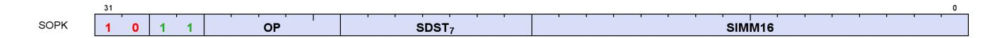

Instructions in this format may not use a 32-bit literal constant that occurs immediately after the instruction.

**S\_MOVK\_I32 0**

Sign extend a literal 16-bit constant and store the result into a scalar register.

```
D0.i32 = 32'I(signext(S0.i16))
```

**S\_VERSION 1**

Do nothing. This opcode is used to specify the microcode version for tools that interpret shader microcode.

Argument is ignored by hardware. This opcode is not designed for inserting wait states as the next instruction may issue in the same cycle. Do not use this opcode to resolve wait state hazards, use S\_NOP instead.

This opcode may also be used to validate microcode is running with the correct compatibility settings in drivers and functional models that support multiple generations. We strongly encourage this opcode be included at the top of every shader block to simplify debug and catch configuration errors.

This opcode must appear in the first 16 bytes of a block of shader code in order to be recognized by external tools and functional models. Avoid placing opcodes > 32 bits or encodings that are not available in all versions of the microcode before the S\_VERSION opcode. If this opcode is absent then tools are allowed to make an educated guess of the microcode version using cues from the environment; the guess may be incorrect and lead to an invalid decode. It is highly recommended that this be the first opcode of a shader block except for trap handlers, where it should be the second opcode (allowing the first opcode to be a 32-bit branch to accommodate context switch).

SIMM16[7:0] specifies the microcode version. SIMM16[15:8] must be set to zero.

```
nop();
// Do nothing - for use by tools only
```

**S\_CMOVK\_I32 2**

Move the sign extension of a literal 16-bit constant into a scalar register iff SCC is nonzero.

```
if SCC then
```

16.2. SOPK Instructions 226 of 697

```
  D0.i32 = 32'I(signext(S0.i16))
endif
```

**S\_ADDK\_CO\_I32 15**

Add a scalar input and the sign extension of a literal 16-bit constant, store the result into a scalar register and store the carry-out bit into SCC.

```
tmp = D0.i32;
// Save value to check sign bits for overflow later.
D0.i32 = D0.i32 + 32'I(signext(S0.i16));
SCC = ((tmp[31] == S0.i16[15]) && (tmp[31] != D0.i32[31]));
// signed overflow.
```

**S\_MULK\_I32 16**

Multiply a scalar input with the sign extension of a literal 16-bit constant and store the result into a scalar register.

```
D0.i32 = D0.i32 * 32'I(signext(S0.i16))
```

**S\_GETREG\_B32 17**

Read some or all of a hardware register into the LSBs of destination.

The SIMM16 argument is encoded as follows:

#### **ID = SIMM16[5:0]**

ID of hardware register to access.

### **OFFSET = SIMM16[10:6]**

LSB offset of register bits to access.

#### **SIZE = SIMM16[15:11]**

Size of register bits to access, minus 1. Set this field to 31 to read/write all bits of the hardware register.

```
hwRegId = SIMM16.u16[5 : 0];
offset = SIMM16.u16[10 : 6];
size = SIMM16.u16[15 : 11].u32 + 1U;
// logical size is in range 1:32
value = HW_REGISTERS[hwRegId];
D0.u32 = 32'U(32'I(value >> offset.u32) & ((1 << size) - 1))
```

16.2. SOPK Instructions 227 of 697

**S\_SETREG\_B32 18**

Write some or all of the LSBs of source argument into a hardware register.

The SIMM16 argument is encoded as follows:

# **ID = SIMM16[5:0]**

ID of hardware register to access.

## **OFFSET = SIMM16[10:6]**

LSB offset of register bits to access.

# **SIZE = SIMM16[15:11]**

Size of register bits to access, minus 1. Set this field to 31 to read/write all bits of the hardware register.

```
hwRegId = SIMM16.u16[5 : 0];
offset = SIMM16.u16[10 : 6];
size = SIMM16.u16[15 : 11].u32 + 1U;
// logical size is in range 1:32
mask = (1 << size) - 1;
mask = (mask << offset.u32);
mask = (mask & HwRegWriteMask(hwRegId, WAVE_STATUS.PRIV));
// Mask of bits that can be modified
value = ((S0.u32 << offset.u32) & mask.u32);
value = (value | 32'U(HW_REGISTERS[hwRegId].i32 & ~mask));
HW_REGISTERS[hwRegId] = value.b32;
// Side-effects may trigger here if certain bits are modified
```

#### **S\_SETREG\_IMM32\_B32 19**

Write some or all of the LSBs of a 32-bit literal constant into a hardware register; this instruction requires a 32 bit literal constant.

The SIMM16 argument is encoded as follows:

### **ID = SIMM16[5:0]**

ID of hardware register to access.

### **OFFSET = SIMM16[10:6]**

LSB offset of register bits to access.

#### **SIZE = SIMM16[15:11]**

Size of register bits to access, minus 1. Set this field to 31 to read/write all bits of the hardware register.

```
hwRegId = SIMM16.u16[5 : 0];
offset = SIMM16.u16[10 : 6];
size = SIMM16.u16[15 : 11].u32 + 1U;
```

16.2. SOPK Instructions 228 of 697

```
// logical size is in range 1:32
mask = (1 << size) - 1;
mask = (mask << offset.u32);
mask = (mask & HwRegWriteMask(hwRegId, WAVE_STATUS.PRIV));
// Mask of bits that can be modified
value = ((SIMM32.u32 << offset.u32) & mask.u32);
value = (value | 32'U(HW_REGISTERS[hwRegId].i32 & ~mask));
HW_REGISTERS[hwRegId] = value.b32;
// Side-effects may trigger here if certain bits are modified
```

**S\_CALL\_B64 20**

Store the address of the next instruction to a scalar register and then jump to a constant offset relative to the current PC.

The literal argument is a signed DWORD offset relative to the PC of the next instruction. The byte address of the instruction immediately following this instruction is saved to the destination.

```
D0.i64 = PC + 4LL;
PC = PC + signext(SIMM16.i16 * 16'4) + 4LL
```

#### **Notes**

This implements a short subroutine call where the return address (the next instruction after the S\_CALL\_B64) is saved to D. Long calls should consider S\_SWAPPC\_B64 instead.

This instruction must be 4 bytes.

16.2. SOPK Instructions 229 of 697

# <span id="page-239-0"></span>**16.3. SOP1 Instructions**

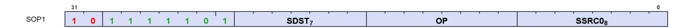

Instructions in this format may use a 32-bit literal constant that occurs immediately after the instruction.

**S\_MOV\_B32 0**

Move scalar input into a scalar register.

```
D0.b32 = S0.b32
```

**S\_MOV\_B64 1**

Move scalar input into a scalar register.

```
D0.b64 = S0.b64
```

**S\_CMOV\_B32 2**

Move scalar input into a scalar register iff SCC is nonzero.

```
if SCC then
  D0.b32 = S0.b32
endif
```

**S\_CMOV\_B64 3**

Move scalar input into a scalar register iff SCC is nonzero.

```
if SCC then
  D0.b64 = S0.b64
endif
```

**S\_BREV\_B32 4**

16.3. SOP1 Instructions 230 of 697

Reverse the order of bits in a scalar input and store the result into a scalar register.

```
D0.u32[31 : 0] = S0.u32[0 : 31]
```

**S\_BREV\_B64 5**

Reverse the order of bits in a scalar input and store the result into a scalar register.

```
D0.u64[63 : 0] = S0.u64[0 : 63]
```

**S\_CTZ\_I32\_B32 8**

Count the number of trailing "0" bits before the first "1" in a scalar input and store the result into a scalar register. Store -1 if there are no "1" bits in the input.

```
tmp = -1;
// Set if no ones are found
for i in 0 : 31 do
  // Search from LSB
  if S0.u32[i] == 1'1U then
  tmp = i;
  break
  endif
endfor;
D0.i32 = tmp
```

#### **Notes**

Functional examples:

```
S_CTZ_I32_B32(0xaaaaaaaa) => 1
S_CTZ_I32_B32(0x55555555) => 0
S_CTZ_I32_B32(0x00000000) => 0xffffffff
S_CTZ_I32_B32(0xffffffff) => 0
S_CTZ_I32_B32(0x00010000) => 16
```

Compare with V\_CTZ\_I32\_B32, which performs the equivalent operation in the vector ALU.

**S\_CTZ\_I32\_B64 9**

Count the number of trailing "0" bits before the first "1" in a scalar input and store the result into a scalar register. Store -1 if there are no "1" bits in the input.

16.3. SOP1 Instructions 231 of 697

```
tmp = -1;
// Set if no ones are found
for i in 0 : 63 do
  // Search from LSB
  if S0.u64[i] == 1'1U then
  tmp = i;
  break
  endif
endfor;
D0.i32 = tmp
```

**S\_CLZ\_I32\_U32 10**

Count the number of leading "0" bits before the first "1" in a scalar input and store the result into a scalar register. Store -1 if there are no "1" bits.

```
tmp = -1;
// Set if no ones are found
for i in 0 : 31 do
  // Search from MSB
  if S0.u32[31 - i] == 1'1U then
  tmp = i;
  break
  endif
endfor;
D0.i32 = tmp
```

### **Notes**

Functional examples:

```
S_CLZ_I32_U32(0x00000000) => 0xffffffff
S_CLZ_I32_U32(0x0000cccc) => 16
S_CLZ_I32_U32(0xffff3333) => 0
S_CLZ_I32_U32(0x7fffffff) => 1
S_CLZ_I32_U32(0x80000000) => 0
S_CLZ_I32_U32(0xffffffff) => 0
```

Compare with V\_CLZ\_I32\_U32, which performs the equivalent operation in the vector ALU.

**S\_CLZ\_I32\_U64 11**

Count the number of leading "0" bits before the first "1" in a scalar input and store the result into a scalar register. Store -1 if there are no "1" bits.

```
tmp = -1;
```

16.3. SOP1 Instructions 232 of 697

```
// Set if no ones are found
for i in 0 : 63 do
  // Search from MSB
  if S0.u64[63 - i] == 1'1U then
  tmp = i;
  break
  endif
endfor;
D0.i32 = tmp
```

**S\_CLS\_I32 12**

Count the number of leading bits that are the same as the sign bit of a scalar input and store the result into a scalar register. Store -1 if all input bits are the same.

```
tmp = -1;
// Set if all bits are the same
for i in 1 : 31 do
  // Search from MSB
  if S0.u32[31 - i] != S0.u32[31] then
  tmp = i;
  break
  endif
endfor;
D0.i32 = tmp
```

# **Notes**

Functional examples:

```
S_CLS_I32(0x00000000) => 0xffffffff
S_CLS_I32(0x0000cccc) => 16
S_CLS_I32(0xffff3333) => 16
S_CLS_I32(0x7fffffff) => 1
S_CLS_I32(0x80000000) => 1
S_CLS_I32(0xffffffff) => 0xffffffff
```

Compare with V\_CLS\_I32, which performs the equivalent operation in the vector ALU.

**S\_CLS\_I32\_I64 13**

Count the number of leading bits that are the same as the sign bit of a scalar input and store the result into a scalar register. Store -1 if all input bits are the same.

```
tmp = -1;
// Set if all bits are the same
for i in 1 : 63 do
```

16.3. SOP1 Instructions 233 of 697

```
  // Search from MSB
  if S0.u64[63 - i] != S0.u64[63] then
  tmp = i;
  break
  endif
endfor;
D0.i32 = tmp
```

**S\_SEXT\_I32\_I8 14**

Sign extend a signed 8 bit scalar input to 32 bits and store the result into a scalar register.

```
D0.i32 = 32'I(signext(S0.i8))
```

**S\_SEXT\_I32\_I16 15**

Sign extend a signed 16 bit scalar input to 32 bits and store the result into a scalar register.

```
D0.i32 = 32'I(signext(S0.i16))
```

**S\_BITSET0\_B32 16**

Given a bit offset in a scalar input, set the indicated bit in the destination scalar register to 0.

```
D0.u32[S0.u32[4 : 0]] = 1'0U
```

**S\_BITSET0\_B64 17**

Given a bit offset in a scalar input, set the indicated bit in the destination scalar register to 0.

```
D0.u64[S0.u32[5 : 0]] = 1'0U
```

**S\_BITSET1\_B32 18**

Given a bit offset in a scalar input, set the indicated bit in the destination scalar register to 1.

16.3. SOP1 Instructions 234 of 697

```
D0.u32[S0.u32[4 : 0]] = 1'1U
```

**S\_BITSET1\_B64 19**

Given a bit offset in a scalar input, set the indicated bit in the destination scalar register to 1.

```
D0.u64[S0.u32[5 : 0]] = 1'1U
```

#### **S\_BITREPLICATE\_B64\_B32 20**

Substitute each bit of a 32 bit scalar input with two instances of itself and store the result into a 64 bit scalar register.

```
tmp = S0.u32;
for i in 0 : 31 do
  D0.u64[i * 2] = tmp[i];
  D0.u64[i * 2 + 1] = tmp[i]
endfor
```

# **Notes**

This opcode can be used to convert a quad mask into a pixel mask; given quad mask in s0, the following sequence produces a pixel mask in s2:

```
  s_bitreplicate_b64 s2, s0
  s_bitreplicate_b64 s2, s2
```

To perform the inverse operation see S\_QUADMASK\_B64.

**S\_ABS\_I32 21**

Compute the absolute value of a scalar input, store the result into a scalar register and set SCC iff the result is nonzero.

```
D0.i32 = S0.i32 < 0 ? -S0.i32 : S0.i32;
SCC = D0.i32 != 0
```

## **Notes**

Functional examples:

16.3. SOP1 Instructions 235 of 697

```
S_ABS_I32(0x00000001) => 0x00000001
S_ABS_I32(0x7fffffff) => 0x7fffffff
S_ABS_I32(0x80000000) => 0x80000000 // Note this is negative!
S_ABS_I32(0x80000001) => 0x7fffffff
S_ABS_I32(0x80000002) => 0x7ffffffe
S_ABS_I32(0xffffffff) => 0x00000001
```

**S\_BCNT0\_I32\_B32 22**

Count the number of "0" bits in a scalar input, store the result into a scalar register and set SCC iff the result is nonzero.

```
tmp = 0;
for i in 0 : 31 do
  tmp += S0.u32[i] == 1'0U ? 1 : 0
endfor;
D0.i32 = tmp;
SCC = D0.u32 != 0U
```

### **Notes**

Functional examples:

```
S_BCNT0_I32_B32(0x00000000) => 32
S_BCNT0_I32_B32(0xcccccccc) => 16
S_BCNT0_I32_B32(0xffffffff) => 0
```

**S\_BCNT0\_I32\_B64 23**

Count the number of "0" bits in a scalar input, store the result into a scalar register and set SCC iff the result is nonzero.

```
tmp = 0;
for i in 0 : 63 do
  tmp += S0.u64[i] == 1'0U ? 1 : 0
endfor;
D0.i32 = tmp;
SCC = D0.u64 != 0ULL
```

**S\_BCNT1\_I32\_B32 24**

Count the number of "1" bits in a scalar input, store the result into a scalar register and set SCC iff the result is

16.3. SOP1 Instructions 236 of 697

nonzero.

```
tmp = 0;
for i in 0 : 31 do
  tmp += S0.u32[i] == 1'1U ? 1 : 0
endfor;
D0.i32 = tmp;
SCC = D0.u32 != 0U
```

#### **Notes**

Functional examples:

```
S_BCNT1_I32_B32(0x00000000) => 0
S_BCNT1_I32_B32(0xcccccccc) => 16
S_BCNT1_I32_B32(0xffffffff) => 32
```

**S\_BCNT1\_I32\_B64 25**

Count the number of "1" bits in a scalar input, store the result into a scalar register and set SCC iff the result is nonzero.

```
tmp = 0;
for i in 0 : 63 do
  tmp += S0.u64[i] == 1'1U ? 1 : 0
endfor;
D0.i32 = tmp;
SCC = D0.u64 != 0ULL
```

**S\_QUADMASK\_B32 26**

Reduce a pixel mask from the scalar input into a quad mask, store the result in a scalar register and set SCC iff the result is nonzero.

```
tmp = 0U;
for i in 0 : 7 do
  tmp[i] = S0.u32[i * 4 +: 4] != 0U
endfor;
D0.u32 = tmp;
SCC = D0.u32 != 0U
```

#### **Notes**

To perform the inverse operation see S\_BITREPLICATE\_B64\_B32.

16.3. SOP1 Instructions 237 of 697

**S\_QUADMASK\_B64 27**

Reduce a pixel mask from the scalar input into a quad mask, store the result in a scalar register and set SCC iff the result is nonzero.

```
tmp = 0ULL;
for i in 0 : 15 do
  tmp[i] = S0.u64[i * 4 +: 4] != 0ULL
endfor;
D0.u64 = tmp;
SCC = D0.u64 != 0ULL
```

#### **Notes**

To perform the inverse operation see S\_BITREPLICATE\_B64\_B32.

```
S_WQM_B32 28
```

Given an active pixel mask in a scalar input, calculate whole quad mode mask for that input, store the result into a scalar register and set SCC iff the result is nonzero.

In whole quad mode, if any pixel in a quad is active then all pixels of the quad are marked active.

```
tmp = 0U;
declare i : 6'U;
for i in 6'0U : 6'31U do
  tmp[i] = S0.u32[i & 6'60U +: 6'4U] != 0U
endfor;
D0.u32 = tmp;
SCC = D0.u32 != 0U
```

**S\_WQM\_B64 29**

Given an active pixel mask in a scalar input, calculate whole quad mode mask for that input, store the result into a scalar register and set SCC iff the result is nonzero.

In whole quad mode, if any pixel in a quad is active then all pixels of the quad are marked active.

```
tmp = 0ULL;
declare i : 6'U;
for i in 6'0U : 6'63U do
  tmp[i] = S0.u64[i & 6'60U +: 6'4U] != 0ULL
endfor;
D0.u64 = tmp;
```

16.3. SOP1 Instructions 238 of 697

```
SCC = D0.u64 != 0ULL
```

**S\_NOT\_B32 30**

Calculate bitwise negation on a scalar input, store the result into a scalar register and set SCC iff the result is nonzero.

```
D0.u32 = ~S0.u32;
SCC = D0.u32 != 0U
```

**S\_NOT\_B64 31**

Calculate bitwise negation on a scalar input, store the result into a scalar register and set SCC iff the result is nonzero.

```
D0.u64 = ~S0.u64;
SCC = D0.u64 != 0ULL
```

**S\_AND\_SAVEEXEC\_B32 32**

Calculate bitwise AND on the scalar input and the EXEC mask, store the calculated result into the EXEC mask, set SCC iff the calculated result is nonzero and store the original value of the EXEC mask into the scalar destination register.

The original EXEC mask is saved to the destination SGPRs before the bitwise operation is performed.

```
saveexec = EXEC.u32;
EXEC.u32 = (S0.u32 & EXEC.u32);
D0.u32 = saveexec.u32;
SCC = EXEC.u32 != 0U
```

**S\_AND\_SAVEEXEC\_B64 33**

Calculate bitwise AND on the scalar input and the EXEC mask, store the calculated result into the EXEC mask, set SCC iff the calculated result is nonzero and store the original value of the EXEC mask into the scalar destination register.

The original EXEC mask is saved to the destination SGPRs before the bitwise operation is performed.

16.3. SOP1 Instructions 239 of 697

```
saveexec = EXEC.u64;
EXEC.u64 = (S0.u64 & EXEC.u64);
D0.u64 = saveexec.u64;
SCC = EXEC.u64 != 0ULL
```

**S\_OR\_SAVEEXEC\_B32 34**

Calculate bitwise OR on the scalar input and the EXEC mask, store the calculated result into the EXEC mask, set SCC iff the calculated result is nonzero and store the original value of the EXEC mask into the scalar destination register.

The original EXEC mask is saved to the destination SGPRs before the bitwise operation is performed.

```
saveexec = EXEC.u32;
EXEC.u32 = (S0.u32 | EXEC.u32);
D0.u32 = saveexec.u32;
SCC = EXEC.u32 != 0U
```

**S\_OR\_SAVEEXEC\_B64 35**

Calculate bitwise OR on the scalar input and the EXEC mask, store the calculated result into the EXEC mask, set SCC iff the calculated result is nonzero and store the original value of the EXEC mask into the scalar destination register.

The original EXEC mask is saved to the destination SGPRs before the bitwise operation is performed.

```
saveexec = EXEC.u64;
EXEC.u64 = (S0.u64 | EXEC.u64);
D0.u64 = saveexec.u64;
SCC = EXEC.u64 != 0ULL
```

**S\_XOR\_SAVEEXEC\_B32 36**

Calculate bitwise XOR on the scalar input and the EXEC mask, store the calculated result into the EXEC mask, set SCC iff the calculated result is nonzero and store the original value of the EXEC mask into the scalar destination register.

The original EXEC mask is saved to the destination SGPRs before the bitwise operation is performed.

```
saveexec = EXEC.u32;
EXEC.u32 = (S0.u32 ^ EXEC.u32);
D0.u32 = saveexec.u32;
```

16.3. SOP1 Instructions 240 of 697

```
SCC = EXEC.u32 != 0U
```

# **S\_XOR\_SAVEEXEC\_B64 37**

Calculate bitwise XOR on the scalar input and the EXEC mask, store the calculated result into the EXEC mask, set SCC iff the calculated result is nonzero and store the original value of the EXEC mask into the scalar destination register.

The original EXEC mask is saved to the destination SGPRs before the bitwise operation is performed.

```
saveexec = EXEC.u64;
EXEC.u64 = (S0.u64 ^ EXEC.u64);
D0.u64 = saveexec.u64;
SCC = EXEC.u64 != 0ULL
```

#### **S\_NAND\_SAVEEXEC\_B32 38**

Calculate bitwise NAND on the scalar input and the EXEC mask, store the calculated result into the EXEC mask, set SCC iff the calculated result is nonzero and store the original value of the EXEC mask into the scalar destination register.

```
saveexec = EXEC.u32;
EXEC.u32 = ~(S0.u32 & EXEC.u32);
D0.u32 = saveexec.u32;
SCC = EXEC.u32 != 0U
```

#### **S\_NAND\_SAVEEXEC\_B64 39**

Calculate bitwise NAND on the scalar input and the EXEC mask, store the calculated result into the EXEC mask, set SCC iff the calculated result is nonzero and store the original value of the EXEC mask into the scalar destination register.

```
saveexec = EXEC.u64;
EXEC.u64 = ~(S0.u64 & EXEC.u64);
D0.u64 = saveexec.u64;
SCC = EXEC.u64 != 0ULL
```

#### **S\_NOR\_SAVEEXEC\_B32 40**

Calculate bitwise NOR on the scalar input and the EXEC mask, store the calculated result into the EXEC mask,

16.3. SOP1 Instructions 241 of 697

set SCC iff the calculated result is nonzero and store the original value of the EXEC mask into the scalar destination register.

```
saveexec = EXEC.u32;
EXEC.u32 = ~(S0.u32 | EXEC.u32);
D0.u32 = saveexec.u32;
SCC = EXEC.u32 != 0U
```

## **S\_NOR\_SAVEEXEC\_B64 41**

Calculate bitwise NOR on the scalar input and the EXEC mask, store the calculated result into the EXEC mask, set SCC iff the calculated result is nonzero and store the original value of the EXEC mask into the scalar destination register.

```
saveexec = EXEC.u64;
EXEC.u64 = ~(S0.u64 | EXEC.u64);
D0.u64 = saveexec.u64;
SCC = EXEC.u64 != 0ULL
```

### **S\_XNOR\_SAVEEXEC\_B32 42**

Calculate bitwise XNOR on the scalar input and the EXEC mask, store the calculated result into the EXEC mask, set SCC iff the calculated result is nonzero and store the original value of the EXEC mask into the scalar destination register.

```
saveexec = EXEC.u32;
EXEC.u32 = ~(S0.u32 ^ EXEC.u32);
D0.u32 = saveexec.u32;
SCC = EXEC.u32 != 0U
```

#### **S\_XNOR\_SAVEEXEC\_B64 43**

Calculate bitwise XNOR on the scalar input and the EXEC mask, store the calculated result into the EXEC mask, set SCC iff the calculated result is nonzero and store the original value of the EXEC mask into the scalar destination register.

```
saveexec = EXEC.u64;
EXEC.u64 = ~(S0.u64 ^ EXEC.u64);
D0.u64 = saveexec.u64;
SCC = EXEC.u64 != 0ULL
```

16.3. SOP1 Instructions 242 of 697

#### **S\_AND\_NOT0\_SAVEEXEC\_B32 44**

Calculate bitwise AND on the EXEC mask and the negation of the scalar input, store the calculated result into the EXEC mask, set SCC iff the calculated result is nonzero and store the original value of the EXEC mask into the scalar destination register.

The original EXEC mask is saved to the destination SGPRs before the bitwise operation is performed.

```
saveexec = EXEC.u32;
EXEC.u32 = (~S0.u32 & EXEC.u32);
D0.u32 = saveexec.u32;
SCC = EXEC.u32 != 0U
```

#### **S\_AND\_NOT0\_SAVEEXEC\_B64 45**

Calculate bitwise AND on the EXEC mask and the negation of the scalar input, store the calculated result into the EXEC mask, set SCC iff the calculated result is nonzero and store the original value of the EXEC mask into the scalar destination register.

The original EXEC mask is saved to the destination SGPRs before the bitwise operation is performed.

```
saveexec = EXEC.u64;
EXEC.u64 = (~S0.u64 & EXEC.u64);
D0.u64 = saveexec.u64;
SCC = EXEC.u64 != 0ULL
```

#### **S\_OR\_NOT0\_SAVEEXEC\_B32 46**

Calculate bitwise OR on the EXEC mask and the negation of the scalar input, store the calculated result into the EXEC mask, set SCC iff the calculated result is nonzero and store the original value of the EXEC mask into the scalar destination register.

The original EXEC mask is saved to the destination SGPRs before the bitwise operation is performed.

```
saveexec = EXEC.u32;
EXEC.u32 = (~S0.u32 | EXEC.u32);
D0.u32 = saveexec.u32;
SCC = EXEC.u32 != 0U
```

#### **S\_OR\_NOT0\_SAVEEXEC\_B64 47**

Calculate bitwise OR on the EXEC mask and the negation of the scalar input, store the calculated result into the EXEC mask, set SCC iff the calculated result is nonzero and store the original value of the EXEC mask into the

16.3. SOP1 Instructions 243 of 697

scalar destination register.

The original EXEC mask is saved to the destination SGPRs before the bitwise operation is performed.

```
saveexec = EXEC.u64;
EXEC.u64 = (~S0.u64 | EXEC.u64);
D0.u64 = saveexec.u64;
SCC = EXEC.u64 != 0ULL
```

#### **S\_AND\_NOT1\_SAVEEXEC\_B32 48**

Calculate bitwise AND on the scalar input and the negation of the EXEC mask, store the calculated result into the EXEC mask, set SCC iff the calculated result is nonzero and store the original value of the EXEC mask into the scalar destination register.

The original EXEC mask is saved to the destination SGPRs before the bitwise operation is performed.

```
saveexec = EXEC.u32;
EXEC.u32 = (S0.u32 & ~EXEC.u32);
D0.u32 = saveexec.u32;
SCC = EXEC.u32 != 0U
```

#### **S\_AND\_NOT1\_SAVEEXEC\_B64 49**

Calculate bitwise AND on the scalar input and the negation of the EXEC mask, store the calculated result into the EXEC mask, set SCC iff the calculated result is nonzero and store the original value of the EXEC mask into the scalar destination register.

The original EXEC mask is saved to the destination SGPRs before the bitwise operation is performed.

```
saveexec = EXEC.u64;
EXEC.u64 = (S0.u64 & ~EXEC.u64);
D0.u64 = saveexec.u64;
SCC = EXEC.u64 != 0ULL
```

#### **S\_OR\_NOT1\_SAVEEXEC\_B32 50**

Calculate bitwise OR on the scalar input and the negation of the EXEC mask, store the calculated result into the EXEC mask, set SCC iff the calculated result is nonzero and store the original value of the EXEC mask into the scalar destination register.

The original EXEC mask is saved to the destination SGPRs before the bitwise operation is performed.

16.3. SOP1 Instructions 244 of 697

```
saveexec = EXEC.u32;
EXEC.u32 = (S0.u32 | ~EXEC.u32);
D0.u32 = saveexec.u32;
SCC = EXEC.u32 != 0U
```

## **S\_OR\_NOT1\_SAVEEXEC\_B64 51**

Calculate bitwise OR on the scalar input and the negation of the EXEC mask, store the calculated result into the EXEC mask, set SCC iff the calculated result is nonzero and store the original value of the EXEC mask into the scalar destination register.

The original EXEC mask is saved to the destination SGPRs before the bitwise operation is performed.

```
saveexec = EXEC.u64;
EXEC.u64 = (S0.u64 | ~EXEC.u64);
D0.u64 = saveexec.u64;
SCC = EXEC.u64 != 0ULL
```

# **S\_AND\_NOT0\_WREXEC\_B32 52**

Calculate bitwise AND on the EXEC mask and the negation of the scalar input, store the calculated result into the EXEC mask and also into the scalar destination register, and set SCC iff the calculated result is nonzero.

Unlike the SAVEEXEC series of opcodes, the value written to destination SGPRs is the result of the bitwise-op result. EXEC and the destination SGPRs have the same value at the end of this instruction. This instruction is intended to help accelerate waterfalling.

```
EXEC.u32 = (~S0.u32 & EXEC.u32);
D0.u32 = EXEC.u32;
SCC = EXEC.u32 != 0U
```

#### **S\_AND\_NOT0\_WREXEC\_B64 53**

Calculate bitwise AND on the EXEC mask and the negation of the scalar input, store the calculated result into the EXEC mask and also into the scalar destination register, and set SCC iff the calculated result is nonzero.

Unlike the SAVEEXEC series of opcodes, the value written to destination SGPRs is the result of the bitwise-op result. EXEC and the destination SGPRs have the same value at the end of this instruction. This instruction is intended to help accelerate waterfalling.

```
EXEC.u64 = (~S0.u64 & EXEC.u64);
D0.u64 = EXEC.u64;
```

16.3. SOP1 Instructions 245 of 697

```
SCC = EXEC.u64 != 0ULL
```

#### **S\_AND\_NOT1\_WREXEC\_B32 54**

Calculate bitwise AND on the scalar input and the negation of the EXEC mask, store the calculated result into the EXEC mask and also into the scalar destination register, and set SCC iff the calculated result is nonzero.

Unlike the SAVEEXEC series of opcodes, the value written to destination SGPRs is the result of the bitwise-op result. EXEC and the destination SGPRs have the same value at the end of this instruction. This instruction is intended to help accelerate waterfalling.

```
EXEC.u32 = (S0.u32 & ~EXEC.u32);
D0.u32 = EXEC.u32;
SCC = EXEC.u32 != 0U
```

#### **Notes**

See S\_AND\_NOT1\_WREXEC\_B64 for example code.

# **S\_AND\_NOT1\_WREXEC\_B64 55**

Calculate bitwise AND on the scalar input and the negation of the EXEC mask, store the calculated result into the EXEC mask and also into the scalar destination register, and set SCC iff the calculated result is nonzero.

Unlike the SAVEEXEC series of opcodes, the value written to destination SGPRs is the result of the bitwise-op result. EXEC and the destination SGPRs have the same value at the end of this instruction. This instruction is intended to help accelerate waterfalling.

```
EXEC.u64 = (S0.u64 & ~EXEC.u64);
D0.u64 = EXEC.u64;
SCC = EXEC.u64 != 0ULL
```

## **Notes**

In particular, the following sequence of waterfall code is optimized by using a WREXEC instead of two separate scalar ops:

```
// V0 holds the index value per lane
// save exec mask for restore at the end
s_mov_b64 s2, exec
// exec mask of remaining (unprocessed) threads
s_mov_b64 s4, exec
loop:
// get the index value for the first active lane
v_readfirstlane_b32 s0, v0
// find all other lanes with same index value
```

16.3. SOP1 Instructions 246 of 697

```
v_cmpx_eq s0, v0
<OP> // do the operation using the current EXEC mask. S0 holds the index.
// mask out thread that was just executed
// s_andn2_b64 s4, s4, exec
// s_mov_b64 exec, s4
s_andn2_wrexec_b64 s4, s4 // replaces above 2 ops
// repeat until EXEC==0
s_cbranch_scc1 loop
s_mov_b64 exec, s2
```

**S\_MOVRELS\_B32 64**

Move data from a relatively-indexed scalar register into another scalar register.

```
addr = SRC0.u32;
// Raw value from instruction
addr += M0.u32[31 : 0];
D0.b32 = SGPR[addr].b32
```

## **Notes**

Example: The following instruction sequence performs the move s5 <= s17:

```
  s_mov_b32 m0, 10
  s_movrels_b32 s5, s7
```

**S\_MOVRELS\_B64 65**

Move data from a relatively-indexed scalar register into another scalar register.

The index in M0.u and the operand address in SRC0.u must be even for this operation.

```
addr = SRC0.u32;
// Raw value from instruction
addr += M0.u32[31 : 0];
D0.b64 = SGPR[addr].b64
```

**S\_MOVRELD\_B32 66**

Move data from a scalar input into a relatively-indexed scalar register.

```
addr = DST.u32;
// Raw value from instruction
```

16.3. SOP1 Instructions 247 of 697

```
addr += M0.u32[31 : 0];
SGPR[addr].b32 = S0.b32
```

Example: The following instruction sequence performs the move s15 <= s7:

```
  s_mov_b32 m0, 10
  s_movreld_b32 s5, s7
```

**S\_MOVRELD\_B64 67**

Move data from a scalar input into a relatively-indexed scalar register.

The index in M0.u and the operand address in DST.u must be even for this operation.

```
addr = DST.u32;
// Raw value from instruction
addr += M0.u32[31 : 0];
SGPR[addr].b64 = S0.b64
```

**S\_MOVRELSD\_2\_B32 68**

Move data from a relatively-indexed scalar register into another relatively-indexed scalar register, using different offsets for each index.

```
addrs = SRC0.u32;
// Raw value from instruction
addrd = DST.u32;
// Raw value from instruction
addrs += M0.u32[9 : 0].u32;
addrd += M0.u32[25 : 16].u32;
SGPR[addrd].b32 = SGPR[addrs].b32
```

#### **Notes**

Example: The following instruction sequence performs the move s25 <= s17:

```
  s_mov_b32 m0, ((20 << 16) | 10)
  s_movrelsd_2_b32 s5, s7
```

16.3. SOP1 Instructions 248 of 697

**S\_GETPC\_B64 71**

Store the address of the next instruction to a scalar register.

The byte address of the instruction immediately following this instruction is saved to the destination.

```
D0.i64 = PC + 4LL
```

#### **Notes**

This instruction must be 4 bytes.

**S\_SETPC\_B64 72**

Jump to an address specified in a scalar register.

The argument is a byte address of the instruction to jump to.

```
PC = S0.i64
```

**S\_SWAPPC\_B64 73**

Store the address of the next instruction to a scalar register and then jump to an address specified in the scalar input.

The argument is a byte address of the instruction to jump to. The byte address of the instruction immediately following this instruction is saved to the destination.

```
jump_addr = S0.i64;
D0.i64 = PC + 4LL;
PC = jump_addr.i64
```

#### **Notes**

This instruction must be 4 bytes.

**S\_RFE\_B64 74**

Return from the exception handler. Clear the wave's PRIV bit and then jump to an address specified by the scalar input.

The argument is a byte address of the instruction to jump to; this address is likely derived from the state passed into the trap handler.

16.3. SOP1 Instructions 249 of 697

This instruction may only be used within a trap handler.

```
WAVE_STATUS.PRIV = 1'0U;
PC = S0.i64
```

**S\_SENDMSG\_RTN\_B32 76**

Send a message to upstream control hardware.

SSRC[7:0] contains the message type encoded in the instruction directly (this instruction does not read an SGPR). The message is expected to return a response from the upstream control hardware and the result is written to SDST. Use S\_WAIT\_KMCNT to wait for the response on the dependent instruction.

S\_SENDMSG\_RTN\* instructions return data in-order among themselves but out-of-order with other instructions that manipulate lgkmcnt (including S\_SENDMSG and S\_SENDMSGHALT).

If the message returns a 64 bit value then only the lower 32 bits are written to SDST.

If SDST is VCC then VCCZ is undefined.

**S\_SENDMSG\_RTN\_B64 77**

Send a message to upstream control hardware.

SSRC[7:0] contains the message type encoded in the instruction directly (this instruction does not read an SGPR). The message is expected to return a response from the upstream control hardware and the result is written to SDST. Use S\_WAIT\_KMCNT to wait for the response on the dependent instruction.

S\_SENDMSG\_RTN\* instructions return data in-order among themselves but out-of-order with other instructions that manipulate lgkmcnt (including S\_SENDMSG and S\_SENDMSGHALT).

If the message returns a 32 bit value then this instruction fills the upper bits of SDST with zero.

If SDST is VCC then VCCZ is undefined.

**S\_BARRIER\_SIGNAL 78**

Signal that a wave has arrived at a barrier. The argument specifies which barrier to signal.

Support for M0 as an operand is reserved for other architectures.

```
;
// M0 cannot reference the negative barrier numbers.
barrierNumber = IsM0(SRC0.u32) ? 32'I(M0[4 : 0].u32) : SRC0.i32;
```

16.3. SOP1 Instructions 250 of 697

```
if !InWorkgroup() then
  // Must be in a workgroup to signal a barrier.
  s_nop(16'0U)
elsif ((barrierNumber == -2) && !WAVE_STATUS.PRIV) then
  // Barrier #-2 is privileged (for traps only).
  s_nop(16'0U)
elsif barrierNumber == 0 then
  // Barrier #0 is a NOP.
  s_nop(16'0U)
else
  BARRIER_STATE[barrierNumber & 63].signalCnt += 7'1U
endif;
// Check for barrier completion.
CheckBarrierComplete(barrierNumber)
```

### **S\_BARRIER\_SIGNAL\_ISFIRST 79**

Signal that a wave has arrived at a barrier and set SCC to indicate if this is the first wave to signal the barrier. The argument specifies which barrier to signal.

Support for M0 as an operand is reserved for other architectures.

```
;
// M0 cannot reference the negative barrier numbers.
barrierNumber = IsM0(SRC0.u32) ? 32'I(M0[4 : 0].u32) : SRC0.i32;
if !InWorkgroup() then
  // Must be in a workgroup to signal a barrier.
  SCC = 1'0U
elsif ((barrierNumber == -2) && !WAVE_STATUS.PRIV) then
  // Barrier #-2 is privileged (for traps only).
  SCC = 1'0U
elsif barrierNumber == 0 then
  // Barrier #0 is a NOP.
  SCC = 1'0U
else
  // Set SCC if this is the first signaling event for this barrier.
  SCC = BARRIER_STATE[barrierNumber & 63].signalCnt.u32 == 0U;
  BARRIER_STATE[barrierNumber & 63].signalCnt += 7'1U
endif;
CheckBarrierComplete(barrierNumber)
```

#### **S\_GET\_BARRIER\_STATE 80**

Read out current barrier state. Increments KMCNT on issue and decrements KMCNT when operation completes.

```
barrierNumber = IsM0(SRC0.u32) ? 32'I(M0[4 : 0].u32) : SRC0.i32;
D0.u32 = 32'U({ 9'0, BARRIER_STATE[barrierNumber & 63].signalCnt.u7, 5'0, BARRIER_STATE[barrierNumber &
```

16.3. SOP1 Instructions 251 of 697

```
63].memberCnt.u7, 3'0, BARRIER_STATE[barrierNumber & 63].valid.u1 })
```

Use S\_WAIT\_KMCNT to determine when D0 can be read.

**S\_ALLOC\_VGPR 83**

Attempt to set the wave's VGPR allocation to the specified number of VGPRs. The desired VGPR count may be specified as a constant or in an SGPR. The request is rounded up to the next block size so a successful allocation may include more than the requested number of VGPRs.

Depending on the current allocation, executing this instruction may cause additional logical VGPRs to be allocated or it may cause logical VGPRs to be released. This operation may also return a failure code if it is unable to allocate the requested number of VGPRs.

The 1-bit success or failure status of the request is returned to the SCC register. Success is indicated by setting SCC to 1. A failure can occur if there are not enough free registers. The shader must check the status and is expected to generally implement a retry loop.

VGPRs allocated by SPI cannot be fully deallocated. Only registers allocated by a prior S\_ALLOC\_VGPR call can be deallocated.

```
WaitIdleExceptStoreCnt();
n = ReallocVgprs(32'I(S0[8 : 0].u32));
// ReallocVgprs returns the actual number of VGPRs allocated rounded to segment size.
// ReallocVgprs returns a negative value if reallocation fails.
if n < 0 then
  SCC = 1'0U
else
  NUM_VGPRS = n;
  SCC = 1'1U
endif
```

# **Notes**

By default forward progress is ensured for one wave on each SIMD. Software may implement its own scheme for ensuring forward progress if wave allocation requests exceed the available VGPRs.

Allocation is atomic --- either the full request is allocated or no registers are allocated.

The instruction buffer waits for idle both before and after changing the allocation of VGPRs, with the exception that STORECNT may be nonzero. This allows for a reduction in VGPRs while memory writes are pending as long as they have read all of their inputs. No following instruction can issue until the allocation operation is complete (or allocation has failed).

MSG\_DEALLOC\_VGPRS is incompatible with Dynamic VGPR mode.

This instruction is illegal when in wave64 mode . This instruction is also illegal when the shader is not a CS

16.3. SOP1 Instructions 252 of 697

shader or when dynamic VGPR mode is disabled (DVGPR\_EN == 0).

**S\_SLEEP\_VAR 88**

Cause a wave to sleep for up to ~8000 clocks, or to sleep until an external event wakes the wave up.

S0[6:0] determines the sleep duration. The wave sleeps for (64\*(S0[6:0]-1) … 64\*S0[6:0]) clocks. The exact amount of delay is approximate. Compare with S\_NOP. When S0[6:0] is zero then no sleep occurs.

This instruction does not support "Sleep Forever" mode. To enable that mode the shader must use S\_SLEEP.

See also S\_SLEEP.

**S\_CEIL\_F32 96**

Round the single-precision float input up to next integer and store the result in floating point format into a scalar register.

```
D0.f32 = trunc(S0.f32);
if ((S0.f32 > 0.0F) && (S0.f32 != D0.f32)) then
  D0.f32 += 1.0F
endif
```

**S\_FLOOR\_F32 97**

Round the single-precision float input down to previous integer and store the result in floating point format into a scalar register.

```
D0.f32 = trunc(S0.f32);
if ((S0.f32 < 0.0F) && (S0.f32 != D0.f32)) then
  D0.f32 += -1.0F
endif
```

**S\_TRUNC\_F32 98**

Compute the integer part of a single-precision float input using round toward zero semantics and store the result in floating point format into a scalar register.

```
D0.f32 = trunc(S0.f32)
```

16.3. SOP1 Instructions 253 of 697

**S\_RNDNE\_F32 99**

Round the single-precision float input to the nearest even integer and store the result in floating point format into a scalar register.

```
D0.f32 = floor(S0.f32 + 0.5F);
if (isEven(64'F(floor(S0.f32))) && (fract(S0.f32) == 0.5F)) then
  D0.f32 -= 1.0F
endif
```

**S\_CVT\_F32\_I32 100**

Convert from a signed 32-bit integer input to a single-precision float value and store the result into a scalar register.

```
D0.f32 = i32_to_f32(S0.i32)
```

**S\_CVT\_F32\_U32 101**

Convert from an unsigned 32-bit integer input to a single-precision float value and store the result into a scalar register.

```
D0.f32 = u32_to_f32(S0.u32)
```

**S\_CVT\_I32\_F32 102**

Convert from a single-precision float input to a signed 32-bit integer value and store the result into a scalar register.

```
D0.i32 = f32_to_i32(S0.f32)
```

**S\_CVT\_U32\_F32 103**

Convert from a single-precision float input to an unsigned 32-bit integer value and store the result into a scalar register.

```
D0.u32 = f32_to_u32(S0.f32)
```

16.3. SOP1 Instructions 254 of 697

**S\_CVT\_F16\_F32 104**

Convert from a single-precision float input to a half-precision float value and store the result into a scalar register.

```
D0.f16 = f32_to_f16(S0.f32)
```

**S\_CVT\_F32\_F16 105**

Convert from a half-precision float input to a single-precision float value and store the result into a scalar register.

```
D0.f32 = f16_to_f32(S0.f16)
```

**S\_CVT\_HI\_F32\_F16 106**

Convert from a half-precision float value in the high 16 bits of a scalar input to a single-precision float value and store the result into a scalar register.

```
D0.f32 = f16_to_f32(S0[31 : 16].f16)
```

**S\_CEIL\_F16 107**

Round the half-precision float input up to next integer and store the result in floating point format into a scalar register.

```
D0.f16 = trunc(S0.f16);
if ((S0.f16 > 16'0.0) && (S0.f16 != D0.f16)) then
  D0.f16 += 16'1.0
endif
```

**S\_FLOOR\_F16 108**

Round the half-precision float input down to previous integer and store the result in floating point format into a scalar register.

16.3. SOP1 Instructions 255 of 697

```
D0.f16 = trunc(S0.f16);
if ((S0.f16 < 16'0.0) && (S0.f16 != D0.f16)) then
  D0.f16 += -16'1.0
endif
```

**S\_TRUNC\_F16 109**

Compute the integer part of a half-precision float input using round toward zero semantics and store the result in floating point format into a scalar register.

```
D0.f16 = trunc(S0.f16)
```

**S\_RNDNE\_F16 110**

Round the half-precision float input to the nearest even integer and store the result in floating point format into a scalar register.

```
D0.f16 = floor(S0.f16 + 16'0.5);
if (isEven(64'F(floor(S0.f16))) && (fract(S0.f16) == 16'0.5)) then
  D0.f16 -= 16'1.0
endif
```

16.3. SOP1 Instructions 256 of 697

# <span id="page-266-0"></span>**16.4. SOPC Instructions**

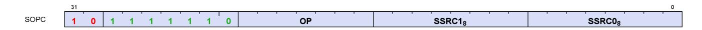

Instructions in this format may use a 32-bit literal constant that occurs immediately after the instruction.

**S\_CMP\_EQ\_I32 0**

Set SCC to 1 iff the first scalar input is equal to the second scalar input.

SCC = S0.i32 == S1.i32

#### **Notes**

Note that S\_CMP\_EQ\_I32 and S\_CMP\_EQ\_U32 are identical opcodes, but both are provided for symmetry.

**S\_CMP\_LG\_I32 1**

Set SCC to 1 iff the first scalar input is less than or greater than the second scalar input.

SCC = S0.i32 <> S1.i32

## **Notes**

Note that S\_CMP\_LG\_I32 and S\_CMP\_LG\_U32 are identical opcodes, but both are provided for symmetry.

**S\_CMP\_GT\_I32 2**

Set SCC to 1 iff the first scalar input is greater than the second scalar input.

SCC = S0.i32 > S1.i32

**S\_CMP\_GE\_I32 3**

Set SCC to 1 iff the first scalar input is greater than or equal to the second scalar input.

SCC = S0.i32 >= S1.i32

16.4. SOPC Instructions 257 of 697

**S\_CMP\_LT\_I32 4**

Set SCC to 1 iff the first scalar input is less than the second scalar input.

```
SCC = S0.i32 < S1.i32
```

**S\_CMP\_LE\_I32 5**

Set SCC to 1 iff the first scalar input is less than or equal to the second scalar input.

```
SCC = S0.i32 <= S1.i32
```

**S\_CMP\_EQ\_U32 6**

Set SCC to 1 iff the first scalar input is equal to the second scalar input.

```
SCC = S0.u32 == S1.u32
```

# **Notes**

Note that S\_CMP\_EQ\_I32 and S\_CMP\_EQ\_U32 are identical opcodes, but both are provided for symmetry.

**S\_CMP\_LG\_U32 7**

Set SCC to 1 iff the first scalar input is less than or greater than the second scalar input.

```
SCC = S0.u32 <> S1.u32
```

## **Notes**

Note that S\_CMP\_LG\_I32 and S\_CMP\_LG\_U32 are identical opcodes, but both are provided for symmetry.

**S\_CMP\_GT\_U32 8**

Set SCC to 1 iff the first scalar input is greater than the second scalar input.

```
SCC = S0.u32 > S1.u32
```

16.4. SOPC Instructions 258 of 697

**S\_CMP\_GE\_U32 9**

Set SCC to 1 iff the first scalar input is greater than or equal to the second scalar input.

```
SCC = S0.u32 >= S1.u32
```

**S\_CMP\_LT\_U32 10**

Set SCC to 1 iff the first scalar input is less than the second scalar input.

```
SCC = S0.u32 < S1.u32
```

**S\_CMP\_LE\_U32 11**

Set SCC to 1 iff the first scalar input is less than or equal to the second scalar input.

```
SCC = S0.u32 <= S1.u32
```

**S\_BITCMP0\_B32 12**

Extract a bit from the first scalar input based on an index in the second scalar input, and set SCC to 1 iff the extracted bit is equal to 0.

```
SCC = S0.u32[S1.u32[4 : 0]] == 1'0U
```

**S\_BITCMP1\_B32 13**

Extract a bit from the first scalar input based on an index in the second scalar input, and set SCC to 1 iff the extracted bit is equal to 1.

```
SCC = S0.u32[S1.u32[4 : 0]] == 1'1U
```

**S\_BITCMP0\_B64 14**

16.4. SOPC Instructions 259 of 697

Extract a bit from the first scalar input based on an index in the second scalar input, and set SCC to 1 iff the extracted bit is equal to 0.

```
SCC = S0.u64[S1.u32[5 : 0]] == 1'0U
```

**S\_BITCMP1\_B64 15**

Extract a bit from the first scalar input based on an index in the second scalar input, and set SCC to 1 iff the extracted bit is equal to 1.

```
SCC = S0.u64[S1.u32[5 : 0]] == 1'1U
```

**S\_CMP\_EQ\_U64 16**

Set SCC to 1 iff the first scalar input is equal to the second scalar input.

```
SCC = S0.u64 == S1.u64
```

**S\_CMP\_LG\_U64 17**

Set SCC to 1 iff the first scalar input is less than or greater than the second scalar input.

```
SCC = S0.u64 <> S1.u64
```

**S\_CMP\_LT\_F32 65**

Set SCC to 1 iff the first scalar input is less than the second scalar input.

```
SCC = S0.f32 < S1.f32
```

**S\_CMP\_LT\_F16 81**

Set SCC to 1 iff the first scalar input is less than the second scalar input.

16.4. SOPC Instructions 260 of 697

```
SCC = S0.f16 < S1.f16
```

**S\_CMP\_EQ\_F32 66**

Set SCC to 1 iff the first scalar input is equal to the second scalar input.

```
SCC = S0.f32 == S1.f32
```

**S\_CMP\_EQ\_F16 82**

Set SCC to 1 iff the first scalar input is equal to the second scalar input.

```
SCC = S0.f16 == S1.f16
```

**S\_CMP\_LE\_F32 67**

Set SCC to 1 iff the first scalar input is less than or equal to the second scalar input.

```
SCC = S0.f32 <= S1.f32
```

**S\_CMP\_LE\_F16 83**

Set SCC to 1 iff the first scalar input is less than or equal to the second scalar input.

```
SCC = S0.f16 <= S1.f16
```

**S\_CMP\_GT\_F32 68**

Set SCC to 1 iff the first scalar input is greater than the second scalar input.

```
SCC = S0.f32 > S1.f32
```

16.4. SOPC Instructions 261 of 697

**S\_CMP\_GT\_F16 84**

Set SCC to 1 iff the first scalar input is greater than the second scalar input.

```
SCC = S0.f16 > S1.f16
```

**S\_CMP\_LG\_F32 69**

Set SCC to 1 iff the first scalar input is less than or greater than the second scalar input.

```
SCC = S0.f32 <> S1.f32
```

**S\_CMP\_LG\_F16 85**

Set SCC to 1 iff the first scalar input is less than or greater than the second scalar input.

```
SCC = S0.f16 <> S1.f16
```

**S\_CMP\_GE\_F32 70**

Set SCC to 1 iff the first scalar input is greater than or equal to the second scalar input.

```
SCC = S0.f32 >= S1.f32
```

**S\_CMP\_GE\_F16 86**

Set SCC to 1 iff the first scalar input is greater than or equal to the second scalar input.

```
SCC = S0.f16 >= S1.f16
```

**S\_CMP\_O\_F32 71**

Set SCC to 1 iff the first scalar input is orderable to the second scalar input.

16.4. SOPC Instructions 262 of 697

```
SCC = (!isNAN(64'F(S0.f32)) && !isNAN(64'F(S1.f32)))
```

**S\_CMP\_O\_F16 87**

Set SCC to 1 iff the first scalar input is orderable to the second scalar input.

```
SCC = (!isNAN(64'F(S0.f16)) && !isNAN(64'F(S1.f16)))
```

**S\_CMP\_U\_F32 72**

Set SCC to 1 iff the first scalar input is not orderable to the second scalar input.

```
SCC = (isNAN(64'F(S0.f32)) || isNAN(64'F(S1.f32)))
```

**S\_CMP\_U\_F16 88**

Set SCC to 1 iff the first scalar input is not orderable to the second scalar input.

```
SCC = (isNAN(64'F(S0.f16)) || isNAN(64'F(S1.f16)))
```

**S\_CMP\_NGE\_F32 73**

Set SCC to 1 iff the first scalar input is not greater than or equal to the second scalar input.

```
SCC = !(S0.f32 >= S1.f32);
// With NAN inputs this is not the same operation as <
```

**S\_CMP\_NGE\_F16 89**

Set SCC to 1 iff the first scalar input is not greater than or equal to the second scalar input.

```
SCC = !(S0.f16 >= S1.f16);
// With NAN inputs this is not the same operation as <
```

16.4. SOPC Instructions 263 of 697

**S\_CMP\_NLG\_F32 74**

Set SCC to 1 iff the first scalar input is not less than or greater than the second scalar input.

```
SCC = !(S0.f32 <> S1.f32);
// With NAN inputs this is not the same operation as ==
```

**S\_CMP\_NLG\_F16 90**

Set SCC to 1 iff the first scalar input is not less than or greater than the second scalar input.

```
SCC = !(S0.f16 <> S1.f16);
// With NAN inputs this is not the same operation as ==
```

**S\_CMP\_NGT\_F32 75**

Set SCC to 1 iff the first scalar input is not greater than the second scalar input.

```
SCC = !(S0.f32 > S1.f32);
// With NAN inputs this is not the same operation as <=
```

**S\_CMP\_NGT\_F16 91**

Set SCC to 1 iff the first scalar input is not greater than the second scalar input.

```
SCC = !(S0.f16 > S1.f16);
// With NAN inputs this is not the same operation as <=
```

**S\_CMP\_NLE\_F32 76**

Set SCC to 1 iff the first scalar input is not less than or equal to the second scalar input.

```
SCC = !(S0.f32 <= S1.f32);
// With NAN inputs this is not the same operation as >
```

16.4. SOPC Instructions 264 of 697

**S\_CMP\_NLE\_F16 92**

Set SCC to 1 iff the first scalar input is not less than or equal to the second scalar input.

```
SCC = !(S0.f16 <= S1.f16);
// With NAN inputs this is not the same operation as >
```

**S\_CMP\_NEQ\_F32 77**

Set SCC to 1 iff the first scalar input is not equal to the second scalar input.

```
SCC = !(S0.f32 == S1.f32);
// With NAN inputs this is not the same operation as !=
```

**S\_CMP\_NEQ\_F16 93**

Set SCC to 1 iff the first scalar input is not equal to the second scalar input.

```
SCC = !(S0.f16 == S1.f16);
// With NAN inputs this is not the same operation as !=
```

**S\_CMP\_NLT\_F32 78**

Set SCC to 1 iff the first scalar input is not less than the second scalar input.

```
SCC = !(S0.f32 < S1.f32);
// With NAN inputs this is not the same operation as >=
```

**S\_CMP\_NLT\_F16 94**

Set SCC to 1 iff the first scalar input is not less than the second scalar input.

```
SCC = !(S0.f16 < S1.f16);
// With NAN inputs this is not the same operation as >=
```

16.4. SOPC Instructions 265 of 697

# <span id="page-275-0"></span>**16.5. SOPP Instructions**

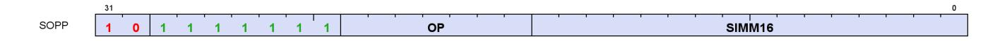

**S\_NOP 0**

Do nothing. Delay issue of next instruction by a small, fixed amount.

Insert 0..15 wait states based on SIMM16[3:0]. 0x0 means the next instruction can issue on the next clock, 0xf means the next instruction can issue 16 clocks later.

```
for i in 0U : SIMM16.u16[3 : 0].u32 do
  nop()
endfor
```

#### **Notes**

This instruction may be used to introduce wait states to resolve hazards; see the shader programming guide for details. Compare with S\_SLEEP.

# Examples:

```
  s_nop 0 // Wait 1 cycle.
  s_nop 0xf // Wait 16 cycles.
```

**S\_SETKILL 1**

Kill this wave if the least significant bit of the immediate constant is 1.

Used primarily for debugging kill wave host command behavior.

**S\_SETHALT 2**

Set or clear the HALT or FATAL\_HALT status bits.

The particular status bit is chosen by halt type control as indicated in SIMM16[2]; 0 = HALT bit select; 1 = FATAL\_HALT bit select.

When halt type control is set to 0 (HALT bit select): Set HALT bit to value of SIMM16[0]; 1 = halt, 0 = clear HALT bit. The halt flag is ignored while PRIV == 1 (inside trap handlers) but the shader halts after the handler returns if HALT is still set at that time.

When halt type control is set to 1 (FATAL HALT bit select): Set FATAL\_HALT bit to value of SIMM16[0]; 1 =

16.5. SOPP Instructions 266 of 697

fatal\_halt, 0 = clear FATAL\_HALT bit. Setting the fatal\_halt flag halts the shader in or outside of the trap handlers.

**S\_SLEEP 3**

Cause a wave to sleep for up to ~8000 clocks, or to sleep until an external event wakes the wave up.

SIMM16[6:0] determines the sleep duration. The wave sleeps for (64\*(SIMM16[6:0]-1) … 64\*SIMM16[6:0]) clocks. The exact amount of delay is approximate. Compare with S\_NOP. When SIMM16[6:0] is zero then no sleep occurs.

"Sleep Forever" mode may also be enabled to cause a wave to sleep until an external event wakes it up.

The SIMM16 argument is encoded as follows:

# **DURATION = SIMM16[6:0]**

Determines the sleep duration. The wave sleeps for (64\*(SIMM16[6:0]-1) .. 64\*SIMM16[6:0]) clocks. The exact amount of delay is approximate. Compare with S\_NOP. When set to zero, no sleep occurs.

# **SLEEP\_FOREVER = SIMM16[15]**

If set to 1, enables "sleep forever" mode. The wave sleeps until woken up by one of the following:

- S\_WAKEUP
- S\_WAKEUP\_BARRIER
- An exception
- Host trap
- Other trap events
- Wave KILL

See also S\_SLEEP\_VAR.

# **Notes**

Examples:

```
  s_sleep { duration: 0 } // Wait for 0 clocks.
  s_sleep { duration: 1 } // Wait for 1-64 clocks.
  s_sleep { duration: 2 } // Wait for 65-128 clocks.
  s_sleep { sleep_forever: 1 } // Wait until an event occurs.
```

**S\_CLAUSE 5**

Mark the beginning of a clause.

The next instruction determines the clause type, which may be one of the following types.

• Image Load (non-sample instructions )

16.5. SOPP Instructions 267 of 697

- Image Sample
- Image Store
- Image Atomic
- Buffer/Global/Scratch Load
- Buffer/Global/Scratch Store
- Buffer/Global/Scratch Atomic
- Flat Load
- Flat Store
- Flat Atomic
- LDS (loads, stores, atomics may be in same clause)
- Scalar Memory
- Vector ALU

Once the clause type is determined, any instruction encountered within the clause that is not of the same type (and not an internal instruction described below) is illegal and may lead to undefined behaviour. Attempting to issue S\_CLAUSE while inside a clause is also illegal.

Instructions that are processed internally do not interrupt the clause. The following instructions are internal:

- S\_NOP,
- S\_WAIT\_\*CNT,
- S\_DELAY\_ALU.

Halting or killing a wave breaks the clause. VALU exceptions and other traps that cause the shader to enter its trap handler breaks the clause. The single-step debug mode breaks the clause.

The clause length must be between 2 and 63 instructions, inclusive. Clause breaks may be from 1 to 15, or may be disabled entirely. Clause length and breaks are encoded in the SIMM16 argument as follows:

### **LENGTH = SIMM16[5:0]**

This field is set to the logical number of instructions in the clause, minus 1 (e.g. if a clause has 4 instructions, program this field to **3**). The minimum number of instructions required for a clause is 2 and the maximum number of instructions is 63, therefore this field must be programmed in the range [1, 62] inclusive.

## **BREAK\_SPAN = SIMM16[11:8]**

This field is set to the number of instructions to issue before each clause break. If set to zero then there are no clause breaks. If set to nonzero value then the maximum number of instructions between clause breaks is 15.

The following instruction types cannot appear in a clause:

- Instructions of a different type than the clause type, as determined by the first instruction in the clause
- S\_CLAUSE
- S\_ENDPGM
- SALU
- Branch
- Message
- S\_SLEEP

16.5. SOPP Instructions 268 of 697

- S\_SLEEP\_VAR
- VDSDIR
- VINTERP
- Export
- S\_SETHALT
- S\_SETKILL

To schedule an S\_WAIT\_\* or S\_DELAY\_ALU instruction for the first instruction in the clause, the waitcnt/delay instruction must appear before the S\_CLAUSE instruction so that S\_CLAUSE can accurately determine the clause type.

S\_DELAY\_ALU is orthogonal to S\_CLAUSE; ALU clauses should be structured to avoid any stalling.

**S\_DELAY\_ALU 7**

Insert delay between dependent SALU/VALU instructions.

The SIMM16 argument is encoded as:

# **INSTID0 = SIMM16[3:0]**

Hazard to delay for with the next VALU instruction.

# **INSTSKIP = SIMM16[6:4]**

Identify the VALU instruction that the second delay condition applies to.

### **INSTID1 = SIMM16[10:7]**

Hazard to delay for with the VALU instruction identified by INSTSKIP.

Legal values for the InstID0 and InstID1 fields are:

#### **INSTID\_NO\_DEP (0x0)**

No dependency on any prior instruction.

#### **INSTID\_VALU\_DEP\_1 (0x1)**

Dependent on previous VALU instruction, 1 instruction(s) back.

#### **INSTID\_VALU\_DEP\_2 (0x2)**

Dependent on previous VALU instruction, 2 instruction(s) back.

#### **INSTID\_VALU\_DEP\_3 (0x3)**

Dependent on previous VALU instruction, 3 instruction(s) back.

#### **INSTID\_VALU\_DEP\_4 (0x4)**

Dependent on previous VALU instruction, 4 instruction(s) back.

#### **INSTID\_TRANS32\_DEP\_1 (0x5)**

Dependent on previous TRANS32 instruction, 1 instruction(s) back.

16.5. SOPP Instructions 269 of 697

#### **INSTID\_TRANS32\_DEP\_2 (0x6)**

Dependent on previous TRANS32 instruction, 2 instruction(s) back.

## **INSTID\_TRANS32\_DEP\_3 (0x7)**

Dependent on previous TRANS32 instruction, 3 instruction(s) back.

# **INSTID\_FMA\_ACCUM\_CYCLE\_1 (0x8)**

Single cycle penalty for FMA accumulation (reserved).

### **INSTID\_SALU\_CYCLE\_1 (0x9)**

1 cycle penalty for a prior SALU instruction.

## **INSTID\_SALU\_CYCLE\_2 (0xa)**

2 cycle penalty for a prior SALU instruction.

## **INSTID\_SALU\_CYCLE\_3 (0xb)**

3 cycle penalty for a prior SALU instruction.

Legal values for the InstSkip field are:

## **INSTSKIP\_SAME (0x0)**

Apply second dependency to same instruction (2 dependencies on one instruction).

# **INSTSKIP\_NEXT (0x1)**

Apply second dependency to next instruction (no skip).

### **INSTSKIP\_SKIP\_1 (0x2)**

Skip 1 instruction(s) then apply dependency.

#### **INSTSKIP\_SKIP\_2 (0x3)**

Skip 2 instruction(s) then apply dependency.

#### **INSTSKIP\_SKIP\_3 (0x4)**

Skip 3 instruction(s) then apply dependency.

# **INSTSKIP\_SKIP\_4 (0x5)**

Skip 4 instruction(s) then apply dependency.

This instruction describes dependencies for two instructions, directing the hardware to insert delay if the dependent instruction was issued too recently to forward data to the second.

S\_DELAY\_ALU instructions record the required delay with respect to a previous VALU instruction and indicate data dependencies that benefit from having extra idle cycles inserted between them. These instructions are optional: without them the program still functions correctly but performance may suffer when multiple waves are in flight; IB may issue dependent instructions that stall in the ALU, preventing those cycles from being utilized by other wavefronts.

If enough independent instructions are between dependent ones then no delay is necessary and this instruction may be omitted. For wave64 the compiler may not know the status of the EXEC mask and hence does not know if instructions require 1 or 2 passes to issue. S\_DELAY\_ALU encodes the type of dependency so that hardware may apply the correct delay depending on the number of active passes.

16.5. SOPP Instructions 270 of 697

S\_DELAY\_ALU may execute in zero cycles.

To reduce instruction stream overhead the S\_DELAY\_ALU instructions packs two delay values into one instruction, with a "skip" indicator so the two delayed instructions don't need to be back-to-back.

S\_DELAY\_ALU is illegal inside of a clause created by S\_CLAUSE.

#### Example:

```
v_mov_b32 v3, v0
v_lshlrev_b32 v30, 1, v31
v_lshlrev_b32 v24, 1, v25
s_delay_alu { instid0: INSTID_VALU_DEP_3, instskip: INSTSKIP_SKIP_1, instid1: INSTID_VALU_DEP_1 }
  // 1 cycle delay here
v_add_f32 v0, v1, v3
v_sub_f32 v11, v9, v9
  // 2 cycles delay here
v_mul_f32 v10, v13, v11
```

**S\_WAITCNT 9**

Equivalent to S\_WAIT\_IDLE. This opcode should not be used in modern code; use one of the specialized S\_WAIT\_\* instructions instead. The operand is ignored for compatibility.

**S\_WAIT\_IDLE 10**

Wait for all activity in the wave to be complete (all dependency and memory counters at zero).

**S\_WAIT\_EVENT 11**

Wait for an event to occur or a condition to be satisfied before continuing. The SIMM16 argument specifies which event(s) to wait on.

#### **EXPORT\_READY = SIMM16[1]**

If this value is ONE then sleep until the export\_ready bit is 1. If the export\_ready bit is already 1, no sleep occurs. Effect is the same as the export\_ready check performed before issuing an export instruction.

No wait occurs if this value is ZERO.

This wait **cannot** be preempted by KILL, context-save, host trap, single-step or trap after instruction events. IB waits for the event to occur before processing internal or external exceptions which can delay entry to the trap handler for a significant amount of time.

**S\_TRAP 16**

16.5. SOPP Instructions 271 of 697

Enter the trap handler.

This instruction may be generated internally as well in response to a host trap (TrapID = 0) or an exception. TrapID 0 is reserved for hardware use and should not be used in a shader-generated trap.

```
TrapID = SIMM16.u16[3 : 0].u8;
"Wait for all instructions to complete";
// PC passed into trap handler points to S_TRAP itself,
// *not* to the next instruction.
{ TTMP[1], TTMP[0] } = { TrapID[3 : 0], 12'0, PC[47 : 0] };
PC = TBA.i64;
// trap base address
WAVE_STATUS.PRIV = 1'1U
```

**S\_ROUND\_MODE 17**

Set floating point round mode using an immediate constant.

Avoids wait state penalty that would be imposed by S\_SETREG.

**S\_DENORM\_MODE 18**

Set floating point denormal mode using an immediate constant.

Avoids wait state penalty that would be imposed by S\_SETREG.

**S\_BARRIER\_WAIT 20**

Wait for a barrier to complete. The SIMM16 argument specifies which barrier to wait on.

```
;
// barrierBit 0: reserved
// barrierBit 1: workgroup
// barrierBit 2: trap
barrierBit = SIMM16.i32 >= 0 ? 0 : SIMM16.i32 == -1 ? 1 : 2;
while !WAVE_BARRIER_COMPLETE[barrierBit] do
  // Implemented as a power-saving idle
  s_nop(16'0U)
endwhile;
WAVE_BARRIER_COMPLETE[barrierBit] = 1'0U
```

**S\_CODE\_END 31**

16.5. SOPP Instructions 272 of 697

Generate an illegal instruction interrupt. This instruction is used to mark the end of a shader buffer for debug tools.

This instruction should not appear in typical shader code. It is used to pad the end of a shader program to make it easier for analysis programs to locate the end of a shader program buffer. Use of this opcode in an embedded shader block may cause analysis tools to fail.

To unambiguously mark the end of a shader buffer, this instruction must be specified five times in a row (total of 20 bytes) and analysis tools must ensure the opcode occurs at least five times to be certain they are at the end of the buffer. This is because the bit pattern generated by this opcode could incidentally appear in a valid instruction's second dword, literal constant or as part of a multi-DWORD image instruction.

In short: do not embed this opcode in the middle of a valid shader program. DO use this opcode 5 times at the end of a shader program to clearly mark the end of the program.

#### Example:

```
  ...
  s_endpgm // last real instruction in shader buffer
  s_code_end // 1
  s_code_end // 2
  s_code_end // 3
  s_code_end // 4
  s_code_end // done!
```

**S\_BRANCH 32**

Jump to a constant offset relative to the current PC.

The literal argument is a signed DWORD offset relative to the PC of the next instruction.

```
PC = PC + signext(SIMM16.i16 * 16'4) + 4LL;
// short jump.
```

# **Notes**

For a long jump or an indirect jump use S\_SETPC\_B64.

#### Examples:

```
  s_branch label // Set SIMM16 = +4 = 0x0004
  s_nop 0 // 4 bytes
label:
  s_nop 0 // 4 bytes
  s_branch label // Set SIMM16 = -8 = 0xfff8
```

16.5. SOPP Instructions 273 of 697

**S\_CBRANCH\_SCC0 33**

If SCC is 0 then jump to a constant offset relative to the current PC.

The literal argument is a signed DWORD offset relative to the PC of the next instruction.

```
if SCC == 1'0U then
  PC = PC + signext(SIMM16.i16 * 16'4) + 4LL
else
  PC = PC + 4LL
endif
```

**S\_CBRANCH\_SCC1 34**

If SCC is 1 then jump to a constant offset relative to the current PC.

The literal argument is a signed DWORD offset relative to the PC of the next instruction.

```
if SCC == 1'1U then
  PC = PC + signext(SIMM16.i16 * 16'4) + 4LL
else
  PC = PC + 4LL
endif
```

**S\_CBRANCH\_VCCZ 35**

If VCCZ is 1 then jump to a constant offset relative to the current PC.

The literal argument is a signed DWORD offset relative to the PC of the next instruction.

```
if VCCZ.u1 == 1'1U then
  PC = PC + signext(SIMM16.i16 * 16'4) + 4LL
else
  PC = PC + 4LL
endif
```

**S\_CBRANCH\_VCCNZ 36**

If VCCZ is 0 then jump to a constant offset relative to the current PC.

The literal argument is a signed DWORD offset relative to the PC of the next instruction.

```
if VCCZ.u1 == 1'0U then
```

16.5. SOPP Instructions 274 of 697

```
  PC = PC + signext(SIMM16.i16 * 16'4) + 4LL
else
  PC = PC + 4LL
endif
```

**S\_CBRANCH\_EXECZ 37**

If EXECZ is 1 then jump to a constant offset relative to the current PC.

The literal argument is a signed DWORD offset relative to the PC of the next instruction.

```
if EXECZ.u1 == 1'1U then
  PC = PC + signext(SIMM16.i16 * 16'4) + 4LL
else
  PC = PC + 4LL
endif
```

**S\_CBRANCH\_EXECNZ 38**

If EXECZ is 0 then jump to a constant offset relative to the current PC.

The literal argument is a signed DWORD offset relative to the PC of the next instruction.

```
if EXECZ.u1 == 1'0U then
  PC = PC + signext(SIMM16.i16 * 16'4) + 4LL
else
  PC = PC + 4LL
endif
```

**S\_ENDPGM 48**

End of program; terminate wavefront.

The hardware implicitly executes S\_WAIT\_IDLE before executing this instruction. See S\_ENDPGM\_SAVED for the context-switch version of this instruction.

**S\_ENDPGM\_SAVED 49**

End of program; signal that a wave has been saved by the context-switch trap handler and terminate wavefront.

The hardware implicitly executes S\_WAIT\_IDLE before executing this instruction. See S\_ENDPGM for

16.5. SOPP Instructions 275 of 697

additional variants.

**S\_WAKEUP 52**

Allow a wave to 'ping' all the other waves in its threadgroup to force them to wake up early from an S\_SLEEP instruction.

The ping is ignored if the waves are not sleeping. This allows for efficient polling on a memory location. The waves which are polling can sit in a long S\_SLEEP between memory reads, but the wave which writes the value can tell them all to wake up early now that the data is available. This method is also safe from races since any waves that miss the ping resume when they complete their S\_SLEEP.

If the wave executing S\_WAKEUP is in a threadgroup (in\_wg set), then it wakes up all waves associated with the same threadgroup ID. Otherwise, S\_WAKEUP is treated as an S\_NOP.

**S\_SETPRIO 53**

Change wave user priority.

User settable wave priority is set to SIMM16[1:0]. 0 is the lowest priority and 3 is the highest. The overall wave priority is:

```
SysUserPrio = MIN(3, SysPrio[1:0] + UserPrio[1:0]). Priority = {SysUserPrio[1:0], WaveAge[3:0]}
```

The system priority cannot be modified from within the wave.

**S\_SENDMSG 54**

Send a message to upstream control hardware.

SIMM16[7:0] contains the message type.

### **Notes**

Message types are documented in the shader programming guide.

**S\_SENDMSGHALT 55**

Send a message to upstream control hardware and then HALT the wavefront; see S\_SENDMSG for details.

**S\_INCPERFLEVEL 56**

16.5. SOPP Instructions 276 of 697

| Increment performance counter specified in SIMM16[3:0] by 1.                   |    |
|--------------------------------------------------------------------------------|----|
| S_DECPERFLEVEL<br>Decrement performance counter specified in SIMM16[3:0] by 1. | 57 |
| S_ICACHE_INV                                                                   | 60 |
| Invalidate entire first level instruction cache.                               |    |
| S_WAIT_LOADCNT<br>Wait until LOADCNT is less than or equal to SIMM16[5:0].     | 64 |
| S_WAIT_STORECNT<br>Wait until STORECNT is less than or equal to SIMM16[5:0].   | 65 |
| S_WAIT_SAMPLECNT<br>Wait until SAMPLECNT is less than or equal to SIMM16[5:0]. | 66 |
| S_WAIT_BVHCNT<br>Wait until BVHCNT is less than or equal to SIMM16[2:0].       | 67 |
| S_WAIT_EXPCNT<br>Wait until EXPCNT is less than or equal to SIMM16[2:0].       | 68 |
| S_WAIT_DSCNT<br>Wait until DSCNT is less than or equal to SIMM16[5:0].         | 70 |
| S_WAIT_KMCNT                                                                   | 71 |

16.5. SOPP Instructions 277 of 697

Wait until KMCNT is less than or equal to SIMM16[4:0].

#### **S\_WAIT\_LOADCNT\_DSCNT 72**

Wait until LOADCNT is less than or equal to SIMM16[13:8] and DSCNT is less than or equal to SIMM16[5:0].

Argument is a bitfield of which dependency counters to wait to be zero. The SIMM16 argument is encoded as:

### **DS = SIMM16[5:0]**

Wait for DSCNT <= N.

#### **MEM = SIMM16[13:8]**

Wait for either LOADCNT <= N or STORECNT <= N (depending on instruction).

#### **S\_WAIT\_STORECNT\_DSCNT 73**

Wait until STORECNT is less than or equal to SIMM16[13:8] and DSCNT is less than or equal to SIMM16[5:0].

Argument is a bitfield of which dependency counters to wait to be zero. The SIMM16 argument is encoded as:

# **DS = SIMM16[5:0]**

Wait for DSCNT <= N.

#### **MEM = SIMM16[13:8]**

Wait for either LOADCNT <= N or STORECNT <= N (depending on instruction).

16.5. SOPP Instructions 278 of 697

# <span id="page-288-0"></span>**16.6. SMEM Instructions**

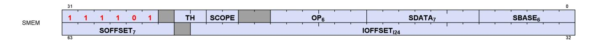

**S\_LOAD\_B32 0**

Load 32 bits of data from the scalar memory into a scalar register.

```
addr = CalcGlobalAddr(sgpr_base.b64, offset.b64);
SDATA[31 : 0] = MEM[addr].b32
```

#### **Notes**

If the offset is specified as an SGPR, the SGPR contains an UNSIGNED BYTE offset (the 2 LSBs are ignored).

If the offset is specified as an immediate 21-bit constant, the constant is a SIGNED BYTE offset.

**S\_LOAD\_B64 1**

Load 64 bits of data from the scalar memory into a scalar register.

```
addr = CalcGlobalAddr(sgpr_base.b64, offset.b64);
SDATA[31 : 0] = MEM[addr].b32;
SDATA[63 : 32] = MEM[addr + 4U].b32
```

## **Notes**

If the offset is specified as an SGPR, the SGPR contains an UNSIGNED BYTE offset (the 2 LSBs are ignored).

If the offset is specified as an immediate 21-bit constant, the constant is a SIGNED BYTE offset.

**S\_LOAD\_B128 2**

Load 128 bits of data from the scalar memory into a scalar register.

```
addr = CalcGlobalAddr(sgpr_base.b64, offset.b64);
SDATA[31 : 0] = MEM[addr].b32;
SDATA[63 : 32] = MEM[addr + 4U].b32;
SDATA[95 : 64] = MEM[addr + 8U].b32;
SDATA[127 : 96] = MEM[addr + 12U].b32
```

16.6. SMEM Instructions 279 of 697

If the offset is specified as an SGPR, the SGPR contains an UNSIGNED BYTE offset (the 2 LSBs are ignored).

If the offset is specified as an immediate 21-bit constant, the constant is a SIGNED BYTE offset.

**S\_LOAD\_B256 3**

Load 256 bits of data from the scalar memory into a scalar register.

```
addr = CalcGlobalAddr(sgpr_base.b64, offset.b64);
SDATA[31 : 0] = MEM[addr].b32;
SDATA[63 : 32] = MEM[addr + 4U].b32;
SDATA[95 : 64] = MEM[addr + 8U].b32;
SDATA[127 : 96] = MEM[addr + 12U].b32;
SDATA[159 : 128] = MEM[addr + 16U].b32;
SDATA[191 : 160] = MEM[addr + 20U].b32;
SDATA[223 : 192] = MEM[addr + 24U].b32;
SDATA[255 : 224] = MEM[addr + 28U].b32
```

#### **Notes**

If the offset is specified as an SGPR, the SGPR contains an UNSIGNED BYTE offset (the 2 LSBs are ignored).

If the offset is specified as an immediate 21-bit constant, the constant is a SIGNED BYTE offset.

**S\_LOAD\_B512 4**

Load 512 bits of data from the scalar memory into a scalar register.

```
addr = CalcGlobalAddr(sgpr_base.b64, offset.b64);
SDATA[31 : 0] = MEM[addr].b32;
SDATA[63 : 32] = MEM[addr + 4U].b32;
SDATA[95 : 64] = MEM[addr + 8U].b32;
SDATA[127 : 96] = MEM[addr + 12U].b32;
SDATA[159 : 128] = MEM[addr + 16U].b32;
SDATA[191 : 160] = MEM[addr + 20U].b32;
SDATA[223 : 192] = MEM[addr + 24U].b32;
SDATA[255 : 224] = MEM[addr + 28U].b32;
SDATA[287 : 256] = MEM[addr + 32U].b32;
SDATA[319 : 288] = MEM[addr + 36U].b32;
SDATA[351 : 320] = MEM[addr + 40U].b32;
SDATA[383 : 352] = MEM[addr + 44U].b32;
SDATA[415 : 384] = MEM[addr + 48U].b32;
SDATA[447 : 416] = MEM[addr + 52U].b32;
SDATA[479 : 448] = MEM[addr + 56U].b32;
SDATA[511 : 480] = MEM[addr + 60U].b32
```

16.6. SMEM Instructions 280 of 697

If the offset is specified as an SGPR, the SGPR contains an UNSIGNED BYTE offset (the 2 LSBs are ignored).

If the offset is specified as an immediate 21-bit constant, the constant is a SIGNED BYTE offset.

**S\_LOAD\_B96 5**

Load 96 bits of data from the scalar memory into a scalar register.

```
addr = CalcGlobalAddr(sgpr_base.b64, offset.b64);
SDATA[31 : 0] = MEM[addr].b32;
SDATA[63 : 32] = MEM[addr + 4U].b32;
SDATA[95 : 64] = MEM[addr + 8U].b32
```

### **Notes**

If the offset is specified as an SGPR, the SGPR contains an UNSIGNED BYTE offset (the 2 LSBs are ignored).

If the offset is specified as an immediate 21-bit constant, the constant is a SIGNED BYTE offset.

**S\_LOAD\_I8 8**

Load 8 bits of signed data from the scalar memory, sign extend to 32 bits and store the result into a scalar register.

```
SDATA.i32 = 32'I(signext(MEM[ADDR].i8))
```

#### **Notes**

If the offset is specified as an SGPR, the SGPR contains an UNSIGNED BYTE offset (the 2 LSBs are ignored).

If the offset is specified as an immediate 21-bit constant, the constant is a SIGNED BYTE offset.

**S\_LOAD\_U8 9**

Load 8 bits of unsigned data from the scalar memory, zero extend to 32 bits and store the result into a scalar register.

```
SDATA.u32 = 32'U({ 24'0U, MEM[ADDR].u8 })
```

### **Notes**

16.6. SMEM Instructions 281 of 697

If the offset is specified as an SGPR, the SGPR contains an UNSIGNED BYTE offset (the 2 LSBs are ignored).

If the offset is specified as an immediate 21-bit constant, the constant is a SIGNED BYTE offset.

**S\_LOAD\_I16 10**

Load 16 bits of signed data from the scalar memory, sign extend to 32 bits and store the result into a scalar register.

```
SDATA.i32 = 32'I(signext(MEM[ADDR].i16))
```

#### **Notes**

If the offset is specified as an SGPR, the SGPR contains an UNSIGNED BYTE offset (the 2 LSBs are ignored).

If the offset is specified as an immediate 21-bit constant, the constant is a SIGNED BYTE offset.

**S\_LOAD\_U16 11**

Load 16 bits of unsigned data from the scalar memory, zero extend to 32 bits and store the result into a scalar register.

```
SDATA.u32 = 32'U({ 16'0U, MEM[ADDR].u16 })
```

#### **Notes**

If the offset is specified as an SGPR, the SGPR contains an UNSIGNED BYTE offset (the 2 LSBs are ignored).

If the offset is specified as an immediate 21-bit constant, the constant is a SIGNED BYTE offset.

**S\_BUFFER\_LOAD\_B32 16**

Load 32 bits of data from a scalar buffer surface into a scalar register.

```
addr = CalcBufferAddr(sgpr_base.b64, offset.b64);
SDATA[31 : 0] = MEM[addr].b32
```

#### **Notes**

If the offset is specified as an SGPR, the SGPR contains an UNSIGNED BYTE offset (the 2 LSBs are ignored).

If the offset is specified as an immediate 21-bit constant, the constant is a SIGNED BYTE offset.

16.6. SMEM Instructions 282 of 697

# **S\_BUFFER\_LOAD\_B64 17**

Load 64 bits of data from a scalar buffer surface into a scalar register.

```
addr = CalcBufferAddr(sgpr_base.b64, offset.b64);
SDATA[31 : 0] = MEM[addr].b32;
SDATA[63 : 32] = MEM[addr + 4U].b32
```

#### **Notes**

If the offset is specified as an SGPR, the SGPR contains an UNSIGNED BYTE offset (the 2 LSBs are ignored).

If the offset is specified as an immediate 21-bit constant, the constant is a SIGNED BYTE offset.

```
S_BUFFER_LOAD_B128 18
```

Load 128 bits of data from a scalar buffer surface into a scalar register.

```
addr = CalcBufferAddr(sgpr_base.b64, offset.b64);
SDATA[31 : 0] = MEM[addr].b32;
SDATA[63 : 32] = MEM[addr + 4U].b32;
SDATA[95 : 64] = MEM[addr + 8U].b32;
SDATA[127 : 96] = MEM[addr + 12U].b32
```

## **Notes**

If the offset is specified as an SGPR, the SGPR contains an UNSIGNED BYTE offset (the 2 LSBs are ignored).

If the offset is specified as an immediate 21-bit constant, the constant is a SIGNED BYTE offset.

```
S_BUFFER_LOAD_B256 19
```

Load 256 bits of data from a scalar buffer surface into a scalar register.

```
addr = CalcBufferAddr(sgpr_base.b64, offset.b64);
SDATA[31 : 0] = MEM[addr].b32;
SDATA[63 : 32] = MEM[addr + 4U].b32;
SDATA[95 : 64] = MEM[addr + 8U].b32;
SDATA[127 : 96] = MEM[addr + 12U].b32;
SDATA[159 : 128] = MEM[addr + 16U].b32;
SDATA[191 : 160] = MEM[addr + 20U].b32;
SDATA[223 : 192] = MEM[addr + 24U].b32;
SDATA[255 : 224] = MEM[addr + 28U].b32
```

#### **Notes**

16.6. SMEM Instructions 283 of 697

If the offset is specified as an SGPR, the SGPR contains an UNSIGNED BYTE offset (the 2 LSBs are ignored).

If the offset is specified as an immediate 21-bit constant, the constant is a SIGNED BYTE offset.

#### **S\_BUFFER\_LOAD\_B512 20**

Load 512 bits of data from a scalar buffer surface into a scalar register.

```
addr = CalcBufferAddr(sgpr_base.b64, offset.b64);
SDATA[31 : 0] = MEM[addr].b32;
SDATA[63 : 32] = MEM[addr + 4U].b32;
SDATA[95 : 64] = MEM[addr + 8U].b32;
SDATA[127 : 96] = MEM[addr + 12U].b32;
SDATA[159 : 128] = MEM[addr + 16U].b32;
SDATA[191 : 160] = MEM[addr + 20U].b32;
SDATA[223 : 192] = MEM[addr + 24U].b32;
SDATA[255 : 224] = MEM[addr + 28U].b32;
SDATA[287 : 256] = MEM[addr + 32U].b32;
SDATA[319 : 288] = MEM[addr + 36U].b32;
SDATA[351 : 320] = MEM[addr + 40U].b32;
SDATA[383 : 352] = MEM[addr + 44U].b32;
SDATA[415 : 384] = MEM[addr + 48U].b32;
SDATA[447 : 416] = MEM[addr + 52U].b32;
SDATA[479 : 448] = MEM[addr + 56U].b32;
SDATA[511 : 480] = MEM[addr + 60U].b32
```

### **Notes**

If the offset is specified as an SGPR, the SGPR contains an UNSIGNED BYTE offset (the 2 LSBs are ignored).

If the offset is specified as an immediate 21-bit constant, the constant is a SIGNED BYTE offset.

#### **S\_BUFFER\_LOAD\_B96 21**

Load 96 bits of data from a scalar buffer surface into a scalar register.

```
addr = CalcBufferAddr(sgpr_base.b64, offset.b64);
SDATA[31 : 0] = MEM[addr].b32;
SDATA[63 : 32] = MEM[addr + 4U].b32;
SDATA[95 : 64] = MEM[addr + 8U].b32
```

## **Notes**

If the offset is specified as an SGPR, the SGPR contains an UNSIGNED BYTE offset (the 2 LSBs are ignored).

If the offset is specified as an immediate 21-bit constant, the constant is a SIGNED BYTE offset.

16.6. SMEM Instructions 284 of 697

**S\_BUFFER\_LOAD\_I8 24**

Load 8 bits of signed data from a scalar buffer surface, sign extend to 32 bits and store the result into a scalar register.

```
SDATA.i32 = 32'I(signext(MEM[ADDR].i8))
```

#### **Notes**

If the offset is specified as an SGPR, the SGPR contains an UNSIGNED BYTE offset (the 2 LSBs are ignored).

If the offset is specified as an immediate 21-bit constant, the constant is a SIGNED BYTE offset.

**S\_BUFFER\_LOAD\_U8 25**

Load 8 bits of unsigned data from a scalar buffer surface, zero extend to 32 bits and store the result into a scalar register.

```
SDATA.u32 = 32'U({ 24'0U, MEM[ADDR].u8 })
```

### **Notes**

If the offset is specified as an SGPR, the SGPR contains an UNSIGNED BYTE offset (the 2 LSBs are ignored).

If the offset is specified as an immediate 21-bit constant, the constant is a SIGNED BYTE offset.

**S\_BUFFER\_LOAD\_I16 26**

Load 16 bits of signed data from a scalar buffer surface, sign extend to 32 bits and store the result into a scalar register.

```
SDATA.i32 = 32'I(signext(MEM[ADDR].i16))
```

#### **Notes**

If the offset is specified as an SGPR, the SGPR contains an UNSIGNED BYTE offset (the 2 LSBs are ignored).

If the offset is specified as an immediate 21-bit constant, the constant is a SIGNED BYTE offset.

**S\_BUFFER\_LOAD\_U16 27**

Load 16 bits of unsigned data from a scalar buffer surface, zero extend to 32 bits and store the result into a

16.6. SMEM Instructions 285 of 697

scalar register.

```
SDATA.u32 = 32'U({ 16'0U, MEM[ADDR].u16 })
```

#### **Notes**

If the offset is specified as an SGPR, the SGPR contains an UNSIGNED BYTE offset (the 2 LSBs are ignored).

If the offset is specified as an immediate 21-bit constant, the constant is a SIGNED BYTE offset.

**S\_DCACHE\_INV 33**

Invalidate the scalar data L0 cache.

**S\_PREFETCH\_INST 36**

Prefetch instructions into the shader instruction cache, relative to a base address provided.

If SCALAR\_PREFETCH\_EN is 0 for this wavefront then this instruction is treated as a NOP.

Scalar cache does not send completion or error status to the wave.

```
if MODE.SCALAR_PREFETCH_EN.u1 then
  mem_addr = (64'U(S0[63 : 0].i64 + 64'I(IOFFSET.i24)) & 0xffffffffffffff80ULL);
  // Force 128B alignment
  length = S2.u32;
  // SGPR or M0
  length += SDATA.u32;
  // SDATA is an immediate
  length = (length & 31U);
  // Length restricted to 0..31
  length = (length + 1U) * 128U;
  // Prefetch 1-32 cachelines, units of 128B
  PrefetchScalarInst(mem_addr, length)
endif
```

#### **S\_PREFETCH\_INST\_PC\_REL 37**

Prefetch instructions into the shader instruction cache, relative to the current PC address.

If SCALAR\_PREFETCH\_EN is 0 for this wavefront then this instruction is treated as a NOP.

Scalar cache does not send completion or error status to the wave.

```
if MODE.SCALAR_PREFETCH_EN.u1 then
```

16.6. SMEM Instructions 286 of 697

```
  mem_addr = (64'U(PC[63 : 0].i64 + 8LL + 64'I(IOFFSET.i24)) & 0xffffffffffffff80ULL);
  // Force 128B alignment
  length = S1.u32;
  // SGPR or M0
  length += SDATA.u32;
  // SDATA is an immediate
  length = (length & 31U);
  // Length restricted to 0..31
  length = (length + 1U) * 128U;
  // Prefetch 1-32 cachelines, units of 128B
  PrefetchScalarInst(mem_addr, length)
endif
```

**S\_PREFETCH\_DATA 38**

Prefetch data into the scalar data cache, relative to a base address provided.

If SCALAR\_PREFETCH\_EN is 0 for this wavefront then this instruction is treated as a NOP.

Scalar cache does not send completion or error status to the wave.

```
if MODE.SCALAR_PREFETCH_EN.u1 then
  mem_addr = (64'U(S0[63 : 0].i64 + 64'I(IOFFSET.i24)) & 0xffffffffffffff80ULL);
  // Force 128B alignment
  length = S2.u32;
  // SGPR or M0
  length += SDATA.u32;
  // SDATA is an immediate
  length = (length & 31U);
  // Length restricted to 0..31
  length = (length + 1U) * 128U;
  // Prefetch 1-32 cachelines, units of 128B
  PrefetchScalarData(mem_addr, length)
endif
```

#### **S\_BUFFER\_PREFETCH\_DATA 39**

Prefetch data into the scalar data cache, relative to a base address provided in a resource descriptor constant.

If SCALAR\_PREFETCH\_EN is 0 for this wavefront then this instruction is treated as a NOP.

Scalar cache does not send completion or error status to the wave.

```
if MODE.SCALAR_PREFETCH_EN.u1 then
  mem_addr = (64'U(S0[47 : 0].i64 + 64'I(IOFFSET.i24)) & 0xffffffffffffff80ULL);
  // Force 128B alignment
  length = S2.u32;
  // SGPR or M0
  length += SDATA.u32;
```

16.6. SMEM Instructions 287 of 697

```
  // SDATA is an immediate
  length = (length & 31U);
  // Length restricted to 0..31
  length = (length + 1U) * 128U;
  // Prefetch 1-32 cachelines, units of 128B
  PrefetchScalarData(mem_addr, length)
endif
```

The scalar address operand is typically the first two dwords of a buffer resource constant. This instruction masks and shifts the value to construct the equivalent byte address.

#### **S\_PREFETCH\_DATA\_PC\_REL 40**

Prefetch data into the scalar data cache, relative to the current PC address.

If SCALAR\_PREFETCH\_EN is 0 for this wavefront then this instruction is treated as a NOP.

Scalar cache does not send completion or error status to the wave.

```
if MODE.SCALAR_PREFETCH_EN.u1 then
  mem_addr = (64'U(PC[63 : 0].i64 + 8LL + 64'I(IOFFSET.i24)) & 0xffffffffffffff80ULL);
  // Force 128B alignment
  length = S1.u32;
  // SGPR or M0
  length += SDATA.u32;
  // SDATA is an immediate
  length = (length & 31U);
  // Length restricted to 0..31
  length = (length + 1U) * 128U;
  // Prefetch 1-32 cachelines, units of 128B
  PrefetchScalarData(mem_addr, length)
endif
```

16.6. SMEM Instructions 288 of 697

# <span id="page-298-0"></span>**16.7. VOP2 Instructions**

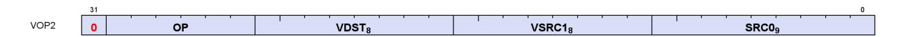

Instructions in this format may use a 32-bit literal constant or DPP that occurs immediately after the instruction.

**V\_CNDMASK\_B32 1**

Copy data from one of two inputs based on the per-lane condition code and store the result into a vector register.

```
D0.u32 = VCC.u64[laneId] ? S1.u32 : S0.u32
```

### **Notes**

In VOP3 the VCC source may be a scalar GPR specified in S2.

Floating-point modifiers are valid for this instruction if S0 and S1 are 32-bit floating point values. This instruction is suitable for negating or taking the absolute value of a floating-point value.

**V\_ADD\_F64 2**

Add two floating point inputs and store the result into a vector register.

```
D0.f64 = S0.f64 + S1.f64
```

# **Notes**

0.5ULP precision, denormals are supported.

**V\_ADD\_F32 3**

Add two floating point inputs and store the result into a vector register.

```
D0.f32 = S0.f32 + S1.f32
```

#### **Notes**

0.5ULP precision, denormals are supported.

16.7. VOP2 Instructions 289 of 697

**V\_SUB\_F32 4**

Subtract the second floating point input from the first input and store the result into a vector register.

```
D0.f32 = S0.f32 - S1.f32
```

#### **Notes**

0.5ULP precision, denormals are supported.

**V\_SUBREV\_F32 5**

Subtract the first floating point input from the second input and store the result into a vector register.

```
D0.f32 = S1.f32 - S0.f32
```

# **Notes**

0.5ULP precision, denormals are supported.

**V\_MUL\_F64 6**

Multiply two floating point inputs and store the result into a vector register.

```
D0.f64 = S0.f64 * S1.f64
```

# **Notes**

0.5ULP precision, denormals are supported.

#### **V\_MUL\_DX9\_ZERO\_F32 7**

Multiply two floating point inputs and store the result into a vector register. Follows DX9 rules where 0.0 times anything produces 0.0 (this differs from other APIs when the other input is infinity or NaN).

```
if ((64'F(S0.f32) == 0.0) || (64'F(S1.f32) == 0.0)) then
  // DX9 rules, 0.0 * x = 0.0
  D0.f32 = 0.0F
else
  D0.f32 = S0.f32 * S1.f32
```

16.7. VOP2 Instructions 290 of 697

endif

**V\_MUL\_F32 8**

Multiply two floating point inputs and store the result into a vector register.

```
D0.f32 = S0.f32 * S1.f32
```

#### **Notes**

0.5ULP precision, denormals are supported.

**V\_MUL\_I32\_I24 9**

Multiply two signed 24-bit integer inputs and store the result as a signed 32-bit integer into a vector register.

```
D0.i32 = 32'I(S0.i24) * 32'I(S1.i24)
```

#### **Notes**

This opcode is expected to be as efficient as basic single-precision opcodes since it utilizes the single-precision floating point multiplier. See also V\_MUL\_HI\_I32\_I24.

**V\_MUL\_HI\_I32\_I24 10**

Multiply two signed 24-bit integer inputs and store the high 32 bits of the result as a signed 32-bit integer into a vector register.

```
D0.i32 = 32'I((64'I(S0.i24) * 64'I(S1.i24)) >> 32U)
```

#### **Notes**

See also V\_MUL\_I32\_I24.

**V\_MUL\_U32\_U24 11**

Multiply two unsigned 24-bit integer inputs and store the result as an unsigned 32-bit integer into a vector register.

16.7. VOP2 Instructions 291 of 697

```
D0.u32 = 32'U(S0.u24) * 32'U(S1.u24)
```

This opcode is expected to be as efficient as basic single-precision opcodes since it utilizes the single-precision floating point multiplier. See also V\_MUL\_HI\_U32\_U24.

**V\_MUL\_HI\_U32\_U24 12**

Multiply two unsigned 24-bit integer inputs and store the high 32 bits of the result as an unsigned 32-bit integer into a vector register.

```
D0.u32 = 32'U((64'U(S0.u24) * 64'U(S1.u24)) >> 32U)
```

#### **Notes**

See also V\_MUL\_U32\_U24.

**V\_MIN\_NUM\_F64 13**

Select the IEEE minimumNumber() of two double-precision float inputs and store the result into a vector register.

A numeric argument is favoured over NaN when determining which argument to return.

```
if (isSignalNAN(S0.f64) || isSignalNAN(S1.f64)) then
  TRAPSTS.INVALID = 1
endif;
if (isNAN(S0.f64) && isNAN(S1.f64)) then
  D0.f64 = cvtToQuietNAN(S0.f64)
elsif isNAN(S0.f64) then
  D0.f64 = S1.f64
elsif isNAN(S1.f64) then
  D0.f64 = S0.f64
elsif ((S0.f64 < S1.f64) || ((abs(S0.f64) == 0.0) && (abs(S1.f64) == 0.0) && sign(S0.f64) &&
!sign(S1.f64))) then
  // NOTE: -0<+0 is TRUE in this comparison
  D0.f64 = S0.f64
else
  D0.f64 = S1.f64
endif
```

## **Notes**

IEEE compliant. Supports denormals, round mode, exception flags, saturation.

16.7. VOP2 Instructions 292 of 697

Denorm flushing for this operation is effectively controlled by the input denorm mode control: If input denorm mode is disabling denorm, the internal result of a min/max operation cannot be a denorm value, so output denorm mode is irrelevant. If input denorm mode is enabling denorm, the internal min/max result can be a denorm and this operation outputs as a denorm regardless of output denorm mode.

**V\_MAX\_NUM\_F64 14**

Select the IEEE maximumNumber() of two double-precision float inputs and store the result into a vector register.

A numeric argument is favoured over NaN when determining which argument to return.

```
if (isSignalNAN(S0.f64) || isSignalNAN(S1.f64)) then
  TRAPSTS.INVALID = 1
endif;
if (isNAN(S0.f64) && isNAN(S1.f64)) then
  D0.f64 = cvtToQuietNAN(S0.f64)
elsif isNAN(S0.f64) then
  D0.f64 = S1.f64
elsif isNAN(S1.f64) then
  D0.f64 = S0.f64
elsif ((S0.f64 > S1.f64) || ((abs(S0.f64) == 0.0) && (abs(S1.f64) == 0.0) && !sign(S0.f64) &&
sign(S1.f64))) then
  // NOTE: +0>-0 is TRUE in this comparison
  D0.f64 = S0.f64
else
  D0.f64 = S1.f64
endif
```

# **Notes**

IEEE compliant. Supports denormals, round mode, exception flags, saturation.

Denorm flushing for this operation is effectively controlled by the input denorm mode control: If input denorm mode is disabling denorm, the internal result of a min/max operation cannot be a denorm value, so output denorm mode is irrelevant. If input denorm mode is enabling denorm, the internal min/max result can be a denorm and this operation outputs as a denorm regardless of output denorm mode.

**V\_MIN\_I32 17**

Select the minimum of two signed 32-bit integer inputs and store the selected value into a vector register.

```
D0.i32 = S0.i32 < S1.i32 ? S0.i32 : S1.i32
```

**V\_MAX\_I32 18**

16.7. VOP2 Instructions 293 of 697

Select the maximum of two signed 32-bit integer inputs and store the selected value into a vector register.

```
D0.i32 = S0.i32 >= S1.i32 ? S0.i32 : S1.i32
```

**V\_MIN\_U32 19**

Select the minimum of two unsigned 32-bit integer inputs and store the selected value into a vector register.

```
D0.u32 = S0.u32 < S1.u32 ? S0.u32 : S1.u32
```

**V\_MAX\_U32 20**

Select the maximum of two unsigned 32-bit integer inputs and store the selected value into a vector register.

```
D0.u32 = S0.u32 >= S1.u32 ? S0.u32 : S1.u32
```

**V\_MIN\_NUM\_F32 21**

Select the IEEE minimumNumber() of two single-precision float inputs and store the result into a vector register.

A numeric argument is favoured over NaN when determining which argument to return.

```
if (isSignalNAN(64'F(S0.f32)) || isSignalNAN(64'F(S1.f32))) then
  TRAPSTS.INVALID = 1
endif;
if (isNAN(64'F(S0.f32)) && isNAN(64'F(S1.f32))) then
  D0.f32 = 32'F(cvtToQuietNAN(64'F(S0.f32)))
elsif isNAN(64'F(S0.f32)) then
  D0.f32 = S1.f32
elsif isNAN(64'F(S1.f32)) then
  D0.f32 = S0.f32
elsif ((S0.f32 < S1.f32) || ((abs(S0.f32) == 0.0F) && (abs(S1.f32) == 0.0F) && sign(S0.f32) &&
!sign(S1.f32))) then
  // NOTE: -0<+0 is TRUE in this comparison
  D0.f32 = S0.f32
else
  D0.f32 = S1.f32
endif
```

### **Notes**

16.7. VOP2 Instructions 294 of 697

IEEE compliant. Supports denormals, round mode, exception flags, saturation.

Denorm flushing for this operation is effectively controlled by the input denorm mode control: If input denorm mode is disabling denorm, the internal result of a min/max operation cannot be a denorm value, so output denorm mode is irrelevant. If input denorm mode is enabling denorm, the internal min/max result can be a denorm and this operation outputs as a denorm regardless of output denorm mode.

**V\_MAX\_NUM\_F32 22**

Select the IEEE maximumNumber() of two single-precision float inputs and store the result into a vector register.

A numeric argument is favoured over NaN when determining which argument to return.

```
if (isSignalNAN(64'F(S0.f32)) || isSignalNAN(64'F(S1.f32))) then
  TRAPSTS.INVALID = 1
endif;
if (isNAN(64'F(S0.f32)) && isNAN(64'F(S1.f32))) then
  D0.f32 = 32'F(cvtToQuietNAN(64'F(S0.f32)))
elsif isNAN(64'F(S0.f32)) then
  D0.f32 = S1.f32
elsif isNAN(64'F(S1.f32)) then
  D0.f32 = S0.f32
elsif ((S0.f32 > S1.f32) || ((abs(S0.f32) == 0.0F) && (abs(S1.f32) == 0.0F) && !sign(S0.f32) &&
sign(S1.f32))) then
  // NOTE: +0>-0 is TRUE in this comparison
  D0.f32 = S0.f32
else
  D0.f32 = S1.f32
endif
```

# **Notes**

IEEE compliant. Supports denormals, round mode, exception flags, saturation.

Denorm flushing for this operation is effectively controlled by the input denorm mode control: If input denorm mode is disabling denorm, the internal result of a min/max operation cannot be a denorm value, so output denorm mode is irrelevant. If input denorm mode is enabling denorm, the internal min/max result can be a denorm and this operation outputs as a denorm regardless of output denorm mode.

**V\_LSHLREV\_B32 24**

Given a shift count in the first vector input, calculate the logical shift left of the second vector input and store the result into a vector register.

```
D0.u32 = (S1.u32 << S0[4 : 0].u32)
```

16.7. VOP2 Instructions 295 of 697

DPP operates on the shift count, not the data being shifted.

**V\_LSHRREV\_B32 25**

Given a shift count in the first vector input, calculate the logical shift right of the second vector input and store the result into a vector register.

```
D0.u32 = (S1.u32 >> S0[4 : 0].u32)
```

#### **Notes**

DPP operates on the shift count, not the data being shifted.

**V\_ASHRREV\_I32 26**

Given a shift count in the first vector input, calculate the arithmetic shift right (preserving sign bit) of the second vector input and store the result into a vector register.

```
D0.i32 = (S1.i32 >> S0[4 : 0].u32)
```

#### **Notes**

DPP operates on the shift count, not the data being shifted.

**V\_AND\_B32 27**

Calculate bitwise AND on two vector inputs and store the result into a vector register.

```
D0.u32 = (S0.u32 & S1.u32)
```

#### **Notes**

Input and output modifiers not supported.

**V\_OR\_B32 28**

Calculate bitwise OR on two vector inputs and store the result into a vector register.

16.7. VOP2 Instructions 296 of 697

```
D0.u32 = (S0.u32 | S1.u32)
```

Input and output modifiers not supported.

**V\_XOR\_B32 29**

Calculate bitwise XOR on two vector inputs and store the result into a vector register.

```
D0.u32 = (S0.u32 ^ S1.u32)
```

#### **Notes**

Input and output modifiers not supported.

**V\_XNOR\_B32 30**

Calculate bitwise XNOR on two vector inputs and store the result into a vector register.

```
D0.u32 = ~(S0.u32 ^ S1.u32)
```

#### **Notes**

Input and output modifiers not supported.

**V\_LSHLREV\_B64 31**

Given a shift count in the first vector input, calculate the logical shift left of the second vector input and store the result into a vector register.

```
D0.u64 = (S1.u64 << S0[5 : 0].u32)
```

### **Notes**

DPP operates on the shift count, not the data being shifted. Only one scalar broadcast constant is allowed.

**V\_ADD\_CO\_CI\_U32 32**

16.7. VOP2 Instructions 297 of 697

Add two unsigned 32-bit integer inputs and a bit from a carry-in mask, store the result into a vector register and store the carry-out mask into a scalar register.

```
tmp = 64'U(S0.u32) + 64'U(S1.u32) + VCC.u64[laneId].u64;
VCC.u64[laneId] = tmp >= 0x100000000ULL ? 1'1U : 1'0U;
// VCC is an UNSIGNED overflow/carry-out for V_ADD_CO_CI_U32.
D0.u32 = tmp.u32
```

#### **Notes**

In VOP3 the VCC destination may be an arbitrary SGPR-pair, and the VCC source comes from the SGPR-pair at S2.u.

Supports saturation (unsigned 32-bit integer domain).

**V\_SUB\_CO\_CI\_U32 33**

Subtract the second unsigned 32-bit integer input from the first input, subtract a bit from the carry-in mask, store the result into a vector register and store the carry-out mask into a scalar register.

```
tmp = S0.u32 - S1.u32 - VCC.u64[laneId].u32;
VCC.u64[laneId] = 64'U(S1.u32) + VCC.u64[laneId].u64 > 64'U(S0.u32) ? 1'1U : 1'0U;
// VCC is an UNSIGNED overflow/carry-out for V_SUB_CO_CI_U32.
D0.u32 = tmp.u32
```

### **Notes**

In VOP3 the VCC destination may be an arbitrary SGPR-pair, and the VCC source comes from the SGPR-pair at S2.u.

Supports saturation (unsigned 32-bit integer domain).

**V\_SUBREV\_CO\_CI\_U32 34**

Subtract the first unsigned 32-bit integer input from the second input, subtract a bit from the carry-in mask, store the result into a vector register and store the carry-out mask into a scalar register.

```
tmp = S1.u32 - S0.u32 - VCC.u64[laneId].u32;
VCC.u64[laneId] = 64'U(S0.u32) + VCC.u64[laneId].u64 > 64'U(S1.u32) ? 1'1U : 1'0U;
// VCC is an UNSIGNED overflow/carry-out for V_SUB_CO_CI_U32.
D0.u32 = tmp.u32
```

### **Notes**

In VOP3 the VCC destination may be an arbitrary SGPR-pair, and the VCC source comes from the SGPR-pair at

16.7. VOP2 Instructions 298 of 697

S2.u.

Supports saturation (unsigned 32-bit integer domain).

**V\_ADD\_NC\_U32 37**

Add two unsigned 32-bit integer inputs and store the result into a vector register. No carry-in or carry-out support.

```
D0.u32 = S0.u32 + S1.u32
```

#### **Notes**

Supports saturation (unsigned 32-bit integer domain).

**V\_SUB\_NC\_U32 38**

Subtract the second unsigned 32-bit integer input from the first input and store the result into a vector register. No carry-in or carry-out support.

```
D0.u32 = S0.u32 - S1.u32
```

#### **Notes**

Supports saturation (unsigned 32-bit integer domain).

**V\_SUBREV\_NC\_U32 39**

Subtract the first unsigned 32-bit integer input from the second input and store the result into a vector register. No carry-in or carry-out support.

```
D0.u32 = S1.u32 - S0.u32
```

### **Notes**

Supports saturation (unsigned 32-bit integer domain).

**V\_FMAC\_F32 43**

Multiply two floating point inputs and accumulate the result into the destination register using fused multiply add.

16.7. VOP2 Instructions 299 of 697

```
D0.f32 = fma(S0.f32, S1.f32, D0.f32)
```

**V\_FMAMK\_F32 44**

Multiply a single-precision float input with a literal constant and add a second single-precision float input using fused multiply add, and store the result into a vector register.

```
D0.f32 = fma(S0.f32, SIMM32.f32, S1.f32)
```

#### **Notes**

This opcode cannot use the VOP3 encoding and cannot use input/output modifiers.

**V\_FMAAK\_F32 45**

Multiply two single-precision float inputs and add a literal constant using fused multiply add, and store the result into a vector register.

```
D0.f32 = fma(S0.f32, S1.f32, SIMM32.f32)
```

#### **Notes**

This opcode cannot use the VOP3 encoding and cannot use input/output modifiers.

```
V_CVT_PK_RTZ_F16_F32 47
```

Convert two single-precision float inputs to a packed half-precision float value using round toward zero semantics (ignore the current rounding mode), and store the result into a vector register.

```
prev_mode = ROUND_MODE;
ROUND_MODE = ROUND_TOWARD_ZERO;
tmp[15 : 0].f16 = f32_to_f16(S0.f32);
tmp[31 : 16].f16 = f32_to_f16(S1.f32);
D0 = tmp.b32;
ROUND_MODE = prev_mode;
// Round-toward-zero regardless of current round mode setting in hardware.
```

### **Notes**

This opcode is intended for use with 16-bit compressed exports. See V\_CVT\_F16\_F32 for a version that respects the current rounding mode.

16.7. VOP2 Instructions 300 of 697

**V\_MIN\_NUM\_F16 48**

Select the IEEE minimumNumber() of two half-precision float inputs and store the result into a vector register.

A numeric argument is favoured over NaN when determining which argument to return.

```
if (isSignalNAN(64'F(S0.f16)) || isSignalNAN(64'F(S1.f16))) then
  TRAPSTS.INVALID = 1
endif;
if (isNAN(64'F(S0.f16)) && isNAN(64'F(S1.f16))) then
  D0.f16 = 16'F(cvtToQuietNAN(64'F(S0.f16)))
elsif isNAN(64'F(S0.f16)) then
  D0.f16 = S1.f16
elsif isNAN(64'F(S1.f16)) then
  D0.f16 = S0.f16
elsif ((S0.f16 < S1.f16) || ((abs(S0.f16) == 16'0.0) && (abs(S1.f16) == 16'0.0) && sign(S0.f16) &&
!sign(S1.f16))) then
  // NOTE: -0<+0 is TRUE in this comparison
  D0.f16 = S0.f16
else
  D0.f16 = S1.f16
endif
```

#### **Notes**

IEEE compliant. Supports denormals, round mode, exception flags, saturation.

Denorm flushing for this operation is effectively controlled by the input denorm mode control: If input denorm mode is disabling denorm, the internal result of a min/max operation cannot be a denorm value, so output denorm mode is irrelevant. If input denorm mode is enabling denorm, the internal min/max result can be a denorm and this operation outputs as a denorm regardless of output denorm mode.

**V\_MAX\_NUM\_F16 49**

Select the IEEE maximumNumber() of two half-precision float inputs and store the result into a vector register.

A numeric argument is favoured over NaN when determining which argument to return.

```
if (isSignalNAN(64'F(S0.f16)) || isSignalNAN(64'F(S1.f16))) then
  TRAPSTS.INVALID = 1
endif;
if (isNAN(64'F(S0.f16)) && isNAN(64'F(S1.f16))) then
  D0.f16 = 16'F(cvtToQuietNAN(64'F(S0.f16)))
elsif isNAN(64'F(S0.f16)) then
  D0.f16 = S1.f16
elsif isNAN(64'F(S1.f16)) then
  D0.f16 = S0.f16
elsif ((S0.f16 > S1.f16) || ((abs(S0.f16) == 16'0.0) && (abs(S1.f16) == 16'0.0) && !sign(S0.f16) &&
sign(S1.f16))) then
```

16.7. VOP2 Instructions 301 of 697

```
  // NOTE: +0>-0 is TRUE in this comparison
  D0.f16 = S0.f16
else
  D0.f16 = S1.f16
endif
```

IEEE compliant. Supports denormals, round mode, exception flags, saturation.

Denorm flushing for this operation is effectively controlled by the input denorm mode control: If input denorm mode is disabling denorm, the internal result of a min/max operation cannot be a denorm value, so output denorm mode is irrelevant. If input denorm mode is enabling denorm, the internal min/max result can be a denorm and this operation outputs as a denorm regardless of output denorm mode.

**V\_ADD\_F16 50**

Add two floating point inputs and store the result into a vector register.

```
D0.f16 = S0.f16 + S1.f16
```

#### **Notes**

0.5ULP precision. Supports denormals, round mode, exception flags and saturation.

**V\_SUB\_F16 51**

Subtract the second floating point input from the first input and store the result into a vector register.

```
D0.f16 = S0.f16 - S1.f16
```

# **Notes**

0.5ULP precision. Supports denormals, round mode, exception flags and saturation.

**V\_SUBREV\_F16 52**

Subtract the first floating point input from the second input and store the result into a vector register.

```
D0.f16 = S1.f16 - S0.f16
```

#### **Notes**

16.7. VOP2 Instructions 302 of 697

0.5ULP precision. Supports denormals, round mode, exception flags and saturation.

**V\_MUL\_F16 53**

Multiply two floating point inputs and store the result into a vector register.

```
D0.f16 = S0.f16 * S1.f16
```

#### **Notes**

0.5ULP precision. Supports denormals, round mode, exception flags and saturation.

**V\_FMAC\_F16 54**

Multiply two floating point inputs and accumulate the result into the destination register using fused multiply add.

```
D0.f16 = fma(S0.f16, S1.f16, D0.f16)
```

#### **Notes**

0.5ULP precision. Supports denormals, round mode, exception flags and saturation.

**V\_FMAMK\_F16 55**

Multiply a half-precision float input with a literal constant and add a second half-precision float input using fused multiply add, and store the result into a vector register.

```
D0.f16 = fma(S0.f16, SIMM32.f16, S1.f16)
```

## **Notes**

This opcode cannot use the VOP3 encoding and cannot use input/output modifiers.

**V\_FMAAK\_F16 56**

Multiply two half-precision float inputs and add a literal constant using fused multiply add, and store the result into a vector register.

16.7. VOP2 Instructions 303 of 697

```
D0.f16 = fma(S0.f16, S1.f16, SIMM32.f16)
```

This opcode cannot use the VOP3 encoding and cannot use input/output modifiers.

**V\_LDEXP\_F16 59**

Multiply the first input, a floating point value, by an integral power of 2 specified in the second input, a signed integer value, and store the floating point result into a vector register.

```
D0.f16 = S0.f16 * 16'F(2.0F ** 32'I(S1.i16))
```

#### **Notes**

Compare with the ldexp() function in C.

**V\_PK\_FMAC\_F16 60**

Multiply two packed half-precision float inputs component-wise and accumulate the result into the destination register using fused multiply add.

```
D0[31 : 16].f16 = fma(S0[31 : 16].f16, S1[31 : 16].f16, D0[31 : 16].f16);
D0[15 : 0].f16 = fma(S0[15 : 0].f16, S1[15 : 0].f16, D0[15 : 0].f16)
```

### **Notes**

VOP2 version of V\_PK\_FMA\_F16 with third source VGPR address is the destination.

# <span id="page-313-0"></span>**16.7.1. VOP2 using VOP3 or VOP3SD encoding**

Instructions in this format may also be encoded as VOP3. VOP3 allows access to the extra control bits (e.g. ABS, OMOD) at the expense of a larger instruction word. The VOP3 opcode is: VOP2 opcode + 0x100.

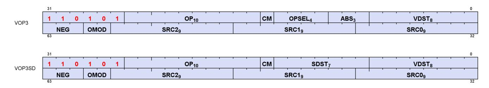

16.7. VOP2 Instructions 304 of 697

# <span id="page-314-0"></span>**16.8. VOP1 Instructions**

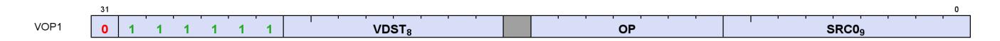

Instructions in this format may use a 32-bit literal constant or DPP that occurs immediately after the instruction.

**V\_NOP 0**

Do nothing.

### **Notes**

This instruction can be used to insert a single-cycle bubble in the vector ALU pipeline. For multiple cycles repeat this opcode.

**V\_MOV\_B32 1**

Move 32-bit data from a vector input into a vector register.

```
D0.b32 = S0.b32
```

## **Notes**

Floating-point modifiers are valid for this instruction if S0 is a 32-bit floating point value. This instruction is suitable for negating or taking the absolute value of a floating-point value.

Functional examples:

```
  v_mov_b32 v0, v1 // Move into v0 from v1
  v_mov_b32 v0, -v1 // Set v0 to the negation of v1
  v_mov_b32 v0, abs(v1) // Set v0 to the absolute value of v1
```

**V\_READFIRSTLANE\_B32 2**

Read the scalar value in the lowest active lane of the input vector register and store it into a scalar register.

```
declare lane : 32'U;
if WAVE64 then
  // 64 lanes
  if EXEC == 0x0LL then
  lane = 0U;
  // Force lane 0 if all lanes are disabled
```

16.8. VOP1 Instructions 305 of 697

```
  else
  lane = 32'U(s_ff1_i32_b64(EXEC));
  // Lowest active lane
  endif
else
  // 32 lanes
  if EXEC_LO.i32 == 0 then
  lane = 0U;
  // Force lane 0 if all lanes are disabled
  else
  lane = 32'U(s_ff1_i32_b32(EXEC_LO));
  // Lowest active lane
  endif
endif;
D0.b32 = VGPR[lane][SRC0.u32]
```

Overrides EXEC mask for the VGPR read. Input and output modifiers not supported; this is an untyped operation.

**V\_CVT\_I32\_F64 3**

Convert from a double-precision float input to a signed 32-bit integer value and store the result into a vector register.

```
D0.i32 = f64_to_i32(S0.f64)
```

#### **Notes**

0.5ULP accuracy, out-of-range floating point values (including infinity) saturate. NAN is converted to 0.

Generation of the INEXACT exception is controlled by the CLAMP bit. INEXACT exceptions are enabled for this conversion iff CLAMP == 1.

**V\_CVT\_F64\_I32 4**

Convert from a signed 32-bit integer input to a double-precision float value and store the result into a vector register.

```
D0.f64 = i32_to_f64(S0.i32)
```

# **Notes**

0ULP accuracy.

16.8. VOP1 Instructions 306 of 697

**V\_CVT\_F32\_I32 5**

Convert from a signed 32-bit integer input to a single-precision float value and store the result into a vector register.

```
D0.f32 = i32_to_f32(S0.i32)
```

#### **Notes**

0.5ULP accuracy.

**V\_CVT\_F32\_U32 6**

Convert from an unsigned 32-bit integer input to a single-precision float value and store the result into a vector register.

```
D0.f32 = u32_to_f32(S0.u32)
```

#### **Notes**

0.5ULP accuracy.

**V\_CVT\_U32\_F32 7**

Convert from a single-precision float input to an unsigned 32-bit integer value and store the result into a vector register.

```
D0.u32 = f32_to_u32(S0.f32)
```

# **Notes**

1ULP accuracy, out-of-range floating point values (including infinity) saturate. NAN is converted to 0.

Generation of the INEXACT exception is controlled by the CLAMP bit. INEXACT exceptions are enabled for this conversion iff CLAMP == 1.

**V\_CVT\_I32\_F32 8**

Convert from a single-precision float input to a signed 32-bit integer value and store the result into a vector register.

16.8. VOP1 Instructions 307 of 697

```
D0.i32 = f32_to_i32(S0.f32)
```

1ULP accuracy, out-of-range floating point values (including infinity) saturate. NAN is converted to 0.

Generation of the INEXACT exception is controlled by the CLAMP bit. INEXACT exceptions are enabled for this conversion iff CLAMP == 1.

**V\_CVT\_F16\_F32 10**

Convert from a single-precision float input to a half-precision float value and store the result into a vector register.

```
D0.f16 = f32_to_f16(S0.f32)
```

#### **Notes**

0.5ULP accuracy, supports input modifiers and creates FP16 denormals when appropriate. Flush denorms on output if specified based on DP denorm mode. Output rounding based on DP rounding mode.

**V\_CVT\_F32\_F16 11**

Convert from a half-precision float input to a single-precision float value and store the result into a vector register.

```
D0.f32 = f16_to_f32(S0.f16)
```

#### **Notes**

0ULP accuracy, FP16 denormal inputs are accepted. Flush denorms on input if specified based on DP denorm mode.

#### **V\_CVT\_NEAREST\_I32\_F32 12**

Convert from a single-precision float input to a signed 32-bit integer value using round to nearest integer semantics (ignore the default rounding mode) and store the result into a vector register.

```
D0.i32 = f32_to_i32(floor(S0.f32 + 0.5F))
```

#### **Notes**

16.8. VOP1 Instructions 308 of 697

0.5ULP accuracy, denormals are supported.

```
V_CVT_FLOOR_I32_F32 13
```

Convert from a single-precision float input to a signed 32-bit integer value using round-down semantics (ignore the default rounding mode) and store the result into a vector register.

```
D0.i32 = f32_to_i32(floor(S0.f32))
```

#### **Notes**

1ULP accuracy, denormals are supported.

```
V_CVT_OFF_F32_I4 14
```

Convert from a signed 4-bit integer input to a single-precision float value using an offset table and store the result into a vector register.

Used for interpolation in shader. Lookup table on S0[3:0]:

```
S0 binary Result
```

1000 -0.5000f

1001 -0.4375f

1010 -0.3750f

1011 -0.3125f

1100 -0.2500f 1101 -0.1875f

1110 -0.1250f

1111 -0.0625f

0000 +0.0000f

0001 +0.0625f

0010 +0.1250f

0011 +0.1875f

0100 +0.2500f

0101 +0.3125f

0110 +0.3750f

0111 +0.4375f

```
declare CVT_OFF_TABLE : 32'F[16];
D0.f32 = CVT_OFF_TABLE[S0.u32[3 : 0]]
```

**V\_CVT\_F32\_F64 15**

16.8. VOP1 Instructions 309 of 697

Convert from a double-precision float input to a single-precision float value and store the result into a vector register.

```
D0.f32 = f64_to_f32(S0.f64)
```

### **Notes**

0.5ULP accuracy, denormals are supported.

**V\_CVT\_F64\_F32 16**

Convert from a single-precision float input to a double-precision float value and store the result into a vector register.

```
D0.f64 = f32_to_f64(S0.f32)
```

#### **Notes**

0ULP accuracy, denormals are supported.

**V\_CVT\_F32\_UBYTE0 17**

Convert an unsigned byte in byte 0 of the input to a single-precision float value and store the result into a vector register.

```
D0.f32 = u32_to_f32(S0[7 : 0].u32)
```

**V\_CVT\_F32\_UBYTE1 18**

Convert an unsigned byte in byte 1 of the input to a single-precision float value and store the result into a vector register.

```
D0.f32 = u32_to_f32(S0[15 : 8].u32)
```

**V\_CVT\_F32\_UBYTE2 19**

Convert an unsigned byte in byte 2 of the input to a single-precision float value and store the result into a vector register.

16.8. VOP1 Instructions 310 of 697

```
D0.f32 = u32_to_f32(S0[23 : 16].u32)
```

**V\_CVT\_F32\_UBYTE3 20**

Convert an unsigned byte in byte 3 of the input to a single-precision float value and store the result into a vector register.

```
D0.f32 = u32_to_f32(S0[31 : 24].u32)
```

**V\_CVT\_U32\_F64 21**

Convert from a double-precision float input to an unsigned 32-bit integer value and store the result into a vector register.

```
D0.u32 = f64_to_u32(S0.f64)
```

#### **Notes**

0.5ULP accuracy, out-of-range floating point values (including infinity) saturate. NAN is converted to 0.

Generation of the INEXACT exception is controlled by the CLAMP bit. INEXACT exceptions are enabled for this conversion iff CLAMP == 1.

**V\_CVT\_F64\_U32 22**

Convert from an unsigned 32-bit integer input to a double-precision float value and store the result into a vector register.

```
D0.f64 = u32_to_f64(S0.u32)
```

## **Notes**

0ULP accuracy.

**V\_TRUNC\_F64 23**

Compute the integer part of a double-precision float input using round toward zero semantics and store the result in floating point format into a vector register.

16.8. VOP1 Instructions 311 of 697

```
D0.f64 = trunc(S0.f64)
```

**V\_CEIL\_F64 24**

Round the double-precision float input up to next integer and store the result in floating point format into a vector register.

```
D0.f64 = trunc(S0.f64);
if ((S0.f64 > 0.0) && (S0.f64 != D0.f64)) then
  D0.f64 += 1.0
endif
```

**V\_RNDNE\_F64 25**

Round the double-precision float input to the nearest even integer and store the result in floating point format into a vector register.

```
D0.f64 = floor(S0.f64 + 0.5);
if (isEven(floor(S0.f64)) && (fract(S0.f64) == 0.5)) then
  D0.f64 -= 1.0
endif
```

**V\_FLOOR\_F64 26**

Round the double-precision float input down to previous integer and store the result in floating point format into a vector register.

```
D0.f64 = trunc(S0.f64);
if ((S0.f64 < 0.0) && (S0.f64 != D0.f64)) then
  D0.f64 += -1.0
endif
```

**V\_PIPEFLUSH 27**

Flush the vector ALU pipeline through the destination cache.

**V\_MOV\_B16 28**

16.8. VOP1 Instructions 312 of 697

Move 16-bit data from a vector input into a vector register.

```
D0.b16 = S0.b16
```

#### **Notes**

Floating-point modifiers are valid for this instruction if S0 is a 16-bit floating point value. This instruction is suitable for negating or taking the absolute value of a floating-point value.

**V\_FRACT\_F32 32**

Compute the fractional portion of a single-precision float input and store the result in floating point format into a vector register.

```
D0.f32 = S0.f32 + -floor(S0.f32)
```

#### **Notes**

0.5ULP accuracy, denormals are accepted.

This is intended to comply with the DX specification of fract where the function behaves like an extension of integer modulus; be aware this may differ from how fract() is defined in other domains. For example: fract(- 1.2) = 0.8 in DX.

Obey round mode, result clamped to 0x3f7fffff.

**V\_TRUNC\_F32 33**

Compute the integer part of a single-precision float input using round toward zero semantics and store the result in floating point format into a vector register.

```
D0.f32 = trunc(S0.f32)
```

**V\_CEIL\_F32 34**

Round the single-precision float input up to next integer and store the result in floating point format into a vector register.

```
D0.f32 = trunc(S0.f32);
if ((S0.f32 > 0.0F) && (S0.f32 != D0.f32)) then
  D0.f32 += 1.0F
```

16.8. VOP1 Instructions 313 of 697

```
endif
```

**V\_RNDNE\_F32 35**

Round the single-precision float input to the nearest even integer and store the result in floating point format into a vector register.

```
D0.f32 = floor(S0.f32 + 0.5F);
if (isEven(64'F(floor(S0.f32))) && (fract(S0.f32) == 0.5F)) then
  D0.f32 -= 1.0F
endif
```

**V\_FLOOR\_F32 36**

Round the single-precision float input down to previous integer and store the result in floating point format into a vector register.

```
D0.f32 = trunc(S0.f32);
if ((S0.f32 < 0.0F) && (S0.f32 != D0.f32)) then
  D0.f32 += -1.0F
endif
```

**V\_EXP\_F32 37**

Calculate 2 raised to the power of the single-precision float input and store the result into a vector register.

```
D0.f32 = pow(2.0F, S0.f32)
```

## **Notes**

1ULP accuracy, denormals are flushed.

Functional examples:

```
V_EXP_F32(0xff800000) => 0x00000000 // exp(-INF) = 0
V_EXP_F32(0x80000000) => 0x3f800000 // exp(-0.0) = 1
V_EXP_F32(0x7f800000) => 0x7f800000 // exp(+INF) = +INF
```

**V\_LOG\_F32 39**

16.8. VOP1 Instructions 314 of 697

Calculate the base 2 logarithm of the single-precision float input and store the result into a vector register.

```
D0.f32 = log2(S0.f32)
```

#### **Notes**

1ULP accuracy, denormals are flushed.

Functional examples:

```
V_LOG_F32(0xff800000) => 0xffc00000 // log(-INF) = NAN
V_LOG_F32(0xbf800000) => 0xffc00000 // log(-1.0) = NAN
V_LOG_F32(0x80000000) => 0xff800000 // log(-0.0) = -INF
V_LOG_F32(0x00000000) => 0xff800000 // log(+0.0) = -INF
V_LOG_F32(0x3f800000) => 0x00000000 // log(+1.0) = 0
V_LOG_F32(0x7f800000) => 0x7f800000 // log(+INF) = +INF
```

**V\_RCP\_F32 42**

Calculate the reciprocal of the single-precision float input using IEEE rules and store the result into a vector register.

```
D0.f32 = 1.0F / S0.f32
```

# **Notes**

1ULP accuracy. Accuracy converges to < 0.5ULP when using the Newton-Raphson method and 2 FMA operations. Denormals are flushed.

Functional examples:

```
V_RCP_F32(0xff800000) => 0x80000000 // rcp(-INF) = -0
V_RCP_F32(0xc0000000) => 0xbf000000 // rcp(-2.0) = -0.5
V_RCP_F32(0x80000000) => 0xff800000 // rcp(-0.0) = -INF
V_RCP_F32(0x00000000) => 0x7f800000 // rcp(+0.0) = +INF
V_RCP_F32(0x7f800000) => 0x00000000 // rcp(+INF) = +0
```

**V\_RCP\_IFLAG\_F32 43**

Calculate the reciprocal of the vector float input in a manner suitable for integer division and store the result into a vector register. This opcode is intended for use as part of an integer division macro.

```
D0.f32 = 1.0F / S0.f32;
```

16.8. VOP1 Instructions 315 of 697

```
// Can only raise integer DIV_BY_ZERO exception
```

Can raise integer DIV\_BY\_ZERO exception but cannot raise floating-point exceptions. To be used in an integer reciprocal macro by the compiler with one of the sequences listed below (depending on signed or unsigned operation).

Unsigned usage: CVT\_F32\_U32 RCP\_IFLAG\_F32 MUL\_F32 (2\*\*32 - 1) CVT\_U32\_F32 Signed usage: CVT\_F32\_I32 RCP\_IFLAG\_F32 MUL\_F32 (2\*\*31 - 1) CVT\_I32\_F32

**V\_RSQ\_F32 46**

Calculate the reciprocal of the square root of the single-precision float input using IEEE rules and store the result into a vector register.

```
D0.f32 = 1.0F / sqrt(S0.f32)
```

#### **Notes**

1ULP accuracy, denormals are flushed.

Functional examples:

```
V_RSQ_F32(0xff800000) => 0xffc00000 // rsq(-INF) = NAN
V_RSQ_F32(0x80000000) => 0xff800000 // rsq(-0.0) = -INF
V_RSQ_F32(0x00000000) => 0x7f800000 // rsq(+0.0) = +INF
V_RSQ_F32(0x40800000) => 0x3f000000 // rsq(+4.0) = +0.5
V_RSQ_F32(0x7f800000) => 0x00000000 // rsq(+INF) = +0
```

**V\_RCP\_F64 47**

Calculate the reciprocal of the double-precision float input using IEEE rules and store the result into a vector register.

16.8. VOP1 Instructions 316 of 697

```
D0.f64 = 1.0 / S0.f64
```

This opcode has (2\*\*29)ULP accuracy and supports denormals.

**V\_RSQ\_F64 49**

Calculate the reciprocal of the square root of the double-precision float input using IEEE rules and store the result into a vector register.

```
D0.f64 = 1.0 / sqrt(S0.f64)
```

#### **Notes**

This opcode has (2\*\*29)ULP accuracy and supports denormals.

**V\_SQRT\_F32 51**

Calculate the square root of the single-precision float input using IEEE rules and store the result into a vector register.

```
D0.f32 = sqrt(S0.f32)
```

#### **Notes**

1ULP accuracy, denormals are flushed.

Functional examples:

```
V_SQRT_F32(0xff800000) => 0xffc00000 // sqrt(-INF) = NAN
V_SQRT_F32(0x80000000) => 0x80000000 // sqrt(-0.0) = -0
V_SQRT_F32(0x00000000) => 0x00000000 // sqrt(+0.0) = +0
V_SQRT_F32(0x40800000) => 0x40000000 // sqrt(+4.0) = +2.0
V_SQRT_F32(0x7f800000) => 0x7f800000 // sqrt(+INF) = +INF
```

**V\_SQRT\_F64 52**

Calculate the square root of the double-precision float input using IEEE rules and store the result into a vector register.

16.8. VOP1 Instructions 317 of 697

```
D0.f64 = sqrt(S0.f64)
```

This opcode has (2\*\*29)ULP accuracy and supports denormals.

**V\_SIN\_F32 53**

Calculate the trigonometric sine of a single-precision float value using IEEE rules and store the result into a vector register. The operand is calculated by scaling the vector input by 2 PI.

```
D0.f32 = sin(S0.f32 * 32'F(PI * 2.0))
```

#### **Notes**

Denormals are supported. Full range input is supported.

Functional examples:

```
V_SIN_F32(0xff800000) => 0xffc00000 // sin(-INF) = NAN
V_SIN_F32(0xff7fffff) => 0x00000000 // -MaxFloat, finite
V_SIN_F32(0x80000000) => 0x80000000 // sin(-0.0) = -0
V_SIN_F32(0x3e800000) => 0x3f800000 // sin(0.25) = 1
V_SIN_F32(0x7f800000) => 0xffc00000 // sin(+INF) = NAN
```

**V\_COS\_F32 54**

Calculate the trigonometric cosine of a single-precision float value using IEEE rules and store the result into a vector register. The operand is calculated by scaling the vector input by 2 PI.

```
D0.f32 = cos(S0.f32 * 32'F(PI * 2.0))
```

#### **Notes**

Denormals are supported. Full range input is supported.

Functional examples:

```
V_COS_F32(0xff800000) => 0xffc00000 // cos(-INF) = NAN
V_COS_F32(0xff7fffff) => 0x3f800000 // -MaxFloat, finite
V_COS_F32(0x80000000) => 0x3f800000 // cos(-0.0) = 1
V_COS_F32(0x3e800000) => 0x00000000 // cos(0.25) = 0
```

16.8. VOP1 Instructions 318 of 697

```
V_COS_F32(0x7f800000) => 0xffc00000 // cos(+INF) = NAN
```

**V\_NOT\_B32 55**

Calculate bitwise negation on a vector input and store the result into a vector register.

```
D0.u32 = ~S0.u32
```

#### **Notes**

Input and output modifiers not supported.

**V\_BFREV\_B32 56**

Reverse the order of bits in a vector input and store the result into a vector register.

```
D0.u32[31 : 0] = S0.u32[0 : 31]
```

#### **Notes**

Input and output modifiers not supported.

**V\_CLZ\_I32\_U32 57**

Count the number of leading "0" bits before the first "1" in a vector input and store the result into a vector register. Store -1 if there are no "1" bits.

```
D0.i32 = -1;
// Set if no ones are found
for i in 0 : 31 do
  // Search from MSB
  if S0.u32[31 - i] == 1'1U then
  D0.i32 = i;
  break
  endif
endfor
```

#### **Notes**

Compare with S\_CLZ\_I32\_U32, which performs the equivalent operation in the scalar ALU.

Functional examples:

16.8. VOP1 Instructions 319 of 697

```
V_CLZ_I32_U32(0x00000000) ⇒ 0xffffffff
V_CLZ_I32_U32(0x800000ff) ⇒ 0
V_CLZ_I32_U32(0x100000ff) ⇒ 3
V_CLZ_I32_U32(0x0000ffff) ⇒ 16
V_CLZ_I32_U32(0x00000001) ⇒ 31
```

**V\_CTZ\_I32\_B32 58**

Count the number of trailing "0" bits before the first "1" in a vector input and store the result into a vector register. Store -1 if there are no "1" bits in the input.

```
D0.i32 = -1;
// Set if no ones are found
for i in 0 : 31 do
  // Search from LSB
  if S0.u32[i] == 1'1U then
  D0.i32 = i;
  break
  endif
endfor
```

## **Notes**

Compare with S\_CTZ\_I32\_B32, which performs the equivalent operation in the scalar ALU.

Functional examples:

```
V_CTZ_I32_B32(0x00000000) ⇒ 0xffffffff
V_CTZ_I32_B32(0xff000001) ⇒ 0
V_CTZ_I32_B32(0xff000008) ⇒ 3
V_CTZ_I32_B32(0xffff0000) ⇒ 16
V_CTZ_I32_B32(0x80000000) ⇒ 31
```

**V\_CLS\_I32 59**

Count the number of leading bits that are the same as the sign bit of a vector input and store the result into a vector register. Store -1 if all input bits are the same.

```
D0.i32 = -1;
// Set if all bits are the same
for i in 1 : 31 do
  // Search from MSB
  if S0.i32[31 - i] != S0.i32[31] then
  D0.i32 = i;
  break
  endif
endfor
```

16.8. VOP1 Instructions 320 of 697

Compare with S\_CLS\_I32, which performs the equivalent operation in the scalar ALU.

Functional examples:

```
V_CLS_I32(0x00000000) ⇒ 0xffffffff
V_CLS_I32(0x40000000) ⇒ 1
V_CLS_I32(0x80000000) ⇒ 1
V_CLS_I32(0x0fffffff) ⇒ 4
V_CLS_I32(0xffff0000) ⇒ 16
V_CLS_I32(0xfffffffe) ⇒ 31
V_CLS_I32(0xffffffff) ⇒ 0xffffffff
```

```
V_FREXP_EXP_I32_F64 60
```

Extract the exponent of a double-precision float input and store the result as a signed 32-bit integer into a vector register.

```
if ((S0.f64 == +INF) || (S0.f64 == -INF) || isNAN(S0.f64)) then
  D0.i32 = 0
else
  D0.i32 = exponent(S0.f64) - 1023 + 1
endif
```

## **Notes**

This operation satisfies the invariant S0.f64 = significand \* (2 \*\* exponent). See also V\_FREXP\_MANT\_F64, which returns the significand. See the C library function frexp() for more information.

```
V_FREXP_MANT_F64 61
```

Extract the binary significand, or mantissa, of a double-precision float input and store the result as a doubleprecision float into a vector register.

```
if ((S0.f64 == +INF) || (S0.f64 == -INF) || isNAN(S0.f64)) then
  D0.f64 = S0.f64
else
  D0.f64 = mantissa(S0.f64)
endif
```

# **Notes**

This operation satisfies the invariant S0.f64 = significand \* (2 \*\* exponent). Result range is in (-1.0,-0.5][0.5,1.0) in normal cases. See also V\_FREXP\_EXP\_I32\_F64, which returns integer exponent. See the C library function frexp() for more information.

16.8. VOP1 Instructions 321 of 697

**V\_FRACT\_F64 62**

Compute the fractional portion of a double-precision float input and store the result in floating point format into a vector register.

```
D0.f64 = S0.f64 + -floor(S0.f64)
```

#### **Notes**

0.5ULP accuracy, denormals are accepted.

This is intended to comply with the DX specification of fract where the function behaves like an extension of integer modulus; be aware this may differ from how fract() is defined in other domains. For example: fract(- 1.2) = 0.8 in DX.

Obey round mode, result clamped to 0x3fefffffffffffff.

```
V_FREXP_EXP_I32_F32 63
```

Extract the exponent of a single-precision float input and store the result as a signed 32-bit integer into a vector register.

```
if ((64'F(S0.f32) == +INF) || (64'F(S0.f32) == -INF) || isNAN(64'F(S0.f32))) then
  D0.i32 = 0
else
  D0.i32 = exponent(S0.f32) - 127 + 1
endif
```

## **Notes**

This operation satisfies the invariant S0.f32 = significand \* (2 \*\* exponent). See also V\_FREXP\_MANT\_F32, which returns the significand. See the C library function frexp() for more information.

```
V_FREXP_MANT_F32 64
```

Extract the binary significand, or mantissa, of a single-precision float input and store the result as a singleprecision float into a vector register.

```
if ((64'F(S0.f32) == +INF) || (64'F(S0.f32) == -INF) || isNAN(64'F(S0.f32))) then
  D0.f32 = S0.f32
else
  D0.f32 = mantissa(S0.f32)
endif
```

16.8. VOP1 Instructions 322 of 697

This operation satisfies the invariant S0.f32 = significand \* (2 \*\* exponent). Result range is in (-1.0,-0.5][0.5,1.0) in normal cases. See also V\_FREXP\_EXP\_I32\_F32, which returns integer exponent. See the C library function frexp() for more information.

**V\_MOVRELD\_B32 66**

Move data from a vector input into a relatively-indexed vector register.

```
addr = DST.u32;
// Raw value from instruction
addr += M0.u32[31 : 0];
VGPR[laneId][addr].b32 = S0.b32
```

#### **Notes**

Example: The following instruction sequence performs the move v15 <= v7:

```
  s_mov_b32 m0, 10
  v_movreld_b32 v5, v7
```

**V\_MOVRELS\_B32 67**

Move data from a relatively-indexed vector register into another vector register.

```
addr = SRC0.u32;
// Raw value from instruction
addr += M0.u32[31 : 0];
D0.b32 = VGPR[laneId][addr].b32
```

# **Notes**

Example: The following instruction sequence performs the move v5 <= v17:

```
  s_mov_b32 m0, 10
  v_movrels_b32 v5, v7
```

**V\_MOVRELSD\_B32 68**

Move data from a relatively-indexed vector register into another relatively-indexed vector register.

16.8. VOP1 Instructions 323 of 697

```
addrs = SRC0.u32;
// Raw value from instruction
addrd = DST.u32;
// Raw value from instruction
addrs += M0.u32[31 : 0];
addrd += M0.u32[31 : 0];
VGPR[laneId][addrd].b32 = VGPR[laneId][addrs].b32
```

Example: The following instruction sequence performs the move v15 <= v17:

```
  s_mov_b32 m0, 10
  v_movrelsd_b32 v5, v7
```

**V\_MOVRELSD\_2\_B32 72**

Move data from a relatively-indexed vector register into another relatively-indexed vector register, using different offsets for each index.

```
addrs = SRC0.u32;
// Raw value from instruction
addrd = DST.u32;
// Raw value from instruction
addrs += M0.u32[9 : 0].u32;
addrd += M0.u32[25 : 16].u32;
VGPR[laneId][addrd].b32 = VGPR[laneId][addrs].b32
```

## **Notes**

Example: The following instruction sequence performs the move v25 <= v17:

```
  s_mov_b32 m0, ((20 << 16) | 10)
  v_movrelsd_2_b32 v5, v7
```

**V\_CVT\_F16\_U16 80**

Convert from an unsigned 16-bit integer input to a half-precision float value and store the result into a vector register.

```
D0.f16 = u16_to_f16(S0.u16)
```

#### **Notes**

16.8. VOP1 Instructions 324 of 697

0.5ULP accuracy, supports denormals, rounding, exception flags and saturation.

**V\_CVT\_F16\_I16 81**

Convert from a signed 16-bit integer input to a half-precision float value and store the result into a vector register.

```
D0.f16 = i16_to_f16(S0.i16)
```

#### **Notes**

0.5ULP accuracy, supports denormals, rounding, exception flags and saturation.

**V\_CVT\_U16\_F16 82**

Convert from a half-precision float input to an unsigned 16-bit integer value and store the result into a vector register.

```
D0.u16 = f16_to_u16(S0.f16)
```

#### **Notes**

1ULP accuracy, supports rounding, exception flags and saturation. FP16 denormals are accepted. Conversion is done with truncation.

Generation of the INEXACT exception is controlled by the CLAMP bit. INEXACT exceptions are enabled for this conversion iff CLAMP == 1.

**V\_CVT\_I16\_F16 83**

Convert from a half-precision float input to a signed 16-bit integer value and store the result into a vector register.

```
D0.i16 = f16_to_i16(S0.f16)
```

#### **Notes**

1ULP accuracy, supports rounding, exception flags and saturation. FP16 denormals are accepted. Conversion is done with truncation.

Generation of the INEXACT exception is controlled by the CLAMP bit. INEXACT exceptions are enabled for this conversion iff CLAMP == 1.

16.8. VOP1 Instructions 325 of 697

**V\_RCP\_F16 84**

Calculate the reciprocal of the half-precision float input using IEEE rules and store the result into a vector register.

```
D0.f16 = 16'1.0 / S0.f16
```

#### **Notes**

1ULP accuracy.

Functional examples:

```
V_RCP_F16(0xfc00) => 0x8000 // rcp(-INF) = -0
V_RCP_F16(0xc000) => 0xb800 // rcp(-2.0) = -0.5
V_RCP_F16(0x8000) => 0xfc00 // rcp(-0.0) = -INF
V_RCP_F16(0x0000) => 0x7c00 // rcp(+0.0) = +INF
V_RCP_F16(0x7c00) => 0x0000 // rcp(+INF) = +0
```

**V\_SQRT\_F16 85**

Calculate the square root of the half-precision float input using IEEE rules and store the result into a vector register.

```
D0.f16 = sqrt(S0.f16)
```

## **Notes**

1ULP accuracy, denormals are supported.

Functional examples:

```
V_SQRT_F16(0xfc00) => 0xfe00 // sqrt(-INF) = NAN
V_SQRT_F16(0x8000) => 0x8000 // sqrt(-0.0) = -0
V_SQRT_F16(0x0000) => 0x0000 // sqrt(+0.0) = +0
V_SQRT_F16(0x4400) => 0x4000 // sqrt(+4.0) = +2.0
V_SQRT_F16(0x7c00) => 0x7c00 // sqrt(+INF) = +INF
```

**V\_RSQ\_F16 86**

Calculate the reciprocal of the square root of the half-precision float input using IEEE rules and store the result into a vector register.

16.8. VOP1 Instructions 326 of 697

```
D0.f16 = 16'1.0 / sqrt(S0.f16)
```

1ULP accuracy, denormals are supported.

Functional examples:

```
V_RSQ_F16(0xfc00) => 0xfe00 // rsq(-INF) = NAN
V_RSQ_F16(0x8000) => 0xfc00 // rsq(-0.0) = -INF
V_RSQ_F16(0x0000) => 0x7c00 // rsq(+0.0) = +INF
V_RSQ_F16(0x4400) => 0x3800 // rsq(+4.0) = +0.5
V_RSQ_F16(0x7c00) => 0x0000 // rsq(+INF) = +0
```

**V\_LOG\_F16 87**

Calculate the base 2 logarithm of the half-precision float input and store the result into a vector register.

```
D0.f16 = log2(S0.f16)
```

#### **Notes**

1ULP accuracy, denormals are supported.

Functional examples:

```
V_LOG_F16(0xfc00) => 0xfe00 // log(-INF) = NAN
V_LOG_F16(0xbc00) => 0xfe00 // log(-1.0) = NAN
V_LOG_F16(0x8000) => 0xfc00 // log(-0.0) = -INF
V_LOG_F16(0x0000) => 0xfc00 // log(+0.0) = -INF
V_LOG_F16(0x3c00) => 0x0000 // log(+1.0) = 0
V_LOG_F16(0x7c00) => 0x7c00 // log(+INF) = +INF
```

**V\_EXP\_F16 88**

Calculate 2 raised to the power of the half-precision float input and store the result into a vector register.

```
D0.f16 = pow(16'2.0, S0.f16)
```

### **Notes**

1ULP accuracy, denormals are supported.

16.8. VOP1 Instructions 327 of 697

Functional examples:

```
V_EXP_F16(0xfc00) => 0x0000 // exp(-INF) = 0
V_EXP_F16(0x8000) => 0x3c00 // exp(-0.0) = 1
V_EXP_F16(0x7c00) => 0x7c00 // exp(+INF) = +INF
```

**V\_FREXP\_MANT\_F16 89**

Extract the binary significand, or mantissa, of a half-precision float input and store the result as a halfprecision float into a vector register.

```
if ((64'F(S0.f16) == +INF) || (64'F(S0.f16) == -INF) || isNAN(64'F(S0.f16))) then
  D0.f16 = S0.f16
else
  D0.f16 = mantissa(S0.f16)
endif
```

#### **Notes**

This operation satisfies the invariant S0.f16 = significand \* (2 \*\* exponent). Result range is in (-1.0,-0.5][0.5,1.0) in normal cases. See also V\_FREXP\_EXP\_I16\_F16, which returns integer exponent. See the C library function frexp() for more information.

```
V_FREXP_EXP_I16_F16 90
```

Extract the exponent of a half-precision float input and store the result as a signed 16-bit integer into a vector register.

```
if ((64'F(S0.f16) == +INF) || (64'F(S0.f16) == -INF) || isNAN(64'F(S0.f16))) then
  D0.i16 = 16'0
else
  D0.i16 = 16'I(exponent(S0.f16) - 15 + 1)
endif
```

#### **Notes**

This operation satisfies the invariant S0.f16 = significand \* (2 \*\* exponent). See also V\_FREXP\_MANT\_F16, which returns the significand. See the C library function frexp() for more information.

**V\_FLOOR\_F16 91**

Round the half-precision float input down to previous integer and store the result in floating point format into a vector register.

16.8. VOP1 Instructions 328 of 697

```
D0.f16 = trunc(S0.f16);
if ((S0.f16 < 16'0.0) && (S0.f16 != D0.f16)) then
  D0.f16 += -16'1.0
endif
```

**V\_CEIL\_F16 92**

Round the half-precision float input up to next integer and store the result in floating point format into a vector register.

```
D0.f16 = trunc(S0.f16);
if ((S0.f16 > 16'0.0) && (S0.f16 != D0.f16)) then
  D0.f16 += 16'1.0
endif
```

**V\_TRUNC\_F16 93**

Compute the integer part of a half-precision float input using round toward zero semantics and store the result in floating point format into a vector register.

```
D0.f16 = trunc(S0.f16)
```

**V\_RNDNE\_F16 94**

Round the half-precision float input to the nearest even integer and store the result in floating point format into a vector register.

```
D0.f16 = floor(S0.f16 + 16'0.5);
if (isEven(64'F(floor(S0.f16))) && (fract(S0.f16) == 16'0.5)) then
  D0.f16 -= 16'1.0
endif
```

**V\_FRACT\_F16 95**

Compute the fractional portion of a half-precision float input and store the result in floating point format into a vector register.

```
D0.f16 = S0.f16 + -floor(S0.f16)
```

16.8. VOP1 Instructions 329 of 697

0.5ULP accuracy, denormals are accepted.

This is intended to comply with the DX specification of fract where the function behaves like an extension of integer modulus; be aware this may differ from how fract() is defined in other domains. For example: fract(- 1.2) = 0.8 in DX.

**V\_SIN\_F16 96**

Calculate the trigonometric sine of a half-precision float value using IEEE rules and store the result into a vector register. The operand is calculated by scaling the vector input by 2 PI.

```
D0.f16 = sin(S0.f16 * 16'F(PI * 2.0))
```

### **Notes**

Denormals are supported. Full range input is supported.

Functional examples:

```
V_SIN_F16(0xfc00) => 0xfe00 // sin(-INF) = NAN
V_SIN_F16(0xfbff) => 0x0000 // Most negative finite FP16
V_SIN_F16(0x8000) => 0x8000 // sin(-0.0) = -0
V_SIN_F16(0x3400) => 0x3c00 // sin(0.25) = 1
V_SIN_F16(0x7bff) => 0x0000 // Most positive finite FP16
V_SIN_F16(0x7c00) => 0xfe00 // sin(+INF) = NAN
```

**V\_COS\_F16 97**

Calculate the trigonometric cosine of a half-precision float value using IEEE rules and store the result into a vector register. The operand is calculated by scaling the vector input by 2 PI.

```
D0.f16 = cos(S0.f16 * 16'F(PI * 2.0))
```

#### **Notes**

Denormals are supported. Full range input is supported.

Functional examples:

```
V_COS_F16(0xfc00) => 0xfe00 // cos(-INF) = NAN
V_COS_F16(0xfbff) => 0x3c00 // Most negative finite FP16
V_COS_F16(0x8000) => 0x3c00 // cos(-0.0) = 1
V_COS_F16(0x3400) => 0x0000 // cos(0.25) = 0
```

16.8. VOP1 Instructions 330 of 697

```
V_COS_F16(0x7bff) => 0x3c00 // Most positive finite FP16
V_COS_F16(0x7c00) => 0xfe00 // cos(+INF) = NAN
```

**V\_SAT\_PK\_U8\_I16 98**

Given 2 signed 16-bit integer inputs, saturate each input over an unsigned 8-bit integer range, pack the resulting values into a packed 16-bit value and store the result into a vector register.

```
SAT8 = lambda(n) (
  if n <= 16'0 then
  return 8'0U
  elsif n >= 16'255 then
  return 8'255U
  else
  return n[7 : 0].u8
  endif);
tmp = 16'0;
tmp[7 : 0].u8 = SAT8(S0[15 : 0].i16);
tmp[15 : 8].u8 = SAT8(S0[31 : 16].i16);
D0.b16 = tmp.b16
```

# **Notes**

Used for 4x16bit data packed as 4x8bit data.

```
V_CVT_NORM_I16_F16 99
```

Convert from a half-precision float input to a signed normalized short and store the result into a vector register.

```
D0.i16 = f16_to_snorm(S0.f16)
```

### **Notes**

0.5ULP accuracy, supports rounding, exception flags and saturation, denormals are supported.

```
V_CVT_NORM_U16_F16 100
```

Convert from a half-precision float input to an unsigned normalized short and store the result into a vector register.

```
D0.u16 = f16_to_unorm(S0.f16)
```

16.8. VOP1 Instructions 331 of 697

0.5ULP accuracy, supports rounding, exception flags and saturation, denormals are supported.

**V\_SWAP\_B32 101**

Swap the values in two vector registers.

```
tmp = D0.b32;
D0.b32 = S0.b32;
S0.b32 = tmp
```

#### **Notes**

Input and output modifiers not supported; this is an untyped operation.

**V\_SWAP\_B16 102**

Swap the values in two vector registers.

```
tmp = D0.b16;
D0.b16 = S0.b16;
S0.b16 = tmp
```

## **Notes**

Input and output modifiers not supported; this is an untyped operation.

**V\_PERMLANE64\_B32 103**

Perform a specific permutation across lanes where the high half and low half of a wave64 are swapped. Performs no operation in wave32 mode.

```
declare tmp : 32'B[64];
declare lane : 32'U;
if WAVE32 then
  // Supported in wave64 ONLY; treated as scalar NOP in wave32
  s_nop(16'0U)
else
  for lane in 0U : 63U do
  // Copy original S0 in case D==S0
  tmp[lane] = VGPR[lane][SRC0.u32]
  endfor;
  for lane in 0U : 63U do
  altlane = { ~lane[5], lane[4 : 0] };
```

16.8. VOP1 Instructions 332 of 697

```
  // 0<->32, ..., 31<->63
  if EXEC[lane].u1 then
  VGPR[lane][VDST.u32] = tmp[altlane]
  endif
  endfor
endif
```

In wave32 mode this opcode is translated to V\_NOP and performs no writes.

In wave64 the EXEC mask of the destination lane is used as the read mask for the alternate lane; as a result this opcode may read values from disabled lanes.

ABS, NEG and OMOD modifiers should all be zeroed for this instruction.

**V\_SWAPREL\_B32 104**

Swap the values in two relatively-indexed vector registers.

```
addrs = SRC0.u32;
// Raw value from instruction
addrd = DST.u32;
// Raw value from instruction
addrs += M0.u32[9 : 0].u32;
addrd += M0.u32[25 : 16].u32;
tmp = VGPR[laneId][addrd].b32;
VGPR[laneId][addrd].b32 = VGPR[laneId][addrs].b32;
VGPR[laneId][addrs].b32 = tmp
```

### **Notes**

Input and output modifiers not supported; this is an untyped operation.

Example: The following instruction sequence swaps v25 and v17:

```
  s_mov_b32 m0, ((20 << 16) | 10)
  v_swaprel_b32 v5, v7
```

**V\_NOT\_B16 105**

Calculate bitwise negation on a vector input and store the result into a vector register.

```
D0.u16 = ~S0.u16
```

16.8. VOP1 Instructions 333 of 697

Input and output modifiers not supported.

**V\_CVT\_I32\_I16 106**

Convert from a signed 16-bit integer input to a signed 32-bit integer value using sign extension and store the result into a vector register.

```
D0.i32 = 32'I(signext(S0.i16))
```

#### **Notes**

To convert in the other direction (from 32-bit to 16-bit integer) use V\_MOV\_B16.

**V\_CVT\_U32\_U16 107**

Convert from an unsigned 16-bit integer input to an unsigned 32-bit integer value using zero extension and store the result into a vector register.

```
D0 = { 16'0, S0.u16 }
```

#### **Notes**

To convert in the other direction (from 32-bit to 16-bit integer) use V\_MOV\_B16.

**V\_CVT\_F32\_FP8 108**

Convert from an FP8 float input to a single-precision float value and store the result into a vector register.

```
if OPSEL[1 : 0].u2 == 2'0U then
  D0.f32 = fp8_to_f32(VGPR[laneId][SRC0.u32][7 : 0].fp8)
elsif OPSEL[1 : 0].u2 == 2'2U then
  // Byte select bits are reversed
  D0.f32 = fp8_to_f32(VGPR[laneId][SRC0.u32][15 : 8].fp8)
elsif OPSEL[1 : 0].u2 == 2'1U then
  D0.f32 = fp8_to_f32(VGPR[laneId][SRC0.u32][23 : 16].fp8)
else
  D0.f32 = fp8_to_f32(VGPR[laneId][SRC0.u32][31 : 24].fp8)
endif
```

#### **Notes**

16.8. VOP1 Instructions 334 of 697

Input modifiers are ignored. When used in the VOP1 encoding OPSEL==0.

**V\_CVT\_F32\_BF8 109**

Convert from a BF8 float input to a single-precision float value and store the result into a vector register.

```
if OPSEL[1 : 0].u2 == 2'0U then
  D0.f32 = bf8_to_f32(VGPR[laneId][SRC0.u32][7 : 0].bf8)
elsif OPSEL[1 : 0].u2 == 2'2U then
  // Byte select bits are reversed
  D0.f32 = bf8_to_f32(VGPR[laneId][SRC0.u32][15 : 8].bf8)
elsif OPSEL[1 : 0].u2 == 2'1U then
  D0.f32 = bf8_to_f32(VGPR[laneId][SRC0.u32][23 : 16].bf8)
else
  D0.f32 = bf8_to_f32(VGPR[laneId][SRC0.u32][31 : 24].bf8)
endif
```

#### **Notes**

Input modifiers are ignored. When used in the VOP1 encoding OPSEL==0.

**V\_CVT\_PK\_F32\_FP8 110**

Convert from a packed 2-component FP8 float input to a packed single-precision float value and store the result into a vector register.

```
tmp = OPSEL[0].u1 ? VGPR[laneId][SRC0.u32][31 : 16] : VGPR[laneId][SRC0.u32][15 : 0];
D0[31 : 0].f32 = fp8_to_f32(tmp[7 : 0].fp8);
D0[63 : 32].f32 = fp8_to_f32(tmp[15 : 8].fp8)
```

## **Notes**

Input modifiers are ignored. When used in the VOP1 encoding the usual OPSEL16 rules apply.

**V\_CVT\_PK\_F32\_BF8 111**

Convert from a packed 2-component BF8 float input to a packed single-precision float value and store the result into a vector register.

```
tmp = OPSEL[0].u1 ? VGPR[laneId][SRC0.u32][31 : 16] : VGPR[laneId][SRC0.u32][15 : 0];
D0[31 : 0].f32 = bf8_to_f32(tmp[7 : 0].bf8);
D0[63 : 32].f32 = bf8_to_f32(tmp[15 : 8].bf8)
```

### **Notes**

16.8. VOP1 Instructions 335 of 697

Input modifiers are ignored. When used in the VOP1 encoding the usual OPSEL16 rules apply.

# <span id="page-345-0"></span>**16.8.1. VOP1 using VOP3 encoding**

Instructions in this format may also be encoded as VOP3. VOP3 allows access to the extra control bits (e.g. ABS, OMOD) at the expense of a larger instruction word. The VOP3 opcode is: VOP2 opcode + 0x180.

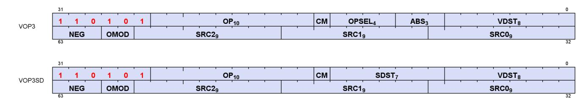

16.8. VOP1 Instructions 336 of 697

# <span id="page-346-0"></span>**16.9. VOPC Instructions**

The bitfield map for VOPC is:

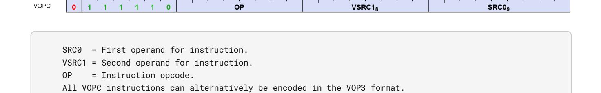

Compare instructions perform the same compare operation on each lane (work-Item or thread) using that lane's private data, and producing a 1 bit result per lane into VCC or EXEC.

Instructions in this format may use a 32-bit literal constant that occurs immediately after the instruction.

Most compare instructions fall into one of two categories:

- Ones that can use one of 16 compare operations (floating point types). "{COMPF}"
- Ones that can use one of 8 compare operations (integer types). "{COMPI}"

The opcode number is such that for these the opcode number can be calculated from a base opcode number for the data type, plus an offset for the specific compare operation.

| Compare Operation | Opcode Offset | Description                      |
|-------------------|---------------|----------------------------------|
| F                 | 0             | D.u = 0                          |
| LT                | 1             | D.u = (S0 < S1)                  |
| EQ                | 2             | D.u = (S0 == S1)                 |
| LE                | 3             | D.u = (S0 <= S1)                 |
| GT                | 4             | D.u = (S0 > S1)                  |
| LG                | 5             | D.u = (S0 <> S1)                 |
| GE                | 6             | D.u = (S0 >= S1)                 |
| O                 | 7             | D.u = (!isNaN(S0) && !isNaN(S1)) |
| U                 | 8             | D.u = (!isNaN(S0)    !isNaN(S1)) |
| NGE               | 9             | D.u = !(S0 >= S1)                |
| NLG               | 10            | D.u = !(S0 <> S1)                |
| NGT               | 11            | D.u = !(S0 > S1)                 |
| NLE               | 12            | D.u = !(S0 <= S1)                |
| NEQ               | 13            | D.u = !(S0 == S1)                |
| NLT               | 14            | D.u = !(S0 < S1)                 |
| TRU               | 15            | D.u = 1                          |

Table 122. Float Compare Operations

Table 123. Instructions with Sixteen Compare Operations

| Instruction        | Description                            | Hex Range    |
|--------------------|----------------------------------------|--------------|
| V_CMP_{COMPF}_F16  | 16-bit float compare. Writes VCC/SGPR. | 0x20 to 0x2F |
| V_CMPX_{COMPF}_F16 | 16-bit float compare. Writes EXEC.     | 0x30 to 0x3F |
| V_CMP_{COMPF}_F32  | 32-bit float compare. Writes VCC/SGPR. | 0x40 to 0x4F |

16.9. VOPC Instructions 337 of 697

| Instruction        | Description                            | Hex Range    |
|--------------------|----------------------------------------|--------------|
| V_CMPX_{COMPF}_F32 | 32-bit float compare. Writes EXEC.     | 0x50 to 0x5F |
| V_CMP_{COMPF}_F64  | 64-bit float compare. Writes VCC/SGPR. | 0x60 to 0x6F |
| V_CMPX_{COMPF}_F64 | 64-bit float compare. Writes EXEC.     | 0x70 to 0x7F |

Table 124. Integer Compare Operations

| Compare Operation | Opcode Offset | Description      |
|-------------------|---------------|------------------|
| F                 | 0             | D.u = 0          |
| LT                | 1             | D.u = (S0 < S1)  |
| EQ                | 2             | D.u = (S0 == S1) |
| LE                | 3             | D.u = (S0 <= S1) |
| GT                | 4             | D.u = (S0 > S1)  |
| LG                | 5             | D.u = (S0 <> S1) |
| GE                | 6             | D.u = (S0 >= S1) |
| TRU               | 7             | D.u = 1          |

Table 125. Instructions with Eight Compare Operations

| Instruction        | Description                                     | Hex Range   |
|--------------------|-------------------------------------------------|-------------|
| V_CMP_{COMPI}_I16  | 16-bit signed integer compare. Writes VCC/SGPR. | 0xA0 - 0xA7 |
| V_CMP_{COMPI}_U16  | 16-bit signed integer compare. Writes VCC/SGPR. | 0xA8 - 0xAF |
| V_CMPX_{COMPI}_I16 | 16-bit unsigned integer compare. Writes EXEC.   | 0xB0 - 0xB7 |
| V_CMPX_{COMPI}_U16 | 16-bit unsigned integer compare. Writes EXEC.   | 0xB8 - 0xBF |
| V_CMP_{COMPI}_I32  | 32-bit signed integer compare. Writes VCC/SGPR. | 0xC0 - 0xC7 |
| V_CMP_{COMPI}_U32  | 32-bit signed integer compare. Writes VCC/SGPR. | 0xC8 - 0xCF |
| V_CMPX_{COMPI}_I32 | 32-bit unsigned integer compare. Writes EXEC.   | 0xD0 - 0xD7 |
| V_CMPX_{COMPI}_U32 | 32-bit unsigned integer compare. Writes EXEC.   | 0xD8 - 0xDF |
| V_CMP_{COMPI}_I64  | 64-bit signed integer compare. Writes VCC/SGPR. | 0xE0 - 0xE7 |
| V_CMP_{COMPI}_U64  | 64-bit signed integer compare. Writes VCC/SGPR. | 0xE8 - 0xEF |
| V_CMPX_{COMPI}_I64 | 64-bit unsigned integer compare. Writes EXEC.   | 0xF0 - 0xF7 |
| V_CMPX_{COMPI}_U64 | 64-bit unsigned integer compare. Writes EXEC.   | 0xF8 - 0xFF |

**V\_CMP\_LT\_F16 1**

Set the per-lane condition code to 1 iff the first input is less than the second input. Store the result into VCC or a scalar register.

```
D0.u64[laneId] = S0.f16 < S1.f16;
// D0 = VCC in VOPC encoding.
```

#### **Notes**

Signal 'invalid' on sNAN's, and also on qNAN's if clamp is set.

**V\_CMP\_EQ\_F16 2**

16.9. VOPC Instructions 338 of 697

Set the per-lane condition code to 1 iff the first input is equal to the second input. Store the result into VCC or a scalar register.

```
D0.u64[laneId] = S0.f16 == S1.f16;
// D0 = VCC in VOPC encoding.
```

#### **Notes**

Signal 'invalid' on sNAN's, and also on qNAN's if clamp is set.

**V\_CMP\_LE\_F16 3**

Set the per-lane condition code to 1 iff the first input is less than or equal to the second input. Store the result into VCC or a scalar register.

```
D0.u64[laneId] = S0.f16 <= S1.f16;
// D0 = VCC in VOPC encoding.
```

# **Notes**

Signal 'invalid' on sNAN's, and also on qNAN's if clamp is set.

**V\_CMP\_GT\_F16 4**

Set the per-lane condition code to 1 iff the first input is greater than the second input. Store the result into VCC or a scalar register.

```
D0.u64[laneId] = S0.f16 > S1.f16;
// D0 = VCC in VOPC encoding.
```

### **Notes**

Signal 'invalid' on sNAN's, and also on qNAN's if clamp is set.

**V\_CMP\_LG\_F16 5**

Set the per-lane condition code to 1 iff the first input is less than or greater than the second input. Store the result into VCC or a scalar register.

```
D0.u64[laneId] = S0.f16 <> S1.f16;
// D0 = VCC in VOPC encoding.
```

16.9. VOPC Instructions 339 of 697

Signal 'invalid' on sNAN's, and also on qNAN's if clamp is set.

**V\_CMP\_GE\_F16 6**

Set the per-lane condition code to 1 iff the first input is greater than or equal to the second input. Store the result into VCC or a scalar register.

```
D0.u64[laneId] = S0.f16 >= S1.f16;
// D0 = VCC in VOPC encoding.
```

#### **Notes**

Signal 'invalid' on sNAN's, and also on qNAN's if clamp is set.

**V\_CMP\_O\_F16 7**

Set the per-lane condition code to 1 iff the first input is orderable to the second input. Store the result into VCC or a scalar register.

```
D0.u64[laneId] = (!isNAN(64'F(S0.f16)) && !isNAN(64'F(S1.f16)));
// D0 = VCC in VOPC encoding.
```

### **Notes**

Signal 'invalid' on sNAN's, and also on qNAN's if clamp is set.

**V\_CMP\_U\_F16 8**

Set the per-lane condition code to 1 iff the first input is not orderable to the second input. Store the result into VCC or a scalar register.

```
D0.u64[laneId] = (isNAN(64'F(S0.f16)) || isNAN(64'F(S1.f16)));
// D0 = VCC in VOPC encoding.
```

## **Notes**

Signal 'invalid' on sNAN's, and also on qNAN's if clamp is set.

**V\_CMP\_NGE\_F16 9**

16.9. VOPC Instructions 340 of 697

Set the per-lane condition code to 1 iff the first input is not greater than or equal to the second input. Store the result into VCC or a scalar register.

```
D0.u64[laneId] = !(S0.f16 >= S1.f16);
// With NAN inputs this is not the same operation as <
// D0 = VCC in VOPC encoding.
```

#### **Notes**

Signal 'invalid' on sNAN's, and also on qNAN's if clamp is set.

**V\_CMP\_NLG\_F16 10**

Set the per-lane condition code to 1 iff the first input is not less than or greater than the second input. Store the result into VCC or a scalar register.

```
D0.u64[laneId] = !(S0.f16 <> S1.f16);
// With NAN inputs this is not the same operation as ==
// D0 = VCC in VOPC encoding.
```

#### **Notes**

Signal 'invalid' on sNAN's, and also on qNAN's if clamp is set.

**V\_CMP\_NGT\_F16 11**

Set the per-lane condition code to 1 iff the first input is not greater than the second input. Store the result into VCC or a scalar register.

```
D0.u64[laneId] = !(S0.f16 > S1.f16);
// With NAN inputs this is not the same operation as <=
// D0 = VCC in VOPC encoding.
```

#### **Notes**

Signal 'invalid' on sNAN's, and also on qNAN's if clamp is set.

**V\_CMP\_NLE\_F16 12**

Set the per-lane condition code to 1 iff the first input is not less than or equal to the second input. Store the result into VCC or a scalar register.

16.9. VOPC Instructions 341 of 697

```
D0.u64[laneId] = !(S0.f16 <= S1.f16);
// With NAN inputs this is not the same operation as >
// D0 = VCC in VOPC encoding.
```

Signal 'invalid' on sNAN's, and also on qNAN's if clamp is set.

```
V_CMP_NEQ_F16 13
```

Set the per-lane condition code to 1 iff the first input is not equal to the second input. Store the result into VCC or a scalar register.

```
D0.u64[laneId] = !(S0.f16 == S1.f16);
// With NAN inputs this is not the same operation as !=
// D0 = VCC in VOPC encoding.
```

#### **Notes**

Signal 'invalid' on sNAN's, and also on qNAN's if clamp is set.

```
V_CMP_NLT_F16 14
```

Set the per-lane condition code to 1 iff the first input is not less than the second input. Store the result into VCC or a scalar register.

```
D0.u64[laneId] = !(S0.f16 < S1.f16);
// With NAN inputs this is not the same operation as >=
// D0 = VCC in VOPC encoding.
```

### **Notes**

Signal 'invalid' on sNAN's, and also on qNAN's if clamp is set.

```
V_CMP_LT_F32 17
```

Set the per-lane condition code to 1 iff the first input is less than the second input. Store the result into VCC or a scalar register.

```
D0.u64[laneId] = S0.f32 < S1.f32;
// D0 = VCC in VOPC encoding.
```

16.9. VOPC Instructions 342 of 697

Signal 'invalid' on sNAN's, and also on qNAN's if clamp is set.

**V\_CMP\_EQ\_F32 18**

Set the per-lane condition code to 1 iff the first input is equal to the second input. Store the result into VCC or a scalar register.

```
D0.u64[laneId] = S0.f32 == S1.f32;
// D0 = VCC in VOPC encoding.
```

#### **Notes**

Signal 'invalid' on sNAN's, and also on qNAN's if clamp is set.

**V\_CMP\_LE\_F32 19**

Set the per-lane condition code to 1 iff the first input is less than or equal to the second input. Store the result into VCC or a scalar register.

```
D0.u64[laneId] = S0.f32 <= S1.f32;
// D0 = VCC in VOPC encoding.
```

### **Notes**

Signal 'invalid' on sNAN's, and also on qNAN's if clamp is set.

**V\_CMP\_GT\_F32 20**

Set the per-lane condition code to 1 iff the first input is greater than the second input. Store the result into VCC or a scalar register.

```
D0.u64[laneId] = S0.f32 > S1.f32;
// D0 = VCC in VOPC encoding.
```

## **Notes**

Signal 'invalid' on sNAN's, and also on qNAN's if clamp is set.

**V\_CMP\_LG\_F32 21**

16.9. VOPC Instructions 343 of 697

Set the per-lane condition code to 1 iff the first input is less than or greater than the second input. Store the result into VCC or a scalar register.

```
D0.u64[laneId] = S0.f32 <> S1.f32;
// D0 = VCC in VOPC encoding.
```

#### **Notes**

Signal 'invalid' on sNAN's, and also on qNAN's if clamp is set.

**V\_CMP\_GE\_F32 22**

Set the per-lane condition code to 1 iff the first input is greater than or equal to the second input. Store the result into VCC or a scalar register.

```
D0.u64[laneId] = S0.f32 >= S1.f32;
// D0 = VCC in VOPC encoding.
```

# **Notes**

Signal 'invalid' on sNAN's, and also on qNAN's if clamp is set.

**V\_CMP\_O\_F32 23**

Set the per-lane condition code to 1 iff the first input is orderable to the second input. Store the result into VCC or a scalar register.

```
D0.u64[laneId] = (!isNAN(64'F(S0.f32)) && !isNAN(64'F(S1.f32)));
// D0 = VCC in VOPC encoding.
```

### **Notes**

Signal 'invalid' on sNAN's, and also on qNAN's if clamp is set.

**V\_CMP\_U\_F32 24**

Set the per-lane condition code to 1 iff the first input is not orderable to the second input. Store the result into VCC or a scalar register.

```
D0.u64[laneId] = (isNAN(64'F(S0.f32)) || isNAN(64'F(S1.f32)));
// D0 = VCC in VOPC encoding.
```

16.9. VOPC Instructions 344 of 697

Signal 'invalid' on sNAN's, and also on qNAN's if clamp is set.

**V\_CMP\_NGE\_F32 25**

Set the per-lane condition code to 1 iff the first input is not greater than or equal to the second input. Store the result into VCC or a scalar register.

```
D0.u64[laneId] = !(S0.f32 >= S1.f32);
// With NAN inputs this is not the same operation as <
// D0 = VCC in VOPC encoding.
```

#### **Notes**

Signal 'invalid' on sNAN's, and also on qNAN's if clamp is set.

**V\_CMP\_NLG\_F32 26**

Set the per-lane condition code to 1 iff the first input is not less than or greater than the second input. Store the result into VCC or a scalar register.

```
D0.u64[laneId] = !(S0.f32 <> S1.f32);
// With NAN inputs this is not the same operation as ==
// D0 = VCC in VOPC encoding.
```

## **Notes**

Signal 'invalid' on sNAN's, and also on qNAN's if clamp is set.

**V\_CMP\_NGT\_F32 27**

Set the per-lane condition code to 1 iff the first input is not greater than the second input. Store the result into VCC or a scalar register.

```
D0.u64[laneId] = !(S0.f32 > S1.f32);
// With NAN inputs this is not the same operation as <=
// D0 = VCC in VOPC encoding.
```

### **Notes**

Signal 'invalid' on sNAN's, and also on qNAN's if clamp is set.

16.9. VOPC Instructions 345 of 697

**V\_CMP\_NLE\_F32 28**

Set the per-lane condition code to 1 iff the first input is not less than or equal to the second input. Store the result into VCC or a scalar register.

```
D0.u64[laneId] = !(S0.f32 <= S1.f32);
// With NAN inputs this is not the same operation as >
// D0 = VCC in VOPC encoding.
```

#### **Notes**

Signal 'invalid' on sNAN's, and also on qNAN's if clamp is set.

```
V_CMP_NEQ_F32 29
```

Set the per-lane condition code to 1 iff the first input is not equal to the second input. Store the result into VCC or a scalar register.

```
D0.u64[laneId] = !(S0.f32 == S1.f32);
// With NAN inputs this is not the same operation as !=
// D0 = VCC in VOPC encoding.
```

# **Notes**

Signal 'invalid' on sNAN's, and also on qNAN's if clamp is set.

```
V_CMP_NLT_F32 30
```

Set the per-lane condition code to 1 iff the first input is not less than the second input. Store the result into VCC or a scalar register.

```
D0.u64[laneId] = !(S0.f32 < S1.f32);
// With NAN inputs this is not the same operation as >=
// D0 = VCC in VOPC encoding.
```

#### **Notes**

Signal 'invalid' on sNAN's, and also on qNAN's if clamp is set.

```
V_CMP_LT_F64 33
```

Set the per-lane condition code to 1 iff the first input is less than the second input. Store the result into VCC or a

16.9. VOPC Instructions 346 of 697

scalar register.

```
D0.u64[laneId] = S0.f64 < S1.f64;
// D0 = VCC in VOPC encoding.
```

#### **Notes**

Signal 'invalid' on sNAN's, and also on qNAN's if clamp is set.

**V\_CMP\_EQ\_F64 34**

Set the per-lane condition code to 1 iff the first input is equal to the second input. Store the result into VCC or a scalar register.

```
D0.u64[laneId] = S0.f64 == S1.f64;
// D0 = VCC in VOPC encoding.
```

#### **Notes**

Signal 'invalid' on sNAN's, and also on qNAN's if clamp is set.

**V\_CMP\_LE\_F64 35**

Set the per-lane condition code to 1 iff the first input is less than or equal to the second input. Store the result into VCC or a scalar register.

```
D0.u64[laneId] = S0.f64 <= S1.f64;
// D0 = VCC in VOPC encoding.
```

## **Notes**

Signal 'invalid' on sNAN's, and also on qNAN's if clamp is set.

**V\_CMP\_GT\_F64 36**

Set the per-lane condition code to 1 iff the first input is greater than the second input. Store the result into VCC or a scalar register.

```
D0.u64[laneId] = S0.f64 > S1.f64;
// D0 = VCC in VOPC encoding.
```

16.9. VOPC Instructions 347 of 697

Signal 'invalid' on sNAN's, and also on qNAN's if clamp is set.

**V\_CMP\_LG\_F64 37**

Set the per-lane condition code to 1 iff the first input is less than or greater than the second input. Store the result into VCC or a scalar register.

```
D0.u64[laneId] = S0.f64 <> S1.f64;
// D0 = VCC in VOPC encoding.
```

#### **Notes**

Signal 'invalid' on sNAN's, and also on qNAN's if clamp is set.

**V\_CMP\_GE\_F64 38**

Set the per-lane condition code to 1 iff the first input is greater than or equal to the second input. Store the result into VCC or a scalar register.

```
D0.u64[laneId] = S0.f64 >= S1.f64;
// D0 = VCC in VOPC encoding.
```

### **Notes**

Signal 'invalid' on sNAN's, and also on qNAN's if clamp is set.

**V\_CMP\_O\_F64 39**

Set the per-lane condition code to 1 iff the first input is orderable to the second input. Store the result into VCC or a scalar register.

```
D0.u64[laneId] = (!isNAN(S0.f64) && !isNAN(S1.f64));
// D0 = VCC in VOPC encoding.
```

## **Notes**

Signal 'invalid' on sNAN's, and also on qNAN's if clamp is set.

**V\_CMP\_U\_F64 40**

16.9. VOPC Instructions 348 of 697

Set the per-lane condition code to 1 iff the first input is not orderable to the second input. Store the result into VCC or a scalar register.

```
D0.u64[laneId] = (isNAN(S0.f64) || isNAN(S1.f64));
// D0 = VCC in VOPC encoding.
```

#### **Notes**

Signal 'invalid' on sNAN's, and also on qNAN's if clamp is set.

**V\_CMP\_NGE\_F64 41**

Set the per-lane condition code to 1 iff the first input is not greater than or equal to the second input. Store the result into VCC or a scalar register.

```
D0.u64[laneId] = !(S0.f64 >= S1.f64);
// With NAN inputs this is not the same operation as <
// D0 = VCC in VOPC encoding.
```

#### **Notes**

Signal 'invalid' on sNAN's, and also on qNAN's if clamp is set.

**V\_CMP\_NLG\_F64 42**

Set the per-lane condition code to 1 iff the first input is not less than or greater than the second input. Store the result into VCC or a scalar register.

```
D0.u64[laneId] = !(S0.f64 <> S1.f64);
// With NAN inputs this is not the same operation as ==
// D0 = VCC in VOPC encoding.
```

## **Notes**

Signal 'invalid' on sNAN's, and also on qNAN's if clamp is set.

**V\_CMP\_NGT\_F64 43**

Set the per-lane condition code to 1 iff the first input is not greater than the second input. Store the result into VCC or a scalar register.

```
D0.u64[laneId] = !(S0.f64 > S1.f64);
```

16.9. VOPC Instructions 349 of 697

```
// With NAN inputs this is not the same operation as <=
// D0 = VCC in VOPC encoding.
```

Signal 'invalid' on sNAN's, and also on qNAN's if clamp is set.

**V\_CMP\_NLE\_F64 44**

Set the per-lane condition code to 1 iff the first input is not less than or equal to the second input. Store the result into VCC or a scalar register.

```
D0.u64[laneId] = !(S0.f64 <= S1.f64);
// With NAN inputs this is not the same operation as >
// D0 = VCC in VOPC encoding.
```

#### **Notes**

Signal 'invalid' on sNAN's, and also on qNAN's if clamp is set.

**V\_CMP\_NEQ\_F64 45**

Set the per-lane condition code to 1 iff the first input is not equal to the second input. Store the result into VCC or a scalar register.

```
D0.u64[laneId] = !(S0.f64 == S1.f64);
// With NAN inputs this is not the same operation as !=
// D0 = VCC in VOPC encoding.
```

## **Notes**

Signal 'invalid' on sNAN's, and also on qNAN's if clamp is set.

**V\_CMP\_NLT\_F64 46**

Set the per-lane condition code to 1 iff the first input is not less than the second input. Store the result into VCC or a scalar register.

```
D0.u64[laneId] = !(S0.f64 < S1.f64);
// With NAN inputs this is not the same operation as >=
// D0 = VCC in VOPC encoding.
```

16.9. VOPC Instructions 350 of 697

Signal 'invalid' on sNAN's, and also on qNAN's if clamp is set.

**V\_CMP\_LT\_I16 49**

Set the per-lane condition code to 1 iff the first input is less than the second input. Store the result into VCC or a scalar register.

```
D0.u64[laneId] = S0.i16 < S1.i16;
// D0 = VCC in VOPC encoding.
```

#### **Notes**

Signal 'invalid' on sNAN's, and also on qNAN's if clamp is set.

**V\_CMP\_EQ\_I16 50**

Set the per-lane condition code to 1 iff the first input is equal to the second input. Store the result into VCC or a scalar register.

```
D0.u64[laneId] = S0.i16 == S1.i16;
// D0 = VCC in VOPC encoding.
```

### **Notes**

Signal 'invalid' on sNAN's, and also on qNAN's if clamp is set.

**V\_CMP\_LE\_I16 51**

Set the per-lane condition code to 1 iff the first input is less than or equal to the second input. Store the result into VCC or a scalar register.

```
D0.u64[laneId] = S0.i16 <= S1.i16;
// D0 = VCC in VOPC encoding.
```

## **Notes**

Signal 'invalid' on sNAN's, and also on qNAN's if clamp is set.

**V\_CMP\_GT\_I16 52**

16.9. VOPC Instructions 351 of 697

Set the per-lane condition code to 1 iff the first input is greater than the second input. Store the result into VCC or a scalar register.

```
D0.u64[laneId] = S0.i16 > S1.i16;
// D0 = VCC in VOPC encoding.
```

#### **Notes**

Signal 'invalid' on sNAN's, and also on qNAN's if clamp is set.

**V\_CMP\_NE\_I16 53**

Set the per-lane condition code to 1 iff the first input is not equal to the second input. Store the result into VCC or a scalar register.

```
D0.u64[laneId] = S0.i16 <> S1.i16;
// D0 = VCC in VOPC encoding.
```

# **Notes**

Signal 'invalid' on sNAN's, and also on qNAN's if clamp is set.

**V\_CMP\_GE\_I16 54**

Set the per-lane condition code to 1 iff the first input is greater than or equal to the second input. Store the result into VCC or a scalar register.

```
D0.u64[laneId] = S0.i16 >= S1.i16;
// D0 = VCC in VOPC encoding.
```

### **Notes**

Signal 'invalid' on sNAN's, and also on qNAN's if clamp is set.

**V\_CMP\_LT\_U16 57**

Set the per-lane condition code to 1 iff the first input is less than the second input. Store the result into VCC or a scalar register.

```
D0.u64[laneId] = S0.u16 < S1.u16;
// D0 = VCC in VOPC encoding.
```

16.9. VOPC Instructions 352 of 697

Signal 'invalid' on sNAN's, and also on qNAN's if clamp is set.

**V\_CMP\_EQ\_U16 58**

Set the per-lane condition code to 1 iff the first input is equal to the second input. Store the result into VCC or a scalar register.

```
D0.u64[laneId] = S0.u16 == S1.u16;
// D0 = VCC in VOPC encoding.
```

#### **Notes**

Signal 'invalid' on sNAN's, and also on qNAN's if clamp is set.

**V\_CMP\_LE\_U16 59**

Set the per-lane condition code to 1 iff the first input is less than or equal to the second input. Store the result into VCC or a scalar register.

```
D0.u64[laneId] = S0.u16 <= S1.u16;
// D0 = VCC in VOPC encoding.
```

### **Notes**

Signal 'invalid' on sNAN's, and also on qNAN's if clamp is set.

**V\_CMP\_GT\_U16 60**

Set the per-lane condition code to 1 iff the first input is greater than the second input. Store the result into VCC or a scalar register.

```
D0.u64[laneId] = S0.u16 > S1.u16;
// D0 = VCC in VOPC encoding.
```

## **Notes**

Signal 'invalid' on sNAN's, and also on qNAN's if clamp is set.

**V\_CMP\_NE\_U16 61**

16.9. VOPC Instructions 353 of 697

Set the per-lane condition code to 1 iff the first input is not equal to the second input. Store the result into VCC or a scalar register.

```
D0.u64[laneId] = S0.u16 <> S1.u16;
// D0 = VCC in VOPC encoding.
```

#### **Notes**

Signal 'invalid' on sNAN's, and also on qNAN's if clamp is set.

**V\_CMP\_GE\_U16 62**

Set the per-lane condition code to 1 iff the first input is greater than or equal to the second input. Store the result into VCC or a scalar register.

```
D0.u64[laneId] = S0.u16 >= S1.u16;
// D0 = VCC in VOPC encoding.
```

### **Notes**

Signal 'invalid' on sNAN's, and also on qNAN's if clamp is set.

**V\_CMP\_LT\_I32 65**

Set the per-lane condition code to 1 iff the first input is less than the second input. Store the result into VCC or a scalar register.

```
D0.u64[laneId] = S0.i32 < S1.i32;
// D0 = VCC in VOPC encoding.
```

### **Notes**

Signal 'invalid' on sNAN's, and also on qNAN's if clamp is set.

**V\_CMP\_EQ\_I32 66**

Set the per-lane condition code to 1 iff the first input is equal to the second input. Store the result into VCC or a scalar register.

```
D0.u64[laneId] = S0.i32 == S1.i32;
// D0 = VCC in VOPC encoding.
```

16.9. VOPC Instructions 354 of 697

Signal 'invalid' on sNAN's, and also on qNAN's if clamp is set.

**V\_CMP\_LE\_I32 67**

Set the per-lane condition code to 1 iff the first input is less than or equal to the second input. Store the result into VCC or a scalar register.

```
D0.u64[laneId] = S0.i32 <= S1.i32;
// D0 = VCC in VOPC encoding.
```

#### **Notes**

Signal 'invalid' on sNAN's, and also on qNAN's if clamp is set.

**V\_CMP\_GT\_I32 68**

Set the per-lane condition code to 1 iff the first input is greater than the second input. Store the result into VCC or a scalar register.

```
D0.u64[laneId] = S0.i32 > S1.i32;
// D0 = VCC in VOPC encoding.
```

### **Notes**

Signal 'invalid' on sNAN's, and also on qNAN's if clamp is set.

**V\_CMP\_NE\_I32 69**

Set the per-lane condition code to 1 iff the first input is not equal to the second input. Store the result into VCC or a scalar register.

```
D0.u64[laneId] = S0.i32 <> S1.i32;
// D0 = VCC in VOPC encoding.
```

## **Notes**

Signal 'invalid' on sNAN's, and also on qNAN's if clamp is set.

**V\_CMP\_GE\_I32 70**

16.9. VOPC Instructions 355 of 697

Set the per-lane condition code to 1 iff the first input is greater than or equal to the second input. Store the result into VCC or a scalar register.

```
D0.u64[laneId] = S0.i32 >= S1.i32;
// D0 = VCC in VOPC encoding.
```

#### **Notes**

Signal 'invalid' on sNAN's, and also on qNAN's if clamp is set.

**V\_CMP\_LT\_U32 73**

Set the per-lane condition code to 1 iff the first input is less than the second input. Store the result into VCC or a scalar register.

```
D0.u64[laneId] = S0.u32 < S1.u32;
// D0 = VCC in VOPC encoding.
```

### **Notes**

Signal 'invalid' on sNAN's, and also on qNAN's if clamp is set.

**V\_CMP\_EQ\_U32 74**

Set the per-lane condition code to 1 iff the first input is equal to the second input. Store the result into VCC or a scalar register.

```
D0.u64[laneId] = S0.u32 == S1.u32;
// D0 = VCC in VOPC encoding.
```

### **Notes**

Signal 'invalid' on sNAN's, and also on qNAN's if clamp is set.

**V\_CMP\_LE\_U32 75**

Set the per-lane condition code to 1 iff the first input is less than or equal to the second input. Store the result into VCC or a scalar register.

```
D0.u64[laneId] = S0.u32 <= S1.u32;
// D0 = VCC in VOPC encoding.
```

16.9. VOPC Instructions 356 of 697

Signal 'invalid' on sNAN's, and also on qNAN's if clamp is set.

**V\_CMP\_GT\_U32 76**

Set the per-lane condition code to 1 iff the first input is greater than the second input. Store the result into VCC or a scalar register.

```
D0.u64[laneId] = S0.u32 > S1.u32;
// D0 = VCC in VOPC encoding.
```

#### **Notes**

Signal 'invalid' on sNAN's, and also on qNAN's if clamp is set.

**V\_CMP\_NE\_U32 77**

Set the per-lane condition code to 1 iff the first input is not equal to the second input. Store the result into VCC or a scalar register.

```
D0.u64[laneId] = S0.u32 <> S1.u32;
// D0 = VCC in VOPC encoding.
```

### **Notes**

Signal 'invalid' on sNAN's, and also on qNAN's if clamp is set.

**V\_CMP\_GE\_U32 78**

Set the per-lane condition code to 1 iff the first input is greater than or equal to the second input. Store the result into VCC or a scalar register.

```
D0.u64[laneId] = S0.u32 >= S1.u32;
// D0 = VCC in VOPC encoding.
```

## **Notes**

Signal 'invalid' on sNAN's, and also on qNAN's if clamp is set.

**V\_CMP\_LT\_I64 81**

16.9. VOPC Instructions 357 of 697

Set the per-lane condition code to 1 iff the first input is less than the second input. Store the result into VCC or a scalar register.

```
D0.u64[laneId] = S0.i64 < S1.i64;
// D0 = VCC in VOPC encoding.
```

#### **Notes**

Signal 'invalid' on sNAN's, and also on qNAN's if clamp is set.

**V\_CMP\_EQ\_I64 82**

Set the per-lane condition code to 1 iff the first input is equal to the second input. Store the result into VCC or a scalar register.

```
D0.u64[laneId] = S0.i64 == S1.i64;
// D0 = VCC in VOPC encoding.
```

# **Notes**

Signal 'invalid' on sNAN's, and also on qNAN's if clamp is set.

**V\_CMP\_LE\_I64 83**

Set the per-lane condition code to 1 iff the first input is less than or equal to the second input. Store the result into VCC or a scalar register.

```
D0.u64[laneId] = S0.i64 <= S1.i64;
// D0 = VCC in VOPC encoding.
```

### **Notes**

Signal 'invalid' on sNAN's, and also on qNAN's if clamp is set.

**V\_CMP\_GT\_I64 84**

Set the per-lane condition code to 1 iff the first input is greater than the second input. Store the result into VCC or a scalar register.

```
D0.u64[laneId] = S0.i64 > S1.i64;
// D0 = VCC in VOPC encoding.
```

16.9. VOPC Instructions 358 of 697

Signal 'invalid' on sNAN's, and also on qNAN's if clamp is set.

**V\_CMP\_NE\_I64 85**

Set the per-lane condition code to 1 iff the first input is not equal to the second input. Store the result into VCC or a scalar register.

```
D0.u64[laneId] = S0.i64 <> S1.i64;
// D0 = VCC in VOPC encoding.
```

#### **Notes**

Signal 'invalid' on sNAN's, and also on qNAN's if clamp is set.

**V\_CMP\_GE\_I64 86**

Set the per-lane condition code to 1 iff the first input is greater than or equal to the second input. Store the result into VCC or a scalar register.

```
D0.u64[laneId] = S0.i64 >= S1.i64;
// D0 = VCC in VOPC encoding.
```

### **Notes**

Signal 'invalid' on sNAN's, and also on qNAN's if clamp is set.

**V\_CMP\_LT\_U64 89**

Set the per-lane condition code to 1 iff the first input is less than the second input. Store the result into VCC or a scalar register.

```
D0.u64[laneId] = S0.u64 < S1.u64;
// D0 = VCC in VOPC encoding.
```

## **Notes**

Signal 'invalid' on sNAN's, and also on qNAN's if clamp is set.

**V\_CMP\_EQ\_U64 90**

16.9. VOPC Instructions 359 of 697

Set the per-lane condition code to 1 iff the first input is equal to the second input. Store the result into VCC or a scalar register.

```
D0.u64[laneId] = S0.u64 == S1.u64;
// D0 = VCC in VOPC encoding.
```

#### **Notes**

Signal 'invalid' on sNAN's, and also on qNAN's if clamp is set.

**V\_CMP\_LE\_U64 91**

Set the per-lane condition code to 1 iff the first input is less than or equal to the second input. Store the result into VCC or a scalar register.

```
D0.u64[laneId] = S0.u64 <= S1.u64;
// D0 = VCC in VOPC encoding.
```

# **Notes**

Signal 'invalid' on sNAN's, and also on qNAN's if clamp is set.

**V\_CMP\_GT\_U64 92**

Set the per-lane condition code to 1 iff the first input is greater than the second input. Store the result into VCC or a scalar register.

```
D0.u64[laneId] = S0.u64 > S1.u64;
// D0 = VCC in VOPC encoding.
```

### **Notes**

Signal 'invalid' on sNAN's, and also on qNAN's if clamp is set.

**V\_CMP\_NE\_U64 93**

Set the per-lane condition code to 1 iff the first input is not equal to the second input. Store the result into VCC or a scalar register.

```
D0.u64[laneId] = S0.u64 <> S1.u64;
// D0 = VCC in VOPC encoding.
```

16.9. VOPC Instructions 360 of 697

Signal 'invalid' on sNAN's, and also on qNAN's if clamp is set.

**V\_CMP\_GE\_U64 94**

Set the per-lane condition code to 1 iff the first input is greater than or equal to the second input. Store the result into VCC or a scalar register.

```
D0.u64[laneId] = S0.u64 >= S1.u64;
// D0 = VCC in VOPC encoding.
```

#### **Notes**

Signal 'invalid' on sNAN's, and also on qNAN's if clamp is set.

**V\_CMP\_CLASS\_F16 125**

Evaluate the IEEE numeric class function specified as a 10 bit mask in the second input on the first input, a half-precision float, and set the per-lane condition code to the result. Store the result into VCC or a scalar register.

The function reports true if the floating point value is any of the numeric types selected in the 10 bit mask according to the following list:

- S1.u[0] value is a signaling NAN.
- S1.u[1] value is a quiet NAN.
- S1.u[2] value is negative infinity.
- S1.u[3] value is a negative normal value.
- S1.u[4] value is a negative denormal value.
- S1.u[5] value is negative zero.
- S1.u[6] value is positive zero.
- S1.u[7] value is a positive denormal value.
- S1.u[8] value is a positive normal value.
- S1.u[9] value is positive infinity.

```
declare result : 1'U;
if isSignalNAN(64'F(S0.f16)) then
  result = S1.u32[0]
elsif isQuietNAN(64'F(S0.f16)) then
  result = S1.u32[1]
elsif exponent(S0.f16) == 31 then
  // +-INF
  result = S1.u32[sign(S0.f16) ? 2 : 9]
elsif exponent(S0.f16) > 0 then
  // +-normal value
  result = S1.u32[sign(S0.f16) ? 3 : 8]
```

16.9. VOPC Instructions 361 of 697

```
elsif 64'F(abs(S0.f16)) > 0.0 then
  // +-denormal value
  result = S1.u32[sign(S0.f16) ? 4 : 7]
else
  // +-0.0
  result = S1.u32[sign(S0.f16) ? 5 : 6]
endif;
D0.u64[laneId] = result;
// D0 = VCC in VOPC encoding.
```

Signal 'invalid' on sNAN's, and also on qNAN's if clamp is set.

**V\_CMP\_CLASS\_F32 126**

Evaluate the IEEE numeric class function specified as a 10 bit mask in the second input on the first input, a single-precision float, and set the per-lane condition code to the result. Store the result into VCC or a scalar register.

The function reports true if the floating point value is any of the numeric types selected in the 10 bit mask according to the following list:

- S1.u[0] value is a signaling NAN.
- S1.u[1] value is a quiet NAN.
- S1.u[2] value is negative infinity.
- S1.u[3] value is a negative normal value.
- S1.u[4] value is a negative denormal value.
- S1.u[5] value is negative zero.
- S1.u[6] value is positive zero.
- S1.u[7] value is a positive denormal value.
- S1.u[8] value is a positive normal value.
- S1.u[9] value is positive infinity.

```
declare result : 1'U;
if isSignalNAN(64'F(S0.f32)) then
  result = S1.u32[0]
elsif isQuietNAN(64'F(S0.f32)) then
  result = S1.u32[1]
elsif exponent(S0.f32) == 255 then
  // +-INF
  result = S1.u32[sign(S0.f32) ? 2 : 9]
elsif exponent(S0.f32) > 0 then
  // +-normal value
  result = S1.u32[sign(S0.f32) ? 3 : 8]
elsif 64'F(abs(S0.f32)) > 0.0 then
  // +-denormal value
  result = S1.u32[sign(S0.f32) ? 4 : 7]
else
  // +-0.0
  result = S1.u32[sign(S0.f32) ? 5 : 6]
```

16.9. VOPC Instructions 362 of 697

```
endif;
D0.u64[laneId] = result;
// D0 = VCC in VOPC encoding.
```

Signal 'invalid' on sNAN's, and also on qNAN's if clamp is set.

**V\_CMP\_CLASS\_F64 127**

Evaluate the IEEE numeric class function specified as a 10 bit mask in the second input on the first input, a double-precision float, and set the per-lane condition code to the result. Store the result into VCC or a scalar register.

The function reports true if the floating point value is any of the numeric types selected in the 10 bit mask according to the following list:

```
S1.u[0] value is a signaling NAN.
```

- S1.u[1] value is a quiet NAN.
- S1.u[2] value is negative infinity.
- S1.u[3] value is a negative normal value.
- S1.u[4] value is a negative denormal value.
- S1.u[5] value is negative zero.
- S1.u[6] value is positive zero.
- S1.u[7] value is a positive denormal value.
- S1.u[8] value is a positive normal value.
- S1.u[9] value is positive infinity.

```
declare result : 1'U;
if isSignalNAN(S0.f64) then
  result = S1.u32[0]
elsif isQuietNAN(S0.f64) then
  result = S1.u32[1]
elsif exponent(S0.f64) == 2047 then
  // +-INF
  result = S1.u32[sign(S0.f64) ? 2 : 9]
elsif exponent(S0.f64) > 0 then
  // +-normal value
  result = S1.u32[sign(S0.f64) ? 3 : 8]
elsif abs(S0.f64) > 0.0 then
  // +-denormal value
  result = S1.u32[sign(S0.f64) ? 4 : 7]
else
  // +-0.0
  result = S1.u32[sign(S0.f64) ? 5 : 6]
endif;
D0.u64[laneId] = result;
// D0 = VCC in VOPC encoding.
```

### **Notes**

16.9. VOPC Instructions 363 of 697

Signal 'invalid' on sNAN's, and also on qNAN's if clamp is set.

**V\_CMPX\_LT\_F16 129**

Set the per-lane condition code to 1 iff the first input is less than the second input. Store the result into the EXEC mask.

```
EXEC.u64[laneId] = S0.f16 < S1.f16
```

#### **Notes**

Write only EXEC. SDST must be set to EXEC\_LO. Signal 'invalid' on sNAN's, and also on qNAN's if clamp is set.

**V\_CMPX\_EQ\_F16 130**

Set the per-lane condition code to 1 iff the first input is equal to the second input. Store the result into the EXEC mask.

```
EXEC.u64[laneId] = S0.f16 == S1.f16
```

#### **Notes**

Write only EXEC. SDST must be set to EXEC\_LO. Signal 'invalid' on sNAN's, and also on qNAN's if clamp is set.

**V\_CMPX\_LE\_F16 131**

Set the per-lane condition code to 1 iff the first input is less than or equal to the second input. Store the result into the EXEC mask.

```
EXEC.u64[laneId] = S0.f16 <= S1.f16
```

### **Notes**

Write only EXEC. SDST must be set to EXEC\_LO. Signal 'invalid' on sNAN's, and also on qNAN's if clamp is set.

**V\_CMPX\_GT\_F16 132**

Set the per-lane condition code to 1 iff the first input is greater than the second input. Store the result into the EXEC mask.

16.9. VOPC Instructions 364 of 697

```
EXEC.u64[laneId] = S0.f16 > S1.f16
```

Write only EXEC. SDST must be set to EXEC\_LO. Signal 'invalid' on sNAN's, and also on qNAN's if clamp is set.

**V\_CMPX\_LG\_F16 133**

Set the per-lane condition code to 1 iff the first input is less than or greater than the second input. Store the result into the EXEC mask.

```
EXEC.u64[laneId] = S0.f16 <> S1.f16
```

#### **Notes**

Write only EXEC. SDST must be set to EXEC\_LO. Signal 'invalid' on sNAN's, and also on qNAN's if clamp is set.

**V\_CMPX\_GE\_F16 134**

Set the per-lane condition code to 1 iff the first input is greater than or equal to the second input. Store the result into the EXEC mask.

```
EXEC.u64[laneId] = S0.f16 >= S1.f16
```

#### **Notes**

Write only EXEC. SDST must be set to EXEC\_LO. Signal 'invalid' on sNAN's, and also on qNAN's if clamp is set.

**V\_CMPX\_O\_F16 135**

Set the per-lane condition code to 1 iff the first input is orderable to the second input. Store the result into the EXEC mask.

```
EXEC.u64[laneId] = (!isNAN(64'F(S0.f16)) && !isNAN(64'F(S1.f16)))
```

# **Notes**

Write only EXEC. SDST must be set to EXEC\_LO. Signal 'invalid' on sNAN's, and also on qNAN's if clamp is set.

16.9. VOPC Instructions 365 of 697

**V\_CMPX\_U\_F16 136**

Set the per-lane condition code to 1 iff the first input is not orderable to the second input. Store the result into the EXEC mask.

```
EXEC.u64[laneId] = (isNAN(64'F(S0.f16)) || isNAN(64'F(S1.f16)))
```

#### **Notes**

Write only EXEC. SDST must be set to EXEC\_LO. Signal 'invalid' on sNAN's, and also on qNAN's if clamp is set.

**V\_CMPX\_NGE\_F16 137**

Set the per-lane condition code to 1 iff the first input is not greater than or equal to the second input. Store the result into the EXEC mask.

```
EXEC.u64[laneId] = !(S0.f16 >= S1.f16);
// With NAN inputs this is not the same operation as <
```

#### **Notes**

Write only EXEC. SDST must be set to EXEC\_LO. Signal 'invalid' on sNAN's, and also on qNAN's if clamp is set.

**V\_CMPX\_NLG\_F16 138**

Set the per-lane condition code to 1 iff the first input is not less than or greater than the second input. Store the result into the EXEC mask.

```
EXEC.u64[laneId] = !(S0.f16 <> S1.f16);
// With NAN inputs this is not the same operation as ==
```

## **Notes**

Write only EXEC. SDST must be set to EXEC\_LO. Signal 'invalid' on sNAN's, and also on qNAN's if clamp is set.

**V\_CMPX\_NGT\_F16 139**

Set the per-lane condition code to 1 iff the first input is not greater than the second input. Store the result into the EXEC mask.

```
EXEC.u64[laneId] = !(S0.f16 > S1.f16);
```

16.9. VOPC Instructions 366 of 697

```
// With NAN inputs this is not the same operation as <=
```

Write only EXEC. SDST must be set to EXEC\_LO. Signal 'invalid' on sNAN's, and also on qNAN's if clamp is set.

**V\_CMPX\_NLE\_F16 140**

Set the per-lane condition code to 1 iff the first input is not less than or equal to the second input. Store the result into the EXEC mask.

```
EXEC.u64[laneId] = !(S0.f16 <= S1.f16);
// With NAN inputs this is not the same operation as >
```

#### **Notes**

Write only EXEC. SDST must be set to EXEC\_LO. Signal 'invalid' on sNAN's, and also on qNAN's if clamp is set.

**V\_CMPX\_NEQ\_F16 141**

Set the per-lane condition code to 1 iff the first input is not equal to the second input. Store the result into the EXEC mask.

```
EXEC.u64[laneId] = !(S0.f16 == S1.f16);
// With NAN inputs this is not the same operation as !=
```

# **Notes**

Write only EXEC. SDST must be set to EXEC\_LO. Signal 'invalid' on sNAN's, and also on qNAN's if clamp is set.

**V\_CMPX\_NLT\_F16 142**

Set the per-lane condition code to 1 iff the first input is not less than the second input. Store the result into the EXEC mask.

```
EXEC.u64[laneId] = !(S0.f16 < S1.f16);
// With NAN inputs this is not the same operation as >=
```

#### **Notes**

Write only EXEC. SDST must be set to EXEC\_LO. Signal 'invalid' on sNAN's, and also on qNAN's if clamp is set.

16.9. VOPC Instructions 367 of 697

**V\_CMPX\_LT\_F32 145**

Set the per-lane condition code to 1 iff the first input is less than the second input. Store the result into the EXEC mask.

```
EXEC.u64[laneId] = S0.f32 < S1.f32
```

#### **Notes**

Write only EXEC. SDST must be set to EXEC\_LO. Signal 'invalid' on sNAN's, and also on qNAN's if clamp is set.

**V\_CMPX\_EQ\_F32 146**

Set the per-lane condition code to 1 iff the first input is equal to the second input. Store the result into the EXEC mask.

```
EXEC.u64[laneId] = S0.f32 == S1.f32
```

#### **Notes**

Write only EXEC. SDST must be set to EXEC\_LO. Signal 'invalid' on sNAN's, and also on qNAN's if clamp is set.

**V\_CMPX\_LE\_F32 147**

Set the per-lane condition code to 1 iff the first input is less than or equal to the second input. Store the result into the EXEC mask.

```
EXEC.u64[laneId] = S0.f32 <= S1.f32
```

## **Notes**

Write only EXEC. SDST must be set to EXEC\_LO. Signal 'invalid' on sNAN's, and also on qNAN's if clamp is set.

**V\_CMPX\_GT\_F32 148**

Set the per-lane condition code to 1 iff the first input is greater than the second input. Store the result into the EXEC mask.

```
EXEC.u64[laneId] = S0.f32 > S1.f32
```

16.9. VOPC Instructions 368 of 697

Write only EXEC. SDST must be set to EXEC\_LO. Signal 'invalid' on sNAN's, and also on qNAN's if clamp is set.

**V\_CMPX\_LG\_F32 149**

Set the per-lane condition code to 1 iff the first input is less than or greater than the second input. Store the result into the EXEC mask.

```
EXEC.u64[laneId] = S0.f32 <> S1.f32
```

#### **Notes**

Write only EXEC. SDST must be set to EXEC\_LO. Signal 'invalid' on sNAN's, and also on qNAN's if clamp is set.

**V\_CMPX\_GE\_F32 150**

Set the per-lane condition code to 1 iff the first input is greater than or equal to the second input. Store the result into the EXEC mask.

```
EXEC.u64[laneId] = S0.f32 >= S1.f32
```

#### **Notes**

Write only EXEC. SDST must be set to EXEC\_LO. Signal 'invalid' on sNAN's, and also on qNAN's if clamp is set.

**V\_CMPX\_O\_F32 151**

Set the per-lane condition code to 1 iff the first input is orderable to the second input. Store the result into the EXEC mask.

```
EXEC.u64[laneId] = (!isNAN(64'F(S0.f32)) && !isNAN(64'F(S1.f32)))
```

### **Notes**

Write only EXEC. SDST must be set to EXEC\_LO. Signal 'invalid' on sNAN's, and also on qNAN's if clamp is set.

**V\_CMPX\_U\_F32 152**

Set the per-lane condition code to 1 iff the first input is not orderable to the second input. Store the result into the EXEC mask.

16.9. VOPC Instructions 369 of 697

```
EXEC.u64[laneId] = (isNAN(64'F(S0.f32)) || isNAN(64'F(S1.f32)))
```

Write only EXEC. SDST must be set to EXEC\_LO. Signal 'invalid' on sNAN's, and also on qNAN's if clamp is set.

**V\_CMPX\_NGE\_F32 153**

Set the per-lane condition code to 1 iff the first input is not greater than or equal to the second input. Store the result into the EXEC mask.

```
EXEC.u64[laneId] = !(S0.f32 >= S1.f32);
// With NAN inputs this is not the same operation as <
```

#### **Notes**

Write only EXEC. SDST must be set to EXEC\_LO. Signal 'invalid' on sNAN's, and also on qNAN's if clamp is set.

**V\_CMPX\_NLG\_F32 154**

Set the per-lane condition code to 1 iff the first input is not less than or greater than the second input. Store the result into the EXEC mask.

```
EXEC.u64[laneId] = !(S0.f32 <> S1.f32);
// With NAN inputs this is not the same operation as ==
```

## **Notes**

Write only EXEC. SDST must be set to EXEC\_LO. Signal 'invalid' on sNAN's, and also on qNAN's if clamp is set.

**V\_CMPX\_NGT\_F32 155**

Set the per-lane condition code to 1 iff the first input is not greater than the second input. Store the result into the EXEC mask.

```
EXEC.u64[laneId] = !(S0.f32 > S1.f32);
// With NAN inputs this is not the same operation as <=
```

## **Notes**

Write only EXEC. SDST must be set to EXEC\_LO. Signal 'invalid' on sNAN's, and also on qNAN's if clamp is set.

16.9. VOPC Instructions 370 of 697

**V\_CMPX\_NLE\_F32 156**

Set the per-lane condition code to 1 iff the first input is not less than or equal to the second input. Store the result into the EXEC mask.

```
EXEC.u64[laneId] = !(S0.f32 <= S1.f32);
// With NAN inputs this is not the same operation as >
```

#### **Notes**

Write only EXEC. SDST must be set to EXEC\_LO. Signal 'invalid' on sNAN's, and also on qNAN's if clamp is set.

**V\_CMPX\_NEQ\_F32 157**

Set the per-lane condition code to 1 iff the first input is not equal to the second input. Store the result into the EXEC mask.

```
EXEC.u64[laneId] = !(S0.f32 == S1.f32);
// With NAN inputs this is not the same operation as !=
```

### **Notes**

Write only EXEC. SDST must be set to EXEC\_LO. Signal 'invalid' on sNAN's, and also on qNAN's if clamp is set.

**V\_CMPX\_NLT\_F32 158**

Set the per-lane condition code to 1 iff the first input is not less than the second input. Store the result into the EXEC mask.

```
EXEC.u64[laneId] = !(S0.f32 < S1.f32);
// With NAN inputs this is not the same operation as >=
```

#### **Notes**

Write only EXEC. SDST must be set to EXEC\_LO. Signal 'invalid' on sNAN's, and also on qNAN's if clamp is set.

**V\_CMPX\_LT\_F64 161**

Set the per-lane condition code to 1 iff the first input is less than the second input. Store the result into the EXEC mask.

16.9. VOPC Instructions 371 of 697

```
EXEC.u64[laneId] = S0.f64 < S1.f64
```

Write only EXEC. SDST must be set to EXEC\_LO. Signal 'invalid' on sNAN's, and also on qNAN's if clamp is set.

**V\_CMPX\_EQ\_F64 162**

Set the per-lane condition code to 1 iff the first input is equal to the second input. Store the result into the EXEC mask.

```
EXEC.u64[laneId] = S0.f64 == S1.f64
```

#### **Notes**

Write only EXEC. SDST must be set to EXEC\_LO. Signal 'invalid' on sNAN's, and also on qNAN's if clamp is set.

**V\_CMPX\_LE\_F64 163**

Set the per-lane condition code to 1 iff the first input is less than or equal to the second input. Store the result into the EXEC mask.

```
EXEC.u64[laneId] = S0.f64 <= S1.f64
```

#### **Notes**

Write only EXEC. SDST must be set to EXEC\_LO. Signal 'invalid' on sNAN's, and also on qNAN's if clamp is set.

**V\_CMPX\_GT\_F64 164**

Set the per-lane condition code to 1 iff the first input is greater than the second input. Store the result into the EXEC mask.

```
EXEC.u64[laneId] = S0.f64 > S1.f64
```

### **Notes**

Write only EXEC. SDST must be set to EXEC\_LO. Signal 'invalid' on sNAN's, and also on qNAN's if clamp is set.

16.9. VOPC Instructions 372 of 697

**V\_CMPX\_LG\_F64 165**

Set the per-lane condition code to 1 iff the first input is less than or greater than the second input. Store the result into the EXEC mask.

```
EXEC.u64[laneId] = S0.f64 <> S1.f64
```

#### **Notes**

Write only EXEC. SDST must be set to EXEC\_LO. Signal 'invalid' on sNAN's, and also on qNAN's if clamp is set.

**V\_CMPX\_GE\_F64 166**

Set the per-lane condition code to 1 iff the first input is greater than or equal to the second input. Store the result into the EXEC mask.

```
EXEC.u64[laneId] = S0.f64 >= S1.f64
```

#### **Notes**

Write only EXEC. SDST must be set to EXEC\_LO. Signal 'invalid' on sNAN's, and also on qNAN's if clamp is set.

**V\_CMPX\_O\_F64 167**

Set the per-lane condition code to 1 iff the first input is orderable to the second input. Store the result into the EXEC mask.

```
EXEC.u64[laneId] = (!isNAN(S0.f64) && !isNAN(S1.f64))
```

# **Notes**

Write only EXEC. SDST must be set to EXEC\_LO. Signal 'invalid' on sNAN's, and also on qNAN's if clamp is set.

**V\_CMPX\_U\_F64 168**

Set the per-lane condition code to 1 iff the first input is not orderable to the second input. Store the result into the EXEC mask.

```
EXEC.u64[laneId] = (isNAN(S0.f64) || isNAN(S1.f64))
```

#### **Notes**

16.9. VOPC Instructions 373 of 697

Write only EXEC. SDST must be set to EXEC\_LO. Signal 'invalid' on sNAN's, and also on qNAN's if clamp is set.

**V\_CMPX\_NGE\_F64 169**

Set the per-lane condition code to 1 iff the first input is not greater than or equal to the second input. Store the result into the EXEC mask.

```
EXEC.u64[laneId] = !(S0.f64 >= S1.f64);
// With NAN inputs this is not the same operation as <
```

#### **Notes**

Write only EXEC. SDST must be set to EXEC\_LO. Signal 'invalid' on sNAN's, and also on qNAN's if clamp is set.

**V\_CMPX\_NLG\_F64 170**

Set the per-lane condition code to 1 iff the first input is not less than or greater than the second input. Store the result into the EXEC mask.

```
EXEC.u64[laneId] = !(S0.f64 <> S1.f64);
// With NAN inputs this is not the same operation as ==
```

### **Notes**

Write only EXEC. SDST must be set to EXEC\_LO. Signal 'invalid' on sNAN's, and also on qNAN's if clamp is set.

**V\_CMPX\_NGT\_F64 171**

Set the per-lane condition code to 1 iff the first input is not greater than the second input. Store the result into the EXEC mask.

```
EXEC.u64[laneId] = !(S0.f64 > S1.f64);
// With NAN inputs this is not the same operation as <=
```

#### **Notes**

Write only EXEC. SDST must be set to EXEC\_LO. Signal 'invalid' on sNAN's, and also on qNAN's if clamp is set.

**V\_CMPX\_NLE\_F64 172**

Set the per-lane condition code to 1 iff the first input is not less than or equal to the second input. Store the

16.9. VOPC Instructions 374 of 697

result into the EXEC mask.

```
EXEC.u64[laneId] = !(S0.f64 <= S1.f64);
// With NAN inputs this is not the same operation as >
```

#### **Notes**

Write only EXEC. SDST must be set to EXEC\_LO. Signal 'invalid' on sNAN's, and also on qNAN's if clamp is set.

**V\_CMPX\_NEQ\_F64 173**

Set the per-lane condition code to 1 iff the first input is not equal to the second input. Store the result into the EXEC mask.

```
EXEC.u64[laneId] = !(S0.f64 == S1.f64);
// With NAN inputs this is not the same operation as !=
```

## **Notes**

Write only EXEC. SDST must be set to EXEC\_LO. Signal 'invalid' on sNAN's, and also on qNAN's if clamp is set.

**V\_CMPX\_NLT\_F64 174**

Set the per-lane condition code to 1 iff the first input is not less than the second input. Store the result into the EXEC mask.

```
EXEC.u64[laneId] = !(S0.f64 < S1.f64);
// With NAN inputs this is not the same operation as >=
```

## **Notes**

Write only EXEC. SDST must be set to EXEC\_LO. Signal 'invalid' on sNAN's, and also on qNAN's if clamp is set.

**V\_CMPX\_LT\_I16 177**

Set the per-lane condition code to 1 iff the first input is less than the second input. Store the result into the EXEC mask.

```
EXEC.u64[laneId] = S0.i16 < S1.i16
```

#### **Notes**

16.9. VOPC Instructions 375 of 697

Write only EXEC. SDST must be set to EXEC\_LO. Signal 'invalid' on sNAN's, and also on qNAN's if clamp is set.

**V\_CMPX\_EQ\_I16 178**

Set the per-lane condition code to 1 iff the first input is equal to the second input. Store the result into the EXEC mask.

```
EXEC.u64[laneId] = S0.i16 == S1.i16
```

#### **Notes**

Write only EXEC. SDST must be set to EXEC\_LO. Signal 'invalid' on sNAN's, and also on qNAN's if clamp is set.

**V\_CMPX\_LE\_I16 179**

Set the per-lane condition code to 1 iff the first input is less than or equal to the second input. Store the result into the EXEC mask.

```
EXEC.u64[laneId] = S0.i16 <= S1.i16
```

#### **Notes**

Write only EXEC. SDST must be set to EXEC\_LO. Signal 'invalid' on sNAN's, and also on qNAN's if clamp is set.

**V\_CMPX\_GT\_I16 180**

Set the per-lane condition code to 1 iff the first input is greater than the second input. Store the result into the EXEC mask.

```
EXEC.u64[laneId] = S0.i16 > S1.i16
```

### **Notes**

Write only EXEC. SDST must be set to EXEC\_LO. Signal 'invalid' on sNAN's, and also on qNAN's if clamp is set.

**V\_CMPX\_NE\_I16 181**

Set the per-lane condition code to 1 iff the first input is not equal to the second input. Store the result into the EXEC mask.

16.9. VOPC Instructions 376 of 697

```
EXEC.u64[laneId] = S0.i16 <> S1.i16
```

Write only EXEC. SDST must be set to EXEC\_LO. Signal 'invalid' on sNAN's, and also on qNAN's if clamp is set.

**V\_CMPX\_GE\_I16 182**

Set the per-lane condition code to 1 iff the first input is greater than or equal to the second input. Store the result into the EXEC mask.

```
EXEC.u64[laneId] = S0.i16 >= S1.i16
```

#### **Notes**

Write only EXEC. SDST must be set to EXEC\_LO. Signal 'invalid' on sNAN's, and also on qNAN's if clamp is set.

**V\_CMPX\_LT\_U16 185**

Set the per-lane condition code to 1 iff the first input is less than the second input. Store the result into the EXEC mask.

```
EXEC.u64[laneId] = S0.u16 < S1.u16
```

#### **Notes**

Write only EXEC. SDST must be set to EXEC\_LO. Signal 'invalid' on sNAN's, and also on qNAN's if clamp is set.

**V\_CMPX\_EQ\_U16 186**

Set the per-lane condition code to 1 iff the first input is equal to the second input. Store the result into the EXEC mask.

```
EXEC.u64[laneId] = S0.u16 == S1.u16
```

# **Notes**

Write only EXEC. SDST must be set to EXEC\_LO. Signal 'invalid' on sNAN's, and also on qNAN's if clamp is set.

16.9. VOPC Instructions 377 of 697

**V\_CMPX\_LE\_U16 187**

Set the per-lane condition code to 1 iff the first input is less than or equal to the second input. Store the result into the EXEC mask.

```
EXEC.u64[laneId] = S0.u16 <= S1.u16
```

#### **Notes**

Write only EXEC. SDST must be set to EXEC\_LO. Signal 'invalid' on sNAN's, and also on qNAN's if clamp is set.

**V\_CMPX\_GT\_U16 188**

Set the per-lane condition code to 1 iff the first input is greater than the second input. Store the result into the EXEC mask.

```
EXEC.u64[laneId] = S0.u16 > S1.u16
```

### **Notes**

Write only EXEC. SDST must be set to EXEC\_LO. Signal 'invalid' on sNAN's, and also on qNAN's if clamp is set.

**V\_CMPX\_NE\_U16 189**

Set the per-lane condition code to 1 iff the first input is not equal to the second input. Store the result into the EXEC mask.

```
EXEC.u64[laneId] = S0.u16 <> S1.u16
```

# **Notes**

Write only EXEC. SDST must be set to EXEC\_LO. Signal 'invalid' on sNAN's, and also on qNAN's if clamp is set.

**V\_CMPX\_GE\_U16 190**

Set the per-lane condition code to 1 iff the first input is greater than or equal to the second input. Store the result into the EXEC mask.

```
EXEC.u64[laneId] = S0.u16 >= S1.u16
```

#### **Notes**

16.9. VOPC Instructions 378 of 697

Write only EXEC. SDST must be set to EXEC\_LO. Signal 'invalid' on sNAN's, and also on qNAN's if clamp is set.

**V\_CMPX\_LT\_I32 193**

Set the per-lane condition code to 1 iff the first input is less than the second input. Store the result into the EXEC mask.

```
EXEC.u64[laneId] = S0.i32 < S1.i32
```

#### **Notes**

Write only EXEC. SDST must be set to EXEC\_LO. Signal 'invalid' on sNAN's, and also on qNAN's if clamp is set.

**V\_CMPX\_EQ\_I32 194**

Set the per-lane condition code to 1 iff the first input is equal to the second input. Store the result into the EXEC mask.

```
EXEC.u64[laneId] = S0.i32 == S1.i32
```

#### **Notes**

Write only EXEC. SDST must be set to EXEC\_LO. Signal 'invalid' on sNAN's, and also on qNAN's if clamp is set.

**V\_CMPX\_LE\_I32 195**

Set the per-lane condition code to 1 iff the first input is less than or equal to the second input. Store the result into the EXEC mask.

```
EXEC.u64[laneId] = S0.i32 <= S1.i32
```

### **Notes**

Write only EXEC. SDST must be set to EXEC\_LO. Signal 'invalid' on sNAN's, and also on qNAN's if clamp is set.

**V\_CMPX\_GT\_I32 196**

Set the per-lane condition code to 1 iff the first input is greater than the second input. Store the result into the EXEC mask.

16.9. VOPC Instructions 379 of 697

```
EXEC.u64[laneId] = S0.i32 > S1.i32
```

Write only EXEC. SDST must be set to EXEC\_LO. Signal 'invalid' on sNAN's, and also on qNAN's if clamp is set.

**V\_CMPX\_NE\_I32 197**

Set the per-lane condition code to 1 iff the first input is not equal to the second input. Store the result into the EXEC mask.

```
EXEC.u64[laneId] = S0.i32 <> S1.i32
```

#### **Notes**

Write only EXEC. SDST must be set to EXEC\_LO. Signal 'invalid' on sNAN's, and also on qNAN's if clamp is set.

**V\_CMPX\_GE\_I32 198**

Set the per-lane condition code to 1 iff the first input is greater than or equal to the second input. Store the result into the EXEC mask.

```
EXEC.u64[laneId] = S0.i32 >= S1.i32
```

#### **Notes**

Write only EXEC. SDST must be set to EXEC\_LO. Signal 'invalid' on sNAN's, and also on qNAN's if clamp is set.

**V\_CMPX\_LT\_U32 201**

Set the per-lane condition code to 1 iff the first input is less than the second input. Store the result into the EXEC mask.

```
EXEC.u64[laneId] = S0.u32 < S1.u32
```

# **Notes**

Write only EXEC. SDST must be set to EXEC\_LO. Signal 'invalid' on sNAN's, and also on qNAN's if clamp is set.

16.9. VOPC Instructions 380 of 697

**V\_CMPX\_EQ\_U32 202**

Set the per-lane condition code to 1 iff the first input is equal to the second input. Store the result into the EXEC mask.

```
EXEC.u64[laneId] = S0.u32 == S1.u32
```

#### **Notes**

Write only EXEC. SDST must be set to EXEC\_LO. Signal 'invalid' on sNAN's, and also on qNAN's if clamp is set.

**V\_CMPX\_LE\_U32 203**

Set the per-lane condition code to 1 iff the first input is less than or equal to the second input. Store the result into the EXEC mask.

```
EXEC.u64[laneId] = S0.u32 <= S1.u32
```

#### **Notes**

Write only EXEC. SDST must be set to EXEC\_LO. Signal 'invalid' on sNAN's, and also on qNAN's if clamp is set.

**V\_CMPX\_GT\_U32 204**

Set the per-lane condition code to 1 iff the first input is greater than the second input. Store the result into the EXEC mask.

```
EXEC.u64[laneId] = S0.u32 > S1.u32
```

# **Notes**

Write only EXEC. SDST must be set to EXEC\_LO. Signal 'invalid' on sNAN's, and also on qNAN's if clamp is set.

**V\_CMPX\_NE\_U32 205**

Set the per-lane condition code to 1 iff the first input is not equal to the second input. Store the result into the EXEC mask.

```
EXEC.u64[laneId] = S0.u32 <> S1.u32
```

#### **Notes**

16.9. VOPC Instructions 381 of 697

Write only EXEC. SDST must be set to EXEC\_LO. Signal 'invalid' on sNAN's, and also on qNAN's if clamp is set.

**V\_CMPX\_GE\_U32 206**

Set the per-lane condition code to 1 iff the first input is greater than or equal to the second input. Store the result into the EXEC mask.

```
EXEC.u64[laneId] = S0.u32 >= S1.u32
```

#### **Notes**

Write only EXEC. SDST must be set to EXEC\_LO. Signal 'invalid' on sNAN's, and also on qNAN's if clamp is set.

**V\_CMPX\_LT\_I64 209**

Set the per-lane condition code to 1 iff the first input is less than the second input. Store the result into the EXEC mask.

```
EXEC.u64[laneId] = S0.i64 < S1.i64
```

#### **Notes**

Write only EXEC. SDST must be set to EXEC\_LO. Signal 'invalid' on sNAN's, and also on qNAN's if clamp is set.

**V\_CMPX\_EQ\_I64 210**

Set the per-lane condition code to 1 iff the first input is equal to the second input. Store the result into the EXEC mask.

```
EXEC.u64[laneId] = S0.i64 == S1.i64
```

### **Notes**

Write only EXEC. SDST must be set to EXEC\_LO. Signal 'invalid' on sNAN's, and also on qNAN's if clamp is set.

**V\_CMPX\_LE\_I64 211**

Set the per-lane condition code to 1 iff the first input is less than or equal to the second input. Store the result into the EXEC mask.

16.9. VOPC Instructions 382 of 697

```
EXEC.u64[laneId] = S0.i64 <= S1.i64
```

Write only EXEC. SDST must be set to EXEC\_LO. Signal 'invalid' on sNAN's, and also on qNAN's if clamp is set.

**V\_CMPX\_GT\_I64 212**

Set the per-lane condition code to 1 iff the first input is greater than the second input. Store the result into the EXEC mask.

```
EXEC.u64[laneId] = S0.i64 > S1.i64
```

#### **Notes**

Write only EXEC. SDST must be set to EXEC\_LO. Signal 'invalid' on sNAN's, and also on qNAN's if clamp is set.

**V\_CMPX\_NE\_I64 213**

Set the per-lane condition code to 1 iff the first input is not equal to the second input. Store the result into the EXEC mask.

```
EXEC.u64[laneId] = S0.i64 <> S1.i64
```

#### **Notes**

Write only EXEC. SDST must be set to EXEC\_LO. Signal 'invalid' on sNAN's, and also on qNAN's if clamp is set.

**V\_CMPX\_GE\_I64 214**

Set the per-lane condition code to 1 iff the first input is greater than or equal to the second input. Store the result into the EXEC mask.

```
EXEC.u64[laneId] = S0.i64 >= S1.i64
```

# **Notes**

Write only EXEC. SDST must be set to EXEC\_LO. Signal 'invalid' on sNAN's, and also on qNAN's if clamp is set.

16.9. VOPC Instructions 383 of 697

**V\_CMPX\_LT\_U64 217**

Set the per-lane condition code to 1 iff the first input is less than the second input. Store the result into the EXEC mask.

```
EXEC.u64[laneId] = S0.u64 < S1.u64
```

#### **Notes**

Write only EXEC. SDST must be set to EXEC\_LO. Signal 'invalid' on sNAN's, and also on qNAN's if clamp is set.

**V\_CMPX\_EQ\_U64 218**

Set the per-lane condition code to 1 iff the first input is equal to the second input. Store the result into the EXEC mask.

```
EXEC.u64[laneId] = S0.u64 == S1.u64
```

#### **Notes**

Write only EXEC. SDST must be set to EXEC\_LO. Signal 'invalid' on sNAN's, and also on qNAN's if clamp is set.

**V\_CMPX\_LE\_U64 219**

Set the per-lane condition code to 1 iff the first input is less than or equal to the second input. Store the result into the EXEC mask.

```
EXEC.u64[laneId] = S0.u64 <= S1.u64
```

# **Notes**

Write only EXEC. SDST must be set to EXEC\_LO. Signal 'invalid' on sNAN's, and also on qNAN's if clamp is set.

**V\_CMPX\_GT\_U64 220**

Set the per-lane condition code to 1 iff the first input is greater than the second input. Store the result into the EXEC mask.

```
EXEC.u64[laneId] = S0.u64 > S1.u64
```

#### **Notes**

16.9. VOPC Instructions 384 of 697

Write only EXEC. SDST must be set to EXEC\_LO. Signal 'invalid' on sNAN's, and also on qNAN's if clamp is set.

**V\_CMPX\_NE\_U64 221**

Set the per-lane condition code to 1 iff the first input is not equal to the second input. Store the result into the EXEC mask.

```
EXEC.u64[laneId] = S0.u64 <> S1.u64
```

#### **Notes**

Write only EXEC. SDST must be set to EXEC\_LO. Signal 'invalid' on sNAN's, and also on qNAN's if clamp is set.

**V\_CMPX\_GE\_U64 222**

Set the per-lane condition code to 1 iff the first input is greater than or equal to the second input. Store the result into the EXEC mask.

```
EXEC.u64[laneId] = S0.u64 >= S1.u64
```

#### **Notes**

Write only EXEC. SDST must be set to EXEC\_LO. Signal 'invalid' on sNAN's, and also on qNAN's if clamp is set.

**V\_CMPX\_CLASS\_F16 253**

Evaluate the IEEE numeric class function specified as a 10 bit mask in the second input on the first input, a half-precision float, and set the per-lane condition code to the result. Store the result into the EXEC mask.

The function reports true if the floating point value is any of the numeric types selected in the 10 bit mask according to the following list:

- S1.u[0] value is a signaling NAN.
- S1.u[1] value is a quiet NAN.
- S1.u[2] value is negative infinity.
- S1.u[3] value is a negative normal value.
- S1.u[4] value is a negative denormal value.
- S1.u[5] value is negative zero.
- S1.u[6] value is positive zero.
- S1.u[7] value is a positive denormal value.
- S1.u[8] value is a positive normal value.
- S1.u[9] value is positive infinity.

16.9. VOPC Instructions 385 of 697

```
declare result : 1'U;
if isSignalNAN(64'F(S0.f16)) then
  result = S1.u32[0]
elsif isQuietNAN(64'F(S0.f16)) then
  result = S1.u32[1]
elsif exponent(S0.f16) == 31 then
  // +-INF
  result = S1.u32[sign(S0.f16) ? 2 : 9]
elsif exponent(S0.f16) > 0 then
  // +-normal value
  result = S1.u32[sign(S0.f16) ? 3 : 8]
elsif 64'F(abs(S0.f16)) > 0.0 then
  // +-denormal value
  result = S1.u32[sign(S0.f16) ? 4 : 7]
else
  // +-0.0
  result = S1.u32[sign(S0.f16) ? 5 : 6]
endif;
EXEC.u64[laneId] = result
```

Write only EXEC. SDST must be set to EXEC\_LO. Signal 'invalid' on sNAN's, and also on qNAN's if clamp is set.

**V\_CMPX\_CLASS\_F32 254**

Evaluate the IEEE numeric class function specified as a 10 bit mask in the second input on the first input, a single-precision float, and set the per-lane condition code to the result. Store the result into the EXEC mask.

The function reports true if the floating point value is any of the numeric types selected in the 10 bit mask according to the following list:

S1.u[0] value is a signaling NAN.

S1.u[1] value is a quiet NAN.

S1.u[2] value is negative infinity.

S1.u[3] value is a negative normal value.

S1.u[4] value is a negative denormal value.

S1.u[5] value is negative zero.

S1.u[6] value is positive zero.

S1.u[7] value is a positive denormal value.

S1.u[8] value is a positive normal value.

S1.u[9] value is positive infinity.

```
declare result : 1'U;
if isSignalNAN(64'F(S0.f32)) then
  result = S1.u32[0]
elsif isQuietNAN(64'F(S0.f32)) then
  result = S1.u32[1]
elsif exponent(S0.f32) == 255 then
  // +-INF
  result = S1.u32[sign(S0.f32) ? 2 : 9]
```

16.9. VOPC Instructions 386 of 697

```
elsif exponent(S0.f32) > 0 then
  // +-normal value
  result = S1.u32[sign(S0.f32) ? 3 : 8]
elsif 64'F(abs(S0.f32)) > 0.0 then
  // +-denormal value
  result = S1.u32[sign(S0.f32) ? 4 : 7]
else
  // +-0.0
  result = S1.u32[sign(S0.f32) ? 5 : 6]
endif;
EXEC.u64[laneId] = result
```

Write only EXEC. SDST must be set to EXEC\_LO. Signal 'invalid' on sNAN's, and also on qNAN's if clamp is set.

**V\_CMPX\_CLASS\_F64 255**

Evaluate the IEEE numeric class function specified as a 10 bit mask in the second input on the first input, a double-precision float, and set the per-lane condition code to the result. Store the result into the EXEC mask.

The function reports true if the floating point value is any of the numeric types selected in the 10 bit mask according to the following list:

- S1.u[0] value is a signaling NAN.
- S1.u[1] value is a quiet NAN.
- S1.u[2] value is negative infinity.
- S1.u[3] value is a negative normal value.
- S1.u[4] value is a negative denormal value.
- S1.u[5] value is negative zero.
- S1.u[6] value is positive zero.
- S1.u[7] value is a positive denormal value.
- S1.u[8] value is a positive normal value.
- S1.u[9] value is positive infinity.

```
declare result : 1'U;
if isSignalNAN(S0.f64) then
  result = S1.u32[0]
elsif isQuietNAN(S0.f64) then
  result = S1.u32[1]
elsif exponent(S0.f64) == 2047 then
  // +-INF
  result = S1.u32[sign(S0.f64) ? 2 : 9]
elsif exponent(S0.f64) > 0 then
  // +-normal value
  result = S1.u32[sign(S0.f64) ? 3 : 8]
elsif abs(S0.f64) > 0.0 then
  // +-denormal value
  result = S1.u32[sign(S0.f64) ? 4 : 7]
else
  // +-0.0
  result = S1.u32[sign(S0.f64) ? 5 : 6]
```

16.9. VOPC Instructions 387 of 697

```
endif;
EXEC.u64[laneId] = result
```

Write only EXEC. SDST must be set to EXEC\_LO. Signal 'invalid' on sNAN's, and also on qNAN's if clamp is set.

# <span id="page-397-0"></span>**16.9.1. VOPC using VOP3 encoding**

Instructions in this format may also be encoded as VOP3. VOP3 allows access to the extra control bits (e.g. ABS, OMOD) at the expense of a larger instruction word. The VOP3 opcode is: VOP2 opcode + 0x000.

When the CLAMP microcode bit is set to 1, these compare instructions signal an exception when either of the inputs is NaN. When CLAMP is set to zero, NaN does not signal an exception. The second eight VOPC instructions have {OP8} embedded in them. This refers to each of the compare operations listed below.

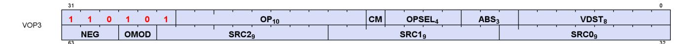

16.9. VOPC Instructions 388 of 697

# <span id="page-398-0"></span>**16.10. VOP3P Instructions**

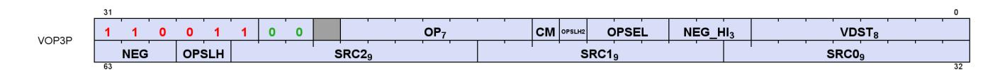

**V\_PK\_MAD\_I16 0**

Multiply two packed signed 16-bit integer inputs component-wise, add a packed signed 16-bit integer value from a third input component-wise, and store the result into a vector register.

```
declare tmp : 32'B;
tmp[15 : 0].i16 = S0[15 : 0].i16 * S1[15 : 0].i16 + S2[15 : 0].i16;
tmp[31 : 16].i16 = S0[31 : 16].i16 * S1[31 : 16].i16 + S2[31 : 16].i16;
D0.b32 = tmp
```

**V\_PK\_MUL\_LO\_U16 1**

Multiply two packed unsigned 16-bit integer inputs component-wise and store the low bits of each resulting component into a vector register.

```
tmp[31 : 16].u16 = S0[31 : 16].u16 * S1[31 : 16].u16;
tmp[15 : 0].u16 = S0[15 : 0].u16 * S1[15 : 0].u16;
D0.b32 = tmp.b32
```

**V\_PK\_ADD\_I16 2**

Add two packed signed 16-bit integer inputs component-wise and store the result into a vector register. No carry-in or carry-out support.

```
declare tmp : 32'B;
tmp[15 : 0].i16 = S0[15 : 0].i16 + S1[15 : 0].i16;
tmp[31 : 16].i16 = S0[31 : 16].i16 + S1[31 : 16].i16;
D0.b32 = tmp
```

**V\_PK\_SUB\_I16 3**

Subtract the second packed signed 16-bit integer input from the first input component-wise and store the result into a vector register. No carry-in or carry-out support.

16.10. VOP3P Instructions 389 of 697

```
declare tmp : 32'B;
tmp[15 : 0].i16 = S0[15 : 0].i16 - S1[15 : 0].i16;
tmp[31 : 16].i16 = S0[31 : 16].i16 - S1[31 : 16].i16;
D0.b32 = tmp
```

**V\_PK\_LSHLREV\_B16 4**

Given a packed shift count in the first vector input, calculate the component-wise logical shift left of the second packed vector input and store the result into a vector register.

```
tmp[31 : 16].u16 = (S1[31 : 16].u16 << S0.u32[19 : 16].u32);
tmp[15 : 0].u16 = (S1[15 : 0].u16 << S0.u32[3 : 0].u32);
D0.b32 = tmp.b32
```

**V\_PK\_LSHRREV\_B16 5**

Given a packed shift count in the first vector input, calculate the component-wise logical shift right of the second packed vector input and store the result into a vector register.

```
tmp[31 : 16].u16 = (S1[31 : 16].u16 >> S0.u32[19 : 16].u32);
tmp[15 : 0].u16 = (S1[15 : 0].u16 >> S0.u32[3 : 0].u32);
D0.b32 = tmp.b32
```

**V\_PK\_ASHRREV\_I16 6**

Given a packed shift count in the first vector input, calculate the component-wise arithmetic shift right (preserving sign bit) of the second packed vector input and store the result into a vector register.

```
tmp[31 : 16].i16 = (S1[31 : 16].i16 >> S0.u32[19 : 16].u32);
tmp[15 : 0].i16 = (S1[15 : 0].i16 >> S0.u32[3 : 0].u32);
D0.b32 = tmp.b32
```

**V\_PK\_MAX\_I16 7**

Select the component-wise maximum of two packed signed 16-bit integer inputs and store the selected values into a vector register.

```
declare tmp : 32'B;
tmp[15 : 0].i16 = S0[15 : 0].i16 >= S1[15 : 0].i16 ? S0[15 : 0].i16 : S1[15 : 0].i16;
```

16.10. VOP3P Instructions 390 of 697

```
tmp[31 : 16].i16 = S0[31 : 16].i16 >= S1[31 : 16].i16 ? S0[31 : 16].i16 : S1[31 : 16].i16;
D0.b32 = tmp
```

**V\_PK\_MIN\_I16 8**

Select the component-wise minimum of two packed signed 16-bit integer inputs and store the selected values into a vector register.

```
declare tmp : 32'B;
tmp[15 : 0].i16 = S0[15 : 0].i16 < S1[15 : 0].i16 ? S0[15 : 0].i16 : S1[15 : 0].i16;
tmp[31 : 16].i16 = S0[31 : 16].i16 < S1[31 : 16].i16 ? S0[31 : 16].i16 : S1[31 : 16].i16;
D0.b32 = tmp
```

**V\_PK\_MAD\_U16 9**

Multiply two packed unsigned 16-bit integer inputs component-wise, add a packed unsigned 16-bit integer value from a third input component-wise, and store the result into a vector register.

```
declare tmp : 32'B;
tmp[15 : 0].u16 = S0[15 : 0].u16 * S1[15 : 0].u16 + S2[15 : 0].u16;
tmp[31 : 16].u16 = S0[31 : 16].u16 * S1[31 : 16].u16 + S2[31 : 16].u16;
D0.b32 = tmp
```

**V\_PK\_ADD\_U16 10**

Add two packed unsigned 16-bit integer inputs component-wise and store the result into a vector register. No carry-in or carry-out support.

```
declare tmp : 32'B;
tmp[15 : 0].u16 = S0[15 : 0].u16 + S1[15 : 0].u16;
tmp[31 : 16].u16 = S0[31 : 16].u16 + S1[31 : 16].u16;
D0.b32 = tmp
```

**V\_PK\_SUB\_U16 11**

Subtract the second packed unsigned 16-bit integer input from the first input component-wise and store the result into a vector register. No carry-in or carry-out support.

```
declare tmp : 32'B;
tmp[15 : 0].u16 = S0[15 : 0].u16 - S1[15 : 0].u16;
```

16.10. VOP3P Instructions 391 of 697

```
tmp[31 : 16].u16 = S0[31 : 16].u16 - S1[31 : 16].u16;
D0.b32 = tmp
```

**V\_PK\_MAX\_U16 12**

Select the component-wise maximum of two packed unsigned 16-bit integer inputs and store the selected values into a vector register.

```
declare tmp : 32'B;
tmp[15 : 0].u16 = S0[15 : 0].u16 >= S1[15 : 0].u16 ? S0[15 : 0].u16 : S1[15 : 0].u16;
tmp[31 : 16].u16 = S0[31 : 16].u16 >= S1[31 : 16].u16 ? S0[31 : 16].u16 : S1[31 : 16].u16;
D0.b32 = tmp
```

**V\_PK\_MIN\_U16 13**

Select the component-wise minimum of two packed unsigned 16-bit integer inputs and store the selected values into a vector register.

```
declare tmp : 32'B;
tmp[15 : 0].u16 = S0[15 : 0].u16 < S1[15 : 0].u16 ? S0[15 : 0].u16 : S1[15 : 0].u16;
tmp[31 : 16].u16 = S0[31 : 16].u16 < S1[31 : 16].u16 ? S0[31 : 16].u16 : S1[31 : 16].u16;
D0.b32 = tmp
```

**V\_PK\_FMA\_F16 14**

Multiply two packed half-precision float inputs component-wise and add a third input component-wise using fused multiply add, and store the result into a vector register.

```
declare tmp : 32'B;
tmp[15 : 0].f16 = fma(S0[15 : 0].f16, S1[15 : 0].f16, S2[15 : 0].f16);
tmp[31 : 16].f16 = fma(S0[31 : 16].f16, S1[31 : 16].f16, S2[31 : 16].f16);
D0.b32 = tmp
```

**V\_PK\_ADD\_F16 15**

Add two packed half-precision float inputs component-wise and store the result into a vector register. No carryin or carry-out support.

```
declare tmp : 32'B;
tmp[15 : 0].f16 = S0[15 : 0].f16 + S1[15 : 0].f16;
```

16.10. VOP3P Instructions 392 of 697

```
tmp[31 : 16].f16 = S0[31 : 16].f16 + S1[31 : 16].f16;
D0.b32 = tmp
```

**V\_PK\_MUL\_F16 16**

Multiply two packed half-precision float inputs component-wise and store the result into a vector register.

```
declare tmp : 32'B;
tmp[15 : 0].f16 = S0[15 : 0].f16 * S1[15 : 0].f16;
tmp[31 : 16].f16 = S0[31 : 16].f16 * S1[31 : 16].f16;
D0.b32 = tmp
```

**V\_DOT2\_F32\_F16 19**

Compute the dot product of two packed 2-D half-precision float inputs in the single-precision float domain, add a single-precision float value from the third input and store the result into a vector register.

```
tmp = S2.f32;
tmp += f16_to_f32(S0[15 : 0].f16) * f16_to_f32(S1[15 : 0].f16);
tmp += f16_to_f32(S0[31 : 16].f16) * f16_to_f32(S1[31 : 16].f16);
D0.f32 = tmp
```

**V\_DOT4\_I32\_IU8 22**

Compute the dot product of two packed 4-D unsigned 8-bit integer inputs in the signed 32-bit integer domain, add a signed 32-bit integer value from the third input and store the result into a vector register.

The NEG modifier is used to specify whether each input is signed or unsigned: 0=unsigned input, 1=signed input.

```
declare A : 32'I[4];
declare B : 32'I[4];
// Figure out whether inputs are signed/unsigned.
for i in 0 : 3 do
  A8 = S0[i * 8 + 7 : i * 8];
  B8 = S1[i * 8 + 7 : i * 8];
  A[i] = NEG[0].u1 ? 32'I(signext(A8.i8)) : 32'I(32'U(A8.u8));
  B[i] = NEG[1].u1 ? 32'I(signext(B8.i8)) : 32'I(32'U(B8.u8))
endfor;
C = S2.i32;
// Signed multiplier/adder. Extend unsigned inputs with leading 0.
tmp = C.i32;
tmp += A[0] * B[0];
tmp += A[1] * B[1];
```

16.10. VOP3P Instructions 393 of 697

```
tmp += A[2] * B[2];
tmp += A[3] * B[3];
D0.i32 = tmp
```

This opcode does not depend on the inference or deep learning features being enabled.

**V\_DOT4\_U32\_U8 23**

Compute the dot product of two packed 4-D unsigned 8-bit integer inputs in the unsigned 32-bit integer domain, add an unsigned 32-bit integer value from the third input and store the result into a vector register.

```
tmp = S2.u32;
tmp += u8_to_u32(S0[7 : 0].u8) * u8_to_u32(S1[7 : 0].u8);
tmp += u8_to_u32(S0[15 : 8].u8) * u8_to_u32(S1[15 : 8].u8);
tmp += u8_to_u32(S0[23 : 16].u8) * u8_to_u32(S1[23 : 16].u8);
tmp += u8_to_u32(S0[31 : 24].u8) * u8_to_u32(S1[31 : 24].u8);
D0.u32 = tmp
```

#### **Notes**

This opcode does not depend on the inference or deep learning features being enabled.

**V\_DOT8\_I32\_IU4 24**

Compute the dot product of two packed 8-D unsigned 4-bit integer inputs in the signed 32-bit integer domain, add a signed 32-bit integer value from the third input and store the result into a vector register.

The NEG modifier is used to specify whether each input is signed or unsigned: 0=unsigned input, 1=signed input.

```
declare A : 32'I[8];
declare B : 32'I[8];
// Figure out whether inputs are signed/unsigned.
for i in 0 : 7 do
  A4 = S0[i * 4 + 3 : i * 4];
  B4 = S1[i * 4 + 3 : i * 4];
  A[i] = NEG[0].u1 ? 32'I(signext(A4.i4)) : 32'I(32'U(A4.u4));
  B[i] = NEG[1].u1 ? 32'I(signext(B4.i4)) : 32'I(32'U(B4.u4))
endfor;
C = S2.i32;
// Signed multiplier/adder. Extend unsigned inputs with leading 0.
tmp = C.i32;
tmp += A[0] * B[0];
tmp += A[1] * B[1];
tmp += A[2] * B[2];
tmp += A[3] * B[3];
```

16.10. VOP3P Instructions 394 of 697

```
tmp += A[4] * B[4];
tmp += A[5] * B[5];
tmp += A[6] * B[6];
tmp += A[7] * B[7];
D0.i32 = tmp
```

```
V_DOT8_U32_U4 25
```

Compute the dot product of two packed 8-D unsigned 4-bit integer inputs in the unsigned 32-bit integer domain, add an unsigned 32-bit integer value from the third input and store the result into a vector register.

```
tmp = S2.u32;
tmp += u4_to_u32(S0[3 : 0].u4) * u4_to_u32(S1[3 : 0].u4);
tmp += u4_to_u32(S0[7 : 4].u4) * u4_to_u32(S1[7 : 4].u4);
tmp += u4_to_u32(S0[11 : 8].u4) * u4_to_u32(S1[11 : 8].u4);
tmp += u4_to_u32(S0[15 : 12].u4) * u4_to_u32(S1[15 : 12].u4);
tmp += u4_to_u32(S0[19 : 16].u4) * u4_to_u32(S1[19 : 16].u4);
tmp += u4_to_u32(S0[23 : 20].u4) * u4_to_u32(S1[23 : 20].u4);
tmp += u4_to_u32(S0[27 : 24].u4) * u4_to_u32(S1[27 : 24].u4);
tmp += u4_to_u32(S0[31 : 28].u4) * u4_to_u32(S1[31 : 28].u4);
D0.u32 = tmp
```

```
V_DOT2_F32_BF16 26
```

Compute the dot product of two packed 2-D BF16 float inputs in the single-precision float domain, add a singleprecision float value from the third input and store the result into a vector register.

```
tmp = S2.f32;
tmp += bf16_to_f32(S0[15 : 0].bf16) * bf16_to_f32(S1[15 : 0].bf16);
tmp += bf16_to_f32(S0[31 : 16].bf16) * bf16_to_f32(S1[31 : 16].bf16);
D0.f32 = tmp
```

```
V_PK_MIN_NUM_F16 27
```

Select the component-wise IEEE minimumNumber() of two half-precision float inputs and store the result into a vector register.

A numeric argument is favoured over NaN when determining which argument to return.

```
declare tmp : 32'B;
tmp[15 : 0].f16 = v_min_num_f16(S0[15 : 0].f16, S1[15 : 0].f16);
tmp[31 : 16].f16 = v_min_num_f16(S0[31 : 16].f16, S1[31 : 16].f16);
D0.b32 = tmp
```

16.10. VOP3P Instructions 395 of 697

**V\_PK\_MAX\_NUM\_F16 28**

Select the component-wise IEEE maximumNumber() of two half-precision float inputs and store the result into a vector register.

A numeric argument is favoured over NaN when determining which argument to return.

```
declare tmp : 32'B;
tmp[15 : 0].f16 = v_max_num_f16(S0[15 : 0].f16, S1[15 : 0].f16);
tmp[31 : 16].f16 = v_max_num_f16(S0[31 : 16].f16, S1[31 : 16].f16);
D0.b32 = tmp
```

**V\_PK\_MINIMUM\_F16 29**

Select the component-wise IEEE minimum() of two half-precision float inputs and store the result into a vector register.

A signaling NaN in either argument is propagated to the result.

```
declare tmp : 32'B;
tmp[15 : 0].f16 = v_minimum_f16(S0[15 : 0].f16, S1[15 : 0].f16);
tmp[31 : 16].f16 = v_minimum_f16(S0[31 : 16].f16, S1[31 : 16].f16);
D0.b32 = tmp
```

**V\_PK\_MAXIMUM\_F16 30**

Select the component-wise IEEE maximum() of two half-precision float inputs and store the result into a vector register.

A signaling NaN in either argument is propagated to the result.

```
declare tmp : 32'B;
tmp[15 : 0].f16 = v_maximum_f16(S0[15 : 0].f16, S1[15 : 0].f16);
tmp[31 : 16].f16 = v_maximum_f16(S0[31 : 16].f16, S1[31 : 16].f16);
D0.b32 = tmp
```

**V\_FMA\_MIX\_F32 32**

Multiply two inputs and add a third input using fused multiply add where the inputs are a mix of half-precision float and single-precision float values. Store the result into a vector register.

16.10. VOP3P Instructions 396 of 697

Size and location of the three inputs are controlled by { OPSEL\_HI[i], OPSEL[i] }: 0=src[31:0], 1=src[31:0], 2=src[15:0], 3=src[31:16]. For MIX opcodes the NEG\_HI instruction field acts as an absolute-value modifier for the three inputs.

```
declare in : 32'F[3];
declare S : 32'B[3];
for i in 0 : 2 do
  if !OPSEL_HI.u3[i] then
  in[i] = S[i].f32
  elsif OPSEL.u3[i] then
  in[i] = f16_to_f32(S[i][31 : 16].f16)
  else
  in[i] = f16_to_f32(S[i][15 : 0].f16)
  endif
endfor;
D0[31 : 0].f32 = fma(in[0], in[1], in[2])
```

**V\_FMA\_MIXLO\_F16 33**

Multiply two inputs and add a third input using fused multiply add where the inputs are a mix of half-precision float and single-precision float values. Convert the result to a half-precision float. Store the result into the low bits of a vector register.

Size and location of the three inputs are controlled by { OPSEL\_HI[i], OPSEL[i] }: 0=src[31:0], 1=src[31:0], 2=src[15:0], 3=src[31:16]. For MIX opcodes the NEG\_HI instruction field acts as an absolute-value modifier for the three inputs.

```
declare in : 32'F[3];
declare S : 32'B[3];
for i in 0 : 2 do
  if !OPSEL_HI.u3[i] then
  in[i] = S[i].f32
  elsif OPSEL.u3[i] then
  in[i] = f16_to_f32(S[i][31 : 16].f16)
  else
  in[i] = f16_to_f32(S[i][15 : 0].f16)
  endif
endfor;
D0[15 : 0].f16 = f32_to_f16(fma(in[0], in[1], in[2]))
```

**V\_FMA\_MIXHI\_F16 34**

Multiply two inputs and add a third input using fused multiply add where the inputs are a mix of half-precision float and single-precision float values. Convert the result to a half-precision float. Store the result into the high bits of a vector register.

Size and location of the three inputs are controlled by { OPSEL\_HI[i], OPSEL[i] }: 0=src[31:0], 1=src[31:0], 2=src[15:0], 3=src[31:16]. For MIX opcodes the NEG\_HI instruction field acts as an absolute-value modifier

16.10. VOP3P Instructions 397 of 697

for the three inputs.

```
declare in : 32'F[3];
declare S : 32'B[3];
for i in 0 : 2 do
  if !OPSEL_HI.u3[i] then
  in[i] = S[i].f32
  elsif OPSEL.u3[i] then
  in[i] = f16_to_f32(S[i][31 : 16].f16)
  else
  in[i] = f16_to_f32(S[i][15 : 0].f16)
  endif
endfor;
D0[31 : 16].f16 = f32_to_f16(fma(in[0], in[1], in[2]))
```

**V\_DOT4\_F32\_FP8\_BF8 36**

Compute the dot product of a packed 4-D FP8 float input and a packed 4-D BF8 float input in the singleprecision float domain, add a single-precision float value from the third input and store the result into a vector register.

```
tmp = S2.f32;
tmp += 32'F(S0[7 : 0].fp8) * 32'F(S1[7 : 0].bf8);
tmp += 32'F(S0[15 : 8].fp8) * 32'F(S1[15 : 8].bf8);
tmp += 32'F(S0[23 : 16].fp8) * 32'F(S1[23 : 16].bf8);
tmp += 32'F(S0[31 : 24].fp8) * 32'F(S1[31 : 24].bf8);
D0.f32 = tmp
```

**Notes**

```
V_DOT4_F32_BF8_FP8 37
```

Compute the dot product of a packed 4-D BF8 float input and a packed 4-D FP8 float input in the singleprecision float domain, add a single-precision float value from the third input and store the result into a vector register.

```
tmp = S2.f32;
tmp += 32'F(S0[7 : 0].bf8) * 32'F(S1[7 : 0].fp8);
tmp += 32'F(S0[15 : 8].bf8) * 32'F(S1[15 : 8].fp8);
tmp += 32'F(S0[23 : 16].bf8) * 32'F(S1[23 : 16].fp8);
tmp += 32'F(S0[31 : 24].bf8) * 32'F(S1[31 : 24].fp8);
D0.f32 = tmp
```

#### **Notes**

16.10. VOP3P Instructions 398 of 697

**V\_DOT4\_F32\_FP8\_FP8 38**

Compute the dot product of two packed 4-D FP8 float inputs in the single-precision float domain, add a singleprecision float value from the third input and store the result into a vector register.

```
tmp = S2.f32;
tmp += 32'F(S0[7 : 0].fp8) * 32'F(S1[7 : 0].fp8);
tmp += 32'F(S0[15 : 8].fp8) * 32'F(S1[15 : 8].fp8);
tmp += 32'F(S0[23 : 16].fp8) * 32'F(S1[23 : 16].fp8);
tmp += 32'F(S0[31 : 24].fp8) * 32'F(S1[31 : 24].fp8);
D0.f32 = tmp
```

**Notes**

```
V_DOT4_F32_BF8_BF8 39
```

Compute the dot product of two packed 4-D BF8 float inputs in the single-precision float domain, add a singleprecision float value from the third input and store the result into a vector register.

```
tmp = S2.f32;
tmp += 32'F(S0[7 : 0].bf8) * 32'F(S1[7 : 0].bf8);
tmp += 32'F(S0[15 : 8].bf8) * 32'F(S1[15 : 8].bf8);
tmp += 32'F(S0[23 : 16].bf8) * 32'F(S1[23 : 16].bf8);
tmp += 32'F(S0[31 : 24].bf8) * 32'F(S1[31 : 24].bf8);
D0.f32 = tmp
```

**Notes**

```
V_WMMA_F32_16X16X16_F16 64
```

Multiply the 16x16 matrix in the first input by the 16x16 matrix in the second input and add the 16x16 matrix in the third input using fused multiply add. Store the resulting matrix into vector registers.

```
D = A (16x16) * B (16x16) + C (16x16)
```

Each operand contains a single matrix whose elements are distributed across all lanes of the wave. A single matrix multiply is computed and the row-column dot products are distributed across the vector ALU for higher performance.

Matrices A and B are half-precision float format. Matrices C and D are single-precision float format.

```
saved_exec = EXEC;
EXEC = 64'B(-1);
eval "D0.f32(16x16) = S0.f16(16x16) * S1.f16(16x16) + S2.f32(16x16)";
```

16.10. VOP3P Instructions 399 of 697

```
EXEC = saved_exec
```

#### **V\_WMMA\_F32\_16X16X16\_BF16 65**

Multiply the 16x16 matrix in the first input by the 16x16 matrix in the second input and add the 16x16 matrix in the third input using fused multiply add. Store the resulting matrix into vector registers.

```
D = A (16x16) * B (16x16) + C (16x16)
```

Each operand contains a single matrix whose elements are distributed across all lanes of the wave. A single matrix multiply is computed and the row-column dot products are distributed across the vector ALU for higher performance.

Matrices A and B are BF16 float format. Matrices C and D are single-precision float format.

```
saved_exec = EXEC;
EXEC = 64'B(-1);
eval "D0.f32(16x16) = S0.bf16(16x16) * S1.bf16(16x16) + S2.f32(16x16)";
EXEC = saved_exec
```

#### **V\_WMMA\_F16\_16X16X16\_F16 66**

Multiply the 16x16 matrix in the first input by the 16x16 matrix in the second input and add the 16x16 matrix in the third input using fused multiply add. Store the resulting matrix into vector registers.

```
D = A (16x16) * B (16x16) + C (16x16)
```

Each operand contains a single matrix whose elements are distributed across all lanes of the wave. A single matrix multiply is computed and the row-column dot products are distributed across the vector ALU for higher performance.

Matrices A and B are half-precision float format. Matrices C and D are half-precision float format.

```
saved_exec = EXEC;
EXEC = 64'B(-1);
eval "D0.f16(16x16) = S0.f16(16x16) * S1.f16(16x16) + S2.f16(16x16)";
EXEC = saved_exec
```

#### **V\_WMMA\_BF16\_16X16X16\_BF16 67**

Multiply the 16x16 matrix in the first input by the 16x16 matrix in the second input and add the 16x16 matrix in

16.10. VOP3P Instructions 400 of 697

the third input using fused multiply add. Store the resulting matrix into vector registers.

```
D = A (16x16) * B (16x16) + C (16x16)
```

Each operand contains a single matrix whose elements are distributed across all lanes of the wave. A single matrix multiply is computed and the row-column dot products are distributed across the vector ALU for higher performance.

Matrices A and B are BF16 float format. Matrices C and D are BF16 float format.

```
saved_exec = EXEC;
EXEC = 64'B(-1);
eval "D0.bf16(16x16) = S0.bf16(16x16) * S1.bf16(16x16) + S2.bf16(16x16)";
EXEC = saved_exec
```

#### **V\_WMMA\_I32\_16X16X16\_IU8 68**

Multiply the 16x16 matrix in the first input by the 16x16 matrix in the second input and add the 16x16 matrix in the third input using fused multiply add. Store the resulting matrix into vector registers.

```
D = A (16x16) * B (16x16) + C (16x16)
```

Each operand contains a single matrix whose elements are distributed across all lanes of the wave. A single matrix multiply is computed and the row-column dot products are distributed across the vector ALU for higher performance.

Matrices A and B are unsigned 8-bit integer format. Matrices C and D are signed 32-bit integer format.

```
saved_exec = EXEC;
EXEC = 64'B(-1);
eval "D0.i32(16x16) = S0.iu8(16x16) * S1.iu8(16x16) + S2.i32(16x16)";
EXEC = saved_exec
```

#### **V\_WMMA\_I32\_16X16X16\_IU4 69**

Multiply the 16x16 matrix in the first input by the 16x16 matrix in the second input and add the 16x16 matrix in the third input using fused multiply add. Store the resulting matrix into vector registers.

```
D = A (16x16) * B (16x16) + C (16x16)
```

Each operand contains a single matrix whose elements are distributed across all lanes of the wave. A single matrix multiply is computed and the row-column dot products are distributed across the vector ALU for higher

16.10. VOP3P Instructions 401 of 697

performance.

Matrices A and B are unsigned 4-bit integer format. Matrices C and D are signed 32-bit integer format.

```
saved_exec = EXEC;
EXEC = 64'B(-1);
eval "D0.i32(16x16) = S0.iu4(16x16) * S1.iu4(16x16) + S2.i32(16x16)";
EXEC = saved_exec
```

#### **V\_WMMA\_F32\_16X16X16\_FP8\_FP8 70**

Multiply the 16x16 matrix in the first input by the 16x16 matrix in the second input and add the 16x16 matrix in the third input using fused multiply add. Store the resulting matrix into vector registers.

```
D = A (16x16) * B (16x16) + C (16x16)
```

Each operand contains a single matrix whose elements are distributed across all lanes of the wave. A single matrix multiply is computed and the row-column dot products are distributed across the vector ALU for higher performance.

Matrices A and B are FP8 float format. Matrices C and D are single-precision float format.

```
saved_exec = EXEC;
EXEC = 64'B(-1);
eval "D0.f32(16x16) = S0.fp8(16x16) * S1.fp8(16x16) + S2.f32(16x16)";
EXEC = saved_exec
```

## **V\_WMMA\_F32\_16X16X16\_FP8\_BF8 71**

Multiply the 16x16 matrix in the first input by the 16x16 matrix in the second input and add the 16x16 matrix in the third input using fused multiply add. Store the resulting matrix into vector registers.

```
D = A (16x16) * B (16x16) + C (16x16)
```

Each operand contains a single matrix whose elements are distributed across all lanes of the wave. A single matrix multiply is computed and the row-column dot products are distributed across the vector ALU for higher performance.

Matrix A is FP8 float format. Matrix B is BF8 float format. Matrices C and D are single-precision float format.

```
saved_exec = EXEC;
EXEC = 64'B(-1);
eval "D0.f32(16x16) = S0.fp8(16x16) * S1.bf8(16x16) + S2.f32(16x16)";
```

16.10. VOP3P Instructions 402 of 697

```
EXEC = saved_exec
```

#### **V\_WMMA\_F32\_16X16X16\_BF8\_FP8 72**

Multiply the 16x16 matrix in the first input by the 16x16 matrix in the second input and add the 16x16 matrix in the third input using fused multiply add. Store the resulting matrix into vector registers.

```
D = A (16x16) * B (16x16) + C (16x16)
```

Each operand contains a single matrix whose elements are distributed across all lanes of the wave. A single matrix multiply is computed and the row-column dot products are distributed across the vector ALU for higher performance.

Matrix A is BF8 float format. Matrix B is FP8 float format. Matrices C and D are single-precision float format.

```
saved_exec = EXEC;
EXEC = 64'B(-1);
eval "D0.f32(16x16) = S0.bf8(16x16) * S1.fp8(16x16) + S2.f32(16x16)";
EXEC = saved_exec
```

#### **V\_WMMA\_F32\_16X16X16\_BF8\_BF8 73**

Multiply the 16x16 matrix in the first input by the 16x16 matrix in the second input and add the 16x16 matrix in the third input using fused multiply add. Store the resulting matrix into vector registers.

```
D = A (16x16) * B (16x16) + C (16x16)
```

Each operand contains a single matrix whose elements are distributed across all lanes of the wave. A single matrix multiply is computed and the row-column dot products are distributed across the vector ALU for higher performance.

Matrices A and B are BF8 float format. Matrices C and D are single-precision float format.

```
saved_exec = EXEC;
EXEC = 64'B(-1);
eval "D0.f32(16x16) = S0.bf8(16x16) * S1.bf8(16x16) + S2.f32(16x16)";
EXEC = saved_exec
```

#### **V\_WMMA\_I32\_16X16X32\_IU4 74**

Multiply the 16x32 matrix in the first input by the 32x16 matrix in the second input and add the 16x16 matrix in

16.10. VOP3P Instructions 403 of 697

the third input using fused multiply add. Store the resulting matrix into vector registers.

```
D = A (16x32) * B (32x16) + C (16x16)
```

Each operand contains a single matrix whose elements are distributed across all lanes of the wave. A single matrix multiply is computed and the row-column dot products are distributed across the vector ALU for higher performance.

Matrices A and B are unsigned 4-bit integer format. Matrices C and D are signed 32-bit integer format.

```
saved_exec = EXEC;
EXEC = 64'B(-1);
eval "D0.i32(16x16) = S0.iu4(16x32) * S1.iu4(32x16) + S2.i32(16x16)";
EXEC = saved_exec
```

#### **V\_SWMMAC\_F32\_16X16X32\_F16 80**

Multiply the 16x32 matrix in the first input by the 32x16 matrix in the second input and accumulate the result into the 16x16 matrix in the destination registers using fused multiply add. Sparse indexes for the first matrix are given in the third input.

```
D = A (sparse 16x32) * B (32x16) + D (16x16)
```

Each operand contains a single matrix whose elements are distributed across all lanes of the wave. A single matrix multiply is computed and the row-column dot products are distributed across the vector ALU for higher performance.

Matrix A is a sparse matrix in half-precision float format, consuming half the physical storage of a dense matrix with same dimensions. Matrix B is a dense matrix in half-precision float format. Matrix D is singleprecision float format and is both the output and the accumulate input.

2 out of every 4 elements on the K axis of matrix A are zero. The sparse indexes are used to determine which 2 elements are zero.

```
saved_exec = EXEC;
EXEC = 64'B(-1);
eval "D0.f32(16x16) = S0.f16(16x16) * S1.f16(32x16, index set from S2) + D0.f32(16x16)";
EXEC = saved_exec
```

#### **V\_SWMMAC\_F32\_16X16X32\_BF16 81**

Multiply the 16x32 matrix in the first input by the 32x16 matrix in the second input and accumulate the result into the 16x16 matrix in the destination registers using fused multiply add. Sparse indexes for the first matrix

16.10. VOP3P Instructions 404 of 697

are given in the third input.

```
D = A (sparse 16x32) * B (32x16) + D (16x16)
```

Each operand contains a single matrix whose elements are distributed across all lanes of the wave. A single matrix multiply is computed and the row-column dot products are distributed across the vector ALU for higher performance.

Matrix A is a sparse matrix in BF16 float format, consuming half the physical storage of a dense matrix with same dimensions. Matrix B is a dense matrix in BF16 float format. Matrix D is single-precision float format and is both the output and the accumulate input.

2 out of every 4 elements on the K axis of matrix A are zero. The sparse indexes are used to determine which 2 elements are zero.

```
saved_exec = EXEC;
EXEC = 64'B(-1);
eval "D0.f32(16x16) = S0.bf16(16x16) * S1.bf16(32x16, index set from S2) + D0.f32(16x16)";
EXEC = saved_exec
```

## **V\_SWMMAC\_F16\_16X16X32\_F16 82**

Multiply the 16x32 matrix in the first input by the 32x16 matrix in the second input and accumulate the result into the 16x16 matrix in the destination registers using fused multiply add. Sparse indexes for the first matrix are given in the third input.

```
D = A (sparse 16x32) * B (32x16) + D (16x16)
```

Each operand contains a single matrix whose elements are distributed across all lanes of the wave. A single matrix multiply is computed and the row-column dot products are distributed across the vector ALU for higher performance.

Matrix A is a sparse matrix in half-precision float format, consuming half the physical storage of a dense matrix with same dimensions. Matrix B is a dense matrix in half-precision float format. Matrix D is halfprecision float format and is both the output and the accumulate input.

2 out of every 4 elements on the K axis of matrix A are zero. The sparse indexes are used to determine which 2 elements are zero.

```
saved_exec = EXEC;
EXEC = 64'B(-1);
eval "D0.f16(16x16) = S0.f16(16x16) * S1.f16(32x16, index set from S2) + D0.f16(16x16)";
EXEC = saved_exec
```

16.10. VOP3P Instructions 405 of 697

#### **V\_SWMMAC\_BF16\_16X16X32\_BF16 83**

Multiply the 16x32 matrix in the first input by the 32x16 matrix in the second input and accumulate the result into the 16x16 matrix in the destination registers using fused multiply add. Sparse indexes for the first matrix are given in the third input.

```
D = A (sparse 16x32) * B (32x16) + D (16x16)
```

Each operand contains a single matrix whose elements are distributed across all lanes of the wave. A single matrix multiply is computed and the row-column dot products are distributed across the vector ALU for higher performance.

Matrix A is a sparse matrix in BF16 float format, consuming half the physical storage of a dense matrix with same dimensions. Matrix B is a dense matrix in BF16 float format. Matrix D is BF16 float format and is both the output and the accumulate input.

2 out of every 4 elements on the K axis of matrix A are zero. The sparse indexes are used to determine which 2 elements are zero.

```
saved_exec = EXEC;
EXEC = 64'B(-1);
eval "D0.bf16(16x16) = S0.bf16(16x16) * S1.bf16(32x16, index set from S2) + D0.bf16(16x16)";
EXEC = saved_exec
```

#### **V\_SWMMAC\_I32\_16X16X32\_IU8 84**

Multiply the 16x32 matrix in the first input by the 32x16 matrix in the second input and accumulate the result into the 16x16 matrix in the destination registers using fused multiply add. Sparse indexes for the first matrix are given in the third input.

```
D = A (sparse 16x32) * B (32x16) + D (16x16)
```

Each operand contains a single matrix whose elements are distributed across all lanes of the wave. A single matrix multiply is computed and the row-column dot products are distributed across the vector ALU for higher performance.

Matrix A is a sparse matrix in unsigned 8-bit integer format, consuming half the physical storage of a dense matrix with same dimensions. Matrix B is a dense matrix in unsigned 8-bit integer format. Matrix D is signed 32-bit integer format and is both the output and the accumulate input.

2 out of every 4 elements on the K axis of matrix A are zero. The sparse indexes are used to determine which 2 elements are zero.

```
saved_exec = EXEC;
EXEC = 64'B(-1);
eval "D0.i32(16x16) = S0.iu8(16x16) * S1.iu8(32x16, index set from S2) + D0.i32(16x16)";
```

16.10. VOP3P Instructions 406 of 697

```
EXEC = saved_exec
```

#### **V\_SWMMAC\_I32\_16X16X32\_IU4 85**

Multiply the 16x32 matrix in the first input by the 32x16 matrix in the second input and accumulate the result into the 16x16 matrix in the destination registers using fused multiply add. Sparse indexes for the first matrix are given in the third input.

```
D = A (sparse 16x32) * B (32x16) + D (16x16)
```

Each operand contains a single matrix whose elements are distributed across all lanes of the wave. A single matrix multiply is computed and the row-column dot products are distributed across the vector ALU for higher performance.

Matrix A is a sparse matrix in unsigned 4-bit integer format, consuming half the physical storage of a dense matrix with same dimensions. Matrix B is a dense matrix in unsigned 4-bit integer format. Matrix D is signed 32-bit integer format and is both the output and the accumulate input.

2 out of every 4 elements on the K axis of matrix A are zero. The sparse indexes are used to determine which 2 elements are zero.

```
saved_exec = EXEC;
EXEC = 64'B(-1);
eval "D0.i32(16x16) = S0.iu4(16x16) * S1.iu4(32x16, index set from S2) + D0.i32(16x16)";
EXEC = saved_exec
```

#### **V\_SWMMAC\_I32\_16X16X64\_IU4 86**

Multiply the 16x64 matrix in the first input by the 64x16 matrix in the second input and accumulate the result into the 16x16 matrix in the destination registers using fused multiply add. Sparse indexes for the first matrix are given in the third input.

```
D = A (sparse 16x64) * B (64x16) + D (16x16)
```

Each operand contains a single matrix whose elements are distributed across all lanes of the wave. A single matrix multiply is computed and the row-column dot products are distributed across the vector ALU for higher performance.

Matrix A is a sparse matrix in unsigned 4-bit integer format, consuming half the physical storage of a dense matrix with same dimensions. Matrix B is a dense matrix in unsigned 4-bit integer format. Matrix D is signed 32-bit integer format and is both the output and the accumulate input.

2 out of every 4 elements on the K axis of matrix A are zero. The sparse indexes are used to determine which 2

16.10. VOP3P Instructions 407 of 697

elements are zero.

```
saved_exec = EXEC;
EXEC = 64'B(-1);
eval "D0.i32(16x16) = S0.iu4(16x32) * S1.iu4(64x16, index set from S2) + D0.i32(16x16)";
EXEC = saved_exec
```

#### **V\_SWMMAC\_F32\_16X16X32\_FP8\_FP8 87**

Multiply the 16x32 matrix in the first input by the 32x16 matrix in the second input and accumulate the result into the 16x16 matrix in the destination registers using fused multiply add. Sparse indexes for the first matrix are given in the third input.

```
D = A (sparse 16x32) * B (32x16) + D (16x16)
```

Each operand contains a single matrix whose elements are distributed across all lanes of the wave. A single matrix multiply is computed and the row-column dot products are distributed across the vector ALU for higher performance.

Matrix A is a sparse matrix in FP8 float format, consuming half the physical storage of a dense matrix with same dimensions. Matrix B is a dense matrix in FP8 float format. Matrix D is single-precision float format and is both the output and the accumulate input.

2 out of every 4 elements on the K axis of matrix A are zero. The sparse indexes are used to determine which 2 elements are zero.

```
saved_exec = EXEC;
EXEC = 64'B(-1);
eval "D0.f32(16x16) = S0.fp8(16x16) * S1.fp8(32x16, index set from S2) + D0.f32(16x16)";
EXEC = saved_exec
```

## **V\_SWMMAC\_F32\_16X16X32\_FP8\_BF8 88**

Multiply the 16x32 matrix in the first input by the 32x16 matrix in the second input and accumulate the result into the 16x16 matrix in the destination registers using fused multiply add. Sparse indexes for the first matrix are given in the third input.

```
D = A (sparse 16x32) * B (32x16) + D (16x16)
```

Each operand contains a single matrix whose elements are distributed across all lanes of the wave. A single matrix multiply is computed and the row-column dot products are distributed across the vector ALU for higher performance.

16.10. VOP3P Instructions 408 of 697

Matrix A is a sparse matrix in FP8 float format, consuming half the physical storage of a dense matrix with same dimensions. Matrix B is a dense matrix in BF8 float format. Matrix D is single-precision float format and is both the output and the accumulate input.

2 out of every 4 elements on the K axis of matrix A are zero. The sparse indexes are used to determine which 2 elements are zero.

```
saved_exec = EXEC;
EXEC = 64'B(-1);
eval "D0.f32(16x16) = S0.fp8(16x16) * S1.bf8(32x16, index set from S2) + D0.f32(16x16)";
EXEC = saved_exec
```

#### **V\_SWMMAC\_F32\_16X16X32\_BF8\_FP8 89**

Multiply the 16x32 matrix in the first input by the 32x16 matrix in the second input and accumulate the result into the 16x16 matrix in the destination registers using fused multiply add. Sparse indexes for the first matrix are given in the third input.

```
D = A (sparse 16x32) * B (32x16) + D (16x16)
```

Each operand contains a single matrix whose elements are distributed across all lanes of the wave. A single matrix multiply is computed and the row-column dot products are distributed across the vector ALU for higher performance.

Matrix A is a sparse matrix in BF8 float format, consuming half the physical storage of a dense matrix with same dimensions. Matrix B is a dense matrix in FP8 float format. Matrix D is single-precision float format and is both the output and the accumulate input.

2 out of every 4 elements on the K axis of matrix A are zero. The sparse indexes are used to determine which 2 elements are zero.

```
saved_exec = EXEC;
EXEC = 64'B(-1);
eval "D0.f32(16x16) = S0.bf8(16x16) * S1.fp8(32x16, index set from S2) + D0.f32(16x16)";
EXEC = saved_exec
```

#### **V\_SWMMAC\_F32\_16X16X32\_BF8\_BF8 90**

Multiply the 16x32 matrix in the first input by the 32x16 matrix in the second input and accumulate the result into the 16x16 matrix in the destination registers using fused multiply add. Sparse indexes for the first matrix are given in the third input.

```
D = A (sparse 16x32) * B (32x16) + D (16x16)
```

16.10. VOP3P Instructions 409 of 697

Each operand contains a single matrix whose elements are distributed across all lanes of the wave. A single matrix multiply is computed and the row-column dot products are distributed across the vector ALU for higher performance.

Matrix A is a sparse matrix in BF8 float format, consuming half the physical storage of a dense matrix with same dimensions. Matrix B is a dense matrix in BF8 float format. Matrix D is single-precision float format and is both the output and the accumulate input.

2 out of every 4 elements on the K axis of matrix A are zero. The sparse indexes are used to determine which 2 elements are zero.

```
saved_exec = EXEC;
EXEC = 64'B(-1);
eval "D0.f32(16x16) = S0.bf8(16x16) * S1.bf8(32x16, index set from S2) + D0.f32(16x16)";
EXEC = saved_exec
```

16.10. VOP3P Instructions 410 of 697

# <span id="page-420-0"></span>**16.11. VOPD Instructions**

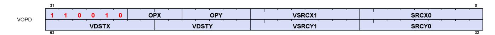

The VOPD encoded describes two VALU opcodes that are executed in parallel.

For instruction definitions, refer to the VOP1, VOP2 and VOP3 sections.

# <span id="page-420-1"></span>**16.11.1. VOPD X-Instructions**

**V\_DUAL\_FMAC\_F32 0**

Multiply two floating point inputs and accumulate the result into the destination register using fused multiply add.

```
D0.f32 = fma(S0.f32, S1.f32, D0.f32)
```

**V\_DUAL\_FMAAK\_F32 1**

Multiply two single-precision float inputs and add a literal constant using fused multiply add, and store the result into a vector register.

```
D0.f32 = fma(S0.f32, S1.f32, SIMM32.f32)
```

## **Notes**

This opcode cannot use the VOP3 encoding and cannot use input/output modifiers.

**V\_DUAL\_FMAMK\_F32 2**

Multiply a single-precision float input with a literal constant and add a second single-precision float input using fused multiply add, and store the result into a vector register.

```
D0.f32 = fma(S0.f32, SIMM32.f32, S1.f32)
```

## **Notes**

This opcode cannot use the VOP3 encoding and cannot use input/output modifiers.

16.11. VOPD Instructions 411 of 697

**V\_DUAL\_MUL\_F32 3**

Multiply two floating point inputs and store the result into a vector register.

```
D0.f32 = S0.f32 * S1.f32
```

#### **Notes**

0.5ULP precision, denormals are supported.

**V\_DUAL\_ADD\_F32 4**

Add two floating point inputs and store the result into a vector register.

```
D0.f32 = S0.f32 + S1.f32
```

# **Notes**

0.5ULP precision, denormals are supported.

**V\_DUAL\_SUB\_F32 5**

Subtract the second floating point input from the first input and store the result into a vector register.

```
D0.f32 = S0.f32 - S1.f32
```

# **Notes**

0.5ULP precision, denormals are supported.

**V\_DUAL\_SUBREV\_F32 6**

Subtract the first floating point input from the second input and store the result into a vector register.

```
D0.f32 = S1.f32 - S0.f32
```

## **Notes**

0.5ULP precision, denormals are supported.

16.11. VOPD Instructions 412 of 697

## **V\_DUAL\_MUL\_DX9\_ZERO\_F32 7**

Multiply two floating point inputs and store the result into a vector register. Follows DX9 rules where 0.0 times anything produces 0.0 (this differs from other APIs when the other input is infinity or NaN).

```
if ((64'F(S0.f32) == 0.0) || (64'F(S1.f32) == 0.0)) then
  // DX9 rules, 0.0 * x = 0.0
  D0.f32 = 0.0F
else
  D0.f32 = S0.f32 * S1.f32
endif
```

**V\_DUAL\_MOV\_B32 8**

Move 32-bit data from a vector input into a vector register.

```
D0.b32 = S0.b32
```

### **Notes**

Floating-point modifiers are valid for this instruction if S0 is a 32-bit floating point value. This instruction is suitable for negating or taking the absolute value of a floating-point value.

Functional examples:

```
  v_mov_b32 v0, v1 // Move into v0 from v1
  v_mov_b32 v0, -v1 // Set v0 to the negation of v1
  v_mov_b32 v0, abs(v1) // Set v0 to the absolute value of v1
```

#### **V\_DUAL\_CNDMASK\_B32 9**

Copy data from one of two inputs based on the per-lane condition code and store the result into a vector register.

```
D0.u32 = VCC.u64[laneId] ? S1.u32 : S0.u32
```

# **Notes**

In VOP3 the VCC source may be a scalar GPR specified in S2.

Floating-point modifiers are valid for this instruction if S0 and S1 are 32-bit floating point values. This instruction is suitable for negating or taking the absolute value of a floating-point value.

16.11. VOPD Instructions 413 of 697

### **V\_DUAL\_MAX\_NUM\_F32 10**

Select the IEEE maximumNumber() of two single-precision float inputs and store the result into a vector register.

A numeric argument is favoured over NaN when determining which argument to return.

```
if (isSignalNAN(64'F(S0.f32)) || isSignalNAN(64'F(S1.f32))) then
  TRAPSTS.INVALID = 1
endif;
if (isNAN(64'F(S0.f32)) && isNAN(64'F(S1.f32))) then
  D0.f32 = 32'F(cvtToQuietNAN(64'F(S0.f32)))
elsif isNAN(64'F(S0.f32)) then
  D0.f32 = S1.f32
elsif isNAN(64'F(S1.f32)) then
  D0.f32 = S0.f32
elsif ((S0.f32 > S1.f32) || ((abs(S0.f32) == 0.0F) && (abs(S1.f32) == 0.0F) && !sign(S0.f32) &&
sign(S1.f32))) then
  // NOTE: +0>-0 is TRUE in this comparison
  D0.f32 = S0.f32
else
  D0.f32 = S1.f32
endif
```

## **Notes**

IEEE compliant. Supports denormals, round mode, exception flags, saturation.

Denorm flushing for this operation is effectively controlled by the input denorm mode control: If input denorm mode is disabling denorm, the internal result of a min/max operation cannot be a denorm value, so output denorm mode is irrelevant. If input denorm mode is enabling denorm, the internal min/max result can be a denorm and this operation outputs as a denorm regardless of output denorm mode.

```
V_DUAL_MIN_NUM_F32 11
```

Select the IEEE minimumNumber() of two single-precision float inputs and store the result into a vector register.

A numeric argument is favoured over NaN when determining which argument to return.

```
if (isSignalNAN(64'F(S0.f32)) || isSignalNAN(64'F(S1.f32))) then
  TRAPSTS.INVALID = 1
endif;
if (isNAN(64'F(S0.f32)) && isNAN(64'F(S1.f32))) then
  D0.f32 = 32'F(cvtToQuietNAN(64'F(S0.f32)))
elsif isNAN(64'F(S0.f32)) then
  D0.f32 = S1.f32
elsif isNAN(64'F(S1.f32)) then
  D0.f32 = S0.f32
```

16.11. VOPD Instructions 414 of 697

```
elsif ((S0.f32 < S1.f32) || ((abs(S0.f32) == 0.0F) && (abs(S1.f32) == 0.0F) && sign(S0.f32) &&
!sign(S1.f32))) then
  // NOTE: -0<+0 is TRUE in this comparison
  D0.f32 = S0.f32
else
  D0.f32 = S1.f32
endif
```

IEEE compliant. Supports denormals, round mode, exception flags, saturation.

Denorm flushing for this operation is effectively controlled by the input denorm mode control: If input denorm mode is disabling denorm, the internal result of a min/max operation cannot be a denorm value, so output denorm mode is irrelevant. If input denorm mode is enabling denorm, the internal min/max result can be a denorm and this operation outputs as a denorm regardless of output denorm mode.

#### **V\_DUAL\_DOT2ACC\_F32\_F16 12**

Compute the dot product of two packed 2-D half-precision float inputs in the single-precision float domain and accumulate the resulting single-precision float value into the destination vector register. The initial value in D is used as S2.

```
tmp = D0.f32;
tmp += f16_to_f32(S0[15 : 0].f16) * f16_to_f32(S1[15 : 0].f16);
tmp += f16_to_f32(S0[31 : 16].f16) * f16_to_f32(S1[31 : 16].f16);
D0.f32 = tmp
```

#### **V\_DUAL\_DOT2ACC\_F32\_BF16 13**

Dot product of packed brain-float values, accumulate with destination. The initial value in D is used as S2.

```
tmp = D0.f32;
tmp += bf16_to_f32(S0[15 : 0].bf16) * bf16_to_f32(S1[15 : 0].bf16);
tmp += bf16_to_f32(S0[31 : 16].bf16) * bf16_to_f32(S1[31 : 16].bf16);
D0.f32 = tmp
```

# <span id="page-424-0"></span>**16.11.2. VOPD Y-Instructions**

**V\_DUAL\_FMAC\_F32 0**

Multiply two floating point inputs and accumulate the result into the destination register using fused multiply add.

16.11. VOPD Instructions 415 of 697

```
D0.f32 = fma(S0.f32, S1.f32, D0.f32)
```

# **V\_DUAL\_FMAAK\_F32 1**

Multiply two single-precision float inputs and add a literal constant using fused multiply add, and store the result into a vector register.

```
D0.f32 = fma(S0.f32, S1.f32, SIMM32.f32)
```

#### **Notes**

This opcode cannot use the VOP3 encoding and cannot use input/output modifiers.

# **V\_DUAL\_FMAMK\_F32 2**

Multiply a single-precision float input with a literal constant and add a second single-precision float input using fused multiply add, and store the result into a vector register.

```
D0.f32 = fma(S0.f32, SIMM32.f32, S1.f32)
```

#### **Notes**

This opcode cannot use the VOP3 encoding and cannot use input/output modifiers.

#### **V\_DUAL\_MUL\_F32 3**

Multiply two floating point inputs and store the result into a vector register.

```
D0.f32 = S0.f32 * S1.f32
```

## **Notes**

0.5ULP precision, denormals are supported.

#### **V\_DUAL\_ADD\_F32 4**

Add two floating point inputs and store the result into a vector register.

16.11. VOPD Instructions 416 of 697

```
D0.f32 = S0.f32 + S1.f32
```

0.5ULP precision, denormals are supported.

**V\_DUAL\_SUB\_F32 5**

Subtract the second floating point input from the first input and store the result into a vector register.

```
D0.f32 = S0.f32 - S1.f32
```

#### **Notes**

0.5ULP precision, denormals are supported.

**V\_DUAL\_SUBREV\_F32 6**

Subtract the first floating point input from the second input and store the result into a vector register.

```
D0.f32 = S1.f32 - S0.f32
```

#### **Notes**

0.5ULP precision, denormals are supported.

## **V\_DUAL\_MUL\_DX9\_ZERO\_F32 7**

Multiply two floating point inputs and store the result into a vector register. Follows DX9 rules where 0.0 times anything produces 0.0 (this differs from other APIs when the other input is infinity or NaN).

```
if ((64'F(S0.f32) == 0.0) || (64'F(S1.f32) == 0.0)) then
  // DX9 rules, 0.0 * x = 0.0
  D0.f32 = 0.0F
else
  D0.f32 = S0.f32 * S1.f32
endif
```

**V\_DUAL\_MOV\_B32 8**

16.11. VOPD Instructions 417 of 697

Move 32-bit data from a vector input into a vector register.

```
D0.b32 = S0.b32
```

#### **Notes**

Floating-point modifiers are valid for this instruction if S0 is a 32-bit floating point value. This instruction is suitable for negating or taking the absolute value of a floating-point value.

Functional examples:

```
  v_mov_b32 v0, v1 // Move into v0 from v1
  v_mov_b32 v0, -v1 // Set v0 to the negation of v1
  v_mov_b32 v0, abs(v1) // Set v0 to the absolute value of v1
```

#### **V\_DUAL\_CNDMASK\_B32 9**

Copy data from one of two inputs based on the per-lane condition code and store the result into a vector register.

```
D0.u32 = VCC.u64[laneId] ? S1.u32 : S0.u32
```

# **Notes**

In VOP3 the VCC source may be a scalar GPR specified in S2.

Floating-point modifiers are valid for this instruction if S0 and S1 are 32-bit floating point values. This instruction is suitable for negating or taking the absolute value of a floating-point value.

#### **V\_DUAL\_MAX\_NUM\_F32 10**

Select the IEEE maximumNumber() of two single-precision float inputs and store the result into a vector register.

A numeric argument is favoured over NaN when determining which argument to return.

```
if (isSignalNAN(64'F(S0.f32)) || isSignalNAN(64'F(S1.f32))) then
  TRAPSTS.INVALID = 1
endif;
if (isNAN(64'F(S0.f32)) && isNAN(64'F(S1.f32))) then
  D0.f32 = 32'F(cvtToQuietNAN(64'F(S0.f32)))
elsif isNAN(64'F(S0.f32)) then
  D0.f32 = S1.f32
elsif isNAN(64'F(S1.f32)) then
  D0.f32 = S0.f32
```

16.11. VOPD Instructions 418 of 697

```
elsif ((S0.f32 > S1.f32) || ((abs(S0.f32) == 0.0F) && (abs(S1.f32) == 0.0F) && !sign(S0.f32) &&
sign(S1.f32))) then
  // NOTE: +0>-0 is TRUE in this comparison
  D0.f32 = S0.f32
else
  D0.f32 = S1.f32
endif
```

IEEE compliant. Supports denormals, round mode, exception flags, saturation.

Denorm flushing for this operation is effectively controlled by the input denorm mode control: If input denorm mode is disabling denorm, the internal result of a min/max operation cannot be a denorm value, so output denorm mode is irrelevant. If input denorm mode is enabling denorm, the internal min/max result can be a denorm and this operation outputs as a denorm regardless of output denorm mode.

**V\_DUAL\_MIN\_NUM\_F32 11**

Select the IEEE minimumNumber() of two single-precision float inputs and store the result into a vector register.

A numeric argument is favoured over NaN when determining which argument to return.

```
if (isSignalNAN(64'F(S0.f32)) || isSignalNAN(64'F(S1.f32))) then
  TRAPSTS.INVALID = 1
endif;
if (isNAN(64'F(S0.f32)) && isNAN(64'F(S1.f32))) then
  D0.f32 = 32'F(cvtToQuietNAN(64'F(S0.f32)))
elsif isNAN(64'F(S0.f32)) then
  D0.f32 = S1.f32
elsif isNAN(64'F(S1.f32)) then
  D0.f32 = S0.f32
elsif ((S0.f32 < S1.f32) || ((abs(S0.f32) == 0.0F) && (abs(S1.f32) == 0.0F) && sign(S0.f32) &&
!sign(S1.f32))) then
  // NOTE: -0<+0 is TRUE in this comparison
  D0.f32 = S0.f32
else
  D0.f32 = S1.f32
endif
```

# **Notes**

IEEE compliant. Supports denormals, round mode, exception flags, saturation.

Denorm flushing for this operation is effectively controlled by the input denorm mode control: If input denorm mode is disabling denorm, the internal result of a min/max operation cannot be a denorm value, so output denorm mode is irrelevant. If input denorm mode is enabling denorm, the internal min/max result can be a denorm and this operation outputs as a denorm regardless of output denorm mode.

16.11. VOPD Instructions 419 of 697

#### **V\_DUAL\_DOT2ACC\_F32\_F16 12**

Compute the dot product of two packed 2-D half-precision float inputs in the single-precision float domain and accumulate the resulting single-precision float value into the destination vector register. The initial value in D is used as S2.

```
tmp = D0.f32;
tmp += f16_to_f32(S0[15 : 0].f16) * f16_to_f32(S1[15 : 0].f16);
tmp += f16_to_f32(S0[31 : 16].f16) * f16_to_f32(S1[31 : 16].f16);
D0.f32 = tmp
```

#### **V\_DUAL\_DOT2ACC\_F32\_BF16 13**

Dot product of packed brain-float values, accumulate with destination. The initial value in D is used as S2.

```
tmp = D0.f32;
tmp += bf16_to_f32(S0[15 : 0].bf16) * bf16_to_f32(S1[15 : 0].bf16);
tmp += bf16_to_f32(S0[31 : 16].bf16) * bf16_to_f32(S1[31 : 16].bf16);
D0.f32 = tmp
```

#### **V\_DUAL\_ADD\_NC\_U32 16**

Add two unsigned 32-bit integer inputs and store the result into a vector register. No carry-in or carry-out support.

```
D0.u32 = S0.u32 + S1.u32
```

# **Notes**

Supports saturation (unsigned 32-bit integer domain).

#### **V\_DUAL\_LSHLREV\_B32 17**

Given a shift count in the first vector input, calculate the logical shift left of the second vector input and store the result into a vector register.

```
D0.u32 = (S1.u32 << S0[4 : 0].u32)
```

#### **Notes**

DPP operates on the shift count, not the data being shifted.

16.11. VOPD Instructions 420 of 697

**V\_DUAL\_AND\_B32 18**

Calculate bitwise AND on two vector inputs and store the result into a vector register.

```
D0.u32 = (S0.u32 & S1.u32)
```

#### **Notes**

Input and output modifiers not supported.

16.11. VOPD Instructions 421 of 697

# <span id="page-431-0"></span>**16.12. VOP3 & VOP3SD Instructions**

VOP3 instructions use one of two encodings:


**VOP3SD** this encoding allows specifying a unique scalar destination, and is used only for:

| Opcode # | Name               | Opcode # | Name             |
|----------|--------------------|----------|------------------|
| 288      | V_ADD_CO_CI_U32    | 766      | V_MAD_CO_U64_U32 |
| 289      | V_SUB_CO_CI_U32    | 767      | V_MAD_CO_I64_I32 |
| 290      | V_SUBREV_CO_CI_U32 | 768      | V_ADD_CO_U32     |
| 764      | V_DIV_SCALE_F32    | 769      | V_SUB_CO_U32     |
| 765      | V_DIV_SCALE_F64    | 770      | V_SUBREV_CO_U32  |

#### **VOP3**

all other VALU instructions use this encoding

**V\_NOP 384**

Do nothing.

# **Notes**

This instruction can be used to insert a single-cycle bubble in the vector ALU pipeline. For multiple cycles repeat this opcode.

**V\_MOV\_B32 385**

Move 32-bit data from a vector input into a vector register.

D0.b32 = S0.b32

### **Notes**

Floating-point modifiers are valid for this instruction if S0 is a 32-bit floating point value. This instruction is suitable for negating or taking the absolute value of a floating-point value.

```
  v_mov_b32 v0, v1 // Move into v0 from v1
  v_mov_b32 v0, -v1 // Set v0 to the negation of v1
  v_mov_b32 v0, abs(v1) // Set v0 to the absolute value of v1
```

**V\_READFIRSTLANE\_B32 386**

Read the scalar value in the lowest active lane of the input vector register and store it into a scalar register.

```
declare lane : 32'U;
if WAVE64 then
  // 64 lanes
  if EXEC == 0x0LL then
  lane = 0U;
  // Force lane 0 if all lanes are disabled
  else
  lane = 32'U(s_ff1_i32_b64(EXEC));
  // Lowest active lane
  endif
else
  // 32 lanes
  if EXEC_LO.i32 == 0 then
  lane = 0U;
  // Force lane 0 if all lanes are disabled
  else
  lane = 32'U(s_ff1_i32_b32(EXEC_LO));
  // Lowest active lane
  endif
endif;
D0.b32 = VGPR[lane][SRC0.u32]
```

## **Notes**

Overrides EXEC mask for the VGPR read. Input and output modifiers not supported; this is an untyped operation.

**V\_CVT\_I32\_F64 387**

Convert from a double-precision float input to a signed 32-bit integer value and store the result into a vector register.

```
D0.i32 = f64_to_i32(S0.f64)
```

### **Notes**

0.5ULP accuracy, out-of-range floating point values (including infinity) saturate. NAN is converted to 0.

Generation of the INEXACT exception is controlled by the CLAMP bit. INEXACT exceptions are enabled for this conversion iff CLAMP == 1.

**V\_CVT\_F64\_I32 388**

Convert from a signed 32-bit integer input to a double-precision float value and store the result into a vector register.

```
D0.f64 = i32_to_f64(S0.i32)
```

#### **Notes**

0ULP accuracy.

**V\_CVT\_F32\_I32 389**

Convert from a signed 32-bit integer input to a single-precision float value and store the result into a vector register.

```
D0.f32 = i32_to_f32(S0.i32)
```

### **Notes**

0.5ULP accuracy.

**V\_CVT\_F32\_U32 390**

Convert from an unsigned 32-bit integer input to a single-precision float value and store the result into a vector register.

```
D0.f32 = u32_to_f32(S0.u32)
```

#### **Notes**

0.5ULP accuracy.

**V\_CVT\_U32\_F32 391**

Convert from a single-precision float input to an unsigned 32-bit integer value and store the result into a vector register.

```
D0.u32 = f32_to_u32(S0.f32)
```

1ULP accuracy, out-of-range floating point values (including infinity) saturate. NAN is converted to 0.

Generation of the INEXACT exception is controlled by the CLAMP bit. INEXACT exceptions are enabled for this conversion iff CLAMP == 1.

**V\_CVT\_I32\_F32 392**

Convert from a single-precision float input to a signed 32-bit integer value and store the result into a vector register.

```
D0.i32 = f32_to_i32(S0.f32)
```

#### **Notes**

1ULP accuracy, out-of-range floating point values (including infinity) saturate. NAN is converted to 0.

Generation of the INEXACT exception is controlled by the CLAMP bit. INEXACT exceptions are enabled for this conversion iff CLAMP == 1.

**V\_CVT\_F16\_F32 394**

Convert from a single-precision float input to a half-precision float value and store the result into a vector register.

```
D0.f16 = f32_to_f16(S0.f32)
```

#### **Notes**

0.5ULP accuracy, supports input modifiers and creates FP16 denormals when appropriate. Flush denorms on output if specified based on DP denorm mode. Output rounding based on DP rounding mode.

**V\_CVT\_F32\_F16 395**

Convert from a half-precision float input to a single-precision float value and store the result into a vector register.

D0.f32 = f16\_to\_f32(S0.f16)

0ULP accuracy, FP16 denormal inputs are accepted. Flush denorms on input if specified based on DP denorm mode.

#### **V\_CVT\_NEAREST\_I32\_F32 396**

Convert from a single-precision float input to a signed 32-bit integer value using round to nearest integer semantics (ignore the default rounding mode) and store the result into a vector register.

```
D0.i32 = f32_to_i32(floor(S0.f32 + 0.5F))
```

#### **Notes**

0.5ULP accuracy, denormals are supported.

#### **V\_CVT\_FLOOR\_I32\_F32 397**

Convert from a single-precision float input to a signed 32-bit integer value using round-down semantics (ignore the default rounding mode) and store the result into a vector register.

```
D0.i32 = f32_to_i32(floor(S0.f32))
```

# **Notes**

1ULP accuracy, denormals are supported.

**V\_CVT\_OFF\_F32\_I4 398**

Convert from a signed 4-bit integer input to a single-precision float value using an offset table and store the result into a vector register.

Used for interpolation in shader. Lookup table on S0[3:0]:

S0 binary Result

1000 -0.5000f

1001 -0.4375f

1010 -0.3750f

1011 -0.3125f

1100 -0.2500f

1101 -0.1875f

1110 -0.1250f

1111 -0.0625f

0000 +0.0000f

```
0001 +0.0625f
0010 +0.1250f
0011 +0.1875f
0100 +0.2500f
0101 +0.3125f
0110 +0.3750f
0111 +0.4375f
```

```
declare CVT_OFF_TABLE : 32'F[16];
D0.f32 = CVT_OFF_TABLE[S0.u32[3 : 0]]
```

**V\_CVT\_F32\_F64 399**

Convert from a double-precision float input to a single-precision float value and store the result into a vector register.

```
D0.f32 = f64_to_f32(S0.f64)
```

#### **Notes**

0.5ULP accuracy, denormals are supported.

**V\_CVT\_F64\_F32 400**

Convert from a single-precision float input to a double-precision float value and store the result into a vector register.

```
D0.f64 = f32_to_f64(S0.f32)
```

### **Notes**

0ULP accuracy, denormals are supported.

**V\_CVT\_F32\_UBYTE0 401**

Convert an unsigned byte in byte 0 of the input to a single-precision float value and store the result into a vector register.

```
D0.f32 = u32_to_f32(S0[7 : 0].u32)
```

**V\_CVT\_F32\_UBYTE1 402**

Convert an unsigned byte in byte 1 of the input to a single-precision float value and store the result into a vector register.

```
D0.f32 = u32_to_f32(S0[15 : 8].u32)
```

**V\_CVT\_F32\_UBYTE2 403**

Convert an unsigned byte in byte 2 of the input to a single-precision float value and store the result into a vector register.

```
D0.f32 = u32_to_f32(S0[23 : 16].u32)
```

**V\_CVT\_F32\_UBYTE3 404**

Convert an unsigned byte in byte 3 of the input to a single-precision float value and store the result into a vector register.

```
D0.f32 = u32_to_f32(S0[31 : 24].u32)
```

**V\_CVT\_U32\_F64 405**

Convert from a double-precision float input to an unsigned 32-bit integer value and store the result into a vector register.

```
D0.u32 = f64_to_u32(S0.f64)
```

### **Notes**

0.5ULP accuracy, out-of-range floating point values (including infinity) saturate. NAN is converted to 0.

Generation of the INEXACT exception is controlled by the CLAMP bit. INEXACT exceptions are enabled for this conversion iff CLAMP == 1.

**V\_CVT\_F64\_U32 406**

Convert from an unsigned 32-bit integer input to a double-precision float value and store the result into a vector register.

```
D0.f64 = u32_to_f64(S0.u32)
```

0ULP accuracy.

**V\_TRUNC\_F64 407**

Compute the integer part of a double-precision float input using round toward zero semantics and store the result in floating point format into a vector register.

```
D0.f64 = trunc(S0.f64)
```

**V\_CEIL\_F64 408**

Round the double-precision float input up to next integer and store the result in floating point format into a vector register.

```
D0.f64 = trunc(S0.f64);
if ((S0.f64 > 0.0) && (S0.f64 != D0.f64)) then
  D0.f64 += 1.0
endif
```

**V\_RNDNE\_F64 409**

Round the double-precision float input to the nearest even integer and store the result in floating point format into a vector register.

```
D0.f64 = floor(S0.f64 + 0.5);
if (isEven(floor(S0.f64)) && (fract(S0.f64) == 0.5)) then
  D0.f64 -= 1.0
endif
```

**V\_FLOOR\_F64 410**

Round the double-precision float input down to previous integer and store the result in floating point format into a vector register.

```
D0.f64 = trunc(S0.f64);
```

```
if ((S0.f64 < 0.0) && (S0.f64 != D0.f64)) then
  D0.f64 += -1.0
endif
```

**V\_PIPEFLUSH 411**

Flush the vector ALU pipeline through the destination cache.

**V\_MOV\_B16 412**

Move 16-bit data from a vector input into a vector register.

```
D0.b16 = S0.b16
```

#### **Notes**

Floating-point modifiers are valid for this instruction if S0 is a 16-bit floating point value. This instruction is suitable for negating or taking the absolute value of a floating-point value.

**V\_FRACT\_F32 416**

Compute the fractional portion of a single-precision float input and store the result in floating point format into a vector register.

```
D0.f32 = S0.f32 + -floor(S0.f32)
```

## **Notes**

0.5ULP accuracy, denormals are accepted.

This is intended to comply with the DX specification of fract where the function behaves like an extension of integer modulus; be aware this may differ from how fract() is defined in other domains. For example: fract(- 1.2) = 0.8 in DX.

Obey round mode, result clamped to 0x3f7fffff.

**V\_TRUNC\_F32 417**

Compute the integer part of a single-precision float input using round toward zero semantics and store the result in floating point format into a vector register.

```
D0.f32 = trunc(S0.f32)
```

**V\_CEIL\_F32 418**

Round the single-precision float input up to next integer and store the result in floating point format into a vector register.

```
D0.f32 = trunc(S0.f32);
if ((S0.f32 > 0.0F) && (S0.f32 != D0.f32)) then
  D0.f32 += 1.0F
endif
```

**V\_RNDNE\_F32 419**

Round the single-precision float input to the nearest even integer and store the result in floating point format into a vector register.

```
D0.f32 = floor(S0.f32 + 0.5F);
if (isEven(64'F(floor(S0.f32))) && (fract(S0.f32) == 0.5F)) then
  D0.f32 -= 1.0F
endif
```

**V\_FLOOR\_F32 420**

Round the single-precision float input down to previous integer and store the result in floating point format into a vector register.

```
D0.f32 = trunc(S0.f32);
if ((S0.f32 < 0.0F) && (S0.f32 != D0.f32)) then
  D0.f32 += -1.0F
endif
```

**V\_EXP\_F32 421**

Calculate 2 raised to the power of the single-precision float input and store the result into a vector register.

```
D0.f32 = pow(2.0F, S0.f32)
```

1ULP accuracy, denormals are flushed.

Functional examples:

```
V_EXP_F32(0xff800000) => 0x00000000 // exp(-INF) = 0
V_EXP_F32(0x80000000) => 0x3f800000 // exp(-0.0) = 1
V_EXP_F32(0x7f800000) => 0x7f800000 // exp(+INF) = +INF
```

**V\_LOG\_F32 423**

Calculate the base 2 logarithm of the single-precision float input and store the result into a vector register.

```
D0.f32 = log2(S0.f32)
```

### **Notes**

1ULP accuracy, denormals are flushed.

Functional examples:

```
V_LOG_F32(0xff800000) => 0xffc00000 // log(-INF) = NAN
V_LOG_F32(0xbf800000) => 0xffc00000 // log(-1.0) = NAN
V_LOG_F32(0x80000000) => 0xff800000 // log(-0.0) = -INF
V_LOG_F32(0x00000000) => 0xff800000 // log(+0.0) = -INF
V_LOG_F32(0x3f800000) => 0x00000000 // log(+1.0) = 0
V_LOG_F32(0x7f800000) => 0x7f800000 // log(+INF) = +INF
```

**V\_RCP\_F32 426**

Calculate the reciprocal of the single-precision float input using IEEE rules and store the result into a vector register.

```
D0.f32 = 1.0F / S0.f32
```

### **Notes**

1ULP accuracy. Accuracy converges to < 0.5ULP when using the Newton-Raphson method and 2 FMA operations. Denormals are flushed.

```
V_RCP_F32(0xff800000) => 0x80000000 // rcp(-INF) = -0
V_RCP_F32(0xc0000000) => 0xbf000000 // rcp(-2.0) = -0.5
V_RCP_F32(0x80000000) => 0xff800000 // rcp(-0.0) = -INF
V_RCP_F32(0x00000000) => 0x7f800000 // rcp(+0.0) = +INF
V_RCP_F32(0x7f800000) => 0x00000000 // rcp(+INF) = +0
```

**V\_RCP\_IFLAG\_F32 427**

Calculate the reciprocal of the vector float input in a manner suitable for integer division and store the result into a vector register. This opcode is intended for use as part of an integer division macro.

```
D0.f32 = 1.0F / S0.f32;
// Can only raise integer DIV_BY_ZERO exception
```

### **Notes**

Can raise integer DIV\_BY\_ZERO exception but cannot raise floating-point exceptions. To be used in an integer reciprocal macro by the compiler with one of the sequences listed below (depending on signed or unsigned operation).

Unsigned usage: CVT\_F32\_U32 RCP\_IFLAG\_F32 MUL\_F32 (2\*\*32 - 1) CVT\_U32\_F32 Signed usage: CVT\_F32\_I32 RCP\_IFLAG\_F32 MUL\_F32 (2\*\*31 - 1) CVT\_I32\_F32

**V\_RSQ\_F32 430**

Calculate the reciprocal of the square root of the single-precision float input using IEEE rules and store the result into a vector register.

```
D0.f32 = 1.0F / sqrt(S0.f32)
```

## **Notes**

1ULP accuracy, denormals are flushed.

```
V_RSQ_F32(0xff800000) => 0xffc00000 // rsq(-INF) = NAN
V_RSQ_F32(0x80000000) => 0xff800000 // rsq(-0.0) = -INF
V_RSQ_F32(0x00000000) => 0x7f800000 // rsq(+0.0) = +INF
V_RSQ_F32(0x40800000) => 0x3f000000 // rsq(+4.0) = +0.5
V_RSQ_F32(0x7f800000) => 0x00000000 // rsq(+INF) = +0
```

**V\_RCP\_F64 431**

Calculate the reciprocal of the double-precision float input using IEEE rules and store the result into a vector register.

```
D0.f64 = 1.0 / S0.f64
```

#### **Notes**

This opcode has (2\*\*29)ULP accuracy and supports denormals.

**V\_RSQ\_F64 433**

Calculate the reciprocal of the square root of the double-precision float input using IEEE rules and store the result into a vector register.

```
D0.f64 = 1.0 / sqrt(S0.f64)
```

## **Notes**

This opcode has (2\*\*29)ULP accuracy and supports denormals.

**V\_SQRT\_F32 435**

Calculate the square root of the single-precision float input using IEEE rules and store the result into a vector register.

```
D0.f32 = sqrt(S0.f32)
```

# **Notes**

1ULP accuracy, denormals are flushed.

```
V_SQRT_F32(0xff800000) => 0xffc00000 // sqrt(-INF) = NAN
V_SQRT_F32(0x80000000) => 0x80000000 // sqrt(-0.0) = -0
V_SQRT_F32(0x00000000) => 0x00000000 // sqrt(+0.0) = +0
V_SQRT_F32(0x40800000) => 0x40000000 // sqrt(+4.0) = +2.0
V_SQRT_F32(0x7f800000) => 0x7f800000 // sqrt(+INF) = +INF
```

**V\_SQRT\_F64 436**

Calculate the square root of the double-precision float input using IEEE rules and store the result into a vector register.

```
D0.f64 = sqrt(S0.f64)
```

#### **Notes**

This opcode has (2\*\*29)ULP accuracy and supports denormals.

**V\_SIN\_F32 437**

Calculate the trigonometric sine of a single-precision float value using IEEE rules and store the result into a vector register. The operand is calculated by scaling the vector input by 2 PI.

```
D0.f32 = sin(S0.f32 * 32'F(PI * 2.0))
```

## **Notes**

Denormals are supported. Full range input is supported.

Functional examples:

```
V_SIN_F32(0xff800000) => 0xffc00000 // sin(-INF) = NAN
V_SIN_F32(0xff7fffff) => 0x00000000 // -MaxFloat, finite
V_SIN_F32(0x80000000) => 0x80000000 // sin(-0.0) = -0
V_SIN_F32(0x3e800000) => 0x3f800000 // sin(0.25) = 1
V_SIN_F32(0x7f800000) => 0xffc00000 // sin(+INF) = NAN
```

**V\_COS\_F32 438**

Calculate the trigonometric cosine of a single-precision float value using IEEE rules and store the result into a vector register. The operand is calculated by scaling the vector input by 2 PI.

```
D0.f32 = cos(S0.f32 * 32'F(PI * 2.0))
```

Denormals are supported. Full range input is supported.

Functional examples:

```
V_COS_F32(0xff800000) => 0xffc00000 // cos(-INF) = NAN
V_COS_F32(0xff7fffff) => 0x3f800000 // -MaxFloat, finite
V_COS_F32(0x80000000) => 0x3f800000 // cos(-0.0) = 1
V_COS_F32(0x3e800000) => 0x00000000 // cos(0.25) = 0
V_COS_F32(0x7f800000) => 0xffc00000 // cos(+INF) = NAN
```

**V\_NOT\_B32 439**

Calculate bitwise negation on a vector input and store the result into a vector register.

```
D0.u32 = ~S0.u32
```

#### **Notes**

Input and output modifiers not supported.

**V\_BFREV\_B32 440**

Reverse the order of bits in a vector input and store the result into a vector register.

```
D0.u32[31 : 0] = S0.u32[0 : 31]
```

# **Notes**

Input and output modifiers not supported.

**V\_CLZ\_I32\_U32 441**

Count the number of leading "0" bits before the first "1" in a vector input and store the result into a vector register. Store -1 if there are no "1" bits.

```
D0.i32 = -1;
// Set if no ones are found
```

```
for i in 0 : 31 do
  // Search from MSB
  if S0.u32[31 - i] == 1'1U then
  D0.i32 = i;
  break
  endif
endfor
```

Compare with S\_CLZ\_I32\_U32, which performs the equivalent operation in the scalar ALU.

Functional examples:

```
V_CLZ_I32_U32(0x00000000) ⇒ 0xffffffff
V_CLZ_I32_U32(0x800000ff) ⇒ 0
V_CLZ_I32_U32(0x100000ff) ⇒ 3
V_CLZ_I32_U32(0x0000ffff) ⇒ 16
V_CLZ_I32_U32(0x00000001) ⇒ 31
```

**V\_CTZ\_I32\_B32 442**

Count the number of trailing "0" bits before the first "1" in a vector input and store the result into a vector register. Store -1 if there are no "1" bits in the input.

```
D0.i32 = -1;
// Set if no ones are found
for i in 0 : 31 do
  // Search from LSB
  if S0.u32[i] == 1'1U then
  D0.i32 = i;
  break
  endif
endfor
```

### **Notes**

Compare with S\_CTZ\_I32\_B32, which performs the equivalent operation in the scalar ALU.

Functional examples:

```
V_CTZ_I32_B32(0x00000000) ⇒ 0xffffffff
V_CTZ_I32_B32(0xff000001) ⇒ 0
V_CTZ_I32_B32(0xff000008) ⇒ 3
V_CTZ_I32_B32(0xffff0000) ⇒ 16
V_CTZ_I32_B32(0x80000000) ⇒ 31
```

**V\_CLS\_I32 443**

Count the number of leading bits that are the same as the sign bit of a vector input and store the result into a vector register. Store -1 if all input bits are the same.

```
D0.i32 = -1;
// Set if all bits are the same
for i in 1 : 31 do
  // Search from MSB
  if S0.i32[31 - i] != S0.i32[31] then
  D0.i32 = i;
  break
  endif
endfor
```

#### **Notes**

Compare with S\_CLS\_I32, which performs the equivalent operation in the scalar ALU.

Functional examples:

```
V_CLS_I32(0x00000000) ⇒ 0xffffffff
V_CLS_I32(0x40000000) ⇒ 1
V_CLS_I32(0x80000000) ⇒ 1
V_CLS_I32(0x0fffffff) ⇒ 4
V_CLS_I32(0xffff0000) ⇒ 16
V_CLS_I32(0xfffffffe) ⇒ 31
V_CLS_I32(0xffffffff) ⇒ 0xffffffff
```

```
V_FREXP_EXP_I32_F64 444
```

Extract the exponent of a double-precision float input and store the result as a signed 32-bit integer into a vector register.

```
if ((S0.f64 == +INF) || (S0.f64 == -INF) || isNAN(S0.f64)) then
  D0.i32 = 0
else
  D0.i32 = exponent(S0.f64) - 1023 + 1
endif
```

#### **Notes**

This operation satisfies the invariant S0.f64 = significand \* (2 \*\* exponent). See also V\_FREXP\_MANT\_F64, which returns the significand. See the C library function frexp() for more information.

```
V_FREXP_MANT_F64 445
```

Extract the binary significand, or mantissa, of a double-precision float input and store the result as a doubleprecision float into a vector register.

```
if ((S0.f64 == +INF) || (S0.f64 == -INF) || isNAN(S0.f64)) then
  D0.f64 = S0.f64
else
  D0.f64 = mantissa(S0.f64)
endif
```

This operation satisfies the invariant S0.f64 = significand \* (2 \*\* exponent). Result range is in (-1.0,-0.5][0.5,1.0) in normal cases. See also V\_FREXP\_EXP\_I32\_F64, which returns integer exponent. See the C library function frexp() for more information.

**V\_FRACT\_F64 446**

Compute the fractional portion of a double-precision float input and store the result in floating point format into a vector register.

```
D0.f64 = S0.f64 + -floor(S0.f64)
```

### **Notes**

0.5ULP accuracy, denormals are accepted.

This is intended to comply with the DX specification of fract where the function behaves like an extension of integer modulus; be aware this may differ from how fract() is defined in other domains. For example: fract(- 1.2) = 0.8 in DX.

Obey round mode, result clamped to 0x3fefffffffffffff.

```
V_FREXP_EXP_I32_F32 447
```

Extract the exponent of a single-precision float input and store the result as a signed 32-bit integer into a vector register.

```
if ((64'F(S0.f32) == +INF) || (64'F(S0.f32) == -INF) || isNAN(64'F(S0.f32))) then
  D0.i32 = 0
else
  D0.i32 = exponent(S0.f32) - 127 + 1
endif
```

# **Notes**

This operation satisfies the invariant S0.f32 = significand \* (2 \*\* exponent). See also V\_FREXP\_MANT\_F32, which returns the significand. See the C library function frexp() for more information.

**V\_FREXP\_MANT\_F32 448**

Extract the binary significand, or mantissa, of a single-precision float input and store the result as a singleprecision float into a vector register.

```
if ((64'F(S0.f32) == +INF) || (64'F(S0.f32) == -INF) || isNAN(64'F(S0.f32))) then
  D0.f32 = S0.f32
else
  D0.f32 = mantissa(S0.f32)
endif
```

#### **Notes**

This operation satisfies the invariant S0.f32 = significand \* (2 \*\* exponent). Result range is in (-1.0,-0.5][0.5,1.0) in normal cases. See also V\_FREXP\_EXP\_I32\_F32, which returns integer exponent. See the C library function frexp() for more information.

**V\_MOVRELD\_B32 450**

Move data from a vector input into a relatively-indexed vector register.

```
addr = DST.u32;
// Raw value from instruction
addr += M0.u32[31 : 0];
VGPR[laneId][addr].b32 = S0.b32
```

# **Notes**

Example: The following instruction sequence performs the move v15 <= v7:

```
  s_mov_b32 m0, 10
  v_movreld_b32 v5, v7
```

**V\_MOVRELS\_B32 451**

Move data from a relatively-indexed vector register into another vector register.

```
addr = SRC0.u32;
// Raw value from instruction
addr += M0.u32[31 : 0];
D0.b32 = VGPR[laneId][addr].b32
```

## **Notes**

Example: The following instruction sequence performs the move v5 <= v17:

```
  s_mov_b32 m0, 10
  v_movrels_b32 v5, v7
```

**V\_MOVRELSD\_B32 452**

Move data from a relatively-indexed vector register into another relatively-indexed vector register.

```
addrs = SRC0.u32;
// Raw value from instruction
addrd = DST.u32;
// Raw value from instruction
addrs += M0.u32[31 : 0];
addrd += M0.u32[31 : 0];
VGPR[laneId][addrd].b32 = VGPR[laneId][addrs].b32
```

## **Notes**

Example: The following instruction sequence performs the move v15 <= v17:

```
  s_mov_b32 m0, 10
  v_movrelsd_b32 v5, v7
```

**V\_MOVRELSD\_2\_B32 456**

Move data from a relatively-indexed vector register into another relatively-indexed vector register, using different offsets for each index.

```
addrs = SRC0.u32;
// Raw value from instruction
addrd = DST.u32;
// Raw value from instruction
addrs += M0.u32[9 : 0].u32;
addrd += M0.u32[25 : 16].u32;
VGPR[laneId][addrd].b32 = VGPR[laneId][addrs].b32
```

## **Notes**

Example: The following instruction sequence performs the move v25 <= v17:

```
  s_mov_b32 m0, ((20 << 16) | 10)
  v_movrelsd_2_b32 v5, v7
```

**V\_CVT\_F16\_U16 464**

Convert from an unsigned 16-bit integer input to a half-precision float value and store the result into a vector register.

```
D0.f16 = u16_to_f16(S0.u16)
```

#### **Notes**

0.5ULP accuracy, supports denormals, rounding, exception flags and saturation.

**V\_CVT\_F16\_I16 465**

Convert from a signed 16-bit integer input to a half-precision float value and store the result into a vector register.

```
D0.f16 = i16_to_f16(S0.i16)
```

#### **Notes**

0.5ULP accuracy, supports denormals, rounding, exception flags and saturation.

**V\_CVT\_U16\_F16 466**

Convert from a half-precision float input to an unsigned 16-bit integer value and store the result into a vector register.

```
D0.u16 = f16_to_u16(S0.f16)
```

#### **Notes**

1ULP accuracy, supports rounding, exception flags and saturation. FP16 denormals are accepted. Conversion is done with truncation.

Generation of the INEXACT exception is controlled by the CLAMP bit. INEXACT exceptions are enabled for this conversion iff CLAMP == 1.

**V\_CVT\_I16\_F16 467**

Convert from a half-precision float input to a signed 16-bit integer value and store the result into a vector

register.

```
D0.i16 = f16_to_i16(S0.f16)
```

#### **Notes**

1ULP accuracy, supports rounding, exception flags and saturation. FP16 denormals are accepted. Conversion is done with truncation.

Generation of the INEXACT exception is controlled by the CLAMP bit. INEXACT exceptions are enabled for this conversion iff CLAMP == 1.

**V\_RCP\_F16 468**

Calculate the reciprocal of the half-precision float input using IEEE rules and store the result into a vector register.

```
D0.f16 = 16'1.0 / S0.f16
```

### **Notes**

1ULP accuracy.

Functional examples:

```
V_RCP_F16(0xfc00) => 0x8000 // rcp(-INF) = -0
V_RCP_F16(0xc000) => 0xb800 // rcp(-2.0) = -0.5
V_RCP_F16(0x8000) => 0xfc00 // rcp(-0.0) = -INF
V_RCP_F16(0x0000) => 0x7c00 // rcp(+0.0) = +INF
V_RCP_F16(0x7c00) => 0x0000 // rcp(+INF) = +0
```

**V\_SQRT\_F16 469**

Calculate the square root of the half-precision float input using IEEE rules and store the result into a vector register.

```
D0.f16 = sqrt(S0.f16)
```

# **Notes**

1ULP accuracy, denormals are supported.

```
V_SQRT_F16(0xfc00) => 0xfe00 // sqrt(-INF) = NAN
V_SQRT_F16(0x8000) => 0x8000 // sqrt(-0.0) = -0
V_SQRT_F16(0x0000) => 0x0000 // sqrt(+0.0) = +0
V_SQRT_F16(0x4400) => 0x4000 // sqrt(+4.0) = +2.0
V_SQRT_F16(0x7c00) => 0x7c00 // sqrt(+INF) = +INF
```

**V\_RSQ\_F16 470**

Calculate the reciprocal of the square root of the half-precision float input using IEEE rules and store the result into a vector register.

```
D0.f16 = 16'1.0 / sqrt(S0.f16)
```

### **Notes**

1ULP accuracy, denormals are supported.

Functional examples:

```
V_RSQ_F16(0xfc00) => 0xfe00 // rsq(-INF) = NAN
V_RSQ_F16(0x8000) => 0xfc00 // rsq(-0.0) = -INF
V_RSQ_F16(0x0000) => 0x7c00 // rsq(+0.0) = +INF
V_RSQ_F16(0x4400) => 0x3800 // rsq(+4.0) = +0.5
V_RSQ_F16(0x7c00) => 0x0000 // rsq(+INF) = +0
```

**V\_LOG\_F16 471**

Calculate the base 2 logarithm of the half-precision float input and store the result into a vector register.

```
D0.f16 = log2(S0.f16)
```

### **Notes**

1ULP accuracy, denormals are supported.

```
V_LOG_F16(0xfc00) => 0xfe00 // log(-INF) = NAN
V_LOG_F16(0xbc00) => 0xfe00 // log(-1.0) = NAN
V_LOG_F16(0x8000) => 0xfc00 // log(-0.0) = -INF
V_LOG_F16(0x0000) => 0xfc00 // log(+0.0) = -INF
V_LOG_F16(0x3c00) => 0x0000 // log(+1.0) = 0
V_LOG_F16(0x7c00) => 0x7c00 // log(+INF) = +INF
```

**V\_EXP\_F16 472**

Calculate 2 raised to the power of the half-precision float input and store the result into a vector register.

```
D0.f16 = pow(16'2.0, S0.f16)
```

#### **Notes**

1ULP accuracy, denormals are supported.

Functional examples:

```
V_EXP_F16(0xfc00) => 0x0000 // exp(-INF) = 0
V_EXP_F16(0x8000) => 0x3c00 // exp(-0.0) = 1
V_EXP_F16(0x7c00) => 0x7c00 // exp(+INF) = +INF
```

**V\_FREXP\_MANT\_F16 473**

Extract the binary significand, or mantissa, of a half-precision float input and store the result as a halfprecision float into a vector register.

```
if ((64'F(S0.f16) == +INF) || (64'F(S0.f16) == -INF) || isNAN(64'F(S0.f16))) then
  D0.f16 = S0.f16
else
  D0.f16 = mantissa(S0.f16)
endif
```

#### **Notes**

This operation satisfies the invariant S0.f16 = significand \* (2 \*\* exponent). Result range is in (-1.0,-0.5][0.5,1.0) in normal cases. See also V\_FREXP\_EXP\_I16\_F16, which returns integer exponent. See the C library function frexp() for more information.

```
V_FREXP_EXP_I16_F16 474
```

Extract the exponent of a half-precision float input and store the result as a signed 16-bit integer into a vector register.

```
if ((64'F(S0.f16) == +INF) || (64'F(S0.f16) == -INF) || isNAN(64'F(S0.f16))) then
  D0.i16 = 16'0
else
  D0.i16 = 16'I(exponent(S0.f16) - 15 + 1)
```

```
endif
```

This operation satisfies the invariant S0.f16 = significand \* (2 \*\* exponent). See also V\_FREXP\_MANT\_F16, which returns the significand. See the C library function frexp() for more information.

**V\_FLOOR\_F16 475**

Round the half-precision float input down to previous integer and store the result in floating point format into a vector register.

```
D0.f16 = trunc(S0.f16);
if ((S0.f16 < 16'0.0) && (S0.f16 != D0.f16)) then
  D0.f16 += -16'1.0
endif
```

**V\_CEIL\_F16 476**

Round the half-precision float input up to next integer and store the result in floating point format into a vector register.

```
D0.f16 = trunc(S0.f16);
if ((S0.f16 > 16'0.0) && (S0.f16 != D0.f16)) then
  D0.f16 += 16'1.0
endif
```

**V\_TRUNC\_F16 477**

Compute the integer part of a half-precision float input using round toward zero semantics and store the result in floating point format into a vector register.

```
D0.f16 = trunc(S0.f16)
```

**V\_RNDNE\_F16 478**

Round the half-precision float input to the nearest even integer and store the result in floating point format into a vector register.

```
D0.f16 = floor(S0.f16 + 16'0.5);
```

```
if (isEven(64'F(floor(S0.f16))) && (fract(S0.f16) == 16'0.5)) then
  D0.f16 -= 16'1.0
endif
```

**V\_FRACT\_F16 479**

Compute the fractional portion of a half-precision float input and store the result in floating point format into a vector register.

```
D0.f16 = S0.f16 + -floor(S0.f16)
```

#### **Notes**

0.5ULP accuracy, denormals are accepted.

This is intended to comply with the DX specification of fract where the function behaves like an extension of integer modulus; be aware this may differ from how fract() is defined in other domains. For example: fract(- 1.2) = 0.8 in DX.

**V\_SIN\_F16 480**

Calculate the trigonometric sine of a half-precision float value using IEEE rules and store the result into a vector register. The operand is calculated by scaling the vector input by 2 PI.

```
D0.f16 = sin(S0.f16 * 16'F(PI * 2.0))
```

# **Notes**

Denormals are supported. Full range input is supported.

Functional examples:

```
V_SIN_F16(0xfc00) => 0xfe00 // sin(-INF) = NAN
V_SIN_F16(0xfbff) => 0x0000 // Most negative finite FP16
V_SIN_F16(0x8000) => 0x8000 // sin(-0.0) = -0
V_SIN_F16(0x3400) => 0x3c00 // sin(0.25) = 1
V_SIN_F16(0x7bff) => 0x0000 // Most positive finite FP16
V_SIN_F16(0x7c00) => 0xfe00 // sin(+INF) = NAN
```

**V\_COS\_F16 481**

Calculate the trigonometric cosine of a half-precision float value using IEEE rules and store the result into a

vector register. The operand is calculated by scaling the vector input by 2 PI.

```
D0.f16 = cos(S0.f16 * 16'F(PI * 2.0))
```

#### **Notes**

Denormals are supported. Full range input is supported.

Functional examples:

```
V_COS_F16(0xfc00) => 0xfe00 // cos(-INF) = NAN
V_COS_F16(0xfbff) => 0x3c00 // Most negative finite FP16
V_COS_F16(0x8000) => 0x3c00 // cos(-0.0) = 1
V_COS_F16(0x3400) => 0x0000 // cos(0.25) = 0
V_COS_F16(0x7bff) => 0x3c00 // Most positive finite FP16
V_COS_F16(0x7c00) => 0xfe00 // cos(+INF) = NAN
```

**V\_SAT\_PK\_U8\_I16 482**

Given 2 signed 16-bit integer inputs, saturate each input over an unsigned 8-bit integer range, pack the resulting values into a packed 16-bit value and store the result into a vector register.

```
SAT8 = lambda(n) (
  if n <= 16'0 then
  return 8'0U
  elsif n >= 16'255 then
  return 8'255U
  else
  return n[7 : 0].u8
  endif);
tmp = 16'0;
tmp[7 : 0].u8 = SAT8(S0[15 : 0].i16);
tmp[15 : 8].u8 = SAT8(S0[31 : 16].i16);
D0.b16 = tmp.b16
```

### **Notes**

Used for 4x16bit data packed as 4x8bit data.

**V\_CVT\_NORM\_I16\_F16 483**

Convert from a half-precision float input to a signed normalized short and store the result into a vector register.

```
D0.i16 = f16_to_snorm(S0.f16)
```

0.5ULP accuracy, supports rounding, exception flags and saturation, denormals are supported.

**V\_CVT\_NORM\_U16\_F16 484**

Convert from a half-precision float input to an unsigned normalized short and store the result into a vector register.

```
D0.u16 = f16_to_unorm(S0.f16)
```

#### **Notes**

0.5ULP accuracy, supports rounding, exception flags and saturation, denormals are supported.

**V\_NOT\_B16 489**

Calculate bitwise negation on a vector input and store the result into a vector register.

D0.u16 = ~S0.u16

#### **Notes**

Input and output modifiers not supported.

**V\_CVT\_I32\_I16 490**

Convert from a signed 16-bit integer input to a signed 32-bit integer value using sign extension and store the result into a vector register.

```
D0.i32 = 32'I(signext(S0.i16))
```

## **Notes**

To convert in the other direction (from 32-bit to 16-bit integer) use V\_MOV\_B16.

**V\_CVT\_U32\_U16 491**

Convert from an unsigned 16-bit integer input to an unsigned 32-bit integer value using zero extension and store the result into a vector register.

```
D0 = { 16'0, S0.u16 }
```

#### **Notes**

To convert in the other direction (from 32-bit to 16-bit integer) use V\_MOV\_B16.

**V\_CVT\_F32\_FP8 492**

Convert from an FP8 float input to a single-precision float value and store the result into a vector register.

```
if OPSEL[1 : 0].u2 == 2'0U then
  D0.f32 = fp8_to_f32(VGPR[laneId][SRC0.u32][7 : 0].fp8)
elsif OPSEL[1 : 0].u2 == 2'2U then
  // Byte select bits are reversed
  D0.f32 = fp8_to_f32(VGPR[laneId][SRC0.u32][15 : 8].fp8)
elsif OPSEL[1 : 0].u2 == 2'1U then
  D0.f32 = fp8_to_f32(VGPR[laneId][SRC0.u32][23 : 16].fp8)
else
  D0.f32 = fp8_to_f32(VGPR[laneId][SRC0.u32][31 : 24].fp8)
endif
```

## **Notes**

Input modifiers are ignored. When used in the VOP1 encoding OPSEL==0.

**V\_CVT\_F32\_BF8 493**

Convert from a BF8 float input to a single-precision float value and store the result into a vector register.

```
if OPSEL[1 : 0].u2 == 2'0U then
  D0.f32 = bf8_to_f32(VGPR[laneId][SRC0.u32][7 : 0].bf8)
elsif OPSEL[1 : 0].u2 == 2'2U then
  // Byte select bits are reversed
  D0.f32 = bf8_to_f32(VGPR[laneId][SRC0.u32][15 : 8].bf8)
elsif OPSEL[1 : 0].u2 == 2'1U then
  D0.f32 = bf8_to_f32(VGPR[laneId][SRC0.u32][23 : 16].bf8)
else
  D0.f32 = bf8_to_f32(VGPR[laneId][SRC0.u32][31 : 24].bf8)
endif
```

### **Notes**

Input modifiers are ignored. When used in the VOP1 encoding OPSEL==0.

**V\_CVT\_PK\_F32\_FP8 494**

Convert from a packed 2-component FP8 float input to a packed single-precision float value and store the result into a vector register.

```
tmp = OPSEL[0].u1 ? VGPR[laneId][SRC0.u32][31 : 16] : VGPR[laneId][SRC0.u32][15 : 0];
D0[31 : 0].f32 = fp8_to_f32(tmp[7 : 0].fp8);
D0[63 : 32].f32 = fp8_to_f32(tmp[15 : 8].fp8)
```

#### **Notes**

Input modifiers are ignored. When used in the VOP1 encoding the usual OPSEL16 rules apply.

**V\_CVT\_PK\_F32\_BF8 495**

Convert from a packed 2-component BF8 float input to a packed single-precision float value and store the result into a vector register.

```
tmp = OPSEL[0].u1 ? VGPR[laneId][SRC0.u32][31 : 16] : VGPR[laneId][SRC0.u32][15 : 0];
D0[31 : 0].f32 = bf8_to_f32(tmp[7 : 0].bf8);
D0[63 : 32].f32 = bf8_to_f32(tmp[15 : 8].bf8)
```

## **Notes**

Input modifiers are ignored. When used in the VOP1 encoding the usual OPSEL16 rules apply.

**V\_CNDMASK\_B32 257**

Copy data from one of two inputs based on the per-lane condition code and store the result into a vector register.

```
D0.u32 = VCC.u64[laneId] ? S1.u32 : S0.u32
```

#### **Notes**

In VOP3 the VCC source may be a scalar GPR specified in S2.

Floating-point modifiers are valid for this instruction if S0 and S1 are 32-bit floating point values. This instruction is suitable for negating or taking the absolute value of a floating-point value.

**V\_ADD\_F64 258**

Add two floating point inputs and store the result into a vector register.

```
D0.f64 = S0.f64 + S1.f64
```

## **Notes**

0.5ULP precision, denormals are supported.

**V\_ADD\_F32 259**

Add two floating point inputs and store the result into a vector register.

D0.f32 = S0.f32 + S1.f32

#### **Notes**

0.5ULP precision, denormals are supported.

**V\_SUB\_F32 260**

Subtract the second floating point input from the first input and store the result into a vector register.

D0.f32 = S0.f32 - S1.f32

### **Notes**

0.5ULP precision, denormals are supported.

**V\_SUBREV\_F32 261**

Subtract the first floating point input from the second input and store the result into a vector register.

```
D0.f32 = S1.f32 - S0.f32
```

## **Notes**

0.5ULP precision, denormals are supported.

**V\_MUL\_F64 262**

Multiply two floating point inputs and store the result into a vector register.

```
D0.f64 = S0.f64 * S1.f64
```

#### **Notes**

0.5ULP precision, denormals are supported.

```
V_MUL_DX9_ZERO_F32 263
```

Multiply two floating point inputs and store the result into a vector register. Follows DX9 rules where 0.0 times anything produces 0.0 (this differs from other APIs when the other input is infinity or NaN).

```
if ((64'F(S0.f32) == 0.0) || (64'F(S1.f32) == 0.0)) then
  // DX9 rules, 0.0 * x = 0.0
  D0.f32 = 0.0F
else
  D0.f32 = S0.f32 * S1.f32
endif
```

**V\_MUL\_F32 264**

Multiply two floating point inputs and store the result into a vector register.

```
D0.f32 = S0.f32 * S1.f32
```

## **Notes**

0.5ULP precision, denormals are supported.

**V\_MUL\_I32\_I24 265**

Multiply two signed 24-bit integer inputs and store the result as a signed 32-bit integer into a vector register.

```
D0.i32 = 32'I(S0.i24) * 32'I(S1.i24)
```

### **Notes**

This opcode is expected to be as efficient as basic single-precision opcodes since it utilizes the single-precision floating point multiplier. See also V\_MUL\_HI\_I32\_I24.

**V\_MUL\_HI\_I32\_I24 266**

Multiply two signed 24-bit integer inputs and store the high 32 bits of the result as a signed 32-bit integer into a vector register.

```
D0.i32 = 32'I((64'I(S0.i24) * 64'I(S1.i24)) >> 32U)
```

#### **Notes**

See also V\_MUL\_I32\_I24.

**V\_MUL\_U32\_U24 267**

Multiply two unsigned 24-bit integer inputs and store the result as an unsigned 32-bit integer into a vector register.

```
D0.u32 = 32'U(S0.u24) * 32'U(S1.u24)
```

### **Notes**

This opcode is expected to be as efficient as basic single-precision opcodes since it utilizes the single-precision floating point multiplier. See also V\_MUL\_HI\_U32\_U24.

**V\_MUL\_HI\_U32\_U24 268**

Multiply two unsigned 24-bit integer inputs and store the high 32 bits of the result as an unsigned 32-bit integer into a vector register.

```
D0.u32 = 32'U((64'U(S0.u24) * 64'U(S1.u24)) >> 32U)
```

# **Notes**

See also V\_MUL\_U32\_U24.

**V\_MIN\_NUM\_F64 269**

Select the IEEE minimumNumber() of two double-precision float inputs and store the result into a vector register.

A numeric argument is favoured over NaN when determining which argument to return.

```
if (isSignalNAN(S0.f64) || isSignalNAN(S1.f64)) then
```

```
  TRAPSTS.INVALID = 1
endif;
if (isNAN(S0.f64) && isNAN(S1.f64)) then
  D0.f64 = cvtToQuietNAN(S0.f64)
elsif isNAN(S0.f64) then
  D0.f64 = S1.f64
elsif isNAN(S1.f64) then
  D0.f64 = S0.f64
elsif ((S0.f64 < S1.f64) || ((abs(S0.f64) == 0.0) && (abs(S1.f64) == 0.0) && sign(S0.f64) &&
!sign(S1.f64))) then
  // NOTE: -0<+0 is TRUE in this comparison
  D0.f64 = S0.f64
else
  D0.f64 = S1.f64
endif
```

IEEE compliant. Supports denormals, round mode, exception flags, saturation.

Denorm flushing for this operation is effectively controlled by the input denorm mode control: If input denorm mode is disabling denorm, the internal result of a min/max operation cannot be a denorm value, so output denorm mode is irrelevant. If input denorm mode is enabling denorm, the internal min/max result can be a denorm and this operation outputs as a denorm regardless of output denorm mode.

**V\_MAX\_NUM\_F64 270**

Select the IEEE maximumNumber() of two double-precision float inputs and store the result into a vector register.

A numeric argument is favoured over NaN when determining which argument to return.

```
if (isSignalNAN(S0.f64) || isSignalNAN(S1.f64)) then
  TRAPSTS.INVALID = 1
endif;
if (isNAN(S0.f64) && isNAN(S1.f64)) then
  D0.f64 = cvtToQuietNAN(S0.f64)
elsif isNAN(S0.f64) then
  D0.f64 = S1.f64
elsif isNAN(S1.f64) then
  D0.f64 = S0.f64
elsif ((S0.f64 > S1.f64) || ((abs(S0.f64) == 0.0) && (abs(S1.f64) == 0.0) && !sign(S0.f64) &&
sign(S1.f64))) then
  // NOTE: +0>-0 is TRUE in this comparison
  D0.f64 = S0.f64
else
  D0.f64 = S1.f64
endif
```

#### **Notes**

IEEE compliant. Supports denormals, round mode, exception flags, saturation.

Denorm flushing for this operation is effectively controlled by the input denorm mode control: If input denorm mode is disabling denorm, the internal result of a min/max operation cannot be a denorm value, so output denorm mode is irrelevant. If input denorm mode is enabling denorm, the internal min/max result can be a denorm and this operation outputs as a denorm regardless of output denorm mode.

**V\_MIN\_I32 273**

Select the minimum of two signed 32-bit integer inputs and store the selected value into a vector register.

```
D0.i32 = S0.i32 < S1.i32 ? S0.i32 : S1.i32
```

**V\_MAX\_I32 274**

Select the maximum of two signed 32-bit integer inputs and store the selected value into a vector register.

```
D0.i32 = S0.i32 >= S1.i32 ? S0.i32 : S1.i32
```

**V\_MIN\_U32 275**

Select the minimum of two unsigned 32-bit integer inputs and store the selected value into a vector register.

```
D0.u32 = S0.u32 < S1.u32 ? S0.u32 : S1.u32
```

**V\_MAX\_U32 276**

Select the maximum of two unsigned 32-bit integer inputs and store the selected value into a vector register.

```
D0.u32 = S0.u32 >= S1.u32 ? S0.u32 : S1.u32
```

**V\_MIN\_NUM\_F32 277**

Select the IEEE minimumNumber() of two single-precision float inputs and store the result into a vector register.

A numeric argument is favoured over NaN when determining which argument to return.

```
if (isSignalNAN(64'F(S0.f32)) || isSignalNAN(64'F(S1.f32))) then
  TRAPSTS.INVALID = 1
endif;
if (isNAN(64'F(S0.f32)) && isNAN(64'F(S1.f32))) then
  D0.f32 = 32'F(cvtToQuietNAN(64'F(S0.f32)))
elsif isNAN(64'F(S0.f32)) then
  D0.f32 = S1.f32
elsif isNAN(64'F(S1.f32)) then
  D0.f32 = S0.f32
elsif ((S0.f32 < S1.f32) || ((abs(S0.f32) == 0.0F) && (abs(S1.f32) == 0.0F) && sign(S0.f32) &&
!sign(S1.f32))) then
  // NOTE: -0<+0 is TRUE in this comparison
  D0.f32 = S0.f32
else
  D0.f32 = S1.f32
endif
```

IEEE compliant. Supports denormals, round mode, exception flags, saturation.

Denorm flushing for this operation is effectively controlled by the input denorm mode control: If input denorm mode is disabling denorm, the internal result of a min/max operation cannot be a denorm value, so output denorm mode is irrelevant. If input denorm mode is enabling denorm, the internal min/max result can be a denorm and this operation outputs as a denorm regardless of output denorm mode.

**V\_MAX\_NUM\_F32 278**

Select the IEEE maximumNumber() of two single-precision float inputs and store the result into a vector register.

A numeric argument is favoured over NaN when determining which argument to return.

```
if (isSignalNAN(64'F(S0.f32)) || isSignalNAN(64'F(S1.f32))) then
  TRAPSTS.INVALID = 1
endif;
if (isNAN(64'F(S0.f32)) && isNAN(64'F(S1.f32))) then
  D0.f32 = 32'F(cvtToQuietNAN(64'F(S0.f32)))
elsif isNAN(64'F(S0.f32)) then
  D0.f32 = S1.f32
elsif isNAN(64'F(S1.f32)) then
  D0.f32 = S0.f32
elsif ((S0.f32 > S1.f32) || ((abs(S0.f32) == 0.0F) && (abs(S1.f32) == 0.0F) && !sign(S0.f32) &&
sign(S1.f32))) then
  // NOTE: +0>-0 is TRUE in this comparison
  D0.f32 = S0.f32
else
  D0.f32 = S1.f32
endif
```

#### **Notes**

IEEE compliant. Supports denormals, round mode, exception flags, saturation.

Denorm flushing for this operation is effectively controlled by the input denorm mode control: If input denorm mode is disabling denorm, the internal result of a min/max operation cannot be a denorm value, so output denorm mode is irrelevant. If input denorm mode is enabling denorm, the internal min/max result can be a denorm and this operation outputs as a denorm regardless of output denorm mode.

**V\_LSHLREV\_B32 280**

Given a shift count in the first vector input, calculate the logical shift left of the second vector input and store the result into a vector register.

```
D0.u32 = (S1.u32 << S0[4 : 0].u32)
```

#### **Notes**

DPP operates on the shift count, not the data being shifted.

**V\_LSHRREV\_B32 281**

Given a shift count in the first vector input, calculate the logical shift right of the second vector input and store the result into a vector register.

```
D0.u32 = (S1.u32 >> S0[4 : 0].u32)
```

#### **Notes**

DPP operates on the shift count, not the data being shifted.

**V\_ASHRREV\_I32 282**

Given a shift count in the first vector input, calculate the arithmetic shift right (preserving sign bit) of the second vector input and store the result into a vector register.

```
D0.i32 = (S1.i32 >> S0[4 : 0].u32)
```

# **Notes**

DPP operates on the shift count, not the data being shifted.

**V\_AND\_B32 283**

Calculate bitwise AND on two vector inputs and store the result into a vector register.

```
D0.u32 = (S0.u32 & S1.u32)
```

#### **Notes**

Input and output modifiers not supported.

**V\_OR\_B32 284**

Calculate bitwise OR on two vector inputs and store the result into a vector register.

```
D0.u32 = (S0.u32 | S1.u32)
```

### **Notes**

Input and output modifiers not supported.

**V\_XOR\_B32 285**

Calculate bitwise XOR on two vector inputs and store the result into a vector register.

```
D0.u32 = (S0.u32 ^ S1.u32)
```

#### **Notes**

Input and output modifiers not supported.

**V\_XNOR\_B32 286**

Calculate bitwise XNOR on two vector inputs and store the result into a vector register.

```
D0.u32 = ~(S0.u32 ^ S1.u32)
```

### **Notes**

Input and output modifiers not supported.

**V\_LSHLREV\_B64 287**

Given a shift count in the first vector input, calculate the logical shift left of the second vector input and store the result into a vector register.

```
D0.u64 = (S1.u64 << S0[5 : 0].u32)
```

#### **Notes**

DPP operates on the shift count, not the data being shifted. Only one scalar broadcast constant is allowed.

**V\_ADD\_CO\_CI\_U32 288**

Add two unsigned 32-bit integer inputs and a bit from a carry-in mask, store the result into a vector register and store the carry-out mask into a scalar register.

```
tmp = 64'U(S0.u32) + 64'U(S1.u32) + VCC.u64[laneId].u64;
VCC.u64[laneId] = tmp >= 0x100000000ULL ? 1'1U : 1'0U;
// VCC is an UNSIGNED overflow/carry-out for V_ADD_CO_CI_U32.
D0.u32 = tmp.u32
```

#### **Notes**

In VOP3 the VCC destination may be an arbitrary SGPR-pair, and the VCC source comes from the SGPR-pair at S2.u.

Supports saturation (unsigned 32-bit integer domain).

**V\_SUB\_CO\_CI\_U32 289**

Subtract the second unsigned 32-bit integer input from the first input, subtract a bit from the carry-in mask, store the result into a vector register and store the carry-out mask into a scalar register.

```
tmp = S0.u32 - S1.u32 - VCC.u64[laneId].u32;
VCC.u64[laneId] = 64'U(S1.u32) + VCC.u64[laneId].u64 > 64'U(S0.u32) ? 1'1U : 1'0U;
// VCC is an UNSIGNED overflow/carry-out for V_SUB_CO_CI_U32.
D0.u32 = tmp.u32
```

# **Notes**

In VOP3 the VCC destination may be an arbitrary SGPR-pair, and the VCC source comes from the SGPR-pair at S2.u.

Supports saturation (unsigned 32-bit integer domain).

**V\_SUBREV\_CO\_CI\_U32 290**

Subtract the first unsigned 32-bit integer input from the second input, subtract a bit from the carry-in mask, store the result into a vector register and store the carry-out mask into a scalar register.

```
tmp = S1.u32 - S0.u32 - VCC.u64[laneId].u32;
VCC.u64[laneId] = 64'U(S0.u32) + VCC.u64[laneId].u64 > 64'U(S1.u32) ? 1'1U : 1'0U;
// VCC is an UNSIGNED overflow/carry-out for V_SUB_CO_CI_U32.
D0.u32 = tmp.u32
```

#### **Notes**

In VOP3 the VCC destination may be an arbitrary SGPR-pair, and the VCC source comes from the SGPR-pair at S2.u.

Supports saturation (unsigned 32-bit integer domain).

**V\_ADD\_NC\_U32 293**

Add two unsigned 32-bit integer inputs and store the result into a vector register. No carry-in or carry-out support.

```
D0.u32 = S0.u32 + S1.u32
```

#### **Notes**

Supports saturation (unsigned 32-bit integer domain).

**V\_SUB\_NC\_U32 294**

Subtract the second unsigned 32-bit integer input from the first input and store the result into a vector register. No carry-in or carry-out support.

```
D0.u32 = S0.u32 - S1.u32
```

#### **Notes**

Supports saturation (unsigned 32-bit integer domain).

**V\_SUBREV\_NC\_U32 295**

Subtract the first unsigned 32-bit integer input from the second input and store the result into a vector register.

No carry-in or carry-out support.

```
D0.u32 = S1.u32 - S0.u32
```

#### **Notes**

Supports saturation (unsigned 32-bit integer domain).

**V\_FMAC\_F32 299**

Multiply two floating point inputs and accumulate the result into the destination register using fused multiply add.

```
D0.f32 = fma(S0.f32, S1.f32, D0.f32)
```

#### **V\_CVT\_PK\_RTZ\_F16\_F32 303**

Convert two single-precision float inputs to a packed half-precision float value using round toward zero semantics (ignore the current rounding mode), and store the result into a vector register.

```
prev_mode = ROUND_MODE;
ROUND_MODE = ROUND_TOWARD_ZERO;
tmp[15 : 0].f16 = f32_to_f16(S0.f32);
tmp[31 : 16].f16 = f32_to_f16(S1.f32);
D0 = tmp.b32;
ROUND_MODE = prev_mode;
// Round-toward-zero regardless of current round mode setting in hardware.
```

### **Notes**

This opcode is intended for use with 16-bit compressed exports. See V\_CVT\_F16\_F32 for a version that respects the current rounding mode.

**V\_MIN\_NUM\_F16 304**

Select the IEEE minimumNumber() of two half-precision float inputs and store the result into a vector register.

A numeric argument is favoured over NaN when determining which argument to return.

```
if (isSignalNAN(64'F(S0.f16)) || isSignalNAN(64'F(S1.f16))) then
  TRAPSTS.INVALID = 1
endif;
if (isNAN(64'F(S0.f16)) && isNAN(64'F(S1.f16))) then
```

```
  D0.f16 = 16'F(cvtToQuietNAN(64'F(S0.f16)))
elsif isNAN(64'F(S0.f16)) then
  D0.f16 = S1.f16
elsif isNAN(64'F(S1.f16)) then
  D0.f16 = S0.f16
elsif ((S0.f16 < S1.f16) || ((abs(S0.f16) == 16'0.0) && (abs(S1.f16) == 16'0.0) && sign(S0.f16) &&
!sign(S1.f16))) then
  // NOTE: -0<+0 is TRUE in this comparison
  D0.f16 = S0.f16
else
  D0.f16 = S1.f16
endif
```

IEEE compliant. Supports denormals, round mode, exception flags, saturation.

Denorm flushing for this operation is effectively controlled by the input denorm mode control: If input denorm mode is disabling denorm, the internal result of a min/max operation cannot be a denorm value, so output denorm mode is irrelevant. If input denorm mode is enabling denorm, the internal min/max result can be a denorm and this operation outputs as a denorm regardless of output denorm mode.

**V\_MAX\_NUM\_F16 305**

Select the IEEE maximumNumber() of two half-precision float inputs and store the result into a vector register.

A numeric argument is favoured over NaN when determining which argument to return.

```
if (isSignalNAN(64'F(S0.f16)) || isSignalNAN(64'F(S1.f16))) then
  TRAPSTS.INVALID = 1
endif;
if (isNAN(64'F(S0.f16)) && isNAN(64'F(S1.f16))) then
  D0.f16 = 16'F(cvtToQuietNAN(64'F(S0.f16)))
elsif isNAN(64'F(S0.f16)) then
  D0.f16 = S1.f16
elsif isNAN(64'F(S1.f16)) then
  D0.f16 = S0.f16
elsif ((S0.f16 > S1.f16) || ((abs(S0.f16) == 16'0.0) && (abs(S1.f16) == 16'0.0) && !sign(S0.f16) &&
sign(S1.f16))) then
  // NOTE: +0>-0 is TRUE in this comparison
  D0.f16 = S0.f16
else
  D0.f16 = S1.f16
endif
```

## **Notes**

IEEE compliant. Supports denormals, round mode, exception flags, saturation.

Denorm flushing for this operation is effectively controlled by the input denorm mode control: If input denorm mode is disabling denorm, the internal result of a min/max operation cannot be a denorm value, so

output denorm mode is irrelevant. If input denorm mode is enabling denorm, the internal min/max result can be a denorm and this operation outputs as a denorm regardless of output denorm mode.

**V\_ADD\_F16 306**

Add two floating point inputs and store the result into a vector register.

```
D0.f16 = S0.f16 + S1.f16
```

#### **Notes**

0.5ULP precision. Supports denormals, round mode, exception flags and saturation.

**V\_SUB\_F16 307**

Subtract the second floating point input from the first input and store the result into a vector register.

```
D0.f16 = S0.f16 - S1.f16
```

#### **Notes**

0.5ULP precision. Supports denormals, round mode, exception flags and saturation.

**V\_SUBREV\_F16 308**

Subtract the first floating point input from the second input and store the result into a vector register.

```
D0.f16 = S1.f16 - S0.f16
```

### **Notes**

0.5ULP precision. Supports denormals, round mode, exception flags and saturation.

**V\_MUL\_F16 309**

Multiply two floating point inputs and store the result into a vector register.

D0.f16 = S0.f16 \* S1.f16

0.5ULP precision. Supports denormals, round mode, exception flags and saturation.

**V\_FMAC\_F16 310**

Multiply two floating point inputs and accumulate the result into the destination register using fused multiply add.

```
D0.f16 = fma(S0.f16, S1.f16, D0.f16)
```

#### **Notes**

0.5ULP precision. Supports denormals, round mode, exception flags and saturation.

**V\_LDEXP\_F16 315**

Multiply the first input, a floating point value, by an integral power of 2 specified in the second input, a signed integer value, and store the floating point result into a vector register.

```
D0.f16 = S0.f16 * 16'F(2.0F ** 32'I(S1.i16))
```

#### **Notes**

Compare with the ldexp() function in C.

#### **V\_FMA\_DX9\_ZERO\_F32 521**

Multiply and add single-precision values. Follows DX9 rules where 0.0 times anything produces 0.0.

```
if ((64'F(S0.f32) == 0.0) || (64'F(S1.f32) == 0.0)) then
  // DX9 rules, 0.0 * x = 0.0
  D0.f32 = S2.f32
else
  D0.f32 = fma(S0.f32, S1.f32, S2.f32)
endif
```

**V\_MAD\_I32\_I24 522**

Multiply two signed 24-bit integer inputs in the signed 32-bit integer domain, add a signed 32-bit integer value from a third input, and store the result as a signed 32-bit integer into a vector register.

```
D0.i32 = 32'I(S0.i24) * 32'I(S1.i24) + S2.i32
```

This opcode is expected to be as efficient as basic single-precision opcodes since it utilizes the single-precision floating point multiplier.

**V\_MAD\_U32\_U24 523**

Multiply two unsigned 24-bit integer inputs in the unsigned 32-bit integer domain, add a unsigned 32-bit integer value from a third input, and store the result as an unsigned 32-bit integer into a vector register.

```
D0.u32 = 32'U(S0.u24) * 32'U(S1.u24) + S2.u32
```

#### **Notes**

This opcode is expected to be as efficient as basic single-precision opcodes since it utilizes the single-precision floating point multiplier.

**V\_CUBEID\_F32 524**

Compute the cubemap face ID of a 3D coordinate specified as three single-precision float inputs. Store the result in single-precision float format into a vector register.

```
// Set D0.f = cubemap face ID ({0.0, 1.0, ..., 5.0}).
// XYZ coordinate is given in (S0.f, S1.f, S2.f).
// S0.f = x
// S1.f = y
// S2.f = z
if ((abs(S2.f32) >= abs(S0.f32)) && (abs(S2.f32) >= abs(S1.f32))) then
  if S2.f32 < 0.0F then
  D0.f32 = 5.0F
  else
  D0.f32 = 4.0F
  endif
elsif abs(S1.f32) >= abs(S0.f32) then
  if S1.f32 < 0.0F then
  D0.f32 = 3.0F
  else
  D0.f32 = 2.0F
  endif
else
  if S0.f32 < 0.0F then
  D0.f32 = 1.0F
  else
  D0.f32 = 0.0F
  endif
```

endif

**V\_CUBESC\_F32 525**

Compute the cubemap S coordinate of a 3D coordinate specified as three single-precision float inputs. Store the result in single-precision float format into a vector register.

```
// D0.f = cubemap S coordinate.
// XYZ coordinate is given in (S0.f, S1.f, S2.f).
// S0.f = x
// S1.f = y
// S2.f = z
if ((abs(S2.f32) >= abs(S0.f32)) && (abs(S2.f32) >= abs(S1.f32))) then
  if S2.f32 < 0.0F then
  D0.f32 = -S0.f32
  else
  D0.f32 = S0.f32
  endif
elsif abs(S1.f32) >= abs(S0.f32) then
  D0.f32 = S0.f32
else
  if S0.f32 < 0.0F then
  D0.f32 = S2.f32
  else
  D0.f32 = -S2.f32
  endif
endif
```

**V\_CUBETC\_F32 526**

Compute the cubemap T coordinate of a 3D coordinate specified as three single-precision float inputs. Store the result in single-precision float format into a vector register.

```
// D0.f = cubemap T coordinate.
// XYZ coordinate is given in (S0.f, S1.f, S2.f).
// S0.f = x
// S1.f = y
// S2.f = z
if ((abs(S2.f32) >= abs(S0.f32)) && (abs(S2.f32) >= abs(S1.f32))) then
  D0.f32 = -S1.f32
elsif abs(S1.f32) >= abs(S0.f32) then
  if S1.f32 < 0.0F then
  D0.f32 = -S2.f32
  else
  D0.f32 = S2.f32
  endif
else
  D0.f32 = -S1.f32
```

endif

**V\_CUBEMA\_F32 527**

Compute the cubemap major axis of a 3D coordinate specified as three single-precision float inputs. Store the result in single-precision float format into a vector register.

```
// D0.f = 2.0 * cubemap major axis.
// XYZ coordinate is given in (S0.f, S1.f, S2.f).
// S0.f = x
// S1.f = y
// S2.f = z
if ((abs(S2.f32) >= abs(S0.f32)) && (abs(S2.f32) >= abs(S1.f32))) then
  D0.f32 = S2.f32 * 2.0F
elsif abs(S1.f32) >= abs(S0.f32) then
  D0.f32 = S1.f32 * 2.0F
else
  D0.f32 = S0.f32 * 2.0F
endif
```

**V\_BFE\_U32 528**

Extract an unsigned bitfield from the first input using field offset from the second input and size from the third input, then store the result into a vector register.

```
D0.u32 = ((S0.u32 >> S1[4 : 0].u32) & ((1U << S2[4 : 0].u32) - 1U))
```

**V\_BFE\_I32 529**

Extract a signed bitfield from the first input using field offset from the second input and size from the third input, then store the result into a vector register.

```
tmp.i32 = ((S0.i32 >> S1[4 : 0].u32) & ((1 << S2[4 : 0].u32) - 1));
D0.i32 = signext_from_bit(tmp.i32, S2[4 : 0].u32)
```

**V\_BFI\_B32 530**

Overwrite a bitfield in the third input with a bitfield from the second input using a mask from the first input, then store the result into a vector register.

```
D0.u32 = ((S0.u32 & S1.u32) | (~S0.u32 & S2.u32))
```

**V\_FMA\_F32 531**

Multiply two single-precision float inputs and add a third input using fused multiply add, and store the result into a vector register.

```
D0.f32 = fma(S0.f32, S1.f32, S2.f32)
```

#### **Notes**

0.5ULP accuracy, denormals are supported.

**V\_FMA\_F64 532**

Multiply two double-precision float inputs and add a third input using fused multiply add, and store the result into a vector register.

```
D0.f64 = fma(S0.f64, S1.f64, S2.f64)
```

#### **Notes**

0.5ULP accuracy, denormals are supported.

**V\_LERP\_U8 533**

Average two 4-D vectors stored as packed bytes in the first two inputs with rounding control provided by the third input, then store the result into a vector register. Each byte in the third input acts as a rounding mode for the corresponding element; if the LSB is set then 0.5 rounds up, otherwise 0.5 truncates.

```
tmp = ((S0.u32[31 : 24] + S1.u32[31 : 24] + S2.u32[24].u8) >> 1U << 24U);
tmp += ((S0.u32[23 : 16] + S1.u32[23 : 16] + S2.u32[16].u8) >> 1U << 16U);
tmp += ((S0.u32[15 : 8] + S1.u32[15 : 8] + S2.u32[8].u8) >> 1U << 8U);
tmp += ((S0.u32[7 : 0] + S1.u32[7 : 0] + S2.u32[0].u8) >> 1U);
D0.u32 = tmp.u32
```

**V\_ALIGNBIT\_B32 534**

Align a 64-bit value encoded in the first two inputs to a bit position specified in the third input, then store the

result into a 32-bit vector register.

```
D0.u32 = 32'U(({ S0.u32, S1.u32 } >> S2.u32[4 : 0]) & 0xffffffffLL)
```

#### **Notes**

S0 carries the MSBs and S1 carries the LSBs of the value being aligned.

**V\_ALIGNBYTE\_B32 535**

Align a 64-bit value encoded in the first two inputs to a byte position specified in the third input, then store the result into a 32-bit vector register.

```
D0.u32 = 32'U(({ S0.u32, S1.u32 } >> (S2.u32[1 : 0] * 8U)) & 0xffffffffLL)
```

#### **Notes**

S0 carries the MSBs and S1 carries the LSBs of the value being aligned.

**V\_MULLIT\_F32 536**

Multiply two floating point inputs and store the result into a vector register. Specific rules apply to accommodate lighting calculations: 0.0 \* x = 0.0 and alternate INF, NAN, overflow rules apply.

```
if ((S1.f32 == -MAX_FLOAT_F32) || (64'F(S1.f32) == -INF) || isNAN(64'F(S1.f32)) || (S2.f32 <= 0.0F) ||
isNAN(64'F(S2.f32))) then
  D0.f32 = -MAX_FLOAT_F32
else
  D0.f32 = S0.f32 * S1.f32
endif
```

## **Notes**

**V\_MIN3\_I32 538**

Select the minimum of three signed 32-bit integer inputs and store the selected value into a vector register.

```
D0.i32 = v_min_i32(v_min_i32(S0.i32, S1.i32), S2.i32)
```

**V\_MIN3\_U32 539**

Select the minimum of three unsigned 32-bit integer inputs and store the selected value into a vector register.

```
D0.u32 = v_min_u32(v_min_u32(S0.u32, S1.u32), S2.u32)
```

**V\_MAX3\_I32 541**

Select the maximum of three signed 32-bit integer inputs and store the selected value into a vector register.

```
D0.i32 = v_max_i32(v_max_i32(S0.i32, S1.i32), S2.i32)
```

**V\_MAX3\_U32 542**

Select the maximum of three unsigned 32-bit integer inputs and store the selected value into a vector register.

```
D0.u32 = v_max_u32(v_max_u32(S0.u32, S1.u32), S2.u32)
```

**V\_MED3\_I32 544**

Select the median of three signed 32-bit integer values and store the selected value into a vector register.

```
if v_max3_i32(S0.i32, S1.i32, S2.i32) == S0.i32 then
  D0.i32 = v_max_i32(S1.i32, S2.i32)
elsif v_max3_i32(S0.i32, S1.i32, S2.i32) == S1.i32 then
  D0.i32 = v_max_i32(S0.i32, S2.i32)
else
  D0.i32 = v_max_i32(S0.i32, S1.i32)
endif
```

**V\_MED3\_U32 545**

Select the median of three unsigned 32-bit integer values and store the selected value into a vector register.

```
if v_max3_u32(S0.u32, S1.u32, S2.u32) == S0.u32 then
  D0.u32 = v_max_u32(S1.u32, S2.u32)
elsif v_max3_u32(S0.u32, S1.u32, S2.u32) == S1.u32 then
  D0.u32 = v_max_u32(S0.u32, S2.u32)
else
```

```
  D0.u32 = v_max_u32(S0.u32, S1.u32)
endif
```

**V\_SAD\_U8 546**

Calculate the sum of absolute differences of elements in two packed 4-component unsigned 8-bit integer inputs, add an unsigned 32-bit integer value from the third input and store the result into a vector register.

```
ABSDIFF = lambda(x, y) (
  x > y ? x - y : y - x);
// UNSIGNED comparison
tmp = S2.u32;
tmp += 32'U(ABSDIFF(S0.u32[7 : 0], S1.u32[7 : 0]));
tmp += 32'U(ABSDIFF(S0.u32[15 : 8], S1.u32[15 : 8]));
tmp += 32'U(ABSDIFF(S0.u32[23 : 16], S1.u32[23 : 16]));
tmp += 32'U(ABSDIFF(S0.u32[31 : 24], S1.u32[31 : 24]));
D0.u32 = tmp
```

#### **Notes**

Overflow into the upper bits is allowed.

**V\_SAD\_HI\_U8 547**

Calculate the sum of absolute differences of elements in two packed 4-component unsigned 8-bit integer inputs, shift the sum left by 16 bits, add an unsigned 32-bit integer value from the third input and store the result into a vector register.

```
D0.u32 = (32'U(v_sad_u8(S0, S1, 0U)) << 16U) + S2.u32
```

### **Notes**

Overflow into the upper bits is allowed.

**V\_SAD\_U16 548**

Calculate the sum of absolute differences of elements in two packed 2-component unsigned 16-bit integer inputs, add an unsigned 32-bit integer value from the third input and store the result into a vector register.

```
ABSDIFF = lambda(x, y) (
  x > y ? x - y : y - x);
// UNSIGNED comparison
tmp = S2.u32;
tmp += ABSDIFF(S0[15 : 0].u16, S1[15 : 0].u16);
```

```
tmp += ABSDIFF(S0[31 : 16].u16, S1[31 : 16].u16);
D0.u32 = tmp
```

**V\_SAD\_U32 549**

Calculate the absolute difference of two unsigned 32-bit integer inputs, add an unsigned 32-bit integer value from the third input and store the result into a vector register.

```
ABSDIFF = lambda(x, y) (
  x > y ? x - y : y - x);
// UNSIGNED comparison
D0.u32 = ABSDIFF(S0.u32, S1.u32) + S2.u32
```

**V\_CVT\_PK\_U8\_F32 550**

Convert a single-precision float value from the first input to an unsigned 8-bit integer value and pack the result into one byte of the third input using the second input as a byte select. Store the result into a vector register.

```
tmp = (S2.u32 & 32'U(~(0xff << (S1.u32[1 : 0].u32 * 8U))));
tmp = (tmp | ((32'U(f32_to_u8(S0.f32)) & 255U) << (S1.u32[1 : 0].u32 * 8U)));
D0.u32 = tmp
```

**V\_DIV\_FIXUP\_F32 551**

Given a single-precision float quotient in the first input, a denominator in the second input and a numerator in the third input, detect and apply corner cases related to division, including divide by zero, NaN inputs and overflow, and modify the quotient accordingly. Generate any invalid, denormal and divide-by-zero exceptions that are a result of the division. Store the modified quotient into a vector register.

This operation handles corner cases in a division macro such as divide by zero and NaN inputs. This operation is well defined when the quotient is approximately equal to the numerator divided by the denominator. Other inputs produce a predictable result but may not be mathematically useful.

```
sign_out = (sign(S1.f32) ^ sign(S2.f32));
if isNAN(64'F(S2.f32)) then
  D0.f32 = 32'F(cvtToQuietNAN(64'F(S2.f32)))
elsif isNAN(64'F(S1.f32)) then
  D0.f32 = 32'F(cvtToQuietNAN(64'F(S1.f32)))
elsif ((64'F(S1.f32) == 0.0) && (64'F(S2.f32) == 0.0)) then
  // 0/0
  D0.f32 = 32'F(0xffc00000)
elsif ((64'F(abs(S1.f32)) == +INF) && (64'F(abs(S2.f32)) == +INF)) then
  // inf/inf
  D0.f32 = 32'F(0xffc00000)
```

```
elsif ((64'F(S1.f32) == 0.0) || (64'F(abs(S2.f32)) == +INF)) then
  // x/0, or inf/y
  D0.f32 = sign_out ? -INF.f32 : +INF.f32
elsif ((64'F(abs(S1.f32)) == +INF) || (64'F(S2.f32) == 0.0)) then
  // x/inf, 0/y
  D0.f32 = sign_out ? -0.0F : 0.0F
elsif exponent(S2.f32) - exponent(S1.f32) < -150 then
  D0.f32 = sign_out ? -UNDERFLOW_F32 : UNDERFLOW_F32
elsif exponent(S1.f32) == 255 then
  D0.f32 = sign_out ? -OVERFLOW_F32 : OVERFLOW_F32
else
  D0.f32 = sign_out ? -abs(S0.f32) : abs(S0.f32)
endif
```

This operation is the final step of a high precision division macro and handles all exceptional cases of division.

**V\_DIV\_FIXUP\_F64 552**

Given a double-precision float quotient in the first input, a denominator in the second input and a numerator in the third input, detect and apply corner cases related to division, including divide by zero, NaN inputs and overflow, and modify the quotient accordingly. Generate any invalid, denormal and divide-by-zero exceptions that are a result of the division. Store the modified quotient into a vector register.

This operation handles corner cases in a division macro such as divide by zero and NaN inputs. This operation is well defined when the quotient is approximately equal to the numerator divided by the denominator. Other inputs produce a predictable result but may not be mathematically useful.

```
sign_out = (sign(S1.f64) ^ sign(S2.f64));
if isNAN(S2.f64) then
  D0.f64 = cvtToQuietNAN(S2.f64)
elsif isNAN(S1.f64) then
  D0.f64 = cvtToQuietNAN(S1.f64)
elsif ((S1.f64 == 0.0) && (S2.f64 == 0.0)) then
  // 0/0
  D0.f64 = 64'F(0xfff8000000000000LL)
elsif ((abs(S1.f64) == +INF) && (abs(S2.f64) == +INF)) then
  // inf/inf
  D0.f64 = 64'F(0xfff8000000000000LL)
elsif ((S1.f64 == 0.0) || (abs(S2.f64) == +INF)) then
  // x/0, or inf/y
  D0.f64 = sign_out ? -INF : +INF
elsif ((abs(S1.f64) == +INF) || (S2.f64 == 0.0)) then
  // x/inf, 0/y
  D0.f64 = sign_out ? -0.0 : 0.0
elsif exponent(S2.f64) - exponent(S1.f64) < -1075 then
  D0.f64 = sign_out ? -UNDERFLOW_F64 : UNDERFLOW_F64
elsif exponent(S1.f64) == 2047 then
  D0.f64 = sign_out ? -OVERFLOW_F64 : OVERFLOW_F64
else
  D0.f64 = sign_out ? -abs(S0.f64) : abs(S0.f64)
```

endif

#### **Notes**

This operation is the final step of a high precision division macro and handles all exceptional cases of division.

**V\_MIN3\_NUM\_F32 553**

Select the IEEE minimumNumber() of three single-precision float inputs and store the result into a vector register.

A numeric argument is favoured over NaN when determining which argument to return.

```
D0.f32 = v_min_num_f32(v_min_num_f32(S0.f32, S1.f32), S2.f32)
```

**V\_MAX3\_NUM\_F32 554**

Select the IEEE maximumNumber() of three single-precision float inputs and store the result into a vector register.

A numeric argument is favoured over NaN when determining which argument to return.

```
D0.f32 = v_max_num_f32(v_max_num_f32(S0.f32, S1.f32), S2.f32)
```

**V\_MIN3\_NUM\_F16 555**

Select the IEEE minimumNumber() of three half-precision float inputs and store the result into a vector register.

A numeric argument is favoured over NaN when determining which argument to return.

```
D0.f16 = v_min_num_f16(v_min_num_f16(S0.f16, S1.f16), S2.f16)
```

**V\_MAX3\_NUM\_F16 556**

Select the IEEE maximumNumber() of three half-precision float inputs and store the result into a vector register.

A numeric argument is favoured over NaN when determining which argument to return.

```
D0.f16 = v_max_num_f16(v_max_num_f16(S0.f16, S1.f16), S2.f16)
```

**V\_MINIMUM3\_F32 557**

Select the IEEE minimum() of three single-precision float inputs and store the result into a vector register.

A signaling NaN in either argument is propagated to the result.

```
D0.f32 = v_minimum_f32(v_minimum_f32(S0.f32, S1.f32), S2.f32)
```

**V\_MAXIMUM3\_F32 558**

Select the IEEE maximum() of three single-precision float inputs and store the result into a vector register.

A signaling NaN in either argument is propagated to the result.

```
D0.f32 = v_maximum_f32(v_maximum_f32(S0.f32, S1.f32), S2.f32)
```

**V\_MINIMUM3\_F16 559**

Select the IEEE minimum() of three half-precision float inputs and store the result into a vector register.

A signaling NaN in either argument is propagated to the result.

```
D0.f16 = v_minimum_f16(v_minimum_f16(S0.f16, S1.f16), S2.f16)
```

**V\_MAXIMUM3\_F16 560**

Select the IEEE maximum() of three half-precision float inputs and store the result into a vector register.

A signaling NaN in either argument is propagated to the result.

```
D0.f16 = v_maximum_f16(v_maximum_f16(S0.f16, S1.f16), S2.f16)
```

**V\_MED3\_NUM\_F32 561**

Select the median of three single-precision float inputs and store the result into a vector register.

A numeric argument is favoured over NaN when determining which argument to return.

```
if (isNAN(64'F(S0.f32)) || isNAN(64'F(S1.f32)) || isNAN(64'F(S2.f32))) then
  D0.f32 = v_min3_num_f32(S0.f32, S1.f32, S2.f32)
elsif v_max3_num_f32(S0.f32, S1.f32, S2.f32) == S0.f32 then
  D0.f32 = v_max_num_f32(S1.f32, S2.f32)
elsif v_max3_num_f32(S0.f32, S1.f32, S2.f32) == S1.f32 then
  D0.f32 = v_max_num_f32(S0.f32, S2.f32)
else
  D0.f32 = v_max_num_f32(S0.f32, S1.f32)
endif
```

**V\_MED3\_NUM\_F16 562**

Select the median of three half-precision float inputs and store the result into a vector register.

A numeric argument is favoured over NaN when determining which argument to return.

```
if (isNAN(64'F(S0.f16)) || isNAN(64'F(S1.f16)) || isNAN(64'F(S2.f16))) then
  D0.f16 = v_min3_num_f16(S0.f16, S1.f16, S2.f16)
elsif v_max3_num_f16(S0.f16, S1.f16, S2.f16) == S0.f16 then
  D0.f16 = v_max_num_f16(S1.f16, S2.f16)
elsif v_max3_num_f16(S0.f16, S1.f16, S2.f16) == S1.f16 then
  D0.f16 = v_max_num_f16(S0.f16, S2.f16)
else
  D0.f16 = v_max_num_f16(S0.f16, S1.f16)
endif
```

**V\_DIV\_FMAS\_F32 567**

Multiply two single-precision float inputs and add a third input using fused multiply add, then scale the exponent of the result by a fixed factor if the vector condition code is set. Store the result into a vector register.

This operation is designed for use in floating point division macros and relies on V\_DIV\_SCALE\_F32 to set the vector condition code iff the quotient requires post-scaling.

```
if VCC.u64[laneId] then
  D0.f32 = 2.0F ** 32 * fma(S0.f32, S1.f32, S2.f32)
else
  D0.f32 = fma(S0.f32, S1.f32, S2.f32)
endif
```

#### **Notes**

Input denormals are not flushed but output flushing is allowed.

V\_DIV\_SCALE\_F32, V\_DIV\_FMAS\_F32 and V\_DIV\_FIXUP\_F32 are all designed for use in a high precision division macro that utilizes V\_RCP\_F32 and V\_MUL\_F32 to compute the approximate result and then applies two steps of the Newton-Raphson method to converge to the quotient. If subnormal terms appear during this calculation then a loss of precision occurs. This loss of precision can be avoided by scaling the inputs and then post-scaling the quotient after Newton-Raphson is applied.

**V\_DIV\_FMAS\_F64 568**

Multiply two double-precision float inputs and add a third input using fused multiply add, then scale the exponent of the result by a fixed factor if the vector condition code is set. Store the result into a vector register.

This operation is designed for use in floating point division macros and relies on V\_DIV\_SCALE\_F64 to set the vector condition code iff the quotient requires post-scaling.

```
if VCC.u64[laneId] then
  D0.f64 = 2.0 ** 64 * fma(S0.f64, S1.f64, S2.f64)
else
  D0.f64 = fma(S0.f64, S1.f64, S2.f64)
endif
```

## **Notes**

Input denormals are not flushed but output flushing is allowed.

V\_DIV\_SCALE\_F64, V\_DIV\_FMAS\_F64 and V\_DIV\_FIXUP\_F64 are all designed for use in a high precision division macro that utilizes V\_RCP\_F64 and V\_MUL\_F64 to compute the approximate result and then applies two steps of the Newton-Raphson method to converge to the quotient. If subnormal terms appear during this calculation then a loss of precision occurs. This loss of precision can be avoided by scaling the inputs and then post-scaling the quotient after Newton-Raphson is applied.

**V\_MSAD\_U8 569**

Calculate the sum of absolute differences of elements in two packed 4-component unsigned 8-bit integer inputs, except that elements where the second input (known as the reference input) is zero are not included in the sum. Add an unsigned 32-bit integer value from the third input and store the result into a vector register.

```
ABSDIFF = lambda(x, y) (
  x > y ? x - y : y - x);
// UNSIGNED comparison
tmp = S2.u32;
tmp += S1.u32[7 : 0] == 8'0U ? 0U : 32'U(ABSDIFF(S0.u32[7 : 0], S1.u32[7 : 0]));
tmp += S1.u32[15 : 8] == 8'0U ? 0U : 32'U(ABSDIFF(S0.u32[15 : 8], S1.u32[15 : 8]));
tmp += S1.u32[23 : 16] == 8'0U ? 0U : 32'U(ABSDIFF(S0.u32[23 : 16], S1.u32[23 : 16]));
tmp += S1.u32[31 : 24] == 8'0U ? 0U : 32'U(ABSDIFF(S0.u32[31 : 24], S1.u32[31 : 24]));
D0.u32 = tmp
```

Overflow into the upper bits is allowed.

```
V_QSAD_PK_U16_U8 570
```

Perform the V\_SAD\_U8 operation four times using different slices of the first array, all entries of the second array and each entry of the third array. Truncate each result to 16 bits, pack the values into a 4-entry array and store the array into a vector register. The first input is an 8-entry array of unsigned 8-bit integers, the second input is a 4-entry array of unsigned 8-bit integers and the third input is a 4-entry array of unsigned 16-bit integers.

```
tmp[63 : 48] = 16'B(v_sad_u8(S0[55 : 24], S1[31 : 0], S2[63 : 48].u32));
tmp[47 : 32] = 16'B(v_sad_u8(S0[47 : 16], S1[31 : 0], S2[47 : 32].u32));
tmp[31 : 16] = 16'B(v_sad_u8(S0[39 : 8], S1[31 : 0], S2[31 : 16].u32));
tmp[15 : 0] = 16'B(v_sad_u8(S0[31 : 0], S1[31 : 0], S2[15 : 0].u32));
D0.b64 = tmp.b64
```

```
V_MQSAD_PK_U16_U8 571
```

Perform the V\_MSAD\_U8 operation four times using different slices of the first array, all entries of the second array and each entry of the third array. Truncate each result to 16 bits, pack the values into a 4-entry array and store the array into a vector register. The first input is an 8-entry array of unsigned 8-bit integers, the second input is a 4-entry array of unsigned 8-bit integers and the third input is a 4-entry array of unsigned 16-bit integers.

```
tmp[63 : 48] = 16'B(v_msad_u8(S0[55 : 24], S1[31 : 0], S2[63 : 48].u32));
tmp[47 : 32] = 16'B(v_msad_u8(S0[47 : 16], S1[31 : 0], S2[47 : 32].u32));
tmp[31 : 16] = 16'B(v_msad_u8(S0[39 : 8], S1[31 : 0], S2[31 : 16].u32));
tmp[15 : 0] = 16'B(v_msad_u8(S0[31 : 0], S1[31 : 0], S2[15 : 0].u32));
D0.b64 = tmp.b64
```

```
V_MQSAD_U32_U8 573
```

Perform the V\_MSAD\_U8 operation four times using different slices of the first array, all entries of the second array and each entry of the third array. Pack each 32-bit value into a 4-entry array and store the array into a vector register. The first input is an 8-entry array of unsigned 8-bit integers, the second input is a 4-entry array of unsigned 8-bit integers and the third input is a 4-entry array of unsigned 32-bit integers.

```
tmp[127 : 96] = 32'B(v_msad_u8(S0[55 : 24], S1[31 : 0], S2[127 : 96].u32));
tmp[95 : 64] = 32'B(v_msad_u8(S0[47 : 16], S1[31 : 0], S2[95 : 64].u32));
tmp[63 : 32] = 32'B(v_msad_u8(S0[39 : 8], S1[31 : 0], S2[63 : 32].u32));
tmp[31 : 0] = 32'B(v_msad_u8(S0[31 : 0], S1[31 : 0], S2[31 : 0].u32));
```

```
D0.b128 = tmp.b128
```

**V\_XOR3\_B32 576**

Calculate the bitwise XOR of three vector inputs and store the result into a vector register.

```
D0.u32 = (S0.u32 ^ S1.u32 ^ S2.u32)
```

#### **Notes**

Input and output modifiers not supported.

**V\_MAD\_U16 577**

Multiply two unsigned 16-bit integer inputs, add an unsigned 16-bit integer value from a third input, and store the result into a vector register.

```
D0.u16 = S0.u16 * S1.u16 + S2.u16
```

#### **Notes**

Supports saturation (unsigned 16-bit integer domain).

**V\_PERM\_B32 580**

Permute a 64-bit value constructed from two vector inputs (most significant bits come from the first input) using a per-lane selector from the third input. The lane selector allows each byte of the result to choose from any of the 8 input bytes, perform sign extension or pad with 0/1 bits. Store the result into a vector register.

```
BYTE_PERMUTE = lambda(data, sel) (
  declare in : 8'B[8];
  for i in 0 : 7 do
  in[i] = data[i * 8 + 7 : i * 8].b8
  endfor;
  if sel.u32 >= 13U then
  return 8'0xff
  elsif sel.u32 == 12U then
  return 8'0x0
  elsif sel.u32 == 11U then
  return in[7][7].b8 * 8'0xff
  elsif sel.u32 == 10U then
  return in[5][7].b8 * 8'0xff
  elsif sel.u32 == 9U then
  return in[3][7].b8 * 8'0xff
```

```
  elsif sel.u32 == 8U then
  return in[1][7].b8 * 8'0xff
  else
  return in[sel]
  endif);
D0[31 : 24] = BYTE_PERMUTE({ S0.u32, S1.u32 }, S2.u32[31 : 24]);
D0[23 : 16] = BYTE_PERMUTE({ S0.u32, S1.u32 }, S2.u32[23 : 16]);
D0[15 : 8] = BYTE_PERMUTE({ S0.u32, S1.u32 }, S2.u32[15 : 8]);
D0[7 : 0] = BYTE_PERMUTE({ S0.u32, S1.u32 }, S2.u32[7 : 0])
```

Selects 0 through 7 select the corresponding byte of the 64-bit input value.

Selects 8 through 11 are useful in modeling sign extension of a smaller-precision signed integer to a largerprecision result by replicating the leading bit of a selected byte.

Selects 12 and 13 return padding values of 0 and 1 bits respectively.

Note the MSBs of the 64-bit value being selected are stored in S0. This is counterintuitive for a little-endian architecture.

**V\_XAD\_U32 581**

Calculate bitwise XOR of the first two vector inputs, then add the third vector input to the intermediate result, then store the final result into a vector register.

```
D0.u32 = (S0.u32 ^ S1.u32) + S2.u32
```

#### **Notes**

No carryin/carryout and no saturation. This opcode is designed to help accelerate the SHA256 hash algorithm.

**V\_LSHL\_ADD\_U32 582**

Given a shift count in the second input, calculate the logical shift left of the first input, then add the third input to the intermediate result, then store the final result into a vector register.

```
D0.u32 = (S0.u32 << S1.u32[4 : 0].u32) + S2.u32
```

**V\_ADD\_LSHL\_U32 583**

Add the first two integer inputs, then given a shift count in the third input, calculate the logical shift left of the intermediate result, then store the final result into a vector register.

```
D0.u32 = ((S0.u32 + S1.u32) << S2.u32[4 : 0].u32)
```

**V\_FMA\_F16 584**

Multiply two half-precision float inputs and add a third input using fused multiply add, and store the result into a vector register.

```
D0.f16 = fma(S0.f16, S1.f16, S2.f16)
```

#### **Notes**

0.5ULP accuracy, denormals are supported.

**V\_MIN3\_I16 586**

Select the minimum of three signed 16-bit integer inputs and store the selected value into a vector register.

```
D0.i16 = v_min_i16(v_min_i16(S0.i16, S1.i16), S2.i16)
```

**V\_MIN3\_U16 587**

Select the minimum of three unsigned 16-bit integer inputs and store the selected value into a vector register.

```
D0.u16 = v_min_u16(v_min_u16(S0.u16, S1.u16), S2.u16)
```

**V\_MAX3\_I16 589**

Select the maximum of three signed 16-bit integer inputs and store the selected value into a vector register.

```
D0.i16 = v_max_i16(v_max_i16(S0.i16, S1.i16), S2.i16)
```

**V\_MAX3\_U16 590**

Select the maximum of three unsigned 16-bit integer inputs and store the selected value into a vector register.

```
D0.u16 = v_max_u16(v_max_u16(S0.u16, S1.u16), S2.u16)
```

**V\_MED3\_I16 592**

Select the median of three signed 16-bit integer values and store the selected value into a vector register.

```
if v_max3_i16(S0.i16, S1.i16, S2.i16) == S0.i16 then
  D0.i16 = v_max_i16(S1.i16, S2.i16)
elsif v_max3_i16(S0.i16, S1.i16, S2.i16) == S1.i16 then
  D0.i16 = v_max_i16(S0.i16, S2.i16)
else
  D0.i16 = v_max_i16(S0.i16, S1.i16)
endif
```

**V\_MED3\_U16 593**

Select the median of three unsigned 16-bit integer values and store the selected value into a vector register.

```
if v_max3_u16(S0.u16, S1.u16, S2.u16) == S0.u16 then
  D0.u16 = v_max_u16(S1.u16, S2.u16)
elsif v_max3_u16(S0.u16, S1.u16, S2.u16) == S1.u16 then
  D0.u16 = v_max_u16(S0.u16, S2.u16)
else
  D0.u16 = v_max_u16(S0.u16, S1.u16)
endif
```

**V\_MAD\_I16 595**

Multiply two signed 16-bit integer inputs, add a signed 16-bit integer value from a third input, and store the result into a vector register.

```
D0.i16 = S0.i16 * S1.i16 + S2.i16
```

#### **Notes**

Supports saturation (signed 16-bit integer domain).

**V\_DIV\_FIXUP\_F16 596**

Given a half-precision float quotient in the first input, a denominator in the second input and a numerator in

the third input, detect and apply corner cases related to division, including divide by zero, NaN inputs and overflow, and modify the quotient accordingly. Generate any invalid, denormal and divide-by-zero exceptions that are a result of the division. Store the modified quotient into a vector register.

This operation handles corner cases in a division macro such as divide by zero and NaN inputs. This operation is well defined when the quotient is approximately equal to the numerator divided by the denominator. Other inputs produce a predictable result but may not be mathematically useful.

```
sign_out = (sign(S1.f16) ^ sign(S2.f16));
if isNAN(64'F(S2.f16)) then
  D0.f16 = 16'F(cvtToQuietNAN(64'F(S2.f16)))
elsif isNAN(64'F(S1.f16)) then
  D0.f16 = 16'F(cvtToQuietNAN(64'F(S1.f16)))
elsif ((64'F(S1.f16) == 0.0) && (64'F(S2.f16) == 0.0)) then
  // 0/0
  D0.f16 = 16'F(0xfe00)
elsif ((64'F(abs(S1.f16)) == +INF) && (64'F(abs(S2.f16)) == +INF)) then
  // inf/inf
  D0.f16 = 16'F(0xfe00)
elsif ((64'F(S1.f16) == 0.0) || (64'F(abs(S2.f16)) == +INF)) then
  // x/0, or inf/y
  D0.f16 = sign_out ? -INF.f16 : +INF.f16
elsif ((64'F(abs(S1.f16)) == +INF) || (64'F(S2.f16) == 0.0)) then
  // x/inf, 0/y
  D0.f16 = sign_out ? -16'0.0 : 16'0.0
else
  D0.f16 = sign_out ? -abs(S0.f16) : abs(S0.f16)
endif
```

# **Notes**

This operation is the final step of a high precision division macro and handles all exceptional cases of division.

**V\_ADD3\_U32 597**

Add three unsigned inputs and store the result into a vector register. No carry-in or carry-out support.

```
D0.u32 = S0.u32 + S1.u32 + S2.u32
```

**V\_LSHL\_OR\_B32 598**

Given a shift count in the second input, calculate the logical shift left of the first input, then calculate the bitwise OR of the intermediate result and the third input, then store the final result into a vector register.

```
D0.u32 = ((S0.u32 << S1.u32[4 : 0].u32) | S2.u32)
```

**V\_AND\_OR\_B32 599**

Calculate bitwise AND on the first two vector inputs, then compute the bitwise OR of the intermediate result and the third vector input, then store the final result into a vector register.

```
D0.u32 = ((S0.u32 & S1.u32) | S2.u32)
```

#### **Notes**

Input and output modifiers not supported.

**V\_OR3\_B32 600**

Calculate the bitwise OR of three vector inputs and store the result into a vector register.

```
D0.u32 = (S0.u32 | S1.u32 | S2.u32)
```

# **Notes**

Input and output modifiers not supported.

**V\_MAD\_U32\_U16 601**

Multiply two unsigned 16-bit integer inputs in the unsigned 32-bit integer domain, add an unsigned 32-bit integer value from a third input, and store the result as an unsigned 32-bit integer into a vector register.

```
D0.u32 = 32'U(S0.u16) * 32'U(S1.u16) + S2.u32
```

**V\_MAD\_I32\_I16 602**

Multiply two signed 16-bit integer inputs in the signed 32-bit integer domain, add a signed 32-bit integer value from a third input, and store the result as a signed 32-bit integer into a vector register.

```
D0.i32 = 32'I(S0.i16) * 32'I(S1.i16) + S2.i32
```

**V\_PERMLANE16\_B32 603**

Perform arbitrary gather-style operation within a row (16 contiguous lanes).

The first source must be a VGPR and the second and third sources must be scalar values; the second and third source are combined into a single 64-bit value representing lane selects used to swizzle within each row.

OPSEL is not used in its typical manner for this instruction. For this instruction OPSEL[0] is overloaded to represent the DPP 'FI' (Fetch Inactive) bit and OPSEL[1] is overloaded to represent the DPP 'BOUND\_CTRL' bit. The remaining OPSEL bits are reserved for this instruction.

Compare with V\_PERMLANEX16\_B32.

```
declare tmp : 32'B[64];
lanesel = { S2.u32, S1.u32 };
// Concatenate lane select bits
for i in 0 : WAVE32 ? 31 : 63 do
  // Copy original S0 in case D==S0
  tmp[i] = VGPR[i][SRC0.u32]
endfor;
for row in 0 : WAVE32 ? 1 : 3 do
  // Implement arbitrary swizzle within each row
  for i in 0 : 15 do
  if EXEC[row * 16 + i].u1 then
  VGPR[row * 16 + i][VDST.u32] = tmp[64'B(row * 16) + lanesel[i * 4 + 3 : i * 4]]
  endif
  endfor
endfor
```

## **Notes**

ABS, NEG and OMOD modifiers should all be zeroed for this instruction.

Example implementing a rotation within each row:

```
v_mov_b32 s0, 0x87654321;
v_mov_b32 s1, 0x0fedcba9;
v_permlane16_b32 v1, v0, s0, s1;
// ROW 0:
// v1.lane[0] <- v0.lane[1]
// v1.lane[1] <- v0.lane[2]
// ...
// v1.lane[14] <- v0.lane[15]
// v1.lane[15] <- v0.lane[0]
//
// ROW 1:
// v1.lane[16] <- v0.lane[17]
// v1.lane[17] <- v0.lane[18]
// ...
// v1.lane[30] <- v0.lane[31]
// v1.lane[31] <- v0.lane[16]
```

**V\_PERMLANEX16\_B32 604**

Perform arbitrary gather-style operation across two rows (each row is 16 contiguous lanes).

The first source must be a VGPR and the second and third sources must be scalar values; the second and third source are combined into a single 64-bit value representing lane selects used to swizzle within each row.

OPSEL is not used in its typical manner for this instruction. For this instruction OPSEL[0] is overloaded to represent the DPP 'FI' (Fetch Inactive) bit and OPSEL[1] is overloaded to represent the DPP 'BOUND\_CTRL' bit. The remaining OPSEL bits are reserved for this instruction.

Compare with V\_PERMLANE16\_B32.

```
declare tmp : 32'B[64];
lanesel = { S2.u32, S1.u32 };
// Concatenate lane select bits
for i in 0 : WAVE32 ? 31 : 63 do
  // Copy original S0 in case D==S0
  tmp[i] = VGPR[i][SRC0.u32]
endfor;
for row in 0 : WAVE32 ? 1 : 3 do
  // Implement arbitrary swizzle across two rows
  altrow = { row[1], ~row[0] };
  // 1<->0, 3<->2
  for i in 0 : 15 do
  if EXEC[row * 16 + i].u1 then
  VGPR[row * 16 + i][VDST.u32] = tmp[64'B(altrow.i32 * 16) + lanesel[i * 4 + 3 : i * 4]]
  endif
  endfor
endfor
```

### **Notes**

ABS, NEG and OMOD modifiers should all be zeroed for this instruction.

Example implementing a rotation across an entire wave32 wavefront:

```
// Note for this to work, source and destination VGPRs must be different.
// For this rotation, lane 15 gets data from lane 16, lane 31 gets data from lane 0.
// These are the only two lanes that need to use v_permlanex16_b32.
 // Enable only the threads that get data from their own row.
v_mov_b32 exec_lo, 0x7fff7fff; // Lanes getting data from their own row
v_mov_b32 s0, 0x87654321;
v_mov_b32 s1, 0x0fedcba9;
v_permlane16_b32 v1, v0, s0, s1 fi; // FI bit needed for lanes 14 and 30
// ROW 0:
// v1.lane[0] <- v0.lane[1]
// v1.lane[1] <- v0.lane[2]
// ...
// v1.lane[14] <- v0.lane[15] (needs FI to read)
// v1.lane[15] unset
//
// ROW 1:
// v1.lane[16] <- v0.lane[17]
// v1.lane[17] <- v0.lane[18]
// ...
// v1.lane[30] <- v0.lane[31] (needs FI to read)
```

```
// v1.lane[31] unset
// Enable only the threads that get data from the other row.
v_mov_b32 exec_lo, 0x80008000; // Lanes getting data from the other row
v_permlanex16_b32 v1, v0, s0, s1 fi; // FI bit needed for lanes 15 and 31
// v1.lane[15] <- v0.lane[16]
// v1.lane[31] <- v0.lane[0]
```

**V\_CNDMASK\_B16 605**

Copy data from one of two inputs based on the per-lane condition code and store the result into a vector register.

```
D0.u16 = VCC.u64[laneId] ? S1.u16 : S0.u16
```

### **Notes**

In VOP3 the VCC source may be a scalar GPR specified in S2.

Floating-point modifiers are valid for this instruction if S0 and S1 are 16-bit floating point values. This instruction is suitable for negating or taking the absolute value of a floating-point value.

**V\_MAXMIN\_U32 610**

Select the maximum of the first two unsigned 32-bit integer inputs and then select the minimum of that result and third unsigned 32-bit integer input. Store the final result into a vector register.

```
D0.u32 = v_min_u32(v_max_u32(S0.u32, S1.u32), S2.u32)
```

**V\_MINMAX\_U32 611**

Select the minimum of the first two unsigned 32-bit integer inputs and then select the maximum of that result and third unsigned 32-bit integer input. Store the final result into a vector register.

```
D0.u32 = v_max_u32(v_min_u32(S0.u32, S1.u32), S2.u32)
```

**V\_MAXMIN\_I32 612**

Select the maximum of the first two signed 32-bit integer inputs and then select the minimum of that result and third signed 32-bit integer input. Store the final result into a vector register.

```
D0.i32 = v_min_i32(v_max_i32(S0.i32, S1.i32), S2.i32)
```

**V\_MINMAX\_I32 613**

Select the minimum of the first two signed 32-bit integer inputs and then select the maximum of that result and third signed 32-bit integer input. Store the final result into a vector register.

```
D0.i32 = v_max_i32(v_min_i32(S0.i32, S1.i32), S2.i32)
```

**V\_DOT2\_F16\_F16 614**

Compute the dot product of two packed 2-D half-precision float inputs, add the third input and store the result into a vector register.

```
tmp = S2.f16;
tmp += S0[15 : 0].f16 * S1[15 : 0].f16;
tmp += S0[31 : 16].f16 * S1[31 : 16].f16;
D0.f16 = tmp
```

## **Notes**

OPSEL[2] controls which half of S2 is read and OPSEL[3] controls which half of D is written; OPSEL[1:0] are ignored.

**V\_DOT2\_BF16\_BF16 615**

Compute the dot product of two packed 2-D BF16 float inputs, add the third input and store the result into a vector register.

```
tmp = S2.bf16;
tmp += S0[15 : 0].bf16 * S1[15 : 0].bf16;
tmp += S0[31 : 16].bf16 * S1[31 : 16].bf16;
D0.bf16 = tmp
```

## **Notes**

OPSEL[2] controls which half of S2 is read and OPSEL[3] controls which half of D is written; OPSEL[1:0] are ignored.

**V\_MINMAX\_NUM\_F32 616**

Select the IEEE minimumNumber() of the first two single-precision float inputs and then select the IEEE maximumNumber() of that result and third single-precision float input. Store the final result into a vector register.

A numeric argument is favoured over NaN when determining which argument to return.

```
D0.f32 = v_max_num_f32(v_min_num_f32(S0.f32, S1.f32), S2.f32)
```

#### **Notes**

Supports input denorm control and allows output denorm value. Exceptions are supported. Note: +0.0 > -0.0 is true.

This is suitable for emulating an API-level "clamp"; unlike MED3 this correctly handles the case where the clamp's minBound > maxBound.

**V\_MAXMIN\_NUM\_F32 617**

Select the IEEE maximumNumber() of the first two single-precision float inputs and then select the IEEE minimumNumber() of that result and third single-precision float input. Store the final result into a vector register.

A numeric argument is favoured over NaN when determining which argument to return.

```
D0.f32 = v_min_num_f32(v_max_num_f32(S0.f32, S1.f32), S2.f32)
```

#### **Notes**

Supports input denorm control and allows output denorm value. Exceptions are supported. Note: +0.0 > -0.0 is true.

This is suitable for emulating an API-level "clamp"; unlike MED3 this correctly handles the case where the clamp's minBound > maxBound.

**V\_MINMAX\_NUM\_F16 618**

Select the IEEE minimumNumber() of the first two half-precision float inputs and then select the IEEE maximumNumber() of that result and third half-precision float input. Store the final result into a vector register.

A numeric argument is favoured over NaN when determining which argument to return.

```
D0.f16 = v_max_num_f16(v_min_num_f16(S0.f16, S1.f16), S2.f16)
```

Supports input denorm control and allows output denorm value. Exceptions are supported. Note: +0.0 > -0.0 is true.

This is suitable for emulating an API-level "clamp"; unlike MED3 this correctly handles the case where the clamp's minBound > maxBound.

**V\_MAXMIN\_NUM\_F16 619**

Select the IEEE maximumNumber() of the first two half-precision float inputs and then select the IEEE minimumNumber() of that result and third half-precision float input. Store the final result into a vector register.

A numeric argument is favoured over NaN when determining which argument to return.

```
D0.f16 = v_min_num_f16(v_max_num_f16(S0.f16, S1.f16), S2.f16)
```

#### **Notes**

Supports input denorm control and allows output denorm value. Exceptions are supported. Note: +0.0 > -0.0 is true.

This is suitable for emulating an API-level "clamp"; unlike MED3 this correctly handles the case where the clamp's minBound > maxBound.

#### **V\_MINIMUMMAXIMUM\_F32 620**

Select the IEEE minimum() of the first two single-precision float inputs and then select the IEEE maximum() of that result and third single-precision float input. Store the final result into a vector register.

A signaling NaN in either argument is propagated to the result.

```
D0.f32 = v_maximum_f32(v_minimum_f32(S0.f32, S1.f32), S2.f32)
```

#### **Notes**

Supports input denorm control and allows output denorm value. Exceptions are supported. Note: +0.0 > -0.0 is true.

This is suitable for emulating an API-level "clamp"; unlike MED3 this correctly handles the case where the clamp's minBound > maxBound.

# **V\_MAXIMUMMINIMUM\_F32 621**

Select the IEEE maximum() of the first two single-precision float inputs and then select the IEEE minimum() of that result and third single-precision float input. Store the final result into a vector register.

A signaling NaN in either argument is propagated to the result.

```
D0.f32 = v_minimum_f32(v_maximum_f32(S0.f32, S1.f32), S2.f32)
```

#### **Notes**

Supports input denorm control and allows output denorm value. Exceptions are supported. Note: +0.0 > -0.0 is true.

This is suitable for emulating an API-level "clamp"; unlike MED3 this correctly handles the case where the clamp's minBound > maxBound.

#### **V\_MINIMUMMAXIMUM\_F16 622**

Select the IEEE minimum() of the first two half-precision float inputs and then select the IEEE maximum() of that result and third half-precision float input. Store the final result into a vector register.

A signaling NaN in either argument is propagated to the result.

```
D0.f16 = v_maximum_f16(v_minimum_f16(S0.f16, S1.f16), S2.f16)
```

#### **Notes**

Supports input denorm control and allows output denorm value. Exceptions are supported. Note: +0.0 > -0.0 is true.

This is suitable for emulating an API-level "clamp"; unlike MED3 this correctly handles the case where the clamp's minBound > maxBound.

#### **V\_MAXIMUMMINIMUM\_F16 623**

Select the IEEE maximum() of the first two half-precision float inputs and then select the IEEE minimum() of that result and third half-precision float input. Store the final result into a vector register.

A signaling NaN in either argument is propagated to the result.

```
D0.f16 = v_minimum_f16(v_maximum_f16(S0.f16, S1.f16), S2.f16)
```

16.12. VOP3 & VOP3SD Instructions 492 of 697

Supports input denorm control and allows output denorm value. Exceptions are supported. Note: +0.0 > -0.0 is true.

This is suitable for emulating an API-level "clamp"; unlike MED3 this correctly handles the case where the clamp's minBound > maxBound.

**V\_S\_EXP\_F32 640**

Calculate 2 raised to the power of the single-precision float input and store the result into a scalar register.

```
D0.f32 = pow(2.0F, S0.f32)
```

### **Notes**

1ULP accuracy, denormals are flushed.

Functional examples:

```
V_EXP_F32(0xff800000) => 0x00000000 // exp(-INF) = 0
V_EXP_F32(0x80000000) => 0x3f800000 // exp(-0.0) = 1
V_EXP_F32(0x7f800000) => 0x7f800000 // exp(+INF) = +INF
```

**V\_S\_EXP\_F16 641**

Calculate 2 raised to the power of the half-precision float input and store the result into a scalar register.

```
D0.f16 = pow(16'2.0, S0.f16);
D0[31 : 16] = 16'0x0
```

#### **Notes**

1ULP accuracy, denormals are supported.

```
V_EXP_F16(0xfc00) => 0x0000 // exp(-INF) = 0
V_EXP_F16(0x8000) => 0x3c00 // exp(-0.0) = 1
V_EXP_F16(0x7c00) => 0x7c00 // exp(+INF) = +INF
```

**V\_S\_LOG\_F32 642**

Calculate the base 2 logarithm of the single-precision float input and store the result into a scalar register.

```
D0.f32 = log2(S0.f32)
```

#### **Notes**

1ULP accuracy, denormals are flushed.

Functional examples:

```
V_LOG_F32(0xff800000) => 0xffc00000 // log(-INF) = NAN
V_LOG_F32(0xbf800000) => 0xffc00000 // log(-1.0) = NAN
V_LOG_F32(0x80000000) => 0xff800000 // log(-0.0) = -INF
V_LOG_F32(0x00000000) => 0xff800000 // log(+0.0) = -INF
V_LOG_F32(0x3f800000) => 0x00000000 // log(+1.0) = 0
V_LOG_F32(0x7f800000) => 0x7f800000 // log(+INF) = +INF
```

**V\_S\_LOG\_F16 643**

Calculate the base 2 logarithm of the half-precision float input and store the result into a scalar register.

```
D0.f16 = log2(S0.f16);
D0[31 : 16] = 16'0x0
```

### **Notes**

1ULP accuracy, denormals are supported.

Functional examples:

```
V_LOG_F16(0xfc00) => 0xfe00 // log(-INF) = NAN
V_LOG_F16(0xbc00) => 0xfe00 // log(-1.0) = NAN
V_LOG_F16(0x8000) => 0xfc00 // log(-0.0) = -INF
V_LOG_F16(0x0000) => 0xfc00 // log(+0.0) = -INF
V_LOG_F16(0x3c00) => 0x0000 // log(+1.0) = 0
V_LOG_F16(0x7c00) => 0x7c00 // log(+INF) = +INF
```

**V\_S\_RCP\_F32 644**

Calculate the reciprocal of the single-precision float input using IEEE rules and store the result into a scalar register.

```
D0.f32 = 1.0F / S0.f32
```

1ULP accuracy. Accuracy converges to < 0.5ULP when using the Newton-Raphson method and 2 FMA operations. Denormals are flushed.

Functional examples:

```
V_RCP_F32(0xff800000) => 0x80000000 // rcp(-INF) = -0
V_RCP_F32(0xc0000000) => 0xbf000000 // rcp(-2.0) = -0.5
V_RCP_F32(0x80000000) => 0xff800000 // rcp(-0.0) = -INF
V_RCP_F32(0x00000000) => 0x7f800000 // rcp(+0.0) = +INF
V_RCP_F32(0x7f800000) => 0x00000000 // rcp(+INF) = +0
```

**V\_S\_RCP\_F16 645**

Calculate the reciprocal of the half-precision float input using IEEE rules and store the result into a scalar register.

```
D0.f16 = 16'1.0 / S0.f16;
D0[31 : 16] = 16'0x0
```

## **Notes**

1ULP accuracy.

Functional examples:

```
V_RCP_F16(0xfc00) => 0x8000 // rcp(-INF) = -0
V_RCP_F16(0xc000) => 0xb800 // rcp(-2.0) = -0.5
V_RCP_F16(0x8000) => 0xfc00 // rcp(-0.0) = -INF
V_RCP_F16(0x0000) => 0x7c00 // rcp(+0.0) = +INF
V_RCP_F16(0x7c00) => 0x0000 // rcp(+INF) = +0
```

**V\_S\_RSQ\_F32 646**

Calculate the reciprocal of the square root of the single-precision float input using IEEE rules and store the result into a scalar register.

```
D0.f32 = 1.0F / sqrt(S0.f32)
```

1ULP accuracy, denormals are flushed.

Functional examples:

```
V_RSQ_F32(0xff800000) => 0xffc00000 // rsq(-INF) = NAN
V_RSQ_F32(0x80000000) => 0xff800000 // rsq(-0.0) = -INF
V_RSQ_F32(0x00000000) => 0x7f800000 // rsq(+0.0) = +INF
V_RSQ_F32(0x40800000) => 0x3f000000 // rsq(+4.0) = +0.5
V_RSQ_F32(0x7f800000) => 0x00000000 // rsq(+INF) = +0
```

**V\_S\_RSQ\_F16 647**

Calculate the reciprocal of the square root of the half-precision float input using IEEE rules and store the result into a scalar register.

```
D0.f16 = 16'1.0 / sqrt(S0.f16);
D0[31 : 16] = 16'0x0
```

### **Notes**

1ULP accuracy, denormals are supported.

Functional examples:

```
V_RSQ_F16(0xfc00) => 0xfe00 // rsq(-INF) = NAN
V_RSQ_F16(0x8000) => 0xfc00 // rsq(-0.0) = -INF
V_RSQ_F16(0x0000) => 0x7c00 // rsq(+0.0) = +INF
V_RSQ_F16(0x4400) => 0x3800 // rsq(+4.0) = +0.5
V_RSQ_F16(0x7c00) => 0x0000 // rsq(+INF) = +0
```

**V\_S\_SQRT\_F32 648**

Calculate the square root of the single-precision float input using IEEE rules and store the result into a scalar register.

```
D0.f32 = sqrt(S0.f32)
```

# **Notes**

1ULP accuracy, denormals are flushed.

```
V_SQRT_F32(0xff800000) => 0xffc00000 // sqrt(-INF) = NAN
V_SQRT_F32(0x80000000) => 0x80000000 // sqrt(-0.0) = -0
V_SQRT_F32(0x00000000) => 0x00000000 // sqrt(+0.0) = +0
V_SQRT_F32(0x40800000) => 0x40000000 // sqrt(+4.0) = +2.0
V_SQRT_F32(0x7f800000) => 0x7f800000 // sqrt(+INF) = +INF
```

**V\_S\_SQRT\_F16 649**

Calculate the square root of the half-precision float input using IEEE rules and store the result into a scalar register.

```
D0.f16 = sqrt(S0.f16);
D0[31 : 16] = 16'0x0
```

### **Notes**

1ULP accuracy, denormals are supported.

Functional examples:

```
V_SQRT_F16(0xfc00) => 0xfe00 // sqrt(-INF) = NAN
V_SQRT_F16(0x8000) => 0x8000 // sqrt(-0.0) = -0
V_SQRT_F16(0x0000) => 0x0000 // sqrt(+0.0) = +0
V_SQRT_F16(0x4400) => 0x4000 // sqrt(+4.0) = +2.0
V_SQRT_F16(0x7c00) => 0x7c00 // sqrt(+INF) = +INF
```

**V\_DIV\_SCALE\_F32 764**

Given a single-precision float value to scale in the first input, a denominator in the second input and a numerator in the third input, scale the first input for division if required to avoid subnormal terms appearing during application of the Newton-Raphson correction method. Store the scaled result into a vector register and set the vector condition code iff post-scaling is required.

This operation is designed for use in a high precision division macro. The first input should be the same value as either the second or third input; other scale values produce predictable results but may not be mathematically useful. The vector condition code is used by V\_DIV\_FMAS\_F32 to determine if the quotient requires post-scaling.

```
VCC = 0x0LL;
if ((64'F(S2.f32) == 0.0) || (64'F(S1.f32) == 0.0)) then
  D0.f32 = NAN.f32
elsif exponent(S2.f32) - exponent(S1.f32) >= 96 then
  // N/D near MAX_FLOAT_F32
  VCC = 0x1LL;
  if S0.f32 == S1.f32 then
```

```
  // Only scale the denominator
  D0.f32 = ldexp(S0.f32, 64)
  endif
elsif S1.f32 == DENORM.f32 then
  D0.f32 = ldexp(S0.f32, 64)
elsif ((1.0 / 64'F(S1.f32) == DENORM.f64) && (S2.f32 / S1.f32 == DENORM.f32)) then
  VCC = 0x1LL;
  if S0.f32 == S1.f32 then
  // Only scale the denominator
  D0.f32 = ldexp(S0.f32, 64)
  endif
elsif 1.0 / 64'F(S1.f32) == DENORM.f64 then
  D0.f32 = ldexp(S0.f32, -64)
elsif S2.f32 / S1.f32 == DENORM.f32 then
  VCC = 0x1LL;
  if S0.f32 == S2.f32 then
  // Only scale the numerator
  D0.f32 = ldexp(S0.f32, 64)
  endif
elsif exponent(S2.f32) <= 23 then
  // Numerator is tiny
  D0.f32 = ldexp(S0.f32, 64)
endif
```

V\_DIV\_SCALE\_F32, V\_DIV\_FMAS\_F32 and V\_DIV\_FIXUP\_F32 are all designed for use in a high precision division macro that utilizes V\_RCP\_F32 and V\_MUL\_F32 to compute the approximate result and then applies two steps of the Newton-Raphson method to converge to the quotient. If subnormal terms appear during this calculation then a loss of precision occurs. This loss of precision can be avoided by scaling the inputs and then post-scaling the quotient after Newton-Raphson is applied.

**V\_DIV\_SCALE\_F64 765**

Given a double-precision float value to scale in the first input, a denominator in the second input and a numerator in the third input, scale the first input for division if required to avoid subnormal terms appearing during application of the Newton-Raphson correction method. Store the scaled result into a vector register and set the vector condition code iff post-scaling is required.

This operation is designed for use in a high precision division macro. The first input should be the same value as either the second or third input; other scale values produce predictable results but may not be mathematically useful. The vector condition code is used by V\_DIV\_FMAS\_F64 to determine if the quotient requires post-scaling.

```
VCC = 0x0LL;
if ((S2.f64 == 0.0) || (S1.f64 == 0.0)) then
  D0.f64 = NAN.f64
elsif exponent(S2.f64) - exponent(S1.f64) >= 768 then
  // N/D near MAX_FLOAT_F64
  VCC = 0x1LL;
  if S0.f64 == S1.f64 then
  // Only scale the denominator
```

```
  D0.f64 = ldexp(S0.f64, 128)
  endif
elsif S1.f64 == DENORM.f64 then
  D0.f64 = ldexp(S0.f64, 128)
elsif ((1.0 / S1.f64 == DENORM.f64) && (S2.f64 / S1.f64 == DENORM.f64)) then
  VCC = 0x1LL;
  if S0.f64 == S1.f64 then
  // Only scale the denominator
  D0.f64 = ldexp(S0.f64, 128)
  endif
elsif 1.0 / S1.f64 == DENORM.f64 then
  D0.f64 = ldexp(S0.f64, -128)
elsif S2.f64 / S1.f64 == DENORM.f64 then
  VCC = 0x1LL;
  if S0.f64 == S2.f64 then
  // Only scale the numerator
  D0.f64 = ldexp(S0.f64, 128)
  endif
elsif exponent(S2.f64) <= 53 then
  // Numerator is tiny
  D0.f64 = ldexp(S0.f64, 128)
endif
```

V\_DIV\_SCALE\_F64, V\_DIV\_FMAS\_F64 and V\_DIV\_FIXUP\_F64 are all designed for use in a high precision division macro that utilizes V\_RCP\_F64 and V\_MUL\_F64 to compute the approximate result and then applies two steps of the Newton-Raphson method to converge to the quotient. If subnormal terms appear during this calculation then a loss of precision occurs. This loss of precision can be avoided by scaling the inputs and then post-scaling the quotient after Newton-Raphson is applied.

**V\_MAD\_CO\_U64\_U32 766**

Multiply two unsigned integer inputs, add a third unsigned integer input, store the result into a 64-bit vector register and store the overflow/carryout into a scalar mask register.

```
{ D1.u1, D0.u64 } = 65'B(65'U(S0.u32) * 65'U(S1.u32) + 65'U(S2.u64))
```

#### **Notes**

In VOP3 the VCC destination may be an arbitrary SGPR-pair.

**V\_MAD\_CO\_I64\_I32 767**

Multiply two signed integer inputs, add a third signed integer input, store the result into a 64-bit vector register and store the overflow/carryout into a scalar mask register.

```
{ D1.i1, D0.i64 } = 65'B(65'I(S0.i32) * 65'I(S1.i32) + 65'I(S2.i64))
```

In VOP3 the VCC destination may be an arbitrary SGPR-pair.

**V\_ADD\_CO\_U32 768**

Add two unsigned 32-bit integer inputs, store the result into a vector register and store the carry-out mask into a scalar register.

```
tmp = 64'U(S0.u32) + 64'U(S1.u32);
VCC.u64[laneId] = tmp >= 0x100000000ULL ? 1'1U : 1'0U;
// VCC is an UNSIGNED overflow/carry-out for V_ADD_CO_CI_U32.
D0.u32 = tmp.u32
```

#### **Notes**

In VOP3 the VCC destination may be an arbitrary SGPR-pair.

Supports saturation (unsigned 32-bit integer domain).

**V\_SUB\_CO\_U32 769**

Subtract the second unsigned 32-bit integer input from the first input, store the result into a vector register and store the carry-out mask into a scalar register.

```
tmp = S0.u32 - S1.u32;
VCC.u64[laneId] = S1.u32 > S0.u32 ? 1'1U : 1'0U;
// VCC is an UNSIGNED overflow/carry-out for V_SUB_CO_CI_U32.
D0.u32 = tmp.u32
```

#### **Notes**

In VOP3 the VCC destination may be an arbitrary SGPR-pair.

Supports saturation (unsigned 32-bit integer domain).

**V\_SUBREV\_CO\_U32 770**

Subtract the first unsigned 32-bit integer input from the second input, store the result into a vector register and store the carry-out mask into a scalar register.

```
tmp = S1.u32 - S0.u32;
VCC.u64[laneId] = S0.u32 > S1.u32 ? 1'1U : 1'0U;
// VCC is an UNSIGNED overflow/carry-out for V_SUB_CO_CI_U32.
D0.u32 = tmp.u32
```

In VOP3 the VCC destination may be an arbitrary SGPR-pair.

Supports saturation (unsigned 32-bit integer domain).

**V\_ADD\_NC\_U16 771**

Add two unsigned 16-bit integer inputs and store the result into a vector register. No carry-in or carry-out support.

```
D0.u16 = S0.u16 + S1.u16
```

#### **Notes**

Supports saturation (unsigned 16-bit integer domain).

**V\_SUB\_NC\_U16 772**

Subtract the second unsigned 16-bit integer input from the first input and store the result into a vector register. No carry-in or carry-out support.

```
D0.u16 = S0.u16 - S1.u16
```

## **Notes**

Supports saturation (unsigned 16-bit integer domain).

**V\_MUL\_LO\_U16 773**

Multiply two unsigned 16-bit integer inputs and store the low bits of the result into a vector register.

```
D0.u16 = S0.u16 * S1.u16
```

### **Notes**

Supports saturation (unsigned 16-bit integer domain).

**V\_CVT\_PK\_I16\_F32 774**

Convert two single-precision float inputs into a packed signed 16-bit integer value and store the result into a vector register.

```
declare tmp : 32'B;
tmp[31 : 16] = 16'B(v_cvt_i16_f32(S1.f32));
tmp[15 : 0] = 16'B(v_cvt_i16_f32(S0.f32));
D0 = tmp.b32
```

**V\_CVT\_PK\_U16\_F32 775**

Convert two single-precision float inputs into a packed unsigned 16-bit integer value and store the result into a vector register.

```
declare tmp : 32'B;
tmp[31 : 16] = 16'B(v_cvt_u16_f32(S1.f32));
tmp[15 : 0] = 16'B(v_cvt_u16_f32(S0.f32));
D0 = tmp.b32
```

**V\_MAX\_U16 777**

Select the maximum of two unsigned 16-bit integer inputs and store the selected value into a vector register.

```
D0.u16 = S0.u16 >= S1.u16 ? S0.u16 : S1.u16
```

**V\_MAX\_I16 778**

Select the maximum of two signed 16-bit integer inputs and store the selected value into a vector register.

```
D0.i16 = S0.i16 >= S1.i16 ? S0.i16 : S1.i16
```

**V\_MIN\_U16 779**

Select the minimum of two unsigned 16-bit integer inputs and store the selected value into a vector register.

D0.u16 = S0.u16 < S1.u16 ? S0.u16 : S1.u16

**V\_MIN\_I16 780**

Select the minimum of two signed 16-bit integer inputs and store the selected value into a vector register.

D0.i16 = S0.i16 < S1.i16 ? S0.i16 : S1.i16

**V\_ADD\_NC\_I16 781**

Add two signed 16-bit integer inputs and store the result into a vector register. No carry-in or carry-out support.

D0.i16 = S0.i16 + S1.i16

# **Notes**

Supports saturation (signed 16-bit integer domain).

**V\_SUB\_NC\_I16 782**

Subtract the second signed 16-bit integer input from the first input and store the result into a vector register. No carry-in or carry-out support.

D0.i16 = S0.i16 - S1.i16

### **Notes**

Supports saturation (signed 16-bit integer domain).

#### **V\_PERMLANE16\_VAR\_B32 783**

Perform arbitrary gather-style operation within a row (16 contiguous lanes).

Both source operands must be VGPRs. Each lane can provide its own unique swizzle.

Compare with V\_PERMLANE16\_B32; this opcode allows each lane to specify its own gather lane in a VGPR whereas V\_PERMLANE16\_B32 has a fixed (scalar) gather lane pattern for each group of 16 lanes.

Compare with V\_PERMLANEX16\_VAR\_B32.

```
declare tmp : 32'B[64];
for i in 0 : WAVE32 ? 31 : 63 do
  // Copy original S0 in case D==S0
  tmp[i] = VGPR[i][SRC0.u32]
endfor;
for row in 0 : wave32.u1 ? 1 : 3 do
  // Implement arbitrary swizzle within each row
  for i in 0 : 15 do
  lane = row * 16 + i;
  if EXEC[lane].u1 then
  VGPR[lane][VDST.u32] = tmp[row * 16 + VGPR[lane][SRC1.u32][3 : 0].i32]
  endif
  endfor
endfor
```

ABS, NEG and OMOD modifiers should all be zeroed for this instruction.

#### **V\_PERMLANEX16\_VAR\_B32 784**

Perform arbitrary gather-style operation across two rows (each row is 16 contiguous lanes).

Both source operands must be VGPRs. Each lane can provide its own unique swizzle.

Compare with V\_PERMLANEX16\_B32; this opcode allows each lane to specify its own gather lane in a VGPR whereas V\_PERMLANEX16\_B32 has a fixed (scalar) gather lane pattern for each group of 16 lanes.

Compare with V\_PERMLANE16\_VAR\_B32.

```
declare tmp : 32'B[64];
for i in 0 : WAVE32 ? 31 : 63 do
  // Copy original S0 in case D==S0
  tmp[i] = VGPR[i][SRC0.u32]
endfor;
for row in 0 : wave32.u1 ? 1 : 3 do
  // Implement arbitrary swizzle across two rows
  altrow = { row[1], ~row[0] };
  // 1<->0, 3<->2
  for i in 0 : 15 do
  lane = row * 16 + i;
  if EXEC[lane].u1 then
  VGPR[lane][VDST.u32] = tmp[altrow.i32 * 16 + VGPR[lane][SRC1.u32][3 : 0].i32]
  endif
  endfor
endfor
```

#### **Notes**

ABS, NEG and OMOD modifiers should all be zeroed for this instruction.

**V\_PACK\_B32\_F16 785**

Pack two half-precision float values into a single 32-bit value and store the result into a vector register.

```
D0[31 : 16].f16 = S1.f16;
D0[15 : 0].f16 = S0.f16
```

#### **V\_CVT\_PK\_NORM\_I16\_F16 786**

Convert from two half-precision float inputs to a packed signed normalized short and store the result into a vector register.

```
declare tmp : 32'B;
tmp[15 : 0].i16 = f16_to_snorm(S0.f16);
tmp[31 : 16].i16 = f16_to_snorm(S1.f16);
D0 = tmp.b32
```

# **V\_CVT\_PK\_NORM\_U16\_F16 787**

Convert from two half-precision float inputs to a packed unsigned normalized short and store the result into a vector register.

```
declare tmp : 32'B;
tmp[15 : 0].u16 = f16_to_unorm(S0.f16);
tmp[31 : 16].u16 = f16_to_unorm(S1.f16);
D0 = tmp.b32
```

**V\_LDEXP\_F32 796**

Multiply the first input, a floating point value, by an integral power of 2 specified in the second input, a signed integer value, and store the floating point result into a vector register.

```
D0.f32 = S0.f32 * 2.0F ** S1.i32
```

# **Notes**

Compare with the ldexp() function in C.

**V\_BFM\_B32 797**

Calculate a bitfield mask given a field offset and size and store the result into a vector register.

```
D0.u32 = (((1U << S0[4 : 0].u32) - 1U) << S1[4 : 0].u32)
```

**V\_BCNT\_U32\_B32 798**

Count the number of "1" bits in the vector input and store the result into a vector register.

```
tmp = S1.u32;
for i in 0 : 31 do
  tmp += S0[i].u32;
  // count i'th bit
endfor;
D0.u32 = tmp
```

```
V_MBCNT_LO_U32_B32 799
```

For each lane 0 <= N < 32, examine the N least significant bits of the first input and count how many of those bits are "1". For each lane 32 <= N < 64, all "1" bits in the first input are counted. Add this count to the value in the second input and store the result into a vector register.

In conjunction with V\_MBCNT\_HI\_U32\_B32 and with a vector condition code as input, this counts the number of lanes at or below the current lane number that have set their vector condition code bit.

```
ThreadMask = (1LL << laneId.u32) - 1LL;
MaskedValue = (S0.u32 & ThreadMask[31 : 0].u32);
tmp = S1.u32;
for i in 0 : 31 do
  tmp += MaskedValue[i] == 1'1U ? 1U : 0U
endfor;
D0.u32 = tmp
```

# **Notes**

See also V\_MBCNT\_HI\_U32\_B32.

```
V_MBCNT_HI_U32_B32 800
```

For each lane 32 <= N < 64, examine the N least significant bits of the first input and count how many of those bits are "1". For lane positions 0 <= N < 32 no bits are examined and the count is zero. Add this count to the value in the second input and store the result into a vector register.

In conjunction with V\_MBCNT\_LO\_U32\_B32 and with a vector condition code as input, this counts the number of lanes at or below the current lane number that have set their vector condition code bit.

```
ThreadMask = (1LL << laneId.u32) - 1LL;
MaskedValue = (S0.u32 & ThreadMask[63 : 32].u32);
tmp = S1.u32;
for i in 0 : 31 do
  tmp += MaskedValue[i] == 1'1U ? 1U : 0U
endfor;
D0.u32 = tmp
```

#### **Notes**

Example to compute each lane's position in 0..63:

```
  v_mbcnt_lo_u32_b32 v0, -1, 0
  v_mbcnt_hi_u32_b32 v0, -1, v0
  // v0 now contains laneId
```

Example to compute each lane's position in a list of all lanes whose VCC bits are set, where the first lane with VCC set is assigned position 1, the second lane with VCC set is assigned position 2, etc.:

```
  v_mbcnt_lo_u32_b32 v0, vcc_lo, 0
  v_mbcnt_hi_u32_b32 v0, vcc_hi, v0 // Note vcc_hi is passed in for second instruction
  // v0 now contains position among lanes with VCC=1
```

See also V\_MBCNT\_LO\_U32\_B32.

#### **V\_CVT\_PK\_NORM\_I16\_F32 801**

Convert from two single-precision float inputs to a packed signed normalized short and store the result into a vector register.

```
declare tmp : 32'B;
tmp[15 : 0].i16 = f32_to_snorm(S0.f32);
tmp[31 : 16].i16 = f32_to_snorm(S1.f32);
D0 = tmp.b32
```

#### **V\_CVT\_PK\_NORM\_U16\_F32 802**

Convert from two single-precision float inputs to a packed unsigned normalized short and store the result into a vector register.

```
declare tmp : 32'B;
tmp[15 : 0].u16 = f32_to_unorm(S0.f32);
tmp[31 : 16].u16 = f32_to_unorm(S1.f32);
D0 = tmp.b32
```

**V\_CVT\_PK\_U16\_U32 803**

Convert from two unsigned 32-bit integer inputs to a packed unsigned 16-bit integer value and store the result into a vector register.

```
declare tmp : 32'B;
tmp[15 : 0].u16 = u32_to_u16(S0.u32);
tmp[31 : 16].u16 = u32_to_u16(S1.u32);
D0 = tmp.b32
```

**V\_CVT\_PK\_I16\_I32 804**

Convert from two signed 32-bit integer inputs to a packed signed 16-bit integer value and store the result into a vector register.

```
declare tmp : 32'B;
tmp[15 : 0].i16 = i32_to_i16(S0.i32);
tmp[31 : 16].i16 = i32_to_i16(S1.i32);
D0 = tmp.b32
```

**V\_SUB\_NC\_I32 805**

Subtract the second signed 32-bit integer input from the first input and store the result into a vector register. No carry-in or carry-out support.

```
D0.i32 = S0.i32 - S1.i32
```

#### **Notes**

Supports saturation (signed 32-bit integer domain).

**V\_ADD\_NC\_I32 806**

Add two signed 32-bit integer inputs and store the result into a vector register. No carry-in or carry-out support.

```
D0.i32 = S0.i32 + S1.i32
```

Supports saturation (signed 32-bit integer domain).

**V\_LDEXP\_F64 811**

Multiply the first input, a floating point value, by an integral power of 2 specified in the second input, a signed integer value, and store the floating point result into a vector register.

```
D0.f64 = S0.f64 * 2.0 ** S1.i32
```

#### **Notes**

Compare with the ldexp() function in C.

**V\_MUL\_LO\_U32 812**

Multiply two unsigned 32-bit integer inputs and store the result into a vector register.

```
D0.u32 = S0.u32 * S1.u32
```

## **Notes**

To multiply integers with small magnitudes consider V\_MUL\_U32\_U24, which is intended to be a more efficient implementation.

**V\_MUL\_HI\_U32 813**

Multiply two unsigned 32-bit integer inputs and store the high 32 bits of the result into a vector register.

```
D0.u32 = 32'U((64'U(S0.u32) * 64'U(S1.u32)) >> 32U)
```

## **Notes**

To multiply integers with small magnitudes consider V\_MUL\_HI\_U32\_U24, which is intended to be a more efficient implementation.

**V\_MUL\_HI\_I32 814**

Multiply two signed 32-bit integer inputs and store the high 32 bits of the result into a vector register.

```
D0.i32 = 32'I((64'I(S0.i32) * 64'I(S1.i32)) >> 32U)
```

#### **Notes**

To multiply integers with small magnitudes consider V\_MUL\_HI\_I32\_I24, which is intended to be a more efficient implementation.

**V\_TRIG\_PREOP\_F64 815**

Look up a 53-bit segment of 2/PI using an integer segment select in the second input. Scale the intermediate result by the exponent from the first double-precision float input and store the double-precision float result into a vector register.

This operation returns an aligned, double precision segment of 2/PI needed to do trigonometric argument reduction on the floating point input. Multiple segments can be accessed using the first input. Rounding is toward zero. Large floating point inputs (with an exponent > 1968) are scaled to avoid loss of precision through denormalization.

```
shift = 32'I(S1[4 : 0].u32) * 53;
if exponent(S0.f64) > 1077 then
  shift += exponent(S0.f64) - 1077
endif;
// (2.0/PI) == 0.{b_1200, b_1199, b_1198, ..., b_1, b_0}
// b_1200 is the MSB of the fractional part of 2.0/PI
// Left shift operation indicates which bits are brought
// into the whole part of the number.
// Only whole part of result is kept.
result = 64'F((1201'B(2.0 / PI)[1200 : 0] << shift.u32) & 1201'0x1fffffffffffff);
scale = -53 - shift;
if exponent(S0.f64) >= 1968 then
  scale += 128
endif;
D0.f64 = ldexp(result, scale)
```

## **Notes**

For a more complete treatment of trigonometric argument reduction refer to Argument Reduction for Huge Arguments: Good to the Last Bit, K. C. Ng et.al., March 1992, available online.

**V\_LSHLREV\_B16 824**

Given a shift count in the first vector input, calculate the logical shift left of the second vector input and store the result into a vector register.

```
D0.u16 = (S1.u16 << S0[3 : 0].u32)
```

DPP operates on the shift count, not the data being shifted.

**V\_LSHRREV\_B16 825**

Given a shift count in the first vector input, calculate the logical shift right of the second vector input and store the result into a vector register.

```
D0.u16 = (S1.u16 >> S0[3 : 0].u32)
```

#### **Notes**

DPP operates on the shift count, not the data being shifted.

**V\_ASHRREV\_I16 826**

Given a shift count in the first vector input, calculate the arithmetic shift right (preserving sign bit) of the second vector input and store the result into a vector register.

```
D0.i16 = (S1.i16 >> S0[3 : 0].u32)
```

#### **Notes**

DPP operates on the shift count, not the data being shifted.

**V\_LSHRREV\_B64 829**

Given a shift count in the first vector input, calculate the logical shift right of the second vector input and store the result into a vector register.

```
D0.u64 = (S1.u64 >> S0[5 : 0].u32)
```

# **Notes**

DPP operates on the shift count, not the data being shifted. Only one scalar broadcast constant is allowed.

**V\_ASHRREV\_I64 830**

Given a shift count in the first vector input, calculate the arithmetic shift right (preserving sign bit) of the second vector input and store the result into a vector register.

```
D0.i64 = (S1.i64 >> S0[5 : 0].u32)
```

#### **Notes**

DPP operates on the shift count, not the data being shifted. Only one scalar broadcast constant is allowed.

**V\_MINIMUM\_F64 833**

Select the IEEE minimum() of two double-precision float inputs and store the result into a vector register.

A signaling NaN in either argument is propagated to the result.

```
if (isSignalNAN(S0.f64) || isSignalNAN(S1.f64)) then
  TRAPSTS.INVALID = 1
endif;
if isSignalNAN(S0.f64) then
  D0.f64 = cvtToQuietNAN(S0.f64)
elsif isSignalNAN(S1.f64) then
  D0.f64 = cvtToQuietNAN(S1.f64)
elsif isQuietNAN(S0.f64) then
  D0.f64 = S0.f64
elsif isQuietNAN(S1.f64) then
  D0.f64 = S1.f64
elsif ((S0.f64 < S1.f64) || ((abs(S0.f64) == 0.0) && (abs(S1.f64) == 0.0) && sign(S0.f64) &&
!sign(S1.f64))) then
  // NOTE: -0<+0 is TRUE in this comparison
  D0.f64 = S0.f64
else
  D0.f64 = S1.f64
endif
```

## **Notes**

IEEE compliant. Supports denormals, round mode, exception flags, saturation.

Denorm flushing for this operation is effectively controlled by the input denorm mode control: If input denorm mode is disabling denorm, the internal result of a min/max operation cannot be a denorm value, so output denorm mode is irrelevant. If input denorm mode is enabling denorm, the internal min/max result can be a denorm and this operation outputs as a denorm regardless of output denorm mode.

**V\_MAXIMUM\_F64 834**

Select the IEEE maximum() of two double-precision float inputs and store the result into a vector register.

A signaling NaN in either argument is propagated to the result.

```
if (isSignalNAN(S0.f64) || isSignalNAN(S1.f64)) then
  TRAPSTS.INVALID = 1
endif;
if isSignalNAN(S0.f64) then
  D0.f64 = cvtToQuietNAN(S0.f64)
elsif isSignalNAN(S1.f64) then
  D0.f64 = cvtToQuietNAN(S1.f64)
elsif isQuietNAN(S0.f64) then
  D0.f64 = S0.f64
elsif isQuietNAN(S1.f64) then
  D0.f64 = S1.f64
elsif ((S0.f64 > S1.f64) || ((abs(S0.f64) == 0.0) && (abs(S1.f64) == 0.0) && !sign(S0.f64) &&
sign(S1.f64))) then
  // NOTE: +0>-0 is TRUE in this comparison
  D0.f64 = S0.f64
else
  D0.f64 = S1.f64
endif
```

#### **Notes**

IEEE compliant. Supports denormals, round mode, exception flags, saturation.

Denorm flushing for this operation is effectively controlled by the input denorm mode control: If input denorm mode is disabling denorm, the internal result of a min/max operation cannot be a denorm value, so output denorm mode is irrelevant. If input denorm mode is enabling denorm, the internal min/max result can be a denorm and this operation outputs as a denorm regardless of output denorm mode.

**V\_READLANE\_B32 864**

Read the scalar value in the specified lane of the first input where the lane select is in the second input. Store the result into a scalar register.

```
declare lane : 32'U;
if WAVE32 then
  lane = S1.u32[4 : 0].u32;
  // Lane select for wave32
else
  lane = S1.u32[5 : 0].u32;
  // Lane select for wave64
endif;
D0.b32 = VGPR[lane][SRC0.u32]
```

### **Notes**

Overrides EXEC mask for the VGPR read. Input and output modifiers not supported; this is an untyped

operation.

**V\_WRITELANE\_B32 865**

Write the scalar value in the first input into the specified lane of a vector register where the lane select is in the second input.

```
declare lane : 32'U;
if WAVE32 then
  lane = S1.u32[4 : 0].u32;
  // Lane select for wave32
else
  lane = S1.u32[5 : 0].u32;
  // Lane select for wave64
endif;
VGPR[lane][VDST.u32] = S0.b32
```

#### **Notes**

Overrides EXEC mask for the VGPR write. Input and output modifiers not supported; this is an untyped operation.

**V\_AND\_B16 866**

Calculate bitwise AND on two vector inputs and store the result into a vector register.

```
D0.u16 = (S0.u16 & S1.u16)
```

## **Notes**

Input and output modifiers not supported.

**V\_OR\_B16 867**

Calculate bitwise OR on two vector inputs and store the result into a vector register.

```
D0.u16 = (S0.u16 | S1.u16)
```

### **Notes**

Input and output modifiers not supported.

**V\_XOR\_B16 868**

Calculate bitwise XOR on two vector inputs and store the result into a vector register.

```
D0.u16 = (S0.u16 ^ S1.u16)
```

#### **Notes**

Input and output modifiers not supported.

**V\_MINIMUM\_F32 869**

Select the IEEE minimum() of two single-precision float inputs and store the result into a vector register.

A signaling NaN in either argument is propagated to the result.

```
if (isSignalNAN(64'F(S0.f32)) || isSignalNAN(64'F(S1.f32))) then
  TRAPSTS.INVALID = 1
endif;
if isSignalNAN(64'F(S0.f32)) then
  D0.f32 = 32'F(cvtToQuietNAN(64'F(S0.f32)))
elsif isSignalNAN(64'F(S1.f32)) then
  D0.f32 = 32'F(cvtToQuietNAN(64'F(S1.f32)))
elsif isQuietNAN(64'F(S0.f32)) then
  D0.f32 = S0.f32
elsif isQuietNAN(64'F(S1.f32)) then
  D0.f32 = S1.f32
elsif ((S0.f32 < S1.f32) || ((abs(S0.f32) == 0.0F) && (abs(S1.f32) == 0.0F) && sign(S0.f32) &&
!sign(S1.f32))) then
  // NOTE: -0<+0 is TRUE in this comparison
  D0.f32 = S0.f32
else
  D0.f32 = S1.f32
endif
```

# **Notes**

IEEE compliant. Supports denormals, round mode, exception flags, saturation.

Denorm flushing for this operation is effectively controlled by the input denorm mode control: If input denorm mode is disabling denorm, the internal result of a min/max operation cannot be a denorm value, so output denorm mode is irrelevant. If input denorm mode is enabling denorm, the internal min/max result can be a denorm and this operation outputs as a denorm regardless of output denorm mode.

**V\_MAXIMUM\_F32 870**

Select the IEEE maximum() of two single-precision float inputs and store the result into a vector register.

A signaling NaN in either argument is propagated to the result.

```
if (isSignalNAN(64'F(S0.f32)) || isSignalNAN(64'F(S1.f32))) then
  TRAPSTS.INVALID = 1
endif;
if isSignalNAN(64'F(S0.f32)) then
  D0.f32 = 32'F(cvtToQuietNAN(64'F(S0.f32)))
elsif isSignalNAN(64'F(S1.f32)) then
  D0.f32 = 32'F(cvtToQuietNAN(64'F(S1.f32)))
elsif isQuietNAN(64'F(S0.f32)) then
  D0.f32 = S0.f32
elsif isQuietNAN(64'F(S1.f32)) then
  D0.f32 = S1.f32
elsif ((S0.f32 > S1.f32) || ((abs(S0.f32) == 0.0F) && (abs(S1.f32) == 0.0F) && !sign(S0.f32) &&
sign(S1.f32))) then
  // NOTE: +0>-0 is TRUE in this comparison
  D0.f32 = S0.f32
else
  D0.f32 = S1.f32
endif
```

#### **Notes**

IEEE compliant. Supports denormals, round mode, exception flags, saturation.

Denorm flushing for this operation is effectively controlled by the input denorm mode control: If input denorm mode is disabling denorm, the internal result of a min/max operation cannot be a denorm value, so output denorm mode is irrelevant. If input denorm mode is enabling denorm, the internal min/max result can be a denorm and this operation outputs as a denorm regardless of output denorm mode.

**V\_MINIMUM\_F16 871**

Select the IEEE minimum() of two half-precision float inputs and store the result into a vector register.

A signaling NaN in either argument is propagated to the result.

```
if (isSignalNAN(64'F(S0.f16)) || isSignalNAN(64'F(S1.f16))) then
  TRAPSTS.INVALID = 1
endif;
if isSignalNAN(64'F(S0.f16)) then
  D0.f16 = 16'F(cvtToQuietNAN(64'F(S0.f16)))
elsif isSignalNAN(64'F(S1.f16)) then
  D0.f16 = 16'F(cvtToQuietNAN(64'F(S1.f16)))
elsif isQuietNAN(64'F(S0.f16)) then
  D0.f16 = S0.f16
elsif isQuietNAN(64'F(S1.f16)) then
  D0.f16 = S1.f16
elsif ((S0.f16 < S1.f16) || ((abs(S0.f16) == 16'0.0) && (abs(S1.f16) == 16'0.0) && sign(S0.f16) &&
!sign(S1.f16))) then
  // NOTE: -0<+0 is TRUE in this comparison
  D0.f16 = S0.f16
else
```

```
  D0.f16 = S1.f16
endif
```

IEEE compliant. Supports denormals, round mode, exception flags, saturation.

Denorm flushing for this operation is effectively controlled by the input denorm mode control: If input denorm mode is disabling denorm, the internal result of a min/max operation cannot be a denorm value, so output denorm mode is irrelevant. If input denorm mode is enabling denorm, the internal min/max result can be a denorm and this operation outputs as a denorm regardless of output denorm mode.

**V\_MAXIMUM\_F16 872**

Select the IEEE maximum() of two half-precision float inputs and store the result into a vector register.

A signaling NaN in either argument is propagated to the result.

```
if (isSignalNAN(64'F(S0.f16)) || isSignalNAN(64'F(S1.f16))) then
  TRAPSTS.INVALID = 1
endif;
if isSignalNAN(64'F(S0.f16)) then
  D0.f16 = 16'F(cvtToQuietNAN(64'F(S0.f16)))
elsif isSignalNAN(64'F(S1.f16)) then
  D0.f16 = 16'F(cvtToQuietNAN(64'F(S1.f16)))
elsif isQuietNAN(64'F(S0.f16)) then
  D0.f16 = S0.f16
elsif isQuietNAN(64'F(S1.f16)) then
  D0.f16 = S1.f16
elsif ((S0.f16 > S1.f16) || ((abs(S0.f16) == 16'0.0) && (abs(S1.f16) == 16'0.0) && !sign(S0.f16) &&
sign(S1.f16))) then
  // NOTE: +0>-0 is TRUE in this comparison
  D0.f16 = S0.f16
else
  D0.f16 = S1.f16
endif
```

# **Notes**

IEEE compliant. Supports denormals, round mode, exception flags, saturation.

Denorm flushing for this operation is effectively controlled by the input denorm mode control: If input denorm mode is disabling denorm, the internal result of a min/max operation cannot be a denorm value, so output denorm mode is irrelevant. If input denorm mode is enabling denorm, the internal min/max result can be a denorm and this operation outputs as a denorm regardless of output denorm mode.

**V\_CVT\_PK\_FP8\_F32 873**

Convert from two single-precision float inputs to a packed FP8 float value using round to nearest even semantics and store the result into 16 bits of a vector register using OPSEL.

```
prev_mode = ROUND_MODE;
ROUND_MODE = ROUND_NEAREST_EVEN;
if OPSEL[3].u32 == 0U then
  VGPR[laneId][VDST.u32][15 : 0].b16 = { f32_to_fp8(S1.f32), f32_to_fp8(S0.f32) };
  // D0[31:16] are preserved
else
  VGPR[laneId][VDST.u32][31 : 16].b16 = { f32_to_fp8(S1.f32), f32_to_fp8(S0.f32) };
  // D0[15:0] are preserved
endif;
ROUND_MODE = prev_mode
```

#### **Notes**

Round to nearest even. Ignores OMOD.

**V\_CVT\_PK\_BF8\_F32 874**

Convert from two single-precision float inputs to a packed BF8 float value using round to nearest even semantics and store the result into 16 bits of a vector register using OPSEL.

```
prev_mode = ROUND_MODE;
ROUND_MODE = ROUND_NEAREST_EVEN;
if OPSEL[3].u32 == 0U then
  VGPR[laneId][VDST.u32][15 : 0].b16 = { f32_to_bf8(S1.f32), f32_to_bf8(S0.f32) };
  // D0[31:16] are preserved
else
  VGPR[laneId][VDST.u32][31 : 16].b16 = { f32_to_bf8(S1.f32), f32_to_bf8(S0.f32) };
  // D0[15:0] are preserved
endif;
ROUND_MODE = prev_mode
```

# **Notes**

Round to nearest even. Ignores OMOD.

**V\_CVT\_SR\_FP8\_F32 875**

Convert from a single-precision float input to an FP8 float value with stochastic rounding using seed data from the second input. Store the result into 8 bits of a vector register using OPSEL to determine which byte of the destination to overwrite.

```
prev_mode = ROUND_MODE;
ROUND_MODE = ROUND_NEAREST_EVEN;
s = sign(S0.f32);
```

```
e = exponent(S0.f32);
m = 23'U(32'U(23'B(mantissa(S0.f32))) + S1[31 : 12].u32);
tmp = float32(s, e, m);
// Add stochastic value to mantissa, wrap around on overflow
if OPSEL[3 : 2].u2 == 2'0U then
  VGPR[laneId][VDST.u32][7 : 0].fp8 = f32_to_fp8(tmp.f32)
elsif OPSEL[3 : 2].u2 == 2'1U then
  VGPR[laneId][VDST.u32][15 : 8].fp8 = f32_to_fp8(tmp.f32)
elsif OPSEL[3 : 2].u2 == 2'2U then
  VGPR[laneId][VDST.u32][23 : 16].fp8 = f32_to_fp8(tmp.f32)
else
  VGPR[laneId][VDST.u32][31 : 24].fp8 = f32_to_fp8(tmp.f32)
endif;
// Unwritten bytes of D are preserved.
ROUND_MODE = prev_mode
```

Stochastic rounding. Ignores OMOD and clamp.

**V\_CVT\_SR\_BF8\_F32 876**

Convert from a single-precision float input to a BF8 float value with stochastic rounding using seed data from the second input. Store the result into 8 bits of a vector register using OPSEL to determine which byte of the destination to overwrite.

```
prev_mode = ROUND_MODE;
ROUND_MODE = ROUND_NEAREST_EVEN;
s = sign(S0.f32);
e = exponent(S0.f32);
m = 23'U(32'U(23'B(mantissa(S0.f32))) + S1[31 : 11].u32);
tmp = float32(s, e, m);
// Add stochastic value to mantissa, wrap around on overflow
if OPSEL[3 : 2].u2 == 2'0U then
  VGPR[laneId][VDST.u32][7 : 0].bf8 = f32_to_bf8(tmp.f32)
elsif OPSEL[3 : 2].u2 == 2'1U then
  VGPR[laneId][VDST.u32][15 : 8].bf8 = f32_to_bf8(tmp.f32)
elsif OPSEL[3 : 2].u2 == 2'2U then
  VGPR[laneId][VDST.u32][23 : 16].bf8 = f32_to_bf8(tmp.f32)
else
  VGPR[laneId][VDST.u32][31 : 24].bf8 = f32_to_bf8(tmp.f32)
endif;
// Unwritten bytes of D are preserved.
ROUND_MODE = prev_mode
```

# **Notes**

Stochastic rounding. Ignores OMOD and clamp.

**V\_CMP\_LT\_F16 1**

Set the per-lane condition code to 1 iff the first input is less than the second input. Store the result into VCC or a scalar register.

```
D0.u64[laneId] = S0.f16 < S1.f16;
// D0 = VCC in VOPC encoding.
```

#### **Notes**

Signal 'invalid' on sNAN's, and also on qNAN's if clamp is set.

**V\_CMP\_EQ\_F16 2**

Set the per-lane condition code to 1 iff the first input is equal to the second input. Store the result into VCC or a scalar register.

```
D0.u64[laneId] = S0.f16 == S1.f16;
// D0 = VCC in VOPC encoding.
```

# **Notes**

Signal 'invalid' on sNAN's, and also on qNAN's if clamp is set.

**V\_CMP\_LE\_F16 3**

Set the per-lane condition code to 1 iff the first input is less than or equal to the second input. Store the result into VCC or a scalar register.

```
D0.u64[laneId] = S0.f16 <= S1.f16;
// D0 = VCC in VOPC encoding.
```

### **Notes**

Signal 'invalid' on sNAN's, and also on qNAN's if clamp is set.

**V\_CMP\_GT\_F16 4**

Set the per-lane condition code to 1 iff the first input is greater than the second input. Store the result into VCC or a scalar register.

```
D0.u64[laneId] = S0.f16 > S1.f16;
// D0 = VCC in VOPC encoding.
```

Signal 'invalid' on sNAN's, and also on qNAN's if clamp is set.

**V\_CMP\_LG\_F16 5**

Set the per-lane condition code to 1 iff the first input is less than or greater than the second input. Store the result into VCC or a scalar register.

```
D0.u64[laneId] = S0.f16 <> S1.f16;
// D0 = VCC in VOPC encoding.
```

#### **Notes**

Signal 'invalid' on sNAN's, and also on qNAN's if clamp is set.

**V\_CMP\_GE\_F16 6**

Set the per-lane condition code to 1 iff the first input is greater than or equal to the second input. Store the result into VCC or a scalar register.

```
D0.u64[laneId] = S0.f16 >= S1.f16;
// D0 = VCC in VOPC encoding.
```

### **Notes**

Signal 'invalid' on sNAN's, and also on qNAN's if clamp is set.

**V\_CMP\_O\_F16 7**

Set the per-lane condition code to 1 iff the first input is orderable to the second input. Store the result into VCC or a scalar register.

```
D0.u64[laneId] = (!isNAN(64'F(S0.f16)) && !isNAN(64'F(S1.f16)));
// D0 = VCC in VOPC encoding.
```

## **Notes**

Signal 'invalid' on sNAN's, and also on qNAN's if clamp is set.

**V\_CMP\_U\_F16 8**

Set the per-lane condition code to 1 iff the first input is not orderable to the second input. Store the result into VCC or a scalar register.

```
D0.u64[laneId] = (isNAN(64'F(S0.f16)) || isNAN(64'F(S1.f16)));
// D0 = VCC in VOPC encoding.
```

#### **Notes**

Signal 'invalid' on sNAN's, and also on qNAN's if clamp is set.

**V\_CMP\_NGE\_F16 9**

Set the per-lane condition code to 1 iff the first input is not greater than or equal to the second input. Store the result into VCC or a scalar register.

```
D0.u64[laneId] = !(S0.f16 >= S1.f16);
// With NAN inputs this is not the same operation as <
// D0 = VCC in VOPC encoding.
```

#### **Notes**

Signal 'invalid' on sNAN's, and also on qNAN's if clamp is set.

**V\_CMP\_NLG\_F16 10**

Set the per-lane condition code to 1 iff the first input is not less than or greater than the second input. Store the result into VCC or a scalar register.

```
D0.u64[laneId] = !(S0.f16 <> S1.f16);
// With NAN inputs this is not the same operation as ==
// D0 = VCC in VOPC encoding.
```

#### **Notes**

Signal 'invalid' on sNAN's, and also on qNAN's if clamp is set.

**V\_CMP\_NGT\_F16 11**

Set the per-lane condition code to 1 iff the first input is not greater than the second input. Store the result into VCC or a scalar register.

```
D0.u64[laneId] = !(S0.f16 > S1.f16);
```

```
// With NAN inputs this is not the same operation as <=
// D0 = VCC in VOPC encoding.
```

Signal 'invalid' on sNAN's, and also on qNAN's if clamp is set.

**V\_CMP\_NLE\_F16 12**

Set the per-lane condition code to 1 iff the first input is not less than or equal to the second input. Store the result into VCC or a scalar register.

```
D0.u64[laneId] = !(S0.f16 <= S1.f16);
// With NAN inputs this is not the same operation as >
// D0 = VCC in VOPC encoding.
```

#### **Notes**

Signal 'invalid' on sNAN's, and also on qNAN's if clamp is set.

**V\_CMP\_NEQ\_F16 13**

Set the per-lane condition code to 1 iff the first input is not equal to the second input. Store the result into VCC or a scalar register.

```
D0.u64[laneId] = !(S0.f16 == S1.f16);
// With NAN inputs this is not the same operation as !=
// D0 = VCC in VOPC encoding.
```

## **Notes**

Signal 'invalid' on sNAN's, and also on qNAN's if clamp is set.

**V\_CMP\_NLT\_F16 14**

Set the per-lane condition code to 1 iff the first input is not less than the second input. Store the result into VCC or a scalar register.

```
D0.u64[laneId] = !(S0.f16 < S1.f16);
// With NAN inputs this is not the same operation as >=
// D0 = VCC in VOPC encoding.
```

Signal 'invalid' on sNAN's, and also on qNAN's if clamp is set.

**V\_CMP\_LT\_F32 17**

Set the per-lane condition code to 1 iff the first input is less than the second input. Store the result into VCC or a scalar register.

```
D0.u64[laneId] = S0.f32 < S1.f32;
// D0 = VCC in VOPC encoding.
```

#### **Notes**

Signal 'invalid' on sNAN's, and also on qNAN's if clamp is set.

**V\_CMP\_EQ\_F32 18**

Set the per-lane condition code to 1 iff the first input is equal to the second input. Store the result into VCC or a scalar register.

```
D0.u64[laneId] = S0.f32 == S1.f32;
// D0 = VCC in VOPC encoding.
```

### **Notes**

Signal 'invalid' on sNAN's, and also on qNAN's if clamp is set.

**V\_CMP\_LE\_F32 19**

Set the per-lane condition code to 1 iff the first input is less than or equal to the second input. Store the result into VCC or a scalar register.

```
D0.u64[laneId] = S0.f32 <= S1.f32;
// D0 = VCC in VOPC encoding.
```

## **Notes**

Signal 'invalid' on sNAN's, and also on qNAN's if clamp is set.

**V\_CMP\_GT\_F32 20**

Set the per-lane condition code to 1 iff the first input is greater than the second input. Store the result into VCC or a scalar register.

```
D0.u64[laneId] = S0.f32 > S1.f32;
// D0 = VCC in VOPC encoding.
```

#### **Notes**

Signal 'invalid' on sNAN's, and also on qNAN's if clamp is set.

**V\_CMP\_LG\_F32 21**

Set the per-lane condition code to 1 iff the first input is less than or greater than the second input. Store the result into VCC or a scalar register.

```
D0.u64[laneId] = S0.f32 <> S1.f32;
// D0 = VCC in VOPC encoding.
```

# **Notes**

Signal 'invalid' on sNAN's, and also on qNAN's if clamp is set.

**V\_CMP\_GE\_F32 22**

Set the per-lane condition code to 1 iff the first input is greater than or equal to the second input. Store the result into VCC or a scalar register.

```
D0.u64[laneId] = S0.f32 >= S1.f32;
// D0 = VCC in VOPC encoding.
```

### **Notes**

Signal 'invalid' on sNAN's, and also on qNAN's if clamp is set.

**V\_CMP\_O\_F32 23**

Set the per-lane condition code to 1 iff the first input is orderable to the second input. Store the result into VCC or a scalar register.

```
D0.u64[laneId] = (!isNAN(64'F(S0.f32)) && !isNAN(64'F(S1.f32)));
// D0 = VCC in VOPC encoding.
```

Signal 'invalid' on sNAN's, and also on qNAN's if clamp is set.

**V\_CMP\_U\_F32 24**

Set the per-lane condition code to 1 iff the first input is not orderable to the second input. Store the result into VCC or a scalar register.

```
D0.u64[laneId] = (isNAN(64'F(S0.f32)) || isNAN(64'F(S1.f32)));
// D0 = VCC in VOPC encoding.
```

#### **Notes**

Signal 'invalid' on sNAN's, and also on qNAN's if clamp is set.

**V\_CMP\_NGE\_F32 25**

Set the per-lane condition code to 1 iff the first input is not greater than or equal to the second input. Store the result into VCC or a scalar register.

```
D0.u64[laneId] = !(S0.f32 >= S1.f32);
// With NAN inputs this is not the same operation as <
// D0 = VCC in VOPC encoding.
```

## **Notes**

Signal 'invalid' on sNAN's, and also on qNAN's if clamp is set.

**V\_CMP\_NLG\_F32 26**

Set the per-lane condition code to 1 iff the first input is not less than or greater than the second input. Store the result into VCC or a scalar register.

```
D0.u64[laneId] = !(S0.f32 <> S1.f32);
// With NAN inputs this is not the same operation as ==
// D0 = VCC in VOPC encoding.
```

#### **Notes**

Signal 'invalid' on sNAN's, and also on qNAN's if clamp is set.

**V\_CMP\_NGT\_F32 27**

Set the per-lane condition code to 1 iff the first input is not greater than the second input. Store the result into VCC or a scalar register.

```
D0.u64[laneId] = !(S0.f32 > S1.f32);
// With NAN inputs this is not the same operation as <=
// D0 = VCC in VOPC encoding.
```

#### **Notes**

Signal 'invalid' on sNAN's, and also on qNAN's if clamp is set.

**V\_CMP\_NLE\_F32 28**

Set the per-lane condition code to 1 iff the first input is not less than or equal to the second input. Store the result into VCC or a scalar register.

```
D0.u64[laneId] = !(S0.f32 <= S1.f32);
// With NAN inputs this is not the same operation as >
// D0 = VCC in VOPC encoding.
```

## **Notes**

Signal 'invalid' on sNAN's, and also on qNAN's if clamp is set.

**V\_CMP\_NEQ\_F32 29**

Set the per-lane condition code to 1 iff the first input is not equal to the second input. Store the result into VCC or a scalar register.

```
D0.u64[laneId] = !(S0.f32 == S1.f32);
// With NAN inputs this is not the same operation as !=
// D0 = VCC in VOPC encoding.
```

### **Notes**

Signal 'invalid' on sNAN's, and also on qNAN's if clamp is set.

**V\_CMP\_NLT\_F32 30**

Set the per-lane condition code to 1 iff the first input is not less than the second input. Store the result into VCC or a scalar register.

```
D0.u64[laneId] = !(S0.f32 < S1.f32);
// With NAN inputs this is not the same operation as >=
// D0 = VCC in VOPC encoding.
```

Signal 'invalid' on sNAN's, and also on qNAN's if clamp is set.

**V\_CMP\_LT\_F64 33**

Set the per-lane condition code to 1 iff the first input is less than the second input. Store the result into VCC or a scalar register.

```
D0.u64[laneId] = S0.f64 < S1.f64;
// D0 = VCC in VOPC encoding.
```

#### **Notes**

Signal 'invalid' on sNAN's, and also on qNAN's if clamp is set.

**V\_CMP\_EQ\_F64 34**

Set the per-lane condition code to 1 iff the first input is equal to the second input. Store the result into VCC or a scalar register.

```
D0.u64[laneId] = S0.f64 == S1.f64;
// D0 = VCC in VOPC encoding.
```

## **Notes**

Signal 'invalid' on sNAN's, and also on qNAN's if clamp is set.

**V\_CMP\_LE\_F64 35**

Set the per-lane condition code to 1 iff the first input is less than or equal to the second input. Store the result into VCC or a scalar register.

```
D0.u64[laneId] = S0.f64 <= S1.f64;
// D0 = VCC in VOPC encoding.
```

### **Notes**

Signal 'invalid' on sNAN's, and also on qNAN's if clamp is set.

**V\_CMP\_GT\_F64 36**

Set the per-lane condition code to 1 iff the first input is greater than the second input. Store the result into VCC or a scalar register.

```
D0.u64[laneId] = S0.f64 > S1.f64;
// D0 = VCC in VOPC encoding.
```

#### **Notes**

Signal 'invalid' on sNAN's, and also on qNAN's if clamp is set.

**V\_CMP\_LG\_F64 37**

Set the per-lane condition code to 1 iff the first input is less than or greater than the second input. Store the result into VCC or a scalar register.

```
D0.u64[laneId] = S0.f64 <> S1.f64;
// D0 = VCC in VOPC encoding.
```

### **Notes**

Signal 'invalid' on sNAN's, and also on qNAN's if clamp is set.

**V\_CMP\_GE\_F64 38**

Set the per-lane condition code to 1 iff the first input is greater than or equal to the second input. Store the result into VCC or a scalar register.

```
D0.u64[laneId] = S0.f64 >= S1.f64;
// D0 = VCC in VOPC encoding.
```

#### **Notes**

Signal 'invalid' on sNAN's, and also on qNAN's if clamp is set.

**V\_CMP\_O\_F64 39**

Set the per-lane condition code to 1 iff the first input is orderable to the second input. Store the result into VCC

or a scalar register.

```
D0.u64[laneId] = (!isNAN(S0.f64) && !isNAN(S1.f64));
// D0 = VCC in VOPC encoding.
```

#### **Notes**

Signal 'invalid' on sNAN's, and also on qNAN's if clamp is set.

**V\_CMP\_U\_F64 40**

Set the per-lane condition code to 1 iff the first input is not orderable to the second input. Store the result into VCC or a scalar register.

```
D0.u64[laneId] = (isNAN(S0.f64) || isNAN(S1.f64));
// D0 = VCC in VOPC encoding.
```

#### **Notes**

Signal 'invalid' on sNAN's, and also on qNAN's if clamp is set.

**V\_CMP\_NGE\_F64 41**

Set the per-lane condition code to 1 iff the first input is not greater than or equal to the second input. Store the result into VCC or a scalar register.

```
D0.u64[laneId] = !(S0.f64 >= S1.f64);
// With NAN inputs this is not the same operation as <
// D0 = VCC in VOPC encoding.
```

## **Notes**

Signal 'invalid' on sNAN's, and also on qNAN's if clamp is set.

**V\_CMP\_NLG\_F64 42**

Set the per-lane condition code to 1 iff the first input is not less than or greater than the second input. Store the result into VCC or a scalar register.

```
D0.u64[laneId] = !(S0.f64 <> S1.f64);
// With NAN inputs this is not the same operation as ==
// D0 = VCC in VOPC encoding.
```

Signal 'invalid' on sNAN's, and also on qNAN's if clamp is set.

**V\_CMP\_NGT\_F64 43**

Set the per-lane condition code to 1 iff the first input is not greater than the second input. Store the result into VCC or a scalar register.

```
D0.u64[laneId] = !(S0.f64 > S1.f64);
// With NAN inputs this is not the same operation as <=
// D0 = VCC in VOPC encoding.
```

#### **Notes**

Signal 'invalid' on sNAN's, and also on qNAN's if clamp is set.

**V\_CMP\_NLE\_F64 44**

Set the per-lane condition code to 1 iff the first input is not less than or equal to the second input. Store the result into VCC or a scalar register.

```
D0.u64[laneId] = !(S0.f64 <= S1.f64);
// With NAN inputs this is not the same operation as >
// D0 = VCC in VOPC encoding.
```

## **Notes**

Signal 'invalid' on sNAN's, and also on qNAN's if clamp is set.

**V\_CMP\_NEQ\_F64 45**

Set the per-lane condition code to 1 iff the first input is not equal to the second input. Store the result into VCC or a scalar register.

```
D0.u64[laneId] = !(S0.f64 == S1.f64);
// With NAN inputs this is not the same operation as !=
// D0 = VCC in VOPC encoding.
```

### **Notes**

Signal 'invalid' on sNAN's, and also on qNAN's if clamp is set.

**V\_CMP\_NLT\_F64 46**

Set the per-lane condition code to 1 iff the first input is not less than the second input. Store the result into VCC or a scalar register.

```
D0.u64[laneId] = !(S0.f64 < S1.f64);
// With NAN inputs this is not the same operation as >=
// D0 = VCC in VOPC encoding.
```

#### **Notes**

Signal 'invalid' on sNAN's, and also on qNAN's if clamp is set.

**V\_CMP\_LT\_I16 49**

Set the per-lane condition code to 1 iff the first input is less than the second input. Store the result into VCC or a scalar register.

```
D0.u64[laneId] = S0.i16 < S1.i16;
// D0 = VCC in VOPC encoding.
```

#### **Notes**

Signal 'invalid' on sNAN's, and also on qNAN's if clamp is set.

**V\_CMP\_EQ\_I16 50**

Set the per-lane condition code to 1 iff the first input is equal to the second input. Store the result into VCC or a scalar register.

```
D0.u64[laneId] = S0.i16 == S1.i16;
// D0 = VCC in VOPC encoding.
```

### **Notes**

Signal 'invalid' on sNAN's, and also on qNAN's if clamp is set.

**V\_CMP\_LE\_I16 51**

Set the per-lane condition code to 1 iff the first input is less than or equal to the second input. Store the result into VCC or a scalar register.

```
D0.u64[laneId] = S0.i16 <= S1.i16;
// D0 = VCC in VOPC encoding.
```

Signal 'invalid' on sNAN's, and also on qNAN's if clamp is set.

**V\_CMP\_GT\_I16 52**

Set the per-lane condition code to 1 iff the first input is greater than the second input. Store the result into VCC or a scalar register.

```
D0.u64[laneId] = S0.i16 > S1.i16;
// D0 = VCC in VOPC encoding.
```

#### **Notes**

Signal 'invalid' on sNAN's, and also on qNAN's if clamp is set.

**V\_CMP\_NE\_I16 53**

Set the per-lane condition code to 1 iff the first input is not equal to the second input. Store the result into VCC or a scalar register.

```
D0.u64[laneId] = S0.i16 <> S1.i16;
// D0 = VCC in VOPC encoding.
```

#### **Notes**

Signal 'invalid' on sNAN's, and also on qNAN's if clamp is set.

**V\_CMP\_GE\_I16 54**

Set the per-lane condition code to 1 iff the first input is greater than or equal to the second input. Store the result into VCC or a scalar register.

```
D0.u64[laneId] = S0.i16 >= S1.i16;
// D0 = VCC in VOPC encoding.
```

# **Notes**

Signal 'invalid' on sNAN's, and also on qNAN's if clamp is set.

**V\_CMP\_LT\_U16 57**

Set the per-lane condition code to 1 iff the first input is less than the second input. Store the result into VCC or a scalar register.

```
D0.u64[laneId] = S0.u16 < S1.u16;
// D0 = VCC in VOPC encoding.
```

#### **Notes**

Signal 'invalid' on sNAN's, and also on qNAN's if clamp is set.

**V\_CMP\_EQ\_U16 58**

Set the per-lane condition code to 1 iff the first input is equal to the second input. Store the result into VCC or a scalar register.

```
D0.u64[laneId] = S0.u16 == S1.u16;
// D0 = VCC in VOPC encoding.
```

### **Notes**

Signal 'invalid' on sNAN's, and also on qNAN's if clamp is set.

**V\_CMP\_LE\_U16 59**

Set the per-lane condition code to 1 iff the first input is less than or equal to the second input. Store the result into VCC or a scalar register.

```
D0.u64[laneId] = S0.u16 <= S1.u16;
// D0 = VCC in VOPC encoding.
```

#### **Notes**

Signal 'invalid' on sNAN's, and also on qNAN's if clamp is set.

**V\_CMP\_GT\_U16 60**

Set the per-lane condition code to 1 iff the first input is greater than the second input. Store the result into VCC

or a scalar register.

```
D0.u64[laneId] = S0.u16 > S1.u16;
// D0 = VCC in VOPC encoding.
```

#### **Notes**

Signal 'invalid' on sNAN's, and also on qNAN's if clamp is set.

**V\_CMP\_NE\_U16 61**

Set the per-lane condition code to 1 iff the first input is not equal to the second input. Store the result into VCC or a scalar register.

```
D0.u64[laneId] = S0.u16 <> S1.u16;
// D0 = VCC in VOPC encoding.
```

## **Notes**

Signal 'invalid' on sNAN's, and also on qNAN's if clamp is set.

**V\_CMP\_GE\_U16 62**

Set the per-lane condition code to 1 iff the first input is greater than or equal to the second input. Store the result into VCC or a scalar register.

```
D0.u64[laneId] = S0.u16 >= S1.u16;
// D0 = VCC in VOPC encoding.
```

## **Notes**

Signal 'invalid' on sNAN's, and also on qNAN's if clamp is set.

**V\_CMP\_LT\_I32 65**

Set the per-lane condition code to 1 iff the first input is less than the second input. Store the result into VCC or a scalar register.

```
D0.u64[laneId] = S0.i32 < S1.i32;
// D0 = VCC in VOPC encoding.
```

Signal 'invalid' on sNAN's, and also on qNAN's if clamp is set.

**V\_CMP\_EQ\_I32 66**

Set the per-lane condition code to 1 iff the first input is equal to the second input. Store the result into VCC or a scalar register.

```
D0.u64[laneId] = S0.i32 == S1.i32;
// D0 = VCC in VOPC encoding.
```

#### **Notes**

Signal 'invalid' on sNAN's, and also on qNAN's if clamp is set.

**V\_CMP\_LE\_I32 67**

Set the per-lane condition code to 1 iff the first input is less than or equal to the second input. Store the result into VCC or a scalar register.

```
D0.u64[laneId] = S0.i32 <= S1.i32;
// D0 = VCC in VOPC encoding.
```

### **Notes**

Signal 'invalid' on sNAN's, and also on qNAN's if clamp is set.

**V\_CMP\_GT\_I32 68**

Set the per-lane condition code to 1 iff the first input is greater than the second input. Store the result into VCC or a scalar register.

```
D0.u64[laneId] = S0.i32 > S1.i32;
// D0 = VCC in VOPC encoding.
```

## **Notes**

Signal 'invalid' on sNAN's, and also on qNAN's if clamp is set.

**V\_CMP\_NE\_I32 69**

Set the per-lane condition code to 1 iff the first input is not equal to the second input. Store the result into VCC or a scalar register.

```
D0.u64[laneId] = S0.i32 <> S1.i32;
// D0 = VCC in VOPC encoding.
```

#### **Notes**

Signal 'invalid' on sNAN's, and also on qNAN's if clamp is set.

**V\_CMP\_GE\_I32 70**

Set the per-lane condition code to 1 iff the first input is greater than or equal to the second input. Store the result into VCC or a scalar register.

```
D0.u64[laneId] = S0.i32 >= S1.i32;
// D0 = VCC in VOPC encoding.
```

# **Notes**

Signal 'invalid' on sNAN's, and also on qNAN's if clamp is set.

**V\_CMP\_LT\_U32 73**

Set the per-lane condition code to 1 iff the first input is less than the second input. Store the result into VCC or a scalar register.

```
D0.u64[laneId] = S0.u32 < S1.u32;
// D0 = VCC in VOPC encoding.
```

### **Notes**

Signal 'invalid' on sNAN's, and also on qNAN's if clamp is set.

**V\_CMP\_EQ\_U32 74**

Set the per-lane condition code to 1 iff the first input is equal to the second input. Store the result into VCC or a scalar register.

```
D0.u64[laneId] = S0.u32 == S1.u32;
// D0 = VCC in VOPC encoding.
```

Signal 'invalid' on sNAN's, and also on qNAN's if clamp is set.

**V\_CMP\_LE\_U32 75**

Set the per-lane condition code to 1 iff the first input is less than or equal to the second input. Store the result into VCC or a scalar register.

```
D0.u64[laneId] = S0.u32 <= S1.u32;
// D0 = VCC in VOPC encoding.
```

#### **Notes**

Signal 'invalid' on sNAN's, and also on qNAN's if clamp is set.

**V\_CMP\_GT\_U32 76**

Set the per-lane condition code to 1 iff the first input is greater than the second input. Store the result into VCC or a scalar register.

```
D0.u64[laneId] = S0.u32 > S1.u32;
// D0 = VCC in VOPC encoding.
```

### **Notes**

Signal 'invalid' on sNAN's, and also on qNAN's if clamp is set.

**V\_CMP\_NE\_U32 77**

Set the per-lane condition code to 1 iff the first input is not equal to the second input. Store the result into VCC or a scalar register.

```
D0.u64[laneId] = S0.u32 <> S1.u32;
// D0 = VCC in VOPC encoding.
```

## **Notes**

Signal 'invalid' on sNAN's, and also on qNAN's if clamp is set.

**V\_CMP\_GE\_U32 78**

Set the per-lane condition code to 1 iff the first input is greater than or equal to the second input. Store the result into VCC or a scalar register.

```
D0.u64[laneId] = S0.u32 >= S1.u32;
// D0 = VCC in VOPC encoding.
```

#### **Notes**

Signal 'invalid' on sNAN's, and also on qNAN's if clamp is set.

**V\_CMP\_LT\_I64 81**

Set the per-lane condition code to 1 iff the first input is less than the second input. Store the result into VCC or a scalar register.

```
D0.u64[laneId] = S0.i64 < S1.i64;
// D0 = VCC in VOPC encoding.
```

# **Notes**

Signal 'invalid' on sNAN's, and also on qNAN's if clamp is set.

**V\_CMP\_EQ\_I64 82**

Set the per-lane condition code to 1 iff the first input is equal to the second input. Store the result into VCC or a scalar register.

```
D0.u64[laneId] = S0.i64 == S1.i64;
// D0 = VCC in VOPC encoding.
```

### **Notes**

Signal 'invalid' on sNAN's, and also on qNAN's if clamp is set.

**V\_CMP\_LE\_I64 83**

Set the per-lane condition code to 1 iff the first input is less than or equal to the second input. Store the result into VCC or a scalar register.

```
D0.u64[laneId] = S0.i64 <= S1.i64;
// D0 = VCC in VOPC encoding.
```

Signal 'invalid' on sNAN's, and also on qNAN's if clamp is set.

**V\_CMP\_GT\_I64 84**

Set the per-lane condition code to 1 iff the first input is greater than the second input. Store the result into VCC or a scalar register.

```
D0.u64[laneId] = S0.i64 > S1.i64;
// D0 = VCC in VOPC encoding.
```

#### **Notes**

Signal 'invalid' on sNAN's, and also on qNAN's if clamp is set.

**V\_CMP\_NE\_I64 85**

Set the per-lane condition code to 1 iff the first input is not equal to the second input. Store the result into VCC or a scalar register.

```
D0.u64[laneId] = S0.i64 <> S1.i64;
// D0 = VCC in VOPC encoding.
```

### **Notes**

Signal 'invalid' on sNAN's, and also on qNAN's if clamp is set.

**V\_CMP\_GE\_I64 86**

Set the per-lane condition code to 1 iff the first input is greater than or equal to the second input. Store the result into VCC or a scalar register.

```
D0.u64[laneId] = S0.i64 >= S1.i64;
// D0 = VCC in VOPC encoding.
```

## **Notes**

Signal 'invalid' on sNAN's, and also on qNAN's if clamp is set.

**V\_CMP\_LT\_U64 89**

Set the per-lane condition code to 1 iff the first input is less than the second input. Store the result into VCC or a scalar register.

```
D0.u64[laneId] = S0.u64 < S1.u64;
// D0 = VCC in VOPC encoding.
```

#### **Notes**

Signal 'invalid' on sNAN's, and also on qNAN's if clamp is set.

**V\_CMP\_EQ\_U64 90**

Set the per-lane condition code to 1 iff the first input is equal to the second input. Store the result into VCC or a scalar register.

```
D0.u64[laneId] = S0.u64 == S1.u64;
// D0 = VCC in VOPC encoding.
```

# **Notes**

Signal 'invalid' on sNAN's, and also on qNAN's if clamp is set.

**V\_CMP\_LE\_U64 91**

Set the per-lane condition code to 1 iff the first input is less than or equal to the second input. Store the result into VCC or a scalar register.

```
D0.u64[laneId] = S0.u64 <= S1.u64;
// D0 = VCC in VOPC encoding.
```

### **Notes**

Signal 'invalid' on sNAN's, and also on qNAN's if clamp is set.

**V\_CMP\_GT\_U64 92**

Set the per-lane condition code to 1 iff the first input is greater than the second input. Store the result into VCC or a scalar register.

```
D0.u64[laneId] = S0.u64 > S1.u64;
// D0 = VCC in VOPC encoding.
```

Signal 'invalid' on sNAN's, and also on qNAN's if clamp is set.

**V\_CMP\_NE\_U64 93**

Set the per-lane condition code to 1 iff the first input is not equal to the second input. Store the result into VCC or a scalar register.

```
D0.u64[laneId] = S0.u64 <> S1.u64;
// D0 = VCC in VOPC encoding.
```

#### **Notes**

Signal 'invalid' on sNAN's, and also on qNAN's if clamp is set.

**V\_CMP\_GE\_U64 94**

Set the per-lane condition code to 1 iff the first input is greater than or equal to the second input. Store the result into VCC or a scalar register.

```
D0.u64[laneId] = S0.u64 >= S1.u64;
// D0 = VCC in VOPC encoding.
```

### **Notes**

Signal 'invalid' on sNAN's, and also on qNAN's if clamp is set.

**V\_CMP\_CLASS\_F16 125**

Evaluate the IEEE numeric class function specified as a 10 bit mask in the second input on the first input, a half-precision float, and set the per-lane condition code to the result. Store the result into VCC or a scalar register.

The function reports true if the floating point value is any of the numeric types selected in the 10 bit mask according to the following list:

S1.u[0] value is a signaling NAN.

S1.u[1] value is a quiet NAN.

S1.u[2] value is negative infinity.

S1.u[3] value is a negative normal value.

S1.u[4] value is a negative denormal value.

S1.u[5] value is negative zero.

S1.u[6] value is positive zero.

- S1.u[7] value is a positive denormal value.
- S1.u[8] value is a positive normal value.
- S1.u[9] value is positive infinity.

```
declare result : 1'U;
if isSignalNAN(64'F(S0.f16)) then
  result = S1.u32[0]
elsif isQuietNAN(64'F(S0.f16)) then
  result = S1.u32[1]
elsif exponent(S0.f16) == 31 then
  // +-INF
  result = S1.u32[sign(S0.f16) ? 2 : 9]
elsif exponent(S0.f16) > 0 then
  // +-normal value
  result = S1.u32[sign(S0.f16) ? 3 : 8]
elsif 64'F(abs(S0.f16)) > 0.0 then
  // +-denormal value
  result = S1.u32[sign(S0.f16) ? 4 : 7]
else
  // +-0.0
  result = S1.u32[sign(S0.f16) ? 5 : 6]
endif;
D0.u64[laneId] = result;
// D0 = VCC in VOPC encoding.
```

Signal 'invalid' on sNAN's, and also on qNAN's if clamp is set.

**V\_CMP\_CLASS\_F32 126**

Evaluate the IEEE numeric class function specified as a 10 bit mask in the second input on the first input, a single-precision float, and set the per-lane condition code to the result. Store the result into VCC or a scalar register.

The function reports true if the floating point value is any of the numeric types selected in the 10 bit mask according to the following list:

```
S1.u[0] value is a signaling NAN.
```

S1.u[1] value is a quiet NAN.

S1.u[2] value is negative infinity.

S1.u[3] value is a negative normal value.

S1.u[4] value is a negative denormal value.

S1.u[5] value is negative zero.

S1.u[6] value is positive zero.

S1.u[7] value is a positive denormal value.

S1.u[8] value is a positive normal value.

S1.u[9] value is positive infinity.

```
declare result : 1'U;
```

```
if isSignalNAN(64'F(S0.f32)) then
  result = S1.u32[0]
elsif isQuietNAN(64'F(S0.f32)) then
  result = S1.u32[1]
elsif exponent(S0.f32) == 255 then
  // +-INF
  result = S1.u32[sign(S0.f32) ? 2 : 9]
elsif exponent(S0.f32) > 0 then
  // +-normal value
  result = S1.u32[sign(S0.f32) ? 3 : 8]
elsif 64'F(abs(S0.f32)) > 0.0 then
  // +-denormal value
  result = S1.u32[sign(S0.f32) ? 4 : 7]
else
  // +-0.0
  result = S1.u32[sign(S0.f32) ? 5 : 6]
endif;
D0.u64[laneId] = result;
// D0 = VCC in VOPC encoding.
```

Signal 'invalid' on sNAN's, and also on qNAN's if clamp is set.

**V\_CMP\_CLASS\_F64 127**

Evaluate the IEEE numeric class function specified as a 10 bit mask in the second input on the first input, a double-precision float, and set the per-lane condition code to the result. Store the result into VCC or a scalar register.

The function reports true if the floating point value is any of the numeric types selected in the 10 bit mask according to the following list:

```
S1.u[0] value is a signaling NAN.
```

- S1.u[1] value is a quiet NAN.
- S1.u[2] value is negative infinity.
- S1.u[3] value is a negative normal value.
- S1.u[4] value is a negative denormal value.
- S1.u[5] value is negative zero.
- S1.u[6] value is positive zero.
- S1.u[7] value is a positive denormal value.
- S1.u[8] value is a positive normal value.
- S1.u[9] value is positive infinity.

```
declare result : 1'U;
if isSignalNAN(S0.f64) then
  result = S1.u32[0]
elsif isQuietNAN(S0.f64) then
  result = S1.u32[1]
elsif exponent(S0.f64) == 2047 then
  // +-INF
```

```
  result = S1.u32[sign(S0.f64) ? 2 : 9]
elsif exponent(S0.f64) > 0 then
  // +-normal value
  result = S1.u32[sign(S0.f64) ? 3 : 8]
elsif abs(S0.f64) > 0.0 then
  // +-denormal value
  result = S1.u32[sign(S0.f64) ? 4 : 7]
else
  // +-0.0
  result = S1.u32[sign(S0.f64) ? 5 : 6]
endif;
D0.u64[laneId] = result;
// D0 = VCC in VOPC encoding.
```

Signal 'invalid' on sNAN's, and also on qNAN's if clamp is set.

**V\_CMPX\_LT\_F16 129**

Set the per-lane condition code to 1 iff the first input is less than the second input. Store the result into the EXEC mask.

```
EXEC.u64[laneId] = S0.f16 < S1.f16
```

#### **Notes**

Write only EXEC. SDST must be set to EXEC\_LO. Signal 'invalid' on sNAN's, and also on qNAN's if clamp is set.

**V\_CMPX\_EQ\_F16 130**

Set the per-lane condition code to 1 iff the first input is equal to the second input. Store the result into the EXEC mask.

```
EXEC.u64[laneId] = S0.f16 == S1.f16
```

### **Notes**

Write only EXEC. SDST must be set to EXEC\_LO. Signal 'invalid' on sNAN's, and also on qNAN's if clamp is set.

**V\_CMPX\_LE\_F16 131**

Set the per-lane condition code to 1 iff the first input is less than or equal to the second input. Store the result into the EXEC mask.

```
EXEC.u64[laneId] = S0.f16 <= S1.f16
```

Write only EXEC. SDST must be set to EXEC\_LO. Signal 'invalid' on sNAN's, and also on qNAN's if clamp is set.

**V\_CMPX\_GT\_F16 132**

Set the per-lane condition code to 1 iff the first input is greater than the second input. Store the result into the EXEC mask.

```
EXEC.u64[laneId] = S0.f16 > S1.f16
```

#### **Notes**

Write only EXEC. SDST must be set to EXEC\_LO. Signal 'invalid' on sNAN's, and also on qNAN's if clamp is set.

**V\_CMPX\_LG\_F16 133**

Set the per-lane condition code to 1 iff the first input is less than or greater than the second input. Store the result into the EXEC mask.

```
EXEC.u64[laneId] = S0.f16 <> S1.f16
```

#### **Notes**

Write only EXEC. SDST must be set to EXEC\_LO. Signal 'invalid' on sNAN's, and also on qNAN's if clamp is set.

**V\_CMPX\_GE\_F16 134**

Set the per-lane condition code to 1 iff the first input is greater than or equal to the second input. Store the result into the EXEC mask.

```
EXEC.u64[laneId] = S0.f16 >= S1.f16
```

# **Notes**

Write only EXEC. SDST must be set to EXEC\_LO. Signal 'invalid' on sNAN's, and also on qNAN's if clamp is set.

**V\_CMPX\_O\_F16 135**

Set the per-lane condition code to 1 iff the first input is orderable to the second input. Store the result into the EXEC mask.

```
EXEC.u64[laneId] = (!isNAN(64'F(S0.f16)) && !isNAN(64'F(S1.f16)))
```

#### **Notes**

Write only EXEC. SDST must be set to EXEC\_LO. Signal 'invalid' on sNAN's, and also on qNAN's if clamp is set.

**V\_CMPX\_U\_F16 136**

Set the per-lane condition code to 1 iff the first input is not orderable to the second input. Store the result into the EXEC mask.

```
EXEC.u64[laneId] = (isNAN(64'F(S0.f16)) || isNAN(64'F(S1.f16)))
```

### **Notes**

Write only EXEC. SDST must be set to EXEC\_LO. Signal 'invalid' on sNAN's, and also on qNAN's if clamp is set.

**V\_CMPX\_NGE\_F16 137**

Set the per-lane condition code to 1 iff the first input is not greater than or equal to the second input. Store the result into the EXEC mask.

```
EXEC.u64[laneId] = !(S0.f16 >= S1.f16);
// With NAN inputs this is not the same operation as <
```

### **Notes**

Write only EXEC. SDST must be set to EXEC\_LO. Signal 'invalid' on sNAN's, and also on qNAN's if clamp is set.

**V\_CMPX\_NLG\_F16 138**

Set the per-lane condition code to 1 iff the first input is not less than or greater than the second input. Store the result into the EXEC mask.

```
EXEC.u64[laneId] = !(S0.f16 <> S1.f16);
// With NAN inputs this is not the same operation as ==
```

Write only EXEC. SDST must be set to EXEC\_LO. Signal 'invalid' on sNAN's, and also on qNAN's if clamp is set.

**V\_CMPX\_NGT\_F16 139**

Set the per-lane condition code to 1 iff the first input is not greater than the second input. Store the result into the EXEC mask.

```
EXEC.u64[laneId] = !(S0.f16 > S1.f16);
// With NAN inputs this is not the same operation as <=
```

#### **Notes**

Write only EXEC. SDST must be set to EXEC\_LO. Signal 'invalid' on sNAN's, and also on qNAN's if clamp is set.

**V\_CMPX\_NLE\_F16 140**

Set the per-lane condition code to 1 iff the first input is not less than or equal to the second input. Store the result into the EXEC mask.

```
EXEC.u64[laneId] = !(S0.f16 <= S1.f16);
// With NAN inputs this is not the same operation as >
```

### **Notes**

Write only EXEC. SDST must be set to EXEC\_LO. Signal 'invalid' on sNAN's, and also on qNAN's if clamp is set.

**V\_CMPX\_NEQ\_F16 141**

Set the per-lane condition code to 1 iff the first input is not equal to the second input. Store the result into the EXEC mask.

```
EXEC.u64[laneId] = !(S0.f16 == S1.f16);
// With NAN inputs this is not the same operation as !=
```

## **Notes**

Write only EXEC. SDST must be set to EXEC\_LO. Signal 'invalid' on sNAN's, and also on qNAN's if clamp is set.

**V\_CMPX\_NLT\_F16 142**

Set the per-lane condition code to 1 iff the first input is not less than the second input. Store the result into the EXEC mask.

```
EXEC.u64[laneId] = !(S0.f16 < S1.f16);
// With NAN inputs this is not the same operation as >=
```

#### **Notes**

Write only EXEC. SDST must be set to EXEC\_LO. Signal 'invalid' on sNAN's, and also on qNAN's if clamp is set.

**V\_CMPX\_LT\_F32 145**

Set the per-lane condition code to 1 iff the first input is less than the second input. Store the result into the EXEC mask.

```
EXEC.u64[laneId] = S0.f32 < S1.f32
```

### **Notes**

Write only EXEC. SDST must be set to EXEC\_LO. Signal 'invalid' on sNAN's, and also on qNAN's if clamp is set.

**V\_CMPX\_EQ\_F32 146**

Set the per-lane condition code to 1 iff the first input is equal to the second input. Store the result into the EXEC mask.

```
EXEC.u64[laneId] = S0.f32 == S1.f32
```

## **Notes**

Write only EXEC. SDST must be set to EXEC\_LO. Signal 'invalid' on sNAN's, and also on qNAN's if clamp is set.

**V\_CMPX\_LE\_F32 147**

Set the per-lane condition code to 1 iff the first input is less than or equal to the second input. Store the result into the EXEC mask.

```
EXEC.u64[laneId] = S0.f32 <= S1.f32
```

# **Notes**

Write only EXEC. SDST must be set to EXEC\_LO. Signal 'invalid' on sNAN's, and also on qNAN's if clamp is set.

**V\_CMPX\_GT\_F32 148**

Set the per-lane condition code to 1 iff the first input is greater than the second input. Store the result into the EXEC mask.

```
EXEC.u64[laneId] = S0.f32 > S1.f32
```

#### **Notes**

Write only EXEC. SDST must be set to EXEC\_LO. Signal 'invalid' on sNAN's, and also on qNAN's if clamp is set.

**V\_CMPX\_LG\_F32 149**

Set the per-lane condition code to 1 iff the first input is less than or greater than the second input. Store the result into the EXEC mask.

```
EXEC.u64[laneId] = S0.f32 <> S1.f32
```

#### **Notes**

Write only EXEC. SDST must be set to EXEC\_LO. Signal 'invalid' on sNAN's, and also on qNAN's if clamp is set.

**V\_CMPX\_GE\_F32 150**

Set the per-lane condition code to 1 iff the first input is greater than or equal to the second input. Store the result into the EXEC mask.

```
EXEC.u64[laneId] = S0.f32 >= S1.f32
```

### **Notes**

Write only EXEC. SDST must be set to EXEC\_LO. Signal 'invalid' on sNAN's, and also on qNAN's if clamp is set.

**V\_CMPX\_O\_F32 151**

Set the per-lane condition code to 1 iff the first input is orderable to the second input. Store the result into the EXEC mask.

```
EXEC.u64[laneId] = (!isNAN(64'F(S0.f32)) && !isNAN(64'F(S1.f32)))
```

Write only EXEC. SDST must be set to EXEC\_LO. Signal 'invalid' on sNAN's, and also on qNAN's if clamp is set.

**V\_CMPX\_U\_F32 152**

Set the per-lane condition code to 1 iff the first input is not orderable to the second input. Store the result into the EXEC mask.

```
EXEC.u64[laneId] = (isNAN(64'F(S0.f32)) || isNAN(64'F(S1.f32)))
```

#### **Notes**

Write only EXEC. SDST must be set to EXEC\_LO. Signal 'invalid' on sNAN's, and also on qNAN's if clamp is set.

**V\_CMPX\_NGE\_F32 153**

Set the per-lane condition code to 1 iff the first input is not greater than or equal to the second input. Store the result into the EXEC mask.

```
EXEC.u64[laneId] = !(S0.f32 >= S1.f32);
// With NAN inputs this is not the same operation as <
```

# **Notes**

Write only EXEC. SDST must be set to EXEC\_LO. Signal 'invalid' on sNAN's, and also on qNAN's if clamp is set.

**V\_CMPX\_NLG\_F32 154**

Set the per-lane condition code to 1 iff the first input is not less than or greater than the second input. Store the result into the EXEC mask.

```
EXEC.u64[laneId] = !(S0.f32 <> S1.f32);
// With NAN inputs this is not the same operation as ==
```

#### **Notes**

Write only EXEC. SDST must be set to EXEC\_LO. Signal 'invalid' on sNAN's, and also on qNAN's if clamp is set.

**V\_CMPX\_NGT\_F32 155**

Set the per-lane condition code to 1 iff the first input is not greater than the second input. Store the result into the EXEC mask.

```
EXEC.u64[laneId] = !(S0.f32 > S1.f32);
// With NAN inputs this is not the same operation as <=
```

#### **Notes**

Write only EXEC. SDST must be set to EXEC\_LO. Signal 'invalid' on sNAN's, and also on qNAN's if clamp is set.

**V\_CMPX\_NLE\_F32 156**

Set the per-lane condition code to 1 iff the first input is not less than or equal to the second input. Store the result into the EXEC mask.

```
EXEC.u64[laneId] = !(S0.f32 <= S1.f32);
// With NAN inputs this is not the same operation as >
```

### **Notes**

Write only EXEC. SDST must be set to EXEC\_LO. Signal 'invalid' on sNAN's, and also on qNAN's if clamp is set.

**V\_CMPX\_NEQ\_F32 157**

Set the per-lane condition code to 1 iff the first input is not equal to the second input. Store the result into the EXEC mask.

```
EXEC.u64[laneId] = !(S0.f32 == S1.f32);
// With NAN inputs this is not the same operation as !=
```

### **Notes**

Write only EXEC. SDST must be set to EXEC\_LO. Signal 'invalid' on sNAN's, and also on qNAN's if clamp is set.

**V\_CMPX\_NLT\_F32 158**

Set the per-lane condition code to 1 iff the first input is not less than the second input. Store the result into the EXEC mask.

```
EXEC.u64[laneId] = !(S0.f32 < S1.f32);
// With NAN inputs this is not the same operation as >=
```

Write only EXEC. SDST must be set to EXEC\_LO. Signal 'invalid' on sNAN's, and also on qNAN's if clamp is set.

**V\_CMPX\_LT\_F64 161**

Set the per-lane condition code to 1 iff the first input is less than the second input. Store the result into the EXEC mask.

```
EXEC.u64[laneId] = S0.f64 < S1.f64
```

#### **Notes**

Write only EXEC. SDST must be set to EXEC\_LO. Signal 'invalid' on sNAN's, and also on qNAN's if clamp is set.

**V\_CMPX\_EQ\_F64 162**

Set the per-lane condition code to 1 iff the first input is equal to the second input. Store the result into the EXEC mask.

```
EXEC.u64[laneId] = S0.f64 == S1.f64
```

# **Notes**

Write only EXEC. SDST must be set to EXEC\_LO. Signal 'invalid' on sNAN's, and also on qNAN's if clamp is set.

**V\_CMPX\_LE\_F64 163**

Set the per-lane condition code to 1 iff the first input is less than or equal to the second input. Store the result into the EXEC mask.

```
EXEC.u64[laneId] = S0.f64 <= S1.f64
```

## **Notes**

Write only EXEC. SDST must be set to EXEC\_LO. Signal 'invalid' on sNAN's, and also on qNAN's if clamp is set.

**V\_CMPX\_GT\_F64 164**

Set the per-lane condition code to 1 iff the first input is greater than the second input. Store the result into the EXEC mask.

```
EXEC.u64[laneId] = S0.f64 > S1.f64
```

#### **Notes**

Write only EXEC. SDST must be set to EXEC\_LO. Signal 'invalid' on sNAN's, and also on qNAN's if clamp is set.

**V\_CMPX\_LG\_F64 165**

Set the per-lane condition code to 1 iff the first input is less than or greater than the second input. Store the result into the EXEC mask.

```
EXEC.u64[laneId] = S0.f64 <> S1.f64
```

#### **Notes**

Write only EXEC. SDST must be set to EXEC\_LO. Signal 'invalid' on sNAN's, and also on qNAN's if clamp is set.

**V\_CMPX\_GE\_F64 166**

Set the per-lane condition code to 1 iff the first input is greater than or equal to the second input. Store the result into the EXEC mask.

```
EXEC.u64[laneId] = S0.f64 >= S1.f64
```

# **Notes**

Write only EXEC. SDST must be set to EXEC\_LO. Signal 'invalid' on sNAN's, and also on qNAN's if clamp is set.

**V\_CMPX\_O\_F64 167**

Set the per-lane condition code to 1 iff the first input is orderable to the second input. Store the result into the EXEC mask.

```
EXEC.u64[laneId] = (!isNAN(S0.f64) && !isNAN(S1.f64))
```

### **Notes**

Write only EXEC. SDST must be set to EXEC\_LO. Signal 'invalid' on sNAN's, and also on qNAN's if clamp is set.

**V\_CMPX\_U\_F64 168**

Set the per-lane condition code to 1 iff the first input is not orderable to the second input. Store the result into the EXEC mask.

```
EXEC.u64[laneId] = (isNAN(S0.f64) || isNAN(S1.f64))
```

#### **Notes**

Write only EXEC. SDST must be set to EXEC\_LO. Signal 'invalid' on sNAN's, and also on qNAN's if clamp is set.

**V\_CMPX\_NGE\_F64 169**

Set the per-lane condition code to 1 iff the first input is not greater than or equal to the second input. Store the result into the EXEC mask.

```
EXEC.u64[laneId] = !(S0.f64 >= S1.f64);
// With NAN inputs this is not the same operation as <
```

# **Notes**

Write only EXEC. SDST must be set to EXEC\_LO. Signal 'invalid' on sNAN's, and also on qNAN's if clamp is set.

**V\_CMPX\_NLG\_F64 170**

Set the per-lane condition code to 1 iff the first input is not less than or greater than the second input. Store the result into the EXEC mask.

```
EXEC.u64[laneId] = !(S0.f64 <> S1.f64);
// With NAN inputs this is not the same operation as ==
```

#### **Notes**

Write only EXEC. SDST must be set to EXEC\_LO. Signal 'invalid' on sNAN's, and also on qNAN's if clamp is set.

**V\_CMPX\_NGT\_F64 171**

Set the per-lane condition code to 1 iff the first input is not greater than the second input. Store the result into the EXEC mask.

```
EXEC.u64[laneId] = !(S0.f64 > S1.f64);
// With NAN inputs this is not the same operation as <=
```

Write only EXEC. SDST must be set to EXEC\_LO. Signal 'invalid' on sNAN's, and also on qNAN's if clamp is set.

**V\_CMPX\_NLE\_F64 172**

Set the per-lane condition code to 1 iff the first input is not less than or equal to the second input. Store the result into the EXEC mask.

```
EXEC.u64[laneId] = !(S0.f64 <= S1.f64);
// With NAN inputs this is not the same operation as >
```

#### **Notes**

Write only EXEC. SDST must be set to EXEC\_LO. Signal 'invalid' on sNAN's, and also on qNAN's if clamp is set.

**V\_CMPX\_NEQ\_F64 173**

Set the per-lane condition code to 1 iff the first input is not equal to the second input. Store the result into the EXEC mask.

```
EXEC.u64[laneId] = !(S0.f64 == S1.f64);
// With NAN inputs this is not the same operation as !=
```

## **Notes**

Write only EXEC. SDST must be set to EXEC\_LO. Signal 'invalid' on sNAN's, and also on qNAN's if clamp is set.

**V\_CMPX\_NLT\_F64 174**

Set the per-lane condition code to 1 iff the first input is not less than the second input. Store the result into the EXEC mask.

```
EXEC.u64[laneId] = !(S0.f64 < S1.f64);
// With NAN inputs this is not the same operation as >=
```

#### **Notes**

Write only EXEC. SDST must be set to EXEC\_LO. Signal 'invalid' on sNAN's, and also on qNAN's if clamp is set.

**V\_CMPX\_LT\_I16 177**

Set the per-lane condition code to 1 iff the first input is less than the second input. Store the result into the EXEC mask.

```
EXEC.u64[laneId] = S0.i16 < S1.i16
```

#### **Notes**

Write only EXEC. SDST must be set to EXEC\_LO. Signal 'invalid' on sNAN's, and also on qNAN's if clamp is set.

**V\_CMPX\_EQ\_I16 178**

Set the per-lane condition code to 1 iff the first input is equal to the second input. Store the result into the EXEC mask.

```
EXEC.u64[laneId] = S0.i16 == S1.i16
```

#### **Notes**

Write only EXEC. SDST must be set to EXEC\_LO. Signal 'invalid' on sNAN's, and also on qNAN's if clamp is set.

**V\_CMPX\_LE\_I16 179**

Set the per-lane condition code to 1 iff the first input is less than or equal to the second input. Store the result into the EXEC mask.

```
EXEC.u64[laneId] = S0.i16 <= S1.i16
```

### **Notes**

Write only EXEC. SDST must be set to EXEC\_LO. Signal 'invalid' on sNAN's, and also on qNAN's if clamp is set.

**V\_CMPX\_GT\_I16 180**

Set the per-lane condition code to 1 iff the first input is greater than the second input. Store the result into the EXEC mask.

```
EXEC.u64[laneId] = S0.i16 > S1.i16
```

Write only EXEC. SDST must be set to EXEC\_LO. Signal 'invalid' on sNAN's, and also on qNAN's if clamp is set.

**V\_CMPX\_NE\_I16 181**

Set the per-lane condition code to 1 iff the first input is not equal to the second input. Store the result into the EXEC mask.

```
EXEC.u64[laneId] = S0.i16 <> S1.i16
```

#### **Notes**

Write only EXEC. SDST must be set to EXEC\_LO. Signal 'invalid' on sNAN's, and also on qNAN's if clamp is set.

**V\_CMPX\_GE\_I16 182**

Set the per-lane condition code to 1 iff the first input is greater than or equal to the second input. Store the result into the EXEC mask.

```
EXEC.u64[laneId] = S0.i16 >= S1.i16
```

#### **Notes**

Write only EXEC. SDST must be set to EXEC\_LO. Signal 'invalid' on sNAN's, and also on qNAN's if clamp is set.

**V\_CMPX\_LT\_U16 185**

Set the per-lane condition code to 1 iff the first input is less than the second input. Store the result into the EXEC mask.

```
EXEC.u64[laneId] = S0.u16 < S1.u16
```

# **Notes**

Write only EXEC. SDST must be set to EXEC\_LO. Signal 'invalid' on sNAN's, and also on qNAN's if clamp is set.

**V\_CMPX\_EQ\_U16 186**

Set the per-lane condition code to 1 iff the first input is equal to the second input. Store the result into the EXEC mask.

```
EXEC.u64[laneId] = S0.u16 == S1.u16
```

#### **Notes**

Write only EXEC. SDST must be set to EXEC\_LO. Signal 'invalid' on sNAN's, and also on qNAN's if clamp is set.

**V\_CMPX\_LE\_U16 187**

Set the per-lane condition code to 1 iff the first input is less than or equal to the second input. Store the result into the EXEC mask.

```
EXEC.u64[laneId] = S0.u16 <= S1.u16
```

### **Notes**

Write only EXEC. SDST must be set to EXEC\_LO. Signal 'invalid' on sNAN's, and also on qNAN's if clamp is set.

**V\_CMPX\_GT\_U16 188**

Set the per-lane condition code to 1 iff the first input is greater than the second input. Store the result into the EXEC mask.

```
EXEC.u64[laneId] = S0.u16 > S1.u16
```

# **Notes**

Write only EXEC. SDST must be set to EXEC\_LO. Signal 'invalid' on sNAN's, and also on qNAN's if clamp is set.

**V\_CMPX\_NE\_U16 189**

Set the per-lane condition code to 1 iff the first input is not equal to the second input. Store the result into the EXEC mask.

```
EXEC.u64[laneId] = S0.u16 <> S1.u16
```

### **Notes**

Write only EXEC. SDST must be set to EXEC\_LO. Signal 'invalid' on sNAN's, and also on qNAN's if clamp is set.

**V\_CMPX\_GE\_U16 190**

Set the per-lane condition code to 1 iff the first input is greater than or equal to the second input. Store the result into the EXEC mask.

```
EXEC.u64[laneId] = S0.u16 >= S1.u16
```

#### **Notes**

Write only EXEC. SDST must be set to EXEC\_LO. Signal 'invalid' on sNAN's, and also on qNAN's if clamp is set.

**V\_CMPX\_LT\_I32 193**

Set the per-lane condition code to 1 iff the first input is less than the second input. Store the result into the EXEC mask.

```
EXEC.u64[laneId] = S0.i32 < S1.i32
```

#### **Notes**

Write only EXEC. SDST must be set to EXEC\_LO. Signal 'invalid' on sNAN's, and also on qNAN's if clamp is set.

**V\_CMPX\_EQ\_I32 194**

Set the per-lane condition code to 1 iff the first input is equal to the second input. Store the result into the EXEC mask.

```
EXEC.u64[laneId] = S0.i32 == S1.i32
```

### **Notes**

Write only EXEC. SDST must be set to EXEC\_LO. Signal 'invalid' on sNAN's, and also on qNAN's if clamp is set.

**V\_CMPX\_LE\_I32 195**

Set the per-lane condition code to 1 iff the first input is less than or equal to the second input. Store the result into the EXEC mask.

```
EXEC.u64[laneId] = S0.i32 <= S1.i32
```

Write only EXEC. SDST must be set to EXEC\_LO. Signal 'invalid' on sNAN's, and also on qNAN's if clamp is set.

**V\_CMPX\_GT\_I32 196**

Set the per-lane condition code to 1 iff the first input is greater than the second input. Store the result into the EXEC mask.

```
EXEC.u64[laneId] = S0.i32 > S1.i32
```

#### **Notes**

Write only EXEC. SDST must be set to EXEC\_LO. Signal 'invalid' on sNAN's, and also on qNAN's if clamp is set.

**V\_CMPX\_NE\_I32 197**

Set the per-lane condition code to 1 iff the first input is not equal to the second input. Store the result into the EXEC mask.

```
EXEC.u64[laneId] = S0.i32 <> S1.i32
```

#### **Notes**

Write only EXEC. SDST must be set to EXEC\_LO. Signal 'invalid' on sNAN's, and also on qNAN's if clamp is set.

**V\_CMPX\_GE\_I32 198**

Set the per-lane condition code to 1 iff the first input is greater than or equal to the second input. Store the result into the EXEC mask.

```
EXEC.u64[laneId] = S0.i32 >= S1.i32
```

# **Notes**

Write only EXEC. SDST must be set to EXEC\_LO. Signal 'invalid' on sNAN's, and also on qNAN's if clamp is set.

**V\_CMPX\_LT\_U32 201**

Set the per-lane condition code to 1 iff the first input is less than the second input. Store the result into the EXEC mask.

```
EXEC.u64[laneId] = S0.u32 < S1.u32
```

#### **Notes**

Write only EXEC. SDST must be set to EXEC\_LO. Signal 'invalid' on sNAN's, and also on qNAN's if clamp is set.

**V\_CMPX\_EQ\_U32 202**

Set the per-lane condition code to 1 iff the first input is equal to the second input. Store the result into the EXEC mask.

```
EXEC.u64[laneId] = S0.u32 == S1.u32
```

#### **Notes**

Write only EXEC. SDST must be set to EXEC\_LO. Signal 'invalid' on sNAN's, and also on qNAN's if clamp is set.

**V\_CMPX\_LE\_U32 203**

Set the per-lane condition code to 1 iff the first input is less than or equal to the second input. Store the result into the EXEC mask.

```
EXEC.u64[laneId] = S0.u32 <= S1.u32
```

# **Notes**

Write only EXEC. SDST must be set to EXEC\_LO. Signal 'invalid' on sNAN's, and also on qNAN's if clamp is set.

**V\_CMPX\_GT\_U32 204**

Set the per-lane condition code to 1 iff the first input is greater than the second input. Store the result into the EXEC mask.

```
EXEC.u64[laneId] = S0.u32 > S1.u32
```

### **Notes**

Write only EXEC. SDST must be set to EXEC\_LO. Signal 'invalid' on sNAN's, and also on qNAN's if clamp is set.

**V\_CMPX\_NE\_U32 205**

Set the per-lane condition code to 1 iff the first input is not equal to the second input. Store the result into the EXEC mask.

```
EXEC.u64[laneId] = S0.u32 <> S1.u32
```

#### **Notes**

Write only EXEC. SDST must be set to EXEC\_LO. Signal 'invalid' on sNAN's, and also on qNAN's if clamp is set.

**V\_CMPX\_GE\_U32 206**

Set the per-lane condition code to 1 iff the first input is greater than or equal to the second input. Store the result into the EXEC mask.

```
EXEC.u64[laneId] = S0.u32 >= S1.u32
```

#### **Notes**

Write only EXEC. SDST must be set to EXEC\_LO. Signal 'invalid' on sNAN's, and also on qNAN's if clamp is set.

**V\_CMPX\_LT\_I64 209**

Set the per-lane condition code to 1 iff the first input is less than the second input. Store the result into the EXEC mask.

```
EXEC.u64[laneId] = S0.i64 < S1.i64
```

### **Notes**

Write only EXEC. SDST must be set to EXEC\_LO. Signal 'invalid' on sNAN's, and also on qNAN's if clamp is set.

**V\_CMPX\_EQ\_I64 210**

Set the per-lane condition code to 1 iff the first input is equal to the second input. Store the result into the EXEC mask.

```
EXEC.u64[laneId] = S0.i64 == S1.i64
```

Write only EXEC. SDST must be set to EXEC\_LO. Signal 'invalid' on sNAN's, and also on qNAN's if clamp is set.

**V\_CMPX\_LE\_I64 211**

Set the per-lane condition code to 1 iff the first input is less than or equal to the second input. Store the result into the EXEC mask.

```
EXEC.u64[laneId] = S0.i64 <= S1.i64
```

#### **Notes**

Write only EXEC. SDST must be set to EXEC\_LO. Signal 'invalid' on sNAN's, and also on qNAN's if clamp is set.

**V\_CMPX\_GT\_I64 212**

Set the per-lane condition code to 1 iff the first input is greater than the second input. Store the result into the EXEC mask.

```
EXEC.u64[laneId] = S0.i64 > S1.i64
```

#### **Notes**

Write only EXEC. SDST must be set to EXEC\_LO. Signal 'invalid' on sNAN's, and also on qNAN's if clamp is set.

**V\_CMPX\_NE\_I64 213**

Set the per-lane condition code to 1 iff the first input is not equal to the second input. Store the result into the EXEC mask.

```
EXEC.u64[laneId] = S0.i64 <> S1.i64
```

# **Notes**

Write only EXEC. SDST must be set to EXEC\_LO. Signal 'invalid' on sNAN's, and also on qNAN's if clamp is set.

**V\_CMPX\_GE\_I64 214**

Set the per-lane condition code to 1 iff the first input is greater than or equal to the second input. Store the result into the EXEC mask.

```
EXEC.u64[laneId] = S0.i64 >= S1.i64
```

#### **Notes**

Write only EXEC. SDST must be set to EXEC\_LO. Signal 'invalid' on sNAN's, and also on qNAN's if clamp is set.

**V\_CMPX\_LT\_U64 217**

Set the per-lane condition code to 1 iff the first input is less than the second input. Store the result into the EXEC mask.

```
EXEC.u64[laneId] = S0.u64 < S1.u64
```

#### **Notes**

Write only EXEC. SDST must be set to EXEC\_LO. Signal 'invalid' on sNAN's, and also on qNAN's if clamp is set.

**V\_CMPX\_EQ\_U64 218**

Set the per-lane condition code to 1 iff the first input is equal to the second input. Store the result into the EXEC mask.

```
EXEC.u64[laneId] = S0.u64 == S1.u64
```

# **Notes**

Write only EXEC. SDST must be set to EXEC\_LO. Signal 'invalid' on sNAN's, and also on qNAN's if clamp is set.

**V\_CMPX\_LE\_U64 219**

Set the per-lane condition code to 1 iff the first input is less than or equal to the second input. Store the result into the EXEC mask.

```
EXEC.u64[laneId] = S0.u64 <= S1.u64
```

### **Notes**

Write only EXEC. SDST must be set to EXEC\_LO. Signal 'invalid' on sNAN's, and also on qNAN's if clamp is set.

**V\_CMPX\_GT\_U64 220**

Set the per-lane condition code to 1 iff the first input is greater than the second input. Store the result into the EXEC mask.

```
EXEC.u64[laneId] = S0.u64 > S1.u64
```

#### **Notes**

Write only EXEC. SDST must be set to EXEC\_LO. Signal 'invalid' on sNAN's, and also on qNAN's if clamp is set.

**V\_CMPX\_NE\_U64 221**

Set the per-lane condition code to 1 iff the first input is not equal to the second input. Store the result into the EXEC mask.

```
EXEC.u64[laneId] = S0.u64 <> S1.u64
```

#### **Notes**

Write only EXEC. SDST must be set to EXEC\_LO. Signal 'invalid' on sNAN's, and also on qNAN's if clamp is set.

**V\_CMPX\_GE\_U64 222**

Set the per-lane condition code to 1 iff the first input is greater than or equal to the second input. Store the result into the EXEC mask.

```
EXEC.u64[laneId] = S0.u64 >= S1.u64
```

### **Notes**

Write only EXEC. SDST must be set to EXEC\_LO. Signal 'invalid' on sNAN's, and also on qNAN's if clamp is set.

**V\_CMPX\_CLASS\_F16 253**

Evaluate the IEEE numeric class function specified as a 10 bit mask in the second input on the first input, a half-precision float, and set the per-lane condition code to the result. Store the result into the EXEC mask.

The function reports true if the floating point value is any of the numeric types selected in the 10 bit mask

according to the following list:

- S1.u[0] value is a signaling NAN.
- S1.u[1] value is a quiet NAN.
- S1.u[2] value is negative infinity.
- S1.u[3] value is a negative normal value.
- S1.u[4] value is a negative denormal value.
- S1.u[5] value is negative zero.
- S1.u[6] value is positive zero.
- S1.u[7] value is a positive denormal value.
- S1.u[8] value is a positive normal value.
- S1.u[9] value is positive infinity.

```
declare result : 1'U;
if isSignalNAN(64'F(S0.f16)) then
  result = S1.u32[0]
elsif isQuietNAN(64'F(S0.f16)) then
  result = S1.u32[1]
elsif exponent(S0.f16) == 31 then
  // +-INF
  result = S1.u32[sign(S0.f16) ? 2 : 9]
elsif exponent(S0.f16) > 0 then
  // +-normal value
  result = S1.u32[sign(S0.f16) ? 3 : 8]
elsif 64'F(abs(S0.f16)) > 0.0 then
  // +-denormal value
  result = S1.u32[sign(S0.f16) ? 4 : 7]
else
  // +-0.0
  result = S1.u32[sign(S0.f16) ? 5 : 6]
endif;
EXEC.u64[laneId] = result
```

# **Notes**

Write only EXEC. SDST must be set to EXEC\_LO. Signal 'invalid' on sNAN's, and also on qNAN's if clamp is set.

**V\_CMPX\_CLASS\_F32 254**

Evaluate the IEEE numeric class function specified as a 10 bit mask in the second input on the first input, a single-precision float, and set the per-lane condition code to the result. Store the result into the EXEC mask.

The function reports true if the floating point value is any of the numeric types selected in the 10 bit mask according to the following list:

- S1.u[0] value is a signaling NAN.
- S1.u[1] value is a quiet NAN.
- S1.u[2] value is negative infinity.
- S1.u[3] value is a negative normal value.
- S1.u[4] value is a negative denormal value.

- S1.u[5] value is negative zero.
- S1.u[6] value is positive zero.
- S1.u[7] value is a positive denormal value.
- S1.u[8] value is a positive normal value.
- S1.u[9] value is positive infinity.

```
declare result : 1'U;
if isSignalNAN(64'F(S0.f32)) then
  result = S1.u32[0]
elsif isQuietNAN(64'F(S0.f32)) then
  result = S1.u32[1]
elsif exponent(S0.f32) == 255 then
  // +-INF
  result = S1.u32[sign(S0.f32) ? 2 : 9]
elsif exponent(S0.f32) > 0 then
  // +-normal value
  result = S1.u32[sign(S0.f32) ? 3 : 8]
elsif 64'F(abs(S0.f32)) > 0.0 then
  // +-denormal value
  result = S1.u32[sign(S0.f32) ? 4 : 7]
else
  // +-0.0
  result = S1.u32[sign(S0.f32) ? 5 : 6]
endif;
EXEC.u64[laneId] = result
```

Write only EXEC. SDST must be set to EXEC\_LO. Signal 'invalid' on sNAN's, and also on qNAN's if clamp is set.

**V\_CMPX\_CLASS\_F64 255**

Evaluate the IEEE numeric class function specified as a 10 bit mask in the second input on the first input, a double-precision float, and set the per-lane condition code to the result. Store the result into the EXEC mask.

The function reports true if the floating point value is any of the numeric types selected in the 10 bit mask according to the following list:

S1.u[0] value is a signaling NAN.

S1.u[1] value is a quiet NAN.

S1.u[2] value is negative infinity.

S1.u[3] value is a negative normal value.

S1.u[4] value is a negative denormal value.

S1.u[5] value is negative zero.

S1.u[6] value is positive zero.

S1.u[7] value is a positive denormal value.

S1.u[8] value is a positive normal value.

S1.u[9] value is positive infinity.

```
declare result : 1'U;
```

```
if isSignalNAN(S0.f64) then
  result = S1.u32[0]
elsif isQuietNAN(S0.f64) then
  result = S1.u32[1]
elsif exponent(S0.f64) == 2047 then
  // +-INF
  result = S1.u32[sign(S0.f64) ? 2 : 9]
elsif exponent(S0.f64) > 0 then
  // +-normal value
  result = S1.u32[sign(S0.f64) ? 3 : 8]
elsif abs(S0.f64) > 0.0 then
  // +-denormal value
  result = S1.u32[sign(S0.f64) ? 4 : 7]
else
  // +-0.0
  result = S1.u32[sign(S0.f64) ? 5 : 6]
endif;
EXEC.u64[laneId] = result
```

Write only EXEC. SDST must be set to EXEC\_LO. Signal 'invalid' on sNAN's, and also on qNAN's if clamp is set.

# <span id="page-579-0"></span>**16.13. VINTERP Instructions**

Parameter interpolation VALU instructions.


**V\_INTERP\_P10\_F32 0**

Given the P10 parameter of an attribute, the I coordinate and the P0 parameter as single-precision float inputs, compute the first part of parameter interpolation and store the intermediate result into a vector register. Use V\_INTERP\_P2\_F32 to complete the operation.

```
D0.f32 = fma(VGPR[(laneId.u32 & 0xfffffffcU) + 1U][SRC0.u32].f32, S1.f32, VGPR[laneId.u32 &
0xfffffffcU][SRC2.u32].f32)
```

# **Notes**

This operation is designed for use in pixel shaders where attribute data has previously been loaded with an DS\_PARAM\_LOAD instruction.

This operation performs a V\_FMA\_F32 operation using fixed DPP8 settings. S0 and S2 refer to a VGPR that contains packed interpolation data. S1 is the I coordinate.

S0 uses a fixed DPP8 lane select of {1,1,1,1,5,5,5,5}.

S2 uses a fixed DPP8 lane select of {0,0,0,0,4,4,4,4}.

Example usage:

```
s_mov_b32 m0, s0 // assume s0 contains newprim mask
lds_param_load v0, attr0 // v0 is a temporary register
v_interp_p10_f32 v3, v0, v1, v0 // v1 contains i coordinate
v_interp_p2_f32 v3, v0, v2, v3 // v2 contains j coordinate
```

**V\_INTERP\_P2\_F32 1**

Given the P20 parameter of an attribute, the J coordinate and the result of a prior V\_INTERP\_P10\_F32 instruction as single-precision float inputs, compute the second part of parameter interpolation and store the final result into a vector register.

```
D0.f32 = fma(VGPR[(laneId.u32 & 0xfffffffcU) + 2U][SRC0.u32].f32, S1.f32, S2.f32)
```

16.13. VINTERP Instructions 570 of 697

This operation is designed for use in pixel shaders where attribute data has previously been loaded with an DS\_PARAM\_LOAD instruction.

This operation performs a V\_FMA\_F32 operation using fixed DPP8 settings. S0 refers to a VGPR that contains packed interpolation data. S1 is the J coordinate. S2 is the result of a previous V\_INTERP\_P10\_F32 instruction.

S0 uses a fixed DPP8 lane select of {2,2,2,2,6,6,6,6}.

#### **V\_INTERP\_P10\_F16\_F32 2**

Given a half-precision float P10 parameter of an attribute, a single-precision float I coordinate and a halfprecision float P0 parameter as inputs, compute the first part of parameter interpolation and store the intermediate result in single-precision float format into a vector register. Use V\_INTERP\_P2\_F16\_F32 to complete the operation.

```
D0.f32 = fma(32'F(VGPR[(laneId.u32 & 0xfffffffcU) + 1U][SRC0.u32].f16), S1.f32, 32'F(VGPR[laneId.u32 &
0xfffffffcU][SRC2.u32].f16))
```

#### **Notes**

This operation is designed for use in pixel shaders where attribute data has previously been loaded with an DS\_PARAM\_LOAD instruction.

This operation performs a hybrid 16/32-bit fused multiply add operation using fixed DPP8 settings. S0 and S2 refer to a VGPR that contains packed interpolation data. S1 is the I coordinate.

S0 uses a fixed DPP8 lane select of {1,1,1,1,5,5,5,5}.

S2 uses a fixed DPP8 lane select of {0,0,0,0,4,4,4,4}.

OPSEL is used to specify which half of S0 and S2 to read from.

Note the I coordinate is 32-bit and the destination is also 32-bit.

#### **V\_INTERP\_P2\_F16\_F32 3**

Given a half-precision float P20 parameter of an attribute, a single-precision float J coordinate and the result of a prior V\_INTERP\_P10\_F16\_F32 instruction as inputs, compute the second part of parameter interpolation and store the final result into a vector register.

```
D0.f16 = 16'F(fma(32'F(VGPR[(laneId.u32 & 0xfffffffcU) + 2U][SRC0.u32].f16), S1.f32, S2.f32))
```

## **Notes**

16.13. VINTERP Instructions 571 of 697

This operation is designed for use in pixel shaders where attribute data has previously been loaded with an DS\_PARAM\_LOAD instruction.

This operation performs a hybrid 16/32-bit fused multiply add operation using fixed DPP8 settings. S0 refers to a VGPR that contains packed interpolation data. S1 is the J coordinate. S2 is the result of a previous V\_INTERP\_P10\_F16\_F32 instruction.

S0 uses a fixed DPP8 lane select of {2,2,2,2,6,6,6,6}.

OPSEL is used to specify which half of S0 to read from and which half of D0 to write to.

Note the J coordinate is 32-bit.

#### **V\_INTERP\_P10\_RTZ\_F16\_F32 4**

Given a half-precision float P10 parameter of an attribute, a single-precision float I coordinate and a halfprecision float P0 parameter as inputs, compute the first part of parameter interpolation using round toward zero semantics and store the intermediate result in single-precision float format into a vector register. Use V\_INTERP\_P2\_RTZ\_F16\_F32 to complete the operation.

```
D0.f32 = fma(32'F(VGPR[(laneId.u32 & 0xfffffffcU) + 1U][SRC0.u32].f16), S1.f32, 32'F(VGPR[laneId.u32 &
0xfffffffcU][SRC2.u32].f16))
```

## **Notes**

This operation is designed for use in pixel shaders where attribute data has previously been loaded with an DS\_PARAM\_LOAD instruction.

This operation performs a hybrid 16/32-bit fused multiply add operation using fixed DPP8 settings. S0 and S2 refer to a VGPR that contains packed interpolation data. S1 is the I coordinate.

S0 uses a fixed DPP8 lane select of {1,1,1,1,5,5,5,5}.

S2 uses a fixed DPP8 lane select of {0,0,0,0,4,4,4,4}.

OPSEL is used to specify which half of S0 and S2 to read from.

Note the I coordinate is 32-bit and the destination is also 32-bit.

Rounding mode is overridden to round toward zero.

#### **V\_INTERP\_P2\_RTZ\_F16\_F32 5**

Given a half-precision float P20 parameter of an attribute, a single-precision float J coordinate and the result of a prior V\_INTERP\_P10\_RTZ\_F16\_F32 instruction as inputs, compute the second part of parameter interpolation using round toward zero semantics and store the final result into a vector register.

D0.f32 = fma(32'F(VGPR[(laneId.u32 & 0xfffffffcU) + 2U][SRC0.u32].f16), S1.f32, S2.f32)

#### **Notes**

This operation is designed for use in pixel shaders where attribute data has previously been loaded with an DS\_PARAM\_LOAD instruction.

This operation performs a hybrid 16/32-bit fused multiply add operation using fixed DPP8 settings. S0 refers to a VGPR that contains packed interpolation data. S1 is the J coordinate. S2 is the result of a previous V\_INTERP\_P10\_F16\_F32 instruction.

S0 uses a fixed DPP8 lane select of {2,2,2,2,6,6,6,6}.

OPSEL is used to specify which half of S0 to read from and which half of D0 to write to.

Note the J coordinate is 32-bit.

Rounding mode is overridden to round toward zero.

# <span id="page-583-0"></span>**16.14. Parameter and Direct Load from LDS Instructions**

These instructions load data from LDS into a VGPR where the LDS address is derived from wave state and the M0 register.


**DS\_PARAM\_LOAD 0**

Transfer parameter data from LDS to VGPRs and expand data in LDS using the NewPrimMask (provided in M0) to place per-quad data into lanes 0-3 of each quad as follows:

{P0, P10, P20, 0.0}

This data may be extracted using DPP8 for interpolation operations. The V\_INTERP\_\* instructions unpack data automatically.

When loading FP16 parameters, two attributes are loaded into a single VGPR: Attribute 2\*ATTR is loaded into the low 16 bits and attribute 2\*ATTR+1 is loaded into the high 16 bits.

This instruction runs in whole quad mode: if any pixel of a quad is active then all 4 pixels of that quad are written. This is required for interpolation instructions to have all the parameter information available for the quad.

**DS\_DIRECT\_LOAD 1**

Read a single 32-bit value from LDS to all lanes. A single DWORD is read from LDS memory at ADDR[M0[15:0]], where M0[15:0] is a byte address and is dword-aligned. M0[18:16] specify the data type for the read and may be 0=UBYTE, 1=USHORT, 2=DWORD, 4=SBYTE, 5=SSHORT. See M0\_FMT\_LDS\_DIRECT structure.

This instruction runs in whole quad mode: if any pixel of a quad is active then all 4 pixels of that quad are written.

# <span id="page-584-0"></span>**16.15. VDS Instructions**

This suite of instructions operates on data stored within the data share memory. The instructions transfer data between VGPRs and data share memory.

The bitfield map for the data-share is:


All instructions with RTN in the name return the value that was in memory before the operation was performed.

**DS\_ADD\_U32 0**

Add two unsigned 32-bit integer values stored in the data register and a location in a data share.

```
addr = CalcDsAddr(vgpr_a.b32, offset.b32);
tmp = MEM[addr].u32;
MEM[addr].u32 += DATA.u32;
RETURN_DATA.u32 = tmp
```

**DS\_SUB\_U32 1**

Subtract an unsigned 32-bit integer value stored in the data register from a value stored in a location in a data share.

```
addr = CalcDsAddr(vgpr_a.b32, offset.b32);
tmp = MEM[addr].u32;
MEM[addr].u32 -= DATA.u32;
RETURN_DATA.u32 = tmp
```

**DS\_RSUB\_U32 2**

Subtract an unsigned 32-bit integer value stored in a location in a data share from a value stored in the data register.

```
addr = CalcDsAddr(vgpr_a.b32, offset.b32);
tmp = MEM[addr].u32;
MEM[addr].u32 = DATA.u32 - MEM[addr].u32;
RETURN_DATA.u32 = tmp
```

16.15. VDS Instructions 575 of 697

**DS\_INC\_U32 3**

Increment an unsigned 32-bit integer value from a location in a data share with wraparound to 0 if the value exceeds a value in the data register.

```
addr = CalcDsAddr(vgpr_a.b32, offset.b32);
tmp = MEM[addr].u32;
src = DATA.u32;
MEM[addr].u32 = tmp >= src ? 0U : tmp + 1U;
RETURN_DATA.u32 = tmp
```

**DS\_DEC\_U32 4**

Decrement an unsigned 32-bit integer value from a location in a data share with wraparound to a value in the data register if the decrement yields a negative value.

```
addr = CalcDsAddr(vgpr_a.b32, offset.b32);
tmp = MEM[addr].u32;
src = DATA.u32;
MEM[addr].u32 = ((tmp == 0U) || (tmp > src)) ? src : tmp - 1U;
RETURN_DATA.u32 = tmp
```

**DS\_MIN\_I32 5**

Select the minimum of two signed 32-bit integer inputs, given two values stored in the data register and a location in a data share. Update the data share with the selected value.

```
addr = CalcDsAddr(vgpr_a.b32, offset.b32);
tmp = MEM[addr].i32;
src = DATA.i32;
MEM[addr].i32 = src < tmp ? src : tmp;
RETURN_DATA.i32 = tmp
```

**DS\_MAX\_I32 6**

Select the maximum of two signed 32-bit integer inputs, given two values stored in the data register and a location in a data share. Update the data share with the selected value.

```
addr = CalcDsAddr(vgpr_a.b32, offset.b32);
tmp = MEM[addr].i32;
src = DATA.i32;
MEM[addr].i32 = src >= tmp ? src : tmp;
```

16.15. VDS Instructions 576 of 697

```
RETURN_DATA.i32 = tmp
```

**DS\_MIN\_U32 7**

Select the minimum of two unsigned 32-bit integer inputs, given two values stored in the data register and a location in a data share. Update the data share with the selected value.

```
addr = CalcDsAddr(vgpr_a.b32, offset.b32);
tmp = MEM[addr].u32;
src = DATA.u32;
MEM[addr].u32 = src < tmp ? src : tmp;
RETURN_DATA.u32 = tmp
```

**DS\_MAX\_U32 8**

Select the maximum of two unsigned 32-bit integer inputs, given two values stored in the data register and a location in a data share. Update the data share with the selected value.

```
addr = CalcDsAddr(vgpr_a.b32, offset.b32);
tmp = MEM[addr].u32;
src = DATA.u32;
MEM[addr].u32 = src >= tmp ? src : tmp;
RETURN_DATA.u32 = tmp
```

**DS\_AND\_B32 9**

Calculate bitwise AND given two unsigned 32-bit integer values stored in the data register and a location in a data share.

```
addr = CalcDsAddr(vgpr_a.b32, offset.b32);
tmp = MEM[addr].b32;
MEM[addr].b32 = (tmp & DATA.b32);
RETURN_DATA.b32 = tmp
```

**DS\_OR\_B32 10**

Calculate bitwise OR given two unsigned 32-bit integer values stored in the data register and a location in a data share.

```
addr = CalcDsAddr(vgpr_a.b32, offset.b32);
```

16.15. VDS Instructions 577 of 697

```
tmp = MEM[addr].b32;
MEM[addr].b32 = (tmp | DATA.b32);
RETURN_DATA.b32 = tmp
```

**DS\_XOR\_B32 11**

Calculate bitwise XOR given two unsigned 32-bit integer values stored in the data register and a location in a data share.

```
addr = CalcDsAddr(vgpr_a.b32, offset.b32);
tmp = MEM[addr].b32;
MEM[addr].b32 = (tmp ^ DATA.b32);
RETURN_DATA.b32 = tmp
```

**DS\_MSKOR\_B32 12**

Calculate masked bitwise OR on an unsigned 32-bit integer location in a data share, given mask value and bits to OR in the data registers.

```
addr = CalcDsAddr(vgpr_a.b32, offset.b32);
tmp = MEM[addr].b32;
MEM[addr].b32 = ((tmp & ~DATA.b32) | DATA2.b32);
RETURN_DATA.b32 = tmp
```

**DS\_STORE\_B32 13**

Store 32 bits of data from a vector input register into a data share.

```
addr = CalcDsAddr(vgpr_a.b32, 0x0);
MEM[addr + OFFSET.u32].b32 = DATA[31 : 0]
```

**DS\_STORE\_2ADDR\_B32 14**

Store 32 bits of data from one vector input register and then 32 bits of data from a second vector input register into a data share.

```
addr = CalcDsAddr(vgpr_a.b32, 0x0);
MEM[addr + OFFSET0.u32 * 4U].b32 = DATA[31 : 0];
addr = CalcDsAddr(vgpr_a.b32, 0x0);
```

16.15. VDS Instructions 578 of 697

```
MEM[addr + OFFSET1.u32 * 4U].b32 = DATA2[31 : 0]
```

#### **DS\_STORE\_2ADDR\_STRIDE64\_B32 15**

Store 32 bits of data from one vector input register and then 32 bits of data from a second vector input register into a data share. Treat each offset as an index and multiply by a stride of 64 elements (256 bytes) to generate an offset for each DS address.

```
addr = CalcDsAddr(vgpr_a.b32, 0x0);
MEM[addr + OFFSET0.u32 * 256U].b32 = DATA[31 : 0];
addr = CalcDsAddr(vgpr_a.b32, 0x0);
MEM[addr + OFFSET1.u32 * 256U].b32 = DATA2[31 : 0]
```

**DS\_CMPSTORE\_B32 16**

Compare an unsigned 32-bit integer value in the data comparison register with a location in a data share, and modify the memory location with a value in the data source register if the comparison is equal.

```
addr = CalcDsAddr(vgpr_a.b32, offset.b32);
tmp = MEM[addr].b32;
src = DATA.b32;
cmp = DATA2.b32;
MEM[addr].b32 = tmp == cmp ? src : tmp;
RETURN_DATA.b32 = tmp
```

## **Notes**

In this architecture the order of src and cmp agree with the BUFFER\_ATOMIC\_CMPSWAP opcode.

**DS\_MIN\_NUM\_F32 18**

Select the IEEE minimumNumber() of two single-precision float inputs, given two values stored in the data register and a location in a data share. Update the data share with the selected value.

```
tmp = MEM[ADDR].f32;
src = DATA.f32;
if (isNAN(64'F(src.f32)) && isNAN(64'F(tmp.f32))) then
  MEM[ADDR].f32 = 32'F(cvtToQuietNAN(64'F(src.f32)))
elsif isNAN(64'F(src.f32)) then
  MEM[ADDR].f32 = tmp.f32
elsif isNAN(64'F(tmp.f32)) then
  MEM[ADDR].f32 = src.f32
elsif ((src.f32 < tmp.f32) || ((abs(src.f32) == 0.0F) && (abs(tmp.f32) == 0.0F) && sign(src.f32) &&
!sign(tmp.f32))) then
```

16.15. VDS Instructions 579 of 697

```
  // NOTE: -0<+0 is TRUE in this comparison
  MEM[ADDR].f32 = src.f32
else
  MEM[ADDR].f32 = tmp.f32
endif;
RETURN_DATA.f32 = tmp
```

**DS\_MAX\_NUM\_F32 19**

Select the IEEE maximumNumber() of two single-precision float inputs, given two values stored in the data register and a location in a data share. Update the data share with the selected value.

```
tmp = MEM[ADDR].f32;
src = DATA.f32;
if (isNAN(64'F(src.f32)) && isNAN(64'F(tmp.f32))) then
  MEM[ADDR].f32 = 32'F(cvtToQuietNAN(64'F(src.f32)))
elsif isNAN(64'F(src.f32)) then
  MEM[ADDR].f32 = tmp.f32
elsif isNAN(64'F(tmp.f32)) then
  MEM[ADDR].f32 = src.f32
elsif ((src.f32 > tmp.f32) || ((abs(src.f32) == 0.0F) && (abs(tmp.f32) == 0.0F) && !sign(src.f32) &&
sign(tmp.f32))) then
  // NOTE: +0>-0 is TRUE in this comparison
  MEM[ADDR].f32 = src.f32
else
  MEM[ADDR].f32 = tmp.f32
endif;
RETURN_DATA.f32 = tmp
```

**DS\_NOP 20**

Do nothing.

**DS\_ADD\_F32 21**

Add two single-precision float values stored in the data register and a location in a data share.

```
addr = CalcDsAddr(vgpr_a.b32, offset.b32);
tmp = MEM[addr].f32;
MEM[addr].f32 += DATA.f32;
RETURN_DATA.f32 = tmp
```

### **Notes**

Floating-point addition handles NAN/INF/denorm.

16.15. VDS Instructions 580 of 697

**DS\_STORE\_B8 30**

Store 8 bits of data from a vector register into a data share.

```
MEM[ADDR].b8 = DATA[7 : 0]
```

**DS\_STORE\_B16 31**

Store 16 bits of data from a vector register into a data share.

```
MEM[ADDR].b16 = DATA[15 : 0]
```

**DS\_ADD\_RTN\_U32 32**

Add two unsigned 32-bit integer values stored in the data register and a location in a data share. Store the original value from data share into a vector register.

```
addr = CalcDsAddr(vgpr_a.b32, offset.b32);
tmp = MEM[addr].u32;
MEM[addr].u32 += DATA.u32;
RETURN_DATA.u32 = tmp
```

**DS\_SUB\_RTN\_U32 33**

Subtract an unsigned 32-bit integer value stored in the data register from a value stored in a location in a data share. Store the original value from data share into a vector register.

```
addr = CalcDsAddr(vgpr_a.b32, offset.b32);
tmp = MEM[addr].u32;
MEM[addr].u32 -= DATA.u32;
RETURN_DATA.u32 = tmp
```

**DS\_RSUB\_RTN\_U32 34**

Subtract an unsigned 32-bit integer value stored in a location in a data share from a value stored in the data register. Store the original value from data share into a vector register.

16.15. VDS Instructions 581 of 697

```
addr = CalcDsAddr(vgpr_a.b32, offset.b32);
tmp = MEM[addr].u32;
MEM[addr].u32 = DATA.u32 - MEM[addr].u32;
RETURN_DATA.u32 = tmp
```

**DS\_INC\_RTN\_U32 35**

Increment an unsigned 32-bit integer value from a location in a data share with wraparound to 0 if the value exceeds a value in the data register. Store the original value from data share into a vector register.

```
addr = CalcDsAddr(vgpr_a.b32, offset.b32);
tmp = MEM[addr].u32;
src = DATA.u32;
MEM[addr].u32 = tmp >= src ? 0U : tmp + 1U;
RETURN_DATA.u32 = tmp
```

**DS\_DEC\_RTN\_U32 36**

Decrement an unsigned 32-bit integer value from a location in a data share with wraparound to a value in the data register if the decrement yields a negative value. Store the original value from data share into a vector register.

```
addr = CalcDsAddr(vgpr_a.b32, offset.b32);
tmp = MEM[addr].u32;
src = DATA.u32;
MEM[addr].u32 = ((tmp == 0U) || (tmp > src)) ? src : tmp - 1U;
RETURN_DATA.u32 = tmp
```

**DS\_MIN\_RTN\_I32 37**

Select the minimum of two signed 32-bit integer inputs, given two values stored in the data register and a location in a data share. Update the data share with the selected value. Store the original value from data share into a vector register.

```
addr = CalcDsAddr(vgpr_a.b32, offset.b32);
tmp = MEM[addr].i32;
src = DATA.i32;
MEM[addr].i32 = src < tmp ? src : tmp;
RETURN_DATA.i32 = tmp
```

16.15. VDS Instructions 582 of 697

**DS\_MAX\_RTN\_I32 38**

Select the maximum of two signed 32-bit integer inputs, given two values stored in the data register and a location in a data share. Update the data share with the selected value. Store the original value from data share into a vector register.

```
addr = CalcDsAddr(vgpr_a.b32, offset.b32);
tmp = MEM[addr].i32;
src = DATA.i32;
MEM[addr].i32 = src >= tmp ? src : tmp;
RETURN_DATA.i32 = tmp
```

**DS\_MIN\_RTN\_U32 39**

Select the minimum of two unsigned 32-bit integer inputs, given two values stored in the data register and a location in a data share. Update the data share with the selected value. Store the original value from data share into a vector register.

```
addr = CalcDsAddr(vgpr_a.b32, offset.b32);
tmp = MEM[addr].u32;
src = DATA.u32;
MEM[addr].u32 = src < tmp ? src : tmp;
RETURN_DATA.u32 = tmp
```

**DS\_MAX\_RTN\_U32 40**

Select the maximum of two unsigned 32-bit integer inputs, given two values stored in the data register and a location in a data share. Update the data share with the selected value. Store the original value from data share into a vector register.

```
addr = CalcDsAddr(vgpr_a.b32, offset.b32);
tmp = MEM[addr].u32;
src = DATA.u32;
MEM[addr].u32 = src >= tmp ? src : tmp;
RETURN_DATA.u32 = tmp
```

**DS\_AND\_RTN\_B32 41**

Calculate bitwise AND given two unsigned 32-bit integer values stored in the data register and a location in a data share. Store the original value from data share into a vector register.

```
addr = CalcDsAddr(vgpr_a.b32, offset.b32);
tmp = MEM[addr].b32;
```

16.15. VDS Instructions 583 of 697

```
MEM[addr].b32 = (tmp & DATA.b32);
RETURN_DATA.b32 = tmp
```

**DS\_OR\_RTN\_B32 42**

Calculate bitwise OR given two unsigned 32-bit integer values stored in the data register and a location in a data share. Store the original value from data share into a vector register.

```
addr = CalcDsAddr(vgpr_a.b32, offset.b32);
tmp = MEM[addr].b32;
MEM[addr].b32 = (tmp | DATA.b32);
RETURN_DATA.b32 = tmp
```

**DS\_XOR\_RTN\_B32 43**

Calculate bitwise XOR given two unsigned 32-bit integer values stored in the data register and a location in a data share. Store the original value from data share into a vector register.

```
addr = CalcDsAddr(vgpr_a.b32, offset.b32);
tmp = MEM[addr].b32;
MEM[addr].b32 = (tmp ^ DATA.b32);
RETURN_DATA.b32 = tmp
```

**DS\_MSKOR\_RTN\_B32 44**

Calculate masked bitwise OR on an unsigned 32-bit integer location in a data share, given mask value and bits to OR in the data registers.

```
addr = CalcDsAddr(vgpr_a.b32, offset.b32);
tmp = MEM[addr].b32;
MEM[addr].b32 = ((tmp & ~DATA.b32) | DATA2.b32);
RETURN_DATA.b32 = tmp
```

```
DS_STOREXCHG_RTN_B32 45
```

Swap an unsigned 32-bit integer value in the data register with a location in a data share.

```
addr = CalcDsAddr(vgpr_a.b32, offset.b32);
tmp = MEM[addr].b32;
MEM[addr].b32 = DATA.b32;
```

16.15. VDS Instructions 584 of 697

```
RETURN_DATA.b32 = tmp
```

#### **DS\_STOREXCHG\_2ADDR\_RTN\_B32 46**

Swap two unsigned 32-bit integer values in the data registers with two locations in a data share.

```
addr1 = ADDR_BASE.u32 + OFFSET0.u32 * 4U;
addr2 = ADDR_BASE.u32 + OFFSET1.u32 * 4U;
tmp1 = MEM[addr1].b32;
tmp2 = MEM[addr2].b32;
MEM[addr1].b32 = DATA.b32;
MEM[addr2].b32 = DATA2.b32;
// Note DATA2 can be any other register
RETURN_DATA[31 : 0] = tmp1;
RETURN_DATA[63 : 32] = tmp2
```

#### **DS\_STOREXCHG\_2ADDR\_STRIDE64\_RTN\_B32 47**

Swap two unsigned 32-bit integer values in the data registers with two locations in a data share. Treat each offset as an index and multiply by a stride of 64 elements (256 bytes) to generate an offset for each DS address.

```
addr1 = ADDR_BASE.u32 + OFFSET0.u32 * 256U;
addr2 = ADDR_BASE.u32 + OFFSET1.u32 * 256U;
tmp1 = MEM[addr1].b32;
tmp2 = MEM[addr2].b32;
MEM[addr1].b32 = DATA.b32;
MEM[addr2].b32 = DATA2.b32;
// Note DATA2 can be any other register
RETURN_DATA[31 : 0] = tmp1;
RETURN_DATA[63 : 32] = tmp2
```

#### **DS\_CMPSTORE\_RTN\_B32 48**

Compare an unsigned 32-bit integer value in the data comparison register with a location in a data share, and modify the memory location with a value in the data source register if the comparison is equal.

```
addr = CalcDsAddr(vgpr_a.b32, offset.b32);
tmp = MEM[addr].b32;
src = DATA.b32;
cmp = DATA2.b32;
MEM[addr].b32 = tmp == cmp ? src : tmp;
RETURN_DATA.b32 = tmp
```

## **Notes**

16.15. VDS Instructions 585 of 697

In this architecture the order of src and cmp agree with the BUFFER\_ATOMIC\_CMPSWAP opcode.

#### **DS\_MIN\_NUM\_RTN\_F32 50**

Select the IEEE minimumNumber() of two single-precision float inputs, given two values stored in the data register and a location in a data share. Update the data share with the selected value. Store the original value from data share into a vector register.

```
tmp = MEM[ADDR].f32;
src = DATA.f32;
if (isNAN(64'F(src.f32)) && isNAN(64'F(tmp.f32))) then
  MEM[ADDR].f32 = 32'F(cvtToQuietNAN(64'F(src.f32)))
elsif isNAN(64'F(src.f32)) then
  MEM[ADDR].f32 = tmp.f32
elsif isNAN(64'F(tmp.f32)) then
  MEM[ADDR].f32 = src.f32
elsif ((src.f32 < tmp.f32) || ((abs(src.f32) == 0.0F) && (abs(tmp.f32) == 0.0F) && sign(src.f32) &&
!sign(tmp.f32))) then
  // NOTE: -0<+0 is TRUE in this comparison
  MEM[ADDR].f32 = src.f32
else
  MEM[ADDR].f32 = tmp.f32
endif;
RETURN_DATA.f32 = tmp
```

#### **DS\_MAX\_NUM\_RTN\_F32 51**

Select the IEEE maximumNumber() of two single-precision float inputs, given two values stored in the data register and a location in a data share. Update the data share with the selected value. Store the original value from data share into a vector register.

```
tmp = MEM[ADDR].f32;
src = DATA.f32;
if (isNAN(64'F(src.f32)) && isNAN(64'F(tmp.f32))) then
  MEM[ADDR].f32 = 32'F(cvtToQuietNAN(64'F(src.f32)))
elsif isNAN(64'F(src.f32)) then
  MEM[ADDR].f32 = tmp.f32
elsif isNAN(64'F(tmp.f32)) then
  MEM[ADDR].f32 = src.f32
elsif ((src.f32 > tmp.f32) || ((abs(src.f32) == 0.0F) && (abs(tmp.f32) == 0.0F) && !sign(src.f32) &&
sign(tmp.f32))) then
  // NOTE: +0>-0 is TRUE in this comparison
  MEM[ADDR].f32 = src.f32
else
  MEM[ADDR].f32 = tmp.f32
endif;
RETURN_DATA.f32 = tmp
```

16.15. VDS Instructions 586 of 697

**DS\_SWIZZLE\_B32 53**

Dword swizzle, no data is written to LDS memory.

Swizzles input thread data based on offset mask and returns; note does not read or write the DS memory banks.

Note that reading from an invalid thread results in 0x0.

This opcode supports two specific modes, FFT and rotate, plus two basic modes which swizzle in groups of 4 or 32 consecutive threads.

The FFT mode (offset >= 0xe000) swizzles the input based on offset[4:0] to support FFT calculation. Example swizzles using input {1, 2, … 20} are:

Offset[4:0]: Swizzle

0x00: {1,11,9,19,5,15,d,1d,3,13,b,1b,7,17,f,1f,2,12,a,1a,6,16,e,1e,4,14,c,1c,8,18,10,20} 0x10: {1,9,5,d,3,b,7,f,2,a,6,e,4,c,8,10,11,19,15,1d,13,1b,17,1f,12,1a,16,1e,14,1c,18,20} 0x1f: No swizzle

The rotate mode (offset >= 0xc000 and offset < 0xe000) rotates the input either left (offset[10] == 0) or right (offset[10] == 1) a number of threads equal to offset[9:5]. The rotate mode also uses a mask value which can alter the rotate result. For example, mask == 1 swaps the odd threads across every other even thread (rotate left), or even threads across every other odd thread (rotate right).

Offset[9:5]: Swizzle

0x01, mask=0, rotate left: {2,3,4,5,6,7,8,9,a,b,c,d,e,f,10,11,12,13,14,15,16,17,18,19,1a,1b,1c,1d,1e,1f,20,1} 0x01, mask=0, rotate right: {20,1,2,3,4,5,6,7,8,9,a,b,c,d,e,f,10,11,12,13,14,15,16,17,18,19,1a,1b,1c,1d,1e,1f} 0x01, mask=1, rotate left: {1,4,3,6,5,8,7,a,9,c,b,e,d,10,f,12,11,14,13,16,15,18,17,1a,19,1c,1b,1e,1d,20,1f,2} 0x01, mask=1, rotate right: {1f,2,1,4,3,6,5,8,7,a,9,c,b,e,d,10,f,12,11,14,13,16,15,18,17,1a,19,1c,1b,1e,1d,20}

If offset < 0xc000, one of the basic swizzle modes is used based on offset[15]. If offset[15] == 1, groups of 4 consecutive threads are swizzled together. If offset[15] == 0, all 32 threads are swizzled together.

The first basic swizzle mode (when offset[15] == 1) allows full data sharing between a group of 4 consecutive threads. Any thread within the group of 4 can get data from any other thread within the group of 4, specified by the corresponding offset bits --- [1:0] for the first thread, [3:2] for the second thread, [5:4] for the third thread, [7:6] for the fourth thread. Note that the offset bits apply to all groups of 4 within a wavefront; thus if offset[1:0] == 1, then thread0 grabs thread1, thread4 grabs thread5, etc.

The second basic swizzle mode (when offset[15] == 0) allows limited data sharing between 32 consecutive threads. In this case, the offset is used to specify a 5-bit xor-mask, 5-bit or-mask, and 5-bit and-mask used to generate a thread mapping. Note that the offset bits apply to each group of 32 within a wavefront. The details of the thread mapping are listed below. Some example usages:

SWAPX16 : xor\_mask = 0x10, or\_mask = 0x00, and\_mask = 0x1f

SWAPX8 : xor\_mask = 0x08, or\_mask = 0x00, and\_mask = 0x1f

SWAPX4 : xor\_mask = 0x04, or\_mask = 0x00, and\_mask = 0x1f

SWAPX2 : xor\_mask = 0x02, or\_mask = 0x00, and\_mask = 0x1f

16.15. VDS Instructions 587 of 697

```
SWAPX1 : xor_mask = 0x01, or_mask = 0x00, and_mask = 0x1f
REVERSEX32 : xor_mask = 0x1f, or_mask = 0x00, and_mask = 0x1f
REVERSEX16 : xor_mask = 0x0f, or_mask = 0x00, and_mask = 0x1f
REVERSEX8 : xor_mask = 0x07, or_mask = 0x00, and_mask = 0x1f
REVERSEX4 : xor_mask = 0x03, or_mask = 0x00, and_mask = 0x1f
REVERSEX2 : xor_mask = 0x01 or_mask = 0x00, and_mask = 0x1f
BCASTX32: xor_mask = 0x00, or_mask = thread, and_mask = 0x00
BCASTX16: xor_mask = 0x00, or_mask = thread, and_mask = 0x10
BCASTX8: xor_mask = 0x00, or_mask = thread, and_mask = 0x18
BCASTX4: xor_mask = 0x00, or_mask = thread, and_mask = 0x1c
BCASTX2: xor_mask = 0x00, or_mask = thread, and_mask = 0x1e
Pseudocode follows:
```

```
offset = offset1:offset0;
if (offset >= 0xe000) {
  // FFT decomposition
  mask = offset[4:0];
  for (i = 0; i < 64; i++) {
  j = reverse_bits(i & 0x1f);
  j = (j >> count_ones(mask));
  j |= (i & mask);
  j |= i & 0x20;
  thread_out[i] = thread_valid[j] ? thread_in[j] : 0;
  }
```

```
} elsif (offset >= 0xc000) {
  // rotate
  rotate = offset[9:5];
  mask = offset[4:0];
  if (offset[10]) {
  rotate = -rotate;
  }
  for (i = 0; i < 64; i++) {
  j = (i & mask) | ((i + rotate) & ~mask);
  j |= i & 0x20;
  thread_out[i] = thread_valid[j] ? thread_in[j] : 0;
  }
```

```
} elsif (offset[15]) {
  // full data sharing within 4 consecutive threads
```

16.15. VDS Instructions 588 of 697

```
  for (i = 0; i < 64; i+=4) {
  thread_out[i+0] = thread_valid[i+offset[1:0]]?thread_in[i+offset[1:0]]:0;
  thread_out[i+1] = thread_valid[i+offset[3:2]]?thread_in[i+offset[3:2]]:0;
  thread_out[i+2] = thread_valid[i+offset[5:4]]?thread_in[i+offset[5:4]]:0;
  thread_out[i+3] = thread_valid[i+offset[7:6]]?thread_in[i+offset[7:6]]:0;
  }
```

```
} else { // offset[15] == 0
  // limited data sharing within 32 consecutive threads
  xor_mask = offset[14:10];
  or_mask = offset[9:5];
  and_mask = offset[4:0];
  for (i = 0; i < 64; i++) {
  j = (((i & 0x1f) & and_mask) | or_mask) ^ xor_mask;
  j |= (i & 0x20); // which group of 32
  thread_out[i] = thread_valid[j] ? thread_in[j] : 0;
  }
}
```

**DS\_LOAD\_B32 54**

Load 32 bits of data from a data share into a vector register.

```
addr = CalcDsAddr(vgpr_a.b32, 0x0);
RETURN_DATA[31 : 0] = MEM[addr + OFFSET.u32].b32
```

**DS\_LOAD\_2ADDR\_B32 55**

Load 32 bits of data from one location in a data share and then 32 bits of data from a second location in a data share and store the results into a 64-bit vector register.

```
addr = CalcDsAddr(vgpr_a.b32, 0x0);
RETURN_DATA[31 : 0] = MEM[addr + OFFSET0.u32 * 4U].b32;
addr = CalcDsAddr(vgpr_a.b32, 0x0);
RETURN_DATA[63 : 32] = MEM[addr + OFFSET1.u32 * 4U].b32
```

#### **DS\_LOAD\_2ADDR\_STRIDE64\_B32 56**

Load 32 bits of data from one location in a data share and then 32 bits of data from a second location in a data share and store the results into a 64-bit vector register. Treat each offset as an index and multiply by a stride of 64 elements (256 bytes) to generate an offset for each DS address.

```
addr = CalcDsAddr(vgpr_a.b32, 0x0);
```

16.15. VDS Instructions 589 of 697

```
RETURN_DATA[31 : 0] = MEM[addr + OFFSET0.u32 * 256U].b32;
addr = CalcDsAddr(vgpr_a.b32, 0x0);
RETURN_DATA[63 : 32] = MEM[addr + OFFSET1.u32 * 256U].b32
```

**DS\_LOAD\_I8 57**

Load 8 bits of signed data from a data share, sign extend to 32 bits and store the result into a vector register.

```
RETURN_DATA.i32 = 32'I(signext(MEM[ADDR].i8))
```

**DS\_LOAD\_U8 58**

Load 8 bits of unsigned data from a data share, zero extend to 32 bits and store the result into a vector register.

```
RETURN_DATA.u32 = 32'U({ 24'0U, MEM[ADDR].u8 })
```

**DS\_LOAD\_I16 59**

Load 16 bits of signed data from a data share, sign extend to 32 bits and store the result into a vector register.

```
RETURN_DATA.i32 = 32'I(signext(MEM[ADDR].i16))
```

**DS\_LOAD\_U16 60**

Load 16 bits of unsigned data from a data share, zero extend to 32 bits and store the result into a vector register.

```
RETURN_DATA.u32 = 32'U({ 16'0U, MEM[ADDR].u16 })
```

**DS\_CONSUME 61**

Subtract (count\_bits(exec\_mask)) from the value stored in DS memory at instr\_offset. Return the pre-operation value to VGPRs.

The DS returns the pre-op value to all valid lanes. Used for local thread group appends and can be used to regroup divergent threads.

16.15. VDS Instructions 590 of 697

The compiler uses {offset1,offset0} to provide the relative address to the append counter in the LDS for runtime index offset or index.

Inside DS, do one atomic add for first valid lane and broadcast result to all valid lanes. Offset = 0ffset1:offset0; Interpreted as byte offset. Only aligned atomics are supported, so 2 LSBs of offset must be set to zero.

```
addr = offset; // offset by LDS HWBASE
rtnval = LDS(addr);
LDS(addr) = LDS(addr) - countbits(valid mask);
GPR[VDST] = rtnval; // return to all valid threads
```

**DS\_APPEND 62**

Add (count\_bits(exec\_mask)) to the value stored in DS memory at instr\_offset. Return the pre-operation value to VGPRs.

The DS returns the pre-op value to all valid lanes. Used for local thread group appends and can be used to regroup divergent threads.

The compiler uses {offset1,offset0} to provide the relative address to the append counter in the LDS for runtime index offset or index.

Inside DS, do one atomic add for first valid lane and broadcast result to all valid lanes. Offset = 0ffset1:offset0; Interpreted as byte offset. Only aligned atomics are supported, so 2 LSBs of offset must be set to zero.

```
addr = offset; // offset by LDS HWBASE
rtnval = LDS(addr);
LDS(addr) = LDS(addr) + countbits(valid mask);
GPR[VDST] = rtnval; // return to all valid threads
```

**DS\_ADD\_U64 64**

Add two unsigned 64-bit integer values stored in the data register and a location in a data share.

```
addr = CalcDsAddr(vgpr_a.b32, offset.b32);
tmp = MEM[addr].u64;
MEM[addr].u64 += DATA.u64;
RETURN_DATA.u64 = tmp
```

**DS\_SUB\_U64 65**

Subtract an unsigned 64-bit integer value stored in the data register from a value stored in a location in a data share.

16.15. VDS Instructions 591 of 697

```
addr = CalcDsAddr(vgpr_a.b32, offset.b32);
tmp = MEM[addr].u64;
MEM[addr].u64 -= DATA.u64;
RETURN_DATA.u64 = tmp
```

**DS\_RSUB\_U64 66**

Subtract an unsigned 64-bit integer value stored in a location in a data share from a value stored in the data register.

```
addr = CalcDsAddr(vgpr_a.b32, offset.b32);
tmp = MEM[addr].u64;
MEM[addr].u64 = DATA.u64 - MEM[addr].u64;
RETURN_DATA.u64 = tmp
```

**DS\_INC\_U64 67**

Increment an unsigned 64-bit integer value from a location in a data share with wraparound to 0 if the value exceeds a value in the data register.

```
addr = CalcDsAddr(vgpr_a.b32, offset.b32);
tmp = MEM[addr].u64;
src = DATA.u64;
MEM[addr].u64 = tmp >= src ? 0ULL : tmp + 1ULL;
RETURN_DATA.u64 = tmp
```

**DS\_DEC\_U64 68**

Decrement an unsigned 64-bit integer value from a location in a data share with wraparound to a value in the data register if the decrement yields a negative value.

```
addr = CalcDsAddr(vgpr_a.b32, offset.b32);
tmp = MEM[addr].u64;
src = DATA.u64;
MEM[addr].u64 = ((tmp == 0ULL) || (tmp > src)) ? src : tmp - 1ULL;
RETURN_DATA.u64 = tmp
```

**DS\_MIN\_I64 69**

Select the minimum of two signed 64-bit integer inputs, given two values stored in the data register and a

16.15. VDS Instructions 592 of 697

location in a data share. Update the data share with the selected value.

```
addr = CalcDsAddr(vgpr_a.b32, offset.b32);
tmp = MEM[addr].i64;
src = DATA.i64;
MEM[addr].i64 = src < tmp ? src : tmp;
RETURN_DATA.i64 = tmp
```

**DS\_MAX\_I64 70**

Select the maximum of two signed 64-bit integer inputs, given two values stored in the data register and a location in a data share. Update the data share with the selected value.

```
addr = CalcDsAddr(vgpr_a.b32, offset.b32);
tmp = MEM[addr].i64;
src = DATA.i64;
MEM[addr].i64 = src >= tmp ? src : tmp;
RETURN_DATA.i64 = tmp
```

**DS\_MIN\_U64 71**

Select the minimum of two unsigned 64-bit integer inputs, given two values stored in the data register and a location in a data share. Update the data share with the selected value.

```
addr = CalcDsAddr(vgpr_a.b32, offset.b32);
tmp = MEM[addr].u64;
src = DATA.u64;
MEM[addr].u64 = src < tmp ? src : tmp;
RETURN_DATA.u64 = tmp
```

**DS\_MAX\_U64 72**

Select the maximum of two unsigned 64-bit integer inputs, given two values stored in the data register and a location in a data share. Update the data share with the selected value.

```
addr = CalcDsAddr(vgpr_a.b32, offset.b32);
tmp = MEM[addr].u64;
src = DATA.u64;
MEM[addr].u64 = src >= tmp ? src : tmp;
RETURN_DATA.u64 = tmp
```

16.15. VDS Instructions 593 of 697

**DS\_AND\_B64 73**

Calculate bitwise AND given two unsigned 64-bit integer values stored in the data register and a location in a data share.

```
addr = CalcDsAddr(vgpr_a.b32, offset.b32);
tmp = MEM[addr].b64;
MEM[addr].b64 = (tmp & DATA.b64);
RETURN_DATA.b64 = tmp
```

**DS\_OR\_B64 74**

Calculate bitwise OR given two unsigned 64-bit integer values stored in the data register and a location in a data share.

```
addr = CalcDsAddr(vgpr_a.b32, offset.b32);
tmp = MEM[addr].b64;
MEM[addr].b64 = (tmp | DATA.b64);
RETURN_DATA.b64 = tmp
```

**DS\_XOR\_B64 75**

Calculate bitwise XOR given two unsigned 64-bit integer values stored in the data register and a location in a data share.

```
addr = CalcDsAddr(vgpr_a.b32, offset.b32);
tmp = MEM[addr].b64;
MEM[addr].b64 = (tmp ^ DATA.b64);
RETURN_DATA.b64 = tmp
```

**DS\_MSKOR\_B64 76**

Calculate masked bitwise OR on an unsigned 64-bit integer location in a data share, given mask value and bits to OR in the data registers.

```
addr = CalcDsAddr(vgpr_a.b32, offset.b32);
tmp = MEM[addr].b64;
MEM[addr].b64 = ((tmp & ~DATA.b64) | DATA2.b64);
RETURN_DATA.b64 = tmp
```

16.15. VDS Instructions 594 of 697

**DS\_STORE\_B64 77**

Store 64 bits of data from a vector input register into a data share.

```
addr = CalcDsAddr(vgpr_a.b32, 0x0);
MEM[addr + OFFSET.u32].b32 = DATA[31 : 0];
MEM[addr + OFFSET.u32 + 4U].b32 = DATA[63 : 32]
```

```
DS_STORE_2ADDR_B64 78
```

Store 64 bits of data from one vector input register and then 64 bits of data from a second vector input register into a data share.

```
addr = CalcDsAddr(vgpr_a.b32, 0x0);
MEM[addr + OFFSET0.u32 * 8U].b32 = DATA[31 : 0];
MEM[addr + OFFSET0.u32 * 8U + 4U].b32 = DATA[63 : 32];
addr = CalcDsAddr(vgpr_a.b32, 0x0);
MEM[addr + OFFSET1.u32 * 8U].b32 = DATA2[31 : 0];
MEM[addr + OFFSET1.u32 * 8U + 4U].b32 = DATA2[63 : 32]
```

# **DS\_STORE\_2ADDR\_STRIDE64\_B64 79**

Store 64 bits of data from one vector input register and then 64 bits of data from a second vector input register into a data share. Treat each offset as an index and multiply by a stride of 64 elements (256 bytes) to generate an offset for each DS address.

```
addr = CalcDsAddr(vgpr_a.b32, 0x0);
MEM[addr + OFFSET0.u32 * 512U].b32 = DATA[31 : 0];
MEM[addr + OFFSET0.u32 * 512U + 4U].b32 = DATA[63 : 32];
addr = CalcDsAddr(vgpr_a.b32, 0x0);
MEM[addr + OFFSET1.u32 * 512U].b32 = DATA2[31 : 0];
MEM[addr + OFFSET1.u32 * 512U + 4U].b32 = DATA2[63 : 32]
```

**DS\_CMPSTORE\_B64 80**

Compare an unsigned 64-bit integer value in the data comparison register with a location in a data share, and modify the memory location with a value in the data source register if the comparison is equal.

```
addr = CalcDsAddr(vgpr_a.b32, offset.b32);
tmp = MEM[addr].b64;
src = DATA.b64;
cmp = DATA2.b64;
MEM[addr].b64 = tmp == cmp ? src : tmp;
```

16.15. VDS Instructions 595 of 697

```
RETURN_DATA.b64 = tmp
```

In this architecture the order of src and cmp agree with the BUFFER\_ATOMIC\_CMPSWAP opcode.

**DS\_MIN\_NUM\_F64 82**

Select the IEEE minimumNumber() of two double-precision float inputs, given two values stored in the data register and a location in a data share. Update the data share with the selected value.

```
tmp = MEM[ADDR].f64;
src = DATA.f64;
if (isNAN(src.f64) && isNAN(tmp.f64)) then
  MEM[ADDR].f64 = cvtToQuietNAN(src.f64)
elsif isNAN(src.f64) then
  MEM[ADDR].f64 = tmp.f64
elsif isNAN(tmp.f64) then
  MEM[ADDR].f64 = src.f64
elsif ((src.f64 < tmp.f64) || ((abs(src.f64) == 0.0) && (abs(tmp.f64) == 0.0) && sign(src.f64) &&
!sign(tmp.f64))) then
  // NOTE: -0<+0 is TRUE in this comparison
  MEM[ADDR].f64 = src.f64
else
  MEM[ADDR].f64 = tmp.f64
endif;
RETURN_DATA.f64 = tmp
```

**DS\_MAX\_NUM\_F64 83**

Select the IEEE maximumNumber() of two double-precision float inputs, given two values stored in the data register and a location in a data share. Update the data share with the selected value.

```
tmp = MEM[ADDR].f64;
src = DATA.f64;
if (isNAN(src.f64) && isNAN(tmp.f64)) then
  MEM[ADDR].f64 = cvtToQuietNAN(src.f64)
elsif isNAN(src.f64) then
  MEM[ADDR].f64 = tmp.f64
elsif isNAN(tmp.f64) then
  MEM[ADDR].f64 = src.f64
elsif ((src.f64 > tmp.f64) || ((abs(src.f64) == 0.0) && (abs(tmp.f64) == 0.0) && !sign(src.f64) &&
sign(tmp.f64))) then
  // NOTE: +0>-0 is TRUE in this comparison
  MEM[ADDR].f64 = src.f64
else
  MEM[ADDR].f64 = tmp.f64
endif;
```

16.15. VDS Instructions 596 of 697

```
RETURN_DATA.f64 = tmp
```

**DS\_ADD\_RTN\_U64 96**

Add two unsigned 64-bit integer values stored in the data register and a location in a data share. Store the original value from data share into a vector register.

```
addr = CalcDsAddr(vgpr_a.b32, offset.b32);
tmp = MEM[addr].u64;
MEM[addr].u64 += DATA.u64;
RETURN_DATA.u64 = tmp
```

**DS\_SUB\_RTN\_U64 97**

Subtract an unsigned 64-bit integer value stored in the data register from a value stored in a location in a data share. Store the original value from data share into a vector register.

```
addr = CalcDsAddr(vgpr_a.b32, offset.b32);
tmp = MEM[addr].u64;
MEM[addr].u64 -= DATA.u64;
RETURN_DATA.u64 = tmp
```

**DS\_RSUB\_RTN\_U64 98**

Subtract an unsigned 64-bit integer value stored in a location in a data share from a value stored in the data register. Store the original value from data share into a vector register.

```
addr = CalcDsAddr(vgpr_a.b32, offset.b32);
tmp = MEM[addr].u64;
MEM[addr].u64 = DATA.u64 - MEM[addr].u64;
RETURN_DATA.u64 = tmp
```

**DS\_INC\_RTN\_U64 99**

Increment an unsigned 64-bit integer value from a location in a data share with wraparound to 0 if the value exceeds a value in the data register. Store the original value from data share into a vector register.

```
addr = CalcDsAddr(vgpr_a.b32, offset.b32);
tmp = MEM[addr].u64;
src = DATA.u64;
```

16.15. VDS Instructions 597 of 697

```
MEM[addr].u64 = tmp >= src ? 0ULL : tmp + 1ULL;
RETURN_DATA.u64 = tmp
```

**DS\_DEC\_RTN\_U64 100**

Decrement an unsigned 64-bit integer value from a location in a data share with wraparound to a value in the data register if the decrement yields a negative value. Store the original value from data share into a vector register.

```
addr = CalcDsAddr(vgpr_a.b32, offset.b32);
tmp = MEM[addr].u64;
src = DATA.u64;
MEM[addr].u64 = ((tmp == 0ULL) || (tmp > src)) ? src : tmp - 1ULL;
RETURN_DATA.u64 = tmp
```

**DS\_MIN\_RTN\_I64 101**

Select the minimum of two signed 64-bit integer inputs, given two values stored in the data register and a location in a data share. Update the data share with the selected value. Store the original value from data share into a vector register.

```
addr = CalcDsAddr(vgpr_a.b32, offset.b32);
tmp = MEM[addr].i64;
src = DATA.i64;
MEM[addr].i64 = src < tmp ? src : tmp;
RETURN_DATA.i64 = tmp
```

**DS\_MAX\_RTN\_I64 102**

Select the maximum of two signed 64-bit integer inputs, given two values stored in the data register and a location in a data share. Update the data share with the selected value. Store the original value from data share into a vector register.

```
addr = CalcDsAddr(vgpr_a.b32, offset.b32);
tmp = MEM[addr].i64;
src = DATA.i64;
MEM[addr].i64 = src >= tmp ? src : tmp;
RETURN_DATA.i64 = tmp
```

**DS\_MIN\_RTN\_U64 103**

16.15. VDS Instructions 598 of 697

Select the minimum of two unsigned 64-bit integer inputs, given two values stored in the data register and a location in a data share. Update the data share with the selected value. Store the original value from data share into a vector register.

```
addr = CalcDsAddr(vgpr_a.b32, offset.b32);
tmp = MEM[addr].u64;
src = DATA.u64;
MEM[addr].u64 = src < tmp ? src : tmp;
RETURN_DATA.u64 = tmp
```

**DS\_MAX\_RTN\_U64 104**

Select the maximum of two unsigned 64-bit integer inputs, given two values stored in the data register and a location in a data share. Update the data share with the selected value. Store the original value from data share into a vector register.

```
addr = CalcDsAddr(vgpr_a.b32, offset.b32);
tmp = MEM[addr].u64;
src = DATA.u64;
MEM[addr].u64 = src >= tmp ? src : tmp;
RETURN_DATA.u64 = tmp
```

**DS\_AND\_RTN\_B64 105**

Calculate bitwise AND given two unsigned 64-bit integer values stored in the data register and a location in a data share. Store the original value from data share into a vector register.

```
addr = CalcDsAddr(vgpr_a.b32, offset.b32);
tmp = MEM[addr].b64;
MEM[addr].b64 = (tmp & DATA.b64);
RETURN_DATA.b64 = tmp
```

**DS\_OR\_RTN\_B64 106**

Calculate bitwise OR given two unsigned 64-bit integer values stored in the data register and a location in a data share. Store the original value from data share into a vector register.

```
addr = CalcDsAddr(vgpr_a.b32, offset.b32);
tmp = MEM[addr].b64;
MEM[addr].b64 = (tmp | DATA.b64);
RETURN_DATA.b64 = tmp
```

16.15. VDS Instructions 599 of 697

**DS\_XOR\_RTN\_B64 107**

Calculate bitwise XOR given two unsigned 64-bit integer values stored in the data register and a location in a data share. Store the original value from data share into a vector register.

```
addr = CalcDsAddr(vgpr_a.b32, offset.b32);
tmp = MEM[addr].b64;
MEM[addr].b64 = (tmp ^ DATA.b64);
RETURN_DATA.b64 = tmp
```

**DS\_MSKOR\_RTN\_B64 108**

Calculate masked bitwise OR on an unsigned 64-bit integer location in a data share, given mask value and bits to OR in the data registers.

```
addr = CalcDsAddr(vgpr_a.b32, offset.b32);
tmp = MEM[addr].b64;
MEM[addr].b64 = ((tmp & ~DATA.b64) | DATA2.b64);
RETURN_DATA.b64 = tmp
```

#### **DS\_STOREXCHG\_RTN\_B64 109**

Swap an unsigned 64-bit integer value in the data register with a location in a data share.

```
addr = CalcDsAddr(vgpr_a.b32, offset.b32);
tmp = MEM[addr].b64;
MEM[addr].b64 = DATA.b64;
RETURN_DATA.b64 = tmp
```

## **DS\_STOREXCHG\_2ADDR\_RTN\_B64 110**

Swap two unsigned 64-bit integer values in the data registers with two locations in a data share.

```
addr1 = ADDR_BASE.u32 + OFFSET0.u32 * 8U;
addr2 = ADDR_BASE.u32 + OFFSET1.u32 * 8U;
tmp1 = MEM[addr1].b64;
tmp2 = MEM[addr2].b64;
MEM[addr1].b64 = DATA.b64;
MEM[addr2].b64 = DATA2.b64;
// Note DATA2 can be any other register
RETURN_DATA[63 : 0] = tmp1;
```

16.15. VDS Instructions 600 of 697

```
RETURN_DATA[127 : 64] = tmp2
```

#### **DS\_STOREXCHG\_2ADDR\_STRIDE64\_RTN\_B64 111**

Swap two unsigned 64-bit integer values in the data registers with two locations in a data share. Treat each offset as an index and multiply by a stride of 64 elements (256 bytes) to generate an offset for each DS address.

```
addr1 = ADDR_BASE.u32 + OFFSET0.u32 * 512U;
addr2 = ADDR_BASE.u32 + OFFSET1.u32 * 512U;
tmp1 = MEM[addr1].b64;
tmp2 = MEM[addr2].b64;
MEM[addr1].b64 = DATA.b64;
MEM[addr2].b64 = DATA2.b64;
// Note DATA2 can be any other register
RETURN_DATA[63 : 0] = tmp1;
RETURN_DATA[127 : 64] = tmp2
```

#### **DS\_CMPSTORE\_RTN\_B64 112**

Compare an unsigned 64-bit integer value in the data comparison register with a location in a data share, and modify the memory location with a value in the data source register if the comparison is equal.

```
addr = CalcDsAddr(vgpr_a.b32, offset.b32);
tmp = MEM[addr].b64;
src = DATA.b64;
cmp = DATA2.b64;
MEM[addr].b64 = tmp == cmp ? src : tmp;
RETURN_DATA.b64 = tmp
```

# **Notes**

In this architecture the order of src and cmp agree with the BUFFER\_ATOMIC\_CMPSWAP opcode.

#### **DS\_MIN\_NUM\_RTN\_F64 114**

Select the IEEE minimumNumber() of two double-precision float inputs, given two values stored in the data register and a location in a data share. Update the data share with the selected value. Store the original value from data share into a vector register.

```
tmp = MEM[ADDR].f64;
src = DATA.f64;
if (isNAN(src.f64) && isNAN(tmp.f64)) then
  MEM[ADDR].f64 = cvtToQuietNAN(src.f64)
elsif isNAN(src.f64) then
```

16.15. VDS Instructions 601 of 697

```
  MEM[ADDR].f64 = tmp.f64
elsif isNAN(tmp.f64) then
  MEM[ADDR].f64 = src.f64
elsif ((src.f64 < tmp.f64) || ((abs(src.f64) == 0.0) && (abs(tmp.f64) == 0.0) && sign(src.f64) &&
!sign(tmp.f64))) then
  // NOTE: -0<+0 is TRUE in this comparison
  MEM[ADDR].f64 = src.f64
else
  MEM[ADDR].f64 = tmp.f64
endif;
RETURN_DATA.f64 = tmp
```

#### **DS\_MAX\_NUM\_RTN\_F64 115**

Select the IEEE maximumNumber() of two double-precision float inputs, given two values stored in the data register and a location in a data share. Update the data share with the selected value. Store the original value from data share into a vector register.

```
tmp = MEM[ADDR].f64;
src = DATA.f64;
if (isNAN(src.f64) && isNAN(tmp.f64)) then
  MEM[ADDR].f64 = cvtToQuietNAN(src.f64)
elsif isNAN(src.f64) then
  MEM[ADDR].f64 = tmp.f64
elsif isNAN(tmp.f64) then
  MEM[ADDR].f64 = src.f64
elsif ((src.f64 > tmp.f64) || ((abs(src.f64) == 0.0) && (abs(tmp.f64) == 0.0) && !sign(src.f64) &&
sign(tmp.f64))) then
  // NOTE: +0>-0 is TRUE in this comparison
  MEM[ADDR].f64 = src.f64
else
  MEM[ADDR].f64 = tmp.f64
endif;
RETURN_DATA.f64 = tmp
```

**DS\_LOAD\_B64 118**

Load 64 bits of data from a data share into a vector register.

```
addr = CalcDsAddr(vgpr_a.b32, 0x0);
RETURN_DATA[31 : 0] = MEM[addr + OFFSET.u32].b32;
RETURN_DATA[63 : 32] = MEM[addr + OFFSET.u32 + 4U].b32
```

**DS\_LOAD\_2ADDR\_B64 119**

Load 64 bits of data from one location in a data share and then 64 bits of data from a second location in a data

16.15. VDS Instructions 602 of 697

share and store the results into a 128-bit vector register.

```
addr = CalcDsAddr(vgpr_a.b32, 0x0);
RETURN_DATA[31 : 0] = MEM[addr + OFFSET0.u32 * 8U].b32;
RETURN_DATA[63 : 32] = MEM[addr + OFFSET0.u32 * 8U + 4U].b32;
addr = CalcDsAddr(vgpr_a.b32, 0x0);
RETURN_DATA[95 : 64] = MEM[addr + OFFSET1.u32 * 8U].b32;
RETURN_DATA[127 : 96] = MEM[addr + OFFSET1.u32 * 8U + 4U].b32
```

#### **DS\_LOAD\_2ADDR\_STRIDE64\_B64 120**

Load 64 bits of data from one location in a data share and then 64 bits of data from a second location in a data share and store the results into a 128-bit vector register. Treat each offset as an index and multiply by a stride of 64 elements (256 bytes) to generate an offset for each DS address.

```
addr = CalcDsAddr(vgpr_a.b32, 0x0);
RETURN_DATA[31 : 0] = MEM[addr + OFFSET0.u32 * 512U].b32;
RETURN_DATA[63 : 32] = MEM[addr + OFFSET0.u32 * 512U + 4U].b32;
addr = CalcDsAddr(vgpr_a.b32, 0x0);
RETURN_DATA[95 : 64] = MEM[addr + OFFSET1.u32 * 512U].b32;
RETURN_DATA[127 : 96] = MEM[addr + OFFSET1.u32 * 512U + 4U].b32
```

**DS\_ADD\_RTN\_F32 121**

Add two single-precision float values stored in the data register and a location in a data share. Store the original value from data share into a vector register.

```
addr = CalcDsAddr(vgpr_a.b32, offset.b32);
tmp = MEM[addr].f32;
MEM[addr].f32 += DATA.f32;
RETURN_DATA.f32 = tmp
```

### **Notes**

Floating-point addition handles NAN/INF/denorm.

#### **DS\_CONDXCHG32\_RTN\_B64 126**

Perform 2 conditional write exchanges, where each conditional write exchange writes a 32 bit value from a data register to a location in data share iff the most significant bit of the data value is set.

```
declare OFFSET0 : 8'U;
declare OFFSET1 : 8'U;
```

16.15. VDS Instructions 603 of 697

```
declare RETURN_DATA : 32'U[2];
ADDR = S0.u32;
DATA = S1.u64;
offset = { OFFSET1, OFFSET0 };
ADDR0 = ((ADDR + offset.u32) & 0xfff8U);
ADDR1 = ADDR0 + 4U;
RETURN_DATA[0] = LDS[ADDR0].u32;
if DATA[31] then
  LDS[ADDR0] = { 1'0, DATA[30 : 0] }
endif;
RETURN_DATA[1] = LDS[ADDR1].u32;
if DATA[63] then
  LDS[ADDR1] = { 1'0, DATA[62 : 32] }
endif
```

**DS\_COND\_SUB\_U32 152**

Subtract an unsigned 32-bit integer value in the data register from a location in a data share only if the memory value is greater than or equal to the data register value.

```
addr = CalcDsAddr(vgpr_a.b32, offset.b32);
tmp = MEM[addr].u32;
src = DATA.u32;
MEM[ADDR].u32 = tmp >= src ? tmp - src : tmp;
RETURN_DATA.u32 = tmp
```

**DS\_SUB\_CLAMP\_U32 153**

Subtract an unsigned 32-bit integer location in a data share from a value in the data register and clamp the result to zero.

```
declare new_value : 32'U;
old_value = MEM[ADDR].u32;
if old_value < DATA.u32 then
  new_value = 0U
else
  new_value = old_value - DATA.u32
endif;
MEM[ADDR].u32 = new_value;
RETURN_DATA.u32 = old_value
```

**DS\_PK\_ADD\_F16 154**

Add a packed 2-component half-precision float value from the data register to a location in a data share.

16.15. VDS Instructions 604 of 697

```
tmp = MEM[ADDR].b32;
src = DATA.b32;
dst[15 : 0].f16 = src[15 : 0].f16 + tmp[15 : 0].f16;
dst[31 : 16].f16 = src[31 : 16].f16 + tmp[31 : 16].f16;
MEM[ADDR].b32 = dst.b32;
RETURN_DATA.b32 = tmp.b32
```

**DS\_PK\_ADD\_BF16 155**

Add a packed 2-component BF16 float value from the data register to a location in a data share.

```
tmp = MEM[ADDR].b32;
src = DATA.b32;
dst[15 : 0].bf16 = src[15 : 0].bf16 + tmp[15 : 0].bf16;
dst[31 : 16].bf16 = src[31 : 16].bf16 + tmp[31 : 16].bf16;
MEM[ADDR].b32 = dst.b32;
RETURN_DATA.b32 = tmp.b32
```

**DS\_STORE\_B8\_D16\_HI 160**

Store 8 bits of data from the high bits of a vector register into a data share.

```
MEM[ADDR].b8 = DATA[23 : 16]
```

**DS\_STORE\_B16\_D16\_HI 161**

Store 16 bits of data from the high bits of a vector register into a data share.

```
MEM[ADDR].b16 = DATA[31 : 16]
```

**DS\_LOAD\_U8\_D16 162**

Load 8 bits of unsigned data from a data share, zero extend to 16 bits and store the result into the low 16 bits of a vector register.

```
RETURN_DATA[15 : 0].u16 = 16'U({ 8'0U, MEM[ADDR].u8 });
// RETURN_DATA[31:16] is preserved.
```

16.15. VDS Instructions 605 of 697

**DS\_LOAD\_U8\_D16\_HI 163**

Load 8 bits of unsigned data from a data share, zero extend to 16 bits and store the result into the high 16 bits of a vector register.

```
RETURN_DATA[31 : 16].u16 = 16'U({ 8'0U, MEM[ADDR].u8 });
// RETURN_DATA[15:0] is preserved.
```

**DS\_LOAD\_I8\_D16 164**

Load 8 bits of signed data from a data share, sign extend to 16 bits and store the result into the low 16 bits of a vector register.

```
RETURN_DATA[15 : 0].i16 = 16'I(signext(MEM[ADDR].i8));
// RETURN_DATA[31:16] is preserved.
```

**DS\_LOAD\_I8\_D16\_HI 165**

Load 8 bits of signed data from a data share, sign extend to 16 bits and store the result into the high 16 bits of a vector register.

```
RETURN_DATA[31 : 16].i16 = 16'I(signext(MEM[ADDR].i8));
// RETURN_DATA[15:0] is preserved.
```

**DS\_LOAD\_U16\_D16 166**

Load 16 bits of unsigned data from a data share and store the result into the low 16 bits of a vector register.

```
RETURN_DATA[15 : 0].u16 = MEM[ADDR].u16;
// RETURN_DATA[31:16] is preserved.
```

**DS\_LOAD\_U16\_D16\_HI 167**

Load 16 bits of unsigned data from a data share and store the result into the high 16 bits of a vector register.

```
RETURN_DATA[31 : 16].u16 = MEM[ADDR].u16;
// RETURN_DATA[15:0] is preserved.
```

16.15. VDS Instructions 606 of 697

#### **DS\_COND\_SUB\_RTN\_U32 168**

Subtract an unsigned 32-bit integer value in the data register from a location in a data share only if the memory value is greater than or equal to the data register value. Store the original value from data share into a vector register.

```
addr = CalcDsAddr(vgpr_a.b32, offset.b32);
tmp = MEM[addr].u32;
src = DATA.u32;
MEM[ADDR].u32 = tmp >= src ? tmp - src : tmp;
RETURN_DATA.u32 = tmp
```

#### **DS\_SUB\_CLAMP\_RTN\_U32 169**

Subtract an unsigned 32-bit integer location in a data share from a value in the data register and clamp the result to zero. Store the original value from data share into a vector register.

```
declare new_value : 32'U;
old_value = MEM[ADDR].u32;
if old_value < DATA.u32 then
  new_value = 0U
else
  new_value = old_value - DATA.u32
endif;
MEM[ADDR].u32 = new_value;
RETURN_DATA.u32 = old_value
```

**DS\_PK\_ADD\_RTN\_F16 170**

Add a packed 2-component half-precision float value from the data register to a location in a data share. Store the original value from data share into a vector register.

```
tmp = MEM[ADDR].b32;
src = DATA.b32;
dst[15 : 0].f16 = src[15 : 0].f16 + tmp[15 : 0].f16;
dst[31 : 16].f16 = src[31 : 16].f16 + tmp[31 : 16].f16;
MEM[ADDR].b32 = dst.b32;
RETURN_DATA.b32 = tmp.b32
```

#### **DS\_PK\_ADD\_RTN\_BF16 171**

Add a packed 2-component BF16 float value from the data register to a location in a data share. Store the

16.15. VDS Instructions 607 of 697

original value from data share into a vector register.

```
tmp = MEM[ADDR].b32;
src = DATA.b32;
dst[15 : 0].bf16 = src[15 : 0].bf16 + tmp[15 : 0].bf16;
dst[31 : 16].bf16 = src[31 : 16].bf16 + tmp[31 : 16].bf16;
MEM[ADDR].b32 = dst.b32;
RETURN_DATA.b32 = tmp.b32
```

**DS\_STORE\_ADDTID\_B32 176**

Store 32 bits of data from a vector input register into a data share. The memory base address is provided as an immediate value and the lane ID is used as an offset.

```
declare OFFSET0 : 8'U;
declare OFFSET1 : 8'U;
MEM[32'I({ OFFSET1, OFFSET0 } + M0[15 : 0]) + laneID.i32 * 4].u32 = DATA0.u32
```

**DS\_LOAD\_ADDTID\_B32 177**

Load 32 bits of data from a data share into a vector register. The memory base address is provided as an immediate value and the lane ID is used as an offset.

```
declare OFFSET0 : 8'U;
declare OFFSET1 : 8'U;
RETURN_DATA.u32 = MEM[32'I({ OFFSET1, OFFSET0 } + M0[15 : 0]) + laneID.i32 * 4].u32
```

**DS\_PERMUTE\_B32 178**

Forward permute. This does not access LDS memory and may be called even if no LDS memory is allocated to the wave. It uses LDS to implement an arbitrary swizzle across threads in a wavefront.

Note the address passed in is the thread ID multiplied by 4.

If multiple sources map to the same destination lane, it is not deterministic which source lane writes to the destination lane.

See also DS\_BPERMUTE\_B32.

```
// VGPR[laneId][index] is the VGPR RAM
// VDST, ADDR and DATA0 are from the microcode DS encoding
declare tmp : 32'B[64];
declare OFFSET : 16'U;
```

16.15. VDS Instructions 608 of 697

```
declare DATA0 : 32'U;
declare VDST : 32'U;
num_lanes = WAVE64 ? 64 : 32;
for i in 0 : num_lanes - 1 do
  tmp[i] = 0x0
endfor;
for i in 0 : num_lanes - 1 do
  // If a source thread is disabled, it does not propagate data.
  if EXEC[i].u1 then
  // ADDR needs to be divided by 4.
  // High-order bits are ignored.
  dst_lane = 32'I(VGPR[i][ADDR] + OFFSET.b32) / 4 % num_lanes;
  tmp[dst_lane] = VGPR[i][DATA0]
  endif
endfor;
// Copy data into destination VGPRs. If multiple sources
// select the same destination thread, the highest-numbered
// source thread wins.
for i in 0 : num_lanes - 1 do
  if EXEC[i].u1 then
  VGPR[i][VDST] = tmp[i]
  endif
endfor
```

Examples (simplified 4-thread wavefronts):

```
  VGPR[SRC0] = { A, B, C, D }
  VGPR[ADDR] = { 0, 0, 12, 4 }
  EXEC = 0xF, OFFSET = 0
  VGPR[VDST] = { B, D, 0, C }
```

```
  VGPR[SRC0] = { A, B, C, D }
  VGPR[ADDR] = { 0, 0, 12, 4 }
  EXEC = 0xA, OFFSET = 0
  VGPR[VDST] = { -, D, -, 0 }
```

**DS\_BPERMUTE\_B32 179**

Backward permute. This does not access LDS memory and may be called even if no LDS memory is allocated to the wave. It uses LDS hardware to implement an arbitrary swizzle across threads in a wavefront.

Note the address passed in is the thread ID multiplied by 4.

Note that EXEC mask is applied to both VGPR read and write. If src\_lane selects a disabled thread then zero is returned.

See also DS\_PERMUTE\_B32.

16.15. VDS Instructions 609 of 697

```
// VGPR[laneId][index] is the VGPR RAM
// VDST, ADDR and DATA0 are from the microcode DS encoding
declare tmp : 32'B[64];
declare OFFSET : 16'U;
declare DATA0 : 32'U;
declare VDST : 32'U;
num_lanes = WAVE64 ? 64 : 32;
for i in 0 : num_lanes - 1 do
  tmp[i] = 0x0
endfor;
for i in 0 : num_lanes - 1 do
  // ADDR needs to be divided by 4.
  // High-order bits are ignored.
  src_lane = 32'I(VGPR[i][ADDR] + OFFSET.b32) / 4 % num_lanes;
  // EXEC is applied to the source VGPR reads.
  if EXEC[src_lane].u1 then
  tmp[i] = VGPR[src_lane][DATA0]
  endif
endfor;
// Copy data into destination VGPRs. Some source
// data may be broadcast to multiple lanes.
for i in 0 : num_lanes - 1 do
  if EXEC[i].u1 then
  VGPR[i][VDST] = tmp[i]
  endif
endfor
```

Examples (simplified 4-thread wavefronts):

```
  VGPR[SRC0] = { A, B, C, D }
  VGPR[ADDR] = { 0, 0, 12, 4 }
  EXEC = 0xF, OFFSET = 0
  VGPR[VDST] = { A, A, D, B }
```

```
  VGPR[SRC0] = { A, B, C, D }
  VGPR[ADDR] = { 0, 0, 12, 4 }
  EXEC = 0xA, OFFSET = 0
  VGPR[VDST] = { -, 0, -, B }
```

#### **DS\_BPERMUTE\_FI\_B32 205**

Backward permute and fetch data for invalid lanes. This does not access LDS memory and may be called even if no LDS memory is allocated to the wave. It uses LDS hardware to implement an arbitrary swizzle across threads in a wavefront.

Note the address passed in is the thread ID multiplied by 4.

16.15. VDS Instructions 610 of 697

#### Compare with DS\_BPERMUTE\_B32.

```
// VGPR[laneId][index] is the VGPR RAM
// VDST, ADDR and DATA0 are from the microcode DS encoding
declare tmp : 32'B[64];
declare OFFSET : 16'U;
declare DATA0 : 32'U;
declare VDST : 32'U;
num_lanes = WAVE64 ? 64 : 32;
for i in 0 : num_lanes - 1 do
  tmp[i] = 0x0
endfor;
for i in 0 : num_lanes - 1 do
  // ADDR needs to be divided by 4.
  // High-order bits are ignored.
  src_lane = 32'I(VGPR[i][ADDR] + OFFSET.b32) / 4 % num_lanes;
  // Source VGPR is read even if src_lane is invalid in EXEC mask.
  tmp[i] = VGPR[src_lane][DATA0]
endfor;
// Copy data into destination VGPRs. Some source
// data may be broadcast to multiple lanes.
for i in 0 : num_lanes - 1 do
  if EXEC[i].u1 then
  VGPR[i][VDST] = tmp[i]
  endif
endfor
```

**DS\_STORE\_B96 222**

Store 96 bits of data from a vector input register into a data share.

```
addr = CalcDsAddr(vgpr_a.b32, 0x0);
MEM[addr + OFFSET.u32].b32 = DATA[31 : 0];
MEM[addr + OFFSET.u32 + 4U].b32 = DATA[63 : 32];
MEM[addr + OFFSET.u32 + 8U].b32 = DATA[95 : 64]
```

**DS\_STORE\_B128 223**

Store 128 bits of data from a vector input register into a data share.

```
addr = CalcDsAddr(vgpr_a.b32, 0x0);
MEM[addr + OFFSET.u32].b32 = DATA[31 : 0];
MEM[addr + OFFSET.u32 + 4U].b32 = DATA[63 : 32];
MEM[addr + OFFSET.u32 + 8U].b32 = DATA[95 : 64];
MEM[addr + OFFSET.u32 + 12U].b32 = DATA[127 : 96]
```

16.15. VDS Instructions 611 of 697

### **DS\_BVH\_STACK\_PUSH4\_POP1\_RTN\_B32 224**

Ray tracing involves traversing a BVH which is a kind of tree where nodes have up to 4 children. Each shader thread processes one child at a time, and overflow nodes are stored temporarily in LDS using a stack. This instruction supports pushing/popping the stack to reduce the number of VALU instructions required per traversal and reduce VMEM bandwidth requirements.

The LDS stack address is computed using values packed into ADDR and part of OFFSET0. ADDR carries the stack address for the lane. OFFSET0[4:0] contains stack\_size[4:0] -- this value is constant for all lanes and is patched into the shader by software.

OFFSET1[0] carries the triangle size optimization flag. OFFSET1[1] carries the primitive range enable flag.

An updated stack address is returned to ADDR --- note that this VGPR is an **in-out** operand.

DATA0 contains the last node pointer for BVH.

DATA1 contains up to 4 valid data DWORDs for each thread. At a high level the first 3 DWORDs (DATA1[0:2]) is pushed to the stack if they are valid, and the last DWORD (DATA1[3]) is returned. If the last DWORD is invalid then pop the stack and return the value from memory.

```
declare stack_base : 32'B;
declare stack_index : 32'U;
declare DATA1 : 32'B;
declare last_node_ptr : 32'B;
declare INVALID_NODE : 32'B;
DATA_VALID = lambda(data) (
  if data == INVALID_NODE then
  return 1'0U
  elsif ((last_node_ptr != INVALID_NODE) && (data == last_node_ptr)) then
  // Match last_node_ptr
  return 1'0U
  else
  return 1'1U
  endif);
// main code
{ stack_base, stack_index } = 64'B(DECODE_ADDR(ADDR, OFFSET0));
last_node_ptr = DATA0.b32;
// First 3 passes: push data onto stack
for i in 0 : 2 do
  if DATA_VALID(DATA1[i * 32 + 31 : i * 32]) then
  MEM[stack_base.u32 + stack_index] = DATA1[i * 32 + 31 : i * 32];
  stack_index += 1U
  elsif DATA1[i].b32 == last_node_ptr then
  // Treat all further data as invalid as well.
  break
  endif
endfor;
// Last pass: return data or pop
if DATA_VALID(DATA1[127 : 96]) then
  RETURN_DATA[31 : 0] = DATA1[127 : 96]
else
  RETURN_DATA[31 : 0] = MEM[stack_base.u32 + stack_index];
  MEM[stack_base.u32 + stack_index] = INVALID_NODE;
  stack_index -= 1U
```

16.15. VDS Instructions 612 of 697

```
endif;
RETURN_ADDR[31 : 0] = 32'B(ENCODE_ADDR(stack_base, stack_index))
```

#### **DS\_BVH\_STACK\_PUSH8\_POP1\_RTN\_B32 225**

Ray tracing involves traversing a BVH which is a kind of tree where nodes have up to 4 children. Each shader thread processes one child at a time, and overflow nodes are stored temporarily in LDS using a stack. This instruction supports pushing/popping the stack to reduce the number of VALU instructions required per traversal and reduce VMEM bandwidth requirements.

The LDS stack address is computed using values packed into ADDR and part of OFFSET0. ADDR carries the stack address for the lane. OFFSET0[4:0] contains stack\_size[4:0] -- this value is constant for all lanes and is patched into the shader by software.

OFFSET1[0] carries the triangle size optimization flag. OFFSET1[1] carries the primitive range enable flag.

An updated stack address is returned to ADDR --- note that this VGPR is an **in-out** operand.

DATA0 contains the last node pointer for BVH.

DATA1 contains up to 8 valid data DWORDs for each thread. At a high level the first 7 DWORDs (DATA1[0:6]) is pushed to the stack if they are valid, and the last DWORD (DATA1[7]) is returned. If the last DWORD is invalid then pop the stack and return the value from memory.

```
declare stack_base : 32'B;
declare stack_index : 32'U;
declare DATA1 : 32'B;
declare last_node_ptr : 32'B;
declare INVALID_NODE : 32'B;
DATA_VALID = lambda(data) (
  if data == INVALID_NODE then
  return 1'0U
  elsif ((last_node_ptr != INVALID_NODE) && (data == last_node_ptr)) then
  // Match last_node_ptr
  return 1'0U
  else
  return 1'1U
  endif);
// main code
{ stack_base, stack_index } = 64'B(DECODE_ADDR(ADDR, OFFSET0));
last_node_ptr = DATA0.b32;
// First 7 passes: push data onto stack
for i in 0 : 6 do
  if DATA_VALID(DATA1[i * 32 + 31 : i * 32]) then
  MEM[stack_base.u32 + stack_index] = DATA1[i * 32 + 31 : i * 32];
  stack_index += 1U
  elsif DATA1[i].b32 == last_node_ptr then
  // Treat all further data as invalid as well.
  break
  endif
endfor;
// Last pass: return data or pop
```

16.15. VDS Instructions 613 of 697

```
if DATA_VALID(DATA1[255 : 224]) then
  RETURN_DATA[31 : 0] = DATA1[255 : 224]
else
  RETURN_DATA[31 : 0] = MEM[stack_base.u32 + stack_index];
  MEM[stack_base.u32 + stack_index] = INVALID_NODE;
  stack_index -= 1U
endif;
RETURN_ADDR[31 : 0] = 32'B(ENCODE_ADDR(stack_base, stack_index))
```

### **DS\_BVH\_STACK\_PUSH8\_POP2\_RTN\_B64 226**

Ray tracing involves traversing a BVH which is a kind of tree where nodes have up to 4 children. Each shader thread processes one child at a time, and overflow nodes are stored temporarily in LDS using a stack. This instruction supports pushing/popping the stack to reduce the number of VALU instructions required per traversal and reduce VMEM bandwidth requirements.

The LDS stack address is computed using values packed into ADDR and part of OFFSET0. ADDR carries the stack address for the lane. OFFSET0[4:0] contains stack\_size[4:0] -- this value is constant for all lanes and is patched into the shader by software.

OFFSET1[0] carries the triangle size optimization flag. OFFSET1[1] carries the primitive range enable flag.

An updated stack address is returned to ADDR --- note that this VGPR is an **in-out** operand.

DATA0 contains the last node pointer for BVH.

DATA1 contains up to 8 valid data DWORDs for each thread. At a high level the first 7 DWORDs (DATA1[0:6]) is pushed to the stack if they are valid, and the last DWORD (DATA1[7]) is returned. If the last DWORD is invalid then pop the stack twice and return the values from memory.

```
declare stack_base : 32'B;
declare stack_index : 32'U;
declare DATA1 : 32'B;
declare last_node_ptr : 32'B;
declare INVALID_NODE : 32'B;
DATA_VALID = lambda(data) (
  if data == INVALID_NODE then
  return 1'0U
  elsif ((last_node_ptr != INVALID_NODE) && (data == last_node_ptr)) then
  // Match last_node_ptr
  return 1'0U
  else
  return 1'1U
  endif);
// main code
{ stack_base, stack_index } = 64'B(DECODE_ADDR(ADDR, OFFSET0));
last_node_ptr = DATA0.b32;
// First 7 passes: push data onto stack
for i in 0 : 6 do
  if DATA_VALID(DATA1[i * 32 + 31 : i * 32]) then
  MEM[stack_base.u32 + stack_index] = DATA1[i * 32 + 31 : i * 32];
  stack_index += 1U
```

16.15. VDS Instructions 614 of 697

```
  elsif DATA1[i].b32 == last_node_ptr then
  // Treat all further data as invalid as well.
  break
  endif
endfor;
// Last pass: return data or pop
if DATA_VALID(DATA1[255 : 224]) then
  RETURN_DATA[31 : 0] = DATA1[255 : 224]
else
  RETURN_DATA[31 : 0] = MEM[stack_base.u32 + stack_index];
  MEM[stack_base.u32 + stack_index] = INVALID_NODE;
  stack_index -= 1U
endif;
// Attempt a second pop
if DATA_VALID(MEM[stack_base.u32 + stack_index]) then
  RETURN_DATA[63 : 32] = MEM[stack_base.u32 + stack_index];
  MEM[stack_base.u32 + stack_index] = INVALID_NODE;
  stack_index -= 1U
endif;
RETURN_ADDR[31 : 0] = 32'B(ENCODE_ADDR(stack_base, stack_index))
```

**DS\_LOAD\_B96 254**

Load 96 bits of data from a data share into a vector register.

```
addr = CalcDsAddr(vgpr_a.b32, 0x0);
RETURN_DATA[31 : 0] = MEM[addr + OFFSET.u32].b32;
RETURN_DATA[63 : 32] = MEM[addr + OFFSET.u32 + 4U].b32;
RETURN_DATA[95 : 64] = MEM[addr + OFFSET.u32 + 8U].b32
```

**DS\_LOAD\_B128 255**

Load 128 bits of data from a data share into a vector register.

```
addr = CalcDsAddr(vgpr_a.b32, 0x0);
RETURN_DATA[31 : 0] = MEM[addr + OFFSET.u32].b32;
RETURN_DATA[63 : 32] = MEM[addr + OFFSET.u32 + 4U].b32;
RETURN_DATA[95 : 64] = MEM[addr + OFFSET.u32 + 8U].b32;
RETURN_DATA[127 : 96] = MEM[addr + OFFSET.u32 + 12U].b32
```

16.15. VDS Instructions 615 of 697

# <span id="page-625-0"></span>**16.16. VBUFFER Instructions**

The bitfield map of the MUBUF format is:


#### **BUFFER\_LOAD\_FORMAT\_X 0**

Load 1-component formatted data from a buffer surface, convert the data to 32 bit integral or floating point format, then store the result into a vector register. The resource descriptor specifies the data format of the surface.

```
addr = CalcBufferAddr(vgpr_a.b64, sgpr_o.b64);
VDATA[31 : 0].b32 = ConvertFromFormat(MEM[addr + ChannelOffsetX()]);
// Mem access size depends on format
```

# **BUFFER\_LOAD\_FORMAT\_XY 1**

Load 2-component formatted data from a buffer surface, convert the data to 32 bit integral or floating point format, then store the result into a vector register. The resource descriptor specifies the data format of the surface.

```
addr = CalcBufferAddr(vgpr_a.b64, sgpr_o.b64);
VDATA[31 : 0].b32 = ConvertFromFormat(MEM[addr + ChannelOffsetX()]);
// Mem access size depends on format
VDATA[63 : 32].b32 = ConvertFromFormat(MEM[addr + ChannelOffsetY()])
```

## **BUFFER\_LOAD\_FORMAT\_XYZ 2**

Load 3-component formatted data from a buffer surface, convert the data to 32 bit integral or floating point format, then store the result into a vector register. The resource descriptor specifies the data format of the surface.

```
addr = CalcBufferAddr(vgpr_a.b64, sgpr_o.b64);
VDATA[31 : 0].b32 = ConvertFromFormat(MEM[addr + ChannelOffsetX()]);
// Mem access size depends on format
VDATA[63 : 32].b32 = ConvertFromFormat(MEM[addr + ChannelOffsetY()]);
VDATA[95 : 64].b32 = ConvertFromFormat(MEM[addr + ChannelOffsetZ()])
```

16.16. VBUFFER Instructions 616 of 697

#### **BUFFER\_LOAD\_FORMAT\_XYZW 3**

Load 4-component formatted data from a buffer surface, convert the data to 32 bit integral or floating point format, then store the result into a vector register. The resource descriptor specifies the data format of the surface.

```
addr = CalcBufferAddr(vgpr_a.b64, sgpr_o.b64);
VDATA[31 : 0].b32 = ConvertFromFormat(MEM[addr + ChannelOffsetX()]);
// Mem access size depends on format
VDATA[63 : 32].b32 = ConvertFromFormat(MEM[addr + ChannelOffsetY()]);
VDATA[95 : 64].b32 = ConvertFromFormat(MEM[addr + ChannelOffsetZ()]);
VDATA[127 : 96].b32 = ConvertFromFormat(MEM[addr + ChannelOffsetW()])
```

#### **BUFFER\_STORE\_FORMAT\_X 4**

Convert 32 bits of data from vector input registers into 1-component formatted data and store the data into a buffer surface. The instruction specifies the data format of the surface, overriding the resource descriptor.

```
addr = CalcBufferAddr(vgpr_a.b64, sgpr_o.b64);
MEM[addr + ChannelOffsetX()] = ConvertToFormat(VDATA[31 : 0].b32);
// Mem access size depends on format
```

#### **BUFFER\_STORE\_FORMAT\_XY 5**

Convert 64 bits of data from vector input registers into 2-component formatted data and store the data into a buffer surface. The instruction specifies the data format of the surface, overriding the resource descriptor.

```
addr = CalcBufferAddr(vgpr_a.b64, sgpr_o.b64);
MEM[addr + ChannelOffsetX()] = ConvertToFormat(VDATA[31 : 0].b32);
// Mem access size depends on format
MEM[addr + ChannelOffsetY()] = ConvertToFormat(VDATA[63 : 32].b32)
```

#### **BUFFER\_STORE\_FORMAT\_XYZ 6**

Convert 96 bits of data from vector input registers into 3-component formatted data and store the data into a buffer surface. The instruction specifies the data format of the surface, overriding the resource descriptor.

```
addr = CalcBufferAddr(vgpr_a.b64, sgpr_o.b64);
MEM[addr + ChannelOffsetX()] = ConvertToFormat(VDATA[31 : 0].b32);
// Mem access size depends on format
MEM[addr + ChannelOffsetY()] = ConvertToFormat(VDATA[63 : 32].b32);
MEM[addr + ChannelOffsetZ()] = ConvertToFormat(VDATA[95 : 64].b32)
```

16.16. VBUFFER Instructions 617 of 697

#### **BUFFER\_STORE\_FORMAT\_XYZW 7**

Convert 128 bits of data from vector input registers into 4-component formatted data and store the data into a buffer surface. The instruction specifies the data format of the surface, overriding the resource descriptor.

```
addr = CalcBufferAddr(vgpr_a.b64, sgpr_o.b64);
MEM[addr + ChannelOffsetX()] = ConvertToFormat(VDATA[31 : 0].b32);
// Mem access size depends on format
MEM[addr + ChannelOffsetY()] = ConvertToFormat(VDATA[63 : 32].b32);
MEM[addr + ChannelOffsetZ()] = ConvertToFormat(VDATA[95 : 64].b32);
MEM[addr + ChannelOffsetW()] = ConvertToFormat(VDATA[127 : 96].b32)
```

#### **BUFFER\_LOAD\_D16\_FORMAT\_X 8**

Load 1-component formatted data from a buffer surface, convert the data to packed 16 bit integral or floating point format, then store the result into the low 16 bits of a 32-bit vector register. The resource descriptor specifies the data format of the surface.

```
addr = CalcBufferAddr(vgpr_a.b64, sgpr_o.b64);
VDATA[15 : 0].b16 = 16'B(ConvertFromFormat(MEM[addr + ChannelOffsetX()]));
// Mem access size depends on format
// VDATA[31:16].b16 is preserved.
```

#### **BUFFER\_LOAD\_D16\_FORMAT\_XY 9**

Load 2-component formatted data from a buffer surface, convert the data to packed 16 bit integral or floating point format, then store the result into a vector register. The resource descriptor specifies the data format of the surface.

```
addr = CalcBufferAddr(vgpr_a.b64, sgpr_o.b64);
VDATA[15 : 0].b16 = 16'B(ConvertFromFormat(MEM[addr + ChannelOffsetX()]));
// Mem access size depends on format
VDATA[31 : 16].b16 = 16'B(ConvertFromFormat(MEM[addr + ChannelOffsetY()]))
```

#### **BUFFER\_LOAD\_D16\_FORMAT\_XYZ 10**

Load 3-component formatted data from a buffer surface, convert the data to packed 16 bit integral or floating point format, then store the result into a vector register. The resource descriptor specifies the data format of the surface.

```
addr = CalcBufferAddr(vgpr_a.b64, sgpr_o.b64);
```

16.16. VBUFFER Instructions 618 of 697

```
VDATA[15 : 0].b16 = 16'B(ConvertFromFormat(MEM[addr + ChannelOffsetX()]));
// Mem access size depends on format
VDATA[31 : 16].b16 = 16'B(ConvertFromFormat(MEM[addr + ChannelOffsetY()]));
VDATA[47 : 32].b16 = 16'B(ConvertFromFormat(MEM[addr + ChannelOffsetZ()]));
// VDATA[63:48].b16 is preserved.
```

#### **BUFFER\_LOAD\_D16\_FORMAT\_XYZW 11**

Load 4-component formatted data from a buffer surface, convert the data to packed 16 bit integral or floating point format, then store the result into a vector register. The resource descriptor specifies the data format of the surface.

```
addr = CalcBufferAddr(vgpr_a.b64, sgpr_o.b64);
VDATA[15 : 0].b16 = 16'B(ConvertFromFormat(MEM[addr + ChannelOffsetX()]));
// Mem access size depends on format
VDATA[31 : 16].b16 = 16'B(ConvertFromFormat(MEM[addr + ChannelOffsetY()]));
VDATA[47 : 32].b16 = 16'B(ConvertFromFormat(MEM[addr + ChannelOffsetZ()]));
VDATA[63 : 48].b16 = 16'B(ConvertFromFormat(MEM[addr + ChannelOffsetW()]))
```

## **BUFFER\_STORE\_D16\_FORMAT\_X 12**

Convert 16 bits of data from the low 16 bits of a 32-bit vector input register into 1-component formatted data and store the data into a buffer surface. The instruction specifies the data format of the surface, overriding the resource descriptor.

```
addr = CalcBufferAddr(vgpr_a.b64, sgpr_o.b64);
MEM[addr + ChannelOffsetX()] = ConvertToFormat(32'B(VDATA[15 : 0].b16));
// Mem access size depends on format
```

## **BUFFER\_STORE\_D16\_FORMAT\_XY 13**

Convert 32 bits of data from vector input registers into 2-component formatted data and store the data into a buffer surface. The instruction specifies the data format of the surface, overriding the resource descriptor.

```
addr = CalcBufferAddr(vgpr_a.b64, sgpr_o.b64);
MEM[addr + ChannelOffsetX()] = ConvertToFormat(32'B(VDATA[15 : 0].b16));
// Mem access size depends on format
MEM[addr + ChannelOffsetY()] = ConvertToFormat(32'B(VDATA[31 : 16].b16))
```

## **BUFFER\_STORE\_D16\_FORMAT\_XYZ 14**

Convert 48 bits of data from vector input registers into 3-component formatted data and store the data into a buffer surface. The instruction specifies the data format of the surface, overriding the resource descriptor.

```
addr = CalcBufferAddr(vgpr_a.b64, sgpr_o.b64);
MEM[addr + ChannelOffsetX()] = ConvertToFormat(32'B(VDATA[15 : 0].b16));
// Mem access size depends on format
MEM[addr + ChannelOffsetY()] = ConvertToFormat(32'B(VDATA[31 : 16].b16));
MEM[addr + ChannelOffsetZ()] = ConvertToFormat(32'B(VDATA[47 : 32].b16))
```

#### **BUFFER\_STORE\_D16\_FORMAT\_XYZW 15**

Convert 64 bits of data from vector input registers into 4-component formatted data and store the data into a buffer surface. The instruction specifies the data format of the surface, overriding the resource descriptor.

```
addr = CalcBufferAddr(vgpr_a.b64, sgpr_o.b64);
MEM[addr + ChannelOffsetX()] = ConvertToFormat(32'B(VDATA[15 : 0].b16));
// Mem access size depends on format
MEM[addr + ChannelOffsetY()] = ConvertToFormat(32'B(VDATA[31 : 16].b16));
MEM[addr + ChannelOffsetZ()] = ConvertToFormat(32'B(VDATA[47 : 32].b16));
MEM[addr + ChannelOffsetW()] = ConvertToFormat(32'B(VDATA[63 : 48].b16))
```

**BUFFER\_LOAD\_U8 16**

Load 8 bits of unsigned data from a buffer surface, zero extend to 32 bits and store the result into a vector register.

```
addr = CalcBufferAddr(vgpr_a.b64, sgpr_o.b64);
VDATA.u32 = 32'U({ 24'0U, MEM[addr].u8 })
```

**BUFFER\_LOAD\_I8 17**

Load 8 bits of signed data from a buffer surface, sign extend to 32 bits and store the result into a vector register.

```
addr = CalcBufferAddr(vgpr_a.b64, sgpr_o.b64);
VDATA.i32 = 32'I(signext(MEM[addr].i8))
```

**BUFFER\_LOAD\_U16 18**

Load 16 bits of unsigned data from a buffer surface, zero extend to 32 bits and store the result into a vector register.

16.16. VBUFFER Instructions 620 of 697

```
addr = CalcBufferAddr(vgpr_a.b64, sgpr_o.b64);
VDATA.u32 = 32'U({ 16'0U, MEM[addr].u16 })
```

**BUFFER\_LOAD\_I16 19**

Load 16 bits of signed data from a buffer surface, sign extend to 32 bits and store the result into a vector register.

```
addr = CalcBufferAddr(vgpr_a.b64, sgpr_o.b64);
VDATA.i32 = 32'I(signext(MEM[addr].i16))
```

**BUFFER\_LOAD\_B32 20**

Load 32 bits of data from a buffer surface into a vector register.

```
addr = CalcBufferAddr(vgpr_a.b64, sgpr_o.b64);
VDATA[31 : 0] = MEM[addr].b32
```

**BUFFER\_LOAD\_B64 21**

Load 64 bits of data from a buffer surface into a vector register.

```
addr = CalcBufferAddr(vgpr_a.b64, sgpr_o.b64);
VDATA[31 : 0] = MEM[addr].b32;
VDATA[63 : 32] = MEM[addr + 4U].b32
```

**BUFFER\_LOAD\_B96 22**

Load 96 bits of data from a buffer surface into a vector register.

```
addr = CalcBufferAddr(vgpr_a.b64, sgpr_o.b64);
VDATA[31 : 0] = MEM[addr].b32;
VDATA[63 : 32] = MEM[addr + 4U].b32;
VDATA[95 : 64] = MEM[addr + 8U].b32
```

**BUFFER\_LOAD\_B128 23**

16.16. VBUFFER Instructions 621 of 697

Load 128 bits of data from a buffer surface into a vector register.

```
addr = CalcBufferAddr(vgpr_a.b64, sgpr_o.b64);
VDATA[31 : 0] = MEM[addr].b32;
VDATA[63 : 32] = MEM[addr + 4U].b32;
VDATA[95 : 64] = MEM[addr + 8U].b32;
VDATA[127 : 96] = MEM[addr + 12U].b32
```

**BUFFER\_STORE\_B8 24**

Store 8 bits of data from a vector register into a buffer surface.

```
addr = CalcBufferAddr(vgpr_a.b64, sgpr_o.b64);
MEM[addr].b8 = VDATA[7 : 0]
```

**BUFFER\_STORE\_B16 25**

Store 16 bits of data from a vector register into a buffer surface.

```
addr = CalcBufferAddr(vgpr_a.b64, sgpr_o.b64);
MEM[addr].b16 = VDATA[15 : 0]
```

**BUFFER\_STORE\_B32 26**

Store 32 bits of data from vector input registers into a buffer surface.

```
addr = CalcBufferAddr(vgpr_a.b64, sgpr_o.b64);
MEM[addr].b32 = VDATA[31 : 0]
```

**BUFFER\_STORE\_B64 27**

Store 64 bits of data from vector input registers into a buffer surface.

```
addr = CalcBufferAddr(vgpr_a.b64, sgpr_o.b64);
MEM[addr].b32 = VDATA[31 : 0];
MEM[addr + 4U].b32 = VDATA[63 : 32]
```

16.16. VBUFFER Instructions 622 of 697

**BUFFER\_STORE\_B96 28**

Store 96 bits of data from vector input registers into a buffer surface.

```
addr = CalcBufferAddr(vgpr_a.b64, sgpr_o.b64);
MEM[addr].b32 = VDATA[31 : 0];
MEM[addr + 4U].b32 = VDATA[63 : 32];
MEM[addr + 8U].b32 = VDATA[95 : 64]
```

**BUFFER\_STORE\_B128 29**

Store 128 bits of data from vector input registers into a buffer surface.

```
addr = CalcBufferAddr(vgpr_a.b64, sgpr_o.b64);
MEM[addr].b32 = VDATA[31 : 0];
MEM[addr + 4U].b32 = VDATA[63 : 32];
MEM[addr + 8U].b32 = VDATA[95 : 64];
MEM[addr + 12U].b32 = VDATA[127 : 96]
```

**BUFFER\_LOAD\_D16\_U8 30**

Load 8 bits of unsigned data from a buffer surface, zero extend to 16 bits and store the result into the low 16 bits of a 32-bit vector register.

```
addr = CalcBufferAddr(vgpr_a.b64, sgpr_o.b64);
VDATA[15 : 0].u16 = 16'U({ 8'0U, MEM[addr].u8 });
// VDATA[31:16] is preserved.
```

**BUFFER\_LOAD\_D16\_I8 31**

Load 8 bits of signed data from a buffer surface, sign extend to 16 bits and store the result into the low 16 bits of a 32-bit vector register.

```
addr = CalcBufferAddr(vgpr_a.b64, sgpr_o.b64);
VDATA[15 : 0].i16 = 16'I(signext(MEM[addr].i8));
// VDATA[31:16] is preserved.
```

**BUFFER\_LOAD\_D16\_B16 32**

Load 16 bits of unsigned data from a buffer surface and store the result into the low 16 bits of a 32-bit vector

16.16. VBUFFER Instructions 623 of 697

register.

```
addr = CalcBufferAddr(vgpr_a.b64, sgpr_o.b64);
VDATA[15 : 0].b16 = MEM[addr].b16;
// VDATA[31:16] is preserved.
```

#### **BUFFER\_LOAD\_D16\_HI\_U8 33**

Load 8 bits of unsigned data from a buffer surface, zero extend to 16 bits and store the result into the high 16 bits of a 32-bit vector register.

```
addr = CalcBufferAddr(vgpr_a.b64, sgpr_o.b64);
VDATA[31 : 16].u16 = 16'U({ 8'0U, MEM[addr].u8 });
// VDATA[15:0] is preserved.
```

#### **BUFFER\_LOAD\_D16\_HI\_I8 34**

Load 8 bits of signed data from a buffer surface, sign extend to 16 bits and store the result into the high 16 bits of a 32-bit vector register.

```
addr = CalcBufferAddr(vgpr_a.b64, sgpr_o.b64);
VDATA[31 : 16].i16 = 16'I(signext(MEM[addr].i8));
// VDATA[15:0] is preserved.
```

#### **BUFFER\_LOAD\_D16\_HI\_B16 35**

Load 16 bits of unsigned data from a buffer surface and store the result into the high 16 bits of a 32-bit vector register.

```
addr = CalcBufferAddr(vgpr_a.b64, sgpr_o.b64);
VDATA[31 : 16].b16 = MEM[addr].b16;
// VDATA[15:0] is preserved.
```

#### **BUFFER\_STORE\_D16\_HI\_B8 36**

Store 8 bits of data from the high 16 bits of a 32-bit vector register into a buffer surface.

```
addr = CalcBufferAddr(vgpr_a.b64, sgpr_o.b64);
```

16.16. VBUFFER Instructions 624 of 697

```
MEM[addr].b8 = VDATA[23 : 16]
```

#### **BUFFER\_STORE\_D16\_HI\_B16 37**

Store 16 bits of data from the high 16 bits of a 32-bit vector register into a buffer surface.

```
addr = CalcBufferAddr(vgpr_a.b64, sgpr_o.b64);
MEM[addr].b16 = VDATA[31 : 16]
```

#### **BUFFER\_LOAD\_D16\_HI\_FORMAT\_X 38**

Load 1-component formatted data from a buffer surface, convert the data to packed 16 bit integral or floating point format, then store the result into the high 16 bits of a 32-bit vector register. The resource descriptor specifies the data format of the surface.

```
addr = CalcBufferAddr(vgpr_a.b64, sgpr_o.b64);
VDATA[31 : 16].b16 = 16'B(ConvertFromFormat(MEM[addr + ChannelOffsetX()]));
// Mem access size depends on format
// VDATA[15:0].b16 is preserved.
```

#### **BUFFER\_STORE\_D16\_HI\_FORMAT\_X 39**

Convert 16 bits of data from the high 16 bits of a 32-bit vector input register into 1-component formatted data and store the data into a buffer surface. The instruction specifies the data format of the surface, overriding the resource descriptor.

```
addr = CalcBufferAddr(vgpr_a.b64, sgpr_o.b64);
MEM[addr + ChannelOffsetX()] = ConvertToFormat(32'B(VDATA[31 : 16].b16));
// Mem access size depends on format
```

#### **BUFFER\_ATOMIC\_SWAP\_B32 51**

Swap an unsigned 32-bit integer value in the data register with a location in a buffer surface. Store the original value from buffer surface into a vector register iff the temporal hint enables atomic return.

```
addr = CalcBufferAddr(vgpr_a.b64, sgpr_o.b64);
tmp = MEM[addr].b32;
MEM[addr].b32 = DATA.b32;
RETURN_DATA.b32 = tmp
```

16.16. VBUFFER Instructions 625 of 697

## **BUFFER\_ATOMIC\_CMPSWAP\_B32 52**

Compare two unsigned 32-bit integer values stored in the data comparison register and a location in a buffer surface. Modify the memory location with a value in the data source register iff the comparison is equal. Store the original value from buffer surface into a vector register iff the temporal hint enables atomic return.

```
addr = CalcBufferAddr(vgpr_a.b64, sgpr_o.b64);
tmp = MEM[addr].u32;
src = DATA[31 : 0].u32;
cmp = DATA[63 : 32].u32;
MEM[addr].u32 = tmp == cmp ? src : tmp;
RETURN_DATA.u32 = tmp
```

#### **BUFFER\_ATOMIC\_ADD\_U32 53**

Add two unsigned 32-bit integer values stored in the data register and a location in a buffer surface. Store the original value from buffer surface into a vector register iff the temporal hint enables atomic return.

```
addr = CalcBufferAddr(vgpr_a.b64, sgpr_o.b64);
tmp = MEM[addr].u32;
MEM[addr].u32 += DATA.u32;
RETURN_DATA.u32 = tmp
```

#### **BUFFER\_ATOMIC\_SUB\_U32 54**

Subtract an unsigned 32-bit integer value stored in the data register from a value stored in a location in a buffer surface. Store the original value from buffer surface into a vector register iff the temporal hint enables atomic return.

```
addr = CalcBufferAddr(vgpr_a.b64, sgpr_o.b64);
tmp = MEM[addr].u32;
MEM[addr].u32 -= DATA.u32;
RETURN_DATA.u32 = tmp
```

#### **BUFFER\_ATOMIC\_SUB\_CLAMP\_U32 55**

Subtract an unsigned 32-bit integer location in a buffer surface from a value in the data register and clamp the result to zero. Store the original value from buffer surface into a vector register iff the temporal hint enables atomic return.

```
declare new_value : 32'U;
```

16.16. VBUFFER Instructions 626 of 697

```
old_value = MEM[ADDR].u32;
if old_value < DATA.u32 then
  new_value = 0U
else
  new_value = old_value - DATA.u32
endif;
MEM[ADDR].u32 = new_value;
RETURN_DATA.u32 = old_value
```

#### **BUFFER\_ATOMIC\_MIN\_I32 56**

Select the minimum of two signed 32-bit integer inputs, given two values stored in the data register and a location in a buffer surface. Update the buffer surface with the selected value. Store the original value from buffer surface into a vector register iff the temporal hint enables atomic return.

```
addr = CalcBufferAddr(vgpr_a.b64, sgpr_o.b64);
tmp = MEM[addr].i32;
src = DATA.i32;
MEM[addr].i32 = src < tmp ? src : tmp;
RETURN_DATA.i32 = tmp
```

## **BUFFER\_ATOMIC\_MIN\_U32 57**

Select the minimum of two unsigned 32-bit integer inputs, given two values stored in the data register and a location in a buffer surface. Update the buffer surface with the selected value. Store the original value from buffer surface into a vector register iff the temporal hint enables atomic return.

```
addr = CalcBufferAddr(vgpr_a.b64, sgpr_o.b64);
tmp = MEM[addr].u32;
src = DATA.u32;
MEM[addr].u32 = src < tmp ? src : tmp;
RETURN_DATA.u32 = tmp
```

## **BUFFER\_ATOMIC\_MAX\_I32 58**

Select the maximum of two signed 32-bit integer inputs, given two values stored in the data register and a location in a buffer surface. Update the buffer surface with the selected value. Store the original value from buffer surface into a vector register iff the temporal hint enables atomic return.

```
addr = CalcBufferAddr(vgpr_a.b64, sgpr_o.b64);
tmp = MEM[addr].i32;
src = DATA.i32;
MEM[addr].i32 = src >= tmp ? src : tmp;
```

16.16. VBUFFER Instructions 627 of 697

```
RETURN_DATA.i32 = tmp
```

#### **BUFFER\_ATOMIC\_MAX\_U32 59**

Select the maximum of two unsigned 32-bit integer inputs, given two values stored in the data register and a location in a buffer surface. Update the buffer surface with the selected value. Store the original value from buffer surface into a vector register iff the temporal hint enables atomic return.

```
addr = CalcBufferAddr(vgpr_a.b64, sgpr_o.b64);
tmp = MEM[addr].u32;
src = DATA.u32;
MEM[addr].u32 = src >= tmp ? src : tmp;
RETURN_DATA.u32 = tmp
```

#### **BUFFER\_ATOMIC\_AND\_B32 60**

Calculate bitwise AND given two unsigned 32-bit integer values stored in the data register and a location in a buffer surface. Store the original value from buffer surface into a vector register iff the temporal hint enables atomic return.

```
addr = CalcBufferAddr(vgpr_a.b64, sgpr_o.b64);
tmp = MEM[addr].b32;
MEM[addr].b32 = (tmp & DATA.b32);
RETURN_DATA.b32 = tmp
```

#### **BUFFER\_ATOMIC\_OR\_B32 61**

Calculate bitwise OR given two unsigned 32-bit integer values stored in the data register and a location in a buffer surface. Store the original value from buffer surface into a vector register iff the temporal hint enables atomic return.

```
addr = CalcBufferAddr(vgpr_a.b64, sgpr_o.b64);
tmp = MEM[addr].b32;
MEM[addr].b32 = (tmp | DATA.b32);
RETURN_DATA.b32 = tmp
```

#### **BUFFER\_ATOMIC\_XOR\_B32 62**

Calculate bitwise XOR given two unsigned 32-bit integer values stored in the data register and a location in a buffer surface. Store the original value from buffer surface into a vector register iff the temporal hint enables atomic return.

```
addr = CalcBufferAddr(vgpr_a.b64, sgpr_o.b64);
tmp = MEM[addr].b32;
MEM[addr].b32 = (tmp ^ DATA.b32);
RETURN_DATA.b32 = tmp
```

#### **BUFFER\_ATOMIC\_INC\_U32 63**

Increment an unsigned 32-bit integer value from a location in a buffer surface with wraparound to 0 if the value exceeds a value in the data register. Store the original value from buffer surface into a vector register iff the temporal hint enables atomic return.

```
addr = CalcBufferAddr(vgpr_a.b64, sgpr_o.b64);
tmp = MEM[addr].u32;
src = DATA.u32;
MEM[addr].u32 = tmp >= src ? 0U : tmp + 1U;
RETURN_DATA.u32 = tmp
```

#### **BUFFER\_ATOMIC\_DEC\_U32 64**

Decrement an unsigned 32-bit integer value from a location in a buffer surface with wraparound to a value in the data register if the decrement yields a negative value. Store the original value from buffer surface into a vector register iff the temporal hint enables atomic return.

```
addr = CalcBufferAddr(vgpr_a.b64, sgpr_o.b64);
tmp = MEM[addr].u32;
src = DATA.u32;
MEM[addr].u32 = ((tmp == 0U) || (tmp > src)) ? src : tmp - 1U;
RETURN_DATA.u32 = tmp
```

#### **BUFFER\_ATOMIC\_SWAP\_B64 65**

Swap an unsigned 64-bit integer value in the data register with a location in a buffer surface. Store the original value from buffer surface into a vector register iff the temporal hint enables atomic return.

```
addr = CalcBufferAddr(vgpr_a.b64, sgpr_o.b64);
tmp = MEM[addr].b64;
MEM[addr].b64 = DATA.b64;
RETURN_DATA.b64 = tmp
```

16.16. VBUFFER Instructions 629 of 697

#### **BUFFER\_ATOMIC\_CMPSWAP\_B64 66**

Compare two unsigned 64-bit integer values stored in the data comparison register and a location in a buffer surface. Modify the memory location with a value in the data source register iff the comparison is equal. Store the original value from buffer surface into a vector register iff the temporal hint enables atomic return.

```
addr = CalcBufferAddr(vgpr_a.b64, sgpr_o.b64);
tmp = MEM[addr].u64;
src = DATA[63 : 0].u64;
cmp = DATA[127 : 64].u64;
MEM[addr].u64 = tmp == cmp ? src : tmp;
RETURN_DATA.u64 = tmp
```

## **BUFFER\_ATOMIC\_ADD\_U64 67**

Add two unsigned 64-bit integer values stored in the data register and a location in a buffer surface. Store the original value from buffer surface into a vector register iff the temporal hint enables atomic return.

```
addr = CalcBufferAddr(vgpr_a.b64, sgpr_o.b64);
tmp = MEM[addr].u64;
MEM[addr].u64 += DATA.u64;
RETURN_DATA.u64 = tmp
```

#### **BUFFER\_ATOMIC\_SUB\_U64 68**

Subtract an unsigned 64-bit integer value stored in the data register from a value stored in a location in a buffer surface. Store the original value from buffer surface into a vector register iff the temporal hint enables atomic return.

```
addr = CalcBufferAddr(vgpr_a.b64, sgpr_o.b64);
tmp = MEM[addr].u64;
MEM[addr].u64 -= DATA.u64;
RETURN_DATA.u64 = tmp
```

#### **BUFFER\_ATOMIC\_MIN\_I64 69**

Select the minimum of two signed 64-bit integer inputs, given two values stored in the data register and a location in a buffer surface. Update the buffer surface with the selected value. Store the original value from buffer surface into a vector register iff the temporal hint enables atomic return.

```
addr = CalcBufferAddr(vgpr_a.b64, sgpr_o.b64);
tmp = MEM[addr].i64;
src = DATA.i64;
```

16.16. VBUFFER Instructions 630 of 697

```
MEM[addr].i64 = src < tmp ? src : tmp;
RETURN_DATA.i64 = tmp
```

#### **BUFFER\_ATOMIC\_MIN\_U64 70**

Select the minimum of two unsigned 64-bit integer inputs, given two values stored in the data register and a location in a buffer surface. Update the buffer surface with the selected value. Store the original value from buffer surface into a vector register iff the temporal hint enables atomic return.

```
addr = CalcBufferAddr(vgpr_a.b64, sgpr_o.b64);
tmp = MEM[addr].u64;
src = DATA.u64;
MEM[addr].u64 = src < tmp ? src : tmp;
RETURN_DATA.u64 = tmp
```

#### **BUFFER\_ATOMIC\_MAX\_I64 71**

Select the maximum of two signed 64-bit integer inputs, given two values stored in the data register and a location in a buffer surface. Update the buffer surface with the selected value. Store the original value from buffer surface into a vector register iff the temporal hint enables atomic return.

```
addr = CalcBufferAddr(vgpr_a.b64, sgpr_o.b64);
tmp = MEM[addr].i64;
src = DATA.i64;
MEM[addr].i64 = src >= tmp ? src : tmp;
RETURN_DATA.i64 = tmp
```

#### **BUFFER\_ATOMIC\_MAX\_U64 72**

Select the maximum of two unsigned 64-bit integer inputs, given two values stored in the data register and a location in a buffer surface. Update the buffer surface with the selected value. Store the original value from buffer surface into a vector register iff the temporal hint enables atomic return.

```
addr = CalcBufferAddr(vgpr_a.b64, sgpr_o.b64);
tmp = MEM[addr].u64;
src = DATA.u64;
MEM[addr].u64 = src >= tmp ? src : tmp;
RETURN_DATA.u64 = tmp
```

#### **BUFFER\_ATOMIC\_AND\_B64 73**

Calculate bitwise AND given two unsigned 64-bit integer values stored in the data register and a location in a buffer surface. Store the original value from buffer surface into a vector register iff the temporal hint enables atomic return.

```
addr = CalcBufferAddr(vgpr_a.b64, sgpr_o.b64);
tmp = MEM[addr].b64;
MEM[addr].b64 = (tmp & DATA.b64);
RETURN_DATA.b64 = tmp
```

#### **BUFFER\_ATOMIC\_OR\_B64 74**

Calculate bitwise OR given two unsigned 64-bit integer values stored in the data register and a location in a buffer surface. Store the original value from buffer surface into a vector register iff the temporal hint enables atomic return.

```
addr = CalcBufferAddr(vgpr_a.b64, sgpr_o.b64);
tmp = MEM[addr].b64;
MEM[addr].b64 = (tmp | DATA.b64);
RETURN_DATA.b64 = tmp
```

## **BUFFER\_ATOMIC\_XOR\_B64 75**

Calculate bitwise XOR given two unsigned 64-bit integer values stored in the data register and a location in a buffer surface. Store the original value from buffer surface into a vector register iff the temporal hint enables atomic return.

```
addr = CalcBufferAddr(vgpr_a.b64, sgpr_o.b64);
tmp = MEM[addr].b64;
MEM[addr].b64 = (tmp ^ DATA.b64);
RETURN_DATA.b64 = tmp
```

#### **BUFFER\_ATOMIC\_INC\_U64 76**

Increment an unsigned 64-bit integer value from a location in a buffer surface with wraparound to 0 if the value exceeds a value in the data register. Store the original value from buffer surface into a vector register iff the temporal hint enables atomic return.

```
addr = CalcBufferAddr(vgpr_a.b64, sgpr_o.b64);
tmp = MEM[addr].u64;
src = DATA.u64;
MEM[addr].u64 = tmp >= src ? 0ULL : tmp + 1ULL;
RETURN_DATA.u64 = tmp
```

16.16. VBUFFER Instructions 632 of 697

#### **BUFFER\_ATOMIC\_DEC\_U64 77**

Decrement an unsigned 64-bit integer value from a location in a buffer surface with wraparound to a value in the data register if the decrement yields a negative value. Store the original value from buffer surface into a vector register iff the temporal hint enables atomic return.

```
addr = CalcBufferAddr(vgpr_a.b64, sgpr_o.b64);
tmp = MEM[addr].u64;
src = DATA.u64;
MEM[addr].u64 = ((tmp == 0ULL) || (tmp > src)) ? src : tmp - 1ULL;
RETURN_DATA.u64 = tmp
```

#### **BUFFER\_ATOMIC\_COND\_SUB\_U32 80**

Subtract an unsigned 32-bit integer value in the data register from a location in a buffer surface only if the memory value is greater than or equal to the data register value. Store the original value from buffer surface into a vector register iff the temporal hint enables atomic return.

```
addr = CalcBufferAddr(vgpr_a.b64, sgpr_o.b64);
tmp = MEM[addr].u32;
src = DATA.u32;
MEM[ADDR].u32 = tmp >= src ? tmp - src : tmp;
RETURN_DATA.u32 = tmp
```

#### **BUFFER\_ATOMIC\_MIN\_NUM\_F32 81**

Select the IEEE minimumNumber() of two single-precision float inputs, given two values stored in the data register and a location in a buffer surface. Update the buffer surface with the selected value. Store the original value from buffer surface into a vector register iff the temporal hint enables atomic return.

```
tmp = MEM[ADDR].f32;
src = DATA.f32;
if (isNAN(64'F(src.f32)) && isNAN(64'F(tmp.f32))) then
  MEM[ADDR].f32 = 32'F(cvtToQuietNAN(64'F(src.f32)))
elsif isNAN(64'F(src.f32)) then
  MEM[ADDR].f32 = tmp.f32
elsif isNAN(64'F(tmp.f32)) then
  MEM[ADDR].f32 = src.f32
elsif ((src.f32 < tmp.f32) || ((abs(src.f32) == 0.0F) && (abs(tmp.f32) == 0.0F) && sign(src.f32) &&
!sign(tmp.f32))) then
  // NOTE: -0<+0 is TRUE in this comparison
  MEM[ADDR].f32 = src.f32
else
  MEM[ADDR].f32 = tmp.f32
endif;
```

16.16. VBUFFER Instructions 633 of 697

```
RETURN_DATA.f32 = tmp
```

#### **BUFFER\_ATOMIC\_MAX\_NUM\_F32 82**

Select the IEEE maximumNumber() of two single-precision float inputs, given two values stored in the data register and a location in a buffer surface. Update the buffer surface with the selected value. Store the original value from buffer surface into a vector register iff the temporal hint enables atomic return.

```
tmp = MEM[ADDR].f32;
src = DATA.f32;
if (isNAN(64'F(src.f32)) && isNAN(64'F(tmp.f32))) then
  MEM[ADDR].f32 = 32'F(cvtToQuietNAN(64'F(src.f32)))
elsif isNAN(64'F(src.f32)) then
  MEM[ADDR].f32 = tmp.f32
elsif isNAN(64'F(tmp.f32)) then
  MEM[ADDR].f32 = src.f32
elsif ((src.f32 > tmp.f32) || ((abs(src.f32) == 0.0F) && (abs(tmp.f32) == 0.0F) && !sign(src.f32) &&
sign(tmp.f32))) then
  // NOTE: +0>-0 is TRUE in this comparison
  MEM[ADDR].f32 = src.f32
else
  MEM[ADDR].f32 = tmp.f32
endif;
RETURN_DATA.f32 = tmp
```

#### **BUFFER\_ATOMIC\_ADD\_F32 86**

Add two single-precision float values stored in the data register and a location in a buffer surface. Store the original value from buffer surface into a vector register iff the temporal hint enables atomic return.

```
addr = CalcBufferAddr(vgpr_a.b64, sgpr_o.b64);
tmp = MEM[addr].f32;
MEM[addr].f32 += DATA.f32;
RETURN_DATA.f32 = tmp
```

#### **Notes**

Floating-point addition handles NAN/INF/denorm.

#### **BUFFER\_ATOMIC\_PK\_ADD\_F16 89**

Add a packed 2-component half-precision float value from the data register to a location in a buffer surface. Store the original value from buffer surface into a vector register iff the temporal hint enables atomic return.

```
tmp = MEM[ADDR].b32;
src = DATA.b32;
dst[15 : 0].f16 = src[15 : 0].f16 + tmp[15 : 0].f16;
dst[31 : 16].f16 = src[31 : 16].f16 + tmp[31 : 16].f16;
MEM[ADDR].b32 = dst.b32;
RETURN_DATA.b32 = tmp.b32
```

## **BUFFER\_ATOMIC\_PK\_ADD\_BF16 90**

Add a packed 2-component BF16 float value from the data register to a location in a buffer surface. Store the original value from buffer surface into a vector register iff the temporal hint enables atomic return.

```
tmp = MEM[ADDR].b32;
src = DATA.b32;
dst[15 : 0].bf16 = src[15 : 0].bf16 + tmp[15 : 0].bf16;
dst[31 : 16].bf16 = src[31 : 16].bf16 + tmp[31 : 16].bf16;
MEM[ADDR].b32 = dst.b32;
RETURN_DATA.b32 = tmp.b32
```

### **TBUFFER\_LOAD\_FORMAT\_X 128**

Load 1-component formatted data from a buffer surface, convert the data to 32 bit integral or floating point format, then store the result into a vector register. The instruction specifies the data format of the surface, overriding the resource descriptor.

```
addr = CalcBufferAddr(vgpr_a.b64, sgpr_o.b64);
VDATA[31 : 0].b32 = ConvertFromFormat(MEM[addr + ChannelOffsetX()]);
// Mem access size depends on format
```

#### **TBUFFER\_LOAD\_FORMAT\_XY 129**

Load 2-component formatted data from a buffer surface, convert the data to 32 bit integral or floating point format, then store the result into a vector register. The instruction specifies the data format of the surface, overriding the resource descriptor.

```
addr = CalcBufferAddr(vgpr_a.b64, sgpr_o.b64);
VDATA[31 : 0].b32 = ConvertFromFormat(MEM[addr + ChannelOffsetX()]);
// Mem access size depends on format
VDATA[63 : 32].b32 = ConvertFromFormat(MEM[addr + ChannelOffsetY()])
```

16.16. VBUFFER Instructions 635 of 697

## **TBUFFER\_LOAD\_FORMAT\_XYZ 130**

Load 3-component formatted data from a buffer surface, convert the data to 32 bit integral or floating point format, then store the result into a vector register. The instruction specifies the data format of the surface, overriding the resource descriptor.

```
addr = CalcBufferAddr(vgpr_a.b64, sgpr_o.b64);
VDATA[31 : 0].b32 = ConvertFromFormat(MEM[addr + ChannelOffsetX()]);
// Mem access size depends on format
VDATA[63 : 32].b32 = ConvertFromFormat(MEM[addr + ChannelOffsetY()]);
VDATA[95 : 64].b32 = ConvertFromFormat(MEM[addr + ChannelOffsetZ()])
```

#### **TBUFFER\_LOAD\_FORMAT\_XYZW 131**

Load 4-component formatted data from a buffer surface, convert the data to 32 bit integral or floating point format, then store the result into a vector register. The instruction specifies the data format of the surface, overriding the resource descriptor.

```
addr = CalcBufferAddr(vgpr_a.b64, sgpr_o.b64);
VDATA[31 : 0].b32 = ConvertFromFormat(MEM[addr + ChannelOffsetX()]);
// Mem access size depends on format
VDATA[63 : 32].b32 = ConvertFromFormat(MEM[addr + ChannelOffsetY()]);
VDATA[95 : 64].b32 = ConvertFromFormat(MEM[addr + ChannelOffsetZ()]);
VDATA[127 : 96].b32 = ConvertFromFormat(MEM[addr + ChannelOffsetW()])
```

#### **TBUFFER\_STORE\_FORMAT\_X 132**

Convert 32 bits of data from vector input registers into 1-component formatted data and store the data into a buffer surface. The instruction specifies the data format of the surface, overriding the resource descriptor.

```
addr = CalcBufferAddr(vgpr_a.b64, sgpr_o.b64);
MEM[addr + ChannelOffsetX()] = ConvertToFormat(VDATA[31 : 0].b32);
// Mem access size depends on format
```

#### **TBUFFER\_STORE\_FORMAT\_XY 133**

Convert 64 bits of data from vector input registers into 2-component formatted data and store the data into a buffer surface. The instruction specifies the data format of the surface, overriding the resource descriptor.

```
addr = CalcBufferAddr(vgpr_a.b64, sgpr_o.b64);
MEM[addr + ChannelOffsetX()] = ConvertToFormat(VDATA[31 : 0].b32);
// Mem access size depends on format
```

16.16. VBUFFER Instructions 636 of 697

```
MEM[addr + ChannelOffsetY()] = ConvertToFormat(VDATA[63 : 32].b32)
```

#### **TBUFFER\_STORE\_FORMAT\_XYZ 134**

Convert 96 bits of data from vector input registers into 3-component formatted data and store the data into a buffer surface. The instruction specifies the data format of the surface, overriding the resource descriptor.

```
addr = CalcBufferAddr(vgpr_a.b64, sgpr_o.b64);
MEM[addr + ChannelOffsetX()] = ConvertToFormat(VDATA[31 : 0].b32);
// Mem access size depends on format
MEM[addr + ChannelOffsetY()] = ConvertToFormat(VDATA[63 : 32].b32);
MEM[addr + ChannelOffsetZ()] = ConvertToFormat(VDATA[95 : 64].b32)
```

#### **TBUFFER\_STORE\_FORMAT\_XYZW 135**

Convert 128 bits of data from vector input registers into 4-component formatted data and store the data into a buffer surface. The instruction specifies the data format of the surface, overriding the resource descriptor.

```
addr = CalcBufferAddr(vgpr_a.b64, sgpr_o.b64);
MEM[addr + ChannelOffsetX()] = ConvertToFormat(VDATA[31 : 0].b32);
// Mem access size depends on format
MEM[addr + ChannelOffsetY()] = ConvertToFormat(VDATA[63 : 32].b32);
MEM[addr + ChannelOffsetZ()] = ConvertToFormat(VDATA[95 : 64].b32);
MEM[addr + ChannelOffsetW()] = ConvertToFormat(VDATA[127 : 96].b32)
```

#### **TBUFFER\_LOAD\_D16\_FORMAT\_X 136**

Load 1-component formatted data from a buffer surface, convert the data to packed 16 bit integral or floating point format, then store the result into a vector register. The instruction specifies the data format of the surface, overriding the resource descriptor.

```
addr = CalcBufferAddr(vgpr_a.b64, sgpr_o.b64);
VDATA[15 : 0].b16 = 16'B(ConvertFromFormat(MEM[addr + ChannelOffsetX()]));
// Mem access size depends on format
// VDATA[31:16].b16 is preserved.
```

#### **TBUFFER\_LOAD\_D16\_FORMAT\_XY 137**

Load 2-component formatted data from a buffer surface, convert the data to packed 16 bit integral or floating point format, then store the result into a vector register. The instruction specifies the data format of the surface, overriding the resource descriptor.

```
addr = CalcBufferAddr(vgpr_a.b64, sgpr_o.b64);
VDATA[15 : 0].b16 = 16'B(ConvertFromFormat(MEM[addr + ChannelOffsetX()]));
// Mem access size depends on format
VDATA[31 : 16].b16 = 16'B(ConvertFromFormat(MEM[addr + ChannelOffsetY()]))
```

#### **TBUFFER\_LOAD\_D16\_FORMAT\_XYZ 138**

Load 3-component formatted data from a buffer surface, convert the data to packed 16 bit integral or floating point format, then store the result into a vector register. The instruction specifies the data format of the surface, overriding the resource descriptor.

```
addr = CalcBufferAddr(vgpr_a.b64, sgpr_o.b64);
VDATA[15 : 0].b16 = 16'B(ConvertFromFormat(MEM[addr + ChannelOffsetX()]));
// Mem access size depends on format
VDATA[31 : 16].b16 = 16'B(ConvertFromFormat(MEM[addr + ChannelOffsetY()]));
VDATA[47 : 32].b16 = 16'B(ConvertFromFormat(MEM[addr + ChannelOffsetZ()]));
// VDATA[63:48].b16 is preserved.
```

### **TBUFFER\_LOAD\_D16\_FORMAT\_XYZW 139**

Load 4-component formatted data from a buffer surface, convert the data to packed 16 bit integral or floating point format, then store the result into a vector register. The instruction specifies the data format of the surface, overriding the resource descriptor.

```
addr = CalcBufferAddr(vgpr_a.b64, sgpr_o.b64);
VDATA[15 : 0].b16 = 16'B(ConvertFromFormat(MEM[addr + ChannelOffsetX()]));
// Mem access size depends on format
VDATA[31 : 16].b16 = 16'B(ConvertFromFormat(MEM[addr + ChannelOffsetY()]));
VDATA[47 : 32].b16 = 16'B(ConvertFromFormat(MEM[addr + ChannelOffsetZ()]));
VDATA[63 : 48].b16 = 16'B(ConvertFromFormat(MEM[addr + ChannelOffsetW()]))
```

#### **TBUFFER\_STORE\_D16\_FORMAT\_X 140**

Convert 16 bits of data from vector input registers into 1-component formatted data and store the data into a buffer surface. The instruction specifies the data format of the surface, overriding the resource descriptor.

```
addr = CalcBufferAddr(vgpr_a.b64, sgpr_o.b64);
MEM[addr + ChannelOffsetX()] = ConvertToFormat(32'B(VDATA[15 : 0].b16));
// Mem access size depends on format
```

16.16. VBUFFER Instructions 638 of 697

#### **TBUFFER\_STORE\_D16\_FORMAT\_XY 141**

Convert 32 bits of data from vector input registers into 2-component formatted data and store the data into a buffer surface. The instruction specifies the data format of the surface, overriding the resource descriptor.

```
addr = CalcBufferAddr(vgpr_a.b64, sgpr_o.b64);
MEM[addr + ChannelOffsetX()] = ConvertToFormat(32'B(VDATA[15 : 0].b16));
// Mem access size depends on format
MEM[addr + ChannelOffsetY()] = ConvertToFormat(32'B(VDATA[31 : 16].b16))
```

#### **TBUFFER\_STORE\_D16\_FORMAT\_XYZ 142**

Convert 48 bits of data from vector input registers into 3-component formatted data and store the data into a buffer surface. The instruction specifies the data format of the surface, overriding the resource descriptor.

```
addr = CalcBufferAddr(vgpr_a.b64, sgpr_o.b64);
MEM[addr + ChannelOffsetX()] = ConvertToFormat(32'B(VDATA[15 : 0].b16));
// Mem access size depends on format
MEM[addr + ChannelOffsetY()] = ConvertToFormat(32'B(VDATA[31 : 16].b16));
MEM[addr + ChannelOffsetZ()] = ConvertToFormat(32'B(VDATA[47 : 32].b16))
```

## **TBUFFER\_STORE\_D16\_FORMAT\_XYZW 143**

Convert 64 bits of data from vector input registers into 4-component formatted data and store the data into a buffer surface. The instruction specifies the data format of the surface, overriding the resource descriptor.

```
addr = CalcBufferAddr(vgpr_a.b64, sgpr_o.b64);
MEM[addr + ChannelOffsetX()] = ConvertToFormat(32'B(VDATA[15 : 0].b16));
// Mem access size depends on format
MEM[addr + ChannelOffsetY()] = ConvertToFormat(32'B(VDATA[31 : 16].b16));
MEM[addr + ChannelOffsetZ()] = ConvertToFormat(32'B(VDATA[47 : 32].b16));
MEM[addr + ChannelOffsetW()] = ConvertToFormat(32'B(VDATA[63 : 48].b16))
```

# <span id="page-649-0"></span>**16.17. VIMAGE Instructions**

The bitfield map of the VIMAGE format is:


**IMAGE\_LOAD 0**

Load a texel from the largest miplevel in an image surface and store the result into a vector register. Perform the format conversion specified by the resource descriptor. No sampling is performed.

**IMAGE\_LOAD\_MIP 1**

Load a texel from a user-specified miplevel in an image surface and store the result into a vector register. Perform the format conversion specified by the resource descriptor. No sampling is performed.

**IMAGE\_LOAD\_PCK 2**

Load a texel from the largest miplevel in an image surface and store the result into a vector register. 8- and 16 bit components are zero-extended. The format specified in the resource descriptor is ignored. No sampling is performed.

**IMAGE\_LOAD\_PCK\_SGN 3**

Load a texel from the largest miplevel in an image surface and store the result into a vector register. 8- and 16 bit components are sign-extended. The format specified in the resource descriptor is ignored. No sampling is performed.

**IMAGE\_LOAD\_MIP\_PCK 4**

Load a texel from a user-specified miplevel in an image surface and store the result into a vector register. 8 and 16-bit components are zero-extended. The format specified in the resource descriptor is ignored. No sampling is performed.

**IMAGE\_LOAD\_MIP\_PCK\_SGN 5**

Load a texel from a user-specified miplevel in an image surface and store the result into a vector register. 8 and 16-bit components are sign-extended. The format specified in the resource descriptor is ignored. No

16.17. VIMAGE Instructions 640 of 697

sampling is performed.

**IMAGE\_STORE 6**

Store a texel from a vector register to the largest miplevel in an image surface. The texel data is converted using the format conversion specified by the resource descriptor prior to storage.

**IMAGE\_STORE\_MIP 7**

Store a texel from a vector register to a user-specified miplevel in an image surface. The texel data is converted using the format conversion specified by the resource descriptor prior to storage.

**IMAGE\_STORE\_PCK 8**

Store a texel from a vector register to the largest miplevel in an image surface. The texel data is already packed and the format specified in the resource descriptor is ignored.

**IMAGE\_STORE\_MIP\_PCK 9**

Store a texel from a vector register to a user-specified miplevel in an image surface. The texel data is already packed and the format specified in the resource descriptor is ignored.

**IMAGE\_ATOMIC\_SWAP 10**

Swap an unsigned 32-bit integer value in the data register with a location in an image surface. Store the original value from image surface into a vector register iff the temporal hint enables atomic return.

```
addr = CalcImageAddr(v_addr.b128);
tmp = MEM[addr].b32;
MEM[addr].b32 = DATA.b32;
RETURN_DATA.b32 = tmp
```

#### **IMAGE\_ATOMIC\_CMPSWAP 11**

Compare two unsigned 32-bit integer values stored in the data comparison register and a location in an image surface. Modify the memory location with a value in the data source register iff the comparison is equal. Store the original value from image surface into a vector register iff the temporal hint enables atomic return.

```
addr = CalcImageAddr(v_addr.b128);
```

16.17. VIMAGE Instructions 641 of 697

```
tmp = MEM[addr].u32;
src = DATA[31 : 0].u32;
cmp = DATA[63 : 32].u32;
MEM[addr].u32 = tmp == cmp ? src : tmp;
RETURN_DATA.u32 = tmp
```

#### **IMAGE\_ATOMIC\_ADD\_UINT 12**

Add two unsigned 32-bit integer values stored in the data register and a location in an image surface. Store the original value from image surface into a vector register iff the temporal hint enables atomic return.

```
addr = CalcImageAddr(v_addr.b128);
tmp = MEM[addr].u32;
MEM[addr].u32 += DATA.u32;
RETURN_DATA.u32 = tmp
```

#### **IMAGE\_ATOMIC\_SUB\_UINT 13**

Subtract an unsigned 32-bit integer value stored in the data register from a value stored in a location in an image surface. Store the original value from image surface into a vector register iff the temporal hint enables atomic return.

```
addr = CalcImageAddr(v_addr.b128);
tmp = MEM[addr].u32;
MEM[addr].u32 -= DATA.u32;
RETURN_DATA.u32 = tmp
```

# **IMAGE\_ATOMIC\_MIN\_INT 14**

Select the minimum of two signed 32-bit integer inputs, given two values stored in the data register and a location in an image surface. Update the image surface with the selected value. Store the original value from image surface into a vector register iff the temporal hint enables atomic return.

```
addr = CalcImageAddr(v_addr.b128);
tmp = MEM[addr].i32;
src = DATA.i32;
MEM[addr].i32 = src < tmp ? src : tmp;
RETURN_DATA.i32 = tmp
```

# **IMAGE\_ATOMIC\_MIN\_UINT 15**

Select the minimum of two unsigned 32-bit integer inputs, given two values stored in the data register and a location in an image surface. Update the image surface with the selected value. Store the original value from image surface into a vector register iff the temporal hint enables atomic return.

```
addr = CalcImageAddr(v_addr.b128);
tmp = MEM[addr].u32;
src = DATA.u32;
MEM[addr].u32 = src < tmp ? src : tmp;
RETURN_DATA.u32 = tmp
```

#### **IMAGE\_ATOMIC\_MAX\_INT 16**

Select the maximum of two signed 32-bit integer inputs, given two values stored in the data register and a location in an image surface. Update the image surface with the selected value. Store the original value from image surface into a vector register iff the temporal hint enables atomic return.

```
addr = CalcImageAddr(v_addr.b128);
tmp = MEM[addr].i32;
src = DATA.i32;
MEM[addr].i32 = src >= tmp ? src : tmp;
RETURN_DATA.i32 = tmp
```

## **IMAGE\_ATOMIC\_MAX\_UINT 17**

Select the maximum of two unsigned 32-bit integer inputs, given two values stored in the data register and a location in an image surface. Update the image surface with the selected value. Store the original value from image surface into a vector register iff the temporal hint enables atomic return.

```
addr = CalcImageAddr(v_addr.b128);
tmp = MEM[addr].u32;
src = DATA.u32;
MEM[addr].u32 = src >= tmp ? src : tmp;
RETURN_DATA.u32 = tmp
```

#### **IMAGE\_ATOMIC\_AND 18**

Calculate bitwise AND given two unsigned 32-bit integer values stored in the data register and a location in an image surface. Store the original value from image surface into a vector register iff the temporal hint enables atomic return.

```
addr = CalcImageAddr(v_addr.b128);
tmp = MEM[addr].b32;
MEM[addr].b32 = (tmp & DATA.b32);
```

16.17. VIMAGE Instructions 643 of 697

```
RETURN_DATA.b32 = tmp
```

**IMAGE\_ATOMIC\_OR 19**

Calculate bitwise OR given two unsigned 32-bit integer values stored in the data register and a location in an image surface. Store the original value from image surface into a vector register iff the temporal hint enables atomic return.

```
addr = CalcImageAddr(v_addr.b128);
tmp = MEM[addr].b32;
MEM[addr].b32 = (tmp | DATA.b32);
RETURN_DATA.b32 = tmp
```

**IMAGE\_ATOMIC\_XOR 20**

Calculate bitwise XOR given two unsigned 32-bit integer values stored in the data register and a location in an image surface. Store the original value from image surface into a vector register iff the temporal hint enables atomic return.

```
addr = CalcImageAddr(v_addr.b128);
tmp = MEM[addr].b32;
MEM[addr].b32 = (tmp ^ DATA.b32);
RETURN_DATA.b32 = tmp
```

### **IMAGE\_ATOMIC\_INC\_UINT 21**

Increment an unsigned 32-bit integer value from a location in an image surface with wraparound to 0 if the value exceeds a value in the data register. Store the original value from image surface into a vector register iff the temporal hint enables atomic return.

```
addr = CalcImageAddr(v_addr.b128);
tmp = MEM[addr].u32;
src = DATA.u32;
MEM[addr].u32 = tmp >= src ? 0U : tmp + 1U;
RETURN_DATA.u32 = tmp
```

#### **IMAGE\_ATOMIC\_DEC\_UINT 22**

Decrement an unsigned 32-bit integer value from a location in an image surface with wraparound to a value in the data register if the decrement yields a negative value. Store the original value from image surface into a

16.17. VIMAGE Instructions 644 of 697

vector register iff the temporal hint enables atomic return.

```
addr = CalcImageAddr(v_addr.b128);
tmp = MEM[addr].u32;
src = DATA.u32;
MEM[addr].u32 = ((tmp == 0U) || (tmp > src)) ? src : tmp - 1U;
RETURN_DATA.u32 = tmp
```

**IMAGE\_GET\_RESINFO 23**

Gather resource information for a given miplevel provided in the address register. Returns 4 integer values into registers 3:0 as { num\_mip\_levels, depth, height, width }. No memory access is performed.

#### **IMAGE\_BVH\_INTERSECT\_RAY 25**

Test the intersection of rays with either box nodes or triangle nodes within a bounded volume hierarchy using 32 bit node pointers. Store the results of the test into a vector register. This instruction does not take a sampler constant.

#### **DATA:**

The destination VGPRs contain the results of intersection testing. The values returned here are different depending on the type of BVH node that was fetched.

For box nodes the results contain the 4 pointers of the children boxes in intersection time sorted order.

For triangle BVH nodes the results contain the intersection time and triangle ID of the triangle tested.

The address GPR packing varies based on addressing mode (A16).

#### **ADDR (A16 = 0):**

11 address VGPRs contain the ray data and BVH node pointer for the intersection test. The data is laid out as follows:

#### • **Dword Register Value**

```
0 VADDR0[0] = node_pointer (uint32)
1 VADDR1[0] = ray_extent (float32)
2 VADDR2[0] = ray_origin.x (float32)
3 VADDR2[1] = ray_origin.y (float32)
4 VADDR2[2] = ray_origin.z (float32)
5 VADDR3[0] = ray_dir.x (float32)
6 VADDR3[1] = ray_dir.y (float32)
7 VADDR3[2] = ray_dir.z (float32)
8 VADDR4[0] = ray_inv_dir.x (float32)
9 VADDR4[1] = ray_inv_dir.y (float32)
10 VADDR4[2] = ray_inv_dir.z (float32)
```

16.17. VIMAGE Instructions 645 of 697

## **ADDR (A16 = 1):**

For performance and power optimization, the instruction can be encoded to use 16 bit floats for ray\_dir and ray\_inv\_dir by setting A16 to 1. When the instruction is encoded with 16 bit addresses only **8** address VGPRs are used as follows:

# • **Dword Register Value**

```
0 VADDR0[0] = node_pointer (uint32)
1 VADDR1[0] = ray_extent (float32)
2 VADDR2[0] = ray_origin.x (float32)
3 VADDR2[1] = ray_origin.y (float32)
4 VADDR2[2] = ray_origin.z (float32)
5 VADDR3[0] = {ray_dir.y, ray_dir.x} (2x float16, Y in upper bits)
6 VADDR3[1] = {ray_inv_dir.x, ray_inv.z} (2x float16, X in upper bits)
7 VADDR3[2] = {ray_inv_dir.z, ray_inv_dir.y} (2x float16, Z in upper bits)
```

#### **RSRC:**

The resource is the texture descriptor for the operation. The instruction must be encoded with R128=1.

#### **RESTRICTIONS:**

The image\_bvh\_intersect\_ray and image\_bvh64\_intersect\_ray opcode do not support all of the features of a standard image instruction. This puts some restrictions on how the instruction is encoded:

- DMASK must be set to 0xf (instruction returns all four DWORDs)
- D16 must be set to 0 (16 bit return data is not supported)
- R128 must be set to 1 (256 bit T#s are not supported)
- UNRM must be set to 1 (only unnormalized coordinates are supported)
- DIM must be set to 0 (BVH textures are 1D)
- LWE must be set to 0 (LOD warn is not supported)
- TFE must be set to 0 (no support for writing out the extra DWORD for the PRT hit status)

These restrictions must be respected by the SW/compiler, and are not enforced by HW. HW is allowed to assume that these values are encoded according to the above restrictions, and ignore improper values, or do any other undefined behavior, if the above fields do not match their specified values for these instructions.

The HW also has some additional restrictions on the BVH instructions when they are issued:

• The HW ignores the return order settings of the BVH ops and schedules them in the in-order read return queue when fetching data from the texture pipe.

### **Notes**

This instruction optimizes ray tracing by efficiently determining which parts of a scene a ray intersects with.

#### **IMAGE\_BVH64\_INTERSECT\_RAY 26**

Test the intersection of rays with either box nodes or triangle nodes within a bounded volume hierarchy using 64 bit node pointers. Store the results of the test into a vector register. This instruction does not take a sampler

#### constant.

This instruction allows support for very large BVHs (larger than 32 GBs) that may occur in workstation workloads. See IMAGE\_BVH\_INTERSECT\_RAY for basic information including restrictions. Only differences are described here.

# **ADDR (A16 = 0):**

12 address VGPRs contain the ray data and BVH node pointer for the intersection test. The data is laid out as follows:

# • **Dword Register Value**

```
0 VADDR0[0] = node_pointer[31:0] (uint32)
1 VADDR0[1] = node_pointer[63:32] (uint32)
2 VADDR1[0] = ray_extent (float32)
3 VADDR2[0] = ray_origin.x (float32)
4 VADDR2[1] = ray_origin.y (float32)
5 VADDR2[2] = ray_origin.z (float32)
6 VADDR3[0] = ray_dir.x (float32)
7 VADDR3[1] = ray_dir.y (float32)
8 VADDR3[2] = ray_dir.z (float32)
9 VADDR4[0] = ray_inv_dir.x (float32)
10 VADDR4[1] = ray_inv_dir.y (float32)
11 VADDR4[2] = ray_inv_dir.z (float32)
```

## **ADDR (A16 = 1):**

When the instruction is encoded with 16 bit addresses only **9** address VGPRs are used as follows:

#### • **Dword Register Value**

```
0 VADDR0[0] = node_pointer[31:0] (uint32)
1 VADDR0[1] = node_pointer[63:32] (uint32)
2 VADDR1[0] = ray_extent (float32)
3 VADDR2[0] = ray_origin.x (float32)
4 VADDR2[1] = ray_origin.y (float32)
5 VADDR2[2] = ray_origin.z (float32)
6 VADDR3[0] = {ray_dir.y, ray_dir.x} (2x float16, Y in upper bits)
7 VADDR3[1] = {ray_inv_dir.x, ray_inv.z} (2x float16, X in upper bits)
8 VADDR3[2] = {ray_inv_dir.z, ray_inv_dir.y} (2x float16, Z in upper bits)
```

## **RSRC:**

The resource is the texture descriptor for the operation. The instruction must be encoded with R128=1.

## **Notes**

This instruction optimizes ray tracing by efficiently determining which parts of a scene a ray intersects with.

#### **IMAGE\_BVH\_DUAL\_INTERSECT\_RAY 128**

This instruction supports testing two QBVH nodes against the same ray per lane using both intersection engines. It is typically used to implement the BVH4x2 traversal algorithm.

#### **DATA:**

DATA is the first of 10 destination VGPRs of the results of intersection testing. The first 4 values correspond to the results from the first node, while the second 4 values correspond to the results of the second node. If both nodes are box nodes and wide sorting is enabled, the 8 values are intermixed between both nodes tested (as dictated by the 8 wide sort). The values returned here are different depending on the type of BVH node that was fetched.

For box nodes the results contain the 4 pointers of the children boxes in intersection time sorted order. For triangle BVH nodes the results contain the intersection time and triangle ID or barycentrics of the triangle tested. For Instance nodes, the data consists of the updated 64 bit BVH base, the updated node pointer offset in the BVH, a 24 bit user data field, and 8 bit instance mask.

The last two DWORDs contain the ShapeID/GeoID of each triangle tested.

## **ADDR:**

The first of 12 VGPRs that contain the ray data and BVH node pointer for the intersection test. The data is laid out as follows:

# • **Dword Register Value**

```
0 VADDR0[0] = bvh_base[31:0] (first part of uint64, input)
1 VADDR0[1] = bvh_base[63:32] (second part of uint64, input)
2 VADDR1[0] = ray_extent (float32, input)
3 VADDR1[1] = instance_mask (uint8, input)
4 VADDR2[0] = ray_origin.x (float32, input and output parameter)
5 VADDR2[1] = ray_origin.y (float32, input and output parameter)
6 VADDR2[2] = ray_origin.z (float32, input and output parameter)
7 VADDR3[0] = ray_dir.x (float32, input and output parameter)
8 VADDR3[1] = ray_dir.y (float32, input and output parameter)
9 VADDR3[2] = ray_dir.z (float32, input and output parameter)
10 VADDR4[0] = node_pointer0 (offset of first node to test, uint32,input)
11 VADDR4[1] = node_pointer1 (offset of second node to test, uint32,input)
```

A16 is not supported.

If an instance node is tested then the ray origin and ray direction components of vgpr\_a are modified.

#### **RSRC:**

Carries the texture descriptor for the operation. The instruction must be encoded with R128=1.

#### **IMAGE\_BVH8\_INTERSECT\_RAY 129**

This instruction supports testing one BVH8 node against one ray per lane using both intersection engines.

## **DATA:**

16.17. VIMAGE Instructions 648 of 697

DATA is the first of 10 destination VGPRs of the results of intersection testing. The values returned here are different depending on the type of BVH node that was fetched.

For box nodes the results contain the 8 pointers of the children boxes in intersection time sorted order. When wide sorting is disabled, the first 4 values correspond to the results from boxes 0-3, while the second 4 values correspond to the results of boxes 4-7. If wide sorting is enabled, the 8 values are fully intermixed and contain results for boxes 0-7 (as dictated by the 8 wide sort). For triangle BVH nodes the results contain the intersection time and triangle ID or barycentrics of both the triangles tested. For Instance nodes, the data consists of the updated 64 bit BVH base, the updated node pointer offset in the BVH, a 24 bit user data field, and 8 bit instance mask.

The last two DWORDs contain the ShapeID/GeoID of each triangle tested.

#### **ADDR:**

ADDR contains the first of 11 VGPRs contain the ray data and BVH node pointer for the intersection test. The data is laid out as follows:

#### • **Dword Register Value**

```
0 VADDR0[0] = bvh_base[31:0] (first part of uint64)
1 VADDR0[1] = bvh_base[63:32] (second part of uint64)
2 VADDR1[0] = ray_extent (float32)
3 VADDR1[1] = instance_mask (uint8)
4 VADDR2[0] = ray_origin.x (float32, input and output parameter)
5 VADDR2[1] = ray_origin.y (float32, input and output parameter)
6 VADDR2[2] = ray_origin.z (float32, input and output parameter)
7 VADDR3[0] = ray_dir.x (float32, input and output parameter)
8 VADDR3[1] = ray_dir.y (float32, input and output parameter)
9 VADDR3[2] = ray_dir.z (float32, input and output parameter)
10 VADDR4[0] = node_pointer (offset of BVH8 node to test, uint32)
```

A16 is not supported.

If an instance node is tested then the ray origin and ray direction components of vgpr\_a are modified.

# **RSRC:**

Contains the texture descriptor for the operation. The instruction must be encoded with R128=1.

#### **IMAGE\_ATOMIC\_ADD\_FLT 131**

Add two single-precision float values stored in the data register and a location in an image surface. Store the original value from image surface into a vector register iff the temporal hint enables atomic return.

```
addr = CalcImageAddr(v_addr.b128);
tmp = MEM[addr].f32;
MEM[addr].f32 += DATA.f32;
RETURN_DATA.f32 = tmp
```

16.17. VIMAGE Instructions 649 of 697

Floating-point addition handles NAN/INF/denorm.

#### **IMAGE\_ATOMIC\_MIN\_FLT 132**

Select the IEEE minimumNumber() of two single-precision float inputs, given two values stored in the data register and a location in an image surface. Update the image surface with the selected value. Store the original value from image surface into a vector register iff the temporal hint enables atomic return.

```
tmp = MEM[ADDR].f32;
src = DATA.f32;
if (isNAN(64'F(src.f32)) && isNAN(64'F(tmp.f32))) then
  MEM[ADDR].f32 = 32'F(cvtToQuietNAN(64'F(src.f32)))
elsif isNAN(64'F(src.f32)) then
  MEM[ADDR].f32 = tmp.f32
elsif isNAN(64'F(tmp.f32)) then
  MEM[ADDR].f32 = src.f32
elsif ((src.f32 < tmp.f32) || ((abs(src.f32) == 0.0F) && (abs(tmp.f32) == 0.0F) && sign(src.f32) &&
!sign(tmp.f32))) then
  // NOTE: -0<+0 is TRUE in this comparison
  MEM[ADDR].f32 = src.f32
else
  MEM[ADDR].f32 = tmp.f32
endif;
RETURN_DATA.f32 = tmp
```

#### **IMAGE\_ATOMIC\_MAX\_FLT 133**

Select the IEEE maximumNumber() of two single-precision float inputs, given two values stored in the data register and a location in an image surface. Update the image surface with the selected value. Store the original value from image surface into a vector register iff the temporal hint enables atomic return.

```
tmp = MEM[ADDR].f32;
src = DATA.f32;
if (isNAN(64'F(src.f32)) && isNAN(64'F(tmp.f32))) then
  MEM[ADDR].f32 = 32'F(cvtToQuietNAN(64'F(src.f32)))
elsif isNAN(64'F(src.f32)) then
  MEM[ADDR].f32 = tmp.f32
elsif isNAN(64'F(tmp.f32)) then
  MEM[ADDR].f32 = src.f32
elsif ((src.f32 > tmp.f32) || ((abs(src.f32) == 0.0F) && (abs(tmp.f32) == 0.0F) && !sign(src.f32) &&
sign(tmp.f32))) then
  // NOTE: +0>-0 is TRUE in this comparison
  MEM[ADDR].f32 = src.f32
else
  MEM[ADDR].f32 = tmp.f32
endif;
RETURN_DATA.f32 = tmp
```

16.17. VIMAGE Instructions 650 of 697

### **IMAGE\_ATOMIC\_PK\_ADD\_F16 134**

Add a packed 2-component half-precision float value from the data register to a location in an image surface. Store the original value from image surface into a vector register iff the temporal hint enables atomic return.

```
tmp = MEM[ADDR].b32;
src = DATA.b32;
dst[15 : 0].f16 = src[15 : 0].f16 + tmp[15 : 0].f16;
dst[31 : 16].f16 = src[31 : 16].f16 + tmp[31 : 16].f16;
MEM[ADDR].b32 = dst.b32;
RETURN_DATA.b32 = tmp.b32
```

#### **IMAGE\_ATOMIC\_PK\_ADD\_BF16 135**

Add a packed 2-component BF16 float value from the data register to a location in an image surface. Store the original value from image surface into a vector register iff the temporal hint enables atomic return.

```
tmp = MEM[ADDR].b32;
src = DATA.b32;
dst[15 : 0].bf16 = src[15 : 0].bf16 + tmp[15 : 0].bf16;
dst[31 : 16].bf16 = src[31 : 16].bf16 + tmp[31 : 16].bf16;
MEM[ADDR].b32 = dst.b32;
RETURN_DATA.b32 = tmp.b32
```

16.17. VIMAGE Instructions 651 of 697

# <span id="page-661-0"></span>**16.18. VSAMPLE Instructions**

The bitfield map of the VSAMPLE format is:


**IMAGE\_MSAA\_LOAD 24**

Load up to 4 samples of 1 component from an MSAA resource with a user-specified fragment ID. No sampling is performed.

**IMAGE\_SAMPLE 27**

Sample texels from an image surface using texel coordinates provided by the address input registers and store the result into vector registers.

**IMAGE\_SAMPLE\_D 28**

Sample texels from an image surface using texel coordinates provided by the address input registers and store the result into vector registers. Additional data for user derivatives are provided by the address registers.

**IMAGE\_SAMPLE\_L 29**

Sample texels from an image surface using texel coordinates provided by the address input registers and store the result into vector registers. Additional data for LOD are provided by the address registers.

**IMAGE\_SAMPLE\_B 30**

Sample texels from an image surface using texel coordinates provided by the address input registers and store the result into vector registers. Additional data for LOD bias are provided by the address registers.

**IMAGE\_SAMPLE\_LZ 31**

Sample texels from an image surface using texel coordinates provided by the address input registers and store the result into vector registers. Additional data for are provided by the address registers. Mipmap level is set to zero.

**IMAGE\_SAMPLE\_C 32**

Sample texels from an image surface using texel coordinates provided by the address input registers and store the result into vector registers. Additional data for PCF are provided by the address registers.

**IMAGE\_SAMPLE\_C\_D 33**

Sample texels from an image surface using texel coordinates provided by the address input registers and store the result into vector registers. Additional data for PCF, user derivatives are provided by the address registers.

**IMAGE\_SAMPLE\_C\_L 34**

Sample texels from an image surface using texel coordinates provided by the address input registers and store the result into vector registers. Additional data for PCF, LOD are provided by the address registers.

**IMAGE\_SAMPLE\_C\_B 35**

Sample texels from an image surface using texel coordinates provided by the address input registers and store the result into vector registers. Additional data for PCF, LOD bias are provided by the address registers.

**IMAGE\_SAMPLE\_C\_LZ 36**

Sample texels from an image surface using texel coordinates provided by the address input registers and store the result into vector registers. Additional data for PCF are provided by the address registers. Mipmap level is set to zero.

**IMAGE\_SAMPLE\_O 37**

Sample texels from an image surface using texel coordinates provided by the address input registers and store the result into vector registers. Additional data for user offsets are provided by the address registers.

**IMAGE\_SAMPLE\_D\_O 38**

Sample texels from an image surface using texel coordinates provided by the address input registers and store the result into vector registers. Additional data for user derivatives, user offsets are provided by the address registers.

**IMAGE\_SAMPLE\_L\_O 39**

Sample texels from an image surface using texel coordinates provided by the address input registers and store the result into vector registers. Additional data for LOD, user offsets are provided by the address registers.

**IMAGE\_SAMPLE\_B\_O 40**

Sample texels from an image surface using texel coordinates provided by the address input registers and store the result into vector registers. Additional data for LOD bias, user offsets are provided by the address registers.

**IMAGE\_SAMPLE\_LZ\_O 41**

Sample texels from an image surface using texel coordinates provided by the address input registers and store the result into vector registers. Additional data for user offsets are provided by the address registers. Mipmap level is set to zero.

**IMAGE\_SAMPLE\_C\_O 42**

Sample texels from an image surface using texel coordinates provided by the address input registers and store the result into vector registers. Additional data for PCF, user offsets are provided by the address registers.

**IMAGE\_SAMPLE\_C\_D\_O 43**

Sample texels from an image surface using texel coordinates provided by the address input registers and store the result into vector registers. Additional data for PCF, user derivatives, user offsets are provided by the address registers.

**IMAGE\_SAMPLE\_C\_L\_O 44**

Sample texels from an image surface using texel coordinates provided by the address input registers and store the result into vector registers. Additional data for PCF, LOD, user offsets are provided by the address registers.

**IMAGE\_SAMPLE\_C\_B\_O 45**

Sample texels from an image surface using texel coordinates provided by the address input registers and store the result into vector registers. Additional data for PCF, LOD bias, user offsets are provided by the address registers.

**IMAGE\_SAMPLE\_C\_LZ\_O 46**

Sample texels from an image surface using texel coordinates provided by the address input registers and store

the result into vector registers. Additional data for PCF, user offsets are provided by the address registers. Mipmap level is set to zero.

**IMAGE\_GATHER4 47**

Gather 4 single-component texels from a 2x2 matrix on an image surface. Store the result into vector registers. The DMASK selects which channel to read from (R, G, B, A) and must only have one bit set to 1.

**IMAGE\_GATHER4\_L 48**

Gather 4 single-component texels from a 2x2 matrix on an image surface. Store the result into vector registers. The DMASK selects which channel to read from (R, G, B, A) and must only have one bit set to 1. Additional data for LOD are provided by the address registers.

**IMAGE\_GATHER4\_B 49**

Gather 4 single-component texels from a 2x2 matrix on an image surface. Store the result into vector registers. The DMASK selects which channel to read from (R, G, B, A) and must only have one bit set to 1. Additional data for LOD bias are provided by the address registers.

**IMAGE\_GATHER4\_LZ 50**

Gather 4 single-component texels from a 2x2 matrix on an image surface. Store the result into vector registers. The DMASK selects which channel to read from (R, G, B, A) and must only have one bit set to 1. Additional data for are provided by the address registers. Mipmap level is set to zero.

**IMAGE\_GATHER4\_C 51**

Gather 4 single-component texels from a 2x2 matrix on an image surface. Store the result into vector registers. The DMASK selects which channel to read from (R, G, B, A) and must only have one bit set to 1. Additional data for PCF are provided by the address registers.

**IMAGE\_GATHER4\_C\_LZ 52**

Gather 4 single-component texels from a 2x2 matrix on an image surface. Store the result into vector registers. The DMASK selects which channel to read from (R, G, B, A) and must only have one bit set to 1. Additional data for PCF are provided by the address registers. Mipmap level is set to zero.

**IMAGE\_GATHER4\_O 53**

Gather 4 single-component texels from a 2x2 matrix on an image surface. Store the result into vector registers. The DMASK selects which channel to read from (R, G, B, A) and must only have one bit set to 1. Additional data for user offsets are provided by the address registers.

**IMAGE\_GATHER4\_LZ\_O 54**

Gather 4 single-component texels from a 2x2 matrix on an image surface. Store the result into vector registers. The DMASK selects which channel to read from (R, G, B, A) and must only have one bit set to 1. Additional data for user offsets are provided by the address registers. Mipmap level is set to zero.

## **IMAGE\_GATHER4\_C\_LZ\_O 55**

Gather 4 single-component texels from a 2x2 matrix on an image surface. Store the result into vector registers. The DMASK selects which channel to read from (R, G, B, A) and must only have one bit set to 1. Additional data for PCF, user offsets are provided by the address registers. Mipmap level is set to zero.

**IMAGE\_GET\_LOD 56**

Return the calculated level of detail (LOD) for the provided input as two single-precision float values. No memory access is performed.

VDATA[0] = clampedLOD; VDATA[1] = rawLOD.

### **IMAGE\_SAMPLE\_D\_G16 57**

Sample texels from an image surface using texel coordinates provided by the address input registers and store the result into vector registers. Additional data for 16-bit derivatives are provided by the address registers.

#### **IMAGE\_SAMPLE\_C\_D\_G16 58**

Sample texels from an image surface using texel coordinates provided by the address input registers and store the result into vector registers. Additional data for PCF, 16-bit derivatives are provided by the address registers.

#### **IMAGE\_SAMPLE\_D\_O\_G16 59**

Sample texels from an image surface using texel coordinates provided by the address input registers and store the result into vector registers. Additional data for user offsets, 16-bit derivatives are provided by the address registers.

#### **IMAGE\_SAMPLE\_C\_D\_O\_G16 60**

Sample texels from an image surface using texel coordinates provided by the address input registers and store the result into vector registers. Additional data for PCF, user offsets, 16-bit derivatives are provided by the address registers.

**IMAGE\_SAMPLE\_CL 64**

Sample texels from an image surface using texel coordinates provided by the address input registers and store the result into vector registers. Additional data for LOD clamp are provided by the address registers.

**IMAGE\_SAMPLE\_D\_CL 65**

Sample texels from an image surface using texel coordinates provided by the address input registers and store the result into vector registers. Additional data for user derivatives, LOD clamp are provided by the address registers.

**IMAGE\_SAMPLE\_B\_CL 66**

Sample texels from an image surface using texel coordinates provided by the address input registers and store the result into vector registers. Additional data for LOD bias, LOD clamp are provided by the address registers.

**IMAGE\_SAMPLE\_C\_CL 67**

Sample texels from an image surface using texel coordinates provided by the address input registers and store the result into vector registers. Additional data for PCF, LOD clamp are provided by the address registers.

**IMAGE\_SAMPLE\_C\_D\_CL 68**

Sample texels from an image surface using texel coordinates provided by the address input registers and store the result into vector registers. Additional data for PCF, user derivatives, LOD clamp are provided by the address registers.

## **IMAGE\_SAMPLE\_C\_B\_CL 69**

Sample texels from an image surface using texel coordinates provided by the address input registers and store the result into vector registers. Additional data for PCF, LOD bias, LOD clamp are provided by the address registers.

# **IMAGE\_SAMPLE\_CL\_O 70**

Sample texels from an image surface using texel coordinates provided by the address input registers and store the result into vector registers. Additional data for LOD clamp, user offsets are provided by the address registers.

## **IMAGE\_SAMPLE\_D\_CL\_O 71**

Sample texels from an image surface using texel coordinates provided by the address input registers and store the result into vector registers. Additional data for user derivatives, LOD clamp, user offsets are provided by the address registers.

#### **IMAGE\_SAMPLE\_B\_CL\_O 72**

Sample texels from an image surface using texel coordinates provided by the address input registers and store the result into vector registers. Additional data for LOD bias, LOD clamp, user offsets are provided by the address registers.

# **IMAGE\_SAMPLE\_C\_CL\_O 73**

Sample texels from an image surface using texel coordinates provided by the address input registers and store the result into vector registers. Additional data for PCF, LOD clamp, user offsets are provided by the address registers.

#### **IMAGE\_SAMPLE\_C\_D\_CL\_O 74**

Sample texels from an image surface using texel coordinates provided by the address input registers and store the result into vector registers. Additional data for PCF, user derivatives, LOD clamp, user offsets are provided by the address registers.

#### **IMAGE\_SAMPLE\_C\_B\_CL\_O 75**

Sample texels from an image surface using texel coordinates provided by the address input registers and store the result into vector registers. Additional data for PCF, LOD bias, LOD clamp, user offsets are provided by the address registers.

#### **IMAGE\_SAMPLE\_C\_D\_CL\_G16 84**

Sample texels from an image surface using texel coordinates provided by the address input registers and store the result into vector registers. Additional data for PCF, LOD clamp, 16-bit derivatives are provided by the

address registers.

#### **IMAGE\_SAMPLE\_D\_CL\_O\_G16 85**

Sample texels from an image surface using texel coordinates provided by the address input registers and store the result into vector registers. Additional data for LOD clamp, user offsets, 16-bit derivatives are provided by the address registers.

#### **IMAGE\_SAMPLE\_C\_D\_CL\_O\_G16 86**

Sample texels from an image surface using texel coordinates provided by the address input registers and store the result into vector registers. Additional data for PCF, LOD clamp, user offsets, 16-bit derivatives are provided by the address registers.

#### **IMAGE\_SAMPLE\_D\_CL\_G16 95**

Sample texels from an image surface using texel coordinates provided by the address input registers and store the result into vector registers. Additional data for LOD clamp, 16-bit derivatives are provided by the address registers.

#### **IMAGE\_GATHER4\_CL 96**

Gather 4 single-component texels from a 2x2 matrix on an image surface. Store the result into vector registers. The DMASK selects which channel to read from (R, G, B, A) and must only have one bit set to 1. Additional data for LOD clamp are provided by the address registers.

### **IMAGE\_GATHER4\_B\_CL 97**

Gather 4 single-component texels from a 2x2 matrix on an image surface. Store the result into vector registers. The DMASK selects which channel to read from (R, G, B, A) and must only have one bit set to 1. Additional data for LOD bias, LOD clamp are provided by the address registers.

#### **IMAGE\_GATHER4\_C\_CL 98**

Gather 4 single-component texels from a 2x2 matrix on an image surface. Store the result into vector registers. The DMASK selects which channel to read from (R, G, B, A) and must only have one bit set to 1. Additional data for PCF, LOD clamp are provided by the address registers.

### **IMAGE\_GATHER4\_C\_L 99**

Gather 4 single-component texels from a 2x2 matrix on an image surface. Store the result into vector registers. The DMASK selects which channel to read from (R, G, B, A) and must only have one bit set to 1. Additional data for PCF, LOD are provided by the address registers.

**IMAGE\_GATHER4\_C\_B 100**

Gather 4 single-component texels from a 2x2 matrix on an image surface. Store the result into vector registers. The DMASK selects which channel to read from (R, G, B, A) and must only have one bit set to 1. Additional data for PCF, LOD bias are provided by the address registers.

#### **IMAGE\_GATHER4\_C\_B\_CL 101**

Gather 4 single-component texels from a 2x2 matrix on an image surface. Store the result into vector registers. The DMASK selects which channel to read from (R, G, B, A) and must only have one bit set to 1. Additional data for PCF, LOD bias, LOD clamp are provided by the address registers.

**IMAGE\_GATHER4H 144**

Gather 4 single-component texels from a 4x1 row vector on an image surface. Store the result into vector registers. The DMASK selects which channel to read from (R, G, B, A) and must only have one bit set to 1.

# <span id="page-669-0"></span>**16.19. VEXPORT Instructions**

Transfer vertex position, vertex parameter, pixel color, or pixel depth information to the output buffer. Every pixel shader must do at least one export to a color, depth or NULL target with the VM bit set to 1. This communicates the pixel-valid mask to the color and depth buffers. Every pixel does only one of the above export types with the DONE bit set to 1. Vertex shaders must do one or more position exports, and at least one parameter export. The final position export must have the DONE bit set to 1.


# <span id="page-670-0"></span>**16.20. FLAT, Scratch and Global Instructions**

The bitfield map of the FLAT format is:


# <span id="page-670-1"></span>**16.20.1. VFLAT Instructions**

Flat instructions look at the per work-item address and determine for each work-item if the target memory address is in global, private or scratch memory.

**FLAT\_LOAD\_U8 16**

Load 8 bits of unsigned data from the flat aperture, zero extend to 32 bits and store the result into a vector register.

```
addr = CalcFlatAddr(v_addr.b64, flat_scratch.b64);
VDATA.u32 = 32'U({ 24'0U, MEM[addr].u8 })
```

**FLAT\_LOAD\_I8 17**

Load 8 bits of signed data from the flat aperture, sign extend to 32 bits and store the result into a vector register.

```
addr = CalcFlatAddr(v_addr.b64, flat_scratch.b64);
VDATA.i32 = 32'I(signext(MEM[addr].i8))
```

**FLAT\_LOAD\_U16 18**

Load 16 bits of unsigned data from the flat aperture, zero extend to 32 bits and store the result into a vector

register.

```
addr = CalcFlatAddr(v_addr.b64, flat_scratch.b64);
VDATA.u32 = 32'U({ 16'0U, MEM[addr].u16 })
```

**FLAT\_LOAD\_I16 19**

Load 16 bits of signed data from the flat aperture, sign extend to 32 bits and store the result into a vector register.

```
addr = CalcFlatAddr(v_addr.b64, flat_scratch.b64);
VDATA.i32 = 32'I(signext(MEM[addr].i16))
```

**FLAT\_LOAD\_B32 20**

Load 32 bits of data from the flat aperture into a vector register.

```
addr = CalcFlatAddr(v_addr.b64, flat_scratch.b64);
VDATA[31 : 0] = MEM[addr].b32
```

**FLAT\_LOAD\_B64 21**

Load 64 bits of data from the flat aperture into a vector register.

```
addr = CalcFlatAddr(v_addr.b64, flat_scratch.b64);
VDATA[31 : 0] = MEM[addr].b32;
VDATA[63 : 32] = MEM[addr + 4U].b32
```

**FLAT\_LOAD\_B96 22**

Load 96 bits of data from the flat aperture into a vector register.

```
addr = CalcFlatAddr(v_addr.b64, flat_scratch.b64);
VDATA[31 : 0] = MEM[addr].b32;
VDATA[63 : 32] = MEM[addr + 4U].b32;
VDATA[95 : 64] = MEM[addr + 8U].b32
```

**FLAT\_LOAD\_B128 23**

Load 128 bits of data from the flat aperture into a vector register.

```
addr = CalcFlatAddr(v_addr.b64, flat_scratch.b64);
VDATA[31 : 0] = MEM[addr].b32;
VDATA[63 : 32] = MEM[addr + 4U].b32;
VDATA[95 : 64] = MEM[addr + 8U].b32;
VDATA[127 : 96] = MEM[addr + 12U].b32
```

**FLAT\_STORE\_B8 24**

Store 8 bits of data from a vector register into the flat aperture.

```
addr = CalcFlatAddr(v_addr.b64, flat_scratch.b64);
MEM[addr].b8 = VDATA[7 : 0]
```

**FLAT\_STORE\_B16 25**

Store 16 bits of data from a vector register into the flat aperture.

```
addr = CalcFlatAddr(v_addr.b64, flat_scratch.b64);
MEM[addr].b16 = VDATA[15 : 0]
```

**FLAT\_STORE\_B32 26**

Store 32 bits of data from vector input registers into the flat aperture.

```
addr = CalcFlatAddr(v_addr.b64, flat_scratch.b64);
MEM[addr].b32 = VDATA[31 : 0]
```

**FLAT\_STORE\_B64 27**

Store 64 bits of data from vector input registers into the flat aperture.

```
addr = CalcFlatAddr(v_addr.b64, flat_scratch.b64);
MEM[addr].b32 = VDATA[31 : 0];
MEM[addr + 4U].b32 = VDATA[63 : 32]
```

**FLAT\_STORE\_B96 28**

Store 96 bits of data from vector input registers into the flat aperture.

```
addr = CalcFlatAddr(v_addr.b64, flat_scratch.b64);
MEM[addr].b32 = VDATA[31 : 0];
MEM[addr + 4U].b32 = VDATA[63 : 32];
MEM[addr + 8U].b32 = VDATA[95 : 64]
```

**FLAT\_STORE\_B128 29**

Store 128 bits of data from vector input registers into the flat aperture.

```
addr = CalcFlatAddr(v_addr.b64, flat_scratch.b64);
MEM[addr].b32 = VDATA[31 : 0];
MEM[addr + 4U].b32 = VDATA[63 : 32];
MEM[addr + 8U].b32 = VDATA[95 : 64];
MEM[addr + 12U].b32 = VDATA[127 : 96]
```

**FLAT\_LOAD\_D16\_U8 30**

Load 8 bits of unsigned data from the flat aperture, zero extend to 16 bits and store the result into the low 16 bits of a 32-bit vector register.

```
addr = CalcFlatAddr(v_addr.b64, flat_scratch.b64);
VDATA[15 : 0].u16 = 16'U({ 8'0U, MEM[addr].u8 });
// VDATA[31:16] is preserved.
```

**FLAT\_LOAD\_D16\_I8 31**

Load 8 bits of signed data from the flat aperture, sign extend to 16 bits and store the result into the low 16 bits of a 32-bit vector register.

```
addr = CalcFlatAddr(v_addr.b64, flat_scratch.b64);
VDATA[15 : 0].i16 = 16'I(signext(MEM[addr].i8));
// VDATA[31:16] is preserved.
```

**FLAT\_LOAD\_D16\_B16 32**

Load 16 bits of unsigned data from the flat aperture and store the result into the low 16 bits of a 32-bit vector register.

```
addr = CalcFlatAddr(v_addr.b64, flat_scratch.b64);
VDATA[15 : 0].b16 = MEM[addr].b16;
// VDATA[31:16] is preserved.
```

#### **FLAT\_LOAD\_D16\_HI\_U8 33**

Load 8 bits of unsigned data from the flat aperture, zero extend to 16 bits and store the result into the high 16 bits of a 32-bit vector register.

```
addr = CalcFlatAddr(v_addr.b64, flat_scratch.b64);
VDATA[31 : 16].u16 = 16'U({ 8'0U, MEM[addr].u8 });
// VDATA[15:0] is preserved.
```

# **FLAT\_LOAD\_D16\_HI\_I8 34**

Load 8 bits of signed data from the flat aperture, sign extend to 16 bits and store the result into the high 16 bits of a 32-bit vector register.

```
addr = CalcFlatAddr(v_addr.b64, flat_scratch.b64);
VDATA[31 : 16].i16 = 16'I(signext(MEM[addr].i8));
// VDATA[15:0] is preserved.
```

#### **FLAT\_LOAD\_D16\_HI\_B16 35**

Load 16 bits of unsigned data from the flat aperture and store the result into the high 16 bits of a 32-bit vector register.

```
addr = CalcFlatAddr(v_addr.b64, flat_scratch.b64);
VDATA[31 : 16].b16 = MEM[addr].b16;
// VDATA[15:0] is preserved.
```

#### **FLAT\_STORE\_D16\_HI\_B8 36**

Store 8 bits of data from the high 16 bits of a 32-bit vector register into the flat aperture.

```
addr = CalcFlatAddr(v_addr.b64, flat_scratch.b64);
```

```
MEM[addr].b8 = VDATA[23 : 16]
```

#### **FLAT\_STORE\_D16\_HI\_B16 37**

Store 16 bits of data from the high 16 bits of a 32-bit vector register into the flat aperture.

```
addr = CalcFlatAddr(v_addr.b64, flat_scratch.b64);
MEM[addr].b16 = VDATA[31 : 16]
```

#### **FLAT\_ATOMIC\_SWAP\_B32 51**

Swap an unsigned 32-bit integer value in the data register with a location in the flat aperture. Store the original value from flat aperture into a vector register iff the temporal hint enables atomic return.

```
addr = CalcFlatAddr(v_addr.b64, flat_scratch.b64);
tmp = MEM[addr].b32;
MEM[addr].b32 = DATA.b32;
RETURN_DATA.b32 = tmp
```

#### **FLAT\_ATOMIC\_CMPSWAP\_B32 52**

Compare two unsigned 32-bit integer values stored in the data comparison register and a location in the flat aperture. Modify the memory location with a value in the data source register iff the comparison is equal. Store the original value from flat aperture into a vector register iff the temporal hint enables atomic return.

```
addr = CalcFlatAddr(v_addr.b64, flat_scratch.b64);
tmp = MEM[addr].u32;
src = DATA[31 : 0].u32;
cmp = DATA[63 : 32].u32;
MEM[addr].u32 = tmp == cmp ? src : tmp;
RETURN_DATA.u32 = tmp
```

#### **FLAT\_ATOMIC\_ADD\_U32 53**

Add two unsigned 32-bit integer values stored in the data register and a location in the flat aperture. Store the original value from flat aperture into a vector register iff the temporal hint enables atomic return.

```
addr = CalcFlatAddr(v_addr.b64, flat_scratch.b64);
tmp = MEM[addr].u32;
MEM[addr].u32 += DATA.u32;
```

```
RETURN_DATA.u32 = tmp
```

#### **FLAT\_ATOMIC\_SUB\_U32 54**

Subtract an unsigned 32-bit integer value stored in the data register from a value stored in a location in the flat aperture. Store the original value from flat aperture into a vector register iff the temporal hint enables atomic return.

```
addr = CalcFlatAddr(v_addr.b64, flat_scratch.b64);
tmp = MEM[addr].u32;
MEM[addr].u32 -= DATA.u32;
RETURN_DATA.u32 = tmp
```

#### **FLAT\_ATOMIC\_SUB\_CLAMP\_U32 55**

Subtract an unsigned 32-bit integer location in the flat aperture from a value in the data register and clamp the result to zero. Store the original value from flat aperture into a vector register iff the temporal hint enables atomic return.

```
declare new_value : 32'U;
old_value = MEM[ADDR].u32;
if old_value < DATA.u32 then
  new_value = 0U
else
  new_value = old_value - DATA.u32
endif;
MEM[ADDR].u32 = new_value;
RETURN_DATA.u32 = old_value
```

## **FLAT\_ATOMIC\_MIN\_I32 56**

Select the minimum of two signed 32-bit integer inputs, given two values stored in the data register and a location in the flat aperture. Update the flat aperture with the selected value. Store the original value from flat aperture into a vector register iff the temporal hint enables atomic return.

```
addr = CalcFlatAddr(v_addr.b64, flat_scratch.b64);
tmp = MEM[addr].i32;
src = DATA.i32;
MEM[addr].i32 = src < tmp ? src : tmp;
RETURN_DATA.i32 = tmp
```

# **FLAT\_ATOMIC\_MIN\_U32 57**

Select the minimum of two unsigned 32-bit integer inputs, given two values stored in the data register and a location in the flat aperture. Update the flat aperture with the selected value. Store the original value from flat aperture into a vector register iff the temporal hint enables atomic return.

```
addr = CalcFlatAddr(v_addr.b64, flat_scratch.b64);
tmp = MEM[addr].u32;
src = DATA.u32;
MEM[addr].u32 = src < tmp ? src : tmp;
RETURN_DATA.u32 = tmp
```

#### **FLAT\_ATOMIC\_MAX\_I32 58**

Select the maximum of two signed 32-bit integer inputs, given two values stored in the data register and a location in the flat aperture. Update the flat aperture with the selected value. Store the original value from flat aperture into a vector register iff the temporal hint enables atomic return.

```
addr = CalcFlatAddr(v_addr.b64, flat_scratch.b64);
tmp = MEM[addr].i32;
src = DATA.i32;
MEM[addr].i32 = src >= tmp ? src : tmp;
RETURN_DATA.i32 = tmp
```

#### **FLAT\_ATOMIC\_MAX\_U32 59**

Select the maximum of two unsigned 32-bit integer inputs, given two values stored in the data register and a location in the flat aperture. Update the flat aperture with the selected value. Store the original value from flat aperture into a vector register iff the temporal hint enables atomic return.

```
addr = CalcFlatAddr(v_addr.b64, flat_scratch.b64);
tmp = MEM[addr].u32;
src = DATA.u32;
MEM[addr].u32 = src >= tmp ? src : tmp;
RETURN_DATA.u32 = tmp
```

#### **FLAT\_ATOMIC\_AND\_B32 60**

Calculate bitwise AND given two unsigned 32-bit integer values stored in the data register and a location in the flat aperture. Store the original value from flat aperture into a vector register iff the temporal hint enables atomic return.

```
addr = CalcFlatAddr(v_addr.b64, flat_scratch.b64);
tmp = MEM[addr].b32;
MEM[addr].b32 = (tmp & DATA.b32);
RETURN_DATA.b32 = tmp
```

#### **FLAT\_ATOMIC\_OR\_B32 61**

Calculate bitwise OR given two unsigned 32-bit integer values stored in the data register and a location in the flat aperture. Store the original value from flat aperture into a vector register iff the temporal hint enables atomic return.

```
addr = CalcFlatAddr(v_addr.b64, flat_scratch.b64);
tmp = MEM[addr].b32;
MEM[addr].b32 = (tmp | DATA.b32);
RETURN_DATA.b32 = tmp
```

#### **FLAT\_ATOMIC\_XOR\_B32 62**

Calculate bitwise XOR given two unsigned 32-bit integer values stored in the data register and a location in the flat aperture. Store the original value from flat aperture into a vector register iff the temporal hint enables atomic return.

```
addr = CalcFlatAddr(v_addr.b64, flat_scratch.b64);
tmp = MEM[addr].b32;
MEM[addr].b32 = (tmp ^ DATA.b32);
RETURN_DATA.b32 = tmp
```

#### **FLAT\_ATOMIC\_INC\_U32 63**

Increment an unsigned 32-bit integer value from a location in the flat aperture with wraparound to 0 if the value exceeds a value in the data register. Store the original value from flat aperture into a vector register iff the temporal hint enables atomic return.

```
addr = CalcFlatAddr(v_addr.b64, flat_scratch.b64);
tmp = MEM[addr].u32;
src = DATA.u32;
MEM[addr].u32 = tmp >= src ? 0U : tmp + 1U;
RETURN_DATA.u32 = tmp
```

# **FLAT\_ATOMIC\_DEC\_U32 64**

Decrement an unsigned 32-bit integer value from a location in the flat aperture with wraparound to a value in the data register if the decrement yields a negative value. Store the original value from flat aperture into a vector register iff the temporal hint enables atomic return.

```
addr = CalcFlatAddr(v_addr.b64, flat_scratch.b64);
tmp = MEM[addr].u32;
src = DATA.u32;
MEM[addr].u32 = ((tmp == 0U) || (tmp > src)) ? src : tmp - 1U;
RETURN_DATA.u32 = tmp
```

#### **FLAT\_ATOMIC\_SWAP\_B64 65**

Swap an unsigned 64-bit integer value in the data register with a location in the flat aperture. Store the original value from flat aperture into a vector register iff the temporal hint enables atomic return.

```
addr = CalcFlatAddr(v_addr.b64, flat_scratch.b64);
tmp = MEM[addr].b64;
MEM[addr].b64 = DATA.b64;
RETURN_DATA.b64 = tmp
```

#### **FLAT\_ATOMIC\_CMPSWAP\_B64 66**

Compare two unsigned 64-bit integer values stored in the data comparison register and a location in the flat aperture. Modify the memory location with a value in the data source register iff the comparison is equal. Store the original value from flat aperture into a vector register iff the temporal hint enables atomic return.

RETURN\_DATA[2:3] is not modified.

```
addr = CalcFlatAddr(v_addr.b64, flat_scratch.b64);
tmp = MEM[addr].u64;
src = DATA[63 : 0].u64;
cmp = DATA[127 : 64].u64;
MEM[addr].u64 = tmp == cmp ? src : tmp;
RETURN_DATA.u64 = tmp
```

#### **FLAT\_ATOMIC\_ADD\_U64 67**

Add two unsigned 64-bit integer values stored in the data register and a location in the flat aperture. Store the original value from flat aperture into a vector register iff the temporal hint enables atomic return.

```
addr = CalcFlatAddr(v_addr.b64, flat_scratch.b64);
tmp = MEM[addr].u64;
```

```
MEM[addr].u64 += DATA.u64;
RETURN_DATA.u64 = tmp
```

#### **FLAT\_ATOMIC\_SUB\_U64 68**

Subtract an unsigned 64-bit integer value stored in the data register from a value stored in a location in the flat aperture. Store the original value from flat aperture into a vector register iff the temporal hint enables atomic return.

```
addr = CalcFlatAddr(v_addr.b64, flat_scratch.b64);
tmp = MEM[addr].u64;
MEM[addr].u64 -= DATA.u64;
RETURN_DATA.u64 = tmp
```

#### **FLAT\_ATOMIC\_MIN\_I64 69**

Select the minimum of two signed 64-bit integer inputs, given two values stored in the data register and a location in the flat aperture. Update the flat aperture with the selected value. Store the original value from flat aperture into a vector register iff the temporal hint enables atomic return.

```
addr = CalcFlatAddr(v_addr.b64, flat_scratch.b64);
tmp = MEM[addr].i64;
src = DATA.i64;
MEM[addr].i64 = src < tmp ? src : tmp;
RETURN_DATA.i64 = tmp
```

## **FLAT\_ATOMIC\_MIN\_U64 70**

Select the minimum of two unsigned 64-bit integer inputs, given two values stored in the data register and a location in the flat aperture. Update the flat aperture with the selected value. Store the original value from flat aperture into a vector register iff the temporal hint enables atomic return.

```
addr = CalcFlatAddr(v_addr.b64, flat_scratch.b64);
tmp = MEM[addr].u64;
src = DATA.u64;
MEM[addr].u64 = src < tmp ? src : tmp;
RETURN_DATA.u64 = tmp
```

#### **FLAT\_ATOMIC\_MAX\_I64 71**

Select the maximum of two signed 64-bit integer inputs, given two values stored in the data register and a

location in the flat aperture. Update the flat aperture with the selected value. Store the original value from flat aperture into a vector register iff the temporal hint enables atomic return.

```
addr = CalcFlatAddr(v_addr.b64, flat_scratch.b64);
tmp = MEM[addr].i64;
src = DATA.i64;
MEM[addr].i64 = src >= tmp ? src : tmp;
RETURN_DATA.i64 = tmp
```

#### **FLAT\_ATOMIC\_MAX\_U64 72**

Select the maximum of two unsigned 64-bit integer inputs, given two values stored in the data register and a location in the flat aperture. Update the flat aperture with the selected value. Store the original value from flat aperture into a vector register iff the temporal hint enables atomic return.

```
addr = CalcFlatAddr(v_addr.b64, flat_scratch.b64);
tmp = MEM[addr].u64;
src = DATA.u64;
MEM[addr].u64 = src >= tmp ? src : tmp;
RETURN_DATA.u64 = tmp
```

#### **FLAT\_ATOMIC\_AND\_B64 73**

Calculate bitwise AND given two unsigned 64-bit integer values stored in the data register and a location in the flat aperture. Store the original value from flat aperture into a vector register iff the temporal hint enables atomic return.

```
addr = CalcFlatAddr(v_addr.b64, flat_scratch.b64);
tmp = MEM[addr].b64;
MEM[addr].b64 = (tmp & DATA.b64);
RETURN_DATA.b64 = tmp
```

#### **FLAT\_ATOMIC\_OR\_B64 74**

Calculate bitwise OR given two unsigned 64-bit integer values stored in the data register and a location in the flat aperture. Store the original value from flat aperture into a vector register iff the temporal hint enables atomic return.

```
addr = CalcFlatAddr(v_addr.b64, flat_scratch.b64);
tmp = MEM[addr].b64;
MEM[addr].b64 = (tmp | DATA.b64);
RETURN_DATA.b64 = tmp
```

#### **FLAT\_ATOMIC\_XOR\_B64 75**

Calculate bitwise XOR given two unsigned 64-bit integer values stored in the data register and a location in the flat aperture. Store the original value from flat aperture into a vector register iff the temporal hint enables atomic return.

```
addr = CalcFlatAddr(v_addr.b64, flat_scratch.b64);
tmp = MEM[addr].b64;
MEM[addr].b64 = (tmp ^ DATA.b64);
RETURN_DATA.b64 = tmp
```

## **FLAT\_ATOMIC\_INC\_U64 76**

Increment an unsigned 64-bit integer value from a location in the flat aperture with wraparound to 0 if the value exceeds a value in the data register. Store the original value from flat aperture into a vector register iff the temporal hint enables atomic return.

```
addr = CalcFlatAddr(v_addr.b64, flat_scratch.b64);
tmp = MEM[addr].u64;
src = DATA.u64;
MEM[addr].u64 = tmp >= src ? 0ULL : tmp + 1ULL;
RETURN_DATA.u64 = tmp
```

## **FLAT\_ATOMIC\_DEC\_U64 77**

Decrement an unsigned 64-bit integer value from a location in the flat aperture with wraparound to a value in the data register if the decrement yields a negative value. Store the original value from flat aperture into a vector register iff the temporal hint enables atomic return.

```
addr = CalcFlatAddr(v_addr.b64, flat_scratch.b64);
tmp = MEM[addr].u64;
src = DATA.u64;
MEM[addr].u64 = ((tmp == 0ULL) || (tmp > src)) ? src : tmp - 1ULL;
RETURN_DATA.u64 = tmp
```

#### **FLAT\_ATOMIC\_COND\_SUB\_U32 80**

Subtract an unsigned 32-bit integer value in the data register from a location in the flat aperture only if the memory value is greater than or equal to the data register value. Store the original value from flat aperture into a vector register iff the temporal hint enables atomic return.

```
addr = CalcFlatAddr(v_addr.b64, flat_scratch.b64);
tmp = MEM[addr].u32;
src = DATA.u32;
MEM[ADDR].u32 = tmp >= src ? tmp - src : tmp;
RETURN_DATA.u32 = tmp
```

#### **FLAT\_ATOMIC\_MIN\_NUM\_F32 81**

Select the IEEE minimumNumber() of two single-precision float inputs, given two values stored in the data register and a location in the flat aperture. Update the flat aperture with the selected value. Store the original value from flat aperture into a vector register iff the temporal hint enables atomic return.

```
tmp = MEM[ADDR].f32;
src = DATA.f32;
if (isNAN(64'F(src.f32)) && isNAN(64'F(tmp.f32))) then
  MEM[ADDR].f32 = 32'F(cvtToQuietNAN(64'F(src.f32)))
elsif isNAN(64'F(src.f32)) then
  MEM[ADDR].f32 = tmp.f32
elsif isNAN(64'F(tmp.f32)) then
  MEM[ADDR].f32 = src.f32
elsif ((src.f32 < tmp.f32) || ((abs(src.f32) == 0.0F) && (abs(tmp.f32) == 0.0F) && sign(src.f32) &&
!sign(tmp.f32))) then
  // NOTE: -0<+0 is TRUE in this comparison
  MEM[ADDR].f32 = src.f32
else
  MEM[ADDR].f32 = tmp.f32
endif;
RETURN_DATA.f32 = tmp
```

#### **FLAT\_ATOMIC\_MAX\_NUM\_F32 82**

Select the IEEE maximumNumber() of two single-precision float inputs, given two values stored in the data register and a location in the flat aperture. Update the flat aperture with the selected value. Store the original value from flat aperture into a vector register iff the temporal hint enables atomic return.

```
tmp = MEM[ADDR].f32;
src = DATA.f32;
if (isNAN(64'F(src.f32)) && isNAN(64'F(tmp.f32))) then
  MEM[ADDR].f32 = 32'F(cvtToQuietNAN(64'F(src.f32)))
elsif isNAN(64'F(src.f32)) then
  MEM[ADDR].f32 = tmp.f32
elsif isNAN(64'F(tmp.f32)) then
  MEM[ADDR].f32 = src.f32
elsif ((src.f32 > tmp.f32) || ((abs(src.f32) == 0.0F) && (abs(tmp.f32) == 0.0F) && !sign(src.f32) &&
sign(tmp.f32))) then
  // NOTE: +0>-0 is TRUE in this comparison
  MEM[ADDR].f32 = src.f32
else
```

```
  MEM[ADDR].f32 = tmp.f32
endif;
RETURN_DATA.f32 = tmp
```

#### **FLAT\_ATOMIC\_ADD\_F32 86**

Add two single-precision float values stored in the data register and a location in the flat aperture. Store the original value from flat aperture into a vector register iff the temporal hint enables atomic return.

```
addr = CalcFlatAddr(v_addr.b64, flat_scratch.b64);
tmp = MEM[addr].f32;
MEM[addr].f32 += DATA.f32;
RETURN_DATA.f32 = tmp
```

# **Notes**

Floating-point addition handles NAN/INF/denorm.

#### **FLAT\_ATOMIC\_PK\_ADD\_F16 89**

Add a packed 2-component half-precision float value from the data register to a location in the flat aperture. Store the original value from flat aperture into a vector register iff the temporal hint enables atomic return.

```
tmp = MEM[ADDR].b32;
src = DATA.b32;
dst[15 : 0].f16 = src[15 : 0].f16 + tmp[15 : 0].f16;
dst[31 : 16].f16 = src[31 : 16].f16 + tmp[31 : 16].f16;
MEM[ADDR].b32 = dst.b32;
RETURN_DATA.b32 = tmp.b32
```

#### **FLAT\_ATOMIC\_PK\_ADD\_BF16 90**

Add a packed 2-component BF16 float value from the data register to a location in the flat aperture. Store the original value from flat aperture into a vector register iff the temporal hint enables atomic return.

```
tmp = MEM[ADDR].b32;
src = DATA.b32;
dst[15 : 0].bf16 = src[15 : 0].bf16 + tmp[15 : 0].bf16;
dst[31 : 16].bf16 = src[31 : 16].bf16 + tmp[31 : 16].bf16;
MEM[ADDR].b32 = dst.b32;
RETURN_DATA.b32 = tmp.b32
```

# <span id="page-685-0"></span>**16.20.2. VSCRATCH Instructions**

Scratch instructions are like Flat, but assume all work-item addresses fall in scratch (private) space.

**SCRATCH\_LOAD\_U8 16**

Load 8 bits of unsigned data from the scratch aperture, zero extend to 32 bits and store the result into a vector register.

```
addr = CalcScratchAddr(v_addr_off.b64, s_saddr_off.b64);
VDATA.u32 = 32'U({ 24'0U, MEM[addr].u8 })
```

**SCRATCH\_LOAD\_I8 17**

Load 8 bits of signed data from the scratch aperture, sign extend to 32 bits and store the result into a vector register.

```
addr = CalcScratchAddr(v_addr_off.b64, s_saddr_off.b64);
VDATA.i32 = 32'I(signext(MEM[addr].i8))
```

**SCRATCH\_LOAD\_U16 18**

Load 16 bits of unsigned data from the scratch aperture, zero extend to 32 bits and store the result into a vector register.

```
addr = CalcScratchAddr(v_addr_off.b64, s_saddr_off.b64);
VDATA.u32 = 32'U({ 16'0U, MEM[addr].u16 })
```

**SCRATCH\_LOAD\_I16 19**

Load 16 bits of signed data from the scratch aperture, sign extend to 32 bits and store the result into a vector register.

```
addr = CalcScratchAddr(v_addr_off.b64, s_saddr_off.b64);
VDATA.i32 = 32'I(signext(MEM[addr].i16))
```

**SCRATCH\_LOAD\_B32 20**

Load 32 bits of data from the scratch aperture into a vector register.

```
addr = CalcScratchAddr(v_addr_off.b64, s_saddr_off.b64);
VDATA[31 : 0] = MEM[addr].b32
```

**SCRATCH\_LOAD\_B64 21**

Load 64 bits of data from the scratch aperture into a vector register.

```
addr = CalcScratchAddr(v_addr_off.b64, s_saddr_off.b64);
VDATA[31 : 0] = MEM[addr].b32;
VDATA[63 : 32] = MEM[addr + 4U].b32
```

**SCRATCH\_LOAD\_B96 22**

Load 96 bits of data from the scratch aperture into a vector register.

```
addr = CalcScratchAddr(v_addr_off.b64, s_saddr_off.b64);
VDATA[31 : 0] = MEM[addr].b32;
VDATA[63 : 32] = MEM[addr + 4U].b32;
VDATA[95 : 64] = MEM[addr + 8U].b32
```

**SCRATCH\_LOAD\_B128 23**

Load 128 bits of data from the scratch aperture into a vector register.

```
addr = CalcScratchAddr(v_addr_off.b64, s_saddr_off.b64);
VDATA[31 : 0] = MEM[addr].b32;
VDATA[63 : 32] = MEM[addr + 4U].b32;
VDATA[95 : 64] = MEM[addr + 8U].b32;
VDATA[127 : 96] = MEM[addr + 12U].b32
```

**SCRATCH\_STORE\_B8 24**

Store 8 bits of data from a vector register into the scratch aperture.

```
addr = CalcScratchAddr(v_addr_off.b64, s_saddr_off.b64);
MEM[addr].b8 = VDATA[7 : 0]
```

**SCRATCH\_STORE\_B16 25**

Store 16 bits of data from a vector register into the scratch aperture.

```
addr = CalcScratchAddr(v_addr_off.b64, s_saddr_off.b64);
MEM[addr].b16 = VDATA[15 : 0]
```

**SCRATCH\_STORE\_B32 26**

Store 32 bits of data from vector input registers into the scratch aperture.

```
addr = CalcScratchAddr(v_addr_off.b64, s_saddr_off.b64);
MEM[addr].b32 = VDATA[31 : 0]
```

**SCRATCH\_STORE\_B64 27**

Store 64 bits of data from vector input registers into the scratch aperture.

```
addr = CalcScratchAddr(v_addr_off.b64, s_saddr_off.b64);
MEM[addr].b32 = VDATA[31 : 0];
MEM[addr + 4U].b32 = VDATA[63 : 32]
```

**SCRATCH\_STORE\_B96 28**

Store 96 bits of data from vector input registers into the scratch aperture.

```
addr = CalcScratchAddr(v_addr_off.b64, s_saddr_off.b64);
MEM[addr].b32 = VDATA[31 : 0];
MEM[addr + 4U].b32 = VDATA[63 : 32];
MEM[addr + 8U].b32 = VDATA[95 : 64]
```

**SCRATCH\_STORE\_B128 29**

Store 128 bits of data from vector input registers into the scratch aperture.

```
addr = CalcScratchAddr(v_addr_off.b64, s_saddr_off.b64);
MEM[addr].b32 = VDATA[31 : 0];
```

```
MEM[addr + 4U].b32 = VDATA[63 : 32];
MEM[addr + 8U].b32 = VDATA[95 : 64];
MEM[addr + 12U].b32 = VDATA[127 : 96]
```

#### **SCRATCH\_LOAD\_D16\_U8 30**

Load 8 bits of unsigned data from the scratch aperture, zero extend to 16 bits and store the result into the low 16 bits of a 32-bit vector register.

```
addr = CalcScratchAddr(v_addr_off.b64, s_saddr_off.b64);
VDATA[15 : 0].u16 = 16'U({ 8'0U, MEM[addr].u8 });
// VDATA[31:16] is preserved.
```

### **SCRATCH\_LOAD\_D16\_I8 31**

Load 8 bits of signed data from the scratch aperture, sign extend to 16 bits and store the result into the low 16 bits of a 32-bit vector register.

```
addr = CalcScratchAddr(v_addr_off.b64, s_saddr_off.b64);
VDATA[15 : 0].i16 = 16'I(signext(MEM[addr].i8));
// VDATA[31:16] is preserved.
```

#### **SCRATCH\_LOAD\_D16\_B16 32**

Load 16 bits of unsigned data from the scratch aperture and store the result into the low 16 bits of a 32-bit vector register.

```
addr = CalcScratchAddr(v_addr_off.b64, s_saddr_off.b64);
VDATA[15 : 0].b16 = MEM[addr].b16;
// VDATA[31:16] is preserved.
```

#### **SCRATCH\_LOAD\_D16\_HI\_U8 33**

Load 8 bits of unsigned data from the scratch aperture, zero extend to 16 bits and store the result into the high 16 bits of a 32-bit vector register.

```
addr = CalcScratchAddr(v_addr_off.b64, s_saddr_off.b64);
VDATA[31 : 16].u16 = 16'U({ 8'0U, MEM[addr].u8 });
// VDATA[15:0] is preserved.
```

#### **SCRATCH\_LOAD\_D16\_HI\_I8 34**

Load 8 bits of signed data from the scratch aperture, sign extend to 16 bits and store the result into the high 16 bits of a 32-bit vector register.

```
addr = CalcScratchAddr(v_addr_off.b64, s_saddr_off.b64);
VDATA[31 : 16].i16 = 16'I(signext(MEM[addr].i8));
// VDATA[15:0] is preserved.
```

#### **SCRATCH\_LOAD\_D16\_HI\_B16 35**

Load 16 bits of unsigned data from the scratch aperture and store the result into the high 16 bits of a 32-bit vector register.

```
addr = CalcScratchAddr(v_addr_off.b64, s_saddr_off.b64);
VDATA[31 : 16].b16 = MEM[addr].b16;
// VDATA[15:0] is preserved.
```

#### **SCRATCH\_STORE\_D16\_HI\_B8 36**

Store 8 bits of data from the high 16 bits of a 32-bit vector register into the scratch aperture.

```
addr = CalcScratchAddr(v_addr_off.b64, s_saddr_off.b64);
MEM[addr].b8 = VDATA[23 : 16]
```

#### **SCRATCH\_STORE\_D16\_HI\_B16 37**

Store 16 bits of data from the high 16 bits of a 32-bit vector register into the scratch aperture.

```
addr = CalcScratchAddr(v_addr_off.b64, s_saddr_off.b64);
MEM[addr].b16 = VDATA[31 : 16]
```

#### **SCRATCH\_LOAD\_BLOCK 83**

Load a block of data from the scratch aperture.

```
for i in 0 : 31 do
```

```
  // Algorithm can skip over "holes" both in the memory block and VGPR block.
  if M0[i].u1 then
  VGPR[laneId][VDST.u32 + i.u32] = MEM[VGPR[laneId][ADDR].i32 + i * 4].b32
  endif
endfor
```

#### **SCRATCH\_STORE\_BLOCK 84**

Store a block of data to the scratch aperture.

```
for i in 0 : 31 do
  // Algorithm can skip over "holes" both in the memory block and VGPR block.
  if M0[i].u1 then
  MEM[VGPR[laneId][ADDR].i32 + i * 4] = VGPR[laneId][VDATA.u32 + i.u32].b32
  endif
endfor
```

# <span id="page-690-0"></span>**16.20.3. VGLOBAL Instructions**

Global instructions are like Flat, but assume all work-item addresses fall in global memory space.

**GLOBAL\_LOAD\_U8 16**

Load 8 bits of unsigned data from the global aperture, zero extend to 32 bits and store the result into a vector register.

```
addr = CalcGlobalAddr(v_addr.b64, s_saddr.b64);
VDATA.u32 = 32'U({ 24'0U, MEM[addr].u8 })
```

**GLOBAL\_LOAD\_I8 17**

Load 8 bits of signed data from the global aperture, sign extend to 32 bits and store the result into a vector register.

```
addr = CalcGlobalAddr(v_addr.b64, s_saddr.b64);
VDATA.i32 = 32'I(signext(MEM[addr].i8))
```

**GLOBAL\_LOAD\_U16 18**

Load 16 bits of unsigned data from the global aperture, zero extend to 32 bits and store the result into a vector register.

```
addr = CalcGlobalAddr(v_addr.b64, s_saddr.b64);
VDATA.u32 = 32'U({ 16'0U, MEM[addr].u16 })
```

**GLOBAL\_LOAD\_I16 19**

Load 16 bits of signed data from the global aperture, sign extend to 32 bits and store the result into a vector register.

```
addr = CalcGlobalAddr(v_addr.b64, s_saddr.b64);
VDATA.i32 = 32'I(signext(MEM[addr].i16))
```

**GLOBAL\_LOAD\_B32 20**

Load 32 bits of data from the global aperture into a vector register.

```
addr = CalcGlobalAddr(v_addr.b64, s_saddr.b64);
VDATA[31 : 0] = MEM[addr].b32
```

**GLOBAL\_LOAD\_B64 21**

Load 64 bits of data from the global aperture into a vector register.

```
addr = CalcGlobalAddr(v_addr.b64, s_saddr.b64);
VDATA[31 : 0] = MEM[addr].b32;
VDATA[63 : 32] = MEM[addr + 4U].b32
```

**GLOBAL\_LOAD\_B96 22**

Load 96 bits of data from the global aperture into a vector register.

```
addr = CalcGlobalAddr(v_addr.b64, s_saddr.b64);
VDATA[31 : 0] = MEM[addr].b32;
VDATA[63 : 32] = MEM[addr + 4U].b32;
```

```
VDATA[95 : 64] = MEM[addr + 8U].b32
```

**GLOBAL\_LOAD\_B128 23**

Load 128 bits of data from the global aperture into a vector register.

```
addr = CalcGlobalAddr(v_addr.b64, s_saddr.b64);
VDATA[31 : 0] = MEM[addr].b32;
VDATA[63 : 32] = MEM[addr + 4U].b32;
VDATA[95 : 64] = MEM[addr + 8U].b32;
VDATA[127 : 96] = MEM[addr + 12U].b32
```

**GLOBAL\_STORE\_B8 24**

Store 8 bits of data from a vector register into the global aperture.

```
addr = CalcGlobalAddr(v_addr.b64, s_saddr.b64);
MEM[addr].b8 = VDATA[7 : 0]
```

**GLOBAL\_STORE\_B16 25**

Store 16 bits of data from a vector register into the global aperture.

```
addr = CalcGlobalAddr(v_addr.b64, s_saddr.b64);
MEM[addr].b16 = VDATA[15 : 0]
```

**GLOBAL\_STORE\_B32 26**

Store 32 bits of data from vector input registers into the global aperture.

```
addr = CalcGlobalAddr(v_addr.b64, s_saddr.b64);
MEM[addr].b32 = VDATA[31 : 0]
```

**GLOBAL\_STORE\_B64 27**

Store 64 bits of data from vector input registers into the global aperture.

```
addr = CalcGlobalAddr(v_addr.b64, s_saddr.b64);
MEM[addr].b32 = VDATA[31 : 0];
MEM[addr + 4U].b32 = VDATA[63 : 32]
```

**GLOBAL\_STORE\_B96 28**

Store 96 bits of data from vector input registers into the global aperture.

```
addr = CalcGlobalAddr(v_addr.b64, s_saddr.b64);
MEM[addr].b32 = VDATA[31 : 0];
MEM[addr + 4U].b32 = VDATA[63 : 32];
MEM[addr + 8U].b32 = VDATA[95 : 64]
```

**GLOBAL\_STORE\_B128 29**

Store 128 bits of data from vector input registers into the global aperture.

```
addr = CalcGlobalAddr(v_addr.b64, s_saddr.b64);
MEM[addr].b32 = VDATA[31 : 0];
MEM[addr + 4U].b32 = VDATA[63 : 32];
MEM[addr + 8U].b32 = VDATA[95 : 64];
MEM[addr + 12U].b32 = VDATA[127 : 96]
```

**GLOBAL\_LOAD\_D16\_U8 30**

Load 8 bits of unsigned data from the global aperture, zero extend to 16 bits and store the result into the low 16 bits of a 32-bit vector register.

```
addr = CalcGlobalAddr(v_addr.b64, s_saddr.b64);
VDATA[15 : 0].u16 = 16'U({ 8'0U, MEM[addr].u8 });
// VDATA[31:16] is preserved.
```

**GLOBAL\_LOAD\_D16\_I8 31**

Load 8 bits of signed data from the global aperture, sign extend to 16 bits and store the result into the low 16 bits of a 32-bit vector register.

```
addr = CalcGlobalAddr(v_addr.b64, s_saddr.b64);
VDATA[15 : 0].i16 = 16'I(signext(MEM[addr].i8));
```

```
// VDATA[31:16] is preserved.
```

#### **GLOBAL\_LOAD\_D16\_B16 32**

Load 16 bits of unsigned data from the global aperture and store the result into the low 16 bits of a 32-bit vector register.

```
addr = CalcGlobalAddr(v_addr.b64, s_saddr.b64);
VDATA[15 : 0].b16 = MEM[addr].b16;
// VDATA[31:16] is preserved.
```

#### **GLOBAL\_LOAD\_D16\_HI\_U8 33**

Load 8 bits of unsigned data from the global aperture, zero extend to 16 bits and store the result into the high 16 bits of a 32-bit vector register.

```
addr = CalcGlobalAddr(v_addr.b64, s_saddr.b64);
VDATA[31 : 16].u16 = 16'U({ 8'0U, MEM[addr].u8 });
// VDATA[15:0] is preserved.
```

#### **GLOBAL\_LOAD\_D16\_HI\_I8 34**

Load 8 bits of signed data from the global aperture, sign extend to 16 bits and store the result into the high 16 bits of a 32-bit vector register.

```
addr = CalcGlobalAddr(v_addr.b64, s_saddr.b64);
VDATA[31 : 16].i16 = 16'I(signext(MEM[addr].i8));
// VDATA[15:0] is preserved.
```

#### **GLOBAL\_LOAD\_D16\_HI\_B16 35**

Load 16 bits of unsigned data from the global aperture and store the result into the high 16 bits of a 32-bit vector register.

```
addr = CalcGlobalAddr(v_addr.b64, s_saddr.b64);
VDATA[31 : 16].b16 = MEM[addr].b16;
// VDATA[15:0] is preserved.
```

#### **GLOBAL\_STORE\_D16\_HI\_B8 36**

Store 8 bits of data from the high 16 bits of a 32-bit vector register into the global aperture.

```
addr = CalcGlobalAddr(v_addr.b64, s_saddr.b64);
MEM[addr].b8 = VDATA[23 : 16]
```

#### **GLOBAL\_STORE\_D16\_HI\_B16 37**

Store 16 bits of data from the high 16 bits of a 32-bit vector register into the global aperture.

```
addr = CalcGlobalAddr(v_addr.b64, s_saddr.b64);
MEM[addr].b16 = VDATA[31 : 16]
```

#### **GLOBAL\_LOAD\_ADDTID\_B32 40**

Load 32 bits of data from the global aperture into a vector register. The memory base address is provided in a scalar register and the lane ID is used as an offset.

```
RETURN_DATA.u32 = MEM[SGPR_ADDR[63 : 0] + INST_OFFSET[11 : 0].b64 + 64'B(laneID.i32 * 4)].u32
```

#### **GLOBAL\_STORE\_ADDTID\_B32 41**

Store 32 bits of data from a vector input register into the global aperture. The memory base address is provided as an immediate value and the lane ID is used as an offset.

```
MEM[SGPR_ADDR[63 : 0] + INST_OFFSET[11 : 0].b64 + 64'B(laneID.i32 * 4)].u32 = DATA.u32
```

**GLOBAL\_INV 43**

Invalidate cache lines based on the SCOPE field. Increments/decrements LOAD\_CNT.

**GLOBAL\_WB 44**

Write back dirty cache lines based on the SCOPE field. Increments/decrements STORE\_CNT.

## **GLOBAL\_ATOMIC\_SWAP\_B32 51**

Swap an unsigned 32-bit integer value in the data register with a location in the global aperture. Store the original value from global aperture into a vector register iff the temporal hint enables atomic return.

```
addr = CalcGlobalAddr(v_addr.b64, s_saddr.b64);
tmp = MEM[addr].b32;
MEM[addr].b32 = DATA.b32;
RETURN_DATA.b32 = tmp
```

# **GLOBAL\_ATOMIC\_CMPSWAP\_B32 52**

Compare two unsigned 32-bit integer values stored in the data comparison register and a location in the global aperture. Modify the memory location with a value in the data source register iff the comparison is equal. Store the original value from global aperture into a vector register iff the temporal hint enables atomic return.

```
addr = CalcGlobalAddr(v_addr.b64, s_saddr.b64);
tmp = MEM[addr].u32;
src = DATA[31 : 0].u32;
cmp = DATA[63 : 32].u32;
MEM[addr].u32 = tmp == cmp ? src : tmp;
RETURN_DATA.u32 = tmp
```

#### **GLOBAL\_ATOMIC\_ADD\_U32 53**

Add two unsigned 32-bit integer values stored in the data register and a location in the global aperture. Store the original value from global aperture into a vector register iff the temporal hint enables atomic return.

```
addr = CalcGlobalAddr(v_addr.b64, s_saddr.b64);
tmp = MEM[addr].u32;
MEM[addr].u32 += DATA.u32;
RETURN_DATA.u32 = tmp
```

#### **GLOBAL\_ATOMIC\_SUB\_U32 54**

Subtract an unsigned 32-bit integer value stored in the data register from a value stored in a location in the global aperture. Store the original value from global aperture into a vector register iff the temporal hint enables atomic return.

```
addr = CalcGlobalAddr(v_addr.b64, s_saddr.b64);
tmp = MEM[addr].u32;
MEM[addr].u32 -= DATA.u32;
```

16.20. FLAT, Scratch and Global Instructions 687 of 697

```
RETURN_DATA.u32 = tmp
```

#### **GLOBAL\_ATOMIC\_SUB\_CLAMP\_U32 55**

Subtract an unsigned 32-bit integer location in the global aperture from a value in the data register and clamp the result to zero. Store the original value from global aperture into a vector register iff the temporal hint enables atomic return.

```
declare new_value : 32'U;
old_value = MEM[ADDR].u32;
if old_value < DATA.u32 then
  new_value = 0U
else
  new_value = old_value - DATA.u32
endif;
MEM[ADDR].u32 = new_value;
RETURN_DATA.u32 = old_value
```

#### **GLOBAL\_ATOMIC\_MIN\_I32 56**

Select the minimum of two signed 32-bit integer inputs, given two values stored in the data register and a location in the global aperture. Update the global aperture with the selected value. Store the original value from global aperture into a vector register iff the temporal hint enables atomic return.

```
addr = CalcGlobalAddr(v_addr.b64, s_saddr.b64);
tmp = MEM[addr].i32;
src = DATA.i32;
MEM[addr].i32 = src < tmp ? src : tmp;
RETURN_DATA.i32 = tmp
```

#### **GLOBAL\_ATOMIC\_MIN\_U32 57**

Select the minimum of two unsigned 32-bit integer inputs, given two values stored in the data register and a location in the global aperture. Update the global aperture with the selected value. Store the original value from global aperture into a vector register iff the temporal hint enables atomic return.

```
addr = CalcGlobalAddr(v_addr.b64, s_saddr.b64);
tmp = MEM[addr].u32;
src = DATA.u32;
MEM[addr].u32 = src < tmp ? src : tmp;
RETURN_DATA.u32 = tmp
```

### **GLOBAL\_ATOMIC\_MAX\_I32 58**

Select the maximum of two signed 32-bit integer inputs, given two values stored in the data register and a location in the global aperture. Update the global aperture with the selected value. Store the original value from global aperture into a vector register iff the temporal hint enables atomic return.

```
addr = CalcGlobalAddr(v_addr.b64, s_saddr.b64);
tmp = MEM[addr].i32;
src = DATA.i32;
MEM[addr].i32 = src >= tmp ? src : tmp;
RETURN_DATA.i32 = tmp
```

#### **GLOBAL\_ATOMIC\_MAX\_U32 59**

Select the maximum of two unsigned 32-bit integer inputs, given two values stored in the data register and a location in the global aperture. Update the global aperture with the selected value. Store the original value from global aperture into a vector register iff the temporal hint enables atomic return.

```
addr = CalcGlobalAddr(v_addr.b64, s_saddr.b64);
tmp = MEM[addr].u32;
src = DATA.u32;
MEM[addr].u32 = src >= tmp ? src : tmp;
RETURN_DATA.u32 = tmp
```

#### **GLOBAL\_ATOMIC\_AND\_B32 60**

Calculate bitwise AND given two unsigned 32-bit integer values stored in the data register and a location in the global aperture. Store the original value from global aperture into a vector register iff the temporal hint enables atomic return.

```
addr = CalcGlobalAddr(v_addr.b64, s_saddr.b64);
tmp = MEM[addr].b32;
MEM[addr].b32 = (tmp & DATA.b32);
RETURN_DATA.b32 = tmp
```

#### **GLOBAL\_ATOMIC\_OR\_B32 61**

Calculate bitwise OR given two unsigned 32-bit integer values stored in the data register and a location in the global aperture. Store the original value from global aperture into a vector register iff the temporal hint enables atomic return.

```
addr = CalcGlobalAddr(v_addr.b64, s_saddr.b64);
```

16.20. FLAT, Scratch and Global Instructions 689 of 697

```
tmp = MEM[addr].b32;
MEM[addr].b32 = (tmp | DATA.b32);
RETURN_DATA.b32 = tmp
```

#### **GLOBAL\_ATOMIC\_XOR\_B32 62**

Calculate bitwise XOR given two unsigned 32-bit integer values stored in the data register and a location in the global aperture. Store the original value from global aperture into a vector register iff the temporal hint enables atomic return.

```
addr = CalcGlobalAddr(v_addr.b64, s_saddr.b64);
tmp = MEM[addr].b32;
MEM[addr].b32 = (tmp ^ DATA.b32);
RETURN_DATA.b32 = tmp
```

#### **GLOBAL\_ATOMIC\_INC\_U32 63**

Increment an unsigned 32-bit integer value from a location in the global aperture with wraparound to 0 if the value exceeds a value in the data register. Store the original value from global aperture into a vector register iff the temporal hint enables atomic return.

```
addr = CalcGlobalAddr(v_addr.b64, s_saddr.b64);
tmp = MEM[addr].u32;
src = DATA.u32;
MEM[addr].u32 = tmp >= src ? 0U : tmp + 1U;
RETURN_DATA.u32 = tmp
```

# **GLOBAL\_ATOMIC\_DEC\_U32 64**

Decrement an unsigned 32-bit integer value from a location in the global aperture with wraparound to a value in the data register if the decrement yields a negative value. Store the original value from global aperture into a vector register iff the temporal hint enables atomic return.

```
addr = CalcGlobalAddr(v_addr.b64, s_saddr.b64);
tmp = MEM[addr].u32;
src = DATA.u32;
MEM[addr].u32 = ((tmp == 0U) || (tmp > src)) ? src : tmp - 1U;
RETURN_DATA.u32 = tmp
```

#### **GLOBAL\_ATOMIC\_SWAP\_B64 65**

Swap an unsigned 64-bit integer value in the data register with a location in the global aperture. Store the original value from global aperture into a vector register iff the temporal hint enables atomic return.

```
addr = CalcGlobalAddr(v_addr.b64, s_saddr.b64);
tmp = MEM[addr].b64;
MEM[addr].b64 = DATA.b64;
RETURN_DATA.b64 = tmp
```

### **GLOBAL\_ATOMIC\_CMPSWAP\_B64 66**

Compare two unsigned 64-bit integer values stored in the data comparison register and a location in the global aperture. Modify the memory location with a value in the data source register iff the comparison is equal. Store the original value from global aperture into a vector register iff the temporal hint enables atomic return.

```
addr = CalcGlobalAddr(v_addr.b64, s_saddr.b64);
tmp = MEM[addr].u64;
src = DATA[63 : 0].u64;
cmp = DATA[127 : 64].u64;
MEM[addr].u64 = tmp == cmp ? src : tmp;
RETURN_DATA.u64 = tmp
```

#### **GLOBAL\_ATOMIC\_ADD\_U64 67**

Add two unsigned 64-bit integer values stored in the data register and a location in the global aperture. Store the original value from global aperture into a vector register iff the temporal hint enables atomic return.

```
addr = CalcGlobalAddr(v_addr.b64, s_saddr.b64);
tmp = MEM[addr].u64;
MEM[addr].u64 += DATA.u64;
RETURN_DATA.u64 = tmp
```

#### **GLOBAL\_ATOMIC\_SUB\_U64 68**

Subtract an unsigned 64-bit integer value stored in the data register from a value stored in a location in the global aperture. Store the original value from global aperture into a vector register iff the temporal hint enables atomic return.

```
addr = CalcGlobalAddr(v_addr.b64, s_saddr.b64);
tmp = MEM[addr].u64;
MEM[addr].u64 -= DATA.u64;
RETURN_DATA.u64 = tmp
```

## **GLOBAL\_ATOMIC\_MIN\_I64 69**

Select the minimum of two signed 64-bit integer inputs, given two values stored in the data register and a location in the global aperture. Update the global aperture with the selected value. Store the original value from global aperture into a vector register iff the temporal hint enables atomic return.

```
addr = CalcGlobalAddr(v_addr.b64, s_saddr.b64);
tmp = MEM[addr].i64;
src = DATA.i64;
MEM[addr].i64 = src < tmp ? src : tmp;
RETURN_DATA.i64 = tmp
```

#### **GLOBAL\_ATOMIC\_MIN\_U64 70**

Select the minimum of two unsigned 64-bit integer inputs, given two values stored in the data register and a location in the global aperture. Update the global aperture with the selected value. Store the original value from global aperture into a vector register iff the temporal hint enables atomic return.

```
addr = CalcGlobalAddr(v_addr.b64, s_saddr.b64);
tmp = MEM[addr].u64;
src = DATA.u64;
MEM[addr].u64 = src < tmp ? src : tmp;
RETURN_DATA.u64 = tmp
```

### **GLOBAL\_ATOMIC\_MAX\_I64 71**

Select the maximum of two signed 64-bit integer inputs, given two values stored in the data register and a location in the global aperture. Update the global aperture with the selected value. Store the original value from global aperture into a vector register iff the temporal hint enables atomic return.

```
addr = CalcGlobalAddr(v_addr.b64, s_saddr.b64);
tmp = MEM[addr].i64;
src = DATA.i64;
MEM[addr].i64 = src >= tmp ? src : tmp;
RETURN_DATA.i64 = tmp
```

#### **GLOBAL\_ATOMIC\_MAX\_U64 72**

Select the maximum of two unsigned 64-bit integer inputs, given two values stored in the data register and a location in the global aperture. Update the global aperture with the selected value. Store the original value from global aperture into a vector register iff the temporal hint enables atomic return.

```
addr = CalcGlobalAddr(v_addr.b64, s_saddr.b64);
tmp = MEM[addr].u64;
src = DATA.u64;
MEM[addr].u64 = src >= tmp ? src : tmp;
RETURN_DATA.u64 = tmp
```

#### **GLOBAL\_ATOMIC\_AND\_B64 73**

Calculate bitwise AND given two unsigned 64-bit integer values stored in the data register and a location in the global aperture. Store the original value from global aperture into a vector register iff the temporal hint enables atomic return.

```
addr = CalcGlobalAddr(v_addr.b64, s_saddr.b64);
tmp = MEM[addr].b64;
MEM[addr].b64 = (tmp & DATA.b64);
RETURN_DATA.b64 = tmp
```

#### **GLOBAL\_ATOMIC\_OR\_B64 74**

Calculate bitwise OR given two unsigned 64-bit integer values stored in the data register and a location in the global aperture. Store the original value from global aperture into a vector register iff the temporal hint enables atomic return.

```
addr = CalcGlobalAddr(v_addr.b64, s_saddr.b64);
tmp = MEM[addr].b64;
MEM[addr].b64 = (tmp | DATA.b64);
RETURN_DATA.b64 = tmp
```

# **GLOBAL\_ATOMIC\_XOR\_B64 75**

Calculate bitwise XOR given two unsigned 64-bit integer values stored in the data register and a location in the global aperture. Store the original value from global aperture into a vector register iff the temporal hint enables atomic return.

```
addr = CalcGlobalAddr(v_addr.b64, s_saddr.b64);
tmp = MEM[addr].b64;
MEM[addr].b64 = (tmp ^ DATA.b64);
RETURN_DATA.b64 = tmp
```

# **GLOBAL\_ATOMIC\_INC\_U64 76**

Increment an unsigned 64-bit integer value from a location in the global aperture with wraparound to 0 if the value exceeds a value in the data register. Store the original value from global aperture into a vector register iff the temporal hint enables atomic return.

```
addr = CalcGlobalAddr(v_addr.b64, s_saddr.b64);
tmp = MEM[addr].u64;
src = DATA.u64;
MEM[addr].u64 = tmp >= src ? 0ULL : tmp + 1ULL;
RETURN_DATA.u64 = tmp
```

#### **GLOBAL\_ATOMIC\_DEC\_U64 77**

Decrement an unsigned 64-bit integer value from a location in the global aperture with wraparound to a value in the data register if the decrement yields a negative value. Store the original value from global aperture into a vector register iff the temporal hint enables atomic return.

```
addr = CalcGlobalAddr(v_addr.b64, s_saddr.b64);
tmp = MEM[addr].u64;
src = DATA.u64;
MEM[addr].u64 = ((tmp == 0ULL) || (tmp > src)) ? src : tmp - 1ULL;
RETURN_DATA.u64 = tmp
```

**GLOBAL\_WBINV 79**

Write back and invalidate cache lines based on the SCOPE field. Increments/decrements STORE\_CNT.

#### **GLOBAL\_ATOMIC\_COND\_SUB\_U32 80**

Subtract an unsigned 32-bit integer value in the data register from a location in the global aperture only if the memory value is greater than or equal to the data register value. Store the original value from global aperture into a vector register iff the temporal hint enables atomic return.

```
addr = CalcGlobalAddr(v_addr.b64, s_saddr.b64);
tmp = MEM[addr].u32;
src = DATA.u32;
MEM[ADDR].u32 = tmp >= src ? tmp - src : tmp;
RETURN_DATA.u32 = tmp
```

#### **GLOBAL\_ATOMIC\_MIN\_NUM\_F32 81**

Select the IEEE minimumNumber() of two single-precision float inputs, given two values stored in the data

register and a location in the global aperture. Update the global aperture with the selected value. Store the original value from global aperture into a vector register iff the temporal hint enables atomic return.

```
tmp = MEM[ADDR].f32;
src = DATA.f32;
if (isNAN(64'F(src.f32)) && isNAN(64'F(tmp.f32))) then
  MEM[ADDR].f32 = 32'F(cvtToQuietNAN(64'F(src.f32)))
elsif isNAN(64'F(src.f32)) then
  MEM[ADDR].f32 = tmp.f32
elsif isNAN(64'F(tmp.f32)) then
  MEM[ADDR].f32 = src.f32
elsif ((src.f32 < tmp.f32) || ((abs(src.f32) == 0.0F) && (abs(tmp.f32) == 0.0F) && sign(src.f32) &&
!sign(tmp.f32))) then
  // NOTE: -0<+0 is TRUE in this comparison
  MEM[ADDR].f32 = src.f32
else
  MEM[ADDR].f32 = tmp.f32
endif;
RETURN_DATA.f32 = tmp
```

#### **GLOBAL\_ATOMIC\_MAX\_NUM\_F32 82**

Select the IEEE maximumNumber() of two single-precision float inputs, given two values stored in the data register and a location in the global aperture. Update the global aperture with the selected value. Store the original value from global aperture into a vector register iff the temporal hint enables atomic return.

```
tmp = MEM[ADDR].f32;
src = DATA.f32;
if (isNAN(64'F(src.f32)) && isNAN(64'F(tmp.f32))) then
  MEM[ADDR].f32 = 32'F(cvtToQuietNAN(64'F(src.f32)))
elsif isNAN(64'F(src.f32)) then
  MEM[ADDR].f32 = tmp.f32
elsif isNAN(64'F(tmp.f32)) then
  MEM[ADDR].f32 = src.f32
elsif ((src.f32 > tmp.f32) || ((abs(src.f32) == 0.0F) && (abs(tmp.f32) == 0.0F) && !sign(src.f32) &&
sign(tmp.f32))) then
  // NOTE: +0>-0 is TRUE in this comparison
  MEM[ADDR].f32 = src.f32
else
  MEM[ADDR].f32 = tmp.f32
endif;
RETURN_DATA.f32 = tmp
```

#### **GLOBAL\_LOAD\_BLOCK 83**

Load a block of data from the global aperture.

```
for i in 0 : 31 do
```

```
  // Algorithm can skip over "holes" both in the memory block and VGPR block.
  if M0[i].u1 then
  VGPR[laneId][VDST.u32 + i.u32] = MEM[VGPR[laneId][ADDR].i32 + i * 4].b32
  endif
endfor
```

#### **GLOBAL\_STORE\_BLOCK 84**

Store a block of data to the global aperture.

```
for i in 0 : 31 do
  // Algorithm can skip over "holes" both in the memory block and VGPR block.
  if M0[i].u1 then
  MEM[VGPR[laneId][ADDR].i32 + i * 4] = VGPR[laneId][VDATA.u32 + i.u32].b32
  endif
endfor
```

### **GLOBAL\_ATOMIC\_ADD\_F32 86**

Add two single-precision float values stored in the data register and a location in the global aperture. Store the original value from global aperture into a vector register iff the temporal hint enables atomic return.

```
addr = CalcGlobalAddr(v_addr.b64, s_saddr.b64);
tmp = MEM[addr].f32;
MEM[addr].f32 += DATA.f32;
RETURN_DATA.f32 = tmp
```

## **Notes**

Floating-point addition handles NAN/INF/denorm.

#### **GLOBAL\_LOAD\_TR\_B128 87**

Load a 16x16 matrix of 16-bit data from the global aperture, transpose data between row-major and columnmajor order, and store the result into a 128-bit vector register.

#### **GLOBAL\_LOAD\_TR\_B64 88**

Load a 16x16 matrix of 8-bit data from the global aperture, transpose data between row-major and columnmajor order, and store the result into a 64-bit vector register.

### **GLOBAL\_ATOMIC\_PK\_ADD\_F16 89**

Add a packed 2-component half-precision float value from the data register to a location in the global aperture. Store the original value from global aperture into a vector register iff the temporal hint enables atomic return.

```
tmp = MEM[ADDR].b32;
src = DATA.b32;
dst[15 : 0].f16 = src[15 : 0].f16 + tmp[15 : 0].f16;
dst[31 : 16].f16 = src[31 : 16].f16 + tmp[31 : 16].f16;
MEM[ADDR].b32 = dst.b32;
RETURN_DATA.b32 = tmp.b32
```

#### **GLOBAL\_ATOMIC\_PK\_ADD\_BF16 90**

Add a packed 2-component BF16 float value from the data register to a location in the global aperture. Store the original value from global aperture into a vector register iff the temporal hint enables atomic return.

```
tmp = MEM[ADDR].b32;
src = DATA.b32;
dst[15 : 0].bf16 = src[15 : 0].bf16 + tmp[15 : 0].bf16;
dst[31 : 16].bf16 = src[31 : 16].bf16 + tmp[31 : 16].bf16;
MEM[ADDR].b32 = dst.b32;
RETURN_DATA.b32 = tmp.b32
```

# **GLOBAL\_ATOMIC\_ORDERED\_ADD\_B64 115**

Given an (ID, value) pair in memory, increment the value by a given amount if the ID matches an ID provided by the shader.

```
shader_id = DATA[31 : 0];
shader_offset = DATA[63 : 32];
old_mem_id = MEM[ADDR].b32;
old_mem_value = MEM[ADDR + 4U].b32;
if old_mem_id == shader_id then
  MEM[ADDR].b32 = 32'B((old_mem_id.i32 + 1) & VGT_GS_MAX_WAVE_ID.i32);
  // increment the ordered ID in memory
  MEM[ADDR + 4U].b32 = old_mem_value + shader_offset;
  // add the streamout offset
endif;
RETURN_DATA[31 : 0].b32 = old_mem_id;
RETURN_DATA[63 : 32].b32 = old_mem_value
```

### **Notes**

Only the return mode of this instruction is supported.